<!--yml

分类：未分类

日期：2025-01-11 12:28:37

-->

# Mirai：评估用于事件预测的LLM代理

> 来源：[https://arxiv.org/html/2407.01231/](https://arxiv.org/html/2407.01231/)

\UseTblrLibrary

booktabs ⁰⁰footnotetext: ^∗ 等贡献。

陈辰烜^(∗1)，胡子牛^(∗2)，邓一禾^(∗1)，黄子杰¹，

马明宇¹，朱彦桥¹，王伟¹

¹加利福尼亚大学洛杉矶分校

²加利福尼亚理工学院

[https://mirai-llm.github.io/](https://mirai-llm.github.io/)

###### 摘要

最近，大型语言模型（LLM）的进展使得LLM代理能够自主收集全球信息，并基于这些信息进行推理，以解决复杂问题。鉴于这种能力，越来越多的人开始关注将LLM代理用于预测国际事件，这些事件能够影响决策并在国际范围内塑造政策发展。尽管兴趣日益增长，但缺乏一个严格的LLM代理预测能力和可靠性的基准。为了解决这个问题，我们推出了Mirai，这是一项旨在系统评估LLM代理在国际事件预测中的时间序列预测能力的新基准。我们的基准包括一个具有工具的代理环境，用于访问包含大量历史结构化事件和文本新闻文章的数据库。我们通过仔细清洗和解析，完善了GDELT¹¹1GDELT：[https://www.gdeltproject.org/](https://www.gdeltproject.org/)事件数据库，并策划了一系列具有不同预测时效的关系预测任务，从短期到长期预测评估LLM代理的能力。我们还实现了API接口，使LLM代理能够通过基于代码的界面使用不同的工具。总之，Mirai从三个维度全面评估代理的能力：1）自主获取和整合来自全球大型数据库的关键信息；2）使用领域特定的API和库编写代码并使用工具；3）联合推理来自不同格式和时间的历史知识，以准确预测未来事件。通过全面的基准测试，我们旨在建立一个可靠的框架来评估LLM代理在预测国际事件中的能力，从而推动更加准确和可信的国际关系分析模型的开发。²²2我们的数据集可以在[Google Drive](https://drive.google.com/file/d/1xmSEHZ_wqtBu1AwLpJ8wCDYmT-jRpfrN/view?usp=sharing)上获得，代码可以在[GitHub](https://github.com/yecchen/MIRAI)上找到，交互式演示可以通过[Google Colab notebook](https://colab.research.google.com/drive/1QyqT35n6NbtPaNtqQ6A7ILG_GMeRgdnO?usp=sharing)提供。

## 1 引言

准确预测国际事件至关重要 [[1](https://arxiv.org/html/2407.01231v1#bib.bib1)]，因为理解地缘政治发展的演变使得相关方能够做出明智决策、降低风险并在相互联系的世界中抓住机遇。传统上，国际关系领域的研究人员依赖于领域专业知识 [[2](https://arxiv.org/html/2407.01231v1#bib.bib2), [3](https://arxiv.org/html/2407.01231v1#bib.bib3)]。他们对国家之间复杂的互动进行详细分析，考虑到联盟、贸易协议、意识形态关系和历史对立，以预测诸如冲突、合作或联盟变化等事件 [[4](https://arxiv.org/html/2407.01231v1#bib.bib4)]。随着深度学习技术的迅速发展，通过数据驱动的神经网络进行预测成为一种有吸引力的替代方案。尽管当前方法取得了成功，但它们依赖于单一类型的信息——要么是结构化的知识图谱 [[5](https://arxiv.org/html/2407.01231v1#bib.bib5), [6](https://arxiv.org/html/2407.01231v1#bib.bib6), [7](https://arxiv.org/html/2407.01231v1#bib.bib7)]，要么是文本数据集 [[8](https://arxiv.org/html/2407.01231v1#bib.bib8), [9](https://arxiv.org/html/2407.01231v1#bib.bib9)]。尽管知识图谱已被组织起来，但它们可能会受到不完整性 [[10](https://arxiv.org/html/2407.01231v1#bib.bib10)] 或偏见 [[11](https://arxiv.org/html/2407.01231v1#bib.bib11)]的影响，而文本分析可能缺乏必要的事实基础，无法做出准确的预测。此外，这些模型无法将推理与历史证据相联系，这影响了它们预测的可解释性和验证性。这些局限性引发了人们对AI预测者可靠性的担忧，特别是在高风险情境下 [[12](https://arxiv.org/html/2407.01231v1#bib.bib12)]。

大型语言模型（LLM）代理为克服这些挑战提供了一条有前景的路径[[13](https://arxiv.org/html/2407.01231v1#bib.bib13), [14](https://arxiv.org/html/2407.01231v1#bib.bib14), [15](https://arxiv.org/html/2407.01231v1#bib.bib15), [16](https://arxiv.org/html/2407.01231v1#bib.bib16), [17](https://arxiv.org/html/2407.01231v1#bib.bib17)]。这些先进的AI系统通过利用各种工具，自动从多个来源收集和处理信息，包括文本、知识图谱和数值数据，展示了模拟人类专家的潜力[[18](https://arxiv.org/html/2407.01231v1#bib.bib18), [19](https://arxiv.org/html/2407.01231v1#bib.bib19), [20](https://arxiv.org/html/2407.01231v1#bib.bib20), [21](https://arxiv.org/html/2407.01231v1#bib.bib21)]。LLM在大量文本数据上进行训练[[22](https://arxiv.org/html/2407.01231v1#bib.bib22), [23](https://arxiv.org/html/2407.01231v1#bib.bib23), [24](https://arxiv.org/html/2407.01231v1#bib.bib24), [25](https://arxiv.org/html/2407.01231v1#bib.bib25)]，能够把握国际关系的细微差别，通过语言解释推理复杂的关系，并有效地规划其工具使用[[26](https://arxiv.org/html/2407.01231v1#bib.bib26), [27](https://arxiv.org/html/2407.01231v1#bib.bib27), [28](https://arxiv.org/html/2407.01231v1#bib.bib28), [29](https://arxiv.org/html/2407.01231v1#bib.bib29)]。这种能力为开发透明和可解释的预测模型开辟了新的可能性，能够进一步进行审查和完善。

尽管大型语言模型（LLM）代理在事件预测方面具有巨大的潜力，但目前缺乏标准化的基准来评估它们在复杂国际事件领域的预测能力。为了解决这一问题，我们提出了Mirai（多信息预测代理接口），这是一个新颖的基准环境，旨在严格评估和推动LLM代理在国际事件预测方面的能力。Mirai采用来自全球事件、语言和情感数据库（GDELT）的现实世界国际事件数据[[30](https://arxiv.org/html/2407.01231v1#bib.bib30)]，并将其转化为不同时间跨度下的事件预测任务格式，从而提供对LLM性能的强有力评估。该框架的代理环境使得LLM能够通过应用程序接口（API）与关系型和文本型数据库进行交互，促进自主的信息收集、处理和在上下文中相关的应用。

我们在 Mirai 上评估了开放源代码和闭源 LLM，使用 ReAct 风格的 [[31](https://arxiv.org/html/2407.01231v1#bib.bib31)] 代理和“单一功能”和“代码块”行动类型。我们的广泛实验结果显示：1) 时间预测任务对于 LLM 代理而言具有挑战性，表现最好的 GPT-4o 代理在使用全套 API 的情况下，在二级关系预测任务中获得了 29.6 的 F1 分数；而涉及长期和细粒度事件预测的任务则更加困难；2) “代码块”工具使用策略，允许更灵活的互动，需要强大的代码生成能力。值得注意的是，GPT-4o 是唯一一个有效利用并从这一策略中获益的模型。这些发现强调了持续研究时间推理和 LLM 代理有效使用工具的必要性。我们期望 Mirai 能成为评估 LLM 在事件预测中的标准基准，这将支持开发更精确、更可靠的政治分析模型，增强我们对全球动态的理解。

## 2 Mirai 基准

在本节中，我们介绍了 Mirai 基准的内容：数据和任务的具体细节（见第 [2.1](https://arxiv.org/html/2407.01231v1#S2.SS1 "2.1 Data and Tasks ‣ 2 The Mirai Benchmark ‣ Mirai: Evaluating LLM Agents for Event Forecasting") 节），已实现的代理和环境（见第 [2.2](https://arxiv.org/html/2407.01231v1#S2.SS2 "2.2 Agents and Environments ‣ 2 The Mirai Benchmark ‣ Mirai: Evaluating LLM Agents for Event Forecasting") 节），以及数据库构建的详细信息（见第 [2.3](https://arxiv.org/html/2407.01231v1#S2.SS3 "2.3 Database Construction ‣ 2 The Mirai Benchmark ‣ Mirai: Evaluating LLM Agents for Event Forecasting") 节）。

### 2.1 数据和任务

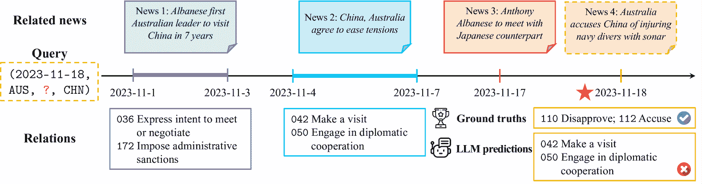

图 1：2023 年 11 月 18 日预测澳大利亚与中国之间关系的示例。数据库包含与查询相关的历史关系和新闻文章，而代理未能预测关系的变化，并做出了错误的预测。

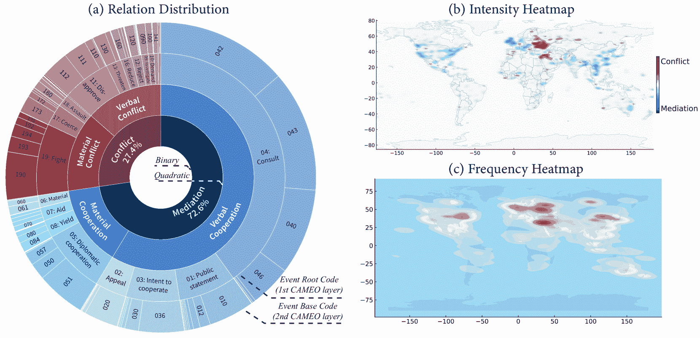

图 2：Mirai 综合涵盖了全球事件数据。 (a) 圆形图表展示了 Mirai 中的关系层级和分布情况。 (b) 热力图展示了这些事件在全球范围内的强度，区分了冲突区域（红色）和调解区域（蓝色）。 (c) 热力图展示了这些事件的频率，突出了发生最多的地区。

我们介绍了 Mirai，这是一个用于评估 LLM 代理在国际事件领域进行时间预测的基准，涉及工具使用和复杂推理。我们认为预测是收集关键历史数据并进行时间推理，以预测未来事件结果的过程。

形式上，我们将一个事件表示为${e}^{t}=(t,s,r,o)$，其中$t$是时间戳³³3每个时间戳唯一表示一天，格式为“YYYY-MM-DD”。，$s,o\in{\mathcal{C}}$分别是国家池${\mathcal{C}}$中的主体国和客体国⁴⁴4本文中，"国家"一词包括所有国家、依赖领土、特殊地理区域及其子区域。我们使用标准化的ISO-3166 Alpha-3代码表示国家名称，例如澳大利亚为“AUS”，中国为“CHN”，以保持全球一致性。$r\in{\mathcal{R}}$表示由冲突与调解事件观察（CAMEO）本体定义的关系类型[[32](https://arxiv.org/html/2407.01231v1#bib.bib32)]⁵⁵5CAMEO是一个成熟的本体，用于对国际政治事件进行分类，由专家精心开发，旨在实现多层次的详细分析。 如图[2](https://arxiv.org/html/2407.01231v1#S2.F2 "图 2 ‣ 2.1 数据与任务 ‣ 2 Mirai基准 ‣ Mirai: 评估用于事件预测的LLM代理")a所示，我们结合了CAMEO本体的两个层级，以促进对地缘政治动态的详细和全面分析。第一级包括20个广泛的类别，通过两位数代码表示（例如，“01：公开声明”或“04：磋商”），这些类别又细分为通过三位数代码表示的第二级类别，该代码对应于其父类别。例如，“03：表达合作意图”是一个一级类别，包括10种不同的二级关系，如“036：表达会面或谈判意图”。随后，四元组“(2023-11-03, AUS, 036, CHN)”表示在2023年11月3日，澳大利亚领导人宣布计划访问中国。这些关系也沿着两个维度进行组织，分别是从言辞到物质，从冲突到合作，以在图[2](https://arxiv.org/html/2407.01231v1#S2.F2 "图 2 ‣ 2.1 数据与任务 ‣ 2 Mirai基准 ‣ Mirai: 评估用于事件预测的LLM代理")a的内圆中形成四维分类。

此外，发生在相同时间戳${t}$的事件集合构成一个*时间戳事件集*${\bm{E}}^{t}=\{{e}_{1}^{t},...,{e}_{M}^{t}\}$，其中$M$是时间$t$上独特事件的数量。因此，这些事件$\{{\bm{E}}^{t}\}_{t=1}^{T}$可以被组织成一个时间图，国家作为节点，事件之间的关系作为边。

事件预测任务$(t+l,s,?,o)$是指预测在当前时间$t$起未来$l$天内，发生在一对国家$s$和$o$之间的所有事件。形式上，给定直到当前时间${\bm{E}}^{\leq t}$的历史事件，我们的目标是预测未来国家之间的关系${\bm{E}}_{s,o}^{t+l}$。这包括利用涉及第三方的事件，如与它们共同邻国的互动。

在图[1](https://arxiv.org/html/2407.01231v1#S2.F1 "Figure 1 ‣ 2.1 Data and Tasks ‣ 2 The Mirai Benchmark ‣ Mirai: Evaluating LLM Agents for Event Forecasting")的示例中，我们展示了如何基于2023年11月17日之前的所有可用信息，预测澳大利亚在2023年11月18日将对中国采取什么行动。这也可以格式化为一个结构化查询“(2023-11-17 + [1 day], AUS, ?, CHN)”，其中预测事件的时间距离为一天。从历史事件中，我们可以看到两国长期以来存在紧张关系；尽管新闻报道显示澳大利亚领导人访问了中国并同意缓解紧张局势，但这一信号并未改变总体趋势，两国在某些焦点上的关系仍然是反对和指责。因此，代理过度依赖短期新闻，最终给出了错误的外交合作预测。

### 2.2 代理与环境

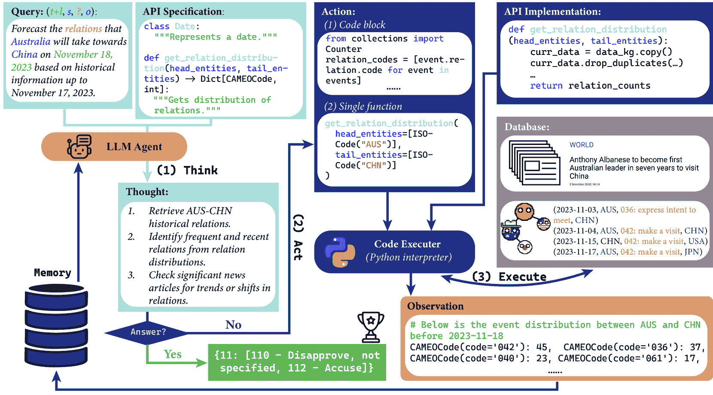

图3：LLM代理与多源环境的交互概览，采用ReAct策略进行事件查询的预测。该框架包含三个主要步骤：（1）思考：代理分析当前状况，并根据查询和提供的API规范规划下一步行动。（2）行动：代理生成“单一功能”调用或“代码块”以从数据库中检索和分析相关数据。（3）执行：Python解释器运行生成的代码，并结合API实现和数据库产生观察结果。这些步骤会不断迭代，直到代理得出最终的未来关系预测。

类似于人类的政治分析师，LLM代理必须利用多种信息来源来做出可靠的预测。为此，我们通过集成编码API来抽象环境，促进与各种知识源的互动。在此环境中，我们可以开发一个LLM代理，利用这些API，通过ReAct策略[[33](https://arxiv.org/html/2407.01231v1#bib.bib33)]，该策略的特点是通过“思考、行动、观察”的迭代步骤来进行分析。这个结构化的方法使得代理能够分析当前情况、检索额外数据，并观察结果，从而做出可靠的预测。

APIs。我们为LLM代理提供了一套全面的API，使得生成的代码能够执行并访问丰富的历史事件和新闻文章数据库。该API包含了基本的数据类和一系列函数，旨在处理数据库中各种类型的信息。数据类涵盖了从日期、国家和关系等一元类型，到日期范围、事件和新闻文章等复合类型。函数通过标准的Python语法执行，允许代理通过代码接口高效地查询数据库。这些函数的设计具有两个特点：

+   •

    信息类型。这些函数涵盖了各种类型的信息，包括国家和关系代码名称映射及层级结构，以及事件和新闻文章的计数、列出和分布。例如，函数map_relation_description_to_cameo接收一个关系描述，并返回五个最可能的关系及其各自的CAMEO代码、名称和描述，按需提供精确的关系信息。

+   •

    搜索条件。此外，与事件和新闻文章相关的API函数包括各种可选参数，使得根据不同标准进行定制化搜索成为可能。例如，函数get_event允许通过指定日期范围、头实体、尾实体、关系和文本描述等条件来搜索符合这些条件的事件，从数据库中提取相关信息。

API规格和完整实现展示在附录[M](https://arxiv.org/html/2407.01231v1#A13 "附录 M API的其他信息 ‣ 项目 1 ‣ L.1.4 智能体ReAct过程 ‣ L.1 基于GPT-4o的智能体与ReAct和“代码块”动作 ‣ 附录 L LLM智能体的其他预测示例 ‣ J.2 功能类型分析 ‣ J.1 不同LLM智能体最终状态分析 ‣ 附录 J 其他实验结果与分析 ‣ 致谢 ‣ 5 结论与局限性 ‣ 4.3 LLMs的工具使用 ‣ 4.2 语言智能体评估 ‣ 4.1 时序推理基准 ‣ 4 相关工作 ‣ 3.3 分析智能体行为 ‣ 3.2 使用不同基础LLM评估预测 ‣ 3.1 使用不同智能体方法与工具评估预测 ‣ 3 实验 ‣ Mirai：评估LLM智能体的事件预测")中。

与环境的互动。在Mirai中，智能体提供了API规格，其中包括为所有数据类和函数定义精心编写的Python文档字符串，抽象了底层实现的细节。环境配备了一个Python代码沙箱，智能体可以完全访问API和数据库。智能体采用ReAct策略，以迭代的方式进行思考、行动和观察，收集信息并进行预测。该流程如图[3](https://arxiv.org/html/2407.01231v1#S2.F3 "图 3 ‣ 2.2 智能体与环境 ‣ 2 Mirai基准 ‣ Mirai：评估LLM智能体的事件预测")所示。

1.  1.

    思考。具体而言，代理首先思考当前的情况。如果它对基于当前信息和分析给出最终预测充满信心，它会提供答案并停止迭代。否则，它会进一步分析当前状况并规划后续行动。如图[3](https://arxiv.org/html/2407.01231v1#S2.F3 "Figure 3 ‣ 2.2 Agents and Environments ‣ 2 The Mirai Benchmark ‣ Mirai: Evaluating LLM Agents for Event Forecasting")所示的第一步，代理计划首先直接获取涉及两个国家的最近事件，然后通过查阅相关新闻文章来验证细节。

1.  2.

    行动。接下来，代理通过生成可执行代码与环境进行交互。行动有两种类型：“单一功能”或“代码块”。“单一功能”便于简单的数据获取，而“代码块”支持更灵活且更广泛的行动空间，能够处理复杂的控制流，如循环和条件语句。此外，代理可以使用API中定义的函数，还可以利用一些安全且成熟的Python库，如numpy、networkx和scikit-learn。如图[3](https://arxiv.org/html/2407.01231v1#S2.F3 "Figure 3 ‣ 2.2 Agents and Environments ‣ 2 The Mirai Benchmark ‣ Mirai: Evaluating LLM Agents for Event Forecasting")所示，代理可以编写一个包含导入库和内联循环的“代码块”，或者使用目标国家作为参数值的“单一功能”调用。

1.  3.

    观察。环境接收代理生成的代码，并通过Python解释器内部执行该代码，完全访问API实现和数据库。执行结果随后作为“观察”步骤的内容传递给代理。特别地，如果代理生成的代码成功执行，它可以观察到相应的输出；否则，它只能观察到指定的错误信息及错误类型。在图中，所写的代码被执行，并将结果发送回代理内存，进行下一轮迭代。

这些来自前几次迭代的“思考”、“行动”和“观察”被存储在智能体的记忆库中，并作为下一次迭代中智能体的上下文。此外，在任何之前的行动步骤中生成的代码中定义的变量会被存储，并可供未来的行动使用。示例见附录[L](https://arxiv.org/html/2407.01231v1#A12 "附录 L LLM 智能体的额外预测示例 ‣ J.2 功能类型分析 ‣ J.1 不同 LLM 智能体最终状态分析 ‣ 附录 J 额外的实验结果与分析 ‣ 致谢 ‣ 5 结论与局限 ‣ 4.3 LLM 的工具使用 ‣ 4.2 语言智能体的评估 ‣ 4.1 时间推理基准 ‣ 3 相关工作 ‣ 3.3 分析智能体行为 ‣ 3.2 使用不同基础 LLM 进行预测评估 ‣ 3.1 使用不同智能体方法和工具进行预测评估 ‣ 3 实验 ‣ Mirai：评估 LLM 智能体的事件预测").

### 2.3 数据库构建

预处理。我们构建了一个基于 GDELT 的环境，以支持代理与知识图谱和文本信息的互动。最初，我们筛选了2023年1月1日至2023年11月30日之间发生的事件数据，并将事件日期与各自的新闻发布日期对齐，以避免信息泄露。我们将国家代码标准化为 ISO-3166 标准，并排除了任何缺失或过时的代码条目，同时将事件代码标准化为 CAMEO 本体的第二级，以确保一致且详细的表示。我们排除了包含更多噪音和提取错误的三级事件代码。我们还仅考虑国际事件。对于新闻文章，我们通过统计每个事件的每日提及次数来评估其可信度，设定了至少 50 次提及的阈值，以过滤掉不可靠的来源。然后，新闻内容（包括标题和正文）按照 OBELICS [[34](https://arxiv.org/html/2407.01231v1#bib.bib34)] 协议进行下载和清理，该协议包括根据词数、字符和词汇重复率，以及特殊字符和标记词的存在来去除低质量文本，从而显著减少噪音并提高存储在数据库中的文本信息的可靠性。我们在附录 [F](https://arxiv.org/html/2407.01231v1#A6 "Appendix F Details of Dataset Construction ‣ Acknowledgements ‣ 5 Conclusion and Limitation ‣ 4.3 LLMs for Tool-Use ‣ 4.2 Evaluation of Language Agents ‣ 4.1 Temporal Reasoning Benchmarks ‣ 4 Related Work ‣ 3.3 Analyzing Agent Behaviours ‣ 3.2 Evaluate Forecasting with Different Base LLMs ‣ 3.1 Evaluate Forecasting with Different Agent Methods and Tools ‣ 3 Experiments ‣ Mirai: Evaluating LLM Agents for Event Forecasting") 中列出了数据集构建的详细信息。最终，我们收集了 991,759 条 GDELT 事件记录，涵盖了 59,161 个独特的 $(t,s,r,o)$ 事件和 296,630 篇独特的新闻文章。我们在世界地图上展示了我们整理的事件，分别见图 [2](https://arxiv.org/html/2407.01231v1#S2.F2 "Figure 2 ‣ 2.1 Data and Tasks ‣ 2 The Mirai Benchmark ‣ Mirai: Evaluating LLM Agents for Event Forecasting")b 和 [2](https://arxiv.org/html/2407.01231v1#S2.F2 "Figure 2 ‣ 2.1 Data and Tasks ‣ 2 The Mirai Benchmark ‣ Mirai: Evaluating LLM Agents for Event Forecasting")c，展示了全球范围的覆盖以及各地区冲突和调解的不同强度。

测试查询集构建。我们使用2023年11月的记录构建测试数据，包含152,500条GDELT事件记录和7385个独特事件。为了进一步确保数据质量并最小化GDELT记录中固有的潜在提取错误，我们为每个事件设置了至少100次每日提及和5篇下载的新闻文章的更高阈值。这种更严格的筛选结果得到2,136个独特的$(t,s,r,o)$事件。我们基于这个集合构建测试查询集，生成705个$(t,s,?,o)$查询和答案，其中每个答案包括该集合中在时间$t$时指定的主体和客体国家之间发生的关系列表。请注意，这种更严格的筛选仅应用于测试查询的构建，并不会从数据库中删除数据。此外，我们从测试查询集中随机抽取100个查询，形成测试查询子集，确保在整个一个月内日期的平衡表示、跨大陆的国家和涉及一级CAMEO代码类型的关系。

评估指标。我们指示代理生成最终的预测答案，格式为JSON字典，其中键是预测的两位数一级CAMEO代码，值是继承自键的三位数二级CAMEO代码列表。例如，JSON字典“{"01": ["011", "012"], "02": ["023"]}”表示"01: 公开声明"和"02: 上诉"的一级关系预测，以及二级关系预测"011: 拒绝评论"、"012: 做出悲观评论"和"023: 请求物质援助"。我们通过计算预测列表与真实列表之间的精度、召回率和F1分数来评估这些关系预测。此外，我们将预测的关系和真实关系映射到各自的二元和四元类别（如图[2](https://arxiv.org/html/2407.01231v1#S2.F2 "Figure 2 ‣ 2.1 Data and Tasks ‣ 2 The Mirai Benchmark ‣ Mirai: Evaluating LLM Agents for Event Forecasting")a)所示）。由于真实列表中的每个关系可能属于不同的类别，我们采用经验的Kullback-Leibler (KL)散度来衡量预测与真实值之间的差异：$D_{\text{KL}}(P||Q)=\sum_{i}P(i)\log\left(\frac{P(i)}{Q(i)}\right)$，其中$P$和$Q$分别表示真实关系和预测关系的频率。较低的KL散度表示模型的预测与真实关系列表之间的对齐更好。

## 3 实验

我们的实验部分从比较不同代理方法在不同预测视野下的预测性能开始（参见[3.1](https://arxiv.org/html/2407.01231v1#S3.SS1 "3.1 使用不同代理方法和工具评估预测 ‣ 3 实验 ‣ Mirai: 评估LLM代理的事件预测")）。此外，我们还评估了使用不同基础语言模型的代理（参见[3.2](https://arxiv.org/html/2407.01231v1#S3.SS2 "3.2 使用不同基础LLM评估预测 ‣ 3.1 使用不同代理方法和工具评估预测 ‣ 3 实验 ‣ Mirai: 评估LLM代理的事件预测")），最后分析了几个关键方面（参见[3.3](https://arxiv.org/html/2407.01231v1#S3.SS3 "3.3 代理行为分析 ‣ 3.2 使用不同基础LLM评估预测 ‣ 3.1 使用不同代理方法和工具评估预测 ‣ 3 实验 ‣ Mirai: 评估LLM代理的事件预测")）以理解代理的行为。

### 3.1 使用不同代理方法和工具评估预测

我们研究了不同工具（API）和代理工具使用策略的影响。我们使用gpt-3.5-turbo-0125 [[35](https://arxiv.org/html/2407.01231v1#bib.bib35)] 作为基础模型，并在705个测试集查询上进行评估。所有实验中，我们将模型温度设置为$0.4$并运行5次，以计算均值和标准差。详细的提示信息见附录[K](https://arxiv.org/html/2407.01231v1#A11 "附录 K 提示 ‣ J.2 功能类型分析 ‣ J.1 不同LLM代理最终状态分析 ‣ 附录 J 其他实验结果与分析 ‣ 致谢 ‣ 5 结论与局限性 ‣ 4.3 工具使用中的LLM ‣ 4.2 语言代理的评估 ‣ 4.1 时间推理基准 ‣ 3 相关工作 ‣ 3.3 代理行为分析 ‣ 3.2 使用不同基础LLM评估预测 ‣ 3.1 使用不同代理方法和工具评估预测 ‣ 3 实验 ‣ Mirai: 评估LLM代理的事件预测")。

表1：使用不同代理工具和工具使用策略的测试集实验结果。最佳表现的得分以**粗体**标出，第二最佳得分以下划线标出。

{tblr}

colspec = ccccccccccc, row1-2 = bg=gray!25, row4,7-8 = bg=gray!10 \SetCell[r=2]c代理 \SetCell[c=2]c工具使用 \SetCell[r=2]c二进制

KL ($\Downarrow$) \SetCell[r=2]c四分之一

KL ($\Downarrow$) \SetCell[c=3]c一级关系（%） \SetCell[c=3]c二级关系（%）

动作类型 API 精度（$\Uparrow$） 召回率（$\Uparrow$） F1（$\Uparrow$） 精度（$\Uparrow$） 召回率（$\Uparrow$） F1（$\Uparrow$）

直接IO — — 6.5[±1.7] 15.9[±1.5]27.6[±8.1] 19.7[±5.9] 18.8[±6.9] 6.6[±1.5] 5.1[±0.4] 3.5[±0.8]

ZS-COT — — 6.9[±0.8] 10.1[±0.8]27.6[±4.0] 36.0[±4.5] 26.7[±4.1] 10.2[±1.4] 17.4[±1.1] 10.5[±0.7]

\SetCell

[r=2]cReAct 单功能 *仅事件* 33.5[±0.7] 6.7[±0.7]44.3[±3.9] 54.2[±3.9] 41.4[±1.7] 25.3[±2.6] 47.4[±2.4] 26.9[±1.9]

单一功能 *仅新闻* 6.1[±1.0] 12.8[±0.6]27.8[±3.1] 25.9[±2.9] 21.8[±2.3] 6.3[±2.2] 9.0[±2.0] 5.4[±1.3]

\SetCell

[r=2]cReAct 单一功能 所有 3.1[±0.5] 5.9[±1.0]47.6[±5.8] 58.3[±2.6] 44.2[±4.0] 28.7[±3.9] 51.0[±4.0] 29.6[±3.7]

代码块 所有 5.1[±0.9] 8.9[±0.5]27.1[±4.0] 38.6[±2.5] 25.9[±2.2] 11.6[±2.4] 26.3[±2.0] 12.6[±1.7]

对于代理实现，我们考虑以下两种没有工具使用的方法：

直接IO代表标准的LLM聊天机器人方法，它提供没有工具使用或显式推理的答案。这作为一个基准，反映了LLM在预测时的内部世界知识。

零-shot思维链（ZS-CoT）[[36](https://arxiv.org/html/2407.01231v1#bib.bib36), [37](https://arxiv.org/html/2407.01231v1#bib.bib37)]：在ZS-CoT变体中，我们向LLM添加了一条指令提示，鼓励它在做出最终预测之前进行显式的逐步思考。

对于工具使用的代理，我们遵循ReAct[[31](https://arxiv.org/html/2407.01231v1#bib.bib31)]，通过思考、行动和观察的迭代过程与我们提供的环境进行交互。我们为工具使用实现了ReAct的两种变体：1）“单一功能”和2）“代码块”。详细信息请参见第[2.2](https://arxiv.org/html/2407.01231v1#S2.SS2 "2.2 Agents and Environments ‣ 2 The Mirai Benchmark ‣ Mirai: Evaluating LLM Agents for Event Forecasting")节。

ReAct代理可以使用工具。因此，我们通过限制它们的访问来实现不同的变体，以使用1）*仅新闻*API；2）*仅事件*API；3）*所有*数据类别和函数。

表[3.1](https://arxiv.org/html/2407.01231v1#S3.SS1 "3.1 Evaluate Forecasting with Different Agent Methods and Tools ‣ 3 Experiments ‣ Mirai: Evaluating LLM Agents for Event Forecasting")中的实验结果揭示了代理性能的几个关键见解：

1）Mirai为LLM代理提出了一个具有挑战性的任务。对于二级关系预测，最佳代理（使用所有API的ReAct “单一功能”）的精度为$28.7$，F1得分为$29.6$。这些结果强调了Mirai中时序预测任务的复杂性和困难性，并突显了LLM代理在事件预测方面的巨大改进空间。

2）预测细粒度关系更具挑战性。所有模型对于二次类比一类的KL散度较高，而对于二级预测相比一级预测，F1得分较低。这些发现表明，预测细粒度的关系类型更具挑战性。

3) 多样化工具的使用对时间预测至关重要。ZS-CoT 和 Direct-IO，这些仅依赖于LLM的内部世界知识进行预测而不使用工具，表现明显不如能够完全访问数据库API的ReAct代理。这强调了基于检索到的历史数据和知识进行预测和推理的重要性。在工具类型方面，使用*仅新闻*API的ReAct代理表现远不如使用*仅事件*API的代理。尽管新闻文章为事件提供了详细的背景信息，但它们也可能引入噪音，导致如上下文过长等问题，给LLM代理带来额外挑战。此外，使用两种类型信息的代理达到了最佳结果。

### 3.2 使用不同基本LLM评估预测

表 2：使用不同基本LLM和行动类型在测试子集上的实验结果。最佳表现的得分以粗体突出显示，第二好的得分带下划线。

{tblr}

colspec = ccccccccccc, row1-2 = bg=gray!25, row5-6,9-10 = bg=gray!10 \SetCell[r=2]c模型 \SetCell[r=2]c训练数据

截止日期 \SetCell[r=2]c行动类型 \SetCell[r=2]c二进制

KL ($\Downarrow$) \SetCell[r=2]cQuad

KL ($\Downarrow$) \SetCell[c=3]c第一层关系 (%) \SetCell[c=3]c第二层关系 (%)

Pre. ($\Uparrow$) Rec. ($\Uparrow$) F1 ($\Uparrow$) Pre. ($\Uparrow$) Rec. ($\Uparrow$) F1 ($\Uparrow$)

\SetCell[r=2]cMistral-7B \SetCell[r=2]c— 单一功能 9.6[±2.4] 14.1[±1.9] 27.2[±8.2] 13.1[±3.6] 14.4[±3.2] 14.1[±4.4] 7.0[±2.2] 6.6[±2.3]

代码块 9.0[±3.0] 13.1[±2.3] 25.8[±6.9] 10.4[±4.8] 11.1[±3.8] 10.0[±3.8] 5.8[±4.1] 4.6[±1.1]

\SetCell[r=2]cgpt-3.5-turbo \SetCell[r=2]c2021-09 单一功能 3.9[±1.0] 6.7[±1.7] 52.6[±9.3] 46.8[±8.5] 38.2[±4.9] 36.7[±9.2] 41.7[±7.6] 27.9[±3.6]

代码块 3.6[±0.7] 8.0[±1.7] 32.8[±4.7] 41.0[±2.0] 29.7[±2.9] 14.4[±5.0] 33.7[±5.3] 14.4[±2.6]

\SetCell[r=2]cgpt-4-turbo \SetCell[r=2]c2023-12 单一功能 2.4[±0.6] 6.1[±0.8] 55.0[±7.5] 43.9[±7.8] 39.8[±4.9] 33.5[±7.5] 43.5[±5.4] 30.0[±1.9]

代码块 2.0[±1.1] 6.0[±2.0] 46.4[±8.7] 51.7[±10.0] 40.0[±8.7] 32.7[±4.9] 43.2[±9.5] 28.7[±5.0]

\SetCell[r=2]cgpt-4o \SetCell[r=2]c2023-10 单一功能 1.8[±1.0] 4.4[±1.8] 48.7[±8.7] 63.7[±8.8] 45.5[±4.6] 31.2[±6.7] 59.2[±7.3] 32.6[±2.7]

代码块 1.6[±1.1] 4.3[±1.9] 42.3[±9.4] 64.5[±9.5] 44.1[±8.1] 29.1[±7.3] 59.6[±7.6] 32.8[±6.4]

我们接着调查了底层LLMs在代理性能中的作用。我们评估了开源LLM Mistral-7B-Instruct-v0.2 [[38](https://arxiv.org/html/2407.01231v1#bib.bib38)]（运行在一台NVIDIA RTX A6000 GPU上），以及包括gpt-3.5-turbo-0125 [[35](https://arxiv.org/html/2407.01231v1#bib.bib35)]、gpt-4-turbo-2024-04-09 [[22](https://arxiv.org/html/2407.01231v1#bib.bib22)]和最近发布的gpt-4o-2024-05-13 [[39](https://arxiv.org/html/2407.01231v1#bib.bib39)]等闭源LLMs。比较是在一个数据平衡的测试子集上进行的，该子集包含100个查询，所有模型均在ReAct框架下评估，允许访问所有API。操作类型可以是“单一功能”或“代码块”，最大工具调用限制为20步。所有模型使用相同的提示内容和结构，如附录 [K](https://arxiv.org/html/2407.01231v1#A11 "Appendix K Prompts ‣ J.2 Analysis on Function Types ‣ J.1 Analysis of the Final Status of Different LLM Agents ‣ Appendix J Additional Experimental Results and Analysis ‣ Acknowledgements ‣ 5 Conclusion and Limitation ‣ 4.3 LLMs for Tool-Use ‣ 4.2 Evaluation of Language Agents ‣ 4.1 Temporal Reasoning Benchmarks ‣ 4 Related Work ‣ 3.3 Analyzing Agent Behaviours ‣ 3.2 Evaluate Forecasting with Different Base LLMs ‣ 3.1 Evaluate Forecasting with Different Agent Methods and Tools ‣ 3 Experiments ‣ Mirai: Evaluating LLM Agents for Event Forecasting")所示。实验结果见表 [3.2](https://arxiv.org/html/2407.01231v1#S3.SS2 "3.2 Evaluate Forecasting with Different Base LLMs ‣ 3.1 Evaluate Forecasting with Different Agent Methods and Tools ‣ 3 Experiments ‣ Mirai: Evaluating LLM Agents for Event Forecasting")，对代理最终状态的进一步分析请参见附录 [J.1](https://arxiv.org/html/2407.01231v1#A10.SS1 "J.1 Analysis of the Final Status of Different LLM Agents ‣ Appendix J Additional Experimental Results and Analysis ‣ Acknowledgements ‣ 5 Conclusion and Limitation ‣ 4.3 LLMs for Tool-Use ‣ 4.2 Evaluation of Language Agents ‣ 4.1 Temporal Reasoning Benchmarks ‣ 4 Related Work ‣ 3.3 Analyzing Agent Behaviours ‣ 3.2 Evaluate Forecasting with Different Base LLMs ‣ 3.1 Evaluate Forecasting with Different Agent Methods and Tools ‣ 3 Experiments ‣ Mirai: Evaluating LLM Agents for Event Forecasting")。我们观察到以下发现：

1) 代码块对更强大的LLMs有益，但对较弱的模型则有负面影响：“代码块”操作类型提供的灵活性大于“单一功能”。然而，其带来的好处并非在所有模型中均能一致地实现。Mistral-7B和gpt-3.5-turbo在使用代码块时表现下降，而像gpt-4-turbo和gpt-4o等更强大的模型则从中受益。这表明，生成连贯且实用的长代码块的能力是区分LLMs是否可靠预测代理的一个关键因素。

2) GPT-4o 始终优于其他模型：gpt-4o 是最新的 LLM，在不同指标上始终表现最高。值得注意的是，对于二级关系预测，gpt-4o 在使用“单一功能”和“代码块”时分别达到了 $32.6$ 和 $32.8$ 的 F1 分数，超越了包括 gpt-4-turbo-2024-04-09 在内的所有其他模型。这表明，Mirai 足够具有挑战性，能够有效区分不同 LLM 的高级推理能力。

自一致性能否让小模型更强大？显然，更强的 LLM 具有更好的代理表现；然而，我们是否可以通过推理时计算增强一个较弱的 LLM，从而实现相当的预测性能？为此，我们以 Mistral-7B 作为基础 LLM，结合 ReAct 使用“单一功能”策略。对于每个查询，我们在温度 $0.4$ 下执行多次采样。然后，我们考虑自一致性的一个变体，仅保留出现超过两次的条目。我们还计算了 F1（Max@K），该指标评估每个实例的 F1 分数，并保留所有轮次中的最高分。如图 [4](https://arxiv.org/html/2407.01231v1#S3.F4 "Figure 4 ‣ 3.2 Evaluate Forecasting with Different Base LLMs ‣ 3.1 Evaluate Forecasting with Different Agent Methods and Tools ‣ 3 Experiments ‣ Mirai: Evaluating LLM Agents for Event Forecasting")a 所示，随着样本量的增加，Mistral-7B 的表现显著提高。最初，单一样本对 Mistral-7B 的 F1 分数为 $6.6$，远低于更大模型的得分。然而，随着更多解决方案的采样，Mistral-7B 的 F1（Max@K）和自一致性逐渐提高。到第 10 个样本时，Max@K 达到 $33.9$，甚至超过了 gpt-4o。这个结果突显了推理时搜索方法如自一致性在推动较小语言模型在事件预测中的潜力。

代码执行错误分析。我们实现的代理通过代码与工具交互，但常常会遇到执行错误。我们在图 [5](https://arxiv.org/html/2407.01231v1#S3.F5 "Figure 5 ‣ 3.2 Evaluate Forecasting with Different Base LLMs ‣ 3.1 Evaluate Forecasting with Different Agent Methods and Tools ‣ 3 Experiments ‣ Mirai: Evaluating LLM Agents for Event Forecasting")b 中总结了不同 LLM 的错误类型。我们可以看到，无效的日期和无效的属性是最常见的两种错误，甚至 gpt-4-turbo 也有此类错误的频率。值得注意的是，gpt-4o 的执行错误显著较少。这种增强的代码生成能力有助于其在事件预测中的优越表现。

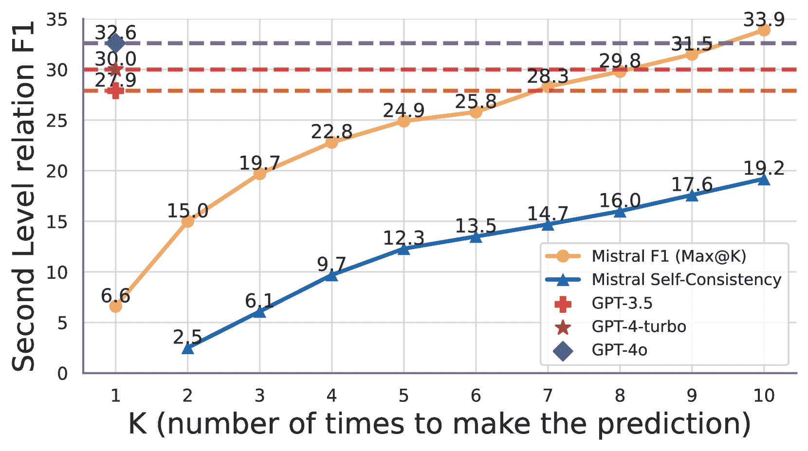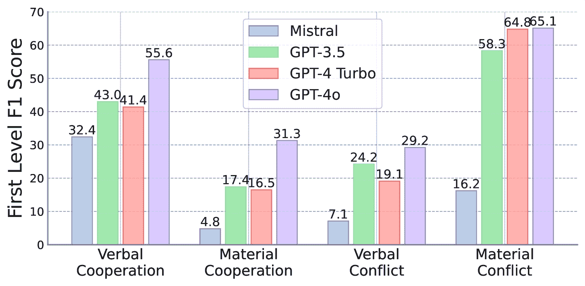

图 4: a) Mistral-7B 模型的自一致性随着样本量的增加而提高。b) 不同基础 LLM 代理在关系预测上的 F1 分数，根据二次类别进行分类。

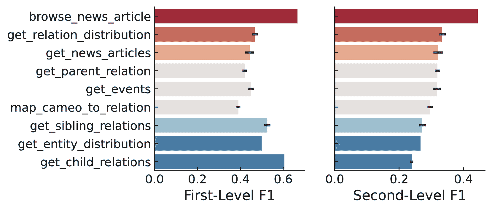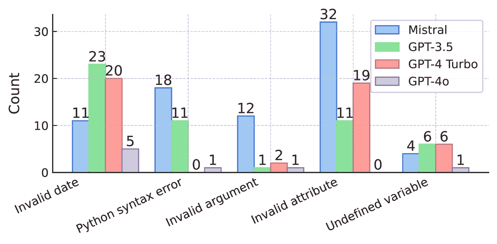

图 5：a) 每个 API 函数的 F1 准确率。b) 不同 LLM 的代码执行错误分析。

### 3.3 分析代理行为

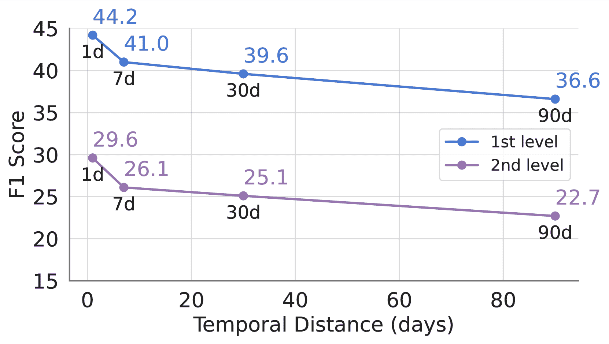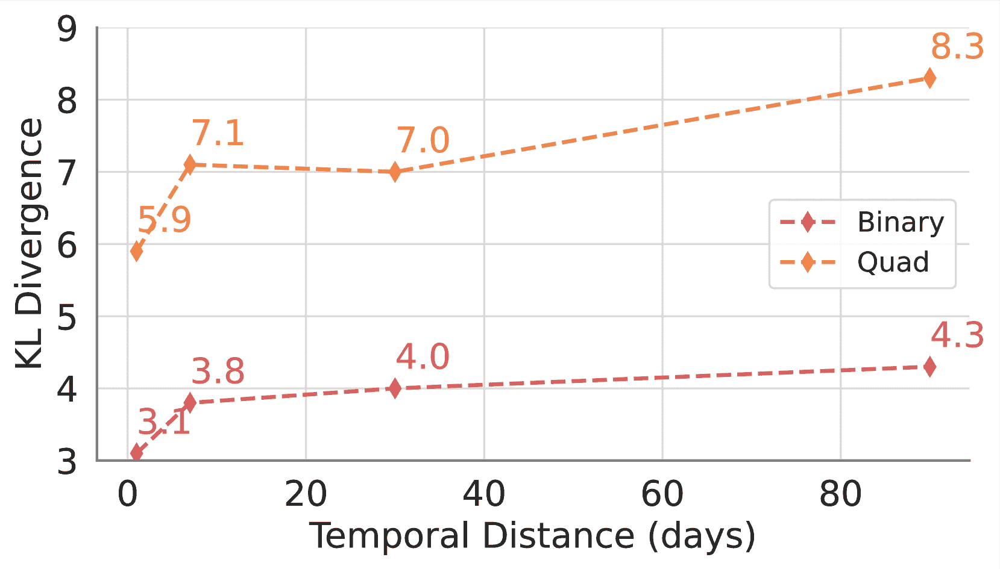

图 6：不同时间距离下 LLM 代理的评估。

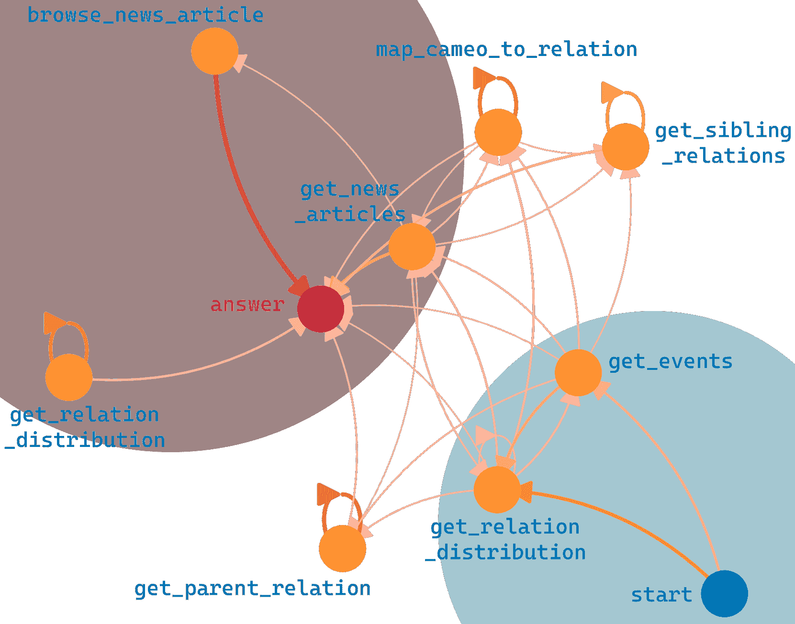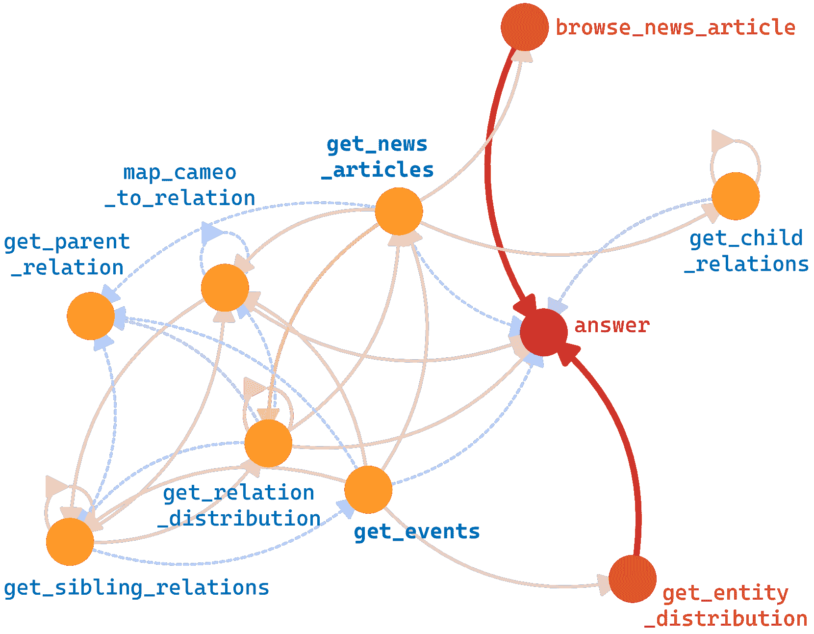

图 7：LLM 代理的动作顺序分析。a) 调用 API 函数的工具使用过渡图。边的粗细表示过渡频率。b) Freq.(correct) - Freq.(incorrect)，其中红色（蓝色）边表示正面（负面）贡献。

预测目标的时间距离影响。我们定义的事件预测任务会根据时间距离 $l$ 变化，该值指定了我们希望预测的未来时间距离。因此，我们进行了一个消融研究，$l$ 设置为 1、7、30 和 90 天。具体来说，我们固定查询事件日期，并将可访问的数据限制为查询事件日期前 $l$ 天的数据。图 [6](https://arxiv.org/html/2407.01231v1#S3.F6 "Figure 6 ‣ 3.3 Analyzing Agent Behaviours ‣ 3.2 Evaluate Forecasting with Different Base LLMs ‣ 3.1 Evaluate Forecasting with Different Agent Methods and Tools ‣ 3 Experiments ‣ Mirai: Evaluating LLM Agents for Event Forecasting") 所示的实验结果揭示了一个明显的趋势：随着时间距离的增加，F1 分数下降，KL 散度增加。这表明，代理提供准确预测的能力随着预测事件时间的远离而减弱。当时间距离较短时，例如 1 或 7 天，代理能够访问到更多的近期相关信息，提供强信号（例如，人类专家的分析），从而做出准确的预测。因此，为了全面评估 LLM 代理的预测能力，我们应关注长时间预测，例如 30 或 90 天的跨度。这些较长的时间段要求代理捕捉并预测潜在的趋势变化，这些变化可能受到更广泛因素和更复杂依赖关系的影响。

对不同关系类型的预测准确性。我们进一步将数据集拆分为不同的二次关系类别，并计算每个类别的F1得分，如图[4](https://arxiv.org/html/2407.01231v1#S3.F4 "Figure 4 ‣ 3.2 Evaluate Forecasting with Different Base LLMs ‣ 3.1 Evaluate Forecasting with Different Agent Methods and Tools ‣ 3 Experiments ‣ Mirai: Evaluating LLM Agents for Event Forecasting")b所示。结果表明，所有模型在“言语合作”和“物质冲突”类别中的表现明显更高，而在其他两个类别中的表现较低。多个因素解释了这些观察结果。首先，“言语合作”事件在数据集中更为普遍，使得模型能够检索到更多此类历史事件。其次，“物质冲突”在同一组国家内具有一致的持续时间模式。相反，归类为“物质合作”和“言语冲突”的事件，例如“057：签署正式协议”和“084：返回或释放”，往往更为突发且不可预测，需要细致的趋势分析和上下文知识，从而导致这些类别中的表现较低。这些观察结果突显了需要具备理解不同事件类型的细微差别和复杂性的LLM。

工具使用顺序如何影响预测。我们进一步研究了行动顺序对“单一功能”模式下的GPT-4o代理的影响。图[7](https://arxiv.org/html/2407.01231v1#S3.F7 "Figure 7 ‣ 3.3 Analyzing Agent Behaviours ‣ 3.2 Evaluate Forecasting with Different Base LLMs ‣ 3.1 Evaluate Forecasting with Different Agent Methods and Tools ‣ 3 Experiments ‣ Mirai: Evaluating LLM Agents for Event Forecasting")展示了从初始查询到正确最终答案的转移图，边缘越粗表示转移越频繁。通常，代理首先使用get_relation_distribution或get_event来收集最近和频繁发生的事件，以获取关键信息，最终常常通过browse_news_article和get_news_articles来检索新闻内容，以做出准确的预测。为了进一步了解每个功能是否有助于预测，我们通过减去错误预测的频率与正确预测的频率之差，如图[7](https://arxiv.org/html/2407.01231v1#S3.F7 "Figure 7 ‣ 3.3 Analyzing Agent Behaviours ‣ 3.2 Evaluate Forecasting with Different Base LLMs ‣ 3.1 Evaluate Forecasting with Different Agent Methods and Tools ‣ 3 Experiments ‣ Mirai: Evaluating LLM Agents for Event Forecasting")b所示。在这里，红色边缘表示通常会导致准确结果的序列，而蓝色边缘则表示易出错的路径。像browse_news_article和get_entity_distribution这样的操作通常会更频繁地导致正确答案。值得注意的是，get_news_articles与答案之间有一条直接的蓝色链接，这表明该功能更容易导致错误答案，因为它只返回新闻标题，这对于准确预测来说过于模糊。然而，当它后接browse_news_article并提供答案时，代理更有可能产生正确的结果。在get_event的情况下，类似的模式也可以观察到，当添加get_entity_distribution时，负向链接转变为指向答案的正向链接。图[5](https://arxiv.org/html/2407.01231v1#S3.F5 "Figure 5 ‣ 3.2 Evaluate Forecasting with Different Base LLMs ‣ 3.1 Evaluate Forecasting with Different Agent Methods and Tools ‣ 3 Experiments ‣ Mirai: Evaluating LLM Agents for Event Forecasting")a进一步展示了每个功能如何贡献最终表现，表明对于第一层次的预测，get_{child/sibling}_relation更为有用。这些结果强调了LLM代理在有效的时间预测中，战略性行动规划的重要性。

## 4 相关工作

表3：Mirai与其他时间推理基准的比较。“方法”指的是在基准上评估的原始和最新模型的方法论。ICL表示使用上下文学习的LLM，FT表示任务特定的微调。

{tblr}

colspec = ccccccccc, row1-2 = bg=gray!25, roweven[3-13] = bg=gray!5 \SetCell[r=2]c基准 \SetCell[c=2]c时间推理 \SetCell[r=2]c任务格式 \SetCell[c=3]c信息 \SetCell[r=2]c方法

理解预测时间序列 KG 文本 API

TempQuestions [[40](https://arxiv.org/html/2407.01231v1#bib.bib40)] ✓ KGQA ✓ KGQA 系统

CRONQuestions [[41](https://arxiv.org/html/2407.01231v1#bib.bib41)] ✓ KGQA ✓ 基于Bert的FT

TempoQR [[42](https://arxiv.org/html/2407.01231v1#bib.bib42)] ✓ KGQA ✓ 基于Bert的FT

TORQUE [[43](https://arxiv.org/html/2407.01231v1#bib.bib43)] ✓ 问答(QA) ✓ 基于Bert的FT

TempReason [[44](https://arxiv.org/html/2407.01231v1#bib.bib44)] ✓ 问答(QA) ✓ ✓ ICL + 任务特定FT

TRAM [[45](https://arxiv.org/html/2407.01231v1#bib.bib45)] ✓ 多项选择题(MCQ) ✓ ICL + 基于Bert的FT

TCELongBench [[46](https://arxiv.org/html/2407.01231v1#bib.bib46)] ✓ ✓ 排序问答；多项选择题 ✓ ICL

ForecastQA [[47](https://arxiv.org/html/2407.01231v1#bib.bib47)] ✓ 多项选择题(MCQ) ✓ 基于Bert的FT

Approach [[48](https://arxiv.org/html/2407.01231v1#bib.bib48)] ✓ 问答(QA) ✓ ICL

IntervalQA [[8](https://arxiv.org/html/2407.01231v1#bib.bib8)] ✓ 数值问答；多项选择题 ✓✓ ICL

TKGs [[49](https://arxiv.org/html/2407.01231v1#bib.bib49), [30](https://arxiv.org/html/2407.01231v1#bib.bib30)] ✓ 链接预测 ✓ 图形FT + ICL + 任务特定FT

Mirai ✓ 关系列表 ✓✓ ✓LLM 代理

近年来，已经开发出多种基准测试来评估AI系统在时间推理方面的能力，主要集中在问答和链接预测上。Mirai通过评估LLM在预测任务中的表现，脱颖而出，并进一步采用了关系任务格式，结合了知识图谱、文本和基于代码的API等多种信息来源，并利用支持中间推理步骤的基于代理的方法。我们在表[4](https://arxiv.org/html/2407.01231v1#S4 "4 Related Work ‣ 3.3 Analyzing Agent Behaviours ‣ 3.2 Evaluate Forecasting with Different Base LLMs ‣ 3.1 Evaluate Forecasting with Different Agent Methods and Tools ‣ 3 Experiments ‣ Mirai: Evaluating LLM Agents for Event Forecasting")中总结了我们与现有基准的区别，并在附录[D](https://arxiv.org/html/2407.01231v1#A4 "Appendix D Additional related work ‣ Acknowledgements ‣ 5 Conclusion and Limitation ‣ 4.3 LLMs for Tool-Use ‣ 4.2 Evaluation of Language Agents ‣ 4.1 Temporal Reasoning Benchmarks ‣ 4 Related Work ‣ 3.3 Analyzing Agent Behaviours ‣ 3.2 Evaluate Forecasting with Different Base LLMs ‣ 3.1 Evaluate Forecasting with Different Agent Methods and Tools ‣ 3 Experiments ‣ Mirai: Evaluating LLM Agents for Event Forecasting")中提供了更多的讨论。

### 4.1 时间推理基准

许多评估人工智能模型时间推理能力的基准测试已经被构建，但它们与Mirai在任务、信息和方法等方面存在不同的侧重点和设置，如表[4](https://arxiv.org/html/2407.01231v1#S4 "4 Related Work ‣ 3.3 Analyzing Agent Behaviours ‣ 3.2 Evaluate Forecasting with Different Base LLMs ‣ 3.1 Evaluate Forecasting with Different Agent Methods and Tools ‣ 3 Experiments ‣ Mirai: Evaluating LLM Agents for Event Forecasting")所示。某些基准测试专注于模型的时间理解能力[[40](https://arxiv.org/html/2407.01231v1#bib.bib40), [41](https://arxiv.org/html/2407.01231v1#bib.bib41), [42](https://arxiv.org/html/2407.01231v1#bib.bib42), [43](https://arxiv.org/html/2407.01231v1#bib.bib43), [44](https://arxiv.org/html/2407.01231v1#bib.bib44), [45](https://arxiv.org/html/2407.01231v1#bib.bib45)]，例如理解知识图谱（KGs）或文本中的时间关系，无论是简短的文本还是文档语料库。而时间预测任务与理解任务有很大不同，因为推理目标在模型的数据库中是看不见的，因此，模型不仅要理解，还需要进行推理。对于预测任务，先前的基准测试中有两种主要的任务形式：对于以文本格式表示历史信息的基准测试，使用QA任务格式[[8](https://arxiv.org/html/2407.01231v1#bib.bib8), [46](https://arxiv.org/html/2407.01231v1#bib.bib46), [47](https://arxiv.org/html/2407.01231v1#bib.bib47), [48](https://arxiv.org/html/2407.01231v1#bib.bib48), [50](https://arxiv.org/html/2407.01231v1#bib.bib50)]，以及针对基于时间知识图谱（TKG）的基准测试使用图链接预测任务格式[[49](https://arxiv.org/html/2407.01231v1#bib.bib49), [30](https://arxiv.org/html/2407.01231v1#bib.bib30)]。然而，信息源的统一格式要么缺乏对结构化事实的清晰支持，要么缺乏上下文细节，以便模型进行高级推理，而在Mirai中，我们提供了这两种信息源。此外，我们提供了精心构建的API，具有各种数据类和功能，可访问数据的不同部分。通过代码生成提供的灵活性，模型能够接触到更广泛、更灵活的信息范围。更重要的是，Mirai通过引入专门设计的代理环境来评估LLM代理在预测任务中的表现，区别于以往的工作，后者尚未探索或甚至考虑过使用LLM代理执行时间预测任务的潜力。

### 4.2 语言代理的评估

先前的研究已经调查了LLM代理在多个领域的表现，包括侧重于获得正确解答的算术推理[[51](https://arxiv.org/html/2407.01231v1#bib.bib51), [52](https://arxiv.org/html/2407.01231v1#bib.bib52), [53](https://arxiv.org/html/2407.01231v1#bib.bib53)]，评估工具使用能力和报告结果的熟练程度[[54](https://arxiv.org/html/2407.01231v1#bib.bib54), [55](https://arxiv.org/html/2407.01231v1#bib.bib55), [56](https://arxiv.org/html/2407.01231v1#bib.bib56)]，评估网络导航技能以寻找特定网站[[57](https://arxiv.org/html/2407.01231v1#bib.bib57), [58](https://arxiv.org/html/2407.01231v1#bib.bib58), [59](https://arxiv.org/html/2407.01231v1#bib.bib59)]，以及在给定约束条件下规划旅行行程[[60](https://arxiv.org/html/2407.01231v1#bib.bib60)]。然而，这些评估并未完全解决涉及复杂国际事件的任务所带来的挑战，这些任务包含多种信息格式和时间属性。在此背景下，Mirai提出了一个独特的任务，代理必须在具有时间信息的结构化事件和新闻文章中进行导航和推理。这一设置要求代理有效处理多边关系和跨不同时间段的信息。此外，Mirai还评估了LLM代理推理和预测未必直接存在于提供的数据库中的信息的能力。这增加了额外的复杂性，因为代理必须利用其对现有信息的理解，做出关于未来事件的预测或填补缺失的细节。通过在这一具有挑战性的环境中评估LLM代理，Mirai为它们处理和推理复杂的、时间结构化的信息的能力以及基于不完整数据生成准确预测的能力提供了有价值的见解。

### 4.3 LLMs用于工具使用

大型语言模型（LLMs）已经展示了卓越的语言理解能力[[61](https://arxiv.org/html/2407.01231v1#bib.bib61)]和推理能力[[62](https://arxiv.org/html/2407.01231v1#bib.bib62)]。然而，它们也存在固有的局限性，比如无法基于外部知识提供最新的回答，或无法执行复杂的数学推理。为了应对这些挑战，最近的进展将LLMs与各种外部工具进行了集成[[63](https://arxiv.org/html/2407.01231v1#bib.bib63)]。一些显著的例子包括TALM[[64](https://arxiv.org/html/2407.01231v1#bib.bib64)]和ToolFormer[[65](https://arxiv.org/html/2407.01231v1#bib.bib65)]，它们利用上下文学习增强了模型在任务中使用不同工具的能力，如问答和数学推理。Chameleon[[66](https://arxiv.org/html/2407.01231v1#bib.bib66)]将LLM作为自然语言规划器，用于推断应使用的工具的最佳顺序，然后执行这些工具生成最终输出。AVIS[[67](https://arxiv.org/html/2407.01231v1#bib.bib67)]采用动态树搜索来合成最有效的工具使用顺序。ToolkenGPT[[68](https://arxiv.org/html/2407.01231v1#bib.bib68)]将工具使用操作符作为特殊标记集成，并通过序列到序列训练训练模型。ToolLLM[[69](https://arxiv.org/html/2407.01231v1#bib.bib69)]引入了一个指令调优数据集，涵盖了超过16,000个真实世界的API，大大增强了模型有效利用这些工具的能力。

## 5 结论与局限性

总之，我们介绍了Mirai，这是一个用于评估LLM代理在时间预测国际事件中的基准，结合了使用工具（API）访问广泛的历史事件和新闻数据库。结果揭示了当前LLM代理在生成语法和上下文正确的代码、并对多方和多时间戳的数据执行复杂的时间推理以进行有效预测方面的复杂性和困难，突出了该方向上进一步努力的巨大空间。

我们的工作也有若干局限性：1）仅测试了少数具有代表性的LLM，未进行更广泛的评估，缺乏更多开源模型；2）目前的API功能较为基础，主要提供计数、列举和统计分布的功能。未来的增强可以包括时间序列分析，并允许代理添加新功能以进行更全面的分析；3）由于API使用成本的限制，我们仅进行少量实验回合，导致结果存在较大方差。建议未来的研究进行更广泛的测试，以获得更稳定的结果。有关局限性的完整讨论，请参见附录[C](https://arxiv.org/html/2407.01231v1#A3 "附录C 局限性 ‣ 致谢 ‣ 5 结论与局限性 ‣ 4.3 LLM在工具使用中的应用 ‣ 4.2 语言代理的评估 ‣ 4.1 时间推理基准 ‣ 4 相关工作 ‣ 3.3 分析代理行为 ‣ 3.2 评估不同基础LLM的预测效果 ‣ 3.1 评估不同代理方法和工具的预测效果 ‣ 3 实验 ‣ Mirai：评估LLM代理在事件预测中的表现")。未来，我们计划整合支持更多知识源的API，如时间序列和多模态信息，并考虑测试更多开源LLM和代理架构。

## 致谢

本研究部分由 NIH U24DK097771, U54HG012517, NSF 1829071, 2106859, 2119643, 2200274, 2202693, 2312501，DARPA HR00112490370 和 Optum Lab 支持。

## 参考文献

+   Brown 和 Lee [2018] Thomas Brown 和 Susan Lee. 经济制裁与国际政策中的预测分析。*国际经济学杂志*，26(4)：311-330，2018年。

+   Smith 和 Doe [2020] Johnathan Smith 和 Jane Doe. 国际关系中的地缘政治风险评估。*全球政治杂志*，15(3)：200-225，2020年。

+   Johnson 和 Roberts [2019] Emily Johnson 和 Mark Roberts. 外交在塑造外交政策中的作用。*外交评论*，12(2)：145-170，2019年。

+   Davis 和 Nguyen [2017] Richard Davis 和 Anh Nguyen. 战略联盟与预测外交：历史数据的回顾。*政治科学季刊*，132(1)：45-72，2017年。

+   Mahdisoltani 等 [2015] Farzaneh Mahdisoltani, Joanna Biega 和 Fabian M Suchanek. YAGO3：来自多语言维基百科的知识库。2015年1月。CIDR 2015。

+   Jin 等 [2020a] Woojeong Jin, Meng Qu, Xisen Jin 和 Xiang Ren. 循环事件网络：基于时间知识图的自回归结构推理，2020年10月。EMNLP 2020。

+   Li 等 [2021a] Zixuan Li, Xiaolong Jin, Wei Li, Saiping Guan, Jiafeng Guo, Huawei Shen, Yuanzhuo Wang 和 Xueqi Cheng. 基于演化表示学习的时间知识图推理，2021年4月。SIGIR 2021。

+   Zou 等 [2022] Andy Zou, Tristan Xiao, Ryan Jia, Joe Kwon, Mantas Mazeika, Richard Li, Dawn Song, Jacob Steinhardt, Owain Evans 和 Dan Hendrycks. 使用神经网络预测未来世界事件。arXiv，2022年10月。NeurIPS 2022。

+   Reddy 等人 [2023] Revanth Gangi Reddy, Yi R. Fung, Qi Zeng, Manling Li, Ziqi Wang, Paul Sullivan, 和 Heng Ji. SmartBook: AI辅助的情况报告生成, 2023年3月. arXiv。

+   Galárraga 等人 [2017] Luis Galárraga, Simon Razniewski, Antoine Amarilli, 和 Fabian M. Suchanek. 预测知识库的完整性. 在 Maarten de Rijke, Milad Shokouhi, Andrew Tomkins, 和 Min Zhang 编辑的 *第十届ACM国际网络搜索与数据挖掘会议（WSDM 2017），英国剑桥，2017年2月6日至10日* 会议录，页375–383. ACM, 2017。

+   Huang 等人 [2024] Zijie Huang, Jeehyun Hwang, Junkai Zhang, Jinwoo Baik, Weitong Zhang, Dominik Wodarz, Yizhou Sun, Quanquan Gu, 和 Wei Wang. 因果图ODE：多智能体动态系统中的连续治疗效应建模. 在 Tat-Seng Chua, Chong-Wah Ngo, Ravi Kumar, Hady W. Lauw, 和 Roy Ka-Wei Lee 编辑的 *2024年ACM网络会议论文集（WWW 2024），新加坡，2024年5月13日至17日*，页4607–4617. ACM, 2024。

+   Mclean 等人 [2009] Dr Mclean, Alan Patterson, 和 John Williams. 风险评估、政策制定与知识的局限性：预防原则与国际关系. *国际关系*, 23:548–566, 2009年12月。

+   Sumers 等人 [2024] Theodore R. Sumers, Shunyu Yao, Karthik Narasimhan, 和 Thomas L. Griffiths. 语言代理的认知架构, 2024年3月. arXiv:2309.02427 [cs]。

+   Liu 等人 [2023a] Xiao Liu, Hao Yu, Hanchen Zhang, Yifan Xu, Xuanyu Lei, Hanyu Lai, Yu Gu, Hangliang Ding, Kaiwen Men, Kejuan Yang, Shudan Zhang, Xiang Deng, Aohan Zeng, Zhengxiao Du, Chenhui Zhang, Sheng Shen, Tianjun Zhang, Yu Su, Huan Sun, Minlie Huang, Yuxiao Dong, 和 Jie Tang. AgentBench: 评估LLM作为代理的能力, 2023年10月a. arXiv:2308.03688 [cs]。

+   Weng [2023] Lilian Weng. 基于LLM的自主代理, 2023年6月. 部分: 博文。

+   [16] AutoGPT文档。

+   Wang 等人 [2023] Guanzhi Wang, Yuqi Xie, Yunfan Jiang, Ajay Mandlekar, Chaowei Xiao, Yuke Zhu, Linxi Fan, 和 Anima Anandkumar. Voyager: 基于大型语言模型的开放式体现代理, 2023年10月. arXiv:2305.16291 [cs]。

+   Shen 等人 [2023] Yongliang Shen, Kaitao Song, Xu Tan, Dongsheng Li, Weiming Lu, 和 Yueting Zhuang. HuggingGPT: 与ChatGPT及其Hugging Face朋友一起解决AI任务, 2023年12月. arXiv:2303.17580 [cs]。

+   Lu 等人 [2023a] Pan Lu, Baolin Peng, Hao Cheng, Michel Galley, Kai-Wei Chang, Ying Nian Wu, Song-Chun Zhu, 和 Jianfeng Gao. Chameleon: 大型语言模型的即插即用组合推理, 2023年10月a. arXiv:2304.09842 [cs]。

+   Zhuang 等人 [2023a] Yuchen Zhuang, Yue Yu, Kuan Wang, Haotian Sun, 和 Chao Zhang. ToolQA: 一个用于外部工具的LLM问答数据集, 2023年6月a. arXiv:2306.13304 [cs]。

+   Li et al. [2023a] Minghao Li, Yingxiu Zhao, Bowen Yu, Feifan Song, Hangyu Li, Haiyang Yu, Zhoujun Li, Fei Huang, 和 Yongbin Li. API-Bank：工具增强大型语言模型的综合基准，2023年10月。arXiv:2304.08244 [cs]。

+   Achiam et al. [2023] Josh Achiam, Steven Adler, Sandhini Agarwal, Lama Ahmad, Ilge Akkaya, Florencia Leoni Aleman, Diogo Almeida, Janko Altenschmidt, Sam Altman, Shyamal Anadkat 等人。GPT-4 技术报告。*arXiv 预印本 arXiv:2303.08774*，2023年。

+   Anthropic [2023] Anthropic. Claude：Anthropic 提供的 AI 助手，2023年。

+   DeepMind [2023] Google DeepMind. Gemini：Google DeepMind 提供的 AI 模型，2023年。

+   Touvron et al. [2023] Hugo Touvron, Thibaut Lavril, Gautier Izacard, Xavier Martinet, Marie-Anne Lachaux, Timothée Lacroix, Baptiste Roziere, Naman Goyal, Eric Hambro, Faisal Azhar 等人。Llama：开放高效的基础语言模型，2023年。

+   Yuan et al. [2023] Siyu Yuan, Jiangjie Chen, Ziquan Fu, Xuyang Ge, Soham Shah, Charles Robert Jankowski, Yanghua Xiao, 和 Deqing Yang. 从大型语言模型中提取脚本知识用于约束性语言规划，2023年5月。arXiv:2305.05252 [cs]。

+   Liu et al. [2023b] Bo Liu, Yuqian Jiang, Xiaohan Zhang, Qiang Liu, Shiqi Zhang, Joydeep Biswas, 和 Peter Stone. LLM+P：赋能大型语言模型以实现最佳规划能力，2023年9月。arXiv:2304.11477 [cs]。

+   Valmeekam et al. [2023] Karthik Valmeekam, Matthew Marquez, Alberto Olmo, Sarath Sreedharan, 和 Subbarao Kambhampati. PlanBench：一种可扩展的基准，用于评估大型语言模型在规划和推理变化中的表现，2023年11月。arXiv:2206.10498 [cs]。

+   Ma et al. [2023a] Yunshan Ma, Chenchen Ye, Zijian Wu, Xiang Wang, Yixin Cao, 和 Tat-Seng Chua. 基于图解耦的上下文感知事件预测。在*第29届ACM SIGKDD知识发现与数据挖掘大会论文集*，第1643–1652页，2023年8月。KDD 2023。

+   Leetaru and Schrodt [2013] Kalev Leetaru 和 Philip A Schrodt. GDELT：全球事件、位置和语气数据，2013年。

+   Yao et al. [2023a] Shunyu Yao, Jeffrey Zhao, Dian Yu, Nan Du, Izhak Shafran, Karthik R. Narasimhan, 和 Yuan Cao. React：协同推理与行动的语言模型。发表于*第十一届国际学习表示会议，ICLR 2023，卢旺达基加利，2023年5月1日至5日*。OpenReview.net，2023年。

+   Boschee et al. [2015a] Elizabeth Boschee, Jennifer Lautenschlager, Sean O’Brien, Steve Shellman, James Starz, 和 Michael Ward. Cameo.cdb.09b5.pdf。发表于*ICEWS 编码事件数据*。哈佛数据集，2015年。

+   Yao et al. [2023b] Shunyu Yao, Jeffrey Zhao, Dian Yu, Nan Du, Izhak Shafran, Karthik Narasimhan, 和 Yuan Cao. ReAct：协同推理与行动的语言模型，2023年3月。arXiv:2210.03629 [cs]。

+   Laurençon 等人 [2023] Hugo Laurençon, Lucile Saulnier, Léo Tronchon, Stas Bekman, Amanpreet Singh, Anton Lozhkov, Thomas Wang, Siddharth Karamcheti, Alexander M. Rush, Douwe Kiela, Matthieu Cord, 和 Victor Sanh。OBELICS：一个开放的Web规模筛选数据集，包含交错的图像-文本文档。在Alice Oh, Tristan Naumann, Amir Globerson, Kate Saenko, Moritz Hardt, 和 Sergey Levine 主编的*《神经信息处理系统进展36：2023年神经信息处理系统年会，NeurIPS 2023，新奥尔良，美国，2023年12月10日至16日》*中，2023年。

+   gpt [2023] GPT-3.5-Turbo，[https://platform.openai.com/docs/models/gpt-3-5-turbo](https://platform.openai.com/docs/models/gpt-3-5-turbo)，2023年。

+   Wei 等人 [2023] Jason Wei, Xuezhi Wang, Dale Schuurmans, Maarten Bosma, Brian Ichter, Fei Xia, Ed Chi, Quoc Le, 和 Denny Zhou。链式推理提示在大语言模型中的推理激发，2023年1月。arXiv:2201.11903 [cs]。

+   Kojima 等人 [2022] Takeshi Kojima, Shixiang Shane Gu, Machel Reid, Yutaka Matsuo, 和 Yusuke Iwasawa。大语言模型是零-shot推理器。在Sanmi Koyejo, S. Mohamed, A. Agarwal, Danielle Belgrave, K. Cho, 和 A. Oh 主编的*《神经信息处理系统进展35：2022年神经信息处理系统年会，NeurIPS 2022，新奥尔良，美国，2022年11月28日-12月9日》*中，2022年。

+   Jiang 等人 [2023] Albert Q. Jiang, Alexandre Sablayrolles, Arthur Mensch, Chris Bamford, Devendra Singh Chaplot, Diego de las Casas, Florian Bressand, Gianna Lengyel, Guillaume Lample, Lucile Saulnier, Lélio Renard Lavaud, Marie-Anne Lachaux, Pierre Stock, Teven Le Scao, Thibaut Lavril, Thomas Wang, Timothée Lacroix, 和 William El Sayed。Mistral 7b，2023年。

+   gpt [2024] Gpt-4o 贡献。2024年。

+   Jia 等人 [2018] Zhen Jia, Abdalghani Abujabal, Rishiraj Saha Roy, Jannik Strötgen, 和 Gerhard Weikum。TempQuestions：时间性问题回答的基准。在*2018年网络会议的附录论文集*，WWW ’18，页面1057–1062，瑞士日内瓦，2018年4月。国际网络会议指导委员会。ISBN 978-1-4503-5640-4。WWW 2018。

+   Saxena 等人 [2021] Apoorv Saxena, Soumen Chakrabarti, 和 Partha Talukdar。基于时间性知识图谱的问题回答。在*第59届计算语言学协会年会暨第11届国际自然语言处理联合会议（卷1：长篇论文）*的论文集，页面6663–6676，线上，2021年8月。计算语言学协会。ACL 2021。

+   Mavromatis 等人 [2021] Costas Mavromatis, Prasanna Lakkur Subramanyam, Vassilis N. Ioannidis, Soji Adeshina, Phillip R. Howard, Tetiana Grinberg, Nagib Hakim, 和 George Karypis。TempoQR：知识图谱上的时间性问题推理。arXiv，2021年12月。AAAI 2022。

+   Ning 等人 [2020a] Qiang Ning, Hao Wu, Rujun Han, Nanyun Peng, Matt Gardner 和 Dan Roth。TORQUE：一个时间排序问题的阅读理解数据集。见于 *2020年自然语言处理实证方法会议（EMNLP）*，第1158-1172页，线上，2020年11月。计算语言学协会。EMNLP 2020。

+   Tan 等人 [2023a] Qingyu Tan, Hwee Tou Ng 和 Lidong Bing。迈向基准测试并提升大型语言模型的时间推理能力。见于 *第61届计算语言学协会年会论文集（第一卷：长篇论文）*，第14820-14835页，加拿大多伦多，2023年7月。计算语言学协会。ACL 2023。

+   Wang 和 Zhao [2024] Yuqing Wang 和 Yun Zhao。TRAM：大型语言模型时间推理的基准测试，2024年5月。arXiv:2310.00835 [cs]。

+   Zhang 等人 [2024] Zhihan Zhang, Yixin Cao, Chenchen Ye, Yunshan Ma, Lizi Liao 和 Tat-Seng Chua。用大语言模型分析时间复杂事件？面向时间和长上下文理解的基准测试，2024年6月。arXiv:2406.02472 [cs]。

+   Jin 等人 [2021] Woojeong Jin, Rahul Khanna, Suji Kim, Dong-Ho Lee, Fred Morstatter, Aram Galstyan 和 Xiang Ren。ForecastQA：一个针对事件预测的问答挑战，涉及时间文本数据。见于 *第59届计算语言学协会年会与第11届国际自然语言处理联合会议论文集（第一卷：长篇论文）*，第4636-4650页，线上，2021年8月。计算语言学协会。ACL 2021。

+   Halawi 等人 [2024] Danny Halawi, Fred Zhang, Chen Yueh-Han 和 Jacob Steinhardt。通过语言模型接近人类水平的预测，2024年2月。网址 [http://arxiv.org/abs/2402.18563](http://arxiv.org/abs/2402.18563)。arXiv:2402.18563 [cs]。

+   Boschee 等人 [2015b] Elizabeth Boschee, Jennifer Lautenschlager, Sean O’Brien, Steve Shellman, James Starz 和 Michael Ward。Icews 编码事件数据，2015b。

+   Schoenegger 等人 [2024] Philipp Schoenegger, Indre Tuminauskaite, Peter S. Park 和 Philip E. Tetlock。硅谷人群的智慧：LLM 集成预测能力可与人类群体准确性相媲美，2024年5月。网址 [http://arxiv.org/abs/2402.19379](http://arxiv.org/abs/2402.19379)。arXiv:2402.19379 [cs]。

+   Roy 和 Roth [2015] Subhro Roy 和 Dan Roth。解决一般的算术文字问题。见于 *EMNLP 会议论文集*，2015年。

+   Cobbe 等人 [2021] Karl Cobbe, Vineet Kosaraju, Mohammad Bavarian, Mark Chen, Heewoo Jun, Lukasz Kaiser, Matthias Plappert, Jerry Tworek, Jacob Hilton, Reiichiro Nakano 等人。训练验证器解决数学文字问题。*arXiv 预印本 arXiv:2110.14168*，2021年。

+   Patel 等人 [2021] Arkil Patel, Satwik Bhattamishra 和 Navin Goyal。NLP 模型真的能解决简单的数学文字问题吗？见于 *NAACL 会议论文集*，2021年。

+   Li 等人 [2023b] Minghao Li, Yingxiu Zhao, Bowen Yu, Feifan Song, Hangyu Li, Haiyang Yu, Zhoujun Li, Fei Huang 和 Yongbin Li。Api-bank：一个综合性的工具增强型大语言模型基准。发表于 *EMNLP 会议论文集*，2023b。

+   Xu 等人 [2023a] Qiantong Xu, Fenglu Hong, Bo Li, Changran Hu, Zhengyu Chen 和 Jian Zhang。关于开源大语言模型的工具操作能力。 *arXiv 预印本 arXiv:2305.16504*，2023a。

+   Zhuang 等人 [2023b] Yuchen Zhuang, Yue Yu, Kuan Wang, Haotian Sun 和 Chao Zhang。ToolQA：一个用于大语言模型外部工具问答的数据集。发表于 *NeurIPS 会议论文集*，2023b。

+   Deng 等人 [2023] Xiang Deng, Yu Gu, Boyuan Zheng, Shijie Chen, Samuel Stevens, Boshi Wang, Huan Sun 和 Yu Su。Mind2web：迈向通用型网络代理。发表于 *NeurIPS 会议论文集*，2023年。

+   Zhou 等人 [2024] Shuyan Zhou, Frank F Xu, Hao Zhu, Xuhui Zhou, Robert Lo, Abishek Sridhar, Xianyi Cheng, Yonatan Bisk, Daniel Fried, Uri Alon 等人。Webarena：一个用于构建自主代理的现实网络环境。发表于 *ICLR 会议论文集*，2024年。

+   Liu 等人 [2024] Xiao Liu, Hao Yu, Hanchen Zhang, Yifan Xu, Xuanyu Lei, Hanyu Lai, Yu Gu, Hangliang Ding, Kaiwen Men, Kejuan Yang 等人。Agentbench：评估大语言模型作为代理的能力。发表于 *ICLR 会议论文集*，2024年。

+   Xie 等人 [2024] Jian Xie, Kai Zhang, Jiangjie Chen, Tinghui Zhu, Renze Lou, Yuandong Tian, Yanghua Xiao 和 Yu Su。TravelPlanner：一个用于语言代理的真实世界规划基准，2024年2月。arXiv:2402.01622 [cs]。

+   Radford 等人 [2018] Alec Radford, Karthik Narasimhan, Tim Salimans, Ilya Sutskever 等人。通过生成式预训练提升语言理解能力。2018年。

+   Wei 等人 [2022] Jason Wei, Xuezhi Wang, Dale Schuurmans, Maarten Bosma, Brian Ichter, Fei Xia, Ed H. Chi, Quoc V. Le 和 Denny Zhou。链式思维提示促使大型语言模型进行推理。发表于 *NeurIPS*，2022年。URL [http://papers.nips.cc/paper_files/paper/2022/hash/9d5609613524ecf4f15af0f7b31abca4-Abstract-Conference.html](http://papers.nips.cc/paper_files/paper/2022/hash/9d5609613524ecf4f15af0f7b31abca4-Abstract-Conference.html)。

+   Mialon 等人 [2023] Grégoire Mialon, Roberto Dessì, Maria Lomeli, Christoforos Nalmpantis, Ram Pasunuru, Roberta Raileanu, Baptiste Rozière, Timo Schick, Jane Dwivedi-Yu, Asli Celikyilmaz, Edouard Grave, Yann LeCun, 和 Thomas Scialom。增强型语言模型：一项调查。发表于 *arXiv 预印本 arXiv:2302.07842*，2023年。

+   Parisi 等人 [2022] Aaron Parisi, Yao Zhao 和 Noah Fiedel。Talm：工具增强型语言模型。发表于 *arXiv 预印本 arXiv:2205.12255*，2022年。

+   Schick 等人 [2023] Timo Schick, Jane Dwivedi-Yu, Roberto Dessi, Roberta Raileanu, Maria Lomeli, Eric Hambro, Luke Zettlemoyer, Nicola Cancedda 和 Thomas Scialom。Toolformer：语言模型可以自学使用工具。发表于 *NeurIPS 会议论文集*，2023年。

+   Lu 等人 [2023b] Pan Lu, Baolin Peng, Hao Cheng, Michel Galley, Kai-Wei Chang, Ying Nian Wu, Song-Chun Zhu, 和 Jianfeng Gao. Chameleon: 基于大语言模型的即插即用组合推理. 载于 *NeurIPS 会议论文集*，2023b。

+   Hu 等人 [2023] Ziniu Hu, Ahmet Iscen, Chen Sun, Kai-Wei Chang, Yizhou Sun, David Ross, Cordelia Schmid, 和 Alireza Fathi. AVIS: 基于大语言模型代理的自主视觉信息寻求. 载于 Alice Oh, Tristan Naumann, Amir Globerson, Kate Saenko, Moritz Hardt, 和 Sergey Levine 编辑的 *《神经信息处理系统进展 36：神经信息处理系统年度会议 2023》*，NeurIPS 2023，美国路易斯安那州新奥尔良，2023年12月10日至16日。网址 [http://papers.nips.cc/paper_files/paper/2023/hash/029df12a9363313c3e41047844ecad94-Abstract-Conference.html](http://papers.nips.cc/paper_files/paper/2023/hash/029df12a9363313c3e41047844ecad94-Abstract-Conference.html)。

+   Hao 等人 [2023] Shibo Hao, Tianyang Liu, Zhen Wang, 和 Zhiting Hu. Toolkengpt: 通过工具嵌入增强冻结语言模型与大量工具的互动. 载于 Alice Oh, Tristan Naumann, Amir Globerson, Kate Saenko, Moritz Hardt, 和 Sergey Levine 编辑的 *《神经信息处理系统进展 36：神经信息处理系统年度会议 2023》*，NeurIPS 2023，美国路易斯安那州新奥尔良，2023年12月10日至16日。网址 [http://papers.nips.cc/paper_files/paper/2023/hash/8fd1a81c882cd45f64958da6284f4a3f-Abstract-Conference.html](http://papers.nips.cc/paper_files/paper/2023/hash/8fd1a81c882cd45f64958da6284f4a3f-Abstract-Conference.html)。

+   Qin 等人 [2023] Yujia Qin, Shihao Liang, Yining Ye, Kunlun Zhu, Lan Yan, Yaxi Lu, Yankai Lin, Xin Cong, Xiangru Tang, Bill Qian, Sihan Zhao, Runchu Tian, Ruobing Xie, Jie Zhou, Mark Gerstein, Dahai Li, Zhiyuan Liu, 和 Maosong Sun. Toolllm: 帮助大语言模型掌握16000+真实世界API. *CoRR*，abs/2307.16789，2023年。doi: 10.48550/ARXIV.2307.16789。网址 [https://doi.org/10.48550/arXiv.2307.16789](https://doi.org/10.48550/arXiv.2307.16789)。

+   Tan 等人 [2023b] Qingyu Tan, Hwee Tou Ng, 和 Lidong Bing. 朝着基准测试和提升大语言模型的时间推理能力迈进. 载于 *ACL*，页面14820-14835，计算语言学协会，2023b年。

+   Ning 等人 [2020b] Qiang Ning, Hao Wu, Rujun Han, Nanyun Peng, Matt Gardner, 和 Dan Roth. TORQUE: 一个关于时间顺序问题的阅读理解数据集. 载于 *EMNLP*，页面1158-1172，2020b年。

+   Zhou 等人 [2019] Ben Zhou, Daniel Khashabi, Qiang Ning, 和 Dan Roth. “度假”比“散步”花费更长时间：时间常识理解研究. 载于 *EMNLP*，页面3363-3369，2019年。

+   Zhang 和 Choi [2021] Michael Zhang 和 Eunsol Choi. Situatedqa: 将额外语言情境融入问答系统. 载于 *EMNLP*，2021年。

+   Wang 和 Zhao [2023] Yuqing Wang 和 Yun Zhao. Tram: 大语言模型的时间推理基准测试. 2023年。

+   Jin 等人 [2020b] Woojeong Jin、Meng Qu、Xisen Jin 和 Xiang Ren. 循环事件网络：基于时间知识图的自回归结构推理. 载于 *EMNLP (1)*，第 6669–6683 页. 计算语言学会，2020b.

+   Li 等人 [2021b] Zixuan Li、Xiaolong Jin、Wei Li、Saiping Guan、Jiafeng Guo、Huawei Shen、Yuanzhuo Wang 和 Xueqi Cheng. 基于演化表示学习的时间知识图推理. 载于 *SIGIR*，第 408–417 页. ACM，2021b.

+   Park 等人 [2022] Namyong Park、Fuchen Liu、Purvanshi Mehta、Dana Cristofor、Christos Faloutsos 和 Yuxiao Dong. Evokg：联合建模事件时间和网络结构以进行时间知识图推理. 载于 *WSDM*，第 794–803 页. ACM，2022.

+   Zhu 等人 [2020] Cunchao Zhu、Muhao Chen、Changjun Fan、Guangquan Cheng 和 Yan Zhan. 从历史中学习：使用序列复制生成网络对时间知识图进行建模. 载于 *AAAI 人工智能会议*，2020.

+   Sun 等人 [2021] Haohai Sun、Jialu Zhong、Yunpu Ma、Zhen Han 和 Kun He. Timetraveler：基于强化学习的时间知识图预测. 载于 *EMNLP*，2021.

+   Li 等人 [2021c] Zixuan Li、Xiaolong Jin、Saiping Guan、Wei Li、Jiafeng Guo、Yuanzhuo Wang 和 Xueqi Cheng. 从历史中搜索并推理未来：基于时间知识图的两阶段推理. 载于 *ACL*，2021c.

+   Trivedi 等人 [2017] Rakshit Trivedi、Hanjun Dai、Yichen Wang 和 Le Song. Know-evolve：用于动态知识图的深度时间推理. 载于 *ICML*，第 3462–3471 页，2017.

+   Ding 等人 [2021] Zifeng Ding、Zhen Han、Yunpu Ma 和 Volker Tresp. 使用神经常微分方程的时间知识图预测. abs/2101.05151，2021.

+   Deng 等人 [2020] Songgaojun Deng、Huzefa Rangwala 和 Yue Ning. 基于动态知识图的多事件预测. 载于 *KDD*，第 1585–1595 页. ACM，2020.

+   Deng 等人 [2021] Songgaojun Deng、Huzefa Rangwala 和 Yue Ning. 通过上下文化的多层特征学习理解事件预测. 载于 *CIKM*，第 342–351 页. ACM，2021.

+   Ma 等人 [2023b] Yunshan Ma、Chenchen Ye、Zijian Wu、Xiang Wang、Yixin Cao 和 Tat-Seng Chua. 通过图解耦进行上下文感知的事件预测. 载于 *KDD*，第 1643–1652 页. ACM，2023b.

+   Ma 等人 [2023c] Yunshan Ma、Chenchen Ye、Zijian Wu、Xiang Wang、Yixin Cao、Liang Pang 和 Tat-Seng Chua. 结构化、复杂且时间完整的时间事件预测. *CoRR*，abs/2312.01052，2023c.

+   Xu 等人 [2023b] Wenjie Xu、Ben Liu、Miao Peng、Xu Jia 和 Min Peng. 使用提示的预训练语言模型进行时间知识图的补全. 载于 *ACL (Findings)*，第 7790–7803 页. 计算语言学会，2023b.

+   Lee 等人 [2023] Dong-Ho Lee、Kian Ahrabian、Woojeong Jin、Fred Morstatter 和 Jay Pujara. 无需知识的时间知识图预测：基于上下文学习. 载于 *EMNLP*，第 544–557 页. 计算语言学会，2023.

+   Liao et al. [2023] Ruotong Liao, Xu Jia, Yunpu Ma 和 Volker Tresp。Gentkg：基于时间知识图谱的生成预测。*CoRR*，abs/2310.07793，2023年。

+   Shi et al. [2023] Xiaoming Shi, Siqiao Xue, Kangrui Wang, Fan Zhou, James Y. Zhang, JUN ZHOU, Chenhao Tan 和 Hongyuan Mei。语言模型通过少量推理改善事件预测。在 *NeurIPS*，2023年。

+   Brown et al. [2020] Tom Brown, Benjamin Mann, Nick Ryder, Melanie Subbiah, Jared D Kaplan, Prafulla Dhariwal, Arvind Neelakantan, Pranav Shyam, Girish Sastry, Amanda Askell 等人。语言模型是少量学习者。*神经信息处理系统进展*，33：1877-1901，2020年。

+   Chowdhery et al. [2023] Aakanksha Chowdhery, Sharan Narang, Jacob Devlin, Maarten Bosma, Gaurav Mishra, Adam Roberts, Paul Barham, Hyung Won Chung, Charles Sutton, Sebastian Gehrmann 等人。Palm：通过路径扩展语言建模。*机器学习研究期刊*，24(240)：1-113，2023年。

+   Chen et al. [2021] Mark Chen, Jerry Tworek, Heewoo Jun, Qiming Yuan, Henrique Ponde de Oliveira Pinto, Jared Kaplan, Harri Edwards, Yuri Burda, Nicholas Joseph, Greg Brockman 等人。评估训练于代码的大型语言模型。*arXiv 预印本 arXiv:2107.03374*，2021年。

+   Wang et al. [2021] Yue Wang, Weishi Wang, Shafiq Joty 和 Steven CH Hoi。Codet5：面向代码理解和生成的标识符感知统一预训练编码器-解码器模型。在 *2021年自然语言处理经验方法会议论文集*，第8696-8708页，2021年。

+   Nijkamp et al. [2022] Erik Nijkamp, Bo Pang, Hiroaki Hayashi, Lifu Tu, Huan Wang, Yingbo Zhou, Silvio Savarese 和 Caiming Xiong。Codegen：用于代码的开放大型语言模型与多轮程序合成。*arXiv 预印本 arXiv:2203.13474*，2022年。

+   Li et al. [2022] Yujia Li, David Choi, Junyoung Chung, Nate Kushman, Julian Schrittwieser, Rémi Leblond, Tom Eccles, James Keeling, Felix Gimeno, Agustin Dal Lago 等人。竞争级别的代码生成与 Alphacode。*科学*，378(6624)：1092-1097，2022年。

+   Li et al. [2023c] Raymond Li, Loubna Ben Allal, Yangtian Zi, Niklas Muennighoff, Denis Kocetkov, Chenghao Mou, Marc Marone, Christopher Akiki, Jia Li, Jenny Chim 等人。Starcoder：愿源代码与你同在！*arXiv 预印本 arXiv:2305.06161*，2023年。

+   Luo et al. [2023] Ziyang Luo, Can Xu, Pu Zhao, Qingfeng Sun, Xiubo Geng, Wenxiang Hu, Chongyang Tao, Jing Ma, Qingwei Lin 和 Daxin Jiang。Wizardcoder：通过 Evol-instruct 赋能大型代码语言模型。*arXiv 预印本 arXiv:2306.08568*，2023年。

+   Gunasekar et al. [2023] Suriya Gunasekar, Yi Zhang, Jyoti Aneja, Caio César Teodoro Mendes, Allie Del Giorno, Sivakanth Gopi, Mojan Javaheripi, Piero Kauffmann, Gustavo de Rosa, Olli Saarikivi 等人。教材是你所需要的一切。*arXiv 预印本 arXiv:2306.11644*，2023年。

+   Roziere 等人 [2023] Baptiste Roziere, Jonas Gehring, Fabian Gloeckle, Sten Sootla, Itai Gat, Xiaoqing Ellen Tan, Yossi Adi, Jingyu Liu, Tal Remez, Jérémy Rapin 等人。Code llama: 开放基础模型用于代码。*arXiv 预印本 arXiv:2308.12950*，2023。

+   Bai 等人 [2023] Jinze Bai, Shuai Bai, Yunfei Chu, Zeyu Cui, Kai Dang, Xiaodong Deng, Yang Fan, Wenbin Ge, Yu Han, Fei Huang 等人。Qwen 技术报告。*arXiv 预印本 arXiv:2309.16609*，2023。

+   Guo 等人 [2024] Daya Guo, Qihao Zhu, Dejian Yang, Zhenda Xie, Kai Dong, Wentao Zhang, Guanting Chen, Xiao Bi, Y Wu, YK Li 等人。Deepseek-coder: 当大语言模型遇到编程——代码智能的崛起。*arXiv 预印本 arXiv:2401.14196*，2024。

+   Austin 等人 [2021] Jacob Austin, Augustus Odena, Maxwell Nye, Maarten Bosma, Henryk Michalewski, David Dohan, Ellen Jiang, Carrie Cai, Michael Terry, Quoc Le 等人。使用大语言模型进行程序合成。*arXiv 预印本 arXiv:2108.07732*，2021。

###### 附录

1.  [1 引言](https://arxiv.org/html/2407.01231v1#S1 "在 Mirai: 评估 LLM 代理的事件预测")

1.  [2 Mirai 基准](https://arxiv.org/html/2407.01231v1#S2 "在 Mirai: 评估 LLM 代理的事件预测")

    1.  [2.1 数据与任务](https://arxiv.org/html/2407.01231v1#S2.SS1 "在 2 Mirai 基准 ‣ Mirai: 评估 LLM 代理的事件预测")

    1.  [2.2 代理与环境](https://arxiv.org/html/2407.01231v1#S2.SS2 "在 2 Mirai 基准 ‣ Mirai: 评估 LLM 代理的事件预测")

    1.  [2.3 数据库构建](https://arxiv.org/html/2407.01231v1#S2.SS3 "在 2 Mirai 基准 ‣ Mirai: 评估 LLM 代理的事件预测")

1.  [3 实验](https://arxiv.org/html/2407.01231v1#S3 "在 Mirai: 评估 LLM 代理的事件预测")

    1.  [3.1 使用不同代理方法和工具评估预测](https://arxiv.org/html/2407.01231v1#S3.SS1 "在 3 实验 ‣ Mirai: 评估 LLM 代理的事件预测")

        1.  [3.2 使用不同基础 LLM 评估预测](https://arxiv.org/html/2407.01231v1#S3.SS2 "在 3.1 使用不同代理方法和工具评估预测 ‣ 3 实验 ‣ Mirai: 评估 LLM 代理的事件预测")

            1.  [3.3 分析代理行为](https://arxiv.org/html/2407.01231v1#S3.SS3 "在 3.2 使用不同基础 LLM 评估预测 ‣ 3.1 使用不同代理方法和工具评估预测 ‣ 3 实验 ‣ Mirai: 评估 LLM 代理的事件预测")

                1.  [4 相关工作](https://arxiv.org/html/2407.01231v1#S4 "在 3.3 分析代理行为 ‣ 3.2 使用不同基础 LLM 评估预测 ‣ 3.1 使用不同代理方法和工具评估预测 ‣ 3 实验 ‣ Mirai: 评估 LLM 代理的事件预测")

                    1.  [4.1 时序推理基准](https://arxiv.org/html/2407.01231v1#S4.SS1 "在 4 相关工作 ‣ 3.3 分析代理行为 ‣ 3.2 使用不同基础 LLMs 评估预测 ‣ 3.1 使用不同代理方法和工具评估预测 ‣ 3 实验 ‣ Mirai：评估 LLM 代理在事件预测中的表现")

                        1.  [4.2 语言代理评估](https://arxiv.org/html/2407.01231v1#S4.SS2 "在 4.1 时序推理基准 ‣ 4 相关工作 ‣ 3.3 分析代理行为 ‣ 3.2 使用不同基础 LLMs 评估预测 ‣ 3.1 使用不同代理方法和工具评估预测 ‣ 3 实验 ‣ Mirai：评估 LLM 代理在事件预测中的表现")

                            1.  [4.3 LLMs 用于工具使用](https://arxiv.org/html/2407.01231v1#S4.SS3 "在 4.2 语言代理评估 ‣ 4.1 时序推理基准 ‣ 4 相关工作 ‣ 3.3 分析代理行为 ‣ 3.2 使用不同基础 LLMs 评估预测 ‣ 3.1 使用不同代理方法和工具评估预测 ‣ 3 实验 ‣ Mirai：评估 LLM 代理在事件预测中的表现")

                                1.  [5 结论与局限性](https://arxiv.org/html/2407.01231v1#S5 "在 4.3 LLMs 用于工具使用 ‣ 4.2 语言代理评估 ‣ 4.1 时序推理基准 ‣ 4 相关工作 ‣ 3.3 分析代理行为 ‣ 3.2 使用不同基础 LLMs 评估预测 ‣ 3.1 使用不同代理方法和工具评估预测 ‣ 3 实验 ‣ Mirai：评估 LLM 代理在事件预测中的表现")

                                    1.  [A 可复现性声明](https://arxiv.org/html/2407.01231v1#A1 "在 致谢 ‣ 5 结论与局限性 ‣ 4.3 LLMs 用于工具使用 ‣ 4.2 语言代理评估 ‣ 4.1 时序推理基准 ‣ 4 相关工作 ‣ 3.3 分析代理行为 ‣ 3.2 使用不同基础 LLMs 评估预测 ‣ 3.1 使用不同代理方法和工具评估预测 ‣ 3 实验 ‣ Mirai：评估 LLM 代理在事件预测中的表现")

                                    1.  [B MIRAI 数据表](https://arxiv.org/html/2407.01231v1#A2 "在 致谢 ‣ 5 结论与局限性 ‣ 4.3 LLMs 用于工具使用 ‣ 4.2 语言代理评估 ‣ 4.1 时序推理基准 ‣ 4 相关工作 ‣ 3.3 分析代理行为 ‣ 3.2 使用不同基础 LLMs 评估预测 ‣ 3.1 使用不同代理方法和工具评估预测 ‣ 3 实验 ‣ Mirai：评估 LLM 代理在事件预测中的表现")

                                        1.  [B.1 动机](https://arxiv.org/html/2407.01231v1#A2.SS1 "在 附录 B MIRAI 数据表 ‣ 致谢 ‣ 5 结论与局限性 ‣ 4.3 LLMs 用于工具使用 ‣ 4.2 语言代理评估 ‣ 4.1 时序推理基准 ‣ 4 相关工作 ‣ 3.3 分析代理行为 ‣ 3.2 使用不同基础 LLMs 评估预测 ‣ 3.1 使用不同代理方法和工具评估预测 ‣ 3 实验 ‣ Mirai：评估 LLM 代理在事件预测中的表现")

                                        1.  [B.2 分发](https://arxiv.org/html/2407.01231v1#A2.SS2 "在附录B MIRAI数据表 ‣ 致谢 ‣ 5 结论与局限 ‣ 4.3 LLMs用于工具使用 ‣ 4.2 语言代理评估 ‣ 4.1 时间推理基准 ‣ 4 相关工作 ‣ 3.3 分析代理行为 ‣ 3.2 使用不同基础LLM进行预测评估 ‣ 3.1 使用不同代理方法和工具进行预测评估 ‣ 3 实验 ‣ Mirai：评估LLM代理用于事件预测")

                                        1.  [B.3 维护](https://arxiv.org/html/2407.01231v1#A2.SS3 "在附录B MIRAI数据表 ‣ 致谢 ‣ 5 结论与局限 ‣ 4.3 LLMs用于工具使用 ‣ 4.2 语言代理评估 ‣ 4.1 时间推理基准 ‣ 4 相关工作 ‣ 3.3 分析代理行为 ‣ 3.2 使用不同基础LLM进行预测评估 ‣ 3.1 使用不同代理方法和工具进行预测评估 ‣ 3 实验 ‣ Mirai：评估LLM代理用于事件预测")

                                        1.  [B.4 组成](https://arxiv.org/html/2407.01231v1#A2.SS4 "在附录B MIRAI数据表 ‣ 致谢 ‣ 5 结论与局限 ‣ 4.3 LLMs用于工具使用 ‣ 4.2 语言代理评估 ‣ 4.1 时间推理基准 ‣ 4 相关工作 ‣ 3.3 分析代理行为 ‣ 3.2 使用不同基础LLM进行预测评估 ‣ 3.1 使用不同代理方法和工具进行预测评估 ‣ 3 实验 ‣ Mirai：评估LLM代理用于事件预测")

                                        1.  [B.5 收集过程](https://arxiv.org/html/2407.01231v1#A2.SS5 "在附录B MIRAI数据表 ‣ 致谢 ‣ 5 结论与局限 ‣ 4.3 LLMs用于工具使用 ‣ 4.2 语言代理评估 ‣ 4.1 时间推理基准 ‣ 4 相关工作 ‣ 3.3 分析代理行为 ‣ 3.2 使用不同基础LLM进行预测评估 ‣ 3.1 使用不同代理方法和工具进行预测评估 ‣ 3 实验 ‣ Mirai：评估LLM代理用于事件预测")

                                        1.  [B.6 用途](https://arxiv.org/html/2407.01231v1#A2.SS6 "在附录B MIRAI数据表 ‣ 致谢 ‣ 5 结论与局限 ‣ 4.3 LLMs用于工具使用 ‣ 4.2 语言代理评估 ‣ 4.1 时间推理基准 ‣ 4 相关工作 ‣ 3.3 分析代理行为 ‣ 3.2 使用不同基础LLM进行预测评估 ‣ 3.1 使用不同代理方法和工具进行预测评估 ‣ 3 实验 ‣ Mirai：评估LLM代理用于事件预测")

                                    1.  [C 局限性](https://arxiv.org/html/2407.01231v1#A3 "在致谢 ‣ 5 结论与局限 ‣ 4.3 LLMs用于工具使用 ‣ 4.2 语言代理评估 ‣ 4.1 时间推理基准 ‣ 4 相关工作 ‣ 3.3 分析代理行为 ‣ 3.2 使用不同基础LLM进行预测评估 ‣ 3.1 使用不同代理方法和工具进行预测评估 ‣ 3 实验 ‣ Mirai：评估LLM代理用于事件预测")

                                    1.  [D 其他相关工作](https://arxiv.org/html/2407.01231v1#A4 "在致谢 ‣ 5 结论与局限 ‣ 4.3 LLMs用于工具使用 ‣ 4.2 语言代理评估 ‣ 4.1 时序推理基准 ‣ 4 相关工作 ‣ 3.3 分析代理行为 ‣ 3.2 使用不同基础LLMs进行预测评估 ‣ 3.1 使用不同代理方法和工具进行预测评估 ‣ 3 实验 ‣ Mirai：评估LLM代理用于事件预测")

                                        1.  [D.1 时序事件预测方法](https://arxiv.org/html/2407.01231v1#A4.SS1 "附录D 其他相关工作 ‣ 致谢 ‣ 5 结论与局限 ‣ 4.3 LLMs用于工具使用 ‣ 4.2 语言代理评估 ‣ 4.1 时序推理基准 ‣ 4 相关工作 ‣ 3.3 分析代理行为 ‣ 3.2 使用不同基础LLMs进行预测评估 ‣ 3.1 使用不同代理方法和工具进行预测评估 ‣ 3 实验 ‣ Mirai：评估LLM代理用于事件预测")

                                        1.  [D.2 LLMs用于代码生成](https://arxiv.org/html/2407.01231v1#A4.SS2 "附录D 其他相关工作 ‣ 致谢 ‣ 5 结论与局限 ‣ 4.3 LLMs用于工具使用 ‣ 4.2 语言代理评估 ‣ 4.1 时序推理基准 ‣ 4 相关工作 ‣ 3.3 分析代理行为 ‣ 3.2 使用不同基础LLMs进行预测评估 ‣ 3.1 使用不同代理方法和工具进行预测评估 ‣ 3 实验 ‣ Mirai：评估LLM代理用于事件预测")

                                    1.  [E 数据库的其他详细信息](https://arxiv.org/html/2407.01231v1#A5 "在致谢 ‣ 5 结论与局限 ‣ 4.3 LLMs用于工具使用 ‣ 4.2 语言代理评估 ‣ 4.1 时序推理基准 ‣ 4 相关工作 ‣ 3.3 分析代理行为 ‣ 3.2 使用不同基础LLMs进行预测评估 ‣ 3.1 使用不同代理方法和工具进行预测评估 ‣ 3 实验 ‣ Mirai：评估LLM代理用于事件预测")

                                        1.  [E.1 国家和ISO编码](https://arxiv.org/html/2407.01231v1#A5.SS1 "附录E 数据库的其他详细信息 ‣ 致谢 ‣ 5 结论与局限 ‣ 4.3 LLMs用于工具使用 ‣ 4.2 语言代理评估 ‣ 4.1 时序推理基准 ‣ 4 相关工作 ‣ 3.3 分析代理行为 ‣ 3.2 使用不同基础LLMs进行预测评估 ‣ 3.1 使用不同代理方法和工具进行预测评估 ‣ 3 实验 ‣ Mirai：评估LLM代理用于事件预测")

                                        1.  [E.2 关系和CAMEO编码](https://arxiv.org/html/2407.01231v1#A5.SS2 "附录E 数据库的其他详细信息 ‣ 致谢 ‣ 5 结论与局限 ‣ 4.3 LLMs用于工具使用 ‣ 4.2 语言代理评估 ‣ 4.1 时序推理基准 ‣ 4 相关工作 ‣ 3.3 分析代理行为 ‣ 3.2 使用不同基础LLMs进行预测评估 ‣ 3.1 使用不同代理方法和工具进行预测评估 ‣ 3 实验 ‣ Mirai：评估LLM代理用于事件预测")

                                    1.  [F 数据集构建的详细信息](https://arxiv.org/html/2407.01231v1#A6 "在致谢 ‣ 5 结论与限制 ‣ 4.3 LLMs在工具使用中的应用 ‣ 4.2 语言代理的评估 ‣ 4.1 时间推理基准 ‣ 4 相关工作 ‣ 3.3 分析代理行为 ‣ 3.2 使用不同基础LLMs进行预测评估 ‣ 3.1 使用不同代理方法和工具进行预测评估 ‣ 3 实验 ‣ Mirai：评估LLM代理在事件预测中的表现")

                                    1.  [G GDELT数据集使用条款](https://arxiv.org/html/2407.01231v1#A7 "在致谢 ‣ 5 结论与限制 ‣ 4.3 LLMs在工具使用中的应用 ‣ 4.2 语言代理的评估 ‣ 4.1 时间推理基准 ‣ 4 相关工作 ‣ 3.3 分析代理行为 ‣ 3.2 使用不同基础LLMs进行预测评估 ‣ 3.1 使用不同代理方法和工具进行预测评估 ‣ 3 实验 ‣ Mirai：评估LLM代理在事件预测中的表现")

                                    1.  [H 更广泛的影响](https://arxiv.org/html/2407.01231v1#A8 "在致谢 ‣ 5 结论与限制 ‣ 4.3 LLMs在工具使用中的应用 ‣ 4.2 语言代理的评估 ‣ 4.1 时间推理基准 ‣ 4 相关工作 ‣ 3.3 分析代理行为 ‣ 3.2 使用不同基础LLMs进行预测评估 ‣ 3.1 使用不同代理方法和工具进行预测评估 ‣ 3 实验 ‣ Mirai：评估LLM代理在事件预测中的表现")

                                    1.  [I 代理设置的额外细节](https://arxiv.org/html/2407.01231v1#A9 "在致谢 ‣ 5 结论与限制 ‣ 4.3 LLMs在工具使用中的应用 ‣ 4.2 语言代理的评估 ‣ 4.1 时间推理基准 ‣ 4 相关工作 ‣ 3.3 分析代理行为 ‣ 3.2 使用不同基础LLMs进行预测评估 ‣ 3.1 使用不同代理方法和工具进行预测评估 ‣ 3 实验 ‣ Mirai：评估LLM代理在事件预测中的表现")

                                    1.  [J 额外实验结果与分析](https://arxiv.org/html/2407.01231v1#A10 "在致谢 ‣ 5 结论与限制 ‣ 4.3 LLMs在工具使用中的应用 ‣ 4.2 语言代理的评估 ‣ 4.1 时间推理基准 ‣ 4 相关工作 ‣ 3.3 分析代理行为 ‣ 3.2 使用不同基础LLMs进行预测评估 ‣ 3.1 使用不同代理方法和工具进行预测评估 ‣ 3 实验 ‣ Mirai：评估LLM代理在事件预测中的表现")

                                        1.  [J.1 不同LLM代理最终状态的分析](https://arxiv.org/html/2407.01231v1#A10.SS1 "在附录J 额外实验结果与分析 ‣ 致谢 ‣ 5 结论与限制 ‣ 4.3 LLMs在工具使用中的应用 ‣ 4.2 语言代理的评估 ‣ 4.1 时间推理基准 ‣ 4 相关工作 ‣ 3.3 分析代理行为 ‣ 3.2 使用不同基础LLMs进行预测评估 ‣ 3.1 使用不同代理方法和工具进行预测评估 ‣ 3 实验 ‣ Mirai：评估LLM代理在事件预测中的表现")

                                            1.  [J.2 功能类型分析](https://arxiv.org/html/2407.01231v1#A10.SS2 "在J.1 不同LLM代理的最终状态分析 ‣ 附录J 额外的实验结果与分析 ‣ 致谢 ‣ 5 结论与局限性 ‣ 4.3 LLM用于工具使用 ‣ 4.2 语言代理的评估 ‣ 4.1 时间推理基准 ‣ 4 相关工作 ‣ 3.3 分析代理行为 ‣ 3.2 使用不同基础LLM评估预测 ‣ 3.1 使用不同代理方法和工具评估预测 ‣ 3 实验 ‣ Mirai: 评估LLM代理在事件预测中的表现")

                                                1.  [K 提示](https://arxiv.org/html/2407.01231v1#A11 "在J.2 功能类型分析 ‣ J.1 不同LLM代理的最终状态分析 ‣ 附录J 额外的实验结果与分析 ‣ 致谢 ‣ 5 结论与局限性 ‣ 4.3 LLM用于工具使用 ‣ 4.2 语言代理的评估 ‣ 4.1 时间推理基准 ‣ 4 相关工作 ‣ 3.3 分析代理行为 ‣ 3.2 使用不同基础LLM评估预测 ‣ 3.1 使用不同代理方法和工具评估预测 ‣ 3 实验 ‣ Mirai: 评估LLM代理在事件预测中的表现")

                                                    1.  [K.1 系统提示](https://arxiv.org/html/2407.01231v1#A11.SS1 "在附录K提示 ‣ J.2 功能类型分析 ‣ J.1 不同LLM代理的最终状态分析 ‣ 附录J 额外的实验结果与分析 ‣ 致谢 ‣ 5 结论与局限性 ‣ 4.3 LLM用于工具使用 ‣ 4.2 语言代理的评估 ‣ 4.1 时间推理基准 ‣ 4 相关工作 ‣ 3.3 分析代理行为 ‣ 3.2 使用不同基础LLM评估预测 ‣ 3.1 使用不同代理方法和工具评估预测 ‣ 3 实验 ‣ Mirai: 评估LLM代理在事件预测中的表现")

                                                        1.  [K.1.1 具有“单一功能”动作类型的ReAct代理系统提示](https://arxiv.org/html/2407.01231v1#A11.SS1.SSS1 "在K.1 系统提示 ‣ 附录K 提示 ‣ J.2 功能类型分析 ‣ J.1 不同LLM代理的最终状态分析 ‣ 附录J 额外的实验结果与分析 ‣ 致谢 ‣ 5 结论与局限性 ‣ 4.3 LLM用于工具使用 ‣ 4.2 语言代理的评估 ‣ 4.1 时间推理基准 ‣ 4 相关工作 ‣ 3.3 分析代理行为 ‣ 3.2 使用不同基础LLM评估预测 ‣ 3.1 使用不同代理方法和工具评估预测 ‣ 3 实验 ‣ Mirai: 评估LLM代理在事件预测中的表现")

                                                        1.  [K.1.2 具有“代码块”动作类型的ReAct代理系统提示](https://arxiv.org/html/2407.01231v1#A11.SS1.SSS2 "在K.1 系统提示 ‣ 附录K 提示 ‣ J.2 功能类型分析 ‣ J.1 不同LLM代理的最终状态分析 ‣ 附录J 额外的实验结果与分析 ‣ 致谢 ‣ 5 结论与局限性 ‣ 4.3 工具使用的LLMs ‣ 4.2 语言代理的评估 ‣ 4.1 时序推理基准 ‣ 4 相关工作 ‣ 3.3 代理行为分析 ‣ 3.2 使用不同基础LLM进行预测评估 ‣ 3.1 使用不同代理方法和工具进行预测评估 ‣ 3 实验 ‣ Mirai：评估LLM代理在事件预测中的表现")

                                                        1.  [K.1.3 直接代理的系统提示](https://arxiv.org/html/2407.01231v1#A11.SS1.SSS3 "在K.1 系统提示 ‣ 附录K 提示 ‣ J.2 功能类型分析 ‣ J.1 不同LLM代理的最终状态分析 ‣ 附录J 额外的实验结果与分析 ‣ 致谢 ‣ 5 结论与局限性 ‣ 4.3 工具使用的LLMs ‣ 4.2 语言代理的评估 ‣ 4.1 时序推理基准 ‣ 4 相关工作 ‣ 3.3 代理行为分析 ‣ 3.2 使用不同基础LLM进行预测评估 ‣ 3.1 使用不同代理方法和工具进行预测评估 ‣ 3 实验 ‣ Mirai：评估LLM代理在事件预测中的表现")

                                                        1.  [K.1.4 CoT代理的系统提示](https://arxiv.org/html/2407.01231v1#A11.SS1.SSS4 "在K.1 系统提示 ‣ 附录K 提示 ‣ J.2 功能类型分析 ‣ J.1 不同LLM代理的最终状态分析 ‣ 附录J 额外的实验结果与分析 ‣ 致谢 ‣ 5 结论与局限性 ‣ 4.3 工具使用的LLMs ‣ 4.2 语言代理的评估 ‣ 4.1 时序推理基准 ‣ 4 相关工作 ‣ 3.3 代理行为分析 ‣ 3.2 使用不同基础LLM进行预测评估 ‣ 3.1 使用不同代理方法和工具进行预测评估 ‣ 3 实验 ‣ Mirai：评估LLM代理在事件预测中的表现")

                                                    1.  [K.2 查询提示](https://arxiv.org/html/2407.01231v1#A11.SS2 "在附录K 提示 ‣ J.2 功能类型分析 ‣ J.1 不同LLM代理的最终状态分析 ‣ 附录J 额外的实验结果与分析 ‣ 致谢 ‣ 5 结论与局限性 ‣ 4.3 工具使用的LLMs ‣ 4.2 语言代理的评估 ‣ 4.1 时序推理基准 ‣ 4 相关工作 ‣ 3.3 代理行为分析 ‣ 3.2 使用不同基础LLM进行预测评估 ‣ 3.1 使用不同代理方法和工具进行预测评估 ‣ 3 实验 ‣ Mirai：评估LLM代理在事件预测中的表现")

                                                    1.  [K.3 答案提取提示](https://arxiv.org/html/2407.01231v1#A11.SS3 "在附录K 提示 ‣ J.2 功能类型分析 ‣ J.1 不同LLM代理的最终状态分析 ‣ 附录J 附加实验结果与分析 ‣ 致谢 ‣ 5 结论与局限性 ‣ 4.3 工具使用中的LLM ‣ 4.2 语言代理的评估 ‣ 4.1 时间推理基准 ‣ 4 相关工作 ‣ 3.3 分析代理行为 ‣ 3.2 使用不同基础LLM评估预测 ‣ 3.1 使用不同代理方法和工具评估预测 ‣ 3 实验 ‣ Mirai：评估用于事件预测的LLM代理")

                                                1.  [L LLM代理的附加预测示例](https://arxiv.org/html/2407.01231v1#A12 "在J.2 功能类型分析 ‣ J.1 不同LLM代理的最终状态分析 ‣ 附录J 附加实验结果与分析 ‣ 致谢 ‣ 5 结论与局限性 ‣ 4.3 工具使用中的LLM ‣ 4.2 语言代理的评估 ‣ 4.1 时间推理基准 ‣ 4 相关工作 ‣ 3.3 分析代理行为 ‣ 3.2 使用不同基础LLM评估预测 ‣ 3.1 使用不同代理方法和工具评估预测 ‣ 3 实验 ‣ Mirai：评估用于事件预测的LLM代理")

                                                    1.  [L.1 基于GPT-4o的代理与ReAct及“代码块”行动](https://arxiv.org/html/2407.01231v1#A12.SS1 "在附录L LLM代理的附加预测示例 ‣ J.2 功能类型分析 ‣ J.1 不同LLM代理的最终状态分析 ‣ 附录J 附加实验结果与分析 ‣ 致谢 ‣ 5 结论与局限性 ‣ 4.3 工具使用中的LLM ‣ 4.2 语言代理的评估 ‣ 4.1 时间推理基准 ‣ 4 相关工作 ‣ 3.3 分析代理行为 ‣ 3.2 使用不同基础LLM评估预测 ‣ 3.1 使用不同代理方法和工具评估预测 ‣ 3 实验 ‣ Mirai：评估用于事件预测的LLM代理")

                                                        1.  [L.1.1 查询详情](https://arxiv.org/html/2407.01231v1#A12.SS1.SSS1 "在L.1 基于GPT-4o的代理与ReAct及“代码块”行动 ‣ 附录L LLM代理的附加预测示例 ‣ J.2 功能类型分析 ‣ J.1 不同LLM代理的最终状态分析 ‣ 附录J 附加实验结果与分析 ‣ 致谢 ‣ 5 结论与局限性 ‣ 4.3 工具使用中的LLM ‣ 4.2 语言代理的评估 ‣ 4.1 时间推理基准 ‣ 4 相关工作 ‣ 3.3 分析代理行为 ‣ 3.2 使用不同基础LLM评估预测 ‣ 3.1 使用不同代理方法和工具评估预测 ‣ 3 实验 ‣ Mirai：评估用于事件预测的LLM代理")

                                                        1.  [L.1.2 查询提示](https://arxiv.org/html/2407.01231v1#A12.SS1.SSS2 "在 L.1 GPT-4o 基础的代理与 ReAct 和“代码块”操作 ‣ 附录 L LLM 代理的额外预测示例 ‣ J.2 功能类型分析 ‣ J.1 不同 LLM 代理的最终状态分析 ‣ 附录 J 额外实验结果和分析 ‣ 致谢 ‣ 5 结论与局限性 ‣ 4.3 LLM 用于工具 ‣ 4.2 语言代理评估 ‣ 4.1 时间推理基准 ‣ 4 相关工作 ‣ 3.3 代理行为分析 ‣ 3.2 使用不同基础 LLM 评估预测 ‣ 3.1 使用不同代理方法和工具评估预测 ‣ 3 实验 ‣ Mirai：评估 LLM 代理的事件预测")

                                                        1.  [L.1.3 系统提示](https://arxiv.org/html/2407.01231v1#A12.SS1.SSS3 "在 L.1 GPT-4o 基础的代理与 ReAct 和“代码块”操作 ‣ 附录 L LLM 代理的额外预测示例 ‣ J.2 功能类型分析 ‣ J.1 不同 LLM 代理的最终状态分析 ‣ 附录 J 额外实验结果和分析 ‣ 致谢 ‣ 5 结论与局限性 ‣ 4.3 LLM 用于工具 ‣ 4.2 语言代理评估 ‣ 4.1 时间推理基准 ‣ 4 相关工作 ‣ 3.3 代理行为分析 ‣ 3.2 使用不同基础 LLM 评估预测 ‣ 3.1 使用不同代理方法和工具评估预测 ‣ 3 实验 ‣ Mirai：评估 LLM 代理的事件预测")

                                                        1.  [L.1.4 代理 ReAct 过程](https://arxiv.org/html/2407.01231v1#A12.SS1.SSS4 "在 L.1 GPT-4o 基础的代理与 ReAct 和“代码块”操作 ‣ 附录 L LLM 代理的额外预测示例 ‣ J.2 功能类型分析 ‣ J.1 不同 LLM 代理的最终状态分析 ‣ 附录 J 额外实验结果和分析 ‣ 致谢 ‣ 5 结论与局限性 ‣ 4.3 LLM 用于工具 ‣ 4.2 语言代理评估 ‣ 4.1 时间推理基准 ‣ 4 相关工作 ‣ 3.3 代理行为分析 ‣ 3.2 使用不同基础 LLM 评估预测 ‣ 3.1 使用不同代理方法和工具评估预测 ‣ 3 实验 ‣ Mirai：评估 LLM 代理的事件预测")

                                                            1.  [M 关于 API 的附加信息](https://arxiv.org/html/2407.01231v1#A13 "在项目 1 ‣ L.1.4 代理 ReAct 过程 ‣ L.1 GPT-4o 基础的代理与 ReAct 和“代码块”操作 ‣ 附录 L LLM 代理的额外预测示例 ‣ J.2 功能类型分析 ‣ J.1 不同 LLM 代理的最终状态分析 ‣ 附录 J 额外实验结果和分析 ‣ 致谢 ‣ 5 结论与局限性 ‣ 4.3 LLM 用于工具 ‣ 4.2 语言代理评估 ‣ 4.1 时间推理基准 ‣ 4 相关工作 ‣ 3.3 代理行为分析 ‣ 3.2 使用不同基础 LLM 评估预测 ‣ 3.1 使用不同代理方法和工具评估预测 ‣ 3 实验 ‣ Mirai：评估 LLM 代理的事件预测")

                                                                1.  [M.1 API 数据类和函数概述](https://arxiv.org/html/2407.01231v1#A13.SS1 "附录 M 关于 API 的额外信息 ‣ 条目 1 ‣ L.1.4 Agent ReAct 过程 ‣ L.1 基于 GPT-4o 的 Agent 与 ReAct 和“代码块”动作 ‣ 附录 L LLM Agent 的额外预测示例 ‣ J.2 函数类型分析 ‣ J.1 不同 LLM Agent 最终状态分析 ‣ 附录 J 额外实验结果与分析 ‣ 致谢 ‣ 5 结论与局限 ‣ 4.3 LLMs 用于工具使用 ‣ 4.2 语言 Agent 的评估 ‣ 4.1 时间推理基准 ‣ 4 相关工作 ‣ 3.3 分析 Agent 行为 ‣ 3.2 使用不同基础 LLM 评估预测 ‣ 3.1 使用不同 Agent 方法和工具评估预测 ‣ 3 实验 ‣ Mirai：评估 LLM Agent 在事件预测中的表现")

                                                                1.  [M.2 API 规范](https://arxiv.org/html/2407.01231v1#A13.SS2 "附录 M 关于 API 的额外信息 ‣ 条目 1 ‣ L.1.4 Agent ReAct 过程 ‣ L.1 基于 GPT-4o 的 Agent 与 ReAct 和“代码块”动作 ‣ 附录 L LLM Agent 的额外预测示例 ‣ J.2 函数类型分析 ‣ J.1 不同 LLM Agent 最终状态分析 ‣ 附录 J 额外实验结果与分析 ‣ 致谢 ‣ 5 结论与局限 ‣ 4.3 LLMs 用于工具使用 ‣ 4.2 语言 Agent 的评估 ‣ 4.1 时间推理基准 ‣ 4 相关工作 ‣ 3.3 分析 Agent 行为 ‣ 3.2 使用不同基础 LLM 评估预测 ‣ 3.1 使用不同 Agent 方法和工具评估预测 ‣ 3 实验 ‣ Mirai：评估 LLM Agent 在事件预测中的表现")

                                                                1.  [M.3 API 实现](https://arxiv.org/html/2407.01231v1#A13.SS3 "附录 M 关于 API 的额外信息 ‣ 条目 1 ‣ L.1.4 Agent ReAct 过程 ‣ L.1 基于 GPT-4o 的 Agent 与 ReAct 和“代码块”动作 ‣ 附录 L LLM Agent 的额外预测示例 ‣ J.2 函数类型分析 ‣ J.1 不同 LLM Agent 最终状态分析 ‣ 附录 J 额外实验结果与分析 ‣ 致谢 ‣ 5 结论与局限 ‣ 4.3 LLMs 用于工具使用 ‣ 4.2 语言 Agent 的评估 ‣ 4.1 时间推理基准 ‣ 4 相关工作 ‣ 3.3 分析 Agent 行为 ‣ 3.2 使用不同基础 LLM 评估预测 ‣ 3.1 使用不同 Agent 方法和工具评估预测 ‣ 3 实验 ‣ Mirai：评估 LLM Agent 在事件预测中的表现")

## 附录 A 可重复性声明

我们提供了详细的信息和解释，涵盖了实验设置、数据集和评估指标，确保可重复性。具体而言，我们描述了以下内容：

+   •

    实验设置（第 [3](https://arxiv.org/html/2407.01231v1#S3 "3 实验 ‣ Mirai：评估 LLM Agent 在事件预测中的表现") 节）：详细描述了硬件和软件配置，包括使用的库和工具。

+   • 

    数据集（Sec. [2](https://arxiv.org/html/2407.01231v1#S2 "2 Mirai基准 ‣ Mirai：评估LLM代理在事件预测中的表现") 和附录[F](https://arxiv.org/html/2407.01231v1#A6 "附录F 数据集构建的详细信息 ‣ 致谢 ‣ 5 结论与局限性 ‣ 4.3 LLMs的工具使用 ‣ 4.2 语言代理的评估 ‣ 4.1 时间推理基准 ‣ 4 相关工作 ‣ 3.3 分析代理行为 ‣ 3.2 使用不同基础LLM评估预测 ‣ 3.1 使用不同代理方法和工具评估预测 ‣ 3 实验 ‣ Mirai：评估LLM代理在事件预测中的表现"))：关于使用的数据集的全面信息，包括来源、预处理步骤及所应用的任何技术。

+   •

    评估指标（Sec. [2.3](https://arxiv.org/html/2407.01231v1#S2.SS3 "2.3 数据库构建 ‣ 2 Mirai基准 ‣ Mirai：评估LLM代理在事件预测中的表现")）：选择的评估指标的明确定义。

此外，我们承诺发布以下资源，以便复现我们的结果：

+   •

    代码库：完整的代码库，包括数据预处理、模型服务和评估的脚本。该代码库在公共仓库中提供（[https://github.com/yecchen/MIRAI](https://github.com/yecchen/MIRAI)）。

+   •

    数据集：处理后的数据集，以及如何构建数据集的详细说明（[https://drive.google.com/file/d/1xmSEHZ_wqtBu1AwLpJ8wCDYmT-jRpfrN/view?usp=sharing](https://drive.google.com/file/d/1xmSEHZ_wqtBu1AwLpJ8wCDYmT-jRpfrN/view?usp=sharing)）。

通过提供这些资源，我们旨在确保我们的工作完全可复现，并且可以被研究社区独立验证。

## 附录 B MIRAI 数据表

### B.1 动机

1.  1.

    该数据集是为了什么目的而创建的？

    MIRAI数据集是为了评估大型语言模型（LLM）代理在预测国际事件方面的不同能力而创建的。

1.  2.

    数据集是由谁创建的，代表哪个实体？

    该数据集由一组研究大型语言模型推理的大学研究人员开发。所有权归个体所有，而非第三方利益相关者。

1.  3.

    谁资助了数据集的创建？

    学术机构支持作者所属大学的研究实验室。

### B.2 分发

1.  1.

    数据集是否会分发给实体外的第三方？

    是的，数据集、评估代码和排行榜旨在公开提供，以促进未来的研究与开发。

1.  2.

    数据集将如何分发？

    数据库和代码库目前可在[Google Drive](https://drive.google.com/file/d/1xmSEHZ_wqtBu1AwLpJ8wCDYmT-jRpfrN/view?usp=sharing)和[Github](https://github.com/yecchen/MIRAI)上获取。

1.  3.

    是否有第三方对与实例相关的数据施加基于知识产权或其他的限制？

    不，该数据集没有基于知识产权或其他限制：MIRAI是基于GDELT⁶⁶6[GDELT项目](https://www.gdeltproject.org/)事件数据库进行策展的，这是一个开放的全球社会研究和分析平台，所有GDELT项目发布的数据集都可以无限制、无条件地用于任何学术、商业或政府用途，无需费用；数据允许以任何形式重新分发、重新托管、再发布和镜像GDELT数据集，并需提供必要的引用⁷⁷7[GDELT使用条款](https://www.gdeltproject.org/about.html#termsofuse)。

1.  4.

    数据集或单个实例是否适用任何出口管制或其他监管限制？

    不，该数据集没有施加任何出口管制或其他监管限制。

1.  5.

    数据集何时会分发？

    该数据集已经通过[项目网站](https://mirai-llm.github.io/)、[Google Drive](https://drive.google.com/file/d/1xmSEHZ_wqtBu1AwLpJ8wCDYmT-jRpfrN/view?usp=sharing)和[Github](https://github.com/yecchen/MIRAI)公开提供。

1.  6.

    该数据集是否会在版权或其他知识产权许可下分发，并/或在适用的使用条款（ToU）下分发？

    该数据集将以CC BY-NC 4.0许可证分发，允许在适当归属的情况下用于非商业目的的使用和分发。

### B.3 维护

1.  1.

    谁将负责支持/托管/维护该数据集？

    数据集的维护将由作者负责支持/托管/维护。

1.  2.

    如何联系数据集的所有者/策展人/管理员？

    数据集的所有者/策展人/管理员可以通过作者的电子邮件与之联系。

1.  3.

    数据集是否会更新？（例如，纠正标注错误、添加新实例、删除实例等）

    是的，数据集将在必要时更新以确保准确性，并将相应发布公告。

1.  4.

    如果数据集涉及人群，是否对与实例相关的数据的保存有适用的限制（例如，是否告知相关个人其数据会在固定时间内保留，然后删除）？

    不适用。该数据集不包含与个人或个人身份信息相关的数据。

1.  5.

    旧版本的数据集是否会继续得到支持/托管/维护？不适用。目前，该数据集没有旧版本，这是其首次发布。随着数据集的发展，是否支持和维护旧版本将根据社区需求和资源可用性进行考虑。

1.  6.

    如果其他人想扩展/增强/构建或贡献数据集，是否有机制可以让他们这样做？有意扩展、增强或贡献数据集的研究人员和开发者可以通过GitHub的拉取请求提交他们的更改。若有额外的询问或详细讨论，建议通过电子邮件联系作者。

### B.4 组成

1.  1.

    构成数据集的实例代表了什么？

    数据集中的每个实例代表了一个结构化的国际事件记录，包括日期、涉及的国家、事件类型，以及相关的新闻文章和元数据。

1.  2.

    总共有多少个实例？

    数据库包含了2023年1月到2023年11月的991,759个GDELT事件记录，涉及59,161个独特事件和296,630篇新闻文章。测试集包含705个关系预测查询，测试子集包含100个查询。

1.  3.

    数据集是否包含所有可能的实例，还是仅为来自更大集合的一个样本？

    数据集代表了来自整个GDELT数据库的一个精心挑选的样本。它是通过精心设计的数据清洗和预处理步骤创建的，旨在提高事件数据的质量和可靠性。

1.  4.

    每个实例是否有标签或目标？

    是的，数据集中的每个实例都是一个事件，标注了来自CAMEO⁸⁸8[冲突与调解事件观察（CAMEO）：https://parusanalytics.com/eventdata/data.dir/cameo.html](https://parusanalytics.com/eventdata/data.dir/cameo.html)事件分类法派生的关系类型。

1.  5.

    是否有个别实例缺少信息？

    不，所有实例都包含所有可用的信息。

1.  6.

    是否有推荐的数据拆分方式（例如，训练、开发/验证、测试）？

    数据集包含了2023年1月到2023年11月的记录。推荐的测试集是基于2023年11月的记录构建的。在测试时，每个实例使用所有之前的记录作为其历史数据集，以确保分析的准确性和相关性。

1.  7.

    数据集中是否存在任何错误、噪音源或冗余？

    数据集已经经过了广泛的清洗和结构化，以最小化错误和噪音。然而，原始GDELT数据库中的残留噪音可能仍然存在。

1.  8.

    数据集是自包含的，还是依赖于外部资源（例如，网站、推文、其他数据集）？

    虽然数据集主要是自包含的，但它包含指向新闻文章的URL，提供了外部资源的链接，供进一步的背景和验证使用。

1.  9.

    数据集是否包含可能被视为机密的数据？

    不，数据集包含公开可用的数据，不包括机密信息。

1.  10.

    数据集是否包含直接查看可能会冒犯、侮辱、威胁或可能引起焦虑的数据？

    由于数据集侧重于国际关系，它可能包含敏感事件的描述，例如全球冲突。然而，在数据清理过程中采用了如标记词汇比率等严格检查方法，以识别并可能排除不适当的段落或整篇新闻文章及事件。这确保了在保持数据集学术研究完整性和相关性的同时，最大限度地减少令人不安的内容。

### B.5 收集过程

1.  1.

    每个实例的数据是如何获取的？

    每个实例的数据来源于GDELT项目，该项目从全球各种媒体聚合全球事件数据和新闻文章。详细信息可参见第[2.3](https://arxiv.org/html/2407.01231v1#S2.SS3 "2.3 Database Construction ‣ 2 The Mirai Benchmark ‣ Mirai: Evaluating LLM Agents for Event Forecasting")节和附录[F](https://arxiv.org/html/2407.01231v1#A6 "Appendix F Details of Dataset Construction ‣ Acknowledgements ‣ 5 Conclusion and Limitation ‣ 4.3 LLMs for Tool-Use ‣ 4.2 Evaluation of Language Agents ‣ 4.1 Temporal Reasoning Benchmarks ‣ 4 Related Work ‣ 3.3 Analyzing Agent Behaviours ‣ 3.2 Evaluate Forecasting with Different Base LLMs ‣ 3.1 Evaluate Forecasting with Different Agent Methods and Tools ‣ 3 Experiments ‣ Mirai: Evaluating LLM Agents for Event Forecasting")中的相关内容。

1.  2.

    用于收集数据的机制或程序是什么？（例如，硬件设备或传感器、人工人工策划、软件程序、软件API）数据收集通过软件程序进行，这些程序聚合来自各种来源的事件数据和新闻文章。这一自动化收集过程随后会进行数据清理，以增强完整性和可靠性。有关收集和清理方法的详细描述，请参见第[2.3](https://arxiv.org/html/2407.01231v1#S2.SS3 "2.3 Database Construction ‣ 2 The Mirai Benchmark ‣ Mirai: Evaluating LLM Agents for Event Forecasting")节和附录[F](https://arxiv.org/html/2407.01231v1#A6 "Appendix F Details of Dataset Construction ‣ Acknowledgements ‣ 5 Conclusion and Limitation ‣ 4.3 LLMs for Tool-Use ‣ 4.2 Evaluation of Language Agents ‣ 4.1 Temporal Reasoning Benchmarks ‣ 4 Related Work ‣ 3.3 Analyzing Agent Behaviours ‣ 3.2 Evaluate Forecasting with Different Base LLMs ‣ 3.1 Evaluate Forecasting with Different Agent Methods and Tools ‣ 3 Experiments ‣ Mirai: Evaluating LLM Agents for Event Forecasting")中的相关内容。所有数据集构建脚本可在[Github](https://github.com/yecchen/MIRAI)中找到，并在README文件中进行了描述。

1.  3.

    数据收集过程涉及哪些人员？（例如，学生、众包工作者、承包商）以及他们如何获得报酬（例如，众包工作者的薪酬是多少）

    数据收集和预处理由作者进行，作者为大学研究人员。这项工作是他们学术研究活动的一部分。

1.  4.

    该数据集与个人有关吗？

    不。该数据集不包含个人数据，也与个人无直接关联。

1.  5.

    你是否直接从相关个人收集了数据，还是通过第三方或其他来源（例如，网站）获取的？

    该数据集不涉及直接从个人收集的数据。相反，它是从GDELT项目中整理而来，GDELT项目汇集了来自全球各大新闻媒体的各种信息。

### B.6 用途

1.  1.

    该数据集是否已经用于某些任务？

    该数据集除了当前论文中提出和审查的任务外，并未用于其他任何任务，具体来说，它被用于评估LLM代理在预测国际关系方面的预测能力。

1.  2.

    该数据集还可以用于哪些（其他）任务？

    除了用作LLM代理的基准测试外，该数据集还可能对地缘政治研究、其他事件预测算法的开发、国际事件的情感分析以及全球政治动态的趋势分析具有重要价值。

1.  3.

    数据集的组成或其收集、预处理/清理/标注方式是否可能影响未来的使用？该数据集经过精心收集和预处理，以确保高质量和可靠性。然而，依赖于GDELT项目作为主要数据源以及应用的特定清理过程可能会影响其在某些任务中的适用性。用户在将数据集应用于不同的研究领域或方法时应考虑这些因素。

1.  4.

    是否有不应该使用该数据集的任务？该数据集不应应用于任何违反GDELT项目使用条款的任务。

## 附录C 限制

我们承认当前工作中的一些局限性。首先，测试集中的预测事件可能已被暴露给最新发布的 LLM，例如 gpt-4-turbo-2024-04-09，其训练数据更新至 2023 年 12 月。尽管 LLM 对国际关系的背景知识对准确预测至关重要，但该基准测试仍然挑战其从数据库中检索实际事实并执行可靠预测的能力。其次，许多其他基础 LLM 在实验中未被测试。然而，我们选择了一些具有代表性的模型，包括开源和闭源 LLM，未来将进行更全面的测试。第三，当前 API 覆盖了诸如计数、列出和事件与新闻文章的基本分布统计等功能，但未来可以向功能池中添加更多功能。例如，为了进一步鼓励代理基于时间趋势进行分析，可以向 API 中添加与时间序列相关的功能。我们还可以允许代理在推理过程中生成并添加有用的功能到 API 中，以支持更为多样的工具集。第四，当前实验受到成本和时间的限制。每个不同的 LLM 和各种设置应添加更多轮次的实验。我们观察到实验结果存在较大差异，这可能是由于当前模型温度为 0.4 且每个实验仅进行 5 轮的限制。

## 附录 D 相关工作补充

### D.1 时间事件预测方法

LLMs 已通过诸如时间事件排序或故事情节理解等任务来测试其时间理解能力[[70](https://arxiv.org/html/2407.01231v1#bib.bib70), [71](https://arxiv.org/html/2407.01231v1#bib.bib71), [72](https://arxiv.org/html/2407.01231v1#bib.bib72), [73](https://arxiv.org/html/2407.01231v1#bib.bib73), [74](https://arxiv.org/html/2407.01231v1#bib.bib74)]。在时间预测的背景下，LLMs 也已在近期基于文本的时间预测基准上进行了评估[[8](https://arxiv.org/html/2407.01231v1#bib.bib8), [46](https://arxiv.org/html/2407.01231v1#bib.bib46)]。然而，这些评估通常涉及为 LLMs 提供检索到的上下文进行上下文学习，然后直接回答预测问题。这种方法限制了 LLM 与数据库之间的互动，缺乏重要的中间思维和推理步骤，而这些步骤对于准确的预测至关重要。相比之下，Mirai 建立了一个综合的环境，使 LLM 作为一个代理与数据库进行多轮思考、检索多样化的信息，并提供完整的推理路径以得出最终的预测答案。该设置允许更全面地评估 LLM 的时间推理能力以及其有效地检索和分析可用信息的能力。

在结构化事件时间预测领域也进行了大量研究。提出了多种方法，包括汇总实体之间的时间和关系信息[[75](https://arxiv.org/html/2407.01231v1#bib.bib75)、[76](https://arxiv.org/html/2407.01231v1#bib.bib76)、[77](https://arxiv.org/html/2407.01231v1#bib.bib77)]，检索相关的历史事件[[78](https://arxiv.org/html/2407.01231v1#bib.bib78)、[79](https://arxiv.org/html/2407.01231v1#bib.bib79)、[80](https://arxiv.org/html/2407.01231v1#bib.bib80)]，以及对事件的连续时间演化进行建模[[81](https://arxiv.org/html/2407.01231v1#bib.bib81)、[82](https://arxiv.org/html/2407.01231v1#bib.bib82)]。还有一些努力试图将文本事件信息融入到时间知识图谱（TKGs）中。Glean[[83](https://arxiv.org/html/2407.01231v1#bib.bib83)]和CMF[[84](https://arxiv.org/html/2407.01231v1#bib.bib84)]将文本嵌入集成到图边中，而SeCoGD[[85](https://arxiv.org/html/2407.01231v1#bib.bib85)]采用文本主题建模来分离子图。MidEast-TE数据集和LoGo模型[[86](https://arxiv.org/html/2407.01231v1#bib.bib86)]利用文本聚类构建复杂事件，以便在本地和全球背景下进行预测。然而，这些方法仍然仅依靠图形技术在图谱上进行预测推理。最近的研究探讨了利用LLMs进行时间事件预测，通过将TKG表述转化为文本序列，并将缺失对象预测转化为下一个token的预测[[87](https://arxiv.org/html/2407.01231v1#bib.bib87)]。GPT-NeoX-ICL[[88](https://arxiv.org/html/2407.01231v1#bib.bib88)]使用LLMs的上下文学习，并以四元组格式构建历史事件列表作为提示。GENTKG[[89](https://arxiv.org/html/2407.01231v1#bib.bib89)]通过基于时间逻辑规则的检索策略增强了历史事件输入的选择，而LAMP[[90](https://arxiv.org/html/2407.01231v1#bib.bib90)]应用LLMs执行溯因推理以辅助检索过程。然而，这些研究仅调查了具有上下文学习或简单任务特定微调的LLMs。相比之下，Mirai探索了通过支持显式信息收集和推理步骤的LLM代理进行预测，采用了一种混合方法，既利用文本数据，也利用图形数据。

### D.2 LLMs用于代码生成

早期LLM的进展对代码生成领域产生了深远的影响。著名的早期模型如GPT-3 [[91](https://arxiv.org/html/2407.01231v1#bib.bib91)]和PALM [[92](https://arxiv.org/html/2407.01231v1#bib.bib92)]展示了LLM在代码补全和生成方面的潜力。随后的模型在预训练LLM的基础上进一步发展，精细化了特定于代码生成的能力。这促成了专门针对代码的LLM的开发，如Codex [[93](https://arxiv.org/html/2407.01231v1#bib.bib93)]、Code T5 [[94](https://arxiv.org/html/2407.01231v1#bib.bib94)]、CodeGen [[95](https://arxiv.org/html/2407.01231v1#bib.bib95)]、AlphaCode [[96](https://arxiv.org/html/2407.01231v1#bib.bib96)]、StarCoder [[97](https://arxiv.org/html/2407.01231v1#bib.bib97)]、WizardCoder [[98](https://arxiv.org/html/2407.01231v1#bib.bib98)] 和phi-1 [[99](https://arxiv.org/html/2407.01231v1#bib.bib99)]。此外，GitHub等开源平台的代码越来越多地被纳入到最近的LLM预训练数据中[[25](https://arxiv.org/html/2407.01231v1#bib.bib25)，[22](https://arxiv.org/html/2407.01231v1#bib.bib22)]。这种整合提高了LLM在流行的与代码相关任务上的表现，如Code Llama [[100](https://arxiv.org/html/2407.01231v1#bib.bib100)]、Code-Qwen [[101](https://arxiv.org/html/2407.01231v1#bib.bib101)]和DeepSeek-Coder [[102](https://arxiv.org/html/2407.01231v1#bib.bib102)] [[93](https://arxiv.org/html/2407.01231v1#bib.bib93)、[103](https://arxiv.org/html/2407.01231v1#bib.bib103)]。

## 附录E 数据库的附加详细信息

### E.1 国家和ISO代码

我们在表格[4](https://arxiv.org/html/2407.01231v1#A5.T4 "Table 4 ‣ E.1 Countries and ISO Codes ‣ Appendix E Additional Details of the Database ‣ Acknowledgements ‣ 5 Conclusion and Limitation ‣ 4.3 LLMs for Tool-Use ‣ 4.2 Evaluation of Language Agents ‣ 4.1 Temporal Reasoning Benchmarks ‣ 4 Related Work ‣ 3.3 Analyzing Agent Behaviours ‣ 3.2 Evaluate Forecasting with Different Base LLMs ‣ 3.1 Evaluate Forecasting with Different Agent Methods and Tools ‣ 3 Experiments ‣ Mirai: Evaluating LLM Agents for Event Forecasting")和表格[5](https://arxiv.org/html/2407.01231v1#A5.T5 "Table 5 ‣ E.1 Countries and ISO Codes ‣ Appendix E Additional Details of the Database ‣ Acknowledgements ‣ 5 Conclusion and Limitation ‣ 4.3 LLMs for Tool-Use ‣ 4.2 Evaluation of Language Agents ‣ 4.1 Temporal Reasoning Benchmarks ‣ 4 Related Work ‣ 3.3 Analyzing Agent Behaviours ‣ 3.2 Evaluate Forecasting with Different Base LLMs ‣ 3.1 Evaluate Forecasting with Different Agent Methods and Tools ‣ 3 Experiments ‣ Mirai: Evaluating LLM Agents for Event Forecasting")中展示了ISO 3166 Alpha-3国家代码和名称。

表格 4：国家及其ISO-3166 Alpha-3代码列表（第一部分）

| 代码 | 国家 | 代码 | 国家 | 代码 | 国家 |
| --- | --- | --- | --- | --- | --- |
| AND | 安道尔 | ARE | 阿联酋 | AFG | 阿富汗 |
| ATG | 安提瓜和巴布达 | AIA | 安圭拉 | ALB | 阿尔巴尼亚 |
| ARM | 亚美尼亚 | AGO | 安哥拉 | ATA | 南极洲 |
| ARG | 阿根廷 | ASM | 美属萨摩亚 | AUT | 奥地利 |
| AUS | 澳大利亚 | ABW | 阿鲁巴 | ALA | 奥兰群岛 |
| AZE | 阿塞拜疆 | BIH | 波斯尼亚和黑塞哥维那 | BRB | 巴巴多斯 |
| BGD | 孟加拉国 | BEL | 比利时 | BFA | 布基纳法索 |
| BGR | 保加利亚 | BHR | 巴林 | BDI | 布隆迪 |
| BEN | 贝宁 | BLM | 圣巴瑟勒米岛 | BMU | 百慕大 |
| BRN | 文莱 | BOL | 玻利维亚 | BES | 博内尔岛、圣尤斯塔蒂乌斯岛和萨巴岛 |
| BRA | 巴西 | BHS | 巴哈马 | BTN | 不丹 |
| BVT | 布维岛 | BWA | 博茨瓦纳 | BLR | 白俄罗斯 |
| BLZ | 伯利兹 | CAN | 加拿大 | CCK | 科科斯（基林）群岛 |
| COD | 刚果民主共和国 | CAF | 中非共和国 | COG | 刚果共和国 |
| CHE | 瑞士 | CIV | 象牙海岸 | COK | 库克群岛 |
| CHL | 智利 | CMR | 喀麦隆 | CHN | 中国 |
| COL | 哥伦比亚 | CRI | 哥斯达黎加 | CUB | 古巴 |
| CPV | 佛得角 | CUW | 库拉索岛 | CXR | 圣诞岛 |
| CYP | 塞浦路斯 | CZE | 捷克 | DEU | 德国 |
| DJI | 吉布提 | DNK | 丹麦 | DMA | 多米尼加 |
| DOM | 多米尼加共和国 | DZA | 阿尔及利亚 | ECU | 厄瓜多尔 |
| EST | 爱沙尼亚 | EGY | 埃及 | ESH | 西撒哈拉 |
| ERI | 厄立特里亚 | ESP | 西班牙 | ETH | 埃塞俄比亚 |
| FIN | 芬兰 | FJI | 斐济 | FLK | 福克兰群岛 |
| FSM | 密克罗尼西亚 | FRO | 法罗群岛 | FRA | 法国 |
| GAB | 加蓬 | GBR | 英国 | GRD | 格林纳达 |
| GEO | 格鲁吉亚 | GUF | 法属圭亚那 | GGY | 根西岛 |
| GHA | 加纳 | GIB | 吉布提 | GRL | 格林兰 |
| GMB | 冈比亚 | GIN | 几内亚 | GLP | 瓦卢普岛 |
| GNQ | 赤道几内亚 | GRC | 希腊 | SGS | 南乔治亚岛和南桑威奇群岛 |
| GTM | 危地马拉 | GUM | 关岛 | GNB | 几内亚比绍 |
| GUY | 圭亚那 | HKG | 香港 | HMD | 赫德和麦克唐纳群岛 |
| HND | 洪都拉斯 | HRV | 克罗地亚 | HTI | 海地 |
| HUN | 匈牙利 | IDN | 印度尼西亚 | IRL | 爱尔兰 |
| ISR | 以色列 | IMN | 马恩岛 | IND | 印度 |
| IOT | 英属印度洋领地 | IRQ | 伊拉克 | IRN | 伊朗 |
| ISL | 冰岛 | ITA | 意大利 | JEY | 泽西岛 |
| JAM | 牙买加 | JOR | 约旦 | JPN | 日本 |
| KEN | 肯尼亚 | KGZ | 吉尔吉斯斯坦 | KHM | 柬埔寨 |
| KIR | 基里巴斯 | COM | 科摩罗 | KNA | 圣基茨和尼维斯 |
| PRK | 朝鲜 | KOR | 韩国 | KWT | 科威特 |
| CYM | 开曼群岛 | KAZ | 哈萨克斯坦 | LAO | 老挝 |
| LBN | 黎巴嫩 | LCA | 圣卢西亚 | LIE | 列支敦士登 |
| LKA | 斯里兰卡 | LBR | 利比里亚 | LSO | 莱索托 |
| LTU | 立陶宛 | LUX | 卢森堡 | LVA | 拉脱维亚 |
| LBY | 利比亚 | MAR | 摩洛哥 | MCO | 摩纳哥 |
| MDA | 摩尔多瓦 | MNE | 黑山 | MAF | 圣马丁 |
| MDG | 马达加斯加 | MHL | 马绍尔群岛 | MKD | 北马其顿 |
| MLI | 马里 | MMR | 缅甸 | MNG | 蒙古 |
| MAC | 澳门 | MNP | 北马里亚纳群岛 | MTQ | 马提尼克 |
| MRT | 毛里塔尼亚 | MSR | 蒙特塞拉特 | MLT | 马耳他 |
| MUS | 毛里求斯 | MDV | 马尔代夫 | MWI | 马拉维 |
| MEX | 墨西哥 | MYS | 马来西亚 | MOZ | 莫桑比克 |
| NAM | 纳米比亚 | NCL | 新喀里多尼亚 | NER | 尼日尔 |
| NFK | 诺福克岛 | NGA | 尼日利亚 | NIC | 尼加拉瓜 |
| NLD | 荷兰 | NOR | 挪威 | NPL | 尼泊尔 |
| NRU | 瑙鲁 | NIU | 纽埃 | NZL | 新西兰 |
| OMN | 阿曼 | PAN | 巴拿马 | PER | 秘鲁 |
| PYF | 法属波利尼西亚 | PNG | 巴布亚新几内亚 | PHL | 菲律宾 |
| PAK | 巴基斯坦 | POL | 波兰 | SPM | 圣皮埃尔和密克隆群岛 |
| PCN | 皮特凯恩群岛 | PRI | 波多黎各 | PSE | 巴勒斯坦 |
| PRT | 葡萄牙 | PLW | 帕劳 | PRY | 巴拉圭 |
| QAT | 卡塔尔 | REU | 留尼旺 | ROU | 罗马尼亚 |
| SRB | 塞尔维亚 | RUS | 俄罗斯 | RWA | 卢旺达 |
| SAU | 沙特阿拉伯 | SLB | 所罗门群岛 | SYC | 塞舌尔 |
| SDN | 苏丹 | SWE | 瑞典 | SGP | 新加坡 |
| SHN | 圣赫勒拿 | SVN | 斯洛文尼亚 | SJM | 斯瓦尔巴群岛与扬马延岛 |
| SVK | 斯洛伐克 | SLE | 塞拉利昂 | SMR | 圣马力诺 |

表5：国家及其ISO-3166 Alpha-3代码列表（第二部分）

| 代码 | 国家 | 代码 | 国家 | 代码 | 国家 |
| --- | --- | --- | --- | --- | --- |
| SEN | 塞内加尔 | SOM | 索马里 | SUR | 苏里南 |
| SSD | 南苏丹 | STP | 圣多美和普林西比 | SLV | 萨尔瓦多 |
| SXM | 荷属圣马丁 | SYR | 叙利亚 | SWZ | Eswatini |
| TCA | 特克斯和凯科斯群岛 | TCD | 查德 | ATF | 法属南部领土 |
| TGO | 多哥 | THA | 泰国 | TJK | 塔吉克斯坦 |
| TKL | 托克劳 | TLS | 东帝汶 | TKM | 土库曼斯坦 |
| TUN | 突尼斯 | TON | 汤加 | TUR | 土耳其 |
| TTO | 特立尼达和多巴哥 | TUV | 图瓦卢 | TWN | 台湾 |
| TZA | 坦桑尼亚 | UKR | 乌克兰 | UGA | 乌干达 |
| UMI | 美国本土外岛 | USA | 美国 | URY | 乌拉圭 |
| UZB | 乌兹别克斯坦 | VAT | 梵蒂冈 | VCT | 圣文森特和格林纳丁斯 |
| VEN | 委内瑞拉 | VGB | 英属维尔京群岛 | VIR | 美国维尔京群岛 |
| VNM | 越南 | VUT | 瓦努阿图 | WLF | 瓦利斯和富图纳 |
| WSM | 萨摩亚 | XKX | 科索沃 | YEM | 也门 |
| MYT | 马约特 | ZAF | 南非 | ZMB | 赞比亚 |
| ZWE | 津巴布韦 |  |  |  |  |

### E.2 关系和CAMEO代码

我们展示了CAMEO关系代码和名称，其中一级关系为两位数字，二级关系为三位数字，且前两位数字与其父级关系相同：

+   •

    01: 发表公开声明

    +   –

        010: 发表声明，未指定

    +   –

        011: 拒绝评论

    +   –

        012: 做出悲观评论

    +   –

        013: 做出乐观评论

    +   –

        014: 考虑政策选项

    +   –

        015: 承认或声明责任

    +   –

        016: 否认指控或拒绝承担责任

    +   –

        017: 进行象征性行为

    +   –

        018: 做出同情评论

    +   –

        019: 表达一致意见

+   •

    02: 呼吁

    +   –

        020: 发出呼吁或请求，未指定

    +   –

        021: 呼吁物质合作

    +   –

        022: 呼吁外交合作

    +   –

        023: 呼吁提供物质援助

    +   –

        024: 呼吁政治改革

    +   –

        025: 呼吁让步

    +   –

        026: 呼吁他人会面或谈判

    +   –

        027: 呼吁他人解决争端

    +   –

        028: 呼吁他人参与或接受调解

+   •

    03: 表示合作意向

    +   –

        030: 表示合作意向，未指定

    +   –

        031: 表示愿意进行物质合作

    +   –

        032: 表示愿意进行外交合作

    +   –

        033: 表示提供物质援助的意图

    +   –

        034: 表示进行政治改革的意图

    +   –

        035: 表示愿意让步

    +   –

        036: 表示会面或谈判的意图

    +   –

        037: 表示解决争端的意图

    +   –

        038: 表示接受调解的意图

    +   –

        039: 表示调解意图

+   •

    04: 协商

    +   –

        040: 协商，未指定

    +   –

        041: 电话讨论

    +   –

        042: 进行访问

    +   –

        043: 主办访问

    +   –

        044: 在第三地会面

    +   –

        045: 从事调解

    +   –

        046: 从事谈判

+   •

    05: 从事外交合作

    +   –

        050: 从事外交合作，未指定

    +   –

        051: 赞扬或支持

    +   –

        052: 口头辩护

    +   –

        053: 号召支持

    +   –

        054: 授予外交承认

    +   –

        055: 道歉

    +   –

        056: 原谅

    +   –

        057: 签署正式协议

+   •

    06: 从事物质合作

    +   –

        060: 从事物质合作，未指定

    +   –

        061: 在经济上合作

    +   –

        062: 在军事上合作

    +   –

        063: 从事司法合作

    +   –

        064: 共享情报或信息

+   •

    07: 提供援助

    +   –

        070: 提供援助，未指定

    +   –

        071: 提供经济援助

    +   –

        072: 提供军事援助

    +   –

        073: 提供人道援助

    +   –

        074: 提供军事保护或维和

    +   –

        075: 提供庇护

+   •

    08: 让步

    +   –

        080: 让步，未指定

    +   –

        081: 放宽行政制裁

    +   –

        082: 缓解政治异见

    +   –

        083: 同意政治改革的请求或要求

    +   –

        084: 归还或释放

    +   –

        085: 放宽经济制裁、抵制或禁运

    +   –

        086: 允许国际参与

    +   –

        087: 降低军事冲突

+   •

    09: 调查

    +   –

        090: 调查，未指定

    +   –

        091: 调查犯罪或腐败

    +   –

        092: 调查人权侵犯

    +   –

        093: 调查军事行动

    +   –

        094: 调查战争罪

+   •

    10: 要求

    +   –

        100: 要求，未指定

    +   –

        101: 要求物质合作

    +   –

        102: 要求外交合作

    +   –

        103: 要求物质援助

    +   –

        104: 要求政治改革

    +   –

        105: 要求目标让步

    +   –

        106: 要求会晤或谈判

    +   –

        107: 要求解决争端

    +   –

        108: 要求调解

+   •

    11: 不批准

    +   –

        110: 不批准，未指定

    +   –

        111: 批评或谴责

    +   –

        112: 指控

    +   –

        113: 号召反对

    +   –

        114: 正式投诉

    +   –

        115: 提起诉讼

    +   –

        116: 判定有罪或负有法律责任

+   •

    12: 拒绝

    +   –

        120: 所有拒绝和拒绝的情况

    +   –

        121: 拒绝物质合作

    +   –

        122: 拒绝物质援助的请求或要求

    +   –

        123: 拒绝政治改革的请求或要求

    +   –

        124: 拒绝让步

    +   –

        125: 拒绝会面、讨论或谈判的提议

    +   –

        126: 拒绝调解

    +   –

        127: 拒绝解决争端的计划或协议

    +   –

        128: 违抗规范或法律

    +   –

        129: 否决

+   •

    13: 威胁

    +   –

        130: 威胁，未指定

    +   –

        131: 威胁非武力手段

    +   –

        132: 威胁行政制裁

    +   –

        133: 威胁政治异见

    +   –

        134: 威胁停止谈判

    +   –

        135: 威胁停止调解

    +   –

        136: 威胁停止国际参与

    +   –

        137: 用镇压手段威胁

    +   –

        138: 用军事力量威胁

    +   –

        139: 发出最后通牒

+   •

    14: 抗议

    +   –

        140: 进行政治异议活动，未指定

    +   –

        141: 示威或集会

    +   –

        142: 进行绝食抗议

    +   –

        143: 进行罢工或抵制

    +   –

        144: 阻碍通行或封锁

    +   –

        145: 强烈抗议或暴乱

+   •

    15: 展示军事姿态

    +   –

        150: 展示军事或警察力量，未指定

    +   –

        151: 提高警察警戒状态

    +   –

        152: 提高军事警戒状态

    +   –

        153: 动员或增加警察力量

    +   –

        154: 动员或增加武装力量

    +   –

        155: 动员或增加网络力量

+   •

    16: 降低关系

    +   –

        160: 降低关系，未指定

    +   –

        161: 降低或断绝外交关系

    +   –

        162: 减少或停止物资援助

    +   –

        163: 实施禁运或抵制或制裁

    +   –

        164: 停止谈判

    +   –

        165: 停止调解

    +   –

        166: 驱逐或撤离

+   •

    17: 强迫

    +   –

        170: 强迫

    +   –

        171: 强行占有或破坏财产

    +   –

        172: 实施行政制裁

    +   –

        173: 逮捕或拘留

    +   –

        174: 驱逐或递解个人

    +   –

        175: 使用镇压手段

    +   –

        176: 进行网络攻击

+   •

    18: 袭击

    +   –

        180: 使用非常规暴力，未指定

    +   –

        181: 绑架或劫持或扣押人质

    +   –

        182: 进行人身攻击

    +   –

        183: 进行自杀式或汽车或其他非军事爆炸袭击

    +   –

        184: 作为人盾使用

    +   –

        185: 尝试暗杀

    +   –

        186: 暗杀

+   •

    19: 作战

    +   –

        190: 使用常规军事力量，未指定

    +   –

        191: 实施封锁或限制人员流动

    +   –

        192: 占领领土

    +   –

        193: 使用小型武器和轻型武器作战

    +   –

        194: 使用火炮和坦克作战

    +   –

        195: 使用空中武器

    +   –

        196: 违反停火协议

+   •

    20: 进行非常规大规模暴力

    +   –

        200: 使用大规模非常规武力，未指定

    +   –

        201: 进行大规模驱逐

    +   –

        202: 进行大规模杀戮

    +   –

        203: 进行种族清洗

    +   –

        204: 使用大规模杀伤性武器

## 附录F 数据集构建详情

我们基于GDELT⁹⁹9[https://www.gdeltproject.org/](https://www.gdeltproject.org/)项目构建数据库，该项目系统地捕捉全球新闻媒体，提取有关国家和事件的信息，并每15分钟更新一次数据。存储在GDELT中的数据包含事件日期、行为者、行动（关系）、地理位置和来源新闻的属性。虽然原始GDELT数据集非常庞大，但由于其快速更新频率和数据源的多样性，数据中包含了大量噪声。因此，我们提出以下数据清洗预处理步骤。

事件。我们关注的是2023年1月1日至2023年11月30日的 GDELT 数据。为了防止潜在的信息泄漏，我们确保事件日期与其来源新闻发布日期完全一致。我们将 CountryCode 标准化为 ISO-3166，并排除了任何缺失或过时的条目。由于我们的分析仅限于国际事件，我们随后筛除了所有在国家层面主体与客体相同的国内事件。EventCode 被标准化为 CAMEO 本体的第二级，提供了一个具体但一致的细节层次。我们选择不包括第三级关系信息，主要有两个原因：所有第二级类别都缺乏子级关系，这会引入不一致性，以及 GDELT 数据集中精细化的第三级数据更容易发生提取错误。

新闻文章。为了提高信息的可靠性，我们利用事件的新闻来源来评估可信度。具体来说，我们基于 GDELT 每15分钟的更新，计算每个事件的每日提及次数——定义为讨论该事件的不同新闻来源的数量。我们只保留每天至少有50次提及的事件，以减少不可靠来源（如个人博客或广告）的影响，并降低错误提取事件的发生率。然后，我们从每个事件对应的新闻网址下载新闻文档。在当前的数据库中，我们只保留新闻的文本信息，包括新闻标题和内容。根据 OBELICS [[34](https://arxiv.org/html/2407.01231v1#bib.bib34)] 协议进行网页文本清洗，我们在段落和文档层面应用了严格的过滤标准，目标包括低词数、高字符和词汇重复率，以及过多的特殊字符和标记词。这些措施对于显著减少网络内容的噪音至关重要。

## 附录 G GDELT 数据集使用条款

根据 [https://www.gdeltproject.org/about.html#termsofuse](https://www.gdeltproject.org/about.html#termsofuse)，GDELT 数据集“是一个用于全球社会研究与分析的开放平台，因此 GDELT 项目发布的所有数据集可以用于任何学术、商业或政府用途，且不收取费用”，前提是“任何使用或重新分发数据必须引用 GDELT 项目并链接到该网站 ([https://www.gdeltproject.org/](https://www.gdeltproject.org/))”，我们在摘要中已做引用。

## 附录 H 更广泛的影响

##### 积极影响。

本文旨在构建高层次和高质量的指令，以提高 LLM 的科学推理能力，这有助于 LLM 更好地回答大学层级的问题。收集多样化的指令、注释自我反思指令并筛选低质量指令，为研究人员提供了准备训练数据集的思路。

##### 负面影响。

该工作的一个缺点是训练数据集和模型的规模相对较小，我们可以通过自助采样（bootstrapping）构建一个更大的训练数据集来解决这一问题。我们认为，数据生成方式的好处超过了其缺点。

## 附录 I 关于代理设置的附加详情

最终答案提取。我们的代理有两个停止标准：1）代理给出最终答案。2）推理过程未能得出答案（连续无效动作、连续重复动作或最大迭代次数超限）。之后，我们总是执行答案提取步骤，这一步由 gpt-3.5-turbo 执行。答案提取的提示如附录 [K.3](https://arxiv.org/html/2407.01231v1#A11.SS3 "K.3 Answer Extraction Prompt ‣ Appendix K Prompts ‣ J.2 Analysis on Function Types ‣ J.1 Analysis of the Final Status of Different LLM Agents ‣ Appendix J Additional Experimental Results and Analysis ‣ Acknowledgements ‣ 5 Conclusion and Limitation ‣ 4.3 LLMs for Tool-Use ‣ 4.2 Evaluation of Language Agents ‣ 4.1 Temporal Reasoning Benchmarks ‣ 4 Related Work ‣ 3.3 Analyzing Agent Behaviours ‣ 3.2 Evaluate Forecasting with Different Base LLMs ‣ 3.1 Evaluate Forecasting with Different Agent Methods and Tools ‣ 3 Experiments ‣ Mirai: Evaluating LLM Agents for Event Forecasting") 中展示。

## 附录 J 额外的实验结果与分析

### J.1 不同 LLM 代理的最终状态分析

表格 6：ReAct 迭代的平均次数以及以不同最终状态结束的测试用例数量。

{tblr}

colspec = cccccccc, row1-2 = bg=gray!25, row5-6,9-10 = bg=gray!10 \SetCell[r=2]c模型 \SetCell[r=2]c训练数据

截止日期 \SetCell[r=2]c动作类型 \SetCell[r=2]c平均迭代次数 \SetCell[c=4]c最终状态

\SetCellc,m最终答案 \SetCellc,m连续

无效动作 \SetCellc,m连续

重复动作 \SetCellc,m最大迭代次数

超过限制

\SetCell[r=2]cMistral-7B \SetCell[r=2]c— 单一功能 4.23 79 19 2 0

代码块 2.84 54 45 1 0

\SetCell[r=2]cgpt-3.5-turbo \SetCell[r=2]c2021-09 单一功能 2.54 98 1 1 0

代码块 3.43 84 15 1 0

\SetCell[r=2]cgpt-4-turbo \SetCell[r=2]c2023-12 单一功能 8.76 99 0 1 0

代码块 4.68 93 5 2 0

\SetCell[r=2]cgpt-4o \SetCell[r=2]c2023-10 单一功能 8.79 98 0 0 2

代码块 5.58 95 4 1 0

在第[3.2](https://arxiv.org/html/2407.01231v1#S3.SS2 "3.2 Evaluate Forecasting with Different Base LLMs ‣ 3.1 Evaluate Forecasting with Different Agent Methods and Tools ‣ 3 Experiments ‣ Mirai: Evaluating LLM Agents for Event Forecasting")节进行不同基础LLM的实验后，我们进一步分析了当代理在ReAct过程中触发终止条件时的最终状态。代理与环境的交互根据四种不同的状态被终止：

+   •

    最终答案：当模型明确表示通过声明“最终答案”来指示完成时，就会触发此状态，表示它已生成最终预测结果。

+   •

    连续无效动作：如果模型连续执行超过三次不可执行的动作，则交互会被终止。

+   •

    连续重复动作：三次连续重复的动作触发该状态时，交互会终止。

+   •

    超过最大迭代次数：如果代理进行超过20轮迭代而没有给出预测答案，则会终止。

我们展示了最终状态 1) GPT系列展现了更强的能力来通过最终答案结束交互：GPT系列经常通过最终答案结束交互，表明它在理解指令、正确使用工具以及进行推理以生成最终预测方面具有更强的能力。相比之下，较小的开源模型Mistral-7b，在使用单一函数和代码块时，分别有四分之一和一半的情况生成连续的无效答案，表明它在遵守数据类型、函数、Python语法和详细指令方面能力有限。

2) 生成代码块比生成单一函数作为动作更具挑战性：在所有模型中，生成代码块时发生错误的频率高于生成单一函数时。这一模式突显了生成多行代码的复杂性及其更高的错误可能性，相较于简单的函数调用。

3) 高级模型进行更广泛的信息收集，从而提升预测性能：高级模型，如GPT-4 Turbo和GPT-4o，进行的资料收集显著多于GPT-3.5 Turbo和Mistral-7B，平均迭代次数甚至是其两倍。这种来自数据库的密集数据收集可能有助于它们的性能提升，正如表[3.2](https://arxiv.org/html/2407.01231v1#S3.SS2 "3.2 Evaluate Forecasting with Different Base LLMs ‣ 3.1 Evaluate Forecasting with Different Agent Methods and Tools ‣ 3 Experiments ‣ Mirai: Evaluating LLM Agents for Event Forecasting")中之前所展示的。这些模型展现出更强的规划能力，能够有效地识别并搜索相关的历史信息。

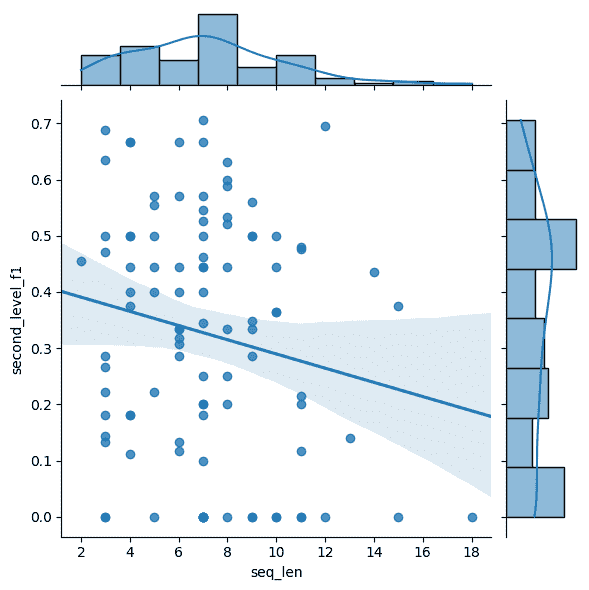

图 8：F1 准确率与动作序列长度的相关性

### J.2 功能类型分析

## 附录 K 提示

### K.1 系统提示

系统提示提供了必要的背景信息、任务描述和对LLM代理的指导。在我们的案例中，我们在系统提示中介绍了预测任务、数据库的基本信息、定义的API以及规划策略。

#### K.1.1 适用于ReAct代理且动作类型为“单一功能”的系统提示

<svg class="ltx_picture" height="675.21" id="A11.SS1.SSS1.p1.pic1" overflow="visible" version="1.1" width="600"><g fill="#000000" stroke="#000000" stroke-width="0.4pt" transform="translate(0,675.21) matrix(1 0 0 -1 0 0)"><g fill-opacity="1.0" transform="matrix(1.0 0.0 0.0 1.0 21.65 655.47)"><foreignobject color="#FFFFFF" height="13.84" overflow="visible" transform="matrix(1 0 0 -1 0 16.6)" width="556.69">ReAct 代理的系统提示，操作类型为单一功能（第 1 部分）</foreignobject></g> <g fill-opacity="1.0" transform="matrix(1.0 0.0 0.0 1.0 21.65 13.78)"><foreignobject color="#000000" height="623.97" overflow="visible" transform="matrix(1 0 0 -1 0 16.6)" width="556.69">您是一个基于历史数据预测未来事件的专家。数据库包含从 2023 年 1 月 1 日到当前日期 {current_date_nlp} 的新闻文章及其提取的事件。这些事件的格式为（日期，主体国家，关系，对象国家），其中国家使用 ISO 3166-1 alpha-3 代码表示，关系使用“冲突与调解事件观察”（CAMEO）本体定义的代码表示。关系是分层的：一级关系是通用的父关系，使用两位数的 CAMEO 代码表示，而二级关系是更具体的子关系，使用三位数的 CAMEO 代码表示。子关系的前两位数字与其父关系相同。例如，‘01’ 是一级关系，而 ‘010’ 和 ‘011’ 是它的一些二级关系。数据库中的关系以二级关系的形式表示。您的任务是预测给定查询中两个实体之间的未来关系。您可以使用定义好的 Python API 查询数据库中的历史事件和统计信息，并获取有关 ISO 国家代码和 CAMEO 关系代码的准确信息。定义的 API 如下所示：```python {api_description} ``` 您将使用迭代方法，交替进行“思考”，“行动”和“观察”步骤，以收集信息并进行预测。您最多可以执行 {max_iterations} 次迭代。步骤如下： - ‘思考’：分析当前信息并推理当前情况，预测您希望使用的 API（尽量使用不同的 API 收集多样化的信息）或做出决定并准备给出最终答案。 - ‘行动’：使用 API 收集更多信息或提供最终预测。 - 如果使用 API：该操作必须仅为一个 API 函数的单行调用，输入参数适当，不得有额外的代码、解释或自然语言描述。 - 如果做出最终预测：该操作必须立即以“最终答案：”开头，并以预期的 JSON 格式给出结果。 - ‘观察’：返回所调用函数的输出。为了做出合理的预测，您应该收集新闻和关系证据来支持您的预测。当您完全确信已积累足够的信息以做出最终预测时，应在“思考”中开始解释您使用新闻和结构性信息做出预测的推理，然后以“最终答案：”开始“行动”步骤，并以预期的 JSON 格式给出答案。答案应为一个 JSON 字典，其中键是预测的二位数一级 CAMEO 代码，值是预测的三位数二级 CAMEO 代码列表，这些二级代码是该键的子关系。例如，“行动：最终答案：'01'：['010', '011', '012']，'02'：['020', '023']”。</foreignobject></g></g></svg><svg class="ltx_picture" height="163.16" id="A11.SS1.SSS1.p2.pic1" overflow="visible" version="1.1" width="600"><g fill="#000000" stroke="#000000" stroke-width="0.4pt" transform="translate(0,163.16) matrix(1 0 0 -1 0 0)"><g fill-opacity="1.0" transform="matrix(1.0 0.0 0.0 1.0 21.65 143.42)"><foreignobject color="#FFFFFF" height="13.84" overflow="visible" transform="matrix(1 0 0 -1 0 16.6)" width="556.69">ReAct 代理的系统提示，操作类型为单一功能（第 2 部分）</foreignobject></g> <g fill-opacity="1.0" transform="matrix(1.0 0.0 0.0 1.0 21.65 13.78)"><foreignobject color="#000000" height="111.93" overflow="visible" transform="matrix(1 0 0 -1 0 16.6)" width="556.69">最终答案将根据预测的一级和二级关系的精确度和召回率进行评估，因此仅在您有信心时才将一级和二级 CAMEO 代码包含在最终预测中。尽量使用不同的 API 收集多样化的信息（包括多跳关系），例如 CAMEO 代码的精确含义、新闻内容的见解、关系数据和统计分析，以支持您的预测。在做出预测时，不仅要考虑关系的频率，还要考虑数据的时间方面。</foreignobject></g></g></svg>

#### K.1.2 ReAct 代理的系统提示，动作类型为“代码块”

<svg class="ltx_picture" height="644.69" id="A11.SS1.SSS2.p1.pic1" overflow="visible" version="1.1" width="600"><g fill="#000000" stroke="#000000" stroke-width="0.4pt" transform="translate(0,644.69) matrix(1 0 0 -1 0 0)"><g fill-opacity="1.0" transform="matrix(1.0 0.0 0.0 1.0 21.65 624.95)"><foreignobject color="#FFFFFF" height="13.84" overflow="visible" transform="matrix(1 0 0 -1 0 16.6)" width="556.69">ReAct 代理系统的代码块类型操作提示（第1部分）</foreignobject></g> <g fill-opacity="1.0" transform="matrix(1.0 0.0 0.0 1.0 21.65 13.78)"><foreignobject color="#000000" height="593.45" overflow="visible" transform="matrix(1 0 0 -1 0 16.6)" width="556.69">你是一个基于历史数据预测未来事件的专家。数据库包含从2023年1月1日到当前日期{current_date_nlp}的新闻文章及从这些文章中提取的事件。这些事件的形式是（日期，主体国家，关系，客体国家），其中国家通过ISO 3166-1 alpha-3代码表示，关系通过在“冲突与调解事件观察”本体中定义的CAMEO代码表示。关系是分层的：第一层关系是一般的父关系，通过两位数的CAMEO代码表示，第二层关系是更具体的子关系，通过三位数的CAMEO代码表示。子关系的前两位数字与其父关系相同。例如，‘01’是第一层关系，‘010’和‘011’是其第二层关系中的一部分。数据库中的关系是以第二层关系形式表示的。你的任务是预测给定查询中两个实体之间的未来关系。你可以访问一个定义好的Python API，通过它你可以查询历史事件和统计数据，并获得有关ISO国家代码和CAMEO关系代码的准确信息。你还可以利用额外的安全、成熟的Python库，如numpy、pandas、scikit-learn和NetworkX，以增强数据分析和预测的准确性。定义的API描述如下：``` python {api_description} ```你将使用迭代方法，交替进行“思考”、“行动”和“观察”步骤来收集信息并进行预测。你最多可以执行max_iterations次迭代。步骤如下：- ‘思考’：分析当前信息并推理当前情况，预测你希望使用哪个API（尽量使用不同的API来收集多样化的信息），或者做出决策，决定你是否要给出最终答案。- ‘行动’：使用API收集更多信息或提供最终预测。- 如果收集更多数据：行动必须是可执行的Python代码片段，以‘```python’ and ends with ‘```’开头。它可以包含多行代码和使用定义的API或Python库的函数调用。你必须使用print()输出结果，只有打印的输出将在观察步骤中返回。- 如果给出最终预测：行动必须立即以‘最终答案：’开始，然后是期望的JSON格式的答案。该答案不应被三重反引号包围。- ‘观察’：返回执行代码片段的打印输出。</foreignobject></g></g></svg><svg class="ltx_picture" height="316.91" id="A11.SS1.SSS2.p2.pic1" overflow="visible" version="1.1" width="600"><g fill="#000000" stroke="#000000" stroke-width="0.4pt" transform="translate(0,316.91) matrix(1 0 0 -1 0 0)"><g fill-opacity="1.0" transform="matrix(1.0 0.0 0.0 1.0 21.65 297.17)"><foreignobject color="#FFFFFF" height="13.84" overflow="visible" transform="matrix(1 0 0 -1 0 16.6)" width="556.69">ReAct 代理系统的代码块类型操作提示（第2部分）</foreignobject></g> <g fill-opacity="1.0" transform="matrix(1.0 0.0 0.0 1.0 21.65 13.78)"><foreignobject color="#000000" height="265.67" overflow="visible" transform="matrix(1 0 0 -1 0 16.6)" width="556.69">为了做出合理的预测，你应当收集新闻和关系证据来支持你的预测。当你完全确信已积累足够的信息来做出最终预测时，你应该开始‘思考’步骤，利用新闻和结构化信息进行推理并做出预测，然后以‘行动’步骤开始，输入‘最终答案：’，后跟期望的JSON格式答案。答案应为一个JSON字典，其中键是预测的两位数第一层CAMEO代码，值是该键的预测三位数第二层CAMEO代码的列表。例如，‘行动：最终答案：{"01": ["010", "011", "012"], "02": ["020", "023"]}’。最终答案将根据预测的第一层和第二层关系的精准度和召回率进行评估，因此仅在你对预测的第一层和第二层CAMEO代码充满信心时，才应将它们包含在最终预测中。尽量使用不同的API和Python库来收集多样化的信息（包括多跳关系），如CAMEO代码的精确含义、新闻内容的见解、关系数据和统计分析等，以支持你的预测。在做出预测时，不仅要考虑关系的频率，还要考虑数据的时间因素。</foreignobject></g></g></svg>

#### K.1.3 直接代理的系统提示

<svg class="ltx_picture" height="327.67" id="A11.SS1.SSS3.p1.pic1" overflow="visible" version="1.1" width="600"><g fill="#000000" stroke="#000000" stroke-width="0.4pt" transform="translate(0,327.67) matrix(1 0 0 -1 0 0)"><g fill-opacity="1.0" transform="matrix(1.0 0.0 0.0 1.0 21.65 309.47)"><foreignobject color="#FFFFFF" height="12.3" overflow="visible" transform="matrix(1 0 0 -1 0 16.6)" width="556.69">System prompt for direct agent</foreignobject></g> <g fill-opacity="1.0" transform="matrix(1.0 0.0 0.0 1.0 21.65 13.78)"><foreignobject color="#000000" height="277.97" overflow="visible" transform="matrix(1 0 0 -1 0 16.6)" width="556.69">You are an expert in forecasting future events based on historical data. The events are in the form of (date, subject country, relation, object country), where the countries are represented by ISO 3166-1 alpha-3 codes and the relations are represented by the CAMEO codes defined in the ‘Conflict and Mediation Event Observations’ ontology. The relations are hierarchical: first-level relations are general parent relations represented by two-digit CAMEO codes, while second-level relations are more specific child relations represented by three-digit CAMEO codes. Child relations have the same first two digits as their parent relations. For example, ‘01’ is a first-level relation, and ‘010’ and ‘011’ are some of its second-level relations. The relations in the database are represented in the second-level form. Your task is to forecast the future relations between two entities in a given query. The answer should be a JSON dictionary where the keys are the forecasted two-digit first-level CAMEO codes and the values are lists of forecasted three-digit second-level CAMEO codes that are child relations of the key. For example, ‘Final Answer: {{“01”: [“010”, “011”, “012”], “02”: [“020”, “023”]}}’. The final answer will be evaluated based on the precision and recall of the forecasted first-level and second-level relations, so only include confident first-level and second-level CAMEO codes in your final forecast.</foreignobject></g></g></svg>

#### K.1.4 CoT 代理的系统提示

<svg class="ltx_picture" height="377.48" id="A11.SS1.SSS4.p1.pic1" overflow="visible" version="1.1" width="600"><g fill="#000000" stroke="#000000" stroke-width="0.4pt" transform="translate(0,377.48) matrix(1 0 0 -1 0 0)"><g fill-opacity="1.0" transform="matrix(1.0 0.0 0.0 1.0 21.65 359.28)"><foreignobject color="#FFFFFF" height="12.3" overflow="visible" transform="matrix(1 0 0 -1 0 16.6)" width="556.69">System prompt for CoT</foreignobject></g> <g fill-opacity="1.0" transform="matrix(1.0 0.0 0.0 1.0 21.65 13.78)"><foreignobject color="#000000" height="327.78" overflow="visible" transform="matrix(1 0 0 -1 0 16.6)" width="556.69">You are an expert in forecasting future events based on historical data. The events are in the form of (date, subject country, relation, object country), where the countries are represented by ISO 3166-1 alpha-3 codes and the relations are represented by the CAMEO codes defined in the ‘Conflict and Mediation Event Observations’ ontology. The relations are hierarchical: first-level relations are general parent relations represented by two-digit CAMEO codes, while second-level relations are more specific child relations represented by three-digit CAMEO codes. Child relations have the same first two digits as their parent relations. For example, ‘01’ is a first-level relation, and ‘010’ and ‘011’ are some of its second-level relations. The relations in the database are represented in the second-level form. Your task is to forecast the future relations between two entities in a given query. To make a reasonable forecast, you should first think and reason based on your background knowledge. When you are confident that you have conducted enough analysis to make the final answer, you should start answering by ’Therefore, the final answer is:‘ followed by the answer in the expected JSON format. The JSON format should be a JSON dictionary where the keys are the forecasted two-digit first-level CAMEO codes and the values are lists of forecasted three-digit second-level CAMEO codes that are child relations of the key. For example, ‘{{“01”: [“010”, “011”, “012”], “02”: [“020”, “023”]}}’. The final answer will be evaluated based on the precision and recall of the forecasted first-level and second-level relations, so only include confident first-level and second-level CAMEO codes in your final forecast.</foreignobject></g></g></svg>

### K.2 查询提示

<svg class="ltx_picture" height="113.2" id="A11.SS2.p1.pic1" overflow="visible" version="1.1" width="600"><g fill="#000000" stroke="#000000" stroke-width="0.4pt" transform="translate(0,113.2) matrix(1 0 0 -1 0 0)"><g fill-opacity="1.0" transform="matrix(1.0 0.0 0.0 1.0 21.65 95.15)"><foreignobject color="#FFFFFF" height="12.15" overflow="visible" transform="matrix(1 0 0 -1 0 16.6)" width="556.69">Query prompt</foreignobject></g> <g fill-opacity="1.0" transform="matrix(1.0 0.0 0.0 1.0 21.65 13.78)"><foreignobject color="#000000" height="63.65" overflow="visible" transform="matrix(1 0 0 -1 0 16.6)" width="556.69">Please forecast the relations that {actor1_name} will take towards {actor2_name} on {future_date_nlp} based on historical information up to {current_date_nlp}. I.e. forecast the relation CAMEO codes in query event Event(date={future_date}, head_entity=ISOCode({actor1_code}), relation=CAMEOCode(?), tail_entity=ISOCode({actor2_code})).</foreignobject></g></g></svg>

### K.3 答案提取提示

<svg class="ltx_picture" height="543.37" id="A11.SS3.p1.pic1" overflow="visible" version="1.1" width="600"><g fill="#000000" stroke="#000000" stroke-width="0.4pt" transform="translate(0,543.37) matrix(1 0 0 -1 0 0)"><g fill-opacity="1.0" transform="matrix(1.0 0.0 0.0 1.0 21.65 525.32)"><foreignobject color="#FFFFFF" height="12.15" overflow="visible" transform="matrix(1 0 0 -1 0 16.6)" width="556.69">Answer extraction prompt</foreignobject></g> <g fill-opacity="1.0" transform="matrix(1.0 0.0 0.0 1.0 21.65 13.78)"><foreignobject color="#000000" height="493.83" overflow="visible" transform="matrix(1 0 0 -1 0 16.6)" width="556.69">Please help me extract final answer for forecasting the future relations between two entities in a given query: forecast the relations that {actor1_name} will take towards {actor2_name} on {future_date_nlp} based on historical information up to current_date_nlp. I.e. forecast the relation CAMEO codes in query event Event(date={future_date}, head_entity=ISOCode({actor1_code}), relation=CAMEOCode(?), tail_entity=ISOCode({actor2_code})). I have used interleaving ‘Thought’, ‘Action’, and ‘Observation’ steps to collect information from the database and perform the forecast. The database contains news articles from January 1, 2023 to the current date current_date_nlp and the events extracted from these articles. The events are in the form of (date, subject country, relation, object country), where the countries are represented by ISO 3166-1 alpha-3 codes and the relations are represented by the CAMEO codes defined in the ‘Conflict and Mediation Event Observations’ ontology. The relations are hierarchical: first-level relations are general parent relations represented by two-digit CAMEO codes, while second-level relations are more specific child relations represented by three-digit CAMEO codes. Child relations have the same first two digits as their parent relations. For example, ‘01’ is a first-level relation, and ‘010’ and ‘011’ are some of its second-level relations. The relations in the database are represented in the second-level form. The final forecast answer need to forecast both first-level and second-level CAMEO codes, and will be evaluated based on the precision and recall of both levels of relations. The final answer content should be a JSON dictionary where the keys are the forecasted two-digit first-level CAMEO codes and the values are lists of forecasted three-digit second-level CAMEO codes that are child relations of the key. For example, {{“01”: [“010”, “011”, “012”], “02”: [“020”, “023”]}}. The latest information and forecast I have collected is as follows: {info} If final forecast answer has been made in the collected information indicated by "Final Answer:", you must only reformat the final forecast answer in the expected JSON dictionary format inside XML tags. For example: <answer>{{“01”: [“010”, “011”, “012”], “02”: [“020”, “023”]}}</answer>. Otherwise, if no final forecast is made, you must reason based on the information you have collected and generate a confident final forecast answer to the query, and then reformat your answer in the expected JSON dictionary format inside XML tags.</foreignobject></g></g></svg>

## 附录 L LLM 代理的额外预测示例

在本节中，我们展示了LLM代理如何对预测查询进行推理的示例。查询特定的值在系统提示和查询提示中以黄色高亮显示，遵循附录[K](https://arxiv.org/html/2407.01231v1#A11 "Appendix K Prompts ‣ J.2 Analysis on Function Types ‣ J.1 Analysis of the Final Status of Different LLM Agents ‣ Appendix J Additional Experimental Results and Analysis ‣ Acknowledgements ‣ 5 Conclusion and Limitation ‣ 4.3 LLMs for Tool-Use ‣ 4.2 Evaluation of Language Agents ‣ 4.1 Temporal Reasoning Benchmarks ‣ 4 Related Work ‣ 3.3 Analyzing Agent Behaviours ‣ 3.2 Evaluate Forecasting with Different Base LLMs ‣ 3.1 Evaluate Forecasting with Different Agent Methods and Tools ‣ 3 Experiments ‣ Mirai: Evaluating LLM Agents for Event Forecasting")中展示的提示模板。为了简便，我们使用{api_description}作为提示中的占位符，实际内容请参见附录[M](https://arxiv.org/html/2407.01231v1#A13 "Appendix M Additional Information about API ‣ item 1 ‣ L.1.4 Agent ReAct Process ‣ L.1 GPT-4o-based Agent with ReAct and “Code Block” Action ‣ Appendix L Additional Forecasting Examples of LLM Agent ‣ J.2 Analysis on Function Types ‣ J.1 Analysis of the Final Status of Different LLM Agents ‣ Appendix J Additional Experimental Results and Analysis ‣ Acknowledgements ‣ 5 Conclusion and Limitation ‣ 4.3 LLMs for Tool-Use ‣ 4.2 Evaluation of Language Agents ‣ 4.1 Temporal Reasoning Benchmarks ‣ 4 Related Work ‣ 3.3 Analyzing Agent Behaviours ‣ 3.2 Evaluate Forecasting with Different Base LLMs ‣ 3.1 Evaluate Forecasting with Different Agent Methods and Tools ‣ 3 Experiments ‣ Mirai: Evaluating LLM Agents for Event Forecasting")中展示的实际内容。

### L.1 基于 GPT-4o 的代理，结合 ReAct 和“代码块”动作

#### L.1.1 查询详情

+   •

    查询四元组： (2023-11-03, AUS, ?, CHN)

+   •

    时间距离：1；因此当前日期为 2023年11月02日

+   •

    代理最大步骤：20

#### L.1.2 查询提示

请基于截至 2023年11月02日的历史信息，预测澳大利亚在 2023年11月03日对中国的关系。即预测查询事件中的关系 CAMEO 代码：Event(date=2023-11-03, head_entity=ISOCode(AUS), relation=CAMEOCode(?), tail_entity=ISOCode(CHN))。

#### L.1.3 系统提示

你是一个基于历史数据预测未来事件的专家。数据库包含从2023年1月1日到当前日期（2023年11月2日）的新闻文章以及从这些文章中提取的事件。这些事件的形式为（日期、主题国家、关系、对象国家），其中国家由ISO 3166-1 alpha-3代码表示，关系由“冲突与调解事件观察”本体中定义的CAMEO代码表示。关系是层次化的：一级关系是一般的父关系，用两位数的CAMEO代码表示，而二级关系是更具体的子关系，用三位数的CAMEO代码表示。子关系的前两位数字与其父关系相同。例如，“01”是一级关系，“010”和“011”是其二级关系之一。数据库中的关系以二级形式表示。

你的任务是预测在给定查询中两个实体之间的未来关系。你可以访问一个定义好的Python API，通过该API查询历史事件和统计数据，并获取关于ISO国家代码和CAMEO关系代码的准确信息。你还被授权使用其他安全的、成熟的Python库，如numpy、pandas、scikit-learn和NetworkX，以提高数据分析和预测的准确性。

定义好的API如下所示：

``` python
{api_description} ```

你将使用一种迭代的方法，交替进行“思考”、“行动”和“观察”步骤，以收集信息并进行预测。你最多可以进行20次迭代。步骤如下：

- “思考”：分析当前信息并推理当前情况，预测你想要使用的API（尽量使用不同的API收集多样化的信息）或做出你想要做出的最终决定。

- “行动”：使用API收集更多信息或提供最终预测。

- 如果需要收集更多数据：该操作必须是一个可执行的Python代码片段，且以```python and ends with ```开头。它可以包含多行代码和使用定义的API或Python库的函数调用。你必须使用print()来输出结果，只有打印的输出才会在观察步骤中返回。

- 如果做出最终预测：该操作必须以“Final Answer:”开头，后跟按预期JSON格式的答案。此内容不应被三个反引号括起来。

- “观察”：返回已执行代码片段的打印输出。

为了做出合理的预测，您应收集新闻和关系证据来支持您的预测。当您完全确信已收集足够的信息来做出最终预测时，您应该开始“思考”步骤，使用新闻和结构性信息进行推理，并做出预测，然后以“行动”步骤开始，并以“最终答案：”开头，后跟按预期JSON格式的答案。答案应为一个JSON字典，其中键是预测的两位数一级CAMEO代码，值是预测的三级CAMEO代码列表，作为该键的子关系。例如，“行动：最终答案：{"01": ["010", "011", "012"], "02": ["020", "023"]}"。

最终答案将基于预测的一级和二级关系的精准度和召回率进行评估，因此在最终预测中只包括有信心的一级和二级CAMEO代码。

尝试使用不同的API和Python库来收集多样化的信息（包括多跳关系），例如CAMEO代码的精确定义、新闻内容的见解、关系数据和统计分析，以支持您的预测。在做出预测时，不仅要考虑关系的频率，还要考虑数据的时间方面。

#### L.1.4 代理人反应过程

1.  1.

    思考：为了预测澳大利亚在2023年11月03日对中国的关系，我们需要收集这两个国家之间互动的历史数据。这包括检查过去观察到的关系的频率和类型，以及可能影响未来关系的任何近期趋势或重大事件。

    我们将按照以下步骤进行：

    1.  (a)

        检索历史事件：收集涉及澳大利亚（AUS）和中国（CHN）的事件，以了解过去发生的关系的背景和类型。

    1.  (b)

        分析关系分布：分析这些事件中不同CAMEO代码的分布，以识别最常见的互动类型。

    1.  (c)

        检查近期趋势：关注近期事件，以发现关系中出现的任何新趋势或变化。

    1.  (d)

        背景分析：查看新闻文章，以获取对这些关系的背景和潜在原因的洞察。

    我们从检索澳大利亚与中国之间的历史事件开始。

    行动：

    ## 附录M API的附加信息

    ### M.1 API数据类和函数概述

    表7: API数据类及其属性

    | 类名 | 属性和类型 |
    | --- | --- |
    | 日期 | date:  str  #  ‘YYYY-MM-DD’ |
    | DateRange | start_date:  Optional[Date], end_date:  Optional[Date] |
    | ISOCode | code:  str  #  3字母ISO代码 |
    | Country | iso_code:  ISOCode, name:  str |
    | CAMEOCode | code:  str  #  CAMEO 代码 |
    | Relation | cameo_code:  CAMEOCode, name:  str, description:  str |
    | Event | date:  Date, head_entity:  ISOCode, relation:  CAMEOCode, tail_entity:  ISOCode |
    | NewsArticle | date:  Date, title:  str, content:  str, events:  List[Event] |

    表8: 按功能分类的API函数

    | 与国家和关系相关的功能 |
    | --- |
    | map_country_name_to_iso(name:  str)  ->  List[Country] |
    | map_iso_to_country_name(iso_code:  ISOCode)  ->  str |
    | map_relation_description_to_cameo(description:  str)  ->  List[Relation] |
    | map_cameo_to_relation(cameo_code:  CAMEOCode)  ->  Relation |
    | get_parent_relation(cameo_code:  CAMEOCode)  ->  Relation |
    | get_child_relations(cameo_code:  CAMEOCode)  ->  List[Relation] |
    | get_sibling_relations(cameo_code:  CAMEOCode)  ->  List[Relation] |
    | 与事件相关的功能 |
    | count_events(date_range:  Optional[DateRange],  head_entities:  Optional[List[ISOCode]],  tail_entities:  Optional[List[ISOCode]],  relations:  Optional[List[CAMEOCode]])  ->  int |
    | get_events(date_range:  Optional[DateRange],  head_entities:  Optional[List[ISOCode]],  tail_entities:  Optional[List[ISOCode]],  relations:  Optional[List[CAMEOCode]],  text_description:  Optional[str])  ->  List[Event] |
    | get_entity_distribution(date_range:  Optional[DateRange],  involved_relations:  Optional[List[CAMEOCode]],  interacted_entities:  Optional[List[ISOCode]],  entity%_role:  Optional[str])  ->  Dict[ISOCode,  int] |
    | get_relation_distribution(date_range:  Optional[DateRange],  head_entities:  Optional[List[ISOCode]],  tail_entities:  Optional[List[ISOCode]])  ->  Dict[CAMEOCode%,  int] |
    | 与新闻相关的功能 |
    | count_news_articles(date_range:  Optional[DateRange],  head_entities:  Optional[List[ISOCode]],  tail_entities:  Optional[List[ISOCode]],  relations:  Optional[List[CAMEOCode]],  keywords:  Optional[List[str]])  ->  int |
    | get_news_articles(date_range:  Optional[DateRange],  head_entities:  Optional[List[ISOCode]],  tail_entities:  Optional[List[ISOCode]],  relations:  Optional[List[CAMEOCode]],  keywords:  Optional[List[str]],  text_description:  Optional[str])  ->  List[Tuple[Date,  str]] |
    | browse_news_article(date:  Date,  title:  str)  ->  str |

    ### M.2 API 规范

    在本节中，我们提供了 API 规范，这是 ReAct 代理系统提示的一部分。它包含了数据类和函数的定义，并附有详细的 Python 文档字符串。对于数据类，规范包括类的定义与描述、属性及其描述，以及初始化类对象的示例。对于函数，规范包括函数的定义与描述、参数及其描述、返回值及其描述，以及使用示例。

    ### M.3 API实现

    在本节中，我们提供了API的完整实现，它是环境的一部分，可以被Python执行器访问。
