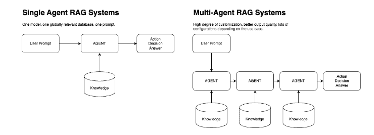
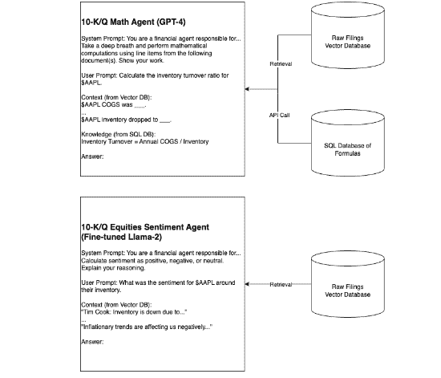
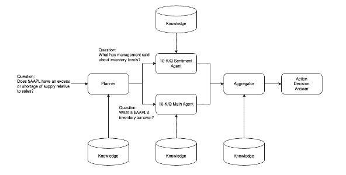
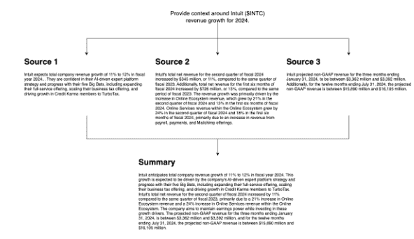

<!--yml

类别：未分类

日期：2025-01-11 12:15:50

--> 

# MoA 就是你所需要的：使用代理混合体构建大型语言模型研究团队

> 来源：[https://arxiv.org/html/2409.07487/](https://arxiv.org/html/2409.07487/)

\UseRawInputEncodingSandy Chen, Leqi Zeng, Abhinav Raghunathan, Flora Huang, Terrence C. Kim Vanguard IMFS（投资管理金融科技策略）

###### 摘要

在金融领域，关于大型语言模型（LLMs）的研究尤为复杂，因为文献中提出了大量不同的研究方法。检索增强生成（RAG）已经成为该领域的领先方法之一，因为其固有的扎根性和数据源的多样性。在这项工作中，我们介绍了一种名为“代理混合体”（Mixture of Agents，MoA）的RAG框架，并展示了它作为一种实用、可定制且高效的扩展RAG应用的方法的可行性。MoA本质上是一个由单独定制的小型语言模型组成的分层网络，这些模型协同工作以回答问题和提取信息。尽管这种架构有许多理论上的提议，甚至有一些库可以将其在实践中普遍应用，但针对考虑到现实商业约束（如成本和速度）的框架潜力的文献记录研究较少。我们发现，由小型语言模型[[1](https://arxiv.org/html/2409.07487v2#bib.bib1)]构成的MoA框架，在维持低成本的同时，能够在与先锋公司核心业务相关的多个金融领域产生更高质量、更扎实的响应。

## 1 引言

在机器学习领域，众所周知，相较于单一模型方法，多模型方法（也称为“集成模型”）通常在预测能力上更强。主要有两个原因：

+   •

    来自集成模型的结论得到了多个模型共识的支持，每个模型接收略有不同的输入。这种集体验证增强了对预测结果的信心。

+   •

    集成模型更能有效地对未在训练数据中捕获的新信息进行泛化。

大语言模型（LLMs）最初依赖于单一的密集型变换器方法，因其计算复杂性和固有的幻觉风险。然而，研究界近期已将注意力转向稀疏集成的LLMs，因为它们具有多个优势[[2](https://arxiv.org/html/2409.07487v2#bib.bib2)][[3](https://arxiv.org/html/2409.07487v2#bib.bib3)]。这些集成展现了较低的幻觉率、提高的输出质量和增强的信息呈现能力[[4](https://arxiv.org/html/2409.07487v2#bib.bib4)]。此外，通过将多个LLM按顺序或并行排列，研究人员可以创建复杂的网络[[5](https://arxiv.org/html/2409.07487v2#bib.bib5)]，这些网络类似于现实公司中的组织结构。这种安排释放了一个至关重要的协作潜力，使LLM能够以更复杂的方式共同工作。

超越简单分类任务、能够基于数据库、API及其他来源中存储的信息执行操作的大语言模型（LLMs）被称为“代理”。单个代理以及由多个代理组成的系统（通常称为“苏格拉底AI”、“代理AI”或类似术语）都极为强大，因为它们能够比人类更高效地任意读取和执行任务[[6](https://arxiv.org/html/2409.07487v2#bib.bib6)]。这一能力在金融领域尤为重要，因为研究人员所消耗的庞大知识量大多是以文本形式存在。本文中，我们将“混合代理系统”（MoA）定义为由多个代理组成的集成系统，每个代理都具有独特的特征，例如定制化的链接、提示和知识。

现有文献主要从理论角度探讨了集成大语言模型（LLMs），重点实验探讨了在这些系统中错误是如何改善还是加剧的。研究提供了证据表明，LLM的集成可以提高分类准确率，相较于单一模型[[7](https://arxiv.org/html/2409.07487v2#bib.bib7)]，并且通过辩论协作解决复杂问题[[8](https://arxiv.org/html/2409.07487v2#bib.bib8)]。也很明显，集成LLM在生物医学、金融甚至科研领域有着广泛的潜在应用[[5](https://arxiv.org/html/2409.07487v2#bib.bib5)]。集成LLM的主要缺点是成本和速度——并行或顺序运行多个模型是一项计算成本高昂的操作，导致生成速度缓慢且延迟较高。

图1：单一系统与多代理系统配置。

在实际领域，研究更接近于模型内方法。Mistral AI的开创性论文介绍了他们的专家混合（MoE）模型[[9](https://arxiv.org/html/2409.07487v2#bib.bib9)]，该模型的动机至少部分来源于传统机器学习中的集成模型。Mistral的Mixtral 8x16，一个MoE模型，由于其创新的架构，超越了许多现有的开源竞争者，并为我们的工作提供了灵感。尽管MoE是以模型为中心，应用集成学习于单一模型中，MoA则是一种以系统为中心的方法，旨在跨多个模型应用集成学习。OpenAI也公开接受了集成的概念。GPT-4模型被传言是MoE最具影响力的实现之一，"GPTs"代表了他们积极探索使用GPT-4作为基础的代理。尽管像AIFlows、Langchain和微软Autogen这样的库使得代理和LLM的程序化组合成为可能，但仍然很少有研究展示当考虑到成本和用户体验作为主要因素时，代理系统的可行性[[10](https://arxiv.org/html/2409.07487v2#bib.bib10)][[11](https://arxiv.org/html/2409.07487v2#bib.bib11)]。在先锋投资管理金融科技策略（IMFS）团队，我们提出了其中一个初步数据点，表明MoA满足这些约束。

## 2 混合代理（MoA）

**混合代理（MoA）**是一种增强型多代理检索增强生成（RAG）框架，支持一组高度专业化的小型[[1](https://arxiv.org/html/2409.07487v2#bib.bib1)]语言模型代理在复杂的结构中协作以回答问题。MoA的灵感来源于正在进行的LLM集成方法研究，包括专家混合（MoE）和苏格拉底AI[[6](https://arxiv.org/html/2409.07487v2#bib.bib6)][[12](https://arxiv.org/html/2409.07487v2#bib.bib12)]。我们的研究表明，这些代理以模仿组织层次结构的强大方式运作，最终生成具有内建透明度和基础的高质量输出。

组成MoA系统的代理是复杂的信息收集者，每个代理都拥有自己的内部知识、外部知识库[[13](https://arxiv.org/html/2409.07487v2#bib.bib13)]、提示、基础、能力以及与其他代理的连接。这种高度的专业化使得整个MoA系统能够发展出“多样化的观点”，最终汇聚成一个最终响应。更重要的是，我们观察到，由小型[[1](https://arxiv.org/html/2409.07487v2#bib.bib1)]语言模型组成的强大MoA系统具有极高的成本效益。当结合良好的数据工程实践时，MoA可以实现与传统单一大型语言模型的交互方式相媲美的速度和规模[[14](https://arxiv.org/html/2409.07487v2#bib.bib14)]。这使得MoA成为适用于大多数（如果不是全部）企业用例的合适方法。

### 2.1 代理作为“初级研究员”

在MoA框架中，代理的角色类似于投资管理中的初级研究员，但具有巨大的潜力。通过定制每个代理可以访问的知识，我们可以开发出高度多样化却极为“智能”的代理，这些代理具备领域理解和专业化能力。

图2：具有API访问权限和知识的超专业化代理示例。

通过对每个代理进行超专业化，它们可以单独取得比一个模型同时处理两项任务时更好的结果。图2展示了这样一些代理的示例，每个代理都有自己的提示、知识、指令、微调和模型基础。在这个例子中，“10-K/Q数学代理”是一个具有定义性理解的GPT-4实例，专门用于处理行项目和会计术语。它已经针对数学任务进行了微调和特别提示（“深呼吸”）。此外，它可以访问原始文件的RAG，并且具有对包含领域特定方程式的分析师笔记的SQL数据库的API访问权限。而“10-K/Q情感代理”则是一个经过微调的Llama-2实例，专门用于股票情感分类。它可以访问来自所查询公司的真实正负面声明，并且被提示进行情感分析。

与单一模型方法相比，分割代理方法由于每个代理的可定制性，提供了显著更高的响应质量。这些专业化代理可以在MoA系统中以更高的准确性和深度回答极为细致和复杂的问题。

### 2.2 初级研究员代理团队

在定制和构建完代理之后，立刻可以明显看出，对于各种高级任务，可以高效地构建代理管道，将任务完成。这种结构类似于一个“研究团队”，其中具有不同背景的专家（即具有不同定制的代理）协作解决一个共同的问题。使用之前的示例代理，可以向不同的代理提出相邻问题，以获得更具体的响应，然后将这些响应汇总成一个全面的答案。图3展示了这两个代理的一种可能配置，前面有一个“规划者”选择问题，后面有一个“聚合器”智能地结合代理的响应。

图3：回答复杂问题的专业代理可能的拆分，具有强大的响应质量。

MoA的灵活性在于，代理可以被启发式方法、API调用或任何可能将额外信息输入到聚合器或其他代理的子过程所替代。

在所有这些场景中，MoA大大受益于其维持高水平定制化的能力。由于每个代理有效地充当用户问题的实时专家，整体的行动和响应质量保持强劲。然而，重要的是要注意，MoA的性能取决于其数据和工程能力。系统可能会变得非常复杂，输出的报告和答案可能通过目前存在的各种不同方法以及正在开发的方式，成为未来输入的一部分。在Vanguard的IMFS团队，我们的MoA系统已经扩展到同时分析数万个文档。

MoA有一个独特的属性，即任何负责总结或监督低层次代理输出的高层代理，能够辨别并过滤掉无关或不准确的信息。有趣的是，我们观察到“复合错误”这一概念仅在单一串行模型的情况下出现，而在MoA中并不存在。

## 3 结果

MoA是LLM系统的一种属性，不同于MoE，后者是LLM的属性。因此，我们将模型评估的复杂性抽象化，而专注于作为系统结果的高层次结果。与其他研究者的发现一致，我们发现，交织的模型网络比任何单一工作流表现得更好。此外，随着系统的扩展和抽象层次的增加，延迟和潜力也随之增加。存在的抽象层次越多，人类研究人员节省的步骤就越多。随着规模的扩大，MoA变得相对于人力更加高效。MoA为那些希望在单模型系统的响应质量之外，增强现有RAG管道的人员提供了极为有用的解决方案。

### 3.1 信息浮现与输出质量

MoA增强了任何RAG实现的信息呈现能力，从而提高了输出的质量。

关于RAG系统的一个最紧迫问题是可用的上下文窗口。当这个值较小的时候，模型覆盖的可用数据也会相应受限。广泛的持续研究致力于在最大化上下文窗口的同时，尽量减少性能下降[[15](https://arxiv.org/html/2409.07487v2#bib.bib15)]。在这方面，MoA相比单一模型系统具有优势。当使用代理系统时，系统的有效上下文窗口会显著增加。与其让一个模型处理所有可用的上下文，现在可以有意地将其分配给多个专家代理。这种方法允许更高的精度，并减少了“中途丢失”问题的发生。对于那些已知或可验证的答案，模型的回答通常是形成良好且准确的。此外，众所周知，模型的响应对其系统提示非常敏感。根据数据源为代理定制提示，可以显著提高输出质量和洞察力。

在Vanguard，我们定期使用MoA从研究人员参考的文档中提取并呈现洞见，这些文档的数量通常达到数万篇。我们发现，MoA的主要价值之一是大幅提高发现研究人员可能遗漏或忽视信息的可能性。每个代理的回答包含不同的上下文；例如，10-K文件可能包含收入数据，而该数字的背景信息可能出现在财报会议记录中。当这些不同的上下文结合时，分析师可以获得更多背景信息，从而获得更深层次的洞察。

### 3.2 与单一模型提供商的比较

MoA在没有微调的情况下展示了更好、更全面的响应质量[[14](https://arxiv.org/html/2409.07487v2#bib.bib14)]。作为实验，主要的单一模型大语言模型（LLM）提供商（Anthropic的Claude 3 Opus和OpenAI的ChatGPT 4）被提供了两份公开文档：苹果2023年第一季度的财报会议记录和10-Q文件。所有三个模型，包括一个包含两个Mistral-7B代理（每个文档一个）的简易MoA系统，均被要求回答问题，并根据其回答中捕捉到的关键信息量进行评分。

例如，某个问题是：“在$AAPL 2023年第一季度的财报会议记录和文件中，关于全年收入增长的背景是什么？”需要捕捉的关键信息包括：

1.  1.

    预计2023年第二季度的收入将与第一季度相似。

1.  2.

    预计毛利率将在44%到44.5%之间。

1.  3.

    数字广告和移动游戏领域的宏观经济逆风。

1.  4.

    负面的外汇影响。

1.  5.

    预计的股票回购和自购。

1.  6.

    预计65%的递延收入将在一年内实现。

1.  7.

    预计 iPhone 销售将加速，而 Mac/iPad 销售预计将下降。

| 模型 | 响应 |
| --- | --- |
| Claude 3 Opus (4/7) | 根据苹果公司2023年第一财季财报电话会议记录和10-Q文件，以下是关于其2023财年收入增长前景的关键要点： 1. 由于持续的宏观经济不确定性，苹果未提供第二财季或全年的具体收入指引。然而，他们提供了一些方向性的见解。 2. 对于2023年第二财季，苹果预计年同比收入表现将与12月财季（第一财季）相似。这代表着潜在的年同比业务表现加速，因为第一财季相比第二财季多了一个星期。 3. 外汇将继续是第二财季的阻力，苹果预计年同比影响将为负5个百分点。 4. 对于 iPhone，苹果预计第二财季的年同比收入表现将相较于第一财季的收入下降有所加速。 5. 对于 Mac 和 iPad，苹果预计第二财季两者的收入将出现双位数的年同比下降，原因是对比基数困难以及宏观经济的逆风。 6. 服务收入预计在第二财季年同比增长，但仍将面临来自数字广告和移动游戏等领域的宏观经济阻力。总的来说，尽管由于外部因素苹果面临短期收入下降，但公司在服务和新兴市场的战略重点，加上强大的产品生态系统，被视为推动全年潜在增长的关键因素。 |
| GPT-4o (2/7) | • 在苹果2023年第一财季财报中，公司面临了多项挑战，影响了其对剩余年度收入增长前景的预测。特别是，苹果经历了5%的年同比收入下降，总额为1172亿美元，主要由于供应链短缺和 iPhone 销售疲软。考虑到第一财季通常包括假日购物季节，而这一季节对苹果的财务表现至关重要，这一下降是显著的。 • 苹果首席执行官蒂姆·库克强调，尽管面临这些挑战，公司仍保持了强大的产品阵容，并专注于长期增长。他提到，苹果的活跃设备安装基数已超过20亿，反映出在所有产品类别中高客户忠诚度和满意度。 • 展望未来，苹果首席财务官卢卡·梅斯特里强调了公司在困难的宏观经济环境中的韧性。他指出，苹果的服务部门创下了209亿美元的历史收入纪录，尽管面临更广泛的经济压力，仍展现出强劲的增长。此外，苹果在新兴市场的表现强劲，在南亚、印度、拉丁美洲和中东等地区实现了显著增长。 |
| ChatGPT 4(3/7) | 在2023年第一季度的苹果公司财报和会议记录中，围绕今年余下时间的收入增长进行了讨论，突出了几个挑战和战略重点。以下是关键点：1. **收入挑战与成就**：苹果报告了1172亿美元的收入，较去年同期下降了5%。尽管出现了收入下降，他们在全球多个市场创下了历史最高的收入纪录。影响收入的因素包括外汇压力、与COVID-19相关的供应链中断，特别是iPhone 14 Pro型号的供应问题，以及严峻的宏观经济环境。然而，到季度末，生产已经恢复到预期水平。2. **战略举措与产品表现**：苹果首席执行官蒂姆·库克强调了公司在创新方面的持续投资以及他们在多个产品类别上的战略举措。iPhone收入略有下降，但按固定汇率计算持平。Mac和iPad系列表现强劲，Mac保持了强劲的客户换机活动，而iPad则由于比去年更好的供应情况而实现了增长。3. **服务增长**：苹果的服务部门创下了208亿美元的收入纪录，同比增长了6%。这一增长得益于云服务、支付服务的强劲表现以及付费订阅的增加。目前，苹果在其服务中拥有超过9.35亿个付费订阅用户。4. **未来展望**：由于持续的宏观经济不确定性和可能的COVID-19影响，苹果未提供具体的收入指引，但公司分享了指向性的见解，暗示3月季度的年同比收入表现将与12月季度相似。他们预计外汇压力将继续存在，但也看到服务部门有潜在的收入增长。 |
| MoA Agent1 (5/7) | 苹果2023财年第二季度的收入预计将与第一季度相似，受到外汇影响，预计年同比下降接近4个百分点。服务收入的增长也预计与第一季度相似，但在数字广告和移动游戏等领域将面临宏观经济压力。预计毛利率将在44%至44.5%之间。公司预计将继续以长远规划为主，投资于创新和产品开发，同时密切管理支出。尽管面临挑战，苹果仍然看到其超过20亿活跃设备的安装基础和日益增长的客户服务参与度。公司还计划通过股票回购和股息向股东返还900亿美元，继续保持逐步实现净现金中立的目标。 |
| MoA 代理2（6/7） | 苹果公司（$AAPL）2023财年第一季度财报和文件中关于全年收入增长的背景表明，2023年第二季度和前六个月亚太地区其余地区的净销售增长主要受到iPhone净销售增长的推动，部分被Mac净销售下降所抵消。然而，公司还提到，由于各种因素，毛利率可能会受到波动和下行压力的影响，正如2022年10-K报告中的“风险因素”部分所述。公司预计65%的总递延收入将在一年内实现，26%将在一年至两年内实现，7%将在两年到三年内实现，2%将在三年后实现。在2023年上半年，公司的市场风险没有发生重大变化。公司的2023和2022财政年分别跨越了53和52周。新产品和服务的推出可能会显著影响净销售额、销售成本和运营费用。 |
| MoA 聚合器（7/7） | 根据苹果公司2023财年第一季度的财报和文件，苹果预计其2023财年第二季度的收入将与第一季度相似，受到外汇波动的负面影响约为4个百分点。服务收入的增长预计也将与第一季度相似，但面临来自数字广告和移动游戏等领域的宏观经济挑战。尽管面临这些挑战，苹果仍然在其超过20亿活跃设备的安装基础上看到强劲的增长，并且客户在其服务上的参与度也在不断提升。公司计划通过回购股票和分红向股东返还900亿美元，继续保持逐步实现现金中性目标。此外，公司还提到，由于各种因素，毛利率可能会受到波动和下行压力的影响，并且预计65%的总递延收入将在一年内实现。 |
|  |  |

该分析清楚地表明，由两个人工智能代理（每个代理有7亿个参数）组成的MoA系统，能够有效与更大、更昂贵的系统（如ChatGPT 4、GPT-4o和Claude 3 Opus）竞争。有趣的是，MoA和Claude在报告预期或未来状态方面表现出色，正如问题所要求的，与ChatGPT 4相比更具优势。每个代理的回答也可以展示给用户，以增加透明度。对其他问题的回答大多紧随上述示例。

### 3.3 成本与规模

当前MoA系统的美妙之处在于其成本效益和简单性。在最简单的形式下，MoA可以在相同的模型和端点上执行，并可以根据需要多次激活，以通过不同的层进行推理。对于那些拥有基于云计算资源和按上线计费的端点的企业，如Amazon Sagemaker或Microsoft Azure，MoA与同类大小的单模型系统在总体成本上没有显著差异。

MoA的缺点是其对并发推理的需求更高。在扩展时，单模型系统能够支持更多用户，因为每个用户只访问一个端点。相比之下，MoA每个用户至少需要两个端点，而且这个数量可能会无限增加。然而，这种灵活性允许根据预算和使用案例定制系统中的代理配置。Vanguard IMFS自有的MoA系统，与大多数第三方RAG提供商（如Arcus和Databricks）相比，成本显著更低，处理一组研究人员查询的总运行成本不到每月8,000美元。至于速度，Vanguard IMFS的MoA系统，包括令牌化、检索和幻觉捕捉等预处理和后处理操作，能够在60秒内使用两个代理层从超过30,000份文档中搜索并提取信息。实现MoA的延迟惩罚大约是4.07倍，或在并行推理时是2.24倍。相比之下，我们原始的单模型系统能够在不到三秒的时间内完成相同的操作。这些结果，如表2所示，是通过一个简单的MoA系统（包含两层：第一层有三个接收上下文的代理，第二层有一个聚合器）获得的。

| 指标 | 单模型系统 | MoA | MoA（并行推理） |
| --- | --- | --- | --- |
| 最大并发用户数 | 大约20 | 11 | 11 |
| 每月总计算成本 | 5,000美元-8,000美元 | 5,000美元-8,000美元 | 5,000美元-8,000美元 |
| 平均响应速度 | 2.9974秒 | 12.3334秒 | 6.8626秒 |
| 平均延迟惩罚 | - | 4.07x | 2.24x |
| 平均考虑的段落数 | 30 | 90 | 90 |
| 平均上下文窗口改进 | - | 3.00x | 3.00x |

表2：单模型、MoA和优化MoA架构之间的速度和上下文窗口差异总结。

基于此及其他类似分析，我们得出结论：MoA的速度和上下文窗口改进随着系统中使用的模型数量的增加而线性扩展。在上述表格中，我们实现了一个四模型的MoA，包括三个接收上下文的代理和一个聚合器。总推理时间在没有并行化的情况下增加了4倍，上下文窗口因此增加了3倍。

MoA是一个高效的系统，最大化了RAG的优势，同时在实际应用中仍能满足成本和可扩展性约束。如果企业能够创建并部署一个单模型系统，那么它同样可以部署MoA。

### 3.4 永续性

作为一种框架，MoA 是一个强大的系统，相比传统的单模型大语言模型（LLM）系统具有优势。在 Vanguard，我们支持这样一个假设：小型语言模型[[1](https://arxiv.org/html/2409.07487v2#bib.bib1)]是当前和未来实现高效、准确结果的关键。MoA 是这一假设的延伸，它使我们能够通过利用开放权重、少于10B参数的模型，以更低的成本运营。随着大部分语言建模社区得出类似的结论，我们相信 MoA 会成为行业标准，并具有持久性。

### 3.5 透明性

由于每个代理的响应作为输入传递给最终聚合器，因此可以定期向用户展示每个输出，并评估是否存在错误或幻觉。在其核心，MoA 是一种高级 RAG 系统的变体，因此保留了所有的透明性和基础性属性。

然而，也有一些情况，其中 MoA 系统的最终输出不如某个组成代理的输出相关或具有影响力。在这种情况下，可以将每个代理的输出与最终输出一起展示给用户，让他们做出自己的判断。

图 4：使用 Mistral v0.2 作为代理模型的 MoA 输出示例。每个代理都有自己的输出，可以用于验证摘要。

在 Vanguard，我们投入了大量时间来开发保护措施，限制 MoA 系统内模型的幻觉倾向。最困难的任务之一是教会模型在没有相关数据集时说“我不知道”，以回答特定问题。这些保护措施包括基于启发式的检查以及更复杂的嵌入比较，确保生成输出的可靠性和准确性。

## 4 结论与未来计划

通过比较 LLM 系统的成本、输出质量、透明性以及其他各种特性，我们得出结论：使用小型语言模型的 MoA 应该成为企业级 RAG 流水线的事实标准。

需要注意的是，这项分析是使用特定的技术栈进行的，技术栈包括 Amazon AWS。通过使用更高效的按 token 计费的服务提供商，如 Fireworks AI 或 Groq，可能会显著提高性能，这些提供商也可能提供更快的推理时间和更好的可扩展性。随着性能的提升，MoA 和单一 LLM 系统之间的差距显著缩小。当 MoA 的输出质量超过单一 LLM 系统时，它有可能变得更优。

## 参考文献

+   [1] J. Hoffmann, S. Borgeaud, A. Mensch, E. Buchatskaya, T. Cai, E. Rutherford, D. De, L. Casas, L. Hendricks, J. Welbl, A. Clark, T. Hennigan, E. Noland, K. Millican, G. Van Den Driessche, B. Damoc, A. Guy, S. Osindero, K. Simonyan, E. Elsen, J. Rae, O. Vinyals, L. Sifre, 和 . Equal, “训练计算最优的大型语言模型,” 2022年03月。

+   [2] S. Z. Shen, H. Lang, B. Wang, Y. Kim, 和 D. Sontag, “学习与多个语言模型协作解码,” 2024年03月。

+   [3] G. Cheng, “解锁多语言模型的力量：深入探讨协作型人工智能,” 2023年11月。

+   [4] R. Gordon, “多人工智能协作帮助大型语言模型中的推理和事实准确性,” 2023年09月。

+   [5] Y.-S. Chuang, A. Goyal, N. Harlalka, S. Suresh, R. Hawkins, S. Yang, D. Shah, J. Hu, 和 T. T. Rogers, “通过LLM模型代理网络模拟意见动态,” 2023年11月。

+   [6] A. Zeng, M. Attarian, B. Ichter, K. Choromanski, A. Wong, S. Welker, F. Tombari, A. Purohit, M. Ryoo, V. Sindhwani, J. Lee, V. Vanhoucke, 和 P. Google, “苏格拉底模型：通过语言组合零样本多模态推理,” 2022年05月。

+   [7] J. Li, Q. Zhang, Y. Yu, Q. Fu, 和 D. Ye, “更多的代理就是你所需要的一切,” arXiv (康奈尔大学), 2024年02月。

+   [8] T. Guo, X. Chen, Y. Wang, R. Chang, S. Pei, N. V. Chawla, O. Wiest, 和 X. Zhang, “基于大型语言模型的多代理：进展与挑战综述,” 2024年01月。

+   [9] A. Q. Jiang, A. Sablayrolles, A. Roux, A. Mensch, B. Savary, C. Bamford, D. S. Chaplot, D. d. l. Casas, E. B. Hanna, F. Bressand, G. Lengyel, G. Bour, G. Lample, L. R. Lavaud, L. Saulnier, M.-A. Lachaux, P. Stock, S. Subramanian, S. Yang, S. Antoniak, T. L. Scao, T. Gervet, T. Lavril, T. Wang, T. Lacroix, 和 W. E. Sayed, “专家混合模型（Mixtral）,” 2024年01月。

+   [10] M. Josifoski, L. Klein, M. Peyrard, N. Baldwin, Y. Li, S. Geng, J. P. Schnitzler, Y. Yao, J. Wei, D. Paul, 和 R. West, “流：推理与协作型人工智能的构建模块,” 2024年02月。

+   [11] “介绍 — ̵️ langchain，”

+   [12] R. Yang, “Socraticai。”

+   [13] Y. Ding, A. Poudel, Q. Zeng, T. Weninger, B. Veeramani, 和 S. Bhattacharya, “Entgpt：将生成性大型语言模型与知识库连接,” 2024年02月。

+   [14] J. Wang, J. Wang, B. Together, C. Zhang, 和 J. Zou, “代理混合增强大型语言模型的能力,” 2024年06月。

+   [15] N. F. Liu, K. Lin, J. Hewitt, A. Paranjape, M. Bevilacqua, F. Petroni, 和 P. Liang, “迷失在中间：语言模型如何使用长上下文,” arXiv, 2023年07月。
