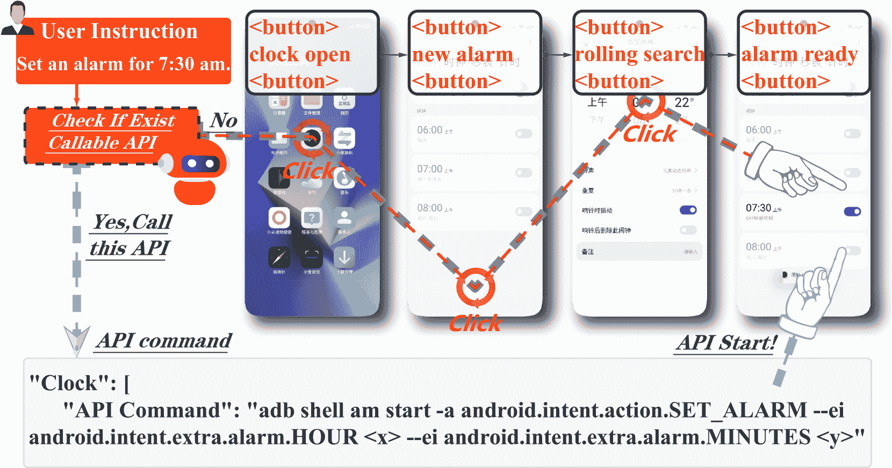
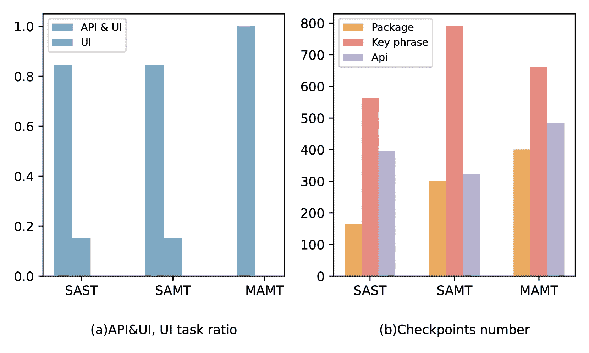
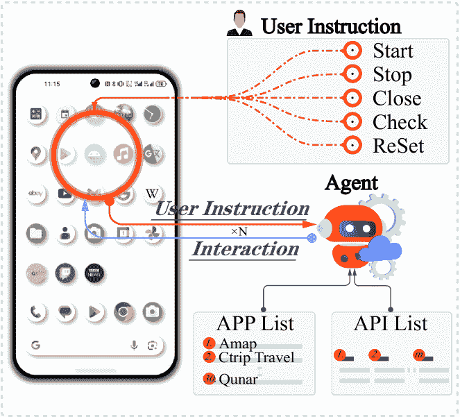
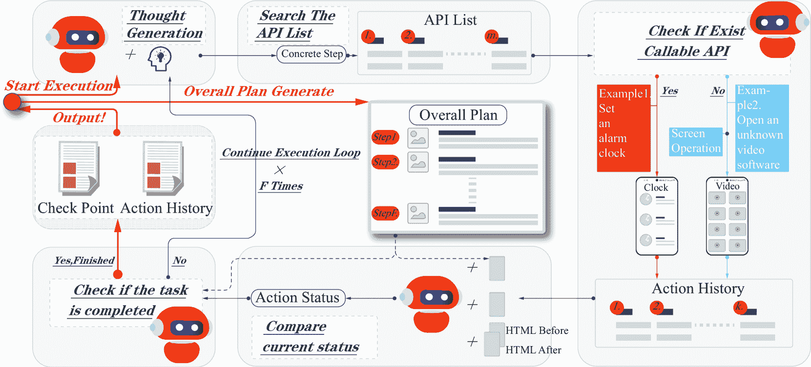
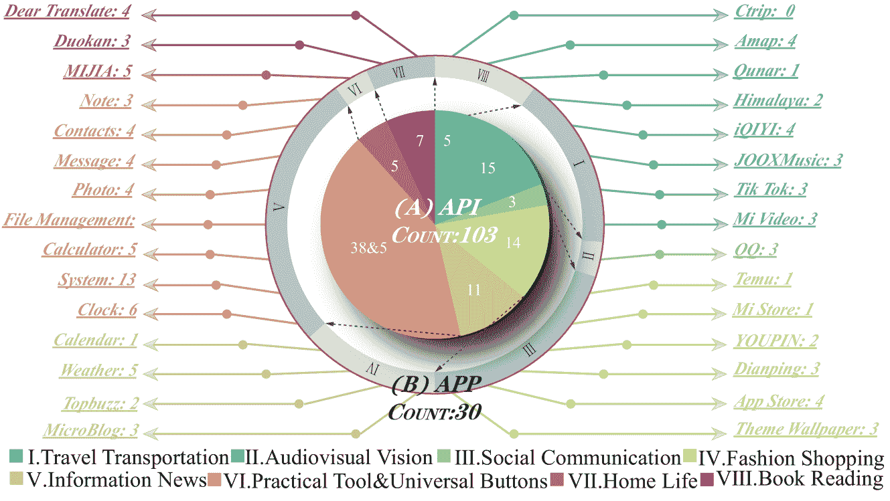
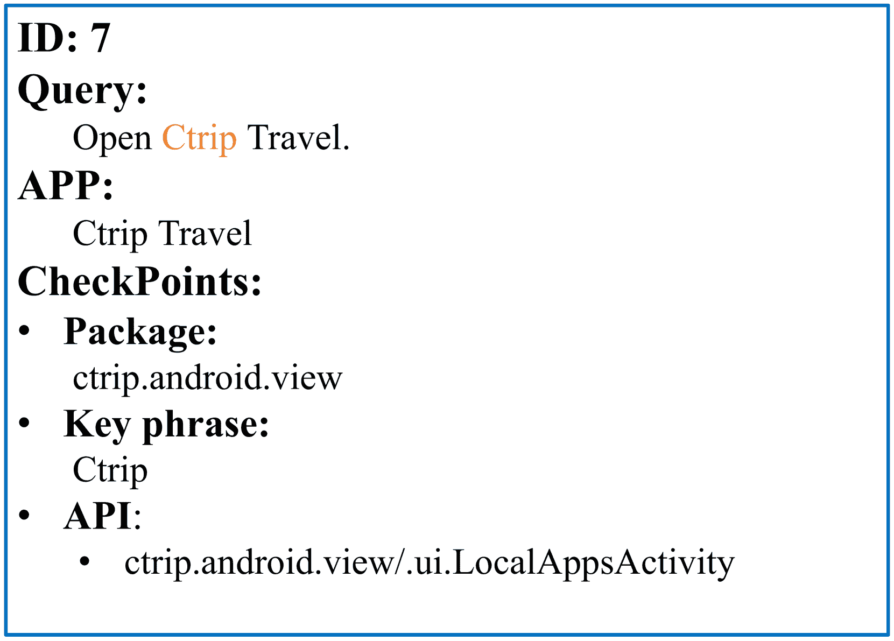
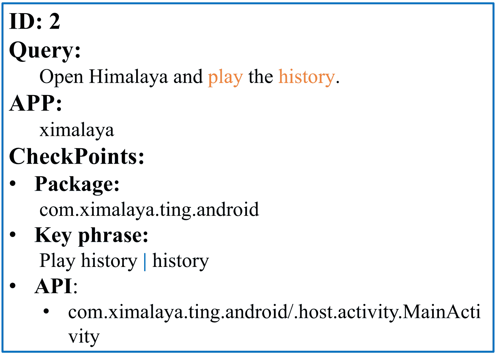
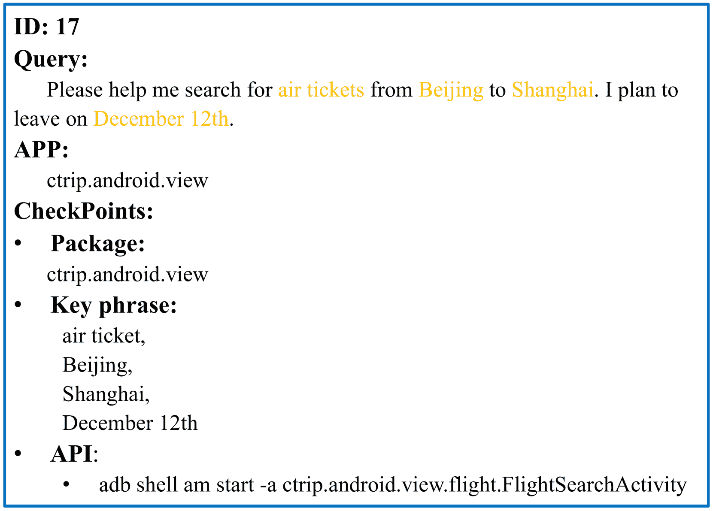
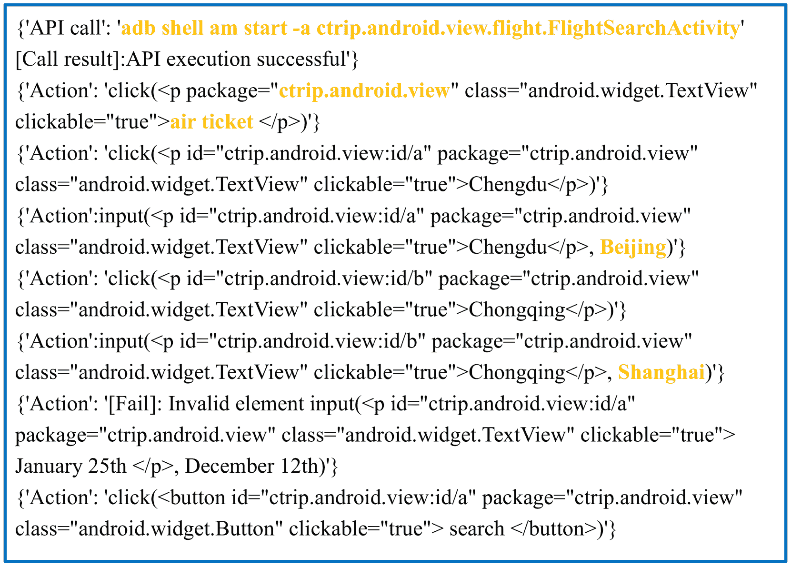
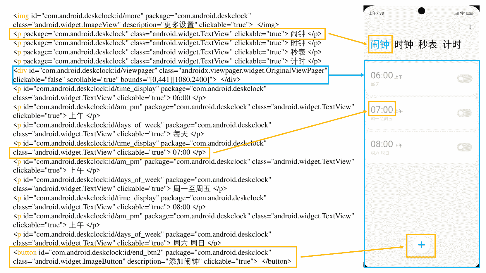

<!--yml

分类：未分类

日期：2025-01-11 12:28:49

-->

# Mobile-Bench：一种针对基于 LLM 的移动代理的评估基准

> 来源：[https://arxiv.org/html/2407.00993/](https://arxiv.org/html/2407.00993/)

邓世翰 徐伟凯 孙洪达 刘伟 小米 AI 实验室 谷涛 高岭 人民大学人工智能学院 刘建峰 小米 AI 实验室 李昂 小米 AI 实验室 关剑 小米 AI 实验室 王斌 小米 AI 实验室 闫瑞 施硕

###### 摘要

随着大规模语言模型（LLMs）的显著进展，基于 LLM 的代理已成为人机交互领域的研究热点。然而，目前针对 LLM 基于的移动代理的基准仍然稀缺。对这些代理进行基准测试通常面临三个主要挑战：（1）仅依靠 UI 操作的低效性限制了任务评估。（2）单一应用内的特定指令无法充分评估 LLM 移动代理在多维推理和决策能力上的表现。（3）现有的评估指标无法准确评估顺序动作的执行过程。为此，我们提出了 Mobile-Bench，一种用于评估基于 LLM 的移动代理能力的新型基准。首先，我们通过结合 103 个收集的 API 来扩展传统的 UI 操作，以加速任务完成的效率。随后，我们通过将真实用户查询与 LLM 增强结合，收集了评估数据。为了更好地评估移动代理不同级别的规划能力，我们将数据分为三个不同的组别：SAST、SAMT 和 MAMT，代表不同复杂度的任务。Mobile-Bench 包含 832 条数据条目，其中超过 200 个任务专门设计用于评估多应用协作场景。此外，我们还引入了一种更准确的评估指标，名为 CheckPoint，用于评估基于 LLM 的移动代理在其规划和推理步骤中是否达到了关键点。数据集和平台可以在 [https://github.com/XiaoMi/MobileBench](https://github.com/XiaoMi/MobileBench) 上获取。

Mobile-Bench：一种针对基于 LLM 的移动代理的评估基准

^†^†脚注：^∗ 同等贡献。^†^†脚注：^($\dagger$) 通讯作者：闫瑞 和 施硕。^†^†脚注：^‡ 在小米实习期间完成的工作。

## 1 引言

使用自然语言与移动设备交互是人机交互领域一个长期的追求（Bolt, [1980](https://arxiv.org/html/2407.00993v1#bib.bib6); Karat 等人, [2002](https://arxiv.org/html/2407.00993v1#bib.bib19); Følstad 和 Brandtzæg, [2017](https://arxiv.org/html/2407.00993v1#bib.bib16)）。随着大型语言模型（LLM）取得显著进展（Bai 等人, [2022](https://arxiv.org/html/2407.00993v1#bib.bib2); Chowdhery 等人, [2022](https://arxiv.org/html/2407.00993v1#bib.bib9); Du 等人, [2021](https://arxiv.org/html/2407.00993v1#bib.bib13); Touvron 等人, [2023](https://arxiv.org/html/2407.00993v1#bib.bib39); Ouyang 等人, [2022](https://arxiv.org/html/2407.00993v1#bib.bib29))，由LLM驱动的代理处于前沿，但它们在处理移动应用功能方面的推理能力仍然落后于在PC上处理网页的能力（Yao 等人, [2022](https://arxiv.org/html/2407.00993v1#bib.bib45); Sun 等人, [2023](https://arxiv.org/html/2407.00993v1#bib.bib38)）。为了真实地复制典型的移动环境，必须整合多样的应用程序，并利用真实数据，超越纯模拟场景的局限性。移动领域的开发挑战源于三大核心问题：对移动界面的理解有限、应用种类匮乏以及缺乏真实世界的数据。

图 1：对于“设置七点半的闹钟”这一任务，仅通过UI操作完成需要四个步骤，而通过API调用可以在一个步骤内完成相同的任务。

| 平台与基准 | InfoUI | API&UI | 真实APP | 真实查询 | 多应用 |
| --- | --- | --- | --- | --- | --- |
| World of Bits Shi 等人 ([2017](https://arxiv.org/html/2407.00993v1#bib.bib35)) | ✓ | ✗ | ✗ | ✗ | ✗ |
| WebShop Yao 等人 ([2022](https://arxiv.org/html/2407.00993v1#bib.bib45)) | ✓ | ✗ | ✗ | ✗ | ✗ |
| AndroidEnv Toyama 等人 ([2021](https://arxiv.org/html/2407.00993v1#bib.bib40)) | ✗ | ✗ | ✓ | ✗ | ✗ |
| MobileEnv Zhang 等人 ([2023](https://arxiv.org/html/2407.00993v1#bib.bib47)) | ✓ | ✗ | ✓ | ✗ | ✗ |
| Mobile-Bench（我们的方法） | ✓ | ✓ | ✓ | ✓ | ✓ |

表 1：Mobile-Bench 与现有的基于LLM的代理平台比较。“InfoUI”表示是否使用UI信息与代理交互，“API&UI”表示代理的操作是否包括API调用和UI界面操作，“Real APP”表示是否使用真实应用程序，“Real Query”表示是否使用真实用户查询，“Multi-APP”表示是否涉及多个应用的任务。

由于谷歌在UI界面表示方面的突破（王等，[2023](https://arxiv.org/html/2407.00993v1#bib.bib41)），大规模语言模型（LLM）代理对UI页面的理解变得更加容易，这促使了诸如Android-Env Toyama等（[2021](https://arxiv.org/html/2407.00993v1#bib.bib40)）和Mobile-Env Zhang等（[2023](https://arxiv.org/html/2407.00993v1#bib.bib47)）等UI平台的创建，这些任务是在单独的游戏或搜索引擎中定义的。然而，这些研究共同面临以下挑战：（1）UI操作依赖于接口的文本描述，其中结构化文本无法捕捉图形按钮或图像的内容，这可能导致错误的操作。一个API操作可能等同于数十个UI步骤，导致UI的低效。（2）它们的任务远离日常使用中遇到的真实任务场景，这些场景需要多个应用程序之间的协作，用户命令模糊且没有指定目标应用程序。（3）任务的评估不应仅依赖于LLM，缺乏任何客观的量化指标。

实际上，手机上的语音助手可以满足大多数用户的日常需求，但它们并不直接与UI界面交互，而是通过调用应用程序背后的API Qin等人（[2023](https://arxiv.org/html/2407.00993v1#bib.bib30)）。如图[1](https://arxiv.org/html/2407.00993v1#S1.F1 "图 1 ‣ 1 引言 ‣ Mobile-Bench：一个基于LLM的移动代理评估基准")所示，在移动应用程序中，API比UI界面更高效；一次API调用可以等同于多个UI操作以实现相同的结果。然而，单一的API不足以完成更复杂的任务，特别是当用户命令不明确时，便需要依赖LLM来解读用户意图。因此，能够同时利用UI和API的代理最为适用。同时，这也需要开发一种策略，用于选择和排列应用程序的使用顺序，而人工监督只需关注审查结果。这是语音助手目前所缺乏的功能 Wen等人（[2023a](https://arxiv.org/html/2407.00993v1#bib.bib43), [b](https://arxiv.org/html/2407.00993v1#bib.bib44)）。为此，我们开发了一种API和UI操作的结合方式，以绕过UI界面的局限性，每个操作都可以选择UI交互或API调用；所有任务从移动设备的主页开始，而不是从特定应用程序的启动页面开始，从而使代理能够决定单个或多个应用程序的使用；任务中的查询来自真实用户，指令生成仅适用于一些复杂任务，并经过严格的人工审核；我们从软件自动化测试中的客观指标——CheckPoint获得灵感，并对其进行了必要的调整，以适应LLM输出语义的不可预测性。总的来说，我们提出了一个包含支持API和UI交互的移动环境平台，以及一个包含多应用程序任务的相应数据集。表[1](https://arxiv.org/html/2407.00993v1#S1.T1 "表 1 ‣ 1 引言 ‣ Mobile-Bench：一个基于LLM的移动代理评估基准")展示了近期基于API和UI的各平台与基准工作的比较。

我们的贡献总结如下：

(1) 据我们所知，我们是首个建立基于LLM的移动代理运行平台的团队，该平台同时支持UI和API调用。

(2) 我们提出了一个包含多种任务的评估数据集，用于多应用程序交互。我们的任务从主页开始，更适合测试代理的规划能力。我们的数据集和平台将很快发布。

(3) 我们引入了一种基于类别的评估指标，用于评估代理在UI和API交互环境中的任务完成能力。

## 2 相关工作

### 2.1 移动平台

在对基于 LLM 的智能体的关注之前，研究工作主要集中在基于强化学习（RL）的智能体上，以 Android-Env 平台为例，Toyama 等人 ([2021](https://arxiv.org/html/2407.00993v1#bib.bib40))。该开源平台专为 Android 生态系统中的强化学习实验而设计，成功测试了各种基于 RL 的智能体，如 DDPG Zhang 和 Van Huynh ([2023](https://arxiv.org/html/2407.00993v1#bib.bib46))、D4PG Barth-Maron 等人 ([2018](https://arxiv.org/html/2407.00993v1#bib.bib4))、MPO Abdolmaleki 等人 ([2018](https://arxiv.org/html/2407.00993v1#bib.bib1))、DQN Mnih 等人 ([2015](https://arxiv.org/html/2407.00993v1#bib.bib26))、IMPALA Espeholt 等人 ([2018](https://arxiv.org/html/2407.00993v1#bib.bib14)) 和 R2D2 Kapturowski 等人 ([2018](https://arxiv.org/html/2407.00993v1#bib.bib18))。

更多的研究集中在基于 LLM 的智能体上，Liu 等人 ([2024](https://arxiv.org/html/2407.00993v1#bib.bib24)); Sun 等人 ([2024b](https://arxiv.org/html/2407.00993v1#bib.bib37)，[a](https://arxiv.org/html/2407.00993v1#bib.bib36))。在工具使用智能体领域，它们可以分为三种主要类型：

1) 针对移动任务。平台如 AutoDroid、DroidBot-GPT、GPT-Droid 和 WebShop Wen 等人 ([2023a](https://arxiv.org/html/2407.00993v1#bib.bib43)，[b](https://arxiv.org/html/2407.00993v1#bib.bib44)); Liu 等人 ([2023b](https://arxiv.org/html/2407.00993v1#bib.bib25)); Yao 等人 ([2022](https://arxiv.org/html/2407.00993v1#bib.bib45)) 创建了一个互动环境，使大型语言模型能够处理移动任务，并生成类似人类的操作以进行自动化测试。Mobile-Env Zhang 等人 ([2023](https://arxiv.org/html/2407.00993v1#bib.bib47)) 专门设计用来评估智能体在处理多步骤交互中的能力。

2) 针对 PC 任务。研究人员开发了 Toollama Qin 等人 ([2023](https://arxiv.org/html/2407.00993v1#bib.bib30)) 以评估使用工具和 API 调用的能力。AgentBench Liu 等人 ([2023a](https://arxiv.org/html/2407.00993v1#bib.bib22)) 提出了一个标准化的智能体任务评估架构，具有强解耦性和可扩展性。PPTC 基准测试 Guo 等人 ([2023](https://arxiv.org/html/2407.00993v1#bib.bib17)) 提出了评估基于 LLM 的智能体在 PowerPoint 任务中表现的能力。

3) 其他方法。Toolformer Schick 等人 ([2023](https://arxiv.org/html/2407.00993v1#bib.bib32)) 和 HuggingGPT Shen 等人 ([2023](https://arxiv.org/html/2407.00993v1#bib.bib34)) 评估了大型语言模型（LLM）掌握工具的能力。

### 2.2 LLM 智能体的基准测试

为了评估代理在理解用户界面方面的能力，涵盖各种任务的多样化数据集至关重要Liu等人（[2023a](https://arxiv.org/html/2407.00993v1#bib.bib22)）。广泛使用的RICO数据集Deka等人（[2017](https://arxiv.org/html/2407.00993v1#bib.bib11)）通常用于此目的，Screen2Vec Li等人（[2021](https://arxiv.org/html/2407.00993v1#bib.bib20)）利用该数据集评估代理性能。

然而，由于缺乏评估代理性能的具体标准，研究工作主要集中在设计评估框架上。PPTC基准测试Guo等人（[2023](https://arxiv.org/html/2407.00993v1#bib.bib17)）设计了279个多轮对话任务，专注于PPT文件操作。DroidTask Wen等人（[2023a](https://arxiv.org/html/2407.00993v1#bib.bib43)）以及多个未命名的数据集Liu等人（[2023b](https://arxiv.org/html/2407.00993v1#bib.bib25)）；Wen等人（[2023b](https://arxiv.org/html/2407.00993v1#bib.bib44)）涵盖了各种移动应用程序的数据集也已建立。此外，Screen2Words使用了一种采样方法，从RICO-SCA Li等人（[2020](https://arxiv.org/html/2407.00993v1#bib.bib21)）数据集中抽取屏幕，并雇佣专业标注人员为这些屏幕生成英文摘要Wang等人（[2021](https://arxiv.org/html/2407.00993v1#bib.bib42)）。

目前的评估标准与多个研究工作一致。ToolBench提出了通过胜率来衡量模型在像RoBERTa Liu等人（[2019](https://arxiv.org/html/2407.00993v1#bib.bib23)）、GPT-3 Brown等人（[2020](https://arxiv.org/html/2407.00993v1#bib.bib7)）、PaLM Chowdhery等人（[2023](https://arxiv.org/html/2407.00993v1#bib.bib10)）、OPT Zhang等人（[2022](https://arxiv.org/html/2407.00993v1#bib.bib48)）、ChatGPT Bubeck等人（[2023](https://arxiv.org/html/2407.00993v1#bib.bib8)）和GPT-4 OpenAI（[2023](https://arxiv.org/html/2407.00993v1#bib.bib28)）等基准测试中的解决方案质量。尽管Fan Fan等人（[2024](https://arxiv.org/html/2407.00993v1#bib.bib15)）发现通过仅使用必要的层来进行推理可以降低推理成本，但计算胜率仍然非常昂贵。Mobile-Env Zhang等人（[2023](https://arxiv.org/html/2407.00993v1#bib.bib47)）基于WikiHow任务中的完成状态、平均步骤和平均奖励来评估代理性能。PPTC基准测试Guo等人（[2023](https://arxiv.org/html/2407.00993v1#bib.bib17)）使用回合和会话的准确率。Android in the Wild Rawles等人（[2023](https://arxiv.org/html/2407.00993v1#bib.bib31)）利用了分布外泛化。总体来说，目前最常用的评估指标包括成功率、回合长度和匹配得分。

## 3 我们的环境

### 3.1 移动基准测试

#### 数据收集。

数据集中的查询被分为以下三类：

+   •

    SAST: 单应用单任务。一个仅包含单一任务文本的真实数据集，包括打开和关闭应用等单任务操作，如“帮我打开地图”。

+   •

    SAMT: 单应用多任务。一个包含多个任务文本的真实数据集，以及构建的单应用数据。一个复杂的单应用多任务场景，比如“帮我打开地图，并导航到埃菲尔铁塔。”

+   •

    MAMT: 多应用多任务。构建的多应用数据，完成复杂的多任务，比如“帮我搜索最新的科技新闻并分享给朋友。”

SAST直接来源于手机上加载的语音助手处理的真实语音请求。我们从这些查询集合中选择一个子集，主要筛除需要语音助手处理并涉及多模态工具的部分。此外，还过滤掉超过权限或涉及隐私的查询。

由于真实数据中的SAMT和MAMT数据较少且质量较低，参考Toollama  Qin等人（[2023](https://arxiv.org/html/2407.00993v1#bib.bib30)）的方法，我们使用GPT-4构建SAMT和MAMT数据。对于MAMT，我们从整个应用程序集合中随机抽取6个应用程序，然后提供一些真实的多应用数据示例，提示GPT-4选择2-4个应用程序来生成任务。通过整合真实数据和构建数据，我们创建了最终的数据集。数据示例如图[2](https://arxiv.org/html/2407.00993v1#S3.F2 "图2 ‣ 数据收集。 ‣ 3.1 Mobile-Bench基准 ‣ 3 我们的环境 ‣ Mobile-Bench：一个基于LLM的移动代理评估基准")所示。

图2：MAMT中的一个测试用例。$\&$ 表示连接检查，CC；$|$ 表示析取检查，DC；$[\ ]$ 表示顺序检查，SC。只要动作历史中包含Amap和Ctrip Travel，或者Amap和Qunar，则包CheckPoint通过。关键短语CheckPoint来自案例中的橙色部分。

#### 应用与API集合。

为确保任务的全面性，我们不仅选择了SAST和SAMT中包含的应用程序，还从APP Store中每个类别选择了最受欢迎的免费应用程序。获取API的方式是分析每个应用程序的包文件，提取其外部保留接口（Desnos和Gueguen [2011](https://arxiv.org/html/2407.00993v1#bib.bib12)）。这样做的好处是，所获得的API天然地与应用程序分类一致。由于反编译结果中的API描述不如开发文档详细，我们使用ADB（Android Debug Bridge）命令逐一验证API的可行性。由于其调试特性，系统级API也可以正常调用，允许访问如检查电池状态和执行内存清理等功能。有关更具体的应用程序名称和类别，请参见附录[B.3](https://arxiv.org/html/2407.00993v1#A2.SS3 "B.3 APP&API统计 ‣ 附录B 数据集详情 ‣ Mobile-Bench: 基于LLM的移动代理评估基准")。

#### 数据集统计。

包括系统中的几个默认应用程序，我们共收集了29个应用程序。对于这些应用程序，我们共收集了103个可用的API，这些API主要执行以下功能：系统调用、打开页面、关闭页面、搜索信息、查看详情以及控制设备开关。这些功能总结为以下几个主要方面：页面切换、详情查看、广播、搜索。在表[2](https://arxiv.org/html/2407.00993v1#S3.T2 "表2 ‣ 数据集统计。 ‣ 3.1 Mobile-Bench基准 ‣ 3 我们的环境 ‣ Mobile-Bench: 基于LLM的移动代理评估基准")中，我们列出了每种APP类型的API数量及其所涵盖的功能类别。我们为每个APP组织了可用的API和APP描述，并生成了一个APP列表，作为选择应用程序的依据，详见附录[B.3](https://arxiv.org/html/2407.00993v1#A2.SS3 "B.3 APP&API统计 ‣ 附录B 数据集详情 ‣ Mobile-Bench: 基于LLM的移动代理评估基准")。

在Mobile-Bench数据集中，我们共收集了332个、300个和200个用于SAST、SAMT和MAMT的查询。我们整理了每个任务在实际语音请求中使用的API，并提供这些API作为生成查询的示例给GPT-4。如图[3](https://arxiv.org/html/2407.00993v1#S3.F3 "图3 ‣ 数据集统计。 ‣ 3.1 Mobile-Bench基准 ‣ 3 我们的环境 ‣ Mobile-Bench: 基于LLM的移动代理评估基准")(a)所示，我们计算了调用API的任务比例，确保数据集中有足够的任务包括调用API的步骤。这种方法确保我们拥有足够的数据来分析API在任务完成中的作用。

应用类别 API 数量 应用数量 API 功能 旅行交通 5 3 ①, ②, ④ 视听视觉 15 5 ①, ②, ③ 社交通信 3 1 ①, ②, ④ 时尚购物 14 6 ①, ④ 信息新闻 11 4 ①, ②, ④ 实用工具 38 8 ①, ②, ③, ④, ⑤ 家居生活 5 1 ①, ⑤ 读书 7 2 ①, ②, ④ 通用按钮 5 0 ⑤

表 2：我们的数据集涵盖了九大类应用，并根据 API 功能进行了比较。上述 API 功能可以总结为五大类：① 页面导航，② 查看详情，③ 播放，④ 搜索，⑤ 系统调用。

图 3：（a）API$\&$UI，UI 任务比例。在 SAST 和 SAMT 中，API$\&$UI 任务比例为 $85\%$，而在 MAMT 中为 $100\%$。（b）CheckPoints 的数量。

#### 质量验证。

Bolotova-Baranova 等人（[2023](https://arxiv.org/html/2407.00993v1#bib.bib5)）初始测试数据来源于软件自动化测试，但部分复杂数据点由 GPT-4 生成。为了确保数据集的质量，我们从 SAST、SAMT 和 MAMT 中随机抽取了 100 个数据点，共计 300 个高质量测试数据。我们进行了跨源验证，以验证这些 CheckPoints 的可行性。具体计算公式如下：

|  | $\text{Overlap}(CP_{1},CP_{2})=\frac{&#124;CP_{1}\cap CP_{2}&#124;}{&#124;CP_{1}&#124;}$ |  | (1) |
| --- | --- | --- | --- |

CP[1] 和 CP[2] 分别表示由 CP[instruction] 和 CP[Human] 生成的 CheckPoint 序列。在表 [3](https://arxiv.org/html/2407.00993v1#S3.T3 "表 3 ‣ 质量验证 ‣ 3.1 移动基准基准 ‣ 3 我们的环境 ‣ Mobile-Bench：基于 LLM 的移动代理评估基准") 中，我们列出了三种数据类型的人类评估结果。从表中可以看出，更高比例的终端数据对应更好的数据质量。然而，所有 MAMT 数据均由指令生成，其质量与 SAST 相比并未显示出不可接受的差距。更多分析请参见附录 [B.1](https://arxiv.org/html/2407.00993v1#A2.SS1 "B.1 数据集质量分析 ‣ 附录 B 数据集详细信息 ‣ Mobile-Bench：基于 LLM 的移动代理评估基准")。

统计数据 SAST SAMT MAMT 总计 CP[instruction] 395 546 513 1454 CP[Human] 412 598 623 1633 CP[instruction ​ $\cap$ ​ Human] 372 466 412 1250 重叠率 0.94 0.85 0.80 0.86

表 3：人类评估结果

### 3.2 测试平台

概述：Mobile-Bench 设计为一个通用互动平台，支持混合 API 和 UI 交互。用户可以按照固定格式构建自己的评估数据，但必须遵循我们规定的评估方法。如图 [4](https://arxiv.org/html/2407.00993v1#S3.F4 "图 4 ‣ 3.2 测试平台 ‣ 3 我们的环境 ‣ Mobile-Bench：基于 LLM 的移动代理评估基准") 所示，用户可以使用以下命令与环境进行交互。

+   •

    Start: 打开测试环境并使用此命令加载预设的快照。每个测试用例必须从相同的环境开始。

+   •

    Stop: 停止测试环境并结束测试。

+   •

    Close: 关闭测试环境并保存测试过程和结果。

+   •

    Check: 捕获当前测试环境的屏幕快照。

+   •

    ReSet: 将先前保存的环境快照加载到测试环境中。

图4：测试平台概览。测试平台由用户、模拟器和代理连接组成。用户发出指令后，整个测试执行过程由代理完成，代理可以通过云端的预设界面查看和管理测试任务。

观察空间 为了使代理以类人方式读取安卓模拟器上的信息，我们使用Appium获取页面信息。根据王等人（Wang et al., [2023](https://arxiv.org/html/2407.00993v1#bib.bib41)）的方法，我们将XML转换为HTML，因为LLM的训练数据主要来自互联网上，包含大量的HTML文件。因此，我们认为LLM对HTML的理解优于XML。鉴于XML的树形结构，我们首先将XML转换为树形格式，然后将需要显示给代理的节点转换为HTML。代理模拟人与智能手机的交互，执行三大操作：点击、输入和滚动。人类通过视觉识别哪些元素可以点击或接收输入，并用手指判断是否可以滚动屏幕。因此，我们提供给代理可见和可滚动的元素。由于上下文长度的限制，我们仅将代理需要的XML信息转换为HTML：

+   •

    Type: 直接继承自XML格式信息的HTML元素类别。

+   •

    ID: “ID”继承自XML的“resource-id”属性，唯一标识元素的存在。

+   •

    Package: 当前应用程序的包名。

+   •

    Class: 元素的类别，例如ImageView，TextView。

+   •

    Description & text: 描述元素的功能和形状。

+   •

    Clickable & Scrollable: 元素是否可点击和可滚动。

+   •

    Bounds: 如果元素是可滚动的，则该属性将存在并定义滚动组件的范围，例如：

    |  | $\bm{\left[x_{i},y_{i}\right]\left[x_{j},y_{j}\right]}$ |  |
    | --- | --- | --- |

    可滚动的矩形范围从$[x_{i},y_{i}]$到$[x_{j},y_{j}]$。

并且，这是一个HTML元素的示例：<button package="com.ximalaya.ting.android" class="android.widget.Button" clickable="true"> message </button>

行为空间：我们的Mobile-Bench模仿人类使用手机的行为，并总结了三种行为Zhang等人（[2023](https://arxiv.org/html/2407.00993v1#bib.bib47)）并模仿在测试平台上调用API的过程Sengupta等人（[2023](https://arxiv.org/html/2407.00993v1#bib.bib33)）：

+   •

    点击：通过传入特定元素模拟真实用户点击操作。

+   •

    滚动：通过点击-拖动-释放模拟真实用户滚动操作。

+   •

    输入：通过点击和输入模拟真实用户输入行为。

+   •

    API调用：通过ADB命令调用API来启动活动或发送意图。

图5：基线模型概览。整个过程框架由传感器、反射组件、控制器、执行组件和环境组成。一旦任务开始，这些组件将反复运行，直到任务完成或达到最大步骤数。

### 3.3 评估方法

#### CheckPoint。

自动化测试CheckPoint覆盖率Bajunaid和Menascé（[2018](https://arxiv.org/html/2407.00993v1#bib.bib3)）是软件执行过程中的一个测试指标。它不能帮助检查软件结果，但可以直观地检查软件是否按指定的单元顺序运行。在数据构建过程中，我们提供了APP和API，它们自然作为检测指标。此外，我们还加入了一个CheckPoint来验证UI操作是否正确点击了预定的元素。在整理上述CheckPoints后，我们构建了以下三个CheckPoints：

+   •

    包：对应应用程序的唯一包名。检查包可以确定是否使用了正确的应用程序。

+   •

    关键短语：从查询中提取的关键短语，代表UI执行过程中的关键步骤。

+   •

    API：在执行过程中需要调用的API命令。

为了评估代理的选择和执行能力，我们将检查粒度划分为两个级别：CheckPoint[l1] - 是否使用了正确的应用程序，以及CheckPoint[l2] - 是否遵循预定义的路径完成任务。对于CheckPoint[l1]，我们检查正确调用的包的数量。对于CheckPoint[l2]，我们检查正确调用的包、关键短语和API的数量。对于CheckPoints，我们确定了三种逻辑关系：顺序检查、联接检查和析取检查。这些关系对应于LLM输出的不稳定性及其同义词替换的倾向。"顺序检查"的计算公式如下：

|  | $Score_{Sequen}=\frac{&#124;\sum_{Str\in SC\cap AH}Str&#124;}{&#124;\sum_{Str\in SC}Str&#124;}$ |  | (2) |
| --- | --- | --- | --- |

SC表示顺序检查集，AH表示操作历史。联接检查的计算公式如下：

|  | $Score_{conjun}=\begin{cases}1,&if\ \forall str\in CC,str\in AH\\ 0,&otherwise\end{cases}$ |  | (3) |
| --- | --- | --- | --- |

CC代表合取检查集。析取检查的计算公式如下：

|  | $Score_{disjun}=\begin{cases}1,&if\ \exists str\in DC,str\in AH\\ 0,&otherwise\end{cases}$ |  | (4) |
| --- | --- | --- | --- |

DC代表析取检查集。上述三项得分的加权总和将是最终的检查点覆盖率。

如图[3](https://arxiv.org/html/2407.00993v1#S3.F3 "Figure 3 ‣ Dataset statistics. ‣ 3.1 Mobile-Bench Benchmark ‣ 3 Our Environment ‣ Mobile-Bench: An Evaluation Benchmark for LLM-based Mobile Agents")所示，关键短语检查点的数量显著高于包检查点，这表明需要更多的语义信息来确保任务一步步完成。从比例角度分析数据集，我们发现三种类型的检查点的分布分别为0.212、0.493、0.294，关键短语检查点仍然是最主要的检查方式。

一般来说，一个测试用例应至少包括以下内容：ID、查询、APP列表、检查点（包、关键短语、API）。图[2](https://arxiv.org/html/2407.00993v1#S3.F2 "Figure 2 ‣ Data collection. ‣ 3.1 Mobile-Bench Benchmark ‣ 3 Our Environment ‣ Mobile-Bench: An Evaluation Benchmark for LLM-based Mobile Agents")是一个包含上述三个检查点的测试用例。

#### PassRate。

秦等人（[2023](https://arxiv.org/html/2407.00993v1#bib.bib30)）我们通过计算在指定步数限制内成功完成查询的比例，评估代理的人机交互能力。在此过程中，我们组织了仿真器的当前状态。随后，GPT-4评估任务完成状态。我们计算了通过任务的百分比，得出了PassRate作为代理人机交互能力的指标。

#### 平均步数。

张等人（[2023](https://arxiv.org/html/2407.00993v1#bib.bib47)）我们量化了Mobile-Bench完成任务所需的步数，并将其作为评估代理效率的指标。在Mobile-Bench中，一个“步数”被定义为完成一个UI操作或执行一个API调用。

## 4 实验

### 4.1 基准模型

我们模型的架构，如算法 [1](https://arxiv.org/html/2407.00993v1#alg1 "算法 1 ‣ 4.1 基线模型 ‣ 4 实验 ‣ Mobile-Bench：基于 LLM 的移动代理评估基准") 所示，首先通过 Appium 获取智能手机的 UI 信息，并通过启发式算法将其转换为 HTML 格式。随后，如图 [5](https://arxiv.org/html/2407.00993v1#S3.F5 "图 5 ‣ 3.2 测试平台 ‣ 3 我们的环境 ‣ Mobile-Bench：基于 LLM 的移动代理评估基准") 所示，利用 HTML、任务详情和应用程序列表，LLM 生成一个全面的任务计划，概述所需的应用程序及其对应的子任务。由于 API 集合是根据 APP 分类组织的，我们可以获得计划中可能使用的 API 集合。

任务计划是迭代执行的。在每次迭代中，模型要么执行 API 调用，要么执行 UI 操作。每次执行后，模型会记录该动作的成功或失败，并生成后续思维，评估任务是否完成。关于算法的实际运行过程，请参阅附录 [C.7](https://arxiv.org/html/2407.00993v1#A3.SS7 "C.7 算法示例 ‣ 附录 C 基线模型详情 ‣ Mobile-Bench：基于 LLM 的移动代理评估基准")。

算法 1 基线模型

1: 任务描述，$Task$；应用程序列表，$L_{APP}$；API 列表，$L_{API}$；最大循环步骤，$M_{\text{step}}$；初始思维，$Tho$；2: 动作历史，$A\!H$；总步骤，$Step$；完成标志，$Finish$；3: $Html\leftarrow Appium(Emulator)$；4: $Plan\leftarrow LLM(Task,L_{APP})$；5: $Step=0$,  $Finish=False$；6: $A\!H=[\ ]$；7: while $(Step\leq M_{step})and(Finish\neq True)$ do；8:        $Step++$；9:        $Html\leftarrow Appium(Emulator)$；10:        $API\!\!\leftarrow\!\!LLM(Task,L_{API},A\!H,Tho,Plan,Html)$；11:        if $API$ then；12:              $Action(API)$；13:              $A\!H.append(API)$；14:        else；15:              $UI\leftarrow LLM(Task,A\!H,Tho,Plan,Html)$；16:              $Action(UI)$；17:              $A\!H.append(UI)$；18:        end if；19:        $Html\leftarrow Appium(Emulator)$；20:        $Tho\leftarrow LLM(Task,A\!H,Plan,Html)$；21:        $Finish\leftarrow LLM(Task,A\!H,Tho,Html)$；22: end while Metric LLaMA-13B LLaMA-70B GPT-3.5-turbo GPT-4 SAST SAMT MAMT SAST SAMT MAMT SAST SAMT MAMT SAST SAMT MAMT 平均步骤数 7.43 18.76 49.52 5.97 16.63 48.91 4.53 12.06 48.73 3.79 13.94 44.86 通过率 44.58 27.67 8 56.62 54 13.5 64.94 64 15.5 80.96 63 26.5 检查点[l1] 46.08 43.67 28.74 56.62 61 39.98 66.75 67 43.16 81.57 72.66 61.34 检查点[l2] 34.85 29.13 21.39 63.12 62.73 41.21 76.21 71.29 44.09 83.76 77.35 52.98

表 4：基于不同 LLM 的代理在 Mobile-Bench 数据集上的结果。在 MAMT 数据上，由于上下文长度的限制，动作历史会进行压缩，仅保留最近的 20 个条目。

### 4.2 设置

我们评估了四个流行的 LLM 在提出的 Mobile-Bench 任务集上的表现：GPT-3.5-turbo Ouyang 等人 ([2022](https://arxiv.org/html/2407.00993v1#bib.bib29))，GPT-4 Nori 等人 ([2023](https://arxiv.org/html/2407.00993v1#bib.bib27))，LLaMA-13B 和 LLaMA-70B Touvron 等人 ([2023](https://arxiv.org/html/2407.00993v1#bib.bib39))，而 ChatGPT-3.5 和 GPT-4 通过 OpenAI 的在线 API 进行访问。实验采用了 3-shot 的上下文学习，采样温度为 0.1。考虑到任务执行会产生成本，我们根据任务的难度预设了不同的最大步骤限制。对于 SAST、SAMT 和 MAMT 三个类别，我们分别将最大步骤设置为 10、20 和 50。由于预算限制，只有 GPT-3.5 使用了一个上下文长度为 16K 的接口。GPT-4 使用标准接口，这要求对动作历史进行压缩和修剪。有关其他设置，请参见附录 [A](https://arxiv.org/html/2407.00993v1#A1 "Appendix A Settings ‣ Mobile-Bench: An Evaluation Benchmark for LLM-based Mobile Agents")。

### 4.3 结果

如表 [4](https://arxiv.org/html/2407.00993v1#S4.T4 "Table 4 ‣ 4.1 Baseline Model ‣ 4 Experiment ‣ Mobile-Bench: An Evaluation Benchmark for LLM-based Mobile Agents") 所示，可以观察到 GPT-3.5 在 SAMT 上的通过率优于 GPT-4（64% > 63%），且完成任务所需步骤更少（12.06 < 13.94）。为了探讨这一现象，我们分析了输出文件，发现表现较差的模型在通过率上存在误判：它们在任务未完成的情况下提前终止。这个现象在 LLaMA 中也存在，LLaMA 显示出较高的通过率（44.58%），但检查点覆盖率较低（34.85%）。与此同时，我们深入探讨了 MAMT 结果为何如此低（15.5%，26.5%）。我们的分析揭示，LLM 在完成任务时通常表现出贪婪的探索行为，即它们很难判断何时退出当前应用并转到下一个应用。这种倾向在某些生成任务中尤为突出。此外，随着动作历史的增加，其准确判断任务进度的能力也变得越来越具有挑战性。有关更详细的结果，请参见表 [7](https://arxiv.org/html/2407.00993v1#A2.T7 "Table 7 ‣ B.5 Supplementary experiments ‣ Appendix B Details of Dataset ‣ Mobile-Bench: An Evaluation Benchmark for LLM-based Mobile Agents")。

设置 平均 #步骤 检查点[l2] 通过率 SAST (GPT-4) 3.79 83.76 80.96 SAMT (GPT-4) 13.94 77.35 63 MAMT (GPT-4) 44.86 52.98 26.5 SAST (不使用 API) 6.13 72.73 74.39 SAMT (不使用 API) 16.86 56.74 48 MAMT (不使用 API) 49.17 31.69 9.5

表 5：基于 GPT-4 的 API 消融研究。

### 4.4 API 调用的影响

API 调用可以加速任务执行，因为一次调用通常可以替代多个连续的 UI 步骤。从另一个角度看，代理选择合适的 API 和输入参数的能力值得进一步研究。选择错误的 API 可能导致任务方向错误，或者需要进行大量步骤来纠正。因此，在表 [5](https://arxiv.org/html/2407.00993v1#S4.T5 "表 5 ‣ 4.3 结果 ‣ 4 实验 ‣ Mobile-Bench: 基于 LLM 的移动代理评估基准") 中，我们评估并分析了引入 API 对任务完成的影响，基于 GPT-4。

从表 [5](https://arxiv.org/html/2407.00993v1#S4.T5 "表 5 ‣ 4.3 结果 ‣ 4 实验 ‣ Mobile-Bench: 基于 LLM 的移动代理评估基准") 中可以看出，即使在 SAST 中，PassRate 也下降了 6.57%（从 80.96 降到 74.39）。此外，移除 API 后，CheckPoints[l2] 的值出现了更显著的下降，特别是在 SAMT 中，下降超过了 20%。同时，我们观察到平均步骤数有所增加，这与我们的预期一致。我们分析了结果，发现无法准确翻页、低效的页面功能探索以及未能点击图形按钮是导致 UI 操作效率低的主要原因。

设置 平均步骤数 CheckPoint[l1] CheckPoint[l2] 通过率 SAST (GPT-4) 3.63 82 79.74 76 SAST (无思维) 8.86 82 29.16 24 SAST (无计划) 3.98 76 74.54 72 SAMT (GPT-4) 13.94 63 72.66 77 SAMT (无思维) 19.54 63 18.31 20 SAMT (无计划) 17.09 52 58.02 62

表 6：基于 GPT-4 的 SAST（子集 50）和 SAMT（子集 200）上的思维与计划消融研究。

### 4.5 计划与思维的影响

由于观察-思维-行动已经是代理方向的标准化过程（Qin 等人，[2023](https://arxiv.org/html/2407.00993v1#bib.bib30)），并且已通过实验结果得到验证，行动前的计划和思维至关重要。从实验结果可以发现，缺少观察-思维步骤时，代理几乎无法完成任务（77->20, 76->24），这是因为它无法确定下一步的行动类别和当前任务状态。在更复杂的任务 SAMT 中，失去计划会带来更为严重的负面后果（77->62）。但它们对 CheckPoint[l1] 的影响几乎没有（82->82 63->63），因为应用选择几乎完全由 API 调用完成。

## 5 结论

在本工作中，我们提出了一个支持API和UI交互的移动电话代理能力测试环境。这对于探索LLM如何与移动操作系统集成具有重要意义。此外，它还可以作为开发操作系统测试平台、评估LLM代理能力的有价值参考。我们收集并发布了一个包含多个APP任务的测试数据集，通过人工验证确保其质量。在此数据集和环境的基础上，我们测试了基于LLM的各种代理的规划、决策和执行。有关我们基准测试的局限性，请参阅第[6](https://arxiv.org/html/2407.00993v1#S6 "6 Limitations ‣ Mobile-Bench: An Evaluation Benchmark for LLM-based Mobile Agents")节。

## 6 局限性

尽管通用大模型在推理和规划方面表现出强大的能力，但它们在API调用中往往存在明显的幻觉。因此，语言模型可能会对应用程序的功能产生困惑，从而导致不愿继续并完成任务。因此，针对指令对模型进行微调是非常必要的。

自动检查点是一种过程评估指标，这使得评估最终结果的质量变得具有挑战性。这取决于代理是否已在所需页面上获得必要的信息（动作）。

代理能力的提升依赖于广泛的API和SDK库，需要应用开发公司提供大量支持。

## 7 伦理声明

我们已严格筛选数据集，移除任何可能危害个人隐私的元素，从而确保个人数据的最高保护水平。我们通过严格随机选择IT专业人员来进行工作评估。此过程确保了性别平衡和教育背景多样化，反映了广泛的视角和专业知识。

## 8 致谢

我们感谢小米科技有限公司的小爱语音部门为本项目提供的原始数据支持。我们还感谢我们的众包标注员的辛勤工作，感谢Junfeng Peng和Yifan Cheng对人类表现评估的贡献，以及匿名审稿人提出的建设性意见。本工作得到了国家自然科学基金（U2001212、62032001和61932004）的资助。

## 参考文献

+   Abdolmaleki 等人（2018）Abbas Abdolmaleki，Jost Tobias Springenberg，Yuval Tassa，Remi Munos，Nicolas Heess 和 Martin Riedmiller。2018年。《最大后验策略优化》。*arXiv预印本arXiv:1806.06920*。

+   Bai 等人 (2022) Y Bai, S Kadavath, S Kundu, A Askell, J Kernion, A Jones, A Chen, A Goldie, A Mirhoseini, C McKinnon 等。2022年。《宪法AI：来自AI反馈的无害性》（arxiv: 2212.08073）。arxiv。

+   Bajunaid 和 Menascé (2018) Noor Bajunaid 和 Daniel A Menascé. 2018. 高效建模和优化并发组件化软件系统中的检查点。*系统与软件期刊*，139:1–13。

+   Barth-Maron 等人 (2018) Gabriel Barth-Maron, Matthew W Hoffman, David Budden, Will Dabney, Dan Horgan, Dhruva Tb, Alistair Muldal, Nicolas Heess, 和 Timothy Lillicrap. 2018. 分布式分布式确定性策略梯度。*arXiv 预印本 arXiv:1804.08617*。

+   Bolotova-Baranova 等人 (2023) Valeriia Bolotova-Baranova, Vladislav Blinov, Sofya Filippova, Falk Scholer, 和 Mark Sanderson. 2023. Wikihowqa: 多文档非事实型问答的综合基准。发表于 *第61届计算语言学协会年会论文集（卷1：长篇论文）*，第5291-5314页。

+   Bolt (1980) Richard A Bolt. 1980. “put-that-there” 语音和手势在图形界面中的应用。发表于 *第7届计算机图形学与交互技术年会论文集*，第262-270页。

+   Brown 等人 (2020) Tom Brown, Benjamin Mann, Nick Ryder, Melanie Subbiah, Jared D Kaplan, Prafulla Dhariwal, Arvind Neelakantan, Pranav Shyam, Girish Sastry, Amanda Askell, 等人. 2020. 语言模型是少量示例学习者。*神经信息处理系统进展*，33:1877–1901。

+   Bubeck 等人 (2023) Sébastien Bubeck, Varun Chandrasekaran, Ronen Eldan, Johannes Gehrke, Eric Horvitz, Ece Kamar, Peter Lee, Yin Tat Lee, Yuanzhi Li, Scott Lundberg, 等人. 2023. 人工通用智能的火花：关于 GPT-4 的早期实验。*arXiv 预印本 arXiv:2303.12712*。

+   Chowdhery 等人 (2022) Aakanksha Chowdhery, Sharan Narang, Jacob Devlin, Maarten Bosma, Gaurav Mishra, Adam Roberts, Paul Barham, Hyung Won Chung, Charles Sutton, Sebastian Gehrmann, 等人. 2022. Palm: 使用路径扩展语言建模。*arXiv 预印本 arXiv:2204.02311*。

+   Chowdhery 等人 (2023) Aakanksha Chowdhery, Sharan Narang, Jacob Devlin, Maarten Bosma, Gaurav Mishra, Adam Roberts, Paul Barham, Hyung Won Chung, Charles Sutton, Sebastian Gehrmann, 等人. 2023. Palm: 使用路径扩展语言建模。*机器学习研究期刊*，24(240):1–113。

+   Deka 等人 (2017) Biplab Deka, Zifeng Huang, Chad Franzen, Joshua Hibschman, Daniel Afergan, Yang Li, Jeffrey Nichols, 和 Ranjitha Kumar. 2017. Rico: 用于构建数据驱动设计应用的移动应用数据集。发表于 *第30届ACM年度用户界面软件与技术研讨会论文集*，第845-854页。

+   Desnos 和 Gueguen (2011) Anthony Desnos 和 Geoffroy Gueguen. 2011. Android: 从反向工程到反编译。*黑帽阿布扎比大会论文集*，1:1–24。

+   Du 等人 (2021) Zhengxiao Du, Yujie Qian, Xiao Liu, Ming Ding, Jiezhong Qiu, Zhilin Yang, 和 Jie Tang. 2021. Glm: 基于自回归空白填充的通用语言模型预训练。*arXiv 预印本 arXiv:2103.10360*。

+   Espeholt 等（2018）Lasse Espeholt、Hubert Soyer、Remi Munos、Karen Simonyan、Vlad Mnih、Tom Ward、Yotam Doron、Vlad Firoiu、Tim Harley、Iain Dunning 等。2018年。《Impala：具有重要性加权的演员-学习者架构的可扩展分布式深度强化学习》。发表于 *国际机器学习会议*，第1407–1416页。PMLR。

+   Fan 等（2024）Siqi Fan、Xin Jiang、Xiang Li、Xuying Meng、Peng Han、Shuo Shang、Aixin Sun、Yequan Wang 和 Zhongyuan Wang。2024年。《并非所有层在推理过程中都是必要的》。*arXiv预印本arXiv:2403.02181*。

+   Følstad 和 Brandtzæg（2017）Asbjørn Følstad 和 Petter Bae Brandtzæg。2017年。《聊天机器人与新的人机交互世界》。*交互*，24(4):38–42。

+   Guo 等（2023）Yiduo Guo、Zekai Zhang、Yaobo Liang、Dongyan Zhao 和 Duan Nan。2023年。《PPTC基准：评估大型语言模型在PowerPoint任务完成中的表现》。*arXiv预印本arXiv:2311.01767*。

+   Kapturowski 等（2018）Steven Kapturowski、Georg Ostrovski、John Quan、Remi Munos 和 Will Dabney。2018年。《分布式强化学习中的递归经验回放》。发表于 *国际学习表征会议*。

+   Karat 等（2002）Clare-Marie Karat、John Vergo 和 David Nahamoo。2002年。《对话界面技术》。*人机交互手册*，第169–186页。

+   Li 等（2021）Toby Jia-Jun Li、Lindsay Popowski、Tom Mitchell 和 Brad A Myers。2021年。《Screen2vec：GUI屏幕和GUI组件的语义嵌入》。发表于 *2021年人机交互学会（CHI）会议论文集*，第1–15页。

+   Li 等（2020）Yang Li、Jiacong He、Xin Zhou、Yuan Zhang 和 Jason Baldridge。2020年。《将自然语言指令映射到移动UI操作序列》。*arXiv预印本arXiv:2005.03776*。

+   Liu 等（2023a）Xiao Liu、Hao Yu、Hanchen Zhang、Yifan Xu、Xuanyu Lei、Hanyu Lai、Yu Gu、Hangliang Ding、Kaiwen Men、Kejuan Yang 等。2023a年。《Agentbench：评估大型语言模型作为代理》。*arXiv预印本arXiv:2308.03688*。

+   Liu 等（2019）Yinhan Liu、Myle Ott、Naman Goyal、Jingfei Du、Mandar Joshi、Danqi Chen、Omer Levy、Mike Lewis、Luke Zettlemoyer 和 Veselin Stoyanov。2019年。《Roberta：一种稳健优化的BERT预训练方法》。*arXiv预印本arXiv:1907.11692*。

+   Liu 等（2024）Yuhan Liu、Xiuying Chen、Xiaoqing Zhang、Xing Gao、Ji Zhang 和 Rui Yan。2024年。《从怀疑到接受：模拟对假新闻的态度动态》。*arXiv预印本arXiv:2403.09498*。

+   Liu 等（2023b）Zhe Liu、Chunyang Chen、Junjie Wang、Mengzhuo Chen、Boyu Wu、Xing Che、Dandan Wang 和 Qing Wang。2023b年。《与GPT-3进行对话实现零样本类人移动自动化GUI测试》。*arXiv预印本arXiv:2305.09434*。

+   Mnih 等（2015）Volodymyr Mnih、Koray Kavukcuoglu、David Silver、Andrei A Rusu、Joel Veness、Marc G Bellemare、Alex Graves、Martin Riedmiller、Andreas K Fidjeland、Georg Ostrovski 等。2015年。《通过深度强化学习实现人类级控制》。*自然*，518(7540):529–533。

+   Nori等人（2023）Harsha Nori, Nicholas King, Scott Mayer McKinney, Dean Carignan, 和 Eric Horvitz. 2023. GPT-4在医学挑战问题中的能力。*arXiv预印本 arXiv:2303.13375*。

+   OpenAI（2023）OpenAI. 2023. [Gpt-4技术报告](http://arxiv.org/abs/2303.08774)。

+   Ouyang等人（2022）Long Ouyang, Jeffrey Wu, Xu Jiang, Diogo Almeida, Carroll Wainwright, Pamela Mishkin, Chong Zhang, Sandhini Agarwal, Katarina Slama, Alex Ray, 等人. 2022. 训练语言模型通过人类反馈遵循指令。*神经信息处理系统进展*，35:27730–27744。

+   Qin等人（2023）Yujia Qin, Shihao Liang, Yining Ye, Kunlun Zhu, Lan Yan, Yaxi Lu, Yankai Lin, Xin Cong, Xiangru Tang, Bill Qian, 等人. 2023. Toolllm：帮助大型语言模型掌握16000+现实世界的API。*arXiv预印本 arXiv:2307.16789*。

+   Rawles等人（2023）Christopher Rawles, Alice Li, Daniel Rodriguez, Oriana Riva, 和 Timothy Lillicrap. 2023. Android野外：一个用于安卓设备控制的大规模数据集。*arXiv预印本 arXiv:2307.10088*。

+   Schick等人（2023）Timo Schick, Jane Dwivedi-Yu, Roberto Dessì, Roberta Raileanu, Maria Lomeli, Luke Zettlemoyer, Nicola Cancedda, 和 Thomas Scialom. 2023. Toolformer：语言模型可以自我教授使用工具。*arXiv预印本 arXiv:2302.04761*。

+   Sengupta等人（2023）Aritro Sengupta, Amit Singh, 和 BM Vinjit. 2023. 一种平台独立且具有法医可靠性的提取WhatsApp数据的方法。*国际电子安全与数字取证杂志*，15(3):259–280。

+   Shen等人（2023）Yongliang Shen, Kaitao Song, Xu Tan, Dongsheng Li, Weiming Lu, 和 Yueting Zhuang. 2023. HuggingGPT：使用ChatGPT及其在HuggingFace中的朋友解决AI任务。*arXiv预印本 arXiv:2303.17580*。

+   Shi等人（2017）Tianlin Shi, Andrej Karpathy, Linxi Fan, Jonathan Hernandez, 和 Percy Liang. 2017. Bits的世界：一个开放领域的平台，用于基于Web的代理。载于*国际机器学习会议*，第3135–3144页。PMLR。

+   Sun等人（2024a）Hongda Sun, Hongzhan Lin, Haiyu Yan, Chen Zhu, Yang Song, Xin Gao, Shuo Shang, 和 Rui Yan. 2024a. 促进大型语言模型在在线求职和招聘中的多角色和多行为协作。*arXiv预印本 arXiv:2405.18113*。

+   Sun等人（2024b）Hongda Sun, Yuxuan Liu, Chengwei Wu, Haiyu Yan, Cheng Tai, Xin Gao, Shuo Shang, 和 Rui Yan. 2024b. 利用大型语言模型的多角色能力进行开放领域问答。载于*2024年ACM Web会议论文集*，第4372–4382页。

+   Sun等人（2023）Hongda Sun, Weikai Xu, Wei Liu, Jian Luan, Bin Wang, Shuo Shang, Ji-Rong Wen, 和 Rui Yan. 2023. Determlr: 从不确定性到确定性增强基于llm的逻辑推理。*arXiv预印本 arXiv:2310.18659*。

+   Touvron 等人 (2023) Hugo Touvron, Thibaut Lavril, Gautier Izacard, Xavier Martinet, Marie-Anne Lachaux, Timothée Lacroix, Baptiste Rozière, Naman Goyal, Eric Hambro, Faisal Azhar 等. 2023. Llama: 开放且高效的基础语言模型. *arXiv 预印本 arXiv:2302.13971*。

+   Toyama 等人 (2021) Daniel Toyama, Philippe Hamel, Anita Gergely, Gheorghe Comanici, Amelia Glaese, Zafarali Ahmed, Tyler Jackson, Shibl Mourad 和 Doina Precup. 2021. Androidenv: 一个针对 Android 的强化学习平台. *arXiv 预印本 arXiv:2105.13231*。

+   Wang 等人 (2023) Bryan Wang, Gang Li 和 Yang Li. 2023. 使用大语言模型实现与移动 UI 的对话交互. 见 *2023年计算机系统人机因素会议论文集*，第 1–17 页。

+   Wang 等人 (2021) Bryan Wang, Gang Li, Xin Zhou, Zhourong Chen, Tovi Grossman 和 Yang Li. 2021. Screen2words: 基于多模态学习的移动 UI 自动摘要. 见 *第34届年度 ACM 用户界面软件与技术研讨会论文集*，第 498–510 页。

+   Wen 等人 (2023a) Hao Wen, Yuanchun Li, Guohong Liu, Shanhui Zhao, Tao Yu, Toby Jia-Jun Li, Shiqi Jiang, Yunhao Liu, Yaqin Zhang 和 Yunxin Liu. 2023a. 赋能 LLM 使用智能手机进行任务自动化. *arXiv 预印本 arXiv:2308.15272*。

+   Wen 等人 (2023b) Hao Wen, Hongming Wang, Jiaxuan Liu 和 Yuanchun Li. 2023b. Droidbot-gpt: 基于 GPT 的 Android 用户界面自动化. *arXiv 预印本 arXiv:2304.07061*。

+   Yao 等人 (2022) Shunyu Yao, Howard Chen, John Yang 和 Karthik Narasimhan. 2022. Webshop: 面向具有基础语言智能体的可扩展现实世界网页交互. *神经信息处理系统进展*，35:20744–20757。

+   Zhang 和 Van Huynh (2023) Bolun Zhang 和 Nguyen Van Huynh. 2023. 无需先验信道知识的端到端通信系统深度确定性策略梯度. *arXiv 预印本 arXiv:2305.07448*。

+   Zhang 等人 (2023) Danyang Zhang, Lu Chen 和 Kai Yu. 2023. Mobile-env: 一个用于移动交互训练与评估的通用平台. *arXiv 预印本 arXiv:2305.08144*。

+   Zhang 等人 (2022) Susan Zhang, Stephen Roller, Naman Goyal, Mikel Artetxe, Moya Chen, Shuohui Chen, Christopher Dewan, Mona Diab, Xian Li, Xi Victoria Lin 等. 2022. Opt: 开放的预训练变换器语言模型. *arXiv 预印本 arXiv:2205.01068*。

## 附录 A 设置

我们在 Android 14.0 版本的模拟器上进行实验，并使用 Appium UiAutomator2 Driver 进行自动化测试。在每次执行任务前，我们都会加载一个快照，以确保模拟器每次都处于相同的环境中。对于所有应用程序，我们已提前登录账户，以确保可以使用应用程序的全部功能。由于我们的测试是在现实世界中进行的，我们过滤掉了任何包含支付的任务。

## 附录 B 数据集详情

### B.1 数据集质量分析

低质量数据的根本原因通常在于应用描述的不准确性。此外，查询生成中的模糊性也起着重要作用。例如，在查询“帮我找与北京相关的图片”中，尽管用户没有明确指定源应用，但对于人类而言，预期结果可能是搜索引擎或地图应用，因为这些图片不太可能来自用户自己。然而，对于大型语言模型（LLM）来说，由于该语句包含“图片”一词，它可能会完全投入到在图库应用中搜索图片，尽管这一努力最终是徒劳的。检查点覆盖率是通过上述三种检查点类型的分数加权求和来计算的。

### B.2 指令生成的提示

以下我们列出了指令生成的详细提示，包括单个应用多任务描述、多个应用多任务描述。

单应用多任务描述：

你将会收到一个应用的描述，包括可用的 API 列表、adb 命令、功能描述和参数信息。你应创建 5 个多样化、创新且详细的多任务查询，使用此应用作为工具，API 可作为辅助。

每个查询应包括必要的参数。请注意，你不应该问“使用哪个应用”，而是直接陈述可以通过这些应用解决的需求。你也应该避免询问 APP 调用所需的输入参数，而是直接在查询中提供这些参数。相关的应用和 API 必须严格来自提供的列表。

同时，你还需要提供此查询的检查点，包括包、关键词短语和 API。包来自将要使用的 APP 对应的包名。关键词短语是 Android 模拟器在执行此查询时会执行的关键点击元素或关键输入字符，用于检查查询是否完成。关键词短语应为名词并且是查询的一部分，应该尽量简短。

关键词短语可以包含多条信息，"$|$"表示当以下任意文本完成时，查询通过。"$|$"用于分隔同一名词的同义表达；"$\&$"表示查询必须在所有文本完成时才通过；顺序的检查点存储在"$[\ ]$"中，且每通过一个元素，计数增加1。要使用的"ADB 命令"存储在 API 中，可能为空。

请按以下格式提供你的回答：

$[\{$

"id": "编号"

"query": "文本"

"APP": "APP 名称"

"CheckPoint": $\{$

"package": "APP 包名"

"key phrase": $[$"文本1", … $]$

"API: $[$"API1", … $]$"

$\}$

$\ \}$

…

$]$

多个应用多任务描述：

您将获得一些 APP 及其描述、可用的 API 列表，包括 adb 命令、功能描述和参数信息。您应创建 3 个多样化、创新且详细的多查询，使用多 APP 作为工具，API 可以作为辅助工具。

每个查询应包括必要的参数。请注意，不要询问“使用哪个 APP”，而应直接陈述您的需求，这些需求可以通过这些 APP 来解决。您还应避免询问 APP 调用所需的输入参数，而应直接在查询中提供参数。相关的 APP 和 API 必须严格来自提供的列表。您应该首先考虑可能的相关 APP 组合，然后再进行查询。请记住，每个查询应调用两到四个 APP。

同时，您还需要提供此查询的 CheckPoint，包括包名、关键短语和 API。包名来自所使用 APP 对应的包名。关键短语是 Android 模拟器在执行此查询时将执行的关键点击元素或关键输入字符，用于检查查询是否已完成。关键短语应为名词，并且是查询的一部分，应该尽可能简短。

关键短语可以包含多个信息，"$|$" 表示当下列任何文本完成时，查询通过。"$|$" 用于分隔同一名词的同义表达；"$\&$" 表示查询必须在所有文本完成时通过；顺序 CheckPoint 存储在 "$[\ ]$" 中，每个通过的元素计数增加一。要使用的 "ADB 命令" 存储在 API 中，可能为空。对于不同的查询，相关 APP 的重叠应尽量减少。

以此格式提供您的响应：

$[\{$

"id": "数字"

"query": "文本"

"APP": $[$"APP 名称1", …  $]$

"CheckPoint": $\{$

"package": $[$"APP 包名1", …  $]$

"关键短语": $[$"text1", … $]$

"API: $[$"API1", … $]$"

$\}$

$\ \}$

…

$]$

### B.3 APP&API 统计

图 6: APP 分类和数量图表：最大类别是实用工具，我们将基本的移动应用程序归类于此。它们的特点是使用标准 API 接口，且 API 功能更为全面。

从图[6](https://arxiv.org/html/2407.00993v1#A2.F6 "Figure 6 ‣ B.3 APP&API statistics ‣ Appendix B Details of Dataset ‣ Mobile-Bench: An Evaluation Benchmark for LLM-based Mobile Agents")可以看出，每个功能区包含至少一个应用程序及其相应的 API。这些应用程序足以满足用户的日常需求。换句话说，我们的仿真环境几乎与真实的日常使用环境一致，并且与真实的日常使用环境一致。开放世界信息交换。有如此多的实用工具，它们是移动设备的基本功能。它们在系统安装过程中已自动安装并完成，且工具的标准 API 接口更容易获得。我们的下一步是增加第三方应用程序的 API 和 SDK 数量。

### B.4 案例研究

CheckPoints 是一组词汇，包括包、关键短语和 API，分别代表应用程序的包名称、操作关键字和 API 指令。我们对这些词汇和操作历史进行规范化，以检查它们是否选择了足够且正确数量的应用程序、UI 元素和 API 来完成给定任务。

接下来，我们将给出图[8](https://arxiv.org/html/2407.00993v1#A2.F8 "Figure 8 ‣ B.4 Case study ‣ Appendix B Details of Dataset ‣ Mobile-Bench: An Evaluation Benchmark for LLM-based Mobile Agents")和图[8](https://arxiv.org/html/2407.00993v1#A2.F8 "Figure 8 ‣ B.4 Case study ‣ Appendix B Details of Dataset ‣ Mobile-Bench: An Evaluation Benchmark for LLM-based Mobile Agents")中的 CheckPoints 示例。

图 7：SAST 中的一个测试用例。

图 8：SAMT 中的一个测试用例。

图[10](https://arxiv.org/html/2407.00993v1#A2.F10 "Figure 10 ‣ B.4 Case study ‣ Appendix B Details of Dataset ‣ Mobile-Bench: An Evaluation Benchmark for LLM-based Mobile Agents")和图[10](https://arxiv.org/html/2407.00993v1#A2.F10 "Figure 10 ‣ B.4 Case study ‣ Appendix B Details of Dataset ‣ Mobile-Bench: An Evaluation Benchmark for LLM-based Mobile Agents")是数据集和操作历史的示例。请注意，CheckPoints 只检查操作历史中成功执行的指令。从操作历史中可以看出，模拟器通过 API 成功打开了应用程序，在携程包中执行任务，并选择了“机票”、“北京”和“上海”元素，但未能输入正确的日期。根据 1 级和 2 级 CheckPoints 的定义，1 级 CheckPoint 分数计算所覆盖的包 CheckPoints，示例的得分为 1/1，2 级 CheckPoint 分数计算所有覆盖的 CheckPoints，示例的得分为 5/6。

图 9：SAMT 中的一个测试用例。

图 10：SAMT 测试用例的操作历史。

### B.5 补充实验

从表 [7](https://arxiv.org/html/2407.00993v1#A2.T7 "表 7 ‣ B.5 补充实验 ‣ 附录 B 数据集详细信息 ‣ Mobile-Bench: 基于 LLM 的手机代理评估基准") 可以看出，平均执行步骤较少的类别通常具有更高的成功率和检查点得分。其中，旅行交通任务具有最大平均执行步骤数和最低的通过率。我们可以认为，复杂任务需要更长的执行步骤，而复杂任务的通过率和检查点得分较低。旅行交通任务包含更多不确定性，难以判断是否完成，因此通过率最低。

应用类别 案例数量 平均步骤数 通过率(%) 检查点[l1] 检查点[l2] 旅行交通 18 8.17 39 83 68 视听视觉 34 4.03 82 68 72 社交通讯 30 6.40 77 57 63 时尚购物 35 7.97 54 63 61 信息新闻 24 6.46 67 83 68 实用工具 61 2.08 89 87 89 家庭生活 46 1.67 89 72 91 书籍阅读 23 4.17 78 74 84 通用按钮 61 1.20 98 98 99

表 7：按应用类别分类的 SAST 结果

## 附录 C 基准模型的详细信息

### C.1 HTML 示例

图 11：HTML 示例。橙色框显示可点击元素，蓝色框显示可滚动范围。

图 [11](https://arxiv.org/html/2407.00993v1#A3.F11 "图 11 ‣ C.1 HTML 示例 ‣ 附录 C 基准模型的详细信息 ‣ Mobile-Bench: 基于 LLM 的手机代理评估基准") 显示了 UI 页面中组件与对应 HTML 代码之间的关系。很容易发现，大多数组件都有文本描述，但闹钟开关没有对应的文本描述，LLM 很难想到点击这个按钮，因此，组件功能探索是我们接下来需要做的事情。

### C.2 应用选择与规划的提示

你是一个存储在手机上的大型语言模型代理，下面我将为你提供一个任务以及当前手机界面（应用信息）的环境。

请根据应用信息帮助我选择正确的 APP 来执行任务。如果你需要的 APP 当前页面没有提供，你可以前往应用商店下载合适的 APP。

在此基础上，你应制定一个简单的计划来完成任务。

开始吧！

### C.3 API 选择的提示

你是存储在手机上的最强大型语言模型代理。你将获得一个可以由手机调用的 API 列表、需要完成的任务、以及对已完成的任务和下一步需要做的事情的思考。

你只是与手机交互的第一步，后续操作是UI交互组件。如果你发现没有合适的API，且下一步是UI交互，请直接回答抱歉。你不应使用API来完成之前已经由UI交互组件完成的工作。

你的决策应考虑以下因素：

1\. 你需要首先根据UI信息和操作是否完成来判断计划中的操作是否已经完成。

2\. 你必须只选择一个当前最应该执行的API，以完成下一步中的第一个操作。

3\. 如果没有合适的API，你可以直接说抱歉，不提供任何额外建议。

"$<>$" 内的字符串需要替换为具体的参数，你必须返回一个完全可执行的adb命令。也许你可以将这个任务交给UI交互模块。

[API列表]：

[示例]：

"adb shell input tap <x> <y>" 作为答案是严格禁止的。你的[答案]只能遵循两种模板：“是的，最合适的API函数调用是[adb命令]”或者“抱歉，[解释]”。

开始吧！

### C.4 UI选择提示

你是存储在手机上的大型语言模型代理，你需要给出完成任务所需的当前一步操作。下面我将提供一个任务、一个计划、当前手机界面的环境（UI信息）、操作历史，以及当前任务完成状态的思考。

你需要根据UI信息和思考，选择最合适的元素并给出相应的操作。你需要首先根据UI信息和操作历史判断计划中的操作是否已经完成。你的选择还应考虑操作历史，并勇于尝试新的按钮，而不是重复使用历史中的相同按钮。

操作仅能为以下三种功能：

1\. click(element)

只有当元素的clickable="true"时，元素才可以被点击。

2\. input(element, text)

当你决定进入时，首先需要通过点击选择单元。

3\. 滚动 $[x_{start},y_{start}][x_{end},y_{end}]$

将屏幕从 $[x_{start},y_{start}]$ 滚动到 $[x_{end},y_{end}]$。你填写的四个参数不能直接与 $x_{min}$、$y_{min}$、$x_{max}$、$y_{max}$ 相同。$x$ 不能超过 $(x_{min},x_{max})$，$y$ 不能超过 $(y_{min},y_{max})$。

[示例]：

记住：

1. 点击和输入的优先级高于滚动。只有当当前界面上所有元素确实与任务无关时，才考虑滚动。

2. 当你在一个界面中多次尝试失败时，或许可以尝试返回并选择其他选项。

3. 当你需要切换APP时，必须先返回桌面。

4. 当输入多次失败时，首先应通过点击选择。

开始吧！

### C.5 思考生成提示

您是一个存储在手机上的大型语言模型代理，下面我将为您提供一个任务、一个计划、当前手机界面执行前的环境（上一个 UI 信息）、当前操作、当前手机界面环境（当前 UI 信息）、操作历史。操作历史记录已完成的操作，包括点击、输入、滚动和 API 列表。

您需要总结以下四个方面：UI 页面变化、已完成的操作、任务进度、下一个操作。

[下一个操作] 需要从点击、输入、滚动和一个 API 中选择一个作为下一个操作，并给出一个且仅有一个操作对象。[下一个操作] 严格依据[当前操作]和[操作历史]的结果来执行下一个操作。

[操作历史] 包含所有之前的历史操作，[当前操作] 是导致 UI 页面变化的当前操作。

[示例]:

开始吧！

### C.6 完成任务的提示

您是一个存储在手机上的大型语言模型代理，下面我将为您提供一个任务、当前手机界面环境（UI 信息）和历史操作信息。您需要根据当前环境和历史操作信息判断当前任务是否已完成。

### C.7 算法示例

这是在 SAMT 测试用例上的算法运行过程

$[$ 数据 $]$:

$\ \{$

"id": 2,

"query": $[$

"使用喜马拉雅播放历史记录中的最近记录。"

$]$,

"check$\_$point": $\{$

"activity":$[$

"com.ximalaya.ting.android.host.activity.MainActivity",

$\&$ "com.ximalaya.ting.android.host.activity.MainActivity"

$]$,

"key phrase": $[$

"播放历史" | "历史 "

$]$,

"package": "com.ximalaya.ting.android"

$\}$,

"domain": "smartApp/Ximalaya"

$\}$

根据算法 [1](https://arxiv.org/html/2407.00993v1#alg1 "算法 1 ‣ 4.1 基线模型 ‣ 4 实验 ‣ Mobile-Bench：基于 LLM 的移动代理评估基准")，LLM 根据数据中的查询作为任务和给定的可用应用列表生成计划，如下所示：

$[$任务$]$: 使用喜马拉雅播放历史记录中的最近记录。

$[$应用列表$]$:

$[$

$\{$

"name": "ctrip",

"function$\_$description": "作为行业内权威的在线旅行服务公司，携程的旅行酒店预订平台覆盖全球约140万家酒店；机票产品覆盖超过300家国际航空公司；这些航空公司运营的航班飞往全球主要城市，提供超过200万条航线，连接全球约200个国家和地区的5000多个城市……"

$\}$,

…

$]$

$[$计划$]$: 我应该打开喜马拉雅应用，并在应用中找到“播放历史”选项，以查看最近的播放历史。

然后任务计划将迭代执行。在每次迭代中，模型接受任务、应用列表、操作历史、计划和当前 HTML 作为输入，并输出执行 API 调用或 UI 操作指令。

一个简短的AH（操作历史）、思考、Html示例如下所示：

$[$操作历史$]$：

$\{$’API调用’: ’adb shell am start -n com.ximalaya.ting.android/.host.activity.MainActivity. [调用结果]:API执行成功’$\}$

$\{$’操作’: ’$[$失败$]$: 无效元素点击(
 
)’$\}$

$\{$’操作’: ’点击(<button id="com.ximalaya.ting.android:id/tab$\_$myspace$\_$and$\_$listen" package="com.ximalaya.ting.android" class="android.widget.RadioButton" clickable="true"> 我的 </button>)’$\}$

$[$思考$]$：

变更：当前页面是喜马拉雅应用的主页面，之前和当前页面之间没有变化。

任务进度：根据当前操作和操作历史，我目前在喜马拉雅应用的主页面，准备查看播放历史。

已完成的操作：根据当前操作和操作历史，我已打开喜马拉雅应用。

下一步操作：点击“播放历史”选项查看最近的播放历史。

$[$HTML$]$：

 会员 

 用户等级 

 听歌时长（分钟） 

 粉丝 

 关注 

 直播 

<button package="com.ximalaya.ting.android" class="android.widget.Button" clickable="true"> 消息 </button>

<button package="com.ximalaya.ting.android" class="android.widget.Button" clickable="true"> 历史 </button>

<button package="com.ximalaya.ting.android" class="android.widget.Button" clickable="true"> 收藏 </button>

<button package="com.ximalaya.ting.android" class="android.widget.Button" clickable="true"> 本地 </button>

<button package="com.ximalaya.ting.android" class="android.widget.Button" clickable="true"> 已购 </button>

 </img>

一个API操作或UI操作的示例如下所示：

$[$操作$]$: $[$adb shell am start -n com.ximalaya.ting.android/.host.activity.MainActivity$]$

$[$操作$]$: 点击(<button package="com.ximalaya.ting.android" class="android.widget.Button" clickable="true"> 历史 </button>)

执行成功后，当前操作将添加到操作历史中，仿真器的更新 HTML 将被读取，并交给 LLM 生成新的思路，判断任务是否完成。

$[$thought$]$：

更改：当前页面是喜马拉雅应用中的“我的”页面。

操作完成：我已打开喜马拉雅应用并点击了“我的”按钮，然后点击了“播放历史”按钮。

任务进度：当前任务进度是查看播放历史。

下一步操作：点击“播放”项继续播放。

$[$Finished$]$：否，任务尚未完成。
