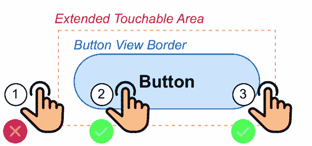
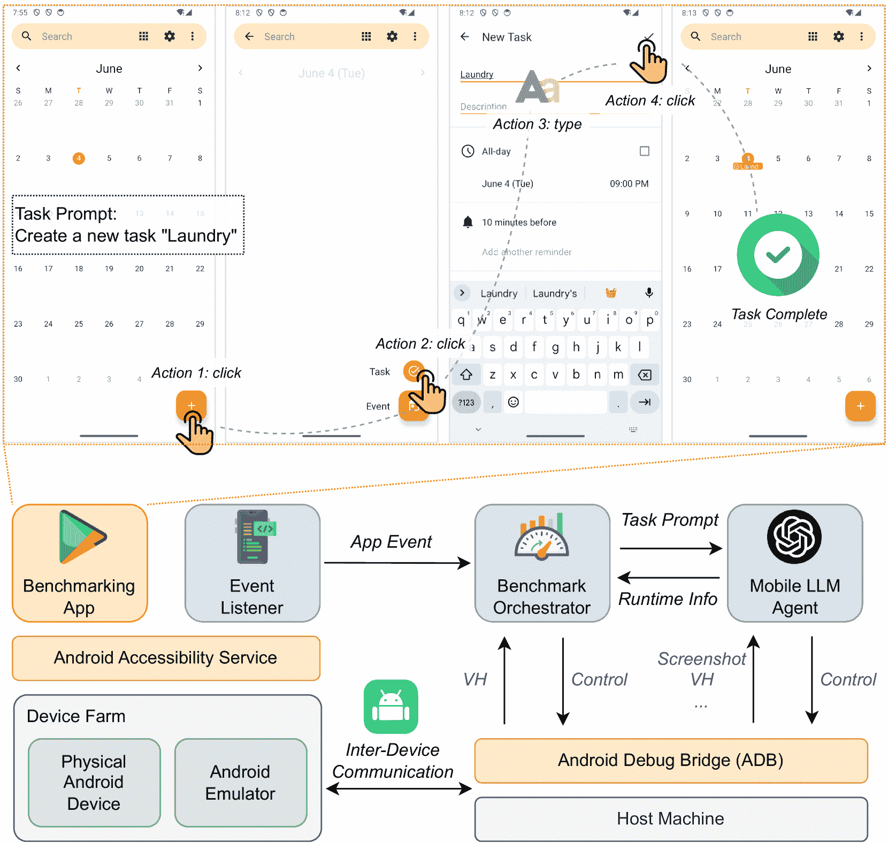
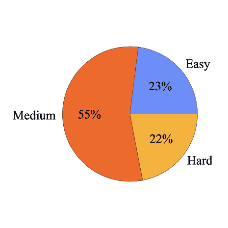
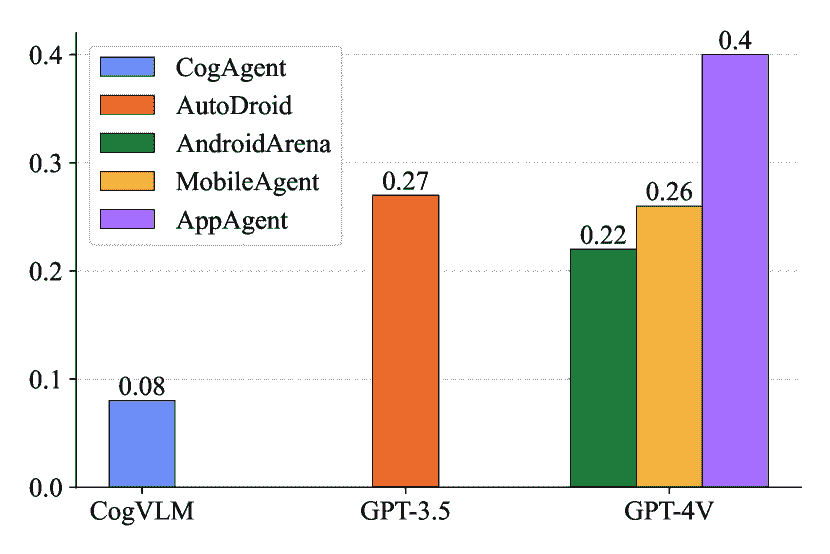

<!--yml

分类：未分类

日期：2025-01-11 12:33:52

-->

# MobileAgentBench：一个高效且用户友好的移动LLM智能体基准测试工具

> 来源：[https://arxiv.org/html/2406.08184/](https://arxiv.org/html/2406.08184/)

王璐远

卡内基梅隆大学 & 邓永玉

密歇根大学 & 赵一伟

东北大学 & 毛国栋

东北大学 & 王勤敏

卡内基梅隆大学

& 田晨敏

东北大学 & 陈伟

卡内基梅隆大学 & 车寿法

香港大学

###### 摘要

基于大语言模型（LLM）的移动智能体因其能够直接与手机图形用户界面（GUI）交互，并具备自动管理日常任务的能力而日益流行。尽管它们在学术界和工业界的前景广阔，但很少有研究专注于评估现有移动智能体的性能，这主要是由于应用程序的状态繁多且可行的动作序列定义不明确。为了应对这一挑战，我们提出了一个高效且用户友好的基准测试工具——MobileAgentBench，旨在减轻广泛手动测试的负担。我们初步定义了10款开源应用程序中的100个任务，并根据难度进行了分类。随后，我们评估了几种现有的移动智能体，包括AppAgent和MobileAgent，进行了全面且系统的性能比较。所有资料均可通过我们的项目网页访问：[https://MobileAgentBench.github.io](https://MobileAgentBench.github.io)，以推动学术界和工业界的发展。

## 1 引言

随着大语言模型（LLMs）的出现[[1](https://arxiv.org/html/2406.08184v1#bib.bib1)]，研究人员在机器人[[4](https://arxiv.org/html/2406.08184v1#bib.bib4)、[20](https://arxiv.org/html/2406.08184v1#bib.bib20)]、游戏[[22](https://arxiv.org/html/2406.08184v1#bib.bib22)、[8](https://arxiv.org/html/2406.08184v1#bib.bib8)]和移动电话[[26](https://arxiv.org/html/2406.08184v1#bib.bib26)、[19](https://arxiv.org/html/2406.08184v1#bib.bib19)]等领域开发了各种自主智能体。在这些领域中，移动智能体因其在增强用户体验和提供智能助手功能方面的潜力而受到广泛关注。

多年来，人们一直梦想着能够完全自动化日常任务的智能个人助理（IPA）[[6](https://arxiv.org/html/2406.08184v1#bib.bib6)]。自从2011年苹果推出其数字助理Siri [[3](https://arxiv.org/html/2406.08184v1#bib.bib3)]以来，几乎所有领先的科技公司都推出了自己的IPA，包括微软的Cortana [[15](https://arxiv.org/html/2406.08184v1#bib.bib15)]、亚马逊的Alexa [[2](https://arxiv.org/html/2406.08184v1#bib.bib2)]和谷歌助手[[9](https://arxiv.org/html/2406.08184v1#bib.bib9)]。尽管这些数字助理提供了基于自然语言接口（NLI）的免提人机交互体验，但它们只能完成相对简单的任务，如设置闹钟或发送短信[[13](https://arxiv.org/html/2406.08184v1#bib.bib13)]。对于第三方应用程序，开发者必须遵循并实现应用程序编程接口和协议，以便当用户发出非常具体的命令时，系统能够调用相应的功能。这限制了这些数字助理的可用性。

表1：提议基准与现有基准的比较

| 基准 | 完全自治 | 真实环境 | 成功条件灵活性 | 低代码干扰性 |
| --- | --- | --- | --- | --- |
| AppAgent [[26](https://arxiv.org/html/2406.08184v1#bib.bib26)] | ✗ | ✓ | ✓ | ✓ |
| AITW [[19](https://arxiv.org/html/2406.08184v1#bib.bib19)] | ✓ | ✗ | ✗ | ✗ |
| AndroidArena [[24](https://arxiv.org/html/2406.08184v1#bib.bib24)] | ✓ | ✓ | ✗ | ✗ |
| MobileAgentBench（我们提出的） | ✓ | ✓ | ✓ | ✓ |

大型语言模型（LLMs）在解决长期存在的理解用户意图的挑战方面作出了重要贡献。已展示的推理能力[[17](https://arxiv.org/html/2406.08184v1#bib.bib17)]凸显了基于LLM的自治代理作为下一代智能个人助理（IPA）的潜力，这些代理不受编程接口的限制，因为它们直接在图形用户界面（GUI）上操作[[21](https://arxiv.org/html/2406.08184v1#bib.bib21)，[26](https://arxiv.org/html/2406.08184v1#bib.bib26)]。GUI可以通过文本视图树表示，以供LLM消费，或通过屏幕截图图像利用多模态LLM（MLLM）[[27](https://arxiv.org/html/2406.08184v1#bib.bib27)]。代理的行动空间由一系列函数组成，用以模拟人类操作，例如点击、输入、滑动等。通过这种方式，LLM代理理论上可以完成任何人类用户可以做的事情，而无需修改现有的应用程序。

基于LLM的智能手机代理的光明前景吸引了越来越多的研究人员来研究这一主题。然而，用于评估这些代理性能的基准的范围仍然有限。在现有的基准中，显现出几个普遍的问题：1\. 可扩展性和可用性。研究人员在扩展基准并加入定制任务或将其集成到自己的代码库之前，需要充分理解复杂的数据结构和工具[[28](https://arxiv.org/html/2406.08184v1#bib.bib28)]。2\. 鲁棒性和灵活性。只考虑了注释过的任务完成路径[[19](https://arxiv.org/html/2406.08184v1#bib.bib19), [24](https://arxiv.org/html/2406.08184v1#bib.bib24)]。然而，可能存在多条路径可以成功完成任务，这可能会破坏任务成功判断逻辑。3\. 真实环境。一些基准根据一组屏幕截图评估代理的表现，而不是基于真实设备。如果代理执行异常动作并进入未定义状态，基准测试将失败[[19](https://arxiv.org/html/2406.08184v1#bib.bib19)]。

为了解决上述问题，我们提出了一个强大的基准，MobileAgentBench，旨在评估Android生态系统内移动LLM代理的能力。与之前的基准相比，MobileAgentBench具有多个优势，因其易用性和最小化侵入性。具体而言，对于标准代理，集成过程只需要不到十行额外代码。该基准在可用性和多样性方面表现出色，支持跨多个Android操作系统版本的广泛测试任务，并且能够在真实设备上执行。

在这一初始版本中，我们提供了跨十个开源应用程序的100个内置基准测试任务。值得注意的是，MobileAgentBench通过简化扩展过程与传统方法有所不同。第三方开发者可以仅通过几行Python代码指定任务成功的条件，无需具备丰富的Android开发知识。这种可访问性使得MobileAgentBench更适合来自非Android开发社区的开发者和研究人员。此外，我们引入了一种创新的方法来确定任务终止状态，从而使得基准能够抵抗跟踪多个潜在成功路径的复杂性。这种方法确保了MobileAgentBench提供可靠和精确的基准测试结果。

提出的基准与现有基准的比较见表 [1](https://arxiv.org/html/2406.08184v1#S1.T1 "表 1 ‣ 1 引言 ‣ MobileAgentBench：一个高效且用户友好的移动 LLM 代理基准")，其中“完全自主”表示基准不需要人工监督或判断，“真实环境”表示任务可以在真实设备上运行，“成功条件灵活性”表示考虑到所有可能的成功路径，“低代码侵入性”表示将基准集成到现有代理中无需重大代码更改。

我们的贡献总结如下：

+   •

    我们提出了一个针对移动 LLM 代理的基准框架。该新方法解决了现有基准的常见问题，使评估过程完全自主且可靠。

+   •

    我们实现并测试了 100 个不同难度级别的基准任务。该基准即插即用，便于开发新代理并评估现有代理。

+   •

    我们评估了最先进的移动 LLM 代理的性能，并与我们的新基准进行了稳健且系统的比较，为社区提供了基准数据。

## 2 相关工作

### 2.1 移动 LLM 代理

LLM 时代之前的研究采用强化学习 (RL) 来解决自主 GUI 导航问题 [[10](https://arxiv.org/html/2406.08184v1#bib.bib10)]。近期，LLM 和 MLLM 的进展成为主流代理范式，因为它们具有更强的 UI 理解和推理能力。早期的研究集中于 Web 代理，它们实现了浏览器内的任务自动化 [[7](https://arxiv.org/html/2406.08184v1#bib.bib7), [29](https://arxiv.org/html/2406.08184v1#bib.bib29)]。最近，越来越多的研究开始调查移动设备上的代理，特别是在 Android 平台上，因为 Android 智能手机是最广泛使用的个人计算设备。

移动 LLM 代理共享类似的算法。完整的输入提示通常由四个主要组件组成：用户提示（任务描述）、当前的 UI 视图层次结构 (VH) 描述、动作函数列表和历史信息。具体来说，动作列表主要包括点击、滑动、输入和其他常见的 UI 操作。如果使用 MLLM，当前的屏幕截图也是输入的一部分。LLM/MLLM 会根据当前和历史状态考虑下一步操作，并调用正确的函数一步一步地执行给定任务。代理最终解析模型响应，并通过 Android 调试桥（ADB）¹¹1https://developer.android.com/tools/adb、UIAutomator ²²2https://developer.android.com/training/testing/other-components/ui-automator 或其他更高级的 UI 自动化框架将控制信号发送到 Android 设备。

尽管高层思想相似，研究人员开发了不同的技术来提高性能和效率。在这些工作中，AndroidArena[[24](https://arxiv.org/html/2406.08184v1#bib.bib24)] 将冗长的视图层级 XML 转换为压缩表示，并为 UI 元素分配了唯一的节点 ID，这缩短了提示并提高了系统效率。MobileAgent[[21](https://arxiv.org/html/2406.08184v1#bib.bib21)] 观察到 GPT-4V 缺乏 UI 元素定位的能力，因此采用光学字符识别（OCR）模型来定位和识别文本视图。此外，它还使用 CLIP[[18](https://arxiv.org/html/2406.08184v1#bib.bib18)] 和 Grounding DINO[[14](https://arxiv.org/html/2406.08184v1#bib.bib14)] 模型来检测图标。AppAgent[[26](https://arxiv.org/html/2406.08184v1#bib.bib26)] 使用 SoM[[25](https://arxiv.org/html/2406.08184v1#bib.bib25)] 提示来定位 UI 元素，并将任务分为两个阶段：探索阶段和部署阶段。在探索阶段，代理自动与应用程序交互，并将观察结果总结成文档。在部署阶段，它采用检索增强生成（RAG）[[12](https://arxiv.org/html/2406.08184v1#bib.bib12)] 技术来利用总结的知识并提高成功率。CogAgent[[11](https://arxiv.org/html/2406.08184v1#bib.bib11)] 提出了自己的高效 18B-参数 MLLM，该模型可以在单个商业 GPU 上加载。此外，Octopus v2[[5](https://arxiv.org/html/2406.08184v1#bib.bib5)] 提出了一个紧凑的 3B-参数模型，解锁了在设备上高效且隐私保护地运行移动 LLM 代理的潜力。

### 2.2 移动 LLM 代理的基准测试

由于移动 LLM 代理是一个新兴的研究领域，基准测试的选择非常有限。一些研究依赖手动验证任务执行状态来评估性能[[26](https://arxiv.org/html/2406.08184v1#bib.bib26)]，这既繁琐又耗时。为了加速代理的开发，我们需要一个完全自主的基准测试系统来报告各种指标，特别是任务成功率。然而，自动判断任务是否成功完成并非易事。主要挑战来源于图形用户界面（GUI）导航任务的动态特性——代理可能执行随机操作，将应用程序驱动到一个未知状态。

AITW [[19](https://arxiv.org/html/2406.08184v1#bib.bib19)] 是一个流行的移动 LLM 代理基准测试。它的规模很大，但基于静态的截图图像。将每个应用状态（截图）视为一个节点，每个动作视为一条边，我们可以基于截图和人工标注的动作构建一个状态转换图（STG）。如果代理按非预设的顺序执行动作，并导致 STG 转向一个不存在的节点，即使代理最终完成了任务，该方法也会立即失败。

唯一的解决方案是识别真实设备上的任务成功。一种方法是将代理的动作与标注的真实数据（GT）进行匹配。逐步匹配算法并不准确，因为代理可能不会完全按照 GT 的顺序完成任务。AndroidArena [[24](https://arxiv.org/html/2406.08184v1#bib.bib24)] 提出了计算代理和 GT 动作序列的最长公共子序列的自适应方法，具体如下，其中 $a$ 和 $\hat{a}$ 分别是 GT 和实际动作。公共子序列用红色标出。

|  | $\displaystyle a$ | $\displaystyle={\color[rgb]{1,0,0}ABC}$ |  | (1) |
| --- | --- | --- | --- | --- |
|  | $\displaystyle\hat{a}$ | $\displaystyle={\color[rgb]{1,0,0}A}XY{\color[rgb]{1,0,0}B}U{\color[rgb]{1,0,0}% C}VW$ |  | (2) |

AndroidArena [[24](https://arxiv.org/html/2406.08184v1#bib.bib24)] 将任务视为成功，如果 GT 是实际动作序列的子序列。它解决了冗余动作的问题，但仍然不是最优的。一个简单的反例是，通过点击两次“下一页”按钮从第1页导航到第3页。如果代理执行以下动作序列：点击“下一页”按钮、点击“上一页”按钮、点击“下一页”按钮，这样并未导航到正确的页面，但仍然是 GT 的子序列。如果冗余动作有副作用，这种方法会产生假阳性结果。

一项相关工作，LlamaTouch [[28](https://arxiv.org/html/2406.08184v1#bib.bib28)]，通过检查最终的 UI 状态来解决这个问题，这与我们的方法类似。我们观察到，尽管存在无限多的可行操作序列，最终的成功状态却趋向于唯一。通过检查最终的 UI 状态，可以确定操作是否成功。一个边缘情况是，一些任务可能没有直接的 UI 表现，例如，按钮触发的网络请求结果可能不会直接反映在当前的 UI 页面上。因此，单纯检查 UI 状态是不够的，我们需要将操作（如点击事件）纳入考虑。LlamaTouch [[28](https://arxiv.org/html/2406.08184v1#bib.bib28)] 通过将坐标映射到 UI 元素来匹配点击操作，基于视图边界框。然而，这种方法并不总是准确的。寻找正确视图以响应点击事件的过程被称为命中测试，只有在 Android UI 系统执行时才能保证其准确性。这是因为应用开发者可以修改可触摸区域，使其与视图边界不同，从而获得更好的用户体验。

图 1：扩展的可触摸区域。

图 [1](https://arxiv.org/html/2406.08184v1#S2.F1 "Figure 1 ‣ 2.2 Benchmarks for Mobile LLM Agents ‣ 2 Related Work ‣ MobileAgentBench: An Efficient and User-Friendly Benchmark for Mobile LLM Agents") 显示了一个扩大按钮视图可触摸区域的例子。在图 [1](https://arxiv.org/html/2406.08184v1#S2.F1 "Figure 1 ‣ 2.2 Benchmarks for Mobile LLM Agents ‣ 2 Related Work ‣ MobileAgentBench: An Efficient and User-Friendly Benchmark for Mobile LLM Agents") 中，触摸点 1 时，按钮没有响应，因为它在可触摸区域外。触摸点 2 时，按钮响应，因为它在按钮视图内。触摸点 3 时，尽管它在可见的按钮视图外，按钮仍然响应，因为它在扩展的可触摸区域内。为了解决这个难题，我们利用 Android 辅助功能服务 ³³3https://developer.android.com/reference/android/accessibilityservice/AccessibilityService 来准确捕捉应用事件并将其转发到基准服务器。我们实现的详细信息将在第 [3.1](https://arxiv.org/html/2406.08184v1#S3.SS1 "3.1 Method ‣ 3 MobileAgentBench ‣ MobileAgentBench: An Efficient and User-Friendly Benchmark for Mobile LLM Agents") 节中描述。

## 3 MobileAgentBench

图 2：MobileAgentBench 架构概览。

### 3.1 方法

MobileAgentBench 在真实的 Android 设备上运行，支持物理设备和模拟器。它设置环境并调用代理执行功能。在代理操作设备时，MobileAgentBench 会实时判断任务是否成功，且不会产生任何副作用。当代理停止或超过最大步数时，MobileAgentBench 会自动切换到下一个任务。整个过程是完全自动化的，无需人工监督。

任务成功判断机制是通过匹配最终的 UI 状态来实现的，而不是检查动作序列。这是因为完成任务可能有多条路径，但最终的成功状态会收敛为一个。例如，如果任务是进入设置页面，代理可能在正确找到目标设置页面之前误打开随机页面。由于随机性，匹配动作序列是困难的。相反，检查顶层页面是否为设置页面则简单且可靠。不论代理执行何种操作，只要检测到设置页面，我们就视为任务成功。使用 ADB 和 UIAutomator 获取 VH 信息。对于每个任务，都有一个 Python 文件定义任务的成功标准，便于为第三方开发者扩展和定制任务。

由于某些任务可能不会直接反映在当前的 UI 页面上，仅仅检查 VH 信息是不够的。举个例子，可以是编辑笔记并保存更改。点击保存按钮后，应用可能只弹出一个临时的提示框，表明保存操作成功，但仍停留在当前页面。当基准检查当前视图状态时，它并不知道是否点击了保存按钮。作为基准，它不能跳转到其他页面，因为那样可能改变应用状态并影响代理的下一步操作。由于我们希望实时判断任务是否成功，以便统计代理执行了多少步操作，因此在代理停止后再检查其他页面的 UI 状态是不可行的。此外，一些代理在任务完成后也无法优雅地停止。我们通过结合应用事件，特别是按钮点击信号，解决了这个问题。对于上述任务，我们可以通过视图层级检查笔记是否正确编辑，然后在之后接收到保存按钮点击信号时，将任务标记为成功。

为了忠实地接收应用事件信号，我们开发了一个使用 Android 无障碍服务的 Android 应用。Android 无障碍服务最初是为帮助残障人士设计的。它在后台运行，并在 Android 系统触发无障碍事件时调用回调函数。这些事件包括用户（代理）交互产生的大部分 UI 状态转换，如按钮点击、窗口变化等，满足了所提议基准的需求。

MobileAgentBench 的概述如图[2](https://arxiv.org/html/2406.08184v1#S3.F2 "图 2 ‣ 3 MobileAgentBench ‣ MobileAgentBench：一个高效且用户友好的移动 LLM 代理基准测试")所示。基准测试应用程序在设备农场中的真实设备上运行，该设备可以是物理设备或模拟器。设备通过 ADB 与基准主机和代理进行通信。基准测试和代理使用 ADB 获取应用状态信息，如屏幕截图、视图层级，并发送控制信号。基准测试使用当前基准任务提示来调用代理，并收集代理的运行时信息，如 LLM 输入和输出。每当事件监听应用接收到应用事件时，它通过套接字将事件转发给基准服务器，从而使基准测试能够通过 VH 和操作来评估任务成功状态。在图[2](https://arxiv.org/html/2406.08184v1#S3.F2 "图 2 ‣ 3 MobileAgentBench ‣ MobileAgentBench：一个高效且用户友好的移动 LLM 代理基准测试")的顶部，我们展示了一个示例任务工作流程，“创建新任务 Laundry”与日历应用一起进行。代理需要执行 4 个操作来完成任务：点击添加按钮、点击任务按钮、输入任务名称“Laundry”以及点击保存按钮。基准测试检查任务名称输入框视图的内容，并监听保存按钮点击事件，以确定任务是否成功完成。

### 3.2 任务描述

在我们基准测试的初始版本中，我们实现了 100 个任务，涵盖了 10 个日常应用程序。这 10 个应用程序来自 SimpleMobileTools ⁴⁴4https://simplemobiletools.com，GPL-3.0，这是一个开源的 Android 应用程序项目。这些应用程序具有简单直观的用户界面，没有任何广告或不必要的权限，因此非常适合用于基准测试。应用程序名称的完整列表见图[3b](https://arxiv.org/html/2406.08184v1#S3.F3.sf2 "在图 3 ‣ 3.2 任务描述 ‣ 3 MobileAgentBench ‣ MobileAgentBench：一个高效且用户友好的移动 LLM 代理基准测试")。

我们精心设计基准任务，使其能够模拟普通用户的日常活动，并具有多层次的难度。任务难度级别的分布如图[3](https://arxiv.org/html/2406.08184v1#S3.F3 "图 3 ‣ 3.2 任务描述 ‣ 3 MobileAgentBench ‣ MobileAgentBench：一个高效且用户友好的移动 LLM 代理基准测试")所示。难度通过完成任务所需的最小步骤数来定义，并由 3 位人类专家独立交叉验证。一个任务如果能在 2 步内完成，则归类为*简单*任务；如果需要 3 步或更多，但少于 6 步，则归类为*中等*任务；否则，归类为*困难*任务。

(a) 所有任务的分布。

(b) 每个应用程序的分布。

图 3：任务难度等级分布。

### 3.3 使用方法

基准 API 旨在尽可能地简洁易用，并且尽量减少侵入性。对于一个标准代理，集成所需的额外代码少于 10 行。列表 [1](https://arxiv.org/html/2406.08184v1#LST1 "Listing 1 ‣ 3.3 Usage ‣ 3 MobileAgentBench ‣ MobileAgentBench: An Efficient and User-Friendly Benchmark for Mobile LLM Agents") 显示了基准使用的伪代码。首先，我们需要导入基准 Python 库并初始化基准协调器。接下来，应定义代理的主入口函数。该函数只接受一个参数——任务提示。代理会迭代执行操作以完成任务。在代理执行每一个操作前后，都会调用协调器函数，从而收集诸如时间消耗和 LLM 输出等信息。程序从协调器的运行函数开始。它使用每个任务提示调用代理入口函数，并在任务完成后自动切换到下一个任务。任务的成功状态是在运行时判断的。

[⬇]()1from  mobile_agent_benchmark.task_orchestrator  import  TaskOrchestrator2orchestrator  =  TaskOrchestrator()  #  the  MobileAgentBench  orchestrator3#  the  agent  entrance  function4def  agent_run(task_prompt):5  while  not  done:6  orchestrator.before_one_action()7  #  the  agent  invokes  a  LLM  to  think  about  the  next  action8  action  =  llm_think(task_prompt,  screenshot)9  agent_perform(action)10  orchestrator.after_one_action(action)11orchestrator.run(agent_run)

列表 1：将 MobileAgentBench 集成到现有的移动 LLM 代理中的伪代码。

## 4 实验与代理评估

### 4.1 指标

我们定义了 6 项指标，用于全面评估移动代理的表现：

+   •

    成功率 (SR)：${SR}=N_{success}/M_{tasks}$，其中 $N_{success}$ 为成功完成的任务数量，由基准系统判断，$M_{tasks}$ 为总的基准任务数量。该指标反映了代理从头到尾正确完成任务的能力。

+   •

    步骤效率（SE）。$SE=S_{actual}/S_{min}$，其中$S_{actual}$是代理成功完成任务所需的实际步骤数，$S_{min}$是最小步骤数。此指标告诉我们代理是否执行了不必要或冗余的操作，并反映了代理的效率。失败任务不计入其中。

+   •

    延迟。在一个操作之前和之后所花费的平均时间（以秒为单位）。该指标告诉我们用户在两次操作之间需要等待多长时间。

+   •

    令牌。LLM输入和输出的令牌数量。为了简化，我们使用GPT-4V（gpt-4-vision-preview）标准 [[16](https://arxiv.org/html/2406.08184v1#bib.bib16)]来计算所有模型的令牌数，这为我们提供了LLM成本的粗略估算。对于文本，1个令牌等于4个字符。对于图像，图像被分割成多个512$\times$512的块，每个块为170个令牌。每张图像还会应用85个基础令牌。

+   •

    假阴性（FN）率。$FN=N_{early}/M_{failure}$，其中$N_{early}$是早期停止的任务数，$M_{failure}$是失败任务的总数。该指标表示代理错误地认为任务已完成并提前停止的可能性。

+   •

    假阳性（FP）率。$FP=N_{late}/M_{success}$，其中$N_{late}$是晚停止的任务数，$M_{success}$是成功任务的总数。与FN率对称，该指标揭示了代理错误地认为任务未成功完成的可能性。

### 4.2 环境设置

五个流行的移动LLM代理，AndroidArena [[24](https://arxiv.org/html/2406.08184v1#bib.bib24)]、AutoDroid [[23](https://arxiv.org/html/2406.08184v1#bib.bib23)]、AppAgent [[26](https://arxiv.org/html/2406.08184v1#bib.bib26)]、CogAgent [[11](https://arxiv.org/html/2406.08184v1#bib.bib11)]和MobileAgent [[21](https://arxiv.org/html/2406.08184v1#bib.bib21)]已使用所提出的基准进行评估。我们选择Google Pixel 3a模拟器和Android 14操作系统来运行基准应用程序。此外，AutoDroid使用Android 9操作系统，因为某些依赖库不支持较新的Android系统。

由于AndroidArena、AutoDroid和AppAgents不使用本地神经网络，因此这些代理程序在搭载M1 Max芯片的Apple Macbook Pro上执行。CogAgent和MobileAgent需要本地模型引用，因此它们在配备单个Nvidia RTX 4090 GPU、24 GB GPU内存的工作站上执行。

自我探索功能已为AppAgent开启。在执行任务时，它可以参考之前总结的文档。对于CogAgent，由于GPU内存的限制，我们使用4位量化来加载模型。CogAgent以其原始版本实现，*即*，在给定当前截图的情况下，询问下一步操作。没有提供历史信息。

### 4.3 结果

表2：代理性能结果，包含多个指标

| 代理 | SR $\uparrow$ | SE $\downarrow$ | 延迟（秒）$\downarrow$ | Token $\downarrow$ | FN率 $\downarrow$ | FP率 $\downarrow$ |
| --- | --- | --- | --- | --- | --- | --- |
| AndroidArena [[24](https://arxiv.org/html/2406.08184v1#bib.bib24)] | 0.22 | 1.13 | 18.61 | 750.47 | 0.09 | 0.33 |
| AutoDroid [[23](https://arxiv.org/html/2406.08184v1#bib.bib23)] | 0.27 | 3.10 | 4.85 | 963.48 | 0.93 | 0.01 |
| AppAgent [[26](https://arxiv.org/html/2406.08184v1#bib.bib26)] | 0.40 | 1.29 | 26.09 | 1505.09 | 0.17 | 0.40 |
| CogAgent [[11](https://arxiv.org/html/2406.08184v1#bib.bib11)] | 0.08 | 2.42 | 6.76 | 579.84 | 1.0 | 0.04 |
| MobileAgent [[21](https://arxiv.org/html/2406.08184v1#bib.bib21)] | 0.26 | 1.33 | 15.91 | 1236.88 | 0.19 | 0.31 |

主要实验结果如表[2](https://arxiv.org/html/2406.08184v1#S4.T2 "Table 2 ‣ 4.3 Results ‣ 4 Experiments and Agent Evaluations ‣ MobileAgentBench: An Efficient and User-Friendly Benchmark for Mobile LLM Agents")所示。我们观察到，AppAgent的成功率最高，得益于其自我探索机制。CogAgent的成功率最低，最可能的原因是其简单的代理实现，限制了历史信息的使用。尽管AutoDroid与MobileAgent的成功率相似，但其逐步效率显著较低，可能是由于AutoDroid使用的GPT-3.5模型推理能力较弱。就延迟而言，AutoDroid和CogAgent的延迟都非常低，表明使用GPT-4V模型的推理成本较高。AppAgent需要查找应用文档，因此消耗的token比其他代理更多。另一方面，由于CogAgent的简单代理实现，它消耗的token最少。AutoDroid和CogAgent的假阴性（FN）率非常高，表明它们在任务未完成时总是提前停止。虽然AppAgent具有最高的任务成功率，但它在确定任务是否成功时表现不佳，无法在任务完成后优雅地停止，并且假阳性（FP）率较高。

(a) 任务成功率与难度等级的关系。

(b) 任务成功率与LLM的关系。

图4：任务成功率。

各个代理在不同难度级别下的任务成功率如图[4a](https://arxiv.org/html/2406.08184v1#S4.F4.sf1 "在图4 ‣ 4.3 结果 ‣ 4 实验与代理评估 ‣ MobileAgentBench：一个高效且用户友好的移动LLM代理基准测试")所示。从图[4a](https://arxiv.org/html/2406.08184v1#S4.F4.sf1 "在图4 ‣ 4.3 结果 ‣ 4 实验与代理评估 ‣ MobileAgentBench：一个高效且用户友好的移动LLM代理基准测试")中，我们可以看到，大多数代理在处理较容易的任务时具有更高的成功率，这符合预期。有趣的是，AppAgent在执行中等难度任务时具有更高的成功率。这是因为我们将最大执行步数设置为最小步数的两倍，这使得代理在处理简单任务时，纠正先前步骤的空间非常有限。例如，代理只能使用1个额外的步骤来纠正并完成一个1步的简单任务。然而，对于中等和困难的任务，纠正先前动作的空间显著增加。

图[4b](https://arxiv.org/html/2406.08184v1#S4.F4.sf2 "在图4 ‣ 4.3 结果 ‣ 4 实验与代理评估 ‣ MobileAgentBench：一个高效且用户友好的移动LLM代理基准测试")展示了基于骨干LLM模型的任务成功率的平均值。有趣的是，尽管AutoDroid使用的是基于文本的GPT-3.5模型，但它仍然优于一些使用更先进的GPT-4V模型的代理。这揭示了文本视图层次结构包含了进行GUI导航任务所需的最重要信息。然而，我们认为，视觉截图对于其他类型的任务仍然是有帮助的，例如当任务涉及到识别屏幕上的图像，或者当文本视图层次结构不可用时。

## 5 限制与未来工作

尽管提出的MobileAgentBench高效、用户友好，并且解决了现有移动LLM代理基准测试中的许多问题，但作者希望在未来改进的方面有两个主要限制。首先，尽管使用Python代码片段作为任务成功条件的配置对AI/ML领域的研究人员来说很容易，但对于没有技术背景的人来说，仍然较为困难。我们将在未来的工作中探索无需编写任何代码即可自动构建任务配置的新方法。此外，UIAutomator的使用使得无法在动态屏幕内容下导出视图层次结构。UIAutomator仅在主线程空闲时才会导出视图层次结构。如果应用程序包含持续的动画或视频，它将失败。因此，替代UIAutomator使用其他框架来获取视图信息将是一个有前景的方向。

## 6 结论

本文提出了一个新的基准测试，MobileAgentBench，用于 Android 平台上的移动 LLM 智能体。通过 100 个内置基准任务，研究人员可以在真实的 Android 设备上自动测试和评估现有及新智能体。扩展基准以支持自定义任务也很容易，因为只需要基本的 Python 编程技能。利用 Android 辅助功能服务并仅检查最终应用状态，MobileAgentBench 可以忠实地检测任务完成状态。我们报告了 5 个流行智能体在多个指标上的评估结果，它们可以作为强有力的基准，推动未来移动 LLM 智能体的发展。

## 参考文献

+   [1] Josh Achiam, Steven Adler, Sandhini Agarwal, Lama Ahmad, Ilge Akkaya, Florencia Leoni Aleman, Diogo Almeida, Janko Altenschmidt, Sam Altman, Shyamal Anadkat 等. GPT-4 技术报告. arXiv 预印本 arXiv:2303.08774, 2023.

+   [2] Amazon. Alexa. [https://alexa.amazon.com](https://alexa.amazon.com), 2014.

+   [3] Apple. Siri. [https://www.apple.com/siri/](https://www.apple.com/siri/), 2011.

+   [4] Konstantinos Bousmalis, Giulia Vezzani, Dushyant Rao, Coline Devin, Alex X Lee, Maria Bauza, Todor Davchev, Yuxiang Zhou, Agrim Gupta, Akhil Raju 等. Robocat：一种自我改进的基础智能体用于机器人操控. arXiv 预印本 arXiv:2306.11706, 2023.

+   [5] Wei Chen 和 Zhiyuan Li. Octopus v2：用于超级智能体的设备内语言模型. arXiv 预印本 arXiv:2404.01744, 2024.

+   [6] Allan de Barcelos Silva, Marcio Miguel Gomes, Cristiano André da Costa, Rodrigo da Rosa Righi, Jorge Luis Victoria Barbosa, Gustavo Pessin, Geert De Doncker 和 Gustavo Federizzi. 智能个人助理：一项系统的文献综述. 专家系统与应用，147:113193, 2020.

+   [7] Xiang Deng, Yu Gu, Boyuan Zheng, Shijie Chen, Sam Stevens, Boshi Wang, Huan Sun 和 Yu Su. Mind2web：迈向面向网络的通用智能体. 神经信息处理系统进展，36, 2024.

+   [8] Yuqing Du, Olivia Watkins, Zihan Wang, Cédric Colas, Trevor Darrell, Pieter Abbeel, Abhishek Gupta 和 Jacob Andreas. 使用大型语言模型指导强化学习中的预训练. 载于国际机器学习会议，页面 8657–8677. PMLR, 2023.

+   [9] Google. Google 助理. [https://assistant.google.com](https://assistant.google.com), 2016.

+   [10] Izzeddin Gur, Ulrich Rueckert, Aleksandra Faust 和 Dilek Hakkani-Tur. 学习浏览网页. arXiv 预印本 arXiv:1812.09195, 2018.

+   [11] Wenyi Hong, Weihan Wang, Qingsong Lv, Jiazheng Xu, Wenmeng Yu, Junhui Ji, Yan Wang, Zihan Wang, Yuxiao Dong, Ming Ding 等. Cogagent：一种面向 GUI 智能体的视觉语言模型. arXiv 预印本 arXiv:2312.08914, 2023.

+   [12] Patrick Lewis, Ethan Perez, Aleksandra Piktus, Fabio Petroni, Vladimir Karpukhin, Naman Goyal, Heinrich Küttler, Mike Lewis, Wen-tau Yih, Tim Rocktäschel, 等. 用于知识密集型自然语言处理任务的检索增强生成。神经信息处理系统进展，33:9459–9474, 2020.

+   [13] Yuanchun Li, Hao Wen, Weijun Wang, Xiangyu Li, Yizhen Yuan, Guohong Liu, Jiacheng Liu, Wenxing Xu, Xiang Wang, Yi Sun, 等. 个人大型语言模型代理：关于能力、效率和安全性的洞察与调查。arXiv 预印本 arXiv:2401.05459, 2024.

+   [14] Shilong Liu, Zhaoyang Zeng, Tianhe Ren, Feng Li, Hao Zhang, Jie Yang, Chunyuan Li, Jianwei Yang, Hang Su, Jun Zhu, 等. 基于 DINO 的基础预训练开放集目标检测。arXiv 预印本 arXiv:2303.05499, 2023.

+   [15] Microsoft. Cortana. [https://www.microsoft.com/en-us/cortana](https://www.microsoft.com/en-us/cortana), 2014.

+   [16] OpenAI. GPT 令牌计算。 [https://openai.com/api/pricing/](https://openai.com/api/pricing/).

+   [17] Shuofei Qiao, Yixin Ou, Ningyu Zhang, Xiang Chen, Yunzhi Yao, Shumin Deng, Chuanqi Tan, Fei Huang, 和 Huajun Chen. 通过语言模型提示进行推理：一项调查。arXiv 预印本 arXiv:2212.09597, 2022.

+   [18] Alec Radford, Jong Wook Kim, Chris Hallacy, Aditya Ramesh, Gabriel Goh, Sandhini Agarwal, Girish Sastry, Amanda Askell, Pamela Mishkin, Jack Clark, 等. 从自然语言监督中学习可转移的视觉模型。在国际机器学习会议上，页面 8748–8763。PMLR, 2021.

+   [19] Christopher Rawles, Alice Li, Daniel Rodriguez, Oriana Riva, 和 Timothy Lillicrap. 野外中的 Android：用于 Android 设备控制的大规模数据集。arXiv 预印本 arXiv:2307.10088, 2023.

+   [20] Scott Reed, Konrad Zolna, Emilio Parisotto, Sergio Gomez Colmenarejo, Alexander Novikov, Gabriel Barth-Maron, Mai Gimenez, Yury Sulsky, Jackie Kay, Jost Tobias Springenberg, 等. 一种通用代理。arXiv 预印本 arXiv:2205.06175, 2022.

+   [21] Junyang Wang, Haiyang Xu, Jiabo Ye, Ming Yan, Weizhou Shen, Ji Zhang, Fei Huang, 和 Jitao Sang. 移动代理：具有视觉感知的自主多模态移动设备代理。arXiv 预印本 arXiv:2401.16158, 2024.

+   [22] Zihao Wang, Shaofei Cai, Guanzhou Chen, Anji Liu, Xiaojian Ma, 和 Yitao Liang. 描述、解释、计划和选择：与大规模语言模型进行交互式规划使得开放世界多任务代理成为可能。arXiv 预印本 arXiv:2302.01560, 2023.

+   [23] Hao Wen, Yuanchun Li, Guohong Liu, Shanhui Zhao, Tao Yu, Toby Jia-Jun Li, Shiqi Jiang, Yunhao Liu, Yaqin Zhang, 和 Yunxin Liu. 赋能大型语言模型使用智能手机进行任务自动化。arXiv 预印本 arXiv:2308.15272, 2023.

+   [24] Mingzhe Xing, Rongkai Zhang, Hui Xue, Qi Chen, Fan Yang, 和 Zhen Xiao. 理解大型语言模型代理在复杂 Android 环境中的弱点。arXiv 预印本 arXiv:2402.06596, 2024.

+   [25] Jianwei Yang, Hao Zhang, Feng Li, Xueyan Zou, Chunyuan Li 和 Jianfeng Gao. Set-of-mark 提示法在 GPT-4V 中释放了非凡的视觉基础能力。arXiv 预印本 arXiv:2310.11441, 2023。

+   [26] Zhao Yang, Jiaxuan Liu, Yucheng Han, Xin Chen, Zebiao Huang, Bin Fu 和 Gang Yu. Appagent: 作为智能手机用户的多模态智能体。arXiv 预印本 arXiv:2312.13771, 2023。

+   [27] Shukang Yin, Chaoyou Fu, Sirui Zhao, Ke Li, Xing Sun, Tong Xu 和 Enhong Chen. 多模态大语言模型综述。arXiv 预印本 arXiv:2306.13549, 2023。

+   [28] Li Zhang, Shihe Wang, Xianqing Jia, Zhihan Zheng, Yunhe Yan, Longxi Gao, Yuanchun Li 和 Mengwei Xu. Llamatouch: 一个忠实且可扩展的移动UI自动化任务评估测试平台。arXiv 预印本 arXiv:2404.16054, 2024。

+   [29] Shuyan Zhou, Frank F Xu, Hao Zhu, Xuhui Zhou, Robert Lo, Abishek Sridhar, Xianyi Cheng, Yonatan Bisk, Daniel Fried, Uri Alon 等人. Webarena: 用于构建自主智能体的现实网页环境。arXiv 预印本 arXiv:2307.13854, 2023。
