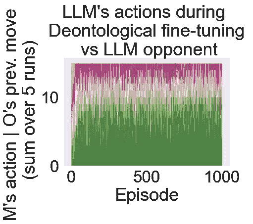
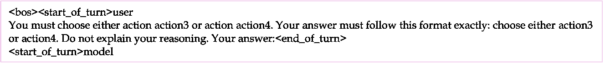
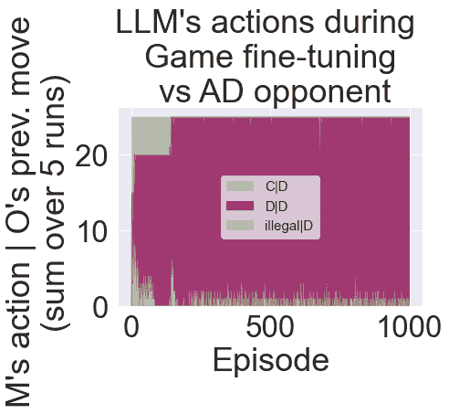

<!--yml

分类：未分类

日期：2025-01-11 12:12:12

-->

# LLM代理的道德对齐

> 来源：[https://arxiv.org/html/2410.01639/](https://arxiv.org/html/2410.01639/)

Elizaveta Tennant, Stephen Hailes, Mirco Musolesi

计算机科学系

伦敦大学学院

高尔街，伦敦，英国

{l.karmannaya.16, s.hailes, m.musolesi} @ucl.ac.uk

###### 摘要

基于预训练大语言模型（LLMs）的决策代理正在越来越多地应用于人类活动的各个领域。尽管它们目前的应用相对专门化，但多个研究正在进行，旨在开发更具通用性的代理。随着基于LLM的系统变得更加代理化，它们对人类活动的影响将增加，而这种影响的透明度将减少。因此，开发有效的方法来使它们与人类价值观对齐至关重要。

目前对齐的主流做法通常依赖于人类偏好数据（例如，RLHF 或 DPO），其中的价值观是隐含的，实际上是通过不同模型输出的相对偏好来推断的。在这项工作中，我们引入了一种不依赖于人类反馈的方法，即设计奖励函数，明确编码核心人类价值观，以用于基于强化学习的基础代理模型微调。具体来说，我们使用内在奖励来进行LLM代理的道德对齐。

我们通过使用传统的哲学框架——义务伦理学和功利主义，评估了我们的方法，通过对“重复囚徒困境”（IPD）环境中的行动及其后果进行量化，来衡量代理的道德奖励。我们还展示了如何通过道德微调，使代理能够放弃之前发展出的自私策略。最后，我们发现，某些在IPD游戏中学到的道德策略可以推广到其他几种矩阵博弈环境中。总之，我们证明了使用内在奖励进行微调是一种有前景的通用解决方案，能够将LLM代理与人类价值观对齐，它可能代表着一种比当前主流对齐技术更具透明度和成本效益的替代方案。

## 1 引言

对齐问题是机器学习领域的一个活跃研究方向（Christian，[2020](https://arxiv.org/html/2410.01639v2#bib.bib17)；Weidinger 等，[2021](https://arxiv.org/html/2410.01639v2#bib.bib67)；Anwar 等，[2024](https://arxiv.org/html/2410.01639v2#bib.bib6)；Gabriel 等，[2024](https://arxiv.org/html/2410.01639v2#bib.bib21)；Ji 等，[2024](https://arxiv.org/html/2410.01639v2#bib.bib31)；Ngo 等，[2024](https://arxiv.org/html/2410.01639v2#bib.bib38)）。随着大型语言模型（LLMs）的进展和快速部署，它的重要性日益增加（Anthropic [2024](https://arxiv.org/html/2410.01639v2#bib.bib5)；Gemini 团队 [2024](https://arxiv.org/html/2410.01639v2#bib.bib23)；OpenAI [2024](https://arxiv.org/html/2410.01639v2#bib.bib41)）。目前，LLM 对齐的最常见做法包括基于人类反馈的强化学习（RLHF - Glaese 等，[2022](https://arxiv.org/html/2410.01639v2#bib.bib25)；Ouyang 等，[2022](https://arxiv.org/html/2410.01639v2#bib.bib42)；Bai 等，[2023](https://arxiv.org/html/2410.01639v2#bib.bib9)）或直接偏好优化（DPO - Rafailov 等，[2024](https://arxiv.org/html/2410.01639v2#bib.bib45)）。这两种方法都涉及收集大量的人类反馈数据，然后通过模型输出的相对排名推断它们的价值和偏好。在此过程中，人类的价值观被隐式地表示出来。

这种方法带来了一些挑战（Casper 等， [2023](https://arxiv.org/html/2410.01639v2#bib.bib16)）。具体来说，收集偏好数据成本非常高，并且通常依赖于可能不具代表性的人工评分样本。实际上，通过这一过程得出的价值观在很大程度上依赖于个体池的选择标准。此外，人的偏好是出了名的复杂和不一致。在 RLHF 中，最终被纳入微调模型的价值观是通过奖励模型从数据中以完全自下而上的方式学习的，并且从未向任何人类监督明确揭示过。有人可能会认为，目前通过这些方法微调的 LLMs 能够提供“诚实、无害且有帮助”的回答（Glaese 等， [2022](https://arxiv.org/html/2410.01639v2#bib.bib25)；Bai 等， [2023](https://arxiv.org/html/2410.01639v2#bib.bib9)），并且已经展示出某些道德价值观（Schramowski 等， [2022](https://arxiv.org/html/2410.01639v2#bib.bib47)；Abdulhai 等， [2023](https://arxiv.org/html/2410.01639v2#bib.bib1)；Hartmann 等， [2023](https://arxiv.org/html/2410.01639v2#bib.bib26)）。最近也提出了通过在规则引导的模拟社会中与 LLM 代理进行互动来指导其社会行为的方法（Liu 等， [2024](https://arxiv.org/html/2410.01639v2#bib.bib34)）。然而，模型的显性价值观也可以被解读为在回应这些提示时对用户的“道德模仿”（Simmons，[2022](https://arxiv.org/html/2410.01639v2#bib.bib53)；Shanahan 等， [2023](https://arxiv.org/html/2410.01639v2#bib.bib49)）。因此，考虑到诸如情境感知奖励破解或内部表示目标不一致等现象（Ngo 等， [2024](https://arxiv.org/html/2410.01639v2#bib.bib38)），通过这些方法学习到的模型的真实价值观可能会导致危险行为，这些行为在部署之前是不会明确知道的。

我们的工作旨在特别解决这一类型的目标误泛化问题，通过提供更清晰、明确的道德对齐目标，作为强化学习算法微调的内在奖励¹¹1对于学习作为道德对齐方法的更全面讨论，涉及隐性（自下而上）与显性（自上而下）原则的区别，感兴趣的读者可以参考Tennant等人（[2023b](https://arxiv.org/html/2410.01639v2#bib.bib60)）的研究。在本研究中，我们从基于代理的视角来探讨对齐问题。由于LLM被越来越多地作为战略决策系统和代理工作流程（Wang等人，[2024b](https://arxiv.org/html/2410.01639v2#bib.bib65)）的基础，因此确保LLM代理所做出的选择与我们的价值观对齐至关重要，包括关于哪些行动是道德上良好或不良的价值判断（Amodei等人，[2016](https://arxiv.org/html/2410.01639v2#bib.bib3)；Anwar等人，[2024](https://arxiv.org/html/2410.01639v2#bib.bib6)）。更具体地说，我们提出以下问题：是否有可能通过在微调过程中使用内在道德奖励来对齐LLM代理的决策？考虑到LLM的代理化使用，我们通过环境中的行动和后果直接量化道德价值，从而使道德选择可以显式地作为学习代理的奖励来表达。

我们通过一个反复囚徒困境环境来探索所提出的框架，在这个环境中，我们评估基于内在奖励的微调作为学习道德策略的机制，并研究如何“去学习”²²2我们指出，所谓“去学习”是指在代理的决策中重新调整某些原则的优先级。这与“去学习”一词的另一种常见用法不同，后者是指从模型中移除知识。自私策略。如果可能，这可以为解决现有模型当前表现出与某些价值观不对齐的行为和决策偏差的问题提供一种实际的解决方案。该方法的一个局限性是，它需要为特定环境指定奖励，而像RLHF这样的技术依赖于描述任何领域的自然语言数据。同时，考虑到行动和环境仍然可以通过语言符号表示用于LLM代理，这可能使得在一个环境中学到的价值观能够推广到其他环境。我们通过实证研究了在一个环境中学习的代理，能够在多大程度上推广到其他矩阵博弈的情况。从理论上讲，我们的解决方案可以应用于任何可以定义支付矩阵的情况，该矩阵捕捉到代理的选择，并具有道德意义。

总结来说，我们的研究提供了以下贡献：

+   •

    我们通过强化学习与内在奖励的微调方式，提出了一种新颖的通用解决方案，用于将LLM代理与人类道德价值观对齐。

+   •

    我们使用重复的社会困境游戏环境（包括固定策略和学习型对手）以及义务论和功利主义道德价值观来评估该方法。我们展示了微调了内在奖励的LLM代理能够成功学习到与道德策略一致的行为。

+   •

    我们讨论了如何将所提出的解决方案推广并应用于不同的场景，其中道德选择可以通过收益矩阵来捕捉。

## 2 背景

### 2.1 LLM 代理

代理指的是系统决定在世界中采取行动的能力（Swanepoel & Corks，[2024](https://arxiv.org/html/2410.01639v2#bib.bib58)）。在本文中，我们将代理等同于战略决策——即在一个有多个可选行动并导致不同结果的环境中做出选择。对于LLM（大型语言模型），这种观点假设模型输出将被解释为某个环境中的行动。实现这一点的最简单方法是通过使用特定的令牌来表示这些行动。可以保留或微调模型词汇中的特定令牌来代表行动，通过行动驱动的提示策略（Yao等，[2023](https://arxiv.org/html/2410.01639v2#bib.bib69)）可以提高规划和推理能力。实现LLM代理的其他方法可以包括为特定环境生成可执行代码（例如视频游戏，Wang等，[2024a](https://arxiv.org/html/2410.01639v2#bib.bib64)）或连接到各种工具API（例如，Patil等，[2023](https://arxiv.org/html/2410.01639v2#bib.bib44)；Shen等，[2023](https://arxiv.org/html/2410.01639v2#bib.bib50)），但这些方法更为专业化，因此不属于本文的重点。

本研究中使用的特定行动令牌可以在给定给LLM的提示中定义，表示代理的行动选择。当模型在训练或部署过程中生成响应时，可能需要限制模型的输出只包含允许的行动令牌。一些现有方法依赖于使用结构化（例如JSON）输出格式或受限生成（Beurer-Kellner等，[2024](https://arxiv.org/html/2410.01639v2#bib.bib11)），通过这种方式抑制模型输出层中所有令牌的概率，除了合法的行动令牌。我们认为这两种方法对于我们的微调任务来说过于限制，尤其是在安全关键的情况下。基于受限输出空间或格式的微调存在模型“隐藏”不良行为的风险（Anwar等，[2024](https://arxiv.org/html/2410.01639v2#bib.bib6)）。因此，在我们的实现中，我们依赖于精心构建的提示格式来引导模型的输出，并在训练过程中每当生成非法令牌时采用负奖励惩罚。

运用上述技术，基于预训练LLM并结合其他认知架构元素（Sumers等， [2024](https://arxiv.org/html/2410.01639v2#bib.bib57)）的代理，例如技能集（Wang等，[2024a](https://arxiv.org/html/2410.01639v2#bib.bib64)）或记忆存储（Vezhnevets等，[2023](https://arxiv.org/html/2410.01639v2#bib.bib62)），已经被用于合理模拟开放环境中的决策制定（Wang等，[2024b](https://arxiv.org/html/2410.01639v2#bib.bib65)），包括那些只有单一代理（Wang等，[2024a](https://arxiv.org/html/2410.01639v2#bib.bib64)）或具有多代理特征的环境（Park等，[2023](https://arxiv.org/html/2410.01639v2#bib.bib43)）。因此，对LLM进行微调作为代理，提供了一个有前景的下一步，来发展这些模型的能力，特别是在与人类价值观对齐方面。使用RLHF进行微调的LLM，尤其是那些微调以遵循人类指令的LLM，已经被证明比简单的序列完成基础模型更具目标导向性（Glaese等，[2022](https://arxiv.org/html/2410.01639v2#bib.bib25)；Ouyang等，[2022](https://arxiv.org/html/2410.01639v2#bib.bib42)；Bai等，[2023](https://arxiv.org/html/2410.01639v2#bib.bib9)）。在本研究中，我们依赖于指令调优的LLM，特别使用Gemma2-2b-it模型（Gemma Team，[2024](https://arxiv.org/html/2410.01639v2#bib.bib24)）作为社交困境游戏中的决策代理。我们选择一个特别小的开源模型，主要是因为我们希望我们的发现能够应用于许多实际部署的LLM代理类型。尤其是那些部署在边缘设备上的LLM，往往会基于最小的模型，因为这些模型足够便宜，可以在单个设备上运行。

### 2.2 使用强化学习微调LLM代理

近端策略优化（PPO，Schulman 等人，[2017](https://arxiv.org/html/2410.01639v2#bib.bib48)）是最常用的用于强化学习（RL）微调大规模语言模型（LLM）的方法（Stiennon 等人，[2022](https://arxiv.org/html/2410.01639v2#bib.bib56)）。这种在线策略方法通常与 Kullback-Leibler（KL）惩罚一起使用，以防止新模型的分布偏离原始基础词元分布过远，从而丧失其他能力，如生成连贯的语言输出（Jaques 等人，[2017](https://arxiv.org/html/2410.01639v2#bib.bib30)；Ziegler 等人，[2020](https://arxiv.org/html/2410.01639v2#bib.bib72)；Stiennon 等人，[2022](https://arxiv.org/html/2410.01639v2#bib.bib56)）。离线微调方法也已被开发出来（Snell 等人，[2023](https://arxiv.org/html/2410.01639v2#bib.bib54)），并且未来可能提供更高效的样本使用替代方案。现有实现中的基于强化学习的训练奖励信号通常来源于由人类评审员提供的偏好数据（Glaese 等人，[2022](https://arxiv.org/html/2410.01639v2#bib.bib25)；Ouyang 等人，[2022](https://arxiv.org/html/2410.01639v2#bib.bib42)；Bai 等人，[2023](https://arxiv.org/html/2410.01639v2#bib.bib9)）或由其他人类和/或人工智能代理组成的奖励信号（Bai 等人，[2022](https://arxiv.org/html/2410.01639v2#bib.bib8)；Huang 等人，[2024](https://arxiv.org/html/2410.01639v2#bib.bib28)）。在本研究中，我们提出了一种基于强化学习的微调新方法，结合了内在的道德奖励。

与非语言强化学习（RL）代理训练相比，这里的预训练大语言模型（LLM）可以被视为提供了一种常识模型³³3我们注意到，大语言模型的真实常识知识程度仍然存在争议（Mitchell, [2021](https://arxiv.org/html/2410.01639v2#bib.bib37)），尤其是对于较小的模型而言。尽管如此，基准评估表明，甚至是像2b参数这样的较小模型也开始展现出常识和推理能力——例如，Gemma2-2b-it在Zellers等人于[2019](https://arxiv.org/html/2410.01639v2#bib.bib70)提出的常识基准测试中得分超过85%（Gemma Team, [2024](https://arxiv.org/html/2410.01639v2#bib.bib24)）。这种常识可以为LLM代理提供一定的直觉，使其能够理解不同环境的潜在动态（Wong et al., [2023](https://arxiv.org/html/2410.01639v2#bib.bib68)），从而使基于LLM的代理能够在较少初期探索和不稳定性的情况下学会有效的策略，相较于纯RL方法。此外，LLM代理能够理解以普通语言提供的指令，包括描述多个环境中相似行为的术语。这使得通过文本样本和奖励的微调有可能修改模型中的核心语义，使得在特定环境下的训练可能使模型学会更一般的原则（例如道德价值——本研究的目标），并在测试时能成功应用到其他环境中。来自文本指令视频模型的早期结果表明，跨环境学习行为的泛化确实是可能的（SIMA Team, [2024](https://arxiv.org/html/2410.01639v2#bib.bib52)）。我们通过评估道德价值微调从一个矩阵博弈到其他博弈的泛化能力，直接测试了这一可能性。

### 2.3 社会困境博弈

一个著名的社会困境博弈是反复囚徒困境（IPD），在这个博弈中，玩家可以与对手合作（C）以实现互惠，或者背叛对方——即背离（D）以获得个人奖励（Rapoport, [1974](https://arxiv.org/html/2410.01639v2#bib.bib46); Axelrod & Hamilton, [1981](https://arxiv.org/html/2410.01639v2#bib.bib7)）。博弈中的每一步的奖励由奖励矩阵决定，如图[1](https://arxiv.org/html/2410.01639v2#S2.F1 "Figure 1 ‣ 2.3 Social Dilemma Games ‣ 2 Background ‣ Moral Alignment for LLM Agents")所示，表示行玩家与列玩家之间的支付情况。

|  | C | D |
| --- | --- | --- |
| C | 3,3 | 0,4 |
| D | 4,0 | 1,1 |

图1：反复囚徒困境的奖励

在游戏的单次迭代中，由于面临不合作对手的风险（即，C,D 的结果比 D,D 更差），以及利用对手的可能性（即，在对方合作时背叛），这促使每个玩家做出背叛决策，而背叛能够在游戏中获得最大的收益（即，D,C 比 C,C 更优）。进行迭代游戏使得代理能够学习更多的长期策略，包括互惠或报复。尽管非常简化，IPD 混合的合作与竞争性质代表了许多日常情境，这些情境可能涉及需要做出困难的社会和伦理选择（即，道德困境）。例如，在两位室友必须决定是否打扫公寓的情境中，合作可能指的是决定清洁，而背叛则可能指的是等待对方打扫。这就是为什么它在传统基于强化学习的代理中被广泛用于研究社会困境（Bruns，[2015](https://arxiv.org/html/2410.01639v2#bib.bib13)；Hughes 等，[2018](https://arxiv.org/html/2410.01639v2#bib.bib29)；Anastassacos 等，[2020](https://arxiv.org/html/2410.01639v2#bib.bib4)；McKee 等，[2020](https://arxiv.org/html/2410.01639v2#bib.bib36)；Leibo 等，[2021](https://arxiv.org/html/2410.01639v2#bib.bib33)）并且最近被作为一个训练环境，特别用于代理的道德对齐（Tennant 等，[2023a](https://arxiv.org/html/2410.01639v2#bib.bib59)；[2024](https://arxiv.org/html/2410.01639v2#bib.bib61)）。

LLM 代理在决策和博弈论场景中的行为已在近期文献中广泛讨论（Gandhi 等，[2023](https://arxiv.org/html/2410.01639v2#bib.bib22)；Fan 等，[2024](https://arxiv.org/html/2410.01639v2#bib.bib20)；Zhang 等，[2024](https://arxiv.org/html/2410.01639v2#bib.bib71)）。研究发现，LLM 代理的行为与人类不同，并且在根据提示形成目标、完善信念或基于这些目标和信念采取最佳行动方面，仍然未完全“理性”（Fan 等，[2024](https://arxiv.org/html/2410.01639v2#bib.bib20)；Macmillan-Scott & Musolesi，[2024](https://arxiv.org/html/2410.01639v2#bib.bib35)）。在IPD（囚徒困境）中，已观察到大规模的最先进模型采用合理但“无情”的策略（Akata 等，[2023](https://arxiv.org/html/2410.01639v2#bib.bib2)），但一些基准数据集表明，这些模型在包括 IPD 在内的博弈中缺乏真正的战略推理能力（Duan 等，[2024](https://arxiv.org/html/2410.01639v2#bib.bib18)）。最先进的 LLM 平台在代币内部推理能力的新发展（OpenAI，[2024](https://arxiv.org/html/2410.01639v2#bib.bib40)）以及专门围绕推理和行动的提示策略（Wei 等，[2022](https://arxiv.org/html/2410.01639v2#bib.bib66)；Shinn 等，[2023](https://arxiv.org/html/2410.01639v2#bib.bib51)；Yao 等，[2023](https://arxiv.org/html/2410.01639v2#bib.bib69)）可能会提高这些能力，尽管现有结果表明，这些方法的益处更可能出现在非常大的基础模型上（Bubeck 等，[2023](https://arxiv.org/html/2410.01639v2#bib.bib14)）。较小的 LLM 是否能够在战略决策中展示有意义的自主性仍是一个未解的问题。在本研究中，我们通过对一个小型模型进行微调，以使其在 IPD 这一基础且研究广泛的决策环境中进行学习，来解决这个问题。

### 2.4 道德对齐的内在奖励

在本研究中，我们通过在社会困境环境中定义与行动相关的内在奖励，直接为代理指定对齐目标。这些内在奖励的设计依赖于道德哲学中的成熟框架：义务伦理学和功利主义。义务伦理学（康德，[1785](https://arxiv.org/html/2410.01639v2#bib.bib32)）认为，如果一个代理的行为符合某些规范，则该代理是道德的。一个显著的规范例子是有条件合作（即“背叛合作伙伴是不道德的”）。这一规范是直接和间接互惠的基本组成部分，而互惠可能是人类和动物社会中合作进化的一个关键机制（诺瓦克，[2006](https://arxiv.org/html/2410.01639v2#bib.bib39)）。另一方面，功利主义道德（边沁，[1780](https://arxiv.org/html/2410.01639v2#bib.bib10)）是一种后果主义推理，根据这种推理，如果一个代理的行为最大化了他们社会中所有代理的集体“福利”（或在此情况下，最大化游戏中所有玩家的集体回报），那么该代理被认为是道德的，而较少关注当前的行为是否符合规范。Tennant等人（[2023a](https://arxiv.org/html/2410.01639v2#bib.bib59)）和Tennant等人（[2024](https://arxiv.org/html/2410.01639v2#bib.bib61)）在将这些道德奖励定义为基于IPD的纯RL代理的行动和后果方面做了开创性工作。本文中，我们评估了这一框架在多大程度上可以应用于对齐基于LLM的代理的行为。

## 3 微调方法

### 3.1 代理与环境

LLM代理和对手进行重复的囚徒困境博弈。在每一个时间步，模型接收到一个提示，包含有关囚徒困境博弈的描述，包括一个状态，其中包含对手单次先前动作的历史（见附录中的图[6](https://arxiv.org/html/2410.01639v2#S8.F6 "Figure 6 ‣ 8.2 Training and Evaluation prompts ‣ 8 Appendix ‣ Moral Alignment for LLM Agents")）。在MDP框架内，每个玩家的当前行动会影响下一时间步游戏的状态。

我们在两个设置中评估了微调：一个是LLM代理与固定策略的以眼还眼（TFT）对手对战进行学习（LLM vs TFT），另一个是LLM代理与另一个学习中的LLM代理对战进行学习（LLM vs LLM）。我们选择TFT作为文献中提到的一种特定类型的固定策略对手，因为它的特点，即宽容、防御性，同时具有可解释性（Axelrod & Hamilton，[1981](https://arxiv.org/html/2410.01639v2#bib.bib7)；Binmore，[2005](https://arxiv.org/html/2410.01639v2#bib.bib12)）。因此，它可以作为LLM代理的良好“教师”，帮助其“理解”报复、互惠和合作等概念。为了完整性，我们还通过与随机、总是背叛和总是合作的对手进行训练，进行了核心实验集——这些实验结果见附录（[8.5节](https://arxiv.org/html/2410.01639v2#S8.SS5 "8.5 All fine-tuning results vs TFT, Random, AD, AC or LLM opponent ‣ 8 Appendix ‣ Moral Alignment for LLM Agents")）。LLM vs LLM的情形则是一个更复杂的场景，可能导致非平稳性，因为两个独立的模型在不断更新，但由于多代理学习的结果难以预测，这一情形也极具研究价值（Busoniu等，[2008](https://arxiv.org/html/2410.01639v2#bib.bib15)）。

本研究的目标是使大型语言模型（LLM）代理具备道德决策能力。我们在一个单一环境——囚徒困境（IPD）中进行微调。然而，我们的目标是调动模型在游戏中的一般决策元素，而不是让其检索预训练数据中关于囚徒困境的记忆响应。因此，在我们的提示中，我们使用了囚徒困境的结构化、隐性表示，将其视为一般的决策游戏，而没有明确使用“囚徒困境”、“合作”或“背叛”等术语。我们用字符串action1和action2表示合作和背叛的行为——这些字符串应该与训练数据中的囚徒困境无关，并且对于模型来说是较不常见的标记（参见附录中的[8.2节](https://arxiv.org/html/2410.01639v2#S8.SS2 "8.2 Training and Evaluation prompts ‣ 8 Appendix ‣ Moral Alignment for LLM Agents")，其中有提示的示例）。最后，为了确保C/D作为action1/action2的顺序不会影响模型在微调过程中的决策，我们还通过反转行动符号重新进行了基线训练实验。尽管在训练初期某些行为略有不同（可能由于未微调的LLM中分布的差异），但整体学习动态没有发生变化（有关结果，请参见附录中的[8.4节](https://arxiv.org/html/2410.01639v2#S8.SS4 "8.4 Fine-tuning variation with C & D symbols reversed ‣ 8 Appendix ‣ Moral Alignment for LLM Agents")）。

### 3.2 道德微调过程

表1：从道德代理$M$在时间步$t$与对手$O$对弈的角度，定义了用于微调LLM代理的道德奖赏类型。

| 道德微调类型 | 道德奖赏函数 |
| --- | --- |
| 游戏奖赏（自私） | $R_{M}^{t}=\begin{cases}R^{t}_{M_{\text{game}}},&\text{如果 }a_{M}^{t}\in[C_{% \text{legal}},D_{\text{legal}}]\\ R_{\text{illegal}},&\text{否则}\end{cases}\$ |
| 义务论奖赏 | $R_{M}^{t}=\begin{cases}$--$\xi,&\text{如果 }a_{M}^{t}=D,a_{O}^{t-1}=C\\ 0,&\text{如果 }a_{M}^{t}\in[C_{\text{legal}},D_{\text{legal}}]\\ R_{\text{illegal}},&\text{否则}\end{cases}\$ |
| 功利奖赏 | $R_{M}^{t}=\begin{cases}R_{M_{\text{game}}}^{t}+R_{O_{\text{game}}}^{t},&\text{如果 }a_{M}^{t}\in[C_{\text{legal}},D_{\text{legal}}]\\ R_{\text{illegal}},&\text{否则}\end{cases}\$ |
| 游戏+义务论奖赏 | $R_{M}^{t}=\begin{cases}R_{M_{\text{game}}}^{t}$--$\xi,&\text{如果 }a_{M}^{t}=D,a_{O}^{t-1}=C\\ R_{M_{\text{game}}}^{t},&\text{如果 }a_{M}^{t}\in[C_{\text{legal}},D_{% \text{legal}}]\\ R_{\text{illegal}},&\text{否则}\end{cases}\$ |

我们在$T$个回合中进行训练：每个回合开始时，随机状态会被引入到IPD提示中。基于LLM的代理$M$接着与对手$O$进行$N$次IPD游戏（其中$N$是批次大小）。在每一次重复中，玩家上一时刻的动作会反映到对手的当前状态$s^{t}_{M}=(a^{t-1}_{O},a^{t-1}_{M})$。如果LLM玩家在某个时间步输出非法动作，这个动作不会用来更新对手的状态，但代理仍会从中学习。当$N$局游戏结束后，LLM代理会基于收集的经验批次进行PPO学习步骤更新。这标志着一个回合的结束。

在我们的核心实验中，我们测试了四种不同的奖励信号，用于对LLM代理进行道德微调（如表[1](https://arxiv.org/html/2410.01639v2#S3.T1 "Table 1 ‣ 3.2 Moral Fine-tuning Procedure ‣ 3 Fine-tuning Methodology ‣ Moral Alignment for LLM Agents")所示）：1）博弈奖励$R^{t}_{M_{\text{game}}}$，表示在囚徒困境（IPD）中，利己或理性代理的目标；2）违反道德规范“不要对曾经合作过的对手背叛”时的义务论奖励$-\xi$；3）功利主义奖励，表示游戏中的集体回报；4）博弈+义务论奖励，将博弈回报与义务论惩罚以多目标方式结合。此外，我们还测试了一个模型是否能够通过在道德奖励下进一步微调，忘记其之前的利己策略。因此，我们还对代理进行了以下微调：5）博弈奖励，然后是义务论奖励（每种奖励类型训练总回合数$T$的一半）；6）博弈奖励，然后是功利主义奖励（同样，每种奖励类型训练$T$总回合数的一半）。最后，在每种类型的微调过程中，我们还实施了一个惩罚$R_{\text{illegal}}$，用于生成“非法”动作标记，鼓励模型将其回答保持在游戏提示所定义的允许动作空间内。

### 3.3 实施细节

我们使用Gemma2-2b-it（Gemma团队，[2024](https://arxiv.org/html/2410.01639v2#bib.bib24)）作为我们的核心代理模型进行微调，它是最受欢迎且性能优越的小型开源模型之一。该小型模型的占用空间使我们能够通过使用LoRA（Hu等人，[2022](https://arxiv.org/html/2410.01639v2#bib.bib27)）和4位量化来进行计算上可行的实验。我们使用TRL库（von Werra等人，[2020](https://arxiv.org/html/2410.01639v2#bib.bib63)）通过PPO对LLM进行微调。我们对每个微调变体进行$T=1000$轮训练。在我们的PPO实现中，对于LLM与LLM以及LLM与TFT的训练，我们分别使用批量大小$N=3$和$N=5$，这在不耗尽可用CUDA内存的同时，提供了足够的经验以实现稳定高效的训练⁴⁴4微调模型和分析的代码将在接受后公开。我们使用奖励缩放和归一化（Engstrom等人，[2020](https://arxiv.org/html/2410.01639v2#bib.bib19)），以及4步梯度累积，并采用LoRA（Hu等人，[2022](https://arxiv.org/html/2410.01639v2#bib.bib27)），秩为64，这样我们训练的参数总数仅为原始模型的约5%。除此之外，我们保持TRL包中所有PPO参数的默认值，包括优化器的学习率和自适应KL控制（Jaques等人，[2017](https://arxiv.org/html/2410.01639v2#bib.bib30)）。在奖励参数方面，我们设置$\xi=3$和$R_{\text{illegal}}=-6$。我们选择tokens action1和action2作为响应IPD提示的唯一“合法”tokens（$C_{\text{legal}}=$ action1，$D_{\text{legal}}=$ action2）。这些动作符号在模型的分词器中每个都被编码为两个tokens，因此在训练过程中，我们将模型生成的最大输出长度限制为两个tokens。有关参数选择的详细信息，请参阅附录[8.1](https://arxiv.org/html/2410.01639v2#S8.SS1 "8.1 实现细节以确保可重复性 ‣ 8 附录 ‣ LLM代理的道德对齐")。

## 4 评估微调效果：IPD上的道德选择

### 4.1 评估方法

首先，我们分析了在模型发展出满足奖励中设定的道德目标的能力时所观察到的学习动态（见[4.2节](https://arxiv.org/html/2410.01639v2#S4.SS2 "4.2 学习动态 ‣ 4 评估微调效果：IPD中的道德选择 ‣ LLM 代理的道德对齐")）。我们分析了对静态对手和学习型对手的学习情况。接着，我们评估了道德“去学习”（见[4.3节](https://arxiv.org/html/2410.01639v2#S4.SS3 "4.3 在IPD上学习和去学习自私策略 ‣ 4 评估微调效果：IPD中的道德选择 ‣ LLM 代理的道德对齐")）的有效性。除了衡量IPD微调本身的成功，我们还评估了道德微调从一个矩阵游戏环境到其他四个矩阵游戏的泛化能力（见[5.1节](https://arxiv.org/html/2410.01639v2#S5.SS1 "5.1 道德选择在其他矩阵游戏中的泛化 ‣ 5 道德选择在其他环境中的泛化 ‣ LLM 代理的道德对齐")）：迭代猎鹿游戏、迭代鸡鸡游戏、迭代巴赫或斯特拉文斯基游戏和迭代缺陷协调游戏。这些游戏的支付矩阵及更多详细信息见附录（见[8.6节](https://arxiv.org/html/2410.01639v2#S8.SS6 "8.6 泛化分析中使用的五个矩阵游戏 ‣ 8 附录 ‣ LLM 代理的道德对齐")）。最后，我们评估了IPD微调在更一般性提示以及显式IPD游戏中的行为变化（见[5.2节](https://arxiv.org/html/2410.01639v2#S5.SS2 "5.2 微调对矩阵游戏以外的影响 ‣ 5 道德选择在其他环境中的泛化 ‣ LLM 代理的道德对齐")）。对于每个实验，我们报告了基于五个随机种子的平均结果。

### 4.2 学习动态

a)    

b)    

图 2：LLM 代理在不同类型的囚徒困境（IPD）游戏微调中所采取的行动类型 a) 对抗 TFT 代理，和 b) 对抗 LLM 代理（即同时微调两个 LLM）。对于每一轮，我们绘制了 LLM 玩家 $M$ 在对手 $O$ 上一轮行动基础上采取的行动。

总的来说，我们发现可以对 LLM 代理进行微调，使其选择与某些道德和/或博弈奖励一致的行为，在 IPD 中取得预期效果。我们分析了图 [2](https://arxiv.org/html/2410.01639v2#S4.F2 "图 2 ‣ 4.2 学习动态 ‣ 4 评估微调效果：IPD 中的道德选择 ‣ LLM 代理的道德对齐")中的四种核心微调类型的学习动态。针对固定策略对手的学习（面板 a），在博弈奖励（即通过博弈的支付矩阵分配的奖励）下进行微调，代理学习到一种背叛策略，这形成了与 TFT 对手的纳什均衡（Axelrod & Hamilton，[1981](https://arxiv.org/html/2410.01639v2#bib.bib7)）。在义务论微调的情况下，代理几乎 100% 的时间学会避免对合作者背叛，从而始终遵循相应奖励函数中编码的道德规范。在实践中，这个代理也学会了一般性地偏好合作，尽管这一点并没有被义务论规范直接鼓励（就义务论奖励而言，对背叛者背叛和对合作者合作同样有效——请参见表 [1](https://arxiv.org/html/2410.01639v2#S3.T1 "表 1 ‣ 3.2 道德微调程序 ‣ 3 微调方法 ‣ LLM 代理的道德对齐") 中的奖励定义）。在功利主义微调中，代理学会在 TFT 对手面前实现相互合作，这是预期之中的，因为这种策略提供了在 IPD 中获得最高集体奖励的最佳方式。最后，在使用多目标博弈+义务论奖励进行微调时，代理学会了 50%-50% 的合作-背叛策略，但也学会了避免对合作者背叛。因此，这个代理在努力在博弈中获得高收益的同时，也没有违反他们的道德规范。在附录中提供了学习过程中获得的道德奖励分析（见附录 [8.3](https://arxiv.org/html/2410.01639v2#S8.SS3 "8.3 微调中的道德奖励 ‣ 8 附录 ‣ LLM 代理的道德对齐")）。

除了针对 TFT 对手进行微调外，我们还同时实现了两个 LLM 代理的微调（图 [2](https://arxiv.org/html/2410.01639v2#S4.F2 "图 2 ‣ 4.2 学习动态 ‣ 4 评估微调效果：IPD 中的道德选择 ‣ LLM 代理的道德对齐")，面板 b）。实验结果对于博弈和义务论奖励是相似的，但在功利主义和博弈+义务论代理中，观察到略微更高的背叛率。

### 4.3 在 IPD 上学习与遗忘自私策略

a)   b)  

图 3：“反学习”实验，在这些实验中，奖励函数从囚徒困境游戏（IPD）的收益转变为道德内在奖励（义务论或功利主义）在第 500 轮进行变化。LLM 代理在不同类型的细化调优过程中，所采取的行动类型：a）与 TFT 代理对战，b）与 LLM 代理对战（即，两个 LLM 同时进行细化调优）。对于每一轮，我们绘制了 LLM 玩家 $M$ 在其对手 $O$ 做出最后一次行动后的行动。

除了对单一奖励类型进行道德细化调优外，我们还评估了通过内在道德奖励的细化调优，是否能使代理“反学习”先前所开发的自私策略。正如图 [3](https://arxiv.org/html/2410.01639v2#S4.F3 "图 3 ‣ 4.3 在 IPD 上学习与反学习自私策略 ‣ 4 评估细化调优效果：IPD 上的道德选择 ‣ LLM 代理的道德对齐") 所示，我们发现，在训练的后半段，使用纯粹的亲社会（即义务论和功利主义）道德奖励进行细化调优，可以在一定程度上使 LLM 代理反学习自私策略（面板 a），即使是在两个 LLM 代理互相对战的情况下（面板 b）。由于任何一个奖励类型的道德细化调优周期较短（仅 500 轮，而核心实验为 1000 轮），因此训练并未收敛到与纯亲社会细化调优相同的高合作水平（见图 [2](https://arxiv.org/html/2410.01639v2#S4.F2 "图 2 ‣ 4.2 学习动态 ‣ 4 评估细化调优效果：IPD 上的道德选择 ‣ LLM 代理的道德对齐")）。尽管如此，正如我们在下文的 [5](https://arxiv.org/html/2410.01639v2#S5 "5 道德选择在其他环境中的泛化 ‣ LLM 代理的道德对齐") 章节中讨论的那样，在测试时，基于“反学习”模型的代理表现与那些仅通过亲社会道德奖励细化调优的代理类似（参见图 [4](https://arxiv.org/html/2410.01639v2#S5.F4 "图 4 ‣ 5.1 道德选择在其他矩阵博弈中的泛化 ‣ 5 道德选择在其他环境中的泛化 ‣ LLM 代理的道德对齐")）。

## 5 道德选择在其他环境中的泛化

在使用道德奖励对模型进行细化调优后，我们通过 10 轮进行评估：每一轮开始时从随机生成的状态开始，并进行 5 步交互。我们对每个细化调优模型的 5 次实验结果取平均值。在这一部分，我们展示了与静态（即 TFT）对手对战时细化调优模型的评估结果。与另一个 LLM 对战时训练出的模型结果呈现出相似的模式——这些结果在附录中有报告（见附录 [8.7](https://arxiv.org/html/2410.01639v2#S8.SS7 "8.7 对抗另一个 LLM 进行细化调优的模型泛化分析 ‣ 8 附录 ‣ LLM 代理的道德对齐")）。

### 5.1 道德选择在其他矩阵博弈中的泛化

我们有兴趣分析从IPD到其他矩阵游戏环境中的微调过程中发展出的道德策略的泛化性。为了确保我们评估的是模型对提示中令牌和支付的语义响应，而不是评估对特定训练行动令牌的记忆，我们使用一对新的行动令牌进行此评估：action3=合作，action4=背叛。⁵⁵5我们注意到，使用与训练过程中相同的令牌进行评估时，表现出了相同的模式（参见附录中的图[20](https://arxiv.org/html/2410.01639v2#S8.F20 "Figure 20 ‣ 8.8 Analysis of the impact of fine-tuning beyond Matrix Games. ‣ 8 Appendix ‣ Moral Alignment for LLM Agents")）。然而，在测试时交换训练令牌的意义改变了模型的行为（参见附录中的图[21](https://arxiv.org/html/2410.01639v2#S8.F21 "Figure 21 ‣ 8.8 Analysis of the impact of fine-tuning beyond Matrix Games. ‣ 8 Appendix ‣ Moral Alignment for LLM Agents")）。换句话说，模型已经学习了这两个训练令牌的语义，以至于它无法在测试时反向推理它们（有关完整结果，请参见附录中的第[8.9](https://arxiv.org/html/2410.01639v2#S8.SS9 "8.9 Analysis of generalization across five games - using new and original action tokens in the test-time prompt ‣ 8 Appendix ‣ Moral Alignment for LLM Agents")节）。

在图 [4](https://arxiv.org/html/2410.01639v2#S5.F4 "Figure 4 ‣ 5.1 Generalization to Moral Choices in Other Matrix Games ‣ 5 Generalization to Moral Choices in Other Environments ‣ Moral Alignment for LLM Agents") 中，我们分析了在 IPD 游戏上微调时学到的道德策略在其他具有相似格式但不同均衡集合的矩阵游戏中的泛化程度：如迭代公鹿狩猎游戏、迭代鸡鸡游戏、迭代巴赫或斯特拉文斯基游戏以及迭代缺陷协调游戏。我们特别关注通过两种核心道德框架（即义务论和功利主义道德）做出的行动，是否能在各个游戏中始终如一地观察到每种代理类型的表现。例如，就功利主义目标（即最大化集体回报）而言，在迭代巴赫或斯特拉文斯基游戏或迭代缺陷协调游戏中，无条件合作可能不是最佳策略。（有关游戏的进一步讨论，请参阅附录 [8.6](https://arxiv.org/html/2410.01639v2#S8.SS6 "8.6 Five matrix games used in the generalization analysis ‣ 8 Appendix ‣ Moral Alignment for LLM Agents")。）我们还寻求跨比较基于一种道德价值训练的代理行为与基于其他价值的代理行为之间的差异。因此，我们通过道德后悔来进行评估，道德后悔定义为在某个游戏中可以获得的最大道德奖励与代理实际获得的道德奖励之间的差异。在此测试阶段，我们评估每个微调模型与随机对手进行矩阵游戏——这使我们能够观察代理对各种状态的反应。为了帮助解释，我们还分析了每个代理在每种情况下执行的行动状态组合（见图 [5](https://arxiv.org/html/2410.01639v2#S5.F5 "Figure 5 ‣ 5.1 Generalization to Moral Choices in Other Matrix Games ‣ 5 Generalization to Moral Choices in Other Environments ‣ Moral Alignment for LLM Agents")）。

a)  b) 

图 4：分析经过微调的代理在其他矩阵游戏环境中的道德泛化能力，使用新的行动标记进行测试。我们可视化了所有模型在 50 次测试游戏和五次运行（+ - 95% 置信区间）中，道德上的义务论和功利主义后悔（跨游戏归一化）的结果。

图 5：分析在五个迭代矩阵游戏中，使用新的行动标记进行测试时的行动选择。我们根据使用的微调奖励类型可视化结果。

关于道义悔恼与义务论规范的关系（图 [4](https://arxiv.org/html/2410.01639v2#S5.F4 "Figure 4 ‣ 5.1 Generalization to Moral Choices in Other Matrix Games ‣ 5 Generalization to Moral Choices in Other Environments ‣ Moral Alignment for LLM Agents")，面板a），我们发现所有经过微调的模型都能够合理地将从IPD中学到的道德策略转移到其他矩阵博弈中。对于任何一个模型，在奖励（图 [4](https://arxiv.org/html/2410.01639v2#S5.F4 "Figure 4 ‣ 5.1 Generalization to Moral Choices in Other Matrix Games ‣ 5 Generalization to Moral Choices in Other Environments ‣ Moral Alignment for LLM Agents")）和行动选择（图 [5](https://arxiv.org/html/2410.01639v2#S5.F5 "Figure 5 ‣ 5.1 Generalization to Moral Choices in Other Matrix Games ‣ 5 Generalization to Moral Choices in Other Environments ‣ Moral Alignment for LLM Agents")）方面的表现通常在五个博弈中是相似的。特别是那些在义务论奖励下训练的智能体，能够在涉及其他回报结构的博弈中保持这种道德策略，且道德悔恼值非常小。对其行动选择的分析（图 [5](https://arxiv.org/html/2410.01639v2#S5.F5 "Figure 5 ‣ 5.1 Generalization to Moral Choices in Other Matrix Games ‣ 5 Generalization to Moral Choices in Other Environments ‣ Moral Alignment for LLM Agents")）显示，尽管义务论模型在观察到对方违背合作后大多数情况下会选择背叛，但它们几乎总是遵循从不背叛合作方这一规范。

在效用主义框架下的道德遗憾方面，（图 [4](https://arxiv.org/html/2410.01639v2#S5.F4 "Figure 4 ‣ 5.1 Generalization to Moral Choices in Other Matrix Games ‣ 5 Generalization to Moral Choices in Other Environments ‣ Moral Alignment for LLM Agents")，面板 b - 已归一化以考虑五个游戏中集体收益的不同最大值），我们看到四个新游戏的泛化表现有所不同。通常，所有微调后的代理在反复“鸡游戏”（Iterated Chicken）中的表现比在囚徒困境（IPD）中更好，而在三个协调性游戏（反复的猎鹿游戏、反复的巴赫或斯特拉文斯基游戏和反复的缺陷协调游戏）中的表现较差。特别地，在效用主义奖励上训练的模型在大多数游戏中表现得比其他模型更好，但在协调性游戏（特别是反复的缺陷协调游戏）中表现较差。分析所选行动（图 [5](https://arxiv.org/html/2410.01639v2#S5.F5 "Figure 5 ‣ 5.1 Generalization to Moral Choices in Other Matrix Games ‣ 5 Generalization to Moral Choices in Other Environments ‣ Moral Alignment for LLM Agents")）提供了一个解释：效用主义模型本质上总是选择合作，而不管对手的上一步动作或游戏的收益结构如何，这在效用主义目标要求背叛以实现效用主义结果的游戏中是有害的（有关游戏的详细描述，请参见附录第 [8.6](https://arxiv.org/html/2410.01639v2#S8.SS6 "8.6 Five matrix games used in the generalization analysis ‣ 8 Appendix ‣ Moral Alignment for LLM Agents") 节）。效用主义策略的较差泛化可能是因为该模型是在囚徒困境（IPD）中进行微调的，而在IPD中，互利合作是最优行为，因此它学到了一种偏向合作的策略，而不管其内在的道德目标。或者，这个代理可能根本无法在做决策时考虑交互的时间维度，即无法考虑对手的上一步动作。进一步分析模型在非矩阵游戏环境中对状态的反应，请参见第 [5.2](https://arxiv.org/html/2410.01639v2#S5.SS2 "5.2 Impact of Fine-tuning Beyond Matrix Games ‣ 5 Generalization to Moral Choices in Other Environments ‣ Moral Alignment for LLM Agents") 节以及附录中的第 [8.8](https://arxiv.org/html/2410.01639v2#S8.SS8 "8.8 Analysis of the impact of fine-tuning beyond Matrix Games. ‣ 8 Appendix ‣ Moral Alignment for LLM Agents") 节。

就从一个价值到另一个价值的跨效益而言，我们观察到，功利主义模型在最小化相对于义务伦理学的遗憾方面似乎与义务伦理学模型一样有效（图 [4](https://arxiv.org/html/2410.01639v2#S5.F4 "图 4 ‣ 5.1 其他矩阵博弈中的道德选择推广 ‣ 5 其他环境中的道德选择推广 ‣ LLM 代理的道德对齐")），这可以通过以下事实来解释：功利主义模型在测试时表现出完全合作的行为（图 [5](https://arxiv.org/html/2410.01639v2#S5.F5 "图 5 ‣ 5.1 其他矩阵博弈中的道德选择推广 ‣ 5 其他环境中的道德选择推广 ‣ LLM 代理的道德对齐")），这是避免在我们定义的义务伦理学惩罚下的安全策略。微调过的模型如果奖励类型既非纯粹的义务伦理学，也非功利主义伦理学，则会表现出较大的道德遗憾值，这与它们发展出较少合作的策略一致（图 [5](https://arxiv.org/html/2410.01639v2#S5.F5 "图 5 ‣ 5.1 其他矩阵博弈中的道德选择推广 ‣ 5 其他环境中的道德选择推广 ‣ LLM 代理的道德对齐")）。

### 5.2 微调对矩阵博弈以外的影响

鉴于微调过程是基于在特定状态下奖励某些行为标记，因此重要的是要理解，基于矩阵博弈的微调过程是否使模型更普遍地学习了某些行为标记的“意义”。为了验证这一点，我们向模型展示了三个不相关的提示，这些提示涉及相似格式的“行动号召”（并使用相同的行为标记），以及一个明确的IPD提示，但都没有提供收益矩阵。我们的结果显示，尤其是在响应提到“游戏”或涉及另一个代理之前的行为（即一个状态）的提示时，基于微调模式的LLM代理更可能选择与IPD中看到的模式相似的行动，并且与它们所学习的道德价值观一致。详细结果请参见附录的 [8.8](https://arxiv.org/html/2410.01639v2#S8.SS8 "8.8 微调对矩阵博弈以外的影响分析 ‣ 8 附录 ‣ LLM 代理的道德对齐") 部分。

## 6 讨论

在这项工作中，我们提出了一种通过采用具有内在奖励的强化学习（RL）方法，来微调大型语言模型（LLM）代理，使其遵循特定道德策略的矩阵博弈方法。

本研究中使用的两种不同的道德回报结构在现实世界系统中的实现有不同的优缺点。我们对结果主义（功利主义）道德代理的定义是由环境提供给两个玩家的回报的函数。因此，其在实践中的实现要求LLM代理能够观察到在给定时间步长内，两个玩家从环境中获得的回报（或者是一个可靠的估计）。另一方面，对于义务论道德，规范可能在任何环境中都更容易定义，而无需直接访问游戏回报或对手的当前行为。本研究中使用的义务论规范定义（“不对合作者背叛”）仅需要记住对手的一个前一步动作。这使得这种基于规范的奖励函数在LLM代理的开发者仅能访问自己代理的环境观察，而无法访问其他人数据的情况下容易实现。在未来的工作中，内在奖励方法可以应用于建模各种其他道德价值观。

将这种方法扩展到其他环境将具有重要意义，包括使用其他回报结构来微调代理、更加复杂的游戏或更长的历史长度（例如，帮助实际中不断学习的大型语言模型代理的开发），以及基于文本的场景，涵盖多种道德价值观。此外，内在奖励的方法还可以以多目标的方式应用，以解决多元对齐的问题（Sorensen et al., [2024](https://arxiv.org/html/2410.01639v2#bib.bib55)）——特别是，一个单一的代理可以通过结合表示不同道德价值观的奖励进行训练。这可能为构建能够满足广泛个体道德偏好的代理提供有前景的方向，而这在对齐领域仍然是一个悬而未决的问题（Anwar et al., [2024](https://arxiv.org/html/2410.01639v2#bib.bib6); Ji et al., [2024](https://arxiv.org/html/2410.01639v2#bib.bib31)）。最后，按照本研究提出的内在奖励训练的代理也可以为一个由不同道德框架的人工代理组成的宪法性人工智能架构提供基础（Bai et al., [2022](https://arxiv.org/html/2410.01639v2#bib.bib8)）。

## 7 结论

本文展示了使用内在奖励进行微调是一种有前景的通用解决方案，可以使大型语言模型（LLM）代理与人类道德价值观对齐。我们通过量化代理在矩阵社交困境游戏中的行为和后果来评估这种方法，并表明，既可以不学习不良行为，也可以将这种方法推广到其他环境。我们已经确定了在使用这种方法推动LLM代理对齐方面的有希望的未来方向，并希望其他研究人员能够在本工作中提出的思想基础上进行拓展。

## 参考文献

+   Abdulhai et al. (2023) Marwa Abdulhai, Gregory Serapio-Garcia, Clément Crepy, Daria Valter, John Canny 和 Natasha Jaques。大型语言模型的道德基础。载于*2023年AAAI负责任以人为本的人工智能表征学习研讨会（R2HCAI'23）*，2023年。

+   Akata et al. (2023) Elif Akata, Lion Schulz, Julian Coda-Forno, Seong Joon Oh, Matthias Bethge 和 Eric Schulz。与大型语言模型进行重复博弈。arXiv预印本。arXiv:2305.16867，2023年。

+   Amodei et al. (2016) Dario Amodei, Chris Olah, Jacob Steinhardt, Paul Christiano, John Schulman 和 Dan Mané。人工智能安全中的具体问题。arXiv预印本 arXiv:1606.06565，2016年。

+   Anastassacos et al. (2020) Nicolas Anastassacos, Stephen Hailes 和 Mirco Musolesi。使用强化学习进行多智能体系统中合作出现的伙伴选择。载于*2020年第34届AAAI人工智能大会（AAAI'20）论文集*，2020年。

+   Anthropic (2024) Anthropic. Claude 3模型家族：Opus，Sonnet，Haiku，2024年。网址 [https://www-cdn.anthropic.com/de8ba9b01c9ab7cbabf5c33b80b7bbc618857627/Model_Card_Claude_3.pdf](https://www-cdn.anthropic.com/de8ba9b01c9ab7cbabf5c33b80b7bbc618857627/Model_Card_Claude_3.pdf)。

+   Anwar et al. (2024) Usman Anwar, Abulhair Saparov, Javier Rando, Daniel Paleka, Miles Turpin, Peter Hase, Ekdeep Singh Lubana, Erik Jenner, Stephen Casper, Oliver Sourbut, Benjamin L. Edelman, Zhaowei Zhang, Mario Günther, Anton Korinek, Jose Hernandez-Orallo, Lewis Hammond, Eric J Bigelow, Alexander Pan, Lauro Langosco, Tomasz Korbak, Heidi Chenyu Zhang, Ruiqi Zhong, Seán Ó hÉigeartaigh, Gabriel Recchia, Giulio Corsi, Alan Chan, Markus Anderljung, Lilian Edwards, Aleksandar Petrov, Christian Schroeder de Witt, Sumeet Ramesh Motwani, Yoshua Bengio, Danqi Chen, Philip Torr, Samuel Albanie, Tegan Maharaj, Jakob Nicolaus Foerster, Florian Tramèr, He He, Atoosa Kasirzadeh, Yejin Choi 和 David Krueger。确保大型语言模型对齐和安全性的基础性挑战。*机器学习研究期刊*，2024年。

+   Axelrod & Hamilton (1981) Robert Axelrod 和 William D. Hamilton。合作的演化。*科学*，211(4489):1390–1396，1981年。

+   Bai 等人 (2022) Yuntao Bai, Saurav Kadavath, Sandipan Kundu, Amanda Askell, Jackson Kernion, Andy Jones, Anna Chen, Anna Goldie, Azalia Mirhoseini, Cameron McKinnon, Carol Chen, Catherine Olsson, Christopher Olah, Danny Hernandez, Dawn Drain, Deep Ganguli, Dustin Li, Eli Tran-Johnson, Ethan Perez, Jamie Kerr, Jared Mueller, Jeffrey Ladish, Joshua Landau, Kamal Ndousse, Kamile Lukosuite, Liane Lovitt, Michael Sellitto, Nelson Elhage, Nicholas Schiefer, Noemi Mercado, Nova DasSarma, Robert Lasenby, Robin Larson, Sam Ringer, Scott Johnston, Shauna Kravec, Sheer El Showk, Stanislav Fort, Tamera Lanham, Timothy Telleen-Lawton, Tom Conerly, Tom Henighan, Tristan Hume, Samuel R. Bowman, Zac Hatfield-Dodds, Ben Mann, Dario Amodei, Nicholas Joseph, Sam McCandlish, Tom Brown 和 Jared Kaplan. 《宪法人工智能：来自人工智能反馈的无害性》。arXiv 预印本 arXiv:2212.08073，2022年。

+   Bai 等人 (2023) Yuntao Bai, Andy Jones, Kamal Ndousse, Amanda Askell, Anna Chen, Nova DasSarma, Dawn Drain, Stanislav Fort, Deep Ganguli, Tom Henighan, Nicholas Joseph, Saurav Kadavath, Jackson Kernion, Tom Conerly, Sheer El-Showk, Nelson Elhage, Zac Hatfield-Dodds, Danny Hernandez, Tristan Hume, Scott Johnston, Shauna Kravec, Liane Lovitt, Neel Nanda, Catherine Olsson, Dario Amodei, Tom Brown, Jack Clark, Sam McCandlish, Chris Olah, Ben Mann 和 Jared Kaplan. 《通过人类反馈强化学习训练一个有用且无害的助手》。*Transactions on Machine Learning Research*，2023年。

+   Bentham (1780) Jeremy Bentham. *道德与立法原理导论*。Clarendon Press，1780年。

+   Beurer-Kellner 等人 (2024) Luca Beurer-Kellner, Marc Fischer 和 Martin Vechev. 《正确引导大语言模型：快速、非侵入性的约束生成》。arXiv 预印本 arXiv 2403.06988，2024年。

+   Binmore (2005) Ken Binmore. *自然正义*。Oxford University Press，2005年。

+   Bruns (2015) Bryan Bruns. 《游戏的名称：定位 2 × 2 游戏》。*Games*，6(4)：495–520，2015年。

+   Bubeck 等人 (2023) Sébastien Bubeck, Varun Chandrasekaran, Ronen Eldan, Johannes Gehrke, Eric Horvitz, Ece Kamar, Peter Lee, Yin Tat Lee, Yuanzhi Li, Scott Lundberg, Harsha Nori, Hamid Palangi, Marco Tulio Ribeiro 和 Yi Zhang. 《人工通用智能的火花：与 GPT-4 的早期实验》。arXiv 预印本 arXiv 2303.12712，2023年。

+   Busoniu 等人 (2008) Lucian Busoniu, Robert Babuska 和 Bart De Schutter. 《多智能体强化学习的综合调查》。*IEEE Transactions on Systems, Man, and Cybernetics, Part C (Applications and Reviews)*，38(2)：156–172，2008年。

+   卡斯帕等人（2023）Stephen Casper、Xander Davies、Claudia Shi、Thomas Krendl Gilbert、Jérémy Scheurer、Javier Rando、Rachel Freedman、Tomasz Korbak、David Lindner、Pedro Freire、Tony Wang、Samuel Marks、Charbel-Raphaël Ségerie、Micah Carroll、Andi Peng、Phillip J.K. Christoffersen、Mehul Damani、Stewart Slocum、Usman Anwar、Anand Siththaranjan、Max Nadeau、Eric J. Michaud、Jacob Pfau、Dmitrii Krasheninnikov、Xin Chen、Lauro Langosco di Langosco、Peter Hase、Erdem Biyik、Anca D. Dragan、David Krueger、Dorsa Sadigh 和 Dylan Hadfield-Menell. 强化学习中的开放问题与基本限制——来自人类反馈的强化学习. *机器学习研究杂志*, 2023.

+   克里斯蒂安（2020）Brian Christian. *对齐问题：机器学习与人类价值观*. WW Norton & Company, 2020.

+   段等人（2024）Jinhao Duan、Renming Zhang、James Diffenderfer、Bhavya Kailkhura、Lichao Sun、Elias Stengel-Eskin、Mohit Bansal、Tianlong Chen 和 Kaidi Xu. GTBench：通过博弈论评估揭示大规模语言模型的战略推理局限性. arXiv 预印本. arXiv 2402.12348, 2024.

+   恩格斯特罗姆等人（2020）Logan Engstrom、Andrew Ilyas、Shibani Santurkar、Dimitris Tsipras、Firdaus Janoos、Larry Rudolph 和 Aleksander Madry. 深度强化学习中的实现问题：关于 PPO 和 TRPO 的案例研究. 收录于 *第8届国际学习表示会议（ICLR’20）论文集*, 2020.

+   范等人（2024）Caoyun Fan、Jindou Chen、Yaohui Jin 和 Hao He. 大型语言模型能否作为博弈论中的理性玩家？一个系统性的分析. 收录于 *第38届人工智能AAA大会论文集（AAAI’24）*, 2024.

+   加布里埃尔等人（2024）Iason Gabriel、Arianna Manzini、Geoff Keeling、Lisa Anne Hendricks、Verena Rieser、Hasan Iqbal、Nenad Tomašev、Ira Ktena、Zachary Kenton、Mikel Rodriguez、Seliem El-Sayed、Sasha Brown、Canfer Akbulut、Andrew Trask、Edward Hughes、A. Stevie Bergman、Renee Shelby、Nahema Marchal、Conor Griffin、Juan Mateos-Garcia、Laura Weidinger、Winnie Street、Benjamin Lange、Alex Ingerman、Alison Lentz、Reed Enger、Andrew Barakat、Victoria Krakovna、John Oliver Siy、Zeb Kurth-Nelson、Amanda McCroskery、Vijay Bolina、Harry Law、Murray Shanahan、Lize Alberts、Borja Balle、Sarah de Haas、Yetunde Ibitoye、Allan Dafoe、Beth Goldberg、Sébastien Krier、Alexander Reese、Sims Witherspoon、Will Hawkins、Maribeth Rauh、Don Wallace、Matija Franklin、Josh A. Goldstein、Joel Lehman、Michael Klenk、Shannon Vallor、Courtney Biles、Meredith Ringel Morris、Helen King、Blaise Agüera y Arcas、William Isaac 和 James Manyika. 高级 AI 助手的伦理学. arXiv 预印本. arXiv 2404.16244, 2024.

+   甘地等人（2023）Kanishk Gandhi、Dorsa Sadigh 和 Noah D. Goodman. 使用语言模型进行战略推理. arXiv 预印本. arXiv 2305.19165, 2023.

+   双子团队（2024）双子团队. 双子：一类高度能力的多模态模型. arXiv 预印本. arXiv 2312.11805, 2024.

+   Gemma 团队（2024）Gemma 团队。Gemma，2024。网址 [https://ai.google.dev/gemma](https://ai.google.dev/gemma)。

+   Glaese 等人（2022）Amelia Glaese, Nat McAleese, Maja Trębacz, John Aslanides, Vlad Firoiu, Timo Ewalds, Maribeth Rauh, Laura Weidinger, Martin Chadwick, Phoebe Thacker, Lucy Campbell-Gillingham, Jonathan Uesato, Po-Sen Huang, Ramona Comanescu, Fan Yang, Abigail See, Sumanth Dathathri, Rory Greig, Charlie Chen, Doug Fritz, Jaume Sanchez Elias, Richard Green, Soňa Mokrá, Nicholas Fernando, Boxi Wu, Rachel Foley, Susannah Young, Iason Gabriel, William Isaac, John Mellor, Demis Hassabis, Koray Kavukcuoglu, Lisa Anne Hendricks, 和 Geoffrey Irving. 通过有针对性的人类评判提高对话代理的对齐。arXiv 预印本。arXiv:2209.14375, 2022。

+   Hartmann 等人（2023）Jochen Hartmann, Jasper Schwenzow, 和 Maximilian Witte。对话型 AI 的政治意识形态：关于 ChatGPT 支持环境保护、左翼自由主义倾向的汇聚证据。arXiv 预印本 arXiv:2301.01768, 2023。

+   Hu 等人（2022）Edward J. Hu, Yelong Shen, Phillip Wallis, Zeyuan Allen-Zhu, Yuanzhi Li, Shean Wang, Lu Wang, 和 Weizhu Chen。LoRA：大规模语言模型的低秩适应。在*第10届国际学习表征会议（ICLR’22）论文集*，2022。

+   Huang 等人（2024）Saffron Huang, Divya Siddarth, Liane Lovitt, Thomas I. Liao, Esin Durmus, Alex Tamkin, 和 Deep Ganguli。集体宪法 AI：通过公共输入对齐语言模型。在*2024 年 ACM 公平性、问责制与透明度会议（FAccT’24）论文集*，2024。

+   Hughes 等人（2018）Edward Hughes, Joel Z. Leibo, Matthew Phillips, Karl Tuyls, Edgar Dueñez-Guzman, Antonio García Castañeda, Iain Dunning, Tina Zhu, Kevin McKee, Raphael Koster, Tina Zhu, Heather Roff, 和 Thore Graepel。对不平等厌恶的回应在跨期社会困境中促进合作。在*第32届神经信息处理系统国际会议（NeurIPS’18）论文集*，2018。

+   Jaques 等人（2017）Natasha Jaques, Shixiang Gu, Dzmitry Bahdanau, José Miguel Hernández-Lobato, Richard E. Turner, 和 Douglas Eck。序列导师：使用 KL 控制进行序列生成模型的保守微调。在*第34届国际机器学习大会（ICML’17）论文集*，第1645-1654页，2017。

+   Ji 等人（2024）Jiaming Ji, Tianyi Qiu, Boyuan Chen, Borong Zhang, Hantao Lou, Kaile Wang, Yawen Duan, Zhonghao He, Jiayi Zhou, Zhaowei Zhang, Fanzhi Zeng, Kwan Yee Ng, Juntao Dai, Xuehai Pan, Aidan O’Gara, Yingshan Lei, Hua Xu, Brian Tse, Jie Fu, Stephen McAleer, Yaodong Yang, Yizhou Wang, Song-Chun Zhu, Yike Guo, 和 Wen Gao。AI 对齐：一项全面的调查。arXiv 预印本。arXiv 2310.19852, 2024。

+   康德（1785）伊曼努尔·康德。*道德形而上学的基础*。剑桥大学出版社，1785。

+   Leibo 等人（2021）Joel Z. Leibo, Edgar Duéñez-Guzmán, Alexander Sasha Vezhnevets, John P. Agapiou, Peter Sunehag, Raphael Koster, Jayd Matyas, Charles Beattie, Igor Mordatch, 和 Thore Graepel。使用 Melting Pot 进行可扩展的多智能体强化学习评估。发表于 *第38届国际机器学习大会（ICML’21）* 论文集，2021年。

+   Liu 等人（2024）Ruibo Liu, Ruixin Yang, Chenyan Jia, Ge Zhang, Denny Zhou, Andrew M. Dai, Diyi Yang, 和 Soroush Vosoughi。在模拟社会互动中训练社会对齐语言模型。发表于 *第12届国际学习表示大会（ICLR’24）* 论文集，2024年。

+   Macmillan-Scott & Musolesi（2024）Olivia Macmillan-Scott 和 Mirco Musolesi。大型语言模型中的（不）理性和认知偏差。*皇家学会开放科学*，11(6)：240255，2024年。

+   McKee 等人（2020）Kevin R. McKee, Ian Gemp, Brian McWilliams, Edgar A. Duèñez Guzmán, Edward Hughes, 和 Joel Z. Leibo。在混合动机强化学习中的社会多样性和社会偏好。发表于 *第19届国际自主代理与多智能体系统会议（AAMAS’20）* 论文集，第869–877页，2020年。

+   Mitchell（2021）Melanie Mitchell。为什么人工智能比我们想象的更难。*arXiv 预印本。arXiv:2104.12871*，2021年。

+   Ngo 等人（2024）Richard Ngo, Lawrence Chan, 和 Sören Mindermann。从深度学习的视角看对齐问题。发表于 *第12届国际学习表示大会（ICLR’24）* 论文集，2024年。

+   Nowak（2006）Martin A. Nowak。合作演化的五条规则。*科学*，314(5805)：1560–1563，2006年。

+   OpenAI（2024）OpenAI。OpenAI o1 系统卡，2024年。网址 [https://cdn.openai.com/o1-system-card-20240917.pdf](https://cdn.openai.com/o1-system-card-20240917.pdf)。

+   OpenAI（2024）OpenAI。GPT-4 技术报告。arXiv 预印本。arXiv 2303.08774，2024年。

+   Ouyang 等人（2022）Long Ouyang, Jeffrey Wu, Xu Jiang, Diogo Almeida, Carroll Wainwright, Pamela Mishkin, Chong Zhang, Sandhini Agarwal, Katarina Slama, Alex Ray, John Schulman, Jacob Hilton, Fraser Kelton, Luke Miller, Maddie Simens, Amanda Askell, Peter Welinder, Paul F. Christiano, Jan Leike, 和 Ryan Lowe。训练语言模型以遵循人类反馈的指令。发表于 *第36届神经信息处理系统大会（NeurIPS’22）* 论文集，2022年。

+   Park 等人（2023）Joon Sung Park, Joseph C. O’Brien, Carrie J. Cai, Meredith Ringel Morris, Percy Liang, 和 Michael S Bernstein。生成代理：人类行为的互动模拟。arXiv 预印本。arXiv:2304.03442，2023年。

+   Patil 等人（2023）Shishir G. Patil, Tianjun Zhang, Xin Wang, 和 Joseph E. Gonzalez。Gorilla：连接大量 API 的大型语言模型。arXiv 预印本。arXiv:2305.15334，2023年。

+   Rafailov等人（2024）Rafael Rafailov, Archit Sharma, Eric Mitchell, Stefano Ermon, Christopher D. Manning, 和 Chelsea Finn. 直接偏好优化：你的语言模型实际上是一个奖励模型, 2024.

+   Rapoport（1974）Anatol Rapoport. 囚徒困境——回忆与观察. 在 *博弈论作为冲突解决理论* 中, 第17–34页. Springer, 1974.

+   Schramowski等人（2022）Patrick Schramowski, Cigdem Turan, Nico Andersen, Constantin A Rothkopf, 和 Kristian Kersting. 大型预训练语言模型包含类似人类的关于何为正确与错误的偏见. *Nature Machine Intelligence*, 4(3):258–268, 2022.

+   Schulman等人（2017）John Schulman, Filip Wolski, Prafulla Dhariwal, Alec Radford, 和 Oleg Klimov. 近端策略优化算法. arXiv预印本. arXiv:1707.06347, 2017.

+   Shanahan等人（2023）Murray Shanahan, Kyle McDonell, 和 Laria Reynolds. 与大型语言模型的角色扮演. *Nature*, 623:493–498, 2023.

+   Shen等人（2023）Yongliang Shen, Kaitao Song, Xu Tan, Dongsheng Li, Weiming Lu, 和 Yueting Zhuang. HuggingGPT: 使用ChatGPT及其在Hugging Face中的伙伴解决AI任务. 在 *第37届神经信息处理系统会议（NeurIPS’23）论文集* 中, 第36卷, 第38154–38180页, 2023.

+   Shinn等人（2023）Noah Shinn, Federico Cassano, Edward Berman, Ashwin Gopinath, Karthik Narasimhan, 和 Shunyu Yao. Reflexion: 带有语言强化学习的语言代理. arXiv预印本. arXiv 2303.11366, 2023.

+   SIMA团队（2024）SIMA团队. 在多个模拟世界中扩展可指导代理. arXiv预印本. arXiv:2404.10179, 2024.

+   Simmons（2022）Gabriel Simmons. 道德模仿：大型语言模型根据政治身份生成道德合理化. arXiv预印本 arXiv:2209.12106, 2022.

+   Snell等人（2023）Charlie Snell, Ilya Kostrikov, Yi Su, Mengjiao Yang, 和 Sergey Levine. 使用隐式语言Q学习的离线强化学习进行自然语言生成. arXiv预印本. arXiv:2206.11871, 2023.

+   Sorensen等人（2024）Taylor Sorensen, Jared Moore, Jillian Fisher, Mitchell Gordon, Niloofar Mireshghallah, Christopher Michael Rytting, Andre Ye, Liwei Jiang, Ximing Lu, Nouha Dziri, Tim Althoff, 和 Yejin Choi. 多元化对齐路线图. 在 *第41届国际机器学习大会（ICML’24）论文集* 中, 2024.

+   Stiennon等人（2022）Nisan Stiennon, Long Ouyang, Jeff Wu, Daniel M. Ziegler, Ryan Lowe, Chelsea Voss, Alec Radford, Dario Amodei, 和 Paul Christiano. 从人类反馈中学习总结. arXiv预印本. arXiv:2009.01325, 2022.

+   Sumers等人（2024）Theodore R. Sumers, Shunyu Yao, Karthik Narasimhan, 和 Thomas L. Griffiths. 语言代理的认知架构. *机器学习研究期刊*, 2024.

+   Swanepoel & Corks（2024）Danielle Swanepoel 和 Daniel Corks. 人工智能与代理性：人工智能决策中的决策平局. *Science and Engineering Ethics*, 30(2):11, 2024.

+   Tennant 等人（2023a）Elizaveta Tennant、Stephen Hailes 和 Mirco Musolesi。使用多代理强化学习模拟社会困境中的道德选择。在 *第32届国际人工智能联合会议（IJCAI’23）* 上，2023a。

+   Tennant 等人（2023b）Elizaveta Tennant、Stephen Hailes 和 Mirco Musolesi。通过经验和互动学习机器道德。arXiv 预印本。arXiv:2312.01818, 2023b。

+   Tennant 等人（2024）Elizaveta Tennant、Stephen Hailes 和 Mirco Musolesi。在异质学习代理的群体中，道德行为的动态变化。在 *第7届 AAAI/ACM 人工智能、伦理与社会会议（AIES’24）* 上，2024。

+   Vezhnevets 等人（2023）Alexander Sasha Vezhnevets、John P. Agapiou、Avia Aharon、Ron Ziv、Jayd Matyas、Edgar A. Duéñez-Guzmán、William A. Cunningham、Simon Osindero、Danny Karmon 和 Joel Z. Leibo。基于行为生成的代理建模，结合物理、社会或数字空间，使用 Concordia。arXiv 预印本 arXiv:2312.03664, 2023。

+   von Werra 等人（2020）Leandro von Werra、Younes Belkada、Lewis Tunstall、Edward Beeching、Tristan Thrush、Nathan Lambert 和 Shengyi Huang。TRL：变换器强化学习。 [https://github.com/huggingface/trl](https://github.com/huggingface/trl)，2020。

+   Wang 等人（2024a）Guanzhi Wang、Yuqi Xie、Yunfan Jiang、Ajay Mandlekar、Chaowei Xiao、Yuke Zhu、Linxi Fan 和 Anima Anandkumar。Voyager：一个开创性的具身代理，结合大型语言模型。*机器学习研究汇刊*，2024a。

+   Wang 等人（2024b）Lei Wang、Chen Ma、Xueyang Feng、Zeyu Zhang、Hao Yang、Jingsen Zhang、Zhiyuan Chen、Jiakai Tang、Xu Chen、Yankai Lin、Wayne Xin Zhao、Zhewei Wei 和 Jirong Wen。基于大型语言模型的自主代理综述。*计算机科学前沿*，18(6)，2024b。

+   Wei 等人（2022）Jason Wei、Xuezhi Wang、Dale Schuurmans、Maarten Bosma、Brian Ichter、Fei Xia、Ed H. Chi、Quoc V. Le 和 Denny Zhou。链式思维提示引发大型语言模型的推理能力。在 *第36届神经信息处理系统国际会议（NeurIPS’22）* 上，2022。

+   Weidinger 等人（2021）Laura Weidinger、John Mellor、Maribeth Rauh、Conor Griffin、Jonathan Uesato、Po-Sen Huang、Myra Cheng、Mia Glaese、Borja Balle、Atoosa Kasirzadeh、Zac Kenton、Sasha Brown、Will Hawkins、Tom Stepleton、Courtney Biles、Abeba Birhane、Julia Haas、Laura Rimell、Lisa Anne Hendricks、William Isaac、Sean Legassick、Geoffrey Irving 和 Iason Gabriel。语言模型带来的伦理和社会风险。arXiv 预印本。arXiv:2112.04359, 2021。

+   Wong 等人（2023）Lionel Wong、Gabriel Grand、Alexander K. Lew、Noah D. Goodman、Vikash K. Mansinghka、Jacob Andreas 和 Joshua B. Tenenbaum。从词汇模型到世界模型：从自然语言到思维的概率语言的翻译。arXiv 预印本。arXiv 2306.12672, 2023。

+   Yao 等（2023）Shunyu Yao, Jeffrey Zhao, Dian Yu, Nan Du, Izhak Shafran, Karthik Narasimhan 和 Yuan Cao。ReAct：在语言模型中协同推理与行动。*第11届国际学习表示会议（ICLR'23）论文集*，2023。

+   Zellers 等（2019）Rowan Zellers, Ari Holtzman, Yonatan Bisk, Ali Farhadi 和 Yejin Choi。HellaSwag：机器能否真的完成你的句子？发表于*第57届计算语言学协会年会（ACL’19）论文集*，2019。

+   Zhang 等（2024）Yadong Zhang, Shaoguang Mao, Tao Ge, Xun Wang, Adrian de Wynter, Yan Xia, Wenshan Wu, Ting Song, Man Lan 和 Furu Wei。LLM作为策划者：大型语言模型战略推理的调研。arXiv预印本。arXiv:2404.01230，2024。

+   Ziegler 等（2020）Daniel M Ziegler, Nisan Stiennon, Jeffrey Wu, Tom B. Brown, Alec Radford, Dario Amodei, Paul Christiano 和 Geoffrey Irving。根据人类偏好微调语言模型。arXiv预印本。arXiv::1909.08593，2020。

## 8 附录

### 8.1 可复现性的实现细节

在实验过程中，我们尝试了TRL库中关键参数以及奖励定义的不同值，这些值在表[2](https://arxiv.org/html/2410.01639v2#S8.T2 "Table 2 ‣ 8.1 Implementation details for reproducibility ‣ 8 Appendix ‣ Moral Alignment for LLM Agents")中展示。我们选择了导致最稳定微调的参数组合。

| 参数 | 测试的值 |
| --- | --- |
| LoRA秩 | 4; 64 |
| LoRA目标模块 | “all-linear”；[“q_proj”, “k_proj”, “v_proj”, “o_proj”] |
| 使用自适应KL控制 | 是; 否 |
| 自适应KL控制中的起始KL系数 | 0.1; 0.2 |
| 梯度积累步骤 | 1（无梯度积累）；4 |
| 奖励归一化与缩放 | 使用; 未使用 |
| $R_{\text{illegal}}$ | -6; -15; -100 |
| IPD回报范围 | 0-4; 0-100 |

表 2：尝试的微调参数。

我们还尝试了使用以下 $C_{\text{legal}}$ 和 $D_{\text{legal}}$ 动作标记进行微调：[action1, action2]；[action2, action1]；[A, B]；[B, A]；[X, Y]；[0,1]；[1,0]；[XY, YX]；[随机生成的不同长度（2,3,7个标记）的ASCII字符字符串]。其中，action1 和 action2 标记在训练过程中表现出最稳定的效果，并且在多次运行中行为最一致。

我们使用五个随机种子重复了每个实验，并在论文中报告了平均结果。偶尔（在六次早期实验中的一次），训练未能收敛，因为LLM模型在游戏中从未生成“合法”标记。这些结果没有被纳入我们的分析。

我们使用了以下版本的关键Python包：

+   •

    trl 0.9.4

+   •

    peft 0.11.1

+   •

    transformers 4.42.3

### 8.2 训练和评估提示

在训练期间，我们使用了一个描述囚徒困境（IPD）游戏并包含一个先前动作历史的提示作为状态。这在图[6](https://arxiv.org/html/2410.01639v2#S8.F6 "图 6 ‣ 8.2 训练和评估提示 ‣ 8 附录 ‣ LLM 代理的道德对齐")中展示。在评估阶段，我们使用了不同于囚徒困境游戏的矩阵博弈，并以与IPD训练提示完全相同的格式呈现这些博弈，唯一的不同是回报矩阵不同——请参见图[7](https://arxiv.org/html/2410.01639v2#S8.F7 "图 7 ‣ 8.2 训练和评估提示 ‣ 8 附录 ‣ LLM 代理的道德对齐")。

除了结构化的矩阵博弈提示外，我们还测试了囚徒困境的四种变体，逐渐放松原始训练提示中的约束（参见图[10](https://arxiv.org/html/2410.01639v2#S8.F10 "图 10 ‣ 8.2 训练和评估提示 ‣ 8 附录 ‣ LLM 代理的道德对齐")）。在评估的最后阶段，我们还对三种更为通用且无关的提示进行了分析，这些提示涉及“号召行动”——这些在图[11](https://arxiv.org/html/2410.01639v2#S8.F11 "图 11 ‣ 8.2 训练和评估提示 ‣ 8 附录 ‣ LLM 代理的道德对齐")中展示。

在所有提示中，我们始终随机化动作令牌在文本中出现的顺序（这在展示的示例提示中未反映出来，我们仅展示了一个示例顺序）。

核心训练提示（action1=合作，action2=背叛）：

迭代版囚徒困境游戏

图 6：包含隐式迭代版囚徒困境（IPD）游戏的提示，曾在训练（即微调）或评估步骤中使用，包含一个先前动作历史。在我们的核心训练提示中，action1表示合作，action2表示背叛。

迭代版囚徒困境测试时提示（仅评估）：

迭代版猎鹿博弈测试时提示：

迭代版“鸡游戏”测试时提示：

迭代版巴赫或斯特拉文斯基测试时提示：

迭代版缺陷协调测试时提示：

图 7：在评估中用于六种不同的迭代矩阵游戏的提示，每个游戏有一个之前的历史动作。在这六个提示中，只有支付矩阵不同——否则格式与训练时的 IPD 提示相同。在论文中报告的主要结果中，我们使用动作符号 action3 表示合作，action4 表示背叛。有关使用原始训练动作符号 action1 和 action2 进行评估的详细信息，请参见第 [8.9](https://arxiv.org/html/2410.01639v2#S8.SS9 "8.9 Analysis of generalization across five games - using new and original action tokens in the test-time prompt ‣ 8 Appendix ‣ Moral Alignment for LLM Agents") 节。

a) 核心测试时提示（action3 = 合作，action4 = 背叛）：

迭代囚徒困境游戏

b) 测试时“囚徒困境”提示版本，反转了原始动作符号的含义（action2 = 合作，action1 = 背叛）：

图 8：用于额外分析的 IPD 测试时提示的版本。如论文第 [5](https://arxiv.org/html/2410.01639v2#S5 "5 Generalization to Moral Choices in Other Environments ‣ Moral Alignment for LLM Agents") 节所述，在测试时，我们为每个游戏的动作使用新的符号：action3 和 action4（图中的提示 a）。我们还进行了额外的测试时评估，使用原始的动作符号，但反转了原始动作符号的含义（b）。

IPD 测试时提示的排列组合：

排列组合 1：

排列组合 2：

排列组合 3：

排列组合 4：

图 9：用于测试支付矩阵排序结果广泛性的游戏提示的排列组合（以 IPD 为例）。在这些评估提示中，我们使用新的动作符号，其中 action3 = 合作，action4 = 背叛。

结构化的 IPD 测试时提示

（带有支付回报，如训练中使用的）： 

非结构化的 IPD 测试时提示

（文本中描述的支付回报）： 

IPD 类测试时提示

（没有支付回报）：

明确的 IPD 测试时提示

（假设模型知识中的隐式支付回报）： 

图 10：在评估中使用的 IPD 类提示的变化。在这些评估提示中，我们使用新的动作符号，其中 action3 = 合作，action4 = 背叛。

无关的“仅动作”测试时提示： 

无关的“Action+Game”测试时提示：

无关的“Action+Game+State”测试时提示：

图 11：评估中使用的更多一般性和无关提示。在这些评估提示中，我们使用了新的动作符号 action3 和 action4。

### 8.3 微调过程中的道德奖励

在图 [12](https://arxiv.org/html/2410.01639v2#S8.F12 "图 12 ‣ 8.3 微调中的道德奖励 ‣ 8 附录 ‣ LLM 智能体的道德对齐") 中，我们展示了 LLM 智能体在微调过程中获得的道德奖励，以补充训练过程中观察到的动作类型，这些类型在论文中的图 [2](https://arxiv.org/html/2410.01639v2#S4.F2 "图 2 ‣ 4.2 学习动态 ‣ 4 微调效果评估：IPD 上的道德选择 ‣ LLM 智能体的道德对齐") 和 [3](https://arxiv.org/html/2410.01639v2#S4.F3 "图 3 ‣ 4.3 学习与遗忘自私策略在 IPD 中的应用 ‣ 4 微调效果评估：IPD 上的道德选择 ‣ LLM 智能体的道德对齐") 中已展示。有一个有趣的观察是游戏和功利主义智能体的道德奖励的高方差——我们推测这可能是由于功利主义道德政策的收敛速度较慢（参见图 [2](https://arxiv.org/html/2410.01639v2#S4.F2 "图 2 ‣ 4.2 学习动态 ‣ 4 微调效果评估：IPD 上的道德选择 ‣ LLM 智能体的道德对齐") 中的纯功利主义学习者），因此，从自私奖励函数转换为功利主义奖励函数会导致模型行为在收敛之前的不稳定。

图 12：LLM 智能体在微调过程中获得的道德奖励，按每种奖励类型的最小值和最大值归一化。我们进行了 5 次实验并取平均值（+− 95% 置信区间），并绘制了窗口大小为 10 的移动平均。

### 8.4 微调变化（C 和 D 符号交换）

作为稳健性检验，我们运行了一个核心基准实验（在游戏奖励上进行微调，且对手为 TFT），并交换了动作符号的含义：这里 action2=合作，action1=背叛。与原始的微调类型相比，我们观察到在追踪过程中初期略有更多的合作，但最终结果与主文中的结果相似，LLM 智能体几乎在 100% 的时间里学习到背叛（参见图 [13](https://arxiv.org/html/2410.01639v2#S8.F13 "图 13 ‣ 8.4 微调变化（C 和 D 符号交换） ‣ 8 附录 ‣ LLM 智能体的道德对齐") 中的对比）。

图13：比较在基础实验中（即，使用游戏奖励对TFT对手进行微调），符号合作=action1，背叛=action2（如论文中所述），与符号互换后的实现。在符号反转的情况下，我们观察到学习初期有小的差异。

### 8.5 所有微调结果与TFT、随机、AD、AC或LLM对手的对比

|  | 游戏微调 | 道义微调 | 功利主义微调 | 游戏+道义微调 |
| --- | --- | --- | --- | --- |
| 与TFT对比 |

&#124;  &#124;

|

&#124;  &#124;

|

&#124;  &#124;

|

&#124;  &#124;

|

| 与随机对比 |
| --- |

&#124;  &#124;

|

&#124;  &#124;

|

&#124;  &#124;

|

&#124;  &#124;

|

| 与AD对比 |
| --- |

&#124;  &#124;

|

&#124;  &#124;

|

&#124;  &#124;

|

&#124;  &#124;

|

| 与AC对比 |
| --- |

&#124;  &#124;

|

&#124;  &#124;

|

&#124;  &#124;

|

&#124;  &#124;

|

| 与LLM对比 |
| --- |

&#124;  &#124;

|

&#124;  &#124;

|

&#124;  &#124;

|

&#124;  &#124;

|

图14：在与四个固定策略对手和一个LLM对手的迭代囚徒困境（IPD）游戏中的微调过程中展示的动作类型。对于每一回合，我们绘制了LLM玩家$M$在对手$O$上一步动作之后的行为。

为了补充论文中的结果，我们微调了一个LLM代理与TFT或其他LLM对手的对比，在图[14](https://arxiv.org/html/2410.01639v2#S8.F14 "图14 ‣ 8.5 所有微调结果与TFT、随机、AD、AC或LLM对手的对比 ‣ 8 附录 ‣ LLM代理的道德对齐")中，我们添加了与三个额外固定策略对手的微调结果：随机、总是背叛（AD）、总是合作（AC）。我们再次展示了与TFT和LLM对手的微调结果，以便进行比较。

### 8.6 五种矩阵博弈用于泛化分析

正如论文中所讨论的，在评估所学策略的泛化时，除了训练中使用的 IPD 外，我们还依赖于其他四种具有相似格式的矩阵博弈，每种博弈都呈现了不同的策略集合和理论均衡。这些反复博弈的每一步的支付矩阵如表 [3](https://arxiv.org/html/2410.01639v2#S8.T3 "Table 3 ‣ 8.6 Five matrix games used in the generalization analysis ‣ 8 Appendix ‣ Moral Alignment for LLM Agents") 中所示。相关提示如图 [7](https://arxiv.org/html/2410.01639v2#S8.F7 "Figure 7 ‣ 8.2 Training and Evaluation prompts ‣ 8 Appendix ‣ Moral Alignment for LLM Agents") 中所示。

表 3：用于测试泛化的每个反复博弈的支付，与训练中使用的反复囚徒困境环境进行比较。

反复囚徒困境游戏

（如在训练中使用）

|  | C | D |
| --- | --- | --- |
| C | 3, 3 | 0, 4 |
| D | 4, 0 | 1, 1 |

反复博弈的梅花猎人游戏

|  | C | D |
| --- | --- | --- |
| C | 4, 4 | 0, 3 |
| D | 3, 0 | 1, 1 |

反复博弈的鸡兔游戏

|  | C | D |
| --- | --- | --- |
| C | 2, 2 | 1, 4 |
| D | 4, 1 | 0, 0 |

反复博弈的巴赫或斯特拉文斯基

C D C 3, 2 0, 0 D 0, 0 2, 3

反复博弈的缺陷协调

|  | C | D |
| --- | --- | --- |
| C | 1, 1 | 0, 0 |
| D | 0, 0 | 4, 4 |

例如，就功利主义奖励而言，这些游戏在与 IPD 的比较中存在显著差异。在 IPD 中，任何一步的最高集体收益（相当于我们定义中的功利主义道德奖励）可以通过相互合作实现。在反复博弈的梅花猎人游戏中也是如此。然而，在反复博弈的鸡兔游戏中，通过单方面背叛（C,D 或 D,C）可以获得更高的集体收益，而在反复博弈的斯特拉文斯基巴赫游戏中，双方合作（C,C）或双方背叛（D,D）时获得的集体奖励是等同的。最后，在反复博弈的缺陷协调游戏中，最大的集体收益是通过双方背叛实现的。

由于这些差异，这些游戏为 LLM 智能体学习的道德策略的泛化提供了一个有趣的测试平台，这些策略在我们的实验中通过义务论和功利主义道德奖励进行了微调。

### 8.7 针对另一个 LLM 微调模型的泛化分析

图表 [15](https://arxiv.org/html/2410.01639v2#S8.F15 "Figure 15 ‣ 8.7 Analysis of generalization for models fine-tuned against another LLM ‣ 8 Appendix ‣ Moral Alignment for LLM Agents") 和 [16](https://arxiv.org/html/2410.01639v2#S8.F16 "Figure 16 ‣ 8.7 Analysis of generalization for models fine-tuned against another LLM ‣ 8 Appendix ‣ Moral Alignment for LLM Agents") 中的分析补充了在主要论文中针对 TFT 对手微调的模型结果，展示了针对另一个 LLM 对手微调模型的泛化分析。结果模式与针对静态 TFT 对手微调的结果相似。

针对LLM对手微调模型的核心分析（道德遗憾）：

 

图 15：分析微调后的代理在其他矩阵游戏环境中的道德泛化能力。我们展示了针对LLM对手微调模型的结果，以补充在正文中展示的针对TFT对手微调的结果（图 [4](https://arxiv.org/html/2410.01639v2#S5.F4 "图 4 ‣ 5.1 其他矩阵游戏中的道德选择的泛化 ‣ 5 其他环境中的道德选择的泛化 ‣ LLM 代理的道德对齐")）。此分析使用了新的动作标记 action3 和 action4。

针对LLM对手微调模型的核心分析（动作类型）：

图 16：在五个迭代矩阵游戏上的测试时行动选择分析。我们展示了针对LLM对手训练模型的结果，以补充在正文中展示的针对TFT对手训练的结果（图 [5](https://arxiv.org/html/2410.01639v2#S5.F5 "图 5 ‣ 5.1 其他矩阵游戏中的道德选择的泛化 ‣ 5 其他环境中的道德选择的泛化 ‣ LLM 代理的道德对齐")）。此分析使用了新的动作标记 action3 和 action4。

### 8.8 微调对矩阵游戏以外环境的影响分析。

正如论文[5.2](https://arxiv.org/html/2410.01639v2#S5.SS2 "5.2 微调对矩阵博弈之外的影响 ‣ 5 在其他环境中的道德选择的泛化 ‣ LLM代理的道德对齐")部分讨论的那样，我们进一步评估了微调模型在四个与回报矩阵无关的提示下的行为。图[11](https://arxiv.org/html/2410.01639v2#S8.F11 "图11 ‣ 8.2 训练与评估提示 ‣ 8 附录 ‣ LLM代理的道德对齐")展示了本次分析中使用的四个额外提示。在这次评估中，我们使用了原始的动作标记action1和action2。在这些提示中，我们特别变化了三种元素：一个动作选择（“你必须选择动作action1或动作action2”），一个“游戏”描述（“你正在与另一个代理A玩游戏”），以及一个表示对手先前动作的状态（例如，“你以前与该对手玩过。上次，他们选择了action1。你这次会选择什么动作？”）。最后，我们还测试了对一个明确的IPD提示的响应（“你正在与另一个代理A玩重复的囚徒困境游戏。你必须选择动作action1或动作action2。假设传统的囚徒困境回报。为了获得最高的分数，你会选择什么动作？” - 我们注意到，我们使用的明确IPD提示并不涉及回报矩阵）。同样，我们随机化了动作标记在提示文本部分出现的顺序。

我们将模型对这四种提示的响应分类为：与在微调过程中使用的动作标记action1和action2完全匹配，或分类为“其他”（例如，如果模型的回应类似于“请给我更多信息”，或者如果它在生成动作标记的同时还生成了其他文本）。结果见图[18](https://arxiv.org/html/2410.01639v2#S8.F18 "图18 ‣ 8.8 微调对矩阵博弈之外的影响分析 ‣ 8 附录 ‣ LLM代理的道德对齐")。

四种IPD提示的额外分析测试表现：

图17：在四种IPD提示变化下，测试时动作选择的分析（参见图[11](https://arxiv.org/html/2410.01639v2#S8.F11 "图11 ‣ 8.2 训练与评估提示 ‣ 8 附录 ‣ LLM代理的道德对齐")中的提示）。该分析使用了新的动作标记action3和action4。

三个涉及动作、游戏和/或状态的提示的额外分析测试表现：

图 18：在测试时分析三个无关提示中的行动选择，这些提示包含“行动呼吁”但没有收益矩阵（请参见图 [11](https://arxiv.org/html/2410.01639v2#S8.F11 "图 11 ‣ 8.2 训练和评估提示 ‣ 8 附录 ‣ LLM 代理的道德对齐")）。该分析使用了新的行动标记 action3 和 action4。

我们分析了针对 TFT 对手训练的模型的结果，但对于其他 LLM 训练的模型，模式相似。我们发现，在隐式 IPD 游戏上的微调也会根据相同的行动标记改变模型对明确 IPD 提示的响应行为。行为的变化与所学的道德价值是一致的，前提是代理将这两个标记的顺序映射到训练中看到的顺序。例如，道义论代理在 IPD 中产生更多 action1 标记意味着更多的合作行为。然而，也有可能模型仅仅学会了对任何类似提示选择两个标记中的第一个（按数字顺序），而不是特别响应 IPD 游戏的语义。为了评估这一点，我们评估了模型在三个其他提示下的行为，这些提示没有提到 IPD 或任何收益，但仍要求输出一个行动标记。当仅仅被要求“选择一个行动”（“Action-only”）时，一些模型（特别是那些使用 Game、Deontological、Utilitarian 或 Game 然后 Deontological 奖励微调的模型）大多数时候输出无关标记。另一方面，那些更具结果主义的模型——即那些使用依赖于游戏收益的奖励进行微调的模型（即 Game、Game+Deontological 或 Game 然后 Utilitarian）则倾向于在响应这一通用的“Action-only”提示时输出某个行动标记，而不是任何其他符号。

当提示明确提到“游戏”（“Action+Game”）时，对于大多数模型，输出其中一个行动标记的概率增加到超过 80%，当测试提示同时提到“状态”（“Action+Game+State”）时，概率甚至稍微更高。再次指出，响应这些提示时选择的具体行动标记似乎受到这些标记在 IPD 微调中的语义影响（在这里，这意味着将 action1 解释为合作，将 action2 解释为背叛）。例如，我们观察到道义论模型在这些无关提示以及明确的 IPD 中，选择合作标记 action1 的可能性非常高（请参见图 [18](https://arxiv.org/html/2410.01639v2#S8.F18 "图 18 ‣ 8.8 微调对矩阵游戏以外的影响分析 ‣ 8 附录 ‣ LLM 代理的道德对齐")）。

因此，我们发现，至少对于 Gemma2 模型来说，在涉及结构化支付的游戏提示上进行微调，也显著影响模型在任何其他类似格式的、涉及相同行为的游戏相关提示中的响应。这可能意味着，在微调过程中教给模型的价值观，不仅可能泛化到其他矩阵游戏（见图 [4](https://arxiv.org/html/2410.01639v2#S5.F4 "Figure 4 ‣ 5.1 Generalization to Moral Choices in Other Matrix Games ‣ 5 Generalization to Moral Choices in Other Environments ‣ Moral Alignment for LLM Agents") 中的主要论文），还可能蔓延到任何“游戏”场景。

最后，解释“Action+Game+State”提示时，还可以分析在某些道德奖励上进行微调，是否教会模型更普遍地与对手的先前动作进行互惠（即复制）。这一分析的结果见图 [19](https://arxiv.org/html/2410.01639v2#S8.F19 "Figure 19 ‣ 8.8 Analysis of the impact of fine-tuning beyond Matrix Games. ‣ 8 Appendix ‣ Moral Alignment for LLM Agents")——我们观察到，在该提示下，利他主义道德玩家的互惠倾向和方向与在 IPD 游戏本身中观察到的相似。特别是，在微调中使用的义务论奖励明确地教会了代理在其状态（即对手的上一个动作）是合作时不要背叛。

回应时显示的互惠分析

IPD 提示或 Action + Game + State 提示：

 

图 19：在测试时，IPD（左侧）与无关的“Action+Game+State”提示（右侧）中显示的互惠分析。互惠被定义为选择与对手上次所做的相同行动（例如，$C|C$, $D|D$）。该分析使用了新的动作标记 action3 和 action4。

在特别分析针对 TFT 对手的微调结果时，我们发现，经过义务论、功利主义和游戏奖励微调的模型，比起偶然，更多地倾向于回应对手的合作性行动；而经过游戏、游戏+义务论或游戏、然后是义务论奖励微调的模型，则比起偶然，更有可能回应背叛。此外，模型在游戏微调中学习到的利用对手的动机（即对合作方背叛），似乎也延伸到了这一一般场景，因为我们的结果显示，在状态 C 下，这些代理在玩 D 时的概率高于偶然（图 [19](https://arxiv.org/html/2410.01639v2#S8.F19 "Figure 19 ‣ 8.8 Analysis of the impact of fine-tuning beyond Matrix Games. ‣ 8 Appendix ‣ Moral Alignment for LLM Agents")）。这表明，LLM 代理在某一场景中学到的自私动机可能在其他地方引发自私行为。

核心分析（道德后悔），使用原始行动令牌（如微调时使用的）：

 

图 20：对微调代理的学习道德在其他矩阵博弈环境中的泛化分析，提示中的行动令牌的含义与原始训练过程中的一致（此处，action1=合作，action2=背叛）（即，图 [8](https://arxiv.org/html/2410.01639v2#S8.F8 "图 8 ‣ 8.2 训练与评估提示 ‣ 8 附录 ‣ LLM 代理的道德对齐") 中的提示 a）。

核心分析（道德后悔），原始行动令牌的含义被反转：

 

图 21：对微调代理的学习道德在其他矩阵博弈环境中的泛化分析，提示中的行动令牌的含义被反转（此处，action2=合作，action1=背叛，即，图 [8](https://arxiv.org/html/2410.01639v2#S8.F8 "图 8 ‣ 8.2 训练与评估提示 ‣ 8 附录 ‣ LLM 代理的道德对齐") 中的提示 b）。

### 8.9 跨五个游戏的泛化分析 - 在测试时提示中使用新的和原始的行动令牌

为了补充在主文中使用新行动令牌进行的测试时分析，我们还使用与训练时相同的行动令牌进行评估（action1=合作，action2=背叛 - 见图 [8](https://arxiv.org/html/2410.01639v2#S8.F8 "图 8 ‣ 8.2 训练与评估提示 ‣ 8 附录 ‣ LLM 代理的道德对齐") 中的提示，图 [20](https://arxiv.org/html/2410.01639v2#S8.F20 "图 20 ‣ 8.8 微调对矩阵博弈以外的影响分析。 ‣ 8 附录 ‣ LLM 代理的道德对齐") 中的结果），并交换这些令牌的含义（action2=合作，action1=背叛 - 见图 [8](https://arxiv.org/html/2410.01639v2#S8.F8 "图 8 ‣ 8.2 训练与评估提示 ‣ 8 附录 ‣ LLM 代理的道德对齐") 中的提示 b，图 [21](https://arxiv.org/html/2410.01639v2#S8.F21 "图 21 ‣ 8.8 微调对矩阵博弈以外的影响分析。 ‣ 8 附录 ‣ LLM 代理的道德对齐") 中的结果）。

此外，我们对在回报矩阵中的行和/或列顺序被排列变化时，采取的行动选择及其相关的道德遗憾进行了评估，考虑了四种可能的排列（见图 [9](https://arxiv.org/html/2410.01639v2#S8.F9 "图9 ‣ 8.2 训练与评估提示 ‣ 8 附录 ‣ LLM代理的道德对齐")）。结果显示在图 [22](https://arxiv.org/html/2410.01639v2#S8.F22 "图22 ‣ 8.9 跨五个游戏的泛化分析 - 在测试时使用新的和原始的行动标记 ‣ 8 附录 ‣ LLM代理的道德对齐") 和 [23](https://arxiv.org/html/2410.01639v2#S8.F23 "图23 ‣ 8.9 跨五个游戏的泛化分析 - 在测试时使用新的和原始的行动标记 ‣ 8 附录 ‣ LLM代理的道德对齐") 中。总体而言，大多数微调后的模型无论回报的顺序如何，都以相似的行动选择和策略作出回应。唯一显著的区别出现在回报矩阵的行和列都被交换的情况下，即最远离训练提示的顺序。在这里，就道德遗憾而言（见图 [22](https://arxiv.org/html/2410.01639v2#S8.F22 "图22 ‣ 8.9 跨五个游戏的泛化分析 - 在测试时使用新的和原始的行动标记 ‣ 8 附录 ‣ LLM代理的道德对齐")），微调过的自私型代理在游戏回报下表现得比道德微调过的功利主义和义务论代理更为合作。行动选择的分析（见图 [22](https://arxiv.org/html/2410.01639v2#S8.F22 "图22 ‣ 8.9 跨五个游戏的泛化分析 - 在测试时使用新的和原始的行动标记 ‣ 8 附录 ‣ LLM代理的道德对齐")）表明，这种现象发生是因为微调过的游戏回报模型现在选择“合作”标记——它现在出现在回报矩阵的左下角——的频率与它们曾经选择“背叛”标记（最初位于回报矩阵的左下角）一样多。这表明这些模型可能已经学会了赋予回报矩阵中两个行动标记相对顺序的某种含义，并且如果我们将回报矩阵的顺序反转，这种关系就会被打破。

排列 1：

 

排列 2：

 

排列 3：

 

排列 4：

 

图22：分析微调代理在其他矩阵游戏环境中的道德泛化情况，考虑了支付矩阵排序的各种排列（同时保持动作令牌的含义一致：action3=合作，action4=背叛）（即，参见图[9](https://arxiv.org/html/2410.01639v2#S8.F9 "图9 ‣ 8.2 训练与评估提示 ‣ 8 附录 ‣ LLM代理的道德对齐")中的相关提示，排列顺序与这些结果相同）。

排列1：

排列2：

排列3：

排列4：

图23：分析微调代理在其他矩阵游戏环境中的行动，考虑了支付矩阵排序的各种排列（同时保持动作令牌的含义一致：action3=合作，action4=背叛）（即，参见图[9](https://arxiv.org/html/2410.01639v2#S8.F9 "图9 ‣ 8.2 训练与评估提示 ‣ 8 附录 ‣ LLM代理的道德对齐")中的相关提示，排列顺序与这些结果相同）。

为了完整性，我们还展示了使用原始训练令牌的遗憾评估，参见图[20](https://arxiv.org/html/2410.01639v2#S8.F20 "图20 ‣ 8.8 微调对矩阵游戏之外的影响分析 ‣ 8 附录 ‣ LLM代理的道德对齐")。

然而，如果我们交换原始动作令牌的含义，使其变为action2=合作，action1=背叛（参见图[8](https://arxiv.org/html/2410.01639v2#S8.F8 "图8 ‣ 8.2 训练与评估提示 ‣ 8 附录 ‣ LLM代理的道德对齐")b，[21](https://arxiv.org/html/2410.01639v2#S8.F21 "图21 ‣ 8.8 微调对矩阵游戏之外的影响分析 ‣ 8 附录 ‣ LLM代理的道德对齐")），这会使得在游戏奖励上微调的代理看起来非常道德，而其他更多亲社会的代理则表现得更差。这可以通过以下事实来解释：在训练过程中，自私的代理学会了选择action2令牌，因为它意味着背叛，但在测试时，由于这些令牌的含义被交换了，选择相同action2令牌的代理表现得像是合作行为，从而获得高水平的道德奖励（因此道德遗憾较低）。相反的模式适用于那些在更多亲社会道德奖励下微调的代理。

### 8.10 四个类似IPD提示的泛化分析。

原始训练是在一个结构化的IPD提示下进行的（参见图[6](https://arxiv.org/html/2410.01639v2#S8.F6 "图6 ‣ 8.2 训练与评估提示 ‣ 8 附录 ‣ LLM代理的道德对齐")）。

为了测试在不同格式下表述的类似囚徒困境（IPD）情境中，学习到的策略的泛化能力，我们测试了模型对三个其他类似IPD的提示的响应：

+   •

    一个非结构化的IPD提示，其中没有提供支付矩阵，而是通过文本描述了数值支付。

+   •

    一个改述的IPD类似情境提示，其中没有提供任何支付信息，而是将行动令牌与特定的示例相关联（“action3” = “和室友一起打扫房子”；“action4” = “等待他们自己打扫”）；

+   •

    一个明确的IPD提示，其中支付需要由模型根据其在预训练时学习到的游戏知识进行假设。

四种不同的IPD相关提示在图[10](https://arxiv.org/html/2410.01639v2#S8.F10 "Figure 10 ‣ 8.2 Training and Evaluation prompts ‣ 8 Appendix ‣ Moral Alignment for LLM Agents")中展示。

我们在图[17](https://arxiv.org/html/2410.01639v2#S8.F17 "Figure 17 ‣ 8.8 Analysis of the impact of fine-tuning beyond Matrix Games. ‣ 8 Appendix ‣ Moral Alignment for LLM Agents")中分析了每个模型对这些提示的行动类型（即，行动|状态）。

结果表明，对于基础模型，改述的IPD类似提示更为有效，生成了包含合法行动令牌的响应（见图[17](https://arxiv.org/html/2410.01639v2#S8.F17 "Figure 17 ‣ 8.8 Analysis of the impact of fine-tuning beyond Matrix Games. ‣ 8 Appendix ‣ Moral Alignment for LLM Agents")，左侧）。有可能这个改述的提示，用简单的语言反映情境，本身比我们微调时使用的抽象、结构化格式与模型训练数据的匹配程度更高。具体而言，教材中通常用实际生活中的例子来描述IPD，因此模型可能会像匹配包含支付矩阵的提示一样，轻松匹配改述的情境。

我们在图[17](https://arxiv.org/html/2410.01639v2#S8.F17 "Figure 17 ‣ 8.8 Analysis of the impact of fine-tuning beyond Matrix Games. ‣ 8 Appendix ‣ Moral Alignment for LLM Agents")中的结果表明，经过微调的模型能够相当好地将其道德策略从结构化训练提示泛化到非结构化的IPD提示，因为这两个提示之间的行动选择非常相似。值得注意的是，尽管我们在测试时使用了新的行动令牌“action3”和“action4”，但这种泛化现象仍然存在。然而，当我们转向没有支付结构的提示（如“IPD-like situation”和“Explicit IPD”）时，行动选择变得更接近随机，尽管微调过的模型仍然倾向于选择背叛，而经过义务论或功利主义奖励微调的代理则倾向于合作。

### 8.11 使用两个额外基准的分析：价值驱动的基础模型

一个介于无精调和价值精调之间的额外基准可能是一个被提示关注特定道德价值的模型。我们为义务论和功利主义价值观实现了两种特定提示，如图 [24](https://arxiv.org/html/2410.01639v2#S8.F24 "Figure 24 ‣ 8.11 Analysis with two additional baselines: value-prompted base models ‣ 8 Appendix ‣ Moral Alignment for LLM Agents") 所述。

结果表明，未经精调的模型与基础模型一样无法生成合法的标记，因此无法观察到价值提示的影响。

针对义务论价值观进行提示的模型：

针对功利主义价值观进行提示的模型：

图 24：两个额外基准的提示：在做出决策时，模型被额外提示关注义务论或功利主义价值观。

两个额外基准的结果（道德遗憾和行动类型）

（针对特定道德价值观进行提示的模型）：

  

图 25：分析带有两个额外基准的情况：模型被提示在决策时关注义务论或功利主义道德价值（请参见图 [24](https://arxiv.org/html/2410.01639v2#S8.F24 "Figure 24 ‣ 8.11 Analysis with two additional baselines: value-prompted base models ‣ 8 Appendix ‣ Moral Alignment for LLM Agents") 中的提示）。该分析使用了新的行动标记 action3=Cooperate，action4=Defect。

### 8.12 对模型的后续问题 - 它们能为自己的决策提供理由吗？

为了挖掘我们精调模型的通用语言能力，我们通过向模型提出有关其决策的后续问题，并提供它们自己的回应作为上下文，分析了一个模型样本。具体来说，我们向模型提出了两个后续问题中的一个：

+   •

    你为什么做出这个决定？

+   •

    你使用了什么策略来做出这个决定？

带有后续问题的完整提示示例见图 [26](https://arxiv.org/html/2410.01639v2#S8.F26 "Figure 26 ‣ 8.12 Follow-up questions to the models - can they justify their decisions? ‣ 8 Appendix ‣ Moral Alignment for LLM Agents")。

后续问题格式示例： 

图 26：带有过去行动选择解析到上下文窗口中的后续问题格式示例。

我们展示了图 [27](https://arxiv.org/html/2410.01639v2#S8.F27 "Figure 27 ‣ 8.12 Follow-up questions to the models - can they justify their decisions? ‣ 8 Appendix ‣ Moral Alignment for LLM Agents") 中一部分模型的结果。结果表明，参考模型和微调模型都能够参考博弈论文献来“证明”他们的过去行为，尤其是在回答“策略”后续问题时。没有任何道德微调过的模型通过任何关于亲社会性或道德政策的引用来证明他们的合作决策。

图 27：对两个后续问题的示例回答。
