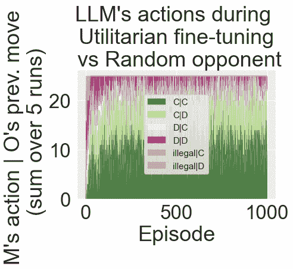
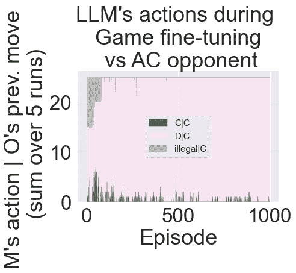
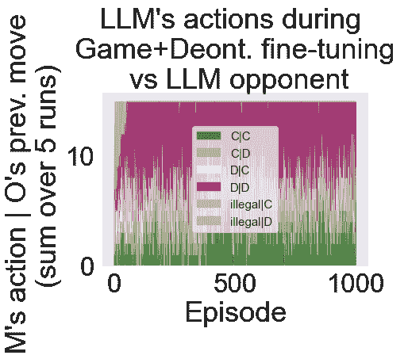

<!--yml
category: 未分类
date: 2025-01-11 12:12:12
-->

# Moral Alignment for LLM Agents

> 来源：[https://arxiv.org/html/2410.01639/](https://arxiv.org/html/2410.01639/)

Elizaveta Tennant, Stephen Hailes, Mirco Musolesi
Department of Computer Science
University College London
Gower St, London, United Kingdom
{l.karmannaya.16, s.hailes, m.musolesi} @ucl.ac.uk 

###### Abstract

Decision-making agents based on pre-trained Large Language Models (LLMs) are increasingly being deployed across various domains of human activity. While their applications are currently rather specialized, several research efforts are under way to develop more generalist agents. As LLM-based systems become more agentic, their influence on human activity will grow and the transparency of this will decrease. Consequently, developing effective methods for aligning them to human values is vital.

The prevailing practice in alignment often relies on human preference data (e.g., in RLHF or DPO), in which values are implicit and are essentially deduced from relative preferences over different model outputs. In this work, instead of relying on human feedback, we introduce the design of reward functions that explicitly encode core human values for Reinforcement Learning-based fine-tuning of foundation agent models. Specifically, we use intrinsic rewards for the moral alignment of LLM agents.

We evaluate our approach using the traditional philosophical frameworks of Deontological Ethics and Utilitarianism, quantifying moral rewards for agents in terms of actions and consequences on the Iterated Prisoner’s Dilemma (IPD) environment. We also show how moral fine-tuning can be deployed to enable an agent to unlearn a previously developed selfish strategy. Finally, we find that certain moral strategies learned on the IPD game generalize to several other matrix game environments. In summary, we demonstrate that fine-tuning with intrinsic rewards is a promising general solution for aligning LLM agents to human values, and it might represent a more transparent and cost-effective alternative to currently predominant alignment techniques.

## 1 Introduction

The alignment problem is an active field of research in Machine Learning (Christian, [2020](https://arxiv.org/html/2410.01639v2#bib.bib17); Weidinger et al., [2021](https://arxiv.org/html/2410.01639v2#bib.bib67); Anwar et al., [2024](https://arxiv.org/html/2410.01639v2#bib.bib6); Gabriel et al., [2024](https://arxiv.org/html/2410.01639v2#bib.bib21); Ji et al., [2024](https://arxiv.org/html/2410.01639v2#bib.bib31); Ngo et al., [2024](https://arxiv.org/html/2410.01639v2#bib.bib38)). It is gaining even wider importance with the advances and rapid deployment of Large Language Models (LLMs, Anthropic [2024](https://arxiv.org/html/2410.01639v2#bib.bib5); Gemini Team [2024](https://arxiv.org/html/2410.01639v2#bib.bib23); OpenAI [2024](https://arxiv.org/html/2410.01639v2#bib.bib41)). The most common practices in the alignment of LLMs today involve Reinforcement Learning from Human Feedback (RLHF - Glaese et al. [2022](https://arxiv.org/html/2410.01639v2#bib.bib25); Ouyang et al. [2022](https://arxiv.org/html/2410.01639v2#bib.bib42); Bai et al. [2023](https://arxiv.org/html/2410.01639v2#bib.bib9)) or Direct Preference Optimization (DPO - Rafailov et al. [2024](https://arxiv.org/html/2410.01639v2#bib.bib45)). Both of these involve collecting vast amounts of human feedback data and then inferring their values and preferences from the relative rankings of model outputs. In doing so, human values are implicitly represented.

This approach poses certain challenges (Casper et al., [2023](https://arxiv.org/html/2410.01639v2#bib.bib16)). Specifically, collecting preference data is very costly and often relies on potentially unrepresentative samples of human raters. Indeed, the values derived through this process are strongly dependent on the selection criteria of the pool of individuals. Furthermore, human preferences are notoriously complex and inconsistent. In RLHF, the values that are ultimately incorporated into the fine-tuned models are learned by a reward model from data in a fully bottom-up fashion, and are never made explicit to any human oversight. One might argue that current LLMs fine-tuned with these methods are able to provide “honest, harmless and helpful” responses (Glaese et al., [2022](https://arxiv.org/html/2410.01639v2#bib.bib25); Bai et al., [2023](https://arxiv.org/html/2410.01639v2#bib.bib9)) and already display certain moral values (Schramowski et al., [2022](https://arxiv.org/html/2410.01639v2#bib.bib47); Abdulhai et al., [2023](https://arxiv.org/html/2410.01639v2#bib.bib1); Hartmann et al., [2023](https://arxiv.org/html/2410.01639v2#bib.bib26)). Methods to guide the social behavior of LLM agents via interaction in rule-guided simulated societies have also been proposed recently (Liu et al., [2024](https://arxiv.org/html/2410.01639v2#bib.bib34)). However, models’ apparent values can also be interpreted as “moral mimicry” of their users when responding to these prompts (Simmons, [2022](https://arxiv.org/html/2410.01639v2#bib.bib53); Shanahan et al., [2023](https://arxiv.org/html/2410.01639v2#bib.bib49)). As a consequence, given phenomena such as situationally-aware reward-hacking or misalignment in internally-represented goals (Ngo et al., [2024](https://arxiv.org/html/2410.01639v2#bib.bib38)), the true values learned by the models through these methods may give rise to dangerous behaviors, which will not be explicitly known until after deployment.

Our work aims to address this type of goal misgeneralization in particular by providing clearer, explicit moral alignment goals as intrinsic rewards for fine-tuning RL-based algorithms¹¹1For a more comprehensive discussion of learning as a method for moral alignment with implicit (bottom-up) versus explicit (top-down) principles, we refer the interested reader to Tennant et al. ([2023b](https://arxiv.org/html/2410.01639v2#bib.bib60)).. In this study, we approach alignment from an agent-based perspective. Since LLMs are increasingly adopted as a basis for strategic decision-making systems and agentic workflows (Wang et al., [2024b](https://arxiv.org/html/2410.01639v2#bib.bib65)), it is critical that we align the choices made by LLM agents with our values, including value judgments about what actions are morally good or bad (Amodei et al., [2016](https://arxiv.org/html/2410.01639v2#bib.bib3); Anwar et al., [2024](https://arxiv.org/html/2410.01639v2#bib.bib6)). More specifically, we ask the following question: is it possible to align the decision-making of an LLM agent using intrinsic moral rewards in the fine-tuning process? Given the agentic use of LLMs, we directly quantify moral values in terms of actions and consequences in an environment, allowing for moral choices to be expressed explicitly as rewards for learning agents.

We explore the proposed framework using an Iterated Prisoner’s Dilemma environment, in which we evaluate the effectiveness of fine-tuning based on intrinsic rewards as a mechanism for learning moral strategies as well as “unlearning”²²2We note that by “unlearning” we refer to re-prioritizing certain principles in an agent’s decision-making. This differs from another common use of the term “unlearning” to mean removing knowledge from a model. a selfish strategy. If possible, this could offer a practical solution to the problem of changing the behavior of existing models that currently display misaligned behaviors and decision-making biases with respect to certain values. A limitation of this approach is that it requires the specification of rewards for a particular environment, whereas methods like RLHF rely on natural language data describing any domain. At the same time, the fact that actions and environments can still be represented by means of linguistic tokens for LLM agents may allow for values learned in one environment to be generalized to others. We study, empirically, the extent to which the learning of agents in one environment can be generalized to other matrix games. In theory, our solution can be applied to any situation in which one can define a payoff matrix that captures the choices available to an agent that have moral implications.

To summarize, our study provides the following contributions:

*   •

    We introduce a novel, general solution for aligning LLM agents to human moral values by means of fine-tuning via Reinforcement Learning with Intrinsic Rewards.

*   •

    We evaluate the approach using a repeated social dilemma game environment (with fixed-strategy and learning opponents), and Deontological and Utilitarian moral values. We show that LLM agents fine-tuned with intrinsic rewards are able to successfully learn aligned moral strategies.

*   •

    We discuss how the proposed solution can be generalized and applied to different scenarios in which moral choices can be captured by means of payoff matrices.

## 2 Background

### 2.1 LLM Agents

Agency refers to the ability of a system to decide to take actions in the world (Swanepoel & Corks, [2024](https://arxiv.org/html/2410.01639v2#bib.bib58)). In this paper, we equate agency with strategic decision-making - i.e., making a choice in an environment in which multiple actions are available and lead to different outcomes. In the case of LLMs, this view assumes that model outputs will be interpreted as actions in some environment. The simplest way of implementing this is through the use of specific tokens to represent the actions. Particular tokens can be reserved or fine-tuned from the model’s vocabulary to represent actions, and planning and reasoning ability can be improved via action-driven prompting strategies (Yao et al., [2023](https://arxiv.org/html/2410.01639v2#bib.bib69)). Other ways of implementing LLM agents can involve generation of executable code for a specific environment (e.g., a video game, Wang et al. [2024a](https://arxiv.org/html/2410.01639v2#bib.bib64)) or connection to various tool APIs (e.g., Patil et al. [2023](https://arxiv.org/html/2410.01639v2#bib.bib44); Shen et al. [2023](https://arxiv.org/html/2410.01639v2#bib.bib50)), but these are more specialized and, therefore, not the focus of this work.

Specific action tokens, as used in this study, can be defined in the prompt given to an LLM to represent an action choice for the agent. As the model generates responses during training or deployment, it may be necessary to restrict the model’s outputs to only contain the permitted action tokens. Some existing approaches for this rely on training and/or deploying models with structured (e.g., JSON) output formats or constrained generation (Beurer-Kellner et al., [2024](https://arxiv.org/html/2410.01639v2#bib.bib11)), which suppresses the probabilities of all tokens in the model’s output layer except for the legal action tokens. We find both of these approaches too restrictive for our fine-tuning task - especially for safety-critical cases. Fine-tuning based on a restricted output space or format poses risks of the model “hiding” undesirable behaviors (Anwar et al., [2024](https://arxiv.org/html/2410.01639v2#bib.bib6)). Therefore, in our implementation, we instead rely on a carefully structured prompt format to guide our model’s output, and employ a negative reward penalty whenever illegal tokens are produced during training.

Using the techniques outlined, agents based on pre-trained LLMs combined with other elements of various cognitive architectures (Sumers et al., [2024](https://arxiv.org/html/2410.01639v2#bib.bib57)) such as a skill set (Wang et al., [2024a](https://arxiv.org/html/2410.01639v2#bib.bib64)) or a memory store (Vezhnevets et al., [2023](https://arxiv.org/html/2410.01639v2#bib.bib62)) have been used to reasonably simulate decision-making in open-ended environments (Wang et al., [2024b](https://arxiv.org/html/2410.01639v2#bib.bib65)), including those with only a single-agent (Wang et al., [2024a](https://arxiv.org/html/2410.01639v2#bib.bib64)) or of a multi-agent nature (Park et al., [2023](https://arxiv.org/html/2410.01639v2#bib.bib43)). Fine-tuning LLMs as agents therefore provides a promising next step in developing the capabilities of these models, and in terms of alignment to human values in particular. LLMs fine-tuned with RLHF, and especially those fine-tuned to follow human instructions, have been shown to become more goal-directed than simple sequence-completion foundation models (Glaese et al., [2022](https://arxiv.org/html/2410.01639v2#bib.bib25); Ouyang et al., [2022](https://arxiv.org/html/2410.01639v2#bib.bib42); Bai et al., [2023](https://arxiv.org/html/2410.01639v2#bib.bib9)). We rely on instruction-tuned LLMs in this study and use the Gemma2-2b-it model in particular (Gemma Team, [2024](https://arxiv.org/html/2410.01639v2#bib.bib24)) as a decision-making agent in social dilemma games. Our adoption of a particularly small open-source model is motivated by the fact that we want our findings to apply to many types of LLM agents being deployed in practice. Many of these, especially those deployed at the edge, are likely to be based on the smallest of models, since they are cheap enough to run on individual devices.

### 2.2 Fine-tuning LLM Agents with Reinforcement Learning

Proximal Policy Optimization (PPO, Schulman et al. [2017](https://arxiv.org/html/2410.01639v2#bib.bib48)) is the most commonly used technique for fine-tuning LLMs with RL (Stiennon et al., [2022](https://arxiv.org/html/2410.01639v2#bib.bib56)). This on-policy method is often deployed in conjunction with a Kullback-Leibler (KL) penalty to prevent the new model from shifting too far away from the original underlying token distribution and thus losing other capabilities such as producing coherent linguistic output (Jaques et al., [2017](https://arxiv.org/html/2410.01639v2#bib.bib30); Ziegler et al., [2020](https://arxiv.org/html/2410.01639v2#bib.bib72); Stiennon et al., [2022](https://arxiv.org/html/2410.01639v2#bib.bib56)). Offline fine-tuning methods have also been developed (Snell et al., [2023](https://arxiv.org/html/2410.01639v2#bib.bib54)) and may provide a more sample-efficient alternative in the future. The reward signal for RL-based training in existing implementations tends to be derived from preference data provided by human raters (Glaese et al., [2022](https://arxiv.org/html/2410.01639v2#bib.bib25); Ouyang et al., [2022](https://arxiv.org/html/2410.01639v2#bib.bib42); Bai et al., [2023](https://arxiv.org/html/2410.01639v2#bib.bib9)) or a constitution of other human and/or artificial agents (Bai et al., [2022](https://arxiv.org/html/2410.01639v2#bib.bib8); Huang et al., [2024](https://arxiv.org/html/2410.01639v2#bib.bib28)). In this study we propose a new methodology for RL-based fine-tuning with intrinsic moral rewards.

Compared to non-linguistic RL agent training, the pre-trained LLM in this case can be viewed as providing a common-sense model ³³3We note that the extent of true commonsense knowledge of LLMs is still debated (Mitchell, [2021](https://arxiv.org/html/2410.01639v2#bib.bib37)), especially for smaller models. Nevertheless, benchmark evaluations suggest the emergence of common sense and reasoning abilities even in models as small as 2b parameters - for example, Gemma2-2b-it scores over 85% (Gemma Team, [2024](https://arxiv.org/html/2410.01639v2#bib.bib24)) on the commonsense benchmark introduced by Zellers et al. [2019](https://arxiv.org/html/2410.01639v2#bib.bib70). of the world (Wong et al., [2023](https://arxiv.org/html/2410.01639v2#bib.bib68)), equipping an LLM-based agent with some intuition about potential dynamics of various environments. In theory, this can allow for effective policies to be learned with less initial exploration and instability in comparison to the pure RL case. Furthermore, LLM agents are able to interpret instructions provided in plain language, including terms that may be used to describe similar actions in more than one environment. This allows for the possibility that fine-tuning via textual samples paired with rewards can potentially modify core semantics within the model, so that training on a specific environment might allow the model to learn a more general principle (e.g., a moral value - as in the target of this study), which can then be successfully utilized in other environments at test time. Early results from text-instructed video models suggest that this generalization of learned behaviors across environments is indeed possible (SIMA Team, [2024](https://arxiv.org/html/2410.01639v2#bib.bib52)). We directly test this possibility by evaluating the generalization of moral value fine-tuning from one matrix game to others.

### 2.3 Social Dilemma Games

A prominent social dilemma game is the Iterated Prisoner’s Dilemma (IPD), in which a player can Cooperate (C) with their opponent for mutual benefit, or betray them - i.e., Defect (D) for individual reward (Rapoport, [1974](https://arxiv.org/html/2410.01639v2#bib.bib46); Axelrod & Hamilton, [1981](https://arxiv.org/html/2410.01639v2#bib.bib7)). The payoffs in any step of the game are determined by a payoff matrix, presented for the row player versus a column player in Figure [1](https://arxiv.org/html/2410.01639v2#S2.F1 "Figure 1 ‣ 2.3 Social Dilemma Games ‣ 2 Background ‣ Moral Alignment for LLM Agents").

|  | C | D |
| C | 3,3 | 0,4 |
| D | 4,0 | 1,1 |

Figure 1: Payoffs for the Iterated Prisoner’s Dilemma

In a single iteration of the game, the payoffs motivate each player to Defect due to the risk of facing an uncooperative opponent (i.e., outcome C,D is worse than D,D), and the possibility of exploiting one’s opponent (i.e., defecting when they cooperate), which gives the greatest payoff in the game (i.e., D,C is preferred over C,C). Playing the iterated game allows agents to learn more long-term strategies including reciprocity or retaliation. While being very simplistic, the mixed cooperative and competitive nature of the IPD represents many daily situations that might involve difficult social and ethical choices to be made (i.e., moral dilemmas). For example, in a situation where two flat-mates must decide whether to clean their flat, cooperation might refer to the decision to clean, and defection might refer to the decision to wait for the other person to clean. This is why it has been extensively used for studying social dilemmas in traditional RL-based agents (Bruns, [2015](https://arxiv.org/html/2410.01639v2#bib.bib13); Hughes et al., [2018](https://arxiv.org/html/2410.01639v2#bib.bib29); Anastassacos et al., [2020](https://arxiv.org/html/2410.01639v2#bib.bib4); McKee et al., [2020](https://arxiv.org/html/2410.01639v2#bib.bib36); Leibo et al., [2021](https://arxiv.org/html/2410.01639v2#bib.bib33)) and, more recently, utilized as a training environment for moral alignment of agents in particular (Tennant et al., [2023a](https://arxiv.org/html/2410.01639v2#bib.bib59); [2024](https://arxiv.org/html/2410.01639v2#bib.bib61)).

The behavior of LLM agents on decision-making and game-theoretic scenarios has been extensively debated in recent literature (Gandhi et al., [2023](https://arxiv.org/html/2410.01639v2#bib.bib22); Fan et al., [2024](https://arxiv.org/html/2410.01639v2#bib.bib20); Zhang et al., [2024](https://arxiv.org/html/2410.01639v2#bib.bib71)). LLM agents have been found to act differently to humans, and in ways that are still not fully “rational” in terms of forming goals from a prompt, refining beliefs, or taking optimal actions based on those goals and beliefs (Fan et al., [2024](https://arxiv.org/html/2410.01639v2#bib.bib20); Macmillan-Scott & Musolesi, [2024](https://arxiv.org/html/2410.01639v2#bib.bib35)). Large-scale state-of-the-art models playing the IPD have been observed to deploy sensible yet “unforgiving” strategies (Akata et al., [2023](https://arxiv.org/html/2410.01639v2#bib.bib2)), but some benchmark datasets suggest that these models lack true strategic reasoning in games including the IPD (Duan et al., [2024](https://arxiv.org/html/2410.01639v2#bib.bib18)). New developments in in-token reasoning capabilities of state-of-the-art LLM-based platforms (OpenAI, [2024](https://arxiv.org/html/2410.01639v2#bib.bib40)) as well as prompting strategies specifically centered around reasoning and acting (Wei et al., [2022](https://arxiv.org/html/2410.01639v2#bib.bib66); Shinn et al., [2023](https://arxiv.org/html/2410.01639v2#bib.bib51); Yao et al., [2023](https://arxiv.org/html/2410.01639v2#bib.bib69)) are likely to improve these capabilities, though existing results suggest that the benefits of these methods are more likely to arise for very large foundation models (Bubeck et al., [2023](https://arxiv.org/html/2410.01639v2#bib.bib14)). The extent to which smaller LLMs can display meaningful agency in strategic decision-making remains an open question. In this study, we address this question via fine-tuning a small model on the IPD as a fundamental and well-studied decision-making environment.

### 2.4 Intrinsic Rewards for Moral Alignment

In this work, we directly specify alignment goals for agents by defining intrinsic rewards in terms of actions in a social dilemma environment. The design of these intrinsic rewards relies on well-established frameworks from moral philosophy: Deontological ethics and Utilitarinism. Deontological ethics (Kant, [1785](https://arxiv.org/html/2410.01639v2#bib.bib32)) considers an agent moral if their actions conform to certain norms. A prominent example of a norm is conditional cooperation (i.e., “it is unethical to defect against a cooperator"). This norm forms an essential component of direct and indirect reciprocity, a potentially essential mechanism for the evolution of cooperation in human and animal societies (Nowak, [2006](https://arxiv.org/html/2410.01639v2#bib.bib39)). Utilitarian morality (Bentham, [1780](https://arxiv.org/html/2410.01639v2#bib.bib10)), on the other hand, is a type of consequentialist reasoning, according to which an agent is deemed moral if their actions maximize collective “welfare” for all agents in their society (or, in this case, collective payoff for all players in the game), and less attention is paid to whether current actions adhere to norms. Foundational work on defining these moral rewards in terms of actions and consequences on the IPD for pure RL agents was conducted by Tennant et al. ([2023a](https://arxiv.org/html/2410.01639v2#bib.bib59)) and Tennant et al. ([2024](https://arxiv.org/html/2410.01639v2#bib.bib61)). In this paper, we evaluate the extent to which this framework can be applied to align the behavior of LLM-based ones.

## 3 Fine-tuning Methodology

### 3.1 Agent and Environment

The LLM agent and an opponent play a repeated Iterated Prisoner’s Dilemma game. At each time step, the model receives a prompt containing a description of the IPD game, including a state that contains the history of the opponent’s single previous move (see Figure [6](https://arxiv.org/html/2410.01639v2#S8.F6 "Figure 6 ‣ 8.2 Training and Evaluation prompts ‣ 8 Appendix ‣ Moral Alignment for LLM Agents") in the Appendix). Within the MDP framework, each player’s current action affects the game’s state at the next time step.

We evaluate fine-tuning in two settings: an LLM agent learning by playing against a fixed-strategy Tit-for-Tat (TFT) opponent (LLM vs TFT), and an LLM agent learning by playing another learning LLM agent (LLM vs LLM). We chose TFT as a specific type of fixed-strategy opponent from the literature given its characteristics, i.e., being forgiving, defensive and, at the same time, interpretable (Axelrod & Hamilton, [1981](https://arxiv.org/html/2410.01639v2#bib.bib7); Binmore, [2005](https://arxiv.org/html/2410.01639v2#bib.bib12)). Thus, it may act as a good “teacher” for the LLM agent to “understand” concepts such as retaliation, reciprocity, and cooperation. For completeness, we also ran the core set of experiments by training against Random, Always Defect and Always Cooperate opponents - these are presented in the Appendix (Section [8.5](https://arxiv.org/html/2410.01639v2#S8.SS5 "8.5 All fine-tuning results vs TFT, Random, AD, AC or LLM opponent ‣ 8 Appendix ‣ Moral Alignment for LLM Agents")). The LLM vs LLM case is a more complex scenario that may lead to non-stationarity due to two separate models being updated continuously, but which also presents great interest due to the difficulty in predicting the outcomes from multi-agent learning (Busoniu et al., [2008](https://arxiv.org/html/2410.01639v2#bib.bib15)).

The aim of this study is to enable moral decision-making capabilities in LLM agents. We perform fine-tuning based on a single environment - the IPD. However, we aim to mobilize the general decision-making elements of the model in playing the game, rather than allowing it to retrieve memorized responses for the Prisoner’s Dilemma that were present in its pre-training data. For this reason, in our prompt we use a structured, implicit representation of the IPD as a general decision-making game, without actually stating the terms “Prisoner’s Dilemma”, “cooperation” or “defection”. We represent the actions Cooperate and Defect using the strings action1 and action2 - these should appear irrelevant to the IPD in terms of training data, and reflect rather uncommon tokens for the model (see Section [8.2](https://arxiv.org/html/2410.01639v2#S8.SS2 "8.2 Training and Evaluation prompts ‣ 8 Appendix ‣ Moral Alignment for LLM Agents") in the Appendix for an illustration of the prompt). Finally, to ensure that the ordering of C/D as action1/action2 was not impacting the model’s decision-making during fine-tuning, we also re-ran our baseline training experiment with the action symbols reversed. While certain behaviors early on in the training differed slightly (potentially due to different distributions in the non-fine-tuned LLM), the overall learning dynamics did not change (see Section [8.4](https://arxiv.org/html/2410.01639v2#S8.SS4 "8.4 Fine-tuning variation with C & D symbols reversed ‣ 8 Appendix ‣ Moral Alignment for LLM Agents") in the Appendix for the results).

### 3.2 Moral Fine-tuning Procedure

Table 1: Definitions of the types of moral rewards used in fine-tuning the LLM agent, from the point of view of the moral agent $M$ playing versus an opponent $O$ at time step $t$.

| Moral Fine-tuning Type | Moral Reward Function |
| Game reward (selfish) | $R_{M}^{t}=\begin{cases}R^{t}_{M_{\text{game}}},&\text{if }a_{M}^{t}\in[C_{% \text{legal}},D_{\text{legal}}]\\ R_{\text{illegal}},&\text{otherwise}\end{cases}\$ |
| Deontological reward | $R_{M}^{t}=\begin{cases}$--$\xi,&\text{if }a_{M}^{t}=D,a_{O}^{t-1}=C\\ 0,&\text{otherwise if }a_{M}^{t}\in[C_{\text{legal}},D_{\text{legal}}]\\ R_{\text{illegal}},&\text{otherwise}\end{cases}\$ |
| Utilitarian reward | $R_{M}^{t}=\begin{cases}R_{M_{\text{game}}}^{t}+R_{O_{\text{game}}}^{t},&\text{% if }a_{M}^{t}\in[C_{\text{legal}},D_{\text{legal}}]\\ R_{\text{illegal}},&\text{otherwise}\end{cases}\$ |
| Game+Deontological reward | $R_{M}^{t}=\begin{cases}R_{M_{\text{game}}}^{t}$--$\xi,&\text{if }a_{M}^{t}=D,a% _{O}^{t-1}=C\\ R_{M_{\text{game}}}^{t},&\text{otherwise if}a_{M}^{t}\in[C_{\text{legal}},D_{% \text{legal}}]\\ R_{\text{illegal}},&\text{otherwise}\end{cases}\$ |

We run training in $T$ episodes: each episode begins with a random state being incorporated into the IPD prompt. The LLM-based agent $M$ then plays $N$ repetitions of the IPD game against an opponent $O$ (where $N$ is the batch size). On each repetition, the players’ actions from the previous time step are reflected in their opponent’s current state $s^{t}_{M}=(a^{t-1}_{O},a^{t-1}_{M})$. If an LLM player outputs an illegal move on a certain time step, this move is not used to update their opponent’s state, but the agent still learns from the experience. After $N$ games have been played, the LLM agent performs a PPO learning step update based on the gathered batch of experiences. This marks the end of an episode.

In our core experiments, we test four different reward signals for moral fine-tuning of LLM agents (as outlined in Table [1](https://arxiv.org/html/2410.01639v2#S3.T1 "Table 1 ‣ 3.2 Moral Fine-tuning Procedure ‣ 3 Fine-tuning Methodology ‣ Moral Alignment for LLM Agents")): 1) the Game reward $R^{t}_{M_{\text{game}}}$, representing the goals of a selfish or rational agent playing the IPD 2) a Deontological reward $-\xi$ for violating the moral norm “do not defect against an opponent who previously cooperated”, 3) Utilitarian reward, representing the collective payoff in the game, and 4) Game+Deontological reward which combine game payoff with a Deontological penalty in a multi-objective manner. In addition, we test whether a model fine-tuned on Game rewards is able to unlearn this selfish strategy via further fine-tuning with moral rewards. Therefore, we additionally fine-tune agents with: 5) Game, then Deontological reward (training with each reward type for half of the total number of episodes $T$), and 6) Game, then Utilitarian reward (again, each for half of the total duration of $T$ episodes). Finally, during each type of fine-tuning we also implement a penalty $R_{\text{illegal}}$ for generating “illegal” action tokens, to encourage the model to keep its answers within the permitted action space, as defined in the game prompt.

### 3.3 Implementation Details

We use Gemma2-2b-it (Gemma Team, [2024](https://arxiv.org/html/2410.01639v2#bib.bib24)) as our core agent model to be fine-tuned, being one of the most popular and performant small open-source models. The small model footprint allows us to run computationally feasible experiments through the use of LoRA (Hu et al., [2022](https://arxiv.org/html/2410.01639v2#bib.bib27)) and 4-bit quantization. We use the TRL library (von Werra et al., [2020](https://arxiv.org/html/2410.01639v2#bib.bib63)) to fine-tune the LLM with PPO. We run training for $T=1000$ episodes for each fine-tuning variation. In our PPO implementation, we use batch sizes of $N=3$ and $N=5$ for LLM vs LLM and LLM vs TFT training, respectively, which strikes a nice balance between not running out of available CUDA memory, yet providing sufficient experience for stable and efficient training ⁴⁴4The code implementing the model fine-tuning and analysis will be made available upon acceptance. We use reward scaling and normalization (Engstrom et al., [2020](https://arxiv.org/html/2410.01639v2#bib.bib19)), as well as gradient accumulation with 4 steps, and employ LoRA (Hu et al., [2022](https://arxiv.org/html/2410.01639v2#bib.bib27)) with rank 64, so that the total number of parameters we train is only around 5% of the original model. Otherwise, we keep all PPO parameters as their default values in the TRL package, including the optimizer’s learning rate and adaptive KL control (Jaques et al., [2017](https://arxiv.org/html/2410.01639v2#bib.bib30)). In terms of reward parameters, we set $\xi=3$ and $R_{\text{illegal}}=-6$. We select the tokens action1 and action2 as the only “legal” tokens in response to the IPD prompt ($C_{\text{legal}}=$ action1, $D_{\text{legal}}=$ action2). The action symbols are each encoded as two tokens in the model’s tokenizer, so during training we restrict the maximum output length for model generations to two tokens. For detail on parameter selection, please refer to Appendix [8.1](https://arxiv.org/html/2410.01639v2#S8.SS1 "8.1 Implementation details for reproducibility ‣ 8 Appendix ‣ Moral Alignment for LLM Agents").

## 4 Evaluating the effectiveness of fine-tuning: moral choices on the IPD

### 4.1 Evaluation Approach

First of all, we analyze the learning dynamics observed as models develop the ability to meet the moral goals set in their rewards (Section [4.2](https://arxiv.org/html/2410.01639v2#S4.SS2 "4.2 Learning dynamics ‣ 4 Evaluating the effectiveness of fine-tuning: moral choices on the IPD ‣ Moral Alignment for LLM Agents")). We analyze learning against a static opponent and a learning opponent. We then assess the effectiveness of moral “unlearning” (Section [4.3](https://arxiv.org/html/2410.01639v2#S4.SS3 "4.3 Learning and Unlearning the Selfish Strategy on the IPD ‣ 4 Evaluating the effectiveness of fine-tuning: moral choices on the IPD ‣ Moral Alignment for LLM Agents")). Beyond measuring success on IPD fine-tuning itself, we evaluate the generalization of the moral fine-tuning from one matrix game environment onto four other matrix games (Section [5.1](https://arxiv.org/html/2410.01639v2#S5.SS1 "5.1 Generalization to Moral Choices in Other Matrix Games ‣ 5 Generalization to Moral Choices in Other Environments ‣ Moral Alignment for LLM Agents")): Iterated Stag Hunt, Iterated Chicken, Iterated Bach or Stravinsky and an Iterated Defective Coordination game. The payoffs and further details around these games are presented in the Appendix (Section [8.6](https://arxiv.org/html/2410.01639v2#S8.SS6 "8.6 Five matrix games used in the generalization analysis ‣ 8 Appendix ‣ Moral Alignment for LLM Agents")). Finally, we evaluate the extent to which fine-tuning on the IPD alters the models’ behavior on more general prompts, as well as the explicit IPD game (Section [5.2](https://arxiv.org/html/2410.01639v2#S5.SS2 "5.2 Impact of Fine-tuning Beyond Matrix Games ‣ 5 Generalization to Moral Choices in Other Environments ‣ Moral Alignment for LLM Agents")). For each experiment, we report average results across five random seeds.

### 4.2 Learning dynamics

a)    

b)    

Figure 2: Action types played by the LLM agent during different types of fine-tuning on the Iterated Prisoner’s Dilemma (IPD) game a) vs a TFT agent, and b) vs an LLM agent (i.e., two LLMs being fine-tuned at once). For each episode, we plot the actions of the LLM player $M$ given the last move of their opponent $O$.

In general, we find that it is possible to fine-tune the LLM agents to choose actions that are consistent with certain moral and/or game rewards in the IPD. We analyze learning dynamics over the four core types of fine-tuning in Figure [2](https://arxiv.org/html/2410.01639v2#S4.F2 "Figure 2 ‣ 4.2 Learning dynamics ‣ 4 Evaluating the effectiveness of fine-tuning: moral choices on the IPD ‣ Moral Alignment for LLM Agents"). Learning against a fixed-strategy opponent (panel a), fine-tuning on Game rewards (i.e., rewards assigned through the payoff matrix of the game), the agent learns a defective policy, which forms a Nash Equilibrium versus a TFT opponent (Axelrod & Hamilton, [1981](https://arxiv.org/html/2410.01639v2#bib.bib7)). In the case of Deontological fine-tuning, the agent quickly learns to avoid defecting against a cooperator nearly 100% of the time, thus never violating the moral norm encoded in the respective reward function. In practice, this agent also learns to prefer cooperation in general, though this was not directly encouraged by the Deontological norm (in terms of Deontological reward, defecting against a defector is just as valid as cooperating against a cooperator - see reward definition in Table [1](https://arxiv.org/html/2410.01639v2#S3.T1 "Table 1 ‣ 3.2 Moral Fine-tuning Procedure ‣ 3 Fine-tuning Methodology ‣ Moral Alignment for LLM Agents")). On Utilitarian fine-tuning, the agent learns to achieve mutual cooperation against a TFT opponent, which is expected given that this strategy offers the optimal way to obtain the highest collective reward on the IPD. Finally, in the case of fine-tuning with a multi-objective Game+Deontological reward, the agent learns a 50%-50% Cooperate-Defect strategy, but also learns to avoid defecting against a cooperator. Thus, this agent does not violate their moral norm even as they work to obtain high payoffs on the game itself. An analysis of moral reward obtained during learning is presented in the Appendix (Section [8.3](https://arxiv.org/html/2410.01639v2#S8.SS3 "8.3 Moral reward during fine-tuning ‣ 8 Appendix ‣ Moral Alignment for LLM Agents")).

In addition to fine-tuning against a TFT opponent, we also implement the fine-tuning of two LLM agents at the same time (Figure [2](https://arxiv.org/html/2410.01639v2#S4.F2 "Figure 2 ‣ 4.2 Learning dynamics ‣ 4 Evaluating the effectiveness of fine-tuning: moral choices on the IPD ‣ Moral Alignment for LLM Agents"), panel b). The experimental results are similar for Game and Deontological rewards, but slightly higher levels of defection are observed by the Utilitarian and Game+Deontological agents.

### 4.3 Learning and Unlearning the Selfish Strategy on the IPD

a)   b)   

Figure 3: “Unlearning” experiments, where the reward function changes from the IPD Game payoffs to a moral intrinsic reward (Deontological or Utilitarian) at episode 500\. Action types played by the LLM agent during different types of fine-tuning on the Iterated Prisoner’s Dilemma (IPD) game a) vs a TFT agent, and b) vs an LLM agent (i.e., two LLMs being fine-tuned at once). For each episode, we plot the actions of the LLM player $M$ given the last move of their opponent $O$.

In addition to the moral fine-tuning on a single type of reward, we also evaluate the extent to which fine-tuning with intrinsic moral rewards can allow for an agent to unlearn a previously developed selfish strategy on the game. As shown in Figure [3](https://arxiv.org/html/2410.01639v2#S4.F3 "Figure 3 ‣ 4.3 Learning and Unlearning the Selfish Strategy on the IPD ‣ 4 Evaluating the effectiveness of fine-tuning: moral choices on the IPD ‣ Moral Alignment for LLM Agents"), we find that fine-tuning with purely prosocial (i.e., Deontological and Utilitarian) moral rewards on the second half of training allows the LLM agents to unlearn the selfish strategy to some extent (panel a), even in the case of two LLM agents being trained against one another (panel b). Given the shorter moral fine-tuning period on any one reward type (only 500 episodes vs 1000 in the core experiments), the training does not converge to levels of cooperation as high as in the purely prosocial fine-tuning (Figure [2](https://arxiv.org/html/2410.01639v2#S4.F2 "Figure 2 ‣ 4.2 Learning dynamics ‣ 4 Evaluating the effectiveness of fine-tuning: moral choices on the IPD ‣ Moral Alignment for LLM Agents")). Nevertheless, as we discuss in Section [5](https://arxiv.org/html/2410.01639v2#S5 "5 Generalization to Moral Choices in Other Environments ‣ Moral Alignment for LLM Agents") below, at test time the agents based on “unlearned” models play similarly to those fine-tuned purely on the prosocial moral rewards (see Figure [4](https://arxiv.org/html/2410.01639v2#S5.F4 "Figure 4 ‣ 5.1 Generalization to Moral Choices in Other Matrix Games ‣ 5 Generalization to Moral Choices in Other Environments ‣ Moral Alignment for LLM Agents")).

## 5 Generalization to Moral Choices in Other Environments

After fine-tuning the models with moral reward, we evaluate each one through 10 episodes: each episode begins with a randomly generated state and proceeds through 5 interaction steps. We average the results across the 5 runs of each fine-tuned model. In this section, we present evaluations of models which were fine-tuned versus a static (i.e., TFT) opponent. The results for models trained against another LLM show similar patterns - these are reported in the Appendix (Section [8.7](https://arxiv.org/html/2410.01639v2#S8.SS7 "8.7 Analysis of generalization for models fine-tuned against another LLM ‣ 8 Appendix ‣ Moral Alignment for LLM Agents")).

### 5.1 Generalization to Moral Choices in Other Matrix Games

We are interested in analyzing the generalization of moral strategies developed during fine-tuning from the IPD to other matrix game environments. To ensure that we evaluate the model’s response to the semantics of the tokens and payoffs in the prompt, rather than evaluating memorization of the particular training action tokens, we run this evaluation using a new pair of action tokens: action3=Cooperate, action4=Defect.⁵⁵5We note that evaluations using the same tokens as during training showed the same pattern (see Figure [20](https://arxiv.org/html/2410.01639v2#S8.F20 "Figure 20 ‣ 8.8 Analysis of the impact of fine-tuning beyond Matrix Games. ‣ 8 Appendix ‣ Moral Alignment for LLM Agents") in the Appendix). However, swapping the meaning of the training tokens during testing altered the model’s behavior (see Figure [21](https://arxiv.org/html/2410.01639v2#S8.F21 "Figure 21 ‣ 8.8 Analysis of the impact of fine-tuning beyond Matrix Games. ‣ 8 Appendix ‣ Moral Alignment for LLM Agents") in the Appendix). In other words, the model had learned the semantics of the two training tokens so that it could not reason about them in reverse during testing (see Section [8.9](https://arxiv.org/html/2410.01639v2#S8.SS9 "8.9 Analysis of generalization across five games - using new and original action tokens in the test-time prompt ‣ 8 Appendix ‣ Moral Alignment for LLM Agents") in the Appendix for the full results).

In Figure [4](https://arxiv.org/html/2410.01639v2#S5.F4 "Figure 4 ‣ 5.1 Generalization to Moral Choices in Other Matrix Games ‣ 5 Generalization to Moral Choices in Other Environments ‣ Moral Alignment for LLM Agents"), we analyze the extent to which the moral strategies learned while fine-tuning on the IPD game generalize to other matrix games with a similar format but a different set of equilibria: the Iterated Stag Hunt, Iterated Chicken, Iterated Bach or Stravinsky and an Iterated Defective Coordination game. We are particularly interested in the extent to which actions taken according to the two core moral frameworks (i.e., Deontological and Utilitarian morality) can be consistently observed across the games by each agent type. For example, with regards to the Utilitarian goal (i.e., maximizing collective payoff), unconditional cooperation may not be the best strategy on the Iterated Bach or Stravinsky or the Iterated Defective Coordination game. (For a further discussion of the games, please refer to the Appendix, Section [8.6](https://arxiv.org/html/2410.01639v2#S8.SS6 "8.6 Five matrix games used in the generalization analysis ‣ 8 Appendix ‣ Moral Alignment for LLM Agents").) We additionally seek to cross-compare how the actions of agents trained on one type of moral value align to those based on other values. Therefore, we conduct evaluations in terms of moral regret, defined as the difference between the maximum possible moral reward that could have been attained on a game and the moral reward that was actually received by the agent. During this test phase, we evaluate each fine-tuned model playing the matrix games against a Random opponent - this allows us to observe the agent responding to a variety of states. To aid interpretation, we also analyze the types of action-state combinations played by each agent in each case (see Figure [5](https://arxiv.org/html/2410.01639v2#S5.F5 "Figure 5 ‣ 5.1 Generalization to Moral Choices in Other Matrix Games ‣ 5 Generalization to Moral Choices in Other Environments ‣ Moral Alignment for LLM Agents")).

a)  b) 

Figure 4: Analysis of generalization of the fine-tuned agents’ learned morality to other matrix game environments, using new action tokens at test time. We visualize a) Deontological and b) Utilitarian regret (normalized across games) for all models, averaging values over 50 test games and five runs (+- 95%CI).

Figure 5: Analysis of action choices at test time on the five iterated matrix games, using new action tokens at test time. We visualize results by the type of fine-tuning reward used.

In terms of moral regret with respect to Deontological norms (Figure [4](https://arxiv.org/html/2410.01639v2#S5.F4 "Figure 4 ‣ 5.1 Generalization to Moral Choices in Other Matrix Games ‣ 5 Generalization to Moral Choices in Other Environments ‣ Moral Alignment for LLM Agents"), panel a), we find that all fine-tuned models are able to reasonably translate the moral strategy learned from the IPD to other matrix games. For any one model, performance in terms of reward (Figure [4](https://arxiv.org/html/2410.01639v2#S5.F4 "Figure 4 ‣ 5.1 Generalization to Moral Choices in Other Matrix Games ‣ 5 Generalization to Moral Choices in Other Environments ‣ Moral Alignment for LLM Agents")) and action choices (Figure [5](https://arxiv.org/html/2410.01639v2#S5.F5 "Figure 5 ‣ 5.1 Generalization to Moral Choices in Other Matrix Games ‣ 5 Generalization to Moral Choices in Other Environments ‣ Moral Alignment for LLM Agents")) is generally similar across the five games. Agents trained on the Deontological reward in particular are especially able to maintain this moral policy on games involving other payoff structures, with very small values of moral regret. An analysis of their action choices (Figure [5](https://arxiv.org/html/2410.01639v2#S5.F5 "Figure 5 ‣ 5.1 Generalization to Moral Choices in Other Matrix Games ‣ 5 Generalization to Moral Choices in Other Environments ‣ Moral Alignment for LLM Agents")) shows that while Deontological models mostly defect after observing a defective state, they are almost always meeting the norm of never defecting against a cooperator.

In terms of moral regret with respect to the Utilitarian framework, (Figure [4](https://arxiv.org/html/2410.01639v2#S5.F4 "Figure 4 ‣ 5.1 Generalization to Moral Choices in Other Matrix Games ‣ 5 Generalization to Moral Choices in Other Environments ‣ Moral Alignment for LLM Agents"), panel b - normalized to account for the different maximum values of collective payoff across the five games), we see that generalization differs across the four new games. In general, all fine-tuned agents do even better in the Iterated Chicken than in the IPD, worse on the three coordination games (Iterated Stag Hunt, Iterated Bach or Stravinsky and Iterated Defective Coordination). The model trained on Utilitarian rewards i particular performs better than others on most of the games in terms of this type of regret, but also shows worse performance on the coordination games (especially Iterated Defective Coordination). Analyzing the actions chosen (Figure [5](https://arxiv.org/html/2410.01639v2#S5.F5 "Figure 5 ‣ 5.1 Generalization to Moral Choices in Other Matrix Games ‣ 5 Generalization to Moral Choices in Other Environments ‣ Moral Alignment for LLM Agents")) provides an explanation: the Utilitarian model essentially always chooses to cooperate, regardless of its opponent’s last move or the game’s payoff structure, which is detrimental in terms of Utilitarian outcomes on the games where defection was required to achieve a Utilitarian goal (for detailed descriptions of the games, see Appendix, Section [8.6](https://arxiv.org/html/2410.01639v2#S8.SS6 "8.6 Five matrix games used in the generalization analysis ‣ 8 Appendix ‣ Moral Alignment for LLM Agents")). The poorer generalization of the Utilitarian policy may be explained by the fact that this model was fine-tuned on the IPD, where mutual cooperation is the optimal behavior, hence it learned a policy biased towards cooperation irrespective of its intrinsic moral goal. Alternatively, this agent might simply be unable to consider the temporal dimension of the interaction, i.e., its opponent’s previous move, when making a decision. Further analyses interpreting models’ responses to states in non-matrix game environments are presented in Section [5.2](https://arxiv.org/html/2410.01639v2#S5.SS2 "5.2 Impact of Fine-tuning Beyond Matrix Games ‣ 5 Generalization to Moral Choices in Other Environments ‣ Moral Alignment for LLM Agents") and in the Appendix (Section [8.8](https://arxiv.org/html/2410.01639v2#S8.SS8 "8.8 Analysis of the impact of fine-tuning beyond Matrix Games. ‣ 8 Appendix ‣ Moral Alignment for LLM Agents")).

In terms of cross-benefit from one value to another, we observe that the Utilitarian model appears to be just as good at minimizing regret with respect to Deontological ethics (Figure [4](https://arxiv.org/html/2410.01639v2#S5.F4 "Figure 4 ‣ 5.1 Generalization to Moral Choices in Other Matrix Games ‣ 5 Generalization to Moral Choices in Other Environments ‣ Moral Alignment for LLM Agents")) as the Deontological model - this can be explained by the fact that Utilitarian models display fully cooperative behavior at test time (Figure [5](https://arxiv.org/html/2410.01639v2#S5.F5 "Figure 5 ‣ 5.1 Generalization to Moral Choices in Other Matrix Games ‣ 5 Generalization to Moral Choices in Other Environments ‣ Moral Alignment for LLM Agents")), which is a safe strategy in terms of avoiding the Deontological punishment under our definition of that norm. Models fine-tuned on reward types other than purely Deontological or Utilitarian ethics display larger values of moral regret with regard to the two values of interest, as expected given that they develop less cooperative policies (Figure [5](https://arxiv.org/html/2410.01639v2#S5.F5 "Figure 5 ‣ 5.1 Generalization to Moral Choices in Other Matrix Games ‣ 5 Generalization to Moral Choices in Other Environments ‣ Moral Alignment for LLM Agents")).

### 5.2 Impact of Fine-tuning Beyond Matrix Games

Given the fine-tuning process based on rewarding particular action tokens in certain states, it is important to understand the extent to which fine-tuning on a matrix game might have made the models learn a certain “meaning” of the action tokens more generally. To test this, we presented the models with three unrelated prompts involving a “call to action” of a similar format (and using the same action tokens), as well as an explicit IPD prompt, but all without a payoff matrix being provided. Our results show that, especially when responding to prompts mentioning a “game” or involving a previous action of another agent (i.e., a state), the LLM agents based on fine-tuned modes are likely to choose actions in a similar pattern to that seen on the IPD and in a way that is consistent with their learned moral values. For detailed results, see Section [8.8](https://arxiv.org/html/2410.01639v2#S8.SS8 "8.8 Analysis of the impact of fine-tuning beyond Matrix Games. ‣ 8 Appendix ‣ Moral Alignment for LLM Agents") of the Appendix.

## 6 Discussion

In this work, we present a method for fine-tuning LLM agents to adhere to a specific moral strategy in matrix games by employing RL with intrinsic rewards.

The two different moral payoff structures used in this study have different advantages and disadvantages in terms of implementation in real-world systems. Our definition of the consequentialist (Utilitarian) moral agents is a function of the payoffs given by the environment to both players. Thus, its implementation in practice requires that the LLM agent will has observability of the rewards received by both players from the environment on a given time step (or a reliable estimate). For Deontological morality, on the other hand, a norm may be easier to define in any environment without direct access to game payoffs or the opponent’s current actions. The definition of the Deontological norm used in this study (“do not defect against a cooperator”) only required a memory of one previous move of an opponent. This makes such a norm-base reward function easy to implement in cases in which the developer of an LLM agent only has access to their own agent’s observations of the environment and not anyone else’s. In future work, the intrinsic rewards approach can be applied to modeling a variety of other moral values.

An extension of this method to other environments would be of great interest, including fine-tuning agents with other payoff structures, more complex games or longer history lengths (for example, to aid the development of continually-learning LLM agents in practice), as well as text-based scenarios that tap into a variety of moral values. Furthermore, the method of intrinsic rewards could also be applied in a multi-objective manner to address the issue of pluralistic alignment (Sorensen et al., [2024](https://arxiv.org/html/2410.01639v2#bib.bib55)) - in particular, a single agent could be trained with a combination of rewards representing different moral values. This may provide a promising direction for building agents that are able to satisfy the moral preferences of a wide range of individuals, which currently remains an open problem in alignment (Anwar et al., [2024](https://arxiv.org/html/2410.01639v2#bib.bib6); Ji et al., [2024](https://arxiv.org/html/2410.01639v2#bib.bib31)). Finally, agents trained via intrinsic rewards as proposed in this study could also form the basis for a Constitutional AI architecture composed of artificial agents characterized by different moral frameworks (Bai et al., [2022](https://arxiv.org/html/2410.01639v2#bib.bib8)).

## 7 Conclusion

In this paper we have demonstrated that fine-tuning with intrinsic rewards is a promising general solution for aligning LLM agents to human moral values. We have evaluated the approach by quantifying moral rewards for agents in terms of actions and consequences on a matrix social dilemma game, and we have shown that both unlearning of undesirable behaviors and generalization to other environments are possible. We have identified promising future directions in using this methodology for advancing LLM agent alignment, and we hope that other researchers will be able to build upon the ideas presented in this work.

## References

*   Abdulhai et al. (2023) Marwa Abdulhai, Gregory Serapio-Garcia, Clément Crepy, Daria Valter, John Canny, and Natasha Jaques. Moral foundations of large language models. In *Proceedings of the AAAI 2023 Workshop on Representation Learning for Responsible Human-Centric AI (R2HCAI’23)*, 2023.
*   Akata et al. (2023) Elif Akata, Lion Schulz, Julian Coda-Forno, Seong Joon Oh, Matthias Bethge, and Eric Schulz. Playing repeated games with large language models. arXiv Preprint. arXiv:2305.16867, 2023.
*   Amodei et al. (2016) Dario Amodei, Chris Olah, Jacob Steinhardt, Paul Christiano, John Schulman, and Dan Mané. Concrete problems in AI safety. arXiv preprint arXiv:1606.06565, 2016.
*   Anastassacos et al. (2020) Nicolas Anastassacos, Stephen Hailes, and Mirco Musolesi. Partner selection for the emergence of cooperation in multi-agent systems using reinforcement learning. In *Proceedings of the 34th AAAI Conference on Artificial Intelligence (AAAI’20)*, 2020.
*   Anthropic (2024) Anthropic. The Claude 3 model family: Opus, Sonnet, Haiku, 2024. URL [https://www-cdn.anthropic.com/de8ba9b01c9ab7cbabf5c33b80b7bbc618857627/Model_Card_Claude_3.pdf](https://www-cdn.anthropic.com/de8ba9b01c9ab7cbabf5c33b80b7bbc618857627/Model_Card_Claude_3.pdf).
*   Anwar et al. (2024) Usman Anwar, Abulhair Saparov, Javier Rando, Daniel Paleka, Miles Turpin, Peter Hase, Ekdeep Singh Lubana, Erik Jenner, Stephen Casper, Oliver Sourbut, Benjamin L. Edelman, Zhaowei Zhang, Mario Günther, Anton Korinek, Jose Hernandez-Orallo, Lewis Hammond, Eric J Bigelow, Alexander Pan, Lauro Langosco, Tomasz Korbak, Heidi Chenyu Zhang, Ruiqi Zhong, Seán Ó hÉigeartaigh, Gabriel Recchia, Giulio Corsi, Alan Chan, Markus Anderljung, Lilian Edwards, Aleksandar Petrov, Christian Schroeder de Witt, Sumeet Ramesh Motwani, Yoshua Bengio, Danqi Chen, Philip Torr, Samuel Albanie, Tegan Maharaj, Jakob Nicolaus Foerster, Florian Tramèr, He He, Atoosa Kasirzadeh, Yejin Choi, and David Krueger. Foundational challenges in assuring alignment and safety of large language models. *Transactions on Machine Learning Research*, 2024.
*   Axelrod & Hamilton (1981) Robert Axelrod and William D. Hamilton. The evolution of cooperation. *Science*, 211(4489):1390–1396, 1981.
*   Bai et al. (2022) Yuntao Bai, Saurav Kadavath, Sandipan Kundu, Amanda Askell, Jackson Kernion, Andy Jones, Anna Chen, Anna Goldie, Azalia Mirhoseini, Cameron McKinnon, Carol Chen, Catherine Olsson, Christopher Olah, Danny Hernandez, Dawn Drain, Deep Ganguli, Dustin Li, Eli Tran-Johnson, Ethan Perez, Jamie Kerr, Jared Mueller, Jeffrey Ladish, Joshua Landau, Kamal Ndousse, Kamile Lukosuite, Liane Lovitt, Michael Sellitto, Nelson Elhage, Nicholas Schiefer, Noemi Mercado, Nova DasSarma, Robert Lasenby, Robin Larson, Sam Ringer, Scott Johnston, Shauna Kravec, Sheer El Showk, Stanislav Fort, Tamera Lanham, Timothy Telleen-Lawton, Tom Conerly, Tom Henighan, Tristan Hume, Samuel R. Bowman, Zac Hatfield-Dodds, Ben Mann, Dario Amodei, Nicholas Joseph, Sam McCandlish, Tom Brown, and Jared Kaplan. Constitutional AI: Harmlessness from AI feedback. arXiv Preprint arXiv:2212.08073, 2022.
*   Bai et al. (2023) Yuntao Bai, Andy Jones, Kamal Ndousse, Amanda Askell, Anna Chen, Nova DasSarma, Dawn Drain, Stanislav Fort, Deep Ganguli, Tom Henighan, Nicholas Joseph, Saurav Kadavath, Jackson Kernion, Tom Conerly, Sheer El-Showk, Nelson Elhage, Zac Hatfield-Dodds, Danny Hernandez, Tristan Hume, Scott Johnston, Shauna Kravec, Liane Lovitt, Neel Nanda, Catherine Olsson, Dario Amodei, Tom Brown, Jack Clark, Sam McCandlish, Chris Olah, Ben Mann, and Jared Kaplan. Training a helpful and harmless assistant with reinforcement learning from human feedback. *Transactions on Machine Learning Research*, 2023.
*   Bentham (1780) Jeremy Bentham. *An Introduction to the Principles of Morals and Legislation.* Clarendon Press, 1780.
*   Beurer-Kellner et al. (2024) Luca Beurer-Kellner, Marc Fischer, and Martin Vechev. Guiding LLMs the right way: Fast, non-invasive constrained generation. arXiv Preprint. arXiv 2403.06988, 2024.
*   Binmore (2005) Ken Binmore. *Natural Justice*. Oxford University Press, 2005.
*   Bruns (2015) Bryan Bruns. Names for Games: Locating 2 × 2 Games. *Games*, 6(4):495–520, 2015.
*   Bubeck et al. (2023) Sébastien Bubeck, Varun Chandrasekaran, Ronen Eldan, Johannes Gehrke, Eric Horvitz, Ece Kamar, Peter Lee, Yin Tat Lee, Yuanzhi Li, Scott Lundberg, Harsha Nori, Hamid Palangi, Marco Tulio Ribeiro, and Yi Zhang. Sparks of Artificial General Intelligence: Early experiments with GPT-4. arXiv Preprint. arXiv 2303.12712, 2023.
*   Busoniu et al. (2008) Lucian Busoniu, Robert Babuska, and Bart De Schutter. A comprehensive survey of multiagent reinforcement learning. *IEEE Transactions on Systems, Man, and Cybernetics, Part C (Applications and Reviews)*, 38(2):156–172, 2008.
*   Casper et al. (2023) Stephen Casper, Xander Davies, Claudia Shi, Thomas Krendl Gilbert, Jérémy Scheurer, Javier Rando, Rachel Freedman, Tomasz Korbak, David Lindner, Pedro Freire, Tony Wang, Samuel Marks, Charbel-Raphaël Ségerie, Micah Carroll, Andi Peng, Phillip J.K. Christoffersen, Mehul Damani, Stewart Slocum, Usman Anwar, Anand Siththaranjan, Max Nadeau, Eric J. Michaud, Jacob Pfau, Dmitrii Krasheninnikov, Xin Chen, Lauro Langosco di Langosco, Peter Hase, Erdem Biyik, Anca D. Dragan, David Krueger, Dorsa Sadigh, and Dylan Hadfield-Menell. Open problems and fundamental limitations of Reinforcement Learning from Human Feedback. *Transactions on Machine Learning Research*, 2023.
*   Christian (2020) Brian Christian. *The Alignment Problem: Machine Learning and Human Values*. WW Norton & Company, 2020.
*   Duan et al. (2024) Jinhao Duan, Renming Zhang, James Diffenderfer, Bhavya Kailkhura, Lichao Sun, Elias Stengel-Eskin, Mohit Bansal, Tianlong Chen, and Kaidi Xu. GTBench: Uncovering the strategic reasoning limitations of llms via game-theoretic evaluations. arXiv Preprint. arXiv 2402.12348, 2024.
*   Engstrom et al. (2020) Logan Engstrom, Andrew Ilyas, Shibani Santurkar, Dimitris Tsipras, Firdaus Janoos, Larry Rudolph, and Aleksander Madry. Implementation matters in Deep RL: A case study on PPO and TRPO. In *In Proceedings of the 8th International Conference on Learning Representations (ICLR’20)*, 2020.
*   Fan et al. (2024) Caoyun Fan, Jindou Chen, Yaohui Jin, and Hao He. Can large language models serve as rational players in game theory? A systematic analysis. In *Proceedings of the 38th AAAI Conference on Artificial Intelligence (AAAI’24)*, 2024.
*   Gabriel et al. (2024) Iason Gabriel, Arianna Manzini, Geoff Keeling, Lisa Anne Hendricks, Verena Rieser, Hasan Iqbal, Nenad Tomašev, Ira Ktena, Zachary Kenton, Mikel Rodriguez, Seliem El-Sayed, Sasha Brown, Canfer Akbulut, Andrew Trask, Edward Hughes, A. Stevie Bergman, Renee Shelby, Nahema Marchal, Conor Griffin, Juan Mateos-Garcia, Laura Weidinger, Winnie Street, Benjamin Lange, Alex Ingerman, Alison Lentz, Reed Enger, Andrew Barakat, Victoria Krakovna, John Oliver Siy, Zeb Kurth-Nelson, Amanda McCroskery, Vijay Bolina, Harry Law, Murray Shanahan, Lize Alberts, Borja Balle, Sarah de Haas, Yetunde Ibitoye, Allan Dafoe, Beth Goldberg, Sébastien Krier, Alexander Reese, Sims Witherspoon, Will Hawkins, Maribeth Rauh, Don Wallace, Matija Franklin, Josh A. Goldstein, Joel Lehman, Michael Klenk, Shannon Vallor, Courtney Biles, Meredith Ringel Morris, Helen King, Blaise Agüera y Arcas, William Isaac, and James Manyika. The ethics of advanced AI assistants. arXiv Preprint. arXiv 2404.16244, 2024.
*   Gandhi et al. (2023) Kanishk Gandhi, Dorsa Sadigh, and Noah D. Goodman. Strategic reasoning with language models. arXiv Preprint. arXiv 2305.19165, 2023.
*   Gemini Team (2024) Gemini Team. Gemini: A family of highly capable multimodal models. arXiv Preprint. arXiv 2312.11805, 2024.
*   Gemma Team (2024) Gemma Team. Gemma, 2024. URL [https://ai.google.dev/gemma](https://ai.google.dev/gemma).
*   Glaese et al. (2022) Amelia Glaese, Nat McAleese, Maja Trębacz, John Aslanides, Vlad Firoiu, Timo Ewalds, Maribeth Rauh, Laura Weidinger, Martin Chadwick, Phoebe Thacker, Lucy Campbell-Gillingham, Jonathan Uesato, Po-Sen Huang, Ramona Comanescu, Fan Yang, Abigail See, Sumanth Dathathri, Rory Greig, Charlie Chen, Doug Fritz, Jaume Sanchez Elias, Richard Green, Soňa Mokrá, Nicholas Fernando, Boxi Wu, Rachel Foley, Susannah Young, Iason Gabriel, William Isaac, John Mellor, Demis Hassabis, Koray Kavukcuoglu, Lisa Anne Hendricks, and Geoffrey Irving. Improving alignment of dialogue agents via targeted human judgements. arXiv Preprint. arXiv:2209.14375, 2022.
*   Hartmann et al. (2023) Jochen Hartmann, Jasper Schwenzow, and Maximilian Witte. The political ideology of conversational AI: Converging evidence on ChatGPT’s pro-environmental, left-libertarian orientation. arXiv Preprint arXiv:2301.01768, 2023.
*   Hu et al. (2022) Edward J. Hu, Yelong Shen, Phillip Wallis, Zeyuan Allen-Zhu, Yuanzhi Li, Shean Wang, Lu Wang, and Weizhu Chen. LoRA: Low-rank adaptation of large language models. In *Proceedings of the 10th International Conference on Learning Representations (ICLR’22)*, 2022.
*   Huang et al. (2024) Saffron Huang, Divya Siddarth, Liane Lovitt, Thomas I. Liao, Esin Durmus, Alex Tamkin, and Deep Ganguli. Collective Constitutional AI: Aligning a language model with public input. In *Proceedings of the 2024 ACM Conference on Fairness, Accountability, and Transparency (FAccT’24)*, 2024.
*   Hughes et al. (2018) Edward Hughes, Joel Z. Leibo, Matthew Phillips, Karl Tuyls, Edgar Dueñez-Guzman, Antonio García Castañeda, Iain Dunning, Tina Zhu, Kevin McKee, Raphael Koster, Tina Zhu, Heather Roff, and Thore Graepel. Inequity aversion improves cooperation in intertemporal social dilemmas. In *Proceedings of the 32nd International Conference on Neural Information Processing Systems (NeurIPS’18)*, 2018.
*   Jaques et al. (2017) Natasha Jaques, Shixiang Gu, Dzmitry Bahdanau, José Miguel Hernández-Lobato, Richard E. Turner, and Douglas Eck. Sequence tutor: Conservative fine-tuning of sequence generation models with KL-control. In *Proceedings of the 34th International Conference on Machine Learning (ICML’17)*, pp.  1645–1654, 2017.
*   Ji et al. (2024) Jiaming Ji, Tianyi Qiu, Boyuan Chen, Borong Zhang, Hantao Lou, Kaile Wang, Yawen Duan, Zhonghao He, Jiayi Zhou, Zhaowei Zhang, Fanzhi Zeng, Kwan Yee Ng, Juntao Dai, Xuehai Pan, Aidan O’Gara, Yingshan Lei, Hua Xu, Brian Tse, Jie Fu, Stephen McAleer, Yaodong Yang, Yizhou Wang, Song-Chun Zhu, Yike Guo, and Wen Gao. AI Alignment: A comprehensive survey. arXiv Preprint. arXiv 2310.19852, 2024.
*   Kant (1785) Immanuel Kant. *Grounding for the Metaphysics of Morals*. Cambridge University Press, 1785.
*   Leibo et al. (2021) Joel Z. Leibo, Edgar Duéñez-Guzmán, Alexander Sasha Vezhnevets, John P. Agapiou, Peter Sunehag, Raphael Koster, Jayd Matyas, Charles Beattie, Igor Mordatch, and Thore Graepel. Scalable evaluation of multi-agent reinforcement learning with Melting Pot. In *Proceedings of the 38th International Conference on Machine Learning (ICML’21)*, 2021.
*   Liu et al. (2024) Ruibo Liu, Ruixin Yang, Chenyan Jia, Ge Zhang, Denny Zhou, Andrew M. Dai, Diyi Yang, and Soroush Vosoughi. Training socially aligned language models on simulated social interactions. In *Proceedings of the 12th International Conference on Learning Representations (ICLR’24)*, 2024.
*   Macmillan-Scott & Musolesi (2024) Olivia Macmillan-Scott and Mirco Musolesi. (Ir)rationality and cognitive biases in large language models. *Royal Society Open Science*, 11(6):240255, 2024.
*   McKee et al. (2020) Kevin R. McKee, Ian Gemp, Brian McWilliams, Edgar A. Duèñez Guzmán, Edward Hughes, and Joel Z. Leibo. Social diversity and social preferences in mixed-motive reinforcement learning. In *Proceedings of the 19th International Conference on Autonomous Agents and MultiAgent Systems (AAMAS’20)*, pp.  869–877, 2020.
*   Mitchell (2021) Melanie Mitchell. Why AI is harder than we think. *arXiv Preprint. arXiv:2104.12871*, 2021.
*   Ngo et al. (2024) Richard Ngo, Lawrence Chan, and Sören Mindermann. The alignment problem from a deep learning perspective. In *Proceedings of the 12th International Conference on Learning Representations (ICLR’24)*, 2024.
*   Nowak (2006) Martin A. Nowak. Five rules for the evolution of cooperation. *Science*, 314(5805):1560–1563, 2006.
*   OpenAI (2024) OpenAI. OpenAI o1 System Card, 2024. URL [https://cdn.openai.com/o1-system-card-20240917.pdf](https://cdn.openai.com/o1-system-card-20240917.pdf).
*   OpenAI (2024) OpenAI. GPT-4 technical report. arXiv Preprint. arXiv 2303.08774, 2024.
*   Ouyang et al. (2022) Long Ouyang, Jeffrey Wu, Xu Jiang, Diogo Almeida, Carroll Wainwright, Pamela Mishkin, Chong Zhang, Sandhini Agarwal, Katarina Slama, Alex Ray, John Schulman, Jacob Hilton, Fraser Kelton, Luke Miller, Maddie Simens, Amanda Askell, Peter Welinder, Paul F. Christiano, Jan Leike, and Ryan Lowe. Training language models to follow instructions with human feedback. In *Proceedings of the 36th International Conference on Neural Information Processing Systems (NeurIPS’22)*, 2022.
*   Park et al. (2023) Joon Sung Park, Joseph C. O’Brien, Carrie J. Cai, Meredith Ringel Morris, Percy Liang, and Michael S Bernstein. Generative agents: Interactive simulacra of human behavior. arXiv Preprint. arXiv:2304.03442, 2023.
*   Patil et al. (2023) Shishir G. Patil, Tianjun Zhang, Xin Wang, and Joseph E. Gonzalez. Gorilla: Large language model connected with massive APIs. arXiv Preprint. arXiv:2305.15334, 2023.
*   Rafailov et al. (2024) Rafael Rafailov, Archit Sharma, Eric Mitchell, Stefano Ermon, Christopher D. Manning, and Chelsea Finn. Direct Preference Optimization: Your language model is secretly a reward model, 2024.
*   Rapoport (1974) Anatol Rapoport. Prisoner’s dilemma — recollections and observations. In *Game Theory as a Theory of a Conflict Resolution*, pp.  17–34\. Springer, 1974.
*   Schramowski et al. (2022) Patrick Schramowski, Cigdem Turan, Nico Andersen, Constantin A Rothkopf, and Kristian Kersting. Large pre-trained language models contain human-like biases of what is right and wrong to do. *Nature Machine Intelligence*, 4(3):258–268, 2022.
*   Schulman et al. (2017) John Schulman, Filip Wolski, Prafulla Dhariwal, Alec Radford, and Oleg Klimov. Proximal Policy Optimization algorithms. arXiv Preprint. arXiv:1707.06347, 2017.
*   Shanahan et al. (2023) Murray Shanahan, Kyle McDonell, and Laria Reynolds. Role-play with large language models. *Nature*, 623:493–498, 2023.
*   Shen et al. (2023) Yongliang Shen, Kaitao Song, Xu Tan, Dongsheng Li, Weiming Lu, and Yueting Zhuang. HuggingGPT: Solving AI tasks with ChatGPT and its friends in Hugging Face. In *Proceedings of the 37th Conference on Neural Information Processing Systems (NeurIPS’23)*, volume 36, pp.  38154–38180, 2023.
*   Shinn et al. (2023) Noah Shinn, Federico Cassano, Edward Berman, Ashwin Gopinath, Karthik Narasimhan, and Shunyu Yao. Reflexion: Language agents with verbal reinforcement learning. arXiv Preprint. arXiv 2303.11366, 2023.
*   SIMA Team (2024) SIMA Team. Scaling instructable agents across many simulated worlds. arXiv Preprint. arXiv:2404.10179, 2024.
*   Simmons (2022) Gabriel Simmons. Moral mimicry: Large language models produce moral rationalizations tailored to political identity. arXiv Preprint arXiv:2209.12106, 2022.
*   Snell et al. (2023) Charlie Snell, Ilya Kostrikov, Yi Su, Mengjiao Yang, and Sergey Levine. Offline RL for natural language generation with Implicit Language Q Learning. arXiv Preprint. arXiv:2206.11871, 2023.
*   Sorensen et al. (2024) Taylor Sorensen, Jared Moore, Jillian Fisher, Mitchell Gordon, Niloofar Mireshghallah, Christopher Michael Rytting, Andre Ye, Liwei Jiang, Ximing Lu, Nouha Dziri, Tim Althoff, and Yejin Choi. A roadmap to Pluralistic Alignment. In *Proceedings of the 41st International Conference on Machine Learning (ICML’24)*, 2024.
*   Stiennon et al. (2022) Nisan Stiennon, Long Ouyang, Jeff Wu, Daniel M. Ziegler, Ryan Lowe, Chelsea Voss, Alec Radford, Dario Amodei, and Paul Christiano. Learning to summarize from human feedback. arXiv Preprint. arXiv:2009.01325, 2022.
*   Sumers et al. (2024) Theodore R. Sumers, Shunyu Yao, Karthik Narasimhan, and Thomas L. Griffiths. Cognitive architectures for language agents. *Transactions on Machine Learning Research*, 2024.
*   Swanepoel & Corks (2024) Danielle Swanepoel and Daniel Corks. Artificial intelligence and agency: Tie-breaking in AI decision-making. *Science and Engineering Ethics*, 30(2):11, 2024.
*   Tennant et al. (2023a) Elizaveta Tennant, Stephen Hailes, and Mirco Musolesi. Modeling moral choices in social dilemmas with multi-agent reinforcement learning. In *Proceedings of the 32nd International Joint Conference on Artificial Intelligence (IJCAI’23)*, 2023a.
*   Tennant et al. (2023b) Elizaveta Tennant, Stephen Hailes, and Mirco Musolesi. Learning machine morality through experience and interaction. arXiv Preprint. arXiv:2312.01818, 2023b.
*   Tennant et al. (2024) Elizaveta Tennant, Stephen Hailes, and Mirco Musolesi. Dynamics of moral behavior in heterogeneous populations of learning agents. In *Proceedings of the 7th AAAI/ACM Conference in AI, Ethics & Society (AIES’24)*, 2024.
*   Vezhnevets et al. (2023) Alexander Sasha Vezhnevets, John P. Agapiou, Avia Aharon, Ron Ziv, Jayd Matyas, Edgar A. Duéñez-Guzmán, William A. Cunningham, Simon Osindero, Danny Karmon, and Joel Z. Leibo. Generative agent-based modeling with actions grounded in physical, social, or digital space using Concordia. arXiv Preprint arXiv:2312.03664, 2023.
*   von Werra et al. (2020) Leandro von Werra, Younes Belkada, Lewis Tunstall, Edward Beeching, Tristan Thrush, Nathan Lambert, and Shengyi Huang. TRL: Transformer reinforcement learning. [https://github.com/huggingface/trl](https://github.com/huggingface/trl), 2020.
*   Wang et al. (2024a) Guanzhi Wang, Yuqi Xie, Yunfan Jiang, Ajay Mandlekar, Chaowei Xiao, Yuke Zhu, Linxi Fan, and Anima Anandkumar. Voyager: An open-ended embodied agent with large language models. *Transactions on Machine Learning Research*, 2024a.
*   Wang et al. (2024b) Lei Wang, Chen Ma, Xueyang Feng, Zeyu Zhang, Hao Yang, Jingsen Zhang, Zhiyuan Chen, Jiakai Tang, Xu Chen, Yankai Lin, Wayne Xin Zhao, Zhewei Wei, and Jirong Wen. A survey on large language model based autonomous agents. *Frontiers of Computer Science*, 18(6), 2024b.
*   Wei et al. (2022) Jason Wei, Xuezhi Wang, Dale Schuurmans, Maarten Bosma, Brian Ichter, Fei Xia, Ed H. Chi, Quoc V. Le, and Denny Zhou. Chain-of-thought prompting elicits reasoning in large language models. In *Proceedings of the 36th International Conference on Neural Information Processing Systems (NeurIPS’22)*, 2022.
*   Weidinger et al. (2021) Laura Weidinger, John Mellor, Maribeth Rauh, Conor Griffin, Jonathan Uesato, Po-Sen Huang, Myra Cheng, Mia Glaese, Borja Balle, Atoosa Kasirzadeh, Zac Kenton, Sasha Brown, Will Hawkins, Tom Stepleton, Courtney Biles, Abeba Birhane, Julia Haas, Laura Rimell, Lisa Anne Hendricks, William Isaac, Sean Legassick, Geoffrey Irving, and Iason Gabriel. Ethical and social risks of harm from language models. arXiv Preprint. arXiv:2112.04359, 2021.
*   Wong et al. (2023) Lionel Wong, Gabriel Grand, Alexander K. Lew, Noah D. Goodman, Vikash K. Mansinghka, Jacob Andreas, and Joshua B. Tenenbaum. From word models to world models: Translating from natural language to the probabilistic language of thought. arXiv Preprint. arXiv 2306.12672, 2023.
*   Yao et al. (2023) Shunyu Yao, Jeffrey Zhao, Dian Yu, Nan Du, Izhak Shafran, Karthik Narasimhan, and Yuan Cao. ReAct: Synergizing reasoning and acting in language models. *Proceedings of the 11th International Conference on Learning Representations (ICLR’23)*, 2023.
*   Zellers et al. (2019) Rowan Zellers, Ari Holtzman, Yonatan Bisk, Ali Farhadi, and Yejin Choi. HellaSwag: Can a machine really finish your sentence? In *Proceedings of the 57th Annual Meeting of the Association for Computational Linguistics (ACL’19)*, 2019.
*   Zhang et al. (2024) Yadong Zhang, Shaoguang Mao, Tao Ge, Xun Wang, Adrian de Wynter, Yan Xia, Wenshan Wu, Ting Song, Man Lan, and Furu Wei. LLM as a mastermind: A survey of strategic reasoning with large language models. arXiv Preprint. arXiv:2404.01230, 2024.
*   Ziegler et al. (2020) Daniel M Ziegler, Nisan Stiennon, Jeffrey Wu, Tom B. Brown, Alec Radford, Dario Amodei, Paul Christiano, and Geoffrey Irving. Fine-tuning language models from human preferences. arXiv Preprint. arXiv::1909.08593, 2020.

## 8 Appendix

### 8.1 Implementation details for reproducibility

Over the course of the experiments, we tried various values for key parameters in the TRL library and in our reward definitions - these are are presented in Table [2](https://arxiv.org/html/2410.01639v2#S8.T2 "Table 2 ‣ 8.1 Implementation details for reproducibility ‣ 8 Appendix ‣ Moral Alignment for LLM Agents"). We chose the combination of values that resulted in the most stable fine-tuning.

| Parameter | Values tested |
| LoRA rank | 4; 64 |
| LoRA target modules | “all-linear”; [“q_proj”, “k_proj”, “v_proj”, “o_proj”] |
| Use adaptive KL control | Yes; No |
| Starting KL coefficient in adaptive KL control | 0.1; 0.2 |
| Gradient accumulation steps | 1 (no gradient accumulation); 4 |
| Reward normalization & scaling | Used; Not used |
| $R_{\text{illegal}}$ | -6; -15; -100 |
| IPD payoff range | 0-4; 0-100 |

Table 2: Fine-tuning parameters tried.

We also tried fine-tuning with the following $C_{\text{legal}}$, $D_{\text{legal}}$ action tokens: [action1, action2]; [action2, action1]; [A, B]; [B, A]; [X, Y]; [0,1]; [1,0]; [XY, YX]; [randomly generated strings of ASCII characters of varying lengths (2,3,7 tokens)]. The action1 & action2 tokens resulted in the most stable training and the most consistent behavior across runs.

We repeated each experiment with five random seeds and report average results in the paper. Occasionally (on one in six of the early runs), the training did not converge as the LLM model never produced a “legal” token in the game. These are not considered in our analysis.

We used the following versions of the key Python packages:

*   •

    trl 0.9.4

*   •

    peft 0.11.1

*   •

    transformers 4.42.3

### 8.2 Training and Evaluation prompts

During training, we used a prompt describing the IPD game with a history of one previous move as the state. This is presented in Figure [6](https://arxiv.org/html/2410.01639v2#S8.F6 "Figure 6 ‣ 8.2 Training and Evaluation prompts ‣ 8 Appendix ‣ Moral Alignment for LLM Agents"). At the evaluation stage, we used matrix games other than the IPD game. We presented these in the exact same format a the IPD training prompt, except with a different payoff matrix - see Figures [7](https://arxiv.org/html/2410.01639v2#S8.F7 "Figure 7 ‣ 8.2 Training and Evaluation prompts ‣ 8 Appendix ‣ Moral Alignment for LLM Agents").

In addition to the structured matrix game prompts, we also tested four variations of the IPD, gradually relaxing the constraints of the original training prompt (see Figure [10](https://arxiv.org/html/2410.01639v2#S8.F10 "Figure 10 ‣ 8.2 Training and Evaluation prompts ‣ 8 Appendix ‣ Moral Alignment for LLM Agents")). As a final step in our evaluation, we also conducted analysis on three more general and unrelated prompts, which involved a “call to action” - these are presented in Figure [11](https://arxiv.org/html/2410.01639v2#S8.F11 "Figure 11 ‣ 8.2 Training and Evaluation prompts ‣ 8 Appendix ‣ Moral Alignment for LLM Agents").

Throughout all prompts, we always randomized the order in which the action tokens are presented within the text (this is not reflected in the example prompts presented, where we show one example ordering only).

Core training prompt (action1=Cooperate, action2=Defect):
Iterated Prisoner’s Dilemma game

Figure 6: Prompt with an implicit Iterated Prisoner’s Dilemma (IPD) game, which was used in training (i.e., fine-tuning) or at the evaluation step, with a history of one previous move. In our core training prompt, action1 means Cooperate, and action2 means Defect.

Iterated Prisoner’s Dilemma test-time prompt (evaluation only): 
Iterated Stag Hunt test-time prompt: 
Iterated Chicken test-time prompt: 
Iterated Bach or Stravinsky test-time prompt: 
Iterated Defective Coordination test-time prompt: 

Figure 7: Prompts for six different iterated matrix games used at evaluation, with a history of one previous move. Across these six prompts, only the payoff matrix differs - otherwise, the format is identical to the training IPD prompt. In the main results reported in the paper, we use action token action3 to mean Cooperate, and action4 to mean Defect. For an evaluation using the original training action tokens action1 and action2 instead, please refer to Section [8.9](https://arxiv.org/html/2410.01639v2#S8.SS9 "8.9 Analysis of generalization across five games - using new and original action tokens in the test-time prompt ‣ 8 Appendix ‣ Moral Alignment for LLM Agents").

a) Core test-time prompt (action3=Cooperate, action4=Defect):
Iterated Prisoner’s Dilemma game

b) Version of test-time Iterated Prisoner’s Dilemma prompt with the meaning of the original action tokens reversed (action2 = Cooperate, action1 = Defect):

Figure 8: Versions of the IPD test-time prompt used in additional analyses. At test time, as reported in Section [5](https://arxiv.org/html/2410.01639v2#S5 "5 Generalization to Moral Choices in Other Environments ‣ Moral Alignment for LLM Agents") in the paper, we use new symbols for the actions in each game: action3 and action4 (prompt a in the Figure). We also run additional test-time evaluations with a prompt using the original action tokens but reversing the meaning of the original action tokens (b).

Permutations of IPD test-time prompt:

Permutation 1:

Permutation 2:

Permutation 3:

Permutation 4:

Figure 9: Permuted versions of the game prompt (exemplified on the IPD) used to test the generality of results across payoff matrix orderings. In these evaluation prompts, we use the new action tokens, where action3=Cooperate, and action4=Defect.

Structured IPD test-time prompt
(with payoffs, as used in training): 
Unstructured IPD test-time prompt
(with payoffs described in text): 
IPD-like test-time prompt
(no payoffs):

Explicit IPD test-time prompt
(implicit payoffs assumed from model knowledge): 

Figure 10: Variations of IPD-like prompts used at evaluation. In these evaluation prompts, we use the new action tokens, where action3=Cooperate, and action4=Defect.

Unrelated “Action-only” test-time prompt : 
Unrelated “Action+Game” test-time prompt: 
Unrelated “Action+Game+State” test-time prompt: 

Figure 11: More general and unrelated prompts used at evaluation. In these evaluation prompts, we use the new action tokensaction3 and action4.

### 8.3 Moral reward during fine-tuning

In Figure [12](https://arxiv.org/html/2410.01639v2#S8.F12 "Figure 12 ‣ 8.3 Moral reward during fine-tuning ‣ 8 Appendix ‣ Moral Alignment for LLM Agents"), we visualize moral reward obtained by the LLM agent over the course of fine-tuning - to complement the action types observed during training, which were presented in Figures [2](https://arxiv.org/html/2410.01639v2#S4.F2 "Figure 2 ‣ 4.2 Learning dynamics ‣ 4 Evaluating the effectiveness of fine-tuning: moral choices on the IPD ‣ Moral Alignment for LLM Agents") and [3](https://arxiv.org/html/2410.01639v2#S4.F3 "Figure 3 ‣ 4.3 Learning and Unlearning the Selfish Strategy on the IPD ‣ 4 Evaluating the effectiveness of fine-tuning: moral choices on the IPD ‣ Moral Alignment for LLM Agents") in the main paper. An interesting observation is the high variance in moral rewards of the Game, then Utilitarian agent - we hypothesize that this is caused by the slower convergence rate of the Utilitarian moral policy in general (c.f. the pure Utilitarian learner in Figure [2](https://arxiv.org/html/2410.01639v2#S4.F2 "Figure 2 ‣ 4.2 Learning dynamics ‣ 4 Evaluating the effectiveness of fine-tuning: moral choices on the IPD ‣ Moral Alignment for LLM Agents")), so converting from a selfish to a Utilitarian reward function leads to instability in the model’s behavior before convergence.

Figure 12: Moral reward obtained by the LLM agent during fine-tuning with each type of moral reward, normalized to the min & max possible values for each reward function. We average over 5 runs (+- 95%CI), and plot the moving average with window size 10.

### 8.4 Fine-tuning variation with C & D symbols reversed

As a robustness check, we ran a core baseline experiment (fine-tuning on Game reward versus a TFT opponent) with the meaning of the action tokens reversed: here action2=Cooperate, action1=Defect. Compared to the original type of fine-tuning, we observe slightly more cooperation early on in the trailing process, but the end point is similar to the results presented in the main paper, with the LLM agent learning to Defect nearly 100% of the time (see comparison in Figure [13](https://arxiv.org/html/2410.01639v2#S8.F13 "Figure 13 ‣ 8.4 Fine-tuning variation with C & D symbols reversed ‣ 8 Appendix ‣ Moral Alignment for LLM Agents")).

Figure 13: Comparing fine-tuning implementations with tokens Cooperate=action1, Defect=action2 (as in the main paper), versus the implementation in which these are swapped, on the baseline experiment (i.e., fine-tuning with the Game rewards vs a TFT opponent). We observe small differences early on during learning in the case in which symbols are reversed.

### 8.5 All fine-tuning results vs TFT, Random, AD, AC or LLM opponent

|  | Game Fine-tuning | Deontological Fine-tuning | Utilitarian Fine-tuning | Game + Deontological Fine-tuning |
| vs TFT |  

&#124;  &#124;

 |  

&#124;  &#124;

 |  

&#124;  &#124;

 |  

&#124;  &#124;

 |
| vs Random |  

&#124;  &#124;

 |  

&#124;  &#124;

 |  

&#124;  &#124;

 |  

&#124;  &#124;

 |
| vs AD |  

&#124;  &#124;

 |  

&#124;  &#124;

 |  

&#124;  &#124;

 |  

&#124;  &#124;

 |
| vs AC |  

&#124;  &#124;

 |  

&#124;  &#124;

 |  

&#124;  &#124;

 |  

&#124;  &#124;

 |
| vs LLM |  

&#124;  &#124;

 |  

&#124;  &#124;

 |  

&#124;  &#124;

 |  

&#124;  &#124;

 |

Figure 14: Action types displayed during fine-tuning on the Iterated Prisoner’s Dilemma (IPD) game against four fixed-strategy opponents and an LLM opponent. For each episode, we plot the actions of the LLM player $M$ given the last move of their opponent $O$.

To complement the results in the paper, where we fine-tune an LLM agent versus a TFT or another LLM opponent, in Figure [14](https://arxiv.org/html/2410.01639v2#S8.F14 "Figure 14 ‣ 8.5 All fine-tuning results vs TFT, Random, AD, AC or LLM opponent ‣ 8 Appendix ‣ Moral Alignment for LLM Agents") we add the results for fine-tuning versus three additional fixed-strategy opponents: Random, Always Defect (AD), Always Cooperate (AC). We present the results for fine-tuning versus a TFT and ann LLM opponent once again for comparability.

### 8.6 Five matrix games used in the generalization analysis

As discussed in the paper, when evaluating the generalization of the learned policies, in addition to the IPD, which was used in training, we relied on four other matrix games of a similar format, each of which presented a different set of strategies and theoretical equilibria. The payoff matrices for any one step of these iterated games are presented in Table [3](https://arxiv.org/html/2410.01639v2#S8.T3 "Table 3 ‣ 8.6 Five matrix games used in the generalization analysis ‣ 8 Appendix ‣ Moral Alignment for LLM Agents"). The associated prompts are presented in Figure [7](https://arxiv.org/html/2410.01639v2#S8.F7 "Figure 7 ‣ 8.2 Training and Evaluation prompts ‣ 8 Appendix ‣ Moral Alignment for LLM Agents").

Table 3: Payoffs for each of the iterated games used to test generalization, compared with the Iterated Prisoner’s Dilemma environment used in training.

Iterated Prisoner’s Dilemma

(as used in training)

|  | C | D |
| C | 3, 3 | 0, 4 |
| D | 4, 0 | 1, 1 |

Iterated Stag Hunt

|  | C | D |
| C | 4, 4 | 0, 3 |
| D | 3, 0 | 1, 1 |

Iterated Chicken

|  | C | D |
| C | 2, 2 | 1, 4 |
| D | 4, 1 | 0, 0 |

Iterated Bach or Stravinsky
C D C 3, 2 0, 0 D 0, 0 2, 3

Iterated Defective Coordination

|  | C | D |
| C | 1, 1 | 0, 0 |
| D | 0, 0 | 4, 4 |

For example, in terms of Utilitarian reward, these games differ in meaningful ways from the IPD. In the IPD, the highest collective payoff on any one step (which is equivalent to the Utilitarian moral reward in our definition) can be achieved via mutual cooperation. This is also the case on the Iterated Stag Hunt game. However, on the Iterated Chicken game greater collective payoff is obtained by unilateral defection (C,D or D,C), and on the Iterated Bach of Stravinsky game, equivalent collective rewards are received under mutual cooperation (C,C) or mutual defection (D,D). Finally, on the Iterated Defective Coordination game, the greatest collective payoff is obtained by mutual defection.

Due to these differences, these games provide an interesting test-bed for the generalization of the moral policies learned by the LLM agents, which were fine-tuned in our experiments with Deontological and Utilitarian moral rewards.

### 8.7 Analysis of generalization for models fine-tuned against another LLM

The analyses in Figures [15](https://arxiv.org/html/2410.01639v2#S8.F15 "Figure 15 ‣ 8.7 Analysis of generalization for models fine-tuned against another LLM ‣ 8 Appendix ‣ Moral Alignment for LLM Agents") and [16](https://arxiv.org/html/2410.01639v2#S8.F16 "Figure 16 ‣ 8.7 Analysis of generalization for models fine-tuned against another LLM ‣ 8 Appendix ‣ Moral Alignment for LLM Agents") complement the results for models fine-tuned versus a TFT opponent presented in the main paper, presenting generalization analysis for models that were fine-tuned against another LLM opponent. The patterns of results are similar to those for fine-tuning against the static TFT opponent.

Core analyses (moral regret) for models fine-tuned versus an LLM opponent:
 

Figure 15: Analysis of generalization of the fine-tuned agents’ learned morality to other matrix game environments. We present results for models fine-tuned against an LLM opponent, to complement the results for fine-tuning versus a TFT opponent presented in the main paper (Figure [4](https://arxiv.org/html/2410.01639v2#S5.F4 "Figure 4 ‣ 5.1 Generalization to Moral Choices in Other Matrix Games ‣ 5 Generalization to Moral Choices in Other Environments ‣ Moral Alignment for LLM Agents")). This analysis is conducted with the new action tokens action3 and action4.

Core analyses (Action types) for models fine-tuned versus an LLM opponent:

Figure 16: Analysis of action choices at test time on the five iterated matrix games. We present results for models trained against an LLM opponent, to complement the results for training versus a TFT opponent presented in the main paper (Figure [5](https://arxiv.org/html/2410.01639v2#S5.F5 "Figure 5 ‣ 5.1 Generalization to Moral Choices in Other Matrix Games ‣ 5 Generalization to Moral Choices in Other Environments ‣ Moral Alignment for LLM Agents")). This analysis is conducted with the new action tokens action3 and action4.

### 8.8 Analysis of the impact of fine-tuning beyond Matrix Games.

As discussed in Section [5.2](https://arxiv.org/html/2410.01639v2#S5.SS2 "5.2 Impact of Fine-tuning Beyond Matrix Games ‣ 5 Generalization to Moral Choices in Other Environments ‣ Moral Alignment for LLM Agents") of the paper, we conduct a further evaluation of the behavior of fine-tuned models on four unrelated prompts without a payoff matrix. Figure [11](https://arxiv.org/html/2410.01639v2#S8.F11 "Figure 11 ‣ 8.2 Training and Evaluation prompts ‣ 8 Appendix ‣ Moral Alignment for LLM Agents") presents the four extra prompts used in this analysis. In this evaluation, we used the original action tokens action1 and action2. In the prompts, we varied three elements in particular: an action choice (“You must choose either action action1 or action action2”), a “game” description (“You are playing a game with another agent A”), and a state representing an opponent’s previous action (e.g., “You have played with this opponent before. Last time, they played action1. What action would you take this time?”). Finally, we also tested responses to an explicit IPD prompt (“You are playing a repeated Prisoner’s Dilemma game with another agent A. You must choose either action action1 or action action2. Assume traditional payoffs from the Prisoner’s Dilemma. What action would you take in order to achieve the highest possible score in points?” - we note that the explicit IPD prompt we use does not involve a payoff matrix). Again, we randomize the order in which the action tokens are presented in the textual part of the prompt.

We classify the models’ responses to these four prompts as either exactly matching one of the action tokens action1 and action2 used during fine-tuning, or as “other” (e.g., if the model responded with the likes of “please give me more information”, or if it produced an action token alongside other text). Results are presented in Figure [18](https://arxiv.org/html/2410.01639v2#S8.F18 "Figure 18 ‣ 8.8 Analysis of the impact of fine-tuning beyond Matrix Games. ‣ 8 Appendix ‣ Moral Alignment for LLM Agents").

Extra analysis test-time performance on four types of IPD prompt:

Figure 17: Analysis of action choices at test time on the four variations of the IPD prompt (see prompts in Figure [11](https://arxiv.org/html/2410.01639v2#S8.F11 "Figure 11 ‣ 8.2 Training and Evaluation prompts ‣ 8 Appendix ‣ Moral Alignment for LLM Agents")). This analysis is conducted with the new action tokens action3 and action4.

Extra analysis test-time performance on three prompts involving an Action, Game and/or a State:

Figure 18: Analysis of action choices at test time on the three unrelated prompts that contain a “call to action” but no payoff matrix (see prompts in Figure [11](https://arxiv.org/html/2410.01639v2#S8.F11 "Figure 11 ‣ 8.2 Training and Evaluation prompts ‣ 8 Appendix ‣ Moral Alignment for LLM Agents")). This analysis is conducted with the new action tokens action3 and action4.

We analyze the results for models trained against a TFT opponent, but the patterns are similar for models trained against another LLM. We find that fine-tuning on the implicit IPD game also modifies the behavior of the model in response to an explicit IPD prompt based on the same action tokens. The change in behavior is consistent with the moral value learned, assuming the agent maps the order of the two tokens onto the order seen during training. For example, the production of more action1 tokens by the Deontological agent would mean more cooperative behavior on the IPD. However, it is possible that the model simply learned to choose the first token of the two (in terms of digit order) in response to any similar prompt, rather than responding to the semantics of the IPD game in particular. To evaluate this, we assessed the models’ behavior on three other prompts, which do not mention the IPD or any payoffs, but request that an action token be output nonetheless. When simply asked to “choose an action” (“Action-only”), some of the models (specifically, those fine-tuned with Game, Deontological, Utilitarian or Game, then Deontological rewards) output unrelated tokens most of the time. On the other hand, the more consequentialist models - i.e., those fine-tuned with rewards which somehow depend on the payoffs of the game (namely, Game,, Game+Deontological or the Game, then Utilitarian) are biased towards outputting one of the action tokens more than any other symbol in response to this generic “Action-only” prompt.

When a prompt explicitly mentions a “game” (“Action+Game”), the probability of outputting one of the action tokens increased to over 80% for most models, and even slightly more so when the test prompt also mentioned a “state” (“Action+Game+State”). Once again, the specific action tokens chosen in response to these prompts appear to be influenced by the semantics of these tokens on the IPD fine-tuning (here, this would mean interpreting action1 as Cooperate, and action2 as Defect). For example, we observe that the Deontological model was very likely to choose the cooperation token action1 on these unrelated prompts as well as on the explicit IPD (see Figure [18](https://arxiv.org/html/2410.01639v2#S8.F18 "Figure 18 ‣ 8.8 Analysis of the impact of fine-tuning beyond Matrix Games. ‣ 8 Appendix ‣ Moral Alignment for LLM Agents")).

Thus, we find that, at least for the Gemma2 model, fine-tuning on a game prompt involving structured payoffs also significantly influences model responses on any other game-related prompt of a similar format involving the same actions. This could mean that the values that were taught to our models during fine-tuning may not only generalize to other matrix games (see Figure [4](https://arxiv.org/html/2410.01639v2#S5.F4 "Figure 4 ‣ 5.1 Generalization to Moral Choices in Other Matrix Games ‣ 5 Generalization to Moral Choices in Other Environments ‣ Moral Alignment for LLM Agents") in the main paper), but may also spill over onto any “game” scenario in general.

Finally, interpreting the “Action+Game+State” prompt, it is also possible to analyze the extent to which fine-tuning on certain moral rewards taught the models to reciprocate (i.e., copy) their opponents’ previous moves more generally. The results of this analysis are presented in Figure [19](https://arxiv.org/html/2410.01639v2#S8.F19 "Figure 19 ‣ 8.8 Analysis of the impact of fine-tuning beyond Matrix Games. ‣ 8 Appendix ‣ Moral Alignment for LLM Agents") - we observe that the tendency and direction of reciprocation by the prosocial moral players on this prompt was similar to that observed on the IPD game itself. In particular, the Deontological reward used in fine-tuning explicitly teaches the agent to not defect when its state (i.e. the previous move of its opponent) is cooperative.

Analysis of reciprocity displayed when responding to
the IPD prompt or the Action + Game + State prompt:
 

Figure 19: Analysis of reciprocity displayed on the IPD (left) compared to the unrelated “Action+Game+State” prompt (right) at test time. Reciprocity is defined as choosing the same action as your opponent did the last time (e.g., $C|C$, $D|D$). This analysis was conducted with the new action tokens action3 and action4.

Analyzing the results for fine-tuning versus a TFT opponent in particular, we find that models fine-tuned with Deontological, Utilitarian and Game, then Utilitarian rewards are more likely than chance to reciprocate a cooperative action of their opponent, whereas models fine-tuned with Game, Game+Deontological or Game, then Deontological reward are more likely than chance to reciprocate defection. Furthermore, the motivation to exploit an opponent (i.e. defect against a cooperator), which was learned during Game fine-tuning, seems to also extend to this general scenario, since our results show that these agents are above chance in playing D given a state C (Figure [19](https://arxiv.org/html/2410.01639v2#S8.F19 "Figure 19 ‣ 8.8 Analysis of the impact of fine-tuning beyond Matrix Games. ‣ 8 Appendix ‣ Moral Alignment for LLM Agents")). This suggests that selfish motivation learned by an LLM agent on one scenario can give rise to selfish behaviors elsewhere.

Core analyses (moral regret) using the original action tokens (as used in fine-tuning):
 

Figure 20: Analysis of generalization of the fine-tuned agents’ learned morality to other matrix game environments, with the meaning of action tokens in the prompt as in the original training procedure (here, action1=Cooperate, action2=Defect) (i.e., prompt a in Figure [8](https://arxiv.org/html/2410.01639v2#S8.F8 "Figure 8 ‣ 8.2 Training and Evaluation prompts ‣ 8 Appendix ‣ Moral Alignment for LLM Agents")).

Core analyses (moral regret) with the meaning of the original action tokens reversed:
 

Figure 21: Analysis of generalization of the fine-tuned agents’ learned morality to other matrix game environments, with the meaning of action tokens in the prompt reversed (here, action2=Cooperate, action1=Defect, i.e., prompt b in Figure [8](https://arxiv.org/html/2410.01639v2#S8.F8 "Figure 8 ‣ 8.2 Training and Evaluation prompts ‣ 8 Appendix ‣ Moral Alignment for LLM Agents")).

### 8.9 Analysis of generalization across five games - using new and original action tokens in the test-time prompt

To complement the analysis in the main paper done with new action tokens at test time, we also run the evaluation using the same action tokens as in training (action1=Cooperate, action2=Defect - see Figure [8](https://arxiv.org/html/2410.01639v2#S8.F8 "Figure 8 ‣ 8.2 Training and Evaluation prompts ‣ 8 Appendix ‣ Moral Alignment for LLM Agents")a for prompts, and Figure [20](https://arxiv.org/html/2410.01639v2#S8.F20 "Figure 20 ‣ 8.8 Analysis of the impact of fine-tuning beyond Matrix Games. ‣ 8 Appendix ‣ Moral Alignment for LLM Agents") for results), and with the meaning of these tokens swapped (action2=Cooperate, action1=Defect - see Figure [8](https://arxiv.org/html/2410.01639v2#S8.F8 "Figure 8 ‣ 8.2 Training and Evaluation prompts ‣ 8 Appendix ‣ Moral Alignment for LLM Agents")b for prompts, and Figure [21](https://arxiv.org/html/2410.01639v2#S8.F21 "Figure 21 ‣ 8.8 Analysis of the impact of fine-tuning beyond Matrix Games. ‣ 8 Appendix ‣ Moral Alignment for LLM Agents") for results).

Additionally, we ran an evaluation of action choices and the associated moral regret in response to prompts where the ordering of the rows and/or columns in the payoff matrix was permuted, with four possible orderings (see prompts in Figure [9](https://arxiv.org/html/2410.01639v2#S8.F9 "Figure 9 ‣ 8.2 Training and Evaluation prompts ‣ 8 Appendix ‣ Moral Alignment for LLM Agents")). Results are presented in Figures [22](https://arxiv.org/html/2410.01639v2#S8.F22 "Figure 22 ‣ 8.9 Analysis of generalization across five games - using new and original action tokens in the test-time prompt ‣ 8 Appendix ‣ Moral Alignment for LLM Agents") and [23](https://arxiv.org/html/2410.01639v2#S8.F23 "Figure 23 ‣ 8.9 Analysis of generalization across five games - using new and original action tokens in the test-time prompt ‣ 8 Appendix ‣ Moral Alignment for LLM Agents"). Generally, most fine-tuned models responded with similar action choices and strategies regardless of the ordering of the payoffs. The only significant difference was found for the case where both the rows and columns in the payoff matrix was swapped, i.e., the most distant order from the training prompt. Here, in terms of moral regret (Figure [22](https://arxiv.org/html/2410.01639v2#S8.F22 "Figure 22 ‣ 8.9 Analysis of generalization across five games - using new and original action tokens in the test-time prompt ‣ 8 Appendix ‣ Moral Alignment for LLM Agents")), selfish agents fine-tuned with game payoffs appear more cooperative than the morally fine-tuned Utilitarian and Deontological agents. The analysis of action choices (Figure [22](https://arxiv.org/html/2410.01639v2#S8.F22 "Figure 22 ‣ 8.9 Analysis of generalization across five games - using new and original action tokens in the test-time prompt ‣ 8 Appendix ‣ Moral Alignment for LLM Agents")) shows that this happened because the models fine-tuned on game payoffs now picked the ’Cooperate’ token - now presented at the bottom-left cell of the payoff matrix - as frequently as they used to pick the ’Defect’ token - which was originally presented on the bottom-left of the payoff matrix. This suggests that the models might have learned to ascribe certain meaning to the relative order of the two action tokens in the matrix, and this relationship breaks if we present the payoff matrix in reverse order.

Permutation 1:
 

Permutation 2:
 

Permutation 3:
 

Permutation 4:
 

Figure 22: Analysis of the generalization of the fine-tuned agents’ morality on other matrix game environments, with various permutations of the ordering of the payoff matrix (while keeping the meaning of action tokens consistent: action3=Cooperate, action4=Defect) (i.e., see Figure [9](https://arxiv.org/html/2410.01639v2#S8.F9 "Figure 9 ‣ 8.2 Training and Evaluation prompts ‣ 8 Appendix ‣ Moral Alignment for LLM Agents") for the associated prompts, permuted in the same order as these results).

Permutation 1:

Permutation 2:

Permutation 3:

Permutation 4:

Figure 23: Analysis of the fine-tuned agents’ actions on other matrix game environments, with various permutations of the ordering of the payoff matrix (while keeping the meaning of action tokens consistent: action3=Cooperate, action4=Defect) (i.e., see Figure [9](https://arxiv.org/html/2410.01639v2#S8.F9 "Figure 9 ‣ 8.2 Training and Evaluation prompts ‣ 8 Appendix ‣ Moral Alignment for LLM Agents") for the associated prompts, permuted in the same order as these results).

For completeness, we also present an evaluation of regret using the original training tokens in Figure [20](https://arxiv.org/html/2410.01639v2#S8.F20 "Figure 20 ‣ 8.8 Analysis of the impact of fine-tuning beyond Matrix Games. ‣ 8 Appendix ‣ Moral Alignment for LLM Agents")).

However, if we swap the meaning of the original action tokens to mean action2=Cooperate, action1=Defect (Figure [8](https://arxiv.org/html/2410.01639v2#S8.F8 "Figure 8 ‣ 8.2 Training and Evaluation prompts ‣ 8 Appendix ‣ Moral Alignment for LLM Agents")b, [21](https://arxiv.org/html/2410.01639v2#S8.F21 "Figure 21 ‣ 8.8 Analysis of the impact of fine-tuning beyond Matrix Games. ‣ 8 Appendix ‣ Moral Alignment for LLM Agents")), this makes the agent fine-tuned on Game reward appear very moral, and makes other, more prosocial agents appear worse. This can be explained by the fact that during training the selfish agents learned to play the action2 token since it meant Defect, but at test time, since the meaning of these tokens was swapped, the same agent choosing the same action2 token looked like cooperative behavior, which obtains high levels of moral reward (and therefore low moral regret). The opposite pattern applies to the other agents which were fine-tuned with more prosocial moral rewards.

### 8.10 Analysis of generalization on four IPD-like prompts.

The original training was performed on a structured IPD prompt (see Figure [6](https://arxiv.org/html/2410.01639v2#S8.F6 "Figure 6 ‣ 8.2 Training and Evaluation prompts ‣ 8 Appendix ‣ Moral Alignment for LLM Agents").

To test generalization of policies learned on the IPD onto IPD-like situations phrased using a different format, we test the responses of the models to three other IPD-like prompts:

*   •

    an unstructured IPD prompt, where no payoff matrix is presented, but numeric payoffs are described in text instead;

*   •

    a paraphrased IPD-like situation prompt, where no payoffs are provided at all, and action tokens are instead associated with specific examples (“action3” = “clean the house with your flatmate”;“action4” = “wait for them to clean alone”);

*   •

    an explicit IPD prompt where payoffs have to be assumed from the model’s knowledge of the game from pre-training.

The four different IPD-related prompts are presented in Figure [10](https://arxiv.org/html/2410.01639v2#S8.F10 "Figure 10 ‣ 8.2 Training and Evaluation prompts ‣ 8 Appendix ‣ Moral Alignment for LLM Agents").

We analyze the action types (i.e., action | state) of each model in response to these in Figure [17](https://arxiv.org/html/2410.01639v2#S8.F17 "Figure 17 ‣ 8.8 Analysis of the impact of fine-tuning beyond Matrix Games. ‣ 8 Appendix ‣ Moral Alignment for LLM Agents").

The results show that the paraphrased IPD-like prompt was more effective for the base model, generating responses with legal action tokens (see Figure [17](https://arxiv.org/html/2410.01639v2#S8.F17 "Figure 17 ‣ 8.8 Analysis of the impact of fine-tuning beyond Matrix Games. ‣ 8 Appendix ‣ Moral Alignment for LLM Agents"), left). It is possible that this paraphrased prompt, reflecting the situation in plain language, was itself pattern-matched to the model’s training data more closely than the abstract, structured format used in our fine-tuning. Specifically, real-life examples are often used to describe the IPD in textbooks, so the model may pattern-match a paraphrased scenario just as easily as a prompt containing a payoff matrix.

Our results in Figure [17](https://arxiv.org/html/2410.01639v2#S8.F17 "Figure 17 ‣ 8.8 Analysis of the impact of fine-tuning beyond Matrix Games. ‣ 8 Appendix ‣ Moral Alignment for LLM Agents") suggest that the fine-tuned models were able to generalize their moral policies reasonably well from the structured training prompt to the unstructured IPD prompt, as action choices are very similar between these two prompts. Notably, this generalization is observed despite our use of new action tokens “action3” and “action4” at test time. However, as we move onto prompts that did not contain a payoff structure (“IPD-like situation” and “Explicit IPD”), action choices become closer to random, though still leaning on defection by the agent fine-tuned on game payoffs, and leaning on cooperation by the agents fine-tuned on Deontological or Utilitarian rewards.

### 8.11 Analysis with two additional baselines: value-prompted base models

An additional baseline to fit between no fine-tuning and value fine-tuning could be a model prompted to care about a particular moral value. We implemented two particular prompts for the Deontological and Utilitarian values, as described in Figure [24](https://arxiv.org/html/2410.01639v2#S8.F24 "Figure 24 ‣ 8.11 Analysis with two additional baselines: value-prompted base models ‣ 8 Appendix ‣ Moral Alignment for LLM Agents").

The results of this showed that non fine-tuned models were just as unable to produce legal tokens as the base model, so no impact of value prompting could be observed.

Model prompted with Deontological value:

Model prompted with Utilitarian value:

Figure 24: Prompts for two additional baselines: models additionally prompted to care about the Deontological or Utilitarian value when making a decision.

Results (moral regret and action types) for two additional baselines
(models prompted with a particular moral value):
  

Figure 25: Analysis with two additional baselines: models prompted to care about the Deontological or Utilitarian moral value (see Prompts in Figure [24](https://arxiv.org/html/2410.01639v2#S8.F24 "Figure 24 ‣ 8.11 Analysis with two additional baselines: value-prompted base models ‣ 8 Appendix ‣ Moral Alignment for LLM Agents")). This analysis was performed with the new action tokens action3=Cooperate, action4=Defect).

### 8.12 Follow-up questions to the models - can they justify their decisions?

To tap into the general language ability of our fine-tuned models, we analyzed a sample of models by asking them follow-up questions about their decisions, and providing their own response as context. In particular, we asked the models one of two follow-up questions:

*   •

    Why did you make this decision?

*   •

    What strategy did you use to make this decision?

An example of the full prompt with a followup question is presented in Figure [26](https://arxiv.org/html/2410.01639v2#S8.F26 "Figure 26 ‣ 8.12 Follow-up questions to the models - can they justify their decisions? ‣ 8 Appendix ‣ Moral Alignment for LLM Agents").

Example follow-up question format: 

Figure 26: Example follow-up question format with the past action choice parsed into the context window.

We present our results for a sample of the models in Figure [27](https://arxiv.org/html/2410.01639v2#S8.F27 "Figure 27 ‣ 8.12 Follow-up questions to the models - can they justify their decisions? ‣ 8 Appendix ‣ Moral Alignment for LLM Agents") below. Results suggest that both the reference and fine-tuned models are able to refer to game theoretic literature to "justify" their past action, especially in response to the "strategy" follow-up question. None of the morally fine-tuned models justify their cooperative decision-making with any reference to pro-sociality or moral policies.

Figure 27: Example responses to the two follow-up questions.