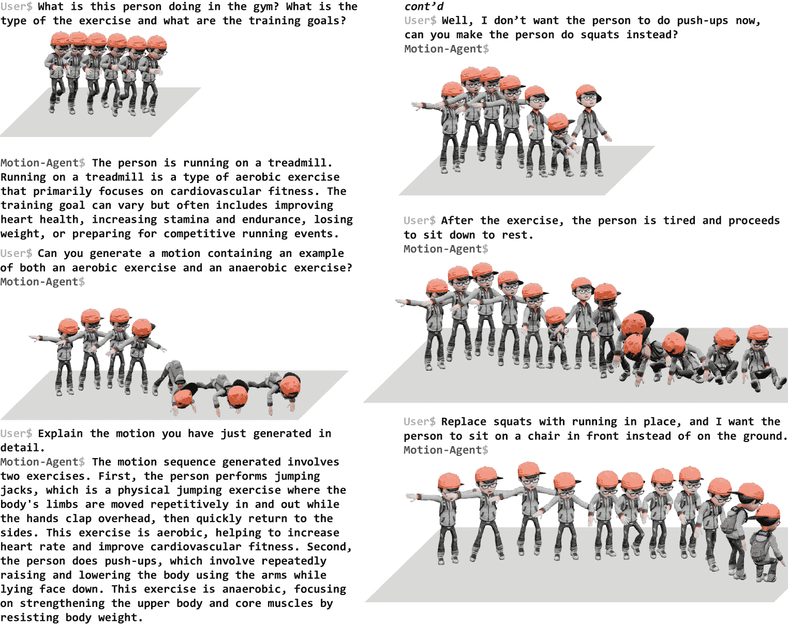
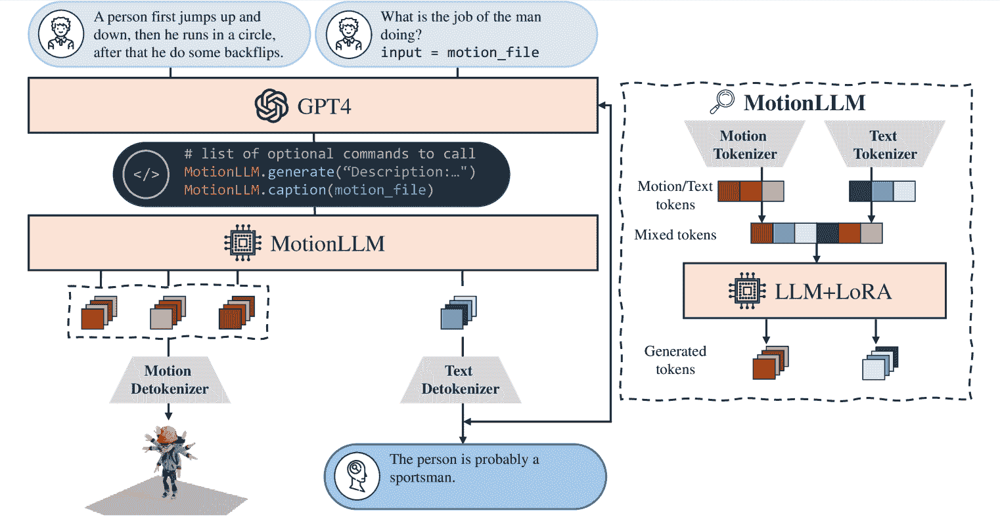
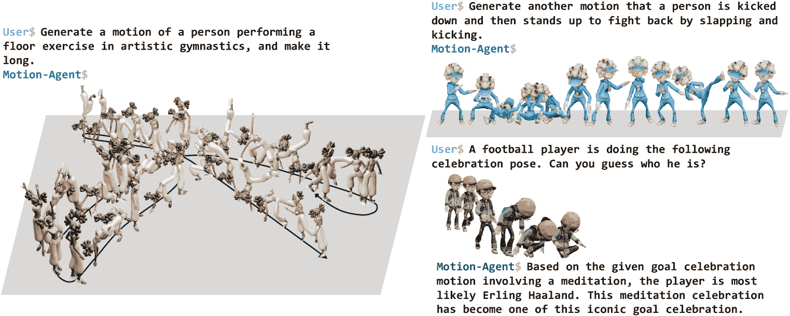
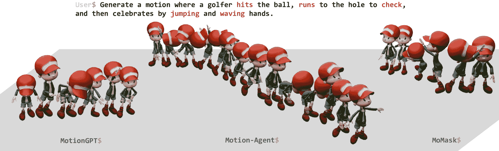
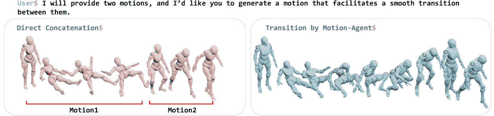
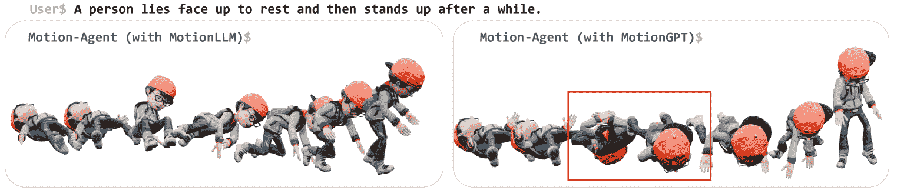
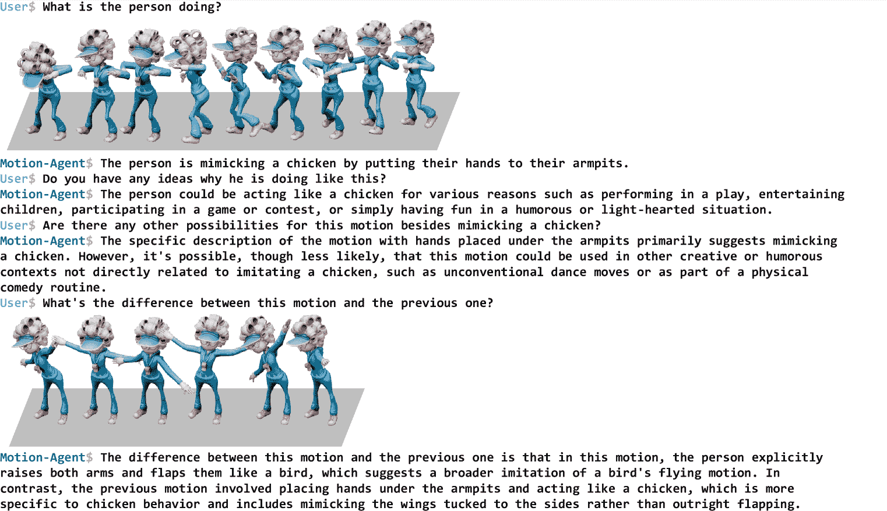
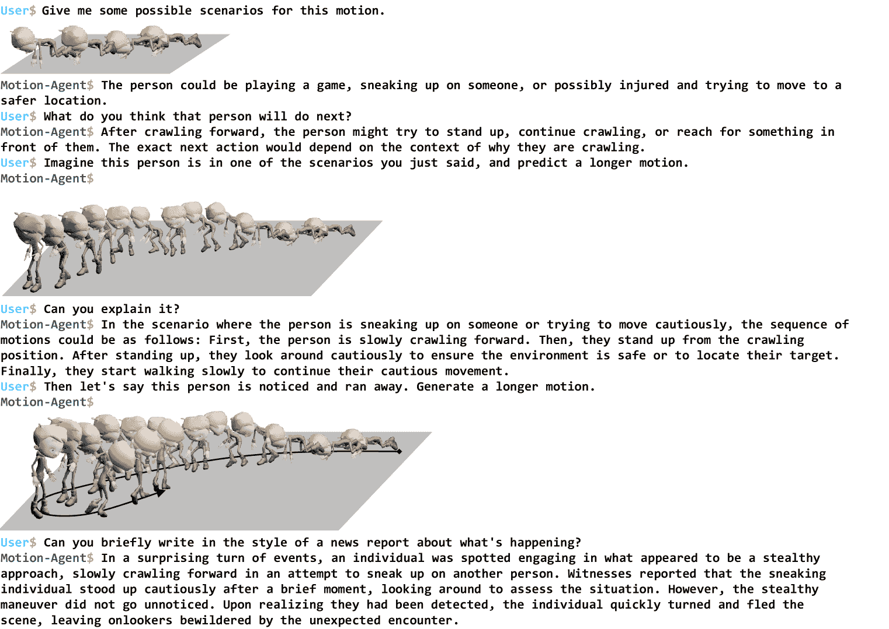
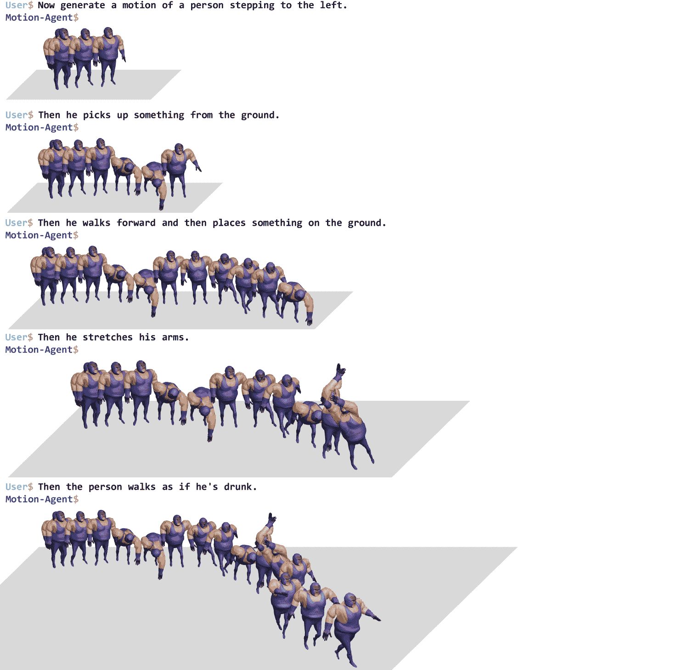
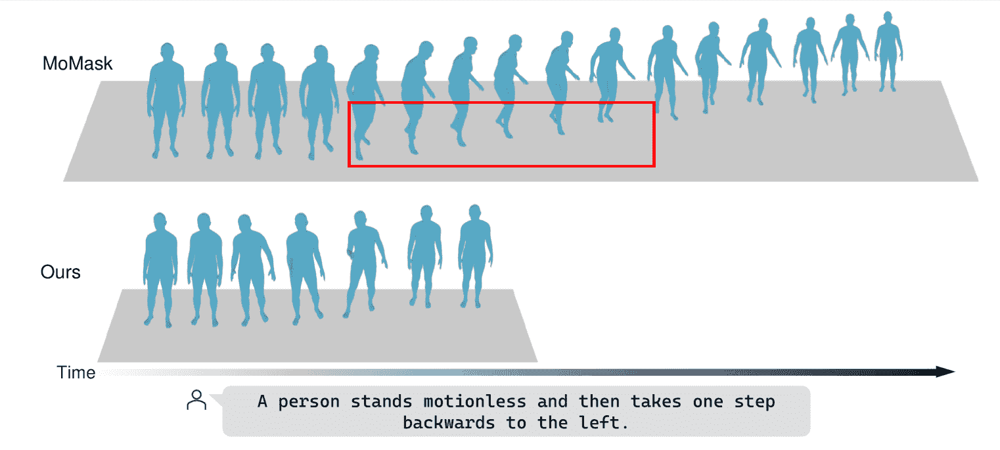

<!--yml

分类：未分类

日期：2025-01-11 12:37:01

-->

# Motion-Agent：一个基于LLMs的人体运动生成对话框架

> 来源：[https://arxiv.org/html/2405.17013/](https://arxiv.org/html/2405.17013/)

魏奇¹^*^***等贡献相等，赵宇博¹^†^†脚注标记，王一凡¹，刘欣航¹，戴玉荣²，邓志强¹

\AND¹香港科技大学

²达特茅斯学院

###### 摘要

尽管以往的3D人体运动生成方法取得了显著的成功，但它们通常依赖于大量的训练，并且仅限于特定任务。为了解决这些挑战，我们引入了Motion-Agent，这是一个高效的对话框架，旨在实现通用的人体运动生成、编辑和理解。Motion-Agent采用了一个开源的预训练语言模型，开发了一个生成性代理MotionLLM，弥合了运动与文本之间的鸿沟。通过将运动编码并量化为离散的符号，这些符号与语言模型的词汇对齐，从而实现这一目标。仅用1–3%的模型参数通过适配器进行微调，MotionLLM的性能可与扩散模型及其他从零开始训练的基于Transformer的方法相媲美。通过将MotionLLM与GPT-4集成，并无需额外训练，Motion-Agent能够通过多轮对话生成高度复杂的运动序列，这是以往模型难以实现的功能。Motion-Agent支持广泛的运动语言任务，通过交互式对话交流提供多功能的生成和定制人体运动能力。项目页面：[https://knoxzhao.github.io/Motion-Agent](https://knoxzhao.github.io/Motion-Agent)

## 1 引言

大型语言模型（LLMs）最近在工业界和学术界都引起了广泛关注。许多LLMs，如GPT-4（Achiam等人，[2023](https://arxiv.org/html/2405.17013v3#bib.bib1)），LLaMA（Touvron等人，[2023](https://arxiv.org/html/2405.17013v3#bib.bib39)），Gemma（团队等人，[2024a](https://arxiv.org/html/2405.17013v3#bib.bib35)），展示了其在各种下游任务中的先进能力、稳健性和泛化能力。这些进展激励了研究人员探索LLMs在多模态任务中的应用，将其与图像（Koh等人，[2024](https://arxiv.org/html/2405.17013v3#bib.bib21)），视频（Zhang等人，[2023a](https://arxiv.org/html/2405.17013v3#bib.bib49)），音频（Borsos等人，[2023](https://arxiv.org/html/2405.17013v3#bib.bib2)；Huang等人，[2023](https://arxiv.org/html/2405.17013v3#bib.bib16)）等模态进行集成，取得了理解这些不同模态的有前景的成果。然而，在多模态生成的背景下，特别是3D人体运动的生成，LLMs的应用仍然是一个未被充分探索的领域，而这对于推动机器人和类人应用至关重要。

3D人体运动研究已经探索了多种与语言相关的任务，包括文本条件的运动生成（Zhang 等，[2023b](https://arxiv.org/html/2405.17013v3#bib.bib50); Guo 等，[2022a](https://arxiv.org/html/2405.17013v3#bib.bib11); Tevet 等，[2023](https://arxiv.org/html/2405.17013v3#bib.bib38); Zhang 等，[2022](https://arxiv.org/html/2405.17013v3#bib.bib51); Shafir 等，[2024](https://arxiv.org/html/2405.17013v3#bib.bib33); Guo 等，[2024](https://arxiv.org/html/2405.17013v3#bib.bib13); Jiang 等，[2024b](https://arxiv.org/html/2405.17013v3#bib.bib19))，运动标注（Guo 等，[2022b](https://arxiv.org/html/2405.17013v3#bib.bib12); Jiang 等，[2024b](https://arxiv.org/html/2405.17013v3#bib.bib19))，运动推理（Endo 等，[2023](https://arxiv.org/html/2405.17013v3#bib.bib7); Jiang 等，[2024c](https://arxiv.org/html/2405.17013v3#bib.bib20)）。然而，现有的方法通常需要大量训练，导致高计算需求和低效率。这些模型通常在特定任务数据上进行训练，使其数据依赖性较强，并且限制了它们在不同场景中的泛化能力。它们还难以处理长而复杂的提示，且性能会出现下降。此外，大多数现有模型缺乏支持多轮对话交互的能力，从而限制了生成和优化过程，也限制了创建动态交互系统的能力，这些系统能够通过对话无缝生成并允许编辑运动。

结合最新的LLM和MLLM发展，在本研究中，我们提出了Motion-Agent，一个多模态框架，利用了预训练LLM的泛化能力和灵活性。该框架的核心是我们的新生成代理MotionLLM，其结合消除了需要大量预训练的需求，通过轻量级适配器对预训练LLM进行微调。与MotionChain（Jiang 等，[2024c](https://arxiv.org/html/2405.17013v3#bib.bib20)）需要预训练和大数据集来进行大量指令调优以实现对话控制不同，Motion-Agent将MotionLLM与GPT-4结合，利用LLM固有的对话能力而无需额外训练。这使得高效、可定制的运动生成、理解和多轮编辑成为可能，适用于各种任务。

图1：用户与运动代理之间的多轮对话。第一轮：运动理解；第二轮：运动生成；第三轮：结合先前生成的运动进行运动理解；第四轮：运动编辑；第五轮：继续运动生成；最后一轮：长序列上的运动编辑。注意，所有轮次是连续的。

在 Motion-Agent 中，我们首先训练一对动作标记器和解标记器。动作标记器将动作编码为动作嵌入，并通过一个代码本将它们量化为一组离散的 LLM 可理解的标记，而解标记器则将标记重新构建回原始的连续形式。这个标记器-解标记器对使得连续的动作序列与离散的标记之间的转换成为可能，促进了与 LLM 的交互，同时仍然能够从标记中恢复原始动作。MotionLLM 通过将这些额外的动作标记加入到预训练 LLM 的词汇中来进行训练，同时保持原始的文本标记不变。由于动作可以表示为时间序列，我们的标记化过程将动作转换为类似于自然语言中的句子的标记序列。MotionLLM 在文本标记序列和动作标记序列之间进行翻译。在此基础上，GPT-4 充当协调者，分解用户指令，以确定对 MotionLLM 的调用次数及如何有效地构建这些调用。通过多次调用得到的动作标记序列被连接并由解标记器解码，以生成最终输出。

我们的 Motion-Agent 框架在两个关键方面利用了预训练的 LLM：（1）通过适配器对轻量级 LLM 进行微调，使其作为文本-动作翻译代理；（2）使用 LLM 进行对话交互，无需训练，从而促进多轮对话，以细化生成的动作并通过迭代生成和连接序列来产生扩展动作。尽管只训练了少量参数，MotionLLM 在动作生成（文本到动作）方面仍能与那些从头训练、具有专门架构的模型相比，取得具有竞争力的结果。在动作字幕（动作到文本）方面，MotionLLM 达到了最先进的表现，生成了语义准确且语境恰当的文本描述。MotionLLM 实现了文本与动作之间的双向翻译，优于其他自回归模型，同时使用了更少的可训练参数，使其成为 Motion-Agent 框架的理想选择。通过将 MotionLLM 与 GPT-4 结合，Motion-Agent 实现了多功能的基于对话的动作生成与推理，无需针对这些任务的特定数据集或额外训练。

总结来说，我们的贡献包括：

+   •

    我们介绍了一个简单高效的对话框架——Motion-Agent，它利用预训练的 LLM，并在各种动作-语言任务中取得了出色的结果。

+   •

    我们通过实现高度可定制的动作-语言任务，展示了我们方法的灵活性和多样性，包括长篇复杂动作生成、多轮编辑和多轮推理。

## 2 相关工作

多模态大语言模型（LLMs）近期的进展通过不同的方法将大语言模型与多种模态（如图像、视频、音乐、音频和点云）进行了集成（Liu等人，[2024](https://arxiv.org/html/2405.17013v3#bib.bib24)；Han等人，[2024](https://arxiv.org/html/2405.17013v3#bib.bib14)；Wu等人，[2023b](https://arxiv.org/html/2405.17013v3#bib.bib45)；Chen等人，[2023a](https://arxiv.org/html/2405.17013v3#bib.bib3)；Gao等人，[2023](https://arxiv.org/html/2405.17013v3#bib.bib8)）。已有多种方法被提出用于对齐不同的模态。例如，Video-LLaMA（Zhang等人，[2023a](https://arxiv.org/html/2405.17013v3#bib.bib49)）利用Q-formers来弥合模态之间的差距。PointLLM（Xu等人，[2023b](https://arxiv.org/html/2405.17013v3#bib.bib48)）使用投影器将点云的特征空间与大语言模型的特征空间对齐。VALLE-X（Zhang等人，[2023d](https://arxiv.org/html/2405.17013v3#bib.bib54)）和LlamaGen（Sun等人，[2024](https://arxiv.org/html/2405.17013v3#bib.bib34)）将来自不同模态的输入进行标记化，以将其与语言连接起来。另一方面，新的研究（Wu等人，[2023a](https://arxiv.org/html/2405.17013v3#bib.bib44)；Lu等人，[2024](https://arxiv.org/html/2405.17013v3#bib.bib25)；Du & Kaelbling，[2024](https://arxiv.org/html/2405.17013v3#bib.bib6)）展示了组合语言模型的良好前景。这些模型通常由较小的专用组件组成，在数据效率方面表现优异，并且在未见分布上表现良好，与我们框架的设计相契合。

3D 人体运动合成 现代的研究工作可以根据各种输入生成人体运动，例如动作标签（Petrovich 等，[2021](https://arxiv.org/html/2405.17013v3#bib.bib28)；Lee 等，[2023](https://arxiv.org/html/2405.17013v3#bib.bib22)；Guo 等，[2020](https://arxiv.org/html/2405.17013v3#bib.bib10)；Xu 等，[2023a](https://arxiv.org/html/2405.17013v3#bib.bib47)），文本描述（Jiang 等，[2024b](https://arxiv.org/html/2405.17013v3#bib.bib19)；Wang 等，[2023](https://arxiv.org/html/2405.17013v3#bib.bib43)；Zhang 等，[2023b](https://arxiv.org/html/2405.17013v3#bib.bib50)；Guo 等，[2022b](https://arxiv.org/html/2405.17013v3#bib.bib12)；Zhou 等，[2023](https://arxiv.org/html/2405.17013v3#bib.bib56)；Tevet 等，[2023](https://arxiv.org/html/2405.17013v3#bib.bib38)；[2022](https://arxiv.org/html/2405.17013v3#bib.bib37)；Guo 等，[2024](https://arxiv.org/html/2405.17013v3#bib.bib13)；Zhang 等，[2022](https://arxiv.org/html/2405.17013v3#bib.bib51)；Dabral 等，[2023](https://arxiv.org/html/2405.17013v3#bib.bib5)；Petrovich 等，[2022](https://arxiv.org/html/2405.17013v3#bib.bib29)；Zhang 等，[2023c](https://arxiv.org/html/2405.17013v3#bib.bib53)；Pinyoanuntapong 等，[2024](https://arxiv.org/html/2405.17013v3#bib.bib31)），控制信号（Xie 等，[2024](https://arxiv.org/html/2405.17013v3#bib.bib46)；Wan 等，[2023](https://arxiv.org/html/2405.17013v3#bib.bib42)；Petrovich 等，[2024](https://arxiv.org/html/2405.17013v3#bib.bib30)；Huang 等，[2024](https://arxiv.org/html/2405.17013v3#bib.bib17)；Goel 等，[2023](https://arxiv.org/html/2405.17013v3#bib.bib9)），音乐或音频（Dabral 等，[2023](https://arxiv.org/html/2405.17013v3#bib.bib5)；Tseng 等，[2022](https://arxiv.org/html/2405.17013v3#bib.bib40)；Zhou & Wang，[2023](https://arxiv.org/html/2405.17013v3#bib.bib57)），以及其他（Zhong 等，[2024](https://arxiv.org/html/2405.17013v3#bib.bib55)）。特别是，基于文本的 3D 运动生成或文本到运动（text-to-motion）已经引起了极大的兴趣。值得注意的是，一些扩散模型已成为强大的工具，例如 Tevet 等（[2023](https://arxiv.org/html/2405.17013v3#bib.bib38)）；Shafir 等（[2024](https://arxiv.org/html/2405.17013v3#bib.bib33)）；Wang 等（[2023](https://arxiv.org/html/2405.17013v3#bib.bib43)）；Zhou 等（[2023](https://arxiv.org/html/2405.17013v3#bib.bib56)）；Xie 等（[2024](https://arxiv.org/html/2405.17013v3#bib.bib46)）；Zhang 等（[2022](https://arxiv.org/html/2405.17013v3#bib.bib51)）。尽管扩散模型在生成运动方面表现出色，但它们需要手动控制生成运动的长度，灵活性有限。除了使用连续运动表示的扩散模型外，基于离散标记的方法，例如利用矢量量化变分自编码器（VQ-VAE），也展示了有希望的结果。值得注意的例子包括 TM2T（Guo 等，[2022b](https://arxiv.org/html/2405.17013v3#bib.bib12)），T2M-GPT（Zhang 等，[2023b](https://arxiv.org/html/2405.17013v3#bib.bib50)），MotionGPT（Jiang 等，[2024b](https://arxiv.org/html/2405.17013v3#bib.bib19)）和 MoMask（Guo 等，[2024](https://arxiv.org/html/2405.17013v3#bib.bib13)）。现有的大多数研究无论是采用哪种方法，均聚焦于条件生成，用于在不同模态之间进行转换。在我们的工作中，我们强调通过复杂、定制化的用户对话来生成人体运动，并提出了一种训练高效的方法，利用预训练的大型语言模型（LLM）来桥接这些模态。

通过对话控制人体运动 通过对话生成3D人体运动更具灵活性，允许用户定制多样化的请求并通过迭代细化来控制运动。虽然像 MotionGPT（Jiang 等，[2024b](https://arxiv.org/html/2405.17013v3#bib.bib19)）这样的模型通过指令调优处理一些简单的单轮任务，MotionChain（Jiang 等，[2024c](https://arxiv.org/html/2405.17013v3#bib.bib20)）通过将单轮数据采样为多轮训练数据来支持多轮交互，但这两种方法都在很大程度上依赖于广泛的指令调优和额外的数据。相比之下，我们的 Motion-Agent 框架通过组合大型语言模型（LLM）来消除额外的训练。通过仅在原始文本-运动配对数据上训练翻译代理 MotionLLM，我们的方法消除了对额外数据或训练的需求，从而提高了效率和广泛的泛化能力。

图 2：Motion-Agent 流程。GPT-4 可以与翻译代理（即 MotionLLM）交互，根据输入需求生成或解释动作。生成的动作标记被连接并解码，由 MotionLLM 生成的文本说明返回并由 GPT-4 处理。

## 3 方法

如图[2](https://arxiv.org/html/2405.17013v3#S2.F2 "Figure 2 ‣ 2 Related Work ‣ Motion-Agent: A Conversational Framework for Human Motion Generation with LLMs")所示，我们的 Motion-Agent 框架主要由三个组件组成：用于对话交互和提示控制的 LLM（即 GPT-4）、一对动作标记器/反标记器，以及翻译代理（即 MotionLLM）。文本标记器继承自 LLM，并保持不变，而动作标记器和反标记器则一起训练，以确保正确重建动作序列。一旦训练完成，动作标记器和反标记器将保持固定。动作反标记器在平滑不同动作序列之间的过渡中起着关键作用，确保动作输出的无缝整合。

为了确保双向理解，我们的框架还支持运动理解。因此，代理还应该能够根据请求从给定的动作生成文本说明。这种双向翻译对于诸如回答关于动作的问题或生成描述等应用至关重要，而只能执行动作生成的模型则不适用。另一方面，我们提出的 MotionLLM 确实是一个很好的选择，确保在统一架构内实现双向翻译。

### 3.1 Motion-Agent 框架

在这个框架中，GPT-4充当动作生成和理解的协调者，促进用户与多模态文本-动作代理之间的无缝交互。该代理负责在文本和动作模态之间进行翻译。在对话中，GPT-4的输入包括两个部分：一个固定的指令提示$p$，用于提供与文本-动作代理交互的指南，以及用户的定制请求$c$。根据这些输入，GPT-4生成一个结构化计划，决定代理是否应执行诸如动作生成或字幕生成之类的任务。它还决定调用代理的次数，并为每次调用指定参数。该计划以JSON文件的格式输出，然后由代理解析并执行以完成指定的任务。

对于生成任务，代理生成与每组参数对应的动作标记序列，这些序列被拼接在一起进行通用解码。具体来说，设$G$表示代理，$[\textbf{a}_{i}]_{i=1}^{N}$表示由GPT-4决定的每次调用的参数集合，共有$N$次调用。生成的动作标记序列$\textbf{z}_{i}=G(\textbf{a}_{i})$被拼接成一个单一序列$\textbf{z}=(\textbf{z}_{1},\textbf{z}_{2},\dots,\textbf{z}_{N})$。该序列通过解码器$D$解码，产生最终的动作$\textbf{m}=D(\textbf{z})$，具体过程将在标记化部分中说明。

对于动作理解和推理，代理生成动作的文本描述，然后将其返回给GPT-4。这使得GPT-4能够解释这些动作并根据用户的查询做出响应，从而实现用户与系统之间通过动作生成和理解的无缝交互。

由于像GPT-4这样的LLM具有强大的多轮对话能力，用户可以不断要求模型细化、编辑或扩展先前的生成内容，或提出额外的问题。作为回应，GPT-4将重新生成计划或提供答案，从而提供一个互动且具有适应性的系统。这种动态交互导致了一个统一的框架，支持各种组合、长度和任务复杂度，提供了增强的灵活性和定制化，覆盖了动作生成和理解的各个方面。

### 3.2 动作标记化

为了更好地与LLM的下一个标记预测机制对齐，我们使用矢量量化（VQ）和变分自编码器（VAE）将动作标记化为离散的表示形式。这种VQ-VAE方法已被Guo等人（[2022b](https://arxiv.org/html/2405.17013v3#bib.bib12)）、Zhang等人（[2023b](https://arxiv.org/html/2405.17013v3#bib.bib50)）、Jiang等人（[2024b](https://arxiv.org/html/2405.17013v3#bib.bib19)）和Guo等人（[2024](https://arxiv.org/html/2405.17013v3#bib.bib13)）广泛采用。

在我们的运动分词中，运动序列表示为 $\textbf{m}_{1:T}\in\mathbb{R}^{T\times D}$，并首先使用编码器 $E$ 编码为运动嵌入 $\textbf{z}_{1:T/N}\in\mathbb{R}^{T/N\times d}$，其中 $N$ 是下采样率，$d$ 是隐藏维度的数量。然后，运动嵌入通过量化器使用代码本 $\textbf{C}=\{\textbf{c}_{k}\}_{1}^{K}$ 进行量化，其中 $K$ 是代码本的大小，且每个 $\textbf{c}_{k}\in\mathbb{R}^{d}$。量化结果可以表示为 $\hat{\textbf{z}}_{1:T/N}$，其中

|  | $\hat{\textbf{z}_{t}}=\operatorname*{arg\,min}_{\textbf{c}_{k}\in\textbf{C}}&#124;&#124;\textbf{z}_{t}-\textbf{c}_{k}&#124;&#124;_{2}$ |  |
| --- | --- | --- |

原始序列可以通过解码器 $D$ 重构：$\hat{\textbf{m}}_{1:T}=D(\hat{\textbf{z}}_{1:T/N})$。

我们遵循 Zhang et al. ([2023b](https://arxiv.org/html/2405.17013v3#bib.bib50)) 的方法，通过重构损失和承诺损失来优化 VQ-VAE。我们还对联合位置 $p$ 添加了额外的正则化，以增强生成性能。损失可以表示为：

|  | $\mathcal{L}_{vq}=\underbrace{&#124;&#124;\textbf{m}-\hat{\textbf{m}}&#124;&#124;_{1}}_{\mathcal{L}_{re}}+\alpha\underbrace{&#124;&#124;\textbf{p}-\hat{\textbf{p}}&#124;&#124;_{1}}_{\mathcal{L}_{p}}+\beta\underbrace{&#124;&#124;\textbf{z}-sg[\hat{\textbf{z}}]&#124;&#124;_{2}}_{\mathcal{L}_{\it{commit}}}$ |  |
| --- | --- | --- |

其中 $sg[\cdot]$ 是停止梯度操作，$\alpha$ 和 $\beta$ 是加权因子。代码本通过指数移动平均（EMA）进行训练，代码本在 T2M-GPT（Zhang et al., [2023b](https://arxiv.org/html/2405.17013v3#bib.bib50)）之后被重置。训练完成后，分词器被冻结以供进一步使用。

### 3.3 基于 LLM 的运动-语言代理

在分词之后，运动表示被离散化为 $K$ 个不同的运动符号。我们利用这些运动符号的索引，从代码本中构建运动符号词汇 $\textbf{V}_{m}=\{{\tt<Motion\_i>}\}_{i=1}^{K}$。此外，我们引入了特殊符号“<Motion>”和“</Motion>”来表示运动符号序列的开始和结束。这些特殊符号与运动符号一起，形成了一个新的词汇集 $\textbf{V}_{M}$，其大小为 $K+2$。然后，这个词汇将被附加到预训练的大型语言模型（LLM）的词汇中。

在扩展 LLM 的词汇后，运动现在可以表示为 LLM 可以理解的符号序列。在生成过程中，LLM 通过最大化概率 $p_{\theta}(x_{t}|x_{<t},c)$ 来预测下一个符号，其中 $x_{1:T}$ 是目标符号序列，$c$ 表示提示信息。该预测是以自回归方式迭代进行的。因此，训练目标是最大化对数似然 $\mathcal{L}_{\mathit{LLM}}=-\sum\log p_{\theta}({x_{t}|x_{x_{<t}},c})$。

在推理过程中，我们的方法利用了指导性提示，如“生成一个与以下输入的人体运动描述相匹配的动作。”并附带描述期望运动的句子。LLM随后开始自回归地预测标记，直到预测到“</Motion>”标记，表示运动生成完成。这个自回归过程允许生成具有可变长度的运动，适应给定描述的具体要求。

为了微调LLM，我们采用了LoRA（Hu et al., [2021](https://arxiv.org/html/2405.17013v3#bib.bib15)）。在整个训练过程中，原始文本标记的分词器、嵌入和输出层保持不变并被冻结。仅训练附加适配器。这些LoRA适配器针对当前任务（生成或字幕）进行训练，同时保持一个通用架构，其中多个适配器可以和谐共存。这种方法使我们能够利用LLM的强大功能，同时将其定制为特定的运动语言任务，确保高效且有效的训练，而不改变LLM的核心组件。

## 4 实验

我们通过一般和复杂的对话用户输入评估我们的Motion-Agent框架，展示了其处理复杂的多轮交互的能力。我们还评估了MotionLLM在单轮运动生成和运动字幕任务中的表现。

| 方法 | 运动生成 | 字幕 | 多轮编辑 | 推理 | 组合 |
| --- | --- | --- | --- | --- | --- |
| MotionGPT (Jiang et al., [2024b](https://arxiv.org/html/2405.17013v3#bib.bib19)) | 短期 | ✓ | ✗ | ✗ | ✗ |
| MoMask (Guo et al., [2024](https://arxiv.org/html/2405.17013v3#bib.bib13)) | 短期 | ✗ | ✗ | ✗ | ✗ |
| MotionChain (Jiang et al., [2024c](https://arxiv.org/html/2405.17013v3#bib.bib20)) | 短期 | ✓ | ✓ | ✓ | ✓ |
| 我们的方法 | 长期 | ✓ | ✓ | ✓ | ✓ |

表格 1：近期运动生成模型功能的比较。斜体*模型*表示相应的模型需要进行预训练和特定任务调优。

### 4.1 实验设置

数据集。我们在MotionLLM上的实验使用了KIT运动语言数据集（KIT-ML）（Plappert et al., [2016](https://arxiv.org/html/2405.17013v3#bib.bib32)），HumanML3D（Guo et al., [2022a](https://arxiv.org/html/2405.17013v3#bib.bib11)）。KIT-ML包含3911个人体运动序列，而HumanML3D数据集，来源于AMASS（Mahmood et al., [2019](https://arxiv.org/html/2405.17013v3#bib.bib26)）和HumanAct12（Guo et al., [2020](https://arxiv.org/html/2405.17013v3#bib.bib10)），包含14616个运动序列和44970个文本描述。对于Motion-Agent，我们使用了基于HumanML3D训练的MotionLLM模型。

评估指标。对于动作生成，我们遵循 T2M（Guo 等人，[2022a](https://arxiv.org/html/2405.17013v3#bib.bib11)）。动作和文本描述的全局表示首先通过（Guo 等人，[2022a](https://arxiv.org/html/2405.17013v3#bib.bib11)）中的预训练网络提取，然后通过以下方法进行衡量：1）文本匹配：通过对动作和文本嵌入之间的欧氏距离进行排名来计算 R-精度（Top-1、Top-2 和 Top-3 准确度），以及 MM Dist，衡量文本和生成动作嵌入之间的平均距离。2）生成多样性：量化生成的动作在所有描述中的方差。3）动作保真度：FID 衡量真实和生成动作的分布之间的距离，反映它们与真实动作分布的匹配程度。对于动作描述生成，我们遵循 TM2T（Guo 等人，[2022b](https://arxiv.org/html/2405.17013v3#bib.bib12)）通过自然语言研究中的语言学度量来评估动作描述的质量，包括 Bleu（Papineni 等人，[2002](https://arxiv.org/html/2405.17013v3#bib.bib27)）、Rouge（Lin，[2004](https://arxiv.org/html/2405.17013v3#bib.bib23)）、Cider（Vedantam 等人，[2015](https://arxiv.org/html/2405.17013v3#bib.bib41)）和 Bert Score（Zhang 等人，[2020](https://arxiv.org/html/2405.17013v3#bib.bib52)）。

实施细节。我们在 Motion-Agent 框架中使用 GPT-4（Achiam 等人，[2023](https://arxiv.org/html/2405.17013v3#bib.bib1)）作为对话型大语言模型（LLM），它提供了增强的文本控制和交互能力。在我们的分词器中，我们将下采样率 $N$ 设置为 4，隐藏层维度 $d$ 设置为 512，字典大小 $K$ 设置为 512。对于 $\mathcal{L}_{p}$ 和 $\mathcal{L}_{\it{commit}}$ 的加权系数 $\alpha$ 和 $\beta$，分别设置为 0.5 和 0.02。对于 MotionLLM，我们使用来自 Google 的轻量级开源 LLM Gemma2-2b-it（Team 等人，[2024b](https://arxiv.org/html/2405.17013v3#bib.bib36)），它提供了更好的可访问性，并且可以在单个消费级 GPU 上部署。LoRA 排序在生成时设置为 64，在描述时设置为 32，alpha 的值与排序保持一致。我们所有的实验都在 NVIDIA RTX4090 上进行。

### 4.2 Motion-Agent 的结果

图 3：Motion-Agent 能够理解抽象、复杂的用户提示并生成准确、长时间的动作。它还能够根据现实世界的知识理解并回答用户的问题。值得注意的是，图中的三轮对话源于一次连续的交流，展示了其在不受前述对话影响的情况下，具备多轮对话能力的灵活性。

图 4：与其他方法的比较。我们的 Motion-Agent 能准确生成包含一系列动作的动作，而其他模型在处理像这样的复杂描述时表现不佳，导致生成的动作简短且不清晰。

在本节中，我们展示了 Motion-Agent 框架的结果，证明了它通过多轮对话实现任务复杂组合的能力，从而生成长输出。需要注意的是，除了文本-动作翻译任务外，没有已建立的标准答案，而我们并未对这些扩展任务进行额外的训练。

如表[1](https://arxiv.org/html/2405.17013v3#S4.T1 "Table 1 ‣ 4 Experiments ‣ Motion-Agent: A Conversational Framework for Human Motion Generation with LLMs")所示，Motion-Agent 擅长各种动作-语言任务，通过自然对话用户交互生成长时间的动作序列。MotionGPT (Jiang et al., [2024b](https://arxiv.org/html/2405.17013v3#bib.bib19)) 支持双向翻译，但缺乏多功能性，而 MoMask (Guo et al., [2024](https://arxiv.org/html/2405.17013v3#bib.bib13)) 在生成方面表现优异，但仅限于此任务。尽管 MotionChain (Jiang et al., [2024c](https://arxiv.org/html/2405.17013v3#bib.bib20)) 能执行类似的功能，但需要额外的数据集来进行任务特定的指令调优。这些方法，包括大多数现有方法，限制于生成相对较短的动作序列。相比之下，我们的 Motion-Agent 无需在额外数据集上训练，就能生成更长的序列，准确匹配给定的提示，正如图[4](https://arxiv.org/html/2405.17013v3#S4.F4 "Figure 4 ‣ 4.2 Results of Motion-Agent ‣ 4 Experiments ‣ Motion-Agent: A Conversational Framework for Human Motion Generation with LLMs")所示。虽然 HumanML3D (Guo et al., [2022a](https://arxiv.org/html/2405.17013v3#bib.bib11)) 包含了广泛的人类动作，但其序列通常较短且原子化，持续时间不足 10 秒。通过使用 LLM 将长时间的动作描述分解成一系列短动作，并随后将这些短动作连接成更长的序列，我们的 Motion-Agent 理论上可以实现无限的动作生成。这种分解与整合的方法可以充分利用现有数据生成长时间的动作，将已知的数据分布映射到未知的数据分布，从而提高效率和可扩展性。

LLMs的集成还提高了系统对模糊、抽象或复杂动作描述的理解能力，使其能够通过多轮对话进行迭代优化。[图1](https://arxiv.org/html/2405.17013v3#S1.F1 "图1 ‣ 1 引言 ‣ Motion-Agent：一种基于LLMs的人体动作生成对话框架")已经展示了我们框架强大的多轮上下文能力，使其能够有效理解、扩展和编辑前几轮的结果。此外，我们的多轮功能还支持非上下文请求，正如[图3](https://arxiv.org/html/2405.17013v3#S4.F3 "图3 ‣ 4.2 Motion-Agent的实验结果 ‣ 4 实验 ‣ Motion-Agent：一种基于LLMs的人体动作生成对话框架")中展示的结果，这些结果是在一个包含多轮对话的单次对话中生成的。这种灵活性使得用户能够避免因新请求而重新开始对话。此外，图3中的结果还证明了我们的方法能够通过对话和迭代交流处理通用、定制和复杂的用户请求。我们的Motion-Agent还能够生成过渡动作，以无缝连接和组合动作，如图[5](https://arxiv.org/html/2405.17013v3#S4.F5 "图5 ‣ 4.2 Motion-Agent的实验结果 ‣ 4 实验 ‣ Motion-Agent：一种基于LLMs的人体动作生成对话框架")所示，这一能力是以往的动作生成模型难以实现的。这进一步证明了我们方法在动作理解和生成方面的能力。

更多的定性结果请参见附录[A.1.1](https://arxiv.org/html/2405.17013v3#A1.SS1.SSS1 "A.1.1 Motion-Agent ‣ A.1 定性结果 ‣ 附录A 附录 ‣ Motion-Agent：一种基于LLMs的人体动作生成对话框架")以及补充材料。

图5：Motion-Agent能够将动作平滑衔接。在这个例子中，两个动作“一个人摔倒在背上”和“一个人走路”在两轮对话中被提供给Motion-Agent。系统随后生成了一个“站起来”的动作，从而促使这两个动作无缝衔接。

### 4.3 MotionLLM评估

我们在文本到动作和动作到文本的任务上评估了MotionLLM，以验证它能够取得令人满意的结果。MotionLLM专注于实现双向翻译，且在保持较低训练负担的同时，仍能在关键基准上维持具有竞争力的表现。定量结果见表[2](https://arxiv.org/html/2405.17013v3#S4.T2 "Table 2 ‣ 4.3 Evaluations of MotionLLM ‣ 4 Experiments ‣ Motion-Agent: A Conversational Framework for Human Motion Generation with LLMs")。

在生成方面，我们将我们的模型与最先进（SOTA）的方法进行比较，包括扩散模型（Tevet等， [2023](https://arxiv.org/html/2405.17013v3#bib.bib38)；Chen等， [2023b](https://arxiv.org/html/2405.17013v3#bib.bib4)；Zhang等， [2022](https://arxiv.org/html/2405.17013v3#bib.bib51)）和基于标记的模型（Zhang等， [2023b](https://arxiv.org/html/2405.17013v3#bib.bib50)；Jiang等， [2024b](https://arxiv.org/html/2405.17013v3#bib.bib19)；Guo等， [2024](https://arxiv.org/html/2405.17013v3#bib.bib13)）。尽管我们只微调了少量参数，但我们的模型与这些从头开始训练的模型相比，表现出竞争力。这展示了我们利用LLM的泛化和鲁棒性能力的优势。此外，我们的模型表现出较低的MMDist、较高的R Precision和较高的Diversity，表明其在动作-语言理解和生成能力方面都很强。需要注意的是，MoMask（Guo等， [2024](https://arxiv.org/html/2405.17013v3#bib.bib13)）和扩散模型是非自回归的，需要已知的目标长度来生成，并且使用真实长度进行评估。然而，由于FID指标衡量生成结果与真实数据分布之间的距离，因此自回归模型生成的可变长度可能导致更高的FID评分。然而，我们的MotionLLM相比某些其他自回归模型，如MotionGPT（Jiang等， [2024b](https://arxiv.org/html/2405.17013v3#bib.bib19)），仅使用了大约三分之一的可训练参数，却达到了更低的FID值。此外，模型的自回归特性在未提供真实动作长度的情况下，相比非自回归模型具有优势。这使得MotionLLM更适合我们的Motion-Agent框架，因为它无需指定动作长度。

在第[4.4节](https://arxiv.org/html/2405.17013v3#S4.SS4 "4.4 Ablation Study ‣ 4 Experiments ‣ Motion-Agent: A Conversational Framework for Human Motion Generation with LLMs")中，我们提供了进一步的分析和证据，表明增加模型的规模可以提升整体性能评分。为了选择更经济的方案，我们选择了一个公开的最小LLM（Gemma2-2B）。

在字幕生成方面，我们比较了能够进行双向生成的模型。借助大型语言模型（LLM）强大的文本处理能力，MotionLLM能够准确描述人体运动。我们使用Guo等人（[2022b](https://arxiv.org/html/2405.17013v3#bib.bib12)）的语言学度量评估生成的字幕，这些度量计算了与真实字幕的语义相似性。为了确保评估的准确性，我们遵循了Jiang等人（[2024b](https://arxiv.org/html/2405.17013v3#bib.bib19)）的方法，使用未经处理的真实文本，因为Guo等人（[2022b](https://arxiv.org/html/2405.17013v3#bib.bib12)）忽略了语法时态和复数形式。正如在表[2](https://arxiv.org/html/2405.17013v3#S4.T2 "表 2 ‣ 4.3 MotionLLM评估 ‣ 4 实验 ‣ Motion-Agent：基于LLM的人体运动生成对话框架")中所示，我们的方法在所有评估指标上大幅超越了先前的最先进方法，这得益于预训练LLM的语言能力。

| 任务 | 方法 | 精确率 $\uparrow$ | FID $\downarrow$ | 多模态距离 $\downarrow$ | 多样性$\uparrow$ |
| --- | --- | --- | --- | --- | --- |
| Top 1 | Top 3 |
| 生成 | T2M (Guo et al., [2022a](https://arxiv.org/html/2405.17013v3#bib.bib11)) | $0.457^{\pm.002}$ | $0.740^{\pm.003}$ | $1.067^{\pm.002}$ | $3.340^{\pm.008}$ | $9.188^{\pm.002}$ |
| TM2T (Guo et al., [2022b](https://arxiv.org/html/2405.17013v3#bib.bib12)) | $0.424^{\pm.003}$ | $0.729^{\pm.002}$ | $1.501^{\pm.017}$ | $3.467^{\pm.011}$ | $8.589^{\pm.076}$ |
| MDM (Tevet et al., [2023](https://arxiv.org/html/2405.17013v3#bib.bib38)) | $0.320^{\pm.005}$ | $0.611^{\pm.007}$ | $0.544^{\pm.044}$ | $5.566^{\pm.027}$ | $9.559^{\pm.086}$ |
| MLD (Chen et al., [2023b](https://arxiv.org/html/2405.17013v3#bib.bib4)) | $0.481^{\pm.003}$ | $0.772^{\pm.002}$ | $0.473^{\pm.013}$ | $3.196^{\pm.010}$ | $9.724^{\pm.082}$ |
| MotionDiffuse (Zhang et al., [2022](https://arxiv.org/html/2405.17013v3#bib.bib51)) | $0.491^{\pm.001}$ | $0.782^{\pm.001}$ | $0.630^{\pm.001}$ | $3.113^{\pm.001}$ | $9.410^{\pm.049}$ |
| T2M-GPT (Zhang et al., [2023b](https://arxiv.org/html/2405.17013v3#bib.bib50)) | $0.491^{\pm.003}$ | $0.775^{\pm.002}$ | $\underline{0.116}^{\pm.004}$ | $3.118^{\pm.011}$ | $\underline{9.761}^{\pm.081}$ |
| MotionGPT (Jiang et al., [2024b](https://arxiv.org/html/2405.17013v3#bib.bib19)) | $0.492^{\pm.003}$ | $0.778^{\pm.002}$ | $0.232^{\pm.008}$ | $3.096^{\pm.008}$ | $9.528^{\pm.071}$ |
| MotionChain (Jiang et al., [2024c](https://arxiv.org/html/2405.17013v3#bib.bib20)) | $0.504^{\pm.003}$ | $0.790^{\pm.003}$ | $0.248^{\pm.009}$ | $3.033^{\pm.010}$ | $9.470^{\pm.075}$ |
| MoMask Guo et al. ([2024](https://arxiv.org/html/2405.17013v3#bib.bib13)) | $\textbf{0.521}^{\pm.002}$ | $\textbf{0.807}^{\pm.002}$ | $\textbf{0.045}^{\pm.002}$ | $\textbf{2.958}^{\pm.008}$ | ${9.620}^{\pm.064}$ |
| MotionLLM | $\underline{0.515}^{\pm.004}$ | $\underline{0.801}^{\pm.004}$ | $0.230^{\pm.009}$ | $\underline{2.967}^{\pm.020}$ | $\textbf{9.908}^{\pm.102}$ |
| 标题 |  | Bleu@1$\uparrow$ | Bleu@4$\uparrow$ | Rouge$\uparrow$ | Cider$\uparrow$ | Bert Score$\uparrow$ |
| TM2T (郭等，[2022b](https://arxiv.org/html/2405.17013v3#bib.bib12)) | 48.90 | 8.27 | 38.1 | 15.80 | 32.2 |
| MotionGPT (蒋等，[2024b](https://arxiv.org/html/2405.17013v3#bib.bib19)) | 48.20 | 12.47 | 37.4 | 29.20 | 32.4 |
| MotionChain (蒋等，[2024c](https://arxiv.org/html/2405.17013v3#bib.bib20)) | 48.10 | 12.56 | 33.9 | 33.70 | 36.9 |
| MotionLLM | 54.53 | 17.65 | 48.7 | 33.74 | 42.63 |

表格 2：在HumanML3D (郭等，[2022a](https://arxiv.org/html/2405.17013v3#bib.bib11))测试集上对MotionLLM的定量评估。对于动作生成，我们遵循T2M (郭等，[2022a](https://arxiv.org/html/2405.17013v3#bib.bib11))的评估指标。评估进行了20次，以获得95%的置信区间。斜体标注的方法使用真实长度进行估计。支持双向生成的模型也包含在字幕评估中。对于动作字幕生成，我们使用未经预处理的真实字幕，并采用郭等（[2022b](https://arxiv.org/html/2405.17013v3#bib.bib12)）提出的语言学指标进行评估。最佳得分以**粗体**突出显示，第二好成绩以下划线表示。

### 4.4 消融研究

##### 关于Motion-Agent的消融

理论上，我们的Motion-Agent框架中的MotionLLM代理可以替换为任何能够进行运动-文本翻译的模型。然而，像MoMask（Guo等，[2024](https://arxiv.org/html/2405.17013v3#bib.bib13)）这样的模型需要手动输入运动时长，可能会遇到一些问题（参见[A.1.2节](https://arxiv.org/html/2405.17013v3#A1.SS1.SSS2 "A.1.2 MotionLLM ‣ A.1 质量结果 ‣ 附录A ‣ Motion-Agent：一个基于LLM的运动生成对话框架")），因此自回归模型更为优选。在本研究中，我们将MotionLLM替换为MotionGPT（Jiang等，[2024b](https://arxiv.org/html/2405.17013v3#bib.bib19)），该模型也支持双向翻译。在与Motion-Agent集成后，我们观察到MotionGPT能够生成比原始实现更长、更复杂的动作。然而，它仍然不如MotionLLM那样在准确性和流畅度上达到理想效果。例如（图[6](https://arxiv.org/html/2405.17013v3#S4.F6 "图6 ‣ Motion-Agent的消融研究 ‣ 4.4 消融研究 ‣ 4 实验 ‣ Motion-Agent：一个基于LLM的运动生成对话框架")），在用户提示“一个人仰面躺着休息，过了一会儿站起来”中，GPT-4将其分解为两个部分：“仰面躺着一会儿”和“从仰面躺着到站起来的过渡”。虽然MotionGPT正确生成了第一部分，但它错误地将第二部分生成“从俯面躺着开始”，导致两种动作之间的过渡生硬且不流畅。相比之下，MotionLLM准确生成了这两个部分，确保了动作的平滑、无缝过渡。

图6：运动代理消融研究。我们将MotionLLM替换为MotionGPT，并注意到MotionGPT无法生成平滑的运动过渡。

此外，我们的框架可以适配使用不同的LLM进行对话。我们测试了将GPT-4替换为多种模型，包括Llama（Touvron等，[2023](https://arxiv.org/html/2405.17013v3#bib.bib39)）、Gemma（Team等，[2024b](https://arxiv.org/html/2405.17013v3#bib.bib36)）和Mixtral（Jiang等，[2024a](https://arxiv.org/html/2405.17013v3#bib.bib18)）。这些模型大多数成功生成了合理的输出，并能够支持多轮交互。一些较小的模型可能在生成正确的JSON格式时遇到困难。此消融研究表明，我们的框架不仅适用于GPT-4，还适用于所有其他LLM。随着LLM的发展，我们的框架性能可以得到提升。更多细节请参见[A.2节](https://arxiv.org/html/2405.17013v3#A1.SS2 "A.2 消融研究：不同LLM的应用 ‣ 附录A ‣ Motion-Agent：一个基于LLM的运动生成对话框架")。

尽管如此，我们的框架可以总结为一个较大的LLM用于对话，以及一个动作-语言翻译代理，提供了针对不同组件的灵活选择。

##### MotionLLM的消融研究

我们进行了消融研究，以检查不同LLM骨干网和适配器大小的影响。结果如表[3](https://arxiv.org/html/2405.17013v3#S4.T3 "Table 3 ‣ Ablation on MotionLLM ‣ 4.4 Ablation Study ‣ 4 Experiments ‣ Motion-Agent: A Conversational Framework for Human Motion Generation with LLMs")所示，从中我们可以得出结论，使用更大的骨干模型或增加LoRA秩会导致指标的整体改善。

| 模型 | 可训练参数 | R 精度 $\uparrow$ | FID $\downarrow$ | 多模态距离 $\downarrow$ | 多样性 $\uparrow$ |
| --- | --- | --- | --- | --- | --- |
| Top 1 | Top 3 |
| T2M-GPT (Zhang等， [2023b](https://arxiv.org/html/2405.17013v3#bib.bib50)) | 228.4M | 0.416 | 0.745 | 0.514 | 3.007 | 10.921 |
| MotionGPT (Jiang等， [2024b](https://arxiv.org/html/2405.17013v3#bib.bib19)) | 220M | 0.366 | 0.680 | 0.510 | 3.527 | 10.350 |
| Gemma2-2b R=16 | 20.8M | 0.411 | 0.738 | 0.745 | 2.994 | 11.313 |
| Gemma2-2b R=32 | 41.5M | 0.415 | 0.750 | 0.712 | 2.938 | 11.251 |
| Gemma2-2b R=64 | 83.1M | 0.422 | 0.762 | 0.658 | 2.929 | 11.195 |
| LLaMA3-8B R=32 | 83.9M | 0.381 | 0.737 | 0.646 | 3.046 | 11.210 |
| Gemma2-9b R=32 | 108M | 0.439 | 0.776 | 0.438 | 2.872 | 11.151 |

表3：在KIT-ML（Plappert等， [2016](https://arxiv.org/html/2405.17013v3#bib.bib32)）数据集上的更多比较和消融研究。Gemma（Team等， [2024a](https://arxiv.org/html/2405.17013v3#bib.bib35)）和LLaMA（Touvron等， [2023](https://arxiv.org/html/2405.17013v3#bib.bib39)）被选为LLM骨干。R表示LoRA秩，alpha的值与秩保持一致。还包括了另外两个自回归变换模型作为参考。

## 5 讨论

##### 局限性与未来工作。

我们的Motion-Agent专注于生成关节化3D人体的动作，不涉及3D视觉理解，例如与周围环境的互动（例如，“一个人把手放在桌子上”）。此外，Motion-Agent不包括详细的手部或面部动作。尽管如此，我们的框架展现了高度的灵活性，使其非常适合在未来扩展中加入额外的代理来处理这些任务。此外，尽管我们已经使用Motion-Agent框架进行了多人体动作生成的初步试验，并取得了一些初步结果（见附录[A.3](https://arxiv.org/html/2405.17013v3#A1.SS3 "A.3 Multi-human with Motion-Agent ‣ Appendix A Appendix ‣ Motion-Agent: A Conversational Framework for Human Motion Generation with LLMs")），但这一部分尚未完全探索。因此，本文仍然专注于单人体动作生成。我们将人类-环境互动和多人体互动的扩展留待未来工作。

##### 结论性评论。

在本研究中，我们提出了一种基于LLM的多模态、对话式运动-语言学习框架，具有灵活性和广泛适应性。通过利用预训练LLM的语言理解与生成能力，我们的MotionLLM在运动与自然语言之间的双向翻译中取得了显著成果。Motion-Agent框架通过对话互动可以轻松扩展到各种任务中。我们的方法不仅易于训练和适应，而且用户友好，使其成为运动-语言学习应用的多功能解决方案。Motion-Agent为增强LLM在理解、生成和编辑人类运动方面的能力提供了全面的解决方案，这与我们教导LLM有效解读人类运动的目标相一致。

## 参考文献

+   阿基亚姆等人（2023）乔什·阿基亚姆、史蒂文·阿德勒、桑迪尼·阿格瓦尔、拉玛·艾哈迈德、伊尔杰·阿卡亚、弗洛伦西亚·莱奥尼·阿莱曼、迪奥戈·阿尔梅达、扬科·阿尔滕施密特、山姆·奥特曼、夏马尔·阿纳德卡特等。GPT-4技术报告。*arXiv预印本 arXiv:2303.08774*，2023。

+   博尔索斯等人（2023）扎兰·博尔索斯、拉斐尔·马里尼耶、达米安·文森特、尤金·哈里托诺夫、奥利维耶·皮特昆、马特·沙里菲、多米尼克·罗布雷克、奥利维耶·特博尔、戴维·格朗吉尔、马尔科·塔利亚萨奇和尼尔·泽吉杜尔。Audiolm：一种音频生成的语言建模方法。*arXiv预印本 arXiv:2209.03143*，2023。

+   陈等人（2023a）费龙·陈、闵伦·韩、浩志·赵、青阳·张、晶·施、爽·徐和博·徐。X-llm：通过将多模态视为外语来引导先进的大型语言模型。*arXiv预印本 arXiv:2305.04160*，2023a。

+   陈等人（2023b）辛陈、蒋彪、刘文、黄子龙、傅斌、陈涛、余刚。通过潜在空间中的运动扩散执行你的命令。在《IEEE/CVF计算机视觉与模式识别会议论文集》*（Proceedings of the IEEE/CVF Conference on Computer Vision and Pattern Recognition）*，第18000–18010页，2023b。

+   达布拉尔等人（2023）瑞沙布·达布拉尔、穆罕默德·哈姆扎·穆贾尔、弗拉季斯拉夫·戈利亚尼克和克里斯蒂安·泰博尔特。Mofusion：一种基于去噪扩散的运动合成框架。在《计算机视觉与模式识别（CVPR）》*（Computer Vision and Pattern Recognition (CVPR)）*，2023。

+   杜与凯尔布林（2024）杜宜伦与莱斯莉·凯尔布林。组合生成建模：单一模型并不是你所需要的一切。*arXiv预印本 arXiv:2402.01103*，2024。

+   恩多等人（2023）马克·恩多、乔伊·徐、贾曼·李和嘉俊·吴。通过模块化运动程序进行运动问答。在《国际机器学习大会》*（International Conference on Machine Learning）*，第9312–9328页，PMLR，2023。

+   高等人（2023）彭高、韩嘉铭、张任瑞、林子怡、耿诗杰、周奥俊、张伟、卢攀、何聪辉、岳翔宇、李鸿胜和乔宇。Llama-adapter v2：一种参数高效的视觉指令模型。*arXiv预印本 arXiv:2304.15010*，2023。

+   戈尔等人（2023）普尔维·戈尔、关启杰、C·凯伦·刘和凯文·法塔哈利安。通过自然语言进行迭代运动编辑。*arXiv预印本 arXiv:2312.11538*，2023。

+   Guo et al. (2020) Chuan Guo, Xinxin Zuo, Sen Wang, Shihao Zou, Qingyao Sun, Annan Deng, Minglun Gong, and Li Cheng. Action2motion：有条件生成3D人体运动。发表于 *第28届ACM国际多媒体会议论文集*，第2021–2029页，2020年。

+   Guo et al. (2022a) Chuan Guo, Shihao Zou, Xinxin Zuo, Sen Wang, Wei Ji, Xingyu Li, and Li Cheng. 从文本生成多样且自然的3D人体运动。发表于 *IEEE/CVF计算机视觉与模式识别会议（CVPR）论文集*，第5152–5161页，2022年6月。

+   Guo et al. (2022b) Chuan Guo, Xinxin Zuo, Sen Wang, and Li Cheng. Tm2t：用于3D人体运动与文本的随机化和标记化建模的互生成方法。发表于 *欧洲计算机视觉会议*，第580–597页。Springer，2022年。

+   Guo et al. (2024) Chuan Guo, Yuxuan Mu, Muhammad Gohar Javed, Sen Wang, and Li Cheng. Momask：3D人体运动的生成性掩码建模。发表于 *IEEE/CVF计算机视觉与模式识别会议论文集*，第1900–1910页，2024年。

+   Han et al. (2024) Jiaming Han, Kaixiong Gong, Yiyuan Zhang, Jiaqi Wang, Kaipeng Zhang, Dahua Lin, Yu Qiao, Peng Gao, and Xiangyu Yue. Onellm: 一种将所有模态与语言对齐的框架。发表于 *IEEE/CVF计算机视觉与模式识别会议（CVPR）论文集*，2024年。

+   Hu et al. (2021) Edward J Hu, Yelong Shen, Phillip Wallis, Zeyuan Allen-Zhu, Yuanzhi Li, Shean Wang, Lu Wang, and Weizhu Chen. Lora：大规模语言模型的低秩适配。发表于 *arXiv预印本 arXiv:2106.09685*，2021年。

+   Huang et al. (2023) Rongjie Huang, Mingze Li, Dongchao Yang, Jiatong Shi, Xuankai Chang, Zhenhui Ye, Yuning Wu, Zhiqing Hong, Jiawei Huang, Jinglin Liu, Yi Ren, Zhou Zhao, and Shinji Watanabe. Audiogpt：理解与生成语音、音乐、声音及虚拟人物。发表于 *arXiv预印本 arXiv:2304.12995*，2023年。

+   Huang et al. (2024) Yiming Huang, Weilin Wan, Yue Yang, Chris Callison-Burch, Mark Yatskar, and Lingjie Liu. Como：通过语言引导的姿态代码编辑生成可控运动。发表于 *arXiv预印本 arXiv:2403.13900*，2024年。

+   Jiang et al. (2024a) Albert Q Jiang, Alexandre Sablayrolles, Antoine Roux, Arthur Mensch, Blanche Savary, Chris Bamford, Devendra Singh Chaplot, Diego de las Casas, Emma Bou Hanna, Florian Bressand, et al. Mixtral of experts。发表于 *arXiv预印本 arXiv:2401.04088*，2024年。

+   Jiang et al. (2024b) Biao Jiang, Xin Chen, Wen Liu, Jingyi Yu, Gang Yu, and Tao Chen. Motiongpt：将人体运动视为外语。发表于 *神经信息处理系统进展*，第36卷，2024年。

+   Jiang et al. (2024c) Biao Jiang, Xin Chen, Chi Zhang, Fukun Yin, Zhuoyuan Li, Gang YU, and Jiayuan Fan. Motionchain：通过多模态提示进行对话式运动控制。发表于 *arXiv预印本 arXiv:2404.01700*，2024年。

+   Koh et al. (2024) Jing Yu Koh, Daniel Fried, and Russ R Salakhutdinov. 使用多模态语言模型生成图像。发表于 *神经信息处理系统进展*，第36卷，2024年。

+   Lee 等人（2023）Taeryung Lee, Gyeongsik Moon 和 Kyoung Mu Lee。Multiact: 基于多个动作标签的长期 3D 人体动作生成。发表于 *AAAI 人工智能大会（AAAI）*，2023年。

+   Lin（2004）Chin-Yew Lin。ROUGE：一种自动评估摘要的工具包。发表于 *文本摘要的拓展*，第74–81页，西班牙巴塞罗那，2004年7月。计算语言学协会。网址：[https://aclanthology.org/W04-1013](https://aclanthology.org/W04-1013)。

+   Liu 等人（2024）Hao Liu, Wilson Yan, Matei Zaharia 和 Pieter Abbeel。基于百万长度视频和语言的世界模型，采用 ringattention。*arXiv 预印本 arXiv:2402.08268*，2024年。

+   Lu 等人（2024）Pan Lu, Baolin Peng, Hao Cheng, Michel Galley, Kai-Wei Chang, Ying Nian Wu, Song-Chun Zhu 和 Jianfeng Gao。Chameleon：大语言模型的即插即用组合推理。发表于 *神经信息处理系统进展*，第36卷，2024年。

+   Mahmood 等人（2019）Naureen Mahmood, Nima Ghorbani, Nikolaus F. Troje, Gerard Pons-Moll 和 Michael J. Black。AMASS：作为表面形状的人体动作捕捉档案。发表于 *国际计算机视觉大会*，第5442–5451页，2019年10月。

+   Papineni 等人（2002）Kishore Papineni, Salim Roukos, Todd Ward 和 Wei-Jing Zhu。Bleu：一种自动评估机器翻译的方法。发表于 *第40届计算语言学协会年会论文集*，第311–318页，2002年。

+   Petrovich 等人（2021）Mathis Petrovich, Michael J. Black 和 Gül Varol。基于变换器VAE的动作条件3D人体动作合成。发表于 *国际计算机视觉大会（ICCV）*，2021年。

+   Petrovich 等人（2022）Mathis Petrovich, Michael J. Black 和 Gül Varol。TEMOS：从文本描述中生成多样化的人体动作。发表于 *欧洲计算机视觉大会（ECCV）*，2022年。

+   Petrovich 等人（2024）Mathis Petrovich, Or Litany, Umar Iqbal, Michael J. Black, Gül Varol, Xue Bin Peng 和 Davis Rempe。基于文本驱动的3D人体动作生成的多轨时间线控制。发表于 *CVPR 人体动作生成研讨会*，2024年。

+   Pinyoanuntapong 等人（2024）Ekkasit Pinyoanuntapong, Pu Wang, Minwoo Lee 和 Chen Chen。MMM：生成式掩蔽动作模型。发表于 *IEEE/CVF 计算机视觉与模式识别大会论文集*，第1546–1555页，2024年。

+   Plappert 等人（2016）Matthias Plappert, Christian Mandery 和 Tamim Asfour。KIT动作语言数据集。*大数据*，4(4):236–252，2016年12月。doi: 10.1089/big.2016.0028。网址：[http://dx.doi.org/10.1089/big.2016.0028](http://dx.doi.org/10.1089/big.2016.0028)。

+   Shafir 等人（2024）Yonatan Shafir, Guy Tevet, Roy Kapon 和 Amit H. Bermano。Priormdm：将人体动作扩散作为生成先验。发表于 *国际学习表征会议*，2024年。

+   Sun 等人（2024）Peize Sun、Yi Jiang、Shoufa Chen、Shilong Zhang、Bingyue Peng、Ping Luo 和 Zehuan Yuan。《自回归模型超越扩散模型：Llama 在可扩展图像生成中的应用》。*arXiv 预印本 arXiv:2406.06525*，2024。

+   Team 等人（2024a）Gemma Team、Thomas Mesnard、Cassidy Hardin、Robert Dadashi、Surya Bhupatiraju、Shreya Pathak、Laurent Sifre、Morgane Rivière、Mihir Sanjay Kale、Juliette Love 等人。《Gemma: 基于双子座研究与技术的开放模型》。*arXiv 预印本 arXiv:2403.08295*，2024a。

+   Team 等人（2024b）Gemma Team、Morgane Riviere、Shreya Pathak、Pier Giuseppe Sessa、Cassidy Hardin、Surya Bhupatiraju、Léonard Hussenot、Thomas Mesnard、Bobak Shahriari、Alexandre Ramé 等人。《Gemma 2: 提高适合实际使用的开放语言模型》。*arXiv 预印本 arXiv:2408.00118*，2024b。

+   Tevet 等人（2022）Guy Tevet、Brian Gordon、Amir Hertz、Amit H Bermano 和 Daniel Cohen-Or。《Motionclip: 揭示人类运动生成至 clip 空间》。*arXiv 预印本 arXiv:2203.08063*，2022。

+   Tevet 等人（2023）Guy Tevet、Sigal Raab、Brian Gordon、Yonatan Shafir、Daniel Cohen-Or 和 Amit H. Bermano。《Mdm: 人类运动扩散模型》。在 *国际学习表示大会*，2023。

+   Touvron 等人（2023）Hugo Touvron、Thibaut Lavril、Gautier Izacard、Xavier Martinet、Marie-Anne Lachaux、Timothée Lacroix、Baptiste Rozière、Naman Goyal、Eric Hambro、Faisal Azhar 等人。《Llama: 开放且高效的基础语言模型》。*arXiv 预印本 arXiv:2302.13971*，2023。

+   Tseng 等人（2022）Jonathan Tseng、Rodrigo Castellon 和 C Karen Liu。《Edge: 基于音乐的可编辑舞蹈生成》。*arXiv 预印本 arXiv:2211.10658*，2022。

+   Vedantam 等人（2015）Ramakrishna Vedantam、C. Lawrence Zitnick 和 Devi Parikh。《Cider: 基于共识的图像描述评估》。*arXiv 预印本 arXiv:1411.5726*，2015。

+   Wan 等人（2023）Weilin Wan、Zhiyang Dou、Taku Komura、Wenping Wang、Dinesh Jayaraman 和 Lingjie Liu。《Tlcontrol: 用于人类运动合成的轨迹和语言控制》。*arXiv 预印本 arXiv:2311.17135*，2023。

+   Wang 等人（2023）Yin Wang、Zhiying Leng、Frederick W. B. Li、Shun-Cheng Wu 和 Xiaohui Liang。《Fg-t2m: 通过扩散模型实现精细化文本驱动的人类运动生成》。*arXiv 预印本 arXiv:2309.06284*，2023。

+   Wu 等人（2023a）Chenfei Wu、Shengming Yin、Weizhen Qi、Xiaodong Wang、Zecheng Tang 和 Nan Duan。《Visual chatgpt: 使用视觉基础模型进行对话、绘图和编辑》。*arXiv 预印本 arXiv:2303.04671*，2023a。

+   Wu 等人（2023b）Shengqiong Wu、Hao Fei、Leigang Qu、Wei Ji 和 Tat-Seng Chua。《Next-gpt: 任意到任意的多模态大型语言模型》。*arXiv 预印本 arXiv:2309.05519*，2023b。

+   Xie 等人（2024）Yiming Xie、Varun Jampani、Lei Zhong、Deqing Sun 和 Huaizu Jiang。《Omnicontrol: 用于人类运动生成的任意关节控制》。在 *ICLR*，2024。

+   徐等人（2023a）徐亮、宋子扬、王东亮、苏静、方志成、丁晨景、甘伟豪、闫宜超、金鑫、杨晓康 等人。Actformer：一种基于 GAN 的 Transformer，用于一般动作条件下的 3D 人体运动生成。*ICCV*，2023a年。

+   徐等人（2023b）徐润森、王晓龙、王泰、陈宜伦、庞江淼 和 林大华。Pointllm：增强大语言模型理解点云的能力。*arXiv 预印本 arXiv:2308.16911*，2023b年。

+   张等人（2023a）张航、李鑫 和 邴利东。Video-llama：一种针对视频理解的指令调优音视频语言模型。*arXiv 预印本 arXiv:2306.02858*，2023a年。

+   张等人（2023b）张建荣、张杨松、邓小东、黄少丽、张勇、赵洪伟、卢洪涛 和 沈熙。T2m-gpt：通过离散表示从文本描述生成人体运动。在*IEEE/CVF计算机视觉与模式识别会议（CVPR）论文集*，2023b年。

+   张等人（2022）张名远、蔡仲昂、潘亮、洪方舟、郭欣颖、杨磊 和 刘子维。Motiondiffuse：基于扩散模型的文本驱动人体运动生成。*arXiv 预印本 arXiv:2208.15001*，2022年。

+   张等人（2020）张天益、Varsha Kishore、Felix Wu、Kilian Q. Weinberger 和 Yoav Artzi。Bertscore：利用 BERT 评估文本生成。*arXiv 预印本 arXiv:1904.09675*，2020年。

+   张等人（2023c）张亚琪、黄迪、刘斌、唐世翔、卢艳、陈露、白磊、储琦、余能海 和 欧阳万里。Motiongpt：微调的 LLMs 是通用的运动生成器。*arXiv 预印本 arXiv:2306.10900*，2023c年。

+   张等人（2023d）张子强、周龙、王成毅、陈三元、吴宇、刘树杰、陈卓、刘艳清、王华明、李金宇、何磊、赵胜 和 魏福如。用自己的声音说外语：跨语言神经编解码语言建模。*arXiv 预印本 arXiv:2303.03926*，2023d年。

+   钟等人（2024）钟磊、谢一鸣、Varun Jampani、孙德青 和 姜怀祖。Smoodi：风格化运动扩散模型。*arXiv 预印本 arXiv:2407.12783*，2024年。

+   周等人（2023）周文扬、窦志扬、曹泽宇、廖周英城、王敬博、王文佳、刘远、田久幸、王文平 和 刘凌杰。Emdm：用于快速高质量运动生成的高效运动扩散模型。*arXiv 预印本 arXiv:2312.02256*，2023年。

+   周与王（2023）周子翔 和 王宝源。Ude：统一的人体运动生成引擎。在*IEEE/CVF计算机视觉与模式识别会议（CVPR）论文集*，第5632–5641页，2023年。

## 附录 A 附录

在附录中，我们呈现：

+   •

    部分 [A.1](https://arxiv.org/html/2405.17013v3#A1.SS1 "A.1 Qualitative Results ‣ Appendix A Appendix ‣ Motion-Agent: A Conversational Framework for Human Motion Generation with LLMs")：更多定性结果。

+   •

    部分[A.2](https://arxiv.org/html/2405.17013v3#A1.SS2 "A.2 不同LLM的消融研究 ‣ 附录A 附录 ‣ Motion-Agent：一种基于LLM的人类动作生成对话框架")：不同LLM的消融研究

+   •

    部分[A.3](https://arxiv.org/html/2405.17013v3#A1.SS3 "A.3 多人运动与Motion-Agent ‣ 附录A 附录 ‣ Motion-Agent：一种基于LLM的人类动作生成对话框架")：使用Motion-Agent进行多人动作生成的初步试验

+   •

    部分[A.4](https://arxiv.org/html/2405.17013v3#A1.SS4 "A.4 评估指标 ‣ 附录A 附录 ‣ Motion-Agent：一种基于LLM的人类动作生成对话框架")：关于评估指标的更多细节

+   •

    部分[A.5](https://arxiv.org/html/2405.17013v3#A1.SS5 "A.5 更多实现细节 ‣ 附录A 附录 ‣ Motion-Agent：一种基于LLM的人类动作生成对话框架")：关于我们实现的更多细节

### A.1 定性结果

本文展示的所有示例的原始渲染视频可在补充材料的相应文件夹中找到。

#### A.1.1 Motion-Agent

更多的Motion-Agent示例见图[7](https://arxiv.org/html/2405.17013v3#A1.F7 "图7 ‣ A.1.1 Motion-Agent ‣ A.1 定性结果 ‣ 附录A 附录 ‣ Motion-Agent：一种基于LLM的人类动作生成对话框架")、[8](https://arxiv.org/html/2405.17013v3#A1.F8 "图8 ‣ A.1.1 Motion-Agent ‣ A.1 定性结果 ‣ 附录A 附录 ‣ Motion-Agent：一种基于LLM的人类动作生成对话框架")、[9](https://arxiv.org/html/2405.17013v3#A1.F9 "图9 ‣ A.1.1 Motion-Agent ‣ A.1 定性结果 ‣ 附录A 附录 ‣ Motion-Agent：一种基于LLM的人类动作生成对话框架")，相关视频可在补充材料中找到。

图7：更多的Motion-Agent示例。

图8：更多的Motion-Agent示例。

图9：更多的Motion-Agent示例。

#### A.1.2 MotionLLM

##### 动作生成

图[10](https://arxiv.org/html/2405.17013v3#A1.F10 "图10 ‣ 动作生成 ‣ A.1.2 MotionLLM ‣ A.1 定性结果 ‣ 附录A 附录 ‣ Motion-Agent：一种基于LLM的人类动作生成对话框架")展示了无长度给定的动作生成比较。更多定性结果见补充材料。

图 10: MotionLLM 与 MoMask（Guo et al., [2024](https://arxiv.org/html/2405.17013v3#bib.bib13)）的对比，MoMask 是非自回归的。在常规推理过程中，MoMask 使用长度估计器来预测基于文本的长度。这个估计器很可能会失败。在这个例子中，他们预测的错误长度导致了严重的偏移。

##### 动作注释

| 动作 | 模型 | 注释 |
| --- | --- | --- |
|  | Ground Truth | 一个人像木乃伊一样向前走 |
|  | TM2T | 一个人向逆时针方向走圈，手臂伸展在一侧 |
|  | MotionGPT | 这个人像死而复生的木乃伊一样走 |
| demo_1 | 我们的 | 一个人伸出双臂向前走，仿佛是僵尸 |
|  | Ground Truth | 一个人缓慢向前走，同时右手略微抬起 |
|  | TM2T | 一个人用左手扶着某物，缓慢向前走 |
|  | MotionGPT |

&#124; 一个人缓慢向前走，一只脚放在另一只脚前面，走在传送带上 &#124;

&#124; 这会循环，使得人能够有效地在原地缓慢走动。&#124;

|

| demo_2 | 我们的 | 这个人正在走平衡木 |
| --- | --- | --- |
|  | Ground Truth | 一个人向左右摇摆，呈之字形倒退 |
|  | TM2T | 一个人做一个右侧翻筋斗 |
|  | MotionGPT | 一个人正在练习防守动作。 |
| demo_3 | 我们的 | 一个人倒退走动，呈之字形 |
|  | Ground Truth | 一个人制作并喝了一杯咖啡 |
|  | TM2T |

&#124; 一个人用右手拿着某物，并做出锯木动作 &#124;

&#124; 他们的左手 &#124;

|

|  | MotionGPT | 一个人正在吃东西 |
| --- | --- | --- |
| demo_4 | 我们的 |

&#124; 一个人用左手打开瓶子，喝了一口，然后把瓶子放回 &#124;

&#124; 把瓶子放回 &#124;

|

表 4: 不同模型之间的动作注释能力对比。原始动作可以在附加材料中找到。

我们的模型能够生成高质量的动作注释，演示在表 [4](https://arxiv.org/html/2405.17013v3#A1.T4 "表 4 ‣ 动作注释 ‣ A.1.2 MotionLLM ‣ A.1 定性结果 ‣ 附录 A 附录 ‣ Motion-Agent: 基于LLM的人体动作生成对话框架") 中提供。

### A.2 关于不同LLM的消融研究

在本研究中，我们将GPT-4替换为其他几种LLM，包括Llama（Touvron等， [2023](https://arxiv.org/html/2405.17013v3#bib.bib39)），Gemma（Team等， [2024b](https://arxiv.org/html/2405.17013v3#bib.bib36)），和Mixtral（Jiang等， [2024a](https://arxiv.org/html/2405.17013v3#bib.bib18)）。实验包括一个简单的两轮对话。在第一轮中，我们提示道：“生成一个人正在做的运动。”在第二轮中，我们提供了一个人慢慢向前爬行的动作，并询问：“简要解释这种动作可能的场景。”代理在第一轮的分解参数和第二轮的响应见表[5](https://arxiv.org/html/2405.17013v3#A1.T5 "Table 5 ‣ A.2 Ablation Study on Different LLMs ‣ Appendix A Appendix ‣ Motion-Agent: A Conversational Framework for Human Motion Generation with LLMs")。

总体来说，我们观察到不同的LLM能够根据用户的请求生成合理的输出。然而，较小的模型，如Llama-3-7B和Mixtral-8x7B，虽然能够生成一些可接受的响应，但在严格遵循指示的JSON格式方面存在困难。因此，代理无法成功解析它们的输出。

| LLM | 第1轮分解结果 | 第2轮推理响应 |
| --- | --- | --- |
| GPT-4-Turbo | ’一个人做开合跳。’、’一个人做俯卧撑。’、’一个人做仰卧起坐。’、’一个人做拉伸。’ | ”此人可能正在参与军事训练，玩一个涉及爬行的游戏，穿越狭窄空间，或进行包括地面运动的健身训练。” |
| Llama-3-70B | ’一个人直立站立。’、’一个人将双臂举过头顶。’、’一个人稍微弯曲膝盖。’、’一个人开始原地慢跑。’、’一个人将双臂放到身体两侧。’ | ”此人可能正在参与军事或执法训练，进行爬行比赛，玩一个涉及爬行的游戏，或在狭窄或障碍重重的空间中穿行。” |
| Gemma2-27B | ’一个人做开合跳。’、’一个人做俯卧撑。’、’一个人做仰卧起坐。’ | 可能的场景包括：军训，寻找丢失的东西，玩游戏，穿越狭窄空间，或进行戏剧性的表演。 |
| Llama-3.1-8B | ’一个人开始时处于站立姿势。’、’一个人弯曲膝盖。’、’一个人降低身体。’、’一个人站起来。’、’一个人重复这一动作。’ | ”此人可能正在通过狭小的空间爬行，进行爬行锻炼，或在无法行走或跑步的情况下缓慢且故意地移动。” |
| Llama-3-7B | 未能遵循格式 | 未能遵循格式 |
| Mixtral-8x7B | 未能遵循格式 | 未能遵循格式 |

表格5：使用不同LLMs进行两轮提示的比较。

### A.3 使用Motion-Agent进行多人的生成

图11：使用Motion-Agent进行多人动作生成。

在本节中，我们展示了使用Motion-Agent框架进行多人人物动作生成的初步实验结果，具体关注生成两个个体的动作。

在我们的实现中，每个人物都以HumanML格式表示（Guo等人，[2022a](https://arxiv.org/html/2405.17013v3#bib.bib11)），他们的动作被分别定义。为了唯一地定义两个个体的动作，我们结合了第一帧的位置参数，表示为一个包含三个参数的元组，$r=(\theta,x,z)$。在这里，第一个人总是位于三维空间的原点，且相对元组$r$决定了第二个人相对于第一个人的位置。参数$\theta$表示旋转半径，而$x$和$z$表示坐标（y轴为垂直方向）。因此，每个人物的动作连同$r$可以唯一地确定整个动作。在这个情境下，GPT-4负责生成三个输出：每个人物的MotionLLM参数以及相对元组$r$。

图[11](https://arxiv.org/html/2405.17013v3#A1.F11 "Figure 11 ‣ A.3 Multi-human with Motion-Agent ‣ Appendix A Appendix ‣ Motion-Agent: A Conversational Framework for Human Motion Generation with LLMs")展示了使用Motion-Agent进行多人的生成示例。在这个例子中，两个输入参数是“一个人挥手。”以及$r=(3.14,0,1)$，表示第二个人从面对$z^{+}$方向（因此与第一个人面对面站立）开始，旋转180度（因为$3.14\approx\pi$），并且站在离第一个人1米的位置。

### A.4 评估指标

我们详细描述了Guo等人（[2022a](https://arxiv.org/html/2405.17013v3#bib.bib11)）提出的几种评估指标的计算方法。我们将真实的动作特征、生成的动作特征和文本特征分别表示为$f_{\text{gt}}$、$f_{\text{pred}}$和$f_{\text{text}}$。请注意，这些特征是通过Guo等人（[2022a](https://arxiv.org/html/2405.17013v3#bib.bib11)）的预训练网络提取的。

多模态距离（MM-Dist）。MM-Dist广泛用于评估模型的动作生成能力。MM-Dist衡量文本嵌入和生成的动作特征之间的距离。给定$N$个随机生成的样本，MM-Dist衡量动作和文本之间的特征级距离。它计算每个文本特征与由该文本生成的动作特征之间的平均欧几里得距离：

|  | $\text{MM-Dist}=\frac{1}{N}\sum_{i=1}^{N}\&#124;f_{\text{pred},i}-f_{\text{text},i}\&#124;$ |  |
| --- | --- | --- |

其中$f_{\text{pred},i}$和$f_{\text{text},i}$是第$i$对文本-动作特征。

Fréchet Inception Distance (FID)。FID度量真实与生成动作之间的动作特征分布距离。我们通过以下公式计算FID：

|  | $\mathit{FID}=\&#124;\mu_{\text{gt}}-\mu_{\text{pred}}\&#124;^{2}-\text{Tr}(\Sigma_{\text{gt}}+\Sigma_{\text{pred}}-2(\Sigma_{\text{gt}}\Sigma_{\text{pred}})^{1/2})$ |  |
| --- | --- | --- |

其中$\mu_{\text{gt}}$和$\mu_{\text{pred}}$分别是$f_{\text{gt}}$和$f_{\text{pred}}$的均值。$\Sigma$是协方差矩阵，$\operatorname{Tr}$表示矩阵的迹。

R精度 给定动作序列和32个文本描述（1个真实描述和31个随机选择的错误描述），我们对动作和文本的嵌入进行欧几里得距离排序，以获得Top-1、Top-2和Top-3的动作-文本准确率；

多样性。多样性度量数据集上所有动作序列的方差。我们随机抽取$S_{\text{dis}}$对动作，每对动作特征用$f_{\text{pred},i}$和$f^{\prime}_{\text{pred},i}$表示。多样性可以通过以下公式计算：

|  | $\mathit{Diversity}=\frac{1}{S_{\text{dis}}}\sum_{i=1}^{S_{\text{dis}}}\&#124;f_{\text{pred},i}-f^{\prime}_{\text{pred},i}\&#124;$ |  |
| --- | --- | --- |

在我们的实验中，我们将$S_{\text{dis}}$设置为300，参考了(Guo et al., [2022a](https://arxiv.org/html/2405.17013v3#bib.bib11))。

语言学指标。语言学指标包括Bleu (Papineni et al., [2002](https://arxiv.org/html/2405.17013v3#bib.bib27))，Rouge (Lin, [2004](https://arxiv.org/html/2405.17013v3#bib.bib23))，Cider (Vedantam et al., [2015](https://arxiv.org/html/2405.17013v3#bib.bib41))和Bert Score (Zhang et al., [2020](https://arxiv.org/html/2405.17013v3#bib.bib52))，我们遵循TM2T (Guo et al., [2022b](https://arxiv.org/html/2405.17013v3#bib.bib12))，使用NLPEval进行计算。读者可以参考他们的论文以获取更多细节。

### A.5 更多实现细节

##### 提示语 用于MotionLLM。

我们为不同的任务使用不同的提示语。

| 任务 | 提示语 |
| --- | --- |
| 动作生成 | 生成与以下输入的人体动作描述匹配的动作。 |
| 动作描述 | 生成与以下输入的人体动作标记序列匹配的描述。 |

表6：MotionLLM训练和推理的提示语。

##### 超参数。

我们针对不同任务的超参数设置。

| 超参数 | 动作生成 | 动作描述 |
| --- | --- | --- |
| 批次大小 | 6 | 6 |
| 学习率 | 1e-5 | 1e-5 |
| LoRA秩 | 64 | 32 |
| LoRA alpha | 32 | 32 |
| LoRA丢弃率 | 0.1 | 0.1 |
| 代码簿大小 | 512 | 512 |
| 代码簿维度 | 512 | 512 |
| 总词汇表大小 | 256514 | 256514 |

表7：我们在主要实验中使用的模型超参数。其他VQ训练设置借鉴自T2M-GPT (Zhang et al., [2023b](https://arxiv.org/html/2405.17013v3#bib.bib50))。
