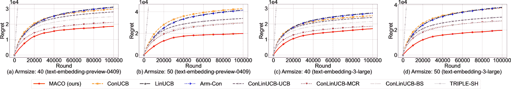
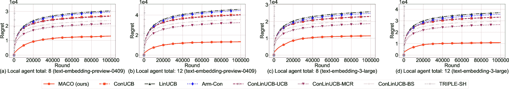
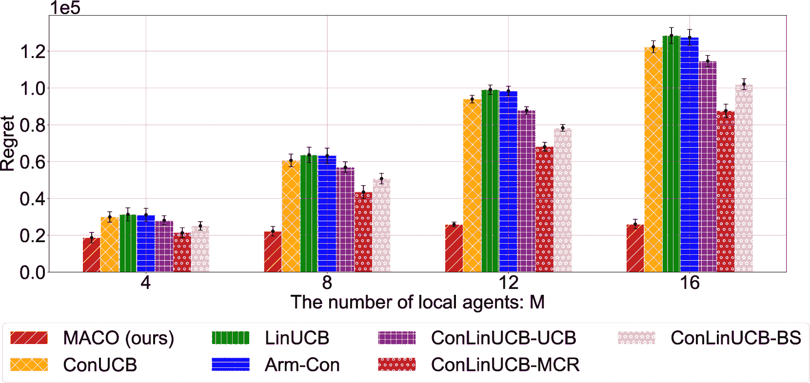

<!--yml
category: 未分类
date: 2025-01-11 11:41:02
-->

# Multi-Agent Conversational Online Learning for Adaptive LLM Response Identification

> 来源：[https://arxiv.org/html/2501.01849/](https://arxiv.org/html/2501.01849/)

\usephysicsmodule

ab

Xiangxiang Dai^†, Yuejin Xie^‡, Maoli Liu^†, Xuchuang Wang^§,
Zhuohua Li^†, Huanyu Wang^♭, John C.S. Lui^†
^†The Chinese University of Hong Kong
^‡Huazhong University of Science and Technology
^§University of Massachusetts Amherst
^♭Huawei Technologies Co., Ltd.
Email:{xxdai23, mlliu, zhli, cslui}@cse.cuhk.edu.hk, yuejinxie@hust.edu.cn,
xuchuangwang@umass.edu, huanyuhello@zju.edu.cn Zhuohua Li is the corresponding author.

###### Abstract

The remarkable generative capability of large language models (LLMs) has sparked a growing interest in automatically generating responses for different applications. Given the dynamic nature of user preferences and the uncertainty of LLM response performance, it is crucial to design efficient online learning algorithms to identify optimal LLM responses (i.e., high-quality responses that also meet user preferences). Most existing online algorithms adopt a centralized approach and fail to leverage explicit user preferences for more efficient and personalized LLM response identification. In contrast, this paper introduces MACO (Multi-Agent Conversational Online Learning for Adaptive LLM Response Identification): 1) The online LLM response identification process is accelerated by multiple local agents (such as smartphones), while enhancing data privacy; 2) A novel conversational mechanism is proposed to adaptively conduct conversations for soliciting user preferences (e.g., a preference for a humorous tone over a serious one in generated responses), so to minimize uncertainty in preference estimation. Our theoretical analysis demonstrates that MACO is near-optimal regarding cumulative regret. Additionally, MACO offers reduced communication costs and computational complexity by eliminating the traditional, computing-intensive “G-optimal design” found in previous works. Extensive experiments with the open LLM Llama, coupled with two different embedding models from Google and OpenAI for text vector representation, demonstrate that MACO significantly outperforms the current state-of-the-art in online LLM response identification.

## I Introduction

Large language models (LLMs) have swiftly transformed the technological landscape of our society [[1](https://arxiv.org/html/2501.01849v1#bib.bib1), [2](https://arxiv.org/html/2501.01849v1#bib.bib2)]. A significant line of research is the exploration of prompts to identify optimal responses from LLMs [[3](https://arxiv.org/html/2501.01849v1#bib.bib3)]. This approach is compelling since it does not need to alter the internal parameters of an LLM, and can align well with human conversational patterns. Consequently, there is a growing interest in automatically identifying LLM responses, e.g., through prompt engineering methods [[4](https://arxiv.org/html/2501.01849v1#bib.bib4), [5](https://arxiv.org/html/2501.01849v1#bib.bib5), [6](https://arxiv.org/html/2501.01849v1#bib.bib6)]. These efforts aim to enhance LLMs’ capability to produce more accurate and relevant responses, collectively referred to as “LLM response identification”. Note that these prompt engineering methods are done offline, and only provide a “initiatory set of relatively good responses” by pre-specified prompt instructions. However, considering the diversity of responses generated by LLMs and the uncertainty in LLM performance, identifying the most suitable LLM response is inherently challenging [[7](https://arxiv.org/html/2501.01849v1#bib.bib7), [8](https://arxiv.org/html/2501.01849v1#bib.bib8)], as suitable responses are usually unknown in advance and context-dependent. Therefore, continuous online response adaptation is necessary [[9](https://arxiv.org/html/2501.01849v1#bib.bib9)], especially in scenarios such as medical diagnosis where highly accurate answers are required. Note that the online response identification approach can enhance the initiatory set of offline-generated responses so to match the specific context.

Furthermore, previous research has often overlooked the need to address diverse user preferences. It is crucial to not only ensure the quality of responses generated by LLMs, but also to tailor them to meet the specific preferences and expectations of different users. For instance, some users may prefer LLM-generated responses to be humorous, while others might prefer a more formal tone. Although [[10](https://arxiv.org/html/2501.01849v1#bib.bib10)] considers the optimization of preferences for LLMs, it only addresses the binary case of users’ likes and dislikes. LLM response identification must address the growing demand to cater to diverse user preferences. To address such needs, one can utilize cloud servers to continuously learn and refine LLM response identification by collecting feedback on the assessment of LLM responses. This feedback can be derived from users’ direct input or measurement of score functions [[11](https://arxiv.org/html/2501.01849v1#bib.bib11), [12](https://arxiv.org/html/2501.01849v1#bib.bib12)]. A response that not only meets quality standards but also aligns with user preferences is termed an “optimal LLM response.”

### I-A Multi-Agent Conversational Properties

In the context of LLM response identification, we observe two significant properties in typical LLM application scenarios. These properties inform and motivate our proposed formulation.

First, in the utilization of LLMs, users commonly access LLM services across multiple devices, such as smartphones, tablets, and desktops, collectively referred to as “local agents.” For example, the Poe AI chatting platform [[13](https://arxiv.org/html/2501.01849v1#bib.bib13)] handles user queries originating from various devices. Leveraging this multi-agent framework, LLM response identification tailored to specific user preferences can be performed concurrently on each local agent, facilitating data aggregation and enhancing learning efficiency on a user preference. Moreover, this approach offers an added layer of privacy protection, as sensitive information remains localized and is neither transmitted nor stored on central servers.

Second, a key challenge for online LLM methods lies in addressing the “cold start” problem, where response identification may be inaccurate for new users with limited historical data. To address this, *conversational recommendation* [[14](https://arxiv.org/html/2501.01849v1#bib.bib14), [15](https://arxiv.org/html/2501.01849v1#bib.bib15), [16](https://arxiv.org/html/2501.01849v1#bib.bib16)] has been applied in LLM applications. In this approach, the cloud server can proactively query users with questions and obtain feedback, thereby quickly eliciting user preferences. For example, in OpenAI’s design, when ChatGPT is tasked with computing factorials in Python, it may provide two “correct” implementations with different styles: one recursive, the other iterative. During the interaction, the user provides feedback on their preferred coding style. This “conversation” process allows ChatGPT to learn from the user’s code preferences, enabling it to tailor its future responses more effectively to individual users.

### I-B Challenges and Our Contributions

To adaptively identify the appropriate LLM responses, which were generated from an initiatory set of responses generated through offline prompt engineering techniques, we propose to utilize online *contextual bandit* approaches, where a sequential decision-making cloud server selects LLM responses (i.e., an arms corresponds to a response) for users and receives feedback. Besides the arm-level feedback, the cloud server can occasionally prompt users with questions about *key terms* [[17](https://arxiv.org/html/2501.01849v1#bib.bib17), [18](https://arxiv.org/html/2501.01849v1#bib.bib18)]. For example, asking about the user’s preference on a category: “Are you interested in news about basketball?”, or asking about the user’s preference on an entity: “Do you like to read news related to LeBron James?”. The feedback from key terms like “basketball” and “LeBron James” can reflect user preferences, allowing the cloud server to accelerate the learning process. The objective is to develop an online adaptive strategy that maximizes user satisfaction over the long term. However, the current works of conversational contextual bandit algorithms fall short of addressing the unique challenges of online adaptive LLM response identification:

❶ Firstly, existing bandit models that account for user preferences are predominantly employed in recommendation systems [[18](https://arxiv.org/html/2501.01849v1#bib.bib18), [19](https://arxiv.org/html/2501.01849v1#bib.bib19), [20](https://arxiv.org/html/2501.01849v1#bib.bib20)]. These models typically utilize Singular Value Decomposition (SVD) to extract feature vectors of comparatively lower dimensions. However, quantifying features from LLM text responses, which contain complex semantic information and lead to much higher dimensional feature spaces, presents significant computational challenges.

❷ Secondly, previous conversational bandit works primarily follow the framework by [[21](https://arxiv.org/html/2501.01849v1#bib.bib21)], which addresses the *infinitely* arms. However, the number of LLM responses that need online identification from an initiatory set of responses generated via prompt engineering is typically finite. While elimination-based contextual bandit algorithms can handle this setting, they rely on the computationally intensive *G-optimal design* procedure [[22](https://arxiv.org/html/2501.01849v1#bib.bib22), [23](https://arxiv.org/html/2501.01849v1#bib.bib23), [24](https://arxiv.org/html/2501.01849v1#bib.bib24)] to calculate a distribution for arm selection, thus slowing down the online LLM response identification.

❸ Thirdly, existing studies on conversational bandits [[19](https://arxiv.org/html/2501.01849v1#bib.bib19), [17](https://arxiv.org/html/2501.01849v1#bib.bib17)] rely on predetermined functions to control conversation frequency, which typically follow a fixed sequence of engagements to initiate a specific number of conversations. This approach is not suitable for the dynamic nature of LLM response identification, as it imposes unnecessary restrictions and could degrade user experience.

❹ Finally, existing literature on conversational bandits solely considers centralized scenarios, neglecting the inherent multi-agent property of data source of LLM platforms. While there are works on distributed bandits with finite arms [[22](https://arxiv.org/html/2501.01849v1#bib.bib22), [25](https://arxiv.org/html/2501.01849v1#bib.bib25), [26](https://arxiv.org/html/2501.01849v1#bib.bib26)], they either require all local agents to upload user feedback to the cloud server or share the exactly same arm set. These restrictive settings can leak sensitive information, reduce the flexibility of local agents, and increase communication costs.

This paper makes the following contributions:

*   •

    Model Formulation: We propose a distributed conversational bandit model for online LLM response identification. Complementing existing methods that rely on offline selection from a pre-generated pool of LLM responses. Our model emphasizes “online identification” of the optimal LLM response from the pre-generated arm set with uncertain performance. This involves ensuring the quality of the generated response while considering user preferences.

*   •

    Algorithm Design: We propose the Conversational Adaptive Distributed Identifier (MACO), comprising MACO-A, which is executed by local agents, and MACO-S, which is executed by the cloud server. Unlike previous works with predetermined conversation frequencies, MACO adaptively decides when to engage in conversations based on the current context. Additionally, it enhances collaboration among local agents to improve the efficiency of LLM response identification.

*   •

    Theoretical Analysis: We establish the regret upper bound for MACO at $\mathcal{\widetilde{O}}(\sqrt{dMT})$, with a lower bound analysis of $\Omega(\sqrt{dMT})$, indicating that MACO is near-optimal. Additionally, we leverage the conversational setting to enhance efficiency in both computation and communication, compared to existing work on distributed linear contextual bandits with finite arm sets. Specifically, we provide the upper bound of communication cost as $\mathcal{O}(d^{2}M\log T)$. The development of distributed conversational bandits in MACO  successfully avoids the computationally intensive G-optimal design, which is required in previous elimination-based linear bandits.

*   •

    Experimental Evaluation: We conduct extensive experiments using the open LLM Llama to generate responses, coupled with two different embedding models from Google and OpenAI for text vector representation. Testing under various conditions, including different arm pool sizes and numbers of local agents, our algorithm consistently outperforms state-of-the-art methods. Additionally, by eliminating the time-intensive G-optimal design procedure, our approach significantly reduces execution time. This reduction does not compromise performance, thanks to our conversational mechanisms design, which enhances the speed of online LLM response identification and estimation of user preference.

## II System Model

This section formulates the multi-agent conversational bandit for online LLM response identification.

Figure 1: An adaptive multi-agent conversational bandit framework for identifying online LLM responses. Local agents handle response selection (arms), while a central server manages conversation flow through key term selection. The server aggregates interaction data across multiple agents to accelerate user preference learning.

### II-A Online LLM Response Identification

We define the set of local agents as ${\mathcal{M}}$ with $|{\mathcal{M}}|=M$, which represent devices such as smartphones, laptops, and tablets. For any local agent $m\in{\mathcal{M}}$, the finite arm set of LLM responses is denoted as ${\mathcal{A}}_{m}$, which represents possible responses generated from various prompts. Given the heterogeneity of agents, different local agents may have different arm sets, which is different from the assumption in [[26](https://arxiv.org/html/2501.01849v1#bib.bib26)] that all local agents share the same arm set. As mentioned in Section [I](https://arxiv.org/html/2501.01849v1#S1 "I Introduction ‣ Multi-Agent Conversational Online Learning for Adaptive LLM Response Identification"), traditional offline techniques (e.g., prompt engineering) can help to construct a set of initial responses, but due to the diversity of LLM outputs and user preferences, it is essential to adaptively fine-tune the optimal response online, despite having an offline initiatory set of LLM responses. Our model adopts a time-slotted approach, denoted by discrete-time rounds $\mathcal{T}=\{1,2,3,\ldots,T\}$, where each local agent selects one arm, i.e., LLM response, at each round $t\in\mathcal{T}$.

### II-B Multi-Agent User-Personalized Bandits

We consider a multi-agent conversational bandit setting involving $M$ agents and a cloud server. At each round $t\in\mathcal{T}$, a local agent $m\in{\mathcal{M}}$ selects an arm $a_{m,t}\in\mathcal{A}_{m}$, which denotes one possible LLM response, and receives reward feedback $r_{m,t}$ that reflects the corresponding performance. Eliciting user feedback is beyond the scope of this work. Here, the term “feedback” broadly encompasses direct user input, data inferred from techniques that measure user behavior, and preference simulators [[12](https://arxiv.org/html/2501.01849v1#bib.bib12)]. The user’s preference for LLM responses is represented by an “unknown” preference feature vector $\bm{\theta}^{*}\in\mathbb{R}^{d}$, which all local agents aim to learn. For a local agent $m\in{\mathcal{M}}$, considering both the impact of the LLM response (i.e., arm $a_{m,t}\in\mathcal{A}_{m}$) and the unknown user preference $\bm{\theta}^{*}$, the reward can be expressed as a linear combination with a noise term $\eta_{m,t}$: $r_{a_{m},t}=\langle\bm{x}_{a_{m},t},\bm{\theta}^{*}\rangle+\eta_{m,t},$ where $\bm{x}_{a_{m},t}\in{\mathbb{R}}^{d}$ is the embedding feature vector the corresponding arm $a_{m}$, to capture the textual information [[1](https://arxiv.org/html/2501.01849v1#bib.bib1), [3](https://arxiv.org/html/2501.01849v1#bib.bib3)]. We will demonstrate the generalization of our model using two different open embedding approaches in Section [V](https://arxiv.org/html/2501.01849v1#S5 "V Performance Evaluation ‣ Multi-Agent Conversational Online Learning for Adaptive LLM Response Identification"). Our objective is to design a policy that selects arms (i.e., LLM responses) each round to minimize cumulative regret, defined as the difference between the cumulative rewards of our policy and the best unknown policy across all local agents, tailored to personalized user preferences, which is defined as:

|  | $\vspace{-0.01in}R_{M}(T)=\sum_{m=1}^{M}\sum_{t=1}^{T}\left(\bm{x}_{a_{m}^{*}}^% {\mathsf{T}}\bm{\theta}^{*}-\bm{x}_{a_{m},t}^{\mathsf{T}}\bm{\theta}^{*}\right% ).\vspace{-0.01in}$ |  | (1) |

where $a_{m}^{*}\in\arg\max_{a\in\mathcal{A}_{m}}\bm{x}_{a}^{\mathsf{T}}\bm{\theta}^{*}$ denotes the locally optimal arm with the highest expected reward at local agent $m\in{\mathcal{M}}$. This regret definition follows prior works [[21](https://arxiv.org/html/2501.01849v1#bib.bib21), [17](https://arxiv.org/html/2501.01849v1#bib.bib17), [18](https://arxiv.org/html/2501.01849v1#bib.bib18)].

### II-C Conversational Contextual Mechanism

In addition to obtaining feedback by selecting arms on suitable LLM responses, the cloud server can occasionally query users from each local agent for feedback to better estimate user preferences. However, relying solely on directly considering all answers can lead to inefficiencies due to the issue of information dispersion. Specifically, the contextual vectors of different answers may vary significantly, even if they share similarities at an abstract level. For instance, responses about “syntax rules,” “best practices,” or “compiler optimizations” may all relate to “C/C++,” but their contextual representations can differ greatly. Similarly, responses with a “humorous tone” could vary between “lighthearted,” “sarcastic,” or “playful” expressions. To address this issue, we introduce “key terms” to represent core topics or features of user interests from [[17](https://arxiv.org/html/2501.01849v1#bib.bib17), [18](https://arxiv.org/html/2501.01849v1#bib.bib18)]. A key term groups multiple related arms under a single concept. For example, the key term “C/C++” can encompass responses about “syntax rules,” “best practices,” and “compiler optimizations,” while the key term “humorous tone” might include responses that are “lighthearted,” “sarcastic,” or “playful.” Feedback on a key term propagates to its related arms, enabling the system to infer preferences across multiple responses with minimal interaction.

Formally, let $\mathcal{K}$ denote the finite set of key terms, with each element $\tilde{\bm{x}}_{k}\in{\mathbb{R}}^{d}$ representing the feature vector for key term $k\in\mathcal{K}$. Let $\mathcal{K}$ denote the finite set of key terms, with each element $\tilde{\bm{x}}_{k}\in{\mathbb{R}}^{d}$ being a feature vector for the corresponding key term $k\in\mathcal{K}$. Applying the conversational bandits to our multi-agent framework, a user served by local agent $m$ can be queried with a key term $k_{m}\in\mathcal{K}_{m}$, where $\mathcal{K}_{m}\subseteq\mathcal{K}$ is the subset of key terms at local agent $m$. Considering user preference $\bm{\theta}^{*}$ with a noise term $\widetilde{\eta}_{m,t}$, the conversational feedback is modeled as: $\widetilde{r}_{k_{m},t}=\langle\tilde{\bm{x}}_{k_{m},t},\bm{\theta}^{*}\rangle% +\widetilde{\eta}_{m,t}.$ Note that our model diverges from previous conversational bandits [[17](https://arxiv.org/html/2501.01849v1#bib.bib17), [18](https://arxiv.org/html/2501.01849v1#bib.bib18), [27](https://arxiv.org/html/2501.01849v1#bib.bib27), [28](https://arxiv.org/html/2501.01849v1#bib.bib28)], which employ a fixed conversation function, typically linear or logarithmic of round $t$, to regulate the frequency of conversations. These methods initiate conversations periodically, regardless of whether user preferences have been sufficiently estimated, which can negatively impact the user experience. (A more detailed comparison is provided in Section [IV](https://arxiv.org/html/2501.01849v1#S4 "IV Performance Analysis ‣ Multi-Agent Conversational Online Learning for Adaptive LLM Response Identification")). Conversely, as we will elaborate in Section [III](https://arxiv.org/html/2501.01849v1#S3 "III Algorithm Design ‣ Multi-Agent Conversational Online Learning for Adaptive LLM Response Identification"), our algorithm conducts conversations “adaptively”, engaging users only when necessary to refine the user preference estimation.

### II-D Distributed Communication Model

We consider a distributed model with $M$ local agents and a cloud server, adopting a synchronous communication paradigm. In this setup, as shown in Fig. [1](https://arxiv.org/html/2501.01849v1#S2.F1 "Figure 1 ‣ II System Model ‣ Multi-Agent Conversational Online Learning for Adaptive LLM Response Identification"), each local agent communicates with the cloud server by uploading and downloading data with negligible latency. Moreover, the local agents do not directly communicate with each other. For simplicity, we focus on discrete-slot rounds solely for recording the selected arm. Querying key terms is interspersed with identifying LLM responses, allowing a key term to be queried and an arm to be pulled simultaneously. This aligns with the practical operations of conversational LLM systems. Consistent with  [[22](https://arxiv.org/html/2501.01849v1#bib.bib22)], we define communication cost as the cumulative count of scalar units transmitted between the cloud server and local agents, which include both integers and real numbers.

## III Algorithm Design

We present the design of multi-agent conversational online learning (MACO) algorithms, implemented by local agents and a cloud server for adaptive identifying LLM response. Then, we compare our design to the traditional phase elimination-based online learning algorithm [[23](https://arxiv.org/html/2501.01849v1#bib.bib23)].

For any real vector $\bm{x}$ and a positive semi-definite matrix $\bm{M}$, let $\|\bm{x}\|_{\bm{M}}\coloneqq\sqrt{\bm{x}^{\mathsf{T}}\bm{M}\bm{x}}$. Denote the cardinality of a set $\mathcal{A}$ as $|\mathcal{A}|$. We introduce the notation $[z]\coloneqq\{1,\dots,z\}$ for $\forall z\in{\mathbb{N}}^{+}$. Define $\mathcal{T}_{m,a}^{p}$ as the set of rounds where local agent $m$ selects arm $a$ in phase $p$, $\mathcal{\widetilde{T}}_{m,k}^{p}$ as the set of rounds when agent $m$ conducts interaction on key term $k$ in the same phase, and $A$ (where $A\leq|\mathcal{A}|)$ as the size of actually pulled arms from the LLM response set at each round.

### III-A MACO Algorithm on Local Agent

Input: Round horizon $T$, number of local agent $M$, input dimension $d$, arm set $\mathcal{A}_{m}$, arm pool size $A$, confidence parameter $\delta\in(0,1]$Initialization: Let $p=1,\mathcal{A}_{m}^{p}=\mathcal{A}_{m}$12while *$T$ has not been reached* do3       Calculate $\bm{M}_{m}^{p}=\sum_{a\in\mathcal{A}_{m}^{p}}\frac{1}{|\mathcal{A}_{m}^{p}|}% \bm{x}_{a}\bm{x}_{a}^{\mathsf{T}}$4       Diagonalize $\bm{M}_{m}^{p}=\sum_{j=1}^{d}\lambda_{\bm{v}_{j}}\bm{v}_{j}\bm{v}_{j}^{\mathsf% {T}}$5       Upload eigenvector $\bm{v}_{j}$, if its corresponding eigenvalue satisfies $\lambda_{\bm{v}_{j}}<h_{p}\coloneqq\frac{3}{4(1-2^{-2p})d}$6       Download $\mathcal{K}_{m}^{p}$ and $\set{n_{m,k}^{p}}_{k\in\mathcal{K}_{m}^{p}}$ from the cloud server7      8      foreach *$k\in\mathcal{K}_{m}^{p}$*  do  $\triangleright$ Conduct conversations9             Querying key term $k$ for $n_{m,k}^{p}$ times10             Receive rewards $\set{\widetilde{r}_{k,t}}_{t\in\mathcal{\widetilde{T}}_{m,k}^{p}}$ from direct conversational feedback11            12      13      foreach *$a\in\mathcal{A}_{m}^{p}$* do  $\triangleright$ Pull arms14             Set $n_{m,a}^{p}=\left\lceil\frac{d}{2^{(-2p-1)}|\mathcal{A}_{m}^{p}|}\log\frac{2AM% \log T}{\delta}\right\rceil$15             Pull $a$ for $n_{m,a}^{p}$ times on the targeted LLM16             Receive rewards $\set{r_{a,t}}_{t\in\mathcal{T}_{m,a}^{p}}$ on the LLM response17            18      19      $\begin{aligned} &\text{Upload }\bm{G}_{m}^{p}=\sum_{k\in\mathcal{K}_{m}^{p}}n_% {m,k}^{p}\tilde{\bm{x}}_{k}\tilde{\bm{x}}_{k}^{\mathsf{T}}+\sum_{a\in\mathcal{% A}_{m}^{p}}n_{m,a}^{p}\bm{x}_{a}\bm{x}_{a}^{\mathsf{T}}\text{, and}\\ &\bm{W}_{m}^{p}=\sum_{t\in\bigcup_{k\in\mathcal{K}_{m}^{p}}\mathcal{\widetilde% {T}}_{m,k}^{p}}\widetilde{r}_{k,t}\tilde{\bm{x}}_{k,t}+\sum_{t\in\bigcup_{a\in% \mathcal{A}_{m}^{p}}\mathcal{T}_{m,a}^{p}}r_{a,t}\bm{x}_{a,t}\end{aligned}$20       Download $\widehat{\bm{\theta}}_{p}$ from the cloud server21       Update the active LLM response set $\mathcal{A}_{m}^{p+1}$ by eliminating sub-optimal LLM responses: $\displaystyle\mathcal{A}_{m}^{p+1}=\set{a\in\mathcal{A}_{m}^{p}:\max_{a^{% \prime}\in\mathcal{A}_{m}^{p}}\left\langle\widehat{\bm{\theta}}_{p},\bm{x}_{a^% {\prime}}-\bm{x}_{a}\right\rangle\leq\frac{2^{-p+1}}{\sqrt{M}}}$22        $p=p+1$23      

Algorithm 1 MACO on Local Agent (MACO-A)

As outlined in Algorithm [1](https://arxiv.org/html/2501.01849v1#algorithm1 "Algorithm 1 ‣ III-A MACO Algorithm on Local Agent ‣ III Algorithm Design ‣ Multi-Agent Conversational Online Learning for Adaptive LLM Response Identification"), which is executed by the local agents and referred to as MACO Agent (MACO-A), the online process of handling and updating information for LLM response identification within the multi-agent system operates as follows. Initially, the local agent $m\in{\mathcal{M}}$ computes the information matrix $\bm{M}_{m}^{p}$ from its active arm set $\mathcal{A}_{m}^{p}$ (which is later updated in Line [1](https://arxiv.org/html/2501.01849v1#algorithm1 "Algorithm 1 ‣ III-A MACO Algorithm on Local Agent ‣ III Algorithm Design ‣ Multi-Agent Conversational Online Learning for Adaptive LLM Response Identification")) during each phase $p$. Specifically, $\bm{M}_{m}^{p}$ is calculated as $\bm{M}_{m}^{p}\coloneqq\sum_{a\in\mathcal{A}_{m}^{p}}\frac{1}{|\mathcal{A}_{m}% ^{p}|}\bm{x}_{a}\bm{x}_{a}^{\mathsf{T}}$, which refines the model’s ability to adapt to LLM responses by analyzing the principal directions in the feature space (Line [1](https://arxiv.org/html/2501.01849v1#algorithm1 "Algorithm 1 ‣ III-A MACO Algorithm on Local Agent ‣ III Algorithm Design ‣ Multi-Agent Conversational Online Learning for Adaptive LLM Response Identification")). The eigenvalue $\lambda_{\bm{v}}$ of its eigenvector $\bm{v}$ represents the variance captured along its direction, with higher values indicating richer information, which is essential for the precise estimation of $\bm{\theta}^{*}$. Following this, the local agent $m$ diagonalizes its information matrix $\bm{M}_{m}^{p}=\sum_{j=1}^{d}\lambda_{\bm{v}_{j}}\bm{v}_{j}\bm{v}_{j}^{\mathsf% {T}}$, examining all principal directions in the feature space (Line [1](https://arxiv.org/html/2501.01849v1#algorithm1 "Algorithm 1 ‣ III-A MACO Algorithm on Local Agent ‣ III Algorithm Design ‣ Multi-Agent Conversational Online Learning for Adaptive LLM Response Identification")). If an eigenvalue $\lambda_{\bm{v}_{j}}$ falls below the threshold $h_{p}\coloneqq\frac{3}{4(1-2^{-2p})d}$, whose value is determined by Lemma [1](https://arxiv.org/html/2501.01849v1#Thmlemma1 "Lemma 1 (Stability of the Information Matrix). ‣ IV-B Technical Analysis ‣ IV Performance Analysis ‣ Multi-Agent Conversational Online Learning for Adaptive LLM Response Identification") in Section [IV](https://arxiv.org/html/2501.01849v1#S4 "IV Performance Analysis ‣ Multi-Agent Conversational Online Learning for Adaptive LLM Response Identification"), the local agent $m$ uploads the corresponding eigenvector to the cloud server (Line [1](https://arxiv.org/html/2501.01849v1#algorithm1 "Algorithm 1 ‣ III-A MACO Algorithm on Local Agent ‣ III Algorithm Design ‣ Multi-Agent Conversational Online Learning for Adaptive LLM Response Identification")). This mechanism helps to address under-explored areas of the feature space, enhancing the accuracy in selecting LLM responses.

The cloud server processes the uploaded information and returns a set of key terms $\mathcal{K}_{m}^{p}$ along with the required repetition times $\{n_{m,k}^{p}\}_{k\in\mathcal{K}_{m}^{p}}$ (Line [1](https://arxiv.org/html/2501.01849v1#algorithm1 "Algorithm 1 ‣ III-A MACO Algorithm on Local Agent ‣ III Algorithm Design ‣ Multi-Agent Conversational Online Learning for Adaptive LLM Response Identification")). The local agent $m$ then engages in conversations with these key terms while pulling arms the requisite number of times, to ensure robust exploration of LLM responses. During this process, the local agent has the flexibility to intersperse the querying of key terms with arm pulls (Lines [1](https://arxiv.org/html/2501.01849v1#algorithm1 "Algorithm 1 ‣ III-A MACO Algorithm on Local Agent ‣ III Algorithm Design ‣ Multi-Agent Conversational Online Learning for Adaptive LLM Response Identification")-[1](https://arxiv.org/html/2501.01849v1#algorithm1 "Algorithm 1 ‣ III-A MACO Algorithm on Local Agent ‣ III Algorithm Design ‣ Multi-Agent Conversational Online Learning for Adaptive LLM Response Identification")). Note that The procedures of conducting conversations and Pulling arms are presented sequentially for clarity, but can be executed in parallel or interleaved without strict ordering. The local agent then uploads the corresponding information of pulled arms, key terms, and observed rewards, which are stored in the matrices $\bm{G}_{m}^{p}$ and $\bm{W}_{m}^{p}$ (Line [1](https://arxiv.org/html/2501.01849v1#algorithm1 "Algorithm 1 ‣ III-A MACO Algorithm on Local Agent ‣ III Algorithm Design ‣ Multi-Agent Conversational Online Learning for Adaptive LLM Response Identification")). Finally, the local agent downloads the updated preference parameter $\widehat{\bm{\theta}}_{p}$ from the cloud server, and revises its active arm set, eliminating less effective arms based on the updated user preference estimations (Line [1](https://arxiv.org/html/2501.01849v1#algorithm1 "Algorithm 1 ‣ III-A MACO Algorithm on Local Agent ‣ III Algorithm Design ‣ Multi-Agent Conversational Online Learning for Adaptive LLM Response Identification")). This adaptive adjustment process allows each local agent to maintain high responsiveness and accuracy in LLM response identification, which caters to user-specific needs and preferences while preserving data privacy by sharing only aggregated data ($\bm{G}_{m}^{p}$ and $\bm{W}_{m}^{p}$) with the cloud server.

### III-B MACO Algorithm on Cloud Server

Input: Key term set $\mathcal{K}$, coverage parameter $\beta$ in Condition [1](https://arxiv.org/html/2501.01849v1#Thmcondition1 "Condition 1 (Feature Space Coverage). ‣ IV-A Main Results ‣ IV Performance Analysis ‣ Multi-Agent Conversational Online Learning for Adaptive LLM Response Identification").Initialization: Let $p=1,\bm{G}=\bm{0},\bm{W}=\bm{0}$12while *$T$ has not been reached* do3        foreach *$m\in{\mathcal{M}}$* do4             Receive all eigenvectors uploaded by local agent $m$, and denote this set as $\mathcal{S}_{m}$5             Initialize the set of key terms at phase $p$ as $\mathcal{K}_{m}^{p}=\emptyset$6            7            foreach *$\bm{v}_{j}\in\mathcal{S}_{m}$* do8                    $k=\argmax_{i\in\mathcal{K}}\tilde{\bm{x}}_{i}^{\mathsf{T}}\bm{v}_{j}$, $\mathcal{K}_{m}^{p}=\mathcal{K}_{m}^{p}\cup\set{k}$9                    $n_{m,k}^{p}=\left\lceil\frac{\frac{3}{2(1-2^{-2p})}-2d\lambda_{\bm{v}_{j}}}{% \beta^{2}2^{-2p}}\log\frac{2AM\log T}{\delta}\right\rceil$10                  11            Send $\mathcal{K}_{m}^{p}$ and $\set{n_{m,k}^{p}}_{\bm{k}\in\mathcal{K}_{m}^{p}}$ to local agent $m$12             Receive $\bm{G}_{m}^{p}$ and $\bm{W}_{m}^{p}$ from local agent $m$13            14      $\bm{G}=\sum_{p\in[p]}\sum_{m\in{\mathcal{M}}}\bm{G}_{m}^{p},\ \ \bm{W}=\sum_{p% \in[p]}\sum_{m\in{\mathcal{M}}}\bm{W}_{m}^{p}$15       Broadcast $\widehat{\bm{\theta}}_{p}=\bm{G}^{-1}\bm{W}$ to all local agents16        $p=p+1$17      

Algorithm 2 MACO on Cloud Server (MACO-S)

Next, we present the part of the MACO algorithm, which is executed on the cloud server, called MACO Server (MACO-S). As mentioned in Section [I](https://arxiv.org/html/2501.01849v1#S1 "I Introduction ‣ Multi-Agent Conversational Online Learning for Adaptive LLM Response Identification"), a significant challenge arises from the heterogeneity of local agents in the multi-agent conversational bandits model. This diversity can hinder effective data aggregation, potentially leading to suboptimal estimation of the user preference vector $\bm{\theta}^{*}$. To address this issue, the cloud server employs a strategic approach using key terms to probe and enrich the information in underrepresented directions of the feature space, thereby enhancing the overall accuracy of the estimation process.

As detailed in Algorithm [2](https://arxiv.org/html/2501.01849v1#algorithm2 "Algorithm 2 ‣ III-B MACO Algorithm on Cloud Server ‣ III Algorithm Design ‣ Multi-Agent Conversational Online Learning for Adaptive LLM Response Identification"), the cloud server first receives eigenvectors representing directions with insufficient information about the LLM response space from each local agent (Line [2](https://arxiv.org/html/2501.01849v1#algorithm2 "Algorithm 2 ‣ III-B MACO Algorithm on Cloud Server ‣ III Algorithm Design ‣ Multi-Agent Conversational Online Learning for Adaptive LLM Response Identification")). Utilizing these insights, the cloud server identifies and selects key terms by calculating the closest match in terms of the inner product with the underexplored directions. The chosen key term $k\in\mathcal{K}$, along with the designated repetition times $n_{m,k}^{p}$, is then communicated back to the respective local agents (Line [2](https://arxiv.org/html/2501.01849v1#algorithm2 "Algorithm 2 ‣ III-B MACO Algorithm on Cloud Server ‣ III Algorithm Design ‣ Multi-Agent Conversational Online Learning for Adaptive LLM Response Identification")). This targeted intervention allows for focused exploration and refinement of LLM responses related to these key terms. Finally, the cloud server aggregates the enriched data from all local agents. This aggregated data is used to estimate the unknown preference parameter $\bm{\theta}^{*}$ via linear regression, effectively minimizing uncertainty and enhancing the model’s ability to predict and adapt LLM responses tailored to user preferences (Lines [2](https://arxiv.org/html/2501.01849v1#algorithm2 "Algorithm 2 ‣ III-B MACO Algorithm on Cloud Server ‣ III Algorithm Design ‣ Multi-Agent Conversational Online Learning for Adaptive LLM Response Identification")-[2](https://arxiv.org/html/2501.01849v1#algorithm2 "Algorithm 2 ‣ III-B MACO Algorithm on Cloud Server ‣ III Algorithm Design ‣ Multi-Agent Conversational Online Learning for Adaptive LLM Response Identification")). Moreover, $\bm{G}$ can also be initialized as an identity matrix to ensure invertibility, especially when the dimension $d$ is large.

### III-C Comparative Analysis

Generally, as mentioned in Section [I](https://arxiv.org/html/2501.01849v1#S1 "I Introduction ‣ Multi-Agent Conversational Online Learning for Adaptive LLM Response Identification"), the number of LLM responses needing online identification from an initial set generated by prompt engineering is typically finite. Therefore, we employ phase elimination-based algorithms for linear bandits, referred to as PE-Lin, instead of the classical conversational bandit framework proposed by [[17](https://arxiv.org/html/2501.01849v1#bib.bib17)]. This choice is motivated by the better performance guarantees of PE-Lin under finite arm sets. Our work builds upon and improves the classical PE-Lin [[23](https://arxiv.org/html/2501.01849v1#bib.bib23)]. In PE-Lin, a learning agent always estimates the unknown preference vector $\bm{\theta}^{*}$ using optimal least squares design. Specifically, the algorithm minimizes prediction variance by implementing the computing-intensive *G-optimal design*, a probability distribution over the arm feature vector set $\mathcal{X}\subset{\mathbb{R}}^{d}$ (represented by distribution policy $\pi:\mathcal{X}\to[0,1]$), to ensure minimal variance $g(\pi)$. The conditions are defined as [[29](https://arxiv.org/html/2501.01849v1#bib.bib29)]:

|  | $\displaystyle\sum_{\bm{x}\in\mathcal{X}}\pi(\bm{x})$ | $\displaystyle=1,\quad\bm{M}_{m}^{p}(\pi)=\sum_{\bm{x}\in\mathcal{X}}\pi(\bm{x}% )\bm{x}\bm{x}^{\mathsf{T}},$ |  | (2) |
|  | $\displaystyle g(\pi)$ | $\displaystyle=\max_{\bm{x}\in\mathcal{X}}\&#124;\bm{x}\&#124;_{\bm{M}(\pi)^{-1}}^{2}=d.$ |  |

Then the learning agent plays arms according to the policy $\pi$ for local agent $m$ at phase $p$, estimates the unknown parameter $\bm{\theta}^{*}$, and eliminates inferior arms accordingly. As noted in [[22](https://arxiv.org/html/2501.01849v1#bib.bib22)], there is currently no efficient algorithm for computing the *G-optimal design* in the multi-agent scenario.

We avoid using G-optimal design by leveraging the inherent multi-agent heterogeneity in LLM application, combined with an adaptive conversational mechanism to address this issue. MACO eliminates the need for the resource-intensive G-optimal design, thereby significantly reducing computation time and resources. Additionally, merely executing PE-Lin independently on each local agent with subsequent data aggregation by the server cloud may fail to minimize regret efficiently. This is because different agents may have distinct LLM response sets, resulting in a trivial regret bound of $\mathcal{\widetilde{O}}(M\sqrt{dT})$, which is equivalent to running PE-Lin on each agent without any direct communication. In contrast, our algorithm improves the regret upper bound to $\mathcal{\widetilde{O}}(\sqrt{dMT})$ via efficiently utilizing the conversation to aggregate the information from different local agents, which will be detailed in Section [IV](https://arxiv.org/html/2501.01849v1#S4 "IV Performance Analysis ‣ Multi-Agent Conversational Online Learning for Adaptive LLM Response Identification").

## IV Performance Analysis

This section presents the theoretical results of MACO, including its cumulative regret, communication costs, and conversation frequency. In line with common practices in [[21](https://arxiv.org/html/2501.01849v1#bib.bib21), [20](https://arxiv.org/html/2501.01849v1#bib.bib20)], we assume for any arm $a$ and key term $k$, $\|\bm{x}_{a}\|=\|\tilde{\bm{x}}_{k}\|=1$. The length of preference vector $\bm{\theta}^{*}$ is bounded by 1, and the noise terms $\eta_{m,t}$ and $\widetilde{\eta}_{m,t}$ are modeled as 1-subgaussian.

### IV-A Main Results

We first present a “new technical condition” that addresses general issues related to feature space coverage.

###### Condition 1  (Feature Space Coverage).

We say a key term set $\mathcal{K}$ as *sufficiently rich* for covering the feature space if, for any unit vector $\bm{v}\in{\mathbb{R}}^{d}$, there exists a key term $k\in\mathcal{K}$ such that its feature vector $\tilde{\bm{x}}_{k}$ satisfies $\tilde{\bm{x}}_{k}^{\mathsf{T}}\bm{v}\geq\beta$, where $\beta\in(0,1]$ is a positive coverage parameter close to 1.

###### Remark 1.

Condition [1](https://arxiv.org/html/2501.01849v1#Thmcondition1 "Condition 1 (Feature Space Coverage). ‣ IV-A Main Results ‣ IV Performance Analysis ‣ Multi-Agent Conversational Online Learning for Adaptive LLM Response Identification") is crucial for ensuring the comprehensive distribution of key terms across the feature space, which can facilitate effective uncertainty minimization for each local agent. This condition is easily met if the key term set $\mathcal{K}$ includes an orthonormal basis of ${\mathbb{R}}^{d}$. Condition [1](https://arxiv.org/html/2501.01849v1#Thmcondition1 "Condition 1 (Feature Space Coverage). ‣ IV-A Main Results ‣ IV Performance Analysis ‣ Multi-Agent Conversational Online Learning for Adaptive LLM Response Identification") enables us to sidestep the *G-optimal design* procedure, typically employed in traditional elimination-based algorithms to minimize maximum prediction variance, as described in [[23](https://arxiv.org/html/2501.01849v1#bib.bib23)].

For sufficiently rich key term sets, based on Condition [1](https://arxiv.org/html/2501.01849v1#Thmcondition1 "Condition 1 (Feature Space Coverage). ‣ IV-A Main Results ‣ IV Performance Analysis ‣ Multi-Agent Conversational Online Learning for Adaptive LLM Response Identification"), we provide the following theorems.

###### Theorem 1  (Regret Bounds).

For the cumulative regret defined in Eq. [1](https://arxiv.org/html/2501.01849v1#S2.E1 "Equation 1 ‣ II-B Multi-Agent User-Personalized Bandits ‣ II System Model ‣ Multi-Agent Conversational Online Learning for Adaptive LLM Response Identification"), we have the following upper bound and lower bound:

1.  1.

    Upper Bound: With probability at least $1-\delta$, the regret is bounded above by $\mathcal{O}(\sqrt{dMT\log\frac{AM\log T}{\delta}})$.

2.  2.

    Lower Bound: For any policy that selects at most one key term per round, there exists an instance where the policy incurs an expected regret of at least $\Omega(\sqrt{dMT})$.

###### Remark 2.

The regret bounds established in Theorem [1](https://arxiv.org/html/2501.01849v1#Thmtheorem1 "Theorem 1 (Regret Bounds). ‣ IV-A Main Results ‣ IV Performance Analysis ‣ Multi-Agent Conversational Online Learning for Adaptive LLM Response Identification") reveal important insights into the performance of our approach:

*   •

    When $M=1$, the problem simplifies to single-agent conversational bandits, reducing the regret to $\mathcal{\widetilde{O}}(\sqrt{dT})$. This reduction outperforms previous regret upper bound results of $\mathcal{\widetilde{O}}(d\sqrt{T})$ from studies such as [[19](https://arxiv.org/html/2501.01849v1#bib.bib19), [17](https://arxiv.org/html/2501.01849v1#bib.bib17)], by leveraging phase elimination on finite arm sets. This improvement is particularly significant in high-dimensional LLM response feature vectors.

*   •

    For multi-agent systems, our upper bound result aligns with the nearly optimal results described in [[22](https://arxiv.org/html/2501.01849v1#bib.bib22), [24](https://arxiv.org/html/2501.01849v1#bib.bib24)], while eliminating the reliance on computationally intensive *G-optimal design*, thereby speeding up the online process.

*   •

    Collectively, the regret upper and lower bound indicate that MACO is minimax optimal up to a logarithmic factor [[23](https://arxiv.org/html/2501.01849v1#bib.bib23)], aligning closely with the theoretical regret bounds in multi-agent conversational bandits scenarios.

###### Theorem 2  (Communication Cost).

The total communication cost scales in $\mathcal{O}(d^{2}M\log T)$ for MACO algorithm.

###### Remark 3.

The communication cost of our algorithm MACO is notably independent of the arm pool size $A$, which can range into thousands based on the diversity of candidate LLM responses. This contrasts with the approach described in [[22](https://arxiv.org/html/2501.01849v1#bib.bib22)], where the communication cost scales as $O(d^{2}AM\log T)$, reflecting a substantial increase with the number of arms. Our approach significantly reduces communication costs by eliminating the need for each local agent to upload its entire active arm set, whose cardinality is $\mathcal{O}(A)$. Instead, local agents independently process their data and transmit only aggregated results to the cloud server, which also enhances privacy by limiting external data sharing in LLM response adaptations.

###### Theorem 3  (Bound on Conversation Frequency).

For any local agent $m\in{\mathcal{M}}$ during phase $p$, let $\gamma=\lambda_{\text{min}}(\bm{M}_{m}^{p})$, where $\lambda_{\text{min}}$ denotes the smallest eigenvalue, we have:

1.  1.

    If $\gamma\geq h_{p}$, no conversations will be initiated.

2.  2.

    If $\gamma<h_{p}$, the fraction of conversations relative to the total phase length is capped at $\beta^{-2}(\frac{3}{4(1-2^{-2p})}-d\gamma)$.

###### Remark 4.

Our approach introduces an “adaptive” method that differs significantly from the common deterministic functions $b(t)$, such as linear or logarithmic dependencies on round $t$, as widely employed in existing studies on conversational bandits [[17](https://arxiv.org/html/2501.01849v1#bib.bib17), [19](https://arxiv.org/html/2501.01849v1#bib.bib19)]. These traditional methods initiate conversations at fixed intervals, which can lead to inefficiencies, especially when user preferences are already well-understood. In contrast, our model dynamically adjusts the conversation frequency based on the current gaps in user preference information, offering a more realistic and responsive interaction paradigm.

### IV-B Technical Analysis

We now provide an analysis of the upper bound in Theorem [1](https://arxiv.org/html/2501.01849v1#Thmtheorem1 "Theorem 1 (Regret Bounds). ‣ IV-A Main Results ‣ IV Performance Analysis ‣ Multi-Agent Conversational Online Learning for Adaptive LLM Response Identification"). Proofs for other theorems can be found in [Sections A-C](https://arxiv.org/html/2501.01849v1#A1.SS3 "A-C Proof of Regret Lower Bound in Theorem 1 ‣ Appendix A Appendix ‣ Multi-Agent Conversational Online Learning for Adaptive LLM Response Identification"), [A-D](https://arxiv.org/html/2501.01849v1#A1.SS4 "A-D Proof of Theorem 2 ‣ Appendix A Appendix ‣ Multi-Agent Conversational Online Learning for Adaptive LLM Response Identification") and [A-E](https://arxiv.org/html/2501.01849v1#A1.SS5 "A-E Proof of Theorem 3 ‣ Appendix A Appendix ‣ Multi-Agent Conversational Online Learning for Adaptive LLM Response Identification"). Below, we present two critical lemmas related to the design of our multi-agent conversational bandit algorithm. [Lemma 1](https://arxiv.org/html/2501.01849v1#Thmlemma1 "Lemma 1 (Stability of the Information Matrix). ‣ IV-B Technical Analysis ‣ IV Performance Analysis ‣ Multi-Agent Conversational Online Learning for Adaptive LLM Response Identification") guarantees that for any local agent $m$, the smallest eigenvalue of the information matrix, adjusted for conversational feedback, remains above $h_{p}$. This supports the design of line [1](https://arxiv.org/html/2501.01849v1#algorithm1 "Algorithm 1 ‣ III-A MACO Algorithm on Local Agent ‣ III Algorithm Design ‣ Multi-Agent Conversational Online Learning for Adaptive LLM Response Identification") in Algorithm [1](https://arxiv.org/html/2501.01849v1#algorithm1 "Algorithm 1 ‣ III-A MACO Algorithm on Local Agent ‣ III Algorithm Design ‣ Multi-Agent Conversational Online Learning for Adaptive LLM Response Identification"). [Lemma 2](https://arxiv.org/html/2501.01849v1#Thmlemma2 "Lemma 2 (Reliability of Estimation Error Bounds). ‣ IV-B Technical Analysis ‣ IV Performance Analysis ‣ Multi-Agent Conversational Online Learning for Adaptive LLM Response Identification") ensures that the algorithm operates within established error limits, which is essential for reliable LLM response identification.

###### Lemma 1  (Stability of the Information Matrix).

For any local agent $m\in{\mathcal{M}}$ during phase $p$, we have $\lambda_{\text{min}}(\bm{M}_{m}^{p^{\prime}})\geq h_{p},$ where $\bm{M}_{m}^{p^{\prime}}\coloneqq\bm{M}_{m}^{p}+\sum_{k\in\mathcal{K}_{m}^{p}}% \frac{h_{p}-\lambda}{\beta^{2}}\tilde{\bm{x}}_{k}\tilde{\bm{x}}_{k}^{\mathsf{T}}$.

###### Proof.

Please refer to Appendix [A-A](https://arxiv.org/html/2501.01849v1#A1.SS1 "A-A Proof of Lemma 1 ‣ Appendix A Appendix ‣ Multi-Agent Conversational Online Learning for Adaptive LLM Response Identification") for the proof. ∎

###### Lemma 2  (Reliability of Estimation Error Bounds).

Define the “bad” event $\mathcal{E}$ where any local agent $m$ at phase $p$ has:

|  | $\mathcal{E}=\{\exists m\in{\mathcal{M}},a\in\mathcal{A}_{m}^{p},\left&#124;\langle% \widehat{\bm{\theta}}_{p}-\bm{\theta}^{*},\bm{x}_{a}\rangle\right&#124;>\frac{2^{-p% }}{\sqrt{M}}\}.$ |  |

The probability of $\mathcal{E}$ is bounded by $\delta$, i.e., $\Pr[\mathcal{E}]\leq\delta$.

###### Proof.

See Appendix [A-B](https://arxiv.org/html/2501.01849v1#A1.SS2 "A-B Proof of Lemma 2 ‣ Appendix A Appendix ‣ Multi-Agent Conversational Online Learning for Adaptive LLM Response Identification") for details. ∎

Now, consider the “good” event $\mathcal{E}^{c}$ for agent $m$ at phase $p$. Lemma [2](https://arxiv.org/html/2501.01849v1#Thmlemma2 "Lemma 2 (Reliability of Estimation Error Bounds). ‣ IV-B Technical Analysis ‣ IV Performance Analysis ‣ Multi-Agent Conversational Online Learning for Adaptive LLM Response Identification") confirms that the discrepancy for any arm $a$ in $\mathcal{A}_{m}^{p}$: $\langle\bm{x}_{a}-\bm{x}_{a_{m}^{*}},\widehat{\bm{\theta}}_{p}\rangle\leq\frac% {2^{-p+1}}{\sqrt{M}}.$ This, combined with line [1](https://arxiv.org/html/2501.01849v1#algorithm1 "Algorithm 1 ‣ III-A MACO Algorithm on Local Agent ‣ III Algorithm Design ‣ Multi-Agent Conversational Online Learning for Adaptive LLM Response Identification") in Algorithm [1](https://arxiv.org/html/2501.01849v1#algorithm1 "Algorithm 1 ‣ III-A MACO Algorithm on Local Agent ‣ III Algorithm Design ‣ Multi-Agent Conversational Online Learning for Adaptive LLM Response Identification"), supports the following lemma on the arm preservation and performance bound under good event $\mathcal{E}^{c}$.

###### Lemma 3  (Properties Under Good Event).

Under event $\mathcal{E}^{c}$, for any local agent $m$ at phase $p$, two key properties are ensured:

1.  1.

    The locally optimal arm $\bm{a}_{m}^{*}$ remains within the active arm set $\mathcal{A}_{m}^{p}$, ensuring it is never eliminated.

2.  2.

    The performance gap for any arm $a\in\mathcal{A}_{m}^{p}$, defined as $\Delta_{m,a}\triangleq\left\langle\bm{\theta}^{*},\bm{x}_{a_{m}^{*}}-\bm{x}_{a% }\right\rangle$, is bounded by $\frac{2^{-p+3}}{\sqrt{M}}$.

Finally, with probability $1-\delta$, the cumulative regret $R_{M}(T)$ $=\sum_{m=1}^{M}\sum_{t=1}^{T}\left\langle\bm{\theta}^{*},\bm{x}_{a_{m}^{*}}-% \bm{x}_{a_{m},t}\right\rangle$ is bounded by $\sum_{m=1}^{M}\sum_{p=1}^{P}\sum_{a\in\mathcal{A}_{m}^{p}}n_{m,a}^{p}\frac{2^{% -p+3}}{\sqrt{M}}$, where $P$ denotes the total number of phases. Given that $\sum_{a\in\mathcal{A}_{m}^{p}}n_{m,a}^{p}\leq$$2^{-2p+1}d\log\frac{2AM\log T}{\delta}+|\mathcal{A}_{m}^{p}|$, we derive that $R_{M}(T)\leq\mathcal{O}\left(d\sqrt{M}\log\frac{AM\log T}{\delta}2^{P}\right).$ Furthermore, $T\geq\sum_{p=1}^{P}\sum_{a\in\mathcal{A}_{m}^{p}}n_{m,a}^{p}\geq\sum_{p=1}^{P}% 2^{-2p+1}d\log\frac{2AM\log T}{\delta}$, which simplifies to $T\geq 2d2^{2P}\log\frac{AM\log T}{\delta}$. Thus, $R_{M}(T)\leq\mathcal{O}\left(\sqrt{dMT\log\frac{KM\log T}{\delta}}\right)$.

## V Performance Evaluation

Figure 2: Cumulative regret of Response Setting 1 on two embedding models from Google and OpenAI across different arm pool sizes $A$.

In this section, we conduct extensive experiments to demonstrate the effectiveness of our algorithm.¹¹1Our experimental setup does not assume any prior knowledge of user preferences or reward distributions, thus requiring more trial rounds. Although practical scenarios often have pre-existing information that could reduce initial exploration, our study focuses on the performance of online learning algorithms without this offline information. The code is accessible at the following link: [Code Repository](https://github.com/TarferSoul/MACO).

### V-A Experimental Settings

Embedding Models. We demonstrate our framework’s generalization capabilities using two open embedding models: Google’s text-embedding-preview-0409 and OpenAI’s Text-embedding-3-large, which generate the embedding feature vector $\bm{x}_{a}\in{\mathbb{R}}^{d}$ for the corresponding arm $a$ (i.e., response) to capture text information.

1.  1.

    Text-embedding-preview-0409: Google’s advanced embedding model, which streamlines synthetic training data creation by generating queries and task descriptions [[30](https://arxiv.org/html/2501.01849v1#bib.bib30)].

2.  2.

    Text-embedding-3-large: OpenAI’s new generation embedding model, which surpasses its predecessor, though its technical details remain undisclosed [[31](https://arxiv.org/html/2501.01849v1#bib.bib31)].

Response Settings. We explore the implementation of two response settings using the aforementioned embedding models, based on a real-world dataset and an open-source LLM.

1.  1.

    Following the style classification by [[32](https://arxiv.org/html/2501.01849v1#bib.bib32)], we gather a comprehensive set of 13 keywords representing diverse styles such as “humorous” and “helpful”, each representing a key term. These keyword styles generate 510 unique combinations, each forming an “arm”, where each arm represents a potential style of LLM response. Users have varying priorities for different keyword combinations, and their preference vector $\bm{\theta}$ has the highest cosine similarity with the feature vector $\bm{x}$ of their most favored keyword style (which is unknown to the algorithms in advance). To generate these feature vectors $\bm{x}$ for LLM responses and user preference vectors $\bm{\theta}$ on keywords, we utilize two previously mentioned embedding models. We select the top $d=256$ dimensions as the feature representation and normalized them into a more concise and efficient dimensional space. The reward is obtained from the cosine similarity between a specific user’s preference vector and the feature vector of the selected arm, and the optimal LLM response is defined as the one with the largest reward according to [[33](https://arxiv.org/html/2501.01849v1#bib.bib33)].

2.  2.

    Prompt engineering is utilized to construct the initiatory set of responses offline. Following [[34](https://arxiv.org/html/2501.01849v1#bib.bib34)], we select a set of keyword styles (i.e., key term) rich in personal identifiers to establish a diverse style collection, including terms like helpful, and creative use of emojis. Two keyword styles are jointly selected for each query, which forms a style-specific question to the LLM, ensuring focused and relevant responses. We utilize Llama-3-8B-Instruct [[35](https://arxiv.org/html/2501.01849v1#bib.bib35)] to generate corresponding responses. Each prompt triggers a specific response from the LLM, with each user preference dictating a response styled according to their selected input. For example, User: ”Tell me a joke.” The response Arm: A variety of jokes under different styles. Key-term: Different styles. By formulating responses to five different questions, each with two keyword styles, we construct a total arm set of $|\mathcal{A}|=455$ responses. This extensive collection allows for a comprehensive mapping of responses to specific user preferences, effectively forming a set of $455$ user-preference pairs. Regarding the reward definition, the feature vector extraction, and subsequent steps, we apply the same procedures described above.

Comparison Algorithms. The following online learning algorithms from existing studies are used as baselines, each executed individually on different local agents.

*   •

    TRIPLE-SH [[8](https://arxiv.org/html/2501.01849v1#bib.bib8)]: Select optimal prompts for LLMs by adaptively eliminating arms with poor performance, where we directly set each arm as the corresponding LLM response.

*   •

    LinUCB [[21](https://arxiv.org/html/2501.01849v1#bib.bib21)]: Online select arms and estimate user preference for *infinite* arm sets, excluding the conversational setting.

*   •

    Arm-Con [[36](https://arxiv.org/html/2501.01849v1#bib.bib36)]: Initiate conversations on user preference about arms, and use LinUCB for arm selection.

*   •

    ConUCB [[17](https://arxiv.org/html/2501.01849v1#bib.bib17)]: Query key terms if conversations are allowed and utilize conversational feedback to accelerate learning.

*   •

    ConLinUCB [[19](https://arxiv.org/html/2501.01849v1#bib.bib19)]: The series includes three algorithms: ConLinUCB-BS calculates the barycentric spanner for conducing conversations; ConLinUCB-MCR selects key terms with the largest confidence radius; ConLinUCB-UCB adopts a LinUCB-like method to choose key terms.

All results are averaged from five trials, conducted on a Linux Ubuntu machine (kernel 6.5.0) with a 5.40 GHz 13th Gen Intel(R) Core(TM) i7-13700KF CPU and 32GB RAM. We set coverage parameter $\beta=1$ and confidence parameter $\delta=0.1$, and conduct an ablation study to ensure robustness.

### V-B Evaluation Results

Figure 3: Cumulative regret of Response Setting 2 on two embedding models from Google and OpenAI across different numbers of agents $M$.

Regret Across Different Arm Pool Sizes. We initially compare the cumulative regret of MACO against seven baseline algorithms under Scenario Setting 1 with $M=4$ local agents, employing the above two embedding models. We further explore the influence of varying arm pool sizes $A$, setting $A=40$ and $A=50$ under each embedding model respectively, and selecting $A$ arms at random from $\mathcal{A}$ for the local agent. Fig. [2](https://arxiv.org/html/2501.01849v1#S5.F2 "Figure 2 ‣ V Performance Evaluation ‣ Multi-Agent Conversational Online Learning for Adaptive LLM Response Identification") demonstrates that algorithms lacking a conversational mechanism (LinUCB and Arm-Con), exhibit the poorest performance. In contrast, our algorithm, MACO, significantly outperforms all competitors, achieving a minimum improvement of 8.29% compared to ConLinUCB-MCR, the best-performing baseline. This superior performance originates from the multi-agent framework employed by MACO, wherein the cloud server aggregates data from each local agent to more accurately estimate the unknown user preference. Notably, the increase in arm pool size $A$ does not significantly increase the cumulative regret for MACO, confirming Theorem [1](https://arxiv.org/html/2501.01849v1#Thmtheorem1 "Theorem 1 (Regret Bounds). ‣ IV-A Main Results ‣ IV Performance Analysis ‣ Multi-Agent Conversational Online Learning for Adaptive LLM Response Identification") which states that our algorithm’s regret growth increases at a square-root logarithmic rate with respect to arm pool size $A$.

Figure 4: Cumulative regret under various number of local agents.

Regret Across Different Number of Local Agents. We next examine the regret under Scenario Setting 2 with arm pool size $A=40$, while using the embedding models above. Additionally, we assess the impact of varying the number of local agents, setting $M=8$ and $M=12$. We consider more agents here because, in practice, platforms often group users with similar labels to share learning, making $M$ naturally larger. Therefore, we aim to explore our algorithm’s performance with larger $M$ for a comprehensive demonstration. Fig. [3](https://arxiv.org/html/2501.01849v1#S5.F3 "Figure 3 ‣ V-B Evaluation Results ‣ V Performance Evaluation ‣ Multi-Agent Conversational Online Learning for Adaptive LLM Response Identification") presents four subfigures that illustrate consistent trends: in the absence of a multi-agent framework, the cumulative regrets of all baseline algorithms increase linearly with the number of local agents, following a $\mathcal{\widetilde{O}}(dM\sqrt{T})$ pattern. Conversely, MACO capitalizes on the aggregated data from all local agents, managing to scale its regret according to $\mathcal{\widetilde{O}}(\sqrt{dMT})$. This scaling significantly dampens the increase in regret, demonstrating the effectiveness of our algorithm’s multi-agent approach for online LLM response identification. A clearer depiction of this regret trend is shown in Fig. [4](https://arxiv.org/html/2501.01849v1#S5.F4 "Figure 4 ‣ V-B Evaluation Results ‣ V Performance Evaluation ‣ Multi-Agent Conversational Online Learning for Adaptive LLM Response Identification"), where TRIPLE-SH is excluded due to its inferior performance, under Scenario Setting 1 with the Google’s model and $T=100000$.

TABLE I: Execution time (s) ($\pm$ standard deviation) on four settings.

 | <svg height="12.22" overflow="visible" version="1.1" width="61.92"><g transform="translate(0,12.22) scale(1,-1)"><g class="ltx_svg_fog" transform="translate(0,0)"><g transform="translate(0,6.07) scale(1, -1)"><foreignobject height="6.07" overflow="visible" width="21.52">Setting</foreignobject></g></g> <g class="ltx_svg_fog" transform="translate(30.96,6.07)"><g transform="translate(0,6.15) scale(1, -1)"><foreignobject height="6.15" overflow="visible" width="30.96">Algorithm</foreignobject></g></g></g></svg> | MACO (w/o G) | MACO (w/G) | ConLinUCB-BS |
| --- | --- | --- | --- |
| Setting (a) | $2.576\pm 0.047$ | $9.766\pm 2.709$ | $18.124\pm 0.111$ |
| Setting (b) | $2.546\pm 0.039$ | $14.272\pm 7.107$ | $18.056\pm 0.065$ |
| Setting (c) | $2.576\pm 0.085$ | $6.369\pm 2.832$ | $17.926\pm 0.095$ |
| Setting (d) | $2.661\pm 0.056$ | $6.270\pm 2.013$ | $17.919\pm 0.072$ | 

Comparison of Execution Time. We assess the execution time of our algorithm, termed MACO w/o G for emphasis, against ConLinUCB-BS (previously identified as the fastest in [[19](https://arxiv.org/html/2501.01849v1#bib.bib19)]) under conditions of $T=5000$ across 6 phases ($A=40,M=4$), and compare it with MACO w/G, which continues to employ the traditional G-optimal design. For clarity, the results on text-embedding-preview-0409 and text-embedding-3-large under Response Settings 1, 2 are abbreviated as Settings (a), (b), (c), and (d). The results, detailed in [Table I](https://arxiv.org/html/2501.01849v1#S5.T1 "In V-B Evaluation Results ‣ V Performance Evaluation ‣ Multi-Agent Conversational Online Learning for Adaptive LLM Response Identification"), show that our algorithm significantly reduces execution time by avoiding the G-optimal design and leveraging data aggregation from multiple local agents to accelerate the learning process. [Table I](https://arxiv.org/html/2501.01849v1#S5.T1 "In V-B Evaluation Results ‣ V Performance Evaluation ‣ Multi-Agent Conversational Online Learning for Adaptive LLM Response Identification") further illustrates that MACO w/o G exhibits the lowest deviation since the information matrix $\bm{M}_{m}^{p}$ is no longer dependent on a continuously adjusted distribution policy (see Eq. ([2](https://arxiv.org/html/2501.01849v1#S3.E2 "Equation 2 ‣ III-C Comparative Analysis ‣ III Algorithm Design ‣ Multi-Agent Conversational Online Learning for Adaptive LLM Response Identification"))). Additionally, the results in [Table II](https://arxiv.org/html/2501.01849v1#S5.T2 "In V-B Evaluation Results ‣ V Performance Evaluation ‣ Multi-Agent Conversational Online Learning for Adaptive LLM Response Identification") show that the average reward for MACO w/o G matches that of MACO w/G, demonstrating that our conversational approach maintains performance while replacing the traditional G-optimal design with a more practical, conversation-based design. This not only sustains robust performance, as supported by Theorem [1](https://arxiv.org/html/2501.01849v1#Thmtheorem1 "Theorem 1 (Regret Bounds). ‣ IV-A Main Results ‣ IV Performance Analysis ‣ Multi-Agent Conversational Online Learning for Adaptive LLM Response Identification"), but also enhances efficiency, representing an interesting finding.

TABLE II: Average reward ($\pm$ standard deviation) on four settings.

 | <svg height="12.22" overflow="visible" version="1.1" width="61.92"><g transform="translate(0,12.22) scale(1,-1)"><g class="ltx_svg_fog" transform="translate(0,0)"><g transform="translate(0,6.07) scale(1, -1)"><foreignobject height="6.07" overflow="visible" width="21.52">Setting</foreignobject></g></g> <g class="ltx_svg_fog" transform="translate(30.96,6.07)"><g transform="translate(0,6.15) scale(1, -1)"><foreignobject height="6.15" overflow="visible" width="30.96">Algorithm</foreignobject></g></g></g></svg> | MACO (w/o G) | MACO (w/G) | ConLinUCB-BS |
| --- | --- | --- | --- |
| Setting (a) | $61.849\pm 0.558$ | $61.847\pm 0.565$ | $59.811\pm 0.610$ |
| Setting (b) | $61.605\pm 0.642$ | $61.591\pm 0.649$ | $59.663\pm 0.671$ |
| Setting (c) | $47.405\pm 0.977$ | $47.381\pm 1.002$ | $46.104\pm 0.962$ |
| Setting (d) | $41.770\pm 0.349$ | $41.858\pm 0.412$ | $40.720\pm 0.349$ | 

Ablation Study. [Table III](https://arxiv.org/html/2501.01849v1#S5.T3 "In V-B Evaluation Results ‣ V Performance Evaluation ‣ Multi-Agent Conversational Online Learning for Adaptive LLM Response Identification") reveals that the introduction of the coverage parameter $\beta$ in our design has a minimal impact on the outcomes, contrasting with the significant influence exerted by the statistical confidence parameter $\delta$, which is established by convention [[23](https://arxiv.org/html/2501.01849v1#bib.bib23)]. This observation underscores that our framework does not introduce new dependencies on parameters beyond those traditionally used in bandit algorithms.

TABLE III: Cumulative regret under $T=100000,A=40,M=4$.

 | <svg height="10.8" overflow="visible" version="1.1" width="62.54"><g transform="translate(0,10.8) scale(1,-1)"><g class="ltx_svg_fog" transform="translate(0,0)"><g transform="translate(0,4.73) scale(1, -1)"><foreignobject height="4.73" overflow="visible" width="31.27">Parameter</foreignobject></g></g> <g class="ltx_svg_fog" transform="translate(41.02,4.73)"><g transform="translate(0,6.07) scale(1, -1)"><foreignobject height="6.07" overflow="visible" width="21.52">Setting</foreignobject></g></g></g></svg> | Setting (a) | Setting (b) | Setting (c) | Setting (d) |
| --- | --- | --- | --- | --- |
| $\beta=1.0,\delta=0.1$ | $20213.773$ | $16277.413$ | $15033.483$ | $8261.335$ |
| $\beta=0.9,\delta=0.05$ | $21439.795$ | $17205.540$ | $16039.654$ | $8772.119$ |
| $\beta=0.8,\delta=0.05$ | $21430.625$ | $17215.402$ | $16033.950$ | $8770.108$ |
| $\beta=0.9,\delta=0.15$ | $19495.106$ | $15734.833$ | $15092.586$ | $7962.415$ |
| $\beta=0.8,\delta=0.15$ | $19492.169$ | $15738.395$ | $15094.809$ | $7961.321$ | 

## VI Related Work

Bandits tackle the exploitation-exploration tradeoff of online decision-making problems [[21](https://arxiv.org/html/2501.01849v1#bib.bib21)]. Based on this, conversational contextual linear bandits, introduced by [[17](https://arxiv.org/html/2501.01849v1#bib.bib17)], allow the cloud server to obtain user feedback on key terms to elicit preferences, in addition to arm selection. Later studies introduce clustering to avoid labeling efforts [[18](https://arxiv.org/html/2501.01849v1#bib.bib18)], integrate knowledge graphs for term selection [[27](https://arxiv.org/html/2501.01849v1#bib.bib27)], and compute the barycentric spanner as an efficient exploration basis [[19](https://arxiv.org/html/2501.01849v1#bib.bib19)]. Regarding the multi-agent bandit setting under finite arm sets, [[26](https://arxiv.org/html/2501.01849v1#bib.bib26)] assumes homogeneous arm sets, and [[22](https://arxiv.org/html/2501.01849v1#bib.bib22)] requires the local agents to upload arm sets, increasing costs and privacy concerns, and [[24](https://arxiv.org/html/2501.01849v1#bib.bib24)] utilizes the computationally intensive G-optimal design. Unlike existing works, we are the first to extend conversational bandits to multi-agent settings for online LLM response adaptation, with reduced computation resources, where the theoretical analysis can be an independent component.

Research on prompt learning for automatically generating suitable LLM responses has made significant progress [[4](https://arxiv.org/html/2501.01849v1#bib.bib4), [37](https://arxiv.org/html/2501.01849v1#bib.bib37)]. However, offline generating methods face challenges like “data drift,” emphasizing the need for online approaches to optimize LLM responses [[38](https://arxiv.org/html/2501.01849v1#bib.bib38), [7](https://arxiv.org/html/2501.01849v1#bib.bib7)]. [[39](https://arxiv.org/html/2501.01849v1#bib.bib39)] introduces an online non-stationary bandit method across different LLMs. [[8](https://arxiv.org/html/2501.01849v1#bib.bib8)] proposes an online budget-limited LLM response optimization using various prompts. And [[11](https://arxiv.org/html/2501.01849v1#bib.bib11)] focuses on response identification over multiple LLM coordination. Nevertheless, these studies ignore the impact of user preferences and the natural multi-agent setting in LLM response identification.

## VII Conclusion

This paper presents MACO, a multi-agent conversational online framework designed to identify optimal responses from LLMs while minimizing cumulative regret and aligning with user preferences. The framework consists of local agents (MACO-A) that adaptively manage conversations and response selection, and a cloud server (MACO-S) that aggregates data to learn user preferences efficiently. We have proved that MACO achieves optimal regret bounds, reduces conversations, and enhances computational efficiency. Our extensive evaluations, utilizing open LLMs like Llama and embedding models from Google and OpenAI, confirm that our approach significantly improves performance over traditional methods. Future work could explore clustering similar user preferences and extending beyond the linear reward model to further enhance the adaptability and effectiveness of the MACO framework.

## Appendix A Appendix

### A-A Proof of Lemma [1](https://arxiv.org/html/2501.01849v1#Thmcondition1 "Condition 1 (Feature Space Coverage). ‣ IV-A Main Results ‣ IV Performance Analysis ‣ Multi-Agent Conversational Online Learning for Adaptive LLM Response Identification")

###### Proof.

Using the eigenvectors as an orthonormal basis, for any $j\in[d]$, any key term’s $k$ feature vector can be expressed as $\tilde{\bm{x}}_{k}=\sum_{i=1}^{d}c_{i}\bm{v}_{i}=\sum_{i=1,i\neq j}^{d}c_{i}% \bm{v}_{i}+c_{j}\bm{v}_{j}$, where $\bm{x}\coloneqq\sum_{i=1,i\neq j}^{d}c_{i}\bm{v}_{i}$ is orthogonal to $\bm{v}_{j}$. According to Line [2](https://arxiv.org/html/2501.01849v1#algorithm2 "Algorithm 2 ‣ III-B MACO Algorithm on Cloud Server ‣ III Algorithm Design ‣ Multi-Agent Conversational Online Learning for Adaptive LLM Response Identification") of Algorithm [2](https://arxiv.org/html/2501.01849v1#algorithm2 "Algorithm 2 ‣ III-B MACO Algorithm on Cloud Server ‣ III Algorithm Design ‣ Multi-Agent Conversational Online Learning for Adaptive LLM Response Identification") and Condition [1](https://arxiv.org/html/2501.01849v1#Thmcondition1 "Condition 1 (Feature Space Coverage). ‣ IV-A Main Results ‣ IV Performance Analysis ‣ Multi-Agent Conversational Online Learning for Adaptive LLM Response Identification"), we have $\tilde{\bm{x}}_{k}^{\mathsf{T}}\bm{v}_{j}\geq\beta$ for the selected key term $k$. Therefore, we have $(\sum_{i=1}^{d}c_{i}\bm{v}_{i})^{\mathsf{T}}\bm{v}_{j}=c_{j}\geq\beta$, and $\tilde{\bm{x}}_{k}\tilde{\bm{x}}_{k}^{\mathsf{T}}=(c_{j}\bm{v}_{j}+\bm{x})(c_{% j}\bm{v}_{j}+\bm{x})^{\mathsf{T}}=c_{j}^{2}\bm{v}_{j}\bm{v}_{j}^{\mathsf{T}}+% \bm{x}\bm{x}^{\mathsf{T}}$. By spectral decomposition and line [1](https://arxiv.org/html/2501.01849v1#algorithm1 "Algorithm 1 ‣ III-A MACO Algorithm on Local Agent ‣ III Algorithm Design ‣ Multi-Agent Conversational Online Learning for Adaptive LLM Response Identification") in Algorithm [1](https://arxiv.org/html/2501.01849v1#algorithm1 "Algorithm 1 ‣ III-A MACO Algorithm on Local Agent ‣ III Algorithm Design ‣ Multi-Agent Conversational Online Learning for Adaptive LLM Response Identification"), we have $\bm{M}_{m}^{p^{\prime}}=$ $\sum_{i=1}^{d}\lambda_{i}\bm{v}_{i}\bm{v}_{i}^{\mathsf{T}}+\sum_{j:\lambda_{j}% <h_{p}}\frac{h_{p}-\lambda_{j}}{C^{2}}\ab(c_{j}^{2}\bm{v}_{j}\bm{v}_{j}^{% \mathsf{T}}+\bm{x}\bm{x}^{\mathsf{T}})$. Then, $\bm{M}_{m}^{p^{\prime}}\succeq$$\sum_{i=1}^{d}\lambda_{m}\bm{v}_{m}\bm{v}_{m}^{\mathsf{T}}+\sum_{j:\lambda_{j}% <h_{p}}\ab(h_{p}-\lambda_{j})\bm{v}_{j}\bm{v}_{j}^{\mathsf{T}}$ $\succeq\sum_{i=1}^{d}\frac{3}{4(1-2^{-2p})d}\bm{v}_{m}\bm{v}_{m}^{\mathsf{T}}.$ The proof concludes by the Loewner order property, stating if $\bm{A}\succeq\bm{B}$, then $\lambda_{j}(\bm{A})\geq\lambda_{j}(\bm{B})$. ∎

### A-B Proof of Lemma [2](https://arxiv.org/html/2501.01849v1#Thmlemma2 "Lemma 2 (Reliability of Estimation Error Bounds). ‣ IV-B Technical Analysis ‣ IV Performance Analysis ‣ Multi-Agent Conversational Online Learning for Adaptive LLM Response Identification")

###### Proof.

For any phase $p$, given $\bm{G}$’s definition in Algorithm [2](https://arxiv.org/html/2501.01849v1#algorithm2 "Algorithm 2 ‣ III-B MACO Algorithm on Cloud Server ‣ III Algorithm Design ‣ Multi-Agent Conversational Online Learning for Adaptive LLM Response Identification"), it follows that $\bm{G}=\sum_{s=1}^{p}\sum_{m=1}^{M}\bm{G}_{m}^{p}\succeq 2d\log\ab(\frac{2AM% \log T}{\delta})$ $\sum_{m=1}^{M}\underbrace{\ab[\sum_{s=1}^{p}\frac{1}{2^{-2p}}(\sum_{a\in% \mathcal{A}_{m}^{p}}\frac{\bm{x}_{a}\bm{x}_{a}^{\mathsf{T}}}{|\mathcal{A}_{m}^% {p}|}+\sum_{k\in\mathcal{K}_{m}^{p}}\frac{h_{p}-\lambda}{\beta^{2}}\tilde{\bm{% x}}_{k}\tilde{\bm{x}}_{k}^{\mathsf{T}})]}_{\triangleq\bm{Q}_{m}^{p}}.$ By the Weyl’s inequality, we have the lower bound of the smallest eigenvalue of $\bm{Q}_{m}^{p}$: $\lambda_{\text{min}}\ab(\bm{Q}_{m}^{p})\geq$$\sum_{s=1}^{p}\frac{1}{2^{-2p}}\lambda_{\text{min}}\ab(\bm{M}_{m}^{p}+\sum_{k% \in\mathcal{K}_{m}^{p}}\frac{h_{p}-\lambda}{\beta^{2}}\tilde{\bm{x}}_{k}\tilde% {\bm{x}}_{k}^{\mathsf{T}})$. By Lemma [1](https://arxiv.org/html/2501.01849v1#Thmlemma1 "Lemma 1 (Stability of the Information Matrix). ‣ IV-B Technical Analysis ‣ IV Performance Analysis ‣ Multi-Agent Conversational Online Learning for Adaptive LLM Response Identification"), $\lambda_{\text{min}}\ab(\bm{Q}_{m}^{p})\geq$ $\sum_{s=1}^{p}\frac{1}{2^{-2p}}\frac{3}{4(1-2^{-2p})d}\geq\frac{3}{4(1-2^{-2p}% )d}\sum_{s=1}^{p}\frac{1}{2^{-2p}}=\frac{1}{d\cdot 2^{-2p}}$. Based on this, we have $\lambda_{\text{min}}\left(\bm{G}\right)\geq 2^{2p+1}M\log\frac{2AM\log T}{% \delta}.$ According to the concentration of linear regression in Chapter 20.1 of [[23](https://arxiv.org/html/2501.01849v1#bib.bib23)] (with the gram matrix refined as $\bm{G}$ for incorporating information from key terms), for any $\delta>0$, $s\in[p]$, $\bm{x}\in{\mathbb{R}}^{d}$, with probability at least $1-2\delta$, we have $\left|\left\langle\widehat{\bm{\theta}}_{s}-\bm{\theta}^{*},\bm{x}\right% \rangle\right|\leq\sqrt{2\|\bm{x}\|_{\bm{G}^{-1}}^{2}\log\frac{1}{\delta}}.$ Then, by the Courant-Fischer theorem, with probability at least $1-\frac{\delta}{AM\log T}$, for any $m\in{\mathcal{M}}$ and all arm $a\in\mathcal{A}_{m}^{p}$, we have $\left|\left\langle\widehat{\bm{\theta}}_{p}-\bm{\theta}^{*},\bm{x}_{a}\right% \rangle\right|\leq\sqrt{2\|\bm{x}_{a}\|_{\bm{G}^{-1}}^{2}\log\frac{2AM\log T}{% \delta}}$$\leq\sqrt{\frac{2}{\lambda_{\text{min}}(\bm{G})}\log\frac{2AM\log T}{\delta}}% \leq\frac{2^{-p}}{\sqrt{M}}.$ Finally, by the union bound, $\Pr\left[\mathcal{E}\right]\leq MPK\frac{\delta}{AM\log T}\leq\delta$ is obtained with $P\leq\log T$ (deduced from Section [IV-B](https://arxiv.org/html/2501.01849v1#S4.SS2 "IV-B Technical Analysis ‣ IV Performance Analysis ‣ Multi-Agent Conversational Online Learning for Adaptive LLM Response Identification"): $T\geq 2d2^{2P}\log\frac{AM\log T}{\delta}\geq 2^{P}$). ∎

### A-C Proof of Regret Lower Bound in Theorem [1](https://arxiv.org/html/2501.01849v1#Thmtheorem1 "Theorem 1 (Regret Bounds). ‣ IV-A Main Results ‣ IV Performance Analysis ‣ Multi-Agent Conversational Online Learning for Adaptive LLM Response Identification")

###### Proof.

Define $R_{M,\bm{\theta}}^{\pi}(T)$ as the expected cumulative regret of policy $\pi$ with user preference $\bm{\theta}$ over $M$ local agents and time horizon $T$. Assume that for all local agents $m$, the arms vectors can span ${\mathbb{R}}^{d}$, and $\{\bm{x}_{a}\}_{a\in\mathcal{A}_{m}}=$ $\{\bm{x}_{k}\}_{k\in\mathcal{K}}=$ $\set{\bm{e}_{1},\bm{e}_{2},\dots,\bm{e}_{d}}\cup\set{(A-d)\text{ arbitrary % unit vectors}}$, where $\bm{e}_{i}$ is the $i$-th standard basis vector in ${\mathbb{R}}^{d}$. Choose $\bm{\theta}=(\Delta,0,\dots,0)^{\mathsf{T}}$ (with $\Delta\in[0,\frac{1}{2}]$ to be determined later). Let random variables $N_{i}(t)$, $\widetilde{N}_{j}(t)$ be the number of times the $i$-th arm and the $j$-th key term are selected, by the end of round $t$. Define another user preference $\bm{\theta}^{\prime}=(\Delta,0,\dots,2\Delta,\dots,0)^{\mathsf{T}}$, where $\theta_{\ell}=2\Delta$ and $\ell=\argmin_{j>1}\max\ab\{\operatorname*{\mathbb{E}}_{\bm{\theta}}[N_{j}(MT)]% ,\operatorname*{\mathbb{E}}_{\bm{\theta}}[\widetilde{N}_{j}(MT)]\}$. Denote $N_{m,a}(t)$ as the number of times the $a$-th arm is chosen by local agent $m\in{\mathcal{M}}$ after the end of round $t$. Given that the optimal arm for $\bm{\theta}$ is arm 1, pulling other arms increases the expected regret by $\Delta$. Thus, by Lemma 4.5 in [[23](https://arxiv.org/html/2501.01849v1#bib.bib23)], $R_{M,\bm{\theta}}^{\pi}(T)=$ $\sum_{m=1}^{M}\Delta\sum_{a=2}^{A}\operatorname*{\mathbb{E}}\nolimits_{\bm{% \theta}}[N_{m,a}(T)]]$. Using the inequality $\operatorname*{\mathbb{E}}_{\bm{\theta}}[N_{j}(MT)]\leq\frac{MT}{K-1}$ and $\operatorname*{\mathbb{E}}_{\bm{\theta}}[\widetilde{N}_{j}(MT)]\leq\frac{MT}{K% -1}$ and Markov inequality, we get: $R_{M,\bm{\theta}}^{\pi}(T)$ $\geq\Delta\Pr\nolimits_{\bm{\theta}}\ab[MT-\sum_{m=1}^{M}N_{i,1}(T)\geq\frac{% MT}{2}]\frac{MT}{2}.$

For $\bm{\theta}^{\prime}$, similarly, we have $R_{M,\bm{\theta}^{\prime}}^{\pi}(T)\geq$ $\Delta\Pr\nolimits_{\bm{\theta}^{\prime}}\ab[\sum_{m=1}^{M}N_{i,1}(T)>\frac{MT% }{2}]\frac{MT}{2}.$ Therefore, applying the Bretagnolle-Huber theorem (Theorem 14.2 in [[23](https://arxiv.org/html/2501.01849v1#bib.bib23)]), $R_{M,\bm{\theta}}^{\pi}(T)+R_{M,\bm{\theta}^{\prime}}^{\pi}(T)$ $\geq\frac{\Delta MT}{4}\exp\ab(-D(\PP_{\theta}\parallel\PP_{\theta^{\prime}})).$ According to the properties of Kullback–Leibler (KL) divergence, with $P\sim\mathcal{N}(\mu_{1},\sigma^{2})$ and $Q\sim\mathcal{N}(\mu_{2},\sigma^{2})$, we have $D(\PP_{\bm{\theta}}\parallel\PP_{\bm{\theta}^{\prime}})=$ $\operatorname*{\mathbb{E}}\nolimits_{\bm{\theta}}[N_{\ell}(MT)+\widetilde{N}_{% \ell}(MT)]D(\mathcal{N}(0,1)\parallel\mathcal{N}(2\Delta,1))$ $=\frac{(\mu_{1}-\mu_{2})^{2}}{2\sigma^{2}}$. Let $\Delta=\sqrt{\frac{d-1}{MT}}$, $\max\ab\{R_{M,\bm{\theta}}^{\pi}(T),R_{M,\bm{\theta}^{\prime}}^{\pi}(T)\}$ $\geq\frac{R_{M,\bm{\theta}}^{\pi}(T)+R_{M,\bm{\theta}^{\prime}}^{\pi}(T)}{2}$ $\geq\frac{e^{-4}}{8}\sqrt{(d-1)MT}=\Omega\ab(\sqrt{dMT}).$ ∎

### A-D Proof of Theorem [2](https://arxiv.org/html/2501.01849v1#Thmtheorem2 "Theorem 2 (Communication Cost). ‣ IV-A Main Results ‣ IV Performance Analysis ‣ Multi-Agent Conversational Online Learning for Adaptive LLM Response Identification")

###### Proof.

At each phase $p$, each local agent $m$ downloads the following: (a) The key term vector set, containing at most $d$ feature vectors of dimension $d$; (b) The repetition counts for each key term $n_{m,k}^{p},\forall k\in\mathcal{K}_{m}^{p}$, totaling at most $d$ integers; And (3) the estimated preference vector $\widehat{\bm{\theta}}_{p}$, a $d$-dimensional vector. On the other hand, the local agent uploads the following: (a) At most $d$ eigenvalues and their corresponding eigenvectors; (2) The matrix $\bm{G}_{m}^{p}$ and $\bm{W}_{m}^{p}$, each size of $d^{2}$. Considering that the number of phases is at most $\log T$, the upload and download costs are both $\mathcal{O}(d^{2}M\log T)$. ∎

### A-E Proof of Theorem [3](https://arxiv.org/html/2501.01849v1#Thmtheorem3 "Theorem 3 (Bound on Conversation Frequency). ‣ IV-A Main Results ‣ IV Performance Analysis ‣ Multi-Agent Conversational Online Learning for Adaptive LLM Response Identification")

###### Proof.

1) follows directly from line [1](https://arxiv.org/html/2501.01849v1#algorithm1 "Algorithm 1 ‣ III-A MACO Algorithm on Local Agent ‣ III Algorithm Design ‣ Multi-Agent Conversational Online Learning for Adaptive LLM Response Identification") of Algorithm [1](https://arxiv.org/html/2501.01849v1#algorithm1 "Algorithm 1 ‣ III-A MACO Algorithm on Local Agent ‣ III Algorithm Design ‣ Multi-Agent Conversational Online Learning for Adaptive LLM Response Identification"). For 2), in phase $p$, the number of arms $n_{m}^{p}$ pulled by each local agent $m$ is $\sum_{a\in\mathcal{A}_{m}^{p}}n_{m,a}^{p}=\sum_{a\in\mathcal{A}_{m}^{p}}\left% \lceil\frac{2^{2p+1}d}{{\mathcal{A}}_{m}^{p}}\log\frac{2AM\log T}{\delta}% \right\rceil\geq 2^{2p+1}d\log\frac{2AM\log T}{\delta}.$ And the number of key terms pulled $\widetilde{n}_{m}^{p}$ by local agent $m$ is given by: $\sum_{k\in\mathcal{K}_{m}^{p}}n_{m,k}^{p}$ $=\sum_{j:\lambda_{j}<h_{p}}\frac{2d\ab(h_{p}-\lambda_{j})}{\beta^{2}2^{-2p}}% \log\ab(\frac{2AM\log T}{\delta})$ $\leq\sum_{j=1}^{d}\frac{d\ab(h_{p}-\gamma)}{\beta^{2}2^{-2p-1}}\log\ab(\frac{2% AM\log T}{\delta})$. Thus, the ratio between the number of key terms and arms for any $m\in{\mathcal{M}}$ is upper bounded by $\frac{\widetilde{n}_{m}^{p}}{n_{m}^{p}}\leq\frac{h_{p}-d\gamma}{\beta^{2}}=% \frac{\frac{3}{4(1-2^{-2p})}-d\gamma}{\beta^{2}}\leq\frac{1-d\gamma}{\beta^{2}}.$ ∎

## References

*   [1] S. Bubeck, V. Chandrasekaran, R. Eldan, J. Gehrke, E. Horvitz, E. Kamar, P. Lee, Y. T. Lee, Y. Li, S. Lundberg *et al.*, “Sparks of artificial general intelligence: Early experiments with gpt-4,” *arXiv preprint arXiv:2303.12712*, 2023.
*   [2] H. Touvron, L. Martin, K. Stone, P. Albert, A. Almahairi, Y. Babaei, N. Bashlykov, S. Batra, P. Bhargava, S. Bhosale *et al.*, “Llama 2: Open foundation and fine-tuned chat models,” *arXiv preprint arXiv:2307.09288*, 2023.
*   [3] P. Liu, W. Yuan, J. Fu, Z. Jiang, H. Hayashi, and G. Neubig, “Pre-train, prompt, and predict: A systematic survey of prompting methods in natural language processing,” *ACM Computing Surveys*, vol. 55, no. 9, pp. 1–35, 2023.
*   [4] Q. Guo, R. Wang, J. Guo, B. Li, K. Song, X. Tan, G. Liu, J. Bian, and Y. Yang, “Connecting large language models with evolutionary algorithms yields powerful prompt optimizers,” *arXiv preprint arXiv:2309.08532*, 2023.
*   [5] R. Pan, S. Xing, S. Diao, X. Liu, K. Shum, J. Zhang, and T. Zhang, “Plum: Prompt learning using metaheuristic,” *arXiv preprint arXiv:2311.08364*, 2023.
*   [6] R. Pryzant, D. Iter, J. Li, Y. T. Lee, C. Zhu, and M. Zeng, “Automatic prompt optimization with “gradient descent” and beam search,” *arXiv preprint arXiv:2305.03495*, 2023.
*   [7] L. Chen, M. Zaharia, and J. Zou, “Frugalgpt: How to use large language models while reducing cost and improving performance,” *arXiv preprint arXiv:2305.05176*, 2023.
*   [8] C. Shi, K. Yang, J. Yang, and C. Shen, “Best arm identification for prompt learning under a limited budget,” *arXiv preprint arXiv:2402.09723*, 2024.
*   [9] K. Shuster, J. Xu, M. Komeili, D. Ju, E. M. Smith, S. Roller, M. Ung, M. Chen, K. Arora, J. Lane *et al.*, “Blenderbot 3: a deployed conversational agent that continually learns to responsibly engage,” *arXiv preprint arXiv:2208.03188*, 2022.
*   [10] R. Rafailov, A. Sharma, E. Mitchell, C. D. Manning, S. Ermon, and C. Finn, “Direct preference optimization: Your language model is secretly a reward model,” *Advances in Neural Information Processing Systems*, vol. 36, 2024.
*   [11] X. Dai, J. Li, X. Liu, A. Yu, and J. Lui, “Cost-effective online multi-llm selection with versatile reward models,” *arXiv preprint arXiv:2405.16587*, 2024.
*   [12] V. Dwaracherla, S. M. Asghari, B. Hao, and B. Van Roy, “Efficient exploration for llms,” *arXiv preprint arXiv:2402.00396*, 2024.
*   [13] Poe, [https://poe.com/ChatGPT](https://poe.com/ChatGPT), 2024.03.
*   [14] C. Gao, W. Lei, X. He, M. de Rijke, and T.-S. Chua, “Advances and challenges in conversational recommender systems: A survey,” *AI Open*, vol. 2, pp. 100–126, 2021.
*   [15] Y. Sun and Y. Zhang, “Conversational recommender system,” in *ACM SIGIR Conference*, 2018, p. 235–244.
*   [16] X. Dai, Z. Wang, J. Xie, X. Liu, and J. C. Lui, “Conversational recommendation with online learning and clustering on misspecified users,” *IEEE Transactions on Knowledge and Data Engineering*, vol. 36, no. 12, pp. 7825–7838, 2024.
*   [17] X. Zhang, H. Xie, H. Li, and J. C.S. Lui, “Conversational contextual bandit: Algorithm and application,” in *Proceedings of The Web Conference*, 2020, p. 662–672.
*   [18] J. Wu, C. Zhao, T. Yu, J. Li, and S. Li, “Clustering of conversational bandits for user preference learning and elicitation,” in *Proceedings of the ACM CIKM*, 2021, p. 2129–2139.
*   [19] Z. Wang, X. Liu, S. Li, and J. C. S. Lui, “Efficient explorative key-term selection strategies for conversational contextual bandits,” *Proceedings of the AAAI*, pp. 10 288–10 295, 2023.
*   [20] X. Liu, H. Zhao, T. Yu, S. Li, and J. C. Lui, “Federated online clustering of bandits,” in *Proceedings of the UAI*, 2022, pp. 1221–1231.
*   [21] Y. Abbasi-Yadkori, D. Pál, and C. Szepesvári, “Improved algorithms for linear stochastic bandits,” in *Proceedings of the NeurIPS*, 2011.
*   [22] R. Huang, W. Wu, J. Yang, and C. Shen, “Federated linear contextual bandits,” *Advances in neural information processing systems*, vol. 34, pp. 27 057–27 068, 2021.
*   [23] T. Lattimore and C. Szepesvári, *Bandit Algorithms*.   Cambridge University Press, 2020.
*   [24] Z. Li, M. Liu, and J. C. S. Lui, “Fedconpe: Efficient federated conversational bandits with heterogeneous clients,” in *Proceedings of the Thirty-Third International Joint Conference on Artificial Intelligence, IJCAI-24*.   International Joint Conferences on Artificial Intelligence Organization, 8 2024, pp. 4533–4541.
*   [25] J. Lin and S. Moothedath, “Federated stochastic bandit learning with unobserved context,” *arXiv preprint arXiv:2303.17043*, 2023.
*   [26] Y. Wang, J. Hu, X. Chen, and L. Wang, “Distributed bandit learning: Near-optimal regret with efficient communication,” in *Proceedings of the ICLR*, 2020.
*   [27] C. Zhao, T. Yu, Z. Xie, and S. Li, “Knowledge-aware conversational preference elicitation with bandit feedback,” in *Proceedings of the ACM Web Conference 2022*, 2022, p. 483–492.
*   [28] X. Dai, Z. Wang, J. Xie, T. Yu, and J. C. Lui, “Online learning and detecting corrupted users for conversational recommendation systems,” *IEEE Transactions on Knowledge and Data Engineering*, vol. 36, no. 12, pp. 8939–8953, 2024.
*   [29] J. Kiefer and J. Wolfowitz, “The equivalence of two extremum problems,” *Canadian Journal of Mathematics*, vol. 12, p. 363–366, 1960.
*   [30] J. Lee, Z. Dai, X. Ren, B. Chen, D. Cer, J. R. Cole, K. Hui, M. Boratko, R. Kapadia, W. Ding, Y. Luan, S. M. K. Duddu, G. H. Abrego, W. Shi, N. Gupta, A. Kusupati, P. Jain, S. R. Jonnalagadda, M.-W. Chang, and I. Naim, “Gecko: Versatile text embeddings distilled from large language models,” *arXiv preprint arXiv:2403.20327*, 2024.
*   [31] N. Muennighoff, N. Tazi, L. Magne, and N. Reimers, “Mteb: Massive text embedding benchmark,” *arXiv preprint arXiv:2210.07316*, 2023.
*   [32] A. Köpf, Y. Kilcher, D. von Rütte, S. Anagnostidis, Z.-R. Tam, K. Stevens, A. Barhoum, N. M. Duc, O. Stanley, R. Nagyfi, S. ES, S. Suri, D. Glushkov, A. Dantuluri, A. Maguire, C. Schuhmann, H. Nguyen, and A. Mattick, “Openassistant conversations – democratizing large language model alignment,” *arXiv preprint arXiv:2304.07327*, 2023.
*   [33] N. Reimers and I. Gurevych, “Sentence-BERT: Sentence embeddings using Siamese BERT-networks,” in *Proceedings of the EMNLP-IJCNLP*, 2019, pp. 3982–3992.
*   [34] P. Sahoo, A. K. Singh, S. Saha, V. Jain, S. Mondal, and A. Chadha, “A systematic survey of prompt engineering in large language models: Techniques and applications,” *arXiv preprint arXiv:2402.07927*, 2024.
*   [35] Ollama, [https://github.com/jmorganca/ollama/](https://github.com/jmorganca/ollama/), 2024.06.
*   [36] K. Christakopoulou, F. Radlinski, and K. Hofmann, “Towards conversational recommender systems,” in *Proceedings of ACM SIGKDD International Conference*, 2016, p. 815–824.
*   [37] Z. Zhang, S. Wang, W. Yu, Y. Xu, D. Iter, Q. Zeng, Y. Liu, C. Zhu, and M. Jiang, “Auto-instruct: Automatic instruction generation and ranking for black-box language models,” *arXiv preprint arXiv:2310.13127*, 2023.
*   [38] R. Bhardwaj, Z. Xia, G. Ananthanarayanan, J. Jiang, Y. Shu, N. Karianakis, K. Hsieh, P. Bahl, and I. Stoica, “Ekya: Continuous learning of video analytics models on edge compute servers,” in *Proceedings of the NSDI*, 2022, pp. 119–135.
*   [39] Y. Xia, F. Kong, T. Yu, L. Guo, R. A. Rossi, S. Kim, and S. Li, “Which llm to play? convergence-aware online model selection with time-increasing bandits,” *arXiv preprint arXiv:2403.07213*, 2024.