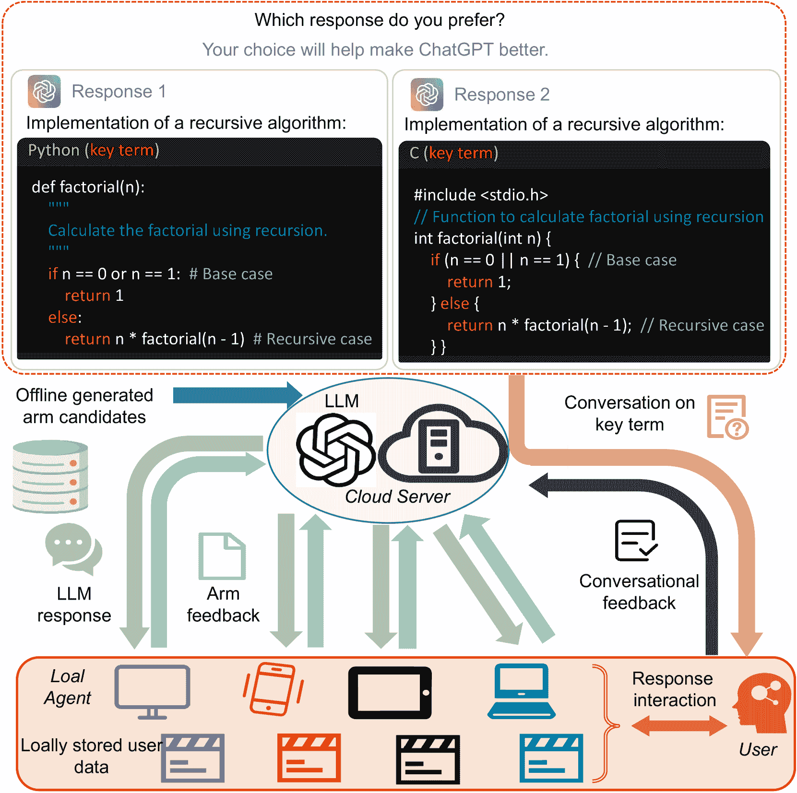

<!--yml

category: 未分类

date: 2025-01-11 11:41:02

-->

# 多智能体对话在线学习用于自适应LLM响应识别

> 来源：[https://arxiv.org/html/2501.01849/](https://arxiv.org/html/2501.01849/)

\usephysicsmodule

ab

代向向^†, 谢月进^‡, 刘茂立^†, 王旭创^§,

朱华李^†, 黄宇王^♭, 约翰·C.S. 刘^†

^†香港中文大学

^‡华中科技大学

^§马萨诸塞大学阿姆赫斯特分校

^♭华为技术有限公司

Email:{xxdai23, mlliu, zhli, cslui}@cse.cuhk.edu.hk, yuejinxie@hust.edu.cn,

xuchuangwang@umass.edu, huanyuhello@zju.edu.cn 朱华李是通讯作者。

###### 摘要

大型语言模型（LLMs）出色的生成能力激发了人们对自动生成不同应用响应的浓厚兴趣。鉴于用户偏好的动态性和LLM响应表现的不确定性，设计高效的在线学习算法以识别最优LLM响应（即高质量且符合用户偏好的响应）至关重要。现有的大多数在线算法采用集中式方法，未能充分利用显式的用户偏好，从而未能实现更高效和个性化的LLM响应识别。与之相反，本文介绍了MACO（多智能体对话在线学习用于自适应LLM响应识别）：1）通过多个本地代理（如智能手机）加速在线LLM响应识别过程，同时增强数据隐私性；2）提出了一种新型对话机制，旨在自适应地进行对话以征求用户偏好（例如，偏好幽默语气而非严肃语气的生成响应），以减少偏好估计的不确定性。我们的理论分析表明，MACO在累积遗憾方面接近最优。此外，MACO通过消除传统计算密集型的“G-optimal设计”，降低了通信成本和计算复杂度。与开源LLM Llama的广泛实验，以及来自Google和OpenAI的两种不同嵌入模型用于文本向量表示，表明MACO在在线LLM响应识别中显著优于当前的最先进技术。

## 引言

大语言模型（LLM）迅速改变了我们社会的技术格局[[1](https://arxiv.org/html/2501.01849v1#bib.bib1), [2](https://arxiv.org/html/2501.01849v1#bib.bib2)]。一个重要的研究方向是探索如何通过提示词（prompts）识别LLM的最优回答[[3](https://arxiv.org/html/2501.01849v1#bib.bib3)]。这种方法具有吸引力，因为它不需要修改LLM的内部参数，且能够很好地与人类的对话模式对接。因此，自动识别LLM回答的兴趣日益增长，例如通过提示工程方法[[4](https://arxiv.org/html/2501.01849v1#bib.bib4), [5](https://arxiv.org/html/2501.01849v1#bib.bib5), [6](https://arxiv.org/html/2501.01849v1#bib.bib6)]。这些努力旨在提升LLM生成更准确、更相关的回答的能力，统称为“LLM回答识别”。需要注意的是，这些提示工程方法是在离线进行的，仅通过预先指定的提示指令提供一组“相对较好的初始回答”。然而，考虑到LLM生成的回答具有多样性且LLM性能具有不确定性，识别最合适的LLM回答本质上是具有挑战性的[[7](https://arxiv.org/html/2501.01849v1#bib.bib7), [8](https://arxiv.org/html/2501.01849v1#bib.bib8)]，因为适合的回答通常无法预先知道，并且具有依赖上下文的特点。因此，持续的在线回答适应是必要的[[9](https://arxiv.org/html/2501.01849v1#bib.bib9)]，特别是在医学诊断等需要高精度答案的场景中。需要注意的是，在线回答识别方法能够增强离线生成回答的初始集合，以更好地匹配特定的上下文。

此外，之前的研究常常忽视了应对不同用户偏好的需求。至关重要的是，不仅要确保大语言模型（LLM）生成的回答质量，还要根据不同用户的具体偏好和期望进行调整。例如，一些用户可能偏好LLM生成的回答具有幽默感，而其他用户则可能更倾向于正式的语气。虽然[[10](https://arxiv.org/html/2501.01849v1#bib.bib10)]考虑了LLM偏好的优化，但它仅解决了用户喜好和不喜好的二元问题。LLM回答识别必须应对日益增长的需求，即迎合多样化的用户偏好。为了解决这些需求，可以利用云服务器通过收集LLM回答评估的反馈，持续学习和完善LLM回答识别。这些反馈可以来自用户的直接输入或对评分函数的测量[[11](https://arxiv.org/html/2501.01849v1#bib.bib11), [12](https://arxiv.org/html/2501.01849v1#bib.bib12)]。一个既符合质量标准又与用户偏好相符的回答被称为“最优LLM回答”。

### I-A 多智能体对话特性

在LLM响应识别的背景下，我们观察到典型LLM应用场景中有两个显著的特性。这些特性为我们的提议公式提供了启示和动机。

首先，在使用LLM时，用户通常会跨多个设备访问LLM服务，如智能手机、平板电脑和桌面电脑，统称为“本地智能体”。例如，Poe AI聊天平台 [[13](https://arxiv.org/html/2501.01849v1#bib.bib13)] 处理来自不同设备的用户查询。利用这种多智能体框架，可以在每个本地智能体上并行执行针对特定用户偏好的LLM响应识别，从而促进数据聚合并提高用户偏好学习的效率。此外，这种方法还提供了额外的隐私保护层，因为敏感信息保留在本地，不会传输或存储在中央服务器上。

其次，在线LLM方法的一个关键挑战在于解决“冷启动”问题，在这个问题中，对于历史数据有限的新用户，响应识别可能不准确。为了解决这个问题，*对话推荐* [[14](https://arxiv.org/html/2501.01849v1#bib.bib14), [15](https://arxiv.org/html/2501.01849v1#bib.bib15), [16](https://arxiv.org/html/2501.01849v1#bib.bib16)] 已在LLM应用中得到应用。在这种方法中，云服务器可以主动向用户提问并获取反馈，从而迅速引导出用户偏好。例如，在OpenAI的设计中，当ChatGPT被要求用Python计算阶乘时，它可能会提供两种“正确”的实现方式，分别是递归和迭代。在互动过程中，用户对自己偏好的编码风格提供反馈。这种“对话”过程使ChatGPT能够根据用户的编码偏好进行学习，从而在未来的响应中更有效地调整，以满足个体用户的需求。

### I-B 挑战与我们的贡献

为了自适应地识别适当的LLM响应，这些响应是通过离线提示工程技术生成的初始响应集合生成的，我们建议利用在线*上下文赌博*方法，其中一个顺序决策云服务器为用户选择LLM响应（即，一个臂对应一个响应）并接收反馈。除了臂级反馈外，云服务器还可以偶尔通过向用户提出关于*关键术语*的问题来获取反馈[[17](https://arxiv.org/html/2501.01849v1#bib.bib17), [18](https://arxiv.org/html/2501.01849v1#bib.bib18)]。例如，询问用户对某一类别的偏好：“您对篮球新闻感兴趣吗？”，或询问用户对某一实体的偏好：“您喜欢阅读关于勒布朗·詹姆斯的新闻吗？”。像“篮球”和“勒布朗·詹姆斯”这样的关键术语的反馈可以反映用户偏好，从而使云服务器能够加速学习过程。目标是开发一种在线自适应策略，在长期内最大化用户满意度。然而，当前关于对话式上下文赌博算法的研究未能解决在线自适应LLM响应识别中的独特挑战：

❶ 首先，现有的考虑用户偏好的赌博模型主要应用于推荐系统[[18](https://arxiv.org/html/2501.01849v1#bib.bib18), [19](https://arxiv.org/html/2501.01849v1#bib.bib19), [20](https://arxiv.org/html/2501.01849v1#bib.bib20)]。这些模型通常利用奇异值分解（SVD）提取相对较低维度的特征向量。然而，从包含复杂语义信息的LLM文本响应中量化特征，并且这些响应导致更高维度的特征空间，这带来了巨大的计算挑战。

❷ 其次，以前的对话式赌博工作主要遵循[[21](https://arxiv.org/html/2501.01849v1#bib.bib21)]的框架，该框架解决了*无限*臂的问题。然而，需要从通过提示工程生成的初始响应集合中在线识别的LLM响应数量通常是有限的。尽管基于消除的上下文赌博算法可以处理这种设置，但它们依赖于计算密集型的*G-最优设计*过程[[22](https://arxiv.org/html/2501.01849v1#bib.bib22), [23](https://arxiv.org/html/2501.01849v1#bib.bib23), [24](https://arxiv.org/html/2501.01849v1#bib.bib24)]来计算臂选择的分布，从而减缓了在线LLM响应识别的速度。

❸ 第三，现有的对话型赌博机研究[[19](https://arxiv.org/html/2501.01849v1#bib.bib19), [17](https://arxiv.org/html/2501.01849v1#bib.bib17)]依赖于预定的函数来控制对话频率，这些函数通常遵循固定的交互顺序，以启动特定数量的对话。此方法不适用于LLM响应识别的动态特性，因为它强加了不必要的限制，可能会降低用户体验。

❹ 最后，现有的对话型赌博机文献仅考虑了集中式场景，忽略了LLM平台数据源的固有多代理特性。虽然已有一些关于具有有限臂的分布式赌博机的研究[[22](https://arxiv.org/html/2501.01849v1#bib.bib22), [25](https://arxiv.org/html/2501.01849v1#bib.bib25), [26](https://arxiv.org/html/2501.01849v1#bib.bib26)]，但它们要么要求所有本地代理将用户反馈上传到云服务器，要么共享完全相同的臂集。这些限制性的设置可能泄露敏感信息，降低本地代理的灵活性，并增加通信成本。

本文做出了以下贡献：

+   •

    模型构建：我们提出了一种分布式对话型赌博机模型，用于在线LLM响应识别。补充了现有依赖于从预生成的LLM响应池中离线选择的方法。我们的模型强调从具有不确定性能的预生成臂集在线识别最优LLM响应。这涉及在考虑用户偏好的同时，确保生成响应的质量。

+   •

    算法设计：我们提出了对话自适应分布式标识符（MACO），由本地代理执行的MACO-A和由云服务器执行的MACO-S组成。与以前预定对话频率的工作不同，MACO根据当前上下文自适应地决定何时进行对话。此外，它增强了本地代理之间的协作，以提高LLM响应识别的效率。

+   •

    理论分析：我们为MACO建立了后悔上界$\mathcal{\widetilde{O}}(\sqrt{dMT})$，并进行了下界分析$\Omega(\sqrt{dMT})$，表明MACO接近最优。此外，我们利用对话设置提升了计算和通信的效率，相较于现有的关于具有有限臂集的分布式线性上下文赌博机的工作。具体来说，我们提供了通信成本的上界为$\mathcal{O}(d^{2}M\log T)$。MACO中分布式对话型赌博机的发展成功避免了先前基于消除的线性赌博机中需要的计算密集型G最优设计。

+   •

    实验评估：我们使用开放的LLM Llama进行广泛实验，生成响应，并结合Google和OpenAI的两种不同嵌入模型用于文本向量表示。在各种条件下进行测试，包括不同的臂池大小和本地智能体数量，我们的算法始终优于现有的最先进方法。此外，通过消除耗时的G-最优设计过程，我们的方法显著减少了执行时间。得益于我们设计的对话机制，它提升了在线LLM响应识别和用户偏好估计的速度，这一时间缩短不会影响性能。

## II 系统模型

本节制定了用于在线LLM响应识别的多智能体对话强盗算法。

图1：一种用于识别在线LLM响应的自适应多智能体对话强盗算法框架。本地智能体处理响应选择（臂），而中央服务器通过关键术语选择管理对话流程。服务器聚合多个智能体的交互数据，以加速用户偏好的学习。

### II-A 在线LLM响应识别

我们定义本地智能体集为${\mathcal{M}}$，其中$|{\mathcal{M}}|=M$，代表诸如智能手机、笔记本电脑和平板电脑等设备。对于任意本地智能体$m\in{\mathcal{M}}$，LLM响应的有限臂集表示为${\mathcal{A}}_{m}$，它代表从各种提示生成的可能响应。考虑到智能体的异质性，不同的本地智能体可能有不同的臂集，这与[[26](https://arxiv.org/html/2501.01849v1#bib.bib26)]中假设所有本地智能体共享相同的臂集有所不同。如在[第一部分](https://arxiv.org/html/2501.01849v1#S1 "I Introduction ‣ Multi-Agent Conversational Online Learning for Adaptive LLM Response Identification")中提到，传统的离线技术（例如提示工程）可以帮助构建初始响应集，但由于LLM输出和用户偏好的多样性，即使有离线的初始LLM响应集，仍然需要自适应地在线微调最优响应。我们的模型采用时间分段的方法，表示为离散时间回合$\mathcal{T}=\{1,2,3,\ldots,T\}$，其中每个本地智能体在每个回合$t\in\mathcal{T}$选择一个臂，即LLM响应。

### II-B 多智能体用户个性化强盗算法

我们考虑一个涉及$M$个智能体和一个云服务器的多智能体对话性赌博问题。在每一轮$t\in\mathcal{T}$中，一个本地智能体$m\in{\mathcal{M}}$选择一个臂$a_{m,t}\in\mathcal{A}_{m}$，该臂表示一个可能的LLM响应，并接收奖励反馈$r_{m,t}$，该反馈反映了相应的表现。获取用户反馈超出了本文的范围。在此，“反馈”一词广义上包括直接的用户输入、通过测量用户行为的技术推断的数据以及偏好模拟器[[12](https://arxiv.org/html/2501.01849v1#bib.bib12)]。用户对LLM响应的偏好由一个“未知的”偏好特征向量$\bm{\theta}^{*}\in\mathbb{R}^{d}$表示，所有本地智能体的目标是学习它。对于本地智能体$m\in{\mathcal{M}}$，考虑到LLM响应的影响（即臂$a_{m,t}\in\mathcal{A}_{m}$）和未知的用户偏好$\bm{\theta}^{*}$，奖励可以表示为带有噪声项$\eta_{m,t}$的线性组合：$r_{a_{m},t}=\langle\bm{x}_{a_{m},t},\bm{\theta}^{*}\rangle+\eta_{m,t}$，其中$\bm{x}_{a_{m},t}\in{\mathbb{R}}^{d}$是相应臂$a_{m}$的嵌入特征向量，用于捕捉文本信息[[1](https://arxiv.org/html/2501.01849v1#bib.bib1), [3](https://arxiv.org/html/2501.01849v1#bib.bib3)]。我们将在第[V](https://arxiv.org/html/2501.01849v1#S5 "V 性能评估 ‣ 针对自适应LLM响应识别的多智能体对话性在线学习")节中使用两种不同的开放嵌入方法展示我们模型的泛化能力。我们的目标是设计一种策略，在每轮选择臂（即LLM响应）以最小化累积遗憾，遗憾定义为我们策略的累积奖励与所有本地智能体中最佳未知策略的累积奖励之间的差异，旨在个性化用户偏好，定义如下：

|  | $\vspace{-0.01in}R_{M}(T)=\sum_{m=1}^{M}\sum_{t=1}^{T}\left(\bm{x}_{a_{m}^{*}}^% {\mathsf{T}}\bm{\theta}^{*}-\bm{x}_{a_{m},t}^{\mathsf{T}}\bm{\theta}^{*}\right% ).\vspace{-0.01in}$ |  | (1) |
| --- | --- | --- | --- |

其中$a_{m}^{*}\in\arg\max_{a\in\mathcal{A}_{m}}\bm{x}_{a}^{\mathsf{T}}\bm{\theta}^{*}$表示在本地智能体$m\in{\mathcal{M}}$处具有最高期望奖励的本地最优臂。这个遗憾定义继承自先前的研究[[21](https://arxiv.org/html/2501.01849v1#bib.bib21), [17](https://arxiv.org/html/2501.01849v1#bib.bib17), [18](https://arxiv.org/html/2501.01849v1#bib.bib18)]。

### II-C 对话上下文机制

除了通过选择适当的LLM响应来获得反馈之外，云服务器还可以偶尔从每个本地代理查询用户反馈，以更好地估计用户的偏好。然而，仅仅依赖直接考虑所有答案可能会导致效率低下，因为信息分散的问题。具体来说，即使不同的答案在抽象层面上具有相似性，它们的上下文向量也可能存在显著差异。例如，关于“语法规则”、“最佳实践”或“编译器优化”的回答可能都与“C/C++”相关，但它们的上下文表示可能大不相同。同样，带有“幽默语气”的回答可能在“轻松愉快”、“讽刺”或“俏皮”表达之间有所不同。为了解决这个问题，我们引入了“关键词”来表示用户兴趣的核心话题或特征，参见[[17](https://arxiv.org/html/2501.01849v1#bib.bib17), [18](https://arxiv.org/html/2501.01849v1#bib.bib18)]。一个关键词将多个相关的选择臂聚集在一个概念下。例如，关键词“C/C++”可以涵盖关于“语法规则”、“最佳实践”和“编译器优化”的回答，而关键词“幽默语气”可能包括“轻松愉快”、“讽刺”或“俏皮”的回答。对一个关键词的反馈会传播到其相关的选择臂，从而使系统能够通过最小的互动推断出多个回答的偏好。

正式地，设$\mathcal{K}$为关键术语的有限集合，其中每个元素$\tilde{\bm{x}}_{k}\in{\mathbb{R}}^{d}$表示关键术语$k\in\mathcal{K}$的特征向量。设$\mathcal{K}$为关键术语的有限集合，其中每个元素$\tilde{\bm{x}}_{k}\in{\mathbb{R}}^{d}$是对应关键术语$k\in\mathcal{K}$的特征向量。将对话型老虎机应用于我们的多智能体框架中，用户由本地代理$m$提供服务，可以用关键术语$k_{m}\in\mathcal{K}_{m}$进行查询，其中$\mathcal{K}_{m}\subseteq\mathcal{K}$是本地代理$m$的关键术语子集。考虑到用户偏好$\bm{\theta}^{*}$和噪声项$\widetilde{\eta}_{m,t}$，对话反馈被建模为：$\widetilde{r}_{k_{m},t}=\langle\tilde{\bm{x}}_{k_{m},t},\bm{\theta}^{*}\rangle% +\widetilde{\eta}_{m,t}$。请注意，我们的模型与先前的对话型老虎机模型[[17](https://arxiv.org/html/2501.01849v1#bib.bib17), [18](https://arxiv.org/html/2501.01849v1#bib.bib18), [27](https://arxiv.org/html/2501.01849v1#bib.bib27), [28](https://arxiv.org/html/2501.01849v1#bib.bib28)]不同，这些模型采用固定的对话函数，通常是关于回合$t$的线性或对数函数，用于调节对话频率。这些方法定期发起对话，无论用户偏好是否已经充分估计，这可能会对用户体验产生负面影响。（更详细的比较见第[IV](https://arxiv.org/html/2501.01849v1#S4 "IV 性能分析 ‣ 多智能体对话型在线学习与自适应LLM响应识别")节）。相反，正如我们将在第[III](https://arxiv.org/html/2501.01849v1#S3 "III 算法设计 ‣ 多智能体对话型在线学习与自适应LLM响应识别")节中详细阐述的那样，我们的算法进行“自适应”对话，仅在必要时与用户互动，以改进用户偏好的估计。

### II-D 分布式通信模型

我们考虑一个分布式模型，其中有$M$个本地代理和一个云服务器，采用同步通信范式。在此设置中，如图[1](https://arxiv.org/html/2501.01849v1#S2.F1 "图 1 ‣ II 系统模型 ‣ 用于自适应LLM响应识别的多代理对话在线学习")所示，每个本地代理通过上传和下载数据与云服务器进行通信，且延迟可忽略不计。此外，本地代理之间不直接通信。为了简化起见，我们仅关注离散时隙轮次，用于记录选择的臂。查询关键词与识别LLM响应交替进行，从而允许同时查询关键词和拉动臂。这与对话型LLM系统的实际操作相符。与[[22](https://arxiv.org/html/2501.01849v1#bib.bib22)]一致，我们将通信成本定义为在云服务器和本地代理之间传输的标量单位的累积计数，其中包括整数和实数。

## III 算法设计

我们提出了多代理对话在线学习（MACO）算法的设计，由本地代理和云服务器实现，用于自适应识别LLM响应。随后，我们将我们的设计与传统的基于阶段消除的在线学习算法[[23](https://arxiv.org/html/2501.01849v1#bib.bib23)]进行比较。

对于任何实向量$\bm{x}$和一个正半定矩阵$\bm{M}$，令$\|\bm{x}\|_{\bm{M}}\coloneqq\sqrt{\bm{x}^{\mathsf{T}}\bm{M}\bm{x}}$。设集合$\mathcal{A}$的基数为$|\mathcal{A}|$。我们引入符号$[z]\coloneqq\{1,\dots,z\}$，其中$\forall z\in{\mathbb{N}}^{+}$。定义$\mathcal{T}_{m,a}^{p}$为本地代理$m$在阶段$p$中选择臂$a$的轮次集合，$\mathcal{\widetilde{T}}_{m,k}^{p}$为本地代理$m$在同一阶段对关键词$k$进行交互的轮次集合，$A$（其中$A\leq|\mathcal{A}|$）为在每一轮中从LLM响应集合中实际拉动的臂的大小。

### III-A MACO算法在本地代理上的应用

输入：回合时间 $T$，本地智能体数量 $M$，输入维度 $d$，臂集 $\mathcal{A}_{m}$，臂池大小 $A$，置信度参数 $\delta \in (0, 1]$  

算法 1 本地智能体上的 MACO（MACO-A）

如算法[1](https://arxiv.org/html/2501.01849v1#algorithm1 "算法 1 ‣ III-A 本地代理上的 MACO 算法 ‣ III 算法设计 ‣ 自适应 LLM 响应识别的多智能体对话在线学习")中所述，由本地代理执行并称为 MACO 代理（MACO-A），处理和更新信息以进行 LLM 响应识别的在线过程在多智能体系统中如下进行。最初，本地代理 $m\in{\mathcal{M}}$ 根据其活跃臂集 $\mathcal{A}_{m}^{p}$（该臂集在第[1](https://arxiv.org/html/2501.01849v1#algorithm1 "算法 1 ‣ III-A 本地代理上的 MACO 算法 ‣ III 算法设计 ‣ 自适应 LLM 响应识别的多智能体对话在线学习")行中更新）计算信息矩阵 $\bm{M}_{m}^{p}$。具体地，$\bm{M}_{m}^{p}$ 计算为 $\bm{M}_{m}^{p}\coloneqq\sum_{a\in\mathcal{A}_{m}^{p}}\frac{1}{|\mathcal{A}_{m}^{p}|}\bm{x}_{a}\bm{x}_{a}^{\mathsf{T}}$，通过分析特征空间中的主方向，细化模型对 LLM 响应的适应能力（第[1](https://arxiv.org/html/2501.01849v1#algorithm1 "算法 1 ‣ III-A 本地代理上的 MACO 算法 ‣ III 算法设计 ‣ 自适应 LLM 响应识别的多智能体对话在线学习")行）。其特征向量 $\bm{v}$ 的特征值 $\lambda_{\bm{v}}$ 表示沿其方向捕获的方差，较高的值表示包含更多信息，这对于准确估计 $\bm{\theta}^{*}$ 至关重要。随后，本地代理 $m$ 对其信息矩阵 $\bm{M}_{m}^{p}=\sum_{j=1}^{d}\lambda_{\bm{v}_{j}}\bm{v}_{j}\bm{v}_{j}^{\mathsf{T}}$ 进行对角化，检查特征空间中的所有主方向（第[1](https://arxiv.org/html/2501.01849v1#algorithm1 "算法 1 ‣ III-A 本地代理上的 MACO 算法 ‣ III 算法设计 ‣ 自适应 LLM 响应识别的多智能体对话在线学习")行）。如果某个特征值 $\lambda_{\bm{v}_{j}}$ 低于阈值 $h_{p}\coloneqq\frac{3}{4(1-2^{-2p})d}$，其值由第[1](https://arxiv.org/html/2501.01849v1#Thmlemma1 "引理 1（信息矩阵的稳定性） ‣ IV-B 技术分析 ‣ IV 性能分析 ‣ 自适应 LLM 响应识别的多智能体对话在线学习")节中的引理确定，在[IV](https://arxiv.org/html/2501.01849v1#S4 "IV 性能分析 ‣ 自适应 LLM 响应识别的多智能体对话在线学习")节中给出，则本地代理 $m$ 将相应的特征向量上传至云服务器（第[1](https://arxiv.org/html/2501.01849v1#algorithm1 "算法 1 ‣ III-A 本地代理上的 MACO 算法 ‣ III 算法设计 ‣ 自适应 LLM 响应识别的多智能体对话在线学习")行）。此机制有助于解决特征空间中未充分探索的区域，从而提高选择 LLM 响应的准确性。

云服务器处理上传的信息，并返回一组关键术语$\mathcal{K}_{m}^{p}$，以及所需的重复次数$\{n_{m,k}^{p}\}_{k\in\mathcal{K}_{m}^{p}}$（第[1](https://arxiv.org/html/2501.01849v1#algorithm1 "算法 1 ‣ III-A MACO 算法在本地代理上的应用 ‣ III 算法设计 ‣ 自适应LLM响应识别的多代理对话在线学习")行）。本地代理$m$随后与这些关键术语进行对话，并进行相应次数的臂拉取，以确保对LLM响应的充分探索。在此过程中，本地代理可以灵活地在查询关键术语和进行臂拉取之间插入操作（第[1](https://arxiv.org/html/2501.01849v1#algorithm1 "算法 1 ‣ III-A MACO 算法在本地代理上的应用 ‣ III 算法设计 ‣ 自适应LLM响应识别的多代理对话在线学习")-第[1](https://arxiv.org/html/2501.01849v1#algorithm1 "算法 1 ‣ III-A MACO 算法在本地代理上的应用 ‣ III 算法设计 ‣ 自适应LLM响应识别的多代理对话在线学习")行）。请注意，进行对话和拉臂的过程是按顺序呈现的，以便清晰表达，但可以并行执行或交替进行，而不要求严格的顺序。本地代理随后上传所拉取臂的相关信息、关键术语和观察到的奖励，这些数据存储在矩阵$\bm{G}_{m}^{p}$和$\bm{W}_{m}^{p}$中（第[1](https://arxiv.org/html/2501.01849v1#algorithm1 "算法 1 ‣ III-A MACO 算法在本地代理上的应用 ‣ III 算法设计 ‣ 自适应LLM响应识别的多代理对话在线学习")行）。最后，本地代理从云服务器下载更新后的偏好参数$\widehat{\bm{\theta}}_{p}$，并根据更新后的用户偏好估计修订其活动臂集，淘汰效果较差的臂（第[1](https://arxiv.org/html/2501.01849v1#algorithm1 "算法 1 ‣ III-A MACO 算法在本地代理上的应用 ‣ III 算法设计 ‣ 自适应LLM响应识别的多代理对话在线学习")行）。这一自适应调整过程使得每个本地代理能够保持高响应性和准确性，识别LLM响应，满足用户特定的需求和偏好，同时通过仅与云服务器共享聚合数据（$\bm{G}_{m}^{p}$和$\bm{W}_{m}^{p}$），保护数据隐私。

### III-B 云服务器上的MACO算法

输入：关键术语集合$\mathcal{K}$，覆盖参数$\beta$，见条件[1](https://arxiv.org/html/2501.01849v1#Thmcondition1 "条件 1（特征空间覆盖）。 ‣ IV-A 主要结果 ‣ IV 性能分析 ‣ 多智能体对话在线学习用于自适应LLM响应识别")。初始化：令$p=1,\bm{G}=\bm{0},\bm{W}=\bm{0}$。12当*达到$T$时*停止3       对于*每个$m\in{\mathcal{M}}$*：4             接收本地代理$m$上传的所有特征向量，并将该集合记作$\mathcal{S}_{m}$。5             将第$p$阶段的关键术语集合初始化为$\mathcal{K}_{m}^{p}=\emptyset$。6            7            对于*$\bm{v}_{j}\in\mathcal{S}_{m}$*：8                    $k=\argmax_{i\in\mathcal{K}}\tilde{\bm{x}}_{i}^{\mathsf{T}}\bm{v}_{j}$，$\mathcal{K}_{m}^{p}=\mathcal{K}_{m}^{p}\cup\set{k}$。9                    $n_{m,k}^{p}=\left\lceil\frac{\frac{3}{2(1-2^{-2p})}-2d\lambda_{\bm{v}_{j}}}{\beta^{2}2^{-2p}}\log\frac{2AM\log T}{\delta}\right\rceil$。10                  11            将$\mathcal{K}_{m}^{p}$和$\set{n_{m,k}^{p}}_{\bm{k}\in\mathcal{K}_{m}^{p}}$发送给本地代理$m$。12             接收本地代理$m$的$\bm{G}_{m}^{p}$和$\bm{W}_{m}^{p}$。13            14      $\bm{G}=\sum_{p\in[p]}\sum_{m\in{\mathcal{M}}}\bm{G}_{m}^{p},\ \ \bm{W}=\sum_{p\in[p]}\sum_{m\in{\mathcal{M}}}\bm{W}_{m}^{p}$。15       将$\widehat{\bm{\theta}}_{p}=\bm{G}^{-1}\bm{W}$广播给所有本地代理。16        $p=p+1$。17

算法 2 云服务器上的MACO（MACO-S）

接下来，我们介绍MACO算法中在云服务器上执行的部分，称为MACO服务器（MACO-S）。正如在第[I](https://arxiv.org/html/2501.01849v1#S1 "I 引言 ‣ 多智能体对话在线学习用于自适应LLM响应识别")节中提到的，来自多智能体对话老虎机模型的本地代理异质性是一个重大挑战。这种多样性可能会阻碍有效的数据聚合，从而导致用户偏好向量$\bm{\theta}^{*}$的估计不准确。为了解决这一问题，云服务器采用了一种战略性方法，通过使用关键术语来探测并丰富特征空间中表现不足的方向，从而提高整个估计过程的准确性。

如算法[2](https://arxiv.org/html/2501.01849v1#algorithm2 "Algorithm 2 ‣ III-B MACO Algorithm on Cloud Server ‣ III Algorithm Design ‣ Multi-Agent Conversational Online Learning for Adaptive LLM Response Identification")中详细描述的，云服务器首先接收每个本地代理提供的特征向量，这些向量表示具有不足信息的LLM响应空间方向（第[2](https://arxiv.org/html/2501.01849v1#algorithm2 "Algorithm 2 ‣ III-B MACO Algorithm on Cloud Server ‣ III Algorithm Design ‣ Multi-Agent Conversational Online Learning for Adaptive LLM Response Identification")行）。利用这些洞察力，云服务器通过计算与未充分探索方向的内积最接近的匹配项，识别并选择关键术语。所选择的关键术语$k\in\mathcal{K}$及指定的重复次数$n_{m,k}^{p}$随后会传回各个本地代理（第[2](https://arxiv.org/html/2501.01849v1#algorithm2 "Algorithm 2 ‣ III-B MACO Algorithm on Cloud Server ‣ III Algorithm Design ‣ Multi-Agent Conversational Online Learning for Adaptive LLM Response Identification")行）。这种针对性的干预允许集中探索和优化与这些关键术语相关的LLM响应。最后，云服务器将所有本地代理收集到的丰富数据进行汇总。汇总数据用于通过线性回归估算未知的偏好参数$\bm{\theta}^{*}$，有效地减少不确定性，并增强模型预测和适应基于用户偏好的LLM响应的能力（第[2](https://arxiv.org/html/2501.01849v1#algorithm2 "Algorithm 2 ‣ III-B MACO Algorithm on Cloud Server ‣ III Algorithm Design ‣ Multi-Agent Conversational Online Learning for Adaptive LLM Response Identification")- [2](https://arxiv.org/html/2501.01849v1#algorithm2 "Algorithm 2 ‣ III-B MACO Algorithm on Cloud Server ‣ III Algorithm Design ‣ Multi-Agent Conversational Online Learning for Adaptive LLM Response Identification")行）。此外，$\bm{G}$也可以初始化为单位矩阵，以确保其可逆性，特别是在维度$d$较大时。

### III-C 比较分析

如在第[I节](https://arxiv.org/html/2501.01849v1#S1 "I Introduction ‣ Multi-Agent Conversational Online Learning for Adaptive LLM Response Identification")中提到的，LLM响应的数量通常是有限的，这些响应需要从通过提示工程生成的初始集合中进行在线识别。因此，我们采用基于阶段消除的线性老虎机算法，称为PE-Lin，而不是由[[17](https://arxiv.org/html/2501.01849v1#bib.bib17)]提出的经典对话老虎机框架。这个选择的动机在于，PE-Lin在有限臂集下提供了更好的性能保证。我们的工作建立并改进了经典的PE-Lin[[23](https://arxiv.org/html/2501.01849v1#bib.bib23)]。在PE-Lin中，学习代理始终使用最优最小二乘设计来估计未知的偏好向量$\bm{\theta}^{*}$。具体而言，该算法通过实施计算密集型的*G-optimal设计*，最小化预测方差，*G-optimal设计*是一个在臂特征向量集$\mathcal{X}\subset{\mathbb{R}}^{d}$上的概率分布（由分布策略$\pi:\mathcal{X}\to[0,1]$表示），以确保最小方差$g(\pi)$。条件定义如下[[29](https://arxiv.org/html/2501.01849v1#bib.bib29)]：

|  | $\displaystyle\sum_{\bm{x}\in\mathcal{X}}\pi(\bm{x})$ | $\displaystyle=1,\quad\bm{M}_{m}^{p}(\pi)=\sum_{\bm{x}\in\mathcal{X}}\pi(\bm{x}% )\bm{x}\bm{x}^{\mathsf{T}},$ |  | (2) |
| --- | --- | --- | --- | --- |
|  | $\displaystyle g(\pi)$ | $\displaystyle=\max_{\bm{x}\in\mathcal{X}}\&#124;\bm{x}\&#124;_{\bm{M}(\pi)^{-1}}^{2}=d.$ |  |

然后，学习代理根据策略$\pi$在阶段$p$为本地代理$m$执行臂操作，估计未知参数$\bm{\theta}^{*}$，并相应地消除不良臂。如[[22](https://arxiv.org/html/2501.01849v1#bib.bib22)]中所述，目前尚无高效算法可以在多代理场景中计算*G-optimal设计*。

我们通过利用LLM应用中的固有多代理异质性，结合自适应对话机制来避免使用G-optimal设计，从而解决这一问题。MACO消除了对资源密集型G-optimal设计的需求，显著减少了计算时间和资源。此外，仅在每个本地代理上独立执行PE-Lin，并通过服务器云进行数据聚合，可能无法有效地最小化遗憾。这是因为不同的代理可能有不同的LLM响应集，导致一个平凡的遗憾上界$\mathcal{\widetilde{O}}(M\sqrt{dT})$，这相当于在每个代理上运行PE-Lin而没有任何直接通信。相比之下，我们的算法通过有效利用对话来聚合来自不同本地代理的信息，将遗憾上界提升至$\mathcal{\widetilde{O}}(\sqrt{dMT})$，这一点将在第[IV](https://arxiv.org/html/2501.01849v1#S4 "IV Performance Analysis ‣ Multi-Agent Conversational Online Learning for Adaptive LLM Response Identification")节中详细说明。

## IV 性能分析

本节展示了MACO的理论结果，包括其累积遗憾、通信成本和对话频率。根据[[21](https://arxiv.org/html/2501.01849v1#bib.bib21), [20](https://arxiv.org/html/2501.01849v1#bib.bib20)]的常见做法，我们假设对于任何臂$ a $和关键术语$ k $，$\|\bm{x}_{a}\|=\|\tilde{\bm{x}}_{k}\|=1$。偏好向量$\bm{\theta}^{*}$的长度被限制为1，噪声项$\eta_{m,t}$和$\widetilde{\eta}_{m,t}$被建模为1-子高斯分布。

### IV-A 主要结果

我们首先提出一个“新技术条件”，解决与特征空间覆盖相关的普遍问题。

###### 条件1（特征空间覆盖）。

我们说一个关键术语集$\mathcal{K}$是*充分丰富的*，如果对于任何单位向量$\bm{v}\in{\mathbb{R}}^{d}$，都存在一个关键术语$k\in\mathcal{K}$，使得其特征向量$\tilde{\bm{x}}_{k}$满足$\tilde{\bm{x}}_{k}^{\mathsf{T}}\bm{v}\geq\beta$，其中$\beta\in(0,1]$是一个接近1的正覆盖参数。

###### 备注 1。

条件 [1](https://arxiv.org/html/2501.01849v1#Thmcondition1 "条件 1（特征空间覆盖）。 ‣ IV-A 主要结果 ‣ IV 性能分析 ‣ 自适应LLM响应识别的多智能体在线学习") 对于确保关键术语在特征空间中的全面分布至关重要，这有助于有效地最小化每个本地智能体的不确定性。如果关键术语集 $\mathcal{K}$ 包含 ${\mathbb{R}}^{d}$ 的一个正交基，则该条件容易满足。条件 [1](https://arxiv.org/html/2501.01849v1#Thmcondition1 "条件 1（特征空间覆盖）。 ‣ IV-A 主要结果 ‣ IV 性能分析 ‣ 自适应LLM响应识别的多智能体在线学习") 使我们能够绕过 *G-最优设计* 程序，该程序通常在传统的基于淘汰的算法中使用，以最小化最大预测方差，如 [[23](https://arxiv.org/html/2501.01849v1#bib.bib23)] 所描述。

对于充分丰富的关键术语集，基于条件 [1](https://arxiv.org/html/2501.01849v1#Thmcondition1 "条件 1（特征空间覆盖）。 ‣ IV-A 主要结果 ‣ IV 性能分析 ‣ 自适应LLM响应识别的多智能体在线学习")，我们给出了以下定理。

###### 定理 1（遗憾界限）。

对于在公式 [1](https://arxiv.org/html/2501.01849v1#S2.E1 "方程 1 ‣ II-B 多智能体用户个性化赌博机 ‣ II 系统模型 ‣ 自适应LLM响应识别的多智能体在线学习") 中定义的累计遗憾，我们得出以下上界和下界：

1.  1.

    上界：以至少 $1-\delta$ 的概率，遗憾的上界为 $\mathcal{O}(\sqrt{dMT\log\frac{AM\log T}{\delta}})$。

1.  2.

    下界：对于每回合最多选择一个关键术语的任何策略，存在一种情况，该策略的期望遗憾至少为 $\Omega(\sqrt{dMT})$。

###### 备注 2。

定理 [1](https://arxiv.org/html/2501.01849v1#Thmtheorem1 "定理 1（遗憾界限）。 ‣ IV-A 主要结果 ‣ IV 性能分析 ‣ 自适应LLM响应识别的多智能体在线学习") 中建立的遗憾界限揭示了我们方法性能的重要见解：

+   •

    当 $M=1$ 时，问题简化为单一智能体对话型赌博机问题，将遗憾降至 $\mathcal{\widetilde{O}}(\sqrt{dT})$。这种简化优于以往的遗憾上界结果 $\mathcal{\widetilde{O}}(d\sqrt{T})$，这一结果来自于 [[19](https://arxiv.org/html/2501.01849v1#bib.bib19), [17](https://arxiv.org/html/2501.01849v1#bib.bib17)] 等研究，利用了有限臂集上的阶段淘汰方法。这个改进在高维LLM响应特征向量中尤其重要。

+   •

    对于多代理系统，我们的上界结果与[[22](https://arxiv.org/html/2501.01849v1#bib.bib22), [24](https://arxiv.org/html/2501.01849v1#bib.bib24)]中描述的几乎最优结果一致，同时消除了对计算密集型*G-最优设计*的依赖，从而加快了在线过程。

+   •

    综合来看，后悔的上界和下界表明，MACO在对数因子上是最小最大最优的[[23](https://arxiv.org/html/2501.01849v1#bib.bib23)]，并与多代理对话赌博情境中的理论后悔边界紧密对接。

###### 定理 2 （通信成本）。

对于MACO算法，总通信成本在$\mathcal{O}(d^{2}M\log T)$的量级。

###### 备注 3。

我们的MACO算法的通信成本显著独立于臂池大小$A$，该大小根据候选LLM响应的多样性可达到数千。这与[[22](https://arxiv.org/html/2501.01849v1#bib.bib22) ]中描述的方法形成对比，该方法的通信成本随着臂数增加按$O(d^{2}AM\log T)$的比例增长。我们的方法通过消除每个局部代理上传其整个活动臂集（其基数为$\mathcal{O}(A)$）的需求，显著减少了通信成本。相反，局部代理独立处理其数据并仅将汇总结果传输到云服务器，这也通过限制LLM响应适配中的外部数据共享增强了隐私。

###### 定理 3 （对话频率的界限）。

对于任意局部代理$m\in{\mathcal{M}}$在阶段$p$期间，令$\gamma=\lambda_{\text{min}}(\bm{M}_{m}^{p})$，其中$\lambda_{\text{min}}$表示最小特征值，我们有：

1.  1.

    如果$\gamma\geq h_{p}$，则不会发起任何对话。

1.  2.

    如果$\gamma<h_{p}$，则相对于总阶段长度的对话比例上限为$\beta^{-2}(\frac{3}{4(1-2^{-2p})}-d\gamma)$。

###### 备注 4。

我们的方法引入了一种“自适应”方法，这与常见的确定性函数$b(t)$有显著区别，例如在线性或对回合$t$的对数依赖性等，在现有对话赌博研究中广泛使用[[17](https://arxiv.org/html/2501.01849v1#bib.bib17), [19](https://arxiv.org/html/2501.01849v1#bib.bib19)]。这些传统方法在固定间隔启动对话，这可能导致低效，特别是当用户偏好已经被充分理解时。相反，我们的模型基于当前用户偏好信息的空白动态调整对话频率，提供了更为真实和响应的交互范式。

### IV-B 技术分析

现在，我们提供定理[1](https://arxiv.org/html/2501.01849v1#Thmtheorem1 "定理 1（后悔界限）。 ‣ IV-A 主要结果 ‣ IV 性能分析 ‣ 多代理对话式在线学习用于自适应大规模语言模型响应识别")中的上界分析。其他定理的证明可以在[附录 A-C](https://arxiv.org/html/2501.01849v1#A1.SS3 "A-C 后悔下界的证明 ‣ 附录 A 附录 ‣ 多代理对话式在线学习用于自适应大规模语言模型响应识别")，[A-D](https://arxiv.org/html/2501.01849v1#A1.SS4 "A-D 定理 2 的证明 ‣ 附录 A 附录 ‣ 多代理对话式在线学习用于自适应大规模语言模型响应识别") 和[A-E](https://arxiv.org/html/2501.01849v1#A1.SS5 "A-E 定理 3 的证明 ‣ 附录 A 附录 ‣ 多代理对话式在线学习用于自适应大规模语言模型响应识别")中找到。下面，我们展示了与我们多代理对话式算法设计相关的两个关键引理。[引理 1](https://arxiv.org/html/2501.01849v1#Thmlemma1 "引理 1（信息矩阵的稳定性）。 ‣ IV-B 技术分析 ‣ IV 性能分析 ‣ 多代理对话式在线学习用于自适应大规模语言模型响应识别")保证，对于任何本地代理$m$，经过对话反馈调整后的信息矩阵的最小特征值始终大于$h_{p}$。这支持算法[1](https://arxiv.org/html/2501.01849v1#algorithm1 "算法 1 ‣ III-A 本地代理上的 MACO 算法 ‣ III 算法设计 ‣ 多代理对话式在线学习用于自适应大规模语言模型响应识别")中的设计。[引理 2](https://arxiv.org/html/2501.01849v1#Thmlemma2 "引理 2（估计误差界限的可靠性）。 ‣ IV-B 技术分析 ‣ IV 性能分析 ‣ 多代理对话式在线学习用于自适应大规模语言模型响应识别")确保算法在既定的误差界限内运行，这对于可靠的大规模语言模型响应识别至关重要。

###### 引理 1（信息矩阵的稳定性）。

对于任何本地代理$m\in{\mathcal{M}}$在阶段$p$期间，我们有$\lambda_{\text{min}}(\bm{M}_{m}^{p^{\prime}})\geq h_{p},$ 其中$\bm{M}_{m}^{p^{\prime}}\coloneqq\bm{M}_{m}^{p}+\sum_{k\in\mathcal{K}_{m}^{p}}% \frac{h_{p}-\lambda}{\beta^{2}}\tilde{\bm{x}}_{k}\tilde{\bm{x}}_{k}^{\mathsf{T}}$。

###### 证明。

请参阅附录[A-A](https://arxiv.org/html/2501.01849v1#A1.SS1 "A-A 证明 － 引理 1 ‣ 附录 A 附录 ‣ 多代理对话式在线学习用于自适应大规模语言模型响应识别")中的证明。∎

###### 引理 2（估计误差界限的可靠性）。

定义“坏”事件$\mathcal{E}$，即在阶段$p$时，任何本地代理$m$具有：

|  | $\mathcal{E}=\{\exists m\in{\mathcal{M}},a\in\mathcal{A}_{m}^{p},\left&#124;\langle% \widehat{\bm{\theta}}_{p}-\bm{\theta}^{*},\bm{x}_{a}\rangle\right&#124;>\frac{2^{-p% }}{\sqrt{M}}\}.$ |  |
| --- | --- | --- |

事件$\mathcal{E}$的概率被$\delta$所限制，即$\Pr[\mathcal{E}]\leq\delta$。

###### 证明。

详情请见附录[A-B](https://arxiv.org/html/2501.01849v1#A1.SS2 "A-B 引理 2 的证明 ‣ 附录 A ‣ 多代理会话在线学习用于自适应LLM响应识别")。∎

现在，考虑阶段$p$下代理$m$的“良好”事件$\mathcal{E}^{c}$。引理[2](https://arxiv.org/html/2501.01849v1#Thmlemma2 "引理 2（估计误差界限的可靠性）。 ‣ IV-B 技术分析 ‣ IV 性能分析 ‣ 多代理会话在线学习用于自适应LLM响应识别")确认，对于$\mathcal{A}_{m}^{p}$中的任意臂$a$，其差异$\langle\bm{x}_{a}-\bm{x}_{a_{m}^{*}},\widehat{\bm{\theta}}_{p}\rangle\leq\frac% {2^{-p+1}}{\sqrt{M}}$。结合算法[1](https://arxiv.org/html/2501.01849v1#algorithm1 "算法 1 ‣ III-A MACO 算法在局部代理上 ‣ III 算法设计 ‣ 多代理会话在线学习用于自适应LLM响应识别")中第[1]行的内容，支持以下引理，说明在良好事件$\mathcal{E}^{c}$下，臂的保持和性能界限。

###### 引理 3（良好事件下的性质）。

在事件$\mathcal{E}^{c}$下，对于阶段$p$的任何局部代理$m$，保证以下两个关键性质：

1.  1.

    局部最优臂$\bm{a}_{m}^{*}$始终位于活跃臂集$\mathcal{A}_{m}^{p}$中，确保其永不被淘汰。

1.  2.

    任意臂$a\in\mathcal{A}_{m}^{p}$的性能差距定义为$\Delta_{m,a}\triangleq\left\langle\bm{\theta}^{*},\bm{x}_{a_{m}^{*}}-\bm{x}_{a% }\right\rangle$，其上界为$\frac{2^{-p+3}}{\sqrt{M}}$。

最后，以概率$1-\delta$，累计遗憾$R_{M}(T)$ $=\sum_{m=1}^{M}\sum_{t=1}^{T}\left\langle\bm{\theta}^{*},\bm{x}_{a_{m}^{*}}-% \bm{x}_{a_{m},t}\right\rangle$的上界为$\sum_{m=1}^{M}\sum_{p=1}^{P}\sum_{a\in\mathcal{A}_{m}^{p}}n_{m,a}^{p}\frac{2^{% -p+3}}{\sqrt{M}}$，其中$P$表示阶段的总数。由于$\sum_{a\in\mathcal{A}_{m}^{p}}n_{m,a}^{p}\leq$$2^{-2p+1}d\log\frac{2AM\log T}{\delta}+|\mathcal{A}_{m}^{p}|$，我们得到$R_{M}(T)\leq\mathcal{O}\left(d\sqrt{M}\log\frac{AM\log T}{\delta}2^{P}\right)$。进一步地，$T\geq\sum_{p=1}^{P}\sum_{a\in\mathcal{A}_{m}^{p}}n_{m,a}^{p}\geq\sum_{p=1}^{P}% 2^{-2p+1}d\log\frac{2AM\log T}{\delta}$，简化为$T\geq 2d2^{2P}\log\frac{AM\log T}{\delta}$。因此，$R_{M}(T)\leq\mathcal{O}\left(\sqrt{dMT\log\frac{KM\log T}{\delta}}\right)$。

## V 性能评估

图 2：在不同臂池大小$A$下，谷歌和OpenAI的两个嵌入模型在响应设置1上的累积遗憾。

在本节中，我们进行广泛的实验以证明我们算法的有效性。¹¹1我们的实验设置不假设用户偏好或奖励分布的任何先验知识，因此需要更多的试验轮次。尽管实际场景通常具有可以减少初始探索的预先信息，但我们的研究重点在于没有这些离线信息时在线学习算法的表现。代码可以通过以下链接访问：[代码仓库](https://github.com/TarferSoul/MACO)。

### V-A 实验设置

嵌入模型。我们使用两个开放的嵌入模型演示了我们框架的泛化能力：谷歌的text-embedding-preview-0409和OpenAI的Text-embedding-3-large，这些模型为对应的臂$a$（即响应）生成嵌入特征向量$\bm{x}_{a}\in{\mathbb{R}}^{d}$，以捕捉文本信息。

1.  1.

    Text-embedding-preview-0409：谷歌的高级嵌入模型，通过生成查询和任务描述来简化合成训练数据的创建[[30](https://arxiv.org/html/2501.01849v1#bib.bib30)]。

1.  2.

    Text-embedding-3-large：OpenAI的新一代嵌入模型，超越了其前身，尽管其技术细节尚未公开[[31](https://arxiv.org/html/2501.01849v1#bib.bib31)]。

响应设置。我们基于一个真实世界的数据集和一个开源LLM，探索了使用上述嵌入模型的两种响应设置的实现。

1.  1.

    根据[[32](https://arxiv.org/html/2501.01849v1#bib.bib32)]的风格分类，我们收集了一套包含13个关键词的全面集合，代表了“幽默”和“有帮助”等不同风格，每个关键词代表一个关键术语。这些关键词风格生成了510个独特的组合，每个组合形成一个“臂”，其中每个臂代表LLM响应的潜在风格。用户对不同关键词组合有不同的优先级，他们的偏好向量$\bm{\theta}$与其最喜欢的关键词风格的特征向量$\bm{x}$的余弦相似度最高（该信息在算法中是未知的）。为了生成这些LLM响应的特征向量$\bm{x}$和用户对关键词的偏好向量$\bm{\theta}$，我们利用了前面提到的两个嵌入模型。我们选择了前$d=256$个维度作为特征表示，并将其归一化为更简洁、高效的维度空间。奖励是通过特定用户的偏好向量与选定臂的特征向量之间的余弦相似度获得的，最优的LLM响应被定义为根据[[33](https://arxiv.org/html/2501.01849v1#bib.bib33)]，具有最大奖励的响应。

1.  2.

    提示工程用于离线构建初始响应集。根据[[34](https://arxiv.org/html/2501.01849v1#bib.bib34)]，我们选择一组富含个人标识符的关键词风格（即关键词），建立一个多样化的风格集合，包括诸如“有帮助”和富有创意的表情符号使用等术语。每个查询选择两种关键词风格，共同形成一个针对LLM的风格特定问题，确保响应集中且相关。我们利用Llama-3-8B-Instruct [[35](https://arxiv.org/html/2501.01849v1#bib.bib35)]生成相应的响应。每个提示触发LLM的特定响应，每个用户偏好根据其选择的输入样式生成响应。例如，用户：“讲个笑话。” 响应臂：不同风格的笑话。关键词：不同风格。通过设计五个不同问题的响应，每个问题使用两种关键词风格，我们构建了一个总共有$|\mathcal{A}|=455$个响应的臂集。这个庞大的集合使得可以全面地映射响应到特定用户偏好，从而有效地形成$455$个用户偏好对。关于奖励定义、特征向量提取及后续步骤，我们应用上述相同的程序。

比较算法。以下来自现有研究的在线学习算法作为基准，每个算法在不同的本地代理上单独执行。

+   •

    TRIPLE-SH [[8](https://arxiv.org/html/2501.01849v1#bib.bib8)]：通过自适应消除表现较差的臂，选择LLM的最佳提示词，其中我们直接将每个臂设置为对应的LLM响应。

+   •

    LinUCB [[21](https://arxiv.org/html/2501.01849v1#bib.bib21)]：在线选择臂并估计用户偏好，适用于*无限*臂集，排除对话场景。

+   •

    Arm-Con [[36](https://arxiv.org/html/2501.01849v1#bib.bib36)]：启动关于臂的用户偏好的对话，并使用LinUCB进行臂选择。

+   •

    ConUCB [[17](https://arxiv.org/html/2501.01849v1#bib.bib17)]：如果允许对话，则查询关键词，并利用对话反馈加速学习。

+   •

    ConLinUCB [[19](https://arxiv.org/html/2501.01849v1#bib.bib19)]：该系列包括三种算法：ConLinUCB-BS计算对话的重心跨度；ConLinUCB-MCR选择具有最大置信半径的关键词；ConLinUCB-UCB采用类似LinUCB的方法来选择关键词。

所有结果来自五次试验的平均值，试验在一台运行Linux Ubuntu（内核6.5.0）的机器上进行，配置为5.40 GHz的13代Intel(R) Core(TM) i7-13700KF处理器和32GB内存。我们设置了覆盖参数$\beta=1$和置信参数$\delta=0.1$，并进行了一项消融研究以确保结果的鲁棒性。

### V-B 评估结果

图 3：在不同数量的代理 $M$ 下，Google 和 OpenAI 的两个嵌入模型在响应设置 2 中的累积后悔值。

不同臂池大小下的后悔值。我们首先在场景设置 1 中比较了 MACO 与七个基线算法的累积后悔值，其中 $M=4$ 本地代理，并使用上述两种嵌入模型。我们进一步探索了不同臂池大小 $A$ 的影响，分别设置 $A=40$ 和 $A=50$，在每个嵌入模型下随机从 $\mathcal{A}$ 中选择 $A$ 个臂给本地代理。图 [2](https://arxiv.org/html/2501.01849v1#S5.F2 "Figure 2 ‣ V Performance Evaluation ‣ Multi-Agent Conversational Online Learning for Adaptive LLM Response Identification") 显示，缺乏对话机制的算法（LinUCB 和 Arm-Con）表现最差。相比之下，我们的算法 MACO 显著优于所有竞争者，相较于表现最好的基线 ConLinUCB-MCR，最小提升为 8.29%。这种卓越的表现来源于 MACO 所采用的多代理框架，在该框架下，云服务器汇总每个本地代理的数据，更准确地估计未知的用户偏好。值得注意的是，臂池大小 $A$ 的增加并未显著增加 MACO 的累积后悔值，验证了定理 [1](https://arxiv.org/html/2501.01849v1#Thmtheorem1 "Theorem 1 (Regret Bounds). ‣ IV-A Main Results ‣ IV Performance Analysis ‣ Multi-Agent Conversational Online Learning for Adaptive LLM Response Identification")，该定理指出我们算法的后悔增长随着臂池大小 $A$ 的增大而以平方根对数的速率增长。

图 4：不同本地代理数量下的累积后悔值。

不同本地代理数量的遗憾。接下来，我们在场景设置 2 下，使用上面的嵌入模型，考察了在手臂池大小 $A=40$ 下的遗憾。此外，我们评估了不同本地代理数量对结果的影响，设置 $M=8$ 和 $M=12$。我们在这里考虑更多的代理，因为在实际应用中，平台通常会将具有相似标签的用户分组进行共享学习，这使得 $M$ 自然较大。因此，我们旨在通过较大的 $M$ 来探索我们算法的性能，以进行全面的展示。图 [3](https://arxiv.org/html/2501.01849v1#S5.F3 "图 3 ‣ V-B 评估结果 ‣ V 性能评估 ‣ 多代理对话在线学习用于自适应 LLM 响应识别") 展示了四个子图，说明了一致的趋势：在没有多代理框架的情况下，所有基准算法的累积遗憾随着本地代理数量的增加而线性增加，遵循 $\mathcal{\widetilde{O}}(dM\sqrt{T})$ 模式。相反，MACO 利用来自所有本地代理的聚合数据，能够根据 $\mathcal{\widetilde{O}}(\sqrt{dMT})$ 进行遗憾的缩放。这种缩放显著抑制了遗憾的增加，展示了我们算法在在线 LLM 响应识别中的多代理方法的有效性。图 [4](https://arxiv.org/html/2501.01849v1#S5.F4 "图 4 ‣ V-B 评估结果 ‣ V 性能评估 ‣ 多代理对话在线学习用于自适应 LLM 响应识别") 更清晰地展示了这一遗憾趋势，在此图中，TRIPLE-SH 被排除，因为其性能较差，且在场景设置 1 下，使用 Google 的模型和 $T=100000$。

表 I：在四种设置下的执行时间（秒）（$\pm$ 标准差）。

| <svg height="12.22" overflow="visible" version="1.1" width="61.92"><g transform="translate(0,12.22) scale(1,-1)"><g class="ltx_svg_fog" transform="translate(0,0)"><g transform="translate(0,6.07) scale(1, -1)"><foreignobject height="6.07" overflow="visible" width="21.52">设置</foreignobject></g></g> <g class="ltx_svg_fog" transform="translate(30.96,6.07)"><g transform="translate(0,6.15) scale(1, -1)"><foreignobject height="6.15" overflow="visible" width="30.96">算法</foreignobject></g></g></g></svg> | MACO (无 G) | MACO (有 G) | ConLinUCB-BS |
| --- | --- | --- | --- |
| 设置 (a) | $2.576\pm 0.047$ | $9.766\pm 2.709$ | $18.124\pm 0.111$ |
| 设置 (b) | $2.546\pm 0.039$ | $14.272\pm 7.107$ | $18.056\pm 0.065$ |
| 设置 (c) | $2.576\pm 0.085$ | $6.369\pm 2.832$ | $17.926\pm 0.095$ |
| 设置 (d) | $2.661\pm 0.056$ | $6.270\pm 2.013$ | $17.919\pm 0.072$ |

执行时间比较。我们评估了算法的执行时间，将其命名为MACO不含G以示强调，并与ConLinUCB-BS（在[[19](https://arxiv.org/html/2501.01849v1#bib.bib19)]中被认为是最快的算法）进行了比较。实验条件为$T=5000$，在6个阶段（$A=40,M=4$）下进行，并与继续采用传统G-optimal设计的MACO含G进行比较。为了清晰起见，Response Settings 1和2下的text-embedding-preview-0409和text-embedding-3-large的结果简称为Settings (a)、(b)、(c)和(d)。结果详细见[表I](https://arxiv.org/html/2501.01849v1#S5.T1 "V-B评估结果 ‣ V 性能评估 ‣ 多代理对话在线学习用于自适应LLM响应识别")，表明我们的算法通过避免使用G-optimal设计，并利用多个本地代理的数据聚合来加速学习过程，从而显著减少了执行时间。[表I](https://arxiv.org/html/2501.01849v1#S5.T1 "V-B评估结果 ‣ V 性能评估 ‣ 多代理对话在线学习用于自适应LLM响应识别")进一步说明，MACO不含G的偏差最小，因为信息矩阵$\bm{M}_{m}^{p}$不再依赖于持续调整的分布策略（见公式([2](https://arxiv.org/html/2501.01849v1#S3.E2 "公式2 ‣ III-C 比较分析 ‣ III 算法设计 ‣ 多代理对话在线学习用于自适应LLM响应识别")))。此外，[表II](https://arxiv.org/html/2501.01849v1#S5.T2 "V-B评估结果 ‣ V 性能评估 ‣ 多代理对话在线学习用于自适应LLM响应识别")的结果表明，MACO不含G的平均奖励与MACO含G相匹配，证明我们的对话方法在替代传统的G-optimal设计后，仍能保持性能，同时采用更实用的基于对话的设计。这不仅维持了强健的性能，正如定理[1](https://arxiv.org/html/2501.01849v1#Thmtheorem1 "定理1（遗憾界限）。 ‣ IV-A 主要结果 ‣ IV 性能分析 ‣ 多代理对话在线学习用于自适应LLM响应识别")所支持的那样，而且提高了效率，代表了一个有趣的发现。

表 II：四种设置下的平均奖励（$\pm$ 标准差）。

| <svg height="12.22" overflow="visible" version="1.1" width="61.92"><g transform="translate(0,12.22) scale(1,-1)"><g class="ltx_svg_fog" transform="translate(0,0)"><g transform="translate(0,6.07) scale(1, -1)"><foreignobject height="6.07" overflow="visible" width="21.52">设置</foreignobject></g></g> <g class="ltx_svg_fog" transform="translate(30.96,6.07)"><g transform="translate(0,6.15) scale(1, -1)"><foreignobject height="6.15" overflow="visible" width="30.96">算法</foreignobject></g></g></g></svg> | MACO (不含G) | MACO (含G) | ConLinUCB-BS |
| --- | --- | --- | --- |
| 设置 (a) | $61.849\pm 0.558$ | $61.847\pm 0.565$ | $59.811\pm 0.610$ |
| 设置 (b) | $61.605\pm 0.642$ | $61.591\pm 0.649$ | $59.663\pm 0.671$ |
| 设置 (c) | $47.405\pm 0.977$ | $47.381\pm 1.002$ | $46.104\pm 0.962$ |
| 设置 (d) | $41.770\pm 0.349$ | $41.858\pm 0.412$ | $40.720\pm 0.349$ |

消融研究。[表 III](https://arxiv.org/html/2501.01849v1#S5.T3 "在 V-B 评估结果 ‣ V 性能评估 ‣ 多智能体对话在线学习用于自适应 LLM 响应识别")揭示了我们设计中引入的覆盖参数$\beta$对结果的影响很小，这与统计置信度参数$\delta$的显著影响形成对比，后者是按照惯例设定的[[23](https://arxiv.org/html/2501.01849v1#bib.bib23)]。这一观察结果强调，我们的框架没有引入超出传统用于多臂赌博机算法的参数依赖。

表 III：在$T=100000,A=40,M=4$下的累积遗憾值。

| <svg height="10.8" overflow="visible" version="1.1" width="62.54"><g transform="translate(0,10.8) scale(1,-1)"><g class="ltx_svg_fog" transform="translate(0,0)"><g transform="translate(0,4.73) scale(1, -1)"><foreignobject height="4.73" overflow="visible" width="31.27">参数</foreignobject></g></g> <g class="ltx_svg_fog" transform="translate(41.02,4.73)"><g transform="translate(0,6.07) scale(1, -1)"><foreignobject height="6.07" overflow="visible" width="21.52">设置</foreignobject></g></g></g></svg> | 设置 (a) | 设置 (b) | 设置 (c) | 设置 (d) |
| --- | --- | --- | --- | --- |
| $\beta=1.0,\delta=0.1$ | $20213.773$ | $16277.413$ | $15033.483$ | $8261.335$ |
| $\beta=0.9,\delta=0.05$ | $21439.795$ | $17205.540$ | $16039.654$ | $8772.119$ |
| $\beta=0.8,\delta=0.05$ | $21430.625$ | $17215.402$ | $16033.950$ | $8770.108$ |
| $\beta=0.9,\delta=0.15$ | $19495.106$ | $15734.833$ | $15092.586$ | $7962.415$ |
| $\beta=0.8,\delta=0.15$ | $19492.169$ | $15738.395$ | $15094.809$ | $7961.321$ |

## VI 相关工作

强盗（Bandits）解决了在线决策问题中的**利用-探索**权衡[[21](https://arxiv.org/html/2501.01849v1#bib.bib21)]。基于此，**会话上下文线性强盗**（conversational contextual linear bandits），由[[17](https://arxiv.org/html/2501.01849v1#bib.bib17)]提出，使得云服务器不仅可以通过选择手臂，还能通过关键术语的用户反馈来引导偏好。后续研究引入了聚类方法以避免标注工作[[18](https://arxiv.org/html/2501.01849v1#bib.bib18)]，将知识图谱整合到术语选择中[[27](https://arxiv.org/html/2501.01849v1#bib.bib27)]，并计算**重心张量**作为有效的探索基础[[19](https://arxiv.org/html/2501.01849v1#bib.bib19)]。在有限手臂集的多智能体强盗设置下，[[26](https://arxiv.org/html/2501.01849v1#bib.bib26)]假设手臂集是同质的，而[[22](https://arxiv.org/html/2501.01849v1#bib.bib22)]要求本地智能体上传手臂集，从而增加了成本和隐私问题，[[24](https://arxiv.org/html/2501.01849v1#bib.bib24)]则利用了计算密集型的**G-最优设计**。与现有的研究不同，我们首次将会话强盗扩展到多智能体设置，用于在线大语言模型（LLM）响应的适配，同时减少计算资源，且其理论分析可以作为独立组件进行。

关于自动生成合适LLM响应的提示学习研究取得了显著进展[[4](https://arxiv.org/html/2501.01849v1#bib.bib4), [37](https://arxiv.org/html/2501.01849v1#bib.bib37)]。然而，离线生成方法面临着“数据漂移”等挑战，强调了需要在线方法来优化LLM响应[[38](https://arxiv.org/html/2501.01849v1#bib.bib38), [7](https://arxiv.org/html/2501.01849v1#bib.bib7)]。[[39](https://arxiv.org/html/2501.01849v1#bib.bib39)]提出了一种跨不同LLM的在线非平稳强盗方法。[[8](https://arxiv.org/html/2501.01849v1#bib.bib8)]提出了使用各种提示进行在线预算限制的LLM响应优化。而[[11](https://arxiv.org/html/2501.01849v1#bib.bib11)]则聚焦于多个LLM协调下的响应识别。然而，这些研究忽视了用户偏好和LLM响应识别中的自然多智能体设置的影响。

## VII 结论

本文介绍了MACO，一个多智能体对话在线框架，旨在从大型语言模型（LLMs）中识别最优响应，同时最小化累积遗憾并与用户偏好对齐。该框架由本地智能体（MACO-A）组成，能够自适应地管理对话和响应选择，以及一个云服务器（MACO-S），它有效地聚合数据以学习用户偏好。我们已经证明，MACO实现了最优的遗憾界限，减少了对话次数，并提高了计算效率。通过广泛的评估，利用像Llama这样的开放LLM和来自Google和OpenAI的嵌入模型，我们证实了我们的方法在性能上明显优于传统方法。未来的工作可以探索聚类相似的用户偏好，并超越线性奖励模型，以进一步增强MACO框架的适应性和有效性。

## 附录 A 附录

### A-A 引理[1](https://arxiv.org/html/2501.01849v1#Thmcondition1 "条件 1（特征空间覆盖）。 ‣ IV-A 主要结果 ‣ IV 性能分析 ‣ 多智能体对话在线学习用于自适应LLM响应识别")的证明

###### 证明。

使用特征向量作为正交标准基，对于任意$j \in [d]$，任何关键术语的$k$特征向量可以表示为$\tilde{\bm{x}}_{k}=\sum_{i=1}^{d}c_{i}\bm{v}_{i}=\sum_{i=1,i\neq j}^{d}c_{i}\bm{v}_{i}+c_{j}\bm{v}_{j}$，其中$\bm{x} \coloneqq \sum_{i=1,i\neq j}^{d}c_{i}\bm{v}_{i}$与$\bm{v}_{j}$正交。根据算法[2](https://arxiv.org/html/2501.01849v1#algorithm2 "Algorithm 2 ‣ III-B MACO Algorithm on Cloud Server ‣ III Algorithm Design ‣ Multi-Agent Conversational Online Learning for Adaptive LLM Response Identification")的第[2](https://arxiv.org/html/2501.01849v1#algorithm2 "Algorithm 2 ‣ III-B MACO Algorithm on Cloud Server ‣ III Algorithm Design ‣ Multi-Agent Conversational Online Learning for Adaptive LLM Response Identification")行以及条件[1](https://arxiv.org/html/2501.01849v1#Thmcondition1 "Condition 1 (Feature Space Coverage). ‣ IV-A Main Results ‣ IV Performance Analysis ‣ Multi-Agent Conversational Online Learning for Adaptive LLM Response Identification")，我们有$\tilde{\bm{x}}_{k}^{\mathsf{T}}\bm{v}_{j}\geq\beta$，对于所选择的关键术语$k$。因此，我们有$(\sum_{i=1}^{d}c_{i}\bm{v}_{i})^{\mathsf{T}}\bm{v}_{j}=c_{j}\geq\beta$，并且$\tilde{\bm{x}}_{k}\tilde{\bm{x}}_{k}^{\mathsf{T}}=(c_{j}\bm{v}_{j}+\bm{x})(c_{j}\bm{v}_{j}+\bm{x})^{\mathsf{T}}=c_{j}^{2}\bm{v}_{j}\bm{v}_{j}^{\mathsf{T}}+\bm{x}\bm{x}^{\mathsf{T}}$。通过谱分解和算法[1](https://arxiv.org/html/2501.01849v1#algorithm1 "Algorithm 1 ‣ III-A MACO Algorithm on Local Agent ‣ III Algorithm Design ‣ Multi-Agent Conversational Online Learning for Adaptive LLM Response Identification")中第[1](https://arxiv.org/html/2501.01849v1#algorithm1 "Algorithm 1 ‣ III-A MACO Algorithm on Local Agent ‣ III Algorithm Design ‣ Multi-Agent Conversational Online Learning for Adaptive LLM Response Identification")行，我们得到$\bm{M}_{m}^{p^{\prime}}=$ $\sum_{i=1}^{d}\lambda_{i}\bm{v}_{i}\bm{v}_{i}^{\mathsf{T}}+\sum_{j:\lambda_{j}<h_{p}}\frac{h_{p}-\lambda_{j}}{C^{2}}\ab(c_{j}^{2}\bm{v}_{j}\bm{v}_{j}^{\mathsf{T}}+\bm{x}\bm{x}^{\mathsf{T}})$。然后，$\bm{M}_{m}^{p^{\prime}}\succeq \sum_{i=1}^{d}\lambda_{m}\bm{v}_{m}\bm{v}_{m}^{\mathsf{T}} + \sum_{j:\lambda_{j}<h_{p}}\ab(h_{p}-\lambda_{j})\bm{v}_{j}\bm{v}_{j}^{\mathsf{T}}$ $\succeq \sum_{i=1}^{d}\frac{3}{4(1-2^{-2p})d}\bm{v}_{m}\bm{v}_{m}^{\mathsf{T}}$。证明通过洛伊纳顺序性质得以完成，即如果$\bm{A} \succeq \bm{B}$，则$\lambda_{j}(\bm{A}) \geq \lambda_{j}(\bm{B})$。∎

### A-B 证明引理[2](https://arxiv.org/html/2501.01849v1#Thmlemma2 "Lemma 2 (Reliability of Estimation Error Bounds). ‣ IV-B Technical Analysis ‣ IV Performance Analysis ‣ Multi-Agent Conversational Online Learning for Adaptive LLM Response Identification")

###### 证明。

对于任意阶段$p$，给定算法[2](https://arxiv.org/html/2501.01849v1#algorithm2 "Algorithm 2 ‣ III-B MACO Algorithm on Cloud Server ‣ III Algorithm Design ‣ Multi-Agent Conversational Online Learning for Adaptive LLM Response Identification")中$\bm{G}$的定义，可以得到$\bm{G}=\sum_{s=1}^{p}\sum_{m=1}^{M}\bm{G}_{m}^{p}\succeq 2d\log\ab(\frac{2AM% \log T}{\delta})$ $\sum_{m=1}^{M}\underbrace{\ab[\sum_{s=1}^{p}\frac{1}{2^{-2p}}(\sum_{a\in% \mathcal{A}_{m}^{p}}\frac{\bm{x}_{a}\bm{x}_{a}^{\mathsf{T}}}{|\mathcal{A}_{m}^% {p}|}+\sum_{k\in\mathcal{K}_{m}^{p}}\frac{h_{p}-\lambda}{\beta^{2}}\tilde{\bm{% x}}_{k}\tilde{\bm{x}}_{k}^{\mathsf{T}})]}_{\triangleq\bm{Q}_{m}^{p}}$。根据魏尔不等式，我们可以得到$\bm{Q}_{m}^{p}$最小特征值的下界：$\lambda_{\text{min}}\ab(\bm{Q}_{m}^{p})\geq$$\sum_{s=1}^{p}\frac{1}{2^{-2p}}\lambda_{\text{min}}\ab(\bm{M}_{m}^{p}+\sum_{k% \in\mathcal{K}_{m}^{p}}\frac{h_{p}-\lambda}{\beta^{2}}\tilde{\bm{x}}_{k}\tilde% {\bm{x}}_{k}^{\mathsf{T}})$。根据引理[1](https://arxiv.org/html/2501.01849v1#Thmlemma1 "Lemma 1 (Stability of the Information Matrix). ‣ IV-B Technical Analysis ‣ IV Performance Analysis ‣ Multi-Agent Conversational Online Learning for Adaptive LLM Response Identification")，$\lambda_{\text{min}}\ab(\bm{Q}_{m}^{p})\geq$ $\sum_{s=1}^{p}\frac{1}{2^{-2p}}\frac{3}{4(1-2^{-2p})d}\geq\frac{3}{4(1-2^{-2p}% )d}\sum_{s=1}^{p}\frac{1}{2^{-2p}}=\frac{1}{d\cdot 2^{-2p}}$。基于此，我们得到$\lambda_{\text{min}}\left(\bm{G}\right)\geq 2^{2p+1}M\log\frac{2AM\log T}{% \delta}$。根据[[23](https://arxiv.org/html/2501.01849v1#bib.bib23)]第20.1章中关于线性回归的集中性（通过将格拉姆矩阵细化为$\bm{G}$以纳入关键信息），对于任意$\delta>0$，$s\in[p]$，$\bm{x}\in{\mathbb{R}}^{d}$，以至少$1-2\delta$的概率，我们有$\left|\left\langle\widehat{\bm{\theta}}_{s}-\bm{\theta}^{*},\bm{x}\right% \rangle\right|\leq\sqrt{2\|\bm{x}\|_{\bm{G}^{-1}}^{2}\log\frac{1}{\delta}}$。然后，应用柯朗-费舍尔定理，以至少$1-\frac{\delta}{AM\log T}$的概率，对于任意$m\in{\mathcal{M}}$和所有臂$a\in\mathcal{A}_{m}^{p}$，我们有$\left|\left\langle\widehat{\bm{\theta}}_{p}-\bm{\theta}^{*},\bm{x}_{a}\right% \rangle\right|\leq\sqrt{2\|\bm{x}_{a}\|_{\bm{G}^{-1}}^{2}\log\frac{2AM\log T}{% \delta}}$$\leq\sqrt{\frac{2}{\lambda_{\text{min}}(\bm{G})}\log\frac{2AM\log T}{\delta}}% \leq\frac{2^{-p}}{\sqrt{M}}$。最后，通过并联合概率界，我们得到$\Pr\left[\mathcal{E}\right]\leq MPK\frac{\delta}{AM\log T}\leq\delta$，其中$P\leq\log T$（根据[IV-B](https://arxiv.org/html/2501.01849v1#S4.SS2 "IV-B Technical Analysis ‣ IV Performance Analysis ‣ Multi-Agent Conversational Online Learning for Adaptive LLM Response Identification")部分推导：$T\geq 2d2^{2P}\log\frac{AM\log T}{\delta}\geq 2^{P}$）。∎

### 定理 [1](https://arxiv.org/html/2501.01849v1#Thmtheorem1 "Theorem 1 (Regret Bounds). ‣ IV-A Main Results ‣ IV Performance Analysis ‣ Multi-Agent Conversational Online Learning for Adaptive LLM Response Identification") 中的 A-C 后悔下界证明

###### 证明。

定义 $R_{M,\bm{\theta}}^{\pi}(T)$ 为在 $M$ 个本地代理和时间范围 $T$ 内，策略 $\pi$ 和用户偏好 $\bm{\theta}$ 的期望累计后悔。假设对于所有本地代理 $m$，臂向量可以遍历 ${\mathbb{R}}^{d}$，且 $\{\bm{x}_{a}\}_{a\in\mathcal{A}_{m}}=$ $\{\bm{x}_{k}\}_{k\in\mathcal{K}}=$ $\set{\bm{e}_{1},\bm{e}_{2},\dots,\bm{e}_{d}}\cup\set{(A-d)\text{ 任意 % 单位向量}}$，其中 $\bm{e}_{i}$ 是 ${\mathbb{R}}^{d}$ 中的第 $i$ 个标准基向量。选择 $\bm{\theta}=(\Delta,0,\dots,0)^{\mathsf{T}}$（其中 $\Delta\in[0,\frac{1}{2}]$，稍后确定）。令随机变量 $N_{i}(t)$ 和 $\widetilde{N}_{j}(t)$ 分别表示第 $i$ 个臂和第 $j$ 个关键术语在第 $t$ 回合结束时被选择的次数。定义另一个用户偏好 $\bm{\theta}^{\prime}=(\Delta,0,\dots,2\Delta,\dots,0)^{\mathsf{T}}$，其中 $\theta_{\ell}=2\Delta$ 且 $\ell=\argmin_{j>1}\max\ab\{\operatorname*{\mathbb{E}}_{\bm{\theta}}[N_{j}(MT)]% ,\operatorname*{\mathbb{E}}_{\bm{\theta}}[\widetilde{N}_{j}(MT)]\}$。记 $N_{m,a}(t)$ 为本地代理 $m\in{\mathcal{M}}$ 在第 $t$ 回合结束时选择第 $a$ 个臂的次数。由于对于 $\bm{\theta}$，最优臂是臂 1，拉取其他臂会使期望后悔增加 $\Delta$。因此，利用 [[23](https://arxiv.org/html/2501.01849v1#bib.bib23)] 中的引理 4.5，得到 $R_{M,\bm{\theta}}^{\pi}(T)=$ $\sum_{m=1}^{M}\Delta\sum_{a=2}^{A}\operatorname*{\mathbb{E}}\nolimits_{\bm{% \theta}}[N_{m,a}(T)]]$。使用不等式 $\operatorname*{\mathbb{E}}_{\bm{\theta}}[N_{j}(MT)]\leq\frac{MT}{K-1}$ 和 $\operatorname*{\mathbb{E}}_{\bm{\theta}}[\widetilde{N}_{j}(MT)]\leq\frac{MT}{K% -1}$ 以及马尔可夫不等式，我们得到：$R_{M,\bm{\theta}}^{\pi}(T)$ $\geq\Delta\Pr\nolimits_{\bm{\theta}}\ab[MT-\sum_{m=1}^{M}N_{i,1}(T)\geq\frac{% MT}{2}]\frac{MT}{2}.$

对于 $\bm{\theta}^{\prime}$，类似地，我们有 $R_{M,\bm{\theta}^{\prime}}^{\pi}(T)\geq$ $\Delta\Pr\nolimits_{\bm{\theta}^{\prime}}\ab[\sum_{m=1}^{M}N_{i,1}(T)>\frac{MT\% }{2}]\frac{MT}{2}.$ 因此，应用 Bretagnolle-Huber 定理（定理 14.2 在 [[23](https://arxiv.org/html/2501.01849v1#bib.bib23)]），$R_{M,\bm{\theta}}^{\pi}(T)+R_{M,\bm{\theta}^{\prime}}^{\pi}(T)$ $\geq\frac{\Delta MT}{4}\exp\ab(-D(\PP_{\theta}\parallel\PP_{\theta^{\prime}}))$。根据 Kullback–Leibler（KL）散度的性质，设 $P\sim\mathcal{N}(\mu_{1},\sigma^{2})$ 且 $Q\sim\mathcal{N}(\mu_{2},\sigma^{2})$，我们有 $D(\PP_{\bm{\theta}}\parallel\PP_{\bm{\theta}^{\prime}})=$ $\operatorname*{\mathbb{E}}\nolimits_{\bm{\theta}}[N_{\ell}(MT)+\widetilde{N}_{\ell}(MT)]D(\mathcal{N}(0,1)\parallel\mathcal{N}(2\Delta,1))$ $=\frac{(\mu_{1}-\mu_{2})^{2}}{2\sigma^{2}}$。设 $\Delta=\sqrt{\frac{d-1}{MT}}$，则 $\max\ab\{R_{M,\bm{\theta}}^{\pi}(T),R_{M,\bm{\theta}^{\prime}}^{\pi}(T)\}$ $\geq\frac{R_{M,\bm{\theta}}^{\pi}(T)+R_{M,\bm{\theta}^{\prime}}^{\pi}(T)}{2}$ $\geq\frac{e^{-4}}{8}\sqrt{(d-1)MT}=\Omega\ab(\sqrt{dMT})$。∎

### A-D 定理 [2](https://arxiv.org/html/2501.01849v1#Thmtheorem2 "定理 2（通信成本）。 ‣ IV-A 主要结果 ‣ IV 性能分析 ‣ 多智能体对话式在线学习用于自适应 LLM 响应识别")

###### 证明。

在每个阶段 $p$，每个本地智能体 $m$ 下载以下内容：（a）包含最多 $d$ 个特征向量的关键术语向量集，每个特征向量的维度为 $d$；（b）每个关键术语的重复次数 $n_{m,k}^{p},\forall k\in\mathcal{K}_{m}^{p}$，总共最多为 $d$ 个整数；（3）估计的偏好向量 $\widehat{\bm{\theta}}_{p}$，一个 $d$ 维向量。另一方面，本地智能体上传以下内容：（a）最多 $d$ 个特征值及其对应的特征向量；（2）矩阵 $\bm{G}_{m}^{p}$ 和 $\bm{W}_{m}^{p}$，每个大小为 $d^{2}$。考虑到阶段的数量最多为 $\log T$，上传和下载的成本均为 $\mathcal{O}(d^{2}M\log T)$。∎

### A-E 定理 [3](https://arxiv.org/html/2501.01849v1#Thmtheorem3 "定理 3（对话频率的界限）。 ‣ IV-A 主要结果 ‣ IV 性能分析 ‣ 多智能体对话式在线学习用于自适应 LLM 响应识别")

###### 证明。

1) 直接来源于算法[1](https://arxiv.org/html/2501.01849v1#algorithm1 "算法 1 ‣ III-A MACO 算法在本地代理上的应用 ‣ III 算法设计 ‣ 多代理对话在线学习以适应 LLM 响应识别")的第[1](https://arxiv.org/html/2501.01849v1#algorithm1 "算法 1 ‣ III-A MACO 算法在本地代理上的应用 ‣ III 算法设计 ‣ 多代理对话在线学习以适应 LLM 响应识别")行。对于2)，在阶段$p$，每个本地代理$m$所拉取的臂数$n_{m}^{p}$为$\sum_{a\in\mathcal{A}_{m}^{p}}n_{m,a}^{p}=\sum_{a\in\mathcal{A}_{m}^{p}}\left% \lceil\frac{2^{2p+1}d}{{\mathcal{A}}_{m}^{p}}\log\frac{2AM\log T}{\delta}% \right\rceil\geq 2^{2p+1}d\log\frac{2AM\log T}{\delta}.$ 而本地代理$m$拉取的关键术语数$\widetilde{n}_{m}^{p}$为：$\sum_{k\in\mathcal{K}_{m}^{p}}n_{m,k}^{p}$ $=\sum_{j:\lambda_{j}<h_{p}}\frac{2d\ab(h_{p}-\lambda_{j})}{\beta^{2}2^{-2p}}% \log\ab(\frac{2AM\log T}{\delta})$ $\leq\sum_{j=1}^{d}\frac{d\ab(h_{p}-\gamma)}{\beta^{2}2^{-2p-1}}\log\ab(\frac{2% AM\log T}{\delta})$。因此，对于任何$m\in{\mathcal{M}}$，关键术语与臂数的比率上界为$\frac{\widetilde{n}_{m}^{p}}{n_{m}^{p}}\leq\frac{h_{p}-d\gamma}{\beta^{2}}=% \frac{\frac{3}{4(1-2^{-2p})}-d\gamma}{\beta^{2}}\leq\frac{1-d\gamma}{\beta^{2}}.$ ∎

## 参考文献

+   [1] S. Bubeck, V. Chandrasekaran, R. Eldan, J. Gehrke, E. Horvitz, E. Kamar, P. Lee, Y. T. Lee, Y. Li, S. Lundberg *等*，“人工通用智能的火花：与 GPT-4 的早期实验，” *arXiv 预印本 arXiv:2303.12712*，2023年。

+   [2] H. Touvron, L. Martin, K. Stone, P. Albert, A. Almahairi, Y. Babaei, N. Bashlykov, S. Batra, P. Bhargava, S. Bhosale *等*，“Llama 2: 开放基础模型和微调的聊天模型，” *arXiv 预印本 arXiv:2307.09288*，2023年。

+   [3] P. Liu, W. Yuan, J. Fu, Z. Jiang, H. Hayashi, 和 G. Neubig，“预训练、提示和预测：自然语言处理中的提示方法系统综述，” *ACM 计算机调查*，第55卷，第9期，第1-35页，2023年。

+   [4] Q. Guo, R. Wang, J. Guo, B. Li, K. Song, X. Tan, G. Liu, J. Bian, 和 Y. Yang，“将大型语言模型与进化算法相结合，产生强大的提示优化器，” *arXiv 预印本 arXiv:2309.08532*，2023年。

+   [5] R. Pan, S. Xing, S. Diao, X. Liu, K. Shum, J. Zhang, 和 T. Zhang，“Plum: 使用元启发式进行提示学习，” *arXiv 预印本 arXiv:2311.08364*，2023年。

+   [6] R. Pryzant, D. Iter, J. Li, Y. T. Lee, C. Zhu, 和 M. Zeng，“使用“梯度下降”和束搜索的自动提示优化，” *arXiv 预印本 arXiv:2305.03495*，2023年。

+   [7] L. Chen, M. Zaharia, 和 J. Zou，“Frugalgpt: 如何在降低成本并提高性能的同时使用大型语言模型，” *arXiv 预印本 arXiv:2305.05176*，2023年。

+   [8] C. Shi, K. Yang, J. Yang, 和 C. Shen，“在有限预算下进行提示学习的最佳臂识别，” *arXiv 预印本 arXiv:2402.09723*，2024年。

+   [9] K. Shuster, J. Xu, M. Komeili, D. Ju, E. M. Smith, S. Roller, M. Ung, M. Chen, K. Arora, J. Lane *等*， “Blenderbot 3：一个持续学习并负责任地参与的部署式对话代理，” *arXiv预印本 arXiv:2208.03188*，2022年。

+   [10] R. Rafailov, A. Sharma, E. Mitchell, C. D. Manning, S. Ermon, 和 C. Finn, “直接偏好优化：你的语言模型实际上是一个奖励模型，” *神经信息处理系统进展*，第36卷，2024年。

+   [11] X. Dai, J. Li, X. Liu, A. Yu, 和 J. Lui, “具有多样奖励模型的成本效益在线多LLM选择，” *arXiv预印本 arXiv:2405.16587*，2024年。

+   [12] V. Dwaracherla, S. M. Asghari, B. Hao, 和 B. Van Roy, “高效的LLM探索，” *arXiv预印本 arXiv:2402.00396*，2024年。

+   [13] Poe, [https://poe.com/ChatGPT](https://poe.com/ChatGPT)，2024年3月。

+   [14] C. Gao, W. Lei, X. He, M. de Rijke, 和 T.-S. Chua, “对话推荐系统的进展与挑战：一项调查，” *AI Open*，第2卷，第100–126页，2021年。

+   [15] Y. Sun 和 Y. Zhang, “对话推荐系统，”发表于 *ACM SIGIR 会议*，2018年，第235–244页。

+   [16] X. Dai, Z. Wang, J. Xie, X. Liu, 和 J. C. Lui, “基于在线学习和聚类的对话推荐：针对错误指定用户的算法，” *IEEE 知识与数据工程学报*，第36卷，第12期，第7825–7838页，2024年。

+   [17] X. Zhang, H. Xie, H. Li, 和 J. C.S. Lui, “对话上下文带宽：算法与应用，”发表于 *Web 会议论文集*，2020年，第662–672页。

+   [18] J. Wu, C. Zhao, T. Yu, J. Li, 和 S. Li, “对话带宽的聚类用于用户偏好学习与引导，”发表于 *ACM CIKM会议论文集*，2021年，第2129–2139页。

+   [19] Z. Wang, X. Liu, S. Li, 和 J. C. S. Lui, “高效的对话上下文带宽关键术语选择策略，”发表于 *AAAI会议论文集*，第10,288–10,295页，2023年。

+   [20] X. Liu, H. Zhao, T. Yu, S. Li, 和 J. C. Lui, “联邦在线带宽聚类，”发表于 *UAI会议论文集*，2022年，第1221–1231页。

+   [21] Y. Abbasi-Yadkori, D. Pál, 和 C. Szepesvári, “改进的线性随机带宽算法，”发表于 *NeurIPS 会议论文集*，2011年。

+   [22] R. Huang, W. Wu, J. Yang, 和 C. Shen, “联邦线性上下文带宽，”发表于 *神经信息处理系统进展*，第34卷，第27,057–27,068页，2021年。

+   [23] T. Lattimore 和 C. Szepesvári, *带宽算法*。剑桥大学出版社，2020年。

+   [24] Z. Li, M. Liu, 和 J. C. S. Lui, “Fedconpe：具有异质客户端的高效联邦对话带宽，”发表于 *第33届国际人工智能联合会议论文集，IJCAI-24*。国际人工智能联合会议组织，2024年8月，第4533–4541页。

+   [25] J. Lin 和 S. Moothedath, “具有未观测上下文的联邦随机带宽学习，” *arXiv预印本 arXiv:2303.17043*，2023年。

+   [26] Y. Wang, J. Hu, X. Chen, 和 L. Wang, “分布式赌博学习：高效通信下的近优悔过率，” 见于 *ICLR 会议论文集*，2020年。

+   [27] C. Zhao, T. Yu, Z. Xie, 和 S. Li, “知识感知的对话偏好引导与赌博反馈，” 见于 *ACM Web 会议论文集 2022*，2022年，第483-492页。

+   [28] X. Dai, Z. Wang, J. Xie, T. Yu, 和 J. C. Lui, “在线学习和检测受损用户的对话推荐系统，” *IEEE 知识与数据工程学报*，第36卷，第12期，第8939-8953页，2024年。

+   [29] J. Kiefer 和 J. Wolfowitz, “两个极值问题的等价性，” *加拿大数学杂志*，第12卷，第363-366页，1960年。

+   [30] J. Lee, Z. Dai, X. Ren, B. Chen, D. Cer, J. R. Cole, K. Hui, M. Boratko, R. Kapadia, W. Ding, Y. Luan, S. M. K. Duddu, G. H. Abrego, W. Shi, N. Gupta, A. Kusupati, P. Jain, S. R. Jonnalagadda, M.-W. Chang, 和 I. Naim, “Gecko：从大型语言模型提炼的多用途文本嵌入，” *arXiv 预印本 arXiv:2403.20327*，2024年。

+   [31] N. Muennighoff, N. Tazi, L. Magne, 和 N. Reimers, “Mteb：大规模文本嵌入基准，” *arXiv 预印本 arXiv:2210.07316*，2023年。

+   [32] A. Köpf, Y. Kilcher, D. von Rütte, S. Anagnostidis, Z.-R. Tam, K. Stevens, A. Barhoum, N. M. Duc, O. Stanley, R. Nagyfi, S. ES, S. Suri, D. Glushkov, A. Dantuluri, A. Maguire, C. Schuhmann, H. Nguyen, 和 A. Mattick, “Openassistant对话——民主化大型语言模型的对齐，” *arXiv 预印本 arXiv:2304.07327*，2023年。

+   [33] N. Reimers 和 I. Gurevych, “Sentence-BERT：使用孪生BERT网络的句子嵌入，” 见于 *EMNLP-IJCNLP 会议论文集*，2019年，第3982-3992页。

+   [34] P. Sahoo, A. K. Singh, S. Saha, V. Jain, S. Mondal, 和 A. Chadha, “大型语言模型中提示工程的系统性调查：技术与应用，” *arXiv 预印本 arXiv:2402.07927*，2024年。

+   [35] Ollama, [https://github.com/jmorganca/ollama/](https://github.com/jmorganca/ollama/)，2024年06月。

+   [36] K. Christakopoulou, F. Radlinski, 和 K. Hofmann, “走向对话推荐系统，” 见于 *ACM SIGKDD 国际会议论文集*，2016年，第815-824页。

+   [37] Z. Zhang, S. Wang, W. Yu, Y. Xu, D. Iter, Q. Zeng, Y. Liu, C. Zhu, 和 M. Jiang, “Auto-instruct：用于黑箱语言模型的自动指令生成与排名，” *arXiv 预印本 arXiv:2310.13127*，2023年。

+   [38] R. Bhardwaj, Z. Xia, G. Ananthanarayanan, J. Jiang, Y. Shu, N. Karianakis, K. Hsieh, P. Bahl, 和 I. Stoica, “Ekya：在边缘计算服务器上持续学习视频分析模型，” 见于 *NSDI 会议论文集*，2022年，第119-135页。

+   [39] Y. Xia, F. Kong, T. Yu, L. Guo, R. A. Rossi, S. Kim, 和 S. Li, “选择哪个LLM？具有时间递增赌博的收敛感知在线模型选择，” *arXiv 预印本 arXiv:2403.07213*，2024年。
