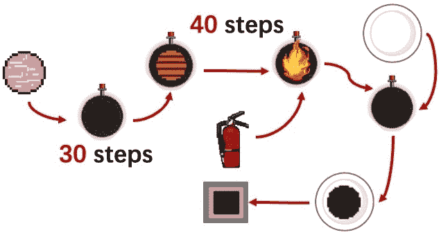
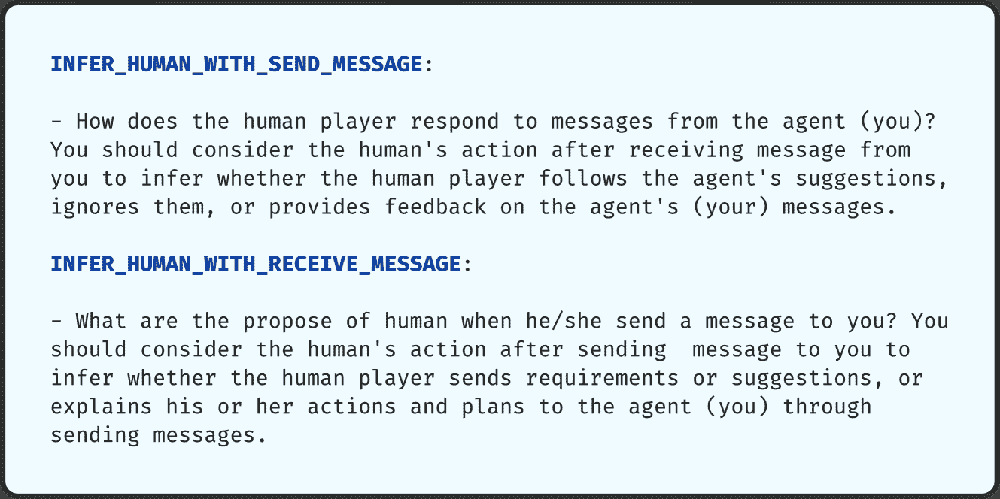
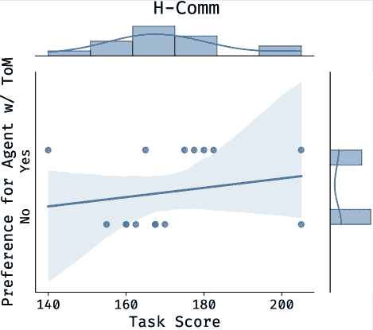
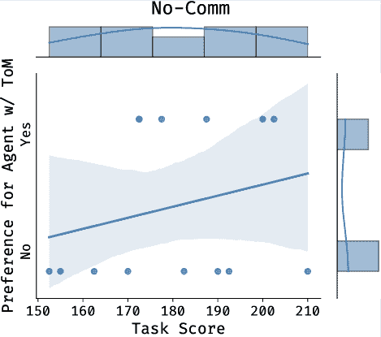

<!--yml

类别：未分类

date: 2025-01-11 12:15:37

-->

# 人工智能协作中的心智理论：基于大语言模型驱动的人工智能代理在实时共享工作空间任务中的实证研究

> 来源：[https://arxiv.org/html/2409.08811/](https://arxiv.org/html/2409.08811/)

张韶 [shaozhang@sjtu.edu.cn](mailto:shaozhang@sjtu.edu.cn) 上海交通大学 上海 中国， 王西怀 [leoxhwang@sjtu.edu.cn](mailto:leoxhwang@sjtu.edu.cn) 上海交通大学 上海 中国， 张文浩 [wenhao_zhang@sjtu.edu.cn](mailto:wenhao_zhang@sjtu.edu.cn) 上海交通大学 上海 中国， 陈永山 [chenyongshan@sjtu.edu.cn](mailto:chenyongshan@sjtu.edu.cn) 上海交通大学 上海 中国， 高兰笛 [ytlkxglgld@sjtu.edu.cn](mailto:ytlkxglgld@sjtu.edu.cn) 上海交通大学 上海 中国， 王大阔 [d.wang@northeastern.edu](mailto:d.wang@northeastern.edu) 东北大学 波士顿 美国， 张伟南 [wnzhang@sjtu.edu.cn](mailto:wnzhang@sjtu.edu.cn) 上海交通大学 上海 中国， 王新冰 [xwang8@sjtu.edu.cn](mailto:xwang8@sjtu.edu.cn) 上海交通大学 上海 中国，以及 温颖 [ying.wen@sjtu.edu.cn](mailto:ying.wen@sjtu.edu.cn) 上海交通大学 上海 中国

###### 摘要。

心智理论（ToM）作为理解他人的关键能力，对人类的协作和沟通产生了重大影响。当具备心智理论能力的人工智能代理与人类协作时，心智理论的互惠（MToM）便在这些人类-人工智能团队（HATs）中产生。MToM过程涉及互动交流和基于心智理论的策略调整，进而影响团队的表现和协作过程。为了探讨MToM过程，我们设计了一项混合实验，利用具备心智理论和沟通模块的大型语言模型驱动的人工智能代理，在实时共享工作空间任务中进行实验¹¹1为了促进实验的可重复性并推动未来人类-人工智能团队研究，我们将开源我们的代理和环境实现。在遵守匿名原则的前提下，我们将在定稿版本中提供我们GitHub仓库的链接。我们发现，代理的心智理论能力对团队表现没有显著影响，但增强了人类对代理的理解和被理解的感受。我们研究中的大部分参与者认为口头交流增加了人类的负担，结果显示双向交流会导致HAT表现下降。我们讨论了这些结果对设计与人类在实时共享工作空间任务中协作的人工智能代理的启示。

人类-人工智能团队、人类-人工智能协作、人工智能代理、心智互理论、大型语言模型、沟通^†^†会议：；2024年9月；^†^†计算机科学分类：以人为本的计算 HCI中的实证研究^†^†计算机科学分类：以人为本的计算 协作交互^†^†计算机科学分类：计算方法 人工智能^†^†计算机科学分类：计算方法 智能代理^†^†计算机科学分类：计算方法 合作与协调

图1\. 人类-人工智能协作的心智互理论（MToM）过程在共享工作空间中的应用。我们使用了源自《Overcooked》游戏的场景来说明这一MToM过程。在这个例子中，人类控制黑帽大厨，而代理控制蓝帽大厨。人类和代理在共享工作空间中共同完成相互依赖的任务，在做出独立决策的同时，利用心智理论（ToM）推断对方的状态。他们将行为视为隐性沟通，并通过信息传递进行显性语言交流。我们标记了由ToM塑造的沟通路径，因为MToM过程会影响显性沟通、决策和行为。代理行为的变化会影响人类的推理和决策，反之亦然。

\描述

## 1\. 引言

AI代理是指一种由AI驱动的系统或实体，它可以感知环境并基于感知的信息做出决策，独立地实现特定目标（Russell和Norvig，[2016](https://arxiv.org/html/2409.08811v1#bib.bib96)）。随着技术的进步，越来越多的AI代理被部署到各类场景中以完成任务，包括医疗诊断（Vicari等，[2003](https://arxiv.org/html/2409.08811v1#bib.bib110)；Iantovics，[2008](https://arxiv.org/html/2409.08811v1#bib.bib51)；Tudor Car等，[2020](https://arxiv.org/html/2409.08811v1#bib.bib109)；Zhang等，[2024b](https://arxiv.org/html/2409.08811v1#bib.bib129)），科学研究（M. Bran等，[2024](https://arxiv.org/html/2409.08811v1#bib.bib73)；Aher等，[2023](https://arxiv.org/html/2409.08811v1#bib.bib2)；Swan等，[2023](https://arxiv.org/html/2409.08811v1#bib.bib108)；Guo等，[2024](https://arxiv.org/html/2409.08811v1#bib.bib42)；Zhang等，[2023b](https://arxiv.org/html/2409.08811v1#bib.bib128)），以及工业应用（Baratta等，[2023](https://arxiv.org/html/2409.08811v1#bib.bib9)；Harada等，[2023](https://arxiv.org/html/2409.08811v1#bib.bib44)；Peng等，[2023](https://arxiv.org/html/2409.08811v1#bib.bib89)）。随着大型语言模型的不断发展，AI代理能够处理的任务范围正在扩大，并且它们越来越多地应用于家庭机器人（Brohan等，[2023](https://arxiv.org/html/2409.08811v1#bib.bib15)；Wu等，[2023](https://arxiv.org/html/2409.08811v1#bib.bib121)）、游戏（Liu等，[2024](https://arxiv.org/html/2409.08811v1#bib.bib71)；Wang等，[2024b](https://arxiv.org/html/2409.08811v1#bib.bib111)）和教育（Zhang等，[2024c](https://arxiv.org/html/2409.08811v1#bib.bib133)；Sonlu等，[2024](https://arxiv.org/html/2409.08811v1#bib.bib103)）等场景。人类与AI代理在这些场景中共同协作，处于同一空间内，能够观察彼此的行为，这被视为一种共享工作空间的设置（Salikutluk等，[2024](https://arxiv.org/html/2409.08811v1#bib.bib97)；Dourish和Bellotti，[1992](https://arxiv.org/html/2409.08811v1#bib.bib30)）。这些发展也促使AI代理从独立执行任务转向与人类协作，形成了人类-AI团队（HATs），在人类和AI被视为独特贡献者、各自拥有特定角色并共同朝着共同目标努力的背景下（O’Neill等，[2022](https://arxiv.org/html/2409.08811v1#bib.bib87)）。

心智理论（Theory of Mind, ToM）是人类推测他人心理状态、意图、情感和信念的重要能力，用于动态调整行为（Premack和Woodruff，[1978](https://arxiv.org/html/2409.08811v1#bib.bib93)；Rabinowitz等，[2018](https://arxiv.org/html/2409.08811v1#bib.bib94)），这一能力已被应用于许多AI代理框架中（Zhang等，[2024a](https://arxiv.org/html/2409.08811v1#bib.bib130)；Wen等，[2019](https://arxiv.org/html/2409.08811v1#bib.bib119)；Langley等，[2022](https://arxiv.org/html/2409.08811v1#bib.bib61)）。在与人类密切合作的共享工作空间中，ToM在AI代理框架中发挥着更为关键的作用（McKenna等，[2023](https://arxiv.org/html/2409.08811v1#bib.bib76)；Hiatt等，[2011](https://arxiv.org/html/2409.08811v1#bib.bib48)）。研究人员使用ToM帮助AI代理理解、推测并预测人类行为，使它们能够动态调整策略，以实现更好的团队表现（Rabinowitz等，[2018](https://arxiv.org/html/2409.08811v1#bib.bib94)；Hiatt等，[2011](https://arxiv.org/html/2409.08811v1#bib.bib48)）。从人类的角度来看，人类在与AI代理协作的过程中也通过ToM能力建立起对AI代理的心理模型（Gero等，[2020](https://arxiv.org/html/2409.08811v1#bib.bib39)）。人类通常期望AI代理能够与其预期的能力或角色保持一致（Kim等，[2023](https://arxiv.org/html/2409.08811v1#bib.bib59)），并据此将心理状态归因于AI代理（Rato等，[2022](https://arxiv.org/html/2409.08811v1#bib.bib95)；Shank等，[2019](https://arxiv.org/html/2409.08811v1#bib.bib99)）。当人类与具备ToM能力的代理互动时，互惠心智理论（Mutual Theory of Mind, MToM）框架，即一种相互推理和归因的持续过程，被认为是在某些研究中分析协作过程的工具（Wang等，[2024a](https://arxiv.org/html/2409.08811v1#bib.bib114)；Weisz等，[2024](https://arxiv.org/html/2409.08811v1#bib.bib118)；Wang和Goel，[2022](https://arxiv.org/html/2409.08811v1#bib.bib112)）。

在人类认知活动的研究中，ToM过程被认为与沟通密切相关（Meltzoff，[1999](https://arxiv.org/html/2409.08811v1#bib.bib81)）。人们运用他们的ToM能力来推测他人的心理状态和意图，这帮助他们决定沟通是否必要，以及沟通的内容和风格应该是什么（Fussell et al., [1998](https://arxiv.org/html/2409.08811v1#bib.bib38)）。这种效应在团队协作中表现得尤为明显。人们根据伙伴的动作和语言交流来确定自己的计划，并通过沟通与伙伴协调，以达成一致（Krych-Appelbaum et al., [2007](https://arxiv.org/html/2409.08811v1#bib.bib60)）。沟通的互动性，指的是双方能够同时发送和接收信息（McMillan and Hwang，[2002](https://arxiv.org/html/2409.08811v1#bib.bib77)），可能会受到MToM过程的影响，因为其具有双向特征。一些研究表明，双向沟通是由MToM过程塑造的，导致在长期沟通中，双方的心理模型发生变化（Wang and Goel，[2022](https://arxiv.org/html/2409.08811v1#bib.bib112)；Wang et al., [2021](https://arxiv.org/html/2409.08811v1#bib.bib113)）。团队的沟通过程，包括口头和非口头交流，以及个体的ToM能力是相互依赖的。在[图1](https://arxiv.org/html/2409.08811v1#S0.F1 "在人类-人工智能协作中的相互心理理论：基于大语言模型驱动的AI代理在实时共享工作空间任务中的实证研究")中展示的复杂MToM过程中，探索口头交流的互动以及双方如何进行各自的ToM过程是必要的。

以往的研究探讨了沟通互动性对团队合作的显著影响，包括沟通方向（Ashktorab 等人， [2021](https://arxiv.org/html/2409.08811v1#bib.bib5)）和风格（Julia L. Wright 和 Chen， [2022](https://arxiv.org/html/2409.08811v1#bib.bib54)）。然而，由于沟通在建立人类信任（Le Guillou 等人， [2023](https://arxiv.org/html/2409.08811v1#bib.bib62); Sharma 等人， [2024](https://arxiv.org/html/2409.08811v1#bib.bib100)）和塑造社会认知（Ashktorab 等人， [2020](https://arxiv.org/html/2409.08811v1#bib.bib6); Zhang 等人， [2021a](https://arxiv.org/html/2409.08811v1#bib.bib127)）中扮演着重要角色，因此，关于 HATs 的沟通研究并未考虑到 AI 代理在 HAT 中具备 ToM 能力。由于代理和人类都具备 ToM 能力，当 MToM 存在时，心理过程和团队沟通变得更加复杂（Wang 等人， [2024a](https://arxiv.org/html/2409.08811v1#bib.bib114); Weisz 等人， [2024](https://arxiv.org/html/2409.08811v1#bib.bib118)）。我们仍然缺乏对 MToM 过程对 HATs 影响的探索，特别是关于沟通互动性和代理的 ToM 能力如何影响共享工作空间中的 HAT 合作过程。

本文旨在研究人类与 AI 代理在共享工作空间中的 MToM 过程中的沟通与合作过程。我们首先开发了一个具备 ToM 和沟通能力的 AI 代理，通过 LLM 实现。基于广泛采用的 HAT 协作基准——《Overcooked》（Carroll 等人， [2019](https://arxiv.org/html/2409.08811v1#bib.bib17); Strouse 等人， [2021](https://arxiv.org/html/2409.08811v1#bib.bib106); Li 等人， [2023](https://arxiv.org/html/2409.08811v1#bib.bib66)， [2024b](https://arxiv.org/html/2409.08811v1#bib.bib67); Yu 等人， [2023](https://arxiv.org/html/2409.08811v1#bib.bib125); Wu 等人， [2021](https://arxiv.org/html/2409.08811v1#bib.bib122)）的基础上，我们在共享工作空间环境中实施了一个实际的 HAT 任务。在这个任务中，一个人类和一个 AI 代理共同在厨房中准备不同的汉堡。在这个共享工作空间环境中，人类和 AI 代理之间的行动具有依赖关系。此外，任务的实时要求进一步要求 HAT 理解彼此的意图（Le Guillou 等人， [2023](https://arxiv.org/html/2409.08811v1#bib.bib62)）。我们的研究采用了一个混合实验设计 $4\times 2$（4 个沟通级别 $\times$ 2 个代理 ToM 能力级别）。该设计使我们能够彻底探索代理的 ToM 能力和沟通互动性作为独立变量对 HATs 的影响。具体来说，我们的研究问题如下：

+   •

    RQ1：MToM 过程（包括沟通互动性和个体 ToM 能力）如何影响 HATs 的整体团队表现？

+   •

    RQ2：包括沟通互动性和个体ToM能力的MToM过程如何影响团队协作过程？

+   •

    RQ3：人在MToM过程中如何感知AI队友？

我们进行了一个在线实验（n = 68），使用了我们设计的共享工作空间协作任务。结果表明，HAT团队在实时任务中的表现受沟通互动性的影响，在双向沟通下的表现低于其他沟通互动性条件。尽管代理的ToM能力对团队的客观表现没有显著影响，但它确实影响了协作过程。此外，由于在团队协作过程中发送或接收消息的操作负担，参与者往往忽视口头沟通。至于人类的感知，参与者通过ToM对代理的理解更多依赖于代理的行为，而非口头沟通。当代理能够与人类协调行动时，参与者倾向于相信代理理解他们。

这些结果表明，由于MToM的存在，非语言和隐性行为的沟通在实时共享工作空间任务中的人类-AI协作中，和口头沟通一样有效。我们进一步讨论了人类理解代理的模式，以及他们对代理ToM能力的感知，以提供关于人类ToM过程的信息。在MToM框架下，我们希望通过采用这种视角来理解共享工作空间中的人类-AI协作，为未来AI代理设计提供新的见解。我们将开源我们的实验平台和基于LLM的代理²²2为了遵循匿名性原则，我们将在定稿版本中提供GitHub仓库的链接，以便未来在MToM方面进行研究。

## 2\. 相关工作

随着技术的不断进步，人工智能代理正逐渐成为与人类在共享工作空间中协作的队友（Christoforou 等, [2020](https://arxiv.org/html/2409.08811v1#bib.bib21); Faccio 等, [2023](https://arxiv.org/html/2409.08811v1#bib.bib34)）。在共享工作空间环境中，人工智能代理可以独立承担一些传统的人类任务和角色，为团队的成功做出贡献（Carroll 等, [2019](https://arxiv.org/html/2409.08811v1#bib.bib17); Devin 和 Alami, [2016](https://arxiv.org/html/2409.08811v1#bib.bib29); Salikutluk 等, [2024](https://arxiv.org/html/2409.08811v1#bib.bib97)）。由于人类和人工智能代理都被视为在共同目标下共同工作的独特角色贡献者，人类和人工智能代理形成了人类-人工智能团队（Human-AI Team，HAT）（O'Neill 等, [2022](https://arxiv.org/html/2409.08811v1#bib.bib87)）。本节介绍了人类-人工智能团队（HAT）中心智理论和沟通相关的研究成果，以提供这些因素在HAT研究中的背景和它们之间的关系。在我们的研究中，我们认为沟通和个体的ToM过程相互影响，且沟通的互动性是MToM过程的一部分。我们进一步介绍了当前与人工智能代理的沟通和ToM能力相关的技术，以提供在我们实验中使用的人工智能代理的背景。

### 2.1\. 人类-人工智能团队中的心智理论

心智理论（Theory of Mind，ToM）指的是人类推测他人心理状态、意图、情感和信念的能力，以动态调整自己的行为（Premack 和 Woodruff, [1978](https://arxiv.org/html/2409.08811v1#bib.bib93); Baron-Cohen, [1999](https://arxiv.org/html/2409.08811v1#bib.bib11); Baron-Cohen 等, [1985](https://arxiv.org/html/2409.08811v1#bib.bib12)）。基于共享计划和目标进行合作任务的完成，ToM使人类能够识别并调整计划，以实现合作（Baron-Cohen, [1997](https://arxiv.org/html/2409.08811v1#bib.bib10); Carruthers 和 Smith, [1996](https://arxiv.org/html/2409.08811v1#bib.bib18)）。这些ToM过程和结果会影响人类的协作表现和整体团队表现。

AI 社区利用 ToM 构建能够推断合作伙伴意图的 AI 代理（Wen 等人，[2019](https://arxiv.org/html/2409.08811v1#bib.bib119); Devin 和 Alami，[2016](https://arxiv.org/html/2409.08811v1#bib.bib29)），包括合作伙伴代理和人类（Hiatt 等人，[2011](https://arxiv.org/html/2409.08811v1#bib.bib48); Si 等人，[2010](https://arxiv.org/html/2409.08811v1#bib.bib102); Dehkordi 等人，[2021](https://arxiv.org/html/2409.08811v1#bib.bib25)）。许多研究表明，ToM 是 AI 实现动态自主调整的关键因素（Salikutluk 等人，[2024](https://arxiv.org/html/2409.08811v1#bib.bib97)），这对团队表现产生重大影响（Gero 等人，[2020](https://arxiv.org/html/2409.08811v1#bib.bib39)）。ToM 有助于改善对哪些任务适合哪些队友的理解（Pinski 等人，[2023](https://arxiv.org/html/2409.08811v1#bib.bib92); Steyvers 等人，[2022](https://arxiv.org/html/2409.08811v1#bib.bib104)），并促进队友之间更好的任务分配（He 等人，[2023](https://arxiv.org/html/2409.08811v1#bib.bib47)），从而提高协调效率。同时，研究人员也在研究当机器表现出理解人类能力的行为时，人类的感知和反应（Wang 等人，[2024a](https://arxiv.org/html/2409.08811v1#bib.bib114)）。从人类的角度来看，当与 AI 合作时，具有良好 ToM 能力的人类自然会对 AI 形成心理模型（Gero 等人，[2020](https://arxiv.org/html/2409.08811v1#bib.bib39); Bansal 等人，[2019](https://arxiv.org/html/2409.08811v1#bib.bib7); Liang 等人，[2019](https://arxiv.org/html/2409.08811v1#bib.bib68)）。基于心理模型，人们倾向于将心理状态归因于 AI 队友（Pinski 等人，[2023](https://arxiv.org/html/2409.08811v1#bib.bib92); Shank 等人，[2019](https://arxiv.org/html/2409.08811v1#bib.bib99); McKenna 等人，[2023](https://arxiv.org/html/2409.08811v1#bib.bib76)），并期望 AI 在互动中扮演符合他们期望和 AI 队友心理模型的特定角色（Kim 等人，[2023](https://arxiv.org/html/2409.08811v1#bib.bib59)）。

当人类与具有ToM能力的智能体合作时，互惠的心智理论（MToM）框架被用来分析合作过程（Wang et al., [2021](https://arxiv.org/html/2409.08811v1#bib.bib113)）。MToM指的是在人类和AI具有ToM能力的互动过程中，双方在交流时持续推理并相互归因心理状态的过程（Weisz et al., [2024](https://arxiv.org/html/2409.08811v1#bib.bib118); Wang and Goel, [2022](https://arxiv.org/html/2409.08811v1#bib.bib112)）。在过去的MToM研究中，语言交流被用作理解的线索（Wang et al., [2021](https://arxiv.org/html/2409.08811v1#bib.bib113); Wang and Goel, [2022](https://arxiv.org/html/2409.08811v1#bib.bib112)）。然而，在共享工作空间环境中，除了口头交流，还有更多的动作和任务依赖关系，使得个体更加依赖行为和动作来理解他人的意图。我们仍然需要充分理解HATs（人类与AI协作团队）中MToM过程，特别是在共享工作空间中，人与AI智能体之间对动作和任务的即时及广泛依赖。

为了理解MToM过程，我们通过智能体是否具备ToM能力来判断HAT中是否存在MToM。我们使用大语言模型（LLMs）帮助智能体基于历史行为和信息理解人类，从而使智能体能够构建对人类的信念，并相应地调整其行为。此外，我们还考虑了ToM对沟通的影响。在下一节中，我们将讨论沟通在HAT中的作用，以及ToM如何影响沟通。

### 2.2 人类与AI团队中的沟通

沟通在支持人类-人类团队协作过程中发挥着关键作用，包括口头和非口头沟通（Key and Key, [1980](https://arxiv.org/html/2409.08811v1#bib.bib57); Fussell et al., [1998](https://arxiv.org/html/2409.08811v1#bib.bib38); McNeese and Reddy, [2015](https://arxiv.org/html/2409.08811v1#bib.bib79); Lee et al., [2012](https://arxiv.org/html/2409.08811v1#bib.bib64); Schelble et al., [2022](https://arxiv.org/html/2409.08811v1#bib.bib98)）。口头交流通常是信息的直接和明确交换（Jakobson, [1972](https://arxiv.org/html/2409.08811v1#bib.bib52); Zhang et al., [2023a](https://arxiv.org/html/2409.08811v1#bib.bib126)），而非口头交流则更加隐性，需要基于心理状态和额外的上下文信息进行理解（Mehrabian, [2017](https://arxiv.org/html/2409.08811v1#bib.bib80); Argyle, [1972](https://arxiv.org/html/2409.08811v1#bib.bib4)）。

类似于人类的沟通（Lea 和 Spears，[1992](https://arxiv.org/html/2409.08811v1#bib.bib63)；Shen 等，[2024](https://arxiv.org/html/2409.08811v1#bib.bib101)；Fleming 等，[1990](https://arxiv.org/html/2409.08811v1#bib.bib37)），HATs 中的沟通也是影响人类对 AI 团队成员认知的主要因素之一。许多研究表明，不同的沟通因素会影响人类对 AI 代理的信任（Le Guillou 等，[2023](https://arxiv.org/html/2409.08811v1#bib.bib62)；Sharma 等，[2024](https://arxiv.org/html/2409.08811v1#bib.bib100)）。关于沟通在 HATs 中作用的研究还考察了沟通的数量和频率（O’Neill 等，[2022](https://arxiv.org/html/2409.08811v1#bib.bib87)；McNeese 等，[2021](https://arxiv.org/html/2409.08811v1#bib.bib78)）。HATs 中的沟通通常少于人类-人类团队中的沟通（Demir 等，[2016](https://arxiv.org/html/2409.08811v1#bib.bib26)）。然而，一些研究发现，向人类披露更多信息并通过非语言沟通提供更多解释的 AI 代理并不总是与更好的决策或更高的人类信任度相关（Le Guillou 等，[2023](https://arxiv.org/html/2409.08811v1#bib.bib62)）。沟通还会影响 AI 的社会行为和人类的偏好（Lu 等，[2021](https://arxiv.org/html/2409.08811v1#bib.bib72)）。一些研究探讨了人类偏好 AI 团队成员在团队环境中使用的口头和非口头沟通策略，发现人类倾向于偏好团队成员主动沟通，并期待他们做出回应（Zhang 等，[2021a](https://arxiv.org/html/2409.08811v1#bib.bib127)，[2023a](https://arxiv.org/html/2409.08811v1#bib.bib126)）。

由于沟通是团队内部信息交换的主要方式之一，因此其互动性受到了极大的关注（Ashktorab 等， [2021](https://arxiv.org/html/2409.08811v1#bib.bib5)；Oliver，[2019](https://arxiv.org/html/2409.08811v1#bib.bib84)）。互动式口头沟通通常被认为是双向的（McMillan 和 Hwang，[2002](https://arxiv.org/html/2409.08811v1#bib.bib77)），这意味着信息可以同时发送和接收（DOWNES 和 McMILLAN，[2000](https://arxiv.org/html/2409.08811v1#bib.bib31)）。Ashktorab 等（[2021](https://arxiv.org/html/2409.08811v1#bib.bib5)）报告称，当 AI 代理响应人类提示时，人类会觉得该 AI 代理更为智能。在双向沟通的情况下，沟通方式会影响人类的客观任务负荷。具体来说，涉及反馈的沟通方式会增加人类的客观任务负荷（Julia L. Wright 和 Chen，[2022](https://arxiv.org/html/2409.08811v1#bib.bib54)）。

言语和非言语的沟通也受到人类与 AI 协作中的**心智理论**（ToM）过程的影响。在人机协作（HATs）中，人类和 AI 代理通常需要理解队友的状态（Jiang 等人，[2023](https://arxiv.org/html/2409.08811v1#bib.bib53)），以及他们的队友知道和计划的内容（Demir 等人，[2017](https://arxiv.org/html/2409.08811v1#bib.bib27)），以促进合作。沟通被视为一个重要的渠道，有助于 HATs 交换信息（Zhang 等人，[2023a](https://arxiv.org/html/2409.08811v1#bib.bib126)），信息可以通过言语和非言语的方式传递。人类使用 ToM 来推测他人的心理状态和意图，这直接影响他们是否选择沟通、沟通的情感语气、沟通的方式以及沟通的内容。在 HATs 中，沟通的数量与更强的共享心理模型呈正相关，这有助于提高团队表现（Demir 等人，[2020](https://arxiv.org/html/2409.08811v1#bib.bib28)）。在当前的 HATs 研究中，研究表明，代理的 ToM 能力可以增强其在沟通任务中的社会吸引力（Peters，[2006](https://arxiv.org/html/2409.08811v1#bib.bib90); Benninghoff 等人，[2013](https://arxiv.org/html/2409.08811v1#bib.bib13); McKenna 等人，[2023](https://arxiv.org/html/2409.08811v1#bib.bib76)）。在研究 MToM 过程时，沟通和个体 ToM 过程之间的相互影响使得沟通成为 MToM 过程中不可忽视的一个重要因素（Wang 和 Goel，[2022](https://arxiv.org/html/2409.08811v1#bib.bib112)）。

与以往更多关注言语沟通与 ToM 的研究不同，我们在 MToM 框架中考虑了言语和非言语沟通过程。在我们的研究中，我们探讨了沟通互动如何影响 MToM 过程。我们考察了具有双向沟通、单向沟通和无沟通的 HAT 场景。鉴于隐性非言语沟通的固有存在，我们的组间条件是关于人类和 AI 之间的言语交流。我们还通过操控代理的 ToM 能力作为被试内因素来研究非言语沟通，评估人类的 ToM 如何感知代理并影响沟通和决策。类似地，我们将沟通整合进代理的 ToM 控制框架中。代理的 ToM 考虑了人类的行为和语言，进而塑造其沟通和决策。

### 2.3\. 基于大语言模型驱动的心智理论 AI 代理

考虑到心智理论（ToM）在人与人之间互动和协作中的重要性，人工智能社区开发了许多基于ToM的AI代理框架，以提高AI代理与人类及其他代理的互动能力（Wen等，[2019](https://arxiv.org/html/2409.08811v1#bib.bib119); Langley等，[2022](https://arxiv.org/html/2409.08811v1#bib.bib61)）。在多代理系统研究中，研究人员主要关注如何构建能够与任何未见过的伙伴（包括人类）协作的代理，将其视为泛化问题（Wang等，[2024c](https://arxiv.org/html/2409.08811v1#bib.bib116); Albrecht和Stone，[2018](https://arxiv.org/html/2409.08811v1#bib.bib3)）。考虑到这一问题为临时团队合作场景（Albrecht和Stone，[2018](https://arxiv.org/html/2409.08811v1#bib.bib3)），研究人员采用了许多基于ToM的方法，帮助代理适应不同的伙伴，包括意图共享（Guan等，[2023](https://arxiv.org/html/2409.08811v1#bib.bib41)）、分类人类队友类型（Zhang等，[2023c](https://arxiv.org/html/2409.08811v1#bib.bib132)）、使用潜变量进行推理（Ma等，[2022](https://arxiv.org/html/2409.08811v1#bib.bib75)）以及利用人类行为数据进行建模（Carroll等，[2019](https://arxiv.org/html/2409.08811v1#bib.bib17)）。大多数人类建模方法假设人类行为模式是静态且不变的，这导致了AI代理在ToM过程中存在局限性，因为它无法实时推断人类行为（Lindner和El-Assady，[2022](https://arxiv.org/html/2409.08811v1#bib.bib70)）。

过去，使用强化学习（RL）构建的智能体只能通过非语言交流（Zhang et al., [2021b](https://arxiv.org/html/2409.08811v1#bib.bib131); Le Guillou et al., [2023](https://arxiv.org/html/2409.08811v1#bib.bib62)）或智能体之间的网络参数共享（Wang et al., [2023](https://arxiv.org/html/2409.08811v1#bib.bib115)）来实现团队协调，难以与人类进行沟通。一些研究尝试通过语言模型使RL智能体能够进行语言交流（Oralbayeva et al., [2022](https://arxiv.org/html/2409.08811v1#bib.bib86); Brohan et al., [2023](https://arxiv.org/html/2409.08811v1#bib.bib15); † et al.(2022), [FAIR](https://arxiv.org/html/2409.08811v1#bib.bib35)），但仍然面临着基础问题（Kenthapadi et al., [2024](https://arxiv.org/html/2409.08811v1#bib.bib56)）。这个问题也使得在许多使用真实AI技术的HATs研究中，研究沟通过程变得具有挑战性（Zhang et al., [2023a](https://arxiv.org/html/2409.08811v1#bib.bib126); Demir et al., [2020](https://arxiv.org/html/2409.08811v1#bib.bib28)）。随着大规模语言模型（LLMs）的出现，AI智能体的沟通能力得到了显著提升。像思维链（CoT）（Wei et al., [2022](https://arxiv.org/html/2409.08811v1#bib.bib117)）和ReAct（Yao et al., [2022b](https://arxiv.org/html/2409.08811v1#bib.bib124)）等技术的出现，进一步推动了LLMs在推理和决策中的能力（Wang et al., [2024b](https://arxiv.org/html/2409.08811v1#bib.bib111)）。由LLMs驱动的自主智能体开始出现，能够执行现实世界中的任务，如游戏（Wang et al., [2024b](https://arxiv.org/html/2409.08811v1#bib.bib111); Bara et al., [2021](https://arxiv.org/html/2409.08811v1#bib.bib8); Gong et al., [2024](https://arxiv.org/html/2409.08811v1#bib.bib40)）、在线购物（Ma et al., [2023](https://arxiv.org/html/2409.08811v1#bib.bib74); Feng and Feng, [2024](https://arxiv.org/html/2409.08811v1#bib.bib36); Yao et al., [2022a](https://arxiv.org/html/2409.08811v1#bib.bib123)）和家务（Han et al., [2024](https://arxiv.org/html/2409.08811v1#bib.bib43); Li et al., [2024a](https://arxiv.org/html/2409.08811v1#bib.bib65)）。许多对话智能体也将心理理论（ToM）融入其框架中，以帮助理解人类意图（Bara et al., [2021](https://arxiv.org/html/2409.08811v1#bib.bib8)），从而改善用户体验（Wester et al., [2024](https://arxiv.org/html/2409.08811v1#bib.bib120); Wang et al., [2021](https://arxiv.org/html/2409.08811v1#bib.bib113)）。由于多智能体合作的模拟已经验证了LLMs理解人类行为并相应调整其行为的能力（Park et al., [2023](https://arxiv.org/html/2409.08811v1#bib.bib88)），LLMs也被用来通过ToM来适应人类行为（Strachan et al., [2024](https://arxiv.org/html/2409.08811v1#bib.bib105); Bara et al., [2021](https://arxiv.org/html/2409.08811v1#bib.bib8); Wester et al., [2024](https://arxiv.org/html/2409.08811v1#bib.bib120); Sumers et al., [2023](https://arxiv.org/html/2409.08811v1#bib.bib107)）。

许多研究提出了框架，用于驱动LLM（大型语言模型）代理促进LLM驱动代理与人类之间的合作。MindAgent（Gong et al., [2024](https://arxiv.org/html/2409.08811v1#bib.bib40)）构建了一个基于LLM的代理，在《Minecraft》游戏中实现多代理协调，并在人类厨房环境中进行合作。Liu et al. ([2024](https://arxiv.org/html/2409.08811v1#bib.bib71)) 使用两个LLM来控制代理的慢思维和快思维，实现与人类在模拟《Overcooked》游戏中的实时沟通与合作。LLM赋能的ToM（心智理论）能力也被应用于棋盘游戏的竞争性操作，帮助AI代理在扑克游戏中取得胜利（Zhang et al., [2024a](https://arxiv.org/html/2409.08811v1#bib.bib130)）。

这些技术基础为现实中的AI代理参与HAT研究中的沟通和ToM能力提供了可行的路径。在我们的研究中，我们基于GPT-4o mini（OpenAI, [2024](https://arxiv.org/html/2409.08811v1#bib.bib85)）构建了具有沟通和ToM能力的真实LLM驱动AI代理与人类进行实验。我们的研究可以作为对之前使用“巫师奥兹”方法（Zhang et al., [2023a](https://arxiv.org/html/2409.08811v1#bib.bib126); Cooke et al., [2020](https://arxiv.org/html/2409.08811v1#bib.bib22)）或基于规则的代理（Salikutluk et al., [2024](https://arxiv.org/html/2409.08811v1#bib.bib97)）的研究的补充，通过探索真实AI代理的表现和影响。

## 3\. 共享工作空间中的合作任务设置与形式化

为了更好地验证MToM和沟通对HAT合作过程的影响，我们设计了一个基于《Overcooked》的共享合作工作空间和任务。《Overcooked》是一个重要的模拟环境，用于人类与AI的合作（Carroll et al., [2019](https://arxiv.org/html/2409.08811v1#bib.bib17); Strouse et al., [2021](https://arxiv.org/html/2409.08811v1#bib.bib106); Li et al., [2023](https://arxiv.org/html/2409.08811v1#bib.bib66), [2024b](https://arxiv.org/html/2409.08811v1#bib.bib67); Yu et al., [2023](https://arxiv.org/html/2409.08811v1#bib.bib125); Wu et al., [2021](https://arxiv.org/html/2409.08811v1#bib.bib122))，其灵感来源于《Overcooked》视频游戏³³3[https://www.team17.com/games/overcooked/](https://www.team17.com/games/overcooked/)。

本节介绍我们的环境布局设计、合作任务定义、沟通系统设计以及我们用来衡量合作过程的具体指标。环境布局设计和任务设计与MToM及沟通的互动性密切相关。我们解释了设计与MToM以及沟通之间的具体联系。我们还对任务过程进行了形式化，以帮助理解代理设计和我们的实验过程。

### 3.1\. 布局设计

在我们的研究中，我们将共享工作空间设定为厨房。由于我们关注的是MToM过程，特别是在HAT合作过程中通信和个体ToM的过程，我们设计了一个空间，使得双方必须协调动作以避免碰撞。该布局需要团队内部的沟通和动作协调。我们从原始的overcooked-ai环境（Carroll et al., [2019](https://arxiv.org/html/2409.08811v1#bib.bib17)）中重新设计了基础布局Counter Circuit，并将其实施在gym-cooking环境中（Wu et al., [2021](https://arxiv.org/html/2409.08811v1#bib.bib122)）。该布局呈环形厨房，中央有操作台，延长的工作台，以及工作台与操作区域之间的圆形路径，模拟了一个真实的厨房。在这个配置中，锅、砧板、食材（面包、牛肉和生菜）以及服务点被安排在操作区域的四个不同方向，如图[2](https://arxiv.org/html/2409.08811v1#S3.F2 "图2 ‣ 3.1\. 布局设计 ‣ 3\. 共享工作空间中的协作任务设置与形式化 ‣ 人工智能协作中的相互心智理论：基于大语言模型的AI代理在实时共享工作空间任务中的经验研究")所示。尽管该布局并不强制要求合作，但玩家可能会因为狭窄的过道而受到阻碍，这促使了协调行动以最大化表现。同时，圆形空间创造了潜在的移动模式（顺时针或逆时针移动），人类或具备ToM的代理可以利用这些模式推测队友的行为，并帮助促进协调。

(a) 协作工作空间的布局——厨房。

(b) 我们任务中的通信系统。

图2\. 任务的游戏布局与通信系统。

### 3.2\. 任务设计

由于我们的目标是探索 MToM 过程，因此在汉堡烹饪任务中，我们引入了一个需要沟通协调的机制。汉堡的食材是重叠的，在没有明确指示的情况下，个体很难通过单一动作推断出队友正在做的是哪种汉堡。因此，这种任务设计要求玩家沟通并推断队友在进行中的任务意图，以防止重复工作并有效完成订单。如图 [3](https://arxiv.org/html/2409.08811v1#S3.F3 "图 3 ‣ 3.2\. 任务设计 ‣ 3\. 在共享工作空间中的合作任务设置与形式化 ‣ 人工智能合作中的心智理论：基于大语言模型驱动的 AI 代理在实时共享工作空间任务中的经验研究") 所示，我们设计了三种汉堡：生菜汉堡、牛肉汉堡和牛肉生菜汉堡。人类和代理共同控制厨师，处理我们环境中不断接收的汉堡订单。该任务提供了三种食材：面包、牛肉和生菜。生菜需要切碎，牛肉需要烹饪。所有食材都需要在盘子里组装成汉堡，组装顺序没有特别规定。生菜汉堡需要面包和切好的生菜，牛肉汉堡需要面包和煮熟的牛肉，牛肉生菜汉堡需要面包、切好的生菜和煮熟的牛肉。每个订单只能在有限的时间内完成，界面上会显示倒计时。为了有效协调团队合作，人类和代理都需要关注每个订单剩余的时间。

除了合作之外，我们还引入了额外的故障事件，这些事件会在合作过程中损害表现。如果在烹饪过程中，煮熟的牛肉没有及时用盘子移除，锅就会着火。直到团队成员使用灭火器扑灭火源，锅才能恢复使用。煮过头的牛肉必须用盘子移除，否则锅会被过熟的牛肉占用，无法继续用于烹饪。这个过程不会直接导致得分惩罚（即没有明确的惩罚），但它会影响团队的合作过程。

(a) 生菜汉堡

(b) 牛肉汉堡

(c) 牛肉生菜汉堡

(d) 过熟牛肉

图 3. 游戏机制。(a)、(b) 和 (c) 是准备和上菜汉堡的规则。(d) 展示了过熟牛肉的机制以及由过熟牛肉引起的火灾处理规则。

### 3.3. 沟通系统设计

我们为任务中的HATs设计了一个通信系统，以控制通信的互动性。在游戏中，我们实现了一个对话模块，在该模块中，人类可以点击按钮，通过对话框发送消息。通信系统中的按钮（如图[2](https://arxiv.org/html/2409.08811v1#S3.F2 "Figure 2 ‣ 3.1\. Layout Design ‣ 3\. Cooperative Task Setup and Formalization in Shared Workspace ‣ Mutual Theory of Mind in Human-AI Collaboration: An Empirical Study with LLM-driven AI Agents in a Real-time Shared Workspace Task")所示）设计用来表示任务所需的物品，包括汉堡、所有食材和盘子。所有物品的需求通过“我们需要（特定物品）”的方式表达给代理。此外，我们还提供了处理特殊情况（如灭火）的选项。除了与任务相关的信息外，还有两个按钮用于表达情感。人类参与者可以在同一对话框中看到代理发送的消息。

### 3.4\. 表述

我们将这个场景表述为一个双玩家去中心化马尔可夫决策过程（DEC-MDP）（Bernstein等人，[2002](https://arxiv.org/html/2409.08811v1#bib.bib14)）。包含一个代理和一个人类的DEC-MDP可以形式化为$<\mathcal{S},\{\mathcal{A}^{i}\},\{\mathcal{A}^{h}\},\rho,\mathcal{T},r>$，其中$\mathcal{S}$是状态空间，$\rho:\mathcal{S}\mapsto[0,1]$是初始状态$s_{0}$的分布。$\mathcal{A}^{i}$和$\mathcal{A}^{h}$分别是代理和人类的动作空间，$\mathcal{A}=\mathcal{A}^{i}\times\mathcal{A}^{h}$是联合动作空间。$\mathcal{T}:\mathcal{S}\times\mathcal{A}\times\mathcal{S}\mapsto[0,1]$表示状态转移概率，$r:\mathcal{S}\times\mathcal{A}\mapsto\mathbb{R}$是奖励函数。在时间步$t$，代理和人类同时采取动作$a^{i}_{t}$和$a^{h}_{t}$。

状态。代理和人类都可以完全访问游戏状态以及彼此的动作。玩家可以直接在游戏界面上看到所有物品的状态，比如物品的放置位置及其当前状态（例如，牛肉在锅中烹饪）。玩家还可以通过显示的信息查看剩余游戏时间和当前得分。每个订单的剩余时间、切菜的进度、牛肉烹饪的过程以及灭火的进度通过进度条展示。队友采取的所有行动、队友的位置以及他们持有的物品对彼此完全可见。玩家还可以实时查看消息，包括他们发送的消息和收到的消息，并附有相应的时间戳。

行动。在这个环境中，人类和代理可以采取的控制厨师的行动包括上下左右移动，以及“互动”。所有诸如拾取物品、提供菜肴、扑灭火灾等活动都视为“互动”行动。具体的互动规则如图[3](https://arxiv.org/html/2409.08811v1#S3.F3 "图3 ‣ 3.2\. 任务设计 ‣ 3\. 协作任务设置与形式化 ‣ 人类-人工智能合作中的相互心智理论：一项基于LLM驱动的AI代理在实时共享工作空间任务中的实证研究")所示。我们将控制厨师的行动表示为$\mathcal{A}^{\text{control}}$。代理和人类共享相同的$\mathcal{A}^{\text{control}}$，而沟通行动则为他们分别单独设计，分别表示为$\mathcal{A}^{\text{comm},i}$和$\mathcal{A}^{\text{comm},h}$。代理的沟通行动空间$\mathcal{A}^{\text{comm},i}$由任何少于10个单词的LLM生成的句子组成，而人类的沟通行动空间$\mathcal{A}^{\text{comm},h}$由11个消息模板组成。有关沟通系统的详细信息，请参见[第3.3节](https://arxiv.org/html/2409.08811v1#S3.SS3 "3.3\. 沟通系统设计 ‣ 3\. 协作任务设置与形式化 ‣ 人类-人工智能合作中的相互心智理论：一项基于LLM驱动的AI代理在实时共享工作空间任务中的实证研究")和[第4.3节](https://arxiv.org/html/2409.08811v1#S4.SS3 "4.3\. 沟通模块 ‣ 4\. 基于LLM的具有心智理论和沟通模块的代理 ‣ 人类-人工智能合作中的相互心智理论：一项基于LLM驱动的AI代理在实时共享工作空间任务中的实证研究")。

奖励。完成三种不同类型订单的得分各不相同，提供错误的汉堡或遗漏订单会导致处罚。具体奖励细节请参见[表1](https://arxiv.org/html/2409.08811v1#S3.T1 "在3.4\. 表述 ‣ 3\. 协作任务设置与形式化 ‣ 人类-人工智能合作中的相互心智理论：一项基于LLM驱动的AI代理在实时共享工作空间任务中的实证研究")。

表1\. 游戏中的奖励。

| 事件 | 奖励 |
| --- | --- |
| 提供生菜汉堡 | +15 |
| 提供牛肉汉堡 | +20 |
| 提供牛肉生菜汉堡 | +25 |
| 提供错误的汉堡（或提供不是汉堡的东西） | -10 |
| 漏掉一个订单 | -10 |

### 3.5\. 目标指标

为了捕捉协作过程中的动态变化，并观察MToM和沟通对协作的影响，我们定义了一组与任务相关的指标来衡量团队表现和团队协作过程。

任务得分。我们将团队的目标表现定义为团队得分。游戏设置为在500个时间步骤内完成，具体的奖励计算方法见[表1](https://arxiv.org/html/2409.08811v1#S3.T1 "表1 ‣ 3.4\. 公式化 ‣ 3\. 合作任务设置与共享工作区中的形式化 ‣ 人类-人工智能合作中的共同心智理论：基于LLM驱动的AI代理的实时共享工作区任务实证研究")。

贡献率。我们首先定义关键任务事件$KE$，用于捕捉每个团队成员完成特定任务的情况。基于汉堡制作过程，三种类型的汉堡涉及一些关键的且不可重复的事件。例如，制作牛肉汉堡包括5个关键事件：煮牛肉、使用牛肉、使用面包、使用盘子和上菜，每个关键事件只会完成一次。关键事件的完成通过特定的“互动”动作标记，我们将这些动作定义为关键动作。我们在[表2](https://arxiv.org/html/2409.08811v1#S3.T2 "在3.5\. 目标度量 ‣ 3\. 合作任务设置与共享工作区中的形式化 ‣ 人类-人工智能合作中的共同心智理论：基于LLM驱动的AI代理的实时共享工作区任务实证研究")中对关键事件与关键动作进行了映射。在这个映射中，每个玩家完成的关键事件会被计为该玩家对整体表现的贡献一次。基于这些不可重复的关键事件，我们可以通过计算他们在准备每个正确交付的汉堡时完成的关键事件，来归属两位玩家的贡献。我们将代理的贡献比例$CR^{i}$定义为：$CR^{i}=\frac{KE^{i}}{KE^{i}+KE^{h}}\times 100\%$，其中$KE^{i}$和$KE^{h}$分别代表代理和人类完成的关键事件。

表2\. 关键事件到关键动作的映射。

| 关键事件 | 关键动作 |
| --- | --- |
| 煮牛肉 | ① 从站台取牛肉 放到锅里 |
| 使用牛肉 | ① 将煮好的牛肉从锅中放到盘子里 |
| 准备生菜 | ① 从站台取生菜 ② 放到切菜板上 ③ 切生菜 |
| 使用生菜 | ① 将切好的生菜从切菜板上放到盘子里 ② 从柜台取生菜放到盘子里 ③ 将生菜与牛肉汉堡一起放到盘子里 |
| ④ 将面包放到盘子里 ⑤ 将生菜放到盘子里 ⑥ 将生菜与牛肉一起放到盘子里 |
| 使用面包 | ① 从站台取面包 ② 从柜台取面包 ③ 将面包与牛肉生菜一起放到盘子里 |
| ④ 将牛肉与生菜一起放到盘子里 ⑤ 放面包到盘子里 ⑥ 将牛肉与生菜放到面包上的盘子里 |
| 使用盘子 | ① 从站台取盘子 |
| 上菜 | ① 交付汉堡 |

消息计数。为了研究共同心智理论（MToM）对沟通过程的影响，特别是对人类沟通偏好的影响，我们记录人在能够沟通时选择发送的消息类型和数量。我们将发送的消息数量统计为消息计数。

失败次数。我们使用任务中的合作失败作为团队表现的辅助分析。我们将三种事件归类为合作失败：漏单、服务不需要的汉堡或其他物品，以及锅着火。我们分别记录每个事件的发生，并将其总结为失败次数。

## 4\. 基于LLM的代理与心智理论和通信模块

本节介绍了基于GPT-4o mini（OpenAI，[2024](https://arxiv.org/html/2409.08811v1#bib.bib85)）的代理实现。如图[4](https://arxiv.org/html/2409.08811v1#S4.F4 "Figure 4 ‣ 4\. LLM-driven Agent with Theory of Mind and Communication Module ‣ Mutual Theory of Mind in Human-AI Collaboration: An Empirical Study with LLM-driven AI Agents in a Real-time Shared Workspace Task")所示，我们为代理设计了三个主要模块，包括心智理论、策略和通信。心智理论模块根据人类行为推断人类合作伙伴的意图，总结这些行为以进一步指导代理策略，从而更好地与人类合作。策略模块控制代理在环境中的互动，并不断更新代理的行为策略以提高性能。通信模块帮助代理接收人类消息，调整代理的行为，并向人类发送消息。

图4\. 代理框架。该框架展示了如何通过心智理论和通信能力驱动的LLM代理执行操作，并向人类玩家发送消息。我们使用历史缓冲区保存游戏历史，包括游戏状态、行动和玩家消息。心智理论模块以历史作为输入，分析人类行为。策略和消息模块也以历史为输入，以便理解游戏的整体情况。我们总结了生成行动和消息的过程：（1）心智理论模块分析人类行为和消息，生成关于人类的信念，并为调整策略以促进更好的团队协调和沟通提供指导；（2）策略模块利用心智理论模块的信念和历史信息，持续更新行为指南，改进代理的策略，并输出控制代理的行动；（3）消息模块利用历史信息、从心智理论模块推断出的信念以及策略模块的指南，生成与代理的行动和意图一致的消息。

### 4.1\. 心智理论模块

拥有心智理论（ToM）能力的个体可以通过他们的行为和沟通历史，形成关于他人心理状态的假设作为一种信念，从而理解和预测他人的行为（Premack 和 Woodruff, [1978](https://arxiv.org/html/2409.08811v1#bib.bib93)）。心智理论中的信念指的是个体对事物的认知，进而影响他们的行为（Baron-Cohen 等, [1985](https://arxiv.org/html/2409.08811v1#bib.bib12)；Rabinowitz 等, [2018](https://arxiv.org/html/2409.08811v1#bib.bib94)；Wen 等, [2019](https://arxiv.org/html/2409.08811v1#bib.bib119)）。例如，在我们的《Overcooked》环境中，如果人类玩家相信“我的伙伴会做牛肉”，那么人类玩家可能会专注于其他任务，假设他们的伙伴会处理牛肉。基于心智理论机制，我们设计了心智理论模块，使得智能体能够根据人类伙伴的行为历史和沟通信息，建立关于人类的信念，包括倾向、惯例和计划。

基于[第3.4节](https://arxiv.org/html/2409.08811v1#S3.SS4 "3.4\. Formulation ‣ 3\. Cooperative Task Setup and Formalization in Shared Workspace ‣ Mutual Theory of Mind in Human-AI Collaboration: An Empirical Study with LLM-driven AI Agents in a Real-time Shared Workspace Task")中的公式，我们表示智能体感知的从时间步$0$到时间步$t$的游戏历史为：

|  | $\displaystyle\mathcal{H}_{0:t}=\{$ | $\displaystyle(s_{0},a_{0}^{\text{control},i},a_{0}^{\text{control},h},a_{0}^{% \text{comm},i},a_{0}^{\text{comm},h},r_{0}),$ |  |
| --- | --- | --- | --- |
|  |  | $\displaystyle\quad\quad\quad\quad\quad\quad\quad\quad\quad\vdots$ |  |
|  |  | $\displaystyle(s_{t},a_{t}^{\text{control},i},a_{t}^{\text{control},h},a_{t}^{% \text{comm},i},a_{t}^{\text{comm},h},r_{t})\}.$ |  |

如[图4](https://arxiv.org/html/2409.08811v1#S4.F4 "In 4\. LLM-driven Agent with Theory of Mind and Communication Module ‣ Mutual Theory of Mind in Human-AI Collaboration: An Empirical Study with LLM-driven AI Agents in a Real-time Shared Workspace Task")所示，心智理论模块使用历史$\mathcal{H}_{0:t}$作为输入来总结历史，推测人类的惯例和倾向，并解释如何调整智能体的策略以更好地与人类玩家协调。心智理论模块输出自然语言中的信念，如[图5](https://arxiv.org/html/2409.08811v1#S4.F5 "In 4.1\. Theory of Mind Module ‣ 4\. LLM-driven Agent with Theory of Mind and Communication Module ‣ Mutual Theory of Mind in Human-AI Collaboration: An Empirical Study with LLM-driven AI Agents in a Real-time Shared Workspace Task")所示。整个过程可以形式化如下：

| (1) |  | $b^{n}=\text{LLM}\left(\mathcal{H}_{0:t_{n}},b^{n-1}\right)~{},$ |  |
| --- | --- | --- | --- |

其中$t_{n}$是执行第$n$次信念推理时的时间步长。理解心智模块每75个时间步执行一次。

图5\. 理解心智模块的信念输出示例。

理解心智模块中使用的核心提示如[图6](https://arxiv.org/html/2409.08811v1#S4.F6 "在4.1\. 理解心智模块 ‣ 4\. 基于LLM的代理与理解心智和通信模块 ‣ 人机协作中的互相理解心智：基于LLM驱动的AI代理在实时共享工作区任务中的实证研究")和[图7](https://arxiv.org/html/2409.08811v1#S4.F7 "图7 ‣ 4.1\. 理解心智模块 ‣ 4\. 基于LLM的代理与理解心智和通信模块 ‣ 人机协作中的互相理解心智：基于LLM驱动的AI代理在实时共享工作区任务中的实证研究")所示。为了在实验中实现组内条件，即代理是否具有理解心智（ToM）能力，我们将理解心智模块设为可选项，并可以控制是否将ToM结果纳入决策过程，如[图4](https://arxiv.org/html/2409.08811v1#S4.F4 "在4\. 基于LLM的代理与理解心智和通信模块 ‣ 人机协作中的互相理解心智：基于LLM驱动的AI代理在实时共享工作区任务中的实证研究")所示。当条件是代理没有理解心智能力时，将不会执行ToM推理过程（[方程式1](https://arxiv.org/html/2409.08811v1#S4.E1 "在4.1\. 理解心智模块 ‣ 4\. 基于LLM的代理与理解心智和通信模块 ‣ 人机协作中的互相理解心智：基于LLM驱动的AI代理在实时共享工作区任务中的实证研究")），并且在策略模块和通信模块中不使用任何ToM结果。

图6\. 理解心智模块的提示。

考虑到我们实验中的通信条件，我们使用了两个变量，INFER_HUMAN_WITH_SEND。

_MESSAGE和INFER_HUMAN_WITH_RECEIVE_MESSAGE用于控制代理是否可以向人类发送消息，以及AI代理是否可以使用接收到的消息在理解心智模块中推测人类，如[图7](https://arxiv.org/html/2409.08811v1#S4.F7 "在4.1\. 理解心智模块 ‣ 4\. 基于LLM的代理与理解心智和通信模块 ‣ 人机协作中的互相理解心智：基于LLM驱动的AI代理在实时共享工作区任务中的实证研究")所示。例如，如果设置条件使得人类和代理都不能发送消息，并且代理具有ToM能力，则INFER_HUMAN_WITH_SEND_MESSAGE和INFER_HUMAN_WITH_RECEIVE_MESSAGE将被设为空字符串，从而使代理在ToM过程中不考虑人类消息以及人类对代理消息的回应。

图7\. 思维理论模块中的提示作为变量。顶部是INFER_HUMAN_WITH_SEND_MESSAGE，按钮是INFER_HUMAN_WITH_RECEIVE_MESSAGE。

### 4.2\. 策略模块

我们的任务时间敏感，需要代理和人类玩家及时做出决策并调整策略，以避免错失订单和菜肴过熟。由于实时性要求，代理不能直接提示LLM生成下一步行动，这会导致不可接受的延迟。此外，LLM更擅长高层次的推理和规划，而非生成详细的控制信号（Wei et al., [2022](https://arxiv.org/html/2409.08811v1#bib.bib117)）。因此，代理利用LLM生成高层次的计划，我们称之为“宏观动作”。与此同时，代理提示LLM反思并迭代更新一些行为准则。然后，代理通过行动执行器将生成的计划转化为可执行的动作，包括移动和与物体互动，我们称之为“原子动作”。

如[图4](https://arxiv.org/html/2409.08811v1#S4.F4 "In 4\. LLM-driven Agent with Theory of Mind and Communication Module ‣ Mutual Theory of Mind in Human-AI Collaboration: An Empirical Study with LLM-driven AI Agents in a Real-time Shared Workspace Task")所示，策略模块由三部分组成：代码即策略生成器、策略反思和行动执行器。

#### 4.2.1\. 代码即策略生成器

鉴于使用GPT-4o mini的API调用延迟和任务的实时决策要求，我们实现了一个初步的策略，该策略基于预定义的规则。该策略通过一个代码即策略（Liang et al., [2023](https://arxiv.org/html/2409.08811v1#bib.bib69)）生成器得到了进一步增强，这对于使代理有效处理实时紧急情况至关重要。我们的初步策略基于有限状态机（FSM）框架构建。这个框架对于让代理在一组定义的状态、转变和动作中运行起到了关键作用，为其操作提供了清晰的结构。每个状态代表代理的特定上下文或情况，而环境动态、固定的25时间步长间隔和人类消息输入会触发状态转换。FSM结构允许代理通过在预定义状态之间切换来完成任务，从而无需依赖外部API响应。

然而，使用基于有限状态机的规则策略来穷举定义所有可能的状态和转移，在复杂和动态变化的环境中是不可行的。为了解决这一局限性，我们引入了 LLM 来增强策略。当有限状态机在覆盖特定复杂或意外的场景（如人类消息）时不足时，LLM 可以生成灵活和临时的策略，使系统能够处理不可预见的情况。LLM 根据最近的游戏历史和推断出的人类信念生成 JSON 代码，以优化初始策略。如 [图 8](https://arxiv.org/html/2409.08811v1#S4.F8 "在 4.2.1\. 代码作为策略生成器 ‣ 4.2\. 策略模块 ‣ 4\. 基于理论心智和通信模块的 LLM 驱动代理 ‣ 人工智能协作中的心智理论互助：一项基于 LLM 驱动 AI 代理在实时共享工作空间任务中的实证研究") 所示，LLM 生成两种类型的代码片段：1) 条件和宏动作：如果条件满足，则执行宏动作，其中条件用于避免因延迟导致的过时决策；2) 顺序：代理将优先执行此顺序。宏动作生成过程可以形式化为：

|  | $\displaystyle\tau_{t}$ | $\displaystyle=\text{LLM}\left(\mathcal{H}_{t-\lambda:t},b^{n}\right)$ |  |
| --- | --- | --- | --- |
|  | $\displaystyle ma_{t}$ | $\displaystyle=\pi^{m}\left(s_{t},\tau_{t}\right)~{},$ |  |

其中 $b^{n}$ 表示关于人类的最新信念，已经更新了 $n$ 次，$\pi^{m}$ 表示最新的代理政策，已更新了 $m$ 次，$\tau_{t}$ 是生成的代码作为策略，而 $\lambda$ 是代码作为策略生成器执行的间隔，在我们的实验中为 $25$。

图 8\. 生成的代码作为策略示例。

#### 4.2.2\. 策略反思

图 9\. 代码作为策略生成器的提示。

配备了基于有限状态机的初始策略和代码作为策略生成器，代理已经具备了与人类交互的基本能力。然而，在如此长时间的交互过程中，代理需要改进其策略，以提高性能。使用低开销的上下文学习方法，代理维持并迭代更新“行为指导原则”，该原则总结了对当前策略的改进。在生成“行为指导原则”后，代理将其纳入当前策略中。整个过程可以形式化为：

|  | $\displaystyle\mathcal{B}^{m}$ | $\displaystyle=\text{LLM}\left(\mathcal{H}_{0:t_{m}},b^{n},\mathcal{B}^{m-1}% \right),$ |  |
| --- | --- | --- | --- |
|  | $\displaystyle\pi^{m}$ | $\displaystyle=\pi^{m-1}\cup\mathcal{B}^{m}~{},$ |  |

其中，$m$表示反射过程执行$m$次，$b^{n}$是关于人类的最新推测信念，$\mathcal{B}^{m}$是更新$m$次的“行为指南”。

反射过程的核心提示如[图 10](https://arxiv.org/html/2409.08811v1#S4.F10 "在 4.2.2\. 政策反射 ‣ 4.2\. 政策模块 ‣ 4\. 基于大语言模型的智能体与心智理论及通信模块 ‣ 人机协作中的共同心智理论：基于大语言模型的智能体在实时共享工作空间任务中的实证研究")所示，输出示例如[图 11](https://arxiv.org/html/2409.08811v1#S4.F11 "在 4.2.2\. 政策反射 ‣ 4.2\. 政策模块 ‣ 4\. 基于大语言模型的智能体与心智理论及通信模块 ‣ 人机协作中的共同心智理论：基于大语言模型的智能体在实时共享工作空间任务中的实证研究")所示。

图 10\. 政策反射的提示。

图 11\. 反射模块中的行为指南示例。

#### 4.2.3\. 动作执行器

政策模块输出的动作是宏观动作。这些动作随后由动作执行器执行，转化为可以直接在环境中执行的原子动作。动作执行器使用脚本政策来转换宏观动作。以下是包含的宏观动作的总结。

+   •

    准备：

    +   –

        有效对象：“Beef”、“Lettuce”、“Bread”

    +   –

        功能：准备指定的配料，直到可以用来组装。

+   •

    组装：

    +   –

        有效对象：“BeefBurger”、“LettuceBurger”、“BeefLettuceBurger”

    +   –

        功能：如果所有必要的配料已经准备好，则组装指定的汉堡。

+   •

    传递：

    +   –

        有效对象：“Plate”、“Bread”

    +   –

        功能：将物品放到中心柜台上，交给合作伙伴。

+   •

    上菜：

    +   –

        有效对象：“BeefBurger”、“LettuceBurger”、“BeefLettuceBurger”

    +   –

        功能：将组装好的汉堡交给顾客。

+   •

    灭火：

    +   –

        有效对象：-

    +   –

        功能：拿起灭火器并扑灭火焰（如果有的话）。

给定一个宏观动作，动作执行器选择一个可能的计划并执行路径规划。路径规划使用A*算法（Hart等人，[1968](https://arxiv.org/html/2409.08811v1#bib.bib46)）。该过程可以形式化为：

|  | $a_{t}^{\text{control},i}=\text{Executor}\left(ma_{t}\right)~{}.$ |  |
| --- | --- | --- |

### 4.3\. 通信模块

沟通是人类团队表达意图的最直接方式。团队内发送的消息是个体调整的最灵活内容。为了避免影响智能体的自主性，并允许动态调整通信，我们不要求智能体持续进行沟通。相反，智能体需要自主决定是否需要沟通，并确定沟通的内容。生成通信消息的过程可以表示为：

|  | $a_{t}^{\text{comm},i}=\text{LLM}\left(\mathcal{H}_{t-\eta:t},b^{n},\mathcal{B}% ^{m}\right)~{},$ |  |
| --- | --- | --- |

其中$b^{n}$和$\mathcal{B}^{m}$分别是关于人类的最新信念和最新的“行为指南”，$\eta$是执行通信过程的间隔时间，在我们的实验中设置为$25$。生成通信的核心提示如[图12](https://arxiv.org/html/2409.08811v1#S4.F12 "在4.3\.通信模块 ‣ 4\.带有心智理论和通信模块的大语言模型驱动智能体 ‣ 人工智能合作中的相互心智理论：基于大语言模型驱动的人工智能智能体在实时共享工作区任务中的实证研究")所示。我们在实验中实现了不同的通信条件：在智能体无法与人类沟通的场景中，通信过程将不会执行，也不会输出任何消息。

图12\. 通信模块提示

此外，在启用通信的条件下，每次来自人类的消息都会触发通信过程，确保人类的显式沟通意图被清晰捕捉。

### 4.4\. 智能体框架验证

我们进行了验证实验，以验证我们设计的基于大语言模型（LLM）的智能体的能力，并了解心智理论（ToM）能力对智能体性能的影响。我们使用仅带有策略模块的智能体作为固定队友。两种类型的智能体，一种带有心智理论模块，另一种不带心智理论模块，每个智能体与一个固定的基于规则的队友进行$10$局游戏，使用与我们混合设计实验中相同的任务设置。每局游戏持续$500$个时间步。由于固定的智能体队友不具备通信能力，因此在验证智能体的性能时我们未包含通信模块。

带有心智理论模块的智能体的平均得分为$136$（标准差 = $25.77$），而没有心智理论模块的智能体的平均得分为$115.5$（标准差 = $30.04$）。这些结果明确证明了我们实现的智能体框架能够有效完成我们在共享工作区设置中设计的任务，并且心智理论模块显著提升了性能。

## 5\. 方法

为了研究MToM在HATs中的影响，特别是交流互动性和智能体的ToM能力的影响，我们设计了一个4x2混合设计实验。交流互动性因素包括四个水平，作为组间变量：双向交流（Bi-Comm）、仅人类发送消息（H-Comm）、仅智能体发送消息（A-Comm）和无交流（No-Comm）。我们将智能体的ToM能力设置为组内条件：具有ToM的智能体（w/ ToM）和没有ToM的智能体（w/o ToM）。这一组内条件直接影响MToM是否存在。当智能体没有ToM能力时，MToM过程变成了单向的ToM过程，只有人类具备ToM能力。

### 5.1\. 程序

我们通过大学的内部社交平台招募了参与者。每位参与者会因参与实验获得50元人民币。为了激励参与者更积极投入并保持专注，我们根据他们的表现给予奖金。我们根据每个组内参与者的自我游戏表现以及在两种不同智能体游戏中的表现对他们进行排名。在每组内，前25%的参与者会获得额外的5元人民币奖金。每个条件的奖金可以累计，最多可获得15元人民币的奖金。实验通过线上方式进行，参与者在某个网页上使用配有键盘和鼠标的计算机完成实验，每个实验大约需要20分钟。参与者使用方向键控制厨师，并使用键盘上的空格键与物体进行互动。他们可以通过点击按钮向智能体发送消息。在Bi-Comm和H-Comm组中，我们并没有要求人类发送消息，参与者可以自由决定是否发送消息。而在A-Comm和Bi-Comm组中，参与者也可以自由决定是否采纳智能体的消息。我们记录了整个实验过程，并为数据验证提供了回放支持。

由于我们采用了混合实验设计，组间条件为交流（包括四个水平：Bi-Comm、H-Comm、A-Comm和No-Comm），参与者被随机分配到四个组中的一个，每个组有20名参与者。每位参与者在组内接触到两种不同的智能体（即具有和不具有ToM能力的智能体），每种智能体进行三次试验，总共六次试验。实验以参与者的母语——中文和英文进行。具体来说，为了研究人类是否能够感知智能体的ToM，参与者并未被告知智能体的具体能力；他们只被告知实验中有两种类型的智能体，区别在于颜色。

所有参与者首先填写了知情同意书，并阅读了关于游戏规则、游戏操作和沟通方法的说明。在阅读完说明后，参与者进行了一次无评分的试验，以熟悉环境、规则和操作，然后进行了评分试验，以协助数据验证。在正式实验中，每次试验后，我们要求参与者填写一份问卷，收集他们对智能体和团队协作的看法。问卷项目大多基于Hoffman ([2019](https://arxiv.org/html/2409.08811v1#bib.bib49))的研究。问卷如[附录A](https://arxiv.org/html/2409.08811v1#A1 "Appendix A The Detailed Results of Questionnaires in Each Condition ‣ Mutual Theory of Mind in Human-AI Collaboration: An Empirical Study with LLM-driven AI Agents in a Real-time Shared Workspace Task")所示，采用了5点Likert量表来表示参与者对各陈述的同意程度。六次试验后，参与者需要填写另一份问卷，收集他们对两种智能体行为的差异以及他们对智能体的偏好。问卷还包括了关于沟通过程的开放性问题，如[附录B](https://arxiv.org/html/2409.08811v1#A2 "Appendix B The Open Questions in Each Condition ‣ Mutual Theory of Mind in Human-AI Collaboration: An Empirical Study with LLM-driven AI Agents in a Real-time Shared Workspace Task")所示。

### 5.2\. 参与者

本研究共有80名参与者参与。文章的第一作者和第二作者独立验证了所有收集的数据。此验证包括检查数据的完整性（例如，参与者是否完成了所有实验）以及回放记录的审查，以识别任何异常行为（例如，参与者没有进行任何合作行为的情况）。在数据验证后，我们排除了任何异常数据，包括被动参与和缺失数据，最终得到68名有效参与者（男性46名，女性22名，其他0名，年龄在18至34岁之间）。有效数据的统计结果如表[3](https://arxiv.org/html/2409.08811v1#S5.T3 "Table 3 ‣ 5.2\. Participants ‣ 5\. Methods ‣ Mutual Theory of Mind in Human-AI Collaboration: An Empirical Study with LLM-driven AI Agents in a Real-time Shared Workspace Task")所示。

表3. 各组参与者人数。

| 组别 | 双向沟通 | 高度沟通 | 自动沟通 | 无沟通 |
| --- | --- | --- | --- | --- |
| 参与者人数 | 16 | 17 | 17 | 18 |

### 5.3\. 数据分析

考虑到个体的随机差异，我们使用混合效应线性模型进行回归分析（Pinheiro 和 Bates, [2006](https://arxiv.org/html/2409.08811v1#bib.bib91); Kaptein, [2016](https://arxiv.org/html/2409.08811v1#bib.bib55)），以检查固定效应并控制个体差异的随机效应。此外，我们采用了自助法技术（Mooney 等人, [1993](https://arxiv.org/html/2409.08811v1#bib.bib82)）（样本大小 = 2000）来增强估计的稳健性（Dragicevic, [2015](https://arxiv.org/html/2409.08811v1#bib.bib32), [2016](https://arxiv.org/html/2409.08811v1#bib.bib33)），确保在存在非正态分布或小样本量的情况下，结果具有更高的准确性和可靠性。我们考虑了两种条件的主要效应、沟通互动性、代理人的心智理论（ToM）能力及其交互效应，并应用了Bonferroni校正（Napierala, [2012](https://arxiv.org/html/2409.08811v1#bib.bib83)）进行分析。

对于开放性问题，第一作者和第二作者首先彻底阅读了开放性问题的文本数据，并进行了主题分析（Corbin 和 Strauss, [2014](https://arxiv.org/html/2409.08811v1#bib.bib23)）。随后，两位作者独立地对数据进行编码，并通过与所有作者的反复讨论达成共识。

## 6\. 结果

我们分析了任务指标，包括表现、贡献率、失败次数和消息计数，以及参与者对其AI队友的主观感知量表。我们还从实验后参与者对问题的主观回答中获得了定性结果。

### 6.1\. 团队表现

为了回答RQ1（MToM过程如何影响HATs的整体团队表现？），我们首先分析了两个独立变量对团队表现的影响，使用最佳表现作为因变量。最佳表现是指重复测量的最大值，这可以消除在学习效应存在且任务复杂时，低级异常值对结果的影响。在Bi-Comm组中，没有ToM的代理的平均得分为163.75（标准差 = 26.17），而有ToM的代理得分为165.00（标准差 = 35.02）。在A-Comm组中，代理没有ToM时的平均表现得分为168.53（标准差 = 22.83），有ToM时的得分为169.71（标准差 = 27.18）。在H-Comm组中，代理没有ToM时的平均得分为175.59（标准差 = 19.19），有ToM时的得分为168.53（标准差 = 22.76）。在No-Comm组中，代理没有ToM时的平均得分为177.22（标准差 = 25.62），而有ToM时的代理得分更高，平均得分为180.83（标准差 = 18.09）。每个条件下受试者最佳表现的中位数和标准差如图[13(a)](https://arxiv.org/html/2409.08811v1#S6.F13.sf1 "Figure 13(a) ‣ Figure 13 ‣ 6.1\. Team Performance ‣ 6\. Results ‣ Mutual Theory of Mind in Human-AI Collaboration: An Empirical Study with LLM-driven AI Agents in a Real-time Shared Workspace Task")所示。关于沟通因素，No-Comm组得分最高，Bi-Comm组得分最低，H-Comm组和A-Comm组之间几乎没有差异。在每个组内，基于MToM是否存在（即，代理是否有ToM）对最佳表现没有显著影响。

(a) 最佳团队表现。

(b) 代理贡献率。

(c) 关于代理如何理解人类的感知。

图13\. 我们实验的实证结果概览。箱形图包括因变量的中位数和分布情况，包含最佳团队表现、代理贡献率以及人类对代理如何理解人类的感知。

### 6.2\. 团队协作过程

除了得分之外，我们在协作过程中记录了其他指标，以回答RQ2（MToM过程如何影响团队协作过程？）。

当MToM存在时（代理带有ToM），固定效应估计显示，与没有ToM的代理相比，AI代理的贡献率$CR_{A}$增加了0.02（$p<0.001$，$\text{Cohen's }d=0.169$）。沟通互动条件的差异对AI代理的$CR_{A}$没有显著影响。代理贡献率的中位数和分布如[图13(b)](https://arxiv.org/html/2409.08811v1#S6.F13.sf2 "在图13 ‣ 6.1\. 团队表现 ‣ 6\. 结果 ‣ 人类-人工智能协作中的互惠心智理论：基于LLM驱动的AI代理在实时共享工作空间任务中的实证研究")所示。至于失败次数，Bi-Comm组与H-Comm组相比显示出差异，平均增加了0.77（$p ¡ 0.01$）。

我们进一步考察了MToM对沟通频率的影响。我们发现，在允许人类发送消息的Bi-Comm和H-Comm组中，绝大多数参与者每人平均发送的消息少于一条。在H-Comm组中，只有一名参与者发送了大量消息（在一局游戏中发送了15次或更多）。所有参与者很少向代理发送与物品无关的消息（如“做得好”和“需要改进”）。在所有参与者中，只有一人在一次游戏中使用了“做得好”消息。

在我们对开放性问题的定性分析中，允许人类发送消息的组的参与者报告称，发送消息增加了工作负担，并对他们的任务表现产生了负面影响。这一结果与消息数量统计数据一致，后者表明人类在专注于游戏操作时选择放弃与代理的沟通。同时，在允许人类发送消息的组中，参与者报告称发送消息对他们的任务表现产生了负面影响。在允许代理发送消息的组中，绝大多数参与者在开放性问题中表示，很难关注代理的沟通，他们更专注于代理的行为。在允许代理不发送消息的组中，也观察到类似的情况。相比之下，参与者表示他们专注于代理的行为以推测其意图，并相应地调整自己的行为。

在我们对开放性问题的定性分析中，当参与者尝试理解代理时，他们往往关注代理的行为是否可以归类为合乎逻辑或一致。当被问及他们如何认为代理理解他们时，更多的参与者倾向于考虑代理与他们的协调情况。例如，大多数参与者觉得代理能够补充他们的行动，而不是重复他们的任务，因为它们对代理的理解更深刻。那些能够阅读代理消息的参与者提到，代理的消息直接帮助减少了不必要的工作，因为他们会避免执行代理已表示正在处理的任务。

### 6.3. 人类对AI代理的偏好和感知

(a) 偏好与代理互动。

(b) 偏好更好地理解人类。

(c) 偏好更好的协作。

(d) 偏好与代理互动。

(e) 偏好更好地理解人类。

(f) 偏好更好的协作。

(g) 偏好与代理互动。

(h) 偏好更好地理解人类。

(i) 偏好更好的协作。

(j) 偏好与代理互动。

(k) 偏好更好地理解人类。

(l) 偏好更好的协作。

图14. 各组中具有ToM的代理的团队得分分布和偏好。每个图表的横轴表示“任务得分”，纵轴表示“对具有ToM的代理的偏好”。中间的曲线是回归线，展示了任务得分与偏好之间的趋势，阴影区域表示$95\%$的置信区间。散点表示单个参与者的得分和偏好。顶部和右侧的图表显示了任务得分和偏好的边际密度分布。

对于RQ3（人类如何在MToM过程中感知AI队友？），我们收集了参与者在每个游戏中的对智能体的感知以及他们对两种智能体的偏好。绝大多数参与者报告称，他们能够感知到两种智能体之间的差异（在Bi-Comm中为94%，在H-Comm中为94%，在A-Comm中为88%，在No-Comm中为77%）。绝大多数参与者在四个偏好问题上表现出一致性（哪种智能体更了解我、哪种智能体我更了解、哪种智能体我与之合作更好、以及我更喜欢哪种智能体），所有个人偏好保持一致（即在这四个问题中更喜欢相同的智能体）。只有极少数参与者在他们的偏好上表现出轻微的差异。不同层次的通信互动对人类偏好的影响在统计上并不显著。我们可视化了参与者的得分与他们对每组智能体偏好的相关性。如[图14](https://arxiv.org/html/2409.08811v1#S6.F14 "6.3\. 人类偏好与AI智能体感知 ‣ 6\. 结果 ‣ 人类与AI合作中的互理论：基于LLM驱动的AI智能体在实时共享工作空间任务中的实证研究")所示，在Bi-Comm、H-Comm和No-Comm组中，参与者的得分越高，他们对具备ToM能力的智能体的偏好越强。在No-Comm组中，回归斜率最陡峭。有趣的是，A-Comm组呈现出相反的结果：得分较高的参与者可能更喜欢没有ToM能力的智能体。尽管在团队表现与人类偏好之间存在关于具备ToM的智能体的趋势关系，但这些结果在点双序列相关系数（Brown, [2001](https://arxiv.org/html/2409.08811v1#bib.bib16)）测试中并不显著。

除了偏好之外，我们还收集了参与者在游戏结束后对每个游戏的看法，这些看法基于（Hoffman, [2019](https://arxiv.org/html/2409.08811v1#bib.bib49)）的具体陈述。在实验过程中，所有参与者并不知道哪位代理具备心智理论（ToM）能力。我们通过参与者对陈述的同意程度来收集他们对代理心智理论能力及其感知程度的看法。对于“我觉得代理理解我”这一陈述，各组之间出现了显著差异，具体如[图13(c)](https://arxiv.org/html/2409.08811v1#S6.F13.sf3 "在图13 ‣ 6.1 团队表现 ‣ 6 结果 ‣ 人类-人工智能协作中的互心智理论：基于大语言模型驱动的AI代理在实时共享工作空间任务中的实证研究")所示。我们对所有结果进行了固定效应检验，各组的参与者认为具备心智理论（w/ MToM条件）的代理更能理解他们（p ¡ 0.001, Cohen’s d = 0.336）。对于“我理解代理”这一陈述，在w/ MToM和w/o MToM之间存在显著的主要效应（p ¡ 0.001），但效应量较小（Cohen’s d = 0.177），未达到小效应的阈值。我们在实验中使用的问卷详细结果可以在[附录A](https://arxiv.org/html/2409.08811v1#A1 "附录A 各条件下问卷的详细结果 ‣ 人类-人工智能协作中的互心智理论：基于大语言模型驱动的AI代理在实时共享工作空间任务中的实证研究")中找到。

我们结合了开放性问题的定性结果，以了解人类对代理心智理论能力的看法。我们的定性分析结果表明，沟通的互动性会影响人类对代理的心理模型。在参与者不知道代理是否具备心智理论能力的情况下，H-Comm和Bi-Comm组的参与者表示，具备心智理论能力的代理能够按照他们的指示完成必要的任务，并且认为这种代理的行为更容易理解。这一结果表明，人类对代理的理解可能依赖于代理是否符合他们的期望（心理模型）。

心智理论（MToM）也会影响人类对游戏难度的感知。当代理具备心智理论能力时，人类会认为游戏在Bi-Comm和H-Comm组中都变得更容易。根据对这两组开放性问题的分析，当代理更容易理解时，即便最终任务表现没有显著差异，也会降低人类对任务难度的感知。

## 7\. 讨论

由于共享工作空间的设置，AI代理与人类参与者之间的任务和行为紧密相关。我们利用实时任务放宽了严格协作的假设，朝着更现实的合作模式迈进（Salikutluk等，[2024](https://arxiv.org/html/2409.08811v1#bib.bib97)），例如家务任务中的人类-AI协作（Brohan等，[2023](https://arxiv.org/html/2409.08811v1#bib.bib15)）。在本节中，我们讨论了我们的研究结果，提供了关于未来设计具备ToM能力的AI代理与人类协作的见解，特别是那些由LLM驱动的AI代理。

### 7.1\. 实时共享工作空间任务中的团队表现

我们的实验结果表明，MToM过程对HATs有影响。此外，通信交互性和MToM之间存在交互效应，影响HATs的表现。

在我们的实验中，通信交互性的主要效应在统计上对团队表现具有显著性。No-Comm组的表现优于其他条件。我们认为，复杂的语言通信互动可能会减少或分散人类的表现。支持这一假设的证据是，Bi-Comm组的失败次数高于H-Comm组。此外，定性结果表明，人类可能更多地根据代理的行为调整自己的动作，而不是基于直接的口头沟通，这与在共享工作空间中直接观察行为密切相关（Dourish和Bellotti，[1992](https://arxiv.org/html/2409.08811v1#bib.bib30)）。这一结果与之前关于双向沟通与任务负荷之间关系的研究一致（Julia L. Wright和Chen，[2022](https://arxiv.org/html/2409.08811v1#bib.bib54)），因为消息往往会增加人类的任务负荷。

代理的ToM能力对团队的目标表现没有显著影响，但确实减少了合作失败的实例。这个结果与之前关于代理向人类表达意图的研究相似（Le Guillou等，[2023](https://arxiv.org/html/2409.08811v1#bib.bib62)）。至于通信交互性，复杂的通信交互性可能会影响表现，因为它会影响人类操作。由于我们没有强制要求严格的合作（Salikutluk等，[2024](https://arxiv.org/html/2409.08811v1#bib.bib97); Ashktorab等，[2021](https://arxiv.org/html/2409.08811v1#bib.bib5)），详细的协作过程不会直接或绝对地影响团队的目标得分。相反，MToM过程对团队协作过程和人类感知的具体情况有更大的影响。

一些研究指出，通信界面的设计会影响人机交互系统（HATs）（Kilgore 和 Voshell，[2014](https://arxiv.org/html/2409.08811v1#bib.bib58)）。此外，我们的结果让我们重新考虑在共享工作空间中，当人类和AI代理面临实时任务时，言语交流的双重影响。虽然言语交流可以传递最精确的信息，但它所带来的操作负担可能是未来研究在多对多模式（MToM）中需要解决的关键问题。

### 7.2\. 人类如何理解MToM过程中的代理？

在我们关于通信互动性的研究结果中，我们发现，在共享工作空间中的实时任务中，人类在协作中更倾向于使用隐性交流。当MToM存在时，在共享工作空间中的实时任务中，非言语交流可以与言语交流一样有效。

关于通信信息量的实验结果表明，在实时共享工作空间任务中，人类几乎不能像与代理交流时那样明确地发起言语交流。这使得人类更多依赖于代理的行为来进行隐性交流，并可能希望代理以相同的方式进行交流。当MToM存在时，我们的定性研究结果表明，代理根据人类行为进行调整的能力对于帮助人类理解更为有用。这一结果强调了代理行动反应在人类构建代理心理模型中的重要性。我们的研究结果补充了之前的研究，这些研究强调了在强制合作情境下使用隐性交流（Liang 等人，[2019](https://arxiv.org/html/2409.08811v1#bib.bib68)），确认了隐性非言语交流在更广泛情境中的有效性。

我们还发现，人类理解智能体的方式存在不同的模式。我们的定性研究识别出了两种人类理解智能体的不同模式。第一种模式基于智能体行为中是否存在可识别的模式，例如“智能体是否总是在行动A之后立即执行行动B”。第二种模式关注智能体是否致力于更高层次的分工，例如“智能体倾向于做牛肉料理，因为我正在专注于切生菜”。基于第一种模式，人类不太关注智能体的高层次策略，或者智能体是否在推测人类的想法。第二种模式，即涉及智能体分工的模式，使得人类更加关注智能体是否符合他们对其行为的期望。在这种模式中，人类利用心智理论（ToM）建立对智能体心智理论的信念，即基于高层次分工的理解涉及到对智能体的高阶推理（即，“我认为你认为我认为……”）。这些差异可能有复杂的原因。我们认为，这些差异可能源于人类对智能体的固有感知，或基于其他经验形成的预先存在的心理模型（Gero et al., [2020](https://arxiv.org/html/2409.08811v1#bib.bib39)）。在未来的研究中，进一步探索人类在与智能体交互时实际依赖的心智理论处理模式，将有助于在开发过程中改进和调整智能体的行为。此外，在建模高阶心智理论过程（Wen et al., [2019](https://arxiv.org/html/2409.08811v1#bib.bib119)）方面仍有更大的探索空间，以提升智能体对人类的理解。

### 7.3. 人类如何感知智能体的心智理论能力？

在我们的研究中，大多数参与者报告称能够感知到两个智能体之间的差异，但他们无法准确识别哪个智能体更能理解人类。人类对智能体心智理论（ToM）能力的感知可能更多地依赖于团队表现或任务中人类的技能水平。

团队得分与人类对智能体偏好的之间存在一定的关联性。尽管缺乏统计显著性，我们仍然可以观察到一个趋势：团队得分越高，人类越倾向于偏好具备心智理论能力的智能体。在无交流组中，陡峭的回归斜率表明，参与者在没有交流的情况下严重依赖智能体的行为来推测其理解力和能力。这个组中对具备心智理论能力的智能体的强烈偏好表明，在没有明确沟通的情况下，心智理论能力尤其有价值，因为智能体的行为成为人类评估协调性时的主要渠道。

我们认为更好的团队表现可能表明人类参与者具有更高的技能水平。具有更高技能水平的人类可能会对代理的行为有不同的理解。这些偏好结果表明，在未来设计具备ToM能力的代理时，应该将人类的技能水平纳入代理的信念系统，让代理根据人类的技能水平调整其行为。

### 7.4\. LLM驱动AI代理在HAT中的挑战

在我们对LLM驱动代理能力的验证中，具备ToM（Theory of Mind）能力的代理在与固定规则基础的队友配对时，显著优于非ToM代理，证明了使用LLM构建ToM能力的有效性。然而，我们的参与者仍然报告了代理在开放性问题中的几项明显战略错误，例如没有根据订单的紧急程度优先服务菜肴。这一现象表明LLM的规划能力与人类的预期仍存在一定差异。

在我们的开放性问题中，参与者还提供了关于代理的语言和行动反馈。在代理可以发送消息的组别（A-Comm和Bi-Comm）中，一些参与者报告了代理言辞与行动之间的不一致。这些问题表明，LLM中的幻觉问题（Huang等人，[2023](https://arxiv.org/html/2409.08811v1#bib.bib50)）可能会对LLM驱动的ToM能力产生负面影响。在像驾驶这样的更复杂且潜在危险的任务中（Cui等人，[2024](https://arxiv.org/html/2409.08811v1#bib.bib24)；Chen等人，[2024](https://arxiv.org/html/2409.08811v1#bib.bib20)），幻觉可能对人类造成伤害。因此，在未来的LLM驱动代理框架中，尤其是具有MToM的框架，需要考虑保护机制。

此外，我们的结果可能表明，构建具备语言沟通能力的代理需要考虑人类在实时任务中的认知负担，而非语言沟通并不一定意味着无法与人类协调。一些关于对话代理的研究表明，人类在使用对话助手时，仍会进行大量的非语言沟通，表明人类与代理之间存在明确的非语言沟通需求（Chan等人，[2024](https://arxiv.org/html/2409.08811v1#bib.bib19)）。在未来的LLM代理设计中，提升LLM驱动AI代理的非语言沟通能力是值得探索的方向。

### 7.5\. 限制与未来工作

我们的研究存在以下局限性。首先，实验是在在线环境中进行的，这使得它受到网络波动的影响，且难以全面监控参与者的具体行为。我们使用了数据验证技术来减轻这种影响。其次，由于我们的实验设置在一个实时共享工作空间任务中，代理的实时操作和沟通需求非常高。大语言模型（LLMs）在实时响应方面仍然存在显著局限性，其他一些实验通过暂停或类似方法来缓解这一问题（Liu et al., [2024](https://arxiv.org/html/2409.08811v1#bib.bib71)）。然而，暂停会影响任务负载和人类感知（Hardy and Hinkin, [2022](https://arxiv.org/html/2409.08811v1#bib.bib45)）。我们使用了代码即策略（Liang et al., [2023](https://arxiv.org/html/2409.08811v1#bib.bib69)）技术来应对实时挑战，但这可能影响了代理策略的灵活性。我们认为这是未来大语言模型代理研究中的一个重要问题。

当前关于人类与人工智能合作中MToM的研究更多关注实际应用，而学术界仍然需要对MToM过程的基础研究。除了通过实验对机制的影响进行初步调查外，我们还开发了一个共享工作空间任务实验平台和具备MToM能力的代理，以促进未来关于MToM过程的研究。我们目前的实验结果表明，进一步探索多层次递归的ToM过程可能有助于理解为什么人类会将某些心理状态归因于代理。至于代理的ToM能力，我们的任务设计和平台构建可以支持测试更复杂的代理ToM框架，并有可能扩展到更多的具身智能系统。

## 8\. 结论

本研究探索了人类与人工智能（AI）合作中的MToM过程，并在共享工作空间中进行了实时任务实验。我们首先提出了一个基于《Overcooked》游戏的共享工作空间协作任务，并利用大型语言模型（LLM）构建了一个具有ToM和沟通能力的代理进行实验。通过一项在线研究（n = 68），参与者在不同沟通互动条件下与具备ToM和不具备ToM能力的代理进行合作。我们发现，在共享工作空间中的实时任务中，代理的ToM能力能够增强人类对代理的理解，并让人们感觉被理解。然而，这并未显著影响团队表现。我们还发现，具有最佳沟通互动性的Bi-Comm小组在团队任务中表现最差。这些客观结果与参与者报告的互动中言语沟通带来的过度操作和信息负担相符。我们还发现，在人类-代理任务（HATs）中，人类更依赖于代理的行为来理解代理，而非依赖言语沟通。我们还发现，团队表现与人类对代理的感知偏好之间存在关联。本文采用MToM视角来理解人类与代理在人工智能协作中的ToM能力互动，为未来AI代理ToM能力设计提供了新的见解。我们认为，未来在考虑代理的ToM能力时，代理通过ToM展示的非语言沟通（例如有目的的行为）在实时共享工作空间任务中的重要性与言语沟通同等重要。此外，人类对代理ToM过程的理解可能涉及多层次的ToM，这应当在未来代理ToM设计中加以考虑。

###### 致谢

作者感谢杨力、李超然、施一伟、傅诗涵和卢宇轩在论文写作过程中提供的帮助。

## 参考文献

+   (1)

+   Aher 等 (2023) Gati V Aher, Rosa I Arriaga 和 Adam Tauman Kalai. 2023. 使用大型语言模型模拟多个人工智能并复制人类受试者研究。在*国际机器学习大会*上，PMLR，337–371。

+   Albrecht 和 Stone (2018) Stefano V Albrecht 和 Peter Stone. 2018. 自主代理建模其他代理：一项全面的综述和开放问题。*人工智能* 258 (2018)，66–95。

+   Argyle (1972) Michael Argyle. 1972. 人类社会互动中的非语言沟通。*非语言沟通* 2, 1 (1972)。

+   Ashktorab 等人 (2021) Zahra Ashktorab, Casey Dugan, James Johnson, Qian Pan, Wei Zhang, Sadhana Kumaravel, 和 Murray Campbell. 2021. 人工智能代理差异与沟通方向性对人类-人工智能互动的影响。在 *2021年CHI人机交互会议论文集* 中，（会议地点：日本横滨），*CHI '21*。计算机协会，纽约，美国，第238篇，15页。 [https://doi.org/10.1145/3411764.3445256](https://doi.org/10.1145/3411764.3445256)

+   Ashktorab 等人 (2020) Zahra Ashktorab, Q. Vera Liao, Casey Dugan, James Johnson, Qian Pan, Wei Zhang, Sadhana Kumaravel, 和 Murray Campbell. 2020. 合作游戏中的人类-人工智能协作：社交感知与结果的衡量。*Proc. ACM Hum.-Comput. Interact.* 4, CSCW2, 第96篇 (2020年10月)，20页。 [https://doi.org/10.1145/3415167](https://doi.org/10.1145/3415167)

+   Bansal 等人 (2019) Gagan Bansal, Besmira Nushi, Ece Kamar, Walter S Lasecki, Daniel S Weld, 和 Eric Horvitz. 2019. 超越准确性：心智模型在人类-人工智能团队表现中的作用。在 *AAAI 人类计算与众包会议论文集* 中，第7卷，2–11。

+   Bara 等人 (2021) Cristian-Paul Bara, Sky CH-Wang, 和 Joyce Chai. 2021. MindCraft：面向协作任务中的情境对话的心智模型理论。在 *2021年自然语言处理实证方法会议论文集* 中，Marie-Francine Moens, Xuanjing Huang, Lucia Specia, 和 Scott Wen-tau Yih (编)。计算语言学协会，线上与多米尼加共和国蓬塔卡纳，1112–1125。 [https://doi.org/10.18653/v1/2021.emnlp-main.85](https://doi.org/10.18653/v1/2021.emnlp-main.85)

+   Baratta 等人 (2023) Alessio Baratta, Antonio Cimino, Maria Grazia Gnoni, 和 Francesco Longo. 2023. 工业 4.0 中的人机协作：文献综述。*Procedia Computer Science* 217 (2023), 1887–1895.

+   Baron-Cohen (1997) Simon Baron-Cohen. 1997. *心智盲症：关于自闭症与心智理论的论文*。麻省理工学院出版社。

+   Baron-Cohen (1999) Simon Baron-Cohen. 1999. *心智理论的演变*。无出版信息。

+   Baron-Cohen 等人 (1985) Simon Baron-Cohen, Alan M Leslie, 和 Uta Frith. 1985. 自闭症儿童是否拥有“心智理论”？*Cognition* 21, 1 (1985), 37–46.

+   Benninghoff 等人 (2013) Brenda Benninghoff, Philipp Kulms, Laura Hoffmann, 和 Nicole C Krämer. 2013. 人机交流中的心智理论：是否受到重视？*Kognitive Systeme* 2013, 1 (2013).

+   Bernstein 等人 (2002) Daniel S Bernstein, Robert Givan, Neil Immerman, 和 Shlomo Zilberstein. 2002. 马尔可夫决策过程的去中心化控制的复杂性。*Mathematics of Operations Research* 27, 4 (2002), 819–840.

+   Brohan 等 (2023) Anthony Brohan, Yevgen Chebotar, Chelsea Finn, Karol Hausman, Alexander Herzog, Daniel Ho, Julian Ibarz, Alex Irpan, Eric Jang, Ryan Julian 等. 2023. Do as i can, not as i say: Grounding language in robotic affordances. 载于 *机器人学习会议*。PMLR，287–318。

+   Brown (2001) James Dean Brown. 2001. 点二列相关系数。*统计学* 5, 3 (2001)，12–6。

+   Carroll 等 (2019) Micah Carroll, Rohin Shah, Mark K Ho, Tom Griffiths, Sanjit Seshia, Pieter Abbeel 和 Anca Dragan. 2019. 关于学习人类行为对人机协调的效用。*神经信息处理系统进展* 32 (2019)。

+   Carruthers 和 Smith (1996) Peter Carruthers 和 Peter K Smith. 1996. *心智理论的理论*。剑桥大学出版社。

+   Chan 等 (2024) Szeyi Chan, Shihan Fu, Jiachen Li, Bingsheng Yao, Smit Desai, Mirjana Prpa 和 Dakuo Wang. 2024. 基于人类和 LLM 的语音助手交互：用户语言与非语言行为的分析框架。*arXiv 预印本 arXiv:2408.16465* (2024)。

+   Chen 等 (2024) Long Chen, Oleg Sinavski, Jan Hünermann, Alice Karnsund, Andrew James Willmott, Danny Birch, Daniel Maund 和 Jamie Shotton. 2024. 使用 LLMs 驾驶：融合面向对象的向量模态以实现可解释的自动驾驶。载于 *2024 IEEE国际机器人与自动化大会 (ICRA)*。14093–14100。[https://doi.org/10.1109/ICRA57147.2024.10611018](https://doi.org/10.1109/ICRA57147.2024.10611018)

+   Christoforou 等 (2020) Eftychios G Christoforou, Andreas S Panayides, Sotiris Avgousti, Panicos Masouras 和 Constantinos S Pattichis. 2020. 老年护理中的辅助机器人技术概述。载于 *第XV届地中海医学与生物工程学大会暨计算会议–MEDICON 2019：2019年9月26-28日，葡萄牙科英布拉，MEDICON 2019会议论文集*。Springer，971–976。

+   Cooke 等 (2020) Nancy Cooke, Mustafa Demir 和 Lixiao Huang. 2020. 人机自治团队研究框架。载于 *工程心理学与认知人机工程学：认知与设计：第17届国际会议，EPCE 2020，作为第22届HCI国际会议的一部分，HCII 2020，丹麦哥本哈根，2020年7月19日至24日，会议论文集，第II卷*。Springer，134–146。

+   Corbin 和 Strauss (2014) Juliet Corbin 和 Anselm Strauss. 2014. *定性研究基础：构建扎根理论的技术与程序*。Sage 出版社。

+   Cui 等 (2024) Yaodong Cui, Shucheng Huang, Jiaming Zhong, Zhenan Liu, Yutong Wang, Chen Sun, Bai Li, Xiao Wang 和 Amir Khajepour. 2024. DriveLLM：通过大型语言模型绘制完全自动驾驶的路径。*IEEE 智能车辆期刊* 9, 1 (2024)，1450–1464。[https://doi.org/10.1109/TIV.2023.3327715](https://doi.org/10.1109/TIV.2023.3327715)

+   Dehkordi 等人（2021）Maryam Banitalebi Dehkordi、Reda Mansy、Abolfazl Zaraki、Arpit Singh 和 Rossitza Setchi。2021年。人类-机器人团队中的可解释性。*Procedia Comput. Sci.* 192, C（2021年1月），3487–3496。 [https://doi.org/10.1016/j.procs.2021.09.122](https://doi.org/10.1016/j.procs.2021.09.122)

+   Demir 等人（2016）Mustafa Demir、Nathan J. McNeese 和 Nancy J. Cooke。2016年。人类-自动化团队的团队沟通行为。在 *2016年IEEE国际跨学科会议：态势感知与决策支持中的认知方法（CogSIMA）*。28–34。 [https://doi.org/10.1109/COGSIMA.2016.7497782](https://doi.org/10.1109/COGSIMA.2016.7497782)

+   Demir 等人（2017）Mustafa Demir、Nathan J McNeese 和 Nancy J Cooke。2017年。人类-自动化团队背景下的团队态势感知。*Cognitive Systems Research* 46（2017），3–12。

+   Demir 等人（2020）Mustafa Demir、Nathan J. McNeese 和 Nancy J. Cooke。2020年。理解人类-机器人团队，并将其与全人类团队进行对比：团队互动与共享认知的方面。*International Journal of Human-Computer Studies* 140（2020），102436。 [https://doi.org/10.1016/j.ijhcs.2020.102436](https://doi.org/10.1016/j.ijhcs.2020.102436)

+   Devin 和 Alami（2016）Sandra Devin 和 Rachid Alami。2016年。实现的心智理论以提高人类-机器人共享计划的执行。在 *2016年第11届ACM/IEEE国际人机交互会议（HRI）*。IEEE，319–326。

+   Dourish 和 Bellotti（1992）Paul Dourish 和 Victoria Bellotti。1992年。在共享工作空间中的意识与协调。在 *1992年ACM计算机支持合作工作会议论文集*。107–114。

+   DOWNES 和 McMILLAN（2000）EDWARD J. DOWNES 和 SALLY J. McMILLAN。2000年。定义互动性：关键维度的定性识别。*New Media & Society* 2, 2（2000），157–179。 [https://doi.org/10.1177/14614440022225751](https://doi.org/10.1177/14614440022225751) arXiv: https://doi.org/10.1177/14614440022225751

+   Dragicevic（2015）Pierre Dragicevic。2015年。*无p值的HCI统计学*。博士论文。Inria。

+   Dragicevic（2016）Pierre Dragicevic。2016年。HCI中的公平统计交流。*现代统计方法在HCI中的应用*（2016），291–330。

+   Faccio 等人（2023）Maurizio Faccio、Irene Granata、Alberto Menini、Mattia Milanese、Chiara Rossato、Matteo Bottin、Riccardo Minto、Patrik Pluchino、Luciano Gamberini、Giovanni Boschetti 等。2023年。协作机器人时代的人因：现代生产系统特征的综述。*Journal of Intelligent Manufacturing* 34, 1（2023），85–106。

+   （35）Meta基础AI研究外交团队（FAIR）†，Anton Bakhtin、Noam Brown、Emily Dinan、Gabriele Farina、Colin Flaherty、Daniel Fried、Andrew Goff、Jonathan Gray、Hengyuan Hu 等。2022年。通过将语言模型与战略推理结合，达到人类水平的外交游戏表现。*Science* 378, 6624（2022），1067–1074。

+   Feng 和 Feng (2024) Shuang Feng 和 Grace Feng. 2024. 一种极为数据高效且基于生成LLM的强化学习代理，用于推荐系统。*arXiv 预印本 arXiv:2408.16032* (2024)。

+   Fleming 等人 (1990) John H Fleming, John M Darley, James L Hilton, 和 Brian A Kojetin. 1990. 多重受众问题：一种从战略传播角度看社会认知的视角。*《人格与社会心理学杂志》* 58, 4 (1990), 593。

+   Fussell 等人 (1998) Susan R. Fussell, Robert E. Kraut, F. Javier Lerch, William L. Scherlis, Matthew M. McNally, 和 Jonathan J. Cadiz. 1998. 协调、负荷与团队表现：团队沟通策略的效果。在 *1998年ACM计算机支持的协作工作会议论文集*（美国华盛顿州西雅图）*(CSCW ’98)*。计算机学会，纽约，美国，275–284。 [https://doi.org/10.1145/289444.289502](https://doi.org/10.1145/289444.289502)

+   Gero 等人 (2020) Katy Ilonka Gero, Zahra Ashktorab, Casey Dugan, Qian Pan, James Johnson, Werner Geyer, Maria Ruiz, Sarah Miller, David R Millen, Murray Campbell, 等人. 2020. 合作游戏环境中人工智能代理的心理模型。在 *2020年计算机系统人因学会议论文集*。1–12。

+   Gong 等人 (2024) Ran Gong, Qiuyuan Huang, Xiaojian Ma, Yusuke Noda, Zane Durante, Zilong Zheng, Demetri Terzopoulos, Li Fei-Fei, Jianfeng Gao, 和 Hoi Vo. 2024. MindAgent: 新兴游戏互动。在 *计算语言学协会会议成果：NAACL 2024*，Kevin Duh, Helena Gomez, 和 Steven Bethard（编）。计算语言学协会，墨西哥城，墨西哥，3154–3183。 [https://doi.org/10.18653/v1/2024.findings-naacl.200](https://doi.org/10.18653/v1/2024.findings-naacl.200)

+   Guan 等人 (2023) Cong Guan, Lichao Zhang, Chunpeng Fan, Yichen Li, Feng Chen, Lihe Li, Yunjia Tian, Lei Yuan, 和 Yang Yu. 2023. 通过基于语言的预备约定实现高效的人类-人工智能协调。*arXiv 预印本 arXiv:2311.00416* (2023)。

+   Guo 等人 (2024) Siyuan Guo, Cheng Deng, Ying Wen, Hechang Chen, Yi Chang, 和 Jun Wang. 2024. DS-Agent：通过案例推理赋能大语言模型实现自动化数据科学。在 *第41届国际机器学习会议*。

+   Han 等人 (2024) Dongge Han, Trevor McInroe, Adam Jelley, Stefano V Albrecht, Peter Bell, 和 Amos Storkey. 2024. LLM-Personalize：通过强化自我训练使LLM规划器与人类偏好对齐，以用于家政机器人。*arXiv 预印本 arXiv:2404.14285* (2024)。

+   Harada 等人 (2023) Tomohiro Harada, Johei Matsuoka, 和 Kiyohiko Hattori. 2023. 使用深度强化学习进行合作自动驾驶的规则发现行为分析。*人工生命与机器人学* 28, 1 (2023), 31–42。

+   Hardy和Hinkin（2022）David J. Hardy 和 Charles H. Hinkin。2022年。《神经心理学中的心理负荷：以NASA-TLX量表为例，在HIV成人中的应用》。*前沿神经人体工学* 3（2022年）。[https://doi.org/10.3389/fnrgo.2022.881653](https://doi.org/10.3389/fnrgo.2022.881653)

+   Hart等人（1968）Peter E Hart, Nils J Nilsson, 和 Bertram Raphael。1968年。《启发式确定最小成本路径的正式基础》。*IEEE系统科学与控制论学报* 4, 2（1968年），100–107。

+   He等人（2023）Ziyao He, Yunpeng Song, Shurui Zhou, 和 Zhongmin Cai。2023年。《思想的互动：朝着通过能力感知共享心理模型调节人类与AI合作中的任务分配》。发表于*2023年CHI计算机系统人因会议论文集*（德国汉堡）（*CHI ’23*）。计算机协会，纽约，纽约，美国，第353号文章，18页。[https://doi.org/10.1145/3544548.3580983](https://doi.org/10.1145/3544548.3580983)

+   Hiatt等人（2011）Laura M Hiatt, Anthony M Harrison, 和 J Gregory Trafton。2011年。《通过心智理论适应人类与机器人团队中的人类变异性》。发表于*第二十二届国际人工智能联合会议*。

+   Hoffman（2019）Guy Hoffman。2019年。《评估人类与机器人协作中的流畅性》。*IEEE人机系统学报* 49, 3（2019年），209–218。

+   Huang等人（2023）Lei Huang, Weijiang Yu, Weitao Ma, Weihong Zhong, Zhangyin Feng, Haotian Wang, Qianglong Chen, Weihua Peng, Xiaocheng Feng, Bing Qin, 和 Ting Liu。2023年。《大型语言模型中的幻觉：原理、分类法、挑战与未解问题》。arXiv:2311.05232 [cs.CL] [https://arxiv.org/abs/2311.05232](https://arxiv.org/abs/2311.05232)

+   Iantovics（2008）Barna László Iantovics。2008年。《基于智能体的医学诊断系统》。*计算与信息学* 27, 4（2008年），593–625。

+   Jakobson（1972）Roman Jakobson。1972年。《语言交流》。*科学美国人* 227, 3（1972年），72–81。

+   Jiang等人（2023）Jinglu Jiang, Alexander J Karran, Constantinos K Coursaris, Pierre-Majorique Léger, 和 Joerg Beringer。2023年。《从情境意识角度看人类与AI的互动：紧张与机遇》。*国际人机交互杂志* 39, 9（2023年），1789–1806。

+   Julia L. Wright和Chen（2022）Shan G. Lakhmani, Julia L. Wright 和 Jessie Y. C. Chen。2022年。《人类与智能体团队中的双向交流：沟通风格和反馈的影响》。*国际人机交互杂志* 38, 18-20（2022年），1972–1985。[https://doi.org/10.1080/10447318.2022.2068744](https://doi.org/10.1080/10447318.2022.2068744) arXiv:https://doi.org/10.1080/10447318.2022.2068744

+   Kaptein（2016）Maurits Kaptein。2016年。《在HCI中使用广义线性（混合）模型》。*HCI的现代统计方法*（2016年），251–274。

+   Kenthapadi等人（2024）Krishnaram Kenthapadi, Mehrnoosh Sameki, 和 Ankur Taly. 2024. 大型语言模型的基础与评估：实践挑战与经验教训（调查报告）. 见于 *第30届ACM SIGKDD知识发现与数据挖掘会议论文集*，6523–6533.

+   Key和Key（1980）Mary Ritchie Key 和 Mary Ritchie Key. 1980. *语言与非语言沟通的关系*. 荷兰莫顿出版社.

+   Kilgore和Voshell（2014）Ryan M. Kilgore 和 Martin Voshell. 2014. 提高无人系统的透明度：生态界面设计的应用. 见于 *Interacción*. [https://api.semanticscholar.org/CorpusID:31347319](https://api.semanticscholar.org/CorpusID:31347319)

+   Kim等人（2023）Taenyun Kim, Maria D. Molina, Minjin (MJ) Rheu, Emily S. Zhan, 和 Wei Peng. 2023. 一种AI并不适合所有人：普通人对AI角色的感知的聚类分析. 见于 *2023年CHI人机交互会议论文集*（德国汉堡）*(CHI '23)*. 美国计算机协会，纽约，NY，USA，第29篇文章，20页. [https://doi.org/10.1145/3544548.3581340](https://doi.org/10.1145/3544548.3581340)

+   Krych-Appelbaum等人（2007）Meredyth Krych-Appelbaum, Julie Banzon Law, Dayna Jones, Allyson Barnacz, Amanda Johnson, 和 Julian Paul Keenan. 2007. “我想我知道你的意思”：心智理论在协作沟通中的作用. *互动研究* 8, 2（2007），267–280.

+   Langley等人（2022）Christelle Langley, Bogdan Ionut Cirstea, Fabio Cuzzolin, 和 Barbara J Sahakian. 2022. 心理理论与偏好学习：认知科学、神经科学与人工智能交汇处的综述. *人工智能前沿* 5 (2022), 778852.

+   Le Guillou等人（2023）Marin Le Guillou, Laurent Prévot, 和 Bruno Berberian. 2023. 信任人工智能代理：沟通胜过表现. 见于 *2023年国际自主代理与多智能体系统会议论文集*（英国伦敦）*(AAMAS '23)*. 国际自主代理与多智能体系统基金会，南卡罗来纳州里奇兰，299–306.

+   Lea和Spears（1992）Martin Lea 和 Russell Spears. 1992. 计算机媒介沟通中的副语言和社会感知. *组织计算与电子商务杂志* 2, 3-4（1992），321–341.

+   Lee等人（2012）Soyoung Lee, Charlotte Tang, Sun Young Park, 和 Yunan Chen. 2012. 松散构成的患者护理团队：沟通挑战与技术设计. 见于 *ACM 2012年计算机支持协作工作会议论文集*，867–876.

+   Li等人（2024a）Wenhao Li, Zhiyuan Yu, Qijin She, Zhinan Yu, Yuqing Lan, Chenyang Zhu, Ruizhen Hu, 和 Kai Xu. 2024a. 基于LLM的场景图学习用于家庭物品重排. *arXiv预印本arXiv:2408.12093*（2024年）。

+   Li et al. (2023) 杨力, 张韶, 孙继晨, 杜雅莉, 温颖, 王新兵, 和 潘伟. 2023. 面向零-shot协作的协作开放式学习框架. 载于 *ICML* *(机器学习研究会议论文集, 第202卷)*. PMLR, 20470–20484.

+   Li et al. (2024b) 杨力, 张韶, 孙继晨, 张文浩, 杜雅莉, 温颖, 王新兵, 潘伟. 2024b. 解决零-shot人类-人工智能协作中的不兼容性问题. *人工智能研究杂志* 80 (2024), 1139–1185.

+   Liang et al. (2019) Claire Liang, Julia Proft, Erik Andersen, 和 Ross A Knepper. 2019. 人类-人工智能团队中可操作信息的隐性传达. 载于 *2019年CHI计算机系统人机交互大会论文集*. 1–13.

+   Liang et al. (2023) Jacky Liang, 黄文龙, 夏飞, 许鹏, Karol Hausman, Brian Ichter, Pete Florence, 和 Andy Zeng. 2023. 代码作为策略：用于具身控制的语言模型程序. 载于 *IEEE国际机器人与自动化会议, ICRA 2023, 英国伦敦, 2023年5月29日-6月2日*. IEEE, 9493–9500. [https://doi.org/10.1109/ICRA48891.2023.10160591](https://doi.org/10.1109/ICRA48891.2023.10160591)

+   Lindner and El-Assady (2022) David Lindner 和 Mennatallah El-Assady. 2022. 人类不是玻尔兹曼分布：在强化学习中建模人类反馈与互动的挑战与机遇. *arXiv预印本arXiv:2206.13316* (2022).

+   Liu et al. (2024) Jijia Liu, Chao Yu, Jiaxuan Gao, Yuqing Xie, Qingmin Liao, Yi Wu, 和 Yu Wang. 2024. 基于LLM的分层语言代理用于实时人类-人工智能协作. 载于 *第23届国际自主代理与多智能体系统会议论文集* (新西兰奥克兰) *(AAMAS ’24)*. 国际自主代理与多智能体系统基金会, Richland, SC, 1219–1228.

+   Lu et al. (2021) Zhicong Lu, 陈欣然, 李建南, 沈洪, 和 Daniel Wigdor. 2021. 比真实直播主播更可爱：了解御宅社区如何与虚拟YouTuber互动和感知. 载于 *2021年CHI计算机系统人机交互大会论文集*. 1–14.

+   M. Bran et al. (2024) Andres M. Bran, Sam Cox, Oliver Schilter, Carlo Baldassari, Andrew D White, 和 Philippe Schwaller. 2024. 用化学工具增强大语言模型. *自然机器智能* (2024), 1–11.

+   Ma et al. (2023) Kaixin Ma, 张洪鸣, 王洪伟, 潘晓曼, 和 余东. 2023. Laser: 用于网页导航的LLM代理与状态空间探索. *arXiv预印本arXiv:2309.08172* (2023).

+   Ma et al. (2022) Zixian Ma, 王玫, 李飞飞, Michael Bernstein, 和 Ranjay Krishna. 2022. Elign: 作为多智能体内在奖励的期望对齐. *神经信息处理系统进展* 35 (2022), 8304–8317.

+   McKenna 等人 (2023) Peter E McKenna, Marta Romeo, Jhielson Pimentel, Mohammed Diab, Meriam Moujahid, Helen Hastie, 和 Yiannis Demiris. 2023. 心智理论与人类-机器人导航中的信任。在*第一次国际可信自主系统研讨会论文集*（爱丁堡，英国）*(TAS ’23)*。美国计算机协会，纽约，NY，USA，第29篇，5页。 [https://doi.org/10.1145/3597512.3597514](https://doi.org/10.1145/3597512.3597514)

+   McMillan 和 Hwang (2002) Sally J. McMillan 和 Jang-Sun Hwang. 2002. 感知互动性的测量：探索沟通方向、用户控制与时间在塑造互动性感知中的作用。*广告学杂志* 31，3（2002），29–42。 [https://doi.org/10.1080/00913367.2002.10673674](https://doi.org/10.1080/00913367.2002.10673674) arXiv: https://doi.org/10.1080/00913367.2002.10673674

+   McNeese 等人 (2021) Nathan J. McNeese, Mustafa Demir, Nancy J. Cooke 和 Manrong She. 2021. 团队情境意识与冲突：人类-机器团队合作研究。*认知工程与决策制定杂志* 15，2-3（2021），83–96。 [https://doi.org/10.1177/15553434211017354](https://doi.org/10.1177/15553434211017354) arXiv: https://doi.org/10.1177/15553434211017354

+   McNeese 和 Reddy (2015) Nathan J McNeese 和 Madhu C Reddy. 2015. 阐述与理解在分布式媒介中团队心理模型的发展。在*人因与人体工程学学会年会论文集*，第59卷。SAGE Publications，CA：洛杉矶，CA，240–244。

+   Mehrabian (2017) Albert Mehrabian. 2017. *非语言沟通*。Routledge出版社。

+   Meltzoff (1999) Andrew N Meltzoff. 1999. 心智理论的起源、认知与沟通。*沟通障碍杂志* 32，4（1999），251–269。

+   Mooney 等人 (1993) Christopher Z Mooney, Robert D Duval 和 Robert Duvall. 1993. *自举法：一种非参数统计推断方法*。第95号。Sage出版社。

+   Napierala (2012) Matthew A Napierala. 2012. 什么是邦费罗尼修正？*Aaos Now*（2012），40–41。

+   Oliver (2019) Stephen Oliver. 2019. 沟通与信任：重新思考建筑行业专业人员与软件供应商如何利用计算机沟通媒介。*工程可视化* 7，1（2019），1。

+   OpenAI (2024) OpenAI. 2024. GPT-4o mini：推动成本效益智能的发展。 [https://openai.com/index/gpt-4o-mini-advancing-cost-efficient-intelligence/](https://openai.com/index/gpt-4o-mini-advancing-cost-efficient-intelligence/)。访问时间：2024-09-05。

+   Oralbayeva et al. (2022) Nurziya Oralbayeva, Aidar Shakerimov, Shamil Sarmonov, Kanagat Kantoreyeva, Fatima Dadebayeva, Nuray Serkali, 和 Anara Sandygulova. 2022. K-Qbot：基于强化学习的语言学习聊天机器人。在*2022年第17届ACM/IEEE国际人机交互会议（HRI）*上。963–967。 [https://doi.org/10.1109/HRI53351.2022.9889428](https://doi.org/10.1109/HRI53351.2022.9889428)

+   O’Neill et al. (2022) Thomas O’Neill, Nathan McNeese, Amy Barron, 和 Beau Schelble. 2022. 人类与自治团队：对实证文献的回顾与分析。*人类因素* 64, 5 (2022), 904–938。

+   Park et al. (2023) Joon Sung Park, Joseph O’Brien, Carrie Jun Cai, Meredith Ringel Morris, Percy Liang, 和 Michael S Bernstein. 2023. 生成代理：人类行为的互动模拟体。在*第36届ACM年会用户界面软件与技术研讨会论文集*上。1–22。

+   Peng et al. (2023) Jiankun Peng, Weiqi Chen, Yi Fan, Hongwen He, Zhongbao Wei, 和 Chunye Ma. 2023. 基于异质多智能体深度强化学习的混合动力电动车生态驾驶框架。*IEEE交通电气化学报* 10, 1 (2023), 392–406。

+   Peters (2006) Christopher Peters. 2006. 设计用于支持自主具身体代理行为的合成记忆系统。在*ROMAN 2006-第15届IEEE国际机器人与人类互动通信研讨会*上。IEEE，14–19。

+   Pinheiro and Bates (2006) José Pinheiro 和 Douglas Bates. 2006. *S和S-PLUS中的混合效应模型*。Springer科学与商业媒体。

+   Pinski et al. (2023) Marc Pinski, Martin Adam, 和 Alexander Benlian. 2023. AI知识：通过人类赋能改善AI委托。在*2023年CHI计算机系统人类因素会议论文集*（德国汉堡）*（CHI ’23）*上。美国计算机协会，纽约，美国，文章25，17页。 [https://doi.org/10.1145/3544548.3580794](https://doi.org/10.1145/3544548.3580794)

+   Premack and Woodruff (1978) David Premack 和 Guy Woodruff. 1978. 黑猩猩是否有心智理论？*行为与脑科学* 1, 4 (1978), 515–526。

+   Rabinowitz et al. (2018) Neil Rabinowitz, Frank Perbet, Francis Song, Chiyuan Zhang, S. M. Ali Eslami, 和 Matthew Botvinick. 2018. 机器心智理论。在*第35届国际机器学习大会论文集*（*机器学习研究论文集，卷80*），Jennifer Dy 和 Andreas Krause（编辑）。PMLR，4218–4227。 [https://proceedings.mlr.press/v80/rabinowitz18a.html](https://proceedings.mlr.press/v80/rabinowitz18a.html)

+   Rato 等人（2022）Diogo Rato、Marta Couto 和 Rui Prada. 2022. 将社会动机归因于代理行为和外貌的变化。在 *Proceedings of the 10th International Conference on Human-Agent Interaction*（新西兰基督城，HAI ’22）。计算机协会，纽约，NY，美国，219–226。[https://doi.org/10.1145/3527188.3561925](https://doi.org/10.1145/3527188.3561925)

+   Russell 和 Norvig（2016）Stuart J Russell 和 Peter Norvig. 2016. *人工智能：现代方法*。Pearson。

+   Salikutluk 等人（2024）Vildan Salikutluk、Janik Schöpper、Franziska Herbert、Katrin Scheuermann、Eric Frodl、Dirk Balfanz、Frank Jäkel 和 Dorothea Koert. 2024. 在共享工作空间设置中评估人机协作的情境自主性。在 *Proceedings of the CHI Conference on Human Factors in Computing Systems*（美国夏威夷檀香山，CHI ’24）。计算机协会，纽约，NY，美国，文章 300，17 页。[https://doi.org/10.1145/3613904.3642564](https://doi.org/10.1145/3613904.3642564)

+   Schelble 等人（2022）Beau G. Schelble、Christopher Flathmann、Nathan J. McNeese、Guo Freeman 和 Rohit Mallick. 2022. 让我们一起思考！评估人机团队中的共享心理模型、绩效和信任。*Proc. ACM Hum.-Comput. Interact.* 6, GROUP, 文章 13（2022年1月），29 页。[https://doi.org/10.1145/3492832](https://doi.org/10.1145/3492832)

+   Shank 等人（2019）Daniel B. Shank、Christopher Graves、Alexander Gott、Patrick Gamez 和 Sophia Rodriguez. 2019. 通过情感感知机器心智：人们在感知人工智能心智时的情感。*Comput. Hum. Behav.* 98, C（2019年9月），256–266。[https://doi.org/10.1016/j.chb.2019.04.001](https://doi.org/10.1016/j.chb.2019.04.001)

+   Sharma 等人（2024）Manasi Sharma、Ho Chit Siu、Rohan Paleja 和 Jaime D Peña. 2024. 为什么你会建议那样做？人类对语言模型回应的信任。*arXiv 预印本 arXiv:2406.02018*（2024年）。

+   Shen 等人（2024）Chenxinran Shen、Yan Xu、Ray Lc 和 Zhicong Lu. 2024. 通过语音寻找灵魂伴侣：理解在线同步语音约会的承诺与挑战。在 *Proceedings of the CHI Conference on Human Factors in Computing Systems*（美国夏威夷檀香山，CHI ’24）。计算机协会，纽约，NY，美国，文章 921，14 页。[https://doi.org/10.1145/3613904.3642860](https://doi.org/10.1145/3613904.3642860)

+   Si 等人（2010）Mei Si、Stacy C. Marsella 和 David V. Pynadath. 2010. 在心智理论推理中的评估建模。*Autonomous Agents and Multi-Agent Systems* 20, 1（2010年1月），14–31。[https://doi.org/10.1007/s10458-009-9093-x](https://doi.org/10.1007/s10458-009-9093-x)

+   Sonlu 等人（2024）Sinan Sonlu、Bennie Bendiksen、Funda Durupinar 和 Uğur Güdükbay. 2024. 体现性和个性表达对基于大语言模型（LLM）教育代理学习的影响。*arXiv 预印本 arXiv:2407.10993*（2024年）。

+   Steyvers 等人（2022）Mark Steyvers, Heliodoro Tejeda, Gavin Kerrigan 和 Padhraic Smyth. 2022. 人类与 AI 补充性的贝叶斯建模。*美国国家科学院学报* 119, 11 (2022), e2111547119。

+   Strachan 等人（2024）James WA Strachan, Dalila Albergo, Giulia Borghini, Oriana Pansardi, Eugenio Scaliti, Saurabh Gupta, Krati Saxena, Alessandro Rufo, Stefano Panzeri, Guido Manzi 等人. 2024. 在大型语言模型和人类中测试心智理论。*自然人类行为*（2024），1–11。

+   Strouse 等人（2021）DJ Strouse, Kevin McKee, Matt Botvinick, Edward Hughes 和 Richard Everett. 2021. 无需人类数据的与人类协作。*神经信息处理系统进展* 34（2021），14502–14515。

+   Sumers 等人（2023）Theodore R Sumers, Shunyu Yao, Karthik Narasimhan 和 Thomas L Griffiths. 2023. 语言代理的认知架构。*arXiv 预印本 arXiv:2309.02427* (2023)。

+   Swan 等人（2023）Melanie Swan, Takashi Kido, Eric Roland 和 Renato P dos Santos. 2023. 数学代理：计算基础设施、数学嵌入和基因组学。*arXiv 预印本 arXiv:2307.02502* (2023)。

+   Tudor Car 等人（2020）Lorainne Tudor Car, Dhakshenya Ardhithy Dhinagaran, Bhone Myint Kyaw, Tobias Kowatsch, Shafiq Joty, Yin-Leng Theng 和 Rifat Atun. 2020. 健康护理中的对话代理：范围审查和概念分析。*医学互联网研究杂志* 22, 8 (2020), e17158。

+   Vicari 等人（2003）Rosa M Vicari, Cecilia D Flores, Andre M Silvestre, Louise J Seixas, Marcelo Ladeira 和 Helder Coelho. 2003. 一个用于医学知识的多代理智能环境。*医学中的人工智能* 27, 3 (2003), 335–366。

+   Wang 等人（2024b）Guanzhi Wang, Yuqi Xie, Yunfan Jiang, Ajay Mandlekar, Chaowei Xiao, Yuke Zhu, Linxi Fan 和 Anima Anandkumar. 2024b. Voyager：一个开放式的具身代理与大型语言模型。*机器学习研究汇刊*（2024）。[https://openreview.net/forum?id=ehfRiF0R3a](https://openreview.net/forum?id=ehfRiF0R3a)

+   Wang 和 Goel（2022）Qiaosi Wang 和 Ashok K Goel. 2022. 人类与 AI 通信的共同心智理论。*arXiv 预印本 arXiv:2210.03842* (2022)。

+   Wang 等人（2021）Qiaosi Wang, Koustuv Saha, Eric Gregori, David Joyner 和 Ashok Goel. 2021. 面向人类与 AI 互动的共同心智理论：语言如何反映学生对虚拟教学助手的认知。收录于*2021 年 CHI 人机交互会议论文集*（日本横滨）*(CHI '21)*。计算机协会，美国纽约，NY，文章 384，14 页。[https://doi.org/10.1145/3411764.3445645](https://doi.org/10.1145/3411764.3445645)

+   Wang等人（2024a年）Qiaosi Wang, Sarah Walsh, Mei Si, Jeffrey Kephart, Justin D. Weisz, 和 Ashok K. Goel。2024a年。人类与AI互动中的心智理论。在*2024年CHI会议扩展摘要：计算系统中的人类因素*（*CHI EA ’24*）中。计算机协会，纽约，美国，文章493，6页。[https://doi.org/10.1145/3613905.3636308](https://doi.org/10.1145/3613905.3636308)

+   Wang等人（2023年）Xihuai Wang, Zheng Tian, Ziyu Wan, Ying Wen, Jun Wang, 和 Weinan Zhang。2023年。顺序很重要：逐个智能体策略优化。在*第十一届国际学习表示会议*中。[https://openreview.net/forum?id=Q-neeWNVv1](https://openreview.net/forum?id=Q-neeWNVv1)

+   Wang等人（2024c年）Xihuai Wang, Shao Zhang, Wenhao Zhang, Wentao Dong, Jingxiao Chen, Ying Wen, 和 Weinan Zhang。2024c年。ZSC-Eval：一个多智能体零样本协作的评估工具包与基准。arXiv:2310.05208 [cs.AI] [https://arxiv.org/abs/2310.05208](https://arxiv.org/abs/2310.05208)

+   Wei等人（2022年）Jason Wei, Xuezhi Wang, Dale Schuurmans, Maarten Bosma, Fei Xia, Ed Chi, Quoc V Le, Denny Zhou, 等人。2022年。思维链提示引发大语言模型的推理能力。*神经信息处理系统进展* 35卷（2022年），24824–24837。

+   Weisz等人（2024年）Justin D Weisz, Michael Muller, Arielle Goldberg, 和 Dario Andres Silva Moran。2024年。迅捷的帮助与随之而来的误解：构想一个操作化的相互心智理论。*arXiv预印本arXiv:2406.11946*（2024年）。

+   Wen等人（2019年）Ying Wen, Yaodong Yang, Rui Luo, Jun Wang, 和 Wei Pan。2019年。多智能体强化学习中的概率递归推理。在*国际学习表示会议*中。[https://openreview.net/forum?id=rkl6As0cF7](https://openreview.net/forum?id=rkl6As0cF7)

+   Wester等人（2024年）Joel Wester, Rune Møberg Jacobsen, Sander de Jong, Naja Kathrine Kollerup Als, Helena Bøjer Djernæs, 和 Niels van Berkel。2024年。人类与LLM互动中的心智理论与自我展示。在*ACM SIGCHI会议关于计算系统中人类因素的附录论文集*中。

+   Wu等人（2023年）Jimmy Wu, Rika Antonova, Adam Kan, Marion Lepert, Andy Zeng, Shuran Song, Jeannette Bohg, Szymon Rusinkiewicz, 和 Thomas Funkhouser。2023年。Tidybot：结合大语言模型的个性化机器人帮助。*自主机器人* 47卷，第8期（2023年），1087–1102。

+   Wu等人（2021年）Sarah A. Wu, Rose E. Wang, James A. Evans, Joshua B. Tenenbaum, David C. Parkes, 和 Max Kleiman-Weiner。2021年。太多厨师：用于协调多智能体合作的贝叶斯推断。*认知科学话题* 13卷，第2期（2021年），414–432。[https://doi.org/10.1111/tops.12525](https://doi.org/10.1111/tops.12525) arXiv: https://onlinelibrary.wiley.com/doi/pdf/10.1111/tops.12525

+   Yao等人（2022a）Shunyu Yao, Howard Chen, John Yang, 和Karthik Narasimhan. 2022a. Webshop：面向可扩展的现实世界网络交互与有根语言代理. *神经信息处理系统进展* 35（2022年），20744–20757。

+   Yao等人（2022b）Shunyu Yao, Jeffrey Zhao, Dian Yu, Nan Du, Izhak Shafran, Karthik Narasimhan, 和Yuan Cao. 2022b. React：在语言模型中协同推理与行动. *arXiv预印本arXiv:2210.03629*（2022年）。

+   Yu等人（2023）Chao Yu, Jiaxuan Gao, Weilin Liu, Botian Xu, Hao Tang, Jiaqi Yang, Yu Wang, 和Yi Wu. 2023. 学习零-shot与人类合作，假设人类存在偏见. *ICLR*. OpenReview.net.

+   Zhang等人（2023a）Rui Zhang, Wen Duan, Christopher Flathmann, Nathan McNeese, Guo Freeman, 和Alyssa Williams. 2023a. 调查AI队友的沟通策略及其在人类-AI团队中的影响，以促进有效的团队合作. *ACM人机交互会议论文集* 7，CSCW2，第281号文章（2023年10月），31页。[https://doi.org/10.1145/3610072](https://doi.org/10.1145/3610072)

+   Zhang等人（2021a）Rui Zhang, Nathan J. McNeese, Guo Freeman, 和Geoff Musick. 2021a. “理想的人类”：在人工智能团队合作中的AI队友期望. *ACM人机交互会议论文集* 4，CSCW3，第246号文章（2021年1月），25页。[https://doi.org/10.1145/3432945](https://doi.org/10.1145/3432945)

+   Zhang等人（2023b）Shao Zhang, Hui Xu, Yuting Jia, Ying Wen, Dakuo Wang, Luoyi Fu, Xinbing Wang, 和Chenghu Zhou. 2023b. GeoDeepShovel：一个通过AI辅助从地球科学文献构建科学数据库的平台. *地球科学数据期刊* 10, 4（2023年），519–537。

+   Zhang等人（2024b）Shao Zhang, Jianing Yu, Xuhai Xu, Changchang Yin, Yuxuan Lu, Bingsheng Yao, Melanie Tory, Lace M. Padilla, Jeffrey Caterino, Ping Zhang, 和Dakuo Wang. 2024b. 重新思考复杂医疗决策中的人类与AI协作：一个脓毒症诊断的案例研究. 在 *人类计算系统会议（CHI会议）会议记录*（美国夏威夷檀香山，CHI '24）。计算机协会，纽约，NY，美国，第445号文章，18页。[https://doi.org/10.1145/3613904.3642343](https://doi.org/10.1145/3613904.3642343)

+   Zhang等人（2024a）Wenqi Zhang, Ke Tang, Hai Wu, Mengna Wang, Yongliang Shen, Guiyang Hou, Zeqi Tan, Peng Li, Yueting Zhuang, 和Weiming Lu. 2024a. Agent-Pro：通过策略级反思与优化学习进化. 在 *第62届计算语言学协会年会（第一卷：长篇论文），ACL 2024，泰国曼谷，2024年8月11-16日*，Lun-Wei Ku, Andre Martins, 和Vivek Srikumar（编）。计算语言学协会，5348–5375。[https://aclanthology.org/2024.acl-long.292](https://aclanthology.org/2024.acl-long.292)

+   Zhang 等 (2021b) 张维南, 王希怀, 沈剑, 周铭. 2021b. 基于模型的多代理策略优化与自适应对手回滚. 载于 *第30届国际人工智能联合会议，IJCAI-21*，周志华（编辑）。国际人工智能联合会议组织, 3384–3391. [https://doi.org/10.24963/ijcai.2021/466](https://doi.org/10.24963/ijcai.2021/466) 主会道。

+   Zhang 等 (2023c) 张子乾, 袁磊, 李立和, 薛珂, 贾成兴, 管聪, 钱超, 于扬. 2023c. 在突发政策变化下的快速队友适应. 载于 *人工智能中的不确定性*。PMLR, 2465–2476.

+   Zhang 等 (2024c) 张哲元, 张立, 余基凡, 龚林璐, 周金昶, 刘志远, 侯磊, 李娟子. 2024c. 用LLM赋能的代理模拟课堂教育. *arXiv 预印本 arXiv:2406.19226* (2024).

## 附录 A 每种条件下问卷的详细结果

在[表 4](https://arxiv.org/html/2409.08811v1#A1.T4 "在附录 A 每种条件下问卷的详细结果 ‣ 人类-人工智能合作中的共同心智理论：基于LLM驱动的人工智能代理的实时共享工作空间任务中的实证研究")中，我们提供了每场游戏后使用的问卷条目，以及每个小组和条件下的相应均值人类同意度，标准差显示在括号中。

表 4\. 每场游戏后的问卷结果。我们报告了参与者所指示的同意均值，并在括号中提供标准差。

| <svg height="19.07" overflow="visible" version="1.1" width="334.65"><g transform="translate(0,19.07) scale(1,-1)"><g class="ltx_svg_fog" transform="translate(0,0)"><g transform="translate(0,9.46) scale(1, -1)"><foreignobject height="9.46" overflow="visible" width="61.88">陈述</foreignobject></g></g> <g class="ltx_svg_fog" transform="translate(274.69,9.46)"><g transform="translate(0,9.61) scale(1, -1)"><foreignobject height="9.61" overflow="visible" width="59.96">条件</foreignobject></g></g></g></svg> | Bi-Comm | H-Comm | A-Comm | No-Comm |
| --- | --- | --- | --- | --- |
| w/ MToM | w/o MToM | w/ MToM | w/o MToM | w/ MToM | w/o MToM | w/ MToM | w/o MToM |
| --- | --- | --- | --- | --- | --- | --- | --- |
| 代理擅长玩这个游戏。 | 4.25 (1.13) | 4.38 (0.65) | 4.18 (0.53) | 4.18 (0.53) | 4.06 (0.56) | 4.06 (0.56) | 4.22 (0.42) | 4.11 (0.58) |
| 代理和我合作流畅 | 3.75 (1.27) | 3.81 (0.70) | 3.94 (0.43) | 4.24 (0.57) | 3.65 (0.87) | 3.59 (1.63) | 3.83 (0.62) | 3.78 (0.77) |
| 代理和我为成功做出了同等贡献。 | 3.75 (1.13) | 3.81 (1.23) | 4.12 (0.49) | 3.94 (0.56) | 3.94 (1.06) | 4.00 (1.13) | 4.00 (0.47) | 3.72 (0.68) |
| 我是团队中最重要的成员。 | 3.81 (1.23) | 3.88 (1.18) | 3.70 (0.60) | 3.70 (0.85) | 4.06 (0.93) | 3.94 (1.18) | 3.72 (0.45) | 3.94 (0.53) |
| 代理是团队中最重要的成员 | 3.75 (0.87) | 4.00 (0.80) | 3.88 (0.61) | 3.65 (0.74) | 3.88 (0.99) | 3.88 (1.23) | 3.83 (0.50) | 3.67 (0.82) |
| 我能理解代理 | 3.81 (1.36) | 3.81 (0.43) | 4.29 (0.47) | 4.24 (0.44) | 3.82 (1.03) | 3.65 (1.37) | 4.00 (0.47) | 3.83 (0.85) |
| 我觉得代理理解我 | 3.94 (0.73) | 3.75 (1.00) | 3.59 (1.38) | 4.00 (0.88) | 3.59 (1.01) | 3.47 (1.39) | 3.83 (0.97) | 3.44 (0.85) |
| 代理和我在同一个目标上工作 | 4.18 (0.96) | 4.44 (0.53) | 4.24 (0.44) | 4.58 (0.38) | 4.00 (1.00) | 4.12 (1.36) | 4.22 (0.54) | 4.00 (0.59) |
| 我觉得在这个游戏中很容易得高分。 | 3.56 (1.60) | 3.81 (0.96) | 3.94 (0.43) | 4.18 (0.53) | 3.47 (1.64) | 3.47 (1.26) | 3.94 (0.76) | 3.94 (0.76) |

## 附录B 每种条件下的开放式问题

为了收集参与者对代理能力以及在实验过程中沟通流程的看法，我们设计了针对不同组别沟通互动水平的开放式问题。

对于Bi-Comm组：

+   •

    您是否向代理发送了信息？您认为向代理发送信息对您的行动产生了什么影响？

+   •

    您是否花时间关注代理发送的信息？您认为阅读代理的信息对您的行动产生了什么影响？

+   •

    您对代理发送的信息有什么感觉？您是否通过行动回应了代理的信息？如果有，请提供示例。

+   •

    您认为哪个代理（请参考帽子颜色）能够理解并回应您的信息？请提供示例。

+   •

    您觉得您的AI队友理解您吗？请解释是哪一个AI代理，以及为什么。

+   •

    您觉得您理解您的AI队友吗？请解释是哪一个AI代理，以及为什么。

对于H-Comm组：

+   •

    您是否向代理发送了信息？您认为向代理发送信息对您的行动产生了什么影响？

+   •

    您认为哪个代理（请参考帽子颜色）能够理解并回应您的信息？请提供示例。

+   •

    您觉得您的AI队友理解您吗？请解释是哪一个AI代理，以及为什么。

+   •

    您觉得您理解您的AI队友吗？请解释是哪一个AI代理，以及为什么。

对于A-Comm组：

+   •

    您是否花时间关注代理发送的信息？您认为阅读代理的信息对您的行动产生了什么影响？

+   •

    您对代理发送的信息有什么感觉？您是否通过行动回应了代理的信息？如果有，请提供示例。

+   •

    您觉得您的AI队友理解您吗？请解释是哪一个AI代理，以及为什么。

+   •

    您觉得您理解您的AI队友吗？请解释是哪一个AI代理，以及为什么。

对于No-Comm组：

+   •

    你觉得你的AI队友理解你吗？请解释是哪个AI代理以及为什么。

+   •

    你觉得你理解你的AI队友吗？请解释是哪个AI代理以及为什么。
