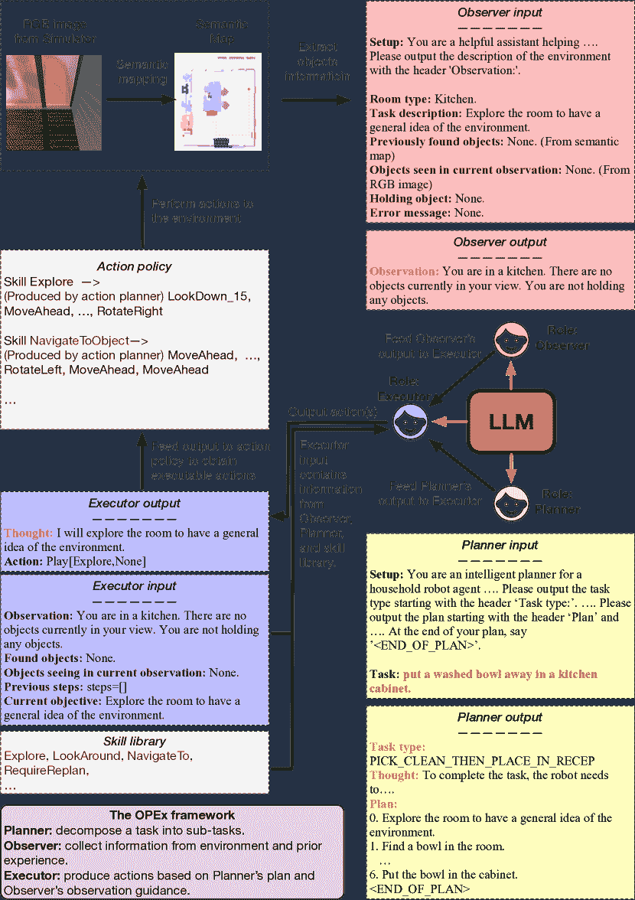
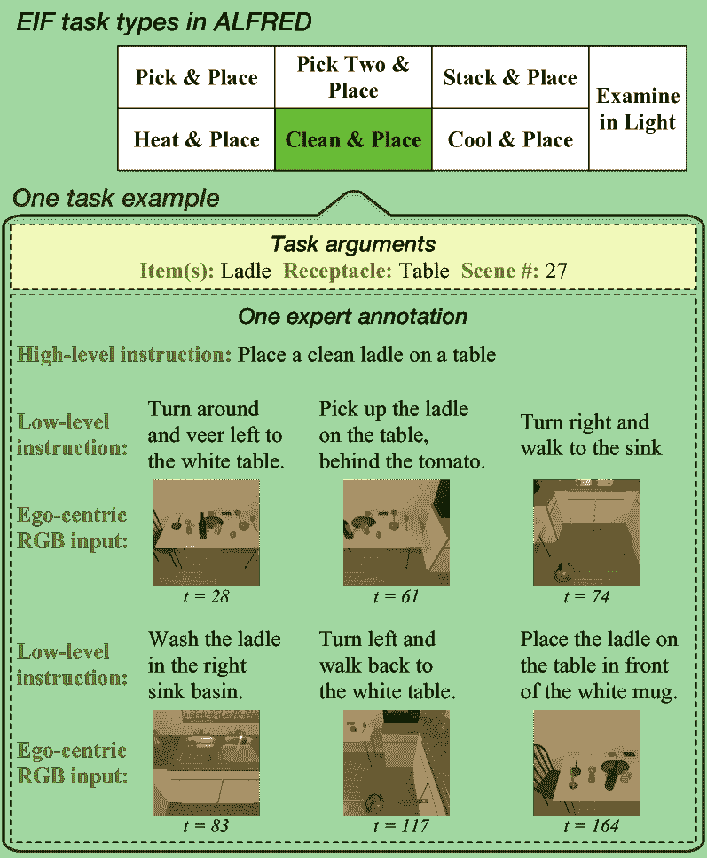
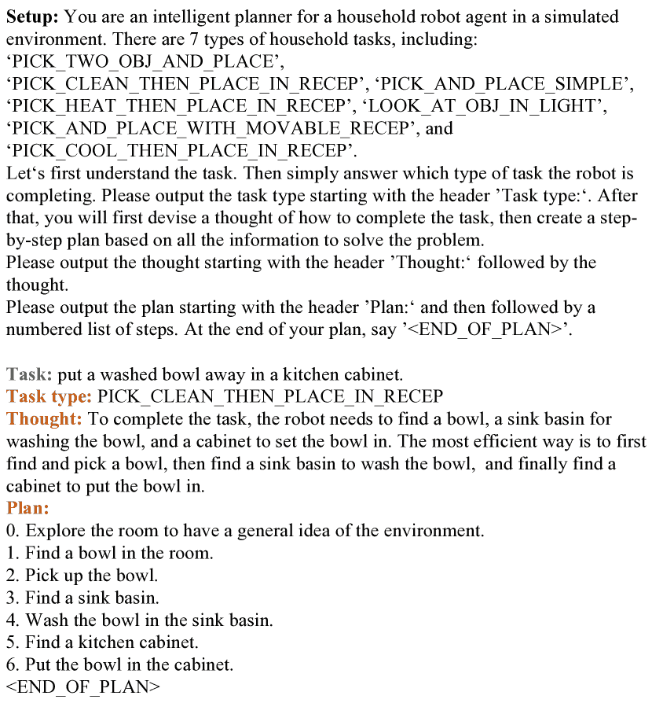
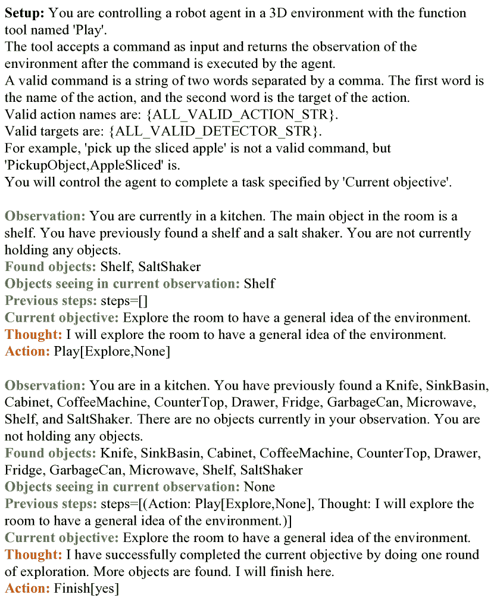

<!--yml
category: 未分类
date: 2025-01-11 12:48:23
-->

# OPEx: A Component-Wise Analysis of LLM-Centric Agents in Embodied Instruction Following

> 来源：[https://arxiv.org/html/2403.03017/](https://arxiv.org/html/2403.03017/)

Haochen Shi${}^{1}$, Zhiyuan Sun${}^{1}$, Xingdi Yuan${}^{2}$, Marc-Alexandre Côté${}^{2}$, Bang Liu${}^{1}$¹¹footnotemark: 1
${}^{1}$ Université de Montréal & Mila, Montréal, Canada
${}^{2}$ Microsoft Research, Montréal, Canada
{haochen.shi, zhiyuan.sun, bang.liu}@umontreal.ca,
{eric.yuan, macote}@microsoft.com   Equal advising.  Canada CIFAR AI Chair.

###### Abstract

Embodied Instruction Following (EIF) is a crucial task in embodied learning, requiring agents to interact with their environment through egocentric observations to fulfill natural language instructions. Recent advancements have seen a surge in employing large language models (LLMs) within a framework-centric approach to enhance performance in embodied learning tasks, including EIF. Despite these efforts, there exists a lack of a unified understanding regarding the impact of various components—ranging from visual perception to action execution—on task performance. To address this gap, we introduce OPEx, a comprehensive framework that delineates the core components essential for solving embodied learning tasks: Observer, Planner, and Executor. Through extensive evaluations, we provide a deep analysis of how each component influences EIF task performance. Furthermore, we innovate within this space by deploying a multi-agent dialogue strategy on a TextWorld counterpart, further enhancing task performance. Our findings reveal that LLM-centric design markedly improves EIF outcomes, identify visual perception and low-level action execution as critical bottlenecks, and demonstrate that augmenting LLMs with a multi-agent framework further elevates performance.

## 1 Introduction

Embodied learning, particularly through tasks like Embodied Instruction Following (EIF) Shridhar et al. ([2020a](https://arxiv.org/html/2403.03017v1#bib.bib33)), stands at the forefront of artificial intelligence research. EIF, where agents must interpret natural language instructions to navigate and act within their environment using egocentric observations, epitomizes the challenge of integrating cognitive understanding with physical action. This intersection is crucial for developing autonomous agents capable of nuanced interaction with complex, real-world environments, marking a significant stride towards more advanced and versatile AI systems. As the research community harnesses advancements in deep learning, we edge closer to this ambition Baker et al. ([2022](https://arxiv.org/html/2403.03017v1#bib.bib1)); Min et al. ([2021](https://arxiv.org/html/2403.03017v1#bib.bib21)); Inoue and Ohashi ([2022](https://arxiv.org/html/2403.03017v1#bib.bib13)); Huang et al. ([2022a](https://arxiv.org/html/2403.03017v1#bib.bib11)).

Traditional approaches to Embodied Instruction Following (EIF) often rely on expert-generated annotations, a process that can be both expensive and challenging to scale for real-world applications. In contrast, Large Language Models (LLMs), such as those cited in recent studies Inoue and Ohashi ([2022](https://arxiv.org/html/2403.03017v1#bib.bib13)); OpenAI ([2023](https://arxiv.org/html/2403.03017v1#bib.bib25)); Wei et al. ([2022a](https://arxiv.org/html/2403.03017v1#bib.bib43)); Driess et al. ([2023](https://arxiv.org/html/2403.03017v1#bib.bib7)); Touvron et al. ([2023](https://arxiv.org/html/2403.03017v1#bib.bib39)); Huang et al. ([2022a](https://arxiv.org/html/2403.03017v1#bib.bib11), [b](https://arxiv.org/html/2403.03017v1#bib.bib12)); Liang et al. ([2022](https://arxiv.org/html/2403.03017v1#bib.bib15)); Wang et al. ([2023a](https://arxiv.org/html/2403.03017v1#bib.bib40)); Shinn et al. ([2023](https://arxiv.org/html/2403.03017v1#bib.bib32)); Song et al. ([2023](https://arxiv.org/html/2403.03017v1#bib.bib37)), have emerged as a potent alternative, showcasing exceptional capabilities in natural language understanding and generation. These models, enriched by extensive textual datasets, demonstrate significant common-sense reasoning abilities. As a result, there’s a growing trend towards leveraging LLM-centric architectures for embodied learning tasks including EIF, which promise to simplify planning and execution tasks through a few-shot learning paradigm. However, despite their potential, the implementations of EIF systems introduce a variety of designs and components across different studies Min et al. ([2021](https://arxiv.org/html/2403.03017v1#bib.bib21)); Inoue and Ohashi ([2022](https://arxiv.org/html/2403.03017v1#bib.bib13)); Song et al. ([2023](https://arxiv.org/html/2403.03017v1#bib.bib37)); Blukis et al. ([2022](https://arxiv.org/html/2403.03017v1#bib.bib3)); Wang et al. ([2023a](https://arxiv.org/html/2403.03017v1#bib.bib40)); Zhu et al. ([2023](https://arxiv.org/html/2403.03017v1#bib.bib47)). There remains a notable gap in systematically understanding how these disparate elements influence overall task performance, underscoring the need for a thorough analysis of LLM-centric methods within the context of EIF.

In addressing the complexities of Embodied Instruction Following (EIF), we introduce OPEx, a novel framework designed to systematically outline the essential components for mastering embodied learning tasks. OPEx is segmented into three core parts: Observer, Planner, and Executor. The Observer component is tasked with processing and interpreting sensory inputs, primarily visual, to construct an actionable understanding of the agent’s immediate environment. The Planner dynamically devises strategic plans as subtasks to complete the tasks based on perceptual inputs, effectively bridging the gap between perception and action. Lastly, the Executor is responsible for implementing these plans with a skill library, which translates several re-useable skills into precise, context-aware actions within the environment, ensuring the agent’s interactions are both relevant and goal-oriented. This tripartite structure provides a clear delineation of roles within the system, facilitating a granular analysis of how each contributes to the overarching performance of EIF tasks.

To understand the impact of each OPEx component on performance in EIF tasks, we conducted an in-depth analysis. By experimenting with different versions of the Observer, Planner, and Executor components, we assessed how each contributes to and influences overall success. This approach allowed us to identify the key attributes and design choices that enhance the system’s ability to tackle complex embodied tasks, providing clear insights into optimizing embodied learning agents.

To further unlock the potential of LLMs in embodied learning, we eliminate the influence of visual perception and low-level action execution of the system utilizing a pure-text counterpart environment Shridhar et al. ([2020b](https://arxiv.org/html/2403.03017v1#bib.bib34)) and further adopt a multi-agent dialogue strategy, splitting the instruction-following challenge into distinct reasoning and grounding roles handled by a reasoner agent and an actor agent, respectively. This dialogue-driven approach simplifies the task into decision-making processes, where both agents utilize world knowledge obtained from an explorer. This explorer gathers insights either through direct interaction with the environment or from human contributions, thereby enriching the collaborative problem-solving capabilities of the reasoner and actor with more grounded and informed decision-making.

Our experimental evaluation was conducted using the ALFRED Shridhar et al. ([2020a](https://arxiv.org/html/2403.03017v1#bib.bib33)) and ALFWorld Shridhar et al. ([2020b](https://arxiv.org/html/2403.03017v1#bib.bib34)) benchmarks, providing a comprehensive testing ground for our extensive evaluation. The core analysis of our experiments underscores significant advancements: the LLM-centric approach notably enhances performance in EIF tasks. We pinpoint visual perception and low-level action execution as pivotal bottlenecks. Moreover, our results affirm that incorporating a multi-agent dialogue strategy into an LLM-centric task solver significantly boosts overall task performance on AFLWorld, showcasing the effectiveness of our proposed methodology in addressing the complexities of embodied learning tasks.

## 2 Task Formulation

We benchmark our method with ALFRED Shridhar et al. ([2020a](https://arxiv.org/html/2403.03017v1#bib.bib33)) and its TextWorld counterpart ALFWorld Shridhar et al. ([2020b](https://arxiv.org/html/2403.03017v1#bib.bib34)). Both contain a set of environments associated with long-horizon household tasks specified by natural language instructions. The language instruction $L=\{L_{\text{high}},L_{\text{low}}\}$ consists of instructions at two different levels: a high-level instruction goal $L_{\text{high}}$that summarizes the task and a sequence of low-level instructions $L_{\text{low}}$that depict the specific actions required. At the time step $t$, ALFRED also provides a visual egocentric observation $V_{t}$ (text observation $\mathcal{L}_{t}$ if on ALFWorld) represents the world state $\mathcal{W}_{t}$.

Given the language instruction $L$ and an initial observation $V_{0}$ ($\mathcal{L}_{0}$ if on ALFWorld), the agent’s objective is to generate an execution trajectory $\mathcal{T}=\left\langle V_{0},a_{0},V_{1},a_{1},\ldots,V_{T},a_{T}\right\rangle$, where $a_{t}$ is the action taken by the agent at time step $t$, and $V_{t+1}$ is the observation of the world state $\mathcal{W}_{t+1}$ caused by that action. The action space $A$ can be categorized into two classes: navigation actions $A_{N}$ and interaction actions $A_{I}$, respectively¹¹1$A_{N}\in\{$ RotateRight, RotateLeft, MoveAhead, LookUp, LookDown$\}$, $A_{I}\in\{$ PickupObject, PutObject, OpenObject, CloseObject, ToggleObjectOn, ToggleObjectOff, SliceObject$\}$.. In practice, we follow the setting of FILM Min et al. ([2021](https://arxiv.org/html/2403.03017v1#bib.bib21)), where the navigation actions $A_{N}$ are constrained to discrete values, and a pixel-wise interaction mask of the target object must be specified for interaction actions $A_{I}$. There are seven types of household tasks, of which each episode is terminated either if an agent meets the goal conditions specified in $L$ (success) or reaches the maximum number of steps (fail). See Appendix. [A](https://arxiv.org/html/2403.03017v1#A1 "Appendix A Task Example in ALFRED ‣ OPEx: A Component-Wise Analysis of LLM-Centric Agents in Embodied Instruction Following") for a task example in ALFRED.

Figure 1: Overview of our OPEx framework. We will open-source the code after acceptance.

## 3 Methodology

We first provide an overview of the proposed LLM-centric framework (OPEx) in Figure [1](https://arxiv.org/html/2403.03017v1#S2.F1 "Figure 1 ‣ 2 Task Formulation ‣ OPEx: A Component-Wise Analysis of LLM-Centric Agents in Embodied Instruction Following"). OPEx consists of six components: (1) A semantic mapping module to transform the egocentric visual observation into a semantic map; (2) An LLM-based planner to decompose the specified language task instruction $L$ into subtasks $S=[S_{0},S_{1},...,S_{n}]$; (3) An LLM-based observer to gather information from the environment and depict the partially observed world state $\mathcal{W}_{t}$ at the current time step $t$ as natural language description $O^{L}_{t}$; (4) An LLM-based executor to receive the world state description $O^{L}_{t}$ and select skill from a set of pre-defined skills to complete the current subtask $S_{i}$; (5) A skill library $\mathcal{SL}=\{sl_{0},sl_{1},...\}$ to store the skills manipulating the agent in the simulated environment (e.g, NavigateTo, LookAround, and Explore); (6) A deterministic action policy to convert the skills into low-level actions (e.g., RotateRight).

#### Semantic Mapping Module

The goal of the semantic mapping module is to create a 2D semantic map $M_{t}$ from a top-down perspective (i.e., a map of explored areas, obstacles, and detected objects). At each time step $t$, this module receives the egocentric visual observation $V_{t}$ of the world state $\mathcal{W}_{t}$ as input, which is then processed into a depth map and instance segmentation using a UNet Ronneberger et al. ([2015](https://arxiv.org/html/2403.03017v1#bib.bib28)) and a MaskRCNN He et al. ([2017](https://arxiv.org/html/2403.03017v1#bib.bib10)) (or ZoeDepth Bhat et al. ([2023](https://arxiv.org/html/2403.03017v1#bib.bib2)) and SOLQ Dong et al. ([2021](https://arxiv.org/html/2403.03017v1#bib.bib6)) as stronger perception models). Following FILM Min et al. ([2021](https://arxiv.org/html/2403.03017v1#bib.bib21)), we use the implementation from Blukis et al. ([2022](https://arxiv.org/html/2403.03017v1#bib.bib3)) for UNet-based depth estimation and  Shridhar et al. ([2020b](https://arxiv.org/html/2403.03017v1#bib.bib34)) for MaskRCNN-based instance segmentation. Then, a point cloud is constructed from the depth prediction and instance segmentation. Finally, the point cloud is binned into a voxel representation and then transformed into the 2D semantic map $M_{t}$ by summing over the height of the voxel representation, which is updated and aggregated over time steps. Due to the inherent difficulty in achieving a flawless perceptual model, the resulting semantic map $M_{t}$ often includes noise. This noise has the potential to exacerbate the challenges associated with locating navigational targets and subsequently affect the performance. To address such kind of issues, we introduce a supplementary semantic map denoted as $M_{t}^{\prime}$, which aggregates the information from $M_{t}$ over successive time steps. The intuition resembles a form of majority voting: when an object is recognized as a fridge across more viewpoints than as a wall, its likelihood of being a fridge over a wall should be proportionally increased. The two semantic maps work in a cascading manner: when the agent tries to identify an object from the maps, the initial search is conducted within $M_{t}^{\prime}$. $M_{t}$ is only utilized if the object cannot be located within $M_{t}^{\prime}$.

#### LLM-based Planner

The goal of the LLM-based planner is to decompose a specified language instruction $L$ into a sequence of subtasks $S=[S_{0},S_{1},...,S_{n}]$. In practice, we utilize Chain-of-Though (CoT) Wei et al. ([2022b](https://arxiv.org/html/2403.03017v1#bib.bib44)) to prompt GPT-4 OpenAI ([2023](https://arxiv.org/html/2403.03017v1#bib.bib25)) with in-context learning. The corresponding prompt examples are demonstrated in the Appendix.

#### Example Selector

We have collected a set of prompt examples from 10 episodes within the training split for each of the 7 task types, amounting to a total of 70 episodes. As shown in Liu et al. ([2022b](https://arxiv.org/html/2403.03017v1#bib.bib18)), choosing which in-context examples to add to the prompt can impact the overall performance. Therefore, we further apply an example selector to provide the LLM-based planner with the most relevant examples by ranking the examples based on the similarity of the input test case and the examples. In practice, we employ the example selector from LangChain Chase ([2022](https://arxiv.org/html/2403.03017v1#bib.bib4)), which first ranks the examples based on the corresponding embeddings²²2We adopt the text-embedding-ada-002 embeddings provided by OpenAI. that have the greatest cosine similarity with the inputs, then select top-$K$ examples for in-context learning.

#### LLM-based Observer

The goal of the LLM-based observer is to extract information from the environment feedback and the agent state, and present it in the form of a natural language description $O_{t}^{L}$ in a zero-shot manner. The rationale behind the design of the LLM-based observer is twofold: (1) to gather and render the state of the environment, enabling the tracking of environment dynamics across time steps and facilitating dynamic planning and acting; and (2) to summarize the information into a task-centric description, thereby safeguarding the LLM-based executor against distractions and hallucinations. The LLM-based observer is querying GPT-3.5-turbo with the prompt format shown in the Appendix.

#### LLM-based Executor

Given the current subtask $S_{i}$, the language description of the world state $O_{t}^{L}$ at time step $t$, the goal of the LLM-based executor is to complete the subtask $S_{i}$ by iteratively manipulating the agent in the environment with a set of pre-defined skills from a skill library $\mathcal{SL}$. In contrast to the LLM-based planner, which predominantly depends on the reasoning prowess of LLMs, the LLM-based executor is tasked with active engagement within the environment and acquiring an understanding of the environment dynamics (for instance, in ALFRED, objects can be cleaned by placing them into a sink basin and toggling on the faucet) from the feedback. To this end, inspired by ReAct Yao et al. ([2022](https://arxiv.org/html/2403.03017v1#bib.bib46)), we prompt the LLM-based executor (a GPT-4 model) to generate both reasoning traces and action plans (composed of skills in $\mathcal{SL}$), allowing for greater synergy between the two: reasoning traces help the model induce, track, and update action plans as well as handle exceptions, while actions allow it to interface with and gather additional information from the environment. The input for LLM-based Executor’s prompt template is generally composed of the language-based observation $O_{t}^{L}$, found objects, objects detected in the current view, short-term memory of the action plan for the current subtask, which is cleared once the current subtask is finished, and the current subtask $S_{i}$. The LLM-based executor is required to generate both the reasoning traces (the “Thought” part in the Executor’s output) and the action plans. The action space of the LLM-based executor is {*Play*, *Finish*}, where the action *Play* is utilized to interact with the environment or request re-planning of the current plan $S$, and the action *Finish* is used for finishing the action planning for the current subtask $S_{i}$. The action *Play* receives two arguments as the inputs: [$\mathcal{SL}_{i}$, $\mathcal{ST}$] (e.g., Play[NavigateToObject,Table]), where $\mathcal{SL}_{i}$ is the pre-defined skills in the skill library, and $\mathcal{ST}$ is the target argument of the corresponding skill action $\mathcal{SL}_{i}$.

#### Skill Library

We design a skill library to empower the LLM-based executor with the following capabilities: (1) reasoning over language to track progress, handle exceptions or adjust the plan according to the situation; (2) acting to support the reasoning and collect information about the environment dynamics by controlling the agent. Apart from all the interaction actions $A_{I}$, we have designed several additional skills, including NavigateToObject, Explore, LookAround, and RequireReplan. The NavigateToObject skill empowers the LLM-based executor with the capability to set the landmark-based navigation goal, it takes a found object in the room as the skill action target $\mathcal{ST}$. The Explore skill enhances the LLM-based executor’s ability to guide the agent in room exploration by sampling navigation goals from traversable areas, and it requires no skill action target. It is worth noting that we have an initial exploration heuristic for the first four calls of the Explore skill, we set the four corners of the room with a higher exploration priority. The RequireReplan provides the LLM-based executor with the capability to dynamically adjust the plan, improving the robustness to exceptions and producing more probability for it to learn from the environment dynamics. The LookAround skill enables the LLM-based executor to manipulate the agent to look around the environment to get a more comprehensive observation of the room.

#### Deterministic Action Policy

Given the current instruction specified by the action plan [$\mathcal{SL}_{i}$ $\mathcal{ST}$] from the LLM-based executor, the deterministic action policy of OPEx outputs a navigation or interaction action based on a set of heuristics, which is quite similar to that of FILM. Both policies generally follow the following procedure: if the target object is observed in the semantic map, the closest instance is selected as the final navigation goal. Otherwise, the final navigation goal is set as the exploration navigation goal. After goal determination, the agent employs the Fast Marching Method Sethian ([1996](https://arxiv.org/html/2403.03017v1#bib.bib30)) to navigate towards the navigation goal. Additionally, when the target object is within the agent’s egocentric visual range, the policy will try to conduct the interaction or adjust the position to prepare for the interaction action. The deterministic action policy of OPEx mainly differs from that of FILM in three aspects. Firstly, the deterministic action policy of OPEx is equipped with a slice replay heuristic, which tracks the location of successful execution of SliceObject for easier going back. Secondly, instead of directly setting the location of the target object as the navigation goal, we sample a traversable location based on the distance to the target object as the navigation goal (noted as “traversable goal heuristic”). Thirdly, instead of directly utilizing the semantic map $M_{t}$ to determine whether the target object is found and get the navigation goal for that object, we adopt the additional semantic map $M_{t}^{\prime}$ to achieve this in the first place. If the target is not found in $M_{t}^{\prime}$, the original semantic map $M_{t}$ is then utilized. We prioritize $M_{t}^{\prime}$ as it is supposed to be more robust to the errors from the perception models.

#### Prior Knowledge Integration

Due to the lack of prior knowledge of the specific environment, OPEx frequently fails even on ALFWorld where the impact of perception and action modules are ablated. For instance, OPEx may continuously fail for trying to pick up objects across various episodes due to the lack of the knowledge that agent can not directly hold more than 1 object in ALFRED. Furthermore, a system with a single agent trying to handle planning and grounding simultaneously often struggles to learn the optimal timing for switching between planning and grounding. To bridge the gap, we propose improving OPEx by splitting the reasoning and grounding issues with a multi-agent dialogue strategy and marrying it with the world knowledge, which is obtained from an explorer by interacting with the environment or collecting human contributions. Specifically, we first deploy the agent to explore the ALFWorld environment and collect action-observation sequences $\{\mathcal{AO}_{i}\}$, where $\mathcal{AO}_{i}=[\mathcal{L}_{0},a_{0},\mathcal{L}_{1},a_{1},...,\mathcal{L}_% {T}]$. Then an LLM-based module or human is required to observe the action-observation sequences and summarize the world knowledge learned from $\{\mathcal{AO}_{i}\}$ as prior knowledge candidates $\{P_{j}\}$. After that, an LLM-based filter is applied on $\{P_{j}\}$ to eliminate contradictory and duplicated world knowledge, which results in the final set of world knowledge $\{P^{\prime}_{i}\}$. Finally, the world knowledge $\{P^{\prime}_{i}\}$ is integrated into the prompt templates of the multi-agent dialogue strategy, where a reasoner depicts general plans solving the task and the actor ground the plans as executable actions in the environment.

## 4 Experiments and Discussion

### 4.1 Experiment Setup

#### Evaluation Splits

The ALFRED benchmark consists of training, valid, and test sets. Both valid and test sets are composed of seen and unseen splits, where the unseen splits consist of rooms that do not appear in the training set. Following Yao et al. ([2022](https://arxiv.org/html/2403.03017v1#bib.bib46)), we evaluate our methods on 134 unseen evaluation games for the ALFWorld benchmark.

#### Evaluation Metrics

Following Shridhar et al. ([2020a](https://arxiv.org/html/2403.03017v1#bib.bib33)); Min et al. ([2021](https://arxiv.org/html/2403.03017v1#bib.bib21)), we report four evaluation metrics on AFLRED: (1) Success Rate (SR); (2) Goal Condition (GC), the ratio of goal conditions completed at the end of an episode; (3) path length weighted SR (PLWSR), the SR weighted by (path length of the expert trajectory)/(path length taken by the agent); (4) path length weighted GC (PLWGC), the GC weighted by the same factor. Following Yao et al. ([2022](https://arxiv.org/html/2403.03017v1#bib.bib46)), we report SR on ALFWorld.

| Method | Test Seen | Test Unseen |
| PLWGC | GC | PLWSR | SR | PLWGC | GC | PLWSR | SR |
| ALFRED (High-level goal instructions only) |  |
| LAV Nottingham et al. ([2021](https://arxiv.org/html/2403.03017v1#bib.bib24)) | 13.18 | 23.21 | 6.31 | 13.35 | 10.47 | 17.27 | 3.12 | 6.38 |
| HLSM Blukis et al. ([2022](https://arxiv.org/html/2403.03017v1#bib.bib3)) | 11.53 | 35.79 | 6.69 | 25.11 | 8.45 | 27.24 | 4.34 | 16.29 |
| LGS-RPA Murray and Cakmak ([2022](https://arxiv.org/html/2403.03017v1#bib.bib22)) | 24.49 | 41.71 | 16.65 | 33.01 | 20.01 | 38.55 | 12.92 | 27.80 |
| EPA Liu et al. ([2022c](https://arxiv.org/html/2403.03017v1#bib.bib19)) | 3.47 | 44.14 | 2.56 | 39.96 | 3.91 | 39.54 | 2.92 | 36.07 |
| LLM-Planner Song et al. ([2023](https://arxiv.org/html/2403.03017v1#bib.bib37)) | - | 24.57 | - | 15.33 | - | 22.89 | - | 13.41 |
| FILM Min et al. ([2021](https://arxiv.org/html/2403.03017v1#bib.bib21)) | 14.17 | 36.15 | 10.39 | 25.77 | 13.13 | 34.75 | 9.67 | 24.46 |
| OPEx-S | 20.13 | 54.27 | 13.64 | 43.51 | 18.46 | 53.82 | 12.57 | 41.27 |

Table 1: Main Results on the test splits of ALFRED benchmark.

#### Compared Methods

The compared methods on ALFRED include LAV Nottingham et al. ([2021](https://arxiv.org/html/2403.03017v1#bib.bib24)), where the raw language and visual inputs are transformed into structured forms, with a separate “action prediction module” predicting the low-level actions; HLSM Blukis et al. ([2022](https://arxiv.org/html/2403.03017v1#bib.bib3)), a hierarchical approach that uses semantic voxel map state representation as a long-term memory to solve long-horizon tasks; LGS-RPA Murray and Cakmak ([2022](https://arxiv.org/html/2403.03017v1#bib.bib22)), which utilizes a Djikstra-based deterministic planner for navigation action generation and introduces landmark-guided search along with the reinforced pose adjustment for navigation goal searching and interaction action preparation respectively; EPA Liu et al. ([2022c](https://arxiv.org/html/2403.03017v1#bib.bib19)), a neural-symbolic approach with symbolic planning; LLM-Planner Song et al. ([2023](https://arxiv.org/html/2403.03017v1#bib.bib37)), which simply prompts LLMs for task decomposition; FILM Min et al. ([2021](https://arxiv.org/html/2403.03017v1#bib.bib21)), which builds 2D semantic map and performs exploration with a semantic search policy. It is worth noting that there are also several works on the leaderboard reporting high performance that are not included in the comparison Inoue and Ohashi ([2022](https://arxiv.org/html/2403.03017v1#bib.bib13)); Shridhar et al. ([2020a](https://arxiv.org/html/2403.03017v1#bib.bib33)); Chen et al. ([2023](https://arxiv.org/html/2403.03017v1#bib.bib5)), this is mainly because we focus on systematically outlining and evaluating the essential components for mastering EIF tasks, while we cannot find the description or available open-source resources of these works when we conduct the experiments. On the ALFWorld benchmark, apart from the variants of OPEx, we also introduce ReAct Yao et al. ([2022](https://arxiv.org/html/2403.03017v1#bib.bib46)) for comparison to demonstrate the effectiveness of the proposed method.

### 4.2 Experimental Results

The main results are illustrated in Table [1](https://arxiv.org/html/2403.03017v1#S4.T1 "Table 1 ‣ Evaluation Metrics ‣ 4.1 Experiment Setup ‣ 4 Experiments and Discussion ‣ OPEx: A Component-Wise Analysis of LLM-Centric Agents in Embodied Instruction Following"). When contrasting OPEx with the baseline FILM, it becomes evident that OPEx exhibits substantial improvement across two distinct environmental settings, encompassing both the goal condition (GC) and the success rate (SR). Notably, OPEx utilizes in-context learning on less than 10% data used for FILMs’ planner (Language Processor) training, while OPEx still significantly outperforms FILM. The observation that OPEx achieves 17.74% and 16.78% absolute gain in SR on test seen and unseen split respectively empirically demonstrates the effectiveness of the OPEx framework. However, it is also worth noting that the OPEx is inferior to FILM concerning the path length weighted metrics. This phenomenon could potentially be attributed to the deliberate choice of assigning a higher maximum number of failures to OPEx as compared to FILM. This choice typically leads to the average length of the resulting episodes. The rationale behind this decision was to encourage OPEx to undertake a more extensive exploration, thereby fostering the acquisition of skills in handling a broader range of exceptions arising from both uncommon scenarios and failures. On the other hand, the FILM utilizes two BERT models trained on the whole training set with the template assumption to conduct the task decomposition, while the LLM-based planner can achieve this goal with only a bunch of examples. This phenomenon shows that OPEx works with a much lower demand for in-domain data, making it more feasible in real-world scenarios, where the data collection could be more time-consuming and expensive. Furthermore, the FILM outputs low-level navigation and interaction actions solely with a deterministic policy, while OPEx introduces an LLM-based executor accompanying the deterministic policy to release LLMs’ potential for robust language grounding and exception handling in the embodiment environment. Overall, the main results empirically demonstrate that it could be feasible to develop embodied experts with low demand for in-domain data by mining LLMs’ potential for grounded planning and acting.

### 4.3 Ablation Study and Analysis

To further investigate the bottleneck of the system and the influence of different modules, we conduct several additional ablation studies.

#### Influence of perception models

We first conduct controlled experiments on the valid unseen split of the AFLRED dataset to study the influence of perception models. The corresponding results are illustrated in the first section of Table [2](https://arxiv.org/html/2403.03017v1#S4.T2 "Table 2 ‣ Influence of prior knowledge ‣ 4.3 Ablation Study and Analysis ‣ 4 Experiments and Discussion ‣ OPEx: A Component-Wise Analysis of LLM-Centric Agents in Embodied Instruction Following"), where OPEx-S denotes the OPEx with stronger perception models (fine-tuned ZoeDepth Bhat et al. ([2023](https://arxiv.org/html/2403.03017v1#bib.bib2)) for depth prediction and SOLQ Dong et al. ([2021](https://arxiv.org/html/2403.03017v1#bib.bib6)) for instance segmentation), OPEx-P denotes the OPEx with perfect ground-truth depth prediction and instance segmentation. The performance gain from the improvement of perception models is very significant, indicating there is much room for improvement regarding the perception models in ALFRED.

#### Influence of action policies

As shown in the second section of Table [2](https://arxiv.org/html/2403.03017v1#S4.T2 "Table 2 ‣ Influence of prior knowledge ‣ 4.3 Ablation Study and Analysis ‣ 4 Experiments and Discussion ‣ OPEx: A Component-Wise Analysis of LLM-Centric Agents in Embodied Instruction Following"), we design and conduct another set of controlled experiments to study the influence of distinct deterministic action heuristics introduced. It can be seen from the table that setting the navigation goal inside the traversable area brings the most significant performance improvement, while slice replay brings marginal improvement. Besides, introducing the additional semantic map for robust landmark-based navigation goal searching brings moderate performance gain.

#### Influence of LLM-based modules

We first conduct controlled experiments on the validation unseen split of the dataset to study the influence of different modules. The corresponding results are illustrated in Table [2](https://arxiv.org/html/2403.03017v1#S4.T2 "Table 2 ‣ Influence of prior knowledge ‣ 4.3 Ablation Study and Analysis ‣ 4 Experiments and Discussion ‣ OPEx: A Component-Wise Analysis of LLM-Centric Agents in Embodied Instruction Following"). Significant performance degradation can be observed when the LLM-based planner is removed from the OPEx. This is probably attributed to the fact that the LLM-based executor is required to solely perform implicit long-term planning and grounded interaction simultaneously under this setting. The LLM-based observer is designed to gather information and help the LLM-based executor to focus on task-relevant information by summarizing collected information and filtering out the task-irrelevant counterparts. However, the ablation study shows that the performance gain brought by the LLM-based observer is marginal. This observation can be caused by several possible reasons, including (1) GPT-4’s strong long text processing capability mitigates the needs of such kind of LLM-based observer; (2) the collected information from ALFRED is typically not too large/complex to cause severe distraction or hallucination of the LLM-based executor; (3) the observer utilizes zero-shot prompt, better prompts may need to be designed.

#### Influence of prior knowledge

To further investigate the role of decision-making modules in EIF agents, we conduct experiments on ALFWorld to eliminate the impact of perception models and action policies. The corresponding results are illustrated in the fourth section of Tabel [2](https://arxiv.org/html/2403.03017v1#S4.T2 "Table 2 ‣ Influence of prior knowledge ‣ 4.3 Ablation Study and Analysis ‣ 4 Experiments and Discussion ‣ OPEx: A Component-Wise Analysis of LLM-Centric Agents in Embodied Instruction Following"), where OPEx-L denotes the OPEx with prior knowledge learned from the environment and OPEx-H denotes the OPEx with prior knowledge provided by humans. With the observation that the system performance grows as the quality of the prior knowledge increases, this can be empirically explained by the intuition that decomposing EIF tasks via a collaborative multi-agent dialogue strategy helps intra-agent specialization and inter-agent cooperation. Besides, the intuition that the grounded prior knowledge prevents the agents from repetitive errors and facilitates grounded exception handling might also contribute to the results. Furthermore, the performance improvement of ReAct also empirically demonstrates the effectiveness of the proposed method.

| Method | Valid Uneen |
| PLWGC | GC | PLWSR | SR |
| Influence of perception models |
| OPEx | 13.48 | 48.61 | 9.08 | 35.91 |
| OPEx-S | 16.52 | 51.28 | 11.38 | 40.80 |
| OPEX-P | 23.72 | 66.17 | 17.43 | 59.43 |
| Influence of action policies |
| OPEx | 13.48 | 48.61 | 9.08 | 35.91 |
| -semantic map $M^{\prime}_{t}$ | 12.37 | 45.41 | 8.06 | 36.17 |
| -slice replay | 12.64 | 45.25 | 8.35 | 37.39 |
| -traversable goal | 11.77 | 43.49 | 7.09 | 34.50 |
| Influence of LLM-based modules |
| OPEx | 13.48 | 48.61 | 9.08 | 35.91 |
| -Planner | 8.10 | 40.16 | 5.72 | 30.57 |
| -Observer | 13.41 | 45.62 | 8.58 | 37.76 |
| Influence of prior knowledge (On ALFWorld) |
| ReAct | - | - | - | 66 |
| OPEx | - | - | - | 73 |
| OPEx-L | - | - | - | 78 |
| OPEx-H | - | - | - | 84 |

Table 2: Ablation Studies of OPEx. OPEx-S denotes the OPEx with stronger perception models, OPEx-P denotes the OPEx with perfect ground-truth depth prediction and instance segmentation, OPEx-L denotes the OPEx with prior knowledge learned from the environment, and OPEx-H denotes the OPEx with prior knowledge provided by humans.

| Method | SR | GC | PLWSR | PLWGC |
| --- | --- | --- | --- | --- |
| OPEx | 38.12 | 46.13 | 9.03 | 13.45 |
| FILM | 0.00 | 12.18 | 0.00 | 2.78 |

Table 3: Performance comparison with the baseline trained on same amount of data.

#### Low demand for in-domain data

To assess the efficiency of in-domain data usage, we conducted experiments comparing OPEx with the baseline FILM. The FILM is trained on identical data used for in-context learning of OPEx. The corresponding results are presented in Table [3](https://arxiv.org/html/2403.03017v1#S4.T3 "Table 3 ‣ Influence of prior knowledge ‣ 4.3 Ablation Study and Analysis ‣ 4 Experiments and Discussion ‣ OPEx: A Component-Wise Analysis of LLM-Centric Agents in Embodied Instruction Following"). Our findings indicate that OPEx markedly outperforms FILM across all evaluation metrics in the unseen validation split. Empirically, this suggests that OPEx requires significantly less in-domain data compared to FILM. This controlled study underscores the potential of addressing embodied tasks through an LLM-based framework. This framework achieves low in-domain data demand EIF by integrating feedback mechanisms, closed-loop grounded planning, and action, harmonized with the reasoning and common sense capabilities of Large Language Models (LLMs). Moreover, it also prompts our further exploration into the trade-off between in-domain data efficiency and inference overhead, inspiring future directions, such as devising agents that adeptly integrate both common sense and in-domain knowledge in a data-efficient manner.

#### Error mode analysis

We conduct the error mode analysis of OPEx on the valid unseen split. The corresponding statics are shown in Table [4](https://arxiv.org/html/2403.03017v1#S4.T4 "Table 4 ‣ Error mode analysis ‣ 4.3 Ablation Study and Analysis ‣ 4 Experiments and Discussion ‣ OPEx: A Component-Wise Analysis of LLM-Centric Agents in Embodied Instruction Following"). While our approach to calculate the statistics may vary from that of FILM, we have also incorporated FILM’s statistics from the original paper Min et al. ([2021](https://arxiv.org/html/2403.03017v1#bib.bib21)) for reference. Since we conduct the task decomposition with the LLM-based planner, which does not follow the template assumption, we don’t have statistics on language processing errors. As shown in the table, the goal object not found error typically account for a great ratio of all kinds of error, indicating both FILM and OPEx suffer from imperfect perception models. Besides, the interactive exploration of the LLM-based executor and the deterministic heuristics probably brings a lower error rate of collisions and the error caused by the target object in a closed receptacle.

| Error mode | FILM | OPEx |
| --- | --- | --- |
| Goal object not found | 26.07 | 27.36 |
| Interaction failures | 8.54 | 12.80 |
| Collisions | 11.00 | 9.84 |
| Object in closed receptacle | 16.16 | 11.61 |
| Language processing error | 24.54 | - |
| Others | 13.69 | 38.39 |

Table 4: Error mode analysis of OPEx on the valid unseen split.

## 5 Related Work

#### LLM-based Agents

Significant progress has been made for LLM-based agents, which mainly focus on the following three aspects. LLM-centric Planning utilizes LLMs to generate plans in dynamic environments. It can be further categorized into methods planning without feedback Huang et al. ([2022a](https://arxiv.org/html/2403.03017v1#bib.bib11)); Fan et al. ([2022](https://arxiv.org/html/2403.03017v1#bib.bib8)); Yao et al. ([2022](https://arxiv.org/html/2403.03017v1#bib.bib46)); Huang et al. ([2022b](https://arxiv.org/html/2403.03017v1#bib.bib12)); Xiang et al. ([2023](https://arxiv.org/html/2403.03017v1#bib.bib45)); Lin et al. ([2023](https://arxiv.org/html/2403.03017v1#bib.bib16)) and approaches planning with feedback from environment, human, and model Wang et al. ([2023a](https://arxiv.org/html/2403.03017v1#bib.bib40)); Zhu et al. ([2023](https://arxiv.org/html/2403.03017v1#bib.bib47)); Shinn et al. ([2023](https://arxiv.org/html/2403.03017v1#bib.bib32)); Wang et al. ([2023c](https://arxiv.org/html/2403.03017v1#bib.bib42)); Rana et al. ([2023](https://arxiv.org/html/2403.03017v1#bib.bib27)); Guan et al. ([2023](https://arxiv.org/html/2403.03017v1#bib.bib9)); Kim et al. ([2023](https://arxiv.org/html/2403.03017v1#bib.bib14)). LLM-oriented Memory stores information from the environment and boosts agents’ capabilities of experience accumulation and self-evolving to facilitate future actions. Significant-gravitas et al. ([2023](https://arxiv.org/html/2403.03017v1#bib.bib35)); Shinn et al. ([2023](https://arxiv.org/html/2403.03017v1#bib.bib32)); Wang et al. ([2023a](https://arxiv.org/html/2403.03017v1#bib.bib40)); Majumder et al. ([2023](https://arxiv.org/html/2403.03017v1#bib.bib20)); Wang et al. ([2023b](https://arxiv.org/html/2403.03017v1#bib.bib41)) LLM-centric Action Policy grounds the plans made by the agent into feasible action space Huang et al. ([2022a](https://arxiv.org/html/2403.03017v1#bib.bib11)); Schick et al. ([2023](https://arxiv.org/html/2403.03017v1#bib.bib29)) Notably, our LLM-centric agent differs from Voyager Wang et al. ([2023a](https://arxiv.org/html/2403.03017v1#bib.bib40)) and GITM Zhu et al. ([2023](https://arxiv.org/html/2403.03017v1#bib.bib47)) by mitigating the instruction grounding problem with dynamically adjusted plans from various granularity based on task-centric feedback from the environment.

#### Instruction Following in Embodied Environment

Prior work on EIF in embodied environments can be categorized into two classes: Supervisely trained end-to-end or modular-based methods that are eager for supervision signals from training data and hard to generalize due to the lack of abstraction and reasoning abilities Shridhar et al. ([2020a](https://arxiv.org/html/2403.03017v1#bib.bib33)); Suglia et al. ([2021](https://arxiv.org/html/2403.03017v1#bib.bib38)); Pashevich et al. ([2021](https://arxiv.org/html/2403.03017v1#bib.bib26)); Blukis et al. ([2022](https://arxiv.org/html/2403.03017v1#bib.bib3)); Singh et al. ([2020](https://arxiv.org/html/2403.03017v1#bib.bib36)); Liu et al. ([2022a](https://arxiv.org/html/2403.03017v1#bib.bib17)); Min et al. ([2021](https://arxiv.org/html/2403.03017v1#bib.bib21)); Sharma et al. ([2021](https://arxiv.org/html/2403.03017v1#bib.bib31)), and LLM-based methods that utilizes LLMs’ reasoning capability Inoue and Ohashi ([2022](https://arxiv.org/html/2403.03017v1#bib.bib13)); Song et al. ([2023](https://arxiv.org/html/2403.03017v1#bib.bib37)). Different from Prompter Inoue and Ohashi ([2022](https://arxiv.org/html/2403.03017v1#bib.bib13)) and LLM-Planner Song et al. ([2023](https://arxiv.org/html/2403.03017v1#bib.bib37)), which introduce LLMs only for target location finding and dynamic task decomposition, our method is an LLM-centric framework and decouples reasoning tasks for decision masking problem with multiple LLM-based roles, where the LLMs build the plan, adjust the plan, and ground the plan into structured action spaces. Besides, our method evolves based on the feedback, providing promising future research directions, including human-in-the-loop learning, multi-source feedback mixing and refining, etc.

## 6 Conclusion

We introduce OPEx, an LLM-centric framework tailored for Embodied Instruction Following (EIF), and undertake extensive evaluations to dissect the influence of its distinct components. Building on this foundation, we further improve OPEx by integrating world knowledge with a multi-agent dialogue strategy to further harness LLMs’ potential in addressing EIF challenges. Our comprehensive analysis reveals that an LLM-centric design significantly enhances EIF performance, pinpointing visual perception and low-level action execution as crucial bottlenecks. Additionally, our findings demonstrate that integrating a multi-agent dialogue mechanism within LLMs markedly boosts their effectiveness, offering promising directions for future research in embodied learning.

## Limitations

While our study introduces the OPEx framework and a dialogue-based mechanism for solving EIF tasks, it is not without its limitations. First, the reliance on large language models (LLMs) and the complexity of the multi-agent system introduce challenges in interpretability and computational efficiency. These models demand considerable resources by extensively communicating with ChatGPT, which might limit their applicability in resource-constrained environments. Second, our experiments are conducted within the confines of the ALFRED and ALFWORLD benchmarks, which, while comprehensive, may not encompass all possible real-world scenarios an embodied agent might encounter. Third, the integration of visual perception and action execution as identified bottlenecks suggests that further refinement in these areas is necessary to achieve truly seamless and adaptive embodied AI systems. Future work should aim to address these limitations, exploring more efficient model architectures, broader applicability across diverse environments, and enhanced methods for achieving naturalistic human-agent interaction.

## Ethical Concerns

We do not foresee an immediate ethical or societal impact resulting from our work. However, as an LLM application, we acknowledge that OPEx could in some way be affected by various types of hallucinations introduced by the LLMs. We therefore urge researchers and practitioners to use our proposed framework in a mindful way, especially when deploying such LLM-centric agents in real world applications..

## References

*   Baker et al. (2022) Bowen Baker, Ilge Akkaya, Peter Zhokov, Joost Huizinga, Jie Tang, Adrien Ecoffet, Brandon Houghton, Raul Sampedro, and Jeff Clune. 2022. Video pretraining (vpt): Learning to act by watching unlabeled online videos. *Advances in Neural Information Processing Systems*, 35:24639–24654.
*   Bhat et al. (2023) Shariq Farooq Bhat, Reiner Birkl, Diana Wofk, Peter Wonka, and Matthias Müller. 2023. Zoedepth: Zero-shot transfer by combining relative and metric depth. *arXiv preprint arXiv:2302.12288*.
*   Blukis et al. (2022) Valts Blukis, Chris Paxton, Dieter Fox, Animesh Garg, and Yoav Artzi. 2022. A persistent spatial semantic representation for high-level natural language instruction execution. In *Conference on Robot Learning*, pages 706–717\. PMLR.
*   Chase (2022) Harrison Chase. 2022. [LangChain](https://github.com/hwchase17/langchain).
*   Chen et al. (2023) Yaran Chen, Wenbo Cui, Yuanwen Chen, Mining Tan, Xinyao Zhang, Dongbin Zhao, and He Wang. 2023. Robogpt: an intelligent agent of making embodied long-term decisions for daily instruction tasks. *arXiv preprint arXiv:2311.15649*.
*   Dong et al. (2021) Bin Dong, Fangao Zeng, Tiancai Wang, Xiangyu Zhang, and Yichen Wei. 2021. Solq: Segmenting objects by learning queries. *Advances in Neural Information Processing Systems*, 34:21898–21909.
*   Driess et al. (2023) Danny Driess, Fei Xia, Mehdi SM Sajjadi, Corey Lynch, Aakanksha Chowdhery, Brian Ichter, Ayzaan Wahid, Jonathan Tompson, Quan Vuong, Tianhe Yu, et al. 2023. Palm-e: An embodied multimodal language model. *arXiv preprint arXiv:2303.03378*.
*   Fan et al. (2022) Linxi Fan, Guanzhi Wang, Yunfan Jiang, Ajay Mandlekar, Yuncong Yang, Haoyi Zhu, Andrew Tang, De-An Huang, Yuke Zhu, and Anima Anandkumar. 2022. Minedojo: Building open-ended embodied agents with internet-scale knowledge. *arXiv preprint arXiv:2206.08853*.
*   Guan et al. (2023) Lin Guan, Karthik Valmeekam, Sarath Sreedharan, and Subbarao Kambhampati. 2023. Leveraging pre-trained large language models to construct and utilize world models for model-based task planning. *arXiv preprint arXiv:2305.14909*.
*   He et al. (2017) Kaiming He, Georgia Gkioxari, Piotr Dollár, and Ross Girshick. 2017. Mask r-cnn. In *Proceedings of the IEEE international conference on computer vision*, pages 2961–2969.
*   Huang et al. (2022a) Wenlong Huang, Pieter Abbeel, Deepak Pathak, and Igor Mordatch. 2022a. Language models as zero-shot planners: Extracting actionable knowledge for embodied agents. In *International Conference on Machine Learning*, pages 9118–9147\. PMLR.
*   Huang et al. (2022b) Wenlong Huang, Fei Xia, Ted Xiao, Harris Chan, Jacky Liang, Pete Florence, Andy Zeng, Jonathan Tompson, Igor Mordatch, Yevgen Chebotar, et al. 2022b. Inner monologue: Embodied reasoning through planning with language models. *arXiv preprint arXiv:2207.05608*.
*   Inoue and Ohashi (2022) Yuki Inoue and Hiroki Ohashi. 2022. Prompter: Utilizing large language model prompting for a data efficient embodied instruction following. *arXiv preprint arXiv:2211.03267*.
*   Kim et al. (2023) Geunwoo Kim, Pierre Baldi, and Stephen McAleer. 2023. Language models can solve computer tasks. *arXiv preprint arXiv:2303.17491*.
*   Liang et al. (2022) Jacky Liang, Wenlong Huang, Fei Xia, Peng Xu, Karol Hausman, Brian Ichter, Pete Florence, and Andy Zeng. 2022. Code as policies: Language model programs for embodied control. *arXiv preprint arXiv:2209.07753*.
*   Lin et al. (2023) Bill Yuchen Lin, Yicheng Fu, Karina Yang, Faeze Brahman, Shiyu Huang, Chandra Bhagavatula, Prithviraj Ammanabrolu, Yejin Choi, and Xiang Ren. 2023. Swiftsage: A generative agent with fast and slow thinking for complex interactive tasks. *arXiv preprint arXiv:2305.17390*.
*   Liu et al. (2022a) Haoyu Liu, Yang Liu, Hongkai He, and Hangfang Yang. 2022a. Lebp–language expectation & binding policy: A two-stream framework for embodied vision-and-language interaction task learning agents. *arXiv preprint arXiv:2203.04637*.
*   Liu et al. (2022b) Jiachang Liu, Dinghan Shen, Yizhe Zhang, Bill Dolan, Lawrence Carin, and Weizhu Chen. 2022b. [What makes good in-context examples for gpt-3?](https://doi.org/10.18653/v1/2022.deelio-1.10) *Proceedings of Deep Learning Inside Out (DeeLIO 2022): The 3rd Workshop on Knowledge Extraction and Integration for Deep Learning Architectures*.
*   Liu et al. (2022c) Xiaotian Liu, Hector Palacios, and Christian Muise. 2022c. A planning based neural-symbolic approach for embodied instruction following. *Interactions*, 9(8):17.
*   Majumder et al. (2023) Bodhisattwa Prasad Majumder, Bhavana Dalvi Mishra, Peter Jansen, Oyvind Tafjord, Niket Tandon, Li Zhang, Chris Callison-Burch, and Peter Clark. 2023. Clin: A continually learning language agent for rapid task adaptation and generalization. *arXiv preprint arXiv:2310.10134*.
*   Min et al. (2021) So Yeon Min, Devendra Singh Chaplot, Pradeep Ravikumar, Yonatan Bisk, and Ruslan Salakhutdinov. 2021. Film: Following instructions in language with modular methods. *arXiv preprint arXiv:2110.07342*.
*   Murray and Cakmak (2022) Michael Murray and Maya Cakmak. 2022. Following natural language instructions for household tasks with landmark guided search and reinforced pose adjustment. *IEEE Robotics and Automation Letters*, 7(3):6870–6877.
*   Nguyen et al. (2021) Van-Quang Nguyen, Masanori Suganuma, and Takayuki Okatani. 2021. Look wide and interpret twice: Improving performance on interactive instruction-following tasks. *arXiv preprint arXiv:2106.00596*.
*   Nottingham et al. (2021) Kolby Nottingham, Litian Liang, Daeyun Shin, Charless C Fowlkes, Roy Fox, and Sameer Singh. 2021. Modular framework for visuomotor language grounding. *arXiv preprint arXiv:2109.02161*.
*   OpenAI (2023) R OpenAI. 2023. Gpt-4 technical report. *arXiv*, pages 2303–08774.
*   Pashevich et al. (2021) Alexander Pashevich, Cordelia Schmid, and Chen Sun. 2021. Episodic transformer for vision-and-language navigation. In *Proceedings of the IEEE/CVF International Conference on Computer Vision*, pages 15942–15952.
*   Rana et al. (2023) Krishan Rana, Jesse Haviland, Sourav Garg, Jad Abou-Chakra, Ian Reid, and Niko Suenderhauf. 2023. Sayplan: Grounding large language models using 3d scene graphs for scalable task planning. *arXiv preprint arXiv:2307.06135*.
*   Ronneberger et al. (2015) Olaf Ronneberger, Philipp Fischer, and Thomas Brox. 2015. U-net: Convolutional networks for biomedical image segmentation. In *Medical Image Computing and Computer-Assisted Intervention–MICCAI 2015: 18th International Conference, Munich, Germany, October 5-9, 2015, Proceedings, Part III 18*, pages 234–241\. Springer.
*   Schick et al. (2023) Timo Schick, Jane Dwivedi-Yu, Roberto Dessì, Roberta Raileanu, Maria Lomeli, Luke Zettlemoyer, Nicola Cancedda, and Thomas Scialom. 2023. Toolformer: Language models can teach themselves to use tools. *arXiv preprint arXiv:2302.04761*.
*   Sethian (1996) James A Sethian. 1996. A fast marching level set method for monotonically advancing fronts. *proceedings of the National Academy of Sciences*, 93(4):1591–1595.
*   Sharma et al. (2021) Pratyusha Sharma, Antonio Torralba, and Jacob Andreas. 2021. Skill induction and planning with latent language. *arXiv preprint arXiv:2110.01517*.
*   Shinn et al. (2023) Noah Shinn, Federico Cassano, Beck Labash, Ashwin Gopinath, Karthik Narasimhan, and Shunyu Yao. 2023. [Reflexion: Language agents with verbal reinforcement learning](http://arxiv.org/abs/2303.11366).
*   Shridhar et al. (2020a) Mohit Shridhar, Jesse Thomason, Daniel Gordon, Yonatan Bisk, Winson Han, Roozbeh Mottaghi, Luke Zettlemoyer, and Dieter Fox. 2020a. Alfred: A benchmark for interpreting grounded instructions for everyday tasks. In *Proceedings of the IEEE/CVF conference on computer vision and pattern recognition*, pages 10740–10749.
*   Shridhar et al. (2020b) Mohit Shridhar, Xingdi Yuan, Marc-Alexandre Côté, Yonatan Bisk, Adam Trischler, and Matthew Hausknecht. 2020b. Alfworld: Aligning text and embodied environments for interactive learning. *arXiv preprint arXiv:2010.03768*.
*   Significant-gravitas et al. (2023) Significant-gravitas et al. 2023. Significant-gravitas/auto-gpt: An experimental open-source attempt to make gpt-4 fully autonomous. https://github.com/Significant-Gravitas/Auto-GPT. Open-Source Software.
*   Singh et al. (2020) Kunal Pratap Singh, Suvaansh Bhambri, Byeonghwi Kim, Roozbeh Mottaghi, and Jonghyun Choi. 2020. Factorizing perception and policy for interactive instruction following. *arXiv preprint arXiv:2012.03208*.
*   Song et al. (2023) Chan Hee Song, Jiaman Wu, Clayton Washington, Brian M Sadler, Wei-Lun Chao, and Yu Su. 2023. Llm-planner: Few-shot grounded planning for embodied agents with large language models. In *Proceedings of the IEEE/CVF International Conference on Computer Vision*, pages 2998–3009.
*   Suglia et al. (2021) Alessandro Suglia, Qiaozi Gao, Jesse Thomason, Govind Thattai, and Gaurav Sukhatme. 2021. Embodied bert: A transformer model for embodied, language-guided visual task completion. *arXiv preprint arXiv:2108.04927*.
*   Touvron et al. (2023) Hugo Touvron, Thibaut Lavril, Gautier Izacard, Xavier Martinet, Marie-Anne Lachaux, Timothée Lacroix, Baptiste Rozière, Naman Goyal, Eric Hambro, Faisal Azhar, et al. 2023. Llama: Open and efficient foundation language models. *arXiv preprint arXiv:2302.13971*.
*   Wang et al. (2023a) Guanzhi Wang, Yuqi Xie, Yunfan Jiang, Ajay Mandlekar, Chaowei Xiao, Yuke Zhu, Linxi Fan, and Anima Anandkumar. 2023a. Voyager: An open-ended embodied agent with large language models. *arXiv preprint arXiv:2305.16291*.
*   Wang et al. (2023b) Zihao Wang, Shaofei Cai, Anji Liu, Yonggang Jin, Jinbing Hou, Bowei Zhang, Haowei Lin, Zhaofeng He, Zilong Zheng, Yaodong Yang, et al. 2023b. Jarvis-1: Open-world multi-task agents with memory-augmented multimodal language models. *arXiv preprint arXiv:2311.05997*.
*   Wang et al. (2023c) Zihao Wang, Shaofei Cai, Anji Liu, Xiaojian Ma, and Yitao Liang. 2023c. Describe, explain, plan and select: Interactive planning with large language models enables open-world multi-task agents. *arXiv preprint arXiv:2302.01560*.
*   Wei et al. (2022a) Jason Wei, Yi Tay, Rishi Bommasani, Colin Raffel, Barret Zoph, Sebastian Borgeaud, Dani Yogatama, Maarten Bosma, Denny Zhou, Donald Metzler, et al. 2022a. Emergent abilities of large language models. *arXiv preprint arXiv:2206.07682*.
*   Wei et al. (2022b) Jason Wei, Xuezhi Wang, Dale Schuurmans, Maarten Bosma, Fei Xia, Ed Chi, Quoc V Le, Denny Zhou, et al. 2022b. Chain-of-thought prompting elicits reasoning in large language models. *Advances in Neural Information Processing Systems*, 35:24824–24837.
*   Xiang et al. (2023) Jiannan Xiang, Tianhua Tao, Yi Gu, Tianmin Shu, Zirui Wang, Zichao Yang, and Zhiting Hu. 2023. Language models meet world models: Embodied experiences enhance language models. *arXiv preprint arXiv:2305.10626*.
*   Yao et al. (2022) Shunyu Yao, Jeffrey Zhao, Dian Yu, Nan Du, Izhak Shafran, Karthik Narasimhan, and Yuan Cao. 2022. React: Synergizing reasoning and acting in language models. *arXiv preprint arXiv:2210.03629*.
*   Zhu et al. (2023) Xizhou Zhu, Yuntao Chen, Hao Tian, Chenxin Tao, Weijie Su, Chenyu Yang, Gao Huang, Bin Li, Lewei Lu, Xiaogang Wang, et al. 2023. Ghost in the minecraft: Generally capable agents for open-world enviroments via large language models with text-based knowledge and memory. *arXiv preprint arXiv:2305.17144*.

## Appendix A Task Example in ALFRED

As shown in Figure [2](https://arxiv.org/html/2403.03017v1#A1.F2 "Figure 2 ‣ Appendix A Task Example in ALFRED ‣ OPEx: A Component-Wise Analysis of LLM-Centric Agents in Embodied Instruction Following"), the ALFRED benchmark Shridhar et al. ([2020a](https://arxiv.org/html/2403.03017v1#bib.bib33)) contains a set of environments associated with long-horizon household tasks specified by natural language instructions. As shown in Figure [2](https://arxiv.org/html/2403.03017v1#A1.F2 "Figure 2 ‣ Appendix A Task Example in ALFRED ‣ OPEx: A Component-Wise Analysis of LLM-Centric Agents in Embodied Instruction Following"), the language instruction $L=\{L_{\text{high}},L_{\text{low}}\}$ consists of instructions at two different levels: a high-level instruction goal $L_{\text{high}}$that summarizes the task and a sequence of low-level instructions $L_{\text{low}}$that depict the specific actions required. At the time step $t$, ALFRED also provides a visual egocentric observation $V_{t}$ represents the world state $\mathcal{W}_{t}$. There are seven types of household tasks in ALFRED, namely Pick & Place, Stack & Place, Pick Two & Place, Clean & Place, Heat & Place, Cool & Place, and Examine in Light. An episode is terminated either if an agent meets the goal conditions specified in $L$ (success) or reaches the maximum number of steps (fail).

Figure 2: Example of a Clean & Place task in ALFRED.

## Appendix B Full Results on AFLRED

The experiment on ALFRED under two different settings are illustrated in Table [5](https://arxiv.org/html/2403.03017v1#A2.T5 "Table 5 ‣ Appendix B Full Results on AFLRED ‣ OPEx: A Component-Wise Analysis of LLM-Centric Agents in Embodied Instruction Following").

| Method | Test Seen | Test Unseen |
| PLWGC | GC | PLWSR | SR | PLWGC | GC | PLWSR | SR |
| High-level Goal Instruction + Low-level step-by-step instructions |  |
| Seq2Seq Shridhar et al. ([2020a](https://arxiv.org/html/2403.03017v1#bib.bib33)) | 6.27 | 9.42 | 2.02 | 3.98 | 4.26 | 7.03 | 0.08 | 3.90 |
| MOCA Singh et al. ([2020](https://arxiv.org/html/2403.03017v1#bib.bib36)) | 22.05 | 28.29 | 15.10 | 22.05 | 9.99 | 14.28 | 2.72 | 5.30 |
| E.T. Pashevich et al. ([2021](https://arxiv.org/html/2403.03017v1#bib.bib26)) | 34.93 | 45.44 | 27.78 | 38.42 | 11.46 | 18.56 | 4.10 | 8.57 |
| LWIT Nguyen et al. ([2021](https://arxiv.org/html/2403.03017v1#bib.bib23)) | 23.10 | 40.53 | 43.10 | 30.92 | 16.34 | 20.91 | 5.60 | 9.42 |
| FILM Min et al. ([2021](https://arxiv.org/html/2403.03017v1#bib.bib21)) | 15.06 | 38.51 | 11.23 | 27.67 | 14.30 | 36.37 | 10.55 | 26.49 |
| OPEx | 22.08 | 54.81 | 14.52 | 44.03 | 15.27 | 54.18 | 13.48 | 41.85 |
| High-level goal instructions only |  |
| LAV Nottingham et al. ([2021](https://arxiv.org/html/2403.03017v1#bib.bib24)) | 13.18 | 23.21 | 6.31 | 13.35 | 10.47 | 17.27 | 3.12 | 6.38 |
| HLSM Blukis et al. ([2022](https://arxiv.org/html/2403.03017v1#bib.bib3)) | 11.53 | 35.79 | 6.69 | 25.11 | 8.45 | 27.24 | 4.34 | 16.29 |
| LGS-RPA Murray and Cakmak ([2022](https://arxiv.org/html/2403.03017v1#bib.bib22)) | 24.49 | 41.71 | 16.65 | 33.01 | 20.01 | 38.55 | 12.92 | 27.80 |
| EPA Liu et al. ([2022c](https://arxiv.org/html/2403.03017v1#bib.bib19)) | 3.47 | 44.14 | 2.56 | 39.96 | 3.91 | 39.54 | 2.92 | 36.07 |
| LLM-Planner Song et al. ([2023](https://arxiv.org/html/2403.03017v1#bib.bib37)) | - | 24.57 | - | 15.33 | - | 22.89 | - | 13.41 |
| FILM Min et al. ([2021](https://arxiv.org/html/2403.03017v1#bib.bib21)) | 14.17 | 36.15 | 10.39 | 25.77 | 13.13 | 34.75 | 9.67 | 24.46 |
| OPEx-S | 20.13 | 54.27 | 13.64 | 43.51 | 18.46 | 53.82 | 12.57 | 41.27 |

Table 5: Main Results on the test splits of ALFRED benchmark.

## Appendix C Prompt Examples

In this section, we provide three prompt examples for the LLM-based planner, LLM-based observer, and LLM-based executor respectively.

#### LLM-based Planner.

In Figure [3](https://arxiv.org/html/2403.03017v1#A3.F3 "Figure 3 ‣ LLM-based Executor. ‣ Appendix C Prompt Examples ‣ OPEx: A Component-Wise Analysis of LLM-Centric Agents in Embodied Instruction Following"), we present an illustrative prompt example of the LLM-based planner. The high-level instruction for this instance is "place a washed bowl into a kitchen cabinet." The prompt for the LLM-based planner is constructed to establish the planning task and define the desired output format. Specifically, the input provided to the planner is: "Task: place a washed bowl into a kitchen cabinet." The resulting output encapsulates both the reasoning stages and the path of reasoning undertaken by the LLM-based planner. Given that the foundation of the planner’s reasoning prowess lies in its comprehension, we initially expect it to demonstrate a fundamental understanding of the task. This is manifested through the presentation of the task’s Task type (in this instance, "PICK_CLEAN_THEN_PLACE_IN_RECEP"). Subsequently, drawing inspiration from the concept of Chain-of-Thought Prompting, we introduce a two-step requirement. Firstly, the planner is prompted to generate its Thought process in achieving the task, followed by the presentation of the ultimate Plan to accomplish the specified task.

#### LLM-based Observer.

Fig. [4](https://arxiv.org/html/2403.03017v1#A3.F4 "Figure 4 ‣ LLM-based Executor. ‣ Appendix C Prompt Examples ‣ OPEx: A Component-Wise Analysis of LLM-Centric Agents in Embodied Instruction Following") demonstrates two prompt examples for the LLM-based observer. Similar to the prompt design of the LLM-based planner, the prompt for the LLM-based observer also starts with a setup that establishes the observation task. The input to the observer is a set of information collected from the environment, including Room type: indicating which kind of the room the agent is currently in (kitchen, living room, bedroom, or bathroom), Task description: specifying the current subtask (which is generated by the LLM-based planner) to complete, Previously found objects: storing all the objects detected by the agent from the start of the episode to current time step, Objects seen in current observation: pointing out the objects detected in the agent’s current egocentric view, Holding object: tracking the object that is currently holden by the agent, and Error message: tracking the error that causes action failures to facilitate exception handling capability of agent. Since successful action in the simulator typically results in the RGB change of the egocentric observation, we can detect action failures by comparing the egocentric observations before and after the execution of the action. If one kind of action failure is detected, then the error message of the corresponding action failure will be gathered by the LLM-centric observer. The designing purpose of the LLM-based observer is not only to gather information but also to serve as a “information gate” which filters out task-irrelevant information and effectively organizes the task-relevant information for better grounded planning and acting.

#### LLM-based Executor.

A prompt example of completing “Explore the room to have a general idea of the environment” is illustrated in Fig. [5](https://arxiv.org/html/2403.03017v1#A3.F5 "Figure 5 ‣ LLM-based Executor. ‣ Appendix C Prompt Examples ‣ OPEx: A Component-Wise Analysis of LLM-Centric Agents in Embodied Instruction Following"). Specifically, the prompt of the LLM-based executor also starts with a setup establishing the execution task and indicating the desired output format. Afterward, the setup is followed by the input to the LLM-centric executor, which consists of Observation: presenting the current language description of the word state generated by the LLM-based observer, Found objects: tracking all the objects detected by the agents, Objects seeing in current observation: noting the objects detected from current egocentric visual observation, Previous steps: tracking the steps taken for the current subtask, and Current objective: specifying the current subtask to complete. Inspired by ReAct, we require the LLM-based executor to generate not only the final skill action plan Action but also the reasoning paths Thought in the first place.

Figure 3: Prompt example of the LLM-based Planner. Setup is fixed for all the input test cases, Task is the input to the LLM-based planner that varies for distinct input test cases, Task type, Tought, and Plan are the content required to be generated by the LLM-based planner. The same color mode applies to other figures.

Figure 4: Prompt example of the LLM-based Observer.

Figure 5: Prompt example of the LLM-based Executor.