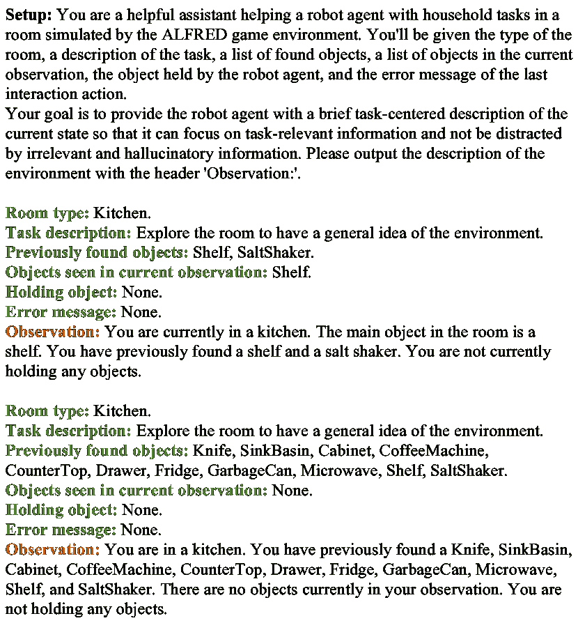

<!--yml

类别：未分类

日期：2025-01-11 12:48:23

-->

# OPEx：基于LLM的智能体在体态化指令跟随中的组件分析

> 来源：[https://arxiv.org/html/2403.03017/](https://arxiv.org/html/2403.03017/)

Haochen Shi${}^{1}$, Zhiyuan Sun${}^{1}$, Xingdi Yuan${}^{2}$, Marc-Alexandre Côté${}^{2}$, Bang Liu${}^{1}$¹¹footnotemark: 1

${}^{1}$ 蒙特利尔大学 & Mila，蒙特利尔，加拿大

${}^{2}$ 微软研究院，蒙特利尔，加拿大

{haochen.shi, zhiyuan.sun, bang.liu}@umontreal.ca,

{eric.yuan, macote}@microsoft.com   平等指导。加拿大CIFAR AI Chair。

###### 摘要

体态化指令跟随（EIF）是体态化学习中的一项关键任务，要求智能体通过自我中心的观察与环境互动，以完成自然语言指令。最近的进展表明，采用大语言模型（LLM）并结合框架驱动的方法来提升体态化学习任务的表现，包括EIF，已成为一种趋势。尽管如此，关于各个组成部分——从视觉感知到动作执行——对任务表现的影响，仍缺乏统一的理解。为了解决这一问题，我们提出了OPEx，一个全面的框架，明确了完成体态化学习任务所需的核心组件：观察者、规划者和执行者。通过广泛的评估，我们深入分析了每个组件如何影响EIF任务的表现。此外，我们通过在TextWorld对等环境中部署多智能体对话策略，进一步提升了任务表现。我们的研究发现，基于LLM的设计显著改善了EIF的结果，识别出视觉感知和低级动作执行是关键瓶颈，并证明通过多智能体框架增强LLM进一步提升了性能。

## 1 引言

体态化学习，特别是像体态化指令跟随（EIF）这样的任务，处于人工智能研究的前沿。EIF要求智能体解读自然语言指令，利用自我中心的观察在环境中导航并执行动作，这充分展示了将认知理解与物理行动结合的挑战。这个交集对于发展能够与复杂、现实世界环境进行细致互动的自主智能体至关重要，标志着朝着更先进和多功能的人工智能系统迈出了重要步伐。随着深度学习的进展，研究社区正逐步接近这一目标 Baker et al. ([2022](https://arxiv.org/html/2403.03017v1#bib.bib1)); Min et al. ([2021](https://arxiv.org/html/2403.03017v1#bib.bib21)); Inoue and Ohashi ([2022](https://arxiv.org/html/2403.03017v1#bib.bib13)); Huang et al. ([2022a](https://arxiv.org/html/2403.03017v1#bib.bib11)).

传统的身体化指令跟随（EIF）方法通常依赖专家生成的注释，这一过程既昂贵又难以扩展到实际应用中。相比之下，近年来的研究中引用的大型语言模型（LLMs），如Inoue和Ohashi（[2022](https://arxiv.org/html/2403.03017v1#bib.bib13)）；OpenAI（[2023](https://arxiv.org/html/2403.03017v1#bib.bib25)）；Wei等人（[2022a](https://arxiv.org/html/2403.03017v1#bib.bib43)）；Driess等人（[2023](https://arxiv.org/html/2403.03017v1#bib.bib7)）；Touvron等人（[2023](https://arxiv.org/html/2403.03017v1#bib.bib39)）；Huang等人（[2022a](https://arxiv.org/html/2403.03017v1#bib.bib11)，[b](https://arxiv.org/html/2403.03017v1#bib.bib12)）；Liang等人（[2022](https://arxiv.org/html/2403.03017v1#bib.bib15)）；Wang等人（[2023a](https://arxiv.org/html/2403.03017v1#bib.bib40)）；Shinn等人（[2023](https://arxiv.org/html/2403.03017v1#bib.bib32)）；Song等人（[2023](https://arxiv.org/html/2403.03017v1#bib.bib37)）等，已成为一种强有力的替代方案，展示了在自然语言理解和生成方面的卓越能力。这些模型通过丰富的文本数据集得到增强，展现出显著的常识推理能力。因此，越来越多的趋势倾向于利用以LLM为核心的架构来处理包括EIF在内的身体化学习任务，这些任务通过少量样本学习范式简化了规划和执行任务。然而，尽管这些模型具有潜力，EIF系统的实施在不同的研究中引入了多种设计和组件，Min等人（[2021](https://arxiv.org/html/2403.03017v1#bib.bib21)）；Inoue和Ohashi（[2022](https://arxiv.org/html/2403.03017v1#bib.bib13)）；Song等人（[2023](https://arxiv.org/html/2403.03017v1#bib.bib37)）；Blukis等人（[2022](https://arxiv.org/html/2403.03017v1#bib.bib3)）；Wang等人（[2023a](https://arxiv.org/html/2403.03017v1#bib.bib40)）；Zhu等人（[2023](https://arxiv.org/html/2403.03017v1#bib.bib47)）。目前，尚缺乏系统地理解这些不同元素如何影响整体任务性能的研究，这突显了在EIF背景下对以LLM为中心的方法进行深入分析的必要性。

在应对体现指令跟随（EIF）的复杂性时，我们引入了OPEx，一个旨在系统性地概述掌握体现学习任务所需关键组件的新框架。OPEx被分为三个核心部分：观察者、规划者和执行者。观察者组件负责处理和解释感官输入，主要是视觉信息，从而构建对代理当前环境的可操作理解。规划者根据感知输入动态制定战略计划，将任务分解为子任务，有效地架起了感知与行动之间的桥梁。最后，执行者负责通过技能库实施这些计划，将多个可重用的技能转化为在环境中精确且具有上下文感知的行动，确保代理的互动既相关又目标明确。这个三分结构清晰地划分了系统内各角色的职能，有助于深入分析每个部分如何促进EIF任务的整体表现。

为了理解每个OPEx组件在EIF任务中的表现影响，我们进行了深入分析。通过实验不同版本的观察者、规划者和执行者组件，我们评估了每个组件如何贡献并影响整体的成功。这种方法使我们能够识别出增强系统应对复杂体现任务能力的关键属性和设计选择，为优化体现学习代理提供了明确的见解。

为了进一步释放大语言模型（LLMs）在体现学习中的潜力，我们通过使用纯文本对等环境消除系统的视觉感知和低级行动执行的影响，如Shridhar等人（[2020b](https://arxiv.org/html/2403.03017v1#bib.bib34)）所提出的，并进一步采用多代理对话策略，将指令跟随任务分解为推理和定位两个角色，由推理代理和行动代理分别处理。这个基于对话的方法将任务简化为决策过程，其中两个代理利用来自探索者的世界知识。探索者通过与环境的直接互动或人类贡献获取见解，从而丰富推理者和行动者的协同解决问题能力，使决策更加扎实和知情。

我们的实验评估使用了ALFRED Shridhar等人（[2020a](https://arxiv.org/html/2403.03017v1#bib.bib33)）和ALFWorld Shridhar等人（[2020b](https://arxiv.org/html/2403.03017v1#bib.bib34)）基准，提供了一个全面的测试平台供我们进行广泛评估。实验的核心分析强调了显著的进展：以LLM为中心的方法在EIF任务中显著提升了性能。我们指出视觉感知和低级行动执行是关键瓶颈。此外，我们的结果确认，将多代理对话策略融入LLM为中心的任务求解器显著提升了在AFLWorld上的整体任务表现，展示了我们提出的方法在解决具身学习任务复杂性方面的有效性。

## 2 任务制定

我们使用ALFRED Shridhar等人（[2020a](https://arxiv.org/html/2403.03017v1#bib.bib33)）和其TextWorld对应的ALFWorld Shridhar等人（[2020b](https://arxiv.org/html/2403.03017v1#bib.bib34)）对我们的方法进行了基准测试。这两个基准都包含了一组与长时间跨度家庭任务相关的环境，这些任务由自然语言指令指定。语言指令$L=\{L_{\text{high}},L_{\text{low}}\}$由两个不同层次的指令组成：高层次指令目标$L_{\text{high}}$总结了任务，而低层次指令$L_{\text{low}}$描述了所需的具体行动。在时间步$t$，ALFRED还提供了视觉自我中心观察$V_{t}$（如果是在ALFWorld上，则为文本观察$\mathcal{L}_{t}$），表示世界状态$\mathcal{W}_{t}$。

给定语言指令$L$和初始观察$V_{0}$（如果是在ALFWorld上则为$\mathcal{L}_{0}$），代理的目标是生成一个执行轨迹$\mathcal{T}=\left\langle V_{0},a_{0},V_{1},a_{1},\ldots,V_{T},a_{T}\right\rangle$，其中$a_{t}$是代理在时间步$t$采取的动作，$V_{t+1}$是由该动作导致的世界状态$\mathcal{W}_{t+1}$的观察。动作空间$A$可以分为两类：导航动作$A_{N}$和交互动作$A_{I}$，分别为¹¹1$A_{N}\in\{$ RotateRight, RotateLeft, MoveAhead, LookUp, LookDown$\}$，$A_{I}\in\{$ PickupObject, PutObject, OpenObject, CloseObject, ToggleObjectOn, ToggleObjectOff, SliceObject$\}$。在实践中，我们遵循FILM Min等人（[2021](https://arxiv.org/html/2403.03017v1#bib.bib21)）的设置，其中导航动作$A_{N}$被约束为离散值，并且必须为交互动作$A_{I}$指定目标物体的像素级交互掩码。共有七种类型的家庭任务，每个任务的结束条件为代理满足$L$中指定的目标条件（成功）或达到最大步数（失败）。有关任务示例，请参见附录[A](https://arxiv.org/html/2403.03017v1#A1 "Appendix A Task Example in ALFRED ‣ OPEx: A Component-Wise Analysis of LLM-Centric Agents in Embodied Instruction Following")。

图1：我们的OPEx框架概述。我们将在接受后开源代码。

## 3 方法论

我们首先在图[1](https://arxiv.org/html/2403.03017v1#S2.F1 "Figure 1 ‣ 2 Task Formulation ‣ OPEx: A Component-Wise Analysis of LLM-Centric Agents in Embodied Instruction Following")中提供了所提议的以LLM为中心的框架（OPEx）概述。OPEx由六个组件组成：（1）一个语义映射模块，将自我中心的视觉观察转换为语义地图；（2）一个基于LLM的规划器，将指定的语言任务指令$L$分解为子任务$S=[S_{0},S_{1},...,S_{n}]$；（3）一个基于LLM的观察者，从环境中收集信息，并以自然语言描述$O^{L}_{t}$来描绘当前时间步$t$的部分观察世界状态$\mathcal{W}_{t}$；（4）一个基于LLM的执行器，接收世界状态描述$O^{L}_{t}$并从预定义技能集中选择技能，以完成当前子任务$S_{i}$；（5）一个技能库$\mathcal{SL}=\{sl_{0},sl_{1},...\}$，用于存储在模拟环境中操作代理的技能（例如，NavigateTo、LookAround和Explore）；（6）一个确定性动作策略，将技能转换为低级动作（例如，RotateRight）。

#### 语义映射模块

语义映射模块的目标是从自上而下的视角创建一个二维语义地图$M_{t}$（即探索区域、障碍物和检测到的物体的地图）。在每个时间步$t$，该模块接收来自世界状态$\mathcal{W}_{t}$的自我中心视觉观察$V_{t}$作为输入，随后使用UNet Ronneberger等人（[2015](https://arxiv.org/html/2403.03017v1#bib.bib28)）和MaskRCNN He等人（[2017](https://arxiv.org/html/2403.03017v1#bib.bib10)）（或ZoeDepth Bhat等人（[2023](https://arxiv.org/html/2403.03017v1#bib.bib2)）和SOLQ Dong等人（[2021](https://arxiv.org/html/2403.03017v1#bib.bib6)）作为更强的感知模型）处理为深度图和实例分割。根据FILM Min等人（[2021](https://arxiv.org/html/2403.03017v1#bib.bib21)），我们使用Blukis等人（[2022](https://arxiv.org/html/2403.03017v1#bib.bib3)）提供的UNet深度估计实现和Shridhar等人（[2020b](https://arxiv.org/html/2403.03017v1#bib.bib34)）提供的MaskRCNN实例分割实现。然后，构建一个点云，点云由深度预测和实例分割生成。最后，点云被分箱成体素表示，并通过对体素表示的高度求和将其转换为二维语义地图$M_{t}$，该地图会随时间步长进行更新和聚合。由于实现完美感知模型的内在困难，生成的语义地图$M_{t}$通常会包含噪声。这些噪声有可能加剧定位导航目标的难度，并进而影响性能。为了解决这些问题，我们引入了一个补充的语义地图$M_{t}^{\prime}$，它通过多个时间步长聚合$M_{t}$的信息。这个直觉类似于一种多数投票的形式：当某个物体在多个视角下被识别为冰箱，而不是墙壁时，它作为冰箱的可能性应该比作为墙壁的可能性更高。这两个语义地图以级联的方式工作：当智能体尝试从地图中识别一个物体时，初步搜索是在$M_{t}^{\prime}$中进行的。如果在$M_{t}^{\prime}$中找不到该物体，才会使用$M_{t}$。

#### 基于LLM的规划器

基于LLM的规划器的目标是将指定的语言指令$L$分解为一系列子任务$S=[S_{0},S_{1},...,S_{n}]$。在实践中，我们利用链式思维（Chain-of-Thought，CoT）Wei等人（[2022b](https://arxiv.org/html/2403.03017v1#bib.bib44)）来提示GPT-4 OpenAI（[2023](https://arxiv.org/html/2403.03017v1#bib.bib25)）进行上下文学习。相关的提示示例在附录中展示。

#### 示例选择器

我们从训练集中的10个回合中收集了一套提示示例，每种任务类型收集了7种任务类型的示例，总共70个回合。如Liu等人（[2022b](https://arxiv.org/html/2403.03017v1#bib.bib18)）所示，选择哪些上下文示例添加到提示中会影响整体表现。因此，我们进一步应用了一个示例选择器，通过根据输入测试案例与示例之间的相似性对示例进行排名，为基于LLM的规划器提供最相关的示例。在实践中，我们使用LangChain Chase（[2022](https://arxiv.org/html/2403.03017v1#bib.bib4)）中的示例选择器，该选择器首先根据与输入具有最大余弦相似度的对应嵌入来排名示例，然后选择前$K$个示例进行上下文学习。

#### 基于LLM的观察者

基于LLM的观察者的目标是从环境反馈和代理状态中提取信息，并以自然语言描述$O_{t}^{L}$的形式进行呈现，采用零样本方式。基于LLM的观察者设计的基本原理有两个：(1) 收集并呈现环境状态，使得能够追踪环境动态，支持跨时间步的动态规划和行动；(2) 将信息总结为以任务为中心的描述，从而防止基于LLM的执行器受到干扰和产生幻觉。基于LLM的观察者通过附录中所示的提示格式查询GPT-3.5-turbo。

#### 基于LLM的执行器

给定当前子任务$S_{i}$、时间步$t$时世界状态$O_{t}^{L}$的语言描述，基于LLM的执行器的目标是通过迭代地使用技能库$\mathcal{SL}$中的一组预定义技能，在环境中操控代理完成子任务$S_{i}$。与主要依赖LLM推理能力的基于LLM的规划器不同，基于LLM的执行器的任务是主动参与环境并从反馈中获取对环境动态的理解（例如，在ALFRED中，通过将物品放入水槽并打开水龙头，可以清洁物品）。为此，受到ReAct Yao等人（[2022](https://arxiv.org/html/2403.03017v1#bib.bib46)）的启发，我们促使基于LLM的执行器（一个GPT-4模型）生成推理过程和行动计划（由$\mathcal{SL}$中的技能组成），从而增强二者之间的协同作用：推理过程帮助模型推导、跟踪并更新行动计划，处理例外情况，而行动则使模型能够与环境进行交互，并从环境中获取额外的信息。基于LLM的执行器提示模板的输入通常包括语言基础的观察$O_{t}^{L}$、已发现的物品、当前视图中检测到的物品、当前子任务的短期记忆（该记忆在当前子任务完成后会被清除）以及当前子任务$S_{i}$。基于LLM的执行器需要生成推理过程（执行器输出中的“Thought”部分）和行动计划。基于LLM的执行器的动作空间是{*Play*, *Finish*}，其中动作*Play*用于与环境交互或请求重新规划当前计划$S$，动作*Finish*用于完成当前子任务$S_{i}$的行动规划。动作*Play*接收两个输入参数：[$\mathcal{SL}_{i}$, $\mathcal{ST}$]（例如，Play[NavigateToObject, Table]），其中$\mathcal{SL}_{i}$是技能库中预定义的技能，$\mathcal{ST}$是对应技能动作$\mathcal{SL}_{i}$的目标参数。

#### 技能库

我们设计了一个技能库，以赋能基于LLM的执行器，具备以下能力：（1）通过语言推理跟踪进度，处理异常或根据情况调整计划；（2）执行操作以支持推理，并通过控制智能体收集关于环境动态的信息。除了所有交互行为$A_{I}$，我们还设计了几个额外的技能，包括NavigateToObject、Explore、LookAround和RequireReplan。NavigateToObject技能使基于LLM的执行器具备设定基于地标的导航目标的能力，它将房间中找到的物体作为技能行为目标$\mathcal{ST}$。Explore技能增强了基于LLM的执行器在房间探索中引导智能体的能力，通过从可行区域中采样导航目标，且不需要技能行为目标。值得注意的是，我们为Explore技能的前四次调用设计了初步的探索启发式方法，我们将房间的四个角落设定为较高的探索优先级。RequireReplan技能赋能基于LLM的执行器具备动态调整计划的能力，提高对异常情况的鲁棒性，并为它从环境动态中学习提供更多的可能性。LookAround技能使基于LLM的执行器能够操控智能体环顾四周，以获取对房间更全面的观察。

#### 确定性行动策略

根据当前由基于LLM的执行器的行动计划[$\mathcal{SL}_{i}$ $\mathcal{ST}$]指定的指令，OPEx的确定性行动策略根据一组启发式规则输出导航或交互动作，这与FILM的策略非常相似。两者的策略通常遵循以下流程：如果目标物体在语义地图中被观察到，则选择最接近的实例作为最终的导航目标。否则，最终导航目标设置为探索导航目标。目标确定后，代理采用快速行进法 Sethian ([1996](https://arxiv.org/html/2403.03017v1#bib.bib30)) 向导航目标前进。此外，当目标物体处于代理的自我中心视觉范围内时，该策略将尝试进行交互或调整位置以为交互行动做好准备。OPEx的确定性行动策略与FILM的主要区别有三个方面。首先，OPEx的确定性行动策略配备了切片重放启发式方法，跟踪SliceObject成功执行的位置，以便更容易返回。其次，OPEx并不直接将目标物体的位置设置为导航目标，而是根据距离目标物体的距离采样一个可遍历的位置作为导航目标（称为“可遍历目标启发式”）。第三，OPEx并不直接利用语义地图$M_{t}$来判断目标物体是否被找到并为该物体获取导航目标，而是首先采用额外的语义地图$M_{t}^{\prime}$来实现这一点。如果在$M_{t}^{\prime}$中未找到目标，则使用原始语义地图$M_{t}$。我们优先使用$M_{t}^{\prime}$，因为它应当更能抗拒来自感知模型的误差。

#### 先验知识整合

由于缺乏对特定环境的先验知识，OPEx即使在ALFWorld上也经常失败，尤其是在感知和行动模块被剖析的情况下。例如，OPEx可能会因为缺乏“智能体不能在ALFRED中直接持有超过1个物体”的知识而在多个情节中反复失败，尝试捡起物体。此外，具有单一智能体的系统，在尝试同时处理规划和落实时，通常难以学习在规划和落实之间切换的最佳时机。为了解决这一问题，我们提出通过采用多智能体对话策略来将推理和落实问题拆分，并将其与从与环境交互或收集人类贡献中获得的世界知识相结合，从而改进OPEx。具体来说，我们首先部署智能体去探索ALFWorld环境，并收集动作-观察序列$\{\mathcal{AO}_{i}\}$，其中$\mathcal{AO}_{i}=[\mathcal{L}_{0},a_{0},\mathcal{L}_{1},a_{1},...,\mathcal{L}_{T}]$。然后，需要一个基于LLM的模块或人工观察这些动作-观察序列，并总结从$\{\mathcal{AO}_{i}\}$中学到的世界知识，作为先验知识候选$\{P_{j}\}$。之后，使用基于LLM的过滤器对$\{P_{j}\}$进行处理，以去除矛盾和重复的世界知识，从而得到最终的世界知识集$\{P^{\prime}_{i}\}$。最后，将世界知识$\{P^{\prime}_{i}\}$整合到多智能体对话策略的提示模板中，其中推理者描绘出解决任务的一般计划，而执行者将这些计划落实为在环境中的可执行行动。

## 4 实验与讨论

### 4.1 实验设置

#### 评估分割

ALFRED基准包括训练集、验证集和测试集。验证集和测试集都由已见和未见的分割组成，其中未见的分割包含在训练集中未出现的房间。根据Yao等人（[2022](https://arxiv.org/html/2403.03017v1#bib.bib46)）的方法，我们在ALFWorld基准上评估了我们的方法，使用了134个未见的评估游戏。

#### 评估指标

根据Shridhar等人（[2020a](https://arxiv.org/html/2403.03017v1#bib.bib33)）；Min等人（[2021](https://arxiv.org/html/2403.03017v1#bib.bib21)）的方法，我们报告了四个评估指标在ALFRED上的表现：（1）成功率(SR)；（2）目标条件(GC)，即在一个情节结束时完成的目标条件的比例；（3）路径长度加权SR（PLWSR），即SR按（专家轨迹的路径长度）/（智能体采取的路径长度）加权；（4）路径长度加权GC（PLWGC），即GC按相同的因子加权。根据Yao等人（[2022](https://arxiv.org/html/2403.03017v1#bib.bib46)）的方法，我们报告了ALFWorld上的SR。

| 方法 | 已见测试 | 未见测试 |
| --- | --- | --- |
| PLWGC | GC | PLWSR | SR | PLWGC | GC | PLWSR | SR |
| ALFRED（仅限高层目标指令） |  |
| LAV Nottingham 等人 ([2021](https://arxiv.org/html/2403.03017v1#bib.bib24)) | 13.18 | 23.21 | 6.31 | 13.35 | 10.47 | 17.27 | 3.12 | 6.38 |
| HLSM Blukis 等人 ([2022](https://arxiv.org/html/2403.03017v1#bib.bib3)) | 11.53 | 35.79 | 6.69 | 25.11 | 8.45 | 27.24 | 4.34 | 16.29 |
| LGS-RPA Murray 和 Cakmak ([2022](https://arxiv.org/html/2403.03017v1#bib.bib22)) | 24.49 | 41.71 | 16.65 | 33.01 | 20.01 | 38.55 | 12.92 | 27.80 |
| EPA Liu 等人 ([2022c](https://arxiv.org/html/2403.03017v1#bib.bib19)) | 3.47 | 44.14 | 2.56 | 39.96 | 3.91 | 39.54 | 2.92 | 36.07 |
| LLM-Planner Song 等人 ([2023](https://arxiv.org/html/2403.03017v1#bib.bib37)) | - | 24.57 | - | 15.33 | - | 22.89 | - | 13.41 |
| FILM Min 等人 ([2021](https://arxiv.org/html/2403.03017v1#bib.bib21)) | 14.17 | 36.15 | 10.39 | 25.77 | 13.13 | 34.75 | 9.67 | 24.46 |
| OPEx-S | 20.13 | 54.27 | 13.64 | 43.51 | 18.46 | 53.82 | 12.57 | 41.27 |

表 1：ALFRED 基准测试集上的主要结果。

#### 比较方法

在 ALFRED 上进行比较的方法包括 LAV Nottingham 等人（[2021](https://arxiv.org/html/2403.03017v1#bib.bib24)），其中原始语言和视觉输入被转换为结构化形式，并使用一个独立的“动作预测模块”预测低级动作；HLSM Blukis 等人（[2022](https://arxiv.org/html/2403.03017v1#bib.bib3)），一种分层方法，使用语义体素地图状态表示作为长期记忆来解决长时间跨度的任务；LGS-RPA Murray 和 Cakmak（[2022](https://arxiv.org/html/2403.03017v1#bib.bib22)），利用基于 Djikstra 的确定性规划器生成导航动作，并引入了地标引导搜索，同时为导航目标搜索和交互动作准备分别进行了强化姿势调整；EPA Liu 等人（[2022c](https://arxiv.org/html/2403.03017v1#bib.bib19)），一种具有符号规划的神经符号方法；LLM-Planner Song 等人（[2023](https://arxiv.org/html/2403.03017v1#bib.bib37)），简单地提示 LLM 进行任务分解；FILM Min 等人（[2021](https://arxiv.org/html/2403.03017v1#bib.bib21)），构建 2D 语义地图，并通过语义搜索策略进行探索。值得注意的是，还有一些在排行榜上报告高性能的工作未被纳入比较，如 Inoue 和 Ohashi（[2022](https://arxiv.org/html/2403.03017v1#bib.bib13)）；Shridhar 等人（[2020a](https://arxiv.org/html/2403.03017v1#bib.bib33)）；Chen 等人（[2023](https://arxiv.org/html/2403.03017v1#bib.bib5)），这主要是因为我们专注于系统地概述和评估掌握 EIF 任务的基本组件，而在进行实验时，我们无法找到这些工作的描述或现有的开源资源。在 ALFWorld 基准测试中，除了 OPEx 的变体，我们还引入了 ReAct Yao 等人（[2022](https://arxiv.org/html/2403.03017v1#bib.bib46)）进行比较，以展示所提出方法的有效性。

### 4.2 实验结果

主要结果如表[1](https://arxiv.org/html/2403.03017v1#S4.T1 "表 1 ‣ 评估指标 ‣ 4.1 实验设置 ‣ 4 实验与讨论 ‣ OPEx: 基于组成部分的LLM中心代理分析")所示。将OPEx与基线FILM进行对比时，可以明显看出，OPEx在两种不同的环境设置中表现出显著的改进，包括目标条件（GC）和成功率（SR）。值得注意的是，OPEx仅利用了少于10%的FILM规划器（语言处理器）训练数据进行上下文学习，而OPEx仍然显著优于FILM。观察到OPEx在测试集的已见和未见数据上的SR分别实现了17.74%和16.78%的绝对增益，这在实践中证明了OPEx框架的有效性。然而，值得注意的是，OPEx在路径长度加权指标上不如FILM。这个现象可能归因于与FILM相比，故意为OPEx分配了更高的最大失败次数。这一选择通常会导致生成的情景平均路径长度较长。做出这一决策的理由是鼓励OPEx进行更广泛的探索，从而促进其在处理来自不常见场景和失败的更广泛异常的技能获取。另一方面，FILM使用了两个基于BERT的模型，这些模型在整个训练集上进行了训练，并假设使用模板进行任务分解，而基于LLM的规划器只需少量示例即可实现这一目标。这一现象表明，OPEx在对领域数据的需求上显著更低，这使其在实际场景中更具可行性，因为数据收集可能更为耗时且昂贵。此外，FILM仅依靠确定性策略输出低级导航和交互动作，而OPEx引入了一个基于LLM的执行器，伴随确定性策略释放LLM在具体现实环境中进行稳健语言映射和异常处理的潜力。总体而言，主要结果实证表明，通过挖掘LLM在扎根规划和执行中的潜力，开发对领域数据需求较低的具象专家是可行的。

### 4.3 消融实验与分析

为了进一步研究系统的瓶颈以及不同模块的影响，我们进行了若干额外的消融实验。

#### 感知模型的影响

我们首先在AFLRED数据集的有效未见分割上进行对照实验，研究感知模型的影响。相应的结果在表[2](https://arxiv.org/html/2403.03017v1#S4.T2 "Table 2 ‣ Influence of prior knowledge ‣ 4.3 Ablation Study and Analysis ‣ 4 Experiments and Discussion ‣ OPEx: A Component-Wise Analysis of LLM-Centric Agents in Embodied Instruction Following")的第一部分中进行了说明，其中OPEx-S表示使用更强感知模型的OPEx（经过微调的ZoeDepth Bhat等人（[2023](https://arxiv.org/html/2403.03017v1#bib.bib2)）用于深度预测，SOLQ Dong等人（[2021](https://arxiv.org/html/2403.03017v1#bib.bib6)）用于实例分割），OPEx-P表示使用完美的真实深度预测和实例分割的OPEx。从感知模型的改进中获得的性能提升非常显著，表明在ALFRED中感知模型仍有很大的改进空间。

#### 动作策略的影响

如表[2](https://arxiv.org/html/2403.03017v1#S4.T2 "Table 2 ‣ Influence of prior knowledge ‣ 4.3 Ablation Study and Analysis ‣ 4 Experiments and Discussion ‣ OPEx: A Component-Wise Analysis of LLM-Centric Agents in Embodied Instruction Following")第二部分所示，我们设计并进行了另一组对照实验，以研究引入的不同确定性动作启发式的影响。从表中可以看到，将导航目标设置在可遍历区域内带来了最显著的性能提升，而切片重放则带来了边际提升。此外，引入额外的语义地图以增强基于地标的导航目标搜索也带来了适度的性能提升。

#### 基于LLM模块的影响

我们首先在数据集的验证未见拆分上进行对照实验，以研究不同模块的影响。相应的结果如表[2](https://arxiv.org/html/2403.03017v1#S4.T2 "Table 2 ‣ Influence of prior knowledge ‣ 4.3 Ablation Study and Analysis ‣ 4 Experiments and Discussion ‣ OPEx: A Component-Wise Analysis of LLM-Centric Agents in Embodied Instruction Following")所示。当从OPEx中移除基于LLM的规划器时，可以观察到显著的性能下降。这可能归因于在该设置下，基于LLM的执行器需要单独执行隐性长期规划和扎根交互。基于LLM的观察器被设计用来收集信息，并通过总结收集到的信息并过滤掉与任务无关的部分，帮助基于LLM的执行器专注于与任务相关的信息。然而，消融研究表明，基于LLM的观察器所带来的性能提升是微不足道的。这个现象可能由几种可能的原因引起，包括：(1) GPT-4强大的长文本处理能力减轻了对这种基于LLM的观察器的需求；(2) 来自ALFRED的收集信息通常不大/不复杂，足以导致基于LLM的执行器出现严重的分心或幻觉；(3) 观察器使用的是零-shot提示，可能需要设计更好的提示。

#### 先验知识的影响

为了进一步研究决策模块在EIF智能体中的作用，我们在ALFWorld上进行实验，以消除感知模型和行动策略的影响。相应的结果如表[2](https://arxiv.org/html/2403.03017v1#S4.T2 "Table 2 ‣ Influence of prior knowledge ‣ 4.3 Ablation Study and Analysis ‣ 4 Experiments and Discussion ‣ OPEx: A Component-Wise Analysis of LLM-Centric Agents in Embodied Instruction Following")第四部分所示，其中OPEx-L表示带有从环境中学习的先验知识的OPEx，而OPEx-H表示带有人类提供的先验知识的OPEx。我们观察到，随着先验知识质量的提高，系统性能也在增长，这可以通过经验直觉解释为：通过协作的多智能体对话策略分解EIF任务，有助于智能体内部的专业化和智能体之间的合作。此外，基于扎根的先验知识可以防止智能体重复性错误并促进扎根的异常处理的直觉，也可能有助于这一结果的产生。此外，ReAct的性能提升也在经验上证明了所提方法的有效性。

| 方法 | 有效 未见 |
| --- | --- |
| PLWGC | GC | PLWSR | SR |
| 感知模型的影响 |
| OPEx | 13.48 | 48.61 | 9.08 | 35.91 |
| OPEx-S | 16.52 | 51.28 | 11.38 | 40.80 |
| OPEX-P | 23.72 | 66.17 | 17.43 | 59.43 |
| 行动策略的影响 |
| OPEx | 13.48 | 48.61 | 9.08 | 35.91 |
| -语义图 $M^{\prime}_{t}$ | 12.37 | 45.41 | 8.06 | 36.17 |
| -切片回放 | 12.64 | 45.25 | 8.35 | 37.39 |
| -可遍历目标 | 11.77 | 43.49 | 7.09 | 34.50 |
| LLM 基础模块的影响 |
| OPEx | 13.48 | 48.61 | 9.08 | 35.91 |
| -规划器 | 8.10 | 40.16 | 5.72 | 30.57 |
| -观察者 | 13.41 | 45.62 | 8.58 | 37.76 |
| 先验知识的影响（在 ALFWorld 上） |
| ReAct | - | - | - | 66 |
| OPEx | - | - | - | 73 |
| OPEx-L | - | - | - | 78 |
| OPEx-H | - | - | - | 84 |

表 2：OPEx 的消融研究。OPEx-S 表示具有更强感知模型的 OPEx，OPEx-P 表示具有完美真实深度预测和实例分割的 OPEx，OPEx-L 表示具有从环境中学习到的先验知识的 OPEx，OPEx-H 表示具有由人类提供的先验知识的 OPEx。

| 方法 | SR | GC | PLWSR | PLWGC |
| --- | --- | --- | --- | --- |
| OPEx | 38.12 | 46.13 | 9.03 | 13.45 |
| FILM | 0.00 | 12.18 | 0.00 | 2.78 |

表 3：与在相同数据量上训练的基线进行的性能对比。

#### 域内数据需求低

为了评估域内数据使用的效率，我们进行了实验，将 OPEx 与基线模型 FILM 进行对比。FILM 在与 OPEx 相同的数据上进行训练，用于上下文学习。相应的结果呈现在表 [3](https://arxiv.org/html/2403.03017v1#S4.T3 "表 3 ‣ 先验知识的影响 ‣ 4.3 消融研究与分析 ‣ 4 实验与讨论 ‣ OPEx：基于组成的 LLM 中心体代理分析") 中。我们的发现表明，在未见验证集上，OPEx 在所有评估指标上明显优于 FILM。经验表明，这表明 OPEx 相较 FILM 需要的域内数据显著更少。这项受控研究强调了通过 LLM 基础框架解决体现任务的潜力。该框架通过集成反馈机制、闭环的基础规划与行动，并与大型语言模型（LLMs）的推理和常识能力相结合，实现了低域内数据需求的 EIF。此外，它还促使我们进一步探索域内数据效率与推理开销之间的权衡，启发了未来的方向，例如设计能够巧妙地结合常识与域内知识的高效数据代理。

#### 错误模式分析

我们在有效的未见数据集上进行OPEx的错误模式分析。相应的统计数据如表[4](https://arxiv.org/html/2403.03017v1#S4.T4 "Table 4 ‣ Error mode analysis ‣ 4.3 Ablation Study and Analysis ‣ 4 Experiments and Discussion ‣ OPEx: A Component-Wise Analysis of LLM-Centric Agents in Embodied Instruction Following")所示。虽然我们计算统计数据的方法可能与FILM有所不同，但我们也参考了Min等人（[2021](https://arxiv.org/html/2403.03017v1#bib.bib21)）原文中提供的FILM统计数据。由于我们使用基于LLM的规划器进行任务分解，该规划器不遵循模板假设，因此我们没有关于语言处理错误的统计数据。如表所示，目标物体未找到的错误通常占所有错误的较大比例，表明FILM和OPEx都受到感知模型不完备的影响。此外，基于LLM的执行器与确定性启发式方法的交互式探索，可能带来了较低的碰撞错误率以及目标物体在封闭容器中的错误。

| 错误模式 | FILM | OPEx |
| --- | --- | --- |
| 未找到目标物体 | 26.07 | 27.36 |
| 交互失败 | 8.54 | 12.80 |
| 碰撞 | 11.00 | 9.84 |
| 封闭容器中的物体 | 16.16 | 11.61 |
| 语言处理错误 | 24.54 | - |
| 其他 | 13.69 | 38.39 |

表 4：OPEx在有效未见数据集上的错误模式分析。

## 5 相关工作

#### 基于LLM的智能体

基于大语言模型（LLM）的代理在以下三个方面取得了显著进展。LLM中心的规划利用LLM在动态环境中生成计划。它可以进一步分为两类：一种是无反馈规划方法，Huang等人（[2022a](https://arxiv.org/html/2403.03017v1#bib.bib11)）；Fan等人（[2022](https://arxiv.org/html/2403.03017v1#bib.bib8)）；Yao等人（[2022](https://arxiv.org/html/2403.03017v1#bib.bib46)）；Huang等人（[2022b](https://arxiv.org/html/2403.03017v1#bib.bib12)）；Xiang等人（[2023](https://arxiv.org/html/2403.03017v1#bib.bib45)）；Lin等人（[2023](https://arxiv.org/html/2403.03017v1#bib.bib16)）；另一种是基于环境、人类和模型反馈的规划方法，Wang等人（[2023a](https://arxiv.org/html/2403.03017v1#bib.bib40)）；Zhu等人（[2023](https://arxiv.org/html/2403.03017v1#bib.bib47)）；Shinn等人（[2023](https://arxiv.org/html/2403.03017v1#bib.bib32)）；Wang等人（[2023c](https://arxiv.org/html/2403.03017v1#bib.bib42)）；Rana等人（[2023](https://arxiv.org/html/2403.03017v1#bib.bib27)）；Guan等人（[2023](https://arxiv.org/html/2403.03017v1#bib.bib9)）；Kim等人（[2023](https://arxiv.org/html/2403.03017v1#bib.bib14)）。LLM导向的记忆存储环境中的信息，并增强代理的经验积累和自我进化能力，以促进未来的行动。Significant-gravitas等人（[2023](https://arxiv.org/html/2403.03017v1#bib.bib35)）；Shinn等人（[2023](https://arxiv.org/html/2403.03017v1#bib.bib32)）；Wang等人（[2023a](https://arxiv.org/html/2403.03017v1#bib.bib40)）；Majumder等人（[2023](https://arxiv.org/html/2403.03017v1#bib.bib20)）；Wang等人（[2023b](https://arxiv.org/html/2403.03017v1#bib.bib41)）。LLM中心的行动策略将代理制定的计划转化为可行的行动空间，Huang等人（[2022a](https://arxiv.org/html/2403.03017v1#bib.bib11)）；Schick等人（[2023](https://arxiv.org/html/2403.03017v1#bib.bib29)）。值得注意的是，我们的LLM中心代理与Voyager（Wang等人（[2023a](https://arxiv.org/html/2403.03017v1#bib.bib40)））和GITM（Zhu等人（[2023](https://arxiv.org/html/2403.03017v1#bib.bib47)））不同，通过基于任务中心的环境反馈，动态调整不同粒度的计划，从而缓解了指令落地问题。

#### 具身环境中的指令跟随

先前关于具身环境中的EIF的研究可以分为两类：基于监督学习的端到端或模块化方法，这些方法依赖于训练数据中的监督信号，并由于缺乏抽象和推理能力而难以泛化，参见Shridhar等人（[2020a](https://arxiv.org/html/2403.03017v1#bib.bib33)）；Suglia等人（[2021](https://arxiv.org/html/2403.03017v1#bib.bib38)）；Pashevich等人（[2021](https://arxiv.org/html/2403.03017v1#bib.bib26)）；Blukis等人（[2022](https://arxiv.org/html/2403.03017v1#bib.bib3)）；Singh等人（[2020](https://arxiv.org/html/2403.03017v1#bib.bib36)）；Liu等人（[2022a](https://arxiv.org/html/2403.03017v1#bib.bib17)）；Min等人（[2021](https://arxiv.org/html/2403.03017v1#bib.bib21)）；Sharma等人（[2021](https://arxiv.org/html/2403.03017v1#bib.bib31)），以及基于LLM的方法，利用LLM的推理能力，参见Inoue和Ohashi（[2022](https://arxiv.org/html/2403.03017v1#bib.bib13)）；Song等人（[2023](https://arxiv.org/html/2403.03017v1#bib.bib37)）。与Prompter Inoue和Ohashi（[2022](https://arxiv.org/html/2403.03017v1#bib.bib13)）和LLM-Planner Song等人（[2023](https://arxiv.org/html/2403.03017v1#bib.bib37)）不同，它们仅将LLM用于目标位置查找和动态任务分解，我们的方法是一个以LLM为中心的框架，并通过多个基于LLM的角色将推理任务与决策遮罩问题解耦，其中LLM负责构建计划、调整计划，并将计划转化为结构化的行动空间。此外，我们的方法会根据反馈进行演化，提供了有前景的未来研究方向，包括人类参与的学习、多源反馈混合和精炼等。

## 6 结论

我们介绍了OPEx，一个以LLM为中心的框架，专为具身指令跟随（EIF）设计，并进行广泛评估以剖析其不同组件的影响。在此基础上，我们通过将世界知识与多智能体对话策略相结合，进一步提升了OPEx，从而更好地发挥LLM在解决EIF挑战中的潜力。我们的综合分析表明，LLM为中心的设计显著提高了EIF性能，明确指出视觉感知和低级行动执行是关键瓶颈。此外，我们的研究结果表明，在LLM中集成多智能体对话机制显著提升了其效果，为具身学习的未来研究提供了有前景的方向。

## 局限性

虽然我们的研究介绍了OPEx框架和用于解决EIF任务的基于对话的机制，但它也并非没有局限性。首先，依赖大型语言模型（LLM）和多智能体系统的复杂性带来了可解释性和计算效率的挑战。这些模型通过与ChatGPT的广泛通信需求大量资源，这可能会限制它们在资源有限的环境中的应用。其次，我们的实验是在ALFRED和ALFWORLD基准测试的范围内进行的，虽然这些基准测试很全面，但可能无法涵盖具身代理可能遇到的所有实际场景。第三，视觉感知和行动执行的整合被识别为瓶颈，表明在这些领域进一步的改进是必要的，以实现真正无缝和适应性的具身AI系统。未来的工作应致力于解决这些局限性，探索更高效的模型架构、在不同环境中的更广泛适用性，以及实现自然人机互动的增强方法。

## 伦理问题

我们预计我们的工作不会立即对伦理或社会产生影响。然而，作为一个大型语言模型（LLM）应用，我们承认OPEx可能会受到LLM引入的各种幻觉类型的影响。因此，我们敦促研究人员和从业人员在使用我们提出的框架时要谨慎，特别是在将这种以LLM为中心的代理部署到现实世界应用时。

## 参考文献

+   Baker 等人（2022年） Bowen Baker, Ilge Akkaya, Peter Zhokov, Joost Huizinga, Jie Tang, Adrien Ecoffet, Brandon Houghton, Raul Sampedro, 和 Jeff Clune. 2022年. 视频预训练（VPT）：通过观看未标记的在线视频学习如何行动. *神经信息处理系统进展*, 35:24639–24654.

+   Bhat 等人（2023年） Shariq Farooq Bhat, Reiner Birkl, Diana Wofk, Peter Wonka, 和 Matthias Müller. 2023年. Zoedepth：通过结合相对深度和度量深度实现零-shot迁移. *arXiv 预印本 arXiv:2302.12288*.

+   Blukis 等人（2022年） Valts Blukis, Chris Paxton, Dieter Fox, Animesh Garg, 和 Yoav Artzi. 2022年. 一种用于高层次自然语言指令执行的持久空间语义表示. 载于 *机器人学习会议*, 页706–717。PMLR.

+   Chase（2022年） Harrison Chase. 2022年. [LangChain](https://github.com/hwchase17/langchain).

+   Chen 等人（2023年） Yaran Chen, Wenbo Cui, Yuanwen Chen, Mining Tan, Xinyao Zhang, Dongbin Zhao, 和 He Wang. 2023年. Robogpt：一个为日常指令任务做出具身长期决策的智能代理. *arXiv 预印本 arXiv:2311.15649*.

+   Dong 等人（2021年） Bin Dong, Fangao Zeng, Tiancai Wang, Xiangyu Zhang, 和 Yichen Wei. 2021年. Solq：通过学习查询对物体进行分割. *神经信息处理系统进展*, 34:21898–21909.

+   Driess等人（2023）Danny Driess, Fei Xia, Mehdi SM Sajjadi, Corey Lynch, Aakanksha Chowdhery, Brian Ichter, Ayzaan Wahid, Jonathan Tompson, Quan Vuong, Tianhe Yu等人. 2023. Palm-e: 一种具备多模态的身体语言模型。 *arXiv预印本 arXiv:2303.03378*。

+   Fan等人（2022）Linxi Fan, Guanzhi Wang, Yunfan Jiang, Ajay Mandlekar, Yuncong Yang, Haoyi Zhu, Andrew Tang, De-An Huang, Yuke Zhu和Anima Anandkumar. 2022. Minedojo: 构建具有互联网规模知识的开放式身体代理。 *arXiv预印本 arXiv:2206.08853*。

+   Guan等人（2023）Lin Guan, Karthik Valmeekam, Sarath Sreedharan和Subbarao Kambhampati. 2023. 利用预训练的大型语言模型构建并使用世界模型进行基于模型的任务规划。 *arXiv预印本 arXiv:2305.14909*。

+   He等人（2017）Kaiming He, Georgia Gkioxari, Piotr Dollár和Ross Girshick. 2017. Mask r-cnn. 在 *IEEE国际计算机视觉会议论文集*，第2961–2969页。

+   Huang等人（2022a）Wenlong Huang, Pieter Abbeel, Deepak Pathak和Igor Mordatch. 2022a. 语言模型作为零-shot规划器：为身体代理提取可操作知识。 在 *国际机器学习会议*，第9118–9147页。 PMLR。

+   Huang等人（2022b）Wenlong Huang, Fei Xia, Ted Xiao, Harris Chan, Jacky Liang, Pete Florence, Andy Zeng, Jonathan Tompson, Igor Mordatch, Yevgen Chebotar等人. 2022b. 内心独白：通过语言模型进行身体推理的规划。 *arXiv预印本 arXiv:2207.05608*。

+   Inoue和Ohashi（2022）Yuki Inoue和Hiroki Ohashi. 2022. Prompter: 利用大型语言模型提示进行数据高效的身体指令跟随。 *arXiv预印本 arXiv:2211.03267*。

+   Kim等人（2023）Geunwoo Kim, Pierre Baldi和Stephen McAleer. 2023. 语言模型可以解决计算机任务。 *arXiv预印本 arXiv:2303.17491*。

+   Liang等人（2022）Jacky Liang, Wenlong Huang, Fei Xia, Peng Xu, Karol Hausman, Brian Ichter, Pete Florence和Andy Zeng. 2022. 代码作为策略：用于身体控制的语言模型程序。 *arXiv预印本 arXiv:2209.07753*。

+   Lin等人（2023）Bill Yuchen Lin, Yicheng Fu, Karina Yang, Faeze Brahman, Shiyu Huang, Chandra Bhagavatula, Prithviraj Ammanabrolu, Yejin Choi和Xiang Ren. 2023. Swiftsage: 一种具有快思维和慢思维的生成性代理，用于复杂交互任务。 *arXiv预印本 arXiv:2305.17390*。

+   Liu等人（2022a）Haoyu Liu, Yang Liu, Hongkai He和Hangfang Yang. 2022a. Lebp–语言期望与绑定策略：一个双流框架，用于学习身体视觉与语言交互任务的代理。 *arXiv预印本 arXiv:2203.04637*。

+   Liu等人（2022b）Jiachang Liu, Dinghan Shen, Yizhe Zhang, Bill Dolan, Lawrence Carin和Weizhu Chen. 2022b. [什么样的上下文示例适用于gpt-3？](https://doi.org/10.18653/v1/2022.deelio-1.10) *深度学习内部解析会议（DeeLIO 2022）：第三届深度学习架构的知识提取与整合研讨会论文集*。

+   Liu等人（2022c）Xiaotian Liu、Hector Palacios和Christian Muise。2022c。基于规划的神经符号方法用于体现式指令跟随。*Interactions*，9(8)：17。

+   Majumder等人（2023）Bodhisattwa Prasad Majumder、Bhavana Dalvi Mishra、Peter Jansen、Oyvind Tafjord、Niket Tandon、Li Zhang、Chris Callison-Burch和Peter Clark。2023年。Clin：一个持续学习的语言代理，用于快速任务适应和泛化。*arXiv预印本arXiv:2310.10134*。

+   Min等人（2021）So Yeon Min、Devendra Singh Chaplot、Pradeep Ravikumar、Yonatan Bisk和Ruslan Salakhutdinov。2021年。Film：使用模块化方法遵循语言中的指令。*arXiv预印本arXiv:2110.07342*。

+   Murray和Cakmak（2022）Michael Murray和Maya Cakmak。2022年。通过地标引导搜索和强化姿态调整来执行家务任务中的自然语言指令。*IEEE机器人与自动化信函*，7(3)：6870–6877。

+   Nguyen等人（2021）Van-Quang Nguyen、Masanori Suganuma和Takayuki Okatani。2021年。扩大视野并解读两次：提高互动指令跟随任务的表现。*arXiv预印本arXiv:2106.00596*。

+   Nottingham等人（2021）Kolby Nottingham、Litian Liang、Daeyun Shin、Charless C Fowlkes、Roy Fox和Sameer Singh。2021年。用于视运动语言嵌入的模块化框架。*arXiv预印本arXiv:2109.02161*。

+   OpenAI (2023) R OpenAI. 2023. Gpt-4技术报告。*arXiv*，第2303–08774页。

+   Pashevich等人（2021）Alexander Pashevich、Cordelia Schmid和Chen Sun。2021年。视觉与语言导航的情节转换器。在*IEEE/CVF国际计算机视觉会议录*，第15942-15952页。

+   Rana等人（2023）Krishan Rana、Jesse Haviland、Sourav Garg、Jad Abou-Chakra、Ian Reid和Niko Suenderhauf。2023年。Sayplan：使用3D场景图将大型语言模型与任务规划结合。*arXiv预印本arXiv:2307.06135*。

+   Ronneberger等人（2015）Olaf Ronneberger、Philipp Fischer和Thomas Brox。2015年。U-net：用于生物医学图像分割的卷积网络。在*医学图像计算与计算机辅助干预–MICCAI 2015：第18届国际会议，德国慕尼黑，2015年10月5-9日，会议录，第III部分18*，第234-241页。Springer。

+   Schick等人（2023）Timo Schick、Jane Dwivedi-Yu、Roberto Dessì、Roberta Raileanu、Maria Lomeli、Luke Zettlemoyer、Nicola Cancedda和Thomas Scialom。2023年。Toolformer：语言模型可以自我学习使用工具。*arXiv预印本arXiv:2302.04761*。

+   Sethian（1996）James A Sethian。1996年。用于单调推进前沿的快速行进水平集方法。*美国国家科学院院刊*，93(4)：1591–1595。

+   Sharma等人（2021）Pratyusha Sharma、Antonio Torralba和Jacob Andreas。2021年。使用潜在语言进行技能引导和规划。*arXiv预印本arXiv:2110.01517*。

+   Shinn等人（2023）Noah Shinn, Federico Cassano, Beck Labash, Ashwin Gopinath, Karthik Narasimhan, 和Shunyu Yao。2023年。[Reflexion: 具有语言强化学习的语言代理](http://arxiv.org/abs/2303.11366)。

+   Shridhar等人（2020a）Mohit Shridhar, Jesse Thomason, Daniel Gordon, Yonatan Bisk, Winson Han, Roozbeh Mottaghi, Luke Zettlemoyer, 和Dieter Fox。2020a年。Alfred：一个用于解释日常任务中基础指令的基准。在*IEEE/CVF计算机视觉与模式识别会议论文集*，第10740–10749页。

+   Shridhar等人（2020b）Mohit Shridhar, Xingdi Yuan, Marc-Alexandre Côté, Yonatan Bisk, Adam Trischler, 和Matthew Hausknecht。2020b年。Alfworld：对齐文本和具身环境以进行互动学习。*arXiv预印本 arXiv:2010.03768*。

+   Significant-gravitas等人（2023）Significant-gravitas等人。2023年。Significant-gravitas/auto-gpt：一个实验性的开源尝试，旨在使GPT-4完全自治。https://github.com/Significant-Gravitas/Auto-GPT。开源软件。

+   Singh等人（2020）Kunal Pratap Singh, Suvaansh Bhambri, Byeonghwi Kim, Roozbeh Mottaghi, 和Jonghyun Choi。2020年。将感知与策略分解，用于互动指令跟随。*arXiv预印本 arXiv:2012.03208*。

+   Song等人（2023）Chan Hee Song, Jiaman Wu, Clayton Washington, Brian M Sadler, Wei-Lun Chao, 和Yu Su。2023年。Llm-planner：面向具身代理的基于大语言模型的少量示例基础规划。在*IEEE/CVF国际计算机视觉会议论文集*，第2998–3009页。

+   Suglia等人（2021）Alessandro Suglia, Qiaozi Gao, Jesse Thomason, Govind Thattai, 和Gaurav Sukhatme。2021年。具身BERT：一种用于具身、语言引导视觉任务完成的变压器模型。*arXiv预印本 arXiv:2108.04927*。

+   Touvron等人（2023）Hugo Touvron, Thibaut Lavril, Gautier Izacard, Xavier Martinet, Marie-Anne Lachaux, Timothée Lacroix, Baptiste Rozière, Naman Goyal, Eric Hambro, Faisal Azhar等人。2023年。Llama：开放和高效的基础语言模型。*arXiv预印本 arXiv:2302.13971*。

+   Wang等人（2023a）Guanzhi Wang, Yuqi Xie, Yunfan Jiang, Ajay Mandlekar, Chaowei Xiao, Yuke Zhu, Linxi Fan, 和Anima Anandkumar。2023a年。Voyager：一个开放式具身代理，基于大语言模型。*arXiv预印本 arXiv:2305.16291*。

+   Wang等人（2023b）Zihao Wang, Shaofei Cai, Anji Liu, Yonggang Jin, Jinbing Hou, Bowei Zhang, Haowei Lin, Zhaofeng He, Zilong Zheng, Yaodong Yang等人。2023b。Jarvis-1：具有记忆增强的多模态语言模型的开放世界多任务代理。*arXiv预印本 arXiv:2311.05997*。

+   Wang等人（2023c）Zihao Wang, Shaofei Cai, Anji Liu, Xiaojian Ma, 和Yitao Liang。2023c。描述、解释、规划与选择：大语言模型驱动的互动规划使开放世界多任务代理成为可能。*arXiv预印本 arXiv:2302.01560*。

+   Wei 等人（2022a）Jason Wei, Yi Tay, Rishi Bommasani, Colin Raffel, Barret Zoph, Sebastian Borgeaud, Dani Yogatama, Maarten Bosma, Denny Zhou, Donald Metzler 等人. 2022a. 大型语言模型的涌现能力。*arXiv 预印本 arXiv:2206.07682*。

+   Wei 等人（2022b）Jason Wei, Xuezhi Wang, Dale Schuurmans, Maarten Bosma, Fei Xia, Ed Chi, Quoc V Le, Denny Zhou 等人. 2022b. 通过链式思维提示引发大型语言模型的推理能力。*神经信息处理系统进展*，35:24824–24837。

+   Xiang 等人（2023）Jiannan Xiang, Tianhua Tao, Yi Gu, Tianmin Shu, Zirui Wang, Zichao Yang 和 Zhiting Hu. 2023. 语言模型与世界模型的结合：具身体验增强语言模型。*arXiv 预印本 arXiv:2305.10626*。

+   Yao 等人（2022）Shunyu Yao, Jeffrey Zhao, Dian Yu, Nan Du, Izhak Shafran, Karthik Narasimhan 和 Yuan Cao. 2022. React：在语言模型中协同推理与行动。*arXiv 预印本 arXiv:2210.03629*。

+   Zhu 等人（2023）Xizhou Zhu, Yuntao Chen, Hao Tian, Chenxin Tao, Weijie Su, Chenyu Yang, Gao Huang, Bin Li, Lewei Lu, Xiaogang Wang 等人. 2023. Minecraft 中的幽灵：通过具备文本基础知识和记忆的大型语言模型，在开放世界环境中实现广泛能力的代理。*arXiv 预印本 arXiv:2305.17144*。

## 附录 A ALFRED 中的任务示例

如图[2](https://arxiv.org/html/2403.03017v1#A1.F2 "图 2 ‣ 附录 A 任务示例 ALFRED ‣ OPEx: 具身指令跟随中的 LLM-中心代理的逐个组件分析")所示，ALFRED 基准测试由 Shridhar 等人（[2020a](https://arxiv.org/html/2403.03017v1#bib.bib33)）包含一组与通过自然语言指令指定的长期家务任务相关的环境。如图[2](https://arxiv.org/html/2403.03017v1#A1.F2 "图 2 ‣ 附录 A 任务示例 ALFRED ‣ OPEx: 具身指令跟随中的 LLM-中心代理的逐个组件分析")所示，语言指令 $L=\{L_{\text{高层}},L_{\text{低层}}\}$由两个不同层次的指令组成：高层指令目标 $L_{\text{高层}}$ 总结了任务，低层指令序列 $L_{\text{低层}}$ 则描述了所需的具体动作。在时间步 $t$ 时，ALFRED 还提供一个视觉自我观察 $V_{t}$，表示世界状态 $\mathcal{W}_{t}$。ALFRED 中有七种家务任务，分别是：拾取与放置、堆叠与放置、拾取两项与放置、清洁与放置、加热与放置、冷却与放置和光线检查。一个回合结束的条件是：若代理完成了 $L$ 中指定的目标条件（成功）或达到最大步数（失败）。

图 2：ALFRED 中的清洁与放置任务示例。

## 附录 B AFLRED 的完整结果

在 ALFRED 上的实验，在两种不同设置下的结果如表[5](https://arxiv.org/html/2403.03017v1#A2.T5 "表 5 ‣ 附录 B 完整结果 ALFRED ‣ OPEx：基于大语言模型的代理在体现指令跟随中的组件分析")所示。

| 方法 | 测试已见 | 测试未见 |
| --- | --- | --- |
| PLWGC | GC | PLWSR | SR | PLWGC | GC | PLWSR | SR |
| 高级目标指令 + 低级逐步指令 |  |
| Seq2Seq Shridhar 等人 ([2020a](https://arxiv.org/html/2403.03017v1#bib.bib33)) | 6.27 | 9.42 | 2.02 | 3.98 | 4.26 | 7.03 | 0.08 | 3.90 |
| MOCA Singh 等人 ([2020](https://arxiv.org/html/2403.03017v1#bib.bib36)) | 22.05 | 28.29 | 15.10 | 22.05 | 9.99 | 14.28 | 2.72 | 5.30 |
| E.T. Pashevich 等人 ([2021](https://arxiv.org/html/2403.03017v1#bib.bib26)) | 34.93 | 45.44 | 27.78 | 38.42 | 11.46 | 18.56 | 4.10 | 8.57 |
| LWIT Nguyen 等人 ([2021](https://arxiv.org/html/2403.03017v1#bib.bib23)) | 23.10 | 40.53 | 43.10 | 30.92 | 16.34 | 20.91 | 5.60 | 9.42 |
| FILM Min 等人 ([2021](https://arxiv.org/html/2403.03017v1#bib.bib21)) | 15.06 | 38.51 | 11.23 | 27.67 | 14.30 | 36.37 | 10.55 | 26.49 |
| OPEx | 22.08 | 54.81 | 14.52 | 44.03 | 15.27 | 54.18 | 13.48 | 41.85 |
| 仅高级目标指令 |  |
| LAV Nottingham 等人 ([2021](https://arxiv.org/html/2403.03017v1#bib.bib24)) | 13.18 | 23.21 | 6.31 | 13.35 | 10.47 | 17.27 | 3.12 | 6.38 |
| HLSM Blukis 等人 ([2022](https://arxiv.org/html/2403.03017v1#bib.bib3)) | 11.53 | 35.79 | 6.69 | 25.11 | 8.45 | 27.24 | 4.34 | 16.29 |
| LGS-RPA Murray 和 Cakmak ([2022](https://arxiv.org/html/2403.03017v1#bib.bib22)) | 24.49 | 41.71 | 16.65 | 33.01 | 20.01 | 38.55 | 12.92 | 27.80 |
| EPA Liu 等人 ([2022c](https://arxiv.org/html/2403.03017v1#bib.bib19)) | 3.47 | 44.14 | 2.56 | 39.96 | 3.91 | 39.54 | 2.92 | 36.07 |
| LLM-Planner Song 等人 ([2023](https://arxiv.org/html/2403.03017v1#bib.bib37)) | - | 24.57 | - | 15.33 | - | 22.89 | - | 13.41 |
| FILM Min 等人 ([2021](https://arxiv.org/html/2403.03017v1#bib.bib21)) | 14.17 | 36.15 | 10.39 | 25.77 | 13.13 | 34.75 | 9.67 | 24.46 |
| OPEx-S | 20.13 | 54.27 | 13.64 | 43.51 | 18.46 | 53.82 | 12.57 | 41.27 |

表 5：ALFRED 基准测试集上的主要结果。

## 附录 C 提示示例

在本节中，我们分别为基于大语言模型的规划器、观察者和执行器提供了三个提示示例。

#### 基于大语言模型的规划器。

在图[3](https://arxiv.org/html/2403.03017v1#A3.F3 "Figure 3 ‣ LLM-based Executor. ‣ Appendix C Prompt Examples ‣ OPEx: A Component-Wise Analysis of LLM-Centric Agents in Embodied Instruction Following")中，我们展示了基于LLM的规划器的一个示例提示。该实例的高级指令是“将洗净的碗放入厨房橱柜”。基于LLM的规划器提示构建的目的是确定规划任务并定义期望的输出格式。具体而言，提供给规划器的输入是：“任务：将洗净的碗放入厨房橱柜。” 结果输出涵盖了LLM-based 规划器所进行的推理阶段和推理路径。鉴于规划器推理能力的基础在于其理解能力，我们首先期望它能展示对任务的基本理解。这通过展示任务类型（在此实例中为“PICK_CLEAN_THEN_PLACE_IN_RECEP”）得以体现。接着，受到链式思维提示（Chain-of-Thought Prompting）概念的启发，我们引入了一个两步要求。首先，规划器被提示生成其完成任务的思维过程，随后呈现出完成特定任务的最终计划。

#### 基于LLM的观察者。

图[4](https://arxiv.org/html/2403.03017v1#A3.F4 "Figure 4 ‣ LLM-based Executor. ‣ Appendix C Prompt Examples ‣ OPEx: A Component-Wise Analysis of LLM-Centric Agents in Embodied Instruction Following")展示了两个基于LLM的观察者的提示示例。与基于LLM的规划者的提示设计类似，基于LLM的观察者的提示也以设定开始，确立观察任务。观察者的输入是一组从环境中收集的信息，包括房间类型：指示智能体当前所在的房间类型（厨房、客厅、卧室或浴室）、任务描述：指定当前子任务（由基于LLM的规划者生成）需要完成的内容、先前找到的物体：存储从剧集开始到当前时间步骤为止智能体检测到的所有物体、当前观察中看到的物体：指出智能体当前自我中心视角下检测到的物体、持有的物体：追踪当前被智能体持有的物体、错误信息：追踪导致动作失败的错误，以便促进智能体的异常处理能力。由于在模拟器中成功的动作通常会导致自我中心观察的RGB变化，我们可以通过比较动作执行前后的自我中心观察来检测动作失败。如果检测到某种动作失败，那么相应的动作失败错误信息将由基于LLM的观察者收集。基于LLM的观察者设计目的不仅是收集信息，还充当“信息门”过滤掉与任务无关的信息，并有效组织与任务相关的信息，以便更好地进行有根有据的规划与行动。

#### 基于LLM的执行器。

完成“探索房间，了解环境概况”的提示示例如图[5](https://arxiv.org/html/2403.03017v1#A3.F5 "Figure 5 ‣ LLM-based Executor. ‣ Appendix C Prompt Examples ‣ OPEx: A Component-Wise Analysis of LLM-Centric Agents in Embodied Instruction Following")所示。具体而言，基于LLM的执行器的提示也以设定开始，确立执行任务并指示期望的输出格式。然后，设定后跟着输入给基于LLM的执行器，输入包括观察：呈现由基于LLM的观察者生成的当前语言描述的世界状态、发现的物体：追踪智能体检测到的所有物体、当前观察中看到的物体：记录当前自我中心视觉观察中检测到的物体、先前步骤：追踪当前子任务采取的步骤、当前目标：指定需要完成的当前子任务。受到ReAct启发，我们要求基于LLM的执行器不仅生成最终的技能行动计划Action，还要首先生成推理路径Thought。

图 3：基于 LLM 的规划者提示示例。设置对于所有输入测试用例都是固定的，任务是输入到基于 LLM 的规划者的内容，会根据不同的输入测试用例有所变化，任务类型、思路和计划是基于 LLM 的规划者需要生成的内容。相同的颜色模式适用于其他图示。

图 4：基于 LLM 的观察者提示示例。

图 5：基于 LLM 的执行者提示示例。
