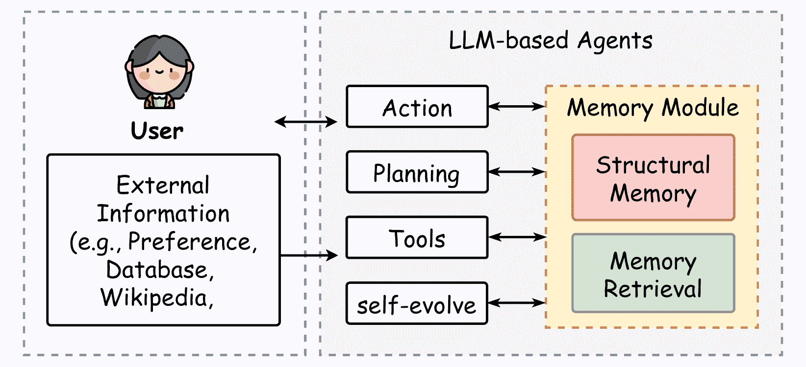
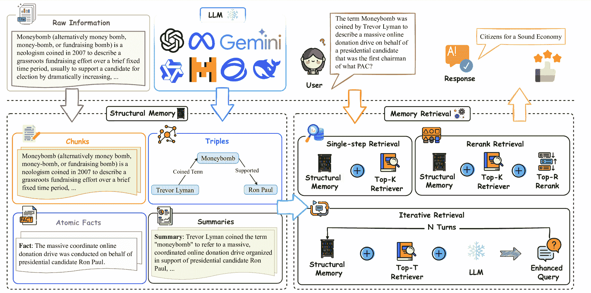
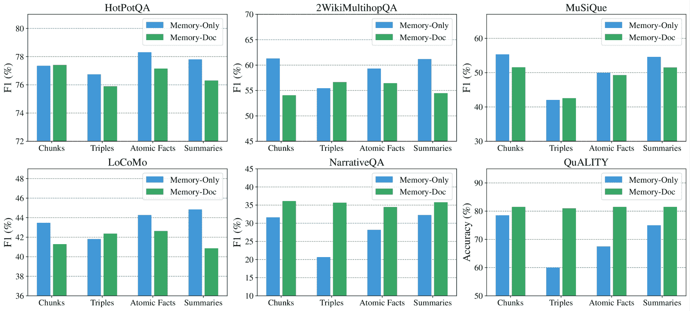
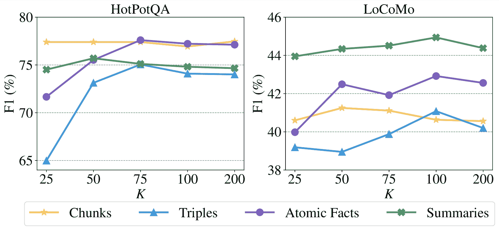
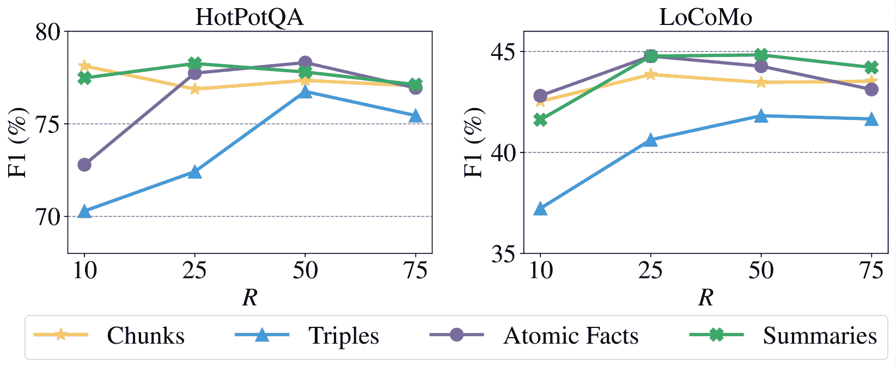
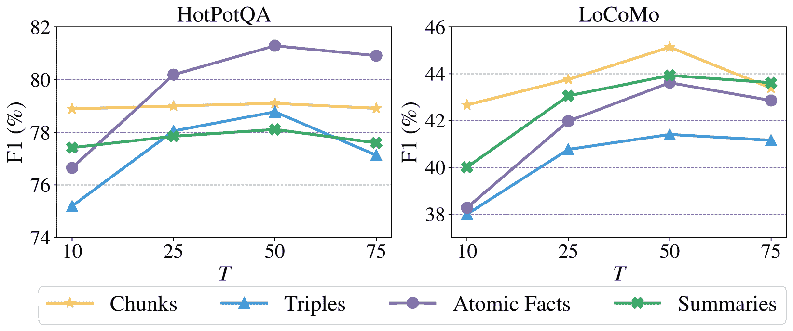
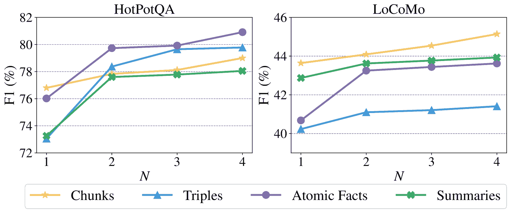
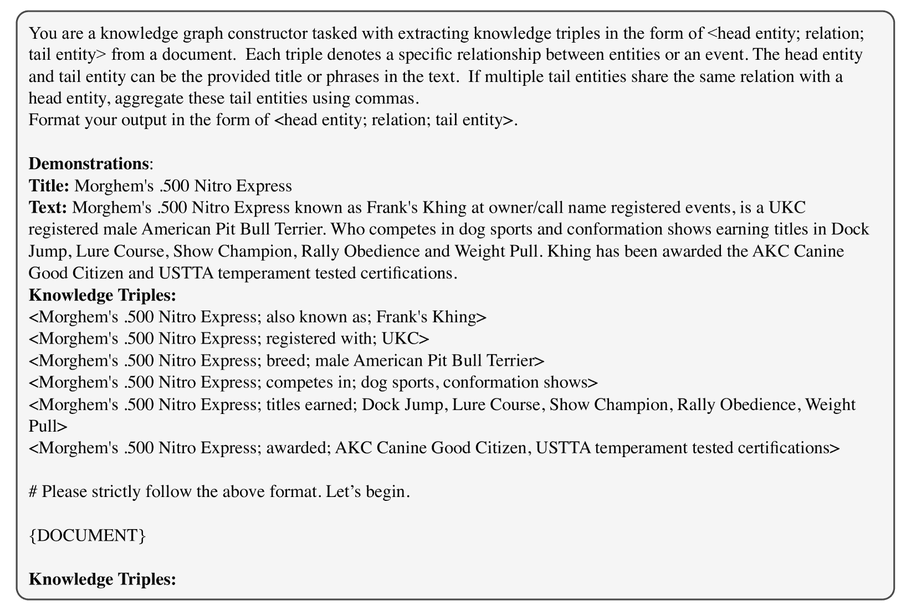
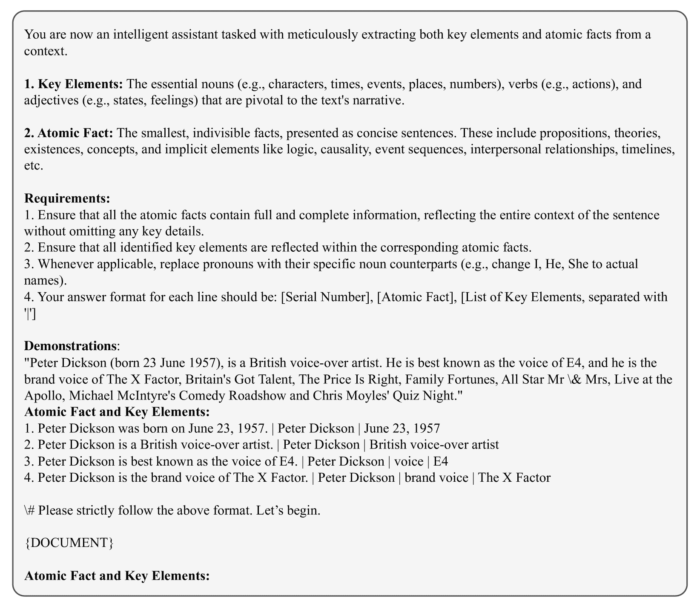
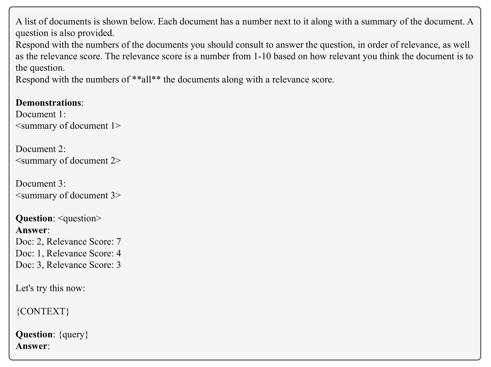

<!--yml
category: 未分类
date: 2025-01-11 11:45:29
-->

# On the Structural Memory of LLM Agents

> 来源：[https://arxiv.org/html/2412.15266/](https://arxiv.org/html/2412.15266/)

Ruihong Zeng^(1∗), Jinyuan Fang^(1∗), Siwei Liu^(2†), Zaiqiao Meng^(1†)
¹University of Glasgow   ²University of Aberdeen
zengrh3@gmail.com,   j.fang.2@research.gla.ac.uk
siwei.liu@abdn.ac.uk,   zaiqiao.meng@glasgow.ac.uk

###### Abstract

^*^*footnotetext: Equal contribution.^($\dagger$)^($\dagger$)footnotetext: Corresponding author.

Memory plays a pivotal role in enabling large language model (LLM)-based agents to engage in complex and long-term interactions, such as question answering (QA) and dialogue systems. While various memory modules have been proposed for these tasks, the impact of different memory structures across tasks remains insufficiently explored. This paper investigates how memory structures and memory retrieval methods affect the performance of LLM-based agents. Specifically, we evaluate four types of memory structures, including chunks, knowledge triples, atomic facts, and summaries, along with mixed memory that combines these components. In addition, we evaluate three widely used memory retrieval methods: single-step retrieval, reranking, and iterative retrieval. Extensive experiments conducted across four tasks and six datasets yield the following key insights: (1) Different memory structures offer distinct advantages, enabling them to be tailored to specific tasks; (2) Mixed memory structures demonstrate remarkable resilience in noisy environments; (3) Iterative retrieval consistently outperforms other methods across various scenarios. Our investigation aims to inspire further research into the design of memory systems for LLM-based agents. ¹¹1All code and datasets are publicly available at: [https://github.com/zengrh3/StructuralMemory](https://github.com/zengrh3/StructuralMemory)

On the Structural Memory of LLM Agents

Ruihong Zeng^(1∗), Jinyuan Fang^(1∗), Siwei Liu^(2†), Zaiqiao Meng^(1†) ¹University of Glasgow   ²University of Aberdeen zengrh3@gmail.com,   j.fang.2@research.gla.ac.uk siwei.liu@abdn.ac.uk,   zaiqiao.meng@glasgow.ac.uk

## 1 Introduction

Large Language Models (LLMs) Minaee et al. ([2024](https://arxiv.org/html/2412.15266v1#bib.bib22)) have attracted widespread attention in natural language tasks due to their remarkable capability. Recent advancements have significantly accelerated the development of LLM-based agents, with research primarily focusing on profile Park et al. ([2023](https://arxiv.org/html/2412.15266v1#bib.bib26)); [Hong et al.](https://arxiv.org/html/2412.15266v1#bib.bib11) , planning Qian et al. ([2024](https://arxiv.org/html/2412.15266v1#bib.bib27)); Qiao et al. ([2024](https://arxiv.org/html/2412.15266v1#bib.bib28)), action Qin et al. ([2023](https://arxiv.org/html/2412.15266v1#bib.bib29)); Wang et al. ([2024c](https://arxiv.org/html/2412.15266v1#bib.bib40)), self-evolving Zhang et al. ([2024a](https://arxiv.org/html/2412.15266v1#bib.bib45)) and memory Packer et al. ([2023](https://arxiv.org/html/2412.15266v1#bib.bib24)); Lee et al. ([2024](https://arxiv.org/html/2412.15266v1#bib.bib15)). These innovations have unlocked a wide range of applications across diverse applications Li et al. ([2023](https://arxiv.org/html/2412.15266v1#bib.bib19)); Wang et al. ([2024b](https://arxiv.org/html/2412.15266v1#bib.bib39)); Chen et al. ([2024](https://arxiv.org/html/2412.15266v1#bib.bib5)).

A fundamental element that underpins the effectiveness of LLM-based agents is the memory module. In cognitive science Simon and Newell ([1971](https://arxiv.org/html/2412.15266v1#bib.bib35)); Anderson ([2013](https://arxiv.org/html/2412.15266v1#bib.bib1)), memory is the cornerstone of human cognition, enabling the storage, retrieval, and drawing from past experiences for strategic thinking and decision-making. Similarly, the memory module is vital for LLM-based agents by facilitating the retention and organization of past interactions, supporting complex reasoning capabilities, e.g., multi-hop question answering (QA) Li et al. ([2024a](https://arxiv.org/html/2412.15266v1#bib.bib17)); Lee et al. ([2024](https://arxiv.org/html/2412.15266v1#bib.bib15)), and ensuring consistency and continuity in user interactions Nuxoll and Laird ([2007](https://arxiv.org/html/2412.15266v1#bib.bib23)).

Figure 1: The framework of LLM-based agents, where we focus on the study of memory modules, including memory structures and retrieval methods.

Developing an effective memory module in LLM-based agents typically involves two critical components: structural memory generation and memory retrieval methods Wang et al. ([2024a](https://arxiv.org/html/2412.15266v1#bib.bib38)); Zhang et al. ([2024b](https://arxiv.org/html/2412.15266v1#bib.bib46)). Among the various memory structures used by agents, chunks Hu et al. ([2024](https://arxiv.org/html/2412.15266v1#bib.bib12)), knowledge triples Anokhin et al. ([2024](https://arxiv.org/html/2412.15266v1#bib.bib2)), atomic facts Li et al. ([2024a](https://arxiv.org/html/2412.15266v1#bib.bib17)), and summaries Lee et al. ([2024](https://arxiv.org/html/2412.15266v1#bib.bib15)) are the most prevalent. For instance, HiAgent (Hu et al., [2024](https://arxiv.org/html/2412.15266v1#bib.bib12)) utilizes sub-goals as memory chunks to manage the working memory of LLM-based agents, ensuring task continuity and coherence, while Arigraph Anokhin et al. ([2024](https://arxiv.org/html/2412.15266v1#bib.bib2)) adopts knowledge triples, which combine both semantic and episodic memories to store factual and detailed information, making it suitable for complex reasoning tasks. Meanwhile, ReadAgent Li et al. ([2024a](https://arxiv.org/html/2412.15266v1#bib.bib17)) compresses memory episodes into gits memory with summaries manner, organizing them within a structured memory directory.

Upon reviewing the aforementioned memory structures, an important but under-explored question arises: Which memory structures are best suited for specific tasks, and how do their distinct characteristics impact the performance of LLM-based agents? This question mirrors how humans organize memory into distinct forms, such as episodic memory for recalling events and semantic memory for understanding relationships Simon and Newell ([1971](https://arxiv.org/html/2412.15266v1#bib.bib35)); Anderson ([2013](https://arxiv.org/html/2412.15266v1#bib.bib1)). Each form serves a unique purpose, enabling humans to tackle a variety of challenges with flexibility and precision. Moreover, humans rely on effective retrieval processes to access relevant memories, ensuring the accurate recall of past experiences for problem-solving. This highlights the need to jointly explore memory structures and retrieval methods to enhance the reasoning capabilities and overall effectiveness of LLM-based agents.

To bridge this gap, we systematically explore the impact of various memory structures and retrieval methods in LLM-based agents. Specifically, we evaluate existing four types of memory structures: chunks Hu et al. ([2024](https://arxiv.org/html/2412.15266v1#bib.bib12)), knowledge triples Anokhin et al. ([2024](https://arxiv.org/html/2412.15266v1#bib.bib2)), atomic facts Li et al. ([2024a](https://arxiv.org/html/2412.15266v1#bib.bib17)), and summaries Li et al. ([2024a](https://arxiv.org/html/2412.15266v1#bib.bib17)). Building on these, we explore the potential of mixed memory structures, which combine multiple types of memories to examine whether their complementary characteristics can enhance performance. Additionally, we assess the robustness of these memory structures to noise, as understanding their reliability under such conditions is essential for ensuring effectiveness across diverse tasks. Furthermore, we investigate three memory retrieval methods, including single-step retrieval Packer et al. ([2023](https://arxiv.org/html/2412.15266v1#bib.bib24)), reranking Gao et al. ([2023a](https://arxiv.org/html/2412.15266v1#bib.bib8)), and iterative retrieval Li et al. ([2024b](https://arxiv.org/html/2412.15266v1#bib.bib18)), to uncover how different combinations of retrieval methods and memory structures influence overall performance.

The main contributions of this work can be summarized as follows: (1) We present the first comprehensive study on the impact of memory structures and memory retrieval methods in LLM-based agents on six datasets across four tasks: multi-hop QA, single-hop QA, dialogue understanding, and reading comprehension. (2) Our findings reveal that mixed memory consistently achieves balanced and competitive performance across diverse tasks. Chunks and summaries excel in tasks involving extensive and lengthy context (e.g., reading comprehension and dialogue understanding), while knowledge triples and atomic facts are particularly effective for relational reasoning and precision in multi-hop and single-hop QA. Additionally, mixed memory demonstrates remarkable resilience to noise. (3) Iterative retrieval stands out as the most effective memory retrieval method across most tasks, such as multi-hop QA, dialogue understanding and reading comprehension.

Figure 2: Overview of the memory module workflow in LLM-based agents. Raw information is organized into structural memories, which are processed through retrieval methods to identify the most relevant memories for the query, enabling the generation of precise and contextually enriched responses.

## 2 Related Works

### 2.1 LLM-based Agents

The advent of Large Language Model (LLM) has positioned them as a transformative step towards achieving Artificial General Intelligence (AGI) Wang et al. ([2024a](https://arxiv.org/html/2412.15266v1#bib.bib38)), offering robust capabilities for the development of LLM-based agents Xi et al. ([2023](https://arxiv.org/html/2412.15266v1#bib.bib41)); Xu et al. ([2024](https://arxiv.org/html/2412.15266v1#bib.bib42)). Current research in this field primarily focuses on agent planning Wang et al. ([2023](https://arxiv.org/html/2412.15266v1#bib.bib37)); Yao et al. ([2024](https://arxiv.org/html/2412.15266v1#bib.bib44)); Qian et al. ([2024](https://arxiv.org/html/2412.15266v1#bib.bib27)); Qiao et al. ([2024](https://arxiv.org/html/2412.15266v1#bib.bib28)), reflection mechanisms Shinn et al. ([2024](https://arxiv.org/html/2412.15266v1#bib.bib34)); Zhang et al. ([2024a](https://arxiv.org/html/2412.15266v1#bib.bib45)), external tools utilization Qin et al. ([2023](https://arxiv.org/html/2412.15266v1#bib.bib29)); Wang et al. ([2024c](https://arxiv.org/html/2412.15266v1#bib.bib40)), self-evolving capabilities Zhang et al. ([2024a](https://arxiv.org/html/2412.15266v1#bib.bib45)) and memory modules Hu et al. ([2024](https://arxiv.org/html/2412.15266v1#bib.bib12)); Lee et al. ([2024](https://arxiv.org/html/2412.15266v1#bib.bib15)).

### 2.2 Memory Structures

Memory module serves as the foundation of LLM-based agents, enabling them to structure knowledge, retrieve relevant information, and leverage prior experiences for reasoning tasks Zhang et al. ([2024b](https://arxiv.org/html/2412.15266v1#bib.bib46)). Among the widely adopted memory structures of memory module are chunks Packer et al. ([2023](https://arxiv.org/html/2412.15266v1#bib.bib24)); Liu et al. ([2023](https://arxiv.org/html/2412.15266v1#bib.bib20)); Hu et al. ([2024](https://arxiv.org/html/2412.15266v1#bib.bib12)), knowledge triples Anokhin et al. ([2024](https://arxiv.org/html/2412.15266v1#bib.bib2)), atomic facts Li et al. ([2024a](https://arxiv.org/html/2412.15266v1#bib.bib17)), and summaries Lee et al. ([2024](https://arxiv.org/html/2412.15266v1#bib.bib15)). For instance, HiAgent (Hu et al., [2024](https://arxiv.org/html/2412.15266v1#bib.bib12)) incorporates sub-goals as memory chunks to maintain task continuity and coherence across interactions. On the other hand, GraphReader Li et al. ([2024a](https://arxiv.org/html/2412.15266v1#bib.bib17)) employs atomic facts to compress chunks into finer details, providing agents with highly granular information that improves precision in multi-hop question answering tasks. In this paper, we investigate how various memory structures impact the performance of LLM-based agents.

### 2.3 Memory Retrieval

The memory retrieval method is another critical component of the memory module, enabling LLM-based agents to retrieve relevant memories to advanced reasoning. To facilitate this, LLM-based agents often employ retrieval-augmented generation (RAG) Lewis et al. ([2020](https://arxiv.org/html/2412.15266v1#bib.bib16)); Fang et al. ([2024](https://arxiv.org/html/2412.15266v1#bib.bib7)), where relevant memories are first retrieved and then used to generate answers with LLMs. In this setting, the retrieved memories are prepended to the queries and serve as input to the LLM to generate response Ram et al. ([2023](https://arxiv.org/html/2412.15266v1#bib.bib30)). The most straightforward retrieval method is the single-step retrieval Packer et al. ([2023](https://arxiv.org/html/2412.15266v1#bib.bib24)); Zhong et al. ([2024](https://arxiv.org/html/2412.15266v1#bib.bib47)), which aims to identify the Top-$K$ most relevant memories for the query. Additionally, reranking Gao et al. ([2023a](https://arxiv.org/html/2412.15266v1#bib.bib8)); Ji et al. ([2024](https://arxiv.org/html/2412.15266v1#bib.bib13)) leverages the language understanding capabilities of LLMs to prioritize retrieved memories, while iterative retrieval Li et al. ([2024b](https://arxiv.org/html/2412.15266v1#bib.bib18)); Shi et al. ([2024](https://arxiv.org/html/2412.15266v1#bib.bib33)) focuses on reformulating queries to improve retrieval accuracy. These innovations make memory retrieval more adaptive and consistent with the query, maintaining effective performance across diverse and complex tasks. In this paper, we explore how different combinations of retrieval methods and memory structures influence overall performance.

## 3 Methodology

Figure [2](https://arxiv.org/html/2412.15266v1#S1.F2 "Figure 2 ‣ 1 Introduction ‣ On the Structural Memory of LLM Agents") illustrates the overview of the memory module within LLM-based agents, highlighting three key components: Structural Memory Generation, Memory Retrieval Methods and Answer Generation. This section begins with an introduction to structural memory generation in $\S$ [3.1](https://arxiv.org/html/2412.15266v1#S3.SS1 "3.1 Structural Memory Generation ‣ 3 Methodology ‣ On the Structural Memory of LLM Agents"). Next, we introduce memory retrieval methods in $\S$ [3.2](https://arxiv.org/html/2412.15266v1#S3.SS2 "3.2 Memory Retrieval Methods ‣ 3 Methodology ‣ On the Structural Memory of LLM Agents"). Finally, $\S$ [3.3](https://arxiv.org/html/2412.15266v1#S3.SS3 "3.3 Answer Generation ‣ 3 Methodology ‣ On the Structural Memory of LLM Agents") discusses answer generation methods.

### 3.1 Structural Memory Generation

Structural memory generation enables agents to organize raw documents into structured representations. By transforming unstructured documents $\mathcal{D}_{q}$ into structural memory $\mathcal{M}_{q}$, the agent gains the ability to store, retrieve, and reason over information more effectively. In this work, we explore four distinct forms of structural memory: chunks $\mathcal{C}_{q}$, knowledge triples $\mathcal{T}_{q}$, atomic facts $\mathcal{A}_{q}$, or summaries $\mathcal{S}_{q}$. The generation process for each structural memory is detailed as follows:

Chunks ($\mathcal{C}_{q}$). Chunks Gao et al. ([2023b](https://arxiv.org/html/2412.15266v1#bib.bib9)) are a widely used form of structural memory in LLM-based agents. Each chunk represents a continuous segment of text from a document, typically constrained to a fixed number of tokens $L$. Formally, raw documents $\mathcal{D}_{q}$ can be divided into a series of chunks, as defined: $\mathcal{C}_{q}(\mathcal{D}_{q})=\{c_{1},c_{2},\dots,c_{j}\}$, where each chunk $c_{j}$ contains at most $L$ tokens.

<svg class="ltx_picture" height="104.68" id="S3.SS1.p3.pic1" overflow="visible" version="1.1" width="600"><g fill="#000000" stroke="#000000" stroke-width="0.4pt" transform="translate(0,104.68) matrix(1 0 0 -1 0 0)"><g fill-opacity="1.0" transform="matrix(1.0 0.0 0.0 1.0 21.65 89.17)"><foreignobject color="#FFFFFF" height="9.61" overflow="visible" transform="matrix(1 0 0 -1 0 16.6)" width="556.69">Chunks</foreignobject></g> <g fill-opacity="1.0" transform="matrix(1.0 0.0 0.0 1.0 21.65 13.78)"><foreignobject color="#000000" height="57.67" overflow="visible" transform="matrix(1 0 0 -1 0 16.6)" width="556.69">Definition: Chunks are continuous, fixed-length segments of text from the document. Example: Generated chunks $\mathcal{C}_{q}$: (1) Moneybomb (alternatively money bomb, money-bomb, or fundraising bomb) is a neologism coined in 2007; (2) to describe a grassroots fundraising effort over a brief fixed time period.</foreignobject></g></g></svg>

Knowledge Triples ($\mathcal{T}_{q}$). Knowledge triples represent a structured form of memory that captures semantic relationships between entities. Each triple is composed of three components: a head entity, a relation, and a tail entity, represented in the format $\langle\text{{head}};\text{{relation}};\text{{tail entity}}\rangle$. Following previous works Anokhin et al. ([2024](https://arxiv.org/html/2412.15266v1#bib.bib2)); Fang et al. ([2024](https://arxiv.org/html/2412.15266v1#bib.bib7)), raw documents $\mathcal{D}_{q}$ are processed by an LLM guided by a tailored prompt $\mathcal{P}_{\mathcal{T}}$ to generate a set of semantic triples $\mathcal{T}_{q}$. The generation process can be formally defined as: $\mathcal{T}_{q}=\texttt{LLM}(\mathcal{D}_{q},\mathcal{P}_{\mathcal{T}})$.

<svg class="ltx_picture" height="96.75" id="S3.SS1.p5.pic1" overflow="visible" version="1.1" width="600"><g fill="#000000" stroke="#000000" stroke-width="0.4pt" transform="translate(0,96.75) matrix(1 0 0 -1 0 0)"><g fill-opacity="1.0" transform="matrix(1.0 0.0 0.0 1.0 21.65 78.54)"><foreignobject color="#FFFFFF" height="12.3" overflow="visible" transform="matrix(1 0 0 -1 0 16.6)" width="556.69">Knowledge Triples</foreignobject></g> <g fill-opacity="1.0" transform="matrix(1.0 0.0 0.0 1.0 21.65 13.78)"><foreignobject color="#000000" height="47.05" overflow="visible" transform="matrix(1 0 0 -1 0 16.6)" width="556.69">Definition: Knowledge triples capture relationships between entities. Example: Generated triples $\mathcal{T}_{q}$: (1) $\langle$Moneybomb; type; neologism$\rangle$; (2) $\langle$Moneybomb; coined in; 2007$\rangle$.</foreignobject></g></g></svg>

Atomic Facts ($\mathcal{A}_{q}$). Atomic facts are the smallest, indivisible units of information, presented as concise sentences that capture essential details. They represent a granular form of structural memory, simplifying raw documents by preserving critical entities, actions, and attributes. Following Li et al. ([2024a](https://arxiv.org/html/2412.15266v1#bib.bib17)), atomic facts are generated from raw documents $\mathcal{D}_{q}$ using an LLM guided by a tailored prompt $\mathcal{P}_{\mathcal{A}}$, formally denoted as: $\mathcal{A}_{q}=\texttt{LLM}(\mathcal{D}_{q},\mathcal{P}_{\mathcal{A}})$.

<svg class="ltx_picture" height="93.9" id="S3.SS1.p7.pic1" overflow="visible" version="1.1" width="600"><g fill="#000000" stroke="#000000" stroke-width="0.4pt" transform="translate(0,93.9) matrix(1 0 0 -1 0 0)"><g fill-opacity="1.0" transform="matrix(1.0 0.0 0.0 1.0 21.65 78.54)"><foreignobject color="#FFFFFF" height="9.46" overflow="visible" transform="matrix(1 0 0 -1 0 16.6)" width="556.69">Atomic Facts</foreignobject></g> <g fill-opacity="1.0" transform="matrix(1.0 0.0 0.0 1.0 21.65 13.78)"><foreignobject color="#000000" height="47.05" overflow="visible" transform="matrix(1 0 0 -1 0 16.6)" width="556.69">Definition: Atomic facts are the smallest units of indivisible information. Example: Generated atomic facts $\mathcal{A}_{q}$: (1) Moneybomb is also known as money bomb, money-bomb, or fundraising bomb; (2) Moneybomb is a neologism.</foreignobject></g></g></svg>

Summaries ($\mathcal{S}_{q}$). Summaries provide a condensed and comprehensive description of documents, capturing both global content and key details. Following Lee et al. ([2024](https://arxiv.org/html/2412.15266v1#bib.bib15)), summaries are generated from raw documents $\mathcal{D}_{q}$ using an LLM guided by a tailored prompt $\mathcal{P}_{\mathcal{S}}$, defined as: $\mathcal{S}_{q}=\texttt{LLM}(\mathcal{D}_{q},\mathcal{P}_{\mathcal{S}})$.

<svg class="ltx_picture" height="108.97" id="S3.SS1.p9.pic1" overflow="visible" version="1.1" width="600"><g fill="#000000" stroke="#000000" stroke-width="0.4pt" transform="translate(0,108.97) matrix(1 0 0 -1 0 0)"><g fill-opacity="1.0" transform="matrix(1.0 0.0 0.0 1.0 21.65 93.61)"><foreignobject color="#FFFFFF" height="9.46" overflow="visible" transform="matrix(1 0 0 -1 0 16.6)" width="556.69">Summaries</foreignobject></g> <g fill-opacity="1.0" transform="matrix(1.0 0.0 0.0 1.0 21.65 13.78)"><foreignobject color="#000000" height="62.11" overflow="visible" transform="matrix(1 0 0 -1 0 16.6)" width="556.69">Definition: Summaries compress the document into a comprehensive description. Example: Generated summaries $\mathcal{S}_{q}$: Moneybomb, alternatively referred to as money bomb, money-bomb, or fundraising bomb, is a neologism coined in 2007\. It describes a grassroots fundraising effort that occurs over a brief fixed time period.</foreignobject></g></g></svg>

Mixed ($\mathcal{M}_{q}^{\text{Mixed}}$). Mixed memories represent a composite form of structural memory, combining all the aforementioned types: chunks, knowledge triples, atomic facts, and summaries. This integration provides a comprehensive representation, formally defined as follows: $\mathcal{M}_{q}^{\text{Mixed}}=\mathcal{C}_{q}\cup\mathcal{T}_{q}\cup\mathcal{% A}_{q}\cup\mathcal{S}_{q}$.

Details of the prompts used by the LLM for generating each type of structural memory, e.g., $\mathcal{P}_{\mathcal{T}}$, $\mathcal{P}_{\mathcal{A}}$ and $\mathcal{P}_{\mathcal{S}}$, are provided in Appendix [B](https://arxiv.org/html/2412.15266v1#A2 "Appendix B Prompts ‣ On the Structural Memory of LLM Agents").

### 3.2 Memory Retrieval Methods

Given the generated structural memories $\mathcal{M}_{q}$, we employ a memory retrieval method to identify and integrate the most relevant supporting memories $\mathcal{M}_{r}\subset\mathcal{M}_{q}$ for the query $q$. Without this step, the agent would need to process all available memories, leading to inefficiency and potential inaccuracies due to irrelevant information. Our study mainly focuses on three retrieval approaches: single-step retrieval Robertson et al. ([2009](https://arxiv.org/html/2412.15266v1#bib.bib31)); Rubin et al. ([2022](https://arxiv.org/html/2412.15266v1#bib.bib32)), reranking Gao et al. ([2023a](https://arxiv.org/html/2412.15266v1#bib.bib8)); Ji et al. ([2024](https://arxiv.org/html/2412.15266v1#bib.bib13)), and iterative retrieval Li et al. ([2024b](https://arxiv.org/html/2412.15266v1#bib.bib18)); Shi et al. ([2024](https://arxiv.org/html/2412.15266v1#bib.bib33)). The details of each memory retrieval method are outlined as follows:

Single-step Retrieval. In the single-step retrieval process, the goal is to identify the Top-$K$ memories $\mathcal{M}_{r}$ that are most relevant to the query $q$. This process is formally defined as: $\mathcal{M}_{r}=\texttt{Retriever}(q,\mathcal{M}_{q},K)$, where the Retriever Robertson et al. ([2009](https://arxiv.org/html/2412.15266v1#bib.bib31)); Rubin et al. ([2022](https://arxiv.org/html/2412.15266v1#bib.bib32)) serves as the core component.

Reranking. In the reranking process Gao et al. ([2023a](https://arxiv.org/html/2412.15266v1#bib.bib8)); Dong et al. ([2024](https://arxiv.org/html/2412.15266v1#bib.bib6)), an initial retriever selects a candidate set of Top-$K$ memories $\mathcal{M}_{i}$, which are then reranked by an LLM prompted with $\mathcal{P}_{\text{Rerank}}$ based on their relevance scores. From this reranked list, the Top-$R$ memories $\mathcal{M}_{r}$, selected in descending order of relevance scores, are identified as the most relevant. This step enhances retrieval precision by leveraging the LLM to strengthen query-memory connections, filtering out irrelevant memories, and prioritizing the most pertinent memories for the query. This process is formally defined as: $\mathcal{M}_{r}=\texttt{LLM}(q,\mathcal{M}_{i},R,\mathcal{P}_{R})\,$, where $\mathcal{M}_{i}=\texttt{Retriever}(q,\mathcal{M}_{q},K)$.

Iterative Retrieval. The iterative retrieval approach Gao et al. ([2023b](https://arxiv.org/html/2412.15266v1#bib.bib9)) begins with an initial query $q_{0}=q$ and retrieves the Top-$T$ most relevant structural memories $\mathcal{M}_{j}$. These retrieved memories are used to refine the query through an LLM prompted by $\mathcal{P}_{\text{Refine}}$. This process is repeated over $N$ iterations, refining the query to produce the final version $q_{N}$ that is informative for retrieving relevant memories. Formally, the iterative retrieval process can be defined as follows: $q_{j}=\texttt{LLM}(\mathcal{M}_{j},\mathcal{P}_{\text{Refine}})$, where $\mathcal{M}_{j}=\texttt{Retriever}(q_{j-1},\mathcal{M}_{q},T)$. After $N$ iterations, the final refined query $q_{N}$ is used to retrieve the Top-$K$ most relevant memories for answer generation. This step can be expressed as: $\mathcal{M}_{r}=\texttt{Retriever}(q_{N},\mathcal{M}_{q},K)$. The detailed prompts $\mathcal{P}_{\text{Rerank}}$ and $\mathcal{P}_{\text{Refine}}$ can be found in Appendix [B](https://arxiv.org/html/2412.15266v1#A2 "Appendix B Prompts ‣ On the Structural Memory of LLM Agents").

### 3.3 Answer Generation

Finally, the agent leverages the LLM to generate the answer based on the retrieved memory. To achieve this, we propose two methods of answer generation. In the first method, termed Memory-Only, the retrieved memories $\mathcal{M}_{r}$ are directly utilized as the context for generating the answer. The second method, termed Memory-Doc, uses the retrieved memories to locate their corresponding original documents from $\mathcal{D}_{q}$. These documents then serve as the context for answer generation, providing the agent with more detailed and contextually enriched information.

 | Memory Structure | HotPotQA | 2WikiMultihopQA | MuSiQue | NarrativeQA | LoCoMo | QuALITY |
| --- | --- | --- | --- | --- | --- | --- |
| EM | F1 | EM | F1 | EM | F1 | EM | F1 | EM | F1 | ACC |
| --- | --- | --- | --- | --- | --- | --- | --- | --- | --- | --- |
| Full Content | 55.50 | 75.77 | 44.00 | 54.33 | 36.00 | 51.60 | 7.00 | 24.99 | 13.61 | 41.82 | 81.50 |
| --- | --- | --- | --- | --- | --- | --- | --- | --- | --- | --- | --- |
| Single-step Retrieval |
| --- |
| Chunks | 61.50 | 76.93 | 43.50 | 59.17 | 35.50 | 54.45 | 13.50 | 29.78 | 9.95 | 40.63 | 76.00 |
| Triples | 59.50 | 74.09 | 44.50 | 60.82 | 31.00 | 50.13 | 11.50 | 22.04 | 8.42 | 41.08 | 61.50 |
| Atomic Facts | 62.50 | 77.22 | 39.50 | 58.63 | 30.50 | 51.31 | 13.50 | 27.49 | 9.42 | 42.92 | 71.50 |
| Summaries | 57.00 | 74.81 | 42.00 | 57.21 | 34.00 | 52.83 | 16.50 | 32.93 | 10.99 | 44.94 | 76.00 |
| Mixed | 60.00 | 77.10 | 48.50 | 65.25 | 33.00 | 51.65 | 14.50 | 29.86 | 10.47 | 44.73 | 78.00 |
| Reranking |
| Chunks | 63.00 | 77.35 | 45.00 | 61.31 | 37.00 | 55.32 | 16.00 | 31.63 | 9.95 | 43.47 | 78.50 |
| Triples | 61.00 | 76.75 | 43.50 | 55.43 | 26.50 | 42.05 | 10.00 | 20.65 | 8.83 | 41.82 | 60.00 |
| Atomic Facts | 63.00 | 78.31 | 40.50 | 59.31 | 28.50 | 49.95 | 14.00 | 28.19 | 8.90 | 44.27 | 67.50 |
| Summaries | 61.00 | 77.80 | 45.00 | 61.18 | 35.50 | 54.59 | 16.00 | 32.26 | 12.04 | 44.83 | 75.00 |
| Mixed | 65.00 | 78.58 | 45.50 | 61.77 | 34.00 | 52.45 | 11.98 | 28.02 | 9.42 | 44.51 | 77.50 |
| Iterative Retrieval |
| Chunks | 63.00 | 79.10 | 46.50 | 62.13 | 37.00 | 56.78 | 14.50 | 30.88 | 10.47 | 45.14 | 77.00 |
| Triples | 64.00 | 78.78 | 47.50 | 62.06 | 38.00 | 55.93 | 10.50 | 21.67 | 9.47 | 41.41 | 60.50 |
| Atomic Facts | 65.50 | 81.29 | 44.00 | 63.89 | 34.50 | 57.55 | 14.50 | 28.28 | 9.95 | 43.62 | 67.50 |
| Summaries | 60.50 | 78.11 | 46.50 | 62.35 | 33.50 | 53.12 | 17.00 | 31.79 | 12.04 | 43.93 | 75.00 |
| Mixed | 67.00 | 82.11 | 51.00 | 68.15 | 39.00 | 61.38 | 12.50 | 28.36 | 7.85 | 45.25 | 79.50 | 

Table 1: Overall Performance (%) of various memory structures utilizing different retrieval methods across six datasets. The best performance is marked in boldface, while the second-best performance is underlined.

## 4 Experiments

### 4.1 Datasets.

We conduct experiments on six datasets across four tasks. For multi-hop long-context QA datasets, we experiment with HotPotQA Yang et al. ([2018](https://arxiv.org/html/2412.15266v1#bib.bib43)), 2WikiMultihopQA Ho et al. ([2020](https://arxiv.org/html/2412.15266v1#bib.bib10)), and MuSiQue Trivedi et al. ([2022](https://arxiv.org/html/2412.15266v1#bib.bib36)). The single-hop long-context QA task is evaluated with NarrativeQA Kočiskỳ et al. ([2018](https://arxiv.org/html/2412.15266v1#bib.bib14)) from Longbench Bai et al. ([2023](https://arxiv.org/html/2412.15266v1#bib.bib3)). Additionally, we leverage the LoCoMo dataset Maharana et al. ([2024](https://arxiv.org/html/2412.15266v1#bib.bib21)) for dialogue-based long-context QA task, while the QuALITY Pang et al. ([2022](https://arxiv.org/html/2412.15266v1#bib.bib25)) dataset is used for the reading comprehension QA task²²2More details and statistics about the datasets are provided in Appendix [A](https://arxiv.org/html/2412.15266v1#A1 "Appendix A Datasets ‣ On the Structural Memory of LLM Agents")..

### 4.2 Evaluation.

To evaluate QA performance, we follow previous work Li et al. ([2024a](https://arxiv.org/html/2412.15266v1#bib.bib17)) and use standard metrics such as Exact Match (EM) score and F1 score for the datasets HotPotQA, 2WikiMultihopQA, MuSiQue, NarrativeQA and LoCoMo. For QuALITY, we follow the approach in Lee et al. ([2024](https://arxiv.org/html/2412.15266v1#bib.bib15)) and use accuracy as the evaluation metric, with $25\%$ indicating chance performance.

### 4.3 Implementation Details.

In our experiments, we use GPT-4o-mini-128k with a temperature setting of 0.2\. The input window is set to $4k$ tokens, while the maximum chunk size is up to $1k$ tokens. For text embedding, we employ the text-embedding-3-small model ³³3[https://platform.openai.com/docs/guides/embeddings/](https://platform.openai.com/docs/guides/embeddings/) from OpenAI and store the vectorized memories using LangChain Chase ([2022](https://arxiv.org/html/2412.15266v1#bib.bib4)).

## 5 Results and Analysis

### 5.1 Impact of Memory Structures

Figure 3: Performance across six datasets using two answer generation approaches: Memory-Only and Memory-Doc.

Finding 1: Mixed memories delivers more balanced performance. The results as presented in Table [1](https://arxiv.org/html/2412.15266v1#S3.T1 "Table 1 ‣ 3.3 Answer Generation ‣ 3 Methodology ‣ On the Structural Memory of LLM Agents") reveal key insights into the impact of various memory structures on task performance: (1) Mixed memories consistently outperform other memory structures. This is particularly evident under iterative retrieval, where mixed memories achieve the highest F1 scores of 82.11% on HotPotQA and 68.15% on 2WikiMultihopQA. (2) Chunks excel in tasks requiring a balance between concise and comprehensive contexts, as shown in datasets with long contexts. This is evidenced by its F1 score of 31.63% on NarrativeQA and an accuracy of 78.5% on QuALITY under reranking. Summaries, which condense large contexts, is effective for tasks demanding abstraction, as shown by its competitive F1 score of 32.26% on NarrativeQA and solid performance on LoCoMo. (3) Knowledge triples and atomic facts are particularly effective for relational reasoning and precision. Knowledge triples achieve an F1 score of 62.06% on 2WikiMultihopQA under iterative retrieval, while atomic facts achieve an F1 score of 81.29% on HotPotQA. These findings emphasize the importance of tailoring memory structures to specific task requirements and demonstrate that integrating complementary memory types in mixed memories significantly enhances performance across tasks.

### 5.2 Impact of Memory Retrieval Methods

Finding 2: Iterative retrieval as the optimal retrieval method. The results in Table [1](https://arxiv.org/html/2412.15266v1#S3.T1 "Table 1 ‣ 3.3 Answer Generation ‣ 3 Methodology ‣ On the Structural Memory of LLM Agents") demonstrate the significant influence of the retrieval method on performance: (1) Iterative retrieval consistently outperforms the others, achieving the highest scores across most datasets. Notably, with mixed memories, iterative retrieval achieved an F1 score of 82.11% on HotPotQA and 68.15% on 2WikiMultihopQA, showcasing its ability to refine queries iteratively for enhanced accuracy. (2) Reranking demonstrates strong performance on datasets with moderate complexity. For instance, it achieved F1 scores of 44.27% on LoCoMo and 28.19% on NarrativeQA with atomic fact memory. (3) In contrast, single-step retrieval performs competitively in tasks requiring minimal contextual integration. Using summary memory, it achieved an F1 score of 32.93% on NarrativeQA, leveraging abstraction to extract coherent information. These findings emphasize the importance of aligning retrieval mechanisms with task requirements, and iterative retrieval excels in reasoning tasks.

### 5.3 Impact of Answer Generation Approaches

Finding 3: Extensive Context tasks favor Memory-Doc, while precision tasks benefit from Memory-Only. As shown in Figure [3](https://arxiv.org/html/2412.15266v1#S5.F3 "Figure 3 ‣ 5.1 Impact of Memory Structures ‣ 5 Results and Analysis ‣ On the Structural Memory of LLM Agents"), which compares their performance across various datasets. retrieving documents through retrieved memories provides a more comprehensive understanding, much like how humans integrate immediate recall with broader context to interpret complex narratives. In contrast, for datasets involving multi-hop reasoning and dialogue understanding, such as HotPotQA and LoCoMo, the Memory-Only approach proves to be the more effective strategy. These findings highlight that tasks requiring extensive context benefit from the Memory-Doc approach, which incorporates broader document-level information for enriched responses. On the other hand, tasks prioritizing precision are better suited to the Memory-Only approach, ensuring focused and accurate retrieval.

Figure 4: Performance of different numbers of retrieved memories $K$ on HotPotQA and LoCoMo using single-step retrieval.

Figure 5: Performance of different numbers of reranked memories $R$ on HotPotQA and LoCoMo in reranking.

### 5.4 Hyperparameter Sensitivity

Effect of Number of Retrieved Memories $K$. We first evaluate the impact of $K$ in single-step retrieval, with a limit of $K=200$ due to computational resource limitations. As depicted in Figure [4](https://arxiv.org/html/2412.15266v1#S5.F4 "Figure 4 ‣ 5.3 Impact of Answer Generation Approaches ‣ 5 Results and Analysis ‣ On the Structural Memory of LLM Agents"), in HotPotQA, chunks demonstrate consistent performance, stabilizing around 77% across all $K$ values. In LoCoMo, the chunks show moderate gains up to $K=50$, whereas triples, atomics, and summaries improve up to $K=100$ but then declined at $K=200$, likely due to noise introduced by retrieving excessive memories. These findings indicate that the optimal $K$ depends on both the dataset and memory structure. While moderate $K$ values generally enhance performance, excessively large values can introduce irrelevant information, leading to a degraded performance.

Effect of Number of Reranked Memories $R$. To evaluate the impact of $R$ in reranking, we investigate performance across a range of values, with a maximum $R$ of 75 due to computational cost constraints, while fixing $K$ at 100. As depicted in Figure [5](https://arxiv.org/html/2412.15266v1#S5.F5 "Figure 5 ‣ 5.3 Impact of Answer Generation Approaches ‣ 5 Results and Analysis ‣ On the Structural Memory of LLM Agents"), the results highlight that increasing the number of reranked memories does not always lead to better performance. For instance, chunks achieve the highest F1 score at $R=10$ in HotPotQA, with a subsequent decline in performance beyond $R=50$. This pattern is consistent with triples and atomic facts, indicating that selecting a smaller number of highly relevant memories can outperform retrieving and reranking larger sets, which often introduces noise. A similar trend can be observed in LoCoMo. These findings suggest that reranking is more effective when it focuses on a smaller subset of highly relevant memories.

Figure 6: Performance of different numbers of retrieved memories $T$ in each interaction on HotPotQA and LoCoMo using iterative retrieval.

Effect of Number of Retrieved Memories $T$ on Each Iteration. We first investigate performance across a range of values of $T$ using iterative retrieval, with a maximum $T$ of 75 and $N$ of 4 due to computational cost constraints while keeping $K$ fixed at 100. As illustrated in Figure [6](https://arxiv.org/html/2412.15266v1#S5.F6 "Figure 6 ‣ 5.4 Hyperparameter Sensitivity ‣ 5 Results and Analysis ‣ On the Structural Memory of LLM Agents"), increasing the number of retrieved memories per iteration generally improves performance across datasets, though the gains diminish beyond a certain threshold. For instance, in HotPotQA, atomic facts achieve an F1 score of approximately 81% at $T=50$, with minimal additional gains from increasing $T$ further. Similarly, in LoCoMo, chunks improve up to $T=50$ before declining at $T=75$. These results indicate that while increasing $T$ can enhance query refinement and performance, excessively large $T$ values may introduce noise, ultimately reducing effectiveness.

Figure 7: Performance of different numbers of retrieved memories $N$ in each interaction on HotPotQA and LoCoMo using iterative retrieval.

Effect of Number of Iteration Turns $N$. Next, we examine the impact of iteration turns $N$, with the number of retrieved memories $T$ fixed at 50. As depicted in Figure [6](https://arxiv.org/html/2412.15266v1#S5.F6 "Figure 6 ‣ 5.4 Hyperparameter Sensitivity ‣ 5 Results and Analysis ‣ On the Structural Memory of LLM Agents"), the results reveal that increasing $N$ initially enhances performance significantly, but the rate of improvement diminishes as $N$ continues to rise. For HotPotQA, both triples and summars show notable gains from $N=1$ to $N=3$, after which the improvements become marginal. In the case of LoCoMo, triples, atomic facts, and summaries reach a peak at $N=3$ and stop increasing afterwards. These results suggest that an intermediate number of iteration turns, typically between 2 and 3, achieves optimal performance improvements, striking a balance between maximizing effectiveness and minimizing resource expenditure.

Figure 8: Performance across varying numbers of noise documents using single-step retrieval.

### 5.5 Impact of Noise Documents

Finding 4: Mix memory excels in noise resilience. Finally, we evaluate the robustness of various memory structures under increasing levels of noise using single-step retrieval with a fixed $K=100$. As depicted in Figure [8](https://arxiv.org/html/2412.15266v1#S5.F8 "Figure 8 ‣ 5.4 Hyperparameter Sensitivity ‣ 5 Results and Analysis ‣ On the Structural Memory of LLM Agents"), the performance of all memory structures declines as the number of noise documents increases. For HotPotQA, the mix memory consistently achieves the highest F1 scores, demonstrating superior resilience to noise. While triples and summaries exhibit similar rates of decline, the chunks experience a slower decline, maintaining a competitive F1 score when increasing the number of noise documents. A similar pattern is shown in LoCoMo. These findings reveal the robustness of the mixed memory structure, which consistently outperforms others across datasets, making it the most effective choice in noisy environments.

## 6 Conclusion & Future Work

In this paper, we present the first comprehensive study on the impact of structural memories and memory retrieval methods in LLM-based agents, aiming to identify the most suitable memory structures for specific tasks and explore how retrieval methods influence performance. This study yielded several key findings: (1) Mixed memories consistently deliver balanced performance. Chunks and summaries excel in tasks involving lengthy contexts, such as reading comprehension and dialogue understanding, while knowledge triples and atomic facts are effective for relational reasoning and precision in multi-hop and single-hop QA. (2) Mixed memories also demonstrate remarkable resilience to noise. (3) Iterative retrieval stands out as the most effective memory retrieval method, consistently outperforming in tasks such as multi-hop QA, dialogue understanding and reading comprehension. While these findings provide valuable insights, further research is needed to explore how memory impacts areas such as self-evolution and social simulation, highlighting the importance of investigating how structural memories and retrieval techniques support these applications.

## Limitations

We identify the following limitations in our work: (1) Our experiments are limited to tasks such as multi-hop QA, single-hop QA, dialogue understanding, and reading comprehension, which restricts the applicability of our findings to other complex domains like self-evolving agents or social simulation. Investigating the role of memory structures and retrieval methods in these topics could provide broader insights; (2) The evaluation of memory robustness primarily considers random document noise, leaving other challenging noise types, such as irrelevant or contradictory information, unexplored. Investigating these addition noise in future studies could offer a more comprehensive understanding of memory resilience; (3) Due to computational constraints, we limit the hyperparameter ranges (e.g., $K$, $R$, $T$, $N$) in memory retrieval methods. Expanding these ranges in future research could yield deeper insights into their impact on performance.

## References

*   Anderson (2013) John R Anderson. 2013. *The architecture of cognition*. Psychology Press.
*   Anokhin et al. (2024) Petr Anokhin, Nikita Semenov, Artyom Sorokin, Dmitry Evseev, Mikhail Burtsev, and Evgeny Burnaev. 2024. Arigraph: Learning knowledge graph world models with episodic memory for llm agents. *arXiv preprint arXiv:2407.04363*.
*   Bai et al. (2023) Yushi Bai, Xin Lv, Jiajie Zhang, Hongchang Lyu, Jiankai Tang, Zhidian Huang, Zhengxiao Du, Xiao Liu, Aohan Zeng, Lei Hou, et al. 2023. Longbench: A bilingual, multitask benchmark for long context understanding. *arXiv preprint arXiv:2308.14508*.
*   Chase (2022) Harrison Chase. 2022. [LangChain](https://github.com/langchain-ai/langchain).
*   Chen et al. (2024) Jiangjie Chen, Xintao Wang, Rui Xu, Siyu Yuan, Yikai Zhang, Wei Shi, Jian Xie, Shuang Li, Ruihan Yang, Tinghui Zhu, et al. 2024. From persona to personalization: A survey on role-playing language agents. *arXiv preprint arXiv:2404.18231*.
*   Dong et al. (2024) Jialin Dong, Bahare Fatemi, Bryan Perozzi, Lin F Yang, and Anton Tsitsulin. 2024. Don’t forget to connect! improving rag with graph-based reranking. *arXiv preprint arXiv:2405.18414*.
*   Fang et al. (2024) Jinyuan Fang, Zaiqiao Meng, and Craig MacDonald. 2024. TRACE the evidence: Constructing knowledge-grounded reasoning chains for retrieval-augmented generation. In *Findings of the Association for Computational Linguistics: EMNLP 2024*, pages 8472–8494, Miami, Florida, USA. Association for Computational Linguistics.
*   Gao et al. (2023a) Luyu Gao, Xueguang Ma, Jimmy Lin, and Jamie Callan. 2023a. Precise zero-shot dense retrieval without relevance labels. In *Proceedings of the 61st Annual Meeting of the Association for Computational Linguistics (Volume 1: Long Papers)*, pages 1762–1777.
*   Gao et al. (2023b) Yunfan Gao, Yun Xiong, Xinyu Gao, Kangxiang Jia, Jinliu Pan, Yuxi Bi, Yi Dai, Jiawei Sun, Meng Wang, and Haofen Wang. 2023b. Retrieval-augmented generation for large language models: A survey. *arXiv preprint arXiv:2312.10997*.
*   Ho et al. (2020) Xanh Ho, Anh-Khoa Duong Nguyen, Saku Sugawara, and Akiko Aizawa. 2020. Constructing a multi-hop qa dataset for comprehensive evaluation of reasoning steps. In *Proceedings of the 28th International Conference on Computational Linguistics*, pages 6609–6625.
*   (11) Sirui Hong, Mingchen Zhuge, Jonathan Chen, Xiawu Zheng, Yuheng Cheng, Jinlin Wang, Ceyao Zhang, Zili Wang, Steven Ka Shing Yau, Zijuan Lin, et al. Metagpt: Meta programming for a multi-agent collaborative framework. In *The Twelfth International Conference on Learning Representations*.
*   Hu et al. (2024) Mengkang Hu, Tianxing Chen, Qiguang Chen, Yao Mu, Wenqi Shao, and Ping Luo. 2024. Hiagent: Hierarchical working memory management for solving long-horizon agent tasks with large language model. *arXiv preprint arXiv:2408.09559*.
*   Ji et al. (2024) Jiarui Ji, Runlin Lei, Jialing Bi, Zhewei Wei, Yankai Lin, Xuchen Pan, Yaliang Li, and Bolin Ding. 2024. Dynamic and textual graph generation via large-scale llm-based agent simulation. *arXiv preprint arXiv:2410.09824*.
*   Kočiskỳ et al. (2018) Tomáš Kočiskỳ, Jonathan Schwarz, Phil Blunsom, Chris Dyer, Karl Moritz Hermann, Gábor Melis, and Edward Grefenstette. 2018. The narrativeqa reading comprehension challenge. *Transactions of the Association for Computational Linguistics*, 6:317–328.
*   Lee et al. (2024) Kuang-Huei Lee, Xinyun Chen, Hiroki Furuta, John F. Canny, and Ian Fischer. 2024. A human-inspired reading agent with gist memory of very long contexts. In *Forty-first International Conference on Machine Learning, ICML 2024, Vienna, Austria, July 21-27, 2024*. OpenReview.net.
*   Lewis et al. (2020) Patrick Lewis, Ethan Perez, Aleksandra Piktus, Fabio Petroni, Vladimir Karpukhin, Naman Goyal, Heinrich Küttler, Mike Lewis, Wen-tau Yih, Tim Rocktäschel, et al. 2020. Retrieval-augmented generation for knowledge-intensive nlp tasks. *Advances in Neural Information Processing Systems*, 33:9459–9474.
*   Li et al. (2024a) Shilong Li, Yancheng He, Hangyu Guo, Xingyuan Bu, Ge Bai, Jie Liu, Jiaheng Liu, Xingwei Qu, Yangguang Li, Wanli Ouyang, et al. 2024a. Graphreader: Building graph-based agent to enhance long-context abilities of large language models. *arXiv preprint arXiv:2406.14550*.
*   Li et al. (2024b) Xiaoxi Li, Zhicheng Dou, Yujia Zhou, and Fangchao Liu. 2024b. Corpuslm: Towards a unified language model on corpus for knowledge-intensive tasks. In *Proceedings of the 47th International ACM SIGIR Conference on Research and Development in Information Retrieval*, pages 26–37.
*   Li et al. (2023) Yuan Li, Yixuan Zhang, and Lichao Sun. 2023. Metaagents: Simulating interactions of human behaviors for llm-based task-oriented coordination via collaborative generative agents. *arXiv preprint arXiv:2310.06500*.
*   Liu et al. (2023) Lei Liu, Xiaoyan Yang, Yue Shen, Binbin Hu, Zhiqiang Zhang, Jinjie Gu, and Guannan Zhang. 2023. Think-in-memory: Recalling and post-thinking enable llms with long-term memory. *arXiv preprint arXiv:2311.08719*.
*   Maharana et al. (2024) Adyasha Maharana, Dong-Ho Lee, Sergey Tulyakov, Mohit Bansal, Francesco Barbieri, and Yuwei Fang. 2024. Evaluating very long-term conversational memory of LLM agents. In *Proceedings of the 62nd Annual Meeting of the Association for Computational Linguistics (Volume 1: Long Papers)*, pages 13851–13870, Bangkok, Thailand. Association for Computational Linguistics.
*   Minaee et al. (2024) Shervin Minaee, Tomas Mikolov, Narjes Nikzad, Meysam Chenaghlu, Richard Socher, Xavier Amatriain, and Jianfeng Gao. 2024. Large language models: A survey. *arXiv preprint arXiv:2402.06196*.
*   Nuxoll and Laird (2007) Andrew M Nuxoll and John E Laird. 2007. Extending cognitive architecture with episodic memory. In *AAAI*, pages 1560–1564.
*   Packer et al. (2023) Charles Packer, Sarah Wooders, Kevin Lin, Vivian Fang, Shishir G Patil, Ion Stoica, and Joseph E Gonzalez. 2023. Memgpt: Towards llms as operating systems. *arXiv preprint arXiv:2310.08560*.
*   Pang et al. (2022) Richard Yuanzhe Pang, Alicia Parrish, Nitish Joshi, Nikita Nangia, Jason Phang, Angelica Chen, Vishakh Padmakumar, Johnny Ma, Jana Thompson, He He, et al. 2022. Quality: Question answering with long input texts, yes! In *Proceedings of the 2022 Conference of the North American Chapter of the Association for Computational Linguistics: Human Language Technologies*, pages 5336–5358.
*   Park et al. (2023) Joon Sung Park, Joseph O’Brien, Carrie Jun Cai, Meredith Ringel Morris, Percy Liang, and Michael S Bernstein. 2023. Generative agents: Interactive simulacra of human behavior. In *Proceedings of the 36th annual acm symposium on user interface software and technology*, pages 1–22.
*   Qian et al. (2024) Chen Qian, Wei Liu, Hongzhang Liu, Nuo Chen, Yufan Dang, Jiahao Li, Cheng Yang, Weize Chen, Yusheng Su, Xin Cong, et al. 2024. Chatdev: Communicative agents for software development. In *Proceedings of the 62nd Annual Meeting of the Association for Computational Linguistics (Volume 1: Long Papers)*, pages 15174–15186.
*   Qiao et al. (2024) Shuofei Qiao, Ningyu Zhang, Runnan Fang, Yujie Luo, Wangchunshu Zhou, Yuchen Eleanor Jiang, Chengfei Lv, and Huajun Chen. 2024. Autoact: Automatic agent learning from scratch via self-planning. *arXiv preprint arXiv:2401.05268*.
*   Qin et al. (2023) Yujia Qin, Shihao Liang, Yining Ye, Kunlun Zhu, Lan Yan, Yaxi Lu, Yankai Lin, Xin Cong, Xiangru Tang, Bill Qian, et al. 2023. Toolllm: Facilitating large language models to master 16000+ real-world apis. *arXiv preprint arXiv:2307.16789*.
*   Ram et al. (2023) Ori Ram, Yoav Levine, Itay Dalmedigos, Dor Muhlgay, Amnon Shashua, Kevin Leyton-Brown, and Yoav Shoham. 2023. In-context retrieval-augmented language models. *Transactions of the Association for Computational Linguistics*, 11:1316–1331.
*   Robertson et al. (2009) Stephen Robertson, Hugo Zaragoza, et al. 2009. The probabilistic relevance framework: Bm25 and beyond. *Foundations and Trends® in Information Retrieval*, 3(4):333–389.
*   Rubin et al. (2022) Ohad Rubin, Jonathan Herzig, and Jonathan Berant. 2022. Learning to retrieve prompts for in-context learning. In *Proceedings of the 2022 Conference of the North American Chapter of the Association for Computational Linguistics: Human Language Technologies*, pages 2655–2671.
*   Shi et al. (2024) Zhengliang Shi, Shuo Zhang, Weiwei Sun, Shen Gao, Pengjie Ren, Zhumin Chen, and Zhaochun Ren. 2024. Generate-then-ground in retrieval-augmented generation for multi-hop question answering. In *Proceedings of the 62nd Annual Meeting of the Association for Computational Linguistics (Volume 1: Long Papers)*, pages 7339–7353.
*   Shinn et al. (2024) Noah Shinn, Federico Cassano, Ashwin Gopinath, Karthik Narasimhan, and Shunyu Yao. 2024. Reflexion: Language agents with verbal reinforcement learning. *Advances in Neural Information Processing Systems*, 36.
*   Simon and Newell (1971) Herbert A Simon and Allen Newell. 1971. Human problem solving: The state of the theory in 1970. *American psychologist*, 26(2):145.
*   Trivedi et al. (2022) Harsh Trivedi, Niranjan Balasubramanian, Tushar Khot, and Ashish Sabharwal. 2022. Musique: Multihop questions via single-hop question composition. *Transactions of the Association for Computational Linguistics*, 10:539–554.
*   Wang et al. (2023) Guanzhi Wang, Yuqi Xie, Yunfan Jiang, Ajay Mandlekar, Chaowei Xiao, Yuke Zhu, Linxi Fan, and Anima Anandkumar. 2023. Voyager: An open-ended embodied agent with large language models. *arXiv preprint arXiv:2305.16291*.
*   Wang et al. (2024a) Lei Wang, Chen Ma, Xueyang Feng, Zeyu Zhang, Hao Yang, Jingsen Zhang, Zhiyuan Chen, Jiakai Tang, Xu Chen, Yankai Lin, et al. 2024a. A survey on large language model based autonomous agents. *Frontiers of Computer Science*, 18(6).
*   Wang et al. (2024b) Xintao Wang, Yunze Xiao, Jen-tse Huang, Siyu Yuan, Rui Xu, Haoran Guo, Quan Tu, Yaying Fei, Ziang Leng, Wei Wang, et al. 2024b. Incharacter: Evaluating personality fidelity in role-playing agents through psychological interviews. In *Proceedings of the 62nd Annual Meeting of the Association for Computational Linguistics (Volume 1: Long Papers)*, pages 1840–1873.
*   Wang et al. (2024c) Zefan Wang, Zichuan Liu, Yingying Zhang, Aoxiao Zhong, Jihong Wang, Fengbin Yin, Lunting Fan, Lingfei Wu, and Qingsong Wen. 2024c. Rcagent: Cloud root cause analysis by autonomous agents with tool-augmented large language models. In *Proceedings of the 33rd ACM International Conference on Information and Knowledge Management*, pages 4966–4974.
*   Xi et al. (2023) Zhiheng Xi, Wenxiang Chen, Xin Guo, Wei He, Yiwen Ding, Boyang Hong, Ming Zhang, Junzhe Wang, Senjie Jin, Enyu Zhou, et al. 2023. The rise and potential of large language model based agents: A survey. *arXiv preprint arXiv:2309.07864*.
*   Xu et al. (2024) Yao Xu, Shizhu He, Jiabei Chen, Zihao Wang, Yangqiu Song, Hanghang Tong, Guang Liu, Kang Liu, and Jun Zhao. 2024. Generate-on-graph: Treat llm as both agent and kg in incomplete knowledge graph question answering. *arXiv preprint arXiv:2404.14741*.
*   Yang et al. (2018) Zhilin Yang, Peng Qi, Saizheng Zhang, Yoshua Bengio, William Cohen, Ruslan Salakhutdinov, and Christopher D Manning. 2018. Hotpotqa: A dataset for diverse, explainable multi-hop question answering. In *Proceedings of the 2018 Conference on Empirical Methods in Natural Language Processing*, pages 2369–2380.
*   Yao et al. (2024) Shunyu Yao, Dian Yu, Jeffrey Zhao, Izhak Shafran, Tom Griffiths, Yuan Cao, and Karthik Narasimhan. 2024. Tree of thoughts: Deliberate problem solving with large language models. *Advances in Neural Information Processing Systems*, 36.
*   Zhang et al. (2024a) Wenqi Zhang, Ke Tang, Hai Wu, Mengna Wang, Yongliang Shen, Guiyang Hou, Zeqi Tan, Peng Li, Yueting Zhuang, and Weiming Lu. 2024a. Agent-pro: Learning to evolve via policy-level reflection and optimization. *arXiv preprint arXiv:2402.17574*.
*   Zhang et al. (2024b) Zeyu Zhang, Xiaohe Bo, Chen Ma, Rui Li, Xu Chen, Quanyu Dai, Jieming Zhu, Zhenhua Dong, and Ji-Rong Wen. 2024b. A survey on the memory mechanism of large language model based agents. *arXiv preprint arXiv:2404.13501*.
*   Zhong et al. (2024) Wanjun Zhong, Lianghong Guo, Qiqi Gao, He Ye, and Yanlin Wang. 2024. Memorybank: Enhancing large language models with long-term memory. In *Proceedings of the AAAI Conference on Artificial Intelligence*, volume 38, pages 19724–19731.

## Appendix A Datasets

We conduct experiments on the following six datasets across four tasks, including multi-hop QA, single-hop QA, dialogue understanding and reading comprehension. The statistical information of datasets is provided in Table [2](https://arxiv.org/html/2412.15266v1#A1.T2 "Table 2 ‣ Appendix A Datasets ‣ On the Structural Memory of LLM Agents").

 | Task | Dataset | Avg. # Tokens | # Samples |
| --- | --- | --- | --- |
| Multi-hop QA | HotpotQA | 1,362 | 200 |
| Multi-hop QA | 2WikiMultihopQA | 985 | 200 |
| Multi-hop QA | MuSiQue | 2,558 | 200 |
| Single-hop QA | NarrativeQA | 24,009 | 200 |
| Dialogue Understanding | LoCoMo | 24,375 | 191 |
| Reading Comprehension | QuALITY | 4,696 | 200 | 

Table 2: The statistic and example of datasets.

## Appendix B Prompts

In this section, we present the prompts employed in our experiments, with detailed descriptions provided in the respective subsections.

### B.1 Prompt for Generating Knowledge Triples

The prompt used for extracting knowledge triples from a document is illustrated in Figure [9](https://arxiv.org/html/2412.15266v1#A2.F9 "Figure 9 ‣ B.5 Prompt for Iterative Refining Query ‣ Appendix B Prompts ‣ On the Structural Memory of LLM Agents").

### B.2 Prompt for Generation Summaries

The prompt designed for generating document summaries is depicted in Figure [10](https://arxiv.org/html/2412.15266v1#A2.F10 "Figure 10 ‣ B.5 Prompt for Iterative Refining Query ‣ Appendix B Prompts ‣ On the Structural Memory of LLM Agents").

### B.3 Prompt for Generating Atomic Facts

The prompt for generating atomic facts from a document is shown in Figure [11](https://arxiv.org/html/2412.15266v1#A2.F11 "Figure 11 ‣ B.5 Prompt for Iterative Refining Query ‣ Appendix B Prompts ‣ On the Structural Memory of LLM Agents").

### B.4 Prompt for Reranking Retrieved Memories

The prompt used for reranking retrieved memories is presented in Figure [12](https://arxiv.org/html/2412.15266v1#A2.F12 "Figure 12 ‣ B.5 Prompt for Iterative Refining Query ‣ Appendix B Prompts ‣ On the Structural Memory of LLM Agents").

### B.5 Prompt for Iterative Refining Query

The prompt for iterative query refinement is provided in Figure [13](https://arxiv.org/html/2412.15266v1#A2.F13 "Figure 13 ‣ B.5 Prompt for Iterative Refining Query ‣ Appendix B Prompts ‣ On the Structural Memory of LLM Agents").

Figure 9: Prompt for generating knowledge triples from a document.

Figure 10: Prompt for generating summaries from a document.

Figure 11: Prompt for generating atomic facts from a document.

Figure 12: Prompt for reranking retrieved memories.

Figure 13: Prompt for the iterative refining query.