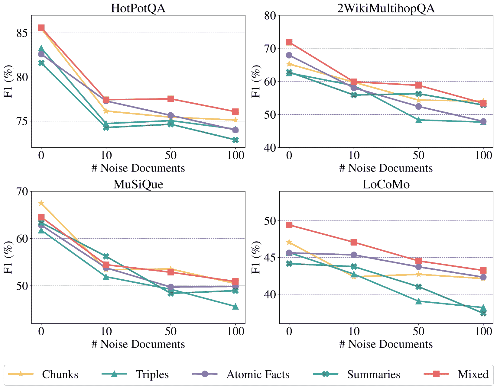
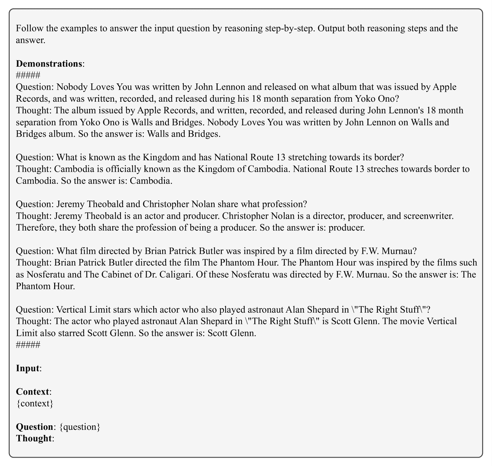

<!--yml

分类: 未分类

日期: 2025-01-11 11:45:29

-->

# 关于LLM代理的结构性记忆

> 来源：[https://arxiv.org/html/2412.15266/](https://arxiv.org/html/2412.15266/)

Ruihong Zeng^(1∗), Jinyuan Fang^(1∗), Siwei Liu^(2†), Zaiqiao Meng^(1†)

¹格拉斯哥大学   ²阿伯丁大学

zengrh3@gmail.com,   j.fang.2@research.gla.ac.uk

siwei.liu@abdn.ac.uk,   zaiqiao.meng@glasgow.ac.uk

###### 摘要

^*^*脚注：等贡献。^($\dagger$)^($\dagger$)脚注：通讯作者。

记忆在使基于大语言模型（LLM）的代理能够进行复杂和长期的互动（如问答系统（QA）和对话系统）中扮演着至关重要的角色。尽管已经提出了各种记忆模块用于这些任务，但不同记忆结构在不同任务中的影响尚未得到充分探索。本文探讨了记忆结构和记忆检索方法如何影响基于LLM的代理的性能。具体而言，我们评估了四种类型的记忆结构，包括块（chunks）、知识三元组（knowledge triples）、原子事实（atomic facts）和摘要（summaries），以及结合这些组件的混合记忆。此外，我们评估了三种广泛使用的记忆检索方法：单步检索、重排序和迭代检索。我们在四个任务和六个数据集上进行的广泛实验得出了以下关键见解：（1）不同的记忆结构具有不同的优势，能够针对特定任务进行调整；（2）混合记忆结构在噪声环境中表现出显著的弹性；（3）迭代检索在各种场景中始终优于其他方法。我们的研究旨在激发更多关于LLM代理记忆系统设计的研究。¹¹1所有代码和数据集都可以在以下网址公开获取：[https://github.com/zengrh3/StructuralMemory](https://github.com/zengrh3/StructuralMemory)

关于LLM代理的结构性记忆

Ruihong Zeng^(1∗), Jinyuan Fang^(1∗), Siwei Liu^(2†), Zaiqiao Meng^(1†) ¹格拉斯哥大学   ²阿伯丁大学 zengrh3@gmail.com,   j.fang.2@research.gla.ac.uk siwei.liu@abdn.ac.uk,   zaiqiao.meng@glasgow.ac.uk

## 1 引言

大型语言模型（LLMs）Minaee等人（[2024](https://arxiv.org/html/2412.15266v1#bib.bib22)）由于其卓越的能力，在自然语言任务中吸引了广泛的关注。近期的进展显著加速了基于LLM的智能体的发展，研究主要集中在个性化配置Park等人（[2023](https://arxiv.org/html/2412.15266v1#bib.bib26)）；[Hong等人](https://arxiv.org/html/2412.15266v1#bib.bib11)，规划Qian等人（[2024](https://arxiv.org/html/2412.15266v1#bib.bib27)）；Qiao等人（[2024](https://arxiv.org/html/2412.15266v1#bib.bib28)），行动Qin等人（[2023](https://arxiv.org/html/2412.15266v1#bib.bib29)）；Wang等人（[2024c](https://arxiv.org/html/2412.15266v1#bib.bib40)），自我进化Zhang等人（[2024a](https://arxiv.org/html/2412.15266v1#bib.bib45)）和记忆Packer等人（[2023](https://arxiv.org/html/2412.15266v1#bib.bib24)）；Lee等人（[2024](https://arxiv.org/html/2412.15266v1#bib.bib15)）。这些创新已解锁了在各种应用领域的广泛应用Li等人（[2023](https://arxiv.org/html/2412.15266v1#bib.bib19)）；Wang等人（[2024b](https://arxiv.org/html/2412.15266v1#bib.bib39)）；Chen等人（[2024](https://arxiv.org/html/2412.15266v1#bib.bib5)）。

支撑基于LLM的智能体有效性的一个基本元素是记忆模块。在认知科学中，Simon和Newell（[1971](https://arxiv.org/html/2412.15266v1#bib.bib35)）；Anderson（[2013](https://arxiv.org/html/2412.15266v1#bib.bib1)）认为，记忆是人类认知的基石，使得我们能够存储、检索并从过去的经验中汲取战略性思维和决策的依据。同样，记忆模块对于基于LLM的智能体至关重要，它通过促进过去交互的存储和组织，支持复杂推理能力，如多跳问答（QA）Li等人（[2024a](https://arxiv.org/html/2412.15266v1#bib.bib17)）；Lee等人（[2024](https://arxiv.org/html/2412.15266v1#bib.bib15)），并确保用户交互的一致性和连续性Nuxoll和Laird（[2007](https://arxiv.org/html/2412.15266v1#bib.bib23)）。

图1：基于LLM的智能体框架，其中我们重点研究记忆模块，包括记忆结构和检索方法。

在基于LLM的智能体中，开发有效的记忆模块通常涉及两个关键组成部分：结构化记忆生成和记忆检索方法 Wang et al.（[2024a](https://arxiv.org/html/2412.15266v1#bib.bib38)）；Zhang et al.（[2024b](https://arxiv.org/html/2412.15266v1#bib.bib46)）。在智能体使用的各种记忆结构中，片段 Hu et al.（[2024](https://arxiv.org/html/2412.15266v1#bib.bib12)），知识三元组 Anokhin et al.（[2024](https://arxiv.org/html/2412.15266v1#bib.bib2)），原子事实 Li et al.（[2024a](https://arxiv.org/html/2412.15266v1#bib.bib17)），以及摘要 Lee et al.（[2024](https://arxiv.org/html/2412.15266v1#bib.bib15)）是最为常见的。例如，HiAgent （Hu et al.，[2024](https://arxiv.org/html/2412.15266v1#bib.bib12)）使用子目标作为记忆片段来管理基于LLM的智能体的工作记忆，确保任务的连续性和一致性；而Arigraph Anokhin et al.（[2024](https://arxiv.org/html/2412.15266v1#bib.bib2)）采用知识三元组，将语义记忆和情节记忆结合在一起，存储事实性和详细信息，使其适用于复杂的推理任务。与此同时，ReadAgent Li et al.（[2024a](https://arxiv.org/html/2412.15266v1#bib.bib17)）将记忆片段压缩为摘要式的gits记忆，并将其组织在结构化的记忆目录中。

在回顾上述记忆结构后，出现了一个重要但尚未深入探讨的问题：哪些记忆结构最适合特定任务，它们的不同特性如何影响基于LLM的智能体的表现？这个问题反映了人类如何将记忆组织成不同形式，例如用于回忆事件的情节记忆和用于理解关系的语义记忆 Simon and Newell（[1971](https://arxiv.org/html/2412.15266v1#bib.bib35)）；Anderson（[2013](https://arxiv.org/html/2412.15266v1#bib.bib1)）。每种形式都有其独特的用途，使人类能够灵活而精准地应对各种挑战。此外，人类依赖有效的检索过程来访问相关记忆，确保在解决问题时准确地回忆起过去的经验。这突显了共同探索记忆结构和检索方法的必要性，以提升基于LLM的智能体的推理能力和整体效能。

为了弥补这一差距，我们系统地探讨了不同记忆结构和检索方法在基于LLM的智能体中的影响。具体而言，我们评估了现有的四种记忆结构：块状记忆 Hu et al. ([2024](https://arxiv.org/html/2412.15266v1#bib.bib12))，知识三元组 Anokhin et al. ([2024](https://arxiv.org/html/2412.15266v1#bib.bib2))，原子事实 Li et al. ([2024a](https://arxiv.org/html/2412.15266v1#bib.bib17))，以及总结 Li et al. ([2024a](https://arxiv.org/html/2412.15266v1#bib.bib17))。基于这些研究，我们探索了混合记忆结构的潜力，该结构结合了多种类型的记忆，以检查它们互补的特性是否能提升性能。此外，我们还评估了这些记忆结构对噪声的鲁棒性，因为了解它们在这种条件下的可靠性对于确保在各种任务中有效性至关重要。进一步地，我们调查了三种记忆检索方法，包括单步检索 Packer et al. ([2023](https://arxiv.org/html/2412.15266v1#bib.bib24))，重排序 Gao et al. ([2023a](https://arxiv.org/html/2412.15266v1#bib.bib8))，以及迭代检索 Li et al. ([2024b](https://arxiv.org/html/2412.15266v1#bib.bib18))，以揭示不同的检索方法和记忆结构组合如何影响整体性能。

本工作的主要贡献可以总结如下：(1) 我们提出了首个全面研究记忆结构和记忆检索方法在基于LLM的智能体中影响的工作，涵盖了六个数据集和四个任务：多跳QA、单跳QA、对话理解和阅读理解。(2) 我们的研究发现，混合记忆在不同任务中始终能取得平衡且具有竞争力的表现。块状记忆和总结在涉及大量且长篇上下文的任务中表现优异（例如，阅读理解和对话理解），而知识三元组和原子事实特别有效于关系推理以及多跳和单跳QA中的精确性。此外，混合记忆展示了对噪声的显著鲁棒性。(3) 迭代检索在大多数任务中表现为最有效的记忆检索方法，如多跳QA、对话理解和阅读理解。

图 2：基于LLM的智能体中记忆模块工作流概述。原始信息被组织成结构化记忆，并通过检索方法处理，识别与查询最相关的记忆，从而生成精确且富有上下文的回答。

## 2 相关工作

### 2.1 基于LLM的智能体

大语言模型（LLM）的出现标志着朝着实现人工通用智能（AGI）迈出了具有变革性的步伐 Wang 等人 ([2024a](https://arxiv.org/html/2412.15266v1#bib.bib38))，为基于LLM的智能体的发展提供了强大的能力 Xi 等人 ([2023](https://arxiv.org/html/2412.15266v1#bib.bib41)); Xu 等人 ([2024](https://arxiv.org/html/2412.15266v1#bib.bib42))。当前该领域的研究主要集中在智能体规划 Wang 等人 ([2023](https://arxiv.org/html/2412.15266v1#bib.bib37)); Yao 等人 ([2024](https://arxiv.org/html/2412.15266v1#bib.bib44)); Qian 等人 ([2024](https://arxiv.org/html/2412.15266v1#bib.bib27)); Qiao 等人 ([2024](https://arxiv.org/html/2412.15266v1#bib.bib28))，反思机制 Shinn 等人 ([2024](https://arxiv.org/html/2412.15266v1#bib.bib34)); Zhang 等人 ([2024a](https://arxiv.org/html/2412.15266v1#bib.bib45))，外部工具的利用 Qin 等人 ([2023](https://arxiv.org/html/2412.15266v1#bib.bib29)); Wang 等人 ([2024c](https://arxiv.org/html/2412.15266v1#bib.bib40))，自我演化能力 Zhang 等人 ([2024a](https://arxiv.org/html/2412.15266v1#bib.bib45)) 和记忆模块 Hu 等人 ([2024](https://arxiv.org/html/2412.15266v1#bib.bib12)); Lee 等人 ([2024](https://arxiv.org/html/2412.15266v1#bib.bib15))。

### 2.2 记忆结构

记忆模块作为基于大语言模型（LLM）智能体的基础，能够使其构建知识、检索相关信息，并利用先前的经验进行推理任务 Zhang 等人 ([2024b](https://arxiv.org/html/2412.15266v1#bib.bib46))。在记忆模块的广泛采用的记忆结构中，包括信息块 Packer 等人 ([2023](https://arxiv.org/html/2412.15266v1#bib.bib24)); Liu 等人 ([2023](https://arxiv.org/html/2412.15266v1#bib.bib20)); Hu 等人 ([2024](https://arxiv.org/html/2412.15266v1#bib.bib12))，知识三元组 Anokhin 等人 ([2024](https://arxiv.org/html/2412.15266v1#bib.bib2))，原子事实 Li 等人 ([2024a](https://arxiv.org/html/2412.15266v1#bib.bib17))，以及摘要 Lee 等人 ([2024](https://arxiv.org/html/2412.15266v1#bib.bib15))。例如，HiAgent (Hu 等人, [2024](https://arxiv.org/html/2412.15266v1#bib.bib12))将子目标作为记忆块，维持任务的连续性和交互过程中的一致性。另一方面，GraphReader Li 等人 ([2024a](https://arxiv.org/html/2412.15266v1#bib.bib17))采用原子事实将信息块压缩为更细的细节，为智能体提供更为精细的内容，从而在多跳问题回答任务中提高精确度。本文将研究不同记忆结构如何影响基于LLM的智能体的表现。

### 2.3 记忆检索

记忆检索方法是内存模块的另一个关键组成部分，使得基于LLM的代理能够检索相关记忆以进行高级推理。为了实现这一点，基于LLM的代理通常采用检索增强生成（RAG）方法，Lewis 等人（[2020](https://arxiv.org/html/2412.15266v1#bib.bib16)）；Fang 等人（[2024](https://arxiv.org/html/2412.15266v1#bib.bib7)），首先检索相关记忆，然后用LLM生成答案。在这种设置中，检索到的记忆会被加到查询前面，作为LLM的输入来生成响应，Ram 等人（[2023](https://arxiv.org/html/2412.15266v1#bib.bib30)）。最简单的检索方法是单步检索，Packer 等人（[2023](https://arxiv.org/html/2412.15266v1#bib.bib24)）；Zhong 等人（[2024](https://arxiv.org/html/2412.15266v1#bib.bib47)），旨在识别与查询最相关的Top-$K$记忆。此外，重排序，Gao 等人（[2023a](https://arxiv.org/html/2412.15266v1#bib.bib8)）；Ji 等人（[2024](https://arxiv.org/html/2412.15266v1#bib.bib13)）利用LLM的语言理解能力来优先排序检索到的记忆，而迭代检索，Li 等人（[2024b](https://arxiv.org/html/2412.15266v1#bib.bib18)）；Shi 等人（[2024](https://arxiv.org/html/2412.15266v1#bib.bib33)）则专注于重新表述查询以提高检索准确性。这些创新使得记忆检索变得更加适应性强，并且与查询一致，在各种复杂任务中保持有效的表现。本文探讨了不同的检索方法和记忆结构组合如何影响整体性能。

## 3 方法论

图[2](https://arxiv.org/html/2412.15266v1#S1.F2 "图 2 ‣ 1 引言 ‣ 关于LLM代理的结构记忆")展示了基于LLM的代理内存模块的概述，重点介绍了三个关键组成部分：结构记忆生成、记忆检索方法和答案生成。本节首先介绍$\S$ [3.1](https://arxiv.org/html/2412.15266v1#S3.SS1 "3.1 结构记忆生成 ‣ 3 方法论 ‣ 关于LLM代理的结构记忆")中的结构记忆生成。接下来，我们将在$\S$ [3.2](https://arxiv.org/html/2412.15266v1#S3.SS2 "3.2 记忆检索方法 ‣ 3 方法论 ‣ 关于LLM代理的结构记忆")中介绍记忆检索方法。最后，$\S$ [3.3](https://arxiv.org/html/2412.15266v1#S3.SS3 "3.3 答案生成 ‣ 3 方法论 ‣ 关于LLM代理的结构记忆")讨论答案生成方法。

### 3.1 结构记忆生成

结构化记忆生成使得智能体能够将原始文档组织成结构化的表示形式。通过将非结构化文档$\mathcal{D}_{q}$转化为结构化记忆$\mathcal{M}_{q}$，智能体能够更有效地存储、检索和推理信息。在这项工作中，我们探索了四种不同形式的结构化记忆：块$\mathcal{C}_{q}$、知识三元组$\mathcal{T}_{q}$、原子事实$\mathcal{A}_{q}$或摘要$\mathcal{S}_{q}$。每种结构化记忆的生成过程如下所述：

块（$\mathcal{C}_{q}$）。块（Gao等人，[2023b](https://arxiv.org/html/2412.15266v1#bib.bib9)）是LLM基础的智能体中广泛使用的结构化记忆形式。每个块代表文档中的一个连续文本段，通常限制为固定数量的标记$L$。形式上，原始文档$\mathcal{D}_{q}$可以被划分为一系列块，定义为：$\mathcal{C}_{q}(\mathcal{D}_{q})=\{c_{1},c_{2},\dots,c_{j}\}$，其中每个块$c_{j}$包含最多$L$个标记。

<svg class="ltx_picture" height="104.68" id="S3.SS1.p3.pic1" overflow="visible" version="1.1" width="600"><g fill="#000000" stroke="#000000" stroke-width="0.4pt" transform="translate(0,104.68) matrix(1 0 0 -1 0 0)"><g fill-opacity="1.0" transform="matrix(1.0 0.0 0.0 1.0 21.65 89.17)"><foreignobject color="#FFFFFF" height="9.61" overflow="visible" transform="matrix(1 0 0 -1 0 16.6)" width="556.69">Chunks</foreignobject></g> <g fill-opacity="1.0" transform="matrix(1.0 0.0 0.0 1.0 21.65 13.78)"><foreignobject color="#000000" height="57.67" overflow="visible" transform="matrix(1 0 0 -1 0 16.6)" width="556.69">Definition: Chunks are continuous, fixed-length segments of text from the document. Example: Generated chunks $\mathcal{C}_{q}$: (1) Moneybomb (alternatively money bomb, money-bomb, or fundraising bomb) is a neologism coined in 2007; (2) to describe a grassroots fundraising effort over a brief fixed time period.</foreignobject></g></g></svg>

知识三元组（$\mathcal{T}_{q}$）。知识三元组代表了捕捉实体之间语义关系的结构化记忆形式。每个三元组由三部分组成：头实体、关系和尾实体，表示为格式$\langle\text{{head}};\text{{relation}};\text{{tail entity}}\rangle$。根据以往的研究，Anokhin等人（[2024](https://arxiv.org/html/2412.15266v1#bib.bib2)）；Fang等人（[2024](https://arxiv.org/html/2412.15266v1#bib.bib7)）的方法，原始文档$\mathcal{D}_{q}$通过LLM在定制化提示$\mathcal{P}_{\mathcal{T}}$的指导下处理，生成一组语义三元组$\mathcal{T}_{q}$。生成过程可以形式化表示为：$\mathcal{T}_{q}=\texttt{LLM}(\mathcal{D}_{q},\mathcal{P}_{\mathcal{T}})$。

<svg class="ltx_picture" height="96.75" id="S3.SS1.p5.pic1" overflow="visible" version="1.1" width="600"><g fill="#000000" stroke="#000000" stroke-width="0.4pt" transform="translate(0,96.75) matrix(1 0 0 -1 0 0)"><g fill-opacity="1.0" transform="matrix(1.0 0.0 0.0 1.0 21.65 78.54)"><foreignobject color="#FFFFFF" height="12.3" overflow="visible" transform="matrix(1 0 0 -1 0 16.6)" width="556.69">Knowledge Triples</foreignobject></g> <g fill-opacity="1.0" transform="matrix(1.0 0.0 0.0 1.0 21.65 13.78)"><foreignobject color="#000000" height="47.05" overflow="visible" transform="matrix(1 0 0 -1 0 16.6)" width="556.69">Definition: Knowledge triples capture relationships between entities. Example: Generated triples $\mathcal{T}_{q}$: (1) $\langle$Moneybomb; type; neologism$\rangle$; (2) $\langle$Moneybomb; coined in; 2007$\rangle$.</foreignobject></g></g></svg>

原子事实（$\mathcal{A}_{q}$）。原子事实是最小的、不可分割的信息单元，通常以简洁的句子形式呈现，捕捉关键信息。它们代表了结构化记忆的一个颗粒化形式，通过保留关键的实体、动作和属性来简化原始文档。根据Li等人（[2024a](https://arxiv.org/html/2412.15266v1#bib.bib17)）的方法，原子事实是通过LLM在定制化提示$\mathcal{P}_{\mathcal{A}}$的指导下，从原始文档$\mathcal{D}_{q}$生成的，形式化表示为：$\mathcal{A}_{q}=\texttt{LLM}(\mathcal{D}_{q},\mathcal{P}_{\mathcal{A}})$。

<svg class="ltx_picture" height="93.9" id="S3.SS1.p7.pic1" overflow="visible" version="1.1" width="600"><g fill="#000000" stroke="#000000" stroke-width="0.4pt" transform="translate(0,93.9) matrix(1 0 0 -1 0 0)"><g fill-opacity="1.0" transform="matrix(1.0 0.0 0.0 1.0 21.65 78.54)"><foreignobject color="#FFFFFF" height="9.46" overflow="visible" transform="matrix(1 0 0 -1 0 16.6)" width="556.69">Atomic Facts</foreignobject></g> <g fill-opacity="1.0" transform="matrix(1.0 0.0 0.0 1.0 21.65 13.78)"><foreignobject color="#000000" height="47.05" overflow="visible" transform="matrix(1 0 0 -1 0 16.6)" width="556.69">Definition: Atomic facts are the smallest units of indivisible information. Example: Generated atomic facts $\mathcal{A}_{q}$: (1) Moneybomb is also known as money bomb, money-bomb, or fundraising bomb; (2) Moneybomb is a neologism.</foreignobject></g></g></svg>

摘要（$\mathcal{S}_{q}$）。摘要提供了文档的精简和全面的描述，捕捉了文档的全局内容和关键信息。根据Lee等人（[2024](https://arxiv.org/html/2412.15266v1#bib.bib15)）的方法，摘要是通过LLM在定制化提示$\mathcal{P}_{\mathcal{S}}$的指导下，从原始文档$\mathcal{D}_{q}$生成的，定义为：$\mathcal{S}_{q}=\texttt{LLM}(\mathcal{D}_{q},\mathcal{P}_{\mathcal{S}})$。

<svg class="ltx_picture" height="108.97" id="S3.SS1.p9.pic1" overflow="visible" version="1.1" width="600"><g fill="#000000" stroke="#000000" stroke-width="0.4pt" transform="translate(0,108.97) matrix(1 0 0 -1 0 0)"><g fill-opacity="1.0" transform="matrix(1.0 0.0 0.0 1.0 21.65 93.61)"><foreignobject color="#FFFFFF" height="9.46" overflow="visible" transform="matrix(1 0 0 -1 0 16.6)" width="556.69">Summaries</foreignobject></g> <g fill-opacity="1.0" transform="matrix(1.0 0.0 0.0 1.0 21.65 13.78)"><foreignobject color="#000000" height="62.11" overflow="visible" transform="matrix(1 0 0 -1 0 16.6)" width="556.69">Definition: Summaries compress the document into a comprehensive description. Example: Generated summaries $\mathcal{S}_{q}$: Moneybomb, alternatively referred to as money bomb, money-bomb, or fundraising bomb, is a neologism coined in 2007\. It describes a grassroots fundraising effort that occurs over a brief fixed time period.</foreignobject></g></g></svg>

混合记忆（$\mathcal{M}_{q}^{\text{Mixed}}$）。混合记忆代表了一种结构化记忆的复合形式，结合了所有上述类型：块、知识三元组、原子事实和摘要。该整合提供了一个全面的表示，正式定义如下：$\mathcal{M}_{q}^{\text{Mixed}}=\mathcal{C}_{q}\cup\mathcal{T}_{q}\cup\mathcal{A}_{q}\cup\mathcal{S}_{q}$。

用于生成每种类型结构化记忆的LLM提示的详细信息，例如$\mathcal{P}_{\mathcal{T}}$，$\mathcal{P}_{\mathcal{A}}$和$\mathcal{P}_{\mathcal{S}}$，详见附录[B](https://arxiv.org/html/2412.15266v1#A2 "Appendix B Prompts ‣ On the Structural Memory of LLM Agents")。

### 3.2 记忆检索方法

给定生成的结构化记忆$\mathcal{M}_{q}$，我们采用一种记忆检索方法来识别和整合与查询$q$最相关的支持记忆$\mathcal{M}_{r}\subset\mathcal{M}_{q}$。如果没有这一步骤，代理将需要处理所有可用记忆，这将导致低效并可能由于无关信息产生不准确性。我们的研究主要聚焦于三种检索方法：单步检索 Robertson等人（[2009](https://arxiv.org/html/2412.15266v1#bib.bib31)）；Rubin等人（[2022](https://arxiv.org/html/2412.15266v1#bib.bib32)），重新排序 Gao等人（[2023a](https://arxiv.org/html/2412.15266v1#bib.bib8)）；Ji等人（[2024](https://arxiv.org/html/2412.15266v1#bib.bib13)），以及迭代检索 Li等人（[2024b](https://arxiv.org/html/2412.15266v1#bib.bib18)）；Shi等人（[2024](https://arxiv.org/html/2412.15266v1#bib.bib33)）。每种记忆检索方法的详细信息如下：

单步检索。在单步检索过程中，目标是识别与查询$q$最相关的Top-$K$记忆$\mathcal{M}_{r}$。该过程的正式定义为：$\mathcal{M}_{r}=\texttt{Retriever}(q,\mathcal{M}_{q},K)$，其中检索器Retriever由Robertson等人（[2009](https://arxiv.org/html/2412.15266v1#bib.bib31)）；Rubin等人（[2022](https://arxiv.org/html/2412.15266v1#bib.bib32)）作为核心组件。

重新排序。在重新排序过程中，Gao 等人（[2023a](https://arxiv.org/html/2412.15266v1#bib.bib8)）；Dong 等人（[2024](https://arxiv.org/html/2412.15266v1#bib.bib6)）采用初始检索器选择候选的前 $K$ 个记忆 $\mathcal{M}_{i}$，然后通过 LLM 和提示 $\mathcal{P}_{\text{Rerank}}$ 根据它们的相关性评分进行重新排序。从重新排序后的列表中，按相关性评分降序选择前 $R$ 个记忆 $\mathcal{M}_{r}$，被确定为最相关的记忆。此步骤通过利用 LLM 强化查询与记忆之间的联系，过滤掉无关记忆，并优先考虑与查询最相关的记忆，从而提高检索精度。这个过程的正式定义为：$\mathcal{M}_{r}=\texttt{LLM}(q,\mathcal{M}_{i},R,\mathcal{P}_{R})\,$，其中 $\mathcal{M}_{i}=\texttt{Retriever}(q,\mathcal{M}_{q},K)$。

迭代检索。Gao 等人（[2023b](https://arxiv.org/html/2412.15266v1#bib.bib9)）提出的迭代检索方法从初始查询 $q_{0}=q$ 开始，检索出前 $T$ 个最相关的结构化记忆 $\mathcal{M}_{j}$。这些检索到的记忆通过由 $\mathcal{P}_{\text{Refine}}$ 提示的 LLM 用于优化查询。这个过程会在 $N$ 次迭代中反复进行，不断细化查询，最终产生用于检索相关记忆的最终版本 $q_{N}$。形式上，迭代检索过程可以定义为：$q_{j}=\texttt{LLM}(\mathcal{M}_{j},\mathcal{P}_{\text{Refine}})$，其中 $\mathcal{M}_{j}=\texttt{Retriever}(q_{j-1},\mathcal{M}_{q},T)$。经过 $N$ 次迭代后，最终优化的查询 $q_{N}$ 被用来检索生成答案所需的前 $K$ 个最相关的记忆。这一步可以表示为：$\mathcal{M}_{r}=\texttt{Retriever}(q_{N},\mathcal{M}_{q},K)$。详细的提示 $\mathcal{P}_{\text{Rerank}}$ 和 $\mathcal{P}_{\text{Refine}}$ 可在附录 [B](https://arxiv.org/html/2412.15266v1#A2 "Appendix B Prompts ‣ On the Structural Memory of LLM Agents") 中找到。

### 3.3 答案生成

最后，智能体利用 LLM 根据检索到的记忆生成答案。为此，我们提出了两种答案生成方法。在第一种方法（称为 Memory-Only）中，直接使用检索到的记忆 $\mathcal{M}_{r}$ 作为生成答案的上下文。第二种方法（称为 Memory-Doc）使用检索到的记忆来定位它们在 $\mathcal{D}_{q}$ 中对应的原始文档。这些文档随后作为生成答案的上下文，为智能体提供更详细、更多语境信息。 

| 记忆结构 | HotPotQA | 2WikiMultihopQA | MuSiQue | NarrativeQA | LoCoMo | QuALITY |
| --- | --- | --- | --- | --- | --- | --- |
| EM | F1 | EM | F1 | EM | F1 | EM | F1 | EM | F1 | ACC |
| --- | --- | --- | --- | --- | --- | --- | --- | --- | --- | --- |
| 完整内容 | 55.50 | 75.77 | 44.00 | 54.33 | 36.00 | 51.60 | 7.00 | 24.99 | 13.61 | 41.82 | 81.50 |
| --- | --- | --- | --- | --- | --- | --- | --- | --- | --- | --- | --- |
| 单步检索 |
| --- |
| 块 | 61.50 | 76.93 | 43.50 | 59.17 | 35.50 | 54.45 | 13.50 | 29.78 | 9.95 | 40.63 | 76.00 |
| 三元组 | 59.50 | 74.09 | 44.50 | 60.82 | 31.00 | 50.13 | 11.50 | 22.04 | 8.42 | 41.08 | 61.50 |
| 原子事实 | 62.50 | 77.22 | 39.50 | 58.63 | 30.50 | 51.31 | 13.50 | 27.49 | 9.42 | 42.92 | 71.50 |
| 摘要 | 57.00 | 74.81 | 42.00 | 57.21 | 34.00 | 52.83 | 16.50 | 32.93 | 10.99 | 44.94 | 76.00 |
| 混合 | 60.00 | 77.10 | 48.50 | 65.25 | 33.00 | 51.65 | 14.50 | 29.86 | 10.47 | 44.73 | 78.00 |
| 重新排序 |
| 块 | 63.00 | 77.35 | 45.00 | 61.31 | 37.00 | 55.32 | 16.00 | 31.63 | 9.95 | 43.47 | 78.50 |
| 三元组 | 61.00 | 76.75 | 43.50 | 55.43 | 26.50 | 42.05 | 10.00 | 20.65 | 8.83 | 41.82 | 60.00 |
| 原子事实 | 63.00 | 78.31 | 40.50 | 59.31 | 28.50 | 49.95 | 14.00 | 28.19 | 8.90 | 44.27 | 67.50 |
| 摘要 | 61.00 | 77.80 | 45.00 | 61.18 | 35.50 | 54.59 | 16.00 | 32.26 | 12.04 | 44.83 | 75.00 |
| 混合 | 65.00 | 78.58 | 45.50 | 61.77 | 34.00 | 52.45 | 11.98 | 28.02 | 9.42 | 44.51 | 77.50 |
| 迭代检索 |
| 块 | 63.00 | 79.10 | 46.50 | 62.13 | 37.00 | 56.78 | 14.50 | 30.88 | 10.47 | 45.14 | 77.00 |
| 三元组 | 64.00 | 78.78 | 47.50 | 62.06 | 38.00 | 55.93 | 10.50 | 21.67 | 9.47 | 41.41 | 60.50 |
| 原子事实 | 65.50 | 81.29 | 44.00 | 63.89 | 34.50 | 57.55 | 14.50 | 28.28 | 9.95 | 43.62 | 67.50 |
| 摘要 | 60.50 | 78.11 | 46.50 | 62.35 | 33.50 | 53.12 | 17.00 | 31.79 | 12.04 | 43.93 | 75.00 |
| 混合 | 67.00 | 82.11 | 51.00 | 68.15 | 39.00 | 61.38 | 12.50 | 28.36 | 7.85 | 45.25 | 79.50 |

表 1：不同检索方法在六个数据集上的各类记忆结构的整体表现（%）。最佳表现以粗体标出，第二好表现下划线标记。

## 4 实验

### 4.1 数据集。

我们在四个任务上对六个数据集进行了实验。对于多跳长文本问答数据集，我们在HotPotQA Yang et al. ([2018](https://arxiv.org/html/2412.15266v1#bib.bib43))、2WikiMultihopQA Ho et al. ([2020](https://arxiv.org/html/2412.15266v1#bib.bib10)) 和 MuSiQue Trivedi et al. ([2022](https://arxiv.org/html/2412.15266v1#bib.bib36))上进行了实验。单跳长文本问答任务使用NarrativeQA Kočiskỳ et al. ([2018](https://arxiv.org/html/2412.15266v1#bib.bib14))，数据来自Longbench Bai et al. ([2023](https://arxiv.org/html/2412.15266v1#bib.bib3))。此外，我们还利用了LoCoMo数据集 Maharana et al. ([2024](https://arxiv.org/html/2412.15266v1#bib.bib21)) 来进行基于对话的长文本问答任务，而QuALITY Pang et al. ([2022](https://arxiv.org/html/2412.15266v1#bib.bib25))数据集则用于阅读理解问答任务²²2有关数据集的更多细节和统计数据请见附录 [A](https://arxiv.org/html/2412.15266v1#A1 "Appendix A Datasets ‣ On the Structural Memory of LLM Agents")..

### 4.2 评估。

为了评估问答性能，我们遵循了之前的工作Li et al. ([2024a](https://arxiv.org/html/2412.15266v1#bib.bib17))，使用了标准的度量指标，如精确匹配（EM）得分和F1得分，适用于HotPotQA、2WikiMultihopQA、MuSiQue、NarrativeQA 和 LoCoMo数据集。对于QuALITY数据集，我们参考了Lee et al. ([2024](https://arxiv.org/html/2412.15266v1#bib.bib15))的方法，使用准确率作为评估指标，其中$25\%$代表随机表现。

### 4.3 实现细节。

在我们的实验中，我们使用了GPT-4o-mini-128k，并设置温度为0.2。输入窗口设置为$4k$个tokens，最大块大小为$1k$个tokens。对于文本嵌入，我们使用了来自OpenAI的text-embedding-3-small模型³³3[https://platform.openai.com/docs/guides/embeddings/](https://platform.openai.com/docs/guides/embeddings/)，并使用LangChain Chase ([2022](https://arxiv.org/html/2412.15266v1#bib.bib4))存储向量化的记忆。

## 5 结果与分析

### 5.1 记忆结构的影响

图3：使用两种答案生成方法（仅记忆和记忆-文档）在六个数据集上的表现。

发现 1：混合记忆提供更平衡的性能。表格[1](https://arxiv.org/html/2412.15266v1#S3.T1 "Table 1 ‣ 3.3 Answer Generation ‣ 3 Methodology ‣ On the Structural Memory of LLM Agents")中呈现的结果揭示了不同记忆结构对任务性能的影响的关键见解：（1）混合记忆在性能上始终优于其他记忆结构，尤其在迭代检索下，混合记忆在HotPotQA任务上的F1分数为82.11%，在2WikiMultihopQA任务上的F1分数为68.15%，表现出色。（2）对于需要平衡简洁与全面上下文的任务，块状记忆表现优异，这在包含长上下文的数据集中得到了体现。例如，在NarrativeQA上的F1分数为31.63%，在QuALITY任务中的准确率为78.5%（重新排序）。总结性记忆通过压缩大量上下文，对于需要抽象化的任务非常有效，在NarrativeQA上的F1分数为32.26%，在LoCoMo任务中表现稳健。（3）知识三元组和原子事实特别适合关系推理和精准度要求。知识三元组在迭代检索下在2WikiMultihopQA上的F1分数为62.06%，原子事实在HotPotQA任务中的F1分数为81.29%。这些发现强调了根据任务要求定制记忆结构的重要性，并表明，结合互补记忆类型的混合记忆在各项任务中的性能显著提升。

### 5.2 记忆检索方法的影响

发现 2：迭代检索是最优的检索方法。表格[1](https://arxiv.org/html/2412.15266v1#S3.T1 "Table 1 ‣ 3.3 Answer Generation ‣ 3 Methodology ‣ On the Structural Memory of LLM Agents")中的结果展示了检索方法对性能的显著影响：（1）迭代检索始终优于其他方法，在大多数数据集上获得最高分数。特别是使用混合记忆时，迭代检索在HotPotQA任务上取得了82.11%的F1分数，在2WikiMultihopQA任务上取得了68.15%的F1分数，展示了其在迭代查询中提高准确度的能力。（2）重新排序在中等复杂度的数据集上表现强劲。例如，在使用原子事实记忆时，它在LoCoMo上的F1分数为44.27%，在NarrativeQA上的F1分数为28.19%。（3）相比之下，单步检索在需要最小化上下文整合的任务中表现竞争力。使用总结性记忆时，它在NarrativeQA上的F1分数为32.93%，利用抽象化来提取连贯的信息。这些发现强调了将检索机制与任务要求对齐的重要性，而迭代检索在推理任务中表现尤为突出。

### 5.3 回答生成方法的影响

发现 3：广泛上下文任务偏好Memory-Doc，而精度任务则受益于Memory-Only。如图[3](https://arxiv.org/html/2412.15266v1#S5.F3 "图 3 ‣ 5.1 记忆结构的影响 ‣ 5 结果与分析 ‣ 大型语言模型代理的结构性记忆")所示，比较了它们在不同数据集上的表现。通过检索记忆检索文档能够提供更全面的理解，这类似于人类如何将即时回忆与更广泛的上下文结合来解释复杂的叙事。相反，对于涉及多跳推理和对话理解的数据集，如HotPotQA和LoCoMo，Memory-Only方法被证明是更有效的策略。这些发现表明，广泛上下文任务受益于Memory-Doc方法，该方法整合了更广泛的文档级信息以丰富响应。另一方面，精度优先的任务更适合Memory-Only方法，它确保了更集中的精确检索。

图4：使用单步检索时，不同数量的检索记忆$K$在HotPotQA和LoCoMo上的表现。

图5：在HotPotQA和LoCoMo中的不同数量的重排记忆$R$在重排中的表现。

### 5.4 超参数敏感度

检索记忆数量$K$的影响。我们首先评估$K$在单步检索中的影响，由于计算资源的限制，$K$的上限为200。如图[4](https://arxiv.org/html/2412.15266v1#S5.F4 "图 4 ‣ 5.3 回答生成方法的影响 ‣ 5 结果与分析 ‣ 大型语言模型代理的结构性记忆")所示，在HotPotQA中，片段表现稳定，在所有$K$值下约为77%。在LoCoMo中，片段的表现有适度的提升，直到$K=50$，而三元组、原子结构和摘要在$K=100$时表现最佳，但在$K=200$时有所下降，这可能是由于检索过多记忆引入的噪声。这些发现表明，最佳的$K$值取决于数据集和记忆结构。尽管适度的$K$值通常能提升性能，但过大的$K$值可能会引入无关信息，从而导致性能下降。

重排序记忆数量 $R$ 的影响。为了评估 $R$ 在重排序中的影响，我们研究了不同值范围下的性能，最大 $R$ 设为 75，原因是计算成本的限制，同时将 $K$ 固定为 100。如图 [5](https://arxiv.org/html/2412.15266v1#S5.F5 "图 5 ‣ 5.3 答案生成方法的影响 ‣ 5 结果与分析 ‣ 关于 LLM 代理的结构记忆") 所示，结果表明，增加重排序的记忆数量并不总是能带来更好的性能。例如，在 HotPotQA 中，块（chunks）在 $R=10$ 时达到最高的 F1 分数，而在 $R=50$ 之后，性能开始下降。这一趋势在三元组和原子事实中也有所体现，表明选择少量高度相关的记忆往往能优于检索并重排序更大的记忆集合，因为后者通常会引入噪声。在 LoCoMo 中也可以观察到类似的趋势。这些发现表明，重排序在集中于少量高度相关的记忆时更加有效。

图 6：在 HotPotQA 和 LoCoMo 上使用迭代检索时，每次交互中检索到的不同数量的记忆 $T$ 的性能表现。

每次迭代中检索记忆数量 $T$ 的影响。我们首先研究了使用迭代检索时，不同 $T$ 值范围内的性能，最大 $T$ 设为 75，$N$ 为 4，原因是计算成本的限制，同时保持 $K$ 固定为 100。如图 [6](https://arxiv.org/html/2412.15266v1#S5.F6 "图 6 ‣ 5.4 超参数敏感性 ‣ 5 结果与分析 ‣ 关于 LLM 代理的结构记忆") 所示，通常增加每次迭代中检索到的记忆数量会改善数据集的性能，但超过某一阈值后，增益会逐渐减少。例如，在 HotPotQA 中，原子事实在 $T=50$ 时达到约 81% 的 F1 分数，进一步增加 $T$ 值带来的增益微乎其微。同样，在 LoCoMo 中，块的性能在 $T=50$ 时达到最高，然后在 $T=75$ 时开始下降。这些结果表明，虽然增加 $T$ 值可以改善查询的细化和性能，但过大的 $T$ 值可能引入噪声，最终降低效果。

图 7：在 HotPotQA 和 LoCoMo 上使用迭代检索时，每次交互中检索到的不同数量的记忆 $N$ 的性能表现。

迭代次数$N$的影响。接下来，我们研究迭代次数$N$的影响，其中检索到的记忆数量$T$固定为50。如图[6](https://arxiv.org/html/2412.15266v1#S5.F6 "Figure 6 ‣ 5.4 Hyperparameter Sensitivity ‣ 5 Results and Analysis ‣ On the Structural Memory of LLM Agents")所示，结果表明，增加$N$最初显著提高了性能，但随着$N$的增加，性能提升的速度逐渐减缓。对于HotPotQA，从$N=1$到$N=3$，三元组和摘要的表现都有显著提升，之后提升变得微弱。在LoCoMo的情况下，三元组、原子事实和摘要在$N=3$时达到了顶峰，之后不再增加。这些结果表明，适中的迭代次数，通常在2到3之间，可以实现最佳的性能提升，既能最大化效果，又能最小化资源消耗。

图8：在使用单步检索时，不同数量噪声文档下的表现。

### 5.5 噪声文档的影响

发现4：混合记忆在噪声抗性方面表现突出。最后，我们评估了在使用固定$K=100$的单步检索下，随着噪声级别的增加，各种记忆结构的鲁棒性。如图[8](https://arxiv.org/html/2412.15266v1#S5.F8 "Figure 8 ‣ 5.4 Hyperparameter Sensitivity ‣ 5 Results and Analysis ‣ On the Structural Memory of LLM Agents")所示，随着噪声文档数量的增加，所有记忆结构的性能都有所下降。对于HotPotQA，混合记忆始终取得最高的F1分数，表现出对噪声的优越抗性。虽然三元组和摘要的下降速度相似，但数据块的下降速度较慢，在增加噪声文档的情况下，依然保持竞争力的F1分数。在LoCoMo中也呈现出类似的趋势。这些发现揭示了混合记忆结构的鲁棒性，其在多个数据集上始终优于其他结构，成为噪声环境中最有效的选择。

## 6 结论与未来工作

在本文中，我们提出了关于结构性记忆和记忆检索方法对基于LLM的代理影响的首个全面研究，旨在确定最适合特定任务的记忆结构，并探索检索方法如何影响性能。本研究得出了一些关键发现：(1) 混合记忆始终提供均衡的表现。块状记忆和摘要在涉及长上下文的任务中表现突出，如阅读理解和对话理解，而知识三元组和原子事实对于关系推理和多跳与单跳问答的精确性有效。(2) 混合记忆还表现出显著的噪声韧性。(3) 迭代检索被认为是最有效的记忆检索方法，在多跳问答、对话理解和阅读理解等任务中始终表现优异。尽管这些发现提供了有价值的见解，但仍需要进一步研究以探索记忆如何影响自我进化和社会模拟等领域，突显了研究结构性记忆和检索技术如何支持这些应用的重要性。

## 限制

我们在工作中识别了以下限制：(1) 我们的实验仅限于多跳问答、单跳问答、对话理解和阅读理解等任务，这限制了我们的发现对其他复杂领域，如自我进化代理或社会模拟的适用性。研究记忆结构和检索方法在这些主题中的作用可能会提供更广泛的见解；(2) 记忆鲁棒性的评估主要考虑了随机文档噪声，未探索其他具有挑战性的噪声类型，如无关或矛盾信息。未来研究中探讨这些额外的噪声可能会提供更全面的记忆韧性理解；(3) 由于计算限制，我们限制了记忆检索方法中的超参数范围（例如，$K$、$R$、$T$、$N$）。在未来的研究中扩展这些范围可能会对它们对性能的影响提供更深入的见解。

## 参考文献

+   Anderson (2013) John R Anderson. 2013. *认知架构*. 心理学出版社。

+   Anokhin et al. (2024) Petr Anokhin, Nikita Semenov, Artyom Sorokin, Dmitry Evseev, Mikhail Burtsev, 和 Evgeny Burnaev. 2024. Arigraph: 利用情节记忆学习知识图谱世界模型，针对LLM代理. *arXiv 预印本 arXiv:2407.04363*。

+   Bai et al. (2023) Yushi Bai, Xin Lv, Jiajie Zhang, Hongchang Lyu, Jiankai Tang, Zhidian Huang, Zhengxiao Du, Xiao Liu, Aohan Zeng, Lei Hou, 等. 2023. Longbench: 一种用于长上下文理解的双语多任务基准. *arXiv 预印本 arXiv:2308.14508*。

+   Chase (2022) Harrison Chase. 2022. [LangChain](https://github.com/langchain-ai/langchain)。

+   Chen 等人（2024）Jiangjie Chen, Xintao Wang, Rui Xu, Siyu Yuan, Yikai Zhang, Wei Shi, Jian Xie, Shuang Li, Ruihan Yang, Tinghui Zhu 等人. 2024. 从角色到个性化：关于角色扮演语言代理的综述。*arXiv预印本 arXiv:2404.18231*。

+   Dong 等人（2024）Jialin Dong, Bahare Fatemi, Bryan Perozzi, Lin F Yang 和 Anton Tsitsulin. 2024. 别忘了连接！通过基于图的重新排序改进RAG。*arXiv预印本 arXiv:2405.18414*。

+   Fang 等人（2024）Jinyuan Fang, Zaiqiao Meng 和 Craig MacDonald. 2024. TRACE证据：构建基于知识的推理链以增强检索生成。在 *计算语言学协会发现：EMNLP 2024*，第8472–8494页，美国佛罗里达州迈阿密。计算语言学协会。

+   Gao 等人（2023a）Luyu Gao, Xueguang Ma, Jimmy Lin 和 Jamie Callan. 2023a. 无需相关标签的精确零-shot密集检索。收录于 *第61届计算语言学协会年会会议论文集（第一卷：长篇论文）*，第1762–1777页。

+   Gao 等人（2023b）Yunfan Gao, Yun Xiong, Xinyu Gao, Kangxiang Jia, Jinliu Pan, Yuxi Bi, Yi Dai, Jiawei Sun, Meng Wang 和 Haofen Wang. 2023b. 大型语言模型的检索增强生成：一项综述。*arXiv预印本 arXiv:2312.10997*。

+   Ho 等人（2020）Xanh Ho, Anh-Khoa Duong Nguyen, Saku Sugawara 和 Akiko Aizawa. 2020. 构建多跳问答数据集以全面评估推理步骤。收录于 *第28届国际计算语言学大会论文集*，第6609–6625页。

+   （11）Sirui Hong, Mingchen Zhuge, Jonathan Chen, Xiawu Zheng, Yuheng Cheng, Jinlin Wang, Ceyao Zhang, Zili Wang, Steven Ka Shing Yau, Zijuan Lin 等人. Metagpt：多代理协作框架的元编程。收录于 *第十二届国际学习表征会议*。

+   Hu 等人（2024）Mengkang Hu, Tianxing Chen, Qiguang Chen, Yao Mu, Wenqi Shao 和 Ping Luo. 2024. Hiagent：用于解决大语言模型长时程任务的层次化工作记忆管理。*arXiv预印本 arXiv:2408.09559*。

+   Ji 等人（2024）Jiarui Ji, Runlin Lei, Jialing Bi, Zhewei Wei, Yankai Lin, Xuchen Pan, Yaliang Li 和 Bolin Ding. 2024. 通过大规模LLM基础的代理模拟生成动态文本图。*arXiv预印本 arXiv:2410.09824*。

+   Kočiskỳ 等人（2018）Tomáš Kočiskỳ, Jonathan Schwarz, Phil Blunsom, Chris Dyer, Karl Moritz Hermann, Gábor Melis 和 Edward Grefenstette. 2018. NarrativeQA 阅读理解挑战。*计算语言学协会会刊*，6:317–328。

+   Lee 等人（2024）Kuang-Huei Lee, Xinyun Chen, Hiroki Furuta, John F. Canny 和 Ian Fischer. 2024. 一种受人类启发的阅读代理，具有非常长上下文的要点记忆。收录于 *第41届国际机器学习大会，ICML 2024，奥地利维也纳，2024年7月21日至27日*。OpenReview.net。

+   Lewis 等人 (2020) Patrick Lewis, Ethan Perez, Aleksandra Piktus, Fabio Petroni, Vladimir Karpukhin, Naman Goyal, Heinrich Küttler, Mike Lewis, Wen-tau Yih, Tim Rocktäschel 等人. 2020. 增强检索生成用于知识密集型自然语言处理任务。*神经信息处理系统进展*，33:9459–9474。

+   Li 等人 (2024a) Shilong Li, Yancheng He, Hangyu Guo, Xingyuan Bu, Ge Bai, Jie Liu, Jiaheng Liu, Xingwei Qu, Yangguang Li, Wanli Ouyang 等人. 2024a. Graphreader: 构建基于图的代理以增强大语言模型的长上下文能力。*arXiv 预印本 arXiv:2406.14550*。

+   Li 等人 (2024b) Xiaoxi Li, Zhicheng Dou, Yujia Zhou, 和 Fangchao Liu. 2024b. Corpuslm: 面向知识密集型任务的统一语料库语言模型。载于 *第47届国际ACM SIGIR信息检索研究与开发会议论文集*，第26–37页。

+   Li 等人 (2023) Yuan Li, Yixuan Zhang, 和 Lichao Sun. 2023. Metaagents: 通过协作生成代理模拟基于大语言模型的任务导向协调中的人类行为交互。*arXiv 预印本 arXiv:2310.06500*。

+   Liu 等人 (2023) Lei Liu, Xiaoyan Yang, Yue Shen, Binbin Hu, Zhiqiang Zhang, Jinjie Gu, 和 Guannan Zhang. 2023. Think-in-memory: 回忆与后续思考赋能大语言模型的长期记忆。*arXiv 预印本 arXiv:2311.08719*。

+   Maharana 等人 (2024) Adyasha Maharana, Dong-Ho Lee, Sergey Tulyakov, Mohit Bansal, Francesco Barbieri, 和 Yuwei Fang. 2024. 评估大语言模型代理的超长期对话记忆。在 *第62届计算语言学协会年会（第1卷：长篇论文）*，第13851–13870页，泰国曼谷。计算语言学协会。

+   Minaee 等人 (2024) Shervin Minaee, Tomas Mikolov, Narjes Nikzad, Meysam Chenaghlu, Richard Socher, Xavier Amatriain, 和 Jianfeng Gao. 2024. 大型语言模型：综述。*arXiv 预印本 arXiv:2402.06196*。

+   Nuxoll 和 Laird (2007) Andrew M Nuxoll 和 John E Laird. 2007. 通过情景记忆扩展认知架构。载于 *AAAI*，第1560–1564页。

+   Packer 等人 (2023) Charles Packer, Sarah Wooders, Kevin Lin, Vivian Fang, Shishir G Patil, Ion Stoica, 和 Joseph E Gonzalez. 2023. Memgpt: 朝着将大语言模型作为操作系统发展。*arXiv 预印本 arXiv:2310.08560*。

+   Pang 等人 (2022) Richard Yuanzhe Pang, Alicia Parrish, Nitish Joshi, Nikita Nangia, Jason Phang, Angelica Chen, Vishakh Padmakumar, Johnny Ma, Jana Thompson, He He 等人. 2022. Quality: 使用长输入文本进行问题回答，没问题！载于 *2022年北美计算语言学协会人类语言技术会议论文集*，第5336–5358页。

+   Park 等人（2023）Joon Sung Park、Joseph O’Brien、Carrie Jun Cai、Meredith Ringel Morris、Percy Liang 和 Michael S Bernstein。2023年。生成代理：人类行为的互动模拟。在 *第36届ACM用户界面软件与技术年会论文集*，第1–22页。

+   Qian 等人（2024）Chen Qian、Wei Liu、Hongzhang Liu、Nuo Chen、Yufan Dang、Jiahao Li、Cheng Yang、Weize Chen、Yusheng Su、Xin Cong 等人。2024年。Chatdev：软件开发中的交互式代理。在 *第62届计算语言学协会年会（第一卷：长篇论文集）*，第15174–15186页。

+   Qiao 等人（2024）Shuofei Qiao、Ningyu Zhang、Runnan Fang、Yujie Luo、Wangchunshu Zhou、Yuchen Eleanor Jiang、Chengfei Lv 和 Huajun Chen。2024年。Autoact：通过自我规划从零开始的自动化代理学习。*arXiv 预印本 arXiv:2401.05268*。

+   Qin 等人（2023）Yujia Qin、Shihao Liang、Yining Ye、Kunlun Zhu、Lan Yan、Yaxi Lu、Yankai Lin、Xin Cong、Xiangru Tang、Bill Qian 等人。2023年。Toolllm：帮助大型语言模型掌握16000多个真实世界的API。*arXiv 预印本 arXiv:2307.16789*。

+   Ram 等人（2023）Ori Ram、Yoav Levine、Itay Dalmedigos、Dor Muhlgay、Amnon Shashua、Kevin Leyton-Brown 和 Yoav Shoham。2023年。在-context 检索增强语言模型。*计算语言学会会刊*，11:1316–1331。

+   Robertson 等人（2009）Stephen Robertson、Hugo Zaragoza 等人。2009年。概率相关框架：Bm25 及其扩展。*信息检索的基础与趋势®*，3(4):333–389。

+   Rubin 等人（2022）Ohad Rubin、Jonathan Herzig 和 Jonathan Berant。2022年。学习为在-context 学习检索提示。在 *2022年北美计算语言学会年会：人类语言技术会议论文集*，第2655–2671页。

+   Shi 等人（2024）Zhengliang Shi、Shuo Zhang、Weiwei Sun、Shen Gao、Pengjie Ren、Zhumin Chen 和 Zhaochun Ren。2024年。在检索增强生成中的生成-再确定方法用于多跳问答。在 *第62届计算语言学协会年会（第一卷：长篇论文集）*，第7339–7353页。

+   Shinn 等人（2024）Noah Shinn、Federico Cassano、Ashwin Gopinath、Karthik Narasimhan 和 Shunyu Yao。2024年。Reflexion：具有语言强化学习的语言代理。*神经信息处理系统进展*，36。

+   Simon 和 Newell（1971）Herbert A Simon 和 Allen Newell。1971年。人类问题解决：1970年理论现状。*美国心理学家*，26(2):145。

+   Trivedi 等人（2022）Harsh Trivedi、Niranjan Balasubramanian、Tushar Khot 和 Ashish Sabharwal。2022年。Musique：通过单跳问题组成实现多跳问题。*计算语言学会会刊*，10:539–554。

+   Wang et al. (2023) Guanzhi Wang, Yuqi Xie, Yunfan Jiang, Ajay Mandlekar, Chaowei Xiao, Yuke Zhu, Linxi Fan, 和 Anima Anandkumar. 2023. Voyager: 一种基于大型语言模型的开放式具身代理。*arXiv预印本 arXiv:2305.16291*。

+   Wang et al. (2024a) Lei Wang, Chen Ma, Xueyang Feng, Zeyu Zhang, Hao Yang, Jingsen Zhang, Zhiyuan Chen, Jiakai Tang, Xu Chen, Yankai Lin 等人. 2024a. 基于大型语言模型的自主代理调查。*计算机科学前沿*，18(6)。

+   Wang et al. (2024b) Xintao Wang, Yunze Xiao, Jen-tse Huang, Siyu Yuan, Rui Xu, Haoran Guo, Quan Tu, Yaying Fei, Ziang Leng, Wei Wang 等人. 2024b. Incharacter: 通过心理访谈评估角色扮演代理的个性忠实度。见于*第62届计算语言学会年会论文集（第一卷：长篇论文）*，第1840–1873页。

+   Wang et al. (2024c) Zefan Wang, Zichuan Liu, Yingying Zhang, Aoxiao Zhong, Jihong Wang, Fengbin Yin, Lunting Fan, Lingfei Wu, 和 Qingsong Wen. 2024c. Rcagent: 基于工具增强的大型语言模型的自主代理进行云根因分析。见于*第33届ACM国际信息与知识管理会议论文集*，第4966–4974页。

+   Xi et al. (2023) Zhiheng Xi, Wenxiang Chen, Xin Guo, Wei He, Yiwen Ding, Boyang Hong, Ming Zhang, Junzhe Wang, Senjie Jin, Enyu Zhou 等人. 2023. 基于大型语言模型代理的崛起与潜力：一项调查。*arXiv预印本 arXiv:2309.07864*。

+   Xu et al. (2024) Yao Xu, Shizhu He, Jiabei Chen, Zihao Wang, Yangqiu Song, Hanghang Tong, Guang Liu, Kang Liu, 和 Jun Zhao. 2024. Generate-on-graph：将LLM视为代理与KG，处理不完全知识图谱中的问答问题。*arXiv预印本 arXiv:2404.14741*。

+   Yang et al. (2018) Zhilin Yang, Peng Qi, Saizheng Zhang, Yoshua Bengio, William Cohen, Ruslan Salakhutdinov, and Christopher D Manning. 2018. Hotpotqa: 一个用于多跳问答的多样化、可解释的数据集。见于*2018年自然语言处理实证方法会议论文集*，第2369–2380页。

+   Yao et al. (2024) Shunyu Yao, Dian Yu, Jeffrey Zhao, Izhak Shafran, Tom Griffiths, Yuan Cao, 和 Karthik Narasimhan. 2024. 思维树：与大型语言模型共同进行深思熟虑的解决问题。*神经信息处理系统进展*，36。

+   Zhang et al. (2024a) Wenqi Zhang, Ke Tang, Hai Wu, Mengna Wang, Yongliang Shen, Guiyang Hou, Zeqi Tan, Peng Li, Yueting Zhuang, 和 Weiming Lu. 2024a. Agent-pro: 通过策略级反思与优化学习进化。*arXiv预印本 arXiv:2402.17574*。

+   Zhang et al. (2024b) Zeyu Zhang, Xiaohe Bo, Chen Ma, Rui Li, Xu Chen, Quanyu Dai, Jieming Zhu, Zhenhua Dong, 和 Ji-Rong Wen. 2024b. 基于大型语言模型的代理的记忆机制调查。*arXiv预印本 arXiv:2404.13501*。

+   Zhong 等人（2024）Wanjun Zhong, Lianghong Guo, Qiqi Gao, He Ye 和 Yanlin Wang. 2024. Memorybank: 提升大语言模型的长期记忆能力。发表于 *人工智能学会会议论文集*，第 38 卷，页码 19724–19731。

## 附录 A 数据集

我们在以下六个数据集上进行实验，涉及四个任务，包括多跳 QA、单跳 QA、对话理解和阅读理解。数据集的统计信息见表格 [2](https://arxiv.org/html/2412.15266v1#A1.T2 "表 2 ‣ 附录 A 数据集 ‣ LLM 代理的结构性记忆").

| 任务 | 数据集 | 平均 # 令牌 | # 样本 |
| --- | --- | --- | --- |
| 多跳 QA | HotpotQA | 1,362 | 200 |
| 多跳 QA | 2WikiMultihopQA | 985 | 200 |
| 多跳 QA | MuSiQue | 2,558 | 200 |
| 单跳 QA | NarrativeQA | 24,009 | 200 |
| 对话理解 | LoCoMo | 24,375 | 191 |
| 阅读理解 | QuALITY | 4,696 | 200 |

表 2：数据集的统计信息和示例。

## 附录 B 提示

在本节中，我们展示了实验中使用的提示，并在各个子节中提供了详细描述。

### B.1 生成知识三元组的提示

用于从文档提取知识三元组的提示见图 [9](https://arxiv.org/html/2412.15266v1#A2.F9 "图 9 ‣ B.5 用于迭代优化查询的提示 ‣ 附录 B 提示 ‣ LLM 代理的结构性记忆").

### B.2 生成摘要的提示

用于生成文档摘要的提示见图 [10](https://arxiv.org/html/2412.15266v1#A2.F10 "图 10 ‣ B.5 用于迭代优化查询的提示 ‣ 附录 B 提示 ‣ LLM 代理的结构性记忆").

### B.3 生成原子事实的提示

用于从文档生成原子事实的提示见图 [11](https://arxiv.org/html/2412.15266v1#A2.F11 "图 11 ‣ B.5 用于迭代优化查询的提示 ‣ 附录 B 提示 ‣ LLM 代理的结构性记忆").

### B.4 用于重新排序检索到的记忆的提示

用于重新排序检索到的记忆的提示见图 [12](https://arxiv.org/html/2412.15266v1#A2.F12 "图 12 ‣ B.5 用于迭代优化查询的提示 ‣ 附录 B 提示 ‣ LLM 代理的结构性记忆").

### B.5 用于迭代优化查询的提示

用于迭代查询优化的提示见图 [13](https://arxiv.org/html/2412.15266v1#A2.F13 "图 13 ‣ B.5 用于迭代优化查询的提示 ‣ 附录 B 提示 ‣ LLM 代理的结构性记忆").

图 9：用于从文档生成知识三元组的提示。

图 10：用于从文档生成摘要的提示。

图 11：用于从文档生成原子事实的提示。

图 12：重新排序检索到的记忆的提示。

图 13：迭代优化查询的提示。
