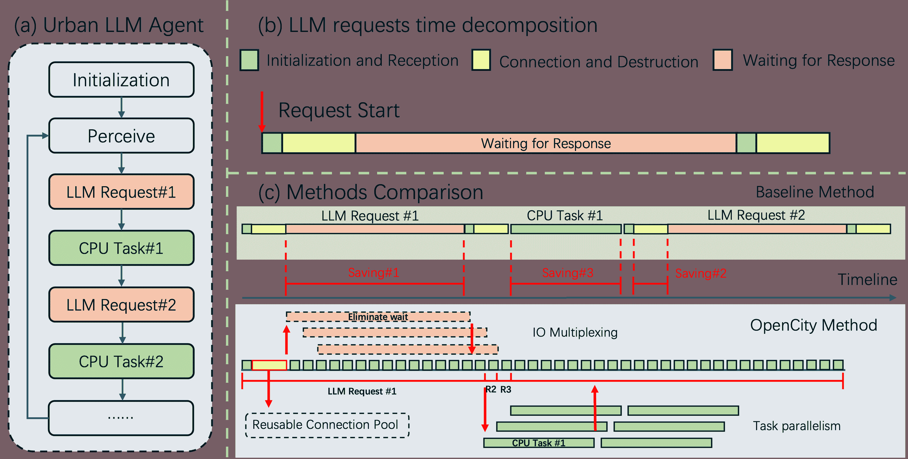
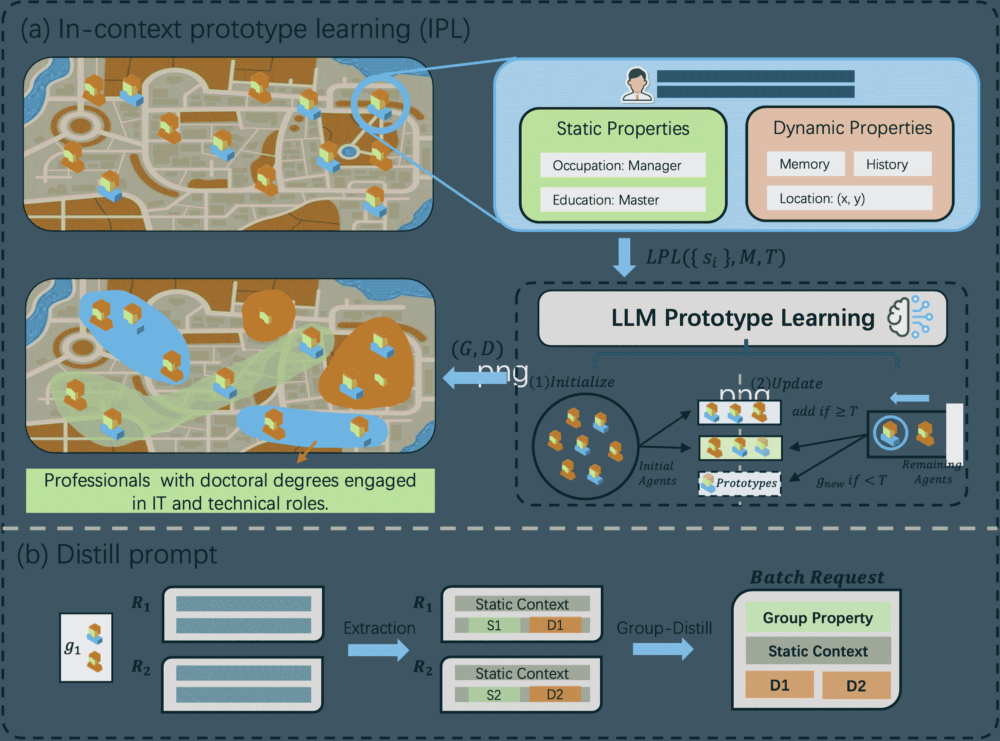
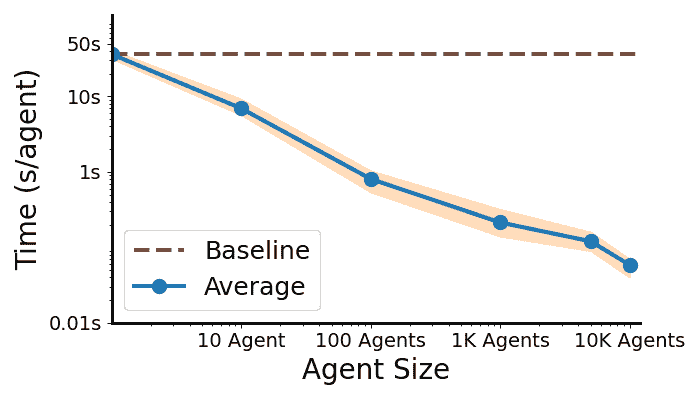
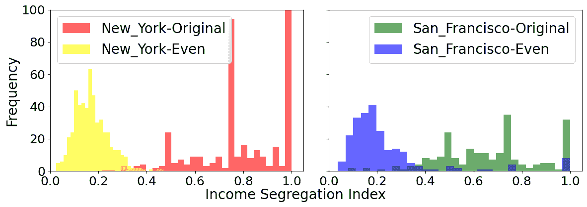
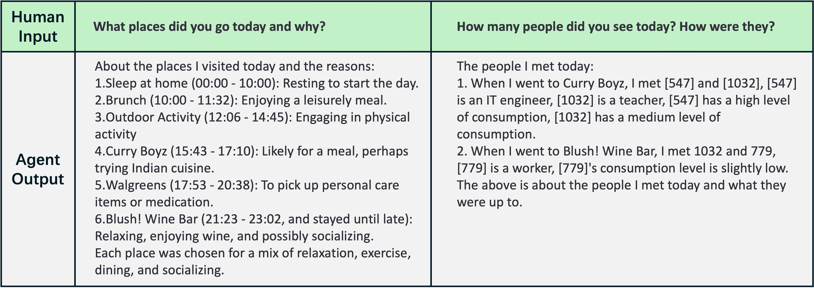
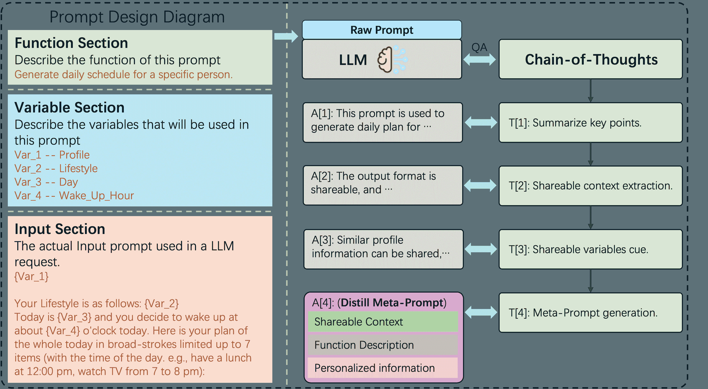
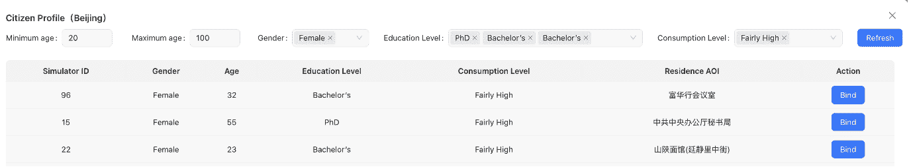
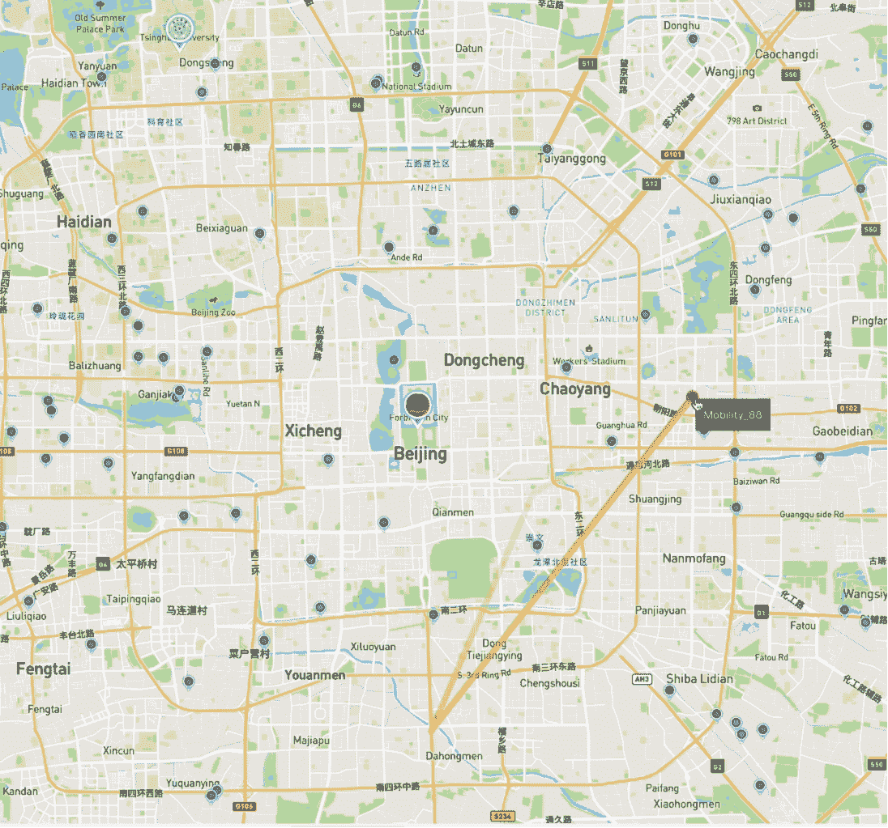
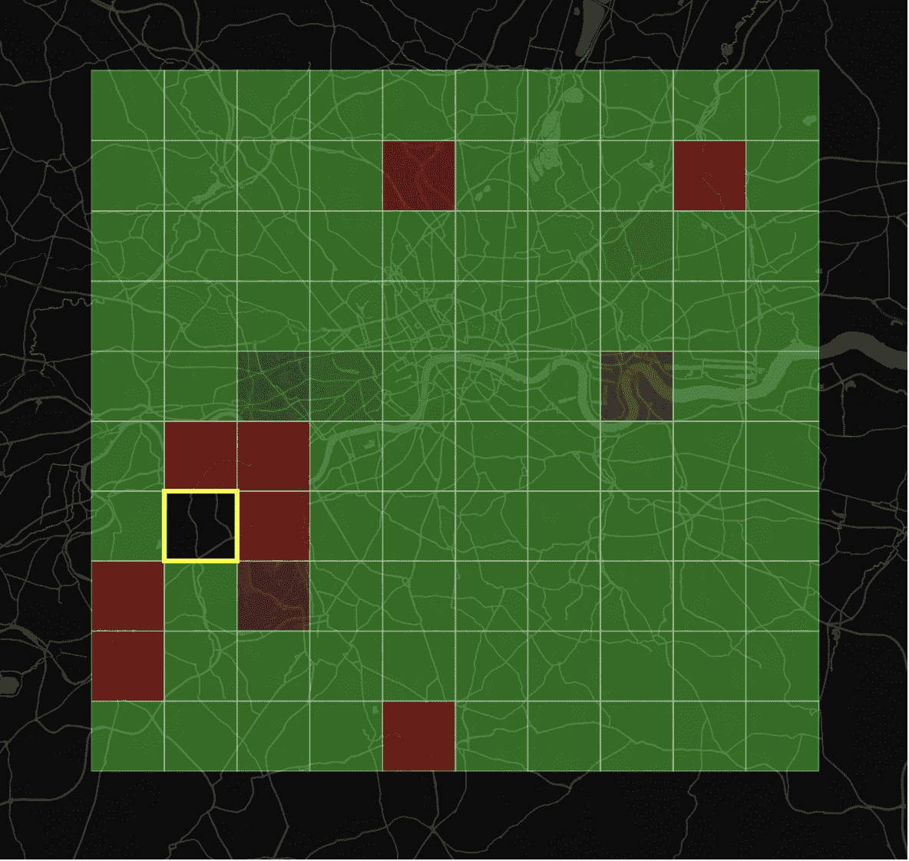

<!--yml

类别：未分类

日期：2025-01-11 12:01:38

-->

# OpenCity：一个可扩展平台，用于模拟拥有大量 LLM 代理的城市活动

> 来源：[https://arxiv.org/html/2410.21286/](https://arxiv.org/html/2410.21286/)

Yuwei Yan¹¹15pt 信息中心，香港科技大学（广州） Qingbin Zeng¹¹15pt 电子工程系，清华大学 Zhiheng Zheng 深圳国际研究生院，清华大学 Jingzhe Yuan 电子工程系，清华大学 Jie Feng 电子工程系，清华大学 Jun Zhang 电子工程系，清华大学 Fengli Xu²²25pt 电子工程系，清华大学 Yong Li²²25pt 电子工程系，清华大学

###### 摘要

基于代理的模型（ABMs）长期以来一直被用来探索个体行为如何汇聚成城市空间中的复杂社会现象。与黑盒预测模型不同，ABMs 擅长解释驱动这些涌现行为的微观-宏观联系。近年来，大型语言模型（LLMs）的崛起催生了能够以空前逼真度模拟城市活动的 LLM 代理。然而，LLMs 的极高计算成本给 LLM 代理的模拟规模化带来了重大挑战。为了解决这一问题，我们提出了 OpenCity，这是一个针对系统和提示效率进行优化的可扩展模拟平台。具体来说，我们提出了一种 LLM 请求调度器，通过 IO 多路复用并行化请求，减少通信开销。此外，我们设计了一种“分组与提炼”的提示优化策略，通过将具有相似静态属性的代理进行聚类，最小化冗余。通过对六个全球城市的实验，OpenCity 实现了每个代理模拟时间的 600 倍加速，LLM 请求减少了 70%，并且令牌使用量减少了 50%。这些改进使得在普通硬件上能够在 1 小时内模拟 10,000 个代理的日常活动。此外，OpenCity 的显著加速使我们首次建立了 LLM 代理的城市模拟基准，将模拟的城市活动与全球六个主要城市的实际数据进行比较。我们相信，OpenCity 平台为城市空间中的跨学科研究提供了关键基础设施，促进了更广泛研究社区的集体努力。代码库可在 [https://anonymous.4open.science/r/Anonymous-OpenCity-42BD](https://anonymous.4open.science/r/Anonymous-OpenCity-42BD) 获得。

¹¹脚注：同等贡献。²²脚注：通讯作者。^†^†脚注：预印本，正在审稿中。

## 1 引言

基于代理的模型（ABMs）最早由托马斯·谢林（Thomas Schelling）约50年前引入城市研究[[1](https://arxiv.org/html/2410.21286v1#bib.bib1)]，他巧妙地解释了如何通过个体选择的聚合产生隔离现象。与黑盒预测模型相比，ABMs提供了独特的优势，即能够解释聚合现象背后的基本机制[[2](https://arxiv.org/html/2410.21286v1#bib.bib2)]，*即*揭示“微动机”和“宏行为”之间的联系。因此，ABMs在许多研究领域中扮演着重要角色[[3](https://arxiv.org/html/2410.21286v1#bib.bib3)]，包括计算社会科学、城市规划和公共卫生。最近，**大语言模型**（LLMs）的发展推动了LLM代理的兴起[[4](https://arxiv.org/html/2410.21286v1#bib.bib4), [5](https://arxiv.org/html/2410.21286v1#bib.bib5)]，这些代理利用LLM在常识推理和角色扮演方面的卓越能力来模拟人类行为。与以前基于规则的代理不同，这些新兴的LLM代理生成的**人类行为**更加真实[[4](https://arxiv.org/html/2410.21286v1#bib.bib4), [6](https://arxiv.org/html/2410.21286v1#bib.bib6)]，并且还能够通过类似链式思维的提示技术解释它们的内在动机[[7](https://arxiv.org/html/2410.21286v1#bib.bib7)]。因此，LLM代理有着巨大的潜力，能够借助语言模型的力量改变城市研究领域。

尽管前景看好，LLM代理也面临着由于高计算时间导致的规模化挑战。在Park等人的开创性工作中[[4](https://arxiv.org/html/2410.21286v1#bib.bib4)]，仅使用了15个LLM代理来模拟一个小村庄。一个主要原因是高昂的模拟时间，可以分解为两部分：一方面，由于LLM模型庞大，它们本身的运行速度较慢；另一方面，强大的商业LLM只能通过API访问，这导致由于网络传输产生显著的时间延迟，进一步拖慢了模拟速度。更糟糕的是，城市LLM代理的提示设计通常涉及动态元素，如变化的记忆和感知环境[[4](https://arxiv.org/html/2410.21286v1#bib.bib4), [8](https://arxiv.org/html/2410.21286v1#bib.bib8)]。这一重要特性使得无法直接重用小样本群体中的模拟行为[[9](https://arxiv.org/html/2410.21286v1#bib.bib9)]，因为LLM代理需要保持独立的记忆和经验，这对于模拟充满活力和多样化的城市人口至关重要。

在本文中，我们提出了OpenCity，一个可扩展的平台，通过引入系统级和提示级优化，实现了在城市环境中高效的LLM代理仿真。具体而言，我们设计了一个LLM请求调度器，利用操作系统中的可扩展I/O事件通知机制（*例如*，Linux中的epoll [[10](https://arxiv.org/html/2410.21286v1#bib.bib10)]）来最小化网络传输延迟。该设计基于我们的一个关键观察：发送LLM请求和接收生成的输出仅占总通信时间的一小部分，而其余时间则浪费在等待LLM响应和反复建立TCP连接上[[11](https://arxiv.org/html/2410.21286v1#bib.bib11)]。为了解决这个问题，LLM请求调度器使用可扩展的I/O事件通知机制，通过重用网络I/O端口和TCP连接来并行化LLM请求，同时等待响应。此外，LLM请求调度器还分析LLM请求与本地计算任务之间的相互依赖关系，*例如*，更新代理的内存和检索附近位置，确保本地计算任务在多个CPU核心之间得到最优分配。这些系统级优化使得大规模LLM代理仿真能够在普通硬件上运行。至于提示级优化，OpenCity引入了一种新颖的“分组与蒸馏”提示策略，以最小化LLM所需的输入token。其关键思想是识别共享语义相似静态元素的LLM代理群体，*例如*，年龄、性别和收入水平，并使用共享上下文进行批量提示[[12](https://arxiv.org/html/2410.21286v1#bib.bib12)]，以减少token冗余。具体而言，我们的“分组与蒸馏”策略利用LLM的上下文学习能力，实施一个原型学习工作流，自动发现具有语义相似静态元素的LLM代理群体进行仿真。位于同一群体中的代理被分组成一个批量提示，并且我们设计了一种“提示蒸馏”方法，以提取分组代理的共享前缀。最后，OpenCity还提供了一个易于使用的Web门户，便于无代码的仿真配置和结果可视化。该设计最大限度地减少了运行LLM代理仿真的程序需求，确保我们的OpenCity平台能够惠及各类背景的研究人员。

我们评估了OpenCity在模拟全球6个城市的城市活动时的效率和忠实度，使用了广泛采用的生成式代理工作流[[4](https://arxiv.org/html/2410.21286v1#bib.bib4)]。我们的实验表明，OpenCity在使用10,000个LLM代理时，仿真加速平均为635倍。此外，请求数量和消耗的代币分别减少了73.7%和45.5%。OpenCity还表现出强大的可扩展性，随着仿真规模从1个增加到10,000个代理，每个代理的仿真时间从36.25秒减少到0.06秒，表明更大规模的仿真能够实现更高效的LLM请求调度和提示提炼。更重要的是，OpenCity还保持了较高的仿真行为忠实度。具体而言，我们方法的詹森-香农散度和top-1命中率与批量提示的标准提示技术[[12](https://arxiv.org/html/2410.21286v1#bib.bib12)]相当，且远远超过了直接重用策略[[9](https://arxiv.org/html/2410.21286v1#bib.bib9)]。此外，使用像GPT-4o这样的强大LLM时，top-1命中率可达到96%。

这一显著的仿真加速使我们首次能够对大规模城市活动的复制进行基准测试。我们使用经典的评估指标，如回转半径[[13](https://arxiv.org/html/2410.21286v1#bib.bib13)]、起源-目的地矩阵[[14](https://arxiv.org/html/2410.21286v1#bib.bib14)]和隔离指数[[15](https://arxiv.org/html/2410.21286v1#bib.bib15)]来评估LLM代理的仿真效果。这些是最广泛采用的指标，用于描述城市居民在个体和群体层面、以及在物理和社会领域的活动。我们的实验表明，LLM代理的表现与传统的基于规则的代理（如EPR）[[16](https://arxiv.org/html/2410.21286v1#bib.bib16)]相当，甚至更好。此外，LLM代理还可以进行反事实分析，例如评估在没有居民隔离的城市中的经验性隔离[[17](https://arxiv.org/html/2410.21286v1#bib.bib17)]。它们还允许研究人员探讨LLM代理行为背后的动机，为城市政策制定提供宝贵的见解。

我们相信我们的OpenCity平台可以作为释放LLM在城市空间跨学科研究中潜力的关键基础设施。它不仅提供了高加速，使得大型仿真能够在普通硬件上运行，而且还提供了一个用户友好的网络门户，使得拥有最少编程背景的研究人员也能够访问这一技术。它将促进更广泛的研究社区和其他利益相关者使用LLM代理来评估、分析并为他们的项目提供信息。

## 2 相关工作

### 2.1 LLM代理

随着大型语言模型（LLM）在各种应用中的广泛使用，LLM的局限性，例如推理能力不稳定、记忆容量有限以及缺乏专业知识，已被公开揭示。作为其中一个潜在的解决方案，LLM代理被提出用于克服这些局限性并推动LLM的实际应用。AutoGPT [[18](https://arxiv.org/html/2410.21286v1#bib.bib18)] 作为最流行的LLM自主代理之一，探索了应用LLM实现自主规划和任务解决的潜力。随后，LLM代理[[19](https://arxiv.org/html/2410.21286v1#bib.bib19), [20](https://arxiv.org/html/2410.21286v1#bib.bib20)] 在两个方向上取得了显著进展：任务导向代理和模拟代理。沿着第一个方向，研究人员致力于提高LLM代理解决复杂任务的能力。例如，许多编程代理，如ChatDev [[21](https://arxiv.org/html/2410.21286v1#bib.bib21)]、SWEAgent [[22](https://arxiv.org/html/2410.21286v1#bib.bib22)] 和MetaGPT [[23](https://arxiv.org/html/2410.21286v1#bib.bib23)]，被设计用来解决复杂的编程任务。至于第二个方向，生成性代理[[4](https://arxiv.org/html/2410.21286v1#bib.bib4)] 已展示出大模型在模拟人类行为方面的潜力，这一点在后续的研究中得到了进一步验证。S3 [[24](https://arxiv.org/html/2410.21286v1#bib.bib24)] 探索了使用LLM代理模拟社交网络的潜力。CoPB [[6](https://arxiv.org/html/2410.21286v1#bib.bib6)] 定义了一种代理工作流程来模拟移动行为。RecAgent [[25](https://arxiv.org/html/2410.21286v1#bib.bib25)] 模拟了推荐系统中的用户行为。尽管这些工作展示了LLM代理的潜力，但生成性代理的大规模高效模拟成为进一步应用的关键瓶颈。

### 2.2 LLM 部署优化

为了支持LLM和LLM代理的高效推理，设计了大量工作和系统[[26](https://arxiv.org/html/2410.21286v1#bib.bib26)]，旨在优化LLM的推理效率并进一步加速其实际应用。例如，Flash-attention [[27](https://arxiv.org/html/2410.21286v1#bib.bib27)]是一种IO感知的精确注意力算法，采用平铺技术减少GPU内存读写次数。AWQ [[28](https://arxiv.org/html/2410.21286v1#bib.bib28)]是一种激活感知的权重量化方法，用于压缩并加速LLM推理。vLLM [[29](https://arxiv.org/html/2410.21286v1#bib.bib29)]提出了pagedAttention机制，旨在推理过程中启用高效的KV缓存调度器，成为最受欢迎的开源LLM推理引擎。SGLang [[30](https://arxiv.org/html/2410.21286v1#bib.bib30)]提供了一个灵活的前端语言，以实现LLM推理的高效自主优化。Synergy-of-thought [[31](https://arxiv.org/html/2410.21286v1#bib.bib31)]提出利用大语言模型和小语言模型之间的协同效应进行高效推理。虽然这些系统旨在处理一般的LLM推理，但忽视了生成代理，尤其是城市生成代理的特定特征，这些特征可以进一步加速推理和仿真。在本文中，我们探讨了这一方向的潜力，并设计了OpenCity平台。

## 3 前言

### 3.1 用于城市活动的LLM代理

我们专注于使用LLM代理来再现主要由物理移动性特征决定的城市动态。考虑一个包含$N$个LLM代理的城市环境$E$。代理$i$在仿真时间$t$的状态记作$S_{i}(t)=\{s_{i},m_{i}(t)\}$，由静态属性$s_{i}$和动态属性$m_{i}(t)$组成。静态属性，如代理的基本信息，在仿真过程中保持不变，而动态属性，如记忆和感知到的环境信息，则频繁变化且难以预测。我们可以使用函数$f$表示代理$i$的状态更新：

|  | $m_{i}(t+1)=f(s_{i},E,m_{i}(t);S_{i}(t+1)=\{s_{i},m_{i}(t+1)\}$ |  | (1) |
| --- | --- | --- | --- |

在这里，$m_{i}(t+1)$ 是代理 $i$ 在时间 $t+1$ 时刻更新后的记忆，函数 $f$ 模拟了代理如何通过感知城市环境 $E$、反思其记忆 $m_{i}(t)$ 并与LLM互动来更新其状态。代理 $i$ 的个体轨迹，记作 $T_{i}$，描述了代理在城市环境 $E$ 中随时间变化的轨迹。如果代理 $i$ 在时间 $t$ 的位置用 $L_{i}(t)$ 表示，且该位置依赖于其状态 $S_{i}(t)$，则个体轨迹可以表示为 $T_{i}=\{L_{i}(0),L_{i}(1),L_{i}(2),...,L_{i}(t_{s})\}$，其中 $t_{s}$ 是总的仿真时间。除了个体的流动性，我们还考察了聚合的流动性特征 $A=\Phi(\sum_{i}{\phi(\sum_{t}S_{i}(t)}))$，例如原始-目的地（OD）矩阵和收入隔离指数，这些特征反映了涉及所有代理状态的城市动态。

为了在城市空间中模拟LLM代理，我们首先为代理和环境设置初始状态 $\{S_{i}(0)|i\in N\}$，然后在每个仿真步骤中对每个代理应用方程 [1](https://arxiv.org/html/2410.21286v1#S3.E1 "In 3.1 LLM Agents for Urban Activities ‣ 3 Preliminaries ‣ OpenCity: A Scalable Platform to Simulate Urban Activities with Massive LLM Agents")。当代理数量增加时，主要的挑战来自于LLM请求过程。由于LLM的参数规模，LLM本身的计算速度较慢，尤其是在通过API访问商业LLM时，响应时间可能会进一步延迟，尤其是在网络条件较差时。有人提出通过重用LLM的响应来提高效率[[9](https://arxiv.org/html/2410.21286v1#bib.bib9)]，但这要求代理必须处于完全相同的状态，或者只具有有限种可以轻松预测的状态。而且，单纯的重用响应会消除代理的独立性，降低仿真结果的真实性。城市代理 $i$ 拥有动态记忆 $m_{i}(t)$，在仿真过程中不断演变。这个记忆 $m_{i}(t)$ 不仅依赖于过去的记忆 $m_{i}(t_{h})$，还依赖于当前的环境。由于决策和记忆更新在很大程度上依赖于LLM，因此预测一个代理的未来状态或找到一个具有相同状态的代理以重用LLM响应是困难的。因此，想要为城市动态模拟大规模且可靠的LLM代理，单纯的响应重用策略是不足够的。

### 3.2 时间成本分析

鉴于当前LLM代理仿真中远程LLM服务调用的主导地位，可以对单个LLM请求所需的时间进行分解，如图[1](https://arxiv.org/html/2410.21286v1#S4.F1 "Figure 1 ‣ 4.1 LLM Request Scheduler ‣ 4 OpenCity Platform ‣ OpenCity: A Scalable Platform to Simulate Urban Activities with Massive LLM Agents")(b)所示。第一阶段是LLM请求的初始化和接收时间，第二阶段是仿真系统与LLM服务提供商之间的TCP/IP连接和销毁时间，第三阶段是数据传输和等待时间。对于单个LLM请求，第一和第二阶段的开销相对于第三阶段较低，核心的时间消耗来自数据传输和等待。

大规模代理的仿真需要发出大量的LLM请求，而由于存在等待时间，这会影响仿真器的整体效率。此外，系统资源未能充分利用。因此，有效调度LLM请求对于提高系统资源的整体利用率至关重要，从而提升仿真的整体效率。此外，由于LLM推理所需的时间与LLM请求中包含的令牌数量成正比，因此减少每个代理消耗的令牌数，同时压缩请求的数量，也非常重要。

从这个角度来看，本研究提出了一种有效的LLM请求调度器和提示蒸馏方法，可以显著提高大规模LLM代理仿真的效率。

## 4 OpenCity平台

我们设计了一个可扩展的平台OpenCity，从系统级和提示级两个方面加速城市LLM代理的仿真。OpenCity平台旨在显著减少每个LLM代理的仿真时间，同时保持高仿真保真度。此外，OpenCity还提供了一个用户友好的网页界面，便于来自不同背景的研究人员轻松访问。以下介绍了关键设计。

### 4.1 LLM请求调度器

如图[1](https://arxiv.org/html/2410.21286v1#S4.F1 "图 1 ‣ 4.1 LLM 请求调度器 ‣ 4 OpenCity 平台 ‣ OpenCity: 一个可扩展的平台，用于模拟具有大量 LLM 代理的城市活动")（a）所示，对于一个 LLM 代理，其 LLM 请求之间的依赖性——即，必须在前一个 LLM 请求完成后才能启动下一个 LLM 请求——会导致在固定网络环境和请求内容下，存在恒定的等待时间。相比之下，对于由多个代理组成的系统，它们的 LLM 请求之间没有依赖关系。为了实现多条 LLM 请求的异步处理，我们实现了一种基于 Linux 中 epoll 的 IO 多路复用方案，消除了模拟系统中的等待时间。这使得操作系统能够管理 IO 等待，从而实现模拟系统中数据传输的“零感知”。因此，LLM 请求的平均时间缩短为第一阶段和第二阶段所需的时间（图[1](https://arxiv.org/html/2410.21286v1#S4.F1 "图 1 ‣ 4.1 LLM 请求调度器 ‣ 4 OpenCity 平台 ‣ OpenCity: 一个可扩展的平台，用于模拟具有大量 LLM 代理的城市活动")（c）中的时间节省#1）。

图 1：提出的 LLM 请求调度器的功能。

此外，考虑到大量的 LLM 调用需要频繁与服务提供商建立连接，因此每个连接的建立和销毁都会带来相当大的开销。然而，由于 LLM 请求的内容本质上与相应的代理相关联，可以利用同一个连接为多个代理服务，从而减少整体性能开销。为了解决这个问题，系统内部维护了一个可重用连接池。在代理发起 LLM 请求时，请求内容会填充到一个可用的连接中，从而避免了新建连接。这种方法还减少了 LLM 请求的平均时间消耗（图[1](https://arxiv.org/html/2410.21286v1#S4.F1 "图 1 ‣ 4.1 LLM 请求调度器 ‣ 4 OpenCity 平台 ‣ OpenCity: 一个可扩展的平台，用于模拟具有大量 LLM 代理的城市活动")（c）中的时间节省#2）。

对于在计算过程中执行 CPU 任务的代理，需要注意的是，计算负载持续占用 CPU 资源将不可避免地导致后续代理的 LLM 请求发送延迟。为减轻该问题对系统整体性能的负面影响，我们将 CPU 任务分类为“本地 IO”，通过多核并行方案将其卸载到可用核心进行计算，并在计算完成后将结果返回到指定代理。这一方法进一步确保了异步 LLM 请求的稳定运行（图[1](https://arxiv.org/html/2410.21286v1#S4.F1 "Figure 1 ‣ 4.1 LLM Request Scheduler ‣ 4 OpenCity Platform ‣ OpenCity: A Scalable Platform to Simulate Urban Activities with Massive LLM Agents")(c)中的节省时间#3）。

提出的 LLM 请求调度器旨在减少在模拟运行期间大量 LLM 请求的等待时间。基于支持的辅助方案，它有潜力显著提升大规模 LLM 代理的效率。

### 4.2 Group-and-Distill 元提示优化器

提升模拟效率的另一重要方法是减少代理发出的 LLM 请求数量及这些代理消耗的令牌数量。传统方法是通过在多个代理之间重用单个 LLM 请求的生成结果。然而，这种方法存在两个显著缺点：1. 在精细化的城市 LLM 代理模拟中，每个代理都拥有自身的动态属性。因此，重用方案会妥协代理的独立性，这与通过大规模 LLM 代理进行城市模拟的目标背道而驰。此外，对于具有动态属性的代理来说，天然无法共享单个 LLM 请求的结果，如图[2](https://arxiv.org/html/2410.21286v1#S4.F2 "Figure 2 ‣ 4.2 Group-and-Distill Meta-Prompt Optimizer ‣ 4 OpenCity Platform ‣ OpenCity: A Scalable Platform to Simulate Urban Activities with Massive LLM Agents")（a）所示。

图 2：Group-and-Distill 元提示优化器概览。

为了解决这个问题，我们提出了 Group-and-Distill 元提示优化器（如图[2](https://arxiv.org/html/2410.21286v1#S4.F2 "Figure 2 ‣ 4.2 Group-and-Distill Meta-Prompt Optimizer ‣ 4 OpenCity Platform ‣ OpenCity: A Scalable Platform to Simulate Urban Activities with Massive LLM Agents")所示），该优化器利用组信息替代代理的静态属性。这种方法在运行时聚合来自多个代理的请求，通过共享组信息和上下文信息来实现提示，同时保留代理的动态属性。优化器由两个不同的组件组成：上下文原型学习（IPL）和元提示蒸馏。

IPL的输入和输出定义如下：

|  | $IPL(\{s_{i}\},M,T)\rightarrow\textbf{G},\textbf{D}$ |  | (2) |
| --- | --- | --- | --- |

其中，$\{s_{i}\}$是代理的静态属性集合；$M$控制初始原型学习中代理的数量；$T$是决策的阈值；G是代理组的集合；D是每个代理组的描述信息。

输入一组代理的静态属性后，IPL首先将前$M$个代理分组，提供分组结果及相应的描述信息。随后，IPL通过将代理的静态属性传递给LLM，LLM根据组描述分析代理属于各个组的可能性，并提供量化结果。通过将量化结果与$T$进行比较，当结果大于$T$时，IPL将该代理分配到指定组。否则，IPL构建一个新组并描述该组的特征。与在固定参数空间内操作的传统原型学习方法相比，IPL展示了更强的泛化能力，并且在原型化过程中特别擅长利用语义级别的知识。IPL获得的原型信息用于有效总结指定组内代理的静态属性特征。

通过对原始提示和CoT方法的系统性检验获得的蒸馏元提示被用来生成提示（详细信息见图[A1](https://arxiv.org/html/2410.21286v1#A3.F1 "图A1 ‣ 附录C 图像补充 ‣ OpenCity: 一个可扩展的平台，用于模拟城市活动与大规模LLM代理")）。为了简化生成过程，我们提出了一个原始提示设计图，将提示分为三个部分：功能部分、变量部分和输入部分。生成过程从给定的原始提示开始，包括四个步骤：总结、上下文提取、信息共享以及将原始提示重写为蒸馏元提示。在操作阶段，来自一个组的代理请求被汇总为一个单一的蒸馏请求，从而减少了LLM请求的数量和令牌的消耗。

提出的提示优化器能够进一步提高仿真效率并降低仿真成本，同时保持代理的动态属性。

### 4.3 网站门户

为了更好地利用OpenCity，已设计了一个Web门户，涵盖了前端、后端和模拟系统。该门户使用户能够快速配置模拟条件并可视化模拟结果，同时也方便将模拟数据和城市基础设施信息存储在数据库中。该门户设计的基本理念是用户友好性，特别是考虑到城市研究本身的跨学科特性。我们开发了一种快速、无代码配置方法，专门针对研究人员的需求，从而促进了来自不同领域的专家与我们的模拟平台的无缝对接。

用户友好性：为了提高OpenCity平台的可用性，Web门户已通过引入LLM代理蓝图构建功能进行了增强。用户可以通过拖放每个基本功能模块来构建LLM代理的复杂逻辑。为了满足多样化的需求，蓝图功能基于现有的LLM代理开发框架，如Langchain [[32](https://arxiv.org/html/2410.21286v1#bib.bib32)] 和AutoGPT [[33](https://arxiv.org/html/2410.21286v1#bib.bib33)]，并结合了多个面向城市模拟的基础模块，包括环境和交通感知。该蓝图为跨学科研究人员提供了一种高效且灵活的开发解决方案，促进了模拟方法和理论的快速迭代。

基本工作流程：该网络门户中城市LLM代理仿真的主要过程分为三个不同的阶段：市民个人资料配置、部署与仿真、结果展示。市民个人资料的配置通过提供一个控制台中心来实现，该中心使用户能够高效且透明地管理他们在平台上创建的仿真任务及其仿真中的代理。用户能够将设计蓝图中的执行逻辑绑定到不同的代理，并通过网页界面迅速配置其个人资料。这可能包括选择一个城市、选择一个现有的个人资料，或手动填写个人资料。一旦配置过程完成，用户可以通过单击按钮利用后台系统和仿真系统在平台上部署并启动仿真。该网页门户还提供一个监控页面，允许用户观察正在进行的仿真的实时结果，并评估其代理的表现。最后，仿真完成后，用户可以访问门户，查看以可视化格式呈现的宏观统计结果，如起止点（OD）地图。操作中的网页门户示例如图[A2](https://arxiv.org/html/2410.21286v1#A3.F2 "Figure A2 ‣ Appendix C Image supplements ‣ OpenCity: A Scalable Platform to Simulate Urban Activities with Massive LLM Agents")所示。

## 5 基准

### 5.1 数据集与设置

数据集 我们收集了来自世界六个主要城市的城市出行数据：北京、纽约、旧金山、伦敦、巴黎和悉尼。这些数据的来源各不相同。北京的数据来源于一项相关研究[[6](https://arxiv.org/html/2410.21286v1#bib.bib6)]，该研究收集了来自社交网络平台的数据。纽约和旧金山的数据来自Safegraph，提供了聚合的人口流动数据。其余三个城市的数据则来自Foursquare，其中包含了数以千计的签到数据。为了更好地利用这些数据，我们进行了部分预处理方法，如轨迹过滤、家庭提取和个人资料抽样。更多细节可见附录[A](https://arxiv.org/html/2410.21286v1#A1 "Appendix A Urban Mobility Dataset ‣ OpenCity: A Scalable Platform to Simulate Urban Activities with Massive LLM Agents")。

LLM代理的架构 OpenCity平台中用于模拟城市动态的主要代理是生成代理[[4](https://arxiv.org/html/2410.21286v1#bib.bib4)]。生成代理使用一个包括感知、规划和反思的框架。生成代理首先制定一个日常计划，以确保轨迹的合理性。当代理到达一个兴趣点（POI）时，它会根据当前的感知和记忆做出决策。采取行动后，代理将该行动和POI记录到它的记忆流中。当记忆流达到某个阈值时，代理会进行反思。结果表明，生成代理在OpenCity平台中能够很好地运作。

我们还进行了基于规则的代理比较，例如著名的探索与优先返回（EPR）模型[[16](https://arxiv.org/html/2410.21286v1#bib.bib16)]。该模型让代理选择探索新地点或返回已访问的地点。决策与一些参数相关，用于计算概率。在本文中，我们设置了以下参数：探索率$\rho=0.6$，探索-返回权衡参数$\gamma=0.21$，等待时间分布参数$\tau=17,\beta=0.8$。

### 5.2 加速性能

本节介绍了在与生成代理结合使用时，OpenCity平台的性能评估（测试环境为华为ECS云服务器——Intel(R) Xeon(R) Platinum 8378C CPU @ 2.80GHz，64核，256 GB内存）。平台的性能在六个主要城市中进行了评估，涉及10,000个代理。结果见下表[1](https://arxiv.org/html/2410.21286v1#S5.T1 "Table 1 ‣ 5.2 Acceleration Performance ‣ 5 Benchmark ‣ OpenCity: A Scalable Platform to Simulate Urban Activities with Massive LLM Agents")，其中定义了以下变量：$Speedup$表示模拟时间的加速，$Rr$表示LLM请求数量减少率，$Tr$表示token数量减少率。

结果表明，OpenCity在所有测试城市中都表现出显著的加速，LLM代理的平均运行时间为0.058秒，模拟时间的平均加速为635.3倍。此外，所提出的加速方案能够显著减少LLM请求数量和token消耗，平均减少率分别为73.7%和45.5%。

为了评估OpenCity的可扩展性，我们进行了一系列模拟，评估了其在不同规模的代理数量下的加速性能。该分析的结果展示在图[3](https://arxiv.org/html/2410.21286v1#S5.F3 "Figure 3 ‣ 5.2 Acceleration Performance ‣ 5 Benchmark ‣ OpenCity: A Scalable Platform to Simulate Urban Activities with Massive LLM Agents")中，其中基准线表示未优化的模拟时间。结果表明，OpenCity的加速能力是可扩展的，当代理数量从10增加到10,000时，加速效果显著增强。这是因为随着代理数量的增加，基于IPL获得的组数也逐渐增加，从而充分发挥了LLM请求调度器的优势，确保了系统资源的更好利用。

| 城市 | 时间 | $加速$ | $Rr$ | $Tr$ |  |
| --- | --- | --- | --- | --- | --- |
| 北京 | 0.07秒 | 521.7 | 73.2% | 38.7% |  |
| 纽约 | 0.06秒 | 624.7 | 67.3% | 37.6% |  |
| 旧金山 | 0.07秒 | 588.6 | 80.3% | 51.3% |  |
| 伦敦 | 0.04秒 | 792.5 | 74.6% | 49.9% |  |
| 巴黎 | 0.06秒 | 640.0 | 76.3% | 48.6% |  |
| 悉尼 | 0.05秒 | 644.0 | 70.7% | 46.6% |  |
| 平均值 | 0.058秒 | 635.3 | 73.7% | 45.5% |  |

表1：加速实验结果

图3：可扩展性实验

此外，还进行了忠实度实验，以证明Group-and-Distill优化器能够有效地保留代理的独特个性特征。该评估的测试平台是位置选择生成，它要求结合代理属性来选择下一个访问地点。我们对四种不同方法的性能进行了比较，包括原始提示（未做任何修改）、批量提示 [[12](https://arxiv.org/html/2410.21286v1#bib.bib12)]、原型提示 [[9](https://arxiv.org/html/2410.21286v1#bib.bib9)] 和提出的方法。随机选择了100个代理，并在相同上下文中对每个代理进行了100次位置选择。方法的有效性通过计算选择的分布（$JSD$）以及Top-1命中率（$T1$）来评估。结果如表所示。[2](https://arxiv.org/html/2410.21286v1#S5.T2 "Table 2 ‣ 5.2 Acceleration Performance ‣ 5 Benchmark ‣ OpenCity: A Scalable Platform to Simulate Urban Activities with Massive LLM Agents")，其中"Inherent"表示LLM本身存在的偏差（原始提示方法）。

| 模型与城市 |   固有 |  批量提示 | 原型提示 | 我们的方法 |
| --- | --- | --- | --- | --- |
| $JSD$ | $T1$ | $JSD$ | $T1$ | $JSD$ | $T1$ | $JSD$ | $T1$ |
| 4o-mini | BJ | $0.04\pm 0.02$ | 90% | $0.11\pm 0.05$ | 76% | $0.89\pm 0.04$ | 8% | $0.13\pm 0.02$ | 74% |
| 纽约 | $0.02\pm 0.01$ | 92% | $0.07\pm 0.03$ | 81% | $0.84\pm 0.11$ | 13% | $0.06\pm 0.04$ | 86% |
| SF | $0.03\pm 0.02$ | 88% | $0.09\pm 0.04$ | 77% | $0.91\pm 0.03$ | 11% | $0.10\pm 0.03$ | 85% |
| Lo | $0.06\pm 0.04$ | 89% | $0.12\pm 0.07$ | 79% | $0.86\pm 0.06$ | 9% | $0.12\pm 0.04$ | 78% |
| Pa | $0.05\pm 0.02$ | 86% | $0.17\pm 0.11$ | 69% | $0.94\pm 0.03$ | 4% | $0.14\pm 0.04$ | 71% |
| Sy | $0.04\pm 0.03$ | 85% | $0.08\pm 0.03$ | 75% | $0.88\pm 0.05$ | 5% | $0.07\pm 0.04$ | 75% |
| GPT-4o | NY | $0.003\pm 0.002$ | 98% | $0.012\pm 0.007$ | 94% | $0.89\pm 0.09$ | 10% | $0.009\pm 0.004$ | 97% |
| Pa | $0.004\pm 0.002$ | 99% | $0.021\pm 0.009$ | 93% | $0.91\pm 0.04$ | 7% | $0.010\pm 0.006$ | 96% |

表2：忠实度实验结果

如实验结果所示，我们的方法展示了能够保持与批量提示方法相当一致性的能力，同时减少了波动性和令牌消耗。然而，原型提示方法在此评估中表现不佳，进一步证明了基于重用的方法无法适应代理的动态特性。此外，鉴于在使用GPT-4o-mini模型评估时原始提示方法存在较大差异，针对纽约和巴黎两个城市使用GPT-4o模型进行了额外评估。结果表明，我们的方法能够在很大程度上接近原始提示方法的执行。此外，结果还表明，不同模型在环境理解和处理长篇文本内容的能力方面存在显著差异。LLM结果的一致性值得进一步研究。

总体而言，OpenCity能够显著提高大规模城市LLM代理模拟的效率，同时保持代理本身的独特特性。这使得模拟超过10,000个个体的成本能够保持在每小时水平。

### 5.3 复制城市动态

模拟效率的显著提高使我们首次能够基准测试LLM代理在再现大规模城市动态方面的能力。我们使用三层次的综合指标来评估模拟性能，从个体层面到群体层面，也从物理领域到社会领域。在个体层面，我们计算每个用户的回转半径[[13](https://arxiv.org/html/2410.21286v1#bib.bib13)]。在群体层面，我们使用原始-目的地矩阵[[14](https://arxiv.org/html/2410.21286v1#bib.bib14)]。至于社会领域，我们关注收入隔离指数[[15](https://arxiv.org/html/2410.21286v1#bib.bib15)]。为了评估模拟性能，我们计算这三个指标的均方误差（MSE），分别记作$R_{MSE}$、$OD_{MSE}$和$S_{MSE}$。更多细节可参见附录[B](https://arxiv.org/html/2410.21286v1#A2 "附录 B 城市动态指标 ‣ OpenCity: 一个可扩展的城市活动模拟平台，支持大规模LLM代理")。

本节中，我们分析了生成代理和EPR代理在再现城市动态方面的表现。我们在6个主要城市中使用1000个代理测试了这两种代理。结果如表[3](https://arxiv.org/html/2410.21286v1#S5.T3 "表 3 ‣ 5.3 再现城市动态 ‣ 5 基准 ‣ OpenCity: 一个可扩展的城市活动模拟平台，支持大规模LLM代理")所示。结果表明，生成代理和EPR代理都成功地再现了城市动态，且具有较低的MSE值。此外，LLM代理的表现与经典的基于规则的EPR代理相当或更好，突显了LLM在城市模拟中语义理解能力的优势。

| 城市 | 生成代理 | EPR |
| --- | --- | --- |
| $R_{MSE}$ | $OD_{MSE}$ | $S_{MSE}$ | $R_{MSE}$ | $OD_{MSE}$ | $S_{MSE}$ |
| --- | --- | --- | --- | --- | --- |
| 北京 | 19.5 | 3.88e-4 | 0.0312 | 29.8 | 4.26e-4 | 0.0630 |
| New York | - | 5.95e-4 | 0.3521 | - | 3.70e-4 | 0.2319 |
| 旧金山 | - | 23.6e-4 | 0.1535 | - | 14.0e-4 | 0.0352 |
| 巴黎 | 2.48 | 7.58e-4 | 0.1255 | 4.04 | 6.25e-4 | 0.1240 |
| 伦敦 | 6.24 | 5.22e-4 | 0.1258 | 25.7 | 7.41e-4 | 0.1501 |
| 悉尼 | 15.1 | 4.71e-4 | 0.1118 | 54.2 | 7.63e-4 | 0.1265 |

表 3：城市动态再现结果

## 6 案例研究：经验性城市隔离

通过模拟大规模城市LLM代理的能力，我们可以进行反事实实验，探索不同政策下的结果，并为未来设计最佳策略。传统的基于规则的模型不支持此能力，因为它们是为模拟现实世界场景而设计的。经验性的城市隔离问题是一个广泛讨论的议题，对社会动态和经济有重大影响。它源于住宅区的人口差异以及城市居民的流动模式[[15](https://arxiv.org/html/2410.21286v1#bib.bib15)]。

本节提供了一个案例研究：在纽约和旧金山进行反事实仿真，以观察不同配置下仿真结果的变化，并尝试总结LLM代理本身的结果。

具体而言，我们通过将不同收入水平的LLM代理均匀分布到整个城市来构建反事实场景，这意味着我们几乎消除了住宅隔离。以CBG为统计单位的收入隔离统计结果如图[4](https://arxiv.org/html/2410.21286v1#S6.F4 "图 4 ‣ 6 案例研究：经验性城市隔离 ‣ OpenCity: 一种可扩展的模拟大规模LLM代理城市活动的平台")所示，其中“Original”代表来自真实人口普查数据的隔离结果，而“Even”则是不同收入代理均匀分布后的结果。

图4：反事实实验的收入隔离指数分布。

从结果可以看出，当不同收入群体在城市中均匀分布后，两座城市的隔离情况发生了显著变化。在纽约市，平均隔离指数从0.845降至0.172，而在旧金山，平均隔离指数从0.665降至0.232。因此，我们认为区域间的差异是导致隔离的主要原因，而不是由选择行为造成的隔离。进一步推论，我们可以知道，通过推动邻里间收入更均衡分配的政策，城市隔离和社会不平等可以得到改善。

图5：通过沟通解释仿真结果的详细案例。

此外，我们使用自然语言与这些涉及的代理进行沟通，以深入了解城市隔离的情况。图[5](https://arxiv.org/html/2410.21286v1#S6.F5 "图 5 ‣ 6 案例研究：经验性城市隔离 ‣ OpenCity: 一种可扩展的模拟大规模LLM代理城市活动的平台")展示了一个详细案例。当我们询问一个代理它的日常行程时，它可以准确提供它所访问的时间和地点。这是因为该代理缓存了运行时信息，并利用LLM的语义理解能力。当问及它遇到的人时，代理列出了它在不同地点遇到的所有人，并提供了他们的信息。这是因为代理的仿真结果经过向量化存储，LLM能够检索这些信息。通过与代理的对话，甚至通过LLM收集和观察精细的统计信息，提升了仿真结果的可解释性和我们对仿真目标的理解。

## 7 结论

在这项工作中，我们介绍了OpenCity，一个可扩展的平台，旨在解决大规模基于LLM的城市智能体在城市模拟中部署所固有的计算和通信挑战。通过结合LLM请求调度器和一种新颖的“分组与蒸馏”提示优化策略，我们实现了智能体模拟效率的600倍提升，同时大幅减少了LLM请求和令牌使用。通过在六个全球城市进行实验评估，OpenCity平台展示了其模拟10,000个智能体日常活动的能力，且能够在每小时级别进行模拟，同时为城市背景下的生成智能体性能建立了基准。该平台能够将模拟行为与真实世界数据进行比较，凸显了其在现实世界城市规模应用中的潜力，为城市规划者和研究人员提供了一个强大的工具，用于探索和理解复杂的社会现象。

## 参考文献

+   [1] Thomas C Schelling. 《微观动机与宏观行为》。WW Norton & Company，2006年。

+   [2] Fengli Xu, Yong Li, Depeng Jin, Jianhua Lu, 和 Chaoming Song. 人类移动行为中城市增长模式的出现。自然计算科学，1(12)：791–800，2021年。

+   [3] Lin Chen, Fengli Xu, Zhenyu Han, Kun Tang, Pan Hui, James Evans, 和 Yong Li. 战略性的新冠疫苗分发可以同时提高社会效用和公平性。自然人类行为，6(11)：1503–1514，2022年。

+   [4] Joon Sung Park, Joseph O’Brien, Carrie Jun Cai, Meredith Ringel Morris, Percy Liang, 和 Michael S Bernstein. 生成智能体：人类行为的交互式模拟。发表于第36届年度ACM用户界面软件与技术研讨会论文集，第1–22页，2023年。

+   [5] Fengli Xu, Jun Zhang, Chen Gao, Jie Feng, 和 Yong Li. 城市生成智能（UGI）：为体现城市环境中的智能体提供的基础平台。arXiv预印本arXiv:2312.11813，2023年。

+   [6] Chenyang Shao, Fengli Xu, Bingbing Fan, Jingtao Ding, Yuan Yuan, Meng Wang, 和 Yong Li. 超越模仿：通过大语言模型的上下文感知推理生成人类移动行为。arXiv预印本arXiv:2402.09836，2024年。

+   [7] Jason Wei, Xuezhi Wang, Dale Schuurmans, Maarten Bosma, Fei Xia, Ed Chi, Quoc V Le, Denny Zhou，等。链式思维提示引发大语言模型中的推理。神经信息处理系统进展，35：24824–24837，2022年。

+   [8] Qingbin Zeng, Qinglong Yang, Shunan Dong, Heming Du, Liang Zheng, Fengli Xu, 和 Yong Li. 感知、反思与规划：为无指令的目标导向城市导航设计LLM智能体。arXiv预印本arXiv:2408.04168，2024年。

+   [9] Ayush Chopra, Shashank Kumar, Nurullah Giray-Kuru, Ramesh Raskar, 和 Arnau Quera-Bofarull. 智能体模型的能力极限。arXiv预印本arXiv:2409.10568，2024年。

+   [10] Francesc Bruguera i Moriscot. Linux内核输入/输出复用设施基准测试. 2019.

+   [11] Larry L Peterson 和 Bruce S Davie. 《计算机网络：一种系统方法》. Morgan Kaufmann, 2007.

+   [12] Zhoujun Cheng, Jungo Kasai, 和 Tao Yu. 批量提示：使用大型语言模型API进行高效推理. arXiv预印本 arXiv:2301.08721, 2023.

+   [13] Marta C Gonzalez, Cesar A Hidalgo, 和 Albert-Laszlo Barabasi. 理解个体人类移动模式. 《自然》, 453(7196):779–782, 2008.

+   [14] Shan Jiang, Yingxiang Yang, Siddharth Gupta, Daniele Veneziano, Shounak Athavale, 和 Marta C González. 基于时间地理建模框架的城市移动性，无需旅行调查. 《美国国家科学院院刊》, 113(37):E5370–E5378, 2016.

+   [15] Esteban Moro, Dan Calacci, Xiaowen Dong, 和 Alex Pentland. 移动模式与美国大城市中的收入隔离经验相关. 《自然通讯》, 12(1):4633, 2021.

+   [16] Chaoming Song, Tal Koren, Pu Wang, 和 Albert-László Barabási. 人类移动性的尺度特性建模. 《自然物理学》, 6(10):818–823, 2010.

+   [17] Douglas S Massey 和 Nancy A Denton. 《住宅隔离的维度》. 《社会力量》, 67(2):281–315, 1988.

+   [18] Significant Gravitas. AutoGPT. [https://github.com/Significant-Gravitas/AutoGPT](https://github.com/Significant-Gravitas/AutoGPT), 2023. 访问时间：2024-09-01.

+   [19] Lei Wang, Chen Ma, Xueyang Feng, Zeyu Zhang, Hao Yang, Jingsen Zhang, Zhiyuan Chen, Jiakai Tang, Xu Chen, Yankai Lin, 等. 基于大型语言模型的自主代理调查. 《计算机科学前沿》, 18(6):186345, 2024.

+   [20] Zhiheng Xi, Wenxiang Chen, Xin Guo, Wei He, Yiwen Ding, Boyang Hong, Ming Zhang, Junzhe Wang, Senjie Jin, Enyu Zhou, 等. 基于大型语言模型的代理崛起与潜力：一项调查. arXiv预印本 arXiv:2309.07864, 2023.

+   [21] Chen Qian, Xin Cong, Cheng Yang, Weize Chen, Yusheng Su, Juyuan Xu, Zhiyuan Liu, 和 Maosong Sun. 软件开发的沟通代理. arXiv预印本 arXiv:2307.07924, 6, 2023.

+   [22] John Yang, Carlos E Jimenez, Alexander Wettig, Kilian Lieret, Shunyu Yao, Karthik Narasimhan, 和 Ofir Press. Swe-agent：代理计算机界面实现自动化软件工程. arXiv预印本 arXiv:2405.15793, 2024.

+   [23] Sirui Hong, Xiawu Zheng, Jonathan Chen, Yuheng Cheng, Jinlin Wang, Ceyao Zhang, Zili Wang, Steven Ka Shing Yau, Zijuan Lin, Liyang Zhou, 等. MetaGPT：多智能体协作框架的元编程. arXiv预印本 arXiv:2308.00352, 2023.

+   [24] Chen Gao, Xiaochong Lan, Zhihong Lu, Jinzhu Mao, Jinghua Piao, Huandong Wang, Depeng Jin, 和 Yong Li. S3：基于大型语言模型赋能代理的社交网络仿真系统. arXiv预印本 arXiv:2307.14984, 2023.

+   [25] Lei Wang, Jingsen Zhang, Xu Chen, Yankai Lin, Ruihua Song, Wayne Xin Zhao, 和 Ji-Rong Wen. RecAgent：一种用于推荐系统的新型仿真范式. arXiv预印本 arXiv:2306.02552, 2023.

+   [26] Xupeng Miao, Gabriele Oliaro, Zhihao Zhang, Xinhao Cheng, Hongyi Jin, Tianqi Chen, 和 Zhihao Jia. 朝向高效生成型大语言模型服务：从算法到系统的综述. arXiv 预印本 arXiv:2312.15234，2023年。

+   [27] Tri Dao, Dan Fu, Stefano Ermon, Atri Rudra, 和 Christopher Ré. FlashAttention：一种快速且内存高效的精确注意力机制，具备 IO 感知能力. 《神经信息处理系统进展》，35:16344–16359，2022年。

+   [28] Ji Lin, Jiaming Tang, Haotian Tang, Shang Yang, Wei-Ming Chen, Wei-Chen Wang, Guangxuan Xiao, Xingyu Dang, Chuang Gan, 和 Song Han. Awq：一种激活感知的权重量化方法，用于设备端的 LLM 压缩与加速. 载于《机器学习与系统会议论文集》，6:87–100，2024年。

+   [29] Woosuk Kwon, Zhuohan Li, Siyuan Zhuang, Ying Sheng, Lianmin Zheng, Cody Hao Yu, Joseph Gonzalez, Hao Zhang, 和 Ion Stoica. 通过分页注意力机制优化大语言模型服务的高效内存管理. 载于《第29届操作系统原理研讨会论文集》，第611-626页，2023年。

+   [30] Lianmin Zheng, Liangsheng Yin, Zhiqiang Xie, Jeff Huang, Chuyue Sun, Cody Hao Yu, Shiyi Cao, Christos Kozyrakis, Ion Stoica, Joseph E Gonzalez 等. 使用 SGLang 高效编程大语言模型. arXiv 预印本 arXiv:2312.07104，2023年。

+   [31] Yu Shang, Yu Li, Fengli Xu, 和 Yong Li. Defint：一个默认干预框架，用于高效推理与混合大语言模型. arXiv 预印本 arXiv:2402.02563，2024年。

+   [32] Keivalya Pandya 和 Mehfuza Holia. 使用 LangChain 自动化客户服务：为组织构建自定义开源 GPT 聊天机器人. arXiv 预印本 arXiv:2310.05421，2023年。

+   [33] Hui Yang, Sifu Yue, 和 Yunzhong He. Auto-GPT 在在线决策中的应用：基准测试和额外意见. arXiv 预印本 arXiv:2306.02224，2023年。

## 附录A 城市流动性数据集

如表 [A1](https://arxiv.org/html/2410.21286v1#A1.T1 "表A1 ‣ 附录A 城市流动性数据集 ‣ OpenCity：一个可扩展的平台，用于通过海量LLM代理模拟城市活动") 所示，我们收集了来自全球6个主要城市的城市流动性数据。数据来源各不相同。在北京，数据来自相关研究[[6](https://arxiv.org/html/2410.21286v1#bib.bib6)]，通过社交网络平台收集，跟踪用户的流动轨迹。此外，用户的个人资料，如收入水平、性别、职业、教育水平和年龄，通过数字化调查收集。在纽约和旧金山，数据来自 Safegraph，该公司提供聚合的兴趣点（POIs）和人口普查区块组（CBGs）之间的流动数据。其他三个城市——伦敦、巴黎和悉尼——的数据来自 Foursquare。Foursquare 数据包含用户的成千上万次签到记录及其对应的场所位置。

为了更好地利用这些数据集，我们应用了几种预处理方法。首先，我们按时间顺序排列轨迹点，并将轨迹划分为一天为单位。然后，我们筛选出每天轨迹点少于4个的轨迹，因为这些轨迹不能充分捕捉到用户的移动模式。对于家庭位置提取，我们识别出用户最常访问的位置作为其家庭地址。由于只有腾讯数据集包含用户档案信息，因此对于其他两个数据集，我们基于本地普查数据对每个城市的用户进行档案采样。最终，我们的数据集经过优化，方便用于城市出行模拟。

| 来源 | 城市 | 用户数 | 轨迹点 | 时长 |
| --- | --- | --- | --- | --- |
| [[6](https://arxiv.org/html/2410.21286v1#bib.bib6)] | 北京 | 100000 | 297363263 | 2019年10月 - 2019年12月 |
| Safegraph | 纽约 | 聚合 | 760493 | 2023年5月 - 2023年7月 |
| 旧金山 | 聚合 | 316732 |
| Foursquare | 伦敦 | 9409 | 173268 | 2012年4月 - 2013年9月 |
| 巴黎 | 5809 | 85679 |
| 悉尼 | 1720 | 54170 |

表A1：数据集基本信息

## 附录B 城市动态指标

我们使用三个层次的综合指标来评估模拟性能，从个体层面到群体层面，以及从物理领域到社会领域。这些指标使我们能够全面了解出行模式及其影响，同时也能通过分析生成的轨迹来帮助我们评估模拟的表现。

在个体层面，我们计算每个用户的回转半径$r_{g}$[[13](https://arxiv.org/html/2410.21286v1#bib.bib13)]，这是衡量其运动空间范围的一个指标。回转半径定义如下：

|  | $r_{g}^{\alpha}=\sqrt{\frac{1}{N^{\alpha}}\sum_{i=1}^{N^{\alpha}}{(\vec{r}_{i}^{\alpha}-\vec{r}_{cm}^{\alpha})^{2}}}$ |  | (3) |
| --- | --- | --- | --- |

其中，$\vec{r}_{i}^{\alpha}$表示用户$\alpha$记录的第$i=1,2,...,N$个位置，$r_{cm}^{\alpha}=1/{N^{\alpha}}\sum_{i=1}^{N^{\alpha}}{(\vec{r}_{i}^{\alpha})}$是轨迹的质心。回转半径提供了用户活动范围大小的指示。为了评估我们模拟数据与现实世界数据在特定用户上的准确性，我们计算$R_{MSE}$，即回转半径的均方误差（MSE）。

为了分析运动模式和其他聚合特征，我们将城市中的区域定义为空间单元。对于拥有Safegraph数据的城市，我们使用现有的普查街区组（CBG）区域。对于其他城市，我们将地图区域划分为均匀的网格，每个网格单元表示一个街区区域。

在小组层面，我们统计不同区域之间的代理流入流出，计算起点-终点（OD）矩阵[[14](https://arxiv.org/html/2410.21286v1#bib.bib14)]，并进行归一化处理。为了将实际数据与模拟数据进行比较，我们计算归一化 OD 矩阵的均方误差（MSE），记作 $OD_{MSE}$。较小的 $OD_{MSE}$ 值表明 OD 矩阵之间的相似性更大，意味着模拟数据的移动特征与实际数据非常接近。

在社会领域，我们计算每个区域的收入隔离指数[[15](https://arxiv.org/html/2410.21286v1#bib.bib15)]。某地 $\alpha$ 的收入隔离定义为 $S_{\alpha}=\frac{5}{8}\sum_{q}{|\tau_{q\alpha}-\frac{1}{5}|}$，其中 $\tau_{q\alpha}$ 是该地 $\alpha$ 中每个收入五分位数的访客比例。$S_{\alpha}$ 的值范围是 0 到 1。较高的 $S_{\alpha}$ 值表示该地区主要被单一收入群体访问，表明收入隔离程度较高。我们用 $S_{MSE}$ 表示实际数据与模拟数据之间的 MSE。

## 附录 C 图像补充

图 A1：通过 CoT 推理提炼元提示生成。

(a) 代理构建

(b) 配置文件设置

(c) 模拟可视化

(d) 结果可视化

图 A2：OpenCity 网络门户概览。
