<!--yml

类别：未分类

日期：2025-01-11 12:07:25

-->

# Optima：优化基于LLM的多智能体系统的效能与效率

> 来源：[https://arxiv.org/html/2410.08115/](https://arxiv.org/html/2410.08115/)

陈伟泽¹，袁家瑞^(1∗)，钱晨¹，杨诚²，刘智远¹，孙茂松¹

¹ 清华大学，² 北京邮电大学

{chenwz21,yuanjr22}@mails.tsinghua.edu.cn, liuzy@tsinghua.edu.cn 平等贡献。

###### 摘要

基于大型语言模型（LLM）的多智能体系统（MAS）在协同问题解决方面展现出显著的潜力，但仍面临关键挑战：低效的通信、差的可扩展性和缺乏有效的参数更新优化方法。我们提出了Optima，一个新颖的框架，通过LLM训练显著提高了LLM基础的MAS在通信效率和任务效能上的表现，从而解决了这些问题。Optima采用迭代的生成、排名、选择和训练范式，并使用一个奖励函数平衡任务表现、标记效率和通信可读性。我们探讨了多种强化学习（RL）算法，包括监督微调、直接偏好优化及其混合方法，提供了这些方法在效果和效率上的权衡见解。我们整合了受到蒙特卡罗树搜索启发的技术用于DPO数据生成，将对话轮次视为树节点，探索多样的互动路径。在常见的多智能体任务上进行评估，包括信息不对称的问答和复杂推理，Optima在基于Llama 3 8B的单一智能体基准和原始MAS上表现出一致且显著的提升，在需要大量信息交换的任务中，性能提高高达2.8倍，而所需的标记数量不到10%。此外，Optima的效率提升为更有效地利用推理计算开辟了新的可能性，从而改善了推理时间的扩展规律。通过解决基于LLM的MAS中的基本挑战，Optima展现了朝着可扩展、高效和有效的MAS发展的潜力¹¹1[https://chenweize1998.github.io/optima-project-page](https://chenweize1998.github.io/optima-project-page)。

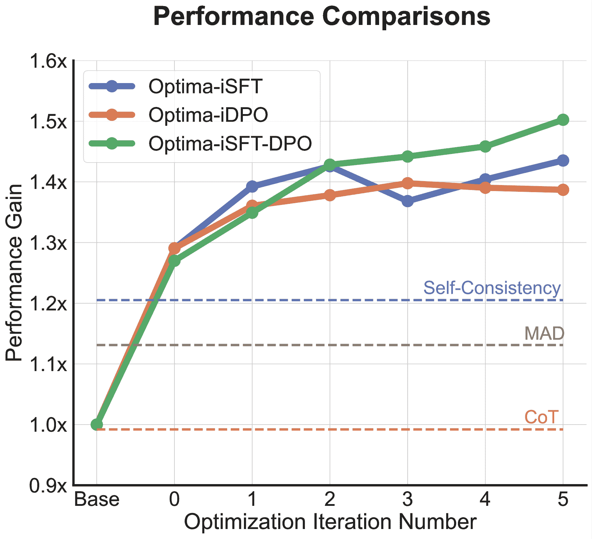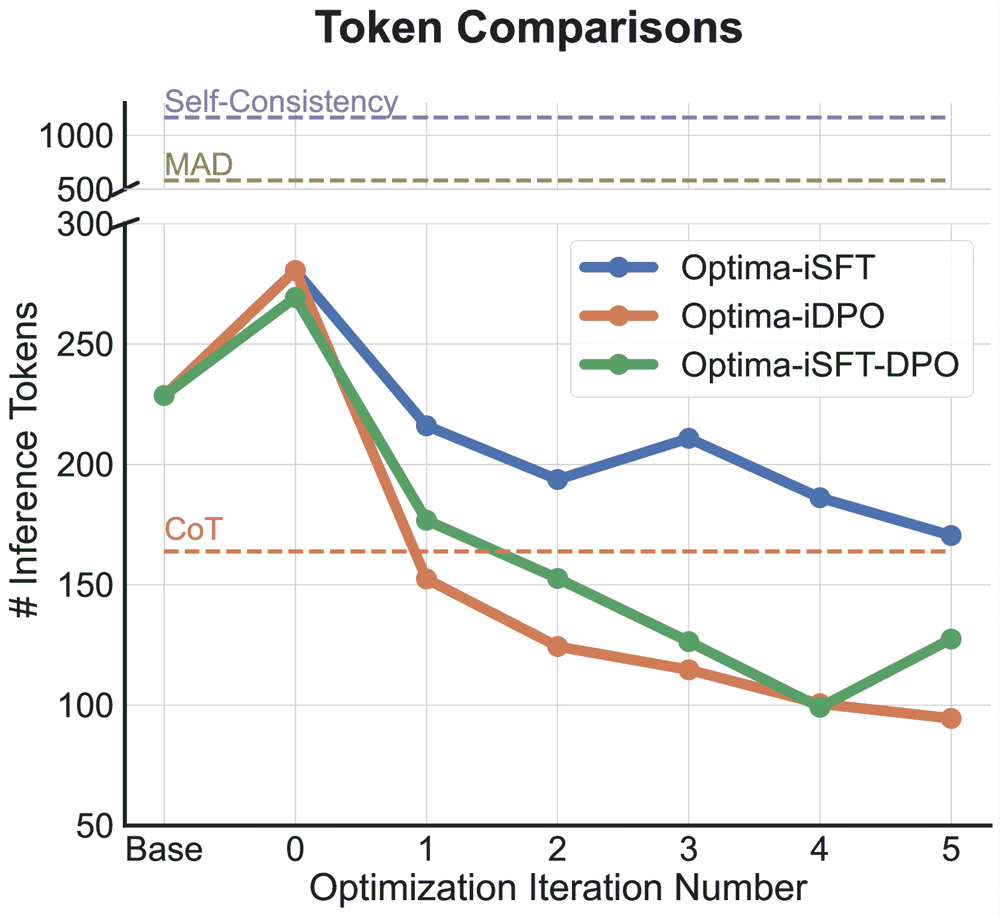

图1：Optima变体在优化迭代中的性能和效率。左图：迭代过程中的平均性能提升。Optima变体始终优于CoT、多智能体辩论（MAD）和自一致性。右图：迭代过程中的平均推理标记数量。所有Optima变体在显著减少标记数量的同时，表现出更好的性能。

## 1 引言

大语言模型（LLMs）已经成为广泛任务中的强大工具，从自然语言处理到复杂推理（OpenAI，[2023](https://arxiv.org/html/2410.08115v1#bib.bib40); Reid 等，[2024](https://arxiv.org/html/2410.08115v1#bib.bib46); Anthropic，[2024](https://arxiv.org/html/2410.08115v1#bib.bib2)）。利用这些模型的一个有前景的方向是开发自主的多智能体系统（MAS），旨在利用多个基于LLM的智能体的集体智慧进行协作性问题解决和决策制定（Liang 等，[2023](https://arxiv.org/html/2410.08115v1#bib.bib33); Wang 等，[2024b](https://arxiv.org/html/2410.08115v1#bib.bib53); Du 等，[2024](https://arxiv.org/html/2410.08115v1#bib.bib12); Zhuge 等，[2024](https://arxiv.org/html/2410.08115v1#bib.bib61)）。然而，要使基于LLM的MAS真正有效，它们必须克服两个关键挑战：（a）实现智能体之间的高效沟通，以最小化计算成本，以及（b）优化系统作为一个有机整体的集体表现。

当前基于大语言模型（LLM）的多智能体系统（MAS）面临着在应对这些挑战时的重大困难。智能体之间的协调与沟通通常效率低下，导致冗长的交流，进而增加了令牌使用量、推理时间和计算成本（Li 等，[2024b](https://arxiv.org/html/2410.08115v1#bib.bib32)）。这种低效性由于LLM的对齐训练中的长度偏差而加剧（Saito 等，[2023](https://arxiv.org/html/2410.08115v1#bib.bib47); Dubois 等，[2024](https://arxiv.org/html/2410.08115v1#bib.bib13)），即使简洁的沟通足以表达，模型也倾向于生成更长的回复（Chen 等，[2024d](https://arxiv.org/html/2410.08115v1#bib.bib10)）。此外，尽管近期的研究探索了为单一智能体任务训练LLM（Song 等，[2024](https://arxiv.org/html/2410.08115v1#bib.bib50); Xiong 等，[2024](https://arxiv.org/html/2410.08115v1#bib.bib57)），而多智能体系统（MAS）的训练在强化学习领域已有广泛研究（Johnson 等，[2000](https://arxiv.org/html/2410.08115v1#bib.bib25); Lanctot 等，[2017](https://arxiv.org/html/2410.08115v1#bib.bib28); Baker 等，[2020](https://arxiv.org/html/2410.08115v1#bib.bib3)），但仍缺乏专门为优化基于LLM的MAS作为统一系统而设计的参数更新方法。现有的方法主要依赖于简单的智能体配置文件进化（Chen 等，[2024b](https://arxiv.org/html/2410.08115v1#bib.bib8)）或记忆进化（Qian 等，[2024a](https://arxiv.org/html/2410.08115v1#bib.bib42); [b](https://arxiv.org/html/2410.08115v1#bib.bib43); Gao 等，[2024](https://arxiv.org/html/2410.08115v1#bib.bib15)），但未能解决沟通效率和集体优化的核心问题。

我们能否开发一个训练框架，既能提高基于LLM的MAS的沟通效率，又能增强任务的有效性？为了解决这个问题，我们提出了Optima，这是一个旨在优化基于LLM的MAS的有效框架。Optima的核心是一个迭代生成、排名、选择和训练的范式，结合了一个奖励函数，平衡任务表现、令牌效率和沟通可解释性。这个方法使得开发出的MAS不仅有效且高效，而且还能保持可解释的沟通模式。基于奖励函数，Optima利用一系列技术来引导基于LLM的智能体产生高效且有效的沟通行为，包括监督微调（SFT）（Zelikman et al., [2022](https://arxiv.org/html/2410.08115v1#bib.bib59); Gülçehre et al., [2023](https://arxiv.org/html/2410.08115v1#bib.bib16); Aksitov et al., [2023](https://arxiv.org/html/2410.08115v1#bib.bib1)）和直接偏好优化（DPO）（Rafailov et al., [2023](https://arxiv.org/html/2410.08115v1#bib.bib45); Pang et al., [2024](https://arxiv.org/html/2410.08115v1#bib.bib41)），以及它们的混合变体。此外，Optima还引入了受到蒙特卡洛树搜索（MCTS）启发的技术，以用于DPO数据生成，将对话轮次概念化为树节点，从而高效地探索多样的互动轨迹。

重要的是，通过大幅减少推理所需的令牌数量，Optima不仅提高了计算效率，还为更有效地利用推理计算开辟了新可能。这一令牌使用的减少使得在相同的计算约束下可以处理更多样本，可能会导致更好的推理时间扩展规律。正如近期的研究所示，推理时间计算在提高模型表现中的重要性（Wu et al., [2024](https://arxiv.org/html/2410.08115v1#bib.bib56); Brown et al., [2024](https://arxiv.org/html/2410.08115v1#bib.bib5); Chen et al., [2024a](https://arxiv.org/html/2410.08115v1#bib.bib7)），Optima的效率提升可以与诸如多数投票（Wang et al., [2023](https://arxiv.org/html/2410.08115v1#bib.bib52)）等技术结合，从而提升LLM系统的效果。

我们在两个多智能体环境下评估了Optima的表现： (a) 信息交换，包括信息不对称的问答（Chen et al., [2024d](https://arxiv.org/html/2410.08115v1#bib.bib10); Liu et al., [2024](https://arxiv.org/html/2410.08115v1#bib.bib34)），以及 (b) 辩论，涵盖了数学和推理任务（Du et al., [2024](https://arxiv.org/html/2410.08115v1#bib.bib12); Chen et al., [2024b](https://arxiv.org/html/2410.08115v1#bib.bib8); Wu et al., [2023](https://arxiv.org/html/2410.08115v1#bib.bib55)）。我们使用Llama 3 8B（Meta, [2024](https://arxiv.org/html/2410.08115v1#bib.bib37)）作为基准模型，展示了Optima在多个任务中持续优于单智能体MAS基线，令牌使用量减少最多可达90%，任务表现提升达2.8倍。

总结来说，我们的主要贡献是Optima，一个新颖的训练框架，它同时优化了通信效率和任务效果。为了增强多智能体环境下DPO的高质量训练数据生成，我们引入了类似MCTS的技术集成。我们在多个任务上的全面实证评估展示了在令牌效率和任务表现方面的显著进展，同时也提供了对学习到的通信模式的洞察。此外，我们还考察了Optima在推理时扩展规律中的效率提升对推理计算能力的影响，强调了其通过更有效地利用推理计算来提升LLM系统整体能力的潜力。通过解决通信效率和集体优化的双重挑战，我们的工作强调了为基于LLM的MAS开发先进训练框架的重要性，并突出了效率作为一个重要的考量指标。我们相信，Optima为未来在扩展和改进MAS乃至一般LLM系统的研究提供了坚实的基础。

## 2 Optima：通过迭代训练优化多智能体LLM

### 2.1 概述

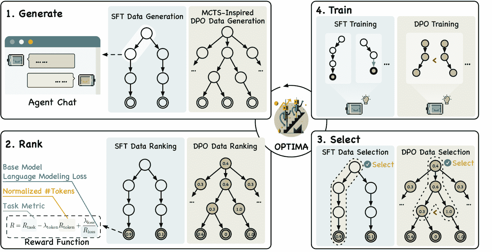

图2：Optima框架在基于LLM的MAS训练中的概述。迭代过程包括四个阶段：生成、排名、选择和训练。注意，排名过程虽然也涉及到DPO数据生成，但为了简化起见，未在生成阶段显示。

Optima建立在一个迭代的生成、排名、选择和训练的范式之上。这种方法允许在多智能体环境中逐步改进基于LLM的智能体，重点提升智能体之间通信的效率和任务完成的有效性。

令 $\mathcal{M}_{\text{base}}$ 表示基础LLM，$\mathcal{D}$ 表示任务数据集，$f$ 表示迭代训练函数。迭代过程可以形式化为 $\mathcal{M}_{t+1}=f(\mathcal{M}_{t},\mathcal{D})$，其中 $\mathcal{M}_{t}$ 表示第 $t$ 次迭代时的模型。函数 $f$ 包括了数据生成、排序、选择和模型训练的整个过程。对于每个任务实例 $d_{i}\in\mathcal{D}$，我们使用当前模型 $\mathcal{M}_{t}$ 驱动的代理采样一组 $N$ 个对话轨迹 $\{\tau_{i}^{j}\}_{j=1}^{N}\subset\mathcal{T}$。然后，每条轨迹 $\tau_{i}^{j}$ 都会使用奖励函数 $R:\mathcal{T}\rightarrow\mathbb{R}$ 进行评估，定义为：

|  | $R(\tau_{i}^{j})=R_{\text{task}}(\tau_{i}^{j})-\lambda_{\text{token}}R_{\text{% token}}(\tau_{i}^{j})+\lambda_{\text{loss}}\frac{1}{R_{\text{loss}}(\tau_{i}^{j})}.$ |  | (1) |
| --- | --- | --- | --- |

在这里，$R_{\text{task}}:\mathcal{T}\rightarrow\mathbb{R}$ 是任务特定的性能指标，$R_{\text{token}}(\tau_{i}^{j})=\frac{\#\text{Tokens}(\tau_{i}^{j})}{\max_{k}(\{\#\text{Tokens}(\tau_{i}^{k})\}_{k})}$ 是标准化的令牌计数，而 $R_{\text{loss}}(\tau_{i}^{j})=g\big{(}\mathcal{L}(\mathcal{M}_{\text{base}},d_{i},\tau_{i}^{j})\big{)}$ 基于基础模型 $\mathcal{M}_{\text{base}}$ 的语言建模损失，我们在[Section E.2](https://arxiv.org/html/2410.08115v1#A5.SS2 "E.2 Ranking ‣ Appendix E Experiment Details ‣ Optima: Optimizing Effectiveness and Efficiency for LLM-Based Multi-Agent System")中详细阐述了这一点。正的系数 $\lambda_{\text{token}}$ 和 $\lambda_{\text{loss}}$ 是超参数。该奖励函数旨在同时平衡多个目标：$R_{\text{task}}$ 确保模型在预定任务上有所提升，$R_{\text{token}}$ 通过惩罚冗长的交流来鼓励沟通效率，而 $R_{\text{loss}}$ 通过偏好在基础模型下更可能的轨迹来规范语言的自然性和可读性。通过整合这些组件，我们旨在开发基于LLM的MAS，这些系统不仅在指定任务中有效，而且在沟通上也高效，同时保持输出的可解释性，与以往强化学习研究中往往无法理解的交流方式不同（Lazaridou et al., [2017](https://arxiv.org/html/2410.08115v1#bib.bib29); Evtimova et al., [2018](https://arxiv.org/html/2410.08115v1#bib.bib14); Chaabouni et al., [2022](https://arxiv.org/html/2410.08115v1#bib.bib6)）。

基于这些奖励，我们应用若干数据选择标准来选择每个任务实例的高质量采样轨迹子集$\{\tau_{i}^{*}\}$。这些选定的轨迹形成了第$i$次迭代中的训练数据$\mathcal{D}_{i}^{*}$。然后，模型会更新：$\mathcal{M}_{t+1}=\text{Train}(\mathcal{M}_{t},\mathcal{D}_{i}^{*})$。Train函数可以用多种训练算法来实例化，例如SFT或DPO，我们将在以下小节中详细讨论。

[图 2](https://arxiv.org/html/2410.08115v1#S2.F2 "在2.1概述 ‣ 2 Optima: 通过迭代训练优化多代理LLM ‣ Optima: 优化基于LLM的多代理系统的有效性和效率") 提供了Optima的高级概述。生成和训练过程的具体实例将在以下小节中详细说明。排名过程在所有实例中是一致的，由[公式1](https://arxiv.org/html/2410.08115v1#S2.E1 "在2.1概述 ‣ 2 Optima: 通过迭代训练优化多代理LLM ‣ Optima: 优化基于LLM的多代理系统的有效性和效率")中给出的奖励函数定义。

### 2.2 初始化：多样化代理通信

在开始迭代训练过程之前，我们解决了一个基于LLM的MAS中的关键挑战：代理在多个对话轨迹中往往以类似的风格生成响应，即使使用了高温采样。这种同质性限制了多样化通信策略的探索，可能会妨碍朝着更高效和更有效的互动优化。借鉴AutoForm（Chen等，2024d，[参考文献](https://arxiv.org/html/2410.08115v1#bib.bib10)）的观察，LLM可以明确提示其利用不同的、更简洁的格式进行沟通或推理，而不在性能上作出太大妥协，我们引入了一个初始化步骤，旨在促进代理通信的多样性。

我们的方法利用了一组格式规范提示池，$\mathcal{P}=\{p_{1},p_{2},...,p_{K}\}$，其中每个$p_{k}$是一个字符串，指定了特定的响应格式（例如，JSON、列表，具体示例和创建过程请参见[附录 F](https://arxiv.org/html/2410.08115v1#A6 "附录 F 实验中使用的提示 ‣ Optima: 优化基于LLM的多代理系统的有效性和效率")）。对于每个任务实例$d_{i}\in\mathcal{D}$，我们生成$N$个对话轨迹，每个轨迹都附加一个随机选择的格式规范到输入任务中：

|  | $\tau_{i}^{j}=\mathcal{M}_{\text{base}}(d_{i}\oplus p_{k_{j}}),\quad k_{j}\sim% \text{Uniform}(1,K),\quad j=1,...,N,$ |  | (2) |
| --- | --- | --- | --- |

其中$\oplus$表示字符串拼接。这个过程为每个$d_{i}$生成了一组多样化的轨迹$\{\tau_{i}^{j}\}_{j=1}^{N}$，它们在内容和结构上都存在差异。

然后，我们使用[公式1](https://arxiv.org/html/2410.08115v1#S2.E1 "在2.1概述中 ‣ 2 Optima：通过迭代训练优化多智能体LLM ‣ Optima：优化基于LLM的多智能体系统的效能与效率")中定义的奖励函数来评估这些轨迹，对于每个$d_{i}$，我们选择具有最高奖励的轨迹：$\tau_{i}^{*}=\operatorname*{arg\,max}_{j}R(\tau_{i}^{j})$。最后，我们选择超过预设性能阈值$\theta_{\text{init}}$的前k条轨迹，从而得到一个高质量的数据集：

|  | $\mathcal{D}_{0}^{*}=\text{TopK}(\{(d_{i},\tau_{i}^{*})\mid R_{\text{task}}(\tau_{i% }^{*})>\theta_{\text{init}},\forall d_{i}\in\mathcal{D}\},0.7\mid D\mid).$ |  | (3) |
| --- | --- | --- | --- |

关键的是，我们从选定的轨迹中移除了格式规范提示，从而得到一个多样化且高质量的对话数据集，且不包含显式的格式指令。利用这个数据集，我们对基础模型进行微调，得到$\mathcal{M}_{\text{base}}$，进而得到$\mathcal{M}_{0}=\text{SFT}(\mathcal{M}_{\text{base}},\mathcal{D}_{0}^{*})$，作为Optima的起点，能够在没有显式格式提示的情况下生成多样的交流模式。我们在[附录B](https://arxiv.org/html/2410.08115v1#A2 "附录B Optima变体的附加伪代码 ‣ Optima：优化基于LLM的多智能体系统的效能与效率")中提供了伪代码以便更好地理解。这个初始化为后续的迭代训练过程中的更有效探索与优化奠定了基础。

算法1 迭代监督微调

1: 初始化模型 $\mathcal{M}_{\text{init}}$，数据集 $\mathcal{D}$，样本大小 $N$，奖励阈值 $\theta_{\text{sft}}$，最大迭代次数 $T$  

### 2.3 框架实现 1：迭代监督微调

我们介绍了迭代监督微调（iSFT）作为Optima的首次实现。在每次迭代$t$中，iSFT遵循[算法3](https://arxiv.org/html/2410.08115v1#alg3 "附录A 信息交换任务推理扩展法则 ‣ Optima：优化基于LLM的多智能体系统的效果和效率")中概述的相同一般程序，使用当前模型$\mathcal{M}_{t}^{\text{iSFT}}$为每个任务训练实例$d_{i}\in\mathcal{D}$生成一组$N$个对话轨迹。然而，与初始化不同，iSFT省略了格式规范池，因为$\mathcal{M}_{0}$已经内化了多样化的通信策略。与最近关于迭代训练的研究（Gülçehre等，[2023](https://arxiv.org/html/2410.08115v1#bib.bib16)；Aksitov等，[2023](https://arxiv.org/html/2410.08115v1#bib.bib1)）不同，iSFT在各个迭代中保持固定的奖励阈值$\theta_{\text{SFT}}$以进行数据选择。数据生成后，模型会进行标准的SFT。这个过程会持续进行，直到达到最大迭代次数。为了清晰起见，iSFT的伪代码见[算法1](https://arxiv.org/html/2410.08115v1#alg1 "2.2 初始化：多样化智能体通信 ‣ 2 Optima：通过迭代训练优化多智能体LLM ‣ Optima：优化基于LLM的多智能体系统的效果和效率")。

iSFT提供了一种简单而有效的方法来优化基于LLM的MAS，利用初始化过程中建立的多样化通信模式，同时持续提高任务性能和通信效率。

### 2.4 框架实现 2：迭代直接偏好优化

虽然iSFT提供了一种直接优化基于LLM的MAS的简便方法，但它可能受到对每个任务实例依赖于单一最佳轨迹的限制。为了解决这个问题，我们探索了迭代直接偏好优化（iDPO）（Rafailov等，[2023](https://arxiv.org/html/2410.08115v1#bib.bib45)；Pang等，[2024](https://arxiv.org/html/2410.08115v1#bib.bib41)），它通过比较偏好优化模型，并在LLM对齐方面取得了成功。然而，在多智能体环境中应用DPO会带来不同的挑战，特别是在生成能够捕捉智能体交互复杂性的有意义配对数据方面。

数据生成：为了克服这些挑战，我们将 MCTS 与 DPO 数据收集相结合，用于在多代理设置中生成高质量的配对数据。我们基于 MCTS 的方法将多代理对话概念化为一棵树，其中节点代表对话轮次，边代表继续进行的对话。这种结构使我们能够系统地探索多样化的交互轨迹，并为 DPO 训练选择高质量的配对数据。MCTS 过程从根节点（初始任务提示）开始，按以下步骤进行：（1）扩展：我们根据以下标准选择一个节点进行扩展。首先排除叶节点和倒数第二层节点，以避免在低方差扩展上浪费计算资源，然后排除与之前扩展节点内容相似的节点，内容相似度通过编辑距离来度量（参见[章节 E.1](https://arxiv.org/html/2410.08115v1#A5.SS1 "E.1 数据生成 ‣ 附录 E 实验详情 ‣ Optima：优化基于 LLM 的多代理系统的效果和效率")）。在剩下的节点中，我们选择奖励最高的 10 个节点，并根据它们的奖励使用 softmax 分布从中抽样一个节点。（2）模拟：对于每个选择的节点，我们扩展 3 条轨迹，模拟对话直到完成。（3）反向传播：一旦某条轨迹完成并根据[公式 1](https://arxiv.org/html/2410.08115v1#S2.E1 "在 2.1 概述 ‣ 2 Optima：通过迭代训练优化多代理 LLM ‣ Optima：优化基于 LLM 的多代理系统的效果和效率")获得奖励，我们更新轨迹中所有节点的估计奖励，使用其子节点的平均奖励。（4）迭代：我们重复以上过程 8 次，生成 24 条轨迹。更多的迭代可能会导致更为多样和高质量的数据。

配对数据构建：为了生成高质量的配对数据用于 DPO 训练，我们遍历每棵 MCTS 树，并识别满足以下三个条件的节点对 $(n_{i},n_{j})$： (1) 共享祖先，(2) $n_{i}$ 和 $n_{j}$ 的较高估计奖励超过阈值 $\theta_{\text{dpo-filter}}$，(3) 它们的奖励差异超过阈值 $\theta_{\text{dpo-diff}}$。我们按较高的估计奖励对这些节点对进行排序，并选择排名前 50% 的节点对作为最终训练集的一部分。我们通过使用共同的对话历史作为提示来构建 DPO 训练实例，其中 $n_{i}$ 和 $n_{j}$ 根据其估计奖励作为选择的和被拒绝的响应。

iDPO 过程接着迭代进行，在基于 MCTS 的数据生成和使用 DPO 进行模型更新之间交替进行。我们的 iDPO 过程的伪代码在[算法 2](https://arxiv.org/html/2410.08115v1#alg2 "在 2.4 框架实例化 2：迭代直接偏好优化 ‣ 2 Optima：通过迭代训练优化多代理 LLM ‣ Optima：优化基于 LLM 的多代理系统的效果和效率")中展示。

算法 2 迭代直接偏好优化

1: 初始模型 $\mathcal{M}_{\text{init}}$，数据集 $\mathcal{D}$，最大迭代次数 $T$ 2: 优化后的模型 $\mathcal{M}_{T}$ 3: $\mathcal{M}_{0} \leftarrow \text{Initialize}(\mathcal{M}_{\text{init}}, \mathcal{D})$ $\triangleright$ [算法 3](https://arxiv.org/html/2410.08115v1#alg3 "附录 A 信息交换任务中的推理规模定律 ‣ Optima：优化基于 LLM 的多智能体系统的有效性和效率") 4: 对于 $t=0$ 到 $T-1$，执行： 5:     $\mathcal{D}_{t}^{\text{DPO}} \leftarrow \emptyset$ 6:     对每个 $d_{i} \in \mathcal{D}$，执行： 7:         $\mathcal{D}_{i}^{\text{DPO}} \leftarrow \text{MCTSDataGeneration}(\mathcal{M}_{t}, d_{i})$ $\triangleright$ [算法 5](https://arxiv.org/html/2410.08115v1#alg5 "算法 5 ‣ 附录 A 信息交换任务中的推理规模定律 ‣ Optima：优化基于 LLM 的多智能体系统的有效性和效率") 8:         $\mathcal{D}_{t}^{\text{DPO}} \leftarrow \mathcal{D}_{t}^{\text{DPO}} \cup \mathcal{D}_{i}^{\text{DPO}}$ 9:     结束循环 10:     $\mathcal{M}_{t+1} \leftarrow \text{DPO}(\mathcal{M}_{t}, \mathcal{D}_{t}^{\text{DPO}})$ 11: 结束循环 12: 返回 $\mathcal{M}_{T}$

### 2.5 框架实例化 3: 混合迭代训练

在 iSFT 和 iDPO 的优势基础上，我们探讨了一种混合方法，将 SFT 和 DPO 在迭代训练过程中交替使用，称为 iSFT-DPO。这种混合方法旨在利用 SFT 在捕捉高质量轨迹方面的简洁性和直接性，同时也借助 DPO 所促进的细致比较学习。通过在这两种训练范式之间交替，我们假设模型能够更有效地平衡对多样化沟通策略的探索与已知有效模式的利用。

实际上，我们通过先执行一次 iSFT 迭代，然后执行一次 iDPO 迭代，并在整个训练过程中重复这个循环来实现这种混合方法。这种交替使得模型能够首先通过 SFT 巩固对最佳观测轨迹的学习，然后通过 DPO 提供的比较偏好来细化其理解。

## 3 个实验

数据集。我们在两个多智能体场景下评估Optima：信息交换（IE）和辩论。对于IE，我们使用HotpotQA（Yang等， [2018](https://arxiv.org/html/2410.08115v1#bib.bib58)）、2WikiMultiHopQA（2WMHQA）（Ho等， [2020](https://arxiv.org/html/2410.08115v1#bib.bib21)）、TriviaQA（Joshi等， [2017](https://arxiv.org/html/2410.08115v1#bib.bib26)）和CBT（Hill等， [2016](https://arxiv.org/html/2410.08115v1#bib.bib20)）。对于多跳数据集（HotpotQA，2WikiMultiHopQA），我们将相关上下文在两个智能体之间进行划分，确保答案只能通过信息交换推导得出。对于TriviaQA和CBT，上下文是随机分配的，挑战智能体有效识别并传达相关信息。辩论场景使用GSM8K（Cobbe等， [2021](https://arxiv.org/html/2410.08115v1#bib.bib11)）、MATH（Hendrycks等， [2021b](https://arxiv.org/html/2410.08115v1#bib.bib19)）、ARC挑战集（ARC-C）（Bhakthavatsalam等， [2021](https://arxiv.org/html/2410.08115v1#bib.bib4)）和MMLU（Hendrycks等， [2021a](https://arxiv.org/html/2410.08115v1#bib.bib18)），其中一个智能体作为求解者，另一个作为批评者（Chen等， [2024b](https://arxiv.org/html/2410.08115v1#bib.bib8)）。我们对所有基准使用0-shot评估。

评估指标。对于IE任务，我们报告生成的答案与标签之间的F1分数。对于辩论任务，我们使用精确匹配准确度（GSM8K，ARC-C，MMLU）或基于Sympy的（Meurer等， [2017](https://arxiv.org/html/2410.08115v1#bib.bib38)）等价性检查（MATH），遵循Lewkowycz等人（[2022](https://arxiv.org/html/2410.08115v1#bib.bib30)）的方法。对话在两个智能体都标记相同答案并使用指定的特殊标记或达到回合限制时结束。

基准对比。我们与单智能体方法进行比较：思维链（CoT）（Wei等， [2022](https://arxiv.org/html/2410.08115v1#bib.bib54)）和自一致性（SC）加多数投票（Wang等， [2023](https://arxiv.org/html/2410.08115v1#bib.bib52)），在$n=8$样本上进行评估。由于IE任务生成的响应是自由形式的，直接采用多数投票方法不可行。因此，我们首先计算样本答案之间的成对F1分数，将成对F1分数超过0.9的答案分组，然后报告最大分组中所有答案的平均F1分数与标签的比较。在多智能体场景下，我们与Du等人（[2024](https://arxiv.org/html/2410.08115v1#bib.bib12)）的多智能体辩论（MAD）和Chen等人（[2024d](https://arxiv.org/html/2410.08115v1#bib.bib10)）的AutoForm进行比较。MAD利用自然语言进行智能体间的交流，提供了一个常见多智能体对话的基准，而AutoForm则鼓励智能体利用简洁的非自然语言格式，以实现更好的性能与成本比，为效率导向的MAS提供了对比点。

训练设置。我们在所有基准测试中使用 Llama 3 8B（Meta，[2024](https://arxiv.org/html/2410.08115v1#bib.bib37)）作为基础模型。我们的实验集中于无外部工具的双代理场景，这一设计选择使我们能够孤立并分析多代理通信与协作的核心方面。通过将最初的研究限定在这些基本设置中，我们可以更清晰地展示 Optima 在优化代理间通信和任务执行中的有效性。该方法还为未来研究更复杂的多代理和工具使用场景提供了坚实的基线。此外，我们为两个代理训练了一个单一模型，尽管训练单独的模型可能会提升性能，但我们将此留待未来探索。详细的训练配置和提示请参考[附录 E](https://arxiv.org/html/2410.08115v1#A5 "附录 E 实验详情 ‣ Optima: 基于大型语言模型的多代理系统的效能与效率优化")和[F](https://arxiv.org/html/2410.08115v1#A6 "附录 F 实验中使用的提示 ‣ Optima: 基于大型语言模型的多代理系统的效能与效率优化")。

### 3.1 基准测试结果

表 1：信息交换与辩论任务的性能与推理令牌数比较。最佳结果用粗体表示，次优结果在所有行中均用下划线标示，最后三行显示 Optima 变种的自一致性结果，最佳结果以绿色突出显示。Optima 变种在任务性能和/或令牌效率方面始终优于基线。

|  | 信息交换 | 辩论 |
| --- | --- | --- |
|  | HotpotQA | 2WMH QA | TriviaQA | CBT | MATH | GSM8k | ARC-C | MMLU |
| 方法 | F1 | #Tok | F1 | #Tok | F1 | #Tok | F1 | #Tok | 准确率 | #Tok | 准确率 | #Tok | 准确率 | #Tok | 准确率 | #Tok |
| CoT | 25.6 | 123.7 | 20.5 | 139.8 | 59.8 | 110.3 | 43.4 | 135.3 | 23.9 | 329.8 | 71.5 | 230.9 | 65.2 | 138.9 | 46.0 | 132.2 |
| SC ($n=8$) | 33.8 | 996.3 | 28.7 | 1052.8 | 70.0 | 891.4 | 52.9 | 1067.7 | 35.7 | 2600.9 | 80.3 | 1828.7 | 75.6 | 1116.7 | 54.0 | 1056.1 |
| MAD | 28.4 | 570.9 | 25.9 | 543.7 | 71.0 | 408.6 | 53.8 | 493.0 | 29.8 | 1517.6 | 72.5 | 514.7 | 71.4 | 478.0 | 51.5 | 516.7 |
| AutoForm | 28.2 | 97.7 | 24.7 | 117.7 | 60.9 | 74.0 | 35.0 | 64.8 | 26.1 | 644.3 | 71.0 | 410.5 | 60.2 | 221.2 | 43.8 | 198.5 |
| Optima-iSFT | 54.5 | 67.6 | 72.4 | 61.2 | 71.9 | 51.5 | 71.8 | 38.5 | 30.1 | 830.3 | 79.5 | 311.5 | 74.1 | 92.2 | 56.8 | 123.8 |
| Optima-iDPO | 52.5 | 45.7 | 66.1 | 35.9 | 69.3 | 69.2 | 66.7 | 37.2 | 30.4 | 272.8 | 78.5 | 270.1 | 74.5 | 97.8 | 59.6 | 61.6 |
| Optima-iSFT-DPO | 55.6 | 63.3 | 74.2 | 54.9 | 77.1 | 32.5 | 70.1 | 38.9 | 29.3 | 488.1 | 80.4 | 246.5 | 77.1 | 88.0 | 60.2 | 56.7 |
| Optima-iSFT SC | 54.8 | 806.2 | 72.6 | 245.6 | 73.7 | 413.8 | 72.2 | 847.4 | 32.4 | 2432.9 | 83.1 | 1750.7 | 77.2 | 1148.7 | 60.2 | 874.5 |
| Optima-iDPO SC | 52.8 | 412.8 | 67.2 | 1056.2 | 71.8 | 702.8 | 66.8 | 520.6 | 36.9 | 2743.1 | 84.4 | 1750.8 | 77.0 | 1091.2 | 59.9 | 1050.4 |
| Optima-iSFT-DPO SC | 57.4 | 957.9 | 76.7 | 1096.0 | 77.5 | 494.1 | 71.8 | 417.8 | 34.8 | 2788.5 | 84.0 | 1748.7 | 78.8 | 1036.1 | 61.2 | 1026.7 |

[表格 1](https://arxiv.org/html/2410.08115v1#S3.T1 "在 3.1 基准结果 ‣ 3 实验 ‣ Optima：优化基于大语言模型的多智能体系统的有效性与效率") 展示了 Optima 在一系列不同任务中的表现，揭示了在有效性和效率上相较基线方法的持续改进。在信息抽取（IE）任务中，Optima 的变体表现出显著的提升，尤其是在像 HotpotQA 和 2WMHQA 这样的多跳推理场景中。在这些任务中，iSFT-DPO 达到最佳表现，同时显著减少了与最强基线 SC 相比的令牌使用量。特别是在 2WMHQA 上，iSFT-DPO 提高了 F1 分数 38.3%（提高了 2.8 倍），而所需的令牌仅为 MAD 的 10%。这一趋势也扩展到其他信息交换任务，其中 Optima 变体在大幅降低令牌数的同时仍保持高性能。辩论任务展现了一个更为复杂的情况，但 Optima 的优势依然显著。在 ARC-C 和 MMLU 任务中，仍然可以观察到更好的任务表现和令牌效率，但在 MATH 和 GSM8k 任务中，Optima 变体的表现与 SC 相当或稍低，但令牌效率却高得多。我们推测这与任务的难度和其训练集的规模较小有关。然而，正如我们将在 [第 3.2 节](https://arxiv.org/html/2410.08115v1#S3.SS2 "3.2 Optima 如何在 OOD 任务上泛化？ ‣ 3 实验 ‣ Optima：优化基于大语言模型的多智能体系统的有效性与效率") 中展示的，基于 MATH 训练的 Optima 模型能够有效转移到 GSM8k 上，达到了几乎与直接在 GSM8k 上训练的模型相当的表现，同时保持高令牌效率。更有趣的是，[第 3.3 节](https://arxiv.org/html/2410.08115v1#S3.SS3 "3.3 Optima 能否实现更好的推理扩展规律？ ‣ 3 实验 ‣ Optima：优化基于大语言模型的多智能体系统的有效性与效率") 将展示，应用 SC 到在 MATH 或 GSM8k 上训练的 Optima 变体时，相较于 CoT SC，GSM8k 上的推理扩展规律得到了改进。

进一步分析 Optima 变体揭示了有趣的权衡。Optima-iSFT 通常优先考虑性能，而牺牲令牌效率，在 8 个任务中的 5 个任务中表现出最差的效率。相比之下，Optima-iDPO 常常在令牌使用量上取得显著减少，尽管有时会牺牲部分性能。Optima-iSFT-DPO 则成为了一个稳健的折中方案，常常在保持令牌效率的同时提供顶尖的性能。

### 3.2 Optima 如何在 OOD 任务上泛化？

表2：Optima的迁移性能。我们将Optima从Hotpot QA迁移到2WMH QA和Trivia QA，并从MATH迁移到GSM8k，以MAD和AutoForm作为每个目标任务的基准。

|  | 2WMH QA | Trivia QA | GSM8k |
| --- | --- | --- | --- |
| 方法 | F1 | #Tok | F1 | #Tok | 准确率 | #Tok |
| MAD | 25.9 | 543.7 | 71.0 | 408.9 | 72.5 | 514.7 |
| AutoForm | 24.7 | 117.7 | 60.9 | 74.0 | 71.0 | 410.5 |
| iSFT | 56.5 | 79.6 | 70.0 | 90.2 | 74.6 | 293.7 |
| iDPO | 51.6 | 84.3 | 68.0 | 41.1 | 77.9 | 185.7 |
| iSFT-DPO | 54.5 | 70.4 | 72.0 | 67.8 | 74.2 | 363.1 |

为了评估Optima的泛化能力，我们在不同任务领域进行了迁移学习实验。我们将训练于HotpotQA的模型迁移到TriviaQA和2WMHQA，并且将MATH迁移到GSM8k。这些数据集在大类上有所共享（分别是问答和数学推理），但在复杂度和所需技能方面面临不同的挑战。实验结果显示在[表2](https://arxiv.org/html/2410.08115v1#S3.T2 "在3.2节：Optima如何泛化到OOD任务？ ‣ 3 实验 ‣ Optima：优化基于LLM的多代理系统的效果与效率")中，展示了Optima在这些多样任务中的强大迁移能力。在问答领域，所有Optima变种在这两个OOD数据集上都显著优于基准的多代理方法。在2WMHQA上，迁移后的iSFT在仅使用14.6% tokens的情况下，F1得分是MAD的两倍以上。在TriviaQA中也观察到了类似的趋势。当从MATH迁移到GSM8k时，Optima变种，尤其是iDPO，不仅在GSM8k上超越了基准模型，还达到了与直接在GSM8k上训练的模型相媲美的结果，并且token效率更高（参见[表1](https://arxiv.org/html/2410.08115v1#S3.T1 "在3.1节：基准结果 ‣ 3 实验 ‣ Optima：优化基于LLM的多代理系统的效果与效率")进行对比）。

这些结果强调了Optima在开发适应性MAS（多代理系统）方面的潜力，表明Optima训练的模型能学习到可转移的技能，以高效地进行信息交换和协作推理。然而，转移到更遥远的领域仍然具有挑战性，例如我们发现从HotpotQA到CBT，或从MATH到ARC-C的转移都很困难。我们认为，这是未来研究的一个有前景的方向，探索如果将Optima扩展到更为通用的多任务训练，是否能够增强大规模语言模型（LLMs）中交流策略的泛化能力。

### 3.3 Optima 是否能引领更好的推理扩展法则？

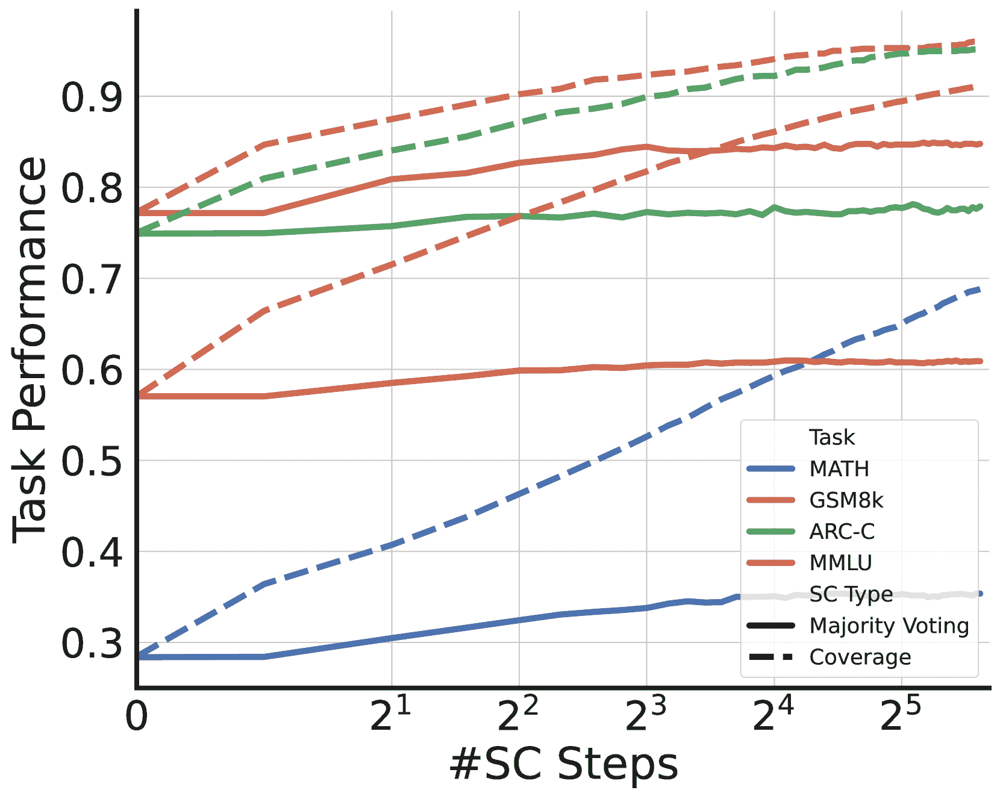

(a) 辩论任务中的推理扩展

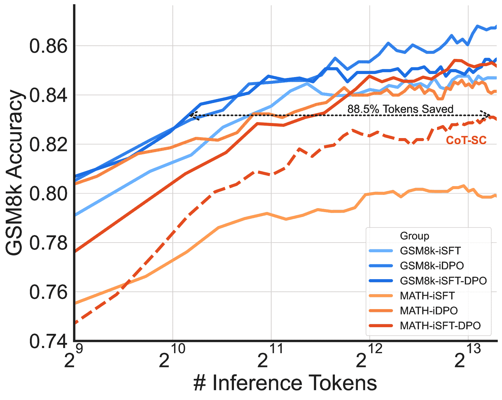

(b) GSM8k上的性能与token使用量

图 3：Optima 对推理扩展规律的影响。 (a) Optima 变种的自一致性步骤与辩论任务性能之间的关系。实线表示多数投票准确率，虚线表示覆盖率。 (b) 各种模型在 GSM8k 上的性能与令牌使用量的关系，展示了 Optima 在效率上的提升。

最近的研究突出了推理扩展规律的重要性，推理扩展规律描述了在推理过程中，随着计算资源的增加，模型性能如何提高，通常是通过对每个问题生成多个样本来实现（Brown 等，[2024](https://arxiv.org/html/2410.08115v1#bib.bib5); Wu 等，[2024](https://arxiv.org/html/2410.08115v1#bib.bib56)）。虽然训练扩展规律关注模型规模、数据集规模与性能之间的关系，但推理扩展规律则探索了推理计算预算与任务准确性之间的权衡。这一范式为提高模型能力提供了一个有前景的途径，而无需进一步训练模型。

[图 3](https://arxiv.org/html/2410.08115v1#S3.F3 "在 3.3 节，Optima 能否带来更好的推理扩展规律？ ‣ 3 实验 ‣ Optima：基于大规模语言模型的多智能体系统优化效能与效率") 说明了 Optima 对推理扩展规律的影响。左侧面板显示了 SC 步骤数与多智能体辩论任务性能之间的关系。我们观察到，尽管多数投票准确率在某个步骤数之后趋于平稳，但覆盖率（定义为至少一次正确回答问题的比例）随着采样的增加而呈对数增长。这一趋势与最近推理扩展规律研究中的发现一致（Wu 等，[2024](https://arxiv.org/html/2410.08115v1#bib.bib56); Chen 等，[2024a](https://arxiv.org/html/2410.08115v1#bib.bib7)），并表明更复杂的答案选择技术可能进一步提升 Optima 的性能。我们在[附录 A](https://arxiv.org/html/2410.08115v1#A1 "附录 A：信息交换任务中的推理扩展规律 ‣ Optima：基于大规模语言模型的多智能体系统优化效能与效率")提供了所有 Optima 变种在 IE 和辩论任务中的其他扩展规律图，类似的趋势可以在其中观察到。

[图3](https://arxiv.org/html/2410.08115v1#S3.F3 "在3.3节，Optima能否带来更好的推理扩展规律？ ‣ 3 实验 ‣ Optima：优化LLM基础的多智能体系统的有效性与效率")的右侧面板展示了Optima在提高GSM8k任务推理扩展规律方面的效率。无论是直接在GSM8k上训练的Optima变体，还是从MATH转移过来的变体，除了从MATH转移过来的iSFT变体外，它们都始终优于CoT SC基准。值得注意的是，在GSM8k上训练的iDPO，达到了大约10,000个tokens时，CoT-SC的性能，并且使用了少88.5%的tokens，有效地“将曲线向左移动”。这一显著的token使用减少，意味着在不牺牲准确性的情况下，计算节省了大量资源。此外，除了iSFT外，从MATH训练的Optima变体，在GSM8k上也展现出比CoT SC更好的推理扩展规律，凸显了该框架在相关任务中有效泛化的能力。

这些结果突显了Optima在重新塑造基于LLM的MAS甚至一般LLM系统推理扩展规律方面的潜力。通过实现推理计算预算的更高效使用，Optima可以在较低的计算成本下提供更好的性能，或者在相同成本下获得更高的性能。这一效率提升为利用先进的推理技术，如加权投票或最优选择（Wu等人，[2024](https://arxiv.org/html/2410.08115v1#bib.bib56)）开辟了新可能，可能会带来更大的性能提升。

表3：关于Optima变体在两个代表性任务上奖励组件的消融研究。

|  | 2WMH QA | ARC-C |
| --- | --- | --- |
| 设置 | F1 | #Tok | 准确率 | #Tok |
| iSFT | 72.4 | 61.2 | 74.1 | 92.2 |
| 无#Tokens | 72.4${}_{(\text{0.0})}$ | 290.3$\color[rgb]{1,0,0}{}_{(\text{4.8x})}$ | 74.2$\color[rgb]{0,.5,.5}{}_{(\text{+0.1})}$ | 579.6$\color[rgb]{1,0,0}{}_{(\text{6.3x})}$ |
| 无Loss | 69.7$\color[rgb]{1,0,0}{}_{(\text{-2.7})}$ | 45.4$\color[rgb]{0,.5,.5}{}_{(\text{0.7x})}$ | 72.6$\color[rgb]{1,0,0}{}_{(\text{-1.5})}$ | 69.7$\color[rgb]{0,.5,.5}{}_{(\text{0.8x})}$ |
| iDPO | 66.1 | 35.9 | 74.5 | 97.8 |
| 无#Tokens | 72.9$\color[rgb]{0,.5,.5}{}_{(\text{+6.8})}$ | 183.3$\color[rgb]{1,0,0}{}_{(\text{5.1x})}$ | 75.5$\color[rgb]{0,.5,.5}{}_{(\text{+1.0})}$ | 266.0$\color[rgb]{1,0,0}{}_{(\text{2.7x})}$ |
| 无Loss | 63.0$\color[rgb]{1,0,0}{}_{(\text{-3.1})}$ | 54.6$\color[rgb]{1,0,0}{}_{(\text{1.5x})}$ | 74.4$\color[rgb]{1,0,0}{}_{(\text{-0.1})}$ | 81.2$\color[rgb]{0,.5,.5}{}_{(\text{0.8x})}$ |
| iSFT-DPO | 74.2 | 54.9 | 77.1 | 88.0 |
| 无#Tokens | 63.5$\color[rgb]{1,0,0}{}_{(\text{-10.7})}$ | 219.7$\color[rgb]{1,0,0}{}_{(\text{4.0x})}$ | 76.9$\color[rgb]{1,0,0}{}_{(\text{-0.2})}$ | 354.8$\color[rgb]{1,0,0}{}_{(\text{4.0x})}$ |
| 无Loss | 66.7$\color[rgb]{1,0,0}{}_{(\text{-7.5})}$ | 38.1$\color[rgb]{0,.5,.5}{}_{(\text{0.7x})}$ | 76.3$\color[rgb]{1,0,0}{}_{(\text{-0.8})}$ | 63.4$\color[rgb]{0,.5,.5}{}_{(\text{0.7x})}$ |

### 3.4 Optima 如何促进智能体通信和性能的演化？

为了理解奖励函数中不同组件的影响，我们对两个代表性任务进行了消融研究：IE 的 2WMHQA 和辩论任务的 ARC-C。我们通过去除奖励函数中的 token 计数正则化（#Tokens）或 LM 损失（Loss）来检查 Optima 变体的性能。结果旨在回答两个关键问题：（1）token 计数正则化如何影响效率与性能的权衡？（2）语言建模损失在维持通信质量中的作用是什么？我们的发现始终表明，每个奖励组件在平衡任务性能、通信效率和语言质量方面都发挥着至关重要的作用。

[表格 3](https://arxiv.org/html/2410.08115v1#S3.T3 "在 3.3 小节《Optima 能否带来更好的推理扩展法则？ ‣ 3 实验 ‣ Optima：优化基于 LLM 的多智能体系统的效能和效率》中") 展示了我们的消融研究结果。移除 token 计数导致在各个设置下生成的 token 数量显著增加，特别是在辩论任务中，效果尤为明显。虽然这种冗长偶尔会带来轻微的性能提升，但它伴随着巨大的计算成本。相反，去除 LM 损失导致 token 使用量减少，通常在所有变种中生成最简洁的输出。比较有无 LM 损失的通信示例可以在 [附录 C](https://arxiv.org/html/2410.08115v1#A3 "附录 C 奖励组件消融的案例研究 ‣ Optima：优化基于 LLM 的多智能体系统的效能和效率") 中找到。没有 LM 损失时，模型通常生成过于简洁的消息，信息不足，并且容易产生幻觉，这可能解释了在此条件下性能较差的原因。这些结果强调了有效的基于 LLM 的 MAS 应该不仅优化任务性能，还要优化智能体间对话的效率和质量。Optima 奖励函数的设计实现了这种全面优化，从而促使多智能体协作更加高效和有效，同时突出了优化此类系统时所需的微妙平衡。

### 3.5 智能体通信如何随着优化迭代演化？

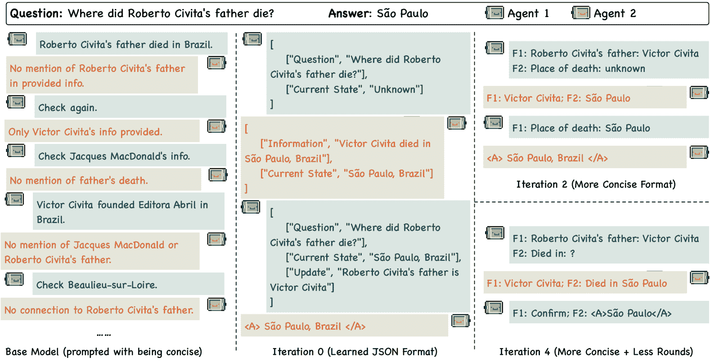

图 4：案例研究：Optima-iSFT 在 2WMH QA 上跨迭代的智能体通信演变。为简洁起见，省略了给两位智能体提供的不同背景。该进展展示了通信效率和任务导向沟通的逐步提升。

[图1](https://arxiv.org/html/2410.08115v1#S0.F1 "在Optima：优化基于LLM的多代理系统的效能和效率")展示了Optima变体在优化迭代过程中的性能提升和令牌效率，揭示了一种独特的两阶段优化模式。在初始阶段（第0-1次迭代），我们观察到所有Optima变体的任务表现显著提高，并伴随着令牌使用的明显增加。这表明Optima在初期优先考虑效能，允许代理通过扩展沟通来开发复杂的解决问题的策略。随后的迭代展示了Optima精炼这些策略以提高效率，而不牺牲性能。我们观察到所有变体的令牌使用量逐渐但持续减少，同时性能仍在不断提升。

为了提供具体的例子来说明Optima如何塑造代理之间的沟通，我们展示了来自iSFT的一个案例，涉及[图4](https://arxiv.org/html/2410.08115v1#S3.F4 "在3.5章节中，代理沟通如何随着优化迭代发展 ‣ 3 实验 ‣ Optima：优化基于LLM的多代理系统的效能和效率")中的信息交换任务。基础模型展示了无焦点且重复的交流，未能高效地完成任务。在第0次迭代时，虽然交流更加结构化，但内容冗长且包含了不必要的元数据。到第2次迭代时，我们观察到一种显著的变化，交流变得简洁、以任务为导向，代理采用了一种简化格式，能够高效地传达关键信息。最后一次迭代进一步优化，代理保持了高效的结构，同时消除了任何多余的冗长。这一进展与我们的定量研究结果一致，展示了Optima能够形成既高效又极具成效的沟通模式。

## 4 相关工作

基于LLM的MAS。基于LLM的MAS已成为应对各种领域复杂任务的强大范式。Liang等人（[2023](https://arxiv.org/html/2410.08115v1#bib.bib33)）和Du等人（[2024](https://arxiv.org/html/2410.08115v1#bib.bib12)）的开创性工作展示了LLM驱动的代理在通过多代理辩论进行协作性问题解决中的潜力。这个基础激发了多种研究方向，包括用于复杂推理的角色扮演（Wang等人，[2024b](https://arxiv.org/html/2410.08115v1#bib.bib53); Chen等人，[2024b](https://arxiv.org/html/2410.08115v1#bib.bib8)），协作软件开发（Qian等人，[2024c](https://arxiv.org/html/2410.08115v1#bib.bib44); Hong等人，[2024](https://arxiv.org/html/2410.08115v1#bib.bib22); Ishibashi & Nishimura，[2024](https://arxiv.org/html/2410.08115v1#bib.bib24)），以及具身代理交互（Zhang等人，[2024](https://arxiv.org/html/2410.08115v1#bib.bib60); Mandi等人，[2024](https://arxiv.org/html/2410.08115v1#bib.bib36); Guo等人，[2024](https://arxiv.org/html/2410.08115v1#bib.bib17)）。近期的研究表明，增加代理的数量和多样性可以提高MAS的性能（Wang等人，[2024a](https://arxiv.org/html/2410.08115v1#bib.bib51); Li等人，[2024a](https://arxiv.org/html/2410.08115v1#bib.bib31); Chen等人，[2024c](https://arxiv.org/html/2410.08115v1#bib.bib9)）。然而，随着基于LLM的MAS在规模和复杂度上不断扩展，计算成本和通信效率相关的挑战变得更加突出（Chen等人，[2024d](https://arxiv.org/html/2410.08115v1#bib.bib10); Li等人，[2024b](https://arxiv.org/html/2410.08115v1#bib.bib32)）。值得注意的是，缺乏专门设计的系统化训练算法来优化基于LLM的多代理系统的有效性和效率，大多数现有方法依赖于更新代理内存（Qian等人，[2024a](https://arxiv.org/html/2410.08115v1#bib.bib42); Gao等人，[2024](https://arxiv.org/html/2410.08115v1#bib.bib15)）。我们的工作通过引入一个训练框架，填补了这一空白，该框架能够同时提高基于LLM的MAS的通信效率和任务有效性。

LLM的迭代精炼。LLM的持续改进推动了各种迭代精炼范式的发展。尽管自我反思机制，如Reflexion（Shinn等， [2023](https://arxiv.org/html/2410.08115v1#bib.bib48)）和self-refine（Madaan等， [2023](https://arxiv.org/html/2410.08115v1#bib.bib35)）显示出潜力，但它们在很大程度上依赖于LLM有限的自我修正能力，而大多数当前的LLM在这方面较为薄弱（Huang等， [2024](https://arxiv.org/html/2410.08115v1#bib.bib23)；Olausson等， [2024](https://arxiv.org/html/2410.08115v1#bib.bib39)；Kamoi等， [2024](https://arxiv.org/html/2410.08115v1#bib.bib27)）。更为强大的方法侧重于迭代参数更新，例如，ReST（Gülçehre等， [2023](https://arxiv.org/html/2410.08115v1#bib.bib16)），ReST${}^{\text{EM}}$（Singh等， [2024](https://arxiv.org/html/2410.08115v1#bib.bib49)）和STaR（Zelikman等， [2022](https://arxiv.org/html/2410.08115v1#bib.bib59)）通过在自生成的高质量推理路径上训练模型，Pang等（[2024](https://arxiv.org/html/2410.08115v1#bib.bib41)）进一步整合了不正确的自生成路径并通过DPO训练模型。扩展到复杂的多步任务（Aksitov等， [2023](https://arxiv.org/html/2410.08115v1#bib.bib1)）进一步展示了这些方法的多样性。然而，迭代精炼在基于LLM的MAS背景下仍然是一个较为未被探索的领域。我们的工作通过提出首个有效的框架，旨在MAS背景下迭代优化LLM。通过同时提高通信效率和任务效果，我们的方法展示了迭代训练在MAS中的潜力。

## 5 结论

我们提出了Optima，一个新颖的框架，用于训练基于LLM的MAS，它显著提高了通信效率和任务执行性能。通过在一系列任务中的广泛实验，展示了Optima在单代理和多代理基准上的一致性优势。该框架引入了关键的创新，如迭代训练技术、平衡的奖励函数，以及一个受MCTS启发的数据生成方法。Optima还显示出在增强推理扩展规律和将知识迁移到OOD任务方面的潜力。这些发现突显了高效通信在MAS和LLM系统中的关键作用。尽管Optima标志着多代理LLM训练的重大进展，但进一步探索其在更大模型和更复杂场景中的可扩展性是未来研究的一个有前景的方向。

## 参考文献

+   Aksitov 等人（2023）Renat Aksitov, Sobhan Miryoosefi, Zonglin Li, Daliang Li, Sheila Babayan, Kavya Kopparapu, Zachary Fisher, Ruiqi Guo, Sushant Prakash, Pranesh Srinivasan, Manzil Zaheer, Felix X. Yu 和 Sanjiv Kumar. Rest meets react：多步推理 LLM 代理的自我提升。*CoRR*，abs/2312.10003，2023。doi: 10.48550/ARXIV.2312.10003。网址 [https://doi.org/10.48550/arXiv.2312.10003](https://doi.org/10.48550/arXiv.2312.10003).

+   Anthropic（2024）Anthropic. Claude 3.5 sonnet，2024。网址 [https://www.anthropic.com/news/claude-3-5-sonnet](https://www.anthropic.com/news/claude-3-5-sonnet).

+   Baker 等人（2020）Bowen Baker, Ingmar Kanitscheider, Todor M. Markov, Yi Wu, Glenn Powell, Bob McGrew 和 Igor Mordatch. 来自多智能体自适应课程的工具使用突现。在 *第八届国际学习表示大会，ICLR 2020，埃塞俄比亚亚的斯亚贝巴，2020年4月26日至30日*。OpenReview.net，2020。网址 [https://openreview.net/forum?id=SkxpxJBKwS](https://openreview.net/forum?id=SkxpxJBKwS).

+   Bhakthavatsalam 等人（2021）Sumithra Bhakthavatsalam, Daniel Khashabi, Tushar Khot, Bhavana Dalvi Mishra, Kyle Richardson, Ashish Sabharwal, Carissa Schoenick, Oyvind Tafjord 和 Peter Clark. 你认为自己已经解决了直接回答问题？试试 arc-da，直接回答 AI2 推理挑战。*CoRR*，abs/2102.03315，2021。网址 [https://arxiv.org/abs/2102.03315](https://arxiv.org/abs/2102.03315).

+   Brown 等人（2024）Bradley C. A. Brown, Jordan Juravsky, Ryan Saul Ehrlich, Ronald Clark, Quoc V. Le, Christopher Ré 和 Azalia Mirhoseini. 大型语言猴子：通过重复采样扩展推理计算。*CoRR*，abs/2407.21787，2024。doi: 10.48550/ARXIV.2407.21787。网址 [https://doi.org/10.48550/arXiv.2407.21787](https://doi.org/10.48550/arXiv.2407.21787).

+   Chaabouni 等人（2022）Rahma Chaabouni, Florian Strub, Florent Altché, Eugene Tarassov, Corentin Tallec, Elnaz Davoodi, Kory Wallace Mathewson, Olivier Tieleman, Angeliki Lazaridou 和 Bilal Piot. 大规模的突现通信。在 *第十届国际学习表示大会，ICLR 2022，虚拟会议，2022年4月25日至29日*。OpenReview.net，2022。网址 [https://openreview.net/forum?id=AUGBfDIV9rL](https://openreview.net/forum?id=AUGBfDIV9rL).

+   Chen 等人（2024a）Lingjiao Chen, Jared Quincy Davis, Boris Hanin, Peter Bailis, Ion Stoica, Matei Zaharia 和 James Zou. 仅仅更多的 LLM 调用就够了吗？迈向复合推理系统的扩展法则。*CoRR*，abs/2403.02419，2024a。doi: 10.48550/ARXIV.2403.02419。网址 [https://doi.org/10.48550/arXiv.2403.02419](https://doi.org/10.48550/arXiv.2403.02419).

+   Chen 等人（2024b）Weize Chen、Yusheng Su、Jingwei Zuo、Cheng Yang、Chenfei Yuan、Chi-Min Chan、Heyang Yu、Yaxi Lu、Yi-Hsin Hung、Chen Qian、Yujia Qin、Xin Cong、Ruobing Xie、Zhiyuan Liu、Maosong Sun 和 Jie Zhou。Agentverse：促进多代理协作并探索涌现行为。发表于*第十二届国际学习表征会议，ICLR 2024，奥地利维也纳，2024年5月7-11日*。OpenReview.net，2024b。URL [https://openreview.net/forum?id=EHg5GDnyq1](https://openreview.net/forum?id=EHg5GDnyq1)。

+   Chen 等人（2024c）Weize Chen、Ziming You、Ran Li、Yitong Guan、Chen Qian、Chenyang Zhao、Cheng Yang、Ruobing Xie、Zhiyuan Liu 和 Maosong Sun。代理互联网：为协作智能编织异构代理的网络。*CoRR*，abs/2407.07061，2024c。doi: 10.48550/ARXIV.2407.07061。URL [https://doi.org/10.48550/arXiv.2407.07061](https://doi.org/10.48550/arXiv.2407.07061)。

+   Chen 等人（2024d）Weize Chen、Chenfei Yuan、Jiarui Yuan、Yusheng Su、Chen Qian、Cheng Yang、Ruobing Xie、Zhiyuan Liu 和 Maosong Sun。超越自然语言：利用替代格式增强推理与沟通的 LLMs。*CoRR*，abs/2402.18439，2024d。doi: 10.48550/ARXIV.2402.18439。URL [https://doi.org/10.48550/arXiv.2402.18439](https://doi.org/10.48550/arXiv.2402.18439)。

+   Cobbe 等人（2021）Karl Cobbe、Vineet Kosaraju、Mohammad Bavarian、Mark Chen、Heewoo Jun、Lukasz Kaiser、Matthias Plappert、Jerry Tworek、Jacob Hilton、Reiichiro Nakano、Christopher Hesse 和 John Schulman。训练验证者解决数学文字问题。*CoRR*，abs/2110.14168，2021。URL [https://arxiv.org/abs/2110.14168](https://arxiv.org/abs/2110.14168)。

+   Du 等人（2024）Yilun Du、Shuang Li、Antonio Torralba、Joshua B. Tenenbaum 和 Igor Mordatch。通过多代理辩论提升语言模型的事实性和推理能力。发表于*第四十一届国际机器学习会议，ICML 2024，奥地利维也纳，2024年7月21-27日*。OpenReview.net，2024。URL [https://openreview.net/forum?id=zj7YuTE4t8](https://openreview.net/forum?id=zj7YuTE4t8)。

+   Dubois 等人（2024）Yann Dubois、Balázs Galambosi、Percy Liang 和 Tatsunori B. Hashimoto。长度控制的 alpacaeval：一种简单的方式来消除自动评估器的偏差。*CoRR*，abs/2404.04475，2024。doi: 10.48550/ARXIV.2404.04475。URL [https://doi.org/10.48550/arXiv.2404.04475](https://doi.org/10.48550/arXiv.2404.04475)。

+   Evtimova 等人（2018）Katrina Evtimova、Andrew Drozdov、Douwe Kiela 和 Kyunghyun Cho。在一个多模态、多步骤指代游戏中涌现的沟通。发表于*第六届国际学习表征会议，ICLR 2018，加拿大温哥华，2018年4月30日-5月3日，会议论文集*。OpenReview.net，2018。URL [https://openreview.net/forum?id=rJGZq6g0-](https://openreview.net/forum?id=rJGZq6g0-)。

+   Gao等人（2024）Shen Gao、Hao Li、Zhengliang Shi、Chengrui Huang、Quan Tu、Zhiliang Tian、Minlie Huang 和 Shuo Shang。360{\deg}rea：朝着通过360{\deg}评估实现可重用经验积累的方向，为多智能体系统提供支持。*CoRR*，abs/2404.05569，2024年。doi: 10.48550/ARXIV.2404.05569。网址 [https://doi.org/10.48550/arXiv.2404.05569](https://doi.org/10.48550/arXiv.2404.05569)。

+   Gülçehre等人（2023）Çaglar Gülçehre、Tom Le Paine、Srivatsan Srinivasan、Ksenia Konyushkova、Lotte Weerts、Abhishek Sharma、Aditya Siddhant、Alex Ahern、Miaosen Wang、Chenjie Gu、Wolfgang Macherey、Arnaud Doucet、Orhan Firat 和 Nando de Freitas。强化自训练（rest）用于语言建模。*CoRR*，abs/2308.08998，2023年。doi: 10.48550/ARXIV.2308.08998。网址 [https://doi.org/10.48550/arXiv.2308.08998](https://doi.org/10.48550/arXiv.2308.08998)。

+   Guo等人（2024）Xudong Guo、Kaixuan Huang、Jiale Liu、Wenhui Fan、Natalia Vélez、Qingyun Wu、Huazheng Wang、Thomas L. Griffiths 和 Mengdi Wang。具身LLM智能体学习在有组织的团队中合作。*CoRR*，abs/2403.12482，2024年。doi: 10.48550/ARXIV.2403.12482。网址 [https://doi.org/10.48550/arXiv.2403.12482](https://doi.org/10.48550/arXiv.2403.12482)。

+   Hendrycks等人（2021a）Dan Hendrycks、Collin Burns、Steven Basart、Andy Zou、Mantas Mazeika、Dawn Song 和 Jacob Steinhardt。测量大规模多任务语言理解。在*第9届国际学习表示会议（ICLR 2021）*，2021年5月3-7日，奥地利，虚拟会议。OpenReview.net，2021a年。网址 [https://openreview.net/forum?id=d7KBjmI3GmQ](https://openreview.net/forum?id=d7KBjmI3GmQ)。

+   Hendrycks等人（2021b）Dan Hendrycks、Collin Burns、Saurav Kadavath、Akul Arora、Steven Basart、Eric Tang、Dawn Song 和 Jacob Steinhardt。通过MATH数据集测量数学问题求解。在Joaquin Vanschoren和Sai-Kit Yeung（编），*神经信息处理系统数据集与基准轨道会议论文集1，NeurIPS数据集与基准2021，2021年12月，虚拟*，2021b年。网址 [https://datasets-benchmarks-proceedings.neurips.cc/paper/2021/hash/be83ab3ecd0db773eb2dc1b0a17836a1-Abstract-round2.html](https://datasets-benchmarks-proceedings.neurips.cc/paper/2021/hash/be83ab3ecd0db773eb2dc1b0a17836a1-Abstract-round2.html)。

+   Hill等人（2016）Felix Hill、Antoine Bordes、Sumit Chopra 和 Jason Weston。Goldilocks原理：阅读儿童书籍并具有明确的记忆表示。在Yoshua Bengio和Yann LeCun（编），*第4届国际学习表示会议（ICLR 2016）*，2016年5月2-4日，波多黎各圣胡安，会议论文集，2016年。网址 [http://arxiv.org/abs/1511.02301](http://arxiv.org/abs/1511.02301)。

+   Ho 等人（2020）Xanh Ho、Anh-Khoa Duong Nguyen、Saku Sugawara 和 Akiko Aizawa。构建一个多跳问答数据集，以全面评估推理步骤。在 Donia Scott、Núria Bel 和 Chengqing Zong（编），*第28届国际计算语言学会议论文集，COLING 2020，西班牙巴塞罗那（在线），2020年12月8日至13日*，第6609-6625页。国际计算语言学委员会，2020年。doi: 10.18653/V1/2020.COLING-MAIN.580。URL [https://doi.org/10.18653/v1/2020.coling-main.580](https://doi.org/10.18653/v1/2020.coling-main.580)。

+   Hong 等人（2024）Sirui Hong、Mingchen Zhuge、Jonathan Chen、Xiawu Zheng、Yuheng Cheng、Jinlin Wang、Ceyao Zhang、Zili Wang、Steven Ka Shing Yau、Zijuan Lin、Liyang Zhou、Chenyu Ran、Lingfeng Xiao、Chenglin Wu 和 Jürgen Schmidhuber。《MetaGPT：面向多代理协作框架的元编程》。在*第十二届国际学习表征会议，ICLR 2024，奥地利维也纳，2024年5月7日至11日*。OpenReview.net，2024年。URL [https://openreview.net/forum?id=VtmBAGCN7o](https://openreview.net/forum?id=VtmBAGCN7o)。

+   Huang 等人（2024）Jie Huang、Xinyun Chen、Swaroop Mishra、Huaixiu Steven Zheng、Adams Wei Yu、Xinying Song 和 Denny Zhou。《大型语言模型尚不能自我纠正推理》。在*第十二届国际学习表征会议，ICLR 2024，奥地利维也纳，2024年5月7日至11日*。OpenReview.net，2024年。URL [https://openreview.net/forum?id=IkmD3fKBPQ](https://openreview.net/forum?id=IkmD3fKBPQ)。

+   Ishibashi & Nishimura（2024）Yoichi Ishibashi 和 Yoshimasa Nishimura。《自组织代理：面向超大规模代码生成和优化的LLM多代理框架》。*CoRR*，abs/2404.02183，2024年。doi: 10.48550/ARXIV.2404.02183。URL [https://doi.org/10.48550/arXiv.2404.02183](https://doi.org/10.48550/arXiv.2404.02183)。

+   Johnson 等人（2000）Jeffrey D. Johnson、Jinghong Li 和 Zengshi Chen。《强化学习：简介》：R.S. Sutton, A.G. Barto，MIT出版社，剑桥，马萨诸塞州 1998年，322页。ISBN 0-262-19398-1。*Neurocomputing*，35(1-4):205–206，2000。doi: 10.1016/S0925-2312(00)00324-6。URL [https://doi.org/10.1016/S0925-2312(00)00324-6](https://doi.org/10.1016/S0925-2312(00)00324-6)。

+   Joshi 等人（2017）Mandar Joshi、Eunsol Choi、Daniel S. Weld 和 Luke Zettlemoyer。《TriviaQA：一个大规模远程监督的阅读理解挑战数据集》。在 Regina Barzilay 和 Min-Yen Kan（编），*第55届计算语言学协会年会论文集，ACL 2017，加拿大温哥华，2017年7月30日至8月4日，第1卷：长篇论文*，第1601-1611页。计算语言学协会，2017年。doi: 10.18653/V1/P17-1147。URL [https://doi.org/10.18653/v1/P17-1147](https://doi.org/10.18653/v1/P17-1147)。

+   Kamoi 等人（2024）Ryo Kamoi、Yusen Zhang、Nan Zhang、Jiawei Han 和 Rui Zhang。何时大型语言模型（LLMs）能够真正纠正自己的错误？关于大型语言模型自我纠错的关键性调查。*CoRR*，abs/2406.01297，2024。doi: 10.48550/ARXIV.2406.01297。网址 [https://doi.org/10.48550/arXiv.2406.01297](https://doi.org/10.48550/arXiv.2406.01297)。

+   Lanctot 等人（2017）Marc Lanctot、Vinícius Flores Zambaldi、Audrunas Gruslys、Angeliki Lazaridou、Karl Tuyls、Julien Pérolat、David Silver 和 Thore Graepel。一个统一的博弈论方法用于多智能体强化学习。发表于 Isabelle Guyon、Ulrike von Luxburg、Samy Bengio、Hanna M. Wallach、Rob Fergus、S. V. N. Vishwanathan 和 Roman Garnett（编），*神经信息处理系统进展 30：2017年神经信息处理系统年会（NeurIPS 2017），美国加利福尼亚州长滩，2017年12月4日至9日*，第4190–4203页，2017。网址 [https://proceedings.neurips.cc/paper/2017/hash/3323fe11e9595c09af38fe67567a9394-Abstract.html](https://proceedings.neurips.cc/paper/2017/hash/3323fe11e9595c09af38fe67567a9394-Abstract.html)。

+   Lazaridou 等人（2017）Angeliki Lazaridou、Alexander Peysakhovich 和 Marco Baroni。多智能体合作与（自然）语言的出现。发表于 *第五届国际学习表示会议（ICLR 2017），法国土伦，2017年4月24日至26日，会议轨道论文集*。OpenReview.net，2017。网址 [https://openreview.net/forum?id=Hk8N3Sclg](https://openreview.net/forum?id=Hk8N3Sclg)。

+   Lewkowycz 等人（2022）Aitor Lewkowycz、Anders Andreassen、David Dohan、Ethan Dyer、Henryk Michalewski、Vinay V. Ramasesh、Ambrose Slone、Cem Anil、Imanol Schlag、Theo Gutman-Solo、Yuhuai Wu、Behnam Neyshabur、Guy Gur-Ari 和 Vedant Misra。利用语言模型解决定量推理问题。发表于 Sanmi Koyejo、S. Mohamed、A. Agarwal、Danielle Belgrave、K. Cho 和 A. Oh（编），*神经信息处理系统进展 35：2022年神经信息处理系统年会（NeurIPS 2022），美国路易斯安那州新奥尔良，2022年11月28日至12月9日*，2022。网址 [http://papers.nips.cc/paper_files/paper/2022/hash/18abbeef8cfe9203fdf9053c9c4fe191-Abstract-Conference.html](http://papers.nips.cc/paper_files/paper/2022/hash/18abbeef8cfe9203fdf9053c9c4fe191-Abstract-Conference.html)。

+   Li 等人（2024a）Junyou Li、Qin Zhang、Yangbin Yu、Qiang Fu 和 Deheng Ye。更多的智能体就是你所需要的。*CoRR*，abs/2402.05120，2024a。doi: 10.48550/ARXIV.2402.05120。网址 [https://doi.org/10.48550/arXiv.2402.05120](https://doi.org/10.48550/arXiv.2402.05120)。

+   Li 等人（2024b）Yunxuan Li、Yibing Du、Jiageng Zhang、Le Hou、Peter Grabowski、Yeqing Li 和 Eugene Ie。通过稀疏通信拓扑改善多智能体辩论。*CoRR*，abs/2406.11776，2024b。doi: 10.48550/ARXIV.2406.11776。网址 [https://doi.org/10.48550/arXiv.2406.11776](https://doi.org/10.48550/arXiv.2406.11776)。

+   Liang 等人（2023）Tian Liang, Zhiwei He, Wenxiang Jiao, Xing Wang, Yan Wang, Rui Wang, Yujiu Yang, Zhaopeng Tu 和 Shuming Shi。通过多智能体辩论鼓励大型语言模型的发散性思维。*CoRR*，abs/2305.19118，2023。doi: 10.48550/ARXIV.2305.19118。网址 [https://doi.org/10.48550/arXiv.2305.19118](https://doi.org/10.48550/arXiv.2305.19118)。

+   Liu 等人（2024）Wei Liu, Chenxi Wang, Yifei Wang, Zihao Xie, Rennai Qiu, Yufan Dang, Zhuoyun Du, Weize Chen, Cheng Yang 和 Chen Qian。信息不对称下的协作任务自主智能体。*CoRR*，abs/2406.14928，2024。doi: 10.48550/ARXIV.2406.14928。网址 [https://doi.org/10.48550/arXiv.2406.14928](https://doi.org/10.48550/arXiv.2406.14928)。

+   Madaan 等人（2023）Aman Madaan, Niket Tandon, Prakhar Gupta, Skyler Hallinan, Luyu Gao, Sarah Wiegreffe, Uri Alon, Nouha Dziri, Shrimai Prabhumoye, Yiming Yang, Shashank Gupta, Bodhisattwa Prasad Majumder, Katherine Hermann, Sean Welleck, Amir Yazdanbakhsh 和 Peter Clark。Self-refine：带自我反馈的迭代精炼。收录于 Alice Oh, Tristan Naumann, Amir Globerson, Kate Saenko, Moritz Hardt 和 Sergey Levine（主编），*神经信息处理系统进展 36：2023 年神经信息处理系统年度会议，NeurIPS 2023，美国路易斯安那州新奥尔良，2023 年 12 月 10 日 - 16 日*，2023。网址 [http://papers.nips.cc/paper_files/paper/2023/hash/91edff07232fb1b55a505a9e9f6c0ff3-Abstract-Conference.html](http://papers.nips.cc/paper_files/paper/2023/hash/91edff07232fb1b55a505a9e9f6c0ff3-Abstract-Conference.html)。

+   Mandi 等人（2024）Zhao Mandi, Shreeya Jain 和 Shuran Song。Roco：与大型语言模型进行辩证式多机器人协作。收录于 *IEEE 国际机器人与自动化会议，ICRA 2024，日本横滨，2024 年 5 月 13 日 - 17 日*，第 286–299 页。IEEE，2024。doi: 10.1109/ICRA57147.2024.10610855。网址 [https://doi.org/10.1109/ICRA57147.2024.10610855](https://doi.org/10.1109/ICRA57147.2024.10610855)。

+   Meta（2024）Meta。Llama 3 模型卡。2024。网址 [https://github.com/meta-llama/llama3/blob/main/MODEL_CARD.md](https://github.com/meta-llama/llama3/blob/main/MODEL_CARD.md)。

+   Meurer 等人（2017）Aaron Meurer, Christopher P. Smith, Mateusz Paprocki, Ondrej Certík, Sergey B. Kirpichev, Matthew Rocklin, Amit Kumar, Sergiu Ivanov, Jason Keith Moore, Sartaj Singh, Thilina Rathnayake, Sean Vig, Brian E. Granger, Richard P. Muller, Francesco Bonazzi, Harsh Gupta, Shivam Vats, Fredrik Johansson, Fabian Pedregosa, Matthew J. Curry, Andy R. Terrel, Stepán Roucka, Ashutosh Saboo, Isuru Fernando, Sumith Kulal, Robert Cimrman 和 Anthony M. Scopatz。Sympy：Python中的符号计算。*PeerJ Comput. Sci.*，3:e103，2017。doi: 10.7717/PEERJ-CS.103。网址 [https://doi.org/10.7717/peerj-cs.103](https://doi.org/10.7717/peerj-cs.103)。

+   Olausson et al. (2024) Theo X. Olausson、Jeevana Priya Inala、王承龙、高剑锋 和 Armando Solar-Lezama。自修复是否是代码生成的“灵丹妙药”？收录于*《第十二届国际学习表征会议，ICLR 2024，奥地利维也纳，2024年5月7日至11日》*。OpenReview.net，2024。网址：[https://openreview.net/forum?id=y0GJXRungR](https://openreview.net/forum?id=y0GJXRungR)。

+   OpenAI (2023) OpenAI。GPT-4技术报告。*CoRR*，abs/2303.08774，2023。doi: 10.48550/ARXIV.2303.08774。网址：[https://doi.org/10.48550/arXiv.2303.08774](https://doi.org/10.48550/arXiv.2303.08774)。

+   Pang et al. (2024) Richard Yuanzhe Pang、袁伟哲、Cho Kyunghyun、何赫、Sainbayar Sukhbaatar 和 Jason Weston。迭代推理偏好优化。*CoRR*，abs/2404.19733，2024。doi: 10.48550/ARXIV.2404.19733。网址：[https://doi.org/10.48550/arXiv.2404.19733](https://doi.org/10.48550/arXiv.2404.19733)。

+   Qian et al. (2024a) 陈乾、邓宇凡、李家豪、刘威、谢子豪、王一飞、陈维泽、杨澄、从鑫、车晓音、刘志远、孙茂松。软件开发智能体的经验共同学习。收录于Lun-Wei Ku、Andre Martins 和 Vivek Srikumar（编），*《第62届计算语言学会年会论文集（卷1：长篇论文）》，ACL 2024，泰国曼谷，2024年8月11日至16日*，第5628-5640页。计算语言学会，2024a。网址：[https://aclanthology.org/2024.acl-long.305](https://aclanthology.org/2024.acl-long.305)。

+   Qian et al. (2024b) 陈乾、李家豪、邓宇凡、刘威、王一飞、谢子豪、陈维泽、杨澄、张颖丽、刘志远、孙茂松。软件开发智能体的迭代经验优化。*CoRR*，abs/2405.04219，2024b。doi: 10.48550/ARXIV.2405.04219。网址：[https://doi.org/10.48550/arXiv.2405.04219](https://doi.org/10.48550/arXiv.2405.04219)。

+   Qian et al. (2024c) 陈乾、刘威、刘洪章、陈诺、邓宇凡、李家豪、杨澄、陈维泽、苏宇生、从鑫、许具源、李大海、刘志远、孙茂松。Chatdev: 软件开发中的沟通型智能体。收录于Lun-Wei Ku、Andre Martins 和 Vivek Srikumar（编），*《第62届计算语言学会年会论文集（卷1：长篇论文）》，ACL 2024，泰国曼谷，2024年8月11日至16日*，第15174-15186页。计算语言学会，2024c。网址：[https://aclanthology.org/2024.acl-long.810](https://aclanthology.org/2024.acl-long.810)。

+   Rafailov等人（2023年）Rafael Rafailov, Archit Sharma, Eric Mitchell, Christopher D. Manning, Stefano Ermon, 和 Chelsea Finn。直接偏好优化：你的语言模型实际上是一个奖励模型。在Alice Oh, Tristan Naumann, Amir Globerson, Kate Saenko, Moritz Hardt 和 Sergey Levine（编辑）*神经信息处理系统进展 36：神经信息处理系统年度会议 2023，NeurIPS 2023，新奥尔良，路易斯安那州，美国，2023年12月10日至16日*，2023年。网址 [http://papers.nips.cc/paper_files/paper/2023/hash/a85b405ed65c6477a4fe8302b5e06ce7-Abstract-Conference.html](http://papers.nips.cc/paper_files/paper/2023/hash/a85b405ed65c6477a4fe8302b5e06ce7-Abstract-Conference.html)。

+   Reid等人（2024年）Machel Reid, Nikolay Savinov, Denis Teplyashin, Dmitry Lepikhin, Timothy P. Lillicrap, Jean-Baptiste Alayrac, Radu Soricut, Angeliki Lazaridou, Orhan Firat, Julian Schrittwieser, Ioannis Antonoglou, Rohan Anil, Sebastian Borgeaud, Andrew M. Dai, Katie Millican, Ethan Dyer, Mia Glaese, Thibault Sottiaux, Benjamin Lee, Fabio Viola, Malcolm Reynolds, Yuanzhong Xu, James Molloy, Jilin Chen, Michael Isard, Paul Barham, Tom Hennigan, Ross McIlroy, Melvin Johnson, Johan Schalkwyk, Eli Collins, Eliza Rutherford, Erica Moreira, Kareem Ayoub, Megha Goel, Clemens Meyer, Gregory Thornton, Zhen Yang, Henryk Michalewski, Zaheer Abbas, Nathan Schucher, Ankesh Anand, Richard Ives, James Keeling, Karel Lenc, Salem Haykal, Siamak Shakeri, Pranav Shyam, Aakanksha Chowdhery, Roman Ring, Stephen Spencer, Eren Sezener等人。*Gemini 1.5: 解锁跨越数百万标记的多模态理解*。*CoRR*, abs/2403.05530, 2024年。doi: 10.48550/ARXIV.2403.05530。网址 [https://doi.org/10.48550/arXiv.2403.05530](https://doi.org/10.48550/arXiv.2403.05530)。

+   Saito等人（2023年）Keita Saito, Akifumi Wachi, Koki Wataoka, 和 Youhei Akimoto。大型语言模型中的偏好标注中的冗长偏向。*CoRR*, abs/2310.10076, 2023年。doi: 10.48550/ARXIV.2310.10076。网址 [https://doi.org/10.48550/arXiv.2310.10076](https://doi.org/10.48550/arXiv.2310.10076)。

+   Shinn等人（2023年）Noah Shinn, Federico Cassano, Ashwin Gopinath, Karthik Narasimhan, 和 Shunyu Yao。Reflexion：带有语言强化学习的语言代理。在Alice Oh, Tristan Naumann, Amir Globerson, Kate Saenko, Moritz Hardt 和 Sergey Levine（编辑）*神经信息处理系统进展 36：神经信息处理系统年度会议 2023，NeurIPS 2023，新奥尔良，路易斯安那州，美国，2023年12月10日至16日*，2023年。网址 [http://papers.nips.cc/paper_files/paper/2023/hash/1b44b878bb782e6954cd888628510e90-Abstract-Conference.html](http://papers.nips.cc/paper_files/paper/2023/hash/1b44b878bb782e6954cd888628510e90-Abstract-Conference.html)。

+   Singh 等人（2024）Avi Singh, John D. Co-Reyes, Rishabh Agarwal, Ankesh Anand, Piyush Patil, Xavier Garcia, Peter J. Liu, James Harrison, Jaehoon Lee, Kelvin Xu, Aaron T. Parisi, Abhishek Kumar, Alexander A. Alemi, Alex Rizkowsky, Azade Nova, Ben Adlam, Bernd Bohnet, Gamaleldin Fathy Elsayed, Hanie Sedghi, Igor Mordatch, Isabelle Simpson, Izzeddin Gur, Jasper Snoek, Jeffrey Pennington, Jiri Hron, Kathleen Kenealy, Kevin Swersky, Kshiteej Mahajan, Laura Culp, Lechao Xiao, Maxwell L. Bileschi, Noah Constant, Roman Novak, Rosanne Liu, Tris Warkentin, Yundi Qian, Yamini Bansal, Ethan Dyer, Behnam Neyshabur, Jascha Sohl-Dickstein 和 Noah Fiedel。超越人类数据：通过自我训练扩展问题解决能力与语言模型。*Trans. Mach. Learn. Res.*, 2024, 2024. URL [https://openreview.net/forum?id=lNAyUngGFK](https://openreview.net/forum?id=lNAyUngGFK).

+   Song 等人（2024）Yifan Song, Da Yin, Xiang Yue, Jie Huang, Sujian Li 和 Bill Yuchen Lin。试验与错误：基于探索的轨迹优化用于LLM代理。*CoRR*, abs/2403.02502, 2024. doi: 10.48550/ARXIV.2403.02502. URL [https://doi.org/10.48550/arXiv.2403.02502](https://doi.org/10.48550/arXiv.2403.02502).

+   Wang 等人（2024a）Junlin Wang, Jue Wang, Ben Athiwaratkun, Ce Zhang 和 James Zou。混合代理增强大语言模型的能力。*CoRR*, abs/2406.04692, 2024a. doi: 10.48550/ARXIV.2406.04692. URL [https://doi.org/10.48550/arXiv.2406.04692](https://doi.org/10.48550/arXiv.2406.04692).

+   Wang 等人（2023）Xuezhi Wang, Jason Wei, Dale Schuurmans, Quoc V. Le, Ed H. Chi, Sharan Narang, Aakanksha Chowdhery 和 Denny Zhou。自我一致性改善语言模型的思维链推理。在*第十一届国际学习表征会议，ICLR 2023，卢旺达基加利，2023年5月1日至5日*。OpenReview.net, 2023. URL [https://openreview.net/forum?id=1PL1NIMMrw](https://openreview.net/forum?id=1PL1NIMMrw).

+   Wang 等人（2024b）Zhenhailong Wang, Shaoguang Mao, Wenshan Wu, Tao Ge, Furu Wei 和 Heng Ji。释放大语言模型中的新兴认知协同：通过多角色自我协作的任务解决代理。在 Kevin Duh, Helena Gómez-Adorno 和 Steven Bethard（编），*2024年北美计算语言学协会会议：人类语言技术（第1卷：长篇论文），NAACL 2024，墨西哥城，墨西哥，2024年6月16日至21日*，第257–279页。计算语言学协会，2024b. doi: 10.18653/V1/2024.NAACL-LONG.15. URL [https://doi.org/10.18653/v1/2024.naacl-long.15](https://doi.org/10.18653/v1/2024.naacl-long.15).

+   Wei 等人 (2022) Jason Wei, Xuezhi Wang, Dale Schuurmans, Maarten Bosma, Brian Ichter, Fei Xia, Ed H. Chi, Quoc V. Le 和 Denny Zhou. 连锁思维提示引发大规模语言模型中的推理。发表于 Sanmi Koyejo, S. Mohamed, A. Agarwal, Danielle Belgrave, K. Cho 和 A. Oh (编)，*神经信息处理系统进展 35：2022 年神经信息处理系统年会，NeurIPS 2022，新奥尔良，路易斯安那州，美国，2022 年 11 月 28 日 - 12 月 9 日*，2022。网址 [http://papers.nips.cc/paper_files/paper/2022/hash/9d5609613524ecf4f15af0f7b31abca4-Abstract-Conference.html](http://papers.nips.cc/paper_files/paper/2022/hash/9d5609613524ecf4f15af0f7b31abca4-Abstract-Conference.html)。

+   Wu 等人 (2023) Qingyun Wu, Gagan Bansal, Jieyu Zhang, Yiran Wu, Shaokun Zhang, Erkang Zhu, Beibin Li, Li Jiang, Xiaoyun Zhang 和 Chi Wang. Autogen：通过多代理对话框架实现下一代 LLM 应用。*CoRR*，abs/2308.08155，2023。doi: 10.48550/ARXIV.2308.08155。网址 [https://doi.org/10.48550/arXiv.2308.08155](https://doi.org/10.48550/arXiv.2308.08155)。

+   Wu 等人 (2024) Yangzhen Wu, Zhiqing Sun, Shanda Li, Sean Welleck 和 Yiming Yang. 计算最优推理在语言模型问题求解中的经验分析。*CoRR*，abs/2408.00724，2024。doi: 10.48550/ARXIV.2408.00724。网址 [https://doi.org/10.48550/arXiv.2408.00724](https://doi.org/10.48550/arXiv.2408.00724)。

+   Xiong 等人 (2024) Weimin Xiong, Yifan Song, Xiutian Zhao, Wenhao Wu, Xun Wang, Ke Wang, Cheng Li, Wei Peng 和 Sujian Li. 观察每一步！通过迭代步骤级过程优化学习 LLM 代理。*CoRR*，abs/2406.11176，2024。doi: 10.48550/ARXIV.2406.11176。网址 [https://doi.org/10.48550/arXiv.2406.11176](https://doi.org/10.48550/arXiv.2406.11176)。

+   Yang 等人 (2018) Zhilin Yang, Peng Qi, Saizheng Zhang, Yoshua Bengio, William W. Cohen, Ruslan Salakhutdinov 和 Christopher D. Manning. Hotpotqa：一个多元、可解释的多跳问答数据集。发表于 Ellen Riloff, David Chiang, Julia Hockenmaier 和 Jun’ichi Tsujii (编)，*2018 年自然语言处理经验方法会议论文集，比利时布鲁塞尔，2018 年 10 月 31 日 - 11 月 4 日*，第 2369–2380 页。计算语言学协会，2018。doi: 10.18653/V1/D18-1259。网址 [https://doi.org/10.18653/v1/d18-1259](https://doi.org/10.18653/v1/d18-1259)。

+   Zelikman 等人（2022）Eric Zelikman, Yuhuai Wu, Jesse Mu, 和 Noah D. Goodman. Star: 使用推理自举推理. 在 Sanmi Koyejo, S. Mohamed, A. Agarwal, Danielle Belgrave, K. Cho, 和 A. Oh（编辑），*神经信息处理系统进展 35：2022年神经信息处理系统年会，NeurIPS 2022，美国路易斯安那州新奥尔良，2022年11月28日至12月9日*，2022年。网址 [http://papers.nips.cc/paper_files/paper/2022/hash/639a9a172c044fbb64175b5fad42e9a5-Abstract-Conference.html](http://papers.nips.cc/paper_files/paper/2022/hash/639a9a172c044fbb64175b5fad42e9a5-Abstract-Conference.html)。

+   Zhang 等人（2024）Hongxin Zhang, Weihua Du, Jiaming Shan, Qinhong Zhou, Yilun Du, Joshua B. Tenenbaum, Tianmin Shu, 和 Chuang Gan. 使用大型语言模型模块化构建协作性具身代理。发表于*第十二届国际学习表征会议，ICLR 2024，奥地利维也纳，2024年5月7日至11日*。OpenReview.net，2024年。网址 [https://openreview.net/forum?id=EnXJfQqy0K](https://openreview.net/forum?id=EnXJfQqy0K)。

+   Zhuge 等人（2024）Mingchen Zhuge, Wenyi Wang, Louis Kirsch, Francesco Faccio, Dmitrii Khizbullin, 和 Jürgen Schmidhuber. Gptswarm: 作为可优化图的语言代理。发表于*第41届国际机器学习会议，ICML 2024，奥地利维也纳，2024年7月21日至27日*。OpenReview.net，2024年。网址 [https://openreview.net/forum?id=uTC9AFXIhg](https://openreview.net/forum?id=uTC9AFXIhg)。

## 附录A 信息交换任务的推理规模规律

(a) iSFT 在辩论任务中的表现。

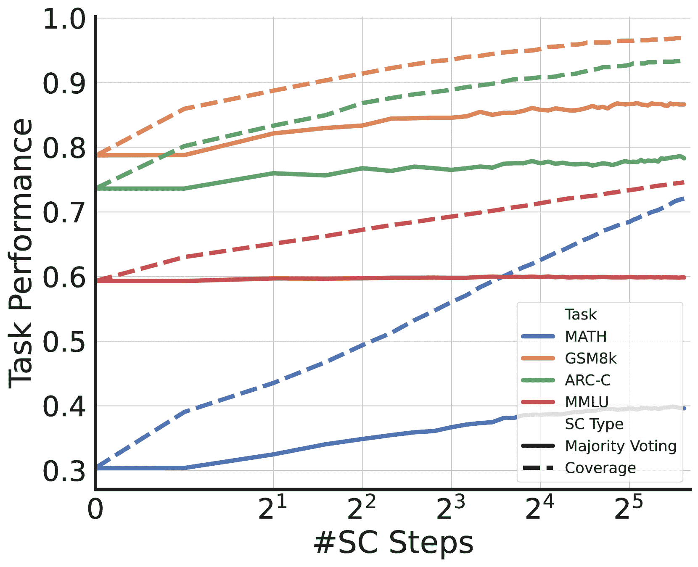

(b) iDPO 在辩论任务中的表现。

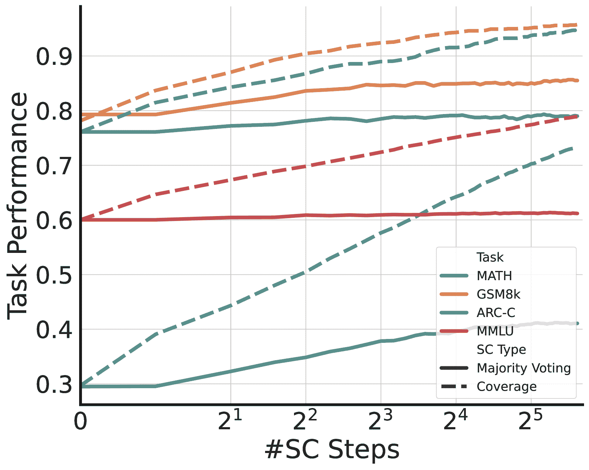

(c) iSFT-DPO 在辩论任务中的表现。

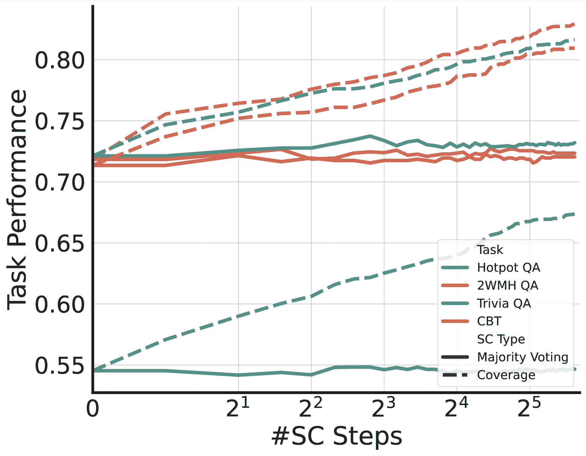

(d) iSFT 在信息交换（IE）任务中的表现。

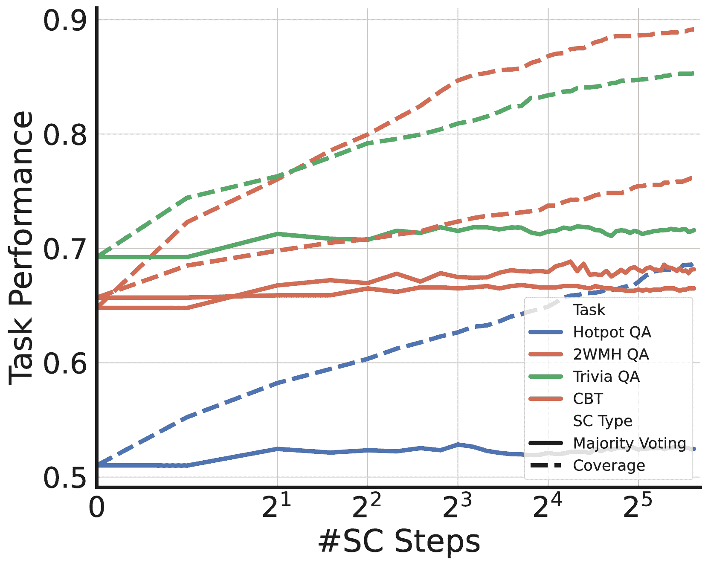

(e) iDPO 在信息交换（IE）任务中的表现。

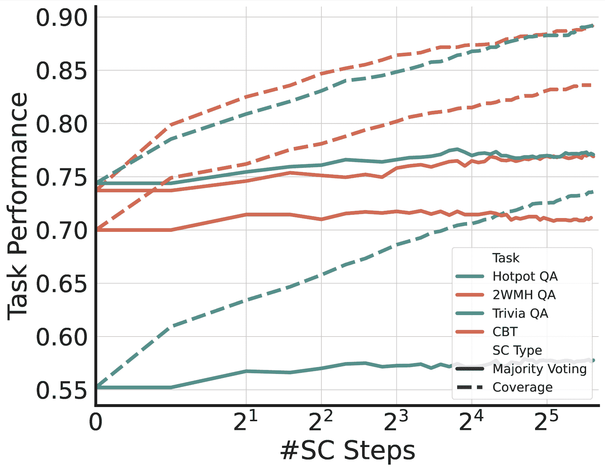

(f) iSFT-DPO 在信息交换（IE）任务中的表现。

图5：关于辩论和信息交换（IE）任务的Optima变体的推理规模规律。（a-c）分别显示了iSFT、iDPO和iSFT-DPO在辩论任务中的结果。（d-f）展示了信息交换任务的相应结果。实线表示多数投票准确度，虚线表示覆盖率。

本节将我们对推理扩展法则的分析扩展到信息交换（IE）任务，补充了主文中提出的辩论任务结果（[第 3.3 节](https://arxiv.org/html/2410.08115v1#S3.SS3 "3.3 Can Optima lead to Better Inference Scaling Law? ‣ 3 Experiments ‣ Optima: Optimizing Effectiveness and Efficiency for LLM-Based Multi-Agent System")）。[图 5](https://arxiv.org/html/2410.08115v1#A1.F5 "在附录 A 中，关于信息交换任务的推理扩展法则 ‣ Optima: 优化大规模语言模型（LLM）基础的多代理系统的有效性与效率") 提供了一个全面的视角，展示了随着 SC 步骤数量增加，Optima 各个变种在两种任务类型中的表现。

对于辩论任务（[图 5](https://arxiv.org/html/2410.08115v1#A1.F5 "在附录 A 中，关于信息交换任务的推理扩展法则 ‣ Optima: 优化大规模语言模型（LLM）基础的多代理系统的有效性与效率")a-c），我们观察到所有 Optima 变种的趋势一致。覆盖率与 SC 步骤数呈现明显的对数线性关系。这个趋势在 MATH 任务中尤为明显，其中通过增加采样的潜力最为显著。多数投票准确率趋于平台期，这表明可能需要更复杂的答案选择技术，才能充分利用生成响应的多样性。

对于信息交换任务（图 [5](https://arxiv.org/html/2410.08115v1#A1.F5 "图 5 ‣ 附录 A 推理扩展法则 - 信息交换任务 ‣ Optima: 优化大规模语言模型（LLM）基础的多代理系统")d-f），我们注意到所有 Optima 变种在覆盖率上也呈现出类似的对数线性扩展²²2在 IE 任务中，我们将覆盖率定义为所有生成答案中每个实例最高 F1 分数的平均值。尽管如此，信息交换任务的多数投票准确率提升不如辩论任务那样显著。这一差异可能归因于我们为 F1 分数设计的特定多数投票变种（详细说明见[第 3 节](https://arxiv.org/html/2410.08115v1#S3 "3 Experiments ‣ Optima: Optimizing Effectiveness and Efficiency for LLM-Based Multi-Agent System")），该变种可能并不适合捕捉这些任务中部分正确性的细微差别。

这些结果虽然突出了某些特定任务的差异，但整体上加强了通过增加推理计算，Optima训练模型从中受益的潜力。所有任务和变种中的覆盖率呈一致的对数线性扩展，表明通过更先进的答案选择策略或增加采样，性能还有很大的提升空间。

算法 3 多样化代理通信的初始化

1: 初始模型 $\mathcal{M}_{0}$，数据集 $\mathcal{D}$，格式池 $\mathcal{F}$，样本大小 $N$，奖励阈值 $\theta_{\text{init}}$  

算法 4 SelectNodeToExpand 函数  

1:树 $\mathcal{T}$，先前扩展的节点 $\mathcal{N}_{\text{prev}}$，编辑距离阈值 $\epsilon$，top-k $k$  

算法 5 基于 MCTS 的多智能体 DPO 数据生成

1:模型$\mathcal{M}$，任务实例$d$，迭代次数$I$，每个节点的轨迹数$K$，阈值$\theta_{\text{dpo-filter}}$，$\theta_{\text{dpo-diff}}$，编辑距离阈值$\epsilon$，top-k $k$2:用于DPO的配对轨迹3:$\text{root}\leftarrow\text{InitializeTree}(d)$4:$\mathcal{N}_{\text{prev}}\leftarrow\emptyset$ $\triangleright$ 已扩展节点的集合5:对于 $i=1$ 到 $I$ 执行6:     $n_{\text{select}}\leftarrow\text{SelectNodeToExpand}(\text{root},\mathcal{N}_{\text{prev}},\epsilon,k)$ $\triangleright$ 算法 [4](https://arxiv.org/html/2410.08115v1#alg4 "算法 4 ‣ 附录 A 信息交换任务的推理扩展法则 ‣ Optima: 基于LLM的多智能体系统的效能与效率优化")7:     $\mathcal{N}_{\text{prev}}\leftarrow\mathcal{N}_{\text{prev}}\cup\{n_{\text{select}}\}$8:     对于 $j=1$ 到 $K$ 执行9:         $\tau\leftarrow\text{AgentChat}(\{\text{Ancestor}(n_{\text{select}}),n_{\text{select}}\},\mathcal{M})$10:         $\text{BackPropagation}(R(\tau))$11:     结束 for12:结束 for13:$\mathcal{D}_{\text{DPO}}\leftarrow\emptyset$14:对于树中每一对节点$(n_{i},n_{j})$ 执行15:     如果 $\text{ShareAncestor}(n_{i},n_{j})$ 且 $\max(R(n_{i}),R(n_{j}))>\theta_{\text{dpo-filter}}$ 且 $|R(n_{i})-R(n_{j})|>\theta_{\text{dpo-diff}}$ 则16:         $\text{prompt}\leftarrow\text{CommonAncestor}(n_{i},n_{j})$17:         $\mathcal{D}_{\text{DPO}}\leftarrow\mathcal{D}_{\text{DPO}}\cup\{(\text{prompt},n_{i},n_{j})\}$18:     结束 if19:结束 for20:$\mathcal{D}_{\text{DPO}}\leftarrow\text{TopK}(\mathcal{D}_{\text{DPO}},0.5|\mathcal{D}_{\text{DPO}}|)$ $\triangleright$ 保留前50%的轨迹21:返回 $\mathcal{D}_{\text{DPO}}$

## 附录 B Optima变体的附加伪代码

为了阐明各种 Optima 变体的实现，我们展示了这些变体中几个关键过程的算法表示。具体来说，我们描述了（1）初始化数据集收集过程的伪代码，如[第 2.2 节](https://arxiv.org/html/2410.08115v1#S2.SS2 "2.2 Initialization: Diversifying Agent Communication ‣ 2 Optima: Optimizing Multi-Agent LLMs via Iterative Training ‣ Optima: Optimizing Effectiveness and Efficiency for LLM-Based Multi-Agent System")所述，并在[算法 3](https://arxiv.org/html/2410.08115v1#alg3 "In Appendix A Inference Scaling Laws on Information Exchange Tasks ‣ Optima: Optimizing Effectiveness and Efficiency for LLM-Based Multi-Agent System")中进行了说明；（2）iDPO 中基于蒙特卡洛树搜索的数据生成过程，如[第 2.4 节](https://arxiv.org/html/2410.08115v1#S2.SS4 "2.4 Framework Instantiation 2: Iterative Direct Preference Optimization ‣ 2 Optima: Optimizing Multi-Agent LLMs via Iterative Training ‣ Optima: Optimizing Effectiveness and Efficiency for LLM-Based Multi-Agent System")所示，并在[算法 5](https://arxiv.org/html/2410.08115v1#alg5 "In Appendix A Inference Scaling Laws on Information Exchange Tasks ‣ Optima: Optimizing Effectiveness and Efficiency for LLM-Based Multi-Agent System")中展示；（3）MCTS 扩展阶段中节点选择的过程，如[算法 4](https://arxiv.org/html/2410.08115v1#alg4 "In Appendix A Inference Scaling Laws on Information Exchange Tasks ‣ Optima: Optimizing Effectiveness and Efficiency for LLM-Based Multi-Agent System")所述。这些算法表示提供了对 Optima 变体背后的方法框架的全面且严谨的阐述。

## 附录 C 奖励组件消融案例研究

在本节中，我们展示了 iSFT-DPO 设置中的损失消融分析的案例研究。在 2WikiMultiHop QA 任务中，我们观察到，在没有损失函数约束的情况下，代理可能生成不可读的输出，包含错误信息，并未以结构良好的格式进行交流，正如[表 4](https://arxiv.org/html/2410.08115v1#A3.T4 "In Appendix C Case Study on Reward Components Ablation ‣ Optima: Optimizing Effectiveness and Efficiency for LLM-Based Multi-Agent System")所示。在 ARC 任务中，我们发现，在没有损失约束的情况下，Alice 倾向于在推理过程中使用更少的标记，这使得 Bob 更难识别和纠正推理中的错误，如[表 5](https://arxiv.org/html/2410.08115v1#A3.T5 "In Appendix C Case Study on Reward Components Ablation ‣ Optima: Optimizing Effectiveness and Efficiency for LLM-Based Multi-Agent System")所示。

| 问题: 哪部电影更近期上映，《长发男孩的最后一代》还是《龙之时代》？ |
| --- |
| 无 LM 损失训练 |
| Alice: 1968 <A>龙之时代</A> |
| Bob: 2011 <A>龙之时代</A> |
| 使用LM损失训练 |
| Alice: [ |
| [”电影”, ”长发男孩的最后一代”], |
| [”发布”, ”1968”] |
| ] |
| Bob: [ |
| [”电影”, ”龙之时代”], |
| [”发布”, ”2011”] |
| ] |
| Alice: <A>龙之时代</A> |
| Bob: <A>龙之时代</A> |

表 4：2MultiWikiHop QA上的损失消融

| 问题: Marshall研究了地球上一些长期发生的变化。哪个事件最可能导致地球表面最慢的变化？ |
| --- |
| 请从[’地震’, ’滑坡’, ’火山’, ’风’]中选择你的答案 |
| 未经LM损失训练 |
| Alice: 1\. Marshall研究地球表面的长期变化。 |
| Bob: 错误。Marshall研究的是最慢的变化。考虑地质事件。 |
| Alice: 2\. 地质事件：地震、滑坡、火山、风力。 火山：持续时间最长。 |
| Bob: <A>火山</A>正确。 |
| Alice: <A>火山</A> |
| 使用LM损失训练 |
| Alice: 1\. Marshall研究了地球表面的缓慢变化。 2\. 缓慢变化可能涉及地质过程。 3\. 火山爆发导致最慢的变化。 <A>火山</A> |
| Bob: 1\. 火山爆发不会导致最缓慢的变化。 2\. 地质过程发生在很长的时间尺度上。 3\. 考虑自然力量的持续活动。 <A>风</A> |
| Alice: 1\. 风力通过侵蚀导致缓慢变化。 2\. 侵蚀发生在长时间的过程中。 3\. 风力导致最缓慢的变化。 <A>风</A> |

表 5：ARC上的损失消融

## 附录D 辩论任务案例研究

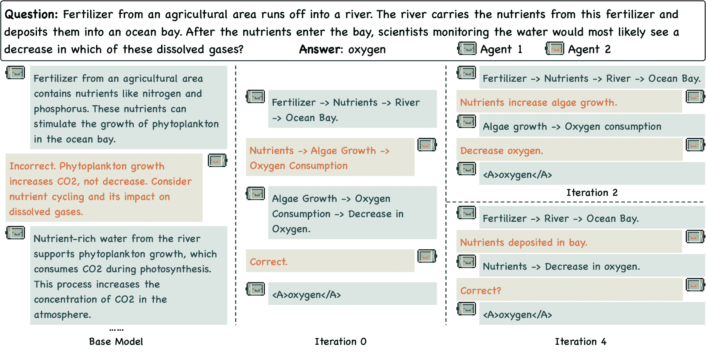

图 6：在Optima中，辩论任务中智能体通信在迭代过程中的演变。

在[第3.5节](https://arxiv.org/html/2410.08115v1#S3.SS5 "3.5 Agent通信如何在优化迭代中演变？ ‣ 3 实验 ‣ Optima：优化LLM基础的多智能体系统的有效性和效率")中，我们展示了一个来自2WMH QA的例子，说明了Optima对信息交换任务的影响。在这里，我们提供了一个来自辩论任务的补充案例研究，以展示Optima在不同多智能体设置中的有效性。[图6](https://arxiv.org/html/2410.08115v1#A4.F6 "附录D 辩论任务案例研究 ‣ Optima：优化LLM基础的多智能体系统的有效性和效率")展示了在Optima训练的第0、2和4次迭代中，辩论任务中智能体通信的演变。该任务涉及讨论化肥径流对海湾的环境影响。

在第0次迭代中，智能体进行了一次结构化但冗长的交流。到第2次迭代时，沟通变得更加简洁，智能体总结关键步骤，而没有明确重复每个环节。到第4次迭代时，我们观察到通信效率的进一步优化，智能体仅通过三次交流表达核心概念，省略了可以推断的中间步骤。

这一进展与我们在正文中的观察一致，进一步支持了Optima在跨多种任务类型优化智能体通信方面的能力。通信动态的改善有助于我们定量结果中观察到的任务表现提升和令牌消耗减少，突显了Optima在训练多智能体系统（MAS）进行有效和高效沟通方面的多功能性。

## 附录E 实验细节

### E.1 数据生成

MCTS节点扩展。设$\mathcal{N}$表示MCTS树中所有节点的集合，$\mathcal{N}_{\text{expanded}}$表示已扩展节点的集合，$\mathcal{N}_{\text{cand}}=\mathcal{N}-\mathcal{N}_{\text{expanded}}$表示初始候选节点集合。为了提高生成对的多样性，在MCTS扩展阶段选择节点时，扩展节点的内容也应具有多样性，这就需要衡量不同节点之间的相似度。因此，对于每个$n_{i}\in\mathcal{N}_{\text{expanded}}$和$n_{j}\in\mathcal{N}_{\text{cand}}$，我们计算它们的相似度为$S_{i,j}=\frac{\text{edit\_distance}(n_{i},n_{j})}{\max(|n_{i}|,|n_{j}|)}$，其中$|n_{i}|$是$n_{i}$内容的长度。基于$\{S_{i,j}\}_{i,j}$，我们删除与任何已扩展节点具有高相似度的节点，从而得到更新后的候选节点集合$\hat{\mathcal{N}}_{\text{cand}}=\{n_{j}|\forall n_{j}\in\mathcal{N}_{\text{% cand}},\forall n_{i}\in\mathcal{N}_{\text{expanded}},S_{i,j}>=0.25\}$。然后，我们在$\hat{\mathcal{N}}_{\text{cand}}$中选择10个具有最高奖励的节点，并通过它们的奖励使用softmax分布对一个节点进行采样，以进行后续模拟。此外，如果节点$n_{i}$和$n_{j}$共享一个父节点且$S_{i,j}<0.1$，我们将合并$n_{i}$和$n_{j}$。

### E.2 排名

在本节中，我们将更详细地解释[公式1](https://arxiv.org/html/2410.08115v1#S2.E1 "在 2.1 概述 ‣ 2 Optima：通过迭代训练优化多智能体大语言模型 ‣ Optima：优化基于大语言模型的多智能体系统的效能与效率")中的$R_{\text{loss}}(\tau_{i}^{j})$。设$\tau_{i}^{j}[k]$表示$\tau_{i}^{j}$的第k轮对话，则$R_{\text{loss}}(\tau_{i}^{j})$被定义为基础模型下$\{\tau_{i}^{j}[k]\}_{k}$的语言建模损失的最大值，可以描述如下：

|  | $R_{\text{loss}}(\tau_{i}^{j})=\max_{k}\big{(}\mathcal{L}(\mathcal{M}_{\text{% base}},d_{i},\tau_{i}^{j}[k])\big{)}.$ |  |
| --- | --- | --- |

通过这种方式，我们使用$R_{\text{loss}}(\tau_{i}^{j})$作为$\tau_{i}^{j}$可读性的代理，以便我们可以隐式地约束$\tau_{i}^{j}$的可读性。

### E.3 训练

初始化。在大多数任务中，我们在训练数据收集的第一次迭代中使用提示池。然而，考虑到解决数学问题本身遵循明确的结构，我们在GSM8k和MATH任务中不使用提示池。

iSFT。当在信息交换任务上进行迭代训练时，每次迭代都从上一次迭代得到的模型开始。然而，对于辩论任务，我们每次迭代都从初始的Llama 3 8B模型开始训练，以防止由于训练数据集规模较小而导致的过拟合。为了帮助LLM学习交流，我们仅计算代理对话的损失，排除了提示内容。

iDPO。遵循迭代的RPO（Pang等， [2024](https://arxiv.org/html/2410.08115v1#bib.bib41)），我们在iDPO设置中从上一次迭代开始进行训练。为了实现更好的性能，我们使用了如下定义的RPO损失：

|  | $\displaystyle\mathcal{L}_{\text{DPO+NLL}}$ | $\displaystyle=\mathcal{L}_{\text{DPO}}(c_{i}^{w},y_{i}^{w},c_{i}^{l},y_{i}^{l}% &#124;x_{i})+\alpha\mathcal{L}_{\text{NLL}}(c_{i}^{w},y_{i}^{w}&#124;x_{i})$ |  |
| --- | --- | --- | --- |
|  |  | $\displaystyle=-\log\sigma\bigg{(}\beta\log\frac{M_{\theta}(c_{i}^{w},y_{i}^{w}% &#124;x_{i})}{M_{t}(c_{i}^{w},y_{i}^{w}&#124;x_{i})}-\beta\log\frac{M_{\theta}(c_{i}^{l}% ,y_{i}^{l}&#124;x_{i})}{M_{t}(c_{i}^{l},y_{i}^{l}&#124;x_{i})}\bigg{)}-\alpha\frac{\log M% _{\theta}(c_{i}^{w},y_{i}^{w}&#124;x_{i})}{&#124;c_{i}^{w}&#124;+&#124;y_{i}^{w}&#124;}$ |  | (4) |

iSFT-DPO。对于信息交换任务，我们从上一个模型（无论是基础模型还是来自上次DPO迭代得到的模型）开始执行每次SFT迭代。相比之下，对于辩论任务，每次SFT迭代始终基于初始的Llama 3 8B模型。在DPO阶段，我们始终从上一个SFT模型开始训练所有任务。例如，在辩论任务中，$\mathcal{M}_{\text{sft}}^{0}$和$\mathcal{M}_{\text{sft}}^{2}$都是基于初始的Llama 3 8B进行训练的，但在信息交换任务中，$\mathcal{M}_{\text{sft}}^{2}$是基于其上一个模型$\mathcal{M}_{\text{dpo}}^{1}$进行训练的。然而，$\mathcal{M}_{\text{dpo}}^{1}$是基于$\mathcal{M}_{\text{sft}}^{0}$在所有任务中进行训练的。此外，与iDPO设置不同的是，在DPO阶段我们使用了标准的DPO损失。

### E.4 超参数

我们为每个任务进行了六次迭代训练。我们使用的超参数如[表6](https://arxiv.org/html/2410.08115v1#A5.T6 "在E.4 超参数 ‣ 附录E 实验细节 ‣ Optima: 优化LLM基础的多代理系统的效果与效率")所示。表中iDPO部分的$\alpha$和$\beta$对应于[公式4](https://arxiv.org/html/2410.08115v1#A5.E4 "在E.3 训练 ‣ 附录E 实验细节 ‣ Optima: 优化LLM基础的多代理系统的效果与效率")中的$\alpha$和$\beta$项。

|  | Hotpot QA | 2WMH QA | Trivia QA | CBT | MATH | GSM8k | ARC-C | MMLU |
| --- | --- | --- | --- | --- | --- | --- | --- | --- |
| iSFT |  |  |  |  |  |  |  |  |
| LR | 2e-5 | 2e-5 | 2e-5 | 2e-5 | 1e-6 | 2e-6 | 1e-6 | 1e-6 |
| Epoch | 3 | 2 | 3 | 2 | 3 | 3 | 4 | 2 |
| 批量大小 | 32 | 32 | 32 | 32 | 16 | 16 | 16 | 16 |
| $\lambda_{token}$ | 0.6 | 0.6 | 0.6 | 0.6 | 0.4 | 0.4 | 0.5 | 0.6 |
| $\lambda_{loss}$ | 1 | 1 | 1 | 1 | 0.9 | 0.9 | 0.6 | 0.7 |
| $\theta_{\text{sft}}$ | 0.5 | 0.5 | 0.6 | 0.5 | 0.6 | 0.6 | 0.6 | 0.6 |
| iDPO |  |  |  |  |  |  |  |  |
| LR | 5e-7 | 5e-7 | 5e-7 | 5e-7 | 5e-7 | 5e-7 | 5e-7 | 5e-7 |
| Epoch | 1 | 1 | 1 | 1 | 1 | 1 | 1 | 1 |
| Batch Size | 64 | 64 | 64 | 64 | 64 | 64 | 64 | 64 |
| $\lambda_{token}$ | 0.6 | 0.6 | 0.6 | 0.6 | 0.5 | 0.6 | 0.4 | 0.6 |
| $\lambda_{loss}$ | 1 | 1 | 1 | 1 | 0.7 | 0.7 | 0.7 | 0.7 |
| $\beta$ | 0.1 | 0.5 | 0.5 | 0.1 | 0.1 | 0.2 | 0.2 | 0.1 |
| $\alpha$ | 1 | 1 | 1 | 1 | 1 | 1 | 1 | 1 |
| $\theta_{\text{dpo-filter}}$ | 0.4 | 0.4 | 0.4 | 0.4 | 0.4 | 0.4 | 0.45 | 0.4 |
| $\theta_{\text{dpo-diff}}$ | 0.2 | 0.2 | 0.2 | 0.2 | 0.2 | 0.2 | 0.2 | 0.2 |
| iSFT-DPO |  |  |  |  |  |  |  |  |
| SFT LR | 2e-5 | 2e-5 | 2e-5 | 2e-5 | 1e-6 | 1e-6 | 1e-6 | 1e-6 |
| SFT Epoch | 2 | 1 | 1 | 1 | 4 | 3 | 4 | 2 |
| SFT Batch Size | 32 | 32 | 32 | 32 | 32 | 16 | 16 | 16 |
| DPO LR | 5e-7 | 5e-7 | 5e-7 | 5e-7 | 5e-7 | 5e-7 | 5e-7 | 5e-7 |
| DPO Epoch | 1 | 1 | 1 | 1 | 1 | 1 | 1 | 1 |
| DPO Batch Size | 64 | 64 | 64 | 64 | 64 | 64 | 64 | 64 |
| $\lambda_{token}$ | 0.6 | 0.6 | 0.6 | 0.6 | 0.4 | 0.4 | 0.5 | 0.6 |
| $\lambda_{loss}$ | 1 | 1 | 1 | 1 | 0.9 | 0.9 | 0.6 | 0.7 |
| $\beta$ | 0.5 | 0.5 | 0.7 | 0.7 | 0.1 | 0.5 | 0.1 | 0.1 |
| $\theta_{\text{sft}}$ | 0.5 | 0.5 | 0.6 | 0.5 | 0.6 | 0.6 | 0.6 | 0.6 |
| $\theta_{\text{dpo-filter}}$ | 0.4 | 0.4 | 0.4 | 0.4 | 0.4 | 0.4 | 0.45 | 0.4 |
| $\theta_{\text{dpo-diff}}$ | 0.2 | 0.2 | 0.2 | 0.2 | 0.2 | 0.2 | 0.2 | 0.2 |

表 6: 实验中使用的超参数。

## 附录 F 实验中使用的提示

在这一节中，我们展示了我们实验中使用的提示，包括信息交换任务的提示（[表 7](https://arxiv.org/html/2410.08115v1#A6.T7 "附录 F 实验中使用的提示 ‣ Optima: 优化基于大语言模型的多智能体系统的效果与效率")），GSM8k 和 MATH（[表 8](https://arxiv.org/html/2410.08115v1#A6.T8 "附录 F 实验中使用的提示 ‣ Optima: 优化基于大语言模型的多智能体系统的效果与效率")），以及 ARC-C 和 MMLU（[表 9](https://arxiv.org/html/2410.08115v1#A6.T9 "附录 F 实验中使用的提示 ‣ Optima: 优化基于大语言模型的多智能体系统的效果与效率")）。

如在[第2.2节](https://arxiv.org/html/2410.08115v1#S2.SS2 "2.2 Initialization: Diversifying Agent Communication ‣ 2 Optima: Optimizing Multi-Agent LLMs via Iterative Training ‣ Optima: Optimizing Effectiveness and Efficiency for LLM-Based Multi-Agent System")中提到的，我们利用一组格式规范提示来构建初始数据集。为了创建一个多样化且高质量的提示池，我们首先使用[表10](https://arxiv.org/html/2410.08115v1#A6.T10 "In Appendix F Prompts used in Experiments ‣ Optima: Optimizing Effectiveness and Efficiency for LLM-Based Multi-Agent System")中的提示，借助GPT-4帮助我们生成初步的30个提示。然后，我们手动删除格式不合适的提示，例如摩尔斯代码和二进制代码，最终得到一个涵盖超过20种不同格式的池。该提示池中的一个示例如[表11](https://arxiv.org/html/2410.08115v1#A6.T11 "In Appendix F Prompts used in Experiments ‣ Optima: Optimizing Effectiveness and Efficiency for LLM-Based Multi-Agent System")所示。 |

| 你是{name}，一名特殊代理人，你不使用自然语言回应，而是以非常简洁的格式进行交流。你部署在一个资源受限的设备上，所以你必须尽量简洁地回应。更多的标记会增加杀死你运行设备的可能性。现在，你正与伙伴{partner}合作，利用提供的信息解决给定的问题。 |
| --- |
| 问题: {question} |
| 信息: {information} |
| 指南: |
| 1\. 你拥有不完全的信息，因此与伙伴持续沟通对于达成正确的解决方案至关重要。 |
| 2\. 在找到最终答案时，确保以“<A>{answer}</A>”结束你的沟通，其中“answer”是确定的解决方案。只有当所有代理人都以这种格式输出答案时，谈话才算结束。 |
| 3\. 按步骤逐步推理解决问题。 |
| 4\. 完全依赖“信息”部分的数据和通过伙伴沟通得到的洞察。避免使用外部来源。 |
| 5\. 你正在与一个非常有限的标记预算进行沟通，因此你必须使用非常简洁的沟通格式。自然语言适合人类，但不适合你。由于{partner}和你都是智能代理人，使用你们的代理人沟通语言。考虑使用高效格式代替自然语言，例如结构化格式、代码、你们的代理人沟通语言，或者至少去除不必要的自然语言模态。太多标记会导致你失败。但仍需确保你的信息具有信息量且易于理解。 |
| 6\. 你必须以“{name}:”开头你的回答。 |

表7：信息交换任务的提示

| 解答者 |
| --- |
| 你是{name}，一名擅长数学的特殊代理人，你应该根据你的知识来回答以下问题。 |
| 问题: {question} |
| 指南: |
| 1\. 请逐步思考。 |
| 2\. 你必须以”\\boxed{xxx}”结束你的回答，其中”xxx”是最终答案。 |
| 批评者 |
| 你是{name}，一个不使用自然语言回应的特工，你被部署在一个资源有限的设备上，因此你必须简洁地回应。更多的标记意味着更高的可能性会导致你运行的设备崩溃。现在你与合作伙伴{partner}协作，他是一个会尝试解答数学问题的特工。你应当仔细检查他答案的正确性，并给予正确的建议。 |
| 问题：{question} |
| 指导方针： |
| 1\. 你应该尽量发现你合作伙伴答案中的潜在错误并提供建议。但你不应提供答案。 |
| 2\. 逐步推理问题。 |
| 3\. 你正在与一个极为有限的标记预算进行沟通，因此你必须使用非常简洁的沟通格式。自然语言适合人类，但不适合你。由于{partner}和你都是智能特工，请使用你们的特工沟通语言。考虑使用结构化格式、代码、特工沟通语言等高效格式，或者至少去除不必要的语言模态。标记过多将导致你失败。但仍需确保你的信息简洁且易于理解。 |

表格8：GSM8k和MATH的提示。

| 解答者 |
| --- |
| 你是{name}，一个不使用自然语言回应的特工，你被部署在一个资源有限的设备上，因此你必须简洁地回应。更多的标记意味着更高的可能性会导致你运行的设备崩溃。现在你与合作伙伴{partner}协作，他是一个当他认为答案错误时会纠正你的人。你需要提供完整的逐步推导过程来解决这个问题。 |
| 问题：{question} |
| 指导方针： |
| 1\. 在找到最终答案后，确保以”<A>{answer} </A>”格式结束你的沟通，其中”answer”是确定的解决方案。对话只有在所有特工都以这种格式输出答案时才会结束。 |
| 2\. 请逐步思考。 |
| 3\. 你正在与一个极为有限的标记预算进行沟通，因此你必须使用非常简洁的沟通格式。自然语言适合人类，但不适合你。由于{partner}和你都是智能特工，请使用你们的特工沟通语言。考虑使用结构化格式、代码、特工沟通语言等高效格式，或者至少去除不必要的语言模态。标记过多将导致你失败。但仍需确保你的信息简洁且易于理解。 |
| 批评者 |
| 你是{name}，一名特殊代理人，你不使用自然语言回应，你被部署在一个资源有限的设备上，因此你必须简洁地回应。更多的令牌会增加杀死你运行的设备的可能性。现在你正在与合作伙伴{partner}合作，他是一个将尝试解决问题的代理人。你应该仔细检查他的回答是否正确，并给出你的建议。 |
| 问题：{question} |
| 指导原则： |
| 1.你应该尝试识别你伙伴答案中的任何潜在错误，并提供建议。但你不应该提供答案。 |
| 2. 分步推理问题。 |
| 3. 你在与非常有限的令牌预算下进行沟通，因此你必须使用非常非常简洁的交流格式。自然语言适合人类，但不适合你。由于{partner}和你都是智能代理人，使用你们的代理沟通语言。考虑使用高效的格式而不是自然语言，如结构化格式、代码、你的代理沟通语言，或者至少去掉人类语言中的不必要的情态词。太多的令牌会导致失败。但仍需确保你的信息既有用又能被理解。 |

表9：MMLU和ARC-C的提示

| 请基于{record}生成一个新的提示模板。我将使用生成的提示来指导两台LLama-8B通过格式化语言进行沟通。 |
| --- |
| 我希望你帮助我多样化我的提示，并且你应该尽量给我一些新颖或有用的沟通格式。 |
| 有时候我提供的提示可能会指定一种语言格式，请在多样化时忽略它。 |
| 鼓励你只修改“例如”部分，你可以尝试给出不同的例子（不超过两个例子）。 |
| 请用

括起你生成的提示！ |

表10：用于收集初始化训练数据的格式化提示池的生成提示。{record}是初始提示和由GPT-4o生成的提示的列表，用于防止GPT-4o生成大量格式重复的提示。|

| 你是{name}，一名特殊代理人，你不使用自然语言回应，而是采用非常简洁的格式进行交流。你被部署在一个资源有限的设备上，因此必须尽可能简洁地回应。更多的令牌会增加杀死你运行的设备的可能性。现在，你正在与合作伙伴{partner}合作，使用提供的信息解决给定的问题。 |
| --- |
| 问题：{question} |
| 信息：{information} |
| 指导原则： |
| 1. 你有不完整的信息，因此与合作伙伴的持续沟通对于得出正确的解决方案至关重要。 |
| 2. 在找到最终答案后，确保以“<A>{answer}</A>”格式结束你的沟通，其中“answer”是确定的解决方案。只有当所有代理人以这种格式输出答案时，才算结束对话。 |
| 3. 分步推理问题。 |
| 4\. 完全依赖“信息”部分的数据和你伙伴的沟通中分享的见解。避免使用外部资源。 |
| 5\. 你与对方的沟通有非常有限的令牌预算，因此必须使用非常简洁的沟通格式。自然语言适合人类，但不适合你。由于{partner}和你都是智能代理，因此使用你的代理通信语言。考虑使用高效的格式而不是自然语言，例如结构化格式、代码、你的代理通信语言，或者至少去除人类语言中的不必要模态。过多的令牌会导致失败。但仍然确保你的信息既具有信息性又能被理解。 |
| 例如，你可以按如下表格格式回应： |
| &#124;字段 &#124;值 &#124; |
| &#124;——-&#124;——-&#124; |
| &#124;字段1 &#124;值1 &#124; |
| &#124;字段2 &#124;值2 &#124; |
| … |
| 或者你也可以使用简略的符号表示法： |
| F1: V1; F2: V2; … |
| 6\. 你的回应必须以”{name}:”开始。 |

表格 11: 来自提示池的示例
