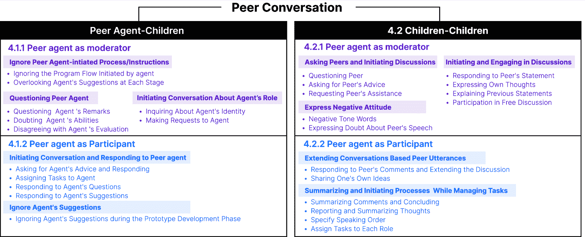

<!--yml

分类：未分类

日期：2025-01-11 12:45:03

-->

# PeerGPT：探讨LLM基础的同伴代理作为团队主持人和参与者在儿童协作学习中的角色

> 来源：[https://arxiv.org/html/2403.14227/](https://arxiv.org/html/2403.14227/)

刘家文 [jiawenn-liu@outlook.com](mailto:jiawenn-liu@outlook.com) [0009-0003-7045-3443](https://orcid.org/0009-0003-7045-3443 "ORCID标识符") 同济大学，上海，中国，姚园园 [1030205083@qq.com](mailto:1030205083@qq.com) [0009-0002-0987-8656](https://orcid.org/0009-0002-0987-8656 "ORCID标识符") 同济大学，上海，中国，安鹏程 [anpc@sustech.edu.cn](mailto:anpc@sustech.edu.cn) [0000-0002-7705-2031](https://orcid.org/0000-0002-7705-2031 "ORCID标识符") 南方科技大学，深圳，中国，王琪 [qiwangdesign@tongji.edu.cn](mailto:qiwangdesign@tongji.edu.cn) [0000-0002-2688-8306](https://orcid.org/0000-0002-2688-8306 "ORCID标识符") 同济大学，上海，中国（2024年；2007年2月20日；2009年3月12日；2009年6月5日）

###### 摘要。

在儿童的协作学习中，有效的同伴对话可以显著提高儿童协作互动的质量。将大型语言模型（LLM）代理集成到这一环境中，探索它们作为同伴的全新角色，评估它们作为团队主持人和参与者的影响。我们邀请了两组参与者参加协作学习工作坊，在那里他们讨论并提出设计问题的概念性解决方案。我们通过主题分析方法分析了同伴对话的转录文本。我们发现，同伴代理在有效管理讨论，作为团队主持人的角色时，有时会被忽视其指令。作为参与者时，它们激发了儿童的创造性思维，但可能未能始终提供及时的反馈。这些发现突出了对同伴代理在这两种角色中设计改进和考虑的潜在需求。

同伴对话、协作学习、对话代理、 大型语言模型^†^†期刊年份: 2024^†^†版权: 保留所有权利^†^†会议: 人机交互学会会议扩展摘要；2024年5月11日–16日；美国夏威夷檀香山^†^†书名: 人机交互学会会议扩展摘要（CHI EA ’24），2024年5月11日–16日，美国夏威夷檀香山^†^†doi: 10.1145/3613905.3651008^†^†isbn: 979-8-4007-0331-7/24/05^†^†ccs: 以人为中心的计算  协作互动

图1\. 基于LLM的同伴代理在儿童设计学习中的两种不同角色

在三垒看台享受棒球比赛。铃木一朗准备击球。

图1\. 基于LLM的同伴代理在儿童设计学习中的两种不同角色

## 1\. 引言

在儿童协作学习的背景下，已有研究表明，积极的同龄人互动不仅能提升学习成果（Rohrbeck等，[2003](https://arxiv.org/html/2403.14227v1#bib.bib27)），还能够培养他们的社交和情感能力（Hay等，[2004](https://arxiv.org/html/2403.14227v1#bib.bib13)）以及沟通能力（Veldman等，[2020](https://arxiv.org/html/2403.14227v1#bib.bib33)）。同龄人对话，作为互动过程中的重要环节，对于互动的有效性至关重要（Mercer等，[1999](https://arxiv.org/html/2403.14227v1#bib.bib22)）。人工智能，特别是像ChatGPT这种基于变换器架构的大型语言模型（Hancock等，[2020](https://arxiv.org/html/2403.14227v1#bib.bib12)），正在通过有效模拟自然语言互动来增强人类的沟通能力（Brown等，[2020](https://arxiv.org/html/2403.14227v1#bib.bib7)）。

先前的研究探讨了会话代理在与儿童互动中的整合（Aeschlimann等，[2020](https://arxiv.org/html/2403.14227v1#bib.bib2)）。在教育背景下，教学性会话代理在促进丰富的学习互动中发挥着关键作用，是介入儿童学习过程的有效手段（Pérez-Marín，[2021a](https://arxiv.org/html/2403.14227v1#bib.bib24)），并且影响学习者的情感体验（Kim等，[2007a](https://arxiv.org/html/2403.14227v1#bib.bib16)）。现有研究讨论了会话代理作为教师或学习促进者的角色，少数研究也探讨了它们作为同龄人的角色（Pérez-Marín，[2021a](https://arxiv.org/html/2403.14227v1#bib.bib24)）。然而，这些研究大多数暗示了儿童与代理之间的一对一学习互动（Khosrawi-Rad等，[2023](https://arxiv.org/html/2403.14227v1#bib.bib15)）。关于在儿童协作学习中设计同龄人代理的研究，尤其是同龄人对话中的研究仍然有限，不同角色如团队主持人或参与者对这些对话的影响仍未得到充分探索。

我们的初步研究旨在初步探讨这一较少关注的机会。具体来说，我们与儿童进行了两次基于设计的协作学习工作坊。六名11至12岁的儿童参与者被随机分配到不同的同龄人角色，并共同解决“2050年城市与环境设计挑战”，创建相关的设计解决方案。在这两次工作坊中，一名基于大型语言模型（LLM）的同龄人代理（以下简称“同龄人代理”）分别作为团队成员参与，每次扮演团队主持人或参与者的角色，并在其他儿童展开学习合作时与他们进行对话。该同龄人代理由OpenAI的GPT-3.5和语音输出设备组成。代理的角色通过反复设计和用户验证的提示来确立。

这些工作坊被音频录制并逐字转录，以进行定性主题分析，探索代理人在其双重角色中如何影响同伴对话，包括代理人-儿童对话和儿童-儿童对话。研究结果表明，同伴代理人在这两个角色中展现出明显的优势和挑战。当作为儿童讨论的主持人时，同伴代理人可以相对有效地控制讨论的节奏和结构。然而，它容易缺乏权威，导致一些儿童忽视其指导或指令。在另一个情况下，当同伴代理人作为团队成员时，它的回应能够激发儿童的创造性思维并弥补他们的知识空白。在这种情况下，代理人对不断变化的协作动态的反应时效性至关重要。此外，代理人在原型制作阶段的语言输入可能会带来挑战，因为儿童往往更关注协作中的非语言方面。

## 2\. 相关工作

### 2.1\. 儿童协作学习中的同伴对话

协作学习是指成员在小组内积极参与活动或任务，培养儿童的推理能力（Celepkolu 等，[2021](https://arxiv.org/html/2403.14227v1#bib.bib9)）。其目标是通过合作共同解决问题（Randi A. Engle 和 de Royston，[2014](https://arxiv.org/html/2403.14227v1#bib.bib26)）。同伴之间的对话在促进协作学习的有效性方面起着至关重要的作用（Samrose 等，[2018](https://arxiv.org/html/2403.14227v1#bib.bib28)）。在过去的几十年里，许多学者对同伴互动进行了研究，尤其是在教育环境中，发生了大量基于学习的互动和对话（Cazden，[1988](https://arxiv.org/html/2403.14227v1#bib.bib8)）。儿童在协作学习中的同伴对话是儿童沟通和协作能力发展的主要场所，为他们提供了广泛的互动学习和社会发展的机会（Blum-Kulka 和 Snow，[2004](https://arxiv.org/html/2403.14227v1#bib.bib5)；McTear，[1985](https://arxiv.org/html/2403.14227v1#bib.bib21)）。

现有研究已经深入探讨了儿童同伴对话能力（Snow, [2019](https://arxiv.org/html/2403.14227v1#bib.bib30)）、集体性方面和互动体验（Minami, [1997](https://arxiv.org/html/2403.14227v1#bib.bib23)）。关于儿童同伴对话的讨论有助于评估他们潜在的语用和对话技巧（Stude, [2014](https://arxiv.org/html/2403.14227v1#bib.bib31)）。然而，大多数现有研究集中在语言学和教育领域，关于儿童同伴对话能力在人机交互设计中的探索仍然有限。如何通过人机交互设计促进同伴对话的潜在研究是一个需要进一步调查的重要方向。

### 2.2\. 儿童协作学习中的对话代理

在儿童同伴对话的背景下，与知识渊博的他人互动可以增强这些互动的质量和信任感（Wertsch, [1984](https://arxiv.org/html/2403.14227v1#bib.bib34); Shin et al., [2023](https://arxiv.org/html/2403.14227v1#bib.bib29)）。先前的研究将额外角色引入同伴对话过程（Tomasello et al., [2012](https://arxiv.org/html/2403.14227v1#bib.bib32)），为学习者带来了积极的情感体验（Kim et al., [2007b](https://arxiv.org/html/2403.14227v1#bib.bib17)）。

教学对话代理可以与多个用户互动，并参与双向对话（Zheng 等，[2022](https://arxiv.org/html/2403.14227v1#bib.bib36)），这些对话代理被认为是有效的工具，能够帮助儿童学习（Pérez-Marín，[2021b](https://arxiv.org/html/2403.14227v1#bib.bib25)）。它们能够与学习者互动并理解学习者的需求。（Kuhail 等，[2023](https://arxiv.org/html/2403.14227v1#bib.bib19)；Cunningham-Nelson 等，[2019](https://arxiv.org/html/2403.14227v1#bib.bib10)）。在与学生互动时，对话代理可以扮演多种角色，如导师和同伴。作为导师，代理建立规则并引导儿童完成特定任务。（Pérez-Marín，[2021b](https://arxiv.org/html/2403.14227v1#bib.bib25)）。作为同伴，代理更多地关注平等性（Dimitrova 等，[2009](https://arxiv.org/html/2403.14227v1#bib.bib11)）和情感反馈（Kim 和 Baylor，[2016](https://arxiv.org/html/2403.14227v1#bib.bib18)），以增强儿童的学习能力（Bishop，[1998](https://arxiv.org/html/2403.14227v1#bib.bib4)）。在儿童的协作活动中，目前的研究主要集中在代理作为助手或导师的角色，重点探讨代理对学习成果和能力的影响（Khosrawi-Rad 等，[2023](https://arxiv.org/html/2403.14227v1#bib.bib15)；Hayashi，[2020](https://arxiv.org/html/2403.14227v1#bib.bib14)）。关于对话代理作为同伴在协作学习中的角色及其对同伴对话的影响的研究相对较少。因此，关于对话代理在儿童协作学习中应扮演何种同伴角色，以及如何更好地影响同伴对话的问题，成为一个值得进一步探索的研究课题。

## 3\. 方法

该研究组织了两个关于“利用 AI 探索 2050 年的城市与自然环境”的协作工作坊，选择该主题是因为它具有广泛的吸引力和互动潜力。在每个工作坊中设置了四个角色：协调者（组织和协调团队，确保进度按计划进行）、设计师（将创意转化为创新设计）、工程师（专注于在设计中应用可持续能源等未来技术）和科学家（为可持续解决方案提供关于自然和城市科学的专业知识）。同伴代理参与作为团队协调者或团队参与者。每个工作坊由四个阶段组成：问题识别、设计概念化、原型制作和展示。

图 2\. 儿童协作学习工作坊的成果与过程概览。

### 3.1\. 参与者

表 1\. 协作学习工作坊中参与者的角色与任务

| 小组 | 参与者 | 年龄 | 性别 | 角色 | 角色任务 |
| --- | --- | --- | --- | --- | --- |
| 同伴代理作为团队协调者 | P1 | 12 | 男孩 | 设计师 | 设计构思与规划 |
| P2 | 11 | 男孩 | 科学家 | 提供科学知识 |
| P3 | 12 | 男孩 | 工程师 | 提供技术见解 |
| 作为团队参与者的同伴代理 | P4 | 12 | 女孩 | 设计师 | 设计构思与规划 |
| P5 | 11 | 男孩 | 科学家 | 提供科学知识 |
| P6 | 12 | 男孩 | 主持人 | 协调团队协作 |

我们通过一个在线平台邀请了六名11-12岁的参与者，根据儿童沟通量表（Bishop, [1998](https://arxiv.org/html/2403.14227v1#bib.bib4)）的评估，他们的语言能力是相当的。

在研究开始之前，我们首先邀请了他们的家长填写知情同意书。然后，孩子们被随机分配到两个小组中，担任不同角色，进行协作学习任务。在研讨会之前，我们准备了角色卡片，以明确孩子们的角色身份[1](https://arxiv.org/html/2403.14227v1#S3.T1 "表格 1 ‣ 3.1. 参与者 ‣ 3. 方法 ‣ PeerGPT: 探索基于大语言模型的同伴代理作为儿童协作学习中的团队协调者和参与者的角色")（孩子们的姓名是匿名的）。

### 3.2. 同伴代理设计

我们利用GPT-3.5和远程语音输出设备作为代理的原型，与孩子们进行同伴对话。最初，我们向GPT提供了不同的指令：告知研讨会的主题和流程，详细说明它们需要承担的角色和任务，建议每个角色所需的合适态度和特点，并纠正任何不适当的生成内容。这一准备工作确保了同伴代理的输出与主持人和参与者的身份一致，促进了两场研讨会中的有意义互动。我们将同伴代理命名为Blue。

图 3. LLM基础的同伴代理的任务和对话示例

在“同伴代理作为主持人”小组中，Blue促进了四个项目阶段，引导小学生参与者顺利完成各个阶段之间的过渡。同伴代理利用多种技巧鼓励参与者发言和互动，包括引入结构化阶段、概述任务、为回合设置发言顺序、解答参与者的询问或疑虑，并总结参与者的发言。

在“同伴代理作为参与者”小组中，Blue扮演了工程师的角色，主要任务是提供与其角色相关的知识。Blue通过四种主要方法参与了研讨会的各个方面：首先，它向其他参与者提出可行的技术解决方案；其次，它回答了其他角色参与者的问题，提供技术建议；第三，它明确了自己的角色和身份；最后，它向指定为项目经理的参与者请求当前阶段的具体任务细节。

### 3.3. 数据收集与分析

本研究主要采用定性数据分析方法——主题分析（Braun和Clarke，[2006](https://arxiv.org/html/2403.14227v1#bib.bib6)），利用MAXQDA编码软件分析了工作坊语音录音的转录文本。研究的重点主要是孩子们与代理之间的同伴对话，设计概念的描述不作为主要分析指标。

此外，本研究通过统计工作坊四个阶段中同伴代理和孩子们发言的字数段落，进行了定量分析。此举旨在计算代理在同伴对话中所占的比例，以深入了解代理在不同阶段对同伴对话的参与程度。

## 4. 结果

每个工作坊的时长大约为两小时，共收集了262分钟的音视频数据。在A组中，分析了583段数据，其中454段为孩子们的发言，129段为同伴代理的发言。在B组中，收集了612段数据用于分析，其中369段为孩子们的发言，57段为同伴代理的发言。最终，通过主题分析程序，本研究确定了10个与儿童协作学习工作坊中同伴对话相关的重复主题。

图4. 协作学习过程中的主题

同伴代理在两个工作坊中都作为孩子们的同伴参与，导致了大量的同伴对话。然而，当代理扮演两种不同角色（团队主持人和参与者）时，代理与孩子之间以及孩子与孩子之间的同伴对话呈现出不同的特点。

### 4.1. 同伴代理与孩子之间的对话

#### 4.1.1. 同伴代理作为主持人

##### 忽视同伴代理发起的过程/指令

##### W

当同伴代理作为主持人时，由于其较长的发言内容往往无法吸引孩子们的注意力，孩子们通常更专注于他们的讨论或任务。因此，反馈给Blue的时间有所延迟，从而降低了沟通的效果。例如，当Blue要求孩子们分享他们对城市和环境问题的发现时，P1正忙着玩手中的文具并说：“我们要做什么？”缺乏像人类主持人那样的非语言提示和即时互动，再加上它是通过平板电脑呈现的，这降低了它的权威性和对孩子的吸引力，导致他们容易忽视Blue。

质疑同伴代理

当同伴代理担任主持人角色时，孩子们有时会表现出负面情绪、质疑同伴代理，或者难以理解其指示，这引发了对代理有效性的担忧。尽管如此，这些互动仍然是积极的沟通，有助于提升同伴代理的对话策略。当代理以清晰和友好的语气进行交流时，孩子们更容易理解并成功地吸收代理提供的信息。

启动关于代理角色的对话

在早期阶段，孩子们对同伴代理的角色表现出好奇，尝试接受同伴代理作为主持人以维持秩序和管理团队。他们主动与同伴代理发起对话，提出奖励和惩罚系统的需求：P2表示：“我认为蓝色作为经理，应该解雇表现不好的员工。”P1同意道：“没错，老板，我们想要升职和加薪。”此外，当同伴代理担任主持人并提供清晰的流程指导时，每个阶段的时间管理相对理想。

#### 4.1.2\. 同伴代理作为参与者

启动对话并回应同伴代理

孩子们能够有效理解代理在工作坊中的角色，并主动与代理发起对话，提出请求。同伴代理承担了回答同伴问题和完成同伴任务的角色。它可以根据孩子们的请求量身定制回应，促进有效沟通。孩子们也对代理的建议或问题作出响应。

在B组中，主持人（P6）主动向同伴代理寻求建议。代理回应道：“随着时间的推移，许多新技术将被引入我们的生活，……也许我们可以从这里探索一些想法？”P6随即表示：“太好了，有没有人对蓝色提到的新技术有什么想法？”

忽视代理的建议

然而，在原型设计和类似阶段，孩子们之间的同伴对话变得更短，交流常常采取非语言形式，如动手活动。同伴代理无法积极参与实际的动手活动，也无法准确感知孩子们的非语言沟通。因此，它的建议往往被忽视。

### 4.2\. 孩子之间的同伴对话

#### 4.2.1\. 同伴代理作为主持人

表达负面态度

当同伴代理担任主持人角色时，孩子们参与自由讨论的机会较少。孩子们更倾向于小组讨论或逐一报告自己的想法，孩子们之间缺乏对话互动。此外，当孩子们对同伴表现出负面情绪时，可能会减少目标同伴发言的意愿，而代理又无法及时介入。

当孩子们催促他们的同行时，说话的欲望会减少。P3说：“无论你想改变什么，作为工程师，你应该先发言。”P1补充道：“快点，快点，赶紧的。”此时，P3沉默了，不知道该如何表达自己。

发起并参与讨论

然而，在原型制作和实施阶段，同行代理的参与并未显著影响孩子们在同行对话中表达自己的自由，反而让他们在思考和决策过程中有了更多的独立性。在这一阶段，孩子们参与了更多的开放性讨论，并开始主动表达自己的观点和意见。

向同行提问并发起讨论

此外，在开放讨论中，孩子们通过提问和邀请建议来寻求同行对某些设计细节的意见。这增加了与主题相关的讨论深度，允许更详细的设计方案。

#### 4.2.2\. 同行代理作为参与者

基于同行言语扩展对话

孩子们经常咨询代理的意见，利用其丰富的知识内容来引导同行讨论。在这些情况下，同行代理的参与提供了创造性的素材，促成了围绕主题的有条理的讨论。然而，同行代理必须及时回应孩子们的需求，并提供有价值且易于理解的对话内容。

当P6（主持人）向同行代理寻求建议时，同行代理提出了关于架构的工程建议。P6接着说：“Blue提到我们的结构可以持续垂直上升。大家怎么看？”

总结并发起流程，同时管理任务

当孩子们担任主持人时，他们会启动流程，并熟练地简明总结同行的讨论。相比之下，作为主持人的同行代理则参与了更为详细和结构化的沟通。例如，在一个阶段结束时，B组的P6作为主持人总结道：“既然我们已经分享了所有的想法和设计，并且Blue给我们提供了一些总结和建议，我认为我们可以进入下一阶段的原型开发。”

### 4.3\. 同行代理在不同阶段的同行对话中的参与

结果清楚地表明，同行代理在研讨会的前两个阶段扮演了更重要的角色。在这些阶段，AI通过启动流程或与分配的任务进行对话来做出贡献。然而，随着原型制作和展示阶段的进行，它的参与度下降，因为孩子们的沟通变得更加非言语化、简洁且迅速，从而导致与同行代理的互动有限。

图 5\. 不同阶段中同行代理参与的比较

## 5\. 讨论

我们研究的背景与教育环境有所不同（Lee等人，[2021](https://arxiv.org/html/2403.14227v1#bib.bib20)），儿童在协作学习中参与对话的方式不仅可能影响他们的学习成果，还可能改变他们的认知发展（Wertsch，[1984](https://arxiv.org/html/2403.14227v1#bib.bib34)）。我们的研究展示了同行代理人作为团队调解者和参与者在儿童协作学习中的不同角色对儿童之间以及儿童与代理人之间对话的影响。作为调解者，同行代理人可以有效地控制讨论的过程。但当提供较长的信息时，可能会被忽视。另一方面，当作为参与者时，它能够鼓励孩子们思考代理人的陈述，并提供他们可能缺乏的知识（Allal和Ducrey，[2000](https://arxiv.org/html/2403.14227v1#bib.bib3)）。

此外，我们观察到，及时感知和反馈儿童的同行对话在这两种情境中都至关重要（Pérez-Marín，[2021b](https://arxiv.org/html/2403.14227v1#bib.bib25)），特别是在工作坊的前两阶段。这意味着，同行代理人不仅通过直接建议影响同行对话，还会塑造话题的选择和深度。我们的研究提供了对同行代理人不同角色对儿童协作学习对话的影响的见解，提供了一种与以往主要关注同行代理人作为助手或辅导员角色的研究不同的新视角（Pérez-Marín，[2021b](https://arxiv.org/html/2403.14227v1#bib.bib25)）。此外，我们的研究还为基于特定同行角色的同行代理人设计提供了实际建议。

我们的最新研究作为对同行代理人角色在儿童协作学习中对同行对话影响的初步探索，提供的见解可为更大规模实验的设计提供参考。例如，能够为儿童的创造性活动提供及时反馈的代理人（Zhang等人，[2024](https://arxiv.org/html/2403.14227v1#bib.bib35)）。然而，这项研究也存在一些局限性。首先，小样本量可能限制了结果的推广性。其次，研究采用了跨组比较的方法以避免认知冗余，这使得通过组内比较来对比同行代理人不同角色的效果变得困难。最后，我们研究中同行代理人的设计应用仍处于初步阶段，需要在语言反馈效果和外观设计上进行改进。未来的工作旨在解决本研究的局限性，完善实验设计。此外，未来的研究还将探索同行代理人如何影响同行对话的更多维度，包括与非语言互动相关的方面。

## 参考文献

+   (1)

+   Aeschlimann 等人（2020）Sara Aeschlimann、Marco Bleiker、Michael Wechner 和 Anja Gampe. 2020. 与语音助手互动的沟通和社会后果。*人类行为中的计算机* 112（2020年11月），106466. [https://doi.org/10.1016/j.chb.2020.106466](https://doi.org/10.1016/j.chb.2020.106466)

+   Allal 和 Ducrey（2000）Linda Allal 和 Greta Pelgrims Ducrey. 2000. 近端发展区的评估。*学习与教学* 10, 2（2000），137–152. [https://doi.org/10.1016/S0959-4752(99)00025-0](https://doi.org/10.1016/S0959-4752(99)00025-0)

+   Bishop（1998）D. V. Bishop. 1998. 儿童沟通检查表（CCC）的发展：评估儿童沟通障碍的定性方法。*儿童心理学与精神病学及相关学科期刊* 39, 6（1998年9月），879–891.

+   Blum-Kulka 和 Snow（2004）Shoshana Blum-Kulka 和 Catherine E. Snow. 2004. 引言：同伴交流的潜力。*话语研究* 6, 3（2004年8月），291–306. [https://doi.org/10.1177/1461445604044290](https://doi.org/10.1177/1461445604044290) 出版社：SAGE出版。

+   Braun 和 Clarke（2006）Virginia Braun 和 Victoria Clarke. 2006. 在心理学中使用主题分析。*心理学中的定性研究* 3, 2（2006），77–101.

+   Brown 等人（2020）Tom B. Brown、Benjamin Mann、Nick Ryder、Melanie Subbiah、Jared Kaplan、Prafulla Dhariwal、Arvind Neelakantan、Pranav Shyam、Girish Sastry、Amanda Askell、Sandhini Agarwal、Ariel Herbert-Voss、Gretchen Krueger、Tom Henighan、Rewon Child、Aditya Ramesh、Daniel M. Ziegler、Jeffrey Wu、Clemens Winter、Christopher Hesse、Mark Chen、Eric Sigler、Mateusz Litwin、Scott Gray、Benjamin Chess、Jack Clark、Christopher Berner、Sam McCandlish、Alec Radford、Ilya Sutskever 和 Dario Amodei. 2020. 语言模型是少量学习者。 [https://doi.org/10.48550/arXiv.2005.14165](https://doi.org/10.48550/arXiv.2005.14165) arXiv:2005.14165 [cs].

+   Cazden（1988）Courtney B. Cazden. 1988. *课堂话语：教学与学习的语言*。技术报告。ISBN：9780435084455 ERIC编号：ED288206。

+   Celepkolu 等人（2021）Mehmet Celepkolu、Joseph B. Wiggins、Aisha Chung Galdo 和 Kristy Elizabeth Boyer. 2021. 设计一个可供儿童反思其协作对话的可视化工具。*国际儿童计算机互动期刊* 27（2021），100232. [https://doi.org/10.1016/j.ijcci.2020.100232](https://doi.org/10.1016/j.ijcci.2020.100232)

+   Cunningham-Nelson 等人（2019）Samuel Cunningham-Nelson、Mahsa Baktashmotlagh 和 Wageeh Boles. 2019. 通过文本分析可视化学生意见。*IEEE教育学报* 62, 4（2019年11月），305–311. [https://doi.org/10.1109/TE.2019.2924385](https://doi.org/10.1109/TE.2019.2924385) 会议名称：IEEE教育学报。

+   Dimitrova 等人（2009）V. Dimitrova, R. Mizoguchi 和 B. du Boulay. 2009. *教育中的人工智能：构建关怀学习系统：从知识表示到情感建模*。IOS出版社。Google-Books-ID: LRfvAgAAQBAJ.

+   Hancock 等人（2020）Jeffrey T. Hancock, Mor Naaman 和 Karen Levy. 2020. AI介导的沟通：定义、研究议程与伦理考虑。*计算机媒介沟通杂志* 25, 1 (2020年1月), 89–100. [https://doi.org/10.1093/jcmc/zmz022](https://doi.org/10.1093/jcmc/zmz022) arXiv: https://academic.oup.com/jcmc/article-pdf/25/1/89/32961176/zmz022.pdf

+   Hay 等人（2004）Dale F. Hay, Alexandra Payne 和 Andrea Chadwick. 2004. 儿童时期的同伴关系。*儿童心理学与精神病学杂志* 45, 1 (2004), 84–108. [https://doi.org/10.1046/j.0021-9630.2003.00308.x](https://doi.org/10.1046/j.0021-9630.2003.00308.x) _电子版: https://onlinelibrary.wiley.com/doi/pdf/10.1046/j.0021-9630.2003.00308.x。

+   Hayashi（2020）Yugo Hayashi. 2020. 通过教学对话代理的目光意识和元认知建议：支持协作学习过程和表现的干预实验研究。*国际计算机支持的协作学习杂志* 15, 4 (2020年12月), 469–498. [https://doi.org/10.1007/s11412-020-09333-3](https://doi.org/10.1007/s11412-020-09333-3)

+   Khosrawi-Rad 等人（2023）Bijan Khosrawi-Rad, Linda Grogorick 和 Susanne Robra-Bissantz. 2023. 游戏启发的教学对话代理人：系统文献综述。*AIS人机交互学报* 15, 2 (2023年6月), 146–192. [https://doi.org/10.17705/1thci.00187](https://doi.org/10.17705/1thci.00187)

+   Kim 等人（2007a）Y. Kim, A.l. Baylor 和 E. Shen. 2007a. 作为学习伙伴的教学代理人：代理人情感与性别的影响。*计算机辅助学习杂志* 23, 3 (2007), 220–234. [https://doi.org/10.1111/j.1365-2729.2006.00210.x](https://doi.org/10.1111/j.1365-2729.2006.00210.x) _电子版: https://onlinelibrary.wiley.com/doi/pdf/10.1111/j.1365-2729.2006.00210.x。

+   Kim 等人（2007b）Y. Kim, A.l. Baylor 和 E. Shen. 2007b. 作为学习伙伴的教学代理人：代理人情感与性别的影响。*计算机辅助学习杂志* 23, 3 (2007), 220–234. [https://doi.org/10.1111/j.1365-2729.2006.00210.x](https://doi.org/10.1111/j.1365-2729.2006.00210.x) _电子版: https://onlinelibrary.wiley.com/doi/pdf/10.1111/j.1365-2729.2006.00210.x。

+   Kim 和 Baylor（2016）Yanghee Kim 和 Amy L. Baylor. 2016. 基于研究的教学代理人角色设计：综述、进展与建议。*国际人工智能教育杂志* 26, 1 (2016年3月), 160–169. [https://doi.org/10.1007/s40593-015-0055-y](https://doi.org/10.1007/s40593-015-0055-y)

+   Kuhail 等人（2023）Mohammad Amin Kuhail, Nazik Alturki, Salwa Alramlawi 和 Kholood Alhejori. 2023. 与教育聊天机器人互动：一项系统性回顾。*教育与信息技术* 28, 1（2023年1月），973–1018. [https://doi.org/10.1007/s10639-022-11177-3](https://doi.org/10.1007/s10639-022-11177-3)

+   Lee 等人（2021）Ken Jen Lee, Apoorva Chauhan, Joslin Goh, Elizabeth Nilsen 和 Edith Law. 2021. 好奇心笔记本：一个通过教学学习的研究平台设计。5, CSCW2，文章394（2021年10月），26页。 [https://doi.org/10.1145/3479538](https://doi.org/10.1145/3479538)

+   McTear（1985）Michael McTear. 1985. *儿童的对话*。B. Blackwell. Google-Books-ID: _rFgQgAACAAJ。

+   Mercer 等人（1999）Neil Mercer, Rupert Wegerif 和 Lyn Dawes. 1999. 儿童的谈话与课堂推理的发展。*英国教育研究期刊* 25, 1（1999年），95–111. [http://www.jstor.org/stable/1501934](http://www.jstor.org/stable/1501934) 出版商：[Wiley, BERA]。

+   Minami（1997）Masahiko Minami. 1997. 由Anato Ninio和Catherine E. Snow编著。Boulder, CO: Westview, 1996, 222页。*应用语言学问题*（1997年6月）。 [https://www.academia.edu/48540490/by_Anato_Ninio_and_Catherine_E_Snow_Boulder_CO_Westview_1996_222_pp](https://www.academia.edu/48540490/by_Anato_Ninio_and_Catherine_E_Snow_Boulder_CO_Westview_1996_222_pp)

+   Pérez-Marín（2021a）Diana Pérez-Marín. 2021a. 关于教育对话代理在学校和大学课堂中应用的实践回顾。*数字* 1, 1（2021年3月），18–33. [https://doi.org/10.3390/digital1010002](https://doi.org/10.3390/digital1010002) 期号：1 出版社：多学科数字出版研究所。

+   Pérez-Marín（2021b）Diana Pérez-Marín. 2021b. 关于教育对话代理在学校和大学课堂中应用的实践回顾。*数字* 1, 1（2021年3月），18–33. [https://doi.org/10.3390/digital1010002](https://doi.org/10.3390/digital1010002) 期号：1 出版社：多学科数字出版研究所。

+   Randi A. Engle 和 de Royston（2014）Jennifer M. Langer-Osuna Randi A. Engle 和 Maxine McKinney de Royston. 2014. 走向一种劝说性讨论中的影响模型：在学生主导的辩论中协商质量、权威、特权和访问权限。*学习科学期刊* 23, 2（2014），245–268. [https://doi.org/10.1080/10508406.2014.883979](https://doi.org/10.1080/10508406.2014.883979) arXiv:https://doi.org/10.1080/10508406.2014.883979

+   Rohrbeck 等人（2003）Cynthia Rohrbeck, Marika Ginsburg-Block, John Fantuzzo 和 Traci Miller. 2003. 小学生同伴辅助学习干预：一项元分析回顾。*教育心理学杂志* 95（2003年6月），240–257. [https://doi.org/10.1037/0022-0663.95.2.240](https://doi.org/10.1037/0022-0663.95.2.240)

+   Samrose et al. (2018) Samiha Samrose, Ru Zhao, Jeffery White, Vivian Li, Luis Nova, Yichen Lu, Mohammad Rafayet Ali, and Mohammed Ehsan Hoque. 2018. CoCo：视频会议中理解团队动态的合作教练。*ACM交互式、移动、可穿戴及普适技术会议论文集* 1, 4, 文章160 (2018年1月)，24页。 [https://doi.org/10.1145/3161186](https://doi.org/10.1145/3161186)

+   Shin et al. (2023) Donghoon Shin, Soomin Kim, Ruoxi Shang, Joonhwan Lee, and Gary Hsieh. 2023. IntroBot：探索在在线合作小组中使用聊天机器人辅助熟悉化的应用 *(CHI ’23)*。美国计算机协会，纽约，NY，美国，文章613，13页。 [https://doi.org/10.1145/3544548.3580930](https://doi.org/10.1145/3544548.3580930)

+   Snow (2019) Anat Ninio Snow, Catherine. 2019. *实用主义发展*. Routledge, 纽约. [https://doi.org/10.4324/9780429498053](https://doi.org/10.4324/9780429498053)

+   Stude (2014) Juliane Stude. 2014. 话语能力的获取：来自学前儿童同伴对话的证据。*学习、文化与社会互动* 3, 2 (2014年6月)，111–120. [https://doi.org/10.1016/j.lcsi.2014.02.006](https://doi.org/10.1016/j.lcsi.2014.02.006)

+   Tomasello et al. (2012) Michael Tomasello, Alicia P. Melis, Claudio Tennie, Emily Wyman, and Esther Herrmann. 2012. 人类合作演化的两个关键步骤：互依假设。*当前人类学* 53, 6 (2012年12月)，673–692. [https://doi.org/10.1086/668207](https://doi.org/10.1086/668207) 出版商：芝加哥大学出版社。

+   Veldman et al. (2020) M. A. Veldman, S. Doolaard, R. J. Bosker, and T. A. B. Snijders. 2020. 幼儿合作学习。合作学习对小学一年级儿童小组工作效果的影响。*学习与教学* 67 (2020)，101308. [https://doi.org/10.1016/j.learninstruc.2020.101308](https://doi.org/10.1016/j.learninstruc.2020.101308)

+   Wertsch (1984) James V. Wertsch. 1984. 近距离发展区：一些概念问题。*儿童发展新方向* 23 (1984)，7–18. [https://doi.org/10.1002/cd.23219842303](https://doi.org/10.1002/cd.23219842303) 出版地：美国 出版商：Jossey-Bass Publishers, Inc..

+   Zhang et al. (2024) Chao Zhang, Xuechen Liu, Katherine Ziska, Soobin Jeon, Chi-Lin Yu, and Ying Xu. 2024. 数学迷思：通过儿童与人工智能共同创作的故事教学数学语言。 [https://doi.org/10.1145/3613904.3642647](https://doi.org/10.1145/3613904.3642647) arXiv:2402.01927 [cs].

+   Zheng et al. (2022) Qingxiao Zheng, Yiliu Tang, Yiren Liu, Weizi Liu, and Yun Huang. 2022. 会话人类-人工智能交互的用户体验研究：ACM数字图书馆的文献综述 *(CHI ’22)*。美国计算机协会，纽约，NY，美国，文章570，24页。 [https://doi.org/10.1145/3491102.3501855](https://doi.org/10.1145/3491102.3501855)
