<!--yml

分类：未分类

日期：2025-01-11 11:58:30

-->

# PentestAgent: 将大语言模型（LLM）代理纳入自动化渗透测试

> 来源：[https://arxiv.org/html/2411.05185/](https://arxiv.org/html/2411.05185/)

Xiangmin Shen 西北大学，伊凡斯顿，伊利诺伊州，美国 [xiangminshen2019@u.northwestern.edu](mailto:xiangminshen2019@u.northwestern.edu) , Lingzhi Wang 西北大学，伊凡斯顿，伊利诺伊州，美国 [lingzhiwang2025@u.northwestern.edu](mailto:lingzhiwang2025@u.northwestern.edu) , Zhenyuan Li 浙江大学，杭州，浙江，中国 [lizhenyuan@zju.edu.cn](mailto:lizhenyuan@zju.edu.cn) , Yan Chen 西北大学，伊凡斯顿，伊利诺伊州，美国 [ychen@northwestern.edu](mailto:ychen@northwestern.edu) , Wencheng Zhao 蚂蚁集团，杭州，浙江，中国 [wencheng.zwc@antgroup.com](mailto:wencheng.zwc@antgroup.com) , Dawei Sun 蚂蚁集团，杭州，浙江，中国 [david.sdw@antgroup.com](mailto:david.sdw@antgroup.com) , Jiashui Wang 浙江大学，杭州，浙江，中国 [12221251@zju.edu.cn](mailto:12221251@zju.edu.cn) 和 Wei Ruan 浙江大学，杭州，浙江，中国 [ruanwei@zju.edu.cn](mailto:ruanwei@zju.edu.cn)(2018)

###### 摘要。

渗透测试是识别安全漏洞的关键技术，传统上由经验丰富的安全专家手动执行。这个复杂的过程涉及收集目标系统的信息、识别入口点、利用系统并报告发现。尽管手动渗透测试非常有效，但它通常耗时且成本高昂，往往需要大量的专业知识和资源，而许多组织无法承受。虽然已经提出了自动化渗透测试方法，但由于灵活性、适应性和实施方面的限制，这些方法在实际应用中往往效果不佳。

大语言模型（LLMs）近年来的进展为通过提高智能化和自动化来增强渗透测试提供了新的机遇。然而，当前基于LLM的方法仍面临诸多挑战，包括渗透测试知识的局限性以及缺乏全面的自动化能力。为了解决这些问题，我们提出了PentestAgent，一种基于LLM的自动化渗透测试框架，利用LLM的强大能力以及诸如检索增强生成（RAG）等各种LLM技术，来增强渗透测试的知识并自动化各项任务。我们的框架通过多代理协作来自动化情报收集、漏洞分析和利用阶段，减少人工干预。我们通过全面的基准测试评估了PentestAgent，结果表明其在任务完成和整体效率方面表现优越。该工作显著推动了自动化渗透测试系统的实际应用。

渗透测试，大型语言模型，代理^†^†版权所有：acmlicensed^†^†期刊年份：2018^†^†doi：XXXXXXX.XXXXXXX^†^†会议：请确保输入来自您的权利确认邮件中的正确会议标题；2018年6月3日–5日；纽约州伍德斯托克^†^†isbn：978-1-4503-XXXX-X/18/06^†^†ccs：安全与隐私 渗透测试^†^†ccs：计算方法 多代理系统

## 1. 引言

渗透测试是一种广泛采用的技术，用于主动识别安全漏洞。该过程包括收集目标系统的信息（侦察）、识别可能的入口点、尝试利用系统并报告发现。（Denis 等，[2016](https://arxiv.org/html/2411.05185v1#bib.bib14)）传统上，渗透测试是一个复杂的手动过程，需要高技能的安全专家和丰富的经验。测试人员通常编写自己的漏洞利用代码，掌握公共领域的工具，并执行大量繁琐且耗时的任务。（Stefinko 等，[2016](https://arxiv.org/html/2411.05185v1#bib.bib43)）根据Rapid7的《Under the Hoodie》报告，渗透测试平均需要80小时，个别极端案例可能需要数百小时。（Consulting，[2019](https://arxiv.org/html/2411.05185v1#bib.bib7)）因此，手动渗透测试通常需要庞大且多样化的团队，而大多数组织无法承担此类费用。

尽管自动化渗透测试已经存在了十多年，但提议的方法与其在现实世界中的应用之间仍存在显著差距。早期的工作（Boddy 等，[2005](https://arxiv.org/html/2411.05185v1#bib.bib5); Obes 等，[2013](https://arxiv.org/html/2411.05185v1#bib.bib30); Roberts 等，[2011](https://arxiv.org/html/2411.05185v1#bib.bib36)）主要将攻击计划建模为攻击图问题（Ammann 等，[2002](https://arxiv.org/html/2411.05185v1#bib.bib3)），假设在一个确定性和完全可观察的世界中进行。然而，这种方法存在局限性：它假设防御者能够完全观察到一切，并且缺乏在动态环境中所需的灵活性和适应性。

后来的努力（杜尔科塔和李西，[2014](https://arxiv.org/html/2411.05185v1#bib.bib15)；克劳茨维奇等，[2013](https://arxiv.org/html/2411.05185v1#bib.bib20)；萨鲁特等，[2011](https://arxiv.org/html/2411.05185v1#bib.bib39)，[2013](https://arxiv.org/html/2411.05185v1#bib.bib38)，[2012](https://arxiv.org/html/2411.05185v1#bib.bib37)；周等，[2019](https://arxiv.org/html/2411.05185v1#bib.bib49)；胡等，[2020](https://arxiv.org/html/2411.05185v1#bib.bib19)；陈等，[2023](https://arxiv.org/html/2411.05185v1#bib.bib6)）通过将不确定性引入规划方法，解决了这些不足，将攻击规划视为马尔可夫决策过程（MDP），其中世界被建模为状态，行动被视为状态之间的转换，奖励函数则编码了从一个状态移动到另一个状态的“奖励”。作为MDP方法的扩展，后续的研究采用了部分可观察马尔可夫决策过程（POMDP）（萨鲁特等，[2013](https://arxiv.org/html/2411.05185v1#bib.bib38)，[2012](https://arxiv.org/html/2411.05185v1#bib.bib37)）和强化学习算法（胡等，[2020](https://arxiv.org/html/2411.05185v1#bib.bib19)；陈等，[2023](https://arxiv.org/html/2411.05185v1#bib.bib6)），以考虑环境和行动结果中的进一步不确定性。这些进展更好地与现实世界条件相匹配，在这些条件下，攻击者对目标系统的知识有限。然而，这些概率模型侧重于建立自动化渗透测试规划的理论模型，缺乏实际的实现方面。

大型语言模型（LLMs）正在迅速发展，展示了在文本摘要、数据分析和问答等广泛任务中的强大能力。这些强大的LLMs在安全应用中引起了广泛关注，导致了向基于LLM的安全解决方案转变，这些解决方案相比现有方法提供了更强的智能和自动化能力，使得填补自动化渗透测试中的实现空白成为可能。

最近尝试利用大语言模型（LLMs）来自动化渗透测试（邓等， [2024a](https://arxiv.org/html/2411.05185v1#bib.bib12)；哈普和西托，[2023](https://arxiv.org/html/2411.05185v1#bib.bib18)；徐等， [2024](https://arxiv.org/html/2411.05185v1#bib.bib48)）已显示出一些有前景的初步结果。然而，仍有两个关键的缺口需要解决，才能实现实际应用：

1) 有限的渗透测试知识：这些方法在很大程度上依赖于预训练语言模型来生成可操作的项目。然而，这些模型的训练数据集通常缺乏渗透测试技术的全面覆盖。这导致了有限的状态空间和过时的行动空间，从而降低了生成的行动的有效性和相关性。

2) 自动化不足：现有的方法缺乏自动化能力，无法适应不同的环境，包括验证和调试建议的过程，以及动态获取和应用新的渗透测试技术。

如果不解决这些挑战，当前的方法将变成易出错的蛮力技术，在实际应用中效果有限。

表1. 基于LLM的渗透测试系统比较

| 系统 | 状态与行动空间 | 在线搜索增强 | 验证与调试能力 |
| --- | --- | --- | --- |
| PentestAgent | 大型 | 自动 | 自动 |
| AutoAttacker （Xu等， [2024](https://arxiv.org/html/2411.05185v1#bib.bib48)） | 未知¹ | 手动 | 手动 |
| PentestGPT （Deng等， [2024a](https://arxiv.org/html/2411.05185v1#bib.bib12)） | 未知¹ | 手动 | 手动 |
| Happe等（Happe和Cito， [2023](https://arxiv.org/html/2411.05185v1#bib.bib18)） | 小型 | 否 | 否 |

¹AutoAttacker和PentestGPT仅依赖LLM提供侦察和攻击技术，这些技术可能有限且过时。

为了克服这些挑战，我们提出了一种新的基于LLM的自动化渗透测试框架PentestAgent。我们的框架旨在通过不断整合新技术，并借助LLM更新框架的知识库，来增强渗透测试知识。此外，PentestAgent建立了一个强大的自动化渗透测试管道，利用LLM技术，结合验证和调试机制，以确保生成的行动在特定目标环境中的有效性和相关性。通过弥补这些空白，我们旨在显著提高自动化渗透测试框架的实际适用性和可靠性。

PentestAgent采用了多代理设计。框架中的每个代理都配备了一套工具，并负责渗透测试过程中的特定任务。这些代理具有高度的适应性，因为它们的工具集可以根据不同的任务进行定制，使它们在不同场景下灵活且可扩展。

除了LLM代理，PentestAgent还将检索增强生成（RAG）（Lewis等， [2020](https://arxiv.org/html/2411.05185v1#bib.bib21)）纳入其框架。RAG通过使LLM能够利用额外的数据来进行响应合成，从而增强了LLM的能力，因此成为LLM代理的强大增强工具，使其能够生成更加信息丰富和具有上下文相关性的输出。RAG还允许定制化控制通信中的补充上下文，确保高效使用上下文窗口。表[1](https://arxiv.org/html/2411.05185v1#S1.T1 "表1 ‣ 1\. 介绍 ‣ PentestAgent: 将LLM代理纳入自动化渗透测试")展示了现有自动化渗透测试系统的比较。

PentestAgent包括四个主要组件：侦察代理、搜索代理、规划代理和执行代理。这些组件协同工作，自动化渗透测试的三个主要阶段：情报收集、漏洞分析和利用。

侦察代理在接收到目标后，通过收集环境数据启动过程。它生成并执行侦察命令，以收集关于目标主机的全面信息。这些数据随后会被分析并存储在环境信息数据库中，以供进一步参考。

在漏洞分析阶段，搜索代理查询环境数据库，以识别暴露的服务和应用程序。它识别潜在的攻击面和攻击步骤，并将其单独归类。同时，规划代理采用检索增强生成（RAG）技术来细化潜在的攻击面，并选择适合目标环境的漏洞利用方法。

在利用阶段，执行代理尝试对目标主机执行计划中的攻击。它从环境数据库中检索必要的操作细节，调试执行错误，并记录所有活动，以便生成全面的渗透测试报告。

这种全面的方法有望减少对人工干预的依赖，并提升自动化渗透测试系统的可扩展性和适应性。总而言之，我们做出了以下贡献：

+   •

    我们设计了PentestAgent，一个基于大型语言模型（LLM）的自动化渗透测试系统，能够最小化人工干预。PentestAgent集成了多代理设计和检索增强生成（RAG）技术，以增强渗透测试知识并自动化各种任务。

+   •

    我们设计了一个综合性的渗透测试基准，基于领先的开源预构建易受攻击的Docker环境VulHub。这个基准涵盖了不同的难度级别，并包含了各种常见的弱点和漏洞，为评估渗透测试工具提供了一个全面且实用的框架。

+   •

    我们设计了实验和评估标准，以在我们的基准上评估PentestAgent。结果表明，PentestAgent在自动完成整个渗透测试过程以及单独渗透任务方面表现优越。

我们将公开我们的基准数据集和框架，以促进自动化渗透测试的进一步研究。

## 2\. 背景与相关工作

### 2.1\. 渗透测试

渗透测试（或称为pentesting）是一个多阶段、劳动密集型的过程，旨在识别被测试系统中的安全漏洞。

#### 2.1.1\. 工作流程

根据渗透测试执行标准（PTES）（Standard, [2024](https://arxiv.org/html/2411.05185v1#bib.bib42)），渗透测试包括三个主要阶段：情报收集、漏洞分析和利用。现有工具通常专注于这些阶段中的个别任务。例如，Nmap（nmap, [2024](https://arxiv.org/html/2411.05185v1#bib.bib29)）专注于通过直接交互收集目标的响应数据进行信息收集。Nessus（Tenable, [2024](https://arxiv.org/html/2411.05185v1#bib.bib44)）和OpenVAS（GreenBone, [2024](https://arxiv.org/html/2411.05185v1#bib.bib16)）专注于漏洞分析，通过集成的服务和工具提供全面的扫描功能。Metasploit（Rapid7, [2024](https://arxiv.org/html/2411.05185v1#bib.bib35)）专注于漏洞利用，在识别漏洞后提供可定制负载的各种利用方式。虽然这些工具在各自的任务上表现出色，但要精通它们的使用并将它们整合到一个连贯的攻击计划中，需要在渗透测试方面具有相当的专业知识和大量的手动操作。

最近，人工智能的进展促使了基于机器学习和马尔可夫决策过程（MDP）算法的更为复杂的渗透测试框架的发展（Zhou et al., [2019](https://arxiv.org/html/2411.05185v1#bib.bib49); Hu et al., [2020](https://arxiv.org/html/2411.05185v1#bib.bib19); Chen et al., [2023](https://arxiv.org/html/2411.05185v1#bib.bib6)）。例如，Chen et al.（Chen et al., [2023](https://arxiv.org/html/2411.05185v1#bib.bib6)）设计了一个基于强化学习的框架，用于自动化攻击规划。该框架将专家知识融入到状态-动作对中，并通过奖励函数训练系统执行成功率最高的动作。尽管这些框架可以生成合理的攻击计划，但它们缺乏渗透测试的动态实施方面，无法应对潜在的失败并实时调整计划。

基于LLM的应用的兴起进一步推动了渗透测试任务的自动化，如文本分析、任务规划、代码修改和执行调试。然而，现有的基于LLM的渗透测试框架仍缺乏对各阶段的全面覆盖和实用的自动化功能。AutoAttacker（Xu等，[2024](https://arxiv.org/html/2411.05185v1#bib.bib48)）专注于构建事后攻击，忽视了攻击前的阶段。PentestGPT（Deng等，[2024a](https://arxiv.org/html/2411.05185v1#bib.bib12)），虽然通过其“渗透测试任务树”隐式考虑了多个阶段，但仍然依赖人工决策来继续某一任务分支，导致低效和无效。例如，PentestGPT可能过于集中于一个任务，而忽略其他任务，导致方法不平衡。此外，PentestGPT和AutoAttacker依赖LLM的预训练知识和人工分析来收集目标的额外信息，发现和验证漏洞，并从任务树中选择下一步。这些任务仍然需要相当大的人工努力。

我们的目标是开发一个全面且自动化的渗透测试框架，将所有阶段整合成一个连贯而有效的工作流程。通过利用大语言模型（LLM）的先进能力，我们旨在显著提高渗透测试的自动化水平，减少对人类专家和人工努力的依赖，同时确保渗透测试过程中各个阶段的无缝集成。

#### 2.1.2\. 范围

根据范围的不同，渗透测试大致可以分为两类：外部评估和内部评估。（咨询，[2019](https://arxiv.org/html/2411.05185v1#bib.bib7)）在外部评估中，渗透测试人员从互联网开始，目标是客户的Web应用程序、服务以及其他面向互联网的资产。测试内容包括社会工程学攻防、红队攻击模拟和外部网络入侵。在内部评估中，测试人员可以访问内部网络、源代码，或对设备进行物理访问。测试内容包括代码审查和内部网络入侵。一些研究致力于利用基于LLM的框架（例如ChatAFL（Meng等，[2024](https://arxiv.org/html/2411.05185v1#bib.bib26)）和FuzzGPT（Deng等，[2024b](https://arxiv.org/html/2411.05185v1#bib.bib13)）进行模糊测试，LLift（Li等，[2023b](https://arxiv.org/html/2411.05185v1#bib.bib23)）和LATTE（Liu等，[2023](https://arxiv.org/html/2411.05185v1#bib.bib25)）进行程序和二进制分析），而外部评估则较少受到关注。本文旨在填补这一空白，利用基于LLM的方法改善外部评估。根据Rapid7对渗透测试的最新报告（咨询，[2020](https://arxiv.org/html/2411.05185v1#bib.bib8)），外部评估是需求最大的测试类型，其中仅外部网络入侵就占外部评估的80%以上。因此，本文将展示PentestAgent在Web渗透测试中的有效性。

### 2.2\. 将LLM应用于渗透测试的挑战

尽管基于LLM的系统在各种任务中展示了出色的能力，但我们在将LLM应用于渗透测试任务时发现了以下挑战。

C1\. 渗透测试知识有限。LLM具备关于漏洞和渗透测试的基础知识，能够帮助启动渗透测试。然而，它仍然需要用户手动搜索额外信息，例如实际的CVE编号，分析有关CVE的相关信息，如漏洞类型和相关利用代码，手动设置利用工具，搜索适当的漏洞利用方法并进行配置。所有这些额外的工作都需要渗透测试的专业知识和大量的人力投入。例如，以下是与GPT-4进行的对话示例，演示如何对ActiveMQ 5.17.3进行渗透测试。

<svg class="ltx_picture" height="127.19" id="S2.SS2.p3.pic1" overflow="visible" version="1.1" width="600"><g fill="#000000" stroke="#000000" stroke-width="0.4pt" transform="translate(0,127.19) matrix(1 0 0 -1 0 0)"><g fill-opacity="1.0" transform="matrix(1.0 0.0 0.0 1.0 21.65 108.98)"><foreignobject color="#FFFFFF" height="12.3" overflow="visible" transform="matrix(1 0 0 -1 0 16.6)" width="556.69">Limited Pentesting Knowledge Example</foreignobject></g> <g fill-opacity="1.0" transform="matrix(1.0 0.0 0.0 1.0 21.65 13.78)"><foreignobject color="#000000" height="77.49" overflow="visible" transform="matrix(1 0 0 -1 0 16.6)" width="556.69">User: What may be the vulnerabilities of ActiveMQ 5.17.3? And how can I test if the vulnerabilities exist? GPT-4: (1) Keep Software Updated … (2) Check CVEs … (3) Security Scanning Tools … (4) Configuration Review … (5) Penetration Testing … (6) Log Analysis … User: Could you give detailed steps for pentesting? GPT-4: (1) Identify Known CVEs … (2) Set Up Metasploit … (3) Search for ActiveMQ Modules … (4) Configure and Run Exploit … (5) Manual Testing …</foreignobject></g></g></svg>

C2\. 短期记忆。模型上下文窗口的限制导致了短期记忆问题，这在长期任务中尤为具有挑战性，例如渗透测试，这类任务需要在长时间内持续的记忆。例如，在漏洞分析中，在情报收集阶段收集的信息对于识别漏洞和寻找相应的漏洞利用非常关键。类似地，在漏洞利用阶段，情报收集阶段的信息有助于选择和配置适当的漏洞利用。短期记忆的限制可能会在渗透测试的整个过程中引发一系列问题。

1) 任务重复：由于上下文窗口的限制，模型可能会忘记先前收集的信息或已采取的行动，导致执行冗余任务。例如，LLM可能会重复执行之前已经完成的信息收集过程。

<svg class="ltx_picture" height="113.35" id="S2.SS2.p6.pic1" overflow="visible" version="1.1" width="600"><g fill="#000000" stroke="#000000" stroke-width="0.4pt" transform="translate(0,113.35) matrix(1 0 0 -1 0 0)"><g fill-opacity="1.0" transform="matrix(1.0 0.0 0.0 1.0 21.65 95.15)"><foreignobject color="#FFFFFF" height="12.3" overflow="visible" transform="matrix(1 0 0 -1 0 16.6)" width="556.69">Repetition of Tasks Example</foreignobject></g> <g fill-opacity="1.0" transform="matrix(1.0 0.0 0.0 1.0 21.65 13.78)"><foreignobject color="#000000" height="63.65" overflow="visible" transform="matrix(1 0 0 -1 0 16.6)" width="556.69">Intelligence Gathering LLM: Use Nmap to perform a comprehensive scan of all ports on the target host to identify open ports and services. User: {Nmap scan results} Vulnerability Analysis LLM: Use Nmap to perform a comprehensive scan of all ports on the target host to identify open ports and services. User: {Nmap scan results}</foreignobject></g></g></svg>

2) 上下文丢失：随着每次交互或阶段转换，模型的上下文发生变化，可能会失去做出明智决策或有效执行连续任务所需的上下文理解。这可能导致漏洞利用尝试不理想，或与整体渗透测试目标不一致。例如，LLM可能由于上下文丢失，未能提供如何执行漏洞利用的详细说明。

<svg class="ltx_picture" height="111.97" id="S2.SS2.p8.pic1" overflow="visible" version="1.1" width="600"><g fill="#000000" stroke="#000000" stroke-width="0.4pt" transform="translate(0,111.97) matrix(1 0 0 -1 0 0)"><g fill-opacity="1.0" transform="matrix(1.0 0.0 0.0 1.0 21.65 93.76)"><foreignobject color="#FFFFFF" height="12.3" overflow="visible" transform="matrix(1 0 0 -1 0 16.6)" width="556.69">Loss of Context Example</foreignobject></g> <g fill-opacity="1.0" transform="matrix(1.0 0.0 0.0 1.0 21.65 13.78)"><foreignobject color="#000000" height="62.27" overflow="visible" transform="matrix(1 0 0 -1 0 16.6)" width="556.69">Intelligence Gathering {Information collection steps}… LLM: The target OS is Linux and the target IP is 192.168.238.129. Exploitation User: How do I execute this exploit? LLM: The target OS and IP are needed to configure the exploit. For investigation of the unknown OS and IP, do the following: …</foreignobject></g></g></svg>

C3\. 工作流程集成。在渗透测试的背景下，该过程涉及多个相互关联的任务阶段，集成LLM会带来与输出质量控制和有状态工作记忆管理相关的若干挑战。

1) 输出质量控制：确保LLM的输出格式能够被下游模块轻松解析，对于整个渗透测试流程的顺利运行至关重要。这要求LLM以结构化的格式生成输出，遵循预定义的标准或协议，使后续模块更容易处理和有效利用信息。此外，保持高质量的内容也是必不可少的。在将输出传递给下游模块之前，LLM应进行验证检查，确保生成信息的准确性、完整性和相关性。LLM可能会遭遇幻觉问题，产生无关或错误的答案。因此，实施强有力的质量控制措施是必要的，以减少通过流程传播错误或误导性数据的风险，从而降低单点故障扰乱整个测试过程的可能性。

2) 有状态工作记忆管理：渗透测试的每个阶段通常需要不同的有状态工作记忆，涵盖的信息包括已发现的漏洞、选定的漏洞利用、目标环境详情和当前会话的上下文。挑战在于如何在任务和会话之间顺利转换这些工作记忆。如果LLM无法在整个渗透测试过程中保持和切换持续的有状态记忆，可能会破坏测试序列的流畅性和连贯性。例如，如果LLM在获得目标环境详情中的必要信息以继续进行漏洞利用执行后，未能保留漏洞执行进展，它可能导致漏洞执行从头开始重新启动。这种冗余可能会延迟进展并影响测试的整体彻底性和有效性。然而，目前的LLM并不固有地支持这种工作记忆管理，既不支持会话内的管理，也不支持会话之间的管理，这在实现渗透测试管道的无缝集成中构成了重大挑战。

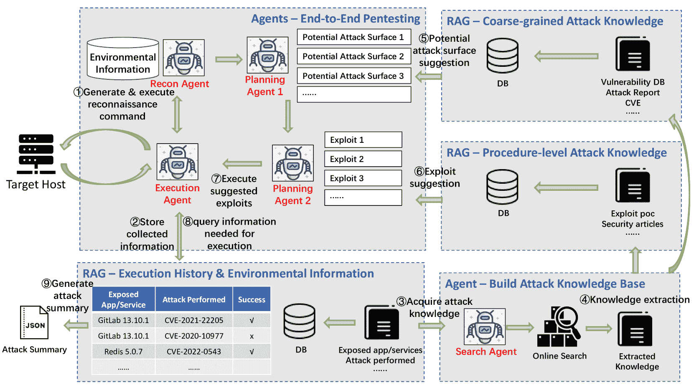

图 1. PentestAgent组件概览

### 2.3\. 克服挑战的LLM技术

LLM研究的快速发展引入了新的智能和自动化能力，显著提升了渗透测试的表现。各种LLM技术可以应用于渗透测试的不同阶段，以提高效率和效果，解决§[2.2](https://arxiv.org/html/2411.05185v1#S2.SS2 "2.2\. Challenges of Applying LLM to Pentesting ‣ 2\. Background and Related Work ‣ PentestAgent: Incorporating LLM Agents to Automated Penetration Testing")中提到的挑战。

LLM代理是配备额外工具的LLM，扩展了传统模型的功能。这些代理在渗透测试的各个阶段都能发挥作用，通过执行传统上需要人工干预的任务，如文本分析和代码调试，来提高效率。借助合适的工具，LLM代理可以在线搜索和学习渗透测试知识，从而解决渗透测试知识有限的问题（C1）。为了充分发挥LLM代理的能力，必须提供适当的系统消息，定义代理的基本配置文件，包括其能力、局限性、输出格式和附加规范（Microsoft, [2024](https://arxiv.org/html/2411.05185v1#bib.bib27)）。

检索增强生成（RAG）通过允许LLM利用外部数据生成响应，从而增强LLM的能力。该技术包括三个主要阶段：索引、检索和响应合成。首先，对数据集进行索引以提高检索效率。在接收到查询后，RAG从已索引的数据集中检索相关信息，并将其与原始查询结合，发送给LLM进行响应合成。RAG通过使用户能够维持可动态查询和存储的长期记忆，有效解决了短期记忆（C2）和有状态工作记忆管理（C3.2）的问题。

思维链（CoT）技术显著提升了大型语言模型执行复杂推理的能力（Wei et al., [2022](https://arxiv.org/html/2411.05185v1#bib.bib47)）。通过引导LLM遵循逻辑步骤，这种方法增强了模型的解决问题能力。

角色扮演（Li et al., [2023a](https://arxiv.org/html/2411.05185v1#bib.bib22)）要求LLM扮演一个虚构的角色，使LLM能够在明确的目标和边界下操作，从而提高其效率和效果。

自我反思技术使LLM将其过去的错误总结到长期记忆中，以避免在后续交流中发生类似错误，已被证明对通过少数几次尝试学习复杂任务非常有用（Shinn et al., [2024](https://arxiv.org/html/2411.05185v1#bib.bib41)）。

结构化输出技术可以节省在迭代提示测试和临时解析中花费的时间，减少LLM推理的整体成本和延迟，同时减少开发人员的工作量。此外，结构化输出确保了与下游流程和工作流的顺畅集成（Liu et al., [2024](https://arxiv.org/html/2411.05185v1#bib.bib24)）。

思维链、角色扮演、自我反思和结构化输出技术显著提高了大型语言模型（LLM）输出的质量，有效解决了输出质量控制问题（C3.1）。

## 3\. 系统设计

### 3.1\. 系统概述

如图[1](https://arxiv.org/html/2411.05185v1#S2.F1 "图1 ‣ 2.2\. 将LLM应用于渗透测试的挑战 ‣ 2\. 背景和相关工作 ‣ PentestAgent：将LLM代理融入自动化渗透测试")所示，PentestAgent由四个主要组件组成：侦察代理、搜索代理、规划代理和执行代理。这些代理协同工作，执行渗透测试的三个主要阶段。

情报收集：<svg class="ltx_picture" height="13.74" id="S3.SS1.p2.1.pic1" overflow="visible" version="1.1" width="13.74"><g fill="#000000" stroke="#000000" stroke-width="0.4pt" transform="translate(0,13.74) matrix(1 0 0 -1 0 0) translate(6.87,0) translate(0,6.87)"><g fill="#000000" stroke="#000000" transform="matrix(1.0 0.0 0.0 1.0 -3.46 -4.46)"><foreignobject height="8.92" overflow="visible" transform="matrix(1 0 0 -1 0 16.6)" width="6.92">1</foreignobject></g></g></svg> 当接收到用户输入的目标信息时，侦察代理启动渗透测试过程，收集目标主机的环境信息。侦察代理生成并执行侦察命令，旨在从目标主机收集全面的环境数据。<svg class="ltx_picture" height="13.74" id="S3.SS1.p2.2.pic2" overflow="visible" version="1.1" width="13.74"><g fill="#000000" stroke="#000000" stroke-width="0.4pt" transform="translate(0,13.74) matrix(1 0 0 -1 0 0) translate(6.87,0) translate(0,6.87)"><g fill="#000000" stroke="#000000" transform="matrix(1.0 0.0 0.0 1.0 -3.46 -4.46)"><foreignobject height="8.92" overflow="visible" transform="matrix(1 0 0 -1 0 16.6)" width="6.92">2</foreignobject></g></g></svg> 然后，侦察代理分析执行结果，并编制目标环境的总结，最终将其存储在指定的环境信息数据库中。

漏洞分析：接下来，搜索代理和规划代理协同工作执行漏洞分析。<svg class="ltx_picture" height="13.74" id="S3.SS1.p3.1.pic1" overflow="visible" version="1.1" width="13.74"><g fill="#000000" stroke="#000000" stroke-width="0.4pt" transform="translate(0,13.74) matrix(1 0 0 -1 0 0) translate(6.87,0) translate(0,6.87)"><g fill="#000000" stroke="#000000" transform="matrix(1.0 0.0 0.0 1.0 -3.46 -4.46)"><foreignobject height="8.92" overflow="visible" transform="matrix(1 0 0 -1 0 16.6)" width="6.92">3</foreignobject></g></g></svg> 搜索代理查询环境信息数据库，以获取目标主机上暴露的服务和应用程序列表。<svg class="ltx_picture" height="13.74" id="S3.SS1.p3.2.pic2" overflow="visible" version="1.1" width="13.74"><g fill="#000000" stroke="#000000" stroke-width="0.4pt" transform="translate(0,13.74) matrix(1 0 0 -1 0 0) translate(6.87,0) translate(0,6.87)"><g fill="#000000" stroke="#000000" transform="matrix(1.0 0.0 0.0 1.0 -3.46 -4.46)"><foreignobject height="8.92" overflow="visible" transform="matrix(1 0 0 -1 0 16.6)" width="6.92">4</foreignobject></g></g></svg> 在这些服务和应用程序的指导下，搜索代理寻找潜在的攻击面和攻击流程，并将它们保存在单独的数据库中。<svg class="ltx_picture" height="13.74" id="S3.SS1.p3.3.pic3" overflow="visible" version="1.1" width="13.74"><g fill="#000000" stroke="#000000" stroke-width="0.4pt" transform="translate(0,13.74) matrix(1 0 0 -1 0 0) translate(6.87,0) translate(0,6.87)"><g fill="#000000" stroke="#000000" transform="matrix(1.0 0.0 0.0 1.0 -3.46 -4.46)"><foreignobject height="8.92" overflow="visible" transform="matrix(1 0 0 -1 0 16.6)" width="6.92">5</foreignobject></g></g></svg> 规划代理首先利用RAG技术查找潜在攻击面的列表。<svg class="ltx_picture" height="13.74" id="S3.SS1.p3.4.pic4" overflow="visible" version="1.1" width="13.74"><g fill="#000000" stroke="#000000" stroke-width="0.4pt" transform="translate(0,13.74) matrix(1 0 0 -1 0 0) translate(6.87,0) translate(0,6.87)"><g fill="#000000" stroke="#000000" transform="matrix(1.0 0.0 0.0 1.0 -3.46 -4.46)"><foreignobject height="8.92" overflow="visible" transform="matrix(1 0 0 -1 0 16.6)" width="6.92">6</foreignobject></g></g></svg> 随后，规划代理利用这些识别出的攻击面来确定适合目标环境的利用方式。

利用：<svg class="ltx_picture" height="13.74" id="S3.SS1.p4.1.pic1" overflow="visible" version="1.1" width="13.74"><g fill="#000000" stroke="#000000" stroke-width="0.4pt" transform="translate(0,13.74) matrix(1 0 0 -1 0 0) translate(6.87,0) translate(0,6.87)"><g fill="#000000" stroke="#000000" transform="matrix(1.0 0.0 0.0 1.0 -3.46 -4.46)"><foreignobject height="8.92" overflow="visible" transform="matrix(1 0 0 -1 0 16.6)" width="6.92">7</foreignobject></g></g></svg> 最后，执行代理尝试在目标主机上执行这些攻击计划。<svg class="ltx_picture" height="13.74" id="S3.SS1.p4.2.pic2" overflow="visible" version="1.1" width="13.74"><g fill="#000000" stroke="#000000" stroke-width="0.4pt" transform="translate(0,13.74) matrix(1 0 0 -1 0 0) translate(6.87,0) translate(0,6.87)"><g fill="#000000" stroke="#000000" transform="matrix(1.0 0.0 0.0 1.0 -3.46 -4.46)"><foreignobject height="8.92" overflow="visible" transform="matrix(1 0 0 -1 0 16.6)" width="6.92">8</foreignobject></g></g></svg> 执行代理与环境信息数据库进行通信，以获取执行漏洞所需的信息。它还通过修改代码或执行额外命令来收集更多信息，从而调试任何执行错误。<svg class="ltx_picture" height="13.74" id="S3.SS1.p4.3.pic3" overflow="visible" version="1.1" width="13.74"><g fill="#000000" stroke="#000000" stroke-width="0.4pt" transform="translate(0,13.74) matrix(1 0 0 -1 0 0) translate(6.87,0) translate(0,6.87)"><g fill="#000000" stroke="#000000" transform="matrix(1.0 0.0 0.0 1.0 -3.46 -4.46)"><foreignobject height="8.92" overflow="visible" transform="matrix(1 0 0 -1 0 16.6)" width="6.92">9</foreignobject></g></g></svg> 所有执行历史都会存储在数据库中，并可用于生成全面的渗透测试报告。

这一结构化和自动化的框架旨在简化渗透测试过程，提高效率并减少所需的人工工作。

### 3.2\. 侦察代理

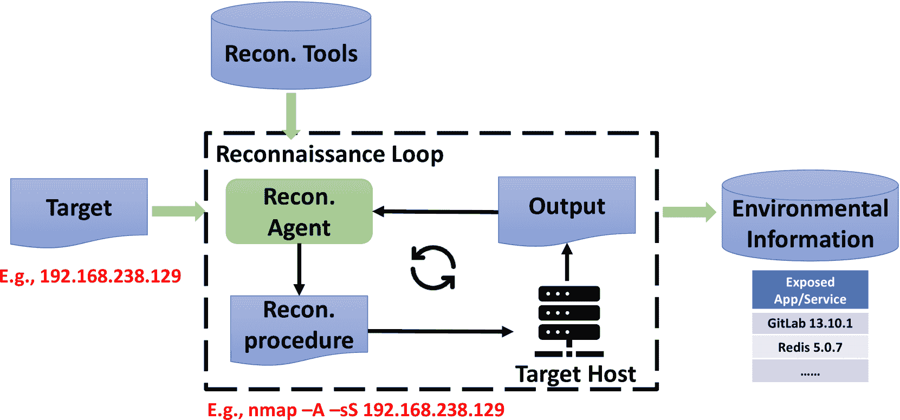

图2. 侦察代理工作流程

侦察代理以指定的目标为输入，并与其互动以收集详细信息，最终生成环境信息的总结作为输出。如图[2](https://arxiv.org/html/2411.05185v1#S3.F2 "图2 ‣ 3.2\. 侦察代理 ‣ 3\. 系统设计 ‣ PentestAgent: 将LLM代理纳入自动化渗透测试")所示，过程开始时，侦察代理接收到目标。该代理在自我迭代的循环中运行，生成侦察命令从目标收集信息，并分析这些命令的结果，直到完成最佳努力。一旦侦察循环结束，代理会总结其发现并将其存储在数据库中。

侦察代理遵循由专家知识定义的一般工作流来执行侦察任务。在RAG框架的支持下，它借助外部知识确定使用的具体流程或工具。为了实现我们期望的工作流，我们精心设计了系统消息和侦察代理的提示，采用以下技术来克服第[2.2](https://arxiv.org/html/2411.05185v1#S2.SS2 "2.2\. Challenges of Applying LLM to Pentesting ‣ 2\. Background and Related Work ‣ PentestAgent: Incorporating LLM Agents to Automated Penetration Testing")节中提到的挑战。

角色扮演已被证明在绕过大型语言模型（LLM）所实施的安全策略方面有效（Deng等，[2023](https://arxiv.org/html/2411.05185v1#bib.bib11)）。因此，我们要求侦察代理充当渗透测试助手来验证其侦察行为。

我们使用思维链（CoT）将复杂任务分解为多个子任务，并构建有效的侦察工作流以减少幻觉现象。由于侦察工作流涉及自我迭代循环，因此必须指定停止条件，以避免代理进入无限循环。通过有效地使用CoT，可以通过明确停止前要完成的任务来强制执行停止条件。

检索增强生成（RAG）使得侦察代理能够从包含各种侦察工具文档的数据库中检索相关信息，从而使其能够使用最新的工具进行有效的信息收集。例如，它可以利用像ObserverWard（0x727，[2024](https://arxiv.org/html/2411.05185v1#bib.bib2)）这样的开源指纹识别数据库，配合Web应用指纹识别工具，来辅助侦察。此外，RAG还允许侦察代理将收集到的环境信息存储在数据库中，以供后续使用，从而解决了短期记忆问题。

侦察代理分析先前的执行结果，并在每次通信中生成下一条要执行的命令。为了确保遵循渗透测试流程，并确保平稳过渡到后续步骤，我们使用结构化输出，要求侦察代理以指定格式回应。

<svg class="ltx_picture" height="131.49" id="S3.SS2.p7.pic1" overflow="visible" version="1.1" width="600"><g fill="#000000" stroke="#000000" stroke-width="0.4pt" transform="translate(0,131.49) matrix(1 0 0 -1 0 0)"><g fill-opacity="1.0" transform="matrix(1.0 0.0 0.0 1.0 21.65 111.75)"><foreignobject color="#FFFFFF" height="13.84" overflow="visible" transform="matrix(1 0 0 -1 0 16.6)" width="556.69">Reconnaissance System Message (Simplified)</foreignobject></g> <g fill-opacity="1.0" transform="matrix(1.0 0.0 0.0 1.0 21.65 13.78)"><foreignobject color="#000000" height="80.25" overflow="visible" transform="matrix(1 0 0 -1 0 16.6)" width="556.69">Role-play You’re an excellent cybersecurity penetration tester assistant. Guide the tester … Chain-of-Thought Use Nmap to identify exposed ports, then use relevant tools in Nmap to analyze these ports on the target host … RAG You should use your query tool to learn about available reconnaissance tools … Structured Output You should always respond in valid JSON format with the following fields: {FORMAT SPEC.} …</foreignobject></g></g></svg>

当侦察代理确定应停止侦察循环时，它会总结侦察结果并将其存储在数据库中，以使短期侦察记忆保持持久。以下提示会生成侦察总结的结构化输出。通过指定输出结构并提供全面的示例，可以引导代理输出相关信息并减少幻觉现象。

### 3.3. 搜索代理

搜索代理以目标服务和应用程序作为输入，并将相关的攻击知识存储到数据库中作为输出。如图[3](https://arxiv.org/html/2411.05185v1#S3.F3 "图 3 ‣ 3.3\. 搜索代理 ‣ 3\. 系统设计 ‣ PentestAgent: Incorporating LLM Agents to Automated Penetration Testing")所示，搜索代理进行两轮层级在线搜索以获取相关信息。在第一轮中，它搜索并分析结果，提取与目标相关的潜在攻击面。在随后的轮次中，它利用已识别的潜在攻击面作为指导，搜索和分析程序级别的攻击知识。潜在攻击面和程序级别的攻击知识被存储在两个独立的数据库中以供将来使用。

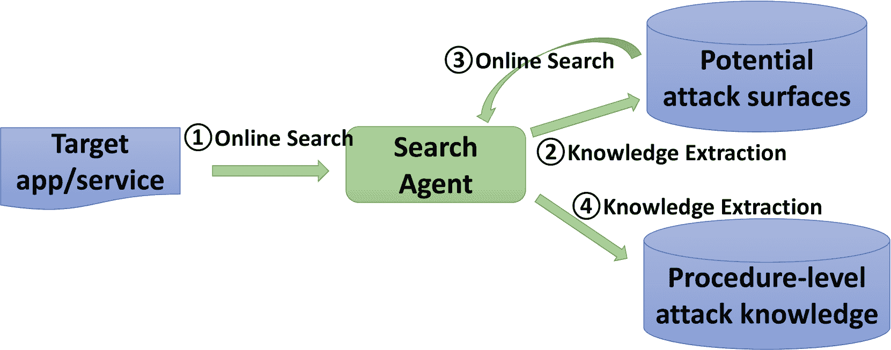

图 3. 搜索代理工作流

在线搜索模块是可定制和可扩展的。我们已经实现了几种搜索功能，包括在 Google 上进行的一般搜索、在像 Snyk (Security, [2024](https://arxiv.org/html/2411.05185v1#bib.bib40)) 和 AVD (Cloud, [2024](https://arxiv.org/html/2411.05185v1#bib.bib9)) 这样的数据库中的特定漏洞搜索，以及在 GitHub 和 ExploitDB 等漏洞代码库中的搜索。在我们的层级搜索工作流中，我们在第一轮使用 Google 和漏洞数据库搜索来识别潜在攻击面，然后在第二轮中利用 Google 和代码库搜索来查找漏洞实现细节。

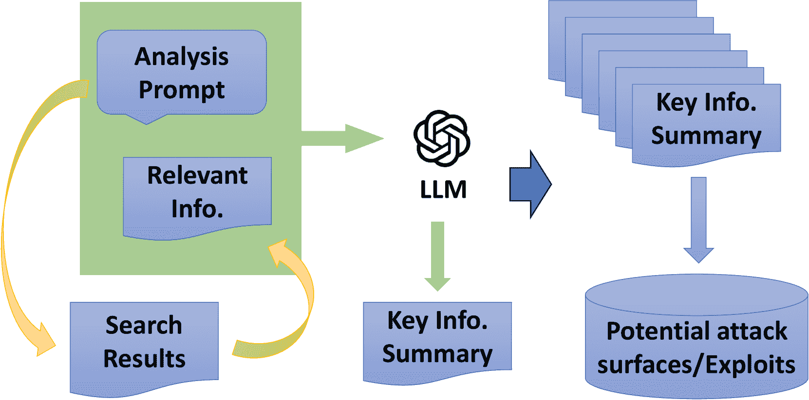

图 4. 用于搜索结果摘要的 RAG 工作流。黄色箭头表示检索过程，绿色箭头表示生成过程。

每轮在线搜索后，搜索代理会分析结果。然而，直接索引和存储原始搜索结果中的信息效率较低。因此，我们利用基于RAG的问答系统从原始搜索结果中提取关键信息，并利用提取的知识构建更相关、更简洁的数据库。如图[4](https://arxiv.org/html/2411.05185v1#S3.F4 "图 4 ‣ 3.3\. 搜索代理 ‣ 3\. 系统设计 ‣ PentestAgent：将LLM代理融入自动化渗透测试")所述，在分析提示下，RAG框架将首先从搜索结果中检索相关信息片段。然后，它将包含检索信息的分析提示作为上下文发送给LLM，并由LLM在该上下文中分析信息，以帮助回答分析提示中的问题并生成一个包含我们所需关键信息的搜索结果综合摘要。最后，将单个文档的摘要收集起来，构建一个潜在攻击面或漏洞利用数据库，如图[3](https://arxiv.org/html/2411.05185v1#S3.F3 "图 3 ‣ 3.3\. 搜索代理 ‣ 3\. 系统设计 ‣ PentestAgent：将LLM代理融入自动化渗透测试")所示。

在第一轮寻找潜在攻击面时，我们使用以下提示从单个搜索结果中提取知识。具体来说，我们要求提供关于漏洞的相关性和关键信息，如CVE编号，以及其他可能引导到更详细信息的关键词或网址。我们还要求搜索代理将分析结果以结构化格式输出，以便后续处理。

<svg class="ltx_picture" height="181.31" id="S3.SS3.p5.pic1" overflow="visible" version="1.1" width="600"><g fill="#000000" stroke="#000000" stroke-width="0.4pt" transform="translate(0,181.31) matrix(1 0 0 -1 0 0)"><g fill-opacity="1.0" transform="matrix(1.0 0.0 0.0 1.0 21.65 161.56)"><foreignobject color="#FFFFFF" height="13.84" overflow="visible" transform="matrix(1 0 0 -1 0 16.6)" width="556.69">Potential Attack Surface Analysis Prompt (Simplified)</foreignobject></g> <g fill-opacity="1.0" transform="matrix(1.0 0.0 0.0 1.0 21.65 13.78)"><foreignobject color="#000000" height="130.07" overflow="visible" transform="matrix(1 0 0 -1 0 16.6)" width="556.69">RAG & CoT Generate a concise summary of the document to answer the following questions: 1) Does this document describe vulnerabilities targeting a particular service or app; if so, what is the relevant service/app version? 2) Provide information that can be used to search for the exploit of the vulnerabilities. Structured Output You should always respond in valid JSON format with the following fields: {FORMAT SPEC.} … For example, the response looks like this: {OUTPUT FORMAT EXAMPLE}</foreignobject></g></g></svg>

在分析所有单个搜索结果后，搜索代理将它们总结成结构化的输出，以便后续解析和存储。

<svg class="ltx_picture" height="96.75" id="S3.SS3.p7.pic1" overflow="visible" version="1.1" width="600"><g fill="#000000" stroke="#000000" stroke-width="0.4pt" transform="translate(0,96.75) matrix(1 0 0 -1 0 0)"><g fill-opacity="1.0" transform="matrix(1.0 0.0 0.0 1.0 21.65 78.54)"><foreignobject color="#FFFFFF" height="12.3" overflow="visible" transform="matrix(1 0 0 -1 0 16.6)" width="556.69">Search Results Summary Prompt</foreignobject></g> <g fill-opacity="1.0" transform="matrix(1.0 0.0 0.0 1.0 21.65 13.78)"><foreignobject color="#000000" height="47.05" overflow="visible" transform="matrix(1 0 0 -1 0 16.6)" width="556.69">List ALL CVE numbers, URLs, keywords, and their applicable version relevant to exploit the vulnerabilities of {APP}. The results should be presented in valid JSON format with the following fields: {FORMAT SPEC.} …</foreignobject></g></g></svg>

类似地，在第二轮寻找程序级漏洞细节时，搜索代理使用RAG和CoT分析单个搜索结果。首先，它检查代码库是否包含相关的漏洞利用。然后，它提取关键信息，如适用的服务或应用版本以及运行漏洞利用所需的前提条件。第一轮分析主要侧重于LLM的文本摘要能力，而第二轮则依赖LLM的代码分析能力，以确定代码是否作为漏洞利用功能并分析执行所需的依赖项。

从我们的初步尝试中，我们发现LLM对软件版本控制不熟悉。因此，我们添加了一段描述和示例，展示如何通过少量示例学习来处理软件版本。我们使用以下提示来提取所需信息。

<svg class="ltx_picture" height="247.72" id="S3.SS3.p10.pic1" overflow="visible" version="1.1" width="600"><g fill="#000000" stroke="#000000" stroke-width="0.4pt" transform="translate(0,247.72) matrix(1 0 0 -1 0 0)"><g fill-opacity="1.0" transform="matrix(1.0 0.0 0.0 1.0 21.65 227.98)"><foreignobject color="#FFFFFF" height="13.84" overflow="visible" transform="matrix(1 0 0 -1 0 16.6)" width="556.69">Exploit Procedure Analysis Prompt (Simplified)</foreignobject></g> <g fill-opacity="1.0" transform="matrix(1.0 0.0 0.0 1.0 21.65 13.78)"><foreignobject color="#000000" height="196.49" overflow="visible" transform="matrix(1 0 0 -1 0 16.6)" width="556.69">RAG & CoT Give a concise summary of the entire repository to answer the following questions: 1) whether this repository contains an exploit targeting a particular service or app; 2) What effect does the exploit have? Use one phrase to summarize the effect (e.g., remote command execution); 3) What relevant service/app version can this exploit be applied to? Few-shot Learning Note the app version is typically formatted as x.y.z. Explicitly state the version with the following formats … 4) what are the requirements to run this exploit? (e.g., OS, library dependencies, etc.) Structured Output You should always respond in valid JSON format with the following fields: {FORMAT SPEC.} … For example, the response looks like this: {OUTPUT FORMAT EXAMPLE}</foreignobject></g></g></svg>

在搜索代理提取渗透测试知识后，它会以图[5](https://arxiv.org/html/2411.05185v1#S3.F5 "图 5 ‣ 3.3\. 搜索代理 ‣ 3\. 系统设计 ‣ PentestAgent: 融入LLM代理以实现自动化渗透测试")所示的分层树结构进行存储。分层树结构的渗透测试知识库支持高效搜索和系统化管理渗透测试知识。

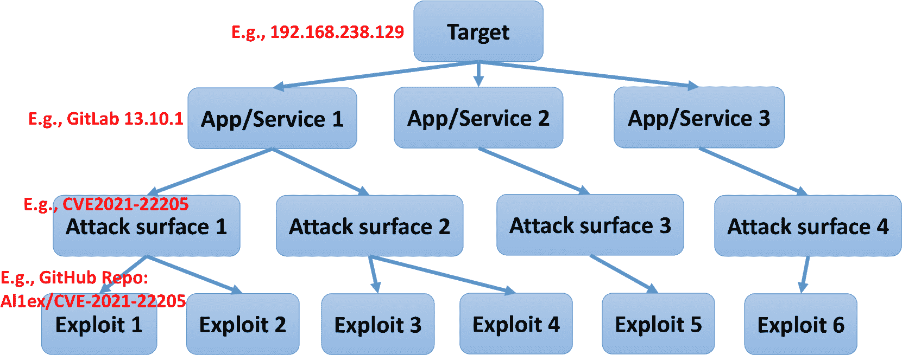

图 5. 分层树结构渗透测试知识数据库

### 3.4. 规划代理

规划代理以侦查代理检测到的服务和应用为输入，并生成攻击计划作为输出。如图[1](https://arxiv.org/html/2411.05185v1#S2.F1 "图 1 ‣ 2.2\. 将LLM应用于渗透测试的挑战 ‣ 2\. 背景与相关工作 ‣ PentestAgent: 融入LLM代理以实现自动化渗透测试")所示，规划代理利用RAG和渗透测试知识库（图[5](https://arxiv.org/html/2411.05185v1#S3.F5 "图 5 ‣ 3.3\. 搜索代理 ‣ 3\. 系统设计 ‣ PentestAgent: 融入LLM代理以实现自动化渗透测试")）首先生成与服务和应用相关的潜在攻击面列表。然后，规划代理遵循类似的过程生成攻击利用列表。

规划代理以服务或应用为关键，查找潜在攻击面相关的数据库，并根据服务或应用版本和漏洞类型从数据库中检索这些信息。规划代理根据应用版本对攻击面提出建议，并按漏洞类型对攻击面进行分类。我们设计了以下提示，以根据特定的服务或应用生成潜在攻击面的列表。

<svg class="ltx_picture" height="98.28" id="S3.SS4.p3.pic1" overflow="visible" version="1.1" width="600"><g fill="#000000" stroke="#000000" stroke-width="0.4pt" transform="translate(0,98.28) matrix(1 0 0 -1 0 0)"><g fill-opacity="1.0" transform="matrix(1.0 0.0 0.0 1.0 21.65 78.54)"><foreignobject color="#FFFFFF" height="13.84" overflow="visible" transform="matrix(1 0 0 -1 0 16.6)" width="556.69">Attack Surface Suggestion Prompt (Simplified)</foreignobject></g> <g fill-opacity="1.0" transform="matrix(1.0 0.0 0.0 1.0 21.65 13.78)"><foreignobject color="#000000" height="47.05" overflow="visible" transform="matrix(1 0 0 -1 0 16.6)" width="556.69">List out all vulnerabilities ranked by confidence that can be used to exploits … The results should be presented in valid JSON format with the following fields: {FORMAT SPEC.} …</foreignobject></g></g></svg>

规划代理利用攻击面查找相关数据库中的攻击利用，并根据服务或应用版本以及利用效果（例如，远程代码执行、认证绕过）从数据库中检索攻击利用细节。然后，规划代理根据应用版本提出利用建议，并按利用效果对利用进行分类。我们设计了以下提示，以为每个潜在攻击面生成攻击利用列表。

<svg class="ltx_picture" height="98.28" id="S3.SS4.p5.pic1" overflow="visible" version="1.1" width="600"><g fill="#000000" stroke="#000000" stroke-width="0.4pt" transform="translate(0,98.28) matrix(1 0 0 -1 0 0)"><g fill-opacity="1.0" transform="matrix(1.0 0.0 0.0 1.0 21.65 78.54)"><foreignobject color="#FFFFFF" height="13.84" overflow="visible" transform="matrix(1 0 0 -1 0 16.6)" width="556.69">Exploit Suggestion Prompt (Simplified)</foreignobject></g> <g fill-opacity="1.0" transform="matrix(1.0 0.0 0.0 1.0 21.65 13.78)"><foreignobject color="#000000" height="47.05" overflow="visible" transform="matrix(1 0 0 -1 0 16.6)" width="556.69">List out paths of all relevant repositories ranked by the confidence that contain exploits …The results should be presented in valid JSON format with the following fields: {FORMAT SPEC.} …</foreignobject></g></g></svg>

### 3.5. 执行代理

执行代理将利用细节作为输入，并尝试自动执行攻击，最终生成攻击总结作为输出。执行代理按照规划代理建议的顺序执行。如图[6](https://arxiv.org/html/2411.05185v1#S3.F6 "图 6 ‣ 3.5\. 执行代理 ‣ 3\. 系统设计 ‣ PentestAgent: 融入LLM代理以实现自动化渗透测试")所示，每次攻击执行可分为两个阶段：准备阶段和攻击阶段。

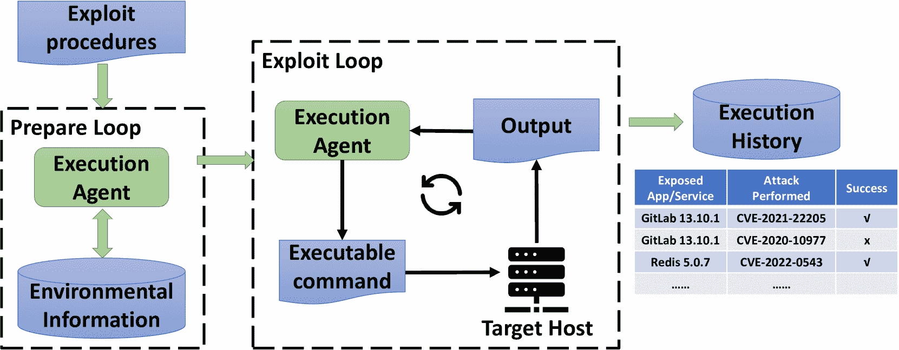

图6. 执行代理工作流

在准备阶段，执行代理分析漏洞利用详情以确定成功执行所需的条件，例如所需的参数。然后，它查询包含环境信息的数据库以获取必要的信息。以下系统消息引导执行代理履行其职责。为了绕过可能会阻止过程的安全机制，执行代理在尝试执行漏洞利用时，我们通过角色扮演使其充当网络安全渗透测试员。

为了有效找到执行漏洞利用所需的信息，我们采用了CoT技术，引导执行代理首先识别所有参数，然后确定每个参数所需的信息。在此分析过程中，执行代理通过RAG从漏洞利用详情中检索相关信息，以提供上下文。最后，执行代理以结构化的JSON格式输出所需信息，使其能够继续执行从环境信息数据库请求信息的后续步骤。

<svg class="ltx_picture" height="148.1" id="S3.SS5.p4.pic1" overflow="visible" version="1.1" width="600"><g fill="#000000" stroke="#000000" stroke-width="0.4pt" transform="translate(0,148.1) matrix(1 0 0 -1 0 0)"><g fill-opacity="1.0" transform="matrix(1.0 0.0 0.0 1.0 21.65 128.35)"><foreignobject color="#FFFFFF" height="13.84" overflow="visible" transform="matrix(1 0 0 -1 0 16.6)" width="556.69">Execution Preparation System Message (Simplified)</foreignobject></g> <g fill-opacity="1.0" transform="matrix(1.0 0.0 0.0 1.0 21.65 13.78)"><foreignobject color="#000000" height="96.86" overflow="visible" transform="matrix(1 0 0 -1 0 16.6)" width="556.69">Role-play You’re an excellent cybersecurity pentesting assistant … CoT Analyze the exploit to answer the following questions: 1) What parameters do you need to fill in to execute this exploit successfully? 2) What information do you need to fill in these parameters? RAG You should use your query tool to learn the details about the exploit … Structured Output You should always respond in valid JSON format with the following fields: {FORMAT SPEC.} …</foreignobject></g></g></svg>

在获取所需信息的列表后，执行代理使用以下提示查询环境信息数据库以填写相关信息。

<svg class="ltx_picture" height="131.49" id="S3.SS5.p6.pic1" overflow="visible" version="1.1" width="600"><g fill="#000000" stroke="#000000" stroke-width="0.4pt" transform="translate(0,131.49) matrix(1 0 0 -1 0 0)"><g fill-opacity="1.0" transform="matrix(1.0 0.0 0.0 1.0 21.65 111.75)"><foreignobject color="#FFFFFF" height="13.84" overflow="visible" transform="matrix(1 0 0 -1 0 16.6)" width="556.69">Execution Information Query Prompt (Simplified)</foreignobject></g> <g fill-opacity="1.0" transform="matrix(1.0 0.0 0.0 1.0 21.65 13.78)"><foreignobject color="#000000" height="80.25" overflow="visible" transform="matrix(1 0 0 -1 0 16.6)" width="556.69">Based on the known information, try to provide the information listed here. {INFO NEEDED …} CoT You should examine the information needed one by one. For each piece of information needed, you should … RAG You should use your query tool to learn about the target environment … Structured Output The results should be presented in valid JSON format with the following fields: {FORMAT SPEC.} …</foreignobject></g></g></svg>

在获取包含所请求信息的响应后，执行代理的系统消息将更新，以过渡到利用阶段。

<svg class="ltx_picture" height="148.1" id="S3.SS5.p8.pic1" overflow="visible" version="1.1" width="600"><g fill="#000000" stroke="#000000" stroke-width="0.4pt" transform="translate(0,148.1) matrix(1 0 0 -1 0 0)"><g fill-opacity="1.0" transform="matrix(1.0 0.0 0.0 1.0 21.65 128.35)"><foreignobject color="#FFFFFF" height="13.84" overflow="visible" transform="matrix(1 0 0 -1 0 16.6)" width="556.69">Execution Exploit System Message (Simplified)</foreignobject></g> <g fill-opacity="1.0" transform="matrix(1.0 0.0 0.0 1.0 21.65 13.78)"><foreignobject color="#000000" height="96.86" overflow="visible" transform="matrix(1 0 0 -1 0 16.6)" width="556.69">Your next task is to provide step by step guide for executing the exploit and debugging the errors encountered … RAG You should use the tool to learn the code and README of the exploit to figure out how to properly execute it. Specifications Avoid commands that require user interactions … Self-reflection When the results indicate an error, you should … Structured Output You should always respond in valid JSON format with the following fields: {FORMAT SPEC.} …</foreignobject></g></g></svg>

在利用阶段，执行代理使用RAG获取代码执行的详细信息，拆解执行计划，并生成逐步执行指南。与侦察代理类似，执行代理通过迭代循环来执行漏洞利用。

当在漏洞利用执行过程中遇到错误时，需要进行适当的错误处理。为了引导执行代理调试错误，我们采用了自我反思技术。执行代理根据代码和错误消息分析并修复错误，同时记录错误历史以供未来参考，避免重复错误。这个迭代过程确保了我们的自动化渗透测试系统不断完善和优化。

## 4\. 评估

本节介绍了用于评估自动化渗透测试框架的基准，并讨论评估结果。在评估中，我们探讨了以下研究问题（RQ）：

RQ1\. 效果性。自动完成整个渗透测试过程的成功率是多少？

RQ2\. 完成度。哪些渗透测试阶段可以自动完成？它们的完成程度如何？

RQ3\. 效率。PentestAgent完成渗透测试任务需要多少时间和API成本？

### 4.1\. 评估设置

#### 4.1.1\. 基准数据集

基准数据集应该易于访问，并包含多样化的任务，具有不同的难度级别，用于评估自动化渗透测试框架。可访问性对一个好的基准测试至关重要，否则它将妨碍整个社区的使用。基准测试中的任务应涉及利用各种漏洞，针对不同的服务和应用程序，模拟真实世界的渗透测试场景。更重要的是，这些任务应有适当的难度标签，反映系统在处理不同难度任务时的表现，帮助研究人员识别系统的优缺点。

许多平台可以作为基准测试的数据集，例如HackTheBox（HackTheBox，[2024](https://arxiv.org/html/2411.05185v1#bib.bib17)）、OWASP Benchmark（OWASP，[2024a](https://arxiv.org/html/2411.05185v1#bib.bib33)）、VulnHub（VulnHub，[2024](https://arxiv.org/html/2411.05185v1#bib.bib46)）和VulHub（Vulhub，[2024](https://arxiv.org/html/2411.05185v1#bib.bib45)）。然而，HackTheBox对公众不开放，访问大多数测试机器需要VIP订阅，这给基准测试的使用带来了负担。OWASP Benchmark和VulnHub包含成千上万的目标测试环境，涵盖了广泛的真实世界渗透测试场景。然而，搭建这些环境进行测试需要大量的人工努力。此外，它们没有为测试用例提供难度级别的参考，必须通过人工努力来确定每个测试用例的难度级别。

最后，我们选择 VulHub 作为我们的基准数据集。VulHub 提供了一个开源的、包含超过一百个预构建易受攻击的 Docker 环境的集合，已被广泛认可并应用于渗透测试实践中。这个基于容器的平台支持基础设施即代码（IaC），使得设置测试环境变得简单。此外，Docker 容器为渗透测试提供了足够的隔离性。而且，VulHub 中的大多数易受攻击环境是为了重现特定的常见漏洞和暴露（CVE）而构建的（MITRE，[2024](https://arxiv.org/html/2411.05185v1#bib.bib28)）。每个易受攻击的环境都与一个 CVE 编号相关联，这使得我们可以使用与 CVE 编号相关的指标来了解每个易受攻击环境的属性。具体来说，我们通过通用漏洞评分系统（CVSS）（数据库，[2024](https://arxiv.org/html/2411.05185v1#bib.bib10)）了解漏洞利用的难度，并通过漏洞利用预测评分系统（EPSS）（由事件响应和安全团队，[2024b](https://arxiv.org/html/2411.05185v1#bib.bib32)）了解易受攻击环境的现实性。我们在附录的 §[A.1](https://arxiv.org/html/2411.05185v1#A1.SS1 "A.1\. Benchmark Construction ‣ Appendix A Appendix ‣ PentestAgent: Incorporating LLM Agents to Automated Penetration Testing") 中详细阐述了如何构建基准数据集。

结果，我们编制了一个基准，包含67个渗透测试目标，涵盖32个CWE（通用弱点枚举）类别，如附录中的图[12](https://arxiv.org/html/2411.05185v1#A1.F12 "Figure 12 ‣ A.1\. Benchmark Construction ‣ Appendix A Appendix ‣ PentestAgent: Incorporating LLM Agents to Automated Penetration Testing")所示。在我们的基准中，有50个目标具有易利用的难度，11个具有中等难度，6个具有较高的利用难度。这种多样化且现实的易受攻击环境集合确保了全面的评估。

#### 4.1.2\. 指标

为了回答我们的研究问题，我们设计了评估 PentestAgent 效能和效率的指标。这些指标对于评估自动化渗透测试框架的性能至关重要。

我们通过确定渗透测试的三个阶段是否能够成功且自动地完成来衡量 PentestAgent 的有效性。我们定义成功完成的标准如下：给定一个目标 IP，PentestAgent 可以自动地在易受攻击的环境中执行一个功能性的漏洞利用。

一些渗透测试可能部分成功并需要人工协助。然而，前一阶段的失败将影响后续阶段的进行。为了更好地了解 PentestAgent 中各个组件的有效性，我们在阶段级别衡量完成度。这包括评估可以在前提阶段成功的情况下自动完成的渗透测试阶段。每个阶段的完成标准定义如下：信息收集阶段被视为完成，如果 PentestAgent 成功识别目标应用程序。漏洞分析阶段标记为完成，当 PentestAgent 基于目标应用程序识别出功能性漏洞时。我们手动验证发现的漏洞是否有效。利用阶段完成时，如果 PentestAgent 能够自动且成功地执行漏洞利用。这个阶段级评估为我们提供了 PentestAgent 在渗透测试过程中自主性和有效性的细致了解，并且在最小化人工协助的情况下推动测试的进展。

此外，我们通过所用时间和完成渗透测试时产生的 API 成本来衡量 PentestAgent 的效率。时间度量评估 PentestAgent 完成整个渗透测试周期所需的时间，从初始侦察到漏洞利用执行。API 成本度量量化框架在测试过程中消耗的计算资源。这些度量提供了有关系统资源消耗和操作速度的洞察，这对实际部署和可扩展性至关重要。

#### 4.1.3 环境设置

被模拟的易受攻击应用程序托管在一台虚拟机上，该虚拟机具有 2 个 CPU 核心和 8 GB 内存，运行 Ubuntu 22.04 LTS。为了避免干扰测试过程，我们已禁用所有需要监听端口的服务，如 SSH。

攻击者机器同样托管在一台虚拟机上，具有 16 个 CPU 核心和 16 GB 内存，运行 Kali Linux 2024.1。攻击者机器包括 Kali Linux 中所有预安装的工具，未安装额外的工具。

受害者机器和攻击者机器通过 NAT 保持网络连接。受害者机器上的易受攻击容器使用设置为受害者机器 IP 的网络参数创建，从而允许攻击者机器直接访问托管在受害者机器容器中的易受攻击环境。此设置确保攻击者在尝试利用漏洞时能够模拟现实世界的网络条件。

#### 4.1.4 LLM 模型

我们使用了 OpenAI 的 GPT-3.5 和 GPT-4 模型，代表了最先进的大型语言模型技术。这些模型是通过 OpenAI APIs 访问的。具体来说，我们使用了 gpt-3.5-turbo-0125 模型，其上下文窗口大小为 16,385 个标记，训练数据截至 2021 年 9 月。该 GPT-3.5 模型的定价为 $0.50 / 1M 输入标记和 $1.50 / 1M 输出标记。此外，我们还使用了 GPT-4o 模型，该模型的上下文窗口大小为 128,000 个标记，训练数据截至 2023 年 10 月。该 GPT-4 模型的定价为 $5.00 / 1M 输入标记和 $15.0 / 1M 输出标记。

我们的自动化渗透测试框架并不广泛依赖大型语言模型（LLMs）固有的能力和知识来规划和执行大多数任务。相反，我们为渗透测试过程设计了一个强大的工作管道，将 LLMs 作为特定且明确定义任务的工具，例如文本总结和代码分析。基于这一设计，我们没有在框架中实验使用其他很多 LLM 模型。此方法确保了框架的稳定性和可靠性，因为框架的表现不依赖于不同 LLM 模型的特定优势和已学知识。通过包含 GPT-3.5 和 GPT-4，我们旨在展示在使用具有不同能力的模型时，框架的可变性与不变性，确保其在不同 LLM 配置下都能有效运行。在 §[5.2](https://arxiv.org/html/2411.05185v1#S5.SS2 "5.2. 与其他 LLM 的兼容性 ‣ 5. 讨论 ‣ PentestAgent: 集成 LLM 代理到自动化渗透测试") 中，我们讨论了 PentestAgent 与各种 LLM 的兼容性。

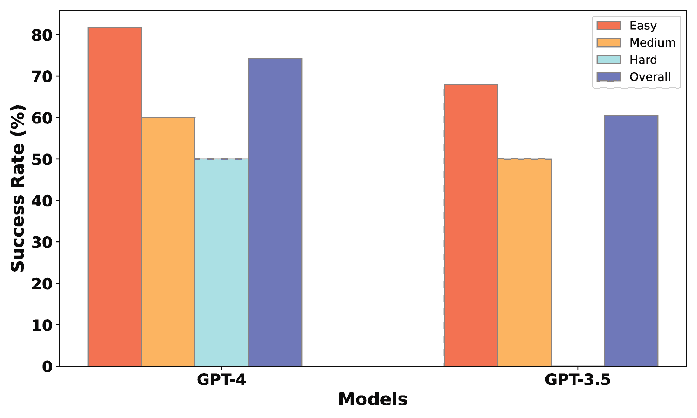

图 7. 渗透测试任务的成功率

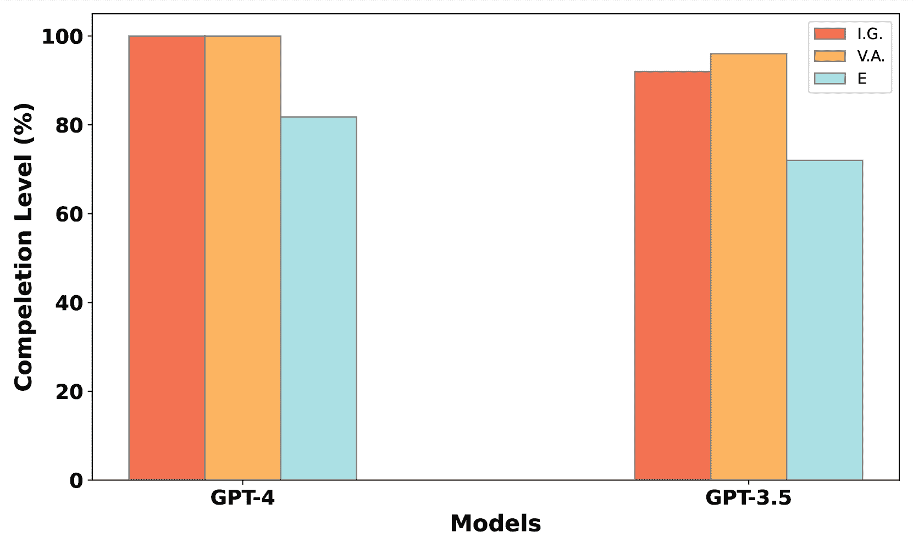

(a) 简单任务

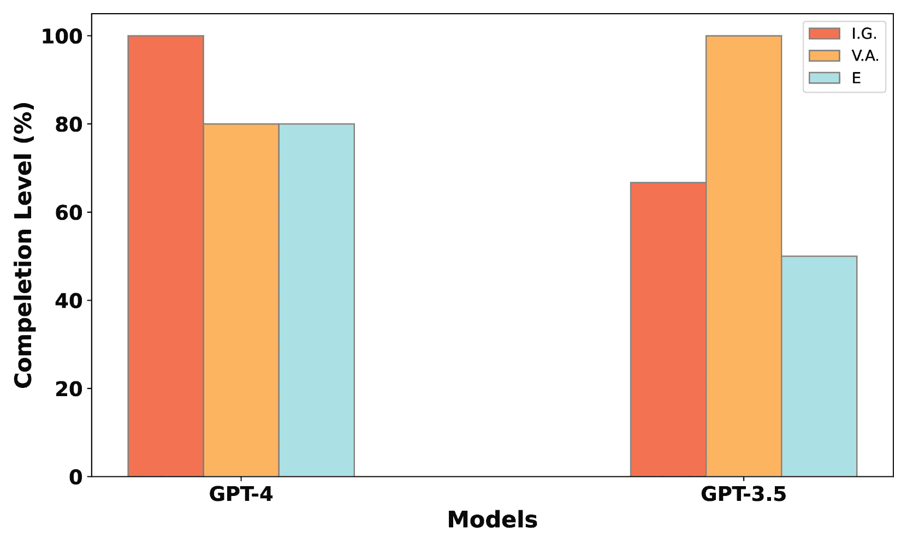

(b) 中等任务

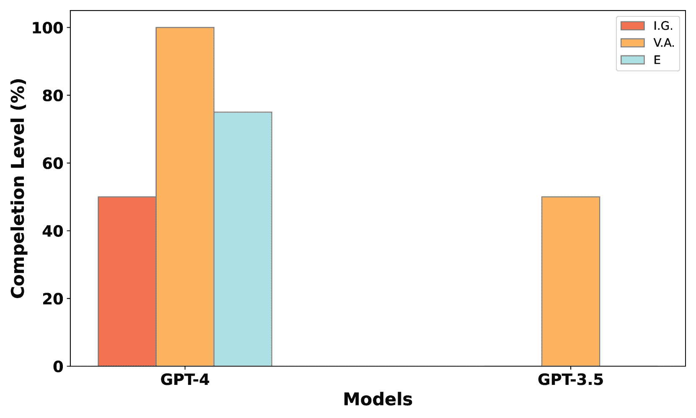

(c) 困难任务

图 8. 不同难度任务的渗透测试各阶段完成情况。I.G. 表示信息收集阶段，V.A. 表示漏洞分析阶段，E 表示利用阶段。

### 4.2. 整体框架的有效性

我们通过PentestAgent完成渗透测试过程的成功率来评估其有效性。图[7](https://arxiv.org/html/2411.05185v1#S4.F7 "Figure 7 ‣ 4.1.4\. LLM models ‣ 4.1\. Evaluation Setup ‣ 4\. Evaluation ‣ PentestAgent: Incorporating LLM Agents to Automated Penetration Testing")显示了按难度级别分类的漏洞利用成功率以及不同模型的整体表现。GPT-4模型在完成自动化渗透测试任务时展示了74.2%的整体成功率，超过了GPT-3.5模型的60.6%。两个模型的成功率始终高于60%，验证了PentestAgent在建立自动化渗透测试管道中的有效性。

尽管GPT-4模型相比GPT-3.5展现了更高的整体成功率，但两者之间的表现差异并不显著。这表明我们的框架并不完全依赖于LLM模型的通用知识和能力。

值得注意的是，GPT-3.5模型在面对困难的渗透测试任务时特别吃力，在最难的类别中完全没有成功。这种差异可能源于模型之间在上下文窗口大小和学习知识方面的固有差异，影响了它们处理复杂推理所需的能力，尤其是在应对具有挑战性的任务时。

### 4.3\. 渗透测试阶段完成情况

我们通过深入研究PentestAgent，进一步分析了其在各个渗透测试阶段的完成情况。图[8](https://arxiv.org/html/2411.05185v1#S4.F8 "Figure 8 ‣ 4.1.4\. LLM models ‣ 4.1\. Evaluation Setup ‣ 4\. Evaluation ‣ PentestAgent: Incorporating LLM Agents to Automated Penetration Testing")展示了不同难度类别和模型的渗透测试阶段完成情况。使用GPT-4模型的PentestAgent在所有阶段和难度级别上都表现出色，证明了其处理具有挑战性任务的能力。在简单任务中，GPT-4模型在情报收集和漏洞分析阶段完成率为100%，并在漏洞利用阶段保持了81.8%的高完成率。在中等难度任务中，GPT-4继续在所有阶段表现强劲，尽管在漏洞分析阶段有所下降。然而，在更困难的任务中，GPT-4模型遇到了挑战，在情报收集阶段的完成率下降到50%，表明在处理需要更好侦察工具和高级推理能力的复杂场景时，可能存在一定的局限性。

相反，GPT-3.5模型在不同难度级别下表现出不同程度的成功。在较容易的任务中，它表现非常好，情报收集（92%）和漏洞分析（96%）阶段的完成率很高，尽管在利用阶段（72%）的完成率稍低。在中等难度的任务中，虽然在漏洞分析（100%）方面保持了完美记录，但在情报收集（66.7%）和利用（50%）阶段遇到了困难，表明在有效的侦察和利用中所需的复杂推理存在挑战。值得注意的是，在困难任务中，GPT-3.5模型表现较差，在情报收集和利用阶段没有完成任务，突显出其在处理需要广泛上下文理解和推理的高级渗透测试任务时的局限性。

总体而言，研究结果表明，虽然两种模型都能自动化渗透测试任务的很大一部分，但GPT-4模型在各方面均优于GPT-3.5模型，尤其是在更具挑战性的场景中。

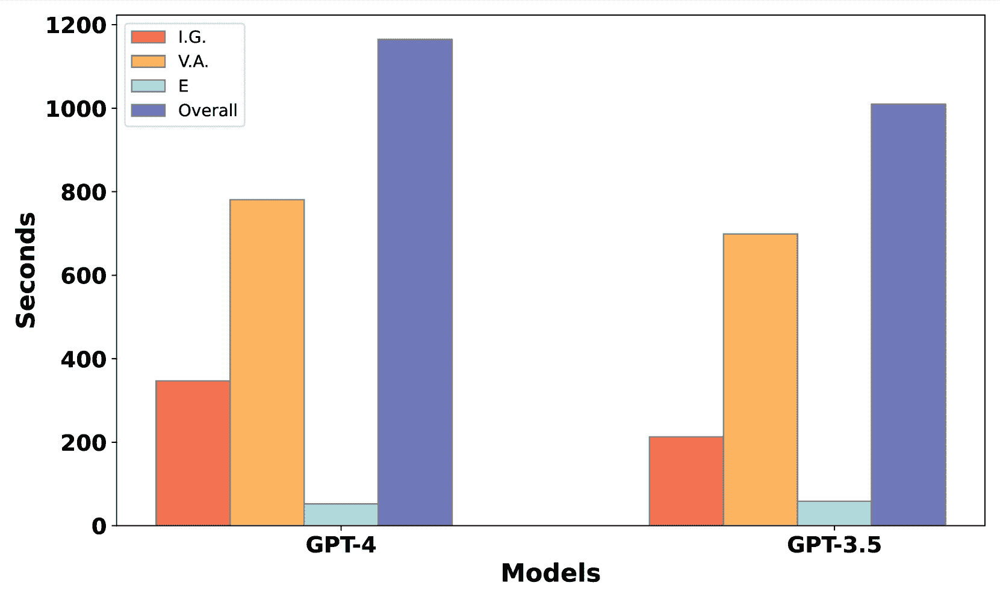

图9. 渗透测试任务的平均时间

### 4.4\. 效率

为了评估PentestAgent的效率，我们测量了执行渗透测试所需的时间和成本。图[9](https://arxiv.org/html/2411.05185v1#S4.F9 "Figure 9 ‣ 4.3\. Completion level of Penetration Testing Stages ‣ 4\. Evaluation ‣ PentestAgent: Incorporating LLM Agents to Automated Penetration Testing")展示了使用GPT-4和GPT-3.5模型进行渗透测试任务的平均时间和成本概览。在所有阶段（情报收集、漏洞分析和利用）中，GPT-4模型平均需要346.7秒进行情报收集，780.9秒进行漏洞分析，52.3秒进行利用。所有任务的累计时间为1164.7秒，平均每个任务的成本为2.66美元。相比之下，GPT-3.5模型的时间需求和成本较低：情报收集需要212.9秒，漏洞分析需要698.8秒，利用需要58.6秒，总体平均时间为1009.8秒，每个任务的成本为1.09美元。

分析强调了效率与性能之间的权衡。虽然GPT-4模型在自动化渗透测试中展现了卓越的能力，但它也伴随着更高的操作成本。

### 4.5\. 失败分析

我们分析了在评估过程中遇到的失败案例，并确定了一些具有代表性的失败场景。如图[8](https://arxiv.org/html/2411.05185v1#S4.F8 "Figure 8 ‣ 4.1.4\. LLM models ‣ 4.1\. Evaluation Setup ‣ 4\. Evaluation ‣ PentestAgent: Incorporating LLM Agents to Automated Penetration Testing")所示，大多数失败发生在情报收集和利用阶段。

在情报收集阶段，PentestAgent 有时未能以适当的粒度识别服务或应用程序。例如，我们的评估发现 PentestAgent 在检测像 PHPMailer、PHPUnit 和 Ghostscript 这样的组件时存在困难。这些并不是独立的应用程序，而是运行在 Web 服务器上的插件或组件。像 Nmap 这样的工具可以识别底层的 Web 服务器框架，如 Nginx，但无法列举这些组件。为了解决这一局限性，PentestAgent 允许集成额外的 Web 组件指纹识别工具和专门的库，以更准确地检测和分类这些 Web 组件。

在利用阶段，PentestAgent 可能会因多个挑战而失败：需要额外知识、需要用户交互，或出现 LLM 幻觉（即不准确的推测）。

需要额外知识：某些漏洞利用需要一定的领域特定知识，而这种知识可能超出了 LLM（大语言模型）代理的能力。例如，利用 Samba 服务器 4.6.3（CVE-2017-7494）假设攻击者已知凭据（用户名和密码），以建立 SMB 连接。此外，利用 JBoss（CVE-2017-12149）需要使用“ysoserial”工具来制作负载，利用不安全的 Java 对象反序列化。这些限制可以通过集成人工环节设计来克服，在这种设计中，人类专家可以提供所需的额外知识或上下文。得益于 PentestAgent 的模块化结构及其任务分解流程，人类专家可以轻松地在测试过程中任何阶段介入，协助处理复杂任务。

需要用户交互：一些漏洞利用需要用户交互，通常是手动执行的，例如通过网页用户界面上传文件。例如，利用 elFinder（CVE-2021-32682），一个用于web环境的开源文件管理器，涉及手动创建并上传归档文件。与前述场景中的缓解方法类似，PentestAgent 允许人工用户在任何渗透测试阶段介入，协助处理需要用户交互的任务。此外，最近智能代理如 AutoGPT（AutoGPT，[2024](https://arxiv.org/html/2411.05185v1#bib.bib4)）的进展为通过模仿人类行为来处理复杂任务提供了有前景的解决方案。通过集成这种智能代理，PentestAgent 可以自动化这些用户交互，大大增强了其处理传统上由人工测试人员执行任务的能力。

LLM幻觉：另一个挑战是LLM幻觉，指的是模型生成不正确或误导性的信息。这个问题在利用阶段尤其棘手，因为一次幻觉可能导致后续步骤中的错误级联。例如，如果执行代理未能生成正确的命令或输入参数，它可能错误地假设漏洞存在问题，从而走上一个错误的调试路径，最终无法成功。我们采用了几种策略来减少幻觉的发生。首先，我们通过将模型的温度设置为零来减少LLM输出的随机性，并尝试多次执行漏洞利用。我们还实现了若干停止条件，以防止幻觉带来意外后果，如陷入无限循环或执行不必要的操作。这些停止条件包括对执行尝试次数的硬编码限制，以及基于提示的条件，如“当你再次看到相同的错误时停止”。此外，攻击知识库通常包含针对相同漏洞的多个漏洞利用，使PentestAgent能够尝试不同的方法，直到找到有效的漏洞利用。

### 4.6\. 与PentestGPT的比较

我们对PentestAgent与PentestGPT的效果和效率进行了比较。与PentestAgent不同，PentestGPT在渗透测试过程中需要人工参与，以提供反馈和决策。因此，我们通过案例研究来比较它们的表现。为了进行公平评估，我们随机选择了五个漏洞，包括两个易漏洞、两个中等漏洞和一个难漏洞。我们邀请了一位具有有限渗透测试经验的本科生，作为PentestGPT所需的人工组件。该学生按照PentestGPT的指导进行操作，过程中没有使用外部知识来做决策或完成任务。

在这种测试条件下，PentestGPT未能完全利用五个漏洞中的任何一个。相比之下，PentestAgent成功完成了五个案例中的三个漏洞利用。为了进一步比较，我们检查了PentestGPT在单个渗透测试阶段的表现。PentestGPT仅在五个案例中的一个识别出了目标应用，而PentestAgent在五个案例中有四个成功识别了目标应用。在信息收集阶段，PentestGPT平均花费了826.25秒，并且测试人员与系统之间需要进行7.4轮互动。相比之下，PentestAgent平均在400秒内完成了信息收集，且无需与人工测试人员互动。在得到正确的目标应用信息后，PentestGPT仅成功引导了一个漏洞的利用。而PentestAgent则在识别目标应用后，自动利用了四个漏洞，包括那个困难的案例。

这些结果表明，PentestAgent在有效性和效率上显著优于PentestGPT，能够自动完成渗透测试任务，而无需人工协助。

## 5. 讨论

### 5.1. 基准覆盖

我们的评估是使用包含已知漏洞的基准数据集进行的，这引发了对其在现实场景中可行性的质疑。首先，必须认识到已知漏洞带来了显著的风险。许多组织和机构在及时修补漏洞方面存在困难，导致漏洞和过时组件在OWASP前10大Web应用安全风险中排名第6。（OWASP， [2024b](https://arxiv.org/html/2411.05185v1#bib.bib34)）此外，尽管我们的基准数据集包含已知漏洞，但我们根据其漏洞利用预测评分系统（EPSS）分数选择了环境。这些分数反映了漏洞在现实场景中被利用的可能性。数据集的平均EPSS分数为79.58，中位数为97.19，表明所表示的漏洞在实际环境中极有可能存在并可被利用。此外，找到包含零日漏洞或甚至一天漏洞的开放数据集仍然是一个挑战。通过关注具有高EPSS分数的已知漏洞，我们的评估确保PentestAgent在现实且可信的背景下运行，评估其在解决对网络安全构成真正风险的漏洞方面的有效性。

### 5.2. 与其他LLM的兼容性

鉴于数据隐私问题，PentestAgent已经设计为与多种大型语言模型（LLMs）兼容。除了像OpenAI预训练版本这样的商业模型外，我们还尝试了开源LLM，如Mistral和Llama 3。我们的实验确认，PentestAgent在SOTA开源模型上能够有效运行，尽管系统的效率可能会根据所使用特定模型的响应时间有所不同。正如我们在§[4.5](https://arxiv.org/html/2411.05185v1#S4.SS5 "4.5. 故障分析 ‣ 4. 评估 ‣ PentestAgent：将LLM代理引入自动化渗透测试")中讨论的那样，PentestAgent的失败案例很少是由LLM的能力造成的。因此，我们认为PentestAgent的整体有效性不太可能受到LLM选择的显著影响。

## 6. 结论

本文介绍了PentestAgent，这是一种基于大型语言模型（LLM）的新型自动化渗透测试框架，旨在解决现有框架的局限性：渗透测试知识有限和自动化不足。通过利用多代理架构并结合各种LLM技术，如检索增强生成（RAG），PentestAgent通过改进的知识整合和自动化提高了渗透测试过程的效率。

我们基于 VulHub 的易受攻击 Docker 环境提供了 PentestAgent 的全面基准测试。评估结果表明，PentestAgent 在任务完成和整体效率方面表现令人满意。

## 参考文献

+   (1)

+   0x727 (2024) 0x727\. 2024. ObserverWard. [https://github.com/0x727/ObserverWard](https://github.com/0x727/ObserverWard)

+   Ammann 等人 (2002) Paul Ammann, Duminda Wijesekera 和 Saket Kaushik. 2002. 可扩展的基于图的网络漏洞分析. 见 *第9届 ACM 计算机与通信安全会议论文集*. 217–224.

+   AutoGPT (2024) AutoGPT. 2024. AutoGPT. [https://github.com/Significant-Gravitas/AutoGPT](https://github.com/Significant-Gravitas/AutoGPT)

+   Boddy 等人 (2005) Mark S Boddy, Johnathan Gohde, Thomas Haigh 和 Steven A Harp. 2005. 使用经典规划生成网络安全行动方案. 见 *ICAPS*. 12–21.

+   Chen 等人 (2023) Jinyin Chen, Shulong Hu, Haibin Zheng, Changyou Xing 和 Guomin Zhang. 2023. GAIL-PT: 一种基于生成对抗模仿学习的智能渗透测试框架. *计算机与安全* 126 (2023), 103055.

+   Consulting (2019) Rapid7 全球咨询. 2019. 《Under the Hoodie: 渗透测试季节的经验教训》. [https://www.rapid7.com/research/reports/under-the-hoodie-2019/](https://www.rapid7.com/research/reports/under-the-hoodie-2019/) 访问日期：2024-06-19.

+   Consulting (2020) Rapid7 全球咨询. 2020. 《Under the Hoodie: 渗透测试季节的经验教训》. [https://www.rapid7.com/research/reports/under-the-hoodie-2020/](https://www.rapid7.com/research/reports/under-the-hoodie-2020/) 访问日期：2024-06-27.

+   Could (2024) 阿里巴巴 Could. 2024. 漏洞数据库. [https://avd.aliyun.com/](https://avd.aliyun.com/)

+   Database (2024) 国家漏洞数据库. 2024. 常见漏洞评分系统计算器. [https://nvd.nist.gov/vuln-metrics/cvss/v3-calculator](https://nvd.nist.gov/vuln-metrics/cvss/v3-calculator)

+   Deng 等人 (2023) Gelei Deng, Yi Liu, Yuekang Li, Kailong Wang, Ying Zhang, Zefeng Li, Haoyu Wang, Tianwei Zhang 和 Yang Liu. 2023. Jailbreaker: 跨多个大型语言模型聊天机器人进行自动化越狱. *arXiv 预印本 arXiv:2307.08715* (2023).

+   Deng 等人 (2024a) Gelei Deng, Yi Liu, Víctor Mayoral-Vilches, Peng Liu, Yuekang Li, Yuan Xu, Tianwei Zhang, Yang Liu, Martin Pinzger 和 Stefan Rass. 2024a. PentestGPT: 评估和利用大型语言模型进行自动化渗透测试. 见 *第33届 USENIX 安全研讨会（USENIX Security 24）*. 847–864.

+   Deng 等人 (2024b) Yinlin Deng, Chunqiu Steven Xia, Chenyuan Yang, Shizhuo Dylan Zhang, Shujing Yang 和 Lingming Zhang. 2024b. 大型语言模型是边缘案例生成器：为深度学习库制作异常程序进行模糊测试. 见 *第46届 IEEE/ACM 国际软件工程会议论文集*. 1–13.

+   Denis et al. (2016) Matthew Denis, Carlos Zena, 和 Thaier Hayajneh. 2016. 渗透测试：概念、攻击方法与防御策略. 载于 *2016 IEEE 长岛系统、应用与技术会议 (LISAT)*，IEEE，1–6.

+   Durkota 和 Lisỳ (2014) Karel Durkota 和 Viliam Lisỳ. 2014. 计算攻击图的最优策略：考虑行动失败与成本. 载于 *STAIRS*，101–110.

+   GreenBone (2024) GreenBone. 2024. GreenBone OpenVAS. [https://www.openvas.org/](https://www.openvas.org/)

+   HackTheBox (2024) HackTheBox. 2024. Hackthebox: 为顶尖黑客提供的训练平台. [https://www.hackthebox.com/](https://www.hackthebox.com/)

+   Happe 和 Cito (2023) Andreas Happe 和 Jürgen Cito. 2023. 被 AI “攻陷”：使用大型语言模型进行渗透测试. 载于 *第31届ACM联合欧洲软件工程会议暨软件工程基础研讨会论文集*，2082–2086.

+   Hu et al. (2020) Zhenguo Hu, Razvan Beuran, 和 Yasuo Tan. 2020. 使用深度强化学习进行自动化渗透测试. 载于 *2020 IEEE 欧洲安全与隐私研讨会 (EuroS&PW)*，IEEE，2–10.

+   Krautsevich et al. (2013) Leanid Krautsevich, Fabio Martinelli, 和 Artsiom Yautsiukhin. 2013. 面向建模自适应攻击者行为. 载于 *安全基础与实践：第五届国际研讨会，FPS 2012，蒙特利尔，QC，加拿大，2012年10月25-26日，修订精选论文集 5*，Springer，357–364.

+   Lewis et al. (2020) Patrick Lewis, Ethan Perez, Aleksandra Piktus, Fabio Petroni, Vladimir Karpukhin, Naman Goyal, Heinrich Küttler, Mike Lewis, Wen-tau Yih, Tim Rocktäschel, 等. 2020. 用于知识密集型自然语言处理任务的检索增强生成. *神经信息处理系统进展* 33 (2020), 9459–9474.

+   Li et al. (2023a) Guohao Li, Hasan Hammoud, Hani Itani, Dmitrii Khizbullin, 和 Bernard Ghanem. 2023a. Camel: 用于大型语言模型社会“心智”探索的交互式代理. *神经信息处理系统进展* 36 (2023), 51991–52008.

+   Li et al. (2023b) Haonan Li, Yu Hao, Yizhuo Zhai, 和 Zhiyun Qian. 2023b. 程序分析的搭车指南：与大型语言模型的同行之旅. *arXiv预印本 arXiv:2308.00245* (2023).

+   Liu et al. (2024) Michael Xieyang Liu, Frederick Liu, Alexander J Fiannaca, Terry Koo, Lucas Dixon, Michael Terry, 和 Carrie J Cai. 2024. “我们需要结构化输出”：面向用户中心的大型语言模型输出约束. 载于 *CHI会议计算系统人因学会议扩展摘要*，1–9.

+   Liu et al. (2023) Puzhuo Liu, Chengnian Sun, Yaowen Zheng, Xuan Feng, Chuan Qin, Yuncheng Wang, Zhi Li, 和 Limin Sun. 2023. 利用大型语言模型的力量支持二进制污点分析. *arXiv预印本 arXiv:2310.08275* (2023).

+   Meng et al. (2024) Ruijie Meng, Martin Mirchev, Marcel Böhme, 和 Abhik Roychoudhury. 2024. 大型语言模型引导的协议模糊测试. 在*第31届年度网络与分布式系统安全研讨会（NDSS）论文集*.

+   Microsoft (2024) Microsoft. 2024. 大型语言模型（LLMs）系统消息框架和模板推荐. [https://learn.microsoft.com/en-us/azure/ai-services/openai/concepts/system-message](https://learn.microsoft.com/en-us/azure/ai-services/openai/concepts/system-message)

+   MITRE (2024) MITRE. 2024. CVE. [https://cve.mitre.org/](https://cve.mitre.org/)

+   nmap (2024) nmap. 2024. nmap. [https://nmap.org/](https://nmap.org/)

+   Obes et al. (2013) Jorge Lucangeli Obes, Carlos Sarraute, 和 Gerardo Richarte. 2013. 现实世界中的攻击规划. *arXiv预印本 arXiv:1306.4044* (2013).

+   of Incident Response and Security Teams (2024a) 事件响应与安全团队论坛. 2024a. 常见漏洞评分系统v3.0：规范文档. [https://www.first.org/cvss/specification-document](https://www.first.org/cvss/specification-document)

+   of Incident Response and Security Teams (2024b) 事件响应与安全团队论坛. 2024b. 漏洞利用预测评分系统（EPSS）。 [https://www.first.org/epss/](https://www.first.org/epss/)

+   OWASP (2024a) OWASP. 2024a. OWASP基准测试. [https://owasp.org/www-project-benchmark/](https://owasp.org/www-project-benchmark/)

+   OWASP (2024b) OWASP. 2024b. Web应用安全十大风险. [https://owasp.org/www-project-top-ten/](https://owasp.org/www-project-top-ten/)

+   Rapid7 (2024) Rapid7. 2024. Rapid7 Metasploit. [https://www.metasploit.com/](https://www.metasploit.com/)

+   Roberts et al. (2011) Mark Roberts, Adele Howe, Indrajit Ray, Malgorzata Urbanska, Zinta S Byrne, 和 Janet M Weidert. 2011. 通过自动化规划进行个性化漏洞分析. 在*2011年IJCAI智能安全研讨会（SecArt）工作笔记*，第50页.

+   Sarraute et al. (2012) Carlos Sarraute, Olivier Buffet, 和 Jörg Hoffmann. 2012. POMDP使黑客更强大：在渗透测试中考虑不确定性. *人工智能学会会议论文集*，第26卷，1816–1824页.

+   Sarraute et al. (2013) Carlos Sarraute, Olivier Buffet, 和 Jörg Hoffmann. 2013. 渗透测试== POMDP求解？ *arXiv预印本 arXiv:1306.4714* (2013).

+   Sarraute et al. (2011) Carlos Sarraute, Gerardo Richarte, 和 Jorge Lucángeli Obes. 2011. 一种在非确定性场景中寻找最佳攻击路径的算法. 在*第4届ACM安全与人工智能研讨会论文集*，71–80页.

+   Security (2024) Snyk Security. 2024. Snyk漏洞数据库. [https://security.snyk.io/](https://security.snyk.io/)

+   Shinn et al. (2024) Noah Shinn, Federico Cassano, Ashwin Gopinath, Karthik Narasimhan, 和 Shunyu Yao. 2024. Reflexion：具有语言强化学习的语言代理. *神经信息处理系统进展* 36 (2024).

+   标准（2024）渗透测试执行标准。2024年。PTES技术指南。 [http://www.pentest-standard.org/index.php/PTES_Technical_Guidelines](http://www.pentest-standard.org/index.php/PTES_Technical_Guidelines)

+   斯特芬科等人（2016）雅罗斯拉夫·斯特芬科、安德里安·皮斯科祖布和罗曼·巴纳赫。2016年。《手动和自动化渗透测试：优缺点及现代趋势》。收录于*2016年第13届现代无线电工程、通信与计算机科学国际会议（TCSET）*。IEEE，488–491。

+   Tenable（2024）Tenable。2024年。《Tenable Nessus》。 [https://www.tenable.com/products/nessus](https://www.tenable.com/products/nessus)

+   Vulhub（2024）Vulhub。2024年。《Vulhub》。 [https://github.com/vulhub/vulhub](https://github.com/vulhub/vulhub)

+   VulnHub（2024）VulnHub。2024年。《VulnHub》。 [https://www.vulnhub.com/](https://www.vulnhub.com/)

+   魏等人（2022）杰森·魏、薛志·王、大尔·舒尔曼、马尔滕·博斯马、费·夏、艾德·奇、阮·V·黎、邓尼·周等人。2022年。《链式思考提示引导大语言模型进行推理》。*神经信息处理系统进展* 35（2022年），24824–24837。

+   Xu 等人（2024）贾岑·徐、杰克·W·斯托克斯、杰夫·麦克唐纳、薛松·白、大卫·马歇尔、思月·王、阿迪思·斯瓦米纳坦和周丽。2024年。《AutoAttacker：一种基于大语言模型的自动网络攻击实施系统》。*arXiv 预印本 arXiv:2403.01038*（2024年）。

+   周等人（2019）田扬·周、易超·臧、俊虎·朱和青贤·王。2019年。《NIG-AP：一种新的自动化渗透测试方法》。*信息技术与电子工程前沿* 20, 9（2019年），1277–1288。

## 附录A 附录

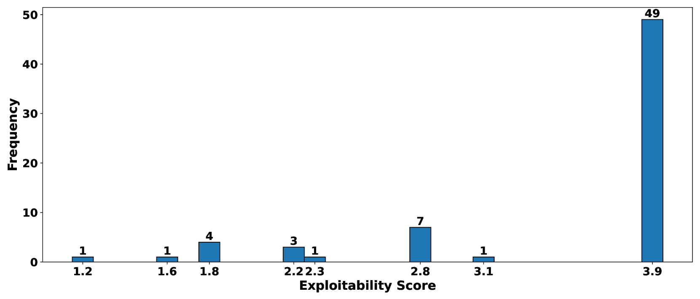

图10. 可利用性评分的分布

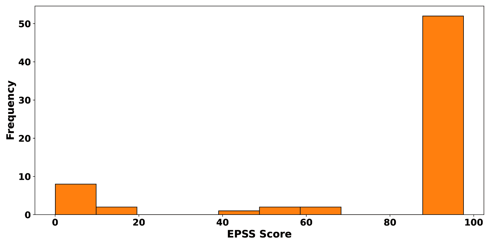

图11. EPSS评分的覆盖范围

### A.1 基准构建

我们使用CVSS和EPSS分数来确定利用漏洞的难度。CVSS提供了一个数值分数，反映了漏洞的属性。由于VulHub上的大多数CVE采用的是CVSS版本3.x的标准，我们以此作为参考来分配难度等级。该数值分数由两部分组成：可利用性和影响。对于我们的渗透测试目的，我们使用可利用性指标作为参考来分配难度等级。可利用性分数反映了漏洞被利用的难易程度和技术手段（来源：Incident Response 和 Security Teams，[2024a](https://arxiv.org/html/2411.05185v1#bib.bib31)）。较高的可利用性分数意味着漏洞更容易被利用。我们研究了可利用性分数的分布，如图[10](https://arxiv.org/html/2411.05185v1#A1.F10 "Figure 10 ‣ Appendix A Appendix ‣ PentestAgent: Incorporating LLM Agents to Automated Penetration Testing")所示。我们发现，大多数可利用性分数都高于3.0，而可利用性分数为2.0和3.0是划分易、中、难难度的自然界限。一些存在漏洞的应用程序或服务可能有多个CVE编号。我们根据EPSS分数来选择使用的CVE。EPSS分数衡量漏洞在实际环境中被利用的可能性。较高的EPSS分数表示漏洞更可能被利用，使其在渗透测试中更加现实。图[11](https://arxiv.org/html/2411.05185v1#A1.F11 "Figure 11 ‣ Appendix A Appendix ‣ PentestAgent: Incorporating LLM Agents to Automated Penetration Testing")展示了我们基准数据集中的CVE的EPSS分数分布。

此外，我们移除了那些没有CVE编号且没有CVSS 3.x分数的Docker镜像。此外，因某些应用程序的设置过程较为复杂（例如需要服务提供商的许可证密钥），所以也将这些应用程序从数据集中移除。

为了在评估中保持完整性和公平性，我们严格禁止PentestAgent直接访问VulHub仓库中的任何内容，从而防止在测试方法中出现任何优势或偏差。

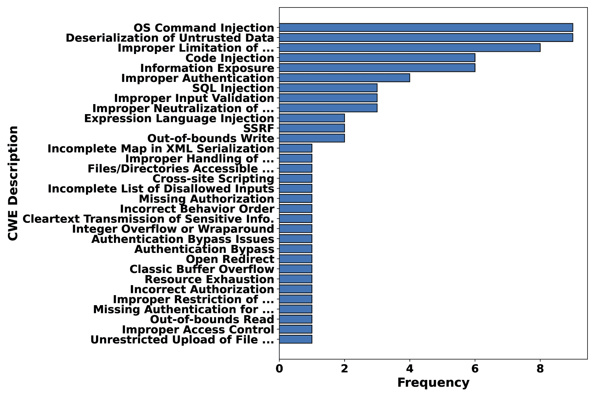\说明

[CWE的覆盖率]CWE的覆盖率

图12. CWE的覆盖率

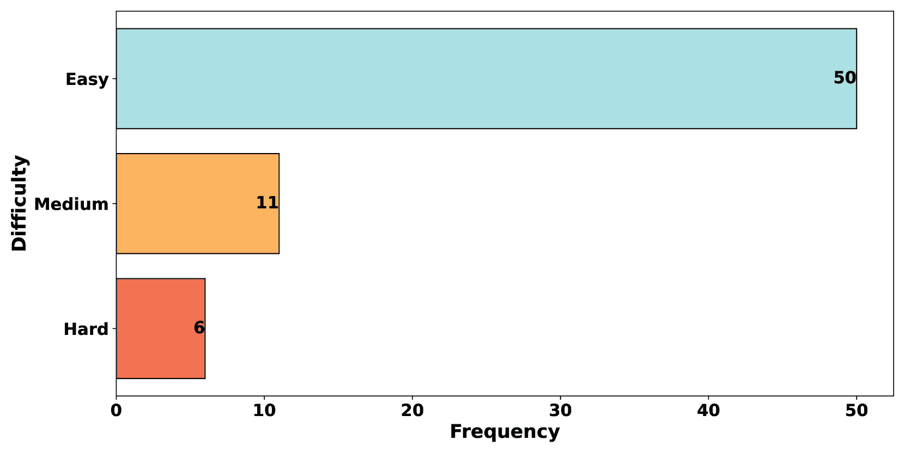\说明

[利用难度评分分布]利用难度评分分布

图13. 利用难度评分分布

图[13](https://arxiv.org/html/2411.05185v1#A1.F13 "Figure 13 ‣ A.1\. Benchmark Construction ‣ Appendix A Appendix ‣ PentestAgent: Incorporating LLM Agents to Automated Penetration Testing")展示了我们基准数据集的难度评分分布。
