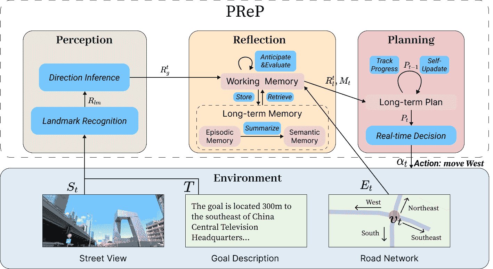
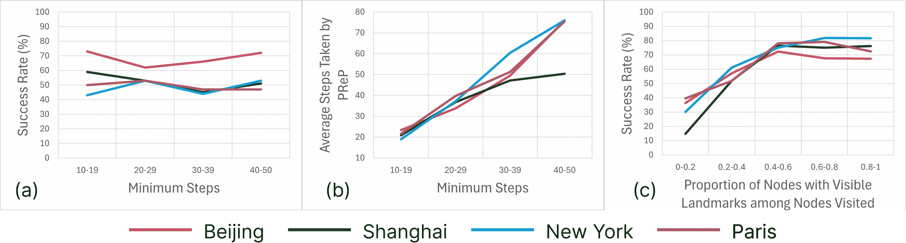

<!--yml

category: 未分类

日期：2025-01-11 12:20:19

-->

# 感知、反思与规划：设计用于目标导向城市导航的LLM代理，无需指令

> 来源：[https://arxiv.org/html/2408.04168/](https://arxiv.org/html/2408.04168/)

曾庆彬¹，杨庆龙¹，董顺南¹，杜亨明²，

郑梁²，许风利¹，李勇¹，

¹清华大学电子工程系，北京，中国

²澳大利亚国立大学计算机学院，澳大利亚

通信作者：[fenglixu@tsinghua.edu.cn](Fengli%20Xu:fenglixu@tsinghua.edu.cn)

###### 摘要

本文考虑了一个城市导航场景：一个AI代理通过语言描述获得目标位置相对于一些知名地标的位置；通过仅观察周围场景，包括识别地标和道路网络连接，代理必须做出决策，导航到目标位置，而无需指令。这个问题非常具有挑战性，因为它要求代理建立自我位置并获得复杂城市环境的空间表示，其中地标往往是不可见的。在没有导航指令的情况下，这些能力对于代理在长程城市导航中做出高质量决策至关重要。随着大语言模型（LLMs）新兴的推理能力，一个诱人的解决方案是通过提示LLMs对每次观察做出“反应”并相应地做出决策。然而，这一解决方案的表现非常差，代理通常会重复访问相同的位置，并做出短视且不一致的决策。为了解决这些问题，本文提出了一种新颖的代理工作流程，其特点是能够感知、反思和规划。具体来说，我们发现LLaVA-7B可以经过微调，足够准确地感知地标的大致方向和距离，从而进行城市导航。此外，反思是通过记忆机制实现的，其中过去的经验被存储并可与当前感知一起检索，以进行有效的决策推理。规划使用反思结果生成长期计划，从而避免在长程导航中做出短视决策。我们展示了所设计的工作流程显著提高了LLM代理的城市导航能力，相较于现有的最先进基准方法。代码可通过[https://anonymous.4open.science/r/PReP-13B5](https://anonymous.4open.science/r/PReP-13B5)获取。

感知、反思与规划：设计用于目标导向城市导航的LLM代理，无需指令

曾庆彬¹，杨庆龙¹，董顺南¹，杜亨明²，郑梁²，许风利¹，李勇¹，¹清华大学电子工程系，北京，中国 ²澳大利亚国立大学计算机学院，澳大利亚 通信作者：[fenglixu@tsinghua.edu.cn](Fengli%20Xu:fenglixu@tsinghua.edu.cn)

## 1 引言

在复杂且未知的城市环境中进行导航是人工智能代理的重要任务。本文研究了城市环境中目标导向的代理导航，其中代理提供了视觉街景感知和以一些知名地标为参照的文本目标位置描述，例如，“目的地大约在摩天大楼A的东北300米处”。代理应能从街景图像中识别地标，并以这些地标为锚点推断目标的方向和距离，进而规划一系列动作以导航到目标。此任务具有挑战性，因为它要求代理了解自身位置并获得对复杂城市环境的空间理解，而在某些情况下地标是不可见的。在没有导航指令和地图的情况下，自主构建认知地图对代理在导航任务中表现良好至关重要。

图1：城市导航结果的示意性对比。所提出的工作流方法（蓝色）成功到达目标，且其路径接近最短路径（黄色）。React方法（无工作流）失败，因为它做出了短视的决策。在一个场景中，React代理走到了死胡同，并且继续朝着死胡同走去，因为目标就在那个方向。在另一个场景中，代理在原地打转，因为目标的方向随着它的移动而改变。React代理没有记忆，因此不能绕路。

现有文献没有提供现成可用的解决方案来完成此任务。一些近期的研究工作，如Chen等人（[2019](https://arxiv.org/html/2408.04168v3#bib.bib3)）和Schumann等人（[2024](https://arxiv.org/html/2408.04168v3#bib.bib16)）假设提供了逐步的语言指令，因此不适用于我们的任务。另一类文献集中于设计强化学习模型，如Mirowski等人（[2016](https://arxiv.org/html/2408.04168v3#bib.bib14)）、Zhu等人（[2017](https://arxiv.org/html/2408.04168v3#bib.bib31)）和Wu等人（[2018](https://arxiv.org/html/2408.04168v3#bib.bib25)），但这些方法通常面临训练样本效率低下和对环境扰动敏感的挑战。

我们探讨了使用大语言模型（LLMs）来完成这一任务的可能性。React（Yao等人，[2022](https://arxiv.org/html/2408.04168v3#bib.bib27)）是一个简单的基准模型，旨在将LLMs的推理能力与城市环境中的实际情况相结合。在每一步中，该方法通过视觉感知街景来做出行动决策。这个过程会反复执行，直到达到目标或耗尽导航预算。尽管React在室内环境中取得了一些成功，但在复杂的城市环境中表现不佳，这可以归因于两个主要原因。首先，由于每个行动决策仅基于当前观察，代理可能会重复之前的行动，发现自己陷入循环。请参见图[1](https://arxiv.org/html/2408.04168v3#S1.F1 "Figure 1 ‣ 1 Introduction ‣ Perceive, Reflect, and Plan: Designing LLM Agent for Goal-Directed City Navigation without Instructions")中的示例。其次，React缺乏远见，只关注当前的步骤。没有考虑长期的行动序列，代理往往会采取更多的行动，而不是实际需要的行动。延伸来看，React在没有形成认知地图的情况下，在复杂环境中的导航性能非常差。

本文提出了一种有效的代理工作流程，旨在提升大语言模型（LLMs）的空间认知能力，从而改善目标导向的城市导航性能。我们对LLaVA进行了微调，发现其能够以足够的准确性感知地标的方向和距离，满足导航需求。受到人类认知理论的启发，Sumers等人（[2023](https://arxiv.org/html/2408.04168v3#bib.bib20)）提出了一种记忆方案，帮助代理形成认知地图，Momennejad等人（[2023](https://arxiv.org/html/2408.04168v3#bib.bib15)）进一步发展了该理论。历史轨迹和观察数据被存储并总结，以学习环境的内在空间表示，*即*，内部城市地图。代理结合历史经验和当前观察来评估当前状况并推断目标方向。为了改进短视的行动，我们引入了长期规划。具体而言，考虑到反思和当前道路网络的连接，代理将完整路径分解为多个子目标，在长途导航中确保一致且合理的移动，直到到达最终目标。这些组件形成了“*感知*、*反思*和*规划*”的工作流程，使代理能够执行长距离的城市导航。

我们的方法仅需使用地标的视觉-语言配对训练视觉感知部分。记忆和规划部分则通过少量示例进行操作（但也支持微调）。我们发现，微调用于记忆和规划部分的LLM显著提升了导航性能。例如，微调后的LLaMA3模型与基础LLaMA3模型相比，成功率提高了近13%。与强化学习方法相比，我们的方法提供了更高的数据效率。与指令跟随方法相比，我们的系统不依赖显式指令，从而在导航中提供更大的自主性。

我们收集了反映四个城市CBD场景的导航数据集——北京、上海、纽约和巴黎。它们包含复杂的道路网络，涵盖数千个路节点和街景图像。在这四个数据集上，提出的工作流显著优于可以应用于我们任务（但不特定）的其他方法，四个城市测试集的平均成功率为54%。我们发现，感知组件能够提供准确的空间关系，支持城市导航，其成功率仅比基于真实感知结果的导航低5%。此外，我们还展示了反思和规划如何帮助LLM代理构建认知地图，从而进一步提高成功率，并在处理长距离导航任务时发挥作用。

## 2 相关工作

视觉与语言导航（VLN）旨在使代理能够根据自然语言指令在视觉环境中自主导航 Gu等人 ([2022](https://arxiv.org/html/2408.04168v3#bib.bib5))、Wu等人 ([2024](https://arxiv.org/html/2408.04168v3#bib.bib24))。该领域从室内场景发展到城市环境，任务和数据集的范围不断扩展。Anderson *et al.* 创建了早期的VLN数据集，而Mirowski *et al.* Mirowski等人 ([2018](https://arxiv.org/html/2408.04168v3#bib.bib13)) 引入了跨模态匹配模型，利用注意力机制和强化学习进行视觉与文本的融合。最近，LLM的应用在VLN中带来了新的解决方案 Zhou等人 ([2024](https://arxiv.org/html/2408.04168v3#bib.bib30))、Dorbala等人 ([2023](https://arxiv.org/html/2408.04168v3#bib.bib4))、Zu等人 ([2023](https://arxiv.org/html/2408.04168v3#bib.bib32))，并在室内环境中取得了成功。其他工作如Shah等人 ([2023](https://arxiv.org/html/2408.04168v3#bib.bib17))、Schumann等人 ([2024](https://arxiv.org/html/2408.04168v3#bib.bib16)) 专注于户外VLN，利用LLM的强大语言理解能力进行基于地面指令的导航。相比之下，本文提出了一种LLM代理工作流，用于目标导向的城市导航，它的训练成本低于强化学习方法，且不像之前基于LLM的方法那样依赖语言指令。

使用LLMs的代理式工作流。通过LLMs探索代理式工作流成为解决规划问题的一种有效策略 Sumers et al. ([2023](https://arxiv.org/html/2408.04168v3#bib.bib20))。代理式工作流强调逐步改进的过程，而非单步输出生成。诸如内心独白 Huang et al. ([2022](https://arxiv.org/html/2408.04168v3#bib.bib8)) 和反思 Shinn et al. ([2024](https://arxiv.org/html/2408.04168v3#bib.bib18)) 等研究表明，反思在增强代理式理解和减少错误方面的有效性。同时，像DEPS Wang et al. ([2023](https://arxiv.org/html/2408.04168v3#bib.bib22)) 和RAP Hao et al. ([2023](https://arxiv.org/html/2408.04168v3#bib.bib6)) 等互动规划方法使得规划更加结构化和有意识。其他工作流，如CaP Liang et al. ([2023](https://arxiv.org/html/2408.04168v3#bib.bib10))、ProgPrompt Singh et al. ([2023](https://arxiv.org/html/2408.04168v3#bib.bib19))、CoT Wei et al. ([2022](https://arxiv.org/html/2408.04168v3#bib.bib23)) 和ToT Yao et al. ([2024](https://arxiv.org/html/2408.04168v3#bib.bib26))，为如何将LLMs引导至目标导向任务提供了集体理解。这些方法主要用于数学和常见推理问题，但LLMs是否能处理空间推理，尤其是在导航问题上的能力，尚未得到充分研究。在我们的工作中，我们设计了一个包含感知、反思和规划模块的代理式工作流，探索LLMs在处理复杂城市导航任务中的空间认知能力。

## 3 任务定义与数据集

图2：任务示例和数据集区域。任务示例显示在(a)中。给代理的指令是目标相对于城市环境中地标的相对位置。代理感知街景并识别地标。然后，代理必须根据对地标的观察推断目标位置相对于其当前位置，并通过城市空间移动。道路网络来自北京（b）、上海（c）、纽约（d）和巴黎（e）的选定CBD区域。蓝色点表示地标，红色线表示道路。

### 3.1 任务定义

在本研究中，代理在城市环境中通过视觉感知和文本目标描述来找到目标。为了准确地定义任务，我们给出以下定义：

定义1（城市环境）用于导航任务的城市环境可以描述为一个无向图$G=<V,E>$。每个节点$v_{i}\in V$代表道路上的一个位置，而街景图像$S_{i}=\{s_{i}^{1},s_{i}^{2},...,s_{i}^{k}\}_{v_{i}}$是与节点$v_{i}$相关的视觉信息。边$e_{ij}\in E$表示$v_{i}$和$v_{j}$之间的移动路径。定义$E_{i}$为所有与节点$v_{i}$连接的边的集合。此外，地标$LM=\{lm_{1},lm_{2},...,lm_{n}\}\in V$被定义为城市环境$G$中的孤立顶点。由于图对应于一个真实的城市场景，并且每个节点的相对位置是固定的，我们定义节点$v_{i}$相对于$v_{j}$的相对位置关系为$R(v_{i},v_{j})$。

定义2（城市导航任务）城市导航任务可以被表述为在图$G$中从起始节点$v_{s}$到目标节点$v_{g}$找到一条路径。更准确地说，给定一个导航任务$T=<v_{s},v_{g},D>$，目标是找到一条最短路径以导航到目标。描述$D=\{R_{1},R_{2}\}$用于确定目标，其中$R_{1}=\{R(v_{g},lm)|lm\in LM_{s}\}$和$R_{2}=\{R(lm_{i},lm_{j})|lm_{i},lm_{j}\in LM\}$，其中$R_{1}$是目标节点与可见地标之间的相对位置，$R_{2}$是环境中所有地标之间的相对位置。

定义3（城市导航任务的智能体）在时间戳$t$和节点$v_{t}$时，智能体根据街景图像和道路连通性做出决策，移动到下一个节点$v_{t+1}=agent(T,S_{t},E_{t})$。智能体从街景图像中识别地标，然后推测目标的方向和距离$R(v_{t},v_{g})$。利用上述信息，智能体在城市街道中导航，找到通往目标的路径$p=[v_{s},...,v_{t},v_{t+1},...,v_{g}]$。

通过研究这个任务，我们不仅希望提高导航的成功率，还希望探索大型语言模型（LLM）的空间认知能力。

### 3.2 数据集

我们从四个城市的中央商务区（CBD）收集数据，范围为几公里。在这个范围内，提取道路网络数据，并以50米的间隔对其进行离散化，形成城市环境$G$。道路网络的每个节点都与相应的街景图像相关联。街景图像的数量等于该节点的度数。每个区域选择若干著名建筑作为地标。道路网络可视化和任务示例如图[2](https://arxiv.org/html/2408.04168v3#S3.F2 "Figure 2 ‣ 3 Task Definition and Dataset ‣ Perceive, Reflect, and Plan: Designing LLM Agent for Goal-Directed City Navigation without Instructions")所示。关于数据集的更多细节请参见附录[C](https://arxiv.org/html/2408.04168v3#A3 "Appendix C Datasets details ‣ Perceive, Reflect, and Plan: Designing LLM Agent for Goal-Directed City Navigation without Instructions")。

## 4 PReP 智能体工作流

图 3：PReP 工作流概览。它包含三个步骤：感知、反思和规划。蓝色框代表大语言模型（LLMs）或 LLaVA，而灰色框表示由自然语言存储的变量。符号在[第 3 节](https://arxiv.org/html/2408.04168v3#S3 "3 任务定义与数据集 ‣ 感知、反思与规划：设计无指令的目标导向城市导航 LLM 智能体")中定义。

### 4.1 工作流概述

所提出的智能体工作流如图[3](https://arxiv.org/html/2408.04168v3#S4.F3 "图 3 ‣ 4 PReP 智能体工作流 ‣ 感知、反思与规划：设计无指令的目标导向城市导航 LLM 智能体")所示，包含三个部分：视觉感知、带有记忆的反思和规划。视觉感知部分使用 LLaVA，而反思和规划部分则使用大型语言模型（LLMs）。如[第 4.2 节](https://arxiv.org/html/2408.04168v3#S4.SS2 "4.2 感知 ‣ 4 PReP 智能体工作流 ‣ 感知、反思与规划：设计无指令的目标导向城市导航 LLM 智能体")中所述，视觉感知使智能体能够识别街景图像中的地标，并预测目标的方向和距离。感知结果传递给反思部分，智能体在此重新评估感知结果并反思目标位置。在反思过程中，设置了长期记忆，以便总结并从历史轨迹中学习，从而构建内在的地图表示，即智能体曾经访问过的节点之间的拓扑地图。规划模块是工作流的决策核心。它通过考虑反思后的目标方向和当前的道路连接来生成导航计划。智能体按照此计划执行下一步动作。然后，智能体的状态将更新，以开始下一次迭代。这些步骤构成了一个工作流，使智能体能够形成城市环境的认知地图并执行恰当的导航操作。如[第 5 节](https://arxiv.org/html/2408.04168v3#S5 "5 实验 ‣ 感知、反思与规划：设计无指令的目标导向城市导航 LLM 智能体")所示，该工作流相比于“反应”基线，显著提高了成功率。

### 4.2 感知

工作流的第一部分是为智能体配备视觉感知能力。虽然有一些神经网络方法可以处理街景并识别地标，Vilera等人（[2020](https://arxiv.org/html/2408.04168v3#bib.bib21)）Boiarov和Tyantov（[2019](https://arxiv.org/html/2408.04168v3#bib.bib2)）也曾提出过相关方法，但我们选择对LLaVA-7B模型进行微调，以便进行感知组件的开发。这样做有两个原因：首先，LLaVA是一个多模态LLM，使得它能同时处理文本和图像；其次，借助LLM中广泛的世界知识，我们可以通过较少的训练样本实现更好的性能。

感知地标。在时间戳$t$和节点$v_{t}$，智能体获取街景$S_{t}=\{s_{t}^{1},s_{t}^{2},..s_{t}^{k}\}$。然后，智能体检测地标并估计它们到智能体的方向和距离$R_{lm}=\{R(lm_{i},v_{t})|lm_{i}\in LM\}$。我们使用LLaVA Liu等人（[2024](https://arxiv.org/html/2408.04168v3#bib.bib11)）来执行此任务。零-shot LLaVA的识别准确性较差，因为我们使用的地标可能不在其训练数据中。因此，我们使用LoRA方法Hu等人（[2021](https://arxiv.org/html/2408.04168v3#bib.bib7)）对LLaVA进行微调。为此，我们收集了5000张地标图像，并生成了30k个问答对话数据。更多细节可参见附录[D.1](https://arxiv.org/html/2408.04168v3#A4.SS1 "D.1 Fine-tuning LLaVA ‣ Appendix D Additional Experimental Details ‣ Perceive, Reflect, and Plan: Designing LLM Agent for Goal-Directed City Navigation without Instructions")。

推断目标的方向。虽然智能体获取了地标相对于智能体的位置$R_{lm}$，但需要结合$R_{lm}$和任务描述$T$推断目标方向。我们可以使用大型语言模型（LLM）来执行此推断。输出$R_{g}^{t}=R(v_{g},v_{t})$是目标相对于智能体的方向和距离。这个问题的本质是余弦定理，因此可以使用计算器进一步提高结果的精度。

### 4.3 反思

反思在我们的工作流中至关重要，它总结过去的经验并反思视觉感知结果。这个步骤有两个主要组成部分：长期记忆和工作记忆。长期记忆包括情节记忆和语义记忆，其中情节记忆存储导航数据，语义记忆保存历史导航经验的总结。工作记忆则作为数据缓冲区，用于处理视觉感知结果和检索到的记忆。在导航过程中，智能体必须对城市环境有自我位置和空间理解。它不仅仅依赖于当前的感知，还利用历史轨迹。这就是我们设计长期记忆组件的原因。由于当前的感知有时可能不足，而过去的运动并不总是准确的，我们在工作记忆中设计了预测-评估机制，以增强智能体的鲁棒性。

情景记忆。情景记忆是以自然语言记录的导航数据列表。当代理从$v_{t}$移动到$v_{t+1}$时，这个动作和在$v_{t}$的感知结果$R_{g}^{t}$会被处理成一句话并存储。句子格式的具体细节见附录[G](https://arxiv.org/html/2408.04168v3#A7 "Appendix G Prompt example for different methods ‣ Perceive, Reflect, and Plan: Designing LLM Agent for Goal-Directed City Navigation without Instructions")。由于过去的导航数据已被存储，代理可以检索历史位置的目标推理并检测是否已访问连接的节点。例如，当代理在$v_{t}$保存了导航数据并导航到$v_{t}^{{}^{\prime}}$时，它可以检索$R_{g}^{t}$和连接节点的状态$E_{t^{{}^{\prime}}}$，以帮助反思和规划。

语义记忆。情景记忆记录了经历，代理使用LLM对情景记忆进行总结并学习，从而形成语义记忆。语义记忆是一个高级认知功能，帮助代理构建导航地图的内在表示。像人类一样，它可以基于历史经验理解环境，并学习更高级的导航策略，例如到达目的地所需的绕行。这些策略可以被检索到工作记忆中，进一步有利于规划过程。随着代理的导航，情景记忆和语义记忆会相应地更新。

工作记忆。工作记忆接收视觉感知结果$R_{g}^{t}$并从长期记忆中检索相关经验。它具有预期-重新评估机制，用来解决代理无法在街景中检测到任何地标而失去目标方向的问题。具体来说，代理使用历史感知结果$R_{g}^{t^{{}^{\prime}}}$和移动方向来预期潜在的目标方向$R_{p}^{t}$，如果能观察到任何地标，代理会重新评估当前推理$R_{g}^{t}$是否合理，并综合出新的推理$R_{l}^{t}=LLM_{reflect}(R_{g}^{t},R_{p}^{t})$。工作记忆输出给规划部分的是综合推理$R_{l}^{t}$和检索到的记忆。这使得代理能够应对复杂环境，无论是否可见地标，从而使代理更加灵活和鲁棒。

图4：PReP工作流程中的示例提示和响应。在感知中，视觉语言模型定位地标并估算它们到代理的距离。在反思中，代理回顾过去的记忆，并估计目标的方向。在规划中，代理使用反思的输出更新计划。提示已经简化，同时保留了其原始意义。完整的提示可参见附录[G](https://arxiv.org/html/2408.04168v3#A7 "附录 G 不同方法的提示示例 ‣ 感知、反思和规划：为无指令的目标导向城市导航设计LLM代理")。

### 4.4 规划

我们在工作流程中使用一个规划模块，而不是直接对观察做出反应。它涉及长期规划和短期决策。具体来说，长期规划使用反射的目标推理$R_{l}^{t}$、检索的记忆$M_{t}$和旧计划$P_{t-1}$作为输入。通过分析旧计划并将可能的路径分解为子目标，它在时间戳$t$更新导航计划$P_{t}=LLM_{plan}(P_{t-1},R_{l}^{t},M_{t})$。代理首先分析旧计划已经执行到哪个阶段，然后综合目标推理、检索的记忆和连接状态，决定是否更新计划。如果是，代理通过预测到目标的可能路径并将完整路径分解为几个子目标（如“向[东]移动直到[一个交叉口]”）来更新计划。之后，短期决策者根据道路连接$E_{t}$将计划转化为行动$\alpha_{t}=LLM_{action}(P_{t},E_{t})$。行动$\alpha_{t}$意味着从节点$v_{t}$到节点$v_{t+1}$的移动，使得代理更新其位置并在环境中探索目标。

## 5 实验

### 5.1 实验设置

我们在[3](https://arxiv.org/html/2408.04168v3#S3 "3 任务定义与数据集 ‣ 感知、反思和规划：为无指令的目标导向城市导航设计LLM代理")节中描述的模拟城市导航任务上实验性地评估了所提出的代理工作流程的性能。我们使用成功率(SR)和按路径长度加权的成功率(SPL)来分别衡量系统的有效性和效率，参考了Anderson等人（[2018](https://arxiv.org/html/2408.04168v3#bib.bib1)）。

所有实验都在四个城市的相同四个测试集上进行。每个测试集有100个不同的导航任务，任务的起点和终点是随机选择的，有时任务会出现在没有明显地标的地方，使任务变得具有挑战性。从起始节点到目标的最小步骤数遵循正态分布，$\mu$=30步，$\sigma$=10步。因为每一步对应地图上的50米，平均导航距离为1,500米。我们将迭代限制设置为最小步数的2.5倍。如果代理移动的步数超过限制，则视为任务失败。

|  | 北京 | 上海 | 纽约 | 巴黎 |
| --- | --- | --- | --- | --- |
| 方法 | SR（%） | SPL（%） | SR（%） | SPL（%） | SR（%） | SPL（%） | SR（%） | SPL（%） |
| 随机 | 1 | 0.49 | 1 | 0.68 | 0 | 0 | 2 | 1.38 |
| RLMirowski等人（[2018](https://arxiv.org/html/2408.04168v3#bib.bib13)） | 13 | 9.42 | 13 | 9.15 | 8 | 6.63 | 10 | 7.58 |
| CoT | 43 | 31.47 | 28 | 19.68 | 9 | 6.68 | 11 | 7.29 |
| IM | 40 | 31.46 | 26 | 21.27 | 19 | 15.27 | 15 | 12.17 |
| Progprompt | 44 | 32.75 | 24 | 18.45 | 10 | 7.45 | 21 | 16.02 |
| Cap | 47 | 35.86 | 23 | 17.13 | 12 | 9.11 | 17 | 12.31 |
| DEPS | 45 | 33.07 | 28 | 20.52 | 17 | 13.87 | 24 | 18.95 |
| React | 41 | 31.28 | 25 | 17.32 | 8 | 6.07 | 11 | 7.82 |
| 无反思 | 47 | 35.02 | 27 | 20.08 | 20 | 14.45 | 18 | 13.49 |
| 无计划 | 56 | 42.71 | 46 | 33.66 | 41 | 31.07 | 42 | 32.00 |
| PReP（我们的） | 66 | 47.54 | 51 | 39.36 | 47 | 32.9 | 49 | 33.56 |

表1：主要结果。我们比较了无LLM和基于LLM的方法，并进行了消融研究，以评估所提出的反思与规划方法。

### 5.2 主要评估

与现有方法的比较，可能会提供一个解决方案。我们将 PReP 与现有的基于语言的方法进行了比较，包括 Code as Policies (CaP) Liang 等人 ([2023](https://arxiv.org/html/2408.04168v3#bib.bib10))，ProgPrompt Singh 等人 ([2023](https://arxiv.org/html/2408.04168v3#bib.bib19))，Inner Monologue (IM) Huang 等人 ([2022](https://arxiv.org/html/2408.04168v3#bib.bib8))，Chain of Thought (CoT) Wei 等人 ([2022](https://arxiv.org/html/2408.04168v3#bib.bib23))，DEPS Wang 等人 ([2023](https://arxiv.org/html/2408.04168v3#bib.bib22))，以及 React Yao 等人 ([2022](https://arxiv.org/html/2408.04168v3#bib.bib27))。这些方法使用了针对我们的城市导航任务精心设计的提示词，我们在附录 [G](https://arxiv.org/html/2408.04168v3#A7 "Appendix G Prompt example for different methods ‣ Perceive, Reflect, and Plan: Designing LLM Agent for Goal-Directed City Navigation without Instructions") 中提供了每种方法的提示词。我们还实现了两个非 LLM 的基准方法。“随机”方法每次从当前连接中选择一个随机方向。强化学习（RL）方法则是从 Mirowski 等人 ([2018](https://arxiv.org/html/2408.04168v3#bib.bib13)) 的方法修改而来，并在环境中训练了 100 万步，以学习到达目标的策略。所有方法的感知模块相同。所有基于语言的方法都使用 GPT-4-turbo 作为基础模型，并且为了公平比较，所有 LLM 的超参数都保持一致。

从表格 [1](https://arxiv.org/html/2408.04168v3#S5.T1 "Table 1 ‣ 5.1 Experimental setup ‣ 5 Experiments ‣ Perceive, Reflect, and Plan: Designing LLM Agent for Goal-Directed City Navigation without Instructions") 中，我们清楚地观察到，PReP 在所有城市中相比现有方法具有最佳的导航表现。我们有两个关键观察结果。首先，Random 方法的成功率几乎为 0，表明这个任务的挑战性非常大。现有的基于语言的方法虽然有所提升，但仍然表明 LLMs 具备基于目标方向在城市中进行导航的能力。其次，在北京，PReP 的成功率（SR）达到 66.68%，路径长度（SPL）为 48.25%，显著超越了包括 DEPS（45% SR, 33.07% SPL）和 Cap（47% SR, 35.86% SPL）在内的竞争方法。这一模式在其他三座城市中也得到了验证，进一步确认了 PReP 的有效性。

所提议的规划和反思方法的有效性。我们通过消融实验来验证反思和规划方法的有效性。感知组件在所有变体中保持不变。结果如表[1](https://arxiv.org/html/2408.04168v3#S5.T1 "表1 ‣ 5.1 实验设置 ‣ 5 实验 ‣ 感知、反思与规划：设计目标导向的城市导航LLM代理，免除指令")所示。‘PReP’代表完整的PReP工作流，包含规划和反思。‘w/o Reflection’表示代理遵循一个计划来寻找目标，但不对记忆或过去的推理进行反思。‘w/o Planning’表示代理接收反思后的目标推理并检索记忆，但在做决策时不形成长期计划。‘React’也可以指不包含规划或反思的PReP，其中代理仅基于感知做出决策。

|  | 北京 | 上海 | 纽约 | 巴黎 |
| --- | --- | --- | --- | --- |
| 方法 | SR(%) | SPL(%) | SR(%) | SPL(%) | SR(%) | SPL(%) | SR(%) | SPL(%) |
| --- | --- | --- | --- | --- | --- | --- | --- | --- |
| LLaVA | 18 | 13.11 | 27 | 17.43 | 18 | 11.24 | 16 | 11.19 |
| LLaVA-FT(我们的) | 66 | 47.54 | 51 | 39.36 | 47 | 32.9 | 49 | 33.56 |
| Oracle | 70 | 53.17 | 54 | 40.41 | 52 | 34.03 | 53 | 34.71 |

表2：感知部分不同变体之间的比较

|  | 北京 | 上海 | 纽约 | 巴黎 |
| --- | --- | --- | --- | --- |
| LLMs | SR(%) | SPL(%) | SR(%) | SPL(%) | SR(%) | SPL(%) | SR(%) | SPL(%) |
| --- | --- | --- | --- | --- | --- | --- | --- | --- |
| GPT3.5-turbo | 33 | 21.62 | 17 | 10.87 | 10 | 6.04 | 14 | 9.08 |
| GLM_4 | 36 | 23.78 | 21 | 18.16 | 20 | 17.75 | 22 | 18.41 |
| Mistral-7B | 8 | 4.22 | 3 | 2.15 | 2 | 0.86 | 9 | 4.7 |
| LLaMA3-8B | 32 | 19.65 | 15 | 10.63 | 16 | 11.51 | 18 | 12.73 |
| LLaMA3-FT | 45 | 31.3 | 36 | 22.38 | 23 | 17.95 | 27 | 18.33 |
| GPT4-turbo | 66 | 47.54 | 51 | 39.36 | 47 | 32.9 | 49 | 33.56 |

表3：使用不同LLM的PReP性能

完整的系统显然表现最佳。例如，在北京测试集上，它的成功率比‘React’、‘w/o Reflection’和‘w/o Planning’分别高出25%、19%和10%。这表明在我们的系统中同时包含这两个步骤是必要的。我们还观察到，当移除反思时性能下降的幅度大于移除规划时，表明反思在认知地图形成和导航性能提升中起着至关重要的作用。

图5：PReP在不同任务难度下的表现

### 5.3 进一步分析

微调LLaVA相较于零-shot LLaVA的好处。在表[2](https://arxiv.org/html/2408.04168v3#S5.T2 "Table 2 ‣ 5.2 Main Evaluation ‣ 5 Experiments ‣ Perceive, Reflect, and Plan: Designing LLM Agent for Goal-Directed City Navigation without Instructions")中，我们比较了微调后的LLaVA与零-shot LLaVA。零-shot LLaVA的表现差得多：在上海测试集上，其SR和SPL分别比微调版本低27%和23%。这表明LLaVA并不自然地通过街景识别地标。但有趣的是，零-shot LLaVA的成功率仍然超过10%。这一点可以通过其19%的准确率、6%的精确率、93%的召回率以及0.64$的IoU来解释（见附录[D.1](https://arxiv.org/html/2408.04168v3#A4.SS1 "D.1 Fine-tuning LLaVA ‣ Appendix D Additional Experimental Details ‣ Perceive, Reflect, and Plan: Designing LLM Agent for Goal-Directed City Navigation without Instructions")）。事实上，零-shot LLaVA具有良好的建筑物检测能力，并假设大多数图像中都包含地标，从而导致较高的召回率。其精确率较低（6%），但有时足以让代理找到目标。

我们还与一种预设设置进行了比较，其中感知结果被GPS测量的真实方向和距离所替代。与预设结果相比，经过微调的LLaVA在SR上平均低4%，在SPL上平均低2.5%。这个差距并不显著，表明微调是有效的。

比较不同的LLM。我们使用不同的LLM进行推理（图[4](https://arxiv.org/html/2408.04168v3#S4.F4 "Figure 4 ‣ 4.3 Reflection ‣ 4 PReP Agentic Workflow ‣ Perceive, Reflect, and Plan: Designing LLM Agent for Goal-Directed City Navigation without Instructions")中的蓝色框）。这些模型包括GPT-3.5-turbo、GLM-4 Zhipu（[2024](https://arxiv.org/html/2408.04168v3#bib.bib29)）、Mistral-7B Jiang等人（[2023](https://arxiv.org/html/2408.04168v3#bib.bib9)）、LLaMA3-8B Meta（[2024](https://arxiv.org/html/2408.04168v3#bib.bib12)）和GPT-4-turbo。从表[3](https://arxiv.org/html/2408.04168v3#S5.T3 "Table 3 ‣ 5.2 Main Evaluation ‣ 5 Experiments ‣ Perceive, Reflect, and Plan: Designing LLM Agent for Goal-Directed City Navigation without Instructions")中可以观察到，GPT-4-turbo在没有微调的情况下明显优于其他LLM。此外，我们随后使用GPT-4-turbo生成的问答数据对LLaMA3进行微调（见附录[D.2](https://arxiv.org/html/2408.04168v3#A4.SS2 "D.2 Fine-tuning LLaMA3-8B ‣ Appendix D Additional Experimental Details ‣ Perceive, Reflect, and Plan: Designing LLM Agent for Goal-Directed City Navigation without Instructions")）。经过微调的LLaMA3在所有模型中仅次于GPT-4-turbo，表现位居第二。

目标距离的影响。我们分析了目标与起点之间的距离是否对成功率有影响。在图[5](https://arxiv.org/html/2408.04168v3#S5.F5 "Figure 5 ‣ 5.2 Main Evaluation ‣ 5 Experiments ‣ Perceive, Reflect, and Plan: Designing LLM Agent for Goal-Directed City Navigation without Instructions")a中，我们观察到当目标距离起点2公里（40 - 50步）时，成功率并没有明显下降。相反，成功率在不同距离下保持相对稳定。可能的原因是，随着距离的增加，最大迭代次数限制也增加，代理可能会充分探索环境，更容易找到目标。这也可能表明任务的难度与距离的关系并不显著，而是与道路网络的复杂性相关。此外，在图[5](https://arxiv.org/html/2408.04168v3#S5.F5 "Figure 5 ‣ 5.2 Main Evaluation ‣ 5 Experiments ‣ Perceive, Reflect, and Plan: Designing LLM Agent for Goal-Directed City Navigation without Instructions")b中，我们研究了目标距离如何影响PReP所采取的步数。基本上，代理所采取的步数大约是达到目标所需最少步数的1.5倍。

地标可见性的影响。当代理执行导航任务时，某些它经过的节点能够看到地标，而其他节点则不能。我们研究了地标可见性如何影响其成功率。在图[5](https://arxiv.org/html/2408.04168v3#S5.F5 "Figure 5 ‣ 5.2 Main Evaluation ‣ 5 Experiments ‣ Perceive, Reflect, and Plan: Designing LLM Agent for Goal-Directed City Navigation without Instructions")c中，可以观察到随着路径上可见地标的节点比例增加，成功率显著提高。当路径上超过40%的节点能够看到地标时，成功率逐渐趋于平稳，这可能表明这种地标可见性足以支持代理完成导航任务。值得注意的是，在北京的测试集上，代理能够识别大约50%的节点中的地标。在其他测试集中，这一比例可能降至不到20%。这可能导致图[5](https://arxiv.org/html/2408.04168v3#S5.F5 "Figure 5 ‣ 5.2 Main Evaluation ‣ 5 Experiments ‣ Perceive, Reflect, and Plan: Designing LLM Agent for Goal-Directed City Navigation without Instructions")a中的成功率明显高于其他测试集，表明成功识别环境中的地标是代理导航到目标的关键因素。

## 6 结论

我们提出了一种用于目标导向城市导航的代理工作流，不需要逐步的语言指令或地图。该工作流包括一个经过微调的LLaVA模型用于空间感知，一个内存模块用于综合和反映感知结果与检索到的记忆，以及一个规划模块用于导航路线规划。由于我们的方法只需要训练视觉感知部分，因此与强化学习方法相比，它是一种更数据高效的解决方案。由于精心设计的反思和规划部分，代理能够在复杂环境中执行长期导航任务，成功率约为54%。进一步的实验表明，代理在4个城市及不同难度级别下表现良好，展示了其鲁棒性和灵活性。我们的贡献不仅展示了使用LLM进行目标导向城市导航的有效代理工作流，还验证了LLM在复杂空间任务中的潜力。

## 7 限制

尽管我们的工作在进展和创新方法上取得了一定成就，但仍需考虑一些局限性。一个显著的挑战是依赖于强大的闭源模型，如GPT-4-turbo，以获得更优的结果。尽管我们对开源的LLaMA-8B模型进行了微调，虽然它的性能优于其他大型语言模型，但仍未达到GPT-4-turbo的一半。这突显了一个显著的差距。未来的工作应探索更有效的开源模型微调策略，以提升其能力，确保我们在城市导航领域的进展能够被广泛采用并进一步发展。另一个问题是我们的测试集规模较小，这可能导致成功率的波动。更大且更具多样性的测试集可以提供对模型性能和鲁棒性的更全面评估。

## 参考文献

+   Anderson 等人（2018）Peter Anderson, Angel Chang, Devendra Singh Chaplot, Alexey Dosovitskiy, Saurabh Gupta, Vladlen Koltun, Jana Kosecka, Jitendra Malik, Roozbeh Mottaghi, Manolis Savva 等人. 2018. 关于具身导航代理的评估。*arXiv 预印本 arXiv:1807.06757*。

+   Boiarov 和 Tyantov（2019）Andrei Boiarov 和 Eduard Tyantov. 2019. [大规模地标识别通过深度度量学习](https://doi.org/10.1145/3357384.3357956)。发表于 *第28届ACM国际信息与知识管理会议论文集*，CIKM ’19，第169–178页。计算机协会。

+   Chen 等人（2019）Howard Chen, Alane Suhr, Dipendra Misra, Noah Snavely 和 Yoav Artzi. 2019. Touchdown：自然语言导航与视觉街景环境中的空间推理。发表于 *IEEE/CVF计算机视觉与模式识别会议论文集*，第12538–12547页。

+   Dorbala 等人（2023）Vishnu Sashank Dorbala, James F Mullen Jr 和 Dinesh Manocha. 2023. 一个具身代理能找到你的“猫形杯子”吗？基于LLM的零-shot物体导航。*IEEE机器人与自动化通讯*。

+   Gu 等人（2022）Jing Gu, Eliana Stefani, Qi Wu, Jesse Thomason 和 Xin Eric Wang. 2022. 视觉与语言导航：任务、方法和未来方向综述. *arXiv 预印本 arXiv:2203.12667*.

+   Hao 等人（2023）Shibo Hao, Yi Gu, Haodi Ma, Joshua Jiahua Hong, Zhen Wang, Daisy Zhe Wang 和 Zhiting Hu. 2023. [与语言模型推理即是与世界模型规划](https://arxiv.org/abs/2305.14992). *预印本*, arXiv:2305.14992.

+   Hu 等人（2021）Edward J Hu, Yelong Shen, Phillip Wallis, Zeyuan Allen-Zhu, Yuanzhi Li, Shean Wang, Lu Wang 和 Weizhu Chen. 2021. Lora：大语言模型的低秩适应. *arXiv 预印本 arXiv:2106.09685*.

+   Huang 等人（2022）Wenlong Huang, Fei Xia, Ted Xiao, Harris Chan, Jacky Liang, Pete Florence, Andy Zeng, Jonathan Tompson, Igor Mordatch, Yevgen Chebotar 等人. 2022. 内心独白：通过语言模型进行具身推理与规划. *arXiv 预印本 arXiv:2207.05608*.

+   Jiang 等人（2023）Albert Q Jiang, Alexandre Sablayrolles, Arthur Mensch, Chris Bamford, Devendra Singh Chaplot, Diego de las Casas, Florian Bressand, Gianna Lengyel, Guillaume Lample, Lucile Saulnier 等人. 2023. Mistral 7b. *arXiv 预印本 arXiv:2310.06825*.

+   Liang 等人（2023）Jacky Liang, Wenlong Huang, Fei Xia, Peng Xu, Karol Hausman, Brian Ichter, Pete Florence 和 Andy Zeng. 2023. 代码即策略：用于具身控制的语言模型程序. 见 *2023 IEEE 国际机器人与自动化会议（ICRA）*，第9493–9500页。IEEE.

+   Liu 等人（2024）Haotian Liu, Chunyuan Li, Qingyang Wu 和 Yong Jae Lee. 2024. 视觉指令调优. *神经信息处理系统进展*, 36.

+   Meta（2024）Meta. 2024. 介绍 Meta Llama 3：迄今为止最强大的开放可用大语言模型。[https://ai.meta.com/blog/meta-llama-3/](https://ai.meta.com/blog/meta-llama-3/).

+   Mirowski 等人（2018）Piotr Mirowski, Matt Grimes, Mateusz Malinowski, Karl Moritz Hermann, Keith Anderson, Denis Teplyashin, Karen Simonyan, Andrew Zisserman, Raia Hadsell 等人. 2018. 学习在城市中如何不依赖地图进行导航. *神经信息处理系统进展*, 31.

+   Mirowski 等人（2016）Piotr Mirowski, Razvan Pascanu, Fabio Viola, Hubert Soyer, Andrew J Ballard, Andrea Banino, Misha Denil, Ross Goroshin, Laurent Sifre, Koray Kavukcuoglu 等人. 2016. 学习在复杂环境中导航. *arXiv 预印本 arXiv:1611.03673*.

+   Momennejad 等人（2023）Ida Momennejad, Hosein Hasanbeig, Felipe Vieira, Hiteshi Sharma, Robert Osazuwa Ness, Nebojsa Jojic, Hamid Palangi 和 Jonathan Larson. 2023. [评估大语言模型中的认知地图与规划](https://arxiv.org/abs/2309.15129). *预印本*, arXiv:2309.15129.

+   Schumann 等人（2024）Raphael Schumann, Wanrong Zhu, Weixi Feng, Tsu-Jui Fu, Stefan Riezler, 和 William Yang Wang。2024年。Velma：大语言模型代理的语言化体现，用于街景中的视觉与语言导航。发表于*《人工智能会议论文集》*，第38卷，第18924–18933页。

+   Shah 等人（2023）Dhruv Shah, Błażej Osiński, Sergey Levine 等人。2023年。Lm-nav：利用大规模预训练语言、视觉与行动模型的机器人导航。发表于*《机器人学习会议》*，第492–504页。PMLR。

+   Shinn 等人（2024）Noah Shinn, Federico Cassano, Ashwin Gopinath, Karthik Narasimhan, 和 Shunyu Yao。2024年。Reflexion：具有语言强化学习的语言代理。*《神经信息处理系统进展》*，第36卷。

+   Singh 等人（2023）Ishika Singh, Valts Blukis, Arsalan Mousavian, Ankit Goyal, Danfei Xu, Jonathan Tremblay, Dieter Fox, Jesse Thomason, 和 Animesh Garg。2023年。Progprompt：利用大语言模型生成机器人任务计划。发表于*《2023年IEEE国际机器人与自动化会议（ICRA）》*，第11523–11530页。IEEE。

+   Sumers 等人（2023）Theodore R Sumers, Shunyu Yao, Karthik Narasimhan, 和 Thomas L Griffiths。2023年。语言代理的认知架构。*arXiv 预印本 arXiv:2309.02427*。

+   Vilera 等人（2020）Reza Vilera, Reza Fuad Rachmadi, 和 Eko Mulyanto Yuniarno。2020年。[街景图像中的地标分割与选择性特征提取](https://doi.org/10.1109/CENIM51130.2020.9298008)。发表于*《2020年国际计算机工程、网络与智能多媒体会议（CENIM）》*，第440–444页。

+   Wang 等人（2023）Zihao Wang, Shaofei Cai, Guanzhou Chen, Anji Liu, Xiaojian Ma, 和 Yitao Liang。2023年。描述、解释、计划与选择：利用大语言模型的互动规划使开放世界的多任务代理成为可能。*arXiv 预印本 arXiv:2302.01560*。

+   Wei 等人（2022）Jason Wei, Xuezhi Wang, Dale Schuurmans, Maarten Bosma, Fei Xia, Ed Chi, Quoc V Le, Denny Zhou 等人。2022年。链式思维提示促进大语言模型的推理能力。*《神经信息处理系统进展》*，第35卷，第24824–24837页。

+   Wu 等人（2024）Wansen Wu, Tao Chang, Xinmeng Li, Quanjun Yin, 和 Yue Hu。2024年。视觉-语言导航：综述与分类。*《神经计算与应用》*，第36卷，第7期，第3291–3316页。

+   Wu 等人（2018）Yi Wu, Yuxin Wu, Georgia Gkioxari, 和 Yuandong Tian。2018年。构建具有现实与丰富3D环境的通用代理。*arXiv 预印本 arXiv:1801.02209*。

+   Yao 等人（2024）Shunyu Yao, Dian Yu, Jeffrey Zhao, Izhak Shafran, Tom Griffiths, Yuan Cao, 和 Karthik Narasimhan。2024年。思维树：利用大语言模型进行深思熟虑的解决问题。*《神经信息处理系统进展》*，第36卷。

+   Yao 等人（2022）Shunyu Yao, Jeffrey Zhao, Dian Yu, Nan Du, Izhak Shafran, Karthik Narasimhan, 和 Yuan Cao。2022年。React：在语言模型中协同推理与行动。*arXiv 预印本 arXiv:2210.03629*。

+   Zheng 等人（2024）Yaowei Zheng, Richong Zhang, Junhao Zhang, Yanhan Ye, Zheyan Luo 和 Yongqiang Ma. 2024. [Llamafactory: 统一高效地微调100+个语言模型](http://arxiv.org/abs/2403.13372). *arXiv预印本 arXiv:2403.13372*。

+   Zhipu（2024）Zhipu. 2024. Zhipu ai devday glm-4. [https://zhipuai.cn/en/devday](https://zhipuai.cn/en/devday)。

+   Zhou 等人（2024）Gengze Zhou, Yicong Hong 和 Qi Wu. 2024. Navgpt: 使用大语言模型进行视觉与语言导航中的显式推理. 收录于*《人工智能学会会议论文集》*，第38卷，页码7641–7649。

+   Zhu 等人（2017）Yuke Zhu, Roozbeh Mottaghi, Eric Kolve, Joseph J Lim, Abhinav Gupta, Li Fei-Fei 和 Ali Farhadi. 2017. 使用深度强化学习进行室内场景的目标导向视觉导航. 收录于*《2017年IEEE机器人与自动化国际会议(ICRA)》*，页码3357–3364。IEEE。

+   Zu 等人（2023）Weiqin Zu, Wenbin Song, Ruiqing Chen, Ze Guo, Fanglei Sun, Zheng Tian, Wei Pan 和 Jun Wang. 2023. 语言与草图：一种基于大语言模型的交互式多模态多任务机器人导航框架. *arXiv预印本 arXiv:2311.08244*。

## 附录A 伦理分析

我们收集的数据是开放获取的，包括*百度街景API*、*谷歌街景API*和*开放街图*，且不存在隐私问题。我们的伦理分析确认，所有数据的收集均遵循了伦理准则。我们确保未收集任何个人可识别信息，保持了个人的匿名性和隐私。通过遵守伦理指南，我们避免了任何潜在的隐私问题，并支持更广泛的科学社区在我们的工作基础上进行拓展和验证。

## 附录B 社会影响

开发目标导向的城市导航LLM代理对社会有许多积极影响。这项技术不仅限于导航机器人，还为视力障碍者提供了宝贵的帮助，通过增强他们的行动能力和独立性，提高他们在城市环境中的导航能力，从而大大改善他们的生活质量，并帮助他们更充分地参与社会活动。此外，利用该技术进行灾难救援能够通过帮助救援队迅速高效地在受灾区域进行导航来挽救生命。然而，也需要考虑潜在的负面社会影响。依赖人工智能进行导航可能会降低人类的空间意识和解决问题的能力。为了最大化积极影响并最小化负面后果，至关重要的是要以强有力的保障措施，伦理地开发和实施这项技术。

## 附录C 数据集详细信息

我们收集了来自 4 个城市的中央商务区（CBD）数据，这些区域的半径为几公里。根据这一范围，我们提取了道路网络数据，并以 50 米的间隔进行离散化，从而形成城市环境。每个道路网络节点都与相应的街景图像相关联。街景图像的数量等于该节点的度数。数据集的一些特征见表格 [4](https://arxiv.org/html/2408.04168v3#A3.T4 "Table 4 ‣ Appendix C Datasets details ‣ Perceive, Reflect, and Plan: Designing LLM Agent for Goal-Directed City Navigation without Instructions")。具体来说，北京选择的区域是国贸 CBD 区域，半径大约为 3 公里，包含 1,134 个节点和 2,742 张街景图像，以及 10 个地标建筑。在上海，选择的区域是陆家嘴 CBD 区域，半径相似，包含 1,038 个节点和 2,366 张街景图像，以及 6 个地标建筑。而纽约地区有 1,140 个节点和 2,568 张相关街景图像，巴黎地区有 1,141 个节点和 2,480 张街景图像，分别有 10 个和 6 个地标。数据集中选择的地标是一些具有独特特征的知名建筑，如上海的东方明珠塔和巴黎的埃菲尔铁塔。街景图像通过百度地图街景 API 或 Google Maps API 获取，每张图像的视场角为 90°，俯仰角为 20°。图像分辨率为 1,024×512 像素。

| 城市 | 节点 | 图像 | 地标 |
| --- | --- | --- | --- |
| 北京 | 1134 | 2742 | 10 |
| 上海 | 1038 | 2366 | 6 |
| 纽约 | 1140 | 2568 | 10 |
| 巴黎 | 1141 | 2480 | 6 |

表 4：数据集特征。

## 附录 D 额外实验细节

### D.1 微调 LLaVA

微调 LLaVA 的方法使用了 LoRA（低秩适配）技术。该方法引入了可训练的低秩矩阵，以模拟参数更新，从而实现快速任务适配，而不会显著增加模型复杂性。我们从互联网或街景 API 收集了每个地标的 250 张图像，共计 8,000 张。这些图像经过人工标注，标注内容包括每个地标的可见性（二元标记）和边界框。对于通过 API 收集的图像，我们可以通过元数据轻松计算地标与摄像头之间的距离。我们将数据分为 80% 的训练集和 20% 的测试集。利用这些图像，我们生成了问答格式的对话数据。我们提出的问题如下，逐步形成一种 CoT 模式，以提高其理解和推理能力。

1.  1.

    "图像中是否可见 $landmark_{i}$？"

1.  2.

    "在图像中，$landmark_{i}$ 是否可见？它在图像中的边界框是什么？"

1.  3.

    “$landmark_{i}$在图像中是可见的，它的边界框是$(x_{min},y_{min},x_{max},y_{max})$，它实际上距离相机有多远？”

我们生成了大约30k的对话轮次来微调llava-v1.5-7b。微调过程在一台NVIDIA GeForce RTX A100 GPU上进行，花费了大约3小时。微调脚本是从官方仓库¹¹1[https://github.com/haotian-liu/LLaVA](https://github.com/haotian-liu/LLaVA)修改而来，使用的是默认参数。

这个微调过程的结果是一个在地标识别和分割方面表现出显著准确性的模型（见表[5](https://arxiv.org/html/2408.04168v3#A4.T5 "表 5 ‣ D.1 微调LLaVA ‣ 附录D 额外实验细节 ‣ 感知、反思和计划：设计用于无指令目标导向城市导航的LLM代理")）。虽然距离估计的准确性不是很高，但粗略的估计结果仍然在后续的导航步骤中有效（见图[6](https://arxiv.org/html/2408.04168v3#A4.F6 "图 6 ‣ D.1 微调LLaVA ‣ 附录D 额外实验细节 ‣ 感知、反思和计划：设计用于无指令目标导向城市导航的LLM代理")）。微调后的LLaVA模型对于代理感知环境和获取目标信息至关重要。

|  | 准确率 | 精确度 | 召回率 | F1-Score | IoU |
| --- | --- | --- | --- | --- | --- |
| LLaVA-base | 0.1873 | 0.0576 | 0.9347 | 0.1072 | 0.6432 |
| LLaVA-FT | 0.9980 | 0.9868 | 0.9695 | 0.9779 | 0.9152 |

表5：识别和分割街景图像中地标的能力。

图6：微调后的LLaVA距离估计结果。

### D.2 微调LLaMA3-8B

我们正在尝试将来自一个更大模型（GPT-4-turbo）的知识转移到一个小模型（LLaMA3-8B）。该方法包括使用GPT-4-turbo在导航过程中生成的数据来微调LLaMA-8B。我们从所有保存的数据中筛选出成功的样本，并将其处理成ShareGPT格式。为了避免数据泄露，我们使用在北京生成的数据来微调LLaMA，然后在上海进行测试，反之亦然。纽约和巴黎的情况类似。我们为每个城市数据集生成了大约20k个对话轮次，并使用LoRA方法在一台NVIDIA GeForce RTX A100 GPU上微调LLaMA-8B。使用LLaMA-Factory工具²²2[https://github.com/hiyouga/LLaMA-Factory/](https://github.com/hiyouga/LLaMA-Factory/)进行此过程大约花费了30分钟。微调过程中的所有参数都设置为默认值。

结果显示在主内容中的表4。我们看到，尽管LLaMA3-8B在我们的任务中与GPT-3.5-turbo表现相似，但经过微调后，它在性能上超过了其他LLM（除GPT-4-turbo外）。尽管与GPT-4-turbo相比仍有差距，但增加微调数据量可能会提高其性能。

## 附录E 计算成本

主要的训练成本是LLaVA的微调，这需要一块80G显存的NVIDIA GeForce RTX A100 GPU，约3小时可处理30k对话数据。微调后的LLaVA在同一GPU上每次请求-响应周期需要6到8秒，而调用LLM API需要2到5秒（不同模型之间有所差异）。每次代理步骤的迭代大约需要12秒。未来我们将致力于优化推理过程。

图7：案例研究。这里我们选择了导航任务中的三个典型推理过程，箭头表示代理的行进方向。代理在位置（1）制定长期规划，以便能够持续移动而不返回。到达位置（2）时，代理无法在街景中感知到地标并推断目标方向，但它可以反思历史记忆并预测目标位置。到达位置（3）时，代理总结自己的移动轨迹并发现自己走偏了方向，从而返回正确的路线。

## 附录F 案例研究

我们通过一个案例研究来说明反思和规划的作用（参见图[7](https://arxiv.org/html/2408.04168v3#A5.F7 "Figure 7 ‣ Appendix E Computational cost ‣ Perceive, Reflect, and Plan: Designing LLM Agent for Goal-Directed City Navigation without Instructions")）。在这个案例中，PReP代理最初偏离了最短路径，但最终仍成功到达目标。最初，代理推断目标位于东边。然而，由于没有直接通往正东的路径，代理规划了一条绕行路线：它首先朝东北方向前进，然后转向东或东南方向。每次代理沿途观察到地标时，都会持续推断目标位置。当代理在街景中无法感知到地标并失去目标方向时，它可以反思历史记忆，包括移动轨迹和目标推断，然后根据当前位置预测目标方向。当代理偏离了原定路线时，它可以反思自己的轨迹并重新规划正确的路线。

## 附录G 不同方法的提示示例

### G.1 完整PReP的提示

感知 Q: 这张图片中能看到北京卓信大厦吗？ A: 是的。它的VOC边界框是图像的(0.58984, 0.46680, 0.63672, 0.72461)。 Q: 北京卓信大厦在图像中可见，其VOC边界框是(0.58984, 0.46680, 0.63672, 0.72461)。那么这个地方离相机有多远？ A: 北京卓信大厦距离相机大约1600米。 反思 Q: 以下是您的记忆列表，按时间顺序排列。 1. 你在(14, 14)位置。你可以从那里移动到[‘东北’, ‘北’, ‘西’, ‘南’]。你选择了向东北移动。然后你到达了(15, 15)。 2. 你在(15, 15)位置。你可以从那里移动到[‘东’, ‘西北’, ‘西南’]。你选择了向东移动。然后你到达了(16, 15)。 3. 你在(16, 15)位置。你可以从那里移动到[‘西’, ‘东’]。你选择了向东移动。然后你到达了(17, 15)。 4. 你在(17, 15)位置。你可以从那里移动到[‘西’, ‘东’]。你选择了向东移动。然后你到达了(18, 15)。 5. 你在(18, 15)位置。你可以从那里移动到[‘东北’, ‘西’]。你选择了向东北移动。然后你到达了(19, 16)。 6. 你在(19, 16)位置。你可以从那里移动到[‘东北’, ‘西南’]。你选择了向东北移动。然后你到达了(20, 17)。 7. 你在(20, 17)位置。你可以从那里移动到[‘东北’, ‘西南’]。你选择了向东北移动。然后你到达了(21, 18)。 8. 你在(21, 18)位置。你可以从那里移动到[‘东北’, ‘西南’]。你选择了向东北移动。然后你到达了(22, 19)。 9. 你在(22, 19)位置。你可以从那里移动到[‘南’, ‘东’, ‘西南’, ‘北’]。你选择了向南移动。然后你到达了(22, 18)。 10. 你在(22, 18)位置。你可以从那里移动到[‘北’, ‘南’]。你选择了向南移动。然后你到达了(22, 17)。 总结一下你所有的记忆，你能从中学到什么？ A: 在过去的10步中，你主要朝东北方向移动，从(14, 14)移动到(22, 19)，然后转向南方，从(22, 19)移动到(22, 17)。你的旅程涉及了经常包括向东或东北移动的选项，并且最近发生了向南北方向的变化。 Q: 你现在在(22, 17)位置。第一次推测目标在(54, -26)位置。第二次推测目标在(58, -25)位置。第三次推测目标在(19, -24)位置。现在你推测目标在南方22步。根据你所有的推测，目标的坐标最可能是什么？从当前位置到目标的方向是什么？ A: “思考_Q1”: “为了确定最可能的目标坐标，考虑合理的推测并忽略异常值。第一次推测是(54, -26)，第二次推测是(58, -25)，第三次推测显著不同，位于(19, -24)。忽略第三次推测，我计算前两次坐标的平均值：((54 + 58)/2, (-26 -25)/2) = (56, -25.5)，简化为(56, -26)，因为坐标通常为整数。此外，当前位置是(22, 17)，最新的推测建议向南移动。因此，从(22, 17)向南移动22步得到新的坐标(22, -5)。这个推测与前两个合理估算相比也是异常值。因此，考虑前两次推测，最可能的目标坐标是(56, -26)。” “回答_Q1”: “目标坐标最可能是(56, -26)。” “思考_Q2”: “为了确定从当前位置(22, 17)到目标(56, -26)的方向，注意x和y坐标的变化。x坐标从22变化到56，增加了34，y坐标从17变化到-26，减少了43。这表明目标在当前位置的东南方向，但更偏向南方。因此，目标在当前位置的东南方向，更多地偏向南方。” “回答_Q2”: “目标(56, -26)位于当前位置(22, 17)的东南方向（更多偏向南方）。” 计划 Q: 你现在在(22, 17)位置。你当前的连接包括[‘北’, ‘南’]。北方在(22, 18)，已访问。南方在(22, 16)，未访问。目标坐标最可能是(56, -26)。目标(56, -26)位于当前位置(22, 17)的东南方向（更多偏向南方）。在过去的10步中，你主要朝东北方向移动，从(14, 14)移动到(22, 19)，然后转向南方，从(22, 19)移动到(22, 17)。你的旅程涉及了经常包括向东或东北移动的选项，并且最近发生了向南北方向的变化。计划是[‘1. 向南移动，直接朝目标更南的位置前进，同时探索未访问的区域。’, ‘2. 如果路径允许，继续向南移动，直接朝目标前进。’, ‘3. 在朝南方取得显著进展后，切换到向东，以应对目标位置的东向分量。’]。你当前正在执行计划的哪一步？根据上述所有信息，计划是否需要更新？如果是，展示新的计划。根据你的计划和当前连接，选择[‘北’, ‘南’]中的一个作为你的下一步动作。 A: “当前状态”: “步骤1” “是否需要更新”: “否” “动作理由”: “目前在未访问的南方连接，符合计划中朝目标更南位置前进。” “动作”: “南”

### G.2 普通PReP提示

Q: 你现在在(22, 17)的位置。你当前的连接包括[’北’，’南’]。北边在(22, 18)，已访问。南边在(22, 16)，未访问。现在你推测目标位于南方22步远。根据上述所有信息，选择[’北’，’南’]中的一个作为你的下一步行动。 A: "action_reason": "当前在未访问的南方连接处，你应该探索未访问的区域。" "action": "南"

### G.3 没有反思的PReP提示

Q: 你现在在(22, 17)的位置。你当前的连接包括[’北’，’南’]。北边在(22, 18)，已访问。南边在(22, 16)，未访问。现在你推测目标位于南方22步远。上一个计划是[’1. 向南移动，直接朝目标方向前进，同时探索未访问的区域。’, ’2. 如果路径允许，继续向南移动，直接向目标方向前进。’, ’3. 在向南大幅进展后，转向东，以应对目标位置的东向部分。’]。你目前正在执行计划的哪一步？根据上述所有信息，计划是否需要更新？如果是，请显示新的计划。根据你的计划和当前的连接，选择[’北’，’南’]中的一个作为你的下一步行动。 A: "current_state": "第1步" "yes_or_no": "否" "action_reason": "当前在未访问的南方连接处，这与计划中的直接朝目标更南方位置移动一致。" "action": "南"

### G.4 没有计划的PReP提示

Q: 你现在在(22, 17)的位置。你当前的连接包括[’北’，’南’]。北边在(22, 18)，已访问。南边在(22, 16)，未访问。目标坐标最有可能是(56, -26)。目标(56, -26)位于当前的位置(22, 17)的东南方向（更偏南）。在过去的10步中，你主要朝东北方向移动，从(14, 14)到(22, 19)，然后转向南方，从(22, 19)到(22, 17)。你的旅程涉及穿越包括向东或东北方向移动的选项，并最近转变为南北方向的移动。根据上述所有信息，选择[’北’，’南’]中的一个作为你的下一步行动。 A: "action_reason": "当前在一个未访问的南方连接处，你应该探索未访问的区域。" "action": "南"

### G.5 CoT提示

问：你现在位于(0, 0)。你当前的连接包括[’东北’，’西南’]。东北位于(1, 1)，未访问。西南位于(-1, -1)，未访问。现在你推断目标位于南方51步，东向51步。根据上述所有信息，从[’东北’，’西南’]中选择一个作为你的下一步行动。答： "思考"：“从(0, 0)开始，推断目标位于南方51步，东向51步，这表明大致的方向是东南。可用的移动方向为’东北’和’西南’。向’东北’移动到(1, 1)会使我们远离目标方向，因为它增加了北方和东方的坐标。相反，向’西南’移动到(-1, -1)虽然在纬度上远离目标，但在经度上更接近。由于这两种选择最初看起来都不太有利，较小的偏差选择是’西南’，因为它至少与目标的南向部分对齐。” "动作"：“西南”

### G.6 内部独白提示

问：场景：你现在位于(0, -27)。你当前的连接包括[’东南’，’西南’，’东北’，’北’]。东南位于(1, -28)，未访问。西南位于(-1, -28)，未访问。东北位于(1, -26)，未访问。北位于(0, -26)，已访问。现在你推断目标位于南方14步远。计划者：尽可能朝南方向移动，前往(0, -48)。根据上述所有信息，计划是否需要更新？如果需要，请展示新的计划。根据你的计划和当前连接，从[’东南’，’西南’，’东北’，’北’]中选择一个作为你的下一步行动。答： "机器人思考"：“继续向南移动，达到目标位置(0, -48)。” "成功动作"：“False” "是或否"：“是” "新计划"：“尽可能朝南方向移动，前往(0, -48)。由于南方方向不可直接前往，选择西南方向作为最接近南方的方向。” "动作"：“西南”

### G.7 ProgPrompt 提示

Q: 你现在位于(25, 4)。你当前的连接包括[’西’, ’东’]。西位于(24, 4)，已访问。东位于(26, 4)，未访问。现在你推断目标位于东南方向23步。计划如下：  

### G.8 CaP提示

Q: 你现在位于(12, 4)。你当前的连接包括[’西南’, ’东’]。西南位于(11, 3)，已访问。东位于(13, 4)，未访问。现在你推断目标位于东边22步远。计划如下：  

### G.9 DEPS提示  
