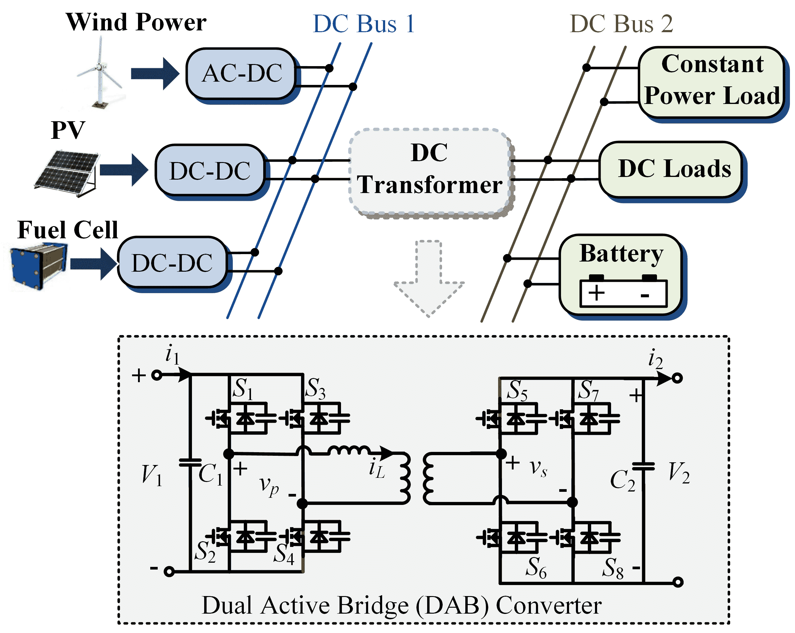

<!--yml
category: 未分类
date: 2025-01-11 11:54:45
-->

# Physics-Informed LLM-Agent for Automated Modulation Design in Power Electronics Systems

> 来源：[https://arxiv.org/html/2411.14214/](https://arxiv.org/html/2411.14214/)

Junhua Liu Forth AISingapore [j@forth.ai](mailto:j@forth.ai) ,  Fanfan Lin Zhejiang UniversityChina [fanfanlin@intl.zju.edu.cn](mailto:fanfanlin@intl.zju.edu.cn) ,  Xinze Li University of ArkansasUSA [xinzel@uark.edu](mailto:xinzel@uark.edu) ,  Kwan Hui Lim Singapore University of Technology and DesignSingapore [kwanhui˙lim@sutd.edu.sg](mailto:kwanhui%CB%99lim@sutd.edu.sg)  and  Shuai Zhao Aalborg UniversityDenmark [szh@energy.aau.dk](mailto:szh@energy.aau.dk)(2024)

###### Abstract.

LLM-based autonomous agents have demonstrated outstanding performance in solving complex industrial tasks. However, in the pursuit of carbon neutrality and high-performance renewable energy systems, existing AI-assisted design automation faces significant limitations in explainability, scalability, and usability. To address these challenges, we propose LP-COMDA, an LLM-based, physics-informed autonomous agent that automates the modulation design of power converters in Power Electronics Systems with minimal human supervision. Unlike traditional AI-assisted approaches, LP-COMDA contains an LLM-based planner that gathers and validates design specifications through a user-friendly chat interface. The planner then coordinates with physics-informed design and optimization tools to iteratively generate and refine modulation designs autonomously. Through the chat interface, LP-COMDA provides an explainable design process, presenting explanations and charts. Experiments show that LP-COMDA outperforms all baseline methods, achieving a 63.2% reduction in error compared to the second-best benchmark method in terms of standard mean absolute error. Furthermore, empirical studies with 20 experts conclude that design time with LP-COMDA is over 33 times faster than conventional methods, showing its significant improvement on design efficiency over the current processes.

Agentic AI, PINN, LLM, Power Conversion^†^†copyright: cc^†^†conference: Make sure to enter the correct conference title from your rights confirmation email; August 01–06, 2025; Toronto, Canada^†^†ccs: Information systems Language models^†^†ccs: Computing methodologies Intelligent agents^†^†ccs: Hardware Power conversion

## 1\. Introduction

As temperature rises year on year due to the effect of Global Warming, there is an urgent need to reorient our economies towards carbon neutrality, especially in power generation. A significant penetration of renewable energy resources (RES) in power generation is crucial. Power Electronics Systems (PES) are indispensable for integrating RES into the contemporary power grid for three primary reasons (Lin, [2022](https://arxiv.org/html/2411.14214v1#bib.bib23)). Firstly, power converters within PES transform the direct current (DC) output from solar panels or wind turbines to alternating current (AC), facilitating the seamless integration of RES into the AC grid. Secondly, PES manages power during peak and off-peak periods, guiding the charge and discharge processes of energy storage units. Lastly, it upholds grid stability through functions like voltage regulation and reactive power compensation. Achieving the desired outcomes necessitates meticulous modulation of power converters in PES, which involves controlling their switching to manage output voltage or current.

The escalating adoption of RES and the burgeoning scale of multi-resource power systems complicate the modulation design for power converters within PES. The diversity of energy sources linked to the power grid intensifies system complexity. As more converter subsystems interlink, the modulation design problem’s dimensionality surges. Consequently, identifying an optimized design solution through manual computation becomes infeasible given this complexity. As cities worldwide embrace multi-resource power systems, modulation designs must be customized, catering to particular geographies and application objectives. Sometimes, these objectives can conflict, further complicating matters.

The recent advancements in artificial intelligence (AI) and Large Language Models (LLMs) offer a potential resolution to these modulation design challenges through automation. Emerging research has introduced AI-centric modulation design techniques. For instance, recent works explore the use of an LLM with in-context learning for modulation design  (Lin et al., [2024](https://arxiv.org/html/2411.14214v1#bib.bib24)). Extreme gradient boosting algorithm (XGBoost) was utilised to construct the surrogate model for the triple phase shift modulation strategy for the dual active bridge (DAB) converter using training data sourced from simulation tools or hardware prototypes (Lin et al., [2023a](https://arxiv.org/html/2411.14214v1#bib.bib26)). Subsequently, a differential evolution algorithm collaborates iteratively with XGBoost until optimal modulation parameters are identified. Likewise, the Q-learning algorithm, a conventional reinforcement learning technique, can be trained offline to derive optimized modulation parameters (Tang et al., [2020](https://arxiv.org/html/2411.14214v1#bib.bib43)). Nevertheless, these methodologies exhibit several drawbacks:

1.  (1)

    The training of AI models is often data-intensive, with significant demands for an extended and tedious data collection through simulations or hardware experiments.

2.  (2)

    For complex tasks, training or finetuning large models are also computationally intensive and consume a large amount of energy to train and serve.

3.  (3)

    Deploying AI models as unexplainable black boxes severely restricts their industrial adoption.

4.  (4)

    The current techniques focuses on specific modulation strategies or pre-established design goals, which limits the scalability of such automation.

5.  (5)

    Existing methods require extensive human involvement in the whole design process which makes the design process inefficient.

In recent years, large language models, such as GPT-4 (OpenAI, [2023](https://arxiv.org/html/2411.14214v1#bib.bib34)), Palm (Anil et al., [2023](https://arxiv.org/html/2411.14214v1#bib.bib3)) and LLaMa (Touvron et al., [2023](https://arxiv.org/html/2411.14214v1#bib.bib44)) demonstrates superior performance in natural language understanding and generation. Furthermore, recent works introduce LLM-based autonomous agents which extend LLM’s capacity from simply performing reasoning and generating content to actions and control (Wang et al., [2024](https://arxiv.org/html/2411.14214v1#bib.bib46)).

In our work, we investigate the potential of using LLM-based autonomous agents for downstream task automation in Power Electronics Systems. Specifically, we introduce LP-COMDA, a LLM-based Physics-Informed Power Converter Modulation Design Automation System, for users to produce high quality modulation design with minimal human supervision.

LP-COMDA first uses a LLM-based planner to process user requirements and generate a set of design specifications. Subsequently, the agent invokes a set of system design tools that consist of physics-informed surrogate models and optimization algorithms. In the design process, the tools iteratively derives optimal modulation parameters tailored to users’ design specifications. Finally, the optimal design parameters and performance metrics will be returned to and visualised for the users to achieve an explainable design process.

The contributions of this paper are summarized as follows:

*   •

    We propose LP-COMDA, a LLM-based physics-informed autonomous agent that streamlines the power converter modulation design process. Comprehensive experiments shows strong performance of LP-COMDA, statistically outperforming the best baseline model with 63.2% lower error for low-data scenario, and 23.7% lower error for high-data scenario.

*   •

    We propose a hierarchical physics-informed surrogate model as a design automation tool for power converter modulation, which outperforms benchmarks in accurately predicting power converter performance even in extreme scenarios where the data is sparse.

*   •

    Our user study with 20 experts demonstrates that the design time with LP-COMDA is over 33 times faster than conventional methods, showing superior efficiency in empirical practice with minimal human supervision.

Figure 1\. An example of power converter application: the DAB (Dual Active Bridge) converter serves as a DC transformer of the DC-DC power grid, offering galvanic isolation and regulating power and voltage between DC buses. Modulating its switches directly affects the system operating performance, including power transfer efficiency, voltage regulation, and stability of the interconnected buses.

Figure 2\. System architecture of LP-COMDA: an engineer provides design requirements to LP-COMDA via a chat interface connecting to its planner. Once the full requirements are determined, the planner coordinates and invokes tools from the tool set to iteratively generate the modulation design without human supervision. After the design is done, the planner displays the final results and explainable process on the chat interface.

## 2\. Problem Statements

### 2.1\. Power Converter Phase Shift Modulation

Within the renewable energy systems sector, power converters need to work in harmony with other components to ensure optimal functionality. Figure [1](https://arxiv.org/html/2411.14214v1#S1.F1 "Figure 1 ‣ 1\. Introduction ‣ Physics-Informed LLM-Agent for Automated Modulation Design in Power Electronics Systems") depicts a classic application of a particular power converter, the dual active bridge (DAB) converter. This converter functions as a DC transformer, connecting various DC buses to facilitate the utilization or storage of power produced by RES (Lin et al., [2021](https://arxiv.org/html/2411.14214v1#bib.bib25)). The phase shift modulation technique is employed to regulate the current flow and guarantee efficient power transmission. This is done by adjusting the timing of different power switch sets, represented as $S_{1}$ to $S_{8}$ in Figure [1](https://arxiv.org/html/2411.14214v1#S1.F1 "Figure 1 ‣ 1\. Introduction ‣ Physics-Informed LLM-Agent for Automated Modulation Design in Power Electronics Systems"). Table [1](https://arxiv.org/html/2411.14214v1#S2.T1 "Table 1 ‣ 2.1\. Power Converter Phase Shift Modulation ‣ 2\. Problem Statements ‣ Physics-Informed LLM-Agent for Automated Modulation Design in Power Electronics Systems") details the distinct phase shift modulation strategies associated with the DAB converter, highlighting their respective degrees of freedom (DoF) and modifiable parameters (Hou and Li, [2019](https://arxiv.org/html/2411.14214v1#bib.bib12)). It is worth noting that the adjustable parameter for $<S_{1},S_{5}>$ indicates the phase difference between $S_{1}$ and $S_{5}$.

 |  

&#124; Phase shift &#124;
&#124; Strategies &#124;

 | No. of DoF | $<S_{1},S_{3}>$ | $<S_{1},S_{5}>$ | $<S_{5},S_{7}>$ |
| --- | --- | --- | --- | --- |
|  

&#124; Single phase &#124;
&#124; shift &#124;

 | 1 | 0 | $D_{o}$ | 0 |
|  

&#124; Double phase &#124;
&#124; shift &#124;

 | 2 | $D_{i}$ | $D_{o}$ | $D_{i}$ |
|  

&#124; Extended phase &#124;
&#124; shift 1 &#124;

 | 2 | $D_{i}$ | $D_{o}$ | 0 |
|  

&#124; Extended phase &#124;
&#124; shift 2 &#124;

 | 2 | 0 | $D_{o}$ | $D_{i}$ |
|  

&#124; Triple phase &#124;
&#124; shift &#124;

 | 3 | $D_{1}$ | $D_{o}$ | $D_{2}$ |
| Hybrid | 2 | $D_{i}$ | $D_{o}$ | 0 |
| phase | 2 | 0 | $D_{o}$ | $D_{i}$ |
| shift | 2 | $D_{i}$ | $D_{o}$ | $D_{i}$ | 

Table 1\. Phase shift modulation strategies with the number of degrees of freedom (DoF) from 1 to 3\. $<S_{x},S_{y}>$ defines the phase shift between $S_{x}$ and $S_{y}$.

For designing the parameters of the modulation strategy, users are required to define three essential pieces of specification consistent with the application prerequisites:

1.  (1)

    Expected operating conditions for the converter: This involves specifying the rated power, rated input voltage (current) and rated output voltage (current), as well as their actual operating values.

2.  (2)

    Selected modulation strategy: The modulation strategy selection should factor in both the acceptable level of control complexity and the feasibility of achieving the desired performance for the specific strategy.

3.  (3)

    Performance objectives: Various application scenarios have different priorities for performance objectives, which directly affect the modulation design. Common objectives in practical applications encompass power efficiency, power density, zero voltage switching, zero current switching, current stress, dynamic response, electromagnetic interference, stability, and compatibility with other subsystems, etc.

### 2.2\. Problem Statements

Given a set of operating conditions of the power converter (rated power $P_{r}$, actual power $P_{a}$, rated input voltage $V_{1r}$, rated output voltage $V_{2r}$, actual operating output voltage $V_{2a}$), chosen modulation strategy $S$ and prioritized performance objectives $O$, the aim is to design modulation parameters for the chosen modulation strategy $S$ to achieve optimal performance for $O$. This design system is expected to have the following features:

*   •

    Automatic design outcome generation, eliminating the need for users to perform complex analysis or computations.

*   •

    Precise design outcomes that translate into exceptional operational performance in real-world scenarios.

*   •

    Good usability and explainability to accelerate engineering design and scientific discovery.

*   •

    Simple setup for the design system, minimizing the demand for extensive data resources.

## 3\. Related work

### 3.1\. LLM-based Autonomous Agents

The evolution of Large Language Models (LLMs) has unlocked immense potential for automating various processes in engineering and natural sciences through simple, plain-language queries. Numerous studies have explored LLM capability in reasoning and formal system applications, such as programming co-pilots (Ross et al., [2023](https://arxiv.org/html/2411.14214v1#bib.bib37); McNutt et al., [2023](https://arxiv.org/html/2411.14214v1#bib.bib31)), multi-lingual tasks (Xu et al., [2024](https://arxiv.org/html/2411.14214v1#bib.bib50); Liu et al., [2024b](https://arxiv.org/html/2411.14214v1#bib.bib29)), and mathematical problem-solving (Shakarian et al., [2023](https://arxiv.org/html/2411.14214v1#bib.bib38); Shi et al., [2024](https://arxiv.org/html/2411.14214v1#bib.bib40)).

To address more complex industrial tasks, recent work proposed the use of LLM-based autonomous agents (LLM-agents), which extends the capability of LLMs (Wang et al., [2024](https://arxiv.org/html/2411.14214v1#bib.bib46)). LLMs are deployed as the planning backbone to understand user request and invoke suitable tools to perform actions (Yao et al., [2024](https://arxiv.org/html/2411.14214v1#bib.bib52)). Besides the planning module, LLM-agents also include other components, such as memory and tools. With advanced techniques such as Retrieval Augmented Generation (RAG) (Liu et al., [2024b](https://arxiv.org/html/2411.14214v1#bib.bib29); Xu et al., [2024](https://arxiv.org/html/2411.14214v1#bib.bib50)), LLM-agents become powerful tools for solving complex tasks with little to no human instruction.

Recent works reported outstanding performance of LLM-agents in industrial applications. For instance, Cao and Lee harnessed LLMs and Phase-Step prompts for cross-domain robot task generation (Cao and Lee, [2023](https://arxiv.org/html/2411.14214v1#bib.bib6)). Li et al. introduced an agentic framework to for strategic and interactive decision-making (Li et al., [2024b](https://arxiv.org/html/2411.14214v1#bib.bib21)). LLM-based agents are found effective in other domain-specific tasks, such as spatial-temporal strategic planning (Li et al., [2024a](https://arxiv.org/html/2411.14214v1#bib.bib22); Liu et al., [2024a](https://arxiv.org/html/2411.14214v1#bib.bib28); Xiang et al., [2024](https://arxiv.org/html/2411.14214v1#bib.bib47)), financial trading (Zhang et al., [2024b](https://arxiv.org/html/2411.14214v1#bib.bib55); Koa et al., [2024](https://arxiv.org/html/2411.14214v1#bib.bib18), [2024](https://arxiv.org/html/2411.14214v1#bib.bib18); Zhang et al., [2024a](https://arxiv.org/html/2411.14214v1#bib.bib54); Gao et al., [2023](https://arxiv.org/html/2411.14214v1#bib.bib9)), and daily routine with computers and smart phones (Lai et al., [2024](https://arxiv.org/html/2411.14214v1#bib.bib19); Xing et al., [2024](https://arxiv.org/html/2411.14214v1#bib.bib49)).

Figure 3\. The proposed surrogate model consists of two physics-informed neural networks, namely, ModNet for switch-level modeling to learn the switching behaviors, and CirNet for system-level modeling to learn the circuit physics. The hierarchical structure enhances the overall accuracy of the power converter’s modeling of the complex behaviors of the switches.

### 3.2\. Physics-Informed Neural Networks

Conventional neural networks are commonly data-hungry and not explainable. By integrate physics principles into neural networks (Raissi, [2018](https://arxiv.org/html/2411.14214v1#bib.bib36)), studies on Physics-Informed Neural Networks (PINNs) show promising results in overcoming such challenges.

PINN encompasses various approaches to incorporate physics-informed (PI) components into the deep learning pipeline, such as loss functions, parameter initializations and the neural network architectures (Huang and Wang, [2022](https://arxiv.org/html/2411.14214v1#bib.bib14)). As a result, the neural networks are able to learn latent features that are governed by physical laws.

Recent studies also enhance PINN’s convergence, stability, and accuracy, yielding improvements (Kang et al., [2023](https://arxiv.org/html/2411.14214v1#bib.bib17); Yang et al., [2023](https://arxiv.org/html/2411.14214v1#bib.bib51); Wandel et al., [2022](https://arxiv.org/html/2411.14214v1#bib.bib45)). PINN has found success in a wide range of applications. Some examples include predicting traffic conditions and modeling traffic flow (Shi et al., [2021](https://arxiv.org/html/2411.14214v1#bib.bib39); Ji et al., [2022](https://arxiv.org/html/2411.14214v1#bib.bib15)), determining circuit parameters for power converter health monitoring (Zhao et al., [2022](https://arxiv.org/html/2411.14214v1#bib.bib56)), computing power flow in electrical systems (Hu et al., [2020](https://arxiv.org/html/2411.14214v1#bib.bib13)), modeling temperature dynamics in lakes (Jia et al., [2021](https://arxiv.org/html/2411.14214v1#bib.bib16)), managing real-time reservoir gas production (Mudunuru et al., [2020](https://arxiv.org/html/2411.14214v1#bib.bib32)), designing quantum circuits (Liu et al., [2021](https://arxiv.org/html/2411.14214v1#bib.bib30); Guo et al., [2019](https://arxiv.org/html/2411.14214v1#bib.bib10)), and simulating turbulent flows in urban environments (Xiao et al., [2019](https://arxiv.org/html/2411.14214v1#bib.bib48)). These applications highlight PINNs’ promising performance across many domains by infusing physics knowledge into deep learning.

## 4\. Methodology

### 4.1\. Agentic AI System

Figure [2](https://arxiv.org/html/2411.14214v1#S1.F2 "Figure 2 ‣ 1\. Introduction ‣ Physics-Informed LLM-Agent for Automated Modulation Design in Power Electronics Systems") presents the architecture of the proposed LP-COMDA agentic AI system. The front-end consists of a chat interface and API interaction with GPT-4 as reasoning engine, whereas the back-end consists of the agent’s tooling, i.e., an optimization algorithm and the PINN-based surrogate model. In terms of workflow, LP-COMDA first collects design specifications from the user and pass to an LLM-based reasoning engine (GPT-4) for planning. Subsequently, the agent invokes the back-end tooling, where the surrogate model produces the performance metrics and passes to the optimization algorithm searches for the optimal modulation parameters. The back-end will respond with a set of optimal design parameters to the front-end to display and visualise as charts for explainability and readability.

### 4.2\. Physics-Informed Power Electronics Modeling

Power electronics systems are highly nonlinear induced by the complex switching behaviors of semiconductor devices and the coupling of energy storage components. The generic representation of a power electronics system formulated by the nonlinear time-variant state-space equations is given in Eq. [1](https://arxiv.org/html/2411.14214v1#S4.E1 "In 4.2\. Physics-Informed Power Electronics Modeling ‣ 4\. Methodology ‣ Physics-Informed LLM-Agent for Automated Modulation Design in Power Electronics Systems"), where $\theta$ are the circuit parameters, $u(t)$ and $x(t)$ are the state variables and the input variables, $g(\cdot)$ are general nonlinear functions governing state transition behaviors, and $h(\cdot)$ denotes the input physical laws.

Overall, the proposed surrogate model consists of two hierarchical PINNs, one ModNet for switch-level modeling to learn the switching behaviors and another one CirNet for the system-level modeling to learn the circuit physics. ModNet is trained to learn the intermediate waveforms $v_{p}$ and $v_{s}$ and CirNet infers key characteristic waveforms in the circuit including $i_{L}$, $v_{c1}$, $v_{c2}$, with which the operating performance such as the current stress, soft switching range, and efficiency can be evaluated. As shown in Figure [1](https://arxiv.org/html/2411.14214v1#S1.F1 "Figure 1 ‣ 1\. Introduction ‣ Physics-Informed LLM-Agent for Automated Modulation Design in Power Electronics Systems"), $v_{p}$ and $v_{s}$ denote the ac terminal voltages of the primary and secondary full bridges, respectively, and $i_{L}$, $v_{c1}$, and $v_{c2}$ represent the inductor current, input capacitor voltage, and output capacitor voltage, respectively.

| (1) |  | $\frac{\partial u(t)}{\partial t}=g(x(t);\theta)u(t)+h(x(t);\theta)$ |  |

ModNet for Switch-level Modeling of Switching Behaviors: In the modeling of semiconductor switches, the non-ideal equivalent circuit considers the parasitic inductances, capacitances, and resistances. The complicated interactions within circuit components result in nontrivial oscillations and overshoots, which will affect the overall operating performance of the power converter. To address this, the switching behaviors is proposed to be modeled by a physics-informed network, ModNet. ModNet is composed of several layers of gated recurrent units with layer normalization (LN-GRU). The temporal feature of LN-GRU accords well with the task of modulation waveform prediction. As shown in Figure [3](https://arxiv.org/html/2411.14214v1#S3.F3 "Figure 3 ‣ 3.1\. LLM-based Autonomous Agents ‣ 3\. Related work ‣ Physics-Informed LLM-Agent for Automated Modulation Design in Power Electronics Systems") Part (1) and Eq. [2](https://arxiv.org/html/2411.14214v1#S4.E2 "In 4.2\. Physics-Informed Power Electronics Modeling ‣ 4\. Methodology ‣ Physics-Informed LLM-Agent for Automated Modulation Design in Power Electronics Systems"), ModNet infers $v_{p}(t_{k})$ and $v_{s}(t_{k})$ based on the information of the previous timestamp $t_{k-1}$ and the hidden states, and all the intermediate predictions within a switching cycle are stored for training. The training of ModNet utilizes two kinds of losses: (1) the loss based on physics information which helps with switching synchronization; (2) the loss based on experimental data captured by oscilloscope, which helps the model to capture oscillations and overshoots in practical operations.

| (2) |  | $\displaystyle(\hat{v}_{p}(t_{k}),\hat{v}_{s}(t_{k}))=\operatorname{ModNet}(% \hat{v}_{p}(t_{k-1}),\hat{v}_{s}(t_{k-1});\theta_{mod})$ |  |

where $\hat{v}_{p}(t_{k})$ and ${\hat{v}_{s}(t_{k})}$ denote the ModNet predictions for ${v_{p}}$ and ${v_{s}}$ at time ${t_{k}}$ given the previous voltages $\hat{v}_{p}(t_{k-1})$ and ${\hat{v}_{s}(t_{k-1})}$.

| (3) |  | $L\frac{\partial i_{L}(t)}{\partial t}=-R_{L}i_{L}(t)+v_{p}(t)-nv_{s}(t)$ |  |

where $L$, $R_{L}$, and $n$ denote features of magnetic components: leakage inductance, equivalent inductor resistance, and turn ratio of transformer, respectively. $i_{L}(t)$ is the key waveform characterizing main circuit performances such as power transfer, efficiency, thermal behavior, soft switching, electromagnetic interference, etc.

| (4) |  | $\displaystyle C_{1}\frac{\partial^{2}v_{C1}(t)}{\partial^{2}t}=$ | $\displaystyle-\left(\frac{\partial s_{pri}(t)}{\partial t}-\frac{s_{pri}(t)R_{% L}}{L}\right)i_{L}(t)+$ |  |
|  |  | $\displaystyle\frac{\partial i_{1}(t)}{\partial t}-\frac{s_{pri}(t)}{L}\left(v_% {p}(t)-nv_{s}(t)\right)$ |  |

| (5) |  | $\displaystyle C_{2}\frac{\partial^{2}v_{C2}(t)}{\partial^{2}t}=$ | $\displaystyle n\left(\frac{\partial s_{sec}(t)}{\partial t}-\frac{s_{sec}(t)R_% {L}}{L}\right)i_{L}(t)-$ |  |
|  |  | $\displaystyle\frac{\partial i_{2}(t)}{\partial t}+\frac{ns_{sec}(t)}{L}\left(v% _{p}(t)-nv_{s}(t)\right)$ |  |

where $C_{1}$ and $C_{2}$ represent input and output capacitors, and $s_{pri}(t)$ and $s_{sec}(t)$ are functions describing circuit switching behaviors. $v_{C1}$ and $v_{C2}$ govern the stability, robustness, and power quality when interfacing other power conversion circuits.

CirNet for System-level Modeling of Circuit Physics: Subsequently, the system-level modeling is attained with the physics-informed circuit net, CirNet. CirNet retrofits a recurrent LN-GRU net to encode circuit physical laws in its inherent feature space. Taking non-resonant DAB converter as an example, main state waveforms are $i_{L}$, $v_{C1}$ and $v_{C2}$. By leveraging the Kirchhoff’s, Faraday’s, and Gauss’s laws, the system-level dynamic equations are derived in Eqs. [3](https://arxiv.org/html/2411.14214v1#S4.E3 "In 4.2\. Physics-Informed Power Electronics Modeling ‣ 4\. Methodology ‣ Physics-Informed LLM-Agent for Automated Modulation Design in Power Electronics Systems") to [5](https://arxiv.org/html/2411.14214v1#S4.E5 "In 4.2\. Physics-Informed Power Electronics Modeling ‣ 4\. Methodology ‣ Physics-Informed LLM-Agent for Automated Modulation Design in Power Electronics Systems"), where the electrical notations are given in Figure [1](https://arxiv.org/html/2411.14214v1#S1.F1 "Figure 1 ‣ 1\. Introduction ‣ Physics-Informed LLM-Agent for Automated Modulation Design in Power Electronics Systems"). Eq. [3](https://arxiv.org/html/2411.14214v1#S4.E3 "In 4.2\. Physics-Informed Power Electronics Modeling ‣ 4\. Methodology ‣ Physics-Informed LLM-Agent for Automated Modulation Design in Power Electronics Systems") describes the dynamics of high-frequency ac current $i_{L}(t)$, and Eq. [4](https://arxiv.org/html/2411.14214v1#S4.E4 "In 4.2\. Physics-Informed Power Electronics Modeling ‣ 4\. Methodology ‣ Physics-Informed LLM-Agent for Automated Modulation Design in Power Electronics Systems") and Eq. [5](https://arxiv.org/html/2411.14214v1#S4.E5 "In 4.2\. Physics-Informed Power Electronics Modeling ‣ 4\. Methodology ‣ Physics-Informed LLM-Agent for Automated Modulation Design in Power Electronics Systems") present the electrical behaviors of input and output capacitors, which follow second-order differential equations.

To predict the key state waveforms, CirNet takes the outputs of ModNet as its inputs and iteratively infers the next state based on the predictions of previous states, as the structure in Figure [3](https://arxiv.org/html/2411.14214v1#S3.F3 "Figure 3 ‣ 3.1\. LLM-based Autonomous Agents ‣ 3\. Related work ‣ Physics-Informed LLM-Agent for Automated Modulation Design in Power Electronics Systems") Part (3) and Eq. [7](https://arxiv.org/html/2411.14214v1#S4.E7 "In 4.2\. Physics-Informed Power Electronics Modeling ‣ 4\. Methodology ‣ Physics-Informed LLM-Agent for Automated Modulation Design in Power Electronics Systems") shown.

In terms of the training for CirNet, similar to ModNet, the loss based on physics information $l_{p}$ and the loss based on experimental data $l_{d}$ are both deployed, as shown in Eq. [7](https://arxiv.org/html/2411.14214v1#S4.E7 "In 4.2\. Physics-Informed Power Electronics Modeling ‣ 4\. Methodology ‣ Physics-Informed LLM-Agent for Automated Modulation Design in Power Electronics Systems"), in which $\lambda_{d}$ and $\lambda_{p}$ are their loss factors. In $l_{p}$, the circuit physical dynamics expressed in differential equations [3](https://arxiv.org/html/2411.14214v1#S4.E3 "In 4.2\. Physics-Informed Power Electronics Modeling ‣ 4\. Methodology ‣ Physics-Informed LLM-Agent for Automated Modulation Design in Power Electronics Systems") to [5](https://arxiv.org/html/2411.14214v1#S4.E5 "In 4.2\. Physics-Informed Power Electronics Modeling ‣ 4\. Methodology ‣ Physics-Informed LLM-Agent for Automated Modulation Design in Power Electronics Systems") are embedded in the loss functions for physics learning.

In $l_{d}$, several data points of the inductor currents $i_{L}$ in the hardware experiments are taken as the ground truth, where the datapoints are denoted as $\left\{i_{L,j}^{*}\left(t_{1}\right),\ldots,i_{L,j}^{*}\left(t_{T}\right)% \right\}_{j}^{N}$. The waveform predictions are saved for a switching period for the performance evaluation.

| (6) |  | $\displaystyle\hat{i}_{L}(t_{k+1})=\operatorname{CirNet}($ | $\displaystyle\hat{i}_{L}(t_{k}),\operatorname{ModNet}($ |  |
|  |  | $\displaystyle\hat{v}_{p}(t_{k}),\hat{v}_{s}(t_{k});\theta_{{mod}});\theta_{cir})$ |  |

| (7) |  |  | $\displaystyle l_{Cir}=\lambda_{d}l_{d}+\lambda_{p}l_{p}$ |  |
|  |  | $\displaystyle=\frac{\lambda_{d}}{NT}\sum_{j}\sum_{k}\left[\hat{i}_{L,j}\left(t% _{k+1}\right)-i_{L,j}{}^{*}\left(t_{k+1}\right)\right]^{2}+$ |  |
|  |  | $\displaystyle\frac{\lambda_{p}}{NT}\sum_{j}\sum_{k}\left[\begin{array}[]{l}L% \left(\hat{i}_{L,j}\left(t_{k+1}\right)-i_{L,j}{}^{*}\left(t_{k}\right)\right)% -\\ (\hat{v}_{p,j}\left(t_{k+1}\right)-n\hat{v}_{s,j}\left(t_{k+1}\right)-\\ R_{L}i_{Lj}{}^{*}\left(t_{k}\right))\Delta t_{k}\end{array}\right]^{2}$ |  |

Circuit Performance Evaluation Based on CirNet: With the output of the two hierarchical PINNs, ModNet and CirNet, the power converter performance can be evaluated. With the key waveform inference results from the previous CirNet, a variety of electrical performance metrics can be measured, aiming to provide critical and comprehensive assessments for power electronics systems. As shown in Figure [3](https://arxiv.org/html/2411.14214v1#S3.F3 "Figure 3 ‣ 3.1\. LLM-based Autonomous Agents ‣ 3\. Related work ‣ Physics-Informed LLM-Agent for Automated Modulation Design in Power Electronics Systems") Part (3), the difference of the maximum and minimum values of $i_{L}(t)$ gives the peak-to-peak current stress. The numerical integration of $[s_{1}(t)i_{L}(t)]^{2}$ provides the conduction loss evaluation for semiconductor switches. Soft switching performance, which is especially important for high-frequency scenarios like the electric vehicle charging, is analyzed by imposing constraints on $i_{L}(t)$ at the device commutation moment, where $s_{pri}(t)$ and $s_{sec}(t)$ are needed for synchronization. Other electrical performances can be gauged with the domain expertise in power electronics.

As described in Figure [2](https://arxiv.org/html/2411.14214v1#S1.F2 "Figure 2 ‣ 1\. Introduction ‣ Physics-Informed LLM-Agent for Automated Modulation Design in Power Electronics Systems"), in the core engine, optimization algorithms are deployed to cooperate with ModNet and CirNet to find the optimal modulation parameters. The optimization procedure is an iterative cycle, in which the optimization algorithm passes the operating conditions and modulation parameters to the physics-informed surrogate models ModNet and CirNet, and these models provide evaluated performance metrics to steer the optimization process.

By incorporating physics information within the neural networks, the model’s interpretability is heightened, concurrently leading to a reduction in the necessary training data points. Furthermore, the entire design automation system exhibits seamless scalability through the integration of surrogate models for additional functions into the core engine. Importantly, users can access these functionalities without any alterations to their experience.

## 5\. Experiments

Figure 4\. LP-COMDA with different structures of CirNet. The minimal MAE of 0.235 on validation set is reached when there are 2 hidden layers with 32 hidden neurons.

| Model | #Parameters | Selected Hyperparameters |
| --- | --- | --- |
| LSTM | 21,671 | 3 layers, 32 hidden size |
| GRU | 13,319 | 1 layer, 64 hidden size |
| LN-GRU | 13,319 | 1 layer, 64 hidden size |
| TCN | 88,199 |  

&#124; 2 layers, 7 kernel size, &#124;
&#124; 64 hidden size &#124;

 |
| GRU-VAE | 88,583 | 2 layers, 64 hidden size |
| TST | 6,913 |  

&#124; 1 layer, 2 attention heads, &#124;
&#124; 32 hidden size &#124;

 |
| TSiTPlus | 7,042 |  

&#124; 1 layer, 2 attention heads, &#124;
&#124; 32 hidden size &#124;

 |
| MiniRocket | - | 700 features, 6 dilatation size |
| CirNet | 9,930 | 2 layers, 32 hidden size |
| LP-COMDA | 19,857 | 2 layers, 32 hidden size |

Table 2\. Hyperparameter selection of LP-COMDA and benchmarks. The chosen hyperparameters yield the lowest loss on validation set.

### 5.1\. Experiments Setup

We primarily aim to ascertain the accuracy of the ModNet and CirNet surrogate models, where heightened model accuracy in the core engine translates to superior system design performance. Therefore, we carried out several experiments to validate LP-COMDA’s model performance in a low-resource setting, i.e., using a tiny dataset with only 200 samples.

Data Preparation: In this work, we focus on a modeling task of time-series forecasting for the inductor current $i_{L}(t)$ of DAB converters under triple phase-shift (TPS) modulation as a representative example. Using a hardware experimental prototype, we acquired waveform data spanning 200 sequences. The configuration of the hardware prototype and the methodology employed for data acquisition are elucidated in reference (Lin et al., [2023b](https://arxiv.org/html/2411.14214v1#bib.bib27)).

One of the advantages of PINN models is that it requires very few samples to learn as compared to other machine learning models. To demonstrate this advantage, we conduct our experiments with two different data splitting ratios. For the first set, we split the data into 5% training (10 samples), 10% validation (20 samples) and 85% test (170 samples). The second set is split into 50%, 10% and 40% for training, validation and test, respectively.

Baseline: To evaluate LP-COMDA’s design outcomes we use the following baselines: (1) the Bayesian Network (BN) (Pearl, [1985](https://arxiv.org/html/2411.14214v1#bib.bib35)), (2) Support Vector Regression (SVR) (Smola and Schölkopf, [2004](https://arxiv.org/html/2411.14214v1#bib.bib41)), (3) XGBoost (Chen et al., [2015](https://arxiv.org/html/2411.14214v1#bib.bib7)), (4) Random Forest (RF) (Breiman, [2001](https://arxiv.org/html/2411.14214v1#bib.bib5)), (5) Long-Short-Term-Memory (LSTM) (Hochreiter and Schmidhuber, [1997](https://arxiv.org/html/2411.14214v1#bib.bib11)), (6) GRU net (Chung et al., [2014](https://arxiv.org/html/2411.14214v1#bib.bib8)), (7) LN-GRU net (Ba et al., [2016](https://arxiv.org/html/2411.14214v1#bib.bib4)), (8) Temporal Convolutional Net (TCN) (Lea et al., [2017](https://arxiv.org/html/2411.14214v1#bib.bib20)), (9) GRU-Based Variational Autoencoder (GRU-VAE) (An and Cho, [2015](https://arxiv.org/html/2411.14214v1#bib.bib2)), (10) Time-Series Transformer (TST) (Zerveas et al., [2021](https://arxiv.org/html/2411.14214v1#bib.bib53)), (11) Time-Series Net Adapted from Vision Transformer (TSiT-Plus) (Oguiza, [2022](https://arxiv.org/html/2411.14214v1#bib.bib33)), and (12) MiniRocket (Tan et al., [2022](https://arxiv.org/html/2411.14214v1#bib.bib42)).

Figure 5\. Modeling performance of the top 5 benchmarks and the proposed LP-COMDA. The modelling results of LP-COMDA is closest to the measurement, demonstrating its outstanding modeling accuracy.

Hyperparameter Search: For fair comparison, we conduct hyperparameter search on the validation set for LP-COMDA and all baseline algorithms. We perform grid search on important hyperparameters for each model. Figure [4](https://arxiv.org/html/2411.14214v1#S5.F4 "Figure 4 ‣ 5\. Experiments ‣ Physics-Informed LLM-Agent for Automated Modulation Design in Power Electronics Systems") illustrates the MAEs of LP-COMDA with different hyperparameters, shedding light on the selected best structure. The final selected sets of hyperparameters are summarized in Table [2](https://arxiv.org/html/2411.14214v1#S5.T2 "Table 2 ‣ 5\. Experiments ‣ Physics-Informed LLM-Agent for Automated Modulation Design in Power Electronics Systems").

### 5.2\. Experimental Results

 | Model | Training | Validation | Test | p-value |
| BN | 2.152$\pm$0.0 | 2.436$\pm$0.0 | 2.515$\pm$0.0 | 6.81E-11* |
| SVR | 1.984$\pm$0.0 | 2.313$\pm$0.0 | 2.286$\pm$0.0 | 1.16E-10* |
| XGBoost | 2.299$\pm$0.0 | 2.108$\pm$0.0 | 2.792$\pm$0.0 | 3.83E-11* |
| RF | 4.983$\pm$0.0 | 4.181$\pm$0.0 | 4.434$\pm$0.0 | 3.18E-12* |
| LSTM | 1.164$\pm$0.151 | 1.380$\pm$0.042 | 1.560$\pm$0.095 | 7.23E-8* |
| GRU | 1.287$\pm$0.174 | 1.336$\pm$0.101 | 1.604$\pm$0.064 | 6.35E-10* |
| LN-GRU | 0.834$\pm$0.272 | 1.289$\pm$0.165 | 1.257$\pm$0.117 | 1.71E-6* |
| TCN | 1.571$\pm$0.210 | 1.996$\pm$0.257 | 1.538$\pm$0.501 | 1.436E-3* |
| TST | 0.668$\pm$0.062 | 0.750$\pm$0.028 | 0.666$\pm$0.063 | 1.47E-6* |
| TSiTPlus | 0.707$\pm$0.158 | 1.106$\pm$0.12 | 1.302$\pm$0.078 | 3.46E-8* |
| MiniRocket | 0.113$\pm$0.122 | 0.742$\pm$0.365 | 0.763$\pm$0.338 | 0.0131* |
| GRU-VAE | 1.928$\pm$0.201 | 2.190$\pm$0.180 | 2.219$\pm$0.172 | 6.47E-7* |
| CirNet Only | 0.121$\pm$0.014 | 0.282$\pm$0.014 | 0.310$\pm$0.013 | 1.442E-3* |
| LP-COMDA | 0.140$\pm$0.054 | 0.235$\pm$0.025 | 0.245$\pm$0.029 | N/A | 

Table 3\. Experimental results with training / validation / test set split of 5% (10 samples), 10% (20 samples) and 85% (170 samples), respectively. LP-COMDA statistically outperforms baselines (marked with *), with a 63.2% lower error as compared to the second-best benchmark (TST),measured in Mean Absolute Errors (MAE).

 | Model | Training | Validation | Test | p-value |
| BN | 2.455$\pm$0.0 | 2.206$\pm$0.0 | 2.348$\pm$0.0 | 5.03E-14* |
| SVR | 2.049$\pm$0.0 | 1.780$\pm$0.0 | 1.991$\pm$0.0 | 1.25E-13* |
| XGBoost | 1.321$\pm$0.0 | 2.194$\pm$0.0 | 1.986$\pm$0.0 | 1.27E-13* |
| RF | 3.167$\pm$0.0 | 3.937$\pm$0.0 | 3.622$\pm$0.0 | 4.89E-15* |
| LSTM | 1.246$\pm$0.165 | 1.129$\pm$0.078 | 1.193$\pm$0.098 | 1.89E-6* |
| GRU | 1.196$\pm$0.127 | 1.356$\pm$0.134 | 1.270$\pm$0.114 | 2.80E-6* |
| LN-GRU | 0.534$\pm$0.097 | 0.480$\pm$0.075 | 0.527$\pm$0.086 | 2.33E-4* |
| TCN | 0.685$\pm$0.018 | 0.744$\pm$0.062 | 0.726$\pm$0.061 | 3.79E-6* |
| TST | 0.264$\pm$0.033 | 0.240$\pm$0.033 | 0.264$\pm$0.031 | 3.93E-3* |
| TSiTPlus | 0.585$\pm$0.099 | 0.567$\pm$0.082 | 0.569$\pm$0.099 | 2.61E-4* |
| MiniRocket | 0.522$\pm$0.305 | 0.616$\pm$0.346 | 0.646$\pm$0.343 | 0.0246* |
| GRU-VAE | 0.686$\pm$0.074 | 0.663$\pm$0.036 | 0.721$\pm$0.056 | 2.42E-6* |
| CirNet Only | 0.162$\pm$0.032 | 0.239$\pm$0.014 | 0.234$\pm$0.007 | 3.98E-3* |
| LP-COMDA | 0.170$\pm$0.013 | 0.191$\pm$0.005 | 0.201$\pm$0.006 | N/A | 

Table 4\. Experimental results with training / validation / test set split of 50% (100 samples), 10% (20 samples) and 40% (80 samples), respectively. LP-COMDA statistically outperforms baselines (marked with *), with a 23.7% lower error as compared to the second-best benchmark (TST), measured in Mean Absolute Errors (MAE).

Table [3](https://arxiv.org/html/2411.14214v1#S5.T3 "Table 3 ‣ 5.2\. Experimental Results ‣ 5\. Experiments ‣ Physics-Informed LLM-Agent for Automated Modulation Design in Power Electronics Systems") and [4](https://arxiv.org/html/2411.14214v1#S5.T4 "Table 4 ‣ 5.2\. Experimental Results ‣ 5\. Experiments ‣ Physics-Informed LLM-Agent for Automated Modulation Design in Power Electronics Systems") summarise the experimental results for LP-COMDA and baseline for two different splits. Each algorithm with the respective optimal hyperparameters was ran for ten times. The average MAE for training, validation and test sets are reported. The reported P-values are the results of T-tests at a significance level of 0.02.

For both splits, experimental results show that LP-COMDA outperforms conventional machine learning approaches, such as BN, SVR, XGBoost and RF, and exhibits superior performance over deep learning predictive models, such as LSTM, GRU, LN-GRU and TCN, and predictive models such as GRU-VAE. When compared to state-of-the-art models like TST, TSiTPlus, and MiniRocket, LP-COMDA again demonstrates notably enhanced forecasting accuracy. To further affirm the hierarchical PINNs structure, we contrasted CirNet with LP-COMDA. Noticeably, LP-COMDA with 10 training samples outperforms most benchmarks with 100 training samples, and align with CirNet-Only model.

To visualize the modeling performance, Figure [5](https://arxiv.org/html/2411.14214v1#S5.F5 "Figure 5 ‣ 5.1\. Experiments Setup ‣ 5\. Experiments ‣ Physics-Informed LLM-Agent for Automated Modulation Design in Power Electronics Systems") presents the modeled $i_{L}$ waveform for both LP-COMDA and benchmark models. Notably, the LP-COMDA modeling outcomes align more congruently with the measurements than any of the other models, demonstrating its outstanding modeling precision.

Overall, we conclude that the proposed LP-COMDA statistically achieves better modeling results than other baseline models for power electronics modeling, even with extremely low-data scenario.

 | ID | Goal | User Input | LM-COMDA Output |
| 1 |  

&#124; To define a modulation &#124;
&#124; strategy $S$ to design &#124;

 |  

&#124; I need your help to design my &#124;
&#124; dual active bridge converter. &#124;

 |  

&#124; Sure, I can help you with that. let’s start with choosing the &#124;
&#124; modulation strategy. Which one would you like to use for &#124;
&#124; your dual active bridge converter, TPS, DPS or Hybrid? &#124;

 |
| 2 |  

&#124; To define the prioritized &#124;
&#124; objective $O$ &#124;

 | TPS. |  

&#124; Great! Now let’s move on to the prioritized optimization &#124;
&#124; objective. Which of the following objectives would you like &#124;
&#124; to prioritize: Efficiency, Soft switching, or Current stress? &#124;

 |
| 3 |  

&#124; To define operation &#124;
&#124; conditions &#124;

 | Current stress. |  

&#124; Understood.Let’s discuss the operating conditions of your &#124;
&#124; dual active bridge converter. Could you provide the following &#124;
&#124; information: rated power, rated input voltage, rated output &#124;
&#124; voltage, actual operating power, actual output voltage. &#124;

 |
| 4 |  

&#124; To select optimization &#124;
&#124; algorithms &#124;

 |  

&#124; Rated power: 1000 W &#124;
&#124; Rated input voltage: 200 V &#124;
&#124; Rated output voltage: 200 V &#124;
&#124; Operating power: 600W &#124;
&#124; Actual output voltage: 160V &#124;

 |  

&#124; Thank you for providing the operating conditions. Lastly, we &#124;
&#124; need to choose an optimization algorithm. Which optimization &#124;
&#124; algorithm would you choose: PSO, DE or GA? &#124;

 |
| 5 |  

&#124; To confirm specifications &#124;
&#124; are fully collected. &#124;

 | PSO. |  

&#124; OK, I have collected all the parameters and am about to &#124;
&#124; execute the program. &#124;

 |
| Design Outcome & Analysis |
|  

&#124; Figure (1) presents the Current stress modeling results with respect to various modulation parameters (inner phase shifts $D_{l}$ and $D_{2}$). &#124;
&#124; The optimized $D_{l}$ and $D_{2}$ for the best Current stress performance under the input voltage 200V, power 600 W, and the output voltage &#124;
&#124; 160 V is highlighted as the red dot. Figure (2) represents the current stress performance curve for the optimal TPS and the compared &#124;
&#124; SPS when power is within [100 W, 1000 W] range. Figure (3) is the curve of optimal modulation parameter selection for the best &#124;
&#124; current stress within [100 W, 1000 W] range. You can deploy the values in your controllers. &#124;

 |
| ![[Uncaptioned image]](img/edb8371cdaa9296fc93501f7614385d8.png) | ![[Uncaptioned image]](img/8c564d002b7334cb80429bcc49449a58.png) | ![[Uncaptioned image]](img/d77f39e9923460ed9f128c6a0d95c5b8.png) |
| Figure (1) | Figure (2) | Figure (3) | 

Table 5\. An use case exemplar: with 5 request series, LP-COMDA collects all necessary design specifications, which include a modulation strategy $S$ to design, prioritized objective $O$, operating conditions, and the selected optimization algorithms. After specification collection via text input, the design outcome is presented with text and figures.

## 6\. User Study

To assess LP-COMDA’s empirical performance in improving engineering efficiency, we design a practical use case for the modulation strategy of the DAB converter and conduct an empirical experiment with 20 industrial practitioners.

The user requirements for this design process include:

*   •

    Guidance in defining design specifications.

*   •

    Optimal design outcomes for the tailored scenario.

*   •

    Analysis on the design outcomes.

Based on the use case, we conduct a user study with 20 industrial practitioners recruited via research labs and collaborating external companies on a voluntary basis. The participants consist of 10 junior engineers with less than three years of experience, and 10 senior engineers with over five years of relevant experience. All participants declared to have no prior experience in using LLM to assist engineering design works.

All participants are given two independent variants of the same task, namely to design the TPS modulation strategy for a Dual Active Bridge (DAB) converter to serve as a DC transformer of the DC-DC power grid, as shown in Fig. [1](https://arxiv.org/html/2411.14214v1#S1.F1 "Figure 1 ‣ 1\. Introduction ‣ Physics-Informed LLM-Agent for Automated Modulation Design in Power Electronics Systems"). We ask the participant to first use LP-COMDA’s chat interface to address task variant one. After completion, they then use standard practice (i.e. analytical and manual design) based on the given design requirements and data to address task variant two. To assess the effectiveness, the effective working hours are measured in 30-minute time blocks while tackling the tasks.

Table [5](https://arxiv.org/html/2411.14214v1#S5.T5 "Table 5 ‣ 5.2\. Experimental Results ‣ 5\. Experiments ‣ Physics-Informed LLM-Agent for Automated Modulation Design in Power Electronics Systems") shows an example of a multi-turn conversation between the user and LP-COMDA, as well as the output components. Empirically, the results of the user study are highly promising, in terms of both functionality and efficiency. In terms of functionality, all 20 participants are able to complete both assigned tasks successfully. In terms of efficiency, the 10 junior engineers spent an average of 1.2 time blocks and 115.5 time blocks in completing the tasks using LP-COMDA and analytical approach, respectively; where the 10 senior engineers recorded an average of 0.9 time blocks and 30.5 time blocks with LP-COMDA and analytical approach, respectively. Overall, we observe that Junior engineers and senior engineers experienced 96.3 times and 33.9 times efficiency, respectively.

## 7\. Conclusion

Modulation strategy design of power converters is pivotal for the optimal functioning of renewable energy power systems. However, numerous AI-centric modulation design automation systems today grapple with challenges tied to explainability, usability, scalability, and data intensity. In our research, we introduced LP-COMDA, a LLM-based Physics-informed autonomous agent to perform effective power converter modulation design automation. Experiments demonstrate LP-COMDA’s proficiency in accurate power converter modeling, even with a data-constrained environment. Our user study shows that using LP-COMDA helps engineers improve efficiency by over 33 times in practice.

## References

*   (1)
*   An and Cho (2015) Jinwon An and Sungzoon Cho. 2015. Variational autoencoder based anomaly detection using reconstruction probability. *Special lecture on IE* 2, 1 (2015), 1–18.
*   Anil et al. (2023) Rohan Anil, Andrew M Dai, Orhan Firat, Melvin Johnson, Dmitry Lepikhin, Alexandre Passos, Siamak Shakeri, Emanuel Taropa, Paige Bailey, Zhifeng Chen, et al. 2023. Palm 2 technical report. *arXiv preprint arXiv:2305.10403* (2023).
*   Ba et al. (2016) Jimmy Lei Ba, Jamie Ryan Kiros, and Geoffrey E Hinton. 2016. Layer normalization. *arXiv preprint arXiv:1607.06450* (2016).
*   Breiman (2001) Leo Breiman. 2001. Random forests. *Machine learning* 45 (2001), 5–32.
*   Cao and Lee (2023) Yue Cao and CS Lee. 2023. Robot Behavior-Tree-Based Task Generation with Large Language Models.
*   Chen et al. (2015) Tianqi Chen, Tong He, Michael Benesty, Vadim Khotilovich, Yuan Tang, Hyunsu Cho, Kailong Chen, Rory Mitchell, Ignacio Cano, Tianyi Zhou, et al. 2015. Xgboost: extreme gradient boosting. *R package version 0.4-2* 1, 4 (2015), 1–4.
*   Chung et al. (2014) Junyoung Chung, Caglar Gulcehre, KyungHyun Cho, and Yoshua Bengio. 2014. Empirical evaluation of gated recurrent neural networks on sequence modeling. *arXiv preprint arXiv:1412.3555* (2014).
*   Gao et al. (2023) Siyu Gao, Yunbo Wang, and Xiaokang Yang. 2023. StockFormer: Learning Hybrid Trading Machines with Predictive Coding.. In *IJCAI*. 4766–4774.
*   Guo et al. (2019) Chu Guo, Yong Liu, Min Xiong, Shichuan Xue, Xiang Fu, Anqi Huang, Xiaogang Qiang, Ping Xu, Junhua Liu, Shenggen Zheng, et al. 2019. General-Purpose Quantum Circuit Simulator with Projected Entangled-Pair States and the Quantum Supremacy Frontier. *PRL* 123, 19 (2019), 190501.
*   Hochreiter and Schmidhuber (1997) Sepp Hochreiter and Jürgen Schmidhuber. 1997. Long short-term memory. *Neural computation* 9, 8 (1997), 1735–1780.
*   Hou and Li (2019) Nie Hou and Yun Wei Li. 2019. Overview and comparison of modulation and control strategies for a nonresonant single-phase dual-active-bridge DC–DC converter. *IEEE Transactions on Power Electronics* 35, 3 (2019), 3148–3172.
*   Hu et al. (2020) Xinyue Hu, Haoji Hu, Saurabh Verma, and Zhi-Li Zhang. 2020. Physics-guided deep neural networks for power flow analysis. *IEEE Transactions on Power Systems* 36, 3 (2020), 2082–2092.
*   Huang and Wang (2022) Bin Huang and Jianhui Wang. 2022. Applications of physics-informed neural networks in power systems-a review. *IEEE Transactions on Power Systems* 38, 1 (2022), 572–588.
*   Ji et al. (2022) Jiahao Ji, Jingyuan Wang, Zhe Jiang, Jiawei Jiang, and Hu Zhang. 2022. STDEN: Towards physics-guided neural networks for traffic flow prediction. In *Proceedings of the AAAI Conference on Artificial Intelligence*, Vol. 36. 4048–4056.
*   Jia et al. (2021) Xiaowei Jia, Jared Willard, Anuj Karpatne, Jordan S Read, Jacob A Zwart, Michael Steinbach, and Vipin Kumar. 2021. Physics-guided machine learning for scientific discovery: An application in simulating lake temperature profiles. *ACM/IMS Transactions on Data Science* 2, 3 (2021), 1–26.
*   Kang et al. (2023) Namgyu Kang, Byeonghyeon Lee, Youngjoon Hong, Seok-Bae Yun, and Eunbyung Park. 2023. PIXEL: Physics-Informed Cell Representations for Fast and Accurate PDE Solvers. In *Proceedings of the AAAI Conference on Artificial Intelligence*, Vol. 37. 8186–8194.
*   Koa et al. (2024) Kelvin JL Koa, Yunshan Ma, Ritchie Ng, and Tat-Seng Chua. 2024. Learning to generate explainable stock predictions using self-reflective large language models. In *Proceedings of the ACM on Web Conference 2024*. 4304–4315.
*   Lai et al. (2024) Hanyu Lai, Xiao Liu, Iat Long Iong, Shuntian Yao, Yuxuan Chen, Pengbo Shen, Hao Yu, Hanchen Zhang, Xiaohan Zhang, Yuxiao Dong, et al. 2024. AutoWebGLM: Bootstrap And Reinforce A Large Language Model-based Web Navigating Agent. *arXiv preprint arXiv:2404.03648* (2024).
*   Lea et al. (2017) Colin Lea, Michael D Flynn, Rene Vidal, Austin Reiter, and Gregory D Hager. 2017. Temporal convolutional networks for action segmentation and detection. In *proceedings of the IEEE Conference on Computer Vision and Pattern Recognition*. 156–165.
*   Li et al. (2024b) Chuanhao Li, Runhan Yang, Tiankai Li, Milad Bafarassat, Kourosh Sharifi, Dirk Bergemann, and Zhuoran Yang. 2024b. STRIDE: A Tool-Assisted LLM Agent Framework for Strategic and Interactive Decision-Making. *arXiv preprint arXiv:2405.16376* (2024).
*   Li et al. (2024a) Zhonghang Li, Lianghao Xia, Jiabin Tang, Yong Xu, Lei Shi, Long Xia, Dawei Yin, and Chao Huang. 2024a. Urbangpt: Spatio-temporal large language models. *arXiv preprint arXiv:2403.00813* (2024).
*   Lin (2022) Fanfan Lin. 2022. The dual active bridge converter design with artificial intelligence. (2022).
*   Lin et al. (2024) Fanfan Lin, Junhua Liu, Xinze Li, Shuai Zhao, Bohui Zhao, Hao Ma, Xin Zhang, and Xinyuan Liao. 2024. PE-GPT: A Physics-Informed Interactive Large Language Model for Power Converter Modulation Design. In *Proceedings of the IEEE Energy Conversion Congress and Exposition (ECCE’24)*.
*   Lin et al. (2021) Fanfan Lin, Xin Zhang, and Xinze Li. 2021. Design Methodology for Symmetric CLLC Resonant DC Transformer Considering Voltage Conversion Ratio, System Stability, and Efficiency. *IEEE Transactions on Power Electronics* 36, 9 (2021), 10157–10170. [https://doi.org/10.1109/TPEL.2021.3059852](https://doi.org/10.1109/TPEL.2021.3059852)
*   Lin et al. (2023a) Fanfan Lin, Xin Zhang, Xinze Li, Changjiang Sun, Gabriel Zsurzsan, Wenjian Cai, and Chang Wang. 2023a. AI-Based Design with Data Trimming for Hybrid Phase Shift Modulation for Minimum-Current-Stress Dual Active Bridge Converter. *IEEE Journal of Emerging and Selected Topics in Power Electronics* (2023).
*   Lin et al. (2023b) Fanfan Lin, Xin Zhang, Xinze Li, Changjiang Sun, Gabriel Zsurzsan, Wenjian Cai, and Chang Wang. 2023b. AI-Based Design with Data Trimming for Hybrid Phase Shift Modulation for Minimum-Current-Stress Dual Active Bridge Converter. *IEEE Journal of Emerging and Selected Topics in Power Electronics* (2023), 1–1. [https://doi.org/10.1109/JESTPE.2022.3232534](https://doi.org/10.1109/JESTPE.2022.3232534)
*   Liu et al. (2024a) Junhua Liu, Justin Albrethsen, Lincoln Goh, David Yau, and Kwan Hui Lim. 2024a. Spatial-Temporal Graph Representation Learning for Tactical Networks Future State Prediction. In *Proceedings of The International Joint Conference on Neural Networks (IJCNN’24)*.
*   Liu et al. (2024b) Junhua Liu, Tan Yong Keat, Bin Fu, and Kwan Hui Lim. 2024b. LARA: Linguistic-Adaptive Retrieval-Augmentation for Multi-Turn Intent Classification. In *Proceedings of the 2024 Conference on Empirical Methods in Natural Language Processing: Industry Track*, Franck Dernoncourt, Daniel Preoţiuc-Pietro, and Anastasia Shimorina (Eds.). Association for Computational Linguistics, Miami, Florida, US, 1096–1106. [https://aclanthology.org/2024.emnlp-industry.82](https://aclanthology.org/2024.emnlp-industry.82)
*   Liu et al. (2021) Junhua Liu, Kwan Hui Lim, Kristin L Wood, Wei Huang, Chu Guo, and He-Liang Huang. 2021. Hybrid quantum-classical convolutional neural networks. *Science China Physics, Mechanics & Astronomy* 64, 9 (2021), 290311.
*   McNutt et al. (2023) Andrew M McNutt, Chenglong Wang, Robert A Deline, and Steven M Drucker. 2023. On the design of ai-powered code assistants for notebooks. In *Proceedings of the 2023 CHI Conference on Human Factors in Computing Systems*. 1–16.
*   Mudunuru et al. (2020) Maruti K Mudunuru, Daniel O’Malley, Shriram Srinivasan, Jeffrey D Hyman, Matthew R Sweeney, Luke Frash, Bill Carey, Michael R Gross, Nathan J Welch, Satish Karra, et al. 2020. Physics-informed machine learning for real-time unconventional reservoir management. (2020), 1–10.
*   Oguiza (2022) Ignacio Oguiza. 2022. tsai - A state-of-the-art deep learning library for time series and sequential data. Github. [https://github.com/timeseriesAI/tsai](https://github.com/timeseriesAI/tsai)
*   OpenAI (2023) OpenAI. 2023. GPT-4 Technical Report. arXiv:2303.08774 [cs.CL]
*   Pearl (1985) Judea Pearl. 1985. Bayesian netwcrks: A model cf self-activated memory for evidential reasoning. In *Proceedings of the 7th conference of the Cognitive Science Society, University of California, Irvine, CA, USA*. 15–17.
*   Raissi (2018) Maziar Raissi. 2018. Deep hidden physics models: Deep learning of nonlinear partial differential equations. *The Journal of Machine Learning Research* 19, 1 (2018), 932–955.
*   Ross et al. (2023) Steven I Ross, Fernando Martinez, Stephanie Houde, Michael Muller, and Justin D Weisz. 2023. The programmer’s assistant: Conversational interaction with a large language model for software development. In *Proceedings of the 28th International Conference on Intelligent User Interfaces*. 491–514.
*   Shakarian et al. (2023) Paulo Shakarian, Abhinav Koyyalamudi, Noel Ngu, and Lakshmivihari Mareedu. 2023. An Independent Evaluation of ChatGPT on Mathematical Word Problems (MWP).
*   Shi et al. (2021) Rongye Shi, Zhaobin Mo, and Xuan Di. 2021. Physics-informed deep learning for traffic state estimation: A hybrid paradigm informed by second-order traffic models. 35, 1 (2021), 540–547.
*   Shi et al. (2024) Wenhao Shi, Zhiqiang Hu, Yi Bin, Junhua Liu, Yang Yang, See-Kiong Ng, Lidong Bing, and Roy Ka-Wei Lee. 2024. Math-LLaVA: Bootstrapping Mathematical Reasoning for Multimodal Large Language Models. *arXiv preprint arXiv:2406.17294* (2024).
*   Smola and Schölkopf (2004) Alex J Smola and Bernhard Schölkopf. 2004. A tutorial on support vector regression. *Statistics and computing* 14 (2004), 199–222.
*   Tan et al. (2022) Chang Wei Tan, Angus Dempster, Christoph Bergmeir, and Geoffrey I Webb. 2022. MultiRocket: multiple pooling operators and transformations for fast and effective time series classification. *Data Mining and Knowledge Discovery* 36, 5 (2022), 1623–1646.
*   Tang et al. (2020) Yuanhong Tang, Weihao Hu, Jian Xiao, Zhangyong Chen, Qi Huang, Zhe Chen, and Frede Blaabjerg. 2020. Reinforcement learning based efficiency optimization scheme for the DAB DC–DC converter with triple-phase-shift modulation. *IEEE Transactions on Industrial Electronics* 68, 8 (2020), 7350–7361.
*   Touvron et al. (2023) Hugo Touvron, Louis Martin, Kevin Stone, Peter Albert, Amjad Almahairi, Yasmine Babaei, Nikolay Bashlykov, Soumya Batra, Prajjwal Bhargava, Shruti Bhosale, et al. 2023. Llama 2: Open foundation and fine-tuned chat models. *arXiv preprint arXiv:2307.09288* (2023).
*   Wandel et al. (2022) Nils Wandel, Michael Weinmann, Michael Neidlin, and Reinhard Klein. 2022. Spline-pinn: Approaching pdes without data using fast, physics-informed hermite-spline cnns. In *Proceedings of the AAAI Conference on Artificial Intelligence*, Vol. 36\. 8529–8538.
*   Wang et al. (2024) Lei Wang, Chen Ma, Xueyang Feng, Zeyu Zhang, Hao Yang, Jingsen Zhang, Zhiyuan Chen, Jiakai Tang, Xu Chen, Yankai Lin, et al. 2024. A survey on large language model based autonomous agents. *Frontiers of Computer Science* 18, 6 (2024), 186345.
*   Xiang et al. (2024) Zhichen Xiang, Hongke Zhao, Chuang Zhao, Ming He, and Jianping Fan. 2024. Performative Debias with Fair-exposure Optimization Driven by Strategic Agents in Recommender Systems. *arXiv preprint arXiv:2406.17475* (2024).
*   Xiao et al. (2019) Dunhui Xiao, CE Heaney, L Mottet, F Fang, W Lin, IM Navon, Y Guo, OK Matar, AG Robins, and CC Pain. 2019. A reduced order model for turbulent flows in the urban environment using machine learning. *Building and Environment* 148 (2019), 323–337.
*   Xing et al. (2024) Mingzhe Xing, Rongkai Zhang, Hui Xue, Qi Chen, Fan Yang, and Zhen Xiao. 2024. Understanding the Weakness of Large Language Model Agents within a Complex Android Environment. *arXiv preprint arXiv:2402.06596* (2024).
*   Xu et al. (2024) Yunqi Xu, Tianchi Cai, Jiyan Jiang, and Xierui Song. 2024. Face4RAG: Factual Consistency Evaluation for Retrieval Augmented Generation in Chinese. *arXiv preprint arXiv:2407.01080* (2024).
*   Yang et al. (2023) Zijiang Yang, Zhongwei Qiu, and Dongmei Fu. 2023. Dmis: Dynamic mesh-based importance sampling for training physics-informed neural networks. In *Proceedings of the AAAI Conference on Artificial Intelligence*, Vol. 37\. 5375–5383.
*   Yao et al. (2024) Xu Yao, Austin Shinn, Kai Liu, and Li Xu. 2024. Large Language Model-based Human-Agent Collaboration for Complex Task Solving. *arXiv preprint arXiv:2402.12914* (2024). [https://ar5iv.org/abs/2402.12914](https://ar5iv.org/abs/2402.12914)
*   Zerveas et al. (2021) George Zerveas, Srideepika Jayaraman, Dhaval Patel, Anuradha Bhamidipaty, and Carsten Eickhoff. 2021. A transformer-based framework for multivariate time series representation learning. In *Proceedings of the 27th ACM SIGKDD conference on knowledge discovery & data mining*. 2114–2124.
*   Zhang et al. (2024a) Chong Zhang, Xinyi Liu, Mingyu Jin, Zhongmou Zhang, Lingyao Li, Zhengting Wang, Wenyue Hua, Dong Shu, Suiyuan Zhu, Xiaobo Jin, et al. 2024a. When AI Meets Finance (StockAgent): Large Language Model-based Stock Trading in Simulated Real-world Environments. *arXiv preprint arXiv:2407.18957* (2024).
*   Zhang et al. (2024b) Wentao Zhang, Lingxuan Zhao, Haochong Xia, Shuo Sun, Jiaze Sun, Molei Qin, Xinyi Li, Yuqing Zhao, Yilei Zhao, Xinyu Cai, et al. 2024b. *A Multimodal Foundation Agent for Financial Trading: Tool-Augmented, Diversified, and Generalist*. Technical Report.
*   Zhao et al. (2022) Shuai Zhao, Yingzhou Peng, Yi Zhang, and Huai Wang. 2022. Parameter estimation of power electronic converters with physics-informed machine learning. *IEEE Transactions on Power Electronics* 37, 10 (2022), 11567–11578.