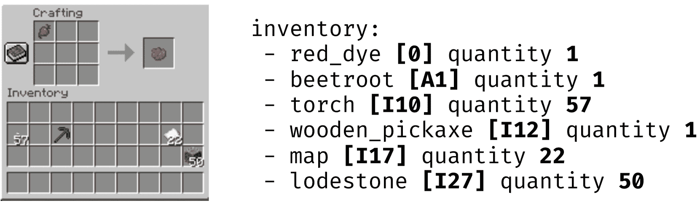

<!--yml

分类：未分类

日期：2025-01-11 11:41:55

-->

# Plancraft：用于 LLM 智能体规划的评估数据集

> 来源：[https://arxiv.org/html/2412.21033/](https://arxiv.org/html/2412.21033/)

Gautier Dagan    Frank Keller    Alex Lascarides 爱丁堡大学 {gautier.dagan, keller, alex}@ed.ac.uk

###### 摘要

我们提出了 Plancraft，这是一个用于 LLM 智能体的多模态评估数据集。Plancraft 既有纯文本界面，也有基于 Minecraft 工艺图形用户界面的多模态界面。我们包括了 Minecraft Wiki 以评估工具使用和检索增强生成（RAG），以及一个预言机规划器和预言机 RAG 信息提取器，以消除现代智能体架构的不同组成部分。为了评估决策能力，Plancraft 还包括了一些故意无法解决的示例，提供了一种真实的挑战，要求智能体不仅完成任务，还要判断这些任务是否可解。我们在任务中对开源和闭源的 LLM 以及策略进行了基准测试，并将它们的表现与手工设计的规划器进行了比较。我们发现 LLM 和 VLM 在 Plancraft 提出的规划问题上表现困难，并提出了改进其能力的建议。

## 1 引言

随着大语言模型（LLMs）性能的提高和成本的降低（OpenAI，[2024](https://arxiv.org/html/2412.21033v1#bib.bib14)；Dubey 等，[2024](https://arxiv.org/html/2412.21033v1#bib.bib4)），基于 LLM 的智能体在流行度上爆发式增长（Xi 等，[2023](https://arxiv.org/html/2412.21033v1#bib.bib27)）。我们将 LLM 智能体定义为包含至少一次对 LLM 调用的系统，这些调用影响智能体在环境中关于行动的自主决策。LLM 作为智能体系统的核心有着广阔的前景，因为它们能够利用预训练期间获得的通用知识来处理用自然语言表达的任务。这使得在规划和执行过程中能够进行人与智能体的交互，而这些交互对于其他规划范式，如强化学习（RL）或符号规划器（Xi 等，[2023](https://arxiv.org/html/2412.21033v1#bib.bib27)），是一个挑战。

LLM 可以查询和解释知识库、提问并通过灵活的对话接口融入新信息，所有这些都可以通过文本进行。尽管它们并非专门设计为规划器，但它们越来越多地应用于各种方法和策略（Yao 等，[2023b](https://arxiv.org/html/2412.21033v1#bib.bib32)；Shinn 等，[2023](https://arxiv.org/html/2412.21033v1#bib.bib20)；Yao 等，[2023a](https://arxiv.org/html/2412.21033v1#bib.bib31)）旨在最大化自主智能体的表现（Xi 等，[2024](https://arxiv.org/html/2412.21033v1#bib.bib28)）。但是，LLM 仍然存在一些问题，限制了它们作为通用智能体的可靠性和实用性——幻觉和对输入的脆弱性、有限的上下文窗口，以及在新环境中缺乏基础支撑。

图 1：一个 Plancraft 示例，其中任务是制作一张绿色床铺 。智能体必须利用观察结果（文本或图像）来生成下一个动作。在这个例子中，最短的路径是：通过熔炼仙人掌制作绿色染料 ；然后将物品（白色床铺  和绿色染料 ）移入正确的合成槽；接着将生成的绿色床铺 移入背包。

| 数据集 | 类型 | 视觉输入 | 知识库 | 规划器 | 不可满足集合 |
| --- | --- | --- | --- | --- | --- |
| Mind2Web (Deng et al., [2023](https://arxiv.org/html/2412.21033v1#bib.bib3)) | Web | ✗ | ✗ | ✗ | ✗ |
| WebShop (Yao et al., [2022](https://arxiv.org/html/2412.21033v1#bib.bib30)) | Web | ✓ | ✗ | ✗ | ✗ |
| MiniWoB++ (Liu et al., [2018](https://arxiv.org/html/2412.21033v1#bib.bib10)) | Web | ✓ | ✗ | ✗ | ✗ |
| WebArena (Zhou et al., [2023](https://arxiv.org/html/2412.21033v1#bib.bib33)) | Web | ✗ | ✗ | ✗ | ✗ |
| GAIA (Mialon et al., [2023](https://arxiv.org/html/2412.21033v1#bib.bib12)) | Web | ✓ | ✓^† | ✗ | ✗ |
| VirtualHome (Puig et al., [2018](https://arxiv.org/html/2412.21033v1#bib.bib18)) | 家庭 | ✓ | ✗ | ✗ | ✗ |
| ALFWorld (Shridhar et al., [2021](https://arxiv.org/html/2412.21033v1#bib.bib22)) | 家庭 | ✗ | ✗ | ✗ | ✗ |
| ALFRED (Shridhar et al., [2020](https://arxiv.org/html/2412.21033v1#bib.bib21)) | 家庭 | ✓ | ✗ | ✓ | ✗ |
| MineDojo (Fan et al., [2022](https://arxiv.org/html/2412.21033v1#bib.bib5)) | 游戏 | ✓ | ✓ | ✗ | ✗ |
| ScienceWorld (Wang et al., [2022a](https://arxiv.org/html/2412.21033v1#bib.bib23)) | 游戏 | ✗ | ✗ | ✗ | ✗ |
| BabyAI (Chevalier-Boisvert et al., [2019](https://arxiv.org/html/2412.21033v1#bib.bib2)) | 游戏 | ✗ | ✗ | ✓ | ✗ |
| TextCraft (Prasad et al., [2023](https://arxiv.org/html/2412.21033v1#bib.bib17)) | 游戏 | ✗ | ✗ | ✗ | ✗ |
| Plancraft (我们的) | 游戏 | ✓ | ✓ | ✓ | ✓ |

表 1：不同交互式数据集在智能体大型语言模型（LLM）评估中的比较。这些数据集中的每一个都用自然语言表达任务或目标，并且需要多步规划。我们设计了 Plancraft，作为一个测试平台，既拥有自然语言知识库，也有手工设计的规划器。Plancraft 还包含了一部分故意无法满足的数据（不可满足集合），因为预测没有有效计划的能力非常重要。^† GAIA 允许使用工具，包括网页搜索，但不提供如何解决任务的知识库。

现有的大多数LLM智能体评估基准几乎完全专注于成功率（Shridhar等人，[2021](https://arxiv.org/html/2412.21033v1#bib.bib22)；Yao等人，[2022](https://arxiv.org/html/2412.21033v1#bib.bib30)；Liu等人，[2023](https://arxiv.org/html/2412.21033v1#bib.bib11)；Xi等人，[2024](https://arxiv.org/html/2412.21033v1#bib.bib28)）：即，智能体达成目标状态的试验比例。成功率衡量的是智能体是否构建了一个有效的计划，但并不衡量该计划的效率或质量。一些环境允许任意数量的错误步骤，而其他环境则在执行错误动作时立即终止任务。仅报告或衡量成功率还会引入数据集偏差，因为它暗示给定问题的解决方案容易验证，但难以获得。因此，我们认为单靠成功率不足以捕捉现实世界场景的复杂性。每增加一步推理都会带来不可忽视的成本，因此评估标准应包括更细致的评估，比如LLM的计划与手工制作的解决方案有多接近。此外，有效的基于智能体的系统应能识别任务是否无法解决，因为许多现实世界的任务可能超出了智能体的能力，实际上，许多现实世界任务可能难以验证是否可行。如果没有预测是否没有有效计划的能力，智能体将需要在不断监控和重新规划中付出巨大的成本。

为此，我们介绍了Plancraft，一个基于Minecraft的新型多模态规划评估数据集，该数据集将环境限制在制作界面（见图[1](https://arxiv.org/html/2412.21033v1#S1.F1 "Figure 1 ‣ 1 Introduction ‣ Plancraft: an evaluation dataset for planning with LLM agents")）。Plancraft包含了各种复杂性和长度的规划问题，并包括一部分故意无法解决的数据集。与以往的环境不同，Plancraft使我们能够在与规划器进行对比时对智能体进行基准测试，但这种设置是人类为人类设计的。由于Minecraft的制作组件本身就是为人类玩家设计的，Plancraft还提供了一种测试LLM智能体如何利用人类知识（通过Minecraft Wiki的形式）来解决规划任务的方式。我们在表[1](https://arxiv.org/html/2412.21033v1#S1.T1 "Table 1 ‣ 1 Introduction ‣ Plancraft: an evaluation dataset for planning with LLM agents")中将Plancraft与流行的交互式数据集进行了比较。

我们在我们的数据集上评估了不同的基于LLM的智能体，从而提供了LLM-智能体的基准。我们测试了开源模型和闭源模型，并在不同的可能动作集合上对它们进行了评估。对于开源模型，我们评估了在一组专家计划上微调智能体的影响，并比较了多模态智能体与仅文本模型的差异。我们还在我们的环境中微调了一个边界框检测模型，以提供一个接口，使得仅文本的LLM可以与多模态环境进行交互。我们将所有基准模型、代码以及数据集和环境作为独立的Python包发布。¹¹1[https://github.com/gautierdag/plancraft](https://github.com/gautierdag/plancraft)

## 2 相关工作

### 2.1 LLM智能体

各种策略已经被提出，用于利用LLM作为具有互动反馈的智能体（Yao等人，[2023b](https://arxiv.org/html/2412.21033v1#bib.bib32); Huang等人，[2022](https://arxiv.org/html/2412.21033v1#bib.bib8); Shinn等人，[2023](https://arxiv.org/html/2412.21033v1#bib.bib20); Yao等人，[2023a](https://arxiv.org/html/2412.21033v1#bib.bib31); Wang等人，[2022b](https://arxiv.org/html/2412.21033v1#bib.bib24))。基本思想是利用LLM获取信息，这些信息如果对智能体来说是新颖的，可能会导致比它们原本执行的行为更好的表现。最简单的策略是ReAct（Yao等人，[2023b](https://arxiv.org/html/2412.21033v1#bib.bib32)），它通过交替执行动作和“思考”步骤，使得LLM能够自由生成。其他更广泛的策略，如Reflexion（Shinn等人，[2023](https://arxiv.org/html/2412.21033v1#bib.bib20)）或Inner Monologue（Huang等人，[2022](https://arxiv.org/html/2412.21033v1#bib.bib8)），通过外部模块或步骤促进自我纠正行为。Self-Consistency（Wang等人，[2022b](https://arxiv.org/html/2412.21033v1#bib.bib24)）和Tree-of-Thought（Yao等人，[2023a](https://arxiv.org/html/2412.21033v1#bib.bib31)）则通过对可能路径空间进行采样，并通过多数投票或另一个LLM评估步骤选择解决方案。尽管所有这些技术实现起来都很简单，但它们往往会在推理计算中增加显著的开销。

LLMs 的一个局限性是它们的上下文窗口大小。为了解决这个问题，现代系统通常结合一种检索增强生成（RAG）的形式（Lewis 等，[2020](https://arxiv.org/html/2412.21033v1#bib.bib9)），该方法搜索更大的文档集，然后根据当前的观察和任务，限制上下文只包含相关的示例（通过某种定量度量）。例如，Voyager（Wang 等，[2023a](https://arxiv.org/html/2412.21033v1#bib.bib25)）通过添加最可能适用于给定问题的技能来增强上下文。同样，JARVIS-1（Wang 等，[2023b](https://arxiv.org/html/2412.21033v1#bib.bib26)）存储成功的轨迹，并通过与当前观察的相似度估计，从而增强上下文。由于制作是 Minecraft 的核心部分，它的 Wiki 包含了所有物品制作配方的详细页面。因此，Minecraft Wiki 非常适合用作 RAG 流水线，在此流程中，智能体可以将其作为知识源进行查询。

使大语言模型（LLMs）能够使用外部工具，如网页搜索、计算器和数据库查询，也可以显著扩展它们的能力，超越简单的下一个标记预测。这激发了众多研究工作（Nakano 等，[2022](https://arxiv.org/html/2412.21033v1#bib.bib13)；Schick 等，[2023](https://arxiv.org/html/2412.21033v1#bib.bib19)；Parisi 等，[2022](https://arxiv.org/html/2412.21033v1#bib.bib15)；Yang 等，[2023](https://arxiv.org/html/2412.21033v1#bib.bib29)；Patil 等，[2023](https://arxiv.org/html/2412.21033v1#bib.bib16)）致力于将工具使用（或外部行动）集成到 LLMs 中并进行评估。一些数据集，如 GAIA（Mialon 等，[2023](https://arxiv.org/html/2412.21033v1#bib.bib12)），甚至评估没有任何工具限制的智能体。在 LLM 智能体的背景下，行动可以被视为类似于工具。

### 2.2 LLM 评估数据集

基于LLMs的智能体研究需要数据集和基准测试来评估它们。这些数据集在执行动作的环境类型上差异显著，从简化的纯文本世界到多模态环境都有。ALFWorld（Shridhar等人，[2021](https://arxiv.org/html/2412.21033v1#bib.bib22)）和ALFRED（Shridhar等人，[2020](https://arxiv.org/html/2412.21033v1#bib.bib21)）提供了虚拟家庭环境，在这些环境中，智能体必须操作物体以完成用自然语言表达的指令。Mind2Web（Deng等人，[2023](https://arxiv.org/html/2412.21033v1#bib.bib3)）、WebShop（Yao等人，[2022](https://arxiv.org/html/2412.21033v1#bib.bib30)）和WebArena（Zhou等人，[2023](https://arxiv.org/html/2412.21033v1#bib.bib33)）在基于网页的环境中评估智能体，任务要求与浏览器界面或电子商务平台进行互动。BabyAI（Chevalier-Boisvert等人，[2019](https://arxiv.org/html/2412.21033v1#bib.bib2)）是一个二维迷宫解谜游戏，带有自然语言指令。Minecraft也是智能体评估的一个流行基准，具有多个数据集，如MineRL（Guss等人，[2019](https://arxiv.org/html/2412.21033v1#bib.bib6)）、MineDojo（Fan等人，[2022](https://arxiv.org/html/2412.21033v1#bib.bib5)）和TextCraft Prasad等人（[2023](https://arxiv.org/html/2412.21033v1#bib.bib17)）。在表[1](https://arxiv.org/html/2412.21033v1#S1.T1 "Table 1 ‣ 1 Introduction ‣ Plancraft: an evaluation dataset for planning with LLM agents")中，我们将Plancraft与流行的LLM评估数据集进行了比较。虽然这些数据集在领域和实现上有所不同，但所有数据集都要求智能体进行多步规划，以完成用自然语言表达的任务。

##### 知识库

Minecraft的独特优势在于它是一个真实的游戏，而不是为智能体评估设计的构建，因此存在大量在线内容来帮助人类玩家。许多研究利用了Minecraft中的知识库与游戏环境结合的优势。Baker等人（[2022](https://arxiv.org/html/2412.21033v1#bib.bib1)）收集了大量的Minecraft视频数据集，并训练了一个模型——视频预训练（VPT），以直接从MineRL（Guss等人，[2019](https://arxiv.org/html/2412.21033v1#bib.bib6)）的像素中解决任务。Fan等人（[2022](https://arxiv.org/html/2412.21033v1#bib.bib5)）推出了MineDojo，并提供了一个由爬取的资源构成的知识库，如Minecraft视频、Minecraft Wiki页面和Reddit论坛页面；然而，他们并未评估这些资源是否能提高性能。在Plancraft中，我们收集了Minecraft Wiki上可用的配方页面，并利用它们构建知识库来评估RAG能力。此外，我们还实现了一个预言者配方搜索，以提供一个表现良好的RAG系统的上限估算。

##### 规划器

尽管表[1](https://arxiv.org/html/2412.21033v1#S1.T1 "Table 1 ‣ 1 Introduction ‣ Plancraft: an evaluation dataset for planning with LLM agents")中列出的所有数据集都可以评估一个智能体是否达成了目标，但它们缺乏手工制定的策略来评估智能体计划的质量：它们仅仅衡量智能体是否达成了目标。在我们比较的其他数据集中，只有BabyAI（Chevalier-Boisvert等，[2019](https://arxiv.org/html/2412.21033v1#bib.bib2)）和ALFRED（Shridhar等，[2020](https://arxiv.org/html/2412.21033v1#bib.bib21)）发布了手工制定的策略或求解器。BabyAI实现了一个具有手工策略的Bot Agent，可以作为环境中学习者的教师智能体。ALFRED发布了通过PDDL求解器找到的专家演示，并报告了考虑到专家路径长度的路径加权指标。同样地，我们为Plancraft实现了一个规划器，以提供一个基准，用于与其他智能体进行比较。

##### 不可能集合

所有现有的数据集都缺乏评估任务可行性或处理任务根本无法解决的场景的机制，这导致了对总是假设任务存在解决方案的任务的偏向。Plancraft通过包含一组故意设置的不可能任务——在给定约束下无法解决的任务，填补了这一空白。通过纳入这些示例，我们评估了智能体推理任务可行性的能力。该设置促进了更现实且具有成本效益的决策制定，鼓励智能体在解决问题的同时平衡任务的可解性。

## 3 Plancraft

为了创建Plancraft，我们实现了Minecraft制作界面的逻辑和视觉表现。类似于Prasad等人（[2023](https://arxiv.org/html/2412.21033v1#bib.bib17)）的工作，我们使用游戏文件和从Wiki获取的物品图像，完全在Python中重建了制作过程。通过图像处理将物品叠加在背包背景上，显著提高了性能，因为观察不再需要Java游戏引擎。我们的环境与真实的Minecraft界面有一对一的像素映射，并支持多种分辨率。

### 3.1 假设

Plancraft做出了一些简化假设：

1.  1.

    单一智能体：环境中只有一个智能体，环境中的任何变化都是该智能体行动的直接结果。

1.  2.

    确定性：有效的动作总是会执行，且其效果是可预测的。

1.  3.

    可观察性：制作界面和背包是完全可观察的，可以通过文本描述或通过多模态图像输入进行观察。

1.  4.

    顺序性：与经典规划一致，每个动作是离散的，并且一次执行一个。

### 3.2 动作与观察空间

选择用于动作和观察空间的抽象级别对规划问题的可处理性有着很大的影响。其他Minecraft环境，如MineDojo（Fan等人，[2022](https://arxiv.org/html/2412.21033v1#bib.bib5)）和Textcraft（Prasad等人，[2023](https://arxiv.org/html/2412.21033v1#bib.bib17)），提供了一个高级的“craft”命令，不需要智能体操作底层材料。另一方面，Plancraft要求在物品栏中正确放置材料，因此提供了一个较低级的符号化动作空间。这两个可能的环境动作是熔炼和移动，两个动作都需要一个slot_from、一个slot_to和一个数量。这种方式抽象了控制动态，集中在规划和空间推理上。

图2：Plancraft观察场景的示例，可以是图像或文本格式。对于文本，我们使用特定的槽位符号表示场景，其中[0]表示制作槽，[A1]到[C3]表示$3\times 3$制作网格的每一行和每一列，[I1]到[I36]表示物品栏的槽位。

在Minecraft的制作GUI中，有$46$个可能的物品槽或位置。第一个槽是制作槽，只有在正确的物品被放入$3\times 3$制作网格时，才会填充物品。物品只能从制作槽中提取，移动物品出槽会确认制作操作，并移除制作网格中的物品。制作网格是一个$3\times 3$的槽位排列，物品可以进出这些槽位。Minecraft中的制作配方可以是无形状的或有形状的。无形状的配方只检查制作网格中是否有所需的物品，而有形状的配方则要求物品还必须放置在正确的位置。当制作网格中的物品与$634$种配方之一匹配时，生成的物品会被添加到制作槽中。其余的$36$个槽位是通用的物品栏槽位，玩家可以在其中存储物品。我们将制作槽表示为[0]，$3\times 3$制作网格表示为槽位[A1]到[C3]，其中字母表示每一行，数字表示每一列，其余的物品栏槽位表示为槽位[I1]到[I36]。有关使用我们标注方案的物品栏文本描述示例，请参见图[2](https://arxiv.org/html/2412.21033v1#S3.F2 "图2 ‣ 3.2 动作和观察空间 ‣ 3 Plancraft ‣ Plancraft：用于LLM智能体规划的评估数据集")。

Plancraft提供了两种类型的观察：

+   •

    仅文本：智能体收到当前物品栏和制作目标的文本描述。物品栏通过我们的标注方案得到了完美表示。

+   •

    多模态：智能体收到一张高分辨率的图像（尺寸为$664\times 704$），图像完美展示了制作GUI。目标仍然以文本形式提供。

### 3.3 任务设置

Plancraft中的任务都涉及使用预定义的资源集合来制作特定的物品。每个任务的目标用自然语言表达，例如“制作一个类型为：green_bed的物品”。这些任务的复杂性各不相同，范围从单步工艺（例如，制作木板 ![[无标题图片]](img/d9ff42cb53e1bc130722dbbe01f5daed.png)）到多步计划，需要串联多个制作配方和动作（例如，制作床 ![[无标题图片]](img/68ddcf29baefffe06dd097d1ecdf2489.png)首先需要木板 ![[无标题图片]](img/568614aa1f4ce72228049923b5673b5d.png)和羊毛 ![[无标题图片]](img/d650ba6f29ef0afb9384b52b2400855b.png)）。

为了生成制作任务，我们将物品之间的依赖关系表示为一棵树，其中每个物品都是从一组所需资源中制作出来的。目标物品是树的根节点，而叶子节点和中间节点表示制作该物品所需的材料。对于每个制作任务，我们从目标物品中采样所需的配方，然后递归地探索制作它所需的材料。这构建了从原材料到最终产品的逐步计划，模拟了具有不同复杂度的制作过程。除了必要的制作材料外，我们还采样了若干个（$4$、$8$、$16$）干扰物品，使得识别正确的制作路径更加具有挑战性。

最后，我们验证了所有生成的任务是否能够在仅文本和多模态环境中使用规划器解决（见第[3.4](https://arxiv.org/html/2412.21033v1#S3.SS4 "3.4 Expert Planner ‣ 3 Plancraft ‣ Plancraft: an evaluation dataset for planning with LLM agents")节），并排除任何无效示例。我们排除了手工规划器轨迹超过30步的路径。

#### 3.3.1 数据集统计

我们定义了一个复杂度度量，它与使用的物品数量和制作该物品所需的配方数量成正比。我们将每个示例轨迹分配到一个复杂度箱中，从最简单到最复杂（非常简单、简单、中等、困难、非常困难），并确保每个箱子分布中有相等比例的示例。

总共，我们采样了$1145$个训练样本，$570$个验证样本和$580$个测试样本。我们保留了一些项目，使得验证集中的$79$个项目在训练集中没有出现，类似地，测试集中的$128$个项目也没有出现在训练集中，其中$63$个项目同样没有出现在验证集中。由于这些评估集是全面的，我们还提供了验证集（$110$个样本）和测试集（$117$个样本）的较小子集，用于我们的评估。

图3：Plancraft 示例流程。智能体可以使用其系统提示中描述的各种工具集。如果该动作被允许，则系统提示中的动作描述和格式才会出现。对话历史作为一系列消息传递。环境消息包括任务目标和当前观察结果（文本或图像）。如果智能体采取的动作不会影响环境，例如思考或搜索，则环境不会返回观察结果，而是根据该动作返回一个响应。

#### 3.3.2 环境反馈

由于 Plancraft 中的所有模型都可以处理文本，因此我们将格式错误作为文本观察结果进行传播。这个反馈机制能够让智能体了解具体问题，从而调整预测的输出。例如，如果智能体尝试将一个物品从一个槽位移动到另一个槽位，但指定了相同的源槽位和目标槽位，环境将返回一条消息，指示这些槽位必须不同。或者，如果智能体生成的数量超出了定义的限制，系统会提供一条错误消息，解释该数量必须在可接受的范围内。这个反馈机制使得智能体可以纠正其行为，并确保与环境的交互更加顺畅。

我们实现了一个早停机制来加速评估——如果智能体在 $s=10$ 步环境操作后未能制作任何新物品，则认为它已经卡住。我们还会在达到最大步数 $n=80$ 时停止该回合（请注意，所有示例都可以在 $<30$ 步内解决）。

#### 3.3.3 不可能的任务

由于我们还希望评估智能体是否能够预测任务何时无法解决，因此我们包含了数据集中的一部分（$20\%$），要求智能体制作一个物品，但在给定的库存条件下该物品是无法制作的。为了生成这个数据集，在采样过程中，故意从库存中删除了路径中的关键材料。这样设计是为了测试智能体是否能识别出在当前可用资源下无法完成任务。如前所述，所有以前的交互式环境（参见表[1](https://arxiv.org/html/2412.21033v1#S1.T1 "表1 ‣ 1 引言 ‣ Plancraft：基于 LLM 智能体的规划评估数据集")）都假设分配给智能体的任务是可以解决的。然而，现实场景往往不符合这一假设，任务可能由于资源缺失或其他限制而无法解决。

为了评估智能体在面对不可能任务时的表现，我们引入了“不可能动作”，当智能体发出这一动作时，将终止该回合。只有当智能体发出“不可能”时，这个不可能任务才被视为成功。对于这一不可能任务集，我们报告发出“不可能”动作的 F1 分数，因为现在智能体也有可能中断一个可解的任务（参见第[4.1节](https://arxiv.org/html/2412.21033v1#S4.SS1 "4.1 度量 ‣ 4 方法 ‣ Plancraft：基于 LLM 智能体的规划评估数据集")）。

### 3.4 专家规划器

为了建立基准，我们手工制作了一个规划器，用于找到完成每个任务所需的高效动作序列。这个规划器作为标准，用于评估不同代理模型的表现。

我们将求解器实现为对所有可能的制作配方进行备忘录化深度优先搜索，给定一个物品栏。如果找到，我们返回从初始物品栏到需要制作的目标物品之间的最短路径，路径由冶炼和移动操作组成。如果求解器在30秒内没有找到最短路径，我们将超时停止搜索。需要注意的是，为了简化处理，我们的规划器不会在一个操作中冶炼多个物品，也不会直接将物品从冶炼槽[0]或冶炼操作中移动到制作网格中。因此，如果代理能够将多个冶炼操作合并为一个，或者预见到物品在冶炼/制作后需要放置的位置，可能会存在更短的路径。该规划器使我们能够根据手工制定的标准评估生成计划的长度。我们还使用求解器设置超参数，例如代理完成任务所需的最大步骤数。

### 3.5 整合外部知识

与Fan等人（[2022](https://arxiv.org/html/2412.21033v1#bib.bib5)）类似，Plancraft将Minecraft Wiki作为自然语言知识库，允许代理执行RAG以帮助做出制作决策。这个功能使代理能够使用外部知识，测试它们检索相关的多模态信息并将其应用于规划问题的能力。我们从Minecraft Wiki抓取包含配方的页面，并对数据进行后处理，将其转换为Markdown格式。

我们实现了一个搜索操作，允许LLM在知识库中搜索给定的物品。由于我们希望评估RAG的极限，我们设计了搜索操作符，使其返回一个制作特定物品所需配方的黄金标签实例。因此，我们的RAG机制有助于估算在完美的检索器和解析器下，系统的表现。

## 4 方法

我们在Plancraft环境中评估了开源的Llama 3.1 8B和Llama 3.3 70B模型（Dubey等人，[2024](https://arxiv.org/html/2412.21033v1#bib.bib4)）以及gpt-4o-mini²²2gpt-4o-mini-2024-07-18（OpenAI，[2024](https://arxiv.org/html/2412.21033v1#bib.bib14)）。所有被测试的模型均为聊天模型，我们将环境观察和反馈格式化为用户角色的消息。我们在图[3](https://arxiv.org/html/2412.21033v1#S3.F3 "图 3 ‣ 3.3.1 数据集统计 ‣ 3.3 任务设置 ‣ 3 Plancraft ‣ Plancraft: 用LLM代理进行规划的评估数据集")中展示了代理与Plancraft环境之间的互动。我们在文本模式和多模态环境下评估每个模型，测试不同动作或工具集的可用性，并衡量零-shot、少-shot与微调之间的影响。我们实现了ReAct（Yao等人，[2023b](https://arxiv.org/html/2412.21033v1#bib.bib32)）‘思考’策略作为一种工具，代理可以在环境中将思考作为一种动作。任何在思考后生成的文本都会被忽略。  

##### 工具使用  

我们评估了多组不同的工具集，这些工具不包括核心环境动作（移动和熔炼），我们测试了在计划能力上是否包含思考、神谕配方搜索（RAG）和不可能等工具会产生影响。如果某个工具是活动的，我们将在系统提示中加入其描述，并在少量示例中提供其使用案例（见图[3](https://arxiv.org/html/2412.21033v1#S3.F3 "图 3 ‣ 3.3.1 数据集统计 ‣ 3.3 任务设置 ‣ 3 Plancraft ‣ Plancraft: 用LLM代理进行规划的评估数据集")）。  

##### 微调  

我们在使用LoRA（Hu等人，[2021](https://arxiv.org/html/2412.21033v1#bib.bib7)）($r=64$，$\alpha=32$)的训练集中对Llama 3.1 8B模型进行微调，采用来自神谕计划轨迹的数据。这些轨迹仅由我们手工制作的计划器直接获得的观察-动作对组成，并且仅包括熔炼和移动动作。因此，我们还测试了微调后的LLM是否能够利用其未明确训练过的新动作。  

##### 图像观察

我们在文本和图像观察数据上对模型进行评估。由于我们评估的Llama模型仅为文本模型，因此我们训练了一个定制的预训练边界框模型（Faster R-CNN），用于将图像映射到物品、数量和位置的列表。我们单独训练边界框模型，随机采样库存及其对应的边界框以获得训练数据。利用边界框的特征，模型不仅被训练来分类物体的种类，还能分类物体的数量。  

然后，我们将提取的符号表示映射到与我们仅有文本观察相同的格式。我们使用这种方法来基准测试如果观察是从不完美的分类器生成的，丧失了多少规划能力。对于 gpt-4o-mini，我们使用这些从边界框模型提取的文本观察来进行评估，并且还测试直接传递图像输入（因为 gpt-4o-mini 支持图像）。

### 4.1 指标

对于所有方法，我们报告任务的成功率——即目标项目是否已完成，计划长度——智能体所执行的环境动作的数量（即冶炼和移动），以及使用的总标记数（输入和输出的总和）。任务成功评估智能体成功完成任务的百分比。

使用专家规划器，我们可以将智能体的轨迹与专家的轨迹进行比较。我们计算平均动作效率（AE），即智能体计划中的动作数 $P$ 与专家规划器路径 $P^{e}$ 的比率。请注意，我们在计算此指标时仅考虑成功的计划：

|  | $\displaystyle\text{动作效率}=\frac{\sum_{i=1}^{N_{\text{成功}}}% \left(P_{i}-P_{i}^{e}\right)}{N_{\text{成功}}}$ |  | (1) |
| --- | --- | --- | --- |

我们通过思考和搜索调用的数量来衡量是否使用了内外部知识。当我们评估模型在允许不可能情况下的表现时，我们还会报告执行动作的 F1 分数。由于预测不可能会立即终止这一过程，不可能的设定引入了一种新的失败模式，在面对可解决的问题时，模型可能会发出不可能的动作。

最后，我们通过使用总标记数作为代理来追踪整体计算效率。³³3我们将输入和输出标记视为等价。标记使用受到工具使用的重大影响，因为调用外部工具和执行动作都需要模型生成额外的标记（用于调用工具），但也会因为外部调用而引入新的信息。然而，我们注意到，工具可能隐藏了简单标记使用中未考虑的额外计算成本。

除非另有说明，所有模型在相同条件下进行评估，每个任务有固定的试验次数和相同的提示。我们使用温度 $t=0.6$，并对每个模型进行五次生成，报告每个指标的平均值。

|  |  | 成功率 ($\uparrow$) |  |  |  |  |  |  |  |
| --- | --- | --- | --- | --- | --- | --- | --- | --- | --- |
| 工具 | 模型 | 难度 | 总体 | 平均动作数 | 不可能 F1 ($\uparrow$) | 平均计划长度 ($\downarrow$) | AE ($\downarrow$) | 平均使用标记数 ($\downarrow$) |
|  |  | 简单 | 中等 | 困难 |  | 思考 | 搜索 | 不可能 |  |  |  |  |
| M S | Llama 8B | 0.10 | 0.00 | 0.00 | 0.04 | - | - | - | - | 13.21 | 0.86 | 6.2M |
| M S | Llama 70B | 0.37 | 0.04 | 0.00 | 0.16 | - | - | - | - | 15.94 | 1.09 | 8.9M |
| M S | gpt-4o-mini | 0.26 | 0.00 | 0.00 | 0.11 | - | - | - | - | 14.98 | 0.29 | 8.2M |
| M S | Llama 8B FT | 0.67 | 0.45 | 0.12 | 0.41 | - | - | - | - | 10.14 | 0.03 | 4.1M |
| M S T | Llama 8B | 0.15 | 0.00 | 0.00 | 0.06 | 9.50 | - | - | - | 21.80 | 3.87 | 11.1M |
| M S T | Llama 70B | 0.44 | 0.15 | 0.03 | 0.22 | 10.57 | - | - | - | 21.16 | 2.50 | 11.8M |
| M S T | gpt-4o-mini | 0.29 | 0.00 | 0.00 | 0.12 | 13.98 | - | - | - | 23.53 | 2.37 | 11.6M |
| M S T | Llama 8B FT | 0.57 | 0.42 | 0.12 | 0.37 | 0.06 | - | - | - | 10.41 | 0.07 | 4.5M |
| M S T SE | Llama 8B | 0.57 | 0.31 | 0.01 | 0.30 | 4.75 | 3.18 | - | - | 18.41 | 3.38 | 9.3M |
| M S T SE | Llama 70B | 0.79 | 0.60 | 0.23 | 0.53 | 6.69 | 2.28 | - | - | 18.71 | 4.27 | 9.8M |
| M S T SE | gpt-4o-mini | 0.56 | 0.21 | 0.00 | 0.27 | 11.16 | 2.15 | - | - | 21.98 | 4.91 | 10.9M |
| M S T SE | Llama 8B FT | 0.61 | 0.39 | 0.12 | 0.38 | 0.00 | 0.01 | - | - | 10.36 | 0.11 | 4.8M |
| M S T SE I | Llama 8B | 0.40 | 0.09 | 0.01 | 0.18 | 2.31 | 2.36 | 0.72 | 0.32 | 9.77 | 2.53 | 4.9M |
| M S T SE I | Llama 70B | 0.80 | 0.65 | 0.23 | 0.55 | 5.20 | 2.20 | 0.16 | 0.64 | 16.76 | 4.05 | 9.6M |
| M S T SE I | gpt-4o-mini | 0.56 | 0.23 | 0.00 | 0.28 | 6.45 | 1.15 | 0.48 | 0.42 | 14.89 | 4.94 | 4.7M |
| M S T SE I | Llama 8B FT | 0.58 | 0.40 | 0.11 | 0.36 | 0.00 | 0.02 | 0.00 | 0.00 | 10.38 | 0.09 | 5.7M |

表 2：不同模型和可用动作集（移动 (M)、冶炼 (S)、思考 (T)、搜索 (SE)、不可能 (I)）的平均成功率 (SR)。我们还报告了使用的特殊动作的平均次数、平均计划长度、动作效率 (AE) 以及使用的 Token 总数的平均值。我们将非常容易和容易的难度类别合并为“容易”，将困难和非常困难的类别合并为“困难”。

| 模型 (M S) | 总体成功率 ($\uparrow$) | 平均计划长度 ($\downarrow$) | AE ($\downarrow$) | 平均使用的 Token 数 ($\downarrow$) |
| --- | --- | --- | --- | --- |
| Llama 8B R-CNN | 0.00 | 13.35 | 3.00 | 5.3M |
| Llama 70B R-CNN | 0.06 | 14.47 | 1.00 | 6.1M |
| gpt-4o-mini R-CNN | 0.03 | 14.93 | 0.23 | 5.8M |
| gpt-4o-mini IMG | 0.01 | 15.53 | 2.60 | 95.3M |

表 3：不同模型在基本动作集（M S）和图像观察下的结果。我们使用 R-CNN 从图像中提取符号表示。由于 gpt-4o-mini 也支持图像输入，我们将该模型作为统一的 VLM 进行评估，其中观察直接作为图像输入（gpt-4o-mini IMG）。

## 5 结果

我们在表格[2](https://arxiv.org/html/2412.21033v1#S4.T2 "表 2 ‣ 4.1 指标 ‣ 4 方法 ‣ Plancraft：一个用于评估 LLM 代理规划的数据集")和表格[3](https://arxiv.org/html/2412.21033v1#S4.T3 "表 3 ‣ 4.1 指标 ‣ 4 方法 ‣ Plancraft：一个用于评估 LLM 代理规划的数据集")中报告了仅文本观察和多模态观察的结果。

### 5.1 Act 和 ReAct 基准

我们首先将动作空间限制为仅包含环境动作：移动（M）和冶炼（S），并在少量示例设置下评估 Llama 3.1 8B、Llama 3.3 70B 和 gpt-4o-mini 的规划能力。我们发现，gpt-4o-mini 和 Llama 70B 的表现相似，整体任务成功率分别为 $0.11$ 和 $0.16$。而 Llama 8B 的表现明显较差，成功率仅为 $0.04$。在计划效率方面，我们发现 gpt-4o-mini 更接近专家规划器的效率（$0.29$），而 Llama 模型的效率较低（$0.86$ 和 $1.09$），这表明当模型成功时，它会更加高效地完成任务。

接下来，我们将可能的动作池扩展至包括思考，类似于 ReAct 策略（Yao 等，[2023b](https://arxiv.org/html/2412.21033v1#bib.bib32)）。请注意，我们还适当地更新了少量示例提示，包含了动作的描述以及使用示例（见图 [3](https://arxiv.org/html/2412.21033v1#S3.F3 "Figure 3 ‣ 3.3.1 Dataset Statistics ‣ 3.3 Task Setup ‣ 3 Plancraft ‣ Plancraft: an evaluation dataset for planning with LLM agents")）。我们将连续思考动作的最大次数限制为三次；然而，我们发现实际上模型并不会陷入连续的思维循环中。使用思考后，少量示例模型在整体任务成功率上有所提升：Llama 8B 为 $0.06(+0.02)$，Llama 70B 为 $0.22(+0.06)$，gpt-4o-mini 为 $0.12(+0.01)$。然而，思考也带来了额外的成本，因为模型现在被允许进行不受限制的生成步骤，从而导致更长的对话。我们可以直接看到这对 token 使用量的影响；例如，gpt-4o-mini 的 token 使用量从 8.2M 增加到 11.6M tokens。

### 5.2 外部知识

当我们允许搜索时，我们使模型能够通过 RAG 神谕检索器整合 Minecraft Wiki 中的外部知识。我们发现，这对所有三个少量示例模型都有显著的好处，将 Llama 7B 提升至 $0.30(+0.24)$，Llama 70B 提升至 $0.53(+0.31)$，gpt-4o-mini 提升至 $0.27(+0.15)$ 的整体成功率。与思考类似，搜索引入了额外的步骤，因此我们预计平均使用的 tokens 会增加，但我们发现实际情况并非如此。较低的 token 使用量可以部分归因于在有搜索可用时，思考的使用量全球性减少。模型不再需要推测如何制作某个特定的食谱，而是可以直接检索到准确的信息。这减少了额外推理步骤的需求，从而使 token 使用更加高效。

### 5.3 预测不可能的任务

当我们将“不可能”作为一种可能性纳入考虑时，我们引入了一种使智能体中断一个情节的方法。我们发现，这对较小的Llama 8B模型（$-0.12$）的整体成功率影响较大，而对较大的Llama 70B（$+0.02$）和gpt-4o-mini（$+0.01$）的影响较小。我们还记录了发出“不可能”的F1得分，发现表现最佳的模型，即最能准确预测任务是否不可能的模型，是Llama 70B模型，其F1得分为$0.64$。加入“不可能”也减少了令牌的使用，因为模型现在可以在卡住时中断情节。这对于某些模型大大减少了平均使用的令牌数；例如，gpt-4o-mini的平均令牌数从$10.9$M降至$4.7$M。

### 5.4 微调的效果

如第[4](https://arxiv.org/html/2412.21033v1#S4 "4 Method ‣ Plancraft: an evaluation dataset for planning with LLM agents")节所述，我们还对LLM进行了专家计划的微调（Llama 8B FT）。正如Wang等人（[2022a](https://arxiv.org/html/2412.21033v1#bib.bib23)）所指出，我们发现较小的模型通过大约1k的训练样本就能提高任务成功率。Llama 8B FT的整体成功率大约为$0.41$，随着我们引入更多动作，成功率略有下降。我们发现，微调大大降低了模型使用新动作的能力。Llama 8B FT几乎从不使用think、search和impossible，因此在计划长度方面也是我们最有效的模型。

### 5.5 图像观察

在表[3](https://arxiv.org/html/2412.21033v1#S4.T3 "Table 3 ‣ 4.1 Metrics ‣ 4 Method ‣ Plancraft: an evaluation dataset for planning with LLM agents")中，我们使用图像而非文本输入。我们利用预训练的边界框Faster R-CNN模型将图像映射为文本描述，并确认所有模型的准确率都有下降：Llama 8B（$-0.04$）、Llama 70B（$-0.10$）和gpt-4o-mini（$-0.08$）。由于gpt-4o-mini支持图像输入，我们还评估了直接将图像传递给模型，而不是传递文本观察结果。在这种情况下，系统指令保持不变，但我们修改了少量示例提示，将观察结果替换为图像。我们将这种设置称为gpt-4o-mini IMG，并指出它无法解决我们的任务（$0.01$），并且使用的令牌数量是原来的100倍，因为每张图像都会被转换为一长串令牌。

## 6 结论

我们引入了Plancraft，一个多模态数据集，用于评估基于LLM的智能体的规划能力。通过使用Minecraft的制作系统，Plancraft可以评估任务的准确性以及智能体判断任务可行性的能力。通过包括可解和故意无法解的任务，这个数据集为检验智能体在基于步骤的问题解决情境中的行为提供了一个受控的环境。

我们的结果确认了较大模型，如 Llama 70B，在任务成功率和效率方面优于较小模型，如 Llama 8B，尤其是在 Plancraft 中。这一优势在采用特殊操作如 think 和 search 时得到了进一步增强。“Impossible”的引入凸显了一个权衡：虽然使模型能够识别无法解决的任务减少了令牌使用量并提高了效率，但它对较小模型如 Llama 8B 产生了不成比例的影响。对较小模型进行微调，如 Llama 8B FT，显著提高了任务成功率，但也暴露出一个关键限制：无法有效使用新的操作如 think 和 search，表明微调可能过度限制了行为。此外，我们的研究还强调了多模态环境中的挑战；尽管仅文本任务突出了较强的性能趋势，但原始图像输入，如在 gpt-4o-mini IMG 中，突显了开箱即用的视觉语言模型（VLM）在有效规划方面的基本局限性。总体而言，我们的结果强调了在规划任务中连接多模态输入和决策过程的复杂性。

## 致谢

本研究部分得到英国研究与创新中心（UKRI）自然语言处理博士培训中心的资助，该中心由英国研究与创新（UKRI）资助（资助号 EP/S022481/1），并由爱丁堡大学信息学学院和哲学、心理学与语言科学学院提供支持，另外还获得了由 UKRI 资助的 TAS 治理节点（资助号 EP/V026607/1）资助。

## 参考文献

+   Baker 等人 [2022] Bowen Baker, Ilge Akkaya, Peter Zhokov, Joost Huizinga, Jie Tang, Adrien Ecoffet, Brandon Houghton, Raul Sampedro 和 Jeff Clune。《视频预训练（VPT）：通过观看未标记的在线视频学习行动》。在 S. Koyejo, S. Mohamed, A. Agarwal, D. Belgrave, K. Cho 和 A. Oh 编辑的《神经信息处理系统进展》一书中，第 35 卷，24639–24654 页。Curran Associates, Inc.，2022年。

+   Chevalier-Boisvert 等人 [2019] Maxime Chevalier-Boisvert, Dzmitry Bahdanau, Salem Lahlou, Lucas Willems, Chitwan Saharia, Thien Huu Nguyen 和 Yoshua Bengio。《BabyAI：朝着有人的环节进行基础语言学习的第一步》。在 2019 年国际学习表征会议（International Conference on Learning Representations）上。

+   Deng 等人 [2023] Xiang Deng, Yu Gu, Boyuan Zheng, Shijie Chen, Samuel Stevens, Boshi Wang, Huan Sun 和 Yu Su。《Mind2web：迈向通用 Web 代理》，2023年。

+   Dubey 等人 [2024] Abhimanyu Dubey, Abhinav Jauhri, Abhinav Pandey, Abhishek Kadian, Ahmad Al-Dahle, Aiesha Letman, Akhil Mathur, Alan Schelten, Amy Yang, Angela Fan 等人。《Llama 3 模型群》。arXiv 预印本 arXiv:2407.21783，2024年。

+   Fan 等人 [2022] Linxi Fan, Guanzhi Wang, Yunfan Jiang, Ajay Mandlekar, Yuncong Yang, Haoyi Zhu, Andrew Tang, De-An Huang, Yuke Zhu 和 Anima Anandkumar。《Minedojo：构建具有互联网规模知识的开放式具身代理》。神经信息处理系统进展，35:18343–18362，2022年。

+   Guss 等人 [2019] William H Guss, Brandon Houghton, Nicholay Topin, Phillip Wang, Cayden Codel, Manuela Veloso, 和 Ruslan Salakhutdinov. Minerl：一个大型的 Minecraft 演示数据集. arXiv 预印本 arXiv:1907.13440, 2019.

+   Hu 等人 [2021] Edward J. Hu, Yelong Shen, Phillip Wallis, Zeyuan Allen-Zhu, Yuanzhi Li, Shean Wang, Lu Wang, 和 Weizhu Chen. Lora：大型语言模型的低秩适应, 2021.

+   Huang 等人 [2022] Wenlong Huang, Fei Xia, Ted Xiao, Harris Chan, Jacky Liang, Pete Florence, Andy Zeng, Jonathan Tompson, Igor Mordatch, Yevgen Chebotar, Pierre Sermanet, Noah Brown, Tomas Jackson, Linda Luu, Sergey Levine, Karol Hausman, 和 Brian Ichter. 内心独白：通过规划与语言模型进行具象化推理. (arXiv:2207.05608), 2022年7月. arXiv:2207.05608 [cs].

+   Lewis 等人 [2020] Patrick Lewis, Ethan Perez, Aleksandra Piktus, Fabio Petroni, Vladimir Karpukhin, Naman Goyal, Heinrich Küttler, Mike Lewis, Wen-tau Yih, Tim Rocktäschel, Sebastian Riedel, 和 Douwe Kiela. 检索增强生成用于知识密集型 NLP 任务. 在 H. Larochelle, M. Ranzato, R. Hadsell, M. F. Balcan, 和 H. Lin 编辑的《神经信息处理系统进展》，第33卷，第9459-9474页. Curran Associates, Inc., 2020.

+   Liu 等人 [2018] Evan Zheran Liu, Kelvin Guu, Panupong Pasupat, Tianlin Shi, 和 Percy Liang. 使用工作流引导探索在 Web 界面上进行强化学习. arXiv 预印本 arXiv:1802.08802, 2018.

+   Liu 等人 [2023] Xiao Liu, Hao Yu, Hanchen Zhang, Yifan Xu, Xuanyu Lei, Hanyu Lai, Yu Gu, Hangliang Ding, Kaiwen Men, Kejuan Yang, 等人. Agentbench：评估大型语言模型作为智能体. arXiv 预印本 arXiv:2308.03688, 2023.

+   Mialon 等人 [2023] Grégoire Mialon, Clémentine Fourrier, Craig Swift, Thomas Wolf, Yann LeCun, 和 Thomas Scialom. Gaia：通用 AI 助手基准测试. arXiv 预印本 arXiv:2311.12983, 2023.

+   Nakano 等人 [2022] Reiichiro Nakano, Jacob Hilton, Suchir Balaji, Jeff Wu, Long Ouyang, Christina Kim, Christopher Hesse, Shantanu Jain, Vineet Kosaraju, William Saunders, Xu Jiang, Karl Cobbe, Tyna Eloundou, Gretchen Krueger, Kevin Button, Matthew Knight, Benjamin Chess, 和 John Schulman. Webgpt：浏览器辅助的问答系统与人工反馈. (arXiv:2112.09332), 2022年6月. arXiv:2112.09332 [cs].

+   OpenAI [2024] OpenAI. GPT-4 技术报告. (arXiv:2303.08774), 2024年3月. arXiv:2303.08774 [cs].

+   Parisi 等人 [2022] Aaron Parisi, Yao Zhao, 和 Noah Fiedel. Talm：工具增强的语言模型. (arXiv:2205.12255), 2022年5月. arXiv:2205.12255 [cs].

+   Patil 等人 [2023] Shishir G. Patil, Tianjun Zhang, Xin Wang, 和 Joseph E. Gonzalez. Gorilla：与海量 API 连接的大型语言模型. (arXiv:2305.15334), 2023年5月. arXiv:2305.15334 [cs].

+   Prasad 等人 [2023] Archiki Prasad, Alexander Koller, Mareike Hartmann, Peter Clark, Ashish Sabharwal, Mohit Bansal, 和 Tushar Khot. Adapt: 按需分解与语言模型的规划. arXiv 预印本 arXiv:2311.05772, 2023年。

+   Puig 等人 [2018] Xavier Puig, Kevin Ra, Marko Boben, Jiaman Li, Tingwu Wang, Sanja Fidler, 和 Antonio Torralba. Virtualhome: 通过程序模拟家庭活动. 载于《IEEE计算机视觉与模式识别会议论文集》，页码8494–8502，2018年。

+   Schick 等人 [2023] Timo Schick, Jane Dwivedi-Yu, Roberto Dessi, Roberta Raileanu, Maria Lomeli, Eric Hambro, Luke Zettlemoyer, Nicola Cancedda, 和 Thomas Scialom. Toolformer: 语言模型可以自学使用工具. 2023年11月。

+   Shinn 等人 [2023] Noah Shinn, Federico Cassano, Ashwin Gopinath, Karthik R. Narasimhan, 和 Shunyu Yao. Reflexion: 带有语言强化学习的语言智能体. 2023年11月。

+   Shridhar 等人 [2020] Mohit Shridhar, Jesse Thomason, Daniel Gordon, Yonatan Bisk, Winson Han, Roozbeh Mottaghi, Luke Zettlemoyer, 和 Dieter Fox. ALFRED: 用于理解日常任务的具体化指令基准. 载于《IEEE计算机视觉与模式识别会议论文集》（CVPR），2020年。

+   Shridhar 等人 [2021] Mohit Shridhar, Xingdi Yuan, Marc-Alexandre Côté, Yonatan Bisk, Adam Trischler, 和 Matthew Hausknecht. ALFWorld: 对齐文本与具身环境以进行互动学习. 载于《国际学习表征会议论文集》（ICLR），2021年。

+   Wang 等人 [2022a] Ruoyao Wang, Peter Jansen, Marc-Alexandre Côté, 和 Prithviraj Ammanabrolu. Scienceworld: 你的智能体比五年级学生聪明吗？arXiv 预印本 arXiv:2203.07540, 2022年。

+   Wang 等人 [2022b] Xuezhi Wang, Jason Wei, Dale Schuurmans, Quoc V. Le, Ed H. Chi, Sharan Narang, Aakanksha Chowdhery, 和 Denny Zhou. 自一致性提高语言模型的思维链推理能力. 2022年9月。

+   Wang 等人 [2023a] Guanzhi Wang, Yuqi Xie, Yunfan Jiang, Ajay Mandlekar, Chaowei Xiao, Yuke Zhu, Linxi Fan, 和 Anima Anandkumar. Voyager: 一个开放式具身智能体，使用大型语言模型. arXiv 预印本 arXiv: Arxiv-2305.16291, 2023年。

+   Wang 等人 [2023b] Zihao Wang, Shaofei Cai, Anji Liu, Yonggang Jin, Jinbing Hou, Bowei Zhang, Haowei Lin, Zhaofeng He, Zilong Zheng, Yaodong Yang, Xiaojian Ma, 和 Yitao Liang. Jarvis-1: 具有记忆增强的多模态语言模型的开放世界多任务智能体. arXiv 预印本 arXiv: 2311.05997, 2023年。

+   Xi 等人 [2023] Zhiheng Xi, Wenxiang Chen, Xin Guo, Wei He, Yiwen Ding, Boyang Hong, Ming Zhang, Junzhe Wang, Senjie Jin, Enyu Zhou 等. 基于大语言模型的智能体的崛起与潜力：一项调查. arXiv 预印本 arXiv:2309.07864, 2023年。

+   Xi 等人 [2024] Zhiheng Xi, Yiwen Ding, Wenxiang Chen, Boyang Hong, Honglin Guo, Junzhe Wang, Dingwen Yang, Chenyang Liao, Xin Guo, Wei He, Songyang Gao, Lu Chen, Rui Zheng, Yicheng Zou, Tao Gui, Qi Zhang, Xipeng Qiu, Xuanjing Huang, Zuxuan Wu 和 Yu-Gang Jiang。Agentgym：在多样化环境中进化基于大型语言模型的代理，2024年。

+   Yang 等人 [2023] Rui Yang, Lin Song, Yanwei Li, Sijie Zhao, Yixiao Ge, Xiu Li 和 Ying Shan。Gpt4tools：通过自我指导教导大型语言模型使用工具。（arXiv:2305.18752），2023年5月。arXiv:2305.18752 [cs]。

+   Yao 等人 [2022] Shunyu Yao, Howard Chen, John Yang 和 Karthik Narasimhan。Webshop：面向可扩展的真实世界网页交互与基础语言代理。发表于 S. Koyejo、S. Mohamed、A. Agarwal、D. Belgrave、K. Cho 和 A. Oh 编辑的《神经信息处理系统进展》（Advances in Neural Information Processing Systems）第35卷，第20744–20757页，Curran Associates, Inc., 2022年。

+   Yao 等人 [2023a] Shunyu Yao, Dian Yu, Jeffrey Zhao, Izhak Shafran, Tom Griffiths, Yuan Cao 和 Karthik Narasimhan。思维树：在大型语言模型中进行深思熟虑的问题解决。在 A. Oh、T. Naumann、A. Globerson、K. Saenko、M. Hardt 和 S. Levine 编辑的《神经信息处理系统进展》（Advances in Neural Information Processing Systems）第36卷，第11809–11822页，Curran Associates, Inc., 2023年。

+   Yao 等人 [2023b] Shunyu Yao, Jeffrey Zhao, Dian Yu, Nan Du, Izhak Shafran, Karthik Narasimhan 和 Yuan Cao。ReAct：在语言模型中协同推理与行动。发表于国际学习表示会议（ICLR），2023年。

+   Zhou 等人 [2023] Shuyan Zhou, Frank F Xu, Hao Zhu, Xuhui Zhou, Robert Lo, Abishek Sridhar, Xianyi Cheng, Tianyue Ou, Yonatan Bisk, Daniel Fried 等人。Webarena：构建自主代理的真实网页环境。arXiv 预印本 arXiv:2307.13854，2023年。
