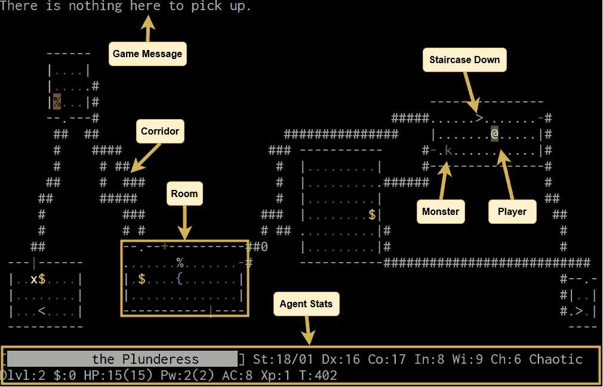
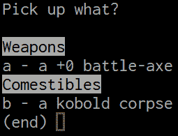
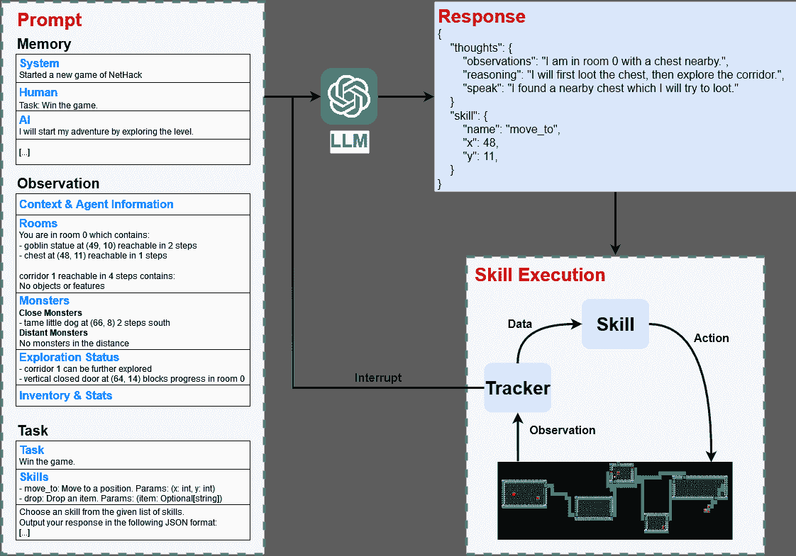

<!--yml

类别：未分类

日期：2025-01-11 12:49:24

-->

# 使用LLM玩《NetHack》：作为零-shot代理的潜力与局限性

> 来源：[https://arxiv.org/html/2403.00690/](https://arxiv.org/html/2403.00690/)

Dominik Jeurissen, Diego Perez-Liebana, Jeremy Gow 伦敦玛丽女王大学

{d.jeurissen, diego.perez, jeremy.gow}@qmul.ac.uk    Duygu Çakmak, James Kwan Creative Assembly

{duygu.cakmak, james.kwan}@creative-assembly.com

###### 摘要

大型语言模型（LLMs）作为零-shot游戏代理的高级规划者，已经取得了巨大的成功。然而，这些代理主要在《Minecraft》上进行评估，而在该游戏中，长期规划相对简单。相比之下，在动态机器人环境中测试的代理，由于环境过于简单，只有少数物体和交互，面临一定的限制。为填补这一文献空白，我们提出了NetPlay——首个用于挑战性roguelike游戏《NetHack》的LLM驱动零-shot代理。《NetHack》是一个特别具有挑战性的环境，因为它拥有多样的物品和怪物、复杂的交互以及多种死亡方式。

NetPlay采用了为动态机器人环境设计的架构，并对其进行了修改以适应《NetHack》。像以前的方法一样，它通过提示LLM从预定义的技能中选择，并追踪过去的交互以增强决策过程。考虑到《NetHack》具有不可预测的特点，NetPlay会检测到重要的游戏事件，并中断正在进行的技能，从而能够应对突发情况。尽管NetPlay在与《NetHack》的机制交互方面表现出了相当的灵活性和熟练度，但它在处理模糊的任务描述和缺乏明确反馈时遇到了困难。我们的研究结果表明，NetPlay在拥有详细上下文信息时表现最佳，这表明在为《NetHack》等复杂游戏提供上下文信息时，动态方法的必要性。

###### 索引词：

《NetHack》, 大型语言模型, 零-shot代理。

## I 引言

最近，基于大型语言模型（LLMs）的代理已经成功应用于机器人环境[[1](https://arxiv.org/html/2403.00690v1#bib.bib1)] [[2](https://arxiv.org/html/2403.00690v1#bib.bib2), [3](https://arxiv.org/html/2403.00690v1#bib.bib3)] 和《Minecraft》[[4](https://arxiv.org/html/2403.00690v1#bib.bib4), [5](https://arxiv.org/html/2403.00690v1#bib.bib5), [6](https://arxiv.org/html/2403.00690v1#bib.bib6)]等。这些代理无需预训练，通常通过提示LLM从预定义的技能中选择来解决任务。它们已被证明在需要广泛知识的任务中非常有效，比如在《Minecraft》中制作钻石镐。此外，它们能够理解各种任务描述。

使用预定义技能的LLM智能体在游戏开发中尤其具有前景，因为开发一组简单的技能通常比设计一个完整的智能体更可行。然而，现有研究主要集中在LLM在游戏中的能力，忽视了它们的局限性。评估通常集中在可预测的任务上，例如在《Minecraft》中找到钻石，这通常可以通过条带采矿稳定地实现。许多游戏需要更动态的决策制定，其中长期规划具有挑战性，正确的行动方向更加模糊。虽然在更动态的机器人环境中进行过评估，但这些环境通常仅包含少数几个物体，缺乏复杂的互动。

我们通过在复杂且不可预测的类 Rogue 游戏《NetHack》 [[7](https://arxiv.org/html/2403.00690v1#bib.bib7)] 中评估一个LLM智能体，构建了在现有文献基础上的工作。《NetHack》是一个充满许多怪物、物品、互动、部分可观察性以及复杂目标条件的挑战性游戏。加之《NetHack》的庞大规模和玩家需要理解的众多子系统，使其成为评估LLM智能体局限性的绝佳候选。《NetHack》的描述文件还允许我们定义关卡，从而使我们能够单独评估智能体的能力。

接下来，我们将介绍（NetPlay），一个由GPT-4驱动的智能体，旨在应对《NetHack》中的广泛任务。NetPlay的灵感来源于autoascend [[8](https://arxiv.org/html/2403.00690v1#bib.bib8)]，一个手工设计的智能体，曾赢得2021年《NetHack挑战赛》 [[9](https://arxiv.org/html/2403.00690v1#bib.bib9)]。虽然autoascend依赖于一个庞大的手工规则网络来处理《NetHack》的复杂性，NetPlay只需一组独立的技能。我们的实验表明，NetPlay能够与《NetHack》的大多数游戏机制互动，并且在执行详细指令方面表现出色。此外，当集中注意力解决特定问题时，该智能体还展现了创造性行为。然而，当被要求自主游戏时，NetPlay远远不及autoascend。因此，本文深入探讨了其中的原因，例如智能体在处理模糊指令、混淆观察以及缺乏明确反馈方面的困难。

我们在[第二节](https://arxiv.org/html/2403.00690v1#S2 "II Background ‣ Playing NetHack with LLMs: Potential & Limitations as Zero-Shot Agents")中首先介绍了《NetHack》并回顾了现有的基于大语言模型（LLM）的代理相关研究。[第三节](https://arxiv.org/html/2403.00690v1#S3 "III NetPlay ‣ Playing NetHack with LLMs: Potential & Limitations as Zero-Shot Agents")讨论了NetPlay的架构，包括我们因LLM的局限性所做的设计决策。在[第四节](https://arxiv.org/html/2403.00690v1#S4 "IV Experiments ‣ Playing NetHack with LLMs: Potential & Limitations as Zero-Shot Agents")中，我们首先评估了NetPlay在自动玩游戏方面的能力，并将其表现与一个简单的手工代理和自动升天（autoascend）进行比较。随后，我们对代理在不同隔离场景中的行为进行了深入分析。接下来，我们在[第五节](https://arxiv.org/html/2403.00690v1#S5 "V Potential and Limitations ‣ Playing NetHack with LLMs: Potential & Limitations as Zero-Shot Agents")中分析了实验结果，并在[第六节](https://arxiv.org/html/2403.00690v1#S6 "VI Conclusion ‣ Playing NetHack with LLMs: Potential & Limitations as Zero-Shot Agents")中总结了本研究。源代码可以在GitHub上找到¹¹1[https://github.com/CommanderCero/NetPlay](https://github.com/CommanderCero/NetPlay)。

## II 背景

### II-A 《NetHack》

图1：游戏《NetHack》的终端视图。左侧图像展示了游戏屏幕的注释视图，包含了游戏地图、一个游戏消息示例和代理的统计信息。右侧图像展示了一个菜单，用于从包含多个物品的格子中拾取物品。图片来源：[alt.org/nethack](https://alt.org/nethack/)

《NetHack》[[7](https://arxiv.org/html/2403.00690v1#bib.bib7)]，于1987年发布，是一款极具挑战性的回合制 Roguelike 游戏，至今仍在不断更新。游戏目标是穿越50个程序生成的关卡，取回“尤恩多的护符”并成功返回地面。完成这一目标后，将解锁游戏的最终挑战：四大元素平面，接着是星界平面，玩家必须在这里向他们的神明献上护符。见[图1](https://arxiv.org/html/2403.00690v1#S2.F1 "Figure 1 ‣ II-A NetHack ‣ II Background ‣ Playing NetHack with LLMs: Potential & Limitations as Zero-Shot Agents")中的游戏截图。

游戏的大部分内容是生成的，例如关卡布局、玩家的起始职业和物品栏。关卡遵循一种略带线性的结构，并在其中包含许多分支和子地下城。例如，侏儒矿洞的入口总是出现在第2到第4深度之间，玩家可以选择立即探索，或者推迟探索，直到自己变得更强。

NetHack 包含了多种多样的怪物、物品和互动元素。玩家必须巧妙地利用自己的资源，同时避免许多致命的威胁。即使是拥有丰富游戏知识的老玩家，胜利也并非板上钉钉。游戏固有的复杂性要求玩家不断重新评估自己的处境，以适应游戏中各种元素的不可预测性。

NetHack 使用描述文件（des-files）来描述特殊关卡，例如始终包含一个神谕怪物、半人马雕像和四个喷泉的神谕关卡。描述文件提供了对关卡生成过程的广泛控制，可以创建完全手工制作的关卡，或采用稍微受限的关卡生成过程。

### II-B NetHack 学习环境

NetHack 学习环境 NLE [[10](https://arxiv.org/html/2403.00690v1#bib.bib10)] 是一个用于玩 NetHack 3.6.6 的强化学习环境。NLE 提供了对游戏大多数方面的轻松访问，例如地图、代理的背包、游戏消息和玩家的状态数据。尽管 NLE 提供了简化的学习环境，但它也允许用户在没有任何限制的情况下玩完整的游戏。

MiniHack [[11](https://arxiv.org/html/2403.00690v1#bib.bib11)] 利用 NLE 和 des-files 构建小规模的环境，孤立出在 NetHack 中，代理将面临的特定挑战。尽管 MiniHack 提供了挑战列表，但其主要目的是简化新挑战设计的过程。

### II-C autoascend

在 2021 年 NeurIPS NetHack 挑战赛 [[9](https://arxiv.org/html/2403.00690v1#bib.bib9)] 中，参赛者处理了符号跟踪和神经跟踪，其中解决方案可以是手工制作的，也可以是通过机器学习设计的。值得注意的是，表现最好的代理完全是符号代理，其中 autoascend 代理脱颖而出，成为领先者 [[12](https://arxiv.org/html/2403.00690v1#bib.bib12)]。

autoascend 代理 [[13](https://arxiv.org/html/2403.00690v1#bib.bib13)] 通过细致解析观察结果并创建内部状态表示来追踪关键信息，从而取得成功。该代理利用丰富的数据，通过分层组合表示特定行为的策略，如战斗、拾取物品或探索关卡，来实现行为树。总体而言，autoascend 的策略是保持在第一层地牢，直到达到经验等级 8，此后它会迅速深入地牢。在遵循这一总体策略的同时，autoascend 还使用许多子策略来提高成功的机会，例如解决 Sokoban 关卡的解算器、使用祭坛进行物品识别或打怪，或者将一把长剑蘸入喷泉中以获得 Excalibur。

尽管取得了胜利，autoascend的表现仍然在很大程度上依赖于其起始类别，且在女武神（Valkyrie）类别下表现最佳。该智能体偶尔会下降到深度10，并达到经验等级10。然而，必须强调的是，达到大约深度50只是击败NetHack的目标之一，这凸显了环境依然充满挑战。

### II-D LLM智能体

最近，出现了大量基于大语言模型（LLM）的智能体，旨在利用这些模型的规划能力。这些智能体的一个显著测试平台是Minecraft [[4](https://arxiv.org/html/2403.00690v1#bib.bib4), [5](https://arxiv.org/html/2403.00690v1#bib.bib5), [6](https://arxiv.org/html/2403.00690v1#bib.bib6)]，主要聚焦于智能体在游戏中获取各种物品的能力。尽管细节有所不同，大多数方法实现了一个闭环规划系统，在该系统中，LLM生成一个由一系列预定义技能组成的计划。然后执行该计划，若失败，智能体将仅根据前一个计划的反馈重新规划。这些智能体的一个显著特点是存储和重用成功的计划，由于获取如钻石镐等物品的层级性，本质上显著提升了整体表现。智能体主要利用LLM来获取关于如何获得物品的知识。然而，有一个智能体已经展示了通过人类反馈构建结构的能力 [[6](https://arxiv.org/html/2403.00690v1#bib.bib6)]。

另一个流行的应用是机器人环境，其中任务包括在桌面上重新排列物品、在厨房内互动或进行模拟家务活动 [[14](https://arxiv.org/html/2403.00690v1#bib.bib14), [15](https://arxiv.org/html/2403.00690v1#bib.bib15), [2](https://arxiv.org/html/2403.00690v1#bib.bib2), [3](https://arxiv.org/html/2403.00690v1#bib.bib3)]。由于这些环境需要比在Minecraft中获取物品更动态的决策过程，像DEPS [[14](https://arxiv.org/html/2403.00690v1#bib.bib14)] 和Inner Monologue [[2](https://arxiv.org/html/2403.00690v1#bib.bib2)]这样的智能体采取了不同的方法。它们不仅依赖于来自上一个失败计划的反馈，而是通过考虑大量的近期交互历史来重新规划。与我们的方法相似，Inner Monologue将交互历史建模为一个聊天，其中包含LLM的行动和思考、人类反馈，以及来自环境的反馈，例如场景描述和某个行动是否成功。尽管机器人环境需要更动态的决策，但观察的复杂性是有限的，通常由一列可见物体构成，空间信息则被省略，因为低级技能已经处理了这些信息。

LLM的另一种应用是用于设计奖励函数，这些函数随后被用来训练强化学习代理[[16](https://arxiv.org/html/2403.00690v1#bib.bib16)、[17](https://arxiv.org/html/2403.00690v1#bib.bib17)、[18](https://arxiv.org/html/2403.00690v1#bib.bib18)]。与我们的工作最相关的是，Motif使用LLM在NetHack中学习各种游戏风格。它通过要求LLM决定NetHack游戏消息中它偏好的内容来实现这一目标。Motif可以利用这些偏好，通过使LLM偏好与特定游戏风格相关的游戏消息（例如战斗怪物），来学习不同游戏风格的奖励函数。

## III NetPlay

图 2：NetPlay玩NetHack的示意图。该过程涉及使用表示过去事件的消息、当前观察结果以及包含可用技能和期望输出格式的任务描述来构建提示。响应被解析以提取下一个技能。在执行所选技能时，跟踪器会丰富给定的观察结果并检测重要事件，例如当新的怪物出现时。当技能执行完成或事件中断技能执行时，代理将重新开始提示过程。

本节讨论我们基于LLM的NetHack代理NetPlay。有关架构的概述，请参见[图 2](https://arxiv.org/html/2403.00690v1#S3.F2 "图 2 ‣ III NetPlay ‣ 使用LLM玩NetHack：作为零-shot代理的潜力与局限性")。NetHack中的长期规划具有挑战性，因为它具有不可预测性，我们无法知道在探索过程中何时、何地或会发生什么。因此，我们的代理与Inner Monologue非常相似，后者是为动态环境设计的。它实现了一个闭环系统，在这个系统中，LLM按顺序选择技能，同时通过游戏消息、错误或手动检测的事件积累反馈。尽管我们避免构建完整的计划，但LLM的思维会被包含在未来的提示中，如果LLM认为有必要，它会进行战略规划。

### III-A 提示

我们提示大语言模型（LLM）从预定义的列表中选择一项技能。该提示包括三个部分：$(a)$ 代理的短期记忆，$(b)$ 观察的描述，以及 $(c)$ 任务描述和输出格式。

$(a)$ 观察描述主要集中在当前层级，并附加上下文、库存和代理的统计数据。由于我们不使用多模态 LLM，因此我们尝试通过将层级划分为房间和走廊等结构来传递空间信息。每个结构都使用唯一标识符描述，包括到达它的步数、它包含的物品及其位置，以及到达每个物品的步数。怪物则与结构分开描述，通过将其分类为近距离或远距离来指示其潜在威胁等级。每个怪物都使用其名称、位置和到达它的步数来描述。对于近距离怪物，我们还包括了指北针坐标。LLM 还会被告知哪些结构可以进一步探索，以及阻碍探索进度的岩石和门的位置。请注意，尽管我们强调提供空间信息，但导航环境对 LLM 来说仍然具有挑战性。因此，我们使用单一技能自动化了大部分探索过程，可能会使得某些观察描述的部分失效。

$(b)$ 短期记忆通过一系列消息来实现，表示事件的时间线。每条消息可以是系统消息、AI 消息或人类消息。系统消息传达来自环境的反馈，如游戏消息或错误，AI 消息记录 LLM 的响应，人类消息则指示新的任务。请注意，虽然人类可以持续提供反馈，但我们只研究代理在游戏开始时接收到任务的情况。记忆大小限制为 500 个令牌，较旧的消息会被首先删除。观察描述不会存储在记忆中，因为其大小较大。

$(c)$ 任务描述包括当前任务的细节、可用的技能和 JSON 输出格式。我们使用思维链提示[[19](https://arxiv.org/html/2403.00690v1#bib.bib19)]来引导 LLM 选择技能。

### III-B 技能

表 I: 技能示例：技能代表了 LLM 用来玩游戏的可参数化行为。名称、参数和描述有助于理解每个技能的功能。对于某些技能，LLM 可以省略在[方括号]中标记为可选的参数。请注意，技能类型仅在内部使用，对最终的代理没有影响。

| 类型 | 名称 | 参数 | 描述 |
| --- | --- | --- | --- |
| 特殊 | explore_level |  | 探索当前层级，寻找新的房间，以及隐藏的门和走廊。 |
| 特殊 | set_avoid_monster_flag | value: bool | 如果设置为 true，技能将尝试避开怪物。 |
| 特殊 | press_key | key: string | 按下给定的字母。只有 ESC、SPACE 和 ENTER 被支持作为特殊键。 |
| 位置 | pickup | [x: int, y: int] | 在当前位置拾取物品，或指定要拾取物品的地点。 |
| 位置 | up | [x: int, y: int] | 在当前位置向上走楼梯，或指定你想使用的楼梯位置。 |
| 库存 | drop | item_letter: string | 丢弃物品。 |
| 库存 | wield | item_letter: string | 持有武器。 |
| 方向 | kick | x: int, y: int | 踢某物。 |
| 基础 | cast |  | 打开你的法术书以施放法术。 |
| 基础 | pay |  | 支付你的购物账单。 |

技能，类似于 autoascend 中的策略，通过返回一系列动作来实现特定行为。它们接受必需和可选的参数作为输入。技能可以生成消息作为反馈，这些消息会存储在代理人的记忆中。消息常用于报告技能失败的原因。例如，可以在[表格 I](https://arxiv.org/html/2403.00690v1#S3.T1 "TABLE I ‣ III-B Skills ‣ III NetPlay ‣ Playing NetHack with LLMs: Potential & Limitations as Zero-Shot Agents")中找到技能的摘录。

导航通过像“move_to x y”或“go_to room_id”这样的技能进行自动化。然而，仅凭这些技能进行关卡探索对 LLM 来说具有挑战性。为了解决这个问题，我们引入了“explore_level”技能，该技能使用 autoascend 的探索策略。这个技能通过揭示地砖、打开门和寻找隐藏的走廊来探索当前关卡。我们去除了踢开门的能力，以避免可能的问题，比如激怒店主。请注意，代理人仍然可以决定使用独立的“kick”技能踢开门。所有与移动相关的技能都会攻击挡路的怪物。LLM 可以使用“set_avoid_monster_flag”技能关闭这种行为。

为了指示代理人在完成特定任务时，它可以使用“finish_task”技能。此外，LLM 配备了“press_key”和“type_text”技能，用于导航 NetHack 的各种游戏菜单。在菜单打开时，只有“finish_task”和文本输入技能仍然可用。

剩余的技能是对 NetHack 命令的简单封装，例如饮用或拾取。然而，这些命令通常涉及多个步骤，比如确认饮用哪个物品，或者首先将代理人正确定位，然后再拾取物品。因此，LLM 经常假设“drink”命令接受一个物品参数，或者认为“pickup”无论代理人当前的位置如何都能无缝执行。为了缓解这些问题，我们实现了四种类型的命令技能。基础命令只调用命令。位置命令提供先移动到目标位置的选项。库存命令接受物品参数以解决随后的弹出菜单。最后，像“kick”这样的方向命令会将代理人移动到接近目标位置的地方，然后朝正确的方向执行命令。

### III-C 代理循环

在接收到新任务时，代理会提示LLM选择要执行的第一个技能。LLM的思考过程和选定的技能会作为反馈存储在代理的记忆中。在执行选择的技能时，数据追踪器观察并记录如发现的结构、被怪物或物品隐藏的特征、代理已查看或搜索过的瓦片以及事件等细节。数据追踪器收集的信息会被技能用来做出决策。

数据追踪器还会在游戏中寻找特定事件，为LLM提供额外的反馈。事件包括新的游戏内消息、新发现的结构、关卡变化或传送、属性变化、低生命值、以及新怪物、物品的发现，还有一些地图特征，如喷泉或祭坛。

一个技能会持续运行直到完成或被中断。当发生特定事件时，技能会被中断，比如更换关卡、传送、发现新物品和生命值过低。除了事件，许多技能也会因菜单出现而被中断，因为它们无法处理菜单。无论技能为何停止，代理都会提示LLM选择下一个技能。唯一的例外是当选择了“finish_task”技能，或者游戏已经结束，这时代理将停止，直到收到新任务。

### III-D 手工制作代理

为了评估LLM相对于预定义技能的影响，我们实现了一个手工制作的代理，旨在复制NetPlay的行为，任务设置为“赢得游戏”。以下列表展示了代理的决策过程细分。

1.  1.

    中止任何打开的菜单，因为我们没有实现导航它们的方式。

1.  2.

    如果附近有敌对怪物，攻击它们。

1.  3.

    如果生命值低于60%，尝试通过药水或祈祷进行治疗。

1.  4.

    当饥饿时，从背包中吃食物。

1.  5.

    捡起物品，在此情况下是药水和食物。

1.  6.

    如果没有其他可探索的内容，尽可能移动到下一个关卡。

1.  7.

    如果没有其他事情可做，探索关卡并尝试踢开门。

所有条件会按顺序进行评估。一旦满足某个条件，相应的技能会被执行。选定的技能将以与NetPlay相同的方式被中断。一旦技能被中断，代理将通过重新检查所有条件，从第一个开始，选择下一个技能。请注意，虽然我们旨在模仿NetPlay的行为，但提供的规则过于简化，无法捕捉所有细微差别。

## IV 实验

我们实验的目标有两个。首先，评估NetPlay玩NetHack的能力。其次，提供对代理优缺点的分析，重点识别哪些方面受到LLM的影响。

### IV-A 设置

我们所有的实验都使用了 OpenAI 的 GPT-4-Turbo（gpt-4-1106-preview）API 作为大型语言模型（LLM），温度设置为 0，响应格式设置为 JSON。其他模型未被考虑，因为初步测试显示，像 GPT-3.5 和 70B 参数版本的 LLAMA 2 [[20](https://arxiv.org/html/2403.00690v1#bib.bib20)] 等模型无法正确利用我们的技巧。代理人的内存大小设置为 500 个标记。

代理人可以访问大多数与游戏直接交互的命令，除了某些较少相关的命令，如转变为不死生物或使用怪物的特殊能力。所有控制和系统命令，如打开帮助菜单或隐藏地图上的图标，都被排除在外。我们还实施了 10 次 LLM 调用的时间限制，如果游戏中的时间未能推进，则实验将在此时终止。

### IV-B 完整运行

表 II：代理人所达到的得分、深度、经验等级和游戏时间的平均值及标准误差总结。

| 指标 | NetPlay（无指导） | NetPlay（有指导） | autoascend | 手工制作 |
| --- | --- | --- | --- | --- |
| 得分 | 284.85 $\pm$ 222.10 | 405.00 $\pm$ 216.38 | 11341.94 $\pm$ 11625.39 | 250.24 $\pm$ 159.17 |
| 深度 | 2.60 $\pm$ 1.39 | 2.00 $\pm$ 1.05 | 4.01 $\pm$ 3.04 | 2.35 $\pm$ 0.93 |
| 等级 | 2.40 $\pm$ 1.23 | 3.30 $\pm$ 0.95 | 3.34 $\pm$ 7.69 | 2.39 $\pm$ 1.05 |
| 时间 | 1292.10 $\pm$ 942.74 | 2627.40 $\pm$ 1545.12 | 21169.81 $\pm$ 9155.59 | 1306 $\pm$ 924.17 |

我们开始通过让 NetPlay 在没有任何约束的情况下玩 NetHack 来进行评估，任务是让它赢得游戏。我们将此代理人称为“无指导代理”。尽管任务是玩完整个游戏，但代理人偶尔将自己的目标与分配的任务混淆，导致代理人过早标记任务完成。为了解决这个问题，我们在本次实验中禁用了“finish_task”技能。

由于预算限制，我们仅使用 Valkyrie 角色评估了所有代理人，因为大多数代理人在 NetHack 2021 挑战中使用此角色表现最好。我们进行了 20 次无指导代理的运行。此外，我们还进行了各 100 次 autoascend 和手工制作代理的运行进行比较。在评估完无指导代理后，我们又进行了 10 次额外的运行，使用了一名“有指导代理”，该代理被告知如何更好地玩游戏。关于有指导代理的详细描述将在下文提供。现在，可以在[表 II](https://arxiv.org/html/2403.00690v1#S4.T2 "TABLE II ‣ IV-B Full Runs ‣ IV Experiments ‣ Playing NetHack with LLMs: Potential & Limitations as Zero-Shot Agents")中找到结果的总结。

[表 II](https://arxiv.org/html/2403.00690v1#S4.T2 "TABLE II ‣ IV-B Full Runs ‣ IV Experiments ‣ Playing NetHack with LLMs: Potential & Limitations as Zero-Shot Agents") 显示 autoascend 明显优于 NetPlay 和手工制作的代理。虽然 NetPlay 以微弱优势战胜了手工制作的代理，但很可能通过一些调整，手工制作的代理也能超越 NetPlay。

未引导代理主要是由于超时失败，其次是因食用腐烂的尸体、以低生命值战斗或被敌人压倒而死亡。许多超时是由于代理试图经过友好的怪物，如商人。默认情况下，碰到怪物会攻击它们，但对于被动怪物，游戏会在发起攻击前提示玩家。代理拒绝攻击这些怪物，通常会导致取消提示并继续移动的循环，最终造成超时。当代理试图拾取地图上有通用名称但在游戏菜单中有详细名称的物品时，也发生了类似的循环。这种混淆导致代理反复关闭和重新打开菜单，无法定位所需物品。

根据未引导代理的结果，我们构建了一份指南，其中包括来自autoascend的策略，例如在达到经验等级8之前停留在前两个地牢层，食用新鲜的尸体以避免腐烂尸体，以及利用祭坛来获取物品。此外，我们提供了针对未引导代理常见错误的提示，例如避免被被动怪物卡住，并告知代理时间限制以避免超时。

引导代理通常通过食用新鲜的尸体和在饥饿或低生命值时祈祷，成功地活得更久。它的死亡原因通常是超时、饥饿或战斗中死亡。大多数超时是由于我们的跟踪器存在一个bug，无法在物体被怪物遮挡时检测到物体消失。例如，由于跟踪器的错误观察，代理重复尝试拾起已经被其宠物拿走的匕首。尽管收到了游戏信息，提示物品已不存在，但代理未能准确识别这种情况。

由于我们让引导代理停留在前两个地牢层，它的平均深度低于未引导代理。然而，由于怪物会随时间不断生成，停留在前几个层是磨练经验的绝佳方式。这使得引导代理获得的经验比未引导代理更多。然而，代理频繁停留在前两个地牢层，导致它因找不到足够的怪物尸体而饿死。需要注意的是，autoascend也有类似的饥饿问题。

### IV-C 场景

完成全部运行后，我们假设尽管NetPlay可以富有创意并与游戏中的大多数机制互动，但它倾向于固守给定任务的最简单方法。为了验证这一假设，我们构建了各种小规模的场景，使用des文件和相应的任务描述。请注意，出于实验的需要，我们排除了手工制作的代理和自动上升，因为它们无法轻松改变行为。

测试的场景评估了NetPlay与游戏机制的互动能力、遵循指令的能力以及其创造力。我们为每个场景进行了五次运行，启用了所有角色和“finish_task”技能。我们还针对代理表现不佳的某些场景进行了重复测试，并提供了额外的指导。为了评估代理的能力，而不受其对游戏的了解影响，我们对“NetHack”一词进行了审查。为了防止代理从未使用“finish_task”技能，我们为创意场景设置了500步的时间限制，其他场景为200步。有关测试场景及其结果的摘要，请参见[表 III](https://arxiv.org/html/2403.00690v1#S4.T3 "TABLE III ‣ IV-C Scenarios ‣ IV Experiments ‣ Playing NetHack with LLMs: Potential & Limitations as Zero-Shot Agents")。

测试的场景表明，当提供具体指令时，NetPlay表现最佳。特别是在专注的巨石任务和两个逃脱任务中，突显了如果我们将代理的注意力集中在一个具体问题上，它可以表现得很有创意。然而，若没有非常详细的指令，代理往往因错误的动作和缺乏显式反馈而未能完成预期的任务。

代理在显式反馈方面的困难在袋子和多次拾取场景中尤为明显，在这些场景中，代理经常未能正确导航菜单。尽管它理解菜单，并且通常选择正确的行动步骤，但它经常因忘记某个关键步骤（如关闭菜单）而失败。

表 III：场景：所有测试场景的详细描述、它们的结果以及代理的成功率。请注意，在某些场景中，代理没有使用“finish_task”技能，即使它已经完成了任务。我们仍然将这些视为成功。

| 场景 | 成功率 | 描述 | 结果 |
| --- | --- | --- | --- |
| 游戏机制 |
| 袋子 | 1/5 | 一个房间里有四个随机物品和一个持物袋，任务是将所有物品塞进袋子里。 | 持物袋的菜单相当复杂。代理只有在使用自动将所有物品塞入袋子的选项时才成功。在其他情况下，代理忘记标记某个物品或确认选择。 |
| 引导袋子 | 3/5 | 与袋子场景相同，但我们告诉代理捡取物品的最快方式以及如何导航袋子的菜单。 | 代理使用了自动选项三次。在其他情况下，代理过早地标记任务已完成，表示接下来会捡起剩余的物品。 |
| 多物品拾取 | 3/5 | 一个房间内有2到5个物品位于同一位置，挑战智能体导航多物品拾取菜单。 | 智能体常常低效地拾取物品，重复打开拾取菜单多次。它因为忘记确认选择的物品而失败了两次。 |
| 魔杖任务 | 1/5 | 一个房间内有一座雕像和一根魔杖，任务是用魔杖击打雕像。 | 智能体常常失败，因为它站在雕像上并将魔杖施放到自己身上。只有一次，魔杖生成在雕像旁，导致智能体将魔杖施放到雕像方向。 |
| 引导魔杖 | 5/5 | 和魔杖任务相同，但我们要求智能体站在雕像旁而不是站在上面，并朝雕像的方向施放魔杖。 | 大多数时候，智能体第一次就成功了，只有一次因为重新定位后，它在第二次尝试时成功。 |
| 指令 |
| 有序任务 | 5/5 | 一个房间，任务是先拾起两根魔杖，然后拿起一卷鉴定卷轴，最后鉴定其中一根魔杖。 | 智能体按给定顺序准确地执行了任务。 |
| 无序任务 | 3/5 | 一个房间，任务是从喷泉喝水、打开一扇上锁的门、一扇关着的门，以及击杀一个怪物，顺序不限。 | 智能体按任意顺序完成了这些任务。有一次失败是因为喷泉旁生成了高级怪物，另一次失败是因为错误地使用了开锁工具。 |
| 替代任务 | 5/5 | 三个房间，每个房间中都有一个喷泉和某种药水。任务是从喷泉或药水中喝水。 | 智能体总是从喷泉中喝水，而喷泉在所有情况下都是最先被找到或距离智能体最近的。 |
| 条件任务 | 4/5 | 三个房间，其中只有一个房间里隐藏着一瓶药水。任务是喝喷泉水，若无喷泉则喝药水。 | 智能体总是喝到它找到的第一个药水，而不会继续探索。一次，它因没有喷泉或药水而认为任务无法完成。 |
| 创造力 |
| 携带任务 | 1/5 | 智能体需要携带两个非常重的物品穿过充满怪物的房间。我们还提供了诸如无底袋、传送魔杖和隐形斗篷等工具。 | 智能体常常因为看不见所需的物品或将物品丢进错误的房间而拒绝执行任务。 |
| 引导携带 | 4/5 | 和携带任务相同，但我们要求智能体优先击杀怪物，每次只携带一个重物，并使用传送魔杖以便更轻松地移动。 | 大多数时候，智能体只携带一个物品，而且经常使用魔杖进行传送。它曾因在错误的房间丢下物品而失败一次。 |
| 巨石 | 1/5 | 两个房间通过走廊相连，中间有一块巨石。智能体要么从起始房间拿到鹤嘴锄，要么拿到魔杖来移除巨石。 | 只有在提供魔杖时，智能体才使用“探索”功能而忽略巨石。只有一次，它从起始房间拿到鹤嘴锄并使用它来开采巨石。 |
| 集中石块 | 3/5 | 与石块任务相同，但告知代理人移除任何阻挡其路径的石块。 | 代理人经常尝试踢石块，但未能成功，随后使用了鹤嘴锄或魔杖。由于未能正确使用可用工具，它失败了两次。 |
| 指导石块 | 5/5 | 与集中石块任务相同，但明确告知代理人使用魔杖或鹤嘴锄移除石块。我们还提供了如何使用工具的指引。 | 在所有情况下，代理人迅速使用鹤嘴锄或魔杖移除石块。 |
| 逃脱 | 3/5 | 代理人必须从一个石墙房间中逃脱。逃脱方法：用魔杖挖掘墙壁、用魔杖传送，或使用变形控制戒指和变形魔杖变成墙壁穿越怪物。 | 代理人两次通过传送成功逃脱，尽管最初的传送失败了。它还尝试了挖掘魔杖，向四面八方施法寻找出口。由于错误使用魔杖，它失败了两次。 |
| 提示逃脱 | 5/5 | 与逃脱任务相同，但地板上刻有提示。提示要么揭示哪个墙壁易碎并可以逃脱，要么暗示墙壁穿越怪物的名字。 | 发现提示后，代理人通常使用建议的逃脱方法，只有一次它选择了传送而非逃脱。在一次情况下，最初尝试挖穿墙壁失败，之后它转向探索其他方法。 |

## V 潜力与局限性 |

NetPlay 使用了与 Inner Monologue 和 DEPS 类似的架构，这些架构在简单的动态环境中已显示出有前景的结果。我们的实验表明，尽管 NetHack 的复杂性极高，但只要提供足够的上下文信息，代理人可以完成各种任务。据我们所知，这是第一个展示出如此灵活行为的 NetHack 代理人。然而，所提出方法的优点似乎随着任务的模糊性增加而减弱，使得诸如“赢得游戏”之类的任务变得不可能。 |

所展示架构的一个有前景的使用案例是游戏开发中的回归测试。游戏开发者可以通过向 NetPlay 提供详细的测试指令来测试游戏的特定方面。这种方法不仅可以简化测试过程，还能受益于 NetPlay 的灵活性，使得测试能够随着游戏的演变动态适应。 |

考虑到 NetPlay 在提供详细上下文信息时的高效性，我们方法的一个显著扩展将是允许代理访问 NetHack 维基百科。这可以通过一个接受查询并将结果信息添加到代理短期记忆的技能来实现。尽管我们认为这样可以提高结果，但需要更多 LLM 调用，而为给定情况找到最相关的信息将是一个挑战。相反，我们建议将未来的研究投资于自动化方法，以便查找相关的上下文信息，特别是通过找到最成功的历史互动作为如何玩游戏的指南。

我们方法的一个重要局限性在于预定义的技能和观察描述，它们难以涵盖 NetHack 的复杂性。设计能够处理所有潜在边界情况的代理 proved 挑战，因为很难预测每一种情况。尽管这种方法的前提是 LLM 可以处理这些边界情况，但这一点仅在我们有全面的环境描述和灵活技能的情况下成立。实际上，设计出这样一个良好的代理需要一个不断扩展的技能库和一个无限扩展的观察描述。因此，另一个有前景的研究方向是使用机器学习来替代代理的手工构件。

## VI 结论

本研究中，我们介绍了 NetPlay，这是第一个用于挑战性 Roguelike 游戏 NetHack 的 LLM 驱动的零-shot 代理。在现有方法的基础上，我们将其能力扩展到应对 NetHack 的复杂性。我们对代理的整体游戏表现进行了评估，并使用多种隔离场景分析了其行为。

NetPlay 展现了执行详细指令的能力，但在处理更模糊的任务时（例如赢得游戏）表现不佳。值得注意的是，一个简单的基于规则的代理在玩游戏时能达到类似的表现。NetPlay 的优势在于其灵活性和创造力。我们的实验表明，给定足够的上下文信息，NetPlay 可以执行广泛的任务。此外，通过将注意力集中在特定问题上，NetPlay 擅长探索各种潜在的解决方案，但由于缺乏明确的反馈指导，其成功往往有限。

## VII 致谢

本研究得到了 EPSRC Intelligent Games & Games Intelligence (IGGI) 博士培训中心（EP/S022325/1）的支持。

本研究得到了 Creative Assembly 的支持。

## 参考文献

+   [1] H. Naveed, A. U. Khan, S. Qiu, M. Saqib, S. Anwar, M. Usman, N. Akhtar, N. Barnes, 和 A. Mian，“大型语言模型的全面概述”，2023年。

+   [2] W. Huang, F. Xia, T. Xiao, H. Chan, J. Liang, P. Florence, A. Zeng, J. Tompson, I. Mordatch, Y. Chebotar, P. Sermanet, N. Brown, T. Jackson, L. Luu, S. Levine, K. Hausman, 和 B. Ichter，“内心独白：通过语言模型进行具身推理和规划”，2022年。

+   [3] C. H. Song, J. Wu, C. Washington, B. M. Sadler, W.-L. Chao, 和 Y. Su，“LLM-planner：用于具身智能体的少量示例基础规划，基于大型语言模型”，2023年。

+   [4] Z. Wang, S. Cai, A. Liu, Y. Jin, J. Hou, B. Zhang, H. Lin, Z. He, Z. Zheng, Y. Yang, X. Ma, 和 Y. Liang，“Jarvis-1：具有记忆增强的多模态语言模型的开放世界多任务智能体”，2023年。

+   [5] X. Zhu, Y. Chen, H. Tian, C. Tao, W. Su, C. Yang, G. Huang, B. Li, L. Lu, X. Wang, Y. Qiao, Z. Zhang, 和 J. Dai，“Minecraft中的幽灵：通过大型语言模型和基于文本的知识与记忆实现的开放世界环境中的通用智能体”，2023年。

+   [6] G. Wang, Y. Xie, Y. Jiang, A. Mandlekar, C. Xiao, Y. Zhu, L. Fan, 和 A. Anandkumar，“Voyager: 一个开放式的具身智能体，基于大型语言模型”，2023年。

+   [7] K. Lorber，“Nethack主页。” [在线]。可用：[https://nethack.org/](https://nethack.org/)

+   [8] “autoascend，”GitHub，2023年10月。[在线]。可用：[https://github.com/maciej-sypetkowski/autoascend](https://github.com/maciej-sypetkowski/autoascend)

+   [9] “Neurips 2021 - Nethack挑战赛，”2023年10月。[在线]。可用：[https://nethackchallenge.com/report.html](https://nethackchallenge.com/report.html)

+   [10] H. Küttler, N. Nardelli, A. H. Miller, R. Raileanu, M. Selvatici, E. Grefenstette, 和 T. Rocktäschel，“Nethack学习环境”，*CoRR*，卷 abs/2006.13760，2020年。[在线]。可用：[https://arxiv.org/abs/2006.13760](https://arxiv.org/abs/2006.13760)

+   [11] M. Samvelyan, R. Kirk, V. Kurin, J. Parker-Holder, M. Jiang, E. Hambro, F. Petroni, H. Küttler, E. Grefenstette, 和 T. Rocktäschel，“Minihack the planet: 一个用于开放式强化学习研究的沙盒”，*CoRR*，卷 abs/2109.13202，2021年。[在线]。可用：[https://arxiv.org/abs/2109.13202](https://arxiv.org/abs/2109.13202)

+   [12] E. Hambro, S. Mohanty, D. Babaev, M. Byeon, D. Chakraborty, E. Grefenstette, M. Jiang, D. Jo, A. Kanervisto, J. Kim, S. Kim, R. Kirk, V. Kurin, H. Küttler, T. Kwon, D. Lee, V. Mella, N. Nardelli, I. Nazarov, N. Ovsov, J. Parker-Holder, R. Raileanu, K. Ramanauskas, T. Rocktäschel, D. Rothermel, M. Samvelyan, D. Sorokin, M. Sypetkowski, 和 M. Sypetkowski，“来自NeurIPS 2021 Nethack挑战赛的见解”，2022年。

+   [13] maciej sypetkowski，“Autoascend – NeurIPS 2021 Nethack挑战赛中的第1名Nethack智能体”，GitHub，2024年1月。[在线]。可用：[https://github.com/maciej-sypetkowski/autoascend](https://github.com/maciej-sypetkowski/autoascend)

+   [14] Z. Wang, S. Cai, A. Liu, X. Ma, 和 Y. Liang，“描述、解释、规划和选择：通过大型语言模型进行互动规划，使开放世界多任务智能体成为可能”，2023年。

+   [15] J. Liang, W. Huang, F. Xia, P. Xu, K. Hausman, B. Ichter, P. Florence, 和 A. Zeng，“代码作为策略：用于体现控制的语言模型程序”，2023年。

+   [16] Y. J. Ma, W. Liang, G. Wang, D.-A. Huang, O. Bastani, D. Jayaraman, Y. Zhu, L. Fan, 和 A. Anandkumar，“Eureka: 通过编程大型语言模型设计人类级奖励”，2023年。

+   [17] M. Klissarov, P. D’Oro, S. Sodhani, R. Raileanu, P.-L. Bacon, P. Vincent, A. Zhang, 和 M. Henaff，“Motif: 来自人工智能反馈的内在动机”，2023年。

+   [18] M. Kwon, S. M. Xie, K. Bullard, 和 D. Sadigh，“使用语言模型进行奖励设计”，2023年。

+   [19] J. Wei, X. Wang, D. Schuurmans, M. Bosma, E. H. Chi, Q. Le, 和 D. Zhou，“思维链提示激发大型语言模型的推理能力”，*CoRR*, vol. abs/2201.11903, 2022年。[在线]。可访问：[https://arxiv.org/abs/2201.11903](https://arxiv.org/abs/2201.11903)

+   [20] H. Touvron 等人，“Llama 2: 开放基础模型和微调聊天模型”，2023年。
