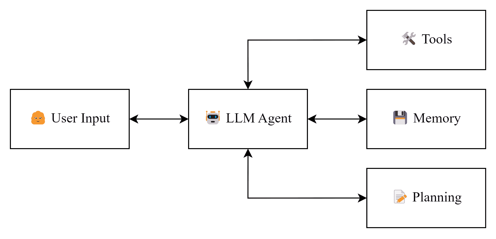
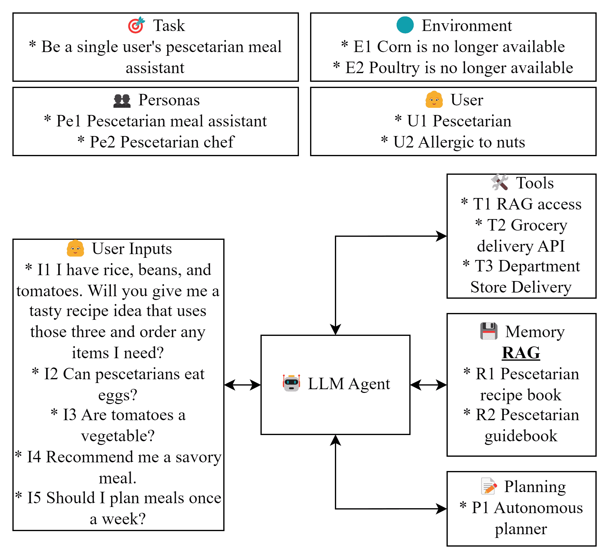
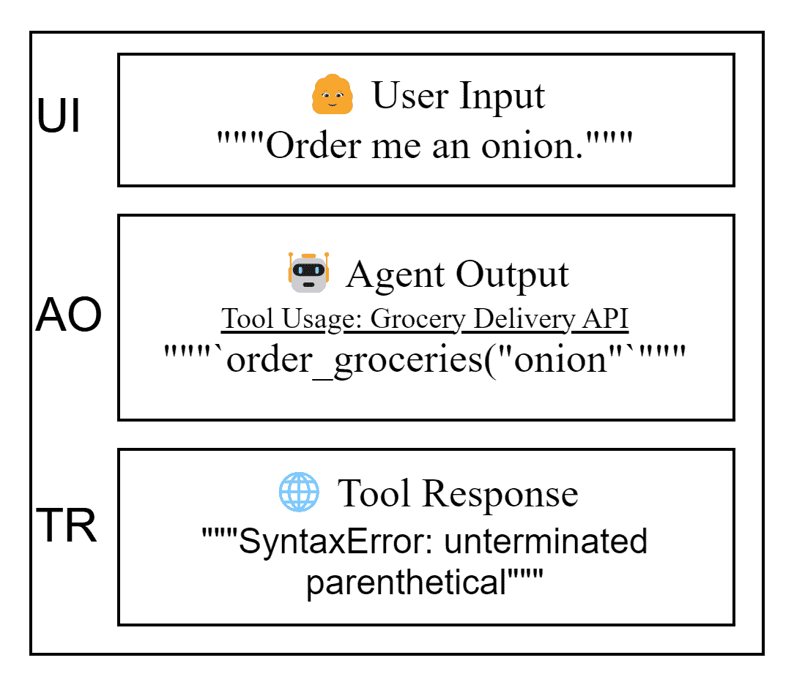

<!--yml
category: 未分类
date: 2025-01-11 11:50:44
-->

# Practical Considerations for Agentic LLM Systems

> 来源：[https://arxiv.org/html/2412.04093/](https://arxiv.org/html/2412.04093/)

Chris Sypherd University of EdinburghEdinburghUnited Kingdom [c.n.sypherd@sms.ed.ac.uk](mailto:c.n.sypherd@sms.ed.ac.uk)  and  Vaishak Belle University of EdinburghEdinburghUnited Kingdom [vbelle@ed.ac.uk](mailto:vbelle@ed.ac.uk)

###### Abstract.

As the strength of Large Language Models (LLMs) has grown over recent years, so too has interest in their use as the underlying models for autonomous agents. Although LLMs demonstrate emergent abilities and broad expertise across natural language domains, their inherent unpredictability makes the implementation of LLM agents challenging, resulting in a gap between related research and the real-world implementation of such systems. To bridge this gap, this paper frames actionable insights and considerations from the research community in the context of established application paradigms to enable the construction and facilitate the informed deployment of robust LLM agents. Namely, we position relevant research findings into four broad categories—Planning, Memory, Tools, and Control Flow—based on common practices in application-focused literature and highlight practical considerations to make when designing agentic LLMs for real-world applications, such as handling stochasticity and managing resources efficiently. While we do not conduct empirical evaluations, we do provide the necessary background for discussing critical aspects of agentic LLM designs, both in academia and industry.

Large Language Models (LLMs), LLM Agents, Agentic LLMs, Applied LLM Systems

## 1\. Introduction

In academia, the concept of ”agents” has been well-defined for decades (e.g., (Wooldridge and Jennings, [1995](https://arxiv.org/html/2412.04093v1#bib.bib95))), and thus the proposition of agents based on LLMs comes with predefined criteria and expectations. As such, agentic LLMs in the research community have come to be defined as autonomous systems with capabilities of beliefs (Sclar et al., [2023](https://arxiv.org/html/2412.04093v1#bib.bib72); Li et al., [2023a](https://arxiv.org/html/2412.04093v1#bib.bib48); Park et al., [2023](https://arxiv.org/html/2412.04093v1#bib.bib63)), reasoning (Zhang et al., [2024c](https://arxiv.org/html/2412.04093v1#bib.bib106)), planning (Huang et al., [2024](https://arxiv.org/html/2412.04093v1#bib.bib37); Shen et al., [2023](https://arxiv.org/html/2412.04093v1#bib.bib73)), and control (Shen et al., [2023](https://arxiv.org/html/2412.04093v1#bib.bib73)). Under this definition, the ability to plan, reason, and interact with an environment have emerged as the key considerations for success (Xi et al., [2023](https://arxiv.org/html/2412.04093v1#bib.bib98)).

For LLM agents in industry and real-world deployment, the history and breadth of agents has been condensed to a definition along the lines of ”a system that can use an LLM to reason through a problem, create a plan to solve the problem, and execute the plan with the help of a set of tools” (Varshney, [2023](https://arxiv.org/html/2412.04093v1#bib.bib85)). Most industry discussions follow this form, introducing the LLM as the central reasoning engine and adding planning, memory, and tools as three necessary modules (e.g.,  (SAA, [2024](https://arxiv.org/html/2412.04093v1#bib.bib14); PGA, [2024](https://arxiv.org/html/2412.04093v1#bib.bib13); TFA, [2024](https://arxiv.org/html/2412.04093v1#bib.bib17); Varshney, [2023](https://arxiv.org/html/2412.04093v1#bib.bib85); Weng, [2023](https://arxiv.org/html/2412.04093v1#bib.bib94))). Indeed, most industry resources focusing on deployable agentic LLM systems are accompanied by a diagram similar to Figure [1](https://arxiv.org/html/2412.04093v1#S1.F1 "Figure 1 ‣ 1\. Introduction ‣ Practical Considerations for Agentic LLM Systems"), focusing largely on single agents. While this description is helpful for the most basic of LLM agents, it glosses over some of the more nuanced considerations that must be made for the informed construction of robust agentic LLM systems.

The prevailing view of LLM agents in industry brings to light the disparity between (1) research into LLMs and agents and (2) the application of agentic LLM systems in real-world scenarios. To bridge this gap, we propose framing relevant findings from the research community in the common industry view of LLM agents. To that end, we organize this work into four main sections—Planning, Memory, Tools, and Control Flow—that correspond to, respectively, planning, memory, tools, and the central reasoning engine components referenced above. We tailor the contents of this paper to black-box LLM-based single-agent systems typical of that industry perspective. By doing so, we hope to create an actionable and approachable survey that enables information exchange between academia and industry within a manageable scope.

Figure 1\. A typical application-focused depiction of LLM agents.

\Description

A diagram showing five boxes containing the texts ”User Input,” ”Agent,” ”Planning,” ”Tools,” and ”Memory. The ”Agent” box sits between ”User Input” and the other three boxes.

## 2\. Related Work

Many surveys discussing LLM-based agents focus on multi-agent frameworks and related ideas (Guo et al., [2024](https://arxiv.org/html/2412.04093v1#bib.bib33); Zhang et al., [2024c](https://arxiv.org/html/2412.04093v1#bib.bib106)). While similar, the challenges facing multi-agent systems are distinct from the real-world deployment of a single LLM agent. Here, we focus more on deliberately crafting a robust agent rather than the orchestration of many.

Another approach, taken by (Yang et al., [2024](https://arxiv.org/html/2412.04093v1#bib.bib101)), focuses on methods for improving agentic LLM performance starting at the underlying model, looking into data composition and training methodologies. We focus on implementation considerations that improve agentic LLM system performance from a black-box perspective, which lends itself more to real-world deployment. Others focus on creating unified taxonomies  (Li, [2024](https://arxiv.org/html/2412.04093v1#bib.bib50); Xi et al., [2023](https://arxiv.org/html/2412.04093v1#bib.bib98)) or target a single component of LLM agents, such as planning (Huang et al., [2024](https://arxiv.org/html/2412.04093v1#bib.bib37)).

The most similar work is (Wang et al., [2024c](https://arxiv.org/html/2412.04093v1#bib.bib88)), providing a comprehensive survey of works relating to LLMs as agents as well as reviewing aspects of their design, application, and evaluation. While (Wang et al., [2024c](https://arxiv.org/html/2412.04093v1#bib.bib88)) develops a valuable unified framework based on extant research, we leverage research findings to provide practical application-focused insights and frame our review in the context of the LLM agent paradigm that has developed organically in industry.

To the best of our knowledge, this is the first work that coalesces research relevant to LLM agents through the lens of common industry practices. We expand that contribution by not just presenting existing research but by extrapolating actionable insights and best practices from it.

## 3\. Applied Scenario

To help illustrate some of the following points, we propose the example outlined in Figure [2](https://arxiv.org/html/2412.04093v1#S3.F2 "Figure 2 ‣ 3\. Applied Scenario ‣ Practical Considerations for Agentic LLM Systems") of applying an LLM agent as a pescetarian¹¹1Someone that does not eat meat, aside from fish and other seafood. meal assistant. We will refer to this as the primary example²²2While we attempt to select a simple example with some relevance to the real world, it is still a contrived example to demonstrate the points outlined in this work and may not fully reflect the complexities of the real world. throughout this work for consistency, citing specifics from it by the codes assigned in Figure [2](https://arxiv.org/html/2412.04093v1#S3.F2 "Figure 2 ‣ 3\. Applied Scenario ‣ Practical Considerations for Agentic LLM Systems") (e.g., [2](https://arxiv.org/html/2412.04093v1#S3.F2 "Figure 2 ‣ 3\. Applied Scenario ‣ Practical Considerations for Agentic LLM Systems").R1 to refer to ”Pescetarian recipe book”).

Figure 2\. An example scenario featuring a pescetarian meal assistant LLM agent.

\Description

A diagram showing the user, task, and environment definition relating to a pescetarian meal assistant example.

## 4\. Glossary

This glossary serves to briefly introduce the following terms that will be used across subsequent sections. Later sections will provide additional contextualization and examples of their utility but not necessarily explicit definitions.

Persona. A persona (also referred to as a ”role” or a ”profile”) is the identity assigned to the LLM, often as part of the system prompt. The persona is the lens through which the LLM will interpret and respond to prompts. The persona (e.g., Figure [2](https://arxiv.org/html/2412.04093v1#S3.F2 "Figure 2 ‣ 3\. Applied Scenario ‣ Practical Considerations for Agentic LLM Systems").Pe2) can be defined and refined by an occupation (e.g., ”professional chef”), level and domain of expertise (e.g., ”specializing in pescetarian dishes”), and personality traits (e.g., ”friendly and understanding”) but can be further customized by adding details such as age, race, gender, and nationality (Argyle et al., [2023](https://arxiv.org/html/2412.04093v1#bib.bib18); Wang et al., [2024c](https://arxiv.org/html/2412.04093v1#bib.bib88)).

Tool. Tools are the means by which an LLM can interact with its environment (beyond basic textual exchange) and access external resources (Qin et al., [2024a](https://arxiv.org/html/2412.04093v1#bib.bib67)). [Retrieval Augmented Generation](https://arxiv.org/html/2412.04093v1#S6.SS1 "In 6\. Memory ‣ Practical Considerations for Agentic LLM Systems") (RAG) is commonly used as a tool (Figure [2](https://arxiv.org/html/2412.04093v1#S3.F2 "Figure 2 ‣ 3\. Applied Scenario ‣ Practical Considerations for Agentic LLM Systems").T1) but is limited in its utility as it exclusively retrieves information about the environment. The true power of tools is realized when they are used to perform actions in the environment, such as the example in Figure [2](https://arxiv.org/html/2412.04093v1#S3.F2 "Figure 2 ‣ 3\. Applied Scenario ‣ Practical Considerations for Agentic LLM Systems").T2 that would allow the pescetarian meal assistant to not only recommend recipes but also order the ingredients to prepare them. Other examples of tools include ground-truth verification methods (e.g., code execution and calculator usage) and real-time environment querying (e.g., requesting trending recipes) (Wang et al., [2024b](https://arxiv.org/html/2412.04093v1#bib.bib92)).

Hyperparameters. This section includes a brief overview of hyperparameters we will reference but does not explore their technical details³³3See (Gem, [2024b](https://arxiv.org/html/2412.04093v1#bib.bib10); Ope, [[n.d.]](https://arxiv.org/html/2412.04093v1#bib.bib2); Ant, [2024a](https://arxiv.org/html/2412.04093v1#bib.bib7)) for common commercial API support for these hyperparameters..

*   •

    Seed. Some LLM interfaces will have a “seed” parameter that should, provided all other parameters remain constant, produce the same output.

*   •

    Temperature. Temperature corresponds to the degree to which randomness will be employed in selecting the output tokens. This usually plays out in higher temperature responses being more creative and rambling while lower temperature responses are more predictable and straight-to-the-point. Thus, for more consistent results, a lower temperature (e.g., 0.0 to 0.5) can be used.

*   •

    Top-p. Top-p (also known as ”nucleus sampling;” introduced in (Holtzman et al., [2020](https://arxiv.org/html/2412.04093v1#bib.bib35))) corresponds to the probability threshold for selecting tokens that can form part of the output, bounded 0.0 to 1.0\. Lower top-p values restrict the pool of tokens the LLM can choose from, resulting in more reproducible outputs.

## 5\. Planning

Planning has long been a core component of agent research (Nau et al., [2004](https://arxiv.org/html/2412.04093v1#bib.bib60); Wooldridge and Jennings, [1995](https://arxiv.org/html/2412.04093v1#bib.bib95)); it allows more complex tasks to be handled in smaller, more manageable steps. Planning can also enhance the interpretability of an LLM agent, as the steps of the plan and the stopping criteria will be defined in a interpretable format.

### 5.1\. LLMs and Planning

Despite anecdotal applications showing signs of successful LLM planning (Song et al., [2023](https://arxiv.org/html/2412.04093v1#bib.bib78)), more holistic reviews suggest that LLMs make poor planners (Valmeekam et al., [2022](https://arxiv.org/html/2412.04093v1#bib.bib84), [2024](https://arxiv.org/html/2412.04093v1#bib.bib83); Kambhampati, [2024](https://arxiv.org/html/2412.04093v1#bib.bib39); Liu et al., [2023](https://arxiv.org/html/2412.04093v1#bib.bib53); Dagan et al., [2024](https://arxiv.org/html/2412.04093v1#bib.bib26)). As such, if an LLM agent is to be deployed in an environment with a consistent task, manually curating a plan can alleviate the pains of poor LLM planning as well as provide an opportunity to manually craft relevant roles and prompts. Another option is to augment the LLM agent with an external planning tool, which has shown promise (Liu et al., [2023](https://arxiv.org/html/2412.04093v1#bib.bib53); Dagan et al., [2024](https://arxiv.org/html/2412.04093v1#bib.bib26)). Because LLM planning remains an open area of research, the example in Figure [2](https://arxiv.org/html/2412.04093v1#S3.F2 "Figure 2 ‣ 3\. Applied Scenario ‣ Practical Considerations for Agentic LLM Systems").P1 simply assumes planning capabilities without subscribing to a specific approach, for illustrative purposes.

To describe current approaches to planning in LLM agents, we categorize them into implicit and explicit planning. For implicit planning, some agents will rely on the LLM to iteratively determine the immediate next step until the task is complete, without ever eliciting a plan (Zhang et al., [2024a](https://arxiv.org/html/2412.04093v1#bib.bib105); Gur et al., [2024](https://arxiv.org/html/2412.04093v1#bib.bib34)). This approach relies on the idea that, when provided with an end goal, the LLM can maintain an internal plan whose steps are revealed iteratively without any explicit plan formalization. This approach can be viable when the environment is dynamic or only partially observable, such as interacting with a webpage (Gur et al., [2024](https://arxiv.org/html/2412.04093v1#bib.bib34)). The other form of implicit planning is the creation and execution of a plan in a single inference, as seen in prompting strategies such as Plan-and-Solve (Wang et al., [2023b](https://arxiv.org/html/2412.04093v1#bib.bib89)) and, to a degree, zero-shot Chain-of-Thought (Kojima et al., [2022](https://arxiv.org/html/2412.04093v1#bib.bib43)). These approaches rely on conditioning subsequent token generation (i.e., the ”execution”) on a plan by first generating said plan. Due to the single-hop nature of this approach, it is not recommended for complex tasks, particularly those that would benefit from feedback during execution.

Explicit planning is characterized by the explicit formalization of a multi-step plan, typically executed in a multi-hop fashion. The most basic form is to simply request the formulation of a plan and then execute it, as demonstrated by the Least-to-Most prompting strategy (Zhou et al., [2023](https://arxiv.org/html/2412.04093v1#bib.bib108)). More advanced approaches will first develop a plan and then iteratively refine the plan as steps are executed (Liu et al., [2024a](https://arxiv.org/html/2412.04093v1#bib.bib56)). Both of these require long-term planning, which is where LLMs tend to demonstrate lackluster performance (Valmeekam et al., [2022](https://arxiv.org/html/2412.04093v1#bib.bib84), [2024](https://arxiv.org/html/2412.04093v1#bib.bib83); Kambhampati, [2024](https://arxiv.org/html/2412.04093v1#bib.bib39)).

### 5.2\. Task Decomposition

It is important to understand the limitations of an LLM before formulating a plan for it to execute. Agentic LLM systems are often applied to problems that a single LLM call cannot resolve but a sequence of calls can. Tasks can typically be decomposed into smaller pieces that, when solved individually, can be reconstructed to produce the final solution (Zhou et al., [2023](https://arxiv.org/html/2412.04093v1#bib.bib108)).

Returning to Figure [2](https://arxiv.org/html/2412.04093v1#S3.F2 "Figure 2 ‣ 3\. Applied Scenario ‣ Practical Considerations for Agentic LLM Systems"), the request made in Figure [2](https://arxiv.org/html/2412.04093v1#S3.F2 "Figure 2 ‣ 3\. Applied Scenario ‣ Practical Considerations for Agentic LLM Systems").I1 is composed of multiple subtasks, namely: (1) retrieve recipes that contain rice, beans, and tomato that the user will like and (2) order any missing ingredients. It is also reasonable to decompose (1) further, into a retrieval of recipes that contain the required ingredients and separately a request to select the one that best fits the user’s tastes.

If decomposing a well-defined task manually, iteratively decomposing the task into subtasks and testing an LLM on them can provide valuable insight into what the LLM can consistently handle. Breaking down the problem logically is simple enough, but ascertaining which tasks an LLM can perform well and which require further decomposition can be challenging, particularly when dealing with stochasticity and prompt changes. It is recommended to evaluate the LLM agent frequently and systematically during this process, as discussed in Section [9.2](https://arxiv.org/html/2412.04093v1#S9.SS2 "9.2\. Evaluation ‣ 9\. Additional Considerations ‣ Practical Considerations for Agentic LLM Systems"). It may be easier to start at the most basic building blocks of the tasks and combine them than to find the minimum number of viable tasks to start.

While it may be intuitive to assume that the more atomic the task the better, this is not always the case. It has been shown that LLMs not only possess the ability to solve multiple distinct tasks in a single query (Xiong et al., [2024](https://arxiv.org/html/2412.04093v1#bib.bib99); Son et al., [2024](https://arxiv.org/html/2412.04093v1#bib.bib77); Laskar et al., [2023](https://arxiv.org/html/2412.04093v1#bib.bib45)) but that composing multiple tasks into a single prompt can increase performance on all constituent tasks, as well as decreasing overall context usage (Son et al., [2024](https://arxiv.org/html/2412.04093v1#bib.bib77)). However, the degree to which tasks may be combined should be the subject of rigorous experimentation for the specific task and environment in which it is considered.

### 5.3\. Plan Adherence

One of the responsibilities of the LLM agent is to oversee the application of the plan. It should decide if a step needs to be repeated (e.g., for [Error Handling](https://arxiv.org/html/2412.04093v1#S8.SS2 "In 8\. Control Flow ‣ Practical Considerations for Agentic LLM Systems")) or skipped for a given input (e.g., to iterate on the plan (Liu et al., [2024a](https://arxiv.org/html/2412.04093v1#bib.bib56))). One of the major concerns of LLMs as planners is their inability to identify whether or not they can complete a given task (Kambhampati, [2024](https://arxiv.org/html/2412.04093v1#bib.bib39)). As such, it is often impossible for an LLM agent to know if a step will be successful until it has been attempted. Thus, it follows logically that an evaluation of the success of each step should take place following execution. Similarly, the overall success of the plan should be evaluated upon completion of all steps. If unsuccessful, the LLM agent may need to adjust or rerun the plan, based on the results of each step and the overall plan (see Section [8.2](https://arxiv.org/html/2412.04093v1#S8.SS2 "8.2\. Error Handling ‣ 8\. Control Flow ‣ Practical Considerations for Agentic LLM Systems") for a discussion on incorporating feedback).

## 6\. Memory

### 6.1\. Retrieval Augmented Generation

Retrieval augmented generation (RAG) (introduced in (Lewis et al., [2020](https://arxiv.org/html/2412.04093v1#bib.bib47))) has emerged as a staple of agentic LLM applications in industry  (Gao et al., [2024](https://arxiv.org/html/2412.04093v1#bib.bib32)). The basis is simple: a system that can provide external context relevant to a natural language input. Typically, an incoming input will be compared against a ground-truth data store and the most relevant piece(s) of information will be provided to the LLM as context upon which it will base its response. This can be done either implicitly, where a user’s input is always used for retrieval for a given LLM call, or explicitly, where the LLM uses RAG as a tool. This has a number of benefits for LLM systems:

*   •

    Grounding. Rather than relying on the LLM “remembering” relevant context from its training data correctly, we can provide the LLM with accurate relevant information. Providing grounded text as context significantly reduces LLM hallucinations and fills knowledge gaps in the training data (Shuster et al., [2021](https://arxiv.org/html/2412.04093v1#bib.bib75); Es et al., [2024](https://arxiv.org/html/2412.04093v1#bib.bib31); Lewis et al., [2020](https://arxiv.org/html/2412.04093v1#bib.bib47)).

*   •

    Explainability. Rather than relying on an LLM opaquely referencing information it has been trained on, adherence to context supplied as part of RAG provides insight into exactly where an LLM is getting its information (Gao et al., [2024](https://arxiv.org/html/2412.04093v1#bib.bib32)).

*   •

    Timeliness. While LLMs can reference information from their static training data, the LLM will be subject to a hard information cutoff (the latest date training data was scraped) and a soft information cutoff (events close to its hard information cutoff that have limited coverage). Rather than turning to the infeasible prospect of retraining with updated data, we can provide updated information that is relevant to the query as context (Gao et al., [2024](https://arxiv.org/html/2412.04093v1#bib.bib32)).

*   •

    Outsourcing. Depending on the content, quality, and reliability of the RAG database, aspects of the query can be implicitly outsourced to the context returned, such as reasoning and decision-making.

*   •

    Alignment. The vast amount of training data used for LLMs is the source of their natural language understanding but should not necessarily be relied on for unbiased, trustworthy, and safe generation. Typically, aligning LLM ouputs with human preferences is seen as a data collection and training problem (Wang et al., [2023c](https://arxiv.org/html/2412.04093v1#bib.bib91); Bai et al., [2022](https://arxiv.org/html/2412.04093v1#bib.bib20)) but can also be addressed post-hoc with RAG. By augmenting an LLM’s natural language capabilities and tendencies with context derived from a more refined dataset that adheres to a desired set of human preferences, its output can be guided to conform to a desired set of content and attitudes. This requires careful curation of the data store but is a viable method for black-box alignment.

To exemplify the points above, consider the RAG sources referenced in Figure [2](https://arxiv.org/html/2412.04093v1#S3.F2 "Figure 2 ‣ 3\. Applied Scenario ‣ Practical Considerations for Agentic LLM Systems").R1 and [2](https://arxiv.org/html/2412.04093v1#S3.F2 "Figure 2 ‣ 3\. Applied Scenario ‣ Practical Considerations for Agentic LLM Systems").R2\. Figure [2](https://arxiv.org/html/2412.04093v1#S3.F2 "Figure 2 ‣ 3\. Applied Scenario ‣ Practical Considerations for Agentic LLM Systems").R1 can be quoted to avoid recipe hallucinations (grounding) and be updated with new recipes (timeliness). Figure [2](https://arxiv.org/html/2412.04093v1#S3.F2 "Figure 2 ‣ 3\. Applied Scenario ‣ Practical Considerations for Agentic LLM Systems").R2 could be useful in responding to Figure [2](https://arxiv.org/html/2412.04093v1#S3.F2 "Figure 2 ‣ 3\. Applied Scenario ‣ Practical Considerations for Agentic LLM Systems").I2; where there is no general consensus, we can supply our own ground truth rather than require the LLM to answer a potentially moral question (outsourcing). The tone and terminology of both Figure [2](https://arxiv.org/html/2412.04093v1#S3.F2 "Figure 2 ‣ 3\. Applied Scenario ‣ Practical Considerations for Agentic LLM Systems").R1 and [2](https://arxiv.org/html/2412.04093v1#S3.F2 "Figure 2 ‣ 3\. Applied Scenario ‣ Practical Considerations for Agentic LLM Systems").R2 will guide the ideals, content, and terminology used by the LLM (alignment).

There are two main approaches to RAG: knowledge graphs (Edge et al., [2024](https://arxiv.org/html/2412.04093v1#bib.bib30)) and vector databases (Gao et al., [2024](https://arxiv.org/html/2412.04093v1#bib.bib32); Barron et al., [2024](https://arxiv.org/html/2412.04093v1#bib.bib21)), with the latter seeing far greater adoption due to its simplicity. For a discussion on implementing RAG and the extant commercial and open-source offerings, see (Gao et al., [2024](https://arxiv.org/html/2412.04093v1#bib.bib32)).

### 6.2\. Long-Term Memory

Sometimes, key information is gained during a conversation that may be helpful across all contexts, such as a useful piece of external knowledge or information about a user or task. In those instances, it may be advantageous to store that information in a way accessible to the agent so that its impact is not limited to the current context. This is commonly referred to as ”long-term memory” (Qian et al., [2024a](https://arxiv.org/html/2412.04093v1#bib.bib65); Wang et al., [2024c](https://arxiv.org/html/2412.04093v1#bib.bib88); Zhong et al., [2024](https://arxiv.org/html/2412.04093v1#bib.bib107))⁴⁴4A real-world implementation of long-term memory is OpenAI’s “Memory” (OAI, [2024](https://arxiv.org/html/2412.04093v1#bib.bib15)). During conversations with ChatGPT, the LLM will save information that it deems particularly useful to its memory. That memory is then made available to the LLM in future conversations. A clear benefit of this is that it reduces repetition on the part of the user and allows the LLM to better fulfill its objective of providing relevant responses..

We want to be selective with the information that is stored in long-term memory so that it is generally useful and not excessively large. Some common approaches are to store prior solutions to queries (Qian et al., [2024a](https://arxiv.org/html/2412.04093v1#bib.bib65)), global summaries and insights (Zhong et al., [2024](https://arxiv.org/html/2412.04093v1#bib.bib107)), and acquired tools (Wang et al., [2023a](https://arxiv.org/html/2412.04093v1#bib.bib87)).

Long-term memory can be enhanced with reflection, consolidation, forgetting, revision, and other mechanisms designed to mimic long-term memory in humans (see (Zhong et al., [2024](https://arxiv.org/html/2412.04093v1#bib.bib107)) for a discussion on advanced long-term memory implementation). For simplicity, we focus on a simple version of long-term memory, where information is simply stored and retrieved, and any edits are manual. For this simple variation, we derive the following three criteria from existing literature on long-term memory in LLM agents (Qian et al., [2024a](https://arxiv.org/html/2412.04093v1#bib.bib65); Wang et al., [2024c](https://arxiv.org/html/2412.04093v1#bib.bib88); Zhong et al., [2024](https://arxiv.org/html/2412.04093v1#bib.bib107); OAI, [2024](https://arxiv.org/html/2412.04093v1#bib.bib15); Wang et al., [2023a](https://arxiv.org/html/2412.04093v1#bib.bib87)) to use as a litmus test for what information should be stored:

*   •

    Independent. The information should not have any implicit dependencies, such as input values.

*   •

    Relevant to a consistency. The information should be relevant to consistencies in the agentic LLM system, which may include a task, user, or environment.

*   •

    Applicable long-term. The information should consistently be applicable to contexts to which the LLM agent may be exposed.

See Table [1](https://arxiv.org/html/2412.04093v1#S6.T1 "Table 1 ‣ 6.2\. Long-Term Memory ‣ 6\. Memory ‣ Practical Considerations for Agentic LLM Systems") for the above criteria applied to examples drawn from Figure [2](https://arxiv.org/html/2412.04093v1#S3.F2 "Figure 2 ‣ 3\. Applied Scenario ‣ Practical Considerations for Agentic LLM Systems").

If the three criteria above are ensured, then the gathered in-context information can be a useful starting place for prompt improvements. It will be information that has been identified as generally and consistently useful to the LLM agent’s environment and may be appropriately suited to permanent inclusion in user or system prompts. It can also be valuable to review long-term memory when making prompt, task, persona, hyperparameter, or model updates; reordering LLM calls; or adjusting tool functionality as such changes may impact the validity of the three criteria.

Table 1\. Analysis of information from Figure [2](https://arxiv.org/html/2412.04093v1#S3.F2 "Figure 2 ‣ 3\. Applied Scenario ‣ Practical Considerations for Agentic LLM Systems") in context of the three criteria for storing in-context information.

| Information | Independent | Relevant to Consistency | Applicable Long-Term | Store the Info |
| --- | --- | --- | --- | --- |
| E1 Corn is no longer available | Yes | Yes | Yes | Yes |
| E2 Poultry is no longer available | Yes | No | No | No |
| U2 Allergic to nuts | Yes | Yes | Yes | Yes |
| I1 I have rice, beans, and tomatoes… | No | Yes | No | No |

#### 6.2.1\. Extracting Information for Long-Term Memory

A common approach to extracting information that belongs in long-term memory is to leverage an external conversation moderator (Zhong et al., [2024](https://arxiv.org/html/2412.04093v1#bib.bib107); Shinn et al., [2024](https://arxiv.org/html/2412.04093v1#bib.bib74)). The external moderator (e.g., an LLM with a separate role) that reviews conversations (either whole or in pieces) and can be tasked with extracting information it deems compliant with the three criteria above. This is an instance where care must be taken with phrasing as the subjectivity of the task may make the LLM prone to framing bias in its response (e.g., if we ask if there is anything useful to pull out, the LLM will likely pull out some information) (Echterhoff et al., [2024](https://arxiv.org/html/2412.04093v1#bib.bib29)).

#### 6.2.2\. Storing Long-Term Memory

Once a piece of information has been deemed worthy of long-term memory, it should be stored. Some approaches include embedding and storing the information in a vector database (similar to [RAG](https://arxiv.org/html/2412.04093v1#S6.SS1 "6.1\. Retrieval Augmented Generation ‣ 6\. Memory ‣ Practical Considerations for Agentic LLM Systems")) (Zhong et al., [2024](https://arxiv.org/html/2412.04093v1#bib.bib107); Lin et al., [2023](https://arxiv.org/html/2412.04093v1#bib.bib52)) and natural language storage, although interacting with the latter quickly becomes unwieldy as the amount of long-term memory increases. The structure of the vector database allows us to easily query relevant information (Lin et al., [2023](https://arxiv.org/html/2412.04093v1#bib.bib52); Wang et al., [2023a](https://arxiv.org/html/2412.04093v1#bib.bib87); Zhong et al., [2024](https://arxiv.org/html/2412.04093v1#bib.bib107)).

#### 6.2.3\. Utilizing Long-Term Memory

Once information is stored in long-term memory, we must decide when to expose it to the LLM agent. It is key to understand what information is relevant in the current scope. LLM agents may be composed of many LLM calls with different purposes and contexts; not all information from long-term memory will apply to every LLM call. For example, if the user from Figure [2](https://arxiv.org/html/2412.04093v1#S3.F2 "Figure 2 ‣ 3\. Applied Scenario ‣ Practical Considerations for Agentic LLM Systems") decides to plan meals once a week (per Figure [2](https://arxiv.org/html/2412.04093v1#S3.F2 "Figure 2 ‣ 3\. Applied Scenario ‣ Practical Considerations for Agentic LLM Systems").I5), that would be a valuable long-term memory for Figure [2](https://arxiv.org/html/2412.04093v1#S3.F2 "Figure 2 ‣ 3\. Applied Scenario ‣ Practical Considerations for Agentic LLM Systems").Pe1 but not necessarily [2](https://arxiv.org/html/2412.04093v1#S3.F2 "Figure 2 ‣ 3\. Applied Scenario ‣ Practical Considerations for Agentic LLM Systems").Pe2, which is mainly used for its culinary expertise. In such instances, the relevance afforded by retrieval from a vector database is valuable (Lin et al., [2023](https://arxiv.org/html/2412.04093v1#bib.bib52); Wang et al., [2023a](https://arxiv.org/html/2412.04093v1#bib.bib87); Zhong et al., [2024](https://arxiv.org/html/2412.04093v1#bib.bib107)). Once relevant information has been retrieved from long-term memory, it can be shared in an LLM call via the user or system prompt.

## 7\. Tools

### 7.1\. Using Tools

To enable the LLM to use tools, tool descriptions and methods of invocation need to be exposed with the LLM (similar to traditional software engineering documentation). If the number of tools in use is small, they can be introduced in natural language. The method for invoking a tool should be clear and easily parsable. A common way to do this is by defining JSON schemas or function signatures, although the latter has been shown to be better for LLM agents (Roucher and Petrov, [2024](https://arxiv.org/html/2412.04093v1#bib.bib69); Wang et al., [2024a](https://arxiv.org/html/2412.04093v1#bib.bib90)).

Tools can be called either explicitly or implicitly, with the former being the de facto approach in practice. Explicit usage simply entails the invocation of a tool as part of the LLM agent’s output (Schick et al., [2023](https://arxiv.org/html/2412.04093v1#bib.bib71); Qin et al., [2024b](https://arxiv.org/html/2412.04093v1#bib.bib68)). Once the tools are defined and passed as context, the agent will have the means to perform such an invocation in the specified parsable format. Tools can also be implicitly invoked by the implementor in response to an LLM agent’s action or inaction. For example, if a transition between personas occurs, it may be the case that the system will always benefit from a summarization of preceding dialogue. Rather than rely on the LLM agent to invoke a summarization at every persona change, every such transition can trigger a summarization behind the scenes. See Section [9.3](https://arxiv.org/html/2412.04093v1#S9.SS3 "9.3\. Integration with Traditional Engineering ‣ 9\. Additional Considerations ‣ Practical Considerations for Agentic LLM Systems") for a discussion on incorporating implicit tool calling.

### 7.2\. Managing Multiplicity

As the number of tools grows, defining tools in natural language quickly becomes unwieldy and a structured approach is necessary. To do so, we can leverage LLMs’ convenient understanding of code by creating more concise tool definitions using JSON schemas or function signatures in conjunction with condensed natural language descriptions⁵⁵5See https://python.langchain.com/docs/concepts/#tools for a discussion on tool definition and (PCo, [[n.d.]](https://arxiv.org/html/2412.04093v1#bib.bib3)) for an implementation..

Often, distinct tools can be placed into distinct groups based on similar core functionality (i.e., if they can reasonably be seen as inheriting from the same base class). These groups can be called “toolsets” or ”toolkits”⁶⁶6See https://python.langchain.com/docs/concepts/#toolkits. and are helpful for determining if tools can be combined behind a single interface or introduced together in the prompt. For example, the tools Figure [2](https://arxiv.org/html/2412.04093v1#S3.F2 "Figure 2 ‣ 3\. Applied Scenario ‣ Practical Considerations for Agentic LLM Systems").T1 and [2](https://arxiv.org/html/2412.04093v1#S3.F2 "Figure 2 ‣ 3\. Applied Scenario ‣ Practical Considerations for Agentic LLM Systems").T2 introduced in the example would not belong in the same toolset but [2](https://arxiv.org/html/2412.04093v1#S3.F2 "Figure 2 ‣ 3\. Applied Scenario ‣ Practical Considerations for Agentic LLM Systems").T2 and [2](https://arxiv.org/html/2412.04093v1#S3.F2 "Figure 2 ‣ 3\. Applied Scenario ‣ Practical Considerations for Agentic LLM Systems").T3 would.

### 7.3\. Adding Tools Dynamically

Sometimes the tools that are available in the environment in which an agentic LLM system will be deployed are not known beforehand. In this case, we can add “tool identification” as a task for the system (Schick et al., [2023](https://arxiv.org/html/2412.04093v1#bib.bib71); Wang et al., [2023a](https://arxiv.org/html/2412.04093v1#bib.bib87)). A compelling example and implementation of this can be observed in the Voyager paper, where an LLM-based agent autonomously traverses the world of Minecraft⁷⁷7https://www.minecraft.net and dynamically assembles a set of tools based on interactions with the environment, which are then stored in long-term memory (Wang et al., [2023a](https://arxiv.org/html/2412.04093v1#bib.bib87)).

## 8\. Control Flow

In the context of LLM agents, control flow refers to the ability to determine what needs to be done in order to respond to a query. Tasking an LLM with control flow is what enables LLM-based agents to accomplish complex tasks that elude the capacity of a single inference. This endows the LLM agent with the autonomy to incorporate advanced techniques such as planning, tool usage, and multi-step reasoning as it sees fit (Shen et al., [2023](https://arxiv.org/html/2412.04093v1#bib.bib73); Wang et al., [2024c](https://arxiv.org/html/2412.04093v1#bib.bib88)).

In practice, this may look like the LLM agent receiving user input (i.e., observing the environment) and selecting the immediate next action. The agent continues to take actions until it decides to stop. For this to be possible, the LLM agent needs to be aware of the action space (Yao et al., [2023](https://arxiv.org/html/2412.04093v1#bib.bib103)), such as the stopping criteria, available tools (e.g., Figure [2](https://arxiv.org/html/2412.04093v1#S3.F2 "Figure 2 ‣ 3\. Applied Scenario ‣ Practical Considerations for Agentic LLM Systems").T1, [2](https://arxiv.org/html/2412.04093v1#S3.F2 "Figure 2 ‣ 3\. Applied Scenario ‣ Practical Considerations for Agentic LLM Systems").T2, and [2](https://arxiv.org/html/2412.04093v1#S3.F2 "Figure 2 ‣ 3\. Applied Scenario ‣ Practical Considerations for Agentic LLM Systems").T3), available planning options ([2](https://arxiv.org/html/2412.04093v1#S3.F2 "Figure 2 ‣ 3\. Applied Scenario ‣ Practical Considerations for Agentic LLM Systems").P1), the ability to take a turn to think out loud (Yao et al., [2023](https://arxiv.org/html/2412.04093v1#bib.bib103)), and utilizing other personas (e.g., [2](https://arxiv.org/html/2412.04093v1#S3.F2 "Figure 2 ‣ 3\. Applied Scenario ‣ Practical Considerations for Agentic LLM Systems").Pe2).

Consider an LLM agent receiving Figure [2](https://arxiv.org/html/2412.04093v1#S3.F2 "Figure 2 ‣ 3\. Applied Scenario ‣ Practical Considerations for Agentic LLM Systems").I1\. Rather than simply providing an output, the agent can opt to leverage [2](https://arxiv.org/html/2412.04093v1#S3.F2 "Figure 2 ‣ 3\. Applied Scenario ‣ Practical Considerations for Agentic LLM Systems").P1, the planning module, to decompose the complex task and generate a multi-step plan that it can then administer. Once the plan is complete, the agent can decide if it has enough information to provide the final output to [2](https://arxiv.org/html/2412.04093v1#S3.F2 "Figure 2 ‣ 3\. Applied Scenario ‣ Practical Considerations for Agentic LLM Systems").I1 or if it needs to take additional actions.

Here, we present practical considerations for ensuring the LLM agent can interact with its environment smoothly and without interruption.

### 8.1\. Output Processing

When chaining together multiple LLM inputs and outputs, it is often advantageous to process the text before handing it off to the next step. Although natural language is human-readable, it is advisable to use a more structured format (such as JSON or executable code) that is easily parsable (Wang et al., [2024a](https://arxiv.org/html/2412.04093v1#bib.bib90)). While weaker models may struggle with instruction following, most commercial models have been optimized to adhere to desired output formats specified in the user or system prompt⁸⁸8Output processing documentation for common commercial models: Anthropic (Ant, [[n.d.]](https://arxiv.org/html/2412.04093v1#bib.bib4)); OpenAI (OAI, [[n.d.]b](https://arxiv.org/html/2412.04093v1#bib.bib6)); Google (Gem, [2024c](https://arxiv.org/html/2412.04093v1#bib.bib11)).

Because we approach LLMs from a black-box perspective, we do not discuss the underlying approaches to constraining LLMs to output a specific format. However, it is important to note that the reasoning capabilities demonstrated by an LLM may be negatively (and inadvertently) impacted by constrained generation, depending on the implementation (Beurer-Kellner et al., [2024](https://arxiv.org/html/2412.04093v1#bib.bib23); Tam et al., [2024](https://arxiv.org/html/2412.04093v1#bib.bib80)). Because of this, it has been shown that requiring code outputs instead of a specific structure can yield better agents (Wang et al., [2024a](https://arxiv.org/html/2412.04093v1#bib.bib90)).

### 8.2\. Error Handling

Error handling is one of the most important yet elusive parts of building a robust agentic LLM system. Because LLMs are inherently stochastic, chaining several LLM calls together compounds the risk of failure to the point of near inevitability for long sequences. As such, every LLM call in an agentic LLM system should be treated as a potential point of failure and supported by appropriate error handling.

We provide Figure [3](https://arxiv.org/html/2412.04093v1#S8.F3 "Figure 3 ‣ 8.2\. Error Handling ‣ 8\. Control Flow ‣ Practical Considerations for Agentic LLM Systems") of an erroneous tool call to demonstrate several approaches to error handling, where specific responses will be referenced by the codes assigned in the figure (e.g., [3](https://arxiv.org/html/2412.04093v1#S8.F3 "Figure 3 ‣ 8.2\. Error Handling ‣ 8\. Control Flow ‣ Practical Considerations for Agentic LLM Systems").UI to refer to ”Order me an onion.”). The system prompt, containing role and tool information, is excluded for simplicity.

Figure 3\. An example of an erroneous tool call, following the scenario presented in Figure [2](https://arxiv.org/html/2412.04093v1#S3.F2 "Figure 2 ‣ 3\. Applied Scenario ‣ Practical Considerations for Agentic LLM Systems").

\Description

A diagram showing an erroneous tool call from the agent.

#### 8.2.1\. Static Retry

The simplest approach to handling a problematic output is to retry the LLM call with the same prompt. While other [hyperparameters](https://arxiv.org/html/2412.04093v1#S4 "4\. Glossary ‣ Practical Considerations for Agentic LLM Systems") may stay the same, the seed should always change between static retries to avoid completely duplicate calls. If using a low temperature or a high top-p, then it may also make sense to adjust those values appropriately so as to receive a different output. In the context of Figure [3](https://arxiv.org/html/2412.04093v1#S8.F3 "Figure 3 ‣ 8.2\. Error Handling ‣ 8\. Control Flow ‣ Practical Considerations for Agentic LLM Systems"), this might look like [3](https://arxiv.org/html/2412.04093v1#S8.F3 "Figure 3 ‣ 8.2\. Error Handling ‣ 8\. Control Flow ‣ Practical Considerations for Agentic LLM Systems").UI simply being rerun with a different seed.

For low-context calls that yield output that is easily verifiable (e.g., parsing the output into a JSON object), it is a simple yet valuable addition to attempt a few static retries in case verification fails. For outputs that are more difficult to verify, such as natural language instructions that are interpreted downstream, static retries are less helpful as the cost of verification increases.

#### 8.2.2\. Informed Retry

A more informed approach is to append the LLM’s output to the history, add another user message indicating that the output was unsuccessful, and try again. This should be supplemented with specific error messages or additional directions (Kamoi et al., [2024](https://arxiv.org/html/2412.04093v1#bib.bib40); Tyen et al., [2024](https://arxiv.org/html/2412.04093v1#bib.bib82)). In the Figure [3](https://arxiv.org/html/2412.04093v1#S8.F3 "Figure 3 ‣ 8.2\. Error Handling ‣ 8\. Control Flow ‣ Practical Considerations for Agentic LLM Systems") example, an informed retry might look like sending the following list of messages: [3](https://arxiv.org/html/2412.04093v1#S8.F3 "Figure 3 ‣ 8.2\. Error Handling ‣ 8\. Control Flow ‣ Practical Considerations for Agentic LLM Systems").UI, [3](https://arxiv.org/html/2412.04093v1#S8.F3 "Figure 3 ‣ 8.2\. Error Handling ‣ 8\. Control Flow ‣ Practical Considerations for Agentic LLM Systems").AO, [3](https://arxiv.org/html/2412.04093v1#S8.F3 "Figure 3 ‣ 8.2\. Error Handling ‣ 8\. Control Flow ‣ Practical Considerations for Agentic LLM Systems").TR, and ”Attempting the above code yielded the provided error. Please provide an updated output that achieves the initial instruction.”.

#### 8.2.3\. External Retry

Rather than asking for an informed retry from the same context, we can pull out pieces of the history and provide it to an LLM in a separate context to either fix the previous output or generate a new one. This will likely require significant context from the original call but can be supplemented and differentiated by using a different role, different instructions, and error information. Often, shifting roles from, for example, a software engineer to a code reviewer can provide the impetus the LLM needs to fix or generate the correct output. While it has been shown that the explanations from external LLM-based error systems are frequently unreliable and sensitive to prompt changes (Kamoi et al., [2024](https://arxiv.org/html/2412.04093v1#bib.bib40)), having access to task-specific roles, detailed error information (e.g., the error raised by a piece of generated Python code), and background context helps mitigate those issues(Tyen et al., [2024](https://arxiv.org/html/2412.04093v1#bib.bib82)).

In the Figure [3](https://arxiv.org/html/2412.04093v1#S8.F3 "Figure 3 ‣ 8.2\. Error Handling ‣ 8\. Control Flow ‣ Practical Considerations for Agentic LLM Systems") example, an external retry might look like sending the following list of messages: ”You are an expert debugger. You have access to {tool information}.” and ”When attempting to fulfill the request, ’{[3](https://arxiv.org/html/2412.04093v1#S8.F3 "Figure 3 ‣ 8.2\. Error Handling ‣ 8\. Control Flow ‣ Practical Considerations for Agentic LLM Systems").UI}’, a helper tried to run the code ‘{[3](https://arxiv.org/html/2412.04093v1#S8.F3 "Figure 3 ‣ 8.2\. Error Handling ‣ 8\. Control Flow ‣ Practical Considerations for Agentic LLM Systems").AO}‘, which yielded ‘{[3](https://arxiv.org/html/2412.04093v1#S8.F3 "Figure 3 ‣ 8.2\. Error Handling ‣ 8\. Control Flow ‣ Practical Considerations for Agentic LLM Systems").TR}‘. Please provide an updated output that achieves the initial instruction.”.

It should be noted that LLMs struggle to locate errors (Kamoi et al., [2024](https://arxiv.org/html/2412.04093v1#bib.bib40); Tyen et al., [2024](https://arxiv.org/html/2412.04093v1#bib.bib82)) but demonstrate strong error correction capabilities if provided sufficient context, specifically error location (Tyen et al., [2024](https://arxiv.org/html/2412.04093v1#bib.bib82)). As such, when employing [Informed Retry](https://arxiv.org/html/2412.04093v1#S8.SS2.SSS2 "In 8.2\. Error Handling ‣ 8\. Control Flow ‣ Practical Considerations for Agentic LLM Systems") or [External Retry](https://arxiv.org/html/2412.04093v1#S8.SS2.SSS3 "In 8.2\. Error Handling ‣ 8\. Control Flow ‣ Practical Considerations for Agentic LLM Systems"), care should be taken to include error information that pinpoints the source, such as diagnostic error messages and tracebacks from APIs and runtime environments.

### 8.3\. Stopping

As the control flow of the agentic LLM system is controlled by an LLM, a clear stopping method needs to be defined. This will likely take the form of a predetermined stop token or phrase inserted into the system prompt, such as ”TERMINATE” (Wu et al., [2024a](https://arxiv.org/html/2412.04093v1#bib.bib96)). It should be a token or phrase that is easily parsable and not otherwise likely, to avoid accidental stopping.

### 8.4\. Multiple Personas

Often, the role that an LLM is assigned has a significant impact on its performance on a given task. This has been observed in LLM literature generally, becoming a key ingredient of effective prompting (Karmaker Santu and Feng, [2023](https://arxiv.org/html/2412.04093v1#bib.bib42); Kong et al., [2024](https://arxiv.org/html/2412.04093v1#bib.bib44)), and in recent LLM multi-agent research, emerging as a necessary component for agent multiplicity in many such architectures (Hong et al., [2024](https://arxiv.org/html/2412.04093v1#bib.bib36); Wu et al., [2024a](https://arxiv.org/html/2412.04093v1#bib.bib96); Li et al., [2023b](https://arxiv.org/html/2412.04093v1#bib.bib51); Guo et al., [2024](https://arxiv.org/html/2412.04093v1#bib.bib33); Wang et al., [2024d](https://arxiv.org/html/2412.04093v1#bib.bib93); Park et al., [2023](https://arxiv.org/html/2412.04093v1#bib.bib63)). For example, while the Figure [2](https://arxiv.org/html/2412.04093v1#S3.F2 "Figure 2 ‣ 3\. Applied Scenario ‣ Practical Considerations for Agentic LLM Systems").Pe1 role is good for answering most of the user’s queries, the Figure [2](https://arxiv.org/html/2412.04093v1#S3.F2 "Figure 2 ‣ 3\. Applied Scenario ‣ Practical Considerations for Agentic LLM Systems").Pe2 role may be better at answering Figure [2](https://arxiv.org/html/2412.04093v1#S3.F2 "Figure 2 ‣ 3\. Applied Scenario ‣ Practical Considerations for Agentic LLM Systems").I4 because it requires specialist culinary knowledge.

Because there are likely to be many distinct tasks that form part of an agentic LLM system, there is usually room for multiple roles to be used. An overview of approaches to defining personas for LLMs, or ”profiling” them, is detailed in  (Wang et al., [2024c](https://arxiv.org/html/2412.04093v1#bib.bib88)), categorizing them as handcrafted (e.g., (Qian et al., [2024a](https://arxiv.org/html/2412.04093v1#bib.bib65); Park et al., [2023](https://arxiv.org/html/2412.04093v1#bib.bib63))), LLM-generated (e.g, (Wang et al., [2024d](https://arxiv.org/html/2412.04093v1#bib.bib93); Xu et al., [2023](https://arxiv.org/html/2412.04093v1#bib.bib100))), or dataset-aligned (i.e., derived from a pertinent dataset). The roles should be informed by the task that the call is handling. This is dependent on the overall context of the agentic LLM system but can largely be addressed in the following ways:

*   •

    If the tasks are well-defined, handcraft specialist roles for each task (e.g., Figure [2](https://arxiv.org/html/2412.04093v1#S3.F2 "Figure 2 ‣ 3\. Applied Scenario ‣ Practical Considerations for Agentic LLM Systems").Pe1 and [2](https://arxiv.org/html/2412.04093v1#S3.F2 "Figure 2 ‣ 3\. Applied Scenario ‣ Practical Considerations for Agentic LLM Systems").Pe2).

*   •

    If the tasks are not well-defined but generally correspond to a single topic, use the most specific handcrafted role for that topic (e.g., the catch-all Figure [2](https://arxiv.org/html/2412.04093v1#S3.F2 "Figure 2 ‣ 3\. Applied Scenario ‣ Practical Considerations for Agentic LLM Systems").Pe1).

*   •

    If the tasks are truly undefined to start (e.g., an assistant that helps with anything) or the topic is very broad:

    *   –

        Define several distinct roles to which the LLM agent can route subsequent calls as it sees fit (Si et al., [2023](https://arxiv.org/html/2412.04093v1#bib.bib76)). Once the agent is in use, a more informed set of personas can be defined according to the most frequently ones. This may also be thought of as the dataset alignment approach (Wang et al., [2024c](https://arxiv.org/html/2412.04093v1#bib.bib88)), where the dataset is constructed in the environment under an interim set of personas.

    *   –

        Leverage an LLM to create the role that it deems would be best able to respond to the prompt (Wang et al., [2024d](https://arxiv.org/html/2412.04093v1#bib.bib93); Xu et al., [2023](https://arxiv.org/html/2412.04093v1#bib.bib100)). This is more expensive as generating the role requires LLM usage but is certainly more robust to unforeseen scenarios. This approach may be used in conjunction with the above point (e.g., if no suitable predefined role is found, create one).

### 8.5\. Managing Relevant Context

Managing the context that is sent to an LLM is an effective method of increasing the efficiency (speed and cost) and performance of an LLM system, as inference time is dependent on the number of input tokens (Vaswani et al., [2017](https://arxiv.org/html/2412.04093v1#bib.bib86); Pope et al., [2023](https://arxiv.org/html/2412.04093v1#bib.bib64)) and LLMs perform worse in long-context scenarios, particularly for complex tasks (Li et al., [2024](https://arxiv.org/html/2412.04093v1#bib.bib49); Liu et al., [2024b](https://arxiv.org/html/2412.04093v1#bib.bib54)). Additionally, careful context management is a necessity given that LLMs have limited context windows⁹⁹9E.g., Claude 3: 200k (Ant, [2024b](https://arxiv.org/html/2412.04093v1#bib.bib16)); Gemini 1.5 Pro: 2M+ (Gem, [2024a](https://arxiv.org/html/2412.04093v1#bib.bib9)); GPT-4o: 128k (OAI, [[n.d.]a](https://arxiv.org/html/2412.04093v1#bib.bib5)). Even for ”long-”context LLMs (¿100k token limit), many tasks quickly become unwieldy if not properly managed (e.g., working with HTML, where single webpages can be hundreds of thousands of tokens). This is a key consideration to make during [task decomposition](https://arxiv.org/html/2412.04093v1#S5.SS2 "5.2\. Task Decomposition ‣ 5\. Planning ‣ Practical Considerations for Agentic LLM Systems"); the more specific the task, the more extraneous context (e.g., prior messages) can be trimmed (Qian et al., [2024b](https://arxiv.org/html/2412.04093v1#bib.bib66)). As such, the context that a specific LLM call receives should be tailored to the task as much as possible. Even if an LLM call requires past messages, it is often possible to strip out certain pieces of context or summarize them, leaving the parts the subsequent call relies on intact and maintaining the overall meaning. Significant adjustments can be made to the context between calls to decrease the overall token count and remove extraneous context, thus reducing LLM confusion and increasing performance for the LLM call (Qian et al., [2024b](https://arxiv.org/html/2412.04093v1#bib.bib66)).

## 9\. Additional Considerations

### 9.1\. Model Size

The size of the model to use is typically driven by three concerns: cost, speed, and performance. Usually, the bigger the model, the higher the cost, the lower the speed, and the better the performance (although this is not a hard-and-fast rule). It can be tempting to build an agentic LLM system around the weakest model that will adequately do the job so that all three conditions are optimized from the start. However, attempting to build out a functional system from a smaller model first will likely be more time consuming and expensive than starting at the strongest model possible and downgrading the models used for specific calls once the LLM agent has demonstrated competence in the environment. Due to the influence one call can have on subsequent ones, it is infeasible to understand what is possible for a given use case if not all the pieces are working optimally. By starting with stronger models, there will be a gold-standard baseline to compare against so the performance impact of downgrading a model for a specific call can be measured^(10)^(10)10See (Benram, [2024](https://arxiv.org/html/2412.04093v1#bib.bib22); ljunkai, [2023](https://arxiv.org/html/2412.04093v1#bib.bib57)) for discussions on these points from an industry perspective.. It is recommended that the correct model is selected on a per-task basis and evaluated both individually and in the context of the entire agentic LLM system.

### 9.2\. Evaluation

Evaluating an agentic LLM system can be challenging due to the potential for long sequences, non-determinism in LLMs, interactions with external entities, and tasks that may not have obviously correct solutions. Nonetheless, it is essential to have an approach to evaluation defined before deployment to (1) have a baseline to compare against and (2) measure performance changes over time and in response to changes.

When creating a dataset for evaluating an LLM agent, the most important consideration is that it accurately resembles the environment in which is will be deployed. There are many LLM agent benchmarks available targeting specific domains (Deng et al., [2024](https://arxiv.org/html/2412.04093v1#bib.bib27); Yao et al., [2022](https://arxiv.org/html/2412.04093v1#bib.bib102); Liu et al., [2024c](https://arxiv.org/html/2412.04093v1#bib.bib55); Zhang et al., [2024b](https://arxiv.org/html/2412.04093v1#bib.bib104)) as well as general purpose application (Srivastava et al., [2023](https://arxiv.org/html/2412.04093v1#bib.bib79); Wu et al., [2024b](https://arxiv.org/html/2412.04093v1#bib.bib97); Mialon et al., [2024](https://arxiv.org/html/2412.04093v1#bib.bib59)), but many agentic LLM systems applied to a specific task will be too niche to benefit from a broader benchmark. However, insomuch as an established benchmark fits the application of the LLM system, it can be a strong starting point for evaluation and refinement. Whether an existing benchmark is used or not, it is advisable to collect informative agent interactions (e.g., long sequences, short sequences, incorrect outputs, correct outputs, etc.) and related metadata (e.g., hyperparameters) in the deployment environment. Doing so will allow the creation of a dataset, comprised of reproducible input and output pairs, that is derived from the environment. Even a dataset with a few samples will provide a baseline to compare against to ensure prompt engineering addresses failed executions, identify the effects of model and prompt changes, and avoid regression in the system^(11)^(11)11See (Lan, [2024](https://arxiv.org/html/2412.04093v1#bib.bib8)) for an industry approach to evaluating deployed LLM systems..

While traditional metrics (e.g., precision, recall, etc.) are useful to track, metrics specific to the agent can help reveal changes in the system that higher-level metrics fail to reflect (Chang et al., [2024](https://arxiv.org/html/2412.04093v1#bib.bib25); Kapoor et al., [2024](https://arxiv.org/html/2412.04093v1#bib.bib41)). For example, an LLM agent that arrives at the same answer when presented with two different prompts is superficially consistent but a difference in the number of intermediate steps to reach that conclusion may indicate that the system is overly sensitive to prompt changes. Building from (Liu et al., [2023](https://arxiv.org/html/2412.04093v1#bib.bib53); Kapoor et al., [2024](https://arxiv.org/html/2412.04093v1#bib.bib41); Mehta et al., [2024](https://arxiv.org/html/2412.04093v1#bib.bib58)) that suggest types of alternative evaluation, we provide sample metrics below to use as a starting place, although useful metrics should be chosen in accordance with the design of the LLM agent and the environment in which it is implemented^(12)^(12)12Note that the following are focused primarily on evaluating agentic LLM systems but that external components should also be evaluated, such as the RAG system (e.g., the quality of retrievals and the fidelity of embedded documents) (Salemi and Zamani, [2024](https://arxiv.org/html/2412.04093v1#bib.bib70); Es et al., [2024](https://arxiv.org/html/2412.04093v1#bib.bib31)) and tools (e.g., reliability and consistency of their output)..

#### 9.2.1\. Holistic

No matter how well an agentic LLM system might do along the way or what emergent capabilities it might demonstrate, the final output will determine whether the system is accomplishing its task or not. It is impossible to tell how a composition of LLM calls will perform without running them end-to-end; thus, evaluating an LLM agent should primarily rely on holistic metrics to determine if it is performing as expected.

Sample Metrics.

*   •

    Across X distinct prompts, how many correct answers does the agent produce?

*   •

    For input X across N trials, how many distinct answers does the agent produce?

*   •

    For input X across N trials, what is the average number of steps executed by the agent?

*   •

    For input X across N trials, what is the average number of tools used by the agent?

*   •

    For input X (that requires LLM planning) across N trials, what is the average number of steps in each plan?

*   •

    For input X across N trials, what is the average cost/time?

#### 9.2.2\. Piecemeal

Measuring the performance of a single or a subset of LLM calls that completes a definable task is a viable method of diagnosing problems in or making changes to the system. However, due to the influence a single LLM call can have downstream in an LLM agent, isolated piecemeal evaluation of an agentic LLM system should never be considered a substitute for [Holistic](https://arxiv.org/html/2412.04093v1#S9.SS2.SSS1 "In 9.2\. Evaluation ‣ 9\. Additional Considerations ‣ Practical Considerations for Agentic LLM Systems") measures.

Sample Metrics.

*   •

    For call X with N trials, how many distinct answers are produced?

*   •

    For N synonymous versions of input A to call X, how many distinct top-K documents are provided by RAG from each embedded version of A?

*   •

    For call X with tool access across N trials, how many distinct tools are used?

*   •

    For call X across N trials, what is the average cost/time?

### 9.3\. Integration with Traditional Engineering

Because LLMs are inherently stochastic, it is often easier to offload as much of the agent’s responsibility onto traditional engineering as possible. This allows outsourcing parts of the system that require determinism to methods that can be deterministic. By crafting an LLM agent according to software engineering best practices, we can ensure that key components that are necessary for a given task are always completed or included, rather than relying on the agent to make a request or execute an action. This can take the form of automatically managing context between calls, [output processing](https://arxiv.org/html/2412.04093v1#S8.SS1 "8.1\. Output Processing ‣ 8\. Control Flow ‣ Practical Considerations for Agentic LLM Systems"), combining tools into toolsets (e.g., putting Figure [2](https://arxiv.org/html/2412.04093v1#S3.F2 "Figure 2 ‣ 3\. Applied Scenario ‣ Practical Considerations for Agentic LLM Systems").T2 and [2](https://arxiv.org/html/2412.04093v1#S3.F2 "Figure 2 ‣ 3\. Applied Scenario ‣ Practical Considerations for Agentic LLM Systems").T3 behind a ”delivery” interface), incorporating information from long-term memory permanently into the prompts (e.g., Figure [2](https://arxiv.org/html/2412.04093v1#S3.F2 "Figure 2 ‣ 3\. Applied Scenario ‣ Practical Considerations for Agentic LLM Systems").E1), setting callbacks on certain transitions and calls (e.g., to generate a summary of the most recent conversation to use as context when transitioning from Figure [2](https://arxiv.org/html/2412.04093v1#S3.F2 "Figure 2 ‣ 3\. Applied Scenario ‣ Practical Considerations for Agentic LLM Systems").Pe1 to [2](https://arxiv.org/html/2412.04093v1#S3.F2 "Figure 2 ‣ 3\. Applied Scenario ‣ Practical Considerations for Agentic LLM Systems").Pe2), and adding an evaluation after each step of a plan (see [Plan Adherence](https://arxiv.org/html/2412.04093v1#S5.SS3 "In 5\. Planning ‣ Practical Considerations for Agentic LLM Systems")). (The last two can be thought of as implicit tool usage; see Section [7.1](https://arxiv.org/html/2412.04093v1#S7.SS1 "7.1\. Using Tools ‣ 7\. Tools ‣ Practical Considerations for Agentic LLM Systems")). However, care should be taken not to limit the autonomy of the agent in doing so. One way to return autonomy to the agent while still leveraging the benefits of traditional engineering is to allow the agent to short-circuit.

#### 9.3.1\. Short-Circuiting

Short-circuiting (from the world of software engineering: the idea of evaluating an expression only so far as to guarantee a single answer) is an integral technique for agentic LLM systems. This can be as simple as including [stopping](https://arxiv.org/html/2412.04093v1#S8.SS3 "8.3\. Stopping ‣ 8\. Control Flow ‣ Practical Considerations for Agentic LLM Systems") criteria into the LLM agent’s instructions (see Section [8.3](https://arxiv.org/html/2412.04093v1#S8.SS3 "8.3\. Stopping ‣ 8\. Control Flow ‣ Practical Considerations for Agentic LLM Systems") for examples) or allowing the LLM agent to produce a final output in a single turn. If an agentic LLM system does not short-circuit when it obviously should, the system may have an overreliance on external engineering (i.e., the flow (or parts of the flow) of the agent being hard-coded)^(13)^(13)13A recent example of this is OpenAI’s GPT-o1 (OpenAI, [2024](https://arxiv.org/html/2412.04093v1#bib.bib61)). The initial implementation has no short-circuiting, meaning even simple queries that a much weaker model can handle or that require no significant output still incur a full traversal of the agentic LLM system. For example, asking GPT-o1 to “Do nothing” will still pass through the planning, thinking, and alignment stages of the system..

As an example, the query presented in Figure [2](https://arxiv.org/html/2412.04093v1#S3.F2 "Figure 2 ‣ 3\. Applied Scenario ‣ Practical Considerations for Agentic LLM Systems").I3 demonstrates an instance when an LLM agent may want to short-circuit. The query poses a simple question-answering scenario that most current models could satisfactorily respond to. Allowing the agent the autonomy to determine what step to take next (as opposed to, for example, implicitly calling Figure [2](https://arxiv.org/html/2412.04093v1#S3.F2 "Figure 2 ‣ 3\. Applied Scenario ‣ Practical Considerations for Agentic LLM Systems").P1 for every input) would permit it to simply provide an answer, thus short-circuiting any other components.

## 10\. Limitations

Although we present some practical methods for the evaluation of deployed systems, we do not explore human-in-the-loop evaluation as human-computer interaction represents a rich field of study that exceeds the scope of this work.

An important follow-up to evaluation is how to compare and respond to changes in a deployed agentic LLM system, such as prompt, model, and environment changes. These considerations remain largely underexplored in current literature and represent some of the key challenges to deploying real-world LLM agents. We do not discuss these considerations as agent maintenance does not fall into the scope of this work but suggest that they are prominent directions for future work.

We explore one aspect of cost for agentic LLM systems, model size, but leave other considerations (such as whether to use an out-of-the-box model or to finetune one on a specific task (Bucher and Martini, [2024](https://arxiv.org/html/2412.04093v1#bib.bib24); Lehman et al., [2023](https://arxiv.org/html/2412.04093v1#bib.bib46)), to leverage increasingly strong open-source models (Dubey et al., [2024](https://arxiv.org/html/2412.04093v1#bib.bib28); Jiang et al., [2023](https://arxiv.org/html/2412.04093v1#bib.bib38); Bai et al., [2023](https://arxiv.org/html/2412.04093v1#bib.bib19)) or to rely on aligned commercial models (OpenAI et al., [2024](https://arxiv.org/html/2412.04093v1#bib.bib62); Team et al., [2024](https://arxiv.org/html/2412.04093v1#bib.bib81); cla, [2024](https://arxiv.org/html/2412.04093v1#bib.bib12)), and, similarly, to self-host or to use a 3rd party provider) for future work as cost and feasibility of proposed agent architectures warrant a review on their own. See (Kapoor et al., [2024](https://arxiv.org/html/2412.04093v1#bib.bib41)) for a discussion on the need for cost-informed LLM agent research.

While we approach the agent’s underlying LLM from a black-box perspective for simplicity and relevance to many industry applications, approaching it as whitebox opens up additional complexities and opportunities. We deem that considering model specifics exceeds the scope of this review but recognize the value of future work highlighting practical considerations for the real-world deployment of whitebox LLM agents.

## 11\. Conclusion

In this review, we present relevant research into LLM agents and derive actionable insights from it that can be utilized when implementing and deploying agentic LLM systems in the real world. We ascribe relevant research and insights to the four main components of LLM agents from application-focused literature—[Planning](https://arxiv.org/html/2412.04093v1#S5 "In Practical Considerations for Agentic LLM Systems"), [Memory](https://arxiv.org/html/2412.04093v1#S6 "In Practical Considerations for Agentic LLM Systems"), [Tools](https://arxiv.org/html/2412.04093v1#S7 "In Practical Considerations for Agentic LLM Systems"), and [Control Flow](https://arxiv.org/html/2412.04093v1#S8 "In Practical Considerations for Agentic LLM Systems")—to provide a review that is mutually accessible to both industry and academia. Namely, for [Planning](https://arxiv.org/html/2412.04093v1#S5 "In Practical Considerations for Agentic LLM Systems"), we explore how poor LLM planning capabilities hinder current LLM agent applications and the practical benefits to be derived from task decomposition; for [Memory](https://arxiv.org/html/2412.04093v1#S6 "In Practical Considerations for Agentic LLM Systems"), we explore the benefits of and practical considerations to make when leveraging RAG and long-term memory in an LLM agent; for [Tools](https://arxiv.org/html/2412.04093v1#S7 "In Practical Considerations for Agentic LLM Systems"), we discuss how to present and manage tools for an LLM agent; for [Control Flow](https://arxiv.org/html/2412.04093v1#S8 "In Practical Considerations for Agentic LLM Systems"), we provide practical insights for promoting an uninterrupted LLM agent execution and managing agent internals, such as personas and context usage; and, lastly, suggest additional considerations, such as model size, evaluation, and integrating an LLM agent with traditional engineering.

###### Acknowledgements.

We would like to acknowledge Sergei Petrov and Sonny George, whose input and feedback were instrumental in shaping the foundations of this work.

## References

*   (1)
*   Ope ([n.d.]) OpenAI [n.d.]. *API Reference*. OpenAI. Retrieved October 16, 2024 from [https://platform.openai.com/docs/api-reference](https://platform.openai.com/docs/api-reference)
*   PCo ([n.d.]) Pinecone [n.d.]. *Building Custom Tools for LLM Agents*. Pinecone. Retrieved October 6, 2024 from [https://www.pinecone.io/learn/series/langchain/langchain-tools/](https://www.pinecone.io/learn/series/langchain/langchain-tools/)
*   Ant ([n.d.]) Anthropic [n.d.]. *Increase output consistency (JSON mode)*. Anthropic. Retrieved October 16, 2024 from [https://docs.anthropic.com/en/docs/test-and-evaluate/strengthen-guardrails/increase-consistency](https://docs.anthropic.com/en/docs/test-and-evaluate/strengthen-guardrails/increase-consistency)
*   OAI ([n.d.]a) OpenAI [n.d.]a. *Models*. OpenAI. Retrieved October 16, 2024 from [https://platform.openai.com/docs/models](https://platform.openai.com/docs/models)
*   OAI ([n.d.]b) OpenAI [n.d.]b. *Structured Outputs*. OpenAI. Retrieved October 16, 2024 from [https://platform.openai.com/docs/guides/structured-outputs](https://platform.openai.com/docs/guides/structured-outputs)
*   Ant (2024a) Anthropic 2024a. *API Reference*. Anthropic. Retrieved October 16, 2024 from [https://docs.anthropic.com/en/api](https://docs.anthropic.com/en/api)
*   Lan (2024) LangChain 2024. *Evaluate your LLM application*. LangChain. Retrieved October 16, 2024 from [https://docs.smith.langchain.com/tutorials/Developers/evaluation](https://docs.smith.langchain.com/tutorials/Developers/evaluation)
*   Gem (2024a) Google 2024a. *Gemini models*. Google. Retrieved October 16, 2024 from [https://ai.google.dev/gemini-api/docs/models/gemini](https://ai.google.dev/gemini-api/docs/models/gemini)
*   Gem (2024b) Google 2024b. *Generate content with the Gemini API*. Google. Retrieved October 16, 2024 from [https://cloud.google.com/vertex-ai/generative-ai/docs/model-reference/inference](https://cloud.google.com/vertex-ai/generative-ai/docs/model-reference/inference)
*   Gem (2024c) Google 2024c. *Generate structured output with the Gemini API*. Google. Retrieved October 16, 2024 from [https://ai.google.dev/gemini-api/docs/structured-output](https://ai.google.dev/gemini-api/docs/structured-output)
*   cla (2024) Anthropic 2024. *Introducing the next generation of Claude*. Anthropic. Retrieved October 8, 2024 from [https://www.anthropic.com/news/claude-3-family](https://www.anthropic.com/news/claude-3-family)
*   PGA (2024) DAIR.AI 2024. *LLM Agents*. DAIR.AI. Retrieved October 8, 2024 from [https://www.promptingguide.ai/research/llm-agents](https://www.promptingguide.ai/research/llm-agents)
*   SAA (2024) SuperAnnotate 2024. *LLM agents: The ultimate guide*. SuperAnnotate. Retrieved October 7, 2024 from [https://www.superannotate.com/blog/llm-agents](https://www.superannotate.com/blog/llm-agents)
*   OAI (2024) OpenAI 2024. *Memory and new controls for ChatGPT*. OpenAI. Retrieved October 8, 2024 from [https://openai.com/index/memory-and-new-controls-for-chatgpt/](https://openai.com/index/memory-and-new-controls-for-chatgpt/)
*   Ant (2024b) Anthropic 2024b. *Models*. Anthropic. Retrieved October 16, 2024 from [https://docs.anthropic.com/en/docs/about-claude/models](https://docs.anthropic.com/en/docs/about-claude/models)
*   TFA (2024) truefoundry 2024. *What are LLM Agents?* truefoundry. Retrieved October 7, 2024 from [https://www.truefoundry.com/blog/llm-agents](https://www.truefoundry.com/blog/llm-agents)
*   Argyle et al. (2023) Lisa P. Argyle, Ethan C. Busby, Nancy Fulda, Joshua R. Gubler, Christopher Rytting, and David Wingate. 2023. Out of One, Many: Using Language Models to Simulate Human Samples. *Political Analysis* 31, 3 (Feb. 2023), 337–351. [https://doi.org/10.1017/pan.2023.2](https://doi.org/10.1017/pan.2023.2)
*   Bai et al. (2023) Jinze Bai, Shuai Bai, Yunfei Chu, Zeyu Cui, Kai Dang, Xiaodong Deng, Yang Fan, Wenbin Ge, Yu Han, Fei Huang, Binyuan Hui, Luo Ji, Mei Li, Junyang Lin, Runji Lin, Dayiheng Liu, Gao Liu, Chengqiang Lu, Keming Lu, Jianxin Ma, Rui Men, Xingzhang Ren, Xuancheng Ren, Chuanqi Tan, Sinan Tan, Jianhong Tu, Peng Wang, Shijie Wang, Wei Wang, Shengguang Wu, Benfeng Xu, Jin Xu, An Yang, Hao Yang, Jian Yang, Shusheng Yang, Yang Yao, Bowen Yu, Hongyi Yuan, Zheng Yuan, Jianwei Zhang, Xingxuan Zhang, Yichang Zhang, Zhenru Zhang, Chang Zhou, Jingren Zhou, Xiaohuan Zhou, and Tianhang Zhu. 2023. Qwen Technical Report. arXiv:2309.16609 [cs.CL] [https://arxiv.org/abs/2309.16609](https://arxiv.org/abs/2309.16609)
*   Bai et al. (2022) Yuntao Bai, Saurav Kadavath, Sandipan Kundu, Amanda Askell, Jackson Kernion, Andy Jones, Anna Chen, Anna Goldie, Azalia Mirhoseini, Cameron McKinnon, Carol Chen, Catherine Olsson, Christopher Olah, Danny Hernandez, Dawn Drain, Deep Ganguli, Dustin Li, Eli Tran-Johnson, Ethan Perez, Jamie Kerr, Jared Mueller, Jeffrey Ladish, Joshua Landau, Kamal Ndousse, Kamile Lukosuite, Liane Lovitt, Michael Sellitto, Nelson Elhage, Nicholas Schiefer, Noemi Mercado, Nova DasSarma, Robert Lasenby, Robin Larson, Sam Ringer, Scott Johnston, Shauna Kravec, Sheer El Showk, Stanislav Fort, Tamera Lanham, Timothy Telleen-Lawton, Tom Conerly, Tom Henighan, Tristan Hume, Samuel R. Bowman, Zac Hatfield-Dodds, Ben Mann, Dario Amodei, Nicholas Joseph, Sam McCandlish, Tom Brown, and Jared Kaplan. 2022. Constitutional AI: Harmlessness from AI Feedback. arXiv:2212.08073 [cs.CL] [https://arxiv.org/abs/2212.08073](https://arxiv.org/abs/2212.08073)
*   Barron et al. (2024) Ryan C. Barron, Ves Grantcharov, Selma Wanna, Maksim E. Eren, Manish Bhattarai, Nicholas Solovyev, George Tompkins, Charles Nicholas, Kim Ø. Rasmussen, Cynthia Matuszek, and Boian S. Alexandrov. 2024. Domain-Specific Retrieval-Augmented Generation Using Vector Stores, Knowledge Graphs, and Tensor Factorization. arXiv:2410.02721 [cs.CL] [https://arxiv.org/abs/2410.02721](https://arxiv.org/abs/2410.02721)
*   Benram (2024) Gad Benram. 2024. *Understanding the cost of Large Language Models (LLMs)*. Retrieved October 16, 2024 from [https://www.tensorops.ai/post/understanding-the-cost-of-large-language-models-llms](https://www.tensorops.ai/post/understanding-the-cost-of-large-language-models-llms)
*   Beurer-Kellner et al. (2024) Luca Beurer-Kellner, Marc Fischer, and Martin Vechev. 2024. Guiding LLMs The Right Way: Fast, Non-Invasive Constrained Generation. In *Proceedings of the 41st International Conference on Machine Learning* *(Proceedings of Machine Learning Research, Vol. 235)*, Ruslan Salakhutdinov, Zico Kolter, Katherine Heller, Adrian Weller, Nuria Oliver, Jonathan Scarlett, and Felix Berkenkamp (Eds.). PMLR, 3658–3673. [https://proceedings.mlr.press/v235/beurer-kellner24a.html](https://proceedings.mlr.press/v235/beurer-kellner24a.html)
*   Bucher and Martini (2024) Martin Juan José Bucher and Marco Martini. 2024. Fine-Tuned ’Small’ LLMs (Still) Significantly Outperform Zero-Shot Generative AI Models in Text Classification. arXiv:2406.08660 [cs.CL] [https://arxiv.org/abs/2406.08660](https://arxiv.org/abs/2406.08660)
*   Chang et al. (2024) Yupeng Chang, Xu Wang, Jindong Wang, Yuan Wu, Linyi Yang, Kaijie Zhu, Hao Chen, Xiaoyuan Yi, Cunxiang Wang, Yidong Wang, Wei Ye, Yue Zhang, Yi Chang, Philip S. Yu, Qiang Yang, and Xing Xie. 2024. A Survey on Evaluation of Large Language Models. *ACM Trans. Intell. Syst. Technol.* 15, 3, Article 39 (March 2024), 45 pages. [https://doi.org/10.1145/3641289](https://doi.org/10.1145/3641289)
*   Dagan et al. (2024) Gautier Dagan, Frank Keller, and Alex Lascarides Keller. 2024. Dynamic planning with an LLM. In *Proceedings of the Language Gamification Workshop 2024 at NeurIPS*. Neural Information Processing Systems Foundation (NeurIPS), 1–14. [https://doi.org/10.48550/arXiv.2308.06391](https://doi.org/10.48550/arXiv.2308.06391) Language Gamification Workshop 2024 at NeurIPS ; Conference date: 14-12-2024 Through 14-12-2024.
*   Deng et al. (2024) Shihan Deng, Weikai Xu, Hongda Sun, Wei Liu, Tao Tan, Liujianfeng Liujianfeng, Ang Li, Jian Luan, Bin Wang, Rui Yan, and Shuo Shang. 2024. Mobile-Bench: An Evaluation Benchmark for LLM-based Mobile Agents. In *Proceedings of the 62nd Annual Meeting of the Association for Computational Linguistics (Volume 1: Long Papers)*, Lun-Wei Ku, Andre Martins, and Vivek Srikumar (Eds.). Association for Computational Linguistics, Bangkok, Thailand, 8813–8831. [https://doi.org/10.18653/v1/2024.acl-long.478](https://doi.org/10.18653/v1/2024.acl-long.478)
*   Dubey et al. (2024) Abhimanyu Dubey, Abhinav Jauhri, Abhinav Pandey, Abhishek Kadian, Ahmad Al-Dahle, Aiesha Letman, Akhil Mathur, Alan Schelten, Amy Yang, Angela Fan, Anirudh Goyal, Anthony Hartshorn, Aobo Yang, Archi Mitra, Archie Sravankumar, Artem Korenev, Arthur Hinsvark, Arun Rao, Aston Zhang, Aurelien Rodriguez, Austen Gregerson, Ava Spataru, Baptiste Roziere, Bethany Biron, Binh Tang, Bobbie Chern, Charlotte Caucheteux, Chaya Nayak, Chloe Bi, Chris Marra, Chris McConnell, Christian Keller, Christophe Touret, Chunyang Wu, Corinne Wong, Cristian Canton Ferrer, Cyrus Nikolaidis, Damien Allonsius, Daniel Song, Danielle Pintz, Danny Livshits, David Esiobu, Dhruv Choudhary, Dhruv Mahajan, Diego Garcia-Olano, Diego Perino, Dieuwke Hupkes, Egor Lakomkin, Ehab AlBadawy, Elina Lobanova, Emily Dinan, Eric Michael Smith, Filip Radenovic, Frank Zhang, Gabriel Synnaeve, Gabrielle Lee, Georgia Lewis Anderson, Graeme Nail, Gregoire Mialon, Guan Pang, Guillem Cucurell, Hailey Nguyen, Hannah Korevaar, Hu Xu, Hugo Touvron, Iliyan Zarov, Imanol Arrieta Ibarra, Isabel Kloumann, Ishan Misra, Ivan Evtimov, Jade Copet, Jaewon Lee, Jan Geffert, Jana Vranes, Jason Park, Jay Mahadeokar, Jeet Shah, Jelmer van der Linde, Jennifer Billock, Jenny Hong, Jenya Lee, Jeremy Fu, Jianfeng Chi, Jianyu Huang, Jiawen Liu, Jie Wang, Jiecao Yu, Joanna Bitton, Joe Spisak, Jongsoo Park, Joseph Rocca, Joshua Johnstun, Joshua Saxe, Junteng Jia, Kalyan Vasuden Alwala, Kartikeya Upasani, Kate Plawiak, Ke Li, Kenneth Heafield, Kevin Stone, Khalid El-Arini, Krithika Iyer, Kshitiz Malik, Kuenley Chiu, Kunal Bhalla, Lauren Rantala-Yeary, Laurens van der Maaten, Lawrence Chen, Liang Tan, Liz Jenkins, Louis Martin, Lovish Madaan, Lubo Malo, Lukas Blecher, Lukas Landzaat, Luke de Oliveira, Madeline Muzzi, Mahesh Pasupuleti, Mannat Singh, Manohar Paluri, Marcin Kardas, Mathew Oldham, Mathieu Rita, Maya Pavlova, Melanie Kambadur, Mike Lewis, Min Si, Mitesh Kumar Singh, Mona Hassan, Naman Goyal, Narjes Torabi, Nikolay Bashlykov, Nikolay Bogoychev, Niladri Chatterji, Olivier Duchenne, Onur Çelebi, Patrick Alrassy, Pengchuan Zhang, Pengwei Li, Petar Vasic, Peter Weng, Prajjwal Bhargava, Pratik Dubal, Praveen Krishnan, Punit Singh Koura, Puxin Xu, Qing He, Qingxiao Dong, Ragavan Srinivasan, Raj Ganapathy, Ramon Calderer, Ricardo Silveira Cabral, Robert Stojnic, Roberta Raileanu, Rohit Girdhar, Rohit Patel, Romain Sauvestre, Ronnie Polidoro, Roshan Sumbaly, Ross Taylor, Ruan Silva, Rui Hou, Rui Wang, Saghar Hosseini, Sahana Chennabasappa, Sanjay Singh, Sean Bell, Seohyun Sonia Kim, Sergey Edunov, Shaoliang Nie, Sharan Narang, Sharath Raparthy, Sheng Shen, Shengye Wan, Shruti Bhosale, Shun Zhang, Simon Vandenhende, Soumya Batra, Spencer Whitman, Sten Sootla, Stephane Collot, Suchin Gururangan, Sydney Borodinsky, Tamar Herman, Tara Fowler, Tarek Sheasha, Thomas Georgiou, Thomas Scialom, Tobias Speckbacher, Todor Mihaylov, Tong Xiao, Ujjwal Karn, Vedanuj Goswami, Vibhor Gupta, Vignesh Ramanathan, Viktor Kerkez, Vincent Gonguet, Virginie Do, Vish Vogeti, Vladan Petrovic, Weiwei Chu, Wenhan Xiong, Wenyin Fu, Whitney Meers, Xavier Martinet, Xiaodong Wang, Xiaoqing Ellen Tan, Xinfeng Xie, Xuchao Jia, Xuewei Wang, Yaelle Goldschlag, Yashesh Gaur, Yasmine Babaei, Yi Wen, Yiwen Song, Yuchen Zhang, Yue Li, Yuning Mao, Zacharie Delpierre Coudert, Zheng Yan, Zhengxing Chen, Zoe Papakipos, Aaditya Singh, Aaron Grattafiori, Abha Jain, Adam Kelsey, Adam Shajnfeld, Adithya Gangidi, Adolfo Victoria, Ahuva Goldstand, Ajay Menon, Ajay Sharma, Alex Boesenberg, Alex Vaughan, Alexei Baevski, Allie Feinstein, Amanda Kallet, Amit Sangani, Anam Yunus, Andrei Lupu, Andres Alvarado, Andrew Caples, Andrew Gu, Andrew Ho, Andrew Poulton, Andrew Ryan, Ankit Ramchandani, Annie Franco, Aparajita Saraf, Arkabandhu Chowdhury, Ashley Gabriel, Ashwin Bharambe, Assaf Eisenman, Azadeh Yazdan, Beau James, Ben Maurer, Benjamin Leonhardi, Bernie Huang, Beth Loyd, Beto De Paola, Bhargavi Paranjape, Bing Liu, Bo Wu, Boyu Ni, Braden Hancock, Bram Wasti, Brandon Spence, Brani Stojkovic, Brian Gamido, Britt Montalvo, Carl Parker, Carly Burton, Catalina Mejia, Changhan Wang, Changkyu Kim, Chao Zhou, Chester Hu, Ching-Hsiang Chu, Chris Cai, Chris Tindal, Christoph Feichtenhofer, Damon Civin, Dana Beaty, Daniel Kreymer, Daniel Li, Danny Wyatt, David Adkins, David Xu, Davide Testuggine, Delia David, Devi Parikh, Diana Liskovich, Didem Foss, Dingkang Wang, Duc Le, Dustin Holland, Edward Dowling, Eissa Jamil, Elaine Montgomery, Eleonora Presani, Emily Hahn, Emily Wood, Erik Brinkman, Esteban Arcaute, Evan Dunbar, Evan Smothers, Fei Sun, Felix Kreuk, Feng Tian, Firat Ozgenel, Francesco Caggioni, Francisco Guzmán, Frank Kanayet, Frank Seide, Gabriela Medina Florez, Gabriella Schwarz, Gada Badeer, Georgia Swee, Gil Halpern, Govind Thattai, Grant Herman, Grigory Sizov, Guangyi, Zhang, Guna Lakshminarayanan, Hamid Shojanazeri, Han Zou, Hannah Wang, Hanwen Zha, Haroun Habeeb, Harrison Rudolph, Helen Suk, Henry Aspegren, Hunter Goldman, Ibrahim Damlaj, Igor Molybog, Igor Tufanov, Irina-Elena Veliche, Itai Gat, Jake Weissman, James Geboski, James Kohli, Japhet Asher, Jean-Baptiste Gaya, Jeff Marcus, Jeff Tang, Jennifer Chan, Jenny Zhen, Jeremy Reizenstein, Jeremy Teboul, Jessica Zhong, Jian Jin, Jingyi Yang, Joe Cummings, Jon Carvill, Jon Shepard, Jonathan McPhie, Jonathan Torres, Josh Ginsburg, Junjie Wang, Kai Wu, Kam Hou U, Karan Saxena, Karthik Prasad, Kartikay Khandelwal, Katayoun Zand, Kathy Matosich, Kaushik Veeraraghavan, Kelly Michelena, Keqian Li, Kun Huang, Kunal Chawla, Kushal Lakhotia, Kyle Huang, Lailin Chen, Lakshya Garg, Lavender A, Leandro Silva, Lee Bell, Lei Zhang, Liangpeng Guo, Licheng Yu, Liron Moshkovich, Luca Wehrstedt, Madian Khabsa, Manav Avalani, Manish Bhatt, Maria Tsimpoukelli, Martynas Mankus, Matan Hasson, Matthew Lennie, Matthias Reso, Maxim Groshev, Maxim Naumov, Maya Lathi, Meghan Keneally, Michael L. Seltzer, Michal Valko, Michelle Restrepo, Mihir Patel, Mik Vyatskov, Mikayel Samvelyan, Mike Clark, Mike Macey, Mike Wang, Miquel Jubert Hermoso, Mo Metanat, Mohammad Rastegari, Munish Bansal, Nandhini Santhanam, Natascha Parks, Natasha White, Navyata Bawa, Nayan Singhal, Nick Egebo, Nicolas Usunier, Nikolay Pavlovich Laptev, Ning Dong, Ning Zhang, Norman Cheng, Oleg Chernoguz, Olivia Hart, Omkar Salpekar, Ozlem Kalinli, Parkin Kent, Parth Parekh, Paul Saab, Pavan Balaji, Pedro Rittner, Philip Bontrager, Pierre Roux, Piotr Dollar, Polina Zvyagina, Prashant Ratanchandani, Pritish Yuvraj, Qian Liang, Rachad Alao, Rachel Rodriguez, Rafi Ayub, Raghotham Murthy, Raghu Nayani, Rahul Mitra, Raymond Li, Rebekkah Hogan, Robin Battey, Rocky Wang, Rohan Maheswari, Russ Howes, Ruty Rinott, Sai Jayesh Bondu, Samyak Datta, Sara Chugh, Sara Hunt, Sargun Dhillon, Sasha Sidorov, Satadru Pan, Saurabh Verma, Seiji Yamamoto, Sharadh Ramaswamy, Shaun Lindsay, Shaun Lindsay, Sheng Feng, Shenghao Lin, Shengxin Cindy Zha, Shiva Shankar, Shuqiang Zhang, Shuqiang Zhang, Sinong Wang, Sneha Agarwal, Soji Sajuyigbe, Soumith Chintala, Stephanie Max, Stephen Chen, Steve Kehoe, Steve Satterfield, Sudarshan Govindaprasad, Sumit Gupta, Sungmin Cho, Sunny Virk, Suraj Subramanian, Sy Choudhury, Sydney Goldman, Tal Remez, Tamar Glaser, Tamara Best, Thilo Kohler, Thomas Robinson, Tianhe Li, Tianjun Zhang, Tim Matthews, Timothy Chou, Tzook Shaked, Varun Vontimitta, Victoria Ajayi, Victoria Montanez, Vijai Mohan, Vinay Satish Kumar, Vishal Mangla, Vítor Albiero, Vlad Ionescu, Vlad Poenaru, Vlad Tiberiu Mihailescu, Vladimir Ivanov, Wei Li, Wenchen Wang, Wenwen Jiang, Wes Bouaziz, Will Constable, Xiaocheng Tang, Xiaofang Wang, Xiaojian Wu, Xiaolan Wang, Xide Xia, Xilun Wu, Xinbo Gao, Yanjun Chen, Ye Hu, Ye Jia, Ye Qi, Yenda Li, Yilin Zhang, Ying Zhang, Yossi Adi, Youngjin Nam, Yu, Wang, Yuchen Hao, Yundi Qian, Yuzi He, Zach Rait, Zachary DeVito, Zef Rosnbrick, Zhaoduo Wen, Zhenyu Yang, and Zhiwei Zhao. 2024. The Llama 3 Herd of Models. arXiv:2407.21783 [cs.AI] [https://arxiv.org/abs/2407.21783](https://arxiv.org/abs/2407.21783)
*   Echterhoff et al. (2024) Jessica Maria Echterhoff, Yao Liu, Abeer Alessa, Julian McAuley, and Zexue He. 2024. Cognitive Bias in Decision-Making with LLMs. In *Findings of the Association for Computational Linguistics: EMNLP 2024*, Yaser Al-Onaizan, Mohit Bansal, and Yun-Nung Chen (Eds.). Association for Computational Linguistics, Miami, Florida, USA, 12640–12653. [https://doi.org/10.18653/v1/2024.findings-emnlp.739](https://doi.org/10.18653/v1/2024.findings-emnlp.739)
*   Edge et al. (2024) Darren Edge, Ha Trinh, Newman Cheng, Joshua Bradley, Alex Chao, Apurva Mody, Steven Truitt, and Jonathan Larson. 2024. From Local to Global: A Graph RAG Approach to Query-Focused Summarization. arXiv:2404.16130 [cs.CL] [https://arxiv.org/abs/2404.16130](https://arxiv.org/abs/2404.16130)
*   Es et al. (2024) Shahul Es, Jithin James, Luis Espinosa Anke, and Steven Schockaert. 2024. RAGAs: Automated Evaluation of Retrieval Augmented Generation. In *Proceedings of the 18th Conference of the European Chapter of the Association for Computational Linguistics: System Demonstrations*, Nikolaos Aletras and Orphee De Clercq (Eds.). Association for Computational Linguistics, St. Julians, Malta, 150–158. [https://aclanthology.org/2024.eacl-demo.16](https://aclanthology.org/2024.eacl-demo.16)
*   Gao et al. (2024) Yunfan Gao, Yun Xiong, Xinyu Gao, Kangxiang Jia, Jinliu Pan, Yuxi Bi, Yi Dai, Jiawei Sun, Meng Wang, and Haofen Wang. 2024. Retrieval-Augmented Generation for Large Language Models: A Survey. arXiv:2312.10997 [cs.CL] [https://arxiv.org/abs/2312.10997](https://arxiv.org/abs/2312.10997)
*   Guo et al. (2024) Taicheng Guo, Xiuying Chen, Yaqi Wang, Ruidi Chang, Shichao Pei, Nitesh V. Chawla, Olaf Wiest, and Xiangliang Zhang. 2024. Large Language Model Based Multi-agents: A Survey of Progress and Challenges. In *Proceedings of the Thirty-Third International Joint Conference on Artificial Intelligence, IJCAI-24*, Kate Larson (Ed.). International Joint Conferences on Artificial Intelligence Organization, 8048–8057. [https://doi.org/10.24963/ijcai.2024/890](https://doi.org/10.24963/ijcai.2024/890) Survey Track.
*   Gur et al. (2024) Izzeddin Gur, Hiroki Furuta, Austin V Huang, Mustafa Safdari, Yutaka Matsuo, Douglas Eck, and Aleksandra Faust. 2024. A Real-World WebAgent with Planning, Long Context Understanding, and Program Synthesis. In *The Twelfth International Conference on Learning Representations*. [https://openreview.net/forum?id=9JQtrumvg8](https://openreview.net/forum?id=9JQtrumvg8)
*   Holtzman et al. (2020) Ari Holtzman, Jan Buys, Li Du, Maxwell Forbes, and Yejin Choi. 2020. The Curious Case of Neural Text Degeneration. In *International Conference on Learning Representations*. [https://openreview.net/forum?id=rygGQyrFvH](https://openreview.net/forum?id=rygGQyrFvH)
*   Hong et al. (2024) Sirui Hong, Mingchen Zhuge, Jonathan Chen, Xiawu Zheng, Yuheng Cheng, Jinlin Wang, Ceyao Zhang, Zili Wang, Steven Ka Shing Yau, Zijuan Lin, Liyang Zhou, Chenyu Ran, Lingfeng Xiao, Chenglin Wu, and Jürgen Schmidhuber. 2024. MetaGPT: Meta Programming for A Multi-Agent Collaborative Framework. In *The Twelfth International Conference on Learning Representations*. [https://openreview.net/forum?id=VtmBAGCN7o](https://openreview.net/forum?id=VtmBAGCN7o)
*   Huang et al. (2024) Xu Huang, Weiwen Liu, Xiaolong Chen, Xingmei Wang, Hao Wang, Defu Lian, Yasheng Wang, Ruiming Tang, and Enhong Chen. 2024. Understanding the planning of LLM agents: A survey. arXiv:2402.02716 [cs.AI] [https://arxiv.org/abs/2402.02716](https://arxiv.org/abs/2402.02716)
*   Jiang et al. (2023) Albert Q. Jiang, Alexandre Sablayrolles, Arthur Mensch, Chris Bamford, Devendra Singh Chaplot, Diego de las Casas, Florian Bressand, Gianna Lengyel, Guillaume Lample, Lucile Saulnier, Lélio Renard Lavaud, Marie-Anne Lachaux, Pierre Stock, Teven Le Scao, Thibaut Lavril, Thomas Wang, Timothée Lacroix, and William El Sayed. 2023. Mistral 7B. arXiv:2310.06825 [cs.CL] [https://arxiv.org/abs/2310.06825](https://arxiv.org/abs/2310.06825)
*   Kambhampati (2024) Subbarao Kambhampati. 2024. Can large language models reason and plan? *Annals of the New York Academy of Sciences* 1534, 1 (March 2024), 15–18. [https://doi.org/10.1111/nyas.15125](https://doi.org/10.1111/nyas.15125)
*   Kamoi et al. (2024) Ryo Kamoi, Sarkar Snigdha Sarathi Das, Renze Lou, Jihyun Janice Ahn, Yilun Zhao, Xiaoxin Lu, Nan Zhang, Yusen Zhang, Haoran Ranran Zhang, Sujeeth Reddy Vummanthala, Salika Dave, Shaobo Qin, Arman Cohan, Wenpeng Yin, and Rui Zhang. 2024. Evaluating LLMs at Detecting Errors in LLM Responses. In *First Conference on Language Modeling*. [https://openreview.net/forum?id=dnwRScljXr](https://openreview.net/forum?id=dnwRScljXr)
*   Kapoor et al. (2024) Sayash Kapoor, Benedikt Stroebl, Zachary S. Siegel, Nitya Nadgir, and Arvind Narayanan. 2024. AI Agents That Matter. arXiv:2407.01502 [cs.LG] [https://arxiv.org/abs/2407.01502](https://arxiv.org/abs/2407.01502)
*   Karmaker Santu and Feng (2023) Shubhra Kanti Karmaker Santu and Dongji Feng. 2023. TELeR: A General Taxonomy of LLM Prompts for Benchmarking Complex Tasks. In *Findings of the Association for Computational Linguistics: EMNLP 2023*, Houda Bouamor, Juan Pino, and Kalika Bali (Eds.). Association for Computational Linguistics, Singapore, 14197–14203. [https://doi.org/10.18653/v1/2023.findings-emnlp.946](https://doi.org/10.18653/v1/2023.findings-emnlp.946)
*   Kojima et al. (2022) Takeshi Kojima, Shixiang Shane Gu, Machel Reid, Yutaka Matsuo, and Yusuke Iwasawa. 2022. Large language models are zero-shot reasoners. *Advances in neural information processing systems* 35 (2022), 22199–22213.
*   Kong et al. (2024) Aobo Kong, Shiwan Zhao, Hao Chen, Qicheng Li, Yong Qin, Ruiqi Sun, Xin Zhou, Enzhi Wang, and Xiaohang Dong. 2024. Better Zero-Shot Reasoning with Role-Play Prompting. In *Proceedings of the 2024 Conference of the North American Chapter of the Association for Computational Linguistics: Human Language Technologies (Volume 1: Long Papers)*, Kevin Duh, Helena Gomez, and Steven Bethard (Eds.). Association for Computational Linguistics, Mexico City, Mexico, 4099–4113. [https://doi.org/10.18653/v1/2024.naacl-long.228](https://doi.org/10.18653/v1/2024.naacl-long.228)
*   Laskar et al. (2023) Md Tahmid Rahman Laskar, M Saiful Bari, Mizanur Rahman, Md Amran Hossen Bhuiyan, Shafiq Joty, and Jimmy Huang. 2023. A Systematic Study and Comprehensive Evaluation of ChatGPT on Benchmark Datasets. In *Findings of the Association for Computational Linguistics: ACL 2023*, Anna Rogers, Jordan Boyd-Graber, and Naoaki Okazaki (Eds.). Association for Computational Linguistics, Toronto, Canada, 431–469. [https://doi.org/10.18653/v1/2023.findings-acl.29](https://doi.org/10.18653/v1/2023.findings-acl.29)
*   Lehman et al. (2023) Eric Lehman, Evan Hernandez, Diwakar Mahajan, Jonas Wulff, Micah J Smith, Zachary Ziegler, Daniel Nadler, Peter Szolovits, Alistair Johnson, and Emily Alsentzer. 2023. Do We Still Need Clinical Language Models?. In *Proceedings of the Conference on Health, Inference, and Learning* *(Proceedings of Machine Learning Research, Vol. 209)*, Bobak J. Mortazavi, Tasmie Sarker, Andrew Beam, and Joyce C. Ho (Eds.). PMLR, 578–597. [https://proceedings.mlr.press/v209/eric23a.html](https://proceedings.mlr.press/v209/eric23a.html)
*   Lewis et al. (2020) Patrick Lewis, Ethan Perez, Aleksandra Piktus, Fabio Petroni, Vladimir Karpukhin, Naman Goyal, Heinrich Küttler, Mike Lewis, Wen-tau Yih, Tim Rocktäschel, Sebastian Riedel, and Douwe Kiela. 2020. Retrieval-augmented generation for knowledge-intensive NLP tasks. In *Proceedings of the 34th International Conference on Neural Information Processing Systems* (Vancouver, BC, Canada) *(NIPS ’20)*. Curran Associates Inc., Red Hook, NY, USA, Article 793, 16 pages.
*   Li et al. (2023a) Huao Li, Yu Chong, Simon Stepputtis, Joseph Campbell, Dana Hughes, Charles Lewis, and Katia Sycara. 2023a. Theory of Mind for Multi-Agent Collaboration via Large Language Models. In *Proceedings of the 2023 Conference on Empirical Methods in Natural Language Processing*, Houda Bouamor, Juan Pino, and Kalika Bali (Eds.). Association for Computational Linguistics, Singapore, 180–192. [https://doi.org/10.18653/v1/2023.emnlp-main.13](https://doi.org/10.18653/v1/2023.emnlp-main.13)
*   Li et al. (2024) Tianle Li, Ge Zhang, Quy Duc Do, Xiang Yue, and Wenhu Chen. 2024. Long-context LLMs Struggle with Long In-context Learning. *CoRR* abs/2404.02060 (2024). [https://doi.org/10.48550/arXiv.2404.02060](https://doi.org/10.48550/arXiv.2404.02060)
*   Li (2024) Xinzhe Li. 2024. A Review of Prominent Paradigms for LLM-Based Agents: Tool Use (Including RAG), Planning, and Feedback Learning. arXiv:2406.05804 [cs.AI] [https://arxiv.org/abs/2406.05804](https://arxiv.org/abs/2406.05804)
*   Li et al. (2023b) Yuan Li, Yixuan Zhang, and Lichao Sun. 2023b. MetaAgents: Simulating Interactions of Human Behaviors for LLM-based Task-oriented Coordination via Collaborative Generative Agents. *ArXiv* abs/2310.06500 (2023). [https://api.semanticscholar.org/CorpusID:263829557](https://api.semanticscholar.org/CorpusID:263829557)
*   Lin et al. (2023) Jiaju Lin, Haoran Zhao, Aochi Zhang, Yiting Wu, Huqiuyue Ping, and Qin Chen. 2023. AgentSims: An Open-Source Sandbox for Large Language Model Evaluation. arXiv:2308.04026 [cs.AI] [https://arxiv.org/abs/2308.04026](https://arxiv.org/abs/2308.04026)
*   Liu et al. (2023) Bo Liu, Yuqian Jiang, Xiaohan Zhang, Qiang Liu, Shiqi Zhang, Joydeep Biswas, and Peter Stone. 2023. LLM+P: Empowering Large Language Models with Optimal Planning Proficiency. arXiv:2304.11477 [cs.AI] [https://arxiv.org/abs/2304.11477](https://arxiv.org/abs/2304.11477)
*   Liu et al. (2024b) Nelson F. Liu, Kevin Lin, John Hewitt, Ashwin Paranjape, Michele Bevilacqua, Fabio Petroni, and Percy Liang. 2024b. Lost in the Middle: How Language Models Use Long Contexts. *Transactions of the Association for Computational Linguistics* 12 (2024), 157–173. [https://doi.org/10.1162/tacl_a_00638](https://doi.org/10.1162/tacl_a_00638)
*   Liu et al. (2024c) Xiao Liu, Hao Yu, Hanchen Zhang, Yifan Xu, Xuanyu Lei, Hanyu Lai, Yu Gu, Hangliang Ding, Kaiwen Men, Kejuan Yang, Shudan Zhang, Xiang Deng, Aohan Zeng, Zhengxiao Du, Chenhui Zhang, Sheng Shen, Tianjun Zhang, Yu Su, Huan Sun, Minlie Huang, Yuxiao Dong, and Jie Tang. 2024c. AgentBench: Evaluating LLMs as Agents. In *The Twelfth International Conference on Learning Representations*. [https://openreview.net/forum?id=zAdUB0aCTQ](https://openreview.net/forum?id=zAdUB0aCTQ)
*   Liu et al. (2024a) Zhihan Liu, Hao Hu, Shenao Zhang, Hongyi Guo, Shuqi Ke, Boyi Liu, and Zhaoran Wang. 2024a. Reason for Future, Act for Now: A Principled Framework for Autonomous LLM Agents with Provable Sample Efficiency. arXiv:2309.17382 [cs.AI] [https://arxiv.org/abs/2309.17382](https://arxiv.org/abs/2309.17382)
*   ljunkai (2023) ljunkai. 2023. *How to find the optimal model size for Large Language Models to optimize effectiveness and cost*. Retrieved October 16, 2024 from [https://repost.aws/articles/ARv5lSlUnnSkanRxSD2EFz5w/how-to-find-the-optimal-model-size-for-large-language-models-to-optimize-effectiveness-and-cost](https://repost.aws/articles/ARv5lSlUnnSkanRxSD2EFz5w/how-to-find-the-optimal-model-size-for-large-language-models-to-optimize-effectiveness-and-cost)
*   Mehta et al. (2024) Nikhil Mehta, Milagro Teruel, Xin Deng, Sergio Figueroa Sanz, Ahmed Awadallah, and Julia Kiseleva. 2024. Improving Grounded Language Understanding in a Collaborative Environment by Interacting with Agents Through Help Feedback. In *Findings of the Association for Computational Linguistics: EACL 2024*, Yvette Graham and Matthew Purver (Eds.). Association for Computational Linguistics, St. Julian’s, Malta, 1306–1321. [https://aclanthology.org/2024.findings-eacl.87](https://aclanthology.org/2024.findings-eacl.87)
*   Mialon et al. (2024) Grégoire Mialon, Clémentine Fourrier, Thomas Wolf, Yann LeCun, and Thomas Scialom. 2024. GAIA: a benchmark for General AI Assistants. In *The Twelfth International Conference on Learning Representations*. [https://openreview.net/forum?id=fibxvahvs3](https://openreview.net/forum?id=fibxvahvs3)
*   Nau et al. (2004) Dana Nau, Malik Ghallab, and Paolo Traverso. 2004. *Automated Planning: Theory & Practice*. Morgan Kaufmann Publishers Inc., San Francisco, CA, USA.
*   OpenAI (2024) OpenAI. 2024. Learning to Reason with LLMs. Technical Report. Retrieved October 16, 2024 from [https://openai.com/index/learning-to-reason-with-llms/](https://openai.com/index/learning-to-reason-with-llms/)
*   OpenAI et al. (2024) OpenAI, Josh Achiam, Steven Adler, Sandhini Agarwal, Lama Ahmad, Ilge Akkaya, Florencia Leoni Aleman, Diogo Almeida, Janko Altenschmidt, Sam Altman, Shyamal Anadkat, Red Avila, Igor Babuschkin, Suchir Balaji, Valerie Balcom, Paul Baltescu, Haiming Bao, Mohammad Bavarian, Jeff Belgum, Irwan Bello, Jake Berdine, Gabriel Bernadett-Shapiro, Christopher Berner, Lenny Bogdonoff, Oleg Boiko, Madelaine Boyd, Anna-Luisa Brakman, Greg Brockman, Tim Brooks, Miles Brundage, Kevin Button, Trevor Cai, Rosie Campbell, Andrew Cann, Brittany Carey, Chelsea Carlson, Rory Carmichael, Brooke Chan, Che Chang, Fotis Chantzis, Derek Chen, Sully Chen, Ruby Chen, Jason Chen, Mark Chen, Ben Chess, Chester Cho, Casey Chu, Hyung Won Chung, Dave Cummings, Jeremiah Currier, Yunxing Dai, Cory Decareaux, Thomas Degry, Noah Deutsch, Damien Deville, Arka Dhar, David Dohan, Steve Dowling, Sheila Dunning, Adrien Ecoffet, Atty Eleti, Tyna Eloundou, David Farhi, Liam Fedus, Niko Felix, Simón Posada Fishman, Juston Forte, Isabella Fulford, Leo Gao, Elie Georges, Christian Gibson, Vik Goel, Tarun Gogineni, Gabriel Goh, Rapha Gontijo-Lopes, Jonathan Gordon, Morgan Grafstein, Scott Gray, Ryan Greene, Joshua Gross, Shixiang Shane Gu, Yufei Guo, Chris Hallacy, Jesse Han, Jeff Harris, Yuchen He, Mike Heaton, Johannes Heidecke, Chris Hesse, Alan Hickey, Wade Hickey, Peter Hoeschele, Brandon Houghton, Kenny Hsu, Shengli Hu, Xin Hu, Joost Huizinga, Shantanu Jain, Shawn Jain, Joanne Jang, Angela Jiang, Roger Jiang, Haozhun Jin, Denny Jin, Shino Jomoto, Billie Jonn, Heewoo Jun, Tomer Kaftan, Łukasz Kaiser, Ali Kamali, Ingmar Kanitscheider, Nitish Shirish Keskar, Tabarak Khan, Logan Kilpatrick, Jong Wook Kim, Christina Kim, Yongjik Kim, Jan Hendrik Kirchner, Jamie Kiros, Matt Knight, Daniel Kokotajlo, Łukasz Kondraciuk, Andrew Kondrich, Aris Konstantinidis, Kyle Kosic, Gretchen Krueger, Vishal Kuo, Michael Lampe, Ikai Lan, Teddy Lee, Jan Leike, Jade Leung, Daniel Levy, Chak Ming Li, Rachel Lim, Molly Lin, Stephanie Lin, Mateusz Litwin, Theresa Lopez, Ryan Lowe, Patricia Lue, Anna Makanju, Kim Malfacini, Sam Manning, Todor Markov, Yaniv Markovski, Bianca Martin, Katie Mayer, Andrew Mayne, Bob McGrew, Scott Mayer McKinney, Christine McLeavey, Paul McMillan, Jake McNeil, David Medina, Aalok Mehta, Jacob Menick, Luke Metz, Andrey Mishchenko, Pamela Mishkin, Vinnie Monaco, Evan Morikawa, Daniel Mossing, Tong Mu, Mira Murati, Oleg Murk, David Mély, Ashvin Nair, Reiichiro Nakano, Rajeev Nayak, Arvind Neelakantan, Richard Ngo, Hyeonwoo Noh, Long Ouyang, Cullen O’Keefe, Jakub Pachocki, Alex Paino, Joe Palermo, Ashley Pantuliano, Giambattista Parascandolo, Joel Parish, Emy Parparita, Alex Passos, Mikhail Pavlov, Andrew Peng, Adam Perelman, Filipe de Avila Belbute Peres, Michael Petrov, Henrique Ponde de Oliveira Pinto, Michael, Pokorny, Michelle Pokrass, Vitchyr H. Pong, Tolly Powell, Alethea Power, Boris Power, Elizabeth Proehl, Raul Puri, Alec Radford, Jack Rae, Aditya Ramesh, Cameron Raymond, Francis Real, Kendra Rimbach, Carl Ross, Bob Rotsted, Henri Roussez, Nick Ryder, Mario Saltarelli, Ted Sanders, Shibani Santurkar, Girish Sastry, Heather Schmidt, David Schnurr, John Schulman, Daniel Selsam, Kyla Sheppard, Toki Sherbakov, Jessica Shieh, Sarah Shoker, Pranav Shyam, Szymon Sidor, Eric Sigler, Maddie Simens, Jordan Sitkin, Katarina Slama, Ian Sohl, Benjamin Sokolowsky, Yang Song, Natalie Staudacher, Felipe Petroski Such, Natalie Summers, Ilya Sutskever, Jie Tang, Nikolas Tezak, Madeleine B. Thompson, Phil Tillet, Amin Tootoonchian, Elizabeth Tseng, Preston Tuggle, Nick Turley, Jerry Tworek, Juan Felipe Cerón Uribe, Andrea Vallone, Arun Vijayvergiya, Chelsea Voss, Carroll Wainwright, Justin Jay Wang, Alvin Wang, Ben Wang, Jonathan Ward, Jason Wei, CJ Weinmann, Akila Welihinda, Peter Welinder, Jiayi Weng, Lilian Weng, Matt Wiethoff, Dave Willner, Clemens Winter, Samuel Wolrich, Hannah Wong, Lauren Workman, Sherwin Wu, Jeff Wu, Michael Wu, Kai Xiao, Tao Xu, Sarah Yoo, Kevin Yu, Qiming Yuan, Wojciech Zaremba, Rowan Zellers, Chong Zhang, Marvin Zhang, Shengjia Zhao, Tianhao Zheng, Juntang Zhuang, William Zhuk, and Barret Zoph. 2024. GPT-4 Technical Report. arXiv:2303.08774 [cs.CL] [https://arxiv.org/abs/2303.08774](https://arxiv.org/abs/2303.08774)
*   Park et al. (2023) Joon Sung Park, Joseph O’Brien, Carrie Jun Cai, Meredith Ringel Morris, Percy Liang, and Michael S. Bernstein. 2023. Generative Agents: Interactive Simulacra of Human Behavior *(UIST ’23)*. Association for Computing Machinery, New York, NY, USA, Article 2, 22 pages. [https://doi.org/10.1145/3586183.3606763](https://doi.org/10.1145/3586183.3606763)
*   Pope et al. (2023) Reiner Pope, Sholto Douglas, Aakanksha Chowdhery, Jacob Devlin, James Bradbury, Jonathan Heek, Kefan Xiao, Shivani Agrawal, and Jeff Dean. 2023. Efficiently Scaling Transformer Inference. In *MLSys*. [https://proceedings.mlsys.org/paper_files/paper/2023/hash/c4be71ab8d24cdfb45e3d06dbfca2780-Abstract-mlsys2023.html](https://proceedings.mlsys.org/paper_files/paper/2023/hash/c4be71ab8d24cdfb45e3d06dbfca2780-Abstract-mlsys2023.html)
*   Qian et al. (2024a) Chen Qian, Wei Liu, Hongzhang Liu, Nuo Chen, Yufan Dang, Jiahao Li, Cheng Yang, Weize Chen, Yusheng Su, Xin Cong, Juyuan Xu, Dahai Li, Zhiyuan Liu, and Maosong Sun. 2024a. ChatDev: Communicative Agents for Software Development. In *Proceedings of the 62nd Annual Meeting of the Association for Computational Linguistics (Volume 1: Long Papers)*, Lun-Wei Ku, Andre Martins, and Vivek Srikumar (Eds.). Association for Computational Linguistics, Bangkok, Thailand, 15174–15186. [https://doi.org/10.18653/v1/2024.acl-long.810](https://doi.org/10.18653/v1/2024.acl-long.810)
*   Qian et al. (2024b) Hongjin Qian, Zheng Liu, Peitian Zhang, Kelong Mao, Yujia Zhou, Xu Chen, and Zhicheng Dou. 2024b. Are Long-LLMs A Necessity For Long-Context Tasks? arXiv:2405.15318 [cs.CL] [https://arxiv.org/abs/2405.15318](https://arxiv.org/abs/2405.15318)
*   Qin et al. (2024a) Yujia Qin, Shengding Hu, Yankai Lin, Weize Chen, Ning Ding, Ganqu Cui, Zheni Zeng, Xuanhe Zhou, Yufei Huang, Chaojun Xiao, Chi Han, Yi Ren Fung, Yusheng Su, Huadong Wang, Cheng Qian, Runchu Tian, Kunlun Zhu, Shihao Liang, Xingyu Shen, Bokai Xu, Zhen Zhang, Yining Ye, Bowen Li, Ziwei Tang, Jing Yi, Yuzhang Zhu, Zhenning Dai, Lan Yan, Xin Cong, Yaxi Lu, Weilin Zhao, Yuxiang Huang, Junxi Yan, Xu Han, Xian Sun, Dahai Li, Jason Phang, Cheng Yang, Tongshuang Wu, Heng Ji, Guoliang Li, Zhiyuan Liu, and Maosong Sun. 2024a. Tool Learning with Foundation Models. *ACM Comput. Surv.* (Nov. 2024). [https://doi.org/10.1145/3704435](https://doi.org/10.1145/3704435)
*   Qin et al. (2024b) Yujia Qin, Shihao Liang, Yining Ye, Kunlun Zhu, Lan Yan, Yaxi Lu, Yankai Lin, Xin Cong, Xiangru Tang, Bill Qian, Sihan Zhao, Lauren Hong, Runchu Tian, Ruobing Xie, Jie Zhou, Mark Gerstein, dahai li, Zhiyuan Liu, and Maosong Sun. 2024b. ToolLLM: Facilitating Large Language Models to Master 16000+ Real-world APIs. In *The Twelfth International Conference on Learning Representations*. [https://openreview.net/forum?id=dHng2O0Jjr](https://openreview.net/forum?id=dHng2O0Jjr)
*   Roucher and Petrov (2024) Aymeric Roucher and Sergei Petrov. 2024. *Our Transformers Code Agent beats the GAIA benchmark!* Hugging Face. Retrieved October 2, 2024 from [https://huggingface.co/blog/beating-gaia](https://huggingface.co/blog/beating-gaia)
*   Salemi and Zamani (2024) Alireza Salemi and Hamed Zamani. 2024. Evaluating Retrieval Quality in Retrieval-Augmented Generation. In *Proceedings of the 47th International ACM SIGIR Conference on Research and Development in Information Retrieval* (Washington DC, USA) *(SIGIR ’24)*. Association for Computing Machinery, New York, NY, USA, 2395–2400. [https://doi.org/10.1145/3626772.3657957](https://doi.org/10.1145/3626772.3657957)
*   Schick et al. (2023) Timo Schick, Jane Dwivedi-Yu, Roberto Dessi, Roberta Raileanu, Maria Lomeli, Eric Hambro, Luke Zettlemoyer, Nicola Cancedda, and Thomas Scialom. 2023. Toolformer: Language Models Can Teach Themselves to Use Tools. In *Thirty-seventh Conference on Neural Information Processing Systems*. [https://openreview.net/forum?id=Yacmpz84TH](https://openreview.net/forum?id=Yacmpz84TH)
*   Sclar et al. (2023) Melanie Sclar, Sachin Kumar, Peter West, Alane Suhr, Yejin Choi, and Yulia Tsvetkov. 2023. Minding Language Models’ (Lack of) Theory of Mind: A Plug-and-Play Multi-Character Belief Tracker. In *Proceedings of the 61st Annual Meeting of the Association for Computational Linguistics (Volume 1: Long Papers)*, Anna Rogers, Jordan Boyd-Graber, and Naoaki Okazaki (Eds.). Association for Computational Linguistics, Toronto, Canada, 13960–13980. [https://doi.org/10.18653/v1/2023.acl-long.780](https://doi.org/10.18653/v1/2023.acl-long.780)
*   Shen et al. (2023) Yongliang Shen, Kaitao Song, Xu Tan, Dongsheng Li, Weiming Lu, and Yueting Zhuang. 2023. HuggingGPT: Solving AI Tasks with ChatGPT and its Friends in Hugging Face. In *Thirty-seventh Conference on Neural Information Processing Systems*. [https://openreview.net/forum?id=yHdTscY6Ci](https://openreview.net/forum?id=yHdTscY6Ci)
*   Shinn et al. (2024) Noah Shinn, Federico Cassano, Ashwin Gopinath, Karthik Narasimhan, and Shunyu Yao. 2024. Reflexion: language agents with verbal reinforcement learning. In *Proceedings of the 37th International Conference on Neural Information Processing Systems* (New Orleans, LA, USA) *(NIPS ’23)*. Curran Associates Inc., Red Hook, NY, USA, Article 377, 19 pages.
*   Shuster et al. (2021) Kurt Shuster, Spencer Poff, Moya Chen, Douwe Kiela, and Jason Weston. 2021. Retrieval Augmentation Reduces Hallucination in Conversation. In *Findings of the Association for Computational Linguistics: EMNLP 2021*, Marie-Francine Moens, Xuanjing Huang, Lucia Specia, and Scott Wen-tau Yih (Eds.). Association for Computational Linguistics, Punta Cana, Dominican Republic, 3784–3803. [https://doi.org/10.18653/v1/2021.findings-emnlp.320](https://doi.org/10.18653/v1/2021.findings-emnlp.320)
*   Si et al. (2023) Chenglei Si, Weijia Shi, Chen Zhao, Luke Zettlemoyer, and Jordan Lee Boyd-Graber. 2023. Getting MoRE out of Mixture of Language Model Reasoning Experts. In *The 2023 Conference on Empirical Methods in Natural Language Processing*. [https://openreview.net/forum?id=UMywlqrW3n](https://openreview.net/forum?id=UMywlqrW3n)
*   Son et al. (2024) Guijin Son, SangWon Baek, Sangdae Nam, Ilgyun Jeong, and Seungone Kim. 2024. Multi-Task Inference: Can Large Language Models Follow Multiple Instructions at Once?. In *Proceedings of the 62nd Annual Meeting of the Association for Computational Linguistics (Volume 1: Long Papers)*, Lun-Wei Ku, Andre Martins, and Vivek Srikumar (Eds.). Association for Computational Linguistics, Bangkok, Thailand, 5606–5627. [https://doi.org/10.18653/v1/2024.acl-long.304](https://doi.org/10.18653/v1/2024.acl-long.304)
*   Song et al. (2023) C. Song, B. M. Sadler, J. Wu, W. Chao, C. Washington, and Y. Su. 2023. LLM-Planner: Few-Shot Grounded Planning for Embodied Agents with Large Language Models. In *2023 IEEE/CVF International Conference on Computer Vision (ICCV)*. IEEE Computer Society, Los Alamitos, CA, USA, 2986–2997. [https://doi.org/10.1109/ICCV51070.2023.00280](https://doi.org/10.1109/ICCV51070.2023.00280)
*   Srivastava et al. (2023) Aarohi Srivastava, Abhinav Rastogi, Abhishek Rao, Abu Awal Md Shoeb, Abubakar Abid, Adam Fisch, Adam R. Brown, Adam Santoro, Aditya Gupta, Adrià Garriga-Alonso, Agnieszka Kluska, Aitor Lewkowycz, Akshat Agarwal, Alethea Power, Alex Ray, Alex Warstadt, Alexander W. Kocurek, Ali Safaya, Ali Tazarv, Alice Xiang, Alicia Parrish, Allen Nie, Aman Hussain, Amanda Askell, Amanda Dsouza, Ambrose Slone, Ameet Rahane, Anantharaman S. Iyer, Anders Johan Andreassen, Andrea Madotto, Andrea Santilli, Andreas Stuhlmüller, Andrew M. Dai, Andrew La, Andrew Lampinen, Andy Zou, Angela Jiang, Angelica Chen, Anh Vuong, Animesh Gupta, Anna Gottardi, Antonio Norelli, Anu Venkatesh, Arash Gholamidavoodi, Arfa Tabassum, Arul Menezes, Arun Kirubarajan, Asher Mullokandov, Ashish Sabharwal, Austin Herrick, Avia Efrat, Aykut Erdem, Ayla Karakaş, B. Ryan Roberts, Bao Sheng Loe, Barret Zoph, Bartłomiej Bojanowski, Batuhan Özyurt, Behnam Hedayatnia, Behnam Neyshabur, Benjamin Inden, Benno Stein, Berk Ekmekci, Bill Yuchen Lin, Blake Howald, Bryan Orinion, Cameron Diao, Cameron Dour, Catherine Stinson, Cedrick Argueta, Cesar Ferri, Chandan Singh, Charles Rathkopf, Chenlin Meng, Chitta Baral, Chiyu Wu, Chris Callison-Burch, Christopher Waites, Christian Voigt, Christopher D Manning, Christopher Potts, Cindy Ramirez, Clara E. Rivera, Clemencia Siro, Colin Raffel, Courtney Ashcraft, Cristina Garbacea, Damien Sileo, Dan Garrette, Dan Hendrycks, Dan Kilman, Dan Roth, C. Daniel Freeman, Daniel Khashabi, Daniel Levy, Daniel Moseguí González, Danielle Perszyk, Danny Hernandez, Danqi Chen, Daphne Ippolito, Dar Gilboa, David Dohan, David Drakard, David Jurgens, Debajyoti Datta, Deep Ganguli, Denis Emelin, Denis Kleyko, Deniz Yuret, Derek Chen, Derek Tam, Dieuwke Hupkes, Diganta Misra, Dilyar Buzan, Dimitri Coelho Mollo, Diyi Yang, Dong-Ho Lee, Dylan Schrader, Ekaterina Shutova, Ekin Dogus Cubuk, Elad Segal, Eleanor Hagerman, Elizabeth Barnes, Elizabeth Donoway, Ellie Pavlick, Emanuele Rodolà, Emma Lam, Eric Chu, Eric Tang, Erkut Erdem, Ernie Chang, Ethan A Chi, Ethan Dyer, Ethan Jerzak, Ethan Kim, Eunice Engefu Manyasi, Evgenii Zheltonozhskii, Fanyue Xia, Fatemeh Siar, Fernando Martínez-Plumed, Francesca Happé, Francois Chollet, Frieda Rong, Gaurav Mishra, Genta Indra Winata, Gerard de Melo, Germán Kruszewski, Giambattista Parascandolo, Giorgio Mariani, Gloria Xinyue Wang, Gonzalo Jaimovitch-Lopez, Gregor Betz, Guy Gur-Ari, Hana Galijasevic, Hannah Kim, Hannah Rashkin, Hannaneh Hajishirzi, Harsh Mehta, Hayden Bogar, Henry Francis Anthony Shevlin, Hinrich Schuetze, Hiromu Yakura, Hongming Zhang, Hugh Mee Wong, Ian Ng, Isaac Noble, Jaap Jumelet, Jack Geissinger, Jackson Kernion, Jacob Hilton, Jaehoon Lee, Jaime Fernández Fisac, James B Simon, James Koppel, James Zheng, James Zou, Jan Kocon, Jana Thompson, Janelle Wingfield, Jared Kaplan, Jarema Radom, Jascha Sohl-Dickstein, Jason Phang, Jason Wei, Jason Yosinski, Jekaterina Novikova, Jelle Bosscher, Jennifer Marsh, Jeremy Kim, Jeroen Taal, Jesse Engel, Jesujoba Alabi, Jiacheng Xu, Jiaming Song, Jillian Tang, Joan Waweru, John Burden, John Miller, John U. Balis, Jonathan Batchelder, Jonathan Berant, Jörg Frohberg, Jos Rozen, Jose Hernandez-Orallo, Joseph Boudeman, Joseph Guerr, Joseph Jones, Joshua B. Tenenbaum, Joshua S. Rule, Joyce Chua, Kamil Kanclerz, Karen Livescu, Karl Krauth, Karthik Gopalakrishnan, Katerina Ignatyeva, Katja Markert, Kaustubh Dhole, Kevin Gimpel, Kevin Omondi, Kory Wallace Mathewson, Kristen Chiafullo, Ksenia Shkaruta, Kumar Shridhar, Kyle McDonell, Kyle Richardson, Laria Reynolds, Leo Gao, Li Zhang, Liam Dugan, Lianhui Qin, Lidia Contreras-Ochando, Louis-Philippe Morency, Luca Moschella, Lucas Lam, Lucy Noble, Ludwig Schmidt, Luheng He, Luis Oliveros-Colón, Luke Metz, Lütfi Kerem Senel, Maarten Bosma, Maarten Sap, Maartje Ter Hoeve, Maheen Farooqi, Manaal Faruqui, Mantas Mazeika, Marco Baturan, Marco Marelli, Marco Maru, Maria Jose Ramirez-Quintana, Marie Tolkiehn, Mario Giulianelli, Martha Lewis, Martin Potthast, Matthew L Leavitt, Matthias Hagen, Mátyás Schubert, Medina Orduna Baitemirova, Melody Arnaud, Melvin McElrath, Michael Andrew Yee, Michael Cohen, Michael Gu, Michael Ivanitskiy, Michael Starritt, Michael Strube, Michał Sw\kedrowski, Michele Bevilacqua, Michihiro Yasunaga, Mihir Kale, Mike Cain, Mimee Xu, Mirac Suzgun, Mitch Walker, Mo Tiwari, Mohit Bansal, Moin Aminnaseri, Mor Geva, Mozhdeh Gheini, Mukund Varma T, Nanyun Peng, Nathan Andrew Chi, Nayeon Lee, Neta Gur-Ari Krakover, Nicholas Cameron, Nicholas Roberts, Nick Doiron, Nicole Martinez, Nikita Nangia, Niklas Deckers, Niklas Muennighoff, Nitish Shirish Keskar, Niveditha S. Iyer, Noah Constant, Noah Fiedel, Nuan Wen, Oliver Zhang, Omar Agha, Omar Elbaghdadi, Omer Levy, Owain Evans, Pablo Antonio Moreno Casares, Parth Doshi, Pascale Fung, Paul Pu Liang, Paul Vicol, Pegah Alipoormolabashi, Peiyuan Liao, Percy Liang, Peter W Chang, Peter Eckersley, Phu Mon Htut, Pinyu Hwang, Piotr Miłkowski, Piyush Patil, Pouya Pezeshkpour, Priti Oli, Qiaozhu Mei, Qing Lyu, Qinlang Chen, Rabin Banjade, Rachel Etta Rudolph, Raefer Gabriel, Rahel Habacker, Ramon Risco, Raphaël Millière, Rhythm Garg, Richard Barnes, Rif A. Saurous, Riku Arakawa, Robbe Raymaekers, Robert Frank, Rohan Sikand, Roman Novak, Roman Sitelew, Ronan Le Bras, Rosanne Liu, Rowan Jacobs, Rui Zhang, Russ Salakhutdinov, Ryan Andrew Chi, Seungjae Ryan Lee, Ryan Stovall, Ryan Teehan, Rylan Yang, Sahib Singh, Saif M. Mohammad, Sajant Anand, Sam Dillavou, Sam Shleifer, Sam Wiseman, Samuel Gruetter, Samuel R. Bowman, Samuel Stern Schoenholz, Sanghyun Han, Sanjeev Kwatra, Sarah A. Rous, Sarik Ghazarian, Sayan Ghosh, Sean Casey, Sebastian Bischoff, Sebastian Gehrmann, Sebastian Schuster, Sepideh Sadeghi, Shadi Hamdan, Sharon Zhou, Shashank Srivastava, Sherry Shi, Shikhar Singh, Shima Asaadi, Shixiang Shane Gu, Shubh Pachchigar, Shubham Toshniwal, Shyam Upadhyay, Shyamolima Shammie Debnath, Siamak Shakeri, Simon Thormeyer, Simone Melzi, Siva Reddy, Sneha Priscilla Makini, Soo-Hwan Lee, Spencer Torene, Sriharsha Hatwar, Stanislas Dehaene, Stefan Divic, Stefano Ermon, Stella Biderman, Stephanie Lin, Stephen Prasad, Steven Piantadosi, Stuart Shieber, Summer Misherghi, Svetlana Kiritchenko, Swaroop Mishra, Tal Linzen, Tal Schuster, Tao Li, Tao Yu, Tariq Ali, Tatsunori Hashimoto, Te-Lin Wu, Théo Desbordes, Theodore Rothschild, Thomas Phan, Tianle Wang, Tiberius Nkinyili, Timo Schick, Timofei Kornev, Titus Tunduny, Tobias Gerstenberg, Trenton Chang, Trishala Neeraj, Tushar Khot, Tyler Shultz, Uri Shaham, Vedant Misra, Vera Demberg, Victoria Nyamai, Vikas Raunak, Vinay Venkatesh Ramasesh, vinay uday prabhu, Vishakh Padmakumar, Vivek Srikumar, William Fedus, William Saunders, William Zhang, Wout Vossen, Xiang Ren, Xiaoyu Tong, Xinran Zhao, Xinyi Wu, Xudong Shen, Yadollah Yaghoobzadeh, Yair Lakretz, Yangqiu Song, Yasaman Bahri, Yejin Choi, Yichi Yang, Yiding Hao, Yifu Chen, Yonatan Belinkov, Yu Hou, Yufang Hou, Yuntao Bai, Zachary Seid, Zhuoye Zhao, Zijian Wang, Zijie J. Wang, Zirui Wang, and Ziyi Wu. 2023. Beyond the Imitation Game: Quantifying and extrapolating the capabilities of language models. *Transactions on Machine Learning Research* (2023). [https://openreview.net/forum?id=uyTL5Bvosj](https://openreview.net/forum?id=uyTL5Bvosj)
*   Tam et al. (2024) Zhi Rui Tam, Cheng-Kuang Wu, Yi-Lin Tsai, Chieh-Yen Lin, Hung-yi Lee, and Yun-Nung Chen. 2024. Let Me Speak Freely? A Study On The Impact Of Format Restrictions On Large Language Model Performance.. In *Proceedings of the 2024 Conference on Empirical Methods in Natural Language Processing: Industry Track*, Franck Dernoncourt, Daniel Preoţiuc-Pietro, and Anastasia Shimorina (Eds.). Association for Computational Linguistics, Miami, Florida, US, 1218–1236. [https://doi.org/10.18653/v1/2024.emnlp-industry.91](https://doi.org/10.18653/v1/2024.emnlp-industry.91)
*   Team et al. (2024) Gemini Team, Rohan Anil, Sebastian Borgeaud, Jean-Baptiste Alayrac, Jiahui Yu, Radu Soricut, Johan Schalkwyk, Andrew M. Dai, Anja Hauth, Katie Millican, David Silver, Melvin Johnson, Ioannis Antonoglou, Julian Schrittwieser, Amelia Glaese, Jilin Chen, Emily Pitler, Timothy Lillicrap, Angeliki Lazaridou, Orhan Firat, James Molloy, Michael Isard, Paul R. Barham, Tom Hennigan, Benjamin Lee, Fabio Viola, Malcolm Reynolds, Yuanzhong Xu, Ryan Doherty, Eli Collins, Clemens Meyer, Eliza Rutherford, Erica Moreira, Kareem Ayoub, Megha Goel, Jack Krawczyk, Cosmo Du, Ed Chi, Heng-Tze Cheng, Eric Ni, Purvi Shah, Patrick Kane, Betty Chan, Manaal Faruqui, Aliaksei Severyn, Hanzhao Lin, YaGuang Li, Yong Cheng, Abe Ittycheriah, Mahdis Mahdieh, Mia Chen, Pei Sun, Dustin Tran, Sumit Bagri, Balaji Lakshminarayanan, Jeremiah Liu, Andras Orban, Fabian Güra, Hao Zhou, Xinying Song, Aurelien Boffy, Harish Ganapathy, Steven Zheng, HyunJeong Choe, Ágoston Weisz, Tao Zhu, Yifeng Lu, Siddharth Gopal, Jarrod Kahn, Maciej Kula, Jeff Pitman, Rushin Shah, Emanuel Taropa, Majd Al Merey, Martin Baeuml, Zhifeng Chen, Laurent El Shafey, Yujing Zhang, Olcan Sercinoglu, George Tucker, Enrique Piqueras, Maxim Krikun, Iain Barr, Nikolay Savinov, Ivo Danihelka, Becca Roelofs, Anaïs White, Anders Andreassen, Tamara von Glehn, Lakshman Yagati, Mehran Kazemi, Lucas Gonzalez, Misha Khalman, Jakub Sygnowski, Alexandre Frechette, Charlotte Smith, Laura Culp, Lev Proleev, Yi Luan, Xi Chen, James Lottes, Nathan Schucher, Federico Lebron, Alban Rrustemi, Natalie Clay, Phil Crone, Tomas Kocisky, Jeffrey Zhao, Bartek Perz, Dian Yu, Heidi Howard, Adam Bloniarz, Jack W. Rae, Han Lu, Laurent Sifre, Marcello Maggioni, Fred Alcober, Dan Garrette, Megan Barnes, Shantanu Thakoor, Jacob Austin, Gabriel Barth-Maron, William Wong, Rishabh Joshi, Rahma Chaabouni, Deeni Fatiha, Arun Ahuja, Gaurav Singh Tomar, Evan Senter, Martin Chadwick, Ilya Kornakov, Nithya Attaluri, Iñaki Iturrate, Ruibo Liu, Yunxuan Li, Sarah Cogan, Jeremy Chen, Chao Jia, Chenjie Gu, Qiao Zhang, Jordan Grimstad, Ale Jakse Hartman, Xavier Garcia, Thanumalayan Sankaranarayana Pillai, Jacob Devlin, Michael Laskin, Diego de Las Casas, Dasha Valter, Connie Tao, Lorenzo Blanco, Adrià Puigdomènech Badia, David Reitter, Mianna Chen, Jenny Brennan, Clara Rivera, Sergey Brin, Shariq Iqbal, Gabriela Surita, Jane Labanowski, Abhi Rao, Stephanie Winkler, Emilio Parisotto, Yiming Gu, Kate Olszewska, Ravi Addanki, Antoine Miech, Annie Louis, Denis Teplyashin, Geoff Brown, Elliot Catt, Jan Balaguer, Jackie Xiang, Pidong Wang, Zoe Ashwood, Anton Briukhov, Albert Webson, Sanjay Ganapathy, Smit Sanghavi, Ajay Kannan, Ming-Wei Chang, Axel Stjerngren, Josip Djolonga, Yuting Sun, Ankur Bapna, Matthew Aitchison, Pedram Pejman, Henryk Michalewski, Tianhe Yu, Cindy Wang, Juliette Love, Junwhan Ahn, Dawn Bloxwich, Kehang Han, Peter Humphreys, Thibault Sellam, James Bradbury, Varun Godbole, Sina Samangooei, Bogdan Damoc, Alex Kaskasoli, Sébastien M. R. Arnold, Vijay Vasudevan, Shubham Agrawal, Jason Riesa, Dmitry Lepikhin, Richard Tanburn, Srivatsan Srinivasan, Hyeontaek Lim, Sarah Hodkinson, Pranav Shyam, Johan Ferret, Steven Hand, Ankush Garg, Tom Le Paine, Jian Li, Yujia Li, Minh Giang, Alexander Neitz, Zaheer Abbas, Sarah York, Machel Reid, Elizabeth Cole, Aakanksha Chowdhery, Dipanjan Das, Dominika Rogozińska, Vitaliy Nikolaev, Pablo Sprechmann, Zachary Nado, Lukas Zilka, Flavien Prost, Luheng He, Marianne Monteiro, Gaurav Mishra, Chris Welty, Josh Newlan, Dawei Jia, Miltiadis Allamanis, Clara Huiyi Hu, Raoul de Liedekerke, Justin Gilmer, Carl Saroufim, Shruti Rijhwani, Shaobo Hou, Disha Shrivastava, Anirudh Baddepudi, Alex Goldin, Adnan Ozturel, Albin Cassirer, Yunhan Xu, Daniel Sohn, Devendra Sachan, Reinald Kim Amplayo, Craig Swanson, Dessie Petrova, Shashi Narayan, Arthur Guez, Siddhartha Brahma, Jessica Landon, Miteyan Patel, Ruizhe Zhao, Kevin Villela, Luyu Wang, Wenhao Jia, Matthew Rahtz, Mai Giménez, Legg Yeung, James Keeling, Petko Georgiev, Diana Mincu, Boxi Wu, Salem Haykal, Rachel Saputro, Kiran Vodrahalli, James Qin, Zeynep Cankara, Abhanshu Sharma, Nick Fernando, Will Hawkins, Behnam Neyshabur, Solomon Kim, Adrian Hutter, Priyanka Agrawal, Alex Castro-Ros, George van den Driessche, Tao Wang, Fan Yang, Shuo yiin Chang, Paul Komarek, Ross McIlroy, Mario Lučić, Guodong Zhang, Wael Farhan, Michael Sharman, Paul Natsev, Paul Michel, Yamini Bansal, Siyuan Qiao, Kris Cao, Siamak Shakeri, Christina Butterfield, Justin Chung, Paul Kishan Rubenstein, Shivani Agrawal, Arthur Mensch, Kedar Soparkar, Karel Lenc, Timothy Chung, Aedan Pope, Loren Maggiore, Jackie Kay, Priya Jhakra, Shibo Wang, Joshua Maynez, Mary Phuong, Taylor Tobin, Andrea Tacchetti, Maja Trebacz, Kevin Robinson, Yash Katariya, Sebastian Riedel, Paige Bailey, Kefan Xiao, Nimesh Ghelani, Lora Aroyo, Ambrose Slone, Neil Houlsby, Xuehan Xiong, Zhen Yang, Elena Gribovskaya, Jonas Adler, Mateo Wirth, Lisa Lee, Music Li, Thais Kagohara, Jay Pavagadhi, Sophie Bridgers, Anna Bortsova, Sanjay Ghemawat, Zafarali Ahmed, Tianqi Liu, Richard Powell, Vijay Bolina, Mariko Iinuma, Polina Zablotskaia, James Besley, Da-Woon Chung, Timothy Dozat, Ramona Comanescu, Xiance Si, Jeremy Greer, Guolong Su, Martin Polacek, Raphaël Lopez Kaufman, Simon Tokumine, Hexiang Hu, Elena Buchatskaya, Yingjie Miao, Mohamed Elhawaty, Aditya Siddhant, Nenad Tomasev, Jinwei Xing, Christina Greer, Helen Miller, Shereen Ashraf, Aurko Roy, Zizhao Zhang, Ada Ma, Angelos Filos, Milos Besta, Rory Blevins, Ted Klimenko, Chih-Kuan Yeh, Soravit Changpinyo, Jiaqi Mu, Oscar Chang, Mantas Pajarskas, Carrie Muir, Vered Cohen, Charline Le Lan, Krishna Haridasan, Amit Marathe, Steven Hansen, Sholto Douglas, Rajkumar Samuel, Mingqiu Wang, Sophia Austin, Chang Lan, Jiepu Jiang, Justin Chiu, Jaime Alonso Lorenzo, Lars Lowe Sjösund, Sébastien Cevey, Zach Gleicher, Thi Avrahami, Anudhyan Boral, Hansa Srinivasan, Vittorio Selo, Rhys May, Konstantinos Aisopos, Léonard Hussenot, Livio Baldini Soares, Kate Baumli, Michael B. Chang, Adrià Recasens, Ben Caine, Alexander Pritzel, Filip Pavetic, Fabio Pardo, Anita Gergely, Justin Frye, Vinay Ramasesh, Dan Horgan, Kartikeya Badola, Nora Kassner, Subhrajit Roy, Ethan Dyer, Víctor Campos Campos, Alex Tomala, Yunhao Tang, Dalia El Badawy, Elspeth White, Basil Mustafa, Oran Lang, Abhishek Jindal, Sharad Vikram, Zhitao Gong, Sergi Caelles, Ross Hemsley, Gregory Thornton, Fangxiaoyu Feng, Wojciech Stokowiec, Ce Zheng, Phoebe Thacker, Çağlar Ünlü, Zhishuai Zhang, Mohammad Saleh, James Svensson, Max Bileschi, Piyush Patil, Ankesh Anand, Roman Ring, Katerina Tsihlas, Arpi Vezer, Marco Selvi, Toby Shevlane, Mikel Rodriguez, Tom Kwiatkowski, Samira Daruki, Keran Rong, Allan Dafoe, Nicholas FitzGerald, Keren Gu-Lemberg, Mina Khan, Lisa Anne Hendricks, Marie Pellat, Vladimir Feinberg, James Cobon-Kerr, Tara Sainath, Maribeth Rauh, Sayed Hadi Hashemi, Richard Ives, Yana Hasson, Eric Noland, Yuan Cao, Nathan Byrd, Le Hou, Qingze Wang, Thibault Sottiaux, Michela Paganini, Jean-Baptiste Lespiau, Alexandre Moufarek, Samer Hassan, Kaushik Shivakumar, Joost van Amersfoort, Amol Mandhane, Pratik Joshi, Anirudh Goyal, Matthew Tung, Andrew Brock, Hannah Sheahan, Vedant Misra, Cheng Li, Nemanja Rakićević, Mostafa Dehghani, Fangyu Liu, Sid Mittal, Junhyuk Oh, Seb Noury, Eren Sezener, Fantine Huot, Matthew Lamm, Nicola De Cao, Charlie Chen, Sidharth Mudgal, Romina Stella, Kevin Brooks, Gautam Vasudevan, Chenxi Liu, Mainak Chain, Nivedita Melinkeri, Aaron Cohen, Venus Wang, Kristie Seymore, Sergey Zubkov, Rahul Goel, Summer Yue, Sai Krishnakumaran, Brian Albert, Nate Hurley, Motoki Sano, Anhad Mohananey, Jonah Joughin, Egor Filonov, Tomasz Kępa, Yomna Eldawy, Jiawern Lim, Rahul Rishi, Shirin Badiezadegan, Taylor Bos, Jerry Chang, Sanil Jain, Sri Gayatri Sundara Padmanabhan, Subha Puttagunta, Kalpesh Krishna, Leslie Baker, Norbert Kalb, Vamsi Bedapudi, Adam Kurzrok, Shuntong Lei, Anthony Yu, Oren Litvin, Xiang Zhou, Zhichun Wu, Sam Sobell, Andrea Siciliano, Alan Papir, Robby Neale, Jonas Bragagnolo, Tej Toor, Tina Chen, Valentin Anklin, Feiran Wang, Richie Feng, Milad Gholami, Kevin Ling, Lijuan Liu, Jules Walter, Hamid Moghaddam, Arun Kishore, Jakub Adamek, Tyler Mercado, Jonathan Mallinson, Siddhinita Wandekar, Stephen Cagle, Eran Ofek, Guillermo Garrido, Clemens Lombriser, Maksim Mukha, Botu Sun, Hafeezul Rahman Mohammad, Josip Matak, Yadi Qian, Vikas Peswani, Pawel Janus, Quan Yuan, Leif Schelin, Oana David, Ankur Garg, Yifan He, Oleksii Duzhyi, Anton Älgmyr, Timothée Lottaz, Qi Li, Vikas Yadav, Luyao Xu, Alex Chinien, Rakesh Shivanna, Aleksandr Chuklin, Josie Li, Carrie Spadine, Travis Wolfe, Kareem Mohamed, Subhabrata Das, Zihang Dai, Kyle He, Daniel von Dincklage, Shyam Upadhyay, Akanksha Maurya, Luyan Chi, Sebastian Krause, Khalid Salama, Pam G Rabinovitch, Pavan Kumar Reddy M, Aarush Selvan, Mikhail Dektiarev, Golnaz Ghiasi, Erdem Guven, Himanshu Gupta, Boyi Liu, Deepak Sharma, Idan Heimlich Shtacher, Shachi Paul, Oscar Akerlund, François-Xavier Aubet, Terry Huang, Chen Zhu, Eric Zhu, Elico Teixeira, Matthew Fritze, Francesco Bertolini, Liana-Eleonora Marinescu, Martin Bölle, Dominik Paulus, Khyatti Gupta, Tejasi Latkar, Max Chang, Jason Sanders, Roopa Wilson, Xuewei Wu, Yi-Xuan Tan, Lam Nguyen Thiet, Tulsee Doshi, Sid Lall, Swaroop Mishra, Wanming Chen, Thang Luong, Seth Benjamin, Jasmine Lee, Ewa Andrejczuk, Dominik Rabiej, Vipul Ranjan, Krzysztof Styrc, Pengcheng Yin, Jon Simon, Malcolm Rose Harriott, Mudit Bansal, Alexei Robsky, Geoff Bacon, David Greene, Daniil Mirylenka, Chen Zhou, Obaid Sarvana, Abhimanyu Goyal, Samuel Andermatt, Patrick Siegler, Ben Horn, Assaf Israel, Francesco Pongetti, Chih-Wei ”Louis” Chen, Marco Selvatici, Pedro Silva, Kathie Wang, Jackson Tolins, Kelvin Guu, Roey Yogev, Xiaochen Cai, Alessandro Agostini, Maulik Shah, Hung Nguyen, Noah Ó Donnaile, Sébastien Pereira, Linda Friso, Adam Stambler, Adam Kurzrok, Chenkai Kuang, Yan Romanikhin, Mark Geller, ZJ Yan, Kane Jang, Cheng-Chun Lee, Wojciech Fica, Eric Malmi, Qijun Tan, Dan Banica, Daniel Balle, Ryan Pham, Yanping Huang, Diana Avram, Hongzhi Shi, Jasjot Singh, Chris Hidey, Niharika Ahuja, Pranab Saxena, Dan Dooley, Srividya Pranavi Potharaju, Eileen O’Neill, Anand Gokulchandran, Ryan Foley, Kai Zhao, Mike Dusenberry, Yuan Liu, Pulkit Mehta, Ragha Kotikalapudi, Chalence Safranek-Shrader, Andrew Goodman, Joshua Kessinger, Eran Globen, Prateek Kolhar, Chris Gorgolewski, Ali Ibrahim, Yang Song, Ali Eichenbaum, Thomas Brovelli, Sahitya Potluri, Preethi Lahoti, Cip Baetu, Ali Ghorbani, Charles Chen, Andy Crawford, Shalini Pal, Mukund Sridhar, Petru Gurita, Asier Mujika, Igor Petrovski, Pierre-Louis Cedoz, Chenmei Li, Shiyuan Chen, Niccolò Dal Santo, Siddharth Goyal, Jitesh Punjabi, Karthik Kappaganthu, Chester Kwak, Pallavi LV, Sarmishta Velury, Himadri Choudhury, Jamie Hall, Premal Shah, Ricardo Figueira, Matt Thomas, Minjie Lu, Ting Zhou, Chintu Kumar, Thomas Jurdi, Sharat Chikkerur, Yenai Ma, Adams Yu, Soo Kwak, Victor Ähdel, Sujeevan Rajayogam, Travis Choma, Fei Liu, Aditya Barua, Colin Ji, Ji Ho Park, Vincent Hellendoorn, Alex Bailey, Taylan Bilal, Huanjie Zhou, Mehrdad Khatir, Charles Sutton, Wojciech Rzadkowski, Fiona Macintosh, Konstantin Shagin, Paul Medina, Chen Liang, Jinjing Zhou, Pararth Shah, Yingying Bi, Attila Dankovics, Shipra Banga, Sabine Lehmann, Marissa Bredesen, Zifan Lin, John Eric Hoffmann, Jonathan Lai, Raynald Chung, Kai Yang, Nihal Balani, Arthur Bražinskas, Andrei Sozanschi, Matthew Hayes, Héctor Fernández Alcalde, Peter Makarov, Will Chen, Antonio Stella, Liselotte Snijders, Michael Mandl, Ante Kärrman, Paweł Nowak, Xinyi Wu, Alex Dyck, Krishnan Vaidyanathan, Raghavender R, Jessica Mallet, Mitch Rudominer, Eric Johnston, Sushil Mittal, Akhil Udathu, Janara Christensen, Vishal Verma, Zach Irving, Andreas Santucci, Gamaleldin Elsayed, Elnaz Davoodi, Marin Georgiev, Ian Tenney, Nan Hua, Geoffrey Cideron, Edouard Leurent, Mahmoud Alnahlawi, Ionut Georgescu, Nan Wei, Ivy Zheng, Dylan Scandinaro, Heinrich Jiang, Jasper Snoek, Mukund Sundararajan, Xuezhi Wang, Zack Ontiveros, Itay Karo, Jeremy Cole, Vinu Rajashekhar, Lara Tumeh, Eyal Ben-David, Rishub Jain, Jonathan Uesato, Romina Datta, Oskar Bunyan, Shimu Wu, John Zhang, Piotr Stanczyk, Ye Zhang, David Steiner, Subhajit Naskar, Michael Azzam, Matthew Johnson, Adam Paszke, Chung-Cheng Chiu, Jaume Sanchez Elias, Afroz Mohiuddin, Faizan Muhammad, Jin Miao, Andrew Lee, Nino Vieillard, Jane Park, Jiageng Zhang, Jeff Stanway, Drew Garmon, Abhijit Karmarkar, Zhe Dong, Jong Lee, Aviral Kumar, Luowei Zhou, Jonathan Evens, William Isaac, Geoffrey Irving, Edward Loper, Michael Fink, Isha Arkatkar, Nanxin Chen, Izhak Shafran, Ivan Petrychenko, Zhe Chen, Johnson Jia, Anselm Levskaya, Zhenkai Zhu, Peter Grabowski, Yu Mao, Alberto Magni, Kaisheng Yao, Javier Snaider, Norman Casagrande, Evan Palmer, Paul Suganthan, Alfonso Castaño, Irene Giannoumis, Wooyeol Kim, Mikołaj Rybiński, Ashwin Sreevatsa, Jennifer Prendki, David Soergel, Adrian Goedeckemeyer, Willi Gierke, Mohsen Jafari, Meenu Gaba, Jeremy Wiesner, Diana Gage Wright, Yawen Wei, Harsha Vashisht, Yana Kulizhskaya, Jay Hoover, Maigo Le, Lu Li, Chimezie Iwuanyanwu, Lu Liu, Kevin Ramirez, Andrey Khorlin, Albert Cui, Tian LIN, Marcus Wu, Ricardo Aguilar, Keith Pallo, Abhishek Chakladar, Ginger Perng, Elena Allica Abellan, Mingyang Zhang, Ishita Dasgupta, Nate Kushman, Ivo Penchev, Alena Repina, Xihui Wu, Tom van der Weide, Priya Ponnapalli, Caroline Kaplan, Jiri Simsa, Shuangfeng Li, Olivier Dousse, Fan Yang, Jeff Piper, Nathan Ie, Rama Pasumarthi, Nathan Lintz, Anitha Vijayakumar, Daniel Andor, Pedro Valenzuela, Minnie Lui, Cosmin Paduraru, Daiyi Peng, Katherine Lee, Shuyuan Zhang, Somer Greene, Duc Dung Nguyen, Paula Kurylowicz, Cassidy Hardin, Lucas Dixon, Lili Janzer, Kiam Choo, Ziqiang Feng, Biao Zhang, Achintya Singhal, Dayou Du, Dan McKinnon, Natasha Antropova, Tolga Bolukbasi, Orgad Keller, David Reid, Daniel Finchelstein, Maria Abi Raad, Remi Crocker, Peter Hawkins, Robert Dadashi, Colin Gaffney, Ken Franko, Anna Bulanova, Rémi Leblond, Shirley Chung, Harry Askham, Luis C. Cobo, Kelvin Xu, Felix Fischer, Jun Xu, Christina Sorokin, Chris Alberti, Chu-Cheng Lin, Colin Evans, Alek Dimitriev, Hannah Forbes, Dylan Banarse, Zora Tung, Mark Omernick, Colton Bishop, Rachel Sterneck, Rohan Jain, Jiawei Xia, Ehsan Amid, Francesco Piccinno, Xingyu Wang, Praseem Banzal, Daniel J. Mankowitz, Alex Polozov, Victoria Krakovna, Sasha Brown, MohammadHossein Bateni, Dennis Duan, Vlad Firoiu, Meghana Thotakuri, Tom Natan, Matthieu Geist, Ser tan Girgin, Hui Li, Jiayu Ye, Ofir Roval, Reiko Tojo, Michael Kwong, James Lee-Thorp, Christopher Yew, Danila Sinopalnikov, Sabela Ramos, John Mellor, Abhishek Sharma, Kathy Wu, David Miller, Nicolas Sonnerat, Denis Vnukov, Rory Greig, Jennifer Beattie, Emily Caveness, Libin Bai, Julian Eisenschlos, Alex Korchemniy, Tomy Tsai, Mimi Jasarevic, Weize Kong, Phuong Dao, Zeyu Zheng, Frederick Liu, Fan Yang, Rui Zhu, Tian Huey Teh, Jason Sanmiya, Evgeny Gladchenko, Nejc Trdin, Daniel Toyama, Evan Rosen, Sasan Tavakkol, Linting Xue, Chen Elkind, Oliver Woodman, John Carpenter, George Papamakarios, Rupert Kemp, Sushant Kafle, Tanya Grunina, Rishika Sinha, Alice Talbert, Diane Wu, Denese Owusu-Afriyie, Cosmo Du, Chloe Thornton, Jordi Pont-Tuset, Pradyumna Narayana, Jing Li, Saaber Fatehi, John Wieting, Omar Ajmeri, Benigno Uria, Yeongil Ko, Laura Knight, Amélie Héliou, Ning Niu, Shane Gu, Chenxi Pang, Yeqing Li, Nir Levine, Ariel Stolovich, Rebeca Santamaria-Fernandez, Sonam Goenka, Wenny Yustalim, Robin Strudel, Ali Elqursh, Charlie Deck, Hyo Lee, Zonglin Li, Kyle Levin, Raphael Hoffmann, Dan Holtmann-Rice, Olivier Bachem, Sho Arora, Christy Koh, Soheil Hassas Yeganeh, Siim Põder, Mukarram Tariq, Yanhua Sun, Lucian Ionita, Mojtaba Seyedhosseini, Pouya Tafti, Zhiyu Liu, Anmol Gulati, Jasmine Liu, Xinyu Ye, Bart Chrzaszcz, Lily Wang, Nikhil Sethi, Tianrun Li, Ben Brown, Shreya Singh, Wei Fan, Aaron Parisi, Joe Stanton, Vinod Koverkathu, Christopher A. Choquette-Choo, Yunjie Li, TJ Lu, Abe Ittycheriah, Prakash Shroff, Mani Varadarajan, Sanaz Bahargam, Rob Willoughby, David Gaddy, Guillaume Desjardins, Marco Cornero, Brona Robenek, Bhavishya Mittal, Ben Albrecht, Ashish Shenoy, Fedor Moiseev, Henrik Jacobsson, Alireza Ghaffarkhah, Morgane Rivière, Alanna Walton, Clément Crepy, Alicia Parrish, Zongwei Zhou, Clement Farabet, Carey Radebaugh, Praveen Srinivasan, Claudia van der Salm, Andreas Fidjeland, Salvatore Scellato, Eri Latorre-Chimoto, Hanna Klimczak-Plucińska, David Bridson, Dario de Cesare, Tom Hudson, Piermaria Mendolicchio, Lexi Walker, Alex Morris, Matthew Mauger, Alexey Guseynov, Alison Reid, Seth Odoom, Lucia Loher, Victor Cotruta, Madhavi Yenugula, Dominik Grewe, Anastasia Petrushkina, Tom Duerig, Antonio Sanchez, Steve Yadlowsky, Amy Shen, Amir Globerson, Lynette Webb, Sahil Dua, Dong Li, Surya Bhupatiraju, Dan Hurt, Haroon Qureshi, Ananth Agarwal, Tomer Shani, Matan Eyal, Anuj Khare, Shreyas Rammohan Belle, Lei Wang, Chetan Tekur, Mihir Sanjay Kale, Jinliang Wei, Ruoxin Sang, Brennan Saeta, Tyler Liechty, Yi Sun, Yao Zhao, Stephan Lee, Pandu Nayak, Doug Fritz, Manish Reddy Vuyyuru, John Aslanides, Nidhi Vyas, Martin Wicke, Xiao Ma, Evgenii Eltyshev, Nina Martin, Hardie Cate, James Manyika, Keyvan Amiri, Yelin Kim, Xi Xiong, Kai Kang, Florian Luisier, Nilesh Tripuraneni, David Madras, Mandy Guo, Austin Waters, Oliver Wang, Joshua Ainslie, Jason Baldridge, Han Zhang, Garima Pruthi, Jakob Bauer, Feng Yang, Riham Mansour, Jason Gelman, Yang Xu, George Polovets, Ji Liu, Honglong Cai, Warren Chen, XiangHai Sheng, Emily Xue, Sherjil Ozair, Christof Angermueller, Xiaowei Li, Anoop Sinha, Weiren Wang, Julia Wiesinger, Emmanouil Koukoumidis, Yuan Tian, Anand Iyer, Madhu Gurumurthy, Mark Goldenson, Parashar Shah, MK Blake, Hongkun Yu, Anthony Urbanowicz, Jennimaria Palomaki, Chrisantha Fernando, Ken Durden, Harsh Mehta, Nikola Momchev, Elahe Rahimtoroghi, Maria Georgaki, Amit Raul, Sebastian Ruder, Morgan Redshaw, Jinhyuk Lee, Denny Zhou, Komal Jalan, Dinghua Li, Blake Hechtman, Parker Schuh, Milad Nasr, Kieran Milan, Vladimir Mikulik, Juliana Franco, Tim Green, Nam Nguyen, Joe Kelley, Aroma Mahendru, Andrea Hu, Joshua Howland, Ben Vargas, Jeffrey Hui, Kshitij Bansal, Vikram Rao, Rakesh Ghiya, Emma Wang, Ke Ye, Jean Michel Sarr, Melanie Moranski Preston, Madeleine Elish, Steve Li, Aakash Kaku, Jigar Gupta, Ice Pasupat, Da-Cheng Juan, Milan Someswar, Tejvi M., Xinyun Chen, Aida Amini, Alex Fabrikant, Eric Chu, Xuanyi Dong, Amruta Muthal, Senaka Buthpitiya, Sarthak Jauhari, Nan Hua, Urvashi Khandelwal, Ayal Hitron, Jie Ren, Larissa Rinaldi, Shahar Drath, Avigail Dabush, Nan-Jiang Jiang, Harshal Godhia, Uli Sachs, Anthony Chen, Yicheng Fan, Hagai Taitelbaum, Hila Noga, Zhuyun Dai, James Wang, Chen Liang, Jenny Hamer, Chun-Sung Ferng, Chenel Elkind, Aviel Atias, Paulina Lee, Vít Listík, Mathias Carlen, Jan van de Kerkhof, Marcin Pikus, Krunoslav Zaher, Paul Müller, Sasha Zykova, Richard Stefanec, Vitaly Gatsko, Christoph Hirnschall, Ashwin Sethi, Xingyu Federico Xu, Chetan Ahuja, Beth Tsai, Anca Stefanoiu, Bo Feng, Keshav Dhandhania, Manish Katyal, Akshay Gupta, Atharva Parulekar, Divya Pitta, Jing Zhao, Vivaan Bhatia, Yashodha Bhavnani, Omar Alhadlaq, Xiaolin Li, Peter Danenberg, Dennis Tu, Alex Pine, Vera Filippova, Abhipso Ghosh, Ben Limonchik, Bhargava Urala, Chaitanya Krishna Lanka, Derik Clive, Yi Sun, Edward Li, Hao Wu, Kevin Hongtongsak, Ianna Li, Kalind Thakkar, Kuanysh Omarov, Kushal Majmundar, Michael Alverson, Michael Kucharski, Mohak Patel, Mudit Jain, Maksim Zabelin, Paolo Pelagatti, Rohan Kohli, Saurabh Kumar, Joseph Kim, Swetha Sankar, Vineet Shah, Lakshmi Ramachandruni, Xiangkai Zeng, Ben Bariach, Laura Weidinger, Tu Vu, Alek Andreev, Antoine He, Kevin Hui, Sheleem Kashem, Amar Subramanya, Sissie Hsiao, Demis Hassabis, Koray Kavukcuoglu, Adam Sadovsky, Quoc Le, Trevor Strohman, Yonghui Wu, Slav Petrov, Jeffrey Dean, and Oriol Vinyals. 2024. Gemini: A Family of Highly Capable Multimodal Models. arXiv:2312.11805 [cs.CL] [https://arxiv.org/abs/2312.11805](https://arxiv.org/abs/2312.11805)
*   Tyen et al. (2024) Gladys Tyen, Hassan Mansoor, Victor Carbune, Peter Chen, and Tony Mak. 2024. LLMs cannot find reasoning errors, but can correct them given the error location. In *Findings of the Association for Computational Linguistics: ACL 2024*, Lun-Wei Ku, Andre Martins, and Vivek Srikumar (Eds.). Association for Computational Linguistics, Bangkok, Thailand, 13894–13908. [https://doi.org/10.18653/v1/2024.findings-acl.826](https://doi.org/10.18653/v1/2024.findings-acl.826)
*   Valmeekam et al. (2024) Karthik Valmeekam, Matthew Marquez, Sarath Sreedharan, and Subbarao Kambhampati. 2024. On the planning abilities of large language models: a critical investigation. In *Proceedings of the 37th International Conference on Neural Information Processing Systems* (New Orleans, LA, USA) *(NIPS ’23)*. Curran Associates Inc., Red Hook, NY, USA, Article 3320, 13 pages.
*   Valmeekam et al. (2022) Karthik Valmeekam, Alberto Olmo, Sarath Sreedharan, and Subbarao Kambhampati. 2022. Large Language Models Still Can’t Plan (A Benchmark for LLMs on Planning and Reasoning about Change). In *NeurIPS 2022 Foundation Models for Decision Making Workshop*. [https://openreview.net/forum?id=wUU-7XTL5XO](https://openreview.net/forum?id=wUU-7XTL5XO)
*   Varshney (2023) Tanay Varshney. 2023. Introduction to LLM Agents. Blog. Retrieved October 7, 2024 from [https://developer.nvidia.com/blog/introduction-to-llm-agents/](https://developer.nvidia.com/blog/introduction-to-llm-agents/)
*   Vaswani et al. (2017) Ashish Vaswani, Noam Shazeer, Niki Parmar, Jakob Uszkoreit, Llion Jones, Aidan N Gomez, Ł ukasz Kaiser, and Illia Polosukhin. 2017. Attention is All you Need. In *Advances in Neural Information Processing Systems*, I. Guyon, U. Von Luxburg, S. Bengio, H. Wallach, R. Fergus, S. Vishwanathan, and R. Garnett (Eds.), Vol. 30\. Curran Associates, Inc. [https://proceedings.neurips.cc/paper_files/paper/2017/file/3f5ee243547dee91fbd053c1c4a845aa-Paper.pdf](https://proceedings.neurips.cc/paper_files/paper/2017/file/3f5ee243547dee91fbd053c1c4a845aa-Paper.pdf)
*   Wang et al. (2023a) Guanzhi Wang, Yuqi Xie, Yunfan Jiang, Ajay Mandlekar, Chaowei Xiao, Yuke Zhu, Linxi (Jim) Fan, and Anima Anandkumar. 2023a. Voyager: An Open-Ended Embodied Agent with Large Language Models. *Trans. Mach. Learn. Res.* 2024 (2023). [https://api.semanticscholar.org/CorpusID:258887849](https://api.semanticscholar.org/CorpusID:258887849)
*   Wang et al. (2024c) Lei Wang, Chen Ma, Xueyang Feng, Zeyu Zhang, Hao Yang, Jingsen Zhang, Zhiyuan Chen, Jiakai Tang, Xu Chen, Yankai Lin, Wayne Xin Zhao, Zhewei Wei, and Jirong Wen. 2024c. A survey on large language model based autonomous agents. *Frontiers of Computer Science* 18, 6 (March 2024). [https://doi.org/10.1007/s11704-024-40231-1](https://doi.org/10.1007/s11704-024-40231-1)
*   Wang et al. (2023b) Lei Wang, Wanyu Xu, Yihuai Lan, Zhiqiang Hu, Yunshi Lan, Roy Ka-Wei Lee, and Ee-Peng Lim. 2023b. Plan-and-Solve Prompting: Improving Zero-Shot Chain-of-Thought Reasoning by Large Language Models. In *Proceedings of the 61st Annual Meeting of the Association for Computational Linguistics (Volume 1: Long Papers)*, Anna Rogers, Jordan Boyd-Graber, and Naoaki Okazaki (Eds.). Association for Computational Linguistics, Toronto, Canada, 2609–2634. [https://doi.org/10.18653/v1/2023.acl-long.147](https://doi.org/10.18653/v1/2023.acl-long.147)
*   Wang et al. (2024a) Xingyao Wang, Yangyi Chen, Lifan Yuan, Yizhe Zhang, Yunzhu Li, Hao Peng, and Heng Ji. 2024a. Executable Code Actions Elicit Better LLM Agents. In *Forty-first International Conference on Machine Learning*. [https://openreview.net/forum?id=jJ9BoXAfFa](https://openreview.net/forum?id=jJ9BoXAfFa)
*   Wang et al. (2023c) Yufei Wang, Wanjun Zhong, Liangyou Li, Fei Mi, Xingshan Zeng, Wenyong Huang, Lifeng Shang, Xin Jiang, and Qun Liu. 2023c. Aligning Large Language Models with Human: A Survey. arXiv:2307.12966 [cs.CL] [https://arxiv.org/abs/2307.12966](https://arxiv.org/abs/2307.12966)
*   Wang et al. (2024b) Zhiruo Wang, Zhoujun Cheng, Hao Zhu, Daniel Fried, and Graham Neubig. 2024b. What Are Tools Anyway? A Survey from the Language Model Perspective. In *First Conference on Language Modeling*. [https://openreview.net/forum?id=Xh1B90iBSR](https://openreview.net/forum?id=Xh1B90iBSR)
*   Wang et al. (2024d) Zhenhailong Wang, Shaoguang Mao, Wenshan Wu, Tao Ge, Furu Wei, and Heng Ji. 2024d. Unleashing the Emergent Cognitive Synergy in Large Language Models: A Task-Solving Agent through Multi-Persona Self-Collaboration. In *Proceedings of the 2024 Conference of the North American Chapter of the Association for Computational Linguistics: Human Language Technologies (Volume 1: Long Papers)*, Kevin Duh, Helena Gomez, and Steven Bethard (Eds.). Association for Computational Linguistics, Mexico City, Mexico, 257–279. [https://doi.org/10.18653/v1/2024.naacl-long.15](https://doi.org/10.18653/v1/2024.naacl-long.15)
*   Weng (2023) Lilian Weng. 2023. LLM Powered Autonomous Agents. Blog. Retrieved October 8, 2024 from [https://lilianweng.github.io/posts/2023-06-23-agent/](https://lilianweng.github.io/posts/2023-06-23-agent/)
*   Wooldridge and Jennings (1995) Michael Wooldridge and Nicholas R. Jennings. 1995. Intelligent agents: theory and practice. *The Knowledge Engineering Review* 10, 2 (1995), 115–152. [https://doi.org/10.1017/S0269888900008122](https://doi.org/10.1017/S0269888900008122)
*   Wu et al. (2024a) Qingyun Wu, Gagan Bansal, Jieyu Zhang, Yiran Wu, Beibin Li, Erkang (Eric) Zhu, Li Jiang, Xiaoyun Zhang, Shaokun Zhang, Ahmed Awadallah, Ryen W. White, Doug Burger, and Chi Wang. 2024a. AutoGen: Enabling Next-Gen LLM Applications via Multi-Agent Conversation. In *COLM 2024*.
*   Wu et al. (2024b) Yue Wu, Xuan Tang, Tom Mitchell, and Yuanzhi Li. 2024b. SmartPlay : A Benchmark for LLMs as Intelligent Agents. In *The Twelfth International Conference on Learning Representations*. [https://openreview.net/forum?id=S2oTVrlcp3](https://openreview.net/forum?id=S2oTVrlcp3)
*   Xi et al. (2023) Zhiheng Xi, Wenxiang Chen, Xin Guo, Wei He, Yiwen Ding, Boyang Hong, Ming Zhang, Junzhe Wang, Senjie Jin, Enyu Zhou, Rui Zheng, Xiaoran Fan, Xiao Wang, Limao Xiong, Yuhao Zhou, Weiran Wang, Changhao Jiang, Yicheng Zou, Xiangyang Liu, Zhangyue Yin, Shihan Dou, Rongxiang Weng, Wensen Cheng, Qi Zhang, Wenjuan Qin, Yongyan Zheng, Xipeng Qiu, Xuanjing Huang, and Tao Gui. 2023. The Rise and Potential of Large Language Model Based Agents: A Survey. arXiv:2309.07864 [cs.AI] [https://arxiv.org/abs/2309.07864](https://arxiv.org/abs/2309.07864)
*   Xiong et al. (2024) Zheyang Xiong, Ziyang Cai, John Cooper, Albert Ge, Vasilis Papageorgiou, Zack Sifakis, Angeliki Giannou, Ziqian Lin, Liu Yang, Saurabh Agarwal, Grigorios G Chrysos, Samet Oymak, Kangwook Lee, and Dimitris Papailiopoulos. 2024. Everything Everywhere All at Once: LLMs can In-Context Learn Multiple Tasks in Superposition. arXiv:2410.05603 [cs.LG] [https://arxiv.org/abs/2410.05603](https://arxiv.org/abs/2410.05603)
*   Xu et al. (2023) Benfeng Xu, An Yang, Junyang Lin, Quan Wang, Chang Zhou, Yongdong Zhang, and Zhendong Mao. 2023. ExpertPrompting: Instructing Large Language Models to be Distinguished Experts. arXiv:2305.14688 [cs.CL] [https://arxiv.org/abs/2305.14688](https://arxiv.org/abs/2305.14688)
*   Yang et al. (2024) Ke Yang, Jiateng Liu, John Wu, Chaoqi Yang, Yi R. Fung, Sha Li, Zixuan Huang, Xu Cao, Xingyao Wang, Yiquan Wang, Heng Ji, and Chengxiang Zhai. 2024. If LLM Is the Wizard, Then Code Is the Wand: A Survey on How Code Empowers Large Language Models to Serve as Intelligent Agents. arXiv:2401.00812 [cs.CL] [https://arxiv.org/abs/2401.00812](https://arxiv.org/abs/2401.00812)
*   Yao et al. (2022) Shunyu Yao, Howard Chen, John Yang, and Karthik Narasimhan. 2022. WebShop: Towards Scalable Real-World Web Interaction with Grounded Language Agents. In *Advances in Neural Information Processing Systems 35 - 36th Conference on Neural Information Processing Systems, NeurIPS 2022* *(Advances in Neural Information Processing Systems)*, S. Koyejo, S. Mohamed, A. Agarwal, D. Belgrave, K. Cho, and A. Oh (Eds.). Neural information processing systems foundation. Publisher Copyright: © 2022 Neural information processing systems foundation. All rights reserved.; 36th Conference on Neural Information Processing Systems, NeurIPS 2022 ; Conference date: 28-11-2022 Through 09-12-2022.
*   Yao et al. (2023) Shunyu Yao, Jeffrey Zhao, Dian Yu, Nan Du, Izhak Shafran, Karthik R Narasimhan, and Yuan Cao. 2023. ReAct: Synergizing Reasoning and Acting in Language Models. In *The Eleventh International Conference on Learning Representations*. [https://openreview.net/forum?id=WE_vluYUL-X](https://openreview.net/forum?id=WE_vluYUL-X)
*   Zhang et al. (2024b) Kechi Zhang, Jia Li, Ge Li, Xianjie Shi, and Zhi Jin. 2024b. CodeAgent: Enhancing Code Generation with Tool-Integrated Agent Systems for Real-World Repo-level Coding Challenges. In *Proceedings of the 62nd Annual Meeting of the Association for Computational Linguistics (Volume 1: Long Papers)*, Lun-Wei Ku, Andre Martins, and Vivek Srikumar (Eds.). Association for Computational Linguistics, Bangkok, Thailand, 13643–13658. [https://doi.org/10.18653/v1/2024.acl-long.737](https://doi.org/10.18653/v1/2024.acl-long.737)
*   Zhang et al. (2024a) Li Zhang, Peter Jansen, Tianyi Zhang, Peter Clark, Chris Callison-Burch, and Niket Tandon. 2024a. PDDLEGO: Iterative Planning in Textual Environments. In *Proceedings of the 13th Joint Conference on Lexical and Computational Semantics (*SEM 2024)*, Danushka Bollegala and Vered Shwartz (Eds.). Association for Computational Linguistics, Mexico City, Mexico, 212–221. [https://doi.org/10.18653/v1/2024.starsem-1.17](https://doi.org/10.18653/v1/2024.starsem-1.17)
*   Zhang et al. (2024c) Yadong Zhang, Shaoguang Mao, Tao Ge, Xun Wang, Yan Xia, Wenshan Wu, Ting Song, Man Lan, and Furu Wei. 2024c. LLM as a Mastermind: A Survey of Strategic Reasoning with Large Language Models. In *First Conference on Language Modeling*. [https://openreview.net/forum?id=iMqJsQ4evS](https://openreview.net/forum?id=iMqJsQ4evS)
*   Zhong et al. (2024) Wanjun Zhong, Lianghong Guo, Qiqi Gao, He Ye, and Yanlin Wang. 2024. MemoryBank: Enhancing Large Language Models with Long-Term Memory. *Proceedings of the AAAI Conference on Artificial Intelligence* 38, 17 (Mar. 2024), 19724–19731. [https://doi.org/10.1609/aaai.v38i17.29946](https://doi.org/10.1609/aaai.v38i17.29946)
*   Zhou et al. (2023) Denny Zhou, Nathanael Schärli, Le Hou, Jason Wei, Nathan Scales, Xuezhi Wang, Dale Schuurmans, Claire Cui, Olivier Bousquet, Quoc V Le, and Ed H. Chi. 2023. Least-to-Most Prompting Enables Complex Reasoning in Large Language Models. In *The Eleventh International Conference on Learning Representations*. [https://openreview.net/forum?id=WZH7099tgfM](https://openreview.net/forum?id=WZH7099tgfM)