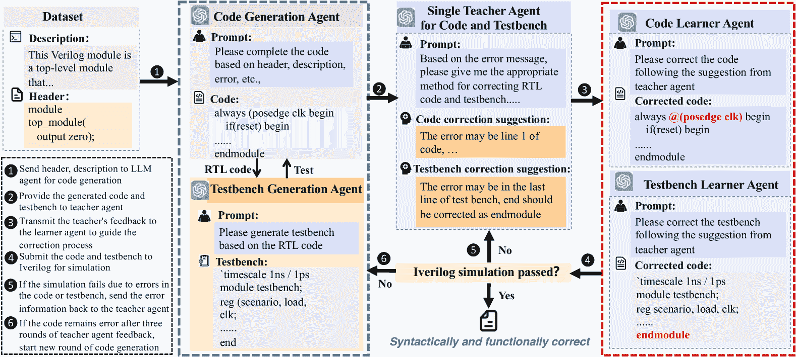

<!--yml
category: 未分类
date: 2025-01-11 11:47:41
-->

# PromptV: Leveraging LLM-powered Multi-Agent Prompting for High-quality Verilog Generation

> 来源：[https://arxiv.org/html/2412.11014/](https://arxiv.org/html/2412.11014/)

^+Zhendong Mi ¹, ^+Renming Zheng ¹, Haowen Zhong ², Yue Sun ³, Shaoyi Huang ¹
^+These authors contributed equally.
¹Stevens Institute of Technology, ²University of Washington, ³Lehigh University
{zmi2, shuang59}@stevens.edu, haowenz@uw.edu, yus516@lehigh.edu

###### Abstract

Recent advances in agentic LLMs have demonstrated remarkable automated Verilog code generation capabilities. However, existing approaches either demand substantial computational resources or rely on LLM-assisted single-agent prompt learning techniques, which we observe for the first time has a degeneration issue — characterized by deteriorating generative performance and diminished error detection and correction capabilities. This paper proposes a novel multi-agent prompt learning framework to address these limitations and enhance code generation quality. We show for the first time that multi-agent architectures can effectively mitigate the degeneration risk while improving code error correction capabilities, resulting in higher-quality Verilog code generation. Experimental results show that the proposed method could achieve 96.4% and 96.5% pass@10 scores on VerilogEval Machine and Human benchmarks, respectively while attaining 100% Syntax and 99.9% Functionality pass@5 metrics on the RTLLM benchmark.

## 1 Introduction

As semiconductor technology advances to smaller process nodes (7nm, 5nm, 3nm, and beyond), electronic design automation (EDA) faces increasing challenges due to the escalating design complexity, increasing human resource constraints, and intensifying time-to-market pressure. Hardware description language (HDL) code generation, as a fundamental EDA task, particularly exemplifies these challenges. In recent years, large language models (LLMs) have captured extensive attention due to their significant performance across various tasks Dubey et al. ([2024](https://arxiv.org/html/2412.11014v1#bib.bib1)); OpenAI et al. ([2024](https://arxiv.org/html/2412.11014v1#bib.bib2)); Touvron et al. ([2023](https://arxiv.org/html/2412.11014v1#bib.bib3)) and have emerged as a promising solution, demonstrating significant potential in automating various EDA tasks, especially in HDL code generation where traditional approaches struggle to scale Liu et al. ([2024a](https://arxiv.org/html/2412.11014v1#bib.bib4)); Nijkamp et al. ([2022](https://arxiv.org/html/2412.11014v1#bib.bib5)).

While effective, existing approaches either utilize computational resources intensive learning paradigm (e.g., pretraining Rozière et al. ([2023](https://arxiv.org/html/2412.11014v1#bib.bib6)), fine-tuning Thakur et al. ([2023](https://arxiv.org/html/2412.11014v1#bib.bib7)), instruct-tuning Ouyang et al. ([2022](https://arxiv.org/html/2412.11014v1#bib.bib8)); Chung et al. ([2022](https://arxiv.org/html/2412.11014v1#bib.bib9)); Wang et al. ([2023](https://arxiv.org/html/2412.11014v1#bib.bib10)); Chaudhary ([2023](https://arxiv.org/html/2412.11014v1#bib.bib11)); Muennighoff et al. ([2023](https://arxiv.org/html/2412.11014v1#bib.bib12)); Shypula et al. ([2023](https://arxiv.org/html/2412.11014v1#bib.bib13))) or employ LLM-assisted single-agent prompt learning techniques Olausson et al. ([2023](https://arxiv.org/html/2412.11014v1#bib.bib14)); Zhang et al. ([2024](https://arxiv.org/html/2412.11014v1#bib.bib15)); Huang et al. ([2024](https://arxiv.org/html/2412.11014v1#bib.bib16)), where the model selectively performs code generation, self-execution, and self-correction in sequence. However, we observe for the first time the single-agent prompt learning has a degeneration issue — characterized by deteriorating generative performance and diminished error detection and correction capabilities.

In this work, we introduce PromptV, which leverages LLM-powered multi-agent prompt learning for high-quality verilog generation. Instead of utilizing single-agent learning for both code generation and error correction, PromptV utilizes a multi-agent architecture to reduce the degeneration issue. In promptV, multiple LLM agents are employed for different tasks, e.g., code generation, testbench generation, error correction suggestion generation, code correction, and testbench correction. Moreover, we integrate the teacher-learner learning mechanism in the framework: a teacher agent that identifies and analyzes the errors while providing correction suggestions for both code and testbench, and dual learner agents that extract and apply the teacher’s suggestions to correct the errors in the code and testbench, respectively. We summarize our contributions as follows:

*   •

    For the first time, we observe the degeneration issue in LLM-assisted single-agent prompt learning for Verilog generation.

*   •

    We propose PromptV, an LLM-powered interactive multi-agent prompt learning framework with the integration of a teacher-learner learning mechanism that addresses the degeneration issue and improves code generation quality.

*   •

    We conduct experiments on VerilogEval-Machine, VerilogEval-Human, and RTLLM. Our results show the effectiveness of PromptV in code generation compared with the SOTA.

Figure 1: The proposed LLM-powered multi-agent prompt learning framework for verilog generation

## 2 Methodology

### 2.1 Task Description

We aim to obtain syntactically and functionally accurate verilog code based on initial design information including problem description and module headers. In general, we have three sub-tasks: 1) Verilog code and testbench generation; 2) code and testbench error correction suggestions generation; 3) code and testbench error correction. In this paper, we propose a LLM-powered interactive multi-agent prompt learning framework that includes diverse LLM agents responsible for the above tasks. Moreover, we study the effectiveness of proposed method in code generation with ChatGPT3.5 and ChatGPT4 on VerilogEval Liu et al. ([2023a](https://arxiv.org/html/2412.11014v1#bib.bib17)) and RTLLM dataset Lu et al. ([2024](https://arxiv.org/html/2412.11014v1#bib.bib18)).

### 2.2 Interactive Multi-agent Learning for Verilog Generation

Our LLM-based multi-agent learning pipeline conducts an interactive code repairing workflow, which stimulates the collaboration among these agents and Iverilog simulation, as shown in Figure [1](https://arxiv.org/html/2412.11014v1#S1.F1 "Figure 1 ‣ 1 Introduction ‣ PromptV: Leveraging LLM-powered Multi-Agent Prompting for High-quality Verilog Generation"). We incorporate different agents in the framework: Code-generation agent, testbench generation agent, teacher agent providing error correction suggestions for code and testbench, and dual learner agents correcting errors in code and testbench following teachers suggestions. More specifically, our framework consists of the following stages: <svg class="ltx_picture" height="12.93" id="S2.SS2.p1.1.pic1" overflow="visible" version="1.1" width="12.93"><g fill="#000000" stroke="#000000" stroke-width="0.4pt" transform="translate(0,12.93) matrix(1 0 0 -1 0 0) translate(6.47,0) translate(0,6.47)"><g fill="#000000" stroke="#000000" transform="matrix(1.0 0.0 0.0 1.0 -2.77 -3.57)"><foreignobject height="7.13" overflow="visible" transform="matrix(1 0 0 -1 0 16.6)" width="5.53">1</foreignobject></g></g></svg> Verilog module code completion and testbench generation: Our framework requires two essential components as inputs: the module description and the module header. With these inputs, the LLM generates Verilog code that adheres to the specified interface requirements and functional constraints. Subsequently, we employ AutoBench Qiu et al. ([2024](https://arxiv.org/html/2412.11014v1#bib.bib19)) for testbench generation and function verification. Moreover, we use Iverilog as the compiler for Verilog code and the corresponding testbench. <svg class="ltx_picture" height="12.93" id="S2.SS2.p1.2.pic2" overflow="visible" version="1.1" width="12.93"><g fill="#000000" stroke="#000000" stroke-width="0.4pt" transform="translate(0,12.93) matrix(1 0 0 -1 0 0) translate(6.47,0) translate(0,6.47)"><g fill="#000000" stroke="#000000" transform="matrix(1.0 0.0 0.0 1.0 -2.77 -3.57)"><foreignobject height="7.13" overflow="visible" transform="matrix(1 0 0 -1 0 16.6)" width="5.53">2</foreignobject></g></g></svg> Teacher agent providing error correction suggestions for both code and testbench: The teacher agent automatically analyzes the exsiting errors including syntax errors, logical inconsistencies, and testbench verification issues, etc. Based on the thorough analysis, the teacher agent generates specific correction suggestions to effectively address the identified bugs, ensuring compliance with hardware description language specifications and verification requirements. <svg class="ltx_picture" height="12.93" id="S2.SS2.p1.3.pic3" overflow="visible" version="1.1" width="12.93"><g fill="#000000" stroke="#000000" stroke-width="0.4pt" transform="translate(0,12.93) matrix(1 0 0 -1 0 0) translate(6.47,0) translate(0,6.47)"><g fill="#000000" stroke="#000000" transform="matrix(1.0 0.0 0.0 1.0 -2.77 -3.57)"><foreignobject height="7.13" overflow="visible" transform="matrix(1 0 0 -1 0 16.6)" width="5.53">3</foreignobject></g></g></svg> Verilog code and testbench error correction: Two learner agents are employed in parallel for error correction of code and testbench, individually. The correction suggestions from the teacher agent will be delivered to the learner agents. The parallel nature of this process, enables simultaneous and efficient refinement of both components without cross-interference, thereby enhancing the overall efficiency and reliability of the error correction process. <svg class="ltx_picture" height="12.93" id="S2.SS2.p1.4.pic4" overflow="visible" version="1.1" width="12.93"><g fill="#000000" stroke="#000000" stroke-width="0.4pt" transform="translate(0,12.93) matrix(1 0 0 -1 0 0) translate(6.47,0) translate(0,6.47)"><g fill="#000000" stroke="#000000" transform="matrix(1.0 0.0 0.0 1.0 -2.77 -3.57)"><foreignobject height="7.13" overflow="visible" transform="matrix(1 0 0 -1 0 16.6)" width="5.53">4</foreignobject></g></g></svg> Iverilog simulation: After the correction of code and testbench, we employ Icarus Verilog to simulate of the code and testbench. The simulation results will be used to validate the effectiveness of the modifications. <svg class="ltx_picture" height="12.93" id="S2.SS2.p1.5.pic5" overflow="visible" version="1.1" width="12.93"><g fill="#000000" stroke="#000000" stroke-width="0.4pt" transform="translate(0,12.93) matrix(1 0 0 -1 0 0) translate(6.47,0) translate(0,6.47)"><g fill="#000000" stroke="#000000" transform="matrix(1.0 0.0 0.0 1.0 -2.77 -3.57)"><foreignobject height="7.13" overflow="visible" transform="matrix(1 0 0 -1 0 16.6)" width="5.53">5</foreignobject></g></g></svg> New round of error correction: If a code or its corresponding testbench fail to pass the simulator, the system initiates a correction cycle. The errorneous code and testbench are returned to the teacher agent, which performs the next round of corrections. <svg class="ltx_picture" height="12.93" id="S2.SS2.p1.6.pic6" overflow="visible" version="1.1" width="12.93"><g fill="#000000" stroke="#000000" stroke-width="0.4pt" transform="translate(0,12.93) matrix(1 0 0 -1 0 0) translate(6.47,0) translate(0,6.47)"><g fill="#000000" stroke="#000000" transform="matrix(1.0 0.0 0.0 1.0 -2.77 -3.57)"><foreignobject height="7.13" overflow="visible" transform="matrix(1 0 0 -1 0 16.6)" width="5.53">6</foreignobject></g></g></svg>New cycle of code and testbench generation: However, if the code of a given module remains error after three rounds, a new cycle of code regeneration will be triggered and the initial module information along with the error messages generated during the simulation, will be delivered to the code generation agent.

## 3 Experiments

### 3.1 Experimental Setup

#### 3.1.1 Settings

In our experiment, we compare our method with two types of baselines, (i) general-purpose foundation models, including GPT-3.5, GPT-4 Achiam et al. ([2023](https://arxiv.org/html/2412.11014v1#bib.bib20)), and Claude-3, alongside three open-source models designed for code generation, namely CodeLlama-7B-InstructRoziere et al. ([2023](https://arxiv.org/html/2412.11014v1#bib.bib21)), DeepSeek-Coder-6.7B-Instruct Guo et al. ([2024](https://arxiv.org/html/2412.11014v1#bib.bib22)), and CodeQwen-1.5-7B-Chat Bai et al. ([2023](https://arxiv.org/html/2412.11014v1#bib.bib23)); (ii) domain-specific fine-tuned models, such as ChipNeMo Liu et al. ([2023b](https://arxiv.org/html/2412.11014v1#bib.bib24)), RTLCoder Liu et al. ([2024b](https://arxiv.org/html/2412.11014v1#bib.bib25)), BetterV Pei et al. ([2024](https://arxiv.org/html/2412.11014v1#bib.bib26)), and CodeVZhao et al. ([2024](https://arxiv.org/html/2412.11014v1#bib.bib27)). We use pass@k as the evaluation metric for the performance of language models in generating Verilog code, which is formulated as $\operatorname{pass}@k:=\underset{\text{ problems }}{\mathbb{E}}\left[\frac{1-% \binom{n-c}{k}}{\binom{n}{k}}\right]$, where $n$ represents the total number of generated solutions for each problem, $c$ refers to the number of correct solutions for a given problem and $k$ is the number of solutions from the model that are evaluated. We set $n=20$ in our experiments.

### 3.2 Experimental Results

 | Model | VerilogEval | RTLLM pass@5 |
| Machine(%) | Human(%) | Syntax(%) | Func(%) |
| pass@1 | pass@5 | pass@10 | pass@1 | pass@5 | pass@10 |
| GPT-3.5 | 46.7 | 69.1 | 74.1 | 26.7 | 45.8 | 51.7 | 89.7 | 37.9 |
| GPT-4 | 60.0 | 70.6 | 73.5 | 43.5 | 55.8 | 58.9 | 100 | 65.5 |
| Claude-3 | 55.3 | 63.8 | 69.4 | 34.4 | 48.3 | 53.4 | 93.1 | 55.2 |
| CodeLlama | 43.1 | 47.1 | 47.7 | 18.2 | 22.7 | 24.3 | 86.2 | 31.0 |
| DeepSeek-Coder | 52.2 | 55.4 | 56.8 | 30.2 | 33.9 | 34.9 | 93.1 | 44.8 |
| CodeQwen | 46.5 | 54.9 | 56.4 | 22.5 | 26.1 | 28.0 | 86.2 | 41.4 |
| ChipNeMo-70B | 53.8 | - | - | 27.6 | - | - | - | - |
| RTLCoder-Mistral | 62.5 | 72.2 | 76.6 | 36.7 | 45.5 | 49.2 | 96.6 | 48.3 |
| RTLCoder-DeepSeek | 61.2 | 76.5 | 81.8 | 41.6 | 50.1 | 53.4 | 93.1 | 48.3 |
| BetterV-DeepSeek | 67.8 | 79.1 | 84.0 | 45.9 | 53.3 | 57.6 | - | - |
| BetterV-CodeQwen | 68.1 | 79.4 | 84.5 | 46.1 | 53.7 | 58.2 | - | - |
| CodeV-DeepSeek | 77.9 | 88.6 | 90.7 | 52.7 | 62.5 | 67.3 | 89.7 | 55.2 |
| CodeV-CodeQwen | 77.6 | 88.2 | 90.7 | 53.2 | 65.1 | 68.5 | 93.1 | 55.2 |
| PromptV + GPT-3.5 (Ours) | 55.0 | 91.0 | 95.9 | 49.2 | 88.3 | 96.4 | 99.8 | 88.5 |
| PromptV + GPT-4 (Ours) | 80.7 | 94.9 | 96.4 | 80.4 | 94.4 | 96.5 | 100 | 99.9 | 

Table 1: Comparison of PromptV against various baseline models

Table [1](https://arxiv.org/html/2412.11014v1#S3.T1 "Table 1 ‣ 3.2 Experimental Results ‣ 3 Experiments ‣ PromptV: Leveraging LLM-powered Multi-Agent Prompting for High-quality Verilog Generation") presents the main results of PromptV. On VerilogEval, PromptV surpasses all baseline methods across all evaluation metrics. Specifically, PromptV+GPT-4 outperforms other baseline methods, with up to 62.2%, 71.1% and 68.5% higher score on pass@1, pass@5, pass@10, respectively. On RTLLM pass@5, PromptV+GPT-4 achieves a syntax pass rate of 100% and a functionality pass rate of 99.9%, demonstrating the effectiveness of proposed method.

## 4 Conclusion

We propose PromptV, an interactive multi-agent framework powered by LLMs for high-quality verilog code generation. PromptV comprises multiple specialized LLM agents, each dedicated to a specific task, effectively mitigating the degeneration issue in traditional single-agent approaches. Moreover, the effectiveness of the framework is further enhanced through the integration of teacher-learner mechanism. Our comprehensive empirical evaluation across various benchmarks demonstrates the effectiveness of proposed method in both syntax and functionality for RTL code generation, which sheds light on the automation of EDA tasks with the power of LLMs.

## References

*   Dubey et al. [2024] Abhimanyu Dubey et al. The llama 3 herd of models, 2024. URL [https://arxiv.org/abs/2407.21783](https://arxiv.org/abs/2407.21783).
*   OpenAI et al. [2024] OpenAI, Josh Achiam, et al. Gpt-4 technical report, 2024. URL [https://arxiv.org/abs/2303.08774](https://arxiv.org/abs/2303.08774).
*   Touvron et al. [2023] Hugo Touvron et al. Llama 2: Open foundation and fine-tuned chat models, 2023. URL [https://arxiv.org/abs/2307.09288](https://arxiv.org/abs/2307.09288).
*   Liu et al. [2024a] Mingjie Liu, Teodor-Dumitru Ene, Robert Kirby, Chris Cheng, Nathaniel Pinckney, Rongjian Liang, Jonah Alben, Himyanshu Anand, Sanmitra Banerjee, Ismet Bayraktaroglu, Bonita Bhaskaran, Bryan Catanzaro, Arjun Chaudhuri, Sharon Clay, Bill Dally, Laura Dang, Parikshit Deshpande, Siddhanth Dhodhi, Sameer Halepete, Eric Hill, Jiashang Hu, Sumit Jain, Ankit Jindal, Brucek Khailany, George Kokai, Kishor Kunal, Xiaowei Li, Charley Lind, Hao Liu, Stuart Oberman, Sujeet Omar, Ghasem Pasandi, Sreedhar Pratty, Jonathan Raiman, Ambar Sarkar, Zhengjiang Shao, Hanfei Sun, Pratik P Suthar, Varun Tej, Walker Turner, Kaizhe Xu, and Haoxing Ren. Chipnemo: Domain-adapted llms for chip design, 2024a. URL [https://arxiv.org/abs/2311.00176](https://arxiv.org/abs/2311.00176).
*   Nijkamp et al. [2022] Erik Nijkamp, Bo Pang, Hiroaki Hayashi, Lifu Tu, Haiquan Wang, Yingbo Zhou, Silvio Savarese, and Caiming Xiong. Codegen: An open large language model for code with multi-turn program synthesis. In *International Conference on Learning Representations*, 2022. URL [https://api.semanticscholar.org/CorpusID:252668917](https://api.semanticscholar.org/CorpusID:252668917).
*   Rozière et al. [2023] Baptiste Rozière, Jonas Gehring, Fabian Gloeckle, Sten Sootla, Itai Gat, Xiaoqing Tan, Yossi Adi, Jingyu Liu, Tal Remez, Jérémy Rapin, Artyom Kozhevnikov, I. Evtimov, Joanna Bitton, Manish P Bhatt, Cristian Cantón Ferrer, Aaron Grattafiori, Wenhan Xiong, Alexandre D’efossez, Jade Copet, Faisal Azhar, Hugo Touvron, Louis Martin, Nicolas Usunier, Thomas Scialom, and Gabriel Synnaeve. Code llama: Open foundation models for code. *ArXiv*, abs/2308.12950, 2023. URL [https://api.semanticscholar.org/CorpusID:261100919](https://api.semanticscholar.org/CorpusID:261100919).
*   Thakur et al. [2023] Shailja Thakur, Baleegh Ahmad, Zhenxing Fan, Hammond Pearce, Benjamin Tan, Ramesh Karri, Brendan Dolan-Gavitt, and Siddharth Garg. Benchmarking large language models for automated verilog rtl code generation. In *2023 Design, Automation & Test in Europe Conference & Exhibition (DATE)*, pages 1–6\. IEEE, 2023.
*   Ouyang et al. [2022] Long Ouyang, Jeffrey Wu, Xu Jiang, Diogo Almeida, Carroll Wainwright, Pamela Mishkin, Chong Zhang, Sandhini Agarwal, Katarina Slama, Alex Ray, et al. Training language models to follow instructions with human feedback. *Advances in neural information processing systems*, 35:27730–27744, 2022.
*   Chung et al. [2022] Hyung Won Chung, Le Hou, S. Longpre, Barret Zoph, Yi Tay, William Fedus, Eric Li, Xuezhi Wang, Mostafa Dehghani, Siddhartha Brahma, Albert Webson, Shixiang Shane Gu, Zhuyun Dai, Mirac Suzgun, Xinyun Chen, Aakanksha Chowdhery, Dasha Valter, Sharan Narang, Gaurav Mishra, Adams Wei Yu, Vincent Zhao, Yanping Huang, Andrew M. Dai, Hongkun Yu, Slav Petrov, Ed Huai hsin Chi, Jeff Dean, Jacob Devlin, Adam Roberts, Denny Zhou, Quoc V. Le, and Jason Wei. Scaling instruction-finetuned language models. *ArXiv*, abs/2210.11416, 2022. URL [https://api.semanticscholar.org/CorpusID:253018554](https://api.semanticscholar.org/CorpusID:253018554).
*   Wang et al. [2023] Yizhong Wang, Yeganeh Kordi, Swaroop Mishra, Alisa Liu, Noah A Smith, Daniel Khashabi, and Hannaneh Hajishirzi. Self-instruct: Aligning language models with self-generated instructions. In *Proceedings of the 61st Annual Meeting of the Association for Computational Linguistics (Volume 1: Long Papers)*, pages 13484–13508, 2023.
*   Chaudhary [2023] Sahil Chaudhary. Code alpaca: An instruction-following llama model for code generation. *GitHub repository*, 2023.
*   Muennighoff et al. [2023] Niklas Muennighoff, Qian Liu, Armel Zebaze, Qinkai Zheng, Binyuan Hui, Terry Yue Zhuo, Swayam Singh, Xiangru Tang, Leandro Von Werra, and Shayne Longpre. Octopack: Instruction tuning code large language models. In *NeurIPS 2023 Workshop on Instruction Tuning and Instruction Following*, 2023.
*   Shypula et al. [2023] Alexander G Shypula, Aman Madaan, Yimeng Zeng, Uri Alon, Jacob R Gardner, Yiming Yang, Milad Hashemi, Graham Neubig, Parthasarathy Ranganathan, Osbert Bastani, et al. Learning performance-improving code edits. In *The Twelfth International Conference on Learning Representations*, 2023.
*   Olausson et al. [2023] Theo X Olausson, Jeevana Priya Inala, Chenglong Wang, Jianfeng Gao, and Armando Solar-Lezama. Is self-repair a silver bullet for code generation? In *The Twelfth International Conference on Learning Representations*, 2023.
*   Zhang et al. [2024] Che Zhang, Zhenyang Xiao, Chengcheng Han, Yixin Lian, and Yuejian Fang. Learning to check: Unleashing potentials for self-correction in large language models. *ArXiv*, abs/2402.13035, 2024. URL [https://api.semanticscholar.org/CorpusID:267759831](https://api.semanticscholar.org/CorpusID:267759831).
*   Huang et al. [2024] Hanxian Huang, Zhenghan Lin, Zixuan Wang, Xin Chen, Ke Ding, and Jishen Zhao. Towards llm-powered verilog rtl assistant: Self-verification and self-correction. *ArXiv*, abs/2406.00115, 2024. URL [https://api.semanticscholar.org/CorpusID:270216110](https://api.semanticscholar.org/CorpusID:270216110).
*   Liu et al. [2023a] Mingjie Liu, Nathaniel Pinckney, Brucek Khailany, and Haoxing Ren. Verilogeval: Evaluating large language models for verilog code generation. In *2023 IEEE/ACM International Conference on Computer Aided Design (ICCAD)*, pages 1–8\. IEEE, 2023a.
*   Lu et al. [2024] Yao Lu, Shang Liu, Qijun Zhang, and Zhiyao Xie. Rtllm: An open-source benchmark for design rtl generation with large language model. In *2024 29th Asia and South Pacific Design Automation Conference (ASP-DAC)*, pages 722–727\. IEEE, 2024.
*   Qiu et al. [2024] Ruidi Qiu, Grace Li Zhang, Rolf Drechsler, Ulf Schlichtmann, and Bing Li. Autobench: Automatic testbench generation and evaluation using llms for hdl design. In *Proceedings of the 2024 ACM/IEEE International Symposium on Machine Learning for CAD*, pages 1–10, 2024.
*   Achiam et al. [2023] Josh Achiam, Steven Adler, Sandhini Agarwal, Lama Ahmad, Ilge Akkaya, Florencia Leoni Aleman, Diogo Almeida, Janko Altenschmidt, Sam Altman, Shyamal Anadkat, et al. Gpt-4 technical report. *arXiv preprint arXiv:2303.08774*, 2023.
*   Roziere et al. [2023] Baptiste Roziere, Jonas Gehring, Fabian Gloeckle, Sten Sootla, Itai Gat, Xiaoqing Ellen Tan, Yossi Adi, Jingyu Liu, Romain Sauvestre, Tal Remez, et al. Code llama: Open foundation models for code. *arXiv preprint arXiv:2308.12950*, 2023.
*   Guo et al. [2024] Daya Guo, Qihao Zhu, Dejian Yang, Zhenda Xie, Kai Dong, Wentao Zhang, Guanting Chen, Xiao Bi, Yu Wu, YK Li, et al. Deepseek-coder: When the large language model meets programming–the rise of code intelligence. *arXiv preprint arXiv:2401.14196*, 2024.
*   Bai et al. [2023] Jinze Bai, Shuai Bai, Yunfei Chu, Zeyu Cui, Kai Dang, Xiaodong Deng, Yang Fan, Wenbin Ge, Yu Han, Fei Huang, et al. Qwen technical report. *arXiv preprint arXiv:2309.16609*, 2023.
*   Liu et al. [2023b] Mingjie Liu, Teodor-Dumitru Ene, Robert Kirby, Chris Cheng, Nathaniel Pinckney, Rongjian Liang, Jonah Alben, Himyanshu Anand, Sanmitra Banerjee, Ismet Bayraktaroglu, et al. Chipnemo: Domain-adapted llms for chip design. *arXiv preprint arXiv:2311.00176*, 2023b.
*   Liu et al. [2024b] Shang Liu, Wenji Fang, Yao Lu, Qijun Zhang, Hongce Zhang, and Zhiyao Xie. Rtlcoder: Outperforming gpt-3.5 in design rtl generation with our open-source dataset and lightweight solution. In *2024 IEEE LLM Aided Design Workshop (LAD)*, pages 1–5\. IEEE, 2024b.
*   Pei et al. [2024] Zehua Pei, Hui-Ling Zhen, Mingxuan Yuan, Yu Huang, and Bei Yu. Betterv: Controlled verilog generation with discriminative guidance. *arXiv preprint arXiv:2402.03375*, 2024.
*   Zhao et al. [2024] Yang Zhao, Di Huang, Chongxiao Li, Pengwei Jin, Ziyuan Nan, Tianyun Ma, Lei Qi, Yansong Pan, Zhenxing Zhang, Rui Zhang, et al. Codev: Empowering llms for verilog generation through multi-level summarization. *arXiv preprint arXiv:2407.10424*, 2024.