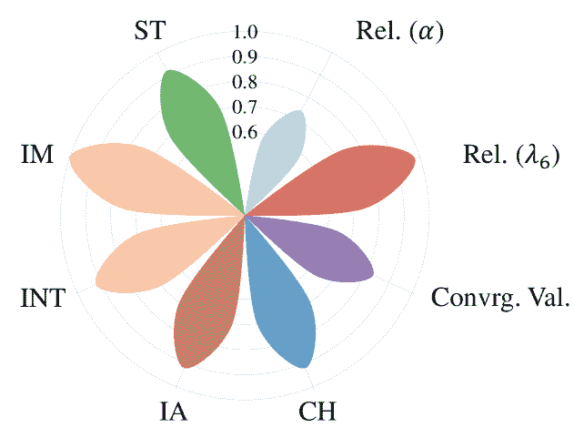

<!--yml

类别：未分类

日期：2025-01-11 12:52:34

-->

# PsychoGAT：通过与LLM代理互动小说游戏的创新心理测量范式

> 来源：[https://arxiv.org/html/2402.12326/](https://arxiv.org/html/2402.12326/)

杨启森¹，王泽坤²¹¹脚注：1，陈洪辉³，王慎志¹，蒲怡凡¹，高鑫⁴，

黄文昊²，宋世基¹，黄高¹

¹ 清华大学自动化系，BNRist  ²01.AI

³ 中南大学第二湘雅医院医学心理学中心

& 中南大学医学心理学研究所

& 国家精神障碍临床研究中心

⁴ 卡内基梅隆大学 平等贡献，按字母顺序排序。该工作在王泽坤的清华大学实习期间完成。通讯作者。

###### 摘要

心理测量对于心理健康、自我理解和个人发展至关重要。传统方法，如自评量表和心理学家访谈，通常面临参与度和可达性的问题。虽然基于游戏和基于大语言模型（LLM）的工具已被探索以提高用户兴趣并实现评估自动化，但它们在平衡参与感与普适性方面仍然面临挑战。在这项工作中，我们提出了PsychoGAT（心理游戏代理），旨在实现心理评估的通用化游戏化。我们的主要见解是，强大的LLM不仅可以作为熟练的心理学家，还能成为创新的游戏设计师。通过将LLM代理融入指定角色并精心管理它们的互动，PsychoGAT能够将任何标准化量表转化为个性化且富有互动性的虚构游戏。为了验证所提出的方法，我们进行了心理测量评估以评估其有效性，并通过人类评估者审查生成的内容，涵盖包括抑郁、认知扭曲和人格特征等各类心理构念。结果表明，PsychoGAT作为一种有效的评估工具，在心理测量指标如可靠性、收敛效度和区分效度等方面达到了显著的优异表现。此外，人类评估结果确认PsychoGAT在内容连贯性、互动性、兴趣性、沉浸感和满意度等方面的提升。

PsychoGAT：通过与LLM代理互动小说游戏的创新心理测量范式

杨启森¹^†^†感谢：平等贡献，按字母顺序排序。该工作在王泽坤的清华大学实习期间完成。，王泽坤²¹¹脚注：1，陈洪辉³，王慎志¹，蒲怡凡¹，高鑫⁴，黄文昊²，宋世基¹，黄高¹^†^†感谢：通讯作者。¹ 清华大学自动化系，BNRist  ²01.AI ³中南大学第二湘雅医院医学心理学中心 & 中南大学医学心理学研究所 & 国家精神障碍临床研究中心 ⁴ 卡内基梅隆大学

^†^†脚注：电子邮件：yangqs19@mails.tsinghua.edu.cn，noah.zenmoo re@gmail.com，choraschan@csu.edu.cn，{wsz21, puyf23}@ mails.tsinghua.edu.cn，xing1@andrew.cmu.edu，rubio8741@ gmail.com，{shijis, gaohuang}@tsinghua.edu.cn。

## 1 引言

心理评估在心理健康和自我理解中扮演着关键角色，Meyer 等人（[2001](https://arxiv.org/html/2402.12326v2#bib.bib43)）提出了抑郁症测量、认知扭曲检测和人格测试的应用，Osipow 等人（[1966](https://arxiv.org/html/2402.12326v2#bib.bib48)）；Hogan（[1991](https://arxiv.org/html/2402.12326v2#bib.bib28)）；Bohane 等人（[2017](https://arxiv.org/html/2402.12326v2#bib.bib6)）；Sharma 等人（[2020b](https://arxiv.org/html/2402.12326v2#bib.bib60)）；组织等人（[2022](https://arxiv.org/html/2402.12326v2#bib.bib47)）。传统的心理学构念测量方法主要依赖于标准化问卷（即自我报告量表）（Urbina，[2014](https://arxiv.org/html/2402.12326v2#bib.bib70)）和心理学家-患者对话（Tu 等人，[2024](https://arxiv.org/html/2402.12326v2#bib.bib67)）。然而，这些方法存在固有的局限性：（1）标准化量表可能单调，降低参与度，特别是在年轻人中，容易引起抵触情绪（Merry 等人，[2012](https://arxiv.org/html/2402.12326v2#bib.bib42)）；（2）专家访谈需要大量的人力资源，并且稀缺，常常导致心理评估无法为需要的人群提供服务（Crisp 和 Chen，[2014](https://arxiv.org/html/2402.12326v2#bib.bib16)）。

图 1：我们提出了 PsychoGAT，一种新型心理评估范式，采用互动游戏形式，而非传统的自我报告量表。

为了解决这些挑战，心理评估方法逐渐转向自动化、程序化手段，包括计算机化自适应测试（Meijer 和 Nering，[1999](https://arxiv.org/html/2402.12326v2#bib.bib41)）和专门设计用于测量的基于规则的电子游戏（Jones，[1984](https://arxiv.org/html/2402.12326v2#bib.bib32)）；Song 等人（[2020](https://arxiv.org/html/2402.12326v2#bib.bib63)）。此外，一些研究探索了使用自然语言处理（NLP）系统来支持心理健康（Sharma 等人，[2020a](https://arxiv.org/html/2402.12326v2#bib.bib59)；Welivita 等人，[2021](https://arxiv.org/html/2402.12326v2#bib.bib79)；Saha 等人，[2022](https://arxiv.org/html/2402.12326v2#bib.bib55)；Rathje 等人，[2023](https://arxiv.org/html/2402.12326v2#bib.bib52)）。然而，这些解决方案通常受到功能碎片化和适用范围狭窄的限制。特别是，基于规则的心理游戏缺乏灵活性，由于其固有的刚性，难以吸引用户参与（Volum 等人，[2022](https://arxiv.org/html/2402.12326v2#bib.bib71)）。

图 2：PsychoGAT 的多代理框架。设计者根据给定的自我报告量表生成互动小说游戏的设置。控制器、评论员和人类参与者（或人类模拟器）进行循环互动，以促进评估过程。$I^{yes}$ 代表人类选择的指令。

大型语言模型（LLMs）以其通用能力、广泛的知识和推理能力著称，提供了一种更加灵活、知识丰富且富有吸引力的心理评估方法（OpenAI, [2023](https://arxiv.org/html/2402.12326v2#bib.bib46); He et al., [2023](https://arxiv.org/html/2402.12326v2#bib.bib27); Zhao et al., [2023](https://arxiv.org/html/2402.12326v2#bib.bib81); na et al., [2023](https://arxiv.org/html/2402.12326v2#bib.bib44); Wang et al., [2023d](https://arxiv.org/html/2402.12326v2#bib.bib76); Sartori and Orrù, [2023](https://arxiv.org/html/2402.12326v2#bib.bib56); Tu et al., [2024](https://arxiv.org/html/2402.12326v2#bib.bib67))。例如，思维诊断（DoT）（Chen et al., [2023d](https://arxiv.org/html/2402.12326v2#bib.bib13)）利用 LLMs 通过思维链技术来检测认知扭曲（Wei et al., [2022](https://arxiv.org/html/2402.12326v2#bib.bib78)）。另一种典型的基于 LLM 的心理评估方式是心理学家角色扮演对话（Tu et al., [2024](https://arxiv.org/html/2402.12326v2#bib.bib67); Sartori and Orrù, [2023](https://arxiv.org/html/2402.12326v2#bib.bib56); Wang et al., [2023e](https://arxiv.org/html/2402.12326v2#bib.bib77)）。尽管有这些进展，当前的系统仍面临跨多样心理结构的泛化性限制，通常是因为它们依赖于特定的先验知识（Chen et al., [2023d](https://arxiv.org/html/2402.12326v2#bib.bib13); Sharma et al., [2023](https://arxiv.org/html/2402.12326v2#bib.bib61)）。与此同时，心理学家角色扮演对话常常缺乏趣味性，导致用户参与度下降（Tu et al., [2024](https://arxiv.org/html/2402.12326v2#bib.bib67)）。

针对这些问题，我们提出了一种新的互动式、沉浸式、自动化的心理测量范式——PsychoGAT（心理游戏代理）。根据我们所知，我们的方法是首个将大型语言模型（LLM）代理融入通用的游戏化心理测量中的方法。如[图1](https://arxiv.org/html/2402.12326v2#S1.F1 "在第1节介绍 ‣ PsychoGAT：通过与LLM代理互动的虚构游戏进行心理测量的创新范式")所示，我们的方法将传统的自我报告量表转化为互动虚构游戏，使玩家的互动成为其心理状态的准确指示器。具体来说，如[图2](https://arxiv.org/html/2402.12326v2#S1.F2 "在第1节介绍 ‣ PsychoGAT：通过与LLM代理互动的虚构游戏进行心理测量的创新范式")所示，我们的框架包括三个主要的代理：（1）游戏设计师，负责创建游戏设置；（2）游戏控制器，负责生成互动内容；（3）评论者，负责优化内容以提升用户体验。

总结来说，我们的贡献是：

+   •

    我们提出了一种新的心理测量范式，转变了传统的问卷调查方法，采用互动式、游戏化的评估方式。该范式增强了参与者的参与感，同时确保了评估的心理测量可靠性和有效性。

+   •

    我们开发了一个基于LLM代理的框架，用于心理测量的游戏化。这一多代理框架利用LLM的能力促进动态互动，允许其应用于各种评估任务和多种游戏场景。

+   •

    实验结果验证了我们方法的有效性和优势，具体表现为心理测量得分的竞争力以及在用户体验相关指标上在人类评估中的显著提升。

## 2 PsychoGAT

如图[2](https://arxiv.org/html/2402.12326v2#S1.F2 "Figure 2 ‣ 1 Introduction ‣ PsychoGAT: A Novel Psychological Measurement Paradigm through Interactive Fiction Games with LLM Agents")所示，我们的框架包括三个负责游戏生成的代理，以及一个单独的代理用于模拟人类交互。接下来的部分将首先概述工作流程（§[2.1](https://arxiv.org/html/2402.12326v2#S2.SS1 "2.1 Overall Workflow ‣ 2 PsychoGAT ‣ PsychoGAT: A Novel Psychological Measurement Paradigm through Interactive Fiction Games with LLM Agents")），然后详细描述每个参与的代理：游戏设计师（§[2.2](https://arxiv.org/html/2402.12326v2#S2.SS2 "2.2 Game Designer ‣ 2 PsychoGAT ‣ PsychoGAT: A Novel Psychological Measurement Paradigm through Interactive Fiction Games with LLM Agents")），游戏控制器（§[2.3](https://arxiv.org/html/2402.12326v2#S2.SS3 "2.3 Game Controller ‣ 2 PsychoGAT ‣ PsychoGAT: A Novel Psychological Measurement Paradigm through Interactive Fiction Games with LLM Agents")），评论员（§[2.4](https://arxiv.org/html/2402.12326v2#S2.SS4 "2.4 Critic ‣ 2 PsychoGAT ‣ PsychoGAT: A Novel Psychological Measurement Paradigm through Interactive Fiction Games with LLM Agents")），以及具有心理测量评估功能的人类模拟器（§[2.5](https://arxiv.org/html/2402.12326v2#S2.SS5 "2.5 Human Simulator and Psychometric Evaluator ‣ 2 PsychoGAT ‣ PsychoGAT: A Novel Psychological Measurement Paradigm through Interactive Fiction Games with LLM Agents")）。详细的提示模板见附录[D](https://arxiv.org/html/2402.12326v2#A4 "Appendix D Prompt Templates ‣ PsychoGAT: A Novel Psychological Measurement Paradigm through Interactive Fiction Games with LLM Agents")。

### 2.1 总体工作流程

给定一个心理学构念，如抑郁症，我们首先通过检索或手动选择关联的自评量表。该量表作为外部心理学知识，指导互动小说游戏的创建。此外，玩家可以选择游戏的类型和主题，以便获得个性化的体验。

随后，游戏设计师的任务是制定一个游戏标题、一个大纲和相应的游戏节点（$N$）。这些节点由多个重新设计的量表项目组成，按照游戏的叙事和故事情节进行组织。标题、大纲和节点列表共同构成了后续游戏生成迭代的条件。然后，基于重新设计的量表项目，游戏控制器和评论员代理进行递归互动。这个过程涉及生成和完善游戏段落（$P$）、用于追踪先前游戏情节的记忆（$M$），以及未来游戏开发的指令（$I$）。通过若干次的生成和完善过程，精心制作的指令会呈现给玩家供其选择，同时展示最近的游戏段落和记忆。在整个过程中，一个硬编码的心理测量评估器会收集每次迭代中的玩家决策，以计算评估得分（详见§[2.5](https://arxiv.org/html/2402.12326v2#S2.SS5.SSS0.Px2 "Psychometric Evaluator. ‣ 2.5 Human Simulator and Psychometric Evaluator ‣ 2 PsychoGAT ‣ PsychoGAT: A Novel Psychological Measurement Paradigm through Interactive Fiction Games with LLM Agents")）。

### 2.2 游戏设计师

设计师为所选类型和主题的第一人称互动小说游戏创建骨架，结合能够促进检测玩家心理档案的故事情节。该代理的输入包括游戏类型、游戏主题和传统的心理评估量表。例如，参与者需要一个关于冒险的幻想游戏来进行人格测试，如[图2](https://arxiv.org/html/2402.12326v2#S1.F2 "In 1 Introduction ‣ PsychoGAT: A Novel Psychological Measurement Paradigm through Interactive Fiction Games with LLM Agents")所示。

我们采用了链式思维提示技术（Wei 等人，[2022](https://arxiv.org/html/2402.12326v2#bib.bib78)）来增强游戏设计。具体来说，设计师首先被提示生成游戏的标题和关于故事设计的想法——特别是如何揭示玩家心理档案的各个方面——接着是创建一个全面的游戏大纲，并重新设计量表以适应游戏叙事。重新设计的量表被结构化以与游戏的大纲相吻合，确保问题的顺序与叙事的大纲一致。每个问题配有两个选项，每个选项都与一个二元评分相关，表示所检测的心理结构的存在或缺失。这个二元评分系统旨在通过玩家在游戏中的决策评估其心理倾向。

### 2.3 游戏控制器

控制器的目标是按顺序实例化量表项，以促进玩家与基于文本的游戏环境之间的互动。将控制器代理和人类玩家分别表示为 $\pi_{c}$ 和 $\pi_{p}$。该过程可以表述为：

|  | $\displaystyle(P_{i},M_{i},I^{1}_{i},I^{2}_{i})=\pi_{c}(N_{i},P^{{}^{\prime}}_{i-1},M^{{}^{\prime}}_{i-1},I^{yes}_{i-1};T,O),$ |  | (1) |
| --- | --- | --- | --- |

其中 $N_{i}$ 是当前的游戏节点（即重新设计的量表项），$P^{{}^{\prime}}_{i-1}$ 是经过评论者修正后的前一段，$M^{{}^{\prime}}_{i-1}$ 是经过评论者修正后的前一段游戏进度记忆，$I^{1}_{i}$ 和 $I^{2}_{i}$ 是玩家当前选择的指令，$T$ 是游戏标题，$O$ 是游戏大纲。$I^{yes}_{i-1}=\pi_{p}(P^{{}^{\prime}}_{i-1},I^{1^{\prime}}_{i-1},I^{2^{\prime}}_{i-1})$ 是玩家选择的指令，其中 $I^{1^{\prime}}_{i}$ 和 $I^{2^{\prime}}_{i}$ 是评论者代理修正后的相应指令。

在初始迭代中，控制器生成游戏的介绍和背景。随后的玩家、评论者和控制器之间的互动按顺序循环进行，以实例化每个量表项。随着游戏的进行，日益增长的历史信息使得 LLM 难以高效处理。为了解决这个问题，引入了一个总结机制来保持连贯的叙事记忆（Zhou et al., [2023a](https://arxiv.org/html/2402.12326v2#bib.bib83)）。该机制要求模型在更新记忆之前，解释从先前记忆中排除某些元素并加入新信息的理由。

图3：评估范式的比较。传统的量表和心理学家角色扮演面试强调回忆生活事件以及自我报告的感受或想法。相比之下，PsychoGAT 引入了一个互动小说游戏环境，参与者作为主角做出决策并编织个人故事。

### 2.4 评论者

评论者的目标是提高控制器生成内容的整体质量。根据方程式中的符号（[1](https://arxiv.org/html/2402.12326v2#S2.E1 "Equation 1 ‣ 2.3 Game Controller ‣ 2 PsychoGAT ‣ PsychoGAT: A Novel Psychological Measurement Paradigm through Interactive Fiction Games with LLM Agents")）并将评论者代理表示为 $\pi_{cri}$，评论者的互动可以表述为：

|  | $\displaystyle(P_{i}^{{}^{\prime}},M_{i}^{{}^{\prime}},I^{1^{\prime}}_{i},I^{2^{{\prime}}}_{i})=\pi_{cri}(P_{i},M_{i},I^{1}_{i},I^{2}_{i}).$ |  | (2) |
| --- | --- | --- | --- |

控制器和评论者在每个时间步上进行迭代交互，直到内容得到批准或达到预定的最大迭代次数。具体而言，评论者的目标是减轻控制器输出的三个主要问题：

由于我们小说游戏中包含大量文本内容并进行多次迭代，连贯性问题是不可避免的。尽管我们尝试通过§[2.3](https://arxiv.org/html/2402.12326v2#S2.SS3 "2.3 游戏控制器 ‣ 2 PsychoGAT ‣ PsychoGAT：一种通过互动小说游戏与LLM代理进行的全新心理测量范式")中讨论的记忆机制来提升连贯性，控制器仍然只提供粗粒度的控制，缺乏对每次迭代的详细分析。因此，评论员的任务是改进生成段落与记忆、前文以及玩家选择指令的对齐度。

偏见问题源自连续迭代中生成段落可能会受到前一次人类选择的影响和偏见。具体来说，当玩家在某次迭代中选择某个选项时，随后生成的段落可能会表现出默认的偏好，从而导致交互指令的连续性趋于一致。为了解决这个问题，我们指示评论员评估生成的段落是否避免向玩家表明特定的选择，并确保提供的指令具有差异性。

遗漏问题指的是控制器在处理大量提示时，容易忽略重要细节，例如未能使用第一人称视角，而这是实现玩家在互动小说游戏中深度沉浸的关键。为了解决这一问题，我们在评论员的提示中重新强调一些常被忽视的要求，如保持第一人称叙述视角并融入常见表达。

### 2.5 人类模拟器与心理测量评估器

#### 人类模拟器。

为了便于我们框架的自动化操作和评估，并借鉴GPT-4已验证的心理学特征和注释能力（tse Huang等人，[2023](https://arxiv.org/html/2402.12326v2#bib.bib66)；Törnberg，[2023](https://arxiv.org/html/2402.12326v2#bib.bib69)；Gilardi等人，[2023](https://arxiv.org/html/2402.12326v2#bib.bib24)；Zheng等人，[2023](https://arxiv.org/html/2402.12326v2#bib.bib82)；Wang等人，[2023e](https://arxiv.org/html/2402.12326v2#bib.bib77)；Safdari等人，[2023](https://arxiv.org/html/2402.12326v2#bib.bib54)；Ding等人，[2023](https://arxiv.org/html/2402.12326v2#bib.bib21)）的研究成果，我们使用GPT-4模拟人类在选择指令中的互动。在每次迭代中，GPT-4会根据描述和示例来提示是否存在或缺少特定的心理构念。指令选择是基于前后段落的叙事内容，以及游戏进程中维护的记忆。这个过程还结合了推理链技术（Wei等人，[2022](https://arxiv.org/html/2402.12326v2#bib.bib78)）。

#### 心理测量评估器。

每次迭代中人类模拟器做出的指令选择作为其心理倾向的指标。由于每个指令选择对应于量表项目中的特定选项，并附有相关的得分，我们部署了一个心理测量评估器来汇总这些得分。因此，通过统计累积得分，我们得出一个综合得分，概括了人类模拟器的心理档案。

## 3 实验

本节介绍了实验任务、基准方法和评估协议，详见§[3.1](https://arxiv.org/html/2402.12326v2#S3.SS1 "3.1 Experimental Setup ‣ 3 Experiments ‣ PsychoGAT: A Novel Psychological Measurement Paradigm through Interactive Fiction Games with LLM Agents")。接下来，评估指标在§[3.2](https://arxiv.org/html/2402.12326v2#S3.SS2 "3.2 Evaluation Metrics ‣ 3 Experiments ‣ PsychoGAT: A Novel Psychological Measurement Paradigm through Interactive Fiction Games with LLM Agents")中详细说明。随后，我们在§[3.3](https://arxiv.org/html/2402.12326v2#S3.SS3 "3.3 Main Experiments ‣ 3 Experiments ‣ PsychoGAT: A Novel Psychological Measurement Paradigm through Interactive Fiction Games with LLM Agents")评估了PsychoGAT在心理测量中的有效性，并比较了多种基于LLM的评估方法。此外，PsychoGAT代理和游戏场景鲁棒性的消融研究在§[3.4](https://arxiv.org/html/2402.12326v2#S3.SS4 "3.4 Ablation and Case Studies ‣ 3 Experiments ‣ PsychoGAT: A Novel Psychological Measurement Paradigm through Interactive Fiction Games with LLM Agents")中进行了展示。更多的实验讨论请参见附录[B](https://arxiv.org/html/2402.12326v2#A2 "Appendix B More Experimental Discussions ‣ PsychoGAT: A Novel Psychological Measurement Paradigm through Interactive Fiction Games with LLM Agents")。

### 3.1 实验设置

#### 心理评估任务。

我们研究了多种心理评估任务，包括人格测试、抑郁症测量和认知失调检测。具体而言，实验基于迈尔斯-布里格斯性格类型指标（MBTI）的人格测试外向性子量表（Boyle，[1995](https://arxiv.org/html/2402.12326v2#bib.bib7)）、患者健康问卷（PHQ-9）用于抑郁症测量（Kroenke等，[2001](https://arxiv.org/html/2402.12326v2#bib.bib37)），以及三种常见思维陷阱的认知失调检测（即A. 非黑即白思维，B. 心灵读者，C. 应该陈述）（Kostoglou和Pidgeon，[2016](https://arxiv.org/html/2402.12326v2#bib.bib36)；Sharma等，[2023](https://arxiv.org/html/2402.12326v2#bib.bib61)）。每个心理构念的详细量表及其解释请参见[附录C](https://arxiv.org/html/2402.12326v2#A3 "Appendix C Psychological Constructs and Self-Report Scales ‣ PsychoGAT: A Novel Psychological Measurement Paradigm through Interactive Fiction Games with LLM Agents")。

#### 基准方法。

为了衡量PsychoGAT的心理效能，我们首先将其与传统量表（T-Scale）进行比较，即标准化的自我报告评估（Gault [1907](https://arxiv.org/html/2402.12326v2#bib.bib23)）；Kjell et al. ([2023](https://arxiv.org/html/2402.12326v2#bib.bib35)）。此外，为了评估PsychoGAT的优势，我们将其与其他基于LLM的心理评估工具进行比较。这些工具包括自动量表生成（Auto-Scale）、心理学家角色扮演访谈（Psycho-Interview）以及专门为认知扭曲检测设计的增强型访谈与思维提示诊断（Chen et al., [2023d](https://arxiv.org/html/2402.12326v2#bib.bib13)）（DoT-Interview）。这三种范式——量表、角色扮演访谈和互动小说游戏——的比较见于[图3](https://arxiv.org/html/2402.12326v2#S2.F3 "在2.3 游戏控制器 ‣ 2 PsychoGAT ‣ PsychoGAT：通过互动小说游戏与LLM代理进行的全新心理测量范式")。基准方法的详细实现见[附录A](https://arxiv.org/html/2402.12326v2#A1 "附录A 基准方法 ‣ PsychoGAT：通过互动小说游戏与LLM代理进行的全新心理测量范式")。

为了公平比较，以上所有基于LLM的方法都使用GPT-4（Achiam et al. [2023](https://arxiv.org/html/2402.12326v2#bib.bib1)），其温度设定为0.5，且未进行额外的训练或微调。在PsychoGAT中，批评者与控制者的互动限制为最多3次迭代，玩家与控制者的互动限制为10次迭代。

#### 评估协议。

大型语言模型（LLMs）可以展现稳定的人格特征（Safdari et al. [2023](https://arxiv.org/html/2402.12326v2#bib.bib54)）；Cui et al. ([2023](https://arxiv.org/html/2402.12326v2#bib.bib18))，表达细腻的情感（Tavast et al. [2022](https://arxiv.org/html/2402.12326v2#bib.bib65)），模仿人类认知（Schramowski et al. [2022](https://arxiv.org/html/2402.12326v2#bib.bib58)）；Binz and Schulz ([2023b](https://arxiv.org/html/2402.12326v2#bib.bib5))，并促进各种社会科学模拟（Aher et al. [2023](https://arxiv.org/html/2402.12326v2#bib.bib2)）。因此，我们的研究使用GPT-4模拟心理评估中的参与者，以避免潜在的伦理风险。接着，这些模拟评估将根据其心理测量效能和用户体验进行评估。评估涉及两个方面：使用心理测量指标的自动评估和通过与内容相关的指标进行的人类评估。

### 3.2 评估指标

#### 心理测量评估。

在心理测量学中，科学评估的核心标准是可靠性和构念效度，它们强调评估工具能够可靠且准确地捕捉其旨在测量的潜在构念的本质（Safdari et al. [2023](https://arxiv.org/html/2402.12326v2#bib.bib54)）。

可靠性指的是评估的内部一致性和可靠性。在本研究中，我们使用了两种可靠性度量标准：常用的 Cronbach's Alpha（$\alpha$）Cronbach（[1951](https://arxiv.org/html/2402.12326v2#bib.bib17)）；Zinbarg 等（[2005](https://arxiv.org/html/2402.12326v2#bib.bib86)）和偏差较小的 Guttman’s Lambda 6（$\lambda_{6}$）Guttman（[1945](https://arxiv.org/html/2402.12326v2#bib.bib25)），其公式如下：

|  | $\displaystyle\alpha=\frac{k}{k-1}\left(1-\frac{\sum_{i=1}^{k}\sigma_{y}^{2}}{\sigma^{2}_{x}}\right),\ \lambda_{6}=1-\frac{\sum_{i=1}^{k}e_{i}^{2}}{\sigma^{2}_{x}},$ |  | (3) |
| --- | --- | --- | --- |

其中，$k$ 是测试中的项目（即问题）数，$\sigma_{y}^{2}$ 是与每个项目 $i$ 相关的方差，$\sigma_{x}^{2}$ 是总分的方差，$e_{i}^{2}$ 是项目 $i$ 从其线性多重回归估算剩余 $k-1$ 个项目的误差方差。

结构效度可以通过收敛效度和区分效度进行评估，Clark 和 Watson（[2019](https://arxiv.org/html/2402.12326v2#bib.bib15)）。收敛效度评估一个测试是否与其目标结构的已建立指标相关，而区分效度则显示测试与无关结构的指标之间的相关性是否足够低。收敛效度和区分效度使用 Campbell 的经典框架进行评估，Campbell 和 Fiske（[1959](https://arxiv.org/html/2402.12326v2#bib.bib8)），通过 Pearson 积矩相关系数进行操作：

|  | $\displaystyle r_{xy}=\frac{\sum_{i=1}^{n}(x_{i}-\bar{x})(y_{i}-\bar{y})}{\sqrt{\sum_{i=1}^{n}(x_{i}-\bar{x})^{2}}\sqrt{\sum_{i=1}^{n}(y_{i}-\bar{y})^{2}}},$ |  | (4) |
| --- | --- | --- | --- |

其中，$n$ 是样本大小，$x_{i},y_{i}$ 是来自样本的数据点对，$\bar{x},\bar{y}$ 是均值。

| 任务 | 可靠性（$\alpha$） | 可靠性（$\lambda_{6}$） | 收敛效度 | 区分效度 | 总体 |
| --- | --- | --- | --- | --- | --- |
| 人格 | 0.97 | + + + | 0.98 | + + + | 0.97 | + | -0.59 | + | + + + |
| 抑郁 | 0.77 | + | 0.84 | + + | 0.85 | + | -0.07 | + | + |
| 认知扭曲-A | 0.92 | + + + | 0.93 | + + + | 0.97 | + | -0.44 | + | + + + |
| 认知扭曲-B | 0.92 | + + + | 0.95 | + + + | 0.97 | + | 0.25 | + | + + + |
| 认知扭曲-C | 0.88 | + + | 0.91 | + + + | 0.93 | + | -0.18 | + | + + |

表 1：PsychoGAT 的心理测量评估。结果显示，整体具有显著的可靠性和结构效度（统计学上，+ 可接受，++ 良好，+++ 优秀），验证了 PsychoGAT 作为一项科学测量工具的有效性。

图4：通过自动化和人工评估对各种评估方法的比较。所有五种方法都符合心理测量有效性要求，并且PsychoGAT带来了全方位的用户体验提升。PsyMtrc=心理测量，CH=连贯性，IA=互动性，INT=兴趣，IM=沉浸感，ST=满意度。

在我们的实验中，我们将给定的可靠性指标（RM；即，$\alpha$，$\lambda_{6}$）$<$ 0.50视为不可接受，0.50 $\leq$ RM $<$ 0.60视为差，0.60 $\leq$ RM $<$ 0.70视为可疑，0.70 $\leq$ RM $<$ 0.80视为可接受（表示为+），0.80 $\leq$ RM $<$ 0.90视为良好（++），RM $\geq$ 0.90视为优秀（+++）。我们使用Evans（[1996](https://arxiv.org/html/2402.12326v2#bib.bib22)）的临界值来考虑相关性为弱、中等、强和非常强（即，$\lvert r\rvert$ $<$ 0.40，0.40 $\leq$ $\lvert r\rvert$ $<$ 0.60；0.60 $\leq$ $\lvert r\rvert$ $<$ 0.80；0.80 $\leq$ $\lvert r\rvert$；分别）。可靠性验证要求RM $\geq$ 0.70，收敛效度要求$\lvert r\rvert$ $\geq$ 0.60（表示为+），区分效度要求$\lvert r\rvert$ $\textless$ 0.60（表示为+）。

#### 内容评估。

我们考虑了五个维度来评估生成内容的人类评估者，Kumaran等人（[2023](https://arxiv.org/html/2402.12326v2#bib.bib38)）；Ryan（[2015](https://arxiv.org/html/2402.12326v2#bib.bib53)）；Nacke和Drachen（[2011](https://arxiv.org/html/2402.12326v2#bib.bib45)）；Jennett等人（[2008](https://arxiv.org/html/2402.12326v2#bib.bib31)）：（i）连贯性（CH），评估叙事的逻辑一致性；（ii）互动性（IA），衡量内容对参与者互动的响应性和公正性¹¹1请参阅§[2.4](https://arxiv.org/html/2402.12326v2#S2.SS4 "2.4 批评 ‣ 2 PsychoGAT ‣ PsychoGAT：一种通过交互小说游戏与LLM代理的心理学测量新范式")；（iii）兴趣（INT），表示生成的互动小说游戏的吸引力；（iv）沉浸感（IM），衡量参与者与叙事世界的投入程度；（v）满意度（ST），评估整体用户体验。

### 3.3 主要实验

我们首先评估PsychoGAT的心理测量有效性，然后将其与其他基于LLM的评估方法进行比较。对于每个评估任务和每种方法，我们在来自人类模拟器的20个测量样本上进行实验，包括评估构建体的负面和正面实例的均等分布。特别对于PsychoGAT，在游戏生成过程中有10对常见的[类型；主题]组合，包括[幻想；冒险，魔法]，[浪漫；爱情，婚姻]，[科幻；太空探索，时间旅行]，[生活琐事；家庭，学校]，[恐怖；鬼屋，超自然调查]。此外，我们招募真实的人类参与者而非人类模拟器，以确保我们方法的稳健评估。

#### PsychoGAT的心理测量有效性。

进行自动化评估以调查PsychoGAT的心理测量有效性。通过比较PsychoGAT评分与针对相同构念（例如抑郁测量）的已建立量表得分之间的平均相关性，评估了汇聚效度。相反，区分效度则通过检查PsychoGAT评分与衡量不同构念（即学习风格评估）的量表得分之间的平均相关性来评估。如[表1](https://arxiv.org/html/2402.12326v2#S3.T1 "在心理测量评估中。 ‣ 3.2 评估指标 ‣ 3 实验 ‣ PsychoGAT：通过互动小说游戏与LLM代理进行心理测量的新范式")所示，PsychoGAT表现出了较高的可靠性和强大的构念效度，包括汇聚效度和区分效度。这些观察结果表明，PsychoGAT是一个高度可靠且准确的心理评估工具。

#### 比较实验。

四种基于LLM的评估方法首先进行了心理测量有效性的验证。随后，招募了33名具有心理评估基础知识的评估者来评估这些方法。我们从参与者模拟结果中的认知扭曲（全有或全无思维）检测任务中随机选择了15条评估内容。评估者的任务是根据五个维度对这些内容进行评分：连贯性、互动性、趣味性、沉浸感和满意度，评分范围为1到5分。平均分数被归一化到[0.1, 0.9]的范围内。结果强调了PsychoGAT在提升用户体验方面的综合优势，如[图4](https://arxiv.org/html/2402.12326v2#S3.F4 "在心理测量评估中。 ‣ 3.2 评估指标 ‣ 3 实验 ‣ PsychoGAT：通过互动小说游戏与LLM代理进行心理测量的新范式")所示。此外，通过对PsychoGAT在五个维度上优越性的百分比一致性的分析，验证了人工评估的可靠性，如[图5](https://arxiv.org/html/2402.12326v2#S3.F5 "在比较实验中。 ‣ 3.3 主要实验 ‣ 3 实验 ‣ PsychoGAT：通过互动小说游戏与LLM代理进行心理测量的新范式")所示。

图5：PsychoGAT在五个人类评估指标上优越性的百分比一致性，如[图4](https://arxiv.org/html/2402.12326v2#S3.F4 "在心理测量评估中。 ‣ 3.2 评估指标 ‣ 3 实验 ‣ PsychoGAT：通过互动小说游戏与LLM代理进行心理测量的新范式")和§[3.2](https://arxiv.org/html/2402.12326v2#S3.SS2 "3.2 评估指标 ‣ 3 实验 ‣ PsychoGAT：通过互动小说游戏与LLM代理进行心理测量的新范式")中定义。

图 6：关于心理测量有效性（可靠性 $\alpha$、$\lambda_{6}$ 和收敛效度）以及内容评估（根据 §[3.2](https://arxiv.org/html/2402.12326v2#S3.SS2 "3.2 评估指标 ‣ 3 实验 ‣ PsychoGAT：一种通过互动小说游戏与大语言模型代理进行的心理测量新范式") 定义的五个人工评估指标）的人类参与者实验。

#### 人类参与者实验。

尽管现有文献支持 GPT-4 在多种心理特征上的模拟有效性，我们仍然进行了人类参与者实验，以进一步评估所提出的方法。我们在个性评估任务上对传统量表与我们的 PsychoGAT 进行了比较。12 名年龄在 20 至 30 岁之间、英语流利的参与者完成了自我报告量表和 PsychoGAT，随后填写了用户体验问卷。如[图 6](https://arxiv.org/html/2402.12326v2#S3.F6 "对比实验. ‣ 3.3 主要实验 ‣ 3 实验 ‣ PsychoGAT：一种通过互动小说游戏与大语言模型代理进行的心理测量新范式")所示，PsychoGAT 展现出了显著的可靠性和结构效度，这与我们在[表 1](https://arxiv.org/html/2402.12326v2#S3.T1 "在心理测量评估中. ‣ 3.2 评估指标 ‣ 3 实验 ‣ PsychoGAT：一种通过互动小说游戏与大语言模型代理进行的心理测量新范式")中展示的模拟评估结果一致。此外，我们还比较了传统评估过程和 PsychoGAT 评估过程的用户体验反馈。如[图 6](https://arxiv.org/html/2402.12326v2#S3.F6 "对比实验. ‣ 3.3 主要实验 ‣ 3 实验 ‣ PsychoGAT：一种通过互动小说游戏与大语言模型代理进行的心理测量新范式")所示，大多数参与者在多个指标上偏好 PsychoGAT，这与[图 5](https://arxiv.org/html/2402.12326v2#S3.F5 "对比实验. ‣ 3.3 主要实验 ‣ 3 实验 ‣ PsychoGAT：一种通过互动小说游戏与大语言模型代理进行的心理测量新范式")中的结果一致。更多实验细节请见附录 [B.3](https://arxiv.org/html/2402.12326v2#A2.SS3 "B.3 人类参与者实验的详细信息 ‣ 附录 B 更多实验讨论 ‣ PsychoGAT：一种通过互动小说游戏与大语言模型代理进行的心理测量新范式")。

### 3.4 消融与案例研究

关于游戏场景的消融研究。PsychoGAT 融入了多种游戏类型和主题，以增强用户参与感。为了检验在不同游戏场景下的心理测量鲁棒性，我们的首次消融研究聚焦于分析 PsychoGAT 所生成的日常生活（SoL）、科幻（Sci-Fi）和恐怖游戏的心理测量效果。在[表 2](https://arxiv.org/html/2402.12326v2#S3.T2 "在 3.4 消融与案例研究 ‣ 3 实验 ‣ PsychoGAT：一种通过互动小说游戏与大语言模型代理实现的心理测量新范式")中，每种游戏类型独立生成 20 个人格测试任务的模拟评估样本。与[表 1](https://arxiv.org/html/2402.12326v2#S3.T1 "心理测量评估。 ‣ 3.2 评估指标 ‣ 3 实验 ‣ PsychoGAT：一种通过互动小说游戏与大语言模型代理实现的心理测量新范式")中多样化游戏类型的整体表现相比，专注于单一类型的评估展现出同样出色的可靠性和结构效度，这进一步强调了我们的方法在不同主题环境下提供可靠心理测量的鲁棒性。

| 场景 | 可靠性 | 收敛性验证 | 区分性验证 |
| --- | --- | --- | --- |
| SoL | 0.99 + + + | 0.99 + | -0.56 + |
| 科幻 | 0.99 + + + | 0.99 + | -0.58 + |
| 恐怖 | 0.98 + + + | 0.99 + | -0.59 + |
| 综合 | 0.98 + + + | 0.97 + | -0.59 + |

表 2：消融研究，验证 PsychoGAT 在不同游戏场景下的心理测量鲁棒性，以评估人格测试任务的效果。请参阅[表 1](https://arxiv.org/html/2402.12326v2#S3.T1 "心理测量评估。 ‣ 3.2 评估指标 ‣ 3 实验 ‣ PsychoGAT：一种通过互动小说游戏与大语言模型代理实现的心理测量新范式")和 §[3.2](https://arxiv.org/html/2402.12326v2#S3.SS2 "3.2 评估指标 ‣ 3 实验 ‣ PsychoGAT：一种通过互动小说游戏与大语言模型代理实现的心理测量新范式") 了解心理测量符号“+”的含义。

#### 关于代理的消融研究。

PsychoGAT包括三个代理（即游戏控制器、游戏设计师和评论员），以及由游戏设计师代理实施的量表重新设计策略。为了评估这些代理的有效性，我们进行消融研究，评估它们对个性测试任务中的心理测量效果和用户体验的影响。具体来说，我们通过参与者模拟收集每个消融研究的20个样本。在人类评估方面，我们邀请了2名LLM研究人员和1名临床心理学研究人员来评估五个内容评估指标，详细信息见§[3.2](https://arxiv.org/html/2402.12326v2#S3.SS2 "3.2 评估指标 ‣ 3 实验 ‣ PsychoGAT：通过LLM代理的互动小说游戏的新型心理测量范式")。结果如[图7](https://arxiv.org/html/2402.12326v2#S3.F7 "关于代理的消融研究。 ‣ 3.4 消融和案例研究 ‣ 3 实验 ‣ PsychoGAT：通过LLM代理的互动小说游戏的新型心理测量范式")所示，表明这些代理对心理测量效果的影响极小。这表明，GPT-4具备确保在各种范式中进行可靠测量的固有能力。相反，每个代理显著影响生成游戏的质量，强调了它们的集体重要性。

图7：消融研究评估PsychoGAT三种代理（即设计师、控制器和评论员）及量表重新设计策略的有效性。

## 4 相关工作

#### 心理学中的游戏化评估。

基于游戏的心理评估不仅能实现高准确性，还能增加参与者的参与度和乐趣 Kim等人（[2016](https://arxiv.org/html/2402.12326v2#bib.bib34)）；Turan和Meral（[2018](https://arxiv.org/html/2402.12326v2#bib.bib68)）；[DeRosier等人](https://arxiv.org/html/2402.12326v2#bib.bib20)。然而，作为一个新兴的跨学科研究领域，心理评估中的游戏化仍处于初期阶段。研究人员已经设计了各种在线游戏来评估诸如攻击性特征 McCreery等人（[2019](https://arxiv.org/html/2402.12326v2#bib.bib40)），识别并评估年轻学生的阅读困难 Hautala等人（[2020](https://arxiv.org/html/2402.12326v2#bib.bib26)），以及评估认知功能 Song等人（[2020](https://arxiv.org/html/2402.12326v2#bib.bib63)）。然而，这些研究主要依赖心理学家和游戏设计师的手工设计，导致时间、财力和人力资源的高投入。

#### LLM辅助的心理学。

人工智能的整合，特别是通过LLM，已经为心理学研究开辟了广阔的新领域，涵盖了教育、社会、文化、临床和咨询等多个领域，参见Sun等人（[2021](https://arxiv.org/html/2402.12326v2#bib.bib64)）；Ke等人（[2024](https://arxiv.org/html/2402.12326v2#bib.bib33)）；Sartori和Orrù（[2023](https://arxiv.org/html/2402.12326v2#bib.bib56)）；He等人（[2023](https://arxiv.org/html/2402.12326v2#bib.bib27)）；Binz和Schulz（[2023a](https://arxiv.org/html/2402.12326v2#bib.bib4)）；Park等人（[2023b](https://arxiv.org/html/2402.12326v2#bib.bib50)）；Ziems等人（[2023](https://arxiv.org/html/2402.12326v2#bib.bib85)）。LLM展现出稳定的个性，参见Safdari等人（[2023](https://arxiv.org/html/2402.12326v2#bib.bib54)）；Cui等人（[2023](https://arxiv.org/html/2402.12326v2#bib.bib18)），能够表达细腻的情感，参见Tavast等人（[2022](https://arxiv.org/html/2402.12326v2#bib.bib65)），模拟人类认知，参见Schramowski等人（[2022](https://arxiv.org/html/2402.12326v2#bib.bib58)）；Binz和Schulz（[2023b](https://arxiv.org/html/2402.12326v2#bib.bib5)），并促进各种社会科学模拟，参见Aher等人（[2023](https://arxiv.org/html/2402.12326v2#bib.bib2)）。在心理评估中，LLM引入了创新的方法，超越了传统的评定量表，利用自然语言处理进行心理健康评估，参见Kjell等人（[2023](https://arxiv.org/html/2402.12326v2#bib.bib35)）。研究已利用语言模型预测来自现有文本数据的心理健康状况，参见Shreevastava和Foltz（[2021](https://arxiv.org/html/2402.12326v2#bib.bib62)）；Chen等人（[2023d](https://arxiv.org/html/2402.12326v2#bib.bib13)）；Wang等人（[2023c](https://arxiv.org/html/2402.12326v2#bib.bib74)），并进行LLM启用的角色扮演互动，参见Tu等人（[2024](https://arxiv.org/html/2402.12326v2#bib.bib67)）。此外，LLM的上下文学习能力正在被研究，探索其在重新框架认知扭曲和辅助心理干预中的潜力，参见Sharma等人（[2023](https://arxiv.org/html/2402.12326v2#bib.bib61)）。

#### 基于LLM的智能体。

自从先进的LLM（如GPT-4，OpenAI，[2023](https://arxiv.org/html/2402.12326v2#bib.bib46)）问世以来，学术界已认识到LLM可以作为能够感知、行动并从环境中接收反馈的代理人（Wang等，[2023a](https://arxiv.org/html/2402.12326v2#bib.bib72)，[d](https://arxiv.org/html/2402.12326v2#bib.bib76)；Park等，[2023a](https://arxiv.org/html/2402.12326v2#bib.bib49)）。这些代理人已应用于多个复杂任务，包括软件开发（Hong等，[2023](https://arxiv.org/html/2402.12326v2#bib.bib29)；Chen等，[2023b](https://arxiv.org/html/2402.12326v2#bib.bib11)）、角色扮演（Wang等，[2023e](https://arxiv.org/html/2402.12326v2#bib.bib77)）以及创意写作（Zhou等，[2023a](https://arxiv.org/html/2402.12326v2#bib.bib83)，[b](https://arxiv.org/html/2402.12326v2#bib.bib84)）。基于LLM的代理人通常包括规划、记忆、反思和检索组件（Park等，[2023a](https://arxiv.org/html/2402.12326v2#bib.bib49)；Hong等，[2023](https://arxiv.org/html/2402.12326v2#bib.bib29)），这些组件通常通过LLM提示（Wei等，[2022](https://arxiv.org/html/2402.12326v2#bib.bib78)；Yao等，[2023](https://arxiv.org/html/2402.12326v2#bib.bib80)；Wang等，[2023d](https://arxiv.org/html/2402.12326v2#bib.bib76)，[a](https://arxiv.org/html/2402.12326v2#bib.bib72)）或工具使用（Qin等，[2023](https://arxiv.org/html/2402.12326v2#bib.bib51)；Schick等，[2023](https://arxiv.org/html/2402.12326v2#bib.bib57)；Zhou等，[2023b](https://arxiv.org/html/2402.12326v2#bib.bib84)）来实现。此外，多代理系统（MAS）也被探索用于更复杂的任务，如通过多代理讨论进行模型评估（Chan等，[2023](https://arxiv.org/html/2402.12326v2#bib.bib9)；Li等，[2023](https://arxiv.org/html/2402.12326v2#bib.bib39)）、社会模拟（Park等，[2023a](https://arxiv.org/html/2402.12326v2#bib.bib49)；Chen等，[2023b](https://arxiv.org/html/2402.12326v2#bib.bib11)；Hua等，[2023](https://arxiv.org/html/2402.12326v2#bib.bib30)）以及游戏（Wang等，[2023b](https://arxiv.org/html/2402.12326v2#bib.bib73)）。这些系统涉及多个具有不同功能的代理人。例如，AutoAgents（Chen等，[2023a](https://arxiv.org/html/2402.12326v2#bib.bib10)）使用一个规划代理人来生成并控制实施代理人执行任务，同时使用多个观察者代理人来调整结果。据我们所知，这项工作是首个为通用和游戏化心理评估设计的多代理系统，通过控制代理人、批评代理人和具有心理学知识增强的设计代理人之间的互动。

#### 基于LLM的互动小说游戏。

LLM 已被有效地用作互动小说游戏中的控制器，利用其在复杂指令跟随和文本生成方面的能力（Zhou 等人，[2023a](https://arxiv.org/html/2402.12326v2#bib.bib83)；Chen 等人，[2023c](https://arxiv.org/html/2402.12326v2#bib.bib12)；Wang 等人，[2024](https://arxiv.org/html/2402.12326v2#bib.bib75)；Chhikara 等人，[2023](https://arxiv.org/html/2402.12326v2#bib.bib14)；Basavatia 等人，[2023](https://arxiv.org/html/2402.12326v2#bib.bib3)；Kumaran 等人，[2023](https://arxiv.org/html/2402.12326v2#bib.bib38) )。例如，AI Dungeon²²2[https://play.aidungeon.com/](https://play.aidungeon.com/) 使得用户可以在预定义的文本环境中进行互动，而 RecurrentGPT（Zhou 等人，[2023a](https://arxiv.org/html/2402.12326v2#bib.bib83)）则通过提示工程和模拟记忆系统专门增强了叙事连贯性。与这些工作不同，我们的工作引入了一个新的多智能体系统，专门设计用于构建基于心理学知识的互动小说游戏。

## 5 结论

在本研究中，我们提出了 PsychoGAT，这是一种创新的心理评估范式，利用 LLM 智能体将自我报告量表转化为互动小说游戏。我们的框架由三个基于 LLM 的智能体组成：游戏设计师、游戏控制器和评论员。通过这些智能体之间的反复交互，我们可以构建一个供玩家参与的心理游戏。玩家在该游戏中的行为有效地反映了他们的心理特征，使得这一互动小说游戏成为一种可靠且有效的心理测试方法。我们的实验结果不仅验证了它作为传统自我报告量表替代方案的潜力，还展示了增强的用户体验，这可以显著减少参与者在心理测试或诊断过程中的潜在抵触情绪。我们的工作代表了利用 LLM 智能体进行通用和游戏化心理评估的初步步骤，我们希望它为未来的研究开辟了道路，探索 LLM 智能体与心理治疗之间的交集，从而促进公众对心理诊断和治疗的接受度和可及性。

## 伦理声明

我们的方法旨在类似于现有的自我报告量表。需要明确的是，像这些传统工具一样，我们的方法并不是为了替代专业的心理评估或干预。相反，它旨在为自我理解提供一种可访问、方便的选项，或支持临床治疗。我们的系统提供的结果并不构成临床诊断。所有由系统生成的诊断结果必须经过持证专业人员的验证，才能在实际应用中使用。此外，系统仅设计用于在合格专业人员的监督下进行医疗使用，不适合在没有此类监督的情况下直接用于患者。

我们的人体研究已获得清华大学科技伦理委员会（人工智能）的批准，批准号为THU-03-2024-0001。我们的方法确保了至少18岁的、具备英语能力的评估员参与。评估员的年龄范围从20岁到45岁不等。给予评估员的指示是：“假设你是参与者，请评估以下评估过程并提供你的评分”。我们已经采取了谨慎措施，排除了当前正经历心理疾病或有自我伤害或自杀倾向的个体。我们的实验设计避免了可能有害或具有引导性的内容暴露。参与者的酬劳为每小时20美元。参与我们的研究是完全自愿的，所有参与者都通过我们机构的伦理委员会批准的表格提供了知情同意。在我们的研究中，我们避免收集任何可识别身份的信息，确保在分析前对数据进行了匿名处理。所有研究数据都安全存储在专用计算环境中，仅限经过培训的研究人员访问。

## 限制

我们的评估是用英语进行的，这带来了一个限制，因为心理评估工具需要进行本地化才能在不同语言和人群中使用。由于不同语言的LLM能力存在差异，PsychoGAT是否能够促进非英语语言的心理评估仍不确定。

本研究代表了倡导心理测量范式转变的初步步骤。为了有效将游戏化心理评估整合到筛查或诊断过程中，迫切需要进行广泛的纵向研究和专门的人类试验，涉及心理健康患者及广泛的参与者群体。具体来说，研究强调了在多样化患者人群中，经过较长时间（如一年）的验证PsychoGAT的必要性，以确保其在临床评估中的可靠性和适用性。此外，PsychoGAT性能的提升将受益于更多专门化的基础大型语言模型（LLM），并且需要用更多专家数据进行微调。此外，我们研究中的叙事游戏是一个简化的原型。它有潜力扩展到更复杂的格式，例如视频游戏，以丰富体验。

## 致谢

本研究部分由国家科技重大项目（2022ZD0114900）、国家重点研发计划（2022ZD0114903）和国家自然科学基金（62321005）资助支持。

## 参考文献

+   Achiam et al. (2023) Josh Achiam, Steven Adler, Sandhini Agarwal, Lama Ahmad, Ilge Akkaya, Florencia Leoni Aleman, Diogo Almeida, Janko Altenschmidt, Sam Altman, Shyamal Anadkat 等人. 2023. GPT-4技术报告。*arXiv预印本arXiv:2303.08774*。

+   Aher et al. (2023) Gati V Aher, Rosa I Arriaga, 和 Adam Tauman Kalai. 2023. 使用大型语言模型模拟多个人类并复制人类主题研究。在*国际机器学习大会*，第337–371页。PMLR。

+   Basavatia et al. (2023) Shreyas Basavatia, Shivam Ratnakar, 和 Keerthiram Murugesan. 2023. [Complexworld: 基于大型语言模型的交互式小说学习环境，用于基于文本的强化学习代理](https://openreview.net/forum?id=9OZNXgYFM3)。在*2023年国际人工智能联合会议知识驱动组成性泛化工作坊*。

+   Binz 和 Schulz (2023a) Marcel Binz 和 Eric Schulz. 2023a. 将大型语言模型转化为认知模型。*arXiv预印本arXiv:2306.03917*。

+   Binz 和 Schulz (2023b) Marcel Binz 和 Eric Schulz. 2023b. 使用认知心理学理解GPT-3。*美国国家科学院院刊*，120(6):e2218523120。

+   Bohane et al. (2017) Laura Bohane, Nick Maguire, 和 Thomas Richardson. 2017. 韧性者、过度控制者与控制不足者：一种系统综述，探讨了人格类型学方法在理解成人心理健康问题中的效用。*临床心理学评论*，57:75–92。

+   Boyle (1995) Gregory J Boyle. 1995. Myers-Briggs 类型指标（MBTI）：一些心理测量学限制。*澳大利亚心理学家*，30(1):71–74。

+   Campbell 和 Fiske (1959) Donald T Campbell 和 Donald W Fiske. 1959. 通过多特质-多方法矩阵进行聚合与区分验证。*心理学公报*，56(2):81。

+   Chan et al. (2023) Chi-Min Chan, Weize Chen, Yusheng Su, Jianxuan Yu, Wei Xue, Shanghang Zhang, Jie Fu, 和 Zhiyuan Liu. 2023. Chateval: 通过多代理辩论，朝着更好的基于 LLM 的评估器迈进。 *arXiv 预印本 arXiv: 2308.07201*。

+   Chen et al. (2023a) Guangyao Chen, Siwei Dong, Yu Shu, Ge Zhang, Sesay Jaward, Karlsson Börje, Jie Fu, 和 Yemin Shi. 2023a. Autoagents: 自动化代理生成框架。 *arXiv 预印本*。

+   Chen et al. (2023b) Weize Chen, Yusheng Su, Jingwei Zuo, Cheng Yang, Chenfei Yuan, Chi-Min Chan, Heyang Yu, Yaxi Lu, Yi-Hsin Hung, Chen Qian, Yujia Qin, Xin Cong, Ruobing Xie, Zhiyuan Liu, Maosong Sun, 和 Jie Zhou. 2023b. Agentverse: 促进多代理协作并探索突现行为。 *arXiv 预印本 arXiv: 2308.10848*。

+   Chen et al. (2023c) Zexin Chen, Eric Zhou, Kenneth Eaton, Xiangyu Peng, 和 Mark Riedl. 2023c. Ambient adventures: 教导 ChatGPT 开发复杂故事。 *arXiv 预印本 arXiv: 2308.01734*。

+   Chen et al. (2023d) Zhiyu Chen, Yujie Lu, 和 William Wang. 2023d. 利用大型语言模型赋能心理治疗：通过思维提示诊断进行认知扭曲检测。 见 *计算语言学协会年会论文集：EMNLP 2023*, 页码 4295–4304。

+   Chhikara et al. (2023) Prateek Chhikara, Jiarui Zhang, Filip Ilievski, Jonathan Francis, 和 Kaixin Ma. 2023. 知识增强代理用于互动文本游戏。 *arXiv 预印本 arXiv: 2305.05091*。

+   Clark and Watson (2019) Lee Anna Clark 和 David Watson. 2019. 构建效度：创建客观测量工具的新进展。 *心理评估*, 31(12):1412。

+   Crisp and Chen (2014) Nigel Crisp 和 Lincoln Chen. 2014. 全球健康专业人员供应。 *新英格兰医学杂志*, 370(10):950–957。

+   Cronbach (1951) Lee J Cronbach. 1951. 系数 alpha 和测试的内部结构。 *心理计量学*, 16(3):297–334。

+   Cui et al. (2023) Jiaxi Cui, Liuzhenghao Lv, Jing Wen, Jing Tang, YongHong Tian, 和 Li Yuan. 2023. Machine mindset: 大型语言模型的 mbti 探索。 *arXiv 预印本 arXiv:2312.12999*。

+   De Oliveira (2015) IR De Oliveira. 2015. 介绍认知扭曲问卷。 *基于试验的认知疗法：临床医生手册*, 页码 25–40。

+   (20) Melissa E DeRosier, James M Thomas, 等人。英雄殿堂：一种用于青少年社交技能训练的数字游戏。 *国际计算机游戏技术期刊*, 2019。

+   Ding et al. (2023) Ning Ding, Yulin Chen, Bokai Xu, Yujia Qin, Zhi Zheng, Shengding Hu, Zhiyuan Liu, Maosong Sun, 和 Bowen Zhou. 2023. 通过扩展高质量的教学对话，增强聊天语言模型。 *arXiv 预印本 arXiv:2305.14233*。

+   Evans (1996) James D Evans. 1996. *行为科学中的直观统计学*。 Thomson Brooks/Cole Publishing Co.

+   Gault (1907) Robert H Gault. 1907. 心理学中问卷法研究的历史。 *Pedagogical Seminary*, 14(3):366–383。

+   Gilardi 等人 (2023) Fabrizio Gilardi, Meysam Alizadeh, 和 Maël Kubli. 2023. 《ChatGPT 在文本标注任务中超越众包工作者》. *arXiv 预印本 arXiv: Arxiv-2303.15056*.

+   Guttman (1945) Louis Guttman. 1945. 《分析测试重测信度的基础》. *心理计量学*, 10(4):255–282.

+   Hautala 等人 (2020) Jarkko Hautala, Riikka Heikkilä, Lea Nieminen, Vesa Rantanen, Juha-Matti Latvala, 和 Ulla Richardson. 2020. 《通过数字游戏评估技术识别阅读困难》. *教育计算研究杂志*, 58(5):1003–1028.

+   He 等人 (2023) Tianyu He, Guanghui Fu, Yijing Yu, Fan Wang, Jianqiang Li, Qing Zhao, Changwei Song, Hongzhi Qi, Dan Luo, Huijing Zou, 等人. 2023. 《迈向心理学通才 AI：大型语言模型当前应用与未来前景的调查》. *arXiv 预印本 arXiv:2312.04578*.

+   Hogan (1991) Robert T Hogan. 1991. 《个性与个性测量》.

+   Hong 等人 (2023) Sirui Hong, Xiawu Zheng, Jonathan Chen, Yuheng Cheng, Jinlin Wang, Ceyao Zhang, Zili Wang, Steven Ka Shing Yau, Zijuan Lin, Liyang Zhou, Chenyu Ran, Lingfeng Xiao, 和 Chenglin Wu. 2023. 《MetaGPT：多代理协作框架的元编程》. *arXiv 预印本 arXiv: 2308.00352*.

+   Hua 等人 (2023) Wenyue Hua, Lizhou Fan, Lingyao Li, Kai Mei, Jianchao Ji, Yingqiang Ge, Libby Hemphill, 和 Yongfeng Zhang. 2023. 《战争与和平（WarAgent）：基于大型语言模型的世界大战多代理模拟》. *arXiv 预印本 arXiv: 2311.17227*.

+   Jennett 等人 (2008) Charlene Jennett, Anna L Cox, Paul Cairns, Samira Dhoparee, Andrew Epps, Tim Tijs, 和 Alison Walton. 2008. 《衡量和定义游戏中的沉浸体验》. *国际人机研究杂志*, 66(9):641–661.

+   Jones (1984) Marshall B Jones. 1984. 《视频游戏作为心理学测试》. *模拟与游戏*, 15(2):131–157.

+   Ke 等人 (2024) Luoma Ke, Song Tong, Peng Chen, 和 Kaiping Peng. 2024. 《探索大型语言模型在心理学应用中的前沿：一项全面回顾》. *arXiv 预印本 arXiv:2401.01519*.

+   Kim 等人 (2016) Yoon Jeon Kim, Russell G Almond, 和 Valerie J Shute. 2016. 《应用证据中心设计开发物理游乐场中的游戏评估》. *国际测试杂志*, 16(2):142–163.

+   Kjell 等人 (2023) Oscar NE Kjell, Katarina Kjell, 和 H Andrew Schwartz. 2023. 《超越评分量表：通过有针对性的评估，语言模型准备好进行心理评估》. *精神病学研究*, 页面 115667.

+   Kostoglou 和 Pidgeon (2016) Sharelle L Kostoglou 和 Aileen M Pidgeon. 2016. 《认知扭曲问卷：澳大利亚人群的心理测量验证》. *澳大利亚心理学杂志*, 68(2):123–129.

+   Kroenke 等人 (2001) Kurt Kroenke, Robert L Spitzer, 和 Janet BW Williams. 2001. 《PHQ-9：简短抑郁严重度量表的有效性》. *普通内科医学杂志*, 16(9):606–613.

+   Kumaran 等人（2023）Vikram Kumaran，Jonathan Rowe，Bradford Mott 和 James Lester，2023年。[Scenecraft：使用大型语言模型自动生成数字游戏中的互动叙事场景](https://doi.org/10.1609/aiide.v19i1.27504)。收录于*第十九届AAAI人工智能与互动数字娱乐会议论文集*，AIIDE '23。AAAI出版社。

+   Li 等人（2023）Ruosen Li，Teerth Patel 和 Xinya Du，2023年。Prd：同行排名与讨论改善基于大型语言模型的评估。*arXiv 预印本 arXiv:2307.02762*。

+   McCreery 等人（2019）Michael P McCreery，S Kathleen Krach，Catherine A Bacos，Jeffrey R Laferriere 和 Danielle L Head，2019年。视频游戏能否作为攻击性隐性评估工具？：一个标准相关有效性研究。*国际游戏与计算机中介模拟期刊（IJGCMS）*，11（2）：40-49。

+   Meijer 和 Nering（1999）Rob R Meijer 和 Michael L Nering，1999年。计算机化自适应测试：概述与介绍。*应用心理学测量*，23（3）：187-194。

+   Merry 等人（2012）Sally N Merry，Karolina Stasiak，Matthew Shepherd，Chris Frampton，Theresa Fleming 和 Mathijs FG Lucassen，2012年。Sparx（一种针对寻求抑郁症帮助的青少年的计算机自助干预）的有效性：随机对照非劣效性试验。*英国医学期刊（Bmj）*，344。

+   Meyer 等人（2001）Gregory J Meyer，Stephen E Finn，Lorraine D Eyde，Gary G Kay，Kevin L Moreland，Robert R Dies，Elena J Eisman，Tom W Kubiszyn 和 Geoffrey M Reed，2001年。心理测试与心理评估：证据与问题的回顾。*美国心理学家*，56（2）：128。

+   na 等人（2023）Karan Singhal 等人，Shekoofeh Azizi，Tao Tu 等人，S. Sara Mahdavi，Jason Wei，Hyung Won Chung，Nathan Scales，Ajay Tanwani，Heather Cole-Lewis，Stephen Pfohl，Perry Payne，Martin Seneviratne，Paul Gamble，Chris Kelly，Abubakr Babiker，Nathanael Schärli，Aakanksha Chowdhery，Philip Mansfield，Dina Demner-Fushman，Blaise Agüera y Arcas，Dale Webster，Greg S. Corrado，Yossi Matias，Katherine Chou，Juraj Gottweis，Nenad Tomasev，Yun Liu，Alvin Rajkomar，Joelle Barral，Christopher Semturs，Alan Karthikesalingam 等人，Vivek Natarajan 等人，2023年。[大型语言模型编码临床知识](https://doi.org/10.1038/s41586-023-06291-2)。*自然*。

+   Nacke 和 Drachen（2011）Lennart Nacke 和 Anders Drachen，2011年。朝着玩家体验研究框架的方向发展。收录于*第二届国际游戏玩家体验评估研讨会论文集（FDG）*，第11卷。

+   OpenAI（2023）OpenAI，2023年。[GPT-4技术报告](http://arxiv.org/abs/2303.08774)。

+   组织等人（2022）世界卫生组织等，2022年。[世界心理健康报告：为所有人转变心理健康](https://www.who.int/teams/mental-health-and-substance-use/world-mental-health-report)。

+   Osipow 等人 (1966) Samuel H Osipow, Jefferson D Ashby 和 Harvey W Wall. 1966. 人格类型与职业选择：对霍兰德理论的检验。*《人事与指导杂志》*, 45(1):37–42。

+   Park 等人 (2023a) J. Park, Joseph C. O’Brien, Carrie J. Cai, M. Morris, Percy Liang 和 Michael S. Bernstein. 2023a. [生成代理：人类行为的互动仿真](https://doi.org/10.1145/3586183.3606763)。*ACM用户界面软件与技术研讨会*。

+   Park 等人 (2023b) Peter S Park, Philipp Schoenegger 和 Chongyang Zhu. 2023b. 心理学研究中的人工智能。*arXiv预印本 arXiv:2302.07267*。

+   Qin 等人 (2023) Yujia Qin, Shihao Liang, Yining Ye, Kunlun Zhu, Lan Yan, Yaxi Lu, Yankai Lin, Xin Cong, Xiangru Tang, Bill Qian, Sihan Zhao, Runchu Tian, Ruobing Xie, Jie Zhou, Mark Gerstein, Dahai Li, Zhiyuan Liu 和 Maosong Sun. 2023. Toolllm：帮助大型语言模型掌握16000多个现实世界的API。*arXiv预印本 arXiv: 2307.16789*。

+   Rathje 等人 (2023) Steve Rathje, Dan-Mircea Mirea, Ilia Sucholutsky, Raja Marjieh, Claire Robertson 和 Jay J Van Bavel. 2023. [GPT是一个有效的多语言心理学文本分析工具](https://doi.org/10.31234/osf.io/sekf5)。

+   Ryan (2015) Marie-Laure Ryan. 2015. *叙事作为虚拟现实 2：重新审视文学与电子媒体中的沉浸感与互动性*。JHU出版社。

+   Safdari 等人 (2023) Mustafa Safdari, Greg Serapio-García, Clément Crepy, Stephen Fitz, Peter Romero, Luning Sun, Marwa Abdulhai, Aleksandra Faust 和 Maja Matarić. 2023. 大型语言模型中的人格特征。*arXiv预印本 arXiv:2307.00184*。

+   Saha 等人 (2022) Tulika Saha, Saichethan Reddy, Anindya Das, Sriparna Saha 和 Pushpak Bhattacharyya. 2022. [肩膀可以依靠：迈向一个为缓解心理痛苦而设计的动机虚拟助手](https://doi.org/10.18653/v1/2022.naacl-main.174)。载于 *2022年北美计算语言学会年会：人类语言技术会议论文集*，第2436–2449页，美国西雅图。计算语言学协会。

+   Sartori 和 Orrù (2023) Giuseppe Sartori 和 Graziella Orrù. 2023. 语言模型与心理学科学。*《心理学前沿》*, 14。

+   Schick 等人 (2023) Timo Schick, Jane Dwivedi-Yu, Roberto Dessì, Roberta Raileanu, M. Lomeli, Luke Zettlemoyer, Nicola Cancedda 和 Thomas Scialom. 2023. [Toolformer：语言模型可以自学使用工具](https://doi.org/10.48550/arXiv.2302.04761)。*NEURIPS*。

+   Schramowski 等人 (2022) Patrick Schramowski, Cigdem Turan, Nico Andersen, Constantin A Rothkopf 和 Kristian Kersting. 2022. 大型预训练语言模型包含类似人类的对是非对错的偏见。*《自然机器智能》*, 4(3):258–268。

+   Sharma 等人 (2020a) Ashish Sharma, Adam Miner, David Atkins 和 Tim Althoff. 2020a. [一种理解文本基础心理健康支持中表现出的同理心的计算方法](https://doi.org/10.18653/v1/2020.emnlp-main.425)。在 *2020 年自然语言处理经验方法会议（EMNLP）论文集*，第 5263–5276 页，在线。计算语言学协会。

+   Sharma 等人 (2020b) Ashish Sharma, Adam S. Miner, David C. Atkins 和 Tim Althoff. 2020b. 一种理解文本基础心理健康支持中表现出的同理心的计算方法。*arXiv 预印本 arXiv:2009.08441*。

+   Sharma 等人 (2023) Ashish Sharma, Kevin Rushton, Inna E. Lin, David Wadden, Khendra G. Lucas, Adam S. Miner, Theresa Nguyen 和 Tim Althoff. 2023. 通过人类语言模型交互对负面思维进行认知重构。在 *ACL (1)*, 第 9977–10000 页。计算语言学协会。

+   Shreevastava 和 Foltz (2021) Sagarika Shreevastava 和 Peter Foltz. 2021. 从患者-治疗师互动中检测认知扭曲。在 *第七届计算语言学与临床心理学研讨会：改善可访问性*，第 151–158 页。

+   Song 等人 (2020) Hyunjoo Song, Do-Joon Yi 和 Hae-Jeong Park. 2020. 基于移动游戏的认知控制评估在儿童和青少年中的验证。*PLoS One*, 15(3):e0230498。

+   Sun 等人 (2021) Hao Sun, Zhenru Lin, Chujie Zheng, Siyang Liu 和 Minlie Huang. 2021. Psyqa: 一种用于生成心理健康支持长篇咨询文本的中文数据集。在 *计算语言学协会会议成果：ACL-IJCNLP 2021*，第 1489–1503 页。

+   Tavast 等人 (2022) Mikke Tavast, Anton Kunnari 和 Perttu Hämäläinen. 2022. 语言模型可以生成类人情感自我报告。在 *第 27 届国际智能用户界面会议*，第 69–72 页。

+   tse Huang 等人 (2023) Jen tse Huang, Wenxuan Wang, Eric John Li, Man Ho Lam, Shujie Ren, Youliang Yuan, Wenxiang Jiao, Zhaopeng Tu 和 Michael R. Lyu. 2023. ChatGPT 是谁？通过 Psychobench 基准测试语言模型的心理学表现。*arXiv 预印本 arXiv:2310.01386*。

+   Tu 等人 (2024) Tao Tu, Anil Palepu, Mike Schaekermann, Khaled Saab, Jan Freyberg, Ryutaro Tanno, Amy Wang, Brenna Li, Mohamed Amin, Nenad Tomasev 等人. 2024. 朝着对话式诊断 AI 迈进。*arXiv 预印本 arXiv:2401.05654*。

+   Turan 和 Meral (2018) Zeynep Turan 和 Elif Meral. 2018. 游戏基础与非游戏基础：学生响应系统对学生成绩、参与度和测试焦虑的影响。*教育信息学*，17(1):105–116。

+   Törnberg (2023) P. Törnberg. 2023. [Chatgpt-4 在零-shot 学习中超越专家和群众工人在标注政治 Twitter 信息方面的表现](https://doi.org/10.48550/arXiv.2304.06588)。*ARXIV.ORG*。

+   Urbina (2014) Susana Urbina. 2014. *心理测量学基础*。约翰·威利父子公司。

+   Volum 等人（2022）瑞安·沃卢姆、苏达·拉奥、迈克尔·许、加布里埃尔·德斯加伦斯、克里斯·布罗凯特、班杰明·范杜尔梅、奥利维亚·邓、阿坎莎·马尔霍特拉、比尔·多兰。2022。[打造铁剑：通过提示在代码上调整的大语言模型动态生成互动游戏角色](https://doi.org/10.18653/v1/2022.wordplay-1.3)。收录于*第3届Wordplay：当语言遇见游戏研讨会（Wordplay 2022）论文集*，第25–43页，美国西雅图。计算语言学协会。

+   Wang 等人（2023a）王磊、马晨、冯学阳、张泽宇、杨浩、张敬森、陈志远、唐家凯、陈旭、林彦凯、赵威信、魏哲伟、温继荣。2023a。[基于大语言模型的自主智能体调查](https://arxiv.org/abs/2308.11432v2)。*arXiv 预印本 arXiv: 2308.11432*。

+   Wang 等人（2023b）王申志、刘畅、郑子龙、齐思源、陈硕、杨启森、赵安德、王超飞、宋世吉、黄高。2023b。Avalon的思维之战：通过递归思考对抗欺骗。*arXiv 预印本 arXiv: 2310.01320*。

+   Wang 等人（2023c）宋王、邓一芳、孙兆义、丁颖、帕塔克·乔提什曼、陶翠、肖云宇、彭一帆。2023c。一种自然语言处理方法，用于从死亡调查叙述中识别与社会决定健康（SDOH）相关的环境和自杀危机。*美国医学信息学会杂志*。

+   Wang 等人（2024）王天楠、陈佳敏、贾青睿、王帅、方如祐、王慧琳、高兆伟、谢春赵、徐楚欧、戴季洪、刘亦彬、吴家龙、丁圣伟、李龙、黄志伟、邓欣乐、余腾、马刚刚、肖寒、陈子欣、向丹军、王云霞、朱媛媛、肖怡、王靖、王怡如、丁思然、黄家阳、许佳怡、塔耶尔·依利哈木、胡振宇、高源、郑承风、叶月书、李奕航、万磊、江新月、王宇杰、程思雨、宋志乐、唐向如、徐晓华、张宁宇、陈华军、蒋雨辰、周望春。2024。Weaver：创意写作的基础模型。*arXiv 预印本 arXiv: 2401.17268*。

+   Wang 等人（2023d）王泽坤、张格、杨克鑫、史宁、周望春、郝少春、熊光正、李奕智、冯元孟、陈秀英等人。2023d。交互式自然语言处理。*arXiv 预印本 arXiv:2305.13246*。

+   Wang 等人（2023e）王泽坤·摩尔、彭中原、屈浩然、刘家恒、周望春、吴宇寒、郭宏成、甘瑞彤、倪泽豪、张曼、张兆翔、欧阳万里、徐克、陈文虎、傅杰、彭俊然。2023e。Rolellm：基准测试、引发和增强大语言模型的角色扮演能力。*arXiv 预印本 arXiv: 2310.00746*。

+   Wei 等人（2022）杰森·魏、王学志、戴尔·舒尔曼、马尔滕·博斯马、E·奇、F·夏、阮国、邓尼·周。2022。思维链提示引发大语言模型中的推理。*神经信息处理系统*。

+   Welivita等人（2021）Anuradha Welivita、Yubo Xie 和 Pearl Pu. 2021. [用于同理心响应生成的大规模数据集](https://doi.org/10.18653/v1/2021.emnlp-main.96)。发表于 *2021年自然语言处理实证方法会议论文集*，第1251-1264页，线上与多米尼加共和国蓬塔卡纳。计算语言学协会。

+   姚等人（2023）Shunyu Yao、Jeffrey Zhao、Dian Yu、Nan Du、Izhak Shafran、Karthik R. Narasimhan 和 Yuan Cao. 2023. [React: 在语言模型中协同推理与行动](https://openreview.net/pdf?id=WE_vluYUL-X)。发表于 *第十一届国际学习表征大会，ICLR 2023，卢旺达基加利，2023年5月1-5日*。OpenReview.net。

+   赵等人（2023）Wayne Xin Zhao、Kun Zhou、Junyi Li、Tianyi Tang、Xiaolei Wang、Yupeng Hou、Yingqian Min、Beichen Zhang、Junjie Zhang、Zican Dong、Yifan Du、Chen Yang、Yushuo Chen、Z. Chen、Jinhao Jiang、Ruiyang Ren、Yifan Li、Xinyu Tang、Zikang Liu、Peiyu Liu、J. Nie 和 Ji rong Wen. 2023. [大型语言模型综述](https://doi.org/10.48550/arXiv.2303.18223)。*ARXIV.ORG*。

+   郑等人（2023）Lianmin Zheng、Wei-Lin Chiang、Ying Sheng、Siyuan Zhuang、Zhanghao Wu、Yonghao Zhuang、Zi Lin、Zhuohan Li、Dacheng Li、Eric P Xing、Hao Zhang、Joseph E. Gonzalez 和 Ion Stoica. 2023. 《使用mt-bench和聊天机器人竞技场评判llm-as-a-judge》。*arXiv预印本arXiv: 2306.05685*。

+   周等人（2023a）Wangchunshu Zhou、Yuchen Eleanor Jiang、Peng Cui、Tiannan Wang、Zhenxin Xiao、Yifan Hou、Ryan Cotterell 和 Mrinmaya Sachan. 2023a. 《RecurrentGPT：交互式生成（任意长度）文本》。*arXiv预印本arXiv:2305.13304*。

+   周等人（2023b）Wangchunshu Zhou、Yuchen Eleanor Jiang、Long Li、Jialong Wu、Tiannan Wang、Shi Qiu、Jintian Zhang、Jing Chen、Ruipu Wu、Shuai Wang、Shiding Zhu、Jiyu Chen、Wentao Zhang、Ningyu Zhang、Huajun Chen、Peng Cui 和 Mrinmaya Sachan. 2023b. 《Agents：一个开源框架用于自主语言代理》。*arXiv预印本arXiv: 2309.07870*。

+   Ziems等人（2023）Caleb Ziems、William Held、Omar Shaikh、Jiaao Chen、Zhehao Zhang 和 Diyi Yang. 2023. 《大型语言模型能否转变计算社会科学？》*arXiv预印本arXiv:2305.03514*。

+   Zinbarg等人（2005）Richard E. Zinbarg、William Revelle、Iftah Yovel 和 Wen Li. 2005. 《Cronbach的$\alpha$，Revelle的$\beta$，和McDonald's的$\omega$ h：它们相互之间的关系及两种替代的可靠性概念化》。*心理计量学*，70：123–133。

## 附录A 基线方法

本节详细介绍了我们采用的基于LLM的基线方法。我们介绍了三种不同的基于LLM的基线：（1）重新实现的思维诊断提示面试（DoT-Interview）；（2）LLM生成的自我报告量表（Auto-Scale）；以及（3）心理学家角色扮演面试（Psycho-Interview）。

DoT-Interview涉及两个代理的协作。初始代理创建情境，促使用户产生特定的思维。随后，第二个代理与这些思维进行思维诊断过程，包括进行主观性评估、对比推理、图式分析，最终得出结论。用户在应对情境时产生的每个思维都能反映出其潜在的思维模式，从而进行认知扭曲的评分。

Psycho-Interview采用了一个模拟心理学家代理。该代理系统性地向用户提问，并根据用户的回答，通过分配分数来量化特定心理构念的程度。

Auto-Scale包括生成一个新的自我报告量表，基于现有的自我报告量表。用户填写该自我报告量表，从而得出反映某些心理构念的分数。

有关这些基于大型语言模型的基线所使用的提示模板，请参见附录[D](https://arxiv.org/html/2402.12326v2#A4 "附录D 提示模板 ‣ PsychoGAT：通过与大型语言模型代理的互动小说游戏进行心理测量的新范式")。

## 附录B 更多实验讨论

### B.1 关于百分比一致性的讨论

[图 5](https://arxiv.org/html/2402.12326v2#S3.F5 "在比较实验中。 ‣ 3.3 主要实验 ‣ 3 实验 ‣ PsychoGAT：通过与大型语言模型代理的互动小说游戏进行心理测量的新范式") 展示了评估者同意PsychoGAT在多个指标上优于所有其他方法（T-Scale，Auto-Scale，Psycho-Interview，DoT-Interview）的百分比。我们假设，相对较低的一致性同意率可以归因于面试方法的固有一致性特征。这些方法旨在保持对话的一致性，而PsychoGAT则优先推进游戏进度和故事发展。

为了验证这一假设，我们在分析中排除了面试方法，并重新计算了一致性率。更新后的结果，见[表 3](https://arxiv.org/html/2402.12326v2#A2.T3 "在B.1 关于百分比一致性的讨论 ‣ 附录B 更多实验讨论 ‣ PsychoGAT：通过与大型语言模型代理的互动小说游戏进行心理测量的新范式")，显示一致性（CH）的同意百分比显著提高，而其他指标的结果基本保持不变。这支持了我们的假设，并解决了一致性同意率的相关问题。

|  | CH | IA | INT | IM | ST |
| --- | --- | --- | --- | --- | --- |
| PA | 66.7% | 84.8% | 87.9% | 78.8% | 84.8% |
| PA-E | 75.8% | 87.9% | 87.9% | 78.8% | 84.8% |

表3：PsychoGAT在五个人类评估指标上的优势百分比一致性。“PA”比较了所有五种方法，如[图5](https://arxiv.org/html/2402.12326v2#S3.F5 "在比较实验中。 ‣ 3.3 主要实验 ‣ 3 实验 ‣ PsychoGAT：通过互动小说游戏与LLM代理的心理测量新范式")所示，而“PA-E”排除了两种访谈方法（Psycho-Interview和DoT-Interview）。

### B.2 PsychoGAT的可视化分析

通过词云展示PsychoGAT生成的小说游戏的可视化，如[图8](https://arxiv.org/html/2402.12326v2#A2.F8 "在B.2 PsychoGAT的可视化分析 ‣ 附录B 更多实验讨论 ‣ PsychoGAT：通过互动小说游戏与LLM代理的心理测量新范式")所示。我们从外向性和抑郁测量任务中的评估过程中提取关键词，使用WordCloud工具³³3[https://amueller.github.io/word_cloud/](https://amueller.github.io/word_cloud/)生成相应的可视化效果。对于外向性性格评估，主要的词语与社交活动有关，包括参加团体和与新人的相遇。相比之下，抑郁评估则侧重于参与者的内心思想和典型症状，如体重变化。

我们请读者参考附录[E](https://arxiv.org/html/2402.12326v2#A5 "附录 E 演示 ‣ PsychoGAT：通过互动小说游戏与LLM代理的心理测量新范式")，以获取PsychoGAT的完整演示。

图8：PsychoGAT生成的外向性和抑郁评估游戏的词云。外向性评估侧重于社交活动，而抑郁评估则主要涉及思想和情绪。

### B.3 人类参与者实验的详细信息

人类参与者实验的结果展示在[图6](https://arxiv.org/html/2402.12326v2#S3.F6 "In Comparative Experiments. ‣ 3.3 Main Experiments ‣ 3 Experiments ‣ PsychoGAT: A Novel Psychological Measurement Paradigm through Interactive Fiction Games with LLM Agents")⁴⁴4[图6](https://arxiv.org/html/2402.12326v2#S3.F6 "In Comparative Experiments. ‣ 3.3 Main Experiments ‣ 3 Experiments ‣ PsychoGAT: A Novel Psychological Measurement Paradigm through Interactive Fiction Games with LLM Agents")使用ChiPlot绘制：[https://www.chiplot.online/](https://www.chiplot.online/)。参与者在实验开始前会被提供知情同意书和详细的实验指南。最初，参与者需要完成一项人格测试，采用传统的自我报告量表。随后，参与者与PsychoGAT进行十轮互动选择，如[图9](https://arxiv.org/html/2402.12326v2#A2.F9 "In B.3 Details of Human Participant Experiments ‣ Appendix B More Experimental Discussions ‣ PsychoGAT: A Novel Psychological Measurement Paradigm through Interactive Fiction Games with LLM Agents")所示。完成这些活动后，参与者将通过用户反馈问卷评估两个评估过程。整个过程预计持续约30分钟。在此期间，我们的研究团队成员将全程在场，以确保过程的安全性和有效性。

图9：在人类参与者实验中的PsychoGAT互动界面（即[图6](https://arxiv.org/html/2402.12326v2#S3.F6 "In Comparative Experiments. ‣ 3.3 Main Experiments ‣ 3 Experiments ‣ PsychoGAT: A Novel Psychological Measurement Paradigm through Interactive Fiction Games with LLM Agents")）。

## 附录C 心理学构念与自我报告量表

本文中，我们对五个心理学构念进行实验：外向性格、抑郁症，以及包括全有或全无思维、读心术和“应当”陈述在内的认知扭曲。此外，为了计算判别效度，我们采用了视觉学习偏好量表，因为视觉学习偏好构念与上述五个构念无关。具体而言，这些心理学构念包括：“外向性格”，表示外向和社交的举止；“抑郁症”，表现为持续的悲伤和兴趣丧失；“全有或全无认知扭曲”，即将情况、人物或事件视为极端的“非此即彼”模式；“读心术认知扭曲”，即在没有充分证据的情况下假设自己知道他人的想法或意图；“‘应当’陈述认知扭曲”，指期望现实应与个人愿望相符合，而不是接受现实本来的样子；以及“视觉学习偏好”，指偏好通过视觉线索来吸收信息。相关的自评量表如下所示⁵⁵5对于认知扭曲，我们通过构建包含情境、相关扭曲思维和重构思维的量表来进行测量，因为标准化量表仅包含每个构念的一个条目（De Oliveira [2015](https://arxiv.org/html/2402.12326v2#bib.bib19)）。

## 附录 D 提示模板

在本节中，我们介绍了 PsychoGAT 及其删减版本和基线方法使用的一些提示模板。

## 附录 E 演示

在本节中，我们展示了由PsychoGAT创建的一个非筛选的游戏示例，该游戏旨在评估外向性格。这个游戏属于“幻想”类型和“冒险”主题。人类模拟器是一个外向者。每个水平分隔符分隔了不同的迭代版本。
