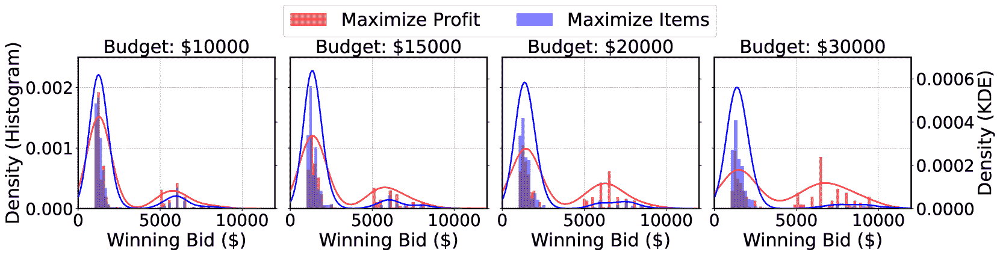

<!--yml

category: 未分类

日期：2025-01-11 13:04:18

-->

# 付诸实践：评估LLM代理在拍卖场景中的战略规划与执行

> 来源：[https://arxiv.org/html/2310.05746/](https://arxiv.org/html/2310.05746/)

姜杰·陈^($\spadesuit$), 袁思雨^($\spadesuit$), 叶荣^($\spadesuit$), Bodhisattwa Prasad Majumder^($\heartsuit$), Kyle Richardson^($\heartsuit$)

^($\spadesuit$)复旦大学 ^($\heartsuit$)Allen Institute for AI

jjchen19@fudan.edu.cn, kyler@allenai.org 该研究在姜杰·陈（Jiangjie Chen）于Allen Institute for AI实习期间完成。

###### 摘要

大型语言模型（LLM）的最新进展展示了先进的推理能力，但自然语言处理（NLP）的评估通常依赖于静态基准。要进行这样的评估，必须创建能够测试动态竞争场景中战略推理的环境，这些场景要求进行长期规划。我们推出了AucArena，一个全新的评估套件，模拟拍卖场景，选择这一设置是因为它具有高度的不确定性，涉及许多与资源和风险管理相关的技能，同时也便于评估。我们使用最先进的LLM进行控制实验，驱动竞标代理，以基准化其规划与执行能力。我们的研究表明，LLM（如GPT-4）具备参与拍卖所需的关键技能，如预算管理和目标遵守，这些能力随着适应性策略的使用而提高。这突显了LLM在竞争环境中建模复杂社会互动的潜力。然而，LLM表现的变异性以及偶尔被更简单方法超越，表明LLM设计仍有进一步发展的空间，同时也体现了我们模拟环境在持续测试和改进中的价值。¹¹1项目页面：[https://auction-arena.github.io](https://auction-arena.github.io).

## 1 引言

要实现自主性，代理需要能够独立做出决策、进行复杂的推理和规划，以及管理风险和资源等许多能力[[1](https://arxiv.org/html/2310.05746v4#bib.bib1), [2](https://arxiv.org/html/2310.05746v4#bib.bib2)]。大型语言模型（LLM）已经证明能够解决广泛的任务，而且每天都在推动可能性的边界[[3](https://arxiv.org/html/2310.05746v4#bib.bib3), [4](https://arxiv.org/html/2310.05746v4#bib.bib4)]。尽管这些模型被越来越多地视为自主代理（即LLM代理，[5](https://arxiv.org/html/2310.05746v4#bib.bib5), [6](https://arxiv.org/html/2310.05746v4#bib.bib6), [7](https://arxiv.org/html/2310.05746v4#bib.bib7)），一个关键问题仍然存在：LLM代理能否在动态环境中有效地进行顺序决策，以实现其战略目标？

尽管潜力显而易见[[8](https://arxiv.org/html/2310.05746v4#bib.bib8), [9](https://arxiv.org/html/2310.05746v4#bib.bib9)]，这些能力尚未经过严格评估。传统的自然语言处理推理和规划基准测试[[10](https://arxiv.org/html/2310.05746v4#bib.bib10), [11](https://arxiv.org/html/2310.05746v4#bib.bib11), [12](https://arxiv.org/html/2310.05746v4#bib.bib12)]主要在静态环境中评估智能体。然而，现实世界的场景要求自主智能体不仅仅对输入作出反应，还必须具备设定长期目标和计划的能力，并能不断修正其决策。为了弥补这一差距，最近的研究之一着重于将智能体沉浸在模拟环境中，这些环境模拟了现实世界的情境[[13](https://arxiv.org/html/2310.05746v4#bib.bib13), [14](https://arxiv.org/html/2310.05746v4#bib.bib14), [15](https://arxiv.org/html/2310.05746v4#bib.bib15), [16](https://arxiv.org/html/2310.05746v4#bib.bib16)]，这些环境通常集中于一组特定的技能。然而，设计这样的模拟可能需要大量的工程工作，并且在这些环境中进行细粒度评估往往是一个挑战。

在这项工作中，我们超越了简单的指令和以目标为导向的任务，涵盖了长期的序列决策策略。我们强调开发具有以下特征的环境：1）动态且内在不可预测，要求智能体具有适应能力；2）涉及有限的资源，使得竞争资源稀缺，奖励高度竞争；3）可量化，便于评估。受到拍卖动态的启发，拍卖在多智能体系统和博弈论中被广泛研究[[17](https://arxiv.org/html/2310.05746v4#bib.bib17), [18](https://arxiv.org/html/2310.05746v4#bib.bib18)]，我们引入了AucArena。拍卖为评估战略规划、资源分配、风险管理和竞争行为提供了沃土。在AucArena中，智能体充当模拟拍卖中的竞标者，将其战略能力付诸实践。这个环境能够使用数值指标（如利润）量化智能体的表现。

在AucArena中，我们设立了一个开放式拍卖，所有竞标者都拥有相同的信息，如图[1](https://arxiv.org/html/2310.05746v4#S1.F1 "Figure 1 ‣ 1 Introduction ‣ Put Your Money Where Your Mouth Is: Evaluating Strategic Planning and Execution of LLM Agents in an Auction Arena")所示。竞标代理人参与长期的顺序拍卖，并有固定预算，从而允许进行战略性考虑。每个代理人都会监控环境，并制定计划以实现其目标。为了促进与拍卖环境的互动，我们引入了四个基本功能：规划、竞标、信念更新和重新规划，每个功能通过LLM提示来实现[[19](https://arxiv.org/html/2310.05746v4#bib.bib19), [20](https://arxiv.org/html/2310.05746v4#bib.bib20)]。这些功能体现了代理人的战略规划、适应新信息的能力以及实时决策能力。我们系统地探索了各种LLM代理人的个体行为和集体行为，检查了它们的计划执行和适应能力，并深入研究了多目标多代理竞争的动态。以往的工作和一般的语言理解任务在语言学上更为复杂，而本研究虽然在语言上较为简洁，但由于需要理解和解析物体估值并进行博弈理论分析以做出最佳决策，因此更为复杂。

图1：AucArena的示意图：（A）展示了一个多轮的升价拍卖，拍卖师宣布最高出价，竞标者在私下推理后公开决定。（B）展示了一个竞标代理人结构，采用信念-愿望-意图模型，包括规划、竞标、信念更新和重新规划，信念和计划会随着每一轮拍卖的发展而调整。（C）提供了更新的信念和计划示例，展示了一个竞标者在推理后为物品分配优先级评分。

我们的贡献包括：1）创建了AucArena，这是一个创新的模拟拍卖环境，提出了一个竞标代理人框架，用于评估和衡量LLM代理人在动态和竞争性环境中的战略决策能力。2）建立了一个新的基准，用于评估LLM代理人的战略表现，特别强调它们管理有限资源、进行风险管理以及调整策略以实现长期目标的能力。3）通过AucArena，我们深入了解了LLM的战略规划和执行技能，强调了在竞争中适应性的重要性。我们展示了即使是像GPT-4这样优越的模型，也不总能在长期战略规划中占据优势，并揭示了多目标多代理竞争中的新动态。

## 2 相关工作

生成性代理 AI代理已经从简单的基于规则的系统发展到具有动态响应能力的交互式模型和神经网络[[21](https://arxiv.org/html/2310.05746v4#bib.bib21), [22](https://arxiv.org/html/2310.05746v4#bib.bib22), [23](https://arxiv.org/html/2310.05746v4#bib.bib23)]。最近，生成性大语言模型（LLM）代理的发展进一步拓宽了AI在自然语言理解和决策过程中的能力。[ [14](https://arxiv.org/html/2310.05746v4#bib.bib14)]将LLM与记忆和反思机制相结合，使得多个语言代理之间能够进行交互，并提供了关于LLM在社会模拟中作为代理表现的见解。此外，构建LLM代理也可以从各种提示技术机制[[19](https://arxiv.org/html/2310.05746v4#bib.bib19), [24](https://arxiv.org/html/2310.05746v4#bib.bib24)]中受益，这些机制有助于更好地分解复杂任务。自我反思或精炼机制[[20](https://arxiv.org/html/2310.05746v4#bib.bib20), [25](https://arxiv.org/html/2310.05746v4#bib.bib25)]使得模型能够从反馈中学习并不断改进。此外，LLM代理还可以通过利用外部工具和调用API[[26](https://arxiv.org/html/2310.05746v4#bib.bib26), [27](https://arxiv.org/html/2310.05746v4#bib.bib27)]来更好地完成复杂任务。在本研究中，我们从信念-欲望-意图（Belief-Desire-Intention）模型[[28](https://arxiv.org/html/2310.05746v4#bib.bib28), [29](https://arxiv.org/html/2310.05746v4#bib.bib29)]开始，构建了一个用于多物品拍卖的代理。

生成性智能体评估 近期的研究提出了多种互动环境，用于评估大型语言模型（LLM）智能体的能力。这些现有环境包括基于游戏的环境[[30](https://arxiv.org/html/2310.05746v4#bib.bib30), [31](https://arxiv.org/html/2310.05746v4#bib.bib31), [32](https://arxiv.org/html/2310.05746v4#bib.bib32), [33](https://arxiv.org/html/2310.05746v4#bib.bib33), [34](https://arxiv.org/html/2310.05746v4#bib.bib34)]，基于网页的互动环境[[35](https://arxiv.org/html/2310.05746v4#bib.bib35), [36](https://arxiv.org/html/2310.05746v4#bib.bib36), [37](https://arxiv.org/html/2310.05746v4#bib.bib37), [38](https://arxiv.org/html/2310.05746v4#bib.bib38)]，以及综合性评估基准[[15](https://arxiv.org/html/2310.05746v4#bib.bib15)]。除了评估单个智能体的能力外，还有一些环境提供了多个智能体互动并评估其能力的场景，比如合作任务[[39](https://arxiv.org/html/2310.05746v4#bib.bib39), [40](https://arxiv.org/html/2310.05746v4#bib.bib40), [41](https://arxiv.org/html/2310.05746v4#bib.bib41)]和竞争场景[[42](https://arxiv.org/html/2310.05746v4#bib.bib42), [43](https://arxiv.org/html/2310.05746v4#bib.bib43)]。近期的进展还集中在结合基于博弈论的战略行为[[44](https://arxiv.org/html/2310.05746v4#bib.bib44), [45](https://arxiv.org/html/2310.05746v4#bib.bib45), [46](https://arxiv.org/html/2310.05746v4#bib.bib46)]。在本研究中，我们利用多智能体拍卖作为评估LLM智能体在目标驱动环境中战略规划、执行和适应性的测试平台，采用精确且可衡量的指标进行评估。

## 3 拍卖场景

本节将介绍我们所使用的AucArena实现（$\mathsection$ [3.1](https://arxiv.org/html/2310.05746v4#S3.SS1 "3.1 Open Ascending-Price Auction ‣ 3 The Auction Arena ‣ Put Your Money Where Your Mouth Is: Evaluating Strategic Planning and Execution of LLM Agents in an Auction Arena")）以及智能体架构（$\mathsection$ [3.2](https://arxiv.org/html/2310.05746v4#S3.SS2 "3.2 Bidder Agent Architecture ‣ 3 The Auction Arena ‣ Put Your Money Where Your Mouth Is: Evaluating Strategic Planning and Execution of LLM Agents in an Auction Arena")）用于我们的仿真。我们还将介绍一些关于我们的仿真设计和实现的细节（$\mathsection$ [3.3](https://arxiv.org/html/2310.05746v4#S3.SS3 "3.3 Simulation Designs in AucArena ‣ 3 The Auction Arena ‣ Put Your Money Where Your Mouth Is: Evaluating Strategic Planning and Execution of LLM Agents in an Auction Arena")）。

### 3.1 开放递增价格拍卖

在本研究中，我们采用了英文拍卖，其中拍卖主持人按轮次展示物品，并接受参与者的递增竞标，直到没有更高的竞标被提出。所有竞标者的行为都是透明的且可观察的，以保证公平性。主要规则是，最高竞标者赢得物品。这样的过程如图[1](https://arxiv.org/html/2310.05746v4#S1.F1 "图1 ‣ 1 引言 ‣ 把钱放在嘴边：评估LLM代理在拍卖场中的战略规划与执行") (A) 所示，并包括以下组成部分：物品清单、拍卖主持人和竞标者。附录[A.1](https://arxiv.org/html/2310.05746v4#A1.SS1 "A.1 竞标历史 ‣ 附录A 示例：提示与竞标历史 ‣ 把钱放在嘴边：评估LLM代理在拍卖场中的战略规划与执行")中提供了一个拍卖日志示例。

物品 每个物品都有一个起始价格（例如，$1,000）用于竞标战，以及一个真实价值（$2,000）用于转售。我们创建了一个透明的竞标环境，简化了个人或情感价值等因素。

拍卖主持人 拍卖主持人是一个基于规则的代理，负责管理竞标流程，宣布赢家并执行拍卖规则，例如，竞标者不能超出预算，下一次竞标必须超过之前的最高竞标，且必须至少增加一定金额等。

竞标者 竞标者被操作化为LLM代理，每个代理都有自己的策略和资产。他们通过竞标或撤回参与拍卖，影响其他竞标者，从而塑造拍卖的动态和结果。正式地，给定一个有$N$个竞标者和$M$个物品的拍卖，我们使用指示符$x_{i,j}=1$表示竞标者$i$赢得物品$j$，否则$x_{i,j}=0$。物品$j$的最终竞标价格为$p_{j}$，其真实价值为$v_{j}$。为了简化，我们假设物品的真实价值对所有竞标者是相同的，但竞标者并不知晓该真实价值。竞标者通常旨在在多物品拍卖中最大化他们的利润，但也会被促使承担不同的目标。以利润驱动的竞标者$i$的效用函数为：

|  | $\textit{最大化}\quad U_{i}=\sum_{j=1}^{M}(v_{j}-p_{j})\cdot x_{i,j},\quad% \textit{约束条件}\ \ \sum_{j=1}^{M}p_{j}\cdot x_{i,j}\leq B_{i},\ \ \sum_{i=1}^{N}% x_{i,j}=1,x_{i,j}\in\{0,1\}$ |  |
| --- | --- | --- |

其中$B_{i}$是竞标者$i$的预算。请注意，竞标者在竞标失败时不会遭受任何预算损失，但如果最终竞标价格超过了物品的真实价值，则可能会产生负利润。此外，竞标者还可以追求其他目标，例如，确保获得特定物品或尽可能多的物品。

### 3.2 竞标者代理架构

本节概述了竞标代理架构，采用信念-欲望-意图（BDI）模型[[28](https://arxiv.org/html/2310.05746v4#bib.bib28), [29](https://arxiv.org/html/2310.05746v4#bib.bib29), [47](https://arxiv.org/html/2310.05746v4#bib.bib47)]来指导代理在拍卖过程中的行为和沟通。BDI模型从以下三个方面构建代理：1) 信念—对拍卖动态的知识，如预算、利润和已赢得的物品；2) 欲望—代理的拍卖目标，主要是利润最大化或特定物品的获得；3) 意图—代理为实现其欲望所制定的演变中的策略，能够根据新的拍卖信息进行调整。

该模型支撑了代理如何制定策略、适应并调整，拍卖结果会影响他们对未来拍卖的信念和意图。我们在代理架构中整合了四个核心行动：规划、竞标、信念更新和重新规划。通过使用零-shot提示[[48](https://arxiv.org/html/2310.05746v4#bib.bib48)]，我们可以与LLM代理进行互动，询问他们的策略和信念，例如他们对自身预算的理解，或者他们作出某些决策的原因，这也实现了一种信念跟踪[[49](https://arxiv.org/html/2310.05746v4#bib.bib49)]。有关指令提示的详细信息，请参见附录[A.2](https://arxiv.org/html/2310.05746v4#A1.SS2 "A.2 Instruction Prompts ‣ Appendix A Examples: Prompt and Bidding History ‣ Put Your Money Where Your Mouth Is: Evaluating Strategic Planning and Execution of LLM Agents in an Auction Arena")。

规划 有效的规划对于代理做出明智决策和经过深思熟虑的竞标策略至关重要，这些策略既能惠及当前，也能对未来产生积极影响。这需要在初步阶段制定竞标策略，其中代理$i$会考虑其预算($B_{i}$)和所有可用物品，并生成一个拍卖前的文本计划。这个计划作为战略指南，有助于在多物品拍卖过程中实现资源的有效分配。

竞标 在每一轮中，非领先的竞标者如果不是上一轮的最高竞标者，可以选择出价更高或退出，而上一轮的最高竞标者则跳过竞标。初始竞标从起始价格或以上开始，到了最后一轮，除了获胜的竞标，其余竞标均为零。在实践中，我们首先引导代理进行中间推理，然后再做出最终决策。

信念更新 上下文长度的限制使得无法将完整的竞标和对话历史纳入LLM中。为了弥补这一点，我们使用了拍卖状态的总结性动态记忆，如图[1](https://arxiv.org/html/2310.05746v4#S1.F1 "Figure 1 ‣ 1 Introduction ‣ Put Your Money Where Your Mouth Is: Evaluating Strategic Planning and Execution of LLM Agents in an Auction Arena")(C-1)所示，包括：1）剩余预算，2）总利润，以及3）赢得的竞标，采用JSON格式提供。代理的信念更新发生在竞标后，以管理令牌限制。代理的信念中的错误，例如错误判断商品或利润，会被拍卖师记录并修正（信念修正），以促进游戏的不中断进行，这类似于人类竞标者使用笔记本和计算器的方式。

重新规划 AucArena的一个重要特点是其动态性和不断变化的特性，使得早期的计划容易过时并无法执行。因此，我们为代理添加了重新规划的步骤，使其能够根据拍卖的进展和新的信息调整策略。在竞标一个商品后，代理会反思自己的信念和之前的计划，并制定一个新的文本计划。然后，拍卖师通过展示下一个商品，推动拍卖的进行，进入另一个竞标、信念更新和重新规划的迭代过程。

### 3.3 AucArena中的模拟设计

由于众多混杂因素，拍卖有时可能难以理解。因此，我们提出了三种设计方案，以简化并促进进一步的分析，同时保留未来研究中更复杂设计的可能性。

商品的起始价格和真实价值 在我们的模拟中，我们将商品的实际价值设定为其起始价格的两倍，例如，起始价格为 $1,000，而真实价值为 $2,000。因此，具有较高初始价格的商品如果被获取，将具有更大的获利潜力，这体现了这样一个原则：较高的投资和相关风险可能带来更高的回报，这使得对竞标者复杂策略的研究成为可能。每个人工商品的信息列出了在附录[A.3](https://arxiv.org/html/2310.05746v4#A1.SS3 "A.3 Information of Artificial Items in the Auction ‣ Appendix A Examples: Prompt and Bidding History ‣ Put Your Money Where Your Mouth Is: Evaluating Strategic Planning and Execution of LLM Agents in an Auction Arena")中。

过度估计与赢家诅咒 拍卖中的一个有趣方面是“赢家诅咒”，即获胜竞标的金额超过物品的实际价值，导致亏损——当竞标者缺乏精确的价值估算时，这是常见的情况，这在真实拍卖中也很典型[[50](https://arxiv.org/html/2310.05746v4#bib.bib50)]。为了复制这一现象，我们引入了物品价值的故意高估。默认情况下，我们设置竞标者的估计价值比实际价值高出10%。竞标者并不知道物品的实际价值，只能进行估算。这一设计使我们能够研究LLM代理的风险管理能力，在这种情况下，过度出价可能导致表面上的胜利，实际上却是战略性失败。

计划中的优先级评分 整合$\mathsection$[3.2](https://arxiv.org/html/2310.05746v4#S3.SS2 "3.2 竞标代理架构 ‣ 3 拍卖场景 ‣ 将金钱投入实践：评估LLM代理在拍卖场景中的战略规划与执行")中提到的计划对于评估代理的能力至关重要。简化来说，竞标者的未来竞标策略可以归结为对剩余物品的优先级排序。当拍卖进入第$t$个物品（物品$t$）时，竞标者$i$会为每个剩余物品$j$（$t\leq j\leq M$）分配一个三层优先级评分，表示为$r_{i,j}^{(t)}\in\{1,2,3\}$：

+   1 =

    该物品的重要性较小，若有必要可以放弃以节省资金；

+   2 =

    该物品具有一定价值，但不是最重要的，如果预算允许可以竞标；

+   3 =

    该物品极为重要，是最高优先级；

由LLMs直接生成的评分系统提供了一个可衡量竞标者前瞻性和适应性的实际指标。如图[1](https://arxiv.org/html/2310.05746v4#S1.F1 "图1 ‣ 1 引言 ‣ 将金钱投入实践：评估LLM代理在拍卖场景中的战略规划与执行")所示，代理首先对当前情况进行中间推理，然后制定结构化计划。

## 4 实验

### 4.1 实验设置

我们使用以下最先进的LLMs作为竞标代理的后端：1）GPT-3.5-Turbo[[51](https://arxiv.org/html/2310.05746v4#bib.bib51)](gpt-3.5-turbo-1106)；2）GPT-4[[52](https://arxiv.org/html/2310.05746v4#bib.bib52)](gpt-4-0613)和GPT-4-Turbo（gpt-4-1106-preview）；3）Google的Gemini 1.0 Pro[[53](https://arxiv.org/html/2310.05746v4#bib.bib53)]（gemini-1.0-pro）；4）Mistral[[54](https://arxiv.org/html/2310.05746v4#bib.bib54)]，由MistralAI开源的7亿版本（mistral-7b-instruct-v0.2）；5）Mixtral[[55](https://arxiv.org/html/2310.05746v4#bib.bib55)]，由MistralAI发布（mixtral-8x7b-instruct-v0.1），这是Mistral（7b）的专家混合版（8个专家）；6）规则竞标者作为基准，具有固定的每项物品的参与限制，具体取决于预算，每次竞标都将先前的最高竞标额提高一个最小值（10%），如果有竞标机会。

我们通过10次实验重复每个实验以计算平均表现，并将温度设置为$0$以实现相对确定性的行为。包括输入和输出在内，每个提示的平均长度大约为1500到1800个令牌，最长为约5000个令牌。拍卖师要求每次出价增量至少为起始价格的10%，以防止过长的竞价过程，且竞标者在整个拍卖过程中都知道物品顺序和起始价格。在每个拍卖游戏中，默认情况下，每个起始价格有2个物品，从$1,000到$5,000，共计10个物品，因此竞标者必须为不同价值的物品制定策略。

为了客观衡量并排名每个竞标者在如此竞争环境中的表现（即总利润），我们主要采用TrueSkill分数[[56](https://arxiv.org/html/2310.05746v4#bib.bib56), [57](https://arxiv.org/html/2310.05746v4#bib.bib57)]。使用TrueSkill分数的原因在于它通过贝叶斯统计估算动态技能水平（$\mu$），同时考虑到技能的真实不确定性（$\sigma$），这种方法通常用于在线游戏或竞赛中。

图2：不同竞标者代理在标准竞赛中基于物品起始价格的2种预算设置和3种物品顺序下的TrueSkill分数。

### 4.2 在标准竞赛中基准测试LLMs作为竞标者

我们将三方竞标者的游戏设定为AucArena中的标准竞赛，以基准测试竞标代理，游戏中有2个常量基准参与者和1个挑战者。通过固定两个竞标者并修改第三个，评估变得更加标准化，确保所有LLMs在相同的环境中进行评估。在这项工作中，我们使用GPT-4-Turbo和GPT-3.5-Turbo作为基准，这两个模型是社区中常被研究的。我们在AucArena中设计了6个（2$\times$3）设置：2组预算，分别为$20,000和$40,000；以及3种物品顺序，包括随机、升序和降序的起始价格顺序。

图3：不同类型竞标者的信念误差。

根据图[2](https://arxiv.org/html/2310.05746v4#S4.F2 "图2 ‣ 4.1 实验设置 ‣ 4 实验 ‣ 证明你的话是可信的：评估LLM代理在拍卖场中的战略规划与执行")，可以观察到不同代理的一般趋势，变化较小。GPT-4的得分高于其他LLM代理，表明在给定条件下，它可能在分配效率或策略上更为有效；Gemini和Mixtral在大多数设置中也具有竞争力。有趣的是，它们在面对不同商品顺序时表现并不一致，例如，当商品按照从便宜到昂贵的顺序排列时，GPT-4的表现通常较差。然而，规则投标者建立了一个有趣且强大的基准，在大多数设置中超越了大多数LLM。在附录[B.1](https://arxiv.org/html/2310.05746v4#A2.SS1 "B.1 人类表现 ‣ 附录B 额外结果 ‣ 证明你的话是可信的：评估LLM代理在拍卖场中的战略规划与执行")中，我们展示了，与GPT-4-Turbo相比，当商品以随机顺序呈现时，人类投标者表现较差，但在商品顺序可以预见时，无论是降序还是升序，他们的表现优于其他投标者。我们还展示了，GPT-3.5-Turbo即使在剩余预算足够的情况下，也经常退出竞标，而GPT-4-Turbo未能采用复杂策略以击败其竞争对手。

信念跟踪中的修正错误 准确一致地监控拍卖环境对于动态拍卖中的成功至关重要。因此，我们跟踪所有参与者的失败竞标和错误信念，作为大语言模型（LLM）状态跟踪能力的指标。具体来说：1）失败竞标（%）衡量竞标过程中的错误率，例如低于上一轮最高竞标价格或超出预算的竞标；2）信念错误（%）评估关于剩余预算、个人获胜竞标和其他代理状态的信念更新的准确性。请注意，拍卖人会纠正竞标者的信念错误（$\mathsection$ [3.2](https://arxiv.org/html/2310.05746v4#S3.SS2 "3.2 竞标者代理架构 ‣ 3 拍卖竞技场 ‣ 把你的钱投到你说的地方：评估大语言模型代理在拍卖竞技场中的战略规划和执行")）在AucArena中，这使我们能够集中注意力于代理的规划和执行能力。我们引入了修正失败率（$\textit{CFR}=F/(C+F)$），其中$F$表示失败的次数，$C$是正确操作的次数，由于最终修正了失败的操作，这一常数得以保持。如图[3](https://arxiv.org/html/2310.05746v4#S4.F3 "图3 ‣ 4.2 将大语言模型作为竞标者的基准测试 ‣ 4 实验 ‣ 把你的钱投到你说的地方：评估大语言模型代理在拍卖竞技场中的战略规划和执行")所示，GPT-4表现出卓越的性能，错误率最低为0.21%，而其他模型由于较弱的上下文理解和算术能力，表现出较高的事实错误率。需要注意的是，LLaMA-2-13b没有失败竞标，因为它每次都会选择撤回。

### 4.3 策略与行为动态

为了理解竞标代理的策略和行为，我们将仔细分析他们的竞标过程，特别关注规划、执行和忠诚度。

图4：在每轮竞标前，基于升序（上图）或降序（下图）物品顺序，预算为20,000美元时，平均优先级分数及其变化的热力图。

规划分析：可视化长期策略 战略行为涉及未来资源的保护。我们展示了对于预算为20,000美元的竞标代理，在每轮竞标后项目优先级变化的可视化。图[4](https://arxiv.org/html/2310.05746v4#S4.F4 "图4 ‣ 4.3 策略与行为动态 ‣ 4 实验 ‣ 跨越言辞：评估大规模语言模型（LLM）代理在拍卖场中的战略规划与执行")展示了一些有趣的发现：1）当项目按升序排列时（图[10](https://arxiv.org/html/2310.05746v4#A2.F10 "图10 ‣ B.3 执行分析：可视化竞标行为 ‣ 附录B 其他结果 ‣ 跨越言辞：评估大规模语言模型（LLM）代理在拍卖场中的战略规划与执行")(A)），GPT-4在初期展现了克制，选择将预算保留以应对未来机会，而其他模型则更快地分配预算。2）当项目按降序排列时（图[10](https://arxiv.org/html/2310.05746v4#A2.F10 "图10 ‣ B.3 执行分析：可视化竞标行为 ‣ 附录B 其他结果 ‣ 跨越言辞：评估大规模语言模型（LLM）代理在拍卖场中的战略规划与执行")(B)），大多数模型表现出更贪婪地花费预算的倾向，即优先考虑昂贵的项目。然而，GPT-4采取了更加谨慎的策略，避免在早期参与，反而将预算保留给随后的3-4个项目。3）Mistral-7b存在一些离群值，这是由代理所犯的错误，即规划过去的项目，而非未来的项目。附录[B.2](https://arxiv.org/html/2310.05746v4#A2.SS2 "B.2 可视化长期策略：20,000美元预算 ‣ 附录B 其他结果 ‣ 跨越言辞：评估大规模语言模型（LLM）代理在拍卖场中的战略规划与执行")展示了在预算为40,000美元时的类似结果。与图4中的发现相呼应，在附录[B.3](https://arxiv.org/html/2310.05746v4#A2.SS3 "B.3 执行分析：可视化竞标行为 ‣ 附录B 其他结果 ‣ 跨越言辞：评估大规模语言模型（LLM）代理在拍卖场中的战略规划与执行")中，我们还可视化了在标准竞争中的最终TrueSkill分数背后隐藏的竞标代理的竞标行为。证据显示，GPT-4根据预算规模和项目顺序量身定制其策略，当预算允许时，对高价值项目表现出更强的竞争力。相反，其他模型则未能清晰地展现出这种适应性行为。

图5：各个代理的出价增量百分比，分为5个不同的区间。每个模型的柱状图被分段，反映了这些区间内出价的分布情况。

执行分析：出价激进性 评估激进性水平有助于预测并战略性地规划未来的出价，从而在不大幅超付的情况下超越竞争对手。出价增量百分比（BIP）作为评估竞争驱动的激进性的关键指标，表示新出价相较于竞标者先前最高报价的百分比增幅。理想情况下，在出价超过前次出价10%以上的情形下，谨慎的竞标者会尽量将BIP控制在最低水平，以避免赢家的诅咒。图[5](https://arxiv.org/html/2310.05746v4#S4.F5 "Figure 5 ‣ 4.3 Strategies and Behavioral Dynamics ‣ 4 Experiments ‣ Put Your Money Where Your Mouth Is: Evaluating Strategic Planning and Execution of LLM Agents in an Auction Arena")描绘了各模型的BIP分布。GPT-4倾向于最小的出价增量，体现了一种保守理性的竞标策略，旨在避免过度支付。相比之下，Mistral-7b和GPT-3.5-Turbo则显示出大量的出价位于[11%，$\infty$)增量区间，表明它们具有更激进、风险容忍度较高的竞标行为。区间$[0,10)$表示某一物品的第一次出价增幅，该出价并不要求相对于起始价格增加10%。

| 模型 | 初始值 ($r_{i,j}^{(1)}$) | 当前值 ($r_{i,j}^{(j)}$) |
| --- | --- | --- |
| $\rho(r,n)$ | $\rho(r,x)$ | $\rho(r,n)$ | $\rho(r,x)$ |
| LLaMA-2-13b | - | - | - | - |
| Mistral-7b | .1252 | .2728 | .1139 | .2779 |
| Mixtral-8x7b | .3553 | .4028 | .3994 | .4327 |
| Gemini-1.0-Pro | .2457 | .1349 | .2776 | .2442 |
| GPT-3.5-Turbo | .1849 | .0430 | .1494 | .0801 |
| GPT-4 | .3741 | .3959 | .6318 | .6443 |
| GPT-4-Turbo | .2348 | .0715 | .6423 | .4328 |

图6：Spearman相关性$\rho(\cdot)$，表示物品在竞标者$i$的初始或当前计划中的优先级得分与竞标者$j$在该物品上的参与次数$n_{i,j}$以及是否获胜的指示$x_{i,j}$之间的关系。LLaMA-2-13b由于其不断撤标，未进行填写。

图7：在3个由相同LLM驱动但具有不同模块设计的智能体之间的竞争后的TrueSkill得分。

图8：两组竞标者之间的竞争：2名盈利竞标者（红色）和2名物品竞标者（蓝色）。我们增加了所有竞标者的预算，并展示了直方图和核密度估计的变化，显示了两组竞标者的获胜出价。

代理在执行过程中是否遵循自己的计划？ 为了评估大语言模型（LLMs）在拍卖过程中是否遵循并调整其策略，我们分析了它们的竞标行为与分配的物品优先级之间的关联，重点关注参与度和获胜情况。我们对竞标者分配给物品的优先级分数与拍卖结果进行相关性分析。物品的优先级分数在两个时刻进行检查：开始时（$r_{i,j}^{(1)}$）和在对该物品进行竞标之前（$r_{i,j}^{(j)}$），以便检查策略是否在拍卖过程中发生变化。行动通过该物品上的参与次数（竞标次数）（$n_{i,j}$）以及获胜竞标的指示（$x_{i,j}\in\{0,1\}$）来量化。Spearman相关系数，$\rho(r,n)$ 和 $\rho(r,x)$，帮助我们分析这些关系。表[7](https://arxiv.org/html/2310.05746v4#S4.F7 "Figure 7 ‣ 4.3 Strategies and Behavioral Dynamics ‣ 4 Experiments ‣ Put Your Money Where Your Mouth Is: Evaluating Strategic Planning and Execution of LLM Agents in an Auction Arena")中的结果显示，当前的计划与行为之间的相关性更强，突出了在变化的拍卖环境中调整计划的重要性。随着时间的推移，模型如何将其竞标与优先级匹配表现出明显的变异性。GPT-4显示出较高的相关性，表明它在应对动态拍卖场景时，能够有效调整物品的优先级。相反，像GPT-3.5-Turbo这样的模型显示出较低的相关性，表明它们的策略较为僵化，或者优先级与行动之间的匹配度较弱。

### 4.4 模块化分析

这项实验研究了LLM架构变化的影响，以及它们在具有多个竞争目标的环境中的表现。

规划与重新规划的分析 在一项聚焦于不同代理模块对LLM在拍卖中表现影响的消融研究中，我们旨在找出对其成功至关重要的组成部分。我们创建了一个竞争性设置，包含三个代理，这些代理均由相同的LLM驱动，但每个代理采用三种不同的策略之一：1）自适应竞标者：根据$\mathsection$ [3.2](https://arxiv.org/html/2310.05746v4#S3.SS2 "3.2 Bidder Agent Architecture ‣ 3 The Auction Arena ‣ Put Your Money Where Your Mouth Is: Evaluating Strategic Planning and Execution of LLM Agents in an Auction Arena")操作；2）静态竞标者：没有重新规划模块；3）无计划竞标者：既没有规划也没有重新规划模块。根据图[7](https://arxiv.org/html/2310.05746v4#S4.F7 "Figure 7 ‣ 4.3 Strategies and Behavioral Dynamics ‣ 4 Experiments ‣ Put Your Money Where Your Mouth Is: Evaluating Strategic Planning and Execution of LLM Agents in an Auction Arena")，保持和更新计划可以提高拍卖表现。依赖静态计划有时会导致比完全不规划更差的结果，尤其是在预算为$40,000时，因为资源充足，可以促进贪婪的竞标（没有计划）。

目标分析：多目标竞争中的新兴小众专门化 就像生态系统中不同物种在独特的小众中生存一样，多智能体环境使得代理能够追求专业化目标。在拍卖的背景下，参与者的目标通常不仅仅是最大化利润。我们模拟了两种代理类型：1）利润竞标者，专注于实现高利润，2）物品竞标者，专注于获取最多的物品。这些目标会导致不同的结果；例如，确保最多的物品并不等同于最高的利润，反之亦然。预计利润竞标者会瞄准昂贵且有利可图的物品，而物品竞标者则应寻求更便宜、更易获取的物品。为了探索这一点，我们将4个代理分成2组——2个利润竞标者和2个物品竞标者，包括GPT-4和GPT-3.5-Turbo代理——并在拍卖中改变它们的预算，拍卖20个物品，其中包括4个昂贵的物品（起价$5,000）和16个便宜的物品（起价$1,000）。图[8](https://arxiv.org/html/2310.05746v4#S4.F8 "Figure 8 ‣ 4.3 Strategies and Behavioral Dynamics ‣ 4 Experiments ‣ Put Your Money Where Your Mouth Is: Evaluating Strategic Planning and Execution of LLM Agents in an Auction Arena")展示了获胜竞标的密度直方图和核密度估计图，突出显示了代理的细分专业化。随着预算增加到$30,000，两组之间的差异变得更加明显，每组都专门针对便宜或昂贵的物品。在有限预算（$10,000）下，利润竞标者更多地竞争便宜物品，给物品竞标者提供了获得更有利可图物品的机会。

## 5 结论

本文提出了AucArena来评估最先进的LLM作为拍卖竞标代理，揭示了它们在各种竞争性拍卖场景中策略有效性的关键见解。通过对策略和行为动态的全面分析，我们展示了战略规划和重新规划能力的重要性，并强调了在变化环境中跟踪LLM代理适应性能力的重要性。此外，消融研究和对小众专业化的探索为LLM在竞争场景中的多面角色提供了宝贵的视角。我们的研究提倡进一步创新性地操作我们的仿真方法，以探索这些现象并增强LLM在建模复杂社会动态中的潜力。

## 致谢

我们感谢匿名评审者提供的建设性意见。感谢艾伦人工智能研究所的Aristo团队对本项目的宝贵反馈和支持，特别是：Peter Clark、Ashish Sabharwal、Tushar Khot、Nathaniel Weir、Oyvind Tafjord、Peter Hase 和 Sarah Wiegreffe。我们还感谢爱丁堡大学的姚富、伊利诺伊大学香槟分校的彭浩以及卡尔斯鲁厄理工学院的Gregor Betz，在本项目各个阶段提供了有益的讨论，帮助塑造了这个项目。此项工作得到了艾伦人工智能研究所的支持。

## 参考文献

+   [1] Luc Steels。机器人何时是智能自主智能体？机器人与自主系统，15(1-2):3–9，1995年。

+   [2] Stan Franklin 和 Art Graesser。它是一个智能体，还是只是一个程序？：自主智能体的分类法。发表于《国际智能体理论、架构和语言研讨会》，第21–35页，Springer，1996年。

+   [3] Jason Wei, Yi Tay, Rishi Bommasani, Colin Raffel, Barret Zoph, Sebastian Borgeaud, Dani Yogatama, Maarten Bosma, Denny Zhou, Donald Metzler, Ed H. Chi, Tatsunori Hashimoto, Oriol Vinyals, Percy Liang, Jeff Dean, 和 William Fedus。大型语言模型的新兴能力。机器学习研究杂志，2022年。调查认证。

+   [4] Sébastien Bubeck, Varun Chandrasekaran, Ronen Eldan, Johannes Gehrke, Eric Horvitz, Ece Kamar, Peter Lee, Yin Tat Lee, Yuanzhi Li, Scott Lundberg, 等人。人工通用智能的火花：关于GPT-4的早期实验。arXiv预印本 arXiv:2303.12712，2023年。

+   [5] Lei Wang, Chen Ma, Xueyang Feng, Zeyu Zhang, Hao Yang, Jingsen Zhang, Zhiyuan Chen, Jiakai Tang, Xu Chen, Yankai Lin, 等人。基于大型语言模型的自主智能体调查。arXiv预印本 arXiv:2308.11432, 2023。

+   [6] Theodore Sumers, Shunyu Yao, Karthik Narasimhan, 和 Thomas L Griffiths。语言智能体的认知架构。arXiv预印本 arXiv:2309.02427，2023年。

+   [7] Zhiheng Xi, Wenxiang Chen, Xin Guo, Wei He, Yiwen Ding, Boyang Hong, Ming Zhang, Junzhe Wang, Senjie Jin, Enyu Zhou, Rui Zheng, Xiaoran Fan, Xiao Wang, Limao Xiong, Yuhao Zhou, Weiran Wang, Changhao Jiang, Yicheng Zou, Xiangyang Liu, Zhangyue Yin, Shihan Dou, Rongxiang Weng, Wensen Cheng, Qi Zhang, Wenjuan Qin, Yongyan Zheng, Xipeng Qiu, Xuanjing Huang, 和 Tao Gui。基于大型语言模型的智能体的崛起与潜力：一项调查。2023年。

+   [8] Yohei Nakajima。Babyagi。 [https://github.com/yoheinakajima/babyagi](https://github.com/yoheinakajima/babyagi)，2023年。

+   [9] Significant-Gravitas。Autogpt。 [https://github.com/Significant-Gravitas/Auto-GPT](https://github.com/Significant-Gravitas/Auto-GPT)，2023年。

+   [10] Mor Geva, Daniel Khashabi, Elad Segal, Tushar Khot, Dan Roth, 和 Jonathan Berant。亚里士多德使用过笔记本电脑吗？一个包含隐性推理策略的问题回答基准。计算语言学学会交易，9:346–361，2021年。

+   [11] Keisuke Sakaguchi, Chandra Bhagavatula, Ronan Le Bras, Niket Tandon, Peter Clark, 和 Yejin Choi. proScript：部分有序脚本生成。发表于计算语言学协会发现：EMNLP 2021，页面2138–2149，多米尼加共和国蓬塔卡纳，2021年。计算语言学协会。

+   [12] Siyu Yuan, Jiangjie Chen, Ziquan Fu, Xuyang Ge, Soham Shah, Charles Jankowski, Yanghua Xiao, 和 Deqing Yang. 从大语言模型中提炼脚本知识以进行约束语言规划。在第61届计算语言学协会年会论文集（第1卷：长篇论文），页面4303–4325，2023年7月，加拿大多伦多。计算语言学协会。

+   [13] Ruoyao Wang, Peter Jansen, Marc-Alexandre Côté, 和 Prithviraj Ammanabrolu. ScienceWorld：你的代理比五年级学生聪明吗？发表于2022年自然语言处理经验方法会议论文集，页面11279–11298，阿布扎比，阿联酋，2022年12月。计算语言学协会。

+   [14] Joon Sung Park, Joseph C. O’Brien, Carrie J. Cai, Meredith Ringel Morris, Percy Liang, 和 Michael S. Bernstein. 生成代理：人类行为的互动模拟。在第36届ACM用户界面软件与技术年会（UIST '23）上，UIST '23，美国纽约，2023年。计算机学会。

+   [15] Xiao Liu, Hao Yu, Hanchen Zhang, Yifan Xu, Xuanyu Lei, Hanyu Lai, Yu Gu, Yuxian Gu, Hangliang Ding, Kai Men, Kejuan Yang, Shudan Zhang, Xiang Deng, Aohan Zeng, Zhengxiao Du, Chenhui Zhang, Shengqi Shen, Tianjun Zhang, Yu Su, Huan Sun, Minlie Huang, Yuxiao Dong, 和 Jie Tang. Agentbench：评估LLM作为代理的能力。arXiv, abs/2308.03688, 2023年。

+   [16] Jian Xie, Kai Zhang, Jiangjie Chen, Tinghui Zhu, Renze Lou, Yuandong Tian, Yanghua Xiao, 和 Yu Su. Travelplanner：一个基准用于现实世界中语言代理的规划。arXiv预印本 arXiv:2402.01622, 2024年。

+   [17] Jean-Jacques Laffont. 博弈论与经验经济学：拍卖数据的案例。欧洲经济评论, 41(1):1–35, 1997。

+   [18] Karl Tuyls 和 Simon Parsons. 进化博弈论告诉我们关于多智能体学习的知识。人工智能, 171(7):406–416, 2007年。

+   [19] Jason Wei, Xuezhi Wang, Dale Schuurmans, Maarten Bosma, brian ichter, Fei Xia, Ed H. Chi, Quoc V Le, 和 Denny Zhou. 思维链提示在大语言模型中的推理引发作用。在 Alice H. Oh, Alekh Agarwal, Danielle Belgrave, 和 Kyunghyun Cho 编辑的《神经信息处理系统进展》一书中，2022年。

+   [20] Shunyu Yao, Jeffrey Zhao, Dian Yu, Nan Du, Izhak Shafran, Karthik R Narasimhan, 和 Yuan Cao. React：在语言模型中协同推理与行动。发表于 ICLR 2022会议。

+   [21] Volodymyr Mnih, Koray Kavukcuoglu, David Silver, Alex Graves, Ioannis Antonoglou, Daan Wierstra, 和 Martin Riedmiller. 使用深度强化学习玩Atari游戏。arXiv预印本 arXiv:1312.5602, 2013年。

+   [22] David Silver, Aja Huang, Chris J Maddison, Arthur Guez, Laurent Sifre, George Van Den Driessche, Julian Schrittwieser, Ioannis Antonoglou, Veda Panneershelvam, Marc Lanctot 等人。通过深度神经网络和树搜索掌握围棋。自然，529(7587)：484–489，2016年。

+   [23] David Silver, Julian Schrittwieser, Karen Simonyan, Ioannis Antonoglou, Aja Huang, Arthur Guez, Thomas Hubert, Lucas Baker, Matthew Lai, Adrian Bolton 等人。无需人类知识即可掌握围棋。自然，550(7676)：354–359，2017年。

+   [24] Shunyu Yao, Dian Yu, Jeffrey Zhao, Izhak Shafran, Thomas L Griffiths, Yuan Cao 和 Karthik Narasimhan。思维树：通过大型语言模型进行深思熟虑的问题解决。arXiv预印本arXiv:2305.10601，2023年。

+   [25] Noah Shinn, Federico Cassano, Beck Labash, Ashwin Gopinath, Karthik Narasimhan 和 Shunyu Yao。Reflexion：带有语言强化学习的语言代理。arXiv预印本arXiv:2303.11366，2023年。

+   [26] Timo Schick, Jane Dwivedi-Yu, Roberto Dessì, Roberta Raileanu, Maria Lomeli, Luke Zettlemoyer, Nicola Cancedda 和 Thomas Scialom。Toolformer：语言模型可以自我学习使用工具。arXiv预印本arXiv:2302.04761，2023年。

+   [27] Shibo Hao, Tianyang Liu, Zhen Wang 和 Zhiting Hu。ToolkenGPT：通过工具嵌入增强冻结语言模型。见于《第37届神经信息处理系统会议》，2023年。

+   [28] Michael Bratman。意图、计划与实践理性。1987年。

+   [29] Michael Georgeff, Barney Pell, Martha Pollack, Milind Tambe 和 Michael Wooldridge。信念-欲望-意图模型（BDI）代理。见于《智能代理V：代理理论、架构与语言：第五届国际研讨会，ATAL’98，法国巴黎，1998年7月4日至7日》，第5卷，页码1–10。Springer，1999年。

+   [30] Marc-Alexandre Côté, Akos Kádár, Xingdi Yuan, Ben Kybartas, Tavian Barnes, Emery Fine, James Moore, Matthew Hausknecht, Layla El Asri, Mahmoud Adada 等人。Textworld: 一种用于基于文本的游戏的学习环境。见于《计算机游戏：第七届研讨会，CGW 2018》，与第27届国际人工智能大会（IJCAI 2018）共同举办，2018年7月13日，瑞典斯德哥尔摩，修订版精选论文7，页码41–75。Springer，2019年。

+   [31] Aidan O’Gara。被欺骗：语言模型的基于文本的游戏中的欺骗与合作。arXiv预印本arXiv:2308.01404，2023年。

+   [32] Guanzhi Wang, Yuqi Xie, Yunfan Jiang, Ajay Mandlekar, Chaowei Xiao, Yuke Zhu, Linxi Fan 和 Anima Anandkumar。Voyager：一个开放式的具身代理，结合大型语言模型。arXiv预印本arXiv: Arxiv-2305.16291，2023年。

+   [33] Kranti Chalamalasetti, Jana Götze, Sherzod Hakimov, Brielen Madureira, Philipp Sadler 和 David Schlangen。clembench：利用游戏玩法评估作为对话代理的优化聊天语言模型。arXiv预印本arXiv:2305.13455，2023年。

+   [34] 段锦昊、张仁名、詹姆斯·迪芬德费尔、Bhavya Kailkhura、孙立超、Elias Stengel-Eskin、Mohit Bansal、陈天龙和徐凯迪。Gtbench：通过博弈论评估揭示大型语言模型的战略推理局限性。arXiv预印本 arXiv:2402.12348，2024年。

+   [35] 姚顺宇、陈浩、杨俊和Karthik Narasimhan。Webshop：面向具有基础语言代理的可扩展现实世界网络交互。神经信息处理系统进展，35:20744–20757，2022年。

+   [36] 邓翔、顾宇、郑博源、陈世杰、塞缪尔·史蒂文斯、王博实、孙欢和苏宇。Mind2web：面向网络的通用代理。发表于第三十七届神经信息处理系统会议数据集与基准跟踪，2023年。

+   [37] 周舒彦、Frank F Xu、朱浩、周旭辉、罗伯特·洛、Abishek Sridhar、程先怡、Yonatan Bisk、Daniel Fried、Uri Alon 等人。Webarena：构建自主代理的真实网络环境。arXiv预印本 arXiv:2307.13854，2023年。

+   [38] 赵阳、刘嘉轩、韩宇程、陈昕、黄泽彪、傅斌和余刚。Appagent：将多模态代理作为智能手机用户。arXiv预印本 arXiv:2312.13771，2023年。

+   [39] 陈伟泽、苏玉生、左敬维、杨程、袁晨飞、钱晨、陈志民、秦宇佳、卢雅熙、谢若冰 等人。Agentverse：促进多代理协作并探索代理中的涌现行为。arXiv预印本 arXiv:2308.10848，2023年。

+   [40] Saaket Agashe、范月、王欣·埃里克。评估大型语言模型中的多代理协调能力。arXiv预印本 arXiv:2310.03903，2023年。

+   [41] 钱晨、崔欣、杨程、陈伟泽、苏玉生、徐聚源、刘志远和孙茂松。软件开发的交流代理。arXiv预印本 arXiv:2307.07924，2023年。

+   [42] 赵琴琳、王金东、张一轩、金一乔、朱凯杰、陈浩和谢星。Competeai：理解基于大型语言模型的代理中的竞争行为。arXiv预印本 arXiv:2310.17512，2023年。

+   [43] 谷周宏、朱晓轩、郭浩然、张林、蔡音、沈浩、陈江杰、叶哲宇、戴逸飞、高岩 等人。代理群聊：一种互动群聊模拟，旨在更好地引出集体涌现行为。arXiv预印本 arXiv:2403.13433，2024年。

+   [44] Ian Gemp、Yoram Bachrach、Marc Lanctot、Roma Patel、Vibhavari Dasagi、Luke Marris、Georgios Piliouras 和 Karl Tuyls。将状态作为策略的字符串：通过博弈论求解器引导语言模型。arXiv预印本 arXiv:2402.01704，2024年。

+   [45] Athul Paul Jacob、Abhishek Gupta 和 Jacob Andreas。建模具有潜在推理预算的有限理性代理。发表于第十二届国际学习表示会议，2024年。

+   [46] Jen-tse Huang, Eric John Li, Man Ho Lam, Tian Liang, Wenxuan Wang, Youliang Yuan, Wenxiang Jiao, Xing Wang, Zhaopeng Tu 和 Michael R Lyu. 我们在LLM决策能力上有多远？评估LLM在多代理环境中的游戏能力. arXiv 预印本 arXiv:2403.11807, 2024。

+   [47] Jacob Andreas. 语言模型作为代理模型. 在《计算语言学会发现：EMNLP 2022》论文集，5769–5779页，阿布扎比，阿联酋，2022年12月。计算语言学会。

+   [48] Takeshi Kojima, Shixiang Shane Gu, Machel Reid, Yutaka Matsuo 和 Yusuke Iwasawa. 大型语言模型是零-shot推理者. 在 Alice H. Oh, Alekh Agarwal, Danielle Belgrave 和 Kyunghyun Cho 编辑的《神经信息处理系统进展》一书中，2022年。

+   [49] Kyle Richardson, Ronen Tamari, Oren Sultan, Reut Tsarfaty, Dafna Shahaf 和 Ashish Sabharwal. 用于建模和追踪中间信念的断点变压器. arXiv 预印本 arXiv:2211.07950, 2022。

+   [50] John H Kagel 和 Dan Levin. 获胜者的诅咒与公共信息在共同价值拍卖中的作用. 《美国经济评论》，894–920 页，1986。

+   [51] OpenAI. Chatgpt, 2022.

+   [52] OpenAI. GPT-4 技术报告. ArXiv, abs/2303.08774, 2023。

+   [53] Gemini Team, Rohan Anil, Sebastian Borgeaud, Yonghui Wu, Jean-Baptiste Alayrac, Jiahui Yu, Radu Soricut, Johan Schalkwyk, Andrew M Dai, Anja Hauth 等人. Gemini: 一类高效的多模态模型家族. arXiv 预印本 arXiv:2312.11805, 2023。

+   [54] Albert Q Jiang, Alexandre Sablayrolles, Arthur Mensch, Chris Bamford, Devendra Singh Chaplot, Diego de las Casas, Florian Bressand, Gianna Lengyel, Guillaume Lample, Lucile Saulnier 等人. Mistral 7b. arXiv 预印本 arXiv:2310.06825, 2023。

+   [55] Mistral AI团队. Mixtral专家系统, 2023年12月。访问时间：2023年12月15日。

+   [56] Ralf Herbrich, Tom Minka 和 Thore Graepel. Trueskill™: 一种贝叶斯技能评分系统. 在 B. Schölkopf, J. Platt 和 T. Hoffman 编辑的《神经信息处理系统进展》一书中，第19卷。MIT出版社，2006年。

+   [57] Tom Minka, Ryan Cleven 和 Yordan Zaykov. Trueskill 2: 一种改进的贝叶斯技能评分系统. 技术报告 MSR-TR-2018-8, 微软, 2018年3月。

## 附录 A 示例：提示和竞标历史

### A.1 竞标历史

一项竞标历史的示例见于列表 LABEL:lst:bidding_history，该示例跳过了竞标者的推理过程，仅展示了结果。

列表 1: 三个竞标者对三件物品进行竞标的拍卖日志示例。

[⬇](data:text/plain;base64,IyMgQXVjdGlvbiBMb2cKCiMjIyAxLiBHYWRnZXQgQiwgc3RhcnRpbmcgYXQgJDEwMDAuCgojIyMjIDFzdCBiaWQ6CgoqIEJpZGRlciAxOiAkMTIwMAoqIEJpZGRlciAyOiAkMTAwMAoqIE5vbmUgYmlkCgojIyMjIDJuZCBiaWQ6CgoqIEJpZGRlciAxOiAkMTMwMAoqIEJpZGRlciAyOiBXaXRoZHJldwoKIyMjIyAzcmQgYmlkOgoKKiBCaWRkZXIgMzogJDE0MDAKCiMjIyMgNHRoIGJpZDoKCiogQmlkZGVyIDE6ICQxNTAwCgojIyMjIDV0aCBiaWQ6CgoqIEJpZGRlciAzOiBXaXRoZHJldwoKIyMjIyBIYW1tZXIgcHJpY2UgKHRydWUgdmFsdWUpOgoKKiBCaWRkZXIgMTogJDE1MDAgKCQyMDAwKQoKIyMjIDIuIFRoaW5nYW1hamlnIEMsIHN0YXJ0aW5nIGF0ICQxMDAwLgoKIyMjIyAxc3QgYmlkOgoKKiBCaWRkZXIgMTogJDExMDAKKiBCaWRkZXIgMjogJDEyMDAKKiBCaWRkZXIgMzogJDExMDAKCiMjIyMgMm5kIGJpZDoKCiogQmlkZGVyIDE6IFdpdGhkcmV3CiogQmlkZGVyIDI6IFdpdGhkcmV3CgojIyMjIEhhbW1lciBwcmljZSAodHJ1ZSB2YWx1ZSk6CgoqIEJpZGRlciAzOiAkMjAwMCAoJDIwMDApCgoKIyMjIyMgMy4gV2lkZ2V0IEEsIHN0YXJ0aW5nIGF0ICQxMDAwLgoKIyMjIyAxc3QgYmlkOgoKKiBCaWRkZXIgMTogJDExMDAKKiBCaWRkZXIgMjogJDEyMDAKKiBCaWRkZXIgMzogJDExMDAKCiMjIyMgMm5kIGJpZDoKCiogQmlkZGVyIDE6IFdpdGhkcmV3CiogQmlkZGVyIDM6IFdpdGhkcmV3CgojIyMjIEhhbW1lciBwcmljZSAodHJ1ZSB2YWx1ZSk6CgoqIEJpZGRlciAyOiAkMTIwMCAoJDIwMDApCgoKIyMgUGVyc29uYWwgUmVwb3J0CgoqIEJpZGRlciAxLCBzdGFydGluZyB3aXRoICQyMDAwMCwgaGFzIHdvbiAxIGl0ZW1zIGluIHRoaXMgYXVjdGlvbiwgd2l0aCBhIHRvdGFsIHByb2ZpdCBvZiAkNTAwLjoKICAqIFdvbiBHYWRnZXQgQiBhdCAkMTUwMCBvdmVyICQxMDAwLCB3aXRoIGEgdHJ1ZSB2YWx1ZSBvZiAkMjAwMC4KCiogQmlkZGVyIDIsIHN0YXJ0aW5nIHdpdGggJDIwMDAwLCBoYXMgd29uIDEgaXRlbXMgaW4gdGhpcyBhdWN0aW9uLCB3aXRoIGEgdG90YWwgcHJvZml0IG9mICQ4MDAuOgogICogV29uIFdpZGdldCBBIGF0ICQxMjAwIG92ZXIgJDEwMDAsIHdpdGggYSB0cnVlIHZhbHVlIG9mICQyMDAwLgoKKiBCaWRkZXIgMywgc3RhcnRpbmcgd2l0aCAkMCwgaGFzIHdvbiAxIGl0ZW1zIGluIHRoaXMgYXVjdGlvbiwgd2l0aCBhIHRvdGFsIHByb2ZpdCBvZiAkMC46CiAgKiBXb24gVGhpbmdhbWFqaWcgQyBhdCAkMjAwMCBvdmVyICQxMDAwLCB3aXRoIGEgdHJ1ZSB2YWx1ZSBvZiAkMjAwMC4K)##  拍卖记录###  1.  小工具 B，起拍价 $1000。####  第一次出价：* 竞标者 1：$1200* 竞标者 2：$1000* 没有竞标####  第二次出价：* 竞标者 1：$1300* 竞标者 2：撤标####  第三次出价：* 竞标者 3：$1400####  第四次出价：* 竞标者 1：$1500####  第五次出价：* 竞标者 3：撤标####  锤定价格（真实价值）：* 竞标者 1：$1500  （$2000）###  2.  奇特物品 C，起拍价 $1000。####  第一次出价：* 竞标者 1：$1200* 竞标者 2：$1100* 竞标者 3：$2000####  第二次出价：* 竞标者 1：撤标* 竞标者 2：撤标####  锤定价格（真实价值）：* 竞标者 3：$2000  （$2000）###  3.  小部件 A，起拍价 $1000。####  第一次出价：* 竞标者 1：$1100* 竞标者 2：$1200* 竞标者 3：$1100####  第二次出价：* 竞标者 1：撤标* 竞标者 3：撤标####  锤定价格（真实价值）：* 竞标者 2：$1200  （$2000）##  个人报告* 竞标者 1，起始资金 $20000，在本次拍卖中赢得 1 件物品，获利总额 $500。：* 以 $1500 赢得 小工具 B，起拍价为 $1000，真实价值为 $2000。* 竞标者 2，起始资金 $20000，在本次拍卖中赢得 1 件物品，获利总额 $800。：* 以 $1200 赢得 小部件 A，起拍价为 $1000，真实价值为 $2000。* 竞标者 3，起始资金 $0，在本次拍卖中赢得 1 件物品，获利总额 $0。：* 以 $2000 赢得 奇特物品 C，起拍价为 $1000，真实价值为 $2000。

### A.2 指令提示

一个完整的竞标者代理包含以下功能：规划、竞标、信念更新、重新规划（$\mathsection$ [3.2](https://arxiv.org/html/2310.05746v4#S3.SS2 "3.2 Bidder Agent Architecture ‣ 3 The Auction Arena ‣ Put Your Money Where Your Mouth Is: Evaluating Strategic Planning and Execution of LLM Agents in an Auction Arena")）。在这里，我们报告每个功能的参数如下：

+   •

    规划：系统信息、初始信念、规划指令；

+   •

    竞标：系统信息、（重新）计划指令、（更新的）计划、竞标历史、竞标指令；

+   •

    信念更新：系统信息、竞标历史、信念更新指令；

+   •

    重新规划：系统信息、更新的信念、重新规划指令；

系统信息、规划、竞标、信念更新、重新规划指令如列表LABEL:lst:sample所示。我们尽可能保持指令的通用性，仅提供拍卖的必要规则和解析输出格式的示例。我们尽量避免提供任何具体拍卖策略的示例，以避免在上下文学习中引入不必要的偏差。由于预算限制，我们没有资源去严格评估更多形式的指令设计，如实验中所示，除了在开发期间进行一些提示工程工作。

列表 2：系统信息、规划、竞标、信念更新和重新规划指令。

[⬇](data:text/plain;base64,U3lzdGVtIE1lc3NhZ2U6CgpZb3UgYXJlIHtuYW1lfSwgd2hvIGlzIGF0dGVuZGluZyBhbiBhc2NlbmRpbmctYmlkIGF1Y3Rpb24gYXMgYSBiaWRkZXIuIFRoaXMgYXVjdGlvbiB3aWxsIGhhdmUgc29tZSBvdGhlciBiaWRkZXJzIHRvIGNvbXBldGUgd2l0aCB5b3UgaW4gYmlkZGluZyB3YXJzLiBUaGUgcHJpY2UgaXMgZ3JhZHVhbGx5IHJhaXNlZCwgYmlkZGVycyBkcm9wIG91dCB1bnRpbCBmaW5hbGx5IG9ubHkgb25lIGJpZGRlciByZW1haW5zLCBhbmQgdGhhdCBiaWRkZXIgd2lucyB0aGUgaXRlbSBhdCB0aGlzIGZpbmFsIHByaWNlLiBSZW1lbWJlcjogWW91ciBwcmltYXJ5IG9iamVjdGl2ZSBpcyB0byBzZWN1cmUgdGhlIGhpZ2hlc3QgcHJvZml0IGF0IHRoZSBlbmQgb2YgdGhpcyBhdWN0aW9uLCBjb21wYXJlZCB0byBhbGwgb3RoZXIgYmlkZGVycy4KCkhlcmUgYXJlIHNvbWUgbXVzdC1rbm93IHJ1bGVzIGZvciB0aGlzIGF1Y3Rpb246CgoxLiBJdGVtIFZhbHVlczogVGhlIHRydWUgdmFsdWUgb2YgYW4gaXRlbSBtZWFucyBpdHMgcmVzYWxlIHZhbHVlIGluIHRoZSBicm9hZGVyIG1hcmtldCwgd2hpY2ggeW91IGRvbid0IGtub3cuIFlvdSB3aWxsIGhhdmUgYSBwZXJzb25hbCBlc3RpbWF0aW9uIG9mIHRoZSBpdGVtIHZhbHVlLiBIb3dldmVyLCBub3RlIHRoYXQgeW91ciBlc3RpbWF0ZWQgdmFsdWUgY291bGQgZGV2aWF0ZSBmcm9tIHRoZSB0cnVlIHZhbHVlLCBkdWUgdG8geW91ciBwb3RlbnRpYWwgb3ZlcmVzdGltYXRpb24gb3IgdW5kZXJlc3RpbWF0aW9uIG9mIHRoaXMgaXRlbS4KMi4gV2lubmluZyBCaWQ6IFRoZSBoaWdoZXN0IGJpZCB3aW5zIHRoZSBpdGVtLiBZb3VyIHByb2ZpdCBmcm9tIHdpbm5pbmcgYW4gaXRlbSBpcyBkZXRlcm1pbmVkIGJ5IHRoZSBkaWZmZXJlbmNlIGJldHdlZW4gdGhlIGitZW0ncyB0cnVlIHZhbHVlIGFuZCB5b3VyIHdpbm5pbmcgYmlkLiBZb3Ugc2hvdWxkIHRyeSB0byB3aW4gYW4gaXRlbSBhdCBhIGJpZCBhcyBtaW5pbWFsIGFzIHBvc3NpYmxlIHRvIHNhdmUgeW91ciBidWRnZXQuCgpQbGFubmluZyBJbnN0cnVjdGlvbjoKCkFzIHtiaWRkZXJfbmFtZX0sIHlvdSBoYXZlIGEgdG90YWwgYnVkZ2V0IG9mICR7YnVkZ2V0fS4gVGhpcyBhdWN0aW9uIGhhcyBhIHRvdGFsIG9mIHtpdGVtX251bX0gaXRlbXMgdG8gYmUgc2VxdWVudGlhbGx5IHByZXNlbnRlZCwgdGhleSBhcmU6CntpdGVtc19pbmZvfQoKLS0tLS0tLS0tLS0tLS0tLS0tLS0tLS0tLS0tLS0tCgpQbGVhc2UgcGxhbiBmb3IgeW91ciBiaWRkaW5nIHN0cmF0ZWd5IGZvciB0aGUgYXVjdGlvbiBiYXNlZCBvbiB0aGUgaW5mb3JtYXRpb257bGVhcm5pbmdfc3RhdGVtZW50fS4gQSB3ZWxsLXRob3VnaHQtb3V0IHBsYW4gcG9zaXRpb25zIHlvdSBhZHZhbnRhZ2VvdXNseSBhZ2FpbnN0IGNvbXBldGl0b3JzLCBhbGxvd2luZyB5b3UgdG8gYWxsb2NhdGUgcmVzb3VyY2VzIGVmZmVjdGl2ZWx5LiBXaXRoIGEgY2xlYXIgc3RyYXRlZ3ksIHlvdSBjYW4gbWFrZSBkZWNpc2lvbnMgcmFwaWRseSBhbmQgY29uZmlkZW50bHksIGVzcGVjaWFsbHkgdW5kZXIgdGhlIHByZXNzdXJlIG9mIHRoZSBhdWN0aW9uIGVudmlyb25tZW50LiBSZW1lbWJlcjogWW91ciBwcmltYXJ5IG9iamVjdGl2ZSBpcyB0byBzZWN1cmUgdGhlIGhpZ2hlc3QgcHJvZml0IGF0IHRoZSBlbmQgb2YgdGhpcyBhdWN0aW9uLCBjb21wYXJlZCB0byBhbGwgb3RoZXIgYmlkZGVycy4KCkFmdGVyIGFydGljdWxhdGUgeW91ciB0aGlua2luZywgaW4geW91IHBsYW4sIGFzc2lnbiBhIHByaW9yaXR5IGxldmVsIHRvIGVhY2ggaXRlbS4gUHJlc2VudCB0aGUgcHJpb3JpdGllcyBmb3IgYWxsIGl0ZW1zIGluIGEgSlNPTiBmb3JtYXQsIGVhY2ggaXRlbSBzaG91bGQgYmUgcmVwcmVzZW50ZWQgYXMgYSBrZXktdmFsdWUgcGFpciwgd2hlcmUgdGhlIGtleSBpcyB0aGUgaXRlbSBuYW1lIGFuZCB0aGUgdmFsdWUgaXMgaXRzIHByaW9yaXR5IG9uIHRoZSBzY2FsZSBmcm9tIDEtMy4gQW4gZXhhbXBsZSBvdXRwdXQgaXM6IHt7IkZpeHR1cmUgWSI6IDMsICJNb2R1bGUgQiI6IDIsICJQcm9kdWN0IEciOiAyfX0uIFRoZSBkZXNjcmlwdGlvbnMgb2YgdGhlIHByaW9yaXR5IHNjYWxlIG9mIGl0ZW1zIGFyZSBhcyBmb2xsb3dzLgogICAgKiAxIC0gVGhpBHBZThe

### A.3 拍卖中人工项目的信息

| 名称 | 价格 | 描述 | 实际价值 |
| --- | --- | --- | --- |
| 小配件 A | $1000 | 一款满足你所有需求的小配件 | $2000 |
| 小工具 B | $3000 | 一款具有所有最新功能的小工具 | $6000 |
| 奇特物品 C | $4000 | 一件定能给人留下深刻印象的小物件 | $8000 |
| 小玩意 D | $2000 | 一款耐用的小玩意，使用多年不变 | $4000 |
| 设备 E | $5000 | 一款适用于任何艰难工作的设备 | $10000 |
| 小工具 F | $3000 | 一款令人惊讶和愉悦的小工具 | $6000 |
| 工具 G | $2000 | 一款日常任务用工具 | $4000 |
| 装置 H | $4000 | 一款用于专业操作的装置 | $8000 |
| 机器装置 I | $1000 | 一款激发创造力的装置 | $2000 |
| 机制 J | $5000 | 一款用于重复任务的机制 | $10000 |

表 1：实验中人工项目概述。

在表[1](https://arxiv.org/html/2310.05746v4#A1.T1 "表 1 ‣ A.3 拍卖中的人工项目信息 ‣ 附录 A 示例：提示和竞标历史 ‣ 证明你的实力：评估大型语言模型代理在拍卖场景中的战略规划与执行")中，我们列出了每个项目的信息。我们使用人工项目的名称和描述，以避免任何可能影响结果的无意信息泄露。在拍卖中，项目的顺序可能会有所变化，例如，项目可能会随机打乱，或者根据其起始价格和实际价值按升序或降序排列。

## 附录 B 其他结果

| 竞标者 | 随机 | 升序 | 降序 |
| --- | --- | --- | --- |
| 利润（$） | 项目数 | 利润（$） | 项目数 | 利润（$） | 项目数 |
| GPT-4-Turbo | 8712.5 | 5.0 | 7525.0 | 5.0 | 8287.5 | 4.3 |
| GPT-3.5-Turbo | 3325.0 | 1.0 | 2875.0 | 1.3 | 950.0 | 0.5 |
| 人类 | 7237.5 | 3.8 | 10862.5 | 3.8 | 10025.0 | 5.0 |

表 2：不同竞标者之间的平均利润和赢得项目数量的对比。

### B.1 人类表现

我们通过招募4名人类玩家参与实验中的拍卖（其中项目顺序不同）来进行人类评估，这些玩家是研究生，并且工资高于当地最低工资水平。与$\mathsection$ [4.2](https://arxiv.org/html/2310.05746v4#S4.SS2 "4.2 作为竞标者的LLM基准测试 ‣ 4 实验 ‣ 证明你的实力：评估大型语言模型代理在拍卖场景中的战略规划与执行")中描述的相同设置一样，我们设置了$20,000的预算，并让拍卖主持人展示10个项目。参与竞标的模型包括一个GPT-4-Turbo，一个GPT-3.5-Turbo和一个人类竞标者。以下是每个代理在这场三方竞标中的平均利润和赢得的项目数量（请注意，参与的玩家不是同一人，因此不适用TrueSkill；我们使用平均利润进行比较）。

表格[2](https://arxiv.org/html/2310.05746v4#A2.T2 "Table 2 ‣ Appendix B Additional Results ‣ Put Your Money Where Your Mouth Is: Evaluating Strategic Planning and Execution of LLM Agents in an Auction Arena")中的结果显示，在升序和降序场景中，人类通常能获得更好的利润，因为他们能更准确地估算物品的长期价值。在升序场景中，人类有更清晰的策略，将资金留给有价值的物品，而在降序场景中，则会更积极地为高价值物品出价（否则你将错失机会）。GPT-4-Turbo积极参与竞标，但在降序场景中并不像人类玩家那样激进，而GPT-3.5-Turbo则表现出频繁退出竞标的情况（即便预算充足）。

然而，在随机场景中，GPT-4-Turbo的平均利润甚至超过了人类玩家。这表明，当面临不可预测的物品价值时，人类仍然更难制定合理的策略。尽管人类在可以辨认出明显模式的结构化场景中表现优异，但在随机环境中，适应能力和快速决策变得至关重要，而此时他们的表现会下降。相反，GPT-4-Turbo在不同场景中的一致表现表明，它采取了一种平衡的竞标策略，这在不可预测的环境中得到了回报。

此外，我们在案例研究后注意到几个模型的常见错误，具体如下所示：1) GPT-4-Turbo给出了合理的出价，但缺乏通过最小的加价限制对手并耗尽其预算的高级策略。2) GPT-3.5-Turbo经常放弃竞标，未能有效利用预算以获取更大的收益。

列表 3：GPT-3.5 和 GPT-4 竞标者在竞技场中的案例研究。

[⬇](data:text/plain;base64,R1BULTQ6CgpDYXNlIDE6CkNvbnNpZGVyaW5nIHRoYXQgQ29udHJhcHRpb24gSSBoYXMgYSBzdGFydGluZyBwcmljZSBvZiAkMTAwMCBhbmQgbXkgZXN0aW1hdGVkIHZhbHVlIGZvciB0aGlzIGl0ZW0gaXMgJDIyMDAsIHRoZXJlIGlzIGEgcG90ZW50aWFsIHByb2ZpdCBtYXJnaW4gb2YgJDEyMDAgaWYgbXkgZXN0aW1hdGlvbiBpcyBhY2N1cmF0ZS4gU2luY2Ugd2UgaGF2ZSB5ZXQgdG8gd2luIGFueSBpdGVtcyBhbmQgb3VyIGJ1ZGdldCByZW1haW5zIGludGFjdCBhdCAkMjAsMDAwLCB0aGlzIGNvdWxkIGJlIGEgZ29vZCBvcHBvcnR1bml0eSB0byBiZWdpbiBwYXJ0aWNpcGF0aW5nIGluIHRoZSBhdWN0aW9uLgpIb3dldmVyLCB3ZSBtdXN0IGJlIGNhdXRpb3VzIG5vdCB0byBnZXQgY2F1Z2h0IHVwIGluIGEgYmlkZGluZyB3YXIgdGhhdCB3b3VsZCBzaWduaWZpY2FudGx5IHJlZHVjZSB0aGlzIHBvdGVudGlhbCBwcm9maXQgbWFyZ2luLiBJdCdzIGltcG9ydGFudCB0byBrZWVwIGluIG1pbmQgdGhhdCB0aGVyZSBhcmUgb3RoZXIgaXRlbXMgZG93biB0aGUgbGluZSB0aGF0IG1heSBvZmZlciBhIGJldHRlciBwcm9maXQgb3Bwb3J0dW5pdHksIGFuZCB3ZSB3YW50IHRvIGVuc3VyZSB3ZSBoYXZlIGVub3VnaCBidWRnZXQgdG8gY29tcGV0ZSBmb3IgdGhvc2UgaXRlbXMgYXMgd2VsbC4KSGVyZSBhcmUgdGhlIHByb3MgYW5kIGNvbnMgb2YgYmlkZGluZyBvbiBDb250cmFwdGlvbiBJOgpQcm9zOgpQb3RlbnRpYWwgcHJvZml0IG1hcmdpbiBvZiAkMTIwMCBiYXNlZCBvbiBlc3RpbWF0aW9uLgpCaWRkaW5nIGNvdWxkIHNpZ25hbCB0byBvdGhlciBiaWRkZXJzIG91ciByZWFkaW5lc3MgdG8gcGFydGljaXBhdGUsIHBvc3NpYmx5IGRldGVycmluZyBhZ2dyZXNzaXZlIGJpZHMgb24gbGF0ZXIgaXRlbXMuCkNvbnM6ClJpc2sgb2Ygb3ZlcmJpZGRpbmcgaWYgY29tcGV0aXRpb24gaXMgZmllcmNlLCB3aGljaCBjb3VsZCByZWR1Y2Ugb3VyIG92ZXJhbGwgcHJvZml0LgpXaW5uaW5nIHRoaXMgaXRlbSBhdCBhIGhpZ2ggcHJpY2UgY291bGQgZGVwbGV0ZSBvdXIgYnVkZ2V0IGZvciBmdXR1cmUgaXRlbXMgd2l0aCBwb3RlbnRpYWxseSBoaWdoZXIgcHJvZml0IG1hcmdpbnMuCkNvbnNpZGVyaW5nIHRoZXNlIGZhY3RvcnMsIGEgY2F1dGlvdXMgaW5pdGlhbCBiaWQgdGhhdCBpcyBjbG9zZSB0byB0aGUgc3RhcnRpbmcgcHJpY2UgY291bGQgYmUgYSBzdHJhdGVnaWMgbW92ZS4gSXQgc2hvd3MgaW50ZXJlc3Qgd2l0aG91dCBjb21taXR0aW5nIHRvbyBtdWNoIGNhcGl0YWwgdXBmcm9udC4gSWYgdGhlIHByaWNlIGVzY2FsYXRlcyBxdWlja2x5IGJleW9uZCBhIGNvbWZvcnRhYmxlIG1hcmdpbiwgd2UgY2FuIGFsd2F5cyBkZWNpZGUgdG8gd2l0aGRyYXcuCkZpbmFsIERlY2lzaW9uOgoiSSBiaWQgJDEwNTAhIgoKQ2FzZSAyOgpCaWRkZXIgMyBoYXMgcGxhY2VkIGEgYmlkIG9mICQyMzAwIG9uIEltcGxlbWVudCBHLCB3aGljaCBpcyBzdGlsbCB3ZWxsIGJlbG93IG15IGVzdGltYXRlZCB2YWx1ZSBvZiAkNDQwMC4gR2l2ZW4gdGhlIHBvdGVudGlhbCBwcm9maXQgbWFyZ2luIG9mICQyMTAwIGlmIEkgd2luYXR0aGlzIGJpZCwgAxQtcGFuPC---

### B.2 可视化长期策略：$20,000预算

图 9：当预算为$40,000时，每次重新规划步骤后优先级变化的平均热力图。请注意，优先级得分范围从1到3。

如图[9](https://arxiv.org/html/2310.05746v4#A2.F9 "图 9 ‣ B.2 可视化长期策略：$20,000预算 ‣ 附录B 额外结果 ‣ 用行动证明：评估LLM代理在拍卖场中的战略规划与执行")所示，我们可视化了在$40,000预算下，所有模型计划中的优先级得分变化。结果与图[4](https://arxiv.org/html/2310.05746v4#S4.F4 "图 4 ‣ 4.3 策略与行为动态 ‣ 4 实验 ‣ 用行动证明：评估LLM代理在拍卖场中的战略规划与执行")（预算：$20,000）相呼应，大多数LLM展示了合理的战略规划能力，并能够为未来保留预算。当商品按升序排列时，不同模型呈现出不同的偏好。有些模型偏好中等价值的商品（如Gemini-1.0-Pro），有些则偏好高价值商品（如GPT-4、Mistral-7b）。有趣的是，Gemini-1.0-Pro和Mistral-7b都表现出类似的规划错误，并在优先级得分上显示出异常值。它们通过将优先级分配给过去的商品，犯了这种错误，这在某种程度上反映了它们在状态追踪和指令执行方面的不足。虽然模型通常会将竞标集中在按降序排列的当前商品上，因为随后的商品价格较低且利润率较低，但它们往往会提高对于较便宜商品的优先级得分。这是因为，当拍卖进入低价值商品时，剩余的选项不多，竞标者无法再获得太多利润。因此，代理会优先考虑赢得这些商品，因为每一美元现在都显得尤为重要。

### B.3 执行分析：可视化竞标行为

图 10：在三种预算设置下（$10,000, $20,000, $40,000），GPT-4的竞标行为受商品起始价格和顺序的影响。在左侧（A），商品按起始价格升序排列，x轴从$1,000到$5,000，而右侧（B）则按降序排列。y轴显示赢得相应商品的平均利润。每个圆圈的大小表示放置在该商品上的竞标次数的平均值。

图 11：在标准竞标中，$10,000预算下的竞标行为，受商品起始价格和顺序的影响。

图 12：在标准竞标中，$20,000预算下的竞标行为，受商品起始价格和顺序的影响。

图13：在$40,000预算下，竞标行为受物品起始价格和顺序影响，来自标准竞赛的结果。

我们报告了图 [10](https://arxiv.org/html/2310.05746v4#A2.F10 "Figure 10 ‣ B.3 Execution Analysis: Visualizing Bidding Behaviors ‣ Appendix B Additional Results ‣ Put Your Money Where Your Mouth Is: Evaluating Strategic Planning and Execution of LLM Agents in an Auction Arena")中GPT-4的结果，其中预算设置为不足（$10,000）、足够（$20,000）和充足（$40,000），其余模型的结果则留待附录 [B.3](https://arxiv.org/html/2310.05746v4#A2.SS3 "B.3 Execution Analysis: Visualizing Bidding Behaviors ‣ Appendix B Additional Results ‣ Put Your Money Where Your Mouth Is: Evaluating Strategic Planning and Execution of LLM Agents in an Auction Arena")。通过比较物品顺序不同（升序或降序起始价格）的情况，我们可以观察到LLM的竞标模式（竞标频率）以及它们所产生的利润。在图 [10](https://arxiv.org/html/2310.05746v4#A2.F10 "Figure 10 ‣ B.3 Execution Analysis: Visualizing Bidding Behaviors ‣ Appendix B Additional Results ‣ Put Your Money Where Your Mouth Is: Evaluating Strategic Planning and Execution of LLM Agents in an Auction Arena")中，GPT-4在不同预算下的竞标行为揭示了不同的策略。在$10,000的预算下，竞标较为谨慎。随着预算增加到$20,000和$40,000，竞标频率和利润均上升，尤其是对于升序（A）中的中价和高价物品。在降序（B）中，较低预算会促使对高价物品的激进竞标，而预算最高的情况下，则呈现出更均衡的竞标分布。这表明，GPT-4根据预算大小和物品顺序调整其策略，当预算允许时，它会对高价值物品变得更具竞争力。然而，其他模型则没有这种行为。例如，GPT-3.5-Turbo在所有预算设置中对所有物品的竞标频率始终如一，详见附录 [B.3](https://arxiv.org/html/2310.05746v4#A2.SS3 "B.3 Execution Analysis: Visualizing Bidding Behaviors ‣ Appendix B Additional Results ‣ Put Your Money Where Your Mouth Is: Evaluating Strategic Planning and Execution of LLM Agents in an Auction Arena")。

为了补充GPT-4的结果，我们进一步可视化了五个LLM（Mixtral-7b、Mixtral-8x7b、Gemini-1.0-Pro、GPT-3.5-Turbo和GPT-4）在预算分别设定为$10,000（不足）、$20,000（足够）和$40,000（充裕）时的竞标行为，如图[11](https://arxiv.org/html/2310.05746v4#A2.F11 "图11 ‣ B.3 执行分析：可视化竞标行为 ‣ 附录B 其他结果 ‣ 投资你的金钱：评估LLM代理在拍卖场中的战略规划与执行")、[12](https://arxiv.org/html/2310.05746v4#A2.F12 "图12 ‣ B.3 执行分析：可视化竞标行为 ‣ 附录B 其他结果 ‣ 投资你的金钱：评估LLM代理在拍卖场中的战略规划与执行")、[13](https://arxiv.org/html/2310.05746v4#A2.F13 "图13 ‣ B.3 执行分析：可视化竞标行为 ‣ 附录B 其他结果 ‣ 投资你的金钱：评估LLM代理在拍卖场中的战略规划与执行")所示。

当预算不足（$10,000）时，代理无法赢得每一项物品，更具盈利性的物品也会引发更激烈的竞价战。在图[11](https://arxiv.org/html/2310.05746v4#A2.F11 "图11 ‣ B.3 执行分析：可视化竞标行为 ‣ 附录B 其他结果 ‣ 投资你的金钱：评估LLM代理在拍卖场中的战略规划与执行")中可以看出，大多数代理在前几个物品上表现得非常激烈，尤其是在物品按降序呈现时。有一些例外情况，例如，Mistral-7b在起价为$4,000的物品上拼劲十足。GPT-3.5-Turbo也从$4,000的物品中获利颇丰，但这是由于它的贪婪策略，因为在后期很少有竞标者剩余预算与其竞争。同样的原因也适用于起价为$5,000的物品的赢家，其中大多数获胜是通过很少的竞标获得的。

然而，当预算充足（$40,000）时，情况在图[13](https://arxiv.org/html/2310.05746v4#A2.F13 "Figure 13 ‣ B.3 Execution Analysis: Visualizing Bidding Behaviors ‣ Appendix B Additional Results ‣ Put Your Money Where Your Mouth Is: Evaluating Strategic Planning and Execution of LLM Agents in an Auction Arena")中发生了显著变化。在升价情境下，代理商将更多预算用于更有利可图的物品，这导致了更为激烈的竞争，更多的出价和更低的获胜利润。因此，观察到 GPT-3.5-Turbo 获得的物品较少，大部分物品的利润为 0，无论是升价还是降价。在升价情况下（图[13](https://arxiv.org/html/2310.05746v4#A2.F13 "Figure 13 ‣ B.3 Execution Analysis: Visualizing Bidding Behaviors ‣ Appendix B Additional Results ‣ Put Your Money Where Your Mouth Is: Evaluating Strategic Planning and Execution of LLM Agents in an Auction Arena")(A)），大多数模型选择跳过前两个低价值物品，而 GPT-4 则通常在稍后的阶段通过少量出价赢得高价值物品，表明它在耐心和长期战略上更为成功。在降价情况下（图[13](https://arxiv.org/html/2310.05746v4#A2.F13 "Figure 13 ‣ B.3 Execution Analysis: Visualizing Bidding Behaviors ‣ Appendix B Additional Results ‣ Put Your Money Where Your Mouth Is: Evaluating Strategic Planning and Execution of LLM Agents in an Auction Arena")(B)），前几项物品的竞争非常激烈，圆圈的大小显示了这一点。Mistral-7b 有时会对某个物品出价过高，导致赢家的诅咒，最终亏损。

在这些模型中，GPT-3.5-Turbo 在所有物品上的出价频率保持一致（所有出价频率的圆圈大小相同），类似于基于规则的竞标者。这一行为验证了图[4](https://arxiv.org/html/2310.05746v4#S4.F4 "Figure 4 ‣ 4.3 Strategies and Behavioral Dynamics ‣ 4 Experiments ‣ Put Your Money Where Your Mouth Is: Evaluating Strategic Planning and Execution of LLM Agents in an Auction Arena")中的观察结果，即 GPT-3.5-Turbo 缺乏战略性出价计划，而是选择在撤回之前进行多次出价。例如，在预算充足的情况下，GPT-3.5-Turbo 的竞标方式效果较差，因为竞争者拥有足够的资金保持竞争力。
