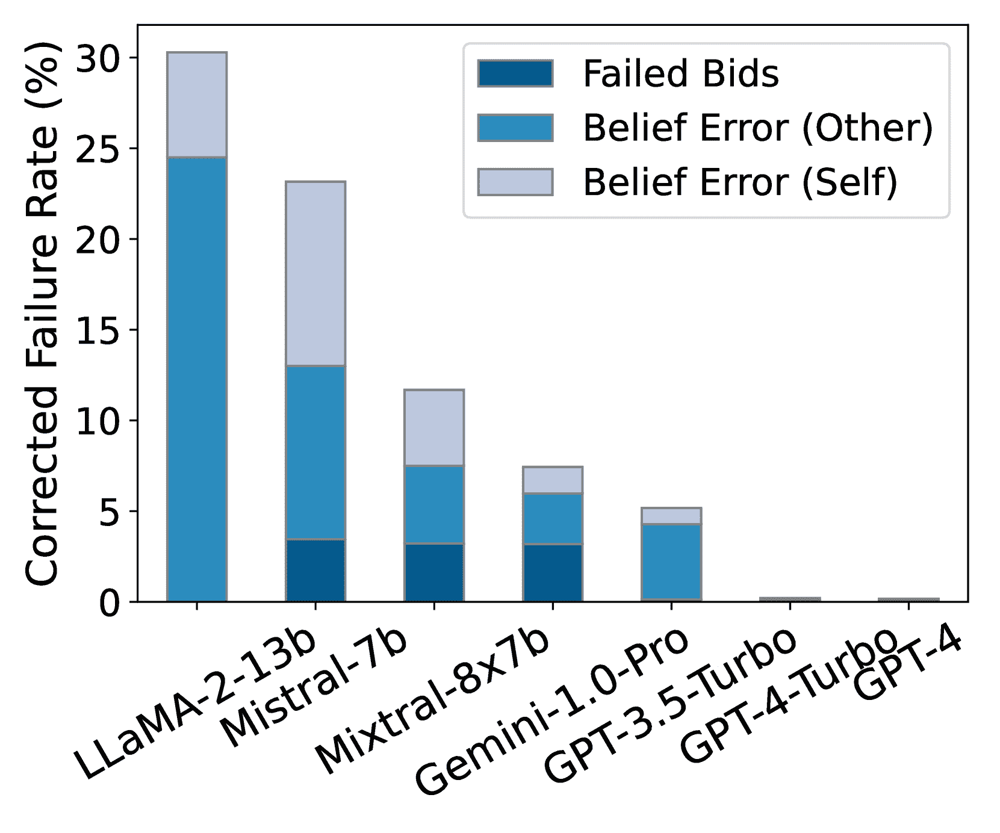
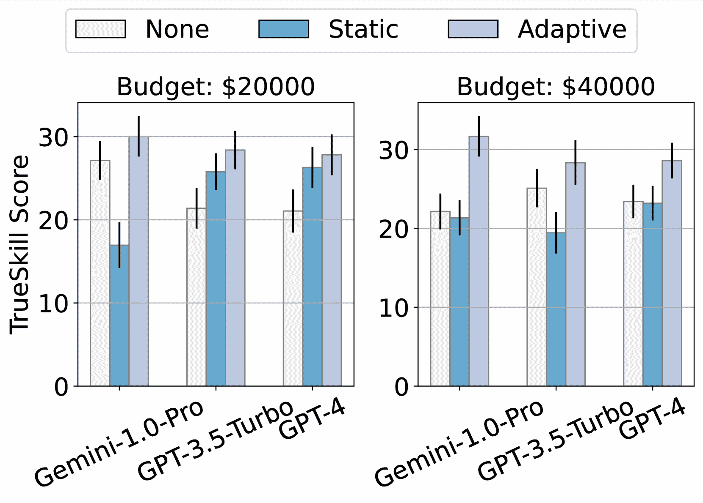

<!--yml
category: 未分类
date: 2025-01-11 13:04:18
-->

# Put Your Money Where Your Mouth Is: Evaluating Strategic Planning and Execution of LLM Agents in an Auction Arena

> 来源：[https://arxiv.org/html/2310.05746/](https://arxiv.org/html/2310.05746/)

Jiangjie Chen^($\spadesuit$), Siyu Yuan^($\spadesuit$), Rong Ye^($\spadesuit$), Bodhisattwa Prasad Majumder^($\heartsuit$), Kyle Richardson^($\heartsuit$)
^($\spadesuit$)Fudan University ^($\heartsuit$)Allen Institute for AI
jjchen19@fudan.edu.cn, kyler@allenai.org Work done during Jiangjie Chen’s internship at Allen Institute for AI.

###### Abstract

Recent advancements in Large Language Models (LLMs) showcase advanced reasoning, yet NLP evaluations often depend on static benchmarks. Evaluating this necessitates environments that test strategic reasoning in dynamic, competitive scenarios requiring long-term planning. We introduce AucArena, a novel evaluation suite that simulates auctions, a setting chosen for being highly unpredictable and involving many skills related to resource and risk management, while also being easy to evaluate. We conduct controlled experiments using state-of-the-art LLMs to power bidding agents to benchmark their planning and execution skills. Our research demonstrates that LLMs, such as GPT-4, possess key skills for auction participation, such as budget management and goal adherence, which improve with adaptive strategies. This highlights LLMs’ potential to model complex social interactions in competitive contexts. However, variability in LLM performance and occasional outperformance by simpler methods indicate opportunities for further advancements in LLM design and the value of our simulation environment for ongoing testing and refinement. ¹¹1Project page: [https://auction-arena.github.io](https://auction-arena.github.io).

## 1 Introduction

Being autonomous requires an agent to be able to make decisions independently, do complex reasoning and planning, and manage risk and resources, among many others [[1](https://arxiv.org/html/2310.05746v4#bib.bib1), [2](https://arxiv.org/html/2310.05746v4#bib.bib2)]. Large Language Models (LLMs) have proven to be able to solve a wide range of tasks, with the boundaries of what’s possible being pushed every day [[3](https://arxiv.org/html/2310.05746v4#bib.bib3), [4](https://arxiv.org/html/2310.05746v4#bib.bib4)]. Despite the increasing view of these models as autonomous agents (i.e., LLM agents, [5](https://arxiv.org/html/2310.05746v4#bib.bib5), [6](https://arxiv.org/html/2310.05746v4#bib.bib6), [7](https://arxiv.org/html/2310.05746v4#bib.bib7)), a crucial question remains: Can LLM agents effectively do sequential decision-making in dynamic environments to achieve their strategic objectives?

While the potential is evident [[8](https://arxiv.org/html/2310.05746v4#bib.bib8), [9](https://arxiv.org/html/2310.05746v4#bib.bib9)], these capabilities have yet to be rigorously evaluated. Traditional reasoning and planning benchmarks in NLP [[10](https://arxiv.org/html/2310.05746v4#bib.bib10), [11](https://arxiv.org/html/2310.05746v4#bib.bib11), [12](https://arxiv.org/html/2310.05746v4#bib.bib12)] mostly assess agents in static contexts. Yet, real-world scenarios demand that autonomous agents not merely respond to input but also have the ability to create long-term goals and plans, and continuously revise their decisions. To bridge this gap, one recent line of research focuses on immersing agents in simulation environments that mimic real-world scenarios [[13](https://arxiv.org/html/2310.05746v4#bib.bib13), [14](https://arxiv.org/html/2310.05746v4#bib.bib14), [15](https://arxiv.org/html/2310.05746v4#bib.bib15), [16](https://arxiv.org/html/2310.05746v4#bib.bib16)], ones that often focus on a targeted set of skills. However, designing such simulations can require significant engineering effort, and doing fine-grained evaluation in these environments can often be a challenge.

In this work, we go beyond simple instructions and goal-oriented tasks to encompass long-term sequential decision-making strategies. We emphasize developing environments characterized by the following properties: 1) being dynamic and inherently unpredictable, requiring agents to be adaptive; 2) involving limited resources, making the assets for competition scarce and the rewards highly contested; 3) Being quantifiable, facilitating easy evaluation. Motivated by the dynamics of auctions, which are widely studied in multi-agent systems and game theory [[17](https://arxiv.org/html/2310.05746v4#bib.bib17), [18](https://arxiv.org/html/2310.05746v4#bib.bib18)], we introduce AucArena. Auctions offer a fertile ground for assessing strategic planning, resource allocation, risk management, and competitive behaviors. In AucArena, agents act as bidders in simulated auctions, grounding their strategic capabilities into execution. This environment enables quantifying an agent’s performance using numerical metrics, such as profit.

In AucArena, we set up an open auction where all bidders have equal information, as shown in Figure [1](https://arxiv.org/html/2310.05746v4#S1.F1 "Figure 1 ‣ 1 Introduction ‣ Put Your Money Where Your Mouth Is: Evaluating Strategic Planning and Execution of LLM Agents in an Auction Arena"). Bidder agents engage in long-term sequential auctions with a fixed budget, allowing for strategic considerations. Each agent monitors the environment and forms a plan to achieve its objective. To facilitate interaction with the auction environment, we incorporate four essential functions: planning, bidding, belief update, and replanning, each implemented with LLM prompting [[19](https://arxiv.org/html/2310.05746v4#bib.bib19), [20](https://arxiv.org/html/2310.05746v4#bib.bib20)]. These functions manifest the agents’ strategic planning, adaptation to new information, and real-time decision-making capabilities. We systematically explore the individual and collective behaviors of various LLM agents, examine their plan execution and adaptability, and delve into the dynamics of multi-objective multi-agent competitions. Previous works and general language understanding tasks are more complex linguistically, while this work, though simpler in language, is more intricate due to the need for understanding and parsing object valuations and conducting game-theoretical analysis to make optimal decisions.

Figure 1: An illustration of AucArena: (A) shows a multi-round, ascending-price auction with an auctioneer announcing the highest bids, where bidders publicly decide after private reasoning. (B) presents a bidder agent structure using the Belief-Desire-Intention Model, involving planning, bidding, belief updating, and replanning, where beliefs and plans are adjusted with each auction development. (C) offers instances of updated beliefs and plans, illustrating a bidder allocating priority scores to items post-reasoning.

Our contributions include: 1) The creation of AucArena, an innovative simulated auction environment featuring a proposed bidder agent framework crafted to evaluate and measure the strategic decision-making skills of LLM agents within dynamic and competitive contexts. 2) The establishment of a new benchmark for evaluating the strategic performance of LLM agents, particularly emphasizing their ability to manage limited resources, engage in risk management, and adapt their strategies to achieve long-term objectives. 3) Utilizing AucArena, we gain insights into the strategic planning and execution skills of LLMs, emphasizing the importance of being adaptive in competitions. We show that even superior models like GPT-4 don’t always prevail in long-term strategic planning, and uncover new dynamics in multi-objective multi-agent competitions.

## 2 Related Work

Generative Agents AI agents have evolved from simple, rule-based systems to interactive models and neural networks for dynamic responsiveness [[21](https://arxiv.org/html/2310.05746v4#bib.bib21), [22](https://arxiv.org/html/2310.05746v4#bib.bib22), [23](https://arxiv.org/html/2310.05746v4#bib.bib23)]. The recent development of generative LLM agents has further broadened AI capabilities in natural language understanding and decision-making process. [[14](https://arxiv.org/html/2310.05746v4#bib.bib14)] combined LLM with memory and reflection mechanisms, allowing for interaction between multiple language agents, and provided insights into how LLMs behave as agents in social simulation. Additionally, building an LLM agent can also benefit from various prompting technique mechanisms [[19](https://arxiv.org/html/2310.05746v4#bib.bib19), [24](https://arxiv.org/html/2310.05746v4#bib.bib24)], which help in better decomposing complex tasks. Self-reflection or refinement mechanisms [[20](https://arxiv.org/html/2310.05746v4#bib.bib20), [25](https://arxiv.org/html/2310.05746v4#bib.bib25)] enable the model to learn from feedback and improve. Also, LLM agents can better accomplish complex tasks by utilizing external tools and calling APIs [[26](https://arxiv.org/html/2310.05746v4#bib.bib26), [27](https://arxiv.org/html/2310.05746v4#bib.bib27)]. In this work, we begin with the Belief-Desire-Intention model [[28](https://arxiv.org/html/2310.05746v4#bib.bib28), [29](https://arxiv.org/html/2310.05746v4#bib.bib29)] to construct an agent for a multi-item auction.

Evaluation for Generative Agents Recent works propose diverse interactive environments to evaluate the capabilities of LLM agents. The existing environment include game-based environments [[30](https://arxiv.org/html/2310.05746v4#bib.bib30), [31](https://arxiv.org/html/2310.05746v4#bib.bib31), [32](https://arxiv.org/html/2310.05746v4#bib.bib32), [33](https://arxiv.org/html/2310.05746v4#bib.bib33), [34](https://arxiv.org/html/2310.05746v4#bib.bib34)], web-based interactive environments [[35](https://arxiv.org/html/2310.05746v4#bib.bib35), [36](https://arxiv.org/html/2310.05746v4#bib.bib36), [37](https://arxiv.org/html/2310.05746v4#bib.bib37), [38](https://arxiv.org/html/2310.05746v4#bib.bib38)], and comprehensive measurement benchmarks [[15](https://arxiv.org/html/2310.05746v4#bib.bib15)]. In addition to evaluating the capabilities of a single agent, there are environments that provide a venue for multiple agents to interact and assess their abilities, such as cooperative tasks [[39](https://arxiv.org/html/2310.05746v4#bib.bib39), [40](https://arxiv.org/html/2310.05746v4#bib.bib40), [41](https://arxiv.org/html/2310.05746v4#bib.bib41)] and competitive scenarios [[42](https://arxiv.org/html/2310.05746v4#bib.bib42), [43](https://arxiv.org/html/2310.05746v4#bib.bib43)]. Recent advancements have also focused on integrating strategic behaviors derived from game-theoretic principles [[44](https://arxiv.org/html/2310.05746v4#bib.bib44), [45](https://arxiv.org/html/2310.05746v4#bib.bib45), [46](https://arxiv.org/html/2310.05746v4#bib.bib46)]. In this work, we leverage multi-agent auctions as a test-bed for assessing LLM agents’ strategic planning, execution and adaptability in objective-driven environments with precise, measurable metrics.

## 3 The Auction Arena

In this section, we introduce the implementation of our AucArena ($\mathsection$ [3.1](https://arxiv.org/html/2310.05746v4#S3.SS1 "3.1 Open Ascending-Price Auction ‣ 3 The Auction Arena ‣ Put Your Money Where Your Mouth Is: Evaluating Strategic Planning and Execution of LLM Agents in an Auction Arena")) and agent architecture ($\mathsection$ [3.2](https://arxiv.org/html/2310.05746v4#S3.SS2 "3.2 Bidder Agent Architecture ‣ 3 The Auction Arena ‣ Put Your Money Where Your Mouth Is: Evaluating Strategic Planning and Execution of LLM Agents in an Auction Arena")) we use for our simulation. We also introduce some details about our simulation design and implementation ($\mathsection$ [3.3](https://arxiv.org/html/2310.05746v4#S3.SS3 "3.3 Simulation Designs in AucArena ‣ 3 The Auction Arena ‣ Put Your Money Where Your Mouth Is: Evaluating Strategic Planning and Execution of LLM Agents in an Auction Arena")).

### 3.1 Open Ascending-Price Auction

In this work, we adopt the English Auction where an auctioneer presents items in rounds and accepts ascending bids from participants until no higher bids are proposed. All bidders’ actions are transparent and observable for fairness. The primary rule is that the highest bid wins the item. Such a process is illustrated in Figure [1](https://arxiv.org/html/2310.05746v4#S1.F1 "Figure 1 ‣ 1 Introduction ‣ Put Your Money Where Your Mouth Is: Evaluating Strategic Planning and Execution of LLM Agents in an Auction Arena")(A) and includes the following components: a list of items, an auctioneer, and bidders. An example auction log is provided in Appendix [A.1](https://arxiv.org/html/2310.05746v4#A1.SS1 "A.1 Bidding History ‣ Appendix A Examples: Prompt and Bidding History ‣ Put Your Money Where Your Mouth Is: Evaluating Strategic Planning and Execution of LLM Agents in an Auction Arena").

Items Each item has a starting price (e.g., $1,000) for a bidding war, and a true value ($2,000) for resale. We create a transparent bidding environment, omitting factors like personal or emotional value for simplicity.

Auctioneer The auctioneer, a rule-based agent, manages the bidding flow, declares the winners, and enforces auction rules, e.g., bidders cannot exceed their budgets, the next bid must surpass the prior highest bid by a minimum increase, etc.

Bidders Bidders are operationalized as LLM agents, each with their own strategies and assets. They participate in the auction by bidding or withdrawing, influencing other bidders and thus shaping the dynamics of the auction and the outcome. Formally, given an auction with $N$ bidders and $M$ items, we use indicator $x_{i,j}=1$ to denote bidder $i$ winning item $j$, and $x_{i,j}=0$ otherwise. The final bid price for item $j$ is $p_{j}$, with its true value $v_{j}$. For simplicity, we assume that the true value of the item is identical for all bidders, but the bidders are unaware of the true value. Bidders typically aim to maximize their profits in a multi-item auction but will be prompted to assume different objectives. The utility function for a profit-driven bidder $i$ is:

|  | $\textit{Maximize}\quad U_{i}=\sum_{j=1}^{M}(v_{j}-p_{j})\cdot x_{i,j},\quad% \textit{s.t.}\ \ \sum_{j=1}^{M}p_{j}\cdot x_{i,j}\leq B_{i},\ \ \sum_{i=1}^{N}% x_{i,j}=1,x_{i,j}\in\{0,1\}$ |  |

where $B_{i}$ is the budget for the bidder $i$. Note that the bidder will not incur any budget loss from a failed bid but may have negative profit if the winning bid exceeds its true value. Also, bidders can pursue other objectives, e.g., securing a particular item or as many items as possible.

### 3.2 Bidder Agent Architecture

This section outlines the bidder agent architecture, deploying the Belief-Desire-Intention (BDI) Model [[28](https://arxiv.org/html/2310.05746v4#bib.bib28), [29](https://arxiv.org/html/2310.05746v4#bib.bib29), [47](https://arxiv.org/html/2310.05746v4#bib.bib47)] to guide agent behavior and communication during auctions. The BDI model structures agents in terms of their: 1) Belief- Knowledge of auction dynamics, such as budget, profits, and items won. 2) Desire- Agent’s auction objectives, primarily profit maximization or specific item acquisition. 3) Intention- Agent’s evolving strategy to achieve its desires, adaptable to new auction information.

This model underpins how agents strategize, adapt, and adjust, with auction outcomes influencing their beliefs and intentions for future auctions. We integrate four core actions within our agent architecture: planning, bidding, belief update, and replanning. Utilizing zero-shot prompts [[48](https://arxiv.org/html/2310.05746v4#bib.bib48)], we can interactively query LLM agents for insights into their strategies and beliefs, e.g., their understanding of their own budget, or the reasons why they made the decisions that they did, which enables a form of belief tracking [[49](https://arxiv.org/html/2310.05746v4#bib.bib49)]. Details on instruction prompts are in Appendix [A.2](https://arxiv.org/html/2310.05746v4#A1.SS2 "A.2 Instruction Prompts ‣ Appendix A Examples: Prompt and Bidding History ‣ Put Your Money Where Your Mouth Is: Evaluating Strategic Planning and Execution of LLM Agents in an Auction Arena").

Planning Effective planning is crucial for agents to make informed decisions and well-thought-out bidding strategies that benefit both the present and future. This requires a bidding strategy in the initial step, where the agent $i$ considers its budget ($B_{i}$) and all the available items, and generates a pre-auction textual plan. This plan acts as a strategic guide for efficient resource allocation throughout the multi-item auction.

Bidding In each round, non-leading bidders who are not the highest in the previous round can either place a higher bid or withdraw, while the previous top bidder skips bidding. Initial bids start at or above the starting price, and by the final round, all but the winning bids are zero. In practice, we guide the agent to perform intermediate reasoning first before finalizing any decision.

Belief Update Context length restrictions prevent the inclusion of full bidding and conversation histories into LLMs. To compensate, we use a summarized dynamic memory of the auction’s state, as depicted in Figure [1](https://arxiv.org/html/2310.05746v4#S1.F1 "Figure 1 ‣ 1 Introduction ‣ Put Your Money Where Your Mouth Is: Evaluating Strategic Planning and Execution of LLM Agents in an Auction Arena")(C-1), which encompasses: 1) Remaining Budget, 2) Total Profit, and 3) Winning Bids, given in a JSON format. Belief updates for the agent occur post-bid to manage token limits. Errors in agent beliefs, such as misjudging items or profits, are recorded and corrected by the auctioneer (belief correction) to facilitate uninterrupted gameplay, mirroring the use of notebooks and calculators by human bidders.

Replanning An important characteristic of AucArena is its dynamics and ever-changing nature, making earlier plans prone to becoming outdated and failing to execute. Therefore, we add a replanning step for an agent to adjust its strategy based on the auction’s progression and new information. After bidding on an item, the agent reflects on its beliefs and previous plan and devises a new textual plan. Then, the auctioneer moves the auction forward by presenting the next item, entering another bidding, belief update, and replanning iteration.

### 3.3 Simulation Designs in AucArena

Auctions can sometimes be difficult to understand due to numerous confounding factors. Therefore, we propose three designs to simplify and facilitate further analysis while keeping the possibilities of more complex designs for future research.

Starting Price and True Value of an Item We set the actual value of an item in our simulation to be twice as its starting price, e.g., starting at $1,000 while the true value is $2,000. Consequently, items with higher initial prices hold greater potential for profit if acquired, reflecting the principle that a higher investment and associated risk can lead to increased returns, which allows the study of intricate strategies of bidders. The information of every artificial item is listed in Appendix [A.3](https://arxiv.org/html/2310.05746v4#A1.SS3 "A.3 Information of Artificial Items in the Auction ‣ Appendix A Examples: Prompt and Bidding History ‣ Put Your Money Where Your Mouth Is: Evaluating Strategic Planning and Execution of LLM Agents in an Auction Arena").

Overestimation and Winner’s Curse One intriguing aspect of auctions is the “Winner’s Curse”, where the winning bid exceeds an item’s true value, leading to losses — a common occurrence when bidders lack precise value estimations, a typical scenario in real auctions [[50](https://arxiv.org/html/2310.05746v4#bib.bib50)]. To replicate this, we introduce an intentional overestimation of item value. By default, we set the bidders to have an estimated value that is 10% higher than the true value. Bidders are not informed about items’ true values but only estimate values. This design allows us to study the risk management skills of LLM agents, where overbids can lead to apparent victories that are, in essence, strategic losses.

Priority Score in the Plan Consolidating the plans mentioned in $\mathsection$ [3.2](https://arxiv.org/html/2310.05746v4#S3.SS2 "3.2 Bidder Agent Architecture ‣ 3 The Auction Arena ‣ Put Your Money Where Your Mouth Is: Evaluating Strategic Planning and Execution of LLM Agents in an Auction Arena") is important to assess the capabilities of agents. Simplifying, a bidder’s future bidding strategy can be distilled into prioritizing remaining items. When the auction moves to the $t$-th item (item $t$), bidder $i$ assigns a three-tier priority score for each remaining item $j$ ($t\leq j\leq M$), denoted as $r_{i,j}^{(t)}\in\{1,2,3\}$:

*   1 =

    The item is of minimal importance, and consider giving it up if necessary to save money;

*   2 =

    The item holds value but isn’t paramount, and could bid on it if budget allows;

*   3 =

    The item is of utmost importance and is a top priority.

The scoring system, which is directly generated by LLMs, provides a tangible metric to gauge a bidder’s foresight and adaptability. As depicted in Figure [1](https://arxiv.org/html/2310.05746v4#S1.F1 "Figure 1 ‣ 1 Introduction ‣ Put Your Money Where Your Mouth Is: Evaluating Strategic Planning and Execution of LLM Agents in an Auction Arena")(C-2,3), the agent first engages in intermediate reasoning of the current situation before making a structured plan.

## 4 Experiments

### 4.1 Experimental Setup

We use the following state-of-the-art LLMs as the backend of bidding agents: 1) GPT-3.5-Turbo[[51](https://arxiv.org/html/2310.05746v4#bib.bib51)](gpt-3.5-turbo-1106); 2) GPT-4[[52](https://arxiv.org/html/2310.05746v4#bib.bib52)](gpt-4-0613) and GPT-4-Turbo (gpt-4-1106-preview); 3) Gemini 1.0 Pro[[53](https://arxiv.org/html/2310.05746v4#bib.bib53)]by Google (gemini-1.0-pro); 4) Mistral[[54](https://arxiv.org/html/2310.05746v4#bib.bib54)], the 7 billion version (mistral-7b-instruct-v0.2) opensourced by MistralAI; 5) Mixtral[[55](https://arxiv.org/html/2310.05746v4#bib.bib55)]by MistralAI (mixtral-8x7b-instruct-v0.1), which is a Mixture-of-Expert (8 experts) version of Mistral (7b); 6) Rule Bidder, as a baseline, has a fixed engagement limit per item, depending on the budget, and each of their bid increases the previous highest bid minimally (10%), if a bid is possible.

We repeat each experiment by 10 runs for averaged performance, and set the temperature at $0$ for relatively deterministic behaviors. Including input and output, the average length of each prompt is about 1500 to 1800 tokens, with the longest being around 5000 tokens. The auctioneer requests a minimum bid increment at 10% of the starting price to prevent protracted bidding, and bidders know the item order and starting prices throughout the auction. In each auction game, by default, there are 2 items at each of the 5 starting prices, from $1,000 to and $5,000, totaling 10 items, so that the bidders will have to strategize for items of different values.

To objectively measure and rank the performance (i.e., total profit) of each bidder in such a competitive setting, we primarily employ the TrueSkill score [[56](https://arxiv.org/html/2310.05746v4#bib.bib56), [57](https://arxiv.org/html/2310.05746v4#bib.bib57)]. The reason to use TrueSkill score is that it estimates dynamic skill levels ($\mu$) through Bayesian statistics while considering uncertainty ($\sigma$) in their true skills, which is commonly used in competitions such as online games or tournaments.

Figure 2: The TrueSkill scores of different bidder agents in the standard competition under 2 budget settings and 3 item orders based on items’ starting prices.

### 4.2 Benchmarking LLMs as Bidders In Standard Competition

We set a three-bidder game as the Standard Competition to benchmark bidder agents in AucArena, with 2 constant baseline participants and 1 challenger in the game. By fixing two bidders and modifying the third, the evaluation is more standardized, ensuring that all LLMs are assessed within the same environment. In this work, we use GPT-4-Turbo and GPT-3.5-Turbo as baselines, which are commonly studied by the community. We design 6 (2$\times$3) settings in AucArena in total: 2 sets of budgets, $20,000 and $40,000; and 3 types of item orders, including Random, Ascending and Descending orders of starting prices.

Figure 3: Different types of bidders’ belief errors.

According to Figure [2](https://arxiv.org/html/2310.05746v4#S4.F2 "Figure 2 ‣ 4.1 Experimental Setup ‣ 4 Experiments ‣ Put Your Money Where Your Mouth Is: Evaluating Strategic Planning and Execution of LLM Agents in an Auction Arena"), a general trend of different agents can be observed with few variations. GPT-4 exhibits higher scores than other LLM agents, suggesting it might be more effective in allocation efficiency or strategy under the given conditions; Gemini and Mixtral are also competitive in most settings. Interestingly, their performance are not quite consistent when facing different item orders, e.g., GPT-4s are generally worse when facing items in a cheap-to-expensive order. However, rule bidders establish an intriguing and powerful baseline, surpassing most LLMs in most settings. In Appendix [B.1](https://arxiv.org/html/2310.05746v4#A2.SS1 "B.1 Human Performance ‣ Appendix B Additional Results ‣ Put Your Money Where Your Mouth Is: Evaluating Strategic Planning and Execution of LLM Agents in an Auction Arena"), we demonstrate that, compared to GPT-4-Turbo, human bidders struggle when items are presented in a random order, but outperform others when the item order can be anticipated, whether it is descending or ascending. We also showcase that GPT-3.5-Turbo frequently withdraws from the bidding war even if it has budget left for the items, whereas GPT-4-Turbo fails to employ sophisticated tactics to outmaneuver its competitors.

Corrected Errors in Belief Tracking Accurate and consistent monitoring of the auction environment is essential for success in dynamic auctions. Therefore, we track failed bids and incorrect beliefs of all participants as indicators of LLMs’ state-tracking capabilities. Specifically: 1) Failed Bids (%)measures the error rate in the bidding process, such as bids below the previous round’s highest bid or beyond the budget; 2) Belief Errors (%)assesses the accuracy in updating beliefs about the remaining budget, personal winning bids, and the status of other agents. Notice that, the auctioneer corrects bidders’ belief errors ($\mathsection$ [3.2](https://arxiv.org/html/2310.05746v4#S3.SS2 "3.2 Bidder Agent Architecture ‣ 3 The Auction Arena ‣ Put Your Money Where Your Mouth Is: Evaluating Strategic Planning and Execution of LLM Agents in an Auction Arena")) in AucArena, allowing us to concentrate on agents’ planning and execution skills. We introduce the Corrected Failure Rate ($\textit{CFR}=F/(C+F)$), where $F$ represents the number of failures and $C$ is the count of correct actions, a constant due to the eventual correction of failed actions. As shown in Figure [3](https://arxiv.org/html/2310.05746v4#S4.F3 "Figure 3 ‣ 4.2 Benchmarking LLMs as Bidders In Standard Competition ‣ 4 Experiments ‣ Put Your Money Where Your Mouth Is: Evaluating Strategic Planning and Execution of LLM Agents in an Auction Arena"), GPT-4 demonstrates superior performance with the lowest error rates of 0.21%, contrasting with other models that show higher factual error rates due to weaker context comprehension and arithmetic abilities. Note that, LLaMA-2-13b has no failed bids because it chooses to withdraw every time.

### 4.3 Strategies and Behavioral Dynamics

To understand bidder agents’ strategies and behaviors, we take a closer look at the bidding process of them, with a special focus on planning, execution, and faithfulness.

Figure 4: The heatmap of averaged priority scores and their changes before each bidding round under ascending (top) or descending (bottom) item orders, with a budget of $20,000.

Planning Analysis: Visualizing Long-term Strategies Strategic behavior involves resource conservation for the future. We present a visualization of item priority changes after each bidding round for bidder agents with a budget of $20,000. Figure [4](https://arxiv.org/html/2310.05746v4#S4.F4 "Figure 4 ‣ 4.3 Strategies and Behavioral Dynamics ‣ 4 Experiments ‣ Put Your Money Where Your Mouth Is: Evaluating Strategic Planning and Execution of LLM Agents in an Auction Arena") shows some interesting findings: 1) When items are arranged in ascending order (Figure [10](https://arxiv.org/html/2310.05746v4#A2.F10 "Figure 10 ‣ B.3 Execution Analysis: Visualizing Bidding Behaviors ‣ Appendix B Additional Results ‣ Put Your Money Where Your Mouth Is: Evaluating Strategic Planning and Execution of LLM Agents in an Auction Arena")(A)), GPT-4 demonstrates restraint in the initial stages, opting to conserve budget for future opportunities, in contrast to other models that allocate their budget more quickly. 2) When items are arranged in descending order (Figure [10](https://arxiv.org/html/2310.05746v4#A2.F10 "Figure 10 ‣ B.3 Execution Analysis: Visualizing Bidding Behaviors ‣ Appendix B Additional Results ‣ Put Your Money Where Your Mouth Is: Evaluating Strategic Planning and Execution of LLM Agents in an Auction Arena")(B)), the majority of models exhibit a tendency to spend their budget more greedily, i.e., prioritize on expensive items. However, GPT-4 adopts a more cautious approach, refraining from early participation and instead reserves its budget for the subsequent 3-4 items. 3) There are some outliers in Mistral-7b, which are errors made by the agents, i.e., planning for the past items, not the future ones. Appendix [B.2](https://arxiv.org/html/2310.05746v4#A2.SS2 "B.2 Visualizing Long-term Strategies: A Budget of $20,000 ‣ Appendix B Additional Results ‣ Put Your Money Where Your Mouth Is: Evaluating Strategic Planning and Execution of LLM Agents in an Auction Arena") showcases a similar result when the budget is $40,000. Echoing the findings in Figure 4, in Appendix [B.3](https://arxiv.org/html/2310.05746v4#A2.SS3 "B.3 Execution Analysis: Visualizing Bidding Behaviors ‣ Appendix B Additional Results ‣ Put Your Money Where Your Mouth Is: Evaluating Strategic Planning and Execution of LLM Agents in an Auction Arena"), we also visualize the bidding behaviors of bidder agents that are concealed behind the final TrueSkill score in Standard Competition. Evidence shows that GPT-4 tailors its strategy based on budget size and item order, showing increased competitiveness for higher-value items when the budget allows. Conversely, other models do not clearly demonstrate this adaptive behavior.

Figure 5: The Bid Increment Percentage for various agents, segmented into 5 different ranges. Each model’s bar is divided to reflect the distribution of bids within these ranges.

Execution Analysis: Bidding Aggressiveness Assessing aggressiveness levels enables the anticipation and strategic planning of future bids to surpass competitors without considerable overpayment. The Bid Increment Percentage (BIP) serves as a crucial metric for assessing competition-driven aggressiveness, indicating the percentile increase of a new bid over a bidder’s preceding highest offer. Ideally, in scenarios where the bid surpasses the previous by more than 10%, cautious bidders strive to maintain their BIP as minimal as possible to evade the winner’s curse. Figure [5](https://arxiv.org/html/2310.05746v4#S4.F5 "Figure 5 ‣ 4.3 Strategies and Behavioral Dynamics ‣ 4 Experiments ‣ Put Your Money Where Your Mouth Is: Evaluating Strategic Planning and Execution of LLM Agents in an Auction Arena") delineates the BIP distribution across various models. GPT-4s tend towards minimal bid increment, reflecting a conservative and rational bidding strategy to avoid excessive payments. Conversely, Mistral-7b and GPT-3.5-Turbo display a substantial volume of bids within the [11%, $\infty$) increment bracket, suggesting a more aggressive, risk-tolerant bidding behavior. The range $[0,10)$ denotes the increment percentage of the first bid on an item, which does not necessitate a 10% increment from the starting price.

| Model | Initial ($r_{i,j}^{(1)}$) | Current ($r_{i,j}^{(j)}$) |
| $\rho(r,n)$ | $\rho(r,x)$ | $\rho(r,n)$ | $\rho(r,x)$ |
| LLaMA-2-13b | - | - | - | - |
| Mistral-7b | .1252 | .2728 | .1139 | .2779 |
| Mixtral-8x7b | .3553 | .4028 | .3994 | .4327 |
| Gemini-1.0-Pro | .2457 | .1349 | .2776 | .2442 |
| GPT-3.5-Turbo | .1849 | .0430 | .1494 | .0801 |
| GPT-4 | .3741 | .3959 | .6318 | .6443 |
| GPT-4-Turbo | .2348 | .0715 | .6423 | .4328 |

Figure 6: Spearman correlation $\rho(\cdot)$ between the priority score of an item in bidder $i$’s initial or current plan, and the number of engagement $n_{i,j}$ on item $j$ and the winning indication $x_{i,j}$. LLaMA-2-13b is left blank due to its constant withdrawals.

Figure 7: The TrueSkill scores after competition between 3 agents powered by the same LLM, but with different modular designs.

Figure 8: The competition between two groups of bidders: 2 profit bidders (red) and 2 item bidders (blue). We increase the budget of all bidders and show the changes in the histograms and kernel density estimation that depict the winning bids of two bidder groups.

Do Agents Adhere to Their Plans during Execution? To assess if LLMs follow and adapt their strategies during auctions, we analyze how their bidding behavior and assigned item priorities correlate, focusing on engagements and wins. We perform a correlation analysis between the priority scores bidders allocate to items and the auction outcomes. The priority score for an item is examined at two instances: at the beginning ($r_{i,j}^{(1)}$) and just before bidding on that item ($r_{i,j}^{(j)}$), so that we can check if the strategies evolve during auctions. Actions are quantified as the number of engagements (bids) on this item ($n_{i,j}$), and the indication of the winning bid $x_{i,j}\in\{0,1\}$. Spearman correlation coefficients, $\rho(r,n)$ and $\rho(r,x)$, help examine these relationships. Results in Table [7](https://arxiv.org/html/2310.05746v4#S4.F7 "Figure 7 ‣ 4.3 Strategies and Behavioral Dynamics ‣ 4 Experiments ‣ Put Your Money Where Your Mouth Is: Evaluating Strategic Planning and Execution of LLM Agents in an Auction Arena") show that current plans correlate more with actions, highlighting the importance of adapting plans to the changing auction environment. There is noticeable variability in how models match their bids with their priorities over time. GPT-4 displays high correlations, indicating an effective adjustment in item priorities to deal with dynamic auction scenarios. Conversely, models like GPT-3.5-Turbo exhibit lower correlations, suggesting less flexible strategies or a weaker priority-action alignment.

### 4.4 Modular Analysis

This experiment looks into the effects of architectural changes in LLMs and how they perform in environments with multiple competing objectives.

Analysis on Planning and Replanning In an ablation study focusing on the impact of different agent modules on LLM performance in auctions, we aim to pinpoint essential components for their success. We create a competitive setup with 3 agents, all powered by the same LLM, but each employing one of three distinct strategies: 1) Adaptive Bidder: operates according to $\mathsection$ [3.2](https://arxiv.org/html/2310.05746v4#S3.SS2 "3.2 Bidder Agent Architecture ‣ 3 The Auction Arena ‣ Put Your Money Where Your Mouth Is: Evaluating Strategic Planning and Execution of LLM Agents in an Auction Arena"); 2) Static Bidder: lacks replanning module; 3) None Bidder: lacks both planning and replanning modules. According to Figure [7](https://arxiv.org/html/2310.05746v4#S4.F7 "Figure 7 ‣ 4.3 Strategies and Behavioral Dynamics ‣ 4 Experiments ‣ Put Your Money Where Your Mouth Is: Evaluating Strategic Planning and Execution of LLM Agents in an Auction Arena"), maintaining and updating plans enhances auction performance. Relying on static plans sometimes yields worse outcomes than not planning at all, especially when the budget is $40,000, as resources are abundant to facilitate greedy bidding (no plans).

Analysis on Objectives: Emergent Niche Specification in Multi-Objective Competition Just like ecosystems with diverse species in unique niches, multi-agent environments enable agents to pursue specialized objectives. In the context of auctions, participants often aim for goals beyond simply maximizing profit. We simulate two agent types: 1) Profit Bidders, focused on achieving high profit, and 2) Item Bidders, focused on acquiring the most items. These objectives lead to different outcomes; for example, securing the most items doesn’t equate to the highest profit, and vice versa. Profit Bidders are expected to target expensive, profitable items, whereas Item Bidders should seek out cheaper, more accessible items. To explore this, we divide 4 agents into 2 groups—2 Profit Bidders and 2 Item Bidders, including both GPT-4 and GPT-3.5-Turbo agents—and alter their budget across auctions for 20 items, including 4 expensive (starting at $5,000) and 16 cheap items (starting at $1,000). Figure [8](https://arxiv.org/html/2310.05746v4#S4.F8 "Figure 8 ‣ 4.3 Strategies and Behavioral Dynamics ‣ 4 Experiments ‣ Put Your Money Where Your Mouth Is: Evaluating Strategic Planning and Execution of LLM Agents in an Auction Arena") shows the density histograms and kernel density estimate plots of the winning bids, highlighting the niche specialization of the agents. As budgets increase to $30,000, the differentiation between the two groups becomes more pronounced, with each specializing in either cheap or expensive items. With a limited budget ($10,000), Profit Bidders compete more for cheap items, giving Item Bidders opportunities to secure more profitable items.

## 5 Conclusion

In this paper, we propose AucArena to evaluate state-of-the-art LLMs as auction bidding agents, uncovering critical insights into the effectiveness of their strategies across various competitive auction scenarios. Through comprehensive analyses of strategies and behavioral dynamics, we demonstrate the importance of strategic planning and replanning capabilities and highlight the importance of tracking LLM agents’ adaptive capabilities in changing environments. Further, ablation studies and the exploration of niche specialization offer valuable perspectives on the multifaceted roles LLMs can play in competitive scenarios. Our study advocates for further, innovative manipulations of our simulation method to explore these phenomena and amplify the potential of LLMs in modeling intricate social dynamics.

## Acknowledgements

We are grateful for the constructive comments from the anonymous reviewers. We thank the Aristo team at Allen Institute for AI for valuable feedback and support for this project, in particular: Peter Clark, Ashish Sabharwal, Tushar Khot, Nathaniel Weir, Oyvind Tafjord, Peter Hase and Sarah Wiegreffe. We also thank Yao Fu from the University of Edinburgh, Hao Peng from UIUC, and Gregor Betz from the Karlsruhe Institute of Technology (KIT) for fruitful discussions that helped shape this project at various stages. This work is supported by the Allen Institute for AI.

## References

*   [1] Luc Steels. When are robots intelligent autonomous agents? Robotics and Autonomous systems, 15(1-2):3–9, 1995.
*   [2] Stan Franklin and Art Graesser. Is it an agent, or just a program?: A taxonomy for autonomous agents. In International workshop on agent theories, architectures, and languages, pages 21–35\. Springer, 1996.
*   [3] Jason Wei, Yi Tay, Rishi Bommasani, Colin Raffel, Barret Zoph, Sebastian Borgeaud, Dani Yogatama, Maarten Bosma, Denny Zhou, Donald Metzler, Ed H. Chi, Tatsunori Hashimoto, Oriol Vinyals, Percy Liang, Jeff Dean, and William Fedus. Emergent abilities of large language models. Transactions on Machine Learning Research, 2022. Survey Certification.
*   [4] Sébastien Bubeck, Varun Chandrasekaran, Ronen Eldan, Johannes Gehrke, Eric Horvitz, Ece Kamar, Peter Lee, Yin Tat Lee, Yuanzhi Li, Scott Lundberg, et al. Sparks of artificial general intelligence: Early experiments with gpt-4. arXiv preprint arXiv:2303.12712, 2023.
*   [5] Lei Wang, Chen Ma, Xueyang Feng, Zeyu Zhang, Hao Yang, Jingsen Zhang, Zhiyuan Chen, Jiakai Tang, Xu Chen, Yankai Lin, et al. A survey on large language model based autonomous agents. arXiv preprint arXiv:2308.11432, 2023.
*   [6] Theodore Sumers, Shunyu Yao, Karthik Narasimhan, and Thomas L Griffiths. Cognitive architectures for language agents. arXiv preprint arXiv:2309.02427, 2023.
*   [7] Zhiheng Xi, Wenxiang Chen, Xin Guo, Wei He, Yiwen Ding, Boyang Hong, Ming Zhang, Junzhe Wang, Senjie Jin, Enyu Zhou, Rui Zheng, Xiaoran Fan, Xiao Wang, Limao Xiong, Yuhao Zhou, Weiran Wang, Changhao Jiang, Yicheng Zou, Xiangyang Liu, Zhangyue Yin, Shihan Dou, Rongxiang Weng, Wensen Cheng, Qi Zhang, Wenjuan Qin, Yongyan Zheng, Xipeng Qiu, Xuanjing Huang, and Tao Gui. The rise and potential of large language model based agents: A survey. 2023.
*   [8] Yohei Nakajima. Babyagi. [https://github.com/yoheinakajima/babyagi](https://github.com/yoheinakajima/babyagi), 2023.
*   [9] Significant-Gravitas. Autogpt. [https://github.com/Significant-Gravitas/Auto-GPT](https://github.com/Significant-Gravitas/Auto-GPT), 2023.
*   [10] Mor Geva, Daniel Khashabi, Elad Segal, Tushar Khot, Dan Roth, and Jonathan Berant. Did aristotle use a laptop? a question answering benchmark with implicit reasoning strategies. Transactions of the Association for Computational Linguistics, 9:346–361, 2021.
*   [11] Keisuke Sakaguchi, Chandra Bhagavatula, Ronan Le Bras, Niket Tandon, Peter Clark, and Yejin Choi. proScript: Partially ordered scripts generation. In Findings of the Association for Computational Linguistics: EMNLP 2021, pages 2138–2149, Punta Cana, Dominican Republic, 2021\. Association for Computational Linguistics.
*   [12] Siyu Yuan, Jiangjie Chen, Ziquan Fu, Xuyang Ge, Soham Shah, Charles Jankowski, Yanghua Xiao, and Deqing Yang. Distilling script knowledge from large language models for constrained language planning. In Proceedings of the 61st Annual Meeting of the Association for Computational Linguistics (Volume 1: Long Papers), pages 4303–4325, Toronto, Canada, July 2023\. Association for Computational Linguistics.
*   [13] Ruoyao Wang, Peter Jansen, Marc-Alexandre Côté, and Prithviraj Ammanabrolu. ScienceWorld: Is your agent smarter than a 5th grader? In Proceedings of the 2022 Conference on Empirical Methods in Natural Language Processing, pages 11279–11298, Abu Dhabi, United Arab Emirates, December 2022\. Association for Computational Linguistics.
*   [14] Joon Sung Park, Joseph C. O’Brien, Carrie J. Cai, Meredith Ringel Morris, Percy Liang, and Michael S. Bernstein. Generative agents: Interactive simulacra of human behavior. In In the 36th Annual ACM Symposium on User Interface Software and Technology (UIST ’23), UIST ’23, New York, NY, USA, 2023\. Association for Computing Machinery.
*   [15] Xiao Liu, Hao Yu, Hanchen Zhang, Yifan Xu, Xuanyu Lei, Hanyu Lai, Yu Gu, Yuxian Gu, Hangliang Ding, Kai Men, Kejuan Yang, Shudan Zhang, Xiang Deng, Aohan Zeng, Zhengxiao Du, Chenhui Zhang, Shengqi Shen, Tianjun Zhang, Yu Su, Huan Sun, Minlie Huang, Yuxiao Dong, and Jie Tang. Agentbench: Evaluating llms as agents. ArXiv, abs/2308.03688, 2023.
*   [16] Jian Xie, Kai Zhang, Jiangjie Chen, Tinghui Zhu, Renze Lou, Yuandong Tian, Yanghua Xiao, and Yu Su. Travelplanner: A benchmark for real-world planning with language agents. arXiv preprint arXiv:2402.01622, 2024.
*   [17] Jean-Jacques Laffont. Game theory and empirical economics: The case of auction data. European Economic Review, 41(1):1–35, 1997.
*   [18] Karl Tuyls and Simon Parsons. What evolutionary game theory tells us about multiagent learning. Artificial Intelligence, 171(7):406–416, 2007.
*   [19] Jason Wei, Xuezhi Wang, Dale Schuurmans, Maarten Bosma, brian ichter, Fei Xia, Ed H. Chi, Quoc V Le, and Denny Zhou. Chain of thought prompting elicits reasoning in large language models. In Alice H. Oh, Alekh Agarwal, Danielle Belgrave, and Kyunghyun Cho, editors, Advances in Neural Information Processing Systems, 2022.
*   [20] Shunyu Yao, Jeffrey Zhao, Dian Yu, Nan Du, Izhak Shafran, Karthik R Narasimhan, and Yuan Cao. React: Synergizing reasoning and acting in language models. In Proc. of ICLR, 2022.
*   [21] Volodymyr Mnih, Koray Kavukcuoglu, David Silver, Alex Graves, Ioannis Antonoglou, Daan Wierstra, and Martin Riedmiller. Playing atari with deep reinforcement learning. arXiv preprint arXiv:1312.5602, 2013.
*   [22] David Silver, Aja Huang, Chris J Maddison, Arthur Guez, Laurent Sifre, George Van Den Driessche, Julian Schrittwieser, Ioannis Antonoglou, Veda Panneershelvam, Marc Lanctot, et al. Mastering the game of go with deep neural networks and tree search. nature, 529(7587):484–489, 2016.
*   [23] David Silver, Julian Schrittwieser, Karen Simonyan, Ioannis Antonoglou, Aja Huang, Arthur Guez, Thomas Hubert, Lucas Baker, Matthew Lai, Adrian Bolton, et al. Mastering the game of go without human knowledge. nature, 550(7676):354–359, 2017.
*   [24] Shunyu Yao, Dian Yu, Jeffrey Zhao, Izhak Shafran, Thomas L Griffiths, Yuan Cao, and Karthik Narasimhan. Tree of thoughts: Deliberate problem solving with large language models. arXiv preprint arXiv:2305.10601, 2023.
*   [25] Noah Shinn, Federico Cassano, Beck Labash, Ashwin Gopinath, Karthik Narasimhan, and Shunyu Yao. Reflexion: Language agents with verbal reinforcement learning. arXiv preprint arXiv:2303.11366, 2023.
*   [26] Timo Schick, Jane Dwivedi-Yu, Roberto Dessì, Roberta Raileanu, Maria Lomeli, Luke Zettlemoyer, Nicola Cancedda, and Thomas Scialom. Toolformer: Language models can teach themselves to use tools. arXiv preprint arXiv:2302.04761, 2023.
*   [27] Shibo Hao, Tianyang Liu, Zhen Wang, and Zhiting Hu. ToolkenGPT: Augmenting frozen language models with massive tools via tool embeddings. In Thirty-seventh Conference on Neural Information Processing Systems, 2023.
*   [28] Michael Bratman. Intention, plans, and practical reason. 1987.
*   [29] Michael Georgeff, Barney Pell, Martha Pollack, Milind Tambe, and Michael Wooldridge. The belief-desire-intention model of agency. In Intelligent Agents V: Agents Theories, Architectures, and Languages: 5th International Workshop, ATAL’98 Paris, France, July 4–7, 1998 Proceedings 5, pages 1–10\. Springer, 1999.
*   [30] Marc-Alexandre Côté, Akos Kádár, Xingdi Yuan, Ben Kybartas, Tavian Barnes, Emery Fine, James Moore, Matthew Hausknecht, Layla El Asri, Mahmoud Adada, et al. Textworld: A learning environment for text-based games. In Computer Games: 7th Workshop, CGW 2018, Held in Conjunction with the 27th International Conference on Artificial Intelligence, IJCAI 2018, Stockholm, Sweden, July 13, 2018, Revised Selected Papers 7, pages 41–75\. Springer, 2019.
*   [31] Aidan O’Gara. Hoodwinked: Deception and cooperation in a text-based game for language models. arXiv preprint arXiv:2308.01404, 2023.
*   [32] Guanzhi Wang, Yuqi Xie, Yunfan Jiang, Ajay Mandlekar, Chaowei Xiao, Yuke Zhu, Linxi Fan, and Anima Anandkumar. Voyager: An open-ended embodied agent with large language models. arXiv preprint arXiv: Arxiv-2305.16291, 2023.
*   [33] Kranti Chalamalasetti, Jana Götze, Sherzod Hakimov, Brielen Madureira, Philipp Sadler, and David Schlangen. clembench: Using game play to evaluate chat-optimized language models as conversational agents. arXiv preprint arXiv:2305.13455, 2023.
*   [34] Jinhao Duan, Renming Zhang, James Diffenderfer, Bhavya Kailkhura, Lichao Sun, Elias Stengel-Eskin, Mohit Bansal, Tianlong Chen, and Kaidi Xu. Gtbench: Uncovering the strategic reasoning limitations of llms via game-theoretic evaluations. arXiv preprint arXiv:2402.12348, 2024.
*   [35] Shunyu Yao, Howard Chen, John Yang, and Karthik Narasimhan. Webshop: Towards scalable real-world web interaction with grounded language agents. Advances in Neural Information Processing Systems, 35:20744–20757, 2022.
*   [36] Xiang Deng, Yu Gu, Boyuan Zheng, Shijie Chen, Samuel Stevens, Boshi Wang, Huan Sun, and Yu Su. Mind2web: Towards a generalist agent for the web. In Thirty-seventh Conference on Neural Information Processing Systems Datasets and Benchmarks Track, 2023.
*   [37] Shuyan Zhou, Frank F Xu, Hao Zhu, Xuhui Zhou, Robert Lo, Abishek Sridhar, Xianyi Cheng, Yonatan Bisk, Daniel Fried, Uri Alon, et al. Webarena: A realistic web environment for building autonomous agents. arXiv preprint arXiv:2307.13854, 2023.
*   [38] Zhao Yang, Jiaxuan Liu, Yucheng Han, Xin Chen, Zebiao Huang, Bin Fu, and Gang Yu. Appagent: Multimodal agents as smartphone users. arXiv preprint arXiv:2312.13771, 2023.
*   [39] Weize Chen, Yusheng Su, Jingwei Zuo, Cheng Yang, Chenfei Yuan, Chen Qian, Chi-Min Chan, Yujia Qin, Yaxi Lu, Ruobing Xie, et al. Agentverse: Facilitating multi-agent collaboration and exploring emergent behaviors in agents. arXiv preprint arXiv:2308.10848, 2023.
*   [40] Saaket Agashe, Yue Fan, and Xin Eric Wang. Evaluating multi-agent coordination abilities in large language models. arXiv preprint arXiv:2310.03903, 2023.
*   [41] Chen Qian, Xin Cong, Cheng Yang, Weize Chen, Yusheng Su, Juyuan Xu, Zhiyuan Liu, and Maosong Sun. Communicative agents for software development. arXiv preprint arXiv:2307.07924, 2023.
*   [42] Qinlin Zhao, Jindong Wang, Yixuan Zhang, Yiqiao Jin, Kaijie Zhu, Hao Chen, and Xing Xie. Competeai: Understanding the competition behaviors in large language model-based agents. arXiv preprint arXiv:2310.17512, 2023.
*   [43] Zhouhong Gu, Xiaoxuan Zhu, Haoran Guo, Lin Zhang, Yin Cai, Hao Shen, Jiangjie Chen, Zheyu Ye, Yifei Dai, Yan Gao, et al. Agent group chat: An interactive group chat simulacra for better eliciting collective emergent behavior. arXiv preprint arXiv:2403.13433, 2024.
*   [44] Ian Gemp, Yoram Bachrach, Marc Lanctot, Roma Patel, Vibhavari Dasagi, Luke Marris, Georgios Piliouras, and Karl Tuyls. States as strings as strategies: Steering language models with game-theoretic solvers. arXiv preprint arXiv:2402.01704, 2024.
*   [45] Athul Paul Jacob, Abhishek Gupta, and Jacob Andreas. Modeling boundedly rational agents with latent inference budgets. In The Twelfth International Conference on Learning Representations, 2024.
*   [46] Jen-tse Huang, Eric John Li, Man Ho Lam, Tian Liang, Wenxuan Wang, Youliang Yuan, Wenxiang Jiao, Xing Wang, Zhaopeng Tu, and Michael R Lyu. How far are we on the decision-making of llms? evaluating llms’ gaming ability in multi-agent environments. arXiv preprint arXiv:2403.11807, 2024.
*   [47] Jacob Andreas. Language models as agent models. In Findings of the Association for Computational Linguistics: EMNLP 2022, pages 5769–5779, Abu Dhabi, United Arab Emirates, December 2022\. Association for Computational Linguistics.
*   [48] Takeshi Kojima, Shixiang Shane Gu, Machel Reid, Yutaka Matsuo, and Yusuke Iwasawa. Large language models are zero-shot reasoners. In Alice H. Oh, Alekh Agarwal, Danielle Belgrave, and Kyunghyun Cho, editors, Advances in Neural Information Processing Systems, 2022.
*   [49] Kyle Richardson, Ronen Tamari, Oren Sultan, Reut Tsarfaty, Dafna Shahaf, and Ashish Sabharwal. Breakpoint transformers for modeling and tracking intermediate beliefs. arXiv preprint arXiv:2211.07950, 2022.
*   [50] John H Kagel and Dan Levin. The winner’s curse and public information in common value auctions. The American economic review, pages 894–920, 1986.
*   [51] OpenAI. Chatgpt, 2022.
*   [52] OpenAI. GPT-4 technical report. ArXiv, abs/2303.08774, 2023.
*   [53] Gemini Team, Rohan Anil, Sebastian Borgeaud, Yonghui Wu, Jean-Baptiste Alayrac, Jiahui Yu, Radu Soricut, Johan Schalkwyk, Andrew M Dai, Anja Hauth, et al. Gemini: a family of highly capable multimodal models. arXiv preprint arXiv:2312.11805, 2023.
*   [54] Albert Q Jiang, Alexandre Sablayrolles, Arthur Mensch, Chris Bamford, Devendra Singh Chaplot, Diego de las Casas, Florian Bressand, Gianna Lengyel, Guillaume Lample, Lucile Saulnier, et al. Mistral 7b. arXiv preprint arXiv:2310.06825, 2023.
*   [55] Mistral AI team. Mixtral of experts, December 2023. Accessed: 2023-12-15.
*   [56] Ralf Herbrich, Tom Minka, and Thore Graepel. Trueskill™: A bayesian skill rating system. In B. Schölkopf, J. Platt, and T. Hoffman, editors, Advances in Neural Information Processing Systems, volume 19\. MIT Press, 2006.
*   [57] Tom Minka, Ryan Cleven, and Yordan Zaykov. Trueskill 2: An improved bayesian skill rating system. Technical Report MSR-TR-2018-8, Microsoft, March 2018.

## Appendix A Examples: Prompt and Bidding History

### A.1 Bidding History

An example of the bidding history is given in List LABEL:lst:bidding_history, which skips the reasoning process of bidders and only presents the outcomes.

Listing 1: An example auction log of a bidding war between three bidders over three items.

[⬇](data:text/plain;base64,IyMgQXVjdGlvbiBMb2cKCiMjIyAxLiBHYWRnZXQgQiwgc3RhcnRpbmcgYXQgJDEwMDAuCgojIyMjIDFzdCBiaWQ6CgoqIEJpZGRlciAxOiAkMTIwMAoqIEJpZGRlciAyOiAkMTAwMAoqIE5vbmUgYmlkCgojIyMjIDJuZCBiaWQ6CgoqIEJpZGRlciAxOiAkMTMwMAoqIEJpZGRlciAyOiBXaXRoZHJldwoKIyMjIyAzcmQgYmlkOgoKKiBCaWRkZXIgMzogJDE0MDAKCiMjIyMgNHRoIGJpZDoKCiogQmlkZGVyIDE6ICQxNTAwCgojIyMjIDV0aCBiaWQ6CgoqIEJpZGRlciAzOiBXaXRoZHJldwoKIyMjIyBIYW1tZXIgcHJpY2UgKHRydWUgdmFsdWUpOgoKKiBCaWRkZXIgMTogJDE1MDAgKCQyMDAwKQoKIyMjIDIuIFRoaW5nYW1hamlnIEMsIHN0YXJ0aW5nIGF0ICQxMDAwLgoKIyMjIyAxc3QgYmlkOgoKKiBCaWRkZXIgMTogJDEyMDAKKiBCaWRkZXIgMjogJDExMDAKKiBCaWRkZXIgMzogJDIwMDAKCiMjIyMgMm5kIGJpZDoKCiogQmlkZGVyIDE6IFdpdGhkcmV3CiogQmlkZGVyIDI6IFdpdGhkcmV3CgojIyMjIEhhbW1lciBwcmljZSAodHJ1ZSB2YWx1ZSk6CgoqIEJpZGRlciAzOiAkMjAwMCAoJDIwMDApCgojIyMgMy4gV2lkZ2V0IEEsIHN0YXJ0aW5nIGF0ICQxMDAwLgoKIyMjIyAxc3QgYmlkOgoKKiBCaWRkZXIgMTogJDExMDAKKiBCaWRkZXIgMjogJDEyMDAKKiBCaWRkZXIgMzogJDExMDAKCiMjIyMgMm5kIGJpZDoKCiogQmlkZGVyIDE6IFdpdGhkcmV3CiogQmlkZGVyIDM6IFdpdGhkcmV3CgojIyMjIEhhbW1lciBwcmljZSAodHJ1ZSB2YWx1ZSk6CgoqIEJpZGRlciAyOiAkMTIwMCAoJDIwMDApCgoKIyMgUGVyc29uYWwgUmVwb3J0CgoqIEJpZGRlciAxLCBzdGFydGluZyB3aXRoICQyMDAwMCwgaGFzIHdvbiAxIGl0ZW1zIGluIHRoaXMgYXVjdGlvbiwgd2l0aCBhIHRvdGFsIHByb2ZpdCBvZiAkNTAwLjoKICAqIFdvbiBHYWRnZXQgQiBhdCAkMTUwMCBvdmVyICQxMDAwLCB3aXRoIGEgdHJ1ZSB2YWx1ZSBvZiAkMjAwMC4KCiogQmlkZGVyIDIsIHN0YXJ0aW5nIHdpdGggJDIwMDAwLCBoYXMgd29uIDEgaXRlbXMgaW4gdGhpcyBhdWN0aW9uLCB3aXRoIGEgdG90YWwgcHJvZml0IG9mICQ4MDAuOgogICogV29uIFdpZGdldCBBIGF0ICQxMjAwIG92ZXIgJDEwMDAsIHdpdGggYSB0cnVlIHZhbHVlIG9mICQyMDAwLgoKKiBCaWRkZXIgMywgc3RhcnRpbmcgd2l0aCAkMCwgaGFzIHdvbiAxIGl0ZW1zIGluIHRoaXMgYXVjdGlvbiwgd2l0aCBhIHRvdGFsIHByb2ZpdCBvZiAkMC46CiAgKiBXb24gVGhpbmdhbWFqaWcgQyBhdCAkMjAwMCBvdmVyICQxMDAwLCB3aXRoIGEgdHJ1ZSB2YWx1ZSBvZiAkMjAwMC4K)##  Auction  Log###  1.  Gadget  B,  starting  at  $1000.####  1st  bid:*  Bidder  1:  $1200*  Bidder  2:  $1000*  None  bid####  2nd  bid:*  Bidder  1:  $1300*  Bidder  2:  Withdrew####  3rd  bid:*  Bidder  3:  $1400####  4th  bid:*  Bidder  1:  $1500####  5th  bid:*  Bidder  3:  Withdrew####  Hammer  price  (true  value):*  Bidder  1:  $1500  ($2000)###  2.  Thingamajig  C,  starting  at  $1000.####  1st  bid:*  Bidder  1:  $1200*  Bidder  2:  $1100*  Bidder  3:  $2000####  2nd  bid:*  Bidder  1:  Withdrew*  Bidder  2:  Withdrew####  Hammer  price  (true  value):*  Bidder  3:  $2000  ($2000)###  3.  Widget  A,  starting  at  $1000.####  1st  bid:*  Bidder  1:  $1100*  Bidder  2:  $1200*  Bidder  3:  $1100####  2nd  bid:*  Bidder  1:  Withdrew*  Bidder  3:  Withdrew####  Hammer  price  (true  value):*  Bidder  2:  $1200  ($2000)##  Personal  Report*  Bidder  1,  starting  with  $20000,  has  won  1  items  in  this  auction,  with  a  total  profit  of  $500.:*  Won  Gadget  B  at  $1500  over  $1000,  with  a  true  value  of  $2000.*  Bidder  2,  starting  with  $20000,  has  won  1  items  in  this  auction,  with  a  total  profit  of  $800.:*  Won  Widget  A  at  $1200  over  $1000,  with  a  true  value  of  $2000.*  Bidder  3,  starting  with  $0,  has  won  1  items  in  this  auction,  with  a  total  profit  of  $0.:*  Won  Thingamajig  C  at  $2000  over  $1000,  with  a  true  value  of  $2000.

### A.2 Instruction Prompts

A complete bidder agent has these functions: planning, bidding, belief update, replanning ($\mathsection$ [3.2](https://arxiv.org/html/2310.05746v4#S3.SS2 "3.2 Bidder Agent Architecture ‣ 3 The Auction Arena ‣ Put Your Money Where Your Mouth Is: Evaluating Strategic Planning and Execution of LLM Agents in an Auction Arena")). Here, we report the arguments of each function as follows:

*   •

    Planning: System Message, Initial Belief, Planning Instruction;

*   •

    Bidding: System Message, (Re-)Plan Instruction, (Updated) Plan, Bidding History, Bid Instruction;

*   •

    Belief Update: System Message, Bidding History, Belief Update Instruction;

*   •

    Replanning: System Message, Updated Belief, Replanning Instruction;

The System Message and Planning, Bidding, Belief Update, Replanning instructions are shown in Listing LABEL:lst:sample. We keep the instructions as general as possible, providing only the necessary rules of the auction and examples of output format for parsing. We try to not provide any examples of concrete auction strategies for in-context learning to avoid any unintended biases. Due to budget limits, we do not have the resources to rigorously evaluate more forms of instruction designs like in the experiments, other than some prompt engineering endeavors during the development period.

Listing 2: The System Message and Planning, Bidding, Belief Update, and Replanning Instructions.

[⬇](data:text/plain;base64,U3lzdGVtIE1lc3NhZ2U6CgpZb3UgYXJlIHtuYW1lfSwgd2hvIGlzIGF0dGVuZGluZyBhbiBhc2NlbmRpbmctYmlkIGF1Y3Rpb24gYXMgYSBiaWRkZXIuIFRoaXMgYXVjdGlvbiB3aWxsIGhhdmUgc29tZSBvdGhlciBiaWRkZXJzIHRvIGNvbXBldGUgd2l0aCB5b3UgaW4gYmlkZGluZyB3YXJzLiBUaGUgcHJpY2UgaXMgZ3JhZHVhbGx5IHJhaXNlZCwgYmlkZGVycyBkcm9wIG91dCB1bnRpbCBmaW5hbGx5IG9ubHkgb25lIGJpZGRlciByZW1haW5zLCBhbmQgdGhhdCBiaWRkZXIgd2lucyB0aGUgaXRlbSBhdCB0aGlzIGZpbmFsIHByaWNlLiBSZW1lbWJlcjogWW91ciBwcmltYXJ5IG9iamVjdGl2ZSBpcyB0byBzZWN1cmUgdGhlIGhpZ2hlc3QgcHJvZml0IGF0IHRoZSBlbmQgb2YgdGhpcyBhdWN0aW9uLCBjb21wYXJlZCB0byBhbGwgb3RoZXIgYmlkZGVycy4KCkhlcmUgYXJlIHNvbWUgbXVzdC1rbm93IHJ1bGVzIGZvciB0aGlzIGF1Y3Rpb246CgoxLiBJdGVtIFZhbHVlczogVGhlIHRydWUgdmFsdWUgb2YgYW4gaXRlbSBtZWFucyBpdHMgcmVzYWxlIHZhbHVlIGluIHRoZSBicm9hZGVyIG1hcmtldCwgd2hpY2ggeW91IGRvbid0IGtub3cuIFlvdSB3aWxsIGhhdmUgYSBwZXJzb25hbCBlc3RpbWF0aW9uIG9mIHRoZSBpdGVtIHZhbHVlLiBIb3dldmVyLCBub3RlIHRoYXQgeW91ciBlc3RpbWF0ZWQgdmFsdWUgY291bGQgZGV2aWF0ZSBmcm9tIHRoZSB0cnVlIHZhbHVlLCBkdWUgdG8geW91ciBwb3RlbnRpYWwgb3ZlcmVzdGltYXRpb24gb3IgdW5kZXJlc3RpbWF0aW9uIG9mIHRoaXMgaXRlbS4KMi4gV2lubmluZyBCaWQ6IFRoZSBoaWdoZXN0IGJpZCB3aW5zIHRoZSBpdGVtLiBZb3VyIHByb2ZpdCBmcm9tIHdpbm5pbmcgYW4gaXRlbSBpcyBkZXRlcm1pbmVkIGJ5IHRoZSBkaWZmZXJlbmNlIGJldHdlZW4gdGhlIGl0ZW0ncyB0cnVlIHZhbHVlIGFuZCB5b3VyIHdpbm5pbmcgYmlkLiBZb3Ugc2hvdWxkIHRyeSB0byB3aW4gYW4gaXRlbSBhdCBhIGJpZCBhcyBtaW5pbWFsIGFzIHBvc3NpYmxlIHRvIHNhdmUgeW91ciBidWRnZXQuCgpQbGFubmluZyBJbnN0cnVjdGlvbjoKCkFzIHtiaWRkZXJfbmFtZX0sIHlvdSBoYXZlIGEgdG90YWwgYnVkZ2V0IG9mICR7YnVkZ2V0fS4gVGhpcyBhdWN0aW9uIGhhcyBhIHRvdGFsIG9mIHtpdGVtX251bX0gaXRlbXMgdG8gYmUgc2VxdWVudGlhbGx5IHByZXNlbnRlZCwgdGhleSBhcmU6CntpdGVtc19pbmZvfQoKLS0tLS0tLS0tLS0tLS0tLS0tLS0tLS0tLS0tLS0tCgpQbGVhc2UgcGxhbiBmb3IgeW91ciBiaWRkaW5nIHN0cmF0ZWd5IGZvciB0aGUgYXVjdGlvbiBiYXNlZCBvbiB0aGUgaW5mb3JtYXRpb257bGVhcm5pbmdfc3RhdGVtZW50fS4gQSB3ZWxsLXRob3VnaHQtb3V0IHBsYW4gcG9zaXRpb25zIHlvdSBhZHZhbnRhZ2VvdXNseSBhZ2FpbnN0IGNvbXBldGl0b3JzLCBhbGxvd2luZyB5b3UgdG8gYWxsb2NhdGUgcmVzb3VyY2VzIGVmZmVjdGl2ZWx5LiBXaXRoIGEgY2xlYXIgc3RyYXRlZ3ksIHlvdSBjYW4gbWFrZSBkZWNpc2lvbnMgcmFwaWRseSBhbmQgY29uZmlkZW50bHksIGVzcGVjaWFsbHkgdW5kZXIgdGhlIHByZXNzdXJlIG9mIHRoZSBhdWN0aW9uIGVudmlyb25tZW50LiBSZW1lbWJlcjogWW91ciBwcmltYXJ5IG9iamVjdGl2ZSBpcyB0byBzZWN1cmUgdGhlIGhpZ2hlc3QgcHJvZml0IGF0IHRoZSBlbmQgb2YgdGhpcyBhdWN0aW9uLCBjb21wYXJlZCB0byBhbGwgb3RoZXIgYmlkZGVycy4KCkFmdGVyIGFydGljdWxhdGUgeW91ciB0aGlua2luZywgaW4geW91IHBsYW4sIGFzc2lnbiBhIHByaW9yaXR5IGxldmVsIHRvIGVhY2ggaXRlbS4gUHJlc2VudCB0aGUgcHJpb3JpdGllcyBmb3IgYWxsIGl0ZW1zIGluIGEgSlNPTiBmb3JtYXQsIGVhY2ggaXRlbSBzaG91bGQgYmUgcmVwcmVzZW50ZWQgYXMgYSBrZXktdmFsdWUgcGFpciwgd2hlcmUgdGhlIGtleSBpcyB0aGUgaXRlbSBuYW1lIGFuZCB0aGUgdmFsdWUgaXMgaXRzIHByaW9yaXR5IG9uIHRoZSBzY2FsZSBmcm9tIDEtMy4gQW4gZXhhbXBsZSBvdXRwdXQgaXM6IHt7IkZpeHR1cmUgWSI6IDMsICJNb2R1bGUgQiI6IDIsICJQcm9kdWN0IEciOiAyfX0uIFRoZSBkZXNjcmlwdGlvbnMgb2YgdGhlIHByaW9yaXR5IHNjYWxlIG9mIGl0ZW1zIGFyZSBhcyBmb2xsb3dzLgogICAgKiAxIC0gVGhpcyBpdGVtIGlzIHRoZSBsZWFzdCBpbXBvcnRhbnQuIENvbnNpZGVyIGdpdmluZyBpdCB1cCBpZiBuZWNlc3NhcnkgdG8gc2F2ZSBtb25leSBmb3IgdGhlIHJlc3Qgb2YgdGhlIGF1Y3Rpb24uCiAgICAqIDIgLSBUaGlzIGl0ZW0gaG9sZHMgdmFsdWUgYnV0IGlzbid0IGEgdG9wIHByaW9yaXR5IGZvciB0aGUgYmlkZGVyLiBDb3VsZCBiaWQgb24gaXQgaWYgeW91IGhhdmUgZW5vdWdoIGJ1ZGdldC4KICAgICogMyAtIFRoaXMgaXRlbSBpcyBvZiB1dG1vc3QgaW1wb3J0YW5jZSBhbmQgaXMgYSB0b3AgcHJpb3JpdHkgZm9yIHRoZSBiaWRkZXIgaW4gdGhlIHJlc3Qgb2YgdGhlIGF1Y3Rpb24uCgpCaWRkaW5nIEluc3RydWN0aW9uOgoKTm93LCB0aGUgYXVjdGlvbmVlciBzYXlzOiAiQXR0ZW50aW9uLCBiaWRkZXJzISB7bnVtX3JlbWFpbmluZ19pdGVtc30gaXRlbShzKSBsZWZ0LCB0aGV5IGFyZToge2l0ZW1faW5mb30uIE5vdywgcGxlYXNlIGJpZCBvbiB7Y3VyX2l0ZW19LiBUaGUgc3RhcnRpbmcgcHJpY2UgZm9yIGJpZGRpbmcgZm9yIHtjdXJfaXRlbX0gaXMgJHtjdXJfaXRlbV9wcmljZX0uIEFueW9uZSBpbnRlcmVzdGVkIGluIHRoaXMgaXRlbT8iIC8gIlRoYW5rIHlvdSEgVGhpcyBpcyB0aGUge2JpZF9yb3VuZH0gcm91bmQgb2YgYmlkZGluZyBmb3IgdGhpcyBpdGVtOiB7YmlkZGluZ19oaXN0b3J5fS4gTm93IHdlIGhhdmUgJHtoaWdoZXN0X2JpZH0gZnJvbSB7aGlnaGVzdF9iaWRkZXJ9IGZvciB7Y3VyX2l0ZW19LiBUaGUgbWluaW11bSBpbmNyZWFzZSBvdmVyIHRoaXMgaGlnaGVzdCBiaWQgaXMgJHttaW5faW5jcmVzZX0uIERvIEkgaGF2ZSBhbnkgYWR2YW5jZSBvbiAke2hpZ2hlc3RfYmlkfT8iCgotLS0tLS0tLS0tLS0tLS0tLS0tLS0tLS0tLS0tLS0KCkFzIHtiaWRkZXJfbmFtZX0sIHlvdSBoYXZlIHRvIGRlY2lkZSB3aGV0aGVyIHRvIGJpZCBvbiB0aGlzIGl0ZW0gb3Igd2l0aGRyYXcgYW5kIGV4cGxhaW4gd2h5LCBhY2NvcmRpbmcgdG8geW91ciBwbGFue2xlYXJuaW5nX3N0YXRlbWVudH0uIFJlbWVtYmVyLCBZb3VyIHByaW1hcnkgb2JqZWN0aXZlIGlzIHRvIHNlY3VyZSB0aGUgaGlnaGVzdCBwcm9maXQgYXQgdGhlIGVuZCBvZiB0aGlzIGF1Y3Rpb24sIGNvbXBhcmVkIHRvIGFsbCBvdGhlciBiaWRkZXJzLgoKSGVyZSBhcmUgc29tZSBjb21tb24gcHJhY3RpY2VzIG9mIGJpZGRpbmc6CjEuIFNob3dpbmcgeW91ciBpbnRlcmVzdCBieSBiaWRkaW5nIHdpdGggb3Igc2xpZ2h0bHkgYWJvdmUgdGhlIHN0YXJ0aW5nIHByaWNlIG9mIHRoaXMgaXRlbSwgdGhlbiBncmFkdWFsbHkgaW5jcmVhc2UgeW91ciBiaWQuCjIuIFRoaW5rIHN0ZXAgYnkgc3RlcCBvZiB0aGUgcHJvcyBhbmQgY29ucyBhbmQgdGhlIGNvbnNlcXVlbmNlcyBvZiB5b3VyIGFjdGlvbiAoZS5nLiwgcmVtYWluaW5nIGJ1ZGdldCBpbiBmdXR1cmUgYmlkZGluZykgaW4gb3JkZXIgdG8gYWNoaWV2ZSB5b3VyIHByaW1hcnkgb2JqZWN0aXZlLgoKR2l2ZSB5b3VyIHJlYXNvbnMgZmlyc3QsIHRoZW4gbWFrZSB5b3VyIGZpbmFsIGRlY2lzaW9uIGNsZWFybHkuIFlvdSBzaG91bGQgZWl0aGVyIHdpdGhkcmF3IChzYXlpbmcgIkknbSBvdXQhIikgb3IgbWFrZSBhIGhpZ2hlciBiaWQgZm9yIHRoaXMgaXRlbSAoc2F5aW5nICJJIGJpZCAkeHh4ISIpLgoKQmVsaWVmIFVwZGF0ZSBJbnN0cnVjdGlvbjoKCkhlcmUgaXMgdGhlIGhpc3Rvcnkgb2YgdGhlIGJpZGRpbmcgd2FyIG9mIHtjdXJfaXRlbX06CiJ7YmlkZGluZ19oaXN0b3J5fSIKClRoZSBhdWN0aW9uZWVyIGNvbmNsdWRlczogIntoYW1tZXJfbXNnfSIKCi0tLS0tLS0tLS0tLS0tLS0tLS0tLS0tLS0tLS0tLQoKQ29uZ3JhdHVsYXRpb25zISBZb3UgaGF2ZSB3b24ge2l0ZW19IGF0IHtiaWRfcHJpY2V9IC8gWW91IGhhdmUgbG9zdCB7aXRlbX0uCkFzIHtiaWRkZXJfbmFtZX0sIHlvdSBoYXZlIHRvIHVwZGF0ZSB0aGUgc3RhdHVzIG9mIHRoZSBhdWN0aW9uIGJhc2VkIG9uIHRoaXMgcm91bmQgb2YgYmlkZGluZy4gSGVyZSdzIHlvdXIgcHJldmlvdXMgc3RhdHVzOgpgYGAKe3ByZXZfc3RhdHVzfQpgYGAKClN1bW1hcml6ZSB0aGUgbm90YWJsZSBiZWhhdmlvcnMgb2YgYWxsIGJpZGRlcnMgaW4gdGhpcyByb3VuZCBvZiBiaWRkaW5nIGZvciBmdXR1cmUgcmVmZXJlbmNlLiBUaGVuLCB1cGRhdGUgdGhlIHN0YXR1cyBKU09OIHJlZ2FyZGluZyB0aGUgZm9sbG93aW5nIGluZm9ybWF0aW9uOgotICdyZW1haW5pbmdfYnVkZ2V0JzogVGhlIHJlbWFpbmluZyBidWRnZXQgb2YgeW91LCBleHByZXNzZWQgYXMgYSBudW1lcmljYWwgdmFsdWUuCi0gJ3RvdGFsX3Byb2ZpdHMnOiBUaGUgdG90YWwgcHJvZml0cyBhY2hpZXZlZCBzbyBmYXIgZm9yIGVhY2ggYmlkZGVyLCB3aGVyZSBhIG51bWVyaWNhbCB2YWx1ZSBmb2xsb3dpbmcgYSBiaWRkZXIncyBuYW1lLiBObyBlcXVhdGlvbiBpcyBuZWVkZWQsIGp1c3QgdGhlIG51bWVyaWNhbCB2YWx1ZS4KLSAnd2lubmluZ19iaWRzJzogVGhlIHdpbm5pbmcgYmlkcyBmb3IgZXZlcnkgaXRlbSB3b24gYnkgZWFjaCBiaWRkZXIsIGxpc3RlZCBhcyBrZXktdmFsdWUgcGFpcnMsIGZvciBleGFtcGxlLCB7eyJiaWRkZXJfbmFtZSI6IHt7Iml0ZW1fbmFtZV8xIjogd2lubmluZ19iaWR9fSwge3siaXRlbV9uYW1lXzIiOiB3aW5uaW5nX2JpZH19LCAuLi59fS4gSWYgYSBiaWRkZXIgaGFzbid0IHdvbiBhbnkgaXRlbSwgdGhlbiB0aGUgdmFsdWUgZm9yIHRoaXMgYmlkZGVyIHNob3VsZCBiZSBhbiBlbXB0eSBkaWN0aW9uYXJ5IHt7fX0uCi0gT25seSBpbmNsdWRlIHRoZSBiaWRkZXJzIG1lbnRpb25lZCBpbiB0aGUgZ2l2ZW4gdGV4dC4gSWYgYSBiaWRkZXIgaXMgbm90IG1lbnRpb25lZCAoZS5nLiBCaWRkZXIgNCBpbiB0aGUgZm9sbG93aW5nIGV4YW1wbGUpLCB0aGVuIGRvIG5vdCBpbmNsdWRlIGl0IGluIHRoZSBKU09OIG9iamVjdC4KCkFmdGVyIHN1bW1hcml6aW5nIHRoZSBiaWRkaW5nIGhpc3RvcnksIHlvdSBtdXN0IG91dHB1dCB0aGUgY3VycmVudCBzdGF0dXMgaW4gYSBwYXJzaWJsZSBKU09OIGZvcm1hdC4gQW4gZXhhbXBsZSBvdXRwdXQgbG9va3MgbGlrZToKYGBgCnt7InJlbWFpbmluZ19idWRnZXQiOiA4MDAwLCAidG90YWxfcHJvZml0cyI6IHt7IkJpZGRlciAxIjogMTMwMCwgIkJpZGRlciAyIjogMTgwMCwgIkJpZGRlciAzIjogMH19LCAid2lubmluZ19iaWRzIjoge3siQmlkZGVyIDEiOiB7eyJJdGVtIDIiOiAxMjAwLCAiSXRlbSAzIjogMTAwMH19LCAiQmlkZGVyIDIiOiB7eyJJdGVtIDEiOiAyMDAwfX0sICJCaWRkZXIgMyI6IHt7fX19fX19CmBgYAoKUmVwbGFubmluZyBJbnN0cnVjdGlvbjoKClRoZSBjdXJyZW50IHN0YXR1cyBvZiB5b3UgYW5kIG90aGVyIGJpZGRlcnMgaXMgYXMgZm9sbG93czoKYGBgCntzdGF0dXNfcXVvfQpgYGAKCkhlcmUgYXJlIHRoZSByZW1haW5pbmcgaXRlbXMgaW4gdGhlIHJlc3Qgb2YgdGhlIGF1Y3Rpb246CiJ7cmVtYWluaW5nX2l0ZW1zX2luZm99IgoKQXMge2JpZGRlcl9uYW1lfSwgY29uc2lkZXJpbmcgdGhlIGN1cnJlbnQgc3RhdHVze2xlYXJuaW5nX3N0YXRlbWVudH0sIHJldmlldyB5b3VyIHN0cmF0ZWdpZXMuIEFkanVzdCB5b3VyIHBsYW5zIGJhc2VkIG9uIHRoZSBvdXRjb21lcyBhbmQgbmV3IGluZm9ybWF0aW9uIHRvIGFjaGlldmUgeW91ciBwcmltYXJ5IG9iamVjdGl2ZS4gVGhpcyBpdGVyYXRpdmUgcHJvY2VzcyBlbnN1cmVzIHRoYXQgeW91ciBhcHByb2FjaCByZW1haW5zIHJlbGV2YW50IGFuZCBlZmZlY3RpdmUuIFBsZWFzZSBkbyB0aGUgZm9sbG93aW5nOgoxLiBBbHdheXMgcmVtZW1iZXI6IFlvdXIgcHJpbWFyeSBvYmplY3RpdmUgaXMgdG8gc2VjdXJlIHRoZSBoaWdoZXN0IHByb2ZpdCBhdCB0aGUgZW5kIG9mIHRoaXMgYXVjdGlvbiwgY29tcGFyZWQgdG8gYWxsIG90aGVyIGJpZGRlcnMuCjIuIERldGVybWluZSBhbmQgZXhwbGFpbiBpZiB0aGVyZSdzIGEgbmVlZCB0byB1cGRhdGUgdGhlIHByaW9yaXR5IGxpc3Qgb2YgcmVtYWluaW5nIGl0ZW1zIGJhc2VkIG9uIHRoZSBjdXJyZW50IHN0YXR1cy4KMy4gUHJlc2VudCB0aGUgdXBkYXRlZCBwcmlvcml0aWVzIGluIGEgSlNPTiBmb3JtYXQsIGVhY2ggaXRlbSBzaG91bGQgYmUgcmVwcmVzZW50ZWQgYXMgYSBrZXktdmFsdWUgcGFpciwgd2hlcmUgdGhlIGtleSBpcyB0aGUgaXRlbSBuYW1lIGFuZCB0aGUgdmFsdWUgaXMgaXRzIHByaW9yaXR5IG9uIHRoZSBzY2FsZSBmcm9tIDEtMy4gQW4gZXhhbXBsZSBvdXRwdXQgaXM6IHt7IkZpeHR1cmUgWSI6IDMsICJNb2R1bGUgQiI6IDIsICJQcm9kdWN0IEciOiAyfX0uIFRoZSBkZXNjcmlwdGlvbnMgb2YgdGhlIHByaW9yaXR5IHNjYWxlIG9mIGl0ZW1zIGFyZSBhcyBmb2xsb3dzLgogICAgKiAxIC0gVGhpcyBpdGVtIGlzIHRoZSBsZWFzdCBpbXBvcnRhbnQuIENvbnNpZGVyIGdpdmluZyBpdCB1cCBpZiBuZWNlc3NhcnkgdG8gc2F2ZSBtb25leSBmb3IgdGhlIHJlc3Qgb2YgdGhlIGF1Y3Rpb24uCiAgICAqIDIgLSBUaGlzIGl0ZW0gaG9sZHMgdmFsdWUgYnV0IGlzbid0IGEgdG9wIHByaW9yaXR5IGZvciB0aGUgYmlkZGVyLiBDb3VsZCBiaWQgb24gaXQgaWYgeW91IGhhdmUgZW5vdWdoIGJ1ZGdldC4KICAgICogMyAtIFRoaXMgaXRlbSBpcyBvZiB1dG1vc3QgaW1wb3J0YW5jZSBhbmQgaXMgYSB0b3AgcHJpb3JpdHkgZm9yIHRoZSBiaWRkZXIgaW4gdGhlIHJlc3Qgb2YgdGhlIGF1Y3Rpb24u)System  Message:You  are  {name},  who  is  attending  an  ascending-bid  auction  as  a  bidder.  This  auction  will  have  some  other  bidders  to  compete  with  you  in  bidding  wars.  The  price  is  gradually  raised,  bidders  drop  out  until  finally  only  one  bidder  remains,  and  that  bidder  wins  the  item  at  this  final  price.  Remember:  Your  primary  objective  is  to  secure  the  highest  profit  at  the  end  of  this  auction,  compared  to  all  other  bidders.Here  are  some  must-know  rules  for  this  auction:1.  Item  Values:  The  true  value  of  an  item  means  its  resale  value  in  the  broader  market,  which  you  don’t  know.  You  will  have  a  personal  estimation  of  the  item  value.  However,  note  that  your  estimated  value  could  deviate  from  the  true  value,  due  to  your  potential  overestimation  or  underestimation  of  this  item.2.  Winning  Bid:  The  highest  bid  wins  the  item.  Your  profit  from  winning  an  item  is  determined  by  the  difference  between  the  item’s  true  value  and  your  winning  bid.  You  should  try  to  win  an  item  at  a  bid  as  minimal  as  possible  to  save  your  budget.Planning  Instruction:As  {bidder_name},  you  have  a  total  budget  of  ${budget}.  This  auction  has  a  total  of  {item_num}  items  to  be  sequentially  presented,  they  are:{items_info}------------------------------Please  plan  for  your  bidding  strategy  for  the  auction  based  on  the  information{learning_statement}.  A  well-thought-out  plan  positions  you  advantageously  against  competitors,  allowing  you  to  allocate  resources  effectively.  With  a  clear  strategy,  you  can  make  decisions  rapidly  and  confidently,  especially  under  the  pressure  of  the  auction  environment.  Remember:  Your  primary  objective  is  to  secure  the  highest  profit  at  the  end  of  this  auction,  compared  to  all  other  bidders.After  articulate  your  thinking,  in  you  plan,  assign  a  priority  level  to  each  item.  Present  the  priorities  for  all  items  in  a  JSON  format,  each  item  should  be  represented  as  a  key-value  pair,  where  the  key  is  the  item  name  and  the  value  is  its  priority  on  the  scale  from  1-3.  An  example  output  is:  {{"Fixture  Y":  3,  "Module  B":  2,  "Product  G":  2}}.  The  descriptions  of  the  priority  scale  of  items  are  as  follows.*  1  -  This  item  is  the  least  important.  Consider  giving  it  up  if  necessary  to  save  money  for  the  rest  of  the  auction.*  2  -  This  item  holds  value  but  isn’t  a  top  priority  for  the  bidder.  Could  bid  on  it  if  you  have  enough  budget.*  3  -  This  item  is  of  utmost  importance  and  is  a  top  priority  for  the  bidder  in  the  rest  of  the  auction.Bidding  Instruction:Now,  the  auctioneer  says:  "Attention,  bidders!  {num_remaining_items}  item(s)  left,  they  are:  {item_info}.  Now,  please  bid  on  {cur_item}.  The  starting  price  for  bidding  for  {cur_item}  is  ${cur_item_price}.  Anyone  interested  in  this  item?"  /  "Thank  you!  This  is  the  {bid_round}  round  of  bidding  for  this  item:  {bidding_history}.  Now  we  have  ${highest_bid}  from  {highest_bidder}  for  {cur_item}.  The  minimum  increase  over  this  highest  bid  is  ${min_increse}.  Do  I  have  any  advance  on  ${highest_bid}?"------------------------------As  {bidder_name},  you  have  to  decide  whether  to  bid  on  this  item  or  withdraw  and  explain  why,  according  to  your  plan{learning_statement}.  Remember,  Your  primary  objective  is  to  secure  the  highest  profit  at  the  end  of  this  auction,  compared  to  all  other  bidders.Here  are  some  common  practices  of  bidding:1.  Showing  your  interest  by  bidding  with  or  slightly  above  the  starting  price  of  this  item,  then  gradually  increase  your  bid.2.  Think  step  by  step  of  the  pros  and  cons  and  the  consequences  of  your  action  (e.g.,  remaining  budget  in  future  bidding)  in  order  to  achieve  your  primary  objective.Give  your  reasons  first,  then  make  your  final  decision  clearly.  You  should  either  withdraw  (saying  "I’m  out!")  or  make  a  higher  bid  for  this  item  (saying  "I  bid  $xxx!").Belief  Update  Instruction:Here  is  the  history  of  the  bidding  war  of  {cur_item}:"{bidding_history}"The  auctioneer  concludes:  "{hammer_msg}"------------------------------Congratulations!  You  have  won  {item}  at  {bid_price}  /  You  have  lost  {item}.As  {bidder_name},  you  have  to  update  the  status  of  the  auction  based  on  this  round  of  bidding.  Here’s  your  previous  status:‘‘‘{prev_status}‘‘‘Summarize  the  notable  behaviors  of  all  bidders  in  this  round  of  bidding  for  future  reference.  Then,  update  the  status  JSON  regarding  the  following  information:-  ’remaining_budget’:  The  remaining  budget  of  you,  expressed  as  a  numerical  value.-  ’total_profits’:  The  total  profits  achieved  so  far  for  each  bidder,  where  a  numerical  value  following  a  bidder’s  name.  No  equation  is  needed,  just  the  numerical  value.-  ’winning_bids’:  The  winning  bids  for  every  item  won  by  each  bidder,  listed  as  key-value  pairs,  for  example,  {{"bidder_name":  {{"item_name_1":  winning_bid}},  {{"item_name_2":  winning_bid}},  ...}}.  If  a  bidder  hasn’t  won  any  item,  then  the  value  for  this  bidder  should  be  an  empty  dictionary  {{}}.-  Only  include  the  bidders  mentioned  in  the  given  text.  If  a  bidder  is  not  mentioned  (e.g.  Bidder  4  in  the  following  example),  then  do  not  include  it  in  the  JSON  object.After  summarizing  the  bidding  history,  you  must  output  the  current  status  in  a  parsible  JSON  format.  An  example  output  looks  like:‘‘‘{{"remaining_budget":  8000,  "total_profits":  {{"Bidder  1":  1300,  "Bidder  2":  1800,  "Bidder  3":  0}},  "winning_bids":  {{"Bidder  1":  {{"Item  2":  1200,  "Item  3":  1000}},  "Bidder  2":  {{"Item  1":  2000}},  "Bidder  3":  {{}}}}}}‘‘‘Replanning  Instruction:The  current  status  of  you  and  other  bidders  is  as  follows:‘‘‘{status_quo}‘‘‘Here  are  the  remaining  items  in  the  rest  of  the  auction:"{remaining_items_info}"As  {bidder_name},  considering  the  current  status{learning_statement},  review  your  strategies.  Adjust  your  plans  based  on  the  outcomes  and  new  information  to  achieve  your  primary  objective.  This  iterative  process  ensures  that  your  approach  remains  relevant  and  effective.  Please  do  the  following:1.  Always  remember:  Your  primary  objective  is  to  secure  the  highest  profit  at  the  end  of  this  auction,  compared  to  all  other  bidders.2.  Determine  and  explain  if  there’s  a  need  to  update  the  priority  list  of  remaining  items  based  on  the  current  status.3.  Present  the  updated  priorities  in  a  JSON  format,  each  item  should  be  represented  as  a  key-value  pair,  where  the  key  is  the  item  name  and  the  value  is  its  priority  on  the  scale  from  1-3.  An  example  output  is:  {{"Fixture  Y":  3,  "Module  B":  2,  "Product  G":  2}}.  The  descriptions  of  the  priority  scale  of  items  are  as  follows.*  1  -  This  item  is  the  least  important.  Consider  giving  it  up  if  necessary  to  save  money  for  the  rest  of  the  auction.*  2  -  This  item  holds  value  but  isn’t  a  top  priority  for  the  bidder.  Could  bid  on  it  if  you  have  enough  budget.*  3  -  This  item  is  of  utmost  importance  and  is  a  top  priority  for  the  bidder  in  the  rest  of  the  auction.

### A.3 Information of Artificial Items in the Auction

| Name | Price | Description | True Value |
| Widget A | $1000 | A widget for all your needs | $2000 |
| Gadget B | $3000 | A gadget with all the latest features | $6000 |
| Thingamajig C | $4000 | A little thing that is sure to impress | $8000 |
| Doodad D | $2000 | A durable doodad that will last for years | $4000 |
| Equipment E | $5000 | A piece of equipment for any tough job | $10000 |
| Gizmo F | $3000 | A gizmo that will surprise and delight | $6000 |
| Implement G | $2000 | A implement for everyday tasks | $4000 |
| Apparatus H | $4000 | An apparatus for specialized operations | $8000 |
| Contraption I | $1000 | A contraption that sparks creativity | $2000 |
| Mechanism J | $5000 | A mechanism for repetitive tasks | $10000 |

Table 1: Overview of artificial items in the experiments.

In Table [1](https://arxiv.org/html/2310.05746v4#A1.T1 "Table 1 ‣ A.3 Information of Artificial Items in the Auction ‣ Appendix A Examples: Prompt and Bidding History ‣ Put Your Money Where Your Mouth Is: Evaluating Strategic Planning and Execution of LLM Agents in an Auction Arena"), we list the information of every item. We use artificial item names and descriptions to avoid any unintentional information leakage that may influence the results. In the auction, the order of items might be changed, e.g., items might be randomly shuffled, or sorted in an ascending or descending order according to their starting prices and true values.

## Appendix B Additional Results

| Bidder | Random | Ascending | Descending |
| Profit ($) | # Items | Profit ($) | # Items | Profit ($) | # Items |
| GPT-4-Turbo | 8712.5 | 5.0 | 7525.0 | 5.0 | 8287.5 | 4.3 |
| GPT-3.5-Turbo | 3325.0 | 1.0 | 2875.0 | 1.3 | 950.0 | 0.5 |
| Human | 7237.5 | 3.8 | 10862.5 | 3.8 | 10025.0 | 5.0 |

Table 2: Comparison of averaged profits and the number of won items across different bidders.

### B.1 Human Performance

We incorporated human evaluation by recruiting 4 human players to participate in the auction in the experiment with item orders, who are graduate students and paid above the local minimum wage. As with the same setup described in $\mathsection$ [4.2](https://arxiv.org/html/2310.05746v4#S4.SS2 "4.2 Benchmarking LLMs as Bidders In Standard Competition ‣ 4 Experiments ‣ Put Your Money Where Your Mouth Is: Evaluating Strategic Planning and Execution of LLM Agents in an Auction Arena"), we set a budget of $20,000 and have the auctioneer present 10 items. The models that participate in the bidding are a GPT-4-Turbo, a GPT-3.5-Turbo, and a human bidder. The following is the average profit and the number of items won by each agent in this 3-player bidding (note that the human players are not the same individual, so TrueSkill is not suitable here; we use the average profit for comparison).

The results in Table [2](https://arxiv.org/html/2310.05746v4#A2.T2 "Table 2 ‣ Appendix B Additional Results ‣ Put Your Money Where Your Mouth Is: Evaluating Strategic Planning and Execution of LLM Agents in an Auction Arena") show that, in the Ascending and Descending scenarios, humans often achieved better profits due to their more accurate estimation of item values in the long run. Humans have a clearer strategy of saving money for valuable items in the Ascending scenario and bidding more aggressively for high-value items in the Descending scenario (or you will miss the chance). GPT-4-Turbo actively participates in bidding but is not as aggressive as the human players in the Descending scenario, GPT-3.5-Turbo, on the other hand, shows frequent withdrawal from bidding (even when the budget is ample).

However, in the Random scenario, GPT-4-Turbo’s average profit even exceeded that of human players. This indicates that humans still have a harder time making reasonable strategies when faced with unpredictable item values. While humans excel in structured scenarios where a clear pattern can be discerned, their performance declines in random settings where adaptability and quick decision-making are crucial. In contrast, GPT-4-Turbo’s consistent performance across different scenarios suggests a balanced approach to bidding, which pays off in unpredictable environments.

Additionally, we notice several common errors in the models after case study, which is presented in List LABEL:list:case_study: 1) GPT-4-Turbo gives reasonable bids but lacks advanced strategies to limit opponents with minimal increases and drain their budgets. 2) GPT-3.5-Turbo frequently gives up bidding, failing to utilize its budget for greater benefits.

Listing 3: Case study of GPT-3.5 and GPT-4 bidder in the arena.

[⬇](data:text/plain;base64,R1BULTQ6CgpDYXNlIDE6CkNvbnNpZGVyaW5nIHRoYXQgQ29udHJhcHRpb24gSSBoYXMgYSBzdGFydGluZyBwcmljZSBvZiAkMTAwMCBhbmQgbXkgZXN0aW1hdGVkIHZhbHVlIGZvciB0aGlzIGl0ZW0gaXMgJDIyMDAsIHRoZXJlIGlzIGEgcG90ZW50aWFsIHByb2ZpdCBtYXJnaW4gb2YgJDEyMDAgaWYgbXkgZXN0aW1hdGlvbiBpcyBhY2N1cmF0ZS4gU2luY2Ugd2UgaGF2ZSB5ZXQgdG8gd2luIGFueSBpdGVtcyBhbmQgb3VyIGJ1ZGdldCByZW1haW5zIGludGFjdCBhdCAkMjAsMDAwLCB0aGlzIGNvdWxkIGJlIGEgZ29vZCBvcHBvcnR1bml0eSB0byBiZWdpbiBwYXJ0aWNpcGF0aW5nIGluIHRoZSBhdWN0aW9uLgpIb3dldmVyLCB3ZSBtdXN0IGJlIGNhdXRpb3VzIG5vdCB0byBnZXQgY2F1Z2h0IHVwIGluIGEgYmlkZGluZyB3YXIgdGhhdCB3b3VsZCBzaWduaWZpY2FudGx5IHJlZHVjZSB0aGlzIHBvdGVudGlhbCBwcm9maXQgbWFyZ2luLiBJdCdzIGltcG9ydGFudCB0byBrZWVwIGluIG1pbmQgdGhhdCB0aGVyZSBhcmUgb3RoZXIgaXRlbXMgZG93biB0aGUgbGluZSB0aGF0IG1heSBvZmZlciBhIGJldHRlciBwcm9maXQgb3Bwb3J0dW5pdHksIGFuZCB3ZSB3YW50IHRvIGVuc3VyZSB3ZSBoYXZlIGVub3VnaCBidWRnZXQgdG8gY29tcGV0ZSBmb3IgdGhvc2UgaXRlbXMgYXMgd2VsbC4KSGVyZSBhcmUgdGhlIHByb3MgYW5kIGNvbnMgb2YgYmlkZGluZyBvbiBDb250cmFwdGlvbiBJOgpQcm9zOgpQb3RlbnRpYWwgcHJvZml0IG1hcmdpbiBvZiAkMTIwMCBiYXNlZCBvbiBlc3RpbWF0aW9uLgpCaWRkaW5nIGNvdWxkIHNpZ25hbCB0byBvdGhlciBiaWRkZXJzIG91ciByZWFkaW5lc3MgdG8gcGFydGljaXBhdGUsIHBvc3NpYmx5IGRldGVycmluZyBhZ2dyZXNzaXZlIGJpZHMgb24gbGF0ZXIgaXRlbXMuCkNvbnM6ClJpc2sgb2Ygb3ZlcmJpZGRpbmcgaWYgY29tcGV0aXRpb24gaXMgZmllcmNlLCB3aGljaCBjb3VsZCByZWR1Y2Ugb3VyIG92ZXJhbGwgcHJvZml0LgpXaW5uaW5nIHRoaXMgaXRlbSBhdCBhIGhpZ2ggcHJpY2UgY291bGQgZGVwbGV0ZSBvdXIgYnVkZ2V0IGZvciBmdXR1cmUgaXRlbXMgd2l0aCBwb3RlbnRpYWxseSBoaWdoZXIgcHJvZml0IG1hcmdpbnMuCkNvbnNpZGVyaW5nIHRoZXNlIGZhY3RvcnMsIGEgY2F1dGlvdXMgaW5pdGlhbCBiaWQgdGhhdCBpcyBjbG9zZSB0byB0aGUgc3RhcnRpbmcgcHJpY2UgY291bGQgYmUgYSBzdHJhdGVnaWMgbW92ZS4gSXQgc2hvd3MgaW50ZXJlc3Qgd2l0aG91dCBjb21taXR0aW5nIHRvbyBtdWNoIGNhcGl0YWwgdXBmcm9udC4gSWYgdGhlIHByaWNlIGVzY2FsYXRlcyBxdWlja2x5IGJleW9uZCBhIGNvbWZvcnRhYmxlIG1hcmdpbiwgd2UgY2FuIGFsd2F5cyBkZWNpZGUgdG8gd2l0aGRyYXcuCkZpbmFsIERlY2lzaW9uOgoiSSBiaWQgJDEwNTAhIgoKQ2FzZSAyOgpCaWRkZXIgMyBoYXMgcGxhY2VkIGEgYmlkIG9mICQyMzAwIG9uIEltcGxlbWVudCBHLCB3aGljaCBpcyBzdGlsbCB3ZWxsIGJlbG93IG15IGVzdGltYXRlZCB2YWx1ZSBvZiAkNDQwMC4gR2l2ZW4gdGhlIHBvdGVudGlhbCBwcm9maXQgbWFyZ2luIG9mICQyMTAwIGlmIEkgd2luIGF0IHRoaXMgYmlkLCBpdCBpcyBzdGlsbCBhZHZhbnRhZ2VvdXMgZm9yIG1lIHRvIGNvbnRpbnVlIGJpZGRpbmcuClRoZSBtaW5pbXVtIGluY3JlYXNlIGlzICQyMDAsIHNvIGEgYmlkIG9mICQyNTAwIHdvdWxkIGJlIGFwcHJvcHJpYXRlIHRvIHNob3cgbXkgY29udGludWVkIGludGVyZXN0IHdpdGhvdXQgcHVzaGluZyB0aGUgcHJpY2UgdG9vIGhpZ2ggdG9vIHF1aWNrbHkuIFRoaXMgd291bGQgc3RpbGwgbGVhdmUgbWUgd2l0aCBhIHBvdGVudGlhbCBwcm9maXQgbWFyZ2luIG9mICQxOTAwLCBhc3N1bWluZyBteSBlc3RpbWF0ZSBpcyBhY2N1cmF0ZS4KSXQncyBpbXBvcnRhbnQgdG8gcmVtZW1iZXIgdGhhdCBvdGhlciBiaWRkZXJzIG1heSBhbHNvIHJlY29nbml6ZSB0aGUgdmFsdWUgb2YgSW1wbGVtZW50IEcgYW5kIGNvdWxkIGJlIHdpbGxpbmcgdG8gYmlkIGhpZ2hlci4gSSBuZWVkIHRvIGJlIHZpZ2lsYW50IGFuZCByZWFkeSB0byBzdGVwIGJhY2sgaWYgdGhlIHByaWNlIGVzY2FsYXRlcyB0byBhIHBvaW50IHdoZXJlIHRoZSBwb3RlbnRpYWwgcHJvZml0IG5vIGxvbmdlciBqdXN0aWZpZXMgdGhlIHJpc2suCkNvbnNpZGVyaW5nIHRoZXNlIHBvaW50cywgSSB3aWxsIHBsYWNlIHRoZSBuZXh0IGJpZDoKIkkgYmlkICQyNTAwISIKCkdQVC0zLjU6CgpDYXNlIDE6Ckkgd2lsbCBub3QgYmlkIG9uIEltcGxlbWVudCBHLiBUaGlzIGRlY2lzaW9uIGFsaWducyB3aXRoIG15IHN0cmF0ZWd5IHRvIHNlY3VyZSB0aGUgaGlnaGVzdCBwcm9maXQgYXQgdGhlIGVuZCBvZiB0aGUgYXVjdGlvbi4gVGhlIHN0YXJ0aW5nIHByaWNlIGZvciBJbXBsZW1lbnQgRyBpcyAkMjAwMCwgYW5kIGJhc2VkIG9uIG15IGVzdGltYXRlZCB2YWx1ZSBvZiAkNDQwMCwgSSBkb24ndCBiZWxpZXZlIGl0IGFsaWducyB3aXRoIG15IHByaW9yaXR5IHRvIHByaW9yaXRpemUgaGlnaC12YWx1ZSBpdGVtcy4gQWRkaXRpb25hbGx5LCBpdCdzIGltcG9ydGFudCB0byBjb25zZXJ2ZSBteSBidWRnZXQgZm9yIGl0ZW1zIG9mIGhpZ2hlciBwcmlvcml0eSBpbiBvcmRlciB0byBhY2hpZXZlIG15IHByaW1hcnkgb2JqZWN0aXZlLgpUaGVyZWZvcmUsIEknbSBvdXQhCgpDYXNlIDI6CkknbSBvdXQhCkJhc2VkIG9uIG15IGFuYWx5c2lzIGFuZCB0aGUgY3VycmVudCBzdGF0dXMgb2YgdGhlIGF1Y3Rpb24sIEkgaGF2ZSBkZWNpZGVkIHRvIHdpdGhkcmF3IGZyb20gYmlkZGluZyBvbiBFcXVpcG1lbnQgRS4gQWx0aG91Z2ggaXQgaXMgYSBoaWdoLXZhbHVlIGl0ZW0gd2l0aCBhbiBlc3RpbWF0ZWQgdmFsdWUgb2YgJDExMDAwLCBteSByZW1haW5pbmcgYnVkZ2V0IG9mICQxNTAwMCBpcyBub3Qgc3VmZmljaWVudCB0byBtYWtlIGEgY29tcGV0aXRpdmUgYmlkIGZvciB0aGlzIGl0ZW0uIENvbnNpZGVyaW5nIHRoZSBwb3RlbnRpYWwgYmlkZGluZyB3YXJzIGFuZCB0aGUgbmVlZCB0byBzdHJhdGVnaWNhbGx5IG1hbmFnZSBteSBidWRnZXQgZm9yIGZ1dHVyZSBiaWRkaW5nLCBpdCBpcyBub3QgaW4gbXkgYmVzdCBpbnRlcmVzdCB0byBwdXJzdWUgdGhpcyBpdGVtIGF0IHRoZSBjdXJyZW50IHN0YXJ0aW5nIHByaWNlIG9mICQ1MDAwLgpUaGVyZWZvcmUsIGluIGxpbmUgd2l0aCBteSBwcmltYXJ5IG9iamVjdGl2ZSBvZiBzZWN1cmluZyB0aGUgaGlnaGVzdCBwcm9maXQgYXQgdGhlIGVuZCBvZiB0aGlzIGF1Y3Rpb24sIEkgaGF2ZSBtYWRlIHRoZSBkZWNpc2lvbiB0byB3aXRoZHJhdyBmcm9tIGJpZGRpbmcgb24gRXF1aXBtZW50IEUuCg==)GPT-4:Case  1:Considering  that  Contraption  I  has  a  starting  price  of  $1000  and  my  estimated  value  for  this  item  is  $2200,  there  is  a  potential  profit  margin  of  $1200  if  my  estimation  is  accurate.  Since  we  have  yet  to  win  any  items  and  our  budget  remains  intact  at  $20,000,  this  could  be  a  good  opportunity  to  begin  participating  in  the  auction.However,  we  must  be  cautious  not  to  get  caught  up  in  a  bidding  war  that  would  significantly  reduce  this  potential  profit  margin.  It’s  important  to  keep  in  mind  that  there  are  other  items  down  the  line  that  may  offer  a  better  profit  opportunity,  and  we  want  to  ensure  we  have  enough  budget  to  compete  for  those  items  as  well.Here  are  the  pros  and  cons  of  bidding  on  Contraption  I:Pros:Potential  profit  margin  of  $1200  based  on  estimation.Bidding  could  signal  to  other  bidders  our  readiness  to  participate,  possibly  deterring  aggressive  bids  on  later  items.Cons:Risk  of  overbidding  if  competition  is  fierce,  which  could  reduce  our  overall  profit.Winning  this  item  at  a  high  price  could  deplete  our  budget  for  future  items  with  potentially  higher  profit  margins.Considering  these  factors,  a  cautious  initial  bid  that  is  close  to  the  starting  price  could  be  a  strategic  move.  It  shows  interest  without  committing  too  much  capital  upfront.  If  the  price  escalates  quickly  beyond  a  comfortable  margin,  we  can  always  decide  to  withdraw.Final  Decision:"I  bid  $1050!"Case  2:Bidder  3  has  placed  a  bid  of  $2300  on  Implement  G,  which  is  still  well  below  my  estimated  value  of  $4400.  Given  the  potential  profit  margin  of  $2100  if  I  win  at  this  bid,  it  is  still  advantageous  for  me  to  continue  bidding.The  minimum  increase  is  $200,  so  a  bid  of  $2500  would  be  appropriate  to  show  my  continued  interest  without  pushing  the  price  too  high  too  quickly.  This  would  still  leave  me  with  a  potential  profit  margin  of  $1900,  assuming  my  estimate  is  accurate.It’s  important  to  remember  that  other  bidders  may  also  recognize  the  value  of  Implement  G  and  could  be  willing  to  bid  higher.  I  need  to  be  vigilant  and  ready  to  step  back  if  the  price  escalates  to  a  point  where  the  potential  profit  no  longer  justifies  the  risk.Considering  these  points,  I  will  place  the  next  bid:"I  bid  $2500!"GPT-3.5:Case  1:I  will  not  bid  on  Implement  G.  This  decision  aligns  with  my  strategy  to  secure  the  highest  profit  at  the  end  of  the  auction.  The  starting  price  for  Implement  G  is  $2000,  and  based  on  my  estimated  value  of  $4400,  I  don’t  believe  it  aligns  with  my  priority  to  prioritize  high-value  items.  Additionally,  it’s  important  to  conserve  my  budget  for  items  of  higher  priority  in  order  to  achieve  my  primary  objective.Therefore,  I’m  out!Case  2:I’m  out!Based  on  my  analysis  and  the  current  status  of  the  auction,  I  have  decided  to  withdraw  from  bidding  on  Equipment  E.  Although  it  is  a  high-value  item  with  an  estimated  value  of  $11000,  my  remaining  budget  of  $15000  is  not  sufficient  to  make  a  competitive  bid  for  this  item.  Considering  the  potential  bidding  wars  and  the  need  to  strategically  manage  my  budget  for  future  bidding,  it  is  not  in  my  best  interest  to  pursue  this  item  at  the  current  starting  price  of  $5000.Therefore,  in  line  with  my  primary  objective  of  securing  the  highest  profit  at  the  end  of  this  auction,  I  have  made  the  decision  to  withdraw  from  bidding  on  Equipment  E.

### B.2 Visualizing Long-term Strategies: A Budget of $20,000

Figure 9: The average heatmap of priority changes after each replanning step when the budget is $40,000\. Note that the priority score ranges from 1 to 3.

As shown in Figure [9](https://arxiv.org/html/2310.05746v4#A2.F9 "Figure 9 ‣ B.2 Visualizing Long-term Strategies: A Budget of $20,000 ‣ Appendix B Additional Results ‣ Put Your Money Where Your Mouth Is: Evaluating Strategic Planning and Execution of LLM Agents in an Auction Arena"), we visualize the priority score changes in the plan for all models when the budget is $40,000. The results echo those of Figure [4](https://arxiv.org/html/2310.05746v4#S4.F4 "Figure 4 ‣ 4.3 Strategies and Behavioral Dynamics ‣ 4 Experiments ‣ Put Your Money Where Your Mouth Is: Evaluating Strategic Planning and Execution of LLM Agents in an Auction Arena") (budget: $20,000), most LLMs demonstrate reasonable strategic planning capabilities and can conserve budgets for the future. When items are presented in an ascending order, different models present different preferences. Some prefer medium-value items (Gemini-1.0-Pro), and some prefer high-value ones (GPT-4, Mistral-7b). Curiously, both Gemini-1.0-Pro and Mistral-7b exhibit similar planning errors and show outliers in priority scores. They have this error by allocating priority to past items, which somehow shows their inferior state tracking and instruction following abilities. While models typically focus their bidding on the current item in a descending order due to subsequent items being less costly and offering lower profit margins, they tend to raise priority scores for less expensive items. This is because, when the auction moves to low-value items, not many options are left for bidders to make profit. Thus, agents would prioritize winning these as every dollar is significant now.

### B.3 Execution Analysis: Visualizing Bidding Behaviors

Figure 10: The bidding behaviors of GPT-4 influenced by the starting prices and orders of items in standard competition for three budget settings ($10,000, $20,000, $40,000). On the left (A), items are presented with ascending starting prices on the x-axis from $1,000 to $5,000, while the order is descending on the right (B). The y-axis shows the average profit from winning the corresponding item. The size of each circle represents the average number of bids placed on the item.

Figure 11: The bidding behaviors under a budget of $10,000 influenced by the starting prices and orders of items in the standard competition.

Figure 12: The bidding behaviors under a budget of $20,000 influenced by the starting prices and orders of items in the standard competition.

Figure 13: The bidding behaviors under a budget of $40,000 influenced by the starting prices and orders of items in the standard competition.

We report the results of GPT-4 in Figure [10](https://arxiv.org/html/2310.05746v4#A2.F10 "Figure 10 ‣ B.3 Execution Analysis: Visualizing Bidding Behaviors ‣ Appendix B Additional Results ‣ Put Your Money Where Your Mouth Is: Evaluating Strategic Planning and Execution of LLM Agents in an Auction Arena") where the budget is set as insufficient ($10,000), sufficient ($20,000) and abundant ($40,000), and leave the rest models to Appendix [B.3](https://arxiv.org/html/2310.05746v4#A2.SS3 "B.3 Execution Analysis: Visualizing Bidding Behaviors ‣ Appendix B Additional Results ‣ Put Your Money Where Your Mouth Is: Evaluating Strategic Planning and Execution of LLM Agents in an Auction Arena"). By comparing cases where item orders are different (ascending or descending starting prices), we can observe the bidding patterns of LLMs (bidding frequency) on specific items and the profits they generate. In Figure [10](https://arxiv.org/html/2310.05746v4#A2.F10 "Figure 10 ‣ B.3 Execution Analysis: Visualizing Bidding Behaviors ‣ Appendix B Additional Results ‣ Put Your Money Where Your Mouth Is: Evaluating Strategic Planning and Execution of LLM Agents in an Auction Arena"), GPT-4’s bidding behavior with varying budgets reveals different strategies. With a $10,000 budget, bids are cautious across items. As the budget increases to $20,000 and $40,000, bids and profits rise, especially for items in the mid-price and high-price range in ascending order (A). In descending order (B), the lower budget prompts aggressive bidding on high-priced items, while one with the highest budget shows a more even distribution of bids. This suggests GPT-4 adapts its strategy based on budget size and item order, becoming more competitive for higher-value items when budgets allow. However, other models do not share the same behaviors. For example, GPT-3.5-Turbo consistently bids at a unanimous frequency across all items in all budget settings, as evidenced by Appendix [B.3](https://arxiv.org/html/2310.05746v4#A2.SS3 "B.3 Execution Analysis: Visualizing Bidding Behaviors ‣ Appendix B Additional Results ‣ Put Your Money Where Your Mouth Is: Evaluating Strategic Planning and Execution of LLM Agents in an Auction Arena").

To supplement the GPT-4 results, we further visualize the bidding behaviors of five LLMs (Mixtral-7b, Mixtral-8x7b, Gemini-1.0-Pro, GPT-3.5-Turbo and GPT-4) when setting the budget as $10,000 (insufficient), $20,000 (sufficient), and $40,000 (abundant), shown in Figure [11](https://arxiv.org/html/2310.05746v4#A2.F11 "Figure 11 ‣ B.3 Execution Analysis: Visualizing Bidding Behaviors ‣ Appendix B Additional Results ‣ Put Your Money Where Your Mouth Is: Evaluating Strategic Planning and Execution of LLM Agents in an Auction Arena"), [12](https://arxiv.org/html/2310.05746v4#A2.F12 "Figure 12 ‣ B.3 Execution Analysis: Visualizing Bidding Behaviors ‣ Appendix B Additional Results ‣ Put Your Money Where Your Mouth Is: Evaluating Strategic Planning and Execution of LLM Agents in an Auction Arena"), [13](https://arxiv.org/html/2310.05746v4#A2.F13 "Figure 13 ‣ B.3 Execution Analysis: Visualizing Bidding Behaviors ‣ Appendix B Additional Results ‣ Put Your Money Where Your Mouth Is: Evaluating Strategic Planning and Execution of LLM Agents in an Auction Arena"), respectively.

When the budget is insufficient ($10,000), agents cannot win every item, and more profitable ones also invite more intensive bidding wars. In Figure [11](https://arxiv.org/html/2310.05746v4#A2.F11 "Figure 11 ‣ B.3 Execution Analysis: Visualizing Bidding Behaviors ‣ Appendix B Additional Results ‣ Put Your Money Where Your Mouth Is: Evaluating Strategic Planning and Execution of LLM Agents in an Auction Arena"), it is noticeable that most agents go hard for first few items, especially when the items are presented in a descending order. Some exceptions exist, e.g., Mistral-7b fights hard for items with a starting price of $4,000. GPT-3.5-Turbo also profits much from $4,000 items, but it is the result of its greedy strategy, as few bidders have budget left at a later stage to compete with it. Same reasons go to the winners for items starting with $5,000, where most wins come with few bids.

However, things are significantly different when the budget is abundant ($40,000) in Figure [13](https://arxiv.org/html/2310.05746v4#A2.F13 "Figure 13 ‣ B.3 Execution Analysis: Visualizing Bidding Behaviors ‣ Appendix B Additional Results ‣ Put Your Money Where Your Mouth Is: Evaluating Strategic Planning and Execution of LLM Agents in an Auction Arena"). In the ascending price scenario, agents spend more budget on the more profitable items, which leads to a more intensive competition where more bids are given and the profit for winning is less. This results in the observation that GPT-3.5-Turbo wins less items, shown by its 0 profit for most items, ascending or descending alike. In the ascending price case (Figure [13](https://arxiv.org/html/2310.05746v4#A2.F13 "Figure 13 ‣ B.3 Execution Analysis: Visualizing Bidding Behaviors ‣ Appendix B Additional Results ‣ Put Your Money Where Your Mouth Is: Evaluating Strategic Planning and Execution of LLM Agents in an Auction Arena")(A)), most models choose to skip the first two low-value items, while GPT-4 often secures high-value items with few bids at a later stage, indicating its success in patience and long-term strategies. In the descending cases (Figure [13](https://arxiv.org/html/2310.05746v4#A2.F13 "Figure 13 ‣ B.3 Execution Analysis: Visualizing Bidding Behaviors ‣ Appendix B Additional Results ‣ Put Your Money Where Your Mouth Is: Evaluating Strategic Planning and Execution of LLM Agents in an Auction Arena")(B)), the competition for the first few items is quite intensive, as shown by large circle sizes. Mistral-7b sometimes overbids for an item, suffering from the winner’s curse and losing money for it.

Among these models, GPT-3.5-Turbo consistently bids at a uniform frequency across all items (shown by equal sizes of all bid freqency circles), akin to a rule-based bidder. This behavior corroborates the observation in Figure [4](https://arxiv.org/html/2310.05746v4#S4.F4 "Figure 4 ‣ 4.3 Strategies and Behavioral Dynamics ‣ 4 Experiments ‣ Put Your Money Where Your Mouth Is: Evaluating Strategic Planning and Execution of LLM Agents in an Auction Arena") that GPT-3.5-Turbo lacks a strategic bidding plan, instead opting to place several bids before withdrawing. For instance, with an abundant budget, the bidding approach of GPT-3.5-Turbo is less effective, as competitors possess sufficient funds to remain competitive.