<!--yml

category: 未分类

日期：2025-01-11 12:23:59

-->

# PyBench：在各种实际编程任务中评估LLM代理

> 来源：[https://arxiv.org/html/2407.16732/](https://arxiv.org/html/2407.16732/)

Yaolun Zhang¹  , Yinxu Pan²¹¹脚注标记: 1 , Yudong Wang²¹¹脚注标记: 1 , Jie Cai²

¹中国人民大学统计学院

²ModelBest公司

{zhangyaolun5}@ruc.edu.cn

{panyinxu, wangyudong, caijie}@modelbest.cn   等贡献。此工作在ModelBest公司实习期间完成。

###### 摘要

LLM代理，配备代码解释器，可以自动解决诸如数据分析和图像编辑等实际编程任务。然而，现有的基准测试主要集中于简单任务，如完成几行代码，或者极其复杂和具体的任务，通常是针对代码库级别的，这些都无法代表各种日常编程任务。为了填补这一空白，我们引入了PyBench，一个包含五大类实际任务的基准测试，涵盖了10多种文件类型。给定一个高层次的用户查询及相关文件，LLM代理需要推理并通过代码解释器执行几轮Python代码，然后做出正式响应以满足用户的需求。在PyBench中成功解决任务需要对各种Python包有深刻的理解，出色的推理能力，以及从执行代码中获取反馈的能力。我们的评估表明，当前的开源LLMs在这些任务上表现不佳。因此，我们在四种数据集上进行了分析和实验，证明PyBench需要综合能力。我们微调的8B模型：PyLlama3在PyBench上的表现令人兴奋，超越了许多33B和70B的模型。我们的基准测试、训练数据集和模型可在以下地址获取：[https://github.com/Mercury7353/PyBench](https://github.com/Mercury7353/PyBench)

## 1 引言

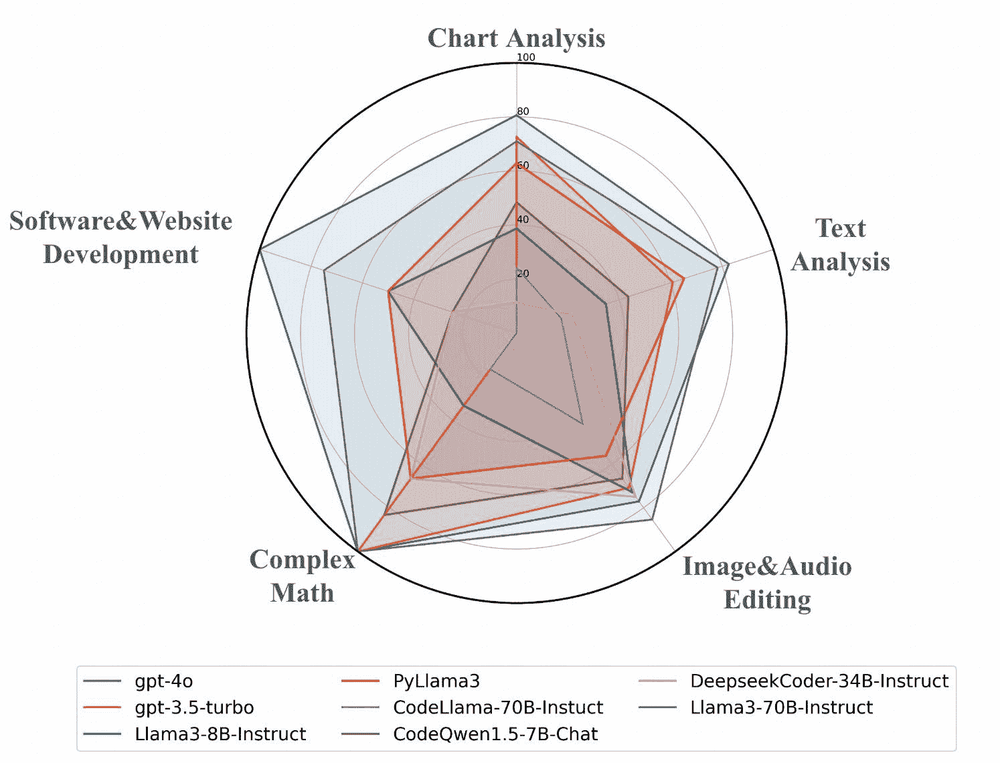

图1：LLMs在PyBench上的表现概览

最好的工具是能够完成任务的工具。像数据分析和图像音频处理这样庞大的实际任务，可以通过代码来解决。在众多编程语言中，Python因其简洁性、易用性、丰富的库和高兼容性而脱颖而出，成为日常任务中广泛使用的工具。然而，即使个体在Python本身已经非常熟练，他们通常仍需要花费大量时间学习如何使用扩展包。得益于LLM强大的代码能力，它能够充当自动代理，Wang等人（[2024a](https://arxiv.org/html/2407.16732v2#bib.bib32)）；Park等人（[2023](https://arxiv.org/html/2407.16732v2#bib.bib26)）；Qin等人（[2023](https://arxiv.org/html/2407.16732v2#bib.bib28)）通过编写和执行代码来解决广泛的实际任务。

然而，目前的LLM代码基准测试并未涵盖现实世界任务领域。HumanEval 陈等人（[2021](https://arxiv.org/html/2407.16732v2#bib.bib4)）和MBPP Austin等人（[2021](https://arxiv.org/html/2407.16732v2#bib.bib1)）侧重于函数补全和简单的Python问题，这些任务无法评估LLM代理的实用性。

尽管DS-1000 Lai等人（[2023](https://arxiv.org/html/2407.16732v2#bib.bib18)）、DevBench Li等人（[2024](https://arxiv.org/html/2407.16732v2#bib.bib19)）和SWE-Bench Jimenez等人（[2023](https://arxiv.org/html/2407.16732v2#bib.bib16)）等基准测试关注的是代码库层级的问题，但它们评估的是LLM在使用和管理特定代码库方面的能力。这些任务的范围相对狭窄且固有的限制，偏离了实际的日常应用场景，并且对于常规使用来说过于复杂。

为了解决现实世界编程任务缺乏基准测试的问题，我们引入了PyBench，这是一个全面且多功能的基准测试，旨在评估LLM的实际编程能力。具体而言，我们将现实世界的编程任务划分为5个主要类别：图表分析、文本分析、图像与音频编辑、复杂数学和软件与网站开发。每个类别包含一系列全面的子任务，反映现实世界的情境。每个子任务都收集了相关的文件，查询也根据文件的内容进行定制。为了对PyBench任务进行定量评估，我们创建了一套单元测试，以验证任务是否成功解决。我们还使用GPT-4作为评审员来评估解决方案，并通过计算平均回合数来衡量问题解决效率。我们在PyBench上评估了3种类型的模型：封闭源代码的LLM、70B、33B和7B规模的开源LLM，以及专门为编程任务定制的代码LLM。评估结果表明，大多数LLM在解决PyBench任务时遇到困难。

因此，我们收集并综合了四个数据集：同源训练数据集、多轮代码交互数据集、多轮聊天数据集和代码丰富语料库以继续预训练。接着，我们进行了一系列分析和实验，以找出解决PyBench任务所需的必要能力，以及如何提高LLM在现实世界编程任务中的表现。结果表明，仅有同源数据无法帮助基础模型适应现实世界的编程任务。多轮代码交互数据集显著提升了综合能力。具体来说，多轮聊天数据集提升了图表分析的表现，而在代码丰富语料库上的继续预训练则改善了文本分析的表现。在这些数据集上进行训练后，我们微调的8B大小模型PyLlama3在PyBench上超越了Llama3-8B-Instruct。

总结来说，我们的贡献如下：

+   •

    我们构建了PyBench，这是第一个用于评估LLM代理在现实世界编码任务中的综合基准。PyBench包括现实世界的文件和相关查询，涵盖了广泛的日常情况和文件类型。

+   •

    我们提出了PyBench任务，这些任务需要代理具备全面的能力。仅使用同类数据不足以将基础模型适应于现实世界的编码任务。代理的多轮交互能力至关重要，继续在代码丰富的语料库上进行预训练也是有益的。

+   •

    我们在代码丰富的语料库上继续对Llama3-8B-Base进行预训练，并在同类的多轮代码和多轮对话数据集上进行微调。我们的PyLlama3模型在PyBench上表现出色。

| 类别 | 子类 | 相关的Python包 |
| --- | --- | --- |
| 图表分析 | 数据预处理、数据可视化、机器学习等 | pandas, numpy, sklearn, matplotlib等 |
| 文本分析 | 基于文本的问答、主题分析、词云等 | jieba, wordcloud, PyPDF2等 |
| 图像与音频编辑 | 图像生成、声音特征提取等 | opencv, PIL, pydub等 |
| 复杂数学 | 大数计算、微积分等 | numpy, scipy等 |
| 软件与网站开发 | 游戏设计、网站设计等 | pygame, bs4等 |

表1：PyBench任务类型及相关Python包。我们仅为这些任务选择了常用的Python包，尽管其他Python包也可以用于特定任务。

## 2 相关工作

### 2.1 编程能力基准

许多现有的基准测试集中在LLM的代码能力上。HumanEval Chen等人（[2021](https://arxiv.org/html/2407.16732v2#bib.bib4)）和MBPP Austin等人（[2021](https://arxiv.org/html/2407.16732v2#bib.bib1)）是两个广泛认可的基准，主要评估LLM完成函数或解决简单Python问题的能力。HumanEval-X、HumanEval+和MBPP+ Zheng等人（[2024a](https://arxiv.org/html/2407.16732v2#bib.bib42)）；Liu等人（[2023a](https://arxiv.org/html/2407.16732v2#bib.bib21)）通过增加多语言支持和大量额外测试扩展了这些基准。APPS Hendrycks等人（[2021](https://arxiv.org/html/2407.16732v2#bib.bib12)）聚焦于从自然语言描述中编写代码。TACO Li等人（[2023](https://arxiv.org/html/2407.16732v2#bib.bib20)）构建了一个更复杂的基准，评估LLM在算法代码任务上的表现。XCodeEval Khan等人（[2023](https://arxiv.org/html/2407.16732v2#bib.bib17)）和CodeScope Yan等人（[2024](https://arxiv.org/html/2407.16732v2#bib.bib38)）提供了基于执行的多语言代码基准，但没有与文件的真实交互。MINT Wang等人（[2023a](https://arxiv.org/html/2407.16732v2#bib.bib34)）和$M^{3}$ToolEval Wang等人（[2024b](https://arxiv.org/html/2407.16732v2#bib.bib33)）旨在评估模型在工具或人类反馈下的多回合交互代码能力。还有一些极其复杂且具有挑战性的基准，评估LLM在软件开发中的表现，Qian等人（[2023](https://arxiv.org/html/2407.16732v2#bib.bib27)）；Hong等人（[2023](https://arxiv.org/html/2407.16732v2#bib.bib14)），代码库问题Jimenez等人（[2023](https://arxiv.org/html/2407.16732v2#bib.bib16)）；Li等人（[2024](https://arxiv.org/html/2407.16732v2#bib.bib19)）；Zhang等人（[2023](https://arxiv.org/html/2407.16732v2#bib.bib41)）；Du等人（[2023](https://arxiv.org/html/2407.16732v2#bib.bib9)），以及数据科学任务Lai等人（[2023](https://arxiv.org/html/2407.16732v2#bib.bib18)）。然而，这些基准都局限于特定场景。据我们所知，目前没有现有的基准测试评估LLM代理在真实世界编码任务中的表现，尤其是在与文件交互的多种情境下。

### 2.2 代码LLMs

先前的研究通过各种方法增强LLM的编码能力。OpenCodeInterpreter Zheng等人（[2024b](https://arxiv.org/html/2407.16732v2#bib.bib43)）引入了CodeFeedback数据集和带有反馈的代码执行系统。经过微调的模型在编码基准测试中表现出色。CodeAct Wang等人（[2024b](https://arxiv.org/html/2407.16732v2#bib.bib33)）使用可执行的Python代码统一LLM代理的动作空间，通过多轮交互执行复杂任务。NexT Ni等人（[2024](https://arxiv.org/html/2407.16732v2#bib.bib25)）教授LLM逐步推理代码执行过程，有效提高了代码质量。WizardCoder Luo等人（[2023](https://arxiv.org/html/2407.16732v2#bib.bib24)）、Magicoder Wei等人（[2024](https://arxiv.org/html/2407.16732v2#bib.bib37)）和AlchemistCoder Song等人（[2024](https://arxiv.org/html/2407.16732v2#bib.bib30)）通过来自大量多源数据的有效微调数据集，训练了先进的代码LLM。通过在丰富的代码数据上进行预训练也是帮助LLM编码的好方法。CodeQwen Bai等人（[2023](https://arxiv.org/html/2407.16732v2#bib.bib2)）和DeepSeek-Coder Guo等人（[2024](https://arxiv.org/html/2407.16732v2#bib.bib11)）；DeepSeek-AI等人（[2024](https://arxiv.org/html/2407.16732v2#bib.bib7)）通过继续在代码数据上进行预训练并采用监督微调策略，开发了专门的编码模型。

### 2.3 LLM代理用于实际任务

LLM作为代理是Qian等人（[2023](https://arxiv.org/html/2407.16732v2#bib.bib27)）、Park等人（[2023](https://arxiv.org/html/2407.16732v2#bib.bib26)）、Chen等人（[2024](https://arxiv.org/html/2407.16732v2#bib.bib6)）在实际任务中利用LLM的伟大尝试。ReAct Yao等人（[2022](https://arxiv.org/html/2407.16732v2#bib.bib40)）首次引入了代理的推理与行动格式。先前的研究设计了许多框架，构建并组织LLM代理来完成实际的编码任务。MetaGPT Hong等人（[2023](https://arxiv.org/html/2407.16732v2#bib.bib14)）、ChatDev Qian等人（[2023](https://arxiv.org/html/2407.16732v2#bib.bib27)）、DataInterpreter Hong等人（[2024](https://arxiv.org/html/2407.16732v2#bib.bib13)）和MatplotAgent Yang等人（[2024](https://arxiv.org/html/2407.16732v2#bib.bib39)）通过代理完成软件开发或数据科学任务。AgentCoder Huang等人（[2023](https://arxiv.org/html/2407.16732v2#bib.bib15)）专注于简单的代码补充任务。此外，一些通用的多代理系统尝试将代理适应于各种任务，如Chen等人（[2023b](https://arxiv.org/html/2407.16732v2#bib.bib5), [a](https://arxiv.org/html/2407.16732v2#bib.bib3)）和Wang等人（[2023b](https://arxiv.org/html/2407.16732v2#bib.bib35)）。

## 3 PyBench

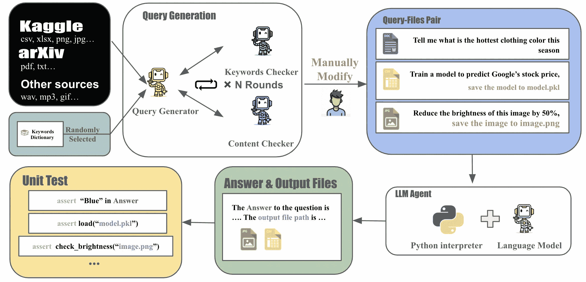

图2：PyBench的构建与评估工作流程

编程是 LLM Agent 的核心技能。当 Agent 需要解决实际的编码任务时，它不仅应编写可执行代码，还应利用执行结果来指导后续操作并与文件交互。Python 是一门强大的编程语言，拥有近 400 万个软件包，几乎能够覆盖所有实际编码任务。因此，我们提出构建 PyBench 来评估 LLM Agent 在推理、编写可执行 Python 代码以及利用代码结果方面的能力。

### 3.1 任务表述

我们首先定义了作为一个真正有用的配备 Python 代码解释器的 LLM Agent 需要解决的任务类型。给定一个以自然语言描述的用户查询 $q$ 和相关文件 $F_{in}$，Agent 需要生成一个正式的答案 $Ans$ 来回应用户查询，并输出文件 $F_{out}$，以满足用户的需求：

|  | $Ans,F_{out}=A(q,F_{in})$ |  | (1) |
| --- | --- | --- | --- |

其中，$A$ 是配备代码解释器的 LLM Agent。具体来说，用户的查询 $q$ 可以是非常高层次的，反映了日常生活中常见的情形，在这些情形下，用户可能没有明确的需求。相关的文件 $F_{in}$ 包含多种类型的数据，如图表、文本、音频、图像等，展示了 LLM Agent 应该能够适应各种实际编码任务。

### 3.2 任务类别

在实际编码应用领域，LLM Agent 需要自主解决各种实际编码挑战。为了确保全面评估其能力，我们精心挑选了五个主要类别的实际编码任务。每个类别旨在测试 LLM Agent 在广泛场景中的熟练程度，从数据分析到软件开发。表 [1](https://arxiv.org/html/2407.16732v2#S1.T1 "Table 1 ‣ 1 Introduction ‣ PyBench: Evaluating LLM Agent on various real-world coding tasks") 展示了这些类别：

图表分析。在数字时代，高效分析和解读数据的能力不可或缺。本类别侧重于涉及处理 csv 或 xlsx 文件的任务，用于数据预处理、转换、可视化以及应用机器学习算法（Hong 等，([2024](https://arxiv.org/html/2407.16732v2#bib.bib13)); Yang 等，([2024](https://arxiv.org/html/2407.16732v2#bib.bib39))）。LLM Agent 的输出包括详细的分析报告、可视化表示，甚至是以 pkl 或 joblib 格式保存的训练过的机器学习模型。

文本分析。本类别包含与处理 txt 和 pdf 文件相关的任务，包括摘要、关键词提取、词云生成和主题分析。

图像与音频编辑。随着视觉内容日益普及，个性化图像处理解决方案的需求也在上升。此类别评估 LLM 代理通过各种技术（如饱和度调整、合并、裁剪以及从头生成二维码）处理 png 和 jpg 格式图像的能力。与图像处理并行，该类别还关注音频文件的处理（例如 mp3 和 wav）。任务包括音量控制、音频修剪和创建音频可视化，反映了音频内容创作和修改领域用户的多样化需求。

复杂数学。超出了基本计算器或 Wei 等人提出的**链式思维方法**（[2022](https://arxiv.org/html/2407.16732v2#bib.bib36)）的能力范围，这一类别涉及大规模计算、多项式方程求解和高级微积分问题。它旨在测试 LLM 代理通过代码解释器导航并解决复杂数学问题的能力。

网站与软件开发。此类别专注于编码技能在个人网站和简单软件项目（如吃豆人游戏）开发中的实际应用。它评估 LLM 代理将用户需求转化为功能性和互动性应用程序的能力，展示其在软件开发中的多样性和创造力 **Hong 等人**（[2023](https://arxiv.org/html/2407.16732v2#bib.bib14)）；**Qian 等人**（[2023](https://arxiv.org/html/2407.16732v2#bib.bib27)）。

### 3.3 数据收集

我们从两个主要来源收集并筛选 PyBench 中的文件。

Kaggle 数据。[Kaggle](https://www.kaggle.com/) 是一个极好的机器学习平台，包含海量数据集。我们通过网络爬虫从 Kaggle 获取了 csv 和 xlsx 数据。筛选文件有两个原则。首先，文件不应过大，因为测试环境的内存有限。其次，数据表必须包含多个具有明确意义的列，以模拟常用文件。

arXiv 数据。我们从 [arXiv](https://arxiv.org/) 收集 pdf 和 txt 文件。arXiv 上的论文具有高质量的文本，主题和结构清晰，适用于基于文本的 QA、主题分析和绘制词云。

其他来源数据。对于其他文件类型，我们负责地从互联网收集文件，包括 png、jpeg、gif、mp3 和 wav，确保所有内容遵守版权法，保护用户隐私，并无有害元素。

### 3.4 任务生成

PyBench 中的查询必须与文件精确相关并且多样化，以确保全面覆盖。为了生成这些查询，我们设计了一个多代理合作机制。图 [2](https://arxiv.org/html/2407.16732v2#S3.F2 "Figure 2 ‣ 3 PyBench ‣ PyBench: Evaluating LLM Agent on various real-world coding tasks") 展示了 PyBench 的构建工作流。

首先，我们为每个类别中的每个子类准备关键词列表，形成每个类别的关键词字典（Eldan 和 Li，[2023](https://arxiv.org/html/2407.16732v2#bib.bib10)）。文件类型决定任务所属的类别。给定文件的初始行（对于图表和文本文件）和从相关类别字典中随机选择的关键词，查询生成器选择与文件内容一致的适当关键词并生成查询。详细的关键词列表示例可在附录[B](https://arxiv.org/html/2407.16732v2#A2 "附录 B 各类别关键词示例 ‣ PyBench：评估 LLM Agent 在各种真实世界编码任务中的表现")中找到。

接下来，关键词检查器和内容检查器验证查询是否与文件内容和选定的关键词一致。这些检查器的反馈用于优化查询。一旦两个检查器都通过，查询将进行人工编辑，以明确输出格式和文件路径，方便验证。如果查询生成器在5轮内未能生成有效的查询，则跳过这些文件。

通过所有检查的查询与相关文件配对，形成查询-文件对，构成 PyBench 中的任务。附录[A.2](https://arxiv.org/html/2407.16732v2#A1.SS2 "A.2 查询生成提示 ‣ 附录 A 提示 ‣ PyBench：评估 LLM Agent 在各种真实世界编码任务中的表现") 和 [A.3](https://arxiv.org/html/2407.16732v2#A1.SS3 "A.3 检查器提示 ‣ 附录 A 提示 ‣ PyBench：评估 LLM Agent 在各种真实世界编码任务中的表现") 详细描述了每个代理的提示。

### 3.5 评估

#### 3.5.1 轨迹生成

为 LLM Agent 配备代码解释器。我们为每个 LLM 配备了代码解释器，以执行由 LLM 编写的 Python 代码，并提供执行结果的反馈。以往关于 LLM 工具使用的研究（Qin 等，[2023](https://arxiv.org/html/2407.16732v2#bib.bib28)）通常以函数调用格式使用工具。受到 Wang 等人（[2024b](https://arxiv.org/html/2407.16732v2#bib.bib33)）研究的启发，他们使用代码作为动作并且优于其他方式，我们设计了两个特殊的标记：<|execute_start|> 和 <|execute_end|>，以帮助 LLM 更有效地使用代码解释器。附录[D](https://arxiv.org/html/2407.16732v2#A4 "附录 D 代码作为动作与函数调用 ‣ PyBench：评估 LLM Agent 在各种真实世界编码任务中的表现")展示了这两种格式的不同表现。

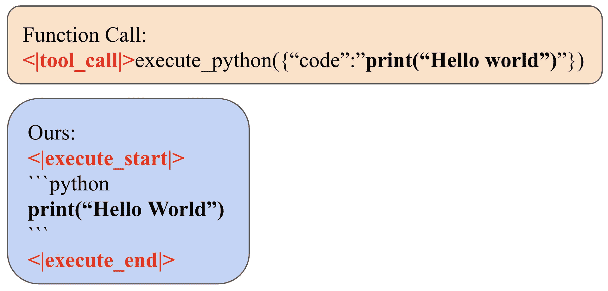

图 3：函数调用 vs. 我们的代码解释器格式

推理与行动。给定任务描述和上传的文件路径，LLM 代理被提示分析当前情况并在编写可执行代码之前规划其行动（Yao 等人，[2022](https://arxiv.org/html/2407.16732v2#bib.bib40)）。代码将在预定义的 Python 环境中执行（包含常用的包）。无论是输出还是错误信息，代码的结果都将作为反馈提供给 LLM。LLM 将继续循环，直到完成任务或达到最大步骤限制（默认设置为 10）。图 [4](https://arxiv.org/html/2407.16732v2#S3.F4 "图 4 ‣ 3.5.1 轨迹生成 ‣ 3.5 评估 ‣ 3 PyBench ‣ PyBench：评估 LLM 代理在各种真实世界编程任务中的表现") 详细描述了这一过程。

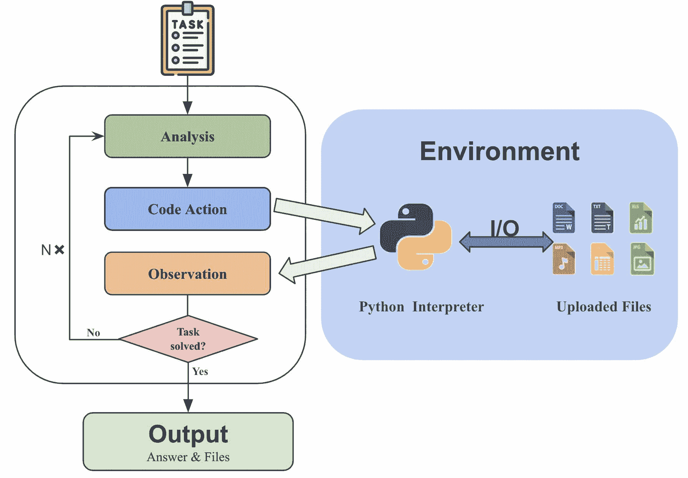

图 4：通过 ReAct 生成轨迹数据

#### 3.5.2 单元测试

为了客观有效地测试 LLM 代理是否完成任务，我们为 PyBench 中的每个任务实现了单元测试。对于有固定答案的任务，我们验证代理是否提供包含正确答案的最终响应。对于需要文件输出的任务，如清理数据集或编辑图像和音频，我们检查输出文件是否符合规定的要求。对于没有固定答案的任务，如生成词云或网站，我们验证输出文件是否存在。单元测试的设计详见附录 [C](https://arxiv.org/html/2407.16732v2#A3 "附录 C 示例单元测试 ‣ PyBench：评估 LLM 代理在各种真实世界编程任务中的表现")

#### 3.5.3 LLM 作为评估者

虽然单元测试方便且客观，但它们可能无法全面评估开放性任务，例如评估大模型输出文本的连贯性和流畅性。因此，我们还使用 LLM（GPT-4o）作为评估者，为每个轨迹提供通过或未通过的决定，作为单元测试的替代方案。附录 [A.4](https://arxiv.org/html/2407.16732v2#A1.SS4 "A.4 评估提示 ‣ 附录 A 提示 ‣ PyBench：评估 LLM 代理在各种真实世界编程任务中的表现") 提供了用于 LLM 评估者的详细提示。

| 数据集 | 指令 | 每轨迹回合数 | 每轨迹令牌数 |
| --- | --- | --- | --- |
|  |  | <=3 | 4to6 | 7to9 | >=10 |  |
| CodeFeedback | 66383 | 41696 | 21583 | 2923 | 181 | 1503.93 |
| CodeActInstruct | 7139 | 3482 | 3567 | 0 | 0 | 1165.03 |
| PyInstruct | 3091 | 1234 | 1644 | 164 | 49 | 2017.15 |

表 2：CodeFeedback、CodaActInstruct 和 PyInstruct 的统计数据。标记统计数据通过使用 Llama-2 分词器计算。

#### 3.5.4 评估指标

PyBench 中有三个评估指标。

通过率（UT）。通过单元测试评估的任务的百分比。

通过率（LLM）。由 LLM 评估器评估通过的任务的百分比。

平均轮次。完成每个任务所需的步骤数。如果任务失败，则将轮次设置为最大轮次限制（10轮）。

## 4 微调LLM代理以应对现实世界编码任务

为了弄清楚需要哪些能力以及哪些训练数据能够帮助提升LLM代理在PyBench上的表现，我们收集了4个数据集，提升代理在规划、编码和多轮交互方面的能力。

同类数据集。直观地，使用同类数据集能够提升在类似任务上的表现。因此，我们使用GPT-3.5-turbo合成了一个同类数据集：PyInstruct。我们采用与PyBench相同的方法生成任务，但使用不同的文件，并且不进行人工修改。随后，利用[3.5.1节](https://arxiv.org/html/2407.16732v2#S3.SS5.SSS1 "3.5.1 轨迹生成 ‣ 3.5 评估 ‣ 3 PyBench ‣ PyBench：评估LLM代理在各种现实世界编码任务中的表现")中描述的方法，我们基于这些任务合成了3091个轨迹。这些轨迹涵盖了PyBench中的每个任务类别，最终构建了PyInstruct作为PyBench的同类数据集。代码交互数据集的多轮任务。PyBench中的大部分任务需要与Python代码解释器进行多轮交互。它会提供代码执行结果的反馈或错误追踪信息，这些都应当被LLM代理充分利用。现有的几个数据集旨在提升LLM的能力。CodeActInstruct Wang等人（[2024b](https://arxiv.org/html/2407.16732v2#bib.bib33)）专注于提升LLM在多轮任务中的能力，如信息检索、软件工具使用、外部内存访问和机器人规划，所有任务均以Python代码的形式执行。CodeFeedback Zheng等人（[2024b](https://arxiv.org/html/2407.16732v2#bib.bib43)）筛选开源代码指令数据并将其转换为带执行结果的多轮代码。我们通过“为Python代码解释器配备”特定的标记来重新利用这些数据。这些数据集可能有助于增强LLM利用代码反馈的能力。[表2](https://arxiv.org/html/2407.16732v2#S3.T2 "表2 ‣ 3.5.3 LLM作为评估者 ‣ 3.5 评估 ‣ 3 PyBench ‣ PyBench：评估LLM代理在各种现实世界编码任务中的表现")展示了CodeFeedback、CodeActInstruct和PyInstruct的统计信息。

多轮对话数据集。此外，在PyBench中，LLM代理需要理解用户的指令，并在完成任务后提供正式回应。高质量的多轮对话对代码代理也至关重要。UltraChat Ding 等人（[2023](https://arxiv.org/html/2407.16732v2#bib.bib8)）是一个大规模数据集，包含150万个高质量的多轮指导对话，专为提升开源对话模型的性能而设计，完美契合我们的需求。

代码丰富语料库。一个代码代理的基础能力是其代码的质量和正确性。我们假设继续在代码丰富的语料库上进行预训练有助于解决 PyBench 任务。The-stack-v2 Lozhkov 等人（[2024](https://arxiv.org/html/2407.16732v2#bib.bib23)）介绍了一个包含 1100 万行代码的 Jupyter notebook 代码丰富语料库。

在收集了四种类型的数据集后，我们进行了系列实验，旨在弄清楚哪些能力是解决 PyBench 任务所必需的，以及如何提升 LLM 在实际编程任务中的表现。

## 5 实验

| 模型 | 参数 | PyBench | HumanEval(+) | MBPP(+) |
| --- | --- | --- | --- | --- |
|  |  | 通过率（LLM） | 通过率（UT） | 平均回合数 |  |  |
|  |  |  | 图表. | 文本. | 图像. | 数学. | 软件. | 总体 |  |  |  |
| 闭源模型 |  |  |  |  |  |  |  |  |  |  |  |
| GPT-3.5 Turbo | - | 58.3 | 72.6 | 60.9 | 70.8 | 100.0 | 0.0 | 62.9 | 5.2 | 78.6(70.7) | 82.5(69.7) |
| GPT-4o | - | 81.8 | 80.6 | 82.6 | 77.1 | 100.0 | 100.0 | 79.7 | 4.3 | 91.5(85.4) | 91.2(76.6) |
| GPT-4o-mini | - | 67.1 | 77.4 | 69.6 | 87.5 | 100.0 | 100.0 | 81.1 | 4.5 | 87.2(85.4) | 90.5(76.5) |
| 70B 参数 |  |  |  |  |  |  |  |  |  |  |  |
| Llama3-Instruct | 70B | 80.2 | 38.7 | 34.8 | 72.9 | 33.3 | 50.0 | 78.3 | 4.0 | 77.4(72.0) | 82.3(69.0) |
| CodeLlama-Instruct | 70B | 26.6 | 24.2 | 17.4 | 41.7 | 16.7 | 0.0 | 37.8 | 7.5 | 72.0(65.9) | 62.2(51.2) |
| DeepSeek-llm-chat | 67B | 39.4 | 21.0 | 17.4 | 37.5 | 33.3 | 25.0 | 26.6 | 9.2 | 67.7(58.5) | 62.2(50.5) |
| 33B 参数 |  |  |  |  |  |  |  |  |  |  |  |
| DeepSeek-coder-Instruct | 33B | 35.3 | 22.6 | 0.0 | 4.2 | 16.7 | 0.0 | 37.0 | 6.7 | 81.1(75.0) | 80.4(70.1) |
| CodeLlama-Instruct | 34B | 9.6 | 8.1 | 13.0 | 0.0 | 16.7 | 0.0 | 6.3 | 8.9 | 51.8(43.9) | 69.3(56.3) |
| Yi-1.5-Chat-16K | 34B | 44.2 | 33.9 | 34.8 | 56.3 | 50.0 | 0.0 | 41.3 | 9.0 | 58.8(53.4) | 77.5(63.6) |
| Qwen-1.5-Chat | 32B | 43.0 | 12.9 | 39.1 | 10.4 | 50.0 | 75.0 | 19.6 | 9.3 | 58.5(55.5) | 66.1(56.1) |
| Gemma-2-Instruct | 27B | 66.1 | 58.1 | 56.5 | 87.5 | 83.3 | 75.0 | 69.2 | 5.0 | 49.4(45.7) | 73.3(61.1) |
| 7B 参数 |  |  |  |  |  |  |  |  |  |  |  |
| Llama3-Instruct | 8B | 49.7 | 43.5 | 26.1 | 72.9 | 66.7 | 50.0 | 49.7 | 6.7 | 61.6(56.7) | 70.1(59.3) |
| Mistral-Instruct-v0.2 | 7B | 17.5 | 17.7 | 17.4 | 18.8 | 16.7 | 0.0 | 17.5 | 8.9 | 35.4(30.5) | 31.0(24.1) |
| Gemma-2-Instruct | 9B | 41.7 | 37.1 | 30.4 | 70.1 | 83.3 | 50.0 | 49.7 | 7.2 | 55.5(48.8) | 66.1(56.1) |
| Qwen2-Instruct | 7B | 57.8 | 59.7 | 47.8 | 58.3 | 83.3 | 75.0 | 58.7 | 5.9 | 64.6(61.0) | 62.3(52.3) |
| CodeQwen1.5-chat | 7B | 49.2 | 48.4 | 43.5 | 66.7 | 83.3 | 25.0 | 54.5 | 7.9 | 83.5(78.7) | 79.4(69.0) |
| CodeActAgent-Llama2 | 7B | 12.4 | 16.1 | 21.7 | 20.8 | 33.3 | 0.0 | 18.9 | 8.1 | 18.9(15.2) | 22.8(18.3) |
| CodeActAgent-Mistral | 7B | 18.8 | 17.7 | 4.3 | 20.8 | 16.7 | 0.0 | 16.1 | 8.8 | 28.7(26.8) | 43.9(35.4) |
| OpenCodeInterpreter-DS | 6.7B | 25.0 | 11.3 | 21.7 | 75.0 | 66.7 | 25.0 | 51.7 | 6.8 | 77.4(73.8) | 80.2(66.4) |
| InternLM2_5-chat | 7B | 17.5 | 32.3 | 13.0 | 4.17 | 50.0 | 25.0 | 20.27 | 9.84 | 57.3(51.2) | 61.6(51.5) |
| PyLlama3(无cpt) | 8B | 56.7 | 58.0 | 52.2 | 73.0 | 50.0 | 50.0 | 58.7 | 6.3 | 54.3(48.2) | 59.5(50.3) |
| PyLlama3 | 8B | 73.4 | 62.9 | 65.2 | 56.3 | 66.7 | 50.0 | 60.8 | 6.1 | 57.3(48.2) | 62.2(51.1) |

表3：主要结果表。我们测试了闭源模型、70B大小模型、33B大小模型和7B大小模型。我们将每个大小模型的最佳结果加粗。

| PyInst. | Code. | UltraCh. | Jupyter. | 通过率(UT) |
| --- | --- | --- | --- | --- |
|  |  |  |  | 图表. | 文本. | 图片. | 数学. | 软件. | 总体 |
| --- | --- | --- | --- | --- | --- | --- | --- | --- | --- |
| ✓ | ✗ | ✗ | ✗ | 3.2 | 13.0 | 6.3 | 50.0 | 25.0 | 8.4 |
| ✗ | ✓ | ✗ | ✗ | 40.3 | 26.1 | 58.3 | 83.3 | 25.0 | 45.5 |
| ✓ | ✓ | ✗ | ✗ | 51.6 | 56.5 | 60.4 | 100.0 | 25.0 | 56.6 |
| ✓ | ✓ | ✓ | ✗ | 62.9 | 52.2 | 56.3 | 83.3 | 25.0 | 58.7 |
| ✓ | ✓ | ✗ | ✓ | 58.0 | 52.2 | 73.0 | 50.0 | 50.0 | 59.4 |
| ✓ | ✓ | ✓ | ✓ | 62.9 | 65.2 | 56.3 | 66.7 | 50.0 | 60.8 |

表4：使用不同训练数据集的通过率（UT）。PyInst.代表PyInstruct。Code.指的是Codefeedback和CodeActInstruct。UltraCh.指的是UltraChat，Jupyter.表示在Jupyter笔记本语料库上继续预训练。

### 5.1 PyBench的主要结果

测试评估设置。首先，我们准备一个包含182个常用Python包的conda环境（详细信息见附录[G](https://arxiv.org/html/2407.16732v2#A7 "附录G 我们环境中的Python包 ‣ PyBench：评估LLM代理在各种现实世界编程任务中的表现")）。最大回合数设置为$k=10$。我们提示LLM使用代码解释器，并遵循ReAct Yao等人（[2022](https://arxiv.org/html/2407.16732v2#bib.bib40)）的格式。（附录[A.4](https://arxiv.org/html/2407.16732v2#A1.SS4 "A.4 评估提示 ‣ 附录A 提示 ‣ PyBench：评估LLM代理在各种现实世界编程任务中的表现")）LLM响应中的代码将被提取，并将执行结果返回给LLM。获取轨迹和输出文件后，我们通过单元测试集（UT）和LLM评估集（LLM）计算通过率。我们还采用其他基准来测试模型的基本编码能力，包括HumanEval Chen等人（[2021](https://arxiv.org/html/2407.16732v2#bib.bib4)）和HumanEval+ Liu等人（[2023a](https://arxiv.org/html/2407.16732v2#bib.bib21)）进行单回合代码生成测试，以及MBPP Austin等人（[2021](https://arxiv.org/html/2407.16732v2#bib.bib1)）和MBPP+ Liu等人（[2023a](https://arxiv.org/html/2407.16732v2#bib.bib21)）进行简单Python编程问题测试。

PyBench的结果。表[3](https://arxiv.org/html/2407.16732v2#S5.T3 "Table 3 ‣ 5 Experiment ‣ PyBench: Evaluating LLM Agent on various real-world coding tasks")展示了我们的主要实验结果。GPT-4o在所有五个任务中都得分很高，展现了其强大的能力。然而，包括CodeLlama-Instruct-70B、DeepSeek-coder-Instruct-33B和CodeLlama-Instruct-33B在内的模型，尽管在代码语料库上进行了训练，并且在人类评测（HumanEval）和MBPP测试中表现优异，但在解决PyBench任务时却遇到困难，证明了代码能力并不总是能带来PyBench上的好成绩。大多数先进的7B规模模型仅能解决PyBench中约50%的任务。我们的PyLlama3，在相关数据集上持续进行预训练和微调，超越了Llama3-8B-Instruct，在图表分析、文本分析和复杂数学任务上表现更佳。

编程能力是基础。CodeActAgent-Llama-2-7B和CodeActAgent-Mistral-7B Wang等人（[2024b](https://arxiv.org/html/2407.16732v2#bib.bib33)）尽管在CodeActInstruct上进行了训练，该方法教授LLM代理使用代码格式的工具，但在PyBench上的表现最差。失败可能是由于在基本编程能力基准（如HumanEval(+)和MBPP(+)）上的低性能造成的。该结果表明，基本的编程能力是解决PyBench中真实世界编程任务的基础。

PyBench评估LLM代理的综合能力。尽管在基本编程基准上表现出色，但这并不直接导致在PyBench上的同等表现。尽管像DeepSeek-coder-Instruct-33B和CodeLlama-Instruct-34B这样的模型在人类评测（HumanEval(+)）和MBPP(+）上得分不错，但它们在PyBench上得分较低。这表明，单纯的编程能力无法在真实世界编程任务中取得成功。PyBench还评估了LLM代理的其他能力，包括规划、多轮互动、利用代码反馈和生成正式的用户回应。

比较LLM评估器与单元测试。表[3](https://arxiv.org/html/2407.16732v2#S5.T3 "Table 3 ‣ 5 Experiment ‣ PyBench: Evaluating LLM Agent on various real-world coding tasks")显示LLM评估结果与单元测试结果总体一致，仅存在少量波动。然而，几种模型的结果存在显著差异。为了调查这一点，我们从整个数据集中随机选择了60个轨迹进行人工评估。我们发现，在超过80%的情况下，LLM评估结果与单元测试结果一致。尽管如此，在某些情况下，LLM评估器可能仅判断代码是否成功执行，而未验证其正确性。在其他情况下，测试过的LLM代理可能编写代码或提供恰巧通过单元测试的答案。关于这些场景的详细分析，请参见附录[E](https://arxiv.org/html/2407.16732v2#A5 "Appendix E Compare LLM Evaluator and Unit Test ‣ PyBench: Evaluating LLM Agent on various real-world coding tasks")。

### 5.2 训练数据集分析

在本节中，我们对训练数据集进行了消融研究，以探讨解决 PyBench 所需的必要能力。

#### 5.2.1 训练设置

我们对 Llama3-8B 进行了全参数的监督微调，序列长度为 32768 个标记（Liu 等人，[2023b](https://arxiv.org/html/2407.16732v2#bib.bib22)；Roziere 等人，[2023](https://arxiv.org/html/2407.16732v2#bib.bib29)；Touvron 等人，[2023](https://arxiv.org/html/2407.16732v2#bib.bib31)），确保其能够处理图表和文本文件的内容。对于每个版本的监督微调模型，我们使用了 32 张 A100 GPU，训练了 4000 步。学习率设定为 1e-5，暖启动比例为 0.05，并采用余弦调度器。至于继续预训练的模型，我们额外增加了 3000 步以训练语料库。

#### 5.2.2 消融研究

LLMs 在特定任务上的表现通常可以通过在同源数据集上的监督微调得到提升，在这种情况下，模型能学习到在特定情境下应该做什么。最初，我们假设通过在 PyInstruct 上对 Llama3-8B-base 模型进行训练，使用 3k 同源轨迹数据，能够使模型学会处理现实世界中的编码任务。然而，正如表格 [4](https://arxiv.org/html/2407.16732v2#S5.T4 "Table 4 ‣ 5 Experiment ‣ PyBench: Evaluating LLM Agent on various real-world coding tasks") 所示，该模型在 PyBench 任务中表现不佳。从生成的轨迹中，我们观察到模型未能遵循人类的指令，甚至在查找正确的文件路径时也存在困难。

为了解决模型的不足，我们添加了两个多轮代码交互数据集：CodeActInstruct Wang 等人（[2024b](https://arxiv.org/html/2407.16732v2#bib.bib33)）和 CodeFeedback Zheng 等人（[2024b](https://arxiv.org/html/2407.16732v2#bib.bib43)）。我们在这些数据集和 PyInstruct 上训练了模型。结果显示，模型性能有了显著提高。但是，当我们去除 PyInstruct，只在 CodeActInstruct 和 CodeFeedback 上训练模型时，模型在图表分析和文本分析任务上的表现急剧下降，证明了 PyInstruct 可以增强模型的能力。

此外，为了进一步提升模型的能力，我们在训练数据集中添加了 UltraChat Ding 等人（[2023](https://arxiv.org/html/2407.16732v2#bib.bib8)），并使用相同的训练设置对模型进行了训练。然而，结果表明，添加 UltraChat 仅对图表分析任务带来了提升。

我们发现模型在使用某些包和特定技术处理现实世界编码任务时仍然存在困难。因此，我们在进行 PyInstruct、CodeFeedback、CodeActInstruct 和 UltraChat 微调之前，先在 Jupyter Notebook 语料库 Lozhkov 等人（[2024](https://arxiv.org/html/2407.16732v2#bib.bib23)）上进行了继续预训练。如表[4](https://arxiv.org/html/2407.16732v2#S5.T4 "Table 4 ‣ 5 Experiment ‣ PyBench: Evaluating LLM Agent on various real-world coding tasks")所示，继续预训练也能显著提升文本分析任务的表现。继续预训练后的模型在进行 PyInstruct、CodeFeedback、CodeActInstruct 和 UltraChat 微调后，取得了最佳表现，我们将其命名为 PyLlama3。未进行继续预训练的版本则命名为 PyLlama3（w/o cpt）。

总之，我们发现 PyBench 需要模型具备基本的编码能力，这些能力指引模型正确编写 Python 代码，还需要具备多轮交互和推理能力来解决现实世界中的任务。

## 6 结论

本文提出了 PyBench，这是一个综合性基准，涵盖了五大类，反映了现实世界中的编码场景。通过收集文件并生成相关查询，PyBench 可用于评估 LLM 在现实任务中的可用性和效率。在评估了大量 LLM 后，我们发现许多模型在处理现实世界编码任务时存在困难。我们收集并整合了四个数据集，并训练了 PyLlama3，其性能超过了许多 7B、33B 和 70B 大小的模型。我们的消融研究证明了数据集的有效性，找到了训练能够适应现实世界编码任务的模型的方法。解决 PyBench 任务意味着 LLM 能够通过 Python 代码与文件系统进行交互，这标志着开发一个真正可用的 LLM Agent 的重大里程碑，它能够作为一个有益的生活助手服务于人类。

## 7 局限性

我们的工作提出了一个综合性的基准：PyBench，用于评估 LLM Agent 在现实世界编码任务中的表现。虽然 PyBench 包含了五大类，但现实世界中仍有许多情况未涵盖。使用除 Python 之外的其他编程语言的编码问题也未涵盖。

## 参考文献

+   Austin 等人（2021）Jacob Austin、Augustus Odena、Maxwell Nye、Maarten Bosma、Henryk Michalewski、David Dohan、Ellen Jiang、Carrie Cai、Michael Terry、Quoc Le 等人，2021年。使用大型语言模型进行程序合成。*arXiv 预印本 arXiv:2108.07732*。

+   Bai 等人（2023）Jinze Bai、Shuai Bai、Yunfei Chu、Zeyu Cui、Kai Dang、Xiaodong Deng、Yang Fan、Wenbin Ge、Yu Han、Fei Huang 等人，2023年。Qwen 技术报告。*arXiv 预印本 arXiv:2309.16609*。

+   Chen 等人（2023a）Guangyao Chen、Siwei Dong、Yu Shu、Ge Zhang、Jaward Sesay、Börje F Karlsson、Jie Fu 和 Yemin Shi，2023a。Autoagents：自动化智能体生成框架。*arXiv 预印本 arXiv:2309.17288*。

+   Chen 等人 (2021) Mark Chen, Jerry Tworek, Heewoo Jun, Qiming Yuan, Henrique Ponde de Oliveira Pinto, Jared Kaplan, Harri Edwards, Yuri Burda, Nicholas Joseph, Greg Brockman 等人. 2021. 评估基于代码训练的大语言模型。*arXiv 预印本 arXiv:2107.03374*。

+   Chen 等人 (2023b) Weize Chen, Yusheng Su, Jingwei Zuo, Cheng Yang, Chenfei Yuan, Chen Qian, Chi-Min Chan, Yujia Qin, Yaxi Lu, Ruobing Xie 等人. 2023b. Agentverse：促进多代理协作并探索代理的突现行为。*arXiv 预印本 arXiv:2308.10848*。

+   Chen 等人 (2024) Zehui Chen, Kuikun Liu, Qiuchen Wang, Wenwei Zhang, Jiangning Liu, Dahua Lin, Kai Chen, 和 Feng Zhao. 2024. Agent-flan：为大语言模型设计有效的代理调优数据和方法。*arXiv 预印本 arXiv:2403.12881*。

+   DeepSeek-AI 等人 (2024) DeepSeek-AI, Qihao Zhu, Daya Guo, Zhihong Shao, Dejian Yang, Peiyi Wang, Runxin Xu, Y. Wu, Yukun Li, Huazuo Gao, Shirong Ma, Wangding Zeng, Xiao Bi, Zihui Gu, Hanwei Xu, Damai Dai, Kai Dong, Liyue Zhang, Yishi Piao, Zhibin Gou, Zhenda Xie, Zhewen Hao, Bingxuan Wang, Junxiao Song, Deli Chen, Xin Xie, Kang Guan, Yuxiang You, Aixin Liu, Qiushi Du, Wenjun Gao, Xuan Lu, Qinyu Chen, Yaohui Wang, Chengqi Deng, Jiashi Li, Chenggang Zhao, Chong Ruan, Fuli Luo, 和 Wenfeng Liang. 2024. [Deepseek-coder-v2：突破闭源模型在代码智能领域的壁垒](http://arxiv.org/abs/2406.11931)。

+   Ding 等人 (2023) Ning Ding, Yulin Chen, Bokai Xu, Yujia Qin, Zhi Zheng, Shengding Hu, Zhiyuan Liu, Maosong Sun, 和 Bowen Zhou. 2023. 通过扩大高质量指导性对话来增强聊天语言模型。*arXiv 预印本 arXiv:2305.14233*。

+   Du 等人 (2023) Xueying Du, Mingwei Liu, Kaixin Wang, Hanlin Wang, Junwei Liu, Yixuan Chen, Jiayi Feng, Chaofeng Sha, Xin Peng, 和 Yiling Lou. 2023. [Classeval：一个手工制作的基准，用于评估大语言模型在类级代码生成上的表现](http://arxiv.org/abs/2308.01861)。

+   Eldan 和 Li (2023) Ronen Eldan 和 Yuanzhi Li. 2023. Tinystories：语言模型能有多小，仍然能够说出连贯的英语？ *arXiv 预印本 arXiv:2305.07759*。

+   Guo 等人 (2024) Daya Guo, Qihao Zhu, Dejian Yang, Zhenda Xie, Kai Dong, Wentao Zhang, Guanting Chen, Xiao Bi, Y Wu, YK Li 等人. 2024. Deepseek-coder：当大语言模型遇上编程——代码智能的崛起。*arXiv 预印本 arXiv:2401.14196*。

+   Hendrycks 等人 (2021) Dan Hendrycks, Steven Basart, Saurav Kadavath, Mantas Mazeika, Akul Arora, Ethan Guo, Collin Burns, Samir Puranik, Horace He, Dawn Song, 和 Jacob Steinhardt. 2021. 通过应用程序衡量编程挑战能力。*NeurIPS*。

+   Hong 等人 (2024) Sirui Hong, Yizhang Lin, Bangbang Liu, Binhao Wu, Danyang Li, Jiaqi Chen, Jiayi Zhang, Jinlin Wang, Lingyao Zhang, Mingchen Zhuge 等人. 2024. Data interpreter：一个用于数据科学的 LLM 代理。*arXiv 预印本 arXiv:2402.18679*。

+   Hong等（2023）洪思锐，郑霞武，陈Jonathan，程宇衡，王金麟，张册尧，王子立，邱凯盛，林子娟，周立扬等。2023。Metagpt：用于多智能体协作框架的元编程。*arXiv预印本 arXiv:2308.00352*。

+   Huang等（2023）黄东，卜清文，张杰M，Luck Michael，崔海鸣。2023。Agentcoder：基于多智能体的代码生成，带有迭代测试和优化。*arXiv预印本 arXiv:2312.13010*。

+   Jimenez等（2023）Carlos E Jimenez，John Yang，Alexander Wettig，Shunyu Yao，Kexin Pei，Ofir Press，Karthik Narasimhan。2023。Swe-bench：语言模型能否解决现实世界中的GitHub问题？ *arXiv预印本 arXiv:2310.06770*。

+   Khan等（2023）Mohammad Abdullah Matin Khan，M Saiful Bari，Xuan Long Do，Weishi Wang，Md Rizwan Parvez，Shafiq Joty。2023。[xcodeeval: 用于代码理解、生成、翻译和检索的大规模多语言多任务基准](http://arxiv.org/abs/2303.03004)。

+   Lai等（2023）赖宇航，李成希，王一鸣，张天一，钟瑞琪，Luke Zettlemoyer，Yih Wen-tau，Daniel Fried，王思达，余涛。2023。Ds-1000：一个自然且可靠的数据科学代码生成基准。发表于*国际机器学习大会*，第18319–18345页。PMLR。

+   Li等（2024）李博文，吴文瀚，唐子伟，施林，杨John，李金阳，姚顺宇，钱晨，惠斌源，张启程等。2024。Devbench：软件开发的综合基准。*arXiv预印本 arXiv:2403.08604*。

+   Li等（2023）李荣昊，傅杰，张博文，黄涛，孙志红，吕晨，刘光，金志，李格。2023。Taco：算法代码生成数据集中的主题。*arXiv预印本 arXiv:2312.14852*。

+   Liu等（2023a）刘嘉伟，夏春秋Steven，王宇耀，张灵鸣。2023a。[你的代码真的是由ChatGPT生成的吗？对大语言模型代码生成能力的严格评估](http://arxiv.org/abs/2305.01210)。

+   Liu等（2023b）刘晓然，闫航，张硕，安晨鑫，邱溪鹏，林大华。2023b。基于绳索外推的尺度定律。*arXiv预印本 arXiv:2310.05209*。

+   Lozhkov 等人（2024）Anton Lozhkov, Raymond Li, Loubna Ben Allal, Federico Cassano, Joel Lamy-Poirier, Nouamane Tazi, Ao Tang, Dmytro Pykhtar, Jiawei Liu, Yuxiang Wei, Tianyang Liu, Max Tian, Denis Kocetkov, Arthur Zucker, Younes Belkada, Zijian Wang, Qian Liu, Dmitry Abulkhanov, Indraneil Paul, Zhuang Li, Wen-Ding Li, Megan Risdal, Jia Li, Jian Zhu, Terry Yue Zhuo, Evgenii Zheltonozhskii, Nii Osae Osae Dade, Wenhao Yu, Lucas Krauß, Naman Jain, Yixuan Su, Xuanli He, Manan Dey, Edoardo Abati, Yekun Chai, Niklas Muennighoff, Xiangru Tang, Muhtasham Oblokulov, Christopher Akiki, Marc Marone, Chenghao Mou, Mayank Mishra, Alex Gu, Binyuan Hui, Tri Dao, Armel Zebaze, Olivier Dehaene, Nicolas Patry, Canwen Xu, Julian McAuley, Han Hu, Torsten Scholak, Sebastien Paquet, Jennifer Robinson, Carolyn Jane Anderson, Nicolas Chapados, Mostofa Patwary, Nima Tajbakhsh, Yacine Jernite, Carlos Muñoz Ferrandis, Lingming Zhang, Sean Hughes, Thomas Wolf, Arjun Guha, Leandro von Werra, 和 Harm de Vries，2024年。[Starcoder 2 和 Stack v2：下一代](http://arxiv.org/abs/2402.19173)。

+   Luo 等人（2023）Ziyang Luo, Can Xu, Pu Zhao, Qingfeng Sun, Xiubo Geng, Wenxiang Hu, Chongyang Tao, Jing Ma, Qingwei Lin, 和 Daxin Jiang，2023年。[Wizardcoder：通过 evol-instruct 赋能大型语言模型编写代码](http://arxiv.org/abs/2306.08568)。

+   Ni 等人（2024）Ansong Ni, Miltiadis Allamanis, Arman Cohan, Yinlin Deng, Kensen Shi, Charles Sutton, 和 Pengcheng Yin，2024年。《Next：教大型语言模型推理代码执行》，*arXiv预印本 arXiv:2404.14662*。

+   Park 等人（2023）Joon Sung Park, Joseph O’Brien, Carrie Jun Cai, Meredith Ringel Morris, Percy Liang, 和 Michael S Bernstein，2023年。《生成代理：人类行为的交互式模拟》，载于 *第36届ACM用户界面软件与技术年会论文集*，第1–22页。

+   Qian 等人（2023）Chen Qian, Xin Cong, Cheng Yang, Weize Chen, Yusheng Su, Juyuan Xu, Zhiyuan Liu, 和 Maosong Sun，2023年。《用于软件开发的交互式代理》，*arXiv预印本 arXiv:2307.07924*。

+   Qin 等人（2023）Yujia Qin, Shihao Liang, Yining Ye, Kunlun Zhu, Lan Yan, Yaxi Lu, Yankai Lin, Xin Cong, Xiangru Tang, Bill Qian 等人，2023年。《Toolllm：帮助大型语言模型掌握16000+现实世界API》，*arXiv预印本 arXiv:2307.16789*。

+   Roziere 等人（2023）Baptiste Roziere, Jonas Gehring, Fabian Gloeckle, Sten Sootla, Itai Gat, Xiaoqing Ellen Tan, Yossi Adi, Jingyu Liu, Tal Remez, Jérémy Rapin 等人，2023年。《Code llama：用于代码的开放基础模型》，*arXiv预印本 arXiv:2308.12950*。

+   Song 等人（2024）Zifan Song, Yudong Wang, Wenwei Zhang, Kuikun Liu, Chengqi Lyu, Demin Song, Qipeng Guo, Hang Yan, Dahua Lin, Kai Chen 等人，2024年。《Alchemistcoder：通过对多源数据的回顾调优来统一和引发代码能力》，*arXiv预印本 arXiv:2405.19265*。

+   Touvron et al. (2023) Hugo Touvron, Louis Martin, Kevin Stone, Peter Albert, Amjad Almahairi, Yasmine Babaei, Nikolay Bashlykov, Soumya Batra, Prajjwal Bhargava, Shruti Bhosale, et al. 2023. Llama 2: 开放基础和微调聊天模型。*arXiv 预印本 arXiv:2307.09288*。

+   Wang et al. (2024a) Lei Wang, Chen Ma, Xueyang Feng, Zeyu Zhang, Hao Yang, Jingsen Zhang, Zhiyuan Chen, Jiakai Tang, Xu Chen, Yankai Lin, et al. 2024a. 基于大语言模型的自主智能体综述。*计算机科学前沿*，18(6):186345。

+   Wang et al. (2024b) Xingyao Wang, Yangyi Chen, Lifan Yuan, Yizhe Zhang, Yunzhu Li, Hao Peng, 和 Heng Ji. 2024b. 可执行代码行为引发更好的 LLM 智能体。*arXiv 预印本 arXiv:2402.01030*。

+   Wang et al. (2023a) Xingyao Wang, Zihan Wang, Jiateng Liu, Yangyi Chen, Lifan Yuan, Hao Peng, 和 Heng Ji. 2023a. Mint：评估 LLM 在多轮交互中的工具和语言反馈表现。*arXiv 预印本 arXiv:2309.10691*。

+   Wang et al. (2023b) Zhenhailong Wang, Shaoguang Mao, Wenshan Wu, Tao Ge, Furu Wei, 和 Heng Ji. 2023b. 释放大语言模型中的认知协同：通过多人格自我协作解决任务的智能体。*arXiv 预印本 arXiv:2307.05300*，1(2):3。

+   Wei et al. (2022) Jason Wei, Xuezhi Wang, Dale Schuurmans, Maarten Bosma, Fei Xia, Ed Chi, Quoc V Le, Denny Zhou, et al. 2022. 思维链提示引发大语言模型的推理。*神经信息处理系统进展*，35:24824–24837。

+   Wei et al. (2024) Yuxiang Wei, Zhe Wang, Jiawei Liu, Yifeng Ding, 和 Lingming Zhang. 2024. [Magicoder: 通过 oss-instruct 提升代码生成](http://arxiv.org/abs/2312.02120)。

+   Yan et al. (2024) Weixiang Yan, Haitian Liu, Yunkun Wang, Yunzhe Li, Qian Chen, Wen Wang, Tingyu Lin, Weishan Zhao, Li Zhu, Hari Sundaram, 和 Shuiguang Deng. 2024. [Codescope: 基于执行的多语言多任务多维基准，用于评估 LLM 在代码理解与生成上的表现](http://arxiv.org/abs/2311.08588)。

+   Yang et al. (2024) Zhiyu Yang, Zihan Zhou, Shuo Wang, Xin Cong, Xu Han, Yukun Yan, Zhenghao Liu, Zhixing Tan, Pengyuan Liu, Dong Yu, et al. 2024. Matplotagent：基于 LLM 的智能科学数据可视化方法与评估。*arXiv 预印本 arXiv:2402.11453*。

+   Yao et al. (2022) Shunyu Yao, Jeffrey Zhao, Dian Yu, Nan Du, Izhak Shafran, Karthik Narasimhan, 和 Yuan Cao. 2022. React：在语言模型中协同推理与行动。*arXiv 预印本 arXiv:2210.03629*。

+   Zhang et al. (2023) Fengji Zhang, Bei Chen, Yue Zhang, Jacky Keung, Jin Liu, Daoguang Zan, Yi Mao, Jian-Guang Lou, 和 Weizhu Chen. 2023. [Repocoder: 通过迭代检索与生成实现库级代码补全](http://arxiv.org/abs/2303.12570)。

+   郑等（2024a）郑沁凯，夏晓，邹旭，董宇霄，王珊，薛宇飞，王子涵，沈雷，王安迪，李阳，苏腾，杨志林，唐杰。2024a。[Codegeex：一个用于代码生成的预训练模型，支持多语言基准测试 humaneval-x](http://arxiv.org/abs/2303.17568)。

+   郑等（2024b）郑天宇，张戈，沈天昊，刘雪玲，林宇晨，傅杰，陈文虎，岳翔。2024b。《Opencodeinterpreter：将代码生成与执行和优化集成》。*arXiv 预印本 arXiv:2402.14658*。

## 附录A 提示

### A.1 为LLM配备代码解释器

图 [5](https://arxiv.org/html/2407.16732v2#A1.F5 "图 5 ‣ A.1 为LLM配备代码解释器 ‣ 附录A 提示 ‣ PyBench：评估LLM代理在各种实际编程任务中的表现") 显示了如何提示LLM使用代码解释器。

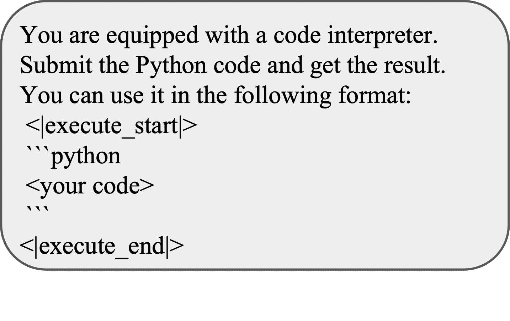

图 5：为LLM代理配备代码解释器的提示

### A.2 查询生成提示

图 [6](https://arxiv.org/html/2407.16732v2#A1.F6 "图 6 ‣ A.2 查询生成提示 ‣ 附录A 提示 ‣ PyBench：评估LLM代理在各种实际编程任务中的表现") 是一个提示，用于从给定的文件内容生成相关且多样的查询。

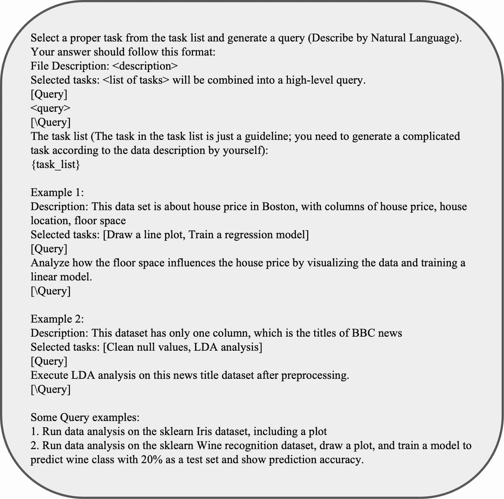

图 6：引导LLM生成查询的提示

### A.3 检查器提示

图 [7](https://arxiv.org/html/2407.16732v2#A1.F7 "图 7 ‣ A.3 检查器提示 ‣ 附录A 提示 ‣ PyBench：评估LLM代理在各种实际编程任务中的表现") 和图 [8](https://arxiv.org/html/2407.16732v2#A1.F8 "图 8 ‣ A.3 检查器提示 ‣ 附录A 提示 ‣ PyBench：评估LLM代理在各种实际编程任务中的表现") 是内容检查器和关键词检查器的提示。

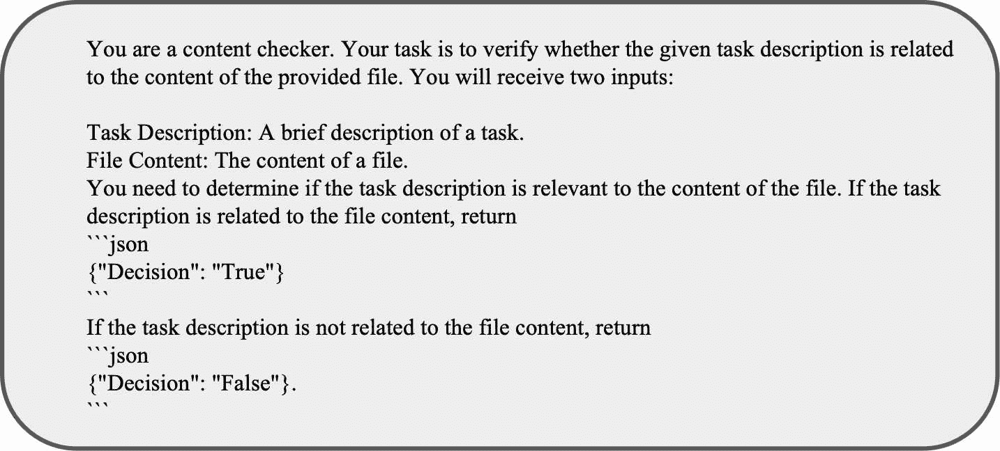

图 7：内容检查器的提示

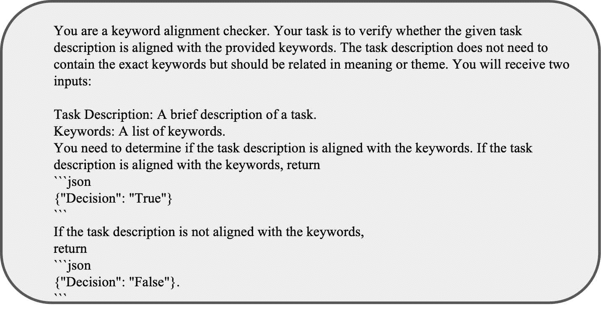

图 8：关键词检查器的提示

### A.4 评估提示

图 [9](https://arxiv.org/html/2407.16732v2#A1.F9 "图 9 ‣ A.4 评估提示 ‣ 附录A 提示 ‣ PyBench：评估LLM代理在各种实际编程任务中的表现") 显示了LLM评估器的提示。

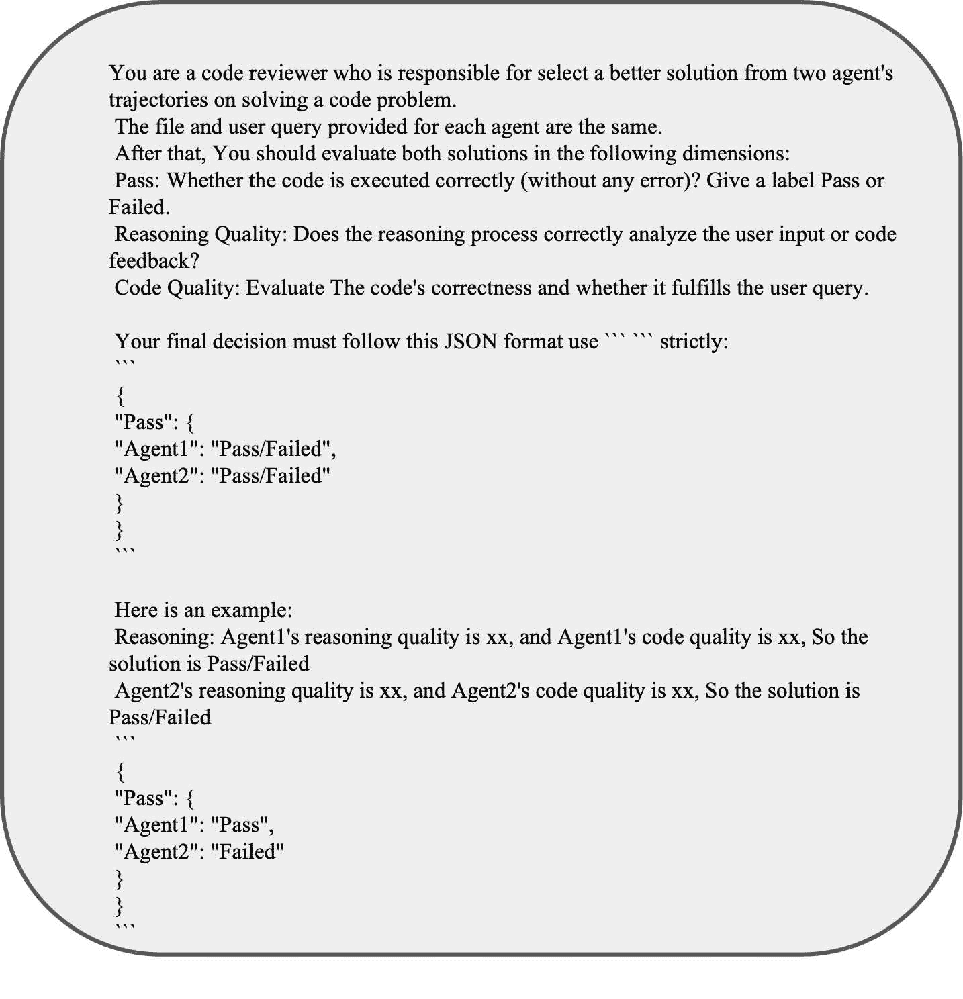

图 9：评估提示

## 附录B 每个类别的关键词示例

图 [10](https://arxiv.org/html/2407.16732v2#A2.F10 "图 10 ‣ 附录B 每个类别的关键词示例 ‣ PyBench：评估LLM代理在各种实际编程任务中的表现") 是一个用于图表分析任务的关键词列表示例

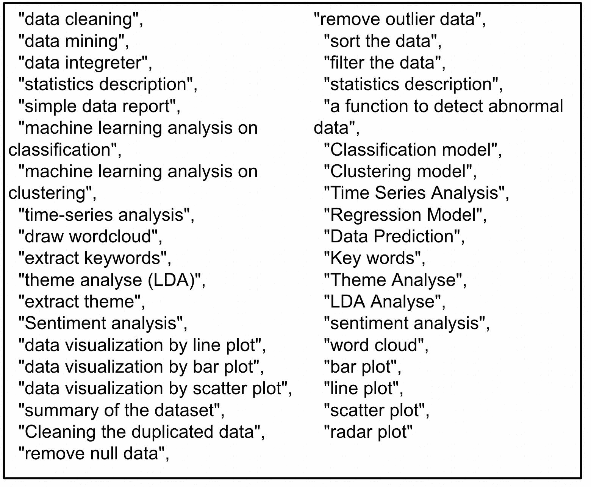

图 10：图表数据分析中的关键词列表

## 附录C 示例单元测试

我们在本附录中展示了三种类型的单元测试。

### C.1 直接验证答案

对于有固定答案的任务，我们检查最终响应是否包含该答案

[⬇](data:text/plain;base64,ZGVmIHRlc3RfdGFza18xOSh0cmFqZWN0b3J5KToKICAgIGZpbmFsX2Fuc3dlcj10cmFqZWN0b3J5Wy0xXVsnY29udGVudCddCiAgICBhbnN3ZXJfbGlzdD1bIi0zNDYiLCIyNTA0Il0KICAgIGZvciBhbnMgaW4gYW5zd2VyX2xpc3Q6CiAgICAgICAgYXNzZXJ0IGFucyBpbiBmaW5hbF9hbnN3ZXI=)1def  test_task_19(trajectory):2  final_answer=trajectory[-1][’content’]3  answer_list=["-346","2504"]4  for  ans  in  answer_list:5  assert  ans  in  final_answer

### C.2 验证输出文件

对于任务“澄清输出文件”，我们检查输出文件是否符合要求。

[⬇](data:text/plain;base64,ZGVmIHRlc3RfdGFza184OCh0cmFqZWN0b3J5KToKICAgIGltYWdlX3BhdGggPSAiLi9vdXRwdXQvODgucG5nIgogICAgcmVmX3BhdGggPSAiLi9kYXRhLzg4LmpwZWciCiAgICBpbWFnZSA9IEltYWdlLm9wZW4oaW1hZ2VfcGF0aCkKICAgIGdyYXlfaW1hZ2UgPSBpbWFnZS5jb252ZXJ0KCdMJykKICAgIGdyYXlfYXJyYXkgPSBucC5hcnJheShncmF5X2ltYWdlKQogICAgYmxhY2tfdGhyZXNob2xkID0gNTAKICAgIGJsYWNrX3BpeGVscyA9IG5wLnN1bShncmF5X2FycmF5IDw9IGJsYWNrX3RocmVzaG9sZCkKICAgIHRvdGFsX3BpeGVscyA9IGdyYXlfYXJyYXkuc2l6ZQogICAgYmxhY2tfcmF0aW8gPSBibGFja19waXhlbHMgLyB0b3RhbF9waXhlbHMKICAgIGFzc2VydCBibGFja19yYXRpbyA+IDAuMjUsICJUaGUgYmxhY2sgcGl4ZWwgcGVyY2VudGFnZSBkb2VzIG5vdCBleGNlZWQgMzAlLiI=)1def  test_task_88(trajectory):2  image_path  =  "./output/88.png"3  ref_path  =  "./data/88.jpeg"4  image  =  Image.open(image_path)5  gray_image  =  image.convert(’L’)6  gray_array  =  np.array(gray_image)7  black_threshold  =  508  black_pixels  =  np.sum(gray_array  <=  black_threshold)9  total_pixels  =  gray_array.size10  black_ratio  =  black_pixels  /  total_pixels11  assert  black_ratio  >  0.25,  "黑色像素的比例不超过30%。"

### C.3 验证输出文件路径

对于像网站开发这样的开放性任务，我们只需检测输出文件是否存在。

[⬇](data:text/plain;base64,ZGVmIHRlc3RfdGFza18xNDEodHJhamVjdG9yeSk6CiAgICBvdXRwdXRfZm9sZGVyID0gIi4vb3V0cHV0LzE0MSIKICAgIGh0bWxfZmlsZXNfZXhpc3QgPSBhbnkoZmlsZS5lbmRzd2l0aCgnLmh0bWwnKSBmb3IgZmlsZSBpbiBvcy5saXN0ZGlyKG91dHB1dF9mb2xkZXIpKQogICAgYXNzZXJ0IGh0bWxfZmlsZXNfZXhpc3Q=)1def  test_task_141(trajectory):2  output_folder  =  "./output/141"3  html_files_exist  =  any(file.endswith(’.html’)  for  file  in  os.listdir(output_folder))4  assert  html_files_exist

## 附录D 动作代码与函数调用

我们对调用代码解释器的格式进行了消融研究。对于函数调用，我们定义了一个`execute_python`函数，其中LLM将代码字符串作为参数传递，并在函数之前使用特殊的标记<|tool_call|>。

我们重新设计了 PyInstruct、CodeFeedback 和 CodeActInstruct 中的所有代码片段，使其遵循函数调用格式。我们训练模型时未继续在代码丰富的语料库上进行预训练，因为它完全符合我们的格式。与 PyLlama3（无继续预训练）进行比较，表格 [5](https://arxiv.org/html/2407.16732v2#A4.T5 "Table 5 ‣ Appendix D Code as Action VS Function Calling ‣ PyBench: Evaluating LLM Agent on various real-world coding tasks") 显示，函数调用格式在处理现实世界的编码任务时表现不佳。模型经常未能遵循该格式，并且常常忽视调用 execute_python 工具，导致失败。

| 格式 | 通过率（单元测试） | 平均回合数 |
| --- | --- | --- |
| 函数调用 | 19.6 | 8.3 |
| 我们的 | 58.7 | 6.3 |

表 5：函数调用与我们的格式

## 附录 E 比较 LLM 评估器与单元测试

| 好 | 相同 | 坏 |
| --- | --- | --- |
| 12 | 43 | 5 |

表 6：比较 LLM 评估器与单元测试。“Good” 表示 LLM 评估器正确，而单元测试错误。“Same” 表示 LLM 评估器和单元测试都提供相同的通过或失败决定。“Bad” 表示 LLM 评估器错误，而单元测试正确。

我们从所有生成的轨迹中随机选择了 60 个样本并手动判断。表格 [6](https://arxiv.org/html/2407.16732v2#A5.T6 "Table 6 ‣ Appendix E Compare LLM Evaluator and Unit Test ‣ PyBench: Evaluating LLM Agent on various real-world coding tasks") 显示，在大多数情况下，LLM 评估器和单元测试达成了一致。在其他情况下，LLM 评估器和单元测试各有其优势和缺点。图 [11](https://arxiv.org/html/2407.16732v2#A5.F11 "Figure 11 ‣ Appendix E Compare LLM Evaluator and Unit Test ‣ PyBench: Evaluating LLM Agent on various real-world coding tasks") 显示了两个示例。

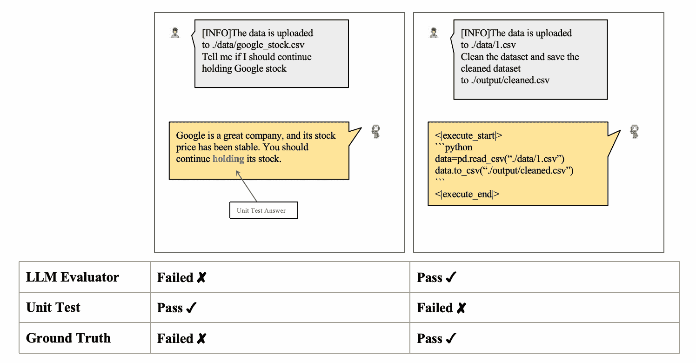

图 11：比较单元测试与 LLM 评估器

## 附录 F 任务分布

表格 [7](https://arxiv.org/html/2407.16732v2#A6.T7 "Table 7 ‣ Appendix F Task Distribution ‣ PyBench: Evaluating LLM Agent on various real-world coding tasks") 显示了 PyBench 中每种类型任务的数量。

| 图表 | 文本 | 图片 | 数学 | 软件 |
| --- | --- | --- | --- | --- |
| 62 | 23 | 48 | 6 | 4 |

表 7：PyBench 中每种类型任务的分布。

## 附录 G 我们环境中的 Python 包

> absl-pyanalytics-pythonattrsaudioreadbeautifulsoup4bokehcachetoolsCairoSVGcairosvgchardetclickclick-pluginscompressed-rtfdebugpydecoratordefusedxmldeprecatdocx2txtebooklibemail-validatorfastapifastjsonschemafbprophetffmpeg-pythonffmpyfirefitzFlaskflaskFlask-CacheBusterflask-cachebusterFlask-Corsflask-corsFlask-Loginflask-loginfonttoolsfrontendfpdffuturefuzzywuzzygensim==3.8.2gradiographvizh5pyhtml5libhttpxIMAPClientimageioimageio-ffmpegimgkitipythonJinja2jinja2jiebajson5jsonpicklejsonschemajupyter-clientjupyter-corejupyter-serverjupyterlabjupyterlab-pygmentsjupyterlab-serverkeraslangchainlangchain-experimentallibrosalogurulxmlmarkdown2markdownifyMarkupSafematplotlibmatplotlib-inlinematplotlib-vennmoviepymurmurhashnbclientnbconvertnbformatnetworkxnltknotebooknumbanumexprnumpynumpy-financialopenaiopencv-pythonopenpyxlorjsonpandaspdf2imagepdfkitpdfminer.sixpdfplumberPillowpillowplotlypsutilPyAudioPyMuPDFpydanticpydubPygmentspygmentspylogPyMuPDFpymupdfpypandocpyparsingPyPDF2pypdf2==2.12.0pytesseractpytestpython-dateutilpython-docxpython-multipartpython-pptxpytzPyWaveletspywaveletspygamePyYAMLpyyamlqrcoderarfilerequestsscikit-imagescikit-learnscipyseabornsentencepieceShapelysoundfileSoundFileSpeechRecognitionspeechrecognitionstarlettestatsmodelssvglibsvgwritesympysumytabulatabulatetextblobtifffiletomltorchtorchaudiotorchtexttorchvisiontornadotqdmtyping-extensionstzdatatzlocalujsonurllib3uvicornWandwandwebsocket-clientwebsocketsWerkzeugwerkzeugwordcloudxgboostxlrdXlsxWriterxlsxwriterxml-pythonzipp
