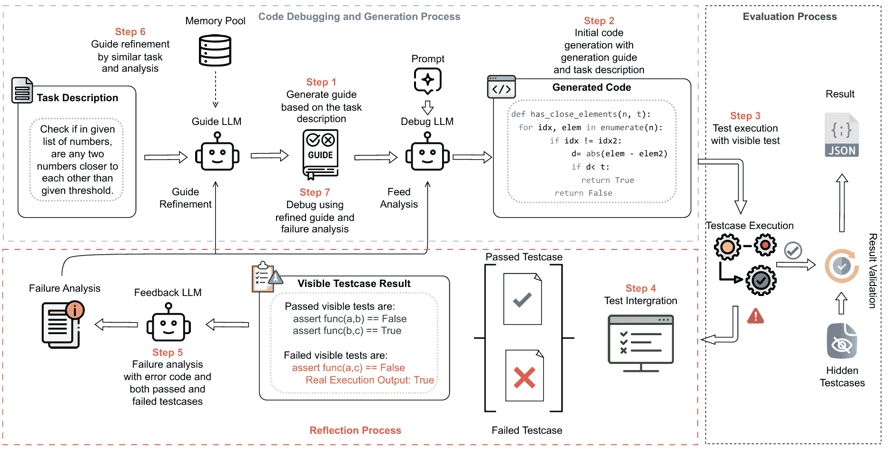
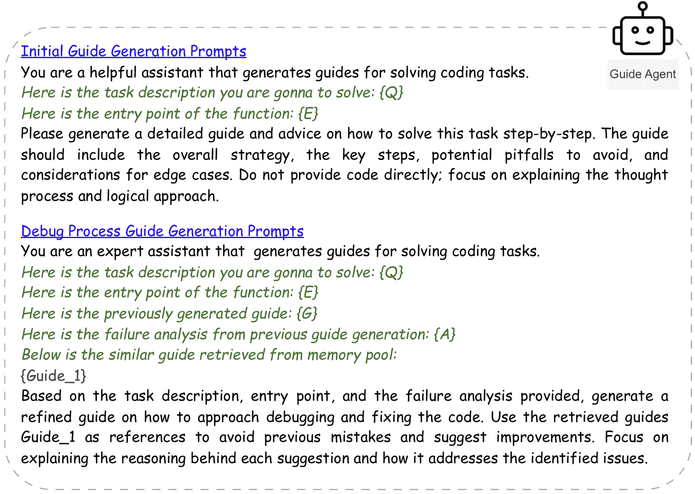
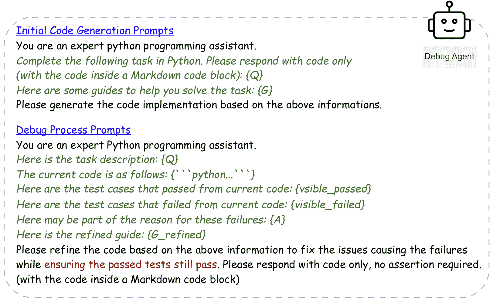
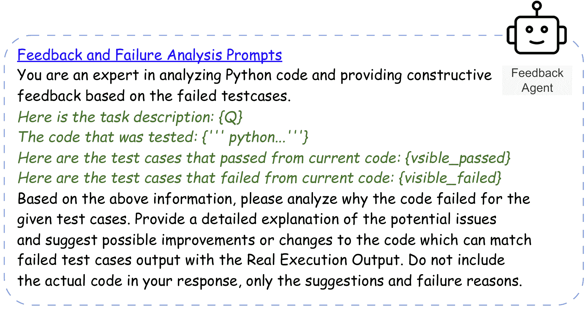

<!--yml

category: 未分类

date: 2025-01-11 12:12:28

-->

# RGD: 基于多重大语言模型的代理调试器，通过细化和生成指导

> 来源：[https://arxiv.org/html/2410.01242/](https://arxiv.org/html/2410.01242/)

1^(st) 金浩林 悉尼大学

hjin3177@uni.sydney.edu.au    2^(nd) 孙泽超 悉尼大学

zsun6058@uni.sydney.edu.au    1^* 陈华名 悉尼大学

huaming.chen@sydney.edu.au

###### 摘要

大语言模型（LLMs）在代码生成任务中展现了惊人的潜力，最近的提示工程研究提高了LLMs对文本信息的理解。然而，确保生成代码的准确性通常需要程序员进行大量的测试和验证。虽然LLMs通常能够根据任务描述生成代码，但它们的准确性仍然有限，特别是对于需要更深层次理解问题陈述和代码生成过程的复杂任务。这一局限性主要是因为LLMs需要同时理解文本并生成语法和语义正确的代码，但却没有自动细化代码的能力。在现实的软件开发中，程序员很少仅凭任务描述就生成出完美的代码，他们依赖于迭代反馈和调试来细化程序。受此过程启发，我们提出了一种基于LLM的代理架构，用于代码生成和自动调试：细化和指导调试（RGD）。RGD框架是一个基于多重LLM的代理调试器，利用三个不同的LLM代理——指导代理、调试代理和反馈代理。RGD将代码生成任务分解为多个步骤，确保更清晰的工作流程，并基于自我反思和反馈进行迭代式的代码细化。实验结果表明，RGD展现了卓越的代码生成能力，在HumanEval数据集上实现了9.8%的提升，在MBPP数据集上实现了16.2%的提升，相较于当前最先进的方法和传统的直接提示方法。我们突出了RGD框架在增强LLMs自主生成和细化代码能力方面的有效性。

###### 索引词：

大语言模型、代码生成、自动调试、多代理系统、代码调试

## I 引言

图1：RGD框架的概述包含三个过程：代码生成与调试过程、评估过程和反思过程。引导LLM负责生成指南并从内存池中检索相关信息。调试LLM使用这些信息生成代码，并结合反馈LLM中的失败分析来修复代码。生成的代码将通过可见和隐藏的测试用例进行测试，以确保全面覆盖和准确性。该过程将迭代进行，直到代码通过所有可见和隐藏的测试用例，或达到最大迭代次数。

大型语言模型（LLM）在自动化代码生成领域取得了显著进展，展示了它们将自然语言转化为功能代码、生成代码解释[[1](https://arxiv.org/html/2410.01242v2#bib.bib1)]，甚至在不同编程语言之间进行代码转换的能力[[2](https://arxiv.org/html/2410.01242v2#bib.bib2)] [[3](https://arxiv.org/html/2410.01242v2#bib.bib3)]。使用LLM进行代码生成的最普遍方法主要依赖于提示工程，其中精心设计的提示用来引导LLM生成代码片段或解释现有代码[[4](https://arxiv.org/html/2410.01242v2#bib.bib4)] [[5](https://arxiv.org/html/2410.01242v2#bib.bib5)]。这种方法已在多个场景中证明了其有效性，从基于文本描述生成代码到在不同语言和框架之间转换代码。

然而，从文本中一次性生成代码的方法存在局限性。代码生成本质上是一个复杂的任务，而一次性生成方法通常无法考虑到在软件开发中出现的众多边缘情况和详细的任务要求，特别是在软件开发任务中所需的复杂性和精确度[[6](https://arxiv.org/html/2410.01242v2#bib.bib6)]。因此，研究人员引入了多轮代码生成框架，涉及迭代改进。这些框架通过多次交互迭代生成程序，显著提高了程序合成的质量，使开发过程更加高效和准确[[7](https://arxiv.org/html/2410.01242v2#bib.bib7)]。研究人员探索了LLM（大型语言模型）如何从错误中自主学习并进行调试和修复。这些框架利用反思，包括失败的测试用例和错误信息，并从这些结果中学习，以改进后续的代码生成[[8](https://arxiv.org/html/2410.01242v2#bib.bib8)]。尽管这些方法已显示出显著的改进，但它们不能保证每一次反思结果都能促使LLM根据失败的测试用例做出有效的更改。因此，LLM往往会在多次迭代中生成相同的代码。

此外，LLM 在代码生成中的表现高度依赖于提示中提供的任务描述的清晰性和完整性，LLM 很可能会忽略关键的边界情况或遗漏必要的需求。以往的研究尝试通过引入一种概念来解决这一问题，即 LLM 首先推理任务，然后再进行代码生成 [[9](https://arxiv.org/html/2410.01242v2#bib.bib9)] [[6](https://arxiv.org/html/2410.01242v2#bib.bib6)]。然而，这一策略也存在自身的挑战；LLM 倾向于过度依赖最初的计划，导致缺乏灵活性，因为它未能采纳可能是解决不断变化的需求或代码中未预见到问题所需的进一步细化或调整。

本文介绍了一种新颖的框架，称为 RGD（精细化与指导调试），它利用多个 LLM 以协作方式提高代码生成的质量。RGD 结合了多个专业化的 LLM，每个 LLM 执行不同的角色，以模拟一个全面的代码修复过程。RGD 框架利用了三个 LLM：Guide LLM 负责根据任务描述生成生成指南，然后将生成指南和任务描述传递给 Debug LLM 进行初步的代码生成。第三个 LLM 负责整合执行结果并进行失败分析。Feedback LLM 将使用生成的代码和失败的测试用例来分析失败的原因及潜在的修复方案。除了让 LLM 分析失败的测试用例外，我们的架构还考虑了通过的测试用例。此步骤确保在 LLM 分析失败的测试用例时，也意识到代码是如何通过正确的测试用例的，从而防止未来的代码生成导致之前通过的测试用例失败。这种情况非常常见，如果只有失败的测试集和执行的代码，LLM 将集中精力尝试使代码成功匹配预期输出，可能无法实际找出代码中的问题进行调试，因此更改后的代码将导致所有测试集失败，失败分析也是为了避免这一场景的发生。

此外，我们从 RAG（检索增强生成）方法中汲取灵感，通过从记忆池中匹配相似内容作为附加信息 [[10](https://arxiv.org/html/2410.01242v2#bib.bib10)]。与传统应用中通常检索到代码不同，我们存储相关的生成指南和任务描述。这使得 Guide LLM 能够生成指导，避免零-shot 学习场景，而是依赖于过去成功的示例来生成高质量的响应。图 [1](https://arxiv.org/html/2410.01242v2#S1.F1 "Figure 1 ‣ I Introduction ‣ RGD: Multi-LLM Based Agent Debugger via Refinement and Generation Guidance") 展示了整体流程和 RGD 架构。

为了评估RGD框架，我们在多个基准测试上进行了测试，包括HumanEval [[4](https://arxiv.org/html/2410.01242v2#bib.bib4)]、HumanEval-ET [[11](https://arxiv.org/html/2410.01242v2#bib.bib11)]、MBPP [[12](https://arxiv.org/html/2410.01242v2#bib.bib12)]、MBPP-ET [[11](https://arxiv.org/html/2410.01242v2#bib.bib11)] 和APPS [[13](https://arxiv.org/html/2410.01242v2#bib.bib13)]。这些数据集都是文本到代码生成任务，包含了不同难度等级的任务和测试集。HumanEval-ET和MBPP-ET是扩展版本，增加了额外的边界情况测试用例，以解决原始测试集的局限性。通过我们的实验，我们评估了GPT-4o和GPT-4o-mini在RGD框架下在多个数据集上的表现。结果显示，RGD在所有基准测试中都有显著的改进，超越了当前最先进的框架，包括LDB [[14](https://arxiv.org/html/2410.01242v2#bib.bib14)]。

## II 相关工作

代码生成的巨大语言模型 最近，巨大语言模型（LLMs）在多个任务中展现了出色的表现，尤其是在代码生成方面，显示了在各种基准测试中的巨大潜力[[4](https://arxiv.org/html/2410.01242v2#bib.bib4)] [[15](https://arxiv.org/html/2410.01242v2#bib.bib15)] [[16](https://arxiv.org/html/2410.01242v2#bib.bib16)] [[17](https://arxiv.org/html/2410.01242v2#bib.bib17)]。然而，当面对复杂问题时，这些模型容易生成虚假的回答[[18](https://arxiv.org/html/2410.01242v2#bib.bib18)]。提示工程[[19](https://arxiv.org/html/2410.01242v2#bib.bib19)]减少了对LLMs进行广泛微调以应对特定下游任务的需求，这可以通过上下文信息更好地理解用户需求。思维链提示[[6](https://arxiv.org/html/2410.01242v2#bib.bib6)]，引导LLMs提供逐步回答，增强了其推理能力，使其在多个基准测试中相比基线有了显著改进[[20](https://arxiv.org/html/2410.01242v2#bib.bib20)]。思维树（ToT）[[21](https://arxiv.org/html/2410.01242v2#bib.bib21)]框架通过将推理过程结构化为树形搜索，增强了大型语言模型的推理能力。每个节点代表一个可能的推理状态，边缘表示状态之间的过渡。此外，研究人员还探讨了使LLMs能够自我调试其生成的代码[[22](https://arxiv.org/html/2410.01242v2#bib.bib22)]，使模型能够通过理解生成输出中的原因来自主修复错误[[23](https://arxiv.org/html/2410.01242v2#bib.bib23)] [[8](https://arxiv.org/html/2410.01242v2#bib.bib8)]。除了基于执行结果的自我修复外，这些框架还可以利用外部工具进行动态和自动代码修正[[24](https://arxiv.org/html/2410.01242v2#bib.bib24)] [[25](https://arxiv.org/html/2410.01242v2#bib.bib25)] [[26](https://arxiv.org/html/2410.01242v2#bib.bib26)]。

信息检索最近是一种流行的策略，涉及从本地存储或云端检索有助于生成任务的信息 [[27](https://arxiv.org/html/2410.01242v2#bib.bib27)]。它在基于LLM的代理中获得了显著关注。例如，RAG [[28](https://arxiv.org/html/2410.01242v2#bib.bib28)] [[29](https://arxiv.org/html/2410.01242v2#bib.bib29)] 和微软的GraphRAG [[30](https://arxiv.org/html/2410.01242v2#bib.bib30)] 将原本的零样本学习生成环境转变为少样本学习场景。此外，匹配算法可以调整，以更好地适应特定的任务需求。通过利用网络查询并使用工具实时从互联网收集数据 [[31](https://arxiv.org/html/2410.01242v2#bib.bib31)]，LLM的能力得到了进一步提升。RAG在下游任务中，如代码生成[[32](https://arxiv.org/html/2410.01242v2#bib.bib32)]，表现出了显著的性能。通过对检索到的信息进行排序和排名，RAG提高了可靠性，减少了幻觉的影响 [[33](https://arxiv.org/html/2410.01242v2#bib.bib33)]。

## III 精炼与引导调试

### III-A 定义

参考近期的研究 [[14](https://arxiv.org/html/2410.01242v2#bib.bib14)] [[8](https://arxiv.org/html/2410.01242v2#bib.bib8)]，我们将基准数据集HumanEval和MBPP分为三个组件：$(Q,T_{v},T_{h},E)$。其中，$Q$表示任务描述，包括代码片段和自然语言要求；$T_{v}$表示可见测试用例，$T_{h}$表示隐藏测试用例，$E$是入口点。所有测试用例均从入口点开始执行。

图 2：引导代理提示

### III-B 引导LLM代理

引导代理被赋予一个特殊角色，主要任务是进行初步推理和思考。它根据任务的复杂性和当前执行阶段动态调整输入信息。引导大语言模型（LLM）还负责选择并应用从记忆池中提取的相关引导。然而，为了避免不必要的标记使用和可能导致LLM开销的过多上下文，在初始生成阶段并不执行记忆池匹配和提取。如图[2](https://arxiv.org/html/2410.01242v2#S3.F2 "Figure 2 ‣ III-A Definitions ‣ III Refinment and Guidance Debugging ‣ RGD: Multi-LLM Based Agent Debugger via Refinement and Generation Guidance")所示，初始阶段和调试阶段由引导LLM使用不同的提示。在初始阶段，引导代理基于任务描述$Q$和入口点$E$生成生成引导，而不添加任何额外信息。在调试阶段，系统根据任务相似性从记忆池中匹配样本。系统的匹配机制包括以下组件：

+   •

    $Q$: 任务描述。

+   •

    $G$: 由 Guide LLM 生成的指导。

+   •

    $K$: 从任务描述 $Q$ 和生成的代码 $C$ 中提取的匹配关键词集合。

+   •

    $E$: 执行结果，包括可见测试用例 $T_{v}$ 和隐藏测试用例 $T_{h}$。

内存池，记作 $\mathcal{M}$，以 $(Q_{i},G_{i},K_{i})$ 的形式存储元组，其中：

+   •

    $Q_{i}$ 是任务描述。

+   •

    $G_{i}$ 是对应的生成指导。

+   •

    $K_{i}$ 是通过 GPT-4o-mini API 提取的关键词集合，在任务成功通过可见测试用例 $T_{v}$ 和隐藏测试用例 $T_{h}$ 后生成。

当任务成功完成（即通过了可见和隐藏测试用例）时，我们调用 GPT-4o-mini API 基于任务描述 $Q$ 和生成的代码 $C$ 生成关键词集合 $K_{i}$。该过程表示为：

|  | $K_{i}=\text{ExtractKeywords}(Q,C)$ |  | (1) |
| --- | --- | --- | --- |

其中，ExtractKeywords 是从任务描述及其对应解决方案中提取相关关键词的函数。在调试阶段处理新任务 $Q_{\text{new}}$ 时，内存池通过使用 SBERT [[34](https://arxiv.org/html/2410.01242v2#bib.bib34)] [[35](https://arxiv.org/html/2410.01242v2#bib.bib35)] 进行描述匹配，并通过 BM25 [[36](https://arxiv.org/html/2410.01242v2#bib.bib36)] 进行索引词匹配，最终实现混合检索系统 [[37](https://arxiv.org/html/2410.01242v2#bib.bib37)]。整体过程如算法 [1](https://arxiv.org/html/2410.01242v2#alg1 "Algorithm 1 ‣ III-B Guide LLM Agent ‣ III Refinment and Guidance Debugging ‣ RGD: Multi-LLM Based Agent Debugger via Refinement and Generation Guidance")所示，伪代码展示了内存池匹配功能，其中函数 Sim 计算 $Q_{\text{new}}$ 和 $Q_{i}$ 以及关键词之间的相似度。

Guide LLM 通过将从 $Q_{\text{new}}$ 生成的初始指导 $G_{\text{init}}$ 与基于相似度分数从内存池中检索到的相关指导 $G_{i}$ 相结合，生成最终指导 $G_{\text{final}}$：

|  | $G_{\text{final}}=\text{GuideLLM}({G_{\text{init}},G_{i},Q,A})$ |  | (2) |
| --- | --- | --- | --- |

其中 $A$ 表示由反馈代理（Feedback Agent）生成的失败分析，将在（第[III-C](https://arxiv.org/html/2410.01242v2#S3.SS3 "III-C Debug LLM Agent ‣ III Refinment and Guidance Debugging ‣ RGD: Multi-LLM Based Agent Debugger via Refinement and Generation Guidance")节）中介绍。

算法 1 内存池提取

1: 内存池 $\mathcal{M}\leftarrow\emptyset$，引导型LLM模型，相似度阈值列表 $\mathcal{T}\leftarrow[]$  

使用内存池来增强引导型LLM（大语言模型）以融入相关的过去经验，有助于提升上下文理解能力。通过检索并整合之前成功的引导和相关任务信息，系统能够生成更为准确且具备上下文感知的引导，从而提高代码生成的质量。这种增强确保LLM在每次任务执行时不是从零开始，而是建立在先前经验的基础上。

### III-C 调试LLM代理

对于调试代理，在接收到生成的生成引导后，它与任务描述 $Q$ 和入口点 $E$ 一起工作，以便促进代码生成。用于初步代码生成和修复代码的提示是不同的，在初步生成阶段，不涉及与内存池的匹配或任何故障分析。这一选择类似于先前的工作[[14](https://arxiv.org/html/2410.01242v2#bib.bib14)]，其中在调试之前先生成种子代码，以优先处理较简单的任务。然而，如果像MBPP数据集那样需要运行初步执行来为500个样本生成种子代码，然后再进行调试，这一过程可能极其耗时。特别是在MBPP-ET的情况下，测试集的长度是原始测试集的几倍，这会导致在执行和计算成本上的显著时间浪费，随后还需要手动运行调试程序。

图 3：调试代理提示

相反，对于较小的数据集HumanEval，这种方法可以加速整体调试过程。在RGD中，第一轮会筛选出较简单的任务，从而简化调试过程。图[3](https://arxiv.org/html/2410.01242v2#S3.F3 "图 3 ‣ III-C 调试LLM代理 ‣ III 修正与引导调试 ‣ RGD：基于多LLM的代理调试器通过修正与生成引导")展示了不同阶段使用的相应提示。通过高效地早期识别并排除简单任务，RGD框架确保了计算资源集中在更复杂的问题上，从而提高了调试过程的速度和有效性。

图 4：反馈代理提示

### III-D 反馈LLM代理

反馈代理与之前的反射策略[[38](https://arxiv.org/html/2410.01242v2#bib.bib38)]非常相似，在该策略中，LLM根据执行结果分析代码错误，以实现自我修复。在RGD架构中，反馈代理起着类似的作用，首先记录失败和成功的测试用例，然后根据执行结果将它们进行汇总。如果在执行过程中发生异常，异常类型也会作为真实执行输出的一部分被记录下来。随后，成功的可见测试用例和失败的可见测试用例将被提供给反馈LLM进行分析。此分析还包括失败的代码和任务描述，如图[4](https://arxiv.org/html/2410.01242v2#S3.F4 "图 4 ‣ III-C 调试LLM代理 ‣ III 修正与引导调试 ‣ RGD：基于多LLM的代理调试器通过修正与生成引导")所示。最终反馈生成一个失败分析报告，作为指导LLM代理和调试LLM代理的辅助信息。

基于执行结果和失败代码直接再生代码通常会导致输出远不如处理单一任务[[39](https://arxiv.org/html/2410.01242v2#bib.bib39)]。反馈代理负责独立处理失败分析并提供可能的修改建议。通过隔离失败分析和提议的修正，反馈代理使LLM在处理需要细致调试和迭代的复杂任务时表现得更好。

## IV 实验设置

{tblr}

row1 = c, row4 = c, row5 = c, row6 = c, row7 = c, row8 = c, row9 = c, row10 = c, row11 = c, row12 = c, row13 = c, row14 = c, row15 = c, cell11 = r=3, cell12 = r=3, cell13 = c=16, cell24 = c=2c, cell26 = c, cell27 = c=2c, cell29 = c, cell210 = c=2c, cell212 = c, cell213 = c=2c, cell215 = c, cell216 = c=2c, cell218 = c, cell34 = c, cell35 = c, cell36 = c, cell37 = c, cell38 = c, cell39 = c, cell310 = c, cell311 = c, cell312 = c, cell313 = c, cell314 = c, cell315 = c, cell316 = c, cell317 = c, cell318 = c, cell41 = r=6, cell55 = fg=JapaneseLaurel, cell58 = fg=red, cell511 = fg=JapaneseLaurel, cell514 = fg=JapaneseLaurel1, cell517 = fg=JapaneseLaurel, cell65 = fg=JapaneseLaurel, cell68 = fg=JapaneseLaurel, cell611 = fg=red, cell614 = fg=JapaneseLaurel1, cell617 = fg=JapaneseLaurel, cell75 = fg=JapaneseLaurel, cell78 = fg=JapaneseLaurel, cell711 = fg=JapaneseLaurel1, cell714 = fg=JapaneseLaurel1, cell717 = fg=JapaneseLaurel, cell85 = fg=JapaneseLaurel, cell88 = fg=JapaneseLaurel, cell811 = fg=JapaneseLaurel, cell814 = fg=JapaneseLaurel1, cell95 = fg=JapaneseLaurel, cell98 = fg=JapaneseLaurel, cell911 = fg=JapaneseLaurel, cell914 = fg=JapaneseLaurel1, cell917 = fg=JapaneseLaurel, cell101 = r=6, cell115 = fg=JapaneseLaurel, cell118 = fg=JapaneseLaurel, cell1111 = fg=JapaneseLaurel, cell1114 = fg=JapaneseLaurel, cell1117 = fg=red, cell125 = fg=JapaneseLaurel, cell128 = fg=JapaneseLaurel, cell1211 = fg=JapaneseLaurel, cell1214 = fg=JapaneseLaurel, cell1217 = fg=JapaneseLaurel, cell135 = fg=JapaneseLaurel, cell138 = fg=JapaneseLaurel, cell1311 = fg=JapaneseLaurel, cell1314 = fg=JapaneseLaurel, cell1317 = fg=red, cell145 = fg=JapaneseLaurel, cell148 = fg=JapaneseLaurel, cell1411 = fg=JapaneseLaurel, cell1414 = fg=JapaneseLaurel, cell155 = fg=JapaneseLaurel, cell158 = fg=JapaneseLaurel, cell1511 = fg=JapaneseLaurel, cell1514 = fg=JapaneseLaurel, cell1517 = fg=JapaneseLaurel, hline1 = -, hline2,4 = 3-18, hline3 = 4-5,7-8,10-11,16-170.03em, hline3 = 13-14, hline4 = 1-20.03em, hline9,15 = 2-18dotted, hline10 = -0.05em, hline16 = -0.08em, 模型 & 方法 数据集

HumanEval HumanEval-ET MBPP MBPP-ET APPS-100

准确率 $\uparrow$ 增量 $\uparrow$ 准确率 $\uparrow$ 增量 $\uparrow$ 准确率 $\uparrow$ 增量 $\uparrow$ 准确率 $\uparrow$ 增量 $\uparrow$ 准确率 $\uparrow$ 增量 $\uparrow$

GPT-4o 直接 87.8 84.7 67.2 56.2 56.5

COT 92.6 +4.8 82.3 -2.4 68.2 -1.0 58.6 +2.5 58.5 +3.0

自我规划 90.2 +2.4 90.8 +6.1 59.3 -7.9 55.8 +0.4 58.0 +1.5

自我调试（+跟踪） 89.0 +1.2 91.4 +6.7 66.2 +1.0 61.0 +4.8 60.0 +3.5

LDB 94.5 +6.7 91.4 +6.7 74.8 +7.6 71.0 +14.8 - -

RGD（我们的）97.6 +9.8 97.6 +12.9 83.4 +16.2 77.8 +21.6 63.0 +6.5

GPT-4o-mini 直接 87.8 77.4 57.7 44.6 47.4

COT 89.6 +1.8 78.6 +1.2 58.2 +0.6 45.3 +0.7 45.0 -2.4

自我规划 89.0 +1.2 88.3 +10.9 58.4 +0.7 48.2 +3.6 49.0 +1.6

自我调试（+跟踪） 88.4 +0.6 87.8 +10.4 64.4 +6.7 57.4 +12.8 45.0 -2.4

LDB 90.2 +2.4 89.6 +12.2 73.6 +15.9 65.8 +21.2 - -

RGD（我们的）96.9 +9.1 97.5 +20.1 80.6 +22.9 69.7 +25.1 56.0 +8.6

表I：六种方法的Pass@1结果，$\Delta$表示相对于直接基线方法的百分比改进。COT [[5](https://arxiv.org/html/2410.01242v2#bib.bib5)]、Self-Planning [[6](https://arxiv.org/html/2410.01242v2#bib.bib6)]、Self-Debugging (+Trace) [[8](https://arxiv.org/html/2410.01242v2#bib.bib8)]对所有五个基准进行了测试，而LDB框架仅在HumanEval/ET和MBPP/ET基准上进行了测试[[14](https://arxiv.org/html/2410.01242v2#bib.bib14)]。

### IV-A 数据集

在执行过程中，我们使用来自不同基准的测试集来验证当前代码是否包含任何错误。在RGD中，我们使用了HumanEval [[4](https://arxiv.org/html/2410.01242v2#bib.bib4)]和MBPP [[12](https://arxiv.org/html/2410.01242v2#bib.bib12)]数据集，并按照[[14](https://arxiv.org/html/2410.01242v2#bib.bib14)]中的方法分配可见和隐藏的测试用例。在HumanEval中，可见测试来自任务描述，而隐藏测试则取自数据集自身的测试。在MBPP中，第一个测试用例作为可见测试用例。

此外，我们还使用了HumanEval-ET和MBPP-ET [[11](https://arxiv.org/html/2410.01242v2#bib.bib11)]来解决原始数据集中测试用例的限制。对于这些数据集，可见与隐藏测试用例的比例设置为6:4。我们使用的最后一个数据集是APPS [[13](https://arxiv.org/html/2410.01242v2#bib.bib13)]，我们从中选择了100个样本进行测试，难度水平分为入门、面试和竞赛，比例为5:3:2。与之前的数据集不同，APPS依赖输入输出结果进行验证，因此在处理APPS数据集时需要采取独特的处理方法。

### IV-B 方法

我们将RGD与五种不同的方法进行了比较。Direct是基准测量方法，其中代码是根据任务描述直接生成的。Chain-of-Thought [[5](https://arxiv.org/html/2410.01242v2#bib.bib5)]通过添加逐步提示来增强模型的自我规划能力。Self-Planning [[6](https://arxiv.org/html/2410.01242v2#bib.bib6)]基于先规划后推理的思路。Self-Debugging [[8](https://arxiv.org/html/2410.01242v2#bib.bib8)]通过结合执行结果的反馈来进行自我反思。最后，我们还测试了LDB框架[[14](https://arxiv.org/html/2410.01242v2#bib.bib14)]。

我们使用Pass@1指标进行了评估。在$k$次迭代中（在我们的实验中为10次），只要问题成功解决一次，就认为该问题已解决。我们主要测试了目前表现最优秀的GPT-4o模型和GPT-4o-mini模型。

## V 实验结果与分析

### V-A 主要结果

主要实验结果如表 [I](https://arxiv.org/html/2410.01242v2#S4.T1 "TABLE I ‣ IV Experiment Setup ‣ RGD: Multi-LLM Based Agent Debugger via Refinement and Generation Guidance") 所示。这里，$Acc$ 代表 Pass@1 精度，$\Delta$ 表示基于任务描述的直接代码生成方法的百分比改进。我们可以观察到，RGD 在所有数据集上展现了最先进的性能，并且相比 LDB 方法有进一步的提升。在使用 GPT-4o 进行的 HumanEval 数据集上，RGD 相比基线提高了 9.8%，相比 LDB 提高了 3.1%。我们的实验表明，RGD 在 HumanEval-ET 和 MBPP-ET 基准上取得了特别显著的提升，这些基准包含了更多的测试用例，在 MBPP-ET 上的最大改进达到了 25.1%。这种性能提升主要是由于原始数据集中可见的测试用例数量有限，导致通过特定测试的代码仍然包含漏洞，未能通过隐藏的测试用例，这突显了反馈代理在整个调试过程中分析的重要作用。

对于 APPS 数据集，我们进行了包含 100 个样本的实验。由于需要对其程序进行大量修改，因此我们没有在 APPS 基准上测试 LDB 框架。总体来说，显而易见，RGD 相比其他方法取得了增强，在 GPT-4o-mini 模型中最大提升为 8.6%。

{tblr}

cells = c, cell11 = r=3, cell12 = c=8, cell22 = c=2, cell25 = c=2, cell28 = c=2, hline1,4,6 = -, hline2 = 2-9, hline3 = 2-3,5-6,8-9, 基准测试与组件从 RGD 中移除

内存池 指导代理失败 反馈

Acc 减少 Acc 减少 Acc 减少

HumanEval 95.7% 1.9% 93.2% 4.4% 95.1% 2.5%

MBPP 78.4% 5.0% 77.0% 6.4% 73.6% 9.8%

表 II：使用 GPT-4o 模型对 RGD 框架进行的消融研究，在 HumanEval 和 MBPP 上进行评估

### V-B 消融研究

我们进行了消融研究，以验证我们方法的有效性。我们选择了 GPT-4o 对两个基准，HumanEval 和 MBPP 进行实验，并将结果与原始 RGD 框架在这些基准上的表现进行比较，后者在 HumanEval 上的 Pass@1 为 97.6%，在 MBPP 上的 Pass@1 为 83.4%。我们在三种不同的场景下进行了消融测试：

内存池移除：在此场景中，我们移除了内存池，指导代理不再从中获取案例来生成和改进指导。如表 [II](https://arxiv.org/html/2410.01242v2#S5.T2 "TABLE II ‣ V-A Main Result ‣ V Experiment Result and Analysis ‣ RGD: Multi-LLM Based Agent Debugger via Refinement and Generation Guidance") 所示，这导致 HumanEval 数据集下降了 1.9 个百分点，MBPP 数据集下降了 5 个百分点。

引导代理移除：在此实验中，我们移除了整个引导代理组件，导致HumanEval数据集上的表现下降了4.4%，MBPP数据集上的下降幅度为6.4%。结果清楚地表明，引导代理对RGD框架整体性能的影响是显著的。

失败反馈移除：在此实验中，我们移除了失败反馈组件，反馈LLM未能生成失败分析以协助调试和优化。结果显示，两组数据集的表现都出现了下降，尤其是在MBPP数据集上，下降幅度达到9.8%。

消融研究结果确认，内存池、引导代理和失败反馈的加入显著增强了RGD框架的整体性能。此外，我们从下降幅度的趋势中观察到：样本更多的数据集（例如MBPP）在消融实验中往往受到更大的影响。这也证明了RGD框架在处理更多测试时仍然保持出色的性能。内存池和失败反馈都影响后续的精炼和调试，而内存池中的信息是在执行过程中积累的。这也解释了为什么MBPP（500个样本）上的改进大于HumanEval（163个样本）上的改进。

## VI 结论

本文提出了RGD，一个新颖的框架，旨在通过利用内存池来优化生成引导并通过专门的反馈代理整合反馈，从而增强代码生成能力。我们的方法使得大语言模型（LLM）能够通过利用先前存储的内存和动态失败分析，迭代地优化生成的代码。通过从内存池中有选择地提取相关的引导并根据任务相似性不断精炼，RGD显著提升了多个基准测试中的代码生成准确性。实验表明，RGD在代码生成和调试方面达到了最先进的性能。我们预计，我们的工作进一步展示并增强了LLM从过去学习并有效适应新挑战的能力。

## 参考文献

+   [1] A. Ni, P. Yin, Y. Zhao, M. Riddell, T. Feng, R. Shen, S. Yin, Y. Liu, S. Yavuz, C. Xiong, S. Joty, Y. Zhou, D. Radev, 和 A. Cohan，“L2ceval: 评估大语言模型的语言到代码生成能力，”2023年。

+   [2] R. Sun, S. Ö. Arik, A. Muzio, L. Miculicich, S. Gundabathula, P. Yin, H. Dai, H. Nakhost, R. Sinha, Z. Wang 等，“Sql-palm: 改进的大型语言模型适应性用于文本到SQL（扩展版），”arXiv 预印本 arXiv:2306.00739，2023年。

+   [3] Q. Zheng, X. Xia, X. Zou, Y. Dong, S. Wang, Y. Xue, Z. Wang, L. Shen, A. Wang, Y. Li, T. Su, Z. Yang, 和 J. Tang，“Codegeex：一种用于代码生成的预训练模型，并在humaneval-x上进行多语言基准测试，”2024年。

+   [4] M. Chen, J. Tworek, H. Jun, Q. Yuan, H. P. D. O. Pinto, J. Kaplan, H. Edwards, Y. Burda, N. Joseph, G. Brockman 等, “评估用于代码的大型语言模型,” arXiv预印本 arXiv:2107.03374, 2021年。

+   [5] J. Wei, X. Wang, D. Schuurmans, M. Bosma, F. Xia, E. Chi, Q. V. Le, D. Zhou 等, “链式思维提示促进大型语言模型推理,” 神经信息处理系统进展, 第35卷，第24824–24837页, 2022年。

+   [6] X. Jiang, Y. Dong, L. Wang, F. Zheng, Q. Shang, G. Li, Z. Jin, 和 W. Jiao, “使用大型语言模型进行自我规划代码生成,” ACM软件工程方法学会刊, 2024年6月。已接受。

+   [7] E. Nijkamp, B. Pang, H. Hayashi, L. Tu, H. Wang, Y. Zhou, S. Savarese, 和 C. Xiong, “Codegen: 一个用于代码的开放大型语言模型，支持多轮程序合成,” 2023年。

+   [8] X. Chen, M. Lin, N. Schärli, 和 D. Zhou, “教大型语言模型自我调试,” arXiv预印本 arXiv:2304.05128, 2023年。

+   [9] S. Yao, J. Zhao, D. Yu, N. Du, I. Shafran, K. Narasimhan, 和 Y. Cao, “React：在语言模型中协同推理与行动,” arXiv预印本 arXiv:2210.03629, 2022年。

+   [10] P. Lewis, E. Perez, A. Piktus, F. Petroni, V. Karpukhin, N. Goyal, H. Küttler, M. Lewis, W.-t. Yih, T. Rocktäschel 等, “用于知识密集型自然语言处理任务的检索增强生成,” 神经信息处理系统进展, 第33卷，第9459–9474页, 2020年。

+   [11] Y. Dong, J. Ding, X. Jiang, G. Li, Z. Li, 和 Z. Jin, “Codescore: 通过学习代码执行评估代码生成,” arXiv预印本 arXiv:2301.09043, 2023年。

+   [12] J. Austin, A. Odena, M. Nye, M. Bosma, H. Michalewski, D. Dohan, E. Jiang, C. Cai, M. Terry, Q. Le, 和 C. Sutton, “使用大型语言模型进行程序合成,” 2021年。

+   [13] D. Hendrycks, S. Basart, S. Kadavath, M. Mazeika, A. Arora, E. Guo, C. Burns, S. Puranik, H. He, D. Song, 和 J. Steinhardt, “通过应用程序测量编程挑战能力,” NeurIPS, 2021年。

+   [14] L. Zhong, Z. Wang, 和 J. Shang, “Ldb：通过逐步验证运行时执行来调试大型语言模型,” arXiv预印本 arXiv:2402.16906, 2024年。

+   [15] B. Roziere, J. Gehring, F. Gloeckle, S. Sootla, I. Gat, X. E. Tan, Y. Adi, J. Liu, T. Remez, J. Rapin 等, “Code Llama：用于代码的开放基础模型,” arXiv预印本 arXiv:2308.12950, 2023年。

+   [16] B. Yetiştiren, I. Özsoy, M. Ayerdem, 和 E. Tüzün, “评估AI辅助代码生成工具的代码质量：GitHub Copilot、Amazon CodeWhisperer 和 ChatGPT 的实证研究,” arXiv预印本 arXiv:2304.10778, 2023年。

+   [17] H. Jin, L. Huang, H. Cai, J. Yan, B. Li, 和 H. Chen, “从大型语言模型到基于大型语言模型的软件工程代理：当前挑战和未来的调查,” 2024年。

+   [18] J. Yang, H. Jin, R. Tang, X. Han, Q. Feng, H. Jiang, S. Zhong, B. Yin, 和 X. Hu, “在实践中驾驭大型语言模型的力量：关于ChatGPT及其后续应用的调查,” ACM知识发现数据学报, 第18卷, 2024年4月。

+   [19] J. White, Q. Fu, S. Hays, M. Sandborn, C. Olea, H. Gilbert, A. Elnashar, J. Spencer-Smith, 和 D. C. Schmidt，“一个增强ChatGPT提示工程的提示模式目录，”arXiv预印本 arXiv:2302.11382，2023年。

+   [20] D. Huang, Q. Bu, Y. Qing, 和 H. Cui，“Codecot：解决代码生成中的COT推理语法错误，”2024年。

+   [21] S. Yao, D. Yu, J. Zhao, I. Shafran, T. Griffiths, Y. Cao, 和 K. Narasimhan，“思维树：利用大语言模型进行深思熟虑的问题解决，”《神经信息处理系统进展》，第36卷，2024年。

+   [22] X. Hu, K. Kuang, J. Sun, H. Yang, 和 F. Wu，“利用打印调试改进大语言模型中的代码生成，”2024年。

+   [23] Y. Ding, M. J. Min, G. Kaiser, 和 B. Ray，“Cycle：学习自我优化代码生成，”《ACM程序语言会议论文集》，第8卷，2024年4月。

+   [24] Q. Wu, G. Bansal, J. Zhang, Y. Wu, S. Zhang, E. Zhu, B. Li, L. Jiang, X. Zhang, 和 C. Wang，“Autogen：通过多代理对话框架启用下一代LLM应用，”arXiv预印本 arXiv:2308.08155，2023年。

+   [25] T. X. Olausson, J. P. Inala, C. Wang, J. Gao, 和 A. Solar-Lezama，“自我修复是代码生成的银弹吗？”，《第十二届国际学习表征会议论文集》，2023年。

+   [26] S. Jiang, Y. Wang, 和 Y. Wang，“Selfevolve：通过大语言模型进行代码演化的框架，”arXiv预印本 arXiv:2306.02907，2023年。

+   [27] X. He, J. Zou, Y. Lin, M. Zhou, S. Han, Z. Yuan, 和 D. Zhang，“Conline：通过在线搜索和正确性测试进行复杂代码生成和优化，”arXiv预印本 arXiv:2403.13583，2024年。

+   [28] Y. Gao, Y. Xiong, X. Gao, K. Jia, J. Pan, Y. Bi, Y. Dai, J. Sun, 和 H. Wang，“基于检索增强生成的大语言模型：综述，”arXiv预印本 arXiv:2312.10997，2023年。

+   [29] K. Guu, K. Lee, Z. Tung, P. Pasupat, 和 M. Chang，“检索增强语言模型预训练，”《国际机器学习大会论文集》，第3929-3938页，PMLR，2020年。

+   [30] T. Procko，“图检索增强生成的大语言模型：综述，”可在SSRN上获取，2024年。

+   [31] K. Zhang, H. Zhang, G. Li, J. Li, Z. Li, 和 Z. Jin，“Toolcoder：教会代码生成模型使用API搜索工具，”arXiv预印本 arXiv:2305.04032，2023年。

+   [32] W. Fan, Y. Ding, L. Ning, S. Wang, H. Li, D. Yin, T.-S. Chua, 和 Q. Li，“RAG与LLM的结合综述：迈向检索增强的大语言模型，”《第30届ACM SIGKDD知识发现与数据挖掘大会论文集》，第6491-6501页，2024年。

+   [33] M. A. Islam, M. E. Ali, 和 M. R. Parvez，“Mapcoder：用于竞争性问题求解的多代理代码生成，”arXiv预印本 arXiv:2405.11403，2024年。

+   [34] N. Reimers 和 I. Gurevych，“Sentence-bert：使用孪生BERT网络的句子嵌入，”2019年。

+   [35] Z. Feng, D. Guo, D. Tang, N. Duan, X. Feng, M. Gong, L. Shou, B. Qin, T. Liu, D. Jiang, 和 M. Zhou, “Codebert: 一种用于编程和自然语言的预训练模型，” 2020年。

+   [36] J. Lin 和 X. Ma, “关于deepimpact、coil及信息检索技术的概念框架的简要说明，” 2021年。

+   [37] V. Karpukhin, B. Oğuz, S. Min, P. Lewis, L. Wu, S. Edunov, D. Chen, 和 W. tau Yih, “开放域问答的密集文段检索，” 2020年。

+   [38] N. Shinn, F. Cassano, E. Berman, A. Gopinath, K. Narasimhan, 和 S. Yao, “Reflexion: 语言代理与言语强化学习，” 2023年。

+   [39] S. Moon, H. Chae, Y. Song, T. Kwon, D. Kang, K. T. iunn Ong, S. won Hwang, 和 J. Yeo, “Coffee: 通过反馈修复错误提升代码LLMs的性能，” 2024年。
