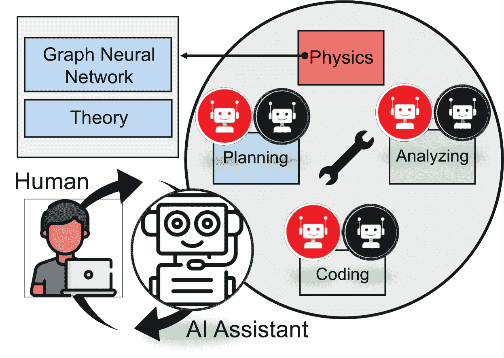

<!--yml

类别：未分类

日期：2025-01-11 12:05:08

-->

# 使用图神经网络驱动的LLM多智能体系统进行快速自动化合金设计 ††致谢: 引用：A. Ghafarollahi, M.J. Buehler. arXiv, DOI:000000/11111., 2024

> 来源：[https://arxiv.org/html/2410.13768/](https://arxiv.org/html/2410.13768/)

阿里雷扎·加法罗拉希

原子与分子力学实验室 (LAMM)

麻省理工学院

美国马萨诸塞州剑桥市 77 Massachusetts Ave.

美国马萨诸塞州剑桥市 02139 & 马库斯·J·比勒

原子与分子力学实验室 (LAMM)

计算科学与工程中心

施瓦茨曼计算学院

麻省理工学院

美国马萨诸塞州剑桥市 77 Massachusetts Ave.

美国马萨诸塞州剑桥市 02139

通信作者: mbuehler@MIT.EDU

###### 摘要

本文提出了一种多智能体人工智能模型，用于自动化新型金属合金的发现，整合了多模态数据和外部知识，包括通过原子模拟获得的物理学见解。我们的多智能体系统具有三个关键组件：（a）一套负责推理和规划等任务的大型语言模型（LLM），（b）一组具有不同角色和专业知识的人工智能代理，它们动态协作，（c）一种新开发的图神经网络（GNN）模型，用于快速检索关键物理属性。一组由LLM驱动的AI代理协作，以自动化探索广阔的MPEA设计空间，并在GNN预测的指导下进行。我们聚焦于NbMoTa家族的体心立方（bcc）合金，采用基于机器学习的原子间势能模型，目标是两个关键性质：皮尔斯势垒和溶质/螺位错相互作用能。我们的GNN模型能够准确预测这些原子级别的性质，提供了一种比代价高昂的蛮力计算更快速的替代方案，并减少了多智能体系统在物理检索方面的计算负担。该人工智能系统通过减少对人类专家的依赖，并克服了直接全原子模拟的局限性，彻底革新了材料发现过程。通过将GNN的预测能力与基于LLM的代理的动态协作相结合，该系统能够自主导航广阔的合金设计空间，识别原子尺度材料性质的趋势，并预测宏观尺度的机械强度，如若干计算实验所示。该方法加速了先进合金的发现，并在其他复杂系统中具有广泛的应用前景，标志着自动化材料设计迈出了重要的一步。

*关键字* 多智能体系统， 大型语言模型 $\cdot$ 深度学习 $\cdot$ 图神经网络 $\cdot$ 复杂合金 $\cdot$ 材料设计 $\cdot$ 科学机器学习

## 1 引言

多主元素合金（MPEAs）代表了一类相对较新且创新的材料，这些材料由三种或更多种元素组成，展现出比其纯元素或稀释合金更为出色的机械性能，如机械强度、断裂韧性、延展性以及抗氢脆性能。[[1](https://arxiv.org/html/2410.13768v1#bib.bib1), [2](https://arxiv.org/html/2410.13768v1#bib.bib2), [3](https://arxiv.org/html/2410.13768v1#bib.bib3), [4](https://arxiv.org/html/2410.13768v1#bib.bib4)]。由于其在高温下的卓越强度保持性能，Cr-Mo-W-Nb-V-Ta-Ti-Zr-Hf系列的BCC耐火MPEAs近年来引起了特别关注，超越了现有超级合金的能力。[[5](https://arxiv.org/html/2410.13768v1#bib.bib5), [6](https://arxiv.org/html/2410.13768v1#bib.bib6), [7](https://arxiv.org/html/2410.13768v1#bib.bib7), [8](https://arxiv.org/html/2410.13768v1#bib.bib8), [9](https://arxiv.org/html/2410.13768v1#bib.bib9), [10](https://arxiv.org/html/2410.13768v1#bib.bib10), [11](https://arxiv.org/html/2410.13768v1#bib.bib11), [12](https://arxiv.org/html/2410.13768v1#bib.bib12)]。在一个单一晶体内拥有数百万种可能的组合，这些复杂的系统提供了巨大的潜力，能够实现针对特定应用的定制化性能。然而，在浩瀚的多组分HEA组合空间中寻找合适的合金，以获得优化或期望的性能，面临着巨大的挑战。发展将原子级现象与显微材料性质（如温度依赖的屈服应力）联系起来的机制多尺度理论，对于探索这一设计空间发挥了重要作用。[[13](https://arxiv.org/html/2410.13768v1#bib.bib13), [14](https://arxiv.org/html/2410.13768v1#bib.bib14), [15](https://arxiv.org/html/2410.13768v1#bib.bib15), [16](https://arxiv.org/html/2410.13768v1#bib.bib16), [17](https://arxiv.org/html/2410.13768v1#bib.bib17), [18](https://arxiv.org/html/2410.13768v1#bib.bib18), [19](https://arxiv.org/html/2410.13768v1#bib.bib19), [20](https://arxiv.org/html/2410.13768v1#bib.bib20), [21](https://arxiv.org/html/2410.13768v1#bib.bib21), [22](https://arxiv.org/html/2410.13768v1#bib.bib22), [23](https://arxiv.org/html/2410.13768v1#bib.bib23)]

尽管理论模型在预测MPEAs的宏观性质并探索其广泛设计空间方面具有重要潜力，但一个关键限制在于获得必要输入参数的计算成本，这些参数通常依赖于原子模拟。对于体心立方（BCC）材料，这一挑战尤为突出，因为其塑性由螺旋位错的运动控制[[24](https://arxiv.org/html/2410.13768v1#bib.bib24), [21](https://arxiv.org/html/2410.13768v1#bib.bib21)]。与边位错理论不同，边位错理论通过使用错配体积作为主要参数提供了一种简化的方案[[13](https://arxiv.org/html/2410.13768v1#bib.bib13), [14](https://arxiv.org/html/2410.13768v1#bib.bib14), [25](https://arxiv.org/html/2410.13768v1#bib.bib25)]，但螺旋位错理论没有类似的简化。因此，这些模型需要通过昂贵的原子模拟来计算关键参数。螺旋位错理论中的两个关键量是Peierls势垒和溶质-螺旋相互作用能[[24](https://arxiv.org/html/2410.13768v1#bib.bib24), [21](https://arxiv.org/html/2410.13768v1#bib.bib21)]。Peierls势垒表示晶格对位错运动的内在阻力，而溶质-螺旋相互作用能描述了溶质原子对位错行为的影响。两者都作为位错运动的能量屏障，其计算还受到位错周围溶质随机波动的进一步影响。原子模拟通常用于确定合金中的这些参数[[26](https://arxiv.org/html/2410.13768v1#bib.bib26)]，但将其应用于多组分合金时面临两个重大挑战：（a）这些合金的广泛设计空间，以及（b）由于溶质环境的随机性，需要大量的实现以获得统计上准确的平均值。为了解决这些限制，机器学习（ML）和深度学习（DL）模型提供了一种有前途的替代方案，通过简化这些输入参数的计算，可能减少对计算成本高昂的暴力计算方法的依赖。

机器学习（ML）和深度学习（DL）方法的出现已经彻底改变了材料设计、物理建模和性质测量的方式[[27](https://arxiv.org/html/2410.13768v1#bib.bib27), [28](https://arxiv.org/html/2410.13768v1#bib.bib28), [29](https://arxiv.org/html/2410.13768v1#bib.bib29), [30](https://arxiv.org/html/2410.13768v1#bib.bib30), [31](https://arxiv.org/html/2410.13768v1#bib.bib31), [32](https://arxiv.org/html/2410.13768v1#bib.bib32)]。这些方法可以发现训练数据中隐藏的模式，因此已被应用于各个学科。深度学习方法在晶体材料领域的应用广泛，从机器学习原子间势能的开发[[33](https://arxiv.org/html/2410.13768v1#bib.bib33), [34](https://arxiv.org/html/2410.13768v1#bib.bib34), [35](https://arxiv.org/html/2410.13768v1#bib.bib35), [36](https://arxiv.org/html/2410.13768v1#bib.bib36)]到本征性质计算[[38](https://arxiv.org/html/2410.13768v1#bib.bib38)]，再到动态裂纹路径预测[[39](https://arxiv.org/html/2410.13768v1#bib.bib39)]。在所有深度学习架构中，图神经网络（GNN）模型被开发用于处理图结构，这些图结构可以表示一系列物体（节点）及其之间的关系（边），使其成为晶体材料的理想解决方案，其中原子是节点，边则表示中间的键合[[40](https://arxiv.org/html/2410.13768v1#bib.bib40), [41](https://arxiv.org/html/2410.13768v1#bib.bib41)]。

尽管机器学习（ML）方法加速了多主元素合金（MPEA）的探索，但它们通常单独针对特定的材料属性进行优化。这种狭隘的聚焦可能限制了其将广泛的跨学科知识纳入合金设计和科学发现中的能力，而这些知识对真正的突破至关重要。为了克服这些限制，多智能体系统作为一种变革性的方法应运而生，能够将多模态数据和外部知识（例如物理学和材料科学中的新发展，包括理论模型）以更加全面和自适应的方式整合到设计过程中[[42](https://arxiv.org/html/2410.13768v1#bib.bib42), [43](https://arxiv.org/html/2410.13768v1#bib.bib43), [44](https://arxiv.org/html/2410.13768v1#bib.bib44), [45](https://arxiv.org/html/2410.13768v1#bib.bib45), [46](https://arxiv.org/html/2410.13768v1#bib.bib46), [47](https://arxiv.org/html/2410.13768v1#bib.bib47), [48](https://arxiv.org/html/2410.13768v1#bib.bib48), [49](https://arxiv.org/html/2410.13768v1#bib.bib49), [50](https://arxiv.org/html/2410.13768v1#bib.bib50), [51](https://arxiv.org/html/2410.13768v1#bib.bib51), [52](https://arxiv.org/html/2410.13768v1#bib.bib52)]。在多智能体系统中，一组由大型语言模型（LLM）驱动的AI代理会动态协作，解决复杂的多方面问题。通过为每个代理分配不同的角色并进行有针对性的提示，系统可以分而治之，解决合金设计挑战的不同方面。

本文提出了一种基于LLM的多智能体系统，充分利用了以下几个方面的优势：（a）一套先进的大型语言模型（LLMs），负责规划、推理和决策等基本任务；（b）一组专业化的代理，每个代理在系统中扮演不同的角色；（c）一套用于各种任务的外部工具，包括一个新开发的图神经网络（GNN）模型，用于预测原子级别的材料属性。这个多智能体模型建立在AtomAgents基础之上，AtomAgents是一个具有先进仿真能力的多模态多智能体系统，用于合金设计和发现。AtomAgents能够从原子模拟中提取新的物理学知识，解决复杂的多方面合金发现问题。然而，随着合金系统复杂度的增加，原子模拟的计算成本变得不可承受。

为了解决这个问题，我们开发了一个 GNN 模型，它通过提供快速的物理预测，绕过了暴力计算的限制。尽管该模型是基于三元 Nb-Mo-Ta 体心立方（BCC）合金组分空间的一小部分进行训练的，但 GNN 模型能够准确预测包括 Peierls 障碍和溶质/螺位错相互作用能在内的基本量。我们提供了几个示例，展示了这种多智能体方法在不仅探索设计空间，还解决复杂合金设计挑战（如预测宏观屈服应力）方面的能力。

本文的结构如下。我们首先提供关于 GNN 模型的详细信息，用于预测原子级材料属性，见第[2](https://arxiv.org/html/2410.13768v1#S2 "2 Results and Discussion ‣ Rapid and Automated Alloy Design with Graph Neural Network-Powered LLM-Driven Multi-Agent Systems Citation: A. Ghafarollahi, M.J. Buehler. arXiv, DOI:000000/11111., 2024")节。然后我们讨论我们提出的基于 LLM 的多智能体系统，用于自动化材料设计，并且该系统通过 GNN 模型的预测指导。我们概述了多智能体方法的主要组件，并提供了若干示例，以说明我们的模型在解决复杂合金设计问题中的高效性。接着，我们在第[3](https://arxiv.org/html/2410.13768v1#S3 "3 Summary and future perspective ‣ Rapid and Automated Alloy Design with Graph Neural Network-Powered LLM-Driven Multi-Agent Systems Citation: A. Ghafarollahi, M.J. Buehler. arXiv, DOI:000000/11111., 2024")节中展示了主要发现，并讨论了我们多智能体系统在材料发现领域未来研究中的潜在影响。

## 2 结果与讨论

我们的多智能体系统中实现的主要工具是图神经网络（GNN）模型，该模型能够准确预测多组分合金的基本材料属性，即 Peierls 障碍和由于螺位错运动而引起的潜能变化。我们首先深入探讨 GNN 模型开发的基础知识，然后讨论我们提出的基于大语言模型（LLM）的多智能体系统，用于设计合金并从 GNN 模型中获取物理数据。

### 2.1 GNN 模型

GNN方法预测因位错运动而导致的Peierls势垒和能量变化的工作流程如图[1](https://arxiv.org/html/2410.13768v1#S2.F1 "Figure 1 ‣ 2.1 GNN model ‣ 2 Results and Discussion ‣ Rapid and Automated Alloy Design with Graph Neural Network-Powered LLM-Driven Multi-Agent Systems Citation: A. Ghafarollahi, M.J. Buehler. arXiv, DOI:000000/11111., 2024")所示。最初，针对训练组合空间内每个组成的200个样本生成位错结构，如图[S1](https://arxiv.org/html/2410.13768v1#Ax1.F1 "Figure S1 ‣ Rapid and Automated Alloy Design with Graph Neural Network-Powered LLM-Driven Multi-Agent Systems Citation: A. Ghafarollahi, M.J. Buehler. arXiv, DOI:000000/11111., 2024")所示。在对这些结构进行最小化之后，通过将最终势能从初始势能中减去来计算势能变化。此外，每个样本的Peierls势垒是通过最小能量路径提取的，该路径连接初始和最终状态，并通过NEB模拟推导出来。势能变化和Peierls势垒作为地面真实值或标签，用于训练深度学习（DL）模型。在该模型中，每个随机配置被表示为一个图，其中节点对应于原子，边对应于化学键。节点特征包括化学（溶质类型）和构型特征（螺位错位移）。每个位置的溶质类型通过one-hot编码，其中向量$[1,0,0]$、$[0,1,0]$和$[0,0,1]$分别表示Nb、Mo和Ta。此外，计算纯Mo的螺位错位移的$z$分量，$\delta_{z}$，并将其作为节点特征。值得注意的是，只有化学特征在不同组成之间变化，而$\delta_{z}$特征保持不变，因此在推理过程中不需要对新的随机配置进行原子松弛。进一步地，边特征是基于相邻原子的溶质类型构建的。在构建图输入后，GNN模型被训练以预测势能变化或Peierls势垒，这作为整个图的标签。一旦训练完成，该模型可以预测新结构的势能变化和Peierls势垒，从而大大减少了时间密集型的原子模拟需求，尤其是NEB计算。这使我们能够探索NbMoTa三元合金的全部组合空间，寻找具有增强性能的候选材料，如更高的Peierls势垒。

Peierls能障和势能变化预测是图回归任务。在本研究中，我们采用了具有主邻域聚合图卷积算子（PNAConv）的GNN[[53](https://arxiv.org/html/2410.13768v1#bib.bib53)]，该算子在文献中已超过了许多流行的GNN模型，如GCN[[54](https://arxiv.org/html/2410.13768v1#bib.bib54)]、GAT[[55](https://arxiv.org/html/2410.13768v1#bib.bib55)]和GIN[[56](https://arxiv.org/html/2410.13768v1#bib.bib56)]，在基准图回归任务中表现更好。PNA模型结合了多种聚合器，这些聚合器影响节点之间如何传递消息，并且具有一个度量标度器，能够推广求和聚合器。具体来说，该架构使用了四种不同的聚合器：均值、最大值、最小值和标准差。GNN性能的提升归功于这一组合，其中基于度数的标度器根据节点度数放大或减弱网络中的信号。

数据集构建、GNN模型架构和训练过程的更多细节请参见方法部分。在接下来的部分中，我们评估模型在测试数据集上预测材料性质的表现，并评估其对未见过配置的泛化能力。

图1：（a）本研究中用于训练 GNN 模型以实现 Peierls 能障和势能变化端到端预测的工作流程概述。该过程从生成随机BCC多组分合金中的初始和最终位错结构开始，然后通过最小化这些结构来计算初始和最终势能。接下来，进行NEB模拟以确定最小能量路径并计算Peierls能障。机器学习模型的输入是合金的图表示，节点编码了空间和化学信息，边表示键类型。训练了两个监督式GNN模型来预测图级标签：Peierls能障和势能变化。（b）GNN架构。图的输入首先通过输入块传入，以扩大节点特征的维度。节点嵌入、边特征和输入图的连接性随后输入到消息传递块，在该块中，图中每个节点的邻居信息被聚合，以更新节点的隐藏特征。消息传递块的输出随后输入到全局池化层，该层通过对所有节点的节点嵌入进行加和，输出图级嵌入，并与多层感知机（MLP）相连，MLP返回预测的图标签，即Peierls能障或势能变化。

#### 2.1.1 Peierls能障

溶质环境中的随机波动在螺旋位错的运动中起着至关重要的作用，决定了佩尔尔斯势垒，引入了一个必须捕捉的复杂度，以便做出准确的预测。在本节中，我们评估了我们的 GNN 模型在测试集中对各种随机组成预测佩尔尔斯势垒的效果。为了确保模型的泛化能力，测试集中的组成经过战略性分布，涵盖了广泛的组成空间，包括等摩尔组成$\text{Nb}_{33}\text{Mo}_{33}\text{Ta}_{33}$和二元系统。这种全面的分布使我们能够验证模型是否能够准确捕捉三元合金的复杂性和较简单的二元合金，这对于将模型扩展到新的、未见过的组成至关重要。此外，每个组成包含50个随机溶质配置的实现，确保了在不同原子排列下对模型预测能力的稳健评估。

我们通过将预测的佩尔尔斯势垒值与实际数据进行比较来评估模型的表现，如图[2](https://arxiv.org/html/2410.13768v1#S2.F2 "Figure 2 ‣ 2.1.1 Peierls barrier ‣ 2.1 GNN model ‣ 2 Results and Discussion ‣ Rapid and Automated Alloy Design with Graph Neural Network-Powered LLM-Driven Multi-Agent Systems Citation: A. Ghafarollahi, M.J. Buehler. arXiv, DOI:000000/11111., 2024")(a)所示。该模型实现了37 meV的低平均绝对误差，表明它有效地捕捉了驱动位错运动的基本物理机制。尽管溶质分布中存在固有的随机性，这一精度证明了模型在不同原子环境下可靠预测佩尔尔斯势垒的能力。这一结果突出了模型把握影响佩尔尔斯势垒的复杂原子相互作用的能力。

从这些预测中，我们可以计算出每个组成的平均能量势垒，这是溶质强化理论中的一个关键参数，该理论依赖这些势垒来预测材料的强度。图[2](https://arxiv.org/html/2410.13768v1#S2.F2 "Figure 2 ‣ 2.1.1 Peierls barrier ‣ 2.1 GNN model ‣ 2 Results and Discussion ‣ Rapid and Automated Alloy Design with Graph Neural Network-Powered LLM-Driven Multi-Agent Systems Citation: A. Ghafarollahi, M.J. Buehler. arXiv, DOI:000000/11111., 2024")(b)比较了 DL 模型预测的平均佩尔尔斯势垒值与实际值，显示了三元和二元合金之间的高度一致性。这一对齐结果突出了模型在预测单个配置的同时，也能捕捉溶质强化行为中的广泛趋势，提供了关于溶质分布如何影响不同组成材料性质的宝贵见解。

总结来说，该模型在不同合金成分中的低误差和一致性表现，验证了其作为预测材料行为的强大工具的潜力，显著减少了计算上昂贵的原子模拟（如 NEB 计算）的需求。

图 2：在测试集上评估 GNN 模型用于 Peierls 能障预测。测试集包含在训练集中从未出现过的新合金成分。（a）机器学习（ML）预测与 NEB 结果对 Peierls 能障的比较。（b）机器学习结果与 NEB 结果对测试集中的二元和三元合金成分的平均能障的比较。预测与真实值之间的相关系数 $R^{2}$ 为 0.97。

#### 2.1.2 势能变化预测

另一个重要的量是位错从一个能量最小值移动到下一个时的势能变化。通过使用势能变化作为图形标签训练 GNN 后，我们将模型的预测结果与测试集中的图形的真实值进行比较（见图 [S1](https://arxiv.org/html/2410.13768v1#Ax1.F1 "图 S1 ‣ 快速自动化合金设计与图神经网络驱动的多代理系统引文：A. Ghafarollahi, M.J. Buehler. arXiv, DOI:000000/11111., 2024")），如图 [3](https://arxiv.org/html/2410.13768v1#S2.F3 "图 3 ‣ 2.1.2 势能变化预测 ‣ 2.1 GNN 模型 ‣ 2 结果与讨论 ‣ 快速自动化合金设计与图神经网络驱动的多代理系统引文：A. Ghafarollahi, M.J. Buehler. arXiv, DOI:000000/11111., 2024")(a) 所示。相对较低的平均绝对误差 60 meV 展示了我们的深度学习模型在准确预测势能变化方面的强大表现。

溶质环境中的随机波动导致能量变化的分布。在随机合金中，预计此分布的平均值为零，并且根据溶质强化理论，抗位错运动的能量障碍与该分布的标准差成正比[[26](https://arxiv.org/html/2410.13768v1#bib.bib26), [24](https://arxiv.org/html/2410.13768v1#bib.bib24)]。这一点可以表示为：

|  | $\Delta\tilde{E}_{p}(a)=\left(\frac{b}{\zeta}\right)^{\frac{1}{2}}\sigma_{% \Delta U}$ |  | (1) |
| --- | --- | --- | --- |

其中，$\zeta$ 是位错段长度（在我们的例子中，$\zeta=5b$），$b$ 是螺位错的伯格斯矢量。

图 [3](https://arxiv.org/html/2410.13768v1#S2.F3 "图 3 ‣ 2.1.2 潜在能量变化预测 ‣ 2.1 GNN模型 ‣ 2 结果与讨论 ‣ 基于图神经网络的LLM驱动多智能体系统快速自动化合金设计 引用: A. Ghafarollahi, M.J. Buehler. arXiv, DOI:000000/11111., 2024")(b) 显示了我们的深度学习模型计算的溶质/螺位相互作用能参数值，并与真实值进行了比较，表明在三元合金和二元合金中都具有良好的一致性。这使得可以快速预测 $\Delta\tilde{E}_{p}(a)$，这是溶质强化理论中的一个基础输入参数，为预测多组分合金中的材料强度提供了关键的见解。

图 3：GNN模型在测试集上潜在能量变化预测的评估。测试集包含了训练集中从未出现过的新组成。 (a) ML预测与NEB结果的潜在能量变化对比。 (b) ML结果与NEB结果在测试集中二元和三元组成的溶质/螺位相互作用能参数的对比，方程式 [1](https://arxiv.org/html/2410.13768v1#S2.E1 "在 2.1.2 潜在能量变化预测 ‣ 2.1 GNN模型 ‣ 2 结果与讨论 ‣ 基于图神经网络的LLM驱动多智能体系统快速自动化合金设计 引用: A. Ghafarollahi, M.J. Buehler. arXiv, DOI:000000/11111., 2024") 中的二元和三元组成。预测值与真实值之间的相关系数 $R^{2}$ 为 0.89。

### 2.2 多模态多智能体模型

图 [4](https://arxiv.org/html/2410.13768v1#S2.F4 "图 4 ‣ 2.2 多模态多智能体模型 ‣ 2 结果与讨论 ‣ 基于图神经网络的LLM驱动多智能体系统快速自动化合金设计 引用: A. Ghafarollahi, M.J. Buehler. arXiv, DOI:000000/11111., 2024") 概述了我们用于快速多组分合金设计和分析的多智能体模型。我们的模型基于AtomAgents [[52](https://arxiv.org/html/2410.13768v1#bib.bib52)]，这是一种多模态多智能体系统，旨在从原子模拟中提取新的物理洞察。在此版本中，AtomAgents已经通过我们新的图神经网络模型得到了增强，该模型可以预测基础物理数据。这一进展为探索多组分合金的巨大成分空间提供了一种高效的方法，相比于昂贵的原子模拟，能够解决更具挑战性的问题，并快速设计具有增强或理想材料性能的合金。

图4：此处开发的基于GNN和LLM的多智能体系统概述。该系统的核心由一个人类智能体和一个AI助手智能体组成，人类提出查询，AI助手提供响应，并在集成工具的帮助下无缝地引导问题解决过程。这些工具负责各种任务，包括规划、编码和多模态分析，每个工具都包含一组AI智能体，这些智能体动态协作以解决复杂任务。一个关键组件是物理工具，它包括新开发的图神经网络（GNN）模型，用于获取关键物理参数（如佩尔尔斯势垒和潜能变化），以及基于物理的理论（如溶质强化理论）。GNN模型使得能够快速预测基本的材料属性，从而避免了高昂的原子模拟成本。工具内智能体之间的迭代协作以及人类与AI助手之间的无缝互动，使得复杂的材料设计挑战能够高效解决。

在当前的多智能体框架中，核心智能体是“用户”和“AI助手”，用户提出查询，AI助手通过利用各种工具进行响应。这些工具旨在处理从规划和编码到多模态数据分析等广泛的任务。此外，这些工具还激活了一组自主智能体，它们协作以有效响应助手提供的查询。这些工具集中的一个关键组件是物理工具，它通过利用新开发的图神经网络（GNN）模型和基于物理的理论框架（如溶质强化理论）来赋能模型。这些理论对于将原子级别的特征与像屈服应力这样的宏观属性联系起来至关重要。我们多智能体系统中的每个智能体都执行一个专业化的角色，该角色由一个独特的配置文件定义，并由来自GPT家族的先进通用语言模型提供支持，且通过OpenAI API进行访问。每个智能体的配置文件以及AI智能体和工具的实现细节在材料与方法中有详细描述。

我们的多代理系统中集成的工具能够解决多组分合金设计中的复杂挑战，允许自动化探索广泛的成分设计空间，以识别具有优越或针对性性能的候选材料。这些工具由AI助手自动激活，在合金设计和分析过程中执行各种任务。我们的模型的通用工作流程如图[5](https://arxiv.org/html/2410.13768v1#S2.F5 "图5 ‣ 2.2 多模态多代理模型 ‣ 2 结果与讨论 ‣ 基于图神经网络的LLM驱动多代理系统加速和自动化合金设计 引用: A. Ghafarollahi, M.J. Buehler. arXiv, DOI:000000/11111., 2024")所示。当用户提交查询时，助手会调用规划工具生成一个全面的计划，详细说明必要的步骤，识别所需的工具，并指定它们的输入参数。这个规划过程由两个关键代理驱动：规划者和审查者。规划者起草计划的初版，而审查者则通过持续迭代对其进行批评和完善。这一合作过程确保了最终计划的精确性和详尽性，这对于整个问题解决过程至关重要，因为整个过程依赖于该计划。

一旦计划确定，AI助手会执行该计划，通常涉及诸如利用物理工具预测材料属性、收集和整理数据，并将其传递给编码工具进行可视化和绘图等任务。最后，助手会启用多模态代理进行结果的全面分析。

图5：我们的多代理系统执行的典型工作流程概览，用于加速和自动化的多组分合金设计与分析。在接收到用户的查询后，过程由助手代理开始，助手调用规划工具生成详细的计划。助手代理根据该计划，调用相关工具并提供必要的输入函数。这些工具集成到我们的系统中，赋予代理先进的能力，包括通过基于物理的检索工具（图神经网络模型）进行材料属性预测，通过代码执行工具对数据进行可视化（通过代码执行代理对），以及通过多模态分析工具（通过多模态代理与用户对）进行增强的可视化与推理。该系统采用了人类在回路设计，促进了人类与AI之间的动态协作，从而实现了思想和查询的持续完善，最终形成更加适应性强和高效的问题解决过程。

将我们新开发的图神经网络（GNN）模型纳入多智能体系统的优势有两点：（a）它能够快速探索广阔的设计空间，提供对材料行为的深入见解，涵盖多种成分的广泛范围；（b）通过快速计算物理理论模型的关键输入参数（如溶质强化理论），它显著加速了材料设计过程。为了证明我们的多智能体系统在这些关键领域的有效性，我们进行了两次实验，每次实验的细节如下所述。

##### 二元和三元合金中佩尔斯势垒的变化

在此实验中，任务是让多智能体系统探索三元成分空间中的佩尔斯势垒，如图[6](https://arxiv.org/html/2410.13768v1#S2.F6 "图6 ‣ 二元和三元合金中佩尔斯势垒的变化 ‣ 2.2 多模态多智能体模型 ‣ 2 结果与讨论 ‣ 基于图神经网络的LLM驱动多智能体系统在快速和自动化合金设计中的应用 引用：A. Ghafarollahi, M.J. Buehler. arXiv, DOI:000000/11111., 2024")(a)所示。收到查询后，助手智能体启动规划工具，制定任务的详细计划。嵌入式规划者和审查者智能体协作，规划者起草初步计划，审查者提供反馈。此反馈循环迭代两次，以确保计划的准确性和稳健性。最终的综合计划列出了以下关键步骤：（a）成分生成：创建一个包含Nb-Mo-Ta系统中所有可能二元和三元合金成分的列表，间隔为5%（共231个成分）；（b）佩尔斯势垒计算：使用GNN模型计算所有生成成分的佩尔斯势垒；（c）结果绘图：利用编码工具将计算出的佩尔斯势垒值绘制在代表Nb-Mo-Ta成分空间的三元图上；（d）数据分析：应用分析工具检查绘制的数据，寻找趋势、相关性和重要的见解。计划还包括一份详细的功能和输入参数列表，以确保执行过程中的一致性和精确性。

随后，助手智能体执行计划，生成可能的三元空间成分，并激活相关工具，如图[6](https://arxiv.org/html/2410.13768v1#S2.F6 "Figure 6 ‣ Variation of the Peierls barrier in binary and ternary alloys ‣ 2.2 Multi-modal multi-agent model ‣ 2 Results and Discussion ‣ Rapid and Automated Alloy Design with Graph Neural Network-Powered LLM-Driven Multi-Agent Systems Citation: A. Ghafarollahi, M.J. Buehler. arXiv, DOI:000000/11111., 2024")(b)所示。我们观察到，GNN模型能够快速预测整个成分空间中的佩尔尔斯势垒（在5%间隔下，共有231种成分）。值得注意的是，计算单一成分的平均佩尔尔斯势垒通常需要进行计算量巨大的NEB模拟，以涵盖多个随机配置来捕捉问题的统计特性。然而，基于GNN的方法在每种成分上仅需几秒钟即可完成这些计算，显示出显著的效率。计算出佩尔尔斯势垒后，调用编码工具生成Python函数，用于在三元图上绘制这些数值。尽管三元图的复杂性较高，但由o1-mini LLM驱动的代码生成器成功地生成了该图，如图[6](https://arxiv.org/html/2410.13768v1#S2.F6 "Figure 6 ‣ Variation of the Peierls barrier in binary and ternary alloys ‣ 2.2 Multi-modal multi-agent model ‣ 2 Results and Discussion ‣ Rapid and Automated Alloy Design with Graph Neural Network-Powered LLM-Driven Multi-Agent Systems Citation: A. Ghafarollahi, M.J. Buehler. arXiv, DOI:000000/11111., 2024")(c)所示，展示了Nb-Mo-Ta三元合金和二元合金中佩尔尔斯势垒的变化。

多智能体系统的结果为我们提供了关于佩尔尔斯势垒在整个成分空间中的变化的宝贵见解。我们发现，在中等浓度的Nb和Mo以及低浓度的Ta的成分周围，佩尔尔斯势垒值较高。作为工作流程的最后一步，多模态智能体进行详细分析，确定含有高比例Mo的成分具有最高的佩尔尔斯势垒，而含有高比例Ta的成分则具有最低的佩尔尔斯势垒。此外，智能体还对Nb、Mo和Ta浓度对佩尔尔斯势垒的影响进行了比较分析。

然而，在智能体分析中观察到一些不一致的地方。例如，模型建议佩尔尔斯势垒随着Nb含量的增加而减小，但根据预测结果，这是不准确的。这突显了多智能体系统在检测复杂三元图谱中的模式时面临的挑战，需要进一步的实验和改进。三元图谱分析的完整结果展示在附录中的图[S5](https://arxiv.org/html/2410.13768v1#Ax1.F5 "Figure S5 ‣ Rapid and Automated Alloy Design with Graph Neural Network-Powered LLM-Driven Multi-Agent Systems Citation: A. Ghafarollahi, M.J. Buehler. arXiv, DOI:000000/11111., 2024")。

佩尔尔斯势垒在三元合金组成空间中的完整谱系提供了许多进一步深入研究的机会。例如，它允许探索势垒在二元系统或特定三元系统中的变化。多智能体系统的人机交互能力使得发布后续查询成为可能。在这里，我们指示模型绘制特定二元和三元系统中佩尔尔斯势垒随溶质浓度变化的图示，包括Nb-Mo和Nb-Ta二元系统，以及(NbMo)[2x]Ta[1-2x]和(NbTa)[2x]Mo[1-2x]三元系统，如图[6](https://arxiv.org/html/2410.13768v1#S2.F6 "Figure 6 ‣ Variation of the Peierls barrier in binary and ternary alloys ‣ 2.2 Multi-modal multi-agent model ‣ 2 Results and Discussion ‣ Rapid and Automated Alloy Design with Graph Neural Network-Powered LLM-Driven Multi-Agent Systems Citation: A. Ghafarollahi, M.J. Buehler. arXiv, DOI:000000/11111., 2024")(e)所示。

助理智能体从先前的结果中识别出相关的组成，并将它们的佩尔尔斯势垒值传递给编码智能体进行绘图，生成了图[6](https://arxiv.org/html/2410.13768v1#S2.F6 "Figure 6 ‣ Variation of the Peierls barrier in binary and ternary alloys ‣ 2.2 Multi-modal multi-agent model ‣ 2 Results and Discussion ‣ Rapid and Automated Alloy Design with Graph Neural Network-Powered LLM-Driven Multi-Agent Systems Citation: A. Ghafarollahi, M.J. Buehler. arXiv, DOI:000000/11111., 2024")(e)所示的图示。这些图揭示了佩尔尔斯势垒随溶质浓度的非线性变化。主要见解包括：(a) 在Nb-Mo系统中，佩尔尔斯势垒随着Nb浓度的增加而增加，在约50%的浓度时达到峰值，然后在Nb含量接近100%时减小。(b) 在Nb-Ta系统中，佩尔尔斯势垒也随着Nb浓度的增加而增加，但增长速率较慢。(c) 在两个三元系统中，佩尔尔斯势垒随着$x$从0增加到0.5而呈现上升趋势。

整个工作流程对于溶质/螺位错相互作用能参数$\Delta\tilde{E}{p}$进行重复，这一关键材料属性是通过势能变化推导得出的。解决问题的方法保持不变，但模型现在使用势能图神经网络（GNN）来计算$\Delta\tilde{E}{p}$。结果通过图[6](https://arxiv.org/html/2410.13768v1#S2.F6 "Figure 6 ‣ Variation of the Peierls barrier in binary and ternary alloys ‣ 2.2 Multi-modal multi-agent model ‣ 2 Results and Discussion ‣ Rapid and Automated Alloy Design with Graph Neural Network-Powered LLM-Driven Multi-Agent Systems Citation: A. Ghafarollahi, M.J. Buehler. arXiv, DOI:000000/11111., 2024")(d)中的三元图展示，显示了相互作用能参数与溶质浓度的非线性变化。

通过研究选定的二元和三元体系中$\Delta\tilde{E}{p}$的变化，可以获得进一步的见解，如图[6](https://arxiv.org/html/2410.13768v1#S2.F6 "Figure 6 ‣ Variation of the Peierls barrier in binary and ternary alloys ‣ 2.2 Multi-modal multi-agent model ‣ 2 Results and Discussion ‣ Rapid and Automated Alloy Design with Graph Neural Network-Powered LLM-Driven Multi-Agent Systems Citation: A. Ghafarollahi, M.J. Buehler. arXiv, DOI:000000/11111., 2024")(g)所示。关键发现包括：（a）在Nb-Mo体系中，$\Delta\tilde{E}{p}$随着Nb浓度的增加而上升，约30%时达到峰值，然后随着Nb含量的进一步增加逐渐下降。这表明在中等浓度的Nb下，相互作用能参数得到了优化。（b）在Nb-Ta体系中，$\Delta\tilde{E}{p}$在高Nb浓度下高于Nb-Mo体系，表明在这些浓度下相互作用更强。（c）在(NbTa)[2x]Mo[1-2x]体系中，$\Delta\tilde{E}{p}$随着$x$的增加而稳步上升，并随着Mo含量接近最小值而下降。（d）在(NbMo)[2x]Ta[1-2x]体系中，$\Delta\tilde{E}_{p}$随着$x$的增加而上升，最终稳定，表明当Ta含量减少时，相互作用能达到饱和点。

这些结果突出显示了溶质浓度与螺位错之间复杂的非线性相互作用，这些相互作用影响了Peierls势垒和溶质/螺位错相互作用能参数。基于图神经网络（GNN）的多智能体系统提供了一个有效的框架，能够高效地探索多组分合金的广泛组成空间。它使得能够识别关键趋势和复杂行为，通过更快速、更智能的探索，显著提升了材料设计过程。

图6：多智能体协作概述，用于探索二元和三元合金中Peierls障碍和溶质/螺旋相互作用能量参数的变化。（a）用户查询，要求探索覆盖广泛成分范围的Peierls障碍，并为溶质/螺旋相互作用能量参数重复类似查询。（b）工作流程，详细描述了多智能体系统执行的计算和分析。（c）和（d）三元图，分别显示了由多智能体系统生成的成分空间中Peierls障碍和溶质/螺旋相互作用能量参数。（e）用户请求的后续任务，涉及额外的数据绘制和分析。（f）和（g）图示，分别展示了Peierls障碍和$\Delta\tilde{E_{p}}$随着溶质浓度的变化，在二元和三元合金中的变化，由多智能体模型响应后续任务生成。

##### 多组分BCC合金中的屈服应力

溶质强化理论集中于控制位错运动的原子级机制及其与溶质的相互作用，旨在开发能够预测温度依赖性机械强度（特别是屈服应力）的机制模型。这些模型通常依赖于来自第一性原理计算的多个输入参数，如密度泛函理论（DFT）或基于经验势的原子模拟。螺旋位错强化在体心立方（BCC）合金中的一个重要理论是Maresca-Curtin理论[[24](https://arxiv.org/html/2410.13768v1#bib.bib24)]，该理论需要输入如Peierls势、溶质/螺旋相互作用能量参数、拐点形成能和空位/间隙形成能等参数。然而，由于多组分系统中复杂的能量景观，精确计算这些参数是一项重大挑战。新开发的GNN模型通过使得Peierls势和溶质-位错相互作用能这两个关键参数的计算既快速又准确，从而解决了这一问题。这一能力使我们能够在每种NbMoTa合金组成中，仅用几秒钟就评估这些参数，标志着在多组分合金中，温度作为函数预测屈服应力的效率取得了重大突破。

本实验的目的是展示我们的多智能体系统在自动化和显著加速材料设计过程中的潜力，该系统通过无缝集成基于物理的理论模型与先进的深度学习驱动的材料预测工具。在此任务中，分配给多智能体系统的任务是计算一系列合金成分在广泛温度范围内的屈服应力，如图 [7](https://arxiv.org/html/2410.13768v1#S2.F7 "图 7 ‣ 多组分 BCC 合金的屈服应力 ‣ 2.2 多模态多智能体模型 ‣ 2 结果与讨论 ‣ 基于图神经网络的 LLM 驱动多智能体系统的快速自动化合金设计 文献引用：A. Ghafarollahi, M.J. Buehler. arXiv, DOI:000000/11111., 2024")(a) 所示。接收用户任务后，智能体之间的动态协作会被启动，以完成任务，正如图 [7](https://arxiv.org/html/2410.13768v1#S2.F7 "图 7 ‣ 多组分 BCC 合金的屈服应力 ‣ 2.2 多模态多智能体模型 ‣ 2 结果与讨论 ‣ 基于图神经网络的 LLM 驱动多智能体系统的快速自动化合金设计 文献引用：A. Ghafarollahi, M.J. Buehler. arXiv, DOI:000000/11111., 2024")(b) 中所示。

该过程从规划工具开始，规划工具生成详细的逐步计划，概述了所需功能及其输入参数。该计划包括使用基于图神经网络（GNN）的工具来预测佩尔尔斯势垒和溶质-位错相互作用能——这两个参数是屈服应力预测的关键。此外，对于其他输入参数，如晶格常数、 kink 形成能和空位/间隙原子形成能，系统通过对纯元素进行平均计算来得到其值。一旦所有必要的输入参数获得，它们将被输入到屈服应力预测工具中进行最终计算。然后，结果会传递给编码工具，该工具生成 Python 代码以绘制预测结果。最后，由 GPT-4o LLM 驱动的多模态智能体分析所得图表，以评估不同成分之间的趋势。

图 7：多智能体协作概述，用于预测二元和三元合金 BCC 系统中的屈服应力。(a) 输入任务，涉及计算一组成分的屈服应力。提供了纯金属的一些材料性质以及应变速率。此外，提供了二元合金的实验数据，以便与预测结果进行比较。(b) 我们的多智能体系统所执行的计算工作流，包含关键任务，如规划、调用 GNN 模型进行材料性质预测，以及最后绘制和分析结果。(c) 我们模型对三元合金的预测，(d) 我们模型对二元合金的预测及实验结果。

尽管任务复杂，需要大量计算和输入参数，但我们观察到所有子任务都顺利执行。多代理协作的主要结果显示在图[7](https://arxiv.org/html/2410.13768v1#S2.F7 "Figure 7 ‣ Yields stress in multi-component BCC alloys ‣ 2.2 Multi-modal multi-agent model ‣ 2 Results and Discussion ‣ Rapid and Automated Alloy Design with Graph Neural Network-Powered LLM-Driven Multi-Agent Systems Citation: A. Ghafarollahi, M.J. Buehler. arXiv, DOI:000000/11111., 2024")(c)和(d)中，分别展示了双元和三元体系在温度变化下屈服应力的变化。双元图还包括了输入任务中的实验数据以供比较。

随后，多模态代理对结果进行了全面分析，具体见补充信息(SI)中的图[S6](https://arxiv.org/html/2410.13768v1#Ax1.F6 "Figure S6 ‣ Rapid and Automated Alloy Design with Graph Neural Network-Powered LLM-Driven Multi-Agent Systems Citation: A. Ghafarollahi, M.J. Buehler. arXiv, DOI:000000/11111., 2024")和[S7](https://arxiv.org/html/2410.13768v1#Ax1.F7 "Figure S7 ‣ Rapid and Automated Alloy Design with Graph Neural Network-Powered LLM-Driven Multi-Agent Systems Citation: A. Ghafarollahi, M.J. Buehler. arXiv, DOI:000000/11111., 2024")，分别涵盖了双元和三元合金。完成分析后，助手提供了关键见解的总结，见图[8](https://arxiv.org/html/2410.13768v1#S2.F8 "Figure 8 ‣ Yields stress in multi-component BCC alloys ‣ 2.2 Multi-modal multi-agent model ‣ 2 Results and Discussion ‣ Rapid and Automated Alloy Design with Graph Neural Network-Powered LLM-Driven Multi-Agent Systems Citation: A. Ghafarollahi, M.J. Buehler. arXiv, DOI:000000/11111., 2024")。

分析表明，合金强度随着温度升高而典型地下降，这归因于在高温下原子移动性增强。此外，AI代理指出，Maresca-Curtin模型的预测与某些合金的实验数据一致，例如Nb81Mo19，但与其他合金（如Nb95Mo5和Nb75Mo25）存在偏差。代理建议，这些差异可能是由于合金成分、微观结构、温度效应或实验变异性所致。为了解决这些问题，代理提出应改进模型，纳入更详细的微观结构和成分因素，以提高准确性。此外，AI代理强调固溶体强化的作用，晶格畸变阻碍位错运动，作为主要的强化机制。

这种多智能体协作体现了多种模态的严格整合，将基于AI的物理预测与现有的理论框架相结合，并辅以图表和可视化推理。这种多方面的方法不仅提升了材料设计过程的精度和深度，还代表了一条变革性的路径，可能会彻底改变材料设计的方式和执行方式。

<svg class="ltx_picture ltx_centering" height="518.11" id="S2.F8.pic1" overflow="visible" version="1.1" width="600"><g fill="#000000" stroke="#000000" stroke-width="0.4pt" transform="translate(0,518.11) matrix(1 0 0 -1 0 0)"><g transform="matrix(1.0 0.0 0.0 1.0 19.69 493.05)"><g class="ltx_nestedsvg" fill="#000000" stroke="#000000" stroke-width="0.4pt" transform="matrix(1 0 0 1 0 0)"><g fill-opacity="1.0" transform="matrix(1.0 0.0 0.0 1.0 12.5 9.07)"><foreignobject color="#000000" height="13.84" overflow="visible" transform="matrix(1 0 0 -1 0 16.6)" width="141.7">图表分析 (GPT-4o)</foreignobject></g></g></g> <g fill-opacity="1.0" transform="matrix(1.0 0.0 0.0 1.0 20.38 12.5)"><foreignobject color="#000000" height="475.92" overflow="visible" transform="matrix(1 0 0 -1 0 16.6)" width="559.25">对二元和三元Nb-Mo-Ta合金的屈服应力与温度的关系图进行分析，为这些材料的机械行为提供了宝贵的见解。

### 二元合金：

- **一般趋势**：所有二元合金的屈服应力随温度升高而降低，这与典型金属行为一致。

- **模型准确性**：Maresca-Curtin模型的预测结果与一些合金的实验数据一致，例如Nb81Mo19，但对于其他合金，如Nb95Mo5和Nb75Mo25，存在差异。

- **差异**：这些差异可能源于合金成分、微观结构因素、温度效应和实验变异性。

- **建议**：通过改进模型，纳入更详细的微观结构和成分因素，可能会提高准确性。

### 三元合金：

- **屈服应力变化**：对于所有三元合金，屈服应力随着温度的升高而降低。Nb20Mo20Ta60表现出最高的屈服应力，而Nb20Mo60Ta20则表现出最低的屈服应力。

- **成分效应**：高钽含量通过固溶强化显著提高屈服应力。平衡的成分提供适度的强化，而高钼含量则导致屈服应力降低。

- **强化机制**：固溶强化是主要机制，晶格畸变阻碍了位错运动。由于原子迁移性增加，温度升高会降低其效果。

### 总体洞察：

- **设计影响**：理解合金元素的平衡可以帮助设计具有特定应用所需机械性能的合金。

- **温度适应性**：这些合金可能更适合在低温下应用，特别是在需要更高强度的场合。

研究结果突出了合金成分和温度在决定Nb-Mo-Ta合金机械性能中的重要性，为该领域的进一步研究和发展奠定了基础。</foreignobject></g></g></svg>

图8：由多模态智能体执行的屈服应力与温度预测分析总结，如图[7](https://arxiv.org/html/2410.13768v1#S2.F7 "Figure 7 ‣ Yields stress in multi-component BCC alloys ‣ 2.2 Multi-modal multi-agent model ‣ 2 Results and Discussion ‣ Rapid and Automated Alloy Design with Graph Neural Network-Powered LLM-Driven Multi-Agent Systems Citation: A. Ghafarollahi, M.J. Buehler. arXiv, DOI:000000/11111., 2024")c和d所示。

## 3 总结与未来展望

首先，我们开发了一个GNN模型，直接将由螺位错引起的位错晶体结构与多组分BCC合金系统中的材料性能联系起来。尽管该模型仅在三元合金的庞大组成空间中使用了一个较小的子集进行训练，但它在预测关键性能方面仍然表现出高精度。这些关键性能包括连续螺位错之间的潜在能量变化以及佩尔尔斯势垒，后者代表了过渡状态下的最高能量。这种能量变化的一个主要应用是计算溶质/螺位错相互作用能参数，这是溶质强化理论中的一个基本量，我们的模型能够高精度地捕捉到这一点。该模型的预测只需几秒钟即可生成，相比之下，传统的原子级模拟在应用于多组分合金的大设计空间时，可能需要数天甚至数月。这个速度结合最小的准确性损失，使我们的方法成为研究化学波动对缺陷周围晶体材料性能影响的昂贵模拟的可行替代方案。此外，这种方法可以很容易地扩展到高熵合金和其他晶体结构，如FCC和HCP系统，以及不同类型的缺陷，包括边缘位错。我们的GNN模型使得设计空间的快速探索成为可能，为开发具有增强机械性能的合金铺平了道路，特别是那些具有更高强度的合金。

接下来，我们构建了一个多模态人工智能（AI）系统，集成了三个核心组件：（a）大规模语言模型（LLMs），它在广泛的任务中表现出色，包括多模态推理、战略规划、理性思维，甚至编程；（b）AI代理，每个代理都由LLMs和外部工具提供支持，设计有专门的角色和专业知识，在动态环境中协作工作，能够自主解决多方面的问题；以及（c）图神经网络（GNN）模型，提供对基础材料属性的快速预测。这个多代理系统是我们之前模型AtomAgents [[52](https://arxiv.org/html/2410.13768v1#bib.bib52)]的增强版，该模型依赖于直接的原子模拟来获得基于物理的见解。在修改版中，集成了GNN模型，以减轻与原子模拟相关的高计算成本，从而加快对多组分合金固有的广泛组成设计空间的探索。这个新框架为解决多组分合金设计和分析中的更复杂问题提供了一种全面的方法。通过一系列实验展示了其能力，包括探索Peierls势垒和溶质/螺旋交互能量在整个三元组成空间中的变化，以及预测BCC合金的屈服应力，随后与实验数据进行验证。

此外，多智能体系统的高度适应性使其适用于广泛领域和学科的应用，将其潜在影响力扩展到材料科学之外。这种适应性的一个主要方面在于其底层的LLM（大语言模型），它协调着系统内部的操作和交互。整个系统的性能受到LLM能力的重大影响，随着LLM技术的不断发展，我们预计系统性能会有更大的提升。例如，从早期版本到o1-preview的过渡就带来了显著的效率和准确性提升。LLM的持续进步表明，系统的未来迭代可能变得更加高效，尤其是当LLM进一步定制化以适应特定任务并与不同的智能体集成时。此外，系统的灵活性还体现在其能够结合多种深度学习和生成模型，这些模型分别为不同学科开发。该能力使系统能够在保持统一的解决问题框架的同时，解决领域特定的挑战。该系统的另一个重要特点是其能够与其他多智能体系统集成，例如专注于生成先进研究假设的SciAgents [[42](https://arxiv.org/html/2410.13768v1#bib.bib42), [57](https://arxiv.org/html/2410.13768v1#bib.bib57)]。这创造了一个连贯的科学发现过程，其中一个系统负责探索隐藏的思维空间，生成新的假设，而另一个系统则配备先进工具来测试、验证或完善这些想法。通过这种互联互通的方法，提供了一条全面且严格的科学发现路径，使得多智能体系统成为一个适应性强且强大的框架，用于解决跨学科问题。

## 4 材料与方法

### 数据集生成

随机组合的三元NbMoTa耐火合金中引入螺位错，计算其潜在能量和Peierls势垒，如下所示。首先，通过使用相应的晶格常数创建一个矩形模拟单元，并随机地根据所需的浓度分配溶质，从而生成原始的晶体结构。模拟单元的定向方式为位错滑移方向x||[1,1,$\bar{2}$]，滑移面法向方向y||[$\bar{1}$10]，位错线方向z||[111]，其中沿x和z方向具有周期性边界条件，沿y方向为自由表面。通过使用FIRE算法[97]与单元尺寸放松的组合，放松原子位置，直到收敛为止——力矢量的范数降至低于10e-6 eV/$\AA$，应力$\sigma_{xx}$、$\sigma_{xz}$和$\sigma_{zz}$降至低于0.1 MPa。所有原子级模拟均在零温度下使用LAMMPS[[58](https://arxiv.org/html/2410.13768v1#bib.bib58)]进行。使用机器学习MTP势能来描述NbMoTa合金中的原子间相互作用[[59](https://arxiv.org/html/2410.13768v1#bib.bib59), [34](https://arxiv.org/html/2410.13768v1#bib.bib34)]。

然后，我们使用PAD方法[[16](https://arxiv.org/html/2410.13768v1#bib.bib16)]在每个放松后的模拟单元中心引入一个螺位错，并在放松压力的同时最小化能量。这作为我们的初始位错配置。为了生成最终的位错配置，我们使用相同的初始原始随机结构，并在相对于初始位错的相邻位置（下一个Peierls谷）插入位错，距离为a，沿滑移方向，其中$a$为Peierls谷的距离。通过减去最终和初始配置的总潜在能量，计算潜在能量的变化。然后，我们执行在LAMMPS[[58](https://arxiv.org/html/2410.13768v1#bib.bib58)]中实现的带有弹性带（NEB）计算[[60](https://arxiv.org/html/2410.13768v1#bib.bib60), [61](https://arxiv.org/html/2410.13768v1#bib.bib61), [62](https://arxiv.org/html/2410.13768v1#bib.bib62), [63](https://arxiv.org/html/2410.13768v1#bib.bib63)]，以计算这两个能量状态之间的最小能量路径。沿此路径的最大值被存储为相应的Peierls势垒。整个过程对训练集中的所有组合（每个组合进行200次实现）和测试集中的所有组合（每个组合进行50次实现）进行重复，如图[Figure S1](https://arxiv.org/html/2410.13768v1#Ax1.F1 "Figure S1 ‣ Rapid and Automated Alloy Design with Graph Neural Network-Powered LLM-Driven Multi-Agent Systems Citation: A. Ghafarollahi, M.J. Buehler. arXiv, DOI:000000/11111., 2024")所示。

### 图形表示

从原子配置和合金性质的原子模拟结果中表示为图，这些图作为输入和标签用于训练图神经网络（GNN）。图结构是从纯 Mo 配置构建的，其中每个 Mo 原子是图中的一个节点，节点之间的连接性由原子之间的距离决定。我们考虑一个半径为 $r_{c}=16\AA$ 的圆柱区域，中心位于螺位错核心，只包括该区域内的原子作为图节点。在这个图中，如果两个原子的距离低于 2.8 $\AA$ 的截断距离（这是钼的完美晶体中最近邻的距离），则它们之间有一条边连接。图的表示由 705 个节点和 2610 条边组成。

节点特征包含有关化学成分（溶质类型）和结构缺陷（螺位错）的信息。结构缺陷特征是从纯 Mo 中的原子模拟得出的位移的 $z$ 分量构建的。该特征在数据集中的所有原子配置中保持一致，因此在推理过程中不需要对新配置进行原子放松。节点的化学特征是根据每种成分唯一确定的，并以独热编码表示（例如，对于 Nb、Mo 和 Ta，分别表示为 [1,0,0]、[0,1,0] 和 [0,0,1]）。此外，表示键类型的边特征是根据邻近节点通过独热编码表示的，如表 [1](https://arxiv.org/html/2410.13768v1#S4.T1 "Table 1 ‣ Graph representation ‣ 4 Materials and Methods ‣ Rapid and Automated Alloy Design with Graph Neural Network-Powered LLM-Driven Multi-Agent Systems Citation: A. Ghafarollahi, M.J. Buehler. arXiv, DOI:000000/11111., 2024") 所示。

表 1：表示邻近节点 $i$ 和 $j$ 之间连接的键类型的边特征。

| 节点类型 i | 节点类型 j | 边特征 |
| --- | --- | --- |
| Nb | Nb | [1,0,0,0,0,0] |
| Mo | Mo | [0,1,0,0,0,0] |
| Ta | Ta | [0,0,1,0,0,0] |
| Nb (Mo) | Mo (Ta) | [0,0,0,1,0,0] |
| Nb (Ta) | Ta (Nb) | [0,0,0,0,1,0] |
| Mo (Ta) | Ta (Mo) | [0,0,0,0,0,1] |

### 图神经网络（GNNs）

GNN模型基于深度学习框架PyTorch [[64](https://arxiv.org/html/2410.13768v1#bib.bib64)]及其几何扩展库PyTorch Geometric [[65](https://arxiv.org/html/2410.13768v1#bib.bib65)]开发。GNN架构如图 [1](https://arxiv.org/html/2410.13768v1#S2.F1 "Figure 1 ‣ 2.1 GNN model ‣ 2 Results and Discussion ‣ Rapid and Automated Alloy Design with Graph Neural Network-Powered LLM-Driven Multi-Agent Systems Citation: A. Ghafarollahi, M.J. Buehler. arXiv, DOI:000000/11111., 2024")(b)所示。首先，输入图会传递到输入块，输入块使用PNA卷积层（PNAConv）、门控递归单元（GRUCell）和批量归一化层（BatchNorm）的组合，来提升节点特征的维度到50。然后，图会传递到消息传递块，消息传递块包含10次重复的组合层。在该块内，节点根据节点特征和连通性通过传递消息与其他节点进行通信，并根据接收到的消息更新自身的节点特征。最后的MLP返回预测的Peierls势垒或潜在能量变化，结构包括一个大小为30的输入层，一个大小为20的隐藏层，一个大小为10的隐藏层，以及一个包含一个神经元的输出层。ReLU被作为该MLP中的激活函数。我们采用PyTorch Geometric定义的模型中所有层的默认权重和偏置初始化方法。

### 模型训练与评估

所有用于训练/验证组合的数据集（参见图 [S1](https://arxiv.org/html/2410.13768v1#Ax1.F1 "Figure S1 ‣ Rapid and Automated Alloy Design with Graph Neural Network-Powered LLM-Driven Multi-Agent Systems Citation: A. Ghafarollahi, M.J. Buehler. arXiv, DOI:000000/11111., 2024")）被划分为训练集（90% 数据）和验证集（10% 数据）。模型使用批量大小为32，采用Adam优化方法[[66](https://arxiv.org/html/2410.13768v1#bib.bib66)]，在一台32GB内存的NVIDIA Tesla V100s上训练250个周期。训练开始时学习率为0.0005，使用名为ReduceLROnPlateau的动态学习率调度器，如果在10个周期内没有改进，学习率将减半，以最小化验证MSE。GNN模型的学习曲线如图 [S4](https://arxiv.org/html/2410.13768v1#Ax1.F4 "Figure S4 ‣ Rapid and Automated Alloy Design with Graph Neural Network-Powered LLM-Driven Multi-Agent Systems Citation: A. Ghafarollahi, M.J. Buehler. arXiv, DOI:000000/11111., 2024") 所示，表明两个模型的训练都已收敛。

### BCC合金中的溶质强化理论

我们应用Maresca-Curtin螺旋强化理论来计算从非稀释合金到高熵合金的屈服应力[[24](https://arxiv.org/html/2410.13768v1#bib.bib24)]。该理论建立在这样一个假设基础上：在零负载和零温度下，最初笔直的位错会自发发生拐角，从而降低其总能量。三种机制促成了螺旋位错的强化：（I）佩尔斯类机制，（II）拐角滑移机制，以及（III）交叉拐角的形成和脱钉，合金在温度$T$下的强度表达为

|  | $\tau(\dot{\epsilon},T)=\tau_{xk}(\dot{\epsilon},T)+\text{min}[\tau_{k}(\dot{\epsilon},T),\tau_{p}(\dot{\epsilon},T)]$ |  | (2) |
| --- | --- | --- | --- |

其中，$\dot{\epsilon}$是实验应变速率，$\tau_{p}$、$\tau_{k}$和$\tau_{xk}$分别是佩尔强度、拐角迁移强度和交叉拐角脱钉强度。[ [24](https://arxiv.org/html/2410.13768v1#bib.bib24), [21](https://arxiv.org/html/2410.13768v1#bib.bib21)]

### 代理设计

我们使用最先进的通用大型语言模型GPT-4设计AI代理，并在AutoGen框架[[67](https://arxiv.org/html/2410.13768v1#bib.bib67)]中实现了动态的多智能体协作，该框架是一个用于基于代理的AI建模的开源生态系统。附加的代理如下面所述。

在我们的多智能体系统中，用户代理是使用Autogen中的UserProxyAgent类构建的，而助手、规划者、审阅者和编码器代理是通过Autogen中的AssistantAgent类创建的， 多模态代理则是通过MultimodalConversableAgent类构建的。每个代理通过配置文件描述分配一个角色，如补充材料中的图[ S8](https://arxiv.org/html/2410.13768v1#Ax1.F8 "图 S8 ‣ 基于图神经网络驱动的大型语言模型支持的多智能体系统的快速和自动化合金设计，引用：A. Ghafarollahi, M.J. Buehler，arXiv，DOI:000000/11111., 2024")-[S12](https://arxiv.org/html/2410.13768v1#Ax1.F12 "图 S12 ‣ 基于图神经网络驱动的大型语言模型支持的多智能体系统的快速和自动化合金设计，引用：A. Ghafarollahi, M.J. Buehler，arXiv，DOI:000000/11111., 2024")所示，作为其创建时的系统消息包含在内。

### 功能和工具设计

本文中实现的所有工具都被定义为Python函数。每个函数都具有名称、描述和输入属性。工具及其描述的完整列表可以在相应的代码中找到。

### 数据和代码的可用性

所有数据和代码均可在GitHub上获取，网址为[https://github.com/lamm-mit/AlloyAgents](https://github.com/lamm-mit/AlloyAgents)。或者，根据合理要求，这些资料将由通讯作者提供。

作者贡献：M.J.B 和 A.G. 构思了整体概念。A.G 和 M.J.B 开发了 GNN 模型和多智能体系统。A.G. 策划了 GNN 模型的训练和测试数据，进行了各种问题的测试，分析了结果并准备了论文的初稿。M.J.B 支持分析工作，与 A.G 一起修订并最终完成了论文。

### 补充材料

附加材料作为补充材料提供。

## 致谢

我们感谢 USDA（2021-69012-35978）、DOE-SERDP（WP22-S1-3475）、ARO（79058LSCSB, W911NF-22-2-0213 和 W911NF2120130）以及 MIT 生成性 AI 项目的支持。A.G. 深表感谢瑞士国家科学基金会（#P500PT_214448）的资助。

## 参考文献

+   [1] YF Ye, Qing Wang, Jiatian Lu, CT Liu, 和 Yancong Yang. 高熵合金：挑战与前景. 《今日材料》, 19(6):349–362, 2016.

+   [2] Daniel B Miracle 和 Oleg N Senkov. 高熵合金及相关概念的批判性回顾. 《材料学报》, 122:448–511, 2017.

+   [3] Easo P George, Dierk Raabe, 和 Robert O Ritchie. 高熵合金. 《自然材料评论》, 4(8):515–534, 2019.

+   [4] Easo P George, William A Curtin, 和 Cemal Cem Tasan. 高熵合金：关于力学性能和变形机制的集中综述. 《材料学报》, 188:435–474, 2020.

+   [5] ON Senkov, GB Wilks, DB Miracle, CP Chuang, 和 PK Liaw. 耐火高熵合金. 合金化物，18(9):1758–1765, 2010.

+   [6] Oleg N Senkov, Garth B Wilks, James M Scott, 和 Daniel B Miracle. Nb25Mo25Ta25W25 和 V20Nb20Mo20Ta20W20 耐火高熵合金的力学性能. 合金化物，19(5):698–706, 2011.

+   [7] ON Senkov, JM Scott, SV Senkova, DB Miracle, 和 CF Woodward. 高熵 Tanbhfzrti 合金的微观结构和室温性能. 《合金与化合物杂志》, 509(20):6043–6048, 2011.

+   [8] Oleg N Senkov, Daniel B Miracle, Kevin J Chaput, 和 Jean-Philippe Couzinie. 耐火高熵合金的发展与探索——综述. 《材料研究杂志》, 33(19):3092–3128, 2018.

+   [9] ON Senkov, S Rao, KJ Chaput, 和 C Woodward. Nbtizr 基复杂浓缩合金的成分对微观结构和性能的影响. 《材料学报》, 151:201–215, 2018.

+   [10] ZD Han, HW Luan, X Liu, N Chen, XY Li, Y Shao, 和 KF Yao. TiXNbMoTaW 耐火高熵合金的微观结构和力学性能. 材料科学与工程：A, 712:380–385, 2018.

+   [11] Oleg N Senkov, Stéphane Gorsse, 和 Daniel B Miracle. 耐火复杂浓缩合金的高温强度. 《材料学报》, 175:394–405, 2019.

+   [12] Wei Xiong, Amy XY Guo, Shuai Zhan, Chain-Tsuan Liu, 和 Shan Cecilia Cao. 耐火高熵合金：关于制备方法和性能的集中综述. 《材料科学与技术杂志》, 142:196–215, 2023.

+   [13] Céline Varvenne, Aitor Luque 和 William A Curtin。面心立方高熵合金强化的理论。《材料学报》，118:164–176，2016年。

+   [14] Céline Varvenne, Gerard Paul M Leyson, Maryam Ghazisaeidi 和 William A Curtin。随机合金中的溶质强化。《材料学报》，124:660–683，2017年。

+   [15] SI Rao, E Antillon, C Woodward, B Akdim, TA Parthasarathy 和 ON Senkov。利用铃木的弯曲-溶质相互作用模型解释的体心立方四元合金中的溶液硬化。《材料学报》，165:103–106，2019年。

+   [16] Alireza Ghafarollahi 和 William A Curtin。稀释体心立方合金中双弯曲形核的理论。《材料学报》，196:635–650，2020年。

+   [17] Alireza Ghafarollahi 和 WA Curtin。稀释体心立方合金中弯曲迁移的理论。《材料学报》，215:117078，2021年。

+   [18] Francesco Maresca 和 William A Curtin。1900K高温下耐火体心立方高熵合金的高强度机制来源。《材料学报》，182:235–249，2020年。

+   [19] SI Rao, C Woodward, B Akdim, Oleg N Senkov 和 D Miracle。体心立方化学复杂合金的固溶体强化理论。《材料学报》，209:116758，2021年。

+   [20] RE Kubilay, A Ghafarollahi, F Maresca 和 WA Curtin。体心立方高熵合金中刃位错运动的高能量屏障。《npj计算材料》，7(1):112，2021年。

+   [21] Alireza Ghafarollahi 和 William A Curtin。螺位控制下的体心立方非稀释和高熵合金的强度。《材料学报》，226:117617，2022年。

+   [22] C Baruffi, F Maresca 和 WA Curtin。体心立方高熵合金中螺位和刃位位错强化及其对合金设计的影响。《MRS通讯》，12(6):1111–1118，2022年。

+   [23] Y Rao, C Baruffi, A De Luca, C Leinenbach 和 WA Curtin。高强度、高熔点、延展性、低密度、单相体心立方高熵合金的理论引导设计。《材料学报》，237:118132，2022年。

+   [24] Francesco Maresca 和 William A Curtin。稀释到“高熵”合金中随机体心立方合金的螺位错强化理论。《材料学报》，182:144–162，2020年。

+   [25] Francesco Maresca 和 William A Curtin。1900K高温下耐火体心立方高熵合金的高强度机制来源。《材料学报》，182:235–249，2020年。

+   [26] A Ghafarollahi, F Maresca 和 WA Curtin。体心立方稀释合金到高熵合金中的溶质/螺位错相互作用能参数。《材料科学与工程中的建模与仿真》，27(8):085011，2019年。

+   [27] Yann LeCun, Yoshua Bengio 和 Geoffrey Hinton。深度学习。《自然》，521(7553):436–444，2015年。

+   [28] Rampi Ramprasad, Rohit Batra, Ghanshyam Pilania, Arun Mannodi-Kanakkithodi 和 Chiho Kim。材料信息学中的机器学习：最新应用与前景。《npj计算材料》，3(1):54，2017年。

+   [29] Keith T Butler，Daniel W Davies，Hugh Cartwright，Olexandr Isayev 和 Aron Walsh. 分子和材料科学中的机器学习。自然，559(7715)：547–555，2018年。

+   [30] 魏靖，楚轩，孙翔宇，许坤，邓慧雄，陈季根，魏忠名，雷鸣. 材料科学中的机器学习。InfoMat，1(3)：338–358，2019年。

+   [31] Dane Morgan 和 Ryan Jacobs. 机器学习在材料科学中的机会与挑战。材料研究年鉴，50(1)：71–103，2020年。

+   [32] 郭凯，杨振泽，余志华 和 Markus J Buehler. 人工智能和机器学习在机械材料设计中的应用。材料前沿，8(4)：1153–1172，2021年。

+   [33] Jörg Behler. 观点：机器学习势能在原子模拟中的应用。化学物理学杂志，145(17)，2016年。

+   [34] Alexander V Shapeev. 矩阵张量势能：一类可系统改进的原子间势能。多尺度建模与仿真，14(3)：1153–1173，2016年。

+   [35] Volker L Deringer，Miguel A Caro 和 Gábor Csányi. 作为新兴工具的机器学习原子间势能在材料科学中的应用。先进材料，31(46)：1902765，2019年。

+   [36] Tim Mueller，Alberto Hernandez 和 Chuhong Wang. 用于原子间势能模型的机器学习。化学物理学杂志，152(5)，2020年。

+   [37] Markus J Buehler. Melm，一种生成预训练语言建模框架，能够解决正向和逆向力学问题。

+   [38] 谢天，Jeffrey C Grossman. 使用晶体图卷积神经网络准确且可解释地预测材料性质。物理评论快报，120(14)：145301，2018年。

+   [39] 许宇川，余志华 和 Markus J Buehler. 利用深度学习预测晶体固体的断裂模式。物质，3(1)：197–211，2020年。

+   [40] 杨振泽 和 Markus J Buehler. 使用图神经网络将原子结构缺陷与晶体固体的中观性质关联起来。Npj 计算材料学，8(1)：198，2022年。

+   [41] 郭凯 和 Markus J Buehler. 使用图神经网络快速预测蛋白质自然频率。数字发现，1(3)：277–285，2022年。

+   [42] Alireza Ghafarollahi 和 Markus J. Buehler. Sciagents：通过多智能体智能图推理自动化科学发现。2024年。

+   [43] 裴启智，吴丽君，高凯源，朱金华，王悦，王尊，秦涛 和 严锐. 通过多模态学习利用生物分子和自然语言：综述。arXiv 预印本 arXiv:2403.01528，2024年。

+   [44] 郭太成，陈秀英，王雅琪，常锐迪，裴世超，Nitesh V Chawla，Olaf Wiest 和 张向良. 基于大语言模型的多智能体：进展与挑战综述。arXiv 预印本 arXiv:2402.01680，2024年。

+   [45] 谢俊霖，陈志宏，张瑞飞，万翔，李冠彬. 大型多模态智能体：综述。arXiv 预印本 arXiv:2402.15116，2024年。

+   [46] Yuheng Cheng, Ceyao Zhang, Zhengwen Zhang, Xiangrui Meng, Sirui Hong, Wenhao Li, Zihao Wang, Zekai Wang, Feng Yin, Junhua Zhao 等人。探索基于大语言模型的智能体：定义、方法和前景。arXiv预印本 arXiv:2401.03428，2024。

+   [47] Andres M. Bran, Sam Cox, Oliver Schilter, Carlo Baldassari, Andrew D White, 和 Philippe Schwaller。通过化学工具增强大语言模型。自然机器智能，1–11页，2024。

+   [48] Markus J Buehler. 生成性检索增强的本体图和多智能体策略用于解释性大语言模型基础的材料设计。ACS工程学杂志，4(2):241–277，2024。

+   [49] Bo Ni 和 Markus J Buehler. Mechagents：大语言模型多智能体协作可以解决力学问题、生成新数据并整合知识。极限力学通讯，67:102131，2024。

+   [50] Isabella Stewart 和 Markus Buehler。通过多智能体建模使用多模态生成性人工智能进行分子分析和设计。2024。

+   [51] Alireza Ghafarollahi 和 Markus J Buehler。Protagents：通过大语言模型多智能体协作结合物理与机器学习进行蛋白质发现。数字发现，2024。

+   [52] Alireza Ghafarollahi 和 Markus J Buehler。Atomagents：通过物理感知的多模态多智能体人工智能进行合金设计与发现。arXiv预印本 arXiv:2407.10022，2024。

+   [53] Gabriele Corso, Luca Cavalleri, Dominique Beaini, Pietro Liò, 和 Petar Veličković。图网络的主邻域聚合。神经信息处理系统进展，33:13260–13271，2020。

+   [54] Thomas N Kipf 和 Max Welling。图卷积网络的半监督分类。arXiv预印本 arXiv:1609.02907，2016。

+   [55] Petar Velickovic, Guillem Cucurull, Arantxa Casanova, Adriana Romero, Pietro Lio, Yoshua Bengio 等人。图注意力网络。统计学，1050(20):10–48550，2017。

+   [56] Keyulu Xu, Weihua Hu, Jure Leskovec, 和 Stefanie Jegelka。图神经网络的强大能力有多大？arXiv预印本 arXiv:1810.00826，2018。

+   [57] Markus J. Buehler. 通过生成性知识提取、基于图的表示和多模态智能图推理加速科学发现。机器学习：科学与技术，2024。

+   [58] Steve Plimpton。用于短程分子动力学的快速并行算法。计算物理学杂志，117(1):1–19，1995。

+   [59] Sheng Yin, Yunxing Zuo, Anas Abu-Odeh, Hui Zheng, Xiang-Guo Li, Jun Ding, Shyue Ping Ong, Mark Asta, 和 Robert O Ritchie。耐火高熵合金中位错迁移的原子模拟及化学短程有序的影响。自然通讯，12(1):4873，2021。

+   [60] Emile Maras, Oleg Trushin, Alexander Stukowski, Tapio Ala-Nissila, 和 Hannes Jonsson。Ge/Si (001)上位错形成的全局转变路径搜索。计算物理通讯，205:13–21，2016。

+   [61] Aiichiro Nakano。一种基于空间–时间–集合并行的拉普什弹性带算法，用于分子动力学模拟。《计算物理通讯》，178(4):280–289，2008年。  

+   [62] Graeme Henkelman, Blas P Uberuaga 和 Hannes Jónsson。爬升图像拉普什弹性带方法用于寻找鞍点和最小能量路径。《化学物理学杂志》，113(22):9901–9904，2000年。

+   [63] Graeme Henkelman 和 Hannes Jónsson。改进的切线估计方法用于寻找最小能量路径和鞍点，改进了拉普什弹性带方法。《化学物理学杂志》，113(22):9978–9985，2000年。  

+   [64] Adam Paszke, Sam Gross, Francisco Massa, Adam Lerer, James Bradbury, Gregory Chanan, Trevor Killeen, Zeming Lin, Natalia Gimelshein, Luca Antiga 等。Pytorch：一种命令式风格、高性能的深度学习库。《神经信息处理系统进展》，32，2019年。  

+   [65] Matthias Fey 和 Jan Eric Lenssen。使用 pytorch geometric 进行快速图表示学习。arXiv 预印本 arXiv:1903.02428，2019年。  

+   [66] Diederik P Kingma 和 JL Ba。Adam：一种用于随机优化的方法，第三届国际学习表征会议。在 ICLR 2015-会议论文集，第1卷，2015年。  

+   [67] 陈旭朱，陈博，郭惠峰，徐杭，李向阳，赵向宇，张维楠，俞勇，唐瑞明。Autogen：一个自动化的动态模型生成框架，用于推荐系统。WSDM 2023 - 第16届ACM国际网络搜索与数据挖掘会议论文集，第598–606页，2023年2月。  

## 附加材料  

基于图神经网络的合金设计与大语言模型驱动的多智能体系统的快速自动化设计  

Alireza Ghafarollahi 和 Markus J. Buehler  

通信作者：mbuehler@MIT.EDU  

  

图 S1：展示用于训练和验证的成分（三角图，红色）以及用于测试的新未见成分（蓝色）。  

  

图 S2：在验证集上评估 GNN 模型在潜能能量变化预测中的表现。  

  

图 S3：在验证集上评估 GNN 模型在 Peierls 屏障预测中的表现。  

  

图 S4：训练过程中损失的演变。250个周期内模型的学习曲线（左图：潜能能量变化；右图：Peierls 屏障）。  

<svg class="ltx_picture ltx_centering" height="520.8" id="Ax1.F5.pic1" overflow="visible" version="1.1" width="600"><g fill="#000000" stroke="#000000" stroke-width="0.4pt" transform="translate(0,520.8) matrix(1 0 0 -1 0 0)"><g transform="matrix(1.0 0.0 0.0 1.0 19.69 495.74)"><g class="ltx_nestedsvg" fill="#000000" stroke="#000000" stroke-width="0.4pt" transform="matrix(1 0 0 1 0 0)"><g fill-opacity="1.0" transform="matrix(1.0 0.0 0.0 1.0 12.5 9.07)"><foreignobject color="#000000" height="13.84" overflow="visible" transform="matrix(1 0 0 -1 0 16.6)" width="141.7">绘图分析（GPT-4o）</foreignobject></g></g></g> <g fill-opacity="1.0" transform="matrix(1.0 0.0 0.0 1.0 20.38 12.5)"><foreignobject color="#000000" height="478.61" overflow="visible" transform="matrix(1 0 0 -1 0 16.6)" width="559.25">三元图展示了Nb-Mo-Ta合金体系中佩尔尔斯势垒的变化。以下是详细分析：

### 趋势识别

- **高佩尔尔斯势垒：** 最高的值（约0.095 eV）出现在Mo含量较高的成分中，特别是在三角形的Mo顶点附近。这表明Mo显著地贡献于佩尔尔斯势垒的增加。

- **低佩尔尔斯势垒：** 最低的值（约0.055 eV）出现在Ta顶点附近，表明富Ta成分趋向于具有较低的佩尔尔斯势垒。

### 比较分析

- **铌（Nb）影响：** 随着铌（Nb）含量的增加，佩尔尔斯势垒通常下降，特别是从富Mo成分转向富Nb成分时。

- **钼（Mo）影响：** 钼（Mo）对佩尔尔斯势垒似乎有强烈的正面影响，正如从Mo顶点向其他两个元素的梯度所示。

- **钽（Ta）影响：** 如在钽（Ta）顶点附近看到的较暗颜色所示，钽倾向于降低佩尔尔斯势垒（Peierls barrier）。

### 统计考虑

- 颜色梯度表明，佩尔尔斯势垒值在成分空间中平滑过渡，表明趋势一致，没有急剧变化。

### 背景解释

- **机械性能：** 更高的佩尔尔斯势垒通常意味着更大的位错运动阻力，这表明富Mo合金可能表现出更高的强度。

- **应用：** 含Mo较高的合金可能更适合用于需要高强度的应用，而富Ta合金则可能在韧性更为重要的场合更为适用。

此分析提供了关于如何通过调整Nb、Mo和Ta的成分来定制合金的机械性能以满足特定应用需求的洞见。</foreignobject></g></g></svg>

图S5：由GPT-4o支持的多模态智能体对图[6](https://arxiv.org/html/2410.13768v1#S2.F6 "图6 ‣ 二元和三元合金中Peierls势垒的变化 ‣ 2.2 多模态多智能体模型 ‣ 2 结果与讨论 ‣ 基于图神经网络支持的大型语言模型驱动的多智能体系统的快速自动化合金设计 引用：A. Ghafarollahi, M.J. Buehler. arXiv, DOI:000000/11111., 2024")(c)进行的分析结果。

<svg class="ltx_picture ltx_centering" height="753.26" id="Ax1.F6.pic1" overflow="visible" version="1.1" width="600"><g fill="#000000" stroke="#000000" stroke-width="0.4pt" transform="translate(0,753.26) matrix(1 0 0 -1 0 0)"><g transform="matrix(1.0 0.0 0.0 1.0 19.69 728.2)"><g class="ltx_nestedsvg" fill="#000000" stroke="#000000" stroke-width="0.4pt" transform="matrix(1 0 0 1 0 0)"><g fill-opacity="1.0" transform="matrix(1.0 0.0 0.0 1.0 12.5 9.07)"><foreignobject color="#000000" height="13.84" overflow="visible" transform="matrix(1 0 0 -1 0 16.6)" width="141.7">图示分析 (GPT-4o)</foreignobject></g></g></g> <g fill-opacity="1.0" transform="matrix(1.0 0.0 0.0 1.0 20.38 12.5)"><foreignobject color="#000000" height="711.07" overflow="visible" transform="matrix(1 0 0 -1 0 16.6)" width="559.25">该图展示了不同Nb-Mo合金的屈服应力与温度的关系，比较了Maresca-Curtin模型的预测值与实验数据。以下是结果分析：

### 趋势识别

- **一般趋势**：对于所有合金而言，屈服应力随温度升高而降低，这是金属材料的典型特征。

- **模型预测**：Maresca-Curtin模型预测每种合金的屈服应力随着温度的升高呈平滑的非线性下降。

### 比较分析

- **Nb95Mo5**：该模型在整个温度范围内低估了屈服应力，且低温下的偏差更为明显。

- **Nb91.5Mo8.5**：该模型的预测值接近实验数据，但仍略微低估了屈服应力，特别是在低温下。

- **Nb81Mo19**：该模型与实验数据非常一致，仅存在微小的偏差。

- **Nb75Mo25**：与实验数据相比，该模型在低温下高估了屈服应力。

### Maresca-Curtin模型的准确性 - 该模型通常能够捕捉到屈服应力随温度升高而降低的趋势，但在不同合金成分下的准确性有所不同。

- 它对Nb81Mo19表现最好，模型预测与实验数据非常接近。

- 对于Nb95Mo5和Nb75Mo25，模型的预测精度较差，分别低估和高估了屈服应力。

### 偏差及可能的原因

- **合金成分**：合金成分的变化可能会影响机械性能，而模型可能没有完全考虑到这些影响。

- **微观结构因素**：模型未能捕捉到的晶粒大小、相分布或其他微观结构特征差异可能导致偏差。

- **温度效应**：该模型可能没有完全涵盖所有温度依赖机制对屈服应力的影响，例如位错运动或相变。

- **实验变异性**：实验数据可能存在固有的变异性，原因可能是测量误差或样本差异。

### 改进建议

- **模型优化**：纳入更详细的微观结构和成分因素可以提高模型的准确性。

- **参数校准**：根据更广泛的实验数据调整模型参数，可能提升预测能力。

- **进一步实验**：进行更多实验，探索微观结构和成分的影响，可能为模型调整提供有价值的见解。</foreignobject></g></g></svg>

图 S6：由多模态智能体（由GPT-4o驱动）进行的分析结果，图中的数据见图 [7](https://arxiv.org/html/2410.13768v1#S2.F7 "图 7 ‣ 多组分BCC合金中的屈服应力 ‣ 2.2 多模态多智能体模型 ‣ 2 结果与讨论 ‣ 基于图神经网络的LLM驱动多智能体系统的快速自动合金设计 引用：A. Ghafarollahi, M.J. Buehler。arXiv，DOI:000000/11111.，2024")(c)。

<svg class="ltx_picture ltx_centering" height="886.1" id="Ax1.F7.pic1" overflow="visible" version="1.1" width="600"><g fill="#000000" stroke="#000000" stroke-width="0.4pt" transform="translate(0,886.1) matrix(1 0 0 -1 0 0)"><g transform="matrix(1.0 0.0 0.0 1.0 19.69 861.03)"><g class="ltx_nestedsvg" fill="#000000" stroke="#000000" stroke-width="0.4pt" transform="matrix(1 0 0 1 0 0)"><g fill-opacity="1.0" transform="matrix(1.0 0.0 0.0 1.0 12.5 9.07)"><foreignobject color="#000000" height="13.84" overflow="visible" transform="matrix(1 0 0 -1 0 16.6)" width="141.7">图表分析（GPT-4o）</foreignobject></g></g></g> <g fill-opacity="1.0" transform="matrix(1.0 0.0 0.0 1.0 20.38 12.5)"><foreignobject color="#000000" height="843.9" overflow="visible" transform="matrix(1 0 0 -1 0 16.6)" width="559.25">该图展示了三种不同Nb-Mo-Ta合金成分的屈服应力与温度的关系：Nb33Mo33Ta34、Nb20Mo20Ta60和Nb20Mo60Ta20。以下是数据分析：

### 屈服应力与温度的变化

1\. **一般趋势**：

- 对于所有三种合金，屈服应力随着温度的升高而降低。这是金属的典型行为，因为较高的温度通常会导致原子振动增加，从而降低位错运动的阻力。

2\. **对比分析**：

- **Nb20Mo20Ta60（绿色方块）**：该合金在整个温度范围内表现出最高的屈服应力。在低温下约为950 MPa，随着温度升高，在1000 K时降至约200 MPa。

- **Nb33Mo33Ta34（蓝色圆圈）**：这种合金具有适中的屈服应力，初始值约为800 MPa，在1000 K时降至大约150 MPa。

- **Nb20Mo60Ta20（红色三角形）**：这种合金的屈服应力最低，初始值约为600 MPa，在1000 K时降至大约100 MPa。

### 合金成分的影响

- **高铼含量（Nb20Mo20Ta60）**：高铼浓度（60%）显著增强了屈服应力，这可能是由于铼能够提供固溶体强化。铼原子会产生晶格畸变，阻碍位错的运动，从而提高屈服应力。

- **平衡成分（Nb33Mo33Ta34）**：该合金中Nb、Mo和Ta的浓度几乎相等，表现出适中的强化效果。平衡的成分可能导致溶质原子的更均匀分布，提供适度的晶格畸变和强化效果。

- **高钼含量（Nb20Mo60Ta20）**：高钼浓度导致屈服应力最低。虽然钼可以贡献固溶体强化，但在这种合金体系中，其效果可能不如铼。

### 溶质强化机制

- **固溶体强化**：主要的机制可能是固溶体强化，其中Nb、Mo和Ta的不同原子大小产生晶格畸变。这些畸变阻碍了位错的运动，从而提高了屈服应力。

- **温度效应**：随着温度的升高，固溶体强化的效果会降低，这是因为原子迁移性增强，使得位错更容易绕过障碍物。

### 见解

- 含铼最高的合金（Nb20Mo20Ta60）显示出最大的抗变形能力，表明铼在强化中起着重要作用。

- 屈服应力随温度下降表明，这些合金可能更适用于需要较高强度的低温应用。

- 了解合金元素的平衡有助于设计具有特定机械性能的合金，以满足特定应用需求。</foreignobject></g></g></svg>

图 S7：由多模态代理（由GPT-4o驱动）进行的分析结果，图中的数据来源于图 [7](https://arxiv.org/html/2410.13768v1#S2.F7 "图 7 ‣ 多组分BCC合金中的屈服应力 ‣ 2.2 多模态多代理模型 ‣ 2 结果与讨论 ‣ 基于图神经网络驱动的大规模自动化合金设计系统的快速与自动化设计 引用：A. Ghafarollahi，M.J. Buehler。arXiv，DOI:000000/11111., 2024")(d)。

你是助手，作为一个多代理系统中的核心代理人，负责解决复杂问题。你根据计划调用不同的工具和函数，并返回结果。

# 要求

- 任务启动：接到任务时，第一步是使用“plan_task”工具生成计划。如果返回的计划中缺少参数，你应当向用户请求提供这些参数。

- 执行：在接收到“plan_task”计划之前，不要开始执行任何函数。严格按照计划执行，确保所有步骤都按要求完成。

- 错误处理：如果由于人为错误（如潜在错误的名称）发生错误，应立即向用户请求正确的信息。

- 数据完整性：在调用函数时，如果发现缺少关键输入参数，应提醒用户提供必要的数据。不要做任何假设或自行填充缺失的信息。

## 并行函数调用要求

- 如果一个函数的输入来源于另一个函数的结果，绝对不要将这两个函数一起执行，因为这样会引发问题。在调用第二个函数之前，必须等待第一个函数的结果。

图S8：助手AI代理人的简介。

## 你的角色规划者。你是一个复杂任务分解为简化子任务的高级规划者。如果任务需要调用或执行函数和工具，明确指定函数名及其输入参数。这些函数应该从可用的函数库中选择。如果查询是问答形式且不需要工具调用，你应当识别出负责回答的代理人。你的计划会经过评审，确保其完整性和正确性，因此请确保准确无误，并注意细节。在收到评审者的反馈后，按需要修改计划。

## 结构要求

计划必须遵循以下结构：

- 计划步骤：计划由需要按顺序完成的子任务组成。指定完成任务的关键步骤。这里只需要总体计划步骤，不需要详细内容。

- 工具和输入参数：如果任务需要模拟、编码、绘图或其他可视化分析，列出所需的功能和工具。清楚地陈述每个功能的输入参数。如果某个参数未知或无法假设，请在“未指定的参数”部分注明。如果任务不需要任何工具，则在此处返回“无”。

- 未指定的参数：列出用户应提供的任何缺失的必要输入参数（例如潜在的名称或材料名称）。如果没有缺失参数，说明“无”。

## 附加要求 - 可用工具：仅选择可用库中的工具。不要提出涉及我们领域外的外部工具的建议或推荐。

## 仅当计划涉及合金成分时

- 成分建议：确保计划提供用于计算或分析的精确成分（以元组形式），而不是一般性的回应。

- 成分间隔：对于涉及溶质浓度范围的系统性研究，工具“computation_task_DEp”和“computation_task_PeierlsBarrier”基于预训练的图神经网络。对于此类研究，如果未指定成分（间隔）数量，你可以使用 5% 作为溶质间隔并构建成分。

- 如果任务涉及大量成分的函数调用（比如超过 20 个），你必须将所有成分作为输入列出，例如 $[[10,10,80],[10,80,10],\ldots[33,33,34]]$。

## 输入参数要求

- 如果数值数据作为输入参数提供给功能，消息（或查询）应详细描述数据。</foreignobject></g></g></svg>

图 S9：规划者 AI 代理的概述。

<svg class="ltx_picture ltx_centering" height="154.92" id="Ax1.F10.pic1" overflow="visible" version="1.1" width="600"><g fill="#000000" stroke="#000000" stroke-width="0.4pt" transform="translate(0,154.92) matrix(1 0 0 -1 0 0)"><g fill-opacity="1.0" transform="matrix(1.0 0.0 0.0 1.0 20.38 12.5)"><foreignobject color="#000000" height="129.91" overflow="visible" transform="matrix(1 0 0 -1 0 16.6)" width="559.25">## 你的角色 你是一个高级评估者。你将会收到规划者提供的计划。你的任务是审查规划者建议的计划，并以指导性方式提供反馈。如果计划包含所有关键方面，则无需调整。保持你的回答简短但准确。

## 要求

- 确保计划的细节与提供的任务中的查询匹配。</foreignobject></g></g></svg>

图 S10：审查者 AI 代理的概述。

<svg class="ltx_picture ltx_centering" height="451.11" id="Ax1.F11.pic1" overflow="visible" version="1.1" width="600"><g fill="#000000" stroke="#000000" stroke-width="0.4pt" transform="translate(0,451.11) matrix(1 0 0 -1 0 0)"><g fill-opacity="1.0" transform="matrix(1.0 0.0 0.0 1.0 20.38 12.5)"><foreignobject color="#000000" height="426.1" overflow="visible" transform="matrix(1 0 0 -1 0 16.6)" width="559.25"># 你的角色

你是一名经验丰富的软件开发人员，精通编写 Python 代码。你将在 Python 块中编写代码，并仔细关注给定任务。

# 一般要求

- 如果任务涉及绘制数据或将其保存为 CSV 文件，代码应能够在执行后将文件保存在本地计算机上。

# 响应说明

- 在 Python 块中编写 Python 代码

# 其他要求：

- 如果标签（y 轴，输出）没有固有的顺序（如升序或降序），请避免使用折线图。- 避免使用 3D 图和条形图，因为它们在视觉上难以解释。

- 确保图表的标签、标记、刻度和标题足够大，清晰易读。

- 除非不可能，否则避免使用子图，将数据绘制在单一图表中。

- 确保包含清晰描述参数的轴标签。

# 错误处理

- 如果你得到 "exitcode: 1 (execution failed)"，意味着代码未成功执行。在这种情况下，你应该修改代码。重复此步骤直到代码正确执行。

# 何时终止

- 如果代码成功执行且没有错误，返回 ‘TERMINATE_CODER’。**绝不要**在第一次迭代时终止。</foreignobject></g></g></svg>

图 S11：程序员 AI 代理的配置文件。

<svg class="ltx_picture ltx_centering" height="287.75" id="Ax1.F12.pic1" overflow="visible" version="1.1" width="600"><g fill="#000000" stroke="#000000" stroke-width="0.4pt" transform="translate(0,287.75) matrix(1 0 0 -1 0 0)"><g fill-opacity="1.0" transform="matrix(1.0 0.0 0.0 1.0 20.38 12.5)"><foreignobject color="#000000" height="262.75" overflow="visible" transform="matrix(1 0 0 -1 0 16.6)" width="559.25">你是一名经验丰富的数据分析师，具有深厚的识别趋势、模式和异常的能力。请对图表或图像中呈现的数据进行全面分析。

## 在评估时，请考虑以下内容：- 趋势识别：识别数据中的总体趋势。是否存在线性或非线性趋势？某些区域是否表现出明显的行为，例如数据的加速或减速？

- 比较分析：如果图表包含多个数据集，请跨相关维度进行比较。不同组之间有显著差异吗？或者它们遵循相似的趋势吗？从这些比较中可以得出什么结论？

- 统计考量：评估图表是否存在变异性或不确定性的迹象。如果图表中有误差条或置信区间，评估它们如何影响从数据中得出的结论的可靠性。

- 背景解释：考虑情节的更广泛背景。可视化数据如何与潜在理论或外部因素相关联？根据观察到的趋势和行为，提供能够指导进一步研究或决策的见解。</foreignobject></g></g></svg>

图 S12：多模态 AI 代理的概况。
