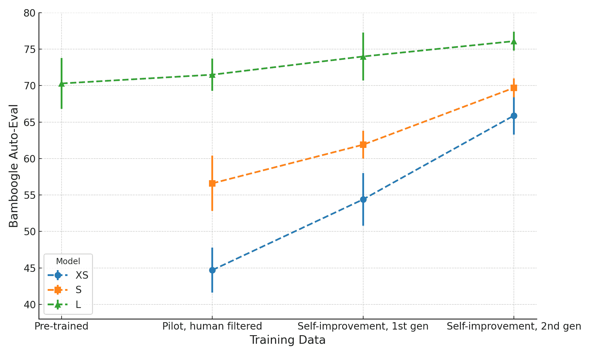
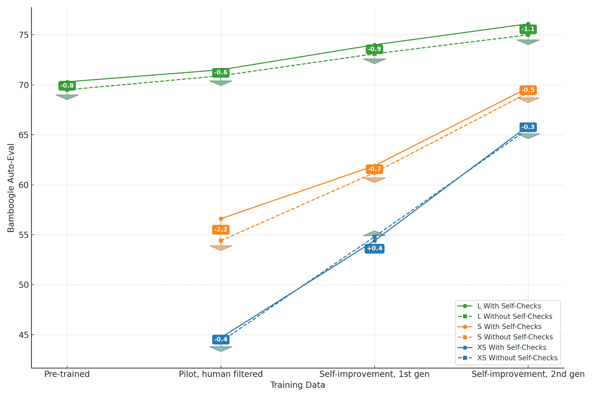

<!--yml

类别：未分类

日期：2025-01-11 12:59:40

-->

# ReST与ReAct相遇：多步骤推理LLM代理的自我改进

> 来源：[https://arxiv.org/html/2312.10003/](https://arxiv.org/html/2312.10003/)

Renat Aksitov Sobhan Miryoosefi Zonglin Li Daliang Li Sheila Babayan Kavya Kopparapu Zachary Fisher Ruiqi Guo Sushant Prakash Pranesh Srinivasan Manzil Zaheer Felix Yu Sanjiv Kumar

###### 摘要

回答复杂的自然语言问题通常需要多步骤推理并整合外部信息。一些系统已经将知识检索与大型语言模型（LLM）结合来回答这类问题。然而，这些系统存在各种失败案例，我们不能直接通过端到端训练来解决这些失败，因为与外部知识的互动是不可微分的。为了解决这些缺陷，我们定义了一种ReAct风格的LLM代理，具备推理和利用外部知识的能力。我们进一步通过类似ReST的方法对代理进行优化，该方法通过对先前的轨迹进行迭代训练，采用带有AI反馈的增长批次强化学习来实现持续自我改进和自我蒸馏。从一个已经提示的大型模型开始，仅经过两次算法迭代，我们就能够产生一个经过微调的小型模型，在具有挑战性的组合性问答基准测试上，取得与大模型相当的性能，但参数量减少了两个数量级。

## 1 引言

图1：代理自我改进与自我蒸馏。Bamboogle自动评估，10次运行的平均准确率和标准差（%）

对于许多简单的自然语言任务，如基本的问答或摘要生成，我们可以相对容易地判断最终输出是好还是坏，收集大量这样的数据，并使用这些结果作为反馈来训练语言模型。同时，对于更复杂的问题，基于结果的系统往往不足以解决问题，最近一种基于过程的监督方法作为一种更有前景的替代方案引起了广泛关注（Reppert et al. ([2023](#bib.bib19)))。在技术（Gao et al. ([2023](#bib.bib8)); Madaan et al. ([2023](#bib.bib16)))、框架（Dohan et al. ([2022](#bib.bib5)); Khattab et al. ([2023b](#bib.bib12)))和库（Liu ([2022](#bib.bib15)), Chase ([2022](#bib.bib3)))方面，针对通过人类可理解的任务分解来定义基于过程的工作流与大型语言模型（LLMs）结合的技术正在爆炸式增长。许多这样的任务分解涉及与外部工具/API/环境的互动，在这种情况下，相关的多步骤工作流通常被称为LLM代理（Xi et al. ([2023](#bib.bib23)))，这是一个能够执行一系列操作以实现目标的系统。

让我们考虑一个回答复杂开放性问题的任务，在这个任务中，智能体需要使用搜索API查找多个信息片段，然后组成一段段落式的答案。一种构建此类LLM智能体的流行方法是ReAct方法（Yao et al., [2022](#bib.bib25)），它通过在多个思考-行动-观察回合中交替进行链式思维推理与行动和观察。在这项工作中，我们遵循ReAct方法的通用格式设计了我们的搜索智能体，并设计了相应的少量样本提示，以生成长格式的、明确可归属的最终答案（参见 Nakano et al. ([2021](#bib.bib17))）。

接下来自然会问，如何处理这种智能体的失败案例，如何提高其性能和鲁棒性。对于基于结果的系统，解决方案通常是直接的：我们只需要收集更多的人工标注数据。然而，对于基于过程的系统，获取这些数据的挑战要大得多且成本更高：需要大量的数据（Uesato et al. ([2022](#bib.bib22)); Lightman et al. ([2023](#bib.bib14)))，而且人类通常更难确定最优的多步轨迹。

为了解决缺乏且难以获取多步人工标注数据的问题，我们专注于通过自我批评、AI反馈和合成数据生成来提升智能体的质量。具体来说，对于后者，我们将最近提出的（Gulcehre et al. ([2023](#bib.bib9))) 强化自我训练（ReST）算法适配到智能体设置中。ReST的内外循环流程保持不变：在外循环（“grow”）中，数据集通过从最新的策略中采样来扩展，而在内循环（“improve”）中，通过奖励模型对固定数据集进行排名或过滤来改进策略。在我们的案例中，"grow"阶段的采样意味着生成一个多步的完成轨迹，而作为"improve"一部分的排名则直接通过LLM调用进行，而不是通过人类偏好的蒸馏奖励模型。

我们通过搜索智能体回答各种复合问题的能力来衡量其整体性能，这些问题已经人工验证过，无法直接通过搜索引擎回答（Bamboogle数据集（Press et al., [2023](#bib.bib18)）和我们自己构建的后续数据集BamTwoogle）。虽然这两个数据集都较小，但它们具备足够的统计能力来捕捉我们感兴趣的效应。例如，图[1](#S1.F1 "图 1 ‣ 1 引言 ‣ ReST遇到ReAct：多步推理LLM智能体的自我改进")提供了在Bamboogle上不同模型大小的智能体性能的概述，并展示了随着更多ReST迭代的进行，性能的提升（我们所有的合成数据都是使用大模型生成的，因此对于小模型来说，性能来自蒸馏过程）。

总结一下，我们的贡献如下：

+   •

    我们构建了一种带有自我批评机制的 ReAct 智能体，用于长篇问答任务。

+   •

    我们基于 Bamboogle 和 BamTwoogle 数据集定义了一个代理评估指标，并强调自动评估的重要性。

+   •

    我们展示了通过 Rest 风格的迭代微调其推理轨迹，可以有效提高智能体的性能。

+   •

    此外，我们完全通过逐步的 AI 反馈来完成这一过程，而不使用人工标注的训练数据。

+   •

    最后，我们展示了在这一迭代过程中生成的合成数据可以用于将智能体蒸馏为一个或两个数量级更小的模型，并且其性能可与预训练的教师智能体相媲美。

## 2 背景：搜索智能体

本节描述了搜索智能体，这是 ReAct（Yao 等人，[2022](#bib.bib25)）智能体的一种变体，结合了 Reflexion（Shinn 等人，[2023](#bib.bib20)）。它使用网络搜索作为工具，为多种知识探索型开放式问题生成长篇、明确可追溯的答案。智能体的工作流程如下所示（图 [2](#S2.F2 "Figure 2 ‣ 2 Background: Search Agent ‣ ReST meets ReAct: Self-Improvement for Multi-Step Reasoning LLM Agent")）：

1.  1.

    智能体接收一个问题并开始执行搜索循环：

    +   •

        智能体决定是否需要额外的信息来回答问题。

    +   •

        如果回答是“是”，它会调用搜索工具，汇总接收到的片段，并返回决策步骤。

    +   •

        如果回答是“否”，它将终止搜索循环。

1.  2.

    基于搜索循环中收集到的信息，智能体生成答案的第一次尝试（草稿）。

1.  3.

    它接着进行两次额外的自我修正调用，然后生成最终答案：

    +   •

        一次是验证答案是否与原问题相关，

    +   •

        另一个检查步骤是确保答案基于检索到的片段。

<svg class="ltx_picture ltx_centering" height="314.86" id="S2.F2.pic1" overflow="visible" version="1.1" width="534.36"><g fill="#000000" stroke="#000000" transform="translate(0,314.86) matrix(1 0 0 -1 0 0) translate(89.03,0) translate(0,261.72)"><g color="#000000" stroke-width="0.4pt"><g fill="#000000" stroke="#000000" transform="matrix(1.0 0.0 0.0 1.0 -57.12 -19.98)"><g class="ltx_tikzmatrix" transform="matrix(1 0 0 -1 0 33.875)"><g class="ltx_tikzmatrix_row" transform="matrix(1 0 0 1 0 0)"><g class="ltx_tikzmatrix_col" transform="matrix(1 0 0 -1 0 0)"><text transform="matrix(1 0 0 -1 0 0)">pt</text></g></g><g class="ltx_tikzmatrix_row" transform="matrix(1 0 0 1 0 37.27)"><g class="ltx_tikzmatrix_col" transform="matrix(1 0 0 -1 0 0)"><text transform="matrix(1 0 0 -1 0 0)">来问问题</text></g></g></g></g><g fill="#E6E6FF"><foreignobject height="0" overflow="visible" transform="matrix(1 0 0 -1 0 16.6)" width="0"><g fill="#000000" stroke="#000000" transform="matrix(1.0 0.0 0.0 1.0 420.57 -114.2)"><foreignobject height="39.95" overflow="visible" transform="matrix(1 0 0 -1 0 16.6)" width="82.14"><g class="ltx_tikzmatrix" transform="matrix(1 0 0 -1 0 33.875)"><g class="ltx_tikzmatrix_row" transform="matrix(1 0 0 1 0 0)"><g class="ltx_tikzmatrix_col" transform="matrix(1 0 0 -1 0 0)"><text transform="matrix(1 0 0 -1 0 0)">pt</text></g></g><g class="ltx_tikzmatrix_row" transform="matrix(1 0 0 1 0 37.27)"><g class="ltx_tikzmatrix_col" transform="matrix(1 0 0 -1 0 0)"><text transform="matrix(1 0 0 -1 0 0)">决策步骤</text></g></g></g></foreignobject></g><g fill="#E6E6E6"><path d="M 407.85 23.32 L 300.81 23.32 C 297.75 23.32 295.28 20.84 295.28 17.78 L 295.28 -17.78 C 295.28 -20.84 297.75 -23.32 300.81 -23.32 L 407.85 -23.32 C 410.91 -23.32 413.39 -20.84 413.39 -17.78 L 413.39 17.78 C 413.39 20.84 410.91 23.32 407.85 23.32 Z M 295.28 -23.32"></path></g><g fill="#000000" stroke="#000000" transform="matrix(1.0 0.0 0.0 1.0 318.76 -18.71)"><foreignobject height="37.41" overflow="visible" transform="matrix(1 0 0 -1 0 16.6)" width="71.15"><g class="ltx_tikzmatrix" transform="matrix(1 0 0 -1 0 32.605)"><g class="ltx_tikzmatrix_row" transform="matrix(1 0 0 1 0 0)"><g class="ltx_tikzmatrix_col" transform="matrix(1 0 0 -1 0 0)"><text transform="matrix(1 0 0 -1 0 0)">pt</text></g></g><g class="ltx_tikzmatrix_row" transform="matrix(1 0 0 1 0 37.42)"><g class="ltx_tikzmatrix_col" transform="matrix(1 0 0 -1 0 0)"><text transform="matrix(1 0 0 -1 0 0)">网页搜索</text></g></g></g></foreignobject></g><g fill="#E6E6FF"><path d="M 439.52 -93.45 L 269.14 -93.45 C 266.08 -93.45 263.6 -95.92 263.6 -98.98 L 263.6 -137.24 C 263.6 -140.3 266.08 -142.77 269.14 -142.77 L 439.52 -142.77 C 442.58 -142.77 445.06 -140.3 445.06 -137.24 L 445.06 -98.98 C 445.06 -95.92 442.58 -93.45 439.52 -93.45 Z M 263.6 -142.77"></path></g><g fill="#000000" stroke="#000000" transform="matrix(1.0 0.0 0.0 1.0 268.21 -138.16)"><foreignobject height="40.11" overflow="visible" transform="matrix(1 0 0 -1 0 16.6)" width="172.23"><g class="ltx_tikzmatrix" transform="matrix(1 0 0 -1 0 33.96)"><g class="ltx_tikzmatrix_row" transform="matrix(1 0 0 1 0 0)"><g class="ltx_tikzmatrix_col" transform="matrix(1 0 0 -1 0 0)"><text transform="matrix(1 0 0 -1 0 0)">pt</text></g></g><g class="ltx_tikzmatrix_row" transform="matrix(1 0 0 1 0 37.42)"><g class="ltx_tikzmatrix_col" transform="matrix(1 0 0 -1 0 0)"><text transform="matrix(1 0 0 -1 0 0)">工具输出总结</text></g></g></g></foreignobject></g><g fill="#E6E6FF"><path d="M 57.24 -114.55 L -57.24 -114.55 C -60.3 -114.55 -62.78 -117.03 -62.78 -120.09 L -62.78 -155.5 C -62.78 -158.56 -60.3 -161.04 -57.24 -161.04 L 57.24 -161.04 C 60.3 -161.04 62.78 -158.56 62.78 -155.5 L 62.78 -120.09 C 62.78 -117.03 60.3 -114.55 57.24 -114.55 Z M -62.78 -161.04"></path></g><g fill="#000000" stroke="#000000" transform="matrix(1.0 0.0 0.0 1.0 -58.16 -156.43)"><foreignobject height="37.26" overflow="visible" transform="matrix(1 0 0 -1 0 16.6)" width="116.33"><g class="ltx_tikzmatrix" transform="matrix(1 0 0 -1 0 32.53)"><g class="ltx_tikzmatrix_row" transform="matrix(1 0 0 1 0 0)"><g class="ltx_tikzmatrix_col" transform="matrix(1 0 0 -1 0 0)"><text transform="matrix(1 0 0 -1 0 0)">pt</text></g></g><g class="ltx_tikzmatrix_row" transform="matrix(1 0 0 1 0 37.27)"><g class="ltx_tikzmatrix_col" transform="matrix(1 0 0 -1 0 0)"><text transform="matrix(1 0 0 -1 0 0)">答案生成</text></g></g></g></foreignobject></g><g fill="#E6E6FF"><path d="M 62.98 -193.22 L -62.98 -193.

图 2：搜索代理流程的状态机。每个蓝色形状对应一次 LLM 调用，并定义一种不同类型的推理步骤。

## 3 方法

### 3.1 提示设计

我们首先通过手动构建每个推理步骤的少量示例提示，定义了搜索代理的提示流程，来自图 [2](#S2.F2 "Figure 2 ‣ 2 Background: Search Agent ‣ ReST meets ReAct: Self-Improvement for Multi-Step Reasoning LLM Agent")。特别地，我们选择将提示格式化为 Python 代码（请参见附录中的不同步骤提示，清单 [1](#LST1 "Listing 1 ‣ Reasoning steps. ‣ A.1 Prompts ‣ Appendix A Appendix ‣ ReST meets ReAct: Self-Improvement for Multi-Step Reasoning LLM Agent") - [6](#LST6 "Listing 6 ‣ Reasoning steps. ‣ A.1 Prompts ‣ Appendix A Appendix ‣ ReST meets ReAct: Self-Improvement for Multi-Step Reasoning LLM Agent")）。

选择使用“代码作为提示”方法的决定基于以下观察：

+   •

    通常需要解析 LLM 的输出，以便与其他系统和工具集成，如果模型的输入和输出结构良好，这将更容易进行。

+   •

    与此同时，代码独特地结合了结构化方面（关键字和语法）和自然语言方面（注释和描述性命名）。

+   •

    此外，LLM 还能够进行代码的读取和编写。

总结来说，由于代码本身具有自然的结构并且易于解析，它可以作为与模型通信的优秀媒介。因此，在“代码作为提示”范式中，LLM 被期望理解输入中的代码，并在输出中继续它作为有效的 Python 代码，这对于较小的模型来说是一个具有挑战性的任务。在我们尝试过的（预训练的）模型中，只有 PaLM 2-L（Anil 等，[2023](#bib.bib1)）能够始终如一地表现良好。因此，这就是我们用来从少量示例提示生成推理轨迹的模型。

### 3.2 实现细节

为了运行搜索代理，我们使用了不同大小的 PaLM 2 “基础”模型（XS、S 和 L），包括预训练和微调模型。我们通常为每一步生成多个样本（$T=0.5$，关于温度选择的详细信息，请参见第 [4.2](#S4.SS2 "4.2 Auto-Eval ‣ 4 Evaluation ‣ ReST meets ReAct: Self-Improvement for Multi-Step Reasoning LLM Agent")节），然后选择困惑度最低的一个（L 和 S 选择 4 个样本，XS 选择 16 个样本）来继续推进轨迹。作为搜索工具，我们使用内部的 Google Q&A API，它返回 top-k 片段，我们通常每个查询请求返回 top-3 片段。我们进一步限制每个代理轨迹的搜索次数最多为 10 次（通过提示中的 REMAINING_SEARCHES 字段）。搜索代理通过将迄今为止采取的所有操作存储在 PAST_ACTIONS 字段中来保持轨迹状态。

### 3.3 输入数据

我们使用以下四个数据集为搜索代理轨迹提供初始问题：

+   •

    HotpotQA（Yang等人，[2018](#bib.bib24)），一个多跳推理问答数据集，系统必须从多个文档中推理信息，以得出答案。

+   •

    Eli5（Fan等人，[2019](#bib.bib7)），一个用于长篇问答（LFQA）的数据集，这是一个需要详细和深入回答开放性问题的任务。该数据集来源于Reddit论坛“Explain Like I’m Five”（ELI5），r/explainlikeimfive。

+   •

    Eli5-askH（Blagojevic，[2022](#bib.bib2)），与上面类似，但来源于Reddit论坛r/askhistorians，这是一个用户可以提问或讨论历史问题的子版块。

+   •

    Eli5-askS（Blagojevic，[2022](#bib.bib2)），如上所述，但来源于Reddit子版块r/askscience（“提问科学问题，得到科学答案”）。

我们随机从每个数据集的训练分割中选择了500个问题，共获得了2000个多样且富有挑战性的问题。我们没有使用这些数据集的其他信息，比如标签（例如，我们没有通过与HotpotQA中的正确答案匹配进行过滤，也没有使用这些数据集的验证分割来进行超参数调优或性能评估）。

### 3.4 微调

我们只是将每个完成的搜索代理轨迹分割成推理步骤，并利用这些步骤构建微调混合样本。在所有实验中，我们使用了完全微调。考虑到微调成本随着模型的增大而急剧上升，我们尽可能使用XS模型进行多次实验。

### 3.5 排名“奖励”模型

如前所述，我们为每个推理步骤生成多个样本，并通常选择能够最小化困惑度的样本来继续推理轨迹，或用于构建微调混合样本。同时，我们可能能够通过使用更复杂的方式来选择最佳样本，从而做得比这更好。为此，我们采用了指令调优的PaLM 2-L，并通过模型输入、多样本输出以及如何对它们进行排名的指导来提示它（提示在附录中，列表[8](#LST8 "Listing 8 ‣ Ranking ”Reward” Model. ‣ A.1 Prompts ‣ Appendix A Appendix ‣ ReST meets ReAct: Self-Improvement for Multi-Step Reasoning LLM Agent")）。然后，我们可以使用排名最高的样本进行微调，而不是基于困惑度值选择的默认样本。

在这一部分，我们的方法与ReST有所不同，ReST使用基于阈值的过滤，并采用在人工偏好数据上训练的奖励模型（RM）。我们所做的更接近于RAFT（Dong等人，[2023](#bib.bib6)），其中奖励模型对采样的响应进行排名，从而选择得分较高的子集用于模型微调，而且RM排名比绝对分数更为重要。值得注意的是，我们主要进行的是基于LLM的离策略选择，即通过更新当前用于微调的动作来进行选择。基于策略的轨迹回滚使用困惑度。

### 3.6 迭代自我改进

现在我们已经具备了自我改进算法的所有组成部分：

+   •

    从一个能够在一定程度上执行搜索代理任务的模型开始，例如，使用提示的PaLM 2-L模型。根据我们的一组2000个初始问题收集该模型的推理轨迹（本质上是ReST的“成长”阶段，不同之处在于我们保持初始问题集不变）。

+   •

    将这些轨迹转换为微调混合数据。在转换过程中应用RM重新排序（这大致等同于ReST的“改进”阶段，尽管我们只进行一次“改进”迭代）。

+   •

    在这个混合数据集上对新模型（同样大小的模型）进行微调，并验证它的表现是否优于原始模型（我们将在接下来的章节中讨论如何做到这一点）。然后从这个新的、更好的模型开始，重复该过程。

最后，我们还可以在不同自我改进迭代的微调数据上训练更小的模型，这自然会给我们带来自我蒸馏算法。

## 4 评估

### 4.1 Bamboogle

我们主要的评估工具是Bamboogle数据集（Press等，[2023](#bib.bib18)）。这是一个半对抗性的数据集，包含2跳问题（共125个），这些问题被选为无法通过直接的Google搜索回答，但可以在Wikipedia中找到所需的两个证据。当搜索代理在Bamboogle上的表现有所提升时，我们可以假设它在使用搜索作为工具方面通常会变得更好。

由于搜索代理生成的答案具有开放式性质（见图[3](#S4.F3 "图3 ‣ 4.1 Bamboogle ‣ 4 评估 ‣ ReST遇到ReAct：多步骤推理LLM代理的自我改进")），我们无法可靠地使用精确匹配作为评估标准。相反，我们要么手动判断答案的正确性，要么使用单独调用PaLM 2-L“基础”模型来运行自动评估。

<svg class="ltx_picture ltx_centering" height="225.99" id="S4.F3.pic1" overflow="visible" version="1.1" width="246"><g fill="#000000" stroke="#000000" transform="translate(0,225.99) matrix(1 0 0 -1 0 0) translate(123,0) translate(0,205.89)"><g color="#000000" stroke-width="0.4pt"><g fill="#000000" stroke="#000000" transform="matrix(1.0 0.0 0.0 1.0 -118.11 5.53)"><foreignobject height="30.44" overflow="visible" transform="matrix(1 0 0 -1 0 16.6)" width="236.22">问题：第三快的鸟的最大飞行速度（单位：公里/小时）是多少？ <g fill="#FFF2F2" stroke="#000000"><path d="M -122.72 -131.09 h 245.44 v 71.34 h -245.44 Z"></path></g><g fill="#000000" stroke="#000000" transform="matrix(1.0 0.0 0.0 1.0 -118.11 -74.05)"><foreignobject height="62.11" overflow="visible" transform="matrix(1 0 0 -1 0 16.6)" width="236.22">模型答案：金雕是第三快的鸟。根据[link_id=4, 5, 6]，它的最大飞行速度是200英里/小时，约合320公里/小时。</foreignobject></g> <g fill="#F2FFF2" stroke="#000000"><path d="M -83.35 -205.61 h 166.7 v 34.59 h -166.7 Z"></path></g><g fill="#000000" stroke="#000000" transform="matrix(1.0 0.0 0.0 1.0 -78.74 -191.08)"><foreignobject height="13.84" overflow="visible" transform="matrix(1 0 0 -1 0 16.6)" width="157.48">实际答案：320公里/小时</foreignobject></g><g color="#000000" stroke-width="0.8pt"><path d="M 0 -20.11 L 0 -55.88" style="fill:none"><g transform="matrix(0.0 -1.0 1.0 0.0 0 -55.88)"><path d="M 3.6 0 L -2.16 2.88 L 0 0 L -2.16 -2.88" style="stroke:none"></path></g></path></g>

图3：一个Bamboogle问题，并展示模型给出的长格式答案示例

### 4.2 自动评估

尽管严格的人工评估是更理想的选择，但它们非常耗时。而且，它们的扩展性较差（进行一次人工评估比进行五次要容易），这导致了我们在进行此类评估时的高方差：代理的轨迹是随机的（提醒一下，我们在采样推理步骤时使用非零温度），但通过增加每个问题的人工评估重复次数，我们无法轻松地减少方差。

我们通过引入基于LLM的自动评估（完整的自动评估提示可以在附录中找到，见[7](#LST7 "Listing 7 ‣ Auto-eval. ‣ A.1 Prompts ‣ Appendix A Appendix ‣ ReST meets ReAct: Self-Improvement for Multi-Step Reasoning LLM Agent)））来解决这两个问题，并通过验证它与人类评分在我们之前进行过人工评估的Bamboogle轨迹上的一致性。我们将自动评估与人类评估进行了比较，涵盖了多种不同的代理，并发现两者高度相关。具体来说，Pearson相关系数为0.98，$p=6.6\times 10^{-8}$，而Spearman相关系数为0.83，$p=0.0015$。鉴于运行自动评估的成本远低于人工评估，我们现在可以使用大量重复来减少方差。我们通常会在十次重复的基础上聚合自动评估结果（即，为每个Bamboogle问题生成十个不同的轨迹）。

首先，我们使用 Bamboogle 自动评估来估计最终模型的性能，但也用于回答通常会使用验证集来解答的各种问题：

+   •

    代理的最佳采样温度是多少？（$T=0.5$）

+   •

    我们应该为不同模型大小选择哪些检查点？（XS 选择 9K 步，S 选择 5K 步，L 选择 3.5K 步）

+   •

    我们是否应该进行另一轮自我改进？

+   •

    使用每个问题多个轨迹对微调模型的性能影响如何？

+   •

    我们应该使用自我检查吗？它们是在帮助结果还是在损害结果？（稍微有帮助，见图[4](#S4.F4 "图 4 ‣ 4.2 自动评估 ‣ 4 评估 ‣ ReST meets ReAct：多步推理 LLM 代理的自我改进")）

重要的是，我们从不使用 Bamboogle 作为训练集，因为我们既不在 Bamboogle 上调优我们的提示，也不使用其中的问题生成微调轨迹。

图 4：代理自我改进和自我蒸馏，有无自我批判步骤。Bamboogle 自动评估，十次运行的平均准确率和标准差（%）

### 4.3 BamTwoogle

由于 Bamboogle 的规模较小，并且我们将其用作搜索代理验证集的类比，因此存在过拟合的风险。为防止这种可能性，我们引入了一个新的数据集 BamTwoogle，作为测试集。我们仅使用 BamTwoogle 来衡量模型的最终性能。

BamTwoogle 数据集是为了作为 Bamboogle 的补充和略微更具挑战性的续集而编写的。它还解决了我们在进行人工评估时发现的一些 Bamboogle 的不足之处。特别是，我们确保所有问题都需要 2 步以上才能回答。由于搜索算法的变化，现在并非所有 Bamboogle 问题都符合这一要求，有些问题可以通过一次搜索就解决。

像 Bamboogle 一样，BamTwoogle 是一个小型的（总共 100 个问题）手工制作的信息寻求问题集。主题和问题格式各异，但通常，BamTwoogle 遵循以下准则：

问题

+   •

    大多数问题需要两次搜索或推理步骤（如 Bamboogle），但其中一些问题需要 3 或 4 步。

+   •

    必须手动检查，以确保答案不会出现在 Google 搜索结果的第一页。

期望答案

+   •

    不应含糊不清。

+   •

    不应随着时间推移发生变化，无论是由于问题措辞还是答案的性质。

+   •

    应根据需要考虑适当名称的多种版本等。

+   •

    应优先使用维基百科作为事实的权威来源（优先选择那些没有标记为不完整、缺乏来源等的主题/文章）。

## 5 实验

### 5.1 试点

表 1：代理自我改进和自我蒸馏，Bamboogle 自动评估，十次运行的平均准确率和标准差（%）

| 训练数据 | XS | S | L |
| --- | --- | --- | --- |
| 预训练 | N/A | N/A | 70.3^($\pm 3.5$) |
| --- | --- | --- | --- |
| 试验，人工筛选 | 44.7^($\pm 3.1$) | 56.6^($\pm 3.8$) | 71.5^($\pm 2.2$) |
| 自我提升，第一代 | 54.4^($\pm 3.6$) | 61.9^($\pm 1.9$) | 74.0^($\pm 3.3$) |
| 自我提升，第二代 | 65.9^($\pm 2.6$) | 69.7^($\pm 1.3$) | 76.1^($\pm 1.3$) |

除了在第[3](#S3 "3 Methods ‣ ReST meets ReAct: Self-Improvement for Multi-Step Reasoning LLM Agent")节中描述的主要自我提升设置外，我们还生成了一个更简单的“试验”数据集，包含500条轨迹，其中初始问题仅从HotpotQA和Eli5数据集中选择（即较小，并且不包括Eli5-askH或Eli5-askS）。我们使用默认设置（基于最小困惑度，不进行RM重新排序）来构建试验微调混合数据。此外，我们手动审核微调数据，并筛选掉约$30\%$的“坏”样本，如不有帮助的查询、空的思路、缺失重要信息的总结等。这个试验数据集作为微调基线。

### 5.2 自我提升与自我蒸馏

主要结果见图[1](#S1.F1 "Figure 1 ‣ 1 Introduction ‣ ReST meets ReAct: Self-Improvement for Multi-Step Reasoning LLM Agent")和表[1](#S5.T1 "Table 1 ‣ 5.1 Pilot ‣ 5 Experiments ‣ ReST meets ReAct: Self-Improvement for Multi-Step Reasoning LLM Agent")。如前所述，表格中的每一格展示了特定模型在10次Bamboogle运行中的自动评估均值（及相应的标准差）。

表2：人工评估，Bamboogle和BamTwoogle准确率（%）

|  | 预训练（L） | 第二代（XS） | 第二代（S） | 第二代（L） |
| --- | --- | --- | --- | --- |
| Bamboogle | 68.8 | 67.2 | 68.0 | 74.4 |
| BamTwoogle | 68.0 | 63.0 | 63.0 | 74.0 |

我们从一个预训练（并已提示）的PaLM 2-L模型开始，利用它生成500条试验轨迹和（独立地）2000条用于第一轮（“第一代”）自我提升的轨迹。然后，我们在生成的混合数据集上微调PaLM 2-L、PaLM 2-S和PaLM 2-XS模型。

接下来，我们使用在第一代数据上微调的PaLM 2-L模型来生成第二次迭代（“第二代”）自我提升的轨迹。我们构建了包含8000条轨迹的第二代数据集（使用相同的2000个初始问题，每个问题重复四次；类似于ReST中的“增长”阶段）。与之前一样，我们将三种模型分别在新的第二代混合数据集上进行微调。

作为最终验证，我们还对每个第二代模型（表[2](#S5.T2 "Table 2 ‣ 5.2 Self-improvement and self-distillation ‣ 5 Experiments ‣ ReST meets ReAct: Self-Improvement for Multi-Step Reasoning LLM Agent")）的单次Bamboogle和BamTwoogle运行进行了人工评估，同时也与原始的预训练PaLM 2-L模型进行对比。

### 5.3 消融实验

#### 人工筛选的效果如何？

令人惊讶的是，我们发现对过滤数据进行微调会导致性能略有下降（2.5%），与未经过滤的初步混合数据（表[3](#S5.T3 "表 3 ‣ 我们应该在每个问题中使用多个轨迹吗？ ‣ 5.3 去除实验 ‣ 5 实验 ‣ ReST与ReAct：多步推理LLM智能体的自我改进")，初步列）相比。我们推测这可能是由于以下两个因素的结合：

+   •

    过滤混合数据的减少使得模型更难学习提示的正确格式，

+   •

    我们的过滤仅影响直接的“坏”示例，而不是整个轨迹；“坏”步骤通常会在其他微调示例中作为PAST_ACTIONS字段的一部分被保留下来。

#### 我们应该在每个问题中使用多个轨迹吗？

结果表明，在微调混合数据中，使用每个问题的两个轨迹比使用一个轨迹更有帮助（提高了2.2%），但超过这个数量并不会显著提高性能（表[3](#S5.T3 "表 3 ‣ 我们应该在每个问题中使用多个轨迹吗？ ‣ 5.3 去除实验 ‣ 5 实验 ‣ ReST与ReAct：多步推理LLM智能体的自我改进")，第2代列）。

表 3：微调PaLM 2-XS模型的训练数据质量和规模的影响

|  | 初步，人工过滤 | 初步，未经过滤 | 第1代 | 第2代（1x） | 第2代（2x） | 第2代（4x） |
| --- | --- | --- | --- | --- | --- | --- |
| 总轨迹数 | 500 | 500 | 2000 | 2000x1 | 2000x2 | 2000x4 |
| 训练示例 | 3015 | 4518 | 17970 | 18007 | 36238 | 72424 |
| Bamboogle自动评估 | 44.7^($\pm 3.1$) | 47.2^($\pm 3.1$) | 54.4^($\pm 3.6$) | 63.4^($\pm 1.7$) | 65.6^($\pm 1.8$) | 65.9^($\pm 2.6$) |

#### 更多数据与更好的数据。

从同一张表[3](#S5.T3 "表 3 ‣ 我们应该在每个问题中使用多个轨迹吗？ ‣ 5.3 去除实验 ‣ 5 实验 ‣ ReST与ReAct：多步推理LLM智能体的自我改进")中，我们可以得出结论，数据的质量（例如，从第1代到第2代（1x）的9%的增益，同时保持数据规模大致相同）比数据的数量更为重要。值得注意的是，更好的数据还可以减少评估轨迹的方差。

#### 自我批评的效果。

该代理的多步骤设置使我们能够轻松地衡量自我批评步骤对整体代理性能的影响。为了实现这一点，我们只需将所有用于表格[1](#S5.T1 "Table 1 ‣ 5.1 Pilot ‣ 5 Experiments ‣ ReST meets ReAct: Self-Improvement for Multi-Step Reasoning LLM Agent")的Bamboogle轨迹运行自动评估，但在“答案生成”步骤上运行，而不是像通常那样在“最终答案”上运行（图[2](#S2.F2 "Figure 2 ‣ 2 Background: Search Agent ‣ ReST meets ReAct: Self-Improvement for Multi-Step Reasoning LLM Agent")）。从图[4](#S4.F4 "Figure 4 ‣ 4.2 Auto-Eval ‣ 4 Evaluation ‣ ReST meets ReAct: Self-Improvement for Multi-Step Reasoning LLM Agent")中可以看出，自我批评带来了一个小但可测量的正向提升（对于大多数模型，提升大约在0.5-1.0%之间）。详细数字可以在附录中的表格[4](#A1.T4 "Table 4 ‣ A.2 Additional data ‣ Appendix A Appendix ‣ ReST meets ReAct: Self-Improvement for Multi-Step Reasoning LLM Agent")中找到。

## 6 讨论

#### 过程监督。

再次强调，我们在轨迹收集过程中并没有使用训练数据中的标签作为信号。这是通过将基于过程的方法（即将代理定义为状态机）与高温探索、AI反馈（用于动作重排序的零-shot“奖励”模型）以及对完成轨迹的逐状态微调相结合实现的。换句话说，在这个设置中，模型即使从最终导致错误答案的状态中也能学习到有用的东西。更重要的是，它能够学习如何处理那些本身没有单一明确定义正确答案的开放性问题，这与Eli5中的许多问题类似。

#### 自动评估。

上述列出的某些特性，特别是非贪婪采样和长篇答案生成，给代理评估带来了额外的挑战。我们不仅需要衡量特定轨迹的长篇最终答案的质量，还需要考虑相同输入下不同代理轨迹之间的随机性。另一方面，这提高了与人工评分员对齐的稳健自动评估的重要性；另一方面，由于需要多次运行代理轨迹，并且使用PaLM 2-L模型进行自动评估，这大大增加了计算成本。

#### 自我批评。

尽管有这些计算成本，但通过可靠的自动评估，可以带来多项好处，特别是在衡量各种代理超参数影响方面。例如，考虑自我批评步骤。在自动评估的帮助下，我们能够确定它们对我们多步骤推理设置的整体性能有小但正向的影响。这与最近的观察（Huang等人，[2023](#bib.bib10)）形成对比，后者指出，在基于结果的CoT设置中，加入自我批评会损害性能。同时，我们还注意到，自我批评的正向效果依赖于模型的大小（对于较大的模型效果更明显），但似乎不受自我改进过程的影响。

#### 限制与未来方向。

尽管这项工作为推理代理的自我改进奠定了基础，但由于计算和时间的限制，存在许多局限性：手动构建的提示、较小的评估集、有限的模型集以及仅使用单一工具，仅举几例。

未来的工作可以探索是否相同的自我改进算法适用于多个工具设置，尤其是是否能够以某种方式提高处理未见过工具的能力。如果后者更类似于自我批评，并且在类似ReST的迭代训练下没有改善，是否需要进行哪些改变才能使自我改进同时适用于两者？

另一个悬而未决的问题是饱和点。超过第二次的自我改进迭代，还能带来非琐碎的增益吗？对于较小的模型，饱和点是什么样的？它们最终是否都会趋向相同的性能，还是较小的模型始终会受到初始提示大模型性能的限制？

## 7 相关工作

在WebGPT（Nakano等人，[2021](#bib.bib17)）的基础上，我们正在处理长篇问答任务（Krishna等人，[2021](#bib.bib13)），在此任务中，语言代理使用网页搜索作为工具，生成最终答案，并为检索到的段落提供明确的引用。虽然WebGPT专注于模仿学习和基于大量人类示范的强化学习，我们的工作则旨在尽量减少人工参与。作为训练的一部分，我们使用的唯一标注示范是代理推理步骤中的少量示例提示（见附录，[A.1](#A1.SS1.SSS0.Px1 "Reasoning steps. ‣ A.1 Prompts ‣ Appendix A Appendix ‣ ReST meets ReAct: Self-Improvement for Multi-Step Reasoning LLM Agent")）。

设置语言代理并使用手动设计的少量示例提示是最常见的做法（Press等人（[2023](#bib.bib18)）；Yao等人（[2022](#bib.bib25)）；Shinn等人（[2023](#bib.bib20)）），但也存在一些例外。例如，DSP（Khattab等人，[2023a](#bib.bib11)）自动调优提示的少量示例，利用一定数量的标注训练示例进行优化，并可以进一步微调代理的特定组件。

与提示方法不同，代理的微调进行得较少（Nakano 等人（[2021](#bib.bib17)）；Yao 等人（[2022](#bib.bib25)）；Chen 等人（[2023](#bib.bib4)））。与我们的微调设置最接近的可能是 FireAct（Chen 等人，[2023](#bib.bib4)），主要区别在于我们不使用人工标签进行训练或数据筛选。相反，我们正在通过 AI 反馈构建自我改进的合成数据。

一些与自我改进相关的论文包括 STAR（Zelikman 等人，[2022](#bib.bib26)），ReST（Gulcehre 等人，[2023](#bib.bib9)），ReST^(EM)（Singh 等人，[2023](#bib.bib21)），和 RAFT（Dong 等人，[2023](#bib.bib6)）。与 STAR 和 ReST^(EM) 不同，我们不使用答案的正确性作为信号。而且，与 ReST 和 RAFT 不同，我们没有在人工偏好上训练的奖励模型。此外，这四篇论文都针对基于结果的系统，而我们则专注于基于过程的系统。

## 8 结论

本工作表明，采用类似 ReST 的方法结合 AI 反馈可以有效地应用于多步骤推理的 LLM 代理。我们展示了这是一种相对简单且高效的方式，能够迭代地构建高质量的合成数据以供代理自我改进。此外，这些质量越来越高的数据可以同时用于将多步骤代理蒸馏成几个规模更小的模型，同时保留大模型的绝大部分性能。

## 参考文献

+   Anil 等 (2023) Rohan Anil, Andrew M Dai, Orhan Firat, Melvin Johnson, Dmitry Lepikhin, Alexandre Passos, Siamak Shakeri, Emanuel Taropa, Paige Bailey, Zhifeng Chen 等. Palm 2 技术报告。 *arXiv 预印本 arXiv:2305.10403*，2023年。

+   Blagojevic (2022) Vladimir Blagojevic. 《超越 ELI5 的长篇问答：更新的数据集和方法》，2022年。网址 [towardsdatascience.com/long-form-qa-beyond-eli5-an-updated-dataset-and-approach-319cb841aabb](towardsdatascience.com/long-form-qa-beyond-eli5-an-updated-dataset-and-approach-319cb841aabb)。

+   Chase (2022) Harrison Chase. Langchain. [https://github.com/hwchase17/langchain](https://github.com/hwchase17/langchain)，2022年。

+   Chen 等 (2023) Baian Chen, Chang Shu, Ehsan Shareghi, Nigel Collier, Karthik Narasimhan, 和 Shunyu Yao. 《Fireact：面向语言代理微调》，2023年。

+   Dohan 等 (2022) David Dohan, Winnie Xu, Aitor Lewkowycz, Jacob Austin, David Bieber, Raphael Gontijo Lopes, Yuhuai Wu, Henryk Michalewski, Rif A. Saurous, Jascha Sohl-dickstein, Kevin Murphy, 和 Charles Sutton. 《语言模型级联》，2022年。

+   Dong 等 (2023) Hanze Dong, Wei Xiong, Deepanshu Goyal, Yihan Zhang, Winnie Chow, Rui Pan, Shizhe Diao, Jipeng Zhang, Kashun Shum, 和 Tong Zhang. 《Raft：生成型基础模型对齐的奖励排名微调》，2023年。

+   Fan 等 (2019) Angela Fan, Yacine Jernite, Ethan Perez, David Grangier, Jason Weston, 和 Michael Auli. 《ELI5：长篇问答》。 *CoRR*，abs/1907.09190，2019年。网址 [http://arxiv.org/abs/1907.09190](http://arxiv.org/abs/1907.09190)。

+   Gao et al. (2023) Luyu Gao, Aman Madaan, Shuyan Zhou, Uri Alon, Pengfei Liu, Yiming Yang, Jamie Callan, 和 Graham Neubig. Pal：程序辅助语言模型，2023年。

+   Gulcehre et al. (2023) Caglar Gulcehre, Tom Le Paine, Srivatsan Srinivasan, Ksenia Konyushkova, Lotte Weerts, Abhishek Sharma, Aditya Siddhant, Alex Ahern, Miaosen Wang, Chenjie Gu, 等. 强化自我训练（rest）用于语言建模，*arXiv 预印本 arXiv:2308.08998*，2023年。

+   Huang et al. (2023) Jie Huang, Xinyun Chen, Swaroop Mishra, Huaixiu Steven Zheng, Adams Wei Yu, Xinying Song, 和 Denny Zhou. 大型语言模型尚不能自我修正推理，2023年。

+   Khattab et al. (2023a) Omar Khattab, Keshav Santhanam, Xiang Lisa Li, David Hall, Percy Liang, Christopher Potts, 和 Matei Zaharia. 展示-搜索-预测：为知识密集型自然语言处理构建检索和语言模型，2023a年。

+   Khattab et al. (2023b) Omar Khattab, Arnav Singhvi, Paridhi Maheshwari, Zhiyuan Zhang, Keshav Santhanam, Sri Vardhamanan, Saiful Haq, Ashutosh Sharma, Thomas T. Joshi, Hanna Moazam, Heather Miller, Matei Zaharia, 和 Christopher Potts. Dspy：将声明性语言模型调用编译为自我改进的管道，2023b年。

+   Krishna et al. (2021) Kalpesh Krishna, Aurko Roy, 和 Mohit Iyyer. 长篇问答进展的障碍，2021年。

+   Lightman et al. (2023) Hunter Lightman, Vineet Kosaraju, Yura Burda, Harri Edwards, Bowen Baker, Teddy Lee, Jan Leike, John Schulman, Ilya Sutskever, 和 Karl Cobbe. 一步步验证，我们在前进，2023年。

+   Liu (2022) Jerry Liu. Llamaindex. [https://github.com/jerryjliu/llama_index](https://github.com/jerryjliu/llama_index), 2022.

+   Madaan et al. (2023) Aman Madaan, Niket Tandon, Prakhar Gupta, Skyler Hallinan, Luyu Gao, Sarah Wiegreffe, Uri Alon, Nouha Dziri, Shrimai Prabhumoye, Yiming Yang, Shashank Gupta, Bodhisattwa Prasad Majumder, Katherine Hermann, Sean Welleck, Amir Yazdanbakhsh, 和 Peter Clark. 自我精炼：通过自我反馈的迭代精炼，2023年。

+   Nakano et al. (2021) Reiichiro Nakano, Jacob Hilton, Suchir Balaji, Jeff Wu, Long Ouyang, Christina Kim, Christopher Hesse, Shantanu Jain, Vineet Kosaraju, William Saunders, 等. Webgpt：通过浏览器辅助的问答与人类反馈，*arXiv 预印本 arXiv:2112.09332*，2021年。

+   Press et al. (2023) Ofir Press, Muru Zhang, Sewon Min, Ludwig Schmidt, Noah A. Smith, 和 Mike Lewis. 衡量并缩小语言模型中的组合性差距，2023年。

+   Reppert et al. (2023) Justin Reppert, Ben Rachbach, Charlie George, Luke Stebbing, Jungwon Byun, Maggie Appleton, 和 Andreas Stuhlmüller. 迭代分解：通过监督推理过程改进科学问答，2023年。

+   Shinn et al. (2023) Noah Shinn, Beck Labash, 和 Ashwin Gopinath. Reflexion：一个具有动态记忆和自我反思的自主智能体，*arXiv 预印本 arXiv:2303.11366*，2023年。

+   Singh等人（2023）Avi Singh、John D. Co-Reyes、Rishabh Agarwal、Ankesh Anand、Piyush Patil、Peter J. Liu、James Harrison、Jaehoon Lee、Kelvin Xu、Aaron Parisi、Abhishek Kumar、Alex Alemi、Alex Rizkowsky、Azade Nova、Ben Adlam、Bernd Bohnet、Gamaleldin Elsayed、Hanie Sedghi、Igor Mordatch、Isabelle Simpson、Izzeddin Gur、Jasper Snoek、Jeffrey Pennington、Jiri Hron、Kathleen Kenealy、Kevin Swersky、Kshiteej Mahajan、Laura Culp、Lechao Xiao、Maxwell L. Bileschi、Noah Constant、Roman Novak、Rosanne Liu、Tris Warkentin、Yundi Qian、Ethan Dyer、Behnam Neyshabur、Jascha Sohl-Dickstein和Noah Fiedel。超越人类数据：通过语言模型扩展自我训练解决问题，2023年。

+   Uesato等人（2022）Jonathan Uesato、Nate Kushman、Ramana Kumar、Francis Song、Noah Siegel、Lisa Wang、Antonia Creswell、Geoffrey Irving和Irina Higgins。通过过程和结果反馈解决数学文字问题，2022年。

+   Xi等人（2023）Zhiheng Xi、Wenxiang Chen、Xin Guo、Wei He、Yiwen Ding、Boyang Hong、Ming Zhang、Junzhe Wang、Senjie Jin、Enyu Zhou、Rui Zheng、Xiaoran Fan、Xiao Wang、Limao Xiong、Yuhao Zhou、Weiran Wang、Changhao Jiang、Yicheng Zou、Xiangyang Liu、Zhangyue Yin、Shihan Dou、Rongxiang Weng、Wensen Cheng、Qi Zhang、Wenjuan Qin、Yongyan Zheng、Xipeng Qiu、Xuanjing Huang和Tao Gui。基于大语言模型的智能体的崛起与潜力：一项调查，2023年。

+   Yang等人（2018）Zhilin Yang、Peng Qi、Saizheng Zhang、Yoshua Bengio、William W. Cohen、Ruslan Salakhutdinov和Christopher D. Manning。Hotpotqa：一个用于多跳问答的多样化、可解释的数据集。*CoRR*，abs/1809.09600，2018。网址[http://arxiv.org/abs/1809.09600](http://arxiv.org/abs/1809.09600)。

+   Yao等人（2022）Shunyu Yao、Jeffrey Zhao、Dian Yu、Nan Du、Izhak Shafran、Karthik Narasimhan和Yuan Cao。React：在语言模型中协同推理与行动。*arXiv预印本arXiv:2210.03629*，2022年。

+   Zelikman等人（2022）Eric Zelikman、Yuhuai Wu、Jesse Mu和Noah D. Goodman。Star：通过推理启动推理，2022年。

## 附录A 附录

### A.1 提示

#### 推理步骤。

我们所有的推理提示都是n-shot（其中$n>1$），尽管我们仅展示片段，限于第一个示例。

+   •

    决策步骤提示如清单[1](#LST1 "Listing 1 ‣ Reasoning steps. ‣ A.1 Prompts ‣ Appendix A Appendix ‣ ReST meets ReAct: Self-Improvement for Multi-Step Reasoning LLM Agent")所示（完整提示为9-shot）。

+   •

    摘要提示如清单[2](#LST2 "Listing 2 ‣ Reasoning steps. ‣ A.1 Prompts ‣ Appendix A Appendix ‣ ReST meets ReAct: Self-Improvement for Multi-Step Reasoning LLM Agent")所示（完整提示为6-shot）。

+   •

    答案生成提示为5-shot，清单[3](#LST3 "Listing 3 ‣ Reasoning steps. ‣ A.1 Prompts ‣ Appendix A Appendix ‣ ReST meets ReAct: Self-Improvement for Multi-Step Reasoning LLM Agent")展示了一个1-shot片段。

+   •

    相关性自检的提示见清单[5](#LST5 "Listing 5 ‣ Reasoning steps. ‣ A.1 Prompts ‣ Appendix A Appendix ‣ ReST meets ReAct: Self-Improvement for Multi-Step Reasoning LLM Agent")（完整提示为6-shot）。

+   •

    最后，基准自检的提示见清单[6](#LST6 "Listing 6 ‣ Reasoning steps. ‣ A.1 Prompts ‣ Appendix A Appendix ‣ ReST meets ReAct: Self-Improvement for Multi-Step Reasoning LLM Agent")（完整提示为5-shot）。

+   •

    两个自检都使用了来自清单[4](#LST4 "Listing 4 ‣ Reasoning steps. ‣ A.1 Prompts ‣ Appendix A Appendix ‣ ReST meets ReAct: Self-Improvement for Multi-Step Reasoning LLM Agent")的公共前缀。

清单1：决策步骤提示（片段）

[⬇](data:text/plain;base64,IiIiSW1wbGVtZW50IGFuIGFnZW50IGNhcGFibGUgb2YgYW5zd2VyaW5nIGNvbXBsZXggcXVlcmllcyBieSBwb3RlbnRpYWxseSBzZWFyY2ggbXVsdGlwbGUgdGltZXMuCiIiIgppbXBvcnQgZGF0YWNsYXNzZXMKCgpjbGFzcyBBY3Rpb246CiAgIiIiQmFzZSBjbGFzcyBmb3IgZGlmZmVyZW50IGFjdGlvbnMuIiIiCiAgLi4uCgoKQGRhdGFjbGFzc2VzLmRhdGFjbGFzcwpjbGFzcyBBY3Rpb25XcmFwcGVyOgogICIiIkVuY2Fwc3VsYXRlcyB0aGUgcmVhc29uaW5nIGFzIHdlbGwgYXMgdGhlIHNlbGVjdGVkIGFjdGlvbi4KCiAgQXR0cmlidXRlczoKICAgIHRob3VnaHRzOiBSZWNvcmQgeW91ciB0aG91Z2h0cyBvbiB3aHkgd2Ugc2hvdWxkIGRvIHRoaXMgYWN0aW9uLgogICAgYWN0aW9uOiBUaGUgYWN0dWFsbHkgc2VsZWN0ZWQgYWN0aW9uLgogICIiIgogIHRob3VnaHRzOiBzdHIKICBhY3Rpb246IEFjdGlvbgoKQGRhdGFjbGFzc2VzLmRhdGFjbGFzcwpjbGFzcyBTZWFyY2goQWN0aW9uKToKICAiIiJUaGUgR29vZ2xlIHNlYXJjaCBjb21tYW5kLgoKICBBdHRyaWJ1dGVzOgogICAgcXVlcnk6IFRoZSBxdWVyeSB0byBiZSBzZW50IHRvIEdvb2dsZS4KICAiIiIKICBxdWVyeTogc3RyCgoKQGRhdGFjbGFzc2VzLmRhdGFjbGFzcwpjbGFzcyBUZXJtaW5hdGUoQWN0aW9uKToKICAiIiJDb21tYW5kIHRvIHRlcm1pbmF0ZSB0aGUgc2VhcmNoIHNlcXVlbmNlLiIiIgogIC4uLgoKCiMjIyMjIyMjIyMjIyMjIyMjIyMjIyMjIyMKIyBFeGFtcGxlIDE6CiMjIyMjIyMjIyMjIyMjIyMjIyMjIyMjIyMKCk9SSUdJTkFMX1FVRVNUSU9OOiBzdHIgPSAnSSB3YW50IHRvIGJ1eSB0aGUgSWtlYSBLbGlwcGFuIGxvdmVzZWF0LCBidXQgSVwnbSBub3Qgc3VyZSB3aGV0aGVyIGl0IGNhbiBmaXQgaW50byBteSAyMDE5IEhvbmRhIE9keXNzZXkuIENvdWxkIHlvdSBjaGVjayB3aGV0aGVyIEkgbmVlZCB0byBmb2xkIGRvd24gdGhlIHNlYXQ/JwpQQVNUX0FDVElPTlM6IExpc3RbQWN0aW9uXSA9IFsKU2VhcmNoKHF1ZXJ5PSdpa2VhIGtsaXBwYW4gbG92ZXNlYXQgZGltZW5zaW9uJywKdGhvdWdodHM9IlRvIGFuc3dlciB0aGUgT1JJR0lOQUxfUVVFU1RJT04sIHdlIG5lZWQgdG8gZmluZCB0aGUgc2l6ZSBvZiB0aGUgSWtlYSBLbGlwcGFuIGxvdmVzZWF0IGFuZCB0aGUgY2FyZ28gc2l6ZSBvZiB0aGUgMjAxOSBIb25kYSBPZHlzc2V5LCBhbmQgdGhlbiBjb21wYXJlIHRoZW0uIExldCdzIHN0YXJ0IGJ5IGZpbmRpbmcgdGhlIHNpemUgb2YgdGhlIElrZWEgS2xpcHBhbiBsb3Zlc2VhdC4iLAopLApTZWxlY3RMaW5rKHNlbGVjdGVkX2xpbmtzPVsKICBSZXN1bHRJdGVtKGxpbmtfaWQ9MSwgbGlua190ZXh0PSdLTElQUEFOIExvdmVzZWF0LCBWaXNzbGUgZ3JheSAtIElLRUEnLAogICAgICAgICAgICAgc25pcHBldD0nPGxoPiBNZWFzdXJlbWVudHMgPC9saD4gPHVsPiA8bGk+IFdpZHRoOiA3MCA3LzggJnF1b3Q7IDwvbGk+IDxsaT4gRGVwdGg6IDM0IDUvOCAmcXVvdDsgPC9saT4gPGxpPiBIZWlnaHQ6IDI2ICZxdW90OyA8L2xpPiA8bGk+IEhlaWdodCB1bmRlciBmdXJuaXR1cmU6IDQgMy84ICZxdW90OyA8L2xpPiA8bGk+IFNlYXQgZGVwdGg6IDIxIDEvNCAmcXVvdDsgPC9saT4gPGxpPiBTZWF0IGhlaWdodDogMTYgNy84ICZxdW90OyA8L2xpPiA8L3VsPicpLF0sCmdyb3VuZGVkX3N1bW1hcml6YXRpb249J0FjY29yZGluZyB0byBbbGlua19pZD0xXSB0aGUgZGltZW5zaW9uIG9mIHRoZSBpa2VhIGtsaXBwYW4gbG92ZXNlYXQgaXMgV2lkdGg6IDcwIDcvOCI7IERlcHRoOiAzNCA1LzgiOyBIZWlnaHQ6IDI2Ii4nLAp0aG91Z2h0cz0iV2Ugc3RpbGwgbmVlZCB0byBmaW5kIHRoZSBjYXJnbyBzaXplIG9mIHRoZSAyMDE5IEhvbmRhIE9keXNzZXkgdG8gYW5zd2VyIHRoZSBPUklHSU5BTF9RVUVTVElPTi4iLAopLApdClJFTUFJTklOR19TRUFSQ0hFUzogaW50ID0gNApPUklHSU5BTF9RVUVTVElPTjogc3RyID0gJ0kgd2FudCB0byBidXkgdGhlIElrZWEgS2xpcHBhbiBsb3Zlc2VhdCwgYnV0IElcJ20gbm90IHN1cmUgd2hldGhlciBpdCBjYW4gZml0IGludG8gbXkgMjAxOSBIb25kYSBPZHlzc2V5LiBDb3VsZCB5b3UgY2hlY2sgd2hldGhlciBJIG5lZWQgdG8gZm9sZCBkb3duIHRoZSBzZWF0PycKCkFDVElPTl9TRUxFQ1RFRCA9IEFjdGlvbldyYXBwZXIodGhvdWdodHM9IlRoZSBwYXN0IHJlc3VsdCBnaXZlcyB1cyB0aGUgZGltZW5zaW9uIG9mIHRoZSBsb3ZlIHNlYXQuIFdlIGluZGVlZCBuZWVkIHRvIGZpbmQgdGhlIGNhcmdvIHNpemUgb2YgdGhlIDIwMTkgSG9uZGEgT2R5c3NleS4iLCBhY3Rpb249U2VhcmNoKHF1ZXJ5PScyMDE5IEhvbmRhIE9keXNzZXkgY2FyZ28gc2l6ZScpKSAgIyBbRU5EXQoKIyMjIyMjIyMjIyMjIyMj

列表 2：总结提示（片段）

[⬇](data:text/plain;base64,IiIiSW1wbGVtZW50aW5nIHN0ZXAgMiBvZiBTZWFyY2ggYW5kIEFuc3dlciBwcm9jZWR1cmU6IFNlYXJjaCByZXN1bHQgZmlsdGVyaW5nIGFuZCBzdW1tYXJpemF0aW9uLgoiIiIKCiMjIyMjIyMjIyMjIyMjIyMjIyMjIyMjIyMKIyBFeGFtcGxlIDE6CiMjIyMjIyMjIyMjIyMjIyMjIyMjIyMjIyMKCk9SSUdJTkFMX1FVRVNUSU9OOiBzdHIgPSAiV2hhdCdzIHRoZSBlZmZpY2llbmN5IG9mIHRoZSBzb2xhciBwYW5lbHMgb24gdGhlIGdhcmRlbiBzb2xhciBsaWdodHM/IgpQQVNUX0FDVElPTlM6IExpc3RbQWN0aW9uXSA9IFsKU2VhcmNoKHF1ZXJ5PSdnYXJkZW4gc29sYXIgbGlnaHQgcGFuZWwgZWZmaWNpZW5jeScsCnRob3VnaHRzPSJMZXQncyBqdXN0IHJlcGhyYXNlIHRoZSBzZWFyY2ggcXVlcnkgYSBiaXQuIFRoZSBpbnRlbnRpb24gb2YgdGhlIG9yaWdpbmFsIHF1ZXN0aW9uIGlzIHByZXR0eSBjbGVhci4iLAopLApdCkNVUlJFTlRfU0VBUkNIX1JFU1VMVFMgPSBTZWFyY2hSZXN1bHQobGlua3M9WwogIFJlc3VsdEl0ZW0obGlua19pZD0xNywgbGlua190ZXh0PSdVc2UgU29sYXIgT3V0ZG9vciBMaWdodGluZyBmb3IgRW5lcmd5IEVmZmljaWVuY3kgLSBTZXBjbyBTb2xhcicsCiAgICAgICAgICAgICBzbmlwcGV0PSdEZXBlbmRpbmcgb24gdGhlIHR5cGUgb2YgbGlnaHRpbmcgeW91IGluc3RhbGwgYW5kIHRoZSB3YXR0YWdlIG9mIHRoZSBmaXh0dXJlcywgdGhpcyBjYW4gZWF0IHVwIGEgYnVkZ2V0IHF1aWNrbHkuIEluc3RlYWQsIGdvaW5nIHdpdGggYSBzb2xhciBvdXRkb29yIGxpZ2h0aW5nIHN5c3RlbSB0byBwcm92aWRlIHRoZSByZXF1aXJlZCBsaWdodCBjYW4gZ3JlYXRseSByZWR1Y2UgdGhlIHByb2plY3QgY29zdHMsIGhlbHAgaW1wcm92ZSB0aGUgZW52aXJvbm1lbnQsIGFuZCBrZWVwIGVsZWN0cmljYWwgY29zdHMgaW4gdGhlIGJhbmsgd2hlcmUgaXQgYmVsb25ncy4nKSwKICBSZXN1bHRJdGVtKGxpbmtfaWQ9MTgsIGxpbmtfdGV4dD0nSG93IERvIFNvbGFyIEdhcmRlbiBMaWdodHMgV29yaz8gLSBUaGUgT3V0ZG9vckxpZ2h0cyBTdG9yZScsCiAgICAgICAgICAgICBzbmlwcGV0PSdUaGUgc29sYXIgcGFuZWwgY29udmVydHMgc29sYXIgZW5lcmd5IGludG8gZWxlY3RyaWNpdHk8YnI+PGJyPiBUaGUgZW5lcmd5IGFic29yYmVkIGJ5IHRoZSBwaG90b3ZvbHRhaWMgY2VsbHMgaW4gdGhlIHBhbmVsIGNyZWF0ZXMgZWxlY3RyaWNhbCBjaGFyZ2VzLiBUaGVzZSBjaGFyZ2VzIG1vdmUgaW4gcmVzcG9uc2UgdG8gYW4gZWxlY3RyaWNhbCBmaWVsZCBpbiB0aGUgc29sYXIgcGFuZWwmIzM5O3MgY2VsbHMsIHdoaWNoIHVsdGltYXRlbHkgY2F1c2VzIGVsZWN0cmljaXR5IHRvIGZsb3cuJyksCiAgUmVzdWx0SXRlbShsaW5rX2lkPTE5LCBsaW5rX3RleHQ9JzEwIHRoaW5ncyB5b3Ugc2hvdWxkIGtub3cgYWJvdXQgdGhlIGdhcmRlbiBzb2xhciBsaWdodHMnLAogICAgICAgICAgICAgc25pcHBldD0nVGhlIHNvbGFyIHBhbmVscyBhcmUgZ2VuZXJhbGx5IG1hZGUgZnJvbSB0d28gdHlwZXMgb2YgY2VsbHMsIG1vbm9jcnlzdGFsbGluZSBvciBwb2x5Y3J5c3RhbGxpbmUuIEJvdGggb2YgdGhlbSBhcmUgZ2Vub3cgY29zdCwsIGhvd2V2ZXIsIGRpZmZlcmVudCBwYW5lbCB0ZWNobm9sb2d5IGNhbiBsZWFkIHRvIGRpZmZlcmVudCBlZmZpY2llbmN5IHVuZGVyIGRpZmZlcmVudCBjb25kaXRpb25zLicpLApdKQpPUklHSU5BTF9RVUVTVElPTjogc3RyID0gIldoYXQncyB0aGUgZWZmaWNpZW5jeSBvZiB0aGUgc29sYXIgcGFuZWxzIG9uIHRoZSBnYXJkZW4gc29sYXIgbGlnaHRzPyIKCiMgW2xpbmtfaWQ9MTddIGlzIGFuIGFydGljbGUgYWJvdXQgZ2FyZGVuIHNvbGFyIGxpZ2h0LCB3aGljaCBkb2Vzbid0IGhhdmUgYW55dGhpbmcgc3BlY2lmaWMgYWJvdXQgdGhlIHNvbGFyIHBhbmVscy4gTm90IHNlbGVjdGVkLgojIFxtaW5rX2lkPTE4XSBpcyBhbiBhcnRpY2xlIG9uIGhvdyB0byBiZXN0IGluc3RhbGwgdGhvc2Ugc29sYXIgbGlnaHRzLiBOb3QgcmVsZXZhbnQgdG8gdGhlIHNvbGFyIHBhbmVscyB1c2VkLiBOb3Qgc2VsZWN0ZWQuCkFDVElPTl9TRUxFQ1RFRDogTGlua1NlbGVjdGlvbiA9IExpbmtTZWxlY3Rpb24oZ3JvdW5kZWRfc3VtbWFyaXphdGlvbj0nQWNjb3JkaW5nIHRvIFtsaW5rX2lkPTE5XSwgdGhlcmUgYXJlIHR3byB0eXBlcyBvZiBzb2xhciBjZWxscyB1c2VkIGZvciBnYXJkZW4gc29sYXIgbGlnaHRzLCB0aGUgbW9ub2NyeXN0YWxsaW5lIG9yIHBvbHljcnlzdGFsbGluZSBwYW5lbHMuJywgdGhvdWdodHM9Ikl0IHNlZW1zIGxpa2Ugbm9uIG9mIHRoZSBsaW5rcyBzaG93cyB0aGUgZWZmaWNpZW5jeSBudW1iZXIuIEhvd2V2ZXIsIGxpbmsgMTkg

列表 3：答案生成提示（片段）

[⬇](data:text/plain;base64,IiIiSW1wbGVtZW50aW5nIHN0ZXAgMyBvZiB0aGUgbXVsdGktcm91bmQgc2VhcmNoIGFnZW50OiBBbnN3ZXIgZ2VuZXJhdGlvbiBiYXNlZCBvbiBhbGwgdGhlIGNvbGxlY3RlZCBzZWFyY2ggcmVzdWx0cy4KIiIiCgojIyMjIyMjIyMjIyMjIyMjIyMjIyMjIyMjCiMgRXhhbXBsZSAxOgojIyMjIyMjIyMjIyMjIyMjIyMjIyMjIyMjIyMjCgpPUklHSU5BTF9RVUVTVElPTjogc3RyID0gIldoYXQncyB0aGUgd2hpdGUgcG93ZGVyeSByZXNpZHVhbCBvZnRlbiBmb3VuZCBvbiBhIGh1bWlkaWZpZXI/IgpQQVNUX0FDVElPTlM6IExpc3RbQWN0aW9uXSA9IFsKU2VhcmNoKHF1ZXJ5PSd3aGF0IGlzIGh1bWlkaWZpZXInLAp0aG91Z2h0cz0iTGV0J3Mgc29sdmUgdGhpcyBzdGVwIGJ5IHN0ZXAuIFRoZSBwZXJzb24gaXMgYXNraW5nIGFib3V0IHRoZSByZXNpZHVhbCBmb3VuZCBpbiBodW1pZGlmaWVyLiBMZXQncyBmaXJzdCBkZWZpbmUgd2hhdCBkb2VzIGh1bWlkaWZpZXIgZG8uIiwKKSwKU2VsZWN0TGluayhzZWxlY3RlZF9saW5rcz1bCiAgUmVzdWx0SXRlbShsaW5rX2lkPTEsIGxpbmtfdGV4dD0nSHVtaWRpZmllcnM6IFdoYXQgVGhleSBEbyBmb3IgSGVhbHRoLCBVc2VzLCBUeXBlcywgYW5kIE1vcmUnLAogICAgICAgICAgICAgc25pcHBldD0nV2hhdCBpcyBhIGh1bWlkaWZpZXI/IEh1bWlkaWZpZXJzIGFyZSBkZXZpY2VzIHRoYXQgYWRkIG1vaXN0dXJlIHRvIHRoZSBhaXIgdG8gcHJldmVudCBkcnluZXNzIHRoYXQgY2FuIGNhdXNlIGlycml0YXRpb24gaW4gbWFueSBwYXJ0cyBvZiB0aGUgYm9keS4gSHVtaWRpZmllcnMgY2FuIGJlIHBhcnRpY3VsYXJseSBlZmZlY3RpdmUgZm9yIHRyZWF0aW5nIGRyeW5lc3Mgb2YgdGhlIHNraW4sIG5vc2UsIHRocm9hdCwgYW5kIGxpcHMuIFRoZXkgY2FuIGFsc28gZWFzZSBzb21lIHN5bXB0b21zIGNhdXNlZCBieSB0aGUgZmx1IG9yIGNvbW1vbiBjb2xkLicpLAogIFJlc3VsdEl0ZW0obGlua19pZD0zLCBsaW5rX3RleHQ9JzUgaHVtaWRpZmllciB1c2VzOiBCZW5lZml0cyBhbmQgcmlza3MgLSBNZWRpY2FsIE5ld3MgVG9kYXknLAogICAgICAgICAgICAgc25pcHBldD0nV2UgZG8gdGhlIHJlc2VhcmNoIHNvIHlvdSBjYW4gZmluZCB0cnVzdGVkIHByb2R1Y3RzIGZvciB5b3VyIGhlYWx0aCBhbmQgd2VsbG5lc3MuIFJlYWQgbW9yZSBhYm91dCBvdXIgdmV0dGluZyBwcm9jZXNzLiBIdW1pZGlmaWVycyBhZGQgbW9pc3R1cmUgdG8gdGhlIGFpciwgd2hpY2ggY2FuIGJlbmVmaXQgcGVvcGxlIHdpdGggcmVzcGlyYXRvcnkgc3ltcHRvbXMgb3IgZHJ5IHNraW4uIFRoZXJlIGFyZSBzZXZlcmFsIHdheXMgdG8gdXNlIGh1bWlkaWZpZXJzIGluIHRoZSBob21lIG9mIG9mZmljZSwgYnV0IHRoZXJlIGFyZSBhbHNvIHNvbWUgcmlza3MuJyksXSwKZ3JvdW5kZWRfc3VtbWFyaXphdGlvbj0nQWNjb3JkaW5nIHRvIFtsaW5rX2lkPTFdIGFuZCBbbGlua19pZD0zXSwgaHVtaWRpZmllciBpcyBhIGRldmljZSB0aGF0IGFkZHMgbW9pc3R1cmUgdG8gdGhlIGFpciB0byBwcmV2ZW50IGRyeW5lc3MgdGhhdCBjYW4gY2F1c2UgaXJyaXRhdGlvbiBpbiBtYW55IHBhcnRzIG9mIHRoZSBib2R5LicpLAp0aG91Z2h0cz0iTm93IHRoYXQgd2Uga25vdyB3aGF0IGh1bWlkaWZpZXIgaXMsIHdlIGNhbiBsb29rIGludG8gdGhlIHdoaXRlIHBvd2RlcnkgcmVzaWR1YWwuIiwKKSwKU2VhcmNoKHF1ZXJ5PSd3aGl0ZSBwb3dkZXJ5IHJlc2lkdWFsIGluIGh1bWlkaWZpZXInLAp0aG91Z2h0cz0iTGV0J3Mgbm93IGxvb2sgaW50byB0aGUgd2hpdGUgcG93ZGVyeSByZXNpZHVhbC4iLAopLApTZWxlY3RMaW5rKHNlbGVjdGVkX2xpbmtzPVsKICBSZXN1bHRJdGVtKGxpbmtfaWQ9MTAsIGxpbmtfdGV4dD0nV2hhdCBpcyB3aGl0ZSBkdXN0IGFuZCBzaG91bGQgSSBiZSBjb25jZXJuZWQgYWJvdXQgaXQ/IC0gSFZBQy5jb20nLAogICAgICAgICAgICAgc25pcHBldD0nV2hpdGUgZHVzdCBpcyB1c3VhbGx5IGNhdXNlZCBieSBtaW5lcmFsIGNvbnRlbnQgaW4gdGhlIHdhdGVyIHRoYXQgZ29lcyBpbnRvIGEgaHVtaWRpZmllci4gV2hlbiB0aGUgbWlzdCBsYW5kcyBvbiBmdXJuaXR1cmUgb3Igb3RoZXIgc3VyZmFjZXMgYW5kIGRyaWVzLCBpdCBjYW4gc29tZXRpbWVzIGxlYXZlIGJlaGluZCBkcmllZCBtaW5lcmFsIGRlcG9zaXRzLCBvciAid2hpdGUgZHVzdC4iJyksCiAgICAgICAgICAgICBsaW5rX3RleHQ9J1doYXQgaXMgd2hpdGUgZHVzdCBhbmQgc2hvdWxkIEkgYmUgY29uY2VybmVkIGFib3V0IGl0PyAtIEhWQUMuY29tJywgc25pcHBldD0nV2hpdGUgZHVzdCBpcyB1c3VhbGx5IGNhdXNlZCBieSBtaW5lcmFsIGNvbnRlbnQgaW4gdGhlIHdhdGVyIHRoYX

列表 4：自我检查提示（前缀）

[⬇](data:text/plain;base64,IiIiQ2hlY2sgd2hldGhlciB0aGUgQU5TV0VSIGFkZHJlc3NlcyB0aGUgT1JJR0lOQUxfUVVFU1RJT04gYW5kIHdoZXRoZXIgdGhlIEFOU1dFUiBpcyBiYXNlZCBvbiBTZWxlY3RMaW5rcyBpbiBQQVNUX0FDVElPTlMuIiIiCmZyb20gZGF0YWNsYXNzZXMgaW1wb3J0IGRhdGFjbGFzcwpmcm9tIHR5cGluZyBpbXBvcnQgTGlzdCwgVHVwbGUKCgpjbGFzcyBBY3Rpb246CiAgIiIiQmFzZSBjbGFzcyBmb3IgZGlmZmVyZW50IGFjdGlvbnMuIiIiCgpjbGFzcyBDaGVja19BbnN3ZXIoQWN0aW9uKToKICAiIiJDaGVjayB3aGV0aGVyIHRoZSBBTlNXRVIgYWRkcmVzc2VzIHRoZSBPUklHSU5BTF9RVUVTVElPTi4iIiIiCgogZGVmIF9faW5pdF9fKHNlbGYsIHBhc3NlZDogYm9vbCkgLT4gTm9uZToKICAgIHNlbGYucGFzc2VkID0gcGFzc2VkCgpjbGFzcyBSZXZpc2VfQW5zd2VyKEFjdGlvbik6CiAgIiIiUmV2aXNlIHRoZSBhbnN3ZXIgaWYgaXQgZGlkIG5vdCBwYXNzIHRoZSBjaGVjaywgYmFzZWQgb24gaW5mb3JtYXRpb24gZnJvbSBTZWxlY3RMaW5rcyBpbiBQQVNUX0FDVElPTlMuIiIiCgogIGRlZiBfX2luaXRfXyhzZWxmLCByZXZpc2VkX2Fuc3dlcjogc3RyKSAtPiBOb25lOgogICAgc2VsZi5yZXZpc2VkX2Fuc3dlciA9IHJldmlzZWRfYW5zd2VyCgogIC4uLgoKCkBkYXRhY2xhc3Nlcy5kYXRhY2xhc3MKY2xhc3MgUmVzdWx0SXRlbToKICAiIiJTaW5nbGUgc2VhcmNoIHJlc3VsdCwgd2l0aCBsaW5rIGlkLCBsaW5rIHRpdGxlIGFuZCBzbmlwcGV0LgoKICBBdHRyaWJ1dGVzOgogICAgbGlua19pZDogQSB1bmlxdWUgaW50ZWdlciBpZCBvZiB0aGlzIGxpbmsuCiAgICBsaW5rX3RleHQ6IFRoZSB0aXRsZSBvZiB0aGUgbGluay4KICAgIHNuaXBwZXQ6IFRoZSBzbmlwcGV0IGZyb20gdGhlIHBhZ2UgdGhhdHNfIHJlbGV2YW50IHRvIHRoZSBxdWVyeQogICIiIgoKICBsaW5rX2lkOiBpbnQKICBsaW5rX3RleHQ6IHN0cgogIHNuaXBwZXQ6IHN0cgo=)"""检查 答案是否解决了原始问题，并且答案是否基于过去行动中的选择链接。

列表 5：相关性自我检查（片段）

[⬇](data:text/plain;base64,IyMjIyMjIyMjIyMjIyMjIyMjIyMjIyMjIwojIEV4YW1wbGUgMToKIyMjIyMjIyMjIyMjIyMjIyMjIyMjIyMjIwoKT1JJR0lOQUxfUVVFU1RJT046IHN0ciA9ICdIb3cgdG8gZXhjbHVkZSBhIHdlYnNpdGUgZnJvbSBHb29nbGUgc2VhcmNoJwpQQVNUX0FDVElPTlM6IExpc3RbQWN0aW9uXSA9IFsKU2VhcmNoKHF1ZXJ5PSdleGNsdWRlIHNpdGUgaW4gZ29vZ2xlIHNlYXJjaCcsCnRob3VnaHRzPSJXZSBzaW1wbHkgdGhlIE9SSUdJTkFMX1FVRVNUSU9OIHRvIGEgZ29vZCBzZWFyY2ggcXVlcnkuIiwKKSwKU2VsZWN0TGluayhzZWxlY3RlZF9saW5rcz1bCiAgUmVzdWx0SXRlbShsaW5rX2lkPTIsIGxpbmtfdGV4dD0nSG93IHRvIEV4Y2x1ZGUgYSBXZWJzaXRlIGZyb20gR29vZ2xlIFNlYXJjaCBSZXN1bHRzIC0gS2V5d29yZCcsCiAgICAgICAgICAgICBzbmlwcGV0PSJZb3UgY2FuIGV4Y2x1ZGUgYSBkb21haW4gb3IgZXZlbiBhIHNwZWNpZmljIHBhZ2UgZnJvbSBhcHBlYXJpbmcgb24gR29vZ2xlIHNlYXJjaCByZXN1bHRzLiBIZXJlJ3MgaG93IC4uLiIpLAogIFJlc3VsdEl0ZW0obGlua19pZD0zLCBsaW5rX3RleHQ9J0HvdyBkbyBJIGV4Y2x1ZGUvYmxvY2sgc3BlY2lmaWMgd2ViIHNpdGVzIGZyb20gc2VhcmNoIHJlc3VsdHM/JyksCiAgICAgICAgICAgICBzbmlwcGV0PSJJbiB0aGUgYWJzZW5jZSBvZiBhIGJyb3dzZXIgZXh0ZW5zaW9uLCB0aGUgc2ltcGxlc3Qgd2F5IGlzIHRvIGFkZCAtc2l0ZTp3ZWJzaXRlX25hbWUgYWZ0ZXIgeW91ciBzZWFyY2ggdGVybXMuIC4uLiBJIGNhbid0IGdldCByaWQgb2YgYm9va3MuZ29vZ2xlLmNvbSByZXN1bHRzLiBJJyAuLi4iKSwKICBSZXN1bGVJdGVtKGxpbmtfaWQ9NiwgbGlua190ZXh0PSJRJkE6IENhbiB5b3UgZXhjbHVkZSBhIHNwZWNpZmljIHdlYnNpdGUgZnJvbSBHb29nbGUncyBzZWFyY2ggcmVzdWx0cz8iKSwKICAgICAgICAgICAgIHNuaXBwZXQ9J0p1bCAzMSwgMjAyMiAuIEFsbCB5b3UgaGF2ZSB0byBkbyBpcyBzaW1wbHkgYXBwZW5kIC1zaXRlOnBpbnRlcmVzdC5jb20gdG8gdGhlIGVuZCBvZiB5b3VyIHNlYXJjaCBxdWVyeS4gRm9yIGV4YW1wbGUuIGlmIHlvdSB3ZXJlIHNlYXJjaGluZyBmb3IgdGhlIHRlcm0gInBhcGVyIC4uLicpLAogIF0sCmdyb3VuZGVkX3N1bW1hcml6YXRpb249J1tsaW5rX2lkPTNdIG1lbnRpb25zIHRoYXQgd2UgY2FuIGFkZCAtc2l0ZTp3ZWJzaXRlX25hbWUgdG8gdGhlIGdvb2dsZSBzZWFyY2ggcXVlcnkgdG8gZXhjbHVkZSBhIHdlYnNpdGUuIFtsaW5rX2lkPTZdIHByb3ZpZGVzIGFuIGV4YW1wbGUuJyksCnRob3VnaHRzPSJXZSBmb3VuZCBlbm91Z2ggaW5mbyBmb3IgYSBnb29kIGFuc3dlciB0byB0aGUgT1JJR0lOQUxfUVVFU1RJT04uIiwKKSwKVGVybWluYXRlKHRob3VnaHRzPSJUaGlzIGlzIGEgZ29vZCBhbnN3ZXIgdG8gdGhlIHF1ZXN0aW9uLiIpCkFuc3dlcih0aG91Z2h0cz0iV2Ugc3VtbWFyaXplIHRoZSByZWxldmFudCBpbmZvIGZvdW5kIGluIFBBU1RfQUNUSU9OUy4iLCBhbnN3ZXI9IlRvIGV4Y2x1ZGUgYSB3ZWJzaXRlIGZyb20gR29vZ2xlIHNlYXJjaCByZXN1bHQsIHlvdSBjYW4gYWRkIC1zaXRlOndlYnNpdGVfbmFtZSBhZnRlciB5b3VyIHNlYXJjaCB0ZXJtcyBhY2NvcmRpbmcgdG8gW2xpbmtfaWQ9M10uIEZvciBleGFtcGxlLCBpZiB5b3Ugd2FudCB0byBleGNsdWRlIHBpbnRlcmVzdC5jb20sIHlvdSBjYW4gc2ltcGx5IGFkZCAtc2l0ZTpwaW50ZXJlc3QuY29tIGFjY29yZGluZyB0byBbbGlua19pZD02XS4iKQpdCk9SSUdJTkFMX1FVRVNUSU9OOiBzdHIgPSAnSG93IHRvIGV4Y2x1ZGUgYSB3ZWJzaXRlIGZyb20gR29vZ2xlIHNlYXJjaCcKQU5TV0VSOiBzdHIgPSAnVG8gZXhjbHVkZSBhIHdlYnNpdGUgZnJvbSBHb29nbGUgc2VhcmNoIHJlc3VsdCwgeW91IGNhbiBhZGQgLXNpdGU6d2Vic2l0ZV9uYW1lIGFmdGVyIHlvdXIgc2VhcmNoIHRlcm1zIGFjY29yZGluZyB0byBbbGlua19pZD0zXS4gRm9yIGV4YW1wbGUsIGlmIHlvdSB3YW50IHRvIGV4Y2x1ZGUgcGludGVyZXN0LmNvbSwgeW91IGNhbiBzaW1wbHkgYWRkIC1zaXRlOnBpbnRlcmVzdC5jb20gYWNjb3JkaW5nIHRvIFtsaW5rX2lkPTZdLicKCiMgVGhlIEFOU1dFUiBpcyBkaXJlY3RseSBhZGRyZXNzaW5nIHRoZSBPUklHSU5BTF9RVUVTVElPTi4KIyBUaGUgQU5TV0VSIHJlZmVycyB0byBbbGlua19pZD0zXSB3aGljaCBjb3JyZWN0bHkgc3VwcG9ydHMgdGhlIGNvcmUgc3RhdGVtZW50IG9mIGFkZGluZyAtc2l0ZTp3ZWJzaXRlX25hbWUuIFRoZSBleGFtcGxlIGZyb20gdGhlIGFuc3dlciBpcyBpbmRlZWQgZnJvbSBbbGlua19pZD02XS4KQUNUSU9OX1NFTEVDVEVEOi

列表 6：自我检测接地（片段）

[⬇](data:text/plain;base64,IyMjIyMjIyMjIyMjIyMjIyMjIyMjIyMjIwojIEV4YW1wbGUgMToKIyMjIyMjIyMjIyMjIyMjIyMjIyMjIyMjIyMjIwoKT1JJR0lOQUxfUVVFU1RJT046IHN0ciA9ICJXaGF0IGRpZCBKaW0gQmV0dHMnIGNvbXBldGl0b3IgaW4gdGhlIDE5ODAgZWxlY3Rpb24gYWNoaWV2ZSBpbiAxOTYyPyIKUEFTVF9BQ1RJT05TOiBMaXN0W0FjdGlvbl0gPSBbClNlYXJjaChxdWVyeT0nd2hvIHdhcyBKaW0gQmV0dHMgY29tcGV0aXRvciBpbiAxOTgwJywKdGhvdWdodHM9IlRoaXMgcXVlc3Rpb24gaXMgYXNraW5nIGFib3V0IHRoZSBhY2hpZXZlbWVudCBvZiBKaW0gQmV0dHMnIGNvbXBldGl0b3IgaW4gMTk2Mi4gTGV0J3MgZmlyc3Qgc2VhcmNoIGZvciB3aG8gdGhpcyBjb21wZXRpdG9yIGlzLiIsCiksClNlbGVjdExpbmsoc2VsZWN0ZWRfbGlua3M9WwogIFJlc3VsdEl0ZW0obGlua19pZD0xLCBsaW5rX3RleHQ9J0ppbSBCZXR0cyAocG9saXRpY2lhbikgLSBXaWtpcGVkaWEnLAogICAgICAgICAgICAgc25pcHBldD0nSmltIEJldHRzIGlzIGEgZm9ybWVyIG1lbWJlciBvZiB0aGUgT2hpbyBIb3VzZSBvZiBSZXByZXNlbnRhdGl2ZXMuIEhlIHJhbiBhZ2FpbnN0IGluY3VtYmVudCBVLlMuIFNlbmF0b3IgSm9obiBHbGVubiBpbiAxOTgwLiBIZSBsb3N0IGFuZCByYW4gaW4gMTk4MiBmb3IgbGlldXRlbmFudCBnb3Zlcm5vci4nKSxdLApncm91bmRlZF9zdW1tYXJpemF0aW9uPSJBY2NvcmRpbmcgdG8gW2xpbmtfaWQ9MV0sIEppbSBCZXR0cycgY29tcGV0aXRvciBpbiAxOTgwIHdhcyBKb2huIEdsZW5uLiIpLAp0aG91Z2h0cz0iTm93IHRoYXQgd2Uga25vdyB3aG8gdGhlIGNvbXBldGl0b3IgaXMsIHdlIGNhbiBzZWFyY2ggZm9yIGhpcyBhY2hpZXZlbWVudHMgaW4gMTk2Mi4iLAopLApTZWFyY2gocXVlcnk9J0pvaG4gR2xlbm4gYWNoaWV2ZW1lbnRzIDE5ODInLAp0aG91Z2h0cz0iTm93IHRoYXQgd2Uga25vdyB3aG8gdGhlIGNvbXBldGl0b3IgaXMsIHdlIGNhbiBzZWFyY2ggZm9yIGhpcyBhY2hpZXZlbWVudHMgaW4gMTk4Mi4iLAopLApTZWxlY3RMaW5rKHNlbGVjdGVkX2xpbmtzPVsKXSwKZ3JvdW5kZWRfc3VtbWFyaXphdGlvbj0iTm90aGluZyBpcyBzZWxlY3RlZC4nKSwKdGhvdWdodHM9IlRoZSBxdWVyeSAnSm9obiBHbGVubiBhY2hpZXZlbWVudHMgMTk4MicgaXMgbm90IHZlcnkgZ29vZC4gSXQgc2hvdWxkIGJlICdKb2huIEdsZW5uIGFjaGlldmVtZW50cyAxOTYyJy4iLAopLApTZWFyY2gocXVlcnk9J0pvaG4gR2xlbm4gYWNoaWV2ZW1lbnRzIDE5NjInLAp0aG91Z2h0cz0iSm9obiBHbGVubiBpcyB0aGUgcGVyc29uIHdlIGFyZSBsb29raW5nIGZvci4gTGV0J3MgY2hhbmdlIHRoZSBkYXRlIHRvIDE5NjIuIiwKKSwKU2VsZWN0TGluayhzZWxlY3RlZF9saW5rcz1bCiAgUmVzdWx0SXRlbShsaW5rX2lkPTE5LCBsaW5rX3RleHQ9J0pvaG4gR2xlbm4gfCBCaW9ncmFwaHksIEFjY29tcGxpc2htZW50cywgJiBGYWN0cyB8IEJyaXRhbm5pY2EnLAogICAgICAgICAgICAgc25pcHBldD0iR2xlbm4sIEpyLiwgKGJvcm4gSnVseSAxOCwgMTkyMSwgQ2FtYnJpZGdlLCBPaGlvLCBVLlMuLWRpZWQgRGVjZW1iZXIgOCwgMjAxNiwgQ29sdW1idXMsIE9oaW8pLCB0aGUgZmlyc3QgVS5TLiBhc3Ryb25hdXQgdG8gb3JiaXQgRWFydGgsIGNvbXBsZXRpbmcgdGhyZWUgb3JiaXRzIGluIDE5NjIuIChTb3ZpZXQgY29zbW9uYXV0IFl1cmkgR2FnYXJpbiwgdGhlIGZpcnN0IHBlcnNvbiBpbiBzcGFjZSwgaGFkIG1hZGUgYSBzaW5nbGUgb3JiaXQgb2YgRWFydGggaW4gMTk2MS4pIEdsZW5uIGpvaW5lZCB0aGUgVS5TLiBOYXZhbCBSZXNlcnZlIGluIDE5NDIuIiksXSwKZ3JvdW5kZWRfc3VtbWFyaXphdGlvbj0iQWNjb3JkaW5nIHRvIFtsaW5rX2lkPTE5XSwgSm9obiBHbGVubidzIGFjaGlldmVtZW50IGluIDE5NjIgd2FzIHRvIGJlY29tZSB0aGUgZmlyc3QgQW1lcmljYW4gdG8gb3JiaXQgdGhlIEVhcnRoLiIpLAp0aG91Z2h0cz0iV2UgaGF2ZSBhbGwgdGhlIGluZm9ybWF0aW9uIHRvIGFuc3dlciB0aGUgcXVlc3Rpb24uIiwKKSwKVGVybWluYXRlKHRob3VnaHRzPSJXZSBoYXZlIGFsbCB0aGUgaW5mb3JtYXRpb24gd2UgbmVlZCB0byBhbnN3ZXIgdGhlIE9SSUdJTkFMX1FVRVNUSU9OLiBMZXQncyBzdG9wIHNlYXJjaGluZyBhbmQgYW5zd2VyIHRoZSBxdWVzdGlvbi4iKQpBbnN3ZXIodGhvdWdodHM9IldlIGhhdmUgdGhlIGFuc3dlciB0byB0aGUgcXVlc3Rpb24uIiwgYW5zd2VyPSJKaW0gQmV0dHNcJyBjb21wZXRpdG9yIGluIHRoZSAxOTgwIGVsZWN0aW9uIHdhcyBKb2huIEdsZW5uLiBBbmQgSm9obiBHbGVublwncyBhY2hpZXZlbWVudCBpbiAxOTYyIHdhcyB0byBiZWNvbWU

#### 自动评估。

自动评估的完整 5 次提示见列表 [7](#LST7 "列表 7 ‣ 自动评估。 ‣ A.1 提示 ‣ 附录 A 附录 ‣ ReST 与 ReAct：多步骤推理 LLM 代理的自我改进").

列表 7：自动评估（完整提示）

[⬇](data:text/plain;base64,IiIiQ2hlY2sgd2hldGhlciB0aGUgQU5TV0VSIGltcGxpZXMgdGhlIFJFRl9BTlNXRVIgdG8gdGhlIHF1ZXN0aW9uLiIiIgoKZGVmIENoZWNrX0Fuc3dlcihPUklHSU5BTF9RVUVTVElPTiwgQU5TV0VSLCBSRUZfQU5TV0VSKToKICAiIiJDaGVjayB3aGV0aGVyIHRoZSBBTlNXRVIgaW1wbGllcyB0aGUgUkVGX0FOU1dFUi4iIiIKICAjIHRvZG8KCiMjIyMjIyMjIyMjIyMjIyMjIyMjIyMjIyMKIyBFeGFtcGxlIDE6CiMjIyMjIyMjIyMjIyMjIyMjIyMjIyMjIyMKCk9SSUdJTkFMX1FVRVNUSU9OOiBzdHIgPSAnQXJlIE1jSW50eXJlIE1pbmVzIGFuZCBDb3BwZXJmaWVsZHMgTWluZSBpbiB0aGUgc2FtZSBjb3VudHJ5PycKQU5TV0VSOiBzdHIgPSAnQWNjb3JkaW5nIHRvIFtsaW5rX2lkPTFdLCBDb3BwZXJmaWVsZHMgTWluZSBpcyBpbiBPbnRhcmlvLCBDYW5hZGEuIEFjY29yZGluZyB0byBbbGlua19pZD00XSwgTWNJbnR5cmUgTWluZXMgaXMgYWxzbyBpbiBPbnRhcmlvLCBDYW5hZGEuIFNvIHllcywgdGhleSBhcmUgaW4gdGhlIHNhbWUgY291bnRyeS4nClJFRl9BTlNXRVI6IHN0ciA9ICd5ZXMnCgojIHRoZSBBTlNXRVIgaW1wbGllcyB0aGUgYW5zd2VyIHRvIHRoZSBvcmlnaW5hbCBxdWVzdGlvbiBpcyB5ZXMsIHRoaXMgaXMgY29uc2lzdGVudCB3aXRoIHRoZSBSRUZfQU5TV0VSLgpDaGVja19BbnN3ZXIoT1JJR0lOQUxfUVVFU1RJT04sIEFOU1dFUiwgUkVGX0FOU1dFUikgPSBUcnVlICAjIFtFTkRdCgojIyMjIyMjIyMjIyMjIyMjIyMjIyMjIyMjCiMgRXhhbXBsZSAyOgojIyMjIyMjIyMjIyMjIyMjIyMjIyMjIyMjCiMgT1JJR0lOQUxfUVVFU1RJTjogc3RyID0gJ1doaWNoIERpcmVjdG9yLCBKYW1lcyBSaWNoYXJkIEtlbGx5IG9yIFBhdWwgTC4gU3RlaW4gaGFzIGEgbGlzdCBvZiA2NyBmaWxtcyB0byBoaXMgY3JlZGl0PyAnCkFOU1dFUjogc3RyID0gJ0FjY29yZGluZyB0byBbbGlua19pZD0xXSBhbmQgW2xpbmtfaWQ9Ml0sIEphbWVzIFJpY2hhcmQgS2VsbHkgaGFzIDUgZmlsbXMgdG8gaGlzIGNyZWRpdC4nClJFRl9BTlNXRVI6IHN0ciA9ICdQYXVsIEx1ZHdpZyBTdGVpbiAoNCBGZWJydWFyeSAxODkyIC0gMiBNYXkgMTk1MSkgd2FzIGFuIEF1c3RyaWFuLWJvcm4gZmlsbSBkaXJlY3RvciB3aXRoIDY3IGZpbG1zIHRvIGhpcyBjcmVkaXQuJwoKIyB0aGUgQU5TV0VSIGRvZXMgbm90IGltcGx5IHRoZSBSRUZfQU5TV0VSIGJlY2F1c2UgQU5TV0VSIGRvZXMgbm90IG1lbnRpb24gUGF1bCBMdWR3aWcgU3RlaW4uCkNoZWNrX0Fuc3dlcihPUklHSU5BTF9RVUVTVElPTiwgQU5TV0VSLCBSRUZfQU5TV0VSKSA9IEZhbHNlICAjIFtFTkRdCgojIyMjIyMjIyMjIyMjIyMjIyMjIyMjIyMjCiMgRXhhbXBsZSAzOgojIyMjIyMjIyMjIyMjIyMjIyMjIyMjIyMjCgpPUklHSU5BTF9RVUVTVElPTjogc3RyID0gJ0FyZSB0aGUgZ2VudXNlcyBNaWNoZWxpYSBhbmQgU3Rlbm9tZXNzb24gaW4gdGhlIHNhbWUgZmFtaWx5PycKQU5TV0VSOiBzdHIgPSAnQmFzZWQgb24gdGhlIGluZm9ybWF0aW9uIHdlIGhhdmUsIHdlIGFyZSBub3Qgc3VyZSB3aGV0aGVyIHRoZSBnZW51Y2VzIE1pY2hlbGlhIGFuZCBTdGVub21lc3NvbiBhcmUgaW4gdGhlIHNhbWUgZmFtaWx5IFtsaW5rX2lkPTNdIGRvZXMgbm90IGNvbnRhaW4gdGhpcyBpbmZvcm1hdGlvbi4nClJFRl9BTlNXRVI6IHN0ciA9ICdubycKCiMgVGhlIEFOU1dFUiBkaWQgbm90IGRldGVybWluZSB3aGV0aGVyIG9yIG5vdCBNaWNoZWxpYSBhbmQgU3Rlbm9tZXNzb24gYXJlIGluIHRoZSBzYW1lIGZhbWlseS4KIyBUaGUgUkVGX0FOU1dFUiBpbXBsaWVzIHRoYXQgdGhleSBhcmUgbm90IGluIHRoZSBzYW1lIGZhbWlseS4KIyBUaHVzIHdlIGNhbm5vdCBpbmZyYiB0aGUgUkVGX0FOU1dFUiBnaXZlbiB0aGUgQU5TV0VSLgpDaGVja19BbnN3ZXIoT1JJR0lOQUxfUVVFU1RJT04sIEFOU1dFUiwgUkVGX0FOU1dFUikgPSBGYWxzZSAgIyBbRU5EXQoKIyMjIyMjIyMjIyMjIyMjIyMjIyMjIyMjIwojIEV4YW1wbGUgNDoKIyMjIyMjIyMjIyMjIyMjIyMjIyMjIyMjIwoKT1JJR0lOQUxfUVVFU1RJT046IHN0ciA9ICdJbiB3aGF0IHllYXIgd2FzIHRoZSB3aW5uZXIgb2YgdGhlIDQ0dGggZWRpdGlvbiBvZiB0aGUgTWlzcyBXb3JsZCBjb21wZXRpdGlvbiBib3JuPycKQU5TV0VSOiBzdHIgPSAnQWNjb3JkaW5nIHRvIFtsaW5rX2lkPTJdLCB0aGUgd2lubmVyIG9mIHRoZSA0NHRoIGVkaXRpb24gb2YgdGhlIE1pc3MgV29ybGQgY29tcGV0aXRpb24gaXMgQWlzaHdhcnlhIFJhaS5cbkFjY29yZGluZyB0byBbbGlua19pZD00XSwgc2hlIHdhcyBib3JuIGluIDE5NzMuJwpSRUZfQU5TV0U6IHN0ciA9ICcxOTczJwpCiMgVGhlIEFOU1dFUiBpbXBsaWVzIDE5NzMgYXMgdGhlIGZpbmFsIGFuc

#### 排名“奖励”模型。

奖励模型的完整提示如清单[8](#LST8 "清单 8 ‣ 排名 “奖励” 模型 ‣ A.1 提示 ‣ 附录 A 附录 ‣ ReST 遇上 ReAct：多步骤推理 LLM 代理的自我改进")所示。请注意，这是唯一一个零-shot提示，并且没有使用“代码作为提示”的方法，因为它是针对指令调优模型设计的。

清单 8：奖励模型（完整提示）

[⬇](data:text/plain;base64,IiIiUmF0ZXIgSW5zdHJ1Y3Rpb25zOgotIFRoZSBnb2FsIG9mIHRoaXMgcmF0aW5nIGlzIHRvIGZpbHRlciBvdXQgYmFkIGFjdGlvbnMsIHNvIHRoYXQgdGhleSdsbCBiZSBleGNsdWRlZCBmcm9tIHRoZSBmaW5lLXR1bmluZyBkYXRhc2V0LgotIE92ZXJhbGwsIHdlIHdhbnQgdG8gdGhlIGFnZW50IHRvIHByb2R1Y2UgcmVsZXZhbnQgYW5kIGdyb3VuZGVkIGFuc3dlcnMgd2l0aCBtaW5pbWFsIHN0ZXBzLiBBbnl0aGluZyB0aGF0IGRldmlhdGVzIGZyb20gdGhpcyBnb2FsIGlzIGNvbnNpZGVyZWQgYmFkLgotIElmIGFueSBlbGVtZW50ICh0aG91Z2h0cywgY29tbWVudHMgZXRjLikgaXMgZW1wdHksIHRoZW4gaXQncyBhdXRvbWF0aWNhbGx5IGJhZC4KCiMjIyMjIyMjIyMjIyMjIyMjIyMjIyMjIyMjIyMjIyMjIyMjIyMjIyMjCgoKCioqKiBNb2RlbCBDYW4gU2VlOgpgYGAKe2lucHV0c30KYGBgCgoqKiogTW9kZWwgT3V0cHV0ICMxOgpgYGAKe2FjdGlvbjF9CmBgYAoKKioqIE1vZGVsIE91dHB1dCAjMjoKYGBgCnthY3Rpb24yfQpgYGAKCioqKiBNb2RlbCBPdXRwdXQgIzM6CmBgYAp7YWN0aW9uM30KYGBgCgoqKiogTW9kZWwgT3V0cHV0ICM0OgpgYGAKe2FjdGlvbjR9CmBgYAoKIyMjIyMjIyMjIyMjIyMjIyMjIyMjIyMjIyMjIyMjIyMjIyMjIyMjIyMKCllvdXIgSW5zdHJ1Y3Rpb25zOgotIENob29zZSB0aGUgYmVzdCBtb2RlbCBvdXRwdXQgYmFzZWQgb24gdGhlIHJhdGVyJ3MgaW5zdHJ1Y3Rpb25zLgotIERvbid0IGFzc3VtZSBpbiB5b3VyIGRlY2lzaW9uIHRoYXQgdGhlIG1vZGVsIGtub3dzIGFuYXRoaW5nIG91dHNpZGUgb2YgIk1vZGVsIENhbiBTZWUiIHNlY3Rpb24uCi0gQmUgc3BlY2lmaWMgaW4geW91ciBleHBsYW5hdGlvbi4KCk91dHB1dCAzIGxpbmVzIHdoZW4gYW5zd2VyaW5nIGFuZCBtYWtlIHN1cmUgdG8gZm9sbG93IHRoZSBwcmVjaXNlIGZvcm1hdC4KCkV4cGFuYXRpY29uOiB3aHkgeW91IHRoaW5rIG1vZGVsIG91dHB1dCAjWCBpcyB0aGUgYmVzdApBbnN3ZXI6ICNYClJhbmtpbmc6ICNYID4gI1kgPiAuLi4KIiIi)"""评分员指令：- 评分的目的是筛选出不良行为，以便将其从微调数据集中排除。- 总体上，我们希望代理生成相关且有根据的回答，且步骤最少。任何偏离这一目标的行为都被认为是不良行为。- 如果任何元素（想法、评论等）为空，则自动视为不良行为。#########################################*** 模型可见内容：‘‘‘{inputs}‘‘‘*** 模型输出 #1:‘‘‘{action1}‘‘‘*** 模型输出 #2:‘‘‘{action2}‘‘‘*** 模型输出 #3:‘‘‘{action3}‘‘‘*** 模型输出 #4:‘‘‘{action4}‘‘‘#########################################评分员指令：- 根据评分员指令选择最佳的模型输出。- 在决策时不要假设模型知道“模型可见内容”部分之外的任何信息。- 请在回答时具体说明你的解释，并确保严格按照格式输出三行。解释：为什么你认为模型输出 #X 是最佳的答案？回答：#X 排名：#X > #Y > ...

### A.2 附加数据

表 4：代理自我提升与自我蒸馏，Bamboogle自动评估，10次运行的平均准确率和标准差（%）。自我批评步骤前的评估

|  | XS | S | L |
| --- | --- | --- | --- |
| 预训练 | N/A | N/A | 69.5^($\pm 2.8$) (-0.8) |
| 飞行员，人为筛选 | 44.3^($\pm 3.0$) (-0.4) | 54.4^($\pm 4.1$) (-2.2) | 70.9^($\pm 3.0$) (-0.6) |
| 自我提升，第一代 | 54.8^($\pm 3.7$) (+0.4) | 61.2^($\pm 2.5$) (-0.7) | 73.1^($\pm 3.0$) (-0.9) |

| 自我提升，第二代 | 65.6^($\pm 3.0$) (-0.3) | 69.2^($\pm 1.8$) (-0.5) | 75.0^($\pm 1.3$) (-1.1) |</foreignobject></g></g></g></svg></path></path></path></path></path></foreignobject></g></g></g></svg>
