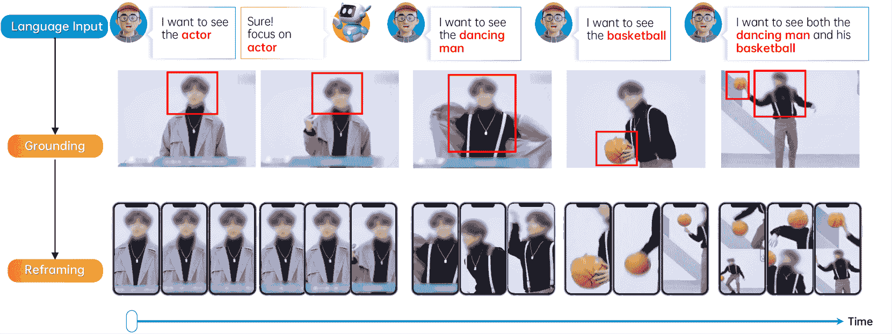
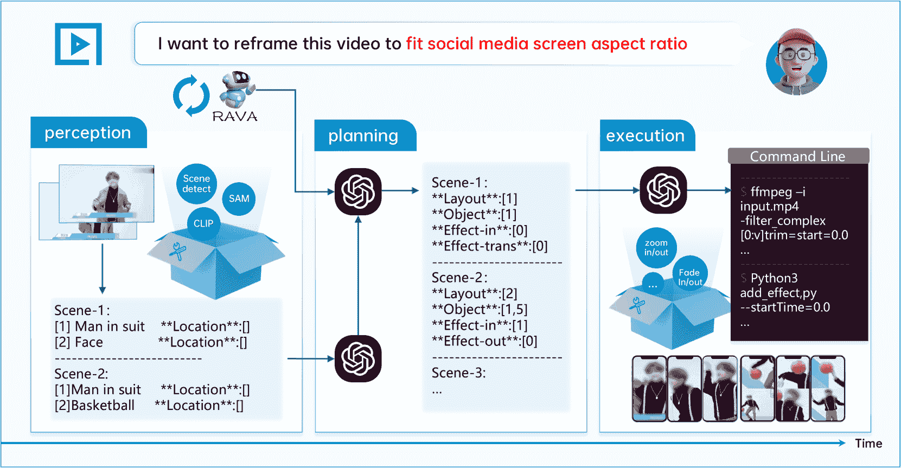
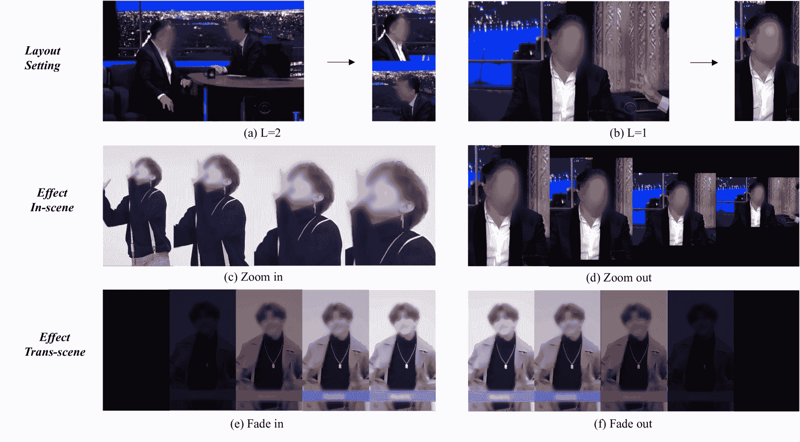
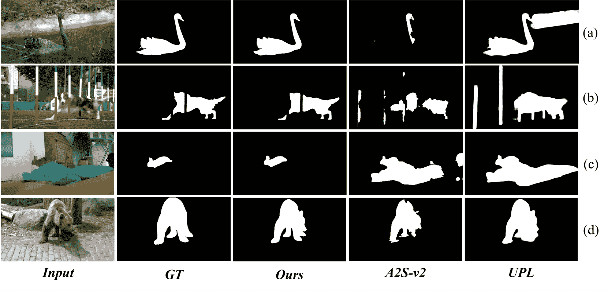
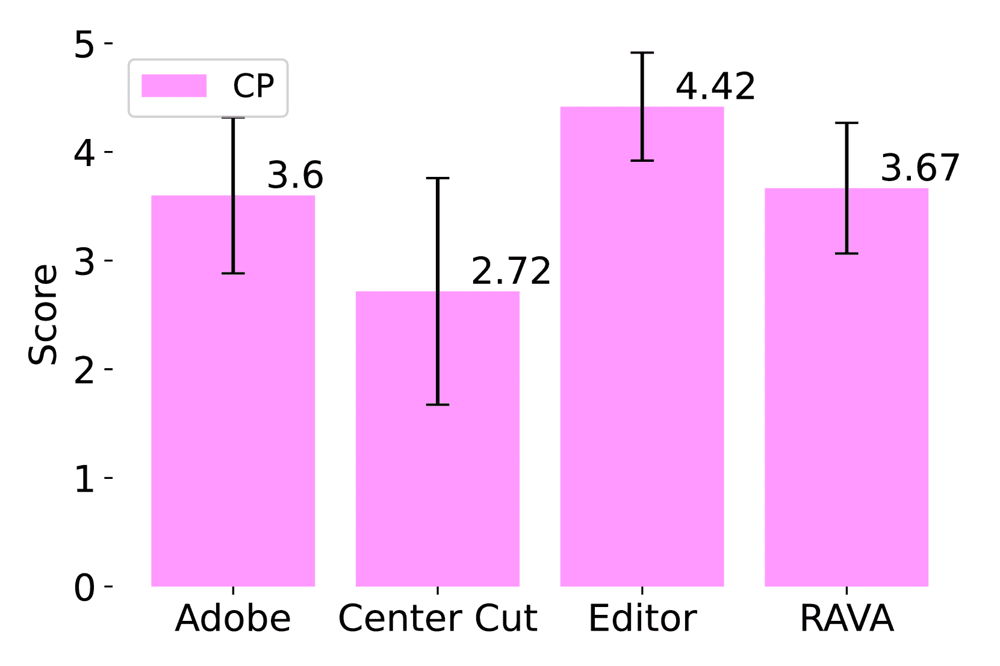
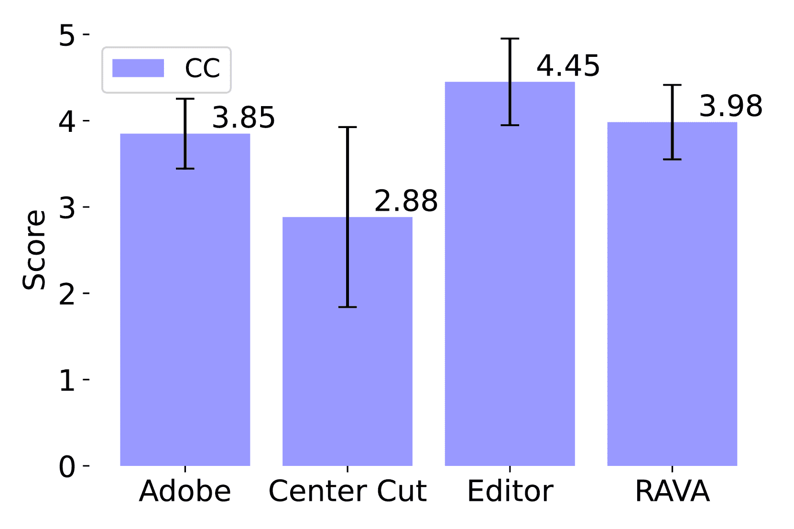
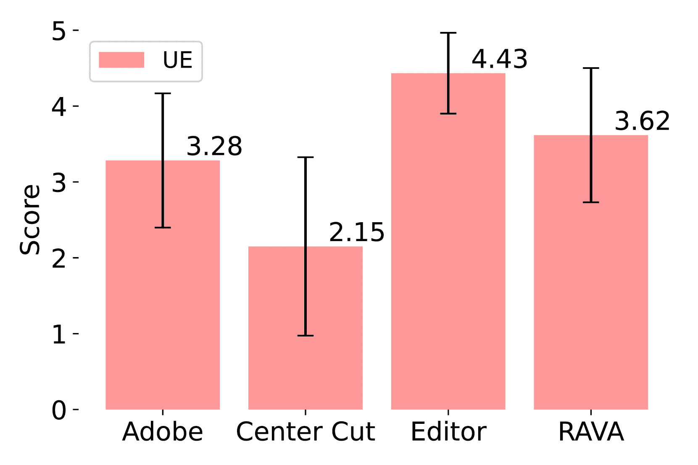
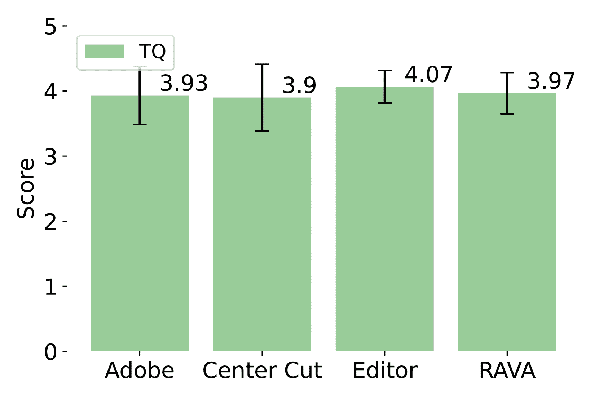

<!--yml

分类：未分类

日期：2025-01-11 12:47:29

-->

# 重构任何视频：用于开放世界视频重构的LLM代理

> 来源：[https://arxiv.org/html/2403.06070/](https://arxiv.org/html/2403.06070/)

(eccv) 包含警告：已加载‘hyperref’包，并使用了‘pagebackref’选项，这在最终版中*不*推荐使用。

¹¹机构文本：Opus AI 研究 ²²机构文本：东南大学 ³³机构文本：新加坡国立大学

³³电子邮件：{gavin.cao, henry.chi, vito.zhu, lirian.su, jay.wu}@opus.pro, yongliangwu@seu.edu.cn, weiheng_chi@u.nus.eduJiawang Cao 同等贡献。11    Yongliang Wu^($\star$) 1122    Weiheng Chi^($\star$) 1133    Wenbo Zhu^($\star$) 11    Ziyue Su 11    Jay Wu 11

###### 摘要

移动设备和社交媒体的普及已经彻底改变了内容传播方式，短视频的使用越来越普遍。这一转变引入了一个新的挑战，即如何将视频重构以适应不同的屏幕宽高比，这一过程旨在突出视频中最引人注目的部分。传统的视频重构是一项手动且耗时的任务，需要专业的技术知识，因此成本较高。一个潜在的解决方案是采用一些机器学习模型，例如视频显著物体检测，来自动化这一过程。然而，这些方法由于依赖于特定的训练数据，往往缺乏广泛的适用性。强大的大语言模型（LLM）的出现为AI能力开辟了新的可能性。在此基础上，我们介绍了Reframe Any Video Agent（RAVA），这是一种基于LLM的代理，利用视觉基础模型和人类指令来重构视频内容以进行视频重构。RAVA分为三个阶段：感知阶段，它解释用户指令和视频内容；规划阶段，它确定宽高比和重构策略；执行阶段，它调用编辑工具生成最终视频。我们的实验验证了RAVA在视频显著物体检测和实际视频重构任务中的有效性，展示了它作为AI驱动的视频编辑工具的潜力。

###### 关键词：

视频重构 LLM 代理 开放世界

## 1 引言

短视频在社交媒体和手持移动设备快速发展的背景下，已成为一种新型且迅速扩展的内容传播方式[[5](https://arxiv.org/html/2403.06070v1#bib.bib5)]。传统的视频宽高比已无法满足社交媒体平台观看的便捷性，因为不同设备屏幕的比例各异。因此，如何重构原始视频以适应不同的宽高比，已经成为视频编辑领域日益增长的需求。该过程通常涉及识别并聚焦当前画面中最吸引人或最重要的元素。此外，从艺术角度来看，有时还需要对场景中的某个特定区域进行放大。这一技术被称为视频重构。

手动视频重构是一项劳动密集型且耗时的任务，要求具有专业编辑技能的人员进行操作。制作高质量视频通常需要熟练的人员，这也使得整体制作成本上升。因此，一些机器学习研究人员已开始探索自动化视频重构的可能性。一种实际的策略是应用视频显著性检测[[41](https://arxiv.org/html/2403.06070v1#bib.bib41), [14](https://arxiv.org/html/2403.06070v1#bib.bib14)]，该方法侧重于识别视频中最具显著性或最吸引注意的区域。例如，Christel 等人[[4](https://arxiv.org/html/2403.06070v1#bib.bib4)]利用自下而上的视觉模型生成当前帧的显著性图，并编辑场景以聚焦于这些关键区域。上述方法虽然在某种程度上有效，但并不总能确保提取的部分是完整的，这可能会限制其在实际应用中的使用。为了解决这一限制，视频显著性物体检测研究取得了显著进展。这项研究专注于分割视频帧中视觉上最引人注目的物体。通过这样做，可以更准确地确定被分割区域的完整范围。然而，这些模型的有效性常常受到对特定训练数据域的依赖的影响，这种依赖限制了它们的泛化能力，并可能负面影响其在多种应用中的性能和可解释性。此外，考虑到不同观众对视频中特定部分的兴趣不同，且用户在编辑上有多样化的需求，如图[1](https://arxiv.org/html/2403.06070v1#S1.F1 "Figure 1 ‣ 1 Introduction ‣ Reframe Anything: LLM Agent for Open World Video Reframing")所示，有必要设计一个能够根据用户指令灵活执行视频重构的框架。

图 1：开放世界视频重构任务的概述。即使在同一视频中，不同的观众可能会关注不同的兴趣点。因此，实现基于用户指令的视频重构以达成特定目标是至关重要的。

最近，强大的大型语言模型（LLMs）的发展，如ChatGPT [[25](https://arxiv.org/html/2403.06070v1#bib.bib25)] 和 GPT-4 [[26](https://arxiv.org/html/2403.06070v1#bib.bib26)]，进一步推动了人工智能的发展。这些模型展示了理解和生成自然语言的强大能力，包括通过图像的文字描述感知和理解视觉内容的能力。例如，它们可以传达图像中物体的坐标，理解视觉场景的本质，而无需直接的视觉编码器 [[21](https://arxiv.org/html/2403.06070v1#bib.bib21)]。研究界正迅速朝着将LLMs作为能够执行复杂认知功能的智能体迈进，这些功能包括感知、规划和执行动作。在这一领域的开创性进展包括像 TaskMatrix [[20](https://arxiv.org/html/2403.06070v1#bib.bib20)]、AutoGPT [[44](https://arxiv.org/html/2403.06070v1#bib.bib44)] 和 MetaGPT [[11](https://arxiv.org/html/2403.06070v1#bib.bib11)] 这样的系统。随着多模态LLMs的出现，如GPT-4V [[27](https://arxiv.org/html/2403.06070v1#bib.bib27)]，我们进入了一个新时代，在这个时代，LLMs可以直接感知视觉内容。因此，一些工作，如AppAgent [[45](https://arxiv.org/html/2403.06070v1#bib.bib45)] 和 MobileAgent [[40](https://arxiv.org/html/2403.06070v1#bib.bib40)]，通过创建能够在移动操作系统内导航和控制任何智能手机应用程序的智能体，进一步推动了这一创新。

受这些将LLMs作为智能体的探索启发，本文介绍了Reframe Any Video Agent（RAVA），一种基于LLM的智能体，旨在根据人类指令灵活地执行视频重构任务。整体框架可以分为三个主要阶段：感知、规划和执行。在感知阶段，RAVA利用语言学习来解释用户指令，并通过视频理解来解析场景，识别关键物体，并生成文字化的场景描述。这种对内容和上下文的把握为随后的规划阶段提供了依据，在规划阶段，智能体精心确定宽高比，优先考虑物体的重要性，配置动态布局，并制定与叙事和用户偏好相符的视觉效果策略。最后，在执行阶段，RAVA将复杂的计划转化为行动，精确地执行重构，应用效果，并按照结构化的执行蓝图安排内容，同时允许反馈回路以优化输出。RAVA执行的这一综合三阶段过程，确保视频不仅适应新的格式，而且能够与目标观众产生共鸣，从而增强内容在各平台上的影响力。

此外，为了验证RAVA的有效性，我们从两个维度开展了实验。首先，我们将其应用于经典的计算机视觉任务——视频显著目标检测，以验证其准确执行人类指令的能力及其场景理解能力。其次，我们将其用于现实世界的视频重构任务，以确定其在完成这一具有实际价值任务方面的熟练度。定量结果和用户研究都突出了RAVA的优势。

我们的主要贡献可以总结如下：

+   •

    我们提出了RAVA，一个基于LLM的智能体，擅长根据人类指令执行视频重构任务。

+   •

    通过精心设计的感知、规划和执行框架，RAVA能够有效利用现有基础模型的力量，准确地执行人类指令。

+   •

    通过对视频显著目标检测和现实世界视频重构案例的深入实验，我们验证了RAVA的优势，展示了其在AI驱动的视频编辑领域的潜力。

## 2 相关工作

### 2.1 视频编辑

在电影分析领域的努力取得了显著进展，尤其是在视听事件（AVE）定位方面。这一任务需要在视频中准确识别和定位各种事件[[38](https://arxiv.org/html/2403.06070v1#bib.bib38), [9](https://arxiv.org/html/2403.06070v1#bib.bib9)]。这些进展对视频编辑者非常有益，因为它们可以简化编辑工作流程[[34](https://arxiv.org/html/2403.06070v1#bib.bib34)]。然而，值得注意的是，这些研究并没有提供直接进行视频编辑的方法。除了这一研究方向外，一些学者已将机器学习技术直接应用于视频编辑。Argaw 等人介绍了一套专门针对视频编辑任务的基准套件，其中包括但不限于视觉特效。该套件还促进了素材的自动组织，并在视频拼接方面提供了帮助[[3](https://arxiv.org/html/2403.06070v1#bib.bib3)]。此外，Rao 等人提出了另一个基准，旨在从多个选项中选择最佳的摄像机角度，这在电视节目制作中是一个关键元素[[32](https://arxiv.org/html/2403.06070v1#bib.bib32)]。尽管取得了这些进展，现有的方法仍未解决视频重新框定的挑战，即突出并聚焦于视频中最引人注目的片段。视频显著物体检测任务有可能解决这一问题[[12](https://arxiv.org/html/2403.06070v1#bib.bib12), [46](https://arxiv.org/html/2403.06070v1#bib.bib46), [37](https://arxiv.org/html/2403.06070v1#bib.bib37)]。然而，这些方法的有效性受到其依赖特定训练数据集的限制，这限制了它们在多样化的现实世界环境中的泛化能力，并影响了它们的可解释性。

### 2.2 开放词汇分割

开放词汇分割旨在将图像分割成有意义的区域，而不受预定义类别集合的限制。这种方法与传统的分割方法显著不同[[30](https://arxiv.org/html/2403.06070v1#bib.bib30)、[18](https://arxiv.org/html/2403.06070v1#bib.bib18)、[42](https://arxiv.org/html/2403.06070v1#bib.bib42)]，后者依赖于固定的标签词汇，从而限制了它们在新颖或未见过的物体上的泛化能力。像CLIP [[31](https://arxiv.org/html/2403.06070v1#bib.bib31)]和ALIGN [[13](https://arxiv.org/html/2403.06070v1#bib.bib13)]这样的开创性工作使得分割模型能够通过利用自然语言描述来识别和分类各种未见过的物体。在这些基础上，LSeg [[19](https://arxiv.org/html/2403.06070v1#bib.bib19)]训练图像编码器生成像素嵌入，并使用CLIP [[31](https://arxiv.org/html/2403.06070v1#bib.bib31)]的文本嵌入作为每个像素的分类器。为了利用廉价的图像级监督，OpenSeg [[10](https://arxiv.org/html/2403.06070v1#bib.bib10)]采用了弱监督的定位损失和随机词丢弃，以促进词汇和图像区域之间的对齐。尽管取得了显著进展，但该领域仍面临许多挑战，以及应对这些挑战的训练数据匮乏问题。为了解决这个问题，SAM [[16](https://arxiv.org/html/2403.06070v1#bib.bib16)]引入了一个经过预训练的可提示基础模型用于图像分割，展示了分割性能和适应性方面的显著提升。最近，HQ-SAM [[15](https://arxiv.org/html/2403.06070v1#bib.bib15)]展示了一种架构，紧密整合并利用SAM结构中的现有知识。这种方法在保持零样本能力的同时，能够生成更高质量的分割掩膜。像MedSAM [[22](https://arxiv.org/html/2403.06070v1#bib.bib22)]这样的研究也突显了SAM在医学领域中的巨大潜力。

### 2.3 大型语言模型代理

最近，我们看到了有价值的框架的出现，例如AutoGPT [[44](https://arxiv.org/html/2403.06070v1#bib.bib44)]、MetaGPT [[11](https://arxiv.org/html/2403.06070v1#bib.bib11)]和HuggingGPT [[35](https://arxiv.org/html/2403.06070v1#bib.bib35)]，这些框架象征着将大型语言模型（LLMs）快速集成以执行复杂任务的趋势。多模态LLM的发展，如Flamingo [[2](https://arxiv.org/html/2403.06070v1#bib.bib2)]、Multimodal [[8](https://arxiv.org/html/2403.06070v1#bib.bib8)]和AudioLM [[36](https://arxiv.org/html/2403.06070v1#bib.bib36)]等作品中提到的，扩展了LLM的应用范围，使其能够处理文本、图像、音频和视频等多种输入。这一进展使得模型能够直接处理多模态输入，超越了像TaskMatrix [[20](https://arxiv.org/html/2403.06070v1#bib.bib20)]这样的系统，后者依赖多个基础模型通过图像标题或物体识别将视觉信息转化为语言形式。借助这些模型精密的感知能力，像AppAgent [[45](https://arxiv.org/html/2403.06070v1#bib.bib45)]、MobileAgent [[40](https://arxiv.org/html/2403.06070v1#bib.bib40)]和VisualWebArena [[17](https://arxiv.org/html/2403.06070v1#bib.bib17)]等创新方法被设计用来精确地与移动应用程序交互并执行基于网络的任务。尽管LLM代理的研究正在迅速增长，但视频编辑领域相对未被开发。LAVE [[39](https://arxiv.org/html/2403.06070v1#bib.bib39)]作为一个视频编辑代理，但其功能仅限于遵循用户定义的目标。然而，我们提出的研究旨在深入挖掘LLM在增强自动化视频重构能力方面的潜力。

## 3 重构任何视频代理

图2：我们提出的重构任何视频代理（RAVA）的整体工作流程。RAVA能够接收用户通过专为重构任务设计的语言用户界面（LUI）输入的对话，并调用基础功能从视频中提取物体信息，然后根据用户的请求自动重构视频。

我们提出了“重构任何视频代理（RAVA）”用于重新框定现实世界的视频任务，此外该方法还结合了基于大型语言模型（LLM）的方法，支持语言用户界面（LUI）。我们的方法在开放世界环境中进行测试，其中视频场景可能包含未曾见过的物体。该方法旨在稳健地识别场景中的每个物体，并区分哪些物体是重要的。随后，它将原始视频帧重构为不同的宽高比，以适应不同社交媒体应用或平台的规格要求。此外，我们的方法支持两种不同场景中的视觉效果：单个场景内（in-scene）和连续场景之间（trans-scene）。整个视频重构任务的工作流程可以自动完成，具体包括以下三个关键步骤：

物体定位。具体而言，对于给定的原始视频，存在$M$个场景，每个视频可以表示为$\{\mathbf{S}_{1},\ldots,\mathbf{S}_{M}\}$，每个场景由$N$个视觉元素组成，格式为$\{\mathbf{O}_{1},\ldots,\mathbf{O}_{N}\}$，其中$\mathbf{O}_{i}$表示第$i$个元素的分割掩膜。我们的任务是识别第$k$个场景$\mathbf{S}_{k}$中最重要的物体$\{\mathbf{O}_{i},\ldots,\mathbf{O}_{j}\}\in\{\mathbf{O}_{1},\ldots,\mathbf{O}_{N}\}$。

布局设置。在多个重要物体存在的场景中，例如对话场景，也需要确定布局$\mathbf{L}_{k}\in\{1,2,3,\ldots,N\}$——即如何通过子窗口同时展示多个目标。最终，对于每个场景，我们的目标是使得$\mathbf{S}_{k}$的布局$\mathbf{L}_{k}=n$，其中重要物体为$\{\mathbf{O}_{i},\ldots,\mathbf{O}_{j}\}$，其中$n=count\{i,\ldots,j\}$。

效果添加。随后，我们的方法基于视频内容添加特定的视觉效果。我们引入了两种类型的视觉效果：一种应用于当前场景$\mathbf{S}_{k}$，例如放大和缩小，另一种应用于场景过渡，从$\mathbf{S}_{k}$到$\mathbf{S}_{k+1}$，例如渐变进出。

图[2](https://arxiv.org/html/2403.06070v1#S3.F2 "图2 ‣ 3 重构任何视频代理 ‣ 重构一切：面向开放世界视频重构的LLM代理")展示了RAVA的工作流程，三个阶段自动化地完成视频重构任务，将其适配不同社交媒体平台或规格要求的各种宽高比，并通过战略性布局决策和视觉效果增强观众的参与度。

### 3.1 感知

对于代理的感知阶段，可以分为两个部分：语言学习和视频理解。语言学习的重点是理解用户感兴趣的焦点，而视频理解则集中于解读视频帧中的内容。

对话是LLMs擅长的一个方面。通过配置提示，代理可以理解用户的搜索目标。这个过程可以看作是LUI输入信息的结构化。具体来说，我们通过提供一个视频和用户兴趣来启动该过程。这些上下文可以包括人类生成的文本查询以及从工具中检索的信息，下面会详细说明。我们还允许LLM输出视频的主题以及结构化的目标，然后将这些内容纳入规划阶段。

受到电影和剧本的启发，我们采用了镜头检测方法来在场景级别理解整个视频。具体的方法是使用scenedetect¹¹1https://www.scenedetect.com/将原始视频转化为多个场景的组合$\{\mathbf{S}_{1},\ldots,\mathbf{S}_{M}\}$。

理解视频场景需要使用工具。首先，RAM[[47](https://arxiv.org/html/2403.06070v1#bib.bib47)]识别场景中的所有物体。接着，我们使用SAM[[16](https://arxiv.org/html/2403.06070v1#bib.bib16)]和Grounded-SAM[[33](https://arxiv.org/html/2403.06070v1#bib.bib33)]提取所有物体和位置的掩码。然后，使用CLIP[[31](https://arxiv.org/html/2403.06070v1#bib.bib31)]为每个物体获取字幕。$\{\mathbf{O}_{1},\ldots,\mathbf{O}_{N}\}$，其中$\mathbf{O}_{i}$表示第$i$个物体，通过字幕、掩码和位置$\{{x}_{1},{y}_{1},{x}_{2},{y}_{2}\}$来表示。

最终，每个视频场景的视觉语义被转化为文本描述。例如，如图[2](https://arxiv.org/html/2403.06070v1#S3.F2 "Figure 2 ‣ 3 Reframe Any Video Agent ‣ Reframe Anything: LLM Agent for Open World Video Reframing")所示，视频中的一个场景被描述为“场景-1：物体-1：一个男孩站在…”。这种方法通过结合语言理解和视频分析技术，使LLM代理能够全面理解和重构视频内容。

### 3.2 规划

在感知阶段之后，感知阶段为视频内容提供了文本描述和理解，规划阶段至关重要，因为它涉及制定一个全面的视频重构策略。这个策略应当考虑不同的纵横比，突出重要的物体，并以一种连贯的方式整合视觉效果，从而提升用户参与度。

在本节中，我们详细介绍了在任何视频代理（RAVA）中的规划算法和方法。借助感知阶段获得的洞察，规划阶段包括以下几个组件：

纵横比确定。规划的关键部分是确定输出视频的目标纵横比。我们考虑用户偏好、平台要求以及场景的上下文。动态决策过程为每个场景选择最佳纵横比，以确保视觉内容的有效呈现。

物体重要性层级。在感知阶段识别的多个物体需要根据它们在场景中的重要性以及与用户兴趣的相关性进行优先排序。利用LLM的语言理解能力，我们构建了一个重要性层级，以帮助选择和布局决策。

动态布局配置。基于场景中物体的重要性和空间布局，我们必须规划一个布局，最大化视觉吸引力和叙事连贯性。如图[3](https://arxiv.org/html/2403.06070v1#S3.F3 "图 3 ‣ 3.3 执行 ‣ 3 重构任何视频代理 ‣ 重构任何内容：开放世界视频重构的LLM代理")所示，动态布局配置考虑了对话交换、物体互动和场景过渡，以确定物体应该如何构图。

视觉效果策略。根据感知阶段获得的视觉效果偏好，制定一个计划，将场景内外的效果应用于叙事流程，以实现视觉与内容的和谐融合。挑战不仅在于决定使用哪些效果，还在于确定它们的强度和时机，以最大化影响力而不分散核心内容的注意力。

执行蓝图。规划阶段的高潮是执行蓝图，它是一个结构化的指令集，准备好被解析以进行执行。蓝图包含了纵横比、物体排列、效果示意图和其他相关参数。

代理反馈循环。一个可选的反馈循环允许大型语言模型（LLM）基于对初步重构结果的审查来优化规划。这个审查过程包括生成低分辨率的快速预览，并通过LLM进行评估，检查其是否符合用户目标。

规划阶段融合了场景理解算法，以创建类似故事板的动作序列。这个故事板为执行阶段提供指导，确保从概念模型到视频重构的实际实现之间的无缝过渡。每个场景都被视为一个独立模块，过渡被精心规划，以确保最终产品的连贯性，符合用户意图，并最大化观众的参与度。RAVA的规划阶段将所有可用数据整合成一个连贯的计划，为精确执行做好准备。

### 3.3 执行

图3：RAVA中的视频编辑工具描述如下：第一行是‘布局设置’，其中‘L’决定了视频中选择的对象数量。第二行是‘场景内效果’，表示场景内的视觉效果，分为‘放大’和‘缩小’。第三行是‘场景间效果’，表示场景过渡的视觉效果，分为‘淡入’和‘淡出’。

然后，代理根据之前生成的计划进行重构任务。在执行阶段，使用正则表达式匹配来从计划中提取结构化的执行步骤。这些结构化文本对应于具体的可执行函数。我们为每个视频生成一个JSON文件，表示为通过场景检测得到的$\{\mathbf{S}_{1},\ldots,\mathbf{S}_{M}\}$，对于第${k}_{th}$场景$\mathbf{S}_{k}$，有布局设置 $\mathbf{L}_{k}\in\{1,2,3,\ldots,N\}$，对象集合 $\{\mathbf{O}_{i},\ldots,\mathbf{O}_{j}\}$，其中 $\mathbf{L}_{k}=count\{i,\ldots,j\}$，$\mathbf{E}_{in}\in\{zoom\ in,zoom\ out\}$，$\mathbf{E}_{trans}\in\{fade\ in,fade\ out\}$，本文介绍了几种简单的特效实现，并认为我们的框架是可扩展的。

例如，如果布局设置为2，它将选择两个对象作为视频的主要内容，并将它们垂直排列。如果场景内的视觉效果 $\mathbf{E}_{in}$ 列选择了 $\{zoom\ in\}$，代理将调用相应的API函数来放大目标。除此之外，如果场景间的 $\mathbf{E}_{trans}$ 视觉效果为 $\{fade\ out\}$，则会在当前场景结束时插入一个过渡效果。

## 4 实验

为了验证我们提出的Reframe Any Video Agent（RAVA）的有效性，我们通过两个主要任务进行评估。在第一个任务中，我们使用该模型解决视频理解领域中的一个重大挑战，即视频显著物体检测。这涉及到分割出人眼最为突出、显著的物体。在第二个任务中，我们将模型应用于视频重构任务。这个过程包括调整视频框架，以便聚焦于最重要的元素，从而增强整体构图和视觉内容的叙事性。

表1：我们在视频显著物体检测任务中的实验结果。缩写‘SD’表示‘场景检测’。

| 方法 | SD | DAVIS${}_{16}$ | FBMS |
| --- | --- | --- | --- |
| $\alpha_{1}$ | $\alpha_{2}$ |  MAE | max-$F_{\beta}$ | max-$E_{m}$ | $S_{m}$ |  MAE | max-$F_{\beta}$ | max-$E_{m}$ | $S_{m}$ |
| --- | --- | --- | --- | --- | --- | --- | --- | --- | --- |
| UPL | 5 | 5 | .0390 | .8025 | .9183 | .8426 | .0850 | .6651 | .8513 | .7439 |
| A2S-v2 | .0663 | .4858 | .5786 | .5817 | .0851 | .6444 | .8366 | .7004 |
| 我们的方法 | .0501 | .7025 | .8219 | .7795 | .1015 | .5721 | .7532 | .6643 |
| UPL | 5 | 30 | .0367 | .8127 | .9275 | .8481 | .0844 | .6673 | .8458 | .7527 |
| A2S-v2 | .0638 | .5046 | .5929 | .5926 | .0832 | .6406 | .8288 | .7054 |
| 我们的方法 | .0419 | .6727 | .8177 | .7680 | .1148 | .5446 | .7131 | .6422 |
| UPL | 10 | 5 | .0381 | .8009 | .9210 | .8361 | .0848 | .6670 | .8615 | .7373 |
| A2S-v2 | .0640 | .4907 | .5723 | .5836 | .0900 | .6299 | .8446 | .6836 |
| 我们的方法 | .0506 | .7126 | .8256 | .7804 | .1313 | .5128 | .6776 | .6089 |

### 4.1 视频显著性目标检测

#### 4.1.1 数据集

我们的方法通过两个广泛使用的数据集进行考察，分别是DAVIS${}_{16}$ [[29](https://arxiv.org/html/2403.06070v1#bib.bib29)]和FBMS [[24](https://arxiv.org/html/2403.06070v1#bib.bib24)]。前者包含50个视频，总计3,455个标注帧。后者数据集包含33个附加的视频序列，总共具有720个标注帧。

#### 4.1.2 评估指标

为评估性能，采用了四个广泛使用的评估指标，包括平均绝对误差（MAE）[[28](https://arxiv.org/html/2403.06070v1#bib.bib28)]、F值（$F_{\beta}$）[[1](https://arxiv.org/html/2403.06070v1#bib.bib1)]、E值（$E_{m}$）[[7](https://arxiv.org/html/2403.06070v1#bib.bib7)]和S值（$S_{m}$）[[6](https://arxiv.org/html/2403.06070v1#bib.bib6)]。

#### 4.1.3 设置

我们以每秒30帧的速度将帧合成视频。接着，应用场景检测方法进行视频切割。为了最小化场景检测结果为0的可能性，并减少每个类别下检测到的场景数量，我们选择了较低阈值（$\alpha_{1}$）和较长检测间隔（$\alpha_{2}$）的参数组合，对应的参数分别为阈值和最小场景长度。在此阶段之后，每个场景将单独接受相应的测试程序，以生成显著性掩码。值得注意的是，感知阶段中的每个对象$\mathbf{O}_{i}$仅生成一个标题和一个掩码。这是因为过度调整帧会导致不希望出现的抖动效应，从而影响整体观看体验。

#### 4.1.4 结果

图4：与两种最先进方法相比，在两个视频显著性目标检测数据集上的定性结果。研究结果表明，即使在存在遮挡和干扰的情况下，RAVA也能应对自如，有时甚至超越人工标注的结果。

我们将RAVA与当前最先进的视频显著物体检测方法进行比较，即UPL [[43](https://arxiv.org/html/2403.06070v1#bib.bib43)]和A2S-v2 [[48](https://arxiv.org/html/2403.06070v1#bib.bib48)]。从表[1](https://arxiv.org/html/2403.06070v1#S4.T1 "Table 1 ‣ 4 Experiments ‣ Reframe Anything: LLM Agent for Open World Video Reframing")中可以看出，在各种场景检测参数设置下，我们的方法始终取得具有竞争力的结果。值得注意的是，我们的框架并非专门为视频显著物体检测任务设计。它能够取得具有竞争力的结果，足以证明RAVA的有效性。为了进一步分析我们的结果，我们在图[4](https://arxiv.org/html/2403.06070v1#S4.F4 "Figure 4 ‣ 4.1.4 Results. ‣ 4.1 Video Salient Object Detection ‣ 4 Experiments ‣ Reframe Anything: LLM Agent for Open World Video Reframing")中展示了一部分可视化结果：

(a) RAVA能够精确地分割整个Blackswan实例；然而，A2S-v2未能提供完整的掩膜，而UPL错误地将背景的一部分分割为Blackswan的一部分。

(b) 即使在物体被遮挡的情况下，RAVA仍能保持准确的分割，而A2S-v2尽管尝试处理遮挡问题，却错误地将遮挡物的一部分进行了分割；另一方面，UPL则完全忽视了遮挡。

(c) 当场景中有其他物体干扰时，A2S-v2和UPL都未能准确响应，而RAVA则能够精确识别显著物体。

(d) 这个例子更好地展示了RAVA的强大能力，它通过一个强大的分割模型，能够感知并取得比人工标注更为准确的结果。

#### 4.1.5 不良案例。

图5：使用RAVA可能失败的情况包括情况(a)和(b)，其中它在处理复合物体和紧密排列物体的聚集时表现不佳。然而，在情况(c)和(d)中，尽管对显著物体的感知有所不同，我们认为分割结果是可以接受的。

尽管RAVA在大多数场景中表现出色，但仍存在一些不良案例。我们认为这些案例是它在视频显著物体检测任务中未能达到最先进水平的原因。这些结果在图[5](https://arxiv.org/html/2403.06070v1#S4.F5 "Figure 5 ‣ 4.1.5 Bad Cases. ‣ 4.1 Video Salient Object Detection ‣ 4 Experiments ‣ Reframe Anything: LLM Agent for Open World Video Reframing")中有所展示：

(a) 在这种情况下，RAVA可以相对精确地分割骑自行车的人，但它未能识别出自行车和人构成一个整体实例，因此未能取得最佳结果。

(b) 当多个物体彼此靠近且应视为同一实例时，RAVA在分割中难以将其他物体包含进去。

(c) RAVA将图像中的黑猫分割为显著物体，同时忽略了更远处的两只鸟。我们认为这一结果是合理的，因为对于什么构成显著物体的观点可能有所不同。这个过程仍然展示了RAVA的视觉理解能力。

(d) 尽管此图像中提供的GT将人和马描绘为一个整体，但栅栏也被突出地标记为蓝色，因此合理地认为栅栏是显著物体。类似的场景也出现在UPL生成的掩膜中，其中分割出了栅栏和马。

#### 4.1.6 消融研究。

为了进一步评估RAVA在单语言模式下的有效性，我们将LLM替换为GPT-4 [[26](https://arxiv.org/html/2403.06070v1#bib.bib26)]，该模型缺乏多模态感知能力。除了省略感知中的视觉输入外，我们保持所有其他设置不变。

表.[2](https://arxiv.org/html/2403.06070v1#S4.T2 "表2 ‣ 4.1.6 消融研究 ‣ 4.1 视频显著物体检测 ‣ 4 实验 ‣ 重新框定任何内容：LLM代理用于开放世界视频重新框定")显示，即使在没有直接视觉信息的情况下，GPT-4仍然能够在两个基于文本描述的数据集上表现出色。这突显了RAVA的强大可迁移性。然而，考虑到现有的差距，使用具有强大视觉感知能力的LLM仍然是必要的。

表2：我们在单模态LLM上的视频显著物体检测任务的实验结果。缩写‘SD’表示‘场景检测’。

| LLM | SD | DAVIS${}_{16}$ | FBMS |
| --- | --- | --- | --- |
| $\alpha_{1}$ | $\alpha_{2}$ |  MAE | max-$F_{\beta}$ | max-$E_{m}$ | $S_{m}$ |  MAE | max-$F_{\beta}$ | max-$E_{m}$ | $S_{m}$ |
| --- | --- | --- | --- | --- | --- | --- | --- | --- | --- |
| GPT-4 | 5 | 5 | .0831 | .6497 | .7885 | .7395 | .1294 | .4953 | .6943 | .6125 |
| 5 | 30 | .0548 | .6163 | .7930 | .7422 | .1642 | .4856 | .6670 | .5915 |
| 10 | 5 | .0690 | .6432 | .7913 | .7454 | .1307 | .4931 | .6684 | .6069 |

### 4.2 视频重新框定

#### 4.2.1 设置。

为了评估RAVA在实际中的视频编辑能力，进行了12名参与者的用户研究。使用三种重新框定方法和RAVA创建了5个视频的编辑版本：

+   •

    编辑：该方法涉及一位专业视频编辑师（经验>3年），他手动重新框定视频。

+   •

    Adobe：该方法基于普通用户利用Adobe Premiere Pro中的重新框定工具调整视频，按照说明²²2https://helpx.adobe.com/premiere-pro/using/auto-reframe.html。

+   •

    中心裁剪：该方法选择视频的中心点，保持9:16的宽高比，宽度不变。

为了最小化视频本身的影响，并保持用户的无偏评价元素，采用了开放式字幕工具³³3https://www.opus.pro/tools/opusclip-captions 为每个视频添加字幕。在观看原始视频后，每个参与者以随机顺序观看4个编辑版本。参与者会回顾所有重新构框的视频，他们对每个视频的编辑方法一无所知。这种安排导致了一个全面的实验设计，涉及5（视频数量）×12（用户数量）×4（编辑策略）。用户需要将视频的重新构框版本与原始版本进行比较，并针对每个属性在0到5的范围内提供评分。这些属性灵感来源于关于视频重新定位的研究[[23](https://arxiv.org/html/2403.06070v1#bib.bib23)]，需要注意的是，尽管视频重新构框和视频重新定位在技术上有所不同，但两者的目的是将观众的注意力引导到给定渲染约束下的关键场景事件。因此，用于评估视频重新定位方法的一些问题同样适用于视频编辑。我们关注的属性包括：

+   •

    内容保留

    +   –

        （相关性）重新构框的视频在多大程度上保留了原始内容的关键元素？

    +   –

        （完整性）场景中的重要部分，特别是主要人物，是否在重新构框版本中得到了保留？

+   •

    连贯性和一致性

    +   –

        （连贯性）镜头的顺序是否遵循逻辑的时间顺序，没有视觉上令人不适的跳跃？

    +   –

        （一致性）重新构框是否保持了视频的原始风格和情绪？

+   •

    用户体验

    +   –

        （满意度）总的来说，用户对重新构框的视频满意度如何？

    +   –

        （可用性）总体来说，你是否愿意将这个视频发布到你的社交平台？

+   •

    技术质量

    +   –

        （分辨率和清晰度）视频是否清晰锐利，没有因裁剪或缩放导致的画质下降？

    +   –

        （稳定性）视频是否保持稳定性，且未因重新构框而出现抖动？

（a）CP

（b）CC

（c）UE

（d）TQ

图6：各个属性的总体评分：内容保留（CP），连贯性和一致性（CC），用户体验（UE），技术质量（TQ）。

#### 4.2.2 结果

如图[6](https://arxiv.org/html/2403.06070v1#S4.F6 "图 6 ‣ 4.2.1 设置 ‣ 4.2 视频重新框架 ‣ 4 实验 ‣ Reframe Anything: LLM Agent for Open World Video Reframing")所示，并在我们的实验数据中概述，传统的编辑方法，被称为“编辑器”，获得了最高的整体平均分$4.34$，表明其在保持原始内容的相关性和完整性方面具有强大的能力。这可能归因于视频编辑人员在重新框架过程中所付出的人工努力和专业知识，确保了重要元素没有丢失。我们提出的方法RAVA，从四个方面获得了整体评分$3.81$，这表明尽管RAVA在相关性和场景完整性方面表现得相当不错，但与专业编辑相比，仍有提升空间。RAVA的表现超过了自动化的‘Adobe’工具，‘Adobe’的整体评分为$3.67$。这一激烈的竞争表明，RAVA在内容保存方面与其他现有的半自动视频编辑工具不相上下。‘Center Cut’在内容保存方面获得了最低的平均分$2.72$，反映出其在识别和保持关键视频元素方面的能力有限。

如箱线图所示，分数的变化性通过四分位间距进一步证实了智能和上下文感知重新框架技术的需求。未来的工作可以探索增强RAVA的物体识别和重要性判定算法，以进一步缩小自动化工具与专业视频编辑工具之间的差距。

此外，我们强烈建议读者查看补充材料中包含的编辑视频，以便更直观地理解。

## 5 结论

我们通过引入Reframe Any Video Agent（RAVA）这一突破性方法，在视频重新框架领域开辟了新的方向。RAVA是一种由大语言模型（LLMs）驱动的复杂代理，能够根据人工指令执行视频重新框架任务。通过精密的三阶段过程——感知、规划和执行，RAVA展示了其在理解用户指令、拆解场景、优先级排列对象、配置布局和应用视觉效果方面的卓越能力，同时确保与叙事和用户偏好的对齐。我们的实验涵盖了从传统计算机视觉任务到现实视频重新框架场景，展示了RAVA在人工智能驱动的视频编辑领域的有效性和前景。通过定量结果和用户研究验证RAVA的能力，我们确认了它作为一种变革性工具的潜力，能够提升内容创作并与不同平台的多样化观众产生共鸣。

#### 5.0.1 局限性

我们研究的主要限制来自于其对基础模型的性能依赖。使用更复杂的视觉模型可能会导致更好的结果。此外，探索如何扩展智能体以在视频时间轴上执行编辑，从而将较长的内容压缩成较短的格式，是一个有前景的发展方向。

#### 5.0.2 社会影响。

本文研究涉及利用YouTube平台上公开可用的视频内容。我们确保所有用于研究的视频材料符合该平台关于非商业性、基于研究使用的服务条款。

## 参考文献

+   [1] Achanta, R., Hemami, S., Estrada, F., Susstrunk, S.: 频率调谐显著区域检测。载于：2009 IEEE计算机视觉与模式识别大会论文集。第1597–1604页。IEEE (2009)

+   [2] Alayrac, J.B., Donahue, J., Luc, P., Miech, A., Barr, I., Hasson, Y., Lenc, K., Mensch, A., Millican, K., Reynolds, M., 等: Flamingo：一种用于少样本学习的视觉语言模型。神经信息处理系统进展 35, 23716–23736 (2022)

+   [3] Argaw, D.M., Heilbron, F.C., Lee, J.Y., Woodson, M., Kweon, I.S.: 视频编辑的解剖学：一个用于AI辅助视频编辑的数据集和基准套件。载于：欧洲计算机视觉大会论文集。第201–218页。Springer (2022)

+   [4] Chamaret, C., Le Meur, O.: 基于注意力的视频重定框：使用眼动追踪验证。载于：2008年第19届国际模式识别大会论文集。第1–4页。IEEE (2008)

+   [5] Cochrane, T.: 移动社交媒体作为教育变革的催化剂。载于：EdMedia+创新学习。第2187–2200页。计算机教育促进协会（AACE）(2014)

+   [6] Fan, D.P., Cheng, M.M., Liu, Y., Li, T., Borji, A.: 结构测量：一种评估前景图的新方法。载于：IEEE国际计算机视觉会议论文集。第4548–4557页 (2017)

+   [7] Fan, D.P., Gong, C., Cao, Y., Ren, B., Cheng, M.M., Borji, A.: 二进制前景图评估的增强对齐度量。载于：第27届国际人工智能联合会议论文集。国际人工智能联合会议组织(2018)

+   [8] Furuta, H., Nachum, O., Lee, K.H., Matsuo, Y., Gu, S.S., Gur, I.: 使用指令微调的基础模型进行多模态网页导航。arXiv预印本 arXiv:2305.11854 (2023)

+   [9] Geng, T., Wang, T., Duan, J., Cong, R., Zheng, F.: 在未经修剪的视频中密集定位视听事件：一个大规模基准和基线。载于：IEEE/CVF计算机视觉与模式识别会议论文集。第22942–22951页 (2023)

+   [10] Ghiasi, G., Gu, X., Cui, Y., Lin, T.Y.: 利用图像级标签扩展开放词汇图像分割。载于：欧洲计算机视觉大会论文集。第540–557页。Springer (2022)

+   [11] 洪胜, 郑晓, 陈洁, 程杨, 王俊, 张楚, 王中, 邱世凯, 林志, 周立, 等: Metagpt: 用于多智能体协作框架的元编程。arXiv预印本 arXiv:2308.00352 (2023)

+   [12] 胡峰, Palazzo, S., Salanitri, F.P., Bellitto, G., Moradi, M., Spampinato, C., McGuinness, K.: Tinyhd: 使用分层映射蒸馏的异构解码器进行高效视频显著性预测。载于：IEEE/CVF计算机视觉应用冬季会议论文集，页2051–2060 (2023)

+   [13] Jia, C., Yang, Y., Xia, Y., Chen, Y.T., Parekh, Z., Pham, H., Le, Q., Sung, Y.H., Li, Z., Duerig, T.: 使用噪声文本监督扩大视觉与视觉语言表示学习的规模。载于：国际机器学习会议，页4904–4916。PMLR (2021)

+   [14] 姜磊, 许明, 刘涛, 乔敏, 王志: Deepvs: 基于深度学习的视频显著性预测方法。载于：欧洲计算机视觉大会（ECCV）论文集，页602–617 (2018)

+   [15] Ke, L., Ye, M., Danelljan, M., Tai, Y.W., Tang, C.K., Yu, F., 等: 高质量地分割任何内容。神经信息处理系统进展 36 (2024)

+   [16] Kirillov, A., Mintun, E., Ravi, N., Mao, H., Rolland, C., Gustafson, L., Xiao, T., Whitehead, S., Berg, A.C., Lo, W.Y., Dollár, P., Girshick, R.: Segment anything (2023)

+   [17] Koh, J.Y., Lo, R., Jang, L., Duvvur, V., Lim, M.C., Huang, P.Y., Neubig, G., Zhou, S., Salakhutdinov, R., Fried, D.: Visualwebarena: 在现实视觉网页任务上评估多模态代理。arXiv预印本 arXiv:2401.13649 (2024)

+   [18] Lambert, J., Liu, Z., Sener, O., Hays, J., Koltun, V.: Mseg: 一个用于多领域语义分割的复合数据集。载于：IEEE/CVF计算机视觉与模式识别会议论文集，页2879–2888 (2020)

+   [19] 李博, Weinberger, K.Q., Belongie, S., Koltun, V., Ranftl, R.: 基于语言驱动的语义分割 (2022)

+   [20] 梁勇, 吴超, 宋涛, 吴文, 夏阳, 刘耀, 欧阳, 陆晟, 季磊, 毛松, 等: Taskmatrix.ai: 通过连接基础模型与数百万个API来完成任务。arXiv预印本 arXiv:2303.16434 (2023)

+   [21] Liu, H., Li, C., Wu, Q., Lee, Y.J.: 视觉指令调优。神经信息处理系统进展 36 (2024)

+   [22] Ma, J., He, Y., Li, F., Han, L., You, C., Wang, B.: 在医学图像中分割任何内容。自然通讯 15(1), 654 (2024)

+   [23] Moorthy, K.B., Kumar, M., Subramanian, R., Gandhi, V.: Gazed–基于注视的宽角单目视频剪辑。载于：2020年CHI人机交互会议论文集，页1–11 (2020)

+   [24] Ochs, P., Malik, J., Brox, T.: 通过长期视频分析进行运动物体的分割。IEEE模式分析与机器智能期刊 36(6), 1187–1200 (2013)

+   [25] OpenAI: Chatgpt. [https://openai.com/research/chatgpt](https://openai.com/research/chatgpt) (2021)

+   [26] OpenAI: Gpt-4. [https://openai.com/research/gpt-4](https://openai.com/research/gpt-4) (2023)

+   [27] OpenAI: Gpt-4v. [https://openai.com/research/gpt-4v-system-card](https://openai.com/research/gpt-4v-system-card) (2023)

+   [28] Perazzi, F., Krähenbühl, P., Pritch, Y., Hornung, A.: 显著性滤波器：基于对比度的显著区域检测滤波。2012 年 IEEE 计算机视觉与模式识别会议论文集。第733–740页。IEEE (2012)

+   [29] Perazzi, F., Pont-Tuset, J., McWilliams, B., Van Gool, L., Gross, M., Sorkine-Hornung, A.: 视频物体分割的基准数据集与评估方法。IEEE 计算机视觉与模式识别会议论文集。第724–732页 (2016)

+   [30] Pinheiro, P.O., Collobert, R.: 从图像级到像素级标注的卷积网络。IEEE 计算机视觉与模式识别会议论文集。第1713–1721页 (2015)

+   [31] Radford, A., Kim, J.W., Hallacy, C., Ramesh, A., Goh, G., Agarwal, S., Sastry, G., Askell, A., Mishkin, P., Clark, J., Krueger, G., Sutskever, I.: 从自然语言监督中学习可转移的视觉模型 (2021)

+   [32] Rao, A., Jiang, X., Wang, S., Guo, Y., Liu, Z., Dai, B., Pang, L., Wu, X., Lin, D., Jin, L.: 多摄像头编辑的时序与上下文变换器。arXiv 预印本 arXiv:2210.08737 (2022)

+   [33] Ren, T., Liu, S., Zeng, A., Lin, J., Li, K., Cao, H., Chen, J., Huang, X., Chen, Y., Yan, F., 等: 基于 Grounded sam 的开放世界模型构建，用于多样化视觉任务。arXiv 预印本 arXiv:2401.14159 (2024)

+   [34] Serrano, A., Sitzmann, V., Ruiz-Borau, J., Wetzstein, G., Gutierrez, D., Masia, B.: 虚拟现实视频中的电影编辑与认知事件分割。ACM 图形学学报 (TOG) 36(4)，1–12 (2017)

+   [35] Shen, Y., Song, K., Tan, X., Li, D., Lu, W., Zhuang, Y.: Hugginggpt：使用 ChatGPT 和其在 Hugging Face 中的朋友解决 AI 任务。神经信息处理系统进展 36 (2024)

+   [36] Shu, F., Zhang, L., Jiang, H., Xie, C.: 音视频大语言模型用于视频理解。arXiv 预印本 arXiv:2312.06720 (2023)

+   [37] Su, Y., Deng, J., Sun, R., Lin, G., Su, H., Wu, Q.: 基于统一变换器框架的群体分割：共同分割、共同显著性检测与视频显著物体检测。IEEE 多媒体学报 (2023)

+   [38] Tian, Y., Shi, J., Li, B., Duan, Z., Xu, C.: 无约束视频中的音视频事件定位。欧洲计算机视觉会议 (ECCV) 论文集。第247–263页 (2018)

+   [39] Wang, B., Li, Y., Lv, Z., Xia, H., Xu, Y., Sodhi, R.: Lave：基于大语言模型的智能体辅助和视频编辑的语言增强。arXiv 预印本 arXiv:2402.10294 (2024)

+   [40] Wang, J., Xu, H., Ye, J., Yan, M., Shen, W., Zhang, J., Huang, F., Sang, J.: 移动智能体：具有视觉感知的自主多模态移动设备智能体。arXiv 预印本 arXiv:2401.16158 (2024)

+   [41] Wang, W., Shen, J., Xie, J., Cheng, M.M., Ling, H., Borji, A.: 在深度学习时代重新审视视频显著性预测。IEEE模式分析与机器智能学报 43(1)，220–237页（2019）

+   [42] Xian, Y., Choudhury, S., He, Y., Schiele, B., Akata, Z.: 用于零标签和少标签语义分割的语义投影网络。载于：IEEE/CVF计算机视觉与模式识别会议论文集，8256–8265页（2019）

+   [43] Yan, P., Wu, Z., Liu, M., Zeng, K., Lin, L., Li, G.: 通过不确定性感知伪标签学习进行无监督领域自适应显著性物体检测。载于：人工智能AAAI会议论文集，第36卷，3000–3008页（2022）

+   [44] Yang, H., Yue, S., He, Y.: Auto-gpt用于在线决策：基准与附加意见。arXiv预印本 arXiv:2306.02224（2023）

+   [45] Yang, Z., Liu, J., Han, Y., Chen, X., Huang, Z., Fu, B., Yu, G.: Appagent：多模态代理作为智能手机用户。arXiv预印本 arXiv:2312.13771（2023）

+   [46] Yuan, Y., Wang, Y., Wang, L., Zhao, X., Lu, H., Wang, Y., Su, W., Zhang, L.: Isomer：用于零-shot视频物体分割的同分异构变换器。载于：IEEE/CVF国际计算机视觉会议论文集，966–976页（2023）

+   [47] Zhang, Y., Huang, X., Ma, J., Li, Z., Luo, Z., Xie, Y., Qin, Y., Luo, T., Li, Y., Liu, S., 等：识别任何事物：一种强大的图像标签模型。arXiv预印本 arXiv:2306.03514（2023）

+   [48] Zhou, H., Qiao, B., Yang, L., Lai, J., Xie, X.: 基于纹理引导的显著性蒸馏用于无监督显著性物体检测。载于：IEEE/CVF计算机视觉与模式识别会议论文集，7257–7267页（2023）
