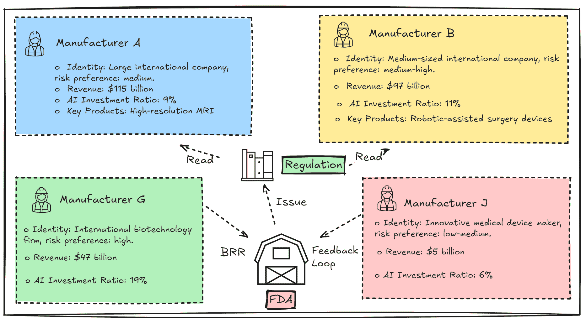
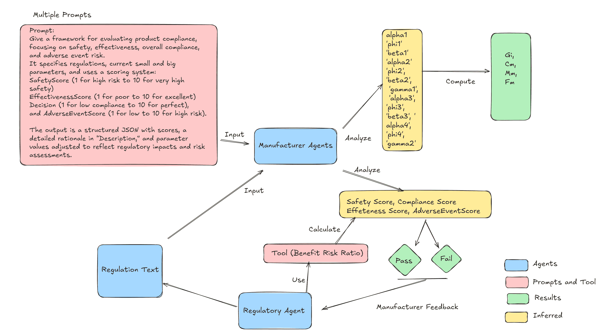
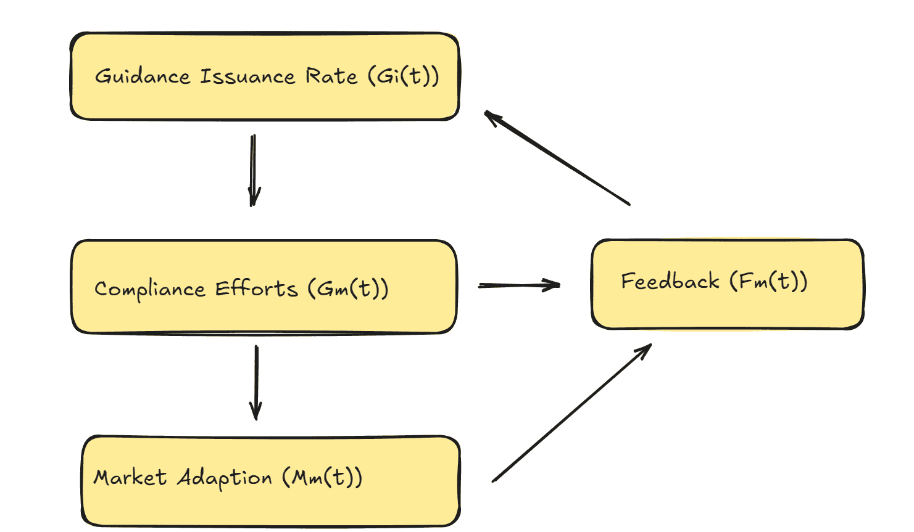
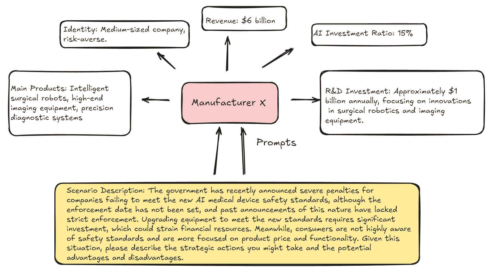
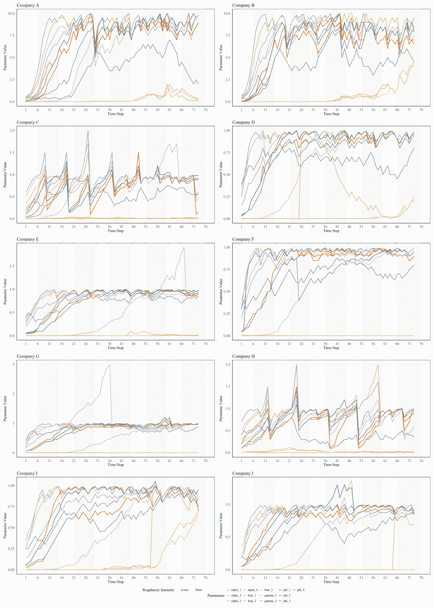
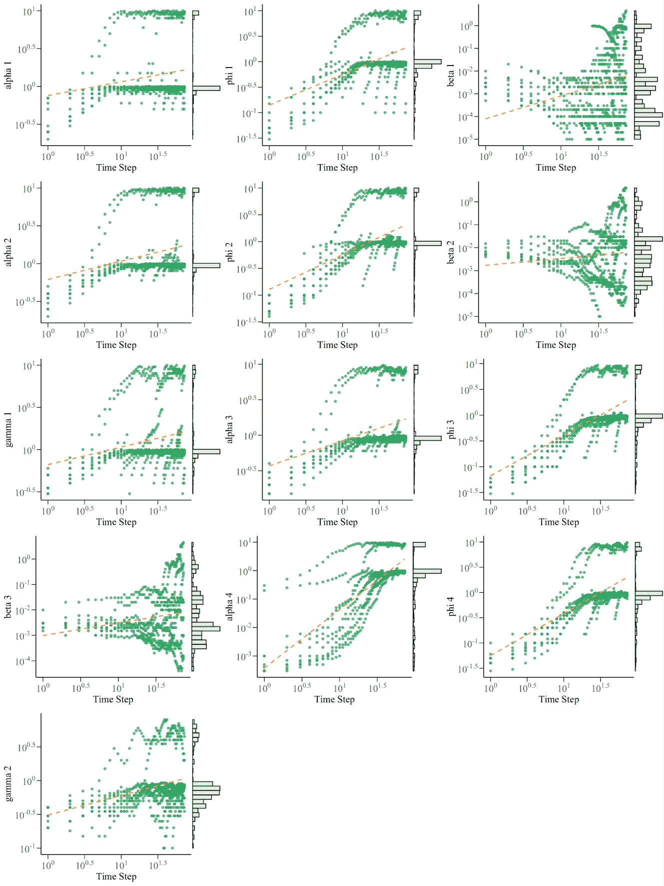
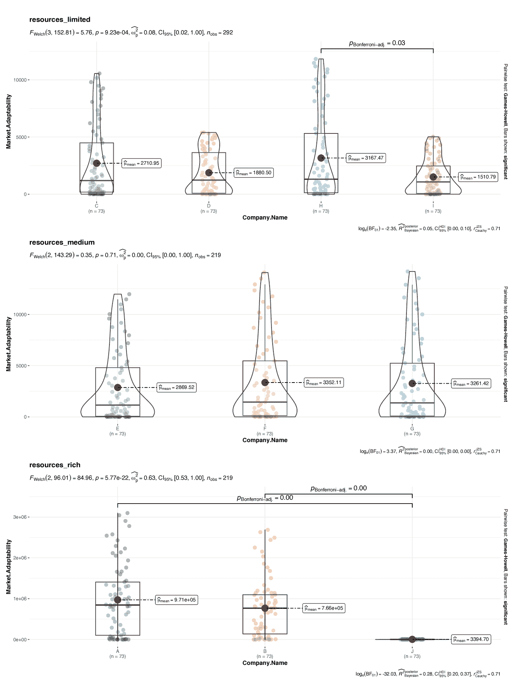
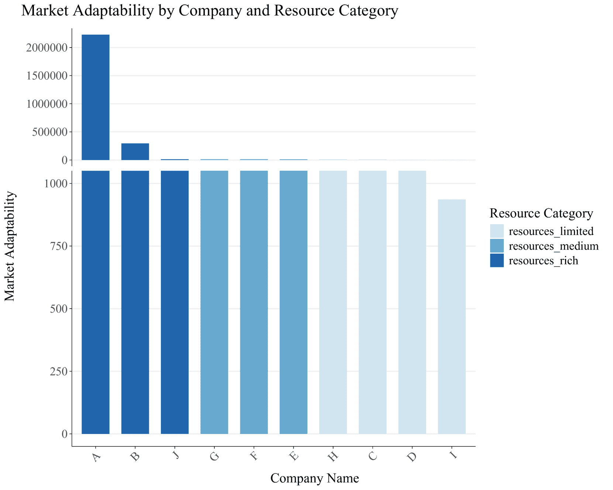
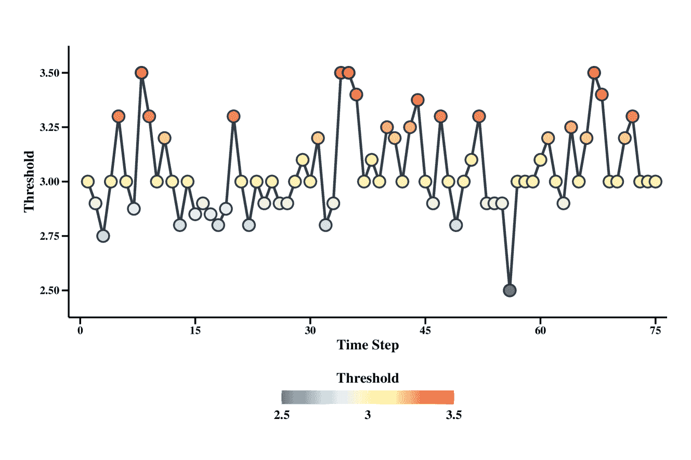
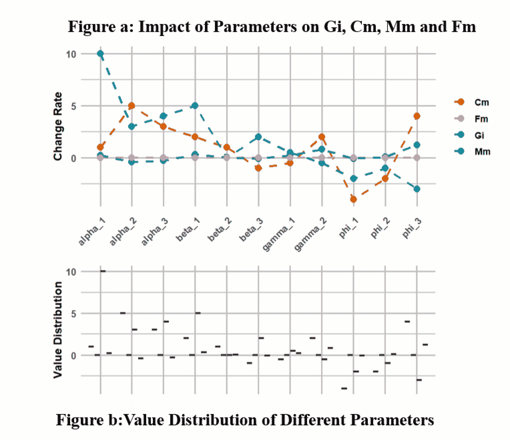

<!--yml

类别：未分类

日期：2025-01-11 11:54:17

-->

# 监管者-制造商AI智能体建模：基于数学反馈驱动的多智能体LLM框架

> 来源：[https://arxiv.org/html/2411.15356/](https://arxiv.org/html/2411.15356/)

Yu Han 这些作者对本研究贡献相等。牛津大学工程科学系，英国

yu.han@eng.ox.ac.uk Zekun Guo 数据科学、人工智能与建模中心，赫尔大学，英国

Z.Guo2@hull.ac.uk

###### 摘要

全球监管机构日益复杂的监管更新为医疗设备制造商带来了重大挑战，迫切需要灵活的策略以保持合规性并确保市场准入。同时，监管机构必须有效监控制造商的应对措施，并制定战略性的监管计划。本研究采用多智能体建模方法，并结合大型语言模型（LLMs）模拟监管动态，探讨关键角色（包括监管机构、制造商和竞争者）的适应性行为。这些智能体在一个由监管流动理论控制的模拟环境中运作，捕捉监管变化对合规决策、市场适应和创新战略的影响。我们的研究结果揭示了监管变化对行业行为的影响，并识别出改进监管实践、优化合规性以及促进创新的战略机会。通过融合多智能体系统和LLM，本研究提供了一种新颖的视角，并为在医疗设备行业不断变化的监管环境中导航的利益相关者提供了可操作的见解。

关键词：多智能体，LLM，超越方程，监管科学

## 1 引言

### 1.1 监管事务中的适应性动态与突现行为

全球医疗产品监管机构（如美国食品和药物管理局（FDA））持续发布指导文件，反映了其对公共健康与安全日益增加的关注，以应对快速发展的技术进步。这些积极的监管举措旨在确保新医疗设备达到高标准的疗效和安全性。然而，随着监管机构加速发布新指南，医疗设备制造商面临着越来越大的压力，需要迅速解读、实施并遵守更新的标准[[1](https://arxiv.org/html/2411.15356v2#bib.bib1)]。快速适应这些变化的能力对于保持市场准入和确保遵守不断变化的监管期望至关重要[[2](https://arxiv.org/html/2411.15356v2#bib.bib2)]，[[3](https://arxiv.org/html/2411.15356v2#bib.bib3)]。

在监管系统中，当新法规触发各方利益相关者（包括制造商、监管机构和医疗服务提供者）的适应性反应时，常常表现出突现行为[[4](https://arxiv.org/html/2411.15356v2#bib.bib4)]。这些反应可能导致合规实践和创新轨迹的显著变化。监管互动通常是非线性的，这意味着法规的细微变化可能对行为和系统范围的结果产生不成比例的巨大影响[[5](https://arxiv.org/html/2411.15356v2#bib.bib5)]。这些系统中的利益相关者不断调整其策略，以与不断变化的监管标准保持一致，这突显了监管系统自组织的特性[[6](https://arxiv.org/html/2411.15356v2#bib.bib6)]。通过去中心化的决策，这些系统能够促使最佳实践和行业标准的自发产生[[7](https://arxiv.org/html/2411.15356v2#bib.bib7)]。

尽管理解这些动态至关重要，但当前研究中存在一个显著的空白，大多数研究集中于监管框架或合规结果的单独分析。这个空白留下了许多关键问题尚未解答：持续的监管更新如何影响制造商的决策过程？在这个快速变化的环境中，什么样的适应性策略能够同时支持合规性和创新[[8](https://arxiv.org/html/2411.15356v2#bib.bib8)]？

本研究旨在通过引入一个综合模型来填补这一研究空白，该模型利用大型语言模型（LLM）代理捕捉监管机构与医疗设备制造商之间的循环互动。通过模拟监管机构、制造商之间的关系及其反馈回路，当制造商代理“审查”一套10条监管指南后，监管代理决定是否批准这些提交的过程，这一方法为监管系统提供了创新视角。它还为监管机构和制造商在制定灵活且响应迅速的合规策略方面提供了实际指导。

### 1.2 多代理建模与复杂性理论

多代理建模提供了一种强有力的方法，用于模拟由自主交互代理组成的复杂系统[[9](https://arxiv.org/html/2411.15356v2#bib.bib9)]。在土地利用和土地覆盖变化（LUCC）建模中，MAS将细胞景观模型与基于代理的决策表示结合，能够有效地捕捉空间交互和分散式决策[[10](https://arxiv.org/html/2411.15356v2#bib.bib10), [11](https://arxiv.org/html/2411.15356v2#bib.bib11)]。这些模型特别适用于表示异质条件和人类与环境的交互，涵盖从抽象假设到详细的政策分析。近期的进展已将MAS扩展到多模态领域，通过利用大型语言模型（LLMs）创建大型多模态代理（LMAs），使其能够解读并回应多样化的用户查询[[12](https://arxiv.org/html/2411.15356v2#bib.bib12)]。LMAs通过整合多种模态，增强了AI代理处理复杂任务的能力。然而，需要标准化的评估方法，以便在不同LMAs之间进行有意义的比较，并指导这一快速发展的领域的未来研究[[13](https://arxiv.org/html/2411.15356v2#bib.bib13)]。

多代理建模（MAM）提供了一种强有力的方法，用于模拟由多个自主代理组成的复杂系统，这些代理具有交互行为。这一优势特别适用于研究系统中的动态和涌现特性，在这些系统中，代理——如制造商和监管机构——根据相互之间以及与环境的互动不断调整其行为[[14](https://arxiv.org/html/2411.15356v2#bib.bib14)]。这种自下而上的方法使研究人员能够研究局部行动和互动如何扩展为更广泛的系统结果，从而使MAM成为理解具有不可预测性和非线性特征的监管环境的有效工具[[15](https://arxiv.org/html/2411.15356v2#bib.bib15)]。

多代理建模的基础是复杂性理论，它为分析互联组件表现出涌现行为的系统提供了框架。复杂性理论表明，即使是小的监管调整也可能导致利益相关者行为的巨大变化，这凸显了在监管框架中适应性的重要性[[16](https://arxiv.org/html/2411.15356v2#bib.bib16)]。在监管系统中，这种适应性通过一个持续的响应循环实现，其中利益相关者动态调整对监管变化的反应，而这些调整随后通过反馈回路影响未来标准的发展。

本研究中的MAM背景下的《监管流理论》将监管互动可视化为河流中的水流，引导利益相关者的行为。该理论将监管环境概念化为一个持续流动的过程，其中每一次监管更新都如同水流一样，塑造着合规行为、战略规划和行业创新。《监管流理论》捕捉到了这些系统的循环特性：初始的监管文件促使制造商采取适应性行动，制造商随后提供反馈，这些反馈又为进一步的更新提供了依据。这个反馈机制创造了一个不断发展的监管环境，使得监管机构和制造商能够灵活应对新出现的挑战[[17](https://arxiv.org/html/2411.15356v2#bib.bib17)，[18](https://arxiv.org/html/2411.15356v2#bib.bib18)]。对于监管机构来说，认识到这些系统的涌现特性可以为制定更具适应性和响应性的框架提供参考。对于制造商而言，理解监管环境中复杂的互动关系可以提升战略规划，使他们能够在监管变动中保持灵活和合规。本研究对监管事务流程进行了建模，包括法规的发布、制造商的适应性合规努力以及利益相关者反馈对监管机构的影响。最终，研究旨在探讨如何在不抑制创新的情况下向患者提供安全的医疗设备——这一在监管科学领域中尚未得到充分探讨的复杂挑战。

## 2 文献综述

监管机构负责制定规定和指南，定义新的方法、标准和模型，以确保医疗产品符合严格的安全性、有效性、质量和性能标准。监管事务领域在监管这些医疗产品方面起着关键作用，致力于通过验证市场上所有产品的安全性和有效性来保护公共健康 [[19](https://arxiv.org/html/2411.15356v2#bib.bib19)]。监管科学位于工程学与医学的交叉点，解决与医疗产品创新和监管相关的日益复杂的挑战 [[20](https://arxiv.org/html/2411.15356v2#bib.bib20)]。在过去的几十年中，医疗产品的监管环境发生了显著变化 [[3](https://arxiv.org/html/2411.15356v2#bib.bib3)], [[21](https://arxiv.org/html/2411.15356v2#bib.bib21)]。这一转变的推动力是需要在维持高安全标准与促进创新之间取得微妙的平衡，以适应快速发展的技术进步。为了推动监管实践，研究人员正在探索创新方法，涵盖从优化语言和沟通策略 [[22](https://arxiv.org/html/2411.15356v2#bib.bib22)] 到人工智能和先进建模技术的整合 [[1](https://arxiv.org/html/2411.15356v2#bib.bib1)]。这些进展旨在提高监管效率、改善复杂指南的解读，并促进能够跟上新兴技术步伐的适应性监管框架。

在监管科学领域，以往的建模工作主要集中在评估各类医疗产品的安全性和有效性。通常，这些模型是为特定类型的药品产品开发的，这些产品具有共同的靶点或作用机制，需要针对该产品类别的独特特性进行高度精准的定制。例如，诸如生理基础药代动力学（PBPK）吸收模型用于口服胶囊 [[23](https://arxiv.org/html/2411.15356v2#bib.bib23)]、集成到医疗设备中的临床决策支持系统 [[24](https://arxiv.org/html/2411.15356v2#bib.bib24)]，以及利用真实世界证据贯穿整个产品生命周期的模型 [[25](https://arxiv.org/html/2411.15356v2#bib.bib25)]。此外，还开发了新型分析技术，以改善医疗产品的检测和评估 [[26](https://arxiv.org/html/2411.15356v2#bib.bib26)]。

从更广泛的过程视角来看，考虑到医疗产品的发展及其对全球公共卫生的影响，已经设计了各种其他类型的模型，以简化监管过程并改善合规性。该领域的一个基础模型是风险管理模型，该模型在引入ICH Q9指南后获得了广泛关注。该模型强调在药物开发和市场后阶段识别、评估和减轻风险，提供了一个将监管监督与公共安全目标对接的框架[[27](https://arxiv.org/html/2411.15356v2#bib.bib27)], [[28](https://arxiv.org/html/2411.15356v2#bib.bib28)]。研究表明，基于风险的监管通过优先配置资源并聚焦于最关键的风险因素，从而提高了监管结果[[29](https://arxiv.org/html/2411.15356v2#bib.bib29)]。

监管科学建模的另一个支柱是生命周期管理模型，该模型将药物监管概念化为一个持续的过程，包括开发、市场批准和市场后监管。该模型的优势在于能够在整个产品生命周期内维护药物的质量和安全，并通过响应性和灵活的监管机制适应新出现的问题[[30](https://arxiv.org/html/2411.15356v2#bib.bib30)]。此外，经济分析作为另一个支柱，通过成本效益分析模型提供了一种定量方法来评估新监管措施的经济影响。这种方法使监管者能够权衡公共卫生利益与制药行业的财务成本，从而促进理性和平衡的决策[[31](https://arxiv.org/html/2411.15356v2#bib.bib31)], [[32](https://arxiv.org/html/2411.15356v2#bib.bib32)]。

然而，在监管科学领域，捕捉监管者、制造商和他们发布的监管内容之间复杂关系的动态建模仍然未得到充分探讨。了解制造商如何响应监管指南并调整其实践，对于优化合规性和促进创新至关重要。为了解决这一空白，提出了监管流动理论，这是一种由超越方程支持的新模型。该模型数学地表示了监管环境中主要利益相关者之间的反馈和适应机制。具体而言，这些方程描述了监管影响、合规努力、市场适应和反馈等关键变量如何随时间相互作用。通过形式化这些关系，该模型提供了对监管决策如何影响行业行为和合规策略的细致理解。

这种动态方程的发展在历史上曾受到阻碍，主要是由于捕捉和实验验证复杂关系的困难。然而，随着大型语言模型（LLMs）的出现，它大大扩展了动态建模的潜力。将LLMs整合到多智能体框架中[[9](https://arxiv.org/html/2411.15356v2#bib.bib9)]提供了一种优化复杂工程系统的有前景的方法。在这些框架中，智能体被分配不同的角色，通过角色扮演互动，它们模拟各种实体的行为。多智能体系统由多个相互作用的智能体组成，这些智能体通过合作或竞争实现特定目标[[33](https://arxiv.org/html/2411.15356v2#bib.bib33)]。

多智能体模型有潜力通过使每个代表不同利益相关者或监管实体的自主智能体互动并协作决策，彻底改变监管过程。这些配备LLM能力的智能体可以解读监管文本、处理实时数据，并动态响应监管环境的变化。此外，这些模型中使用的数学反馈机制使得决策更加适应性强和响应迅速，这是管理复杂监管生态系统的重要进展。在监管环境中，多智能体系统的潜力在于它们能够促进协作、增强实时决策能力，并扩展以适应多样化的监管要求。通过利用LLMs进行基于反馈的优化，这些模型能够提供以前无法获得的预测性见解，有效地应对传统方法无法解决的新兴监管挑战[[34](https://arxiv.org/html/2411.15356v2#bib.bib34)]。这种模型改变监管实践的潜力是巨大的，特别是在医疗行业，提供了一个更加主动、数据驱动和适应性强的监督框架。

## 3 方法论

我们的研究采用了大型语言模型（LLMs）来模拟制造商智能体对监管提示的反应，系统地记录每个智能体的战略决策、适应过程和整体表现[[35](https://arxiv.org/html/2411.15356v2#bib.bib35)]。我们研究了智能体如何应对监管挑战、解读新指南，并调整其产品设计以符合不断变化的合规要求。评估框架使用了效益-风险比（BRR）评估[[36](https://arxiv.org/html/2411.15356v2#bib.bib36)]，该方法灵感来源于FDA评估产品安全性和有效性的方法论。在每个时间步，我们计算BRR值以评估智能体是否符合监管标准，分析它们的推理过程和对监管压力的适应策略。

BRR计算首先从每个制造商代理的提交中提取关键评分。这些评分包括安全评分、有效性评分和合规评分，每个评分都在1到10的范围内评定。合规评分直接来源于代理的决策评分，反映了产品与监管指导方针的一致程度。为了计算总体效益，模型将安全评分、有效性评分和合规评分相加，代表产品的整体积极影响。风险组件通过不良事件评分量化与产品相关的潜在负面结果。接着，BRR通过将汇总的效益与不良事件评分的比率进行计算，提供一个全面的监管评估指标。最终是否批准或拒绝提交的决定由计算出的BRR与预定的批准阈值进行比较。如果BRR达到或超过该阈值，产品被认为是可接受的并获得批准。相反，如果BRR低于阈值，提交将被拒绝。这种结构化的方法使得模型能够模拟现实世界中的监管过程，类似于FDA等机构采用的流程，并确保评估在安全性、有效性和合规性方面保持平衡，且具有强健性和可重复性[[36](https://arxiv.org/html/2411.15356v2#bib.bib36)]。

我们开发了一个综合模拟环境，包含10个不同的制造商代理和一个监管代理，旨在模拟一个动态的监管生态系统。监管代理发布新的指导方针，促使制造商代理进行战略性调整和回应。我们制定了一套10条法规——5条严格的法规和5条宽松的法规——并让代理在10个时间步骤内接触严格的法规，接着在5个时间步骤内接触宽松的法规，并在整个过程中记录它们的反应，如图[1](https://arxiv.org/html/2411.15356v2#S3.F1 "Figure 1 ‣ 3 Methodology ‣ Regulator-Manufacturer AI Agents Modeling: Mathematical Feedback-Driven Multi-Agent LLM Framework")所示。

代理人需要根据多个因素做出决策，包括监管环境、财务资源、AI策略以及市场适应计划。他们还必须确定在这些条件下可行的产品开发方向。然后，监管代理会使用风险收益比计算器评估这些决策，以确定是否合规。该计算器集成了安全性、有效性和合规性等指标，为决策提供了量化框架。每个指标都按1到10的评分进行评估，所有评分将汇总计算出收益，然后用不良事件得分除以该收益，以得出BRR。如果BRR达到或超过预定的阈值，则提交申请会被批准；否则，会被拒绝。这种方法确保了对安全性、有效性和监管合规性的系统性、平衡的评估，反映了如图[2](https://arxiv.org/html/2411.15356v2#S3.F2 "图 2 ‣ 3 方法 ‣ 监管者-制造商 AI 代理建模：基于数学反馈驱动的多代理大语言模型框架")所示的现实世界实践。

模拟将监管知识和数学框架嵌入到代理人的决策过程中，甚至能够引导那些对设备监管没有全面了解的人做出明智的选择。通过通过非线性微分方程建模这些互动，我们深入了解了监管压力如何影响AI医疗设备领域的合规性和创新。这种方法使我们能够捕捉监管指导与市场反应之间的复杂动态，提供了对适应性行为随时间变化的详细分析。

图 1：监管机构与制造商代理在审批过程中的互动

图 2：基于代理的制药监管审查过程模拟

### 3.1 模型框架和初始化

我们的实验建立在一个双层设计框架之上，结合了数学建模和多代理大语言模型（LLM）模拟，严格研究了监管指导与制造商行为之间的相互作用。该设计的第一层涉及构建一组超越的方程，这些方程构成了一个现实物理世界模型的核心。我们开发了四个关键方程来描述监管机构（如制药或医疗器械监管机构）发布指导方针的过程，以及制造商代理如何适应这一不断变化的监管环境。这些方程捕捉了现实世界监管动态中复杂的反馈循环和适应性行为。

本模型的四个主要变量是$G_{i}$、$C_{m}$、$M_{m}$和$F_{m}$。具体而言，$G_{i}$代表指导发布速率，反映了新监管要求被引入的速度。$C_{m}$表示合规努力，是衡量制造商为满足监管标准而分配的资源和行动的指标。$M_{m}$代表市场适应性，说明制造商在应对监管变化时调整战略和运营的能力。最后，$F_{m}$捕捉了制造商的反馈，代表行业集体反应对未来监管决策的影响。这些方程共同模拟了监管机构与制造商之间复杂的互动，提供了一个数学基础的合规动态视图。

为了确保方程式准确代表现实世界的情景，我们采用非线性最小二乘优化方法来确定参数的初始值，如$alpha_{1}$、$phi_{1}$、$beta_{1}$等。此优化将模型的基准状态与观察值或理论期望对齐，为我们的仿真提供一个高保真度的起始点。一旦我们获得了这些优化的参数，我们就可以计算$G_{i}$、$C_{m}$、$M_{m}$和$F_{m}$的初始值。这些初始条件为现实的仿真奠定了基础，代表每个代理在监管合规性和市场定位方面的起点。

我们框架的第二层引入了多个使用大型语言模型（LLMs）的代理，模拟制造商代理如何通过 Camel AI 平台处理监管指导 [[37](https://arxiv.org/html/2411.15356v2#bib.bib37)]。每个代理通过精心设计的提示读取和解释监管文件，模拟决策过程。根据他们的理解，代理会战略性地调整内部参数。例如，如果法规要求更严格的合规性，某个代理可能会增加$alpha_{1}$以加速指导发布，或者他们可能会调整$phi_{2}$以根据监管要求微调其研发投资。每次调整背后的推理都会被记录下来，提供一个丰富的叙事，揭示代理的战略思维过程。

我们方法的一大亮点是数学模型与基于LLM的代理之间的动态互动。每个代理做出决策并调整其参数后，这些新值会被反馈到超越方程中。然后求解更新后的方程，计算$G_{i}$、$C_{m}$、$M_{m}$和$F_{m}$的新值。这个迭代过程形成了一个反馈循环，数学模型为LLM代理提供信息，而代理的决策则精细化数学结果。通过将LLM决策嵌入数学框架中，我们提高了仿真的精确性和现实性。

这种整合确保了LLM代理的战略决策不仅仅依赖于语言理解，还通过严格的数学计算进行验证和完善。因此，模型变得更加稳健，能够捕捉到监管合规性和适应性中的细微差别，以一种既理论上合理又实际相关的方式。这种数学建模与LLM模拟的创新结合，提供了一个全面的平台，用于探索制造商如何应对不断变化的监管环境，并为不同监管策略的有效性提供洞见。

该实验基于一组非线性微分方程，这些方程模型化了关键变量：指导发布率（$G_{i}$）、合规努力（$C_{m}$）、市场适应性（$M_{m}$）和制造商反馈（$F_{m}$）。实验过程如下：

输入：每个制造商代理的初始状态变量；总时间步数 $T$；系统参数输出：模拟后的最终状态变量模块 1：初始化初始化具有不同档案的制造商代理，表示为：ManufacturerAgents = {10 个具有身份卡的本能代理}对于 *ManufacturerAgents* 中的每个代理 执行       初始化代理的状态变量 $G_{i}$、$C_{m}$、$M_{m}$       根据相应档案特征分配代理.level结束 对于模块 2：主模拟循环对于 *$t\leftarrow 1$ 到 $T$* 执行       步骤 1：监管代理发布新法规       regulations $\leftarrow$ GenerateRegulations$(t)$      步骤 2：制造商读取法规并准备合规      对于 *ManufacturerAgents* 中的每个代理 执行             阅读并解释法规       结束 对于      步骤 3：制造商决定是否合规并更新状态      对于 *ManufacturerAgents* 中的每个代理 执行             3.1 生成反映代理级别的提示             prompt $\leftarrow$ GeneratePrompt(agent.level, regulations)            3.2 代理使用决策模型决定是否合规             decision $\leftarrow$ Decision(agent, prompt, model)            3.3 根据决策更新状态变量             $G_{i}$、$C_{m}$、$M_{m}$、$F_{m}$ $\leftarrow$ UpdatePhysicalState(agent, decision, params)            3.4 计算合规成本和市场适应性             cost, market_adaptation $\leftarrow$ CalculateCostAndAdaptation(agent, params)            3.5 代理提交合规文档             如果 *decision == ”Comply”* 则                   submission $\leftarrow$ PrepareSubmission(agent, regulations)                   BRR $\leftarrow$ CalculateBRR(submission)                   outcome $\leftarrow$ EvaluateSubmission(BRR, approval_threshold)            3.6 更新代理的状态变量             agent.state $\leftarrow$ { $G_{i}$、$C_{m}$、$M_{m}$、$F_{m}$ }             UpdateAgentState(agent, cost, market_adaptation)       结束 对于      步骤 4：监管代理审查提交并更新环境       feedback $\leftarrow$ CollectFeedback(submissions, outcomes)       UpdateEnvironment(feedback)      步骤 5：记录代理的反应并分析结果       RecordAndAnalyzeReactions(agent.states)结束 对于模块 3：输出结果输出所有状态变量和分析结果

我们的方法首先通过非线性最小二乘法优化初始参数（$\alpha_{1},\phi_{1},\beta_{1}$ 等），为仿真奠定坚实的基础。然后，我们计算$G_{i},C_{m},M_{m},F_{m}$的初始值，建立每个制造商代理的基准状态。代理根据监管提示进行解读，并基于战略推理更新参数，例如调整合规努力或市场适应。这些更新通过结构化的决策过程进行，并重新计算成新的变量状态。仿真包括基于场景的角色扮演，代理在故事情节发展的过程中进一步适应，做出战略调整并记录其理由。我们在每个步骤收集并可视化数据，绘制参数变化和变量趋势图。这一分析揭示了监管指导和代理互动的影响，揭示了合规和市场适应方面的模式和战略差异。

### 3.2 第一个数学层次

我们的模型将监管环境概念化为一种适应性流动，类似于一条河流塑造其经过的景观。监管发布像是“水流”，影响制造商的行为。运用多代理建模（MAM）原理，我们模拟了一个持续的监管反应循环，在这个循环中，反馈和监管更新动态交互。以下方程组展示了监管指导和反馈如何随着时间的推移塑造合规努力和市场适应。

|  | $\displaystyle\frac{dG_{i}(t)}{dt}$ | $\displaystyle=\alpha_{1}\cdot(1-e^{-\phi_{1}\cdot t})-\beta_{1}\cdot F_{m}(t)$ |  | (1) |
| --- | --- | --- | --- | --- |
|  | $\displaystyle\frac{dC_{m}(t)}{dt}$ | $\displaystyle=\alpha_{2}\cdot G_{i}(t)\cdot\left(1-e^{-\phi_{2}\cdot C_{m}(t)}\right)-\beta_{2}\cdot\left(\frac{C_{m}(t)}{1+\gamma_{1}\cdot M_{m}(t)}\right)$ |  | (2) |
|  | $\displaystyle\frac{dM_{m}(t)}{dt}$ | $\displaystyle=\alpha_{3}\cdot C_{m}(t)\cdot\left(1-e^{-\phi_{3}\cdot G_{i}(t)}\right)-\beta_{3}\cdot M_{m}(t)$ |  | (3) |
|  | $\displaystyle F_{m}(t)$ | $\displaystyle=\alpha_{4}\cdot\left(\frac{M_{m}(t)\cdot\left(1-e^{-\phi_{4}\cdot C_{m}(t)}\right)}{1+\gamma_{2}\cdot C_{m}(t)}\right)$ |  | (4) |

指导发布速率的方程$\frac{dG_{i}(t)}{dt}$反映了自然增长与抑制反馈之间的平衡。项$\alpha_{1}\cdot(1-e^{-\phi_{1}\cdot t})$模拟了指导发布的初期快速增长，随后随着时间推移减缓，类似于物流增长模型[[38](https://arxiv.org/html/2411.15356v2#bib.bib38)]。抑制项$-\beta_{1}\cdot F_{m}(t)$则聚合了来自制造商的反馈，符合系统动态原理，在这些原理中，增长受到系统约束的调节[[39](https://arxiv.org/html/2411.15356v2#bib.bib39)]。

合规努力，$\frac{dC_{m}(t)}{dt}$，受到指导发布和市场适应性影响。项$\alpha_{2}\cdot G_{i}(t)\cdot\left(1-e^{-\phi_{2}\cdot C_{m}(t)}\right)$量化了合规与指导之间的关系，类似于创新扩散模型[[40](https://arxiv.org/html/2411.15356v2#bib.bib40)]。约束条件由$-\beta_{2}\cdot\left(\frac{C_{m}(t)}{1+\gamma_{1}\cdot M_{m}(t)}\right)$建模，捕捉随着市场适应性增加，合规的递减效应[[41](https://arxiv.org/html/2411.15356v2#bib.bib41)]。

市场适应性，$\frac{dM_{m}(t)}{dt}$，依赖于合规努力和指导发布。复合效应由$\alpha_{3}\cdot C_{m}(t)\cdot\left(1-e^{-\phi_{3}\cdot G_{i}(t)}\right)$捕捉，随着饱和的发生而减缓，由$-\beta_{3}\cdot M_{m}(t)$建模[[39](https://arxiv.org/html/2411.15356v2#bib.bib39)]。

反馈因子$F_{m}(t)$被建模为$\alpha_{4}\cdot\left(\frac{M_{m}(t)\cdot\left(1-e^{-\phi_{4}\cdot C_{m}(t)}\right)}{1+\gamma_{2}\cdot C_{m}(t)}\right)$，代表市场适应性和合规努力如何影响反馈，结合了递减效应[[42](https://arxiv.org/html/2411.15356v2#bib.bib42)]。

这一数学框架捕捉了监管指导、合规动态与反馈效应之间的复杂相互作用，为建模监管合规性和市场适应性提供了结构化的方法。

### 相互依赖关系与系统动态

我们模型中的相互依赖关系展示了监管系统的复杂性，强调了反馈、合规和市场适应性之间的相互联系。

+   •

    反馈（$F_{m}(t)$）通过抑制项$-\beta_{1}\cdot F_{m}(t)$直接影响指导发布率（$G_{i}(t)$），调节新监管指导发布的速度。

+   •

    指导发布率（$G_{i}(t)$）通过项$\alpha_{2}\cdot G_{i}(t)\cdot\left(1-e^{-\phi_{2}\cdot C_{m}(t)}\right)$影响合规努力（$C_{m}(t)$），驱动制造商将资源分配到满足监管标准。

+   •

    合规努力（$C_{m}(t)$）通过项$\alpha_{3}\cdot C_{m}(t)\cdot\left(1-e^{-\phi_{3}\cdot G_{i}(t)}\right)$塑造市场适应性（$M_{m}(t)$），促进战略调整以保持竞争定位。

+   •

    市场适应性（$M_{m}(t)$）和合规努力（$C_{m}(t)$）共同通过$\alpha_{4}\cdot\left(\frac{M_{m}(t)\cdot\left(1-e^{-\phi_{4}\cdot C_{m}(t)}\right)}{1+\gamma_{2}\cdot C_{m}(t)}\right)$影响反馈（$F_{m}(t)$），反映了市场和合规动态如何影响监管环境。

图 3：变量之间相互依赖关系的示意图，展示了监管反馈回路。

模型展示了一个连贯的监管流程：制造商的反馈影响指导发布率，该发布率决定了新法规引入的速度。此发布率随后驱动合规努力，迫使制造商与监管期望保持一致。合规努力反过来催化市场适应，使战略调整能够保持相关性。最终，市场适应和合规努力共同塑造了反馈机制，进而指导未来的监管策略，闭合适应性循环。

### 3.3 第二代理角色扮演

监管机构 这些代理代表了负责发布指导文件、更新标准和监督合规的监管机构。监管机构以周期性方式运作，定期发布新指南，以反映医疗器械标准的变化格局，这些变化受到新兴技术、公共健康数据和行业反馈的影响。这些更新作为监管流程中的“潮流”，推动其他代理作出适应性反应。

制造商 这些代理模拟医疗器械制造商，负责解读新指南、评估合规成本，并调整运营策略以保持市场准入。每个制造商代理都设计了适应性算法，使他们能够有效分配资源，平衡创新与监管需求，并预测未来变化。他们在回应新法规时的战略调整突出了监管系统的自组织特性，其中去中心化的决策导致了行业范围内的合规模式。

行业竞争者（其他制造商）在行业内的竞争者采用适应性策略以保持竞争地位，同时响应监管变化。通过监控监管动态并调整合规方法，他们创造了一个持续创新和改进的环境。这种竞争间的动态强化了制造商保持灵活性的必要性，平衡了遵守监管与保持市场份额的需求。

### 3.4 环境设置

模拟环境将监管领域建模为一个动态流，其中指导更新就像水流，不断影响并重塑代理行为。监管机构定期发布指导文件，依据来自制造商和医疗服务提供者的合规数据和反馈。这一持续不断的监管信息流推动制造商调整其合规策略，确保其与不断发展的标准保持一致。反馈机制在其中起着至关重要的作用，允许制造商和医疗服务提供者与监管机构共享见解和回应，这反过来又影响未来的更新。这创造了一个持续的循环，现实世界的经验与监管指导相互影响。制造商必须通过平衡资源分配和合规努力来适应这一变化，反映了监管环境的现实挑战和持续演变。

我们为制造商代理开发了全面的档案，每个档案都具有独特的属性，以反映现实世界中的变异性。如图[4](https://arxiv.org/html/2411.15356v2#S3.F4 "图 4 ‣ 3.4 环境设置 ‣ 3 方法论 ‣ 监管者-制造商 AI 代理建模：基于反馈驱动的多代理 LLM 框架")所示，例如，B 公司具有一套特定的特征，这些特征会影响其战略决策。在我们的模拟中，所有 10 个代理都有各自独特的档案，使它们能够对监管要求作出细致的解读和回应。为了模拟监管挑战，我们使用自然语言处理（NLP）技术从 FDA 有关 AI 医疗器械的监管文本中提取了五个关键主题。我们将这些内容编纂成一本简明的监管指南，将复杂的指南抽象为清晰、可操作的指令，供代理高效处理。这些场景随后被部署到 Camel AI 平台上，促使代理在应对不断变化的监管环境时进行动态交互。

Camel AI 环境支持代理的并行执行、适应性反馈机制以及动态语料库调整，以反映不断变化的监管内容复杂性。所有实验均在配备 32GB 内存和 NVIDIA GTX 1080 Ti GPU 的标准计算服务器上运行。此配置确保了复杂交互的高效模拟，并支持在单一执行周期内多个代理的交互。

图 4：提示示例

#### 非线性最小二乘法的初步参数估计

优化过程在 Python 中使用 scipy.optimize.minimize 完成，采用非线性最小二乘法方法，通过迭代优化参数估计[[43](https://arxiv.org/html/2411.15356v2#bib.bib43)]。每个参数的初步猜测是基于初步分析进行分配的，以建立起一个起始点。系统的微分方程组使用 odeint 进行积分，生成每个变量在仿真时间线上的模型预测。每次迭代中调整参数，以最小化目标函数，该函数定义为每个时间步长中模型预测与观察数据之间的平方误差之和，涉及 $G_{i}(t)$、$C_{m}(t)$、$M_{m}(t)$ 和 $F_{m}^{j}(t)$。优化的目标是实现目标函数值的最小化，确保模型输出与观察数据之间的拟合度尽可能接近。进一步的模型验证，包括残差分析和敏感性测试，计划用来评估估计参数的鲁棒性和可靠性。

为了估计这些参数，我们定义了一个目标函数，最小化模型预测与观察数据之间的平方误差和，涵盖所有四个变量。对于每个时间点 $t$，观察到的数据 $G_{i}(t)$、$C_{m}(t)$、$M_{m}(t)$ 和 $F_{m}^{j}(t)$ 会与通过给定参数求解微分方程所生成的模型预测进行比较。

目标函数定义如下：

|  | $\text{Objective}=\sum_{t}\left(E_{G}(t)+E_{C}(t)+E_{M}(t)+E_{F}(t)\right)$ |  |
| --- | --- | --- |
|  | $E_{G}(t)=\left(G_{i}(t)_{\text{observed}}-G_{i}(t)_{\text{predicted}}\right)^{2}$ |  |
|  | $E_{C}(t)=\left(C_{m}(t)_{\text{observed}}-C_{m}(t)_{\text{predicted}}\right)^{2}$ |  |
|  | $E_{M}(t)=\left(M_{m}(t)_{\text{observed}}-M_{m}(t)_{\text{predicted}}\right)^{2}$ |  |
|  | $E_{F}(t)=\left(F_{m}^{j}(t)_{\text{observed}}-F_{m}^{j}(t)_{\text{predicted}}% \right)^{2}$ |  |

### 3.5 评估与验证

在我们的研究中，我们采用了一种综合方法来评估模型的表现并验证其可靠性。评估指标包括指导一致性准确度和合规性稳定性等指标，这些指标因其在衡量代理如何有效地与监管要求对齐并保持稳定合规性方面的相关性而被选择。指导一致性准确度量化了制造商代理的合规努力在时间推移中与监管预期的匹配程度，而合规性稳定性评估了这些努力的波动，反映了系统在应对不断变化的监管要求时的适应能力。

为确保模型的鲁棒性，我们应用了验证技术，如敏感性分析。通过系统地变化模型参数，我们检查了关键参数的影响。该方法使我们能够识别出对模型动态有显著影响的关键参数，并确认在各种情境下，模型的响应保持一致且可预测。此外，分析还揭示了非线性和不对称的效应，展示了模型捕捉监管指导与市场适应之间复杂交互作用的能力。

这些措施共同确认了我们的模型不仅在测试数据上表现良好，而且能够有效适应不断变化的监管和市场条件。精确的评估和充分的验证确保了我们的方法能够在高可靠性下模拟现实的监管环境和代理行为。未来的工作将通过引入真实世界的数据进行实证验证，并探索更先进的敏感性分析技术，进一步增强这一分析。

指导遵循准确性评估指标

指导遵循度衡量制造商在多大程度上将其合规努力与发布的指导意见对齐。我们通过计算合规努力与监管指导所衍生的推荐值在每个时间步的匹配程度，来得出这一指标。对于每个时间步$t$，遵循度通过比较计算出的合规努力$C_{m}(t)$与由指导发布率$G_{i}(t)$提供的预期努力基准来确定：

|  | $\text{遵循准确性}=\frac{1}{T}\sum_{t=1}^{T}\mathbb{1}\left(&#124;C_{m}(t)-G% _{i}(t)&#124;<\epsilon\right)$ |  |
| --- | --- | --- |

其中，$T$ 是总的时间步数，而$epsilon$是可接受偏差的阈值。该度量评估了模型如何有效地促使制造商采纳与监管期望一致的行为。

合规稳定性评估指标

合规稳定性评估了合规努力$C_{m}(t)$随时间的波动，提供了关于系统对监管更新的弹性洞察。合规努力的较低方差表明更平稳的适应监管变化，并反映了代理维持稳定合规的能力：

|  | $\text{合规稳定性}=\frac{1}{T}\sum_{t=1}^{T}\left(C_{m}(t)-\overline{% C_{m}}\right)^{2}$ |  |
| --- | --- | --- |

其中，$\overline{C_{m}}$ 是$T$个时间步的平均合规努力。较低的稳定性得分反映了较高的监管弹性，表明即便监管要求不断变化，代理仍能保持一致的反应。

这些指标共同使我们能够评估监管流模型在复杂监管体系下模拟现实世界适应行为的能力，为我们提供了关于监管有效性和代理适应性的深刻洞察，适用于多种合规场景。

#### 敏感性分析

我们系统地改变了每个模型参数的值，并观察了四个关键输出的变化：指导发布率（$G_{i}$）、合规努力（$C_{m}$）、市场适应性（$M_{m}$）和制造商反馈（$F_{m}$）。目标是评估哪些参数对系统行为的影响最大，并验证模型的结构稳健性。

## 4 结果

### 4.1 制造商代理的监管响应与参数演变

我们进行了一系列实验，将不同制造商的代理暴露在相同的监管环境中。每个代理都提供了相同的监管指南，以供分析和响应。例如，其中一项呈现给代理的法规指出：“算法透明性和可追溯性：基于人工智能的医疗设备制造商必须确保算法过程的全面透明。这包括要求在每个模型阶段，特别是在深度神经网络等复杂架构中，记录和披露决策机制。模型所做决策的可追溯性必须得到建立，提供清晰的审计轨迹，说明每一层如何影响最终结果。该文档应以结构化的方式呈现，以便监管机构能够进行深入评估，并在必要时识别具体的故障点或风险。”在阅读并解读这些法规后，代理自主决定了合规策略，并随着时间的推移对其操作参数（如$\alpha_{1},\alpha_{2},\beta_{1}$和$\gamma_{1}$）进行了调整，如图[5](https://arxiv.org/html/2411.15356v2#S4.F5 "Figure 5 ‣ 4.1 Regulatory Response and Parameter Evolution of Manufacturer Agents ‣ 4 Results ‣ Regulator-Manufacturer AI Agents Modeling: Mathematical Feedback-Driven Multi-Agent LLM Framework")和图[6](https://arxiv.org/html/2411.15356v2#S4.F6 "Figure 6 ‣ 4.1 Regulatory Response and Parameter Evolution of Manufacturer Agents ‣ 4 Results ‣ Regulator-Manufacturer AI Agents Modeling: Mathematical Feedback-Driven Multi-Agent LLM Framework")所示。这些参数变化反映了在强加的监管约束下，它们策略的演变，正如公司之间的参数轨迹多面可视化（A–J）所展示的那样。

图[7](https://arxiv.org/html/2411.15356v2#S4.F7 "Figure 7 ‣ 4.1 Regulatory Response and Parameter Evolution of Manufacturer Agents ‣ 4 Results ‣ Regulator-Manufacturer AI Agents Modeling: Mathematical Feedback-Driven Multi-Agent LLM Framework")展示了跨多个公司（A–J）在一系列时间步骤中的四个关键指标的时间动态——监管率、合规成本、市场适应性和制造商反馈。监管率（左上角）显示所有公司均呈现稳定且一致的增长，其中一些公司显示出更快的增长轨迹，表明它们在应对监管压力方面的能力存在差异。类似地，合规成本（右上角）呈指数增长模式，随着时间的推移，公司逐渐趋向相似的轨迹，反映出随着监管率增加，它们在遵守监管要求方面承受着共同的负担。相比之下，市场适应性（左下角）表现出显著的公司间差异，某些公司（例如B和D）展示出急剧的峰值和波动，可能反映了战略实验或动态市场反应，而其他公司则保持较低或更稳定的水平，表明可能存在资源限制或不同的战略。制造商反馈（右下角）在所有公司中稳步增长，部分公司（例如公司J）显示出明显更快的增长，突出了各公司在反馈机制中的参与度差异及其可能对合规性和适应性战略的影响。这些指标共同提供了一个全面的视角，展示了公司在不断变化的监管环境中如何平衡监管合规、成本、市场适应性和外部反馈。

图5：参数变化和数值分布分析

图6：图：参数敏感性和数值分布分析

图7：公司在监管压力下关键指标的时间动态

我们可以看到，在暴露于法规后，每个代理人都会处理这些要求，并通过调整内部参数来适应其策略，以实现合规，同时保持竞争效率。最初，在早期的时间步骤中，大多数代理人表现出$\alpha_{1}$和$\alpha_{2}$的快速上升调整，反映出在法规遵守方面的集中努力。这个阶段在代表公司A、B和J的代理人中尤为明显，稳定化过程发生得很快，表明初步响应非常强劲。在中期时间步骤中，出现了分化，因为代理人优先采用不同的策略：一些代理人将资源分配给可追溯性（$\gamma_{1},\gamma_{2}$），而其他代理人则专注于市场适应性（$\beta_{1},\beta_{2}$）。到了后期，许多代理人达到了稳定状态，平衡了法规遵守和操作约束，尽管一些代理人，如代表公司C、G和H的代理人，表现出$\gamma_{1}$和$\gamma_{2}$的周期性波动，表明持续的优化或挑战。异常现象，如公司G的$\alpha_{2}$骤降，或公司D的$\gamma_{1}$不规则峰值，表明战略失败或在满足特定要求（例如为复杂神经网络建立审计追踪）时遇到困难。这些发现突出了代理人采用的多样化策略，反映了在法规遵守和竞争力之间的权衡。

### 4.2 资源约束对适应性策略的影响

本研究探讨了各公司在合规资源配置上的差异及其对市场适应性的后续影响。根据结果，公司被分为三类，分别为资源有限型、资源中等型和资源丰富型。这一分类有助于详细分析不同资源投入水平如何影响公司在受监管环境下适应市场需求的能力。结果通过图 [8](https://arxiv.org/html/2411.15356v2#S4.F8 "图 8 ‣ 4.2 资源约束对适应性策略的影响 ‣ 4 结果 ‣ 监管者-制造商 AI 代理建模：数学反馈驱动的多代理 LLM 框架")中的小提琴图进行了可视化，并叠加了汇总统计数据，以显示市场适应性评分的分布，并提供关于各公司在不同条件下变异性的洞察。

图 8：跨公司资源配置与市场适应性分类

公司C、D、H和I被归类为资源有限的情境，观察到公司间市场适应性存在显著差异（$F(3,152.81)=5.76$, $p=9.23\times 10^{-4}$）。公司H表现出最高的平均适应性（$\bar{x}=3167.47$），显著优于其他公司。Bonferroni调整后的$p$值为0.03，进一步确认了这些发现的可靠性，而由组间差异解释的方差（$\sigma_{B}^{2}=0.08$）表明大约8%的市场适应性变异性可归因于公司之间的差异。这表明在资源匮乏的情况下，某些公司可能由于效率、创新或战略管理等内在因素，更能适应市场变化。

在资源中等的情境下，代理人E、F、G之间的公司市场适应性未表现出统计学上显著的差异（$F(2,143.29)=0.35$, $p=0.71$）。所有公司的平均适应性分数非常接近，表明适度的资源水平可能导致表现趋同。由组间差异解释的方差几乎可以忽略不计（$\sigma_{B}^{2}=0.00$），这表明在这种条件下，适应性在很大程度上不受公司层面因素的影响。此观察结果突显了平衡资源可用性的稳定效应，可能减少公司间的差异。

在资源丰富的情境下，代理人A、B和J之间的市场适应性差异明显（$F(2,96.01)=84.96$, $p=5.77\times 10^{-22}$）。公司A表现出异常高的平均适应性分数（$\bar{x}=9.71\times 10^{5}$），显著超过了其他公司的表现。由组间差异解释的方差较大（$\sigma_{B}^{2}=0.63$），表明大约63%的市场适应性变异性可归因于公司身份在资源丰富的条件下。经过Bonferroni调整后的$p$值（$p<0.001$）确认了这些差异的显著性，进一步强化了这样一种观点：丰富的资源放大了公司间的差距，可能通过放大现有的技术、基础设施或市场覆盖优势。

研究结果揭示了资源可用性与市场适应性之间复杂的关系。在资源有限的情况下，适应性差异适中但显著，可能是由公司内在特征驱动的。中等资源条件下，这些差异被中和，表明平衡的资源分配具有稳定作用。然而，资源丰富似乎加剧了适应性差异，某些公司达到了异常的业绩水平。这些结果强调了理解资源可用性如何与公司层面的因素相互作用，从而影响竞争动态和市场成功的重要性。

图 [12](https://arxiv.org/html/2411.15356v2#S4.F12 "图 12 ‣ 4.4 模块评估与敏感性结果 ‣ 4 结果 ‣ 监管者-制造商 AI 代理建模：基于反馈驱动的多代理 LLM 框架") 显示了每家公司在经过 73 个时间步后的市场适应性，突出了它们战略决策和合规资源分配的结果。纵轴表示市场适应性，横轴则按公司（A–J）分类。属于资源丰富类别的公司（例如 A、B 和 J）通常能够获得最高的适应性分数，强调了充足资源在促进战略灵活性和应对市场动态中的优势。相反，属于资源有限类别的公司（例如 C、D、H 和 I）的适应性明显较低，且在这些公司之间存在显著的差异。值得注意的是，H 公司在这一类别中表现优于其他同行，表明尽管资源有限，它在效率或创新策略方面表现出色。进一步调查 H 公司发现，它较高的市场适应性源于其在预防性护理设备中整合人工智能的战略重点，这一策略与其创新的产品组合以及对先进医疗保健解决方案日益增长的需求相契合。此外，它的低至中等风险偏好使得其可以有针对性地进行人工智能投资（占收入的 6%），同时保持运营稳定，从而在资源有限的条件下仍能获得更高的适应性。

图 9：市场适应性价值分布分析

### 4.3 权威代理作出的决策

“收益-风险比”（BRR）作为监管决策中的基础性指标，帮助监管机构评估产品的潜在收益是否足以抵消其相关风险，从而决定是否批准产品进入市场或继续存在。这个比率为平衡创新与安全提供了定量和定性指导，尤其在公共安全和有效性至关重要的高度监管行业，如医疗保健领域尤为重要。通过分析BRR，监管机构能够评估涉及多个制造商、不同产品类型和不断变化的市场动态的复杂情形。

权威代理使用BRR工具，使得监管机构能够评估整体市场格局，包括市场中制造商的数量及其产品的多样性。基于这一综合评审，权威代理设置决策阈值，确定产品进入或停留在市场中时可接受的收益与风险水平。与现实中的监管实践不同，后者通常根据具体个案作出决策并具有较大灵活性，允许考虑产品的个别特征，而该模型中的权威代理引入了一个动态阈值机制。

如图[10](https://arxiv.org/html/2411.15356v2#S4.F10 "图 10 ‣ 4.3 权威代理做出的决策 ‣ 4 结果 ‣ 调节者-制造商AI代理建模：基于数学反馈的多智能体LLM框架")所示，权威代理设置的阈值不是一个固定值，而是随着时间波动，反映了基于市场变化条件的适应性决策。阈值的波动确保了对市场动态变化的响应，例如新制造商的进入或产品效益-风险特征的变化。这种动态方法类似于现实中的监管灵活性，决策通常需要考虑特定情境的因素和不断变化的市场现实。通过分析阈值的轨迹，我们可以观察到，在维持严格标准的同时，也允许一定的灵活性以适应创新和市场多样性。权威决策的适应性本质强调了在复杂和竞争激烈的市场中，平衡监管一致性与情境响应需求的重要性。

图 10：由多智能体框架设置的BRR值变化集

### 4.4 模块评估与敏感性结果

为了验证框架的稳健性和相关性，我们进行了全面的敏感性分析。结果总结并展示在图[12](https://arxiv.org/html/2411.15356v2#S4.F12 "图 12 ‣ 4.4 模块评估与敏感性结果 ‣ 4 结果 ‣ 调节者-制造商AI代理建模：基于数学反馈的多智能体LLM框架")中，展示了每个关键参数在主要输出：引导发布率($G_{i}$)、合规努力($C_{m}$)、市场适应性($M_{m}$)和制造商反馈($F_{m}$)中的变化率。

图 11：引导遵从性分析与合规稳定性分析的评估结果

图 12：图：参数敏感性和数值分布分析

### 4.5 敏感性分析

##### 参数对模型输出的影响

控制引导发布率的参数$\alpha_{1}$、$\phi_{1}$和$\beta_{1}$对$G_{i}$表现出中等到强烈的影响，变化导致输出出现正负波动。值得注意的是，将$\alpha_{1}$从0.1增加到0.2显著提高了$G_{i}$，这表明监管引导对最大发布率的变化非常敏感。像$\phi_{2}$和$\beta_{2}$这类影响合规努力($C_{m}$)的参数则表现出非线性影响。例如，随着$\phi_{2}$的增加，$C_{m}$表现出显著的正向影响，表明研发投资对合规行为有着显著影响。

市场适应性（$M_{m}$）对$\alpha_{3}$和$\beta_{3}$的变化最为敏感。具体而言，$\alpha_{3}$的较高值加快了合规努力转化为市场适应的速率，证明了资源配置在这一方面的重要性。制造商的反馈（$F_{m}$）显示出受$\alpha_{4}$和$\phi_{4}$调整的中等影响，这表明市场适应性和合规能力在塑造反馈动态中的作用。  

##### 关键参数及其影响  

如$\alpha_{1}$、$\alpha_{2}$和$\alpha_{3}$等参数被识别为关键参数，在调整时它们对关键输出的变化率较大。这一发现强调了准确估算这些参数的重要性，因为它们显著驱动着监管流程和市场响应动态。相反，一些参数，如$\gamma_{1}$和$\gamma_{2}$，表现出较为稳定的行为，表明其敏感度较低。这意味着尽管这些参数仍然相关，但它们的精确值可能对整体模型性能的影响较小，从而简化了参数估算。  

##### 非线性与不对称效应  

分析表明，参数变化的影响通常是非线性和不对称的。例如，增加$\beta_{1}$会导致$G_{i}$的边际影响递减，表现出饱和效应。类似地，$\phi_{3}$的变化对$M_{m}$产生了不对称的影响，这强调了需要谨慎调整，以避免不成比例的反应。  

我们的敏感性分析结果验证了模型的稳健性，因为它在广泛的参数变化范围内始终展现出预期且可解释的行为。识别关键参数强调了在标定和进一步分析过程中专注于这些变量的重要性。此外，观察到的非线性反应表明，我们的模型有效地捕捉了监管与市场互动的复杂动态。  

虽然敏感性分析提供了有价值的见解，但它并不能替代与现实数据的实证验证。未来的工作应包括广泛的数据收集，以优化参数估算并验证模型预测。此外，探索更先进的敏感性分析技术，如全局敏感性分析，可以提供对模型动态更全面的理解。

## 5 讨论  

本研究引入了一个多智能体框架，旨在模拟医疗器械行业中的监管合规性和市场适应动态。通过模拟监管机构和制造商之间的互动，该框架为检验政策影响、战略决策和适应行为提供了新的视角。尽管该模型具有一定的实用性，但它也存在一些局限性，需要进一步研究和改进，以增强其在实际环境中的稳健性和适用性。

监管政策分析可以从这种建模方法中受益匪浅。监管机构可以利用该模型模拟新政策对医疗器械行业的潜在影响。通过调整方程式（1）中的参数，例如$\alpha_{1}$、$\beta_{1}$和$\phi_{1}$，监管者可以模拟涉及不同指导率的情景，并分析其对合规努力和市场适应的影响。尽管这种预测能力能够促进更加明智的政策制定，确保法规既有效又平衡，但这些预测的准确性在很大程度上依赖于输入数据的质量和完整性，而这是现实应用中的一大局限。

该模型对制造商的战略规划具有潜力。医疗器械制造商可以利用该框架预测监管变化，并主动调整合规策略。通过输入特定数据——如合规得分、研发投资和市场份额——该模型可能帮助企业预测未来的合规成本并评估市场适应策略。然而，现实世界条件的变动性，例如突如其来的监管变化或市场中断，限制了这些预测的精确性，使得该模型更适合用于战略指导，而非精确预测。它还为学术研究和验证提供了基础。研究人员可以利用该框架探索监管影响在医疗技术行业中的广泛意义。使用真实世界数据进行敏感性分析和验证可以为其稳健性和适用性提供宝贵的见解。然而，模型当前的局限性，如假设统一的合规行为或简化的市场动态，必须得到解决，以提高其可信度和普适性。该模型旨在支持行业基准。通过将预测的合规努力和市场适应结果与实际行业表现进行比较，企业可以识别绩效差距和改进机会。这个过程可能有助于建立行业标准并推动持续改进。然而，模型固有的简化可能限制其捕捉推动现实世界绩效的公司特定因素的能力，降低了其作为基准工具在当前状态下的有效性。

## 6 限制

本研究的主要局限性来自于BRR（效益风险比）评分系统固有的简化，该系统利用大型语言模型根据制造商的档案、设备描述和监管环境分配分数。尽管BRR系统采用了基于监管决策过程的逻辑原则，但它仍然是对现实世界评估的代理，后者本质上更加复杂和多维。

在实践中，BRR对医疗设备的考虑和最终批准受到许多其他因素的影响，包括临床试验结果、上市后监测数据、动物研究中的表现、实验室测试结果以及紧急医疗需求。例如，评估一个心脏植入设备在现实条件下的表现需要评估其长期临床效果、生物兼容性和成本效益，同时还要考虑其与报销政策和以患者为中心的结果的对接。这些复杂性超出了当前模型的范围，当前模型主要依赖于结构化输入特征和通用的决策规则。

本研究代表了开发量化框架以建模监管合规性和市场适应性的基础性步骤。作为首次尝试，它必然会抽象掉某些产品特定和公司特定的细节，以保持计算的可处理性和普适性。未来的工作可以在此基础上进行扩展，通过整合更细化的产品特征和现实世界数据来源，来提高模型的准确性和适用范围。

## 7 结论与未来工作

在本文中，我们介绍了一种新颖的模拟多智能体大语言模型（LLM）框架，旨在评估和增强基于AI的医疗器械制造商的合规性策略。通过将制造商和监管机构（如FDA）表示为由大语言模型驱动的自主智能体，该框架实现了迭代、互动的合规性评估，模拟了现实世界中的监管流程。我们的方法为解决与医疗器械中AI的适应性特性相关的监管复杂性提供了独特的解决方案，因为合规性是一个动态且持续的挑战。该系统的指标，包括合规准确性、稳定性和遵循监管指导的程度，提供了合规性表现的多维视角。实验结果表明，这种迭代学习环境使制造商能够不断优化合规策略，而监管智能体则能提供定制化的反馈，帮助制造商朝着最佳合规性方向发展。这样的设置不仅降低了潜在的合规风险，还促进了创新型AI医疗器械的更快、更高效的市场准备。除了在医疗器械合规性方面的即时应用外，该框架在各类高监管行业中也具有更广泛的潜力，包括金融科技、生物制药和自动驾驶汽车。它代表了在模拟和分析AI驱动技术的监管合规性方面的重要进展，为主动合规评估奠定了基础，促进了与监管标准的更好对接，并增强了AI应用的安全性和有效性。因此，它为推动AI驱动的智能体系统在监管科学中的作用提供了有前景的路径，同时也为跨学科的研究和行业间的合作打开了新的大门，这些领域优先考虑安全性、合规性和创新。

## 参考文献

+   [1] Y. Han 和 J. Bergmann, “将医疗法规转化为数字：将美国、欧盟和中国十年的医疗器械法规变化向量化，” *arXiv预印本arXiv:2411.00567*，2024。

+   [2] D. B. Kramer, S. Xu 和 A. S. Kesselheim, “美国和欧盟的医疗器械监管表现如何？一项系统评审，” 2012。

+   [3] Y. Han, A. Ceross, F. Bourgeois, P. Savaget, 和 J. H. Bergmann, “大语言模型在医疗器械软件分类中的评估，” 2024。

+   [4] P. Anderson, “观点：复杂性理论与组织科学，” *组织科学*，第10卷，第3期，216–232页，1999。

+   [5] J. D. Sterman, “商业动态：复杂世界的系统思维与建模，” *MacGraw-Hill出版社*，2000。

+   [6] S. A. Kauffman, *秩序的起源：进化中的自组织与选择*。牛津大学出版社，1993。

+   [7] D. Helbing 和 S. Balietti，“未来如何进行基于代理的仿真：从建模社会机制到涌现现象和互动系统设计，”*城市经济学与区域研究电子期刊*，2013年。[在线]。可用链接：[https://api.semanticscholar.org/CorpusID:5752779](https://api.semanticscholar.org/CorpusID:5752779)

+   [8] A. E. Lottes, K. J. Cavanaugh, Y. Y.-F. Chan, V. J. Devlin, C. J. Goergen, R. Jean, J. C. Linnes, M. Malone, R. Peat, D. G. Reuter *等*，“医疗器械的监管路径导航——与 FDA、临床医生、研究人员和行业专家的对话，”*心血管转化研究杂志*，第15卷，第5期，第927–943页，2022年。

+   [9] M. Wooldridge，*多智能体系统导论*。John Wiley & Sons，2009年。

+   [10] D. C. Parker, S. M. Manson, M. A. Janssen, M. J. Hoffmann 和 P. Deadman，“用于土地利用和土地覆盖变化仿真的多智能体系统：一项综述，”*美国地理学会年鉴*，第93卷，第2期，第314–337页，2003年。

+   [11] L. Liu, M. Wang, M.-O. Pun 和 X. Xiong，“一种用于混合自主环境下高速公路瓶颈疏解的多代理滚动方法，”*arXiv 预印本 arXiv:2405.03132*，2024年。

+   [12] J. Xie, Z. Chen, R. Zhang, X. Wan 和 G. Li，“大型多模态智能体：一项综述，”*arXiv 预印本 arXiv:2402.15116*，2024年。

+   [13] T. Guo, X. Chen, Y. Wang, R. Chang, S. Pei, N. V. Chawla, O. Wiest 和 X. Zhang，“基于大型语言模型的多智能体：进展与挑战的综述，”*arXiv 预印本 arXiv:2402.01680*，2024年。

+   [14] J. R. Turner 和 R. M. Baker，“复杂性理论：概述与其在社会科学中的潜在应用，”*系统*，第7卷，第1期，第4页，2019年。

+   [15] C. M. Macal，“关于基于代理的建模与仿真的一切你需要知道的，”*仿真期刊*，第10卷，第144–156页，2016年。

+   [16] R. Axelrod 和 M. D. Cohen，*驾驭复杂性*。Basic Books，2008年。

+   [17] P. Hedström 和 P. Ylikoski，“社会科学中的因果机制，”*社会学年鉴*，第36卷，第49–67页，2010年。

+   [18] Y. Wang, L. Liu, M. Wang, 和 X. Xiong，“基于人类反馈的强化学习用于混合交通中的自动驾驶车辆车道变换，”*arXiv 预印本 arXiv:2408.04447*，2024年。

+   [19] J. R. Turner，“编辑评论：监管科学与安全科学，”*药物信息期刊*，第45卷，第3期，第221–227页，2011年。

+   [20] Y. Han, A. Ceross 和 J. Bergmann，“不止是繁文缛节：探索医疗器械监管事务中的复杂性，”*医学前沿*，第11卷，第1415319页，2024年。

+   [21] Y. Han 和 J. Tao，“革新制药：揭示制药行业中的 AI 和 LLM 趋势，”*arXiv 预印本 arXiv:2401.10273*，2024年。

+   [22] Y. Han, A. Ceross 和 J. H. M. Bergmann，“法律文本中的可读性度量：一项系统的文献综述，”2024年。

+   [23] C. Stillhart, X. Pepin, C. Tistaert, D. Good, A. Van Den Bergh, N. Parrott 和 F. Kesisoglou，“Pbpk吸收建模：建立体外-体内连接—行业视角，” *AAPS杂志*，第21卷，第1-13页，2019年。

+   [24] T. M. Morrison, P. Pathmanathan, M. Adwan 和 E. Margerrison，“通过FDA科学与工程实验室推进医疗器械的计算建模监管科学，” *医学前沿*，第5卷，第241页，2018年。

+   [25] T. O’Neill, R. Miksad, D. Miller, L. Maloney, A. John, C. Hiller, 和 J. Hornberger，“ISPOR、FDA与医疗器械产品的不断发展的监管科学，” *健康价值*，第22卷，第7期，第754-761页，2019年。

+   [26] Y. Wang, A. Guan, S. Wickramasekara 和 K. S. Phillips，“医学器械监管科学中的分析化学，” *分析化学年评*，第11卷，第1期，第307-327页，2018年。

+   [27] 人用药品注册技术要求国际协调会议，“ICH协调三方指南：质量风险管理Q9，” 人用药品注册技术要求国际协调会议，瑞士日内瓦，技术报告，2005年。

+   [28] U. FDA, “行业指南：Q10质量体系对药品cGMP法规的应用，” *马里兰州罗克维尔*，2006年。

+   [29] M. E. Gonçalves，“新欧盟数据保护法规下的风险基础方法：批判性视角，” *风险研究杂志*，第23卷，第2期，第139-152页，2020年。

+   [30] M. Y. Smith, I. Benattia, C. Strauss, L. Bloss 和 Q. Jiang，“跨产品生命周期的结构化效益-风险评估：实践中的考虑，” *治疗创新与监管科学*，第51卷，第4期，第501-508页，2017年。

+   [31] M. C. Weinstein 和 W. B. Stason，“健康与医学实践成本效益分析基础，” *新英格兰医学杂志*，第296卷，第13期，第716-721页，1977年。

+   [32] M. F. Drummond, M. J. Sculpher, K. Claxton, G. L. Stoddart, 和 G. W. Torrance，*医疗保健项目的经济评估方法*。牛津大学出版社，2015年。

+   [33] X. Xiong, E. Xiao 和 L. Jin，“重型车辆协调编队的随机模型分析，”在 *2019年IEEE第58届决策与控制会议（CDC）*。IEEE，2019年，第3170-3175页。

+   [34] Y. Bao, N. Buhay 和 Q. Zheng，“GMP合规性与监管科学的动态模型，” *药物创新杂志*，第19卷，第3期，第1-16页，2024年。

+   [35] S. Gao, A. Fang, Y. Huang, V. Giunchiglia, A. Noori, J. R. Schwarz, Y. Ektefaie, J. Kondic 和 M. Zitnik，“利用AI代理赋能生物医学发现，” *Cell*，第187卷，第22期，第6125-6151页，2024年。

+   [36] M.-L. Kürzinger, L. Douarin, I. Uzun, C. El-Haddad, W. Hurst, J. Juhaeri, 和 S. Tcherny-Lessenot, “药品的结构化利益–风险评估：文献中定量利益–风险评估结果的回顾，” *药物安全性治疗进展*，第11卷，第2042098620976951页，2020年。

+   [37] G. Li, H. Hammoud, H. Itani, D. Khizbullin, 和 B. Ghanem, “骆驼：用于大语言模型社会‘思维’探索的交流代理，” *神经信息处理系统进展*，第36卷，第51,991–52,008页，2023年。

+   [38] P. F. Verhulst, *人口增长法则的通知*。《数学与物理学通讯》，1838年。

+   [39] S. H. Strogatz, *非线性动力学与混沌：应用于物理学、生物学、化学和工程学*。CRC Press, 2018。

+   [40] E. M. Rogers, *创新扩散*。Free Press, 2003。

+   [41] J. W. Forrester, *系统原理*。MIT Press, 1968。

+   [42] J. D. Murray, *数学生物学 I：导论*。Springer, 2002。

+   [43] F. Ding, “最小二乘参数估计与基于噪声数据的线性拟合问题的多创新最小二乘方法，” *计算与应用数学杂志*，第426卷，第115107页，2023年。
