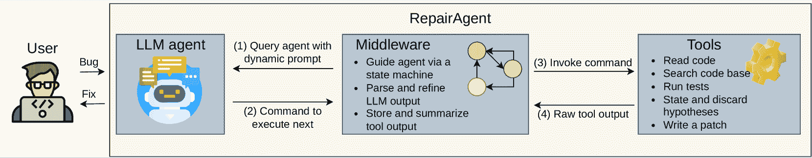
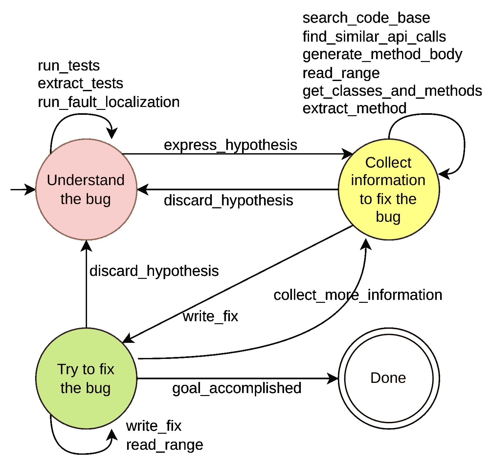
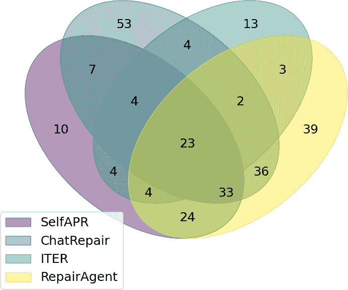
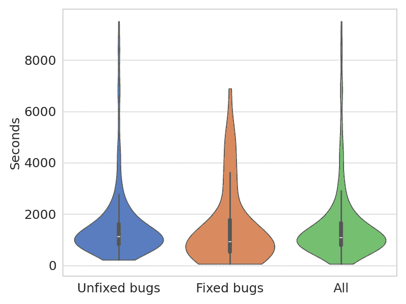
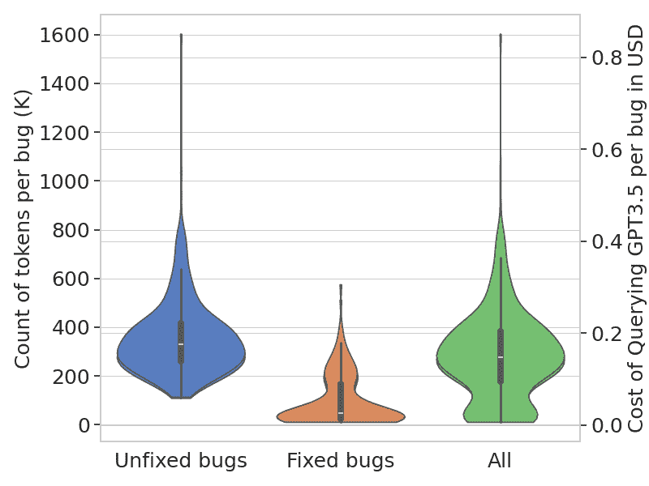
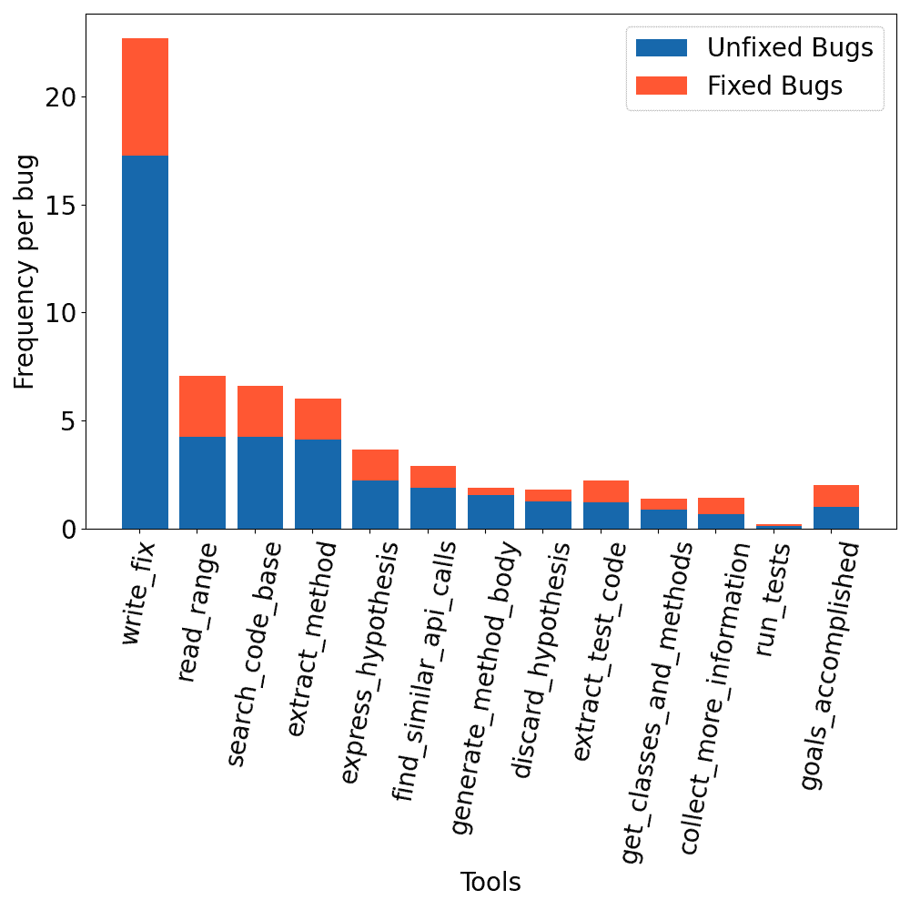

<!--yml

分类：未分类

日期：2025-01-11 12:44:27

-->

# RepairAgent：一个基于LLM的自主程序修复代理

> 来源：[https://arxiv.org/html/2403.17134/](https://arxiv.org/html/2403.17134/)

\useunder

\ul

Islem Bouzenia

斯图加特大学

德国

fi_bouzenia@esi.dz    Premkumar Devanbu

加利福尼亚大学戴维斯分校

美国

ptdevanbu@ucdavis.edu    Michael Pradel

斯图加特大学

德国

michael@binaervarianz.de

###### 摘要

自动化程序修复已经成为一种强大的技术，用于减轻软件缺陷对系统可靠性和用户体验的影响。本文介绍了RepairAgent，这是第一个通过基于大型语言模型（LLM）的自主代理来解决程序修复挑战的工作。与现有的深度学习方法不同，后者通过固定的提示或固定的反馈循环来提示模型，我们的工作将LLM视为一个代理，能够通过调用适当的工具，自动规划和执行修复动作。RepairAgent自由交替地收集有关缺陷的信息、收集修复材料以及验证修复，同时根据收集到的信息和先前修复尝试的反馈来决定调用哪些工具。使RepairAgent成为可能的关键贡献包括一组对程序修复有用的工具、一个动态更新的提示格式，使LLM能够与这些工具进行交互，以及一个有限状态机，用于指导代理调用这些工具。我们在流行的Defects4J数据集上的评估表明，RepairAgent能够有效地自动修复164个缺陷，其中包括39个先前技术无法修复的缺陷。与LLM的交互对每个缺陷的平均成本为270,000个令牌，在当前OpenAI GPT-3.5模型的定价下，这相当于每个缺陷14美分。据我们所知，这是第一个提出用于程序修复的自主LLM代理的工作，为未来基于代理的技术在软件工程中的应用铺平了道路。

## 引言

软件缺陷会导致系统故障、安全漏洞以及用户体验受损。修复缺陷是软件开发中的一项关键任务，但如果手动完成，则需要大量的时间和精力。自动化程序修复（APR）承诺通过以自动化的方式解决有效且高效的缺陷解决需求，显著减少这一工作量。研究人员和实践者已经探索了多种方法来解决自动修复缺陷的挑战[[1](https://arxiv.org/html/2403.17134v2#bib.bib1)]，其中包括基于手动设计的[[2](https://arxiv.org/html/2403.17134v2#bib.bib2)、[3](https://arxiv.org/html/2403.17134v2#bib.bib3)]以及（半）自动提取的[[4](https://arxiv.org/html/2403.17134v2#bib.bib4)、[5](https://arxiv.org/html/2403.17134v2#bib.bib5)、[6](https://arxiv.org/html/2403.17134v2#bib.bib6)]修复模式，基于符号约束[[7](https://arxiv.org/html/2403.17134v2#bib.bib7)、[8](https://arxiv.org/html/2403.17134v2#bib.bib8)、[9](https://arxiv.org/html/2403.17134v2#bib.bib9)]，以及各种基于机器学习的方法[[10](https://arxiv.org/html/2403.17134v2#bib.bib10)、[11](https://arxiv.org/html/2403.17134v2#bib.bib11)、[12](https://arxiv.org/html/2403.17134v2#bib.bib12)、[13](https://arxiv.org/html/2403.17134v2#bib.bib13)、[14](https://arxiv.org/html/2403.17134v2#bib.bib14)、[15](https://arxiv.org/html/2403.17134v2#bib.bib15)、[16](https://arxiv.org/html/2403.17134v2#bib.bib16)]。

目前，APR的最先进技术主要围绕大型语言模型（LLMs）展开。基于LLM的第一代修复方法通过与模型进行一次性交互，模型接收包含有缺陷代码的提示，并生成修复后的版本[[17](https://arxiv.org/html/2403.17134v2#bib.bib17)、[18](https://arxiv.org/html/2403.17134v2#bib.bib18)]。第二代及当前的LLM修复方法引入了迭代方式，根据从之前修复尝试中获得的反馈，反复查询LLM[[19](https://arxiv.org/html/2403.17134v2#bib.bib19)、[20](https://arxiv.org/html/2403.17134v2#bib.bib20)、[21](https://arxiv.org/html/2403.17134v2#bib.bib21)]。

当前基于LLM的迭代修复技术的一个关键限制是，它们的硬编码反馈循环无法让模型收集有关bug或现有代码的信息，而这些信息可能包含修复bug的线索。相反，这些方法修复的是提示中提供的代码上下文，通常是有bug的代码[[19](https://arxiv.org/html/2403.17134v2#bib.bib19)，[21](https://arxiv.org/html/2403.17134v2#bib.bib21)]，有时还包括有关失败测试用例的详细信息[[20](https://arxiv.org/html/2403.17134v2#bib.bib20)]。然后，反馈循环会在不同的bug代码变体上执行测试，并将任何编译错误、测试失败或其他输出添加到下一轮迭代的提示中。然而，这种方法与人类开发人员修复bug的方式有根本不同，后者通常涉及在时间上交替进行：收集信息以理解bug，搜索可能有助于修复bug的代码，并尝试修复候选方案[[22](https://arxiv.org/html/2403.17134v2#bib.bib22)，[23](https://arxiv.org/html/2403.17134v2#bib.bib23)]。

本文介绍了RepairAgent，这是第一个基于LLM的自动化程序修复的自主代理。我们的方法将LLM视为一个能够规划和执行动作的自主代理，以实现修复bug的目标。我们为LLM配备了一套针对bug修复的工具，模型可以调用这些工具与代码库交互，方式类似于人类开发人员。例如，RepairAgent有工具通过读取特定的代码行来提取bug信息，借助搜索代码库来收集修复所需的材料，并通过应用补丁和执行测试用例来提出和验证修复方案。重要的是，我们没有硬编码这些工具的使用方式和时机，而是让LLM根据之前收集的信息和先前修复尝试的反馈自主决定下一个要调用的工具。

我们的方法由三个关键组件支持。首先，一个通用的LLM，例如GPT-3.5，我们通过动态更新的提示反复查询该模型。我们贡献了一种新型的提示格式，它引导LLM通过修复bug的过程，并根据LLM执行的命令及上一个命令执行的结果进行更新。第二，一组LLM可以调用的工具，用于与代码库交互。我们提出了一套14个工具，旨在涵盖人类开发人员修复bug时会采取的不同步骤，例如读取特定的代码行、搜索代码库和应用补丁。第三，一个中间件，协调LLM与工具之间的通信。我们提出了通过有限状态机引导工具调用以及启发式地解释可能不正确的LLM输出的创新技术。RepairAgent的迭代循环将持续进行，直到代理声明已找到合适的修复，或直到耗尽迭代次数的预算。

为了评估我们方法的有效性，我们将其应用于Defects4J [[24](https://arxiv.org/html/2403.17134v2#bib.bib24)]数据集中所有的835个漏洞，这是一个广泛使用的程序修复技术评估基准。RepairAgent成功修复了164个漏洞，其中包括Defects4J v1.2和v2.0版本中的74个和90个漏洞。成功修复的漏洞包括49个需要修复多行代码的漏洞，这表明RepairAgent能够修复复杂的漏洞。与现有的技术相比[[19](https://arxiv.org/html/2403.17134v2#bib.bib19), [21](https://arxiv.org/html/2403.17134v2#bib.bib21)]，RepairAgent成功修复了39个先前工作未能修复的漏洞。通过衡量与LLM交互所带来的成本，我们发现RepairAgent每修复一个漏洞的平均成本为270,000个tokens，根据OpenAI GPT-3.5模型的当前定价，相当于每个漏洞14美分。对一组最近的漏洞[[25](https://arxiv.org/html/2403.17134v2#bib.bib25)]的额外评估表明，RepairAgent在单行漏洞上能取得类似的表现，而在多行和多文件漏洞上略逊一筹，主要是由于GitBug-Java数据集中漏洞的复杂性更高。我们从这些结果中认为，RepairAgent不太受Defects4J潜在数据泄露的影响。总体来看，我们的结果表明，基于代理的方法确立了程序修复领域的新技术前沿。

总结来说，本文做出了以下贡献：

+   •

    基于LLM的自主程序修复代理。

+   •

    一种动态更新的提示格式，引导LLM完成漏洞修复过程。

+   •

    一套工具，使LLM能够执行人类开发人员在修复漏洞时所采取的步骤。

+   •

    一个中间件，用于协调LLM与工具之间的通信。

+   •

    实验数据表明，RepairAgent通过成功修复164个漏洞，包括39个先前工作未能修复的漏洞，确立了新的技术前沿。

+   •

    我们将发布RepairAgent的实现作为开源，以促进未来的相关工作。

据我们所知，目前尚未有关于基于LLM的自主代理在任何代码生成任务中的公开研究。我们设想RepairAgent将为未来基于代理的软件工程技术开辟道路。

## II 基于LLM的自主代理背景

由于经过大量网络知识（包括自然语言和源代码）的训练，LLM在完成各种任务时表现出显著的能力，能够达到人类水平的表现[[26](https://arxiv.org/html/2403.17134v2#bib.bib26)]。利用这些能力的一种有前景的方式是*基于LLM的代理*，我们指的就是具有以下两个特性的基于LLM的技术：（1）LLM自主地规划并执行一系列动作以实现目标，而不是响应硬编码的查询或在硬编码的算法中被查询；（2）LLM执行的动作包括调用外部工具，使LLM能够与其环境进行交互[[27](https://arxiv.org/html/2403.17134v2#bib.bib27), [28](https://arxiv.org/html/2403.17134v2#bib.bib28)]。在软件工程的背景下，尤其是在自动修复方面，这些工具可以是开发人员通常使用的工具，例如作为集成开发环境（IDE）的一部分。基本思想是通过包含当前世界状态、目标以及接下来可以执行的一系列动作的提示来查询LLM。然后模型决定执行哪个动作，并将执行动作的反馈集成到下一个提示中。近期的调查提供了关于基于LLM的自主代理[[29](https://arxiv.org/html/2403.17134v2#bib.bib29)]以及通过API调用的LLM代理的全面概述[[30](https://arxiv.org/html/2403.17134v2#bib.bib30)]。此类代理在软件工程中的潜力目前尚未得到充分探索，而本文旨在针对自动化程序修复这一具有挑战性的任务进行探讨。

## III 方法

### III-A 概览

图 1：RepairAgent概览。

图[1](https://arxiv.org/html/2403.17134v2#S3.F1 "Figure 1 ‣ III-A Overview ‣ III Approach ‣ RepairAgent: An Autonomous, LLM-Based Agent for Program Repair")展示了RepairAgent方法的概览，该方法由三个组件组成：一个LLM代理（左侧），一组工具（右侧），以及一个中间件，负责协调两者之间的通信（中间）。给定一个需要修复的漏洞，中间件通过包含任务信息和如何利用提供的工具执行任务的指令的提示初始化LLM代理（箭头1）。LLM通过建议调用可用工具中的一个（箭头2）进行响应，中间件解析该调用并执行（箭头3）。工具的输出（箭头4）随后被集成到下一个LLM调用的提示中，直到漏洞修复完成或预定义的预算耗尽，过程会不断迭代进行。

### III-B 术语

RepairAgent通过多个迭代或周期进行：

###### 定义 1  （周期）。

一个*周期*代表与LLM代理的一个交互回合，包括以下步骤：

1.  1.

    查询代理

1.  2.

    后处理响应

1.  3.

    执行代理建议的命令

1.  4.

    根据命令的输出更新动态提示

在每个周期中，方法仅查询一次 LLM。模型的输入会基于 LLM 在前一个周期调用工具（命令）的结果进行更新。我们将模型输入称为动态提示：

###### 定义 2 （动态提示）。

*动态提示* 是一系列文本部分 $P=[s_{0},s_{1},...,s_{n}]$，其中每个部分 $s_{i}$ 是以下之一（其中 $s_{i}(c)$ 表示周期 $c$ 中的部分）：

+   •

    一个*静态部分*，在所有周期中保持不变，即对于所有 $c,c^{\prime}$，有 $s_{i}(c)=s_{i}(c^{\prime})$。

+   •

    一个*动态部分*，在不同周期中可能有所不同，即可能存在 $c,c^{\prime}$，使得 $s_{i}(c)\neq s_{i}(c^{\prime})$。

### III-C 动态提示修复代理

表 I：动态更新提示的各个部分。

|         提示部分 |         性质 |
| --- | --- |
|         角色 |         静态 |
|         目标 |         静态 |
|         指南 |         静态 |
|         状态描述 |         动态 |
|         可用工具 |         动态 |
|         收集到的信息 |         动态 |
|         输出格式的规范 |         静态 |
|         上次执行的命令及其结果 |         动态 |

修复代理是一个经过自然语言和源代码训练的 LLM，如 GPT-3.5。RepairAgent 使用一个动态提示查询 LLM，该提示由静态部分和动态部分组成，如表 [I](https://arxiv.org/html/2403.17134v2#S3.T1 "TABLE I ‣ III-C Dynamic Prompting of the Repair Agent ‣ III Approach ‣ RepairAgent: An Autonomous, LLM-Based Agent for Program Repair") 中所列。我们在下面详细描述每个部分。

#### III-C1 角色

这一部分提示定义了代理的专业领域，即解决 Java 代码中的 bug，并概述了代理的主要目标：理解并修复 bug。提示强调代理的决策过程是自主的，不应依赖用户的帮助。

#### III-C2 目标

我们定义了五个目标供代理执行，这些目标在所有周期中保持不变：

+   •

    *定位 bug：* 执行测试并使用故障定位技术来确定 bug 的位置。如果在提示中已经提供了故障定位信息，则跳过此目标。

+   •

    *收集有关 bug 的信息：* 分析与 bug 相关的代码行以理解 bug。

+   •

    *建议简单的修复方法：* 首先建议简单的修复方法。

+   •

    *建议复杂的修复方法：* 如果简单的修复无效，探索并提出更复杂的修复方法。

+   •

    *遍历之前的目标：* 继续收集信息并建议修复，直到找到有效的修复方法。

#### III-C3 指南

我们提供了一套指导原则。首先，我们告知模型存在多种类型的错误，从单行问题到可能涉及更改、删除或添加行的多行错误。基于观察到许多错误可以通过相对简单、反复出现的修复模式解决[[31](https://arxiv.org/html/2403.17134v2#bib.bib31)]，我们提供了一份常见修复模式的清单。该清单基于之前关于Java中单语句错误的工作[[31](https://arxiv.org/html/2403.17134v2#bib.bib31)]。对于每个模式，我们提供了简短的自然语言描述以及错误和修复后的代码示例。其次，我们指示模型在修改后的代码上方插入注释，这有两个目的。一方面，注释使得模型能够解释其推理过程，研究表明这能增强LLM的推理能力[[32](https://arxiv.org/html/2403.17134v2#bib.bib32)]。另一方面，注释最终将帮助人类开发者理解编辑的性质。第三，我们指示模型以明确的下一步结论结束推理，这一步可以转换为对工具的调用。最后，我们描述了工具调用的预算有限，强调了在选择下一步时效率的重要性。具体来说，我们指定了最大循环次数（默认值为40）。

#### III-C4 状态描述

图2：引导工具选择的状态机。

为了引导LLM代理有效且有意义地使用可用工具，我们定义了一个有限状态机，来限制在给定时间点哪些工具是可用的。我们的动机是，因为在早期实验中我们观察到，缺乏此类引导时，LLM代理经常在无目的的探索中迷失。图[2](https://arxiv.org/html/2403.17134v2#S3.F2 "Figure 2 ‣ III-C4 State Description ‣ III-C Dynamic Prompting of the Repair Agent ‣ III Approach ‣ RepairAgent: An Autonomous, LLM-Based Agent for Program Repair")展示了有限状态机，它的设计旨在模拟人类开发者在修复错误时经历的各个状态。每个状态与一组可用的工具相关联，这些工具在[III-D](https://arxiv.org/html/2403.17134v2#S3.SS4 "III-D Tools for the Agent to Use ‣ III Approach ‣ RepairAgent: An Autonomous, LLM-Based Agent for Program Repair")节中进行了描述。值得注意的是，代理可以通过使用工具在任何时间点自由地在状态之间转换。也就是说，尽管提供了引导，状态机并不强制执行工具调用的严格顺序。

提示中的状态描述部分会告知代理其当前状态：

+   •

    *理解bug*：智能体从这个状态开始，在此状态下它可以收集与失败的测试用例和bug位置相关的信息。一旦智能体理解了bug，它会形成一个假设来描述bug的性质及其背后的原因。在整个修复过程中，智能体可能会驳斥早期的假设，并提出新的假设。在表达假设后，智能体会自动切换到下一个状态。

+   •

    *收集修复bug的信息*：在这个状态下，智能体收集有助于为假设所描述的bug建议修复的方法的信息，例如，通过搜索特定的修复成分或读取可能相关的代码。一旦智能体收集到足够的信息来尝试修复，它就可以过渡到下一个状态。

+   •

    *尝试修复bug*：在这个状态下，智能体会基于当前的假设和收集到的信息尝试修复bug。每次修复尝试都会修改代码库，并通过执行测试用例进行验证。如有必要，智能体可以回到之前的某个状态，重新建立新的假设或收集额外的信息。

除了上述三个状态，RepairAgent 还有一个最终状态，*“完成”*，智能体可以通过调用一个特定命令来表示修复成功，从而达到该状态。

#### III-C5 可用工具

这一部分的提示描述了一组智能体在当前状态下可以调用的工具。每个工具都有一个名称、描述和一组类型化的参数（参见[III-D](https://arxiv.org/html/2403.17134v2#S3.SS4 "III-D 工具供智能体使用 ‣ III 方法 ‣ RepairAgent: 一种基于大语言模型的自动化程序修复智能体")）。

#### III-C6 收集到的信息

修复智能体的一个关键能力是收集关于bug和代码库的信息，这些信息是决定下一步调用哪些命令的基础。为了使这些信息对智能体可用，我们维护了一个提示部分，列出了不同工具调用所收集的信息。直观上，这部分提示作为智能体的记忆，使其能够回忆起之前周期的信息。收集到的信息被结构化为不同的子部分，每个子部分包含特定工具产生的输出。

#### III-C7 输出格式的规范

[⬇](data:text/plain;base64,aW50ZXJmYWNlIFJlc3BvbnNlIHsKICB0aG91Z2h0czogc3RyaW5nOwogIGNvbW1hbmQ6IHsKICAgIG5hbWU6IHN0cmluZzsJCiAgICBhcmdzOiBSZWNvcmQ8c3RyaW5nLCBhbnk+OwogIH07Cn0=)接口  响应  {思想:  字符串;命令:  {名称:  字符串;参数:  记录<字符串,  任意>;};}

图3：模型响应的JSON格式。

在动态提示下，LLM代理每个周期提供一次响应。为了使中间件能够解析响应，我们指定了预期的输出格式（图[3](https://arxiv.org/html/2403.17134v2#S3.F3 "图3 ‣ III-C7 输出格式规范 ‣ III-C 动态提示修复代理 ‣ III 方法 ‣ RepairAgent：一种基于LLM的自动化程序修复代理")）。“thoughts”字段提供了代理在决定下一个命令时的推理过程描述。要求代理表达其想法，增加了方法的透明度和可解释性，提供了一种调试代理决策过程中的潜在问题的方式，并有助于提升LLM的推理能力[[32](https://arxiv.org/html/2403.17134v2#bib.bib32)]。“command”字段指定了下一个将执行的命令，包括要调用的工具名称和参数集。

[⬇](data:text/plain;base64,ewogICJ0aG91Z2h0cyI6ICJXaXRoIHRoZSBoeXBvdGhlc2lzIGluIG1pbmQsCiAgaXQncyB0aW1lIHRvIGdhdGhlciBtb3JlIGluZm9ybWF0aW9uIHRvCiAgZm9ybXVsYXRlIHBvdGVudGlhbCBmaXhlcyBmb3IgdGhlIGJ1Zy4gSQogIHNob3VsZCBmb2N1cyBvbiB1bmRlcnN0YW5kaW5nIHRoZSBjb250ZXh0CiAgYXJvdW5kIHRoZSBjb25kaXRpb24KICAnaWYgKHggPCAwICYmIHByZXYgPT0gJy0nKScKICB0byBjb21lIHVwIHdpdGggZWZmZWN0aXZlIHNvbHV0aW9ucy4iLAogICJjb21tYW5kIjogewogICAgIm5hbWUiOiAic2VhcmNoX2NvZGVfYmFzZSIsCiAgICAiYXJncyI6IHsKICAJICAia2V5X3dvcmRzIjoKCQlbICJhZGROdW1iZXIiLAoJIAkgICJDb2RlQ29uc3VtZXIiLAogCQkgICJpZiAoeCA8IDAgJiYgcHJldiA9PSAnLScpIiBdCn19fQ==){"thoughts":  "有了这个假设，现在是时候收集更多的信息，以便为这个 bug 制定潜在的修复方法。我应该专注于理解条件‘if (x < 0 && prev == ’-’)’的上下文，从而提出有效的解决方案。","command":  {"name":  "search_code_base","args":  {"key_words":[  "addNumber","CodeConsumer","if  (x  <  0  &&  prev  ==  ’-’)"  ]}}}

图4：修复代理响应示例。

例如，图[4](https://arxiv.org/html/2403.17134v2#S3.F4 "图4 ‣ III-C7 输出格式规范 ‣ III-C 动态提示修复代理 ‣ III 方法 ‣ RepairAgent：一种基于LLM的自动化程序修复代理")展示了LLM代理的响应。模型表达了需要收集更多信息来理解该bug，并建议使用一组关键词搜索代码库的命令。

#### III-C8 最后执行的命令和结果

该提示的这一部分包含了最后执行的命令（工具名称和参数）（如果有的话）及其产生的输出。其目的是提醒代理上一步所执行的操作，并使其意识到在执行命令过程中可能出现的问题。此外，我们还提醒代理已执行了多少个周期，剩余多少个周期。

### III-D 代理使用的工具

我们方法的一个关键创新在于让 LLM 代理自主决定调用哪些工具来修复 bug。我们为代理提供的工具（表[II](https://arxiv.org/html/2403.17134v2#S3.T2 "TABLE II ‣ III-D Tools for the Agent to Use ‣ III Approach ‣ RepairAgent: An Autonomous, LLM-Based Agent for Program Repair")）灵感来自开发者在其 IDE 中使用的工具。

表 II：RepairAgent 调用的与修复相关的工具。

| 工具 | 描述 |
| --- | --- |
| 读取并提取代码： |
| *read_range* | 读取文件中的一段行。 |
| *get_classes_and_methods* | 获取文件中所有类和方法的名称。 |
| *extract_method* | 给定一个方法名，从文件中提取方法实现。 |
| *extract_tests* | 给定来自 JUnit 或 ANT 的失败报告，提取失败的测试用例代码。 |
| 搜索并生成代码： |
| *search_code_base* | 扫描项目中的所有 Java 文件以查找关键词列表。 |
| *find_similar_api_calls* | 给定一个调用 API 的代码片段，搜索项目中相似的 API 调用。 |
| *generate_method_body* | 请求 LLM（默认使用 GPT3.5）基于方法前面的代码生成方法体。 |
| 测试和修补： |
| *run_tests* | 运行项目的测试套件。 |
| *run_fault_localization* | 获取现有的定位信息或运行故障定位工具。 |
| *write_fix* | 对代码库应用修复补丁，并执行项目的测试套件。如果测试失败，改动会被自动撤销。将代理移到“尝试修复 bug”状态。 |
| 控制： |
| *express_hypothesis* | 表达一个关于 bug 的假设。将代理移动到“收集信息以修复 bug”状态。 |
| *collect_more_information* | 将代理移回到“收集信息以修复 bug”状态。 |
| *discard_hypothesis* | 丢弃当前关于 bug 的假设并返回到“理解 bug”状态。 |
| *goal_accomplished* | 声明目标已完成，并退出修复过程。 |

#### III-D1 代码读取与提取

修复 bug 的前提是阅读并理解代码库中的相关部分。我们并不是将提供给 LLM 的上下文硬编码[[19](https://arxiv.org/html/2403.17134v2#bib.bib19)、[20](https://arxiv.org/html/2403.17134v2#bib.bib20)、[21](https://arxiv.org/html/2403.17134v2#bib.bib21)]，而是让智能体根据四个工具来决定读取代码的哪些部分。*read_range* 工具允许智能体从特定文件中提取一段代码行，这对于获取特定代码片段的集中视图非常有用。为了获得代码结构的概览，*get_classes_and_methods* 工具可以检索给定文件中的所有类名和方法名。通过调用 *extract_method* 工具，智能体可以提取与给定方法名匹配的实现（如果在给定文件中有多个实现）。最后，我们提供了 *extract_tests* 工具，能够提取导致测试失败的测试用例代码。该工具对于理解失败测试的细节至关重要，例如输入值和预期输出。

#### III-D2 搜索并生成代码

受到人类开发者通常会搜索代码的事实[[33](https://arxiv.org/html/2403.17134v2#bib.bib33)]的启发，我们提出了允许智能体搜索特定代码片段的工具。这些工具对于智能体更好地理解 bug 的上下文并收集修复所需的元素（即可能成为修复一部分的代码片段）非常有用。*search_code_base* 工具使智能体能够在整个代码库中定位特定关键词的实例。例如，智能体可以使用该工具查找变量、方法和类的出现位置。给定一组关键词，工具会对项目中的所有源代码文件进行近似匹配。具体来说，工具会根据驼峰命名法、下划线和句点将每个关键词拆分成子符号，然后在代码中搜索每个子符号。例如，搜索 quickSortArray 会匹配到 sortArray、quickSort、arrayQuickSort 以及其他相关的变体。该工具的输出是一个嵌套字典，按文件名、类名和方法名组织，提供与方法内容匹配的关键词。另一个搜索工具 *find_similar_api_calls* 允许智能体识别并提取方法的使用情况，这对于修复不正确的方法调用非常有用。如果没有这样的工具，LLMs 往往会虚构不存在于代码库中的方法调用[[34](https://arxiv.org/html/2403.17134v2#bib.bib34)]。给定一个包含方法调用的代码片段，工具会提取被调用方法的名称，然后搜索调用相同方法的所有实例。智能体可以限制搜索范围到特定文件，也可以搜索整个代码库。

除了搜索现有的代码，RepairAgent 还提供了一个工具，通过调用另一个 LLM 来生成新代码。该工具的灵感来源于基于 LLM 的代码补全工具的成功，例如 Copilot [[35](https://arxiv.org/html/2403.17134v2#bib.bib35)]，人类开发人员在修复 bug 时越来越多地使用这些工具。给定一个方法之前的代码和该方法的签名，*generate_method_body* 工具会请求 LLM 生成该方法的代码体。向代码生成 LLM 提出的查询独立于整个 RepairAgent 方法所使用的动态提示，并且可能使用不同的模型。在我们的评估中，我们对修复代理和该工具的代码生成 LLM 使用相同的 LLM。该工具将给定的代码上下文限制为 12k tokens，并将生成的代码限制为 4k tokens。

#### III-D3 测试与补丁

下一个类别的工具与运行测试和应用补丁相关。*run_tests* 工具允许代理执行项目的测试套件。它会生成一个报告，指示测试是通过还是失败。如果测试失败，工具会清理测试运行器的输出，例如通过移除当前项目之外的堆栈跟踪条目。其理由是 LLM 有有限的提示大小，且不相关的信息可能会混淆模型。*run_fault_localization* 工具检索故障定位信息，这对于理解哪些代码部分可能包含 bug 非常有用。RepairAgent 提供了该工具的两种变体：一种提供完美的故障定位信息，另一种则调用现有的故障定位工具，例如 GZoltar [[36](https://arxiv.org/html/2403.17134v2#bib.bib36)]，来计算故障定位得分。在完美故障定位的情况下，工具提供所有需要编辑的文件和行，以修复 bug。与程序修复领域常见的做法一样，我们假设完美故障定位为默认设置。

[⬇](data:text/plain;base64,WwogIHsKICAgICJmaWxlX3BhdGgiOiAiamZyZWUvZGF0YS90aW1lL1dlZWsuamF2YSIsCiAgICAiaW5zZXJ0aW9ucyI6IFsKICAgICAgewogICAgICAibGluZV9udW1iZXIiOiAxNzUsCiAgICAgICJuZXdfbGluZXMiOiBbCiAgICAgICIvLyAuLi5uZXcgbGluZXMgdG8gaW5zZXJ0Li4uXG4iLAogICAgICAiLy8gLi4ubW9yZSBuZXcgbGluZXMuLi5cbiJdCiAgICAgIH0KICAgIF0sCiAgICAiZGVsZXRpb25zIjogWzE3OSwgMTgzXSwKICAgICJtb2RpZmljYXRpb25zIjogWwogICAgICB7CiAgICAgICJsaW5lX251bWJlciI6IDE3OSwKICAgICAgIm1vZGlmaWVkX2xpbmUiOiAiICAgIGlmIChkYXRhc2V0ID09IG51bGwpIHtcbiIKICAgICAgfQogICAgXQogIH0sCiAgewogICAgImZpbGVfcGF0aCI6ICJvcmcvamZyZWUvZGF0YS90aW1lL0RheS5qYXZhIiwKICAgICJpbnNlcnRpb25zIjogW10sCiAgICAiZGVsZXRpb25zIjogWzMwN10sCiAgICAibW9kaWZpY2F0aW9ucyI6IFtdCiAgfQpd)[{"file_path":  "jfree/data/time/Week.java","insertions":  [{"line_number":  175,"new_lines":  ["//  ...new  lines  to  insert...\n","//  ...more  new  lines...\n"]}],"deletions":  [179,  183],"modifications":  [{"line_number":  179,"modified_line":  "  if  (dataset  ==  null)  {\n"}]},{"file_path":  "org/jfree/data/time/Day.java","insertions":  [],"deletions":  [307],"modifications":  []}

图 5：*write_fix* 工具给出的补丁示例。

一旦代理收集到足够的信息以修复 bug，它可以使用 *write_fix* 工具对代码库应用补丁。RepairAgent 旨在修复各种复杂的 bug，包括多行甚至多文件的 bug。*write_fix* 工具期望补丁采用特定的 JSON 格式，该格式指示每个文件中要进行的插入、删除和修改。图 [5](https://arxiv.org/html/2403.17134v2#S3.F5 "图 5 ‣ III-D3 测试和补丁 ‣ III-D 工具供代理使用 ‣ III 方法 ‣ RepairAgent：一个基于 LLM 的自主程序修复代理") 显示了该格式的一个补丁示例。给定一个补丁，工具将这些更改应用到代码库并运行测试套件。如果测试失败，*write_fix* 会还原更改，给代理提供一个干净的代码库来尝试其他修复。受观察到某些修复尝试几乎正确的启发，*write_fix* 工具会请求 LLM 生成多种变体的修复建议。默认情况下，RepairAgent 最多会采样 30 个变体。根据生成的变体，该方法会去除重复项并为每个变体启动测试。

#### III-D4 控制

最终的工具集并不直接对应人类开发者可能使用的工具，而是允许代理在不同状态之间切换（图[2](https://arxiv.org/html/2403.17134v2#S3.F2 "图 2 ‣ III-C4 状态描述 ‣ III-C RepairAgent的动态提示 ‣ III 方法 ‣ RepairAgent：一个基于LLM的自动程序修复代理")）。*express_hypothesis*工具使代理能够表达关于bug性质的假设，并过渡到“收集信息以修复bug”状态。反之，*discard_hypothesis*工具使代理能够放弃不再可行的假设，从而回到“理解bug”状态。两者结合起来，强制执行了一种结构化的假设制定方法，与科学调试工作[[37](https://arxiv.org/html/2403.17134v2#bib.bib37), [20](https://arxiv.org/html/2403.17134v2#bib.bib20)]相一致。如果代理已经尝试了多种修复方案但未成功，*collect_more_information*工具允许代理回到“收集信息以修复bug”状态。最后，一旦代理找到至少一种通过所有测试的修复，它可以调用*goal_accomplished*工具，终止RepairAgent。

### III-E 中间件

中间件组件在RepairAgent中发挥着至关重要的作用，负责协调LLM代理与工具之间的通信。它执行定义[1](https://arxiv.org/html/2403.17134v2#Thmdefinition1 "定义 1（周期）。 ‣ III-B 术语 ‣ III 方法 ‣ RepairAgent：一个基于LLM的自动程序修复代理")中所描述的步骤，如下所示。

#### III-E1 解析和优化LLM输出

在每个周期的开始，中间件会向LLM查询当前的提示。理想情况下，LLM的响应应完全符合预期的格式（图[3](https://arxiv.org/html/2403.17134v2#S3.F3 "图 3 ‣ III-C7 输出格式规范 ‣ III-C RepairAgent的动态提示 ‣ III 方法 ‣ RepairAgent：一个基于LLM的自动程序修复代理")）。实际上，LLM可能会产生偏离预期格式的响应，例如由于幻觉或语法错误。例如，LLM可能提供一个“path”参数，而工具却期望一个“file_path”参数。

RepairAgent通过三步启发式地修正这些问题，将输出映射到预期格式。首先，它尝试将响应中提到的工具映射到可用工具之一。具体而言，该方法检查预测的工具名称$n_{\mathit{predicted}}$是否是任何可用工具名称$n_{\mathit{actual}}$的子字符串，反之亦然，如果是，它将$n_{\mathit{actual}}$视为所需工具。如果上述匹配失败，该方法会检查$n_{\mathit{predicted}}$与任何$n_{\mathit{actual}}$之间的Levenshtein距离是否低于阈值（默认值为0.1）。第二，该方法尝试将响应中提供的参数名称映射到工具的参数，遵循与上述相同的逻辑。第三，该方法通过启发式地映射或替换无效的参数值来处理，例如，通过用有效的文件路径替换预测的文件路径。如果启发式方法失败或产生多个可能的工具调用，中间件会通过“最后执行的命令和结果”提示部分通知LLM有关问题，并进入新一轮循环。

除了修正响应中的小错误外，中间件还会检查是否有相同参数的相同工具被重复调用。如果代理建议与之前循环中完全相同的命令，中间件会通知代理有关重复的问题并进入新一轮循环。

#### III-E2 调用工具

给定来自LLM的有效命令，中间件会调用相应的工具。为了防止工具执行干扰主机环境或RepairAgent本身，中间件会在隔离环境中执行命令。

#### III-E3 更新提示

给定工具的输出，中间件会更新提示中的所有动态部分以进行下一轮循环。具体来说，它会更新状态描述和可用工具，附加工具的输出到收集的信息中，并替换显示最后执行命令的部分。

## IV 实现

我们使用Python 3.10作为主要编程语言。Docker用于容器化和隔离命令执行，以提高可靠性和可重复性。RepairAgent建立在AutoGPT框架和OpenAI的GPT-3.5-0125之上。为了解析和与Java代码交互，我们使用ANTLR。

## V 评估

为了评估我们的方法，我们旨在回答以下研究问题：

1.  RQ1

    RepairAgent在修复真实世界中的错误时有多有效？

1.  RQ2

    这种方法的成本是多少？

1.  RQ3

    RepairAgent中各个组件的影响和重要性是什么？

1.  RQ4

    LLM代理如何使用可用工具？

### V-A 实验设置

##### 数据集

我们将RepairAgent应用于Defects4J数据集中的bug [[24](https://arxiv.org/html/2403.17134v2#bib.bib24)]。我们使用整个Defects4J数据集，该数据集包含来自17个Java项目的835个真实世界的bug，其中包括Defects4Jv1.2中的6个项目的395个bug，以及Defects4Jv2中新增的440个bug和11个项目。对整个数据集进行评估使我们能够评估RepairAgent在不同项目和bug上的泛化能力，而不受评估限制，例如，不仅仅是根据需要修复的代码行数、代码块或文件数。

为了评估我们结果的泛化性以及数据泄漏的潜在影响，我们还在一个更新的数据集GitBug-Java上评估了RepairAgent [[25](https://arxiv.org/html/2403.17134v2#bib.bib25)]。该数据集中的所有bug都是在2023年发现并修复的，也就是在我们评估中使用的GPT 3.5版本的截止日期（2022年1月）之后。GitBug-Java包含来自55个项目的199个bug。由于预算限制，我们随机抽取了其中100个bug，每个项目至少抽取一个、最多抽取两个bug。随机样本包括19个单行bug、64个多行bug和17个多文件bug。

##### 基准

我们与三种现有的修复技术进行了比较：ChatRepair [[19](https://arxiv.org/html/2403.17134v2#bib.bib19)]、ITER [[21](https://arxiv.org/html/2403.17134v2#bib.bib21)]和SelfAPR [[38](https://arxiv.org/html/2403.17134v2#bib.bib38)]。ChatRepair和ITER是两种非常新的方法，已被证明是当前的最先进技术。所有三种基准方法都遵循迭代方法，结合了之前修补尝试的反馈。与RepairAgent不同，这些基准方法不使用自主的基于LLM的代理。我们基于各自方法的作者提供的修补程序，与基准方法进行比较。

##### 成功指标

与过去的工作类似，我们报告合理修复和正确修复的数量。如果一个修复通过所有测试用例，但不一定正确，则认为它是*合理的*。为了判断修复是否正确，我们会自动检查它是否在语法上与开发者创建的修复匹配。如果不匹配，我们会手动判断RepairAgent生成的修复是否在语义上与开发者创建的修复一致。如果两项检查中的任何一项成功，我们就认为该修复是*正确的*。

### V-B RQ1: 效果

#### V-B1 综合结果

表III：Defects4J上的结果。

| 项目 | Bug数量 | 合理修复 | 正确修复 | ChatRepair | ITER | SelfAPR |
| --- | --- | --- | --- | --- | --- | --- |
| Chart | 26 | 14 | 11 | 15 | 10 | 7 |
| Cli | 39 | 9 | 8 | 5 | 6 | 8 |
| Closure | 174 | 27 | 27 | 37 | 18 | 20 |
| Codec | 18 | 10 | 9 | 8 | 3 | 8 |
| Collections | 4 | 1 | 1 | 0 | 0 | 1 |
| Compress | 47 | 10 | 10 | 2 | 4 | 7 |
| Csv | 16 | 6 | 6 | 3 | 2 | 1 |
| Gson | 18 | 3 | 3 | 3 | 0 | 1 |
| JacksonCore | 26 | 5 | 5 | 3 | 3 | 3 |
| Jacksondatabind | 112 | 18 | 11 | 9 | 0 | 8 |
| JacksonXml | 6 | 1 | 1 | 1 | 0 | 1 |
| Jsoup | 93 | 18 | 18 | 14 | 0 | 6 |
| JxPath | 22 | 0 | 0 | 0 | 0 | 1 |
| 语言 | 63 | 17 | 17 | 21 | 0 | 10 |
| 数学 | 106 | 29 | 29 | 32 | 0 | 22 |
| Mockito | 38 | 6 | 6 | 6 | 0 | 3 |
| 时间 | 26 | 3 | 2 | 3 | 2 | 3 |
| Defects4Jv1.2 | 395 | 96 | 74 | 114 | 57 | 64 |
| Defects4Jv2 | 440 | 90 | 90 | 48 | — | 46 |
| 总计 | 835 | 186 | 164 | 162 | 57 | 110 |

表 IV：按位置类型分布的修复

| 漏洞类型 | RepairAgent | ChatRepair | ITER | SelfAPR |
| --- | --- | --- | --- | --- |
| 单行 | 115 | 133 | 36 | 83 |
| 多行* | 46 | 29 | 14 | 24 |
| 多文件 | 3 | 0 | 4 | 3 |

表 [III](https://arxiv.org/html/2403.17134v2#S5.T3 "TABLE III ‣ V-B1 Overall Results ‣ V-B RQ1: Effectiveness ‣ V Evaluation ‣ RepairAgent: An Autonomous, LLM-Based Agent for Program Repair") 总结了 RepairAgent 在修复 Defects4J 中 835 个漏洞方面的有效性。该方法为 186 个漏洞生成了可信的修复。尽管这些修复不一定是正确的，但可信的修复通过了所有测试用例，仍可能为开发人员提供应进行更改的提示。RepairAgent 为 164 个漏洞生成了正确的修复，其中 116 个与开发人员修复的完全一致，48 个在语义上与开发人员提供的补丁一致。能够修复来自不同项目的漏洞表明该方法可以推广到多个领域的代码库。此外，RepairAgent 为不同复杂度级别的漏洞创建了修复。具体来说，正如表 [IV](https://arxiv.org/html/2403.17134v2#S5.T4 "TABLE IV ‣ V-B1 Overall Results ‣ V-B RQ1: Effectiveness ‣ V Evaluation ‣ RepairAgent: An Autonomous, LLM-Based Agent for Program Repair") 所示，该方法修复了 115 个单行漏洞、46 个多行（单文件）漏洞和 3 个多文件漏洞。

#### V-B2 与先前工作的比较

图 6：修复集的交集与相关工作的比较。

表[III](https://arxiv.org/html/2403.17134v2#S5.T3 "TABLE III ‣ V-B1 Overall Results ‣ V-B RQ1: Effectiveness ‣ V Evaluation ‣ RepairAgent: An Autonomous, LLM-Based Agent for Program Repair")的右侧比较了 RepairAgent 与基准方法 ChatRepair、ITER 和 SelfAPR。此前，ChatRepair 已通过修复 Defects4J 中的 162 个 bug 设立了自动程序修复领域的新标杆。RepairAgent 通过修复总计 164 个 bug 达到了相似的记录。我们的工作特别在 Defects4Jv2 中表现突出，其中 RepairAgent 修复了 90 个 bug，而 ChatRepair 仅修复了 48 个 bug。为了进一步比较修复的 bug 集，图[6](https://arxiv.org/html/2403.17134v2#S5.F6 "Figure 6 ‣ V-B2 Comparison with Prior Work ‣ V-B RQ1: Effectiveness ‣ V Evaluation ‣ RepairAgent: An Autonomous, LLM-Based Agent for Program Repair")展示了不同方法之间的重叠部分。正如在自动程序修复领域常见的那样，不同的方法在某种程度上是互补的。特别是，RepairAgent 修复了 39 个其他三种基准方法未能修复的 bug。在这 39 个 bug 中，18 个是单行 bug，20 个是多行 bug，1 个是多文件 bug。比较修复 bug 的复杂性，如表[IV](https://arxiv.org/html/2403.17134v2#S5.T4 "TABLE IV ‣ V-B1 Overall Results ‣ V-B RQ1: Effectiveness ‣ V Evaluation ‣ RepairAgent: An Autonomous, LLM-Based Agent for Program Repair")右侧所示，RepairAgent 在处理需要修复多于一行的 bug 时，特别比其他工具更有效。我们将这一结果归因于 RepairAgent 能够自主检索合适的修复材料，并且能够编辑任意数量的行和文件。

#### V-B3 示例

[⬇](data:text/plain;base64,aWYgKGNmYSAhPSBudWxsKSB7CmZvciAoTm9kZSBmaW5hbGx5Tm9kZSA6IGNmYS5maW5hbGx5TWFwLmdldChwYXJlbnQpKSB7Ci0gY2ZhLmNyZWF0ZUVkZ2UoZnJvbU5vZGUsIEJyYW5jaC5VTkNPTkQsIGZpbmFsbHlOb2RlKTsKKyBjZmEuY3JlYXRlRWRnZShmcm9tTm9kZSwgQnJhbmNoLk9OX0VYLCBmaW5hbGx5Tm9kZSk7fX0=)if  (cfa  !=  null)  {for  (Node  finallyNode  :  cfa.finallyMap.get(parent))  {-  cfa.createEdge(fromNode,  Branch.UNCOND,  finallyNode);+  cfa.createEdge(fromNode,  Branch.ON_EX,  finallyNode);}}

图 7：Closure-14，修复由 RepairAgent 完成的 bug。

[⬇](data:text/plain;base64,U2VwYXJhdG9yIHNlcCA9IChTZXBhcmF0b3IpIGVsZW1lbnRQYWlycy5nZXQoMCk7CisgaWYgKHNlcC5pQWZ0ZXJQYXJzZXIgPT0gbnVsbCAmJiBzZXAuaUFmdGVyUHJpbnRlciA9PSBudWxsKSB7ClBlcmlvZEZvcm1hdHRlciBmID0gdG9Gb3JtYXR0ZXIoZWxlbWVudFBhaXJzLnN1Ykxpc3QoMiwgc2l6ZSksIG5vdFByaW50ZXIsIG5vdFBhcnNlcik7CnNlcCA9IHNlcC5maW5pc2goZi5nZXRQcmludGVyKCksIGYuZ2V0UGFyc2VyKCkpOwpyZXR1cm4gbmV3IFBlcmlvZEZvcm1hdHRlcihzZXAsIHNlcCk7CisgfQ==)Separator  sep  =  (Separator)  elementPairs.get(0);+  if  (sep.iAfterParser  ==  null  &&  sep.iAfterPrinter  ==  null)  {PeriodFormatter  f  =  toFormatter(elementPairs.subList(2,  size),  notPrinter,  notParser);sep  =  sep.finish(f.getPrinter(),  f.getParser());return  new  PeriodFormatter(sep,  sep);+  }

图 8: Time-27，由RepairAgent修复的错误。

图[7](https://arxiv.org/html/2403.17134v2#S5.F7 "Figure 7 ‣ V-B3 Examples ‣ V-B RQ1: Effectiveness ‣ V Evaluation ‣ RepairAgent: An Autonomous, LLM-Based Agent for Program Repair")是由RepairAgent独立修复的一个错误，在这个例子中，代理使用$find\_similar\_api\_calls$工具来搜索类似于cfa.createEdge(fromNode, Branch.UNCOND, finallyNode);的调用。它返回了来自另一个文件的一个调用，该调用传递了Branch.ON_EX而不是Branch.UNCOND给方法调用。然后，代理使用此字段名称作为修复成分。在另一个仅由RepairAgent修复的例子中，图[8](https://arxiv.org/html/2403.17134v2#S5.F8 "Figure 8 ‣ V-B3 Examples ‣ V-B RQ1: Effectiveness ‣ V Evaluation ‣ RepairAgent: An Autonomous, LLM-Based Agent for Program Repair")，RepairAgent借助$generate\_method\_body$工具生成了缺失的if语句，随后建议了一个正确的修复。这些例子展示了代理聪明而恰当地使用现有工具，也表明这些工具对寻找先前工作未考虑的修复成分非常有用。

#### V-B4 泛化能力与外部效度

表 V: GitBug-Java上的结果

| 错误类型 | 错误 | 可能的修复 | 正确的修复 |
| --- | --- | --- | --- |
| 单行 | 19 | 11 | 9 |
| 多行 | 64 | 8 | 4 |
| 多文件 | 17 | 0 | 0 |
| 总计 | 100 | 19 | 13 |

为了评估RepairAgent的泛化能力，我们在GitBug-Java上评估了该方法，结果如表[V](https://arxiv.org/html/2403.17134v2#S5.T5 "TABLE V ‣ V-B4 Generalization and External Validity ‣ V-B RQ1: Effectiveness ‣ V Evaluation ‣ RepairAgent: An Autonomous, LLM-Based Agent for Program Repair")所示。总体而言，RepairAgent找到了19个可能的修复和13个正确的修复。该表格显示，该方法对单行错误特别有效，能够正确修复19个错误中的9个。相比之下，该方法在81个多行和多文件的错误中表现较差，仅找到4个正确修复。这个结果至少可以部分归因于GitBug-Java数据集包含比Defects4J更复杂的错误。对于Defects4J，平均每个真实错误修复的新增和删除行数分别为2.9和9.3，而对于GitBug-Java，分别为6.2和14.4。同样，修改的令牌的平均数量，对于Defects4J为381，对于GitBug-Java为577。我们得出结论，RepairAgent能够很好地泛化到新的项目和错误，并且不容易受到潜在数据泄漏（例如，Defects4J）的强烈影响。

### V-C RQ2: 方法的成本

(a) 时间。

(b) 令牌/金钱消耗。

图 9: 每个错误的成本指标分布（时间、令牌数量和金钱成本）。

我们衡量了RepairAgent所带来的三种成本：（i）修复一个错误所需的时间。（ii）LLM查询所消耗的令牌数量，这对于商业模型（如此处使用的GPT-3.5）和自托管模型均相关，因为令牌数量决定了计算成本。（iii）与令牌消耗相关的金钱成本，基于2024年3月OpenAI的定价。

我们的研究结果总结在图[9](https://arxiv.org/html/2403.17134v2#S5.F9 "图 9 ‣ V-C RQ2: 方法的成本 ‣ V 评估 ‣ RepairAgent: 一个基于LLM的自动程序修复代理")中。修复一个错误的中位时间为920秒，修复与未修复错误之间的变化最小。令人惊讶的是，修复过的错误并不总是表现出更低的修复时间。这是因为RepairAgent的自主特性，其中修复过程会持续进行，直到调用*goal_accomplished*命令或耗尽循环预算。图中显示了一些异常值，修复尝试需要数小时。RepairAgent将99%的总时间花费在工具执行上，主要是在运行测试。

分析LLM所带来的成本时，我们发现中位数消耗大约为270,000个令牌，相当于约14美分（美元）。修复过的错误所消耗的令牌数（21,000）明显低于未修复的错误（315,000）。这一差异是因为代理继续为未修复的错误提取额外信息，填充提示，进行诸如读取更多代码行的操作。

##### 与先前工作的比较

我们将RepairAgent与其他工作的时间和金钱成本进行比较，依据各自论文中报告的数据。ChatRepair [[19](https://arxiv.org/html/2403.17134v2#bib.bib19)]的金钱成本报告为每个错误42美分，基于与我们工作中相同的模型（GPT-3.5）。根据两次评估之间定价的变化，ChatRepair的成本在今天的定价下为每个错误14美分，即与RepairAgent的成本大致相同。ITER [[21](https://arxiv.org/html/2403.17134v2#bib.bib21)]和SelfAPR [[38](https://arxiv.org/html/2403.17134v2#bib.bib38)]的金钱成本未公开，因为这些方法使用自训练模型。然而，ITER的作者报告了每个错误的中位修复时间为4.57小时，这远高于RepairAgent的920秒的中位时间。尽管由于硬件和软件配置的不同，比较可能存在偏差，但这表明RepairAgent在时间成本上更为高效。我们主要将这一差异归因于需要验证的补丁数量（例如，RepairAgent生成的117个补丁的平均数与ITER生成的1000个补丁）。

### V-D RQ3: 消融研究

表 VI：RepairAgent的不同配置。

| 项目 | 可能性 | 正确性 | 成本($) | SL | ML | MF |
| --- | --- | --- | --- | --- | --- | --- |
| 无搜索工具 | 14 | 11 | 28 | 11 | 0 | 0 |
| 无状态机 | 18 | 14 | 31 | 9 | 5 | 0 |
| 单周期内存 | 9 | 6 | 8 | 5 | 1 | 0 |
| 现实定位 | 16 | 16 | 29 | 14 | 2 | 0 |
| RepairAgent（默认） | 23 | 21 | 16 | 16 | 5 | 0 |

为了更好地理解RepairAgent不同组件和配置的影响，我们进行了一些消融研究，总结如表[VI](https://arxiv.org/html/2403.17134v2#S5.T6 "TABLE VI ‣ V-D RQ3: Ablation Study ‣ V Evaluation ‣ RepairAgent: An Autonomous, LLM-Based Agent for Program Repair")所示。由于预算限制，消融实验在Defects4J中随机选择的100个bug上进行（所有配置使用相同的100个bug），其中完整的RepairAgent方法修复了21个bug。我们报告了合理且正确的补丁数量、成本（美元）以及正确修复的细分，包括单行（SL）、多行（ML）和多文件（MF）bug。

##### 搜索工具的重要性

没有搜索工具的情况下，RepairAgent修复的bug数只有默认修复数量的一半。缺少搜索工具还会导致代理更频繁地阅读长代码段，这会迅速饱和提示并使成本翻倍。

##### 状态机的重要性

在没有状态机指导的情况下（图[2](https://arxiv.org/html/2403.17134v2#S3.F2 "Figure 2 ‣ III-C4 State Description ‣ III-C Dynamic Prompting of the Repair Agent ‣ III Approach ‣ RepairAgent: An Autonomous, LLM-Based Agent for Program Repair")），代理修复的bug较少且成本较高。效果降低的主要原因是代理没有遵循结构化的bug修复方法。例如，在许多情况下，代理直接开始建议修复（通常是错误的），而没有收集任何信息。

##### 长期记忆的重要性

表中的第三行展示了RepairAgent的一种变体，该变体仅在单个周期内保存新信息，而不是积累所有收集的信息。修复效果再次显著下降。原因在于，代理在几个周期后重复相同的命令（例如，要求再次获取相同的信息），并且使用了错误的文件名和函数名。拥有长期记忆有助于代理保存有用的信息以供未来周期使用，从而避免重复查询。

##### 故障定位的影响

最后，我们基于基于频谱的GZoltar技术[[36](https://arxiv.org/html/2403.17134v2#bib.bib36)]，对RepairAgent进行现实故障定位的评估。总的来说，RepairAgent修复了16个bug，花费了29美元，修复能力下降了25%，而成本增加了81%。这些结果是在没有为RepairAgent增加更多周期的情况下获得的，否则如果增加周期，代理会花更多时间进行bug定位。

### V-E RQ4: 代理使用工具

图10：工具调用频率（每个bug的平均值）。

本研究问题旨在通过分析代理如何使用可用工具来更好地理解该方法。平均而言，RepairAgent每修复一个bug会调用35次工具，这也对应于修复的周期数。图[10](https://arxiv.org/html/2403.17134v2#S5.F10 "图 10 ‣ V-E RQ4: 代理使用工具 ‣ V 评估 ‣ RepairAgent：基于LLM的自动化程序修复代理")显示了工具调用的频率，在图中我们区分了已修复（即“正确”）和未修复（即“仅合理”或完全未修复）bug。该代理使用了全范围的工具，其中最常调用的工具是*write_fix*（已修复bug的平均调用次数为6次，未修复bug的平均调用次数为17次）。在未修复bug中，大约7%的*write_fix*调用生成了合理的补丁，而在已修复bug中，这一比例为44%。最少使用的工具是*run_tests*，它被调用的频率极低，因为最初提供的bug信息已经包含了有关失败测试用例的信息，并且*write_fix*工具会自动调用测试套件。

## VI 讨论

### VI-A 定性见解

以下是通过检查RepairAgent日志获得的定性见解。

##### 理解bug

RepairAgent能够主动检索有助于理解bug的信息，这使得它能够在没有更高成本的情况下修复一组新的bug。特别地，我们观察到以下四种信息非常有用：(i) 失败的测试用例的代码和初始执行结果，这些我们在第一周期的提示中提供；(ii) 通过搜索相似代码（例如，使用*find_similar_api_calls*工具）获取的代码片段；(iii) 代码结构的细节，例如文件中的类和方法；(iv) 通过应用修复获得的反馈，触发测试执行并揭示任何仍然失败的测试用例。

##### 未修复bug与修复复杂度

如表[IV](https://arxiv.org/html/2403.17134v2#S5.T4 "表 IV ‣ V-B1 总体结果 ‣ V-B RQ1: 效果 ‣ V 评估 ‣ RepairAgent：基于LLM的自动化程序修复代理")所示，RepairAgent在多行bug的修复上明显优于以往的工作，但在修复一些简单的单行bug时失败了，例如，ChatRepair [[19](https://arxiv.org/html/2403.17134v2#bib.bib19)]能够修复这些bug。我们观察到，代理有时会为仅需要简单修改的bug建议复杂的修复方案。一种可能的解决方法是，初期限制候选修复方案的复杂性，促使代理首先尝试简单的修复方案。对于多行、多文件的bug，我们观察到RepairAgent通常只编辑了所需位置的一个子集。未来的工作可以探索人机协作的方法，其中代理找到的部分修复可以为开发者提供一个起点。

### VI-B 有效性威胁与局限性

虽然RepairAgent展示了有前景的结果，但我们也承认存在一些潜在的有效性威胁和固有的局限性：*(i) 数据泄露：* GPT-3.5可能在训练过程中已经见过我们评估的部分Java项目。我们的主要竞争对手ChatRepair也使用GPT-3.5，因此面临相同的风险。此外，在GitBug-Java上的实验表明，RepairAgent在那些确保不属于训练数据的bug上也能有效工作。*(ii) 测试用例缺失：* Defects4J对每个bug至少有一个失败的测试用例，但这在真实世界的使用场景中可能并不成立。未来的工作中，评估RepairAgent在没有预先提供错误揭示测试用例的bug上的表现将会很有趣。*(iii) 故障定位：* 不准确或不精确的故障定位可能导致次优的修复建议或错误的诊断。*(iv) LLMs的非确定性输出：* LLMs固有的非确定性特性可能导致RepairAgent在两次连续运行中产生不同的结果。我们评估的大量bug降低了这一风险。此外，与LLM的交互日志可以用于进一步的分析。

## VII 相关工作

##### 非基于学习的程序修复

自动化程序修复[[1](https://arxiv.org/html/2403.17134v2#bib.bib1)]受到了广泛关注。一些方法将其作为基于手动设计的代码变异规则和修复模式的搜索问题来解决[[2](https://arxiv.org/html/2403.17134v2#bib.bib2), [39](https://arxiv.org/html/2403.17134v2#bib.bib39), [3](https://arxiv.org/html/2403.17134v2#bib.bib3)]。另外，转换规则可以从人工编写的补丁中（半）自动推导出来[[4](https://arxiv.org/html/2403.17134v2#bib.bib4), [5](https://arxiv.org/html/2403.17134v2#bib.bib5), [6](https://arxiv.org/html/2403.17134v2#bib.bib6)]。其他方法使用符号约束来推导修复[[7](https://arxiv.org/html/2403.17134v2#bib.bib7), [40](https://arxiv.org/html/2403.17134v2#bib.bib40), [8](https://arxiv.org/html/2403.17134v2#bib.bib8), [9](https://arxiv.org/html/2403.17134v2#bib.bib9)]，将修复集成到静态分析中以识别错误[[41](https://arxiv.org/html/2403.17134v2#bib.bib41), [42](https://arxiv.org/html/2403.17134v2#bib.bib42), [43](https://arxiv.org/html/2403.17134v2#bib.bib43)]，或用相同项目中的类似代码替换有缺陷的代码[[44](https://arxiv.org/html/2403.17134v2#bib.bib44)]。自动化程序修复（APR）已经成功地在工业环境中得到了应用[[5](https://arxiv.org/html/2403.17134v2#bib.bib5), [45](https://arxiv.org/html/2403.17134v2#bib.bib45)]。除了功能性错误外，一些技术还针对其他类型的问题，如语法错误[[46](https://arxiv.org/html/2403.17134v2#bib.bib46), [47](https://arxiv.org/html/2403.17134v2#bib.bib47), [48](https://arxiv.org/html/2403.17134v2#bib.bib48)]，性能错误[[49](https://arxiv.org/html/2403.17134v2#bib.bib49)]，漏洞[[50](https://arxiv.org/html/2403.17134v2#bib.bib50)]，类型错误[[51](https://arxiv.org/html/2403.17134v2#bib.bib51)]，深度学习代码中的常见问题[[52](https://arxiv.org/html/2403.17134v2#bib.bib52)]，以及构建错误[[53](https://arxiv.org/html/2403.17134v2#bib.bib53)]。

##### 基于学习的程序修复

虽然早期的研究使用机器学习对候选修复进行排名和选择[[10](https://arxiv.org/html/2403.17134v2#bib.bib10)]，但近期的研究则使用机器学习来生成修复方法。方法包括将有bug的代码映射为修复后的代码的神经机器翻译模型[[11](https://arxiv.org/html/2403.17134v2#bib.bib11), [12](https://arxiv.org/html/2403.17134v2#bib.bib12), [13](https://arxiv.org/html/2403.17134v2#bib.bib13), [14](https://arxiv.org/html/2403.17134v2#bib.bib14)]，预测树形转换的模型[[15](https://arxiv.org/html/2403.17134v2#bib.bib15), [16](https://arxiv.org/html/2403.17134v2#bib.bib16)]，专为特定类型错误设计的神经架构[[54](https://arxiv.org/html/2403.17134v2#bib.bib54)]，以及针对修复任务的训练模式[[55](https://arxiv.org/html/2403.17134v2#bib.bib55), [38](https://arxiv.org/html/2403.17134v2#bib.bib38)]。我们参考了一篇最新的调查报告，以便进行更全面的讨论[[56](https://arxiv.org/html/2403.17134v2#bib.bib56)]。与上述工作不同，RepairAgent及以下讨论的工作使用的是通用LLM，而非训练任务特定的模型。

LLM激发了研究人员将其应用于程序修复的研究，例如，在探索提示的研究中[[18](https://arxiv.org/html/2403.17134v2#bib.bib18), [17](https://arxiv.org/html/2403.17134v2#bib.bib17)]，以及使用错误信息提示模型的技术[[57](https://arxiv.org/html/2403.17134v2#bib.bib57)]。这些方法与模型进行一次性互动，模型接收包含代码的提示并生成修复。最新的技术引入了迭代方法，根据从先前修复尝试中获得的反馈反复查询LLM[[19](https://arxiv.org/html/2403.17134v2#bib.bib19), [20](https://arxiv.org/html/2403.17134v2#bib.bib20), [21](https://arxiv.org/html/2403.17134v2#bib.bib21), [58](https://arxiv.org/html/2403.17134v2#bib.bib58)]。RepairAgent也会多次查询模型，但从根本上来说，它采用了一种基于代理的方法。第[V](https://arxiv.org/html/2403.17134v2#S5 "V Evaluation ‣ RepairAgent: An Autonomous, LLM-Based Agent for Program Repair")节从实证角度将RepairAgent与最相关的迭代方法进行了比较[[19](https://arxiv.org/html/2403.17134v2#bib.bib19), [21](https://arxiv.org/html/2403.17134v2#bib.bib21)]。

##### 用于代码生成和代码编辑的LLM

除了程序修复，LLM 已经被应用于各种其他代码生成和代码编辑任务，包括代码补全 [[35](https://arxiv.org/html/2403.17134v2#bib.bib35), [59](https://arxiv.org/html/2403.17134v2#bib.bib59)]、模糊测试 [[60](https://arxiv.org/html/2403.17134v2#bib.bib60)]、生成和改进单元测试 [[61](https://arxiv.org/html/2403.17134v2#bib.bib61), [62](https://arxiv.org/html/2403.17134v2#bib.bib62), [63](https://arxiv.org/html/2403.17134v2#bib.bib63), [64](https://arxiv.org/html/2403.17134v2#bib.bib64), [65](https://arxiv.org/html/2403.17134v2#bib.bib65), [66](https://arxiv.org/html/2403.17134v2#bib.bib66)]、多步代码编辑 [[67](https://arxiv.org/html/2403.17134v2#bib.bib67)]。与我们的工作不同，这些方法都没有采用基于代理的方法。

##### 基于 LLM 的代理

让 LLM 代理自主规划并执行复杂任务的想法相对较新，已经被应用于软件工程以外的任务 [[29](https://arxiv.org/html/2403.17134v2#bib.bib29)]。据我们所知，我们的工作是首个将基于 LLM 的代理应用于程序修复或软件工程中任何其他代码生成问题的研究。Copra 是一种用于形式化定理证明的基于代理的方法 [[68](https://arxiv.org/html/2403.17134v2#bib.bib68)]。在本文初版公开后，已经提出了其他基于 LLM 的软件工程任务代理 [[69](https://arxiv.org/html/2403.17134v2#bib.bib69), [70](https://arxiv.org/html/2403.17134v2#bib.bib70)]，显示了这种方法的潜力。RepairAgent 受到先前研究的启发 [[30](https://arxiv.org/html/2403.17134v2#bib.bib30)]，该研究通过 API 调用增强 LLM 工具 [[27](https://arxiv.org/html/2403.17134v2#bib.bib27), [28](https://arxiv.org/html/2403.17134v2#bib.bib28)]，并具备生成和执行代码的能力 [[71](https://arxiv.org/html/2403.17134v2#bib.bib71)]。我们在将这些想法应用于软件工程任务中的关键贡献是定义了对程序修复有用的工具，并设计了一个允许 LLM 与这些工具互动的提示格式。

## VIII 结论

本文提出了一种基于大型语言模型（LLMs）的自主代理进行错误修复的开创性技术。通过广泛的实验，我们验证了我们方法的有效性和潜力。如果配备合适的工具，进一步探索和完善基于自主代理的技术将有助于推广到更复杂和多样化的错误类型。

## 参考文献

+   [1] C. Le Goues, M. Pradel, 和 A. Roychoudhury, “自动化程序修复,” *Commun. ACM*, 卷 62, 第 12 期, 第 56–65 页, 2019。 [在线]。可用链接: https://doi.org/10.1145/3318162

+   [2] C. Le Goues, T. Nguyen, S. Forrest, 和 W. Weimer, “Genprog: 一种通用的自动软件修复方法,” *IEEE Trans. Software Eng.*, 卷 38, 第 1 期, 第 54–72 页, 2012。

+   [3] K. Liu, A. Koyuncu, D. Kim, 和 T. F. Bissyandé, “Tbar：重新审视基于模板的自动化程序修复，”发表于*ISSTA*。ACM，2019年，页码：31–42。[在线]。可用链接：[https://doi.org/10.1145/3293882.3330577](https://doi.org/10.1145/3293882.3330577)

+   [4] D. Kim, J. Nam, J. Song, 和 S. Kim, “从人类编写的补丁中学习自动补丁生成，”发表于*国际软件工程大会（ICSE）*，2013年，页码：802–811。

+   [5] J. Bader, A. Scott, M. Pradel, 和 S. Chandra, “Getafix：学习自动修复bug，”*ACM程序语言学报*，第3卷，第OOPSLA期，页码：159:1–159:27，2019年。[在线]。可用链接：[https://doi.org/10.1145/3360585](https://doi.org/10.1145/3360585)

+   [6] R. Bavishi, H. Yoshida, 和 M. R. Prasad, “Phoenix：针对静态分析违规的自动化数据驱动修复合成，”发表于*ESEC/FSE*，2019年，页码：613–624。[在线]。可用链接：[https://doi.org/10.1145/3338906.3338952](https://doi.org/10.1145/3338906.3338952)

+   [7] H. D. T. Nguyen, D. Qi, A. Roychoudhury, 和 S. Chandra, “Semfix：通过语义分析进行程序修复，”发表于*第35届国际软件工程大会，ICSE ’13，旧金山，加利福尼亚，美国，2013年5月18日至26日*，2013年，页码：772–781。

+   [8] J. Xuan, M. Martinez, F. Demarco, M. Clement, S. L. Marcote, T. Durieux, D. Le Berre, 和 M. Monperrus, “Nopol：自动修复Java程序中的条件语句错误，”*IEEE软件工程学报*，第43卷，第1期，页码：34–55，2016年。

+   [9] S. Mechtaev, J. Yi, 和 A. Roychoudhury, “Angelix：通过符号分析进行可扩展的多行程序补丁合成，”发表于*第38届国际软件工程大会论文集*，2016年，页码：691–701。

+   [10] F. Long 和 M. Rinard, “通过学习正确的代码生成自动补丁，”发表于*POPL*，2016年，页码：298–312。

+   [11] R. Gupta, S. Pal, A. Kanade, 和 S. K. Shevade, “Deepfix：通过深度学习修复常见的C语言错误，”发表于*AAAI*，2017年，页码：1345–1351。[在线]。可用链接：[http://aaai.org/ocs/index.php/AAAI/AAAI17/paper/view/14603](http://aaai.org/ocs/index.php/AAAI/AAAI17/paper/view/14603)

+   [12] M. Tufano, J. Pantiuchina, C. Watson, G. Bavota, 和 D. Poshyvanyk, “通过神经机器翻译学习有意义的代码变化，”发表于*ICSE*，2019年，页码：25–36。[在线]。可用链接：[https://dl.acm.org/citation.cfm?id=3339509](https://dl.acm.org/citation.cfm?id=3339509)

+   [13] T. Lutellier, H. V. Pham, L. Pang, Y. Li, M. Wei, 和 L. Tan, “Coconut：结合上下文感知的神经翻译模型，通过集成方法进行程序修复，”发表于*ISSTA*。ACM，2020年，页码：101–114。[在线]。可用链接：[https://doi.org/10.1145/3395363.3397369](https://doi.org/10.1145/3395363.3397369)

+   [14] Z. Chen, S. Kommrusch, M. Tufano, L. Pouchet, D. Poshyvanyk, 和 M. Monperrus, “SequenceR：用于端到端程序修复的序列到序列学习，”*IEEE软件工程学报*，第47卷，第9期，页码：1943–1959，2021年。[在线]。可用链接：[https://doi.org/10.1109/TSE.2019.2940179](https://doi.org/10.1109/TSE.2019.2940179)

+   [15] Y. Li, S. Wang, 和 T. N. Nguyen, “Dlfix：基于上下文的代码转换学习用于自动化程序修复，”发表于*ICSE*，2020年。

+   [16] Q. Zhu, Z. Sun, Y. Xiao, W. Zhang, K. Yuan, Y. Xiong, 和 L. Zhang, “一种语法引导的编辑解码器用于神经程序修复，”收录于 *ESEC/FSE*，ACM，2021年，第341-353页。[在线]。可用链接： https://doi.org/10.1145/3468264.3468544

+   [17] C. S. Xia, Y. Wei, 和 L. Zhang, “大规模预训练语言模型时代的自动程序修复，”收录于 *2023 IEEE/ACM 第45届国际软件工程大会（ICSE）*，2023年，第1482-1494页。

+   [18] N. Jiang, K. Liu, T. Lutellier, 和 L. Tan, “代码语言模型对自动程序修复的影响，”收录于 *ICSE*，2023年，第1430-1442页。[在线]。可用链接： https://doi.org/10.1109/ICSE48619.2023.00125

+   [19] C. S. Xia 和 L. Zhang, “保持对话持续：使用ChatGPT修复337个漏洞中的162个，每个漏洞修复费用为$0.42，”2023年。

+   [20] S. Kang, B. Chen, S. Yoo, 和 J. Lou, “通过大语言模型驱动的科学调试进行可解释的自动调试，”*CoRR*，卷 abs/2304.02195，2023年。[在线]。可用链接： https://doi.org/10.48550/arXiv.2304.02195

+   [21] H. Ye 和 M. Monperrus, “Iter：用于多位置修复的迭代神经修复方法，”收录于 *ICSE*，2024年。

+   [22] A. J. Ko, B. A. Myers, M. J. Coblenz, 和 H. H. Aung, “开发者在软件维护任务中如何查找、关联和收集相关信息的探索性研究，”*IEEE软件工程学报*，卷32，第12期，第971-987页，2006年。

+   [23] M. Böhme, E. O. Soremekun, S. Chattopadhyay, E. Ugherughe, 和 A. Zeller, “哪里是bug，如何修复？与从业者的实验，”收录于 *ESEC/FSE*，2017年，第117-128页。

+   [24] R. Just, D. Jalali, 和 M. D. Ernst, “Defects4j：一个现有故障数据库，用于启用Java程序的受控测试研究，”收录于 *ISSTA*，2014年，第437-440页。

+   [25] A. Silva, N. Saavedra, 和 M. Monperrus, “Gitbug-java: 最近Java漏洞的可复现基准测试，”收录于 *第21届国际软件仓库挖掘会议论文集*。

+   [26] S. Bubeck, V. Chandrasekaran, R. Eldan, J. Gehrke, E. Horvitz, E. Kamar, P. Lee, Y. T. Lee, Y. Li, S. M. Lundberg, H. Nori, H. Palangi, M. T. Ribeiro, 和 Y. Zhang, “人工通用智能的火花：与GPT-4的早期实验，”*CoRR*，卷 abs/2303.12712，2023年。[在线]。可用链接： https://doi.org/10.48550/arXiv.2303.12712

+   [27] T. Schick, J. Dwivedi-Yu, R. Dessì, R. Raileanu, M. Lomeli, L. Zettlemoyer, N. Cancedda, 和 T. Scialom, “Toolformer: 语言模型能够自我学习使用工具，”*CoRR*，卷 abs/2302.04761，2023年。[在线]。可用链接： https://doi.org/10.48550/arXiv.2302.04761

+   [28] S. G. Patil, T. Zhang, X. Wang, 和 J. E. Gonzalez, “Gorilla: 连接大量API的大型语言模型，”*CoRR*，卷 abs/2305.15334，2023年。[在线]。可用链接： https://doi.org/10.48550/arXiv.2305.15334

+   [29] L. Wang, C. Ma, X. Feng, Z. Zhang, H. Yang, J. Zhang, Z. Chen, J. Tang, X. Chen, Y. Lin, W. X. Zhao, Z. Wei, 和 J.-R. Wen, “基于大语言模型的自主代理研究综述，”2023年。

+   [30] G. Mialon, R. Dessì, M. Lomeli, C. Nalmpantis, R. Pasunuru, R. Raileanu, B. Rozière, T. Schick, J. Dwivedi-Yu, A. Celikyilmaz, E. Grave, Y. LeCun, 和 T. Scialom，“增强语言模型：一项综述，”*CoRR*，卷. abs/2302.07842，2023年。[在线]。可用链接：https://doi.org/10.48550/arXiv.2302.07842

+   [31] R.-M. Karampatsis 和 C. Sutton，“单语句错误发生的频率有多高？”2020年6月。[在线]。可用链接：http://dx.doi.org/10.1145/3379597.3387491

+   [32] J. Wei, X. Wang, D. Schuurmans, M. Bosma, F. Xia, E. Chi, Q. V. Le, D. Zhou *等*，“链式思维提示激发大型语言模型中的推理，”*神经信息处理系统进展*，卷. 35，第24,824–24,837页，2022年。

+   [33] L. D. Grazia 和 M. Pradel，“代码搜索：查找代码的技术综述，”*ACM Comput. Surv.*，卷. 55，第11期，第220:1–220:31页，2023年。[在线]。可用链接：https://doi.org/10.1145/3565971

+   [34] A. Eghbali 和 M. Pradel，“De-hallucinator：基于LLM的代码补全的迭代基础，”*CoRR*，卷. abs/2401.01701，2024年。[在线]。可用链接：https://doi.org/10.48550/arXiv.2401.01701

+   [35] M. Chen *等*，“评估在代码上训练的大型语言模型，”*CoRR*，卷. abs/2107.03374，2021年。[在线]。可用链接：https://arxiv.org/abs/2107.03374

+   [36] J. Campos, A. Riboira, A. Perez, 和 R. Abreu，“Gzoltar：一个用于测试和调试的Eclipse插件，”在*ASE*，2012年，第378–381页。

+   [37] A. Zeller，*为何程序失败：系统调试指南*。Elsevier，2009年。

+   [38] H. Ye, M. Martinez, X. Luo, T. Zhang, 和 M. Monperrus，“Selfapr：基于测试执行诊断的自监督程序修复，”在*ASE*，2022年，第92:1–92:13页。[在线]。可用链接：https://doi.org/10.1145/3551349.3556926

+   [39] X. D. Le, D. Lo, 和 C. Le Goues，“历史驱动的程序修复，”在*SANER*，2016年，第213–224页。[在线]。可用链接：https://doi.org/10.1109/SANER.2016.76

+   [40] Y. Ke, K. T. Stolee, C. Le Goues, 和 Y. Brun，“通过语义代码搜索修复程序（t），”在*ASE*。IEEE，2015年，第295–306页。

+   [41] R. van Tonder 和 C. L. Goues，“堆属性的静态自动化程序修复，”在*ICSE*，2018年，第151–162页。[在线]。可用链接：https://doi.org/10.1145/3180155.3180250

+   [42] Y. Liu, S. Mechtaev, P. Subotić, 和 A. Roychoudhury，“由Datalog定义的静态分析引导的程序修复，”在*ESEC/FSE*，2023年，第1216–1228页。

+   [43] N. Jain, S. Gandhi, A. Sonwane, A. Kanade, N. Natarajan, S. Parthasarathy, S. Rajamani, 和 R. Sharma，“Staticfixer：从静态分析到静态修复，”2023年。

+   [44] D. Yang, X. Mao, L. Chen, X. Xu, Y. Lei, D. Lo, 和 J. He，“Transplantfix：基于图差异的自动化程序修复的代码移植，”在*ASE*，2022年，第107:1–107:13页。[在线]。可用链接：https://doi.org/10.1145/3551349.3556893

+   [45] A. Marginean, J. Bader, S. Chandra, M. Harman, Y. Jia, K. Mao, A. Mols, 和 A. Scott，“Sapfix：规模化的自动化端到端修复，”在*ICSE-SEIP*，2019年。

+   [46] K. Wang, R. Singh, 和 Z. Su, “搜索、对齐和修复：基于数据的反馈生成用于入门级编程练习，”收录于*PLDI*，2018年，页码481–495。

+   [47] R. Gupta, A. Kanade, 和 S. K. Shevade, “用于学生程序中的语法错误修复的深度强化学习，”收录于*第33届AAAI人工智能大会，AAAI 2019，第31届人工智能创新应用大会，IAAI 2019，第9届AAAI教育进展人工智能研讨会，EAAI 2019，2019年1月27日至2月1日，夏威夷檀香山*，AAAI出版社，2019年，页码930–937。[在线]。可用链接：https://doi.org/10.1609/aaai.v33i01.3301930

+   [48] G. Sakkas, M. Endres, P. J. Guo, W. Weimer, 和 R. Jhala, “Seq2parse：神经符号解析错误修复，”*ACM程序语言学报*，第6卷，第OOPSLA2期，页码1180–1206，2022年。[在线]。可用链接：https://doi.org/10.1145/3563330

+   [49] T. Yu 和 M. Pradel, “定位并修复并发程序中的性能瓶颈，”*经验软件工程（EMSE）*，页码1–38，2017年。

+   [50] J. Harer, O. Ozdemir, T. Lazovich, C. P. Reale, R. L. Russell, L. Y. Kim, 和 S. P. Chin, “利用生成对抗网络修复软件漏洞的学习，”收录于*2018年神经信息处理系统进展：神经信息处理系统年会 NeurIPS 2018，2018年12月3-8日，加拿大蒙特利尔*，2018年，页码7944–7954。[在线]。可用链接：http://papers.nips.cc/paper/8018-learning-to-repair-software-vulnerabilities-with-generative-adversarial-networks

+   [51] Y. W. Chow, L. D. Grazia, 和 M. Pradel, “Pyty：修复Python中的静态类型错误，”收录于*国际软件工程会议（ICSE）*，2024年。

+   [52] X. Zhang, J. Zhai, S. Ma, 和 C. Shen, “AUTOTRAINER：一种自动化的深度神经网络训练问题检测与修复系统，”收录于*2021年IEEE/ACM第43届国际软件工程会议，ICSE 2021，西班牙马德里，2021年5月22日-30日*，IEEE，2021年，页码359–371。[在线]。可用链接：https://doi.org/10.1109/ICSE43902.2021.00043

+   [53] D. Tarlow, S. Moitra, A. Rice, Z. Chen, P. Manzagol, C. Sutton, 和 E. Aftandilian, “利用Graph2diff神经网络学习修复构建错误，”收录于*ICSE ’20: 第42届国际软件工程会议，工作坊，2020年6月27日 - 7月19日，韩国首尔*，ACM，2020年，页码19–20。[在线]。可用链接：https://doi.org/10.1145/3387940.3392181

+   [54] M. Vasic, A. Kanade, P. Maniatis, D. Bieber, 和 R. Singh, “通过联合学习定位和修复实现神经程序修复，”收录于*ICLR*，2019年。

+   [55] H. Ye, M. Martinez, 和 M. Monperrus, “基于执行反向传播的神经程序修复，”收录于*ICSE*，2022年。

+   [56] Q. Zhang, C. Fang, Y. Ma, W. Sun, 和 Z. Chen, “基于学习的自动化程序修复调查，”*ACM软件工程与方法学学报*，第33卷，第2期，页码1–69，2023年。

+   [57] H. Joshi, J. P. C. Sánchez, S. Gulwani, V. Le, G. Verbruggen, 和 I. Radicek, “修复几乎等同于生成：使用大型语言模型进行多语言程序修复，”在 *第37届AAAI人工智能大会（AAAI 2023）*、 *第35届人工智能创新应用会议（IAAI 2023）*、 *第13届人工智能教育进展研讨会（EAAI 2023）*，华盛顿DC，美国，2023年2月7-14日，B. Williams, Y. Chen, 和 J. Neville 编，AAAI出版社，2023年，第5131–5140页。[在线]. 可用链接： https://doi.org/10.1609/aaai.v37i4.25642

+   [58] D. Hidvégi, K. Etemadi, S. Bobadilla, 和 M. Monperrus, “Cigar：使用大型语言模型进行高效的程序修复，” *arXiv预印本 arXiv:2402.06598*，2024年。

+   [59] D. Shrivastava, H. Larochelle, 和 D. Tarlow, “大型语言模型代码的仓库级提示生成，”在 *国际机器学习大会*，PMLR，2023年，第31,693-31,715页。

+   [60] C. S. Xia, M. Paltenghi, J. L. Tian, M. Pradel, 和 L. Zhang, “Fuzz4all：使用大型语言模型的通用模糊测试，”在 *ICSE*，2024年。

+   [61] C. Lemieux, J. P. Inala, S. K. Lahiri, 和 S. Sen, “Codamosa：使用预训练大型语言模型突破测试生成中的覆盖瓶颈，”在 *第45届国际软件工程大会（ICSE）*，2023年。

+   [62] M. Schäfer, S. Nadi, A. Eghbali, 和 F. Tip, “使用大型语言模型进行自动化单元测试生成的实证评估，” *IEEE软件工程学报*，第50卷，第1期，第85-105页，2024年。[在线]. 可用链接： https://doi.org/10.1109/TSE.2023.3334955

+   [63] G. Ryan, S. Jain, M. Shang, S. Wang, X. Ma, M. K. Ramanathan, 和 B. Ray, “代码感知提示：使用大型语言模型在回归设置中进行覆盖引导测试生成的研究，”在 *FSE*，2024年。

+   [64] N. Alshahwan, J. Chheda, A. Finegenova, B. Gokkaya, M. Harman, I. Harper, A. Marginean, S. Sengupta, 和 E. Wang, “在Meta使用大型语言模型改进自动化单元测试，”在 *FSE*，卷abs/2402.09171，2024年。[在线]. 可用链接： https://doi.org/10.48550/arXiv.2402.09171

+   [65] S. Kang, J. Yoon, 和 S. Yoo, “大型语言模型是少量示例测试者：探索基于LLM的通用漏洞复现，”在 *第45届IEEE/ACM国际软件工程大会（ICSE）*，2023年，第2312–2323页。[在线]. 可用链接： https://doi.org/10.1109/ICSE48619.2023.00194

+   [66] S. Feng 和 C. Chen, “提示是你所需的一切：使用大型语言模型的自动化安卓漏洞重放，”在 *ICSE*，2024年。

+   [67] R. Bairi, A. Sonwane, A. Kanade, V. D. C, A. Iyer, S. Parthasarathy, S. Rajamani, B. Ashok, 和 S. Shet, “Codeplan：使用LLM和规划的仓库级编码，”2023年。

+   [68] A. Thakur, G. Tsoukalas, Y. Wen, J. Xin, 和 S. Chaudhuri, “用于形式化定理证明的上下文学习代理，”2024年。[在线]. 可用链接： https://arxiv.org/abs/2310.04353

+   [69] Y. Zhang, H. Ruan, Z. Fan, 和 A. Roychoudhury, “Autocoderover：自主程序改进，”2024年。

+   [70] J. Yang, C. E. Jimenez, K. Lieret, S. Yao, A. Wettig, K. Narasimhan, 和 O. Press，“Swe-agent：代理-计算机界面实现自动化软件工程，”2024年。

+   [71] L. Gao, A. Madaan, S. Zhou, U. Alon, P. Liu, Y. Yang, J. Callan, 和 G. Neubig，“PAL：程序辅助语言模型，”*CoRR*，第abs/2211.10435卷，2022年。[在线]。可用链接：[https://doi.org/10.48550/arXiv.2211.10435](https://doi.org/10.48550/arXiv.2211.10435)
