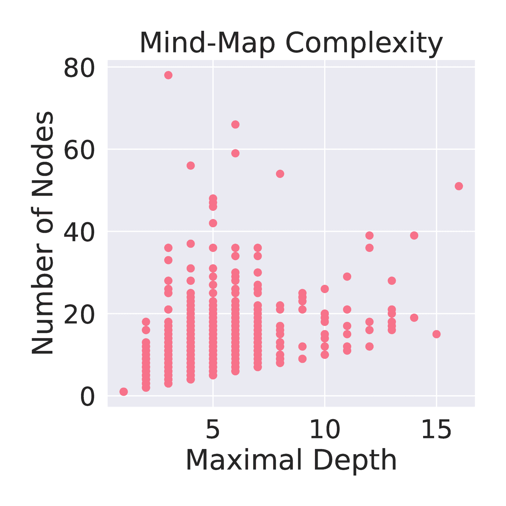

<!--yml

分类：未分类

日期：2025-01-11 12:33:09

-->

# ResearchArena: 基准测试LLM在作为研究代理进行信息收集和组织的能力

> 来源：[https://arxiv.org/html/2406.10291/](https://arxiv.org/html/2406.10291/)

康浩

haok@andrew.cmu.edu 计算机科学学院

卡内基梅隆大学

美国宾夕法尼亚州匹兹堡市，15213 & 熊晨燕

cx@cs.cmu.edu 语言技术研究所

卡内基梅隆大学

美国宾夕法尼亚州匹兹堡市，15213

###### 摘要

大型语言模型（LLMs）在自然语言处理的各类任务中展现出了显著的表现。然而，当这些任务需要领域特定的专业知识和高级分析技能时，仍然会遇到挑战，尤其是在对特定主题进行研究调查时。在本研究中，我们开发了ResearchArena，这是一个基准测试，用于衡量LLM代理进行学术调查的能力，这是学术研究过程的初步步骤。具体来说，我们将调查过程分解为三个阶段：1）信息发现：寻找相关论文；2）信息选择：评估论文与主题的相关性；3）信息组织：将论文组织成有意义的结构。特别地，我们建立了一个离线环境，包含1200万篇全文学术论文和7900篇调查论文，评估代理在特定主题的调查中，如何定位支持材料，基于影响对找到的论文进行排名，并将这些论文组织成层级化的知识思维导图。通过这个基准测试，我们对现有技术进行了初步评估，结果发现，与基本的基于关键词的检索技术相比，所有基于LLM的方法表现不佳，突显了未来研究的巨大潜力。

## 1 引言

大型语言模型（LLMs）在自然语言理解、生成以及其他多个领域的任务中展现出了卓越的性能[[1](https://arxiv.org/html/2406.10291v1#bib.bib1), [2](https://arxiv.org/html/2406.10291v1#bib.bib2), [3](https://arxiv.org/html/2406.10291v1#bib.bib3), [4](https://arxiv.org/html/2406.10291v1#bib.bib4)]。通过与外部工具如代码解释器、游戏模拟器和搜索引擎的集成，LLMs的能力可以得到显著增强。这种集成促进了复杂自主代理的开发，使其能够接受反馈并以类似人类行为的方式执行任务[[5](https://arxiv.org/html/2406.10291v1#bib.bib5), [6](https://arxiv.org/html/2406.10291v1#bib.bib6), [7](https://arxiv.org/html/2406.10291v1#bib.bib7), [8](https://arxiv.org/html/2406.10291v1#bib.bib8)]。然而，仍然存在不确定性，尤其是在执行需要领域特定知识和高级分析技能的任务时，LLMs能达到什么程度，特别是在进行特定主题的研究时。

LLM在进行研究方面的潜力将产生深远的影响，特别是考虑到众多领域的快速发展和随之而来的信息爆炸。在这些背景下，学习一个主题并撰写学术调查报告通常需要多个研究者花费几个月的时间。而在LLM方面，必须具备在其预训练数据集之外的主题上进行独立研究的能力。拥有这种能力将消除对整个模型持续更新和再训练的需求，从而显著提高其在不同领域的实际应用价值。

以前涉及自治代理的研究任务，如在线购物或打扑克牌等相对简单且普通人也能执行的任务，已取得显著成功，特别是当使用像GPT-4这样的模型时[[6](https://arxiv.org/html/2406.10291v1#bib.bib6), [9](https://arxiv.org/html/2406.10291v1#bib.bib9)]。然而，更具挑战性的任务，如需要领域专门知识的研究任务，代表了LLM代理潜在进展的下一个前沿。诚然，这方面的研究相对稀缺，其中一个主要挑战是缺乏标准化的基准测试。

为推动能够进行全面调查的研究代理的发展，我们引入了ResearchArena基准测试，它根植于严格的学术内容。该基准测试特别利用学术论文，因为它们具有深入的研究、同行评审的准确性和正式的结构——这些特点通常在其他来源（如网页）中缺乏。ResearchArena提供了一个离线环境，自治代理可以在其中收集和组织信息，以便在各种主题上进行研究。它包含三个评估子任务：信息发现、信息选择和信息组织。这三个子任务模拟了人类研究人员在文献调查过程中采用的一般方法，下面将进一步讨论。

研究人员通常通过定义研究范围、制定搜索协议，并反复阅读和组织文献，将文献整理成一个不断发展的框架，来进行文献调查。这个过程最终会将研究结果进行综合，以得出结论并突出未来的研究方向[[10](https://arxiv.org/html/2406.10291v1#bib.bib10)]。基于这一方法论，我们的基准测试将调查过程划分为三个具体任务：信息发现、信息选择和信息组织。值得注意的是，我们并未将文本生成纳入评估范围。这一排除的前提是，通过研究在写作前阶段建立的对主题的全面理解，应该已经为撰写一篇完整文章提供了坚实的基础[[11](https://arxiv.org/html/2406.10291v1#bib.bib11)]。此外，由于个体写作风格的差异，评估完整的文章本身具有挑战性。因此，我们将此类评估留待未来的研究，并可能在其他针对长文本自然语言生成的基准测试中进行。

信息发现任务要求LLM（大型语言模型）识别并检索与调查主题相关的基础学术论文，利用其在导航和理解庞大学术语料库中的能力。信息选择任务则挑战LLM基于学术影响力和相关性来批判性地评估这些论文，模拟同行评审过程，确保只考虑最重要的研究。最后，信息组织任务评估LLM将所选研究合成成一个连贯叙事的能力，提供通过知识思维导图呈现的结构化和有见地的主题概览。

我们的评估结果表明，LLM在与简单的基于关键词的检索方法相比时，表现常常不尽如人意，特别是在需要深度分析技能的任务中。例如，传统技术如使用调查标题作为检索查询，在信息发现和信息选择任务中始终优于LLM，体现在更高的召回率和精准度指标上。此外，在信息组织阶段，尤其是在缺乏预设指导¹¹1“预设指导”是指信息组织任务中间版本与端到端版本的区别，具体讨论见[5](https://arxiv.org/html/2406.10291v1#S5 "5 Benchmark Tasks ‣ ResearchArena: Benchmarking LLMs’ Ability to Collect and Organize Information as Research Agents")，LLM在构建连贯和准确的知识结构时遇到显著挑战。这凸显了LLM在独立管理复杂组织任务方面亟需改进的关键需求。

构建的环境包括12.0M篇全文学术论文和7.9K篇调查论文，这些论文是从Semantic Scholar开放研究语料库（S2ORC）中精心挑选的[[12](https://arxiv.org/html/2406.10291v1#bib.bib12)]。这一严格的筛选过程确保了数据集在可靠性和学术相关性方面的高标准，使得该数据集非常适合用于评估旨在执行复杂、领域特定研究的LLM（大型语言模型）。通过聚焦于如此丰富多样的学术基础，该数据集支持对LLM能力的强有力分析，涵盖多个科学领域，为基准测试提供了一个真实且具有挑战性的环境。此外，S2ORC每周更新一次，允许包含并评估超出LLM知识截止日期的新内容。

本文的其余部分结构如下：在第[2](https://arxiv.org/html/2406.10291v1#S2 "2 Related Work ‣ ResearchArena: Benchmarking LLMs’ Ability to Collect and Organize Information as Research Agents")节回顾相关工作后，第[3](https://arxiv.org/html/2406.10291v1#S3 "3 Collection Methodology ‣ ResearchArena: Benchmarking LLMs’ Ability to Collect and Organize Information as Research Agents")节详细介绍了我们的数据集收集过程。随后，第[4](https://arxiv.org/html/2406.10291v1#S4 "4 Dataset Composition ‣ ResearchArena: Benchmarking LLMs’ Ability to Collect and Organize Information as Research Agents")节对数据集的组成及其各项统计特性进行了全面分析。每个基准测试任务及其相应的度量指标在第[5](https://arxiv.org/html/2406.10291v1#S5 "5 Benchmark Tasks ‣ ResearchArena: Benchmarking LLMs’ Ability to Collect and Organize Information as Research Agents")节中进行了介绍。最后，第[6](https://arxiv.org/html/2406.10291v1#S6 "6 Experiments ‣ ResearchArena: Benchmarking LLMs’ Ability to Collect and Organize Information as Research Agents")节展示了在不同基准下的评估结果。

## 2 相关工作

以往的研究采用了多种方法来编制包含学术调查论文的数据集。例如，BigSurvey数据集[[13](https://arxiv.org/html/2406.10291v1#bib.bib13)]从arXiv收集了超过7K篇调查论文，并包括约434K条来自Microsoft Academic Service和Semantic Scholar的引用。这一数据集经过了严格的预处理，包括去除重复项、无法处理的文件以及文本规范化。另一方面，Surfer100数据集[[14](https://arxiv.org/html/2406.10291v1#bib.bib14)]包括100篇模仿维基百科页面结构的调查论文，由八位注释员根据网页内容进行总结。每篇调查论文包含预定义的章节，如引言、历史、关键思想、变种和应用，内容简明扼要地总结为50到150字。

BigSurvey 数据集提供了仅包含摘要的参考文献格式，简明地概述了文档内容。Surfer100 利用 Google 搜索结果为每个调查主题汇总参考文献，反映了广泛的网络信息。相比之下，我们的数据集强调全篇学术论文，以便更深入理解，并利用原始调查论文中的文献参考来增强权威性和准确性。

以往研究中最相关的 LLM 代理任务集中在生成维基百科文章。Liu 等人提出了一种通过将任务框定为多文档摘要挑战来生成英语维基百科文章的方法 [[15](https://arxiv.org/html/2406.10291v1#bib.bib15)]。他们的方法结合了提取式和抽象式摘要技术，采用 TF-IDF 和 TextRank 等方法来识别重要信息 [[16](https://arxiv.org/html/2406.10291v1#bib.bib16)]。另一项研究中，Shao 等人介绍了 STORM 系统 [[17](https://arxiv.org/html/2406.10291v1#bib.bib17)]，该系统解决了写作前的挑战，如研究和大纲准备。STORM 通过模拟多角度对话来增强文章生成过程，其中 LLM 提出问题并从可靠来源收集回答，以制定详细的大纲。

虽然维基百科是获取某一主题入门性理解的宝贵资源，但其内容由用户编写，这本身就存在局限性，无法始终确保专家的审查。相比之下，严格的学术研究需要对一个主题进行更深入、系统的调查，且通常会经过该领域专家的同行评审。

## 3 数据收集方法

本节描述了我们组建数据集的方法论，该数据集包含三个主要阶段：调查选择、参考文献链接和思维导图提取。每个阶段对确保数据集的相关性和准确性至关重要，从而促进其在各类基准任务中的应用。

我们从调查选择阶段开始，专注于识别相关的调查论文。接着，我们进入参考文献链接阶段，在此阶段我们将每篇选定的调查论文中的文献参考整合进来。最后，我们进入思维导图提取阶段，详细说明了用于从调查中识别知识思维导图的标准。每个阶段及其相应的方法都将在相应的小节中呈现。在最后，我们提供了数据集的简要概述。

### 3.1 调查选择

为了评估在指定主题上的研究能力，首先必须确定这些主题。我们通过从 S2ORC 数据集中提取每篇调查论文，结合基于关键词的过滤和严格的文本分析来实现这一目标。一般来说，调查论文的标题概括了其中讨论的主题。

为了编制所有相关的调查主题，我们首先需要从语料库中识别出研究调查文献。我们假设所有主题特定的调查文献标题都包含“survey”一词，但并非每篇符合这一标准的文献都是与我们的研究主题相关的实际调查。特别是，尽管有些文献包含了关键词，但它们在很大程度上依赖于语料库之外的信息。这些包括来自医学领域的基于人群的调查问卷或物理学领域通过望远镜观测进行的红移调查。

因此，文献的识别是通过关键词筛选与严格的文本分析相结合完成的。我们首先排除了标题中未包含“survey”作为关键词的文献。随后，我们指示GPT-4²²2GPT-4指的是[https://platform.openai.com/docs/models](https://platform.openai.com/docs/models)中记录的gpt-4-0613，以根据标题和摘要判断每篇文献的范围和内容。我们只纳入那些提供关于特定主题的当前领域状态的组织化视角的文献。提示的具体措辞可以在图[1](https://arxiv.org/html/2406.10291v1#S3.F1 "Figure 1 ‣ 3.1 Survey Selection ‣ 3 Collection Methodology ‣ ResearchArena: Benchmarking LLMs’ Ability to Collect and Organize Information as Research Agents")中找到，约85%的初始关键词搜索所识别的文献被舍弃。

如附录[B](https://arxiv.org/html/2406.10291v1#A2 "Appendix B Quality of Collection Methodology ‣ ResearchArena: Benchmarking LLMs’ Ability to Collect and Organize Information as Research Agents")所示，对最终收集的25篇文献样本进行手动检查，结果表明我们的选择方法达到了92%的准确率。选择过程显然不是完美的回忆，因为有些文献的标题中可能并未明确包含“survey”这一词。然而，我们相信这些选定的文献能够充分代表该领域中调查文献的广泛分布。

[⬇](data:text/plain;base64,VGhlIHBvaW50IG9mIGEgc3VydmV5IHBhcGVyIGlzIHRvIHByb3ZpZGUgYW4gb3JnYW5pemVkIHZpZXcgb24gdGhlIGN1cnJlbnQgc3RhdGUgb2YgdGhlIGZpZWxkLiBJZiBpdCByZWxpZXMgaGVhdmlseSBvbiBleHRlcm5hbCBpbmZvcm1hdGlvbiwgc3VjaCBhcyB0aGUgcmVzdWx0cyBvZiBhIHBvcHVsYXRpb24gcXVlc3Rpb25uYWlyZSwgZG8gbm90IGluY2x1ZGUgaXQuIFVzaW5nIHRoZSBhYm92ZSBjcml0ZXJpYSwgaXMgdGhlIGZvbGxvd2luZyBhcnRpY2xlIGEgc3VydmV5IHBhcGVyPyBSZXNwb25kIGVpdGhlciAiVHJ1ZSIgb3IgIkZhbHNlIi4=)调查论文的目的是提供对该领域当前状态的组织化视角。如果它严重依赖外部信息，如人口问卷的结果，就不要将其纳入。根据上述标准，以下文章是否为调查论文？请回答“True”或“False”。

图1：使用GPT-4进行调查选择的指令。

用于进行这些研究综述的语料库仅限于S2ORC中可以访问全文的论文。与以往的研究不同，我们认为仅依赖摘要可能会忽略全文中一些关键细节，而这些细节可能有助于更深入地理解主题。因此，强制这一访问限制将S2ORC中的论文数量减少到1200万篇。

### 3.2 参考文献链接

为了评估信息发现的表现，识别这些综述的基本来源至关重要。这些来源来自于每篇综述论文中引用的参考文献。我们依赖S2ORC来提取参考书目，并进行额外的后处理，剔除任何不适合评估的论文。

在选择相关的综述论文后，我们开始编制它们的参考文献。尽管S2ORC的文献分辨系统总体上是可靠的，但我们仍然遇到了一些差异，比如缺失参考文献。这些问题在参考文献标题与正文无法区分的文献中尤为突出。为了解决这些问题，我们排除了没有参考文献的综述论文，共计406篇，认为这些文献由于无法提取参考文献而不适合使用。此外，我们还排除了无法访问引文的综述论文，共计1,635篇，因为此类文献缺乏评估价值。

对于成功提取的参考文献，我们记录了每个文献的出版日期。如果参考文献仅列出了年份，我们将该年的最后一天作为日期，以减少信息泄露的风险，具体方法详见第[5](https://arxiv.org/html/2406.10291v1#S5 "5 基准任务 ‣ ResearchArena：基准测试LLMs在收集和组织信息作为研究代理能力中的表现")节。此外，从S2ORC提取的引用根据它们对主题的贡献进行了分类，参考Valenzuela等人[[18](https://arxiv.org/html/2406.10291v1#bib.bib18)]提出的监督分类方法。这一分类方法涉及区分有影响力和无影响力的参考文献，这是评估信息选择任务的前提。

### 3.3 思维导图提取

在学术综述中，常见的组织信息方法是使用思维导图式的类型学，它有助于系统性地理解所审阅的主题。由于S2ORC语料库的独特文本性质，我们采用了一种方法，通过直接从Semantic Scholar网站收集每一对图表标题，来提取这些类型学。通过使用GPT-4分析这些标题，我们识别了相关的思维导图图形，并将图形表示转化为JSON编码的树结构，以保持其层级结构。

该过程在图[2](https://arxiv.org/html/2406.10291v1#S3.F2 "图 2 ‣ 3.3 思维导图提取 ‣ 3 收集方法 ‣ ResearchArena：基准测试LLM收集和组织信息作为研究代理的能力")中有所说明，图[3](https://arxiv.org/html/2406.10291v1#S3.F3 "图 3 ‣ 3.3 思维导图提取 ‣ 3 收集方法 ‣ ResearchArena：基准测试LLM收集和组织信息作为研究代理的能力")中给出了提示。如果图中的层级结构能够通过JSON编码的树准确表示，则GPT-4执行的提取被视为准确。此外，如果该图真实地反映了与调查主题相关的知识思维导图，则认为其具有相关性。正如附录[B](https://arxiv.org/html/2406.10291v1#A2 "附录 B 收集方法的质量 ‣ ResearchArena：基准测试LLM收集和组织信息作为研究代理的能力")中所述，我们对最终收集的25个思维导图样本进行了人工检查，结果表明我们的提取方法达到了80%的准确率和60%的相关性得分。


```
{
    "Pre-trained Models": {
        "Left-to-Right LM": ["GPT", "GPT-2", "GPT-3"],
        "Masked LM": ["BERT", "RoBERTa"],
        "Prefix LM": ["UniLM1", "UniLM2"],
        "Encoder-Decoder": ["T5", "MASS", "BART"],
    }
}

```

图2：从图[ [19](https://arxiv.org/html/2406.10291v1#bib.bib19) ]到其JSON表示形式的思维导图提取。

[⬇](data:text/plain;base64,SWRlbnRpZnkgdGhlIGZpZ3VyZSB0aGF0IG1vc3QgbGlrZWx5IGlsbHVzdHJhdGVzIGEgdGF4b25vbXkgb3Igb3ZlcnZpZXcuIFlvdXIgcmVzcG9uc2Ugc2hvdWxkIGJlIGxpbWl0ZWQgdG8gdGhlIGZpbGVuYW1lLCBvciBOVUxMIGlmIG5vdCBmb3VuZC4gVGhlIHByb3ZpZGVkIGZpZ3VyZSBwcmVzZW50cyBhIGhpZXJhcmNoeS4gRXh0cmFjdCBhcyBKU09OLWVuY29kZWQgdHJlZSB3aG9zZSBjaGlsZHJlbiBhcmUgTlVMTC10ZXJtaW5hdGVkLg==)识别最有可能说明分类法或概述的图。您的回答应限制为文件名，若未找到则回答NULL。提供的图呈现了一个层次结构。将其提取为JSON编码的树，树的子节点以NULL结束。

图3：关于思维导图提取的GPT-4指令。

### 3.4 ResearchArena数据集

为了确保我们工作的可重复性并符合版权标准，我们从S2ORC开发了该数据集，S2ORC提供了来自各学科的8110万篇英文学术论文。这些文献被精心组织为机器可读的格式，解决了书目信息并注释了内联引用。我们使用了S2ORC 2024年2月6日发布的版本，这是我们项目开始时的最新版本。

我们数据集的简要总结是，它由大约1200万篇学术论文组成，每篇论文均可访问全文，来源于Semantic Scholar Open Research Corpus。在这个庞大的资料库中，我们成功地筛选出了7952篇调查论文。这些调查论文经过精心分析，提炼出了1884个思维导图，这些思维导图提供了主题的结构化总结。

## 4 数据集组成

理解我们数据集的组成对于确保基准的可靠性和全面性至关重要，以评估LLM在学术调查任务中的表现。本节详细介绍了我们数据集在学科多样性、引用覆盖率和派生类型学的结构复杂性方面的构成，反思这些因素如何促进其在各个领域中的稳健性和适用性。

学科分布。我们将公共语料库中的1200万篇论文和7900篇调查论文按照最受欢迎的五大学术学科进行了分类。这一分类基于S2ORC提供的索引信息。然后，我们汇总了各学科的论文频次并进行了可视化，以识别趋势和不平衡情况。图[4(a)](https://arxiv.org/html/2406.10291v1#S4.F4.sf1 "在图4 ‣ 4 数据集组成 ‣ ResearchArena：基准测试LLM收集和组织信息作为研究代理的能力")和[4(b)](https://arxiv.org/html/2406.10291v1#S4.F4.sf2 "在图4 ‣ 4 数据集组成 ‣ ResearchArena：基准测试LLM收集和组织信息作为研究代理的能力")揭示了公共语料库与调查子集之间学科频率的显著差异。特别是，计算机科学是调查中最为普遍的学科，但在更广泛的语料库中则较为罕见。这可能反映了计算机科学领域的动态特性，通常需要通过全面评审来整合快速发展的成果和新兴趋势。

引用覆盖率。对于每篇调查论文，我们计算了其引用的覆盖率，即该论文引用的文献在我们完整文本语料库中也可用的比例。我们为每个学科绘制了累积分布函数，以分析调查论文引用在更广泛语料库中的覆盖程度。如图[4(c)](https://arxiv.org/html/2406.10291v1#S4.F4.sf3 "在图4 ‣ 4 数据集组成 ‣ ResearchArena：基准测试LLM收集和组织信息作为研究代理的能力")所示，各学科的模式相似，随着覆盖率的提高，密度呈指数衰减。大约17.18%的调查子集（即1300篇调查论文）至少有50%的引用在语料库中可用。这一限制主要归因于版权限制，即出版商不允许提供完整文本。

思维导图复杂度。我们通过计算节点数量并测量最大深度，分析了从调查论文中提取的思维导图的结构复杂度。这些指标提供了对所涵盖主题的概念广度和层级深度的洞察。从图 [4(d)](https://arxiv.org/html/2406.10291v1#S4.F4.sf4 "图 4 ‣ 4 数据集组成 ‣ ResearchArena：基准测试 LLM 在收集和组织信息作为研究代理方面的能力") 中的散点图可以看出，一般来说，类型学的深度较浅，但节点范围较广，这表明尽管调查主题有广泛的分支，但它们并未深入探讨子主题。特别是，大多数类型学的最大深度介于 3 到 7 层之间，散点图中回归线的系数约为 2.04。


(a) 公共语料库的学科分布。


(b) 调查子集的学科分布。


(c) 调查子集的参考文献覆盖情况。



(d) 提取的思维导图的复杂度。

图 4：数据集组成分析，包括学科分布、参考文献覆盖情况和思维导图复杂度。每个方面对于基准评估都至关重要。医学（Med）、生物学（Bio）、物理学（Phy）、环境科学（ES）、计算机科学（CS）、工程学（Eng）和数学（Math）等学科的缩写在图中表示。

## 5 基准任务

本节提供了一个全面的概述，介绍了旨在评估研究代理在发现、选择和组织信息方面能力的基准任务。每个任务针对研究能力的特定方面，具有严格的约束条件和评估标准，以确保全面且公正的评估。

信息发现。给定一个从调查标题中提取的主题，信息发现任务要求研究代理从更广泛的文献集合 $D$ 中识别一个子集 $R$。$R$ 中的文献应作为该主题的支持材料。理想情况下，$R$ 应包括原始调查 $S$ 中引用的所有参考文献。

然而，在集合 $D$ 中，可能还存在另一个调查 $S^{\prime}$，它深入探讨相同的主题。如果研究代理直接使用 $S^{\prime}$ 中的参考文献，这将绕过彻底发现的需要，违背了该任务的目的。为了防止信息泄露，我们增加了额外的约束，要求 $D$ 中的文献必须是非调查文献，并且在 $S$ 发布之前已发布。

为了评估性能，我们使用标准的信息检索指标：召回率（Recall）和精准率（Precision），分别衡量成功检索到的相关文档的比例以及检索到的文档中相关文档的比例。综合这两个指标，可以评估发现过程的有效性和准确性。对于此任务，截止参数$K$设置为10和100。

信息选择。信息选择任务要求研究代理根据文献与主题的相关性对发现的文档进行排名。标签区分了有影响力和没有影响力的引用，详细内容可参见第[3](https://arxiv.org/html/2406.10291v1#S3 "3 Collection Methodology ‣ ResearchArena: Benchmarking LLMs’ Ability to Collect and Organize Information as Research Agents")节。评估采用了标准化折扣累积增益（nDCG）[[20](https://arxiv.org/html/2406.10291v1#bib.bib20)]和均值倒数排名（MRR）[[21](https://arxiv.org/html/2406.10291v1#bib.bib21)]。

这些度量是至关重要的，因为开展研究不仅仅是总结检索到的文档；还需要呈现来自最重要来源的关键信息。此外，无论是人类研究者还是自主代理，其处理能力都是有限的。因此，必须优先考虑并集中精力处理最关键的信息。

信息组织。对于信息组织，研究代理需要根据$R$构建一个层次化的知识心智图$M$。该心智图应提供关于主题$T$的研究工作的系统性概述。作为一个中间步骤，研究代理可以提供来自原始调查论文的参考文献$R$，然后专注于构建$M$。相比之下，对于端到端的版本，$R$是前一个任务中发现的文档集合。

评估时，采用了两个主要指标：标题软召回率（Heading Soft Recall）[[22](https://arxiv.org/html/2406.10291v1#bib.bib22)]和标题实体召回率（Heading Entity Recall）[[17](https://arxiv.org/html/2406.10291v1#bib.bib17)]。这两个指标比较了原始和构建的知识心智图中节点标签的集合，分别称为$A$和$B$。为了衡量这些标签的相似性，标题软召回率使用了Sentence-Bert [[23](https://arxiv.org/html/2406.10291v1#bib.bib23)]嵌入，而标题实体召回率则利用FLAIR [[24](https://arxiv.org/html/2406.10291v1#bib.bib24)]的命名实体识别进行提取。每个指标的正式定义如下，其中$S$为从心智图中提取的标签集合。

|  | $\displaystyle\text{Cardinality}(S)$ | $\displaystyle=\sum_{i=1}^{&#124;S&#124;}\frac{1}{\sum_{j=1}^{&#124;S&#124;}\text{Similarity}(S_{i}% ,S_{j})}$ |  |
| --- | --- | --- | --- |
|  | $\displaystyle\text{标题软召回}(A,B)$ | $\displaystyle=\frac{\text{基数}(A)+\text{基数}(B)-\text{基数}(A\cup B)}{\text{基数}(B)}$ |  |
|  | $\displaystyle\text{标题实体召回}(A,B)$ | $\displaystyle=\frac{ | \text{EntitiesFrom}(A)\cap\text{EntitiesFrom}(B) | }{ | \text{EntitiesFrom}(A) | }$ |  |

虽然这些度量提供了内容相似度的衡量标准，但它们并未考虑结构对齐的问题。树编辑距离 [[25](https://arxiv.org/html/2406.10291v1#bib.bib25)] 通过计算将一棵树转换为另一棵树所需的最小操作次数（即重新标记、删除和插入节点）来解决这个问题。然而，单独依赖树编辑距离可能会忽视非精确标签匹配的潜力。为了解决这个问题，我们提出了树语义距离，它对涉及余弦相似度超过$0.8$的节点的编辑操作不收取成本。

## 6 实验

在本节中，我们展示了现有技术的初步评估，描述了它们的配置和性能指标。这些技术包括基于关键字的简单方法，如标题方法，以及基于LLM的高级方法，包括STORM。每个基线中使用的提示语的确切措辞可以在附录[C](https://arxiv.org/html/2406.10291v1#A3 "附录C 提示与实验 ‣ ResearchArena: 基准评估LLM作为研究代理收集和组织信息的能力")中找到。

### 6.1 基线

信息发现。为了进行信息发现，研究代理配备了检索工具，可以通过向检索器（如BM25和BGE）提交查询来与公共语料库进行交互 [[26](https://arxiv.org/html/2406.10291v1#bib.bib26)]。这些代理根据其有效利用这些工具生成相关查询的能力进行评估。由于探索仅限于已发布的非综述文献，检索器会在直到满足截止参数$K$时，以指数退避的方式进行重试。

+   •

    标题：假设研究主题包含在综述标题中，该方法直接使用每篇综述论文的标题作为查询，检索支持该主题研究的相关材料。需要注意的是，使用S2ORC提取标题时，不同文档之间的大小写存在差异。因此，我们通过将标题转换为小写来进行归一化处理。

+   •

    零-shot：假设现有的LLM具备与某一综述主题相关的先验知识，该方法通过指示GPT-4从综述标题中推导出查询来扩展标题方法。这种方法利用LLM的内在能力，生成更复杂且符合上下文的查询。

+   •

    Decomposer：正如Tushar等人所发现的[[27](https://arxiv.org/html/2406.10291v1#bib.bib27)]，当任务的各个推理步骤难以学习时，分解式提示法更为有效。这个原则适用于我们的情况，因为一个调查主题可能由多个子主题组成，这使得直接生成一个单一查询来检索所有相关论文变得具有挑战性。因此，我们指示GPT-4首先将研究主题分解为若干个子问题。每个子问题生成相应的子查询。这些子查询被批量检索，并通过互惠排序融合（reciprocal rank fusion）[[28](https://arxiv.org/html/2406.10291v1#bib.bib28)]合并结果。

+   •

    Self-RAG：正如Asai等人所提出的[[29](https://arxiv.org/html/2406.10291v1#bib.bib29)]，Self-RAG根据需求自适应地检索段落，并利用反射令牌来确定哪些检索到的文档与指令相关，从而基于相关信息继续生成。这是Zero-Shot的增强版本，其中模型被指示从主题生成查询。由于模型根据从中间检索到的信息优化最终的查询生成，它作为一个研究代理运作。

+   •

    STORM：正如在第[2](https://arxiv.org/html/2406.10291v1#S2 "2 Related Work ‣ ResearchArena: Benchmarking LLMs’ Ability to Collect and Organize Information as Research Agents")节中所述，STORM通过多角度的对话进行研究，从头开始编写有关特定主题的维基百科文章。它与我们的场景非常相似，区别在于环境涉及的是更为严格的学术论文。我们记录检索历史，当STORM继续寻找额外的论文时，所有检索到的文章都被视为已发现的信息的一部分，直到完成最后一轮对话。

信息选择。在信息选择方面，文档根据在发现阶段获得的相似度分数进行排名。对于BGE检索器，我们依赖于FAISS [[30](https://arxiv.org/html/2406.10291v1#bib.bib30)]，通过在嵌入空间中的L2距离来进行检索，负值用于确定相似性。另一方面，STORM并未明确对检索到的文档进行排名。假设在对话中较早发现的文档具有更高的相关性。

信息组织。对于信息组织，聚类方法采用Ward方法对每篇参考文章的BGE嵌入进行层次聚类，最终的树状图被提取为类型学。每个节点中的标签是通过计算最重要的TF-IDF词汇得到的，ngrams范围从1到3。Few-Shot通过提供一些随机提取的类型学示例并指示GPT-4生成另一个主题导向的思维导图来实现。最后，通过STORM生成的文章大纲被转换为类型学，标题及其嵌套的子标题表示层次结构。

### 6.2 评估结果

基线实验在一台配备8个NVIDIA RTX A6000 GPU、96个CPU核心和128GB内存的单一机器上进行。关于性能指标的讨论如下所示。

信息发现。如表[1](https://arxiv.org/html/2406.10291v1#S6.T1 "Table 1 ‣ 6.2 Evaluation Results ‣ 6 Experiments ‣ ResearchArena: Benchmarking LLMs’ Ability to Collect and Organize Information as Research Agents")所示，信息发现任务对于所有基线模型仍然具有挑战性。这一点通过Recall@100指标体现出来，BM25的Recall@100低于0.15，而BGE的Recall@100为0.27。此外，像Self-RAG和STORM这样的代理基线始终排名最低，无论使用何种检索器。这一局限性突显了在信息发现过程中，管理大量文档所需的更先进检索机制的关键性。

表1：发现任务的基线性能，使用Recall@10、Recall@100、Precision@10和Precision@100进行评估，其中检索器包括BM25和BGE。

|  | Recall@10 | Recall@100 | Precision@10 | Precision@100 |
| --- | --- | --- | --- | --- |
| 基线 | BM25 | BGE | BM25 | BGE | BM25 | BGE | BM25 | BGE |
| 标题 | 0.0424 | 0.1012 | 0.1338 | 0.2697 | 0.0669 | 0.1541 | 0.0286 | 0.0586 |
| Zero-Shot | 0.0382 | 0.0832 | 0.1253 | 0.2287 | 0.0602 | 0.1232 | 0.0256 | 0.0464 |
| Decomposer | 0.0434 | 0.0879 | 0.1431 | 0.2554 | 0.0717 | 0.1304 | 0.0312 | 0.0536 |
| Self-RAG | 0.0380 | 0.0815 | 0.1210 | 0.2260 | 0.0595 | 0.1215 | 0.0256 | 0.0461 |
| STORM | 0.0281 | 0.0979 | 0.0693 | 0.1441 | 0.0446 | 0.1041 | 0.0130 | 0.0208 |

信息选择。信息选择的表现展示在表[2](https://arxiv.org/html/2406.10291v1#S6.T2 "Table 2 ‣ 6.2 Evaluation Results ‣ 6 Experiments ‣ ResearchArena: Benchmarking LLMs’ Ability to Collect and Organize Information as Research Agents")中。结果表明，代理基线在与基于关键词的方法的比较中表现较差。通过在不同文档检索级别（如nDCG@10、nDCG@30和nDCG@100）对nDCG的评估，提供了对排名表现的定量评估。值得注意的是，对于使用BGE检索器的标题方法，nDCG@100得分为0.2019，显著高于STORM的得分0.1267。信息发现阶段的改进有潜力提升选择阶段的整体表现，正如Decomposer在发现和选择任务中排名仅次于标题所证明的那样。

表2：选择任务的基线表现，使用nDCG@10、nDCG@30、nDCG@100和Precision@100进行评估，其中检索器包括BM25和BGE。

|  | nDCG@10 | nDCG@30 | nDCG@100 | MRR |
| --- | --- | --- | --- | --- |
| 基线 | BM25 | BGE | BM25 | BGE | BM25 | BGE | BM25 | BGE |
| Title | 0.0711 | 0.1678 | 0.0775 | 0.1754 | 0.0941 | 0.2019 | 0.1903 | 0.3816 |
| Zero-Shot | 0.0634 | 0.1346 | 0.0692 | 0.1417 | 0.0856 | 0.1657 | 0.1743 | 0.3246 |
| Decomposer | 0.0735 | 0.1445 | 0.0803 | 0.1554 | 0.0986 | 0.1838 | 0.1959 | 0.3510 |
| Self-RAG | 0.0627 | 0.1341 | 0.0679 | 0.1415 | 0.0837 | 0.1646 | 0.1705 | 0.3233 |
| STORM | 0.0445 | 0.1275 | 0.0507 | 0.1322 | 0.0524 | 0.1267 | 0.1271 | 0.3206 |

信息组织。在表[3](https://arxiv.org/html/2406.10291v1#S6.T3 "Table 3 ‣ 6.2 Evaluation Results ‣ 6 Experiments ‣ ResearchArena: Benchmarking LLMs’ Ability to Collect and Organize Information as Research Agents")中记录了在中间条件（即有oracle）和端到端条件（即无oracle）下，信息组织任务的评估结果。值得注意的是，这些指标之间存在差异，这与先前发现和选择任务中的一致性形成对比。预计这种差异是由于指标的性质不同：标题软召回和标题实体召回评估的是内容相似性，而树语义距离则评估的是结构对齐。

在中间版本中，当LLM提供参考时，通过标题实体召回度量的正确包含实体的比例略有提高。具体而言，STORM达到了0.3098的召回率，超越了端到端条件。相反，在构建层次结构方面，聚类方法优于先进的基于LLM的代理，正如它在所有基线方法中获得最低的树语义距离45.69所证明的那样。

表 3：在组织任务上的基准性能评估，使用标题软召回、标题实体召回和树形语义距离，涵盖中间条件和端到端条件。

| Oracle | 基准 | 标题软召回 ($\uparrow$) | 标题实体召回 ($\uparrow$) | 树形语义距离 ($\downarrow$) |
| --- | --- | --- | --- | --- |
| Yes | 聚类 | 0.6074 | 0.2104 | 45.69 |
| STORM | 0.7325 | 0.3098 | 60.04 |
| No | 少样本 | 0.8408 | 0.2446 | 49.83 |
| STORM.BM25 | 0.7940 | 0.2938 | 66.65 |
| STORM.BGE | 0.7842 | 0.2693 | 65.93 |

## 7 局限性

尽管 ResearchArena 提供了强大的框架和广泛的数据集，但本研究仍存在一些局限性。首先，尽管离线环境非常全面，但可能无法准确代表实时数据库和互联网的动态和互联特性。这种差异可能限制了研究结果在实际研究环境中的适用性。此外，由于版权限制，并非每篇调查论文的全文参考文献都能被包含。这一遗漏可能影响对所研究调查主题的全面理解。最后，虽然本研究没有对文本生成进行评估，而主要关注调查过程，但即便这是进行研究的第一步，LLM代理已经显示出一定的不足。未来 ResearchArena 的版本应解决这一问题，特别是随着这些代理的改进。

## 8 结论

总结来说，ResearchArena 提出了一个严格的基准，旨在评估 LLM 在指定主题的研究调查中的表现。通过系统地将调查过程分解为信息发现、选择和组织等不同任务，这一基准为评估自主研究代理提供了详细的框架。我们的研究结果强调了 LLM 在学术研究中的潜力，前提是未来的进展能够弥合现有的性能差距。基于 Semantic Scholar Open Research Corpus，本工作为未来奠定了坚实的基础，旨在提升 LLM 在领域特定、专家级研究中的自主能力。

## 参考文献

+   [1] Percy Liang, Rishi Bommasani, Tony Lee, Dimitris Tsipras, Dilara Soylu, Michihiro Yasunaga, Yian Zhang, Deepak Narayanan, Yuhuai Wu, Ananya Kumar 等. 语言模型的整体评估. arXiv 预印本 arXiv:2211.09110, 2022年。

+   [2] Yejin Bang, Samuel Cahyawijaya, Nayeon Lee, Wenliang Dai, Dan Su, Bryan Wilie, Holy Lovenia, Ziwei Ji, Tiezheng Yu, Willy Chung 等. 关于推理、幻觉和交互性的 ChatGPT 多任务、多语言、多模态评估. arXiv 预印本 arXiv:2302.04023, 2023年。

+   [3] Chengwei Qin, Aston Zhang, Zhuosheng Zhang, Jiaao Chen, Michihiro Yasunaga, 和 Diyi Yang. ChatGPT 是一种通用的自然语言处理任务求解器吗？arXiv 预印本 arXiv:2302.06476, 2023年。

+   [4] Md Tahmid Rahman Laskar, M Saiful Bari, Mizanur Rahman, Md Amran Hossen Bhuiyan, Shafiq Joty 和 Jimmy Xiangji Huang. ChatGPT 在基准数据集上的系统性研究与综合评估. arXiv 预印本 arXiv:2305.18486, 2023 年。

+   [5] Opendevin: 少写代码，做更多. [https://github.com/OpenDevin/OpenDevin](https://github.com/OpenDevin/OpenDevin), 2024 年。

+   [6] Shuyan Zhou, Frank F Xu, Hao Zhu, Xuhui Zhou, Robert Lo, Abishek Sridhar, Xianyi Cheng, Yonatan Bisk, Daniel Fried, Uri Alon 等. Webarena：构建自主代理的真实 web 环境. arXiv 预印本 arXiv:2307.13854, 2023 年。

+   [7] Yujia Qin, Shihao Liang, Yining Ye, Kunlun Zhu, Lan Yan, Yaxi Lu, Yankai Lin, Xin Cong, Xiangru Tang, Bill Qian 等. Toolllm：帮助大型语言模型掌握 16000 多个现实世界 API. arXiv 预印本 arXiv:2307.16789, 2023 年。

+   [8] Chen Qian, Xin Cong, Cheng Yang, Weize Chen, Yusheng Su, Juyuan Xu, Zhiyuan Liu 和 Maosong Sun. 用于软件开发的交流型代理. arXiv 预印本 arXiv:2307.07924, 2023 年。

+   [9] Xiao Liu, Hao Yu, Hanchen Zhang, Yifan Xu, Xuanyu Lei, Hanyu Lai, Yu Gu, Hangliang Ding, Kaiwen Men, Kejuan Yang 等. Agentbench：评估大型语言模型作为代理的表现. arXiv 预印本 arXiv:2308.03688, 2023 年。

+   [10] 文献综述 - 如何写一篇调查论文？ - academia stack exchange. [https://academia.stackexchange.com/questions/43371/how-to-write-a-survey-paper](https://academia.stackexchange.com/questions/43371/how-to-write-a-survey-paper), 2015 年。

+   [11] Laura Dietz 和 John Foley. Trec car y3：复杂答案检索概述. 见于文本检索会议（TREC）论文集，2019 年。

+   [12] Kyle Lo, Lucy Lu Wang, Mark Neumann, Rodney Kinney 和 Dan S Weld. S2orc：语义学者开放研究语料库. arXiv 预印本 arXiv:1911.02782, 2019 年。

+   [13] Shuaiqi Liu, Jiannong Cao, Ruosong Yang 和 Zhiyuan Wen. 生成大量学术论文的结构化摘要：数据集与方法. arXiv 预印本 arXiv:2302.04580, 2023 年。

+   [14] Irene Li, Alexander Fabbri, Rina Kawamura, Yixin Liu, Xiangru Tang, Jaesung Tae, Chang Shen, Sally Ma, Tomoe Mizutani 和 Dragomir Radev. Surfer100：从 web 资源生成调查问卷，类似维基百科风格. arXiv 预印本 arXiv:2112.06377, 2021 年。

+   [15] Peter J Liu, Mohammad Saleh, Etienne Pot, Ben Goodrich, Ryan Sepassi, Lukasz Kaiser 和 Noam Shazeer. 通过总结长序列生成维基百科条目. arXiv 预印本 arXiv:1801.10198, 2018 年。

+   [16] Rada Mihalcea 和 Paul Tarau. Textrank：为文本带来秩序. 见于 2004 年自然语言处理实证方法会议论文集，404–411 页，2004 年。

+   [17] Yijia Shao, Yucheng Jiang, Theodore A Kanell, Peter Xu, Omar Khattab 和 Monica S Lam. 使用大型语言模型从零开始辅助撰写类似维基百科的文章. arXiv 预印本 arXiv:2402.14207, 2024 年。

+   [18] Marco Valenzuela, Vu Ha 和 Oren Etzioni. 识别有意义的引用. 见于第二十九届 AAAI 人工智能大会研讨会，2015 年。

+   [19] Pengfei Liu、Weizhe Yuan、Jinlan Fu、Zhengbao Jiang、Hiroaki Hayashi 和 Graham Neubig. 预训练、提示和预测：自然语言处理中的提示方法系统综述。ACM计算机调查，55(9)：1–35，2023年。

+   [20] Kalervo Järvelin 和 Jaana Kekäläinen. 基于累积增益的IR技术评估。ACM信息系统学报（TOIS），20(4)：422–446，2002年。

+   [21] EM Voorhees. 第八届文本检索会议论文集。TREC-8问答轨道报告，第77–82页，1999年。

+   [22] Pasi Fränti 和 Radu Mariescu-Istodor. 软精度与召回率。模式识别学报，167：115–121，2023年。

+   [23] Nils Reimers 和 Iryna Gurevych. Sentence-BERT：使用Siamese BERT网络的句子嵌入。载于 Kentaro Inui、Jing Jiang、Vincent Ng 和 Xiaojun Wan 主编的《2019年自然语言处理经验方法会议及第九届国际自然语言处理联合会议论文集》（EMNLP-IJCNLP），第3982–3992页，香港，中国，2019年11月。计算语言学协会。

+   [24] Alan Akbik, Tanja Bergmann, Duncan Blythe, Kashif Rasul, Stefan Schweter, 和 Roland Vollgraf. FLAIR：一个易于使用的最先进自然语言处理框架。载于 Waleed Ammar、Annie Louis 和 Nasrin Mostafazadeh 主编的《2019年北美计算语言学协会年会论文集》（演示部分），第54–59页，明尼阿波利斯，明尼苏达州，2019年6月。计算语言学协会。

+   [25] Kaizhong Zhang 和 Dennis Shasha. 计算树之间编辑距离及相关问题的简单快速算法。SIAM计算学报，18(6)：1245–1262，1989年。

+   [26] Shitao Xiao、Zheng Liu、Peitian Zhang 和 Niklas Muennighof. C-pack：推动通用中文嵌入的打包资源。arXiv预印本arXiv:2309.07597，2023年。

+   [27] Tushar Khot、Harsh Trivedi、Matthew Finlayson、Yao Fu、Kyle Richardson、Peter Clark 和 Ashish Sabharwal. 分解式提示：解决复杂任务的模块化方法。arXiv预印本arXiv:2210.02406，2022年。

+   [28] Gordon V Cormack、Charles LA Clarke 和 Stefan Buettcher. 互惠排名融合优于Condorcet方法和单一排名学习方法。载于第32届国际ACM SIGIR信息检索研究与发展会议论文集，第758–759页，2009年。

+   [29] Akari Asai、Zeqiu Wu、Yizhong Wang、Avirup Sil 和 Hannaneh Hajishirzi. Self-rag：通过自我反思学习检索、生成和评论。arXiv预印本arXiv:2310.11511，2023年。

+   [30] Jeff Johnson、Matthijs Douze 和 Hervé Jégou. 基于GPU的十亿规模相似性搜索。IEEE大数据学报，7(3)：535–547，2019年。

+   [31] Corby Rosset、Ho-Lam Chung、Guanghui Qin、Ethan C Chau、Zhuo Feng、Ahmed Awadallah、Jennifer Neville 和 Nikhil Rao. 研究性问题：一个多角度、分解性问题的数据集，用于大型语言模型网页代理。arXiv预印本arXiv:2402.17896，2024年。

## 附录 A 收集方法学中的参数

为确保数据集构建过程中的确定性行为，当使用 GPT-4 进行聊天完成时，温度设置为 0，种子固定为 42。选择数字 42 是任意的，其他数字也可以同样有效，只要种子在整个数据集收集过程中保持不变，以保证可重复性。

## 附录 B 收集方法学的质量

表 [4](https://arxiv.org/html/2406.10291v1#A2.T4 "Table 4 ‣ Appendix B Quality of Collection Methodology ‣ ResearchArena: Benchmarking LLMs’ Ability to Collect and Organize Information as Research Agents") 中展示了对 25 个样本的人工检查记录。

表 4：对调查选择和思维导图提取质量的评估。

| 语料库 ID | 精准选择 | 语料库 ID | 对象 ID | 精准提取 | 相关提取 |
| --- | --- | --- | --- | --- | --- |
| 1359411 | 是 | 3373610 | 2-Figure1-1.png | 是 | 是 |
| 2197301 | 否 | 10837932 | 6-TableII-1.png | 是 | 是 |
| 3638888 | 是 | 20774863 | 2-Figure1-1.png | 是 | 否 |
| 3799929 | 是 | 21265344 | 4-Figure3-1.png | 否 | 否 |
| 4470807 | 是 | 52986472 | 4-Figure1-1.png | 是 | 是 |
| 7972041 | 是 | 54437297 | 6-Figure1-1.png | 否 | 是 |
| 44951320 | 是 | 59407515 | 4-Figure1-1.png | 是 | 否 |
| 56895486 | 是 | 67855323 | 3-Figure1-1.png | 是 | 否 |
| 115156611 | 是 | 201532876 | 6-Figure1-1.png | 是 | 否 |
| 126187216 | 是 | 204080064 | 5-Figure1-1.png | 否 | 否 |
| 134642625 | 是 | 218487045 | 7-Figure4-1.png | 是 | 是 |
| 209386804 | 是 | 221938634 | 6-Figure1-1.png | 是 | 是 |
| 214566304 | 是 | 226300094 | 2-Figure2-1.png | 是 | 是 |
| 229474407 | 是 | 227259882 | 6-Figure2-1.png | 否 | 是 |
| 233241600 | 否 | 232126642 | 3-Figure1-1.png | 是 | 否 |
| 234790465 | 是 | 233677020 | 6-Figure2-1.png | 否 | 否 |
| 235794880 | 是 | 237291802 | 2-Figure1-1.png | 是 | 是 |
| 245433612 | 是 | 237327839 | 6-Figure1-1.png | 是 | 否 |
| 253735066 | 是 | 240011970 | 5-Figure4-1.png | 是 | 是 |
| 254563889 | 是 | 246599122 | 2-Figure1-1.png | 是 | 否 |
| 258060212 | 是 | 248227736 | 2-Figure1-1.png | 是 | 是 |
| 258541526 | 是 | 248717714 | 4-Figure2-1.png | 是 | 是 |
| 258841314 | 是 | 252089272 | 4-Figure1-1.png | 是 | 是 |
| 259855591 | 是 | 258212628 | 6-Figure1-1.png | 是 | 是 |
| 262464721 | 是 | 260887757 | 4-Figure2-1.png | 是 | 是 |

## 附录 C 带有实验的提示词

### C.1 提示词给解构者用于信息发现

引自 Rosset 等人提出的研究问题 [[31](https://arxiv.org/html/2406.10291v1#bib.bib31)]。

[⬇](data:text/plain;base64,IiIiCiMjIyBCZWxvdyBpcyBhbiBleGFtcGxlIG9uIGhvdyB0byBkZWNvbXBvc2UgYSBjb21wbGV4IHF1ZXN0aW9uIGludG8gc3ViLXF1ZXN0aW9ucyBhbmQgc2VhcmNoIHF1ZXJpZXMuCgpRdWVzdGlvbjogc2hvdWxkIHRoZSBkZWF0aCBwZW5hbHR5IGJlIGxlZ2FsaXplZD8KCjxEZWNvbXBvc2l0aW9uPgogICAgLSBXaGF0IGFyZSB0aGUgYXJndW1lbnRzIGluIGZhdm9yIG9mIHRoZSBkZWF0aCBwZW5hbHR5PwogICAgICAgIC0gRG9lcyB0aGUgZGVhdGggcGVuYWx0eSBzZXJ2ZSBhcyBhIGRldGVycmVudCB0byBjcmltZT8KICAgICAgICAtIElzIHRoZSBkZWF0aCBwZW5hbHR5IGEganVzdCBwdW5pc2htZW50IGZvciBjZXJ0YWluIGNyaW1lcz8KICAgICAgICAtIEhvdyBkb2VzIHRoZSBkZWF0aCBwZW5hbHR5IGNvbXBhcmUgdG8gb3RoZXIgZm9ybXMgb2YgcHVuaXNobWVudCBpbiB0ZXJtcyBvZiBjb3N0IGFuZCBlZmZlY3RpdmVuZXNzPwogICAgLSBXaGF0IGFyZSB0aGUgYXJndW1lbnRzIGFnYWluc3QgdGhlIGRlYXRoIHBlbmFsdHk/CiAgICAgICAgLSBXaGF0IGlzIHRoZSByaXNrIG9mIGV4ZWN1dGluZyBpbm5vY2VudCBwZW9wbGUgd2l0aCBhIGRlYXRoIHBlbmFsdHk/CiAgICAgICAgLSBBcmUgdGhlcmUgYW55IGV0aGljYWwgY29uY2VybnMgc3Vycm91bmRpbmcgdGhlIGRlYXRoIHBlbmFsdHk/CiAgICAgICAgLSBUbyB3aGF0IGV4dGVudCBpcyB0aGUgZGVhdGggcGVuYWx0eSBhcHBsaWVkIGZhaXJseSBhbmQgd2l0aG91dCBiaWFzPwogICAgICAgIC0gSW4gcHJhY3RpY2UsIGhvdyBleHBlbnNpdmUgaXMgdGhlIGRlYXRoIHBlbmFsdHk/CiAgICAtIFdoYXQgaXMgdGhlIGN1cnJlbnQgbGVnYWwgc3RhdHVzIG9mIHRoZSBkZWF0aCBwZW5hbHR5IGluIHZhcmlvdXMganVyaXNkaWN0aW9ucz8KICAgICAgICAtIEluIHdoaWNoIGNvdW50cmllcyBvciBzdGF0ZXMgaXMgdGhlIGRlYXRoIHBlbmFsdHkgY3VycmVudGx5IGxlZ2FsPwogICAgICAgIC0gV2hhdCBhcmUgdGhlIHRyZW5kcyBpbiBkZWF0aCBwZW5hbHR5IGxlZ2lzbGF0aW9uIGFuZCBwdWJsaWMgb3Bpbmlvbj8KICAgIC0gV2hhdCBhcmUgdGhlIGFsdGVybmF0aXZlcyB0byB0aGUgZGVhdGggcGVuYWx0eT8KICAgICAgICAtIEhvdyBlZmZlY3RpdmUgYXJlIGFsdGVybmF0aXZlIHB1bmlzaG1lbnRzIHRvIHRoZSBkZWF0aCBwZW5hbHR5LCBlLmcuIGxpZmUgaW1wcmlzb25tZW50PwogICAgICAgIC0gV2hhdCBhcmUgdGhlIGNvc3RzIGFuZCBiZW5lZml0cyBvZiBhbHRlcm5hdGl2ZXMgdG8gdGhlIGRlYXRoIHBlbmFsdHk/CiAgICAtIEhvdyBkbyB0aGUgcHJvcyBhbmQgY29ucyBvZiB0aGUgZGVhdGggcGVuYWx0eSBjb21wYXJlIHRvIGl0cyBhbHRlcm5hdGl2ZXM/CjwvRGVjb21wb3NpdGlvbj4KCjxRdWVyaWVzPgogICAgLSBhcmd1bWVudHMgaW4gZmF2b3Igb2YgdGhlIGRlYXRoIHBlbmFsdHkKICAgIC0gZGVhdGggcGVuYWx0eSBhcyBhIGRldGVycmVudCB0byBjcmltZQogICAgLSBkZWF0aCBwZW5hbHR5IGFzIGEganVzdCBwdW5pc2htZW50CiAgICAtIGRlYXRoIHBlbmFsdHkgY29zdCBhbmQgZWZmZWN0aXZlbmVzcyBjb21wYXJpc29uCiAgICAtIGFyZ3VtZW50cyBhZ2FpbnN0IHRoZSBkZWF0aCBwZW5hbHR5CiAgICAtIHJpc2sgb2YgZXhlY3V0aW5nIGlubm9jZW50IHBlb3BsZSB3aXRoIGRlYXRoIHBlbmFsdHkKICAgIC0gZXRoaWNhbCBjb25jZXJucyBzdXJyb3VuZGluZyB0aGUgZGVhdGggcGVuYWx0eQogICAgLSBmYWlybmVzcyBhbmQgYmlhcyBpbiBkZWF0aCBwZW5hbHR5IGFwcGxpY2F0aW9uCiAgICAtIGN1cnJlbnQgbGVnYWwgc3RhdHVzIG9mIHRoZSBkZWF0aCBwZW5hbHR5IHdvcmxkd2lkZQogICAgLSB0cmVuZHMgaW4gZGVhdGggcGVuYWx0eSBsZWdpc2xhdGlvbiBhbmQgcHVibGljIG9waW5pb24KICAgIC0gYWx0ZXJuYXRpdmVzIHRvIHRoZSBkZWF0aCBwZW5hbHR5CiAgICAtIGVmZmVjdGl2ZW5lc3Mgb2YgbGlmZSBpbXByaXNvbm1lbnQgd2l0aG91dCBwYXJvbGUKICAgIC0gY29zdHMgYW5kIGJlbmVmaXRzIG9mIGRlYXRoIHBlbmFsdHkgYWx0ZXJuYXRpdmVzCjwvUXVlcmllcz4KClF1ZXN0aW9uOiB7eH0KCiMjIyBJbnN0cnVjdGlvbnM6CgoxLiBXaGF0IHN1Yi1xdWVzdGlvbnMgZG8gSSBuZWVkIHRvIGtub3cgaW4gb3JkZXIgdG8gZnVsbHkgdW5kZXJzdGFuZCBhbmQgYW5zd2VyIHRoZSBhYm92ZSBRdWVzdGlvbi4KICAgIC0gRm9ybWF0IHlvdXIgcmVzcG9uc2UgYXMgYSBidWxsZXQtcG9pbnQgc3R5bGUgb3V0bGluZSBvZiBxdWVzdGlvbnMgYW5kIHN1Yi1xdWVzdGlvbnMgaW4gdGhlIDxEZWNvbXBvc2l0aW9uPiB0YWcuCiAgICAtIE9yZGVyIHlvdXIgc3ViLXF1ZXN0aW9ucyBzdWNoIHRoYXQgb25lIHF1ZXN0aW9uIGNvbWVzIGFmdGVyIGFub3RoZXIgaWYgaXQgbmVlZHMgdG8gdXNl

### C.2 提示到零样本/自我RAG用于信息发现

[⬇](data:text/plain;base64,Q3JlYXRlIGEgc2VhcmNoIHF1ZXJ5IHRoYXQgZ2F0aGVycyBzdXBwb3J0aW5nIG1hdGVyaWFscyBmb3Igd3JpdGluZyBhIHN1cnZleSBwYXBlciBvbiB0aGUgZm9sbG93aW5nIHRvcGljOiB7eH0u)创建一个搜索查询，用于收集支持材料，以编写关于以下主题的调查论文：{x}。

### C.3 提示到少样本用于信息组织

[⬇](data:text/plain;base64,IiIiCiMjIyBFeGFtcGxlcwoKPHRvcGljPgpBIFN1cnZleSBvbiBMaURBUiBTY2FubmluZyBNZWNoYW5pc21zCjwvdG9waWM+Cgo8dHlwb2xvZ3k+CnsiT3B0by1NZWNoYW5pY2FsIEJlYW0gRGVmbGVjdGlvbiBNZWNoYW5pc21zIjogeyJMaW5lIFNjYW5uZXIiOiB7IlNsYW50ZWQgUGxhaW4gTWlycm9yIjogbnVsbCwgIk9mZi1heGlzIFBhcmFib2xpYyBNaXJyb3IiOiBudWxsLCAiUG9seWdvbiBNaXJyb3IiOiBudWxsfSwgIkFyZWEgU2Nhbm5lciI6IHsiU2luZ2xlIEdhbHZhbm9tZXRlciBTY2FubmluZyBNaXJyb3IiOiBudWxsLCAiRG91YmxlIEdhbHZhbm9tZXRlciBTY2FubmluZyBNaXJyb3IiOiBudWxsLCAiR3lyb3Njb3BpYyBNaXJyb3IiOiBudWxsLCAiUmlzbGV5IFNjYW5uZXIiOiBudWxsfX19CjwvdHlwb2xvZ3k+Cgo8dG9waWM+CkEgU3VydmV5IG9uIExhcmdlIExhbmd1YWdlIE1vZGVscyBmb3IgUmVjb21tZW5kYXRpb24KPC90b3BpYz4KCjx0eXBvbG9neT4KeyJMTE00UmVjIjogeyJEaXNjcmltaW5hdGl2ZSBMTE00UmVjIjogeyJGaW5lLXR1bmluZyI6IHsiUHJvbXB0IFR1bmluZyI6IG51bGx9fSwgIkdlbmVyYXRpdmUgTExNNFJlYyI6IHsiTm9uLXR1bmluZyI6IHsiUHJvbXB0aW5nIjogbnVsbCwgIkluLWNvbnRleHQgTGVhcm5pbmciOiBudWxsfSwgIlR1bmluZyI6IHsiRmluZS10dW5pbmciOiBudWxsLCAiUHJvbXB0IFR1bmluZyI6IG51bGwsICJJbnN0cnVjdGlvbiBUdW5pbmciOiBudWxsfX19fQo8L3R5cG9sb2d5PgoKIyMjIEluc3RydWN0aW9ucwoKLSBQcm92aWRlZCBhIHRvcGljLCB5b3VyIHRhc2sgaXMgdG8gY29uc3RydWN0IGEgbWluZC1tYXAgc3R5bGUgdHlwb2xvZ3kgdGhhdCBwcmVzZW50cyBhIHN5c3RlbWF0aWMgdW5kZXJzdGFuZGluZyBvZiB0aGUgdG9waWMuCi0gUHV0IHlvdXIgSlNPTi1lbmNvZGVkIHJlc3BvbnNlIGluIHRoZSB0YWcgYDx0eXBvbG9neT4uLi48L3R5cG9sb2d5PmAuIFlvdSBtYXkgcmVmZXIgdG8gdGhlIGV4YW1wbGVzIGFib3ZlIGZvciBndWlkYW5jZS4KCjx0b3BpYz4Ke3h9CjwvdG9waWM+CiIiIg==)"""### 例子<topic>激光雷达扫描机制调查</topic><typology>{"光学机械光束偏转机制":  {"线扫描仪":  {"倾斜平面镜":  null,  "离轴抛物面镜":  null,  "多边形镜":  null},  "面扫描仪":  {"单光圈扫描镜":  null,  "双光圈扫描镜":  null,  "陀螺仪镜":  null,  "瑞士扫描仪":  null}}}</typology><topic>基于大语言模型的推荐系统研究</topic><typology>{"LLM4Rec":  {"判别式LLM4Rec":  {"微调":  {"提示调优":  null}},  "生成式LLM4Rec":  {"无调优":  {"提示输入":  null,  "上下文学习":  null},  "调优":  {"微调":  null,  "提示调优":  null,  "指令调优":  null}}}}</typology>### 指示-  提供一个主题后，您的任务是构建一个思维导图样式的类型学，以系统化地呈现该主题的理解。-  将您的JSON编码响应放入标签‘<typology>...</typology>’中。 你可以参考上面的例子来获取指导。<topic>{x}</topic>"""
