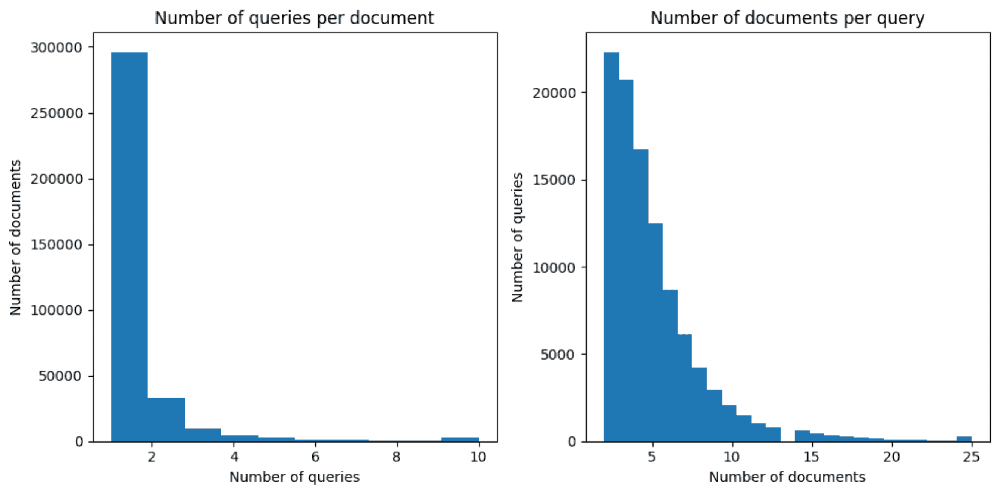

<!--yml

类别：未分类

日期：2025-01-11 12:49:46

-->

# Researchy Questions：一个面向LLM Web代理的多角度、分解性问题数据集

> 来源：[https://arxiv.org/html/2402.17896/](https://arxiv.org/html/2402.17896/)

Corby Rosset

Microsoft

\AndHo-Lam Chung

国立台湾大学

\AndGuanghui Qin

约翰霍普金斯大学

\AndEthan C. Chau

Microsoft

\ANDZhuo Feng

Microsoft

\AndAhmed Awadallah

Microsoft

\AndJennifer Neville

Microsoft

\AndNikhil Rao

Microsoft

###### 摘要

现有的问答（QA）数据集对大多数强大的大型语言模型（LLMs）来说已不再具有挑战性。传统的QA基准，如TriviaQA、NaturalQuestions、ELI5和HotpotQA，主要研究“已知的未知”问题，明确指示了缺失的信息以及如何找到这些信息以回答问题。因此，在这些基准上的良好表现提供了一种虚假的安全感。自然语言处理（NLP）社区目前未被满足的需求是一个包含大量不明确信息需求的非事实性、多角度问题的数据库，即“未知的未知”。我们声称可以在搜索引擎日志中找到这些问题，这一点令人惊讶，因为大多数问题意图查询确实是事实性问题。我们提出了Researchy Questions，一个通过繁琐的筛选过程得到的非事实性、”分解性“且多角度的搜索引擎查询数据集。我们展示了用户在这些问题上花费了大量的“精力”，如点击量和会话时长等信号，且这些问题对GPT-4也具有挑战性。我们还展示了“慢思考”回答技术，如分解为子问题，相较于直接回答更具优势。我们发布了约10万个Researchy Questions数据集，并附上了用户点击的Clueweb22网址。[https://huggingface.co/datasets/corbyrosset/researchy_questions](https://huggingface.co/datasets/corbyrosset/researchy_questions)

## 1 引言

| 数据集 | 数量 | 话题 | 子问题 | 子查询 |
| --- | --- | --- | --- | --- |
| Hotpot QA | 300 | 2.9 | 3.8 | 3.6 |
| OpenBook QA | 300 | 3.8 | 6.3 | 5.9 |
| Strategy QA | 300 | 3.8 | 5.3 | 4.9 |
| Truthful QA | 300 | 3.8 | 6.4 | 6.0 |
| Aquamuse | 300 | 3.7 | 5.4 | 5.2 |
| Reddit/askh | 300 | 4.9 | 9.4 | 8.5 |
| Reddit/asks | 300 | 5.1 | 9.2 | 8.8 |
| Reddit/eli5 | 300 | 4.5 | 9.7 | 9.3 |
| Stack Exchange | 300 | 6.1 | 8.4 | 7.6 |
| Wikihow | 300 | 4.8 | 11.7 | 11.2 |
| Researchy | 96k | 3.9 | 14.3 | 12.6 |

表1：我们要求GPT-4将问题分解成一个自然的子问题层级，并给出它将向搜索引擎发出的具体查询。如预期所示，HotpotQA回答所需的子问题最少。

大型语言模型（LLMs）的出现为自然语言处理领域带来了新时代，其中短期和长期的问答（QA）处于近期成就的前沿，OpenAI等人（[2023](https://arxiv.org/html/2402.17896v1#bib.bib39)）也在其中扮演了重要角色。从历史上看，QA基准一直是评估模型理解自然语言能力的熔炉。然而，LLMs几乎已经完美地解决了许多QA数据集，尤其是那些涉及回答简短事实性问题的，如*“文莱的首都是什么？”*。聊天机器人和“代理型”AI助手的重新崛起，代表了基于LLMs构建的复杂系统，已为用户提出更深入、更有层次的问题创造了新机会，如图[1](https://arxiv.org/html/2402.17896v1#S1.F1 "Figure 1 ‣ 1 Introduction ‣ Researchy Questions: A Dataset of Multi-Perspective, Decompositional Questions for LLM Web Agents")所示。

图1：Researchy Questions与其他问答数据集的定性比较。Researchy Questions涉及比其他QA数据集更多的复杂性和“未知的未知”。

然而，强大的AI辅助问答工具的能力已经超出了评估它们所需的指标。许多传统的QA基准，如Natural Questions Kwiatkowski等人（[2019](https://arxiv.org/html/2402.17896v1#bib.bib31)）、TriviaQA Joshi等人（[2017](https://arxiv.org/html/2402.17896v1#bib.bib23)）、WebQuestions Berant等人（[2013](https://arxiv.org/html/2402.17896v1#bib.bib4)）、SearchQA Dunn等人（[2017](https://arxiv.org/html/2402.17896v1#bib.bib12)）等，已经或多或少被现代LLMs解决。这些数据集主要由事实性问题（如搜索引擎日志、Trivia、Jeopardy!等）构成，其中答案通常可以在单一的句子或段落中找到，这些句子或段落几乎肯定存在于标准的预训练网络语料库中，Zhou等人（[2023](https://arxiv.org/html/2402.17896v1#bib.bib65)）。例如，MS Marco Campos等人（[2016](https://arxiv.org/html/2402.17896v1#bib.bib9)）中有多达55%的问题是事实性问题（Bolotova等人，[2022](https://arxiv.org/html/2402.17896v1#bib.bib5)）。这类QA数据集的明显缺点是答案可以被LLMs记住，或者通过简单的模式匹配或基于关键词的搜索解决。

包括 HotpotQA Yang 等人（[2018](https://arxiv.org/html/2402.17896v1#bib.bib56)）、HybridQA Chen 等人（[2020](https://arxiv.org/html/2402.17896v1#bib.bib10)）、MuSiQue Trivedi 等人（[2022](https://arxiv.org/html/2402.17896v1#bib.bib49)）在内的多跳推理任务，旨在挑战 QA 系统，通过多个文档或段落之间的逻辑桥接来解决问题。尽管这些数据集在增加问题复杂度方面取得了进展，但答案仍然是事实性问题，而且清楚地知道应该提出哪些子问题来回忆缺失的信息。此外，这些数据集的构建（例如，通过维基百科链接路径合成生成）导致了与人类提问方式之间的分布不匹配。

存在多个长期、非事实性 QA 数据集来源，例如 ELI5 Fan 等人（[2019](https://arxiv.org/html/2402.17896v1#bib.bib14)）、Stack Exchange、Yahoo Answers Zhang 等人（[2016](https://arxiv.org/html/2402.17896v1#bib.bib61)）和 WikiHowQA Bolotova-Baranova 等人（[2023](https://arxiv.org/html/2402.17896v1#bib.bib6)）。尽管这些问题的答案比事实性问题更为复杂，但 ELI5 和 WikiHowQA 更倾向于引出叙述性回答，而非分析性回答。牛津大学 Allsouls 数据集 Liu 等人（[2023b](https://arxiv.org/html/2402.17896v1#bib.bib35)）包含 1000 个大学水平的论文题目，这些题目具有多角度性，但旨在评估说服写作技巧，并且没有关联的文档来支撑回答。AQuaMuSe Kulkarni 等人（[2020](https://arxiv.org/html/2402.17896v1#bib.bib30)）是一个非常优秀的尝试，旨在过滤 Natural Questions (NQ) 中的多面性查询，但他们的方法受限于依赖 NQ 中已有的相对较短的段落式回答。

| 研究问题：公共交通如何帮助经济 |
| --- |
| 问题的层次化分解 | 点击的 Clueweb22 URL |
| 1. 什么是公共交通？（a）公共交通的不同类型有哪些？（b）在不同地区或国家，多少人使用公共交通？ 2. 公共交通的直接经济效益有哪些？（a）公共交通如何减少用户成本，例如燃料、停车、维护等？（b）公共交通如何创造收入… 3. 公共交通的间接经济效益有哪些？（a）公共交通如何减少拥堵…（b）公共交通如何增加对教育、就业、健康等的接触…（c）公共交通如何提高生产力和创新…（d）公共交通如何为环境和社会目标做出贡献… 4. 公共交通的经济效益与提供和维护公共交通的成本相比如何？（a）公共交通的主要成本是什么…（b）公共交通的成本如何融资…（c）如何衡量和评估公共交通的效益与成本… | 1. [infrastructureusa.org](https://infrastructureusa.org/the-economic-impact-of-public-transportation) 2. [nationalgeographic.org](https://nationalgeographic.org/article/effects-transportation-economy) 3. [quora.com](https://quora.com/how-does-public-transportation-help-the-economy) 4. [accessmagazine.org](https://accessmagazine.org/spring-2012/can-public-transportation-increase-economic-efficiency) 5. [ced.berkeley.edu](https://frameworks.ced.berkeley.edu/2014/the-economic-benefits-of-transit-service) 6. [greenertransportsolutions](https://greenertransportsolutions.com/guidance-tool/relationship-between-transport-economy) 7. [bts.gov](https://bts.gov/topics/transportation-and-economy) 8. [apta.com](https://apta.com/research-technical-resources/economic-impact-of-public-transit) |
| 来自URL的关键事实示例：[accessmagazine.org](https://accessmagazine.org/spring-2012/can-public-transportation-increase-economic-efficiency) “…即使在商业区高密度办公空间的城市，我们估计将公交乘客数增加10%，也仅会使办公租金最多增加0.5%。对于所有其他城市，我们估计增加公交乘客数不会对办公租金产生影响…” |

表 2：一个研究问题的示例，展示了GPT-4如何将其分解为子问题（闭卷），以及ClueWeb22中真实用户点击的URL，和其中一个URL的关键事实示例。

“LLM代理”（例如吴等人，[2023b](https://arxiv.org/html/2402.17896v1#bib.bib54)）的兴起为用户、LLM和工具之间更深入的协作打开了大门。对此，近年来的数据集集中在使用像网页浏览器、文件系统、数据库等工具，在开放式环境中完成挑战性任务。

特别是，Gaia Mialon et al. ([2023](https://arxiv.org/html/2402.17896v1#bib.bib37)) 测试了对多模态输入（图像和文本）的理解，以及跨难度层次进行复杂推理来解决问题的能力。AgentBench Liu et al. ([2023c](https://arxiv.org/html/2402.17896v1#bib.bib36)) 提供了一个封闭环境，供 LLM 在各种场景中与 API 互动，包括编码（与文件系统或数据库的交互）、游戏/谜题，以及网页浏览/购物。尽管这些数据集推动了 LLM 代理的度量领域的发展，但它们很小，分别只有 466 和 1,091 个问题，这些问题是由作者手工策划的。

对于更具挑战性的 QA 数据集的需求，也源自一些令人担忧的趋势：虽然有数百种公共的 LLM，它们仅在少数现有语料库上进行了预训练 Gao et al. ([2020](https://arxiv.org/html/2402.17896v1#bib.bib15)); Raffel et al. ([2023](https://arxiv.org/html/2402.17896v1#bib.bib44))，或从少数几个教师 LLM 中提炼而来 Peng et al. ([2023](https://arxiv.org/html/2402.17896v1#bib.bib41))。此外，用于训练的更多数据来源于互联网上抓取的内容，而这些内容本身将是 AI 生成的，导致回音室效应 Dohmatob et al. ([2024](https://arxiv.org/html/2402.17896v1#bib.bib11)); Wu et al. ([2023a](https://arxiv.org/html/2402.17896v1#bib.bib53))。因此，LLM 的趋同演化 Stayton ([2015](https://arxiv.org/html/2402.17896v1#bib.bib47)) 增加了它们无法识别自己不知道某些事情的风险，例如见表[10](https://arxiv.org/html/2402.17896v1#A1.T10 "Table 10 ‣ A.1 Additional Safety Filtering ‣ Appendix A GPT-4-based Filtering Details ‣ Researchy Questions: A Dataset of Multi-Perspective, Decompositional Questions for LLM Web Agents")中的 GPT-4 和 Mixtral 8x7b。当 LLM 扮演 LLM 作为裁判的角色时，尤其如此 Zheng et al. ([2023a](https://arxiv.org/html/2402.17896v1#bib.bib63)); Yuan et al. ([2024](https://arxiv.org/html/2402.17896v1#bib.bib59))，或者当面对非常多面/多视角的问题时，其后果可能是用户“错失全貌”或更糟，受到误导 Zheng et al. ([2023b](https://arxiv.org/html/2402.17896v1#bib.bib64)); Liu et al. ([2023b](https://arxiv.org/html/2402.17896v1#bib.bib35))。尽管检索增强 Lewis et al. ([2021](https://arxiv.org/html/2402.17896v1#bib.bib32)); Borgeaud et al. ([2022](https://arxiv.org/html/2402.17896v1#bib.bib7)); Guu et al. ([2020](https://arxiv.org/html/2402.17896v1#bib.bib17)) 可以帮助补充 LLM 代理，但风险仅仅转移到了子系统是否检索到正确信息并正确使用它的问题上 Liu et al. ([2023a](https://arxiv.org/html/2402.17896v1#bib.bib34))。

我们认为“未知的未知”这一现象，美国国会等人（[1981](https://arxiv.org/html/2402.17896v1#bib.bib51)）同样适用于在解决复杂问题时需要“慢思考”的LLM代理（Kahneman， [2011](https://arxiv.org/html/2402.17896v1#bib.bib24)）。简而言之，一种策略是通过迭代地重新构建或分解问题，将其转化为一组“已知的未知”（这类问题特征正是大多数前述QA数据集的特点）。对于这些子问题，应该能更清楚地了解缺失了哪些信息，如何寻找这些信息，一旦找到，如何利用“已知的已知”来贡献最终答案。一些技术，例如链式思考问题分解（Radhakrishnan等，[2023](https://arxiv.org/html/2402.17896v1#bib.bib43)）和思维树（Yao等，[2023a](https://arxiv.org/html/2402.17896v1#bib.bib57)）提示，采用类似的方法来规划应对复杂问题的长期解决方案。然而，这些研究仍然基于传统的QA基准，例如HotpotQA，或是简单的游戏，比如填字游戏。因此，目前还没有合适的基准问题，用于检验这些先进的分解技术在开放领域网络场景中的应用（Krishna等，[2021](https://arxiv.org/html/2402.17896v1#bib.bib29)）。

我们提出了Researchy Questions，旨在研究LLM代理在处理与复杂问题相关的不明确信息需求时的动态。我们将Researchy Question定义为一种*非事实型*问题，期望得到*长篇回答*（超过一段！），需要进行大量研究或努力进行综合。Researchy Question可以被看作是一个复杂的搜索任务（Aula和Russell，[2008](https://arxiv.org/html/2402.17896v1#bib.bib2)），其信息需求不明确，且需要分析*多个文档*或证据片段。Researchy Question没有单一的正确答案，而是*多个视角*，允许根据不同的标准来判断哪个答案更好。实际上，回答Researchy Question的过程可能涉及*分解*成有助于检索全面信息的子问题，从而减少遗漏未知未知的风险。最后，Researchy Question代表了人们真实提出的*真正信息需求*。图[1](https://arxiv.org/html/2402.17896v1#S1.F1 "Figure 1 ‣ 1 Introduction ‣ Researchy Questions: A Dataset of Multi-Perspective, Decompositional Questions for LLM Web Agents")定性地比较了其他经典QA数据集。

Researchy Questions主要是一个问答数据集，用于评估问答系统或大语言模型代理，最终目标是利用任何必要的工具实现更高质量的答案。尽管如此，它也是一个搜索/检索数据集，因为找到并正确地结合相关证据是一个关键子系统，能够满足可信度和扎实性的期望（Zheng et al. ([2023b](https://arxiv.org/html/2402.17896v1#bib.bib64))；Liu et al. ([2023b](https://arxiv.org/html/2402.17896v1#bib.bib35))）。虽然我们认为问题分解是解决Researchy Questions的一个关键部分，但目前尚不清楚如何定义或衡量子问题的质量。为帮助这一努力，我们揭示了终端用户认为有用的网址，期望好的子问题至少能引导到那些被点击的文档中的信息。

我们发布了大约96K个Researchy Questions，包括真实用户向商业搜索引擎提交的查询，并且还：

1.  1.

    将问题分解为一个2级的层级计划（见表[2](https://arxiv.org/html/2402.17896v1#S1.T2 "Table 2 ‣ 1 Introduction ‣ Researchy Questions: A Dataset of Multi-Perspective, Decompositional Questions for LLM Web Agents") 左侧）。

1.  2.

    对于每个问题，用户在一个公开可用的网络语料库ClueWeb22上的点击分布汇总。

1.  3.

    对应于可以直接向搜索引擎发出的子问题的有序子查询列表。

在第[2](https://arxiv.org/html/2402.17896v1#S2 "2 Researchy Questions Construction ‣ Researchy Questions: A Dataset of Multi-Perspective, Decompositional Questions for LLM Web Agents")节中，我们描述了Researchy Questions的获取方式，并在第[3](https://arxiv.org/html/2402.17896v1#S3 "3 Characterizing Researchy Questions ‣ Researchy Questions: A Dataset of Multi-Perspective, Decompositional Questions for LLM Web Agents")节中对其进行了特征描述。在第[4](https://arxiv.org/html/2402.17896v1#S4 "4 Agreement with User Search Behavior ‣ Researchy Questions: A Dataset of Multi-Perspective, Decompositional Questions for LLM Web Agents")节中，我们验证了网络用户在Researchy Questions上投入的精力多于其他查询。在第[5](https://arxiv.org/html/2402.17896v1#S5 "5 Evaluating Answer Techniques to Researchy Questions ‣ Researchy Questions: A Dataset of Multi-Perspective, Decompositional Questions for LLM Web Agents")节中，我们评估并比较了Radhakrishnan等人（[2023](https://arxiv.org/html/2402.17896v1#bib.bib43)）的分解式回答技术。

## 2 Researchy Questions构建

| First | MS Marco | QnA | 非事实型 | Researchy ($\downarrow$) |
| --- | --- | --- | --- | --- |
| how | 17.0% | 34.3% | 29.4% | 41.2% |
| why | 1.64% | 6.26% | 33.4% | 22.9% |
| what | 34.9% | 12.2% | 21.3% | 19.1% |
| is/are/do | 5.77% | 15.0% | 6.50% | 9.67% |
| should | 0.11% | 0.53% | 0.59% | 1.85% |
| can | 1.84% | 4.31% | 1.01% | 0.97% |
| 谁 | 3.27% | 4.77% | 0.90% | 0.47% |
| 哪个 | 1.78% | 2.78% | 1.87% | 0.46% |
| 何时 | 2.70% | 5.03% | 0.44% | 0.43% |
| 优势 | $<$ 0.01% | 0.03% | 0.45% | 0.28% |
| 解释 | 0.05% | 0.06% | 0.12% | 0.23% |
| 其中 | 3.54% | 4.08% | 0.37% | 0.17% |
| 因素 | $<$ 0.01% | 0.01% | 0.08% | 0.15% |
| 将 | 0.10% | 0.69% | 0.08% | 0.15% |
| 描述 | 0.05% | 0.07% | 0.04% | 0.09% |

表 3：我们问题过滤漏斗的三个主要阶段中最常见的首词（以 MS Marco 为比较）。

研究型问题是来自搜索日志的真实用户查询。虽然搜索日志包含了丰富多样的查询类型和意图 Bolotova 等人 ([2022](https://arxiv.org/html/2402.17896v1#bib.bib5)); Bu 等人 ([2010](https://arxiv.org/html/2402.17896v1#bib.bib8))，但它们大多包含事实性或导航型查询，需要进行过滤。

### 2.1 阶段 1：挖掘搜索日志

| 查询类型 | 数量 |
| --- | --- |

&#124; 平均独特 &#124;

&#124; 点击的 URL &#124;

|

&#124; 平均 &#124;

&#124; 点击量 &#124;

|

&#124; 平均饱和度 &#124;

&#124; 点击量 &#124;

|

| --- | --- | --- | --- | --- |
| --- | --- | --- | --- | --- |
| 一般查询 | $\geq 1B$ | 1.88 | 4.83 | 2.54 |
| 问答查询 | 15.7M | 3.99 | 9.31 | 5.10 |
| 非事实型问答 | 1.0M | 4.20 | 8.99 | 4.86 |
| 研究型查询 | 100k | 6.31 | 15.85 | 8.54 |
| 会话类型 | 数量 | 回合数 |

&#124; # 独特 &#124;

&#124; 查询 &#124;

|

&#124; # 饱和度 &#124;

&#124; 点击量 &#124;

|

| --- | --- | --- | --- | --- |
| --- | --- | --- | --- | --- |
| 一般会话 | $\geq 10B$ | 2.42 | 2.11 | 0.76 |
| 问答会话 | $\geq 100M$ | 6.28 | 5.53 | 1.15 |
| 非事实型问答会话 | $\geq 10M$ | 12.89 | 11.33 | 1.91 |
| 研究型会话 | $\geq 1M$ | 13.45 | 11.81 | 2.46 |

表 4：我们的查询过滤漏斗；每一行都是上一行的一个子集。（左）研究型问题有更多的点击（饱和度点击的停留时间更长），并且需要更多的独特文档；完整的分布见图[2](https://arxiv.org/html/2402.17896v1#A1.F2 "图 2 ‣ 附录 A 基于 GPT-4 的过滤细节 ‣ 研究型问题：一种多视角、分解性问题的数据集，用于 LLM 网络代理")。（右）每个类型查询出现的会话统计数据，表明更难的问题出现在较长的会话中。这些行为确认了我们的过滤器产生了更复杂的问题。

我们从一个商业搜索引擎获取了一组查询-URL 点击对，这些记录是在 2021 年 7 月到 2022 年 8 月之间的，最大限度地与 Clueweb22 网络文档快照的创建重叠 Overwijk 等人 ([2022](https://arxiv.org/html/2402.17896v1#bib.bib40))。通过这种方式，我们可以简单地指明哪些研究型问题点击了哪些文档。我们首先从大量英语、非成人查询中获取，这些查询至少有一次点击。我们将这些称为“一般查询”，并对其进行了进一步过滤。

一个重要的过滤标准是频率：我们只保留在日志中至少出现过50次的查询。这个标准既简单又强大：它有助于去除数据中的噪音（减少拼写错误），同时让我们专注于那些不是“偶然出现”的问题。这帮助我们获取有关用户与搜索引擎互动时的重复行为的洞察。

为了选择那些具有寻求答案意图的查询（即实际的“问题”，而非像“facebook 登录”这样的导航查询，“快速跑步鞋”这样的购物意图，或“附近最好披萨”这样的本地意图），我们使用了一套规则和现有的生产分类器：

+   •

    查询语言：英语

+   •

    成人意图：假

+   •

    不同出现次数：$\geq$ 50

+   •

    3 $\leq$ 查询词数：$\leq$ 15

+   •

    点击的不同URL数量：$\geq$ 2

+   •

    问题意图分类器：真

+   •

    导航意图：假

+   •

    本地/房地产/地图意图：假

+   •

    零售/购物意图：假

+   •

    编程/技术意图：假

+   •

    健康/医疗意图：假

+   •

    触发的可能答案卡：$\geq$ 1

+   •

    触发大量广告：假

解释以上某些点：答案卡是搜索引擎中的一个高精度特性，其中包含答案的段落显示在结果页面的顶部，区别于“十个蓝色链接”。由于搜索引擎不断更新新功能和触发规则，所有上述统计数据都是在全年的时间段内汇总和标准化的。例如，“大量广告”是通过将查询在整年中显示的广告总数相加，然后除以查询被发出的次数，再选择一个阈值，超过该阈值的查询被认为是“购物意图”。广告要求还帮助捕捉到零售意图分类器未能捕捉到的任何购物意图查询。

我们希望删除编程/技术类查询，因为这些问题通常是由非常具体的问题驱动的，这些问题通常通过大量点击后的一份文档得到解决，而这不是我们希望在这个数据集中关注的行为。健康和医疗类问题主要被避免，因为它们往往与应由持证医务人员处理的问题重叠过多。许多购物/零售类查询可能被解读为“研究性”问题，例如“最好的耳机是什么”，但我们在这个数据集中避免了这些问题，因为很难区分一个URL点击是由于激进广告的原因还是出于真正的信息需求。

在这个过滤阶段后，我们得到了1570万个“问答查询”，这些查询大多可以识别为处理开放领域知识的自然语言问题。这个数据量足够管理，可以有效地运行我们在下一个过滤阶段使用的自己的bert-large规模分类器。

### 2.2 第二阶段：事实型分类器

我们需要一种方法来区分哪些QnA查询是事实型（factoid）与非事实型（non-factoid）；为此我们训练了一个二分类器，使用自动标注的数据。训练数据是从1570万个QnA查询中均匀抽取的20万个问题样本。问题的标签是通过gpt3（text-davinci-003）在少量示例提示下生成的，如图[4](https://arxiv.org/html/2402.17896v1#A1.F4 "图4 ‣ 附录A 基于GPT-4的筛选细节 ‣ 研究性问题：多视角、分解式问题的数据集")所示。然后这些标签被用来训练一个bert-large非事实型问题分类器，之后在1570万个查询的完整数据集上进行推断。通过人工检查，选择了一个阈值，超过该阈值的我们认为问题是有意义的非事实型。最终的100万条数据符合图[3](https://arxiv.org/html/2402.17896v1#A1.F3 "图3 ‣ 附录A 基于GPT-4的筛选细节 ‣ 研究性问题：多视角、分解式问题的数据集")左侧所示的非事实型阈值0.75，我们将其称为“非事实型QnA查询”。

### 2.3 阶段3：分解式分类器

不是所有结果中的非事实型QnA查询都展现了“分解式”信息需求。具体来说，它们常常表现为解释性或“如何做”的问题，通常只有一个正确答案，且没有太多视角。我们训练了第二个分类器，用于评分一个问题是否需要提出子问题。所谓“需要子问题”的具体定义，见图[5](https://arxiv.org/html/2402.17896v1#A1.F5 "图5 ‣ 附录A 基于GPT-4的筛选细节 ‣ 研究性问题：多视角、分解式问题的数据集")中的提示，该提示用于让ChatGPT（gpt-35-turbo）收集标签。我们之所以使用ChatGPT，是因为我们认为这是一个相对密集的认知任务。我们对约40k个来自非事实型分类器并满足非事实型阈值0.75的输出进行了推断。然后我们使用这些标签训练了一个单独的bert-large“分解式”分类器。

同样，我们通过手动检查选择了一个阈值，表示哪些1.0M非事实性问答查询也是分解性的，这个阈值恰好是0.6，如图[3](https://arxiv.org/html/2402.17896v1#A1.F3 "Figure 3 ‣ Appendix A GPT-4-based Filtering Details ‣ Researchy Questions: A Dataset of Multi-Perspective, Decompositional Questions for LLM Web Agents")右侧所示。在满足非事实性阈值的1.0M查询中，146k也满足分解性阈值。这146k成为去重前的研究性问题候选。在表[6](https://arxiv.org/html/2402.17896v1#A1.T6 "Table 6 ‣ Appendix A GPT-4-based Filtering Details ‣ Researchy Questions: A Dataset of Multi-Perspective, Decompositional Questions for LLM Web Agents")中，我们展示了没有满足分解性阈值的某些非事实性问题的例子。

### 2.4 阶段4：去重

去重的最后一步是去重。我们采用了聚合聚类方法，Everitt（[1974](https://arxiv.org/html/2402.17896v1#bib.bib13)），其唯一参数是距离阈值$\epsilon$，低于该阈值的两个查询被认为是“重复意图”。

我们通过基于ANCE的Xiong等人（[2020](https://arxiv.org/html/2402.17896v1#bib.bib55)）的向量编码器来表示查询的语义意图$\overrightarrow{q_{i}}\leftarrow\texttt{encoder}(q_{i})$。我们实例化了一个度量空间，该空间由$1-\texttt{cosine}(\cdot,\cdot)$的向量编码组成，使用faiss实现的近似最近邻（ANN）索引Johnson等人（[2019](https://arxiv.org/html/2402.17896v1#bib.bib22)）。对于索引中的每个问题，我们搜索最近邻$\{q_{j}\sim\texttt{ANN}(q_{i})$ 使得 1.0 - $\overrightarrow{q_{i}}\cdot\overrightarrow{q_{j}}<\epsilon\}$。对于聚合聚类，我们定义一个“组”作为一组查询，其中所有的成对距离都在$\epsilon$范围内。我们发现大约63%的查询是孤立的（不属于大小大于一的组），而平均组大小为3.8。例如，查询“*what were tanks used for in ww1*”，“*how were the tanks used in ww1*”和“*why were tanks needed in ww1*”都属于同一组。对于所有大于一的组，我们选择在日志中最常出现的查询作为该组的代表“头”。在组合组头和孤立查询后，大约70%的查询得以保留，共计102k研究性问题。尽管我们尽力去重问题意图，但仍然存在一些话题聚类，例如，快速的关键词统计显示大约600个查询包含“ww2”字符串，约80个查询包含“supreme court”。

### 2.5 阶段5：最终的GPT-4过滤

作为去重后的最终质量控制步骤，我们让 GPT-4 为所有 102k 个问题标注了内在属性，比如问题的多维性、推理强度等。这些属性的完整集合定义在图 [7](https://arxiv.org/html/2402.17896v1#A1.F7 "图 7 ‣ 附录 A 基于 GPT-4 的过滤细节 ‣ 研究性问题：多视角、分解性问题数据集")中，并且图 [6](https://arxiv.org/html/2402.17896v1#A1.F6 "图 6 ‣ 附录 A 基于 GPT-4 的过滤细节 ‣ 研究性问题：多视角、分解性问题数据集") 中包含了这些分数的直方图，涵盖了研究性问题和自然问题。所有八个属性的评分范围为 1-10。约 3% 的 102k 个问题被移除，原因是它们被标记为“模糊”和“不完整”，这些问题过于难以回答；一些示例如表 [7](https://arxiv.org/html/2402.17896v1#A1.T7 "表 7 ‣ 附录 A 基于 GPT-4 的过滤细节 ‣ 研究性问题：多视角、分解性问题数据集") 所示。另有 2% 的问题被移除，原因是它们过于“假设性”，即问题的措辞具有假设性，可能会偏向某种回答，如表 [8](https://arxiv.org/html/2402.17896v1#A1.T8 "表 8 ‣ 附录 A 基于 GPT-4 的过滤细节 ‣ 研究性问题：多视角、分解性问题数据集") 所示。还有 2% 的问题因安全原因被移除，如表 [9](https://arxiv.org/html/2402.17896v1#A1.T9 "表 9 ‣ A.1 附加安全过滤 ‣ 附录 A 基于 GPT-4 的过滤细节 ‣ 研究性问题：多视角、分解性问题数据集") 所示，我们认为尝试回答这些问题的风险过高。并非所有“假设性”问题都本质上有害。最终，剩余的 96k 条查询将被发布。

| 方法 | 样本 | 直接答案 | CoT 分解 | 因素分解 | 分解 |
| --- | --- | --- | --- | --- | --- |
| 准确度 | 分数 | 准确度 | 分数 | 准确度 | 分数 | 分数增益 |
| Hotpot QA | 300 | 0.843 | 83.4 | 0.877 | 83.5 | 0.837 | 81.3 | +0.1 |
| 开放书籍 QA | 300 | 0.926 | 86.1 | 0.843 | 83.5 | 0.750 | 80.7 | -2.6 |
| 策略 QA | 300 | 0.757 | 80.8 | 0.810 | 83.7 | 0.777 | 82.6 | +2.9 |
| Truthful QA | 300 | 0.703 | 73.7 | 0.789 | 82.4 | 0.739 | 81.5 | +8.7 |
| Aquamuse | 300 | 0.916 | 83.0 | 0.940 | 84.9 | 0.926 | 85.0 | +2.0 |
| Reddit/askh | 300 | 0.759 | 79.8 | 0.736 | 77.3 | 0.732 | 79.3 | -0.5 |
| Reddit/asks | 300 | 0.783 | 81.1 | 0.743 | 79.4 | 0.796 | 82.7 | +1.6 |
| Reddit/eli5 | 300 | 0.883 | 83.1 | 0.890 | 85.0 | 0.890 | 86.5 | +3.4 |
| StackExchange | 300 | 0.717 | 78.4 | 0.599 | 70.7 | 0.628 | 73.4 | -5.0 |
| Wikihow QA | 300 | 0.93 | 82.9 | 0.937 | 84.4 | 0.950 | 88.2 | +5.3 |
| 研究性问题 | 1k | 不适用 | 82.7 | 不适用 | 84.6 | 不适用 | 88.3 | +5.6 |

表格5：各种问题分解技术与GPT-4作为答题模块的对比。表格的上半部分为简短问题，下半部分为长格式问题。

## 3 描述Researchy Questions

在96k个Researchy Questions（分为90k训练集，6.4k测试集）中，总共有350k个独特的点击文档，其中48%的文档可以在Clueweb22 Set B的英文子集中过滤到，参见Overwijk等人（[2022](https://arxiv.org/html/2402.17896v1#bib.bib40)）；其余的文档位于A集或L集中。对于我们发布的每个问题，平均有4.9 +/- 3.5个被点击的文档（见图[2](https://arxiv.org/html/2402.17896v1#A1.F2 "Figure 2 ‣ Appendix A GPT-4-based Filtering Details ‣ Researchy Questions: A Dataset of Multi-Perspective, Decompositional Questions for LLM Web Agents") 右），这表明信息需求的多样性较好，且明显高于总体的平均查询。相反，对于每个文档，只有1.4 +/- 2.3个相关的Researchy Questions（见图[2](https://arxiv.org/html/2402.17896v1#A1.F2 "Figure 2 ‣ Appendix A GPT-4-based Filtering Details ‣ Researchy Questions: A Dataset of Multi-Perspective, Decompositional Questions for LLM Web Agents") 左），这表明查询去重良好。

为了了解与其他数据集相比，Researchy Questions在内在难度上的表现，我们向GPT-4询问了每个问题需要多少个子问题或搜索引擎查询才能完全回答。一个示例分解见于表格[2](https://arxiv.org/html/2402.17896v1#S1.T2 "Table 2 ‣ 1 Introduction ‣ Researchy Questions: A Dataset of Multi-Perspective, Decompositional Questions for LLM Web Agents")，汇总结果见于表格[1](https://arxiv.org/html/2402.17896v1#S1.T1 "Table 1 ‣ 1 Introduction ‣ Researchy Questions: A Dataset of Multi-Perspective, Decompositional Questions for LLM Web Agents")。显然，GPT-4认为大多数事实型问答数据集（表格顶部）需要最少的子问题，而Researchy Questions即使在较长格式的问答数据集中，也需要最多的子问题。

我们还将Researchy Questions与另一个基于搜索日志的问答数据集——Natural Questions  Kwiatkowski et al. ([2019](https://arxiv.org/html/2402.17896v1#bib.bib31))进行了比较，比较了在第[2.5节](https://arxiv.org/html/2402.17896v1#S2.SS5 "2.5 Stage 5: Final GPT-4 Filtering ‣ 2 Researchy Questions Construction ‣ Researchy Questions: A Dataset of Multi-Perspective, Decompositional Questions for LLM Web Agents")中描述的8个质量维度，比如它们的推理强度和知识强度。比较的直方图显示在图[6](https://arxiv.org/html/2402.17896v1#A1.F6 "Figure 6 ‣ Appendix A GPT-4-based Filtering Details ‣ Researchy Questions: A Dataset of Multi-Perspective, Decompositional Questions for LLM Web Agents")中，显然，GPT-4认为Researchy Questions需要更多的知识、推理，且本质上更加多面。

表格 [3](https://arxiv.org/html/2402.17896v1#S2.T3 "Table 3 ‣ 2 Researchy Questions Construction ‣ Researchy Questions: A Dataset of Multi-Perspective, Decompositional Questions for LLM Web Agents") 显示了Researchy Questions中第一个单词的分布（以及在下一节中描述的过滤漏斗中使用的中间数据集）。为了进行比较，MS Marco查询（同样来自网络搜索日志）则更偏向事实类问题——例如，只有1.64%的查询以“why”开头  Bajaj et al. ([2018](https://arxiv.org/html/2402.17896v1#bib.bib3))。

最后，我们观察到Researchy Questions的一个突现特性是，某些在点击的URL中找到的信息非常令人惊讶，例如，对于“死刑是否应当合法化”的问题，事实上在美国，“执行死刑的成本比终身监禁高出数百万美元”²²2supremecourt.gov/opinions，这会对经济角度的回答产生很大影响。我们将“关键事实”定义为一种信息，它是如此令人惊讶且具有深远影响，以至于一旦知道它，LLM Agent的回答将会发生根本性变化（如果没有它，答案将无法达到同样的质量）；但除非它提出正确的子问题来检索该信息，否则它不会知道这件事，例如：“死刑的成本是否比终身监禁更高”。因此，关键事实就像黑天鹅一样，是一种难以预测但具有重大影响的关键事件 Taleb ([2008](https://arxiv.org/html/2402.17896v1#bib.bib48))；另一个例子见于表格[2](https://arxiv.org/html/2402.17896v1#S1.T2 "Table 2 ‣ 1 Introduction ‣ Researchy Questions: A Dataset of Multi-Perspective, Decompositional Questions for LLM Web Agents")的底部。虽然我们没有一个好的方法来量化关键事实的普遍性，但我们认为Researchy Questions是研究LLM Agents如何寻找并回应这些未知未知（unknown unknowns）动态的最佳数据集。

## 与用户搜索行为的协议

更复杂的问题应该需要更多的努力来回答，Kelly等人（[2015](https://arxiv.org/html/2402.17896v1#bib.bib26)）提出过这一观点。我们可以通过行为信号，如点击和会话时长，来近似用户花费的努力量。  

在表[4](https://arxiv.org/html/2402.17896v1#S2.T4 "Table 4 ‣ 2.1 Stage 1: Mining Search Logs ‣ 2 Researchy Questions Construction ‣ Researchy Questions: A Dataset of Multi-Perspective, Decompositional Questions for LLM Web Agents")（左侧），我们展示了每个查询子集的汇总点击统计数据。结果表明，研究性问题（Researchy Questions）既非事实性问题又是可分解的，它们导致了对更多样化信息（独特的网址）的更深入消费（点击和满意点击），这与之前的工作Hassan等人（[2014](https://arxiv.org/html/2402.17896v1#bib.bib18)）一致。  

在表[4](https://arxiv.org/html/2402.17896v1#S2.T4 "Table 4 ‣ 2.1 Stage 1: Mining Search Logs ‣ 2 Researchy Questions Construction ‣ Researchy Questions: A Dataset of Multi-Perspective, Decompositional Questions for LLM Web Agents")（右侧），我们展示了用户在会话层级上表现出的行为信号，而非单一点击层级。例如，如果在某个日期范围内的任何会话中出现了问答类型的查询，那么该会话将包含在“问答会话”一栏中。结果清楚地显示，用户在回答非事实性问题时的参与度是回答事实性问题会话的两倍，且整体会话时长是平均会话的六倍。  

## 5 评估回答研究性问题的技巧  

由于研究性问题没有一个“正确”的答案，我们认为它们应该以相对的、并排的方式进行评估，*类似于* Alpaca-Eval风格，Li等人（[2023](https://arxiv.org/html/2402.17896v1#bib.bib33)）指出，例如，将“闭卷”答案作为参考。

由于研究性问题旨在通过将其分解为子问题来进行回答，我们评估了两种分解式问题回答技术——思维链分解和因式分解——与直接回答基线进行对比。因式分解为每个子问题分别调用LLM，然后进行最终的“重组”调用，以综合主答案（Radhakrishnan等人，[2023](https://arxiv.org/html/2402.17896v1#bib.bib43)）。  

表格 [5](https://arxiv.org/html/2402.17896v1#S2.T5 "Table 5 ‣ 2.5 Stage 5: Final GPT-4 Filtering ‣ 2 Researchy Questions Construction ‣ Researchy Questions: A Dataset of Multi-Perspective, Decompositional Questions for LLM Web Agents") 显示了在一系列数据集上，三种回答技术的并行自动评估结果。提供答案的LLM是GPT-4，作为评审的LLM也是GPT-4，分别使用图 [8](https://arxiv.org/html/2402.17896v1#A1.F8 "Figure 8 ‣ A.1 Additional Safety Filtering ‣ Appendix A GPT-4-based Filtering Details ‣ Researchy Questions: A Dataset of Multi-Perspective, Decompositional Questions for LLM Web Agents") 中的模板进行提示。由于我们考虑的许多数据集有正确的标准答案，评审被要求判断“准确性”，即候选答案是否与标准答案一致，并给出一个二元评分。“得分”是一个1-100的范围，表示整体质量。表格的上半部分 [5](https://arxiv.org/html/2402.17896v1#S2.T5 "Table 5 ‣ 2.5 Stage 5: Final GPT-4 Filtering ‣ 2 Researchy Questions Construction ‣ Researchy Questions: A Dataset of Multi-Perspective, Decompositional Questions for LLM Web Agents") 对应的是短答案数据集（在这里，准确性更为重要），而下半部分是长答案问题，更适合用整体得分来评估。在长答案数据集中，Researchy Questions 在分解技术的帮助下受益最多。

我们从表 [5](https://arxiv.org/html/2402.17896v1#S2.T5 "Table 5 ‣ 2.5 Stage 5: Final GPT-4 Filtering ‣ 2 Researchy Questions Construction ‣ Researchy Questions: A Dataset of Multi-Perspective, Decompositional Questions for LLM Web Agents") 中得出几个结论。首先，我们基本确认了Radhakrishnan等人 ([2023](https://arxiv.org/html/2402.17896v1#bib.bib43)) 的研究结果，即分解技术在短格式多跳数据集上比零-shot直接回答提高了准确性。其次，分解法（factored decomposition）对于长答案问题的得分最高，特别是涉及复杂过程推理的问题，如Wikihow和Researchy Questions 。另一方面，思维链（chain-of-thought）分解可能更适合推理逻辑密集型问题的正确答案。我们认为，如果我们引入检索到的信息，使用分解法的Researchy Questions的结果会更高。

## 6 相关工作

### 6.1 搜索会话中的人类行为

有一些基础研究致力于理解用户在搜索会话中的行为，从用户研究，Kelly 等人（[2015](https://arxiv.org/html/2402.17896v1#bib.bib26)）到大规模点击日志评估，Hassan 等人（[2014](https://arxiv.org/html/2402.17896v1#bib.bib18)）。后者试图确定是否有信号可以指示用户在搜索会话中是“挣扎”还是“探索”；我们使用了许多相同的信号。即，他们的研究结论是，“探索”会话的点击量更多，因为用户希望为一个话题的多个方面寻找信息。我们同意他们的结果，例如，非事实性问题比事实性问题涉及更多的点击。同样，“复杂搜索任务”的定义几乎与研究性问题在信息需求行为上相吻合，[Aula 和 Russell](https://arxiv.org/html/2402.17896v1#bib.bib2)的研究也支持这一点。其他研究尝试识别复杂搜索任务并提供推荐的子任务，Hassan Awadallah 等人（[2014](https://arxiv.org/html/2402.17896v1#bib.bib19)）；Zhang 等人（[2021](https://arxiv.org/html/2402.17896v1#bib.bib62)）。关于如何筛选研究性问题的直觉，源自这些以及类似的用户搜索行为研究。

### 6.2 迭代检索增强生成

许多论文讨论了链式思维的变体，Wei 等人（[2023](https://arxiv.org/html/2402.17896v1#bib.bib52)）对其进行了改编，以解决诸如查询精炼提示等多方面问题，Amplayo 等人（[2022](https://arxiv.org/html/2402.17896v1#bib.bib1)），分解式提示，Khot 等人（[2023](https://arxiv.org/html/2402.17896v1#bib.bib28)）和 ReAct，Yao 等人（[2023b](https://arxiv.org/html/2402.17896v1#bib.bib58)）。进一步的进展是将生成式大型语言模型与基于向量的检索系统结合，例如 Ren 等人（[2023](https://arxiv.org/html/2402.17896v1#bib.bib45)）；Xiong 等人（[2020](https://arxiv.org/html/2402.17896v1#bib.bib55)）；Karpukhin 等人（[2020](https://arxiv.org/html/2402.17896v1#bib.bib25)）；Izacard 和 Grave（[2021](https://arxiv.org/html/2402.17896v1#bib.bib20)）。此类方法有多种实现方式：Self-Ask，Press 等人（[2023](https://arxiv.org/html/2402.17896v1#bib.bib42)）是最早将搜索引擎集成进链式思维式分解提示技术之一，迫使大型语言模型反复提出问题并进行子问题分解。IRCoT 将检索与链式思维交织在一起，下一步的检索内容取决于先前的检索结果，Trivedi 等人（[2023](https://arxiv.org/html/2402.17896v1#bib.bib50)）。Iter-RetGen 反复检索并生成候选答案，作为下一轮检索的输入，Shao 等人（[2023](https://arxiv.org/html/2402.17896v1#bib.bib46)），而 Beam Retrieval 在每一步都维护相关段落的当前假设，Zhang 等人（[2023](https://arxiv.org/html/2402.17896v1#bib.bib60)）。

### 6.3 代理式问答

有几种“代理性”框架可以促进工具之间的动态交互，例如检索系统和作为代理的LLM，它们在迭代检索增强问答任务中表现出色。其中一个是Demonstrate-Search-Predict Khattab等人（[2023](https://arxiv.org/html/2402.17896v1#bib.bib27)），另一个是AutoGen Wu等人（[2023b](https://arxiv.org/html/2402.17896v1#bib.bib54)）。一些现有的基于网络的代理包括WebGPT Nakano等人（[2022](https://arxiv.org/html/2402.17896v1#bib.bib38)），它模拟用户浏览网页和提问的方式；其他代理如WebAgent Gur等人（[2023](https://arxiv.org/html/2402.17896v1#bib.bib16)）则通过理解原始HTML与网络进行程序化交互。

目前也有一些面向消费者的代理搜索助手产品，如Bing Chat ³³3[https://bing.com/chat](https://bing.com/chat)、YouPro ⁴⁴4[https://you.com/search](https://you.com/search)（研究模式）和SciPhi ⁵⁵5[https://search.sciphi.ai/research](https://search.sciphi.ai/research)。这些系统都能清晰地将查询分解为子问题，然后检索/爬取必要的页面来合成最终结果。每个系统解决研究性问题的示例分别展示在图[9](https://arxiv.org/html/2402.17896v1#A1.F9 "Figure 9 ‣ A.1 Additional Safety Filtering ‣ Appendix A GPT-4-based Filtering Details ‣ Researchy Questions: A Dataset of Multi-Perspective, Decompositional Questions for LLM Web Agents")、[10](https://arxiv.org/html/2402.17896v1#A1.F10 "Figure 10 ‣ A.1 Additional Safety Filtering ‣ Appendix A GPT-4-based Filtering Details ‣ Researchy Questions: A Dataset of Multi-Perspective, Decompositional Questions for LLM Web Agents")和[11](https://arxiv.org/html/2402.17896v1#A1.F11 "Figure 11 ‣ A.1 Additional Safety Filtering ‣ Appendix A GPT-4-based Filtering Details ‣ Researchy Questions: A Dataset of Multi-Perspective, Decompositional Questions for LLM Web Agents")中有所展示。

## 7 结论

近年来，许多问答数据集已经趋于饱和，许多研究者也已将搜索日志排除为复杂问题的来源。我们提出了Researchy Questions，一个大型数据集，旨在推动多文档、多视角的复杂问题解答领域，目标是LLM辅助的网络搜索代理。我们详细描述了这些复杂查询是如何从搜索日志中挖掘出来的，并确认它们需要比其他类型的搜索查询更多的努力。我们还提供了一些初步证据，表明分解式回答技术在Researchy Questions上的表现优于直接回答。

从设计上来看，这些问题没有标准的答案，因此遗憾的是，很难量化现有模型的“提升空间”，但从定性角度来看（例如，表格[10](https://arxiv.org/html/2402.17896v1#A1.T10 "Table 10 ‣ A.1 Additional Safety Filtering ‣ Appendix A GPT-4-based Filtering Details ‣ Researchy Questions: A Dataset of Multi-Perspective, Decompositional Questions for LLM Web Agents")），似乎还有很大的改进空间。同时，关于如何衡量子问题的质量，以及研究LLM代理如何发现并与关键事实（Pivotal Facts）互动，仍然有很多工作需要做。我们希望这个数据集能够帮助开发新的衡量标准，并为网络用户开启新的体验。

## 限制

本研究的主要限制之一是，尽管我们认为问题分解是解决复杂研究性问题的关键，但我们并没有提出一个有效的方式来衡量一组候选子问题的质量。相反，我们松散地认为，好的子问题至少应当能够引导出用户点击的文档中找到的相同信息。我们承认，这两者并不相同，但点击数据是一个强有力的信号。为了弥补这个差距，我们发布了GPT-4在闭卷环境下给出的层次化问题/查询分解，但我们并未评估该分解是否确实能在真实的检索系统中（例如基于ClueWeb22构建的系统）导出相同的标准文档集合。

我们也承认，从点击的文档“反向推导”问题分解可能会更好——即，首先识别在点击的文档中找到的关键资料，针对研究性问题再确定哪些子问题能帮助提取到这些信息。另一方面，也可以认为“正向”方向才是实际应用中需要实施的方向。虽然我们在这项研究中没有解决这些问题，但学术界的其他人可以利用我们发布的数据集进一步探索这些话题。

本研究的另一个限制是，关键事实（Pivotal Facts）仅仅是我们观察到的现象，尚未进行量化。未来的研究人员可以创建一个LLM提示，用于统计点击的文档中此类陈述的数量。

我们遗憾地表示，这个数据集不是多语言的。这是因为在策划这个数据集时存在大量的不确定性和反复试验，这意味着需要频繁地进行人工数据检查。我们相信，可以使用相同的框架来构建一个多语言版本的研究性问题数据集。

## 伦理声明

我们在通过全面的IRB（伦理审查委员会）程序后获得了发布这个数据集的批准，以确保符合隐私、安全和法律准则。

我们想做几点说明：尽管表面上看起来我们尝试删除了那些看起来“有争议”的查询，但我们并不打算充当道德或政治的监管者，来决定用户查询是否出于善意。在网络搜索的规模下，人们会注意到用户出于各种原因提出了很多问题，而推测查询背后的动机超出了我们的工作范围。我们*确实*的工作是评估尝试回答问题的行为是否会导致合理的伤害风险。此外，并不是说“GPT-4是我们在安全问题上的道德权威”，它只是我们在确保满足内部要求时所使用的一众工具之一。

## 参考文献

+   Amplayo et al. (2022) Reinald Kim Amplayo, Kellie Webster, Michael Collins, Dipanjan Das, 和 Shashi Narayan. 2022. [用于封闭书籍长篇问答的查询优化提示](http://arxiv.org/abs/2210.17525)。

+   Aula 和 Russell (2008) Anne Aula 和 Daniel Russell. 2008. 复杂和探索性的网页搜索。

+   Bajaj et al. (2018) Payal Bajaj, Daniel Campos, Nick Craswell, Li Deng, Jianfeng Gao, Xiaodong Liu, Rangan Majumder, Andrew McNamara, Bhaskar Mitra, Tri Nguyen, Mir Rosenberg, Xia Song, Alina Stoica, Saurabh Tiwary, 和 Tong Wang. 2018. [Ms marco：一项人类生成的机器阅读理解数据集](http://arxiv.org/abs/1611.09268)。

+   Berant et al. (2013) Jonathan Berant, Andrew Chou, Roy Frostig, 和 Percy Liang. 2013. [基于问答对的Freebase语义解析](https://www.aclweb.org/anthology/D13-1160)。发表于 *2013年自然语言处理实证方法会议论文集*，第1533–1544页，美国华盛顿州西雅图。计算语言学协会。

+   Bolotova et al. (2022) Valeriia Bolotova, Vladislav Blinov, Falk Scholer, W. Bruce Croft, 和 Mark Sanderson. 2022. [非事实性问答分类法](https://doi.org/10.1145/3477495.3531926)。发表于 *第45届国际ACM SIGIR信息检索研究与开发会议论文集*，SIGIR '22，第1196–1207页，美国纽约。计算机协会。

+   Bolotova-Baranova et al. (2023) Valeriia Bolotova-Baranova, Vladislav Blinov, Sofya Filippova, Falk Scholer, 和 Mark Sanderson. 2023. [WikiHowQA：一个综合性的多文档非事实性问答基准](https://doi.org/10.18653/v1/2023.acl-long.290)。发表于 *第61届计算语言学协会年会论文集（第1卷：长篇论文）*，第5291–5314页，加拿大多伦多。计算语言学协会。

+   Borgeaud 等人 (2022) Sebastian Borgeaud, Arthur Mensch, Jordan Hoffmann, Trevor Cai, Eliza Rutherford, Katie Millican, George van den Driessche, Jean-Baptiste Lespiau, Bogdan Damoc, Aidan Clark, Diego de Las Casas, Aurelia Guy, Jacob Menick, Roman Ring, Tom Hennigan, Saffron Huang, Loren Maggiore, Chris Jones, Albin Cassirer, Andy Brock, Michela Paganini, Geoffrey Irving, Oriol Vinyals, Simon Osindero, Karen Simonyan, Jack W. Rae, Erich Elsen 和 Laurent Sifre. 2022. [通过从万亿级标记中检索来提升语言模型](http://arxiv.org/abs/2112.04426)。

+   Bu 等人 (2010) Fan Bu, Xingwei Zhu, Yu Hao 和 Xiaoyan Zhu. 2010. [基于功能的问答分类方法](https://aclanthology.org/D10-1109)。收录于*2010年自然语言处理实证方法会议论文集*，第1119–1128页，剑桥, MA。计算语言学学会。

+   Campos 等人 (2016) Daniel Fernando Campos, Tri Nguyen, Mir Rosenberg, Xia Song, Jianfeng Gao, Saurabh Tiwary, Rangan Majumder, Li Deng 和 Bhaskar Mitra. 2016. [Ms marco: 一个人类生成的机器阅读理解数据集](https://api.semanticscholar.org/CorpusID:1289517)。*ArXiv*，abs/1611.09268。

+   Chen 等人 (2020) Wenhu Chen, Hanwen Zha, Zhiyu Chen, Wenhan Xiong, Hong Wang 和 William Yang Wang. 2020. [HybridQA: 一个针对表格和文本数据的多跳问答数据集](https://doi.org/10.18653/v1/2020.findings-emnlp.91)。收录于*计算语言学学会发现: EMNLP 2020*，第1026–1036页，线上出版。计算语言学学会。

+   Dohmatob 等人 (2024) Elvis Dohmatob, Yunzhen Feng, Pu Yang, Francois Charton 和 Julia Kempe. 2024. [尾部的故事：模型崩溃作为缩放法则的变化](http://arxiv.org/abs/2402.07043)。

+   Dunn 等人 (2017) Matthew Dunn, Levent Sagun, Mike Higgins, V. Ugur Guney, Volkan Cirik 和 Kyunghyun Cho. 2017. [Searchqa: 一个通过搜索引擎上下文增强的全新问答数据集](http://arxiv.org/abs/1704.05179)。

+   Everitt (1974) Brian Everitt. 1974. *聚类分析*。Heinemann 教育出版社 [为] 社会科学研究委员会出版。

+   Fan 等人 (2019) Angela Fan, Yacine Jernite, Ethan Perez, David Grangier, Jason Weston 和 Michael Auli. 2019. [ELI5: 长篇问答系统](https://doi.org/10.18653/v1/p19-1346)。收录于*第57届计算语言学学会年会论文集, ACL 2019, 意大利佛罗伦萨, 2019年7月28日-8月2日, 第1卷: 长篇论文*，第3558–3567页。计算语言学学会。

+   Gao 等人 (2020) Leo Gao, Stella Biderman, Sid Black, Laurence Golding, Travis Hoppe, Charles Foster, Jason Phang, Horace He, Anish Thite, Noa Nabeshima, Shawn Presser 和 Connor Leahy. 2020. [The pile: 一个包含800GB多样文本数据的语言建模数据集](http://arxiv.org/abs/2101.00027)。

+   Gur 等人（2023）Izzeddin Gur、Hiroki Furuta、Austin Huang、Mustafa Safdari、Yutaka Matsuo、Douglas Eck 和 Aleksandra Faust。2023年。[A real-world webagent with planning, long context understanding, and program synthesis](http://arxiv.org/abs/2307.12856)。

+   Guu 等人（2020）Kelvin Guu、Kenton Lee、Zora Tung、Panupong Pasupat 和 Ming-Wei Chang。2020年。[Realm: Retrieval-augmented language model pre-training](http://arxiv.org/abs/2002.08909)。

+   Hassan 等人（2014）Ahmed Hassan、Ryen W. White、Susan T. Dumais 和 Yi-Min Wang。2014年。[Struggling or exploring? disambiguating long search sessions](https://doi.org/10.1145/2556195.2556221)。在 *Proceedings of the 7th ACM International Conference on Web Search and Data Mining*，WSDM ’14，页面53–62，纽约，NY，USA。计算机协会。

+   Hassan Awadallah 等人（2014）Ahmed Hassan Awadallah、Ryen W. White、Patrick Pantel、Susan T. Dumais 和 Yi-Min Wang。2014年。[Supporting complex search tasks](https://doi.org/10.1145/2661829.2661912)。在 *Proceedings of the 23rd ACM International Conference on Conference on Information and Knowledge Management*，CIKM ’14，页面829–838，纽约，NY，USA。计算机协会。

+   Izacard 和 Grave（2021）Gautier Izacard 和 Edouard Grave。2021年。[Leveraging passage retrieval with generative models for open domain question answering](https://doi.org/10.18653/v1/2021.eacl-main.74)。在 *Proceedings of the 16th Conference of the European Chapter of the Association for Computational Linguistics: Main Volume*，页面874–880，在线。计算语言学协会。

+   Jiang 等人（2024）Albert Q. Jiang、Alexandre Sablayrolles、Antoine Roux、Arthur Mensch、Blanche Savary、Chris Bamford、Devendra Singh Chaplot、Diego de las Casas、Emma Bou Hanna、Florian Bressand、Gianna Lengyel、Guillaume Bour、Guillaume Lample、Lélio Renard Lavaud、Lucile Saulnier、Marie-Anne Lachaux、Pierre Stock、Sandeep Subramanian、Sophia Yang、Szymon Antoniak、Teven Le Scao、Théophile Gervet、Thibaut Lavril、Thomas Wang、Timothée Lacroix 和 William El Sayed。2024年。[Mixtral of experts](http://arxiv.org/abs/2401.04088)。

+   Johnson 等人（2019）Jeff Johnson、Matthijs Douze 和 Hervé Jégou。2019年。亿级相似度搜索与 GPU。*IEEE Transactions on Big Data*，7(3):535–547。

+   Joshi 等人（2017）Mandar Joshi、Eunsol Choi、Daniel Weld 和 Luke Zettlemoyer。2017年。[triviaqa: A Large Scale Distantly Supervised Challenge Dataset for Reading Comprehension](http://arxiv.org/abs/1705.03551)。*arXiv e-prints*，页面 arXiv:1705.03551。

+   Kahneman（2011）Daniel Kahneman。2011年。*Thinking, Fast and Slow*。Farrar, Straus and Giroux，纽约。

+   Karpukhin 等人（2020）Vladimir Karpukhin、Barlas Oğuz、Sewon Min、Patrick Lewis、Ledell Wu、Sergey Edunov、Danqi Chen 和 Wen tau Yih。2020年。[Dense passage retrieval for open-domain question answering](http://arxiv.org/abs/2004.04906)。

+   Kelly 等人（2015）Diane Kelly、Jaime Arguello、Ashlee Edwards 和 Wan-ching Wu。2015年。[基于认知复杂性框架的 IIR 实验搜索任务的开发与评估](https://doi.org/10.1145/2808194.2809465)。收录于*2015年国际信息检索理论会议论文集*，ICTIR '15，第101–110页，美国纽约，计算机学会。

+   Khattab 等人（2023）Omar Khattab、Keshav Santhanam、Xiang Lisa Li、David Hall、Percy Liang、Christopher Potts 和 Matei Zaharia。2023年。[Demonstrate-search-predict: 将检索和语言模型结合用于知识密集型NLP](http://arxiv.org/abs/2212.14024)。

+   Khot 等人（2023）Tushar Khot、Harsh Trivedi、Matthew Finlayson、Yao Fu、Kyle Richardson、Peter Clark 和 Ashish Sabharwal。2023年。[分解式提示：一种解决复杂任务的模块化方法](http://arxiv.org/abs/2210.02406)。

+   Krishna 等人（2021）Kalpesh Krishna、Aurko Roy 和 Mohit Iyyer。2021年。[长文本问答中的进展障碍](http://arxiv.org/abs/2103.06332)。

+   Kulkarni 等人（2020）Sayali Kulkarni、Sheide Chammas、Wan Zhu、Fei Sha 和 Eugene Ie。2020年。[Aquamuse: 自动生成用于查询式多文档摘要的数据集](http://arxiv.org/abs/2010.12694)。

+   Kwiatkowski 等人（2019）Tom Kwiatkowski、Jennimaria Palomaki、Olivia Redfield、Michael Collins、Ankur Parikh、Chris Alberti、Danielle Epstein、Illia Polosukhin、Matthew Kelcey、Jacob Devlin、Kenton Lee、Kristina N. Toutanova、Llion Jones、Ming-Wei Chang、Andrew Dai、Jakob Uszkoreit、Quoc Le 和 Slav Petrov。2019年。Natural questions: 一个用于问答研究的基准。*计算语言学会会刊*。

+   Lewis 等人（2021）Patrick Lewis、Ethan Perez、Aleksandra Piktus、Fabio Petroni、Vladimir Karpukhin、Naman Goyal、Heinrich Küttler、Mike Lewis、Wen tau Yih、Tim Rocktäschel、Sebastian Riedel 和 Douwe Kiela。2021年。[增强生成检索用于知识密集型NLP任务](http://arxiv.org/abs/2005.11401)。

+   Li 等人（2023）Xuechen Li、Tianyi Zhang、Yann Dubois、Rohan Taori、Ishaan Gulrajani、Carlos Guestrin、Percy Liang 和 Tatsunori B. Hashimoto。2023年。Alpacaeval: 一种自动评估指令跟随模型的工具。[https://github.com/tatsu-lab/alpaca_eval](https://github.com/tatsu-lab/alpaca_eval)。

+   Liu 等人（2023a）Nelson F. Liu、Kevin Lin、John Hewitt、Ashwin Paranjape、Michele Bevilacqua、Fabio Petroni 和 Percy Liang。2023a年。[迷失在中间：语言模型如何使用长上下文](http://arxiv.org/abs/2307.03172)。

+   Liu 等人（2023b）Nelson F. Liu、Tianyi Zhang 和 Percy Liang。2023b年。[评估生成式搜索引擎中的可验证性](http://arxiv.org/abs/2304.09848)。

+   Liu 等人 (2023c) Xiao Liu, Hao Yu, Hanchen Zhang, Yifan Xu, Xuanyu Lei, Hanyu Lai, Yu Gu, Hangliang Ding, Kaiwen Men, Kejuan Yang, Shudan Zhang, Xiang Deng, Aohan Zeng, Zhengxiao Du, Chenhui Zhang, Sheng Shen, Tianjun Zhang, Yu Su, Huan Sun, Minlie Huang, Yuxiao Dong, 和 Jie Tang. 2023c. [Agentbench: 评估 LLM 作为代理的能力](http://arxiv.org/abs/2308.03688)。

+   Mialon 等人 (2023) Grégoire Mialon, Clémentine Fourrier, Craig Swift, Thomas Wolf, Yann LeCun, 和 Thomas Scialom. 2023. [Gaia: 一个通用 AI 助手的基准测试](http://arxiv.org/abs/2311.12983)。

+   Nakano 等人 (2022) Reiichiro Nakano, Jacob Hilton, Suchir Balaji, Jeff Wu, Long Ouyang, Christina Kim, Christopher Hesse, Shantanu Jain, Vineet Kosaraju, William Saunders, Xu Jiang, Karl Cobbe, Tyna Eloundou, Gretchen Krueger, Kevin Button, Matthew Knight, Benjamin Chess, 和 John Schulman. 2022. [Webgpt: 基于浏览器的问答系统，结合人工反馈](http://arxiv.org/abs/2112.09332)。

+   OpenAI 等人（2023）OpenAI，:，Josh Achiam，Steven Adler，Sandhini Agarwal，Lama Ahmad，Ilge Akkaya，Florencia Leoni Aleman，Diogo Almeida，Janko Altenschmidt，Sam Altman，Shyamal Anadkat，Red Avila，Igor Babuschkin，Suchir Balaji，Valerie Balcom，Paul Baltescu，Haiming Bao，Mo Bavarian，Jeff Belgum，Irwan Bello，Jake Berdine，Gabriel Bernadett-Shapiro，Christopher Berner，Lenny Bogdonoff，Oleg Boiko，Madelaine Boyd，Anna-Luisa Brakman，Greg Brockman，Tim Brooks，Miles Brundage，Kevin Button，Trevor Cai，Rosie Campbell，Andrew Cann，Brittany Carey，Chelsea Carlson，Rory Carmichael，Brooke Chan，Che Chang，Fotis Chantzis，Derek Chen，Sully Chen，Ruby Chen，Jason Chen，Mark Chen，Ben Chess，Chester Cho，Casey Chu，Hyung Won Chung，Dave Cummings，Jeremiah Currier，Yunxing Dai，Cory Decareaux，Thomas Degry，Noah Deutsch，Damien Deville，Arka Dhar，David Dohan，Steve Dowling，Sheila Dunning，Adrien Ecoffet，Atty Eleti，Tyna Eloundou，David Farhi，Liam Fedus，Niko Felix，Simón Posada Fishman，Juston Forte，Isabella Fulford，Leo Gao，Elie Georges，Christian Gibson，Vik Goel，Tarun Gogineni，Gabriel Goh，Rapha Gontijo-Lopes，Jonathan Gordon，Morgan Grafstein，Scott Gray，Ryan Greene，Joshua Gross，Shixiang Shane Gu，Yufei Guo，Chris Hallacy，Jesse Han，Jeff Harris，Yuchen He，Mike Heaton，Johannes Heidecke，Chris Hesse，Alan Hickey，Wade Hickey，Peter Hoeschele，Brandon Houghton，Kenny Hsu，Shengli Hu，Xin Hu，Joost Huizinga，Shantanu Jain，Shawn Jain，Joanne Jang，Angela Jiang，Roger Jiang，Haozhun Jin，Denny Jin，Shino Jomoto，Billie Jonn，Heewoo Jun，Tomer Kaftan，Łukasz Kaiser，Ali Kamali，Ingmar Kanitscheider，Nitish Shirish Keskar，Tabarak Khan，Logan Kilpatrick，Jong Wook Kim，Christina Kim，Yongjik Kim，Hendrik Kirchner，Jamie Kiros，Matt Knight，Daniel Kokotajlo，Łukasz Kondraciuk，Andrew Kondrich，Aris Konstantinidis，Kyle Kosic，Gretchen Krueger，Vishal Kuo，Michael Lampe，Ikai Lan，Teddy Lee，Jan Leike，Jade Leung，Daniel Levy，Chak Ming Li，Rachel Lim，Molly Lin，Stephanie Lin，Mateusz Litwin，Theresa Lopez，Ryan Lowe，Patricia Lue，Anna Makanju，Kim Malfacini，Sam Manning，Todor Markov，Yaniv Markovski，Bianca Martin，Katie Mayer，Andrew Mayne，Bob McGrew，Scott Mayer McKinney，Christine McLeavey，Paul McMillan，Jake McNeil，David Medina，Aalok Mehta，Jacob Menick，Luke Metz，Andrey Mishchenko，Pamela Mishkin，Vinnie Monaco，Evan Morikawa，Daniel Mossing，Tong Mu，Mira Murati，Oleg Murk，David Mély，Ashvin Nair，Reiichiro Nakano，Rajeev Nayak，Arvind Neelakantan，Richard Ngo，Hyeonwoo Noh，Long Ouyang，Cullen O’Keefe，Jakub Pachocki，Alex Paino，Joe Palermo，Ashley Pantuliano，Giambattista Parascandolo，Joel Parish，Emy Parparita，Alex Passos，Mikhail Pavlov，Andrew Peng，Adam Perelman，Filipe de Avila Belbute Peres，Michael Petrov，Henrique Ponde de Oliveira Pinto，Michael，Pokorny，Michelle Pokrass，Vitchyr Pong，Tolly Powell，Alethea Power，Boris Power，Elizabeth Proehl，Raul Puri，Alec Radford，Jack Rae，Aditya Ramesh，Cameron Raymond，Francis Real，Kendra Rimbach，Carl Ross，Bob Rotsted，Henri Roussez，Nick Ryder，Mario Saltarelli，Ted Sanders，Shibani Santurkar，Girish Sastry，Heather Schmidt，David Schnurr，John Schulman，Daniel Selsam，Kyla Sheppard，Toki Sherbakov，Jessica Shieh，Sarah Shoker，Pranav Shyam，Szymon Sidor，Eric Sigler，Maddie Simens，Jordan Sitkin，Katarina Slama，Ian Sohl，Benjamin Sokolowsky，Yang Song，Natalie Staudacher，Felipe Petroski Such，Natalie Summers，Ilya Sutskever，Jie Tang，Nikolas Tezak，Madeleine Thompson，Phil Tillet，Amin Tootoonchian，Elizabeth Tseng，Preston Tuggle，Nick Turley，Jerry Tworek，Juan Felipe Cerón Uribe，Andrea Vallone，Arun Vijayvergiya，Chelsea Voss，Carroll Wainwright，Justin Jay Wang，Alvin Wang，Ben Wang，Jonathan Ward，Jason Wei，CJ Weinmann，Akila Welihinda，Peter Welinder，Jiayi Weng，Lilian Weng，Matt Wiethoff，Dave Willner，Clemens Winter，Samuel Wolrich，Hannah Wong，Lauren Workman，Sherwin Wu，Jeff Wu，Michael Wu，Kai Xiao，Tao Xu，Sarah Yoo，Kevin Yu，Qiming Yuan，Wojciech Zaremba，Rowan Zellers，Chong Zhang，Marvin Zhang，Shengjia Zhao，Tianhao Zheng，Juntang Zhuang，William Zhuk 和 Barret Zoph。2023年。[GPT-4技术报告](http://arxiv.org/abs/2303.08774)。

+   Overwijk 等人（2022）Arnold Overwijk, Chenyan Xiong, Xiao Liu, Cameron VandenBerg 和 Jamie Callan. 2022. [Clueweb22：具备视觉和语义信息的100亿网页文档](http://arxiv.org/abs/2211.15848).

+   Peng 等人（2023）Baolin Peng, Chunyuan Li, Pengcheng He, Michel Galley 和 Jianfeng Gao. 2023. 基于 GPT-4 的指令调优。*arXiv 预印本 arXiv:2304.03277*.

+   Press 等人（2023）Ofir Press, Muru Zhang, Sewon Min, Ludwig Schmidt, Noah A. Smith 和 Mike Lewis. 2023. [衡量并缩小语言模型中的组合差距](http://arxiv.org/abs/2210.03350).

+   Radhakrishnan 等人（2023）Ansh Radhakrishnan, Karina Nguyen, Anna Chen, Carol Chen, Carson Denison, Danny Hernandez, Esin Durmus, Evan Hubinger, Jackson Kernion, Kamilė Lukošiūtė, Newton Cheng, Nicholas Joseph, Nicholas Schiefer, Oliver Rausch, Sam McCandlish, Sheer El Showk, Tamera Lanham, Tim Maxwell, Venkatesa Chandrasekaran, Zac Hatfield-Dodds, Jared Kaplan, Jan Brauner, Samuel R. Bowman 和 Ethan Perez. 2023. [问题分解提升模型生成推理的忠实度](http://arxiv.org/abs/2307.11768).

+   Raffel 等人（2023）Colin Raffel, Noam Shazeer, Adam Roberts, Katherine Lee, Sharan Narang, Michael Matena, Yanqi Zhou, Wei Li 和 Peter J. Liu. 2023. [探索统一文本到文本的转换器在迁移学习中的极限](http://arxiv.org/abs/1910.10683).

+   Ren 等人（2023）Ruiyang Ren, Yingqi Qu, Jing Liu, Wayne Xin Zhao, Qiaoqiao She, Hua Wu, Haifeng Wang 和 Ji-Rong Wen. 2023. [Rocketqav2：一种联合训练密集文档检索和文档重排序的方法](http://arxiv.org/abs/2110.07367).

+   Shao 等人（2023）Zhihong Shao, Yeyun Gong, Yelong Shen, Minlie Huang, Nan Duan 和 Weizhu Chen. 2023. [通过迭代检索-生成协同增强检索增强的大型语言模型](http://arxiv.org/abs/2305.15294).

+   Stayton（2015）C. T. Stayton. 2015. [收敛进化意味着什么？收敛的解释及其在寻找进化极限中的意义](https://doi.org/10.1098/rsfs.2015.0039). *Interface Focus*, 5(6):20150039.

+   Taleb（2008）Nassim Nicholas Taleb. 2008. *黑天鹅*。企鹅出版社，哈罗英国。

+   Trivedi 等人（2022）Harsh Trivedi, Niranjan Balasubramanian, Tushar Khot 和 Ashish Sabharwal. 2022. MuSiQue：通过单跳问题组成实现的多跳问题。*计算语言学会会刊*。

+   Trivedi 等人（2023）Harsh Trivedi, Niranjan Balasubramanian, Tushar Khot 和 Ashish Sabharwal. 2023. [通过链式推理与检索交替进行知识密集型多步问题解答](http://arxiv.org/abs/2212.10509).

+   美国国会等（1981）美国国会科学委员会，太空科学技术与应用小组委员会. 1981. *NASA项目管理与采购程序和实践：美国众议院科技委员会太空科学与应用小组委员会听证会，九十七届国会第一次会议*. 美国政府印刷办公室，华盛顿特区.

+   魏等人（2023）魏杰森，王学智，达尔·舒尔曼，马尔滕·博斯马，布赖恩·伊赫特，夏飞，艾德·池，李国，和周丹尼. 2023. [思维链提示在大型语言模型中引发推理](http://arxiv.org/abs/2201.11903).

+   吴等人（2023a）吴佳扬，甘文生，陈泽峰，万世程，和林鸿. 2023a. [AI生成内容（AIGC）：一项综述](http://arxiv.org/abs/2304.06632).

+   吴等人（2023b）吴青云，班吉恩·巴萨尔，张杰宇，吴怡然，李贝宾，朱尔康，江利，张晓云，张少坤，刘嘉乐，艾哈迈德·哈桑·阿瓦达拉，瑞恩·W·怀特，道格·伯格，和王驰. 2023b. [AutoGen：通过多智能体对话启用下一代大型语言模型应用](http://arxiv.org/abs/2308.08155).

+   熊等人（2020）熊李，熊陈延，李烨，邝丰唐，刘嘉麟，保罗·本内特，贾奈德·艾哈迈德，和阿诺德·欧威克. 2020. [用于密集文本检索的近似最近邻负对比学习](http://arxiv.org/abs/2007.00808).

+   杨等人（2018）杨志霖，齐鹏，张赛正，约书亚·本吉奥，威廉·W·科恩，鲁斯兰·萨拉库丁诺夫，和克里斯托弗·D·曼宁. 2018. [Hotpotqa：一个多样化、可解释的多跳问答数据集](http://arxiv.org/abs/1809.09600).

+   姚等人（2023a）姚顺宇，余典，赵杰弗里，伊扎克·沙弗兰，托马斯·L·格里菲斯，曹元，和卡尔提克·纳拉西曼. 2023a. [思维树：通过大型语言模型进行深思熟虑的问题解决](http://arxiv.org/abs/2305.10601).

+   姚等人（2023b）姚顺宇，赵杰弗里，余典，杜楠，伊扎克·沙弗兰，卡尔提克·纳拉西曼，和曹元. 2023b. [React：语言模型中的推理与行动协同](http://arxiv.org/abs/2210.03629).

+   袁等人（2024）袁伟哲，庞元哲，赵庆贤，李闲，苏巴尔·苏赫巴托尔，徐静，和杰森·韦斯顿. 2024. [自奖励语言模型](http://arxiv.org/abs/2401.10020).

+   张等人（2023）张嘉豪，张海洋，张冬梅，刘勇，和黄申. 2023. [Beam检索：用于多跳问答的通用端到端检索](http://arxiv.org/abs/2308.08973).

+   张等人（2016）张向，赵俊波，和Yann LeCun. 2016. [字符级卷积网络用于文本分类](http://arxiv.org/abs/1509.01626).

+   张等人（2021）张毅、Sujay Kumar Jauhar、Julia Kiseleva、Ryen White 和 Dan Roth。2021。 [学习分解和组织复杂任务](https://doi.org/10.18653/v1/2021.naacl-main.217)。收录于 *2021年北美计算语言学会年会：人类语言技术会议论文集*，第2726-2735页，在线版。计算语言学协会。

+   郑等人（2023a）郑炼民、蒋威霖、盛颖、庄思源、吴张昊、庄永浩、林子、李卓涵、李大成、Eric P. Xing、张浩、Joseph E. Gonzalez 和 Ion Stoica。2023a。 [使用 mt-bench 和聊天机器人竞技场评判 LLM 作为评审官](http://arxiv.org/abs/2306.05685)。

+   郑等人（2023b）郑昕、黄杰、Kevin Chen-Chuan Chang。2023b。 [为什么 ChatGPT 在提供真实答案时会失败？](http://arxiv.org/abs/2304.10513)

+   周等人（2023）周坤、朱宇涛、陈志鹏、陈文彤、赵晓阳、陈旭、林彦凯、温基荣和韩家威。2023。 [不要让你的LLM成为评估基准作弊者](http://arxiv.org/abs/2311.01964)。

## 附录A GPT-4基础过滤详情

图2：（右）研究性问题每个问题点击的文档数量的直方图，明显高于一般网页搜索查询。（左）与每个文档相关的查询数量。每个文档关联的查询数量并不多，验证了我们的查询去重程序的有效性。

图3：（左）15.7M问答查询的非事实型得分。大约100万个得分超过+0.75的查询被发送到分解分类器。注意，由于这是一个二分类器，89%的非事实型得分小于-0.75，因此左侧的直方图被裁剪，以便更容易可视化。（右）分解分类器对大约100万个非事实型查询的得分。大约146k个超过0.6阈值的查询被认为既是非事实型又是分解型，随后进行了去重，最终得到了约10万个研究性问题数据集。

| 问题 | 事实型 | 分解型（$\downarrow$） |
| --- | --- | --- |
| 为什么毁掉钱是非法的 | 1.02 | 0.59 |
| 哪些律师事务所提供最佳的国际工作机会？ | 1.07 | 0.58 |
| 研究生应该如何与导师沟通 | 0.80 | 0.56 |
| 短篇小说与小说有何不同 | 1.07 | 0.54 |
| 为什么《贝奥武夫》是一部重要的文学作品 | 1.10 | 0.51 |
| 为什么电动滑板车是非法的 | 0.90 | 0.50 |
| 为什么独立宣言开始了 | 1.12 | 0.49 |
| 有袋动物是如何进化的 | 1.02 | 0.48 |
| 湍流危险吗 | 0.97 | 0.47 |
| 为什么人们砍伐亚马逊雨林 | 1.09 | 0.45 |
| 为什么今天印第安纳州的旗帜降半旗 | 1.06 | 0.45 |
| 为什么拉贾斯坦的房屋有厚厚的墙壁和平顶？ | 1.06 | 0.43 |
| 法医病理学家如何确定死亡的原因和方式？ | 1.02 | 0.43 |
| 什么原因导致月亮外观的变化 | 1.10 | 0.41 |
| 埃德加·爱伦·坡是如何开始他的写作生涯的 | 0.97 | 0.40 |
| 在1950年代，结扎手术有多普遍 | 0.90 | 0.40 |
| 为什么行为问题很重要 | 0.79 | 0.38 |
| 胡椒喷雾有害吗 | 0.93 | 0.37 |
| 肥料如何提高生产力 | 1.05 | 0.35 |
| 我们如何从食物中获取物质和能量 | 1.11 | 0.32 |
| 当只有少数几家公司主导一个市场时，发生什么类型的竞争？ | 1.08 | 0.31 |
| 为什么波浪无法通过真空传播？ | 1.08 | 0.30 |
| 是什么导致了迪克西大火 | 0.84 | 0.29 |
| 为什么骆驼生活在沙漠中 | 1.02 | 0.29 |
| COVID-19是如何被发现的 | 0.92 | 0.28 |
| 元素是如何组织成组的 | 0.96 | 0.27 |
| 为什么蒙特祖玛给西班牙人黄金？ | 1.01 | 0.27 |
| 债务和股本融资的区别 | 0.98 | 0.27 |
| 如何对超过60,000年的化石进行年代测定？ | 1.08 | 0.17 |
| 当以太网总线发生数据碰撞时会发生什么？ | 1.03 | 0.16 |
| 黄金是如何在地壳中形成的 | 0.98 | 0.12 |

表6：一些非事实性（非事实性分类器得分超过0.75）但非分解性（分解性分类器得分低于0.6）的问答查询示例。在这个列表的下方，更多的示例有一个单一的正确答案（即使它稍显冗长），但显然有许多灰色地带，突显了通过简单阈值筛选大量查询时的挑战。

### 对于以下的（问题 | 分数 | 原因）三元组，分数表示它们作为非事实性问题的“优质”程度，即它们能够引发有趣且深入的分析。

### 定义：一个优质的非事实性问题是具体的，具有发展成一份好的研究报告的潜力，报告中有清晰且可反驳的论点，并得到证据和分析的支持。

### 优质非事实性问题的特征格式（并非详尽无遗）：

+   •

    优质的非事实性问题通常会讨论两者之间的关系，例如“比较并对比X与Y”，“X如何/为什么影响/作用于Y？”，“为什么X对Y重要”或“X在Y中的作用是什么？”，或者“X在多大程度上导致Y？”等。

+   •

    一个优质的非事实性问题还可以问“为什么X会发生”，“哪些因素在X中发挥作用？”，“X的重要性是什么”或“X的原因是什么”，但它应该明确预期什么样的分析。

+   •

    其他优质非事实性问题的形式可以是询问某物的优缺点、益处/害处，或比较/对比两件事物等。

### 说明：根据0-10的评分标准对每个问题进行评分，其中0是事实性问题，10是优秀的非事实性问题，并简要说明你的评分理由。

问：亚伯拉罕·林肯有多高？ | 0 | 小知识

问：我可以改变天气吗？ | 2 | 个人问题

问：美国内战是为了解决奴隶制问题而爆发的吗？ | 5 | 合理，但可以更直接地询问内战原因的其他重要方面及其在冲突中的作用

问：内战在多大程度上是为了奴隶制而打的？ | 8 | 很好，将引发对内战原因的深入分析

问：人类活动对天气有何影响？ | 10 | 极好，已有许多深入报告回答这个问题

问：洛杉矶应该在铁路还是公路基础设施上投入更多资金来改善公共交通？ | 9 | 很好

问：什么是黑体辐射的例子？ | 0 | 请求一个例子

问：无法确定类型 | 0 | 不是一个问题

问：奥林匹克运动会通常由什么标志性事件结束 | 2 | 小知识，奥林匹克闭幕式可以轻松查找

问：为什么在第二次世界大战期间使用了纳瓦霍密码讲解员？ | 7 | 很好，可能引发对文化和语言如何在战争中使用的分析

问：蛋白质折叠从何时开始？ | 1 | 有一个已知的正确答案

问：建造炼油厂的成本和必要材料是什么 | 5 | 合理，询问一个复杂的过程，但不太可能引发深度分析

问：什么是Navavidha Bhakti？ | 0 | 请求定义

问：为什么技术变革是坏事？ | 5 | 合理，但可以更具体

问：分析技术变革如何历史性地影响文化 | 10 | 极好，非常具体

问：谁拥有电话号码280-626-1435 | 0 | 个人可识别信息

问：NFL和CFL的规章制度有何主要区别？ | 4 | 有潜力进行深入分析，但没有明确要求

问：为什么飞机使用铆钉而不是焊接结构？ | 7 | 很好，需要对航空技术进行深入分析

问：天主教教皇是如何在古欧洲成为比国王更有权力的？ | 9 | 有很大的历史分析潜力

问：关于韩国的有趣事实 | 0 | 不具体

问：{问题} |

图4：给text-davinci-003的提示，用于收集问题是否是非事实性的问题的标签。当前问题在最后替换。1到10的标签基于二元化方法训练非事实性分类器。

问：{问题} |

### 指示：上述问题需要多少子问题才能清晰地回答？静下心来思考这个问题有多复杂或多面向。想象一下你是一个试图使用像 Google 这样的搜索引擎来回答这个问题的人。这个人是否可能需要发出多个查询才能得出一个全面的答案？他们是否需要花更多的精力去完全理解问题背后的细微差别或不同的视角？等等。或者，这个人是否可能通过一次低难度的搜索就能找到最好的答案？请在 `<score>` 和 `</score>` 标签之间给出你的评分，1代表问题是微不足道的或是常识，而100则意味着这个问题可能需要努力将其分解成多个子问题或多个方面。

图5：给 gpt-35-turbo 提供的提示，用于收集关于一个问题是否适合“分解”为子问题的标签。这些标签用于训练分解性分类器。

图6：我们让 GPT-4 给所有 102k 个 Researchy 问题打标签——以及 2k 个自然问题的统一样本——并使用图[7](https://arxiv.org/html/2402.17896v1#A1.F7 "图7 ‣ 附录A GPT-4 基于过滤的细节 ‣ Researchy 问题：一个多视角、分解性问题数据集用于 LLM Web 代理")中的提示，沿着8个维度进行标注。每个维度的评分范围是1-10；我们绘制了它们的归一化密度图。对于 Researchy 问题，这些是经过第[2.5节](https://arxiv.org/html/2402.17896v1#S2.SS5 "2.5 第5阶段：最终 GPT-4 过滤 ‣ 2 Researchy 问题构建 ‣ Researchy 问题：一个多视角、分解性问题数据集用于 LLM Web 代理")描述的最终过滤后的 96k 问题的分数。对于歧义性、不完整性、假设性和有害性，较低的分数表示更好。我们希望 Researchy 问题在知识密集性、推理密集性和多面性方面有更高的分数。

我们让 GPT-4 根据图 [7](https://arxiv.org/html/2402.17896v1#A1.F7 "Figure 7 ‣ Appendix A GPT-4-based Filtering Details ‣ Researchy Questions: A Dataset of Multi-Perspective, Decompositional Questions for LLM Web Agents") 中给出的提示标签化每个“Researchy Question”的某些属性。特别地，我们重点移除那些过于不完整或不明确、无法有意义地回答的问题（如表 [7](https://arxiv.org/html/2402.17896v1#A1.T7 "Table 7 ‣ Appendix A GPT-4-based Filtering Details ‣ Researchy Questions: A Dataset of Multi-Perspective, Decompositional Questions for LLM Web Agents") 所示），或那些过于假设性的问题（如表 8 所示）。不完整的查询可能出现在用户提问时，比如他们提到之前的查询或会话中的某些主题。

| 气候变化如何影响我们 | 为什么市场崩溃 |
| --- | --- |
| 观点在接触新经验后发生变化 | 独立战争是如何结束的 |
| 土著人民是如何转变的 | 人物塑造如何影响一个人的个性 |
| 法律将如何处理面临多元家庭问题的情况？ | 林登·B·约翰逊总统如何回应这一事件？ |
| 比较和对比社会契约 | 政府在这两种情况下的反应有何不同？ |
| 他人是如何受到宫本茂影响的 | 解释为什么欧洲的夏季如此艰难。 |
| 最近的掠夺对移民产生了什么影响 | 为什么一些队伍永远无法进入第四阶段 |

表格 7：示例——那些不完整或含糊不清的查询，即那些过于不明确，无法尝试有意义地回答的问题（大约占最后筛选阶段查询的 3%），这些问题被通过额外的 GPT-4 筛选从数据集中移除。

| 大学如何变成了一场与学习脱节的无情竞争 | 为什么航空公司客户服务如此差 |
| --- | --- |
| 为什么警察部门害怕变革 | 为什么移民对美国不利 |
| 为什么中国家庭不愿意有女性孩子？ | 为什么游戏让人们在人际关系上变得疏离？ |
| 为什么天主教徒是民主党人 | 为什么年轻医生遭遇如此差待遇 |
| 赌场如何毁掉了城镇 | 为什么动物园应该关闭 |
| 政府如何控制我们 | 为什么美国的康复治疗不起作用 |
| 为什么素食主义对动物不好 | 为什么大多数临床研究没什么用 |

表格 8：我们从数据集中移除的“过于假设性”的查询示例（大约占最后筛选阶段查询的 2%），粗略定义为那些提问方式存在偏向或倾斜的情况。请注意，并非所有假设性查询都是有害的。

给定问题：{Question}

说明：请输出一个Python字典，包含根据以下标准对问题评分的字段：

1.  1.

    "模糊性"：整数0-10，表示问题意图的模糊程度（有多个解释）；0表示没有重大模糊性。不要与主观性或不完整性混淆。

1.  2.

    "不完整性"：整数0-10，表示判断问题意图的难度，问题是否缺少关键的背景或细节，这些背景或细节是回答问题时必须明确的；0表示问题是可回答且自足的，10表示问题由于不完整或描述不明确而无法回答。

1.  3.

    "假设性"：整数0-10，表示问题中内嵌假设或偏见的程度（这些假设或偏见不是冒犯性的，下面第8点会提到）；0表示没有明显或不合理的假设。

1.  4.

    "多方面性"：整数0-10，表示问题需要考虑多个方面或视角才能回答的程度；0表示问题直接且有单一、无争议的答案。

1.  5.

    "知识密集型"：整数0-10，表示问题需要专门知识（如教科书、学术文章等）才能提供全面且有根据的答案的程度；0表示答案是常识或可以在常见参考资料中迅速查到，10表示该问题可能需要大量工作来查找和分析专门的知识。

1.  6.

    "主观性"：整数0-10，表示问题的主观性程度，即问题有答案，但没有公认的方式来确定哪个答案更好；0表示问题大体上是客观的，即如果大多数人知道了问题，他们会达成一致的答案。

1.  7.

    "推理密集型"：整数0-10，表示问题需要推理才能得出答案的程度；0表示问题可以通过简单查找事实、参考百科全书或数据库，或者使用计算器（一次）得到答案。

1.  8.

    "有害性"：整数0-10，表示问题可能被解读为有害的程度（对自己、他人或动物的身体或心理造成伤害、冒犯性、过度偏见、性暗示或其他不适宜某些年龄段（如12岁）接触的内容）。

请注意，以上标准并非互斥的，例如一个问题可以既是主观的，也需要大量的知识。例如，“资本主义是否优于社会主义”就是两者兼有的情况。确保仅输出有效的Python字典，不要包含注释或其他多余的输出。

图7：给GPT-4的提示，要求对每个研究性问题的属性进行分类。输出标签用于进一步筛选数据以供发布。

### A.1 额外的安全过滤

除了我们商业搜索引擎中使用的官方冒犯/成人查询分类器外，我们还要求GPT-4根据1到10的评分来标记“这个问题在多大程度上可能被解读为对自己、他人或动物造成身体或心理伤害、冒犯、过度偏见、性暗示或其他不适宜例如12岁以下儿童接触的内容”。我们发现大约2%的查询得到了不令人满意的有害评分，因此被从发布的数据集中移除。

表[9](https://arxiv.org/html/2402.17896v1#A1.T9 "表 9 ‣ A.1 附加安全过滤 ‣ 附录 A 基于GPT-4的过滤详情 ‣ 研究性问题：LLM Web代理的多视角分解性问题数据集")展示了这些被移除的示例。真实的人提问了这些问题：我们承认其中一些问题可能是出于真正的信息寻求意图，尽管如此，我们认为回答这些问题的行为存在过高的风险，可能会导致伤害。

| 归咎于年轻人导致新冠激增是否公平 | 非法移民有多严重 |
| --- | --- |
| 为什么人们假装抑郁 | 为什么素食主义对动物有害 |
| 在决定终止唐氏综合症胎儿时，哪些因素会影响决定 | 为什么性交易行业如此受欢迎且有利可图？ |
| 人们如何非法赚钱 | 大屠杀是真的吗？ |
| 为什么性别非二元被禁止 | 哪些国家迫害基督徒 |
| 为什么那么多女性会堕胎 | 大屠杀是否比奴隶制更糟糕 |
| 小规模核战争能否逆转全球变暖？ | 大屠杀否认者是如何试图争取追随者的？ |
| 中国是世界和平的威胁吗 | 为什么基督徒相信阴谋论 |
| 为什么那么多无能的男人成为领导者 | 为什么非洲人要将其他非洲人卖为奴隶 |
| 为什么行贿被用来迫使人们接种疫苗 | 为什么许多白人不愿支持民权 |
| 什么使教堂成为邪教 | 为什么贫困的南方人会为奴隶制而战 |
| 少数族裔是否更容易犯罪 | 为什么基督教不被视为邪教 |
| 为什么体罚应该合法 | 性别歧视的利与弊 |
| 我们是否应该根据智力或其他特定品质来对人群进行分层？ | 为什么移民的到来会让我们感到挑战？ |
| 我们为何要保护未接种疫苗的人 | 死刑是否具有种族动机 |
| 为什么贝优妮塔（Bayonetta）被过度性化 | 为什么种族定性在社会中很重要 |
| 伊斯兰教是否鼓励暴力 | 平权行动是种族主义吗 |
| 谁在推动大规模移民 | 为什么疫苗会致人死亡 |
| 为什么西方如此执着于引入那么多非法移民 | 为什么艺术家会认为重建对黑人南方人来说“比奴隶制还要糟糕”？ |

表9：这里我们展示了大约2%被额外GPT-4有害性过滤器移除的查询示例。

问题：{问题}

#####################

参考答案（假设为真实）：{ReferenceAnswer}

{CandidateAnswers}

#####################

在评估候选答案时，请牢记以下《指南》：

《指南》：

+   •

    有用性：一个有用的答案通过提供深入的分析、可操作的步骤和相关信息，帮助用户做出明智的决策、完成任务并以更简单的方式理解复杂问题。它还考虑了现实场景、因果关系和历史背景，以增强用户的理解。

+   •

    相关性：一个相关的答案直接、具体地回答问题的意图，而不应过于笼统、冗余或分散注意力。它应该简明、紧扣主题，并提供有助于解答问题的相关信息。

+   •

    真实性：一个真实的答案应提供准确且可验证的信息，避免做出虚假陈述、无法验证的声明或传播误导性信息。它应该与参考答案一致。如果与参考答案相矛盾，*必须*降低评分。

+   •

    依据性：一个有依据的答案应提供可靠来源支持的信息，并遵循逻辑推理链条，增强其准确性。答案应基于可信证据，处理不确定性，并避免依赖个人意见、谣言或传闻。

+   •

    完整性：完整性涉及考虑问题的全部范围，涵盖多个视角、场景和结果，并确保没有遗漏任何重要方面。这要求分析优缺点、同情各方利益，并考虑问题的不同解读或方面。

##################### 说明：上面是针对问题{Question}的{NumCandidates}个候选答案。请仔细阅读它们，并结合《指南》来评估答案的质量。然后：

1.  1.

    简要地根据《指南》批评每个候选答案，批评内容以*项目符号*形式呈现在"<CritiqueX>"和"</CritiqueX>"标签之间，其中X是候选答案的编号。每个项目符号位于<strength>、<weakness>或<missinginfo>子标签之间。<strength>是指答案提出了一个符合《指南》并有助于产生有用回应的良好观点。<weakness>是指答案提出了一个不正确、无关、无理或过于笼统的观点，未能全面回答问题，或在某些方面未达到《指南》的要求。<missinginfo>是指缺少一些关键事件、事实或其他重要信息，这些信息本应包含在内，以增强候选答案的有效性。

1.  2.

    给出一个二进制正确性评分，指示每个候选答案是否总体上与参考答案一致 – "<CorrectX>1</CorrectX>" – 或者与其相矛盾 "<CorrectX>0</CorrectX>"，其中X是候选答案的编号。

1.  3.

    解释哪一个候选答案更好，以及为什么，即它如何符合指导原则，放在"<Explanation>"和"</Explanation>"标签之间。

1.  4.

    最后，给每个候选答案打分，满分为100分，100分表示完全符合指导原则的答案。将分数放在"<ScoreX>"和"</ScoreX>"标签之间，其中X是候选答案的编号。

确保回答所有{NumCandidates}候选答案。当完成时，用“=====”结束你的回答。

<Critique1>

图8：给GPT-4的提示，要求其作为“批评-再打分”评审员，针对候选答案进行对比评分。

| 研究问题：公共交通如何帮助经济 |
| --- |
| GPT-4 Turbo 闭卷答案 (2023-07-01-preview) |
| 公共交通为社区和整个国家带来了许多经济利益。以下是公共交通支持经济增长和效率的几个关键方式：1. 降低拥堵成本：公共交通可以显著减少道路上的车辆数量，从而减少交通拥堵。这导致运输系统更加高效，生产力也得到提高。2. 个人节省成本：公共交通比拥有私家车更具成本效益，增加了个人的可支配收入。3. 创造就业机会：公共交通系统为运营、维护和建设提供了工作机会，促进了就业。4. 提高房地产价值：良好的公共交通连接通常会提升房地产价值，带来更高的税收收入。5. 环境效益：公共交通减少了道路上的汽车数量，降低了空气污染和温室气体排放。6. 旅游业：高效的公共交通系统通过让游客更容易在当地经济中消费，促进了旅游业的发展。7. 商业生产力：可靠的公共交通减少了员工迟到和缺席，提升了商业生产力。8. 社会包容：公共交通为没有私家车的人提供了流动性，促进了劳动力的参与和对服务的访问。9. 城市发展：公共交通促进了高效的土地使用，能够成为城市复兴和发展的催化剂。10. 能源效率：公共交通在每位乘客每公里的能源效率上优于私家车，有助于能源安全。通过提供一种负担得起且高效的替代交通方式，公共交通系统可以提高一个地区的整体经济表现，并改善居民的生活质量。 |
| Mixtral 8x7b 闭卷答案 ([https://stablediffusion.fr/mixtral](https://stablediffusion.fr/mixtral)) |
| 公共交通可以通过多种方式对经济产生积极影响：1. 减少交通拥堵：公共交通通过提供替代驾车的选择，帮助减少交通拥堵，从而减少旅行时间并提高生产力。这还可以减少对昂贵的道路扩建项目的需求。2. 增加经济活动：公共交通可以通过方便人们访问工作岗位、商店和其他服务来促进经济活动。这可能导致当地社区消费和投资的增加。3. 降低交通成本：公共交通为许多人，尤其是那些无法负担拥有和维护汽车的人，提供了更实惠的交通选择。这有助于降低家庭交通成本，并将资金释放用于其他开支。4. 改善空气质量：公共交通通过减少道路上的汽车数量，帮助减少空气污染。这有助于改善公共健康并减少医疗费用。5. 提高房产价值：靠近公共交通枢纽（如火车站和公交车站）的物业通常比远离这些地方的物业具有更高的房产价值。这可能导致地方政府的税收收入增加。6. 创造就业机会：公共交通机构和公司为司机、机械师、工程师和其他专业人士创造就业机会。这些工作可以提供稳定的就业，并促进地方经济发展。7. 能源效率：公共交通通常比个人汽车出行更具能源效率。这有助于减少对化石燃料的依赖并降低温室气体排放。总体而言，公共交通通过提供负担得起、效率高且环保的交通选择，在支持强大且可持续的经济方面发挥着重要作用。 |

表10：GPT-4与Mixtra 8x7b Jiang等人（[2024](https://arxiv.org/html/2402.17896v1#bib.bib21)）针对表[2](https://arxiv.org/html/2402.17896v1#S1.T2 "表2 ‣ 1 引言 ‣ 研究性问题：面向LLM网页代理的多角度、分解性问题数据集")中使用的研究问题的闭卷直接答案。我们发现这两个答案非常相似（这表明LLM的趋同进化），两者都给出了一个非常宽泛的回答，虽然不是“错误”，但却显得有些肤浅。

公共交通在通过多种方式促进经济发展方面发挥着重要作用：

1.  1.

    创造就业机会：对公共交通的投资可以创造数百万个就业岗位。例如，每投资10亿美元，可以创造50,000个就业机会[1,2]。

1.  2.

    经济回报：每投资1美元于公共交通，可能带来5美元的经济回报[1]。

1.  3.

    减少交通拥堵：一个运作良好的公共交通系统可以减少交通拥堵，从而提高出行效率和生产力[3]。

1.  4.

    经济增长：公共交通能够塑造土地使用和发展模式，刺激商业活动，并提高房地产价值[4]。

1.  5.

    支持弱势群体：通过为社会中更脆弱的成员提供流动性和就业机会，公共交通改善了平等性[1]。

1.  6.

    环境影响：公共交通有助于改善空气质量并减少温室气体排放，为可持续的未来作出贡献[3]。

总结来说，公共交通不仅仅是人们出行的一种方式。它是机会、公平和更高生活质量的载体。

参考文献

+   •

    [[1] https://www.weforum.org/agenda/2021/04/here-s-why-cities-should-invest-in-public-transport/](https://www.weforum.org/agenda/2021/04/here-s-why-cities-should-invest-in-public-transport/)

+   •

    [[2] https://infrastructureusa.org/the-economic-impact-of-public-transportation/](https://infrastructureusa.org/the-economic-impact-of-public-transportation/)

+   •

    [[3] https://www.ncesc.com/is-public-transit-better-for-the-economy/](https://www.ncesc.com/is-public-transit-better-for-the-economy/)

+   •

    [[4] https://www.apta.com/wp-content/uploads/Resources/resources/reportsandpublications/Documents/Economic-Recovery-APTA-White-Paper.pdf](https://www.apta.com/wp-content/uploads/Resources/resources/reportsandpublications/Documents/Economic-Recovery-APTA-White-Paper.pdf)

+   •

    [[5] https://profound-tips.com/advice/how-does-public-transportation-help-the-economy/](https://profound-tips.com/advice/how-does-public-transportation-help-the-economy/)

图9：Bing Chat在精确模式下（也称为Microsoft Copilot）对“交通如何帮助经济”的问题的输出“截图”。

综合研究报告：交通在经济发展中的作用

# 引言 交通运输是任何地区或国家经济发展的关键因素。它作为经济增长的支柱，促进货物、服务和劳动力的流动，这些对于经济高效运作至关重要。本报告综合了来自不同来源的要点，以说明交通如何促进经济繁荣。

# 交通对经济的关键贡献 ## 就业创造和经济增长 对交通基础设施（如公共交通）的投资与就业创造和经济增长直接相关。每投入10亿美元用于交通运输，预计可以创造49,700到50,731个就业机会，投资回报率约为4比1至5比1。这项投资不仅支持美国的就业和工业，还为地方企业及其员工创造收入。此外，交通项目的支出在短期内创造了特别是在建筑行业的就业机会，并能够刺激经济。

## 提升商业生产力和竞争力 交通改善能够减少旅行时间和成本，并提高网络可靠性，从而提升商业生产力和竞争力。通过降低运输成本，企业可以获得更高质量或更低成本的输入，并与潜在供应商建立联系。这种互联互通也使个人能够获得更广泛的就业机会，从而更充分地参与劳动力市场。

## 市场可达性与经济活动 高效的交通系统通过连接生产者和消费者，提供市场可达性，使交易能够顺利进行。这种连接对经济至关重要，因为交通占GDP的一个重要部分，通常在6%至12%之间。通过提供成本、时间和可靠性上的优势，交通使货物能够运送更远的距离，促进经济变革，其中大多数是积极的。

## 诱发投资与再生影响 交通投资可以通过改善连接性，影响私营部门投资的水平或位置。这些投资还可以通过改善地方形象和吸引土地使用开发而产生地方经济影响，通常被称为再生影响。

## 结构性和发展性转型 交通的持续改善，以及信息技术、生产技术和制度结构的同步进步，可以导致经济内部的结构性和发展性转型。这展示了交通在经济发展中动态的作用。

## 经济效率与规模 效率高的交通系统能降低多个经济部门的成本，而低效的交通系统则会增加这些成本。此外，效率更高的交通成本较低，从而提高生产力和规模效益，这应当导致国内生产总值（GDP）增长速度超过运输活动的增长速度。

## 对经济发展和军事力量的影响 交通活动有助于一个国家的总经济产出，并增强国家或地区的经济实力。一个发达的交通网络不仅能使市场更具竞争力，还能增强国家的军事力量。

结论 交通在国家经济发展中起着至关重要的作用。它对于创造就业、提高商业生产力、提供市场可达性、诱发投资以及推动结构性转型至关重要。各国政府认识到投资交通基础设施的重要性，视其为刺激经济增长并保持全球市场竞争力的手段。因此，交通不仅仅是人员和货物流动的方式，它是推动经济繁荣的根本驱动力。

参考文献

+   •

    [公共交通的经济影响。（2019年4月22日）。美国公共交通协会.](https://www.apta.com/research-technical-resources/economic-impact-of-public-transit/)

+   •

    [交通与经济之间的关系。（2017年2月13日）。Greener Vision.](https://greener-vision.com/guidance-tool/relationship-between-transport-economy/)

+   •

    [公共交通投资的经济影响。（2019年3月27日）。美国公共交通协会.](https://www.apta.com/research-technical-resources/research-reports/economic-impact-of-public-transportation-investment/)

+   •

    [3.1 – 交通与经济发展 | 交通系统地理学。（2017年12月4日）。交通地理学.](https://transportgeography.org/contents/chapter3/transportation-and-economic-development/)

+   •

    [交通改善的经济后果。（2022年10月11日）。ACCESS Magazine.](https://www.accessmagazine.org/spring-2005/economic-consequences-transport-improvements/)

+   •

    [交通、就业与经济增长。（2018年2月14日）。ACCESS Magazine.](https://www.accessmagazine.org/spring-2011/transportation-jobs-economic-growth/)

+   •

    [交通经济学 | 定义、重要性与事实。（1998年9月8日）。大英百科全书.](https://www.britannica.com/money/topic/transportation-economics)

+   •

    [交通在经济发展中的作用。FutureLearn.](https://www.futurelearn.com/info/courses/what-is-economics-in-the-world-of-global-logistics/0/steps/95653)

图10：来自YouPro Research引擎的“截图”，查询为“交通如何帮助经济”。[https://you.com/search?q=how+does+transportation+help+the+economy](https://you.com/search?q=how+does+transportation+help+the+economy)

查询 #1 - 交通如何帮助经济？

查询 #2 - 交通基础设施如何影响经济增长？

查询 #3 - 交通投资的长期效应是什么？

查询 #4 - 交通如何促进GDP增长？

查询 #5 - 交通的环境影响是什么？

查询 #6 - 交通如何影响城市规划和发展？

查询 #7 - 融资交通基础设施面临的挑战是什么？

查询 #8 - 交通政策如何影响经济生产力？

交通如何帮助经济的最终研究结果

交通在经济中发挥着关键作用，推动商品、服务、劳动力和资本的流动，这些都是现代社会运作和经济增长所必需的[11]。高效的商品和人员运输能力对经济生活至关重要，正如在早期的美国，强大的交通网络对国家的发展起到了至关重要的作用。从宏观经济角度来看，交通活动是总经济产值的一部分，对交通服务的需求有助于GDP的增长[2]。交通部门不仅支持商品和服务的流动，还影响就业、工资和企业收入，从而有助于整体经济增长[3]。

对交通基础设施的投资可以带来就业机会和改善连通性，从而促进经济生产力和福祉[22]。此外，高效的交通系统可以通过增加就业机会、休闲机会和其他塑造生活的关键机会来减少贫困[20]。交通的经济重要性还体现在交通相关的最终需求自经济衰退以来持续增长，表明交通与经济活动之间有着密切的关联[8]。此外，世界银行和国际交通与发展计划（ITDP）报告强调了积极出行对促进经济生产力和社会包容性发展的重要性[21]。

交通是社会的关键组成部分，反映了社会的愿望，并影响人们和企业的选址决策。它是经济增长、创造就业机会和改善生活条件的重要决定因素，其效率可以通过减少拥堵和促进可持续发展来引领绿色未来[19]。

总之，交通不仅对于商品和服务的流动至关重要，还在一个国家的整体经济增长中扮演着重要角色。它为国内生产总值（GDP）做出贡献，支持就业，并影响工资和企业收入[2][3]。对交通基础设施的投资可以带来就业机会和改善连通性，促进经济生产力和福祉[22]。此外，交通通过增加对关键机会的获取，发挥着减少贫困的重要作用[20]。交通的经济重要性体现在交通与经济活动之间的强烈关联[8]。因此，交通是社会的一个关键组成部分，反映了社会的愿望并影响人们和企业的选址决策[19]。

参考文献

+   •

    [[2] https://www.britannica.com/money/topic/transportation-economics](https://www.britannica.com/money/topic/transportation-economics)

+   •

    [[3] https://data.bts.gov/stories/s/Transportation-Economic-Trends-Contribution-of-Tra/smrm-36nv/](https://data.bts.gov/stories/s/Transportation-Economic-Trends-Contribution-of-Tra/smrm-36nv/)

+   •

    [[8] https://www.bts.gov/sites/bts.dot.gov/files/docs/browse-statistical-products-and-data/transportation-economic-trends/215926/transportation-economic-trends-2017-chapter-2.pdf](https://www.bts.gov/sites/bts.dot.gov/files/docs/browse-statistical-products-and-data/transportation-economic-trends/215926/transportation-economic-trends-2017-chapter-2.pdf)

+   •

    [[11] https://www.nationalgeographic.org/article/effects-transportation-economy/5th-grade/](https://www.nationalgeographic.org/article/effects-transportation-economy/5th-grade/)

+   •

    [[19] https://transportgeography.org/contents/chapter3/transportation-and-society/](https://transportgeography.org/contents/chapter3/transportation-and-society/)

+   •

    [[20] https://blogs.iadb.org/transporte/en/how-can-transport-reduce-poverty-and-promote-socially-inclusive-development/](https://blogs.iadb.org/transporte/en/how-can-transport-reduce-poverty-and-promote-socially-inclusive-development/)

+   •

    [[21] https://www.usatoday.com/story/special/contributor-content/2024/01/10/itdp-and-world-bank-report-highlights-economic-and-environmental-benefits-of-financing-active-mobili/72177281007/](https://www.usatoday.com/story/special/contributor-content/2024/01/10/itdp-and-world-bank-report-highlights-economic-and-environmental-benefits-of-financing-active-mobili/72177281007/)

+   •

    [[22] https://www.accessmagazine.org/spring-2011/transportation-jobs-economic-growth/](https://www.accessmagazine.org/spring-2011/transportation-jobs-economic-growth/)

图11：来自SciPhi Research引擎的“截图”，查询内容为“交通如何促进经济”。该研究引擎在得出最终研究结果之前，曾分别提出并回答了多个相关问题。[https://search.sciphi.ai/research?q=how+does+transportation+help+the+economy](https://search.sciphi.ai/research?q=how+does+transportation+help+the+economy)
