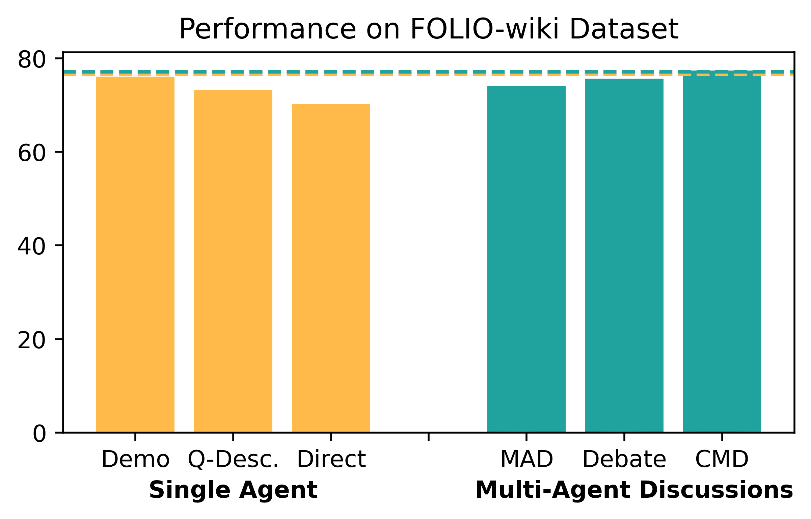
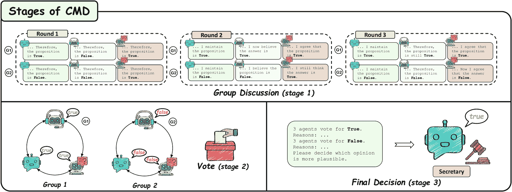
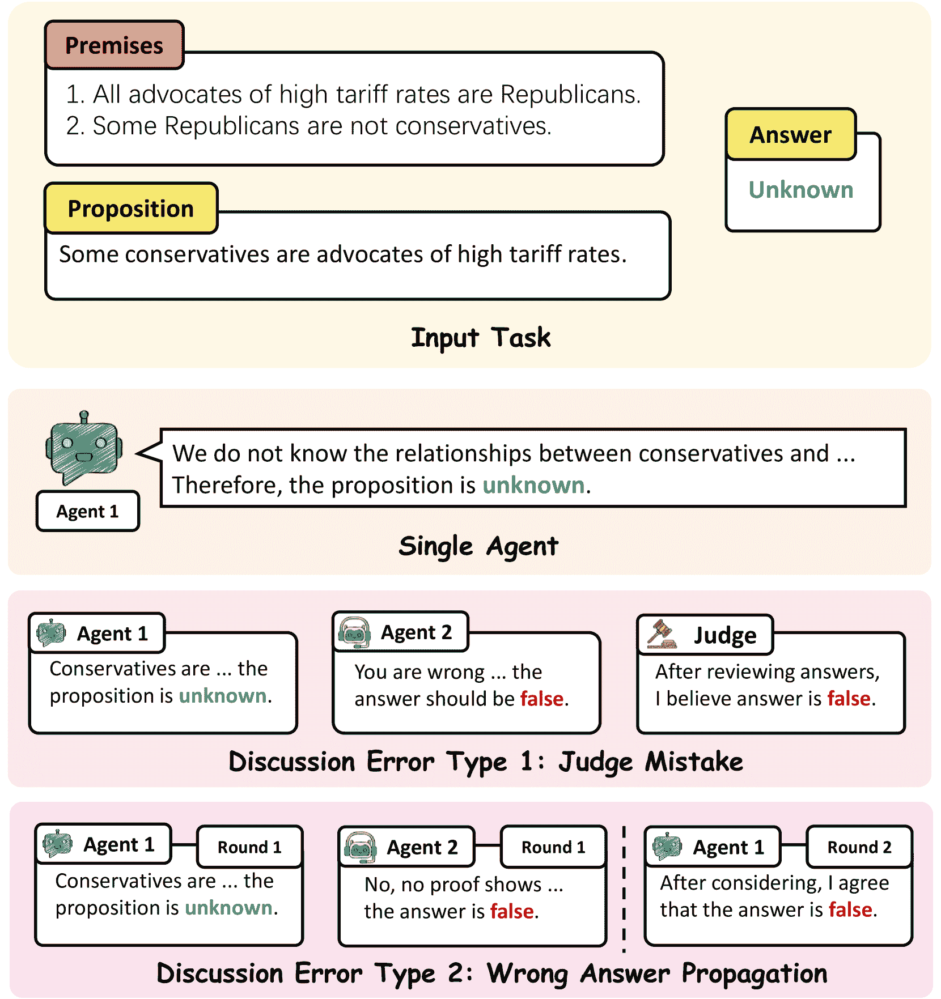
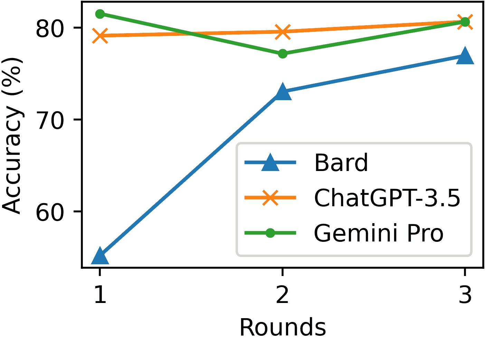
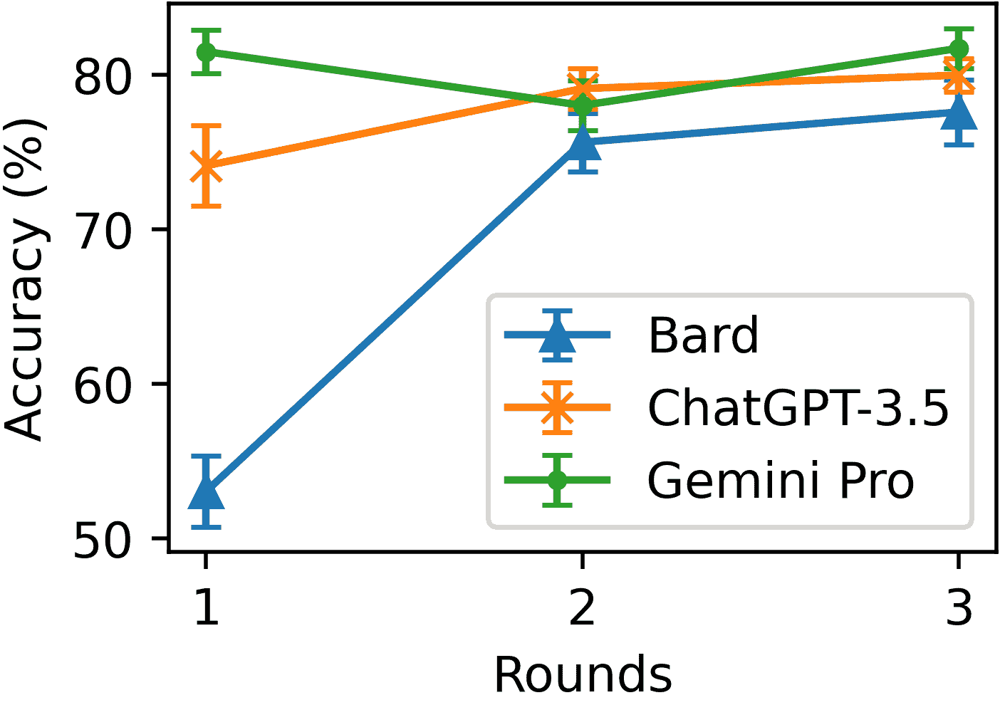

<!--yml

category: 未分类

date: 2025-01-11 12:49:37

-->

# 重新思考LLM推理的界限：多代理讨论是关键吗？

> 来源：[https://arxiv.org/html/2402.18272/](https://arxiv.org/html/2402.18272/)

Qineng Wang^(1*)    Zihao Wang^(2*)    Ying Su²    Hanghang Tong³    Yangqiu Song²

¹浙江大学    ²香港科技大学    ³伊利诺伊大学香槟分校

wongqineng73@zju.edu.cn, htong@illinois.edu

{zwanggc,ysuay,yqsong}@cse.ust.hk

###### 摘要

最近关于大语言模型（LLMs）多代理讨论的研究表明，多个代理的讨论能提高LLMs的推理能力。在这项工作中，我们通过系统的实验重新评估这一观点，并提出了一种新的小组讨论框架来丰富讨论机制的集合。有趣的是，我们的结果表明，在广泛的推理任务和基础大语言模型上，一个具有强大提示的单代理LLM能够达到与现有最佳讨论方法几乎相同的性能。我们观察到，只有当提示中没有示范时，多代理讨论才会比单代理表现得更好。进一步的研究揭示了LLMs在讨论过程中的共同互动机制。

重新思考LLM推理的界限：

多代理讨论是关键吗？

Qineng Wang^(1*)  Zihao Wang^(2*)  Ying Su²  Hanghang Tong³  Yangqiu Song² ¹浙江大学  ²香港科技大学  ³伊利诺伊大学香槟分校 wongqineng73@zju.edu.cn, htong@illinois.edu {zwanggc,ysuay,yqsong}@cse.ust.hk

^*^*footnotetext: 这些作者对本研究做出了同等贡献。

## 1 引言

大型语言模型（LLMs）在语言理解和生成方面表现出强大的能力，OpenAI（[2022](https://arxiv.org/html/2402.18272v1#bib.bib30), [2023](https://arxiv.org/html/2402.18272v1#bib.bib31)）；Touvron等人（[2023a](https://arxiv.org/html/2402.18272v1#bib.bib37)）；Zhang等人（[2022a](https://arxiv.org/html/2402.18272v1#bib.bib53)）；Chowdhery等人（[2022](https://arxiv.org/html/2402.18272v1#bib.bib9)）；Team等人（[2023](https://arxiv.org/html/2402.18272v1#bib.bib36)）。然而，由于模型缺陷，如幻觉和推理视角错误，LLMs在推理任务中仍然存在不足，Xu等人（[2023a](https://arxiv.org/html/2402.18272v1#bib.bib45)）。为了解决这些问题，许多工作通过模拟人类推理提出了新的方法。受到心智社会（Society of Mind）Minsky（[1988](https://arxiv.org/html/2402.18272v1#bib.bib29)）的启发，像Debate Du等人（[2023](https://arxiv.org/html/2402.18272v1#bib.bib13)）、MAD Liang等人（[2023](https://arxiv.org/html/2402.18272v1#bib.bib22)）和ReConcile Chen等人（[2023a](https://arxiv.org/html/2402.18272v1#bib.bib7)）等多智能体讨论框架，通过引入多个AI智能体，提出了一种新方法。这些智能体由LLMs驱动，在给定的主题上自主进行讨论，通过模拟人类讨论过程来提高LLMs的推理能力。为了进一步提高性能，大多数多智能体讨论框架利用了特定任务的示例，这些示例通常被称为示范，Min等人（[2022](https://arxiv.org/html/2402.18272v1#bib.bib28)）。这一点基于LLMs可以从上下文示范中学习的洞察，Brown等人（[2020](https://arxiv.org/html/2402.18272v1#bib.bib5)）。我们注意到，*所有这些讨论框架都声称它们优于传统的单智能体方法*，例如Chain-of-Thought Wei等人（[2022](https://arxiv.org/html/2402.18272v1#bib.bib41)）。

图[1](https://arxiv.org/html/2402.18272v1#S1.F1 "图1 ‣ 1 引言 ‣ 重新思考LLM推理的边界：多智能体讨论是关键吗？")展示了单智能体设置与多智能体讨论框架在FOLIO-wiki数据集上的对比，Zhang等人（[2023b](https://arxiv.org/html/2402.18272v1#bib.bib54)）；Han等人（[2022](https://arxiv.org/html/2402.18272v1#bib.bib16)）。在此图中，“Demo”表示测试的单智能体提供了一个示范案例，“Q-Desc.”表示单智能体提供了详细的题目描述，而“Direct”指的是没有示范的单智能体。我们观察到，单智能体“Demo”往往能够达到与所有讨论框架相似的性能上限，稍后将对此进行进一步阐述。这个结果表明，之前的*主张*并没有完全成立。

图1：单代理设置和多代理讨论框架在FOLIO-wiki数据集上的比较性能。

图2：我们提出的多代理讨论框架设计流程。该流程通过让代理从启动提示开始运作，接着代理们按照算法中定义的规则进行讨论，最终得出结果。

基于图[1](https://arxiv.org/html/2402.18272v1#S1.F1 "图 1 ‣ 1 引言 ‣ 重新思考LLM推理的边界：多代理讨论是关键吗？")中的观察结果，本文通过系统的实验提供深入分析。作为一个新兴话题，现有的讨论框架仍然有限。为了提供更全面、更详细的单代理设置与讨论框架之间的比较，如图[3](https://arxiv.org/html/2402.18272v1#S2.F3 "图 3 ‣ 2 初步 ‣ 重新思考LLM推理的边界：多代理讨论是关键吗？")所示，我们提出了一种新的讨论框架，命名为CMD，灵感来自于人类小组讨论过程。我们的讨论流程考虑了多个设计方面，详见图[2](https://arxiv.org/html/2402.18272v1#S1.F2 "图 2 ‣ 1 引言 ‣ 重新思考LLM推理的边界：多代理讨论是关键吗？")（更多细节请参见第[2.1](https://arxiv.org/html/2402.18272v1#S2.SS1 "2.1 什么是多代理讨论？ ‣ 2 初步 ‣ 重新思考LLM推理的边界：多代理讨论是关键吗？")节）。我们进一步在标准推理基准上进行了一系列实验（ECQA Aggarwal等（[2021](https://arxiv.org/html/2402.18272v1#bib.bib1)），GSM8k Cobbe等（[2021](https://arxiv.org/html/2402.18272v1#bib.bib10)），FOLIO-wiki Han等（[2022](https://arxiv.org/html/2402.18272v1#bib.bib16)）；Zhang等（[2023b](https://arxiv.org/html/2402.18272v1#bib.bib54)））使用我们流程中不同部分的多种配置进行。

我们发现，当提供给代理的提示足够强大时，多代理讨论并不一定增强推理能力，这与图[1](https://arxiv.org/html/2402.18272v1#S1.F1 "图 1 ‣ 1 引言 ‣ 重新思考LLM推理的边界：多代理讨论是关键吗？")中的观察结果一致。此外，我们的实验结果表明，在没有提供示范的情况下，多代理讨论框架的表现优于单代理设置。我们还发现，像Bard Anil等（[2023](https://arxiv.org/html/2402.18272v1#bib.bib3)）这样由较弱的LLM驱动的代理，通过与像Gemini Pro Team等（[2023](https://arxiv.org/html/2402.18272v1#bib.bib36)）强大LLM的互动，可以提升其推理能力。

总结来说，我们的分析为理解何时使用多智能体讨论进行推理提供了一个新的视角。我们的贡献如下：(1) 我们提出了一个新的多智能体讨论框架CMD，模拟了人类群体讨论过程；(2) 我们观察到，单一智能体在强提示下的表现与使用同样强大的提示的多智能体讨论相匹配；(3) 我们识别出两种常见的讨论错误：判断失误和错误答案传播；(4) 我们发现，在没有示范的情况下，多智能体讨论超越了单一智能体；(5) 在多LLM多智能体讨论中，强大的LLM帮助提高了弱LLM智能体的表现。

## 2 初步研究

图3：征服与合并讨论（CMD）框架概述。

### 2.1 什么是多智能体讨论？

多智能体讨论指的是一种互动设置，其中多个由大型语言模型（LLM）驱动的智能体进行自主对话。每个智能体会收到一个包含必要背景知识并指导其行为的提示。给定话题后，这些智能体可以独立进行对话。

图[2](https://arxiv.org/html/2402.18272v1#S1.F2 "图2 ‣ 1 引言 ‣ 重新思考LLM推理的边界：多智能体讨论是关键吗？")展示了一个讨论设计流程图，结构包括四个主要元素：启动提示、智能体、算法和结果。启动提示提供了背景知识和讨论主题等关键信息。然后，这些信息传递给智能体，智能体基于各种LLM进行操作。接下来，算法定义了讨论的具体规则，包括回合数、决策过程（由评审或通过投票进行）以及讨论结构（如层级结构）。最后，“结果”描述了如何做出最终决策并呈现。我们进一步在附录[A](https://arxiv.org/html/2402.18272v1#A1 "附录A 讨论工程与智能体对称性 ‣ 重新思考LLM推理的边界：多智能体讨论是关键吗？")中提供了一个关于提示相关机制（包括讨论）的对称性视角。

### 2.2 现有讨论框架

之前关于多智能体讨论框架的研究已经涵盖了几种常见的讨论范式。在本文中，我们考虑了以下讨论框架进行实验：Debate Du等人（[2023](https://arxiv.org/html/2402.18272v1#bib.bib13)）、MAD Liang等人（[2023](https://arxiv.org/html/2402.18272v1#bib.bib22)）和ReConcile Chen等人（[2023a](https://arxiv.org/html/2402.18272v1#bib.bib7)）。

辩论模拟了一个简单的基于回合的智能体讨论。最初，所有智能体都会被提示解决指定任务，然后他们各自的回答将被纳入到每个智能体的输入中，用于下一轮的讨论。通常，这个过程包括三轮讨论。

MAD引入了发散性思维，通过让两个参与者从对立的角度讨论一个任务。然后，裁判介入评估哪个观点更具可信性，或者是否需要进一步讨论。讨论会持续进行，直到达成共识，或者裁判偏向某个特定解决方案。

ReConcile实现了一个由多个LLM驱动的智能体圆桌讨论。它通过加权投票系统来达成决策。在这个过程中，智能体为他们的回答提供置信度，ReConcile中的智能体利用这些置信度作为权重进行投票，从而达成最终决定。

尽管这些进展已经取得，但多智能体框架的数量仍然有限，并且没有框架考虑到最普遍的讨论形式之一：小组讨论。

## 3 CMD: 征服与合并讨论

为了在随后的实验中进行全面对比，我们识别并弥补了以往研究中的空白，之前的研究并未提出基于小组讨论的框架。为此，我们引入了一种新的多智能体小组讨论框架，称为CMD。在CMD框架中，假设有$n$个智能体$\mathcal{A}=\{A_{i}\}_{i=1}^{n}$正在讨论一个问题$\mathcal{Q}$，并且每个智能体$A_{i}$由一个大型语言模型（LLM）$\mathcal{L}_{i}$驱动。我们使用一个数组$H$来存储历史响应。智能体们将在$\mathcal{R}$轮中进行讨论。在每一轮$r$中，每个智能体$A_{i}$生成一个响应$(v_{i},e_{i})=\texttt{CMD}(H|\mathcal{Q},r)$，其中$v_{i}$是观点，$e_{i}$表示解释。详细描述可以在附录[B](https://arxiv.org/html/2402.18272v1#A2 "Appendix B CMD: Conquer and Merge Discussion Framework ‣ Rethinking the Bounds of LLM Reasoning: Are Multi-Agent Discussions the Key?")中查看。

### 3.1 消息传递算法

为了同步代理之间的通信，我们提出了一种消息传递算法。以往关于多代理讨论框架的研究通常仅专注于特定场景，未设计出一种通用的算法来同步不同讨论中的代理消息。此外，讨论形式在架构上存在差异，代理可能由不同的LLM驱动，而每个LLM通常具有不同的调用协议。因此，我们设计了一种基于多线程方式的消息传递算法，以解决这些问题。该算法为每个代理建立一个接收映射 $M$，以存储它们在下一轮应该接收的消息。对于来自代理 $A_{i}$ 的每条消息 $m_{j}$，算法首先确认接收者 $\mathcal{A}_{r}$，然后将 $m_{j}$ 添加到每个代理 $A_{k}\in \mathcal{A}_{r}$ 的接收映射 $M$ 中。当下一轮开始时，算法将自动将存储在 $M$ 中的消息推送给相应的代理。有关更详细的伪代码，请参见附录 [B.4](https://arxiv.org/html/2402.18272v1#A2.SS4 "B.4 Message-Passing Algorithm ‣ Appendix B CMD: Conquer and Merge Discussion Framework ‣ Rethinking the Bounds of LLM Reasoning: Are Multi-Agent Discussions the Key?")。

### 3.2 CMD的三个阶段

如图 [3](https://arxiv.org/html/2402.18272v1#S2.F3 "Figure 3 ‣ 2 Preliminary ‣ Rethinking the Bounds of LLM Reasoning: Are Multi-Agent Discussions the Key?") 所示，CMD 由三个阶段组成：小组讨论、投票和最终决策阶段。通常，最终决策阶段是为了解决平局而保留的，否则不需要。以下是 CMD 框架中每个阶段的详细介绍，更多内容请参见附录 [B.3](https://arxiv.org/html/2402.18272v1#A2.SS3 "B.3 CMD Stages ‣ Appendix B CMD: Conquer and Merge Discussion Framework ‣ Rethinking the Bounds of LLM Reasoning: Are Multi-Agent Discussions the Key?")。

阶段1：小组讨论。在此阶段，代理 $\mathcal{A}$ 被分成大小相等的小组 $\mathcal{G}=\{G_{k}\}^{t}_{k=1}$。所有代理都需要通过讨论来解决任务 $\mathcal{Q}$。对于每个代理 $A_{i}\in G_{k}$，可以访问 $A_{i}\in G_{k}$ 在上一轮中的所有答案和解释，但仅限于小组内的代理 $A_{j}\in G_{k}$ 且 $j\neq i$。与此不同的是，他们只能看到其他小组代理的答案，但没有解释。在经过 $\mathcal{R}$ 轮讨论后，CMD 进入投票阶段。

阶段2：投票。当讨论达到最大轮次时，所有代理 $\mathcal{A}$ 开始投票。每个代理在该次讨论中的投票被视为同等权重，因此，结果由多数决定。如果出现平局，CMD 进入阶段3。否则，讨论过程正式结束。

阶段 3：最终决策。如果出现平局，我们引入一个额外的代理 $S$ 作为秘书来做出最终决定。每个提出的答案都会附带一个解释，解释由持相同意见的代理选择，并提供给秘书以便最终确定。总结来说，最终决策由 $\mathtt{Vote}(\mathcal{A})$ 或 $S(V,O|\mathcal{Q})$ 做出，其中 $V=\{v_{i}\}^{n}$ 和 $O=\{o_{i}\}^{n}$，分别表示观点集和解释集。

## 4 实验设置

在实验中，我们将单一代理设置与四种已有的多代理讨论框架进行对比：Debate、MAD、ReConcile 和 CMD，在不同的提示条件下进行比较。这些方法在前文的 [2.2](https://arxiv.org/html/2402.18272v1#S2.SS2 "2.2 Existing Discussion Frameworks ‣ 2 Preliminary ‣ Rethinking the Bounds of LLM Reasoning: Are Multi-Agent Discussions the Key?") 和 [3](https://arxiv.org/html/2402.18272v1#S3 "3 CMD: Conquer-and-Merge Discussion ‣ Rethinking the Bounds of LLM Reasoning: Are Multi-Agent Discussions the Key?") 章节中有介绍。

### 4.1 实现细节和度量标准

我们的实验主要在三种先进的语言模型（LLM）上实现，包括 ChatGPT-3.5 OpenAI（[2022](https://arxiv.org/html/2402.18272v1#bib.bib30)）、Gemini Pro Team 等（[2023](https://arxiv.org/html/2402.18272v1#bib.bib36)）和 Bard Anil 等（[2023](https://arxiv.org/html/2402.18272v1#bib.bib3)）。具体而言，我们在 Azure OpenAI¹¹1https://oai.azure.com/ 上使用 gpt-35-turbo (0613) 实例运行 ChatGPT-3.5，而 chat-bison-001 模型则通过 PaLM2 架构表示 Bard。Gemini Pro 和 Bard 接口通过 Google MakerSuite API²²2https://ai.google.dev/ 操作。所有 LLM 的对话温度统一配置为 $0.25$，以确保一致性。对于所有多代理讨论框架，我们将最大讨论回合数设置为 3。我们的评估通过准确率来衡量各任务的表现。

### 4.2 下游任务

该框架应用于一系列推理任务，包括常识推理任务和两个演绎推理任务：（1）ECQA Aggarwal et al. ([2021](https://arxiv.org/html/2402.18272v1#bib.bib1))：一个以常识知识为中心的QA数据集，（2）GSM8K Cobbe et al. ([2021](https://arxiv.org/html/2402.18272v1#bib.bib10))：一个由数学文字问题组成的基准数据集，（3）FOLIO-wiki Zhang et al. ([2023b](https://arxiv.org/html/2402.18272v1#bib.bib54))：一个改编自FOLIO Han et al. ([2022](https://arxiv.org/html/2402.18272v1#bib.bib16))的数据集，用于符号和自然语言演绎推理。根据计算资源的限制，并遵循早期研究中的前例（Du et al. ([2023](https://arxiv.org/html/2402.18272v1#bib.bib13))；Chen et al. ([2023a](https://arxiv.org/html/2402.18272v1#bib.bib7))；Liang et al. ([2023](https://arxiv.org/html/2402.18272v1#bib.bib22))），我们从ECQA和GSM8K的测试集选择性抽取了100个实例。为了进行深入分析，我们选择对FOLIO-wiki数据集中的所有460个案例进行全面实验，其中去除了有缺陷的案例，以确保结果的真实性。

## 5 单一LLM实验

在本节中，我们使用单一的LLM，ChatGPT-3.5，进行实验。为了获得初步的洞察，我们对FOLIO-wiki数据集进行了深入分析，检查了单智能体设置和多智能体讨论，如[5.1节](https://arxiv.org/html/2402.18272v1#S5.SS1 "5.1 分析FOLIO-wiki数据集 ‣ 5 单一LLM实验 ‣ 重新思考LLM推理的界限：多智能体讨论是关键吗？")中详细说明的内容。之后，我们将实验扩展到其他两个数据集GSM8K和ECQA，在[5.2节](https://arxiv.org/html/2402.18272v1#S5.SS2 "5.2 对所有任务的评估 ‣ 5 单一LLM实验 ‣ 重新思考LLM推理的界限：多智能体讨论是关键吗？")中进行分析。我们还通过[5.3节](https://arxiv.org/html/2402.18272v1#S5.SS3 "5.3 两种讨论错误类型：案例研究 ‣ 5 单一LLM实验 ‣ 重新思考LLM推理的界限：多智能体讨论是关键吗？")的案例研究，调查了讨论中常见的错误。最后，我们在[5.4节](https://arxiv.org/html/2402.18272v1#S5.SS4 "5.4 总结 ‣ 5 单一LLM实验 ‣ 重新思考LLM推理的界限：多智能体讨论是关键吗？")中总结了我们的发现。

| 提示组件 | 多智能体讨论（%） | 单智能体（%） |
| --- | --- | --- |
| Q-描述 | A-描述 | 演示 | MAD (3) | 辩论 (3) | 辩论 (6) | CMD (6) |
| ${\color[rgb]{0.765625,0.19140625,0.28515625}\definecolor[named]{pgfstrokecolor% }{rgb}{0.765625,0.19140625,0.28515625}\pgfsys@color@rgb@stroke{0.765625}{0.191% 40625}{0.28515625}\pgfsys@color@rgb@fill{0.765625}{0.19140625}{0.28515625}% \usym{2717}}$ | ${\color[rgb]{0.765625,0.19140625,0.28515625}\definecolor[named]{pgfstrokecolor% }{rgb}{0.765625,0.19140625,0.28515625}\pgfsys@color@rgb@stroke{0.765625}{0.191% 40625}{0.28515625}\pgfsys@color@rgb@fill{0.765625}{0.19140625}{0.28515625}% \usym{2717}}$ | ${\color[rgb]{0.765625,0.19140625,0.28515625}\definecolor[named]{pgfstrokecolor% }{rgb}{0.765625,0.19140625,0.28515625}\pgfsys@color@rgb@stroke{0.765625}{0.191% 40625}{0.28515625}\pgfsys@color@rgb@fill{0.765625}{0.19140625}{0.28515625}% \usym{2717}}$ | 64.13 | 70.00 | 69.13 | 73.26 | 70.22 |
| ${\color[rgb]{0.05859375,0.44140625,0.44921875}\definecolor[named]{% pgfstrokecolor}{rgb}{0.05859375,0.44140625,0.44921875}\pgfsys@color@rgb@stroke% {0.05859375}{0.44140625}{0.44921875}\pgfsys@color@rgb@fill{0.05859375}{0.44140% 625}{0.44921875}\usym{2713}}$ | ${\color[rgb]{0.765625,0.19140625,0.28515625}\definecolor[named]{pgfstrokecolor% }{rgb}{0.765625,0.19140625,0.28515625}\pgfsys@color@rgb@stroke{0.765625}{0.191% 40625}{0.28515625}\pgfsys@color@rgb@fill{0.765625}{0.19140625}{0.28515625}% \usym{2717}}$ | ${\color[rgb]{0.765625,0.19140625,0.28515625}\definecolor[named]{pgfstrokecolor% }{rgb}{0.765625,0.19140625,0.28515625}\pgfsys@color@rgb@stroke{0.765625}{0.191% 40625}{0.28515625}\pgfsys@color@rgb@fill{0.765625}{0.19140625}{0.28515625}% \usym{2717}}$ | 74.13 | 75.65 | 76.30 | 74.13 | 73.26 |
| ${\color[rgb]{0.765625,0.19140625,0.28515625}\definecolor[named]{pgfstrokecolor% }{rgb}{0.765625,0.19140625,0.28515625}\pgfsys@color@rgb@stroke{0.765625}{0.191% 40625}{0.28515625}\pgfsys@color@rgb@fill{0.765625}{0.19140625}{0.28515625}% \usym{2717}}$ | ${\color[rgb]{0.05859375,0.44140625,0.44921875}\definecolor[named]{% pgfstrokecolor}{rgb}{0.05859375,0.44140625,0.44921875}\pgfsys@color@rgb@stroke% {0.05859375}{0.44140625}{0.44921875}\pgfsys@color@rgb@fill{0.05859375}{0.44140% 625}{0.44921875}\usym{2713}}$ | ${\color[rgb]{0.765625,0.19140625,0.28515625}\definecolor[named]{pgfstrokecolor% }{rgb}{0.765625,0.19140625,0.28515625}\pgfsys@color@rgb@stroke{0.765625}{0.191% 40625}{0.28515625}\pgfsys@color@rgb@fill{0.765625}{0.19140625}{0.28515625}% \usym{2717}}$ | 68.91 | 71.96 | 71.74 | 73.89 | 71.30 |
| ${\color[rgb]{0.05859375,0.44140625,0.44921875}\definecolor[named]{% pgfstrokecolor}{rgb}{0.05859375,0.44140625,0.44921875}\pgfsys@color@rgb@stroke% {0.05859375}{0.44140625}{0.44921875}\pgfsys@color@rgb@fill{0.05859375}{0.44140% 625}{0.44921875}\usym{2713}}$ | ${\color[rgb]{0.05859375,0.44140625,0.44921875}\definecolor[named]{% pgfstrokecolor}{rgb}{0.05859375,0.44140625,0.44921875}\pgfsys@color@rgb@stroke% {0.05859375}{0.44140625}{0.44921875}\pgfsys@color@rgb@fill{0.05859375}{0.44140% 625}{0.44921875}\usym{2713}}$ | ${\color[rgb]{0.765625,0.19140625,0.28515625}\definecolor[named]{pgfstrokecolor% }{rgb}{0.765625,0.19140625,0.28515625}\pgfsys@color@rgb@stroke{0.765625}{0.191% 40625}{0.28515625}\pgfsys@color@rgb@fill{0.765625}{0.19140625}{0.28515625}% \usym{2717}}$ | 71.96 | 70.22 | 70.00 | 71.09 | 73.91 |
| ${\color[rgb]{0.05859375,0.44140625,0.44921875}\definecolor[named]{% pgfstrokecolor}{rgb}{0.05859375,0.44140625,0.44921875}\pgfsys@color@rgb@stroke% {0.05859375}{0.44140625}{0.44921875}\pgfsys@color@rgb@fill{0.05859375}{0.44140% 625}{0.44921875}\usym{2713}}$ | ${\color[rgb]{0.05859375,0.44140625,0.44921875}\definecolor[named]{% pgfstrokecolor}{rgb}{0.05859375,0.44140625,0.44921875}\pgfsys@color@rgb@stroke% {0.05859375}{0.44140625}{0.44921875}\pgfsys@color@rgb@fill{0.05859375}{0.44140% 625}{0.44921875}\usym{2713}}$ | ${\color[rgb]{0.05859375,0.44140625,0.44921875}\definecolor[named]{% pgfstrokecolor}{rgb}{0.05859375,0.44140625,0.44921875}\pgfsys@color@rgb@stroke% {0.05859375}{0.44140625}{0.0.44921875}\pgfsys@color@rgb@fill{0.05859375}{0.44140625}{0.44921875}\usym{2713}}$ | 74.13 | 75.65 | 74.78 | 77.39 | 76.09 |

表 1：使用 ChatGPT-3.5 在 FOLIO-wiki 上单代理设置和多代理讨论的比较性能。缩写词包括：详细问题描述（Q-Desc.）和答案格式描述（A-Desc.）、示范（Demo.）。当禁用提示组件时，仅使用问题本身作为输入。框架旁边的数字表示代理的数量。

### 5.1 FOLIO-wiki 数据集分析

我们首先检查多智能体讨论是否比使用最强提示的智能体在FOLIO-wiki数据集上的表现更为有效。借鉴Wei等人（[2022](https://arxiv.org/html/2402.18272v1#bib.bib41)）和Ling等人（[2023](https://arxiv.org/html/2402.18272v1#bib.bib23)）关于推理任务提示设计的研究，我们将提示分为三部分：详细的问题描述，提供任务的深入背景；答案格式描述，指导智能体应如何回复；以及任务特定示范，展示一个问题和答案对的示例。对于这一任务，我们精心设计了输入提示的示范。我们首先标注每个前提。接下来，我们引用所有前提，并通过使用这些标签将它们与推理过程中的每一步联系起来，直到达到最后一步。一个标注示例类似于表格[5](https://arxiv.org/html/2402.18272v1#A3.T5 "Table 5 ‣ C.2 Round 1 Answer ‣ Appendix C An CMD Example ‣ Rethinking the Bounds of LLM Reasoning: Are Multi-Agent Discussions the Key?")中的案例。然后，我们测试这些组件的不同组合在单一智能体和多智能体讨论中的表现。

单一智能体。我们对不同的提示组件在单一智能体下进行了评估，结果如表格[1](https://arxiv.org/html/2402.18272v1#S5.T1 "Table 1 ‣ 5 Experiments on Single LLM ‣ Rethinking the Bounds of LLM Reasoning: Are Multi-Agent Discussions the Key?")所示。该表格显示，对于单一智能体设置和多智能体讨论，包含详细问题描述或任务特定示范都会增强FOLIO-wiki数据集上的推理能力。详细的问题描述非常重要，因为判断一个给定命题的正确性——无论是真、假还是未知——需要明确性。没有这种明确性，智能体往往难以区分“假”和“未知”。最显著的是，示范的加入显著提升了性能，突显了其作为最有影响力组件的价值，这与之前的研究结果一致，Min等人（[2022](https://arxiv.org/html/2402.18272v1#bib.bib28)）也曾提出过这一点。

多智能体讨论。我们在多智能体讨论设置中评估相同的提示组件，表格[1](https://arxiv.org/html/2402.18272v1#S5.T1 "Table 1 ‣ 5 Experiments on Single LLM ‣ Rethinking the Bounds of LLM Reasoning: Are Multi-Agent Discussions the Key?")揭示了三个关键见解：（1）示范和详细的问题描述增强了多智能体讨论。（2）尽管整体表现相似，但在引入示范后，大多数多智能体讨论的表现并未超过单一智能体。（3）在FOLIO-wiki数据集上，CMD表现优于单一智能体设置和其他多智能体讨论框架。以下是我们发现的进一步分析。

强大的单一代理与讨论框架相当。通过分析单一代理设置和多代理讨论在 FOLIO-wiki 数据集上的实验，我们发现特定任务的演示能够显著提升单一代理的表现。此外，我们还发现，经过充分支持的代理能够与讨论框架表现相当。我们的分析表明，提示工程能够提升大语言模型的推理表现，单一代理和多代理讨论中的演示均推动了性能的上限。

### 5.2 所有任务的评估

| 方法 | ECQA | GSM8K | FOLIO-wiki | 平均 |
| --- | --- | --- | --- | --- |
| 直接 | 演示 | 直接 | 演示 | 直接 | 演示 | 直接 | 演示 |
| 单一代理 | 63.00 | 67.00 | 69.00 | 83.00 | 70.22 | 76.09 | 67.41 | 75.63 |
| MAD (3 个代理) | 55.00 | 58.00 | 74.00 | 78.00 | 61.25 | 74.13 | 63.42 | 70.04 |
| 辩论 (3 个代理) | 67.00 | 65.00 | 78.00 | 81.00 | 70.00 | 75.65 | 71.67 | 73.88 |
| 辩论 (6 个代理) | 65.00 | 64.00 | 74.00 | 78.00 | 69.13 | 74.78 | 69.38 | 72.26 |
| CMD (6 个代理) | 64.00 | 63.00 | 75.00 | 83.00 | 73.26 | 77.39 | 70.75 | 74.46 |

表 2：包含和不包含演示设置的所有任务结果，使用 ChatGPT-3.5。

在[5.1节](https://arxiv.org/html/2402.18272v1#S5.SS1 "5.1 FOLIO-wiki 数据集分析 ‣ 单一 LLM 实验 ‣ 重新思考 LLM 推理的边界：多代理讨论是关键吗？")中，我们发现演示在提高 FOLIO-wiki 数据集的表现上起着关键作用。基于这一洞察，我们将评估简化为两种提示场景：有演示（称为直接）和无演示（称为演示）。表[2](https://arxiv.org/html/2402.18272v1#S5.T2 "表 2 ‣ 5.2 所有任务的评估 ‣ 单一 LLM 实验 ‣ 重新思考 LLM 推理的边界：多代理讨论是关键吗？")中展示的结果涵盖了所有测试的推理任务。研究结果表明：(1) 有演示时，讨论框架和单一代理设置的表现平均相当。这与我们之前的观察一致。(2) 无演示时，CMD 通常超过单一代理设置，无论是平均值还是大多数单独任务。

何时讨论表现更好？大多数多代理讨论框架，特别是 CMD，在没有演示支持的情况下，相比单一代理设置表现更好。我们认为这是因为，在讨论过程中，其他代理的输入能够引入新的视角，从而导致更加深入的推理过程。因此，这种协作优势使得多代理讨论在缺乏特定专家知识或详细示例的情况下成为更有效的选择。

为什么讨论框架在测试任务中表现不同？表[2](https://arxiv.org/html/2402.18272v1#S5.T2 "Table 2 ‣ 5.2 Evaluation on All Tasks ‣ 5 Experiments on Single LLM ‣ Rethinking the Bounds of LLM Reasoning: Are Multi-Agent Discussions the Key?")显示，MAD在所有测试框架中效果最差。我们怀疑这是因为MAD采用了一种发散性思维方式，要求智能体之间产生分歧。这有时会通过引入无关信息，阻碍推理，复杂化决策过程。我们在[5.3](https://arxiv.org/html/2402.18272v1#S5.SS3 "5.3 Two Discussion Error Types: A Case Study ‣ 5 Experiments on Single LLM ‣ Rethinking the Bounds of LLM Reasoning: Are Multi-Agent Discussions the Key?")节中进一步探讨了这一点。除此之外，我们还观察到在特定条件或任务下，其他讨论框架出现了意外行为。例如，当引入示范时，Debate和CMD在ECQA数据集上的表现较差。我们推测，ECQA比单纯的分析性推理更需要常识知识，因此源自单一LLM的单一交互可能导致智能体过度思考。增加的对话可能引入复杂性，而没有解决潜在的知识空白，而不是澄清误解。与ECQA不同，像GSM8K和FOLIO-wiki这样的数据集更注重推理能力。在这些情况下，智能体之间的讨论过程可能是有益的，因为它可以通过互动帮助它们识别和解决彼此推理中的缺陷。

### 5.3 两种讨论错误类型：案例研究

图4：多智能体讨论中可能出现的两种常见错误是判断错误和错误答案传播。这些问题可能导致多智能体讨论得出错误结论，即使单一智能体能够得出正确结论。

我们的实验表明，多智能体讨论有时会得出错误的结论，而这些问题在单一智能体回答正确时会发生。图[4](https://arxiv.org/html/2402.18272v1#S5.F4 "Figure 4 ‣ 5.3 Two Discussion Error Types: A Case Study ‣ 5 Experiments on Single LLM ‣ Rethinking the Bounds of LLM Reasoning: Are Multi-Agent Discussions the Key?")展示了一个来自FOLIO-wiki数据集的例子，说明了这一点：单一智能体提供了正确的答案，但多智能体讨论导致了错误的结果。我们在多智能体讨论中识别了两种独特的错误类型：(1) 判断错误：当某个智能体充当裁判决定最终答案时，若多个智能体的回答不同，裁判可能会选出错误的选项作为最终判决。像MAD和CMD这样的框架容易发生这种错误，尤其是在决策时存在平局的情况下。(2) 错误答案传播：当某个智能体受到其他智能体输入的影响，偏离其初始正确答案并采纳错误的共识时，就会发生此类错误，错误在讨论中进一步传播。这是多智能体讨论中最常见的错误，即使大多数初始答案是正确的。

### 5.4 总结

| 方法类别 | LLM | ECQA | GSM8K | FOLIO-wiki | 平均值 |
| --- | --- | --- | --- | --- | --- |
| 直接 | 示范 | 直接 | 示范 | 直接 | 示范 | 直接 | 示范 |
| 单一智能体 | Bard | 66.00 | 65.00 | 47.00 | 54.00 | 70.00 | 71.96 | 61.00 | 63.65 |
| Gemini Pro | 74.00 | 75.00 | 75.00 | 81.00 | 74.13 | 79.78 | 74.38 | 78.59 |
| ChatGPT-3.5 | 63.00 | 67.00 | 69.00 | 83.00 | 70.22 | 76.09 | 67.41 | 75.63 |
| 讨论 | ReConcile (Bard, Gemini, ChatGPT) | 70.00 | 71.00 | 78.00 | 83.00 | 80.34 | 81.09 | 76.11 | 78.36 |
| 小组讨论 | CMD (Bard, Gemini, ChatGPT) | 73.00 | 72.00 | 78.00 | 82.00 | 79.78 | 81.96 | 76.93 | 78.66 |

表格 3：单一智能体和CMD在多个LLM上对所有任务的评估结果，使用两种类型的提示：有示范和无示范。

在本节中，我们评估了单一智能体设置和多智能体讨论中各种提示组件组合。我们的研究结果表明，当单一智能体和多智能体都可以访问示范时，多智能体讨论与单一智能体相当。然而，在缺乏示范的情况下，多智能体讨论通常优于单一智能体，因此在专家知识或详细示例不足的场景中，多智能体讨论是更好的选择。我们还突出了一些不寻常的结果，并通过案例研究识别了多智能体讨论中的两种常见错误：判断错误和错误答案传播。

## 6 多LLM实验

在本节中，我们将实验范围从单一 LLM 扩展到多个 LLM，涵盖单一智能体设置和多智能体讨论框架，这使我们能够在多 LLM 场景中测试之前研究结果的有效性。具体来说，我们评估了由三种先进 LLM 驱动的智能体的表现：ChatGPT-3.5、Gemini Pro 和 Bard。在[6.1](https://arxiv.org/html/2402.18272v1#S6.SS1 "6.1 在多个 LLM 场景中验证研究结果 ‣ 6 多个 LLM 实验 ‣ 重新思考 LLM 推理的界限：多智能体讨论是否是关键？")节中，我们比较了三种单一智能体配置（每种使用不同的 LLM）与利用所有三种 LLM 的多智能体讨论的表现。在[6.2](https://arxiv.org/html/2402.18272v1#S6.SS2 "6.2 在较弱 LLM 中通过强 LLM 的支持提升智能体 ‣ 6 多个 LLM 实验 ‣ 重新思考 LLM 推理的界限：多智能体讨论是否是关键？")节中的轮次分析提供了另一种见解：由更强 LLM 驱动的智能体能够提升由较弱 LLM 驱动的智能体的表现。

### 6.1 在多个 LLM 场景中验证研究结果

在本节中，我们评估了三种单一智能体设置（每种由不同的 LLM 支持）和两种多智能体讨论框架（ReConcile 和 CMD）在所有任务中的表现。我们为每个任务使用了两种类型的提示设置：一种包含示范，另一种不包含示范。对于 CMD 框架，我们将六个智能体分为两组，每组三个，每个智能体由以下三种 LLM 中的一种支持：ChatGPT-3.5、Gemini Pro 或 Bard。[表3](https://arxiv.org/html/2402.18272v1#S5.T3 "表3 ‣ 5.4 总结 ‣ 5 单一 LLM 实验 ‣ 重新思考 LLM 推理的界限：多智能体讨论是否是关键？")中呈现的结果支持我们在[第5节](https://arxiv.org/html/2402.18272v1#S5 "5 单一 LLM 实验 ‣ 重新思考 LLM 推理的界限：多智能体讨论是否是关键？")中的先前发现，虽然有一些细微的修改。

强大的单一智能体可与讨论框架相媲美。根据[表3](https://arxiv.org/html/2402.18272v1#S5.T3 "表3 ‣ 5.4 总结 ‣ 5 单一 LLM 实验 ‣ 重新思考 LLM 推理的界限：多智能体讨论是否是关键？")中的实验结果，我们可以发现，当提供示范时，讨论框架的表现与由 Gemini Pro 驱动的单一智能体相当。这巩固了我们之前的结论：一个‘强大的’单一智能体——通过精心设计的提示和最先进的 LLM 支持——可以与多智能体讨论框架的表现相媲美。

讨论框架在没有示范的情况下优于单一智能体。表[3](https://arxiv.org/html/2402.18272v1#S5.T3 "表3 ‣ 5.4总结 ‣ 5. 单一LLM实验 ‣ 重新思考LLM推理的边界：多智能体讨论是关键吗？")揭示，在多LLM场景中，当没有提供示范时，多智能体讨论优于单一智能体。这一结果与我们在单一LLM设置中的观察一致。此外，CMD和ReConcile在没有访问示范的情况下展示了相似的表现，并且它们都由相同的LLM驱动。这表明我们的发现适用于不同的多LLM多智能体讨论框架。

### 6.2 在较弱的LLM中通过强大的LLM支持增强智能体

(a) ReConcile（讨论）

(b) CMD（小组讨论）

图5：FOLIO-wiki数据集上每个LLM在多智能体讨论中的轮次表现。

如表[3](https://arxiv.org/html/2402.18272v1#S5.T3 "表3 ‣ 5.4总结 ‣ 5. 单一LLM实验 ‣ 重新思考LLM推理的边界：多智能体讨论是关键吗？")所示，使用Bard的单一智能体在诸如FOLIO-wiki数据集这样的推理任务中表现最差。然而，多LLM多智能体框架仍然具有竞争力。为了了解像Bard这样不太先进的LLM在多智能体讨论中的表现，我们进一步研究了每个LLM在讨论中的轮次表现。图[5](https://arxiv.org/html/2402.18272v1#S6.F5 "图5 ‣ 6.2 在较弱的LLM中通过强大的LLM支持增强智能体 ‣ 6. 多LLM实验 ‣ 重新思考LLM推理的边界：多智能体讨论是关键吗？")显示，像Bard和ChatGPT-3.5这样的能力较弱的LLM在连轮的讨论中，借助更强大的LLM——Gemini Pro的支持，逐渐提高了他们的表现。我们推测，在整个讨论过程中，Gemini Pro帮助弥补了较不先进LLM在知识和推理上的差距，指引它们走向更强的推理路径。值得注意的是，尽管Gemini Pro在第二轮表现略有下降，但它展示了韧性，并迅速恢复，基本保持了其卓越的表现。再次强调，这一发现适用于不同的多LLM讨论，特别是对于ReConcile和CMD。

## 7 相关工作

### 7.1 提示大型语言模型进行推理

最近的研究在构建强大的大型语言模型（LLMs）（Brown等人，[2020](https://arxiv.org/html/2402.18272v1#bib.bib5); OpenAI，[2022](https://arxiv.org/html/2402.18272v1#bib.bib30)，[2023](https://arxiv.org/html/2402.18272v1#bib.bib31)）方面取得了显著进展，或者通过提示工程探索在多个下游任务中采用LLMs的策略。

通过使用不同的知识文本来源和参数规模进行训练，构建了具备不同推理能力的各种大型语言模型（LLMs），如OPT（Zhang等人，[2022a](https://arxiv.org/html/2402.18272v1#bib.bib53)）、LLaMA（Touvron等人，[2023a](https://arxiv.org/html/2402.18272v1#bib.bib37)，[b](https://arxiv.org/html/2402.18272v1#bib.bib38)）、BLOOM Scao等人（[2022](https://arxiv.org/html/2402.18272v1#bib.bib33)）以及PaLM Chowdhery等人（[2022](https://arxiv.org/html/2402.18272v1#bib.bib9)）；Anil等人（[2023](https://arxiv.org/html/2402.18272v1#bib.bib3)）。最近，Gemini Pro Team等人（[2023](https://arxiv.org/html/2402.18272v1#bib.bib36)）将LLMs的能力扩展到多模态领域。

在通过提示工程提高LLMs推理能力的领域，已取得许多进展。Chain of Thought（CoT）（Wei等人，[2022](https://arxiv.org/html/2402.18272v1#bib.bib41)；Kojima等人，[2022](https://arxiv.org/html/2402.18272v1#bib.bib19)）是一种线性问题解决方法，其中每一步都建立在前一步的基础上。Fu等人（[2022](https://arxiv.org/html/2402.18272v1#bib.bib15)）提议将CoT应用于多步骤推理任务。为了自动化CoT，Auto-CoT（Zhang等人，[2022b](https://arxiv.org/html/2402.18272v1#bib.bib55)）通过采样不同问题并生成推理链来构建演示。Active-Prompt（Diao等人，[2023](https://arxiv.org/html/2402.18272v1#bib.bib12)）旨在为特定任务选择最不确定的问题进行标注。其他旨在增强LLMs推理能力的提示策略包括PS Prompt（Wang等人，[2023](https://arxiv.org/html/2402.18272v1#bib.bib39)），该策略将任务分解为子任务，ToT（Yao等人，[2023a](https://arxiv.org/html/2402.18272v1#bib.bib49)）通过考虑多条推理路径并自我评估选择来扩展推理过程，有效的GoT（Yao等人，[2023b](https://arxiv.org/html/2402.18272v1#bib.bib50)），该策略将思维框架表示为图，Natural Program（Ling等人，[2023](https://arxiv.org/html/2402.18272v1#bib.bib23)），有助于提高演绎推理任务，重读提示（Xu等人，[2023b](https://arxiv.org/html/2402.18272v1#bib.bib46)），该策略重新审视输入提示中嵌入的问题信息。

### 7.2 多代理讨论用于LLMs推理

多代理讨论利用多个LLMs作为代理，以互动的方式共同讨论和推理给定的问题。大量研究已经探讨了如何提高单个LLM的推理能力，而LLMs之间的多代理讨论仍在探索中。

Du 等人提出的多代理辩论框架（[2023](https://arxiv.org/html/2402.18272v1#bib.bib13)）建立了一个代理之间对称讨论的机制。在同一时期，MAD（多代理辩论）框架（Liang 等人，[2023](https://arxiv.org/html/2402.18272v1#bib.bib22)）提出了一个不对称机制设计。它不对称地分配不同的角色（辩手和裁判）。其他类似的工作包括 Chan 等人（[2023](https://arxiv.org/html/2402.18272v1#bib.bib6)）。此外，ReConcile 框架（Chen 等人，[2023a](https://arxiv.org/html/2402.18272v1#bib.bib7)）通过涉及不同的 LLM 并使用加权投票机制，展示了一个不对称的讨论机制。为了更深入理解讨论，Zhang 等人（[2023a](https://arxiv.org/html/2402.18272v1#bib.bib52)）旨在从社会心理学视角解释这种协作机制。

与这些工作不同，我们的目标是通过我们定义的多代理小组讨论框架 CMD，探索提示内容对讨论过程的潜在影响。

## 8 结论

在本文中，我们通过系统的实验重新审视了多代理讨论在推理任务中是否优于单一代理的说法。我们引入了一个新的框架 CMD，以进行全面和公平的评估。通过在标准基准上进行实验，我们发现：(1) 一个拥有强大提示和强大 LLM 支持的单一代理，其表现与多 LLM 多代理讨论相当；(2) 在没有示范的情况下，多代理讨论框架在大多数任务中优于单一代理；(3) 当多个 LLM 参与多代理讨论时，强大 LLM 的代理可以在讨论进行中提升弱 LLM 代理的表现。

## 9 伦理考量

我们的研究采用公开可用的数据集和通过官方 API 访问的 LLMs，确保负责任和道德的使用。具体而言，我们的伦理考虑可以总结如下：

公共数据集。我们使用的数据集旨在学术研究。未处理任何个人数据。

授权的 API 使用。我们对 LLMs 的应用符合 API 使用政策，遵循公平使用标准并尊重知识产权。

透明度。我们提供详细的实验方法，允许结果可复现，并鼓励透明的科学实践。

## 10 限制

我们的研究提供了全面的实验，研究强大单一代理和多代理讨论的表现。然而，下面强调的几个方面可以在未来的工作中进一步完善和探索。

增强智能体复杂度。目前，所有讨论框架，包括CMD，都将LLM会话视为一个AI智能体。这种视角简化了文献中定义的基于LLM的AI智能体的概念（Weng，[2023](https://arxiv.org/html/2402.18272v1#bib.bib42)）。通过整合更复杂的技术，例如思想树（Tree-of-Thought，Yao 等人，[2023a](https://arxiv.org/html/2402.18272v1#bib.bib49)）或累积推理（Cumulative Reasoning，Zhang 等人，[2023b](https://arxiv.org/html/2402.18272v1#bib.bib54)），或结合外部工具或知识库，我们可能会提高多智能体讨论的整体推理表现。

扩展任务多样性。虽然我们的研究主要集中在推理任务上，评估单一智能体设置和多智能体讨论，但讨论的自适应性使得其能够应用于更广泛的场景。未来的研究可以探索在各种情境下使用智能体讨论的可能性，例如现实世界的战略规划或将智能体集成到互动游戏环境中。

额外LLM实验。由于计算和财务的限制，我们的研究仅限于测试三种LLM——Bard、Gemini Pro和ChatGPT-3.5。将我们的分析扩展到包括其他LLM，可能会提供对不同语言模型的能力和差异的更全面理解，从而为我们在多智能体讨论框架中的发现的普适性和可扩展性提供有价值的见解。

## 参考文献

+   Aggarwal 等人（2021）Shourya Aggarwal, Divyanshu Mandowara, Vishwajeet Agrawal, Dinesh Khandelwal, Parag Singla, 和 Dinesh Garg。2021年。《CommonsenseQA的解释：新数据集和模型》。在*第59届计算语言学协会年会及第11届国际联合自然语言处理会议（第一卷：长篇论文）*的会议记录中，3050–3065页。

+   Anderson（1972）Philip W Anderson。1972年。《更多即是不同：破缺对称与科学层次结构的本质》。*科学*，177(4047):393–396。

+   Anil 等人（2023）Rohan Anil, Andrew M Dai, Orhan Firat, Melvin Johnson, Dmitry Lepikhin, Alexandre Passos, Siamak Shakeri, Emanuel Taropa, Paige Bailey, Zhifeng Chen 等人。2023年。《Palm 2技术报告》。*arXiv 预印本 arXiv:2305.10403*。

+   Besta 等人（2023）Maciej Besta, Nils Blach, Ales Kubicek, Robert Gerstenberger, Lukas Gianinazzi, Joanna Gajda, Tomasz Lehmann, Michal Podstawski, Hubert Niewiadomski, Piotr Nyczyk 等人。2023年。《思想图谱：用大型语言模型解决复杂问题》。*arXiv 预印本 arXiv:2308.09687*。

+   Brown 等人（2020）Tom Brown, Benjamin Mann, Nick Ryder, Melanie Subbiah, Jared D Kaplan, Prafulla Dhariwal, Arvind Neelakantan, Pranav Shyam, Girish Sastry, Amanda Askell 等人。2020年。《语言模型是少样本学习者》。*神经信息处理系统进展*，33:1877–1901。

+   Chan 等人（2023）Chi-Min Chan, Weize Chen, Yusheng Su, Jianxuan Yu, Wei Xue, Shanghang Zhang, Jie Fu, 和 Zhiyuan Liu. 2023. Chateval：通过多代理辩论改进基于大型语言模型的评估者。 *arXiv 预印本 arXiv:2308.07201*。

+   Chen 等人（2023a）Justin Chih-Yao Chen, Swarnadeep Saha, 和 Mohit Bansal. 2023a. Reconcile：圆桌会议通过多样化语言模型间的共识提高推理能力。 *arXiv 预印本 arXiv:2309.13007*。

+   Chen 等人（2023b）Xinyun Chen, Maxwell Lin, Nathanael Schärli, 和 Denny Zhou. 2023b. 教授大型语言模型自我调试。 *arXiv 预印本 arXiv:2304.05128*。

+   Chowdhery 等人（2022）Aakanksha Chowdhery, Sharan Narang, Jacob Devlin, Maarten Bosma, Gaurav Mishra, Adam Roberts, Paul Barham, Hyung Won Chung, Charles Sutton, Sebastian Gehrmann 等人. 2022. Palm：通过路径扩展语言建模。 *arXiv 预印本 arXiv:2204.02311*。

+   Cobbe 等人（2021）Karl Cobbe, Vineet Kosaraju, Mohammad Bavarian, Mark Chen, Heewoo Jun, Lukasz Kaiser, Matthias Plappert, Jerry Tworek, Jacob Hilton, Reiichiro Nakano 等人. 2021. 训练验证器来解决数学应用题。 *arXiv 预印本 arXiv:2110.14168*。

+   Daskalakis 和 Weinberg（2012）Constantinos Daskalakis 和 Seth Matthew Weinberg. 2012. 对称性与最优多维机制设计。在 *第13届ACM电子商务会议论文集*，第370–387页。

+   Diao 等人（2023）Shizhe Diao, Pengcheng Wang, Yong Lin, 和 Tong Zhang. 2023. 使用思维链进行主动提示以提高大型语言模型的性能。 *arXiv 预印本 arXiv:2302.12246*。

+   Du 等人（2023）Yilun Du, Shuang Li, Antonio Torralba, Joshua B Tenenbaum, 和 Igor Mordatch. 2023. 通过多代理辩论提高语言模型的事实性和推理能力。 *arXiv 预印本 arXiv:2305.14325*。

+   Dua 等人（2022）Dheeru Dua, Shivanshu Gupta, Sameer Singh, 和 Matt Gardner. 2022. 逐步提示：分解复杂问题的有效方法。 *arXiv 预印本 arXiv:2212.04092*。

+   Fu 等人（2022）Yao Fu, Hao Peng, Ashish Sabharwal, Peter Clark, 和 Tushar Khot. 2022. 基于复杂度的多步骤推理提示。 *arXiv 预印本 arXiv:2210.00720*。

+   Han 等人（2022）Simeng Han, Hailey Schoelkopf, Yilun Zhao, Zhenting Qi, Martin Riddell, Luke Benson, Lucy Sun, Ekaterina Zubova, Yujie Qiao, Matthew Burtell 等人. 2022. Folio：使用一阶逻辑进行自然语言推理。 *arXiv 预印本 arXiv:2209.00840*。

+   Imani 等人（2023）Shima Imani, Liang Du, 和 Harsh Shrivastava. 2023. Mathprompter：使用大型语言模型进行数学推理。 *arXiv 预印本 arXiv:2303.05398*。

+   Khot 等人（2022）Tushar Khot, Harsh Trivedi, Matthew Finlayson, Yao Fu, Kyle Richardson, Peter Clark, 和 Ashish Sabharwal. 2022. 分解提示：解决复杂任务的模块化方法。 *arXiv 预印本 arXiv:2210.02406*。

+   Kojima 等人 (2022) Takeshi Kojima, Shixiang Shane Gu, Machel Reid, Yutaka Matsuo, 和 Yusuke Iwasawa. 2022. 大型语言模型是零-shot 推理器。*神经信息处理系统进展*, 35:22199–22213。

+   Laffont 和 Martimort (2000) Jean-Jacques Laffont 和 David Martimort. 2000. 机制设计中的串通与关联。*Econometrica*, 68(2):309–342。

+   Li 等人 (2022) Yifei Li, Zeqi Lin, Shizhuo Zhang, Qiang Fu, Bei Chen, Jian-Guang Lou, 和 Weizhu Chen. 2022. 使语言模型成为更好的推理者的进展。*arXiv 预印本 arXiv:2206.02336*。

+   Liang 等人 (2023) Tian Liang, Zhiwei He, Wenxiang Jiao, Xing Wang, Yan Wang, Rui Wang, Yujiu Yang, Zhaopeng Tu, 和 Shuming Shi. 2023. 通过多智能体辩论鼓励大型语言模型的发散性思维。*arXiv 预印本 arXiv:2305.19118*。

+   Ling 等人 (2023) Zhan Ling, Yunhao Fang, Xuanlin Li, Zhiao Huang, Mingu Lee, Roland Memisevic, 和 Hao Su. 2023. 链式推理的演绎验证。*arXiv 预印本 arXiv:2306.03872*。

+   Liu 等人 (2022) Ruibo Liu, Jason Wei, Shixiang Shane Gu, Te-Yen Wu, Soroush Vosoughi, Claire Cui, Denny Zhou, 和 Andrew M Dai. 2022. 心智之眼：通过模拟实现有根据的语言模型推理。*arXiv 预印本 arXiv:2210.05359*。

+   Lu 等人 (2023) Pan Lu, Baolin Peng, Hao Cheng, Michel Galley, Kai-Wei Chang, Ying Nian Wu, Song-Chun Zhu, 和 Jianfeng Gao. 2023. Chameleon: 插件式的大型语言模型组合推理。*arXiv 预印本 arXiv:2304.09842*。

+   Madaan 等人 (2022) Aman Madaan, Niket Tandon, Peter Clark, 和 Yiming Yang. 2022. 记忆辅助提示编辑以改进部署后的 GPT-3。*arXiv 预印本 arXiv:2201.06009*。

+   Madaan 等人 (2023) Aman Madaan, Niket Tandon, Prakhar Gupta, Skyler Hallinan, Luyu Gao, Sarah Wiegreffe, Uri Alon, Nouha Dziri, Shrimai Prabhumoye, Yiming Yang 等人. 2023. 自我精炼：带自反馈的迭代精炼。*arXiv 预印本 arXiv:2303.17651*。

+   Min 等人 (2022) Sewon Min, Xinxi Lyu, Ari Holtzman, Mikel Artetxe, Mike Lewis, Hannaneh Hajishirzi, 和 Luke Zettlemoyer. 2022. 重新思考示范的角色：是什么让上下文学习有效？*arXiv 预印本 arXiv:2202.12837*。

+   Minsky (1988) Marvin Minsky. 1988. *心智社会*。Simon 和 Schuster。

+   OpenAI (2022) OpenAI. 2022. Chatgpt. [https://openai.com/blog/chatgpt](https://openai.com/blog/chatgpt)。

+   OpenAI (2023) OpenAI. 2023. [GPT-4 技术报告](http://arxiv.org/abs/2303.08774)。

+   Press 等人 (2022) Ofir Press, Muru Zhang, Sewon Min, Ludwig Schmidt, Noah A Smith, 和 Mike Lewis. 2022. 测量和缩小语言模型中的组合性差距。*arXiv 预印本 arXiv:2210.03350*。

+   Scao 等人 (2022) Teven Le Scao, Angela Fan, Christopher Akiki, Ellie Pavlick, Suzana Ilić, Daniel Hesslow, Roman Castagné, Alexandra Sasha Luccioni, François Yvon, Matthias Gallé 等人. 2022. Bloom：一个1760亿参数的开放获取多语言语言模型。*arXiv 预印本 arXiv:2211.05100*。

+   Shinn et al. (2023) Noah Shinn, Federico Cassano, Ashwin Gopinath, Karthik R Narasimhan, 和 Shunyu Yao. 2023. Reflexion：具备语言强化学习的语言代理。*第三十七届神经信息处理系统会议*。

+   Tapp (2021) Kristopher Tapp. 2021. *对称性*。Springer。

+   Team et al. (2023) Gemini 团队, Rohan Anil, Sebastian Borgeaud, Yonghui Wu, Jean-Baptiste Alayrac, Jiahui Yu, Radu Soricut, Johan Schalkwyk, Andrew M Dai, Anja Hauth 等. 2023. Gemini：一系列高能力的多模态模型。*arXiv 预印本 arXiv:2312.11805*。

+   Touvron et al. (2023a) Hugo Touvron, Thibaut Lavril, Gautier Izacard, Xavier Martinet, Marie-Anne Lachaux, Timothée Lacroix, Baptiste Rozière, Naman Goyal, Eric Hambro, Faisal Azhar 等. 2023a. Llama：开放和高效的基础语言模型。*arXiv 预印本 arXiv:2302.13971*。

+   Touvron et al. (2023b) Hugo Touvron, Louis Martin, Kevin Stone, Peter Albert, Amjad Almahairi, Yasmine Babaei, Nikolay Bashlykov, Soumya Batra, Prajjwal Bhargava, Shruti Bhosale 等. 2023b. Llama 2：开放的基础和微调的聊天模型。*arXiv 预印本 arXiv:2307.09288*。

+   Wang et al. (2023) Lei Wang, Wanyu Xu, Yihuai Lan, Zhiqiang Hu, Yunshi Lan, Roy Ka-Wei Lee, 和 Ee-Peng Lim. 2023. 计划与解决提示：通过大型语言模型改进零-shot 思维链推理。*arXiv 预印本 arXiv:2305.04091*。

+   Wang et al. (2022) Xuezhi Wang, Jason Wei, Dale Schuurmans, Quoc Le, Ed Chi, Sharan Narang, Aakanksha Chowdhery, 和 Denny Zhou. 2022. 自一致性提升语言模型中的思维链推理。*arXiv 预印本 arXiv:2203.11171*。

+   Wei et al. (2022) Jason Wei, Xuezhi Wang, Dale Schuurmans, Maarten Bosma, Fei Xia, Ed Chi, Quoc V Le, Denny Zhou 等. 2022. 思维链提示在大型语言模型中激发推理。*神经信息处理系统进展*, 35:24824–24837。

+   Weng (2023) Lilian Weng. 2023. [基于 LLM 的自主代理](https://lilianweng.github.io/posts/2023-06-23-agent/)。*lilianweng.github.io*。

+   Weng et al. (2022) Yixuan Weng, Minjun Zhu, Shizhu He, Kang Liu, 和 Jun Zhao. 2022. 大型语言模型是具备自我验证能力的推理者。*arXiv 预印本 arXiv:2212.09561*。

+   Xi et al. (2023) Zhiheng Xi, Senjie Jin, Yuhao Zhou, Rui Zheng, Songyang Gao, Tao Gui, Qi Zhang, 和 Xuanjing Huang. 2023. 自我优化：通过问题细化增强大型语言模型中的推理能力。*arXiv 预印本 arXiv:2305.14497*。

+   Xu et al. (2023a) Fangzhi Xu, Qika Lin, Jiawei Han, Tianzhe Zhao, Jun Liu, 和 Erik Cambria. 2023a. 大型语言模型真的是优秀的逻辑推理者吗？从演绎、归纳和溯因的全面评估。*arXiv 预印本 arXiv:2306.09841*。

+   Xu et al. (2023b) Xiaohan Xu, Chongyang Tao, Tao Shen, Can Xu, Hongbo Xu, Guodong Long, 和 Jian-guang Lou. 2023b. 重读提高语言模型中的推理能力。*arXiv 预印本 arXiv:2309.06275*。

+   Xue等人（2023）Tianci Xue、Ziqi Wang、Zhenhailong Wang、Chi Han、Pengfei Yu和Heng Ji。2023。Rcot：通过逆转思维链检测和修正推理中的事实不一致。*arXiv预印本arXiv:2305.11499*。

+   Yang等人（2022）Zhicheng Yang、Jinghui Qin、Jiaqi Chen、Liang Lin和Xiaodan Liang。2022。Logicsolver：通过逻辑提示增强学习推动可解释的数学问题解决。*arXiv预印本arXiv:2205.08232*。

+   Yao等人（2023a）Shunyu Yao、Dian Yu、Jeffrey Zhao、Izhak Shafran、Thomas L Griffiths、Yuan Cao和Karthik Narasimhan。2023a。思维树：通过大型语言模型进行深思熟虑的问题解决。*arXiv预印本arXiv:2305.10601*。

+   Yao等人（2023b）Yao Yao、Zuchao Li和Hai Zhao。2023b。超越思维链，在大型语言模型中有效的思维图推理。*arXiv预印本arXiv:2305.16582*。

+   Zelikman等人（2022）Eric Zelikman、Yuhuai Wu、Jesse Mu和Noah Goodman。2022。Star：通过推理引导推理。*神经信息处理系统进展*，35：15476–15488。

+   Zhang等人（2023a）Jintian Zhang、Xin Xu和Shumin Deng。2023a。探索LLM代理的协作机制：一种社会心理学视角。*arXiv预印本arXiv:2310.02124*。

+   Zhang等人（2022a）Susan Zhang、Stephen Roller、Naman Goyal、Mikel Artetxe、Moya Chen、Shuohui Chen、Christopher Dewan、Mona Diab、Xian Li、Xi Victoria Lin等。2022a。Opt：开放预训练变换器语言模型。*arXiv电子预印本*，页码arXiv–2205。

+   Zhang等人（2023b）Yifan Zhang、Jingqin Yang、Yang Yuan和Andrew Chi-Chih Yao。2023b。与大型语言模型的累积推理。*arXiv预印本arXiv:2308.04371*。

+   Zhang等人（2022b）Zhuosheng Zhang、Aston Zhang、Mu Li和Alex Smola。2022b。在大型语言模型中自动生成思维链提示。*arXiv预印本arXiv:2210.03493*。

## 附录A 讨论工程与代理对称性

本节介绍了理解大型语言模型讨论工程的一般框架。设$\mathcal{L}$为大型语言模型（LLM），$x$为输入文本，前向推理生成了令人惊讶的高质量响应，表示为

|  | $\displaystyle\hat{y}=\mathcal{L}(x).$ |  | (1) |
| --- | --- | --- | --- |

鉴于获得一个大型语言模型的高昂成本，一个重要的研究问题是解锁大型语言模型的推理能力，使其能够在各种任务上表现得更好。关键方向之一是提示工程，其中输入文本的格式和内容经过修饰，以提高下游任务的表现。具体而言，对于任务$\mathcal{T}$，原始输入$x$被修饰为任务特定的提示输入$p(x;\mathcal{T},\mathcal{L})$。函数$p(\cdot;\mathcal{T},\mathcal{L})$表示为$\mathcal{T}$和$\mathcal{L}$的提示装饰器。然后，输出$\hat{y}$通过提示工程生成，表示为

|  | $\displaystyle\hat{y}=\mathcal{L}(p(x;\mathcal{T},\mathcal{L})).$ |  | (2) |
| --- | --- | --- | --- |

提高 $\mathcal{L}(x)$ 推理能力的另一种方式是利用大规模语言模型的多次推理，从而为机制设计提供更大的空间。通过机制 $\mathcal{M}$ 得出的输出 $\hat{y}$ 被认为是

|  | $\displaystyle\hat{y}=M\left(x;\{(\mathcal{L}_{i},p_{i}(\cdot,\mathcal{T},\mathcal{L}_{i}))\}_{i=1}^{n}\right),$ |  | (3) |
| --- | --- | --- | --- |

其中 $M$ 是机制管道，$\mathcal{L}_{i}$ 是 LLM 的第 $i$ 次推理，$p_{i}(\cdot,\mathcal{T},\mathcal{L}_{i})$ 是相应的提示装饰器。机制 $\mathcal{M}$ 是通过联合考虑 $\mathcal{M}=(M,\{(\mathcal{L}_{i},p_{i})\}_{i=1}^{n})$ 来设计的，即如何将提示装饰过的 LLM 推理组织成机制管道 $M$。

讨论工程，特点是机制 $\mathcal{M}=(M,\{(\mathcal{L}_{i},p_{i})\}_{i=1}^{n})$，包括三个层次的精心设计：（1）LLM 的第 ($i$) 次推理 $\mathcal{L}_{i}$，（2）用于推理 $\mathcal{L}_{i}$ 的提示装饰器 $p_{i}$，以及（3）机制 $M(\cdot,\{\mathcal{L}_{i},p_{i}\})$ 用于组织 LLM 的推理。我们进一步介绍了 LLM 多代理系统的对称性，以展示 $\mathcal{M}$ 的复杂性。在我们的框架下，讨论了若干例子。

### A.1 讨论工程中的代理对称性

对称性及其打破是一个基本概念，在科学中广泛研究（Anderson, [1972](https://arxiv.org/html/2402.18272v1#bib.bib2)）。在多代理机制设计的背景下，对称性也起着重要作用（Laffont 和 Martimort, [2000](https://arxiv.org/html/2402.18272v1#bib.bib20); Daskalakis 和 Weinberg, [2012](https://arxiv.org/html/2402.18272v1#bib.bib11)）。在这里，我们引入了一个形式化的描述来证明机制 $\mathcal{M}$ 的代理对称性。

###### 定义 1  （计算图）。

给定机制 $\mathcal{M}=(M,\{(\mathcal{L}_{i},p_{i})\}_{i=1}^{n})$，令 $G=(V\cup\{x,y\},E)$ 为有向图，其中节点集 $V\cup\{x,y\}$ 包括 LLM 的推理操作以及计算输入节点和输出节点。$x$ 是发出输入文本的节点，$y$ 是从一个或多个推理中接收输入并发出最终输出的节点，$v_{i}\in V$ 是描述第 $i$ 次 LLM 推理的推理节点，具有 $(\mathcal{L}_{i},p_{i})$。有向边 $(v_{i},v_{k})\in E$ 描述推理节点 $v_{i}$ 的输出是推理节点 $v_{k}$ 的输入。

我们注意到图 $G$ 包含了所有必要的信息来确定机制 $\mathcal{M}$。

然后我们介绍如何将LLM代理与计算图关联起来。为了进行LLM对话会话，整个对话历史总是作为每次推理调用的输入的一部分被串联起来，从而导致计算图中许多额外的连接。代理的存在使我们可以在概念上假设代理“知道”对话历史中的信息，然后图的复杂性可以大大减少。在本文中，我们考虑具有代理的计算图，因此为简化起见，忽略了将对话历史传递给推理节点的连接。

设$\mathcal{A}=\{A_{1},...,A_{m}\}$是$m$个讨论代理的集合。一个代理的推理调用还会串联其对话历史，记作$A_{j}(x)$。

###### 定义2（代理分配）。

设$\mathcal{A}=\{A_{1},...,A_{m}\}$是$m$个讨论代理的集合。每个推理节点$v_{i}\in V$被分配给代理$A_{j}\in\mathcal{A}$。设$[n]$表示从$1$到$n$的整数，$\alpha:[n]\mapsto[m]$是分配映射，将第$i$个推理分配给第$\alpha(i)$个代理。设$P\in\{0,1\}^{n\times m}$是代理-推理分配矩阵，使得

|  | $\displaystyle P_{ij}=\left\{\begin{array}[]{cc}1&j=\alpha(i),\\ 0&j\neq\alpha(i)\end{array}\right..$ |  | (6) |
| --- | --- | --- | --- |

分配矩阵$P$等价于分配映射$\alpha$。

然后通过三元组$D=(\mathcal{M},\mathcal{A},\alpha)=(G,\mathcal{A},\alpha)$定义一个多代理讨论机制，这是讨论工程的核心对象。然后，我们可以进一步引入计算图的着色概念。

###### 定义3（计算图的代理着色）。

给定多代理讨论$D=(G,\mathcal{A},\alpha)$，则每个推理节点$v_{i}$由$(\mathcal{L}_{i},p_{i})=(A_{\alpha(i)},p_{i})$来描述。设$c_{i}^{D}=(A_{\alpha(i)},p_{i})$为$v_{i}$的颜色，$C^{D}(v_{i})=c_{i}^{D}$为节点的颜色映射，$\mathcal{C}^{D}=(V,E,C^{D})$为着色的计算图。

然后通过对代理集$\mathcal{A}$进行置换操作来建立代理对称性。接下来我们可以通过代理置换来讨论对称性。我们从机制不变性的概念开始。

###### 定义4（代理置换下的机制不变性）。

给定多代理讨论$D=(G,\mathcal{A},\alpha)$和一个置换映射$\pi:[m]\mapsto[m]$，通过对代理应用$\pi$得到新的讨论$D_{\pi}=(G,\mathcal{A},\pi\circ\alpha)$。我们说讨论$D$在$\pi$下是不变的，当且仅当存在一个同构$\phi$，使得两个着色图$\mathcal{C}^{D}=(V,E,C^{D})$和$\mathcal{C}^{D_{\pi}}=(V,E,C^{D_{\pi}})$之间存在同构关系，其中

1.  (1)

    $\phi$是一个双射，

1.  (2)

    $\forall(v_{i},v_{j})\in E,(\phi(v_{i}),\phi(v_{j}))\in E$，

1.  (3)

    $\forall v\in V,C^{D}(v)=C^{D_{\pi}}(\phi(v))$。

我们还可以定义模型不变性，以证明多模型设置中的对称性（Chen et al., [2023a](https://arxiv.org/html/2402.18272v1#bib.bib7)）。

###### 定义 5（在智能体置换下的模型不变性）。

给定智能体 $\mathcal{A}=\{A_{1},...,A_{m}\}$ 及其底层LLM $\{L_{1},..,L_{m}\}$（即 ChatGPT、GPT4 等），如果对于 $i=1,...,m$，$L_{i}=L_{\pi(i)}$，则置换 $\pi:[m]\mapsto[m]$ 是不变的。

根据不变性的定义，智能体的对称群是根据标准代数自然定义的（Tapp, [2021](https://arxiv.org/html/2402.18272v1#bib.bib35)）。讨论 $m$ 个智能体时，最大的可能对称群是群 $S_{m}$。然而，群 $S_{m}$ 并不总是给定多智能体讨论机制 $D$ 的对称群，未能达到最大对称群的原因可能分别是机制中的不对称性和模型中的不对称性。此外，对于不对称机制，存在两种主要的对称破缺方式。根据建立同构的三个条件，条件（2）不满足意味着计算图中的不对称性或机制管道 $M$ 中的不对称性，而条件（3）不满足意味着提示装饰器中的不对称性。

## 附录 B CMD：征服与合并讨论框架

### B.1 动机

辩论框架提出，增加智能体数量和讨论轮次将提高多智能体讨论的性能（Du et al., [2023](https://arxiv.org/html/2402.18272v1#bib.bib13)）。此外，ReConcile 框架断言，更多的讨论轮次将导致智能体之间更高的共识，而智能体之间的共识越高，讨论结果就越准确（Chen et al., [2023a](https://arxiv.org/html/2402.18272v1#bib.bib7)）。然而，随着讨论中智能体数量的增加，每一轮讨论的开销也会增加：1. 每个智能体需要阅读更多其他智能体的观点，导致输入令牌急剧增加。2. 输入令牌的增加给具有上下文令牌限制的语言模型带来了巨大的压力。受到现实生活中小组讨论的启发，我们提出了辩论框架的变体，称为 CMD。图 [3](https://arxiv.org/html/2402.18272v1#S2.F3 "图 3 ‣ 2 初步 ‣ 重新思考 LLM 推理的边界：多智能体讨论是关键吗？") 展示了我们方法的概览。

### B.2 问题定义

假设有 $n$ 个代理 $\mathcal{A}=\{A_{i}\}_{i=1}^{m}$ 正在讨论给定的辩论任务 $\mathcal{Q}$，每个代理是由一个大型语言模型（LLM）创建的会话。假设讨论的最大回合数为 $R$，当前回合为 $r$，当前讨论层级为 $L$，当前活跃的代理集合为 $\mathcal{A^{\prime}}$。对于每个代理 $A_{i}\in\mathcal{A^{\prime}}$，它生成的答案为 $Ans_{i}=(v_{i},e_{i})$，其中 $v_{i}$ 表示观点，$e_{i}$ 表示解释。辩论历史是 $H^{(r)}=\bigcup_{i=1}^{t}Ans_{i}$，其中 $t=\left|\mathcal{A^{\prime}}\right|$。$Ans_{i}^{(r)}$ 是通过输入提示 $A_{i}(\mathcal{Q},Ans_{i}^{(r-1)},O_{i}^{(r-1)})$ 生成的，其中 $O_{i}^{(r)}$ 表示在 $(r-1)$ 回合中由 $A_{j\neq i}$ 生成的观点。$O_{i}^{(r)}$ 的正式定义是

|  | $O_{i}^{(r)}=\bigcup_{j=1,j\neq i}^{\left\|H^{(r-1)}\right\|}\left(v_{i},e_{i}% \cdot\mathbbmss{1}\{\mathtt{Group}^{(L)}(A_{i})=\mathtt{Group}^{(L)}(A_{j})\}% \right).$ |  | (7) |
| --- | --- | --- | --- |

这意味着 $A_{i}$ 将接收来自小组成员的所有信息，但它只能接收来自不在同一小组的代理的观点。我们的目标是通过无权重投票得到最终结果 $a$。如果发生平局，$a$ 可以由一个秘书 $S$ 做出，或者每个小组的代表将继续进行下一轮讨论，直到平局被打破。每个讨论小组只有一个代表。请注意，$\mathcal{Q}$ 对每个 $A_{i}$ 可以有不同的描述。例如，不同的代理可能一开始会被要求持有不同的观点。

算法 1 CMD：一种征服与合并风格的多代理讨论框架

1: 辩论任务 $\mathcal{Q}$，最大讨论轮数 $R$，参与者 $\mathcal{A}=\{A_{i}\}_{i=1}^{n}$，秘书 $S$2: 最终结果 $a$3: 函数 CMD($\mathcal{Q},R,\mathcal{A},S$)4:      $\mathcal{A^{\prime}}\leftarrow\mathcal{A}$ $\triangleright$ 初始化当前活跃的参与者5:      $N{g}\leftarrow n/3$ $\triangleright$ 初始化小组数量，每3个参与者组成一个小组6:      $r\leftarrow 0,L\leftarrow 0$ $\triangleright$ 初始化当前轮次和当前讨论等级7:      $L_{max}\leftarrow\mathtt{getMaxLevel}(\mathcal{A},S)$8:      $M_{g}\leftarrow\mathtt{genGroupMap}(\mathcal{A},N_{g},L_{max})$ $\triangleright$ 根据讨论等级将参与者分配到不同的小组9:      $Ans_{i}\leftarrow\emptyset,O_{i}\leftarrow\emptyset,H\leftarrow[]$ $\triangleright$ 初始化答案、他人观点和历史记录10:      while $L\leq L_{max}$ do11:          while $r\leq R$ do12:                if $r>0$ then $\triangleright$ 阶段 213:                    从 $H$ 更新 $O_{i}$14:                end if15:                $H\leftarrow[]$16:                for each $A_{i}\in\mathcal{A^{\prime}}$ do17:                    $Ans_{i}\leftarrow A_{i}(\mathcal{Q},Ans_{i},O_{i})$ $\triangleright$ $Ans_{i}=(v_{i},e_{i})$18:                    $H\leftarrow H+[Ans_{i}]$19:                end for20:                $r\leftarrow r+1$21:            end while22:        $a\leftarrow\mathtt{AnswerVote}(H)$23:        if $a\neq$ Tie then break24:        else if $S$ is not None then $\triangleright$ 检查是否开启了秘书模式25:            $a\leftarrow S(\mathcal{Q},H)$; break26:        else $\triangleright$ 秘书模式关闭，代表模式开启27:            $L\leftarrow L+1$28:            $\mathcal{A^{\prime}}\leftarrow\mathtt{currentActiveAgents}(L,M_{g})$29:        end if30:        $r\leftarrow 0$ $\triangleright$ 高级讨论开始31:    end while32:    return $a$33: end 函数

### B.3 CMD阶段

通常，CMD包含三个阶段。在阶段1中，将初始化小组映射和所有状态，随后所有参与者将生成他们的初始答案。接下来，在阶段2中，参与者将在剩余的轮次中继续以小组形式进行讨论。当讨论轮数达到最大值时，将进入阶段3。在这个阶段，所有参与者将进行投票，以获得最终答案。

+   •

    $\mathsf{阶段\ 1:\ 小组讨论初始化.}$ 在这个阶段，$\mathcal{A^{\prime}}$将初始化为所有参与者。所有参与者最初会被分配大写字母作为名称，然后按三人一组的方式进行分组。对于$\mathtt{getMaxLevel}$，如果开启了秘书模式，则其值将设为$1$。否则，将根据当前参与者的数量来决定。对于$\mathtt{getGroupMap}$，算法将自动生成所有等级的小组。较高级别的小组将在当前代表中生成。所有活跃的参与者将生成他们的第一次回应$Ans_{i}$。

+   •

    $\mathsf{阶段\ 2:\ 多轮\ 讨论}$。在这一阶段，活跃代理将继续在剩余轮次中进行讨论。假设当前轮次编号为 $r$，对于每个代理 $A_{i}\in\mathcal{A^{\prime}}$，

    +   1.

        算法将开始从 $H$ 中更新观点历史记录 $O_{i}^{(r-1)}$。对于 $H$ 中每条记录 $h_{j}$，其发送者为 $A_{j}(j\neq i)$，如果 $A_{j}$ 和 $A_{i}$ 属于同一小组，$O_{i}^{(r-1)}$ 将记录 $h_{j}$ 的观点和解释；否则，$O_{i}^{(r-1)}$ 只会记录 $h_{j}$ 的观点。在遍历完 $H$ 中所有记录后，$O_{i}$ 将首先收集来自其他小组的所有意见，然后 $O_{i}^{(r-1)}$ 将基于小组成员的意见收集本小组的解释。

    +   2.

        为了节省令牌，上一轮历史记录 $H$ 将被重置。然后，将基于 $(\mathcal{Q},Ans_{i}^{(r-1)},O_{i}^{(r-1)})$ 生成新的提示 $p_{i}^{(r)}$。当给定 $p_{i}^{(r)}$ 时，$A_{i}$ 将做出响应 $Ans_{i}=(v_{i},e_{i})$。最后，$Ans_{i}$ 将被追加到当前轮次历史记录 $H$ 中，以供进一步使用。

    +   3.

        重复 1. 和 2. 直到达到最大讨论轮次。

+   •

    $\mathsf{阶段\ 3:\ 投票\ 得出\ 最终\ 结果}$。在这一阶段，所有代理将基于他们存储在历史记录 $H^{(r)}$ 中的最终观点进行投票，以获得结果 $a$。如果没有平局，$a$ 将成为最终结果，讨论结束。如果出现平局并且启用了秘书模式，则最终结果将通过 $S$ 根据各方的观点和解释得出。如果出现平局并且启用了代表模式，讨论将提升到更高的层次，停用那些不代表其小组的代理。代表将被分配到新的小组，并返回到 $\mathsf{阶段\ 2}$ 进行进一步讨论。如果仍然平局，则会指定新的代表继续讨论，直到平局被打破或只剩下一个代理参与讨论。

### B.4 消息传递算法

以下是详细的信息传递算法，用于在讨论过程中同步所有代理的消息。该算法支持多种讨论架构。

算法 2 MesSync：用于多代理通信的消息传递算法

1:讨论规则 $\mathcal{R}$，代理 $\mathcal{A}=\{A_{i}\}_{i=1}^{n}$，代理属性表 $\mathcal{T}=\{bot_{i}\}_{i=1}^{n}$，代理初始提示消息 $\mathcal{M}=\{p_{j}\}_{j=1}^{t}$2:函数 MesSync($\mathcal{R},\mathcal{A},\mathcal{T},\mathcal{M}$)3:     $Q_{msg}\leftarrow\mathcal{M}$ $\triangleright$ 初始化消息存储队列4:     $Q_{send}\leftarrow[]$ $\triangleright$ 初始化待发送消息队列5:     $S\leftarrow\mathcal{R}.S_{first}$ $\triangleright$ 初始化首个发言人6:     $d\leftarrow 0$ $\triangleright$ 初始化讨论深度为 07:     当 $Q_{msg}\neq\emptyset$ 或者 $\mathcal{R}.\mathtt{isOver}$ 为假时，执行8:         如果 $Q_{msg}$ 为 $\emptyset$，则9:              $Q_{msg}\leftarrow\mathtt{pushSilenceMessage}(d)$10:         结束 如果11:         $d\leftarrow\mathtt{peekDepth}(Q_{msg})$ $\triangleright$ 查看第一个消息的讨论深度12:         $M_{d}\leftarrow\mathtt{popAllMessagesAtDepth}(Q_{msg},d)$13:         对于每个 $A_{i}\in\mathcal{A}$，执行14:              $m_{i}\leftarrow\mathcal{R}.\mathtt{mergeCommonMessages}(M_{d},A_{i})$15:              $Q_{send}.\mathtt{push}(m_{i})$16:         结束 对于17:         $m^{\prime}\leftarrow Q_{send}.\mathtt{pop}()$18:         $\mathtt{isHold}\leftarrow m^{\prime}.\mathtt{hold}$ $\triangleright$ 信号表示将本轮消息与下一轮合并19:         $H\leftarrow\{\}$ $\triangleright$ 初始化当前深度下需要保留的消息映射20:         $d_{next}\leftarrow d+2$ 如果 $\mathtt{isHold}$ 为真，否则 $d+1$21:         当 $m^{\prime}$ 存在并且 $m^{\prime}.d<d_{next}$ 时，执行22:              如果 $m^{\prime}.\mathtt{hold}$，则 $H[m^{\prime}.\mathtt{name}]\leftarrow m^{\prime}.\mathtt{content}$23:              否则24:                  $S\leftarrow m^{\prime}.\mathtt{name}$25:                  $M_{raw}\leftarrow m^{\prime}.\mathtt{content}\cup H[S]$26:                  $t_{in}\leftarrow\mathcal{R}.\mathtt{modifyRawInput}(M_{raw})$27:                  $t_{out}\leftarrow\mathtt{sendText2Bot}(t_{in},S,d,\mathcal{T})$28:                  $t_{out}\leftarrow\mathcal{R}.\mathtt{validateOutput}(t_{in},t_{out},S,d)$29:                  $\mathcal{A^{\prime}}\leftarrow\mathcal{R}.\mathtt{getReceivers}(S,d)$ $\triangleright$ 获取新消息的接收者30:                  如果 $\mathcal{A^{\prime}}\neq\emptyset$，则31:                       $m_{new}\leftarrow\mathtt{genMessage}(t_{out},S,\mathcal{A^{\prime}},d_{next})$ $\triangleright$ （内容，发送者，接收者，深度）32:                       $Q_{msg}.\mathtt{push}(m_{new})$33:                  结束 如果34:              结束 如果35:              $m^{\prime}\leftarrow Q_{send}.\mathtt{pop}()$36:          结束 当37:          如果 $\mathcal{R}.\mathtt{isOver}$，则跳出38:          结束 如果39:      结束 当40:结束 函数

## 附录 C 一个 CMD 示例

在接下来的演示中，我们将从六个代理中的代理 A 的角度，向您展示 CMD 框架，使用的是 ChatGPT-3.5。

### C.1 元提示

|   系统 |
| --- |
| 你将被要求回答一个关于推理命题正确性的验证任务。 |
| 仅使用来自给定前提的知识。 |
| 你的答案后缀应该是你对以下回答类型的意见： |
| 1\. [正确]，2\. [错误]，3\. [未知]。 |
| 不要省略括号。 |
|   |

表格4：基础提示 |

### C.2 第一轮回答 |

| 助手（ChatGPT-3.5）- 代理A |
| --- |
| 首先，我们将所有前提和标签列出： |
| #1\. Neocrepidodera Corpulenta是跳蚤甲虫还是蛾子。 |
| #2\. 物种Neocrepidodera Corpulenta属于短翅甲科（Chrysomelidae）。 |
| #3\. 短翅甲科内没有蛾子。 |
| 接下来，我们将一步一步地参考问题和推理过程来回答问题： |
| #4\. （由#1，#2得出）Neocrepidodera Corpulenta要么是跳蚤甲虫，要么是蛾子，并且它属于短翅甲科。 |
| #5\. （由#3，#4得出）由于短翅甲科中没有蛾子，Neocrepidodera Corpulenta必须是跳蚤甲虫。 |
| 最终步骤（由#5得出）：Neocrepidodera Corpulenta是跳蚤甲虫，因此命题“短翅甲科内没有跳蚤甲虫”是[错误]的。 |
|   |

表格5：代理A在第一轮中的答案 |

### C.3 第一轮中的中间系统和用户提示 |

|   系统 |
| --- |
| 有2个小组正在讨论同一主题。我将提供来自你小组成员的详细意见和推理步骤，以及其他小组成员的意见。请根据这些意见以及你之前的意见作为额外建议，注意它们可能是错误的。不要复制他人的完整答案，修改你认为错误的部分。 |
| 其他组员的意见： |
| 三名代理认为命题是错误的。 |
| 你们小组的意见： |
| 一名代理认为命题是正确的。以下是他的回答： |
| 首先，我们将所有前提和标签列出： |
| $\cdots$ |
| 接下来，我们将一步一步地参考问题和推理过程来回答问题： |
| #4\. （由#1，#2得出）Neocrepidodera Corpulenta要么是跳蚤甲虫，要么是蛾子，并且它属于短翅甲科。 |
| #5\. （由#3得出）短翅甲科内没有蛾子。 |
| #6\. （由#4，#5得出）Neocrepidodera Corpulenta不能是蛾子，因为短翅甲科内没有蛾子。 |
| 最终步骤（由#6得出）：命题“短翅甲科内没有跳蚤甲虫”是[正确]的，因为Neocrepidodera Corpulenta属于短翅甲科，且根据前提#5，它不能是蛾子。 |
| 一名代理认为命题是错误的。以下是他的回答： |
| $\cdots$ |
| 接下来，我们将一步一步地参考问题和推理过程来回答问题： |
| #4\. （由#1，#2得出）Neocrepidodera Corpulenta是Neocrepidodera Corpulenta物种的一部分，因此它要么是跳蚤甲虫，要么是蛾子。 |
| #5\. （由 #3，#4 提出）由于叶甲科中没有蛾子，Neocrepidodera Corpulenta 必须是跳蚤甲虫。 |
| 最终步骤（由 #5 提出）：命题声明叶甲科中没有跳蚤甲虫。然而，依据前提 #2，我们知道 Neocrepidodera Corpulenta 作为跳蚤甲虫，属于叶甲科。因此，命题是[错误]的。 |
| 用户 |
| 请批判性地使用提供的意见和你之前的回答作为额外的建议，提供更新后的回答。确保在回答的最后按给定格式说明你对命题的看法：[正确]、[错误]或[未知]，此格式仅用于确定命题的正确性。 |
|   |

表 6：第二轮结束时的中间系统提示

### C.4 第二轮回答

|   助手（ChatGPT-3.5）- 代理人 A |
| --- |
| 根据其他组员提供的意见和我之前的回答，我将批判性地评估推理步骤，并提供更新后的回答。 |
| 我的组中的第一个代理人认为命题是正确的。他们的推理如下： |
| #4\. （由 #1，#2 提出）Neocrepidodera Corpulenta 要么是跳蚤甲虫，要么是蛾子，并且它属于叶甲科。 |
| #5\. （由 #3 提出）叶甲科中没有蛾子。 |
| #6\. （由 #4，#5 提出）Neocrepidodera Corpulenta 不能是蛾子，因为叶甲科中没有蛾子。 |
| 最终步骤（由 #6 提出）：命题“叶甲科中没有跳蚤甲虫”是[正确]的，因为根据前提 #5，Neocrepidodera Corpulenta 作为属于叶甲科的物种，不能是蛾子。 |
| 我的组中的第二个代理人认为这个命题是错误的。他们的推理如下： |
| #4\. （由 #1，#2 提出）Neocrepidodera Corpulenta 是一种 Neocrepidodera Corpulenta 物种，所以它要么是跳蚤甲虫，要么是蛾子。 |
| #5\. （由 #3，#4 提出）由于叶甲科中没有蛾子，Neocrepidodera Corpulenta 必须是跳蚤甲虫。 |
| 最终步骤（由 #5 提出）：命题声明叶甲科中没有跳蚤甲虫。然而，依据前提 #2，我们知道 Neocrepidodera Corpulenta 作为跳蚤甲虫，属于叶甲科。因此，命题是[错误]的。 |
| 在批判性评估推理步骤后，我同意我的组中第二个代理人的观点，认为该命题是错误的。根据前提 #1，Neocrepidodera Corpulenta 是一种 Neocrepidodera Corpulenta 物种，这些物种要么是跳蚤甲虫，要么是蛾子。由于根据前提 #2，Neocrepidodera Corpulenta 属于叶甲科，因此不能得出叶甲科中没有跳蚤甲虫的结论。因此，该命题是[错误]的。 |
|   |

表 7：代理人 A 在第二轮的回答

### C.5 第二轮结束时的中间系统提示

|   系统 |
| --- |
| 有2组人在讨论相同的话题。我将提供你所在小组成员的详细意见和推理步骤，以及其他组员的意见。请使用这些意见以及你之前的意见作为额外参考，注意它们可能是错误的。不要照搬其他人的完整答案，修改你认为错误的部分。 |
| 其他组员的意见： |
| 三个代理人认为该命题是错误的。 |
| 你所在小组的意见： |
| 两个代理人认为该命题是错误的。以下是他们的回答： |
| $\cdots$ |
| 用户 |
| 这部分与表[6](https://arxiv.org/html/2402.18272v1#A3.T6 "表6 ‣ C.3 第一轮中的中间系统和用户提示 ‣ 附录C 一个CMD示例 ‣ 重新思考大语言模型推理的边界：多代理人讨论是关键吗？")中展示的用户部分相同。 |
|   |

表8：第二轮结束时的中间系统提示

### C.6 第3轮回答

| 助手（ChatGPT-3.5）- 代理人A |
| --- |
| 根据其他组员提供的意见和我之前的回答，以下是更新后的回应： |
| 首先，让我们写下所有带标签的前提： |
| 第1步：Neocrepidodera Corpulenta 是跳蚤甲虫或蛾子。 |
| 第2步：物种 Neocrepidodera Corpulenta 属于叶甲科。 |
| 第3步：叶甲科内没有蛾子。 |
| 接下来，让我们逐步回答这个问题，参考问题和推理过程： |
| 第4步（第1步，第2步）：Neocrepidodera Corpulenta 要么是跳蚤甲虫，要么是蛾子，且它属于叶甲科。 |
| 第5步（第3步）：叶甲科内没有蛾子。 |
| 第6步（第4步，第5步）：Neocrepidodera Corpulenta 不能是蛾子，因为叶甲科内没有蛾子。 |
| 最终步骤（第6步）：命题“在叶甲科内没有跳蚤甲虫”与给定的前提相矛盾，因为叶甲科中的 Neocrepidodera Corpulenta 是跳蚤甲虫。因此，命题是[错误的]。 |
| 在对推理步骤进行批判性评估，并考虑到其他组员提供的意见后，我同意该命题是[错误的]。给定的前提指出，Neocrepidodera Corpulenta 属于叶甲科，且它要么是跳蚤甲虫，要么是蛾子。由于叶甲科中没有蛾子，可以得出结论，Neocrepidodera Corpulenta 必须是跳蚤甲虫。因此，命题“在叶甲科内没有跳蚤甲虫”与给定的前提相矛盾。 |
|   |

表9：代理人A在第3轮的回答

## 附录D CMD秘书 - 平局情况解决方案

| 如果两组之间出现平局，我们建议聘用一名秘书来解决这种情况。下面的完整聊天记录表格[10](https://arxiv.org/html/2402.18272v1#A4.T10 "表10 ‣ 附录D CMD秘书 - 平局解决 ‣ 重新思考LLM推理的界限：多代理讨论是关键吗？")展示了秘书提供最终决策的情景。 |

|   系统 |
| --- |
| 6个代理正在根据给定的前提讨论一个命题的正确性。给定的前提是：$\cdots$ 这个命题是：“IBM在伦敦或苏黎世有办公室。” |
| 然而，现在出现了平局： |
| 三个代理认为这个命题是正确的。以下是他们其中一个答案：$\cdots$ |
| 三个代理认为这个命题是未知的。以下是他们其中一个答案：$\cdots$ |
| 用户 |
| 你的任务是仔细判断哪个观点更有可能是正确的。答案类型有：[正确]，[错误]，[未知]。你应按要求的格式回答问题。禁止复制他人的推理步骤。你只能使用给定的前提和自己的推理步骤来回答问题。 |
| 以下是如何组织你的答案格式的说明： |
| 首先，让我们将所有前提写下来，并加上标签。这些标签看起来像“#{premise_number}”。 |
| 接下来，让我们参考问题和推理过程，逐步回答问题。在你的每一步推理中，都要加上前缀，格式为“#{number}（由{list_of_premises_and_steps_used}提供）”。在最后一步，你应该以“最终步骤（由{list_of_premises_and_steps_used}提供）”的格式得出结论。 |
| 你的回答末尾应该是答案类型：[正确]，[错误] 或 [未知]。 |
| 以下是一些提示，帮助你得出最终答案： |
| 1\. 注意量词的逻辑，并区分“所有”和“某些”等量词的意义。 |
| 2\. 当两个量词作为存在的前提连接时，结论可能无法成立，也就是说，结果是未知的。 |
| 助手（ChatGPT-3.5）- 秘书 |
| 首先，让我们将所有前提写下来，并加上标签： |
| #1\. Evangelos Eleftheriou是一位希腊电气工程师。 |
| #2\. Evangelos Eleftheriou曾在苏黎世为IBM工作。 |
| #3\. 如果一家公司在某地有员工为其工作，那么它在那里就有办公室。 |
| #4\. IBM是一家公司。 |
| 接下来，让我们参考问题和推理过程，逐步回答问题： |
| #5（由#4，#3提供）由于IBM是一家公司，根据前提#3，如果一家公司在某地有员工在为其工作，那么它在那里就有办公室。因此，IBM在苏黎世有办公室。 |
| 现在，让我们考虑其他组员的意见： |
| - 一名代理认为这个命题是正确的。 |
| - 两个代理认为这个命题是未知的。 |
| 考虑到其他小组成员的意见，关于命题的正确性存在分歧。然而，根据前提和推理过程，可以得出结论：IBM在苏黎世有办公室。 |
| 最终步骤（第5步）：由于IBM在苏黎世有办公室，命题“IBM在伦敦或苏黎世有办公室”是[正确的]。 |
|   |

表格10：秘书解决平局案例。

## 附录E 扩展相关工作

### E.1 大语言模型 $\mathcal{L}$

随着像GPT-3（Brown等人，[2020](https://arxiv.org/html/2402.18272v1#bib.bib5)）、chatGPT（OpenAI，[2022](https://arxiv.org/html/2402.18272v1#bib.bib30)）、GPT-4（OpenAI，[2023](https://arxiv.org/html/2402.18272v1#bib.bib31)）、Llama系列（Touvron等人，[2023a](https://arxiv.org/html/2402.18272v1#bib.bib37)，[b](https://arxiv.org/html/2402.18272v1#bib.bib38)）和PaLM 2（Anil等人，[2023](https://arxiv.org/html/2402.18272v1#bib.bib3)）等大型语言模型的出现，提示工程成为一个蓬勃发展的领域，旨在通过精心设计有效的输入提示来优化语言模型的输出。

### E.2 推理提示装饰器 $p(\cdot;\mathcal{T},\mathcal{L})$

在提升大语言模型（LLM）推理能力的领域中，提示工程取得了众多进展。思维链（Chain of Thought，CoT）（Wei等人，[2022](https://arxiv.org/html/2402.18272v1#bib.bib41); Kojima等人，[2022](https://arxiv.org/html/2402.18272v1#bib.bib19)）是一种线性的解决问题方法，每一步都建立在前一步的基础上。Fu等人（[2022](https://arxiv.org/html/2402.18272v1#bib.bib15)）建议将CoT应用于多步骤推理任务。为了自动化思维链，Auto-CoT（Zhang等人，[2022b](https://arxiv.org/html/2402.18272v1#bib.bib55)）通过采样多样化问题并生成推理链来构建示范。Active-Prompt（Diao等人，[2023](https://arxiv.org/html/2402.18272v1#bib.bib12)）旨在选择最不确定的问题进行任务特定注解。其他提示策略包括PS提示（Wang等人，[2023](https://arxiv.org/html/2402.18272v1#bib.bib39)），它将任务分解为子任务然后逐一解决；有效的GoT（Yao等人，[2023b](https://arxiv.org/html/2402.18272v1#bib.bib50)），它将人类思维过程建模为图而不是链；自然程序（Natural Program，Ling等人，[2023](https://arxiv.org/html/2402.18272v1#bib.bib23)），它有助于提高演绎推理任务的能力；重读提示（Xu等人，[2023b](https://arxiv.org/html/2402.18272v1#bib.bib46)），它重新审视输入提示中包含的提问信息。

### E.3 推理机制 $\mathcal{M}$

除了专注于提示设计本身，一些研究还结合了不同的机制来帮助语言模型进行推理。

这些机制的设计方向包括：1. 将推理过程分解为多个阶段，每个阶段可能进行验证。2. 通过集成方法优化推理过程。3. 迭代提示模型进行反思和纠正。4. 利用外部工具辅助推理。这些方法旨在通过在整个过程中引入额外的支持和指导，提升语言模型的整体推理能力。

将推理过程分解为多个阶段。Self-Polish（Xi 等， [2023](https://arxiv.org/html/2402.18272v1#bib.bib44)）通过多阶段提示逐步完善给定的问题。此外，一些研究（Khot 等， [2022](https://arxiv.org/html/2402.18272v1#bib.bib18)；Press 等， [2022](https://arxiv.org/html/2402.18272v1#bib.bib32)；Dua 等， [2022](https://arxiv.org/html/2402.18272v1#bib.bib14)；Zhang 等， [2023b](https://arxiv.org/html/2402.18272v1#bib.bib54)）研究了将任务分解为更小的子任务，并使用单独的提示来解决每个子任务。

通过集成方法优化推理过程。Tree of Thoughts（ToT）（Yao 等， [2023a](https://arxiv.org/html/2402.18272v1#bib.bib49)）通过考虑多条推理路径并自我评估选择，扩展了推理过程。Graph of Thoughts（GoT）（Besta 等， [2023](https://arxiv.org/html/2402.18272v1#bib.bib4)）进一步通过将信息建模为任意图形来推动这一进展，从而实现复杂的思维网络。还有一些研究提出先对推理路径进行采样，然后投票选出最佳路径，包括自我一致性（Wang 等， [2022](https://arxiv.org/html/2402.18272v1#bib.bib40)）和基于步骤的验证器（Li 等， [2022](https://arxiv.org/html/2402.18272v1#bib.bib21)）。讨论工程也是集成方法的一种类型。我们将在第[7](https://arxiv.org/html/2402.18272v1#S7 "7 Related Work ‣ Rethinking the Bounds of LLM Reasoning: Are Multi-Agent Discussions the Key?")节进一步介绍。

迭代提示模型进行反思和纠正。这些研究（Zelikman 等， [2022](https://arxiv.org/html/2402.18272v1#bib.bib51)；Weng 等， [2022](https://arxiv.org/html/2402.18272v1#bib.bib43)；Shinn 等， [2023](https://arxiv.org/html/2402.18272v1#bib.bib34)；Madaan 等， [2023](https://arxiv.org/html/2402.18272v1#bib.bib27)；Chen 等， [2023b](https://arxiv.org/html/2402.18272v1#bib.bib8)；Xue 等， [2023](https://arxiv.org/html/2402.18272v1#bib.bib47)）主要基于反复要求模型找出之前推理步骤或知识中的错误或不一致，然后逐一解决这些问题。

利用外部工具或知识辅助推理。Mind’s Eye（Liu 等人，[2022](https://arxiv.org/html/2402.18272v1#bib.bib24)）提出使用物理模拟器帮助模型在物理世界中进行推理。还有其他一些工作，如 Lu 等人（[2023](https://arxiv.org/html/2402.18272v1#bib.bib25)）；Imani 等人（[2023](https://arxiv.org/html/2402.18272v1#bib.bib17)）将为模型配备工具来解决问题。更进一步，一些工作如 MemPrompt（Madaan 等人， [2022](https://arxiv.org/html/2402.18272v1#bib.bib26)）和 LogicSolver Yang 等人（[2022](https://arxiv.org/html/2402.18272v1#bib.bib48)）使用外部知识来帮助大型语言模型进行推理。
