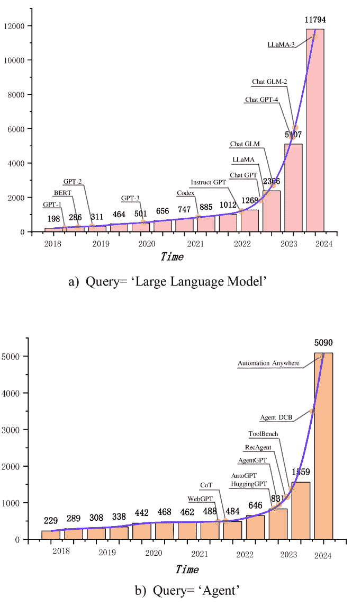
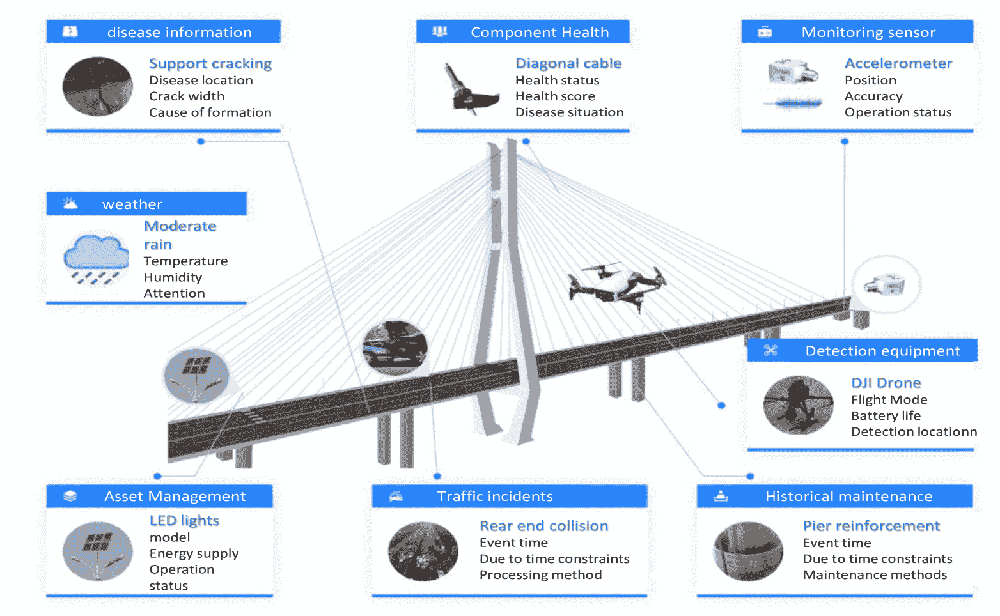
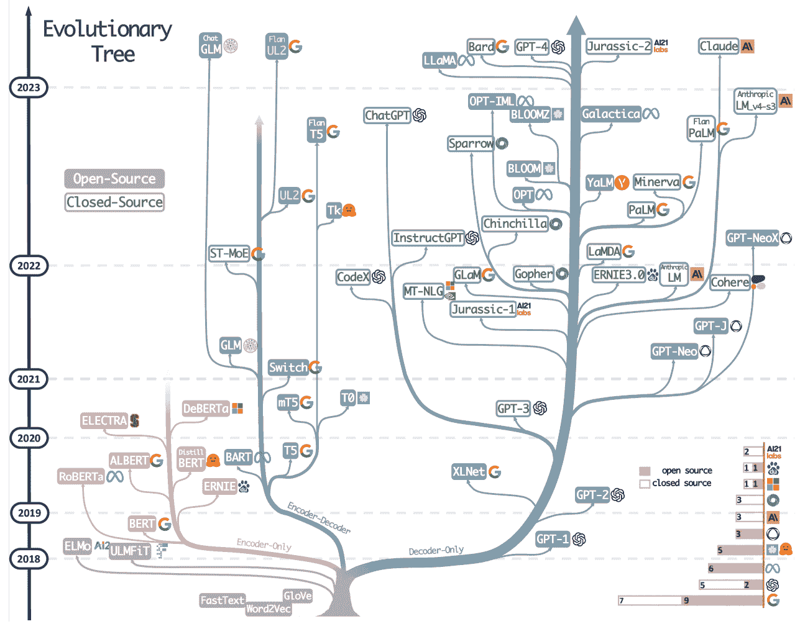
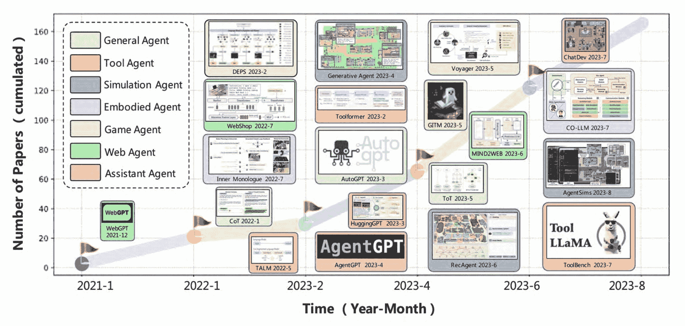
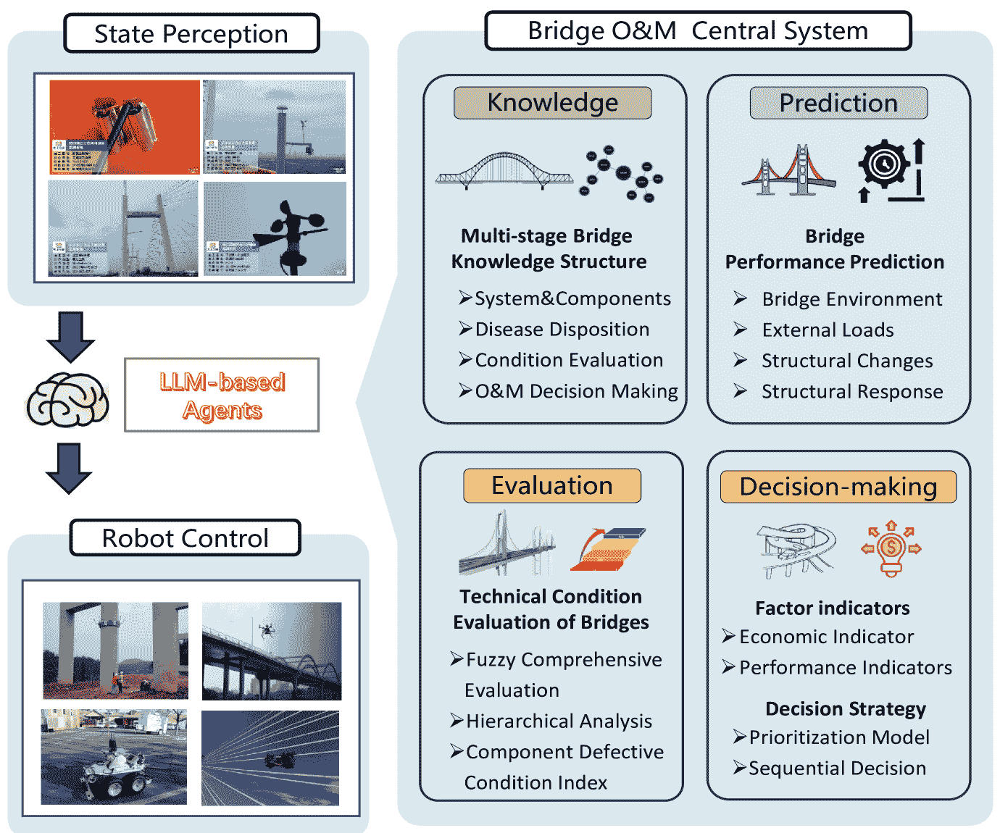
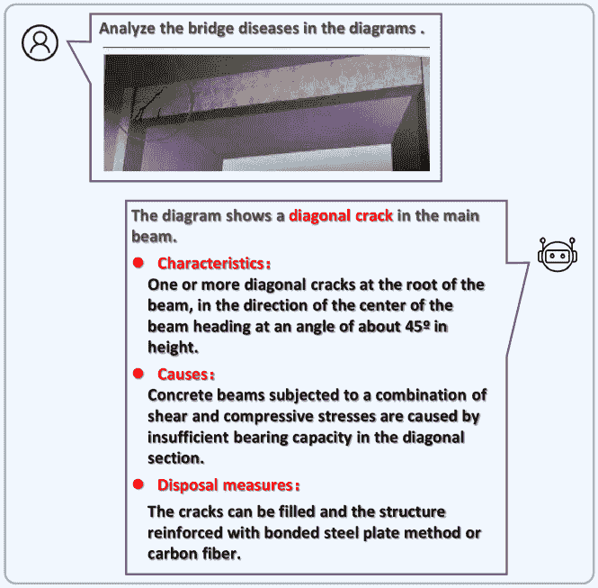
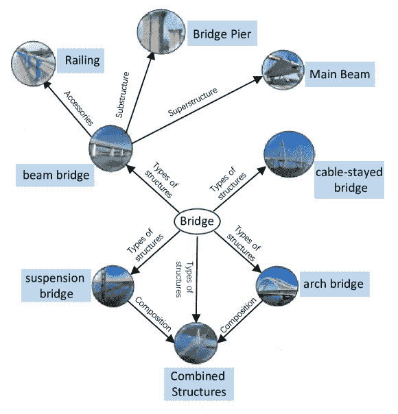
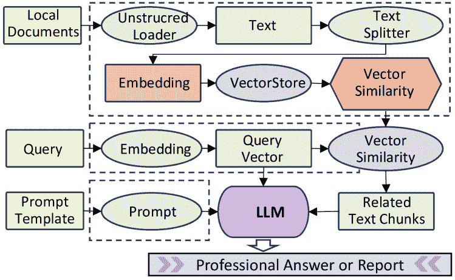
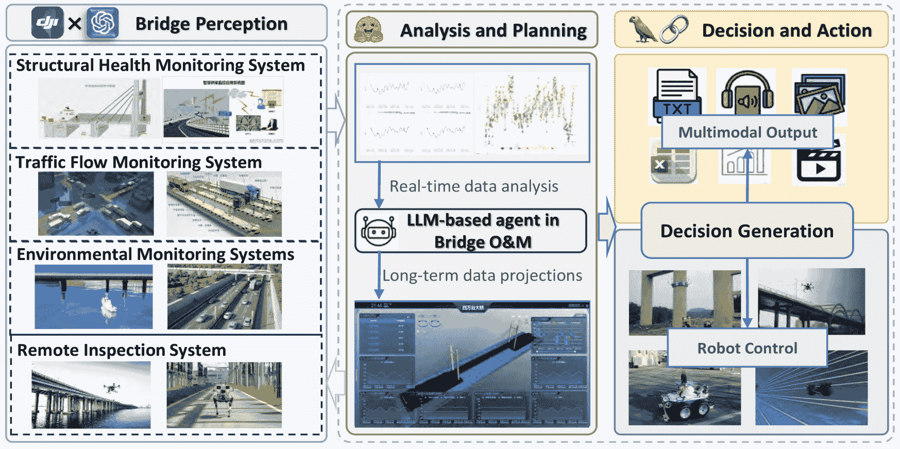

<!--yml
category: 未分类
date: 2025-01-11 12:25:18
-->

# Revolutionizing Bridge Operation and Maintenance with LLM-based Agents: An Overview of Applications and Insights

> 来源：[https://arxiv.org/html/2407.10064/](https://arxiv.org/html/2407.10064/)

\authormark

AUTHOR ONE et al

\corres

*Lian-zhen Zhang, School of Transportation Science and Engineering, Harbin Institute of Technology,Harbin510001,China.

\presentaddress

Harbin Institute of Technology,Harbin510001,China

Xin-yu Chen    Lian-zhen Zhang \orgdivSchool of Transportation Science and Engineering, \orgnameHarbin Institute of Technology, \orgaddress\stateHarbin, \countryChina \orgdivSchool of Transportation and Civil Engineering, \orgnameShenzhen University, \orgaddress\stateShenzhen, \countryChina \orgdivNational Key Laboratory of Green Longevity Road Engineering for Extreme Environments, \orgnameMinistry of Science and Technology, \orgaddress\stateShenzhen, \countryChina [lianzhen@hit.edu.cn](mailto:lianzhen@hit.edu.cn)    X.-Y. Chen    Y.-W Zhu    Y. Hou    L.-Z. Zhang(1 August 2024; 1 August 2024; 1 August 2024)

###### Abstract

[Summary]In various industrial fields of human social development, people are constantly exploring technologies to free human labor. The construction of LLM-based agents is considered to be one of the most effective tools to achieve this goal. LLM-based agents, as a kind of human-like intelligent entities with the ability of perception, planning, decision-making, and action, have already created great production value in the fields. As the most important transportation infrastructure, how to keep bridges in safe service is a major industry need, and research on intelligent operation and maintenance technologies is urgently needed. In general, the bridge operation and maintenance field show a relatively low level of intelligence compared to other industries. Nevertheless, numerous intelligent inspection devices, machine learning algorithms, and autonomous evaluation and decision-making methods have been developed in the field of bridge operation and maintenance, which provides a feasible basis for breakthroughs in this field. This study aims to explore the impact of LLM-based agents on the field of bridge operation and maintenance and to analyze the potential challenges and opportunities they bring to the core tasks. Through in-depth research and analysis, this paper expects to provide a more comprehensive perspective for understanding the application of LLM-based agents in the field of bridge intelligent operation and maintenance.

\jnlcitation\cname

, , , (\cyear2024), \ctitleRevolutionizing Bridge Operation and Maintenance with LLM-based Agents: An Overview of Applications and Insights, \cjournal:, \cvol2024;.

###### keywords:

Bridge, Operation, Maintenance, Large Language Model, Agent^†^†articletype: Article Type⁰⁰footnotetext: Abbreviations: LLMs, Large Language Models; O&M, Operation and Maintenance

## 1 Introduction

Within the past decade or so, China has made great achievements in the construction of highway bridges, with the maximum span breaking through and the number of bridges increasing. By the end of 2023, there were 1,079,300 existing highway bridges in China. At the same time, a large number of bridge structures have entered the middle and late stages of service one after another, and safety accidents are frequent, causing widespread concern in society. Optimizing the operation and maintenance of existing bridges to maintain and improve their safety performance and service status has become an urgent need for the society.

Highway bridge operation and maintenance enhance structural safety and efficiency through technological innovation and management strategies, realizing sensor monitoring  ^([31](https://arxiv.org/html/2407.10064v4#bib.bib31)), ^([70](https://arxiv.org/html/2407.10064v4#bib.bib70)), drone detection, algorithmic optimization of disease identification, scientific evaluation methods  ^([76](https://arxiv.org/html/2407.10064v4#bib.bib76)), ^([13](https://arxiv.org/html/2407.10064v4#bib.bib13)), and multilevel maintenance decision-making system  ^([30](https://arxiv.org/html/2407.10064v4#bib.bib30)), ^([6](https://arxiv.org/html/2407.10064v4#bib.bib6)), which lays the foundation for the intelligent development of the industry. However, there are many problems, such as poor stability of bridge perception data and high data processing delay. The technical evaluation dimension is single, and the model accuracy is low. Operation and maintenance decision-making lack of data support, low level of intelligence. Bridge operation and maintenance intelligence is still in the primary stage, need to strengthen the state perception, evaluation system, decision support and integration with artificial intelligence technology.

The problems faced by bridge O&M urgently require LLM-based agents technology to solve them. Agents, as human-like intelligent entities, are capable of perception, planning, decision-making and action autonomously ^([96](https://arxiv.org/html/2407.10064v4#bib.bib96)), ^([26](https://arxiv.org/html/2407.10064v4#bib.bib26)). Although limited to specific tasks such as Go games or book retrieval in the early days, the Transformer architecture introduced by ^([90](https://arxiv.org/html/2407.10064v4#bib.bib90)) has greatly boosted the development of Language Models. Large Language Models such as OpenAI’s ChatGPT and Google Bert’s have brought new hope to the study of agents by significantly improving comprehension, summarization, reasoning, and language processing with their excellent generalization capabilities. These Large Language Models are now regarded as the “brain” of agents, and have great potential for application in the field of bridge operation and maintenance.

In the context of the current rapid development of the research field of Large Language Models and Agents, the emergence rate of new Large Models and Agents has increased significantly. The academic community has paid great attention to this, and the publication of related research results has shown a sharp increase. This shows that AI technology is gradually penetrating and transforming various industries. Therefore, it is necessary to explore and introduce the corresponding advanced technology in the field of bridge operation and maintenance in order to promote the innovative development of this field.

At the current research stage, agents are more mature in perception, planning, decision-making, and action. However, the bridge O&M domain is not sufficiently automated and intelligent in terms of disposition sensing, data prediction, performance evaluation, decision constraints, emergency response, and disaster mitigation. Therefore, the new generation bridge O&M management system should integrate LLM-based agent technology to equip each bridge with a personal assistant. At the same time, the system should consider the complementary and independent relationships of bridge clusters at the road network level to realize synergy, cooperation and competition among agents. The purpose of this paper is to discuss how agents can optimize bridge O&M tasks, how to build a bridge O&M intelligent system, and to analyze the impact of AI on the future development of the bridge O&M field, as well as the opportunities and challenges that may be encountered with the development of agents.

Figure 1: Trends in the number of arXiv papers published containing the keywords "Large Language Model" and "Agents" title or abstract by month, using exact matches. We set different x-axis ranges for the two keywords. We labeled the points corresponding to important milestones in the progress of LLM and Agents’ research.The number of papers containing "Large Language Model" in the title or abstract increased dramatically after the release of ChatGPT (Fig.a). The number of papers containing "A" in the title or abstract increased dramatically after the release of AuotoGPT and HuggingGPT increased (Fig.b).

## 2 Background

In this section, we provide a detailed overview of the evolution of bridge operation and maintenance and LLM-based agents research. We find that the shortcomings of modern bridge health monitoring techniques match the advantages of LLM-based agents. By analyzing the development trajectories of both, we propose the use of LLM-based agents to invigorate the field of bridge operation and maintenance and to promote industrial innovation in the current productivity context.

Figure 2: Modern bridge digital inspection and monitoring technology. It allows observation of the environment in which the bridge is located, the loads on the structure, the changes in the structure, and the load response of the structure.

### 2.1 Review of Bridge Operation and maintenance Research

The Bridge Management and Maintenance System is responsible for the health management of bridges throughout their life cycle, with functions including data collection, integration and storage, equipment management, condition assessment, performance prediction, strategy development and emergency response. The system is planned during the construction phase to monitor critical areas and sensitive parameters. After the bridge is completed, the difference between the actual operating condition of the bridge and the design expectation is assessed based on factors such as material aging, structural characteristics and traffic load. It is worth emphasizing that the goal of a bridge management and maintenance system is not to keep bridges in optimal condition at all times, but rather to ensure that the long-term operation of bridges produces the maximum economic benefit to society, within the constraints of limited financial budgets, bridge substitutability, road network importance and accident prevention.

After the occurrence of major accidents on bridges, people began to realize that bridges need to establish a special system, which is responsible for the regular inspection and periodic maintenance of bridges to ensure the normal use of bridges and to reduce the occurrence of vicious events. The development of bridge health monitoring systems is divided into three main stages:

The first phase was from the 1960s to the 1980s, when bridge maintenance records were based on paper documents. During this period, bridge information was updated infrequently, and documents were poorly circulated and standardized. Typically, bridge maintenance activities were carried out only when there was significant damage or accidents to the structure. During this period, bridge maintenance systems were mainly found in countries where bridge construction was carried out early, such as Sweden and the United States ^([82](https://arxiv.org/html/2407.10064v4#bib.bib82)).

The second stage is from the 1980s to the end of the twentieth century, when the bridge maintenance system was constructed as a more complete software system. This stage is marked by the improvement of the bridge maintenance software system, the development of which was born out of the original paper-based document system, and evolved with the progress of computer technology. Maintenance information is gradually transferred from the traditional paper media to computer storage, the main forms include text, tables and images. Software system functions are also gradually enriched, covering bridge information management, daily monitoring and maintenance records, and maintenance decision support and other aspects. The most representative system at this stage is the U.S. PONTIS  ^([88](https://arxiv.org/html/2407.10064v4#bib.bib88)), after the completion of the system in the United States, people realize the importance of building bridge maintenance software, each country began to build their own bridge maintenance system, the representatives of Europe, including Denmark’s Danbro, the United Kingdom’s NATS, France’s Edouard, Norway’s Brutus ^([55](https://arxiv.org/html/2407.10064v4#bib.bib55)), the representatives of Asia, including the Japan’s J- BMS of Japan, BMS of Korea and CMBS of China ^([40](https://arxiv.org/html/2407.10064v4#bib.bib40)).

The third stage is from the twenty-first century to the present, where the effective integration of novel algorithms and theories has realized the double improvement of bridge structural safety and operation and maintenance efficiency.

There are mainly three kinds of innovations in algorithms and theories. (1) In the development of algorithms, the integration of high-precision image processing, laser point cloud 3D reconstruction and holographic photography technology has improved the accuracy of the identification of bridge surface diseases and real-time detection of structural service state; (2) In the evaluation of bridge technical condition, scholars have developed a variety of evaluation methods, including the fuzzy theory, hierarchical analysis and disease weighting system, in order to scientifically assess the technical condition of bridges; (3) In the research of maintenance decision-making, a system of decision-making programs covering single bridge to road network level has been formed to meet the needs of bridge maintenance at different scales.

There are two main types of innovations in intelligent equipment. (1) during the construction process, a large number of sensors are integrated to monitor in real time the external environment and structural status of the bridge, such as traffic load, structural stress and other key parameters; (2) in the operation and maintenance phase of the bridge, advanced equipment, such as unmanned aerial vehicles (UAVs), rope-climbing robots and multifunctional inspection robots are used to realize dynamic monitoring of the health status and support management and maintenance decision-making.

It can be seen that the development history of bridge management system shows that each significant progress is accompanied by innovative breakthroughs in computer technology.

### 2.2 Overview of LLM-based Agents Research

In order to realize AI as a substitute for human labor, LLM-based agents must possess two key conditions: first, they should possess advanced comprehension capabilities covering in-depth understanding of written language, speech, images, and video, as well as the ability to accurately interpret human intentions and generate autonomous feedback. Second, LLM-based agents should have the ability to effectively invoke tools or devices, which involves not only direct human manipulation of tools, but more advanced LLM-based agents should be able to perceive the physical environment through sensors and independently mobilize appropriate tools for real-world self-regulation. This section next explores in detail current human exploration and progress in these two areas.

Figure 3: The evolutionary tree of modern LLMs traces the development of language models in recent years and highlights some of the most well-known models. Summarized by ^([98](https://arxiv.org/html/2407.10064v4#bib.bib98)). Models on the same branch have closer relationships. Transformer-based models are shown in non-grey colors: decoder-only models in the blue branch, encoder-only models in the pink branch, and encoder-decoder models in the green branch. The vertical position of the models on the timeline represents their release dates. Open-source models are represented by solid squares, while closed-source models are represented by hollow ones. The stacked bar plot in the bottom right corner shows the number of models from various companies and institutions.

#### 2.2.1 Larger Language Models

Language modeling (LM) is the most important task in the field of Natural Language Processing, which is essentially a synthesis of Natural Language Understanding and Natural Language Generation ^([8](https://arxiv.org/html/2407.10064v4#bib.bib8)). By enabling computers to learn a large amount of human language data and applying specific methods to predict the conditional probabilities between individual tokens (tokens in this paper take words in a sentence as an example) in a language, we are able to characterize the logical relationships between tokens, thus enabling the language model to understand and generate fluent natural language ^([62](https://arxiv.org/html/2407.10064v4#bib.bib62)). Realizing machines with human-like writing and communication capabilities has been a long-term goal pursued by human beings. In academia, the development of language models is usually divided into four main stages ^([64](https://arxiv.org/html/2407.10064v4#bib.bib64)):

The first stage is the statistical language modeling (SLM) stage. In this phase, the representation of words relies on solo heat vectors characterized by a sparse set of vectors representing words  ^([89](https://arxiv.org/html/2407.10064v4#bib.bib89)). Although this approach fails to reflect logical relations in the representation of word vectors, it provides an intuitive and understandable way of characterization. As for the characterization of sentences, Markov’s assumption is used to reveal the logical connections between words in a sentence through conditional probabilities. Specifically, this model fixes the context length, which is also called n-gram language model, among which the bigram and trigram models are the most common  ^([11](https://arxiv.org/html/2407.10064v4#bib.bib11)), ^([45](https://arxiv.org/html/2407.10064v4#bib.bib45)). This phase of language modeling is mainly used for information retrieval  ^([47](https://arxiv.org/html/2407.10064v4#bib.bib47)), ^([33](https://arxiv.org/html/2407.10064v4#bib.bib33)), ^([101](https://arxiv.org/html/2407.10064v4#bib.bib101)). However, the main challenge faced by statistical language models is the “curse of dimensionality”, i.e., as the vocabulary increases, the parameter space required by the model grows exponentially. To alleviate this problem, techniques such as smoothing strategies are widely used to mitigate the effects of data sparsity  ^([15](https://arxiv.org/html/2407.10064v4#bib.bib15)), ^([72](https://arxiv.org/html/2407.10064v4#bib.bib72)).

The second stage is the Neural Language Model (NLM) stage. Researchers have utilized the word2vec method to map words to a low-rank vector space , thus effectively overcoming the sparsity problem in the statistical language model ^([17](https://arxiv.org/html/2407.10064v4#bib.bib17)), ^([53](https://arxiv.org/html/2407.10064v4#bib.bib53)), ^([49](https://arxiv.org/html/2407.10064v4#bib.bib49)). This approach not only enables word vectors to characterize logical relations, but also allows intuitive mathematical connections between vectors. Meanwhile, through neural network techniques, such as multilayer perceptual machines  ^([49](https://arxiv.org/html/2407.10064v4#bib.bib49)) and recurrent neural networks ^([58](https://arxiv.org/html/2407.10064v4#bib.bib58)), ^([71](https://arxiv.org/html/2407.10064v4#bib.bib71)), ^([27](https://arxiv.org/html/2407.10064v4#bib.bib27)), researchers are able to learn from a large amount of natural language data to obtain vector representations of words. This distributed word representation approach has demonstrated excellent performance in several downstream tasks of natural language processing (NLP), such as machine translation, marking a major breakthrough in the field of NLP in terms of representation learning and having a far-reaching impact on subsequent research.

The third stage is the pre-trained model (PLM) stage ^([22](https://arxiv.org/html/2407.10064v4#bib.bib22)). Unlike the aforementioned Markov chain model, PLM utilizes recurrent neural networks to capture word interactions within sentences  ^([25](https://arxiv.org/html/2407.10064v4#bib.bib25)), ^([28](https://arxiv.org/html/2407.10064v4#bib.bib28)). Subsequently, Google’s proposed Transformer architecture introduced self-attention mechanisms and positional coding, which greatly improved the model’s parallel processing capabilities, enabling it to quickly learn a large amount of generalized knowledge and efficiently capture the logical relationships between words ^([90](https://arxiv.org/html/2407.10064v4#bib.bib90)). This innovation has given rise to pre-trained language models such as BERT and GPT-2\. By fine-tuning these pre-trained models on specific tasks, they have achieved significant performance gains in almost all downstream tasks of natural language processing (NLP).

The fourth stage is the Large Language Model (LLM) stage. In the current stage, the number of parameters of the language model breaks through the level of billions, tens of billions and even hundreds of billions. As the model parameters reach new orders of magnitude, the model experiences ’emergence’ phenomenon, and the model performance shows a leapfrog improvement, requiring only a small amount of learning to improve the model performance on a specific task  ^([4](https://arxiv.org/html/2407.10064v4#bib.bib4)). For example, GPT-3 is able to solve specific tasks excellently with simple contextual learning, while GPT-2 performs relatively poorly, highlighting the important impact of parameter size on model performance. Along with the release of ChatGPT, large-scale language models have become the hottest research in AI, with great achievements in areas such as medicine, finance, and autonomous driving  ^([94](https://arxiv.org/html/2407.10064v4#bib.bib94)). In 2023, the update iteration length of large models reaches the unit of days, and their capabilities in multimodal domains such as text, speech, image, and video have been rapidly improved and enriched with features, and they have achieved performance beyond the human average in several tasks  ^([14](https://arxiv.org/html/2407.10064v4#bib.bib14)).

It can be seen that with the development of the field of Natural Language Processing, especially the recent emergence of Large Language Models, computers are equipped with the first condition for the realization of LLM-based agents: advanced comprehension capabilities, including in-depth understanding of written language, speech, images, and video, as well as the ability to accurately interpret human intentions and generate autonomous feedback. This builds a “brain” for LLM-based agents, and the next step is to focus on how to equip the brain with the ability to act.

Figure 4: Illustration of the growth trend in the field of LLM-based autonomous agents. ^([91](https://arxiv.org/html/2407.10064v4#bib.bib91))summarizes the development of intelligibles by time and number of articles. They assign different colors to represent various agent categories. For example, a game agent aims to simulate a game-player, while a tool agent mainly focuses on tool using. For each time period, they provide a curated list of studies with diverse agent categories.

#### 2.2.2 LLM-based Agents

Agent belongs to the field of Artificial Intelligence, which aims to construct a human-like intelligent entity capable of perceiving the environment in real time, making decisions and taking responsive actions ^([73](https://arxiv.org/html/2407.10064v4#bib.bib73)). The main difference between LLM-based agents and expert systems is reflected in their autonomy, LLM-based agents are able to perceive the environment in real time, rely on the knowledge base and chain of thought, generate decisions in line with human expectations, and act accordingly ^([97](https://arxiv.org/html/2407.10064v4#bib.bib97)). Humans have always been committed to building LLM-based agents with an intelligence level comparable to their own and with the ability to act, and the development of LLM-based agents can be divided into four main stages:

The first stage is the symbolic agents stage. In this early stage, researchers worked to create entities capable of making decisions ^([95](https://arxiv.org/html/2407.10064v4#bib.bib95)). The initial strategy was to formulate a large number of rules, input judgment conditions and feedback into the computer, and make it respond according to these rules. During this period, expert systems were representative of symbolic LLM-based agents. The advantage of symbolic LLM-based agents is their excellent interpretability, which clearly reveals the computer’s thought processes ^([75](https://arxiv.org/html/2407.10064v4#bib.bib75)), ^([57](https://arxiv.org/html/2407.10064v4#bib.bib57)). However, their limitations are equally significant: the limited nature of the rule input makes it difficult to handle complex real-world inputs, and as the number of rules increases, symbolic LLM-based agents are limited in their speed of response and are unable to react quickly to inputs ^([41](https://arxiv.org/html/2407.10064v4#bib.bib41)), ^([74](https://arxiv.org/html/2407.10064v4#bib.bib74)).

The second stage is the Reactive agents stage. Unlike symbolic agents, LLM-based agents are centered on their immediate perception and response to changes in the environment  ^([10](https://arxiv.org/html/2407.10064v4#bib.bib10)), ^([54](https://arxiv.org/html/2407.10064v4#bib.bib54)), ^([63](https://arxiv.org/html/2407.10064v4#bib.bib63)). Unlike symbolic LLM-based agents, which focus on symbolic manipulation and complex logical reasoning, LLM-based agents focus on establishing a direct mapping between inputs and environmental stimuli as well as between outputs and behavioral responses ^([77](https://arxiv.org/html/2407.10064v4#bib.bib77)), ^([9](https://arxiv.org/html/2407.10064v4#bib.bib9)). The goal is to achieve accurate and rapid responses with minimal computational resources.

The third stage is the Reinforcement learning-based agents stage. Thanks to increased computational power, LLM-based agents are able to handle more complex tasks through interaction with the environment ^([59](https://arxiv.org/html/2407.10064v4#bib.bib59)). The reinforcement learning framework emphasizes that LLM-based agents must learn to make decisions to maximize the cumulative rewards under the constraints of the given tasks and rules while interacting with the environment, so as to ensure that the choices made at each step are the optimal solutions in the current context ^([86](https://arxiv.org/html/2407.10064v4#bib.bib86)). Initially, reinforcement learning LLM-based agents relied on basic techniques such as policy search and value function optimization, typically Q-learning  ^([92](https://arxiv.org/html/2407.10064v4#bib.bib92)) and SARSA ^([93](https://arxiv.org/html/2407.10064v4#bib.bib93)). Subsequently, with the advancement of deep learning techniques, deep reinforcement learning has emerged, which combines the strengths of both and allows the agents to process high-dimensional inputs and to learn higher-level policies, as shown by AlphaGo  ^([79](https://arxiv.org/html/2407.10064v4#bib.bib79)) and DQN ^([60](https://arxiv.org/html/2407.10064v4#bib.bib60)). The main advantage of this approach is the ability of LLM-based agents to autonomously adapt to unknown environments without human intervention. Nevertheless, reinforcement learning still faces challenges of long training cycles, inefficient sample utilization, and application in unstable environments.

The fourth stage is the Large Language Model-based agents (LLM-based agents) stage. As mentioned earlier, Large Language Models have demonstrated significant performance and can be utilized as the brain of LLM-based agents ^([43](https://arxiv.org/html/2407.10064v4#bib.bib43)). LLM-based agents extend perception and action capabilities through strategies such as multimodal perception ^([103](https://arxiv.org/html/2407.10064v4#bib.bib103)), ^([37](https://arxiv.org/html/2407.10064v4#bib.bib37)) and tool invocation ^([44](https://arxiv.org/html/2407.10064v4#bib.bib44)), ^([34](https://arxiv.org/html/2407.10064v4#bib.bib34)), enhance planning and reasoning capabilities through techniques such as thought chaining and problem decomposition  ^([35](https://arxiv.org/html/2407.10064v4#bib.bib35)), ^([102](https://arxiv.org/html/2407.10064v4#bib.bib102)), and gain the ability to interact with the environment by learning from and responding to feedback  ^([84](https://arxiv.org/html/2407.10064v4#bib.bib84)), ^([36](https://arxiv.org/html/2407.10064v4#bib.bib36)). LLM-based agents acquire generalization capabilities by learning a large training set, thus enabling free switching between different tasks, and have been applied to various real-world tasks in areas such as financial services, smart homes, education and training, healthcare, and intelligent customer service.

It can be seen that LLM-based agents based on Large Language Model can already realize autonomous perception, planning, decision-making and action through natural language interaction. Although there is still a long way to go before the realization of general artificial intelligence, the current research has made computers initially equipped with two conditions for the realization of LLM agents-based agents, which not only have advanced comprehension capabilities, but also have the ability to effectively invoke tools or devices to perceive the physical environment through sensors and independently mobilize the appropriate tools in order to achieve self-regulation of the real world.

### 2.3 Why Bridge Operation and Maintenance Need LLM-based Agents

China has promoted the development of intelligent management of infrastructure through continuous technological innovation and engineering practice in the construction and maintenance management of highway bridges. However, there are still many problems in the current research:

*   •

    In terms of bridge disposition perception, the stability of data collected by sensors is insufficient, and the delay between data collection and data processing of intelligent devices is high, which can not meet the real-time demand

*   •

    In terms of bridge technology evaluation, there is only a single operation and maintenance scenario description, with a single operation and maintenance disposition indicator and an incomplete evaluation dimension. The accuracy of the existing nature evolution model is low, the degree of intelligence of the performance evaluation method is low, and the false alarm rate of performance warning is high

*   •

    In terms of bridge operation and maintenance decision-making, the correlation between the data of different dimensions of the bridge operation and maintenance indexes is not strong, and the evolution law of the bridge performance is not clear  ^([39](https://arxiv.org/html/2407.10064v4#bib.bib39)). Disease database is single, and there is a lack of database to support O&M decision-making. The existing operation and maintenance platform is mainly for data collection, display, equipment control and data management, intelligent, automated decision-making control ability is low, weak interaction ability.

It can be seen that the intelligent level of bridge operation and maintenance is still at a relatively early stage, and there are many problems in the state perception, technical evaluation, operation and maintenance decision-making, and response to extreme events. The existing operation and maintenance platform mainly has basic functions such as data collection, display, equipment control and data management, but it is still insufficient in terms of intelligence, automated decision-making control and interaction capability. Obviously, the degree of intelligence in the field of bridge operation and maintenance is still in the primary stage, and the combination with advanced artificial intelligence technology is not close enough.

Therefore, the new generation bridge O&M management system should incorporate LLM-based agents technology to equip each large-span bridge with a personal assistant. At the same time, the system should also be based on the road network level, considering the complementary and independent relationships between bridge clusters, and realizing the synergy, cooperation, and competitive relationships among different LLM-based agents. Studies have shown that coordination among multiple intelligences may generate social phenomena among computers, which suggests that the construction of single bridge LLM-based agents as well as the synergy and cooperation among bridge cluster intelligences at the road network level have full potential to be the future direction of bridge operation and maintenance.

## 3 Methodology for Constructing Bridge Operation and maintenance LLM-based Agents

The integration of Large Language Models and agents is rapidly evolving, but in the O&M management of bridge structures, complex bridge engineering knowledge and specialized O&M skills are required. The acquisition and accurate construction of specialized knowledge is critical for the performance of LLM-based agents in downstream tasks. Our goal is to embed specialized knowledge into intelligent agents to support automation and LLM-based agents for bridge O&M management. In this section, we describe the methodology for building LLM-based agents ontologies in specialized domains.

### 3.1 Knowledge Source

In order to realize the specialized functions of LLM-based agents, this paper suggests building specialized domain intelligences using a combination of distributed knowledge, structured knowledge, and multi-round conversation data.

Figure 5: Distributed knowledge can be used to train word embedding models or as external information for retrieval.

##### Distributed Knowledge

Distributed knowledge is i.e., natural linguistic expertise.Although current LLM-based agents show excellent comprehension and generation capabilities in general-purpose domains, mainstream Large Language Models lack specialized domain knowledge in the pre-training dataset, thus making it difficult to meet the demands of practical engineering applications. China’s Bridge Technical Condition Evaluation Standard divides bridge inspections into daily inspections, frequent inspections, periodic inspections, and special inspections, and after decades of construction in China’s bridge engineering field, tens of thousands of inspection reports have been accumulated, which can be used as a key source of data for LLM-based agents’ specialization. Meanwhile, texts such as academic papers, specialized books and industry specifications in the field of bridges are also the main sources of data. However, distributed knowledge alone does not achieve good results because the complexity and depth of the bridge O&M domain require LLM-based agents to have structured knowledge to address their shortcomings in the depth of knowledge representation. Therefore, in the bridge domain, LLM-based agents need to have both high-quality distributed and structured knowledge to achieve better performance.

Figure 6: Knowledge graphs as the most typical structured knowledge.

##### Structured Knowledge

A typical expression of structured knowledge is the knowledge graph, a concept introduced by  ^([81](https://arxiv.org/html/2407.10064v4#bib.bib81)), which is essentially a structured way of organizing knowledge. Knowledge graph can be regarded as a kind of knowledge relationship graph, consisting of nodes and edges, where nodes represent entities or concepts and edges represent attributes or relationships. The application of knowledge graph can effectively solve the problem of the depth of knowledge expression of intelligences in the field of bridge O&M. Distributed knowledge by itself is not sufficient for agents to understand the logical relationships in bridge engineering and structural O&M. It is recommended to construct a multilevel O&M knowledge base covering system-structure-components of bridges, perception-evaluation-decision making in O&M, principle-expression-treatment measures of bridge diseases, and preprocessing-threshold setting-abnormal value handling of bridge data in order to enhance the accuracy and professionalism of the agents. However, even with the combination of distributed and structured knowledge, agents still face challenges in realizing the cyclic dialog dataset of inquiry/command-feedback/action.

##### Multi-round Dialog Dataset

Multi-round conversation datasets involve not only linguistic conversations, but alignment between LLM-based agents and human commands in a broad sense. At the Large Language Model level, in order to understand human intentions, a multi-round Q-A (query-feedback) dataset, i.e., a large amount of query and feedback data, is required ^([80](https://arxiv.org/html/2407.10064v4#bib.bib80)), ^([99](https://arxiv.org/html/2407.10064v4#bib.bib99)), ^([1](https://arxiv.org/html/2407.10064v4#bib.bib1)). In this process, the design of prompt templates (prompt word engineering) is crucial, which needs to guide the model to output the desired results without updating the weights of the Large Language Model according to the actual needs of the specialized domain. At the level of LLM-based agents, in order to realize the automatic maintenance of bridge structures, multiple rounds of I-A (instruction-action) datasets, i.e., a large number of instruction and action datasets, are required ^([23](https://arxiv.org/html/2407.10064v4#bib.bib23)). Currently, a variety of intelligent algorithms and advanced devices have been developed in the field of bridge operation and maintenance, and the multi-round I-A dataset can help LLM-based agents invoke these tools more effectively to accomplish the automatic maintenance of bridges. It is worth noting that each tool invocation cannot be supported by a large number of algorithms and hardware development techniques.

### 3.2 Construction of the Ontology for LLM-based Agents

Current Large Language Models are generalized Large Models trained by a few companies based on Internet data, which perform unsatisfactorily in the professional domain. It is mainly because the above Large Language Models lack the training of specialized datasets in the training process. Previously, we introduced the sources of training data, and next we introduce the method of building LLM-based agents.

##### Fine-tuning of LLM

Fine-tuning of large language models involves further training of pre-trained models using domain-specific datasets to optimize their performance on specific tasks  ^([65](https://arxiv.org/html/2407.10064v4#bib.bib65)), ^([12](https://arxiv.org/html/2407.10064v4#bib.bib12)). This process aims to make the model better adapted to and perform domain-specific tasks. Fine-tuning involves the tuning of both the Embedded Model and the Large Language Model ^([66](https://arxiv.org/html/2407.10064v4#bib.bib66)). Fine-tuning of the embedding model involves mapping natural language into low-dimensional vectors to express logical relationships between words, which requires the use of distributed data to capture specialized noun entities from a large number of data sources. Fine-tuning Large Language Models, on the other hand, requires updating model parameters with a variety of data, and most open-source models provide official fine-tuning methods accordingly. However, fine-tuning Large Language Models requires both strong computational power and specialized knowledge, and is accompanied by a certain degree of uncertainty that makes it difficult to accurately predict the performance of the model after fine-tuning  ^([87](https://arxiv.org/html/2407.10064v4#bib.bib87)), ^([20](https://arxiv.org/html/2407.10064v4#bib.bib20)), ^([69](https://arxiv.org/html/2407.10064v4#bib.bib69)). Currently, commonly used methods include Retrieval Augmented Generation (RAG) and Chain of Thought (CoT) techniques to guide the model to accomplish specific tasks. Although these methods may have limited enhancement of model capabilities, they provide better stability.

##### RAG and CoT

Retrieval Enhanced Generation (RAG) is a technique to improve the question and answer quality and interaction capabilities of generative AI by utilizing additional data resources without changing the parameters of Large Language Models. The workflow of RAG includes loading external documents, document segmentation, content vectorization, data retrieval, and finally answer generation  ^([48](https://arxiv.org/html/2407.10064v4#bib.bib48)). However, a limitation of RAG is that it may lead to retrieval failure of valid results for the case of semantically identical but differently worded questions, a problem that decreases as the quality of the embedded model improves. CoT significantly improves the performance of Large Language Models by guiding them to progressively engage in the process of decomposing a complex question into a series of sub-problems and solving them sequentially ^([24](https://arxiv.org/html/2407.10064v4#bib.bib24)). A generic template for the CoT technique should contain the question, reasoning process, and the answer as three core components to guide the reasoning and generation process of the model.

##### Langchain build Agent

LangChain is a state-of-the-art Large Language Model development framework that integrates Large Language Models, Embedded Models, Interaction Layer Prompts (Prompts), External Knowledge, and External Tools to provide a flexible solution for building LLM-based agents. LangChain consists of six core components including Models, Prompts, Indexes, Memory, Chains, and Agents. Indexes, Memory, Chains and Agents. These components are connected to each other in the form of chains, enabling LLM-based agents to realize autonomous perception, planning, decision-making and action  ^([42](https://arxiv.org/html/2407.10064v4#bib.bib42)). The framework not only empowers LLM-based agents with advanced understanding, but also enhances their ability to invoke tools or devices ^([56](https://arxiv.org/html/2407.10064v4#bib.bib56)), ^([91](https://arxiv.org/html/2407.10064v4#bib.bib91)). LLM-based agents are able to perceive the physical environment through sensors and independently mobilize appropriate tools for automation and intelligence in bridge O&M management.

### 3.3 Qualitative Result Evaluation

The previous section of this paper introduced the methods for preparing and constructing the data required for LLM-based agents. Based on this, this section will focus on the assessment framework and evaluation criteria for LLM-based agents.

Along with the introduction of large-scale language models, several widely adopted evaluation standards have been established in the industry, including MMLU ^([32](https://arxiv.org/html/2407.10064v4#bib.bib32)), BIG-bench ^([83](https://arxiv.org/html/2407.10064v4#bib.bib83)), and HELM ^([7](https://arxiv.org/html/2407.10064v4#bib.bib7)), as well as a series of human benchmark tests and evaluation tests focusing on model-specific capabilities. In addition, there are evaluation benchmarks focusing on model-specific capabilities, such as the TyDiQA ^([18](https://arxiv.org/html/2407.10064v4#bib.bib18)) benchmark focusing on knowledge application and the MGSM  ^([68](https://arxiv.org/html/2407.10064v4#bib.bib68)) benchmark focusing on mathematical reasoning. In order to conduct an effective assessment, the selection of benchmarks should be based on the specific objectives of the assessment.

While assessment benchmarks, as previously described, have been widely adopted in evaluating the comprehension and production capabilities of large language models, they fail to adequately assess the models’ ability to plan and make decisions in complex environments, as well as the ability of LLM-based agents to act. As LLM-based agents technology advances, there is increasing academic interest in assessing the responsiveness of LLM-based agents in complex environments  ^([52](https://arxiv.org/html/2407.10064v4#bib.bib52)).

Currently, while there are no widely accepted benchmarks for the assessment of LLM-based agents, researchers have made significant progress in proposing candidate benchmarks that may become future assessment standards. For example, ToolBench ^([29](https://arxiv.org/html/2407.10064v4#bib.bib29)) is a fine-tuned dataset for evaluating intelligences’ invocation of single- and multi-tool commands; TE ^([3](https://arxiv.org/html/2407.10064v4#bib.bib3)) evaluates the multifaceted ability of language models to simulate human behavior; MetaTool ^([38](https://arxiv.org/html/2407.10064v4#bib.bib38)) aims to assess whether Large Language Models consciously invoke tools and select the appropriate tool for problem solving; and LLM-Co ^([2](https://arxiv.org/html/2407.10064v4#bib.bib2)) focuses on LLM-based agents’ ability to infer partners’ intentions in games, engage in reasoning and the ability to cooperate over time. LLM-based agents are usually assessed on a task-specific basis and with a certain degree of ambiguity. As LLM-based agents, especially in the field of multi-intelligent collaboration, methods for effectively tracking and evaluating the properties of intelligences will become increasingly important.

Figure 7: An example of LLM-based agents framework.The main function of LLM-based agents is to perceive the service state of the bridge, then after the "brain" to think and take action. The "brain" needs to have bridge operation and maintenance knowledge system, can make predictions, evaluation, decision-making on bridge service performance.

### 3.4 An Example of LLM-based agent Framework

This framework aims to build LLM-based agents system that integrates bridge monitoring, operation and maintenance perception, indicator prediction, condition evaluation, intelligent decision-making and autonomous action. The core of this system lies in the integration of several advanced Large Language Models, and the combination of Internet of Things, Artificial Intelligence, Machine Learning, and Big Data technologies, to realize the comprehensive monitoring and intelligent management of the bridge condition.

##### Operations and Maintenance Perception Layer

(1) Monitoring end equipment. Including various types of sensors (e.g., stress sensors, displacement sensors, vibration sensors, environmental monitoring stations, etc.), real-time collection of bridge structural health data, environmental parameters (e.g., temperature, humidity, wind speed, etc.) and traffic flow information. (2) Data collection and pre-processing. Aggregate the monitoring data to the data center through the IoT gateway, and perform pre-processing such as cleaning, compression, encryption, etc., to ensure data quality and security.

##### Intelligent Processing Layer

(1) Multimodal data processing. Integrate structured data (e.g., sensor readings) with unstructured data (e.g., bridge construction information, maintenance records, historical documents) and extract key information using NLP techniques. Understand textual information, such as maintenance reports and design documents, based on models such as BERT. (2) Indicator prediction model. Establish a finite element model of the bridge, based on physical laws, combined with sequence models such as LSTM, Transformer, etc., to predict the damage and remaining life of the bridge and identify potential risks. (3) Condition evaluation model. Comprehensive assessment of the bridge’s structural performance, durability and maintenance needs, evaluating the bridge’s service level and functional performance, detecting and evaluating the degradation of materials due to environmental factors. (4) Intelligent decision-making model. Natural language generation using the GPT series of models to develop bridge maintenance, resource allocation, and risk management strategies to assist managers in making informed data-based decisions using a decision support system to ensure sustainable bridge operation and maximize economic benefits.

##### Operations and Maintenance Task Scheduling

Integrate the model of the intelligent processing layer, construct a knowledge graph, realize cross-domain knowledge fusion and complex problem reasoning, transform decisions into specific O&M tasks, and realize the unmanned and autonomous use of structural health monitoring systems, drones, robotic cleaning systems, automated inspection vehicles, intelligent monitoring systems, and automated maintenance equipment in bridge O&M, especially in harsh or hazardous environments. During the execution of bridge O&M tasks, the execution effect is continuously monitored and feedback data is collected for optimizing subsequent decisions.

## 4 Potential Development Directions of LLM-based Agents in Bridge Operation and Maintenance

Automation and intelligence of bridge O&M is the key to improve O&M efficiency and enhance safety and reliability. Through real-time monitoring, intelligent analysis and predictive maintenance, it realizes optimal allocation of resources, reduces O&M costs, and enhances the public’s trust in bridge safety, which is an important development direction for bridge management in the future. In the field of bridge O&M, the integration of LLM-based agents is expected to reduce labor costs, reduce subjective judgments, improve management efficiency, and enable rapid response to emergency situations. This section describes some of the research elements that need to be focused on for bridge O&M intelligence.

### 4.1 Large Language Model for Bridge Operations and Maintenance Domain

Currently, Large Language Models in vertical fields are booming. In China, a number of industries have launched customized large language models, such as “Hua Tuo” in the medical and health industry, “Xuan Yuan” in the financial field, “Han Fei” in the legal industry, and “Red Rabbit” in the field of intelligent customer service and marketing. Through deep learning and natural language processing technologies, these models accurately match the needs of various industries, providing a full range of intelligent solutions.

As an important transportation infrastructure, the efficiency of operation and maintenance management of bridges is directly related to the safety, smoothness and efficiency of the transportation system. The construction of Large Language Model in the field of bridge O&M and its use as the core hub of bridge intelligent management system can realize automated monitoring system and intelligent data analysis. The development and application of Bridge O&M Large Language Model is of great theoretical and practical significance to promote the development of bridge O&M management in the direction of intelligence and efficiency.

Figure 8: By parsing the pictures, we can analyze the location, main features, causes, impacts and disposal measures of bridge diseases, which cannot be done by the generalized Large Language Models in the market. The recognition of bridge disease pictures by Large Language Model can improve the professionalism and accuracy of bridge operation and maintenance, and reduce labor costs.

### 4.2 Multimodal Knowledge Graph for Bridge Operations and Maintenance Domain

Building a multimodal knowledge graph in bridge operation and maintenance is a research and development effort aimed at integrating knowledge and data related to bridge operation and maintenance, and enhancing the intelligence of bridge management through multimodal information processing technology. Large Language Model demonstrates excellent multimodal processing capabilities, especially in image and video processing ^([46](https://arxiv.org/html/2407.10064v4#bib.bib46)), ^([51](https://arxiv.org/html/2407.10064v4#bib.bib51)). However, in the field of bridge operation and maintenance, the processing capability of existing generalized Large Language Models for images is still at a low level. For example, in bridge disease picture recognition, even the best models can only recognize bridge cracks with unsatisfactory accuracy. There are a wide variety of bridge diseases, including cracked concrete, spalled and exposed reinforcement, weathering, honeycomb, and water seepage in reinforced concrete bridges, as well as fracture, corrosion, coating defects, and sling relaxation in steel bridges, which cannot be effectively recognized by existing models.

Figure 9: LLM-based agents to realize multimodal (text, picture, video, table) parsing of bridge operation and maintenance information need to establish a knowledge system in various aspects such as bridge structure, disease, and evaluation. Knowledge graph can well increase the understanding depth of the model.

To address this problem, combining the multimodal processing capability of Large Language Model with the rich data in the field of bridge inspection, constructing a multimodal knowledge graph for bridge O&M, establishing a hierarchical knowledge system, systematically classifying bridge diseases, components, parts, and structures, and realizing real-time processing of pictures and videos collected on site will be a promising research direction. The construction of multimodal knowledge graph in the field of bridge operation and maintenance can not only improve the intelligent level of bridge operation and maintenance management, but also provide strong knowledge support for the whole life cycle management of bridges.

### 4.3 Automatic Generation of Bridge Reports and Assisted Decision-Making

Currently, most knowledge management Q&A systems in the field of bridge maintenance are based on knowledge graphs ^([100](https://arxiv.org/html/2407.10064v4#bib.bib100)), ^([50](https://arxiv.org/html/2407.10064v4#bib.bib50)), ^([67](https://arxiv.org/html/2407.10064v4#bib.bib67)). Knowledge graph-based Q&A systems need to extract structured knowledge from bridge design, construction, operation, management, inspection, and other data, a process that is time-consuming and labor-intensive, and difficult to handle unstructured or semi-structured data  ^([16](https://arxiv.org/html/2407.10064v4#bib.bib16)). In addition, structured knowledge expressions may lead to error transmission and accumulation, and the accuracy of knowledge extraction decreases dramatically when data complexity increases.

Figure 10: Firstly, data preparation and preprocessing are carried out, and the database data are cleaned, segmented and mapped into word vectors, which are stored in the vector database. When the user question is received, it is preprocessed and mapped into word vectors, and the similarity with the segment vectors in the database is calculated to filter out the relevant information. According to the designed prompt template, the interrogative sentence and related information are input into the Large Language Model to generate a professional answer or report. Finally, user feedback is collected and the process is optimized to improve answer quality and user satisfaction.

### 4.4 Tools Calling LLM-based Agents

In the field of bridge operation and maintenance, the introduction of Large Language Model-based interaction systems can gradually reshape its traditional paradigm. The Large Language Model-based Q&A system adopts an unsupervised language model learning approach to map the knowledge to a continuous numerical space, effectively overcoming a series of problems of traditional knowledge extraction methods ^([85](https://arxiv.org/html/2407.10064v4#bib.bib85)), ^([78](https://arxiv.org/html/2407.10064v4#bib.bib78)). With its excellent natural language understanding and generation capabilities, the system not only greatly improves the intelligence of information retrieval and knowledge services, but also promotes the automation and intelligence of operation and maintenance processes. O&M personnel can easily query all kinds of O&M records and reports through natural language, while Large Language Model can quickly provide precise information to assist decision-making, and automatically mine potential problems from massive data to enhance the predictability of O&M. Meanwhile, the automated report generation function significantly reduces the time and errors of manual report writing and improves work efficiency.

Traditional bridge operation and maintenance management often relies on manual inspection and regular testing, which is not only inefficient, but also difficult to comprehensively and accurately grasp the actual condition of the bridge. In recent years, with the improvement of bridge inspection efficiency and quality needs, the development of intelligent inspection equipment and technology has gradually matured, covering drones, rope-climbing robots, underwater robots, sonar detection devices, as well as image acquisition technology, laser point-cloud scanning technology, holographic photography technology and so on. The future research direction is bound to realize the automation and unmanned operation and maintenance management of bridges, and the application of LLM-based agents based on Large Language Model is expected to realize this goal.

Firstly, LLM-based agents realize accurate real-time monitoring of bridge structural health and environmental parameters by seamlessly integrating and scheduling a variety of monitoring systems and sensors, utilizing Large Language Models to quickly analyze the data and discover potential anomalies in a timely manner, ensuring the accuracy of monitoring. Secondly, LLM-based agents are expected to realize automatic scheduling of advanced equipment such as drones and intelligent robots to perform complex tasks such as high-altitude inspection and internal maintenance, realizing automation and unmanned maintenance operations. This not only improves maintenance efficiency, but also reduces personnel safety risks. These LLM-based agents maintain real-time communication with the intelligent body, ensuring accurate execution and efficient management of maintenance work.

Figure 11: LLM-based agents first use the monitoring system and remote inspection system to sense the bridge status, then use the multimodal processing capability (text, table, picture, video) to analyze the data in depth through the prediction and evaluation module, and integrate the raw data and its analysis process into the display platform. Eventually, LLM-based agents output decision-making results covering monitoring reports, inspection reports, maintenance programs, and develop action plans to implement bridge operation and maintenance operations by autonomously controlling intelligent devices.The current technology is still difficult to realize the unmanned and automated control of intelligent devices, but this must be the future direction of technological development.

## 5 Future Trends and Challenges

### 5.1 Trend

##### Lightweight and Fast Response

With the development of large-scale language models, their parameter sizes have reached the billion level, showing excellent performance in many aspects ^([21](https://arxiv.org/html/2407.10064v4#bib.bib21)). However, when applying these Large Language Models to bridge operation and management, they face the demands of lightweight deployment and fast response. The multimodal monitoring data of bridges are transmitted in real time, and massive data are rapidly accumulated, but the computational resources are limited. Therefore, the research focus is shifted to the fast identification of heterogeneous multimodal data from multiple sources and the development of high-quality, lightweight, and low-latency models, which are crucial to realize the application of Large Language Model-based agents in bridge O&M.

##### Flexible tool invocation

Large Language Model provides LLM-based agents with powerful understanding and reasoning capabilities, enabling them to perform autonomous planning and action planning in complex environments. However, in the face of diverse intelligent devices in different domains, it is necessary to develop unified interfaces to interface LLM agents-based agents, and develop specific algorithms for different tools, so as to realize the understanding of semantic information of the environment, as well as the recognition of obstacle and target information through the interaction between the Large Language Model and the intelligent devices, thus generating appropriate planning solutions.

### 5.2 Limitations or Challenges

##### Professional synergies and barriers

The industrialization of AI needs to be closely integrated with professionals in multiple fields, and the application of LLM-based agents in the field of bridge operation and maintenance requires researchers to have cross-disciplinary knowledge, such as bridge engineering, structural mechanics, mechanics of materials, road surveying and geology, as well as the corresponding engineering skills. Meanwhile, bridge engineering researchers need to master multi-disciplinary skills such as Natural Language Processing, Deep Learning, Machine Learning, Large Language Model, and software and hardware development capabilities. This reveals the barriers and challenges in cross-disciplinary collaboration.

##### Engineering Ethics and Responsibility

In engineering applications, the health of bridge structures is critical to the transportation network and any damage may have social implications. LLM-based agents’ recommendations and programs may involve loss of property or life, and the issue of responsibility attribution needs to be addressed urgently. Currently, LLM-based agents are mainly used as decision aids or action tools. In the future, multi-model collaboration will face user privacy and data security challenges, requiring multi-party cooperation to establish a sound regulatory and ethical framework.

## 6 Conclusion

In the course of this study, we have successfully constructed a LLM-based agents, aiming to break through the development bottleneck in the field of bridge operation and maintenance and to promote the intelligent transformation of this industry. By comprehensively analyzing the current development status of the bridge O&M field and the advancement of LLM-based agents, we conclude that LLM-based agents have significant advantages in understanding, generating, planning, decision-making, and action, and are able to effectively respond to the challenges facing the bridge O&M field. The framework of LLM-based agents proposed in this study covers several key aspects such as data sources, knowledge ontology construction and model evaluation, which provides strong support for the intelligent development of the bridge O&M domain. Meanwhile, we also explore the application prospect of this LLM-based agents in the bridge O&M field, and believe that it has a broad development space. However, the application of LLM-based agents to the field of bridge operation and maintenance still faces problems such as professional barriers and engineering ethics, which are important directions that need to be focused on and solved in future research. Overall, this study provides new ideas and methods for the development of intelligence in the field of bridge operation and maintenance, which is expected to promote the progress of the whole industry.

## Acknowledgments

We thank the National Key Research and Development Program of China (2022YFC3801100) for financial support.

## References

*   Abbasiantaeb \BOthers. \APACyear2024 \APACinsertmetastarabbasiantaeb2024let{APACrefauthors}Abbasiantaeb, Z., Yuan, Y., Kanoulas, E.\BCBL \BBA Aliannejadi, M. \APACrefYearMonthDay2024. \BBOQ\APACrefatitleLet the llms talk: Simulating human-to-human conversational qa via zero-shot llm-to-llm interactions Let the llms talk: Simulating human-to-human conversational qa via zero-shot llm-to-llm interactions.\BBCQ \BIn \APACrefbtitleProceedings of the 17th ACM International Conference on Web Search and Data Mining Proceedings of the 17th acm international conference on web search and data mining (\BPGS 8–17). \PrintBackRefs\CurrentBib
*   Agashe \BOthers. \APACyear2023 \APACinsertmetastaragashe2023evaluating{APACrefauthors}Agashe, S., Fan, Y.\BCBL \BBA Wang, X\BPBIE. \APACrefYearMonthDay2023. \BBOQ\APACrefatitleEvaluating multi-agent coordination abilities in large language models Evaluating multi-agent coordination abilities in large language models.\BBCQ \APACjournalVolNumPagesarXiv preprint arXiv:2310.03903. \PrintBackRefs\CurrentBib
*   Aher \BOthers. \APACyear2023 \APACinsertmetastaraher2023using{APACrefauthors}Aher, G\BPBIV., Arriaga, R\BPBII.\BCBL \BBA Kalai, A\BPBIT. \APACrefYearMonthDay2023. \BBOQ\APACrefatitleUsing large language models to simulate multiple humans and replicate human subject studies Using large language models to simulate multiple humans and replicate human subject studies.\BBCQ \BIn \APACrefbtitleInternational Conference on Machine Learning International conference on machine learning (\BPGS 337–371). \PrintBackRefs\CurrentBib
*   Beltagy \BOthers. \APACyear2019 \APACinsertmetastarbeltagy2019scibert{APACrefauthors}Beltagy, I., Lo, K.\BCBL \BBA Cohan, A. \APACrefYearMonthDay2019. \BBOQ\APACrefatitleSciBERT: A pretrained language model for scientific text Scibert: A pretrained language model for scientific text.\BBCQ \APACjournalVolNumPagesarXiv preprint arXiv:1903.10676. \PrintBackRefs\CurrentBib
*   Bengio \BOthers. \APACyear2000 \APACinsertmetastarbengio2000neural{APACrefauthors}Bengio, Y., Ducharme, R.\BCBL \BBA Vincent, P. \APACrefYearMonthDay2000. \BBOQ\APACrefatitleA neural probabilistic language model A neural probabilistic language model.\BBCQ \APACjournalVolNumPagesAdvances in neural information processing systems13. \PrintBackRefs\CurrentBib
*   Bocchini \BBA Frangopol \APACyear2011 \APACinsertmetastarbocchini2011probabilistic{APACrefauthors}Bocchini, P.\BCBT \BBA Frangopol, D\BPBIM. \APACrefYearMonthDay2011. \BBOQ\APACrefatitleA probabilistic computational framework for bridge network optimal maintenance scheduling A probabilistic computational framework for bridge network optimal maintenance scheduling.\BBCQ \APACjournalVolNumPagesReliability Engineering & System Safety962332–349. \PrintBackRefs\CurrentBib
*   Bommasani \BOthers. \APACyear2023 \APACinsertmetastarbommasani2023holistic{APACrefauthors}Bommasani, R., Liang, P.\BCBL \BBA Lee, T. \APACrefYearMonthDay2023. \BBOQ\APACrefatitleHolistic evaluation of language models Holistic evaluation of language models.\BBCQ \APACjournalVolNumPagesAnnals of the New York Academy of Sciences15251140–146. \PrintBackRefs\CurrentBib
*   Brockopp \APACyear1983 \APACinsertmetastarbrockopp1983nlp{APACrefauthors}Brockopp, D\BPBIY. \APACrefYearMonthDay1983. \BBOQ\APACrefatitleWhat is NLP? What is nlp?\BBCQ \APACjournalVolNumPagesThe American Journal of Nursing8371012–1014. \PrintBackRefs\CurrentBib
*   R. Brooks \APACyear1986 \APACinsertmetastarbrooks1986robust{APACrefauthors}Brooks, R. \APACrefYearMonthDay1986. \BBOQ\APACrefatitleA robust layered control system for a mobile robot A robust layered control system for a mobile robot.\BBCQ \APACjournalVolNumPagesIEEE journal on robotics and automation2114–23. \PrintBackRefs\CurrentBib
*   R\BPBIA. Brooks \APACyear1991 \APACinsertmetastarbrooks1991intelligence{APACrefauthors}Brooks, R\BPBIA. \APACrefYearMonthDay1991. \BBOQ\APACrefatitleIntelligence without representation Intelligence without representation.\BBCQ \APACjournalVolNumPagesArtificial intelligence471-3139–159. \PrintBackRefs\CurrentBib
*   P\BPBIF. Brown \BOthers. \APACyear1990 \APACinsertmetastarbrown1990statistical{APACrefauthors}Brown, P\BPBIF., Cocke, J., Della Pietra, S\BPBIA., Della Pietra, V\BPBIJ., Jelinek, F., Lafferty, J.\BDBLRoossin, P\BPBIS. \APACrefYearMonthDay1990. \BBOQ\APACrefatitleA statistical approach to machine translation A statistical approach to machine translation.\BBCQ \APACjournalVolNumPagesComputational linguistics16279–85. \PrintBackRefs\CurrentBib
*   T. Brown \BOthers. \APACyear2020 \APACinsertmetastarbrown2020language{APACrefauthors}Brown, T., Mann, B., Ryder, N., Subbiah, M., Kaplan, J\BPBID., Dhariwal, P.\BDBLothers \APACrefYearMonthDay2020. \BBOQ\APACrefatitleLanguage models are few-shot learners Language models are few-shot learners.\BBCQ \APACjournalVolNumPagesAdvances in neural information processing systems331877–1901. \PrintBackRefs\CurrentBib
*   Catbas \BBA Aktan \APACyear2002 \APACinsertmetastarcatbas2002condition{APACrefauthors}Catbas, F\BPBIN.\BCBT \BBA Aktan, A\BPBIE. \APACrefYearMonthDay2002. \BBOQ\APACrefatitleCondition and damage assessment: issues and some promising indices Condition and damage assessment: issues and some promising indices.\BBCQ \APACjournalVolNumPagesJournal of Structural Engineering12881026–1036. \PrintBackRefs\CurrentBib
*   Chang \BOthers. \APACyear2024 \APACinsertmetastarchang2024survey{APACrefauthors}Chang, Y., Wang, X., Wang, J., Wu, Y., Yang, L., Zhu, K.\BDBLothers \APACrefYearMonthDay2024. \BBOQ\APACrefatitleA survey on evaluation of large language models A survey on evaluation of large language models.\BBCQ \APACjournalVolNumPagesACM Transactions on Intelligent Systems and Technology1531–45. \PrintBackRefs\CurrentBib
*   S\BPBIF. Chen \BBA Goodman \APACyear1999 \APACinsertmetastarchen1999empirical{APACrefauthors}Chen, S\BPBIF.\BCBT \BBA Goodman, J. \APACrefYearMonthDay1999. \BBOQ\APACrefatitleAn empirical study of smoothing techniques for language modeling An empirical study of smoothing techniques for language modeling.\BBCQ \APACjournalVolNumPagesComputer Speech & Language134359–394. \PrintBackRefs\CurrentBib
*   X. Chen \BOthers. \APACyear2020 \APACinsertmetastarchen2020review{APACrefauthors}Chen, X., Jia, S.\BCBL \BBA Xiang, Y. \APACrefYearMonthDay2020. \BBOQ\APACrefatitleA review: Knowledge reasoning over knowledge graph A review: Knowledge reasoning over knowledge graph.\BBCQ \APACjournalVolNumPagesExpert systems with applications141112948. \PrintBackRefs\CurrentBib
*   Church \APACyear2017 \APACinsertmetastarchurch2017word2vec{APACrefauthors}Church, K\BPBIW. \APACrefYearMonthDay2017. \BBOQ\APACrefatitleWord2Vec Word2vec.\BBCQ \APACjournalVolNumPagesNatural Language Engineering231155–162. \PrintBackRefs\CurrentBib
*   Clark \BOthers. \APACyear2020 \APACinsertmetastarclark2020tydi{APACrefauthors}Clark, J\BPBIH., Choi, E., Collins, M., Garrette, D., Kwiatkowski, T., Nikolaev, V.\BCBL \BBA Palomaki, J. \APACrefYearMonthDay2020. \BBOQ\APACrefatitleTydi qa: A benchmark for information-seeking question answering in ty pologically di verse languages Tydi qa: A benchmark for information-seeking question answering in ty pologically di verse languages.\BBCQ \APACjournalVolNumPagesTransactions of the Association for Computational Linguistics8454–470. \PrintBackRefs\CurrentBib
*   Collobert \BBA Weston \APACyear2008 \APACinsertmetastarcollobert2008unified{APACrefauthors}Collobert, R.\BCBT \BBA Weston, J. \APACrefYearMonthDay2008. \BBOQ\APACrefatitleA unified architecture for natural language processing: Deep neural networks with multitask learning A unified architecture for natural language processing: Deep neural networks with multitask learning.\BBCQ \BIn \APACrefbtitleProceedings of the 25th international conference on Machine learning Proceedings of the 25th international conference on machine learning (\BPGS 160–167). \PrintBackRefs\CurrentBib
*   Ding \BOthers. \APACyear2023 \APACinsertmetastarding2023parameter{APACrefauthors}Ding, N., Qin, Y., Yang, G., Wei, F., Yang, Z., Su, Y.\BDBLothers \APACrefYearMonthDay2023. \BBOQ\APACrefatitleParameter-efficient fine-tuning of large-scale pre-trained language models Parameter-efficient fine-tuning of large-scale pre-trained language models.\BBCQ \APACjournalVolNumPagesNature Machine Intelligence53220–235. \PrintBackRefs\CurrentBib
*   Dong \APACyear2024 \APACinsertmetastardong2024multi{APACrefauthors}Dong, Y. \APACrefYearMonthDay2024. \BBOQ\APACrefatitleThe Multi-agent System based on LLM for Online Discussions The multi-agent system based on llm for online discussions.\BBCQ \BIn \APACrefbtitleProceedings of the 23rd International Conference on Autonomous Agents and Multiagent Systems Proceedings of the 23rd international conference on autonomous agents and multiagent systems (\BPGS 2731–2733). \PrintBackRefs\CurrentBib
*   Erhan \BOthers. \APACyear2010 \APACinsertmetastarerhan2010does{APACrefauthors}Erhan, D., Courville, A., Bengio, Y.\BCBL \BBA Vincent, P. \APACrefYearMonthDay2010. \BBOQ\APACrefatitleWhy does unsupervised pre-training help deep learning? Why does unsupervised pre-training help deep learning?\BBCQ \BIn \APACrefbtitleProceedings of the thirteenth international conference on artificial intelligence and statistics Proceedings of the thirteenth international conference on artificial intelligence and statistics (\BPGS 201–208). \PrintBackRefs\CurrentBib
*   Esteban-Lozano \BOthers. \APACyear2024 \APACinsertmetastaresteban2024using{APACrefauthors}Esteban-Lozano, I., Castro-González, Á.\BCBL \BBA Martínez, P. \APACrefYearMonthDay2024. \BBOQ\APACrefatitleUsing a LLM-Based Conversational Agent in the Social Robot Mini Using a llm-based conversational agent in the social robot mini.\BBCQ \BIn \APACrefbtitleInternational Conference on Human-Computer Interaction International conference on human-computer interaction (\BPGS 15–26). \PrintBackRefs\CurrentBib
*   Fujita \BOthers. \APACyear2024 \APACinsertmetastarfujita2024llm{APACrefauthors}Fujita, M., Onaga, T.\BCBL \BBA Kano, Y. \APACrefYearMonthDay2024. \BBOQ\APACrefatitleLLM Tuning and Interpretable CoT: KIS Team in COLIEE 2024 Llm tuning and interpretable cot: Kis team in coliee 2024.\BBCQ \BIn \APACrefbtitleJSAI International Symposium on Artificial Intelligence Jsai international symposium on artificial intelligence (\BPGS 140–155). \PrintBackRefs\CurrentBib
*   Gers \BBA Schmidhuber \APACyear2001 \APACinsertmetastargers2001lstm{APACrefauthors}Gers, F\BPBIA.\BCBT \BBA Schmidhuber, E. \APACrefYearMonthDay2001. \BBOQ\APACrefatitleLSTM recurrent networks learn simple context-free and context-sensitive languages Lstm recurrent networks learn simple context-free and context-sensitive languages.\BBCQ \APACjournalVolNumPagesIEEE transactions on neural networks1261333–1340. \PrintBackRefs\CurrentBib
*   Goodwin \APACyear1995 \APACinsertmetastargoodwin1995formalizing{APACrefauthors}Goodwin, R. \APACrefYearMonthDay1995. \BBOQ\APACrefatitleFormalizing properties of agents Formalizing properties of agents.\BBCQ \APACjournalVolNumPagesJournal of Logic and Computation56763–781. \PrintBackRefs\CurrentBib
*   Graves \BOthers. \APACyear2007 \APACinsertmetastargraves2007unconstrained{APACrefauthors}Graves, A., Liwicki, M., Bunke, H., Schmidhuber, J.\BCBL \BBA Fernández, S. \APACrefYearMonthDay2007. \BBOQ\APACrefatitleUnconstrained on-line handwriting recognition with recurrent neural networks Unconstrained on-line handwriting recognition with recurrent neural networks.\BBCQ \APACjournalVolNumPagesAdvances in neural information processing systems20. \PrintBackRefs\CurrentBib
*   Graves \BOthers. \APACyear2008 \APACinsertmetastargraves2008novel{APACrefauthors}Graves, A., Liwicki, M., Fernández, S., Bertolami, R., Bunke, H.\BCBL \BBA Schmidhuber, J. \APACrefYearMonthDay2008. \BBOQ\APACrefatitleA novel connectionist system for unconstrained handwriting recognition A novel connectionist system for unconstrained handwriting recognition.\BBCQ \APACjournalVolNumPagesIEEE transactions on pattern analysis and machine intelligence315855–868. \PrintBackRefs\CurrentBib
*   Guo \BOthers. \APACyear2024 \APACinsertmetastarguo2024stabletoolbench{APACrefauthors}Guo, Z., Cheng, S., Wang, H., Liang, S., Qin, Y., Li, P.\BDBLLiu, Y. \APACrefYearMonthDay2024. \BBOQ\APACrefatitleStableToolBench: Towards Stable Large-Scale Benchmarking on Tool Learning of Large Language Models Stabletoolbench: Towards stable large-scale benchmarking on tool learning of large language models.\BBCQ \APACjournalVolNumPagesarXiv preprint arXiv:2403.07714. \PrintBackRefs\CurrentBib
*   Han \BOthers. \APACyear2021 \APACinsertmetastarhan2021risk{APACrefauthors}Han, X., Yang, D\BPBIY.\BCBL \BBA Frangopol, D\BPBIM. \APACrefYearMonthDay2021. \BBOQ\APACrefatitleRisk-based life-cycle optimization of deteriorating steel bridges: Investigation on the use of novel corrosion resistant steel Risk-based life-cycle optimization of deteriorating steel bridges: Investigation on the use of novel corrosion resistant steel.\BBCQ \APACjournalVolNumPagesAdvances in Structural Engineering2481668–1686. \PrintBackRefs\CurrentBib
*   He \BOthers. \APACyear2022 \APACinsertmetastarhe2022integrated{APACrefauthors}He, Z., Li, W., Salehi, H., Zhang, H., Zhou, H.\BCBL \BBA Jiao, P. \APACrefYearMonthDay2022. \BBOQ\APACrefatitleIntegrated structural health monitoring in bridge engineering Integrated structural health monitoring in bridge engineering.\BBCQ \APACjournalVolNumPagesAutomation in construction136104168. \PrintBackRefs\CurrentBib
*   Hendrycks \BOthers. \APACyear2020 \APACinsertmetastarhendrycks2020measuring{APACrefauthors}Hendrycks, D., Burns, C., Basart, S., Zou, A., Mazeika, M., Song, D.\BCBL \BBA Steinhardt, J. \APACrefYearMonthDay2020. \BBOQ\APACrefatitleMeasuring massive multitask language understanding Measuring massive multitask language understanding.\BBCQ \APACjournalVolNumPagesarXiv preprint arXiv:2009.03300. \PrintBackRefs\CurrentBib
*   Hiemstra \APACyear2001 \APACinsertmetastarhiemstra2001using{APACrefauthors}Hiemstra, D. \APACrefYearMonthDay2001. \BBOQ\APACrefatitleUsing language models for information retrieval Using language models for information retrieval.\BBCQ \PrintBackRefs\CurrentBib
*   Hong \BOthers. \APACyear2023 \APACinsertmetastarhong2023metagpt{APACrefauthors}Hong, S., Zheng, X., Chen, J., Cheng, Y., Wang, J., Zhang, C.\BDBLothers \APACrefYearMonthDay2023. \BBOQ\APACrefatitleMetagpt: Meta programming for multi-agent collaborative framework Metagpt: Meta programming for multi-agent collaborative framework.\BBCQ \APACjournalVolNumPagesarXiv preprint arXiv:2308.00352. \PrintBackRefs\CurrentBib
*   Hsieh \BOthers. \APACyear2023 \APACinsertmetastarhsieh2023distilling{APACrefauthors}Hsieh, C\BHBIY., Li, C\BHBIL., Yeh, C\BHBIK., Nakhost, H., Fujii, Y., Ratner, A.\BDBLPfister, T. \APACrefYearMonthDay2023. \BBOQ\APACrefatitleDistilling step-by-step! outperforming larger language models with less training data and smaller model sizes Distilling step-by-step! outperforming larger language models with less training data and smaller model sizes.\BBCQ \APACjournalVolNumPagesarXiv preprint arXiv:2305.02301. \PrintBackRefs\CurrentBib
*   A\BPBIH. Huang \BOthers. \APACyear2023 \APACinsertmetastarhuang2023finbert{APACrefauthors}Huang, A\BPBIH., Wang, H.\BCBL \BBA Yang, Y. \APACrefYearMonthDay2023. \BBOQ\APACrefatitleFinBERT: A large language model for extracting information from financial text Finbert: A large language model for extracting information from financial text.\BBCQ \APACjournalVolNumPagesContemporary Accounting Research402806–841. \PrintBackRefs\CurrentBib
*   S. Huang \BOthers. \APACyear2024 \APACinsertmetastarhuang2024language{APACrefauthors}Huang, S., Dong, L., Wang, W., Hao, Y., Singhal, S., Ma, S.\BDBLothers \APACrefYearMonthDay2024. \BBOQ\APACrefatitleLanguage is not all you need: Aligning perception with language models Language is not all you need: Aligning perception with language models.\BBCQ \APACjournalVolNumPagesAdvances in Neural Information Processing Systems36. \PrintBackRefs\CurrentBib
*   Y. Huang \BOthers. \APACyear2023 \APACinsertmetastarhuang2023metatool{APACrefauthors}Huang, Y., Shi, J., Li, Y., Fan, C., Wu, S., Zhang, Q.\BDBLothers \APACrefYearMonthDay2023. \BBOQ\APACrefatitleMetatool benchmark for large language models: Deciding whether to use tools and which to use Metatool benchmark for large language models: Deciding whether to use tools and which to use.\BBCQ \APACjournalVolNumPagesarXiv preprint arXiv:2310.03128. \PrintBackRefs\CurrentBib
*   Jensen \APACyear2020 \APACinsertmetastarjensen2020innovative{APACrefauthors}Jensen, J\BPBIS. \APACrefYearMonthDay2020. \BBOQ\APACrefatitleInnovative and sustainable operation and maintenance of bridges Innovative and sustainable operation and maintenance of bridges.\BBCQ \APACjournalVolNumPagesStructure and Infrastructure Engineering16172–83. \PrintBackRefs\CurrentBib
*   Jeong \BOthers. \APACyear2018 \APACinsertmetastarjeong2018bridge{APACrefauthors}Jeong, Y., Kim, W., Lee, I.\BCBL \BBA Lee, J. \APACrefYearMonthDay2018. \BBOQ\APACrefatitleBridge inspection practices and bridge management programs in China, Japan, Korea, and US Bridge inspection practices and bridge management programs in china, japan, korea, and us.\BBCQ \APACjournalVolNumPagesJournal of Structural Integrity and Maintenance32126–135. \PrintBackRefs\CurrentBib
*   Kaelbling \BOthers. \APACyear1987 \APACinsertmetastarkaelbling1987architecture{APACrefauthors}Kaelbling, L\BPBIP.\BCBT \BOthersPeriod. \APACrefYearMonthDay1987. \BBOQ\APACrefatitleAn architecture for intelligent reactive systems An architecture for intelligent reactive systems.\BBCQ \APACjournalVolNumPagesReasoning about actions and plans395–410. \PrintBackRefs\CurrentBib
*   Kansal \APACyear2024 \APACinsertmetastarkansal2024langchain{APACrefauthors}Kansal, A. \APACrefYearMonthDay2024. \BBOQ\APACrefatitleLangChain: Your Swiss Army Knife Langchain: Your swiss army knife.\BBCQ \BIn \APACrefbtitleBuilding Generative AI-Powered Apps: A Hands-on Guide for Developers Building generative ai-powered apps: A hands-on guide for developers (\BPGS 17–40). \APACaddressPublisherSpringer. \PrintBackRefs\CurrentBib
*   Kasneci \BOthers. \APACyear2023 \APACinsertmetastarkasneci2023chatgpt{APACrefauthors}Kasneci, E., Seßler, K., Küchemann, S., Bannert, M., Dementieva, D., Fischer, F.\BDBLothers \APACrefYearMonthDay2023. \BBOQ\APACrefatitleChatGPT for good? On opportunities and challenges of large language models for education Chatgpt for good? on opportunities and challenges of large language models for education.\BBCQ \APACjournalVolNumPagesLearning and individual differences103102274. \PrintBackRefs\CurrentBib
*   Kim \BOthers. \APACyear2023 \APACinsertmetastarkim2023llm{APACrefauthors}Kim, S., Moon, S., Tabrizi, R., Lee, N., Mahoney, M\BPBIW., Keutzer, K.\BCBL \BBA Gholami, A. \APACrefYearMonthDay2023. \BBOQ\APACrefatitleAn LLM compiler for parallel function calling An llm compiler for parallel function calling.\BBCQ \APACjournalVolNumPagesarXiv preprint arXiv:2312.04511. \PrintBackRefs\CurrentBib
*   Kneser \BBA Ney \APACyear1995 \APACinsertmetastarkneser1995improved{APACrefauthors}Kneser, R.\BCBT \BBA Ney, H. \APACrefYearMonthDay1995. \BBOQ\APACrefatitleImproved backing-off for m-gram language modeling Improved backing-off for m-gram language modeling.\BBCQ \BIn \APACrefbtitle1995 international conference on acoustics, speech, and signal processing 1995 international conference on acoustics, speech, and signal processing (\BVOL 1, \BPGS 181–184). \PrintBackRefs\CurrentBib
*   Koh \BOthers. \APACyear2024 \APACinsertmetastarkoh2024generating{APACrefauthors}Koh, J\BPBIY., Fried, D.\BCBL \BBA Salakhutdinov, R\BPBIR. \APACrefYearMonthDay2024. \BBOQ\APACrefatitleGenerating images with multimodal language models Generating images with multimodal language models.\BBCQ \APACjournalVolNumPagesAdvances in Neural Information Processing Systems36. \PrintBackRefs\CurrentBib
*   Lafferty \BBA Zhai \APACyear2001 \APACinsertmetastarlafferty2001document{APACrefauthors}Lafferty, J.\BCBT \BBA Zhai, C. \APACrefYearMonthDay2001. \BBOQ\APACrefatitleDocument language models, query models, and risk minimization for information retrieval Document language models, query models, and risk minimization for information retrieval.\BBCQ \BIn \APACrefbtitleProceedings of the 24th annual international ACM SIGIR conference on Research and development in information retrieval Proceedings of the 24th annual international acm sigir conference on research and development in information retrieval (\BPGS 111–119). \PrintBackRefs\CurrentBib
*   Lewis \BOthers. \APACyear2020 \APACinsertmetastarlewis2020retrieval{APACrefauthors}Lewis, P., Perez, E., Piktus, A., Petroni, F., Karpukhin, V., Goyal, N.\BDBLothers \APACrefYearMonthDay2020. \BBOQ\APACrefatitleRetrieval-augmented generation for knowledge-intensive nlp tasks Retrieval-augmented generation for knowledge-intensive nlp tasks.\BBCQ \APACjournalVolNumPagesAdvances in Neural Information Processing Systems339459–9474. \PrintBackRefs\CurrentBib
*   Lilleberg \BOthers. \APACyear2015 \APACinsertmetastarlilleberg2015support{APACrefauthors}Lilleberg, J., Zhu, Y.\BCBL \BBA Zhang, Y. \APACrefYearMonthDay2015. \BBOQ\APACrefatitleSupport vector machines and word2vec for text classification with semantic features Support vector machines and word2vec for text classification with semantic features.\BBCQ \BIn \APACrefbtitle2015 IEEE 14th International Conference on Cognitive Informatics & Cognitive Computing (ICCI* CC) 2015 ieee 14th international conference on cognitive informatics & cognitive computing (icci* cc) (\BPGS 136–140). \PrintBackRefs\CurrentBib
*   J. Liu \BOthers. \APACyear2021 \APACinsertmetastarliu2021knowledge{APACrefauthors}Liu, J., Schmid, F., Li, K.\BCBL \BBA Zheng, W. \APACrefYearMonthDay2021. \BBOQ\APACrefatitleA knowledge graph-based approach for exploring railway operational accidents A knowledge graph-based approach for exploring railway operational accidents.\BBCQ \APACjournalVolNumPagesReliability engineering & system safety207107352. \PrintBackRefs\CurrentBib
*   Y. Liu \BOthers. \APACyear2023 \APACinsertmetastarliu2023summary{APACrefauthors}Liu, Y., Han, T., Ma, S., Zhang, J., Yang, Y., Tian, J.\BDBLothers \APACrefYearMonthDay2023. \BBOQ\APACrefatitleSummary of chatgpt-related research and perspective towards the future of large language models Summary of chatgpt-related research and perspective towards the future of large language models.\BBCQ \APACjournalVolNumPagesMeta-Radiology100017. \PrintBackRefs\CurrentBib
*   Y. Liu \BOthers. \APACyear2024 \APACinsertmetastarliu2024understanding{APACrefauthors}Liu, Y., He, H., Han, T., Zhang, X., Liu, M., Tian, J.\BDBLothers \APACrefYearMonthDay2024. \BBOQ\APACrefatitleUnderstanding llms: A comprehensive overview from training to inference Understanding llms: A comprehensive overview from training to inference.\BBCQ \APACjournalVolNumPagesarXiv preprint arXiv:2401.02038. \PrintBackRefs\CurrentBib
*   Ma \BBA Zhang \APACyear2015 \APACinsertmetastarma2015using{APACrefauthors}Ma, L.\BCBT \BBA Zhang, Y. \APACrefYearMonthDay2015. \BBOQ\APACrefatitleUsing Word2Vec to process big text data Using word2vec to process big text data.\BBCQ \BIn \APACrefbtitle2015 IEEE International Conference on Big Data (Big Data) 2015 ieee international conference on big data (big data) (\BPGS 2895–2897). \PrintBackRefs\CurrentBib
*   Maes \APACyear1990 \APACinsertmetastarmaes1990designing{APACrefauthors}Maes, P. \APACrefYear1990. \APACrefbtitleDesigning autonomous agents: Theory and practice from biology to engineering and back Designing autonomous agents: Theory and practice from biology to engineering and back. \APACaddressPublisherMIT press. \PrintBackRefs\CurrentBib
*   Mandić Ivanković \BOthers. \APACyear2019 \APACinsertmetastarmandic2019european{APACrefauthors}Mandić Ivanković, A., Strauss, A.\BCBL \BBA Sousa, H. \APACrefYearMonthDay2019. \BBOQ\APACrefatitleEuropean review of performance indicators towards sustainable road bridge management European review of performance indicators towards sustainable road bridge management.\BBCQ \BIn \APACrefbtitleProceedings of the Institution of Civil Engineers-Engineering Sustainability Proceedings of the institution of civil engineers-engineering sustainability (\BVOL 173, \BPGS 109–124). \PrintBackRefs\CurrentBib
*   M. Bran \BOthers. \APACyear2024 \APACinsertmetastarm2024augmenting{APACrefauthors}M. Bran, A., Cox, S., Schilter, O., Baldassari, C., White, A\BPBID.\BCBL \BBA Schwaller, P. \APACrefYearMonthDay2024. \BBOQ\APACrefatitleAugmenting large language models with chemistry tools Augmenting large language models with chemistry tools.\BBCQ \APACjournalVolNumPagesNature Machine Intelligence1–11. \PrintBackRefs\CurrentBib
*   McAllester \BBA Rosenblatt \APACyear1991 \APACinsertmetastarmcallester1991systematic{APACrefauthors}McAllester, D.\BCBT \BBA Rosenblatt, D. \APACrefYearMonthDay1991. \BBOQ\APACrefatitleSystematic nonlinear planning Systematic nonlinear planning.\BBCQ \PrintBackRefs\CurrentBib
*   Mikolov \BOthers. \APACyear2010 \APACinsertmetastarmikolov2010recurrent{APACrefauthors}Mikolov, T., Karafiát, M., Burget, L., Cernockỳ, J.\BCBL \BBA Khudanpur, S. \APACrefYearMonthDay2010. \BBOQ\APACrefatitleRecurrent neural network based language model. Recurrent neural network based language model.\BBCQ \BIn \APACrefbtitleInterspeech Interspeech (\BVOL 2, \BPGS 1045–1048). \PrintBackRefs\CurrentBib
*   Minsky \APACyear1961 \APACinsertmetastarminsky1961steps{APACrefauthors}Minsky, M. \APACrefYearMonthDay1961. \BBOQ\APACrefatitleSteps toward artificial intelligence Steps toward artificial intelligence.\BBCQ \APACjournalVolNumPagesProceedings of the IRE4918–30. \PrintBackRefs\CurrentBib
*   Mnih \BOthers. \APACyear2013 \APACinsertmetastarmnih2013playing{APACrefauthors}Mnih, V., Kavukcuoglu, K., Silver, D., Graves, A., Antonoglou, I., Wierstra, D.\BCBL \BBA Riedmiller, M. \APACrefYearMonthDay2013. \BBOQ\APACrefatitlePlaying atari with deep reinforcement learning Playing atari with deep reinforcement learning.\BBCQ \APACjournalVolNumPagesarXiv preprint arXiv:1312.5602. \PrintBackRefs\CurrentBib
*   Morin \BBA Bengio \APACyear2005 \APACinsertmetastarmorin2005hierarchical{APACrefauthors}Morin, F.\BCBT \BBA Bengio, Y. \APACrefYearMonthDay2005. \BBOQ\APACrefatitleHierarchical probabilistic neural network language model Hierarchical probabilistic neural network language model.\BBCQ \BIn \APACrefbtitleInternational workshop on artificial intelligence and statistics International workshop on artificial intelligence and statistics (\BPGS 246–252). \PrintBackRefs\CurrentBib
*   Nadkarni \BOthers. \APACyear2011 \APACinsertmetastarnadkarni2011natural{APACrefauthors}Nadkarni, P\BPBIM., Ohno-Machado, L.\BCBL \BBA Chapman, W\BPBIW. \APACrefYearMonthDay2011. \BBOQ\APACrefatitleNatural language processing: an introduction Natural language processing: an introduction.\BBCQ \APACjournalVolNumPagesJournal of the American Medical Informatics Association185544–551. \PrintBackRefs\CurrentBib
*   Nilsson \APACyear1992 \APACinsertmetastarnilsson1992toward{APACrefauthors}Nilsson, N\BPBIJ. \APACrefYearMonthDay1992. \APACrefbtitleToward agent programs with circuit semantics Toward agent programs with circuit semantics \APACbVolEdTR\BTR. \PrintBackRefs\CurrentBib
*   Noguer i Alonso \APACyear1950 \APACinsertmetastarnoguer1950key{APACrefauthors}Noguer i Alonso, M. \APACrefYearMonthDay1950. \BBOQ\APACrefatitleKey Milestones in Natural Language Processing (NLP) 1950-2024 Key milestones in natural language processing (nlp) 1950-2024.\BBCQ \APACjournalVolNumPagesKey Milestones in Natural Language Processing (NLP)2024. \PrintBackRefs\CurrentBib
*   Otieno \BOthers. \APACyear2024 \APACinsertmetastarotieno2024accuracy{APACrefauthors}Otieno, D\BPBIO., Abri, F., Siami-Namini, S.\BCBL \BBA Namin, A\BPBIS. \APACrefYearMonthDay2024. \BBOQ\APACrefatitleThe Accuracy of Domain Specific and Descriptive Analysis Generated by Large Language Models The accuracy of domain specific and descriptive analysis generated by large language models.\BBCQ \APACjournalVolNumPagesarXiv preprint arXiv:2405.19578. \PrintBackRefs\CurrentBib
*   Ouyang \BOthers. \APACyear2022 \APACinsertmetastarouyang2022training{APACrefauthors}Ouyang, L., Wu, J., Jiang, X., Almeida, D., Wainwright, C., Mishkin, P.\BDBLothers \APACrefYearMonthDay2022. \BBOQ\APACrefatitleTraining language models to follow instructions with human feedback Training language models to follow instructions with human feedback.\BBCQ \APACjournalVolNumPagesAdvances in neural information processing systems3527730–27744. \PrintBackRefs\CurrentBib
*   Park \BOthers. \APACyear2021 \APACinsertmetastarpark2021bridge{APACrefauthors}Park, J., Lee, J.\BCBL \BBA Sohn, K. \APACrefYearMonthDay2021. \BBOQ\APACrefatitleBridge to answer: Structure-aware graph interaction network for video question answering Bridge to answer: Structure-aware graph interaction network for video question answering.\BBCQ \BIn \APACrefbtitleProceedings of the IEEE/CVF conference on computer vision and pattern recognition Proceedings of the ieee/cvf conference on computer vision and pattern recognition (\BPGS 15526–15535). \PrintBackRefs\CurrentBib
*   Qian \BOthers. \APACyear2022 \APACinsertmetastarqian2022limitations{APACrefauthors}Qian, J., Wang, H., Li, Z., Li, S.\BCBL \BBA Yan, X. \APACrefYearMonthDay2022. \BBOQ\APACrefatitleLimitations of language models in arithmetic and symbolic induction Limitations of language models in arithmetic and symbolic induction.\BBCQ \APACjournalVolNumPagesarXiv preprint arXiv:2208.05051. \PrintBackRefs\CurrentBib
*   Radiya-Dixit \BBA Wang \APACyear2020 \APACinsertmetastarradiya2020fine{APACrefauthors}Radiya-Dixit, E.\BCBT \BBA Wang, X. \APACrefYearMonthDay2020. \BBOQ\APACrefatitleHow fine can fine-tuning be? learning efficient language models How fine can fine-tuning be? learning efficient language models.\BBCQ \BIn \APACrefbtitleInternational Conference on Artificial Intelligence and Statistics International conference on artificial intelligence and statistics (\BPGS 2435–2443). \PrintBackRefs\CurrentBib
*   Rizzo \BBA Enshaeian \APACyear2021 \APACinsertmetastarrizzo2021challenges{APACrefauthors}Rizzo, P.\BCBT \BBA Enshaeian, A. \APACrefYearMonthDay2021. \BBOQ\APACrefatitleChallenges in bridge health monitoring: A review Challenges in bridge health monitoring: A review.\BBCQ \APACjournalVolNumPagesSensors21134336. \PrintBackRefs\CurrentBib
*   Rodriguez \BOthers. \APACyear1999 \APACinsertmetastarrodriguez1999recurrent{APACrefauthors}Rodriguez, P., Wiles, J.\BCBL \BBA Elman, J\BPBIL. \APACrefYearMonthDay1999. \BBOQ\APACrefatitleA recurrent neural network that learns to count A recurrent neural network that learns to count.\BBCQ \APACjournalVolNumPagesConnection Science1115–40. \PrintBackRefs\CurrentBib
*   Rosenfeld \APACyear2000 \APACinsertmetastarrosenfeld2000two{APACrefauthors}Rosenfeld, R. \APACrefYearMonthDay2000. \BBOQ\APACrefatitleTwo decades of statistical language modeling: Where do we go from here? Two decades of statistical language modeling: Where do we go from here?\BBCQ \APACjournalVolNumPagesProceedings of the IEEE8881270–1278. \PrintBackRefs\CurrentBib
*   Russell \BBA Norvig \APACyear2016 \APACinsertmetastarrussell2016artificial{APACrefauthors}Russell, S\BPBIJ.\BCBT \BBA Norvig, P. \APACrefYear2016. \APACrefbtitleArtificial intelligence: a modern approach Artificial intelligence: a modern approach. \APACaddressPublisherPearson. \PrintBackRefs\CurrentBib
*   Russell \BBA Wefald \APACyear1991 \APACinsertmetastarrussell1991right{APACrefauthors}Russell, S\BPBIJ.\BCBT \BBA Wefald, E. \APACrefYear1991. \APACrefbtitleDo the right thing: studies in limited rationality Do the right thing: studies in limited rationality. \APACaddressPublisherMIT press. \PrintBackRefs\CurrentBib
*   Sacerdoti \APACyear1975 \APACinsertmetastarsacerdoti1975nonlinear{APACrefauthors}Sacerdoti, E\BPBID. \APACrefYearMonthDay1975. \BBOQ\APACrefatitleThe nonlinear nature of plans The nonlinear nature of plans.\BBCQ \PrintBackRefs\CurrentBib
*   Sasmal \BBA Ramanjaneyulu \APACyear2008 \APACinsertmetastarsasmal2008condition{APACrefauthors}Sasmal, S.\BCBT \BBA Ramanjaneyulu, K. \APACrefYearMonthDay2008. \BBOQ\APACrefatitleCondition evaluation of existing reinforced concrete bridges using fuzzy based analytic hierarchy approach Condition evaluation of existing reinforced concrete bridges using fuzzy based analytic hierarchy approach.\BBCQ \APACjournalVolNumPagesExpert Systems with Applications3531430–1443. \PrintBackRefs\CurrentBib
*   Schoppers \APACyear1987 \APACinsertmetastarschoppers1987universal{APACrefauthors}Schoppers, M. \APACrefYearMonthDay1987. \BBOQ\APACrefatitleUniversal Plans for Reactive Robots in Unpredictable Environments. Universal plans for reactive robots in unpredictable environments.\BBCQ \BIn \APACrefbtitleIJCAI Ijcai (\BVOL 87, \BPGS 1039–1046). \PrintBackRefs\CurrentBib
*   Shao \BOthers. \APACyear2023 \APACinsertmetastarshao2023prompting{APACrefauthors}Shao, Z., Yu, Z., Wang, M.\BCBL \BBA Yu, J. \APACrefYearMonthDay2023. \BBOQ\APACrefatitlePrompting large language models with answer heuristics for knowledge-based visual question answering Prompting large language models with answer heuristics for knowledge-based visual question answering.\BBCQ \BIn \APACrefbtitleProceedings of the IEEE/CVF Conference on computer vision and pattern recognition Proceedings of the ieee/cvf conference on computer vision and pattern recognition (\BPGS 14974–14983). \PrintBackRefs\CurrentBib
*   Silver \BOthers. \APACyear2016 \APACinsertmetastarsilver2016mastering{APACrefauthors}Silver, D., Huang, A., Maddison, C\BPBIJ., Guez, A., Sifre, L., Van Den Driessche, G.\BDBLothers \APACrefYearMonthDay2016. \BBOQ\APACrefatitleMastering the game of Go with deep neural networks and tree search Mastering the game of go with deep neural networks and tree search.\BBCQ \APACjournalVolNumPagesnature5297587484–489. \PrintBackRefs\CurrentBib
*   Singh \BOthers. \APACyear2019 \APACinsertmetastarsingh2019strings{APACrefauthors}Singh, A\BPBIK., Mishra, A., Shekhar, S.\BCBL \BBA Chakraborty, A. \APACrefYearMonthDay2019. \BBOQ\APACrefatitleFrom strings to things: Knowledge-enabled vqa model that can read and reason From strings to things: Knowledge-enabled vqa model that can read and reason.\BBCQ \BIn \APACrefbtitleProceedings of the IEEE/CVF international conference on computer vision Proceedings of the ieee/cvf international conference on computer vision (\BPGS 4602–4612). \PrintBackRefs\CurrentBib
*   Singhal \APACyear2012 \APACinsertmetastarSinghal2012Official{APACrefauthors}Singhal. \APACrefYearMonthDay2012. \BBOQ\APACrefatitleOfficial Google Blog: Introducing the Knowledge Graph: things, not strings Official google blog: Introducing the knowledge graph: things, not strings.\BBCQ \PrintBackRefs\CurrentBib
*   Söderqvist \BBA Veijola \APACyear1998 \APACinsertmetastarsoderqvist1998finnish{APACrefauthors}Söderqvist, M\BHBIK.\BCBT \BBA Veijola, M. \APACrefYearMonthDay1998. \BBOQ\APACrefatitleThe Finnish bridge management system The finnish bridge management system.\BBCQ \APACjournalVolNumPagesStructural engineering international84315–319. \PrintBackRefs\CurrentBib
*   Srivastava \BOthers. \APACyear2022 \APACinsertmetastarsrivastava2022beyond{APACrefauthors}Srivastava, A., Rastogi, A., Rao, A., Shoeb, A\BPBIA\BPBIM., Abid, A., Fisch, A.\BDBLothers \APACrefYearMonthDay2022. \BBOQ\APACrefatitleBeyond the imitation game: Quantifying and extrapolating the capabilities of language models Beyond the imitation game: Quantifying and extrapolating the capabilities of language models.\BBCQ \APACjournalVolNumPagesarXiv preprint arXiv:2206.04615. \PrintBackRefs\CurrentBib
*   Stamper \BOthers. \APACyear2024 \APACinsertmetastarstamper2024enhancing{APACrefauthors}Stamper, J., Xiao, R.\BCBL \BBA Hou, X. \APACrefYearMonthDay2024. \BBOQ\APACrefatitleEnhancing LLM-Based Feedback: Insights from Intelligent Tutoring Systems and the Learning Sciences Enhancing llm-based feedback: Insights from intelligent tutoring systems and the learning sciences.\BBCQ \APACjournalVolNumPagesarXiv preprint arXiv:2405.04645. \PrintBackRefs\CurrentBib
*   Su \BOthers. \APACyear2019 \APACinsertmetastarsu2019generalizing{APACrefauthors}Su, D., Xu, Y., Winata, G\BPBII., Xu, P., Kim, H., Liu, Z.\BCBL \BBA Fung, P. \APACrefYearMonthDay2019. \BBOQ\APACrefatitleGeneralizing question answering system with pre-trained language model fine-tuning Generalizing question answering system with pre-trained language model fine-tuning.\BBCQ \BIn \APACrefbtitleProceedings of the 2nd workshop on machine reading for question answering Proceedings of the 2nd workshop on machine reading for question answering (\BPGS 203–211). \PrintBackRefs\CurrentBib
*   Sutton \BBA Barto \APACyear2018 \APACinsertmetastarsutton2018reinforcement{APACrefauthors}Sutton, R\BPBIS.\BCBT \BBA Barto, A\BPBIG. \APACrefYear2018. \APACrefbtitleReinforcement learning: An introduction Reinforcement learning: An introduction. \APACaddressPublisherMIT press. \PrintBackRefs\CurrentBib
*   Thirunavukarasu \BOthers. \APACyear2023 \APACinsertmetastarthirunavukarasu2023large{APACrefauthors}Thirunavukarasu, A\BPBIJ., Ting, D\BPBIS\BPBIJ., Elangovan, K., Gutierrez, L., Tan, T\BPBIF.\BCBL \BBA Ting, D\BPBIS\BPBIW. \APACrefYearMonthDay2023. \BBOQ\APACrefatitleLarge language models in medicine Large language models in medicine.\BBCQ \APACjournalVolNumPagesNature medicine2981930–1940. \PrintBackRefs\CurrentBib
*   Thompson \BOthers. \APACyear1998 \APACinsertmetastarthompson1998pontis{APACrefauthors}Thompson, P\BPBID., Small, E\BPBIP., Johnson, M.\BCBL \BBA Marshall, A\BPBIR. \APACrefYearMonthDay1998. \BBOQ\APACrefatitleThe Pontis bridge management system The pontis bridge management system.\BBCQ \APACjournalVolNumPagesStructural engineering international84303–308. \PrintBackRefs\CurrentBib
*   Turian \BOthers. \APACyear2010 \APACinsertmetastarturian2010word{APACrefauthors}Turian, J., Ratinov, L.\BCBL \BBA Bengio, Y. \APACrefYearMonthDay2010. \BBOQ\APACrefatitleWord representations: a simple and general method for semi-supervised learning Word representations: a simple and general method for semi-supervised learning.\BBCQ \BIn \APACrefbtitleProceedings of the 48th annual meeting of the association for computational linguistics Proceedings of the 48th annual meeting of the association for computational linguistics (\BPGS 384–394). \PrintBackRefs\CurrentBib
*   Vaswani \BOthers. \APACyear2017 \APACinsertmetastarvaswani2017attention{APACrefauthors}Vaswani, A., Shazeer, N., Parmar, N., Uszkoreit, J., Jones, L., Gomez, A\BPBIN.\BDBLPolosukhin, I. \APACrefYearMonthDay2017. \BBOQ\APACrefatitleAttention is all you need Attention is all you need.\BBCQ \APACjournalVolNumPagesAdvances in neural information processing systems30. \PrintBackRefs\CurrentBib
*   Wang \BOthers. \APACyear2024 \APACinsertmetastarwang2024survey{APACrefauthors}Wang, L., Ma, C., Feng, X., Zhang, Z., Yang, H., Zhang, J.\BDBLothers \APACrefYearMonthDay2024. \BBOQ\APACrefatitleA survey on large language model based autonomous agents A survey on large language model based autonomous agents.\BBCQ \APACjournalVolNumPagesFrontiers of Computer Science186186345. \PrintBackRefs\CurrentBib
*   C\BPBIJ. Watkins \BBA Dayan \APACyear1992 \APACinsertmetastarwatkins1992q{APACrefauthors}Watkins, C\BPBIJ.\BCBT \BBA Dayan, P. \APACrefYearMonthDay1992. \BBOQ\APACrefatitleQ-learning Q-learning.\BBCQ \APACjournalVolNumPagesMachine learning8279–292. \PrintBackRefs\CurrentBib
*   C\BPBIJ\BPBIC\BPBIH. Watkins \APACyear1989 \APACinsertmetastarwatkins1989learning{APACrefauthors}Watkins, C\BPBIJ\BPBIC\BPBIH. \APACrefYearMonthDay1989. \BBOQ\APACrefatitleLearning from delayed rewards Learning from delayed rewards.\BBCQ \PrintBackRefs\CurrentBib
*   Wei \BOthers. \APACyear2022 \APACinsertmetastarwei2022chain{APACrefauthors}Wei, J., Wang, X., Schuurmans, D., Bosma, M., Xia, F., Chi, E.\BDBLothers \APACrefYearMonthDay2022. \BBOQ\APACrefatitleChain-of-thought prompting elicits reasoning in large language models Chain-of-thought prompting elicits reasoning in large language models.\BBCQ \APACjournalVolNumPagesAdvances in neural information processing systems3524824–24837. \PrintBackRefs\CurrentBib
*   Wilkins \APACyear2014 \APACinsertmetastarwilkins2014practical{APACrefauthors}Wilkins, D\BPBIE. \APACrefYear2014. \APACrefbtitlePractical planning: extending the classical AI planning paradigm Practical planning: extending the classical ai planning paradigm. \APACaddressPublisherElsevier. \PrintBackRefs\CurrentBib
*   Woodridge \BBA Jennings \APACyear1995 \APACinsertmetastarwoodridge1995intelligent{APACrefauthors}Woodridge, M.\BCBT \BBA Jennings, N. \APACrefYearMonthDay1995. \BBOQ\APACrefatitleIntelligent Agents: Theory and Practice The Knowledge Engineering Review Intelligent agents: Theory and practice the knowledge engineering review.\BBCQ \PrintBackRefs\CurrentBib
*   Wooldridge \BBA Jennings \APACyear1995 \APACinsertmetastarwooldridge1995intelligent{APACrefauthors}Wooldridge, M.\BCBT \BBA Jennings, N\BPBIR. \APACrefYearMonthDay1995. \BBOQ\APACrefatitleIntelligent agents: Theory and practice Intelligent agents: Theory and practice.\BBCQ \APACjournalVolNumPagesThe knowledge engineering review102115–152. \PrintBackRefs\CurrentBib
*   Yang \BOthers. \APACyear2024 \APACinsertmetastaryang2024harnessing{APACrefauthors}Yang, J., Jin, H., Tang, R., Han, X., Feng, Q., Jiang, H.\BDBLHu, X. \APACrefYearMonthDay2024. \BBOQ\APACrefatitleHarnessing the power of llms in practice: A survey on chatgpt and beyond Harnessing the power of llms in practice: A survey on chatgpt and beyond.\BBCQ \APACjournalVolNumPagesACM Transactions on Knowledge Discovery from Data1861–32. \PrintBackRefs\CurrentBib
*   Yi \BOthers. \APACyear2024 \APACinsertmetastaryi2024survey{APACrefauthors}Yi, Z., Ouyang, J., Liu, Y., Liao, T., Xu, Z.\BCBL \BBA Shen, Y. \APACrefYearMonthDay2024. \BBOQ\APACrefatitleA Survey on Recent Advances in LLM-Based Multi-turn Dialogue Systems A survey on recent advances in llm-based multi-turn dialogue systems.\BBCQ \APACjournalVolNumPagesarXiv preprint arXiv:2402.18013. \PrintBackRefs\CurrentBib
*   Zareian \BOthers. \APACyear2020 \APACinsertmetastarzareian2020bridging{APACrefauthors}Zareian, A., Karaman, S.\BCBL \BBA Chang, S\BHBIF. \APACrefYearMonthDay2020. \BBOQ\APACrefatitleBridging knowledge graphs to generate scene graphs Bridging knowledge graphs to generate scene graphs.\BBCQ \BIn \APACrefbtitleComputer Vision–ECCV 2020: 16th European Conference, Glasgow, UK, August 23–28, 2020, Proceedings, Part XXIII 16 Computer vision–eccv 2020: 16th european conference, glasgow, uk, august 23–28, 2020, proceedings, part xxiii 16 (\BPGS 606–623). \PrintBackRefs\CurrentBib
*   Zhai \BOthers. \APACyear2008 \APACinsertmetastarzhai2008statistical{APACrefauthors}Zhai, C.\BCBT \BOthersPeriod. \APACrefYearMonthDay2008. \BBOQ\APACrefatitleStatistical language models for information retrieval a critical review Statistical language models for information retrieval a critical review.\BBCQ \APACjournalVolNumPagesFoundations and Trends® in Information Retrieval23137–213. \PrintBackRefs\CurrentBib
*   Zhang \BOthers. \APACyear2023 \APACinsertmetastarzhang2023multimodal{APACrefauthors}Zhang, Z., Zhang, A., Li, M., Zhao, H., Karypis, G.\BCBL \BBA Smola, A. \APACrefYearMonthDay2023. \BBOQ\APACrefatitleMultimodal chain-of-thought reasoning in language models Multimodal chain-of-thought reasoning in language models.\BBCQ \APACjournalVolNumPagesarXiv preprint arXiv:2302.00923. \PrintBackRefs\CurrentBib
*   Zhao \BOthers. \APACyear2023 \APACinsertmetastarzhao2023chat{APACrefauthors}Zhao, X., Li, M., Weber, C., Hafez, M\BPBIB.\BCBL \BBA Wermter, S. \APACrefYearMonthDay2023. \BBOQ\APACrefatitleChat with the environment: Interactive multimodal perception using large language models Chat with the environment: Interactive multimodal perception using large language models.\BBCQ \BIn \APACrefbtitle2023 IEEE/RSJ International Conference on Intelligent Robots and Systems (IROS) 2023 ieee/rsj international conference on intelligent robots and systems (iros) (\BPGS 3590–3596). \PrintBackRefs\CurrentBib