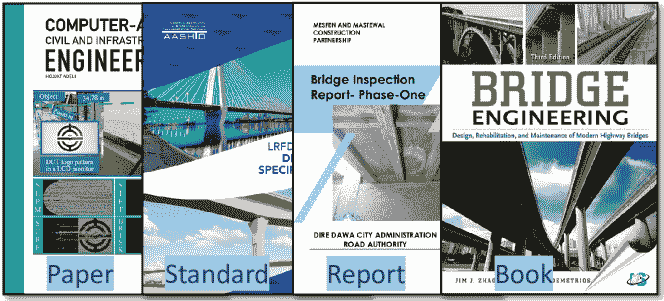

<!--yml

分类：未分类

日期：2025-01-11 12:25:18

-->

# 基于大语言模型的智能体在桥梁运维中的革命性应用：应用与洞察概述

> 来源：[https://arxiv.org/html/2407.10064/](https://arxiv.org/html/2407.10064/)

\authormark

作者：第一作者等

\corres

*张连震，哈尔滨工业大学交通运输科学与工程学院，哈尔滨 510001，中国。

\presentaddress

哈尔滨工业大学，哈尔滨 510001，中国

辛雨 陈    连震 张 \orgdiv交通运输科学与工程学院，\orgname哈尔滨工业大学，\orgaddress\state哈尔滨，\country中国 \orgdiv交通与土木工程学院，\orgname深圳大学，\orgaddress\state深圳，\country中国 \orgdiv极端环境绿色长寿命道路工程国家重点实验室，\orgname科技部，\orgaddress\state深圳，\country中国 [lianzhen@hit.edu.cn](mailto:lianzhen@hit.edu.cn)    陈鑫雨    朱义文    侯阳    张连震（2024年8月1日；2024年8月1日；2024年8月1日）

###### 摘要

[摘要]在人类社会发展的各个工业领域，人们不断探索解放人类劳动的技术。基于大语言模型的智能体建设被认为是实现这一目标的最有效工具之一。基于大语言模型的智能体作为一种具有人类感知、规划、决策和行动能力的智能实体，已经在多个领域创造了巨大的生产价值。作为最重要的交通基础设施，如何保持桥梁的安全运营是一个重大行业需求，迫切需要智能运维技术的研究。一般来说，桥梁运维领域的智能化水平相较于其他行业较低。然而，许多智能检查设备、机器学习算法以及自主评估和决策方法已经在桥梁运维领域得到了发展，为该领域的突破提供了可行的基础。本研究旨在探讨基于大语言模型的智能体对桥梁运维领域的影响，并分析其对核心任务所带来的潜在挑战和机遇。通过深入的研究和分析，本文期望为理解基于大语言模型的智能体在桥梁智能运维领域的应用提供更为全面的视角。

\jnlcitation\cname

， ， ，（\cyear2024），\ctitle基于大语言模型的智能体在桥梁运维中的革命性应用：应用与洞察概述，\cjournal:，\cvol2024;。

###### 关键词：

桥梁，运维，大语言模型，智能体^†^†文章类型：文章类型⁰⁰脚注：缩略语：LLMs，大语言模型；O&M，运维

## 1 引言

在过去十多年里，中国在高速公路桥梁建设方面取得了巨大成就，最大跨径突破，桥梁数量增加。到2023年底，中国现有高速公路桥梁数量已达到1,079,300座。同时，大量桥梁结构陆续进入服役的中后期，安全事故频发，引起社会广泛关注。优化现有桥梁的运营和维护，以维持和提高其安全性能和服务状况，已成为社会的迫切需求。

高速公路桥梁的运营与维护通过技术创新和管理策略提高了结构安全性和效率，实现了传感器监测  ^([31](https://arxiv.org/html/2407.10064v4#bib.bib31)), ^([70](https://arxiv.org/html/2407.10064v4#bib.bib70)), 无人机检测、疾病识别的算法优化、科学评估方法  ^([76](https://arxiv.org/html/2407.10064v4#bib.bib76)), ^([13](https://arxiv.org/html/2407.10064v4#bib.bib13)), 以及多层次的维护决策系统  ^([30](https://arxiv.org/html/2407.10064v4#bib.bib30)), ^([6](https://arxiv.org/html/2407.10064v4#bib.bib6))，为行业智能化发展奠定了基础。然而，仍然存在许多问题，如桥梁感知数据的稳定性差，数据处理延迟高，技术评估维度单一，模型准确性低，运营和维护决策缺乏数据支持，智能化水平低。桥梁运营和维护智能化仍处于初级阶段，需要加强状态感知、评估系统、决策支持以及与人工智能技术的融合。

桥梁运营与维护所面临的问题迫切需要基于大语言模型（LLM）的智能体技术来解决。智能体作为类人智能实体，能够自主进行感知、规划、决策和行动 ^([96](https://arxiv.org/html/2407.10064v4#bib.bib96)), ^([26](https://arxiv.org/html/2407.10064v4#bib.bib26))。虽然在早期仅限于特定任务，如围棋游戏或书籍检索，但由^([90](https://arxiv.org/html/2407.10064v4#bib.bib90))提出的Transformer架构极大地推动了语言模型的发展。像OpenAI的ChatGPT和Google的BERT等大型语言模型，通过出色的泛化能力显著提升了理解、总结、推理和语言处理能力，为智能体的研究带来了新的希望。这些大型语言模型现已被视为智能体的“大脑”，并在桥梁运营和维护领域具有巨大的应用潜力。

在当前大语言模型和智能体研究领域快速发展的背景下，新型大模型和智能体的出现率显著增加。学术界对此高度关注，相关研究成果的发表量急剧增加。这表明人工智能技术正逐渐渗透并改造各个行业。因此，有必要在桥梁运维领域探索并引入相应的先进技术，以促进该领域的创新发展。

在当前的研究阶段，智能体在感知、规划、决策和行动方面更加成熟。然而，桥梁运维领域在布局感知、数据预测、性能评估、决策约束、应急响应和灾害缓解等方面的自动化和智能化程度还不够。因此，下一代桥梁运维管理系统应集成基于大语言模型（LLM）的智能体技术，为每座桥梁配备个人助手。同时，系统应考虑路网层面上桥梁集群之间的互补性和独立关系，实现智能体之间的协同、合作与竞争。本文的目的是讨论智能体如何优化桥梁运维任务，如何构建桥梁运维智能系统，并分析人工智能对桥梁运维领域未来发展的影响，以及智能体发展过程中可能遇到的机遇与挑战。

图1：按月发布的包含关键词“大语言模型”和“智能体”在标题或摘要中的arXiv论文数量趋势，采用精确匹配。我们为两个关键词设置了不同的x轴范围。我们标注了与LLM和智能体研究进展的关键里程碑相关的点。包含“大语言模型”这一关键词的论文数量在ChatGPT发布后显著增加（图a）。包含“A”这一关键词的论文数量在AutoGPT和HuggingGPT发布后显著增加（图b）。

## 2 背景

在本节中，我们详细概述了桥梁运维和基于LLM的智能体研究的演变过程。我们发现，现代桥梁健康监测技术的不足与基于LLM的智能体的优势相契合。通过分析两者的发展轨迹，我们提出利用基于LLM的智能体振兴桥梁运维领域，并在当前生产力背景下推动行业创新。

图2：现代桥梁数字化检查与监测技术。它能够观察桥梁所在环境、结构负载、结构变化以及结构的负载响应。

### 2.1 桥梁运营与养护研究回顾

桥梁管理与养护系统负责桥梁全生命周期的健康管理，功能包括数据采集、整合与存储、设备管理、状况评估、性能预测、策略制定和应急响应。该系统在建设阶段就已规划，以监控关键区域和敏感参数。桥梁完工后，将基于材料老化、结构特征和交通负载等因素评估桥梁的实际运营状况与设计预期之间的差异。值得强调的是，桥梁管理与养护系统的目标并非始终保持桥梁处于最佳状态，而是要确保桥梁的长期运营能在有限的财政预算、桥梁可替代性、道路网络重要性和事故预防等约束条件下，带来最大的社会经济效益。

在桥梁发生重大事故后，人们开始意识到需要建立专门的系统，负责桥梁的定期检查和周期性养护，以确保桥梁的正常使用，并减少恶性事件的发生。桥梁健康监测系统的发展分为三个主要阶段：

第一阶段是从1960年代到1980年代，当时桥梁养护记录依赖纸质文件。在此期间，桥梁信息更新不频繁，文件流通和规范化程度较差。通常，只有在结构发生重大损坏或发生事故时，才会进行桥梁养护活动。在此阶段，桥梁养护系统主要出现在桥梁建设较早的国家，如瑞典和美国^([82](https://arxiv.org/html/2407.10064v4#bib.bib82))。

第二阶段是从1980年代到20世纪末，这时桥梁维护系统作为一个更完整的软件系统被构建。此阶段的标志是桥梁维护软件系统的完善，其发展起源于原始的纸质文件系统，并随着计算机技术的进步不断演变。维护信息逐渐从传统的纸质介质转移到计算机存储，主要形式包括文本、表格和图像。软件系统功能也逐步丰富，涵盖了桥梁信息管理、日常监测和维护记录、维护决策支持等方面。此阶段最具代表性的系统是美国的PONTIS ^([88](https://arxiv.org/html/2407.10064v4#bib.bib88))，在美国系统完成后，人们意识到建立桥梁维护软件的重要性，各国开始建立自己的桥梁维护系统，欧洲的代表包括丹麦的Danbro、英国的NATS、法国的Edouard、挪威的Brutus ^([55](https://arxiv.org/html/2407.10064v4#bib.bib55))，亚洲的代表包括日本的J-BMS、韩国的BMS和中国的CMBS ^([40](https://arxiv.org/html/2407.10064v4#bib.bib40))。

第三阶段是从21世纪到现在，在这一阶段，新算法和理论的有效融合实现了桥梁结构安全性和运行维护效率的双重提升。

算法和理论方面主要有三种创新：（1）在算法发展方面，高精度图像处理、激光点云3D重建和全息摄影技术的融合提高了桥梁表面病害的识别精度和结构服务状态的实时检测；（2）在桥梁技术状况评估方面，学者们开发了多种评估方法，包括模糊理论、层次分析法和病害加权系统，以科学评估桥梁的技术状况；（3）在维护决策研究方面，已经形成了一个涵盖从单一桥梁到道路网络级别的决策程序体系，以满足不同规模桥梁维护的需求。

智能设备的创新主要有两种类型：（1）在建设过程中，集成大量传感器，实时监测桥梁的外部环境和结构状态，如交通负荷、结构应力等关键参数；（2）在桥梁的运营和维护阶段，使用先进设备，如无人机（UAV）、攀岩机器人和多功能检测机器人，实现对桥梁健康状态的动态监控，支持管理和维护决策。

可以看出，桥梁管理系统的发展历史表明，每一次重要的进步都伴随着计算机技术的创新突破。

### 2.2 基于LLM的代理研究概述

为了实现人工智能替代人类劳动，基于大规模语言模型（LLM）的代理必须具备两个关键条件：首先，它们应该具备先进的理解能力，涵盖对书面语言、语音、图像和视频的深入理解，以及准确解读人类意图并生成自主反馈的能力。其次，基于LLM的代理应具备有效调用工具或设备的能力，这不仅涉及人类直接操作工具，更先进的LLM代理应能通过传感器感知物理环境，并独立动用适当的工具进行现实世界的自我调节。本节将详细探讨当前人类在这两个领域的探索和进展。

图 3：现代大规模语言模型（LLMs）的进化树追溯了近年来语言模型的发展，并突出显示了一些最著名的模型。由^([98](https://arxiv.org/html/2407.10064v4#bib.bib98))总结。位于同一分支的模型之间有更紧密的关系。基于Transformer的模型以非灰色显示：仅解码器模型位于蓝色分支，仅编码器模型位于粉色分支，编码器-解码器模型位于绿色分支。模型在时间线上的垂直位置表示它们的发布日期。开源模型用实心方块表示，闭源模型用空心方块表示。右下角的堆叠条形图显示了来自各公司和机构的模型数量。

#### 2.2.1 更大的语言模型

语言建模（LM）是自然语言处理领域中最重要的任务，本质上是自然语言理解和自然语言生成的综合^[8](https://arxiv.org/html/2407.10064v4#bib.bib8)。通过让计算机学习大量人类语言数据，并应用特定的方法来预测语言中各个单词（本文中的单词是以句子中的词语为例）之间的条件概率，我们能够表征单词之间的逻辑关系，从而使得语言模型能够理解并生成流畅的自然语言^[62](https://arxiv.org/html/2407.10064v4#bib.bib62)。实现具有类人写作和沟通能力的机器，一直是人类追求的长期目标。在学术界，语言模型的发展通常分为四个主要阶段^[64](https://arxiv.org/html/2407.10064v4#bib.bib64)：

第一个阶段是统计语言建模（SLM）阶段。在这一阶段，单词的表示依赖于稀疏向量集所表征的单一热向量^[89](https://arxiv.org/html/2407.10064v4#bib.bib89)。尽管这种方法未能在单词向量的表示中反映出逻辑关系，但它提供了一种直观且易于理解的表征方式。至于句子的表征，则使用马尔科夫假设通过条件概率揭示句子中单词之间的逻辑关系。具体而言，该模型固定了上下文长度，也称为n-gram语言模型，其中二元模型和三元模型是最常见的^[11](https://arxiv.org/html/2407.10064v4#bib.bib11)，^[45](https://arxiv.org/html/2407.10064v4#bib.bib45)。这一阶段的语言建模主要用于信息检索^[47](https://arxiv.org/html/2407.10064v4#bib.bib47)，^[33](https://arxiv.org/html/2407.10064v4#bib.bib33)，^[101](https://arxiv.org/html/2407.10064v4#bib.bib101)。然而，统计语言模型面临的主要挑战是“维度灾难”，即随着词汇量的增加，模型所需的参数空间呈指数增长。为了缓解这一问题，广泛采用了平滑策略等技术，以减轻数据稀疏性的影响^[15](https://arxiv.org/html/2407.10064v4#bib.bib15)，^[72](https://arxiv.org/html/2407.10064v4#bib.bib72)。

第二阶段是神经语言模型（NLM）阶段。研究人员利用word2vec方法将单词映射到低秩向量空间，从而有效克服了统计语言模型中的稀疏性问题 ^([17](https://arxiv.org/html/2407.10064v4#bib.bib17)), ^([53](https://arxiv.org/html/2407.10064v4#bib.bib53)), ^([49](https://arxiv.org/html/2407.10064v4#bib.bib49))。这种方法不仅使得单词向量能够表征逻辑关系，还允许向量之间进行直观的数学连接。与此同时，通过神经网络技术，如多层感知机 ^([49](https://arxiv.org/html/2407.10064v4#bib.bib49)) 和递归神经网络 ^([58](https://arxiv.org/html/2407.10064v4#bib.bib58)), ^([71](https://arxiv.org/html/2407.10064v4#bib.bib71)), ^([27](https://arxiv.org/html/2407.10064v4#bib.bib27))，研究人员能够从大量自然语言数据中学习，以获得单词的向量表示。这种分布式的单词表示方法在自然语言处理（NLP）的多个下游任务中表现出色，如机器翻译，标志着NLP领域在表示学习方面的重大突破，并对后续研究产生了深远影响。

第三阶段是预训练模型（PLM）阶段 ^([22](https://arxiv.org/html/2407.10064v4#bib.bib22))。与前述的马尔可夫链模型不同，PLM利用递归神经网络捕捉句子内部单词之间的交互 ^([25](https://arxiv.org/html/2407.10064v4#bib.bib25)), ^([28](https://arxiv.org/html/2407.10064v4#bib.bib28))。随后，谷歌提出的Transformer架构引入了自注意力机制和位置编码，大大提高了模型的并行处理能力，使其能够快速学习大量的广义知识，并有效捕捉单词之间的逻辑关系 ^([90](https://arxiv.org/html/2407.10064v4#bib.bib90))。这一创新催生了BERT和GPT-2等预训练语言模型。通过在特定任务上微调这些预训练模型，它们在几乎所有自然语言处理（NLP）的下游任务中都取得了显著的性能提升。

第四阶段是大型语言模型（LLM）阶段。在当前阶段，语言模型的参数数量突破了数十亿、数百亿甚至数千亿的水平。随着模型参数达到新的数量级，模型出现了“涌现”现象，模型性能呈现跨越式提升，只需少量学习即可在特定任务上提高模型性能 ^([4](https://arxiv.org/html/2407.10064v4#bib.bib4))。例如，GPT-3能够通过简单的上下文学习出色地解决特定任务，而GPT-2的表现相对较差，这突显了参数规模对模型性能的重要影响。随着ChatGPT的发布，大型语言模型已成为AI领域最热门的研究方向，在医学、金融、自动驾驶等领域取得了显著成果 ^([94](https://arxiv.org/html/2407.10064v4#bib.bib94))。到2023年，大型模型的更新迭代周期已缩短至以天为单位，它们在文本、语音、图像和视频等多模态领域的能力得到了快速提升，并丰富了许多新特性，在多个任务中取得了超越人类平均水平的表现 ^([14](https://arxiv.org/html/2407.10064v4#bib.bib14))。

可以看出，随着自然语言处理领域的发展，特别是大型语言模型的近期出现，计算机已经具备了实现基于LLM的智能体的首要条件：先进的理解能力，包括对书面语言、语音、图像和视频的深入理解，以及准确解读人类意图并生成自主反馈的能力。这为基于LLM的智能体构建了“大脑”，下一步则是着重于如何为“大脑”赋能，使其具备行动能力。

图4：基于LLM的自主体领域增长趋势示意图。^([91](https://arxiv.org/html/2407.10064v4#bib.bib91))总结了按时间和文章数量划分的智能体发展情况。它们使用不同的颜色代表不同的智能体类别。例如，游戏智能体旨在模拟玩家，而工具智能体主要关注工具使用。针对每个时间段，它们提供了一个包含不同智能体类别的精选研究列表。

#### 2.2.2 基于LLM的智能体

代理属于人工智能领域，其目标是构建一个能够实时感知环境、做出决策并采取响应行动的类人智能实体^([73](https://arxiv.org/html/2407.10064v4#bib.bib73))。基于LLM的代理与专家系统的主要区别体现在它们的自主性，基于LLM的代理能够实时感知环境，依赖知识库和思维链生成符合人类预期的决策，并据此行动^([97](https://arxiv.org/html/2407.10064v4#bib.bib97))。人类一直致力于构建具有与自身相当的智能水平和行动能力的基于LLM的代理，基于LLM的代理的发展可以分为四个主要阶段：

第一阶段是符号代理阶段。在这一早期阶段，研究人员致力于创建能够做出决策的实体^([95](https://arxiv.org/html/2407.10064v4#bib.bib95))。最初的策略是制定大量规则，将判断条件和反馈输入计算机，并使其根据这些规则做出响应。在这一时期，专家系统是基于符号的LLM代理的代表。基于符号的LLM代理的优点是其出色的可解释性，能够清晰地揭示计算机的思维过程^([75](https://arxiv.org/html/2407.10064v4#bib.bib75))，^([57](https://arxiv.org/html/2407.10064v4#bib.bib57))。然而，它们的局限性同样显著：规则输入的有限性使其难以处理复杂的现实世界输入，随着规则数量的增加，基于符号的LLM代理在响应速度上受到限制，无法迅速对输入做出反应^([41](https://arxiv.org/html/2407.10064v4#bib.bib41))，^([74](https://arxiv.org/html/2407.10064v4#bib.bib74))。

第二阶段是反应性代理阶段。与符号代理不同，基于LLM的代理集中于其对环境变化的即时感知和反应^([10](https://arxiv.org/html/2407.10064v4#bib.bib10))，^([54](https://arxiv.org/html/2407.10064v4#bib.bib54))，^([63](https://arxiv.org/html/2407.10064v4#bib.bib63))。与基于符号的LLM代理专注于符号操作和复杂逻辑推理不同，基于LLM的代理则侧重于建立输入与环境刺激之间、输出与行为反应之间的直接映射^([77](https://arxiv.org/html/2407.10064v4#bib.bib77))，^([9](https://arxiv.org/html/2407.10064v4#bib.bib9))。目标是以最小的计算资源实现准确且快速的响应。

第三个阶段是基于强化学习的智能体阶段。得益于计算能力的提升，基于大型语言模型（LLM）的智能体能够通过与环境的互动处理更复杂的任务 ^([59](https://arxiv.org/html/2407.10064v4#bib.bib59))。强化学习框架强调，LLM-based智能体必须学会在与环境互动的过程中做出决策，以最大化在给定任务和规则约束下的累积奖励，从而确保每一步所做的选择是当前情境下的最优解 ^([86](https://arxiv.org/html/2407.10064v4#bib.bib86))。最初，基于强化学习的LLM智能体依赖于诸如策略搜索和价值函数优化等基本技术，通常是Q-learning ^([92](https://arxiv.org/html/2407.10064v4#bib.bib92))和SARSA ^([93](https://arxiv.org/html/2407.10064v4#bib.bib93))。随后，随着深度学习技术的进步，深度强化学习应运而生，它结合了两者的优势，使得智能体能够处理高维输入并学习更高级的策略，如AlphaGo ^([79](https://arxiv.org/html/2407.10064v4#bib.bib79))和DQN ^([60](https://arxiv.org/html/2407.10064v4#bib.bib60))所示。这种方法的主要优势在于基于LLM的智能体能够在没有人工干预的情况下自主适应未知环境。然而，强化学习仍面临着长时间训练周期、低效的样本利用和在不稳定环境中应用等挑战。

第四个阶段是基于大型语言模型（LLM）的智能体阶段。如前所述，大型语言模型已经展示了显著的性能，可以作为LLM-based智能体的大脑 ^([43](https://arxiv.org/html/2407.10064v4#bib.bib43))。基于LLM的智能体通过多模态感知策略 ^([103](https://arxiv.org/html/2407.10064v4#bib.bib103))、^([37](https://arxiv.org/html/2407.10064v4#bib.bib37)) 和工具调用策略 ^([44](https://arxiv.org/html/2407.10064v4#bib.bib44))、^([34](https://arxiv.org/html/2407.10064v4#bib.bib34)) 来扩展感知和行动能力，通过思维链和问题分解等技术来增强规划和推理能力 ^([35](https://arxiv.org/html/2407.10064v4#bib.bib35))、^([102](https://arxiv.org/html/2407.10064v4#bib.bib102))，并通过从反馈中学习和回应，获得与环境互动的能力 ^([84](https://arxiv.org/html/2407.10064v4#bib.bib84))、^([36](https://arxiv.org/html/2407.10064v4#bib.bib36))。基于LLM的智能体通过学习大量的训练集获得了泛化能力，从而实现了在不同任务之间的自由切换，并已被广泛应用于金融服务、智能家居、教育培训、医疗健康、智能客服等多个现实任务领域。

可以看出，基于大语言模型（LLM）的智能体已经能够通过自然语言交互实现自主感知、规划、决策和行动。尽管实现通用人工智能还需要很长时间，但当前的研究已经使计算机初步具备了实现基于LLM智能体的两个条件，这不仅包括先进的理解能力，还包括有效调用工具或设备，通过传感器感知物理环境，并独立调动适当的工具，从而实现对现实世界的自我调节。

### 2.3 为什么桥梁运维需要基于LLM的智能体

中国通过持续的技术创新和工程实践，推动了高速公路桥梁建设和维护管理中基础设施智能化管理的发展。然而，当前的研究仍然存在许多问题：

+   •

    在桥梁布设感知方面，传感器收集的数据稳定性不足，智能设备在数据采集和数据处理之间的延迟较高，无法满足实时需求。

+   •

    在桥梁技术评估方面，只有单一的运维场景描述，单一的运维布设指标，评估维度不完整。现有的自然演化模型准确性较低，性能评估方法的智能化程度较低，性能预警的误报率较高。

+   •

    在桥梁运维决策方面，桥梁运维指标不同维度的数据相关性不强，桥梁性能的演变规律不明确^([39](https://arxiv.org/html/2407.10064v4#bib.bib39))。疾病数据库单一，缺乏支持运维决策的数据库。目前的运维平台主要用于数据采集、展示、设备控制和数据管理，智能化、自动化的决策控制能力较低，交互能力较弱。

可以看出，桥梁运维的智能化水平仍处于相对早期阶段，在状态感知、技术评估、运维决策和应对极端事件等方面存在诸多问题。现有的运维平台主要具备数据采集、显示、设备控制和数据管理等基础功能，但在智能化、自动化决策控制和交互能力等方面仍显不足。显然，桥梁运维领域的智能化程度仍处于初级阶段，与先进人工智能技术的结合尚不够紧密。

因此，新一代的桥梁运维管理系统应当引入基于LLM的智能体技术，为每座大跨度桥梁配备个人助手。同时，系统应当基于道路网络层级，考虑桥梁集群之间的互补和独立关系，实现不同基于LLM的智能体之间的协同、合作和竞争关系。研究表明，多智能体之间的协调可能会在计算机之间产生社会现象，这表明单一桥梁的基于LLM的智能体建设，以及在道路网络层级上桥梁集群智能体之间的协同合作，具有成为未来桥梁运维方向的巨大潜力。

## 3 桥梁运维LLM智能体构建方法

大型语言模型与智能体的集成正在迅速发展，但在桥梁结构的运维管理中，仍然需要复杂的桥梁工程知识和专业的运维技能。专业知识的获取和准确构建对于基于大型语言模型（LLM）的智能体在下游任务中的表现至关重要。我们的目标是将专业知识嵌入智能体，以支持桥梁运维管理中的自动化和基于LLM的智能体。在本节中，我们将描述在专业领域构建基于LLM的智能体本体的方法。

### 3.1 知识来源

为了实现基于LLM的智能体的专业化功能，本文建议通过分布式知识、结构化知识和多轮对话数据的结合来构建专业领域的智能体。

图5：分布式知识可用于训练词向量模型或作为外部信息进行检索。

##### 分布式知识

分布式知识即自然语言领域的专业知识。尽管当前基于大型语言模型（LLM）的智能体在通用领域展示了出色的理解和生成能力，但主流的大型语言模型在预训练数据集中缺乏专业领域的知识，这使得它们难以满足实际工程应用的需求。中国的桥梁技术状况评估标准将桥梁检查分为日常检查、经常性检查、定期检查和专项检查，经过数十年的中国桥梁工程建设，积累了成千上万份检查报告，这些报告可以作为LLM智能体专业化的关键数据来源。同时，桥梁领域的学术论文、专业书籍和行业规范也是主要的数据来源。然而，单独的分布式知识无法取得良好效果，因为桥梁运维领域的复杂性和深度要求LLM智能体拥有结构化知识，以弥补它们在知识表示深度方面的不足。因此，在桥梁领域，LLM智能体需要同时拥有高质量的分布式和结构化知识，以实现更好的性能。

图 6：知识图谱作为最典型的结构化知识。

##### 结构化知识

结构化知识的典型表现形式是知识图谱，这是一个由^([81](https://arxiv.org/html/2407.10064v4#bib.bib81))提出的概念，本质上是一种组织知识的结构化方式。知识图谱可以视为一种知识关系图，由节点和边组成，其中节点代表实体或概念，边代表属性或关系。知识图谱的应用可以有效解决桥梁运维领域智能体知识表达深度的问题。仅有分布式知识不足以使智能体理解桥梁工程和结构运维中的逻辑关系。建议构建一个多层次的运维知识库，涵盖桥梁的系统-结构-部件，运维中的感知-评估-决策，桥梁病害的原理-表现-处理措施，以及桥梁数据的预处理-阈值设定-异常值处理，以提高智能体的准确性和专业性。然而，即使结合了分布式和结构化知识，智能体仍然面临实现查询/指令-反馈/行动的循环对话数据集的挑战。

##### 多轮对话数据集

多轮对话数据集不仅涉及语言对话，还涉及基于LLM的智能体与人类指令之间的对齐。从大型语言模型的角度来看，为了理解人类的意图，需要一个多轮问答（Q-A，查询-反馈）数据集，即大量的查询和反馈数据^([80](https://arxiv.org/html/2407.10064v4#bib.bib80))，^([99](https://arxiv.org/html/2407.10064v4#bib.bib99))，^([1](https://arxiv.org/html/2407.10064v4#bib.bib1))。在这个过程中，提示模板（prompt word engineering）的设计至关重要，需要引导模型输出所需的结果，而无需根据专业领域的实际需求更新大型语言模型的权重。在基于LLM的智能体层面，为了实现桥梁结构的自动维护，需要多轮指令-动作（I-A，instruction-action）数据集，即大量的指令和动作数据集^([23](https://arxiv.org/html/2407.10064v4#bib.bib23))。目前，在桥梁运行和维护领域已经开发出多种智能算法和先进设备，多轮I-A数据集可以帮助基于LLM的智能体更有效地调用这些工具，以完成桥梁的自动维护。值得注意的是，每次工具调用并不能仅依赖于大量的算法和硬件开发技术。

### 3.2 基于LLM的智能体本体构建

当前的大型语言模型是由少数几家公司基于互联网数据训练的通用大模型，这些模型在专业领域表现不佳。其主要原因是上述大型语言模型在训练过程中缺乏专业数据集的训练。之前我们介绍了训练数据的来源，接下来我们将介绍构建基于LLM的智能体的方法。

##### LLM的微调

大语言模型的微调涉及使用特定领域的数据集进一步训练预训练模型，以优化其在特定任务上的表现^([65](https://arxiv.org/html/2407.10064v4#bib.bib65)), ^([12](https://arxiv.org/html/2407.10064v4#bib.bib12))。该过程旨在使模型更好地适应并执行特定领域的任务。微调包括嵌入模型和大语言模型的调优^([66](https://arxiv.org/html/2407.10064v4#bib.bib66))。嵌入模型的微调涉及将自然语言映射为低维向量，以表达词汇之间的逻辑关系，这需要使用分布式数据来捕捉来自大量数据源的专业名词实体。而大语言模型的微调则需要使用多种数据更新模型参数，大多数开源模型都提供了相应的官方微调方法。然而，微调大语言模型既需要强大的计算能力，也需要专业的知识，并且伴随着一定程度的不确定性，这使得在微调后难以准确预测模型的表现^([87](https://arxiv.org/html/2407.10064v4#bib.bib87)), ^([20](https://arxiv.org/html/2407.10064v4#bib.bib20)), ^([69](https://arxiv.org/html/2407.10064v4#bib.bib69))。目前，常用的方法包括检索增强生成（RAG）和链式思维（CoT）技术，以引导模型完成特定任务。尽管这些方法可能对模型能力的提升有限，但它们提供了更好的稳定性。

##### RAG和CoT

检索增强生成（RAG）是一种通过利用额外的数据资源来提高生成式人工智能的问答质量和交互能力的技术，而无需改变大语言模型的参数。RAG的工作流程包括加载外部文档、文档分割、内容向量化、数据检索，最后生成答案^([48](https://arxiv.org/html/2407.10064v4#bib.bib48))。然而，RAG的一个局限性是，在语义相同但措辞不同的问题中，可能会导致检索到无效结果，这一问题随着嵌入模型质量的提高而减少。链式思维（CoT）通过引导模型逐步将复杂问题分解成一系列子问题，并依次解决，从而显著提升大语言模型的性能^([24](https://arxiv.org/html/2407.10064v4#bib.bib24))。CoT技术的通用模板应包含问题、推理过程和答案这三个核心组件，以指导模型的推理和生成过程。

##### Langchain构建代理

LangChain 是一个最先进的大型语言模型开发框架，集成了大型语言模型、嵌入模型、交互层提示（Prompts）、外部知识和外部工具，为构建基于 LLM 的智能体提供灵活的解决方案。LangChain 包含六个核心组件，包括模型、提示、索引、记忆、链和智能体。索引、记忆、链和智能体，这些组件以链的形式相互连接，使得基于 LLM 的智能体能够实现自主感知、规划、决策和行动 ^([42](https://arxiv.org/html/2407.10064v4#bib.bib42))。该框架不仅赋予基于 LLM 的智能体高级的理解能力，还增强了它们调用工具或设备的能力 ^([56](https://arxiv.org/html/2407.10064v4#bib.bib56))，^([91](https://arxiv.org/html/2407.10064v4#bib.bib91))。基于 LLM 的智能体能够通过传感器感知物理环境，并独立调动适当的工具进行自动化和智能化的桥梁运维管理。

### 3.3 定性结果评估

本文上一节介绍了准备和构建基于 LLM 的智能体所需数据的方法。在此基础上，本节将重点介绍基于 LLM 的智能体的评估框架和评估标准。

随着大规模语言模型的引入，业界已建立了多个广泛采用的评估标准，包括 MMLU ^([32](https://arxiv.org/html/2407.10064v4#bib.bib32))，BIG-bench ^([83](https://arxiv.org/html/2407.10064v4#bib.bib83))，和 HELM ^([7](https://arxiv.org/html/2407.10064v4#bib.bib7))，以及一系列聚焦于模型特定能力的人类基准测试和评估测试。此外，还有一些聚焦于模型特定能力的评估基准，例如专注于知识应用的 TyDiQA ^([18](https://arxiv.org/html/2407.10064v4#bib.bib18)) 基准和专注于数学推理的 MGSM ^([68](https://arxiv.org/html/2407.10064v4#bib.bib68)) 基准。为了进行有效的评估，基准的选择应根据评估的具体目标进行。

尽管如前所述的评估基准已广泛应用于评估大规模语言模型的理解和生成能力，但它们未能充分评估模型在复杂环境中的规划和决策能力，以及基于 LLM 的智能体的行动能力。随着基于 LLM 的智能体技术的发展，学术界越来越关注评估基于 LLM 的智能体在复杂环境中的响应能力 ^([52](https://arxiv.org/html/2407.10064v4#bib.bib52))。

目前，尽管尚未有广泛接受的基准来评估基于大语言模型（LLM）的智能体，研究人员在提出可能成为未来评估标准的候选基准方面已取得显著进展。例如，ToolBench ^([29](https://arxiv.org/html/2407.10064v4#bib.bib29)) 是一个经过微调的数据集，用于评估智能体调用单一和多重工具命令的能力；TE ^([3](https://arxiv.org/html/2407.10064v4#bib.bib3)) 评估语言模型模拟人类行为的多面能力；MetaTool ^([38](https://arxiv.org/html/2407.10064v4#bib.bib38)) 旨在评估大型语言模型是否能有意识地调用工具并选择适当的工具来解决问题；LLM-Co ^([2](https://arxiv.org/html/2407.10064v4#bib.bib2)) 侧重于评估基于LLM的智能体在游戏中推断合作伙伴意图、进行推理和协作的能力。基于LLM的智能体通常是基于特定任务进行评估的，并且评估往往具有一定的模糊性。随着基于LLM的智能体，尤其是在多智能体协作领域的发展，如何有效追踪和评估智能体特性的方法将变得愈加重要。

图7：基于LLM的智能体框架示例。基于LLM的智能体的主要功能是感知桥梁的服务状态，然后通过“脑”进行思考并采取行动。“脑”需要具备桥梁运行和维护知识体系，能够对桥梁服务性能进行预测、评估和决策。

### 3.4 基于LLM的智能体框架示例

本框架旨在构建一个基于LLM的智能体系统，集成桥梁监测、运行与维护感知、指标预测、状况评估、智能决策和自主行动。该系统的核心在于集成多个先进的大型语言模型，并结合物联网、人工智能、机器学习和大数据技术，实现对桥梁状况的全面监控和智能管理。

##### 运行与维护感知层

(1) 监测端设备。包括各种类型的传感器（例如，压力传感器、位移传感器、振动传感器、环境监测站等），实时采集桥梁结构健康数据、环境参数（例如，温度、湿度、风速等）和交通流量信息。(2) 数据采集与预处理。通过物联网网关将监测数据汇聚到数据中心，并进行清洗、压缩、加密等预处理，以确保数据质量和安全性。

##### 智能处理层

（1）多模态数据处理。将结构化数据（如传感器读数）与非结构化数据（如桥梁施工信息、维护记录、历史文档）结合，利用自然语言处理（NLP）技术提取关键信息。基于BERT等模型理解文本信息，如维护报告和设计文档。（2）指标预测模型。建立桥梁的有限元模型，结合物理法则，以及LSTM、Transformer等序列模型，预测桥梁的损伤和剩余使用寿命，并识别潜在风险。（3）状态评估模型。综合评估桥梁的结构性能、耐久性和维护需求，评估桥梁的服务水平和功能性能，检测和评估由于环境因素造成的材料退化。（4）智能决策模型。使用GPT系列模型进行自然语言生成，制定桥梁维护、资源分配和风险管理策略，借助决策支持系统帮助管理者基于数据做出明智决策，以确保桥梁的可持续运营并最大化经济效益。

##### 运维任务调度

集成智能处理层的模型，构建知识图谱，实现跨领域知识融合和复杂问题推理，将决策转化为具体的运维任务，并实现结构健康监测系统、无人机、机器人清洗系统、自动化检查车辆、智能监控系统和自动化维护设备在桥梁运维中的无人化和自主使用，尤其是在恶劣或危险的环境中。在桥梁运维任务执行过程中，持续监控执行效果，并收集反馈数据以优化后续决策。

## 基于大语言模型（LLM）的桥梁运维代理的四个潜在发展方向

桥梁运维的自动化和智能化是提高运维效率、增强安全性和可靠性的关键。通过实时监控、智能分析和预测性维护，能够实现资源的最优配置，降低运维成本，并增强公众对桥梁安全的信任，这也是未来桥梁管理的重要发展方向。在桥梁运维领域，基于LLM的代理的集成有望降低人工成本，减少主观判断，提高管理效率，并实现对突发事件的快速响应。本节描述了桥梁运维智能化需要重点关注的一些研究元素。

### 4.1 桥梁运维领域的大语言模型

目前，垂直领域的大型语言模型正在蓬勃发展。在中国，许多行业已经推出了定制化的大型语言模型，例如医疗健康领域的“华佗”、金融领域的“轩辕”、法律行业的“韩非”和智能客服及营销领域的“红兔”。通过深度学习和自然语言处理技术，这些模型精准匹配各行业的需求，提供全方位的智能解决方案。

作为重要的交通基础设施，桥梁的运行和维护管理效率直接关系到交通系统的安全性、畅通性和效率。大语言模型在桥梁运维领域的构建，以及其作为桥梁智能管理系统核心枢纽的应用，可以实现自动化监控系统和智能数据分析。桥梁运维大语言模型的研发与应用，对于推动桥梁运维管理向智能化和高效化发展具有重要的理论和实践意义。

图8：通过解析图片，我们可以分析桥梁病害的发生位置、主要特征、原因、影响及处理措施，这是市场上普遍的大型语言模型无法做到的。大型语言模型对桥梁病害图片的识别可以提高桥梁运行与维护的专业性和准确性，减少人工成本。

### 4.2 桥梁运维领域的多模态知识图谱

在桥梁运维中构建多模态知识图谱是一个研发工作，旨在整合与桥梁运维相关的知识和数据，并通过多模态信息处理技术提升桥梁管理的智能化水平。大型语言模型展现了出色的多模态处理能力，尤其在图像和视频处理方面 ^([46](https://arxiv.org/html/2407.10064v4#bib.bib46)), ^([51](https://arxiv.org/html/2407.10064v4#bib.bib51))。然而，在桥梁运维领域，现有通用的大型语言模型对图像的处理能力仍处于较低水平。例如，在桥梁病害图片识别中，即使是最好的模型，也只能以不令人满意的准确度识别桥梁裂缝。桥梁病害种类繁多，包括混凝土开裂、剥落和暴露钢筋、风化、蜂窝、以及钢筋混凝土桥梁中的水渗透问题，还有钢桥中的断裂、腐蚀、涂层缺陷和吊索松弛等，这些现有模型无法有效识别。

图9：基于LLM的智能体实现桥梁运营与维护信息的多模态（文本、图片、视频、表格）解析，需要在桥梁结构、病害和评估等各个方面建立知识体系。知识图谱可以很好地提升模型的理解深度。

为了解决这个问题，结合大语言模型的多模态处理能力与桥梁检测领域丰富的数据，构建一个用于桥梁运营与维护的多模态知识图谱，建立分层知识体系，系统地分类桥梁病害、构件、部件和结构，并实现对现场采集的图片和视频的实时处理，将是一个有前景的研究方向。在桥梁运营和维护领域构建多模态知识图谱，不仅可以提高桥梁运营和维护管理的智能化水平，还能为桥梁全生命周期管理提供强有力的知识支持。

### 4.3 桥梁报告自动生成与辅助决策

目前，大多数桥梁养护领域的知识管理问答系统都是基于知识图谱的^([100](https://arxiv.org/html/2407.10064v4#bib.bib100)), ^([50](https://arxiv.org/html/2407.10064v4#bib.bib50)), ^([67](https://arxiv.org/html/2407.10064v4#bib.bib67))。基于知识图谱的问答系统需要从桥梁设计、施工、运营、管理、检查等数据中提取结构化知识，这一过程既费时又费力，而且很难处理非结构化或半结构化数据^([16](https://arxiv.org/html/2407.10064v4#bib.bib16))。此外，结构化知识的表达可能会导致错误传播和积累，当数据复杂度增加时，知识提取的准确性会大幅下降。

图10：首先进行数据准备和预处理，对数据库中的数据进行清理、分段并映射为词向量，存储在向量数据库中。当接收到用户提问时，首先进行预处理并映射为词向量，然后计算与数据库中段落向量的相似度，以筛选出相关信息。根据设计的提示模板，将疑问句和相关信息输入到大语言模型中生成专业的答案或报告。最后，收集用户反馈，优化流程，以提高答案质量和用户满意度。

### 4.4 工具调用基于LLM的智能体

在桥梁运营与维护领域，基于大型语言模型的互动系统的引入，可以逐步重塑其传统的运作模式。基于大型语言模型的问答系统采用无监督语言模型学习方法，将知识映射到一个连续的数值空间，有效克服了传统知识提取方法的一系列问题^([85](https://arxiv.org/html/2407.10064v4#bib.bib85))，^([78](https://arxiv.org/html/2407.10064v4#bib.bib78))。凭借其卓越的自然语言理解与生成能力，该系统不仅极大提升了信息检索与知识服务的智能化水平，还促进了运营和维护过程的自动化与智能化。运营与维护人员可以通过自然语言轻松查询各种运营与维护记录和报告，而大型语言模型能够迅速提供精确的信息，辅助决策，并自动从海量数据中挖掘潜在问题，增强运营与维护的可预测性。同时，自动化报告生成功能显著减少了手动撰写报告的时间和错误，提升了工作效率。

传统的桥梁运营和维护管理通常依赖人工巡检和定期检测，这不仅效率低下，而且很难全面、准确地掌握桥梁的实际状况。近年来，随着桥梁检查效率和质量需求的提升，智能化检查设备和技术的开发逐渐成熟，涵盖了无人机、绳索攀爬机器人、水下机器人、声纳检测设备，以及图像采集技术、激光点云扫描技术、全息摄影技术等。未来的研究方向必然是实现桥梁的自动化和无人化运营与维护管理，而基于大型语言模型的代理应用有望实现这一目标。

首先，基于大型语言模型的代理通过无缝集成和调度多种监测系统和传感器，实现对桥梁结构健康和环境参数的精准实时监测，利用大型语言模型快速分析数据，并及时发现潜在的异常，确保监测的准确性。其次，基于大型语言模型的代理有望实现对无人机、智能机器人等先进设备的自动调度，执行高空检查、内部维护等复杂任务，真正实现自动化和无人化的维护操作。这不仅提高了维护效率，还降低了人员安全风险。这些基于大型语言模型的代理与智能体保持实时通信，确保维护工作的精准执行和高效管理。

  

图11：基于LLM的智能体首先使用监控系统和远程检测系统感知桥梁状态，然后利用多模态处理能力（文本、表格、图片、视频）通过预测和评估模块深入分析数据，并将原始数据及其分析过程集成到显示平台中。最终，基于LLM的智能体输出涵盖监控报告、检查报告、维修方案的决策结果，并通过自主控制智能设备，制定行动计划实施桥梁运维作业。目前的技术仍然难以实现智能设备的无人化和自动化控制，但这必须是未来技术发展的方向。  

## 5 未来趋势与挑战

### 5.1 趋势  

##### 轻量级与快速响应  

随着大规模语言模型的发展，它们的参数规模已达到十亿级别，在许多方面表现出色^([21](https://arxiv.org/html/2407.10064v4#bib.bib21))。然而，在将这些大型语言模型应用于桥梁运维管理时，它们面临轻量级部署和快速响应的需求。桥梁的多模态监控数据实时传输，海量数据快速积累，但计算资源有限。因此，研究重点转向了快速识别来自多个来源的异构多模态数据，并开发高质量、轻量级、低延迟的模型，这对实现基于大型语言模型的智能体在桥梁运维中的应用至关重要。  

##### 灵活的工具调用  

大型语言模型为基于LLM的智能体提供了强大的理解和推理能力，使其能够在复杂环境中执行自主规划和行动规划。然而，面对不同行业中多样化的智能设备，必须开发统一的接口来与基于LLM的智能体进行对接，并为不同工具开发特定的算法，从而实现对环境语义信息的理解，以及通过大型语言模型与智能设备的互动识别障碍物和目标信息，进而生成合适的规划方案。  

### 5.2 限制或挑战  

##### 专业协同与障碍  

人工智能的产业化需要与多个领域的专业人员密切结合，基于LLM的智能体在桥梁运维领域的应用要求研究人员具备跨学科的知识，如桥梁工程、结构力学、材料力学、道路勘测与地质学等，以及相应的工程技能。同时，桥梁工程研究人员还需掌握自然语言处理、深度学习、机器学习、大语言模型等多学科技能，以及软件和硬件开发能力。这揭示了跨学科协作中的壁垒与挑战。

##### 工程伦理与责任

在工程应用中，桥梁结构的健康对交通网络至关重要，任何损坏都可能带来社会影响。基于大语言模型（LLM）的智能体推荐和程序可能涉及财产或生命损失，责任归属问题亟需解决。目前，基于LLM的智能体主要用作决策辅助工具或行动工具。未来，多模态协作将面临用户隐私和数据安全挑战，需要多方合作建立健全的监管和伦理框架。

## 6 结论

在本研究过程中，我们成功构建了基于LLM的智能体，旨在突破桥梁运维领域的发展瓶颈，推动该行业的智能化转型。通过全面分析桥梁运维领域的当前发展状况及基于LLM的智能体进展，我们得出结论，基于LLM的智能体在理解、生成、规划、决策和行动方面具有显著优势，能够有效应对桥梁运维领域面临的挑战。本研究提出的基于LLM的智能体框架涵盖了数据源、知识本体构建和模型评估等多个关键方面，为桥梁运维领域的智能发展提供了有力支持。同时，我们还探讨了基于LLM的智能体在桥梁运维领域的应用前景，并相信其具有广阔的发展空间。然而，基于LLM的智能体在桥梁运维领域的应用仍面临专业壁垒和工程伦理等问题，这是未来研究中需要重点关注和解决的重要方向。总体而言，本研究为桥梁运维领域智能化发展提供了新的思路和方法，预计能够推动整个行业的进步。

## 致谢

感谢中国国家重点研发计划（2022YFC3801100）对本研究的资助支持。

## 参考文献

+   Abbasiantaeb等人\APACyear2024 \APACinsertmetastarabbasiantaeb2024let{APACrefauthors}Abbasiantaeb, Z., Yuan, Y., Kanoulas, E.\BCBL \BBA Aliannejadi, M. \APACrefYearMonthDay2024. \BBOQ\APACrefatitleLet the llms talk: Simulating human-to-human conversational qa via zero-shot llm-to-llm interactions Let the llms talk: Simulating human-to-human conversational qa via zero-shot llm-to-llm interactions.\BBCQ \BIn \APACrefbtitleProceedings of the 17th ACM International Conference on Web Search and Data Mining Proceedings of the 17th acm international conference on web search and data mining (\BPGS 8–17). \PrintBackRefs\CurrentBib

+   Agashe等人\APACyear2023 \APACinsertmetastaragashe2023evaluating{APACrefauthors}Agashe, S., Fan, Y.\BCBL \BBA Wang, X\BPBIE. \APACrefYearMonthDay2023. \BBOQ\APACrefatitleEvaluating multi-agent coordination abilities in large language models Evaluating multi-agent coordination abilities in large language models.\BBCQ \APACjournalVolNumPagesarXiv preprint arXiv:2310.03903. \PrintBackRefs\CurrentBib

+   Aher等人\APACyear2023 \APACinsertmetastaraher2023using{APACrefauthors}Aher, G\BPBIV., Arriaga, R\BPBII.\BCBL \BBA Kalai, A\BPBIT. \APACrefYearMonthDay2023. \BBOQ\APACrefatitleUsing large language models to simulate multiple humans and replicate human subject studies Using large language models to simulate multiple humans and replicate human subject studies.\BBCQ \BIn \APACrefbtitleInternational Conference on Machine Learning International conference on machine learning (\BPGS 337–371). \PrintBackRefs\CurrentBib

+   Beltagy等人\APACyear2019 \APACinsertmetastarbeltagy2019scibert{APACrefauthors}Beltagy, I., Lo, K.\BCBL \BBA Cohan, A. \APACrefYearMonthDay2019. \BBOQ\APACrefatitleSciBERT: A pretrained language model for scientific text Scibert: A pretrained language model for scientific text.\BBCQ \APACjournalVolNumPagesarXiv preprint arXiv:1903.10676. \PrintBackRefs\CurrentBib

+   Bengio等人\APACyear2000 \APACinsertmetastarbengio2000neural{APACrefauthors}Bengio, Y., Ducharme, R.\BCBL \BBA Vincent, P. \APACrefYearMonthDay2000. \BBOQ\APACrefatitleA neural probabilistic language model A neural probabilistic language model.\BBCQ \APACjournalVolNumPagesAdvances in neural information processing systems13. \PrintBackRefs\CurrentBib

+   Bocchini与Frangopol\APACyear2011 \APACinsertmetastarbocchini2011probabilistic{APACrefauthors}Bocchini, P.\BCBT \BBA Frangopol, D\BPBIM. \APACrefYearMonthDay2011. \BBOQ\APACrefatitleA probabilistic computational framework for bridge network optimal maintenance scheduling A probabilistic computational framework for bridge network optimal maintenance scheduling.\BBCQ \APACjournalVolNumPagesReliability Engineering & System Safety962332–349. \PrintBackRefs\CurrentBib

+   Bommasani \BOthers. \APACyear2023 \APACinsertmetastarbommasani2023holistic{APACrefauthors}Bommasani, R., Liang, P.\BCBL \BBA Lee, T. \APACrefYearMonthDay2023. \BBOQ\APACrefatitle语言模型的整体评估 Holistic evaluation of language models.\BBCQ \APACjournalVolNumPages纽约科学院年刊15251140–146. \PrintBackRefs\CurrentBib

+   Brockopp \APACyear1983 \APACinsertmetastarbrockopp1983nlp{APACrefauthors}Brockopp, D\BPBIY. \APACrefYearMonthDay1983. \BBOQ\APACrefatitle什么是自然语言处理？ What is nlp?\BBCQ \APACjournalVolNumPages美国护理学会杂志8371012–1014. \PrintBackRefs\CurrentBib

+   R. Brooks \APACyear1986 \APACinsertmetastarbrooks1986robust{APACrefauthors}Brooks, R. \APACrefYearMonthDay1986. \BBOQ\APACrefatitle移动机器人稳健的分层控制系统 A robust layered control system for a mobile robot.\BBCQ \APACjournalVolNumPagesIEEE机器人与自动化杂志2114–23. \PrintBackRefs\CurrentBib

+   R\BPBIA. Brooks \APACyear1991 \APACinsertmetastarbrooks1991intelligence{APACrefauthors}Brooks, R\BPBIA. \APACrefYearMonthDay1991. \BBOQ\APACrefatitle没有表示的智能 Intelligence without representation.\BBCQ \APACjournalVolNumPages人工智能471-3139–159. \PrintBackRefs\CurrentBib

+   P\BPBIF. Brown \BOthers. \APACyear1990 \APACinsertmetastarbrown1990statistical{APACrefauthors}Brown, P\BPBIF., Cocke, J., Della Pietra, S\BPBIA., Della Pietra, V\BPBIJ., Jelinek, F., Lafferty, J.\BDBLRoossin, P\BPBIS. \APACrefYearMonthDay1990. \BBOQ\APACrefatitle统计方法在机器翻译中的应用 A statistical approach to machine translation.\BBCQ \APACjournalVolNumPages计算语言学杂志16279–85. \PrintBackRefs\CurrentBib

+   T. Brown \BOthers. \APACyear2020 \APACinsertmetastarbrown2020language{APACrefauthors}Brown, T., Mann, B., Ryder, N., Subbiah, M., Kaplan, J\BPBID., Dhariwal, P.\BDBLothers \APACrefYearMonthDay2020. \BBOQ\APACrefatitle语言模型是少样本学习者 Language models are few-shot learners.\BBCQ \APACjournalVolNumPages神经信息处理系统进展331877–1901. \PrintBackRefs\CurrentBib

+   Catbas \BBA Aktan \APACyear2002 \APACinsertmetastarcatbas2002condition{APACrefauthors}Catbas, F\BPBIN.\BCBT \BBA Aktan, A\BPBIE. \APACrefYearMonthDay2002. \BBOQ\APACrefatitle状况与损伤评估：问题及一些有前景的指标 Condition and damage assessment: issues and some promising indices.\BBCQ \APACjournalVolNumPages结构工程杂志12881026–1036. \PrintBackRefs\CurrentBib

+   Chang \BOthers. \APACyear2024 \APACinsertmetastarchang2024survey{APACrefauthors}Chang, Y., Wang, X., Wang, J., Wu, Y., Yang, L., Zhu, K.\BDBLothers \APACrefYearMonthDay2024. \BBOQ\APACrefatitle大语言模型评估调查 A survey on evaluation of large language models.\BBCQ \APACjournalVolNumPagesACM智能系统与技术交易15 31–45. \PrintBackRefs\CurrentBib

+   S\BPBIF. Chen \BBA Goodman \APACyear1999 \APACinsertmetastarchen1999empirical{APACrefauthors}Chen, S\BPBIF.\BCBT \BBA Goodman, J. \APACrefYearMonthDay1999. \BBOQ\APACrefatitleAn empirical study of smoothing techniques for language modeling An empirical study of smoothing techniques for language modeling.\BBCQ \APACjournalVolNumPagesComputer Speech & Language134359–394. \PrintBackRefs\CurrentBib

+   X. Chen \BOthers. \APACyear2020 \APACinsertmetastarchen2020review{APACrefauthors}Chen, X., Jia, S.\BCBL \BBA Xiang, Y. \APACrefYearMonthDay2020. \BBOQ\APACrefatitleA review: Knowledge reasoning over knowledge graph A review: Knowledge reasoning over knowledge graph.\BBCQ \APACjournalVolNumPagesExpert systems with applications141112948. \PrintBackRefs\CurrentBib

+   Church \APACyear2017 \APACinsertmetastarchurch2017word2vec{APACrefauthors}Church, K\BPBIW. \APACrefYearMonthDay2017. \BBOQ\APACrefatitleWord2Vec Word2vec.\BBCQ \APACjournalVolNumPagesNatural Language Engineering231155–162. \PrintBackRefs\CurrentBib

+   Clark \BOthers. \APACyear2020 \APACinsertmetastarclark2020tydi{APACrefauthors}Clark, J\BPBIH., Choi, E., Collins, M., Garrette, D., Kwiatkowski, T., Nikolaev, V.\BCBL \BBA Palomaki, J. \APACrefYearMonthDay2020. \BBOQ\APACrefatitleTydi qa: A benchmark for information-seeking question answering in typologically diverse languages Tydi qa: A benchmark for information-seeking question answering in typologically diverse languages.\BBCQ \APACjournalVolNumPagesTransactions of the Association for Computational Linguistics8454–470. \PrintBackRefs\CurrentBib

+   Collobert \BBA Weston \APACyear2008 \APACinsertmetastarcollobert2008unified{APACrefauthors}Collobert, R.\BCBT \BBA Weston, J. \APACrefYearMonthDay2008. \BBOQ\APACrefatitleA unified architecture for natural language processing: Deep neural networks with multitask learning A unified architecture for natural language processing: Deep neural networks with multitask learning.\BBCQ \BIn \APACrefbtitleProceedings of the 25th international conference on Machine learning Proceedings of the 25th international conference on machine learning (\BPGS 160–167). \PrintBackRefs\CurrentBib

+   Ding \BOthers. \APACyear2023 \APACinsertmetastarding2023parameter{APACrefauthors}Ding, N., Qin, Y., Yang, G., Wei, F., Yang, Z., Su, Y.\BDBLothers \APACrefYearMonthDay2023. \BBOQ\APACrefatitleParameter-efficient fine-tuning of large-scale pre-trained language models Parameter-efficient fine-tuning of large-scale pre-trained language models.\BBCQ \APACjournalVolNumPagesNature Machine Intelligence53220–235. \PrintBackRefs\CurrentBib

+   Dong \APACyear2024 \APACinsertmetastardong2024multi{APACrefauthors}Dong, Y. \APACrefYearMonthDay2024. \BBOQ\APACrefatitle基于LLM的多代理系统用于在线讨论 基于LLM的多代理系统用于在线讨论.\BBCQ \BIn \APACrefbtitle第23届国际自主代理与多代理系统会议论文集 第23届国际自主代理与多代理系统会议论文集 (\BPGS 2731–2733). \PrintBackRefs\CurrentBib

+   Erhan \BOthers. \APACyear2010 \APACinsertmetastarerhan2010does{APACrefauthors}Erhan, D., Courville, A., Bengio, Y.\BCBL \BBA Vincent, P. \APACrefYearMonthDay2010. \BBOQ\APACrefatitle为何无监督预训练有助于深度学习？ 为何无监督预训练有助于深度学习？\BBCQ \BIn \APACrefbtitle第十三届国际人工智能与统计学会议论文集 第十三届国际人工智能与统计学会议论文集 (\BPGS 201–208). \PrintBackRefs\CurrentBib

+   Esteban-Lozano \BOthers. \APACyear2024 \APACinsertmetastaresteban2024using{APACrefauthors}Esteban-Lozano, I., Castro-González, Á.\BCBL \BBA Martínez, P. \APACrefYearMonthDay2024. \BBOQ\APACrefatitle在社交机器人Mini中使用基于LLM的对话代理 在社交机器人Mini中使用基于LLM的对话代理.\BBCQ \BIn \APACrefbtitle国际人机交互会议论文集 国际人机交互会议论文集 (\BPGS 15–26). \PrintBackRefs\CurrentBib

+   Fujita \BOthers. \APACyear2024 \APACinsertmetastarfujita2024llm{APACrefauthors}Fujita, M., Onaga, T.\BCBL \BBA Kano, Y. \APACrefYearMonthDay2024. \BBOQ\APACrefatitleLLM调优与可解释的CoT：COLIEE 2024中的KIS团队 LLM调优与可解释的CoT：COLIEE 2024中的KIS团队.\BBCQ \BIn \APACrefbtitleJSAI国际人工智能研讨会 JSAI国际人工智能研讨会 (\BPGS 140–155). \PrintBackRefs\CurrentBib

+   Gers \BBA Schmidhuber \APACyear2001 \APACinsertmetastargers2001lstm{APACrefauthors}Gers, F\BPBIA.\BCBT \BBA Schmidhuber, E. \APACrefYearMonthDay2001. \BBOQ\APACrefatitleLSTM递归网络学习简单的无上下文和有上下文的语言 LSTM递归网络学习简单的无上下文和有上下文的语言.\BBCQ \APACjournalVolNumPages《IEEE神经网络事务》1261333–1340. \PrintBackRefs\CurrentBib

+   Goodwin \APACyear1995 \APACinsertmetastargoodwin1995formalizing{APACrefauthors}Goodwin, R. \APACrefYearMonthDay1995. \BBOQ\APACrefatitle形式化代理的属性 形式化代理的属性.\BBCQ \APACjournalVolNumPages《逻辑与计算杂志》56763–781. \PrintBackRefs\CurrentBib

+   Graves等人\APACyear2007 \APACinsertmetastargraves2007unconstrained{APACrefauthors}Graves, A., Liwicki, M., Bunke, H., Schmidhuber, J.\BCBL \BBA Fernández, S. \APACrefYearMonthDay2007. \BBOQ\APACrefatitle基于递归神经网络的无约束在线手写识别 Unconstrained on-line handwriting recognition with recurrent neural networks.\BBCQ \APACjournalVolNumPagesAdvances in neural information processing systems20. \PrintBackRefs\CurrentBib

+   Graves等人\APACyear2008 \APACinsertmetastargraves2008novel{APACrefauthors}Graves, A., Liwicki, M., Fernández, S., Bertolami, R., Bunke, H.\BCBL \BBA Schmidhuber, J. \APACrefYearMonthDay2008. \BBOQ\APACrefatitle一种用于无约束手写识别的新型联结主义系统 A novel connectionist system for unconstrained handwriting recognition.\BBCQ \APACjournalVolNumPagesIEEE transactions on pattern analysis and machine intelligence315855–868. \PrintBackRefs\CurrentBib

+   Guo等人\APACyear2024 \APACinsertmetastarguo2024stabletoolbench{APACrefauthors}Guo, Z., Cheng, S., Wang, H., Liang, S., Qin, Y., Li, P.\BDBLLiu, Y. \APACrefYearMonthDay2024. \BBOQ\APACrefatitleStableToolBench: 面向大规模语言模型工具学习的稳定基准测试 StableToolBench: Towards stable large-scale benchmarking on tool learning of large language models.\BBCQ \APACjournalVolNumPagesarXiv preprint arXiv:2403.07714. \PrintBackRefs\CurrentBib

+   Han等人\APACyear2021 \APACinsertmetastarhan2021risk{APACrefauthors}Han, X., Yang, D\BPBIY.\BCBL \BBA Frangopol, D\BPBIM. \APACrefYearMonthDay2021. \BBOQ\APACrefatitle基于风险的钢铁桥梁生命周期优化：新型耐腐蚀钢材的应用研究 Risk-based life-cycle optimization of deteriorating steel bridges: Investigation on the use of novel corrosion resistant steel.\BBCQ \APACjournalVolNumPagesAdvances in Structural Engineering2481668–1686. \PrintBackRefs\CurrentBib

+   He等人\APACyear2022 \APACinsertmetastarhe2022integrated{APACrefauthors}He, Z., Li, W., Salehi, H., Zhang, H., Zhou, H.\BCBL \BBA Jiao, P. \APACrefYearMonthDay2022. \BBOQ\APACrefatitle桥梁工程中的集成结构健康监测 Integrated structural health monitoring in bridge engineering.\BBCQ \APACjournalVolNumPagesAutomation in construction136104168. \PrintBackRefs\CurrentBib

+   Hendrycks等人\APACyear2020 \APACinsertmetastarhendrycks2020measuring{APACrefauthors}Hendrycks, D., Burns, C., Basart, S., Zou, A., Mazeika, M., Song, D.\BCBL \BBA Steinhardt, J. \APACrefYearMonthDay2020. \BBOQ\APACrefatitle大规模多任务语言理解的测量 Measuring massive multitask language understanding.\BBCQ \APACjournalVolNumPagesarXiv preprint arXiv:2009.03300. \PrintBackRefs\CurrentBib

+   Hiemstra \APACyear2001 \APACinsertmetastarhiemstra2001using{APACrefauthors}Hiemstra, D. \APACrefYearMonthDay2001. \BBOQ\APACrefatitle使用语言模型进行信息检索 使用语言模型进行信息检索。\BBCQ \PrintBackRefs\CurrentBib

+   Hong \BOthers. \APACyear2023 \APACinsertmetastarhong2023metagpt{APACrefauthors}Hong, S., Zheng, X., Chen, J., Cheng, Y., Wang, J., Zhang, C.\BDBLothers \APACrefYearMonthDay2023. \BBOQ\APACrefatitleMetagpt：多智能体协作框架的元编程 Metagpt：多智能体协作框架的元编程。\BBCQ \APACjournalVolNumPagesarXiv 预印本 arXiv:2308.00352. \PrintBackRefs\CurrentBib

+   Hsieh \BOthers. \APACyear2023 \APACinsertmetastarhsieh2023distilling{APACrefauthors}Hsieh, C\BHBIY., Li, C\BHBIL., Yeh, C\BHBIK., Nakhost, H., Fujii, Y., Ratner, A.\BDBLPfister, T. \APACrefYearMonthDay2023. \BBOQ\APACrefatitle一步一步地蒸馏！用更少的训练数据和更小的模型尺寸超越更大的语言模型 一步一步地蒸馏！用更少的训练数据和更小的模型尺寸超越更大的语言模型。\BBCQ \APACjournalVolNumPagesarXiv 预印本 arXiv:2305.02301. \PrintBackRefs\CurrentBib

+   A\BPBIH. Huang \BOthers. \APACyear2023 \APACinsertmetastarhuang2023finbert{APACrefauthors}Huang, A\BPBIH., Wang, H.\BCBL \BBA Yang, Y. \APACrefYearMonthDay2023. \BBOQ\APACrefatitleFinBERT：一种用于从金融文本中提取信息的大型语言模型 FinBERT：一种用于从金融文本中提取信息的大型语言模型。\BBCQ \APACjournalVolNumPages当代会计研究402806–841. \PrintBackRefs\CurrentBib

+   S. Huang \BOthers. \APACyear2024 \APACinsertmetastarhuang2024language{APACrefauthors}Huang, S., Dong, L., Wang, W., Hao, Y., Singhal, S., Ma, S.\BDBLothers \APACrefYearMonthDay2024. \BBOQ\APACrefatitle语言并非你所需要的一切：将感知与语言模型对齐 语言并非你所需要的一切：将感知与语言模型对齐。\BBCQ \APACjournalVolNumPages神经信息处理系统进展36. \PrintBackRefs\CurrentBib

+   Y. Huang \BOthers. \APACyear2023 \APACinsertmetastarhuang2023metatool{APACrefauthors}Huang, Y., Shi, J., Li, Y., Fan, C., Wu, S., Zhang, Q.\BDBLothers \APACrefYearMonthDay2023. \BBOQ\APACrefatitleMetatool基准测试：决定是否使用工具以及使用哪些工具 Metatool基准测试：决定是否使用工具以及使用哪些工具。\BBCQ \APACjournalVolNumPagesarXiv 预印本 arXiv:2310.03128. \PrintBackRefs\CurrentBib

+   Jensen \APACyear2020 \APACinsertmetastarjensen2020innovative{APACrefauthors}Jensen, J\BPBIS. \APACrefYearMonthDay2020. \BBOQ\APACrefatitle创新与可持续的桥梁运营与维护 创新与可持续的桥梁运营与维护。\BBCQ \APACjournalVolNumPages结构与基础设施工程16172–83. \PrintBackRefs\CurrentBib

+   Jeong 等人 \APACyear2018 \APACinsertmetastarjeong2018bridge{APACrefauthors}Jeong, Y., Kim, W., Lee, I.\BCBL \BBA Lee, J. \APACrefYearMonthDay2018. \BBOQ\APACrefatitle中国、日本、韩国和美国的桥梁检查实践与桥梁管理程序 中国、日本、韩国和美国的桥梁检查实践与桥梁管理程序.\BBCQ \APACjournalVolNumPages结构完整性与维护杂志32126–135. \PrintBackRefs\CurrentBib

+   Kaelbling 等人 \APACyear1987 \APACinsertmetastarkaelbling1987architecture{APACrefauthors}Kaelbling, L\BPBIP.\BCBT 等人 \APACrefYearMonthDay1987. \BBOQ\APACrefatitle智能反应系统的架构 智能反应系统的架构.\BBCQ \APACjournalVolNumPages关于行动和计划的推理395–410. \PrintBackRefs\CurrentBib

+   Kansal \APACyear2024 \APACinsertmetastarkansal2024langchain{APACrefauthors}Kansal, A. \APACrefYearMonthDay2024. \BBOQ\APACrefatitleLangChain: 你的瑞士军刀 LangChain: 你的瑞士军刀.\BBCQ \BIn \APACrefbtitle构建生成式AI应用：开发者的实操指南 构建生成式AI应用：开发者的实操指南 (\BPGS 17–40). \APACaddressPublisherSpringer. \PrintBackRefs\CurrentBib

+   Kasneci 等人 \APACyear2023 \APACinsertmetastarkasneci2023chatgpt{APACrefauthors}Kasneci, E., Seßler, K., Küchemann, S., Bannert, M., Dementieva, D., Fischer, F.\BDBL 等人 \APACrefYearMonthDay2023. \BBOQ\APACrefatitleChatGPT 用于教育的机遇与挑战 ChatGPT 用于教育的机遇与挑战.\BBCQ \APACjournalVolNumPages学习与个体差异103102274. \PrintBackRefs\CurrentBib

+   Kim 等人 \APACyear2023 \APACinsertmetastarkim2023llm{APACrefauthors}Kim, S., Moon, S., Tabrizi, R., Lee, N., Mahoney, M\BPBIW., Keutzer, K.\BCBL \BBA Gholami, A. \APACrefYearMonthDay2023. \BBOQ\APACrefatitle并行函数调用的LLM编译器 并行函数调用的LLM编译器.\BBCQ \APACjournalVolNumPagesarXiv 预印本 arXiv:2312.04511. \PrintBackRefs\CurrentBib

+   Kneser \BBA Ney \APACyear1995 \APACinsertmetastarkneser1995improved{APACrefauthors}Kneser, R.\BCBT \BBA Ney, H. \APACrefYearMonthDay1995. \BBOQ\APACrefatitle改进的M-gram语言模型回退 改进的M-gram语言模型回退.\BBCQ \BIn \APACrefbtitle1995国际声学、语音和信号处理会议 1995国际声学、语音和信号处理会议 (\BVOL 1, \BPGS 181–184). \PrintBackRefs\CurrentBib

+   Koh \BOthers. \APACyear2024 \APACinsertmetastarkoh2024generating{APACrefauthors}Koh, J\BPBIY., Fried, D.\BCBL \BBA Salakhutdinov, R\BPBIR. \APACrefYearMonthDay2024. \BBOQ\APACrefatitle通过多模态语言模型生成图像 通过多模态语言模型生成图像。\BBCQ \APACjournalVolNumPages《神经信息处理系统进展》36. \PrintBackRefs\CurrentBib

+   Lafferty \BBA Zhai \APACyear2001 \APACinsertmetastarlafferty2001document{APACrefauthors}Lafferty, J.\BCBT \BBA Zhai, C. \APACrefYearMonthDay2001. \BBOQ\APACrefatitle文档语言模型、查询模型与信息检索的风险最小化 文档语言模型、查询模型与信息检索的风险最小化。\BBCQ \BIn \APACrefbtitle第24届国际ACM SIGIR年会论文集——信息检索中的研究与发展 第24届国际ACM SIGIR年会论文集——信息检索中的研究与发展 (\BPGS 111–119). \PrintBackRefs\CurrentBib

+   Lewis \BOthers. \APACyear2020 \APACinsertmetastarlewis2020retrieval{APACrefauthors}Lewis, P., Perez, E., Piktus, A., Petroni, F., Karpukhin, V., Goyal, N.\BDBLothers \APACrefYearMonthDay2020. \BBOQ\APACrefatitle检索增强生成方法用于知识密集型NLP任务 检索增强生成方法用于知识密集型NLP任务。\BBCQ \APACjournalVolNumPages《神经信息处理系统进展》339459–9474. \PrintBackRefs\CurrentBib

+   Lilleberg \BOthers. \APACyear2015 \APACinsertmetastarlilleberg2015support{APACrefauthors}Lilleberg, J., Zhu, Y.\BCBL \BBA Zhang, Y. \APACrefYearMonthDay2015. \BBOQ\APACrefatitle支持向量机与word2vec在带语义特征的文本分类中的应用 支持向量机与word2vec在带语义特征的文本分类中的应用。\BBCQ \BIn \APACrefbtitle2015 IEEE第14届国际认知信息学与认知计算会议（ICCI* CC） 2015 IEEE第14届国际认知信息学与认知计算会议（ICCI* CC） (\BPGS 136–140). \PrintBackRefs\CurrentBib

+   J. Liu \BOthers. \APACyear2021 \APACinsertmetastarliu2021knowledge{APACrefauthors}Liu, J., Schmid, F., Li, K.\BCBL \BBA Zheng, W. \APACrefYearMonthDay2021. \BBOQ\APACrefatitle基于知识图谱的方法探索铁路运营事故 基于知识图谱的方法探索铁路运营事故。\BBCQ \APACjournalVolNumPages《可靠性工程与系统安全》207107352. \PrintBackRefs\CurrentBib

+   Y. Liu \BOthers. \APACyear2023 \APACinsertmetastarliu2023summary{APACrefauthors}Liu, Y., Han, T., Ma, S., Zhang, J., Yang, Y., Tian, J.\BDBLothers \APACrefYearMonthDay2023. \BBOQ\APACrefatitleChatGPT相关研究总结与对大语言模型未来的展望 ChatGPT相关研究总结与对大语言模型未来的展望。\BBCQ \APACjournalVolNumPages《Meta放射学》100017. \PrintBackRefs\CurrentBib

+   Y. Liu \BOthers. \APACyear2024 \APACinsertmetastarliu2024understanding{APACrefauthors}Liu, Y., He, H., Han, T., Zhang, X., Liu, M., Tian, J.\BDBLothers \APACrefYearMonthDay2024. \BBOQ\APACrefatitle理解LLMs：从训练到推理的全面概述 理解LLMs：从训练到推理的全面概述.\BBCQ \APACjournalVolNumPagesarXiv预印本 arXiv:2401.02038. \PrintBackRefs\CurrentBib

+   Ma \BBA Zhang \APACyear2015 \APACinsertmetastarma2015using{APACrefauthors}Ma, L.\BCBT \BBA Zhang, Y. \APACrefYearMonthDay2015. \BBOQ\APACrefatitle使用Word2Vec处理大规模文本数据 使用word2vec处理大规模文本数据.\BBCQ \BIn \APACrefbtitle2015 IEEE国际大数据会议 (Big Data) 2015 ieee国际大数据会议 (big data) (\BPGS 2895–2897). \PrintBackRefs\CurrentBib

+   Maes \APACyear1990 \APACinsertmetastarmaes1990designing{APACrefauthors}Maes, P. \APACrefYear1990. \APACrefbtitle设计自主智能体：从生物学到工程学再到生物学的理论与实践 设计自主智能体：从生物学到工程学再到生物学的理论与实践. \APACaddressPublisherMIT出版社. \PrintBackRefs\CurrentBib

+   Mandić Ivanković \BOthers. \APACyear2019 \APACinsertmetastarmandic2019european{APACrefauthors}Mandić Ivanković, A., Strauss, A.\BCBL \BBA Sousa, H. \APACrefYearMonthDay2019. \BBOQ\APACrefatitle欧洲道路桥梁管理绩效指标的可持续发展评估 欧洲道路桥梁管理绩效指标的可持续发展评估.\BBCQ \BIn \APACrefbtitle土木工程师学会-工程可持续性会议录 土木工程师学会-工程可持续性会议录 (\BVOL 173, \BPGS 109–124). \PrintBackRefs\CurrentBib

+   M. Bran \BOthers. \APACyear2024 \APACinsertmetastarm2024augmenting{APACrefauthors}M. Bran, A., Cox, S., Schilter, O., Baldassari, C., White, A\BPBID.\BCBL \BBA Schwaller, P. \APACrefYearMonthDay2024. \BBOQ\APACrefatitle用化学工具增强大型语言模型 用化学工具增强大型语言模型.\BBCQ \APACjournalVolNumPages自然机器智能1–11. \PrintBackRefs\CurrentBib

+   McAllester \BBA Rosenblatt \APACyear1991 \APACinsertmetastarmcallester1991systematic{APACrefauthors}McAllester, D.\BCBT \BBA Rosenblatt, D. \APACrefYearMonthDay1991. \BBOQ\APACrefatitle系统性非线性规划 系统性非线性规划.\BBCQ \PrintBackRefs\CurrentBib

+   Mikolov \BOthers. \APACyear2010 \APACinsertmetastarmikolov2010recurrent{APACrefauthors}Mikolov, T., Karafiát, M., Burget, L., Cernockỳ, J.\BCBL \BBA Khudanpur, S. \APACrefYearMonthDay2010. \BBOQ\APACrefatitle基于递归神经网络的语言模型 基于递归神经网络的语言模型.\BBCQ \BIn \APACrefbtitle语音与语言处理会议 Interspeech (\BVOL 2, \BPGS 1045–1048). \PrintBackRefs\CurrentBib

+   Minsky \APACyear1961 \APACinsertmetastarminsky1961steps{APACrefauthors}Minsky, M. \APACrefYearMonthDay1961. \BBOQ\APACrefatitle迈向人工智能的步骤 迈向人工智能的步骤。\BBCQ \APACjournalVolNumPagesIRE 会议录4918–30. \PrintBackRefs\CurrentBib

+   Mnih \BOthers. \APACyear2013 \APACinsertmetastarmnih2013playing{APACrefauthors}Mnih, V., Kavukcuoglu, K., Silver, D., Graves, A., Antonoglou, I., Wierstra, D.\BCBL \BBA Riedmiller, M. \APACrefYearMonthDay2013. \BBOQ\APACrefatitle通过深度强化学习玩Atari 通过深度强化学习玩Atari。\BBCQ \APACjournalVolNumPagesarXiv preprint arXiv:1312.5602. \PrintBackRefs\CurrentBib

+   Morin \BBA Bengio \APACyear2005 \APACinsertmetastarmorin2005hierarchical{APACrefauthors}Morin, F.\BCBT \BBA Bengio, Y. \APACrefYearMonthDay2005. \BBOQ\APACrefatitle分层概率神经网络语言模型 分层概率神经网络语言模型。\BBCQ \BIn \APACrefbtitle国际人工智能与统计学研讨会 国际人工智能与统计学研讨会 (\BPGS 246–252). \PrintBackRefs\CurrentBib

+   Nadkarni \BOthers. \APACyear2011 \APACinsertmetastarnadkarni2011natural{APACrefauthors}Nadkarni, P\BPBIM., Ohno-Machado, L.\BCBL \BBA Chapman, W\BPBIW. \APACrefYearMonthDay2011. \BBOQ\APACrefatitle自然语言处理：简介 自然语言处理：简介。\BBCQ \APACjournalVolNumPages美国医学信息学会杂志185544–551. \PrintBackRefs\CurrentBib

+   Nilsson \APACyear1992 \APACinsertmetastarnilsson1992toward{APACrefauthors}Nilsson, N\BPBIJ. \APACrefYearMonthDay1992. \APACrefbtitle朝向具有电路语义的代理程序 朝向具有电路语义的代理程序 \APACbVolEdTR\BTR. \PrintBackRefs\CurrentBib

+   Noguer i Alonso \APACyear1950 \APACinsertmetastarnoguer1950key{APACrefauthors}Noguer i Alonso, M. \APACrefYearMonthDay1950. \BBOQ\APACrefatitle自然语言处理（NLP）的关键里程碑 1950-2024 自然语言处理（NLP）的关键里程碑 1950-2024。\BBCQ \APACjournalVolNumPages自然语言处理（NLP）关键里程碑2024. \PrintBackRefs\CurrentBib

+   Otieno \BOthers. \APACyear2024 \APACinsertmetastarotieno2024accuracy{APACrefauthors}Otieno, D\BPBIO., Abri, F., Siami-Namini, S.\BCBL \BBA Namin, A\BPBIS. \APACrefYearMonthDay2024. \BBOQ\APACrefatitle大型语言模型生成的领域特定与描述性分析的准确性 大型语言模型生成的领域特定与描述性分析的准确性。\BBCQ \APACjournalVolNumPagesarXiv preprint arXiv:2405.19578. \PrintBackRefs\CurrentBib

+   Ouyang \BOthers. \APACyear2022 \APACinsertmetastarouyang2022training{APACrefauthors}Ouyang, L., Wu, J., Jiang, X., Almeida, D., Wainwright, C., Mishkin, P.\BDBLothers \APACrefYearMonthDay2022. \BBOQ\APACrefatitle通过人类反馈训练语言模型遵循指令 通过人类反馈训练语言模型遵循指令.\BBCQ \APACjournalVolNumPages神经信息处理系统进展3527730–27744. \PrintBackRefs\CurrentBib

+   Park \BOthers. \APACyear2021 \APACinsertmetastarpark2021bridge{APACrefauthors}Park, J., Lee, J.\BCBL \BBA Sohn, K. \APACrefYearMonthDay2021. \BBOQ\APACrefatitle通向答案的桥梁：视频问答中的结构感知图交互网络 通向答案的桥梁：视频问答中的结构感知图交互网络.\BBCQ \BIn \APACrefbtitleIEEE/CVF计算机视觉与模式识别会议论文集 IEEE/CVF计算机视觉与模式识别会议论文集 (\BPGS 15526–15535). \PrintBackRefs\CurrentBib

+   Qian \BOthers. \APACyear2022 \APACinsertmetastarqian2022limitations{APACrefauthors}Qian, J., Wang, H., Li, Z., Li, S.\BCBL \BBA Yan, X. \APACrefYearMonthDay2022. \BBOQ\APACrefatitle语言模型在算术和符号推理中的局限性 语言模型在算术和符号推理中的局限性.\BBCQ \APACjournalVolNumPagesarXiv预印本 arXiv:2208.05051. \PrintBackRefs\CurrentBib

+   Radiya-Dixit \BBA Wang \APACyear2020 \APACinsertmetastarradiya2020fine{APACrefauthors}Radiya-Dixit, E.\BCBT \BBA Wang, X. \APACrefYearMonthDay2020. \BBOQ\APACrefatitle微调能有多精细？学习高效的语言模型 微调能有多精细？学习高效的语言模型.\BBCQ \BIn \APACrefbtitle国际人工智能与统计会议 国际人工智能与统计会议 (\BPGS 2435–2443). \PrintBackRefs\CurrentBib

+   Rizzo \BBA Enshaeian \APACyear2021 \APACinsertmetastarrizzo2021challenges{APACrefauthors}Rizzo, P.\BCBT \BBA Enshaeian, A. \APACrefYearMonthDay2021. \BBOQ\APACrefatitle桥梁健康监测中的挑战：综述 桥梁健康监测中的挑战：综述.\BBCQ \APACjournalVolNumPages传感器21134336. \PrintBackRefs\CurrentBib

+   Rodriguez \BOthers. \APACyear1999 \APACinsertmetastarrodriguez1999recurrent{APACrefauthors}Rodriguez, P., Wiles, J.\BCBL \BBA Elman, J\BPBIL. \APACrefYearMonthDay1999. \BBOQ\APACrefatitle一种学习计数的递归神经网络 一种学习计数的递归神经网络.\BBCQ \APACjournalVolNumPages连接科学1115–40. \PrintBackRefs\CurrentBib

+   Rosenfeld \APACyear2000 \APACinsertmetastarrosenfeld2000two{APACrefauthors}Rosenfeld, R. \APACrefYearMonthDay2000. \BBOQ\APACrefatitle《二十年统计语言建模：我们从这里去哪里？》Two decades of statistical language modeling: Where do we go from here?\BBCQ \APACjournalVolNumPagesIEEE会议录8881270–1278. \PrintBackRefs\CurrentBib

+   Russell \BBA Norvig \APACyear2016 \APACinsertmetastarrussell2016artificial{APACrefauthors}Russell, S\BPBIJ.\BCBT \BBA Norvig, P. \APACrefYear2016. \APACrefbtitle《人工智能：一种现代方法》Artificial intelligence: a modern approach. \APACaddressPublisherPearson. \PrintBackRefs\CurrentBib

+   Russell \BBA Wefald \APACyear1991 \APACinsertmetastarrussell1991right{APACrefauthors}Russell, S\BPBIJ.\BCBT \BBA Wefald, E. \APACrefYear1991. \APACrefbtitle《做正确的事：有限理性研究》Do the right thing: studies in limited rationality. \APACaddressPublisherMIT press. \PrintBackRefs\CurrentBib

+   Sacerdoti \APACyear1975 \APACinsertmetastarsacerdoti1975nonlinear{APACrefauthors}Sacerdoti, E\BPBID. \APACrefYearMonthDay1975. \BBOQ\APACrefatitle《计划的非线性特征》The nonlinear nature of plans.\BBCQ \PrintBackRefs\CurrentBib

+   Sasmal \BBA Ramanjaneyulu \APACyear2008 \APACinsertmetastarsasmal2008condition{APACrefauthors}Sasmal, S.\BCBT \BBA Ramanjaneyulu, K. \APACrefYearMonthDay2008. \BBOQ\APACrefatitle《基于模糊分析层次法的现有钢筋混凝土桥梁状况评估》Condition evaluation of existing reinforced concrete bridges using fuzzy based analytic hierarchy approach.\BBCQ \APACjournalVolNumPages《专家系统应用》3531430–1443. \PrintBackRefs\CurrentBib

+   Schoppers \APACyear1987 \APACinsertmetastarschoppers1987universal{APACrefauthors}Schoppers, M. \APACrefYearMonthDay1987. \BBOQ\APACrefatitle《不可预测环境中反应型机器人通用计划》Universal plans for reactive robots in unpredictable environments.\BBCQ \BIn \APACrefbtitle《国际人工智能联合会议》IJCAI (\BVOL 87, \BPGS 1039–1046). \PrintBackRefs\CurrentBib

+   Shao \BOthers. \APACyear2023 \APACinsertmetastarshao2023prompting{APACrefauthors}Shao, Z., Yu, Z., Wang, M.\BCBL \BBA Yu, J. \APACrefYearMonthDay2023. \BBOQ\APACrefatitle《通过答案启发式引导大语言模型进行基于知识的视觉问答》Prompting large language models with answer heuristics for knowledge-based visual question answering.\BBCQ \BIn \APACrefbtitle《IEEE/CVF计算机视觉与模式识别大会论文集》Proceedings of the IEEE/CVF Conference on computer vision and pattern recognition (\BPGS 14974–14983). \PrintBackRefs\CurrentBib

+   Silver \BOthers. \APACyear2016 \APACinsertmetastarsilver2016mastering{APACrefauthors}Silver, D., Huang, A., Maddison, C\BPBIJ., Guez, A., Sifre, L., Van Den Driessche, G.\BDBLothers \APACrefYearMonthDay2016. \BBOQ\APACrefatitle使用深度神经网络和树搜索掌握围棋游戏 使用深度神经网络和树搜索掌握围棋游戏.\BBCQ \APACjournalVolNumPages自然5297587484–489. \PrintBackRefs\CurrentBib

+   Singh \BOthers. \APACyear2019 \APACinsertmetastarsingh2019strings{APACrefauthors}Singh, A\BPBIK., Mishra, A., Shekhar, S.\BCBL \BBA Chakraborty, A. \APACrefYearMonthDay2019. \BBOQ\APACrefatitle从字符串到事物：具有知识能力的VQA模型，可以阅读和推理 从字符串到事物：具有知识能力的VQA模型，可以阅读和推理.\BBCQ \BIn \APACrefbtitleIEEE/CVF国际计算机视觉会议论文集 IEEE/CVF国际计算机视觉会议论文集 (\BPGS 4602–4612). \PrintBackRefs\CurrentBib

+   Singhal \APACyear2012 \APACinsertmetastarSinghal2012Official{APACrefauthors}Singhal. \APACrefYearMonthDay2012. \BBOQ\APACrefatitle谷歌官方博客：介绍知识图谱：事物，而非字符串 谷歌官方博客：介绍知识图谱：事物，而非字符串.\BBCQ \PrintBackRefs\CurrentBib

+   Söderqvist \BBA Veijola \APACyear1998 \APACinsertmetastarsoderqvist1998finnish{APACrefauthors}Söderqvist, M\BHBIK.\BCBT \BBA Veijola, M. \APACrefYearMonthDay1998. \BBOQ\APACrefatitle芬兰桥梁管理系统 芬兰桥梁管理系统.\BBCQ \APACjournalVolNumPages结构工程国际84315–319. \PrintBackRefs\CurrentBib

+   Srivastava \BOthers. \APACyear2022 \APACinsertmetastarsrivastava2022beyond{APACrefauthors}Srivastava, A., Rastogi, A., Rao, A., Shoeb, A\BPBIA\BPBIM., Abid, A., Fisch, A.\BDBLothers \APACrefYearMonthDay2022. \BBOQ\APACrefatitle超越模仿游戏：量化和外推语言模型的能力 超越模仿游戏：量化和外推语言模型的能力.\BBCQ \APACjournalVolNumPagesarXiv预印本 arXiv:2206.04615. \PrintBackRefs\CurrentBib

+   Stamper \BOthers. \APACyear2024 \APACinsertmetastarstamper2024enhancing{APACrefauthors}Stamper, J., Xiao, R.\BCBL \BBA Hou, X. \APACrefYearMonthDay2024. \BBOQ\APACrefatitle提升基于LLM的反馈：来自智能辅导系统和学习科学的见解 提升基于LLM的反馈：来自智能辅导系统和学习科学的见解.\BBCQ \APACjournalVolNumPagesarXiv预印本 arXiv:2405.04645. \PrintBackRefs\CurrentBib

+   Su \BOthers. \APACyear2019 \APACinsertmetastarsu2019generalizing{APACrefauthors}Su, D., Xu, Y., Winata, G\BPBII., Xu, P., Kim, H., Liu, Z.\BCBL \BBA Fung, P. \APACrefYearMonthDay2019. \BBOQ\APACrefatitle基于预训练语言模型微调的问答系统泛化方法 Generalizing question answering system with pre-trained language model fine-tuning.\BBCQ \BIn \APACrefbtitle第2届机器阅读问答研讨会论文集 Proceedings of the 2nd workshop on machine reading for question answering (\BPGS 203–211). \PrintBackRefs\CurrentBib

+   Sutton \BBA Barto \APACyear2018 \APACinsertmetastarsutton2018reinforcement{APACrefauthors}Sutton, R\BPBIS.\BCBT \BBA Barto, A\BPBIG. \APACrefYear2018. \APACrefbtitle强化学习：导论 Reinforcement learning: An introduction. \APACaddressPublisherMIT press. \PrintBackRefs\CurrentBib

+   Thirunavukarasu \BOthers. \APACyear2023 \APACinsertmetastarthirunavukarasu2023large{APACrefauthors}Thirunavukarasu, A\BPBIJ., Ting, D\BPBIS\BPBIJ., Elangovan, K., Gutierrez, L., Tan, T\BPBIF.\BCBL \BBA Ting, D\BPBIS\BPBIW. \APACrefYearMonthDay2023. \BBOQ\APACrefatitle大型语言模型在医学中的应用 Large language models in medicine.\BBCQ \APACjournalVolNumPages自然医学2981930–1940. \PrintBackRefs\CurrentBib

+   Thompson \BOthers. \APACyear1998 \APACinsertmetastarthompson1998pontis{APACrefauthors}Thompson, P\BPBID., Small, E\BPBIP., Johnson, M.\BCBL \BBA Marshall, A\BPBIR. \APACrefYearMonthDay1998. \BBOQ\APACrefatitlePontis 桥梁管理系统 The Pontis bridge management system.\BBCQ \APACjournalVolNumPages结构工程国际杂志84303–308. \PrintBackRefs\CurrentBib

+   Turian \BOthers. \APACyear2010 \APACinsertmetastarturian2010word{APACrefauthors}Turian, J., Ratinov, L.\BCBL \BBA Bengio, Y. \APACrefYearMonthDay2010. \BBOQ\APACrefatitle词表示：一种简单而通用的半监督学习方法 Word representations: a simple and general method for semi-supervised learning.\BBCQ \BIn \APACrefbtitle第48届计算语言学协会年会论文集 Proceedings of the 48th annual meeting of the association for computational linguistics (\BPGS 384–394). \PrintBackRefs\CurrentBib

+   Vaswani \BOthers. \APACyear2017 \APACinsertmetastarvaswani2017attention{APACrefauthors}Vaswani, A., Shazeer, N., Parmar, N., Uszkoreit, J., Jones, L., Gomez, A\BPBIN.\BDBLPolosukhin, I. \APACrefYearMonthDay2017. \BBOQ\APACrefatitle注意力机制就是一切 Attention is all you need.\BBCQ \APACjournalVolNumPages神经信息处理系统进展30. \PrintBackRefs\CurrentBib

+   Wang 等人 \APACyear2024 \APACinsertmetastarwang2024survey{APACrefauthors}Wang, L., Ma, C., Feng, X., Zhang, Z., Yang, H., Zhang, J.\BDBL 等人 \APACrefYearMonthDay2024. \BBOQ\APACrefatitle基于大型语言模型的自主代理调查 A survey on large language model based autonomous agents.\BBCQ \APACjournalVolNumPages Frontiers of Computer Science186186345. \PrintBackRefs\CurrentBib

+   C\BPBIJ. Watkins 和 Dayan \APACyear1992 \APACinsertmetastarwatkins1992q{APACrefauthors}Watkins, C\BPBIJ.\BCBT 和 Dayan, P. \APACrefYearMonthDay1992. \BBOQ\APACrefatitleQ学习 Q-learning.\BBCQ \APACjournalVolNumPages Machine learning8279–292. \PrintBackRefs\CurrentBib

+   C\BPBIJ\BPBIC\BPBIH. Watkins \APACyear1989 \APACinsertmetastarwatkins1989learning{APACrefauthors}Watkins, C\BPBIJ\BPBIC\BPBIH. \APACrefYearMonthDay1989. \BBOQ\APACrefatitle从延迟奖励中学习 Learning from delayed rewards.\BBCQ \PrintBackRefs\CurrentBib

+   Wei 等人 \APACyear2022 \APACinsertmetastarwei2022chain{APACrefauthors}Wei, J., Wang, X., Schuurmans, D., Bosma, M., Xia, F., Chi, E.\BDBL 等人 \APACrefYearMonthDay2022. \BBOQ\APACrefatitle链式思维提示法激发大型语言模型的推理能力 Chain-of-thought prompting elicits reasoning in large language models.\BBCQ \APACjournalVolNumPages Advances in neural information processing systems3524824–24837. \PrintBackRefs\CurrentBib

+   Wilkins \APACyear2014 \APACinsertmetastarwilkins2014practical{APACrefauthors}Wilkins, D\BPBIE. \APACrefYear2014. \APACrefbtitle实用规划：扩展经典AI规划范式 Practical planning: extending the classical ai planning paradigm. \APACaddressPublisher Elsevier. \PrintBackRefs\CurrentBib

+   Woodridge 和 Jennings \APACyear1995 \APACinsertmetastarwoodridge1995intelligent{APACrefauthors}Woodridge, M.\BCBT 和 Jennings, N. \APACrefYearMonthDay1995. \BBOQ\APACrefatitle智能代理：理论与实践 The Knowledge Engineering Review Intelligent agents: Theory and practice the knowledge engineering review.\BBCQ \PrintBackRefs\CurrentBib

+   Wooldridge 和 Jennings \APACyear1995 \APACinsertmetastarwooldridge1995intelligent{APACrefauthors}Wooldridge, M.\BCBT 和 Jennings, N\BPBIR. \APACrefYearMonthDay1995. \BBOQ\APACrefatitle智能代理：理论与实践 Intelligent agents: Theory and practice.\BBCQ \APACjournalVolNumPages The knowledge engineering review102115–152. \PrintBackRefs\CurrentBib

+   Yang 等人 \APACyear2024 \APACinsertmetastaryang2024harnessing{APACrefauthors}Yang, J., Jin, H., Tang, R., Han, X., Feng, Q., Jiang, H.\BDBL Hu, X. \APACrefYearMonthDay2024. \BBOQ\APACrefatitle实践中利用LLMs的力量：关于ChatGPT及其应用的调查 Harnessing the power of llms in practice: A survey on chatgpt and beyond.\BBCQ \APACjournalVolNumPages ACM Transactions on Knowledge Discovery from Data1861–32. \PrintBackRefs\CurrentBib

+   Yi \BOthers. \APACyear2024 \APACinsertmetastaryi2024survey{APACrefauthors}Yi, Z., Ouyang, J., Liu, Y., Liao, T., Xu, Z.\BCBL \BBA Shen, Y. \APACrefYearMonthDay2024. \BBOQ\APACrefatitle关于基于LLM的多轮对话系统的最新进展调查 关于基于LLM的多轮对话系统的最新进展调查。\BBCQ \APACjournalVolNumPagesarXiv预印本 arXiv:2402.18013. \PrintBackRefs\CurrentBib

+   Zareian \BOthers. \APACyear2020 \APACinsertmetastarzareian2020bridging{APACrefauthors}Zareian, A., Karaman, S.\BCBL \BBA Chang, S\BHBIF. \APACrefYearMonthDay2020. \BBOQ\APACrefatitle桥接知识图谱生成场景图 桥接知识图谱生成场景图。\BBCQ \BIn \APACrefbtitle计算机视觉–ECCV 2020：第16届欧洲会议，英国格拉斯哥，2020年8月23–28日，论文集，部分XXIII 计算机视觉–ECCV 2020：第16届欧洲会议，英国格拉斯哥，2020年8月23–28日，论文集，部分XXIII 16 (\BPGS 606–623). \PrintBackRefs\CurrentBib

+   Zhai \BOthers. \APACyear2008 \APACinsertmetastarzhai2008statistical{APACrefauthors}Zhai, C.\BCBT \BOthersPeriod. \APACrefYearMonthDay2008. \BBOQ\APACrefatitle信息检索的统计语言模型：批判性回顾 信息检索的统计语言模型：批判性回顾。\BBCQ \APACjournalVolNumPages《信息检索的基础与趋势®》23137–213. \PrintBackRefs\CurrentBib

+   Zhang \BOthers. \APACyear2023 \APACinsertmetastarzhang2023multimodal{APACrefauthors}Zhang, Z., Zhang, A., Li, M., Zhao, H., Karypis, G.\BCBL \BBA Smola, A. \APACrefYearMonthDay2023. \BBOQ\APACrefatitle语言模型中的多模态思维链推理 语言模型中的多模态思维链推理。\BBCQ \APACjournalVolNumPagesarXiv预印本 arXiv:2302.00923. \PrintBackRefs\CurrentBib

+   Zhao \BOthers. \APACyear2023 \APACinsertmetastarzhao2023chat{APACrefauthors}Zhao, X., Li, M., Weber, C., Hafez, M\BPBIB.\BCBL \BBA Wermter, S. \APACrefYearMonthDay2023. \BBOQ\APACrefatitle与环境对话：利用大语言模型的互动多模态感知 与环境对话：利用大语言模型的互动多模态感知。\BBCQ \BIn \APACrefbtitle2023 IEEE/RSJ智能机器人与系统国际会议（IROS） 2023 IEEE/RSJ智能机器人与系统国际会议（IROS） (\BPGS 3590–3596). \PrintBackRefs\CurrentBib
