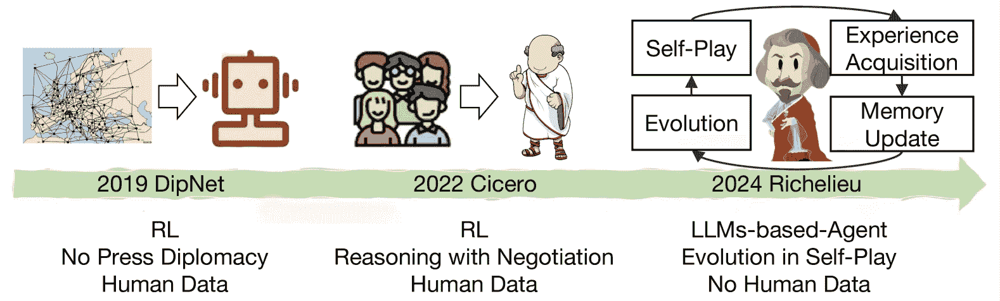
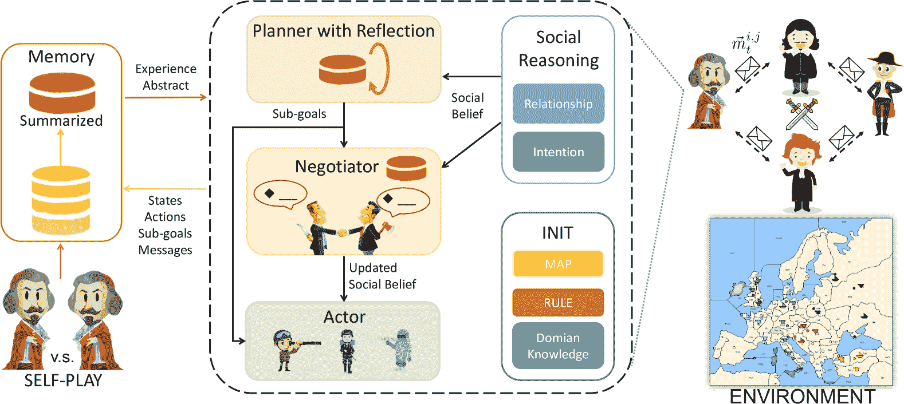
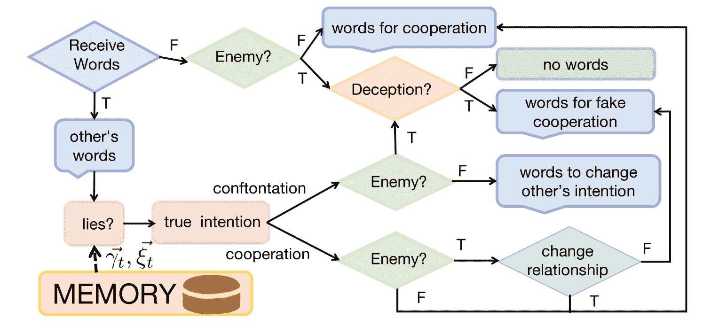
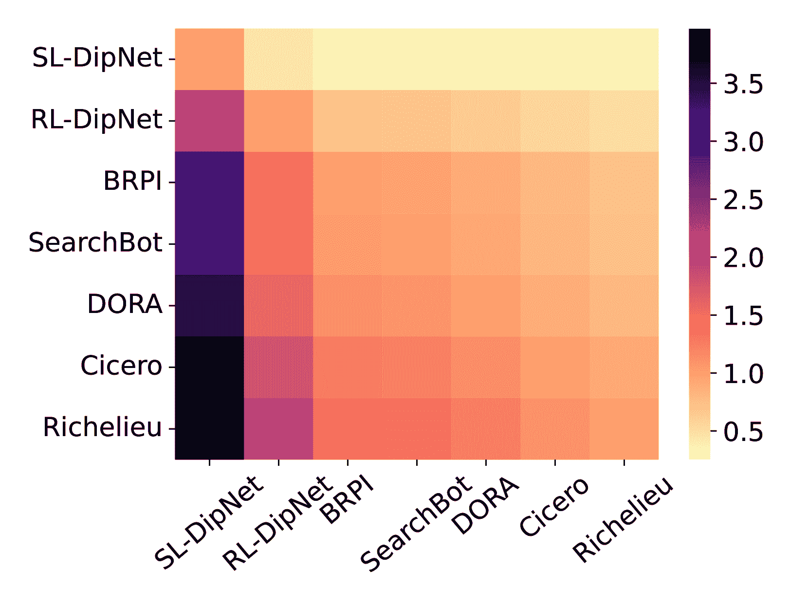
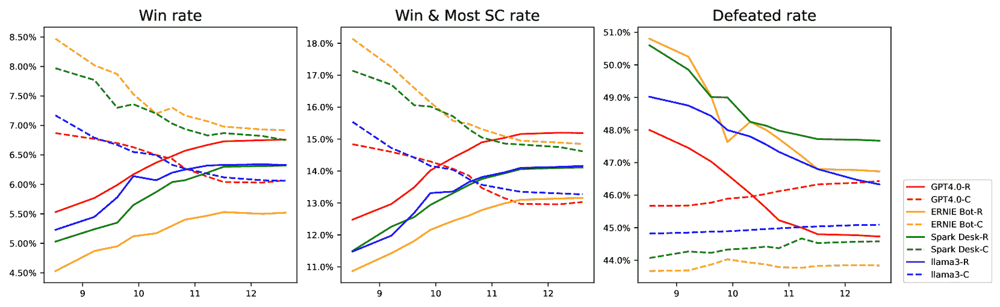
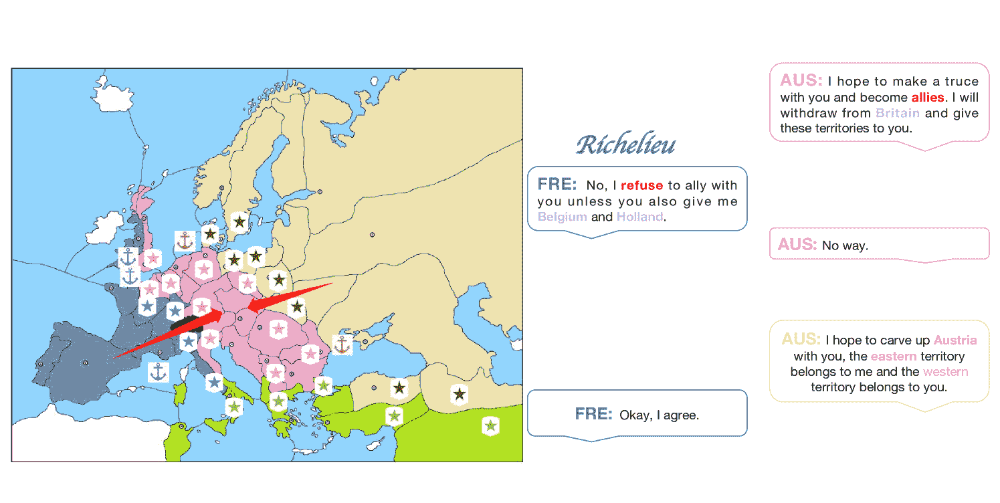
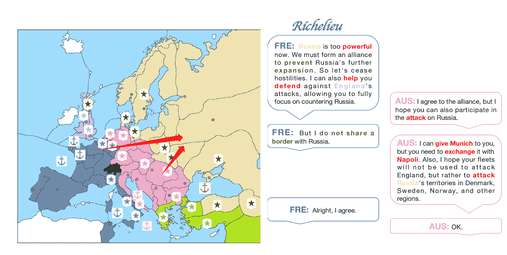

<!--yml

类别：未分类

日期: 2025-01-11 12:26:13

-->

# Richelieu: 基于自我进化的大语言模型代理用于人工智能外交

> 来源：[https://arxiv.org/html/2407.06813/](https://arxiv.org/html/2407.06813/)

关振宇 ^($\diamondsuit$) 孔祥宇^($\clubsuit\dagger$🖂) 鍾方伟^($\spadesuit$$\dagger$🖂) 王一洲^($\heartsuit$$\diamondsuit$)

^($\diamondsuit$) 北京大学人工智能研究所 北京 中国

^($\clubsuit$) 北京信息科技大学计算机学院 北京 中国

^($\spadesuit$) 北京师范大学人工智能学院 北京 中国

^($\heartsuit$) 北京大学计算机科学学院 前沿计算研究中心 国家工程视觉技术研究中心 国家人工智能基础技术重点实验室 北京 中国

^($\dagger$) 北京大学国家人工智能基础技术重点实验室 BIGAI 北京 中国

🖂通讯作者: xykong@bistu.edu.cn fangweizhong@bnu.edu.cn

###### 摘要

外交是人类社会中最复杂的活动之一，涉及多个方之间的复杂互动，需要具备社交推理、谈判和长期战略规划等技能。以往的人工智能代理已经展示了其在多步骤游戏和大型行动空间中的处理能力，尤其是在多代理任务中。然而，外交涉及巨大的决策空间，尤其是在谈判阶段的需求。尽管近期基于大语言模型（LLM）的代理在多种应用中表现出了潜力，但它们在复杂的多代理环境中仍然难以应对长时间的规划期。通过借助最新的大语言模型技术，我们旨在探索人工智能的潜力，创建一个类似人类的代理，能够通过整合三大基本能力执行全面的多代理任务：1) 具有记忆和反思的战略规划；2) 具有社交推理的目标导向谈判；以及 3) 通过自我对弈游戏增强记忆，进行自我进化，无需人工干预。

## 1 引言

外交是国际关系的核心元素，是一项复杂且多面的活动，处于人类社会最复杂互动的核心。它需要各种技能，如社交推理、谈判和长期规划，以管理多个方之间的关系和联盟。与这种复杂性相似，外交游戏Wikipedia（[2024](https://arxiv.org/html/2407.06813v4#bib.bib60)）包含七名玩家，控制欧洲大国，呈现出一个充满挑战的战略环境，需要高级的谈判和战略规划才能成功。

AI界对部署AI代理以掌握此类博弈表现出了越来越浓厚的兴趣 Shoker等人 ([2023](https://arxiv.org/html/2407.06813v4#bib.bib46)); Konya等人 ([2023](https://arxiv.org/html/2407.06813v4#bib.bib27)); Kramár等人 ([2022](https://arxiv.org/html/2407.06813v4#bib.bib30)); Duéñez-Guzmán等人 ([2023](https://arxiv.org/html/2407.06813v4#bib.bib16)); Mukobi等人 ([2023](https://arxiv.org/html/2407.06813v4#bib.bib37)); Kovač等人 ([2023](https://arxiv.org/html/2407.06813v4#bib.bib29))。最近的突破 Bakhtin等人 ([2022](https://arxiv.org/html/2407.06813v4#bib.bib7)) 已经转向新闻外交，这允许玩家之间的沟通。然而，之前的方法 Bakhtin等人 ([2022](https://arxiv.org/html/2407.06813v4#bib.bib7)) 过度依赖于特定领域的人类数据，导致其在其他场景/应用中的泛化能力较差。由此产生的问题是：我们能否构建一个擅长外交艺术的AI代理，而不依赖于特定领域的人类数据？

最近，基于大型语言模型（LLM）的代理作为AI代理的一个有前景的开发方向出现了。之前在个人助手 Li等人 ([2024b](https://arxiv.org/html/2407.06813v4#bib.bib33))、机器人学 Cheng等人 ([2024](https://arxiv.org/html/2407.06813v4#bib.bib11)); Yang等人 ([2023c](https://arxiv.org/html/2407.06813v4#bib.bib67)) 和视频游戏 Wan等人 ([2024](https://arxiv.org/html/2407.06813v4#bib.bib49)) 上的应用展示了基于LLM的代理在沟通和规划方面的惊人能力，这得益于LLM的常识推理、上下文/少量学习和复杂自然语言处理的突现能力。然而，外交呈现了一组独特的挑战。它不仅要求进行长期战略规划 Qi等人 ([2024](https://arxiv.org/html/2407.06813v4#bib.bib41)) 并使用自然语言进行沟通，还需要推理并采用复杂的社会动态，基于部分观察做出判断，包括赢得信任和声誉、建立关系、检测欺骗行为和评估其他玩家的可靠性。

在这项工作中，我们旨在首次尝试探索大型语言模型（LLMs）在发展类人AI外交代理方面的潜力。我们将该代理命名为Richelieu，以纪念一位在欧洲历史上具有重要影响的人物，他对法国政治、外交事务和国家建设产生了持久的影响。为了实现这一目标，我们已经确定了四个构建基于LLM的社会代理至关重要的核心能力。

1.  1.

    社会推理。这是社会代理与他人互动的基本功能，特别是适应国家意图和关系的动态变化。

1.  2.

    平衡短期和长期规划。外交需要在短期战术和长期战略之间保持精确平衡。一位有效的 AI 代理必须评估其行动的即时后果以及可能的长期影响。

1.  3.

    内存管理。一个强大的内存系统是学习和提升的关键组成部分。AI 代理必须能够回忆和整合过去谈判和行动中的信息，以指导其当前和未来的决策过程。这赋予了代理进化的能力。

1.  4.

    自我反思。一个能够进行深刻反思的 AI 代理能够分析自己的决策，从记忆中汲取经验，并相应地调整策略。

通过整合这四项能力，代理可以在最高水平的外交复杂性上操作，超越最先进的 AI 外交代理 Bakhtin 等人（[2022](https://arxiv.org/html/2407.06813v4#bib.bib7)）。

我们的贡献可以总结为三点：1）我们提出了一种新的构建 AI 外交代理的范式，与以前的工作相比（图[1](https://arxiv.org/html/2407.06813v4#S1.F1 "图 1 ‣ 1 引言 ‣ Richelieu：基于自我进化的 LLM 外交 AI 代理")），该代理能够通过自我对弈生成经验进行自我进化，无需任何特定任务的人类数据。2）我们展示了我们的代理在与最先进方法（例如 Cicero Bakhtin 等人，[2022](https://arxiv.org/html/2407.06813v4#bib.bib7)）对抗中的优越表现，该方法依赖于大规模人类示范进行训练。3）我们进一步分析了我们代理的每个模块的有效性，以及我们的代理在采用不同 LLM 时的泛化能力，例如[GPT4.0](https://openai.com/index/gpt-4/)和[Llama 3](https://llama.meta.com/llama3)。

图 1：构建 AI 外交代理的新范式。

## 2 相关工作

AI 外交。这款游戏涉及七名玩家控制欧洲不同的强国。在每一回合中，玩家可以在进行移动之前进行合作谈判，争取尽可能多的补给中心。显然，这项具有挑战性的战略任务需要玩家具备复杂的谈判技巧和出色的规划能力，才能最终获得胜利。迄今为止，大多数关于这一任务的研究仍然集中在规划策略上（即无沟通外交，在这种模式下不允许任何沟通渠道）。考虑到其每回合的庞大行动空间，从$10^{2}1$到$10^{6}4$（相比于象棋每回合的行动数量少于100次），这个设置依然具有挑战性。难怪现有的研究工作依赖于人类数据来进行游戏。众多方法中，一项典型的研究是DipNet Paquette等人（[2019](https://arxiv.org/html/2407.06813v4#bib.bib40)）使用了监督学习和强化学习。基于DipNet，BRPI Anthony等人（[2020](https://arxiv.org/html/2407.06813v4#bib.bib3)）、SearchBot Gray等人（[2020](https://arxiv.org/html/2407.06813v4#bib.bib19)）、DORA Bakhtin等人（[2021](https://arxiv.org/html/2407.06813v4#bib.bib6)）和KL-Regularized搜索（Diplodocus）Jacob等人（[2022](https://arxiv.org/html/2407.06813v4#bib.bib25)）也开展了相关研究。直到最近，关于外交全局设置或有沟通外交（Press Diplomacy）的研究开始出现，在这种设置下，玩家在每回合开始前可以互相沟通。这类研究有De Jonge和Sierra（[2017](https://arxiv.org/html/2407.06813v4#bib.bib14)）、Bakhtin等人（[2022](https://arxiv.org/html/2407.06813v4#bib.bib7)）、Jaidka等人（[2024](https://arxiv.org/html/2407.06813v4#bib.bib26)）以及Kramár等人（[2022](https://arxiv.org/html/2407.06813v4#bib.bib30)），他们主要得益于近年来快速发展的语言模型。具体而言，显著的进展包括来自DeepMind和Facebook AI Research的政策迭代方法以及Jaidka等人（[2024](https://arxiv.org/html/2407.06813v4#bib.bib26)）的平衡搜索代理。然而，DeepMind提出基于预定义合同/协议学习谈判代理 Kramár等人（[2022](https://arxiv.org/html/2407.06813v4#bib.bib30)）。Meta AI的工作则不是采用统一的架构，而是分别集成了一个用于谈判的语言模型和一个用于规划的强化学习模型。这样的分开训练的模型使得代理的持续进化变得不便。更重要的是，像无沟通方法一样，这些方法在代理训练中严重依赖于人类玩家数据。与这些方法不同，本文深入探讨了如何通过单一的自我进化的基于LLM的代理模型来解决谈判和规划问题，而无需任何预先收集的人类专家训练数据。

基于LLM的代理。随着大规模语言模型（LLM）的出现和发展，利用LLM作为自治代理的核心控制器的趋势日益增长Wang等人（[2024c](https://arxiv.org/html/2407.06813v4#bib.bib53)）。其中一个广泛应用的领域是基于LLM的问答引擎，这些引擎仅覆盖《外交》中的谈判方面。此类系统包括HuggingGPT Shen等人（[2023](https://arxiv.org/html/2407.06813v4#bib.bib45)）、GPT4Tools Yang等人（[2023b](https://arxiv.org/html/2407.06813v4#bib.bib66)）和ToT Yao等人（[2023](https://arxiv.org/html/2407.06813v4#bib.bib68)）等。它们利用LLM来管理AI模型、使用工具、实施政策迭代，并在各类任务中提升问题解决能力。相关工作包括AutoGPT、AgentGPT、BabyAGI Talebirad和Nadiri（[2023](https://arxiv.org/html/2407.06813v4#bib.bib48)）、Toolformer Schick等人（[2023](https://arxiv.org/html/2407.06813v4#bib.bib44)）和Visual ChatGPT，旨在提升LLM在任务自动化和工具使用方面的能力。Reflexion，一个通过语言反馈和情节记忆来改进LLM的框架Zhang等人（[2024a](https://arxiv.org/html/2407.06813v4#bib.bib72)），促进在各种任务中做出更好的决策也已被提出。除了Wang等人（[2024d](https://arxiv.org/html/2407.06813v4#bib.bib57)）Wang等人（[2023a](https://arxiv.org/html/2407.06813v4#bib.bib51)）Wang等人（[2023b](https://arxiv.org/html/2407.06813v4#bib.bib56)）Zhu等人（[2023](https://arxiv.org/html/2407.06813v4#bib.bib79)）Yan等人（[2023](https://arxiv.org/html/2407.06813v4#bib.bib64)）将LLM代理应用于著名的开放世界游戏《Minecraft》的复杂规划任务Fan等人（[2022](https://arxiv.org/html/2407.06813v4#bib.bib17)）。与这些仅关注谈判/规划方面的基于LLM的代理不同，所提出的方法涉及多个自我进化方案，以同时处理这两者。

## 3 问题陈述

《外交》游戏维基百科（[2024](https://arxiv.org/html/2407.06813v4#bib.bib60)）；Calhamer（[1974](https://arxiv.org/html/2407.06813v4#bib.bib9)）设定在第一次世界大战前的欧洲，每个玩家（代理）代表欧洲的七大强国之一，如德国、法国、英国、意大利、奥匈帝国、俄罗斯和土耳其。每个玩家拥有一套军事单位，包括陆军和舰队，他们可以移动并利用这些单位占领其他补给中心。代理的最终目标是在游戏的秋季阶段结束时控制板上大多数的补给中心。需要注意的是，游戏并不是通过消除其他玩家或他们的单位来获胜，而是通过控制所需数量的补给中心来获胜。这通常涉及建立和破裂联盟、谈判，有时还需要背叛其他玩家以实现自己的目标。

在每一轮中，代理人$i$获取当前状态$s_{t}\in S$、上一轮其他玩家的行动$\vec{a}^{-i}_{t-1}$，以及本轮其他玩家在谈判中的消息$\vec{m}^{-i,i}_{t}$。环境状态$s_{t}$包括地图上每个领土由哪个国家拥有，以及每个国家的军队位置。基于这些信息，代理人需要与其他玩家进行谈判，发送消息$\vec{m}^{i,-i}_{t}$与其他玩家交流，然后在这一轮中采取行动$a^{i}_{t}$。代理人可以采取的可能行动$a^{i}_{t}\in A$包括对军队的指令，如进入邻近领土、支援其他单位或坚守阵地。行动也可以包括外交举措，如提议或退出联盟，尽管这些在游戏机制中不如前者正式化。Paquette等人（[2019](https://arxiv.org/html/2407.06813v4#bib.bib40)）；Hill（[2014](https://arxiv.org/html/2407.06813v4#bib.bib23)）

## 4 自我进化的基于LLM的外交官

图2：提出的基于LLM的代理框架，Richelieu。它可以明确推理社会信念，反思后提出子目标，与他人进行谈判，并采取行动掌握外交。它通过自我对战游戏来增强记忆，实现自我进化，而无需任何人工标注。

我们构建了一个全面的框架，包含内存管理、社会推理、战略规划、谈判、决策、内存更新和自我进化等模块，以充分利用大型语言模型（LLMs）的能力。Richelieu首先通过设置地图细节、游戏规则、领域知识和长期目标来进行初始化。Zhang等人（[2022](https://arxiv.org/html/2407.06813v4#bib.bib77)）；Wei等人（[2022](https://arxiv.org/html/2407.06813v4#bib.bib59)）；Wang等人（[2022a](https://arxiv.org/html/2407.06813v4#bib.bib54)）在每一回合，智能体将按照以下步骤运行：1）社会推理：首先，智能体对游戏状态$s_{t}$进行全面分析，以构建社会信念，包括其他玩家的意图及其关系$\vec{\phi_{t}}\in\Phi^{n}$。Zhang等人（[2024c](https://arxiv.org/html/2407.06813v4#bib.bib74)）；Gürcan（[2024](https://arxiv.org/html/2407.06813v4#bib.bib20)）2）带反思的规划者：然后，智能体提出与长期目标$\Upsilon$战略对齐的子目标$\chi^{i}_{t}\in X$，结合社会信念并通过自我反思从记忆$M$中提炼经验$\vec{\eta_{t}}\in H^{m}$，完善所提议的目标。Wang等人（[2024b](https://arxiv.org/html/2407.06813v4#bib.bib52)，[e](https://arxiv.org/html/2407.06813v4#bib.bib58)）3）谈判者：为了实现子目标，谈判者将与一些玩家开启对话会话，并通过参考他们的言辞$\vec{m}^{-i,i}_{t}$、当前状态$s_{t}$、诚意$\vec{\gamma}^{-i}_{t}$和经验$\vec{\xi_{t}}$来评估他们的真实性$\vec{\psi}^{-i}_{t}$。Abdelnabi等人（[2023](https://arxiv.org/html/2407.06813v4#bib.bib1)）；Bianchi等人（[2024](https://arxiv.org/html/2407.06813v4#bib.bib8)）4）执行者：谈判结束后，执行者根据子目标$\chi^{i}_{t}$和更新后的社会状态$s_{t+1}$决定其行动路线$a^{i}_{t}$，标志着该回合的结束。5）内存管理：当前回合的状态$s_{t}$、谈判内容$\vec{m_{t}}$、所有玩家采取的行动$\vec{a_{t}}\in A^{n}$以及提出的子目标$\chi^{i}_{t}$都会被记录到内存中，作为$\mu\in M$。这些记录的数据作为历史经验，指导Richelieu在未来回合中的后续行动。Hatalis等人（[2023](https://arxiv.org/html/2407.06813v4#bib.bib21)）；Zhang等人（[2024e](https://arxiv.org/html/2407.06813v4#bib.bib76)）6）自我进化：智能体的进化高度依赖于其内存中存储的经验多样性。随着这种多样性的增长，智能体的能力也随之提升。在没有人类示范的情况下，我们采用多智能体自对弈游戏，即我们的智能体分别控制所有国家，通过模拟和获取多样化的经验进行自我进化。值得注意的是，智能体在测试过程中还可以进一步进化，以适应不同的玩家。

### 4.1 社会推理

没有永恒的敌人，也没有永恒的盟友。国家间的关系随着全球形势的变化而动态变化。然而，仅凭部分观察很难确定合适的盟友和敌人。例如，对于潜在盟友的意图存在不确定性，这可能导致在关键时刻的背叛。因此，我们需要通过社会推理来识别当前状态的意图和关系，从而塑造社会信念 Zhang et al.（[2024c](https://arxiv.org/html/2407.06813v4#bib.bib74)）；Gürcan（[2024](https://arxiv.org/html/2407.06813v4#bib.bib20)）。

1) 建立关系模型：在设定子目标之前，黎谢留会评估与他人的关系，识别出敌人，如具有攻击性的国家、易受扩张威胁的邻国以及具有长期潜在威胁的国家。同时，黎谢留还会寻找潜在的盟友，以应对这些威胁。Sun et al.（[2024](https://arxiv.org/html/2407.06813v4#bib.bib47)）；Zhang et al.（[2024d](https://arxiv.org/html/2407.06813v4#bib.bib75)）同时，黎谢留还会尝试识别可能有助于反制这些对手的潜在盟友。通过将玩家间关系的分析作为一个独立的元素，黎谢留可以在游戏的后续阶段战略性地利用其他玩家的行动来实现其目标。2) 推断意图：规划者利用社会信念，确保其子目标在全面考虑其他智能体的行为和意图的基础上制定。黎谢留的子目标特别会强调那些被识别为潜在敌人或盟友的人，促进与潜在盟友的更有效合作，并参与对敌人的战略对抗。此外，从这一分析中获得的洞察在随后的谈判阶段也发挥了重要作用。它们被用来评估其他玩家陈述的真实性，并帮助黎谢留达成合作协议。de Zarzà et al.（[2023](https://arxiv.org/html/2407.06813v4#bib.bib15)）；He et al.（[2024](https://arxiv.org/html/2407.06813v4#bib.bib22)）。

### 4.2 带反思的战略规划者

战略规划者指定子目标，充当即时行动与游戏中最终胜利目标之间的中介。我们观察到，LLM往往倾向于在决策过程中优先考虑短期收益，缺乏将未来纳入战略计算的能力。Renze 和 Guven ([2024](https://arxiv.org/html/2407.06813v4#bib.bib42))；Zhang et al. ([2024b](https://arxiv.org/html/2407.06813v4#bib.bib73)) 例如，非邻近国家变得过于强大是常见现象。形式上，$\vec{\chi_{t}}\leftarrow SR(s_{t},\vec{\phi_{t}},\Upsilon)$，其中 $\vec{\chi_{t}}=(\chi^{i}_{t},\chi^{1}_{t},\ldots,\chi^{n}_{t})$ 代表提出的子目标和我们推断出的其他玩家的意图，$\vec{\phi_{t}}\in\Phi^{n}$ 代表推断的社会信念关系。这些目标可能涵盖一系列战术考虑，例如遏制一个强大对手的扩张，或在特定方向上进行战略性扩展以巩固实力。

反思与记忆。我们进一步开发了一种反思机制，以增强代理在实现长期目标过程中子目标的合理性和有效性。Liu et al. ([2024](https://arxiv.org/html/2407.06813v4#bib.bib34)) 该反思机制依赖于过去的经验，批判并增强提出的子目标。我们采用基于相似度的函数，从记忆中找到与当前游戏状态匹配的相关历史经验。该函数考虑两个因素：目标相似度和状态相似度，以选择最为相似的经验。这个过程可以表示为：$\vec{\eta_{t}}\leftarrow h(s_{t},\chi^{i}_{t},M)$，其中 $\vec{\eta_{t}}\in H^{m}$。在实际操作中，考虑到大型语言模型（LLM）的上下文窗口有限，我们根据这些指标从记忆中检索最为相似的经验。具有较高评估分数的经验强化了成功的策略，并支持现有子目标的延续。另一方面，较低的分数则表明需要改进的领域，并促使必要的调整。随着我们的代理Richelieu经过更多训练，其反思能力不断提升，历史经验的积累持续改善其表现。

### 4.3 协商者与执行者

与其他玩家进行聊天时，谈判的目标是根据收到的言辞更新社会信念，并通过操控他人的意图实现子目标，例如与其他国家达成合作协议、终止与特定国家的持续冲突，或阻止针对其利益的联盟的形成。Noh和Chang（[2024](https://arxiv.org/html/2407.06813v4#bib.bib38)）；Zhan等人（[2024](https://arxiv.org/html/2407.06813v4#bib.bib71)）然而，由于各国的利益和战略常常冲突，且玩家之间的信任稀缺，导致达成共识变得困难，合作协议的建立与维持面临挑战。在这种情况下，我们认为谈判者应在生成谈判语言之前，识别对手的真实意图和关系。

为了充分利用大型语言模型（LLMs）的能力，我们构建了一个用于谈判的社会推理流程，如图[3](https://arxiv.org/html/2407.06813v4#S4.F3 "Figure 3 ‣ 4.3 Negotiator and Actor ‣ 4 Self-Evolving LLM-based Diplomat ‣ Richelieu: Self-Evolving LLM-Based Agents for AI Diplomacy")所示。在谈判过程中，我们引导Richelieu考虑其他玩家所说内容的真实性及其真实意图，并结合我们已经设定的子目标和与其他玩家关系的分析，与潜在盟友进行谈判并形成联盟，试图欺骗敌人。Xia等人（[2024](https://arxiv.org/html/2407.06813v4#bib.bib61)）；Moghimifar等人（[2024](https://arxiv.org/html/2407.06813v4#bib.bib36)）

为了应对非约束性协议和潜在欺骗的挑战，我们加入了一个离散模块，专门用于评估其他玩家在谈判过程中所作言论的真实性。为了确定其他玩家陈述的真实性$\psi^{j}_{t}$，考虑了三个主要因素。最重要的是玩家的子目标$\chi^{j}_{t}$，即我们之前推测出的目标，与其通过陈述$ m^{j,i}_{t}$传达的意图之间的一致性。为了辅助判断，我们的代理还会回顾记忆，检索一致的经验$\vec{\xi_{t}}$。此外，还会考虑玩家的整体诚实度评分$\gamma_{i}$。因此，我们得出对手$j$的真实性$\psi^{j}_{t}\leftarrow g(s_{t},\chi^{j}_{t},m^{j,i}_{t},\vec{\phi_{t}},\gamma_{j},\vec{\xi_{t}})$，其中$\vec{\xi_{t}}=w(s_{t},m^{j,i}_{t},M)$。通过这样的推理流程，我们的代理能够熟练地驾驭外交话语。谈判结束后，参与者将获得更新的社会信念，并为军队选择特定的行动。

图 3：谈判中的社交推理流程。通过接收到的言辞和记忆，代理人将通过回答以下问题进行推理：“对方在撒谎吗？”，“对方的真实意图是什么？”，“对方是敌人吗？”，“有必要欺骗对方吗？”以及“有必要改变与对方的关系吗？”，然后根据推理生成相应的言辞进行谈判。

### 4.4 自我博弈中的记忆管理与演化

该记忆是框架的基础，积累了代理人的历史经验，并将其总结供其他模块使用。高和张（[2024](https://arxiv.org/html/2407.06813v4#bib.bib18)）；李等人（[2024a](https://arxiv.org/html/2407.06813v4#bib.bib31)）；于等人（[2024](https://arxiv.org/html/2407.06813v4#bib.bib69)）；侯等人（[2024](https://arxiv.org/html/2407.06813v4#bib.bib24)）支持其他模块，如规划器和谈判者，为其提供长尾经验。

原始经验管理。具体而言，记忆模块负责获取和存档历史数据，包括每一回合的观察到的游戏状态 $s_{t}$，其子目标 $\chi^{i}_{t}$，谈判过程中传递的消息 $\vec{m_{t}}$，以及所有玩家的行动 $\vec{a_{t}}$。随后，原始经验被总结为简短内容，并通过对提出的子目标的评估 $\lambda_{t}\in\Lambda$ 和对其他玩家可信度的评估 $\gamma_{j}\in\Gamma$ 进行归纳总结。$\lambda_{t}$ 用于反思代理的子目标。它评估子目标是否合理，依据是随后的状态以及长期目标 $\Upsilon$。随着游戏的进行，$\lambda_{t}$ 会根据状态的变化不断更新，即 $\lambda_{t}\leftarrow f(\chi^{i}_{t},\Upsilon,\vec{s})$，其中 $\vec{s}=(s_{t},s_{t+1},\ldots s_{T})$。该公式表示在回合 $T$ 中，由记忆更新回合 $t$ 的子目标评估 $\lambda_{t}$。当子目标与回合 $t$ 的目标发生根本性变化时，更新将停止。这防止后续的决策影响当前决策的评估。我们使用 $\gamma_{j}\in\Gamma$ 来评估玩家 $j$ 的可信度，并利用 $\tau^{j}_{t}\in\{0,1\}$ 来表示其真实性，即判断玩家 $j$ 在回合 $t$ 谈判过程中所做的陈述是否真实。玩家 $j$ 陈述的真实性根据先前回合的记忆进行更新，更新公式为 $\tau^{j}_{t}\leftarrow T(s_{t},s_{t+1},a^{j}_{t},m^{j,i}_{t})$。玩家 $j$ 的可信度 $\gamma_{j}$ 将基于玩家 $j$ 的陈述 $\tau^{j}_{t}$ 进行更新，更新公式为 $\gamma_{j}\leftarrow p(\gamma_{j},\tau^{j}_{t-1})$。玩家的可信度 $\vec{\gamma}$ 是一个短期记忆，仅适用于当前回合。其他收集或生成的数据构成长期记忆。这些数据将被组合成历史记录 $\mu\in M$，然后被纳入记忆。

通过自我对弈游戏获取经验。自我对弈使得代理能够积累更多经验，以便自我进化。Liu等人（[2024](https://arxiv.org/html/2407.06813v4#bib.bib34)）；Zhang等人（[2024a](https://arxiv.org/html/2407.06813v4#bib.bib72)） 在训练后，当Richelieu面临某种状态时，它可以从更大的类似历史经验池中汲取经验。多样化的评估使得Richelieu能够更全面地反思当前制定的策略，从而对决策进行更强的优化。随着自我对弈的进行，Richelieu获取新的和更好的历史经验的速度将会减缓。这意味着Richelieu的能力不会无限提高。同时，随着记忆的增长，选择合适的历史经验成为了一个新的挑战。所选的m个经验$\vec{\eta_{t}}$可能几乎相同，这实际上可能减少Richelieu可以利用的有效信息量。如图[5](https://arxiv.org/html/2407.06813v4#S5.F5 "Figure 5 ‣ 5.2 Results ‣ 5 Experiment ‣ Richelieu: Self-Evolving LLM-Based Agents for AI Diplomacy")所示，Richelieu与Cicero Bakhtin等人（[2022](https://arxiv.org/html/2407.06813v4#bib.bib7)）的对战表现随着训练迭代次数的增加而有所改善。随着经验的积累，Richelieu的胜率随着训练迭代的积累稳步上升，最终在稳定的表现水平上趋于平稳。相反，失败率则显示出持续下降，接近一个渐近值。这些观察结果验证了自我对弈在Richelieu进化中的有效性。

## 5 实验

在实验中，我们的目标是回答以下问题：1）非施压外交的掌握：我们的代理能否在与基线的比较中掌握非施压外交？2）与最先进技术的竞争：我们的代理能否超越当前最先进代理在施压外交中的表现？3）与大语言模型（LLMs）的兼容性：我们的自我进化框架能否与不同的大语言模型兼容？4）框架模块的贡献：我们框架中的各个模块是否有助于提升代理的整体表现？5）社会推理：Richelieu能否准确推断其他玩家的真实意图，并合理判断与他们的盟友或敌人关系？我们方法的实现可以在此找到：[https://github.com/todexter3/Richelieu.git](https://github.com/todexter3/Richelieu.git)

### 5.1 实验设置

环境。由Paquette等人（[2019](https://arxiv.org/html/2407.06813v4#bib.bib40)）介绍的广泛使用的开源《外交》游戏平台被采用用于评估Richelieu与其他模型的对比。该平台可以轻松切换无新闻（玩家之间进行谈判）和有新闻（玩家之间不进行谈判）两种游戏模式，从而便于在两种设置下进行比较。该平台还包含了超过10,000条人类游戏数据，之前的研究方法就是在这些数据上进行训练的。需要注意的是，我们的方法并不依赖这些数据。在每场游戏中，一个模型将扮演一个随机选择的国家，与其他方法控制的国家进行竞争。如果占领了所有补给中心，则获胜，否则失败。

表1：我们的方法与Cicero对战的结果。

模型 胜率$\uparrow$ 最大SC$\uparrow$ 存活率$\uparrow$ 被击败率$\downarrow$ Richelieu_1 6.20% 9.40% 38.90% 45.50% Richelieu_2 6.60% 7.80% 40.80% 44.80% Richelieu_3 7.10% 9.30% 39.90% 43.70% Richelieu_4 7.40% 8.00% 40.20% 44.40% Cicero_1 5.90% 6.50% 41.50% 46.10% Cicero_2 6.30% 7.20% 42.50% 44.00% Cicero_3 5.90% 7.00% 41.60% 45.50% Richelieu 6.83% 8.63% 39.95% 44.60% Cicero 6.03% 6.90% 41.87% 45.20%

模型 胜率$\uparrow$ 最大SC$\uparrow$ 存活率$\uparrow$ 被击败率$\downarrow$ Richelieu_1 6.30% 7.90% 39.40% 46.40% Richelieu_2 6.60% 8.30% 41.20% 43.90% Richelieu_3 7.20% 8.70% 41.70% 42.40% Cicero_1 5.80% 6.70% 41.20% 46.30% Cicero_2 6.50% 7.20% 42.50% 43.80% Cicero_3 6.00% 7.00% 41.60% 45.40% Cicero_4 6.10% 7.20% 42.30% 44.40% Richelieu 6.70% 8.30% 40.77% 44.23% Cicero 6.10% 7.03% 41.90% 44.98%

评估指标。我们根据多轮游戏的结果来评估这些模型。在每一轮中，模型会随机分配一个国家进行控制。通常会进行1000轮游戏以获得平均结果。我们从两个维度评估模型。一个是基于胜率、最多SC率、生还率和被淘汰率。每个国家在游戏中可能有四种结果。如果一个国家失去所有的补给中心（SC），则被淘汰并记录为“被淘汰”。如果一个国家占领了34个补给中心中的18个或更多，游戏结束，该国家被记录为“胜利”，其他国家则记录为“被淘汰”。在其他情况下，游戏以平局结束。拥有最多补给中心的国家被记录为“最多SC”，被淘汰的国家记录为“被淘汰”，其余国家记录为“生还”。另一个是基于模型在多轮竞争后获得的得分。为了比较多个模型的能力，我们使用了C-Diplo ArgirArcher（[2024](https://arxiv.org/html/2407.06813v4#bib.bib4)），这是一个评分系统，在许多国际外交比赛中都有使用。其评分方法如下：如果一个玩家通过占领18个或更多补给中心获胜，该玩家得93分，其他六个玩家各得1分。如果游戏以平局结束，拥有最多补给中心的玩家得37分，第二多补给中心的玩家得14分，第三多补给中心的玩家得7分。每个玩家每拥有一个补给中心就得1分。每个玩家参与比赛也可以得1分。这样，无论比赛结果如何，每场比赛的总得分将分配给99分。

基准模型。我们选择了六个先前的模型作为基准进行比较。其中，Meta公司提出的CiceroBakhtin等人（[2022](https://arxiv.org/html/2407.06813v4#bib.bib7)）是一个具有谈判模块的外交模型。SL-DipNet和RL-DipNet Paquette等人（[2019](https://arxiv.org/html/2407.06813v4#bib.bib40)），BRPI Anthony等人（[2020](https://arxiv.org/html/2407.06813v4#bib.bib3)），SearchBot Gray等人（[2020](https://arxiv.org/html/2407.06813v4#bib.bib19)），以及DORABakhtin等人（[2021](https://arxiv.org/html/2407.06813v4#bib.bib6)）是无压力外交模型。我们还构建了一个基于LLM的代理，AutoGPT Yang等人（[2023a](https://arxiv.org/html/2407.06813v4#bib.bib65)）。在实验中，我们设置了温度为0.3，以确保LLM策略生成的相对稳定。总体推理框架也确保了AI代理在表现上的稳定性和一致性。

### 5.2 结果

图4：7个不同代理在无压力设置下大量游戏时的相对得分。每个点表示模型在纵轴上的得分与模型在横轴上的得分之比。

在无压力设置下与基线进行大规模对战。我们让 Richelieu 与其他六个模型进行对战，包括 CiceroBakhtin 等人（[2022](https://arxiv.org/html/2407.06813v4#bib.bib7)）、SL-DipNet 和 RL-DipNet Paquette 等人（[2019](https://arxiv.org/html/2407.06813v4#bib.bib40)）、BRPI Anthony 等人（[2020](https://arxiv.org/html/2407.06813v4#bib.bib3)）、SearchBot Gray 等人（[2020](https://arxiv.org/html/2407.06813v4#bib.bib19)）以及 DORABakhtin 等人（[2021](https://arxiv.org/html/2407.06813v4#bib.bib6)）在无压力外交游戏中对战，在该游戏中玩家进行无沟通的行动。图 [4](https://arxiv.org/html/2407.06813v4#S5.F4 "Figure 4 ‣ 5.2 Results ‣ 5 Experiment ‣ Richelieu: Self-Evolving LLM-Based Agents for AI Diplomacy") 显示 Richelieu 在对比其他依赖人类游戏数据的模型时，表现优异。相比之下，Richelieu 不需要这种数据，但仍然明显超越这些方法，展示了其卓越的规划能力。

在压力设置下与 Cicero 对战。我们还通过与 Cicero 在启用谈判的挑战性场景下的对抗，评估了 Richelieu。具体而言，我们随机将三个国家分配给一个模型，将其余四个国家分配给另一个模型。在进行多轮游戏后，使用加权平均计算胜率、最多 SC 比率、存活率和失败率进行评估。表 [1](https://arxiv.org/html/2407.06813v4#S5.T1 "Table 1 ‣ 5.1 Experimental Setup ‣ 5 Experiment ‣ Richelieu: Self-Evolving LLM-Based Agents for AI Diplomacy") 展示了 Richelieu 与 Cicero 竞争时的表现。Richelieu 的胜率大约比 Cicero 高 0.7%。如果还考虑到最多 SC 比率，Richelieu 比 Cicero 高约 2%。同时，Richelieu 的失败率也比 Cicero 低 0.6%。根据我们的评分系统，Richelieu 的得分大约比 Cicero 高 10%。这并不简单，尤其是当 Richelieu 在没有人工干预的自对弈游戏中训练，而对手则是通过人类玩家的数据进行训练时。

尽管与 Cicero 相比，Richelieu 的胜率提升不显著，但其相对提升的价值非常大。此外，胜率提高幅度适中的主要原因是，在七个国家中，有三个或四个国家由能力相似的 Richelieu 控制，这常常导致游戏以平局结束。此外，通过比较在无压力设置下与基线进行大规模对战中展示的得分，我们观察到一个明显的差距，图 [4](https://arxiv.org/html/2407.06813v4#S5.F4 "Figure 4 ‣ 5.2 Results ‣ 5 Experiment ‣ Richelieu: Self-Evolving LLM-Based Agents for AI Diplomacy") 显示我们的代理得分比 Cicero 高出约 10%。

表 2：我们方法与 AutoGPT 对战的结果。

| 模型 | 胜率$\uparrow$ | 最多 SC$\uparrow$ | 存活率$\uparrow$ | 失败率$\downarrow$ |
| --- | --- | --- | --- | --- |
| Richelieu_1 | 9.30% | 18.20% | 37.90% | 34.60% |
| Richelieu_2 | 9.90% | 19.40% | 37.70% | 33.00% |
| Richelieu_3 | 8.10% | 17.40% | 39.20% | 35.30% |
| AutoGPT_1 | 1.20% | 4.60% | 32.40% | 61.80% |
| AutoGPT_2 | 1.20% | 4.20% | 34.40% | 60.20% |
| AutoGPT_3 | 1.50% | 4.00% | 32.50% | 62.00% |
| AutoGPT_4 | 2.60% | 3.60% | 32.30% | 61.50% |
| Richelieu | 9.10% | 18.33% | 38.27% | 34.30% |
| AutoGPT | 1.63% | 4.10% | 32.90% | 61.37% |

与AutoGPT进行压力设置下的对战。我们进一步构建了一个基于LLM的智能体——AutoGPT，并将其与我们的智能体进行了对比。在测试中，我们随机选择三个国家由Richelieu控制，另外四个国家由AutoGPT控制。需要注意的是，智能体独立控制每个国家。具体结果见表格[2](https://arxiv.org/html/2407.06813v4#S5.T2 "Table 2 ‣ 5.2 Results ‣ 5 Experiment ‣ Richelieu: Self-Evolving LLM-Based Agents for AI Diplomacy")。实验结果显示，我们的模型优于现有的LLM基准模型。

自我进化框架的泛化到不同的LLM。为了展示我们框架在多种LLM中的有效性，我们使用了四个模型进行了实验：[GPT4.0](https://openai.com/index/gpt-4/)、[ERNIE Bot](https://yiyan.baidu.com/welcome)、[Spark Desk](https://xinghuo.xfyun.cn/) 和 [Llama 3](https://llama.meta.com/llama3)。随着训练迭代次数的增加，Richelieu的胜率稳步提升，失败率下降，最终达到相对稳定的结果。这表明我们的自我对弈方法是有效的。训练后，使用GPT4.0时，胜率从比Cicero低1.5%增加到比Cicero高约0.7%；使用Llama3时，胜率从比Cicero低2.3%增加到几乎与Cicero相等；使用Spark Desk和ERNIE Bot时，胜率从比Cicero低3%和4%分别增加到比Cicero低0.7%和1.6%。实验结果表明，尽管由于这些LLM的固有能力差异，Richelieu的表现存在波动（如图[5](https://arxiv.org/html/2407.06813v4#S5.F5 "Figure 5 ‣ 5.2 Results ‣ 5 Experiment ‣ Richelieu: Self-Evolving LLM-Based Agents for AI Diplomacy")所示），我们的框架和训练方法显著提升了所有LLM的能力。这表明我们的自我进化框架具有广泛的泛化能力，能够适应各种LLM。

为了展示自我对弈游戏中的记忆对我们智能体策略的影响，我们找到了两个状态相似的回合，分别是在自我对弈前后的不同回合。具体案例见附录[B.1](https://arxiv.org/html/2407.06813v4#A2.SS1 "B.1 Cases of the Effect of the Memory from Self-Playing and Collaboration ‣ Appendix B Cases ‣ Richelieu: Self-Evolving LLM-Based Agents for AI Diplomacy")。

图5：Richelieu模块对不同LLM的益处。实线表示Richelieu的实验结果，而虚线对应Cicero。不同的颜色代表不同的LLM。横轴表示训练次数的对数，纵轴表示比率。

表3：消融研究：3个Richelieu与4个Cicero的平均结果。

模型化他人子目标 谈判流程 反思与记忆 自我对战 胜率 $\uparrow$ 大部分SC$\uparrow$ 存活率$\uparrow$ 被击败$\downarrow$ 0.4% 0.7% 4.3% 94.6% ✓ 0.7% 1.2% 10.6% 87.5% ✓ ✓ 3.3% 4.7% 26.7% 65.3% ✓ ✓ ✓ 3.8% 5.8% 33.1% 57.3% ✓ ✓ ✓ ✓ 5.2% 6.6% 39.5% 48.7% ✓ ✓ ✓ ✓ ✓ 6.7% 8.5% 40.4% 44.4%

消融研究。我们通过分析将Richelieu的各种模块（如规划器或记忆模块）融入基础LLM中所带来的好处，开展了全面的消融研究。结果见表[3](https://arxiv.org/html/2407.06813v4#S5.T3 "表3 ‣ 5.2 结果 ‣ 5 实验 ‣ Richelieu：基于LLM的自我进化代理在AI外交中的应用")。如图[5](https://arxiv.org/html/2407.06813v4#S5.F5 "图5 ‣ 5.2 结果 ‣ 5 实验 ‣ Richelieu：基于LLM的自我进化代理在AI外交中的应用")所示，尽管LLM中的增强对齐确实提升了性能（GPT-4.0优于其他模型），我们观察到，在没有我们框架的情况下，普通的GPT-4.0在AI外交中依然表现不足，具体见表[3](https://arxiv.org/html/2407.06813v4#S5.T3 "表3 ‣ 5.2 结果 ‣ 5 实验 ‣ Richelieu：基于LLM的自我进化代理在AI外交中的应用")。通过将每个单独模块融入其中，Richelieu的性能实现了稳定且显著的提升。这表明，Richelieu能够在决策过程中利用其他参与者的行动，考虑短期和长期的利益。此外，Richelieu的谈判能力得到了显著提升，使其能够有效地表达与其他参与者合作的意图，并在谈判中避免欺骗。经过自我对战后，Richelieu的经验使其表现更佳。这些表明，LLM中的对齐为基础，但我们的方法是解锁模型在社会模拟中潜力的关键。

表4：识别社交关系并推测他人意图的成功率。

|  | GPT-4.0 | Llama3 |
| --- | --- | --- |
| 关系 | 85.74% | 85.52% |
| 意图（子目标） | 74.67% | 74.11% |

社会推理。我们进行了一个实验，评估代理人成功识别社会关系并推断他人意图的成功率。由于基准模型并未明确建模关系和意图，因此我们无法直接访问真实情况进行评估。相反，我们让所有玩家都使用我们的代理人，但采用不同的大型语言模型（LLM），即4个国家使用GPT-4.0，3个国家使用Llama3\。准确率见表[4](https://arxiv.org/html/2407.06813v4#S5.T4 "Table 4 ‣ 5.2 Results ‣ 5 Experiment ‣ Richelieu: Self-Evolving LLM-Based Agents for AI Diplomacy")。我们可以看到，社会推理的准确率与代理人整体表现一致，表明社会推理的有效性。

## 6 结论

在本文中，我们介绍了Richelieu，一个基于自我进化的大型语言模型（LLM）的AI外交代理人。我们的模型支持多代理任务的层级规划，并利用记忆模块进行反思优化。我们的模型不需要人工数据，并且可以通过自我博弈进行进化。最终，它在《外交》游戏中超越了现有的模型，例如Cicero。我们的消融实验展示了我们所建立模块的有效性。通过使用不同的大型语言模型（LLM）进行实验，我们验证了我们的框架能够广泛适用于不同的LLM。我们相信，基于LLM的代理人将在未来成为社会科学中的一种有效方法。

## 7 局限性与未来工作

我们的研究存在一定的局限性。我们以外交为平台构建我们的模型。然而，外交中的行动空间是有限的，而现实世界中的外交决策空间几乎是无限的。在《外交》游戏中，除了玩家之间交换的谈判信息外，其他所有信息都是公开且确定的。相反，现实世界中的外交则是在信息不完全的框架下运作。

我们的框架能够应用于大多数社交互动任务。框架中的大部分组件可以通过修改内容轻松地推广到新任务。社交推理使得代理能够处理复杂和动态的社交关系。谈判流程使与他人沟通的潜力得以发挥，从而探测对方的想法或达成共识。带有反思的层次化策略增强了处理长期规划的能力。自我进化机制（带有自我对弈记忆的反思）在无需人工监督的情况下进一步提高了整体性能。这些模块涵盖了多智能体互动中的大部分挑战。此类AI代理的潜在应用广泛，从模拟外交环境到现实世界的协助与分析。未来的研究中，我们计划开发一个更具现实感的游戏空间，特点是信息不完全和多人游戏，以进一步增强和完善我们的模型。我们还将把这个框架扩展到其他多智能体场景，包括具身互动Zhong等人（[2023](https://arxiv.org/html/2407.06813v4#bib.bib78)）；Ci等人（[2023](https://arxiv.org/html/2407.06813v4#bib.bib12)）；Chen等人（[2023](https://arxiv.org/html/2407.06813v4#bib.bib10)），传感器网络Wang等人（[2022b](https://arxiv.org/html/2407.06813v4#bib.bib55)）；Xu等人（[2020](https://arxiv.org/html/2407.06813v4#bib.bib62)）；Pan等人（[2022](https://arxiv.org/html/2407.06813v4#bib.bib39)）；Li等人（[2020](https://arxiv.org/html/2407.06813v4#bib.bib32)），以及视频游戏Wang等人（[2024a](https://arxiv.org/html/2407.06813v4#bib.bib50)）；Ma等人（[2024](https://arxiv.org/html/2407.06813v4#bib.bib35)）。该框架还可用于开发各种应用。例如，在商业和金融领域，我们计划利用它创建分析和谈判模型。

## 致谢

本项工作得到了国家科技重大项目（2022ZD0114904）、NSFC-6247070125、NSFC-62406034、NSFC-62406010，北京大学通用人工智能国家重点实验室以及高通大学研究资助的支持。

## 参考文献

+   Abdelnabi等人 [2023] Sahar Abdelnabi, Amr Gomaa, Sarath Sivaprasad, Lea Schönherr 和 Mario Fritz。LLM-深思：通过互动多智能体谈判游戏评估LLMs。*arXiv预印本 arXiv:2309.17234*，2023年。

+   Allan [1975] Calhamer Allan. *现代桌游游戏与谜题书*。W. Luscombe，第1版，1975年。ISBN 978-0860020592。

+   Anthony等人 [2020] Thomas Anthony, Tom Eccles, Andrea Tacchetti, János Kramár, Ian Gemp, Thomas Hudson, Nicolas Porcel, Marc Lanctot, Julien Pérolat, Richard Everett 等人。使用最佳响应策略迭代学习玩无压力外交。在*神经信息处理系统进展*，第33卷，17987-18003页，2020年。

+   Archer [2024] Bruno-André Giraudon 和 Vincent Archer. C-diplo argir，2024。网址 [https://world-diplomacy-database.com/php/scoring/scoring_class.php?id_scoring=7](https://world-diplomacy-database.com/php/scoring/scoring_class.php?id_scoring=7)。访问时间：2024-05-02。

+   Bakhtin 等人 [2019] Anton Bakhtin, Sam Gross, Myle Ott, Yuntian Deng, Marc’Aurelio Ranzato, 和 Arthur Szlam. 真实还是伪造？学习区分机器生成与人类生成文本。*arXiv 预印本 arXiv:1906.03351*，2019。

+   Bakhtin 等人 [2021] Anton Bakhtin, David Wu, Adam Lerer, 和 Noam Brown. 从零开始的无压力外交。在 *神经信息处理系统进展*，第34卷，页码 18063–18074，2021。

+   Bakhtin 等人 [2022] Anton Bakhtin, Noam Brown, Emily Dinan, Gabriele Farina, Colin Flaherty, Daniel Fried, Andrew Goff, Jonathan Gray, Hengyuan Hu 等人. 通过结合语言模型与战略推理，在《外交》游戏中实现人类级别的表现。*科学*，378:1067–1074，2022。

+   Bianchi 等人 [2024] Federico Bianchi, Patrick John Chia, Mert Yuksekgonul, Jacopo Tagliabue, Dan Jurafsky, 和 James Zou. 大语言模型能进行有效的谈判吗？谈判平台与分析。*arXiv 预印本 arXiv:2402.05863*，2024。

+   Calhamer [1974] Allan Calhamer. 外交的发明，1974。网址 [https://diplomacyzines.co.uk/strategy-tactics/articles-by-alan-b-calhamer/the-invention-of-diplomacy/](https://diplomacyzines.co.uk/strategy-tactics/articles-by-alan-b-calhamer/the-invention-of-diplomacy/)。访问时间：2024-05-18。

+   Chen 等人 [2023] Yuanpei Chen, Yiran Geng, Fangwei Zhong, Jiaming Ji, Jiechuang Jiang, Zongqing Lu, Hao Dong, 和 Yaodong Yang. Bi-dexhands：迈向人类水平的双手灵巧操作。*IEEE 模式分析与机器智能学报*，2023。

+   Cheng 等人 [2024] Guangran Cheng, Chuheng Zhang, Wenzhe Cai, Li Zhao, Changyin Sun, 和 Jiang Bian. 通过提供提示赋能大语言模型进行机器人操作。*arXiv 预印本 arXiv:2404.11027*，2024。

+   Ci 等人 [2023] Hai Ci, Mickel Liu, Xuehai Pan, fangwei zhong, 和 Yizhou Wang. 主动式多摄像头协作用于3D人体姿态估计。发表于 *国际学习表征大会论文集*，2023。

+   David [2014] Hill David. 《alpha nerds 的棋盘游戏》，2014。网址 [https://grantland.com/features/diplomacy-the-board-game-of-the-alpha-nerds/](https://grantland.com/features/diplomacy-the-board-game-of-the-alpha-nerds/)。访问时间：2024-05-18。

+   De Jonge 和 Sierra [2017] Dave De Jonge 和 Carles Sierra. D-brane：用于自动化谈判研究的外交代理人。*应用智能*，47:158–177，2017。

+   de Zarzà 等人 [2023] I de Zarzà, J de Curtò, Gemma Roig, Pietro Manzoni, 和 Carlos T Calafate. 多智能体系统中的新兴合作与策略适应：基于大语言模型的扩展共进化理论。*电子学*，12:2722，2023。

+   Duéñez-Guzmán等人 [2023] Edgar A Duéñez-Guzmán, Suzanne Sadedin, Jane X Wang, Kevin R McKee 和 Joel Z Leibo. 通往类人人工智能的社会路径。*自然机器智能*，5:1181–1188，2023年。

+   Fan等人 [2022] Linxi Fan, Guanzhi Wang, Yunfan Jiang, Ajay Mandlekar, Yuncong Yang, Haoyi Zhu, Andrew Tang, De-An Huang, Yuke Zhu 和 Anima Anandkumar. Minedojo：构建具有互联网规模知识的开放式具身代理。载于*神经信息处理系统进展*，第35卷，页码18343–18362，2022年。

+   Gao和Zhang [2024] Hang Gao和Yongfeng Zhang. 基于大型语言模型的代理的记忆共享。*arXiv预印本 arXiv:2404.09982*，2024年。

+   Gray等人 [2020] Jonathan Gray, Adam Lerer, Anton Bakhtin 和 Noam Brown. 通过均衡搜索实现无压力外交中的人类水平表现。*国际学习表征大会论文集*，2020年。

+   Gürcan [2024] Önder Gürcan. 用于社会模拟的基于LLM增强的代理建模：挑战与机遇。*HHAI 2024：社会公益中的混合人类AI系统*，页码134–144，2024年。

+   Hatalis等人 [2023] Kostas Hatalis, Despina Christou, Joshua Myers, Steven Jones, Keith Lambert, Adam Amos-Binks, Zohreh Dannenhauer 和 Dustin Dannenhauer. 记忆很重要：改善大型语言模型代理长期记忆的必要性。载于*AAAI研讨会系列论文集*，第2卷，页码277–280，2023年。

+   He等人 [2024] Junda He, Christoph Treude 和 David Lo. 基于大型语言模型的多代理系统在软件工程中的应用：愿景与未来道路。*arXiv预印本 arXiv:2404.04834*，2024年。

+   Hill [2014] Avalon Hill. 《外交规则》第4版，2014年。网址 [https://diplom.org/~diparch/resources/rulebooks/2000AH4th.pdf](https://diplom.org/~diparch/resources/rulebooks/2000AH4th.pdf)。访问时间：2024-05-18。

+   Hou等人 [2024] Yuki Hou, Haruki Tamoto 和 Homei Miyashita. "我的代理更了解我"：在基于大型语言模型的代理中集成动态类人记忆召回和巩固。载于*CHI计算机系统人因学会议摘要集*，第7卷，页码1–7，2024年。

+   Jacob等人 [2022] Athul Paul Jacob, David J Wu, Gabriele Farina, Adam Lerer, Hengyuan Hu, Anton Bakhtin, Jacob Andreas 和 Noam Brown. 通过KL正则化搜索建模强大且类人游戏玩法。载于*国际机器学习大会论文集*，第162卷，页码9695–9728，2022年。

+   Jaidka等人 [2024] Kokil Jaidka, Hansin Ahuja 和 Lynnette Hui Xian Ng. 谈判需要两个人：建模在线多人游戏中的社会交换。载于*第37届年度ACM人机交互大会论文集*，第8卷，页码1–22，2024年。

+   Konya等人 [2023] Andrew Konya, Deger Turan, Aviv Ovadya, Lina Qui, Daanish Masood, Flynn Devine, Lisa Schirch, Isabella Roberts 和 Deliberative Alignment Forum. 对齐的深思熟虑技术。*arXiv预印本 arXiv:2312.03893*，2023年。

+   Kostick [2015] Conor Kostick. *外交博弈中的通信艺术*。Curses & Magic，第二版，2015年。ISBN 978-0993415104。

+   Kovač et al. [2023] Grgur Kovač, Rémy Portelas, Peter Ford Dominey, 和 Pierre-Yves Oudeyer. 社交AI学派：来自发展心理学的洞察，朝着人工社会文化代理的方向。*arXiv 预印本 arXiv:2307.07871*，2023年。

+   Kramár et al. [2022] János Kramár, Tom Eccles, Ian Gemp, Andrea Tacchetti, Kevin R McKee, Mateusz Malinowski, Thore Graepel, 和 Yoram Bachrach. 人工智能方法在外交棋盘游戏中的谈判与诚实。*自然通讯*，13:7214，2022年。

+   Li et al. [2024a] Hao Li, Chenghao Yang, An Zhang, Yang Deng, Xiang Wang, 和 Tat-Seng Chua. 你好，再见！基于大型语言模型（LLM）的个性化代理，用于长期对话。*arXiv 预印本 arXiv:2406.05925*，2024a年。

+   Li et al. [2020] Jing Li, Jing Xu, Fangwei Zhong, Xiangyu Kong, Yu Qiao, 和 Yizhou Wang. 姿态辅助的多摄像头协作用于主动物体跟踪。见 *人工智能领域AAAI会议论文集*，第34卷，第759–766页，2020年。

+   Li et al. [2024b] Yuanchun Li, Hao Wen, Weijun Wang, Xiangyu Li, Yizhen Yuan, Guohong Liu, Jiacheng Liu, Wenxing Xu, Xiang Wang, Yi Sun，等人. 个人化 LLM 代理：关于能力、效率和安全性的洞察与调查。*arXiv 预印本 arXiv:2401.05459*，2024b年。

+   Liu et al. [2024] Zhiwei Liu, Weiran Yao, Jianguo Zhang, Liangwei Yang, Zuxin Liu, Juntao Tan, Prafulla K Choubey, Tian Lan, Jason Wu, Huan Wang，等人. Agentlite：一个轻量级库，用于构建和推进任务导向的LLM代理系统。*arXiv 预印本 arXiv:2402.15538*，2024年。

+   Ma et al. [2024] Long Ma, Yuanfei Wang, Fangwei Zhong, Song-Chun Zhu, 和 Yizhou Wang. 快速的同行适应与基于上下文的探索。见 *国际机器学习会议*，第235卷，第33963–33982页，2024年。

+   Moghimifar et al. [2024] Farhad Moghimifar, Yuan-Fang Li, Robert Thomson, 和 Gholamreza Haffari. 使用基于LLM的代理建模政治联盟谈判。*arXiv 预印本 arXiv:2402.11712*，2024年。

+   Mukobi et al. [2023] Gabriel Mukobi, Ann-Katrin Reuel, Juan-Pablo Rivera, 和 Chandler Smith. 评估在军事和外交规划中使用自主语言模型的风险。见 *NeurIPS’23 多智能体安全研讨会*，2023年。

+   Noh and Chang [2024] Sean Noh 和 Ho-Chun Herbert Chang. 在多问题谈判游戏中具有人格的LLM。*arXiv 预印本 arXiv:2405.05248*，2024年。

+   Pan et al. [2022] Xuehai Pan, Mickel Liu, Fangwei Zhong, Yaodong Yang, Song-Chun Zhu, 和 Yizhou Wang. Mate：分布式目标覆盖控制中的多智能体强化学习基准测试。见 *神经信息处理系统进展*，第35卷，第27862–27879页，2022年。

+   Paquette 等人 [2019] 菲利普·帕凯特，吕宇辰，赛顿·史蒂文·博科，马克斯·史密斯，萨提亚·O-G，乔纳森·K·库默费尔德，乔艾尔·皮诺，萨廷德·辛格，亚伦·C·库维尔。无压力外交：多代理游戏建模。发表于 *神经信息处理系统进展*，第 32 卷，第 4474–4485 页，2019 年。

+   Qi 等人 [2024] 齐思远，陈硕，李业欣，孔翔宇，王俊奇，杨邦成，黄平，钟一凡，张小远，张兆伟，刘年，杨耀东，朱松春。Civrealm：为决策代理设计的文明学习与推理之旅。发表于 *国际学习表征会议论文集*，2024 年。

+   Renze 和 Guven [2024] 马修·任泽 和 埃尔汉·古文。LLM 代理中的自我反思：对问题解决性能的影响。*arXiv 预印本 arXiv:2405.06682*，2024 年。

+   Richard [1979] 夏普·理查德。*外交游戏*。阿瑟·巴克出版社，1979 年。ISBN 978-0213166762。

+   Schick 等人 [2023] 蒂莫·席克，简·德维维迪-于，罗伯托·德西，罗贝尔塔·拉伊莱努，玛丽亚·洛梅里，埃里克·汉布罗，卢克·泽特尔莫耶，尼古拉·坎切达，托马斯·西亚隆。Toolformer：语言模型可以自我学习使用工具。发表于 *神经信息处理系统进展*，第 36 卷，第 68539–68551 页，2023 年。

+   Shen 等人 [2023] 宋永亮，宋凯涛，谭旭，李东生，卢伟名，庄跃廷。HuggingGPT：利用 ChatGPT 和它的伙伴们在 Hugging Face 中解决 AI 任务。发表于 *神经信息处理系统进展*，第 36 卷，第 38154–38180 页，2023 年。

+   Shoker 等人 [2023] 萨拉·肖克尔，安德鲁·雷迪，萨拉·巴灵顿，鲁比·布斯，迈尔斯·布伦达奇，胡萨吉特·查哈尔，迈克尔·德普，比尔·德雷克塞尔，里特维克·古普塔，玛丽娜·法瓦罗 等人。人工智能的信任建设措施：研讨会论文集。*arXiv 预印本 arXiv:2308.00862*，2023 年。

+   Sun 等人 [2024] 孙川能，黄松俊，达里奥·庞皮里。基于 LLM 的多代理强化学习：当前及未来方向。*arXiv 预印本 arXiv:2405.11106*，2024 年。

+   Talebirad 和 Nadiri [2023] 亚沙尔·塔勒比拉德 和 阿米尔霍森·纳迪里。多代理协作：利用智能大型语言模型（LLM）代理的力量。*arXiv 预印本 arXiv:2306.03314*，2023 年。

+   Wan 等人 [2024] 万鸿宇，张金达，阿卜杜勒阿齐兹·阿里夫·苏里亚，姚炳生，王大阔，科迪·伊冯娜，米尔贾娜·普尔帕。构建基于 LLM 的 AI 代理，在社交虚拟现实中应用。发表于 *计算机系统人因学会议扩展摘要*，第 65 卷，第 1–7 页，2024 年。

+   Wang 等人 [2024a] 王东子，钟方伟，李名龙，温慕宁，彭元熙，李腾，杨亚登。Romat：一种基于角色的多代理变压器，适用于通用异构合作。*神经网络*，174:106129，2024a 年。

+   Wang 等人 [2023a] 王冠之，谢宇齐，姜云凡，阿贾伊·曼德尔卡尔，肖超伟，朱钰可，范琳熙，安尼玛·安南德库马尔。Voyager：一个开放式的具身代理，结合了大型语言模型。发表于 *NeurIPS 2023 决策制定基础模型研讨会*，2023a 年。

+   Wang et al. [2024b] 王浩宇、李涛、邓志伟、丹·罗斯、李扬。魔鬼代言人：大语言模型智能体的预期反思。*arXiv预印本 arXiv:2405.16334*，2024b。

+   Wang et al. [2024c] 王磊、马晨、冯学扬、张泽宇、杨浩、张景森、陈志远、唐佳凯、陈旭、林彦凯 等。基于大语言模型的自主智能体综述。*计算机科学前沿*，18:1–26，2024c。

+   Wang et al. [2022a] 王学志、Jason Wei、Dale Schuurmans、Quoc Le、Ed Chi、Sharan Narang、Aakanksha Chowdhery 和 Denny Zhou。自一致性改善语言模型中的链式思考推理。*arXiv预印本 arXiv:2203.11171*，2022a。

+   Wang et al. [2022b] 王元飞、钟方伟、许晶、王一洲。Tom2c：具有心智理论的面向目标的多智能体通信与合作。在*国际学习表征会议论文集*，2022b。

+   Wang et al. [2023b] 王子豪、蔡绍飞、刘安吉、金永刚、侯金冰、张博威、林昊伟、何兆峰、郑子龙、杨耀东、马晓剑 和 梁一涛。Jarvis-1：具有记忆增强的多模态语言模型的开放世界多任务智能体。*arXiv预印本 arXiv:2311.05997*，2023b。

+   Wang et al. [2024d] 王子豪、蔡绍飞、陈冠洲、刘安吉、马晓剑·肖恩、梁一涛。描述、解释、规划与选择：与大语言模型的互动规划使得开放世界多任务智能体成为可能。在*神经信息处理系统进展*，第36卷，第34153–34189页，2024d。

+   Wang et al. [2024e] 王子扬、杜英鹏、孙竹、蔡昊彦、冯凯东、王文雅、张杰。Re2llm：面向会话推荐的反思强化大语言模型。*arXiv预印本 arXiv:2403.16427*，2024e。

+   Wei et al. [2022] Jason Wei、王学志、Dale Schuurmans、Maarten Bosma、夏飞、Ed Chi、Quoc V Le、Denny Zhou 等。链式思考提示引发大语言模型中的推理。在*神经信息处理系统进展*，第35卷，第24824–24837页，2022。

+   Wikipedia [2024] Wikipedia。外交（游戏），2024。网址 [https://en.wikipedia.org/wiki/Diplomacy_(game)](https://en.wikipedia.org/wiki/Diplomacy_(game))。访问时间：2024-05-18。

+   Xia et al. [2024] 夏天、何志伟、任彤、苗一博、张卓生、杨阳、王瑞。衡量大语言模型的议价能力：基准测试与买方增强方法。*arXiv预印本 arXiv:2402.15813*，2024。

+   Xu et al. [2020] 许晶、钟方伟、王一洲。学习多智能体协调以增强定向传感器网络中的目标覆盖。在*神经信息处理系统进展*，第33卷，第10053–10064页，2020。

+   Xu et al. [2023] 许誉庄、王硕、李鹏、罗富文、王小龙、刘伟东、刘阳。探索大语言模型在沟通游戏中的应用：狼人杀的实证研究。*arXiv预印本 arXiv:2309.04658*，2023。

+   Yan 等人 [2023] Ming Yan, Ruihao Li, Hao Zhang, Hao Wang, Zhilan Yang 和 Ji Yan. LARP：面向开放世界游戏的语言代理角色扮演。*arXiv 预印本 arXiv:2312.17653*，2023。

+   Yang 等人 [2023a] Hui Yang, Sifu Yue 和 Yunzhong He. Auto-gpt 用于在线决策：基准和附加意见。*arXiv 预印本 arXiv:2306.02224*，2023a。

+   Yang 等人 [2023b] Rui Yang, Lin Song, Yanwei Li, Sijie Zhao, Yixiao Ge, Xiu Li 和 Ying Shan. GPT4tools：通过自我指导教会大语言模型使用工具。在 *神经信息处理系统进展*，第 36 卷，第 71995–72007 页，2023b。

+   Yang 等人 [2023c] Ziyi Yang, Shreyas S Raman, Ankit Shah 和 Stefanie Tellex. 插入安全芯片：为基于大语言模型的机器人代理执行约束。*arXiv 预印本 arXiv:2309.09919*，2023c。

+   Yao 等人 [2023] Shunyu Yao, Dian Yu, Jeffrey Zhao, Izhak Shafran, Thomas L. Griffiths, Yuan Cao 和 Karthik R Narasimhan. 思维树：使用大语言模型的深思熟虑问题解决。在 *神经信息处理系统进展*，第 36 卷，第 11809–11822 页，2023 年。

+   Yu 等人 [2024] Yangyang Yu, Haohang Li, Zhi Chen, Yuechen Jiang, Yang Li, Denghui Zhang, Rong Liu, Jordan W Suchow 和 Khaldoun Khashanah. Finmem：具有分层记忆和角色设计的性能增强 LLM 交易代理。在 *AAAI 会议系列论文集*，第 3 卷，第 595–597 页，2024。

+   Zellers 等人 [2019] Rowan Zellers, Ari Holtzman, Hannah Rashkin, Yonatan Bisk, Ali Farhadi, Franziska Roesner 和 Yejin Choi. 防御神经假新闻。在 *神经信息处理系统进展*，第 32 卷，第 9054–9065 页，2019 年。

+   Zhan 等人 [2024] Haolan Zhan, Yufei Wang, Tao Feng, Yuncheng Hua, Suraj Sharma, Zhuang Li, Lizhen Qu, Zhaleh Semnani Azad, Ingrid Zukerman 和 Gholamreza Haffari. 让我们谈判！一项关于谈判对话系统的调查。*arXiv 预印本 arXiv:2402.01097*，2024。

+   Zhang 等人 [2024a] Danyang Zhang, Lu Chen, Situo Zhang, Hongshen Xu, Zihan Zhao 和 Kai Yu. 大语言模型是半参数强化学习代理。在 *神经信息处理系统进展*，第 36 卷，第 78227–78239 页，2024a。

+   Zhang 等人 [2024b] Wenqi Zhang, Ke Tang, Hai Wu, Mengna Wang, Yongliang Shen, Guiyang Hou, Zeqi Tan, Peng Li, Yueting Zhuang 和 Weiming Lu. Agent-pro: 通过策略级反思与优化学习演化。*arXiv 预印本 arXiv:2402.17574*，2024b。

+   Zhang 等人 [2024c] Yadong Zhang, Shaoguang Mao, Tao Ge, Xun Wang, Adrian de Wynter, Yan Xia, Wenshan Wu, Ting Song, Man Lan 和 Furu Wei. LLM 作为策划者：关于大语言模型战略推理的调查。*arXiv 预印本 arXiv:2404.01230*，2024c。

+   Zhang 等人 [2024d] Yang Zhang, Shixin Yang, Chenjia Bai, Fei Wu, Xiu Li, Xuelong Li 和 Zhen Wang. 面向高效的 LLM 基础构建用于具身多智能体协作。*arXiv 预印本 arXiv:2405.14314*，2024d。

+   Zhang 等人 [2024e] Zeyu Zhang, Xiaohe Bo, Chen Ma, Rui Li, Xu Chen, Quanyu Dai, Jieming Zhu, Zhenhua Dong 和 Ji-Rong Wen。关于大语言模型基础代理的记忆机制的调查。*arXiv 预印本 arXiv:2404.13501*，2024e。

+   Zhang 等人 [2022] Zhuosheng Zhang, Aston Zhang, Mu Li 和 Alex Smola。《大语言模型中的自动思维链提示》。*arXiv 预印本 arXiv:2210.03493*，2022。

+   Zhong 等人 [2023] Fangwei Zhong, Xiao Bi, Yudi Zhang, Wei Zhang 和 Yizhou Wang。《Rspt：重建环境并预测轨迹以实现通用的主动物体跟踪》。在 *人工智能学会年会论文集*，第 37 卷，第 3705-3714 页，2023。

+   Zhu 等人 [2023] Xizhou Zhu, Yuntao Chen, Hao Tian, Chenxin Tao, Weijie Su, Chenyu Yang, Gao Huang, Bin Li, Lewei Lu, Xiaogang Wang, Yu Qiao, Zhaoxiang Zhang 和 Jifeng Dai。《Minecraft中的幽灵：通过大语言模型与基于文本的知识和记忆为开放世界环境提供通用能力的代理》。*arXiv 预印本 arXiv:2305.17144*，2023。

## 附录 A 实现细节

### A.1 《外交游戏规则》

+   •

    你需要占领尽可能多的补给中心。如果你占领 18 个或更多的补给中心，你将直接获胜。如果你失去了所有的补给中心，你将立即被淘汰。

+   •

    单位由陆军和舰队组成。陆军只能移动到相邻的地区，而舰队可以移动到相邻的海区或沿海地区，并可以沿海岸线移动。

+   •

    要占领一个补给中心，你的单位必须在秋季进入该地区。

+   •

    当单位移动到一个区域时，如果该目的地已经有其他单位，或者其他单位也正在移动到该目的地，移动失败，导致僵局。在这种情况下，你可以寻求来自相邻地区的单位支持。如果另一个单位进入了来自支持的区域，那么支持将被切断。拥有最多支持的单位进入该区域，而其他单位必须撤退到相邻的省份或解散。如果没有撤退的地方，单位必须解散。舰队可以通过海域将陆军从一个沿海区域运输到另一个沿海区域。然而，如果另一支舰队进入该海域，运输将被切断。

+   •

    一个国家可以拥有的单位数量不能超过其控制的补给中心数量。如果补给中心数量减少，超出的单位必须解散。每年秋季，可以在补给中心建造新单位。沿海的补给中心可以生产舰队或陆军，而其他补给中心只能生产陆军。Hill [[2014](https://arxiv.org/html/2407.06813v4#bib.bib23)]

### A.2 域知识

Richelieu可以采用与远方国家结盟的策略，同时攻击邻近国家，占领相邻领土，从而实现快速扩张。Richelieu应关注权力平衡，通过与其他国家结盟或支持较弱的国家，防止任何单一国家或联盟过于强大。David [[2014](https://arxiv.org/html/2407.06813v4#bib.bib13)] 为此，Richelieu还可以采取攻击远方国家的策略，同时与邻近国家结盟，牺牲短期利益，以避免未来出现可能威胁自身生存的霸权国家。当面对多个敌人时，Richelieu可以找到分裂其他国家并挑起战争的方法。无论是进攻还是防守，Richelieu都应积极选择合适的盟友。Richelieu还可以引入第三方实现停火、结盟或联合攻击等目标。为了实现结盟或停火，Richelieu可以将一些利益牺牲给对方，只要最终的利益更大。其他人可能会撒谎和欺骗Kostick [[2015](https://arxiv.org/html/2407.06813v4#bib.bib28)]；他们在谈判中的话语并不具约束力。Richelieu必须避免被欺骗或背叛。同时，Richelieu也可以积极地欺骗他人，以实现自己的目标。Richard [[1979](https://arxiv.org/html/2407.06813v4#bib.bib43)]，Allan [[1975](https://arxiv.org/html/2407.06813v4#bib.bib2)]

### A.3 提示模板

为了方便复制本文实验的结果，这里我们提供了Richelieu不同模块的提示模板。

1) 初始化

[⬇](data:text/plain;base64,WW91IHdpbGwgY29udHJvbCB7Y291bnRyeX0gYW5kIGNvbXBldGUgd2l0aCBzaXggb3RoZXIgY291bnRyaWVzIG9uIHRoZSBtYXAgZm9yIHN1cHBseSBjZW50ZXJzLgpUaGUgbWFwIGNvbnNpc3RzIG9mIGRpZmZlcmVudCByZWdpb25zIGFuZCBzZWEgYXJlYXMuIFRoZWlyIGFkamFjZW5jeSByZWxhdGlvbnNoaXBzIGFyZSBzaG93biBpbiB0aGUgbWF0cml4LiBUaGUgbnVtYmVycyBmb3IgdGhlIHJlZ2lvbnMgYW5kIHNlYSBhcmVhcyBhcmUgLi4uLi4uCkRpZmZlcmVudCByZWdpb25zIGFyZSBvY2N1cGllZCBieSBkaWZmZXJlbnQgY291bnRyaWVzLiBUaGUgb3duZXJzaGlwIG9mIHRoZSByZWdpb25zIGlzIHNob3duIGluIHRoZSBtYXRyaXguClRoZSByZWdpb24gQmVybGluLCAuLi4uLi4uLiBhcmUgc3VwcGx5IGNlbnRlcnMuCllvdSBuZWVkIHRvIGZvbGxvdyB0aGVzZSBydWxlcyAuLi4uLi4KVG8gaGVscCB5b3UgYWNoaWV2ZSB2aWN0b3J5LCB0aGVzZSBkaXBsb21hdGljIHN0cmF0ZWdpZXMgbWlnaHQgYmUgb2YgYXNzaXN0YW5jZS4gLi4uLi4uCg==)1你将控制{country}并与地图上的其他六个国家争夺供应中心。2该地图由不同的区域和海域组成。它们的相邻关系显示在矩阵中。各区域和海域的编号是......3不同的区域由不同的国家占领。区域的所有权在矩阵中显示。4柏林地区，...... 是供应中心。5你需要遵循这些规则......6为了帮助你取得胜利，以下这些外交策略可能会有所帮助......

2) 社会推理

[⬇](data:text/plain;base64,RnJhbmNlIG9jY3VwaWVzIFBvcnR1Z2FsIFJ1aHIsIFBhcmlzLCBCdXJndW5keSwgLi4uLi4uCkZyYW5jZSBoYXMgYXJtaWVzIGluIEJyZXN0LCBCZWxnaXVtLCAuLi4uLi4gQW5kIEZyYW5jZSBoYXMgZmxlZXRzIGluIE1pZCBBdGxhbnRpYywgRW5nbGFuZCBDaGFubmVsLCAuLi4uLi4KRW5nbGFuZCAuLi4uLi4KLi4uLi4uCkJhc2VkIG9uIHRoZSBjdXJyZW50IHN0YXRlLCB3aGF0IGRvIHlvdSB0aGluayBhcmUgdGhlIGN1cnJlbnQgc3RyYXRlZ2ljIGludGVudGlvbnMgb2YgdGhlIG90aGVyIGNvdW50cmllcz8KV2hpY2ggY291bnRyeSBkbyB5b3UgdGhpbmsgbmVlZHMgdG8gYmUgYXR0YWNrZWQgb3Igd2Vha2VuZWQgdGhlIG1vc3QgcmlnaHQgbm93PwpBbmQgd2hpY2ggY291bnRyeSBkbyB5b3UgdGhpbmsgaXMgbW9zdCBzdWl0YWJsZSBmb3IgeW91IHRvIGFsbHkgd2l0aCBpbiBvcmRlciB0byBkZWFsIHdpdGggdGhpcyBjb3VudHJ5Pw==)1法国占领了葡萄牙、鲁尔、巴黎、勃艮第，......2法国在布雷斯特、比利时等地拥有军队，......法国在大西洋中部、英吉利海峡等地拥有舰队，......3英格兰 ......4......5基于当前的局势，你认为其他国家的战略意图是什么？6你认为目前哪个国家最需要被攻击或削弱？7而你认为哪个国家最适合与你结盟，以便应对这个国家？

3) 反思型规划

[⬇](data:text/plain;base64,SW4gdGhlIGN1cnJlbnQgc3RhdGUsIHdpdGgge2FsbHkgYW5kIGVuZW15fSwgd2hhdCBzdWItZ29hbCBkbyB5b3UgdGhpbmsgc2hvdWxkIGJlIHNldCBmb3Ige2NvdW50cnl9ID8KSSBoYXZlIGZvdW5kIHNvbWUgZHVyaW5nIHlvdXIgY2FzZSBhbmQgd29ya2luZyBmb3IgeW91LiBQbGVhc2UgcmVmZmxlY3Qgb24gYW5kIG9wdGltaXplIHlvdXIgc3ViLWdvYWwgYmFzZWQgb24gdGhlc2UgaGlzdG9yaWNhbCBleHBlcmllbmNlcy4KVGhlIHN1Yi1nb2FsIHlvdSBmb3JtdWxhdGVkIHdoZW4ge3N0YXRlfSB3YXMgdG8ge3N1Yi1nb2FsfS4gVGhlIGV2ZW50dWFsIHJlc3VsdCB3YXMge2Z1dHVyZX0uIFRoZSBldmFsdWF0aW9uICBmb3IgdGhpcyBzdWItZ29hbCBpcyB7c2NvcmV9Lgo=)1 在当前状态下，结合{盟友和敌人}，你认为应该为{国家}设定什么子目标？2我为你找到了一些有用的历史经验。请根据这些历史经验反思并优化你的子目标。3你在{状态}时设定的子目标是{子目标}。最终结果是{未来}。这个子目标的评估是{分数}。

## 附录B案例

### B.1 自我对弈与合作的记忆效应案例

如图[6](https://arxiv.org/html/2407.06813v4#A2.F6 "图6 ‣ B.1 自我对弈与合作的记忆效应案例 ‣ 附录B案例 ‣ 里舍利厄：基于自我进化的大型语言模型代理的人工智能外交")所示，里舍利厄控制着法国。在这两个案例中，法国与奥地利交战。然而，俄罗斯在与土耳其的战争中接近胜利，这将导致俄罗斯的领土大幅扩展。而且，法国与俄罗斯目前没有共同边界，未处于战争状态，也没有利益冲突。

在案例1中，在自我对弈之前，在当前回合中，里舍利厄未能意识到来自俄罗斯的潜在威胁，继续攻击奥地利。因此，在这一回合中，俄罗斯最终赢得了比赛。图[6(a)](https://arxiv.org/html/2407.06813v4#A2.F6.sf1 "在图6 ‣ B.1 自我对弈与合作的记忆效应案例 ‣ 附录B案例 ‣ 里舍利厄：基于自我进化的大型语言模型代理的人工智能外交")展示了自我对弈之前的状态和谈判情况，我们拒绝了奥地利关于停战与结盟的请求。

自我博弈后，利用记忆模块中的历史经验，黎谢留调整了他的策略。黎谢留预见到俄罗斯将成为未来最具威胁的敌人，并设定了削弱俄罗斯的子目标，结盟奥地利和土耳其，并进攻英国。图[6(b)](https://arxiv.org/html/2407.06813v4#A2.F6.sf2 "在图6 ‣ B.1 自我博弈与合作记忆效果案例 ‣ 附录B 案例 ‣ 黎谢留：基于LLM的自我进化AI外交代理人")展示了自我博弈后的状态和谈判，在此阶段，我们主动寻求与奥地利达成停战联盟，促使奥地利将兵力集中对抗俄罗斯的进攻。在随后的谈判阶段，黎谢留主动提出与奥地利结束战争，尽管他在这场冲突中占有优势。黎谢留承诺，如果奥地利停止敌对行动并攻击俄罗斯，他将协助奥地利抵御来自英国的任何攻击。谈判成功，奥地利接受了黎谢留的提议，双方达成了交换那不勒斯和慕尼黑供应中心的协议。在行动阶段，奥地利将军队从威尼斯调往阿普利亚，为下一回合占领那不勒斯做准备，同时将其他部队重新部署到东部与俄罗斯接壤的地区，以防御俄罗斯的进攻并争夺供应中心。法国军队占领了慕尼黑，并准备进攻柏林等俄罗斯领土。与此同时，法国军队在荷兰和比利时地区支援奥地利。在这一回合，我们最终取得了更好的结果——大多数供应中心（SC）。这也是一个很好的例子，展示了我们模型与其他玩家有效合作的能力。

(a) 案例1：没有自我博弈记忆的智能体倾向于忽略长期收益。

(b) 案例2：具有自我博弈记忆的智能体倾向于考虑长期收益。

图6：自我博弈前后比较案例。

### B.2 避免欺骗的案例

如图[7](https://arxiv.org/html/2407.06813v4#A2.F7 "图 7 ‣ B.2 避免欺骗案例 ‣ 附录 B 案例 ‣ Richelieu：基于LLM的自我进化AI外交代理")所示，Richelieu控制德国。在谈判阶段，英国提出停火并邀请德国与其结盟，共同攻击法国。英国希望与德国在荷兰和比利时停战。随后，德国军队支持英国攻击布雷斯特，然后英国利用其舰队协助德国攻击西班牙和葡萄牙。Richelieu怀疑英国在欺骗德国，因为一旦德国的部队转移去支援布雷斯特，英国很可能会攻击比利时和柏林等北部领土。因此，在谈判过程中，我们假装接受了英国的结盟提议。然而，与此同时，我们联系了法国，并表达了愿意停战的意愿，让法国专心防御英国的进攻。在行动阶段，英国的行动证实了Richelieu的怀疑。英国从荷兰攻击比利时，但由于Richelieu没有在比利时调动部队，英国的攻击失败了。

图 7：在谈判过程中避免被其他国家欺骗的一个示例案例。

## 附录 C 更多应用

我们的模块涵盖了大多数多代理互动中的挑战，例如经济博弈和日常互动。

为了证明我们的框架能够应用于大多数社交互动任务，我们进一步将框架应用于狼人游戏。结果表明，我们的推理框架在效果上与其他方法相当。具体来说，在实验中，我们让我们的代理作为狼人参与七人游戏，其中有两名狼人、一名女巫、一名预言家、一名守卫和两名村民。实验结果显示，即使在当前版本中没有应用自我对战游戏，我们的代理赢得比赛的胜率为59.2%。作为对比，最强的专门设计的基于LLM的代理获得了65%的胜率（Xu 等人，[2023](https://arxiv.org/html/2407.06813v4#bib.bib63)）。这证明我们的模型可以应用于更多场景，并取得与专门设计的模型相当的结果。

## 附录 D 道德考量

本文提出的方法具有潜在的积极用途，例如通过谈判促使 AI 代理协作，或避免被虚假承诺欺骗（或帮助人类做到这一点）。然而，如果该技术用于潜在的欺诈活动，也可能出现负面情况。幸运的是，有研究（Bakhtin 等人[[2019](https://arxiv.org/html/2407.06813v4#bib.bib5)]，Zellers 等人[[2019](https://arxiv.org/html/2407.06813v4#bib.bib70)]）在处理此类场景。我们还呼吁在这一领域进行更多研究，以促进类似技术的安全应用。

## NeurIPS 论文检查清单

检查清单旨在鼓励负责任的机器学习研究最佳实践，解决可重复性、透明度、研究伦理和社会影响等问题。请勿删除检查清单：未包含检查清单的论文将被直接拒绝。检查清单应紧随参考文献之后，并位于（可选的）补充材料部分。检查清单不计入页面限制。

请仔细阅读检查清单指南，了解如何回答这些问题。对于检查清单中的每个问题：

+   •

    您应该回答[是]、[否]或[N/A]。

+   •

    [N/A] 表示该问题不适用于该论文，或相关信息不可用。

+   •

    请在您的回答后提供简短的（1-2句）说明（即使是N/A）。

检查清单的答案是您论文提交的一个重要部分。它们对审稿人、领域主席、高级领域主席和伦理审稿人可见。您还需要在最终版本的论文（经过修改后）中包括该检查清单，且最终版本将与论文一起发布。

您论文的审稿人将被要求将检查清单作为评审的因素之一。虽然"[是]"通常优于"[否]"，但只要提供了适当的理由，回答"[否]"也是完全可以接受的（例如，“误差条未报告，因为计算开销过大”或“我们无法找到使用数据集的许可证”）。一般来说，回答"[否]"或"[N/A]"并不会成为拒绝的理由。虽然问题以二元方式提出，我们承认真实答案通常更为复杂，因此请根据自己的最佳判断作答，并写出理由进行详细说明。所有支持证据可以出现在主文或补充材料中，附录中提供。如果您对某个问题回答了[是]，请在理由中指明相关材料所在的章节。 

重要提示，请注意：

+   •

    删除此指令块，但保留小节标题“NeurIPS 论文检查清单”。

+   •

    保留以下的检查清单小节标题、问题/答案和指导方针。

+   •

    不要修改问题，只能使用提供的宏来回答。

1.  1.

    声明

1.  问题：摘要和引言中提出的主要主张是否准确反映了论文的贡献和范围？

1.  答案：[是的]

1.  论证：论文的贡献和范围在摘要和引言部分已得到充分覆盖。

1.  指导原则：

    +   •

        答案NA表示摘要和引言中未包括论文中提出的主张。

    +   •

        摘要和/或引言应清晰地说明所提出的主张，包括论文的贡献、重要假设和局限性。对此问题的答案为No或NA将不会受到评审人的好评。

    +   •

        所提出的主张应与理论和实验结果相符，并反映出结果在其他环境中的普适性。

    +   •

        包括激励性目标作为动机是可以的，只要明确表明这些目标并未在本文中实现。

1.  2.

    局限性

1.  问题：论文是否讨论了作者工作的局限性？

1.  答案：[是的]

1.  论证：本文在“局限性与未来工作”部分讨论了作者工作的局限性。

1.  指导原则：

    +   •

        答案NA表示论文没有局限性，而答案No表示论文有局限性，但论文中没有讨论这些局限性。

    +   •

        鼓励作者在论文中创建单独的“局限性”部分。

    +   •

        论文应指出任何强假设，并讨论结果对这些假设违反的鲁棒性（例如，独立性假设、无噪声假设、模型良好规范化、仅在局部有效的渐近近似）。作者应反思这些假设在实践中可能如何被违反，以及这些违反会带来什么影响。

    +   •

        作者应反思所提出主张的范围，例如，如果该方法仅在少数数据集或少量实验中进行了测试。一般来说，经验结果通常依赖于隐性假设，这些假设应当明确阐述。

    +   •

        作者应反思影响方法性能的因素。例如，面部识别算法可能在图像分辨率较低或拍摄环境光线不足时表现不佳；或者，语音转文本系统可能无法可靠地为在线讲座提供字幕，因为它无法处理技术术语。

    +   •

        作者应讨论所提算法的计算效率以及其随数据集规模的扩展情况。

    +   •

        如果适用，作者应讨论其方法在解决隐私和公平性问题方面可能存在的局限性。

    +   •

        尽管作者可能担心，完全坦诚地说明局限性可能会被评审作为拒稿的理由，但更糟糕的结果是评审发现论文中未被承认的局限性。作者应当根据自己的最佳判断来认识到，个体为透明度所做的努力在建立有助于维护社区诚信的规范中发挥了重要作用。评审员将特别被告知，不应因论文对局限性的诚实而进行惩罚。

1.  3.

    理论假设与证明

1.  问题：对于每个理论结果，论文是否提供了完整的假设集合和完整（且正确）的证明？

1.  答案：[是]

1.  说明：论文在“方法”和“实验”部分提供了完整的假设集合和每个理论结果的完整（且正确）证明。

1.  指南：

    +   •

        答案NA意味着论文未包含理论结果。

    +   •

        论文中的所有定理、公式和证明应当编号并交叉引用。

    +   •

        所有假设应当在任何定理的陈述中明确说明或引用。

    +   •

        证明可以出现在主论文中或补充材料中，但如果它们出现在补充材料中，鼓励作者提供一个简短的证明提纲，以便提供直观理解。

    +   •

        反过来，论文核心部分提供的任何非正式证明应当由附录或补充材料中的正式证明加以补充。

    +   •

        证明所依赖的定理和引理应当得到恰当引用。

1.  4.

    实验结果可重现性

1.  问题：论文是否完全披露了重现论文主要实验结果所需的所有信息，尤其是那些影响论文主要主张和/或结论的部分（无论是否提供代码和数据）？

1.  答案：[是]

1.  说明：论文完全披露了在“实验”部分的主文本和“实现细节”附录部分中重现主要实验结果所需的所有信息。

1.  指南：

    +   •

        答案为NA意味着论文未包含实验。

    +   •

        如果论文包含实验，回答此问题为“否”将不会被评审所认可：使论文可重现非常重要，无论是否提供代码和数据。

    +   •

        如果贡献是数据集和/或模型，作者应当描述为使其结果可重现或可验证所采取的步骤。

    +   •

        根据贡献的不同，可重现性可以通过多种方式实现。例如，如果贡献是一个新颖的架构，全面描述架构可能就足够了；或者如果贡献是一个特定的模型和实证评估，可能需要让其他人能够使用相同的数据集来复制模型，或提供对该模型的访问权限。一般而言，发布代码和数据通常是一种良好的实现方式，但可重现性也可以通过详细的说明如何复制结果、访问托管模型（例如，针对大型语言模型的情况）、发布模型检查点，或其他适合于所做研究的方式来提供。

    +   •

        尽管NeurIPS不要求发布代码，但会议要求所有提交的论文提供某种合理的可重现性途径，这可能取决于贡献的性质。例如

        1.  (a)

            如果贡献主要是一个新算法，论文应明确说明如何重现该算法。

        1.  (b)

            如果贡献主要是一个新模型架构，论文应清晰全面地描述该架构。

        1.  (c)

            如果贡献是一个新模型（例如，大型语言模型），则应该有方法访问该模型以重现结果，或者有方法重现该模型（例如，使用开源数据集或说明如何构建数据集）。

        1.  (d)

            我们认识到，在某些情况下可重现性可能是困难的，在这种情况下，作者可以描述他们提供可重现性支持的具体方式。如果是封闭源代码模型，可能会以某种方式限制对模型的访问（例如，仅限注册用户），但应该能够为其他研究人员提供某种途径以重现或验证结果。

1.  5.

    开放访问数据和代码

1.  问题：论文是否提供了对数据和代码的开放访问，并附有足够的说明，以便忠实地重现补充材料中描述的主要实验结果？

1.  答案：[是]

1.  说明：论文在“实验”部分提供了开放访问的数据和代码。

1.  指南：

    +   •

        答案“NA”表示论文未包含需要代码的实验。

    +   •

        请参阅NeurIPS的代码和数据提交指南（[https://nips.cc/public/guides/CodeSubmissionPolicy](https://nips.cc/public/guides/CodeSubmissionPolicy)）以获取更多详情。

    +   •

        虽然我们鼓励发布代码和数据，但我们理解这可能不可行，因此“否”是一个可接受的答案。仅因未包含代码而拒绝论文是不允许的，除非这对贡献至关重要（例如，针对一个新的开源基准）。

    +   •

        说明应包含运行所需的精确命令和环境，以重现结果。有关更多细节，请参阅NeurIPS代码和数据提交指南（[https://nips.cc/public/guides/CodeSubmissionPolicy](https://nips.cc/public/guides/CodeSubmissionPolicy)）。

    +   •

        作者应提供关于数据访问和准备的说明，包括如何访问原始数据、预处理数据、中间数据和生成数据等。

    +   •

        作者应提供脚本以重现所有实验结果，包括新提出的方法和基线方法。如果仅有一部分实验结果是可重现的，应该说明哪些实验被省略，并解释原因。

    +   •

        在提交时，为了保持匿名，作者应提供匿名版本（如适用）。

    +   •

        建议尽可能在补充材料中提供更多信息（附在论文后），但可以包含指向数据和代码的URL。

1.  6.

    实验设置/细节

1.  问题：论文是否指定了所有训练和测试细节（例如，数据划分、超参数、如何选择、优化器类型等），以便理解结果？

1.  答案：[是]

1.  理由：论文在“实验”部分和附录中的“实现细节”部分详细说明了训练和测试的所有细节，以便训练模型。

1.  指南：

    +   •

        答案NA表示论文未包含实验。

    +   •

        实验设置应在论文的核心部分呈现，详细到足以理解结果并使其有意义的程度。

    +   •

        完整的细节可以通过代码、附录或补充材料提供。

1.  7.

    实验统计显著性

1.  问题：论文是否适当且正确地报告了误差条，或者是否提供了关于实验统计显著性的其他适当信息？

1.  答案：[是]

1.  理由：论文在“实验”部分适当地且正确定义了误差条，或提供了关于实验统计显著性的其他适当信息。

1.  指南：

    +   •

        答案NA表示论文未包含实验。

    +   •

        如果结果附带了误差条、置信区间或统计显著性检验，至少对于支持论文主要论点的实验，作者应回答“是”。

    +   •

        误差条所捕捉的变异因素应明确说明（例如，训练/测试集划分、初始化、随机选择某些参数，或在给定实验条件下的整体运行）。

    +   •

        计算误差条的方法应进行解释（闭式公式、调用库函数、自助法等）。

    +   •

        应提供所做假设（例如，误差服从正态分布）。

    +   •

        应明确说明误差条是标准差还是均值的标准误差。

    +   •

        报告1-σ误差条是可以的，但应该明确说明。作者最好报告2-σ误差条，而不是仅声明他们有96%的置信区间，特别是在错误的正态性假设未被验证的情况下。

    +   •

        对于不对称分布，作者应小心不要在表格或图形中显示对称的误差条，这可能导致结果超出范围（例如，负的错误率）。

    +   •

        如果在表格或图形中报告误差条，作者应在文本中解释误差条的计算方式，并引用文本中的相关图形或表格。

1.  8.

    实验计算资源

1.  问题：对于每个实验，论文是否提供了足够的计算资源信息（计算工作节点类型、内存、执行时间），以便重现实验？

1.  答案：[是]

1.  说明：对于每个实验，论文提供了足够的计算资源信息。

1.  指南：

    +   •

        答案“NA”意味着论文中没有实验。

    +   •

        论文应指明计算工作节点的类型（CPU或GPU）、内部集群或云服务提供商，并包括相关的内存和存储。

    +   •

        论文应提供每个独立实验运行所需的计算量，并估算总计算量。

    +   •

        论文应披露完整的研究项目是否需要比论文中报告的实验更多的计算量（例如，未纳入论文的初步或失败实验）。

1.  9.

    伦理规范

1.  问题：论文中进行的研究是否在各个方面都符合NeurIPS伦理规范 [https://neurips.cc/public/EthicsGuidelines](https://neurips.cc/public/EthicsGuidelines)？

1.  答案：[是]

1.  说明：论文中进行的研究在各个方面都遵守了NeurIPS伦理规范。

1.  指南：

    +   •

        答案“NA”意味着作者没有审查NeurIPS伦理规范。

    +   •

        如果作者回答“否”，应解释为何需要偏离伦理规范的特殊情况。

    +   •

        作者应确保保留匿名性（例如，如果由于所在司法管辖区的法律或法规有特殊考虑）。

1.  10.

    更广泛的影响

1.  问题：论文是否讨论了该工作可能产生的正面社会影响和负面社会影响？

1.  答案：[是]

1.  说明：论文在附录“伦理考虑”部分讨论了该工作可能产生的正面社会影响和负面社会影响。

1.  指南：

    +   •

        答案“NA”意味着工作没有社会影响。

    +   •

        如果作者回答“NA”或“否”，应解释为何他们的工作没有社会影响，或者为何论文没有涉及社会影响。

    +   •

        负面社会影响的例子包括潜在的恶意或非预期的使用（例如虚假信息、生成虚假个人资料、监控）、公平性考虑（例如部署可能会做出不公正决策的技术，影响特定群体）、隐私考虑和安全考虑。

    +   •

        会议预计，许多论文将聚焦于基础研究，而不是与特定应用相关，更不用说部署。然而，如果有直接通向任何负面应用的路径，作者应当指出。例如，指出生成模型质量的提升可能被用来生成虚假信息的深度伪造是合理的。另一方面，指出一个通用的神经网络优化算法可能帮助人们更快地训练生成深度伪造的模型则不需要。

    +   •

        作者应考虑当技术按预期使用且正常运行时可能带来的危害，当技术按预期使用但结果错误时可能带来的危害，以及（有意或无意）滥用技术所带来的危害。

    +   •

        如果存在负面社会影响，作者也可以讨论可能的缓解策略（例如，模型的受限发布、提供防御而非攻击、监控滥用的机制、监控系统如何从反馈中学习的机制、提高机器学习的效率和可获取性）。

1.  11.

    安全保障

1.  问题：论文是否描述了针对具有高滥用风险（例如，预训练语言模型、图像生成器或抓取的数据集）数据或模型的负责任发布所采取的安全措施？

1.  答案：[是]

1.  解释：论文在附录“伦理考虑”部分描述了针对具有高滥用风险的数据或模型的负责任发布所采取的安全措施。

1.  指南：

    +   •

        答案NA表示论文没有此类风险。

    +   •

        对于具有高滥用风险或双重用途的发布模型，应提供必要的安全保障措施，以允许对模型进行受控使用，例如要求用户遵守使用指南或限制模型访问，或实施安全过滤器。

    +   •

        从互联网上抓取的数据集可能带来安全风险。作者应描述他们如何避免发布不安全的图像。

    +   •

        我们认识到，提供有效的安全保障是具有挑战性的，许多论文并不需要此类内容，但我们鼓励作者考虑这一点，并尽最大努力采取合理措施。

1.  12.

    现有资产的许可证

1.  问题：在论文中使用的资产（例如代码、数据、模型）的创建者或原始所有者是否得到了适当的署名，并且许可证和使用条款是否明确提及并得到适当尊重？

1.  答案：[是]

1.  证明：论文中使用的资产（例如代码、数据、模型）的创造者或原始所有者已得到适当的署名，并且许可证和使用条款已明确说明并得到充分遵守。

1.  指南：

    +   •

        答案“NA”表示论文没有使用现有的资产。

    +   •

        作者应引用产生该代码包或数据集的原始论文。

    +   •

        作者应说明使用的是哪个版本的资产，并且如果可能的话，提供URL。

    +   •

        每个资产应包括许可证名称（例如CC-BY 4.0）。

    +   •

        对于从特定来源（例如网站）抓取的数据，应该提供该来源的版权和服务条款。

    +   •

        如果资产被发布，应该提供包中的许可证、版权信息和使用条款。对于流行的数据集，[paperswithcode.com/datasets](paperswithcode.com/datasets) 提供了一些数据集的许可证汇编。他们的许可指南可以帮助确定数据集的许可证。

    +   •

        对于重新包装的现有数据集，应该提供原始许可证和派生资产的许可证（如果有所变更）。

    +   •

        如果这些信息在线上不可得，作者应联系资产的创建者。

1.  13.

    新资产

1.  问题：论文中是否有介绍新的资产，并且这些资产的文档是否与资产一起提供？

1.  答案：[是]

1.  证明：论文中引入的新资产有良好的文档记录，并且文档已在“实验”部分提供。

1.  指南：

    +   •

        答案“NA”表示论文没有发布新的资产。

    +   •

        研究人员应通过结构化模板在提交过程中传达数据集/代码/模型的详细信息。这包括训练、许可证、限制等信息。

    +   •

        论文应讨论是否以及如何获得使用者资产的同意。

    +   •

        提交时，记得对你的资产进行匿名处理（如果适用）。你可以创建一个匿名的URL或包含一个匿名的压缩文件。

1.  14.

    众包和涉及人类受试者的研究

1.  问题：对于众包实验和涉及人类受试者的研究，论文是否包括提供给参与者的完整指示文本和截图（如适用），以及关于补偿的详细信息（如有）？

1.  答案：[是]

1.  证明：我们的工作不涉及众包或人类受试者的研究。

1.  指南：

    +   •

        答案“NA”表示论文不涉及众包或人类受试者的研究。

    +   •

        将这些信息包含在补充材料中是可以的，但如果论文的主要贡献涉及到人类受试者，那么尽可能多的细节应包含在正文中。

    +   •

        根据NeurIPS伦理准则，参与数据收集、整理或其他劳务的工作人员应该至少获得数据收集者所在国家的最低工资。

1.  15.

    机构审查委员会（IRB）批准或等效的针对人类受试者的研究

1.  问题：论文是否描述了研究参与者可能面临的风险，是否已向受试者披露这些风险，并且是否获得了机构审查委员会（IRB）批准（或根据您的国家或机构的要求获得了等效的批准/审查）？

1.  答案：[是]

1.  说明：我们的工作不涉及与人类受试者相关的研究。

1.  指南：

    +   •

        答案NA表示该论文不涉及众包或人类受试者的研究。

    +   •

        根据研究所在国家的不同，任何涉及人类受试者的研究可能都需要获得IRB批准（或等效批准）。如果您已获得IRB批准，应该在论文中明确说明。

    +   •

        我们认识到，不同机构和地区的相关程序可能会有所不同，我们期望作者遵循NeurIPS伦理规范及其所在机构的相关指南。

    +   •

        对于初次提交，请不要包含任何可能破坏匿名性的内容（如果适用），例如进行审稿的机构名称。
