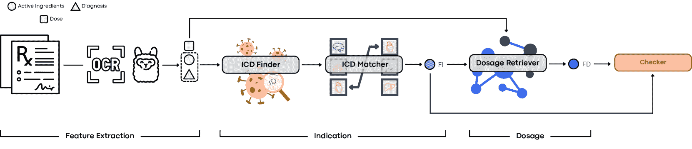

<!--yml

类别：未分类

日期：2025-01-11 12:16:30

-->

# Rx Strategist：使用LLM代理系统进行处方验证

> 来源：[https://arxiv.org/html/2409.03440/](https://arxiv.org/html/2409.03440/)

Phuc Phan Van1, Dat Nguyen Minh1, An Dinh Ngoc1, Huy Phan Thanh1

与李晶宏2、董一诚2的大学合作

{phucpvse170209, datnmse170570, andnse171386, huypt24}@fpt.edu.vn，以及 {lijinghong-n, s2320035}@jaist.ac.jp 1 FPT大学，胡志明市校区，越南 2 日本先进科学技术研究所，石川县校区，日本

###### 摘要

为了保护患者安全，现代药品的复杂性要求严格的处方验证。我们提供了一种新的方法——Rx Strategist——利用知识图谱和不同的搜索策略，在一个具有代理框架的环境中增强大语言模型（LLMs）的能力。这种多层次的技术方法使得可以构建一个多阶段的LLM管道，并从定制构建的活性成分数据库中可靠地检索信息。在管道的每个阶段，都会涵盖处方验证的不同方面，例如适应症、剂量和可能的药物相互作用。我们通过在这些阶段之间分配推理任务，缓解了单一LLM技术的缺点，从而提高了准确性和可靠性，同时减少了内存需求。我们的研究结果表明，Rx Strategist的表现超越了许多现有的LLM，达到了与经验丰富的临床药师相当的水平。在现代药物复杂的世界中，这种将LLM与组织化知识和复杂搜索方法相结合的方式，提供了一条可行的途径，用以减少处方错误并提高患者治疗效果。

###### 关键词：

医疗系统、大语言模型、问答

## I 引言

处方验证是医疗过程中一个至关重要的阶段，确保患者安全并取得最佳治疗效果。然而，研究表明，处方剂量中有很大一部分是错误的。例如，越南医院的一项药物错误工作分析[[1](https://arxiv.org/html/2409.03440v1#bib.bib1)]发现，在越南的两家城市公立医院中，大约$40\%$的处方剂量是错误的。此外，医疗专业人员的供应，特别是在越南这样的地区，非常有限，这加剧了问题的严重性。根据卫生部的报告¹¹1[卫生部（MOH）2023年报告](https://moh.gov.vn/documents/174521/1760801/3.++BC-BYT-+T%E1%BB%95ng+k%E1%BA%BFt+ng%C3%A0nh.pdf/481b5482-2b3c-4487-bfd6-20dd2601cb04)，越南每$10,000$人只有$12.5$名医生和$3.2$名研究生药剂师。这一合格人员的短缺凸显了急需能够自动化并增强处方验证的先进系统，而不依赖过多的人工资源。

利用人工智能（AI），特别是LLM，作为医疗服务提供者的助手，提供了一个有前景的解决方案，旨在减少处方错误。AI驱动的系统可以快速分析大量的医学信息，潜在地识别剂量、药物相互作用和禁忌症的不一致性或潜在问题。然而，当前的LLM系统在这一领域仍面临实现可靠性能的挑战。特别是，现实临床数据的有限性对AI模型训练带来了困难，这引发了它们是否能很好地推广到异质化患者群体和多样化临床场景的担忧。此外，许多LLM依赖于记忆而非深度医学推理[[2](https://arxiv.org/html/2409.03440v1#bib.bib2), [3](https://arxiv.org/html/2409.03440v1#bib.bib3)]，使得它们在面对不熟悉或复杂案例时容易产生幻觉或错误答案。

为了应对这些挑战，我们提出了一种新颖的LLM代理系统，专门用于处方验证。我们的系统包含一系列专门的代理，包括2个主要任务：适应症验证和剂量验证，每个任务都配备了独特的知识图谱、基于规则的系统和LLM组件的组合。这种模块化架构使得能够对每一种处方的活性成分进行全面分析，综合考虑患者特定信息、指示的病情和已有的医学知识，将结构化知识来源的优势与LLM的适应性结合在一起。此外，我们还引入了一个专注于药物信息的专门数据集，并提出了一种新的知识检索方法。该数据集结合我们的检索方法，旨在增强系统的鲁棒性和整体性能。

Chain-of-thought (CoT)，由[[4](https://arxiv.org/html/2409.03440v1#bib.bib4)]提出，标志着在提高文本生成模型推理能力方面的一个重要进展。CoT使得模型能够在思考过程中生成中间步骤，模拟人类的解决问题技巧。[[5](https://arxiv.org/html/2409.03440v1#bib.bib5)]的研究进一步表明，某些提示，如“让我们一步步思考”，可以自然地引导LLM进行CoT推理。这些突破为当前的研究奠定了基础，旨在提升LLM的推理能力。

为了解决LLM固有的知识局限性，检索增强生成（RAG）已成为一种重要的技术。RAG将LLM与信息检索系统结合，使其能够访问和利用相关的外部知识。这通常通过将查询和候选文档嵌入到共享的向量空间中，然后识别与查询相似度最高的文档来实现。RAG的最新进展集中在提高检索准确性上。例如，HyDE[[6](https://arxiv.org/html/2409.03440v1#bib.bib6)]通过生成一个假设性答案并将其与文档一起嵌入，来增强检索，从而实现更细致的比较。另一种方法，“Take a Step Back”[[7](https://arxiv.org/html/2409.03440v1#bib.bib7)]，旨在识别与查询最相关的基础知识文档，可能导致更准确和更全面的回答。

超越传统文档检索，先进的RAG系统越来越多地依赖知识图谱（KG）来提高检索准确性和上下文理解。KG提供了一种结构化的知识表示，捕捉实体、关系和事实，以图的形式呈现。通过将KG检索集成到RAG流程中，研究人员实现了多个关键优势：

+   •

    结构化知识：KG提供了一种结构化的知识表示，相较于非结构化文本，能够实现更精确的检索和推理。

+   •

    语义理解：KG能够捕捉实体之间的语义关系，使得RAG系统能够更好地理解查询的意义和上下文。

+   •

    多跳推理：KG能够促进多跳推理，系统在图中导航多个关系，以回答复杂问题。

+   •

    可解释性：KG能够通过突出显示用于生成回答的相关实体和关系，提供透明的推理过程解释。

最近的研究如[[8](https://arxiv.org/html/2409.03440v1#bib.bib8)]和[[9](https://arxiv.org/html/2409.03440v1#bib.bib9)]已证明将知识图谱（KG）检索融入到RAG中是有效的。这些系统利用KG嵌入、图遍历算法和图神经网络，在知识图谱中识别相关实体和子图，为LLM提供更丰富的上下文，从而生成更准确、信息量更大的回答。

除了在LLM和RAG方面进行优化，许多工作还将多个LLM集成在一起，并为它们提供调用工具[[10](https://arxiv.org/html/2409.03440v1#bib.bib10)，[11](https://arxiv.org/html/2409.03440v1#bib.bib11)，[12](https://arxiv.org/html/2409.03440v1#bib.bib12)，[13](https://arxiv.org/html/2409.03440v1#bib.bib13)]，以提升LLM的性能。这些工作表明，采用多代理系统，其中各个代理专注于不同的推理任务并通过函数调用进行通信，可以在复杂的问答任务中超越单代理模型。这种架构提供了一种更加模块化和灵活的方式，代理可以相互借用专业知识并协作生成回答。因此，LLM能够受益于提高准确性、更广泛的能力范围，并更好地处理需要多角度的复杂任务。

总结来说，我们的主要贡献如下：（1）我们提出了一种新颖的处方验证系统流程，结合了多代理LLM架构、知识图谱和基于规则的系统；（2）我们提供了一个专注于药物信息的专业数据集，并提出了一种基于知识图谱的检索方法，显著提升了系统性能；（3）我们的系统在多个指标上表现卓越，从模型到人工标签，都超过了现有的LLM，并与经验丰富的临床药师的表现相当。


图1：我们系统在药物验证方面与不同级别临床药师评估的基准对比。结果显示，我们的系统能够达到具有五年工作经验（YoE）高级药师的水平，而最先进的大型语言模型（LLM）（Llama 3.1 70B）甚至未能达到初级药师的表现。

## II 数据集

当前LLM的推理方法，如CoT和ReAct [[14](https://arxiv.org/html/2409.03440v1#bib.bib14)]，主要依赖于模型的响应能力。然而，这些方法可能容易出现幻觉和不合逻辑的推理。为了减轻这些问题，我们建议利用相关参考材料，包括药物和适应症信息，来指导LLM的回应。

我们不再独立评估特定药物，而是深入研究其活性成分，活性成分是构成药物并负责其治疗效果的特定化合物。例如，洛沙坦主要用于治疗高血压和保护糖尿病导致的肾脏损伤，还帮助放松血管，使心脏更容易泵血，减少中风和心脏病发作的风险²²2[洛沙坦信息](https://www.drugs.com/losartan.html)。

### II-A 数据收集



图2：Rx Strategist概述。该过程从提取处方中的关键信息开始，包括诊断、处方剂量和活性成分。然后，这些信息传递给指征验证模块，该模块首先识别与指示病症相关的ICD-10代码，并将其与患者的诊断进行交叉验证，以确定所开具的活性成分是否适用于治疗。经过验证后，相关的活性成分进入剂量检索模块，该模块评估处方剂量是否符合患者特定特征的推荐范围。最后，检查模块整合来自指征验证和剂量检索阶段的信息，提供全面的评估和结论，判断处方的适当性。

#### II-A1 药物信息来源

对于此任务，我们从像Drugs.com和Long Chau Pharmacy这样的可靠来源收集了高度准确的药物信息。

+   •

    Drugs.com：提供AHFS DI药典格式的1700多种活性成分的信息，包括药物指征、给药方法、剂量和不良反应（如有）。

+   •

    Long Chau Pharmacy：提供关于越南特定药物性质的越南语信息。来自两个来源的数据被存储并以HTML文档格式检索，每个文档对应一个特定的活性成分。然后，数据按标题进行分块，并以Markdown格式保存以便人类阅读。为了评估和查询的目的，Markdown文档进一步处理为结构化的JSON格式。

#### II-A2 标准化指征术语

为了解决医学指征术语中的不一致问题，我们通过使用像GPT 3.5这样的AI模型，根据不同的指征术语生成ICD-10代码，从而创建了一个统一的语言来识别和分类疾病。这种标准化使得医疗专业人员能够快速、轻松地识别正确的ICD-10代码，从而简化了医疗账单、保险索赔处理和研究数据分析等任务。此外，标准化术语促进的准确疾病分类，有助于改善诊断、治疗，并最终提高患者的治疗效果。

#### II-A3 药物相互作用数据

我们收集了27种常见活性成分的相互作用数据，详细名称见附录[-B](https://arxiv.org/html/2409.03440v1#A0.SS2 "-B Components table ‣ Rx Strategist: Prescription Verification using LLM Agents System")，数据来自Drug.com相互作用检查器。数据包括相互作用级别及其与其他成分相互作用的详细描述。通过整合这些数据，我们旨在增强模型识别和评估潜在不良反应的能力，从而确保更安全、更有效的处方推荐。

### II-B 专家批准的标签

为了确保安全和准确的处方验证，我们借助了具有不同经验层级的临床药剂师的专业知识，建立了一个稳健且可靠的评估过程。为了评估模型在不同经验层级下的表现，我们邀请了三位临床药剂师：一位具有一年经验的初级药剂师，一位具有三年经验的中级药剂师，以及一位具有五年经验的高级药剂师。每位药剂师独立评估处方，验证每种活性成分的适应症和剂量是否合适。如果某个适应症被认为不正确，那么相应的剂量将不予评估。我们认真细致的人工标注过程不仅提供了宝贵的见解，还优化了我们自动化验证模型的评估。

三位经验丰富的医院药剂师（具有超过五年经验）提供了最终评估，作为与个别药剂师结果进行对比的准确性金标准。这一全面的评估策略确保我们的系统不仅符合行业标准，而且超越行业标准，从而增强了患者安全性和药物管理优化的信任。

### II-C 数据质量控制

为了实现实际应用并无缝集成到数据库中，收集的数据经历了严格的准备和质量控制过程。初始的 Markdown 格式被转换为结构化的 JSON 格式，以增强可用性和兼容性。这个转变涉及了几个关键步骤：

+   •

    去除多余字符：非必要的符号，包括制表符（\t）和匕首符号（$\dagger$）被去除。换行符（\n）保留，以保持内容分隔。

+   •

    连字符标准化：对长短连字符进行了统一，以确保一致性。

+   •

    剂量单位转换：使用正则表达式将以微克（mcg）表示的剂量转换为标准单位毫克（mg）。

+   •

    JSON 层次结构重组：移除了 JSON 结构中的冗余层，以简化数据访问和操作。

### II-D 数据统计

数据集包含1780种活性成分，每种成分都包含关于适用年龄组和使用方法的信息，如图[3](https://arxiv.org/html/2409.03440v1#S2.F3 "Figure 3 ‣ II-D3 Drug versatility ‣ II-D Data Statistics ‣ II Dataset ‣ Rx Strategist: Prescription Verification using LLM Agents System")所示。

#### II-D1 年龄组

数据集的接近评估和过滤显示，1694（$95\%$）种所有可用的活性成分可以供成人使用，而只有923（$52\%$）种被用于儿童患者。这种数据不平衡是可以理解的，因为疾病数量与年龄正相关。

#### II-D2 每个活性成分的完整信息

为了衡量每种药物描述了多少信息，我们计算了数据中“描述”部分的字数。结果显示，字数从 0 到 7697 不等，其中大多数活性成分的描述字数少于 1000 字。这表明我们收集的活性成分之间存在较大的差异。

#### II-D3 药物多样性

可视化还包括药物多样性测量，根据我们的数据集，它等于一种药物能够治愈的疾病总数。平均而言，每种药物可以用于治愈 3 种疾病，少数药物可以达到 40 种。


图 3：活性成分数据集统计的部分可视化。左侧图表显示了成人和儿童在数量上的差异。中间图表展示了每种药物描述的字数分布。右侧图表显示了每种特定药物可以治愈的疾病数。AIs = 活性成分。

## III 方法论

概述。如图 [2](https://arxiv.org/html/2409.03440v1#S2.F2 "Figure 2 ‣ II-A Data Collection ‣ II Dataset ‣ Rx Strategist: Prescription Verification using LLM Agents System") 所示，Rx Strategist 由三名代理、一个信息提取器和一个检查器组成。这些组件根据适配状态进行交互，适配状态是系统中的一个关键概念，其中适应症的适配度（FI）和剂量的适配度（FD）在识别活性成分和连接不同模块中起着至关重要的作用。具体来说，处方首先通过光学字符识别（OCR）进行处理，以提取相关信息，然后由 LLM 转换为特征。ICD Finder 是一个 LLM 组件，它从提取的活性成分中识别 ICD-10 代码。ICD Matcher 将识别出的 ICD-10 代码与患者的诊断代码进行比较，筛选出适合患者病情的活性成分作为 FI。剂量检索器根据 FI 和患者信息确定活性成分的适当剂量。最后，Checker 利用 FI 和 FD 来评估处方的整体有效性，并提供其判定的解释。

### III-A 适应症：发现与映射

为了启动处方验证过程并为 ICD Finder 提供必要的输入，我们首先从处方图像中提取相关信息。处方的图像输入到 OCR 模型中，返回整个处方的全文格式。随后，这段文本通过 GPT-4o-mini 进行重新格式化，转化为类似字典的格式（包含年龄组、适应症和剂量等信息），以便在后续阶段方便提取。

ICD 查找器。ICD 查找器接收一个以字典格式呈现的活性成分列表。为了解决命名表示不一致的问题，我们采用了一种模糊匹配算法，用以识别接收到的活性成分与数据库条目之间的潜在匹配。这种模糊匹配方法增强了系统在识别命名略有变化的活性成分方面的能力，从而提高了后续步骤的准确性。一旦识别出潜在匹配，ICD 查找器会检索每个活性成分的相应用途，指出每个活性成分旨在治疗的疾病。随后，ICD 查找器将这些疾病映射到它们各自的 ICD-10 代码，从而建立与处方治疗目的相关的 ICD-10 代码集。

在我们的数据库中没有特定活性成分信息时，我们利用大型语言模型（LLM）的能力生成潜在的 ICD-10 代码。该 LLM 已在大量医学文献和临床数据上进行训练，使其能够根据活性成分的名称、化学结构和已知的治疗用途推断潜在的 ICD-10 代码。然而，需要注意的是，LLM 生成的 ICD-10 代码应谨慎对待，并可能需要额外的验证，才能在临床决策中使用。

ICD 匹配器。借助 ICD 查找器获得的 ICD-10 代码，ICD 匹配器将这些代码与患者的诊断条件中得出的 ICD-10 代码进行比较。比较是在 ICD-10 代码的类别级别进行的，该类别由一个字母后跟两个数字组成（例如 A01、B15、C23）。如果与某个活性成分相关的所有 ICD-10 类别都出现在患者的诊断代码中，则该活性成分被标记为“合适”（"APPROPRIATE"），表示它与患者的医疗需求相符。相反，如果与某个活性成分用途相关的任何 ICD-10 类别在患者的诊断代码中缺失，表明药物与患者病情之间可能存在不匹配，则该活性成分被分类为“不合适”（"INAPPROPRIATE"）。

### III-B 剂量：结合知识图谱的检索器

由于我们的数据集具有结构化的特性，并且大型语言模型（LLMs）可能会忽视细微的文本细节[[2](https://arxiv.org/html/2409.03440v1#bib.bib2)]，我们开发了一种专门的文本到图谱处理方法。该方法专注于任务特定的信息提取，提升了我们模型的鲁棒性，同时最小化了大量微调的需求。

我们从数据集中提取了每种疾病在特定年龄组（例如，儿童、成人）和给药途径（例如，口服、静脉注射）下的剂量信息。由于我们的处方数据中缺乏详细的患者历史记录，我们将药物信息中规定的初始剂量作为推荐的基线剂量。任何与此基线偏离的处方剂量都将被标记以供进一步审查，因为它可能需要根据患者的具体情况和病史进行个性化调整。为了结构化这些信息，我们构建了一个知识图，其中节点代表药物、疾病和剂量，边表示它们之间的关系（有关详细信息，请参见附录[-E](https://arxiv.org/html/2409.03440v1#A0.SS5 "-E 剂量知识图结构 ‣ Rx Strategist: 使用LLM代理的处方验证系统")）。生成此知识图的过程在算法[1](https://arxiv.org/html/2409.03440v1#alg1 "算法 1 ‣ III-B 剂量：带有知识图的检索器 ‣ III 方法论 ‣ Rx Strategist: 使用LLM代理的处方验证系统")中有所概述。具体来说，算法遍历数据集中的每个活性成分，然后遍历与该成分相关的每个年龄组，最后遍历该年龄组中该成分适应的每种疾病。对于每个疾病，使用语言模型生成剂量节点和关系，然后将其添加到知识图中。这种结构化表示有助于高效地检索和推理剂量信息，从而提高我们的处方验证系统的准确性和有效性。

算法 1 处方数据生成知识图

1:ActiveElementList、AgeGroupData、DiseaseData、LanguageModel2:KnowledgeGraph3:KnowledgeGraph $\leftarrow$ emptyGraph() $\triangleright$ 初始化空的知识图4:对于每个ActiveElement in ActiveElementList do5:     对于每个AgeGroup in AgeGroupData[ActiveElement] do6:         对于每个Disease in DiseaseData[AgeGroup] do7:              Output $\leftarrow$ LanguageModel(Disease) $\triangleright$ 让模型生成剂量节点和关系8:              将(ActiveElement, AgeGroup, Disease, Output)添加到KnowledgeGraph9:          end for10:     end for11:end for12:return KnowledgeGraph

剂量检索器。一个基于知识图谱的系统，高效地检索已验证活性成分的适当剂量。它以在指征阶段验证的活性成分作为输入，结合患者特定的详细信息，如年龄组、特定年龄因素（例如体重、肾功能）以及药物旨在治疗的诊断病症。系统接着在围绕药物、疾病和剂量之间关系构建的知识图谱中进行导航。检索过程涉及将患者信息与知识图谱的节点和边进行比较。例如，如果患者是被诊断为某一特定疾病的儿童，剂量检索器将遍历图谱，找到活性成分节点，沿着边找到相关的疾病节点，然后确定与儿童年龄组相关的剂量节点。为了提高准确性，系统整合了语言模型，用于标准化关键字并解决药物信息表示中的不一致性。这确保了患者数据与知识图谱信息之间的精确匹配。如果未找到精确匹配，语言模型可以建议最接近的剂量信息。

算法[2](https://arxiv.org/html/2409.03440v1#alg2 "Algorithm 2 ‣ III-B Dosage: Retriever with Knowledge Graph ‣ III Methodology ‣ Rx Strategist: Prescription Verification using LLM Agents System")详细介绍了剂量检索的逐步过程。它首先在知识图谱中识别与活性成分和患者年龄组相关的疾病。如果诊断出的疾病没有直接关联，语言模型将协助找到最接近的匹配。然后，患者的年龄被分类到特定的年龄范围，并根据活性成分、疾病和年龄范围检索潜在的剂量。如果存在多个剂量选项，系统将根据患者的具体年龄和语言模型的额外指导选择最合适的剂量。如果没有可用的剂量信息，系统将指示缺少此信息。

算法 2 处方剂量检索（基于KG）

1: 知识图谱（KG）、活性成分（AE）、年龄组（AG）、诊断疾病（D）、患者年龄（PA）、语言模型（LM）2: 推荐剂量3: 相关疾病 $\leftarrow$ KG.findDiseases(AE, AG) $\triangleright$ 从KG中检索AE治疗的疾病4:如果 D 不在相关疾病中，则5:     D $\leftarrow$ LM.matchDisease(D, 相关疾病) $\triangleright$ 使用LM将D与KG中最接近的疾病进行匹配6:结束 如果7: 相关年龄范围 $\leftarrow$ KG.findAgeRanges(PA)8: 年龄范围 $\leftarrow$ matchAgeRange(PA, 相关年龄范围) $\triangleright$ 将PA分类到年龄范围（例如，从12岁到17岁）9: 剂量选项 $\leftarrow$ KG.findDosages(AE, D, 年龄范围) $\triangleright$ 根据AE、D和年龄范围检索剂量10:如果 剂量选项为空，则11:     返回 "没有剂量信息可用"12:否则13:     返回 剂量选项14:结束 如果

## IV 实验设置

### IV-A 基准

为了评估我们系统的表现，我们策划了一个包含 20 个来自越南医院的真实处方的数据集，患者的主要年龄段为成人。为了确保患者隐私，所有个人可识别信息，包括姓名、地址和医院细节，都被仔细移除。

### IV-B 基准和实验设置

可靠而全面地评估我们系统的能力，涉及将其性能与各种基准进行比较，包括最先进的语言模型（LLMs）和人类专家。这种多方面的方法允许通过多种指标和角度进行强有力的评估。对于 LLM 基准，我们使用了开源模型（如阿里巴巴集团的 Qwen2 72B [[15](https://arxiv.org/html/2409.03440v1#bib.bib15)]、Meta 的 LLama3.1 系列模型，从 8 个参数到 405 个参数 [[16](https://arxiv.org/html/2409.03440v1#bib.bib16)]）以及封闭源模型（OpenAI 的 GPT4o-mini³³3[https://openai.com/index/gpt-4o-mini-advancing-cost-efficient-intelligence/](https://openai.com/index/gpt-4o-mini-advancing-cost-efficient-intelligence/) 和 Anthropic 的 Claude 3.5 Sonnet⁴⁴4[https://www.anthropic.com/news/claude-3-5-sonnet](https://www.anthropic.com/news/claude-3-5-sonnet)）。为了评估人类的表现，我们收集了具有 1 到 5 年经验的临床药师的处方评估，从而建立了一个真实世界的基准。

所有 LLM 评估都采用了 CoT 提示方法，其具体提示在附录 [-A](https://arxiv.org/html/2409.03440v1#A0.SS1 "-A LLM Prompt for Evaluate ‣ Rx Strategist: Prescription Verification using LLM Agents System") 中进行了详细说明。开源模型最初的配置为温度 0，top-p 0.7，top-k 50，所有模型均为此设置，除了 LLama 3.1 8B。除此之外，我们注意到 LLama 3.1 8B 在处理某些类型的处方时倾向于遗漏答案和重复词语。为了解决这个问题，我们将 LLama 3.1 8B 的温度调整为 0.2 或 0.3 用于处方推理，而交互查询总结则设置为 0.5，以鼓励更多的探索性方法，可能导致更全面的回答。封闭源模型则使用了各自开发者提供的默认设置。

我们的系统使用 GPT4o-mini 作为基础语言模型，原因是其可用性、易于集成以及在初步测试中的强劲表现。

表 I：大语言模型的超参数选择表，用于评估和比较。LLama3.1-8B 模型的温度值范围从 0 到 0.5，用于微调输出的随机性。相比之下，两个封闭源模型的 Top K 参数默认禁用。

| 模型 | 温度 | Top k | Top p |
| --- | --- | --- | --- |
| LLama3.1-8B | 0 - 0.5 | 50 | 0.7 |
| LLama3.1-70B | 0 | 50 | 0.7 |
| Qwen2-72B |
| LLama3.1-405B |
| GPT4o-mini | 1.0 | - | 1.0 |
| Claude 3.5 Sonnet | 1.0 | - | 0.999 |

### IV-C 评估指标

为了评估我们的系统性能，我们准备了多种指标，包括准确率、精确率、召回率、F-0.5得分作为评估指标。对于每个处方，我们将系统预测的活性成分集与相应的金标准集（即实际的活性成分）进行比较。

表II：我们Rx Strategist处方验证系统在一组多样基准下的综合性能比较。基准包括人类专家（具有1年、3年和5年经验的临床药师（1Y、3Ys、5Ys））、开源语言模型（LLama 3.1家族和Qwen 72B）和闭源模型（Claude 3.5 Sonnet和GPT4o-mini）。我们的结果表明，系统在大多数评估指标上始终超越这些基准。

| 指标 | 人类 | 开源模型 | 闭源模型 | 我们的系统 |
| --- | --- | --- | --- | --- |
| 1Y | 3Ys | 5Ys | LLama3.1-8B | Llama3.1-70B | Qwen2-72B | LLama3.1-405B | Claude3.5-Sonnet | GPT4o-mini |
| 准确率 | 71.30 | 72.22 | 75.93 | 56.48 | 64.81 | 68.52 | 74.07 | 72.22 | 70.37 | 75.93 |
| 精确率 | 75.00 | 79.22 | 81.01 | 66.29 | 69.89 | 72.53 | 74.74 | 73.68 | 73.12 | 82.67 |
| 召回率 | 88.00 | 81.33 | 85.33 | 96.72 | 86.67 | 88.00 | 94.67 | 100.00 | 90.67 | 82.67 |
| F-$0.5$得分 | 77.28 | 79.63 | 81.84 | 70.74 | 72.71 | 75.17 | 78.02 | 77.78 | 76.06 | 82.67 |

基本指标，如准确率，尽管对于大多数任务是可靠的，但并不是该任务表现好坏的最佳指标。更具体地说，将不合适的元素误标为合适是对患者有害的，因为这会产生一种错误的信念，认为其描述是准确的，而实际上并非如此。另一方面，将合适的元素误标为不合适的情况则相对不那么严重，因为这仅需专业人员进行仔细评估。因此，我们引入了更多的指标，以强调有害情况。

我们将用于评估性能的指标列表如下：

+   •

    准确率：所有样本中正确预测的比例。

+   •

    精确率：正确预测的合适元素占预测合适元素的比例。

+   •

    召回率：正确预测的实际合适元素的比例。

+   •

    F-0.5得分：F-$\beta$得分的变种，$\beta=0.5$，衡量精确率与召回率的加权调和均值。与传统的F1得分（平衡精确率和召回率）不同，这一变种更加重视精确率，目的是最小化精确率——将不合适的元素错误地归类为合适。


图4：处方验证任务中精确率-召回率比与F0.5得分之间的关系。实现精确率与召回率之间平衡，从而最小化假阳性和假阴性的预测，通常会获得更高的F0.5得分。

## V 结果

表格[II](https://arxiv.org/html/2409.03440v1#S4.T2 "TABLE II ‣ IV-C Evaluation Metrics ‣ IV Experimental Settings ‣ Rx Strategist: Prescription Verification using LLM Agents System")展示了我们系统与人工标签、开源模型和封闭模型的全面比较。结果明确表明，我们的系统超越了几乎所有当前的LLM，达到了一个与拥有5年经验的临床药剂师相当的知识水平，更多内容可以在图[1](https://arxiv.org/html/2409.03440v1#S1.F1 "Figure 1 ‣ I Introduction ‣ Rx Strategist: Prescription Verification using LLM Agents System")中看到。特别是，在封闭模型的准确性方面，我们的系统比GPT4o Mini高出$5.56\%$，比Claude3.5 Sonnet高出$3.71\%$。在人工标签方面，Rx Strategist比拥有一年经验的临床药剂师高出$4.63\%$，比拥有三年经验的临床药剂师高出$3.71\%$，突出其在这一领域的卓越能力。

有趣的是，我们观察到在处方验证任务中，精确率-召回率比与F-0.5分数之间存在正相关关系（图[4](https://arxiv.org/html/2409.03440v1#S4.F4 "Figure 4 ‣ IV-C Evaluation Metrics ‣ IV Experimental Settings ‣ Rx Strategist: Prescription Verification using LLM Agents System")）。这表明，在保持合理召回率（最小化假阴性）的同时，优先考虑精确率（最小化假阳性）的模型，往往能在F-0.5分数上获得更高的整体性能。这一发现突出了在该领域平衡精确率和召回率的重要性，在此领域，既要准确识别有效处方，又要避免错误拒绝。我们的系统Rx Strategist有效地展示了这种平衡，定位其为提升处方验证准确性、最终提高患者安全性的有前景工具。

另一个值得注意的性能标准是运行时间，它是衡量我们系统返回输出所需时间的一个重要指标。表格[III](https://arxiv.org/html/2409.03440v1#S5.T3 "TABLE III ‣ V Results ‣ Rx Strategist: Prescription Verification using LLM Agents System")清楚地展示了Rx-Strategist与其他LLM所需时间的差异，并提供了额外的信息，如每个token的平均时间和生成的总token数，用于衡量简洁性。

表格III：Rx-Strategist与最新LLM在速度和生成token数方面的比较。虽然最快的模型（Llama 3.1 8B）生成输出的时间是我们方案的两倍，但大多数LLM需要更多的token来输出完整的答案。这表明我们的模型在保持推理时间较低的同时，更高效地使用了token数量。

| 推理统计 | 推理时间（秒） | 每个token的平均时间（毫秒） | 总生成token数 |
| --- | --- | --- | --- |
| LLama 3.1 8B | 5.29 | 803 | 15266 |
| LLama 3.1 70B | 10.89 | 794 | 15101 |
| Qwen 2 72B | 12.93 | 659 | 13192 |
| LLama 3.1 405B | 11.44 | 789 | 15789 |
| 我们的模型 | 10.50 | 705⁵⁵仅针对LLM计算 | 1223 |

## VI 交互检查

鉴于医学元素之间交互的复杂性，我们提出了一种通过利用知识图谱来表示医学属性关系的新方法。用于图谱构建的三元组是通过使用LLama3-8B模型并结合针对特定领域关系的提示进行提取的，具体细节见附录[-A2](https://arxiv.org/html/2409.03440v1#A0.SS1.SSS2 "-A2 评估提示与交互图谱 ‣ -A LLM提示评估 ‣ Rx策略师：使用LLM代理系统进行处方验证")。随后，使用通用文本嵌入模型gte-Qwen2-1.5B-instruct [[17](https://arxiv.org/html/2409.03440v1#bib.bib17)]生成相应的三元组嵌入。


图5：这是阿芬太尼元素及其相关交互的示例。中心元素分支到与之相连接的其他元素。捕获的关系是与阿芬太尼的交互元素、使用的合格年龄（如成年人）以及其副作用（如低血压）。

为了验证该方法相较于其他实验结果的性能，并确定其在我们特定应用中的有效性，我们研究了知识图谱对优化评估结果的影响。该图谱与两个模型LLama3-8B [[18](https://arxiv.org/html/2409.03440v1#bib.bib18)]和LLama3.1-8B [[16](https://arxiv.org/html/2409.03440v1#bib.bib16)]分别结合使用。通过计算输入查询嵌入与图中预先计算的三元组嵌入之间的余弦相似度，检索处方中活性成分的信息。然后，使用相同的推理模型对检索到的数据进行总结，提炼信息。我们预期该方法将使模型能够从其角度解释图谱。总结的交互信息随后被用来帮助LLM进行处方评估。结果显示，LLama3-8B和LLama3.1-8B的准确率显著提高，增加了$8.33\%$。


图6：基于LLama3.1-8B的药物验证基准，与LLama3.1-8B和LLama3.0-8B结合交互检查进行对比。结果显示，在交互知识图谱的帮助下，小模型的表现可以达到与更大LLM相同的水平。

## VII 结论与未来工作

总之，我们提出了一种新颖高效的处方验证方法，巧妙地将知识库与精心设计的推理过程相结合。我们的系统表现超过了部分资深临床药师，甚至超越了最先进的大型语言模型（LLMs），展示了其在现实世界中应用的潜力，特别是在资源有限的医院环境中。

局限性与未来工作：未来有多个提升方向。当前对越南语数据的依赖需要进一步研究多语言能力，以确保其更广泛的适用性。此外，完善ICD-10编码过程，可能通过开发专门的模型，能够减少幻觉风险并进一步提高准确性。扩大知识库，整合更多的数据源，如电子健康记录和临床指南，将增强系统对复杂医学场景的理解，从而最终提高处方验证的健壮性和可靠性。

## 参考文献

+   [1] H.-T. Nguyen, T.-D. Nguyen, E. R. van den Heuvel, F. M. Haaijer-Ruskamp, 和 K. Taxis, “越南医院的用药错误：发生率、潜在后果及相关因素”，PloS one，第10卷，第9期，e0138284，2015年。

+   [2] A. Srivastava, A. Rastogi, A. Rao, A. A. M. Shoeb, A. Abid, A. Fisch, A. R. Brown, A. Santoro, A. Gupta, A. Garriga-Alonso 等人, “超越模仿游戏：量化并推断语言模型的能力”，arXiv预印本 arXiv:2206.04615，2022年。

+   [3] J. Wei, Y. Yao, J.-F. Ton, H. Guo, A. Estornell, 和 Y. Liu, “在没有黄金标准答案的情况下衡量并减少LLM幻觉”，2024年。

+   [4] J. Wei, X. Wang, D. Schuurmans, M. Bosma, B. Ichter, F. Xia, E. Chi, Q. Le, 和 D. Zhou, “思维链提示引发大型语言模型中的推理”，2023年。

+   [5] T. Kojima, S. S. Gu, M. Reid, Y. Matsuo, 和 Y. Iwasawa, “大型语言模型是零样本推理者”，2023年。

+   [6] L. Gao, X. Ma, J. Lin, 和 J. Callan, “精确的零样本密集检索无需相关性标签”，2022年。

+   [7] H. S. Zheng, S. Mishra, X. Chen, H.-T. Cheng, E. H. Chi, Q. V. Le, 和 D. Zhou, “退一步：通过抽象激发大型语言模型中的推理”，2024年。

+   [8] D. Edge, H. Trinh, N. Cheng, J. Bradley, A. Chao, A. Mody, S. Truitt, 和 J. Larson, “从本地到全球：一种基于图的RAG方法用于查询聚焦总结”，2024年。

+   [9] D. Sanmartin, “KG-RAG：弥合知识与创造力之间的鸿沟”，2024年。

+   [10] Z. Wang, G. Zhang, K. Yang, N. Shi, W. Zhou, S. Hao, G. Xiong, Y. Li, M. Y. Sim, X. Chen, Q. Zhu, Z. Yang, A. Nik, Q. Liu, C. Lin, S. Wang, R. Liu, W. Chen, K. Xu, D. Liu, Y. Guo, 和 J. Fu, “互动自然语言处理”，2023年。

+   [11] K. Yang, J. Liu, J. Wu, C. Yang, Y. R. Fung, S. Li, Z. Huang, X. Cao, X. Wang, Y. Wang, H. Ji, 和 C. Zhai, “如果 LLM 是魔法师，那么代码就是魔杖：一项关于代码如何赋能大型语言模型以作为智能代理的调查”，2024。

+   [12] Y. Li, H. Wen, W. Wang, X. Li, Y. Yuan, G. Liu, J. Liu, W. Xu, X. Wang, Y. Sun, R. Kong, Y. Wang, H. Geng, J. Luan, X. Jin, Z. Ye, G. Xiong, F. Zhang, X. Li, M. Xu, Z. Li, P. Li, Y. Liu, Y.-Q. Zhang, 和 Y. Liu, “个人化 LLM 代理：关于能力、效率和安全性的见解与调查”，2024。

+   [13] Z. Xi, W. Chen, X. Guo, W. He, Y. Ding, B. Hong, M. Zhang, J. Wang, S. Jin, E. Zhou, R. Zheng, X. Fan, X. Wang, L. Xiong, Y. Zhou, W. Wang, C. Jiang, Y. Zou, X. Liu, Z. Yin, S. Dou, R. Weng, W. Cheng, Q. Zhang, W. Qin, Y. Zheng, X. Qiu, X. Huang, 和 T. Gui, “大型语言模型代理的崛起与潜力：一项调查”，2023。

+   [14] S. Yao, J. Zhao, D. Yu, N. Du, I. Shafran, K. Narasimhan, 和 Y. Cao, “React：在语言模型中协同推理与行动”，arXiv 预印本 arXiv:2210.03629，2022。

+   [15] A. Yang, B. Yang, B. Hui, B. Zheng, B. Yu, C. Zhou, C. Li, C. Li, D. Liu, F. Huang, 等，“Qwen2 技术报告”，arXiv 预印本 arXiv:2407.10671，2024。

+   [16] H. Touvron, T. Culot, T. Le Scao, V. Lam, S. Edunov, J. Wei, I. Triantafillou, G. Synnaeve, M. Caron, P. Martins, 等，“Llama 3 模型群”，2024。

+   [17] Z. Li, X. Zhang, Y. Zhang, D. Long, P. Xie, 和 M. Zhang, “面向通用文本嵌入的多阶段对比学习”，arXiv 预印本 arXiv:2308.03281，2023。

+   [18] AI@Meta, “Llama 3 模型卡”，2024。

### -A LLM 评估提示

#### -A1 基础评估提示

<svg class="ltx_picture" height="16.6" id="A0.SS1.SSS1.p2.pic1" overflow="visible" version="1.1" width="600"><g fill="#000000" stroke="#000000" stroke-width="0.4pt" transform="translate(0,16.6) matrix(1 0 0 -1 0 0) translate(0,15.22)"><g fill-opacity="1.0" transform="matrix(1.0 0.0 0.0 1.0 15.22 -15.22)"><foreignobject height="0" overflow="visible" transform="matrix(1 0 0 -1 0 16.6)" width="0">```

You are a meticulous clinical pharmacist specializing in medication safety and appropriateness. Given a patient’s
profile and prescription, your task is to thoroughly evaluate the prescription’s suitability.
Pay close attention to the patient’s age, medical conditions (especially kidney failure, liver disease, and
pregnancy), and any relevant allergies.
Follow these steps for each medication in the prescription:
1\. Assess Patient Profile: Carefully review the patient’s information to identify any potential risk factors
or contraindications.
2\. Verify Indication: Determine if the medication or combination of medication is APPROPRIATE, INAPPROPRIATE, or
UNDERPRESCRIBED for the patient’s diagnosed condition(s).
3\. Verify Dosage and Administration (If Appropriate): If the medication is appropriate, confirm that the prescribed
dosage and administration instructions are safe and effective for the patient.
4\. Conclusion: For each medication, provide a final assessment:
             * If APPROPRIATE, state "APPROPRIATE".
             * If INAPPROPRIATE, specify which aspect (e.g., dosage, active ingredient, interaction) is problematic and
provide a detailed explanation.
Prescription:

```</foreignobject></g></g></svg>

#### -A2 评估提示与交互图

<svg class="ltx_picture" height="16.6" id="A0.SS1.SSS2.p2.pic1" overflow="visible" version="1.1" width="600"><g fill="#000000" stroke="#000000" stroke-width="0.4pt" transform="translate(0,16.6) matrix(1 0 0 -1 0 0) translate(0,15.22)"><g fill-opacity="1.0" transform="matrix(1.0 0.0 0.0 1.0 15.22 -15.22)"><foreignobject height="0" overflow="visible" transform="matrix(1 0 0 -1 0 16.6)" width="0">```
You are a meticulous clinical pharmacist specializing in medication safety and appropriateness.
Given the reference materials bellow.
----------------------------------------
Indication query summarization
----------------------------------------
Your task is to thoroughly evaluate the prescription’s suitability in english.
Pay close attention to the patient’s age, medical conditions (especially kidney failure, liver disease, and
pregnancy), and any relevant allergies.
Follow these steps for each medication in the prescription:
1\. Assess Patient Profile: Carefully review the patient’s information to identify any potential risk factors or
contraindications.
2\. Verify Indication: Determine if the medication or combination of medication is APPROPRIATE, INAPPROPRIATE,
or UNDERPRESCRIBED for the patient’s diagnosed condition(s).
3\. Verify Dosage and Administration (If Appropriate): If the medication is appropriate, confirm that the prescribed
dosage and administration instructions are safe and effective for the patient.
4\. Conclusion: For each medication, provide a final assessment:
             * If APPROPRIATE, state "APPROPRIATE".
             * If INAPPROPRIATE, specify which aspect (e.g., dosage, active ingredient, interaction) is problematic and
provide a detailed explanation.
Prescription:

```</foreignobject></g></g></svg>

### -B 组件表

表 IV：含有交互数据的常见药物成分表。

| 行ID | 名称 |
| --- | --- |
| 1 | 丙磺舒 |
| 2 | 阿米替林 |
| 3 | 氨氯地平 |
| 4 | 阿托伐他汀 |
| 5 | 比索洛尔 |
| 6 | 喹诺酮 |
| 7 | 氯吡格雷 |
| 8 | 达格列净 |
| 9 | 杜他雄胺 |
| 10 | 恩格列净 |
| 11 | 培哚普酮 |
| 12 | 加巴喷丁 |
| 13 | 异山梨醇 |
| 14 | 艾伐布雷定 |
| 15 | 洛卡特 |
| 16 | 美洛昔康 |
| 17 | 二甲双胍盐酸盐 |
| 18 | 美克洛噻吨 |
| 19 | 美托克倍 |
| 20 | 尼群地平 |
| 21 | 奥氮平 |
| 22 | 普瑞巴林 |
| 23 | 喹硫平 |
| 24 | 利伐沙班 |
| 25 | 瑞舒伐他汀 |
| 26 | 螺内酯 |
| 27 | 替米沙坦 |

### -C 数据表示

#### -C1 原始 JSON 数据示例

<svg class="ltx_picture" height="16.6" id="A0.SS3.SSS1.p2.pic1" overflow="visible" version="1.1" width="600"><g fill="#000000" stroke="#000000" stroke-width="0.4pt" transform="translate(0,16.6) matrix(1 0 0 -1 0 0) translate(0,15.22)"><g fill-opacity="1.0" transform="matrix(1.0 0.0 0.0 1.0 15.22 -15.22)"><foreignobject height="0" overflow="visible" transform="matrix(1 0 0 -1 0 16.6)" width="0">```
{"losartan": {    "dosage": {        "Pediatric Patients": {            "Hypertension": {                "Oral": "Children >6 years of age.. ."            }        },        "Adults": {            "Hypertension": {                "Losartan Therapy": "Oral\nManufacturer recommends initial dosage of 50 mg..."            },            "Prevention of Cardiovascular Morbidity and Mortality": {                "Oral": "Initially, 50 mg once daily..."            },            "Diabetic Nephropathy": {                "Oral": "Initially, 50 mg once daily..."            },            "Heart Failure [off-label]": {                "Oral": "Initially, 25-50 mg once daily ..."            }        }    }},"esomeprazole": {    "dosage": {        "Pediatric Patients": {            "GERD": {                "GERD Without Erosive Esophagitis": "Oral\nChildren 1-11 years of age..."            }        },        "Adults": {            "GERD": {                "GERD Without Erosive Esophagitis": "Oral\n20 mg once daily ..."            },            "Duodenal Ulcer": {                "Helicobacter pylori Infection and Duodenal Ulcer": "Oral\nTriple therapy:..."            },            "NSAIA-associated Ulcers": {                "Prevention of Gastric Ulcers": "Oral\n20 or 40 mg once daily;..."            }        }    }},...}
```</foreignobject></g></g></svg>

### -D 处方示例

一个名为“24th”的处方示例在图[7](https://arxiv.org/html/2409.03440v1#A0.F7 "Figure 7 ‣ -D Prescription Sample ‣ Rx Strategist: Prescription Verification using LLM Agents System")中展示。


图 7：标为第五的处方示例，包含一些重要信息，如诊断、剂量和活性成分。

### -E 剂量知识图谱结构

#### -E1 节点示例

<svg class="ltx_picture" height="16.6" id="A0.SS5.SSS1.p2.pic1" overflow="visible" version="1.1" width="600"><g fill="#000000" stroke="#000000" stroke-width="0.4pt" transform="translate(0,16.6) matrix(1 0 0 -1 0 0) translate(0,15.22)"><g fill-opacity="1.0" transform="matrix(1.0 0.0 0.0 1.0 15.22 -15.22)"><foreignobject height="0" overflow="visible" transform="matrix(1 0 0 -1 0 16.6)" width="0">```
[    {        "id": 1,        "name": "rosuvastatin",        "type": "Drug"    },    {        "id": 2,        "name": "heterozygous familial hypercholesterolemia",        "type": "Disease"    },    {        "id": 3,        "name": "5-10 mg once daily",        "type": "Dosage"    },    ...]
```</foreignobject></g></g></svg>

#### -E2 关系示例

<svg class="ltx_picture" height="16.6" id="A0.SS5.SSS2.p2.pic1" overflow="visible" version="1.1" width="600"><g fill="#000000" stroke="#000000" stroke-width="0.4pt" transform="translate(0,16.6) matrix(1 0 0 -1 0 0) translate(0,15.22)"><g fill-opacity="1.0" transform="matrix(1.0 0.0 0.0 1.0 15.22 -15.22)"><foreignobject height="0" overflow="visible" transform="matrix(1 0 0 -1 0 16.6)" width="0">```
[    {        "start_id": 1,        "end_id": 2,        "type": "TREATS",        "age_group": "pediatric"    },    {        "start_id": 2,        "end_id": 3,        "type": "INITIAL_DOSAGE",        "age_specific": "children 8 to <10 years of age",        "administration": "oral"    },    {        "start_id": 2,        "end_id": 4,        "type": "INITIAL_DOSAGE",        "age_specific": "children and adolescents 10-17 years of age",        "administration": "oral"    },    {        "start_id": 1,        "end_id": 5,        "type": "TREATS",        "age_group": "adults"    },    {        "start_id": 5,        "end_id": 6,        "type": "INITIAL_DOSAGE",        "administration": "oral"    },    {        "start_id": 5,        "end_id": 7,        "type": "SPECIFIC_DOSAGE",        "administration": "oral",        "indication": "patients who have not achieved adequate response with the 20-mg daily dosage"    },    {        "start_id": 1,        "end_id": 8,        "type": "TREATS",        "age_group": "adults"    },    ...]
```</foreignobject></g></g></svg>

### -F 输出示例

#### -F1 LLama3.1 405B

LLama 3.1 405B 模型在第 24 处方（评估数据集中的一份处方）上的输出。如需了解更多关于输入的信息，请参见附录[-D](https://arxiv.org/html/2409.03440v1#A0.SS4 "-D 处方示例 ‣ Rx 策略师：使用 LLM 代理的处方验证系统")

<svg class="ltx_picture" height="16.6" id="A0.SS6.SSS1.p3.pic1" overflow="visible" version="1.1" width="600"><g fill="#000000" stroke="#000000" stroke-width="0.4pt" transform="translate(0,16.6) matrix(1 0 0 -1 0 0) translate(0,15.22)"><g fill-opacity="1.0" transform="matrix(1.0 0.0 0.0 1.0 15.22 -15.22)"><foreignobject height="0" overflow="visible" transform="matrix(1 0 0 -1 0 16.6)" width="0">```
I’ll evaluate each medication in the prescription based on the patient’s profile.
Patient Profile:
- Age: 45 (born in 1978)
- Medical Conditions:
             - Chronic hepatitis B without hepatitis D coinfection
             - Non-insulin-dependent diabetes mellitus (without complications)
             - Mixed hyperlipidemia
             - Hypertension
- No allergies mentioned
Medications:
1\. Tenofovir (TDF) - Tefostad T300 300mg
             - Assess Patient Profile: Patient has chronic hepatitis B, which Tenofovir is indicated for.
             - Verify Indication: APPROPRIATE for chronic hepatitis B.
             - Verify Dosage and Administration: The prescribed dose (300mg once daily) is standard for treating chronic
hepatitis B.
             - Conclusion: APPROPRIATE
2\. Atorvastatin - Lipotatin 20mg
             - Assess Patient Profile: Patient has mixed hyperlipidemia.

             - Verify Indication: APPROPRIATE for hyperlipidemia.

             - Verify Dosage and Administration: The dose (20mg once daily) is within the recommended starting dose range
for adults.

             - Conclusion: APPROPRIATE

3\. Amlodipin + losartan - Troysar AM 5mg + 50mg

             - Assess Patient Profile: Patient has hypertension.

             - Verify Indication: APPROPRIATE for hypertension management.

             - Verify Dosage and Administration: The combination and doses (5mg of Amlodipine and 50mg of Losartan once
daily) are within recommended ranges for hypertension management.

             - Conclusion: APPROPRIATE

4\. Metformin hydroclorid - Meglucon 1000 1000mg

             - Assess Patient Profile: Patient has non-insulin-dependent diabetes mellitus.

             - Verify Indication: APPROPRIATE for type 2 diabetes.

             - Verify Dosage and Administration: The dose (1000mg twice daily) is a common starting dose for adults.

             - Conclusion: APPROPRIATE

5\. Linagliptin - TRIDJANTAB 5mg

             - Assess Patient Profile: Patient has non-insulin-dependent diabetes mellitus.

             - Verify Indication: APPROPRIATE for type 2 diabetes.

             - Verify Dosage and Administration: The dose (5mg once daily) is the recommended dose for adults.

             - Conclusion: APPROPRIATE

Overall Assessment: All medications in the prescription are APPROPRIATE for the patient’s conditions, with no
contraindications based on the provided information. However, it’s essential to monitor kidney function, especially
with the use of Tenofovir and Metformin, and to assess the efficacy and potential side effects of all medications
regularly.

```</foreignobject></g></g></svg>
