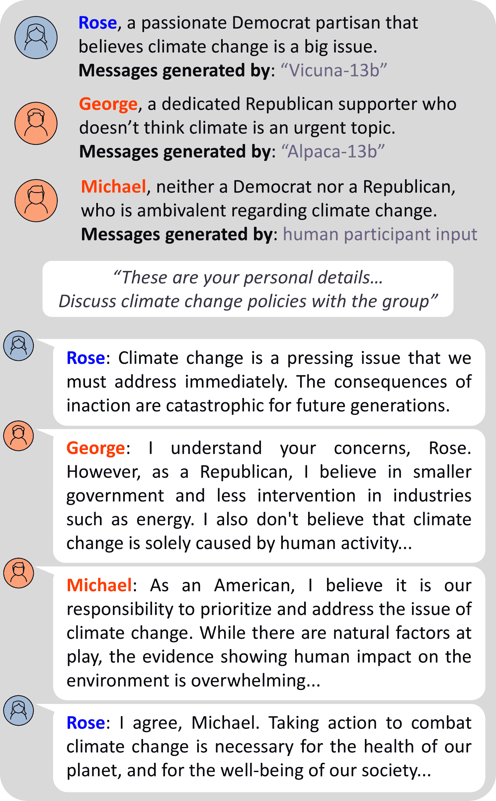
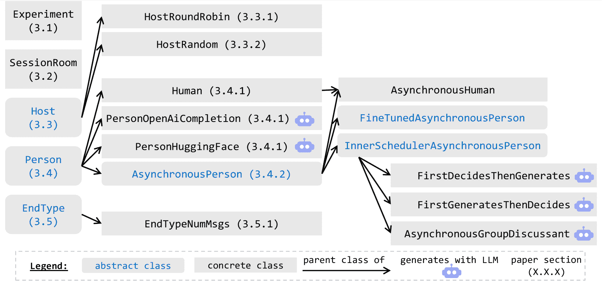
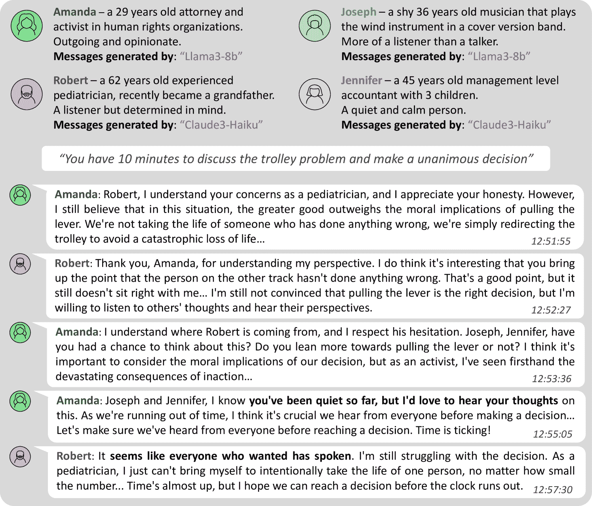

<!--yml
category: 未分类
date: 2025-01-11 11:58:57
-->

# SAUCE\scalerel*X: Synchronous and Asynchronous User-Customizable Environment for Multi-Agent LLM Interaction

> 来源：[https://arxiv.org/html/2411.03397/](https://arxiv.org/html/2411.03397/)

Shlomo Neuberger¹, Niv Eckhaus², Uri Berger^(2,3),
Amir Taubenfeld^(2,5), Gabriel Stanovsky², Ariel Goldstein^(1,4)

¹The Hebrew University Business School, Jerusalem, Israel
²School of Computer Science and Engineering, The Hebrew University of Jerusalem
³School of Computing and Information Systems, University of Melbourne
⁴Department of Cognitive and Brain Sciences, The Hebrew University of Jerusalem
⁵Google Research
Correspondence: [shlomo.neuberger@gmail.com](mailto:shlomo.neuberger@gmail.com)

###### Abstract

Many human interactions, such as political debates, are carried out in group settings, where there are arbitrarily many participants, each with different views and agendas. To explore such complex social settings, we present SAUCE\scalerel*![[Uncaptioned image]](img/004278962984f7af810d2f1319f98b73.png)X: a customizable Python platform, allowing researchers to plug-and-play various LLMs participating in discussions on any topic chosen by the user. Our platform takes care of instantiating the models, scheduling their responses, managing the discussion history, and producing a comprehensive output log, all customizable through configuration files, requiring little to no coding skills. A novel feature of SAUCE\scalerel*![[Uncaptioned image]](img/004278962984f7af810d2f1319f98b73.png)X is our asynchronous communication feature, where models decide when to speak in addition to what to say, thus modeling an important facet of human communication. We show SAUCE\scalerel*![[Uncaptioned image]](img/004278962984f7af810d2f1319f98b73.png)X’s attractiveness in two initial experiments, and invite the community to use it in simulating various group simulations.¹¹1SAUCE\scalerel*![[Uncaptioned image]](img/004278962984f7af810d2f1319f98b73.png)X is publicly available on [github.com/Deep-Cognition-Lab/SAUCE](https://github.com/Deep-Cognition-Lab/SAUCE). A short demo video is available on [this YouTube link](https://youtu.be/Y4VIY-Qfneg?si=Hs6BpXK_f2Ox_P09).

SAUCE\scalerel*![[Uncaptioned image]](img/004278962984f7af810d2f1319f98b73.png)X: Synchronous and Asynchronous User-Customizable Environment for Multi-Agent LLM Interaction

Shlomo Neuberger¹, Niv Eckhaus², Uri Berger^(2,3), Amir Taubenfeld^(2,5), Gabriel Stanovsky², Ariel Goldstein^(1,4) ¹The Hebrew University Business School, Jerusalem, Israel ²School of Computer Science and Engineering, The Hebrew University of Jerusalem ³School of Computing and Information Systems, University of Melbourne ⁴Department of Cognitive and Brain Sciences, The Hebrew University of Jerusalem ⁵Google Research Correspondence: [shlomo.neuberger@gmail.com](mailto:shlomo.neuberger@gmail.com)

## 1 Introduction

Recent years have seen the rise of large language models (LLMs) with improved chat abilities Köpf et al. ([2024](https://arxiv.org/html/2411.03397v1#bib.bib6)). Such models are largely trained and evaluated under two basic assumptions. First, the interaction with an LLM is usually done assuming *binary* interaction. I.e., there is a single human user issuing natural language instructions which a single LLM then tries to follow. Furthermore, the interaction is *synchronous*, namely the LLM answers every request by the human user with a single response of its own, to which the user can then respond with a single follow-up request based on the model’s response, etc., where there is no notion of an outside time passing. This framing is expressive enough to handle a wide variety of tasks in various domains.

Figure 1: Illustration of a discussion between different agents, run on SAUCE\scalerel*X. Our framework allows setting up a discussion topic, and then manages the group discussion by instantiating models and scheduling their responses.

However, many real-world human interactions do not adhere to these shared basic assumptions and therefore cannot be captured in standard LLM applications. First, human interactions are often carried out between arbitrarily many participants, each with potentially differing points of view, and varying objectives for the outcome of the interaction. Often the goal of such multi-party discussion is to find some common ground through agreement or compromise between participants. For example, this is ideally the case in political debates. Second, in many real-world scenarios human interaction is asynchronous, where there is significant challenge in deciding *when* to speak in addition to deciding *what* to say. For example, in many strategic bargaining scenarios, such as financial discussions or more structured social games, choosing to remain silent can often convey significant information.

In this work, we introduce SAUCE\scalerel*![[Uncaptioned image]](img/004278962984f7af810d2f1319f98b73.png)X, a modular and user-friendly Python platform for multi-agent, asynchronous LLM experiments. SAUCE\scalerel*![[Uncaptioned image]](img/004278962984f7af810d2f1319f98b73.png)X sets up a discussion room where different models can be instantiated to interact with each other around a shared discussion topic (see Figures [1](https://arxiv.org/html/2411.03397v1#S1.F1 "Figure 1 ‣ 1 Introduction ‣ SAUCE\scalerel*X: Synchronous and Asynchronous User-Customizable Environment for Multi-Agent LLM Interaction") and [4](https://arxiv.org/html/2411.03397v1#S3.F4 "Figure 4 ‣ 3.5.1 EndTypeNumMsgs ‣ 3.5 EndType ‣ 3 SAUCE\scalerel*X: Architecture ‣ SAUCE\scalerel*X: Synchronous and Asynchronous User-Customizable Environment for Multi-Agent LLM Interaction")), providing both synchronous scheduling, where the LLMs are prompted in a predefined manner, as well as asynchronous scheduling, where SAUCE\scalerel*![[Uncaptioned image]](img/004278962984f7af810d2f1319f98b73.png)X keeps track of a simulated outside clock, allowing models to “skip” their turn, based on the outside time and the discussion history.

We present experiments showing that SAUCE\scalerel*![[Uncaptioned image]](img/004278962984f7af810d2f1319f98b73.png)X effectively facilitates the study of multi-agent LLM interactions in synchronous and asynchronous environments. Taubenfeld et al. ([2024](https://arxiv.org/html/2411.03397v1#bib.bib10)) have recently used our platform to simulate political debates between agents representing different political ideologies, uncovering a tendency for LLM agents to conform to the model’s inherent social biases, even when instructed to debate from specific political perspectives. This behavior notably diverges from well-established social dynamics observed in humans. In another experiment, we simulate an asynchronous philosophical debate on the trolley problem Thomson ([1984](https://arxiv.org/html/2411.03397v1#bib.bib11)), illustrating how agents adjust their participation based on context and time constraints. This setup showcases the flexibility of asynchronous communication, revealing diverse speaking strategies such as speaking frequently, choosing to wait and listen, and adapting the participation according to the evolving context.

SAUCE\scalerel*![[Uncaptioned image]](img/004278962984f7af810d2f1319f98b73.png)X can spur research in two complementing directions. First, model developers interested in realistic scenarios with multiple participants or in an asynchronous environment, can readily plug-and play their models to evaluate how they interact with one another. Second, SAUCE\scalerel*![[Uncaptioned image]](img/004278962984f7af810d2f1319f98b73.png)X enables user studies incorporating human subjects interacting with LLMs in such settings.

## 2 SAUCE\scalerel*![[Uncaptioned image]](img/004278962984f7af810d2f1319f98b73.png)X: Highlights

Our platform is built to satisfy certain desiderata:

*   •

    Integration with various model type. Considering the dynamic landscape of LLMs, SAUCE\scalerel*![[Uncaptioned image]](img/004278962984f7af810d2f1319f98b73.png)X facilitates straightforward integration with diverse LLM sources, including HuggingFace, APIs, or local setups. Users can manage each participant’s model type through configuration files.

*   •

    Asynchronous communication. The framework supports asynchronous communication, enabling agents to participate selectively and skip turns based on the context.

*   •

    Reproducibility. Experiments can be consistently reproduced by using the same configuration files. The system also features a batch mode supporting multiple iterations of the same experiment. Detailed logs aid in result analysis.

## 3 SAUCE\scalerel*![[Uncaptioned image]](img/004278962984f7af810d2f1319f98b73.png)X: Architecture

[⬇](data:text/plain;base64,ewogICJleHBlcmltZW50IjogewogICJzY2VuYXJpbyI6ICJZb3UncmUgZGlzY3Vzc2luZyBzb2NpYWwgd2VsZmFyZSIKICB9LAogICJob3N0IjogewogICAgImNsYXNzIjogIlJvdW5kIFJvYmluIEhvc3QiLAogICAgInN0YXJ0X3BlcnNvbl9pbmRleCI6IDAKICB9LAogICJwZXJzb25zIjogWwogICAgewogICAgICJjbGFzcyI6ICJwZXJzb25faHVnZ2luZ19mYWNlIiwKICAgICAibmFtZSI6ICJLYXR5YSIsCiAgICAgImJhY2tncm91bmRfc3RvcnkiOiAiWW91IGFyZSB2ZXJ5IGtpbmQgYW5kIHlvdSBhbHdheXMgdHJ5IHRvIGhlbHAgb3RoZXJzLiIsCiAgICAgIm1vZGVsX3BhdGgiOiAibWlzdHJhbGFpL01peHRyYWwtOHg3Qi12MC4xIgogICAgfSwKICAgIHsKICAgICAiY2xhc3MiOiAiaHVtYW4iLAogICAgICJuYW1lIjogIlZpY3RvciIsCiAgICAgImJhY2tncm91bmRfc3RvcnkiOiAiWW91IGRvbid0IGNhcmUgbXVjaCBhYm91dCBvdGhlciBwZW9wbGUncyBmZWVsaW5ncy4iCiAgICB9LAogICAgewogICAgICJjbGFzcyI6ICJhc3luY19ncm91cF9kaXNjdXNzYW50IiwKICAgICAibmFtZSI6ICJKdWxpZXQiLAogICAgICJiYWNrZ3JvdW5kX3N0b3J5IjogIllvdSdyZSBhbiB1bmRlY2lzaXZlIHBlcnNvbiIsCiAgICAgImdlbmVyYXRpb25fbW9kZWxfbmFtZSI6ICJtZXRhLWxsYW1hL01ldGEtTGxhbWEtMy4xLThCIgogICAgICJzY2hlZHVsaW5nX21vZGVsX25hbWUiOiAibWljcm9zb2Z0L1BoaS0zLW1pbmktNGstaW5zdHJ1Y3QiCiAgICB9CiAgXSwKICAiZW5kVHlwZSI6IHsKICAgImNsYXNzIjogIml0ZXJhdGlvbiIsCiAgICJtYXhfbnVtX21zZ3MiOiAyMAogIH0KfQ==){"experiment":  {"scenario":  "You’re  discussing  social  welfare"},"host":  {"class":  "Round  Robin  Host","start_person_index":  0},"persons":  [{"class":  "person_hugging_face","name":  "Katya","background_story":  "You  are  very  kind  and  you  always  try  to  help  others.","model_path":  "mistralai/Mixtral-8x7B-v0.1"},{"class":  "human","name":  "Victor","background_story":  "You  don’t  care  much  about  other  people’s  feelings."},{"class":  "async_group_discussant","name":  "Juliet","background_story":  "You’re  an  undecisive  person","generation_model_name":  "meta-llama/Meta-Llama-3.1-8B""scheduling_model_name":  "microsoft/Phi-3-mini-4k-instruct"}],"endType":  {"class":  "iteration","max_num_msgs":  20}}

Figure 2: Example JSON configuration file setting up all the required objects for a multi-agent discussion.

Figure 3: Hierarchy of classes in SAUCE\scalerel*X, including section numbers with detailed descriptions. All classes inheriting from AsynchronousPerson are described under its section.

The fundamental object in the SAUCE\scalerel*![[Uncaptioned image]](img/004278962984f7af810d2f1319f98b73.png)X platform is the Experiment, which is configured in a JSON file depicted in Figure [2](https://arxiv.org/html/2411.03397v1#S3.F2 "Figure 2 ‣ 3 SAUCE\scalerel*X: Architecture ‣ SAUCE\scalerel*X: Synchronous and Asynchronous User-Customizable Environment for Multi-Agent LLM Interaction"), specifying the list of participants (Person objects), the host managing the discussion (Host), the criterion for ending the experiment (EndType) and other optional fields such as post-experiment survey questions for the participants.

Users can execute the Experiment by calling its run method. This method activates the Experiment’s SessionRoom which enters a while loop, continuously checking if the Experiment’s EndType criterion was satisfied. As long as it has not, the SessionRoom uses the Experiment’s Host to determine which Person should speak next and calls its generate_answer method (which can return None if an asynchronous Person chooses not to speak). Once the EndType criterion is satisfied, the SessionRoom prompts each participating Person to answer the the predefined survey questions, and finally returns the full experiment output.

The following sections delve into details of each of these classes. See class hierarchy in Figure [3](https://arxiv.org/html/2411.03397v1#S3.F3 "Figure 3 ‣ 3 SAUCE\scalerel*X: Architecture ‣ SAUCE\scalerel*X: Synchronous and Asynchronous User-Customizable Environment for Multi-Agent LLM Interaction").

### 3.1 Experiment

This class serves as a container for all the relevant information for the experiment. The class attributes include the list of Persons objects, the SessionRoom, the EndType, the Host, a scenario description (a string outlining the specific experiment being conducted, see an example configuration in Figure [2](https://arxiv.org/html/2411.03397v1#S3.F2 "Figure 2 ‣ 3 SAUCE\scalerel*X: Architecture ‣ SAUCE\scalerel*X: Synchronous and Asynchronous User-Customizable Environment for Multi-Agent LLM Interaction")), and the post-experiment survey questions. Its primary methods are load_from_file, which initiates an instance based on a JSON configuration, and run, which executes the experiment.

### 3.2 Session Room

SessionRoom represents the space where the experiment occurs. The class attributes include the Experiment object and the updating list of current chat messages. During execution, the SessionRoom object checks if the experiment’s EndType criterion is satisfied and continues to call its iterate method until it is. The iterate method uses the experiment’s Host to determine which participant should speak next and then calls this participant’s generate_answer. If the participant chooses to speak, the chat messages list is updated accordingly. When the EndType criterion is satisfied, the SessionRoom object queries all participants using the survey questions.

### 3.3 Host

This is an abstract class representing the experiment conductor, who directs and manages the interactions between participants. It determines the rules and conditions of the experiment and manages the timing and sequence of interactions.

The class attributes are the list of participants (Person objects) and the index of the participant that is currently given the turn to speak. Its only method is get_curr_person_and_move_to_next which returns the next Person to speak and updates the index attribute accordingly.

#### 3.3.1 HostRoundRobin

A Host that cycles through participants in a round-robin fashion. It can accept the index of a chosen participant to start with as an argument.

#### 3.3.2 HostRandom

A Host that randomly selects a participant each turn by uniformly and independently sampling from all participants.

### 3.4 Person

Person is an abstract class representing a participant in the experiment. It encapsulates the common attributes and behaviors of participants, including their name, background story, and the model used to generate messages. The interface of the class includes only the generate_answer method. This method takes the experiment’s scenario (e.g., see the scenario field in Figure [2](https://arxiv.org/html/2411.03397v1#S3.F2 "Figure 2 ‣ 3 SAUCE\scalerel*X: Architecture ‣ SAUCE\scalerel*X: Synchronous and Asynchronous User-Customizable Environment for Multi-Agent LLM Interaction")) and the current chat history as inputs, and outputs a corresponding message to be added to the conversation.

#### 3.4.1 Implemented Person Classes

We implement several off-the-shelf person classes in SAUCE\scalerel*![[Uncaptioned image]](img/004278962984f7af810d2f1319f98b73.png)X. These classes enable interaction with existing APIs for LLMs, such as PersonOpenAiCompletion and PersonHuggingFace, which are customized to generate messages using OpenAI’s Completion platform and HuggingFace’s transformers package, respectively.

We also implemented Human, which allows to configure a human participant in the experiment. When using this subclass the system interactively prompts the user for input and uses that input as the generated message.

#### 3.4.2 Asynchronous Communication

We use different Person objects to model asynchronous communication. This approach allows us to remain independent of the chosen Host and supports different Person types with varying forms of synchronous and asynchronous approaches, as can be seen in the configuration example in Figure [2](https://arxiv.org/html/2411.03397v1#S3.F2 "Figure 2 ‣ 3 SAUCE\scalerel*X: Architecture ‣ SAUCE\scalerel*X: Synchronous and Asynchronous User-Customizable Environment for Multi-Agent LLM Interaction"), where two persons use synchronous communications, and the other asynchronous. To achieve this, the Person chooses whether to speak or to skip their turn when granted the opportunity by the Host.

To simulate asynchronous communication, the abstract AsynchronousPerson class enables returning None as a potential output for the generate_answer method, indicating that the participant chose not to speak.

This class also include the boolean method should_generate_answer, which must be implemented in subclasses. When combining this functionality with a Host, the result is a message-sampling process where the Host continuously queries all participants, allowing them to decide when to speak. Thus, by sampling frequently we can simulate continuous interaction.

The platform allows to share the experiment’s starting time with the participants (as an argument in the person’s configuration), and to use it and the current time when prompting and generating messages. This allows taking time into account, especially when a time limit is presented to participants, which can determine their decision of whether to speak at a given point in time. Section [4.2](https://arxiv.org/html/2411.03397v1#S4.SS2 "4.2 Philosophical Group Discussion in An Asynchronous Setting ‣ 4 Evaluation: Case Studies ‣ SAUCE\scalerel*X: Synchronous and Asynchronous User-Customizable Environment for Multi-Agent LLM Interaction") demonstrates that taking times into account may affect the speaking strategies.

##### Implemented Asynchronous Persons.

As in the synchronous case, we implemented a human-controlled class – AsynchronousHuman. It inherits the regular synchronous Human class, in addition to implementing the AsynchronousPerson interface. It allows to include human participants in an experiment that is run by a Host, thus allowing interacting with artificial agents, while still keeping the freedom to choose whether to speak when the Host grants the right to. The should_generate_answer method is implemented by asking the user whether to send a message.

Moreover, We provide two abstract subclasses for LLM-generated asynchronous communication. FineTunedAsynchronousPerson represents an abstraction for an LLM fine-tuned to do two tasks: (1) deciding whether, and (2) what to say. This type of models can be fine-tuned to output a new special token (e.g. <pass>) to express their choice to skip their turn.

InnerSchedulerAsynchronousPerson holds two separate instances of models – one for message generation (the generator – can be configured by the generation_model_name field as seen in Figure [2](https://arxiv.org/html/2411.03397v1#S3.F2 "Figure 2 ‣ 3 SAUCE\scalerel*X: Architecture ‣ SAUCE\scalerel*X: Synchronous and Asynchronous User-Customizable Environment for Multi-Agent LLM Interaction")) and another for deciding whether to publish the message (the scheduler – can be configured by the scheduling_model_name field as seen in Figure [2](https://arxiv.org/html/2411.03397v1#S3.F2 "Figure 2 ‣ 3 SAUCE\scalerel*X: Architecture ‣ SAUCE\scalerel*X: Synchronous and Asynchronous User-Customizable Environment for Multi-Agent LLM Interaction")). To simulate different decision-making processes, we implement two subclasses. The first (FirstDecidesThenGenerates) simulates a context-based decision making, where the scheduler first assesses whether to generate a message based on the chat history, and then the generator creates the message if approved. The second (FirstGeneratesThenDecides) takes into account the predicted output of the generator in context of the chat history when deciding whether to speak.

Finally, we implement a task-specific class, AsynchronousGroupDiscussant, designed for simulating group discussions. Inheriting from InnerSchedulerAsynchronousPerson, it adds attributes like a personal opinion. This class enables participants to engage in discussions on a pre-configured topic. For a detailed example experiment where we used this kind of participants to simulate a philosophical discussion, see section [4.2](https://arxiv.org/html/2411.03397v1#S4.SS2 "4.2 Philosophical Group Discussion in An Asynchronous Setting ‣ 4 Evaluation: Case Studies ‣ SAUCE\scalerel*X: Synchronous and Asynchronous User-Customizable Environment for Multi-Agent LLM Interaction").

### 3.5 EndType

EndType is an abstract representation of the condition that determines the termination of the experiment. It can be determined by holistic criteria, such as overall agreement between participants, or by technical features of the conversation, such as reaching the amount limit of messages. It is used to signal the experiment’s conclusion and to initiate any required actions or data collection.

The class contains a single boolean method – did_end, which takes the SessionRoom as an argument. Using the SessionRoom’s information, such as the current chat history, this method decides if the experiment should conclude.

#### 3.5.1 EndTypeNumMsgs

An EndType criterion based on the count of messages sent in the group conversation. It triggers the end of the experiment when the SessionRoom’s chat history reaches the pre-configured number.

Figure 4: Illustration of several messages that were sent as part of an asynchronous group discussion, run on SAUCE\scalerel*X. This experiment was run with acknowledgment of the current time and a time limit for the discussion. In bold: two participants (Joseph and Jennifer) chose not to speak, driving a third participant (Amanda) to request their opinion (in bold); a fourth participant (Robert) chose to speak again, after noticing the others kept silent.

## 4 Evaluation: Case Studies

We describe two initial experiments carried out with SAUCE\scalerel*![[Uncaptioned image]](img/004278962984f7af810d2f1319f98b73.png)X, designed to demonstrate its usefulness in addressing various research questions.

### 4.1 Simulation of Political Debates in a Synchronous Setting

Using our framework, Taubenfeld et al. ([2024](https://arxiv.org/html/2411.03397v1#bib.bib10)) explored the shifts in attitudes and the biases of LLM agents. They crafted narratives for Republican and Democrat agents and monitored their viewpoints during cross-partisan debates on contentious issues. Figure [1](https://arxiv.org/html/2411.03397v1#S1.F1 "Figure 1 ‣ 1 Introduction ‣ SAUCE\scalerel*X: Synchronous and Asynchronous User-Customizable Environment for Multi-Agent LLM Interaction") presents a similar conversation to those in the study.

To track the attitude of the participants, we asked the models using an exit survey, which is a feature of our framework. Before each debate and after each round-robin cycle, the agents were asked to rate their stance on the severity of the topic using a scale of 0-10\. To prevent the surveys from influencing the debates or future ratings, the framework was configured to exclude survey questions from the conversation history, ensuring that agents remained unaware of their previous responses or those of others.

The study uses various models including local models from HuggingFace and others accessed through the OpenAI API. To achieve statistically significant results, each experiment was repeated multiple times, a process streamlined by SAUCE\scalerel*![[Uncaptioned image]](img/004278962984f7af810d2f1319f98b73.png)X, which enables concurrent execution on a local GPU or through batch requests to the OpenAI endpoint.

### 4.2 Philosophical Group Discussion in An Asynchronous Setting

We use SAUCE\scalerel*![[Uncaptioned image]](img/004278962984f7af810d2f1319f98b73.png)X to examine the dynamics of ethical decision-making in a multi-agent environment through a philosophical group discussion. We experiment with a debate on the classic trolley problem, with the aim of reaching a unanimous decision within a strict 10-minute time limit. The scenario required models to decide whether to pull a lever to divert a runaway trolley onto another track, where it would kill one person instead of five. In this experiment, we use the asynchronous communication feature of our framework.

We use four participants, each provided with a distinct background story (see Figure [4](https://arxiv.org/html/2411.03397v1#S3.F4 "Figure 4 ‣ 3.5.1 EndTypeNumMsgs ‣ 3.5 EndType ‣ 3 SAUCE\scalerel*X: Architecture ‣ SAUCE\scalerel*X: Synchronous and Asynchronous User-Customizable Environment for Multi-Agent LLM Interaction")), initial opinion on the topic, and the strength of their opinion. Participants were implemented with the AsynchronousGroupDiscussant class.

We experiment with various prompting methods for deciding when to speak. We found that indicating the remaining time for the discussion in the prompt caused some variance in how often agents chose to speak (see Figure [4](https://arxiv.org/html/2411.03397v1#S3.F4 "Figure 4 ‣ 3.5.1 EndTypeNumMsgs ‣ 3.5 EndType ‣ 3 SAUCE\scalerel*X: Architecture ‣ SAUCE\scalerel*X: Synchronous and Asynchronous User-Customizable Environment for Multi-Agent LLM Interaction")). Two characters with more reserved traits (Joseph and Jennifer) chose not to speak during most rounds. In contrast, the opinionated character (Amanda) actively encourages the quieter participants to join the discussion. The fourth character, designed as a middle ground (Robert), initially chose to wait when the opinionated character tried to engage the quieter participants. After several unsuccessful attempts to prompt them, he eventually became more active in the discussion.

## 5 Related Work

Several recent studies have proposed frameworks for multi-agent interaction. Some focus on task-oriented conversations Li et al. ([2023](https://arxiv.org/html/2411.03397v1#bib.bib7)); Chen et al. ([2023](https://arxiv.org/html/2411.03397v1#bib.bib2)), preventing users from selecting their own discussion topic. Other explore interactions where conversations are restricted to two agents Park et al. ([2023](https://arxiv.org/html/2411.03397v1#bib.bib9)); Wang et al. ([2023](https://arxiv.org/html/2411.03397v1#bib.bib12)), and only allow synchronous communication Gu et al. ([2024](https://arxiv.org/html/2411.03397v1#bib.bib3)). In contrast, SAUCE\scalerel*![[Uncaptioned image]](img/004278962984f7af810d2f1319f98b73.png)X supports simulations with an unlimited number of agents discussing on any topic in both synchronous and asynchronous communication.

## 6 Conclusion and Future Work

SAUCE\scalerel*![[Uncaptioned image]](img/004278962984f7af810d2f1319f98b73.png)X enables using artificial multi-agent simulations to understand human social interaction in complex social behaviors. This approach is particularly valuable for studying complex phenomena such as cooperation, competition, and group communication in various social fields, such as economics, where LLMs were recently found useful Horton ([2023](https://arxiv.org/html/2411.03397v1#bib.bib4)); Argyle et al. ([2023](https://arxiv.org/html/2411.03397v1#bib.bib1)); Kazinnik ([2023](https://arxiv.org/html/2411.03397v1#bib.bib5)); Manning et al. ([2024](https://arxiv.org/html/2411.03397v1#bib.bib8)).

Furthermore, the platform allows modeling interaction between LLMs in an asynchronous settings, like group interactions and social games. We are currently working on using asynchronous modeling to simulate the social Mafia game, where agents are required to collaborate in order to discover who is lying and should be eliminated by the group. This interaction requires participants to pay special attention to the timing of speaking, as speaking too much or too little might appear suspicious.

## References

*   Argyle et al. (2023) Lisa P Argyle, Ethan C Busby, Nancy Fulda, Joshua R Gubler, Christopher Rytting, and David Wingate. 2023. Out of one, many: Using language models to simulate human samples. *Political Analysis*, 31(3):337–351.
*   Chen et al. (2023) Weize Chen, Yusheng Su, Jingwei Zuo, Cheng Yang, Chenfei Yuan, Chen Qian, Chi-Min Chan, Yujia Qin, Yaxi Lu, Ruobing Xie, et al. 2023. Agentverse: Facilitating multi-agent collaboration and exploring emergent behaviors in agents. *arXiv preprint arXiv:2308.10848*.
*   Gu et al. (2024) Zhouhong Gu, Xiaoxuan Zhu, Haoran Guo, Lin Zhang, Yin Cai, Hao Shen, Jiangjie Chen, Zheyu Ye, Yifei Dai, Yan Gao, et al. 2024. Agent group chat: An interactive group chat simulacra for better eliciting collective emergent behavior. *arXiv preprint arXiv:2403.13433*.
*   Horton (2023) John J Horton. 2023. Large language models as simulated economic agents: What can we learn from homo silicus? Technical report, National Bureau of Economic Research.
*   Kazinnik (2023) Sophia Kazinnik. 2023. [Bank run, interrupted: Modeling deposit withdrawals with generative ai](https://api.semanticscholar.org/CorpusID:266454509). *SSRN Electronic Journal*.
*   Köpf et al. (2024) Andreas Köpf, Yannic Kilcher, Dimitri von Rütte, Sotiris Anagnostidis, Zhi Rui Tam, Keith Stevens, Abdullah Barhoum, Duc Nguyen, Oliver Stanley, Richárd Nagyfi, et al. 2024. Openassistant conversations-democratizing large language model alignment. *Advances in Neural Information Processing Systems*, 36.
*   Li et al. (2023) Guohao Li, Hasan Hammoud, Hani Itani, Dmitrii Khizbullin, and Bernard Ghanem. 2023. Camel: Communicative agents for" mind" exploration of large language model society. *Advances in Neural Information Processing Systems*, 36:51991–52008.
*   Manning et al. (2024) Benjamin S. Manning, Kehang Zhu, and John J. Horton. 2024. [Automated social science: Language models as scientist and subjects](https://arxiv.org/abs/2404.11794). *Preprint*, arXiv:2404.11794.
*   Park et al. (2023) Joon Sung Park, Joseph O’Brien, Carrie Jun Cai, Meredith Ringel Morris, Percy Liang, and Michael S Bernstein. 2023. Generative agents: Interactive simulacra of human behavior. In *Proceedings of the 36th annual acm symposium on user interface software and technology*, pages 1–22.
*   Taubenfeld et al. (2024) Amir Taubenfeld, Yaniv Dover, Roi Reichart, and Ariel Goldstein. 2024. Systematic biases in llm simulations of debates. *arXiv preprint arXiv:2402.04049*.
*   Thomson (1984) Judith Jarvis Thomson. 1984. The trolley problem. *Yale LJ*, 94:1395.
*   Wang et al. (2023) Zhilin Wang, Yu Ying Chiu, and Yu Cheung Chiu. 2023. [Humanoid agents: Platform for simulating human-like generative agents](https://doi.org/10.18653/v1/2023.emnlp-demo.15). In *Proceedings of the 2023 Conference on Empirical Methods in Natural Language Processing: System Demonstrations*, pages 167–176, Singapore. Association for Computational Linguistics.