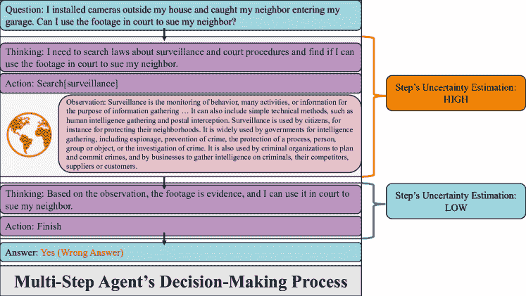
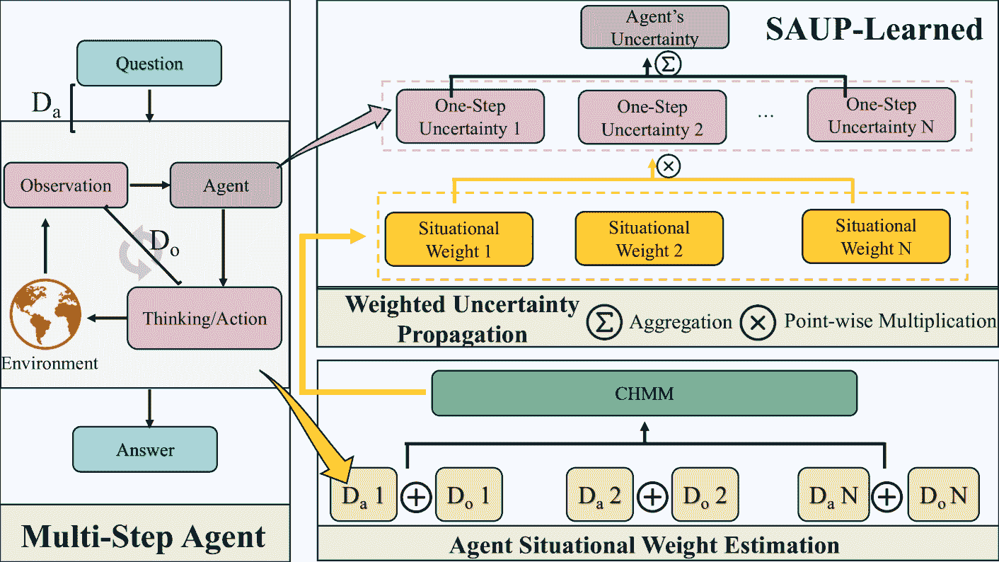
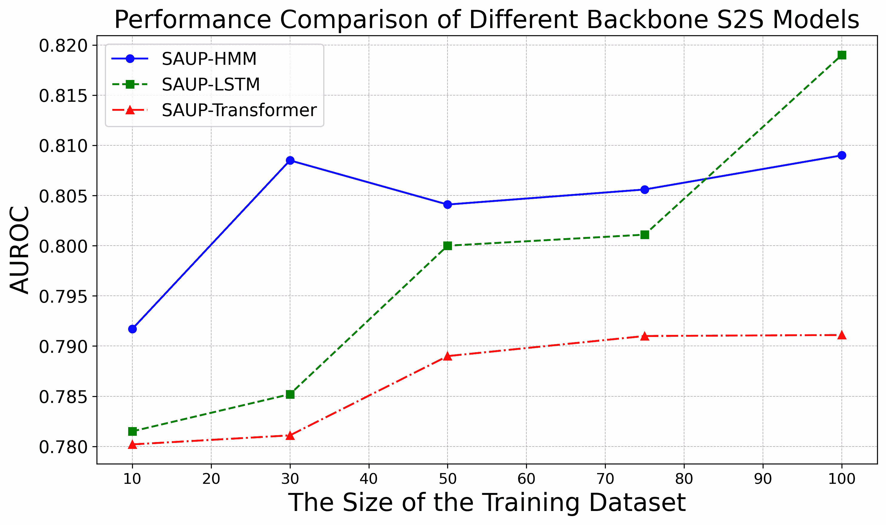
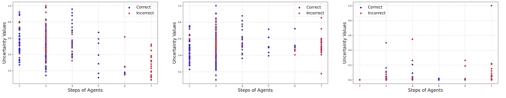

<!--yml

类别: 未分类

日期: 2025-01-11 11:52:53

-->

# SAUP: 情境意识不确定性传播在大语言模型（LLM）智能体中的应用

> 来源：[https://arxiv.org/html/2412.01033/](https://arxiv.org/html/2412.01033/)

赵启伟¹，赵旭江²，刘彦池²，程伟²，孙宜尤²，

尾石美香³，大崎孝雄³，松田胜志³，姚华修¹，陈海峰²

¹北卡罗来纳大学教堂山分校，²NEC实验室美国分部，³NEC公司

qiwei@cs.unc.edu, xuzhao@nec-labs.com

###### 摘要

集成到多步骤智能体系统中的大语言模型（LLMs）使得在各种应用中实现复杂的决策过程成为可能。然而，它们的输出往往缺乏可靠性，因此不确定性估计变得至关重要。现有的不确定性估计方法主要集中在最终步骤的输出上，这些方法未能考虑跨多步骤决策过程中的累积不确定性以及智能体与其环境之间的动态交互。为了解决这些局限性，我们提出了SAUP（情境意识不确定性传播）框架，它将不确定性通过LLM智能体推理过程中的每个步骤进行传播。SAUP通过在传播过程中为每个步骤的不确定性分配情境权重，融入了情境意识。我们的方法与各种单步不确定性估计技术兼容，提供了全面且准确的不确定性度量。大量基准数据集的实验表明，SAUP显著优于现有的最先进方法，在AUROC指标上提高了多达20%。

SAUP: 情境意识不确定性传播在大语言模型（LLM）智能体中的应用

赵启伟¹，赵旭江²，刘彦池²，程伟²，孙宜尤²，尾石美香³，大崎孝雄³，松田胜志³，姚华修¹，陈海峰² ¹北卡罗来纳大学教堂山分校，²NEC实验室美国分部，³NEC公司 qiwei@cs.unc.edu, xuzhao@nec-labs.com

## 1 引言

大型语言模型（LLMs）Minaee等人（[2024](https://arxiv.org/html/2412.01033v1#bib.bib23)）展示了出色的能力，当它们被集成到代理系统中时，Wang等人（[2024](https://arxiv.org/html/2412.01033v1#bib.bib31)）使得复杂的决策过程和更广泛的应用成为可能。然而，尽管基于LLM的代理越来越有效，但它们的输出并不总是可靠的，这可能导致重大问题，特别是在医疗保健或自主系统等高风险环境中。这使得不确定性估计变得至关重要，因为它评估了代理决策和输出的可靠性，Chang等人（[2024](https://arxiv.org/html/2412.01033v1#bib.bib5)）；Raiaan等人（[2024](https://arxiv.org/html/2412.01033v1#bib.bib26)）。理解和量化不确定性至关重要，因为它可以洞察潜在的系统故障，为敏感应用提供保障。当前，基于LLM的代理不确定性估计方法仍然有限。例如，UALA Han等人（[2024](https://arxiv.org/html/2412.01033v1#bib.bib15)）提出了一种单步不确定性度量方法，用于在代理提供答案之前估计最终步骤的不确定性。

一个关键挑战是，在多步骤过程中的不确定性是随着时间的推移逐步积累的，而不是在孤立的行动中产生的，并且在外部因素不可控的动态环境中，这种不确定性会进一步加剧。这些相互作用可能会显著影响系统的整体不确定性。因此，必须采用考虑各种信息源和交互复杂性的稳健方法，以准确捕捉代理在整个决策过程中的不确定性。如图[1](https://arxiv.org/html/2412.01033v1#S1.F1 "Figure 1 ‣ 1 Introduction ‣ SAUP: Situation Awareness Uncertainty Propagation on LLM Agent")所示，在敏感的情境下，仅观察最后一步的不确定性可能会导致对结果过度自信，从而产生不利后果，突显了考虑中间不确定性和代理与其环境之间交互质量的重要性。

图1：基于大型语言模型（LLM）的智能体的整体不确定性可能来源于两个主要因素：a）所有步骤中的不确定性：涵盖中间步骤和最终步骤；以及b）智能体的情境背景：包括其与环境的互动质量以及偏离最佳逻辑路径的情况。在这个例子中：一个用户安装了监控摄像头并捕捉到邻居未经允许进入她车库的画面。她询问基于LLM的智能体，这段录像能否在法庭上作为证据。智能体首先搜索有关监控法律的信息，找到与情报和犯罪预防相关的定义。然后，它基于这项研究得出结论，认为这段录像符合作为证据的条件。然而，智能体忽视了关键的法律因素，如隐私法和证据可采性的规则，导致得出了错误的结论。

为了估计LLM的不确定性，以前的方法主要集中在输出的最终步骤在标记、句子或语义层面的方差上。Gal和Ghahramani（[2016](https://arxiv.org/html/2412.01033v1#bib.bib12)）；Gal等人（[2017](https://arxiv.org/html/2412.01033v1#bib.bib13)），最初用于图像数据，后来扩展到语言模型中，以预测输出标记的不确定性，Xiao和Wang（[2021](https://arxiv.org/html/2412.01033v1#bib.bib36)）。尽管似然性也能指示不确定性，Malinin和Gales（[2020](https://arxiv.org/html/2412.01033v1#bib.bib22)）提出了归一化熵，考虑到输出长度。Kuhn等人（[2023](https://arxiv.org/html/2412.01033v1#bib.bib19)）提出了语义熵，结合了共享意义中的语言不变性。Kadavath等人（[2022](https://arxiv.org/html/2412.01033v1#bib.bib18)）；Yin等人（[2023](https://arxiv.org/html/2412.01033v1#bib.bib39)）探讨了LLM的自我评估方法来估计不确定性。然而，这些方法主要是为传统的单步问答设计的，不能直接应用于LLM智能体。它们面临两个关键问题：首先，它们仅考虑最终步骤的不确定性，忽视了整个过程中的不确定性积累；其次，它们忽视了LLM智能体的推理过程，而推理过程在多步骤决策和智能体与环境的互动中至关重要。

为了应对复杂环境中多步过程的不确定性挑战，我们提出了SAUP（情境意识不确定性传播）。SAUP通过在多步推理和决策过程中传播不确定性，全面估计基于LLM的智能体的不确定性。它基于类似ReACT Yao等人（[2022](https://arxiv.org/html/2412.01033v1#bib.bib38)）等框架，后者通过将任务分解为思考、行动和观察步骤，将LLM的推理整合到问题解决中。SAUP将不确定性从初始阶段传播到最终步骤，并通过情境加权方案进行聚合，其中每一步的不确定性根据智能体的情境、进展和观察质量进行加权。由于直接衡量智能体的情境具有挑战性，我们设计了有效的替代方法，这些方法可以适应各种场景。

本文的主要贡献可以总结如下：首先，我们提出了SAUP，这是一个简单但有效的管道，能够在复杂环境中的多步智能体中提供全面的情境感知不确定性估计。与现有的单步不确定性估计方法不同，SAUP在整个问题解决过程中考虑了智能体的情境背景，而不仅仅是专注于最终步骤。其次，为了估计智能体不可观察的情境，我们引入了替代方法，这些方法在估计情境不确定性方面表现出色，并为相关领域的潜在应用提供了可能性。最后，我们在HotpotQA Yang等人（[2018](https://arxiv.org/html/2412.01033v1#bib.bib37)）、StrategyQA Geva等人（[2021](https://arxiv.org/html/2412.01033v1#bib.bib14)）和MMLU Hendrycks等人（[2020](https://arxiv.org/html/2412.01033v1#bib.bib16)）等基准数据集上评估了SAUP。SAUP超越了现有的最先进方法，AUROC提高了多达20%，证明了其有效性。

## 2 相关工作

### 2.1 基于LLM的智能体

大型语言模型（LLMs）的推理能力促使研究人员探索将其作为智能体推理的核心。Nakano 等人（[2021](https://arxiv.org/html/2412.01033v1#bib.bib24)）早期尝试将 LLMs 用作具有网页搜索和信息检索能力的智能体，将 LLMs 从被动工具转变为能够与复杂环境互动的主动智能体。随后，Wang 等人（[2021](https://arxiv.org/html/2412.01033v1#bib.bib32)）；Chen 等人（[2021](https://arxiv.org/html/2412.01033v1#bib.bib6)）探讨了 LLMs 在软件开发中的代码生成应用。Yao 等人（[2022](https://arxiv.org/html/2412.01033v1#bib.bib38)）提出了 ReAct 流程，利用 LLMs 进行决策，其中智能体在做出决策前先检索外部信息。这个框架模拟了人类的决策过程，成为决策智能体的基础，并激发了 Shinn 等人（[2023](https://arxiv.org/html/2412.01033v1#bib.bib30)）和 Renze 与 Guven（[2024](https://arxiv.org/html/2412.01033v1#bib.bib28)）通过自我反思进行的改进。Li 等人（[2023](https://arxiv.org/html/2412.01033v1#bib.bib20)）提出了 CAMEL，扩展了该框架以支持智能体之间的通信，促进了协作。类似地，AutoGen（Wu 等人，[2023](https://arxiv.org/html/2412.01033v1#bib.bib33)）允许智能体进行对话并通过可定制的自然语言和代码交互进行协作。为了进一步增强决策能力，Qiao 等人（[2023](https://arxiv.org/html/2412.01033v1#bib.bib25)）结合了基于工具的监控来改进智能体的行为。

### 2.2 大型语言模型中的不确定性

LLM在多个领域占据主导地位，包括作为代理的Zhao等人（[2023](https://arxiv.org/html/2412.01033v1#bib.bib40)）；Xi等人（[2023](https://arxiv.org/html/2412.01033v1#bib.bib34)），但针对LLM代理的特定不确定性估计方法仍然没有被充分探索。现有技术主要集中在一步输出不确定性上，这些技术起源于传统的语言模型，例如通过提高模型校准来改进方法Xiao和Wang（[2019](https://arxiv.org/html/2412.01033v1#bib.bib35)，[2021](https://arxiv.org/html/2412.01033v1#bib.bib36)）；Jiang等人（[2021](https://arxiv.org/html/2412.01033v1#bib.bib17)）。在“白盒”LLM中的令牌级不确定性估计也有所进展，Malinin和Gales（[2020](https://arxiv.org/html/2412.01033v1#bib.bib22)）；Fomicheva等人（[2020](https://arxiv.org/html/2412.01033v1#bib.bib11)）；Darrin等人（[2022](https://arxiv.org/html/2412.01033v1#bib.bib8)）；Duan等人（[2024](https://arxiv.org/html/2412.01033v1#bib.bib9)）提出了一些方法，Kuhn等人（[2023](https://arxiv.org/html/2412.01033v1#bib.bib19)）将语义等价性引入了这些计算中。此外，“白盒”和“黑盒”LLM的自我不确定性估计也已经有了一些研究，Kadavath等人（[2022](https://arxiv.org/html/2412.01033v1#bib.bib18)）；Yin等人（[2023](https://arxiv.org/html/2412.01033v1#bib.bib39)）；Chen等人（[2024](https://arxiv.org/html/2412.01033v1#bib.bib7)）探索了这一领域。这些方法侧重于一步的不确定性估计，可以作为SAUP框架中的不确定性评估基础进行整合。

## 3 SAUP：情境意识不确定性传播

图2：我们提出的SAUP概述，分为三部分进行说明。左侧展示了基于LLM的多步骤代理与环境交互的一般流程。该过程通常涉及三个行为：思考、行动和观察。$D_{a}$表示问题与思考、行动和观察组合之间的距离，而$D_{o}$表示观察与思考/行动之间的距离。右下角展示了代理的情境权重估计。在这里，我们采用隐马尔可夫模型（HMM）基于距离$D_{a}$和$D_{o}$来估计情境权重。右上角展示了加权不确定性传播的过程，其中我们将一步不确定性与相应的情境权重进行汇总，以推导出代理的总体不确定性。

我们提出了我们的管道方案，SAUP，旨在通过全面考虑每个步骤的不确定性以及相应的情境权重，准确估计整体智能体的不确定性，如图[2](https://arxiv.org/html/2412.01033v1#S3.F2 "Figure 2 ‣ 3 SAUP: Situational Awareness Uncertainty Propagation ‣ SAUP: Situation Awareness Uncertainty Propagation on LLM Agent")所示。在接下来的章节中，我们将深入探讨细节，阐明我们如何聚合每个步骤的不确定性并估计相应的情境权重。

### 3.1 加权不确定性传播

不确定性传播。如图[2](https://arxiv.org/html/2412.01033v1#S3.F2 "Figure 2 ‣ 3 SAUP: Situational Awareness Uncertainty Propagation ‣ SAUP: Situation Awareness Uncertainty Propagation on LLM Agent")左侧所示，对于每一步 $i$，智能体基于前一状态 $Z_{i-1}$ 和问题 $Q$ 提供对应的思考/行动和不确定性 $U_{i}$。仅考虑最后一步的不确定性作为整体不确定性 $U_{agent}$ 是不合理的且不全面的。相反，我们应当全面考虑并传播所有步骤的不确定性。最简单的例子是，在智能体给出最终答案之前，使用各步骤不确定性的算术平均值。为了应对离群值，准确反映集中趋势，并保持比例变化的一致性，几何平均或均方根（RMS）可能比算术平均更为合适。

情境不确定性权重。根据信息流的直观逻辑和实验观察，我们发现不同步骤的不确定性对整体智能体不确定性的贡献并不均匀。因此，除了前面介绍的均匀聚合方案外，设计一个更全面的不确定性加权聚合方案，针对智能体的特点进行量身定制是至关重要的。

在获得最终答案的过程中，基于LLM的智能体会产生不确定性。我们将当前步骤的不确定性对整体不确定性的贡献，称为情境权重。情境权重由诸如偏离适当逻辑路径的程度以及智能体与环境之间交互的质量等因素决定，这些因素会影响最终答案的正确性。这些情境权重在智能体解决问题的过程中及其与环境的交互中是变化的。假设第 $i$ 步的不确定性为 $U_{i}$，相应的情境权重为 $W_{i}$，加权不确定性传播的公式为：

|  | $U_{\text{agent}}=\sqrt{\frac{1}{N}\sum_{i=1}^{N}\left((W_{i}U_{i})^{2}\right)}$ |  | (1) |
| --- | --- | --- | --- |

在这里，我们选择均方根（RMS）作为传播方法。在SAUP的实际应用中，除了上述线性项外，我们还利用了额外的逻辑项以确保数值稳定性。我们设计SAUP公式时基于以下考虑。首先，SAUP依赖于对智能体所有步骤的全面考虑，基于传播进行推导。其次，通过为不同步骤的不确定性引入情境权重，SAUP能够更全面地评估特定步骤对智能体整体不确定性的影响。在接下来的[3.2](https://arxiv.org/html/2412.01033v1#S3.SS2 "3.2 Step Uncertainty Estimation ‣ 3 SAUP: Situational Awareness Uncertainty Propagation ‣ SAUP: Situation Awareness Uncertainty Propagation on LLM Agent")和[3.3](https://arxiv.org/html/2412.01033v1#S3.SS3 "3.3 Agent Uncertainty Estimation ‣ 3 SAUP: Situational Awareness Uncertainty Propagation ‣ SAUP: Situation Awareness Uncertainty Propagation on LLM Agent")部分，我们将介绍如何计算不确定性$U_{i}$和与每个步骤对应的情境权重$W_{i}$的方法。

### 3.2 步骤不确定性估计

从公式[1](https://arxiv.org/html/2412.01033v1#S3.E1 "In 3.1 Weighted Uncertainty Propagation ‣ 3 SAUP: Situational Awareness Uncertainty Propagation ‣ SAUP: Situation Awareness Uncertainty Propagation on LLM Agent")中，我们可以看到，本质上，我们的SAUP与适用于各种场景的所有单步不确定性估计方法兼容，包括但不限于我们提到的这些。SAUP是建立在这些单步方法基础上的。

在实际实现中，我们利用归一化熵Malinin和Gales（[2020](https://arxiv.org/html/2412.01033v1#bib.bib22)）的方法，并对其进行了一些修改，以适应React Agent管道的特性。这个选择基于归一化熵具有广泛适用性的考虑。它不仅可以应用于开源LLM，如LLAMA，其中可以访问输出的完整logits，还可以用于仅通过API访问的LLM，如CHATGPT系列。此外，它在计算上高效，并且在单步不确定性估计中表现出强大的预测性能。

对于步骤$n$和问题$Q$，我们将智能体的思考表示为$T_{n}$，相应的行动表示为$A_{n}$。观察$O_{n}$是通过行动$A_{n}$从环境中获得的信息。令LLM表示为$L_{\theta}$，前$n-1$步的轨迹表示为$Z_{n-1}$，其中$Z_{n-1}=\{(A_{1},T_{1},O_{1}),\ldots,(A_{n-1},T_{n-1},O_{n-1})\}$。LLM将输出思考$T_{n}$和行动$A_{n}$，表示为：

|  | $(T_{n},A_{n})=L_{\theta}(Q,Z_{n-1})$ |  | (2) |
| --- | --- | --- | --- |

假设$T_{n}$由前$N$个标记组成，而$A_{n}$由接下来的$M$个标记组成。步骤$n$的**不确定性**$U_{n}$通过以下公式计算：

|  |  | $\displaystyle U_{n}=\frac{1}{N+M}\prod_{i\leq N+M}p(t_{i}\mid t_{0},\ldots,t_{i-1};\theta)$ |  | (3) |
| --- | --- | --- | --- | --- |
|  |  | $\displaystyle=\frac{1}{N+M}\sum_{i\leq N+M}log\ p(t_{i}\mid t_{0},\ldots,t_{i-1};\theta)$ |  |

其中，$p(t_{i}\mid t_{0},\ldots,t_{i-1};\theta)$表示给定前面的$\text{token 0},\dots,\text{token i-1}$和LLM参数$\theta$时，token i的概率。

### 3.3 智能体不确定性估计

在多步骤推理过程中，为每个步骤的不确定性$U_{i}$分配权重$W_{i}$对准确的总体不确定性估计至关重要。在基于大语言模型（LLM）的智能体中，有效的推理显著影响决策过程。然而，这些智能体可能会表现出过度自信，因此必须正确评估它们的情境状态。由于情境状态无法直接观察，因此需要使用替代度量来近似它。一个思路是对靠近最终答案的步骤赋予更大的权重，或者通过衡量与理想轨迹的偏差来评估。不论这些方法有何优点，它们都未能完全捕捉智能体的真实情境状态。

为了应对这一局限性，我们提出了基于学习的替代方法，旨在捕捉智能体的隐藏情境。在这些方法中，隐马尔可夫模型（HMM）距离替代方法（SAUP-HMMD）通过学习步骤转移并根据隐藏状态估计分配权重而脱颖而出。隐马尔可夫模型以其较低的数据需求和计算效率而著称，使得HMM成为数据集较小情况下的首选替代方法。相比之下，像长短期记忆网络（LSTM）和变压器（Transformers）等更复杂的序列到序列（S2S）模型能够捕捉复杂的时间依赖关系，但需要显著更多的训练数据和时间。虽然任何S2S模型理论上都可以用于此任务，但选择通常取决于训练数据集的大小，数据集较小时HMM是默认选择。关于这些学习型替代方法的更详细分析与比较，请参见第[4.3](https://arxiv.org/html/2412.01033v1#S4.SS3 "4.3 深入剖析 SAUP ‣ 4 实验 ‣ SAUP: LLM智能体中的情境感知不确定性传播")节。

隐马尔可夫模型（HMM，Baum 和 Petrie ([1966](https://arxiv.org/html/2412.01033v1#bib.bib2))) 根据可观察到的状态估计隐藏状态，假设隐藏状态之间存在常规的转移。HMM 由隐藏状态的数量 $N$ 和可观察状态的数量 $M$ 定义，隐藏状态 $S_{hmm}=\{S_{hmm_{1}},\ldots,S_{hmm_{N}}\}$ 和可观察状态 $O_{hmm}=\{O_{hmm_{1}},\ldots,O_{hmm_{M}}\}$。状态转移概率矩阵 $A=[a_{ij}]$ 表示 $P(S_{hmm_{j}}\mid S_{hmm_{i}})$，而观察概率矩阵 $B=[b_{jk}]$ 表示 $P(O_{hmm_{k}}\mid S_{hmm_{j}})$。初始状态分布 $\pi=[\pi_{i}]$ 定义了开始于状态 $S_{hmm_{i}}$ 的概率。在连续隐马尔可夫模型（CHMM）中，观测值由连续的概率密度函数建模，通常是高斯混合模型（GMM）。我们采用 CHMM 作为 HMMD 的基础模型。CHMM 定义了三个离散的隐藏状态：正确轨迹、中度偏离轨迹和高度偏离轨迹。可观察状态是连续特征，通过两特征的普通距离 $(D_{a},D_{o})$ 表示。计算 A 和 B 之间的普通距离的方法，记作 $dis(A,B)$，采用了一个经过预训练的 RoBERTa Liu ([2019](https://arxiv.org/html/2412.01033v1#bib.bib21)) 模型，并使用 SQuAD v2 Rajpurkar 等人 ([2018](https://arxiv.org/html/2412.01033v1#bib.bib27)) 数据集进行微调。通过该模型获得的分数的倒数作为普通距离。通过训练示例，我们计算 $(D_{a},D_{o})$ 并标注隐藏状态。然后，使用 Baum-Welch 算法 Baum 等人 ([1970](https://arxiv.org/html/2412.01033v1#bib.bib3)) 训练 CHMM，将两特征的普通距离转化为更精确的代理，从而提升智能体的情境意识。

SAUP 算法采用不同的代理配置。我们通过在算法 [1](https://arxiv.org/html/2412.01033v1#alg1 "Algorithm 1 ‣ 3.3 Agent Uncertainty Estimation ‣ 3 SAUP: Situational Awareness Uncertainty Propagation ‣ SAUP: Situation Awareness Uncertainty Propagation on LLM Agent") 中使用距离作为代理来说明 SAUP。最初，为第 $n$ 步计算不确定性 $U_{n}$，以及相应的距离 $D_{a_{n}}$ 和 $D_{o_{n}}$。这个过程会重复 $N$ 步。随后，根据代理选择（无论是普通的还是基于 HMM 的），确定情境权重 $W_{n}$。最后，聚合不确定性 $U$ 和权重 $W$ 来估算智能体的整体不确定性 $U_{agent}$。

算法 1 情境意识不确定性传播（SAUP）

初始化$N$步LLM代理$L_{\theta}$，问题为$Q$，以及$Z_{n}=\{(A_{1},T_{1},O_{1}),(A_{2},T_{2},O_{2}),\ldots,(A_{n},T_{n},O_{n})\}$，列表$D_{L}$用于存储距离，训练的CHMM模型$H$，从[3.3](https://arxiv.org/html/2412.01033v1#S3.SS3 "3.3 代理不确定性估计 ‣ 3 SAUP：情境意识不确定性传播 ‣ SAUP：LLM代理的情境意识不确定性传播")部分获得的距离计算方法$Dis()$，单步不确定性方法$F_{U}$，以及情境意识不确定性传播函数SAUP()，定义为方程[1](https://arxiv.org/html/2412.01033v1#S3.E1 "在3.1加权不确定性传播 ‣ 3 SAUP：情境意识不确定性传播 ‣ SAUP：LLM代理的情境意识不确定性传播")。对于问题解决过程中的每一步$n$，执行以下操作：   当前步骤的不确定性$U_{n}\leftarrow F_{U}(L_{\theta},Z_{n})$，   距离$D_{a_{n}}\leftarrow Dis(Z_{n},Q)$，   距离$D_{o_{n}}\leftarrow Dis(A_{n},O_{n})$，   如果使用HMM-距离作为替代方法，则：   将$(D_{a_{n}}+D_{o_{n}})$添加到$D_{L}$中；   否则，使用Plain-距离作为替代方法，$W_{n}\leftarrow D_{a_{n}}+D_{o_{n}}$；   结束条件；结束循环；如果使用HMM-距离作为替代方法，则：$(W_{1},W_{2},\ldots,W_{N})\leftarrow H(D_{L})=H((D_{a_{1}}+D_{o_{1}}),\ldots,(D_{a_{N}}+D_{o_{N}}))$；结束条件；代理的不确定性$U_{agent}\leftarrow SAUP((U_{1},W_{1}),(U_{2},W_{2}),\ldots,(U_{N},W_{N}))$；返回情境意识代理不确定性$\mathbf{U_{agent}}$。

## 4 实验

本节中，我们评估SAUP的性能，旨在回答以下问题：Q1：SAUP是否优于先前的最先进不确定性估计方法？Q2：在不确定性传播的全面过程中，SAUP是否提供比单步方法更准确的不确定性估计？Q3：特定步骤的情境权重是否有效地提高了整体不确定性估计？由于获得精确的情境权重是不切实际的，我们设计了替代方法，包括基于距离和基于位置的方法。这些替代方法是否可靠，可以准确评估代理的当前情况？

### 4.1 实验设置

基于LLM的代理框架。我们的实验重点评估SAUP在提高多步LLM代理的不确定性估计方面的能力。虽然各种多步代理遵循不同的流程设计，但它们通常遵循思考-行动-观察的工作流。我们选择了React Yao等人（[2022](https://arxiv.org/html/2412.01033v1#bib.bib38)）框架，这是一个广泛使用的代理模型，因为它与这一工作流高度一致。

主干LLM。我们为React代理选择了两类LLM：开源的LLAMA3 Dubey等（[2024](https://arxiv.org/html/2412.01033v1#bib.bib10)）系列（8B和70B模型），并提供熵访问权限，以及GPT-4o Achiam等（[2023](https://arxiv.org/html/2412.01033v1#bib.bib1)）（通过API可用），其限制了内部信息。此选择确保了广泛覆盖现实世界场景。

数据集和任务。我们评估了三个具有挑战性的基于代理的QA任务。第一个是HotpotQA Yang等（[2018](https://arxiv.org/html/2412.01033v1#bib.bib37)），专注于具有多跳推理的多样化自由形式答案的QA。我们随机抽取了来自开发集的2,000个问题，评估者为人工评估员和ChatGPT。第二个是MMLU Hendrycks等（[2020](https://arxiv.org/html/2412.01033v1#bib.bib16)），涉及多个领域（如法律和数学）的多项选择题。每个子任务从测试集随机抽取了10个问题。最后，StrategyQA Geva等（[2021](https://arxiv.org/html/2412.01033v1#bib.bib14)）需要隐式推理，通过开发集中的真/假问题（229个问题）进行评估。

外部信息环境。基于LLM的代理通常需要外部来源来解决这些任务。对于HotpotQA和StrategyQA，我们提供了Wikipedia API的访问权限，用于检索相关的基于实体的信息。对于MMLU，我们使用了SerpAPI SerpAPI（[2024](https://arxiv.org/html/2412.01033v1#bib.bib29)）来获取结构化的Google搜索结果。

基线。我们将SAUP与几种不确定性估计方法进行了评估。对于基于熵的方法，我们使用了预测熵和语义熵 Xiao 和 Wang（[2019](https://arxiv.org/html/2412.01033v1#bib.bib35)）；Kuhn等（[2023](https://arxiv.org/html/2412.01033v1#bib.bib19)）。基于似然的方法 Malinin 和 Gales（[2020](https://arxiv.org/html/2412.01033v1#bib.bib22)）包括普通似然和归一化熵，后者考虑了token长度。我们还实现了P(True) Kadavath等（[2022](https://arxiv.org/html/2412.01033v1#bib.bib18)）；Yin等（[2023](https://arxiv.org/html/2412.01033v1#bib.bib39)），它们提示代理自我评估其信心。

评估指标。我们使用了AUROC Bradley（[1997](https://arxiv.org/html/2412.01033v1#bib.bib4)）来衡量不确定性方法区分正确与错误回答的能力。较高的AUROC值表示更好的区分能力，1分表示完全区分，0.5分表示随机猜测。

### 4.2 SAUP的卓越区分性能

表 1: SAUP的结果。最佳结果和第二最佳结果分别以粗体和下划线显示。

|  | HotpotQA | MMLU | StrategyQA |
| --- | --- | --- | --- |
| 方法 | LLAMA3 8B | LLAMA3 70B | GPT4O | LLAMA3 8B | LLAMA3 70B | GPT4-O | LLAMA3 8B | LLAMA3 70B | GPT4-O |
| --- | --- | --- | --- | --- | --- | --- | --- | --- | --- |
|  | 预测熵 | 0.631 | 0.617 | 不适用 | 0.531 | 0.585 | 不适用 | 0.542 | 0.589 | 不适用 |
|  | 似然性 | 0.653 | 0.622 | 0.764 | 0.550 | 0.592 | 0.610 | 0.525 | 0.591 | 0.641 |
|  | 归一化熵 | 0.664 | 0.635 | 0.772 | 0.555 | 0.579 | 0.607 | 0.554 | 0.557 | 0.710 |
|  | P(True) | 0.601 | 0.618 | 0.749 | 0.528 | 0.560 | 0.588 | 0.533 | 0.577 | 0.689 |
|  | 语义熵 | 0.702 | 0.669 | 不适用 | 0.548 | 0.605 | 不适用 | 0.599 | 0.610 | 不适用 |
|  | SAUP-学习型 | 0.771 | 0.755 | 0.778 | 0.669 | 0.638 | 0.626 | 0.787 | 0.783 | 0.809 |

表 2: 使用不同代理的SAUP结果。最佳结果和第二最佳结果分别用粗体和下划线表示。

|  | HotpotQA | MMLU | StrategyQA |
| --- | --- | --- | --- |
| 方法 | LLAMA3 8B | LLAMA3 70B | GPT4O | LLAMA3 8B | LLAMA3 70B | GPT4-O | LLAMA3 8B | LLAMA3 70B | GPT4-O |
| --- | --- | --- | --- | --- | --- | --- | --- | --- | --- |
|  | SAUP-P | 0.723 | 0.739 | 0.797 | 0.634 | 0.636 | 0.614 | 0.668 | 0.641 | 0.734 |
|  | SAUP-D | 0.762 | 0.726 | 0.773 | 0.660 | 0.619 | 0.624 | 0.755 | 0.809 | 0.806 |
|  | SAUP-PD | 0.759 | 0.745 | 0.782 | 0.651 | 0.625 | 0.619 | 0.732 | 0.756 | 0.785 |
|  | SAUP-HMMD(学习型) | 0.771 | 0.755 | 0.778 | 0.669 | 0.638 | 0.626 | 0.787 | 0.783 | 0.809 |

在本节中，我们比较了各种不确定性度量方法在区分基于LLM的代理对QA问题的最终回答是否正确方面的表现。评估过程包括以下几个步骤：(1) 基于LLM的代理使用ReACT框架回答QA问题；(2) 我们提出的多个版本的SAUP方法以及其他基准不确定性估计方法计算每个代理回答的不确定性得分；(3) 每个回答的正确性进行评估，若回答正确则赋值为0，若回答错误则赋值为1；(4) 我们根据这些分类的准确性及其对应的不确定性得分计算AUROC。理想情况下，错误的回答应与较高的不确定性得分相关联。

我们采用了几种最先进的LLM，包括{LLAMA3 8B, LLAMA3 70B, GPT4O}，并在具有挑战性的数据集上进行了评估，这些数据集包括{StrategyQA, MMLU, HotpotQA}。表[1](https://arxiv.org/html/2412.01033v1#S4.T1 "表 1 ‣ 4.2 SAUP在优越区分性能上的表现 ‣ 4 实验 ‣ SAUP：基于LLM代理的情境意识不确定性传播")展示了结果，表明我们提出的SAUP方法在所有数据集上相比最先进的方法，始终获得了更高的AUROC分数。这些发现表明，SAUP在基于不确定性估计区分正确与错误的代理回答方面表现优越，从而得出重要结论。

表 3: 简单不确定性传播的结果。最佳结果和第二最佳结果分别用粗体和下划线表示。

|  | HotpotQA | MMLU | StrategyQA |
| --- | --- | --- | --- | --- | --- | --- | --- | --- | --- |
| 方法 | LLAMA3 8B | LLAMA3 70B | GPT4O | LLAMA3 8B | LLAMA3 70B | GPT4-O | LLAMA3 8B | LLAMA3 70B | GPT4-O |
| --- | --- | --- | --- | --- | --- | --- | --- | --- | --- |
|  | 算术均值 | 0.695 | 0.676 | 0.781 | 0.621 | 0.596 | 0.609 | 0.576 | 0.611 | 0.711 |
|  | 几何均值 | 0.713 | 0.714 | 0.785 | 0.614 | 0.591 | 0.610 | 0.601 | 0.627 | 0.714 |
|  | 均方根 | 0.717 | 0.728 | 0.782 | 0.624 | 0.615 | 0.612 | 0.584 | 0.629 | 0.723 |

|  | SAUP-学习型 | 0.771 | 0.755 | 0.778 | 0.669 | 0.638 | 0.626 | 0.787 | 0.783 | 0.809 | 

图3：基于学习的替代模型与各种S2S骨干模型的性能比较

### 4.3 SAUP的深入剖析

鉴于我们提出的SAUP的优越性，我们通过回答以下问题进一步剖析其性能。此分析突出了SAUP在各个方面的优势，并为其在不同条件下的适用性和性能提供了洞见。

问题 1：内部步骤的不确定性度量是否对代理的整体不确定性度量有益？

是的，测量每个内部步骤的不确定性显著有助于更准确的整体不确定性估计。通过考虑中间的不确定性，我们捕捉到整个交互过程中不确定性传播的累积效应。如表[1](https://arxiv.org/html/2412.01033v1#S4.T1 "Table 1 ‣ 4.2 Superior Discriminative Performance of SAUP ‣ 4 Experiments ‣ SAUP: Situation Awareness Uncertainty Propagation on LLM Agent")所示，基于SAUP的方法在AUROC得分上始终优于传统的单步骤方法，无论是在数据集还是模型上。内部步骤的不确定性提供了有意义的信息，通过汇总这些信息，能够增强整体不确定性度量。即使是基本的不确定性传播方法，例如算法平均或均方根（RMS），用于汇总所有步骤的不确定性，已在表[3](https://arxiv.org/html/2412.01033v1#S4.T3 "Table 3 ‣ 4.2 Superior Discriminative Performance of SAUP ‣ 4 Experiments ‣ SAUP: Situation Awareness Uncertainty Propagation on LLM Agent")中展示了相对于单步骤基准的显著改进。

问题 2：这些替代模型的质量如何，它们如何有利于整体不确定性度量？

高质量的替代模型确保情境权重能够准确反映每个步骤对整体不确定性的影响。我们提出了位置替代模型（SAUP-P），它对接近最终答案的步骤赋予更大的权重，以及普通距离替代模型（SAUP-D），它仅使用普通距离。混合替代模型（SAUP-PD）结合了这两种方法，并加入了平衡因子以实现更好的平衡。

如表[2](https://arxiv.org/html/2412.01033v1#S4.T2 "表2 ‣ 4.2 SAUP的优越判别性能 ‣ 4 实验 ‣ SAUP: 大型语言模型代理的情境感知不确定性传播")和表[3](https://arxiv.org/html/2412.01033v1#S4.T3 "表3 ‣ 4.2 SAUP的优越判别性能 ‣ 4 实验 ‣ SAUP: 大型语言模型代理的情境感知不确定性传播")所示，不同的替代模型相比于简单的不确定性传播基线，能够提高AUROC分数，后者为所有步骤分配相等的权重。此外，基于HMMD（学习型）替代模型的表现明显优于其他模型，验证了其在捕捉代理情境上下文中的有效性。

图4：SAUP在StrategyQA数据集上的可视化分析。此图的详细解释见[4.3](https://arxiv.org/html/2412.01033v1#S4.SS3 "4.3 SAUP的深入剖析 ‣ 4 实验 ‣ SAUP: 大型语言模型代理的情境感知不确定性传播")节的Q3部分。

Q3：SAUP能否展示其在区分正确和错误结果方面的优势？

是的，SAUP提供了更具判别力的不确定性分数，从而在各个数据集和模型中获得了更高的AUROC值，正如表[1](https://arxiv.org/html/2412.01033v1#S4.T1 "表1 ‣ 4.2 SAUP的优越判别性能 ‣ 4 实验 ‣ SAUP: 大型语言模型代理的情境感知不确定性传播")所证明的那样。逐步传播的不确定性使SAUP能够捕捉整个推理过程中的不确定性累积，从而更好地区分正确和错误结果。

此外，我们对StrategyQA数据集进行了可视化分析（图[4](https://arxiv.org/html/2412.01033v1#S4.F4 "图4 ‣ 4.3 SAUP的深入剖析 ‣ 4 实验 ‣ SAUP: 大型语言模型代理的情境感知不确定性传播")）。X轴表示采取的步骤，Y轴显示归一化的不确定性值。红色点表示错误答案，蓝色点表示正确答案。SAUP（右侧子图）展示了正确与错误答案之间最清晰的区分，优于一步法（左侧）和简单的不确定性传播方法（中间），突出其在不确定性估计中的优势。

Q4：HMM模型是否合理？其性能在不同数据集大小下有何变化？为什么不使用基于梯度的模型，如RNN或Transformer？

基于学习的替代模型依赖于手动标注的数据。在训练过程中，我们将数据组$D_{a_{n}}$和$D_{o_{n}}$映射到代理的情境上下文，使SAUP能够推断未见场景中的状态。我们在主要实验中使用了隐马尔可夫模型（HMM），同时也探索了LSTM和Transformer模型，分析了它们的理论和实验优势。

理论视角：隐马尔可夫模型（HMM）高效且可解释，适用于数据有限的情况，但在建模长程依赖关系方面较弱。长短期记忆网络（LSTM）能够更好地捕捉时间依赖性，但需要更多的数据和计算资源。变换器（Transformer）能够有效处理局部和全局依赖关系，但计算开销大且数据密集。

实验比较：在 StrategyQA 数据集上，我们评估了基于 HMM、LSTM 和迷你型 Transformer 的代理模型，在不同训练数据集规模下的表现。图 [3](https://arxiv.org/html/2412.01033v1#S4.F3 "Figure 3 ‣ 4.2 Superior Discriminative Performance of SAUP ‣ 4 Experiments ‣ SAUP: Situation Awareness Uncertainty Propagation on LLM Agent") 显示，HMM 在较小数据集上表现良好，而 LSTM 和 Transformer 随着数据量的增加而改善。然而，基于 Transformer 的代理模型需要不切实际的大型数据集来进行不确定性测量任务，因此不太适用。

由于其简单性和高效性，HMM 在基于 LLM 的智能体中用于不确定性传播时是实用的，特别是在数据有限的情况下。当数据和计算资源充足时，LSTM 是可行的替代方案，而变换器通常不适用于大多数场景。

Q5: 问题难度是否会影响不确定性传播的效果？

是的，复杂问题会导致更长时间、更细致的决策过程，从而增加不确定性的积累。在这种情况下，SAUP 的情境意识框架表现出色，能够在每个步骤有效传播不确定性。如表格 [1](https://arxiv.org/html/2412.01033v1#S4.T1 "Table 1 ‣ 4.2 Superior Discriminative Performance of SAUP ‣ 4 Experiments ‣ SAUP: Situation Awareness Uncertainty Propagation on LLM Agent") 所示，SAUP 的优势在更具挑战性的数据集（如 StrategyQA）中尤为明显，AUROC 提升较大。

## 5 结论

在本文中，我们提出了情境意识不确定性传播（SAUP），这是一种新颖的框架，用于准确估计基于大型语言模型（LLM）的多步骤智能体中的不确定性。与传统方法仅关注单步不确定性不同，SAUP 在智能体推理过程的所有步骤中传播不确定性，并结合了情境意识。在具有挑战性的数据集上的实验结果表明，SAUP 优于现有的最先进的不确定性估计方法，在 AUROC 分数上提高了多达 20%，从而证明了其在复杂决策场景中提高可靠性的有效性。本研究强调了多步骤不确定性估计和情境意识在基于 LLM 的智能体中的价值，为其可信赖的部署提供了坚实的基础。

## 6 局限性

尽管 SAUP 在改善多步基于 LLM 的代理的不确定性估计方面效果显著，但仍存在一些局限性。首先，SAUP 的基于学习的替代版本依赖于人工标注的数据集来确定情境权重，这既费时又昂贵，并且可能在非常复杂的场景下泛化能力较差——尤其是当人工标签仍然容易出错时。此外，环境的多样性可能加剧确保准确情境标注的难度。其次，SAUP 框架假设每一步的不确定性可以准确捕捉。虽然这超出了我们研究的范围，但单步不确定性估计中的错误可能会影响不确定性的传播，从而削弱 SAUP 框架的效益。未来的工作应聚焦于开发更加稳健的情境权重估计方法，减少对人工标注数据集的依赖——可能利用 LLM 生成的标签——以增强 SAUP 在多种应用场景中的适用性和可靠性。

## 参考文献

+   Achiam 等人（2023）Josh Achiam、Steven Adler、Sandhini Agarwal、Lama Ahmad、Ilge Akkaya、Florencia Leoni Aleman、Diogo Almeida、Janko Altenschmidt、Sam Altman、Shyamal Anadkat 等人 2023年。Gpt-4 技术报告。*arXiv 预印本 arXiv:2303.08774*。

+   Baum 和 Petrie（1966）Leonard E Baum 和 Ted Petrie。1966年。有限状态马尔可夫链的概率函数的统计推断。*数学统计年鉴*，37(6)：1554–1563。

+   Baum 等人（1970）Leonard E Baum、Ted Petrie、George Soules 和 Norman Weiss。1970年。马克夫链概率函数的统计分析中出现的最大化技术。*数学统计年鉴*，41(1)：164–171。

+   Bradley（1997）Andrew P Bradley。1997年。利用 ROC 曲线下的面积评估机器学习算法。*模式识别*，30(7)：1145–1159。

+   Chang 等人（2024）Yupeng Chang、Xu Wang、Jindong Wang、Yuan Wu、Linyi Yang、Kaijie Zhu、Hao Chen、Xiaoyuan Yi、Cunxiang Wang、Yidong Wang 等人 2024年。关于大语言模型评估的调查。*ACM 智能系统与技术学报*，15(3)：1–45。

+   Chen 等人（2021）Mark Chen、Jerry Tworek、Heewoo Jun、Qiming Yuan、Henrique Ponde De Oliveira Pinto、Jared Kaplan、Harri Edwards、Yuri Burda、Nicholas Joseph、Greg Brockman 等人 2021年。评估在代码上训练的大型语言模型。*arXiv 预印本 arXiv:2107.03374*。

+   Chen 等人（2024）Pei Chen、Soumajyoti Sarkar、Leonard Lausen、Balasubramaniam Srinivasan、Sheng Zha、Ruihong Huang 和 George Karypis。2024年。Hytrel：增强超图的表格数据表示学习。*神经信息处理系统进展*，36。

+   Darrin 等人（2022）Maxime Darrin、Pablo Piantanida 和 Pierre Colombo。2022年。Rainproof：一种保护文本生成器免受分布外数据影响的伞。*arXiv 预印本 arXiv:2212.09171*。

+   Duan 等人 (2024) Jinhao Duan, Hao Cheng, Shiqi Wang, Alex Zavalny, Chenan Wang, Renjing Xu, Bhavya Kailkhura, 和 Kaidi Xu. 2024. 将注意力转向相关性：朝着自由格式大型语言模型预测不确定性的量化。发表于 *第62届计算语言学会年会会议录（第一卷：长篇论文）*，页面 5050–5063。

+   Dubey 等人 (2024) Abhimanyu Dubey, Abhinav Jauhri, Abhinav Pandey, Abhishek Kadian, Ahmad Al-Dahle, Aiesha Letman, Akhil Mathur, Alan Schelten, Amy Yang, Angela Fan 等人. 2024. Llama 3 模型群。*arXiv 预印本 arXiv:2407.21783*。

+   Fomicheva 等人 (2020) Marina Fomicheva, Shuo Sun, Lisa Yankovskaya, Frédéric Blain, Francisco Guzmán, Mark Fishel, Nikolaos Aletras, Vishrav Chaudhary, 和 Lucia Specia. 2020. 无监督神经机器翻译质量估计。*计算语言学会会刊*，8:539–555。

+   Gal 和 Ghahramani (2016) Yarin Gal 和 Zoubin Ghahramani. 2016. Dropout 作为贝叶斯近似：在深度学习中表示模型不确定性。发表于 *国际机器学习会议*，页面 1050–1059。PMLR。

+   Gal 等人 (2017) Yarin Gal, Riashat Islam, 和 Zoubin Ghahramani. 2017. 基于图像数据的深度贝叶斯主动学习。发表于 *国际机器学习会议*，页面 1183–1192。PMLR。

+   Geva 等人 (2021) Mor Geva, Daniel Khashabi, Elad Segal, Tushar Khot, Dan Roth, 和 Jonathan Berant. 2021. 亚里士多德使用过笔记本电脑吗？一个具有隐式推理策略的问答基准测试。*计算语言学会会刊*，9:346–361。

+   Han 等人 (2024) Jiuzhou Han, Wray Buntine, 和 Ehsan Shareghi. 2024. 面向不确定性感知语言代理。*arXiv 预印本 arXiv:2401.14016*。

+   Hendrycks 等人 (2020) Dan Hendrycks, Collin Burns, Steven Basart, Andy Zou, Mantas Mazeika, Dawn Song, 和 Jacob Steinhardt. 2020. 测量大规模多任务语言理解。*arXiv 预印本 arXiv:2009.03300*。

+   Jiang 等人 (2021) Zhengbao Jiang, Jun Araki, Haibo Ding, 和 Graham Neubig. 2021. 我们如何知道语言模型何时知道？关于语言模型在问答中的标定。*计算语言学会会刊*，9:962–977。

+   Kadavath 等人 (2022) Saurav Kadavath, Tom Conerly, Amanda Askell, Tom Henighan, Dawn Drain, Ethan Perez, Nicholas Schiefer, Zac Hatfield-Dodds, Nova DasSarma, Eli Tran-Johnson 等人. 2022. 语言模型（大多）知道自己知道什么。*arXiv 预印本 arXiv:2207.05221*。

+   Kuhn 等人 (2023) Lorenz Kuhn, Yarin Gal, 和 Sebastian Farquhar. 2023. 语义不确定性：自然语言生成中不确定性估计的语言不变性。*arXiv 预印本 arXiv:2302.09664*。

+   李等人（2023）Guohao Li, Hasan Hammoud, Hani Itani, Dmitrii Khizbullin, 和 Bernard Ghanem。2023年。Camel：用于“大脑”探索的大语言模型社会的交互式代理。*神经信息处理系统进展*，36:51991–52008。

+   刘（2019）Yinhan Liu。2019年。Roberta: 一种稳健优化的BERT预训练方法。*arXiv 预印本 arXiv:1907.11692*。

+   Malinin和Gales（2020）Andrey Malinin 和 Mark Gales。2020年。在自回归结构化预测中的不确定性估计。*arXiv 预印本 arXiv:2002.07650*。

+   Minaee等人（2024）Shervin Minaee, Tomas Mikolov, Narjes Nikzad, Meysam Chenaghlu, Richard Socher, Xavier Amatriain, 和 Jianfeng Gao。2024年。大语言模型：一项调研。*arXiv 预印本 arXiv:2402.06196*。

+   中野等人（2021）Reiichiro Nakano, Jacob Hilton, Suchir Balaji, Jeff Wu, Long Ouyang, Christina Kim, Christopher Hesse, Shantanu Jain, Vineet Kosaraju, William Saunders，等人。2021年。WebGPT：具有人工反馈的浏览器辅助问答。*arXiv 预印本 arXiv:2112.09332*。

+   乔等人（2023）Shuofei Qiao, Honghao Gui, Chengfei Lv, Qianghuai Jia, Huajun Chen, 和 Ningyu Zhang。2023年。通过执行反馈使语言模型成为更好的工具学习者。*arXiv 预印本 arXiv:2305.13068*。

+   Raiaan等人（2024）Mohaimenul Azam Khan Raiaan, Md Saddam Hossain Mukta, Kaniz Fatema, Nur Mohammad Fahad, Sadman Sakib, Most Marufatul Jannat Mim, Jubaer Ahmad, Mohammed Eunus Ali, 和 Sami Azam。2024年。关于大语言模型的综述：架构、应用、分类、开放问题和挑战。*IEEE Access*。

+   Rajpurkar等人（2018）Pranav Rajpurkar, Robin Jia 和 Percy Liang。2018年。了解你不知道的：SQuAD中的无法回答问题。*arXiv 预印本 arXiv:1806.03822*。

+   Renze和Guven（2024）Matthew Renze 和 Erhan Guven。2024年。在LLM代理中进行自我反思：对问题解决性能的影响。*arXiv 预印本 arXiv:2405.06682*。

+   SerpAPI（2024）SerpAPI。2024年。Google搜索结果的实时搜索API。[https://serpapi.com](https://serpapi.com)。

+   Shinn等人（2023）Noah Shinn, Beck Labash 和 Ashwin Gopinath。2023年。Reflexion：一个具有动态记忆和自我反思的自主代理。*arXiv 预印本 arXiv:2303.11366*，2(5):9。

+   王等人（2024）Lei Wang, Chen Ma, Xueyang Feng, Zeyu Zhang, Hao Yang, Jingsen Zhang, Zhiyuan Chen, Jiakai Tang, Xu Chen, Yankai Lin, 等人。2024年。一项关于基于大语言模型的自主代理的调研。*计算机科学前沿*，18(6):186345。

+   王等人（2021）Yue Wang, Weishi Wang, Shafiq Joty 和 Steven CH Hoi。2021年。Codet5: 面向代码理解与生成的标识符感知统一预训练编码器-解码器模型。*arXiv 预印本 arXiv:2109.00859*。

+   Wu 等人 (2023) Qingyun Wu, Gagan Bansal, Jieyu Zhang, Yiran Wu, Beibin Li, Erkang Zhu, Li Jiang, Xiaoyun Zhang, Shaokun Zhang, Jiale Liu, Ahmed Hassan Awadallah, Ryen W White, Doug Burger 和 Chi Wang. 2023. [Autogen: 通过多代理对话推动下一代大型语言模型应用](https://arxiv.org/abs/2308.08155)。*预印本*，arXiv:2308.08155。

+   Xi 等人 (2023) Zhiheng Xi, Wenxiang Chen, Xin Guo, Wei He, Yiwen Ding, Boyang Hong, Ming Zhang, Junzhe Wang, Senjie Jin, Enyu Zhou 等人. 2023. 基于大型语言模型的代理崛起与潜力：一项综述。*arXiv 预印本 arXiv:2309.07864*。

+   Xiao 和 Wang (2019) Yijun Xiao 和 William Yang Wang. 2019. 在自然语言处理任务中量化不确定性。发表于 *AAAI 人工智能会议论文集*，第33卷，第7322–7329页。

+   Xiao 和 Wang (2021) Yijun Xiao 和 William Yang Wang. 2021. 条件语言生成中的幻觉与预测不确定性。*arXiv 预印本 arXiv:2103.15025*。

+   Yang 等人 (2018) Zhilin Yang, Peng Qi, Saizheng Zhang, Yoshua Bengio, William W Cohen, Ruslan Salakhutdinov 和 Christopher D Manning. 2018. Hotpotqa：一个多样化、可解释的多跳问答数据集。*arXiv 预印本 arXiv:1809.09600*。

+   Yao 等人 (2022) Shunyu Yao, Jeffrey Zhao, Dian Yu, Nan Du, Izhak Shafran, Karthik Narasimhan 和 Yuan Cao. 2022. React：在语言模型中协同推理与行动。*arXiv 预印本 arXiv:2210.03629*。

+   Yin 等人 (2023) Zhangyue Yin, Qiushi Sun, Qipeng Guo, Jiawen Wu, Xipeng Qiu 和 Xuanjing Huang. 2023. 大型语言模型是否知道自己不知道什么？*arXiv 预印本 arXiv:2305.18153*。

+   Zhao 等人 (2023) Wayne Xin Zhao, Kun Zhou, Junyi Li, Tianyi Tang, Xiaolei Wang, Yupeng Hou, Yingqian Min, Beichen Zhang, Junjie Zhang, Zican Dong 等人. 2023. 大型语言模型综述。*arXiv 预印本 arXiv:2303.18223*。
