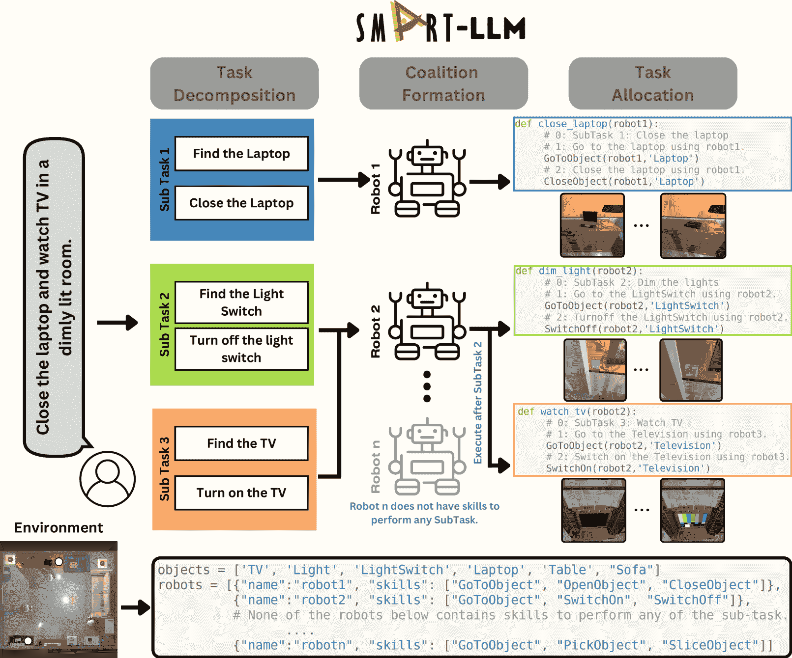
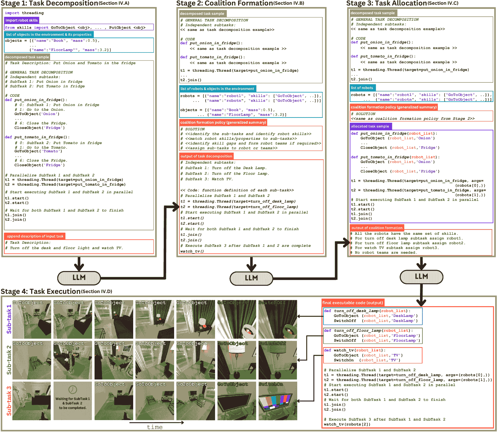
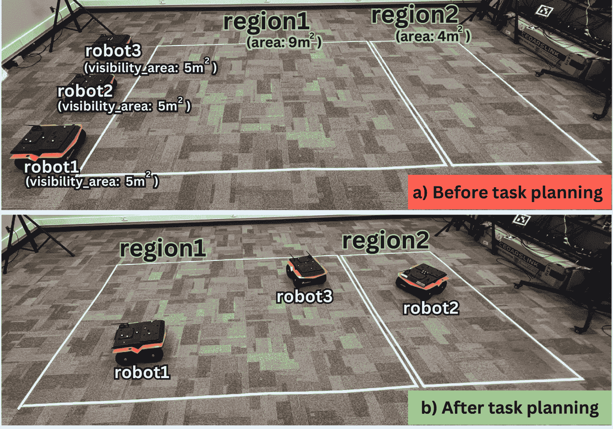

<!--yml

category: 未分类

date: 2025-01-11 13:06:50

-->

# SMART-LLM：使用大语言模型进行智能多-agent机器人任务规划

> 来源：[https://arxiv.org/html/2309.10062/](https://arxiv.org/html/2309.10062/)

Shyam Sundar Kannan${}^{\dagger}$，Vishnunandan L. N. Venkatesh${}^{\dagger}$ 和 Byung-Cheol Min 本材料基于美国国家科学基金会资助的工作，资助编号为IIS-1846221。作者来自普渡大学计算机与信息技术系SMART实验室，美国印第安纳州西拉法叶市，邮政编码47907，邮箱{kannan9,lvenkate,minb}@purdue.edu$\dagger$ 表示等贡献。

###### 摘要

在这项工作中，我们提出了SMART-LLM，这是一个为具身多机器人任务规划设计的创新框架。SMART-LLM：使用大语言模型（LLMs）进行智能多-agent机器人任务规划，利用LLMs的强大功能将高层次的任务指令输入转化为多机器人任务计划。它通过执行一系列阶段来实现这一目标，包括任务分解、联盟形成和任务分配，所有这些都通过程序化的LLM提示在少量示例提示的范式下进行引导。我们创建了一个基准数据集，用于验证多机器人任务规划问题，涵盖四个不同类别的高层次指令，这些指令在任务复杂性上有所不同。我们的评估实验涵盖了仿真和现实场景，证明了所提出的模型能够为生成多机器人任务计划取得良好的结果。实验视频、代码和数据集可以在[https://sites.google.com/view/smart-llm/](https://sites.google.com/view/smart-llm/)找到。

## I 引言

近年来，多机器人系统在各类应用中逐渐崭露头角，从家务任务[[1](https://arxiv.org/html/2309.10062v2#bib.bib1)]到搜救任务[[2](https://arxiv.org/html/2309.10062v2#bib.bib2)]以及仓库自动化[[3](https://arxiv.org/html/2309.10062v2#bib.bib3)]，这些系统由多个自主机器人组成，可以在众多任务中极大提高效率、可扩展性和适应性。通常，这些机器人阵列在类型和个体智能水平上存在异质性。因此，整体系统复杂性增加，强调了在这些机器人之间进行熟练任务分配的重要性。有效地在多个机器人之间分配复杂任务涉及几个关键步骤，包括任务分解、将子任务分配给合适的机器人以及确保任务的正确顺序[[4](https://arxiv.org/html/2309.10062v2#bib.bib4)]。这一能力需要获取关于任务的外部知识或领域特定信息。

传统的多机器人任务规划通常在应对多样化任务和复杂环境时面临困难[[4](https://arxiv.org/html/2309.10062v2#bib.bib4)]，依赖于固定的算法。依赖固定算法使得任务之间的转换变得复杂，除非对代码进行大量修改。当任务用自然语言描述时，这些挑战更加明显，因为自然语言描述可能缺乏精确性和完整性。举例来说，图[1](https://arxiv.org/html/2309.10062v2#S1.F1 "Figure 1 ‣ I Introduction ‣ SMART-LLM: Smart Multi-Agent Robot Task Planning using Large Language Models")中给出的任务是：“关闭笔记本电脑并在光线昏暗的房间里看电视”。值得注意的是，这个任务描述并没有明确提到在看电视前需要关闭灯光。鉴于指令的 incomplete（不完整）和 ambiguous（模糊）性质，利用广泛的先验知识来解释任务并辅助高效的任务规划变得至关重要。

图1：SMART-LLM概述：基于大语言模型（LLM）的智能多智能体机器人任务规划。给定高层次指令，SMART-LLM将指令分解为子任务，并根据各自的技能和能力将这些子任务分配给不同的机器人，同时协调它们按照连贯的逻辑顺序执行。

大语言模型（LLMs），如GPT-4[[5](https://arxiv.org/html/2309.10062v2#bib.bib5)]、GPT-3.5[[6](https://arxiv.org/html/2309.10062v2#bib.bib6)]和Llama2[[7](https://arxiv.org/html/2309.10062v2#bib.bib7)]，在理解自然语言、逻辑推理和归纳能力方面表现出了显著的能力。这为提升多机器人系统中的理解和规划带来了令人兴奋的机会。在本文中，我们介绍了SMART-LLM，这是一个利用LLMs为具身智能体分配任务的创新机制。SMART-LLM通过提供Python编程脚本，使LLMs能够封装复杂的机器人技能和环境细节，包括物体信息。它还提供了基于机器人的能力和环境的任务分解和分配的实际示例。通过利用编程语言结构，SMART-LLM能够挖掘LLMs可访问的互联网代码片段和文档的庞大数据集。如图[1](https://arxiv.org/html/2309.10062v2#S1.F1 "Figure 1 ‣ I Introduction ‣ SMART-LLM: Smart Multi-Agent Robot Task Planning using Large Language Models")所示，当处理复杂任务时，SMART-LLM将任务分解为与特定物体或动作相关的子任务。这些子任务随后被组合并分配给具备执行它们所需技能的合适机器人。

本研究的主要贡献有三个方面：

+   •

    多机器人任务规划框架，通过利用LLMs集成任务分解、联盟形成和基于技能的任务分配。

+   •

    基准数据集：这是一个为评估多智能体任务规划系统而设计的基准数据集，涵盖了从基本任务到复杂任务的一系列任务，适用于AI2-THOR [[8](https://arxiv.org/html/2309.10062v2#bib.bib8)] 仿真平台。

+   •

    框架在仿真和现实世界中的实现与评估，经过了广泛的任务测试。

## II 相关工作

多机器人任务规划。多机器人任务规划在机器人学中非常重要，要求机器人之间进行有效的协调。通常，多机器人任务规划过程包括四个不同的阶段：任务分解、联盟形成、任务分配和任务执行 [[4](https://arxiv.org/html/2309.10062v2#bib.bib4)]。任务分解是将给定任务拆解为可管理的子任务。分解方法可以是特定于任务的 [[9](https://arxiv.org/html/2309.10062v2#bib.bib9)]，或需要大量数据来生成策略 [[10](https://arxiv.org/html/2309.10062v2#bib.bib10)]。特定任务的分解方法无法泛化，而收集先验知识以分解多种任务可能会带来较大挑战。一种现代的直观策略是使用自然语言来表述任务，并利用预训练的语言模型，这些模型具备多领域的知识，能够将任务划分为子任务，并预测它们的执行顺序 [[11](https://arxiv.org/html/2309.10062v2#bib.bib11), [12](https://arxiv.org/html/2309.10062v2#bib.bib12)]。类似地，在SMART-LLM中，我们使用大型语言模型将任务拆解为与机器人技能相匹配的动作，从而促进机器人无缝执行任务。

在联盟形成和任务分配中，如何高效地将拆解后的任务分配给多个智能体，对于有效完成给定任务至关重要。为此，已经采用了大量方法，包括谈判 [[13](https://arxiv.org/html/2309.10062v2#bib.bib13)]、拍卖 [[14](https://arxiv.org/html/2309.10062v2#bib.bib14)]、基于共识的策略 [[15](https://arxiv.org/html/2309.10062v2#bib.bib15)] 和强化学习 [[16](https://arxiv.org/html/2309.10062v2#bib.bib16)]。虽然这些方法具有可靠性，但它们通常是根据特定的最终目标和应用进行定制和优化的。这就需要在将它们应用于不同的场景，并在不同约束条件下进行优化时付出额外的努力。在我们的方法中，我们利用了大型语言模型（LLMs）的内在泛化能力。这使得任务能够无缝扩展，团队可以以多种配置进行分配，而无需对代码中的约束做额外修改。

自动化的程度取决于方法能够执行的任务规划步骤的数量 [[4](https://arxiv.org/html/2309.10062v2#bib.bib4)]。大多数方法主要属于第一个或第二个自动化水平。第一个水平仅自动化任务执行 [[17](https://arxiv.org/html/2309.10062v2#bib.bib17), [18](https://arxiv.org/html/2309.10062v2#bib.bib18)]。同时，第二个水平自动化任务分配和执行 [[19](https://arxiv.org/html/2309.10062v2#bib.bib19), [20](https://arxiv.org/html/2309.10062v2#bib.bib20)]；或者联盟形成和执行 [[21](https://arxiv.org/html/2309.10062v2#bib.bib21)]。第三个自动化水平涵盖联盟、分配和执行，但不涉及任务分解 [[22](https://arxiv.org/html/2309.10062v2#bib.bib22), [23](https://arxiv.org/html/2309.10062v2#bib.bib23)]。在迈向第四个自动化水平的开创性步伐中 [[24](https://arxiv.org/html/2309.10062v2#bib.bib24)]，一种方法通过自然语言提示和长短期记忆（LSTM）巧妙地管理任务规划的四个方面。现有文献中的方法通常存在不足，例如未涵盖所有任务规划步骤；需要大量特定任务的示范数据来进行模型训练 [[24](https://arxiv.org/html/2309.10062v2#bib.bib24)]，而且在面对未见过的任务时，常常缺乏泛化能力，或者仅限于特定任务。我们的方法通过高效地执行所有四个任务规划步骤，并利用大型语言模型（LLMs）通过少量示范训练方法来实现跨任务的泛化，脱颖而出。

用于机器人技术的LLMs。大型语言模型在泛化、常识推理方面表现出色 [[6](https://arxiv.org/html/2309.10062v2#bib.bib6), [25](https://arxiv.org/html/2309.10062v2#bib.bib25)]，并且越来越受到机器人系统中的应用关注 [[26](https://arxiv.org/html/2309.10062v2#bib.bib26), [27](https://arxiv.org/html/2309.10062v2#bib.bib27)]。它们在为机器人制定任务计划中发挥着至关重要的作用，利用少量或零次学习方法 [[6](https://arxiv.org/html/2309.10062v2#bib.bib6)]。使用LLMs生成这些机器人任务计划的各种技术应运而生，包括基于价值函数的方法 [[27](https://arxiv.org/html/2309.10062v2#bib.bib27), [28](https://arxiv.org/html/2309.10062v2#bib.bib28)] 和基于上下文驱动的提示 [[29](https://arxiv.org/html/2309.10062v2#bib.bib29), [30](https://arxiv.org/html/2309.10062v2#bib.bib30), [31](https://arxiv.org/html/2309.10062v2#bib.bib31), [32](https://arxiv.org/html/2309.10062v2#bib.bib32)]。此外，LLMs还被用于提供反馈并优化任务计划，以提升机器人性能 [[33](https://arxiv.org/html/2309.10062v2#bib.bib33), [34](https://arxiv.org/html/2309.10062v2#bib.bib34), [35](https://arxiv.org/html/2309.10062v2#bib.bib35)]。

虽然大语言模型（LLMs）在创建灵活的任务计划方面表现出色，但在应用于较大的多代理团队时，它们面临一些挑战。在多代理系统领域，已经取得了一些进展，通过使用LLMs来增强代理之间的协作[[36](https://arxiv.org/html/2309.10062v2#bib.bib36), [37](https://arxiv.org/html/2309.10062v2#bib.bib37), [38](https://arxiv.org/html/2309.10062v2#bib.bib38)]。这些方法通过为每个代理配备自己的LLM，以改善交互并增强其协作能力。然而，这些方法主要关注提高多代理系统的效率，并没有解决为多机器人团队创建任务计划这一特定任务。这些计划涉及基于机器人的技能和环境条件为个别机器人分配和排序任务。我们的方法侧重于在异质机器人团队中进行任务分解和分配，考虑每个机器人技能的差异。我们实现了多机器人任务规划，而不需要为每个机器人配备单独的LLM。这简化了规划，并为多机器人任务协调提供了统一的解决方案。

## III 问题表述

给定一个高级语言指令$I$，本工作的目标是理解该指令，计算完成任务所需的步骤，并制定一个能够执行该任务的任务计划。任务的执行方式是通过在可行时并行执行任务，最大化可用机器人资源的利用率。这些任务在一个包含多个实体和物体的环境$E$中执行。我们假设给定的指令$I$可以在环境$E$中成功执行。

为了执行任务，我们有一组$N$个异质的具身机器人代理$\mathbb{R}=\{R^{1},R^{2},...,R^{N}\}$。设$\Delta$为代理可能执行的所有技能或动作的集合。在本工作中，我们假设机器人技能$\Delta$要么已经预先实现，或者系统中有可用的API调用来执行这些技能。每个代理拥有一组多样化的技能$\mathbb{S}=\{S^{1},S^{2},...,S^{N}\}$，每项技能都有特定的约束条件。这里，$S^{n}$表示机器人$R^{n}$的技能列表，且$S^{n}\subseteq\Delta$，对于$n=1,2,...N$。例如，对于机器人技能PickUpObject，可能会对机器人能够拾取的最大质量有约束。

现在，指令 $I$ 可以基于机器人技能 $\Delta$ 和环境 $E$，被分解为一个暂时排序的 $K$ 个子任务的集合，$\mathbb{T}=\{T^{1}_{t_{1}},T^{1}_{t_{2}},...,T^{K}_{t_{j}}\}$，其中 ${t_{j}}$ 表示子任务的时间顺序，且 $j$ $\leq$ $K$。值得注意的是，一些子任务可以并行执行，具有相同的时间优先级。设 $T_{S}^{k}$ 为机器人完成子任务 $T_{t_{j}}^{k}$ 所需的技能列表，其中 $T_{S}^{k}\subseteq\Delta$ 且 $T_{t_{j}}^{k}\in\mathbb{T}$。基于 $T_{S}^{k}$，如果一个机器人 $R$ 的技能集合 $S$ 满足 $T_{S}^{k}\subseteq S$，则可以将该子任务分配给机器人 $R$，其中 $R\in\mathbb{R}$ 且 $S\in\mathbb{S}$。在没有单个机器人满足此约束的情况下，需要两个或更多机器人的团队来执行该子任务。在这种情况下，我们形成一个由 $Q$ 个机器人组成的团队，$\mathbb{A}=\{A^{1},A^{2},...,A^{Q}\}$，每个机器人具有技能集合 $\mathbb{S}_{A}=\{S_{A}^{1},S_{A}^{2},...,S_{A}^{Q}\}$，使得 $T_{S}^{k}\subseteq\bigcup\mathbb{S}_{A}$。

图 2：系统概述：SMART-LLM 包含四个关键阶段：i) 任务分解：将由机器人技能、物体和任务分解示例组成的提示与输入指令结合，传递给 LLM 模型以分解输入任务；ii) 联盟形成：将由机器人列表、环境中可用物体、示例任务分解任务以及描述任务机器人团队形成的联盟政策和上一阶段输入任务的任务计划组成的提示传递给 LLM，以为输入任务生成联盟政策；iii) 任务分配：将包含示例分解任务、其联盟政策以及基于联盟政策分配的任务计划的提示与为输入任务生成的联盟政策一起传递给 LLM，LLM 根据这些信息输出分配的任务计划；iv) 任务执行：基于生成的分配代码，机器人执行任务。为了简洁，使用了“……”。

## IV 方法论

提出的方法利用 LLM 在多机器人任务规划的背景下执行任务分解、联盟形成和任务分配。我们的方法采用 Python 风格的提示，引导 LLM 生成任务分解和分配的代码。我们选择 Python 风格的提示而非自然语言提示，因为它们可以直接从 LLM 生成可执行代码。此外，Python 风格的提示遵循结构化语法，增强了 LLM 对提示的理解 [[39](https://arxiv.org/html/2309.10062v2#bib.bib39)]。

我们提供了简洁的提示示例，带有逐行评论和块评论，给出每个步骤的任务总结，帮助 LLM 有效理解并生成代码。提示结构模仿典型的代码，完整的注释用于划分示例任务。关于机器人技能和物体属性的详细信息被编码为 Python 字典，提供了简洁的表示方式，LLM 可以轻松理解[[39](https://arxiv.org/html/2309.10062v2#bib.bib39)]，同时有助于减少令牌大小。评论经过精心结构化，包含有关任务执行和分配要求的详细指令，使 LLM 能够理解并复制新任务的过程。

### IV-A 阶段 1：任务分解

在此阶段，我们将给定的指令 $I$ 分解为一组独立的子任务 $\mathbb{T}$，并为执行每个子任务提供一系列动作。为了分解任务，我们提供了关于环境 $E$（包括环境中存在的物体和其他实体）以及机器人可以执行的原始技能列表 $\Delta$ 的信息。关于环境和机器人技能的信息被用于将任务分解，使其能够在该环境中使用机器人所拥有的技能来执行。

在初步的少量示例 LLM 提示之后，我们为 LLM 提供了各种信息：关于机器人技能的详细信息、环境信息、几个示例任务以及相应的基于 Python 代码的分解计划。LLM 获取所有这些信息，以及需要分解的输入任务 $I$，并生成子任务 $\mathbb{T}$。在图 [2](https://arxiv.org/html/2309.10062v2#S3.F2 "Figure 2 ‣ III Problem Formulation ‣ SMART-LLM: Smart Multi-Agent Robot Task Planning using Large Language Models") 中与任务分解相关的阶段 1 块中，紫色框对应于机器人技能列表 $\Delta$；蓝色框对应于环境的详细信息 $E$；绿色框对应于作为提示的一部分给出的分解任务样本；红色框对应于给定的指令 $I$。图 [2](https://arxiv.org/html/2309.10062v2#S3.F2 "Figure 2 ‣ III Problem Formulation ‣ SMART-LLM: Smart Multi-Agent Robot Task Planning using Large Language Models") 中阶段 2 块的红色框是 LLM 的输出，表示子任务 $\mathbb{T}$。

### IV-B 阶段 2：联盟形成

联盟形成用于组建机器人团队来执行通过任务分解计算出的每个子任务。在任务分解中，主任务基于常识和环境中存在的各种实体$E$被拆解为子任务$\mathbb{T}$。然而，这一初步分解并未考虑到单个机器人$S^{n}$的特定技能，或它们执行每个子任务的能力。因此，在这一阶段，我们提示LLM分析执行每个子任务所需的技能$T_{S}^{k}$和单个机器人$S^{n}$的技能，以识别适合执行每个子任务的机器人。为此，我们向LLM提供了分解任务的样本及相应的联盟形成策略，这些策略描述了如何将可用的机器人分配到子任务中。

联盟策略包括关于机器人是否具备执行子任务所需的所有技能的声明，以及如何通过引入额外的机器人来弥补单个机器人在执行子任务时技能的缺口。我们所包含的样本涵盖了以下几种情况：

+   •

    在某些场景中，单个机器人具备执行子任务所需的所有技能，从而实现了机器人与任务的一一对应分配。

+   •

    某些情况下，没有单个机器人具备执行子任务所需的所有技能，导致多个机器人共同协作执行同一任务。

+   •

    机器人具备执行子任务所需的技能，但受到某些限制（例如，机器人在拾取任务中的最大承重限制）。在这种情况下，通过引入其他机器人来克服这些限制。

通过呈现这些样本，以及被分解的任务$\mathbb{T}$、可用机器人列表$\mathbb{R}$及其技能$\mathbb{S}$，LLM生成一个新的联盟形成策略，概述了如何将给定的机器人分配到执行输入任务中。图[2](https://arxiv.org/html/2309.10062v2#S3.F2 "Figure 2 ‣ III Problem Formulation ‣ SMART-LLM: Smart Multi-Agent Robot Task Planning using Large Language Models")的第2阶段框块对应于联盟形成，绿色框表示作为提示部分给出的样本分解任务；蓝色框显示了可用的机器人$\mathbb{R}$及其技能$\mathbb{S}$，以及关于环境$E$的详细信息；橙色框概述了联盟策略的总体总结，而在实验中，我们使用实际的联盟策略来处理样本分解任务；红色框则表示需要生成联盟策略的分解任务。图[2](https://arxiv.org/html/2309.10062v2#S3.F2 "Figure 2 ‣ III Problem Formulation ‣ SMART-LLM: Smart Multi-Agent Robot Task Planning using Large Language Models")的第3阶段框块中的红色框是来自LLM的输出，表示子任务$\mathbb{T}$和指令$I$的联盟形成策略。

### IV-C 阶段3：任务分配

任务分配涉及根据前一阶段建立的联盟形成策略，精确地将特定机器人或机器人团队分配到各个子任务中。与之前的阶段类似，构建一个由分解任务样本、联盟形成策略以及分配给这些任务的计划组成的提示。通过结合分解后的子任务$\mathbb{T}$和先前生成的联盟形成策略，针对给定输入任务$I$，我们指导LLM根据联盟分配机器人到每个子任务，并生成可执行代码。根据联盟策略，子任务可以分配给单个机器人或一组机器人。

图[2](https://arxiv.org/html/2309.10062v2#S3.F2 "Figure 2 ‣ III Problem Formulation ‣ SMART-LLM: Smart Multi-Agent Robot Task Planning using Large Language Models")中的阶段3模块显示了作为提示一部分的示例分解计划（绿色框）、可用机器人的列表及其技能（蓝色框）、它们的联盟策略（橙色框）以及它们的分配计划（紫色框），同时还展示了输入任务的联盟策略（红色框），用于生成阶段4模块（红色框）中的最终可执行代码。

### IV-D 阶段4：任务执行

LLM通过任务分配为多机器人团队生成任务计划，之后由解释器与虚拟或物理的机器人团队执行。这些计划通过调用机器人的低级技能API来执行，确保任务的高效执行。如图[2](https://arxiv.org/html/2309.10062v2#S3.F2 "Figure 2 ‣ III Problem Formulation ‣ SMART-LLM: Smart Multi-Agent Robot Task Planning using Large Language Models")阶段4所示，为示例任务$I$ $=$“关闭桌面和地板灯并看电视”分配的任务计划（红色框）由三个机器人团队按某种时间顺序执行。在此阶段，图中还显示了机器人在执行任务时的视角顺序，以及标明正在进行任务步骤的说明文字。绿色标记的说明文字对应机器人已完成的具体动作。

## V 实验

### V-A 基准数据集

为了评估SMART-LLM的表现，并便于与其他基准方法进行定量比较，我们创建了一个专门用于评估多机器人场景中基于自然语言的任务规划的基准数据集。该数据集来源于AI2-THOR平台[[8](https://arxiv.org/html/2309.10062v2#bib.bib8)]，这是一个针对典型家庭活动的确定性仿真平台。数据集包含36个高级指令，阐述了任务和相应的AI2-THOR平面图，提供了任务执行的空间背景。鉴于我们的数据集涉及多机器人情境，我们还包括了可用来执行任务的机器人数量及其各自技能的详细信息。每个任务可用的机器人数量从1到4不等，具有不同的技能，便于对任务规划方法进行可扩展性评估。

在数据集中，我们还包括了任务的最终真实状态，捕捉任务完成后相关物体的确定状态及其在环境中的条件。该真实状态描述了一组对完成任务成功至关重要的符号目标条件。它包括物体在环境中的位置以及物体在任务正确执行后所处的状态，如加热、烹饪、切割或清洗等。除了最终的真实状态，我们还提供了任务执行过程中机器人利用的转换次数。当一组机器人完成其子任务时，允许另一组机器人接手，此时发生转换。这量化了多机器人系统的利用率。如果在实验中任务未适当并行化，且机器人未得到充分利用，子任务可能按顺序执行，而非并行执行，导致机器人利用转换次数高于真实状态下的利用次数。

为了评估我们提出的方法在不同任务复杂度下的表现，我们的数据集包括四个任务类别：

+   •

    元素任务设计为单个机器人使用。在这些情景中，假设单个机器人具备完成任务所需的所有技能和能力，因此无需与多个机器人进行协调。

+   •

    简单任务涉及多个物体，并可以分解为顺序或并行的子任务，但不能同时并行执行。再次强调，所有机器人都具备完成任务所需的所有技能。

+   •

    复合任务类似于简单任务，但在执行策略上具有灵活性（顺序、并行或混合）。然而，机器人是异质的，具备专门的技能和特性，使得每个机器人能够处理与其技能和特性相匹配的子任务。

+   •

    复杂任务是为异构机器人团队设计的，具有与复合任务类似的特征，如任务分解、多机器人协作和多个对象的存在。与复合任务不同，由于单个机器人技能或属性的限制，个别机器人无法独立执行子任务，这就需要战略性地分配团队成员，以利用他们的综合能力有效完成任务。

数据集包含6个基础任务，8个简单任务，14个复合任务和8个复杂任务。

表 I: 在AI2-THOR模拟器中评估SMART-LLM和基准方法在基准数据集不同任务类别的表现。

| 方法 | 基础任务 | 简单任务 | 复合任务 | 复杂任务 |
| --- | --- | --- | --- | --- |
| SR | TCR | GCR | RU | Exe | SR | TCR | GCR | RU | Exe | SR | TCR | GCR | RU | Exe | SR | TCR | GCR | RU | Exe |

|

&#124; SMART-LLM (GPT-4) &#124;

| 1.00 | 1.00 | 1.00 | 1.00 | 1.00 | 0.62 | 1.00 | 1.00 | 0.62 | 1.00 | 0.69 | 0.76 | 0.85 | 0.92 | 1.00 | 0.71 | 0.85 | 0.92 | 1.00 | 0.97 |
| --- | --- | --- | --- | --- | --- | --- | --- | --- | --- | --- | --- | --- | --- | --- | --- | --- | --- | --- | --- |

|

&#124; SMART-LLM (GPT-3.5) &#124;

| 0.83 | 0.83 | 0.83 | 1.00 | 0.91 | 0.62 | 0.87 | 0.93 | 0.62 | 0.95 | 0.42 | 0.50 | 0.61 | 0.71 | 0.85 | 0.14 | 0.28 | 0.35 | 0.85 | 0.62 |
| --- | --- | --- | --- | --- | --- | --- | --- | --- | --- | --- | --- | --- | --- | --- | --- | --- | --- | --- | --- |

|

&#124; SMART-LLM (Llama2) &#124;

| 1.00 | 1.00 | 1.00 | 1.00 | 1.00 | 0.75 | 0.87 | 0.93 | 0.87 | 1.00 | 0.64 | 0.69 | 0.80 | 0.87 | 0.90 | 0.63 | 0.71 | 0.83 | 0.90 | 0.89 |
| --- | --- | --- | --- | --- | --- | --- | --- | --- | --- | --- | --- | --- | --- | --- | --- | --- | --- | --- | --- |

|

&#124; SMART-LLM (Claude3) &#124;

| 1.00 | 1.00 | 1.00 | 1.00 | 1.00 | 0.87 | 1.00 | 1.00 | 0.93 | 1.00 | 0.69 | 0.76 | 0.81 | 0.87 | 1.00 | 0.71 | 0.71 | 0.87 | 0.97 | 0.92 |
| --- | --- | --- | --- | --- | --- | --- | --- | --- | --- | --- | --- | --- | --- | --- | --- | --- | --- | --- | --- |

|

&#124; Decomp (我们的) + Rand &#124;

| 1.00 | 1.00 | 1.00 | 1.00 | 1.00 | 0.37 | 0.62 | 0.62 | 0.37 | 0.60 | 0.08 | 0.16 | 0.25 | 0.41 | 0.37 | 0.00 | 0.00 | 0.15 | 0.85 | 0.38 |
| --- | --- | --- | --- | --- | --- | --- | --- | --- | --- | --- | --- | --- | --- | --- | --- | --- | --- | --- | --- |

|

&#124; Decomp (我们的) + 规则[[40](https://arxiv.org/html/2309.10062v2#bib.bib40)] &#124;

| 1.00 | 1.00 | 1.00 | 1.00 | 1.00 | 0.62 | 1.00 | 1.00 | 0.62 | 1.00 | 0.57 | 0.57 | 0.65 | 0.81 | 0.74 | 0.14 | 0.14 | 0.35 | 0.85 | 0.54 |
| --- | --- | --- | --- | --- | --- | --- | --- | --- | --- | --- | --- | --- | --- | --- | --- | --- | --- | --- | --- |

### V-B 模拟实验

我们的方法验证在AI2-THOR模拟环境中进行，在此环境中我们使用基准数据集进行严格的评估，并与基准方法进行比较分析。我们的实验设置包括一组不同的示例提示，其中包括5个Python计划示例用于任务分解，3个用于联盟形成，4个用于任务分配。这些示例提示涵盖了可以使用线程并行化的任务、只能顺序执行的任务以及同时包含并行和顺序执行的任务。这个多样化的示例范围经过精心设计，旨在模拟多机器人任务规划不同阶段中固有的复杂性。

值得注意的是，示例提示与数据集中的任务不同，并且基于不同的AI2-THOR平面图，这些平面图未包含在数据集内。因此，在测试过程中，数据集中的所有任务都被视为未见过的任务。我们评估了不同语言模型作为SMART-LLM的骨干模型的表现。我们使用了GPT-4[[5](https://arxiv.org/html/2309.10062v2#bib.bib5)]、GPT-3.5[[6](https://arxiv.org/html/2309.10062v2#bib.bib6)]、Llama-2-70B[[7](https://arxiv.org/html/2309.10062v2#bib.bib7)]和Claude-3-Opus[[41](https://arxiv.org/html/2309.10062v2#bib.bib41)]，以评估SMART-LLM在各种任务中的表现以及与不同语言模型的配合效果。我们还将我们的方法与两种替代基线进行了比较。在第一个基线中，我们使用了任务分解方法和提示，并随机将子任务分配给可用机器人。第二个基线则使用了我们的任务分解方法，并结合基于[[40](https://arxiv.org/html/2309.10062v2#bib.bib40)]的基于规则的任务分配方法。两种基线方法都利用GPT-4进行任务分解。

### V-C 真实机器人实验

在我们与移动机器人进行的真实实验中，我们评估了SMART-LLM在处理任务方面的效果，任务包括解决可见性覆盖挑战[[42](https://arxiv.org/html/2309.10062v2#bib.bib42)]和拍摄物体图像。这些任务涉及不同大小的区域，需要可见性覆盖，以及需要拍摄图像的物体。我们可以使用空中和地面机器人，它们各自具有独特的技能和可见性能力，来执行任务。SMART-LLM被用来根据这些特定需求生成任务计划。实现完全可见性覆盖所需的机器人数量取决于区域的大小和参与机器人的能力。我们假设我们的机器人具备基本的低级技能，包括GoToLocation、ClickPicture和Patrol，这些技能对任务的有效执行至关重要。为了在这个框架内制定任务计划，我们依赖于在模拟实验中使用的相同提示样本，这些实验基于AI2-THOR模拟器。

### V-D 评估指标

我们采用了五个评估指标：成功率（SR）、任务完成率（TCR）、目标条件召回率（GCR）、机器人利用率（RU）和可执行性（Exe），遵循[[29](https://arxiv.org/html/2309.10062v2#bib.bib29)]的方法论。我们的评估基于数据集的最终实际状态，并将其与执行后的状态进行比较，以评估任务的成功。

+   •

    Exe是任务计划中可执行操作的比例，无论这些操作对任务完成的影响如何。

+   •

    RU通过将实验中的过渡次数与数据集的实际过渡次数进行比较来评估机器人团队的效率。当两者匹配时，RU为$1.0$，当过渡次数等于子任务数量时，RU为$0$，否则RU介于$0$和$1$之间。

+   •

    GCR 通过地面真实最终状态条件与实际最终状态之间的集合差异来量化，然后除以数据集中任务特定目标的总数。

+   •

    TCR 表示任务完成情况，与机器人利用率无关。如果 GCR = $1$，则 TCR = $1$，否则为 $0$。

+   •

    SR 是成功率，当 $GCR$ 和 $RU$ 都为 $1$ 时，SR 为 $1$，否则为 $0$。当任务以适当的机器人利用率完成时，任务被视为成功。

## VI 结果与讨论

### VI-A 模拟实验

表 [I](https://arxiv.org/html/2309.10062v2#S5.T1 "TABLE I ‣ V-A Benchmark Dataset ‣ V Experiments ‣ SMART-LLM: Smart Multi-Agent Robot Task Planning using Large Language Models") 总结了我们的方法在数据集中不同类别的平均结果，使用了多种 LLM 后端和基准方法，针对未见数据集的任务进行评估。总体而言，无论使用何种 LLM 后端，SMART-LLM 都能始终如一地提供优异的结果。在基础任务中，SMART-LLM 熟练地分解了给定的任务并相应地分配了机器人，除了使用 GPT-3.5 后端时，遇到了一些任务分解的挑战。然而，当提供了准确的任务分解时，基准方法通过随机分配成功完成了任务，因为所有机器人都具备执行任务所需的所有技能。

在简单任务中，结果取决于 LLM 能否按正确的顺序分解给定的任务以执行。值得注意的是，使用 Claude-3 作为后端的 SMART-LLM 取得了更优的结果，尽管其他 LLM 也表现不俗。GPT-4 和 Claude-3 达到了完美的 TCR 分数 $1.0$，但由于采用了顺序执行而非两个机器人并行执行，因此 SR 分别为 $0.62$ 和 $0.87$，影响了 RU。随机任务分配往往失败，而基于规则的分配在 LLM 提供的任务分解符合逻辑顺序时成功，取得的结果与使用 LLM 进行分配时的结果相同。

在复合任务和复杂任务中，我们的方法在所有LLM核心上始终取得了优异的结果，成功率为$70\%$。我们观察到SMART-LLM在任务排序和机器人团队分配上偶尔存在困难，这可以通过加入更多的提示样本来缓解。然而，某些LLM的令牌限制阻碍了这种优化。特别是，GPT-3.5相比其他LLM模型表现不佳，可能是因为其逻辑推理能力不足。有趣的是，尽管Llama2只有70B参数，而其他模型则有数万亿参数，但其表现与其他模型同样出色。这一成功可归因于SMART-LLM的提示结构，即便在更小且更简单的模型上也能实现高效的性能。因此，SMART-LLM也能够在本地机器上部署。我们的分解方法采用随机分配，通常在基于技能的任务分配上表现不佳，因为它无法考虑环境状态和机器人的技能。基于规则的分配对于需要识别具备合适技能的机器人的复合任务表现令人满意。然而，在涉及物体属性的复合任务和团队组成依赖于专门约束的复杂任务中，它表现不佳。虽然通过在代码中加入额外的约束可以缓解这些问题，但这种方法需要不断修改或添加以适应新场景。这些做法妥协了方法的可扩展性和适应性。由此可见，SMART-LLM具有良好的可扩展性，因为它不需要为新任务做任何修改，使得该方法具有高度的可扩展性。展示所有实验的视频可以通过[https://youtu.be/TnyCKwgTm3U](https://youtu.be/TnyCKwgTm3U)访问。

不可行的场景。除了表格[I](https://arxiv.org/html/2309.10062v2#S5.T1 "TABLE I ‣ V-A Benchmark Dataset ‣ V Experiments ‣ SMART-LLM: Smart Multi-Agent Robot Task Planning using Large Language Models")中展示的结果外，我们还进行了涉及更复杂任务的评估，在这些任务中，没有任何机器人具备所需的技能。该特定场景未包含在表格[I](https://arxiv.org/html/2309.10062v2#S5.T1 "TABLE I ‣ V-A Benchmark Dataset ‣ V Experiments ‣ SMART-LLM: Smart Multi-Agent Robot Task Planning using Large Language Models")中，因为无法为需要测量的指标生成可行的代码。值得注意的是，我们采用GPT-4和Claude-3核心的方式展现出了识别该场景的能力，并避免生成任何任务分配计划。相比之下，我们采用GPT-3.5和Llama2的方法则生成了一个包含不适合执行指定任务的机器人的任务分配计划。这一差异突显了GPT-4和Claude-3在识别和应对此类场景方面的增强逻辑推理能力。

性能的变异性。LLM固有的非确定性特性引入了结果的变异性[[43](https://arxiv.org/html/2309.10062v2#bib.bib43)]。为了评估这种变异性，我们进行了5次独立的实验，每次在我们数据集中的每个类别随机选择一个任务。表格[II](https://arxiv.org/html/2309.10062v2#S6.T2 "TABLE II ‣ VI-A Simulation Experiments ‣ VI Results and Discussion ‣ SMART-LLM: Smart Multi-Agent Robot Task Planning using Large Language Models")展示了我们方法在这些实验中的平均值和标准差，使用GPT-4作为基础模型。在元素性、简单和复杂任务中，我们的方法始终产生了相似的结果。然而，在复杂场景中，我们遇到了不一致，导致机器人任务分配出现偶尔失败。

表格 II：性能变异性。

| 方法 | SR | TCR | GCR | RU | 执行时间 |
| --- | --- | --- | --- | --- | --- |
| 元素性任务 | 1.00$\pm$0.00 | 1.00$\pm$0.00 | 1.00$\pm$0.00 | 1.00$\pm$0.00 | 1.00$\pm$0.00 |
| 简单任务 | 1.00$\pm$0.00 | 1.00$\pm$0.00 | 1.00$\pm$0.00 | 1.00$\pm$0.00 | 1.00$\pm$0.00 |
| 复合任务 | 1.00$\pm$0.00 | 1.00$\pm$0.00 | 1.00$\pm$0.00 | 1.00$\pm$0.00 | 1.00$\pm$0.00 |
| 复杂任务 | 0.48$\pm$0.40 | 0.48$\pm$0.40 | 0.73$\pm$0.22 | 1.00$\pm$0.00 | 0.81$\pm$0.15 |

消融研究。我们使用了一个基准数据集来评估我们方法的不同变体，考察了Python提示中逐行注释和任务总结对效果的影响。我们验证了没有这些注释的提示方法。此外，我们研究了去除联盟形成阶段后的影响，直接根据任务分解结果分配任务。表格[III](https://arxiv.org/html/2309.10062v2#S6.T3 "TABLE III ‣ VI-A Simulation Experiments ‣ VI Results and Discussion ‣ SMART-LLM: Smart Multi-Agent Robot Task Planning using Large Language Models")总结了我们方法在GPT-4基础上的消融实验。去除注释通常会降低成功率，突显了带有代码的自然语言指令的价值。值得注意的是，当去除注释时，任务分解和分配在简单和元素性任务中表现相似，但在复合和复杂任务中则表现不佳，表明注释有助于理解推理和逻辑结构。去除联盟形成导致成功率下降，这一下降主要归因于缺乏详细的任务分配推理。在没有联盟形成的情况下，元素性任务的偏差最大，成功率从$1.0$降至$0.66$，因为所有任务分配样本都涉及需要机器人组队的场景，从而导致元素性任务中不必要的多机器人分配。

表格 III：消融研究。

| 方法 | SR | TCR | GCR | RU | 执行时间 |
| --- | --- | --- | --- | --- | --- |
| 我们的方法 | 0.75 | 0.90 | 0.94 | 0.88 | 0.99 |
| 无注释 | 0.48 | 0.65 | 0.73 | 0.75 | 0.78 |
| 无总结 | 0.61 | 0.74 | 0.80 | 0.78 | 0.81 |
| 无通信与总结 | 0.41 | 0.61 | 0.66 | 0.59 | 0.69 |
| 无联盟 | 0.60 | 0.68 | 0.75 | 0.85 | 0.82 |

### VI-B 实物机器人实验

在实物机器人实验中，我们首先在具有不同区域面积和不同可见区域的机器人上测试了我们的覆盖可见性任务方法。在多种任务测试中，我们的方法正确地生成了任务计划，并合理分配了机器人数量。尽管该任务完全是新任务，且没有涉及如可见性等属性的样本提示，我们的方法通过实物机器人无缝执行，弥合了模拟和现实世界应用之间的鸿沟。在图 [3](https://arxiv.org/html/2309.10062v2#S6.F3 "Figure 3 ‣ VI-B Real-Robot Experiments ‣ VI Results and Discussion ‣ SMART-LLM: Smart Multi-Agent Robot Task Planning using Large Language Models") 中，对于“巡逻区域”指令，机器人根据它们的可见性被分配到一个或多个区域，并在这些区域进行巡逻。此外，我们还在涉及导航和捕捉预定物体图像的任务中评估了我们的方法。尽管这些技能完全是未见过的，SMART-LLM成功地生成了正确顺序的计划，并拍摄了指定物体的图像。

图 3：实物机器人实验：a) 机器人团队及待巡逻的区域；b) 任务规划后，机器人根据可见区域分配到各自的巡逻区域，并开始巡逻。

## VII 结论与未来工作

在我们的研究中，我们深入探讨了大语言模型（LLMs）在为异构机器人团队生成任务计划方面的潜力。我们的方法引入了提示技术，旨在提升多机器人任务规划的四个关键阶段的效率。每个提示都考虑了环境的特征和各个机器人自身的能力，从而生成任务计划。

我们的实验验证了所提出的方法能够处理不同复杂度的任务指令。特别是，我们的方法展示了显著的适应性，能够无缝地推广到新的未探索环境、机器人类型和任务场景。该方法简化了从模拟到实际机器人应用的过渡，使得模拟中的任务计划样本可以用于生成实际机器人系统的任务计划。在未来，我们计划通过实现机器人之间的动态任务分配，并探索用于任务规划的多智能体大语言模型框架，来进一步增强我们的工作。

## 参考文献

+   [1] P. Benavidez, M. Kumar, S. Agaian, 和 M. Jamshidi, “为老年人和残障人士设计的家庭多机器人系统”，发表于 *2015年第10届系统工程大会（SoSE）*，2015年。

+   [2] J. P. Queralta, J. Taipalmaa, B. C. Pullinen, V. K. Sarker, T. N. Gia, H. Tenhunen, M. Gabbouj, J. Raitoharju, 和 T. Westerlund, “协作多机器人搜救：规划、协调、感知与主动视觉，” *IEEE Access*，2020。

+   [3] Z. Chen, J. Alonso-Mora, X. Bai, D. D. Harabor, 和 P. J. Stuckey, “集成任务分配与路径规划用于容量约束的多智能体取送任务，” *IEEE机器人与自动化快报*，2021。

+   [4] Y. Rizk, M. Awad, 和 E. W. Tunstel, “合作异构多机器人系统：综述，” *ACM计算调查（CSUR）*，2019。

+   [5] OpenAI, “GPT-4技术报告，” 2023。

+   [6] T. Brown, B. Mann, N. Ryder, M. Subbiah, J. D. Kaplan, P. Dhariwal, A. Neelakantan, P. Shyam, G. Sastry, A. Askell, *等*，“语言模型是少样本学习者，” *神经信息处理系统进展*，2020。

+   [7] H. Touvron, L. Martin, K. Stone, P. Albert, A. Almahairi, Y. Babaei, N. Bashlykov, S. Batra, P. Bhargava, S. Bhosale, *等*，“Llama 2：开放基础和微调聊天模型，” *arXiv预印本 arXiv:2307.09288*，2023。

+   [8] E. Kolve, R. Mottaghi, W. Han, E. VanderBilt, L. Weihs, A. Herrasti, M. Deitke, K. Ehsani, D. Gordon, Y. Zhu, *等*，“AI2-THOR：一种互动3D环境用于视觉AI，” *arXiv预印本 arXiv:1712.05474*，2017。

+   [9] J. Motes, R. Sandström, H. Lee, S. Thomas, 和 N. M. Amato, “具有子任务依赖关系的多机器人任务与运动规划，” *IEEE机器人与自动化快报*，2020。

+   [10] K. Shiarlis, M. Wulfmeier, S. Salter, S. Whiteson, 和 I. Posner, “TACO：通过时间对齐学习任务分解控制，” *国际机器学习大会*，2018。

+   [11] P. A. Jansen, “没有视觉的视觉引导规划：语言模型从高层指令中推断详细计划，” *arXiv预印本 arXiv:2009.14259*，2020。

+   [12] K. Sakaguchi, C. Bhagavatula, R. L. Bras, N. Tandon, P. Clark, 和 Y. Choi, “prosScript：通过预训练语言模型生成部分有序脚本，” *arXiv预印本 arXiv:2104.08251*，2021。

+   [13] Y. Kong, M. Zhang, 和 D. Ye, “一种基于谈判的任务分配方法，用于开放网格环境中的时间约束，” *并发与计算：实践与经验*，2015。

+   [14] M. Braquet 和 E. Bakolas, “基于贪心的去中心化拍卖任务分配方法用于多智能体系统，” *IFAC-PapersOnLine*，2021。

+   [15] F. Zitouni, S. Harous, 和 R. Maamri, “一种分布式方法用于多机器人任务分配问题，采用基于共识的束算法与蚁群系统，” *IEEE Access*，2020。

+   [16] W. Qin, Y.-N. Sun, Z.-L. Zhuang, Z.-Y. Lu, 和 Y.-M. Zhou, “基于多智能体强化学习的城市交通系统车辆动态任务分配，” *国际生产经济学期刊*，2021。

+   [17] S. Barrett 和 P. Stone, “在复杂领域中与未知队友合作：基于机器人足球的临时团队合作案例研究”，发表于 *AAAI人工智能会议论文集*，2015。

+   [18] P. Stegagno, M. Cognetti, L. Rosa, P. Peliti, 和 G. Oriolo, “异构多机器人系统中的相对定位与识别”，发表于 *IEEE国际机器人与自动化会议*，2013。

+   [19] G. P. Das, T. M. McGinnity, S. A. Coleman, 和 L. Behera, “面向医疗设施的多机器人系统分布式任务分配算法”，发表于 *智能与机器人系统期刊*，2015。

+   [20] T. Mina, S. S. Kannan, W. Jo, 和 B.-C. Min, “针对独立和同质任务的多人体-多机器人团队的自适应工作负载分配”，发表于 *IEEE Access*，2020。

+   [21] Z. Liu, X.-g. Gao, 和 X.-w. Fu, “在通信约束下，针对多种异构无人机的合作搜索与追踪的联盟形成”，发表于 *中国控制与决策会议 (CCDC)*，2016。

+   [22] E. G. Jones, B. Browning, M. B. Dias, B. Argall, M. Veloso, 和 A. Stentz, “动态形成的异构机器人团队执行紧密协调的任务”，发表于 *IEEE国际机器人与自动化会议*，2006。

+   [23] M. Padmanabhan 和 G. Suresh, “多自主机器人系统的联盟形成与任务分配”，发表于 *2015年第3届信号处理、通信与网络国际会议 (ICSCN)*，2015。

+   [24] X. Liu, X. Li, D. Guo, S. Tan, H. Liu, 和 F. Sun, “从模糊指令中进行具身多智能体任务规划”，发表于 *Robotics: Science and Systems*，2022。

+   [25] A. Madaan, S. Zhou, U. Alon, Y. Yang, 和 G. Neubig, “代码语言模型是少样本常识学习者”，发表于 *arXiv预印本 arXiv:2210.07128*，2022。

+   [26] W. Huang, P. Abbeel, D. Pathak, 和 I. Mordatch, “语言模型作为零-shot规划器：为具身智能体提取可操作的知识”，发表于 *国际机器学习会议*，2022。

+   [27] M. Ahn, A. Brohan, N. Brown, Y. Chebotar, O. Cortes, B. David, C. Finn, C. Fu, K. Gopalakrishnan, K. Hausman, *等*，“做我能做的，而不是我说的：将语言与机器人能力结合”，发表于 *arXiv预印本 arXiv:2204.01691*，2022。

+   [28] K. Lin, C. Agia, T. Migimatsu, M. Pavone, 和 J. Bohg, “Text2Motion：从自然语言指令到可行的计划”，发表于 *arXiv预印本 arXiv:2303.12153*，2023。

+   [29] I. Singh, V. Blukis, A. Mousavian, A. Goyal, D. Xu, J. Tremblay, D. Fox, J. Thomason, 和 A. Garg, “ProgPrompt：利用大语言模型生成机器人任务计划”，发表于 *2023 IEEE国际机器人与自动化会议*，2023。

+   [30] B. Chen, F. Xia, B. Ichter, K. Rao, K. Gopalakrishnan, M. S. Ryoo, A. Stone, 和 D. Kappler, “开放词汇可查询场景表示用于现实世界规划”，发表于 *2023 IEEE国际机器人与自动化会议*，2023。

+   [31] J. Wu, R. Antonova, A. Kan, M. Lepert, A. Zeng, S. Song, J. Bohg, S. Rusinkiewicz, 和 T. Funkhouser, “TidyBot: 基于大语言模型的个性化机器人助手，” *自主机器人*，2023年。

+   [32] S. Huang, Z. Jiang, H. Dong, Y. Qiao, P. Gao, 和 H. Li, “Instruct2Act: 将多模态指令映射到机器人行动的语言模型，” *arXiv 预印本 arXiv:2305.11176*，2023年。

+   [33] S. Vemprala, R. Bonatti, A. Bucker, 和 A. Kapoor, “ChatGPT与机器人学：设计原则与模型能力，” *微软自动化系统与机器人研究*，2023年。

+   [34] W. Huang, F. Xia, T. Xiao, H. Chan, J. Liang, P. Florence, A. Zeng, J. Tompson, I. Mordatch, Y. Chebotar, *等人*， “内心独白：通过语言模型进行计划的具身推理，” *arXiv 预印本 arXiv:2207.05608*，2022年。

+   [35] S. Yao, J. Zhao, D. Yu, N. Du, I. Shafran, K. Narasimhan, 和 Y. Cao, “React: 语言模型中的推理与行动协同作用，” *arXiv 预印本 arXiv:2210.03629*，2022年。

+   [36] Y. Talebirad 和 A. Nadiri, “多智能体协作：利用智能LLM智能体的力量，” *arXiv 预印本 arXiv:2306.03314*，2023年。

+   [37] Z. Liu, W. Yao, J. Zhang, L. Xue, S. Heinecke, R. Murthy, Y. Feng, Z. Chen, J. C. Niebles, D. Arpit, *等人*， “BOLAA: 基准测试与协调LLM增强的自主智能体，” *arXiv 预印本 arXiv:2308.05960*，2023年。

+   [38] S. Hong, X. Zheng, J. Chen, Y. Cheng, C. Zhang, Z. Wang, S. K. S. Yau, Z. Lin, L. Zhou, C. Ran, *等人*， “MetaGPT: 面向多智能体协作框架的元编程，” *arXiv 预印本 arXiv:2308.00352*，2023年。

+   [39] Z. Wu, L. Qiu, A. Ross, E. Akyürek, B. Chen, B. Wang, N. Kim, J. Andreas, 和 Y. Kim, “推理还是背诵？通过反事实任务探索语言模型的能力与局限性，” *arXiv 预印本 arXiv:2307.02477*，2023年。

+   [40] T. Gunn 和 J. Anderson, “机器人城市搜索与救援中的动态异构团队组建，” *计算机与系统科学期刊*，2015年。

+   [41] “Anthropic Claude 3。” [在线]. 可用: [https://www.anthropic.com/news/claude-3-family](https://www.anthropic.com/news/claude-3-family)

+   [42] T. Alam, M. M. Rahman, P. Carrillo, L. Bobadilla, 和 B. Rapp, “具有有限可见性的随机多机器人巡逻，” *智能与机器人系统期刊*，2020年。

+   [43] S. Ouyang, J. M. Zhang, M. Harman, 和 M. Wang, “LLM就像一盒巧克力：ChatGPT在代码生成中的非确定性，” *arXiv 预印本 arXiv:2308.02828*，2023年。
