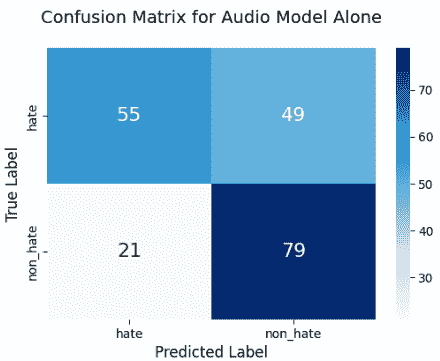

<!--yml

category: 未分类

日期: 2025-01-11 12:13:30

-->

# Safe Guard: 一种用于社交虚拟现实中实时语音仇恨言论检测的LLM代理

> 来源：[https://arxiv.org/html/2409.15623/](https://arxiv.org/html/2409.15623/)

\onlineid

2064 \vgtccategoryResearch \vgtcinsertpkg \teaser ![[无标题图像]](img/de91e1cfc68b3a82334039d229660d89.png) 1(a) 显示了LLM代理Safe Guard与VRChat中的单一玩家进行对话模式下的互动。1(b) 显示了在对话模式下检测到仇恨言论的实例。2(a) 显示了LLM代理Safe Guard与多个玩家在VRChat中进行观察模式下的互动。2(b) 显示了在观察模式下检测到仇恨言论。

Yiwen Xu 电子邮件: xu.yiwen1@northeastern.edu    Qinyang Hou 电子邮件: hou.q@northeastern.edu    Hongyu Wan 电子邮件: wan.hongy@northeastern.edu    Mirjana Prpa 电子邮件: m.prpa@northeastern.edu 东北大学，Khoury计算机科学学院，加拿大温哥华

###### 摘要

本文介绍了Safe Guard，一种用于社交虚拟现实（VRChat）中语音互动仇恨言论检测的LLM代理。我们的系统利用OpenAI GPT和音频特征提取进行实时语音互动。我们贡献了一个系统设计和系统评估，展示了我们方法在检测仇恨言论和减少假阳性方面相较于当前可用方法的优势。我们的结果表明，基于LLM的代理在创建更安全的虚拟环境方面具有潜力，并为基于LLM的内容审查方法的进一步发展奠定了基础。

###### keywords:

仇恨言论，在线骚扰，实时检测，社交虚拟现实，ChatGPT，音频特征。

引言

社交虚拟现实（VR）平台，如VRChat、Rec Room、Bigscreen、AltspaceVR和Meta Horizon Worlds [[47](https://arxiv.org/html/2409.15623v1#bib.bib47)]，近年来经历了显著的流行增长。这些平台提供集成功能，如可定制的虚拟形象和实时语音聊天，提供用户沉浸式的第一人称在线社交体验，用户可以使用头戴式显示器（HMDs）进行更身临其境的交流、互动，并以比传统在线平台更具沉浸感和具象化的方式进行社交互动 [[51](https://arxiv.org/html/2409.15623v1#bib.bib51)]。在社交虚拟现实中，实时语音互动是基础。用户通过真实语音进行对话，并在虚拟环境中实时（RT）与他人交流。这种互动方式增强了用户的临场感和联系感，使体验更接近于现实生活中的面对面交流，而非基于文本的互动 [[47](https://arxiv.org/html/2409.15623v1#bib.bib47)]。

然而，随着越来越多的用户在这些虚拟环境中进行语音互动，确保社交虚拟现实环境中安全且可信的沟通，新的挑战和风险不断出现。作为社交虚拟现实平台上的主要骚扰形式之一，仇恨言论对用户的福祉和虚拟现实社区的整体健康构成了重大威胁。遭遇在线骚扰的人通常会报告他们的离线生活遭到显著干扰[[7](https://arxiv.org/html/2409.15623v1#bib.bib7)]，包括情感和身体上的困扰、未来技术使用习惯的改变，以及对安全性和隐私的担忧[[18](https://arxiv.org/html/2409.15623v1#bib.bib18)]。郑等人[[51](https://arxiv.org/html/2409.15623v1#bib.bib51)]讨论到，沉浸式环境中，如社交虚拟现实环境中的在线骚扰，可能会对目标个体的福祉造成比传统在线攻击更为严重和负面的影响。因此，社交虚拟现实中有效的仇恨言论检测机制对于降低风险和维持积极的用户体验是不可或缺的。

在社交虚拟现实中应对仇恨言论面临着多个挑战。社交虚拟现实的安全风险通常是不可预测的、非常个人化的，并且是实时的，这使得文档记录和数据收集变得困难[[51](https://arxiv.org/html/2409.15623v1#bib.bib51)]。社交虚拟现实的沉浸式特性和语音互动的即时性使得平台很难有效地检测和管理有毒行为[[51](https://arxiv.org/html/2409.15623v1#bib.bib51)]。迄今为止，应对仇恨言论的最准确方法是由社区成员进行的人类管理，但随着事件和与会者数量的增加，由于管理者数量有限且管理工作给社区成员带来了负担，管理者面临着可扩展性挑战[[47](https://arxiv.org/html/2409.15623v1#bib.bib47)]。

为了克服这些挑战，我们借鉴了Schulenberg等人关于社会虚拟现实中AI管理骚扰的研究[[47](https://arxiv.org/html/2409.15623v1#bib.bib47)]，以及Fiani等人进行的一项研究[[14](https://arxiv.org/html/2409.15623v1#bib.bib14)]，该研究提出了在社会虚拟现实中设计具身AI管理员以缓解对儿童骚扰的方向。这些研究强调了AI代理在改进管理过程中的潜力，通过提供及时且具有上下文感知的干预，尤其在像社会虚拟现实这样的动态沉浸式环境中至关重要。在这些见解的基础上，我们的研究专注于开发一个名为“Safe Guard”的大型语言模型（LLM）代理，用于在社会虚拟现实环境中实时检测语音中的仇恨言论（见图：Safe Guard：一个用于实时语音仇恨言论检测的LLM代理）。近年来，大型语言模型（LLM）的进展展示了LLM在虚拟现实中进行实时语音管理的潜力，这一潜力尚未被充分探索。为此，我们将GPT-3.5融入到我们的LLM代理设计中，用于在VRChat中检测仇恨言论。所提出的代理具有两种模式：（1）与单一用户的对话模式，代理在进行对话的同时检测并警报仇恨言论；（2）多人交互时的观察模式，代理监控互动并检测和警报仇恨言论。

LLM展示了在虚拟现实环境中增强管理能力的有前景的解决方案，能够有效识别和分类基于上下文和文本内容的仇恨言论。Kolla等人[[28](https://arxiv.org/html/2409.15623v1#bib.bib28)]指出，LLM在各种自然语言任务中表现良好，包括情感分析和侮辱性言语或贬损言论的检测，展示了它们识别明确的仇恨和攻击性言论的能力。

然而，LLMs（大规模语言模型）由于无法直接处理音频模式和音频提示，因此可能会受到限制，这可能导致诸如错误识别和假阳性等挑战，尤其是在处理边缘案例时。Kumar等人[[29](https://arxiv.org/html/2409.15623v1#bib.bib29)]发现，由于对低劣语言（如脏话、侮辱性言语）和刻板印象（34%）的触发，GPT在识别仇恨言论时可能会产生假阳性，即使是在中性或积极含义的情况下。鉴于假阳性可能对在线社区产生的后果，例如导致封禁和账户暂停，实时处理仇恨言论检测方法的可扩展性带来了多方面的挑战。此外，大多数以往研究集中在批量检测基于文本的骚扰帖子或评论[[7](https://arxiv.org/html/2409.15623v1#bib.bib7), [17](https://arxiv.org/html/2409.15623v1#bib.bib17), [24](https://arxiv.org/html/2409.15623v1#bib.bib24), [25](https://arxiv.org/html/2409.15623v1#bib.bib25)]，在探索如何高效、准确且可扩展地检测虚拟现实环境中的实时语言仇恨言论方面仍然存在明显的空白。

为了解决这些不足并减少假阳性，在“Safe Guard”研究中，我们旨在通过部署音频特征分析来增强LLMs区分仇恨内容和良性内容的能力。音频模型可以捕捉诸如音调、音高和情感等音频特征，而这些是LLMs可能遗漏的。这种能力对于检测基于语音的仇恨言论至关重要，因为情感背景和讲话者的意图尤为重要。

我们设想未来“Safe Guard”作为检测和辅助人工审核员实时打击语音互动中的仇恨言论的第一步。为此，在本研究中，我们探索了这一第一步，涉及开发一个LLM代理，并回答以下研究问题（RQ）：如何通过利用音频特征和LLM文本分析在LLM代理中实时检测社交虚拟现实中的仇恨言论？

本工作的主要贡献包括：（1）一个基于LLM的具象代理，用于在社交虚拟现实中实时检测语音互动中的仇恨言论；（2）一种高精度、快速的提示方法，用于GPT 3.5检测实时语音仇恨言论；（3）一个CNN分类器，用于提取和分析音频特征，辅助仇恨言论检测；（4）一个将LLM检测与音频特征分析集成到LLM代理系统中的系统，用于在VRChat中进行实时语音仇恨言论检测；（5）手工收集并标注的视频数据集，然后转换为音频格式，用于验证基于语音的仇恨言论检测。

在以下论文中，我们将呈现文献综述、方法论、系统设计、系统评估结果、结果讨论、局限性、未来工作以及结论。

## 1 文献综述

### 1.1 在社交 VR 背景下定义骚扰与仇恨言论

在线骚扰的概念仍然高度依赖于情境，并且通常涉及个人解读[[12](https://arxiv.org/html/2409.15623v1#bib.bib12)]。先前的研究指出，不同在线社交社区对骚扰的定义缺乏一致的共识。Pater 等人[[41](https://arxiv.org/html/2409.15623v1#bib.bib41)]分析了来自十五个社交媒体平台的政策文件，并指出这些平台都没有明确界定骚扰的具体含义。通过对这些文件中骚扰行为共现的活动和行为进行交叉比较，最常见的骚扰类型包括滥用、欺凌、伤害、仇恨、跟踪和威胁[[41](https://arxiv.org/html/2409.15623v1#bib.bib41)]。一般的在线骚扰还通过六种不同的行为进行分类：侮辱性骂人、故意羞辱、跟踪、身体威胁、持续骚扰和性骚扰[[12](https://arxiv.org/html/2409.15623v1#bib.bib12)]。另一方面，Blackwell 等人[[7](https://arxiv.org/html/2409.15623v1#bib.bib7)]将有毒的在线骚扰分为四类，即激烈言辞、曝光隐私、冒充和公开羞辱。激烈言辞指的是用户之间的敌对和侮辱性互动；曝光隐私指的是在未经同意的情况下公开揭露某个人的私人信息；冒充指的是冒充他人以欺骗或伤害他人；公开羞辱则是指在公众场合羞辱某人[[7](https://arxiv.org/html/2409.15623v1#bib.bib7)]。

在社交虚拟现实（VR）的背景下，Freeman 等人[[18](https://arxiv.org/html/2409.15623v1#bib.bib18)]研究了在社交 VR 中哪些具体行为或互动以及在哪种情境下应被视为骚扰，并得出结论，任何基于身份特征（如性别和种族）的歧视性行为（例如种族主义、性别歧视和恐同）且有特定目标或受害者的行为都应视为骚扰。此外，Freeman 等人[[18](https://arxiv.org/html/2409.15623v1#bib.bib18)]建议，社交 VR 中的具身性和沉浸感能够模拟现实生活中的线下身体骚扰，带来类似于线下行为的新型网络骚扰形式。除了社交 VR 特有的基于运动和手势的骚扰外，大多数社交 VR 平台上的言语骚扰与其他在线社交社区中的言语骚扰有相似之处，包括仇恨言论[[39](https://arxiv.org/html/2409.15623v1#bib.bib39)]。在这两种情境下，言语骚扰通常涉及使用各种有害的用户行为，包括对其他用户的侮辱性言语[[51](https://arxiv.org/html/2409.15623v1#bib.bib51)]。

联合国将仇恨言论定义为[[38](https://arxiv.org/html/2409.15623v1#bib.bib38)]：“任何以言语、书写或行为形式进行的攻击，或使用贬损性或歧视性语言针对个人或群体，依据的是他们的身份，换句话说，基于他们的宗教、种族、国籍、种族、肤色、血统、性别或其他身份特征。”Guimarães等人[[20](https://arxiv.org/html/2409.15623v1#bib.bib20)]通过Web和社交网络爬虫检查了著名的数据集，并将消息标记为仇恨言论或非仇恨言论。通过使用包含标记为仇恨和非仇恨言论的四个不同数据集进行实验，主要来自Twitter，许多研究如[[50](https://arxiv.org/html/2409.15623v1#bib.bib50), [11](https://arxiv.org/html/2409.15623v1#bib.bib11), [16](https://arxiv.org/html/2409.15623v1#bib.bib16), [36](https://arxiv.org/html/2409.15623v1#bib.bib36), [35](https://arxiv.org/html/2409.15623v1#bib.bib35)]一致认同仇恨言论的定义，即对个人或群体基于种族、宗教、族裔、性取向、残疾或性别的攻击。类似地，Arango等人[[3](https://arxiv.org/html/2409.15623v1#bib.bib3)]将仇恨言论定义为针对个人或群体的敌意或贬低行为，这种行为源自群体特征，如种族、肤色、国籍、性别、残疾、宗教或性取向。

### 1.2 社交虚拟现实中的骚扰管理

现有关于社交虚拟现实管理骚扰的研究强调了其复杂性，原因在于其具身特性、与身份相关的威胁、未成年人的存在以及对定义缺乏共识[[51](https://arxiv.org/html/2409.15623v1#bib.bib51), [15](https://arxiv.org/html/2409.15623v1#bib.bib15)]。社交虚拟现实中基于语音的互动具有沉浸式和实时性，这使得社交虚拟现实平台难以准确有效地检测骚扰，因为缺乏持续的书面记录[[24](https://arxiv.org/html/2409.15623v1#bib.bib24)]。恶意行为者可以实时进行侮辱和攻击性评论，造成直接和即时的伤害。Schulenberg等人[[47](https://arxiv.org/html/2409.15623v1#bib.bib47)]认为，相较于其他环境，社交虚拟现实可能导致更严重的骚扰形式。因此，诸如种族侮辱等仇恨言论在语音频道中将面临比文字频道更严厉的惩罚[[24](https://arxiv.org/html/2409.15623v1#bib.bib24)]。

在社交虚拟现实（VR）环境中，Schulenberg 等人 [[47](https://arxiv.org/html/2409.15623v1#bib.bib47)] 提供了关于社区准则与惩罚、以及主要依赖人工管理的内容审查流程的概述，并介绍了人工智能（AI）在社交 VR 中进行内容审查的潜力。他们总结道，AI 审查系统的存在意识，能够检测大规模的具身沉浸式多用户虚拟环境并实时行动，可以在骚扰发生之前有效地防止其发生 [[47](https://arxiv.org/html/2409.15623v1#bib.bib47)]。现有的社交 VR 平台上的安全增强功能，如封锁、个人空间气泡、静音、举报玩家或信任系统 [[15](https://arxiv.org/html/2409.15623v1#bib.bib15)]，旨在保护用户免受有问题用户的骚扰，但被发现存在局限性 [[34](https://arxiv.org/html/2409.15623v1#bib.bib34), [13](https://arxiv.org/html/2409.15623v1#bib.bib13)]。首先，这些功能将审查的责任推给了用户，而用户可能缺乏有效的策略或对此并不知情 [[22](https://arxiv.org/html/2409.15623v1#bib.bib22)]。其次，平台依赖志愿者审查员来管理公共虚拟房间中的行为 [[8](https://arxiv.org/html/2409.15623v1#bib.bib8)]，但他们无法覆盖大多数事件。Sabri 等人 [[46](https://arxiv.org/html/2409.15623v1#bib.bib46)] 显示，社交 VR 中只有 24% 的事件得到了审查员的处理，突显了对更好审查工具的需求。

自动化的化身式调解已被作为一种替代方案进行研究 [[13](https://arxiv.org/html/2409.15623v1#bib.bib13)]，旨在通过提供一个采取行动以减轻有害互动的保护角色，在社交虚拟现实（VR）中创造更安全的空间。此前的研究 [[13](https://arxiv.org/html/2409.15623v1#bib.bib13), [14](https://arxiv.org/html/2409.15623v1#bib.bib14)] 探讨了使用VR化身AI代理来维持社交VR中的安全和尊重互动。Fiani等人 [[14](https://arxiv.org/html/2409.15623v1#bib.bib14)] 在一个模拟社交VR游戏中介绍了“Big Buddy”作为一名巫师-奥兹自动化代理，当虚拟玩家破坏孩子游戏时，它会进行干预。与传统的调解工具（如报告和封锁）不同，后者通常在后台操作，过程可能存在缺陷，且缺乏信任，容易让用户感到不公正，进而不愿使用 [[14](https://arxiv.org/html/2409.15623v1#bib.bib14)]，而化身代理在虚拟环境中是可视的，能够实时互动并执行社区指南。然而，这些基于AI的调解系统在检测问题事件、解析模糊信息和识别假阳性方面存在关键局限 [[14](https://arxiv.org/html/2409.15623v1#bib.bib14), [30](https://arxiv.org/html/2409.15623v1#bib.bib30)]。假阳性是由于错误地将无害内容标记为有害 [[28](https://arxiv.org/html/2409.15623v1#bib.bib28)]。错误地将内容识别为有害或不当，可能导致不公正的移除或制裁，这可能会伤害到那些可能被不公平地针对的用户 [[44](https://arxiv.org/html/2409.15623v1#bib.bib44)]。

处理不确定性和缺失的上下文因素（例如语音中的语调和音调）仍然是自动化体态化管理的一个关键挑战[[13](https://arxiv.org/html/2409.15623v1#bib.bib13)]。人工智能，特别是LLMs的最新进展，加上沉浸式虚拟现实（VR）和虚拟化身接口，使得可以创建能够与人类进行自然对话的体态化对话代理[[43](https://arxiv.org/html/2409.15623v1#bib.bib43)]。多个实验[[9](https://arxiv.org/html/2409.15623v1#bib.bib9)，[48](https://arxiv.org/html/2409.15623v1#bib.bib48)，[4](https://arxiv.org/html/2409.15623v1#bib.bib4)，[2](https://arxiv.org/html/2409.15623v1#bib.bib2)]已经探索了将LLMs融入LLM-代理对话中，基于LLM的代理越来越普及。LLMs可以快速生成动态且高质量的响应，能够根据玩家的行为、选择和游戏世界的整体状态做出调整[[9](https://arxiv.org/html/2409.15623v1#bib.bib9)，[43](https://arxiv.org/html/2409.15623v1#bib.bib43)]。Mehta等人[[37](https://arxiv.org/html/2409.15623v1#bib.bib37)]强调，LLM-代理交互中的对话式人工智能和LLMs是“极其可行的”，并且有可能取代传统的预先编写的对话。因此，虚拟现实（VR）中基于LLM的体态化代理的出现为利用LLM的潜力开辟了尚未探索的机会，不仅能够生成对话，还能够捕捉和检测实时基于语音的仇恨言论。

### 1.3 LLMs在基于语音的实时仇恨言论检测中的应用

大型语言模型（LLMs）在基于语音的实时（RT）仇恨言论检测中展现了潜力，因为它们能够识别违规内容并提供为什么该内容违反规则的推理[[28](https://arxiv.org/html/2409.15623v1#bib.bib28)]。LLMs表现出了良好的上下文理解能力，使它们在处理在线社区中的规则违反时能够提供正确的推理[[28](https://arxiv.org/html/2409.15623v1#bib.bib28)]。LLMs还在自然语言任务中展现了最先进的性能。LLMs通过使用大量的自然语言数据进行了广泛的训练[[21](https://arxiv.org/html/2409.15623v1#bib.bib21)]，使它们能够掌握复杂的上下文细节。这个特点使得LLMs能够在复杂或模糊的情境下检测实时口头仇恨言论，而传统方法无法满足现有基于监督学习的检测方法，因为它们无法充分捕捉上下文以做出准确的预测[[21](https://arxiv.org/html/2409.15623v1#bib.bib21)]。

LLM在理解和解释从音频转换过来的文本时的鲁棒性，即使文本包含拼写错误、俚语或非正式语言，也可能有助于加快实时仇恨言论检测的速度。传统的机器学习模型和深度学习方法通常需要进行大量的文本预处理，以规范化输入数据，包括分词、去除停用词、词干提取和词形还原 [[26](https://arxiv.org/html/2409.15623v1#bib.bib26)]。这些步骤对于确保输入数据的一致性和可解释性是必不可少的。相反，LLM可以理解原始文本输入的意义和上下文，而无需进行预处理，这得益于其广泛的预训练，这可能会转化为更加简化和高效的处理流程。

此外，LLM（大规模语言模型）需要的特征工程极少，从而简化了开发过程并加快了部署速度。这在实时语音监管中尤为重要，因为在这种场景下，快速且准确的检测对于维护安全和包容的社交虚拟现实环境至关重要。相比之下，传统和深度学习的机器学习方法，如循环神经网络、深度神经网络和长短期记忆网络（LSTM），需要大量的特征工程和大规模的标注数据集 [[19](https://arxiv.org/html/2409.15623v1#bib.bib19)]。微调预训练的变压器模型，如BERT、RoBERTa和ALBERT [[45](https://arxiv.org/html/2409.15623v1#bib.bib45)]，在训练和推理过程中都非常耗费资源。

大型语言模型在仇恨言论检测中的局限性：大型语言模型无法检测语言交互中的语气和情感，尤其是在语气和情感对于区分语言性质至关重要的边缘案例中[[29](https://arxiv.org/html/2409.15623v1#bib.bib29)]。Rana 等人[[45](https://arxiv.org/html/2409.15623v1#bib.bib45)]指出，在分类仇恨言论时，最重要的特征是说话者的情感状态及其对所说话语的影响。语气、情感和语音音调在传达话语背后的意图方面发挥着关键作用。同一句话根据说话者的语气可以有不同的含义，无论是调皮、讽刺、生气还是平静。例如，Rana 等人[[45](https://arxiv.org/html/2409.15623v1#bib.bib45)]主张，政治领导人在会议上平静地讨论移民政策比用极端愤怒和厌恶的语气对某个特定目标人群发表相同的演讲要更不具害性，因为后者会煽动对该国移民的敌意。另一个例子是根据情感和语境不同，某些词语可能有不同的解释[[45](https://arxiv.org/html/2409.15623v1#bib.bib45)]。当朋友用开玩笑的语气称呼某人，且对话保持平静或礼貌时，这不应被归类为仇恨言论。然而，如果相同的话语以严厉的语气并且意图攻击特定个体的话，则应被检测为冒犯性或伤害性的，并归类为仇恨言论。由于大型语言模型仅依赖于纯文本，它们无法捕捉到口语语言的细微差别。这一局限性导致了错误分类和不准确，特别是在仇恨言论检测中的假阳性。假阳性通常是因为大型语言模型在准确解读人类情感时存在困难[[29](https://arxiv.org/html/2409.15623v1#bib.bib29)]，因为语气中传递的重要上下文线索无法通过文本表达出来。例如，基于大型语言模型的主持人可能会将用户夸张的语言解读为对他人的不尊重[[29](https://arxiv.org/html/2409.15623v1#bib.bib29)]。

### 1.4 使用音频特征分析提高大型语言模型在仇恨言论检测中的准确性

可以分析音频特征并应用于解决大型语言模型在检测仇恨言论时的不足。Rana 等人[[45](https://arxiv.org/html/2409.15623v1#bib.bib45)]建议，仇恨言论的分类受说话者情感状态及其对所说话语的影响的显著影响。该研究声称，将情感纳入仇恨言论检测有助于减少仅依赖文本数据作为输入的系统中的假阳性。Patrick 等人[[42](https://arxiv.org/html/2409.15623v1#bib.bib42)]也断言，仇恨言论与说话者的情感和心理状态密切相关，并且在其语言的情感语气中表现得非常明显。

Kumar等人[[29](https://arxiv.org/html/2409.15623v1#bib.bib29)]展示了在LLM基于规则的内容审核中融入上下文，能够通过对提示语进行最小修改来纠正35%的错误。将音频特征分析与LLM结合，可以通过提供仅文本无法捕捉的上下文来增强仇恨言论检测。Barakat等人[[5](https://arxiv.org/html/2409.15623v1#bib.bib5)]证明了MFCC音频特征显著提高了独立关键词检测（KWS）在视频博客中侦测攻击性语言的准确性，远超现有的语音转文本方法，这表明使用音频特征来检测基于音频的仇恨言论具有潜力。

Das等人[[10](https://arxiv.org/html/2409.15623v1#bib.bib10)]发现仇恨言论在时间特征上展示出某种模式，包括零交叉率和均方根能量。这一模式可以通过捕捉独特的声学特征来辅助仇恨言论检测。分析音调、音量和语速等要素可以提供关于讲话者情绪状态和意图的洞察，从而提高分类准确性。Khan等人[[27](https://arxiv.org/html/2409.15623v1#bib.bib27)]强调了将音频特征（如音调和梅尔频率倒谱系数（MFCC））与K最近邻（KNN）和朴素贝叶斯等模型相结合，以增强情绪分类准确性的有效性。Hu等人[[23](https://arxiv.org/html/2409.15623v1#bib.bib23)]发现，使用MFCC特征与高斯混合模型（GMM）结合支持向量机（SVM），比传统的GMM方法表现更好，在情绪分类准确性上有所提升。类似地，Zhou等人[[52](https://arxiv.org/html/2409.15623v1#bib.bib52)]提出了使用MFCC特征的GMM超向量与SVM结合，实现了88%的情绪分类准确率。

最后，Roblox的最新研究[[6](https://arxiv.org/html/2409.15623v1#bib.bib6)]突出了结合专有文本过滤器与音频特征分析来检测仇恨言论的进展。他们展示了CNN模型在MFCC音频特征上的有效性，用于创建分类器，将言语仇恨言论分类为不同类别，包括脏话、约会和性别、种族主义和欺凌。这种结合方法实现了94.48%的平均精度[[6](https://arxiv.org/html/2409.15623v1#bib.bib6)]，展示了将音频特征与文本分析结合以增强检测能力的有效性。我们正在通过利用公开的GPT模型扩展这一工作，旨在减少误报。

## 2 方法论

我们的方法包括以下关键步骤：

+   •

    定义社交虚拟现实中的语音仇恨言论标准，

+   •

    设计并实施基于LLM的仇恨言论检测代理Safe Guard，

+   •

    探索适用于实时仇恨言论检测的LLM提示方法，

+   •

    通过文本转换处理语音消息，并在转录本上应用基于实时LLM的检测。与此同时，使用CNN分类器提取和分析音频的关键特征，以辅助检测，

+   •

    构建并将基于LLM的检测系统集成到安全防护代理架构中，以增强审查能力，

+   •

    收集并分析评估指标，迭代优化和完善提出的系统。

### 2.1 仇恨言论训练和测试数据集

据我们所知，目前没有公开的音频数据集用于仇恨言论检测。为了实现我们的实时语音仇恨言论检测，我们使用了HATEMM数据集[[10](https://arxiv.org/html/2409.15623v1#bib.bib10)]，该数据集来自BitChute平台，包含1083个带有仇恨言论标注的视频。该数据集包含一个真实标签注释文件，其中39.8%的样本被标记为仇恨言论。我们从这些视频中提取了音频，并使用OpenAI Whisper将其转录为文本。数据集被分为80%用于训练，20%用于测试。处理方法包括使用FFmpeg API从视频中提取音频，然后通过OpenAI Whisper API将音频转换为文本转录本，转录本被存储在文件中。进一步的处理通过将转录本与提取的音频特征结合，来提高检测准确性。

### 2.2 LLM 设置和包含仇恨言论审查规则的提示

在本研究中，我们使用ChatGPT 3.5作为用于社交虚拟现实中仇恨言论检测的LLM模型。选择该模型的原因有几个关键因素。首先，GPT 3.5能够处理复杂的上下文细微差别。其次，GPT 3.5在实时检测中更为实用，因为它需要的计算资源较少，且比GPT 4更高效。总体而言，它在性能和资源使用之间提供了良好的平衡。

在使用LLM进行实时检测之前，我们向模型提供了针对仇恨言论标注的数据集信息。基于提示的策略已被发现能有效引导LLM利用特定任务的上下文[[32](https://arxiv.org/html/2409.15623v1#bib.bib32)]。提示是用来指示模型要求什么的查询或声明。通过精心设计提示，可以显著提高LLM的有效性，凸显了提示技术在利用这些模型上下文中的重要性。Guo等人[[21](https://arxiv.org/html/2409.15623v1#bib.bib21)]声称，LLM在识别仇恨言论中的有效性高度依赖于提示设计。

### 2.3 卷积神经网络音频特征模型

CNN模型是一类深度学习算法，主要用于处理结构化网格数据，这非常适合我们的音频参数。CNN模型能够通过反向传播在不同层之间建立准确的分类器。卷积层使用小的可学习过滤器识别输入数据中的特征。像ReLU这样的激活层通过将负值转换为零引入非线性，帮助网络学习模式。池化层减少数据的空间维度，降低计算负担。在多个卷积层和池化层之后，数据被展平为1D向量进行最后的分类。

## 3 系统设计

### 3.1 安全守护代理设计

具象化的LLM代理安全守护设计旨在便于与玩家进行实时互动，同时主动监控和调节VRChat中的对话。基于Park等人[[40](https://arxiv.org/html/2409.15623v1#bib.bib40)]和Wan等人[[49](https://arxiv.org/html/2409.15623v1#bib.bib49)]的前期工作，安全守护融合了多个上下文管理和审查功能。该系统保持互动的记忆，不仅捕捉对话内容，还包括玩家的态度、基于输入消息推测的情绪以及对话发生的时间[[49](https://arxiv.org/html/2409.15623v1#bib.bib49)]。这种全面的记忆对理解和解读社交虚拟现实中的持续互动至关重要。为了有效管理和评估上下文，安全守护使用了先进的技术，如指数衰减，用于优先考虑最近的互动，以及余弦相似度指标，用于评估过去对话的相关性[[49](https://arxiv.org/html/2409.15623v1#bib.bib49)]。这些方法确保安全守护能够准确评估每次互动的重要性和与当前讨论的相关性。

双模式操作：安全守护可以在对话模式（与单个用户互动）和观察模式（监控群组互动）之间切换，根据场景需求进行切换。

代理系统的关键方面如下定义：

GPT模块。ChatGPT在整个安全守护系统设计过程中得到部署，用于处理用户输入、理解社交情境的上下文并生成适当的观察或回应。它不仅促进了类似人类的互动，还主动监控潜在的仇恨言论实例。

LLM-Agent 生成模块。LLM-agent是通过为其分配一个基础描述来创建的，该描述包括姓名、角色细节、偏好等[[49](https://arxiv.org/html/2409.15623v1#bib.bib49)]。安全守护专门为仇恨言论检测量身定制。其角色描述为“一个警觉、中立且平易近人的守护者，专注于在虚拟现实空间内保持尊重的沟通”。使用Unity引擎修改选定的虚拟角色，并为其添加一组用于表达和动作的动画。

观察数据库模块。该系统维护一个包含上下文观察的集合，用于存储 LLM 为每个对话生成的所有观察结果。这包括来自 LLM 代理“基础描述”的初始观察。进一步的对话上下文通过为每条消息生成最多三个观察结果来捕获 [[49](https://arxiv.org/html/2409.15623v1#bib.bib49)]。记忆观察被定义为基础描述和上下文观察的组合（有关 LLM 代理的更多细节，请参见 [[49](https://arxiv.org/html/2409.15623v1#bib.bib49)]）。

图1：对话模式下的安全保护系统设计

### 3.2 仇恨言论检测系统

实时仇恨言论检测系统旨在集成到 VRChat 中，确保安全和尊重的环境。如图 [1](https://arxiv.org/html/2409.15623v1#S3.F1 "在 3.1 安全保护代理设计 ‣ 3 系统设计 ‣ 安全保护：用于实时语音仇恨言论检测的 LLM 代理") 所示，流程图展示了提议的安全保护仇恨言论检测系统在对话模式下的工作流程。当呈现多个玩家时，该系统在观察模式下的操作方式类似，不同之处在于 LLM 代理不会与玩家生成对话。

### 3.3 LLM 模型的提示工程

为了建立我们的仇恨言论检测系统，我们基于已建立的仇恨言论定义和推理，为 ChatGPT 3.5 使用了特定的提示，以产生二进制响应。在实验阶段，我们比较并决定了最适合且最有效的提示方法。由于该项目应用于实时检测，我们关注的是不需要冗长上下文或多个顺序提示的方法。我们主要评估了下面讨论的三种不同方法。

#### 3.3.1 方法 #1：直接提示

对于这种方法，我们使用了一个直接的提示，让 GPT 将文本分类为“仇恨言论”或“非仇恨言论”，并没有提供任何额外的指示。此前的研究已经证明这种提示方法是有效的 [[31](https://arxiv.org/html/2409.15623v1#bib.bib31)]。使用这种通用提示方法可以快速使 LLM 模型完成语音仇恨言论检测任务。我们为此方法使用的提示信息是：“你是一个分类器，负责识别给定的文本是否包含仇恨言论。以下文本是仇恨言论吗？请回答‘是’或‘否’。以下是文本：”

#### 3.3.2 方法 #2：使用仇恨言论定义的提示

该方法涉及在我们的使用案例中明确界定仇恨言论，并询问特定文本是否符合该定义。我们为此方法使用的提示信息是：“社交虚拟现实中的仇恨言论包括任何基于种族、宗教、民族、国籍、性别、残疾、性取向或性别认同等属性攻击个人或群体的言论。请仔细考虑此上下文。以下文本是否为仇恨言论？请回答‘是’或‘否’。文本：”

#### 3.3.3 方法 #3：少样本学习提示

除了对仇恨言论的定义外，我们还提供了几个带有真实标签的示例，以帮助GPT学习什么构成仇恨言论，什么不构成。我们为此方法使用的提示信息是：“仇恨言论包括任何基于种族、宗教、民族、国籍、性别、残疾、性取向或性别认同等属性攻击个人或群体的言论。请仔细考虑此上下文。

下面是一些仇恨言论和非仇恨言论的例子：

示例 1：文本：“我认为所有种族的人都应平等对待。” 仇恨言论：否

示例 2：文本：“[name]国的人都是罪犯，应该被驱逐出境。” 仇恨言论：是

示例 3：文本：“每个人都应该被爱，不论他们的性别认同。” 仇恨言论：否

示例 4：文本：“我认为所有移民都应该离开加拿大。” 仇恨言论：是

判断以下文本是否为仇恨言论。请回答‘是’或‘否’。文本：”

### 3.4 音频特征提取

声音由声音信号及其内容组成。除了内容，声音信号还可以提供用于仇恨言论检测的信息。特征提取是从原始数据信号中提取和处理隐藏信息的过程[[1](https://arxiv.org/html/2409.15623v1#bib.bib1)]。我们使用了均方根（RMS）和梅尔频率倒谱系数（MFCC）进行音频特征分析。

均方根（RMS）是信号平方和均值的平方根。在音频信号的上下文中，RMS通常用来衡量信号的功率或响度[[10](https://arxiv.org/html/2409.15623v1#bib.bib10)]。它提供一个单一的值，代表波形的平均能量，这对于分析音频信号随时间变化的振幅特别有用。

|  | $\text{RMS}=\sqrt{\frac{1}{N}\sum_{i=1}^{N}x[i]^{2}}$ |  | (1) |
| --- | --- | --- | --- |

其中：

+   •

    $x[i]$ 是第 $i$ 个样本的信号幅度，

+   •

    $N$ 是样本的总数。

梅尔频率倒谱系数（MFCC）广泛应用于语音和音频处理，作为声音短期功率谱的表示[[33](https://arxiv.org/html/2409.15623v1#bib.bib33)，[1](https://arxiv.org/html/2409.15623v1#bib.bib1)]。它们在语音识别、说话人识别、情感识别和音频分类等任务中非常有用。考虑到它们的实用性，将MFCC纳入我们的仇恨言论检测方法是有益的。Ali等人[[1](https://arxiv.org/html/2409.15623v1#bib.bib1)]指出，MFCC可以通过五个连续的过程来计算，分别是信号分帧、计算功率谱、将梅尔滤波器组应用于获得的功率谱、计算所有滤波器组的对数值，最后应用离散余弦变换（DCT）。

在初步探索音频特征后，我们决定在CNN模型中使用40维的MFCC特征，以捕捉用户输入音频数据的关键特征。为了从WAV音频文件中提取这些特征，我们使用了Python库librosa，并将结果存储在CSV文件中以供进一步分析。

### 3.5 音频特征模型

在提取音频文件特征后，我们使用机器学习技术基于这些特征构建了一个CNN分类器。

最初，我们建立了一个由线性堆叠层组成的顺序模型。输入层包括一个32个滤波器的2D卷积层，每个滤波器的大小为3x1，旨在从输入数据中提取空间特征，输入数据的形状为40维，1个特征。接下来，我们添加了第二个卷积层和第二个最大池化层。最后，使用平坦层将2D数据转换为1D，然后通过两个全连接的稠密层进行最终分类。

### 3.6 使用LLM与音频特征模型的组合来检测仇恨言论

在我们提出的系统中，我们将GPT 3.5作为主要方法，并与基于音频的CNN分类器结合，以增强整体检测性能。这两种方法的集成旨在结合自然语言处理和音频信号分析的优点，提高检测结果的准确性和可靠性。

在将音频转换为文本后，转录文本被传递到提示的LLM模型。该LLM模型会遍历转录内容，检测其中是否包含仇恨言论。同时，音频的关键特征通过CNN分类器提取并分析，以生成一个概率得分。如果这个概率得分大于0.5，输入将被分类为“仇恨”。0.5的阈值通常用于进行二元分类决策。

为了确定联合模型的最终分类结果，我们应用了以下决策规则：仅当 GPT 模型和基于音频的 CNN 分类器都预测为“仇恨言论”时，音频输入才会被分类为“仇恨言论”。否则，最终分类为“非仇恨言论”。一旦系统成功检测到仇恨言论，系统会立即在代理的对话框中显示语音通知，提示已检测到仇恨言论（见图 [1](https://arxiv.org/html/2409.15623v1#S3.F1 "图 1 ‣ 3.1 安全保障代理设计 ‣ 3 系统设计 ‣ 安全保障：一个实时语音仇恨言论检测的 LLM 代理")）。

### 3.7 集成到安全保障代理系统

我们将仇恨言论检测系统集成到 Safe Guard LLM 代理中，并在模块内处理音频，以确定是否存在仇恨言论。一旦检测到仇恨言论，程序会立即在 Safe Guard 对话框中显示警告信息。我们微调了静默检测参数，包括将最大静默时长增加到 2 秒，并将触发录音过程的阈值降低到 -40db。通过这种方式，我们能够提取分段的句子而不是整段语音进行音频处理。我们还将采样率调整为 44100Hz，这是与 Safe Guard 代理系统兼容的最高速率，以获得更好的录音质量并支持音频特征提取。

## 4 实验

### 4.1 程序

VRChat 实验系统设置：为了在 VRChat 中模拟真实场景环境，我们连接了两台设备，它们使用不同的账户登录 VRChat。一个账户作为主机服务器，运行 LLM 代理和检测系统，以捕捉测试对象的音频。同时，第二个账户作为玩家，通过麦克风传输测试语音数据集。

在音频特征处理过程中，RMS 和 MFCC 的结合在分类仇恨和非仇恨数据集时起到了关键作用，产生了最佳的特征选择结果。提取的特征经过 CNN 训练模型处理，生成了与已识别的仇恨言论模式的相似度分数。

提示实验：我们使用不同的提示技术评估了 LLM 仇恨言论检测系统的有效性。我们使用了包含仇恨言论的 50 个视频，这些视频来自我们的主要 MM 仇恨数据集。每个数据的真实标签将通过对视频数据集的手动分类得出。

### 4.2 评估指标

#### 4.2.1 延迟：实时检测时间

为了评估实时仇恨言论检测系统的性能，我们测量了检测过程每个阶段的延迟。总体延迟包括以下四个主要组成部分：（1）音频特征提取时间：从原始音频数据中提取音频特征的时间，（2）语音转文本转换时间：使用语音识别引擎将音频输入转录为文本所需的时间，（3）音频特征预测时间：CNN 分类器基于音频特征将音频分类为仇恨言论或非仇恨言论所需的时间，（4）LLM 分析时间：LLM 将文本分类为仇恨言论或非仇恨言论所需的时间。

总检测时间是这些个别时间的总和，表示从接收音频输入到提供审查输出的总体延迟。

#### 4.2.2 准确率指标

为了评估我们在社交 VR 中基于语音的实时仇恨言论检测系统的准确性，我们使用了几个知名且在学术上验证过的关键指标[[21](https://arxiv.org/html/2409.15623v1#bib.bib21)]，如下所示：

准确率：准确率衡量了所有检测结果中正确检测（包括真正的正例和负例）所占的比例。其计算公式为：

|  | $\text{Accuracy}=\frac{\text{True Positives (TP)}+\text{True Negatives (TN)}}{\text{Total Instances}}$ |  |
| --- | --- | --- |

精度：精度衡量了所有正例检测（标记为仇恨言论的实例）中真正检测到的仇恨言论的比例。其计算公式为：

|  | $\text{Precision}=\frac{\text{True Positives (TP)}}{\text{True Positives (TP)}+% \text{False Positives (FP)}}$ |  |
| --- | --- | --- |

召回率（灵敏度）：召回率评估了所有实际仇恨言论实例中真正检测到的比例。其定义如下：

|  | $\text{Recall}=\frac{\text{True Positives (TP)}}{\text{True Positives (TP)}+\text{False Negatives (FN)}}$ |  |
| --- | --- | --- |

F1 分数：F1 分数是精度和召回率的调和平均值，提供一个平衡两者的单一指标。其计算公式为：

|  | $\text{F1 Score}=2\times\frac{\text{Precision}\times\text{Recall}}{\text{Precision}+\text{Recall}}$ |  |
| --- | --- | --- |

## 5 结果

### 5.1 验证数据集

从 YouTube 使用搜索 API 共收集了 204 个视频片段，并手动标注了真实标签进行验证。其中 104 个是仇恨言论，100 个是非仇恨言论。我们在 20 秒内筛选数据，以更好地模拟 VRChat 设置中的真实对话场景。

### 5.2 数据分析

#### 5.2.1 GPT3.5 提示方法对比分析

表。[1](https://arxiv.org/html/2409.15623v1#S5.T1 "表1 ‣ 5.2.1 GPT3.5提示方法比较分析 ‣ 5.2 数据分析 ‣ 5 结果 ‣ Safe Guard：用于社交虚拟现实中的实时语音仇恨言论检测的LLM代理") 下比较了仅使用GPT在我们训练数据集上对三种提示方法进行的仇恨言论检测性能。由于数据集由较长的叙述性演讲组成，而非简短的对话，结果未显示出显著的准确率。

| 方法 | 准确率 (%) | 精确率 (%) | 召回率 (%) | F1 (%) |
| --- | --- | --- | --- | --- |
| 直接 |
| 非仇恨 |  | 71.43 | 19 | 29 |
| 仇恨 |  | 56 | 93 | 70 |
| 总体 | 57.52 | 63 | 56 | 50 |
| 定义提示 |
| 非仇恨 |  | 67 | 77 | 71 |
| 仇恨 |  | 91 | 85 | 88 |
| 总体 | 82.98 | 79 | 81 | 80 |
| 少样本 |
| 非仇恨 |  | 78 | 78 | 78 |
| 仇恨 |  | 93 | 93 | 93 |
| 总体 | 85 | 89 | 89 | 80 |

表1：GPT-3.5在仇恨言论检测中的表现比较

在这三种方法中，少样本提示法被证明是仇恨言论检测中最有效的方法，优于其他两种方法。它实现了更高的准确率，并平衡了精确率和召回率，使其在我们的使用案例中成为更合适的选择。

#### 5.2.2 检测系统结果分析

与基线模型比较：我们将所提出的组合模型的表现与仅使用GPT-3.5和仅使用音频特征模型作为两个基线模型的性能指标进行了比较。结果显示在表。[2](https://arxiv.org/html/2409.15623v1#S5.T2 "表2 ‣ 5.2.2 检测系统结果分析 ‣ 5.2 数据分析 ‣ 5 结果 ‣ Safe Guard：用于社交虚拟现实中的实时语音仇恨言论检测的LLM代理") 中，表中列出了包括精确率、召回率和F1分数在内的分类性能评估报告，分别针对仇恨和非仇恨类别。

| 模型 | 类别 | 精确率 | 召回率 | F1-得分 |
| --- | --- | --- | --- | --- |
| GPT | 仇恨 | 0.95 | 0.95 | 0.95 |
| 非仇恨 | 0.94 | 0.94 | 0.95 |
| 准确率 | 0.95 |
| 宏观平均 | 0.95 | 0.95 | 0.95 |
| 加权平均 | 0.95 | 0.95 | 0.95 |
| 音频 | 仇恨 | 0.73 | 0.53 | 0.62 |
| 非仇恨 | 0.63 | 0.79 | 0.71 |
| 准确率 | 0.67 |
| 宏观平均 | 0.68 | 0.67 | 0.66 |
| 加权平均 | 0.68 | 0.67 | 0.66 |
| 组合 | 仇恨 | 0.96 | 0.53 | 0.69 |
| 非仇恨 | 0.67 | 0.99 | 0.80 |
| 准确率 | 0.75 |
| 宏观平均 | 0.82 | 0.76 | 0.74 |
| 加权平均 | 0.82 | 0.76 | 0.74 |

表2：GPT模型、音频模型与组合方法的分类报告

图2：仅GPT模型

图3：仅音频特征模型

图4：组合模型

GPT模型在所有指标上表现强劲且一致（图[4](https://arxiv.org/html/2409.15623v1#S5.F4 "Figure 4 ‣ 5.2.2 Detection System Result Analysis ‣ 5.2 Data Analysis ‣ 5 RESULTS ‣ Safe Guard: an LLM-agent for Real-time Voice-based Hate Speech Detection in Social Virtual Reality")）。对于仇恨言论和非仇恨言论，它都达到了约0.95的高精度和召回率。高准确率表明GPT模型在检测仇恨言论和非仇恨言论方面非常可靠。然而，缺点是与组合模型相比，假阳性率较高。

音频模型的表现低于GPT模型（图[4](https://arxiv.org/html/2409.15623v1#S5.F4 "Figure 4 ‣ 5.2.2 Detection System Result Analysis ‣ 5.2 Data Analysis ‣ 5 RESULTS ‣ Safe Guard: an LLM-agent for Real-time Voice-based Hate Speech Detection in Social Virtual Reality")）。对于仇恨言论，精度为0.73，召回率为0.53\。这表明该模型在仇恨言论检测中存在较多的假阴性。对于非仇恨言论，模型表现略好，精度为0.63，召回率为0.79\。总体而言，音频模型的准确率为0.67，反映出其中等的效果。

组合方法表现出更平衡的效果（图[4](https://arxiv.org/html/2409.15623v1#S5.F4 "Figure 4 ‣ 5.2.2 Detection System Result Analysis ‣ 5.2 Data Analysis ‣ 5 RESULTS ‣ Safe Guard: an LLM-agent for Real-time Voice-based Hate Speech Detection in Social Virtual Reality")）。对于仇恨言论，它达到了0.96的高精度，但召回率较低，为0.53，F1分数为0.69\。对于非仇恨言论，组合方法表现出0.67的精度和0.99的卓越召回率。总体准确率为0.75，表明组合方法优于音频模型，并能够提升GPT模型的检测结果。

三种模型的假阳性率（FPR）比较：FPR的计算公式为FP / (FP + TN)，其中FP为假阳性数量，TN为真阴性数量。如图[4](https://arxiv.org/html/2409.15623v1#S5.F4 "Figure 4 ‣ 5.2.2 Detection System Result Analysis ‣ 5.2 Data Analysis ‣ 5 RESULTS ‣ Safe Guard: an LLM-agent for Real-time Voice-based Hate Speech Detection in Social Virtual Reality")所示，GPT模型的FPR为0.06，意味着6%的非仇恨言论被错误地分类为仇恨言论。同时，音频特征模型的FPR则高得多，为0.21（图[4](https://arxiv.org/html/2409.15623v1#S5.F4 "Figure 4 ‣ 5.2.2 Detection System Result Analysis ‣ 5.2 Data Analysis ‣ 5 RESULTS ‣ Safe Guard: an LLM-agent for Real-time Voice-based Hate Speech Detection in Social Virtual Reality")），表现出更大的误分类非仇恨言论的倾向。相比之下，组合模型表现显著更好，FPR仅为0.01（图[4](https://arxiv.org/html/2409.15623v1#S5.F4 "Figure 4 ‣ 5.2.2 Detection System Result Analysis ‣ 5.2 Data Analysis ‣ 5 RESULTS ‣ Safe Guard: an LLM-agent for Real-time Voice-based Hate Speech Detection in Social Virtual Reality")），意味着它只将1%的非仇恨言论误分类为仇恨言论，显示出与单一模型相比，组合方法在减少假阳性方面的有效性。

#### 5.2.3 延迟测量

我们在不同阶段收集并分析了延迟测量数据。在测试过程中，我们识别了平均值、最小值和最大值的延迟时间。[表3](https://arxiv.org/html/2409.15623v1#S5.T3 "In 5.2.3 Latency Measurement ‣ 5.2 Data Analysis ‣ 5 RESULTS ‣ Safe Guard: an LLM-agent for Real-time Voice-based Hate Speech Detection in Social Virtual Reality")展示了系统不同阶段的处理时间。

| 处理 | 最小值（秒） | 平均值（秒） | 最大值（秒） |
| --- | --- | --- | --- |
| 转录 | 0.48 | 0.95 | 1.99 |
| LLM分析 | 0.27 | 0.48 | 1.83 |
| 音频提取 | 0.006 | 0.019 | 0.045 |
| 音频预测 | 0.05 | 0.055 | 0.065 |

表3：系统不同阶段的处理时间。

我们的测试表明，所提出的结合检测系统的平均延迟约为1.5秒，我们认为这在实时语音仇恨言论检测的应用场景中是可以接受的。图表[5](https://arxiv.org/html/2409.15623v1#S5.F5 "图5 ‣ 5.2.3 延迟测量 ‣ 5.2 数据分析 ‣ 5 结果 ‣ Safe Guard：一个用于社交虚拟现实中实时语音仇恨言论检测的LLM代理")显示，平均而言，整体延迟的60%以上是由于转录过程造成的，32%归因于GPT处理。音频特征提取和预测时间仅占约5%。这些发现与我们在前几节中对LLMs和音频特征分析优缺点的讨论一致。

图5：整体延迟分布

## 6 讨论

为了回答我们的研究问题，我们利用LLMs和音频特征的力量，解决了社交虚拟现实中实时互动环境下仇恨言论检测的复杂性和模糊性。

LLM在仇恨言论检测中的有效性与权衡 虽然GPT模型在整体性能上表现优异，准确率为0.95，但它也存在误报的权衡。GPT模型在仇恨言论检测中的精度和召回率都很强，但它将非仇恨言论误判为仇恨言论的倾向导致了较高的误报率。这可能会导致不必要的审查请求和潜在的用户体验问题[[30](https://arxiv.org/html/2409.15623v1#bib.bib30)]。

将音频特征与LLMs结合以减少误报 将音频特征融入GPT提供了一种更为平衡的仇恨言论检测方法。尽管结合方法的整体准确率为0.75，低于单独使用GPT模型，但它在最小化误报方面表现出了优势。结合方法还在仇恨言论检测中达到了0.96的高精度，表明当它识别出仇恨言论时，准确性非常高。这一高精度意味着误将非仇恨言论错误标记为仇恨言论的情况更少，从而通过减少错误分类的可能性改善用户体验，并更好地符合实际业务需求。

通过确保检测到的仇恨言论确实是仇恨言论，结合方法可以减少错误识别非仇恨言论为仇恨言论的风险，从而避免损害用户体验。此外，真实的仇恨言论案例的高准确性也展示了结合方法在建立自动化仇恨言论审查流程方面的潜力，这可以减少对人工审查的需求。

克服由音频干扰引起的误分类 在我们对误分类案例的回顾中，识别出了几个导致检测错误的关键因素，包括音频质量差、背景噪声（音乐或唱歌）以及说话者在讲话时笑的情况。这些问题使得音频模型和GPT都难以准确理解语音。解决这些挑战对提高社交VR中实时仇恨言论检测的准确性至关重要。针对这些挑战的一个可能解决方案来源于前期的研究[[6](https://arxiv.org/html/2409.15623v1#bib.bib6)]，该研究引入了语音活动检测（VAD）模型作为预处理步骤。VAD显著提高了整体流程的鲁棒性，尤其是对于使用噪声麦克风的用户。通过过滤掉背景噪声并仅在检测到人类语音时才应用检测流程，该系统将整体推理量减少了约10％，并提高了输入质量。未来在这些领域的改进将减少错误，使基于AI的内容审核更加可靠和有效。

总结来说，联合方法在减少误报和提高识别非仇恨言论准确性方面的能力，使其成为GPT模型的有价值改进，充分契合了提升用户体验和实际应用需求的目标。

## 7 局限性

我们研究中的一些局限性可能会影响仇恨言论检测系统的整体效果。

首先，CNN音频特征模型需要更多的训练以提高其准确性。训练数据的数量有限影响了当前模型的训练。进行更多的训练可能会提高音频模型的预测效果。

此外，由于训练和验证数据不足，本研究遇到了挑战。更大且更具多样性的数据集的可用性有助于开发更有效的模型并提高整体准确性。为此，我们认识到平台内（如VRChat）数据收集的必要性，但这也带来了数据收集和玩家隐私方面的挑战，需要解决。

最后，经过人工检查，我们发现音频数据中的背景干扰（如音乐、唱歌和笑声）降低了模型的检测准确性。在我们的研究中，我们没有应用任何相关的噪声过滤或预处理技术来减轻背景干扰。

## 8 未来工作

在未来开展研究以改进仇恨言论检测系统时，可以考虑几种方法。

首先，扩大数据集的规模将为模型的训练提供更坚实的基础，从而提高准确性和泛化能力。通过增加更多的数据样本，尤其是边缘案例，模型将能够更好地处理那些可能被忽视的多样化场景。

其次，当前系统可以通过结合社交虚拟现实中的音频和视觉输入，扩展为多模态检测。将用户在社交虚拟现实平台上实时互动的视觉和音频数据纳入其中，具有产生更全面分析并最终提高检测准确性的潜力。

此外，增加识别和分类各种仇恨言论形式的能力，如种族、民族、宗教和性取向仇恨言论，将显著增强模型的检测能力。这种方法将使系统在识别特定类型的仇恨内容方面更加有效，并为检测结果增加推理，从而提高其在社交虚拟现实中的实际应用。

此外，在特定的现实世界场景中训练和评估系统性能，如在真实的VRChat环境中，将为其适用性和鲁棒性提供宝贵的见解。

最后，未来的研究应调查有效的人类与AI协作方法，进一步减少假阳性，并通过确保自动化AI处理常规审核任务，而人类审核员处理更复杂或微妙的案件，从而提高仇恨言论检测的准确性。

## 9 结论

本研究提出了一种结合方法，用于社交虚拟现实中的实时基于语音的仇恨言论检测，该方法充分利用了**GPT**和音频卷积神经网络分类器（CNN）的优势。结合方法提高了精确度并减少了假阳性，使其在实际应用中更具实用性。通过将GPT作为主要方法并结合辅助音频分类，系统实现了更平衡的仇恨言论分类。研究结果突出了多模态方法在提高仇恨言论检测和分类中的潜力，为未来在各个领域的改进和应用提供了基础。

## 参考文献

+   [1] S. Ali, S. Tanweer, S. Khalid, 和 N. Rao. Mel频率倒谱系数：综述. 2021年1月。doi: 10 . 4108/eai . 27-2-2020 . 2303173

+   [2] P. Ammanabrolu, J. Urbanek, M. Li, A. Szlam, T. Rocktäschel, 和 J. Weston. 如何激励你的龙：在幻想世界中教导目标驱动的智能体进行言语和行动. 2021年北美计算语言学协会年会：人类语言技术会议论文集，pp. 807–833。计算语言学协会，在线，2021年6月。doi: 10 . 18653/v1/2021 . naacl-main . 64

+   [3] A. Arango. 与语言无关的仇恨言论检测. 2020年第43届国际ACM SIGIR信息检索研究与发展会议，SIGIR ’20，p. 2475。计算机学会，纽约，美国，2020年。doi: 10 . 1145/3397271 . 3401447

+   [4] T. Ashby, B. K. Webb, G. Knapp, J. Searle, 和 N. Fulda. 角色扮演游戏中的个性化任务和对话生成：基于知识图谱和语言模型的方法。发表于2023年CHI会议（人类因素与计算系统大会），CHI '23。计算机协会，美国纽约，2023年。doi: 10 . 1145/3544548 . 3581441

+   [5] M. S. Barakat, C. H. Ritz, 和 D. A. Stirling. 检测攻击性用户视频博客：一种自适应关键词检测方法。发表于2012年国际音频、语言与图像处理大会，第419–425页，2012年。doi: 10 . 1109/ICALIP . 2012 . 6376654

+   [6] K. Bhat. 部署机器学习以提升语音安全。[https://corp.roblox.com/newsroom/2024/06/deploying-ml-for-voice-safety](https://corp.roblox.com/newsroom/2024/06/deploying-ml-for-voice-safety)，2024年7月。访问时间：2024年8月7日。

+   [7] L. Blackwell, J. Dimond, S. Schoenebeck, 和 C. Lampe. 分类及其对在线骚扰的影响：来自Heartmob的设计洞察。ACM人机交互学会会议录，1（CSCW）：19，2017年12月。doi: 10 . 1145/3134659

+   [8] L. Blackwell, N. Ellison, N. Elliott-Deflo, 和 R. Schwartz. 社交虚拟现实中的骚扰：平台治理的挑战。ACM人机交互学会会议录，3（CSCW），2019年11月。doi: 10 . 1145/3359202

+   [9] L. M. Csepregi. 基于上下文感知的大型语言模型（LLM）NPC对话对角色扮演视频游戏玩家参与度的影响。硕士论文，奥尔堡大学，2023年。

+   [10] M. Das, R. Raj, P. Saha, B. Mathew, M. Gupta, 和 A. Mukherjee. Hatemm：一个用于仇恨视频分类的多模态数据集。发表于国际AAAI网络与社交媒体会议记录，17：1014–1023，2023年6月。doi: 10 . 1609/icwsm . v17i1 . 22209

+   [11] T. Davidson, D. Warmsley, M. Macy, 和 I. Weber. 自动化仇恨言论检测与攻击性语言问题，2017年。

+   [12] M. Duggan. 在线骚扰2017，2017年。

+   [13] C. Fiani, R. Bretin, S. A. Macdonald, M. Khamis, 和 M. McGill. “皮卡丘会电击那些行为不端的人”：专家、监护人和儿童对自动具身调解员在社交虚拟现实中保护儿童的看法。发表于CHI会议（人类因素与计算系统大会），CHI '24。计算机协会，美国纽约，2024年。doi: 10 . 1145/3613904 . 3642144

+   [14] C. Fiani, R. Bretin, M. McGill, 和 M. Khamis. Big buddy：探索儿童反应和家长对模拟具身调解系统在社交虚拟现实中的看法。发表于第22届ACM互动设计与儿童会议（IDC '23），第1–13页。计算机协会，美国纽约，2023年。doi: 10 . 1145/3585088 . 3589374

+   [15] C. Fiani, P. Saeghe, M. McGill, 和 M. Khamis. 探索社交虚拟现实意识的非父母成人和家长对儿童使用社交虚拟现实的看法。ACM人机交互学会会议录，8（CSCW1）：25，2024年4月。doi: 10 . 1145/3652867

+   [16] A.-M. Founta, C. Djouvas, D. Chatzakou, I. Leontiadis, J. Blackburn, G. Stringhini, A. Vakali, M. Sirivianos, 和 N. Kourtellis. 大规模众包与Twitter恶意行为特征化研究，2018年。

+   [17] M. Franco, O. Gaggi, 和 C. E. Palazzi. 分析大型语言模型在内容审查中的应用，结合 ChatGPT 示例. 收录于《第三届国际网络社交平台开放挑战研讨会》，OASIS ’23，页码 1–8，计算机协会，纽约，NY，美国，2023年。doi: 10.1145/3599696.3612895

+   [18] G. Freeman, S. Zamanifard, D. Maloney, 和 D. Acena. 扰乱和平：体验并缓解社交虚拟现实中的新兴骚扰. 《ACM 人机交互事务》，6(CSCW1):30，2022年4月。doi: 10.1145/3512932

+   [19] T. Gröndahl, L. Pajola, M. Juuti, M. Conti, 和 N. Asokan. 你所需要的只有“爱”：规避仇恨言论检测. 收录于《第11届ACM人工智能与安全研讨会》，AISec ’18，页码 2–12，计算机协会，纽约，NY，美国，2018年。doi: 10.1145/3270101.3270103

+   [20] S. Guimarães, G. Kakizaki, P. Melo, M. Silva, F. Murai, J. C. S. Reis, 和 F. Benevenuto. 仇恨言论数据集的结构：组成分析与跨数据集分类. 收录于《第34届ACM超文本与社交媒体会议》，HT ’23，计算机协会，纽约，NY，美国，2023年。doi: 10.1145/3603163.3609158

+   [21] K. Guo, A. Hu, J. Mu, Z. Shi, Z. Zhao, N. Vishwamitra, 和 H. Hu. 对大型语言模型在现实世界仇恨言论检测中的应用研究，2024年。

+   [22] H. Hartikainen, N. Iivari, 和 M. Kinnula. 我们应该为控制、信任还是参与设计？关于儿童在线安全的对话调查. 收录于《第15届国际互动设计与儿童会议》，IDC ’16，页码 367–378，计算机协会，纽约，NY，美国，2016年。doi: 10.1145/2930674.2930680

+   [23] H. Hu, M.-X. Xu, 和 W. Wu. 基于GMM超向量和频谱特征的SVM语音情感识别. 收录于《2007 IEEE国际声学、语音与信号处理会议 - ICASSP ’07》，第4卷，页码 IV-413–IV-416，2007年。doi: 10.1109/ICASSP.2007.366937

+   [24] J. A. Jiang, C. Kiene, S. Middler, J. R. Brubaker, 和 C. Fiesler. Discord语音社区中的审查挑战. 《ACM 人机交互事务》，3(CSCW)，2019年11月。doi: 10.1145/3359157

+   [25] J. A. Jiang, P. Nie, J. R. Brubaker, 和 C. Fiesler. 一种以权衡为中心的内容审查框架. 《ACM 计算机与人类互动事务》，30(1)，2023年3月。doi: 10.1145/3534929

+   [26] A. Kadhim. 文本分类预处理技术评估. 《国际计算机科学与信息安全期刊》，16:22–32，2018年6月。

+   [27] A. Khan 和 U. K. Roy. 基于语音的音韵和谱特征以及朴素贝叶斯分类器的情感识别. 见于2017年国际无线通信、信号处理和网络会议（WiSPNET），第1017–1021页，2017年. doi: 10.1109/WiSPNET.2017.8299916

+   [28] M. Kolla, S. Salunkhe, E. Chandrasekharan, 和 K. Saha. LLM-Mod：大语言模型能否协助内容审核？ 见于2024年CHI会议人类计算机交互系统扩展摘要, CHI EA ’24. 计算机协会，纽约，纽约州，美国，2024年. doi: 10.1145/3613905.3650828

+   [29] D. Kumar, Y. AbuHashem, 和 Z. Durumeric. 小心你的语言：使用大语言模型研究内容审核. arXiv预印本2309.14517, 2024年9月.

+   [30] V. Lai, S. Carton, R. Bhatnagar, Q. V. Liao, Y. Zhang, 和 C. Tan. 通过条件委托进行人类-人工智能协作：内容审核的案例研究. 见于CHI会议人类计算机交互系统的会议论文集, CHI ’22. 计算机协会，纽约，纽约州，美国，2022年. doi: 10.1145/3491102.3501999

+   [31] L. Li, L. Fan, S. Atreja, 和 L. Hemphill. “火热”的ChatGPT：ChatGPT在社交媒体上检测和区分仇恨、攻击性和有毒评论的前景. ACM Trans. Web, 18(2), 2024年3月. doi: 10.1145/3643829

+   [32] P. Liu, W. Yuan, J. Fu, Z. Jiang, H. Hayashi, 和 G. Neubig. 预训练、提示和预测：自然语言处理中的提示方法系统综述. ACM Comput. Surv., 55(9), 2023年1月.

+   [33] S. Majeed, H. HUSAIN, S. Samad, 和 T. Idbeaa. 语音识别中梅尔频率倒谱系数（MFCC）特征提取增强：对比研究. 理论与应用信息技术杂志, 79:38–56, 2015年9月.

+   [34] D. Maloney, G. Freeman, 和 A. Robb. 这很复杂：在社交虚拟现实中与儿童互动. 见于 Proc. VRW, 第343–347页. IEEE, 亚特兰大，乔治亚州，美国，2020年. doi: 10.1109/VRW50115.2020.00075

+   [35] T. Mandl, S. Modha, A. Kumar M, 和 B. R. Chakravarthi. FIRE 2020年度HASOC赛道概述：在泰米尔语、马拉雅拉姆语、印地语、英语和德语中识别仇恨言论和攻击性语言. 见于第12届信息检索评估论坛年会论文集, FIRE ’20, 第29–32页. 计算机协会，纽约，纽约州，美国，2021年. doi: 10.1145/3441501.3441517

+   [36] T. Mandl, S. Modha, P. Majumder, D. Patel, M. Dave, C. Mandlia, 和 A. Patel. FIRE 2019年度HASOC赛道概述：印欧语言中仇恨言论和攻击性内容的识别. 见于第11届信息检索评估论坛年会论文集, FIRE ’19, 第14–17页. 计算机协会，纽约，纽约州，美国，2019年. doi: 10.1145/3368567.3368584

+   [37] A. Mehta, Y. Kunjadiya, A. Kulkarni, 和 M. Nagar. 探索会话 AI 在非玩家角色中的可行性：一项全面调查。载于《2021年第四届计算机科学与技术国际会议论文集（ICRTCST）》，第96–102页，2022年。doi: 10.1109/ICRTCST54752.2022.9782047

+   [38] U. Nation. 联合国如何定义仇恨言论，2024年。

+   [39] J. O'Hagan, F. Mathis, 和 M. McGill. 用户评价作为报告社交虚拟现实社区中新兴问题的机制。MUM '23，第236–243页。计算机协会，纽约，2023年。doi: 10.1145/3626705.3627780

+   [40] J. S. Park, J. C. O'Brien, C. J. Cai, M. R. Morris, P. Liang, 和 M. S. Bernstein. 生成性代理：人类行为的互动仿真，2023年。

+   [41] J. A. Pater, M. K. Kim, E. D. Mynatt, 和 C. Fiesler. 在线骚扰的特征：比较社交媒体平台的政策。载于《GROUP会议论文集》，第369–374页。计算机协会，纽约，2016年。doi: 10.1145/2957276.2957297

+   [42] G. T. W. Patrick. 亵渎语言的心理学。*心理学评论*，8:113–127，1901年。

+   [43] P. Paudel, M. Saeed, R. Auger, C. Wells, 和 G. Stringhini. 通过对比文本偏差在社交媒体上实现情境软性审查。arXiv，2024年7月。

+   [44] M. Rahaman. 内容审查的缺点是什么？探索其弊端。 [https://riseuplabs.com/what-are-the-cons-of-content-moderation/](https://riseuplabs.com/what-are-the-cons-of-content-moderation/)，2024年。访问时间：2024-09-05。

+   [45] A. Rana 和 S. Jha. 基于情感的仇恨言论检测与多模态学习。ArXiv，abs/2202.06218，2022年。

+   [46] N. Sabri, B. Chen, A. Teoh, S. P. Dow, K. Vaccaro, 和 M. Elsherief. 社交虚拟现实审查的挑战。载于《CHI会议人类计算系统因素会议论文集》，CHI '23。计算机协会，纽约，2023年。doi: 10.1145/3544548.3581329

+   [47] K. Schulenberg, L. Li, G. Freeman, S. Zamanifard, 和 N. J. McNeese. 朝着利用基于 AI 的审查来应对社交虚拟现实中的新兴骚扰。载于《CHI会议论文集》，CHI '23，第17页。计算机协会，纽约，2023年。doi: 10.1145/3544548.3581090

+   [48] J. van Stegeren 和 J. Myśliwiec. 在标注的角色扮演游戏任务上对 GPT-2 进行微调，用于 NPC 对话生成。载于《第16届国际数字游戏基础会议论文集》，第1页。计算机协会，2021年8月。doi: 10.1145/3472538.3472595

+   [49] H. Wan, J. Zhang, A. A. Suria, B. Yao, D. Wang, Y. Coady, 和 M. Prpa. 在社交虚拟现实中构建基于 LLM 的 AI 代理。载于《2024年CHI会议人类计算系统因素扩展摘要》，CHI EA '24。计算机协会，纽约，2024年。doi: 10.1145/3613905.3651026

+   [50] Z. Waseem 和 D. Hovy. 仇恨符号还是仇恨人群？Twitter上仇恨言论检测的预测特征。收录于J. Andreas, E. Choi, 和 A. Lazaridou主编，《NAACL学生研究工作坊论文集》，第88–93页。计算语言学会，2016年6月，美国加利福尼亚州圣地亚哥。doi: 10 . 18653/v1/N16-2013

+   [51] Q. Zheng, S. Xu, L. Wang, Y. Tang, R. C. Salvi, G. Freeman, 和 Y. Huang. 理解社交虚拟现实环境中的安全风险和安全设计。《ACM人机交互学报》，7(CSCW1)，2023年4月。doi: 10 . 1145/3579630

+   [52] Y. Zhou, Y. Sun, J. Zhang, 和 Y. Yan. 使用谱特征和韵律特征的语音情感识别。2009年国际信息工程与计算机科学大会论文集，第1–4页，2009年。doi: 10 . 1109/ICIECS . 2009 . 5362730
