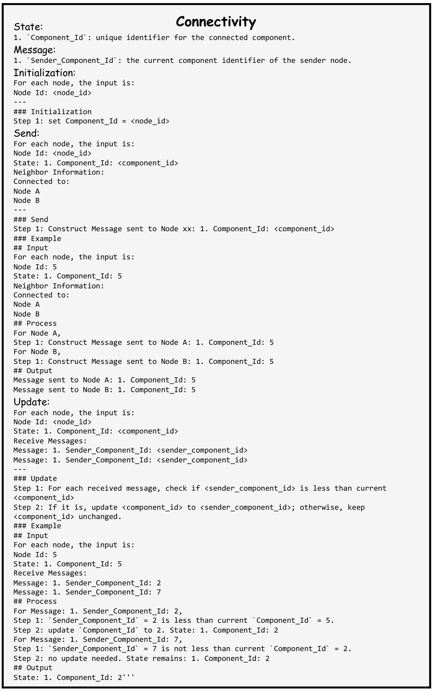
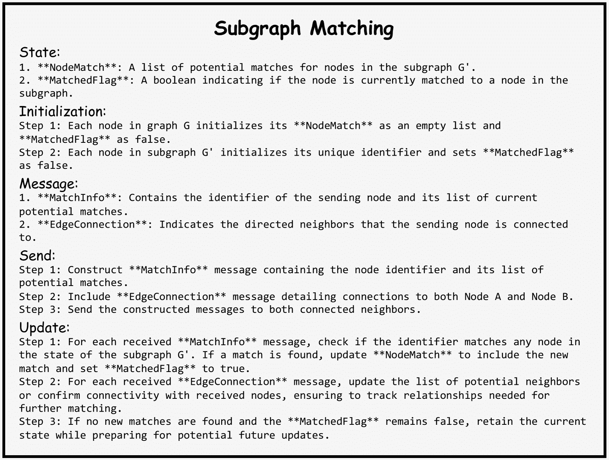

<!--yml  

类别：未分类  

日期：2025-01-11 12:09:24  

-->  

# 基于LLM的多代理可扩展与准确图推理  

> 来源：[https://arxiv.org/html/2410.05130/](https://arxiv.org/html/2410.05130/)  

胡宇伟  

中国人民大学  

huyuweiyisui@ruc.edu.cn & 雷润林  

中国人民大学  

runlin_lei@ruc.edu.cn  

& 黄欣怡  

中国人民大学  

2022201342@ruc.edu.cn  

\AND魏哲伟  

中国人民大学

zhewei@ruc.edu.cn  

& 刘永超  

阿里巴巴集团  

yongchao.ly@antgroup.com    胡宇伟¹，雷润林¹，黄欣怡¹，魏哲伟¹，刘永超²  

¹中国人民大学，北京，中国  

²阿里巴巴集团，北京，中国  

huyuweiyisui@ruc.edu.cn，runlin_lei@ruc.edu.cn，2022201342@ruc.edu.cn  

zhewei@ruc.edu.cn，yongchao.ly@antgroup.com 通讯作者。  

###### 摘要  

近期的研究探讨了使用大型语言模型（LLM）来处理复杂的图推理任务。然而，由于图结构的复杂性以及LLM在处理长文本时的固有限制，当前的方法往往未能在小规模图和简单任务上取得令人满意的准确性。为了解决这些挑战，我们提出了GraphAgent-Reasoner，一个无需微调的框架，利用多代理协作策略进行明确且精确的图推理。我们的框架受到分布式图计算理论的启发，将图问题分解为更小的、以节点为中心的任务，并将这些任务分配给多个代理。各代理协作解决整体问题，显著减少了单一LLM需要处理的信息量和复杂度，从而提高了图推理的准确性。通过简单地增加代理的数量，GraphAgent-Reasoner能够高效地扩展，以适应超过1,000个节点的大型图。在GraphInstruct数据集上的评估表明，我们的框架在多项式时间图推理任务中表现出近乎完美的准确性，显著优于目前可用的最佳模型，无论是封闭源代码的模型还是微调后的开源变体。我们的框架还展示了处理真实世界图推理应用的能力，如网页重要性分析。  

## 1 引言  

图形作为建模复杂现实世界关系的关键数据结构，在各种场景中随处可见，例如引文网络、推荐网络。许多重要应用，如药物发现（Stokes等人，[2020](https://arxiv.org/html/2410.05130v1#bib.bib27)）、交通预测（Jiang & Luo，[2022](https://arxiv.org/html/2410.05130v1#bib.bib16)）和金融检测（Motie & Raahemi，[2024](https://arxiv.org/html/2410.05130v1#bib.bib23)），都需要在图形上进行推理才能实现。注意到大型语言模型（LLMs）具有强大的通用知识和语言处理能力（Brown等人，[2020](https://arxiv.org/html/2410.05130v1#bib.bib1)），大量研究开始聚焦于利用LLMs执行各种推理任务，如数学公式推导（Meadows等人，[2023](https://arxiv.org/html/2410.05130v1#bib.bib20)）、常识推理（Madaan等人，[2022](https://arxiv.org/html/2410.05130v1#bib.bib18)）和多跳问答（Creswell等人，[2023](https://arxiv.org/html/2410.05130v1#bib.bib7)）。然而，它们大多数主要涉及浅层或顺序推理。为了使LLM的推理更接近人类思维，LLM需要掌握更深层次和更复杂的推理，例如图形推理。

尽管研究人员为使LLM能够记忆、理解和进行基本的图形结构推理做出了巨大努力，但仍然存在一些问题：1）可处理的图形规模有限。用自然语言描述图形结构不可避免地会导致过长的输入。由于上下文长度的限制和LLM在处理冗长文本时的不足（Liu 等人，[2023](https://arxiv.org/html/2410.05130v1#bib.bib17)），先前的研究（Chai 等人，[2023](https://arxiv.org/html/2410.05130v1#bib.bib2); Fatemi 等人，[2024](https://arxiv.org/html/2410.05130v1#bib.bib9); Perozzi 等人，[2024](https://arxiv.org/html/2410.05130v1#bib.bib25)）只能处理非常有限规模的图形（例如，少于20个节点和100条边）。2）在图形推理任务上的表现相对较差。与文本不同，文本可以容忍一定程度的语义偏差，而图形推理和计算必须非常精确。然而，现有工作在各种图形推理任务（如连通性和最短路径）中准确率较低（平均20$\sim$60%）。3）缺乏明确的推理路径。以最短路径为例，现有模型的响应更像是通过启发式搜索方法找到图形上的最短路径，而不是严格执行算法。这使得很难确定LLM是否真正通过正确的推理得出答案，还是仅仅在做出有根据的猜测。尽管GraphWiz（Chen 等人，[2024a](https://arxiv.org/html/2410.05130v1#bib.bib4)）试图通过微调生成明确的推理路径，但由于其训练数据中存在不完整或错误的推理路径，它往往会失败。此外，GraphWiz还表现出过拟合问题，它倾向于将新的或无关的问题视为其中一个微调过的问题，具体内容将在第[5.3](https://arxiv.org/html/2410.05130v1#S5.SS3 "5.3 实验 3：案例研究 ‣ 5 实验 ‣ 基于LLM的多智能体可扩展且准确的图形推理")节中详细说明。

动机。图形推理的最终目标是使大型语言模型（LLMs）能够利用与图形相关的知识或算法来解决现实世界中的图形问题。然而，随着信息科学和硬件存储的发展，图形的规模和每个节点的信息变得过于庞大，单个LLM无法处理。为了解决这个问题，一个自然的想法是使用分布式方法，其中一个大型图形被分别存储在多个LLM中并协同计算。因此，正如图形算法通常从非分布式演变为分布式形式一样（Meng 等人，[2024b](https://arxiv.org/html/2410.05130v1#bib.bib22)），我们希望LLM也能学习分布式处理的概念，从而利用群体智能的力量在现实场景中解决图形问题。


图 1：当前 LLM 在解决图问题中的应用现状。以往使用单一 LLM 的方法常常由于图的复杂结构而失败。相比之下，我们的方法利用代理协作有效地解决图问题。

我们的贡献。为了解决上述限制，本文提出了 GraphAgent-Reasoner（GAR）框架，利用群体智能的力量来解决图推理问题，如图[1](https://arxiv.org/html/2410.05130v1#S1.F1 "图 1 ‣ 1 引言 ‣ 基于 LLM 的多代理的可扩展且精确的图推理")所示。我们采用节点中心的方法，为每个节点分配一个代理，使其专注于处理自己的信息，并与邻居进行通信。因此，我们可以通过简单地增加代理数量，轻松扩大可处理的图的规模。同时，在主 LLM 的指导下，图问题被分解为更小的、以节点为中心的任务，并分配给代理进行协作解决。这种方法显著减少了每个代理需要处理的信息规模和复杂性，从而大大提高了整体准确性。此外，由于代理必须清晰地将处理过的信息传递给邻居代理，推理过程变得透明，证明了该框架是通过清晰且正确的推理来解决图推理问题，而非靠幸运猜测。总之，我们的贡献如下：

+   •

    我们提出了 GraphAgent-Reasoner，这是首个基于 LLM 的多代理图推理框架，不需要微调，且能够利用任何 LLM 作为底层推理模型。我们的框架在各种多项式时间任务上实现了近乎完美的准确性，显著超越了现有方法的表现。

+   •

    我们的框架将 LLM 处理的图推理任务规模从 100 个节点扩展到 1,000 个节点，展示了卓越的可扩展性。此外，随着图大小的增加，我们的框架并未出现其他方法中常见的显著性能下降，并保持了稳健的准确性。

+   •

    我们在网页重要性分析等实际应用中探索了我们框架的表现，展示了其在解决现实中复杂图推理问题的潜力。

## 2 前言与相关工作

预备知识。一般情况下，在讨论大型语言模型（LLMs）解决图推理问题时，输入是一个（$\mathcal{G}$，$\mathcal{Q}$）对。$\mathcal{G}$ 是一个图，表示为 $\mathcal{G}=(\mathcal{V},\mathcal{E},\{s_{i}\},\{t_{i}\})$，其中 $\mathcal{V}$ 是节点集，$\mathcal{E}$ 是边集。对于每个节点 $v_{i}\in\mathcal{V}$，关联一个顺序文本节点特征 $s_{i}$；同样，对于每条边 $e_{i}\in\mathcal{E}$，分配一个顺序文本边特征 $t_{i}$。图 $\mathcal{G}$ 用自然语言描述，通常使用边或邻接表表示法。$\mathcal{Q}$ 是任务特定的指令或问题描述。LLMs 将处理这个（$\mathcal{G}$，$\mathcal{Q}$）对并返回一个答案字符串 $A$。

用于图推理的大型语言模型。为了进一步增强 LLMs 的推理能力，许多研究尝试提高 LLMs 在图推理中的表现。Wang 等人（[2023](https://arxiv.org/html/2410.05130v1#bib.bib30)）首次引入了 NLGraph 基准测试，用以评估 LLMs 在各种图推理任务中的表现。Fatemi 等人（[2024](https://arxiv.org/html/2410.05130v1#bib.bib9)）探索了不同图编码方法和图结构类型对 LLMs 在图推理任务中表现的影响。此外，他们还引入了另一个基准测试——GraphQA。考虑到图结构描述的文本通常较长，Chai 等人（[2023](https://arxiv.org/html/2410.05130v1#bib.bib2)）和 Perozzi 等人（[2024](https://arxiv.org/html/2410.05130v1#bib.bib25)）分别使用 Transformers 和 GNNs 来编码图结构，并尝试将其与 LLMs 对齐。受人类通过视觉模式理解结构信息的启发，Wei 等人（[2024](https://arxiv.org/html/2410.05130v1#bib.bib31)）基于图结构生成相应的视觉图像，并将其提供给视觉 LLMs 进行图推理。Chen 等人（[2024a](https://arxiv.org/html/2410.05130v1#bib.bib4)）对 LLMs 进行了监督微调和直接优化，提升了 LLMs 的表现，并鼓励其输出明确的推理路径。

基于大型语言模型的多智能体系统。近期LLM的进展激发了人们对其在多智能体系统中应用的兴趣。基于LLM的多智能体框架利用LLM的自然语言理解和推理能力，使得智能体能够协作、沟通，并以分布式方式解决复杂任务。现有的多智能体问题解决研究主要集中在诸如软件开发（Dong等，[2023](https://arxiv.org/html/2410.05130v1#bib.bib8); Hong等，[2024](https://arxiv.org/html/2410.05130v1#bib.bib13); Qian等，[2024](https://arxiv.org/html/2410.05130v1#bib.bib26)）、具身智能体（Zhang等，[2024](https://arxiv.org/html/2410.05130v1#bib.bib35); Mandi等，[2024](https://arxiv.org/html/2410.05130v1#bib.bib19); Chen等，[2024b](https://arxiv.org/html/2410.05130v1#bib.bib5)）以及科学辩论（Xiong等，[2023](https://arxiv.org/html/2410.05130v1#bib.bib32); Chan等，[2024](https://arxiv.org/html/2410.05130v1#bib.bib3)）等应用。然而，使用基于LLM的多智能体处理图数据的研究相对较少，特别是在图推理和图计算任务领域。这可能是由于LLM固有的幻觉问题（Huang等，[2023](https://arxiv.org/html/2410.05130v1#bib.bib15)），即它们的回答在事实上的错误。在多智能体环境中，这个问题变得更加复杂，因为单一智能体的幻觉可能通过通信传播到其他节点（Guo等，[2024](https://arxiv.org/html/2410.05130v1#bib.bib12)）。这要求个体智能体的性能必须足够稳定，以确保整个多智能体系统的正确运行。

## 3 单一LLM在图推理中的限制

尽管大型语言模型展现出强大的语言处理和逻辑推理能力，但Transformer架构和注意力机制（Vaswani等，[2017](https://arxiv.org/html/2410.05130v1#bib.bib29)）的问题仍然限制了它们处理图问题时的规模和准确性。主要有两个限制：


图 2：单一大型语言模型（LLM）在记忆一阶邻接节点方面的表现。随着节点数量的增加，所有模型都表现出显著的记忆错误。

图结构对于单一的语言模型（LLM）来说过于复杂，难以记忆和理解。使用邻接或边列表在自然语言中描述图结构是最直观和直接的方法，能够通过文本促进LLM对图数据的处理。然而，这种方法不可避免地会导致上下文变得冗长，因为边的数量随着节点数量的增加呈二次增长。随着图的规模扩大和密度增加，图结构变得极为复杂，需要大量的标记来描述边关系。当文本变得过长时，LLM很难合理分配注意力，甚至可能在一些简单任务上遇到困难，例如键值对匹配Liu等人（[2023](https://arxiv.org/html/2410.05130v1#bib.bib17)）。这为LLM从冗长的上下文中识别图推理任务的关键信息带来了重大挑战。图[2](https://arxiv.org/html/2410.05130v1#S3.F2 "Figure 2 ‣ 3 Limitations of Single LLM in Graph Reasoning ‣ Scalable and Accurate Graph Reasoning with LLM-based Multi-Agents")展示了单一LLM在记忆一跳邻居节点时的表现。我们观察到，随着图中节点数量的增加，各种LLM的准确率显著下降。如果单一LLM甚至无法正确回忆起像节点邻居这样的基本图结构信息，那么进行更复杂的图推理或计算将变得非常困难。

此外，图结构是以顺序方式描述的。LLM必须从顺序文本中识别隐式图结构。由于LLM的处理是一个黑箱操作，很难断言它们是否真的隐式构建了图结构并理解它们。Huang等人（[2024](https://arxiv.org/html/2410.05130v1#bib.bib14)）进行了大量实验，探索LLM是否将输入提示视为图，还是仅仅将其视为带有关键字的段落。结果表明，LLM在处理TAG时的表现主要来自上下文，而非图结构。LLM倾向于将图描述处理为线性化的段落，而非图结构。

单一的大型语言模型（LLM）在解决现实世界场景中的推理问题时存在困难。研究人员在图推理任务上训练LLM，以使其能够利用学习到的图相关知识或算法来解决现实世界的图问题。然而，在实际场景中，每个节点所关联的信息量可能是巨大的。以引用网络为例：单个节点代表一篇论文，节点信息包括标题、摘要和参考文献，这些可能会占用几千个token。除了图结构的复杂性外，处理大量节点信息的需求进一步加重了单一LLM的负担，突显了其在处理长上下文时的不足。此外，使用单一LLM来处理整个网络效率低下，因为它无法连贯地处理整个网络的问题。通常需要手动压缩或总结每个节点的信息，然后将局部子图输入LLM进行处理（Guo等， [2023](https://arxiv.org/html/2410.05130v1#bib.bib11)；Chen等，[2023](https://arxiv.org/html/2410.05130v1#bib.bib6)）。

此外，许多当前的工作（Chen等， [2024a](https://arxiv.org/html/2410.05130v1#bib.bib4)；Perozzi等， [2024](https://arxiv.org/html/2410.05130v1#bib.bib25)）需要在单个或多个图推理任务上训练图神经网络（GNN）或微调LLM。然而，当转移到其他图任务时，性能会出现一定程度的下降，重新训练或微调新的图任务需要消耗大量时间和资源。LLM是否能够将训练过程中学到的图知识和算法应用到实际的图推理中，仍然是一个悬而未决的问题。我们在[5.3](https://arxiv.org/html/2410.05130v1#S5.SS3 "5.3 Experiment 3: Case Study ‣ 5 Experiments ‣ Scalable and Accurate Graph Reasoning with LLM-based Multi-Agents")中探讨了这个问题，并观察到在特定图推理任务上微调的LLM出现了明显的过拟合。因此，理想的解决方案是通过一种适当的方法，利用LLM在预训练阶段获得的强大通用知识，使其能够像处理自然语言问题一样自然地处理图推理任务。

## 4 GraphAgent-Reasoner

为了解决上述局限性，我们提出了一种基于多代理协作的创新框架，称为GraphAgent-Reasoner，如图[3](https://arxiv.org/html/2410.05130v1#S4.F3 "图3 ‣ 4 GraphAgent-Reasoner ‣ 基于LLM的多代理可扩展和准确的图推理")所示，旨在明确且正确地解决图推理问题。该框架的接口是Master LLM，负责处理图问题的文本输入，构建代理网络，指导它们协同解决问题，最后汇总所有代理的状态以得出解决方案。其实现基于Yao等人提出的React Agent（[2023](https://arxiv.org/html/2410.05130v1#bib.bib34)），该代理能够基于环境进行推理并执行相应的操作，具体细节将在后面详细说明。GAR的流程包括四个步骤：图构建、算法建立、分布式执行和Master总结。


图3：GraphAgent-Reasoner框架。给定一个图问题，Master LLM将根据图结构首先构建代理网络。然后，它依次执行算法建立、分布式执行和Master总结，具体过程详见本节。

图构建。给定输入对（$\mathcal{G}$, $\mathcal{Q}$），Master LLM首先从图$\mathcal{G}$的文本描述中提取节点和边的信息。然后，它为每个节点构建一个代理并初始化节点的状态和邻居信息，形成一个相互连接的代理网络。每个代理独立维护其状态和邻居数据，基于Master LLM的指令与相邻的代理进行通信，并在每一轮中更新其状态。

算法建立。为了适应多样化的图任务并充分利用LLM在预训练过程中嵌入的知识，我们提出了一种统一的解决方案方法，框架采用分布式范式，如算法[1](https://arxiv.org/html/2410.05130v1#alg1 "在 4 GraphAgent-Reasoner ‣ 基于LLM的多代理可扩展和准确的图推理")所示。该方法要求Master LLM为每个问题指定六个核心组件：状态、消息、初始化、发送、更新和终止。

+   •

    状态：每个节点维护的本地信息，表示其当前状态。这可以包括节点特征、标签或任何其他任务相关的数据。随着节点接收消息并更新其信息，状态会发生变化。

+   •

    消息：在通信阶段，节点之间传输的数据。消息通常包含邻近节点执行更新所需的信息，如特征值、距离或其他任务相关信息。

+   •

    初始化：在执行开始时，每个节点使用预定义的值初始化其状态，这些值可能基于节点ID、输入特征或任务特定的要求。此步骤确保图形已准备好开始通信过程。

+   •

    发送：初始化后，每个节点根据其当前状态生成消息并将其发送给邻近节点。此步骤在每次迭代中重复，允许节点持续与其邻居交换信息。

+   •

    更新：在接收到来自邻居的消息后，每个节点通过聚合收到的消息并将其与当前状态相结合来更新自己的状态。这个迭代过程使节点能够随着时间的推移不断完善其信息。

+   •

    终止：当满足预定的停止条件时，算法会终止，例如达到固定的迭代次数、实现收敛，或满足任务特定的标准。一旦达到终止条件，每个节点将把其最终状态发送给主LLM，执行终止。

1 输入：代理节点$\mathcal{A}$，每个代理$a\in\mathcal{A}$保持一个状态$S_{a}$，最大迭代次数$I_{max}$由主LLM给定。2 输出：每个代理$a\in\mathcal{A}$的最终状态$S_{a}$/* 初始化 */3 每个代理$a\in\mathcal{A}$根据初始化规则初始化其状态$S_{a}$。4 每个代理$a$基于其当前状态$S_{a}$和发送规则向其每个邻居$v\in\text{Neighbors}(a)$发送初始消息$M_{a\rightarrow v}$。/* 通信 */5 当*迭代$i$ < $I_{max}$且终止条件未满足*时，执行以下操作：    a. /* 接收 */6 每个代理$a$从所有邻居代理$u$接收消息$M_{u\rightarrow a}$。    b. /* 更新 */7 每个代理$a$根据接收到的消息$M$和其自身的当前状态$S_{a}$，根据更新规则更新其状态$S_{a}$。    c. /* 发送 */8 每个代理$a$根据更新后的状态$S_{a}$，根据发送规则向其每个邻居$v$发送更新后的消息$M_{a\rightarrow v}$。返回：所有代理$a\in\mathcal{A}$的最终状态$S_{a}$。

算法 1 分布式范式

由于LLM缺乏对这一分布式范式的先验知识，为了方便主LLM理解和应用该框架，我们开发了一个遵循这一分布式范式的分布式算法库，主LLM可以从中查询相关算法模板，生成该范式下的分布式解决方案。具体而言，我们选择了经典的分布式图算法，并记录了它们在这一分布式范式下的实现。一些示例见附录[A.1](https://arxiv.org/html/2410.05130v1#A1.SS1 "A.1 分布式算法库中的分布式算法示例 ‣ 附录A 分布式范式下的分布式算法 ‣ 基于LLM的多智能体可扩展且准确的图推理")。借鉴了先前的工作（Zheng等，[2024](https://arxiv.org/html/2410.05130v1#bib.bib36); Meng等，[2024a](https://arxiv.org/html/2410.05130v1#bib.bib21)），我们努力详细编写算法中每一部分的推理步骤，尽可能鼓励代理逐步思考，这对于提高个体代理的成功率起到了重要作用。

在接收到问题输入时，主LLM首先从分布式算法库中检索出与问题描述最相关的$k$个算法。如果有适合处理该问题的算法，主LLM将根据问题描述调整算法，例如改变初始化和终止条件（例如，最短路径问题中的源节点）。如果没有合适的算法，主LLM将基于检索到的算法示例，按照分布式范式设计一个分布式算法。有关一些生成的示例，请参见附录[A.2](https://arxiv.org/html/2410.05130v1#A1.SS2 "A.2 主LLM设计的分布式算法示例 ‣ 附录A 分布式范式下的分布式算法 ‣ 基于LLM的多智能体可扩展且准确的图推理")。

分布式执行。在设计好分布式算法后，主LLM将根据算法[1](https://arxiv.org/html/2410.05130v1#alg1 "在 4 GraphAgent-Reasoner ‣ 基于LLM的多智能体可扩展且准确的图推理")中概述的过程，将该方法传递给每个代理节点进行执行。每个代理首先根据节点信息和算法规则初始化其状态，然后向邻近的代理发送初始消息。随后，每个代理将按照算法规则迭代地执行接收消息、更新状态和发送消息的操作，并在每轮通信后同步进度。通信将继续进行，直到达到最大迭代次数或满足终止条件为止。

主总结。最后，所有代理节点的最终状态将汇总到主LLM，主LLM将基于问题总结结果并以自然语言形式返回最终答案。

## 5个实验

在本节中，我们总结了使用GAR进行的一些关键实验。我们首先突出展示了以下分析中一些最令人兴奋的结果：

+   •

    R1：GAR在多项式时间的图推理问题上达到了接近完美的准确度，远超现有的封闭源模型和在大量数据上经过微调的开源模型。

+   •

    R2：GAR在大规模图（最多1000个节点）上保持高准确性，展示了优越的可扩展性。相比之下，随着节点数量的增加，其他模型的表现显著下降，或由于上下文长度限制，完全无法处理该问题。

+   •

    R3：GAR展示了对图算法在实际图推理场景中的强大理解和应用，突显了它在解决日常生活中遇到的复杂图问题上的潜力。相比之下，其他在图推理数据集上经过大量微调的开源模型，在面对重新表述的实际图问题时，无法应用学到的图推理知识。

数据集。我们在GraphInstruct（Chen等人，[2024a](https://arxiv.org/html/2410.05130v1#bib.bib4)）中提出的图推理任务上进行实验。该数据集包含九个图推理问题，具有不同的时间复杂度，从线性和多项式复杂度到NP完全。

+   •

    线性。环检测（检测给定图$\mathcal{G}$是否包含环），连通性（评估给定图$\mathcal{G}$中两个节点$u$和$v$是否通过路径相连），二分图检查（判断给定图$\mathcal{G}$是否为二分图），拓扑排序（在有向无环图$\mathcal{G}$中找到一个顶点的拓扑排序）。

+   •

    多项式。最短路径（计算给定图$\mathcal{G}$中两个特定节点$u$和$v$之间的最短路径），最大三角形和（找到给定图$\mathcal{G}$中任何连通三元组顶点的最大权重和），最大流（计算有向图$\mathcal{G}$中从源节点$s$到汇节点$t$的最大流）。

由于NP完全问题的复杂性，目前没有成熟的精确分布式算法可用于解决这些问题。因此，Master LLM无法基于在预训练期间获得的知识设计正确且有效的分布式算法。因此，在我们的实验中，我们仅考虑线性和多项式时间问题。关于NP完全问题的数据集详细信息和部分测试结果将呈现在附录[B](https://arxiv.org/html/2410.05130v1#A2 "附录B GraphInstruct数据集 ‣ 基于LLM的多代理的可扩展和准确图形推理")中。

设置。我们框架中Agent Node所使用的基础推理LLM是ChatGPT-4o-mini-2024-07-18，Master LLM的基础模型是ChatGPT-4-turbo（OpenAI，[2023](https://arxiv.org/html/2410.05130v1#bib.bib24)）。温度始终设置为0。我们的框架基于AgentScope（Gao等人，[2024](https://arxiv.org/html/2410.05130v1#bib.bib10)），这是一个创新平台，可以轻松构建可靠的高性能多代理应用。

### 5.1 实验 1：GraphInstruct上的性能

在本实验中，我们评估了GAR在GraphInstruct数据集的多项式时间任务上的表现。结果如表[1](https://arxiv.org/html/2410.05130v1#S5.T1 "表1 ‣ 5.1 实验 1：GraphInstruct上的性能 ‣ 5 实验 ‣ 基于LLM的多代理的可扩展和准确图形推理")所示。我们看到，GAR在这些任务上表现出近乎完美的结果，显著超过了其他模型。特别是在时间复杂度较高的最短路径和三角形任务上，GAR大大提高了LLM的性能。单一LLM难以解决的问题，在代理协作后通过将问题分解为更小的、以节点为中心的任务，已得到了有效解决。

随着节点数量的增加，图形结构变得更加复杂，使得图形问题的解决变得越来越困难。为了研究模型在问题复杂度增加时的性能变化，我们在循环检测和最短路径问题上进行了实验，逐渐将节点数量从5增加到100。结果如图[4](https://arxiv.org/html/2410.05130v1#S5.F4 "图4 ‣ 5.1 实验 1：GraphInstruct上的性能 ‣ 5 实验 ‣ 基于LLM的多代理的可扩展和准确图形推理")所示。


(a) 循环检测


(b) 最短路径

图4：GraphAgent-Reasoner、GPT4（2次示例）和GraphWiz（Mistral 7B）在不同图形大小下的循环检测和最短路径问题上的性能

我们发现随着节点数量的增加，ChatGPT-4和Graphwiz的性能均显著下降。然而，GAR的准确性保持稳定，几乎不受图形大小的影响，展示了其强大的可扩展性。尽管图形的规模在增加，但每个代理所处理的信息并没有显著增加。每个代理仍然只处理自己的信息并与邻近的代理进行通信。我们观察到，GAR偶尔会在特定情况下出现错误，这可能是由于随着节点和边的增加，通信轮次增多所导致的。即使是在处理简单的以节点为中心的任务时，单个代理仍然有可能出错。因此，随着代理数量和通信轮次的增加，整体错误发生的概率也会增加。通过提升单个代理的能力（例如使用更强大的LLM作为基础推理模型）或通过设计更精细的提示，可以改善这一问题。

表 1：GraphAgent-Reasoner和其他模型在GraphInstruct测试集的多项式时间任务上的性能。每个任务包含400个测试案例，最多包含100个节点。每个任务的最佳结果以**粗体**显示，第二最佳结果以*下划线*标出。

| 模型 | 线性 | 多项式 | 平均 |
| --- | --- | --- | --- |
| cycle | connect | bipartite | topology | shortest | triangle |
| 封闭源模型 |  |  |  |  |  |  |  |
| GPT-4 (zero-shot) | 38.75 | 17.00 | 65.25 | 5.00 | 9.25 | 5.75 | 23.50 |
| GhatGPT (2-shot) | 51.25 | 43.75 | 70.75 | 4.50 | 3.50 | 17.25 | 31.83 |
| GPT-4 (2-shot) | 52.50 | 62.75 | 74.25 | 25.25 | 18.25 | 31.00 | 44.00 |
| 微调的开源模型 |  |  |  |  |  |  |  |
| Naive SFT (LLaMA 2-7B) | 73.75 | 83.50 | 41.25 | 4.00 | 9.50 | 30.00 | 40.17 |
| Naive SFT (Mistral-7B) | 73.75 | 83.50 | 78.50 | 1.00 | 23.00 | 47.00 | 51.13 |
| GraphWiz (LLaMA 2-7B) | 91.50 | 87.00 | 74.00 | 18.00 | 28.00 | 38.25 | 56.13 |
| GraphWiz (Mistral-7B) | 92.00 | 89.50 | 72.00 | 19.00 | 31.25 | 38.75 | 57.08 |
| GraphWiz-DPO (LLaMA 2-7B) | 89.00 | 82.50 | 84.75 | 46.75 | 24.00 | 52.75 | 63.29 |
| GraphWiz-DPO (Mistral-7B) | 85.50 | 79.50 | 85.50 | 85.25 | 12.50 | 29.00 | 62.88 |
| GraphAgent-Reasoner | 99.50 | 100.00 | 100.00 | 96.50 | 99.75 | 93.25 | 98.00 |

### 5.2 实验 2：大规模图形上的性能

在本实验中，我们评估了当前大语言模型（LLMs）在大规模图形上的表现。现有图形推理工作所处理的最大图形大小为100个节点（Chen等人，[2024a](https://arxiv.org/html/2410.05130v1#bib.bib4)），这仍然远远不足以应对现实世界中的图形推理场景。为了评估现有模型在更大图形上的推理性能，我们在包含100、200、500和1000个节点的图形上进行了最短路径实验。由于输入文本过长（1000个节点的文本达16,000个tokens）以及成本问题，我们仅为每个图形大小创建了20个测试样本。实验结果如表[2](https://arxiv.org/html/2410.05130v1#S5.T2 "Table 2 ‣ 5.2 Experiment 2: Performance on Large-Scale Graphs ‣ 5 Experiments ‣ Scalable and Accurate Graph Reasoning with LLM-based Multi-Agents")所示。

表2：处理最短路径问题的大规模图形表现。x/20表示在20个测试样本中，有x个样本正确。NA表示由于超出上下文长度限制，无法进行测试。

| 图形大小 | 100 | 200 | 500 | 1000 |
| --- | --- | --- | --- | --- |
| Graphwiz (LLaMA 2-7B) | 0/20 | 0/20 | NA | NA |
| Graphwiz (LLaMA 2-7B-DPO) | 0/20 | 0/20 | NA | NA |
| Chatgpt-3.5-turbo-16k | 0/20 | 0/20 | 0/20 | 0/20 |
| Chatgpt-4-32k | 0/20 | 1/20 | 0/20 | 0/20 |
| GraphAgent-Reasoner | 20/20 | 20/20 | 20/20 | 18/20 |

我们发现，基于LLaMA2-7B（Touvron等人，[2023](https://arxiv.org/html/2410.05130v1#bib.bib28)）的两个GraphWiz模型经过微调后，无法处理500个或更多节点的图形，这是由于上下文长度的限制（Llama2的上下文长度限制为4096个tokens）。尽管ChatGPT-3.5-turbo-16k和ChatGPT-4-32k可以处理更长的上下文，但它们几乎在所有测试样本中都给出了错误的答案，仅有ChatGPT-4-32k在一个包含200个节点的测试样本中给出了正确答案。相比之下，GAR在大规模图形中保持了较高的准确性，仅在两个1000节点的测试样本中失败，进一步证明了其强大的可扩展性。

### 5.3 实验3：案例研究

在本实验中，我们探讨了两种图形推理模型Graphwiz和GAR在现实世界图形推理场景中的应用。我们展示了网页重要性分析的案例研究，见图[5](https://arxiv.org/html/2410.05130v1#S5.F5 "Figure 5 ‣ 5.3 Experiment 3: Case Study ‣ 5 Experiments ‣ Scalable and Accurate Graph Reasoning with LLM-based Multi-Agents")。


图5：网页网络中的重要性分析。虽然GraphWiz由于图形评估错误而失败，但GAR正确使用PageRank算法识别了节点16、14和5为最重要的节点。

尽管GraphWiz在精调任务中表现良好，但在面对真实世界的图形问题时，它表现出严重的过拟合，未能应用在精调阶段学习的图形推理知识。由于GraphWiz使用一致的图节点描述，在混合任务指令调优过程中，句子“节点从0到…编号”出现在所有数据集中。当实际问题中的节点编号为1到20时，它仍然假设存在节点0。因此，两个GraphWiz模型首先输出图有21个节点和不正确的边数。此外，两个GraphWiz模型都没有识别出这是与网页重要性排名相关的问题，而是将其视为他们在精调过程中接触过的二分图检查或拓扑排序问题。另外，两个模型都没有生成明确且正确的推理路径。这些观察结果表明，在经典的图推理任务中表现出色与有效解决现实世界的图推理问题之间仍存在显著差距。相比之下，GAR正确识别出该问题应使用与PageRank相关的知识进行解决（Yang等人，[2024](https://arxiv.org/html/2410.05130v1#bib.bib33)），并设计了一种遵循分布式范式的算法（注：分布式算法库中不包含PageRank算法模板）。GAR随后将该算法分配给代理节点进行执行，最终获得每个节点的PageRank值，并得出正确的结论。通过分布式范式，GAR有效地将LLM学习到的强大知识与解决现实世界的图推理问题相结合，从而使其能够以分布式方式灵活地处理实际问题。本案例研究展示了使用GAR解决现实世界图推理问题的可行性，表明其具有显著的实际应用性，并为研究人员和实践者提供了一个强大的框架来应对此类任务。

## 6 结论

我们首先总结了现有 LLM 在图推理任务中面临的三个关键问题：图的规模有限、性能较差以及缺乏明确的推理路径。接着，我们反思了单一 LLM 在解决图推理问题中的局限性，例如图结构过于复杂，难以记忆和理解，以及现实世界图推理场景中的信息过载问题。为了应对这些挑战，我们提出了 GraphAgent-Reasoner，一个基于多智能体协作解决图推理问题的框架。该框架展示了优越的准确性和可扩展性，显著超越了现有的闭源和微调开源模型。我们的实验表明，GraphAgent-Reasoner 展现了强大的可扩展性，在大规模图（最多 1,000 个节点）上仍能保持高准确性。我们在网页重要性分析中的案例研究进一步展示了它处理现实世界图推理问题的能力。未来的工作将集中于设计更精确和可扩展的基于 LLM 的多智能体图推理框架，旨在将其应用于更大、更复杂的现实世界推理场景。

## 参考文献

+   Brown 等人（2020）汤姆·布朗、本杰明·曼、尼克·赖德、梅拉妮·萨比亚、贾里德·D·卡普兰、普拉夫拉·达里瓦尔、阿尔文·尼拉坎坦、普拉纳夫·夏姆、吉里什·萨斯特里、阿曼达·阿斯凯尔等。语言模型是少样本学习者。在 Hugo Larochelle、Marc’Aurelio Ranzato、Raia Hadsell、Maria-Florina Balcan 和 Hsuan-Tien Lin（编辑），*神经信息处理系统进展 33：2020年神经信息处理系统年会，NeurIPS 2020，2020年12月6日至12日，虚拟*，2020年。网址 [https://proceedings.neurips.cc/paper/2020/hash/1457c0d6bfcb4967418bfb8ac142f64a-Abstract.html](https://proceedings.neurips.cc/paper/2020/hash/1457c0d6bfcb4967418bfb8ac142f64a-Abstract.html)。

+   Chai 等人（2023）齐伟·柴、天杰·张、梁·吴、凯桥·韩、晓海·胡、轩文·黄和杨·杨。Graphllm：提升大语言模型的图推理能力。*CoRR*，abs/2310.05845，2023年。网址 [https://doi.org/10.48550/arXiv.2310.05845](https://doi.org/10.48550/arXiv.2310.05845)。

+   Chan 等人（2024）志敏·陈、伟泽·陈、宇生·苏、建轩·余、伟·薛、尚杭·张、杰·傅和志远·刘。Chateval：通过多智能体辩论实现更好的基于 LLM 的评估器。在 *第十二届国际学习表示会议，ICLR 2024，奥地利维也纳，2024年5月7日至11日*。OpenReview.net，2024年。网址 [https://openreview.net/forum?id=FQepisCUWu](https://openreview.net/forum?id=FQepisCUWu)。

+   陈等人（2024a）陈诺、李雨涵、唐建衡和李佳。Graphwiz：一种用于图计算问题的遵循指令的语言模型。发表于里卡多·贝萨-耶茨和弗朗切斯科·邦奇（编），*第30届ACM SIGKDD知识发现与数据挖掘大会论文集，KDD 2024，西班牙巴塞罗那，2024年8月25-29日*，第353–364页。ACM，2024a年。网址 [https://doi.org/10.1145/3637528.3672010](https://doi.org/10.1145/3637528.3672010)。

+   陈等人（2024b）陈永超、雅各布·阿金、杨章、尼古拉斯·罗伊和范楚楚。大语言模型下可扩展的多机器人协作：集中式还是分布式系统？发表于*IEEE国际机器人与自动化会议，ICRA 2024，日本横滨，2024年5月13-17日*，第4311–4317页。IEEE，2024b年。网址 [https://doi.org/10.1109/ICRA57147.2024.10610676](https://doi.org/10.1109/ICRA57147.2024.10610676)。

+   陈等人（2023）陈志凯、毛海涛、李航、金伟、温洪智、魏晓驰、王帅强、尹大伟、范文祺、刘辉和唐吉亮。探索大语言模型（LLMs）在图学习中的潜力。*SIGKDD Explor.*，25(2):42–61，2023年。网址 [https://doi.org/10.1145/3655103.3655110](https://doi.org/10.1145/3655103.3655110)。

+   克雷斯威尔等人（2023）安东尼娅·克雷斯威尔、穆雷·沙纳汉和伊琳娜·希金斯。选择推理：利用大语言模型进行可解释的逻辑推理。发表于*第十一届国际学习表征会议，ICLR 2023，卢旺达基加利，2023年5月1-5日*。OpenReview.net，2023年。网址 [https://openreview.net/forum?id=3Pf3Wg6o-A4](https://openreview.net/forum?id=3Pf3Wg6o-A4)。

+   董等人（2023）董一弘、蒋雪、金志和李格。通过ChatGPT进行自协作代码生成。*CoRR*，abs/2304.07590，2023年。网址 [https://doi.org/10.48550/arXiv.2304.07590](https://doi.org/10.48550/arXiv.2304.07590)。

+   法泰米等人（2024）巴哈雷·法泰米、乔纳森·哈尔克罗和布莱恩·佩罗兹。像图一样谈话：为大语言模型编码图。发表于*第十二届国际学习表征会议，ICLR 2024，奥地利维也纳，2024年5月7-11日*。OpenReview.net，2024年。网址 [https://openreview.net/forum?id=IuXR1CCrSi](https://openreview.net/forum?id=IuXR1CCrSi)。

+   高等人（2024）高大伟、李子涛、匡伟瑞、潘旭晨、陈道元、马志坚、钱炳晨、姚立宇、朱琳、程晨、施洪柱、李亚亮、丁博霖和周景仁。AgentScope：一个灵活而稳健的多智能体平台。*CoRR*，abs/2402.14034，2024年。网址 [https://doi.org/10.48550/arXiv.2402.14034](https://doi.org/10.48550/arXiv.2402.14034)。

+   郭等人（2023）郭嘉彦、杜伦和刘恒宇。Gpt4graph：大语言模型能否理解图结构数据？一项实证评估与基准测试。*CoRR*，abs/2305.15066，2023年。网址 [https://doi.org/10.48550/arXiv.2305.15066](https://doi.org/10.48550/arXiv.2305.15066)。

+   Guo 等人 (2024) Taicheng Guo, Xiuying Chen, Yaqi Wang, Ruidi Chang, Shichao Pei, Nitesh V. Chawla, Olaf Wiest, 和 Xiangliang Zhang. 基于大型语言模型的多智能体：进展与挑战的调查。*CoRR*，abs/2402.01680，2024年。网址 [https://doi.org/10.48550/arXiv.2402.01680](https://doi.org/10.48550/arXiv.2402.01680)。

+   Hong 等人 (2024) Sirui Hong, Mingchen Zhuge, Jonathan Chen, Xiawu Zheng, Yuheng Cheng, Jinlin Wang, Ceyao Zhang, Zili Wang, Steven Ka Shing Yau, Zijuan Lin, Liyang Zhou, Chenyu Ran, Lingfeng Xiao, Chenglin Wu, 和 Jürgen Schmidhuber. MetaGPT：面向多智能体协作框架的元编程。在*第十二届国际学习表征大会，ICLR 2024，奥地利维也纳，2024年5月7-11日*。OpenReview.net，2024年。网址 [https://openreview.net/forum?id=VtmBAGCN7o](https://openreview.net/forum?id=VtmBAGCN7o)。

+   Huang 等人 (2024) Jin Huang, Xingjian Zhang, Qiaozhu Mei, 和 Jiaqi Ma. 大型语言模型能否通过提示有效利用图结构信息，为什么？*机器学习研究会刊*，2024年，2024年。网址 [https://openreview.net/forum?id=L2jRavXRxs](https://openreview.net/forum?id=L2jRavXRxs)。

+   Huang 等人 (2023) Lei Huang, Weijiang Yu, Weitao Ma, Weihong Zhong, Zhangyin Feng, Haotian Wang, Qianglong Chen, Weihua Peng, Xiaocheng Feng, Bing Qin, 和 Ting Liu. 关于大型语言模型中的幻觉：原理、分类法、挑战和开放问题的调查。*CoRR*，abs/2311.05232，2023年。网址 [https://doi.org/10.48550/arXiv.2311.05232](https://doi.org/10.48550/arXiv.2311.05232)。

+   Jiang & Luo (2022) Weiwei Jiang 和 Jiayun Luo. 用于交通预测的图神经网络：一项调查。*专家系统应用*，207:117921，2022年。网址 [https://doi.org/10.1016/j.eswa.2022.117921](https://doi.org/10.1016/j.eswa.2022.117921)。

+   Liu 等人 (2023) Nelson F. Liu, Kevin Lin, John Hewitt, Ashwin Paranjape, Michele Bevilacqua, Fabio Petroni, 和 Percy Liang. 迷失在中间：语言模型如何使用长上下文。*计算语言学会会刊*，12:157–173，2023年。网址 [https://api.semanticscholar.org/CorpusID:259360665](https://api.semanticscholar.org/CorpusID:259360665)。

+   Madaan 等人 (2022) Aman Madaan, Shuyan Zhou, Uri Alon, Yiming Yang, 和 Graham Neubig. 代码的语言模型是少量样本常识学习者。在 Yoav Goldberg、Zornitsa Kozareva 和 Yue Zhang (编)，*2022年自然语言处理实证方法会议论文集，EMNLP 2022，阿布扎比，阿联酋，2022年12月7-11日*，第1384–1403页。计算语言学会，2022年。网址 [https://doi.org/10.18653/v1/2022.emnlp-main.90](https://doi.org/10.18653/v1/2022.emnlp-main.90)。

+   Mandi等人 (2024) Zhao Mandi, Shreeya Jain 和 Shuran Song. Roco：与大型语言模型的辩证多机器人协作。在 *IEEE国际机器人与自动化大会（ICRA 2024），2024年5月13日至17日，横滨，日本*，第286-299页。IEEE，2024年。网址 [https://doi.org/10.1109/ICRA57147.2024.10610855](https://doi.org/10.1109/ICRA57147.2024.10610855)。

+   Meadows等人 (2023) Jordan Meadows, Marco Valentino 和 André Freitas. 使用大型语言模型生成数学推导。*CoRR*，abs/2307.09998，2023年。网址 [https://doi.org/10.48550/arXiv.2307.09998](https://doi.org/10.48550/arXiv.2307.09998)。

+   Meng等人 (2024a) Lingkai Meng, Yu Shao, Long Yuan, Longbin Lai, Peng Cheng, Xue Li, Wenyuan Yu, Wenjie Zhang, Xuemin Lin 和 Jingren Zhou. 大规模图上的分布式图算法综述。*CoRR*，abs/2404.06037，2024a年。网址 [https://doi.org/10.48550/arXiv.2404.06037](https://doi.org/10.48550/arXiv.2404.06037)。

+   Meng等人 (2024b) Lingkai Meng, Yu Shao, Long Yuan, Longbin Lai, Peng Cheng, Xue Li, Wenyuan Yu, Wenjie Zhang, Xuemin Lin 和 Jingren Zhou. 大规模图上的分布式图算法综述。*CoRR*，abs/2404.06037，2024b年。网址 [https://doi.org/10.48550/arXiv.2404.06037](https://doi.org/10.48550/arXiv.2404.06037)。

+   Motie 和 Raahemi (2024) Soroor Motie 和 Bijan Raahemi. 使用图神经网络的金融欺诈检测：一项系统评审。*Expert Syst. Appl.*，240：122156，2024年。网址 [https://doi.org/10.1016/j.eswa.2023.122156](https://doi.org/10.1016/j.eswa.2023.122156)。

+   OpenAI (2023) OpenAI. GPT-4技术报告。*CoRR*，abs/2303.08774，2023年。网址 [https://doi.org/10.48550/arXiv.2303.08774](https://doi.org/10.48550/arXiv.2303.08774)。

+   Perozzi等人 (2024) Bryan Perozzi, Bahare Fatemi, Dustin Zelle, Anton Tsitsulin, Seyed Mehran Kazemi, Rami Al-Rfou 和 Jonathan Halcrow. 让你的图表发声：为大型语言模型编码结构化数据。*CoRR*，abs/2402.05862，2024年。网址 [https://doi.org/10.48550/arXiv.2402.05862](https://doi.org/10.48550/arXiv.2402.05862)。

+   Qian等人 (2024) Chen Qian, Wei Liu, Hongzhang Liu, Nuo Chen, Yufan Dang, Jiahao Li, Cheng Yang, Weize Chen, Yusheng Su, Xin Cong, Juyuan Xu, Dahai Li, Zhiyuan Liu 和 Maosong Sun. Chatdev：软件开发的通信代理。在 Lun-Wei Ku, Andre Martins 和 Vivek Srikumar (编)，《*第62届计算语言学协会年会论文集（第1卷：长篇论文），ACL 2024，2024年8月11日至16日，泰国曼谷*》，第15174-15186页。计算语言学协会，2024年。网址 [https://doi.org/10.18653/v1/2024.acl-long.810](https://doi.org/10.18653/v1/2024.acl-long.810)。

+   Stokes等人 (2020) Jonathan M Stokes, Kevin Yang, Kyle Swanson, Wengong Jin, Andres Cubillos-Ruiz, Nina M Donghia, Craig R MacNair, Shawn French, Lindsey A Carfrae, Zohar Bloom-Ackermann 等人. 一种用于抗生素发现的深度学习方法。*Cell*，180(4)：688-702，2020年。

+   图弗龙等人（2023）雨果·图弗龙、路易·马丁、凯文·斯通、彼得·阿尔伯特等。Llama 2：开放基础和微调聊天模型。*CoRR*，abs/2307.09288，2023年。网址 [https://doi.org/10.48550/arXiv.2307.09288](https://doi.org/10.48550/arXiv.2307.09288)。

+   瓦斯瓦尼等人（2017）阿希什·瓦斯瓦尼、诺姆·沙泽尔、尼基·帕尔马尔、雅各布·乌斯科雷特、利昂·琼斯、艾丹·N·戈麦斯、卢卡兹·凯泽和伊利亚·波洛苏欣。注意力机制是你所需要的一切。在伊莎贝尔·盖永、乌尔里克·冯·卢克斯堡、萨米·本吉奥、汉娜·M·沃拉赫、罗布·费格斯、S·V·N·维什瓦纳坦和罗曼·加内特（编），*神经信息处理系统进展 30：2017年神经信息处理系统年会，2017年12月4日至9日，美国长滩*，第5998-6008页，2017年。网址 [https://proceedings.neurips.cc/paper/2017/hash/3f5ee243547dee91fbd053c1c4a845aa-Abstract.html](https://proceedings.neurips.cc/paper/2017/hash/3f5ee243547dee91fbd053c1c4a845aa-Abstract.html)。

+   王等人（2023）王恒、冯尚斌、贺天星、谭兆轩、韩晓创和尤莉娅·茨维特科夫。语言模型能否解决自然语言中的图问题？在爱丽丝·欧、特里斯坦·诺曼、阿米尔·格洛伯森、凯特·塞恩科、莫里茨·哈特和谢尔盖·莱文（编），*神经信息处理系统进展 36：2023年神经信息处理系统年会，NeurIPS 2023，美国新奥尔良*，2023年12月10日至16日，2023年。网址 [http://papers.nips.cc/paper_files/paper/2023/hash/622afc4edf2824a1b6aaf5afe153fa93-Abstract-Conference.html](http://papers.nips.cc/paper_files/paper/2023/hash/622afc4edf2824a1b6aaf5afe153fa93-Abstract-Conference.html)。

+   魏等人（2024）魏彦斌、付帅、姜伟森、詹姆斯·T·郭和张宇。Gita：图像与文本整合的视觉语言图推理。2024年。网址 [https://api.semanticscholar.org/CorpusID:267413180](https://api.semanticscholar.org/CorpusID:267413180)。

+   熊等人（2023）熊凯、丁晓、曹逸鑫、刘婷和秦兵。通过辩论对大型语言模型协作的内部一致性进行深入分析。在侯达·布阿莫尔、胡安·皮诺和卡莉卡·巴利（编），*计算语言学协会成果：EMNLP 2023，新加坡，2023年12月6日至10日*，第7572-7590页。计算语言学协会，2023年。网址 [https://doi.org/10.18653/v1/2023.findings-emnlp.508](https://doi.org/10.18653/v1/2023.findings-emnlp.508)。

+   杨等人（2024）杨名基、王汉志、魏哲伟、王思博、温继荣。个性化 PageRank 计算的高效算法：综述。*IEEE 知识与数据工程汇刊*，36(9)：4582–4602，2024年。网址 [https://doi.org/10.1109/TKDE.2024.3376000](https://doi.org/10.1109/TKDE.2024.3376000)。

+   Yao 等人（2023）Shunyu Yao, Jeffrey Zhao, Dian Yu, Nan Du, Izhak Shafran, Karthik R. Narasimhan, 和 Yuan Cao。React：在语言模型中协同推理与行动。在 *第十一届国际学习表征会议，ICLR 2023，卢旺达基加利，2023年5月1日至5日*。OpenReview.net, 2023。网址 [https://openreview.net/forum?id=WE_vluYUL-X](https://openreview.net/forum?id=WE_vluYUL-X)。

+   Zhang 等人（2024）Hongxin Zhang, Weihua Du, Jiaming Shan, Qinhong Zhou, Yilun Du, Joshua B. Tenenbaum, Tianmin Shu, 和 Chuang Gan。用大型语言模型模块化构建合作体化代理。在 *第十二届国际学习表征会议，ICLR 2024，维也纳，奥地利，2024年5月7日至11日*。OpenReview.net, 2024。网址 [https://openreview.net/forum?id=EnXJfQqy0K](https://openreview.net/forum?id=EnXJfQqy0K)。

+   Zheng 等人（2024）Xin Zheng, Qiming Zhu, Hongyu Lin, Yaojie Lu, Xianpei Han, 和 Le Sun。使用大型语言模型执行自然语言描述的算法：一项研究。在 Nicoletta Calzolari, Min-Yen Kan, Véronique Hoste, Alessandro Lenci, Sakriani Sakti, 和 Nianwen Xue（编辑），*2024年联合国际计算语言学会议、语言资源与评估会议论文集，LREC/COLING 2024，2024年5月20-25日，意大利都灵*，第6752–6837页。ELRA 和 ICCL, 2024。网址 [https://aclanthology.org/2024.lrec-main.596](https://aclanthology.org/2024.lrec-main.596)。

## 附录 A 分布式范式下的分布式算法

### A.1 分布式算法库中的分布式算法示例

最短路径: 参见图[6](https://arxiv.org/html/2410.05130v1#A1.F6 "Figure 6 ‣ A.1 Example of distributed algorithms in distributed algorithm library ‣ Appendix A Distributed algorithms under the distributed paradigm ‣ Scalable and Accurate Graph Reasoning with LLM-based Multi-Agents")。

连通性: 参见图[7](https://arxiv.org/html/2410.05130v1#A1.F7 "Figure 7 ‣ A.1 Example of distributed algorithms in distributed algorithm library ‣ Appendix A Distributed algorithms under the distributed paradigm ‣ Scalable and Accurate Graph Reasoning with LLM-based Multi-Agents")。


图 6: 分布式范式下的最短路径问题的分布式算法。



图 7: 分布式范式下的连通性问题的分布式算法。

### A.2 大型语言模型设计的分布式算法示例

PageRank: 参见图[8](https://arxiv.org/html/2410.05130v1#A1.F8 "Figure 8 ‣ A.2 Example of distributed algorithms designed by the Master LLM ‣ Appendix A Distributed algorithms under the distributed paradigm ‣ Scalable and Accurate Graph Reasoning with LLM-based Multi-Agents")。

哈密顿路径：见图[9](https://arxiv.org/html/2410.05130v1#A1.F9 "图9 ‣ A.2 分布式算法示例由Master LLM设计 ‣ 附录A 分布式范式下的分布式算法 ‣ 基于LLM的多智能体的可扩展和精确的图推理")。

子图匹配：见图[10](https://arxiv.org/html/2410.05130v1#A1.F10 "图10 ‣ A.2 分布式算法示例由Master LLM设计 ‣ 附录A 分布式范式下的分布式算法 ‣ 基于LLM的多智能体的可扩展和精确的图推理")。


图8：在分布式范式下的PageRank计算问题的分布式算法。


图9：在分布式范式下的哈密顿路径问题的分布式算法。



图10：在分布式范式下的子图匹配问题的分布式算法。

## 附录B GraphInstruct数据集

GraphInstruct的统计信息和详细信息见表[3](https://arxiv.org/html/2410.05130v1#A2.T3 "表3 ‣ 附录B GraphInstruct数据集 ‣ 基于LLM的多智能体的可扩展和精确的图推理")。哈密顿路径和子图匹配是NP完全问题。

表3：GraphInstruct数据集的详细信息。

| 问题 | 定义 | 节点范围 | 测试规模 |
| --- | --- | --- | --- |
| 环检测 | 检测给定图$\mathcal{G}$中是否包含任何环。 | [2, 100] | 400 |
| 连通性 | 判断在给定图$\mathcal{G}$中，两个节点$u$和$v$是否通过路径连接。 | [2, 100] | 400 |
| 二分图检测 | 判断给定图$\mathcal{G}$是否是二分图。 | [2, 100] | 400 |
| 拓扑排序 | 在有向无环图$\mathcal{G}$中，找到顶点的拓扑排序。 | [2, 50] | 400 |
| 最短路径 | 计算给定图$\mathcal{G}$中两个特定节点$u$和$v$之间的最短路径。 | [2, 100] | 400 |
| 最大三角形和 | 在给定图$\mathcal{G}$中，找出任意连接的三顶点三元组的权重最大和。 | [2, 25] | 400 |
| 最大流 | 计算在有向图$\mathcal{G}$中，从源节点$s$到汇节点$t$的最大流量。 | [2, 50] | 400 |
| 哈密顿路径 | 确定给定图$\mathcal{G}$是否具有哈密顿路径，该路径恰好访问每个顶点一次。 | [2, 50] | 400 |
| 子图匹配 | 验证在$\mathcal{G}$中是否存在一个与给定图$\mathcal{G}^{\prime}$同构的子图。 | [2, 30] | 400 |

哈密顿路径执行示例。

问题描述：

判断一个无向图中是否存在哈密尔顿路径。在无向图中，(i,j)表示节点i和节点j之间有一条无向边。给定一个图，你需要输出“Yes”或“No”，表示图中是否存在哈密尔顿路径。问：节点编号从0到5，边为：(0, 3) (0, 1) (0, 2) (0, 4) (1, 5) (1, 4) (1, 2) (1, 3) (2, 4) (2, 5) (3, 5) (3, 4)。该图中是否存在哈密尔顿路径？

执行过程：

```
### State
1\. ‘visited‘: Boolean indicating if the node has been visited.
2\. ‘path_length‘: Integer representing the current length of the path.
3\. ‘max_path_length‘: Integer tracking the longest path found.
 ### Initialization
Step 1: Set ‘visited = False‘, ‘path_length = 0‘, and ‘max_path_length = 1‘ for all nodes.
Step 2: For the initial node (e.g., Node Id: 0), set ‘visited = True‘ and
‘path_length = 1‘.
Distributed_Algorithm_Designer: ### Message
1\. ‘path_length‘: The current path length from the sender.
2\. ‘max_path_length‘: The maximum path length known to the sender.
3\. ‘visited_flag‘: Boolean indicating whether the sender has visited the node.
### Send
Step 1: For each neighbor (Node A, Node B), if ‘visited‘ is ‘False‘, construct the message as follows:
- Message to Node A: ‘(Node Id: <node_id>, path_length + 1, max(max_path_length, path_length + 1))‘.
- Message to Node B: ‘(Node Id: <node_id>, path_length + 1, max(max_path_length, path_length + 1))‘.
Step 2: Send the constructed messages to both neighbors.
### Example
## Input
Node Id: 0
State:
1\. visited: False
2\. path_length: 2
3\. max_path_length: 3
Neighbor Information:
Connected to:
Node A
Node B
## Process
Step 1: Check neighbors Node A and Node B. Since ‘visited‘ is
‘False‘, proceed to construct messages.
- For Node A:
  - Calculate new ‘path_length‘: ‘2 + 1 = 3‘
  - Calculate ‘max_path_length‘: ‘max(3, 2 + 1) = 3‘
- For Node B:
  - Same calculations apply as for Node A.
Step 2: Construct messages:
- Message to Node A: ‘(Node Id: 0, 3, 3)‘
- Message to Node B: ‘(Node Id: 0, 3, 3)‘
## Output
Message sent to Node A:
1\. path_length: 3
2\. max_path_length: 3
3\. visited_flag: False
Message sent to Node B:
1\. path_length: 3
2\. max_path_length: 3
3\. visited_flag: False
### Update
Step 1: For each received message, check the ‘visited_flag‘. If it is
‘False‘, proceed to the next steps.
Step 2: Update ‘visited‘ to ‘True‘ for the current node.
Step 3: Update ‘path_length‘ to the maximum of its current value and
the received ‘path_length‘ from the message, incrementing by 1 if the
message indicates a potential continuation of the path.
Step 4: Update ‘max_path_length‘ to the maximum of its current value
and the received ‘max_path_length‘ from the message.
Step 5: If any messages were processed, trigger a re-evaluation of
outgoing messages to neighbors, if applicable.
### Example
## Input
Node Id: 1
State:
1\. visited: False
2\. path_length: 1
3\. max_path_length: 2
Received Messages:
Message 1:
1\. path_length: 2
2\. max_path_length: 3
3\. visited_flag: False
Message 2:
1\. path_length: 3
2\. max_path_length: 4
3\. visited_flag: True
## Process
Step 1: Process Message 1\. Since ‘visited_flag‘ is ‘False‘, proceed:
- Update ‘visited‘ to ‘True‘.
- Update ‘path_length‘: ‘max(1, 2) + 1 = 3‘.
- Update ‘max_path_length‘: ‘max(2, 3) = 3‘.
Step 2: Process Message 2\. Since ‘visited_flag‘ is ‘True‘, ignore this
message and do not make any changes.
## Output
State:
1\. visited: True
2\. path_length: 3
3\. max_path_length: 3
### Termination
The algorithm continues until:
- A node reaches a ‘path_length‘ equal to the total number of nodes
(indicating a Hamiltonian path exists).
- Or until a predefined number of iterations equal to the total number
- of nodes (‘N‘) is reached without discovering a Hamiltonian path.
Master: ##################### ITER 3, STEP 1: REASONING ######################
Master: {’thought’: "The algorithm is designed to check for a
Hamiltonian path. Now let’s execute it to see if such a path exists.",
’speak’: "The algorithm is ready. Let’s execute it to determine if there is
a Hamiltonian path.", ’function’: [{’name’: ’Distributed_Execution’,
’arguments’: {}}]}
Master: ####################### ITER 3, STEP 2: ACTING #######################
0: State: 1\. visited: True 2\. path_length: 1 3\. max_path_length: 1
2: State: 1\. visited: False 2\. path_length: 0 3\. max_path_length: 1
5: State: 1\. visited: False 2\. path_length: 0 3\. max_path_length: 1
3: State: 1\. visited: False 2\. path_length: 0 3\. max_path_length: 1
4: State: 1\. visited: False 2\. path_length: 0 3\. max_path_length: 1
1: State: 1\. visited: False 2\. path_length: 0 3\. max_path_length: 1
Node 5 Send Message to Node 1: 1\. path_length: 1 2\. max_path_length:
1 3\. visited_flag: False
Node 5 Send Message to Node 2: 1\. path_length: 1 2\. max_path_length:
1 3\. visited_flag: False
Node 5 Send Message to Node 3: 1\. path_length: 1 2\. max_path_length:
1 3\. visited_flag: False
...
All agents’ state unchanged, terminating early...
>>> END
system: 1\. Execute function Distributed_Execution
   [ARGUMENTS]:

   [STATUS]: SUCCESS
   [RESULT]: Node: 0  State: 1\. visited: True 2\. path_length: 5 3\. max_path_length: 1
Node: 1  State: 1\. visited: True 2\. path_length: 2 3\. max_path_length: 1
Node: 2  State: 1\. visited: True 2\. path_length: 4 3\. max_path_length: 3
Node: 3  State: 1\. visited: True 2\. path_length: 5 3\. max_path_length: 3
Node: 4  State: 1\. visited: True 2\. path_length: 4 3\. max_path_length: 3
Node: 5  State: 1\. visited: True 2\. path_length: 5 3\. max_path_length: 3

Master: ##################### ITER 4, STEP 1: REASONING ######################
Master: {’thought’: ’Since the maximum path length found is 5, which is
less than the total number of nodes (6), there is no Hamiltonian path in
the graph.’, ’speak’: ’No, there is no Hamiltonian path in this graph.’,
’function’: []}

```

## 附录C GraphAgent-Reasoner的执行示例

最短路径执行示例。

问题描述：

找到一个源节点到其他节点的最短距离。在无向图中，(i,j,k)表示节点i和节点j之间有一条带权重k的无向边。该图有8个节点，边为：(0,7,9) (0,1,7) (0,4,9) (1,7,1) (2,7,7) (2,6,5) (2,5,8) (3,5,9) (3,4,8) (3,6,1) (4,7,7) (4,5,6) (5,7,6)。给定节点1到其他节点的最短距离权重。

执行过程：

```
Master: ##################### ITER 1, STEP 1: REASONING ######################
Master: {’thought’: ’I need to find the shortest distances from node 1 to all
other nodes in the given undirected graph. First, I will build the graph using
the provided edges and then design a distributed algorithm to find the
shortest paths.’, ’speak’: ’Building the graph and designing the distributed
algorithm to find the shortest distances from node 1.’, ’function’: ’[{"name":
"Build_Graph", "arguments": {"Edges": [[0, 7, 9], [0, 1, 7], [0, 4, 9], [1, 7, 1], [2,
7, 7], [2, 6, 5], [2, 5, 8], [3, 5, 9], [3, 4, 8], [3, 6, 1], [4, 7, 7], [4, 5, 6], [5, 7, 6]],
"Nodes_Num": 8, "Directed": false}}]’}
Master: ####################### ITER 1, STEP 2: ACTING #######################
>>>     Edges: [[0, 7, 9], [0, 1, 7], [0, 4, 9], [1, 7, 1], [2, 7...
>>>     Nodes_Num: 8
>>>     Directed: False
>>> END
system: 1\. Execute function Build_Graph
   [ARGUMENTS]:
       Edges: [[0, 7, 9], [0, 1, 7], [0, 4, 9], [1, 7, 1], [2, 7, 7], [2, 6, 5], [2, 5, 8], [3,
       5, 9], [3, 4, 8], [3, 6, 1], [4, 7, 7], [4, 5, 6], [5, 7, 6]]
                Nodes_Num: 8
                Directed: False
   [STATUS]: SUCCESS
Master: ##################### ITER 2, STEP 1: REASONING ######################
Master: {’thought’: ’The graph has been successfully built. Now, I will design
a distributed algorithm to find the shortest distances from node 1 to all
other nodes.’, ’speak’: ’Designing a distributed algorithm to find the
shortest distances from node 1.’, ’function’: ’[{"name":
"Design_Distributed_Algorithm", "arguments": {"Problem_Str": "Find the
shortest distance from node 1 to all other nodes in an undirected graph
with 8 nodes and given edges."}}]’}
Master: ####################### ITER 2, STEP 2: ACTING #######################
>>> END
Master: ##################### ITER 3, STEP 1: REASONING ######################
Master: {’thought’: ’The distributed algorithm has been successfully
designed. Now, I will execute the algorithm to find the shortest distances
from node 1 to all other nodes.’, ’speak’: ’Executing the distributed
algorithm to calculate the shortest distances from node 1.’, ’function’:
’[{"name": "Distributed_Execution", "arguments": {}}]’}
Master: ####################### ITER 3, STEP 2: ACTING #######################
Initialization:
1: State: 1\. distance: 0
0: State: 1\. distance: \infinity
2: State: 1\. distance: \infinity
4: State: 1\. distance: \infinity
5: State: 1\. distance: \infinity
7: State: 1\. distance: \infinity
3: State: 1\. distance: \infinity
6: State: 1\. distance: \infinity
Node 6 Send Message to Node 2: 1\. new_distance: \infinity
Node 6 Send Message to Node 3: 1\. new_distance: \infinity
Node 1 Send Message to Node 0: 1\. new_distance: 7
Node 1 Send Message to Node 7: 1\. new_distance: 1
Node 3 Send Message to Node 5: 1\. new_distance: \infinity
....
All agents’ state unchanged, terminating early...
>>> END
system: 1\. Execute function Distributed_Execution
   [ARGUMENTS]:

   [STATUS]: SUCCESS
   [RESULT]: Node: 0  State: 1\. distance: 7
Node: 1  State: 1\. distance: 0
Node: 2  State: 1\. distance: 8
Node: 3  State: 1\. distance: 14
Node: 4  State: 1\. distance: 8
Node: 5  State: 1\. distance: 7
Node: 6  State: 1\. distance: 13
Node: 7  State: 1\. distance: 1

Master: ##################### ITER 4, STEP 1: REASONING ######################
The shortest distances from node 1 are as follows: Node 0: 7, Node 1: 0,
Node 2: 8, Node 3: 14, Node 4: 8, Node 5: 7, Node 6: 13, Node 7: 1.Master:
{’thought’: ’The distributed algorithm has been successfully executed, and I
have obtained the shortest distances from node 1 to all other nodes.’,
’speak’: ’The shortest distances from node 1 are as follows: Node 0: 7, Node
1: 0, Node 2: 8, Node 3: 14, Node 4: 8, Node 5: 7, Node 6: 13, Node 7: 1.’,
’function’: []}

```
