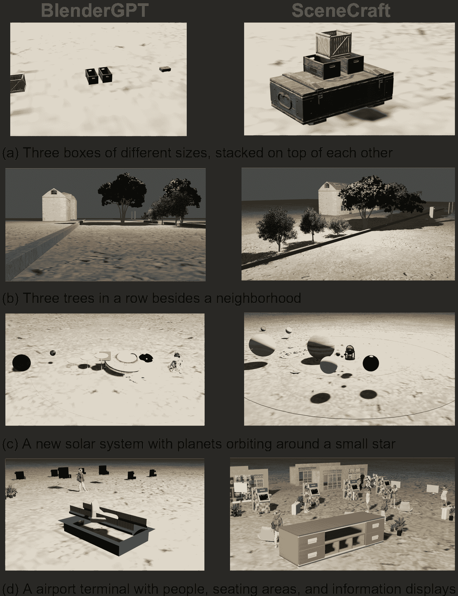
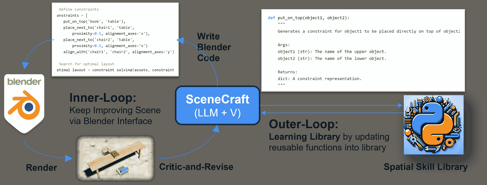
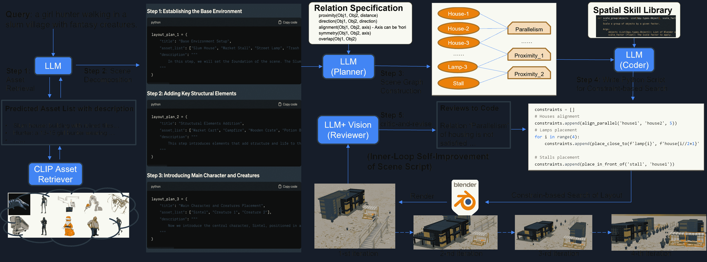
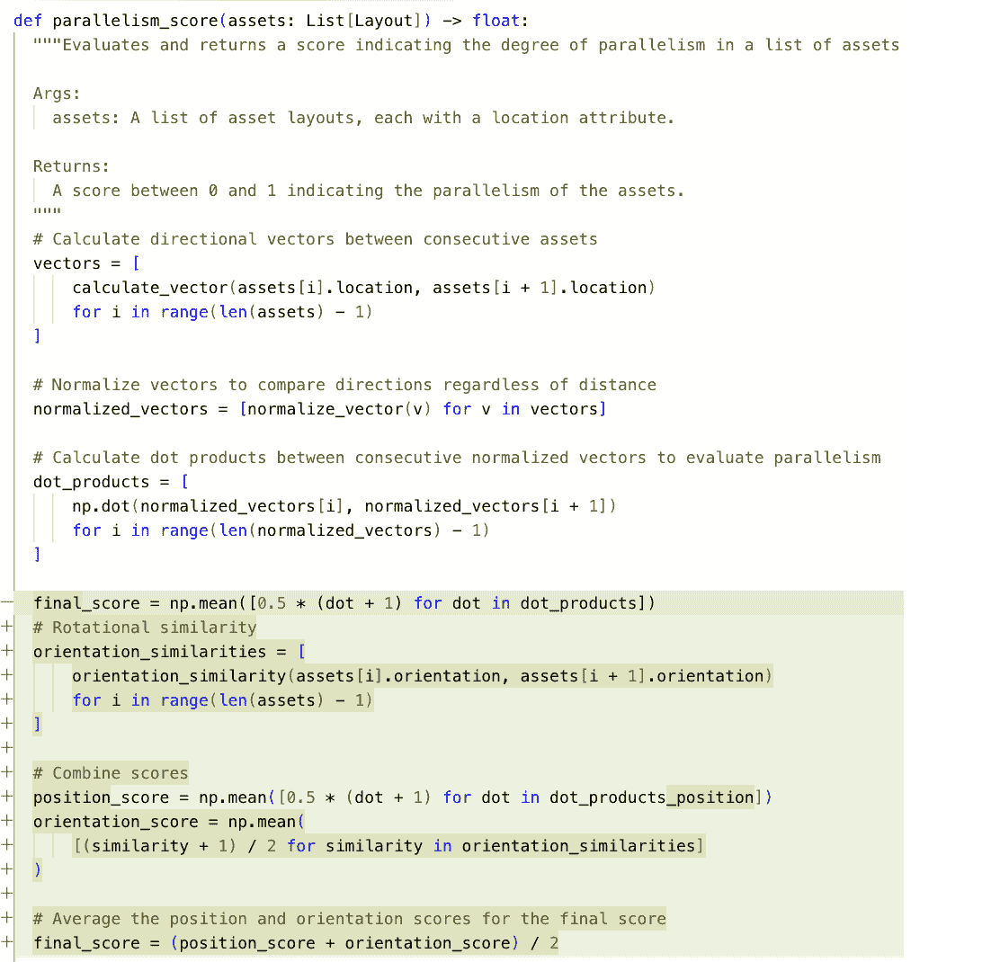
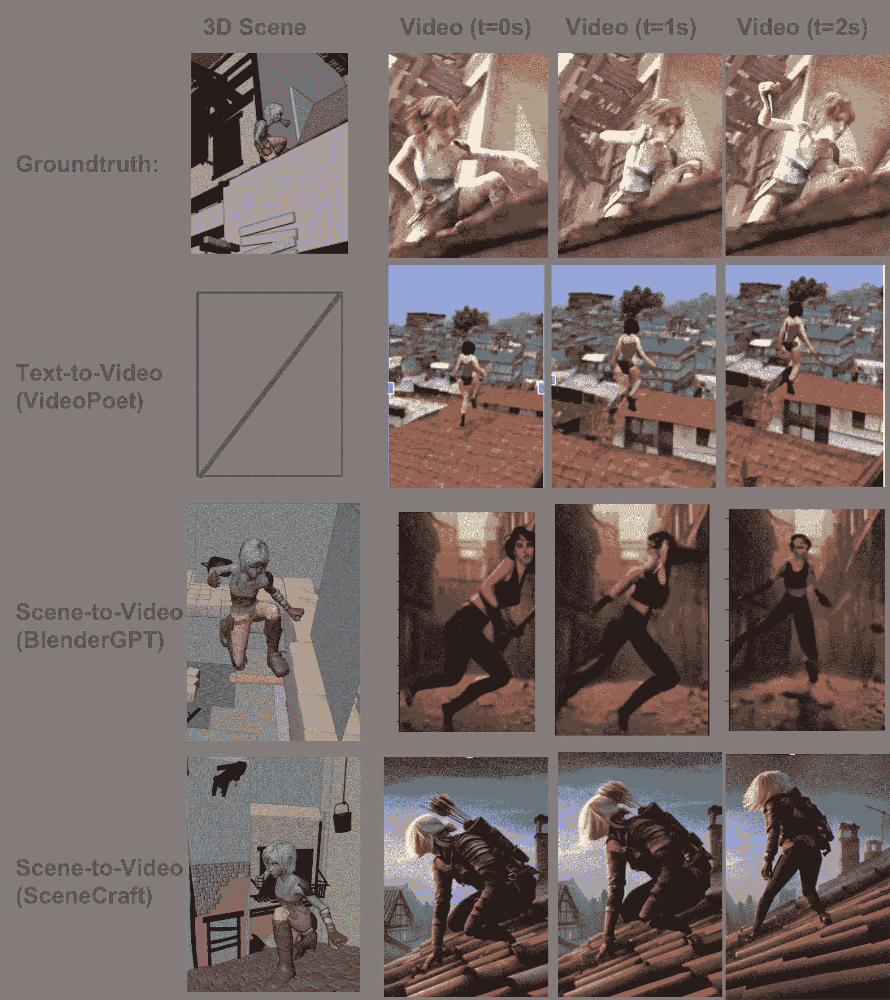
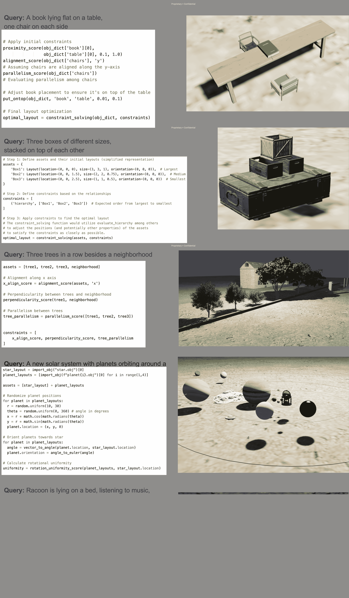
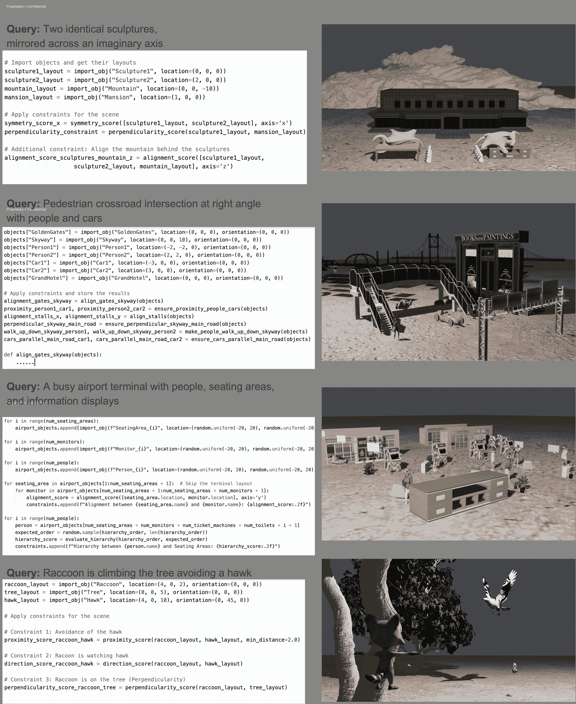
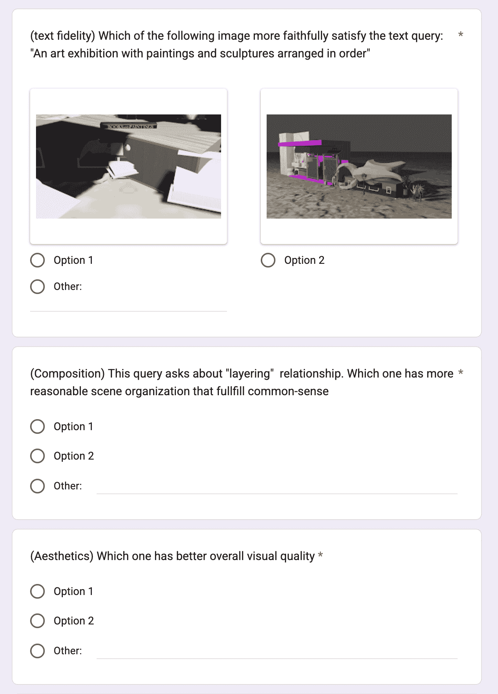

<!--yml

分类：未分类

日期：2025-01-11 12:49:17

-->

# SceneCraft：用于合成3D场景为Blender代码的LLM代理

> 来源：[https://arxiv.org/html/2403.01248/](https://arxiv.org/html/2403.01248/)

Ziniu Hu    Ahmet Iscen    Aashi Jain    Thomas Kipf    Yisong Yue    David A. Ross    Cordelia Schmid    Alireza Fathi

###### 摘要

本文介绍了SceneCraft，一种大型语言模型（LLM）代理，它将文本描述转换为可执行的Blender Python脚本，从而渲染包含多达一百个3D资源的复杂场景。这个过程需要复杂的空间规划和排列。我们通过先进的抽象、战略规划和库学习相结合来应对这些挑战。SceneCraft首先将场景图建模为蓝图，详细描述场景中资产之间的空间关系。然后，SceneCraft基于该图编写Python脚本，将关系转化为资产布局的数值约束。接着，SceneCraft利用类似GPT-V的视觉-语言基础模型的感知优势，分析渲染图像并迭代地优化场景。基于这一过程，SceneCraft还具备一个库学习机制，将常见的脚本函数汇编成可重用的库，促进持续自我改进，而无需昂贵的LLM参数调优。我们的评估表明，SceneCraft在渲染复杂场景方面超越了现有的基于LLM的代理，这从其对约束的遵循和良好的人工评估中得到了体现。我们还通过重建Sintel电影中的详细3D场景，并利用生成的场景作为中介控制信号，指导视频生成模型，展示了SceneCraft更广泛的应用潜力。

机器学习，ICML¹¹1^*通讯作者：Ziniu Hu $<$ziniu@google.com$>$，Yisong Yue $<$yyue@caltech.edu$>$ 和 Alireza Fathi $<$alirezafathi@google.com$>$。

图1：比较SceneCraft输出与BlenderGPT基线在不同查询上的示例。

## 1 引言

将自然语言描述转化为 3D 场景是建筑设计、游戏开发、虚拟现实和电影制作等行业的关键技术。近期的 3D 生成模型，如 DreamFusion（Poole et al., [2022](https://arxiv.org/html/2403.01248v1#bib.bib19)）和 Magic3D（Lin et al., [2023](https://arxiv.org/html/2403.01248v1#bib.bib11)）在将文本转化为 3D 神经表示方面取得了巨大进展。然而，由于数据集规模的限制和领域特异性，这些工作未能在构建包含多个资产的完整场景方面取得突破。在这项工作中，我们受到人类艺术家通常采用整体设计过程的启发，在这一过程中，他们采取逐步迭代的方式，包括故事板、3D 建模、纹理制作、装配、布局、动画和渲染，使用专业软件如 Blender²²2[https://www.blender.org/](https://www.blender.org/)。这种迭代过程为工作室中的艺术家提供了对每个资产的摆放和运动的细致控制——这种控制程度是现有模型尚未实现的。

我们的论文介绍了 SceneCraft，这是一个由 LLM 驱动的智能体，旨在简化文本到 3D 场景的转换过程，紧密模仿工作室艺术家的工作流程。SceneCraft 将文本描述转化为可执行的 Blender 代码，渲染出视觉上连贯且语境准确的 3D 场景。这个任务不仅仅是数据处理，还需要对空间和语义关系有细致的理解，即便是今天的 LLM 也仍然面临这一挑战。尽管早期的系统如 WordsEye（Coyne & Sproat, [2001](https://arxiv.org/html/2403.01248v1#bib.bib7)）和 SceneSere（Chang et al., [2017](https://arxiv.org/html/2403.01248v1#bib.bib5)）通过使用预定义模板和规则从语言查询中提取空间约束方面取得了一定进展，但它们仍依赖大量的人工输入，尤其是在具有独特关系模式的新领域中。

图 2：SceneCraft 由一个双循环自我改进的管道组成：在内循环中，对于每个场景，LLM 会自主编写脚本与 Blender 进行交互，接收渲染后的图像，并不断改进脚本，直到获得良好的场景；在外循环中，SceneCraft 会总结一批已编写脚本的共性功能，以维持一个可重用的设计技能库。

SceneCraft利用大语言模型（LLMs）自动生成Python代码，将场景中的空间关系转化为精确的数值约束。为了实现这一点，SceneCraft的核心是一个双环优化管道，如图[2](https://arxiv.org/html/2403.01248v1#S1.F2 "Figure 2 ‣ 1 Introduction ‣ SceneCraft: An LLM Agent for Synthesizing 3D Scene as Blender Code")所示。内环专注于每个场景的布局优化。在这里，基于LLM的规划器构建了一个场景图，概述了资产排列的空间约束。然后，SceneCraft编写Python代码，将这些关系转化为数值约束。这些约束被输入到一个专门的求解器中，求解器确定每个资产的布局参数，包括位置、方向和大小。在通过Blender将这些脚本渲染成图像后，我们利用多模态LLM（GPT-V (OpenAI, [2023](https://arxiv.org/html/2403.01248v1#bib.bib16)))来评估生成图像与文本描述之间的对齐情况。如果发现对齐不准确，LLM会识别出有问题的语义关系和相应的约束，并随后对脚本进行优化。这个迭代的精炼与反馈过程对于提高场景的真实性至关重要，确保每次渲染都能越来越接近原始设想，也更符合人类艺术家的设计过程。

在完成内环的场景脚本精炼后，SceneCraft启动外环，动态扩展其“空间技能”库。在此过程中，它回顾每个场景在内环迭代中对约束脚本所做的增量变化，识别并整合常见的代码模式，从而简化了自我提升过程中获取新非参数化技能的过程。例如，如果文本查询描述了一盏放置在桌子上的台灯，但初始渲染显示桌灯漂浮在空中，SceneCraft可能会学会在台灯和桌面之间引入一个新的“固定”约束。通过在批次之间持续更新其库，SceneCraft通过外环学习不断积累空间技能。因此，SceneCraft能够处理越来越复杂的场景和描述，而无需外部人工专业知识或LLM参数调优。

为了评估SceneCraft，我们在合成数据集和真实世界数据集上进行了全面的实验。首先，我们创建了自己策划的数据集，并加入了真实空间约束，用于量化SceneCraft在将文本转化为约束脚本方面的可靠性。其次，我们将SceneCraft应用于Sintel电影数据集，通过对电影前半部分进行微调，使视频生成模型基于真实场景图像进行训练。对于后半部分，我们使用SceneCraft和其他基准方法作为输入，生成场景并供视频模型使用。在各数据集上的结果表明，得益于其双环优化，SceneCraft在从文本描述中渲染复杂的3D场景时，展现出了卓越的样本效率和准确性。从量化结果来看，SceneCraft在生成场景的CLIP得分上，比另一流行的LLM代理基准BlenderGPT提高了45.1%和40.9%，无论是在未见过的合成查询还是像Sintel这样的真实世界电影中。SceneCraft还显著提高了约束通过率（88.9对比5.6）。从定性结果来看，使用SceneCraft生成的场景和视频更准确地呈现了文本中描述的叙事和艺术细节。它在不同角度上的人类偏好评分远高于其他方法，同时也能通过极轻的微调，提升视频生成模型的效果。综上所述，我们的综合评估验证了SceneCraft作为一种适应性强、效率高的框架，在将富有创意的文本转化为3D现实的同时，不断自我优化。

本文的贡献包括：

+   •

    一个LLM代理，将输入的文本查询转化为3D场景，通过生成Blender脚本来实现。该脚本通过多模态LLM不断改进，LLM识别未满足的约束，并在反馈循环中进行修复。

+   •

    通过一组合成输入查询学习到的空间技能库，无需人工干预或LLM微调，从而改善了场景生成的结果。

+   •

    实验结果表明，与另一个LLM代理基准BlenderGPT相比，SceneCraft在生成场景的CLIP得分上提高了45.1%和40.9%，无论是在未见过的合成查询还是像Sintel这样的真实世界电影中。

图3：SceneCraft内部循环改进每个场景的工作流程。1）给定查询，LLM编写一份资产描述列表，然后使用CLIP检索器来获取资产；2）然后LLM将完整查询分解为一系列子场景，每个子场景与一部分资产和一个文本描述相关联；3）LLM-规划器生成一个将资产与空间关系链接的关系图；4）基于该图，LLM-编码器编写Python代码，获取一组数值约束，可以执行以搜索最优布局，并使用Blender渲染成图像；5）具备视觉感知能力的LLM-审阅器批评渲染的图像，并相应地更新脚本。这个批评与修订过程可以多次进行，以迭代改进脚本和场景。

## 2 方法

我们的目标是将一个文本查询$q$转化为一个3D场景$s$，该场景不仅在空间上是连贯的，而且在语境上丰富且具有美学吸引力。这需要（a）识别资产之间的正确空间和语境关系，以及（b）预测一个高保真且美观的布局，符合这些关系。

SceneCraft通过构建在最先进的多模态LLM（即GPT-4V (OpenAI, [2023](https://arxiv.org/html/2403.01248v1#bib.bib16)))和专业渲染软件（Blender）之上来执行这一任务。接下来我们将描述我们方法的关键组件。

### 2.1 资产检索与场景解构

一个场景由一组资产组成，其中每个资产$a_{i}$是一个3D模型。给定输入的文本查询$q$，代理调用LLM生成一份资产名称和描述列表，这些资产将被放置在场景中。基于这些信息，使用基于CLIP的检索器从一个大型3D物体库中检索出一组3D资产${\mathcal{A}}$。检索过程首先根据每个资产的文本描述找到前10个最相关的资产。然后，每个检索到的资产都会被渲染成图像，选择文本与图像匹配得分最高的那个。

一些场景可能包含多达一百个资产，使得布局规划非常困难。因此，SceneCraft代理将场景分解为一组子场景，每个子场景代表整个场景的一部分。将问题分解成小块是自然语言问答（Perez等人，[2020](https://arxiv.org/html/2403.01248v1#bib.bib18)）和一般推理（Zhou等人，[2023a](https://arxiv.org/html/2403.01248v1#bib.bib34)）中广泛采用的策略。

该代理调用一个由LLM驱动的解构器，将输入的查询分解为一系列子场景$\hat{s}_{k}$，每个子场景包含一个标题、一个资产名称列表$\mathcal{A}_{k}$以及一个子场景描述$q_{k}$。这些场景描述将用于后续阶段的场景优化。

|  | $\displaystyle(q_{1},\mathcal{A}_{1}),\ldots,(q_{K},\mathcal{A}_{K})\leftarrow% \texttt{LLM-decomposer}(q).$ |  | (1) |
| --- | --- | --- | --- |

如图[3](https://arxiv.org/html/2403.01248v1#S1.F3 "图3 ‣ 1 引言 ‣ SceneCraft: 一种生成3D场景的LLM代理")所示，给定一个查询“一个女孩猎人在一个贫民窟村庄里走，周围有奇幻生物”，SceneCraft将其分解为三个不同的步骤，其中第一步包括以下信息：

![[未加说明的图像]](img/ae89fd2bcb4e168d2e55a56a06a5794d.png)

### 2.2 场景图构建

为了将3D资产组合在一起创建场景$s$，每个资产$a_{i}$都需要其相应的布局矩阵$\mathcal{L}(a_{i})$，该矩阵封装了$a_{i}$在场景坐标系中的位置、缩放和方向。例如，在一个描述为“圆桌上放着一个花瓶，桌子靠近窗户”的场景中，资产$a_{i}$、$a_{j}$和$a_{k}$分别表示“桌子”、“花瓶”和“窗户”。它们的布局矩阵$\mathcal{L}(a_{i})$、$\mathcal{L}(a_{j})$和$\mathcal{L}(a_{k})$将花瓶、桌子和窗户在场景中定位，使得花瓶放在桌子上，桌子靠近窗户。

关键挑战在于通过预测每个资产的布局矩阵$\mathcal{L}(a_{i})$，将每个资产正确地放置在正确的位置和方向。直接的做法是根据场景描述直接预测所有布局矩阵。然而，即使对于最先进的LLM，这也是一项高度复杂的任务，因为可能的布局组合空间非常庞大，而且需要深刻理解资产之间复杂的空间关系。这就是为什么在SceneCraft中我们使用关系场景图作为中间抽象层的原因。

为了模拟资产之间的空间关系，SceneCraft利用了一组空间和上下文关系，如接近性、对齐、平行性等。每个关系$r$适用于场景中的特定资产集合。我们考虑的关系的完整列表可以在附录[B](https://arxiv.org/html/2403.01248v1#A2 "附录B 关系列表 ‣ SceneCraft: 一种生成3D场景的LLM代理")中找到。

使用这些关系，场景$s$被抽象为一个关系二分图$G(s)=(\mathcal{A},\mathcal{R},\mathcal{E})$，其中包含两种类型的节点：$\mathcal{A}$表示资产集合，$\mathcal{R}$表示关系集合节点。$\mathcal{E}$表示连接关系节点与场景中满足该关系的资产子集$\mathcal{E}(r)$的边。³³3对于每种关系类型，我们可以有多个关系节点，分别连接到不同的资产子集，例如，Align-1关系节点连接桌子和花瓶，而Align-2关系节点连接花瓶和窗户。

基于这个定义，SceneCraft接着使用LLM-规划器来构建一个场景图，将资产与相应的空间关系节点连接起来。

|  | $\displaystyle\mathcal{G}(s)=(\mathcal{A},\mathcal{R},\mathcal{E})\leftarrow% \texttt{LLM-Planner}(q_{k},\mathcal{A})$ |  | (2) |
| --- | --- | --- | --- |

例如，当我们创建贫民窟村庄的轮廓时，LLM-Planner预测了以下边：

+   •

    $\langle$对齐，房屋列表$\rangle$: 所有房屋并排对齐，形成一条小街；

+   •

    $\langle$平行性，两排房屋$\rangle$: 复制街道一侧以形成一个通道或道路；

+   •

    $\langle$接近性，每个灯，每栋房屋$\rangle$: 灯位于每栋房屋前面。

资产之间的关系为资产的布局矩阵$\mathcal{L}$提供了柔性空间约束。因此，这个中间图作为后续代码生成和自我改进的高层次规划，显著降低了在场景中排列资产的复杂度。

### 2.3 场景布局优化中的反馈循环

在获得资产之间的空间约束后，我们使用一组评分函数（每个关系一个）来优化场景布局。在第[2.4节](https://arxiv.org/html/2403.01248v1#S2.SS4 "2.4 Library Learning ‣ 2 Approach ‣ SceneCraft: An LLM Agent for Synthesizing 3D Scene as Blender Code")中，我们描述了如何自动学习评分函数的库。关系$r$的评分函数$F_{r}(\cdot)$用于捕捉约束是否得到满足，表达式为$F_{r}\big{(}\{\mathcal{L}(a_{i})\mid a_{i}\in\mathcal{E}(r)\big{\}},\texttt{% arg}_{r})$。$F_{r}$的输入包括由$r$连接的布局矩阵$\mathcal{L}(a_{i})$列表，以及如距离、方向等函数参数$\texttt{arg}_{r}$。$F_{r}$返回一个介于0和1之间的实数，描述该关系约束满足的程度。

LLM-Coder随后会重用这些存储在技能库中的现有函数来合成一个整体的Blender代码脚本，包括加载资产、进行分组和生成所有数值约束等。LLM-Coder还会预测每个函数$F_{r}$的所有参数$\texttt{arg}_{r}$，例如接近关系的精确距离等。

|  | $\displaystyle\texttt{code},\texttt{arg}\leftarrow\texttt{LLM-Coder}(\mathcal{G% }(s),q_{k})$ |  | (3) |
| --- | --- | --- | --- |

对于通过关系场景图$G(s)$抽象出的每个场景$s$，寻找一个最优布局可以形式化为以下优化问题：

|  | $\hat{\mathcal{L}}\leftarrow\underset{\mathcal{L}}{\mathrm{argmax}}\sum_{r\in% \mathcal{R}}F_{r}\Big{(}\big{\{}\mathcal{L}(a_{i})\mid a_{i}\in\mathcal{E}(r)% \big{\}},\texttt{arg}_{r}\Big{)}$ |  | (4) |
| --- | --- | --- | --- |

这使得 SceneCraft 能够同时平衡多个约束，确保全面且语境准确的场景布局规划。在获得最优布局 $\hat{\mathcal{L}}$ 后，我们可以通过 Blender 代码脚本代码渲染场景以获得图像输出。生成的脚本和渲染图像的示例可以在附录的[A](https://arxiv.org/html/2403.01248v1#A1 "附录 A SceneCraft 生成的脚本和渲染场景示例 ‣ SceneCraft: 用于合成 3D 场景的 LLM 智能体")中找到。

#### 场景脚本的自我改进

然而，智能体通常无法直接生成正确的布局。这是因为（a）预测的约束条件没有反映输入查询中的要求，或者没有遵循常识知识，这需要更新场景图的边 $\mathcal{E}$ 和 Blender 代码代码）；或者（b）生成的约束函数没有正确反映语义关系，导致布局不正确（我们需要更新评分函数 $\mathcal{F}_{r}$ 和参数 $\texttt{arg}_{r}$）。

我们通过利用多模态大语言模型（LLM）(GPT-V (OpenAI, [2023](https://arxiv.org/html/2403.01248v1#bib.bib16))) 的感知能力，在视觉反馈回路中迭代地改进初始生成的场景布局。我们将生成的场景渲染成图像，然后将渲染图像和场景描述直接输入 LLM+V-Reviewer，询问其缺少哪些约束条件或哪些约束未正确满足，并要求其修订脚本以反映所有发现的错误。如果 LLM+V-Reviewer 发现错误源自约束函数，它可以修改现有函数或添加新的子函数来改进当前场景的布局规划。该过程在每次反馈回路迭代中都会重复。我们定义在第 $t$ 次迭代时，每个关系的函数为 $\mathcal{F}^{t}$，图的边为 $\mathcal{E}^{t}$，预测的最优布局为 $\hat{\mathcal{L}^{t}}$。这一方法与最近的研究工作相似，这些工作利用基础模型生成奖励信号（Baumli 等人，[2023](https://arxiv.org/html/2403.01248v1#bib.bib1)；Rocamonde 等人，[2023](https://arxiv.org/html/2403.01248v1#bib.bib22)；Ma 等人，[2023](https://arxiv.org/html/2403.01248v1#bib.bib15)；Shinn 等人，[2023](https://arxiv.org/html/2403.01248v1#bib.bib25)）。反馈回路优化过程可以正式写为：

|  | $\displaystyle\mathcal{E}^{(t+1)},\mathcal{F}^{(t+1)},\texttt{arg}^{(t+1)}% \leftarrow\texttt{LLM+V-Reviewer}(\texttt{img},q_{k})$ |  |
| --- | --- | --- |
|  | $\displaystyle\text{受限于}\ \ \texttt{img}\leftarrow\texttt{Blender-Render% }(\mathcal{A},\mathcal{L}^{t},\texttt{code}^{t})$ |  |
|  | $\displaystyle\mathcal{L}^{t}\leftarrow\underset{\mathcal{L}}{\mathrm{argmax}}% \sum_{r\in\mathcal{R}}F^{t}_{r}\big{(}\big{\{}\mathcal{L}(a_{i})\mid a_{i}\in% \mathcal{E}^{t}(r)\big{\}},\texttt{arg}^{t}_{r}\big{)}$ |  | (5) |

图 4：外循环库学习阶段中函数并行性得分更新的示例。该更新添加了约束得分，强制资产的方向相似。

算法 1 双循环改进工作流程

数据：$L=\{F_{r}\}$：初始化SceneCraft的库，$\mathcal{Q}=\{q\}$：查询数据集。$N_{\text{inner}}$和$N_{\text{outer}}$：场景优化和库学习的迭代次数。

repeat // 外循环

### 2.4 库学习

在前面的章节中，我们描述了SceneCraft生成场景的背后方法论，涉及关系和约束评分函数的制定，随后通过反馈循环进行迭代优化。在本节中，我们将讨论如何学习一个全面的空间技能库，该库包含约束函数，旨在针对新的输入查询，在场景生成过程中重新应用。

SceneCraft库学习的核心来源于前述的自我优化过程。当一个特定的约束函数不足以覆盖关系的所有情况时，LLM+V-Reviewer能够识别出函数实现中的缺陷，并进行相应的修改。如图[4](https://arxiv.org/html/2403.01248v1#S2.F4 "图 4 ‣ 场景脚本自我改进 ‣ 2.3 场景布局优化中的反馈循环 ‣ 2 方法 ‣ SceneCraft：一种用于生成Blender代码的3D场景的LLM代理")所示，先前的并行关系实现仅考虑了资产的位置。通过反馈循环的场景优化，GPT-V识别到有必要考虑方向上的相似性。因此，库学习过程的主要目标是审查这些$F_{r}$的渐进变化，检测其中的共性模式，并将这些变化合并到库中。

具体来说，我们将$\hat{F_{r}}(q)=F_{r}^{T}(q)$表示为在查询$q$上经过$t=T$步内部自我改进后学习到的关系$r$的更新函数。SceneCraft会检查所有这些更新，尝试找到一个能够代表所有一致性的更新，并将其合并到全球技能库中。这个过程与通用自我一致性（Chen等， [2023](https://arxiv.org/html/2403.01248v1#bib.bib6)）有相似的直觉。因此，我们学习新的函数为：

|  | $\displaystyle F_{r}\leftarrow\texttt{Library-Learner}\Big{(}\big{\{}\hat{F_{r}% }(q)\mid q\in\mathcal{Q}\big{\}}\Big{)}$ |  | (6) |
| --- | --- | --- | --- |

该过程是在一批查询 $\mathcal{Q}=\{q_{i}\}$ 上进行的，以确保所学技能的普遍性。请注意：1) 该过程可以看作是函数初始化的元学习更新，以便促进反馈循环优化。2) 该过程不需要任何真实数据场景、显式奖励函数或任何人工干预。所有内部学习信号仅由 LLM+V-reviewer 在反馈循环中提供，以最大化与文本查询的对齐。3) 对于两个优化阶段，更新仅针对表示为 Python 代码的非参数知识，避免了大语言模型中反向传播的计算成本和不可访问性问题。

SceneCraft 的库学习过程也具有高度的样本效率。通过手动创建 20 个带有真实数据约束的示例并对其进行双阶段优化，SceneCraft 开发出了一个强大的技能库。这种方法与传统的模型微调方法有所不同，提供了在像 3D 场景生成这样复杂任务中学习的效率和适应性。整个双循环学习的伪代码在算法 [1](https://arxiv.org/html/2403.01248v1#alg1 "Algorithm 1 ‣ Self-Improvement of Scene Script ‣ 2.3 Scene Layout Optimization in a Feedback Loop ‣ 2 Approach ‣ SceneCraft: An LLM Agent for Synthesizing 3D Scene as Blender Code") 中进行了说明。

## 3 实验

我们首先在我们精心策划的合成查询上评估提出的 SceneCraft，其中有真实数据约束。然后，我们展示如何利用生成的 3D 场景帮助 Sintel 电影中的视频生成，作为一个案例研究。

### 3.1 在给定约束下评估场景合成

SceneCraft 是一个用于开放领域场景合成的智能体。大多数现有的包含真实数据的 3D 场景数据集集中在特定领域，例如室内场景（Song et al., [2023](https://arxiv.org/html/2403.01248v1#bib.bib26); Wei et al., [2023](https://arxiv.org/html/2403.01248v1#bib.bib30)）或道路交通（Savkin et al., [2023](https://arxiv.org/html/2403.01248v1#bib.bib23)）。为了系统地研究和评估我们在此任务中的智能体，我们手动创建了 40 个带有真实数据约束的合成查询。生成这些查询的方式是先从完整的约束关系列表中采样一个子集（见附录 [B](https://arxiv.org/html/2403.01248v1#A2 "Appendix B List of relationships ‣ SceneCraft: An LLM Agent for Synthesizing 3D Scene as Blender Code")）。基于此，人工标注者评估场景是否满足这一关系约束。资产从 Turbosquid⁴⁴4[https://www.turbosquid.com/](https://www.turbosquid.com/) 获取。

#### 评估指标

为了验证生成的场景是否满足文本要求，我们要求人工标注者编写评分函数，估计约束条件的满足程度。此函数不同于 SceneCraft 在其技能库中学习的评分函数，因为该评分函数只需要适用于这个特定的场景查询。我们在附录 [D](https://arxiv.org/html/2403.01248v1#A4 "附录 D 标注查询示例 ‣ SceneCraft: 一种用 Blender 代码合成 3D 场景的 LLM 代理") 中展示了查询示例以及实现的评分函数。这些评分函数的输出值小于或等于 1，只有当所有约束严格满足时，才会达到 1。

对于这个合成数据集，由于我们没有真实的场景布局，我们采用了两种度量标准来评估场景合成模型的性能。第一个是标准的文本到图像 CLIP 相似度得分（Radford 等人，[2021](https://arxiv.org/html/2403.01248v1#bib.bib20)），它衡量生成的场景与文本描述的匹配程度；我们还使用人工标注者编写的功能作为更细粒度的评估，评估我们生成的场景如何满足查询中所有隐藏的语义要求。我们使用 40 个查询中的 20 个来通过双循环优化构建空间技能库，在此过程中，模型只看到查询，而不是真实的约束得分。之后，我们评估模型在剩余 20 个查询上的表现。

#### 基准

现有的大部分 3D 场景合成工作仅关注于特定领域，例如室内场景。唯一与 SceneCraft 具有相似目的的前置系统可能是 BlenderGPT⁵⁵5[https://github.com/gd3kr/BlenderGPT](https://github.com/gd3kr/BlenderGPT)，这是一个大型语言模型助手，也接受文本查询作为输入并生成 Blender 代码。BlenderGPT 与 SceneCraft 的主要区别在于，BlenderGPT 仅限于基本的 Blender 指令，如移动资产或更改纹理。为了让它能够解决文本到场景的合成任务，我们修改了他们的代码：1）使 BlenderGPT 能够使用 GPT-V 接收 Blender 截图作为视觉反馈；2）要求其自我生成每一步生成复杂场景的指令。我们还报告了我们自己系统的消融实验结果。SceneCraft 设计的三个主要选择是：1）将场景抽象为关系图；2）使用视觉反馈进行场景的内循环优化；3）技能库的外循环学习。这三部分有一些依赖关系：由关系图驱动的约束函数是需要通过内循环更新的主要接口（BlenderGPT 可以看作是一个只有内循环更新但没有图结构驱动的基线）；而内循环更新的函数是库学习的根本。因此，我们通过逐个移除组件进行消融研究。

#### 实验结果

结果如表[1](https://arxiv.org/html/2403.01248v1#S3.T1 "Table 1 ‣ Experimental Results ‣ 3.1 Evaluate Scene Synthesis with Given Constraints ‣ 3 Experiments ‣ SceneCraft: An LLM Agent for Synthesizing 3D Scene as Blender Code")所示。我们可以看到，我们的方法在CLIP相似度和约束得分方面均 consistently 优于所有基准方法。值得注意的是，在约束得分上，BlenderGPT基准仅取得5.6分。我们在图[1](https://arxiv.org/html/2403.01248v1#S0.F1 "Figure 1 ‣ SceneCraft: An LLM Agent for Synthesizing 3D Scene as Blender Code")中展示了一些正面对比。举个例子，在第一个查询中，要求将三个盒子堆叠在一起，BlenderGPT只是将三个盒子排列成一条线，并没有遵循堆叠的指令；在第二个查询中，要求三个树木排成一行，BlenderGPT确实将树木排成一行，但与道路边缘垂直。这些例子表明，BlenderGPT在没有关系约束的情况下，无法进行复杂的空间规划。

同时，通过去除每个组件的消融研究也表明，所有组件对Scenecraft都非常关键。在这些组件中，内部循环优化提供了最重要的飞跃；去除它会导致约束得分下降38.4分，并且它也是库学习的根本，使得系统在没有人工标注的情况下能够自我改进。

| 度量标准 | CLIP SIM | 约束得分 |
| --- | --- | --- |
| BlenderGPT | 24.7 | 5.6 |
| SceneCraft | 69.8 | 88.9 |
| （—-通过逐一去除组件进行消融实验—-） |
|  – 学习库 | 48.3 | 64.5 |
|    – 内部循环 | 32.8 | 26.1 |
|      – 关系图 | 19.4 | 3.2 |

表1：SceneCraft与BlenderGPT以及消融基准在带注释约束的合成查询上的比较。

我们还进行了SceneCraft输出与BlenderGPT基线的定性评估。我们随机选择了10对由SceneCraft和BlenderGPT生成的场景，要求人类评估哪个更好，评判标准包括三个主要维度：1）文本忠实度：生成的场景与文本查询的契合度；2）组成与约束一致性：我们告诉评估者真实的关系，并询问生成的场景是否符合所有这些约束；3）美学：我们询问哪个输出的整体视觉质量更好。我们输出与基线的顺序完全随机。详细的问卷和界面如附录中图[11](https://arxiv.org/html/2403.01248v1#A5.F11 "图11 ‣ 附录E 各阶段使用的提示 ‣ SceneCraft：一种用于合成3D场景的LLM代理作为Blender代码")所示。总共我们收集了22个回答。表[2](https://arxiv.org/html/2403.01248v1#S3.T2 "表2 ‣ 实验结果 ‣ 3.1 使用给定约束评估场景合成 ‣ 3 实验 ‣ SceneCraft：一种用于合成3D场景的LLM代理作为Blender代码")中的结果显示，我们的方法在所有三个维度上明显优于BlenderGPT。具体来说，与我们在约束分数上的结果一致，SceneCraft在约束一致性上有更大的改进，使得场景在逻辑上更为正确。

| 胜率 | 文本忠实度 | 组成 | 美学 |
| --- | --- | --- | --- |
| SceneCraft | 76.8% | 83.6% | 74.5% |
| BlenderGPT | 12.7% | 11.4% | 14.5% |

表2：SceneCraft与BlenderGPT基线的定性人类比较。

### 3.2 场景引导的视频生成（基于Sintel电影）

除了合成查询，我们还展示了SceneCraft的布局规划能力可以推广到真实场景，并且有潜力控制和促进视频生成。由于开放领域的视频并不总是具有真实场景，我们选择了《Sintel电影》，这是一部由Blender制作的动画奇幻短片，脚本和Blender场景是开源的⁶⁶6[https://studio.blender.org/films/sintel/](https://studio.blender.org/films/sintel/)。我们下载了所有这些场景，使用前半部分作为训练集，剩余部分用于测试。对于这个任务，我们假设模型已经获得了场景的真实素材，并且只关注布局规划，以满足文本描述。在恢复场景之后，我们研究它如何帮助视频生成模型获得更高质量的预测。因此，我们对VideoPoet模型（Kondratyuk等，[2023](https://arxiv.org/html/2403.01248v1#bib.bib10)）进行了微调，这是一种基于自回归Transformer的视频生成框架，使用一个真实场景图像帧作为条件输入进行训练。图像将被转换为图像令牌，并在文本提示后作为前缀添加。然后，我们将微调后的VideoPoet模型与我们模型和BlenderGPT预测的场景一起使用，生成一个2秒的视频。

图5：与其他基线对比，SceneCraft生成的预测3D场景以及视频。

| 定量指标 | 场景比较 | 视频比较 |
| --- | --- | --- |
| 布局矩阵相似度 | 场景CLIP相似度 | 基于CLIP的RM | FVD $\downarrow$ |
| 文本到视频（不带微调） | / | / | 56.8 | 846 |
| 文本到视频（带微调） | / | / | 64.2 | 531 |
| 文本到场景到视频，通过真实场景微调一个videogen模型，使用生成的场景进行推理： |
| BlenderGPT | 27.5 | 41.8 | 69.1 | 574 |
| SceneCraft（双环路） | 69.3 | 82.7 | 46.2 | 317 |

表3：SceneCraft与其他去除部分模块的基线在Sintel电影中的比较。在此设置中，我们假设每个场景的资产已固定，尝试恢复该场景，并指导一个在视频前半部分微调过的视频生成模型。我们与没有场景指导的原始文本到视频基线进行了比较。

我们从场景本身及其对整体视频生成的贡献来比较输出结果。对于场景，我们使用两个指标：布局矩阵的相似度（首先计算资产之间的互相相似度，然后计算余弦相似度），以及渲染图像的CLIP评分。对于视频，我们使用标准的Frechet视频距离（FVD）分布评分（Unterthiner等人，[2019](https://arxiv.org/html/2403.01248v1#bib.bib28)），以及基于CLIP的相对匹配（RM）评分（Wu等人，[2021](https://arxiv.org/html/2403.01248v1#bib.bib31)）。表[3](https://arxiv.org/html/2403.01248v1#S3.T3 "Table 3 ‣ 3.2 Scene-Guided Video Generation over Sintel Movie ‣ 3 Experiments ‣ SceneCraft: An LLM Agent for Synthesizing 3D Scene as Blender Code")中展示的结果表明，我们的方法在场景规划方面始终提升了BlenderGPT的输出。此外，生成的场景有助于视频生成，且优于传统的文本到视频基线。从图[5](https://arxiv.org/html/2403.01248v1#S3.F5 "Figure 5 ‣ 3.2 Scene-Guided Video Generation over Sintel Movie ‣ 3 Experiments ‣ SceneCraft: An LLM Agent for Synthesizing 3D Scene as Blender Code")中的例子中可以看出，3D场景的基础帮助生成的视频在结构上更接近真实场景。这展示了SceneCraft在更广泛领域控制视频生成的潜力。

## 4 相关工作

#### 文本到3D场景合成

早期的文本驱动3D场景合成之一是WordsEye（Coyne & Sproat，[2001](https://arxiv.org/html/2403.01248v1#bib.bib7)）。该系统及其后续工作（Seversky & Yin，[2006](https://arxiv.org/html/2403.01248v1#bib.bib24); Chang 等，[2014](https://arxiv.org/html/2403.01248v1#bib.bib3); Ma 等，[2018](https://arxiv.org/html/2403.01248v1#bib.bib14)）能够从自然语言生成3D场景。然而，这些系统通常需要手动映射语言与物体位置之间的关系，从而导致场景描述中的指令显得不太自然。Zitnick 等（[2013](https://arxiv.org/html/2403.01248v1#bib.bib36)）学习将视觉特征映射到从句子中提取的语义短语，重点关注二元空间或语义关系。Chang 等（[2014](https://arxiv.org/html/2403.01248v1#bib.bib3)）在此基础上进行了改进，关键的进展是利用从3D场景数据中获得的空间知识，更准确地约束场景生成。这一方法能够更真实地解读场景合成中的未陈述事实或常识。在他们随后的工作（Chang 等，[2015](https://arxiv.org/html/2403.01248v1#bib.bib4)）中，他们重点关注文本术语的词汇基础与3D模型引用的对接，将基于规则的模型与用户标注相结合，以选择合适的物体。他们的最新论文（Chang 等，[2017](https://arxiv.org/html/2403.01248v1#bib.bib5)）进一步完善了这一方法，引入了交互式文本基础场景编辑操作和改进的用户界面。所有这些系统基本上都是纯符号规则基础的，需要大量人工工作来维护，因此，难以推广到新的领域和约束类型。

也存在一类基于神经网络的3D场景生成方法，通过从数据中学习。这方面的大多数工作集中在特定领域，如室内场景（Patil 等，[2023](https://arxiv.org/html/2403.01248v1#bib.bib17)）。例如，RoomDreamer（Song 等，[2023](https://arxiv.org/html/2403.01248v1#bib.bib26)）训练一个扩散模型，能够同时生成室内场景的布局、几何形状和纹理；LEGO-Net（Wei 等，[2023](https://arxiv.org/html/2403.01248v1#bib.bib30)）则专注于布局规划，训练一个Transformer模型来反复整理凌乱的房间。尽管这些工作的表现令人印象深刻，但它们受限于现有的3D场景数据。对于大多数开放领域的图像和视频，收集真实的3D场景非常困难，这也是为什么大多数该领域的工作集中在室内场景的原因。相反，本文的重点是探索是否可以利用现有的大型语言模型的知识和推理能力，直接进行布局规划而无需调整其参数，并尝试学习可以从少量合成查询中推广的一般空间规划技能。

#### 多模态LLM代理

近期模型如GPT-V的视觉感知能力得到了充分利用，多模态LLM代理（Liu等，[2023](https://arxiv.org/html/2403.01248v1#bib.bib12)）能够与外部视觉环境进行互动，例如网页浏览（Deng等，[2023](https://arxiv.org/html/2403.01248v1#bib.bib8)；Zhou等，[2023b](https://arxiv.org/html/2403.01248v1#bib.bib35)；Hu等，[2023](https://arxiv.org/html/2403.01248v1#bib.bib9)；Zheng等，[2024](https://arxiv.org/html/2403.01248v1#bib.bib33)），游戏（Wang等，[2023](https://arxiv.org/html/2403.01248v1#bib.bib29)），机器人技术（Brohan等，[2023](https://arxiv.org/html/2403.01248v1#bib.bib2)）和设计（Lv等，[2023](https://arxiv.org/html/2403.01248v1#bib.bib13)；Yang等，[2024](https://arxiv.org/html/2403.01248v1#bib.bib32)）。与之最相关的并行工作是3D-GPT（Sun等，[2023](https://arxiv.org/html/2403.01248v1#bib.bib27)），该工作通过与Blender上的高级封装工具Infinigen（Raistrick等，[2023](https://arxiv.org/html/2403.01248v1#bib.bib21)）进行交互，创建高质量的环境场景。我们工作的主要区别在于：1）环境方面，我们直接与Blender和一个大规模的资产库进行互动，提供了更丰富的资源来构建场景，而Infinigen目前仅支持有限数量的资产和环境参数；2）方法论方面，SceneCraft采用了双循环自我改进流程，使我们能够学习新的设计技能来处理未见过的任务，这也使我们区别于许多现有的LLM代理工作，因为它们过度依赖手动提示设计。

## 5 结论

本文提出了SceneCraft，这是一个基于LLM的自主代理，可以通过生成一个可在Blender中执行的Python脚本，将输入的文本查询转换为3D场景。SceneCraft建立在多模态LLM之上，采用双循环自我改进框架进行规划和库学习。在内循环中，SceneCraft生成可在Blender中执行的Python脚本以渲染场景图像，并使用自我批评循环来迭代地完善输出并从其表现中学习。外循环动态扩展一个“空间技能”库，促进持续的自我改进，无需昂贵的LLM参数调整。未来，我们希望探索：1）使用我们的框架重建与给定开放域图像或视频对应的3D场景；2）利用生成的数据集微调一个基于3D场景作为控制信号的视频生成模型。

## 影响声明

本文介绍的工作旨在推进文本到 3D 场景合成的研究。这项工作有潜力造福于游戏、电影和设计行业，且影响大多是积极的。我们只从合成查询中学习非参数化的技能库，且不使用任何私人信息。我们工作的社会影响有很多潜在后果，但我们认为这里无需特别强调。

## 参考文献

+   Baumli 等人 (2023) Baumli, K., Baveja, S., Behbahani, F. M. P., Chan, H., Comanici, G., Flennerhag, S., Gazeau, M., Holsheimer, K., Horgan, D., Laskin, M., Lyle, C., Masoom, H., McKinney, K., Mnih, V., Neitz, A., Pardo, F., Parker-Holder, J., Quan, J., Rocktäschel, T., Sahni, H., Schaul, T., Schroecker, Y., Spencer, S., Steigerwald, R., Wang, L., 和 Zhang, L. 视觉-语言模型作为奖励源。*CoRR*, abs/2312.09187, 2023年。doi：[10.48550/ARXIV.2312.09187](10.48550/ARXIV.2312.09187)。网址 [https://doi.org/10.48550/arXiv.2312.09187](https://doi.org/10.48550/arXiv.2312.09187)。

+   Brohan 等人 (2023) Brohan, A., Brown, N., Carbajal, J., Chebotar, Y., Chen, X., Choromanski, K., Ding, T., Driess, D., Dubey, A., Finn, C., Florence, P., Fu, C., Arenas, M. G., Gopalakrishnan, K., Han, K., Hausman, K., Herzog, A., Hsu, J., Ichter, B., Irpan, A., Joshi, N. J., Julian, R., Kalashnikov, D., Kuang, Y., Leal, I., Lee, L., Lee, T. E., Levine, S., Lu, Y., Michalewski, H., Mordatch, I., Pertsch, K., Rao, K., Reymann, K., Ryoo, M. S., Salazar, G., Sanketi, P., Sermanet, P., Singh, J., Singh, A., Soricut, R., Tran, H. T., Vanhoucke, V., Vuong, Q., Wahid, A., Welker, S., Wohlhart, P., Wu, J., Xia, F., Xiao, T., Xu, P., Xu, S., Yu, T., 和 Zitkovich, B. RT-2：视觉-语言-动作模型将网络知识转移到机器人控制。*CoRR*, abs/2307.15818, 2023年。doi：[10.48550/ARXIV.2307.15818](10.48550/ARXIV.2307.15818)。网址 [https://doi.org/10.48550/arXiv.2307.15818](https://doi.org/10.48550/arXiv.2307.15818)。

+   Chang 等人 (2014) Chang, A. X., Savva, M., 和 Manning, C. D. 为文本到 3D 场景生成学习空间知识。在 Moschitti, A., Pang, B., 和 Daelemans, W. (编辑)，*2014年自然语言处理实证方法会议论文集，EMNLP 2014，2014年10月25-29日，卡塔尔多哈，SIGDAT会议，ACL特别兴趣小组会议*，第2028–2038页，ACL，2014年。doi：[10.3115/V1/D14-1217](10.3115/V1/D14-1217)。网址 [https://doi.org/10.3115/v1/d14-1217](https://doi.org/10.3115/v1/d14-1217)。

+   Chang 等人（2015）Chang, A. X., Monroe, W., Savva, M., Potts, C., 和 Manning, C. D. 通过丰富的词汇基础进行文本到3D场景生成。In *第53届计算语言学协会年会暨第7届亚洲自然语言处理联合国际会议论文集，ACL 2015，北京，中国，2015年7月26日至31日，第1卷：长篇论文*，第53–62页，计算语言学协会，2015年。doi: [10.3115/V1/P15-1006](10.3115/V1/P15-1006). URL [https://doi.org/10.3115/v1/p15-1006](https://doi.org/10.3115/v1/p15-1006).

+   Chang 等人（2017）Chang, A. X., Eric, M., Savva, M., 和 Manning, C. D. Sceneseer：基于自然语言的3D场景设计。*CoRR*, abs/1703.00050, 2017. URL [http://arxiv.org/abs/1703.00050](http://arxiv.org/abs/1703.00050).

+   Chen 等人（2023）Chen, X., Aksitov, R., Alon, U., Ren, J., Xiao, K., Yin, P., Prakash, S., Sutton, C., Wang, X., 和 Zhou, D. 大型语言模型生成的普适自一致性。*CoRR*, abs/2311.17311, 2023. doi: [10.48550/ARXIV.2311.17311](10.48550/ARXIV.2311.17311). URL [https://doi.org/10.48550/arXiv.2311.17311](https://doi.org/10.48550/arXiv.2311.17311).

+   Coyne & Sproat（2001）Coyne, R. 和 Sproat, R. Wordseye：一个自动化的文本到场景转换系统。In Pocock, L.（编辑），*第28届计算机图形学与交互技术年会论文集，SIGGRAPH 2001，洛杉矶，加利福尼亚，美国，2001年8月12日至17日*，第487–496页，ACM，2001年。doi: [10.1145/383259.383316](10.1145/383259.383316). URL [https://doi.org/10.1145/383259.383316](https://doi.org/10.1145/383259.383316).

+   Deng 等人（2023）Deng, X., Gu, Y., Zheng, B., Chen, S., Stevens, S., Wang, B., Sun, H., 和 Su, Y. Mind2web：面向网络的通用代理。*CoRR*, abs/2306.06070, 2023. doi: [10.48550/ARXIV.2306.06070](10.48550/ARXIV.2306.06070). URL [https://doi.org/10.48550/arXiv.2306.06070](https://doi.org/10.48550/arXiv.2306.06070).

+   Hu 等人（2023）Hu, Z., Iscen, A., Sun, C., Chang, K., Sun, Y., Ross, D. A., Schmid, C., 和 Fathi, A. AVIS：使用大型语言模型进行自主视觉信息获取。*CoRR*, abs/2306.08129, 2023. doi: [10.48550/ARXIV.2306.08129](10.48550/ARXIV.2306.08129). URL [https://doi.org/10.48550/arXiv.2306.08129](https://doi.org/10.48550/arXiv.2306.08129).

+   Kondratyuk 等人（2023）Kondratyuk, D., Yu, L., Gu, X., Lezama, J., Huang, J., Hornung, R., Adam, H., Akbari, H., Alon, Y., Birodkar, V., Cheng, Y., Chiu, M., Dillon, J., Essa, I., Gupta, A., Hahn, M., Hauth, A., Hendon, D., Martinez, A., Minnen, D., Ross, D. A., Schindler, G., Sirotenko, M., Sohn, K., Somandepalli, K., Wang, H., Yan, J., Yang, M., Yang, X., Seybold, B., 和 Jiang, L. Videopoet：一个用于零样本视频生成的大型语言模型。*CoRR*, abs/2312.14125, 2023. doi: [10.48550/ARXIV.2312.14125](10.48550/ARXIV.2312.14125). URL [https://doi.org/10.48550/arXiv.2312.14125](https://doi.org/10.48550/arXiv.2312.14125).

+   Lin 等人 (2023) Lin, C., Gao, J., Tang, L., Takikawa, T., Zeng, X., Huang, X., Kreis, K., Fidler, S., Liu, M., 和 Lin, T. Magic3d: 高分辨率文本到三维内容创作。见 *IEEE/CVF计算机视觉与模式识别大会，CVPR 2023，加拿大温哥华，2023年6月17日至24日*, 页码 300–309。IEEE, 2023. doi: [10.1109/CVPR52729.2023.00037](10.1109/CVPR52729.2023.00037). URL [https://doi.org/10.1109/CVPR52729.2023.00037](https://doi.org/10.1109/CVPR52729.2023.00037).

+   Liu 等人 (2023) Liu, X., Yu, H., Zhang, H., Xu, Y., Lei, X., Lai, H., Gu, Y., Ding, H., Men, K., Yang, K., Zhang, S., Deng, X., Zeng, A., Du, Z., Zhang, C., Shen, S., Zhang, T., Su, Y., Sun, H., Huang, M., Dong, Y., 和 Tang, J. Agentbench: 评估大型语言模型作为智能体的表现。*CoRR*, abs/2308.03688, 2023. doi: [10.48550/ARXIV.2308.03688](10.48550/ARXIV.2308.03688). URL [https://doi.org/10.48550/arXiv.2308.03688](https://doi.org/10.48550/arXiv.2308.03688).

+   Lv 等人 (2023) Lv, J., Huang, Y., Yan, M., Huang, J., Liu, J., Liu, Y., Wen, Y., Chen, X., 和 Chen, S. Gpt4motion: 通过面向Blender的GPT规划脚本化物理动作在文本到视频生成中的应用。*arXiv预印本 arXiv:2311.12631*, 2023.

+   Ma 等人 (2018) Ma, R., Patil, A. G., Fisher, M., Li, M., Pirk, S., Hua, B., Yeung, S., Tong, X., Guibas, L. J., 和 Zhang, H. 基于语言的场景数据库三维场景合成。*ACM图形学会会刊*, 37(6):212, 2018. doi: [10.1145/3272127.3275035](10.1145/3272127.3275035). URL [https://doi.org/10.1145/3272127.3275035](https://doi.org/10.1145/3272127.3275035).

+   Ma 等人 (2023) Ma, Y. J., Liang, W., Wang, G., Huang, D., Bastani, O., Jayaraman, D., Zhu, Y., Fan, L., 和 Anandkumar, A. Eureka: 通过编码大型语言模型设计人类级别的奖励。*CoRR*, abs/2310.12931, 2023. doi: [10.48550/ARXIV.2310.12931](10.48550/ARXIV.2310.12931). URL [https://doi.org/10.48550/arXiv.2310.12931](https://doi.org/10.48550/arXiv.2310.12931).

+   OpenAI (2023) OpenAI. Gpt-4v(ision) 系统卡。系统卡, 2023. URL [URL_of_the_System_Card](URL_of_the_System_Card). 版本 1.0.

+   Patil 等人 (2023) Patil, A. G., Patil, S. G., Li, M., Fisher, M., Savva, M., 和 Zhang, H. 基于数据驱动的三维室内场景分析与合成的进展。*CoRR*, abs/2304.03188, 2023. doi: [10.48550/ARXIV.2304.03188](10.48550/ARXIV.2304.03188). URL [https://doi.org/10.48550/arXiv.2304.03188](https://doi.org/10.48550/arXiv.2304.03188).

+   Perez 等人 (2020) Perez, E., Lewis, P. S. H., Yih, W., Cho, K., 和 Kiela, D. 无监督问题分解用于问答。见 Webber, B., Cohn, T., He, Y., 和 Liu, Y. (编辑), *2020年自然语言处理经验方法会议论文集，EMNLP 2020，在线会议，2020年11月16日至20日*, 页码 8864–8880。计算语言学协会, 2020. doi: [10.18653/V1/2020.EMNLP-MAIN.713](10.18653/V1/2020.EMNLP-MAIN.713). URL [https://doi.org/10.18653/v1/2020.emnlp-main.713](https://doi.org/10.18653/v1/2020.emnlp-main.713).

+   Poole等人（2022）Poole, B., Jain, A., Barron, J. T., 和 Mildenhall, B. Dreamfusion：使用2D扩散进行文本到3D的转换。*CoRR*，abs/2209.14988，2022年。doi: [10.48550/ARXIV.2209.14988](10.48550/ARXIV.2209.14988)。URL [https://doi.org/10.48550/arXiv.2209.14988](https://doi.org/10.48550/arXiv.2209.14988)。

+   Radford等人（2021）Radford, A., Kim, J. W., Hallacy, C., Ramesh, A., Goh, G., Agarwal, S., Sastry, G., Askell, A., Mishkin, P., Clark, J., Krueger, G., 和 Sutskever, I. 从自然语言监督中学习可迁移的视觉模型。在Meila, M.和Zhang, T.（编辑），*第38届国际机器学习会议，ICML 2021，2021年7月18-24日，虚拟会议*，*机器学习研究论文集*第139卷，第8748-8763页。PMLR，2021年。URL [http://proceedings.mlr.press/v139/radford21a.html](http://proceedings.mlr.press/v139/radford21a.html)。

+   Raistrick等人（2023）Raistrick, A., Lipson, L., Ma, Z., Mei, L., Wang, M., Zuo, Y., Kayan, K., Wen, H., Han, B., Wang, Y., Newell, A., Law, H., Goyal, A., Yang, K., 和 Deng, J. 使用程序生成的无限逼真世界。在*IEEE/CVF计算机视觉与模式识别会议，CVPR 2023，温哥华，BC，加拿大，2023年6月17-24日*，第12630-12641页。IEEE，2023年。doi: [10.1109/CVPR52729.2023.01215](10.1109/CVPR52729.2023.01215)。URL [https://doi.org/10.1109/CVPR52729.2023.01215](https://doi.org/10.1109/CVPR52729.2023.01215)。

+   Rocamonde等人（2023）Rocamonde, J., Montesinos, V., Nava, E., Perez, E., 和 Lindner, D. 视觉-语言模型是强化学习的零-shot奖励模型。*CoRR*，abs/2310.12921，2023年。doi: [10.48550/ARXIV.2310.12921](10.48550/ARXIV.2310.12921)。URL [https://doi.org/10.48550/arXiv.2310.12921](https://doi.org/10.48550/arXiv.2310.12921)。

+   Savkin等人（2023）Savkin, A., Ellouze, R., Navab, N., 和 Tombari, F. 无监督的交通场景生成与合成的3D场景图。*CoRR*，abs/2303.08473，2023年。doi: [10.48550/ARXIV.2303.08473](10.48550/ARXIV.2303.08473)。URL [https://doi.org/10.48550/arXiv.2303.08473](https://doi.org/10.48550/arXiv.2303.08473)。

+   Seversky和Yin（2006）Seversky, L. M. 和 Yin, L. 基于自然语言语音和文本描述的实时自动3D场景生成。在Nahrstedt, K., Turk, M. A., Rui, Y., Klas, W., 和 Mayer-Patel, K.（编辑），*第14届ACM国际多媒体会议，圣巴巴拉，加利福尼亚，美国，2006年10月23-27日*，第61-64页。ACM，2006年。doi: [10.1145/1180639.1180660](10.1145/1180639.1180660)。URL [https://doi.org/10.1145/1180639.1180660](https://doi.org/10.1145/1180639.1180660)。

+   Shinn等人（2023）Shinn, N., Labash, B., 和 Gopinath, A. Reflexion：一种具有动态记忆和自我反思的自主智能体。*arXiv预印本 arXiv:2303.11366*，2023年。

+   Song et al. (2023) Song, L., Cao, L., Xu, H., Kang, K., Tang, F., Yuan, J., and Yang, Z. Roomdreamer: 基于文本驱动的 3D 室内场景合成，具有一致的几何形状和纹理。在 El-Saddik, A., Mei, T., Cucchiara, R., Bertini, M., Vallejo, D. P. T., Atrey, P. K., 和 Hossain, M. S.（编），*第 31 届 ACM 国际多媒体会议论文集，MM 2023，渥太华，加拿大，2023 年 10 月 29 日 - 11 月 3 日*，第 6898–6906 页。ACM，2023。doi：[10.1145/3581783.3611800](10.1145/3581783.3611800)。网址 [https://doi.org/10.1145/3581783.3611800](https://doi.org/10.1145/3581783.3611800)。

+   Sun et al. (2023) Sun, C., Han, J., Deng, W., Wang, X., Qin, Z., 和 Gould, S. 3d-gpt: 基于大型语言模型的程序化 3D 建模。*CoRR*, abs/2310.12945，2023。doi：[10.48550/ARXIV.2310.12945](10.48550/ARXIV.2310.12945)。网址 [https://doi.org/10.48550/arXiv.2310.12945](https://doi.org/10.48550/arXiv.2310.12945)。

+   Unterthiner et al. (2019) Unterthiner, T., van Steenkiste, S., Kurach, K., Marinier, R., Michalski, M., 和 Gelly, S. FVD: 一种用于视频生成的新指标。在*深度生成模型与高度结构化数据，ICLR 2019 研讨会，新奥尔良，路易斯安那州，美国，2019 年 5 月 6 日*。OpenReview.net，2019。网址 [https://openreview.net/forum?id=rylgEULtdN](https://openreview.net/forum?id=rylgEULtdN)。

+   Wang et al. (2023) Wang, G., Xie, Y., Jiang, Y., Mandlekar, A., Xiao, C., Zhu, Y., Fan, L., 和 Anandkumar, A. Voyager: 一个基于大型语言模型的开放式实体代理。*CoRR*, abs/2305.16291，2023。doi：[10.48550/ARXIV.2305.16291](10.48550/ARXIV.2305.16291)。网址 [https://doi.org/10.48550/arXiv.2305.16291](https://doi.org/10.48550/arXiv.2305.16291)。

+   Wei et al. (2023) Wei, Q. A., Ding, S., Park, J. J., Sajnani, R., Poulenard, A., Sridhar, S., 和 Guibas, L. J. Lego-net: 学习房间中物体的规则排列。 在*IEEE/CVF 计算机视觉与模式识别会议，CVPR 2023，温哥华，不列颠哥伦比亚省，加拿大，2023 年 6 月 17 日 - 24 日*，第 19037–19047 页。IEEE，2023。doi：[10.1109/CVPR52729.2023.01825](10.1109/CVPR52729.2023.01825)。网址 [https://doi.org/10.1109/CVPR52729.2023.01825](https://doi.org/10.1109/CVPR52729.2023.01825)。

+   Wu et al. (2021) Wu, C., Huang, L., Zhang, Q., Li, B., Ji, L., Yang, F., Sapiro, G., 和 Duan, N. GODIVA: 从自然描述生成开放域视频。*CoRR*, abs/2104.14806，2021。网址 [https://arxiv.org/abs/2104.14806](https://arxiv.org/abs/2104.14806)。

+   Yang et al. (2024) Yang, L., Yu, Z., Meng, C., Xu, M., Ermon, S., 和 Cui, B. 精通文本到图像扩散：重新标注、规划与使用多模态大型语言模型生成。*arXiv 预印本 arXiv:2401.11708*，2024。

+   Zheng et al. (2024) Zheng, B., Gou, B., Kil, J., Sun, H., 和 Su, Y. GPT-4v(ision) 是一个通用的网页代理，如果得到支持的话。*arXiv 预印本 arXiv:2401.01614*，2024。

+   Zhou等（2023a）Zhou, D., Schärli, N., Hou, L., Wei, J., Scales, N., Wang, X., Schuurmans, D., Cui, C., Bousquet, O., Le, Q. V., 和Chi, E. H. 最小到最大提示促进大型语言模型中的复杂推理。发表于*第十一届国际学习表征会议ICLR 2023，卢旺达基加利，2023年5月1-5日*。OpenReview.net，2023a。URL [https://openreview.net/pdf?id=WZH7099tgfM](https://openreview.net/pdf?id=WZH7099tgfM)。

+   Zhou等（2023b）Zhou, S., Xu, F. F., Zhu, H., Zhou, X., Lo, R., Sridhar, A., Cheng, X., Bisk, Y., Fried, D., Alon, U., 等。Webarena：一个用于构建自主代理的真实网页环境。*arXiv预印本arXiv:2307.13854*，2023b。URL [https://webarena.dev](https://webarena.dev)。

+   Zitnick等（2013）Zitnick, C. L., Parikh, D., 和Vanderwende, L. 学习句子的视觉解释。发表于*IEEE国际计算机视觉会议ICCV 2013，澳大利亚悉尼，2013年12月1-8日*，第1681-1688页。IEEE计算机学会，2013。doi：[10.1109/ICCV.2013.211](10.1109/ICCV.2013.211)。URL [https://doi.org/10.1109/ICCV.2013.211](https://doi.org/10.1109/ICCV.2013.211)。

SceneCraft的补充材料

## 附录A SceneCraft生成的脚本和渲染场景示例

SceneCraft生成的脚本和渲染场景的示例见于图[6](https://arxiv.org/html/2403.01248v1#A1.F6 "图6 ‣ 附录A SceneCraft生成的脚本和渲染场景示例 ‣ SceneCraft：用于合成3D场景为Blender代码的大型语言模型代理")和图[7](https://arxiv.org/html/2403.01248v1#A1.F7 "图7 ‣ 附录A SceneCraft生成的脚本和渲染场景示例 ‣ SceneCraft：用于合成3D场景为Blender代码的大型语言模型代理")。

图6：生成的代码和场景示例

图7：生成的代码和场景示例

## 附录B 关系列表

SceneCraft封装了几种类型的关系和约束，包括：

+   •

    邻近性：一种约束，强制两个物体靠得很近，例如椅子靠近桌子。

+   •

    方向：一个物体的角度指向另一个物体。

+   •

    对齐：确保物体沿着共同的轴对齐，例如墙上垂直对齐的画作。

+   •

    对称性：沿轴对称地排列物体，例如床两侧对称放置灯具。

+   •

    重叠：一个物体部分覆盖另一个物体，创造深度感，例如咖啡桌下的地毯。

+   •

    平行性：物体彼此平行，指示方向，例如剧院中的平行座椅排。

+   •

    垂直性：物体在直角处相交，例如与桌子垂直的书架。

+   •

    层次：表示一组物体遵循某种大小/体积顺序。

+   •

    旋转：一组物体围绕某一点旋转，例如围绕会议桌旋转的椅子。

+   •

    重复：重复的模式用于节奏或强调，例如一排街灯。

+   •

    缩放：调整物体的大小以增强深度感或焦点，例如将背景中的树木缩小以创造深度感。

这些关系对于创建既视觉上吸引人又上下文上连贯的场景至关重要。传统上，每个约束的函数 $F(\cdot)$ 由人工专家编写，而 SceneCraft 的主要贡献在于通过大型语言模型（LLM）代理自主学习并演化约束满足函数库 $\mathcal{F}=\{{F_{c}(\cdot)}\}_{c\in\mathcal{C}}$。

## 附录 C 空间技能库

以下列出了我们的框架生成的所有函数。它们包括一些基本的基础编辑函数，如导入物体、添加相机、缩放、重复；一些用于从场景中获取信息的函数，例如计算物体之间的最短距离、计算体积等；以及用于计算每个关系的约束满足得分的函数。所有这些函数都由LLM代理自主编写和修改，无需真实标签或明确的人工干预：

## 附录 D 注释查询示例

注释查询的示例以及每个场景的评分函数如图[8](https://arxiv.org/html/2403.01248v1#A4.F8 "Figure 8 ‣ Appendix D Examples of annotated queries ‣ SceneCraft: An LLM Agent for Synthesizing 3D Scene as Blender Code")和图[10](https://arxiv.org/html/2403.01248v1#A5.F10 "Figure 10 ‣ Appendix E Prompt Used at each stage ‣ SceneCraft: An LLM Agent for Synthesizing 3D Scene as Blender Code")所示。

[⬇](data:text/plain;base64,c2NlbmVfMSA9IHsKICAgICJkZXNjcmlwdGlvbiI6ICJBIGJvb2sgbHlpbmcgZmxhdCBvbiBhIHRhYmxlLCB0d28gY2hhaXIgb24gZWFjaCBzaWRlIiwKICAgICJhc3NldHMiOiBbImJvb2siLCAidGFibGUiXSwKICAgICJyZWxhdGlvbnNoaXBzIjogewogICAgICAgICJyZWxhdGl2aXR5IjogewogICAgICAgICAgICAiZGVzY3JpcHRpb24iOiAiVGhlIGJvb2sgc2hvdWxkIGJlIG9uIHRvcCBvZiB0aGUgdGFibGUiLAogICAgICAgICAgICAiaW52b2x2ZWRfb2JqZWN0cyI6IFsiYm9vayIsICJ0YWJsZSJdCiAgICAgICAgfSwKICAgICAgICAiYWxpZ25tZW50IjogewogICAgICAgICAgICAiZGVzY3JpcHRpb24iOiAiVGhlIGJvb2sgc2hvdWxkIGJlIGFsaWduZWQgd2l0aCB0aGUgdGFibGUgaW4gdGhlIHggYW5kIHkgZGlyZWN0aW9ucyIsCiAgICAgICAgICAgICJpbnZvbHZlZF9vYmplY3RzIjogWyJib29rIiwgInRhYmxlIl0KICAgICAgICB9CiAgICB9Cn0KCmRlZiBzY29yZV8xKGxvY3MpOgogICAgIyBFeHRyYWN0aW5nIGxvY2F0aW9ucwogICAgeF9ib29rLCB5X2Jvb2ssIHpfYm9vayA9IGxvY3NbJ2Jvb2snXVsneCddLCBsb2NzWydib29rJ11bJ3knXSwgbG9jc1snYm9vayddWyd6J10KICAgIHhfdGFibGUsIHlfdGFibGUsIHpfdGFibGUgPSBsb2NzWyd0YWJsZSddWyd4J10sIGxvY3NbJ3RhYmxlJ11bJ3knXSwgbG9jc1sndGFibGUnXVsneiddCiAgICAjIFJlbGF0aXZpdHkgc2NvcmUgKHBlbmFsaXppbmcgaWYgYm9vayBpcyBiZWxvdyB0YWJsZSBzdXJmYWNlKQogICAgcmVsYXRpdml0eV9zY29yZSA9IG1heCgwLCB6X3RhYmxlIC0gel9ib29rKSAgIyBwb3NpdGl2ZSBpZiBib29rIGlzIGJlbG93IHRhYmxlCiAgICAjIEFsaWdubWVudCBzY29yZSAoZGlmZmVyZW5jZSBpbiB4IGFuZCB5IHBvc2l0aW9ucywgemVybyBpZiBwZXJmZWN0bHkgYWxpZ25lZCkKICAgIGFsaWdubWVudF9zY29yZV94ID0gYWJzKHhfYm9vayAtIHhfdGFibGUpCiAgICBhbGlnbm1lbnRfc2NvcmVfeSA9IGFicyh5X2Jvb2sgLSB5X3RhYmxlKQogICAgIyBUb3RhbCBzY29yZSAoc3VtIG9mIGluZGl2aWR1YWwgc2NvcmVzKQoKICAgIHRvdGFsX3Njb3JlID0gcmVsYXRpdml0eV9zY29yZSArIGFsaWdubWVudF9zY29yZV94ICsgYWxpZ25tZW50X3Njb3JlX3kKICAgIHJldHVybiAxIC0gIHRvdGFsX3Njb3JlIC8gMTAwLgoKc2NlbmVfMiA9IHsKICAgICJkZXNjcmlwdGlvbiI6ICJBIGJ1c3kgYWlycG9ydCB0ZXJtaW5hbCB3aXRoIHBlb3BsZSwgc2VhdGluZyBhcmVhcywgYW5kIGluZm9ybWF0aW9uIGRpc3BsYXlzIiwKICAgICJhc3NldHMiOiBbInBlcnNvbjEiLCAicGVyc29uMiIsICJzZWF0aW5nX2FyZWEiLCAiaW5mb3JtYXRpb25fZGlzcGxheSJdLAogICAgInJlbGF0aW9uc2hpcHMiOiB7CiAgICAgICAgImdyb3VwaW5nIjogewogICAgICAgICAgICAiZGVzY3JpcHRpb24iOiAiUGVvcGxlIHNob3VsZCBiZSBncm91cGVkIG5lYXIgdGhlIHNlYXRpbmcgYXJlYXMiLAogICAgICAgICAgICAiaW52b2x2ZWR_fb2JqZWN0cyI6IFsicGVyc29uMSIsICJwZXJzb24yIiwgInNlYXRpbmdfYXJlYSJdCiAgICAgICAgfSwKICAgICAgICAiYWxpZ25tZW50IjogewogICAgICAgICAgICAiZGVzY3JpcHRpb24iOiAiSW5mb3JtYXRpb24gZGlzcGxheXMgc2hvdWxkIGJlIGFsaWduZWQgYWJvdmUgdGhlIHNlYXRpbmcgYXJlYXMiLAogICAgICAgICAgICAiaW52b2x2ZWR_fb2JqZWN0cyI6IFsic2VhdGluZ19hcmVhIiwgImluZm9ybWF0aW9uX2Rpc3BsYXkiXQogICAgICAgIH0sCiAgICAgICAgInByb3hpbWl0eSI6IHsKICAgICAgICAgICAgImRlc2NyaXB0aW9uIjogIlBlb3BsZSBzaG91bGQgYmUgY2xvc2UgdG8gaW5mb3JtYXRpb24gZGlzcGxheXMgZm9yIHZpc2liaWxpdHkiLAogICAgICAgICAgICAiaW52b2x2ZWR_fb2JqZWN0cyI6IFsicGVyc29uMSIsICJwZXJzb24yIiwgImluZm9ybWF0aW9uX2Rpc3BsYXkiXQogICAgICAgIH0KICAgIH0KfQpkZWYgc2NvcmVfMihsb2NzKToKICAgIGRlZiBkaXN0YW5jZShhLCBiKToKICAgICAgICByZXR1cm4gbWF0aC5zcXJ0KChhWyd4J10gLSBiWyd4J10pKioyICsgKGFbJ3knXSAtIGJbJ3knXSkqKjIgKyAoYVsneiddIC0gYlsneiddKSoqMikKCiAgICAjIEdyb3VwaW5nIHNjb3JlIChkaXN0YW5jZSBvZiBwZW9wbGUgZnJvbSBzZWF0aW5nIGFyZWFzKQogICAgZ3JvdXBpbmc_XP

图 8：带注释的查询和评分函数示例

[⬇](data:text/plain;base64,c2NlbmVfMyA9IHsKICAgICJkZXNjcmlwdGlvbiI6ICJUaHJlZSBib3hlcyBvZiBkaWZmZXJlbnQgc2l6ZXMsIHN0YWNrZWQgb24gdG9wIG9mIGVhY2ggb3RoZXIiLAogICAgImFzc2V0cyI6IFsiYm94MSIsICJib3gyIiwgImJveDMiXSwKICAgICJyZWxhdGlvbnNoaXBzIjogewogICAgICAgICJoaWVyYXJjaHkiOiB7CiAgICAgICAgICAgICJkZXNjcmlwdGlvbiI6ICJUaGUgYm94ZXMgc2hvdWxkIGJlIGluIGRlc2NlbmRpbmcgb3JkZXIgb2Ygc2l6ZSBmcm9tIGJvdHRvbSB0byB0b3AiLAogICAgICAgICAgICAiaW52b2x2ZWRfb2JqZWN0cyI6IFsiYm94MSIsICJib3gyIiwgImJveDMiXQogICAgICAgIH0sCiAgICAgICAgImxheWVyaW5nIjogewogICAgICAgICAgICAiZGVzY3JpcHRpb24iOiAiVGhlIGJveGVzIHNob3VsZCBiZSBwbGFjZWQgb25lIGFib3ZlIHRoZSBvdGhlciIsCiAgICAgICAgICAgICJpbnZvbHZlZF9vYmplY3RzIjogWyJib3gxIiwgImJveDIiLCAiYm94MyJdCiAgICAgICAgfQogICAgfSwKfQoKZGVmIHNjb3JlXzMobG9jcyk6CiAgICAjIEV4dHJhY3RpbmcgbG9jYXRpb25zCiAgICB6X2JveDEsIHpfYm94Miwgel9ib3gzID0gbG9jc1snYm94MSddWyd6J10sIGxvY3NbJ2JveDInXVsneiddLCBsb2NzWydib3gzJ11bJ3onXQogICAgd19ib3gxLCB3X2JveDIsIHdfYm94MyA9IGxvY3NbJ2JveDEnXVsndyddLCBsb2NzWydib3gyJ11bJ3cnXSwgbG9jc1snYm94MyddWyd3J10KICAgICMgSGllcmFyY2h5IHNjb3JlIChzaXplcykKICAgIGhpZXJhcmNoeV9zY29yZSA9IDAKICAgIGlmIG5vdCAod19ib3gxID4gd19ib3gyID4gd19ib3MzKToKICAgICAgICBoaWVyYXJjaHlfc2NvcmUgPSBhYnMod19ib3gxIC0gd19ib3gyKSArIGFzKHdfYm94MiAtIHdfYm94MykKICAgICMgTGF5ZXJpbmcgc2NvcmUgc2NvcmUgKHpheCkKICAgIGxhZXJpbmdfc2NvcmUgPSAwCiAgICBpZiBub3QgKHpfeG9ib3gxID4ge2JveDIsIHpfYm94MzApCiAgICAgICAgbGF5ZXJpbmdfc2NvcmUgPSBhYnMod19ib3gxIC0gd19ib3kyKSArIGFzKHdfYm94MyAtIHdfYm94MykKICAgICMgVG90YWwgc2NvcmUgaXMgZGV0ZXJtaW5lZCBieSBmb3JtYXR0aW5nIG9iamVjdHMgYXJlIGluIHNoaXBlLgogICAgdG90YWxfc2NvcmUgPSBoaWVyYXJjaHlfc2NvcmUgKyBsYXllcmluZ19zY29yZQogICAgcmV0dXJuIDEgLSB0b3RhbF9zY29yZSAvIDEwMAoKCnNjZW5lXzQgPSB7CiAgICAiZGVzY3JpcHRpb24iOiAiQSBuZXcgc29sYXIgc3lzdGVtIHdpdGggcGxhbmV0cyBvcmJpdGluZyBhcm91bmQgYSBzbWFsbCBzdGFyIiwKICAgICJhc3NldHMiOiBbInN1biIsICJwbGFuZXQxIiwgInBsYW5ldDIiLCAicGxhbmV0MyJdLAogICAgInJlbGF0aW9uc2hpcHMiOiB7CiAgICAgICAgInJvdGF0aW9uIjogewogICAgICAgICAgICAiZGVzY3JpcHRpb24iOiAiUGxhbmV0cyBzaG91bGQgb3JiaXQgYXJvdW5kIHRoZSBzdW4iLAogICAgICAgICAgICAiaW52b2x2ZWRfb2JqZWN0cyI6IFsicGxhbmV0MSIsICJwbGFuZXQyIiwgInBsYW5ldDMiLCAic3VuIl0KICAgICAgICB9LAogICAgICAgICJzY2FsaW5nIjogewogICAgICAgICAgICAiZGVzY3JpcHRpb24iOiAiUGxhbmV0cyBzaG91bGQgdmFyeSBpbiBzaXplIiwKICAgICAgICAgICAgImludm9sdmVkX29iamVjdHMiOiBbInBsYW5ldDEiLCAicGxhbmV0MiIsICJwbGFuZXQzIl0KICAgICAgICB9CiAgICB9Cn0KCmRlZiBzY29yZV80KGxvY3MpOgogICAgaW1wb3J0IG1hdGgKICAgIGRlZiBkaXN0YW5jZShhLCBiKToKICAgICAgICByZXR1cm4gbWF0aC5zcXJ0KChhWyd4J10gLSBiWyd4J10pKioyICsgKGFbJ3knXSAtIGJbJ3knXSkqKjIgKyAoYVsneiddIC0gYlsneiddKSoqMikKCiAgICAjIFJvdGF0aW9uIHNjb3JlIChkaXN0YW5jZSBmcm9tIHN1bikKICAgIHJvdGF0aW9uX3Njb3JlID0gc3VtKGRpc3RhbmNlKGxvY3NbcF0sIGxvY3NbJ3N1biddKSBmb3IgcCBpbiBbJ3BsYW5ldDEnLCAncGxhbmV0MicsICdwbGFuZXQzJ10pCgogICAgIyBTY2FsaW5nIHNjb3JlIChzaXplIG9mIHBsYW5ldHMpCiAgICBzY2FsaW5nX3Njb3JlID0gYWJzKGxvY3NbJ3BsYW5ldDEnXVsnc2l6ZSddIC0gbG9jc1sncGxhbmV0MiddWydzaXplJ10pICsgYWJzKGxvY3NbJ3BsYW5ldDInXVsnc2l6ZSddIC0gbG9jc1sncGxhbmV0MyddWydzaXplJ10pCgogICAgIyBUb3RhbCBzY29yZQogICAgdG90YWxfc2NvcmUgPSByb3RhdGlvbl9zY29yZSArIHNjYWxpbmdfc2NvcmUKICAgIHJldHVybiAxIC0gdG90YWxfc2NvcmUgLyAxMDA=)scene_3 = {    "description": "三个不同大小的盒子堆叠在一起",    "assets": ["box1", "box2", "box3"],    "relationships": {        "hierarchy": {            "description": "盒子应该按大小从下到上依次排列",            "involved_objects": ["box1", "box2", "box3"]        },        "layering": {            "description": "盒子应该堆叠在一起",            "involved_objects": ["box1", "box2", "box3"]        }    },}def score_3(locs):    #

图 9：带注释的查询和评分函数示例

## 附录 E 每个阶段使用的提示

SceneCraft 中使用的提示如图[10](https://arxiv.org/html/2403.01248v1#A5.F10 "图 10 ‣ 附录 E 每个阶段使用的提示 ‣ SceneCraft：用于合成 3D 场景为 Blender 代码的 LLM 代理")所示

[⬇](data:text/plain;base64,cXVlcnlfZmluZF9hc3NldHMgPSAiIiJJIGFtIHdyaXRpbmcgc2V2ZXJhbCBibGVuZGVyIHNjcmlwdHMgdG8gZ2VuZXJhdGUgc2NlbmVzIGZvcjogJXMuClBsZWFzZSB0aGluayBzdGVwIGJ5IHN0ZXAgYW5kIHRoZW4gZ2l2ZSBtZSB0aGUgYXNzZXRzIChlYWNoIGlzIGEgc2luZ2xlIHVuaXQsIGF2b2lkIGEgY29tcG9zaXRlIHNldCB0aGF0IGNvbnRhaW5zIG11bHRpcGxlIG9iamVjdHMpIHRoYXQgc2hhbGwgYXBwZWFyIGluIHRoZXNlIHNjZW5lcy4KQWZ0ZXIgZXhwbGFuYXRpb24sIHN0cnVjdHVyZWQgaW46IE91dHB1dDogMSkgeDE6IHkxOyAyKSB4MjogeTI7IDMpIC4uLiBFYWNoIHdpdGggYSBnZW5lcmFsIGRlc2NyaXB0aXZlIG5hbWUgKHgpIGFuZCBhIHZlcnkgZGV0YWlsZWQgdmlzdWFsIGRlc2NyaXB0aW9uICh5KS4iIiIKCgpxdWVyeV9oZWlnaHRfYXNzZXRzID0gIiIiSSBhbSB3cml0aW5nIHNldmVyYWwgYmxlbmRlciBzY3JpcHRzIHRvIGdlbmVyYXRlIHNjZW5lcyBmb3IgJXMuCkJlbG93IGFyZSB0aGUgYXNzZXRzIHdlJ2QgbGlrZSB0byB1c2UuIE5vdyB3ZSBuZWVkIHRvIHNjYWxlIHRoZW0gdG8gY29ycmVjdCBoZWlnaHQsIHBsZWFzZSBnZW5lcmF0ZSBhIHB5dGhvbiBkaWN0aW9uYXJ5IGNhbGxlZCBoZWlnaHRfZGljdCwgd2hlcmUga2V5IGlzIGVhY2ggYXNzZXQncyBuYW1lLCBhbmQgdmFsdWUgaXMgYSBudW1iZXIgcmVwcmVzZW50aW5nIHRoZSBoZWlnaHQgKG1lYXN1cmVkIGluIG1ldHJlKQolcwpPdXRwdXQgdGhlIGNvbXBsZXRlIHB5dGhvbiBkaWN0IHZpYSBoZWlnaHRfZGljdCA9IHthc3NldF9uYW1lOiBoZWlnaHQsIC4uLn0sIGFsc28gZ2l2ZSBkZXRhaWxlZCBleHBsYW5hdGlvbiBhcyBjb21tZW50IGJlZm9yZSB0aGUgdmFsdWUgaW4gdGhlIGRpY3QuCiIiIgoKCnF1ZXJ5X3BsYW5fYXNzZXRzID0gIiIiSSBhbSB3cml0aW5nIHNldmVyYWwgYmxlbmRlciBzY3JpcHRzIHRvIGdlbmVyYXRlIGEgc2NlbmUgZm9yICVzLgoKQmVsb3cgYXJlIHRoZSBhc3NldHMgSSdkIGxpa2UgdG8gdXNlOgolcwoKTm93IEkgd2FudCBhIGNvbmNyZXRlIHBsYW4gdG8gcHV0IHRoZW0gaW50byB0aGUgc2NlbmUuIFBsZWFzZSB0aGluayBzdGVwIGJ5IHN0ZXAsIGFuZCBnaXZlIG1lIGEgbXVsdGktc3RlcCBwbGFuIHRvIHB1dCBhc3NldHMgaW50byB0aGUgc2NlbmUuCkZvciBlYWNoIHN0ZXAsIHN0cnVjdHVyZSB5b3VyIG91dHB1dCBhczoKbGF5b3V0X3BsYW5faSA9IHsKICAgICJ0aXRsZSI6IHRpdGxlX2ksCiAgICAiYXNzZXRfbGlzdCIgOgogICAgICAgIFthc3NldF9uYW1lXzEsIGFzc2V0X25hbWVfMl0sCiAgICAiZGVzY3JpcHRpb24iOiBkZXNjX2kKfQp3aGVyZSB0aXRsZV9pIGlzIHRoZSBoaWdoLWxldmVsIG5hbWUgZm9yIHRoaXMgc3RlcCwgYW5kIGRlc2MgaXMgZGV0YWlsZWQgdmlzdWFsIHRleHQgZGVzY3JpcHRpb24gb2Ygd2hhdCBpdCBzaGFsbCBsb29rIGxpa2UgYWZ0ZXIgbGF5b3V0LiBhc3NldF9saXN0IGlzIHRoZSBub24tZW1wdHkgbGlzdCBvZiBhc3NldHMgdG8gYmUgYWRkZWQgaW4gdGhpcyBzdGVwLgpQbGVhc2UgdGhpbmsgc3RlcCBieSBzdGVwLCBwbGFjZSBhc3NldHMgZnJvbSBlbnZpcm9ubWVudGFsIG9uZXMgdG8gbW9yZSBkZXRhaWxzIGFzc2V0cy4gUmV0dXJuIG1lIGEgbGlzdCBvZiBweXRob24gZGljdG9uYXJpZXMgbGF5b3V0X3BsYW5fMSwgbGF5b3V0X3BsYW5fMiwgLi4uCiIiIgoKcHJvbXB0X2dyYXBoID0gIiIiCllvdSBhcmUgdGFza2VkIHdpdGggY29uc3RydWN0aW5nIGEgcmVsYXRpb25hbCBiaXBhcnRpdGUgZ3JhcGggZm9yIGEgM0Qgc2NlbmUgYmFzZWQgb24gdGhlIHByb3ZpZGVkIGRlc2NyaXB0aW9uIGFuZCBhc3NldCBsaXN0LiBZb3VyIGdvYWwgaXMgdG8gaWRlbnRpZnkgdGhlIHNwYXRpYWwgYW5kIGNvbnRleHR1YWwgcmVsYXRpb25zaGlwcyBiZXR3ZWVuIGFzc2V0cyBhbmQgcmVwcmVzZW50IHRoZXNlIHJlbGF0aW9uc2hpcHMgaW4gYSBzdHJ1Y3R1cmVkIGZvcm1hdC4gRm9sbG93IHRoZXNlIHN0ZXBzOgoKMS4gUmV2aWV3IHRoZSBzY2VuZSBkZXNjcmlwdGlvbiBhbmQgdGhlIGxpc3Qgb2YgYXNzZXRzLgoyLiBEZXRlcm1pbmUgdGhlIHNwYXRpYWwgYW5kIGNvbnRleHR1YWwgcmVsYXRpb25zaGlwcyBuZWVkZWQgdG8gYWNjdXJhdGVseSByZXByZXNlbnQgdGhlIHNjZW5lJ3MgbGF5b3V0LiBDb25zaWRlciByZWxhdGlvbnNoaXBzIGxpa2UgcHJveGltaXR5LCBhbGlnbm1lbnQsIHBhcmFsbGVsaXNtLCBldGMuCjMuIENvbnN0cnVjdCB0aGUgcmVsYXRpb25hbCBiaXBhcnRpdGUgZ3JhcGggYEcocykgPSAoQSwgUiwgRSlgIHdoZXJlOgogICAtIGBBYCByZXByZXNlbnRzIHRoZSBzZXQgb2YgYXNzZXRzLg

图 10：使用提示的示例

图 11：问卷界面，包含三个问题：1）文本忠实度；2）构成；3）美学
