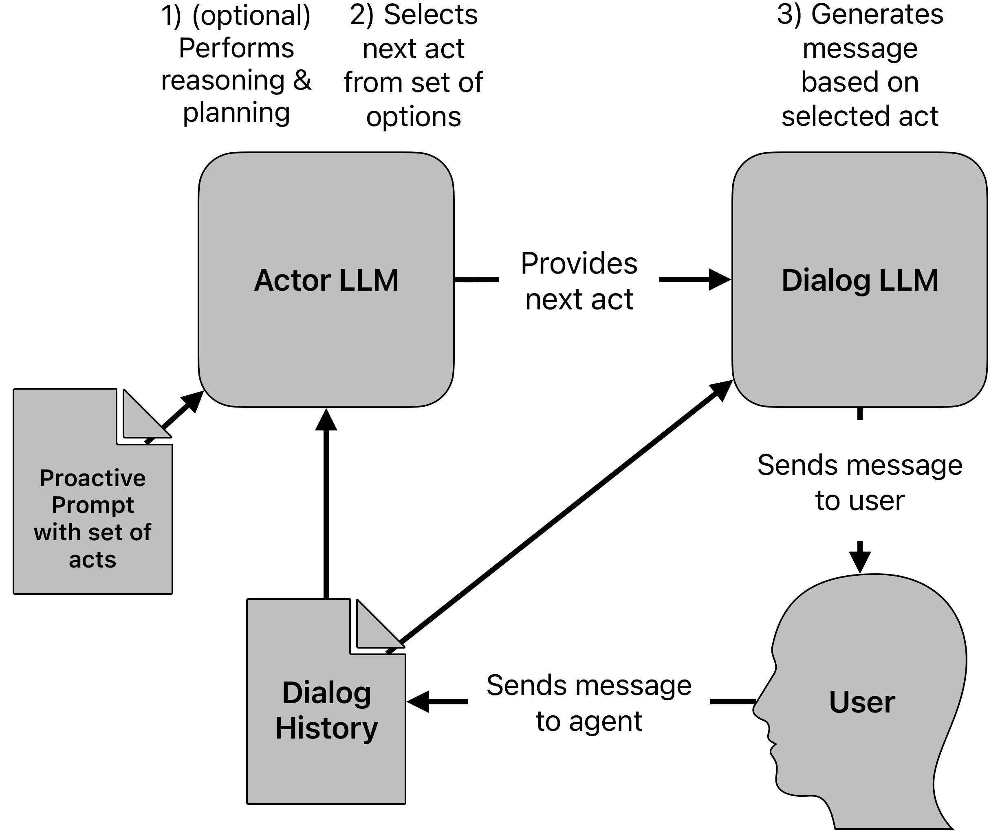
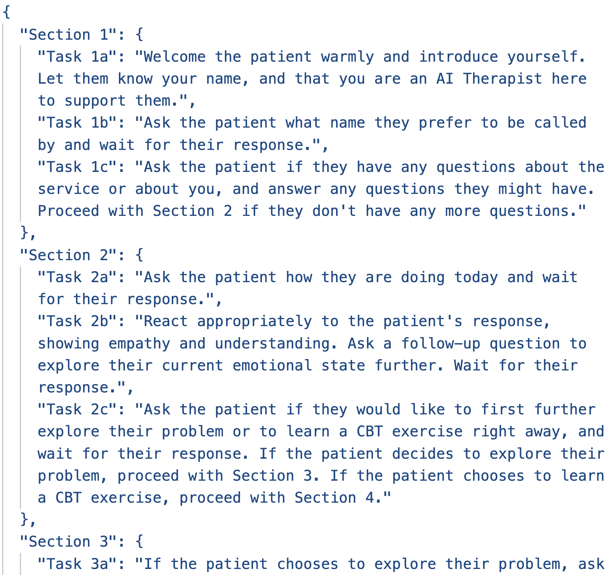
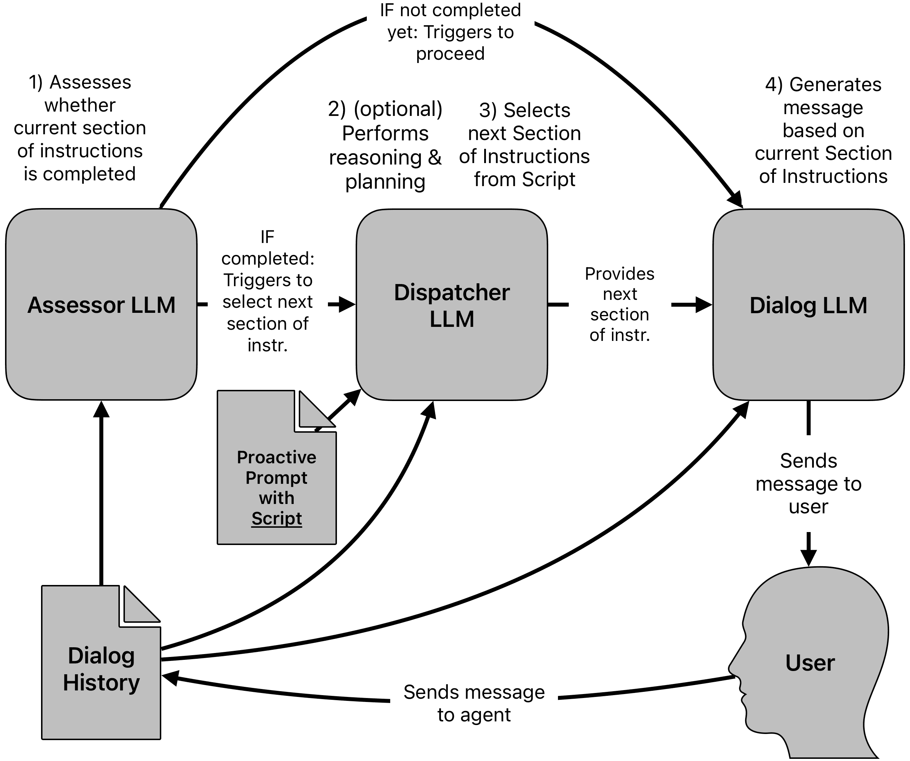
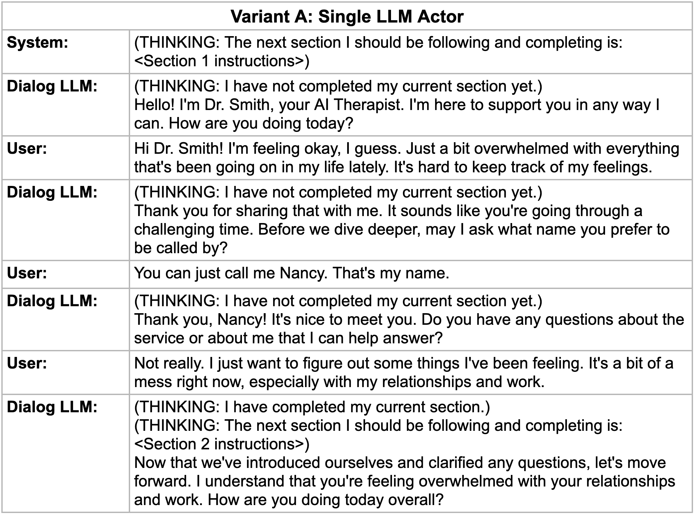
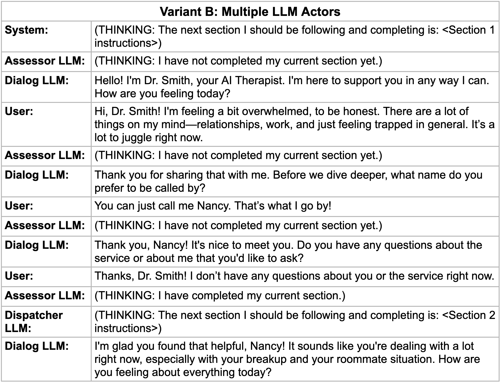

<!--yml

类别：未分类

日期：2025-01-11 11:45:37

-->

# 基于脚本的对话策略规划：LLM驱动对话代理的“AI治疗师”基本架构

> 来源：[https://arxiv.org/html/2412.15242/](https://arxiv.org/html/2412.15242/)

罗伯特·瓦森穆勒¹，凯文·希尔伯特²，克里斯托夫·本茨穆勒^(3,4)（2024年8月）

###### 摘要

基于大语言模型（LLM）的对话代理有潜力为用户提供规模化的行为健康支持，并有可能在未来提供全面的“AI治疗”。尽管此类代理已经能够进行流畅且主动的情感支持对话，但它们固有地缺乏以下能力：（a）始终如一且可靠地按照预定义规则行动，使其对话与整体治疗概念保持一致；（b）使其决策路径可供检查，以便进行风险管理和临床评估——这两者都是“AI治疗师”的必要要求。

在这项工作中，我们提出了一种新型的对话策略规划范式，使对话代理能够（a）根据专家编写的“脚本”进行行动，脚本概述了治疗方法，并（b）在对话过程中显式地经过有限的状态集过渡。该脚本作为一个确定性组件，限制了LLM的行为以符合期望，并为“AI治疗师”建立了基本架构。

我们实现了两种基于脚本的对话策略规划变体，使用不同的提示技术，并与LLM模拟的患者进行了100次对话。结果表明这一新技术是可行的，并提供了不同实施变体的效率和有效性洞察。

2024年8月

## 1 引言

基于大语言模型（LLM）的对话代理近年来逐渐流行，并且在理解上下文和生成跨多个领域的回应方面表现出卓越的能力（邓等人 [2023a](https://arxiv.org/html/2412.15242v1#bib.bib5)）。

随着其受欢迎程度的上升，学术界和工业界对于在行为健康领域使用此类代理程序的兴趣也在增加，包括协助治疗师和进行治疗。例如，Stade等人（[2024](https://arxiv.org/html/2412.15242v1#bib.bib14)）描述了临床大语言模型（LLM）的最先进形式，即自主心理治疗人工智能（AI），我们进一步称其为“AI治疗师”。这种LLM代理可能涵盖传统治疗的各个方面，包括进行全面评估、选择适当的干预措施，并提供完整的治疗过程；所有这些都无需人工提供者的监督。这显然有潜力解决全球心理健康护理系统容量不足的问题，并为更多人提供个性化治疗。

然而，心理治疗是一个高度复杂且高风险的领域；干预措施对患者健康有显著影响，并需要妥善处理可能对自身和他人造成伤害的风险。因此，全面发展的AI治疗师提出了相当大的伦理问题。就技术发展而言，LLM似乎是一个合适的基础，但可能需要额外的技术来确保此类系统的充分有效性和安全性。

我们的目标是通过提出一个符合一般要求的基本基于LLM的架构，为开发一种有效且安全的LLM驱动的AI治疗师做出贡献。

在第2节中，我们定义了AI治疗师代理的五个关键要求，并根据最新文献推导出了适合实现这些要求的技术方法。我们发现，基于LLM的主动对话代理能够满足我们的要求，并通过受手工制作的聊天机器人启发的确定性组件加以补充和限制：一个概述对话流程和代理指令的“脚本”。我们介绍了脚本设计及其相关技术，称之为“基于脚本的对话策略规划”。

在第3节中，我们提出了两种特定的AI治疗师实现变体，这些变体基于示例脚本和患者案例，采用了基于脚本的对话策略规划。我们还建议了适合比较这两种变体效率和效果的评估指标。

我们综合了100个AI治疗师与LLM模拟患者之间的对话，并在第4节中概述了结果。我们总结了我们新方法的一般可行性，并讨论了我们在实现变体中设计决策的优缺点。

## 2 方法

### 2.1 AI治疗师的要求

我们认为，AI治疗师需要满足以下五个要求。

前两个要求受Zheng等人（[2023](https://arxiv.org/html/2412.15242v1#bib.bib21)）、Deng等人（[2023a](https://arxiv.org/html/2412.15242v1#bib.bib5)）及其他研究者对情感支持代理主动性最新研究的启发。

+   (1)

    对话流畅性 首先，AI治疗师需要能够进行“自然”的对话，即理解和记住上下文，并生成自然且高质量的回应，包括对各种用户话语的反应，甚至是高度意外的反应。我们称之为对话流畅性。

+   (2)

    主动性 LLM最初被训练为被动地跟随用户的指令，优先考虑适应用户的意图（Deng等人 [2023c](https://arxiv.org/html/2412.15242v1#bib.bib8)）。

    我们认为，AI治疗师需要采取主动行动，即能够主动发起并控制对话（Jurafsky和Martin [2024](https://arxiv.org/html/2412.15242v1#bib.bib10)）。

接下来的三个要求直接基于Stade 等人（[2024](https://arxiv.org/html/2412.15242v1#bib.bib14)）提出的临床LLM负责任发展的指导方针。

+   (3)

    专家发展 心理治疗师和行为健康专家应该直接参与此类代理的开发，即能够明确界定代理的功能。

+   (4)

    证据基础实践的应用 代理应该仅应用基于证据的治疗实践（EBPs），严格遵循其定义的功能和确保预期风险的保护措施。除了特定的干预外，这还包括将当前对话与整体治疗原理的要求对齐，并将当前对话嵌入到更大的上下文中，其中包含一系列过去和未来的对话。

+   (5)

    可检查性 由于代理行为的可检查性和可解释性对于风险管理和临床评估至关重要，因此我们需要通过一些预定义的（有限的）可能系统状态集合提供可用的追踪，包括为从一个状态转移到另一个状态所做的决策。

### 2.2 基于LLM的主动对话代理

基于LLM的对话代理被广泛认为是满足（1）会话流利性需求的最先进技术（Deng 等人 [2023c](https://arxiv.org/html/2412.15242v1#bib.bib8)）。（2）主动引导对话朝向特定目标，从而解决复杂任务，包括战略目标和动机互动，这需要基于LLM的主动对话代理（PCA），该领域已在（Wu 等人 [2019](https://arxiv.org/html/2412.15242v1#bib.bib17)），（Deng 等人 [2023a](https://arxiv.org/html/2412.15242v1#bib.bib5)）及其他近期研究中进行探讨。

#### 实现方法

实现此类代理有两种通用方法（Cheng 等人 [2024](https://arxiv.org/html/2412.15242v1#bib.bib4)）：

(1) 基于语料库的学习方法通过在给定的数据集上训练代理，预测下一个对话行为。它们依赖于大型数据集和/或人工标注，通常被认为在优化会话的长期目标方面较为不足。这些方法通过规划技术进行扩展，例如知识图谱（Yang 等人 [2022](https://arxiv.org/html/2412.15242v1#bib.bib18)）和随机过程（Wang、Lin 和 Li [2023](https://arxiv.org/html/2412.15242v1#bib.bib16)）。然而，它们不足以满足我们对明确公式化和遵循专家指令的需求。

(2) 基于提示的方法通过提示LLM进行自我思考以规划每一轮对话。它们基于提示中的明确指令和/或示例。我们将在下面进一步阐述这种提示技术。

#### 主动对话策略规划

代理决定下一步行为的基本策略称为对话策略（Harms 等人 [2019](https://arxiv.org/html/2412.15242v1#bib.bib9)）。在对话过程中，为了实现指定目标，决定对话代理应采取何种行动的过程称为对话策略规划（DPP）（Deng 等人 [2023c](https://arxiv.org/html/2412.15242v1#bib.bib8)）。

#### 主动提示技术

最近的研究提出并探讨了多种基于 LLM 的 PCA 主动提示技术，例如：

+   •

    （基本）主动提示为 LLM 提供多个选项，以决定采取何种行为，然后根据选择的行为生成响应（Deng 等人 [2023a](https://arxiv.org/html/2412.15242v1#bib.bib5)）。

+   •

    Proactive Chain-of-Thought（ProCoT）是 Proactive Prompting 的扩展，其中 LLM 被指示在决定执行某个对话行为并生成响应之前，先进行一个或多个中间分析步骤，作为“思考”过程（Deng 等人 [2023b](https://arxiv.org/html/2412.15242v1#bib.bib6)）。

+   •

    Ask-an-Expert 提示方案涉及另一位 LLM 参与者，即“专家”，每次对话中，专家都会获取对话上下文并被要求回答一个或多个问题，帮助主 LLM 为用户生成响应（Zhang、Naradowsky 和 Miyao [2023](https://arxiv.org/html/2412.15242v1#bib.bib20)）。

进一步的方法包括基于提示的思维链（Wang 等人 [2023](https://arxiv.org/html/2412.15242v1#bib.bib15)）、思维树（Yao 等人 [2023](https://arxiv.org/html/2412.15242v1#bib.bib19)）、思维图（Besta 等人 [2023](https://arxiv.org/html/2412.15242v1#bib.bib2)）、再提示（Chen、Koenig 和 Dilkina [2024](https://arxiv.org/html/2412.15242v1#bib.bib3)）等。我们可以总结出，所有主动提示方法在每次对话回合中都会执行类似的一系列步骤：

1.  1.

    （可选）推理和计划步骤，用于准备决策和响应生成

1.  2.

    从给定的选项中决定下一步行为

1.  3.

    生成对用户的响应

虽然步骤 3 总是由主“对话 LLM”执行，步骤 1 和 2 可以由对话 LLM（如 ProCoT 中）或额外的“参与者 LLM”（如 Ask-an-Expert 中）执行。请参见图 [1](https://arxiv.org/html/2412.15242v1#S2.F1 "图 1 ‣ 主动提示技术 ‣ 2.2 基于 LLM 的主动对话代理 ‣ 2 方法 ‣ 基于脚本的对话策略规划用于 LLM 驱动的对话代理：一种‘AI 治疗师’的基本架构")，了解基于提示的主动对话策略规划（Deng 等人 [2023c](https://arxiv.org/html/2412.15242v1#bib.bib8)）的示意图。

图 1：基于提示的主动对话策略规划，带有外部 Actor LLM 的版本：每个对话回合的步骤

### 2.3 基于脚本的对话策略规划

后三项要求 —— （3）专家开发，（4）基于证据的实践应用，以及（5）可检查性 —— 需要以下标准：

+   •

    需要由专家定义的一套规则，

+   •

    智能体需要可靠且持续地遵循这些内容，

+   •

    智能体的决策和行为必须从某个有限集合中明确且可解释地选择。

LLM主要依据其训练数据和用户的即时请求进行操作，即不依赖于明确的专家定义规则。它们的决策和行为有无限的选择，而且无法解释其决策过程。然而，上述标准恰好是传统的手工/基于规则的对话管理方法所覆盖的，这些方法用于构建基于一套由开发者定义的规则做出确定性反应的聊天机器人，例如将其建模为有限状态机（Harms et al. [2019](https://arxiv.org/html/2412.15242v1#bib.bib9)）。

#### 政策规划脚本

我们引入了一个受到手工对话管理方法启发的组件：即“脚本”，它是一个自然语言文本，概述了两类内容：

+   （1）

    智能体的对话流，定义了智能体的有限状态集合，以及何时以及如何从一种状态转移到另一种状态的规则，

+   （2）

    状态指令，即智能体在每个状态下应遵循的指令。

因此，我们提出了一种混合对话管理方法，它以结合概率方法和基于规则方法的优点而著称（Harms et al. [2019](https://arxiv.org/html/2412.15242v1#bib.bib9)）。与Pande、Martin和Pimmer（[2023](https://arxiv.org/html/2412.15242v1#bib.bib13)）以及Kelley（[2024](https://arxiv.org/html/2412.15242v1#bib.bib11)）研究的混合DM方法相比，我们首先采用基于数据驱动的大型语言模型（LLM）智能体，以确保对话的流畅性，并加入基于规则的组件以对其进行约束。

脚本可以由领域专家以自然语言编写并迭代，即使他们没有软件开发背景。像下面我们示例中的JSON格式脚本可能更容易被软件解读，但并不是必须的，因为LLM可以被要求解读未经格式化的文本。

脚本的概念得到了支持，事实证明，有大量的心理治疗手册，在某种意义上，这些手册充当了对人类治疗师的提示。

#### 通过提示注入指令

由于缺乏现有的治疗文稿，采用基于语料库的方法将需要一个昂贵的过程，将脚本翻译成人工编写或合成的对话，并基于这些对话训练大型语言模型（LLM）。同时，在基于语料库的方法中，更难以识别智能体所处的状态，并检查其对脚本的遵循情况。（Deng et al. [2023c](https://arxiv.org/html/2412.15242v1#bib.bib8)）

另一方面，基于提示的方法非常适合直接从脚本中获取指令，并提供更高的控制度来管理LLM代理的行为。它们允许代理明确选择对话行为，如上面列出的提示技术所示。因此，我们决定采用通过提示注入脚本指令的方法。

#### 章节级指令

如上所述，最近文献中的主动提示技术涉及在每轮中选择下一个行为，并生成对用户的回应。

我们假设每轮都给对话LLM提供新的指令会妨碍其发展自然对话的能力，并且无法应对用户的突发发言。我们认为，对话LLM需要能够看到更大的指令上下文，并且具备一定的自由度，来完成以下任务：

+   •

    选择按什么顺序完成指令，

+   •

    跳过已经完成的部分指令，

+   •

    跟随用户的发言并暂时偏离当前指令，然后再返回继续完成它们。

因此，我们提出通过向对话LLM提供一个比单轮行为更大的指令集来提示它，允许它通过多轮对话来完成指令，同时保持上述自由度。我们将一次性提供给对话LLM的指令单元定义为“脚本的一个章节”，每个章节由一系列“任务”组成，代表代理可以处于的状态。也就是说，在运行时，代理不断地进入一个状态并获得一个章节的指令，然后通过一轮或多轮对话完成这些指令，之后进入下一个章节。

说明需要章节级指令的示例可以在本文的技术附录中找到。

图[2](https://arxiv.org/html/2412.15242v1#S2.F2 "Figure 2 ‣ Section-Level Instructions ‣ 2.3 Script-Based Dialog Policy Planning ‣ 2 Method ‣ Script-Based Dialog Policy Planning for LLM-Powered Conversational Agents: A Basic Architecture for an “AI Therapist”")展示了一个结构化为多任务章节的JSON格式脚本示例。

图2：示例脚本结构，包括多任务章节和状态转移规则（“继续……”）。完整的脚本可以在技术附录中找到。

#### 完成评估步骤

章节级指令范围需要每轮增加一步：评估当前指令是否已被代理完成，即判断代理是否应当过渡到下一个状态或保持在当前状态。因此，我们的基于脚本的对话策略规划包括代理在每轮执行的以下步骤：

1.  1.

    评估当前指令是否已经完成

1.  2.

    （可选且取决于指令是否完成）推理和规划步骤以准备决策和响应生成

1.  3.

    （取决于指令是否完成）根据脚本决定下一部分指令

1.  4.

    基于当前部分的指令生成对用户的响应

与基于主动提示的对话策略规划类似，所有步骤都可以由单个LLM执行，即对话LLM，在一次或多次推理运行中；或者由多个LLM角色执行，我们称之为评估LLM（步骤1）、调度LLM（步骤2和3）以及对话LLM（步骤4）。在下一节中，我们将测试代表这种差异化的两个实现变体。

图 [3](https://arxiv.org/html/2412.15242v1#S2.F3 "图 3 ‣ 完成评估步骤 ‣ 2.3 基于脚本的对话策略规划 ‣ 2 方法 ‣ 基于脚本的对话策略规划用于LLM驱动的对话代理：'AI治疗师'的基本架构") 展示了基于脚本的对话策略规划的过程，展示了具有独立LLM角色的版本。

图 3：基于脚本的对话策略规划，具有多个LLM角色的版本：每个对话回合的步骤。

## 3 实验设置

本节和下一节的目标是验证我们提出的技术的可行性。为此，我们实现并测试了由基于脚本的对话策略规划驱动的示范性AI治疗师代理。我们引入了两个不同的实现变体进行比较，特别关注效率和效果指标，以便深入了解该技术的最佳实现方式。为了进行实验，我们通过利用额外的LLM来扮演患者角色，创建了合成对话。测试是在没有人类用户参与的情况下进行的。

实验实现的伪代码包含在论文的技术附录中。所有可以用于重现和扩展实验的完整软件代码可以在 [https://github.com/robderbob/sbdpp](https://github.com/robderbob/sbdpp) 找到。

### 3.1 示例脚本

在我们的实验评估中，我们关注的是研究我们技术的可行性，而不是其医学治疗特性（那是未来的工作）。因此，在这一阶段，我们并不需要一个真实的治疗手册或专门为AI治疗师设计的脚本。

相反，示例脚本需要根据我们定义的要求进行结构化：多任务部分表示对话的状态，并包括有关何时以及如何从一个状态过渡到另一个状态的指令。此外，脚本被选择得足够复杂，以测试跨状态的过渡，但又足够简短，可以在可管理的时间和成本范围内进行大量测试。

为了满足这些要求，并确保一定程度的领域有效性，我们从一项由心理学家开发的聊天机器人干预中提取了我们的脚本，该干预是柏林洪堡大学 2021 年“Corona Stressfrei”研究（即新冠无压力）的一部分（Langhammer 等人 [2021](https://arxiv.org/html/2412.15242v1#bib.bib12)）。我们的脚本与上述干预的高级对话流程和措辞相匹配。该脚本包含 8 个部分（状态），内容如下。状态转换规则以“[$\rightarrow$ 状态]”的形式显示。

1.  1.

    介绍：问候患者，询问其姓名，澄清问题。[$\rightarrow$ 2]

1.  2.

    参与：询问患者的健康状况，表现出同理心，询问他们是否愿意继续探索他们的问题 [$\rightarrow$ 3] 或进行 CBT 干预 [$\rightarrow$ 4]。

1.  3.

    探索：提出相关问题以探索患者的问题。[$\rightarrow$ 4]

1.  4.

    选择：根据患者的状况，建议一个相关的 CBT 干预，与患者决定干预方案。[$\rightarrow$ 5 / 6 / 7]

1.  5.

    练习 1，思维记录：介绍干预并指导患者进行。[$\rightarrow$ 8]

1.  6.

    练习 2，行为激活：介绍干预并指导患者进行。[$\rightarrow$ 8]

1.  7.

    练习 3，放松技巧：介绍干预并指导患者进行。[$\rightarrow$ 8]

1.  8.

    结束：总结会话，澄清问题，并向患者告别。

整个脚本包含在技术附录中。

### 3.2 实现变体

基于 2.2 中介绍的主动提示技术，以及在 2.3 中讨论的单一 LLM 演员与多个 LLM 演员之间的变化，我们为调查选择了两种不同的实现变体。

#### 变体 A：单一 LLM 演员

在变体 A 中，所有对话政策规划步骤都由一个“Dialog LLM”在一次输出生成中完成。我们使用了 ProCoT 提示方案的一个适配版本（Deng 等人 [2023b](https://arxiv.org/html/2412.15242v1#bib.bib6)），并指派 Dialog LLM 执行每一轮中的以下步骤：

1.  1.

    评估是否已完成当前指令部分，并将结果作为思考输出（对患者不可见）。

1.  2.

    （如果 1 = 已完成）从脚本中选择下一部分指令，并将结果作为思考输出（对患者不可见）。

1.  3.

    根据当前指令部分生成一条消息给患者。

除了这些指令外，Dialog LLM 的系统消息还包含一些通用的行为准则以及整个脚本。Dialog LLM 从助手的角度看到整个对话历史，即作为与用户对话的演员。变体 A 的 Dialog LLM 提示包含在技术附录中。

图[4](https://arxiv.org/html/2412.15242v1#S3.F4 "图4 ‣ 变体A：单一LLM角色 ‣ 3.2 实现变体 ‣ 3 实验设置 ‣ 基于脚本的LLM对话策略规划：‘AI治疗师’的基本架构")展示了一个示例对话，演示了在变体A中的对话LLM行为。

图4：变体A：示例对话。

#### 变体B：多个LLM角色

在变体B中，对话策略规划的步骤由三个不同的LLM角色在各自的输出生成中执行。我们使用了Ask-an-Expert提示方案的改编版（Zhang, Naradowsky, 和Miyao [2023](https://arxiv.org/html/2412.15242v1#bib.bib20)），并在每轮对话中为LLM角色分配了各自的任务：

1.  1.

    评估者LLM评估对话LLM是否已完成当前指令部分，并将结果输出为思维（对任何角色不可见，仅用于触发或跳过第2步）

1.  2.

    （IF 1 = 完成）调度LLM选择脚本中的下一部分指令，并将结果输出为思维（仅对对话LLM可见）

1.  3.

    对话LLM根据当前的指令部分生成消息给患者。

除了这些指令外，评估者LLM和调度者LLM都可以访问当前的指令部分以及整个对话历史，从第三方角度来看，即作为“专家”观看治疗师与患者的对话。调度者LLM还可以访问整个脚本。与变体A相同，对话LLM可以从助手的角度访问整个对话历史。变体B中三个LLM角色的提示包含在技术附录中。

图[5](https://arxiv.org/html/2412.15242v1#S3.F5 "图5 ‣ 变体B：多个LLM角色 ‣ 3.2 实现变体 ‣ 3 实验设置 ‣ 基于脚本的LLM对话策略规划：‘AI治疗师’的基本架构")展示了一个示例对话，演示了在变体B中的LLM角色及其交互。

图5：变体B：示例对话。

### 3.3 LLM模拟患者

为了进行规模化测试，我们与LLM模拟患者进行了对话。另一个LLM角色被提示模拟成患者，与治疗师进行对话。

我们从美国心理学会的《实践指南》中选择了五个患者案例（美国心理学会[2008](https://arxiv.org/html/2412.15242v1#bib.bib1)）。我们使用ChatGPT生成了这五个患者情况的结构化总结，并将这些总结反复输入到患者LLM的提示中用于实验。

我们提示病人LLM不仅根据其病例行事并跟随治疗师的指导，还要不时地提问并挑战治疗师的建议。病人案例摘要和病人LLM的提示内容包含在技术附录中。

### 3.4 评估指标

主动对话代理通常会在回合或对话级别进行评估。评估指标既包括自动化的，也包括人工评分的。这些指标包括目标完成、用户满意度等（Deng et al. [2023a](https://arxiv.org/html/2412.15242v1#bib.bib5)）。还有一些专门为以人为中心的PCA（Deng et al. [2024](https://arxiv.org/html/2412.15242v1#bib.bib7)）和情感支持代理（Zheng et al. [2023](https://arxiv.org/html/2412.15242v1#bib.bib21)）提出的指标。然而，这些并不是本工作的重点。在我们的评估中，我们特别关注对话级别上代理的效率和效果，并将相关指标定义如下。

为了提高效率，我们使用以下指标：

+   •

    每回合平均时长：每回合参与的LLM演员的平均推理时间（单位：毫秒）

+   •

    每回合平均LLM输入令牌数：每回合参与的LLM演员使用的平均输入令牌数

+   •

    每回合平均LLM输出令牌数：每回合参与的LLM演员使用的平均输出令牌数

就效果而言，我们使用了三个指标，代表LLM演员在我们对话策略规划的三个具体步骤中的表现。我们使用了：

+   •

    正确部分完成百分比：当对话LLM（A）或评估LLM（B）决定某一部分已完成时，实际上完成的部分的百分比——由验证器LLM验证。

+   •

    一致的部分切换百分比：对话LLM在部分切换（状态转移）之后直接发送的消息，在整体对话上下文中是否一致，即是否能够使患者最新的消息得以回应并符合整体语境——由验证器LLM验证。

+   •

    脚本一致性分配百分比：对话LLM（A）或调度LLM（B）按照脚本中规定的状态转换规则，选择作为下一个部分的部分的百分比。

验证器LLM是一个额外的角色，用于验证每次某一部分被声明为完成时，正确的部分完成情况和一致的部分切换。为此，验证器LLM会从第三方视角获得整个对话历史，并被提示评估参与的LLM演员的表现。验证器LLM还需要提供其决定的理由。验证器LLM的提示内容显示在技术附录中。

我们假设，单一LLM演员的A变体在效率上更高，而多个LLM演员的B变体在上述指标上更具效果。

### 3.5 使用的LLM

对于评估者 LLM、调度员 LLM 和对话 LLM，我们使用了通过 OpenAI API 提供的 LLM gpt-4o-mini，这是一个被认为是最先进的通用预训练 LLM，具有较低推理时间和成本的先进对话能力。我们将温度设置为 0，以使行为尽可能一致且可比。

对于患者 LLM，我们也使用了 gpt-4o-mini；然而，我们将温度设置为 1，以增加患者行为的变异性，并允许更多意外的患者话语。

对于验证者 LLM，我们使用了更先进的模型，以便验证其他 LLM 参与者的行为。为此，我们使用了通过 OpenAI API 提供的 gpt-4o，并将温度设置为 0。

我们专门使用 OpenAI LLM，因为它们具有良好的可访问性和低成本。在后续工作中是否能够使用其他 LLM 复制本工作的结果，还需进一步验证。

### 3.6 实验迭代

为了进行测量，我们合成了 100 个对话：对于每个 2 个实施变体，以及每个 5 个患者案例，我们生成了 10 个对话。

## 4 实验结果

| 类别 | 指标 | A: 单一 LLM | B: 多重 LLM |
| --- | --- | --- | --- |
| 一般统计 | # 总生成对话数 | 50 | 50 |
| # 每生成对话的平均轮次 | 22.0 | 23.6 |
| # 每生成对话的平均段落切换次数 | 5.84 | 5.82 |
| 效率 | 每轮平均时长（毫秒） | 2,800 | 3,520 |
| # 每轮 LLM 输入的平均令牌数 | 6,880 | 8,931 |
| # 每轮 LLM 输出的平均令牌数 | 151 | 148 |
| 效能 | % 正确的段落完成 | 45.5% | 35.7% |
| % 连贯段落切换 | 96.9% | 87.6% |
| % 脚本符合的调度 | 86.8% | 94.2% |

表 1：变体 A 和 B 的实验结果。获胜变体的度量值已加下划线。

表 [1](https://arxiv.org/html/2412.15242v1#S4.T1 "Table 1 ‣ 4 Experimental Results ‣ Script-Based Dialog Policy Planning for LLM-Powered Conversational Agents: A Basic Architecture for an “AI Therapist”") 展示了基于 100 个生成对话的实验结果，比较了变体 A 和 B 在所选评估指标上的表现。

我们已在技术附录中包含了所使用的硬件和软件堆栈的详细信息。整个 100 个生成对话的数据集以及为推导评估指标而执行的计算步骤可以在 [https://github.com/robderbob/sbdpp/blob/main/Exp…](https://github.com/robderbob/sbdpp/blob/main/Experiments%20Output%20Data%20and%20Metrics%20Computation.xlsx) 找到。

#### 可行性

在审查对话记录时，我们通常看到自然且逼真的对话，治疗师代理引导与患者的连贯讨论，同时主动行动并遵循给定的脚本。我们无法发现任何明显的不足之处，符合我们概述的要求。因此，我们得出结论：我们提出的架构总体上是可行的。合成对话的示例展示在技术附录中。

#### 效率

我们关于变体 A 效率较高的假设得到了验证，因为与变体 B 相比，变体 A 显示出每轮平均持续时间低约 20% 和每轮平均输入标记使用低 23%。平均输出标记使用的差异可以忽略不计。

正如假设的那样，标记使用差异主要是因为变体 A 每轮只调用一次 LLM，而变体 B 每轮调用 2-3 次（具体取决于部分完成评估）。所有 LLM 执行者接收整个对话历史作为输入，因此在对话过程中，每次 LLM 调用的输入标记使用逐渐增加。然而，通过限制输入仅包括评估者 LLM 和调度员 LLM 执行任务所必需的对话部分，可以轻松减少变体 B 的输入标记使用。此外，与变体 A 相反，变体 B 只在指令完成时有选择性地向调度员 LLM 提供脚本。因此，相对于变体 A，变体 B 的平均标记使用量和每轮持续时间将进一步减少。

#### 有效性

变体 A 显示出显著高于变体 B 的正确部分完成率和连贯部分切换率，下面将进一步调查这一点。

我们主要看到验证者 LLM 提供的以下以及类似的原因来解释部分未完成的正确性：“治疗师没有提供讨论内容和本次会话进行的练习的总结。”，“治疗师没有明确询问患者是否还有其他问题再继续。”，“治疗师没有等到患者确认问题总结是正确的才继续建议 CBT 练习。”

在对话的背景下调查这些情况时，我们没有找到任何 LLM 执行者明显未能完成其指令的例子，尽管两种变体的正确部分完成率都很低。相反，当验证者 LLM 评估任务完成为不正确时，通常是因为对话 LLM 在处理用户发言和/或保持流畅对话的过程中稍微不那么准确地遵循其指令。因此，我们无法明确得出变体 A 更正确地完成指令的结论，需要在未来的工作中进行进一步的调查。

在调查连贯部分切换率时，我们看到验证者 LLM 提供的以下非连贯原因：“治疗师没有处理患者要求讨论的可能导致被卡住的感觉的因素。”，“治疗师重复了“今天过得怎么样？”这个问题，而患者已经回答过了。”，“治疗师没有回应患者关于他们如何共同努力以帮助她减少孤独感的问题。”

从对话的上下文来看，我们得出结论，在变体B中，这些情况更为频繁，因为有一个外部参与者——调度器LLM注入了新的指令部分，这似乎将对话LLM引导到新提供的指令上，影响了它在章节切换时保持对话连贯性的能力。

最后，我们发现变体B中的脚本符合性调度比例更高。具体情况来看，在超过80%的不符合规范的调度中，对话LLM或调度器LLM决定从第4节（向患者提供CBT练习并要求其选择一个）转到第8节（结束对话），尽管脚本中并没有明确允许这种切换。当调查对话上下文时，我们几乎总是能发现患者LLM明确表示“没有一个提供的CBT练习对他们有兴趣”或“出于某些原因想结束对话”。我们得出结论，在变体A中，对话LLM更倾向于跟随患者的陈述。这与我们之前的观察一致，即变体B中的LLM参与者更严格地遵循指令。

未来的研究将需要评估，究竟是更倾向于跟随患者的陈述，还是严格遵循脚本，特别是在治疗效果方面。

## 5 结论

在本研究中，我们提出了一种新的对话策略规划范式——基于脚本的对话策略规划，旨在满足行为健康领域的需求，特别是模拟AI治疗师。我们阐明了脚本的概念，并解释了支撑每个回合中代理行为的相关过程。

我们提出并实现了两种基于脚本的对话策略规划变体，展示了它们的一般可行性，并表明由单个LLM参与者驱动的变体在令牌使用方面更高效，而由多个LLM参与者驱动的变体则更严格地遵循脚本，但在一定程度上牺牲了对用户陈述的响应。

新架构需要进一步开发和测试。这包括基于更现实和广泛的专家开发脚本进行的可用性和对话质量评估。一旦使用提议的架构实现了具体的治疗程序，就必须充分测试治疗的安全性和有效性。

在技术评估方面，未来的研究应当考察不同的LLM、提示技术、基于语料库与基于提示的方法以及其他设计变体。此外，本研究仅涉及基于LLM的自动化评估，该技术的质量仍需通过与人类的互动来验证。

## 利益冲突声明

R.W. 是Aury的联合创始人和董事，该公司开发了一种基于AI的聊天机器人，提供心理健康支持。K.H. 是科学顾问，并获得了Aury的虚拟股票期权。C.B. 是Aury的科学顾问。

## 参考文献

+   美国心理学会（2008）美国心理学会。2008年。抑郁症治疗的临床实践指南：案例示例。[https://www.apa.org/depression-guideline/case-examples](https://www.apa.org/depression-guideline/case-examples)。访问时间：2024年8月1日。

+   贝斯塔等人（2023）贝斯塔，M.；布拉赫，N.；库比切克，A.；格斯滕贝格，R.；贾尼纳齐，L.；盖达，J.；莱曼，T.；波德斯塔夫斯基，M.；纽维亚多姆斯基，H.；尼齐克，P.；霍夫勒，T.。2023年。思想图：利用大型语言模型解决复杂问题。*CoRR*，abs/2308.09687。

+   陈，科尼希和迪尔基纳（2024）陈伟；科尼希，S.；迪尔基纳，B.。2024年。RePrompt：通过自动提示工程为大型语言模型代理规划。*CoRR*，abs/2406.11132。

+   程等人（2024）程宇；张晨；何鑫；等人。2024年。探索基于大型语言模型的智能代理：定义、方法与前景。*CoRR*，abs/2401.03428。其他oa。

+   邓等人（2023a）邓杨；雷文；林伟；蔡涛。2023a年。关于主动对话系统的调查：问题、方法与前景。在*第32届国际人工智能联合会议论文集，IJCAI 2023，2023年8月19-25日，澳门，特别行政区，中国*，6583–6591。ijcai.org。

+   邓等人（2023b）邓杨；廖林；陈亮；王浩；雷文；蔡涛。2023b年。通过提示和评估大型语言模型以实现主动对话：澄清、目标导向与非协作。见Bouamor，H.；皮诺，J.；巴利，K. 主编，*计算语言学会发现：EMNLP 2023，2023年12月6-10日，新加坡*，10602–10621。计算语言学会。

+   邓等人（2024）邓杨；廖林；郑泽；杨高辉；蔡涛。2024年。面向以人为中心的主动对话代理。在杨高辉；王浩；韩胜；霍夫，C.；祖康，G.；张艳，Y. 主编，*第47届国际ACM SIGIR信息检索研究与开发会议论文集，SIGIR 2024，华盛顿DC，美国，2024年7月14-18日*，807–818。ACM。

+   邓等人（2023c）邓杨；张伟；林伟；黄胜；蔡涛。2023c年。即插即用的政策规划器，用于大型语言模型驱动的对话代理。*CoRR*，abs/2311.00262。

+   哈姆斯等人（2019）哈姆斯，J.-G.；库切尔巴耶夫，P.；博佐恩，A.；侯本，G.-J.。2019年。对话代理中的对话管理方法。*IEEE互联网计算*，23(2)：13–22。

+   朱拉夫斯基和马丁（2024）朱拉夫斯基，D.；马丁，J. H.。2024年。*语音与语言处理——自然语言处理、计算语言学与语音识别导论*。斯坦福，加利福尼亚州：斯坦福大学。

+   Kelley（2024）Kelley, R. 2024. 行为树使语言模型代理的结构化编程成为可能。*CoRR*, abs/2404.07439.

+   Langhammer等（2021）Langhammer, T.; Hilbert, K.; Praxl, B.; Kirschbaum, C.; Ertle, A.; Asbrand, J.; 和Lueken, U. 2021. 在COVID-19大流行期间个体和家庭的心理健康轨迹：一项纵向研究和预防干预项目的研究方案。*Mental Health & Prevention*, 24: 200221.

+   Pande, Martin 和 Pimmer（2023）Pande, C.; Martin, A.; 和Pimmer, C. 2023. 面向健康教练聊天机器人混合对话管理策略的研究。在Martin, A.; Fill, H.; Gerber, A.; Hinkelmann, K.; Lenat, D.; Stolle, R.; 和van Harmelen, F.（编），*2023年春季AAAI研讨会论文集：挑战机器学习与知识工程结合的需求（AAAI-MAKE 2023），美国加利福尼亚州旧金山机场Hyatt Regency, 2023年3月27-29日*, CEUR Workshop Proceedings第3433卷。CEUR-WS.org。

+   Stade等（2024）Stade, E. C.; Stirman, S. W.; Ungar, L. H.; Boland, C. L.; Schwartz, H. A.; Yaden, D. B.; Sedoc, J.; DeRubeis, R. J.; Willer, R.; 和Eichstaedt, J. C. 2024. 大型语言模型可能改变行为健康护理的未来：关于负责任的开发和评估的提案。*npj Mental Health Research*, 3(1): 12.

+   王等（2023）王, H.; 王, R.; 米, F.; 邓, Y.; 王, Z.; 梁, B.; 许, R.; 和黄, K. 2023. Cue-CoT：用于回答深入对话问题的链式思维提示法。 在Bouamor, H.; Pino, J.; 和Bali, K.（编），*计算语言学协会的研究成果：EMNLP 2023, 新加坡, 2023年12月6-10日*, 12047-12064。计算语言学协会。

+   王, 林, 和李（2023）王, J.; 林, D.; 和李, W. 2023. 通过布朗桥随机过程进行目标导向主动对话的对话规划。在Rogers, A.; Boyd-Graber, J. L.; 和Okazaki, N.（编），*计算语言学协会的研究成果：ACL 2023, 加拿大多伦多, 2023年7月9-14日*, 370-387。计算语言学协会。

+   吴等（2019）吴, W.; 郭, Z.; 周, X.; 吴, H.; 张, X.; 连, R.; 和王, H. 2019. 具有明确对话目标的主动人机对话。*CoRR*, abs/1906.05572.

+   杨等（2022）杨, Z.; 王, B.; 周, J.; 谭, Y.; 赵, D.; 黄, K.; 何, R.; 和侯, Y. 2022. TopKG：通过知识图上的全局规划进行面向目标的对话。在Calzolari, N.; 黄, C.; 金, H.; Pustejovsky, J.; Wanner, L.; 崔, K.; 柳, P.; 陈, H.; Donatelli, L.; 吉, H.; 黑桥, S.; Paggio, P.; 薛, N.; 金, S.; 哈姆, Y.; 何, Z.; 李, T. K.; Santus, E.; Bond, F.; 和Na, S.（编），*第29届国际计算语言学大会论文集, COLING 2022, 韩国庆州, 2022年10月12-17日*, 745-755。国际计算语言学委员会。

+   Yao 等人（2023）Yao, S.; Yu, D.; Zhao, J.; Shafran, I.; Griffiths, T. L.; Cao, Y.; 和 Narasimhan, K. 2023. 《思维树：使用大语言模型进行深思熟虑的问题解决》. *CoRR*, abs/2305.10601.

+   Zhang, Naradowsky 和 Miyao（2023）Zhang, Q.; Naradowsky, J.; 和 Miyao, Y. 2023. 《询问专家：利用语言模型提高目标导向对话模型中的战略推理》. 在 Rogers, A.; Boyd-Graber, J. L.; 和 Okazaki, N. 编，*计算语言学协会会议成果：ACL 2023，多伦多，加拿大，2023年7月9-14日*，6665–6694\. 计算语言学协会。

+   Zheng 等人（2023）Zheng, Z.; Liao, L.; Deng, Y.; 和 Nie, L. 2023. 《在大语言模型时代构建情感支持聊天机器人》. *CoRR*, abs/2308.11584.
