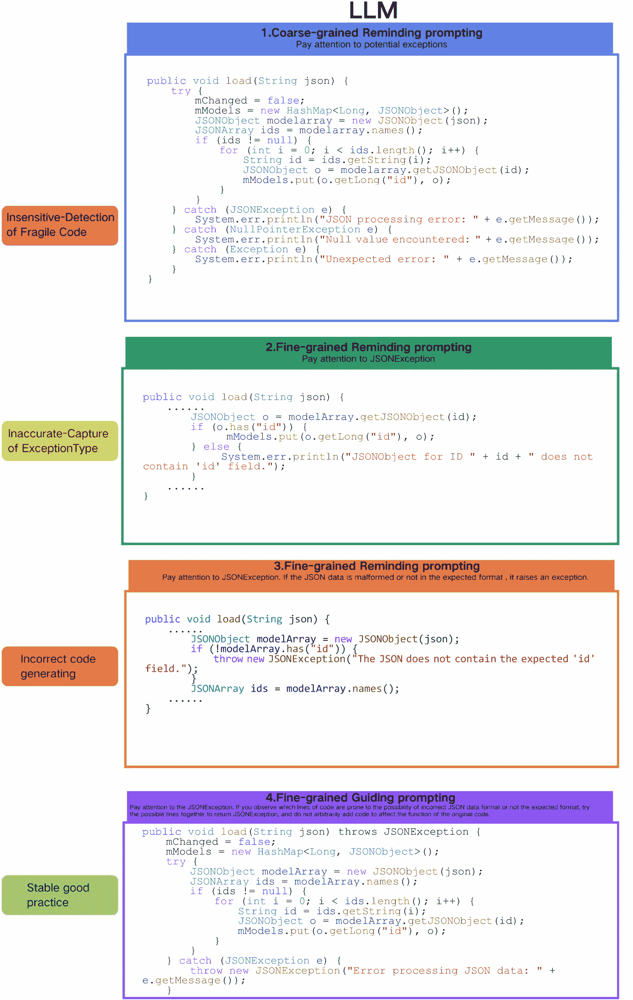

<!--yml
category: 未分类
date: 2025-01-11 12:08:20
-->

# Seeker: Enhancing Exception Handling in Code with a LLM-based Multi-Agent Approach

> 来源：[https://arxiv.org/html/2410.06949/](https://arxiv.org/html/2410.06949/)

Xuanming Zhang^(1,2) ¹¹1Equal contribution., Yuxuan Chen¹ ¹¹1Equal contribution., Yuan Yuan³ ²²2Equal Advising., Minlie Huang¹ ²²2Equal Advising.
¹The CoAI Group, Tsinghua University
²ByteDance
³Beihang University
{zhangxuanming.1}@bytedance.com
{chenyuxu21}@mails.tsinghua.edu.cn
{yuan21}@buaa.edu.cn
{aihuang}@tsinghua.edu.cn 

###### Abstract

In real-world software development, improper or missing exception handling can severely impact the robustness and reliability of code. Exception handling mechanisms require developers to detect, capture, and manage exceptions according to high standards, but many developers struggle with these tasks, leading to fragile code. This problem is particularly evident in open-source projects and impacts the overall quality of the software ecosystem. To address this challenge, we explore the use of large language models (LLMs) to improve exception handling in code. Through extensive analysis, we identify three key issues: Insensitive Detection of Fragile Code, Inaccurate Capture of Exception Types, and Distorted Handling Solutions. These problems are widespread across real-world repositories, suggesting that robust exception handling practices are often overlooked or mishandled. In response, we propose *Seeker*, a multi-agent framework inspired by expert developer strategies for exception handling. Seeker uses agents—Scanner, Detector, Predator, Ranker, and Handler—to assist LLMs in detecting, capturing, and resolving exceptions more effectively. Our work is the first systematic study on leveraging LLMs to enhance exception handling practices, providing valuable insights for future improvements in code reliability.

## 1 Introduction

In the era of code large-scale pre-trained language models (code LLMs) such as DeepSeek-Coder (Guo et al., [2024](https://arxiv.org/html/2410.06949v2#bib.bib10)), Code-Llama (Rozière et al., [2023](https://arxiv.org/html/2410.06949v2#bib.bib26)), and StarCoder (Li et al., [2023](https://arxiv.org/html/2410.06949v2#bib.bib18)), the functional correctness of code generation has become the main method for evaluating the quality of these models. For example, HumanEval(Chen et al., [2021](https://arxiv.org/html/2410.06949v2#bib.bib1)) first proposed to let LLM generating code based on human-written natural language programming problem descriptions, and measured the model’s code generation ability based on the Pass@k metric of the rate k times of generating that pass all test cases. In addition, CoderEval (Yu et al., [2024](https://arxiv.org/html/2410.06949v2#bib.bib30)) and DevEval (Li et al., [2024a](https://arxiv.org/html/2410.06949v2#bib.bib15)) introduced repo-level code generation tasks by sampling real code repositories according to distribution, while also hoped to evaluate the performance of code LLM in real development scenarios based on Pass@k and Acc@k metrics.

As the functional correctness of code LLM continues to gain attention and improve, more research focuses on the reliable solutions of LLM-generated code to existing defects. For example, SWE-bench (Jimenez et al., [2024](https://arxiv.org/html/2410.06949v2#bib.bib14)) evaluates the ability of LLM to generate maintenance patch code based on real software issues on GitHub, while SecurityEval (Siddiq & Santos, [2022](https://arxiv.org/html/2410.06949v2#bib.bib27)) uses 75 vulnerability types defined by CWE as prompts to induce LLM to generate vulnerable code, aiming to evaluate the jailbreak risk of LLM code generation. In terms of methods, He & Vechev ([2023b](https://arxiv.org/html/2410.06949v2#bib.bib12)) leverages property-specific continuous vectors based on a high-quality code dataset to guide code generation towards the given property, achieving the repair of CWE vulnerabilities. In order to enhance the generalization of LLM itself for code vulnerable safety, Li et al. ([2024c](https://arxiv.org/html/2410.06949v2#bib.bib17)) explored the direction of fine-tuning LLM to generate code avoiding 11 common CWE vulnerabilities. Recently, Ren et al. ([2023](https://arxiv.org/html/2410.06949v2#bib.bib25)) conducted an in-depth study on the performance of LLM-generated code in code robustness represented by exception handling mechanisms, which opened up new explorations for LLM to predict and handle potential risks of generated code itself before a vulnerability occurs.

Although exception detection (and handling) techniques based on static analysis or neural networks have made great progress, little attention has been paid to the standardization of the mechanism, especially the private paradigms of various exception types including custom exceptions and exception rules in the long tail area. At the same time, we believe that interpretable and generalizable fragile code detection and exception handling strategies are crucial but underestimated attributes in real code development, thus the exception mechanism requires extremely high programming literacy from developers, which significantly affects the robustness of the code in the main peak area (especially Java projects), further affects the quality of the code LLM training data and the quality of the generated code. This paper explores these neglected aspects and raises a research question: “Do we need to enhance the standardization, interpretability and generalizability of exception handling in real code development scenarios?” To the best of our knowledge, there is currently no work studying this issue.


(a) Our preliminary tendency.


(b) a schematic diagram of human developers who well-performed in exception handling.

Figure 1: Preliminary on exception handling performance by LLM and human. Prompt1, Prompt2, Prompt3 and Prompt4 in (a) indicate General prompting, Coarse-grained Knowledge-driven prompting, Fine-grained Knowledge-driven prompting and Fine-grained Knowledge-driven with handling logic prompting respectively

In order to thoroughly study the role of intuitive interpretability and rule generalization of exception mechanisms on human developers or LLMs in exception handling, we optimized and expanded the preliminary experiment conducted by Ren et al. ([2023](https://arxiv.org/html/2410.06949v2#bib.bib25)), and introduced four sets of prompts for human developers and LLMs based on 100 fragile Java code slices from real projects, namely Coarse-grained Reminding prompting, Fine-grained Reminding prompting, Fine-grained Inspiring prompting, and Fine-grained Guiding prompting, which successively added intuitive interpretability and rule generalization of exceptions to change the in-context learning of code writers. Through four sets of in-context learning in parallel with two objects, we found a consistent phenomenon: the code generated by the Fine-grained Guiding prompt has a great performance of exception handling, while the lack of intuitive interpretability (specific exception type, current code scenario) or rule generalization (exception handling strategies) will reduce the exception handling performance, as shown in figure [1(a)](https://arxiv.org/html/2410.06949v2#S1.F1.sf1 "In Figure 1 ‣ 1 Introduction ‣ Seeker: Enhancing Exception Handling in Code with a LLM-based Multi-Agent Approach").

Figure [1(b)](https://arxiv.org/html/2410.06949v2#S1.F1.sf2 "In Figure 1 ‣ 1 Introduction ‣ Seeker: Enhancing Exception Handling in Code with a LLM-based Multi-Agent Approach") explores the Chain-of-Thought used by senior human developers under the Fine-grained Guiding prompt. It is worth noting that compared with common exception types such as IOException and NullPointerException, some rare exceptions such as BrokenBarrierException, AccessControlException also cause high program risks, but are not well handled in low-level experiments. In addition, we observed that good exception handling practices pay more attention to the specificity of exceptions and tend to accurately capture exception types moving down the class hierarchy. For example, the exception SQLClientInfoException inherits the properties of its parent class SQLException. Capturing SQLClientInfoException will provide additional information about the error by obtaining detailed information about the SQL client properties, beyond what the superclass SQLException provides. This is based on the fact that each exception is an object, and exceptions thrown at a lower level can also be caught by its superclass, but Exception handlers that are too general can make code more error-prone by catching and handling exceptions that were not anticipated by the programmer and for which the handler was not intended. Osman et al. ([2017](https://arxiv.org/html/2410.06949v2#bib.bib24)) further demonstrates that capturing accurate fine-grained exceptions can help developers quickly identify the source of the problem, effectively improve the readability and maintainability of the code, and avoid mishandling different types of errors. However, due to the lack of good handling paradigm experience for long-tail, domain-specific, or customized exception types, combining with the complex inheritance relationship and the multi-pattern of exception handling, it is still challenging to accurately achieve this goal.

In order to improve the robustness of the code by leveraging the best exception handling practices of senior human developers, we propose a method called Seeker, which disassembles the Chain-of-Thought of senior human developers and divides the exception mechanism into five tasks, which are respectively handled by Scanner, Detector, Predator, Ranker, and Handler agents. We combine a large amount of trusted external experience documents with exception practices to build Common Exception Enumeration (CEE) to retrieve and enhance the detection, capture, and handling tasks where the original LLM performs poorly. This method can be easily integrated into the existing code LLM in aim to generate highly robust code, among with CEE has promising community contribution and maintenance value which helps developers further understand the ideal practice of exception mechanisms. After adopting the high-concurrency interface we designed, the additional computing time overhead is constant when facing any level of code volume, also totally controllable in complexity. However, still taking Java exceptions as an example, even if only the built-in exception types are considered, the exception relationship inheritance tree contains 433 nodes, 62 branches, and 5 layers. Directly building documents and calling either LLM or human developer for retrieval may degrade performance because it may not be able to distinguish the exception specificity on the same branch for node selection, cannot adapt to multiple handling patterns of exceptions, and the cost of each query round is very high.

To solve this problem, a deep retrieval-augmented generation(Deep-RAG) algorithm for complex inheritance relationships is proposed as an improved alternative to traditional RAG. Specifically, a development scenario label is assigned to each branch according to the inheritance relationship to identify several exception branches that may correspond to a piece of fragile code. The few-sample verification step provides detection pass rate and capture accuracy feedback after the automatic generation of labels, and then fine-tunes the specific granularity and general description of the labels based on the regularization prompts of failed samples. This can identify the risk scenarios where fragile codes are located and the corresponding exception branches that are triggered, and then selectively perform node evaluation on these branches by depth, ultimately improving retrieval performance and overhead. A large number of experiments show that the proposed Seeker method helps LLM optimize or generate highly robust code, further improving the performance of LLM in various code tasks.

## 2 Preliminary

In this section, we study how the standardization, interpretability, and generalizability of exceptions affect the exception handling performance of code developers and determine the mitigation effect of poor exception handling. To achieve this, we conduct extensive comparative experiments by controlling the standardization of exception types, the interpretability of risk scenarios, and the generalization of handling strategies, respectively, applying the four sets of in-context learning prompt proposed in figure [4](https://arxiv.org/html/2410.06949v2#A1.F4 "Figure 4 ‣ A.1.2 Common Exception Enumeration ‣ A.1 Method Details ‣ Appendix A Appendix ‣ Seeker: Enhancing Exception Handling in Code with a LLM-based Multi-Agent Approach") and [5](https://arxiv.org/html/2410.06949v2#A1.F5 "Figure 5 ‣ A.1.2 Common Exception Enumeration ‣ A.1 Method Details ‣ Appendix A Appendix ‣ Seeker: Enhancing Exception Handling in Code with a LLM-based Multi-Agent Approach") (i.e., Coarse-grained Reminding prompting, Fine-grained Reminding prompting, Fine-grained Inspiring prompting, and Fine-grained Guiding prompting).

Specifically, based on the preliminary exploration of Ren et al. ([2023](https://arxiv.org/html/2410.06949v2#bib.bib25)), we screened several well-maintained codebases, combined manual and automatic code reviews to filter out high-quality also important exception handling therefore obtain the fragile code that is in serious situation in real development scenarios. Then we allowed code developers to familiarize with these filtered codebases and record the methods and processes they used when handling exceptions. In order to reduce the difficulty of the entire task and simulate the developer’s thought about exception handling during the development process, we set up four prompt links to provide developers with progressive exception handling information. The implementation results can be found in figure [1(a)](https://arxiv.org/html/2410.06949v2#S1.F1.sf1 "In Figure 1 ‣ 1 Introduction ‣ Seeker: Enhancing Exception Handling in Code with a LLM-based Multi-Agent Approach").

The comparative experiment reveals an interesting phenomenon: prompts without effective guidance information are not helpful for both human developers and LLMs, while adding type normative information about exception mechanisms will slightly improve developers’ vague perception of the source of code fragility, but cannot accurately locate and handle them due to the unfamiliarity with the exception, which is easy to cause insensitive detection. Increasing the interpretability information of the development scenario will greatly improve developers’ understanding of the code itself and potential fragility, which is beneficial to the accuracy of exception capture. Increasing the generalization information of handling strategies further improves developers’ ability to analyze the source of fragility and improve the quality of handling block. The phenomenon that the above information bring significant gains in exception handling tasks is called the mitigation effect. This phenomenon answers the research questions raised in Section [1](https://arxiv.org/html/2410.06949v2#S1 "1 Introduction ‣ Seeker: Enhancing Exception Handling in Code with a LLM-based Multi-Agent Approach") by revealing the mitigation effect by specific prompt information, impacting the quality of code developers’ exception handling practices. It also inspires the proposed $Seeker$ method to combine external document information to align the generated prompts with fine-grained guidance standards. In addition, Section [3.2](https://arxiv.org/html/2410.06949v2#S3.SS2 "3.2 Rules of Good Practice ‣ 3 Methodology ‣ Seeker: Enhancing Exception Handling in Code with a LLM-based Multi-Agent Approach") provides a reasonable explanation for the occurrence of the mitigation effect, providing data and insights on the effectiveness of the proposed method. We believe that our findings can provide valuable insights for future research related with reliable code generation, laying the foundation for potential RAG code agent progress.

## 3 Methodology

In this section, we introduce the proposed Seeker method. We first review the historical observations of developers on exception handling issues, and then introduce three exception handling pitfalls, Insensitive-Detection of Fragile Code, Inaccurate-Capture of Exception Type and Distorted-Solution of Handling Block. Finally, we introduce the method’s dependency construction and the entire method.

### 3.1 A Revisit of Human Empiricals

Over the years, there have been numerous empirical studies and practical discussions on exception handling, but what is common is that exception handling has been repeatedly emphasized as an important mechanism directly related to code robustness. Nakshatri et al. ([2016](https://arxiv.org/html/2410.06949v2#bib.bib20)) points out that exception handling is a necessary and powerful mechanism to distinguish error handling code from normal code, so that the software can do its best to run in a normal state. Weimer & Necula ([2004](https://arxiv.org/html/2410.06949v2#bib.bib29)) points out that the exception mechanism ensures that unexpected errors do not damage the stability or security of the system, prevents resource leakage, ensures data integrity, and ensures that the program still runs correctly when unforeseen errors occur. In addition, Jacobs & Piessens ([2009](https://arxiv.org/html/2410.06949v2#bib.bib13)) points out that exception handling also involves solving potential errors in the program flow, which can mitigate or eliminate defects that may cause program failure or unpredictable behavior.

Although the exception mechanism is an important solution to code robustness, developers have always shown difficulties in dealing with it due to its complex inheritance relationship and processing methods. de Pádua & Shang ([2017](https://arxiv.org/html/2410.06949v2#bib.bib3)) points out that various programming language projects show a long-tail distribution of exception types when facing exception handling, which means that developers may only have a simple understanding of the frequently occurring exception types. However, according to section[1](https://arxiv.org/html/2410.06949v2#S1 "1 Introduction ‣ Seeker: Enhancing Exception Handling in Code with a LLM-based Multi-Agent Approach"), good exception practices rely on developers to perform fine-grained specific capturing. Nguyen et al. ([2020b](https://arxiv.org/html/2410.06949v2#bib.bib22)) also points out multi-pattern effect of exception handling. For example, even for peer code, capturing different exception types will play different maintenance functions, so exception handling is often not generalized or single-mapped. These complex exception mechanism practice skills have high requirements for developers’ programming literacy. de Sousa et al. ([2020](https://arxiv.org/html/2410.06949v2#bib.bib4)) manually reviewed and counted the exception handling of a large number of open source projects, and believed that up to 62.91% of the exception handling blocks have violations such as capturing general exceptions and destructive wrapping. This seriously violates the starting point of the exception mechanism. de Pádua & Shang ([2017](https://arxiv.org/html/2410.06949v2#bib.bib3)) emphasizes the urgent need and importance of automated exception handling suggestion tools.

The failure of human developers in the exception handling mechanism seriously affects the quality of LLM’s code training data (He & Vechev ([2023a](https://arxiv.org/html/2410.06949v2#bib.bib11))), which further leads to LLM’s inability to understand the usage skills of maintenance functions (Wang et al. ([2024](https://arxiv.org/html/2410.06949v2#bib.bib28))). To solve the above problems, we first proposed $Seeker-Java$ for the Java language. This is because the Java language has a more urgent need for exception handling and is completely mapped to the robustness of Java programs. Ebert et al. ([2020](https://arxiv.org/html/2410.06949v2#bib.bib5)) pointed out that as a fully object-oriented language, Java’s exception handling is more complex than other languages, and it has a higher degree of integration into language structures. Therefore, Java projects are more seriously troubled by exception handling bugs. In addition, Java relies heavily on exceptions as a mechanism for handling exceptional events. In contrast, other languages may use different methods or have less strict exception handling mechanisms. It is worth mentioning that $Seeker$’s collaborative solution based on an inherent multi-agent framework plus an external knowledge base, they can quickly migrate multiple languages by maintaining documents for different languages. We will also maintain $Seeker-Python$ and $Seeker-C\#$ in the future to provide robustness guarantees for the development of more programming languages.

### 3.2 Rules of Good Practice

In this section, we introduce four prompt settings: Coarse-grained Reminding prompting, Fine-grained Reminding prompting, Fine-grained Inspiring prompting and Fine-grained Guiding prompting, which can be used to demonstrate the mitigation effect of bad practices on developers when facing exception handling tasks. For Coarse-grained Reminding prompting, we use “pay attention to potential exceptions” to remind developers of the exception mechanism, and let developers find the fragile parts of the target code slice and handle them according to their own practical experience. As shown in figure [1(a)](https://arxiv.org/html/2410.06949v2#S1.F1.sf1 "In Figure 1 ‣ 1 Introduction ‣ Seeker: Enhancing Exception Handling in Code with a LLM-based Multi-Agent Approach") , figure [4](https://arxiv.org/html/2410.06949v2#A1.F4 "Figure 4 ‣ A.1.2 Common Exception Enumeration ‣ A.1 Method Details ‣ Appendix A Appendix ‣ Seeker: Enhancing Exception Handling in Code with a LLM-based Multi-Agent Approach") and figure [5](https://arxiv.org/html/2410.06949v2#A1.F5 "Figure 5 ‣ A.1.2 Common Exception Enumeration ‣ A.1 Method Details ‣ Appendix A Appendix ‣ Seeker: Enhancing Exception Handling in Code with a LLM-based Multi-Agent Approach"), although developers will consciously start screening for exception handling, given the difficulties mentioned in Section [3.1](https://arxiv.org/html/2410.06949v2#S3.SS1 "3.1 A Revisit of Human Empiricals ‣ 3 Methodology ‣ Seeker: Enhancing Exception Handling in Code with a LLM-based Multi-Agent Approach"), both humans and LLM developers are very insensitive to identifying fragile code. Ren et al. ([2023](https://arxiv.org/html/2410.06949v2#bib.bib25)) also found this phenomenon and summarized this series of bad practices as Incorrect exception handling. For Fine-grained Reminding prompting, we provide developers with fine-grained reminders of specific exception types based on the fragile code scenario, and let developers understand the source of code fragility and handle it in a standardized manner based on the exception. Although developers will consciously learn from external documents or examples, the information in these documents is often too abstract to be interpreted, and as for the examples, most of the time there is no standardized quality assurance or generalization. Therefore, developers tend to catch exceptions inaccurately, and do not fundamentally solve the potential risks of the program. Related studies have shown that the bad practice of Abuse of try-catch often appears in this experimental benchmark. For Fine-grained Inspiring prompting, we additionally provide a code-level scenario analysis of the fragile code. Although developers still rely on their own understanding of the code, the intuitive and interpretable natural language significantly improves developers’ insight and analysis capabilities for exceptions in this scenario. Related studies also show that for standalone function-level fragile code optimization, this experimental settings can achieve relatively stable good exception handling practices. However, in the face of real development scenarios with complex dependencies, how to generate high-quality handling blocks with generalization is still a challenge. Zhang et al. ([2023](https://arxiv.org/html/2410.06949v2#bib.bib31)) pointed out that exception handling code is prone to errors in real projects. For Fine-grained Guiding prompting, we additionally give a generalized handling strategy for the exception. Based on the stable exception detection performance of the above experimental benchmarks, developers finally achieve high-quality exception handling practices. de Pádua & Shang ([2017](https://arxiv.org/html/2410.06949v2#bib.bib3)) also strongly recommended that developers should use generalizable exception handling strategies, because it is difficult for developers to perform higher-quality optimization before fully mastering the information of an exception type. In essence, these four prompt settings can be regarded as information progression for exception type standarization, fragile interpretability, and handling generalization, thereby changing the developer’s in-context learning. By changing the prompts, the robustness of the code generated by the developer will be affected, thereby affecting the quality of the final project. Note that the four sets of prompt we proposed can be applied to any code-based in-context learning, thereby promoting research on the impact of prompt specifications on LLM code generation performance.

Note that for most programming languages, there are three ways to handle exceptions. Exceptions thrown using throws keyword in the method signature, Exceptions thrown using throw keyword in the method body, and Exceptions caught in a try-catch block of a method. Nakshatri et al. ([2016](https://arxiv.org/html/2410.06949v2#bib.bib20)) points out that the first method may not provide the real situation, because the exceptions thrown using throws in the method signature will be incorrectly added to the method’s call stack, thereby propagating the exception until it is caught. In addition, the exceptions thrown using the second method will eventually be caught by the caller using a try catch block. Therefore, the third method is the most efficient and common exception practice. In our method, we only take the third exception handling way as the best practice when optimize the target.


Figure 2: Distribution of Exception Type. Human practice may be far from good practice, thus we conduct data and info processing to align user distribution to good practice.

### 3.3 The RAG-Agent Method


Figure 3: Seeker Work Flow. The workflow consists of four agents: Planner, Detector, Ranker, and Handler, collaborating to manage exception handling in code. The color circle indicates the info passing along the pipeline or used by agents.

To enhance the standardization, interpretability, and generalizability of exception handling in real code development scenarios, we propose a method called $Seeker$. Seeker disassembles the chain-of-thought processes of senior human developers and divides the exception mechanism into five specialized tasks, each handled by a dedicated agent: $Planner$, $Detector$, $Predator$, $Ranker$, and $Handler$. By integrating a large amount of trusted external experience documents with exception practices, we build the $Common$ $Exception$ $Enumeration$ $(CEE)$. CEE is a comprehensive and standardized document providing a structured and exhaustive repository of exception information, encompassing scenarios, properties, and recommended handling strategies for each exception type. The foundation of CEE is detailed in Appendix[A.1.2](https://arxiv.org/html/2410.06949v2#A1.SS1.SSS2 "A.1.2 Common Exception Enumeration ‣ A.1 Method Details ‣ Appendix A Appendix ‣ Seeker: Enhancing Exception Handling in Code with a LLM-based Multi-Agent Approach"). With the help of CEE, Seeker retrieves and enhances the detection, capture, and handling tasks where the original LLM performs poorly. This method can be easily integrated into existing code LLMs to generate highly robust code, and CEE has promising community contribution and maintenance value, helping developers further understand the ideal practices of exception mechanisms.

Input: Codebase $C$Output: Optimized code $C^{\prime}$ with robust exception handling1 Segment the codebase $C$ into manageable units $U=\{u_{1},u_{2},\dots,u_{N}\}$;2 foreach *code segment $u_{i}$ in $C$* do3       if *(length of $u_{i}$ is within predefined limit) and (function nesting level is low) and (logical flow is clear)* then4             Add $u_{i}$ to $U$;5            6      7Initialize optimized units $U^{\prime}=\{\}$;8 foreach *unit $u_{i}$ in $U$* do       // Detection Phase9       Initialize potential exception set $E_{i}=\{\}$;10       Use the Detector agent to analyze unit $u_{i}$;       In parallel do { // Static Analysis11       Generate control flow graph $CFG_{i}$ and exception propagation graph $EPG_{i}$ for $u_{i}$;12       Identify sensitive code segments $S_{i}^{\text{static}}=\{s_{i1}^{\text{static}},s_{i2}^{\text{static}},\dots\}$ in $u_{i}$;       // Scenario and Property Matching13       Perform scenario and property matching on $u_{i}$;14       Identify sensitive code segments $S_{i}^{\text{match}}=\{s_{i1}^{\text{match}},s_{i2}^{\text{match}},\dots\}$ in $u_{i}$;15       } Combine sensitive code segments: $S_{i}=S_{i}^{\text{static}}\cup S_{i}^{\text{match}}$;16       foreach *segment $s_{ij}$ in $S_{i}$* do17             Detect potential exception branches $E_{bij}$ in $s_{ij}$;18             $E_{bi}\leftarrow E_{bi}\cup E_{bij}$;19            20            // Retrieval Phase21       Use the Predator agent to retrieve fragile code and try-catch blocks;22       Summarize unit $u_{i}$ at the function level to obtain code summary $F_{i}$;23       Perform Deep-RAG using $F_{i}$ and exception branches $E_{bi}$, get exception nodes $E_{ni}$;24       Mapping relevant exception handling strategies $H_{i}=\{h_{i1},h_{i2},\dots\}$ from CEE;       // Ranking Phase25       Use the Ranker agent to assign grades to exceptions in $E_{ni}$;26       foreach *exception $e_{ik}$ in $E_{ni}$* do27             Calculate exception likelihood score $l_{ik}$ based on $e_{ik}$ attribute and impact;28             Calculate suitability score $u_{ik}$ of handling strategy $h_{ik}$;29             Compute overall grade $g_{ik}=\alpha\cdot l_{ik}+\beta\cdot u_{ik}$;30            31      Rank exceptions in $E_{ni}$ based on grades $g_{ik}$ in descending order to get ranked list $E_{ni}^{\prime}$;       // Handling Phase32       Use the Handler agent to generate optimized code $u_{i}^{\prime}$;33       foreach *exception $e_{ik}$ of $E_{ni}^{\prime}$ if $g_{ik}>\gamma$* do34             Mapping handling strategy $h_{ik}$ from $H_{i}$;35             Apply $h_{ik}$ to code segment(s) related to $e_{ik}$ in $u_{i}$;36            37      $U^{\prime}\leftarrow U^{\prime}\cup\{u_{i}^{\prime}\}$;38      39Combine optimized units $U^{\prime}$ to produce the final optimized code $C^{\prime}$;

Algorithm 1 Seeker Framework

Generally, given a piece of code, we first use a planner agent to segment it into manageable units such as function blocks, class blocks, and file blocks. The planner employs a thoughtful approach to segmentation by considering factors such as the overall code volume, dependency levels, and requirement relationships. This strategy helps mitigate the pressure on processing, particularly regarding context window limitations and complex dependency chains, ensuring that no single unit overwhelms the analysis agents. By balancing the granularity of segmentation, we can avoid overly fine divisions that may introduce high complexity, thus maintaining clarity and efficiency in handling large and intricate codebases.

For the $Detector$ agent, it simultaneously performs scenario and property matching alongside static analysis to identify fragile areas in the code that are likely to lead to errors or crashes. These two approaches run in parallel, each contributing their strengths to the detection process. Scenario and property matching offers shallow-level analysis, capturing vulnerabilities based on semantic cues and contextual scenarios that static analysis might overlook due to its challenges in achieving high coverage for exception handling issues. Conversely, static analysis excels in uncovering complex dependencies and deep-level defects, providing insights that shallow analysis may miss. By combining the results from both methods—taking their union—the $Detector$ agent covers both shallow and deep-level risks, effectively detecting potential exceptions with equal consideration for long-tail, domain-specific, or customized exception types. However, as discussed in section [1](https://arxiv.org/html/2410.06949v2#S1 "1 Introduction ‣ Seeker: Enhancing Exception Handling in Code with a LLM-based Multi-Agent Approach"), detecting exceptions without considering the complex inheritance relationships between exception types may not yield optimal results, as it could lead to inaccurate exception specificity in the exception hierarchy.

Therefore, it is necessary to incorporate external knowledge to guide the capture and analysis processes. To achieve this, we integrate the CEE into the $Predator$ agent. Similar to Retrieval-Augmented Generation (RAG) models, the $Predator$ agent summarizes the code at the function level and queries the CEE for relevant exception attributes. It performs multi-layered deep searches to retrieve information that can be applied to the detected issues, providing valuable context for exception handling. Crucially, during few-shot testing phases, the environment supplies feedback on both the accuracy and coverage of the retrieved information. This feedback is integral to the agent’s learning process, enabling it to refine its search strategies and improve the relevance of the information it retrieves. We propose a Deep Retrieval-Augmented Generation (Deep-RAG) algorithm to handle the complex inheritance relationships in exception types as further detailed in Appendix [A.1.1](https://arxiv.org/html/2410.06949v2#A1.SS1.SSS1 "A.1.1 Deep-RAG Algorithm ‣ A.1 Method Details ‣ Appendix A Appendix ‣ Seeker: Enhancing Exception Handling in Code with a LLM-based Multi-Agent Approach").

By combining the outputs from the $Detector$ and $Predator$ agents, the $Ranker$ assigns grades to the detected exceptions based on their likelihood and the suitability of the handling strategies retrieved from the CEE. This grading system ensures that $Seeker$ prioritizes the most critical exceptions for immediate handling. The $Ranker$ considers factors such as the likelihood of the exception occurring, the potential impact on the program, and the specificity of the exception type within the inheritance hierarchy. It gives feedback to $Detector$ and $Predator$ agents along with the node selection steps through score ranking and judge, ensuring the agents learning from the actual code environment.

Analyzing the ranked exceptions, the $Handler$ agent generates optimized code that incorporates robust handling strategies. It utilizes templates and logic patterns derived from the CEE to ensure that the generated code is functionally correct. The Handler focuses on capturing accurate fine-grained exceptions, moving down the class hierarchy to provide additional information about errors, beyond what the superclass exceptions provide. This approach helps developers quickly identify the source of the problem, effectively improve the readability and maintainability of the code, and avoid mishandling different types of errors.

However, integrating such a comprehensive exception handling mechanism introduces challenges in computational overhead, especially when dealing with a large number of exception types and complex inheritance relationships. To address this, we designed a high-concurrency interface that keeps the additional computing time overhead constant, regardless of the code volume level. This ensures that the method is scalable and the complexity is controllable when facing any codebase size. We discuss the time costs of Seeker in detail in Appendix [A.2.3](https://arxiv.org/html/2410.06949v2#A1.SS2.SSS3 "A.2.3 Computation Cost Analysis ‣ A.2 Experimental Details ‣ Appendix A Appendix ‣ Seeker: Enhancing Exception Handling in Code with a LLM-based Multi-Agent Approach").

## 4 Experiments

In this section, we evaluate the performance of our proposed method, Seeker, on the task of exception handling code generation. We compare our approach with the state-of-the-art method KPC (Ren et al., [2023](https://arxiv.org/html/2410.06949v2#bib.bib25)), traditional Retrieval-Augmented Generation (RAG), and General Prompting methods.

To comprehensively assess the effectiveness of our method, we employ six metrics:

1\. Automated Code Review Score (ACRS)

Based on an automated code review model, this metric evaluates the overall quality of the generated code in terms of adherence to coding standards and best practices.

|  | $\text{ACRS}=\text{CodeReviewModel}(\text{GeneratedCode})$ |  |

Explanation: A higher ACRS indicates better code quality, reflecting well-structured and maintainable code.

2\. Coverage (COV)

This metric measures the coverage of sensitive code detected by the Detector agent compared to the actual sensitive code.

|  | $\text{COV}=\frac{&#124;\text{Correct Detected Sensitive Code}&#124;}{&#124;\text{Actual % Sensitive Code}&#124;}$ |  |

Explanation: It quantifies the proportion of actual sensitive code that our method successfully detects. Over-detection (marking more code than necessary) is not penalized.

3\. Coverage Pass (COV-P)

This metric assesses the coverage relation between the try-blocks detected by the Predator agent and the actual code that requires try-catch blocks.

|  | $\text{COV\text{-}P}=\frac{&#124;\text{Correct Try\text{-}Blocks}&#124;}{&#124;\text{Actual % Try\text{-}Blocks}&#124;}$ |  |

Explanation: A try-block is considered correct if it exactly matches the actual code lines. Over-marking or under-marking is counted as incorrect. Over-detection is penalized in this metric by including the incorrectly detected try-catch blocks in the denominator while counting them as incorrect (zero) in the numerator, thus reducing the overall Coverage Pass score.

4\. Accuracy (ACC)

This metric evaluates the correctness of the exception types identified by the Predator agent compared to the actual exception types.

|  | $\text{ACC}=\frac{&#124;\text{Correct Exception Types}&#124;}{&#124;\text{Total Exception % Types Identified}&#124;}$ |  |

Explanation: An exception type is considered correct if it matches the actual exception or is a reasonable subclass of the actual exception type.

5\. Edit Similarity (ES)

This metric computes the text similarity between the generated try-catch blocks after processing by the Handler agent and the actual try-catch blocks.

|  | $\text{ES}=\text{Similarity}(\text{Generated Try\text{-}Catch},\text{Actual Try% \text{-}Catch})$ |  |

Explanation: We use the Levenshtein distance to measure similarity. A higher ES indicates that the generated code closely matches the actual code.

6\. Code Review Score (CRS)

This metric involves submitting the generated try-catch blocks to GPT-4o for evaluation. The language model provides a binary assessment: *good* or *bad*.

|  | $\text{CRS}=\frac{&#124;\text{Good Evaluations}&#124;}{&#124;\text{Total Evaluations}&#124;}$ |  |

Explanation: CRS reflects the proportion of generated exception handling implementations that are considered good according to engineering best practices.

We conducted experiments using GPT-4o as the agent’s internal large model. Our dataset consists of 750 fragile Java code snippets extracted from real-world projects, following the rule as shown in Appendix [A.2.1](https://arxiv.org/html/2410.06949v2#A1.SS2.SSS1 "A.2.1 Datasets ‣ A.2 Experimental Details ‣ Appendix A Appendix ‣ Seeker: Enhancing Exception Handling in Code with a LLM-based Multi-Agent Approach"). We compare our method against KPC (Ren et al., [2023](https://arxiv.org/html/2410.06949v2#bib.bib25)), traditional RAG, and General Prompting methods. The performance comparison is presented in Table [1](https://arxiv.org/html/2410.06949v2#S4.T1 "Table 1 ‣ 4 Experiments ‣ Seeker: Enhancing Exception Handling in Code with a LLM-based Multi-Agent Approach").

Table 1: Comparison of Exception Handling Code Generation Methods

| Method | ACRS | COV (%) | COV-P (%) | ACC (%) | ES | CRS (%) |
| --- | --- | --- | --- | --- | --- | --- |
| General Prompting | 0.21 | 13 | 9 | 8 | 0.15 | 24 |
| Traditional RAG | 0.35 | 35 | 31 | 29 | 0.24 | 31 |
| KPC Ren et al. ([2023](https://arxiv.org/html/2410.06949v2#bib.bib25)) | 0.26 | 14 | 11 | 8 | 0.17 | 27 |
| Our Method | 0.85 | 91 | 81 | 79 | 0.64 | 92 |

As shown in Table [1](https://arxiv.org/html/2410.06949v2#S4.T1 "Table 1 ‣ 4 Experiments ‣ Seeker: Enhancing Exception Handling in Code with a LLM-based Multi-Agent Approach"), our method outperforms the baselines across all metrics. Specifically, we achieve:

- A higher ACRS, indicating superior overall code quality. - Greater Coverage (COV) and Coverage Pass (COV-P), demonstrating our method’s effectiveness in detecting and correctly wrapping sensitive code regions. - Higher Accuracy (ACC) in identifying the correct exception types, including recognizing subclass relationships. - An improved Edit Similarity (ES), showing that our generated code closely matches the actual exception handling code. - A higher Code Review Score (CRS), confirming that our implementations are more frequently deemed good by the LLM reviewer.

Our method’s superior performance can be attributed to several factors:

1\. Comprehensive Exception Knowledge: By incorporating the Common Exception Enumeration (CEE), our method benefits from extensive exception scenarios, properties, and handling logic, enabling more accurate detection and handling.

2\. Specialized Agent Framework: The Seeker framework decomposes the task into specialized agents (Scanner, Detector, Predator, Ranker, Handler), each focusing on specific aspects, leading to improved overall performance.

3\. Integration of Best Practices: Leveraging trusted external documents and industry best practices ensures that the generated code adheres to high standards, improving both quality and maintainability.

We further evaluate our method using different open-source and closed-source model, which is detailed in Appendix[A.2.4](https://arxiv.org/html/2410.06949v2#A1.SS2.SSS4 "A.2.4 Further Results on different LLMS ‣ A.2 Experimental Details ‣ Appendix A Appendix ‣ Seeker: Enhancing Exception Handling in Code with a LLM-based Multi-Agent Approach").

Our experiments demonstrate that Seeker achieves state-of-the-art performance in exception handling code generation. By effectively combining comprehensive exception knowledge with a specialized agent framework, our method addresses the complexities of exception handling in code generation. The superior performance across all metrics highlights the importance of integrating domain-specific knowledge and best practices into code generation models.

## 5 Conclusion

In this paper, we extend the study of the impact of prompt specifications on the robustness of LLM generated code. We conduct extensive comparative experiments using four sets of prompt settings and further confirm the mitigating effect of developers’ poor exception handling practices. To exploit this phenomenon, we introduce the Seeker method, a multi-agent collaboration framework that provides LLM with the prompt information required for mitigation effects with the support of CEE documents and Deep-RAG algorithms. The upper bound model achieves SOTA performance on exception handling tasks. In general, Seeker can be integrated into any base model, extended to multiple programming languages, and even generalized to knowledge analysis and reasoning of general inheritance relations, such as requirements engineering [A.3](https://arxiv.org/html/2410.06949v2#A1.SS3 "A.3 Other Applicable Scenarios Analysis ‣ Appendix A Appendix ‣ Seeker: Enhancing Exception Handling in Code with a LLM-based Multi-Agent Approach"). We hope that our findings and proposed methods can provide new insights and promote future research in these areas. The source code of this paper is available at [https://github.com/XMZhangAI/Seeker](https://github.com/XMZhangAI/Seeker).

## References

*   Chen et al. (2021) Mark Chen, Jerry Tworek, Heewoo Jun, Qiming Yuan, Henrique Ponde de Oliveira Pinto, Jared Kaplan, Harri Edwards, Yuri Burda, Nicholas Joseph, Greg Brockman, et al. Evaluating large language models trained on code. *arXiv preprint arXiv:2107.03374*, 2021.
*   Clade (2023) Clade. 2023. URL [https://www.anthropic.com/index/claude-2](https://www.anthropic.com/index/claude-2).
*   de Pádua & Shang (2017) Guilherme B. de Pádua and Weiyi Shang. Revisiting exception handling practices with exception flow analysis. In *SCAM*, 2017.
*   de Sousa et al. (2020) Dêmora Bruna Cunha de Sousa, Paulo Henrique M. Maia, Lincoln S. Rocha, and Windson Viana. Studying the evolution of exception handling anti-patterns in a long-lived large-scale project. *J. Braz. Comput. Soc.*, 2020.
*   Ebert et al. (2020) Felipe Ebert, Fernando Castor, and Alexander Serebrenik. A reflection on ”an exploratory study on exception handling bugs in java programs”. In *SANER*, 2020.
*   GPT-3 (2022) GPT-3. 2022. URL [https://platform.openai.com/docs/models/gpt-base](https://platform.openai.com/docs/models/gpt-base).
*   GPT-3.5 (2023) GPT-3.5. 2023. URL [https://platform.openai.com/docs/models/gpt-base](https://platform.openai.com/docs/models/gpt-base).
*   GPT-4 (2023) GPT-4. 2023. URL [https://platform.openai.com/docs/models/gpt-3-5](https://platform.openai.com/docs/models/gpt-3-5).
*   GPT-4o (2024) GPT-4o. 2024. URL [https://platform.openai.com/docs/models/gpt-4o](https://platform.openai.com/docs/models/gpt-4o).
*   Guo et al. (2024) Daya Guo, Qihao Zhu, Dejian Yang, Zhenda Xie, Kai Dong, Wentao Zhang, Guanting Chen, Xiao Bi, Y. Wu, Y. K. Li, et al. Deepseek-coder: When the large language model meets programming - the rise of code intelligence. *arXiv preprint arXiv:2401.14196*, 2024.
*   He & Vechev (2023a) Jingxuan He and Martin T. Vechev. Large language models for code: Security hardening and adversarial testing. In *CCS*, 2023a.
*   He & Vechev (2023b) Jingxuan He and Martin T. Vechev. Large language models for code: Security hardening and adversarial testing. In *CCS*, 2023b.
*   Jacobs & Piessens (2009) Bart Jacobs and Frank Piessens. Failboxes: Provably safe exception handling. In *ECOOP*, 2009.
*   Jimenez et al. (2024) Carlos E. Jimenez, John Yang, Alexander Wettig, Shunyu Yao, Kexin Pei, Ofir Press, and Karthik R. Narasimhan. Swe-bench: Can language models resolve real-world github issues? In *ICLR*, 2024.
*   Li et al. (2024a) Jia Li, Ge Li, Yunfei Zhao, Yongmin Li, Huanyu Liu, Hao Zhu, Lecheng Wang, Kaibo Liu, Zheng Fang, Lanshen Wang, et al. Deveval: A manually-annotated code generation benchmark aligned with real-world code repositories. In *ACL(Findings)*, 2024a.
*   Li et al. (2024b) Junjie Li, Fazle Rabbi, Cheng Cheng, Aseem Sangalay, Yuan Tian, and Jinqiu Yang. An exploratory study on fine-tuning large language models for secure code generation. *arXiv preprint 2408.09078*, 2024b.
*   Li et al. (2024c) Junjie Li, Aseem Sangalay, Cheng Cheng, Yuan Tian, and Jinqiu Yang. Fine tuning large language model for secure code generation. In *FORGE*, 2024c.
*   Li et al. (2023) Raymond Li, Loubna Ben Allal, Yangtian Zi, Niklas Muennighoff, Denis Kocetkov, Chenghao Mou, Marc Marone, Christopher Akiki, Jia Li, Jenny Chim, et al. Starcoder: may the source be with you! *TMLR*, 2023.
*   Luo et al. (2024) Ziyang Luo, Can Xu, Pu Zhao, Qingfeng Sun, Xiubo Geng, Wenxiang Hu, Chongyang Tao, Jing Ma, Qingwei Lin, and Daxin Jiang. Wizardcoder: Empowering code large language models with evol-instruct. In *ICLR*, 2024.
*   Nakshatri et al. (2016) Suman Nakshatri, Maithri Hegde, and Sahithi Thandra. Analysis of exception handling patterns in java projects: an empirical study. In *MSR*, 2016.
*   Nguyen et al. (2020a) Tam Nguyen, Phong Vu, and Tung Nguyen. Code recommendation for exception handling. In *ESEC/FSE*, 2020a.
*   Nguyen et al. (2020b) Tam Nguyen, Phong Vu, and Tung Nguyen. Code recommendation for exception handling. In *ESEC/FSE*, 2020b.
*   o1 (2024) OpenAI o1. 2024. URL [https://platform.openai.com/docs/models/o1](https://platform.openai.com/docs/models/o1).
*   Osman et al. (2017) Haidar Osman, Andrei Chis, Jakob Schaerer, Mohammad Ghafari, and Oscar Nierstrasz. On the evolution of exception usage in java projects. In *SANER*, 2017.
*   Ren et al. (2023) Xiaoxue Ren, Xinyuan Ye, Dehai Zhao, Zhenchang Xing, and Xiaohu Yang. From misuse to mastery: Enhancing code generation with knowledge-driven AI chaining. In *ASE*, 2023.
*   Rozière et al. (2023) Baptiste Rozière, Jonas Gehring, Fabian Gloeckle, Sten Sootla, Itai Gat, Xiaoqing Ellen Tan, Yossi Adi, Jingyu Liu, Tal Remez, Jérémy Rapin, et al. Code llama: Open foundation models for code. *arXiv preprint arXiv:2308.12950*, 2023.
*   Siddiq & Santos (2022) Mohammed Latif Siddiq and Joanna C. S. Santos. Securityeval dataset: Mining vulnerability examples to evaluate machine learning-based code generation techniques. In *MSR4P&S*, 2022.
*   Wang et al. (2024) Yanlin Wang, Tianyue Jiang, Mingwei Liu, Jiachi Chen, and Zibin Zheng. Beyond functional correctness: Investigating coding style inconsistencies in large language models. *arXiv preprint 2407.00456*, 2024.
*   Weimer & Necula (2004) Westley Weimer and George C. Necula. Finding and preventing run-time error handling mistakes. In *OOPSLA*, 2004.
*   Yu et al. (2024) Hao Yu, Bo Shen, Dezhi Ran, Jiaxin Zhang, Qi Zhang, Yuchi Ma, Guangtai Liang, Ying Li, Qianxiang Wang, and Tao Xie. Codereval: A benchmark of pragmatic code generation with generative pre-trained models. In *ICSE*, 2024.
*   Zhang et al. (2023) Hao Zhang, Ji Luo, Mengze Hu, Jun Yan, Jian Zhang, and Zongyan Qiu. Detecting exception handling bugs in C++ programs. In *ICSE*, 2023.
*   Zhang et al. (2020) Jian Zhang, Xu Wang, Hongyu Zhang, Hailong Sun, Yanjun Pu, and Xudong Liu. Learning to handle exceptions. In *ASE*, 2020.
*   Zhang et al. (2024) Yifan Zhang, Yang Yuan, and Andrew Chi-Chih Yao. On the diagram of thought. *arXiv preprint 2409.10038*, 2024.
*   Zheng et al. (2023) Lianmin Zheng, Wei-Lin Chiang, Ying Sheng, Siyuan Zhuang, Zhanghao Wu, Yonghao Zhuang, Zi Lin, Zhuohan Li, Dacheng Li, Eric P. Xing, et al. Judging llm-as-a-judge with mt-bench and chatbot arena. In *NeurIPS*, 2023.

## Appendix A Appendix

### A.1 Method Details

#### A.1.1 Deep-RAG Algorithm

Input: Knowledge hierarchy tree $T$, unit summary $F_{i}$, detected queries $Q_{i}$, environment context $Env$Output: Relevant information retrievals $R_{i}$1 Initialize relevant knowledge branches set $B=\{\}$;2 Assign knowledge scenario labels $L=\{l_{1},l_{2},\dots\}$ to branches of $T$;3 foreach *query $q_{ik}$ in $Q_{i}$* do4       Identify branches $B_{ik}$ in $T$ related to $q_{ik}$ based on labels $L$;5       $B\leftarrow B\cup B_{ik}$;6      7foreach *branch $b_{m}$ in $B$* do       // Verification Step8       Select few-sample document examples $X_{m}=\{x_{m1},x_{m2},\dots\}$ associated with branch $b_{m}$;9       foreach *example $x_{mj}$ in $X_{m}$* do10             Perform query matching to obtain pass rate $p_{mj}$ and capture accuracy $a_{mj}$;11             if *$p_{mj}$ or $a_{mj}$ below threshold $\theta$* then12                   Record failure pattern $fp_{mj}$ based on $Env$;13                   Update environment context $Env$ with $fp_{mj}$;14                  15            16      Compute average pass rate $\bar{p}_{m}$ and accuracy $\bar{a}_{m}$ for branch $b_{m}$;17       if *$\bar{p}_{m}$ or $\bar{a}_{m}$ below threshold $\theta$* then18             Fine-tune labels $L$ for branch $b_{m}$ based on aggregated feedback from $Env$;19            20      21Initialize information retrievals set $R_{i}=\{\}$;22 foreach *branch $b_{m}$ in $B$* do23       Select depth level $D$ for node evaluation;24       for *$d=1$ to $D$* do25             foreach *node $n_{ml}$ at depth $d$ in branch $b_{m}$* do26                   Evaluate relevance score $r_{ml}$ to summary $F_{i}$ and queries $Q_{i}$;27                   if *$r_{ml}>\delta$* then28                         Retrieve information $r_{ml}$ from knowledge base;29                         $R_{i}\leftarrow R_{i}\cup\{r_{ml}\}$;30                        31                  32            33      

Algorithm 2 Deep Retrieval-Augmented Generation (Deep-RAG)

In the Deep-RAG algorithm, we assign development scenario labels to each branch of the exception inheritance tree based on their inheritance relationships, enabling the identification of branches that may correspond to specific information of fragile code segments. Acting as an intelligent agent, the algorithm interacts dynamically with its operational environment by leveraging feedback from detection pass rates and capture accuracies obtained during the few-shot verification step. This feedback mechanism allows the system to refine the granularity and descriptions of the scenario labels through regularization prompts derived from failed samples. As a result, Deep-RAG can accurately identify the risk scenarios where fragile codes are located and the corresponding knowledge branches that are activated. Subsequently, the algorithm selectively performs node evaluations on these branches by depth, thereby enhancing retrieval performance and optimizing computational overhead. Additionally, we have designed the algorithm interface to be highly general, ensuring its applicability across a wide range of RAG scenarios beyond exception handling. This generality allows Deep-RAG to support diverse applications, as further detailed in Appendix [A.3](https://arxiv.org/html/2410.06949v2#A1.SS3 "A.3 Other Applicable Scenarios Analysis ‣ Appendix A Appendix ‣ Seeker: Enhancing Exception Handling in Code with a LLM-based Multi-Agent Approach"). By integrating environmental feedback and maintaining a flexible, agent-based interaction model, Deep-RAG not only improves retrieval accuracy and efficiency but also adapts seamlessly to various domains and information retrieval tasks, demonstrating its versatility and robustness in enhancing the performance of large language models.

#### A.1.2 Common Exception Enumeration

In this section, we introduce the framework for constructing the CEE, which serves as a foundational resource for enhancing the reliability of exception handling in code generation by developers. Without a comprehensive and standardized document like CEE, developers may struggle to accurately detect and handle these exceptions, leading to either overly generic or improperly specific exception management. CEE addresses these challenges by providing a structured and exhaustive repository of exception information, encompassing scenarios, properties, and recommended handling strategies for each exception type. The construction of CEE is guided by three essential rules, each aimed at addressing the complexities of exception management within Java development. First and foremost, we establish a robust standard documentation base, drawing from the Java Development Kit (JDK) to identify and compile a comprehensive set of exception nodes and their descriptions. This foundational layer comprises a total of 433 nodes, organized into 62 branches and spanning five layers within the Java exception hierarchy. By utilizing the standardized documentation from the JDK, we ensure that the CEE is grounded in official, authoritative sources, providing a reliable reference point for exception handling practices. Next, we enhance the CEE by integrating insights from real-world human practices. This involves gathering a range of resources, including enterprise-level Java development documentation and analyzing mature open-source Java projects hosted on platforms like GitHub. By examining exemplary Java code, particularly focusing on effective exception handling practices, we can enrich each exception node in the CEE with detailed contextual information. Specifically, we define three key components for each exception node: Scenario, Property, and Handling Logic.

*   •

    Scenario: This component describes the specific coding situations or environments in which an exception is likely to occur. By analyzing real-world applications and common coding patterns, we can create realistic scenarios that help developers understand when to anticipate particular exceptions. This contextual understanding is critical for effective exception handling, as it allows developers to write more accurate and responsive code.

*   •

    Property: This aspect outlines the characteristics and attributes of each exception. Understanding the properties of an exception, such as its severity, possible causes, and the context of its occurrence, they are vital for appropriate handling. This detailed information allows developers to make informed decisions on how to respond to exceptions based on their inherent properties.

*   •

    Handling Logic: For each exception node, we define best practices for handling the exception. This includes recommended coding strategies, such as specific try-catch blocks, logging mechanisms, and fallback strategies. By incorporating proven handling logic derived from both successful enterprise practices and open-source contributions, we provide a comprehensive guide that assists developers in implementing effective exception management.

The third rule emphasizes the need for fine-grained control over the matching and handling of exceptions through the use of few-shot samples. To ensure that the CEE maintains high accuracy in matching exceptions with the appropriate handling logic, we establish a testing framework comprising a variety of small-scale testing libraries. These libraries are designed to cover a wide range of exceptions, providing high coverage rates for various scenarios. We leverage the CEE in conjunction with these testing libraries to conduct detailed evaluations of exception matching. By analyzing the performance of the CEE in identifying and matching exceptions, we can identify instances of false positives (incorrect matches) and false negatives (missed matches). Based on this analysis, we iteratively refine the information associated with each exception node, adjusting the granularity of the descriptions until we achieve a high accuracy in matching rates. This continuous feedback loop allows us to optimize the CEE for real-world application, ensuring that developers can rely on it to provide accurate and contextually relevant exception handling guidance. By adhering to these rules, the CEE is positioned as a powerful resource that enhances the quality of exception handling in code generated by LLMs. The combination of authoritative documentation from the JDK, insights from real-world practices, and rigorous testing mechanisms creates a comprehensive framework that not only improves the robustness of generated code but also empowers developers with the knowledge and tools they need to manage exceptions effectively. It is worth mentioning that CEE, as a knowledge base, has the value of free expansion and supporting community contributions. We will continue to be responsible for the version updates and iterations of CEE. An excerpt sample of CEE can be found in Appendix [A.2.2](https://arxiv.org/html/2410.06949v2#A1.SS2.SSS2 "A.2.2 Prompt and Document ‣ A.2 Experimental Details ‣ Appendix A Appendix ‣ Seeker: Enhancing Exception Handling in Code with a LLM-based Multi-Agent Approach")



Figure 4: A schematic diagram of Preliminary Phenomenon, highlight what information will boost LLM EH performance, and small scale preliminary data


Figure 5: A schematic diagram of Preliminary Phenomenon, highlight what information will boost human EH performance, and small scale preliminary data

### A.2 Experimental Details

#### A.2.1 Datasets

To ensure the quality and representativeness of the dataset, we carefully selected projects on GitHub that are both active and large in scale. We applied stringent selection criteria, including the number of stars, forks, and exception handling repair suggestions in the project (Nguyen et al., [2020b](https://arxiv.org/html/2410.06949v2#bib.bib22)), to ensure that the dataset comprehensively covers the exception handling practices of modern open-source projects. By automating the collection of project metadata and commit history through the GitHub API, and manually filtering commit records related to exception handling, we have constructed a high-quality, representative dataset for exception handling that provides a solid foundation for evaluating Seeker.

Table 2: The Excerpt Data source

| Repo | Commits | Stars | Forks | Issue Fix | Doc | Under Maintenance |
| --- | --- | --- | --- | --- | --- | --- |
| Anki-Android | 18410 | 8500 | 2200 | 262 | Y | Y |
| AntennaPod | 6197 | 6300 | 1400 | 295 | Y | Y |
| connectbot | 1845 | 2480 | 629 | 321 | N/A | Y |
| FairEmail | 30259 | 3073 | 640 | N/A | Y | Y |
| FBReaderJ | 7159 | 1832 | 802 | 248 | Y | N/A |
| FP2-Launcher | 1179 | 25 | 2 | 16 | Y | N/A |
| NewsBlur | 19603 | 6800 | 995 | 158 | Y | Y |
| Launcher3 | 2932 | 91 | 642 | 2 | N/A | Y |
| Lawnchair-V1 | 4400 | 93 | 43 | 394 | Y | Y |
| MozStumbler | 1727 | 619 | 212 | 203 | Y | N/A |

We quantify the quality of datasets in the context of code generation and exception handling using multiple dimensions, encompassing project popularity, community engagement, codebase quality, security posture, documentation integrity and dynamic maintenance. To provide a holistic assessment, we propose a Composite Quality Metric (CQM) that aggregates these dimensions into a single quantitative indicator. Open source code repositories that perform well under this metric enter our semi-automated review process to screen high-quality exception handling blocks for few-shot, CEE building, or testing.

To avoid data leakage, we also performed a round of variations on the test set. Considering that our method does not directly rely on data but fully utilizes the LLM’s ability to understand and reason about code, the evaluation results are consistent with our predictions, and the impact of data leakage on the credibility of our method is negligible.

#### A.2.2 Prompt and Document

CEE Prompt

```
genscenario = \
"""Below is a kind of exception in java. Please according to the sample
discription of scenario of errortype, provide a scenario description of the
exception in java just like the sample description.Please note that the
granularity of the scenario descriptions you generate should be consistent
with the examples.

[Sample Description]
{sample_desc}

[Exception]
{ename}

Note you should output in the json format like below, please note that the
granularity of the scenario descriptions you generate should be consistent
with the examples.:
{{
    "scenario": ...
}}
"""

genproperty = \
"""Below is a kind of exception in java and its scenario description. Please
according to the sample discription of scenario and property of errortype,
provide a property description of the exception in java just like the sample
description. You can alse adjust the given scenario description to make them
consistent. Please note that the granularity of the property descriptions you
generate should be consistent with the examples.

[Sample Description]
{sample_desc}

[Exception]
{ename}

[Scenario Description]
{scenario}

Note you should output in the json format like below, please note that the
granularity of the property descriptions you generate should be consistent
with the examples.:
{{
    "scenario": ...;
    "property": ...
}}
"""

```

Planner Prompt

```
planner_prompt = \
"""You are a software engineer tasked with analyzing a codebase. Your task is
to segment the given codebase into manageable units for further analysis. The
criteria for segmentation are:

- Each unit should have a length within 200 lines.
- The function nesting level should be low.
- The logical flow should be clear and self-contained.
- The segment should be complete and readable.

Given the following codebase:

[Codebase]
{codebase}

Please segment the codebase into units and list them as:

Unit 1:
[Code Segment]
{unit1}

Unit 2:
[Code Segment]
{unit2}

...

Ensure that each unit complies with the criteria specified above.

"""

```

Detector Prompt

```
detector_senario_match = \
"""You are a java code auditor. You will be given a doc describe
different exception scenarios and a java code snippet.

Your task is to label each line of the code snippet with the exception
scenario that it belongs to. If a line does not belong to any scenario,
label it with "None". If a line belongs to one of the given scenarios,
label it with all the scenarios it belongs to.

[Scenario description]
{scenario}

[Java code]
{code}

Please output the labeling result in the json format like below:
{{
    "code_with_label": ...
}}
"""

detector_prop_match = \
"""You are a java code auditor. You will be given a doc describe
different exception properties and a java code snippet.

Your task is to label each line of the code snippet with the exception
property that it belongs to. If a line does not belong to any property,
label it with "None". If a line belongs to one of the given properties,
label it with all the properties it belongs to.

[property description]
{property}

[Java code]
{code}

Please output the labeling result in the json format like below:
{{
    "code_with_label": ...
}}
"""

```

Predator Prompt

```
predator_prompt = \
"""You are a code analysis assistant. Your task is to process the given
code unit and identify specific exception types that may be thrown.

[Code Unit]
{code_unit}

[Code Summary]
{code_summary}

Based on the code summary and the potential exception branches provided,
identify the specific exception nodes that may be thrown.

[Potential Exception Branches]
{exception_branches}

Please answer in the following JSON format:

{
    "ExceptionNodes": [
        {
            "ExceptionType": "ExceptionType1",
        },
        {
            "ExceptionType": "ExceptionType2",
        },
        ...
    ]
}

Ensure that your response strictly follows the specified format.

"""

```

Ranker Prompt

```
ranker_prompt = \
"""You are an exception ranking assistant. Your task is to assign grades
to the identified exceptions based on their likelihood and the suitability
of their handling strategies.

For each exception, please calculate:

- Exception Likelihood Score (from 0 to 1) based on its attributes and
impact.
- Suitability Score (from 0 to 1) of the proposed handling strategy.

[Identified Exceptions and Handling Strategies]
{
    "ExceptionNodes": [
        {
            "ExceptionType": "ExceptionType1",
            "HandlingStrategy": "{strategy1}",
            "CEE_Info": "{info1}"
        },
        ...
    ]
}

Provide your calculations and the final grades in the following JSON format:

{
    "Exceptions": [
        {
            "ExceptionType": "ExceptionType1",
            "LikelihoodScore": value,
            "SuitabilityScore": value,
        },
        ...
    ]
}

Please ensure your response adheres to the specified format.

"""

```

Handler Prompt

```
handler_prompt = \
"""You are a software engineer specializing in exception handling. Your
task is to optimize the given code unit by applying appropriate exception
handling strategies.

[Code Unit]
{code_unit}

[Handling Strategy]
{strategy1}

Generate the optimized code with the applied exception handling strategies.

Please provide the optimized code in the following format:

[Optimized Code]
{optimized_code}

Ensure that the code is syntactically correct and adheres to best practices
in exception handling.

"""

```

Sample CEE Node

```
{
    "name": "IOException",
    "children": [...],
    "info": {
        "definition": "IOException is a checked exception that is thrown when
        an input-output operation failed or interrupted. It’s a general class
        of exceptions produced by failed or interrupted I/O operations.",
        "reasons": "There are several reasons that could cause an IOException
        to be thrown. These include: File not found error, when the file
        required for the operation does not exist; Accessing a locked file,
        which another thread or process is currently using; The file system
        is read only and write operation is performed; Network connection
        closed prematurely; Lack of access rights.",
        "dangerous_operations": "Operations that could typically raise an
        IOException include: Reading from or writing to a file; Opening a non-
        existent file; Attempting to open a socket to a non-existent server;
        Trying to read from a connection after it’s been closed; Trying to
        change the position of a file pointer beyond the size of the file.",
        "sample_code": "String fileName = ’nonexistentfile.txt’; \n
        FileReader fileReader = new FileReader(fileName);",
        "handle_code": "String fileName = ’nonexistentfile.txt’; \n try { \n
        FileReader fileReader = new FileReader(fileName); \n }
        catch(IOException ex) { \n    System.out.println(’An error occurred
        while processing the file ’ + fileName); \n    ex.printStackTrace();
        \n }",
        "handle_logic":"Try the codes attempting to establish connection with
        a file/stream/network, catch corresponding ioexception and report it,
        output openpath is suggested.
        "
    },
    "scenario": "attempt to read from or write to a file/stream/network
    connection",
    "property": "There might be an unexpected issue with accessing the
    file/stream/network due to reasons like the file not being found, the
    stream being closed, or the network connection being interrupted"
}

```

#### A.2.3 Computation Cost Analysis

Integrating a comprehensive exception handling mechanism like Seeker introduces potential challenges in computational overhead, especially when dealing with a large number of exception types and complex inheritance relationships. To address this, we designed a high-concurrency interface that keeps the additional computing time overhead constant, regardless of the code volume level. This ensures scalability and controllable complexity when processing any size of codebase.

To evaluate the efficiency of our high-concurrency interface, we conducted experiments on 100 Java code files both before and after implementing parallel processing. For each code file, we executed the exception handling process and recorded the time taken. In the parallelized version, while the processing between different code files remained sequential, the processing within each code file—specifically, the CEE retrieval involving branch and layered processing—was parallelized.

The results are summarized in Table [3](https://arxiv.org/html/2410.06949v2#A1.T3 "Table 3 ‣ A.2.3 Computation Cost Analysis ‣ A.2 Experimental Details ‣ Appendix A Appendix ‣ Seeker: Enhancing Exception Handling in Code with a LLM-based Multi-Agent Approach"). After applying parallel processing, the average time per code file was reduced to approximately 19.4 seconds, which is about $\frac{1}{15}$ of the time taken with sequential processing. This significant reduction demonstrates the effectiveness of our parallelization strategy.

Table 3: Computation Time Before and After Parallelization

| Processing Method | Average Time per Code File (s) | Speedup Factor |
| --- | --- | --- |
| Sequential Processing | 291.0 | 1x |
| Parallel Processing (Seeker) | 19.4 | 15x |

Notably, the size of the code files did not affect the processing time, indicating that our method efficiently handles codebases of varying sizes without compromising on speed. This stability ensures that Seeker can perform consistent and efficient exception handling across any code, making it highly suitable for practical applications.

#### A.2.4 Further Results on different LLMS

We use different open-source (e.g. Code Llama-34B (Rozière et al., [2023](https://arxiv.org/html/2410.06949v2#bib.bib26)), WizardCoder-34B (Luo et al., [2024](https://arxiv.org/html/2410.06949v2#bib.bib19)), Vicuna-13B (Zheng et al., [2023](https://arxiv.org/html/2410.06949v2#bib.bib34))) and closed-source(e.g. Claude-2 (Clade, [2023](https://arxiv.org/html/2410.06949v2#bib.bib2)), GPT-3-davinci (GPT-3, [2022](https://arxiv.org/html/2410.06949v2#bib.bib6)), GPT-3.5-turbo (GPT-3.5, [2023](https://arxiv.org/html/2410.06949v2#bib.bib7)), GPT-4-turbo (GPT-4, [2023](https://arxiv.org/html/2410.06949v2#bib.bib8)), GPT-4o (GPT-4o, [2024](https://arxiv.org/html/2410.06949v2#bib.bib9))) LLMs as the agent’s internal model to further analyze models’ ability for exception handling. The results are summarized in Table [4](https://arxiv.org/html/2410.06949v2#A1.T4 "Table 4 ‣ A.2.4 Further Results on different LLMS ‣ A.2 Experimental Details ‣ Appendix A Appendix ‣ Seeker: Enhancing Exception Handling in Code with a LLM-based Multi-Agent Approach").

Table 4: Performance of Different Models on Exception Handling Code Generation

| Model | ACRS | COV (%) | COV-P (%) | ACC (%) | ES | CRS (%) |
| Open-Source Models |
| Code Llama-34B | 0.31 | 37 | 35 | 32 | 0.25 | 34 |
| WizardCoder-34B | 0.37 | 35 | 31 | 29 | 0.28 | 35 |
| Vicuna-13B | 0.23 | 15 | 9 | 11 | 0.19 | 26 |
| Closed-Source Models |
| Claude-2 | 0.42 | 64 | 59 | 54 | 0.40 | 54 |
| GPT-3-davinci | 0.56 | 78 | 68 | 60 | 0.48 | 58 |
| GPT-3.5-turbo | 0.63 | 79 | 72 | 66 | 0.52 | 71 |
| GPT-4-turbo | 0.84 | 91 | 83 | 77 | 0.63 | 89 |
| GPT-4o | 0.85 | 91 | 81 | 79 | 0.64 | 92 |

The performance variations among different models can be explained by:

- Pre-training Data: Models pre-trained on larger and more diverse code datasets (e.g., GPT-4o) have a better understanding of programming constructs and exception handling patterns.

- Model Architecture: Advanced architectures with higher capacities and more layers (e.g., GPT-4) capture complex patterns more effectively.

- RAG Performance: Models that efficiently integrate retrieval-augmented generation, effectively utilizing external knowledge (as in our method), perform better.

- Understanding Capability: Models with superior comprehension abilities can accurately detect sensitive code regions and predict appropriate exception handling strategies.

Open-source models, while valuable, may lack the extensive training data and architectural sophistication of closed-source models, leading to lower performance. Closed-source models like GPT-4o and GPT-4 benefit from advanced training techniques and larger datasets, enabling them to excel in tasks requiring nuanced understanding and generation of code, such as exception handling.

### A.3 Other Applicable Scenarios Analysis


Figure 6: A schematic diagram of APP requirement engineering, highlight seeker’s generalizability.

Figure [6](https://arxiv.org/html/2410.06949v2#A1.F6 "Figure 6 ‣ A.3 Other Applicable Scenarios Analysis ‣ Appendix A Appendix ‣ Seeker: Enhancing Exception Handling in Code with a LLM-based Multi-Agent Approach") shows the migration application of Seeker multi-agent framework in APP requirement engineering that also includes parent-child inheritance relationship. We have reason to believe that Seeker framework can try to be compatible with more complex inheritance relationship, being responsible for reasoning representation, while having high performance and interpretability. The above achievements are not easy to accomplish based on graphs or traditional algorithms.

To validate the general applicability of our system in diverse scenarios, we evaluated Seeker on standard code generation benchmarks, including SWE-bench and CoderEval. We present comparative results demonstrating the incremental improvements achieved by our method.

SWE-bench is an evaluation framework comprising 2,294 software engineering problems derived from real GitHub issues and corresponding pull requests across 12 popular Python repositories(Jimenez et al., [2024](https://arxiv.org/html/2410.06949v2#bib.bib14)). It challenges language models to edit a given codebase to resolve specified issues, often requiring understanding and coordinating changes across multiple functions, classes, and files simultaneously. This goes beyond traditional code generation tasks, demanding interaction with execution environments, handling extremely long contexts, and performing complex reasoning.

For our experiments, we selected 50 issues related to exception handling from the SWE-bench Lite dataset. Using GPT-4o as the internal large model, the SweAgent coupled with GPT-4o achieved a 19% *resolve rate* and a 43% *apply rate*. In contrast, our Seeker framework attained a 26% resolve rate and a 61% apply rate, indicating a significant improvement.

Table 5: Performance on SWE-bench Lite Exception Handling Issues

| Method | Resolve Rate (%) | Apply Rate (%) |
| --- | --- | --- |
| SweAgent + GPT-4o | 19 | 43 |
| Seeker + GPT-4o | 26 | 61 |

CoderEval is a benchmark designed to assess the performance of models on pragmatic code generation tasks, moving beyond generating standalone functions to handling code that invokes or accesses custom functions and libraries Yu et al. ([2024](https://arxiv.org/html/2410.06949v2#bib.bib30)). It evaluates a model’s ability to generate functional code in real-world settings, similar to open-source or proprietary projects.

In the Java code generation tasks on CoderEval, using Codex directly yielded a Pass@1 score of 27.83%. When integrating our Seeker framework with Codex, the Pass@1 score increased to 38.16%, demonstrating a substantial enhancement in code generation performance.

Table 6: Performance on CoderEval Java Code Generation Tasks

| Method | Pass@1 (%) |
| --- | --- |
| Codex | 27.83 |
| Seeker + Codex | 38.16 |

These experiments conclusively demonstrate that our Seeker framework can achieve significant incremental improvements across different scenarios and benchmarks. By effectively handling exception-related tasks and enhancing code robustness, Seeker proves to be a valuable addition to existing code generation models, improving their practical applicability in real-world software engineering problems.

Inspired by OpenAI o1 (o1, [2024](https://arxiv.org/html/2410.06949v2#bib.bib23)) and DoT (Zhang et al., [2024](https://arxiv.org/html/2410.06949v2#bib.bib33)), we found that Seeker framework has more room for development in LLM reasoning. Through pre-deduction in tree inference, LLM is expected to enter the problem-solving ideas more efficiently and optimize its reasoning actions through interaction with the external environment. In the future, we will continue to explore research in this direction.

## Appendix B Related Work

At present, machine learning has been widely integrated in the field of software engineering, especially in code generation tasks. In this section, we will discuss the progress of Seeker-related work from the latest progress of automatic exception handling tools. These methods have contributed to the robustness or productivity of software engineering, but they also have limitations, which is also the focus of Seeker.

### B.1 Automatic Exception Handling Tools

Zhang et al. ([2020](https://arxiv.org/html/2410.06949v2#bib.bib32)) introduced a neural network approach for automated exception handling in Java, which predicts try block locations and generates complete catch blocks in relatively high accuracy. However, the approach is limited to Java and may not generalize well to other programming languages without retraining. Additionally, the reliance on GitHub data could introduce biases based on the types of projects and code quality present in the dataset.

Li et al. ([2024b](https://arxiv.org/html/2410.06949v2#bib.bib16)) conducted an exploratory study on fine-tuning LLM for secure code generation. Their results showed that after fine-tuning issue fixing commits, the secure code generation rate was slightly improved. The best performance was achieved by fine-tuning using function-level and block-level datasets. However, the limitation of this study is that it is targeted at C/C++ and is not directly applicable to other languages. In addition, the quality of training data directly affects the performance of the fine-tuned model, and the generalization between different datasets may be inconsistent. finish also pointed out that in terms of automatic vulnerability detection, the use of traditional fine-tuning methods may not fully utilize the domain knowledge in the pre-trained language model, and may overfit to a specific dataset, resulting in misclassification, excessive false positives and false negatives. Its performance is not as good as emerging methods such as prompt-based learning.

Ren et al. ([2023](https://arxiv.org/html/2410.06949v2#bib.bib25)) proposed the Knowledge-driven Prompt Chaining (KPC) approach to improve code generation by chaining fine-grained knowledge-driven prompts. Their evaluation with 3,079 code generation tasks from Java API documentation showed significant improvements in exception handling. However, the approach’s efficiency relies heavily on the inquiry about built-in exceptions for each built-in JDK, and its practical application may be limited if the codebase is complex.

Nguyen et al. ([2020a](https://arxiv.org/html/2410.06949v2#bib.bib21)) developed FuzzyCatch, a tool for recommending exception handling code for Android Studio based on fuzzy logic. It achieved impressive accuracy in recommending exceptions to catch and methods to call when an exception occurs. However, the performance of FuzzyCatch depends on the quality and relevance of the training data. In addition, the tool may not perform well for less common exceptions or domains that are not well represented in the training data.


Figure 7: Comparison of experimental metrics between our method and baselines.

A common limitation of these studies is that the training data they rely on may not fully represent all possible coding scenarios. This may result in a model that is effective in specific situations, but may not generalize well to other situations. In addition, the complexity of exception handling in real-world applications may exceed the capabilities of models trained on more common or simpler cases, so it is crucial to call on the understanding and reasoning capabilities of the model itself. The interpretability of exception handling also provides a guarantee for the improvement of developers’ programming literacy. The comparison between the above methods and Seeker is shown in figure [7](https://arxiv.org/html/2410.06949v2#A2.F7 "Figure 7 ‣ B.1 Automatic Exception Handling Tools ‣ Appendix B Related Work ‣ Seeker: Enhancing Exception Handling in Code with a LLM-based Multi-Agent Approach").