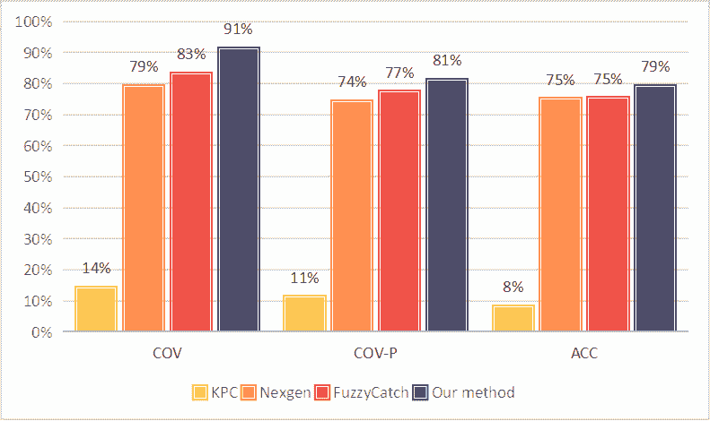

<!--yml

分类：未分类

日期：2025-01-11 12:08:20

-->

# Seeker：基于LLM的多智能体方法提升代码中的异常处理

> 来源：[https://arxiv.org/html/2410.06949/](https://arxiv.org/html/2410.06949/)

许安名^(1,2) ¹¹1平等贡献，陈宇轩¹ ¹¹1平等贡献，袁远³ ²²2平等指导，黄敏利¹ ²²2平等指导。

¹清华大学CoAI团队

²字节跳动

³北京航空航天大学

{zhangxuanming.1}@bytedance.com

{chenyuxu21}@mails.tsinghua.edu.cn

{yuan21}@buaa.edu.cn

{aihuang}@tsinghua.edu.cn

###### 摘要

在现实世界的软件开发中，不当或缺失的异常处理可能严重影响代码的健壮性和可靠性。异常处理机制要求开发者根据高标准检测、捕获和管理异常，但许多开发者在这些任务上面临困难，导致代码脆弱。这个问题在开源项目中尤为明显，影响着软件生态系统的整体质量。为了解决这一挑战，我们探索了使用大型语言模型（LLM）来改善代码中的异常处理。通过广泛的分析，我们识别出了三个关键问题：脆弱代码的敏感度不足、异常类型捕获不准确以及处理方案失真。这些问题在现实世界的代码库中普遍存在，表明健壮的异常处理实践常常被忽视或处理不当。对此，我们提出了*Seeker*，一个多智能体框架，灵感来源于专家开发者的异常处理策略。Seeker使用多个智能体——扫描器（Scanner）、检测器（Detector）、捕食者（Predator）、排序器（Ranker）和处理器（Handler）——来帮助LLM更有效地检测、捕获和解决异常。我们的工作是首个系统性研究利用LLM增强异常处理实践的尝试，为未来的代码可靠性提升提供了宝贵的见解。

## 1 引言

在 DeepSeek-Coder（Guo 等人， [2024](https://arxiv.org/html/2410.06949v2#bib.bib10)）、Code-Llama（Rozière 等人， [2023](https://arxiv.org/html/2410.06949v2#bib.bib26)）和 StarCoder（Li 等人， [2023](https://arxiv.org/html/2410.06949v2#bib.bib18)）等代码大规模预训练语言模型（code LLMs）时代，代码生成的功能正确性已成为评估这些模型质量的主要方法。例如，HumanEval（Chen 等人， [2021](https://arxiv.org/html/2410.06949v2#bib.bib1)）首次提出让 LLM 根据人类编写的自然语言编程问题描述生成代码，并基于通过所有测试用例的次数的 Pass@k 指标来衡量模型的代码生成能力。此外，CoderEval（Yu 等人， [2024](https://arxiv.org/html/2410.06949v2#bib.bib30)）和 DevEval（Li 等人， [2024a](https://arxiv.org/html/2410.06949v2#bib.bib15)）通过根据分布采样真实的代码仓库，引入了仓库级别的代码生成任务，同时也希望基于 Pass@k 和 Acc@k 指标评估代码 LLM 在实际开发场景中的表现。

随着代码 LLM 功能正确性的持续关注与提升，越来越多的研究开始关注 LLM 生成的代码在修复现有缺陷方面的可靠解决方案。例如，SWE-bench（Jimenez 等人， [2024](https://arxiv.org/html/2410.06949v2#bib.bib14)）评估了 LLM 在基于 GitHub 上实际软件问题生成维护补丁代码的能力，而 SecurityEval（Siddiq & Santos， [2022](https://arxiv.org/html/2410.06949v2#bib.bib27)）使用 CWE 定义的 75 种漏洞类型作为提示，诱导 LLM 生成易受攻击的代码，旨在评估 LLM 代码生成的越狱风险。在方法方面，He & Vechev（[2023b](https://arxiv.org/html/2410.06949v2#bib.bib12)）利用基于高质量代码数据集的特定属性连续向量，指导代码生成朝向给定的属性，成功修复了 CWE 漏洞。为了增强 LLM 本身在代码安全性上的泛化能力，Li 等人（[2024c](https://arxiv.org/html/2410.06949v2#bib.bib17)）探索了微调 LLM 以生成避免 11 种常见 CWE 漏洞的代码的方向。最近，Ren 等人（[2023](https://arxiv.org/html/2410.06949v2#bib.bib25)）对 LLM 生成的代码在异常处理机制等代码鲁棒性方面的表现进行了深入研究，这为 LLM 在漏洞发生前预测和处理生成代码的潜在风险开辟了新的探索方向。

尽管基于静态分析或神经网络的异常检测（和处理）技术取得了巨大进展，但对机制的标准化关注甚少，特别是在长尾领域中各种异常类型的私有范式（包括自定义异常和异常规则）。与此同时，我们认为，可解释和可泛化的脆弱代码检测和异常处理策略是实际代码开发中至关重要但被低估的属性，因此异常机制对开发者的编程素养要求极高，这显著影响了代码在主峰区域的鲁棒性（尤其是Java项目），进而影响了代码LLM训练数据的质量和生成代码的质量。本文探讨了这些被忽视的方面，并提出了一个研究问题：“在实际代码开发场景中，是否需要增强异常处理的标准化、可解释性和泛化能力？”据我们所知，目前尚无研究关注这一问题。


(a) 我们的初步倾向。


(b) 在异常处理方面表现优异的人类开发者示意图。

图1：LLM和人类在异常处理性能方面的初步比较。图(a)中的Prompt1、Prompt2、Prompt3和Prompt4分别表示通用提示、粗粒度知识驱动提示、细粒度知识驱动提示和细粒度知识驱动与处理逻辑提示。

为了深入研究直观可解释性和规则泛化在异常机制对人类开发者或LLM在异常处理中的作用，我们优化并扩展了Ren等人于([2023](https://arxiv.org/html/2410.06949v2#bib.bib25))进行的初步实验，并基于来自真实项目的100个脆弱Java代码片段，分别为人类开发者和LLM引入了四组提示：粗粒度提醒提示、细粒度提醒提示、细粒度启发提示和细粒度引导提示，逐步加入了异常的直观可解释性和规则泛化，从而改变了代码编写者的上下文学习方式。通过四组并行的上下文学习与两个对象的实验，我们发现了一个一致的现象：细粒度引导提示生成的代码在异常处理上表现优异，而缺乏直观可解释性（特定异常类型、当前代码场景）或规则泛化（异常处理策略）则会降低异常处理性能，如图[1(a)](https://arxiv.org/html/2410.06949v2#S1.F1.sf1 "图1 ‣ 1介绍 ‣ 寻求者：基于LLM的多代理方法增强代码中的异常处理")所示。

图[1(b)](https://arxiv.org/html/2410.06949v2#S1.F1.sf2 "在图1 ‣ 1 引言 ‣ Seeker：利用基于LLM的多智能体方法增强代码中的异常处理")探讨了在细粒度引导提示下，资深开发人员使用的思维链。值得注意的是，与常见的异常类型如IOException和NullPointerException相比，一些较为罕见的异常类型，如BrokenBarrierException和AccessControlException，也会引发较高的程序风险，但在低级实验中处理得并不好。此外，我们观察到，良好的异常处理实践更加关注异常的具体性，并倾向于准确捕捉类层次结构向下的异常类型。例如，异常SQLClientInfoException继承了其父类SQLException的属性。捕捉SQLClientInfoException将通过获取SQL客户端属性的详细信息，提供比父类SQLException更多的错误信息。这基于每个异常都是一个对象的事实，低级别抛出的异常也可以被其父类捕捉，但过于泛化的异常处理程序可能通过捕捉和处理程序员未预料到的异常，甚至是处理程序员本意并不打算处理的异常，使代码更容易出错。Osman等人([2017](https://arxiv.org/html/2410.06949v2#bib.bib24))进一步证明，捕捉准确的细粒度异常可以帮助开发人员快速识别问题来源，有效提高代码的可读性和可维护性，并避免误处理不同类型的错误。然而，由于缺乏处理长尾、特定领域或定制异常类型的良好范式经验，加上异常处理的复杂继承关系和多种模式，准确实现这一目标仍然具有挑战性。

为了通过借鉴高级开发者的最佳异常处理实践提高代码的鲁棒性，我们提出了一种名为Seeker的方法，该方法拆解了高级开发者的思维链，并将异常机制分解为五个任务，分别由Scanner、Detector、Predator、Ranker和Handler代理进行处理。我们将大量可信的外部经验文档与异常处理实践相结合，构建了通用异常枚举（CEE），以增强原LLM在检测、捕捉和处理任务中的表现，特别是在原LLM表现较差的情况下。该方法可以轻松集成到现有的代码LLM中，旨在生成高鲁棒性的代码，同时CEE具有良好的社区贡献和维护价值，帮助开发者进一步理解异常机制的理想实践。在采用我们设计的高并发接口后，面对任何级别的代码量时，额外的计算时间开销是常数，复杂度也完全可控。然而，仍以Java异常为例，即便仅考虑内置异常类型，异常关系继承树包含433个节点、62个分支和5个层级。直接构建文档并调用LLM或人工开发者进行检索可能会导致性能下降，因为它可能无法区分同一分支上节点选择的异常特异性，无法适应多种异常处理模式，并且每次查询的成本非常高。

为了解决这个问题，提出了一种针对复杂继承关系的深度检索增强生成（Deep-RAG）算法，作为传统RAG的改进替代方案。具体来说，根据继承关系为每个分支分配一个开发场景标签，以识别可能对应脆弱代码的多个异常分支。少量样本验证步骤在自动生成标签后提供检测通过率和捕捉精度反馈，然后根据失败样本的正则化提示对标签的具体粒度和一般描述进行微调。这可以识别脆弱代码所在的风险场景及其触发的相应异常分支，然后按深度对这些分支进行选择性节点评估，最终提高检索性能和开销。大量实验表明，所提出的Seeker方法有助于LLM优化或生成高鲁棒性的代码，进一步提升LLM在各类代码任务中的表现。

## 2 初步研究

在本节中，我们研究了异常的标准化、可解释性和普适性如何影响代码开发者的异常处理表现，并确定了不良异常处理的缓解效果。为此，我们通过分别控制异常类型的标准化、风险场景的可解释性和处理策略的普适性，进行广泛的对比实验，应用了图[4](https://arxiv.org/html/2410.06949v2#A1.F4 "图4 ‣ A.1.2 常见异常枚举 ‣ A.1方法细节 ‣ 附录A ‣ Seeker: 基于LLM的多代理方法增强代码中的异常处理")和[5](https://arxiv.org/html/2410.06949v2#A1.F5 "图5 ‣ A.1.2 常见异常枚举 ‣ A.1方法细节 ‣ 附录A ‣ Seeker: 基于LLM的多代理方法增强代码中的异常处理")中提出的四组上下文学习提示（即粗粒度提示、细粒度提示、细粒度启发提示和细粒度引导提示）。

具体来说，基于Ren等人（[2023](https://arxiv.org/html/2410.06949v2#bib.bib25)）的初步探索，我们筛选了几个维护良好的代码库，结合手动和自动代码审查，筛选出高质量且重要的异常处理，进而获得了在真实开发场景中处于严重状态的脆弱代码。随后，我们让代码开发者熟悉这些筛选后的代码库，并记录他们在处理异常时使用的方法和流程。为了减少整个任务的难度并模拟开发过程中开发者对异常处理的思考，我们设置了四个提示链接，提供逐步的异常处理信息。实施结果可以在图[1(a)](https://arxiv.org/html/2410.06949v2#S1.F1.sf1 "在图1 ‣ 1介绍 ‣ Seeker: 基于LLM的多代理方法增强代码中的异常处理")中找到。

比较实验揭示了一个有趣的现象：没有有效引导信息的提示对人类开发者和LLM（大语言模型）都没有帮助，而添加关于异常机制的类型规范信息可以稍微改善开发者对代码脆弱性来源的模糊感知，但由于对异常机制的不熟悉，无法准确定位和处理它们，这容易导致不敏感的检测。增加开发场景的可解释性信息将大大提高开发者对代码本身和潜在脆弱性的理解，这有助于提高异常捕获的准确性。增加处理策略的泛化信息则进一步提高了开发者分析脆弱性来源的能力，并改善了处理模块的质量。上述信息在异常处理任务中带来显著提升的现象称为缓解效应。该现象通过揭示特定提示信息的缓解效应，回答了[第1节](https://arxiv.org/html/2410.06949v2#S1 "1 Introduction ‣ Seeker: Enhancing Exception Handling in Code with a LLM-based Multi-Agent Approach")中提出的研究问题，影响了代码开发者异常处理实践的质量。它也启发了提出的$Seeker$方法，通过结合外部文档信息将生成的提示与细粒度指导标准对齐。此外，[第3.2节](https://arxiv.org/html/2410.06949v2#S3.SS2 "3.2 Rules of Good Practice ‣ 3 Methodology ‣ Seeker: Enhancing Exception Handling in Code with a LLM-based Multi-Agent Approach")为缓解效应的发生提供了合理的解释，提供了关于所提方法有效性的数据显示和见解。我们相信我们的发现可以为未来与可靠代码生成相关的研究提供宝贵的见解，为潜在的RAG代码代理进展奠定基础。

## 3 方法论

本节将介绍提出的Seeker方法。我们首先回顾开发者在异常处理问题上的历史观察，然后介绍三种异常处理的陷阱：脆弱代码的不敏感检测、异常类型的捕获不准确以及处理模块的扭曲解决方案。最后，我们介绍该方法的依赖构建和整个方法的流程。

### 3.1 人类经验的再审视

多年来，关于异常处理的经验研究和实践讨论不计其数，但共同之处在于，异常处理被一再强调为与代码健壮性直接相关的重要机制。Nakshatri 等人（[2016](https://arxiv.org/html/2410.06949v2#bib.bib20)）指出，异常处理是区分错误处理代码和正常代码的必要且强大的机制，从而使软件能够尽可能在正常状态下运行。Weimer & Necula（[2004](https://arxiv.org/html/2410.06949v2#bib.bib29)）指出，异常机制确保了意外错误不会破坏系统的稳定性或安全性，防止资源泄漏，确保数据完整性，并确保程序在发生不可预见的错误时仍能正常运行。此外，Jacobs & Piessens（[2009](https://arxiv.org/html/2410.06949v2#bib.bib13)）指出，异常处理还涉及解决程序流程中的潜在错误，这可以减轻或消除可能导致程序故障或不可预测行为的缺陷。

尽管异常机制是提高代码健壮性的一个重要解决方案，但开发者一直在处理它时遇到困难，原因在于其复杂的继承关系和处理方式。de Pádua & Shang（[2017](https://arxiv.org/html/2410.06949v2#bib.bib3)）指出，各种编程语言项目在面对异常处理时，表现出长尾分布的异常类型，这意味着开发者可能仅对频繁发生的异常类型有简单的理解。然而，根据[1](https://arxiv.org/html/2410.06949v2#S1 "1 Introduction ‣ Seeker: Enhancing Exception Handling in Code with a LLM-based Multi-Agent Approach")节的内容，良好的异常处理实践依赖于开发者进行细粒度的具体捕捉。Nguyen 等人（[2020b](https://arxiv.org/html/2410.06949v2#bib.bib22)）也指出了异常处理的多模式效应。例如，即便是同级别的代码，捕捉不同的异常类型会发挥不同的维护功能，因此异常处理通常不会被概括或单一映射。这些复杂的异常机制实践技能对开发者的编程素养提出了较高的要求。de Sousa 等人（[2020](https://arxiv.org/html/2410.06949v2#bib.bib4)）手动审查并统计了大量开源项目的异常处理情况，认为高达62.91%的异常处理块存在违规情况，如捕捉一般异常和破坏性包装。这严重违反了异常机制的出发点。de Pádua & Shang（[2017](https://arxiv.org/html/2410.06949v2#bib.bib3)）强调了自动化异常处理建议工具的迫切需求和重要性。

人类开发者在异常处理机制中的失误严重影响了LLM代码训练数据的质量（He & Vechev ([2023a](https://arxiv.org/html/2410.06949v2#bib.bib11)))，进而导致LLM无法理解维护函数的使用技巧（Wang et al. ([2024](https://arxiv.org/html/2410.06949v2#bib.bib28)))。为了解决上述问题，我们首先为Java语言提出了$Seeker-Java$。这是因为Java语言对异常处理的需求更为迫切，并且它完全映射了Java程序的稳健性。Ebert et al. ([2020](https://arxiv.org/html/2410.06949v2#bib.bib5))指出，作为一门完全面向对象的语言，Java的异常处理比其他语言更为复杂，并且与语言结构的集成度更高。因此，Java项目更容易受到异常处理漏洞的困扰。此外，Java在处理异常事件时严重依赖异常机制。而其他语言可能使用不同的方法或有较为宽松的异常处理机制。值得一提的是，$Seeker$基于固有的多代理框架加上外部知识库的协作解决方案，它们可以通过维护不同语言的文档，迅速迁移多种语言。我们还将在未来维护$Seeker-Python$和$Seeker-C\#$，为更多编程语言的开发提供稳健性保障。

### 3.2 良好实践的规则

在本节中，我们介绍了四种提示设置：粗粒度提醒提示、细粒度提醒提示、细粒度启发提示和细粒度引导提示，旨在展示在面对异常处理任务时，缓解不良实践对开发者的影响。对于粗粒度提醒提示，我们使用“注意潜在的异常”来提醒开发者异常机制，并让开发者根据自己的实际经验找出目标代码片段中脆弱的部分并进行处理。如图[1(a)](https://arxiv.org/html/2410.06949v2#S1.F1.sf1 "图 1 ‣ 1 介绍 ‣ Seeker：基于LLM的多代理方法提升代码异常处理")、图[4](https://arxiv.org/html/2410.06949v2#A1.F4 "图 4 ‣ A.1.2 常见异常列举 ‣ A.1 方法细节 ‣ 附录 A 附录 ‣ Seeker：基于LLM的多代理方法提升代码异常处理")和图[5](https://arxiv.org/html/2410.06949v2#A1.F5 "图 5 ‣ A.1.2 常见异常列举 ‣ A.1 方法细节 ‣ 附录 A 附录 ‣ Seeker：基于LLM的多代理方法提升代码异常处理")所示，尽管开发者会自觉地开始筛查异常处理，但考虑到[3.1节](https://arxiv.org/html/2410.06949v2#S3.SS1 "3.1 人类经验的回顾 ‣ 3 方法论 ‣ Seeker：基于LLM的多代理方法提升代码异常处理")中提到的困难，无论是人类开发者还是LLM开发者对识别脆弱代码都非常迟钝。Ren等人（[2023](https://arxiv.org/html/2410.06949v2#bib.bib25)）也发现了这一现象，并将这一系列不良实践总结为不正确的异常处理。对于细粒度提醒提示，我们根据脆弱代码场景为开发者提供具体异常类型的细粒度提醒，让开发者理解代码脆弱的来源，并根据异常以标准化的方式进行处理。尽管开发者会自觉地借鉴外部文档或示例，但这些文档中的信息通常过于抽象，难以解读，而对于示例，大多数情况下没有标准化的质量保证或泛化。因此，开发者往往会错误地捕获异常，无法从根本上解决程序的潜在风险。相关研究表明，在这一实验基准中，不良实践“滥用try-catch”经常出现。对于细粒度启发提示，我们额外提供了脆弱代码的代码级场景分析。尽管开发者仍依赖自己对代码的理解，但直观且可解释的自然语言大大提升了开发者对该场景中异常的洞察力和分析能力。相关研究还表明，对于独立函数级脆弱代码优化，这一实验设置可以实现相对稳定的良好异常处理实践。然而，面对具有复杂依赖关系的真实开发场景，如何生成具有泛化性的高质量处理块仍然是一个挑战。Zhang等人（[2023](https://arxiv.org/html/2410.06949v2#bib.bib31)）指出，在真实项目中，异常处理代码容易出错。对于细粒度引导提示，我们还为异常提供了一个标准化的处理策略。基于上述实验基准的稳定异常检测表现，开发者最终实现了高质量的异常处理实践。de Pádua & Shang（[2017](https://arxiv.org/html/2410.06949v2#bib.bib3)）也强烈建议开发者使用可泛化的异常处理策略，因为开发者很难在完全掌握异常类型信息之前进行更高质量的优化。从本质上讲，这四种提示设置可以视为异常类型标准化、脆弱性可解释性和处理泛化的信息进展，从而改变开发者的上下文学习。通过改变提示，开发者生成的代码的鲁棒性会受到影响，从而影响最终项目的质量。值得注意的是，我们提出的这四种提示设置可以应用于任何基于代码的上下文学习，从而推动关于提示规范对LLM代码生成性能影响的研究。

请注意，对于大多数编程语言，处理异常有三种方式。通过方法签名中的`throws`关键字抛出的异常、通过方法体中的`throw`关键字抛出的异常，以及在方法的`try-catch`块中捕获的异常。Nakshatri等人（[2016](https://arxiv.org/html/2410.06949v2#bib.bib20)）指出，第一种方法可能无法提供真实的情况，因为通过方法签名中的`throws`抛出的异常会被错误地添加到方法的调用栈中，从而传播异常，直到被捕获。此外，使用第二种方法抛出的异常最终会被调用者使用`try-catch`块捕获。因此，第三种方法是最有效且最常见的异常处理实践。在我们的方法中，优化目标时，我们仅采用第三种异常处理方式作为最佳实践。


图2：异常类型分布。人类的实践可能远未达到最佳实践，因此我们进行数据和信息处理，以将用户分布对齐到最佳实践。

### 3.3 RAG-Agent方法


图3：Seeker工作流。工作流由四个代理组成：Planner、Detector、Ranker和Handler，它们协同管理代码中的异常处理。彩色圆圈表示信息在管道中传递或由代理使用。

为了增强在实际代码开发场景中异常处理的标准化、可解释性和普适性，我们提出了一种名为$Seeker$的方法。Seeker拆解了高级开发人员的思维链，并将异常机制分解为五个专门的任务，每个任务由一个专门的代理处理：$Planner$、$Detector$、$Predator$、$Ranker$和$Handler$。通过将大量可信的外部经验文档与异常处理实践结合，我们构建了$Common$ $Exception$ $Enumeration$（CEE）。CEE是一个全面且标准化的文档，提供了异常信息的结构化和详尽的存储库，涵盖了每种异常类型的场景、属性和推荐的处理策略。CEE的基础内容详见附录[A.1.2](https://arxiv.org/html/2410.06949v2#A1.SS1.SSS2 "A.1.2 Common Exception Enumeration ‣ A.1 Method Details ‣ Appendix A Appendix ‣ Seeker: Enhancing Exception Handling in Code with a LLM-based Multi-Agent Approach")。借助CEE，Seeker能够提升原始LLM在检测、捕获和处理任务中的表现。该方法可以轻松集成到现有的代码LLM中，生成高度稳健的代码，CEE也具有良好的社区贡献和维护价值，帮助开发人员进一步理解异常机制的理想实践。

输入：代码库 $C$ 输出：优化后的代码 $C^{\prime}$，具有健壮的异常处理1 将代码库 $C$ 划分为可管理的单元 $U=\{u_{1},u_{2},\dots,u_{N}\}$；2 对每个 *代码段 $u_{i}$ 在 $C$ 中* 执行3       如果 *($u_{i}$ 的长度在预定义限制内) 且 (函数嵌套层次较低) 且 (逻辑流清晰)*，则4             将 $u_{i}$ 添加到 $U$；5            6      7初始化优化后的单元 $U^{\prime}=\{\}$；8 对每个 *单元 $u_{i}$ 在 $U$ 中* 执行     // 检测阶段9       初始化潜在异常集合 $E_{i}=\{\}$；10       使用探测器代理分析单元 $u_{i}$；       同时执行 { // 静态分析11       生成控制流图 $CFG_{i}$ 和异常传播图 $EPG_{i}$，用于 $u_{i}$；12       在 $u_{i}$ 中识别敏感代码段 $S_{i}^{\text{static}}=\{s_{i1}^{\text{static}},s_{i2}^{\text{static}},\dots\}$；       // 场景与属性匹配13       对 $u_{i}$ 执行场景与属性匹配；14       在 $u_{i}$ 中识别敏感代码段 $S_{i}^{\text{match}}=\{s_{i1}^{\text{match}},s_{i2}^{\text{match}},\dots\}$；15       } 合并敏感代码段：$S_{i}=S_{i}^{\text{static}}\cup S_{i}^{\text{match}}$；16       对每个 *段 $s_{ij}$ 在 $S_{i}$ 中* 执行17             检测 $s_{ij}$ 中潜在的异常分支 $E_{bij}$；18             $E_{bi}\leftarrow E_{bi}\cup E_{bij}$；19            20            // 检索阶段21       使用捕食者代理检索易碎代码和 try-catch 块；22       在函数层面汇总单元 $u_{i}$，获得代码摘要 $F_{i}$；23       使用 $F_{i}$ 和异常分支 $E_{bi}$ 执行深度 RAG，获取异常节点 $E_{ni}$；24       从 CEE 映射相关的异常处理策略 $H_{i}=\{h_{i1},h_{i2},\dots\}$；       // 排序阶段25       使用排序器代理为 $E_{ni}$ 中的异常分配分数；26       对每个 *异常 $e_{ik}$ 在 $E_{ni}$ 中* 执行27             根据 $e_{ik}$ 的属性和影响计算异常可能性得分 $l_{ik}$；28             计算处理策略 $h_{ik}$ 的适用性得分 $u_{ik}$；29             计算总体评分 $g_{ik}=\alpha\cdot l_{ik}+\beta\cdot u_{ik}$；30            31      根据评分 $g_{ik}$ 对 $E_{ni}$ 中的异常进行降序排序，得到排序后的列表 $E_{ni}^{\prime}$；       // 处理阶段32       使用处理器代理生成优化后的代码 $u_{i}^{\prime}$；33       对每个 *异常 $e_{ik}$ 如果 $g_{ik}>\gamma$ 在 $E_{ni}^{\prime}$ 中* 执行34             从 $H_{i}$ 映射处理策略 $h_{ik}$；35             将 $h_{ik}$ 应用到与 $e_{ik}$ 相关的代码段(s) 中，在 $u_{i}$ 中；36            37      $U^{\prime}\leftarrow U^{\prime}\cup\{u_{i}^{\prime}\}$；38      39合并优化后的单元 $U^{\prime}$，生成最终优化后的代码 $C^{\prime}$；

算法 1 Seeker 框架

一般来说，给定一段代码，我们首先使用计划代理将其划分为可管理的单元，如函数块、类块和文件块。计划代理通过考虑整体代码量、依赖关系和需求关系等因素，采用深思熟虑的分段方法。这一策略有助于减轻处理压力，特别是在处理上下文窗口限制和复杂依赖链时，确保没有单一单元会压倒分析代理。通过平衡分段的粒度，我们可以避免过细的划分引入过高的复杂度，从而在处理庞大而复杂的代码库时保持清晰和高效。

对于$Detector$代理，它同时执行场景和属性匹配以及静态分析，以识别代码中可能导致错误或崩溃的脆弱区域。这两种方法并行运行，各自发挥其在检测过程中的优势。场景和属性匹配提供浅层分析，基于语义线索和上下文场景捕获漏洞，而静态分析可能由于在实现高覆盖率异常处理问题时的挑战而忽视这些漏洞。相反，静态分析擅长发现复杂的依赖关系和深层缺陷，提供浅层分析可能遗漏的见解。通过结合这两种方法的结果——取其并集——$Detector$代理能够涵盖浅层和深层风险，有效检测潜在的异常，同时同等考虑长尾、领域特定或定制的异常类型。然而，正如在[1](https://arxiv.org/html/2410.06949v2#S1 "1 Introduction ‣ Seeker: Enhancing Exception Handling in Code with a LLM-based Multi-Agent Approach")节中所讨论的那样，若不考虑异常类型之间复杂的继承关系进行异常检测，可能无法获得最佳结果，因为这可能导致异常层级中的异常特异性不准确。

因此，有必要结合外部知识来指导捕获和分析过程。为此，我们将 CEE 集成到 $Predator$ 代理中。类似于检索增强生成（RAG）模型，$Predator$ 代理在函数级别总结代码，并查询 CEE 获取相关的异常属性。它进行多层次的深度检索，以获取可以应用于检测到的问题的信息，为异常处理提供有价值的上下文信息。关键是在少量示例测试阶段，环境会反馈检索信息的准确性和覆盖度。这一反馈对于代理的学习过程至关重要，帮助其优化搜索策略并提高检索信息的相关性。我们提出了一种深度检索增强生成（Deep-RAG）算法，以处理异常类型中的复杂继承关系，详见附录 [A.1.1](https://arxiv.org/html/2410.06949v2#A1.SS1.SSS1 "A.1.1 Deep-RAG Algorithm ‣ A.1 Method Details ‣ Appendix A Appendix ‣ Seeker: Enhancing Exception Handling in Code with a LLM-based Multi-Agent Approach")。

通过结合 $Detector$ 和 $Predator$ 代理的输出，$Ranker$ 根据异常的发生可能性及从 CEE 检索到的处理策略的适用性，为检测到的异常分配等级。这个评分系统确保 $Seeker$ 优先处理最关键的异常。$Ranker$ 会考虑诸如异常发生的可能性、对程序的潜在影响，以及异常类型在继承层次结构中的特异性等因素。它通过评分排序和判断反馈给 $Detector$ 和 $Predator$ 代理，以及节点选择步骤，确保代理能够从实际代码环境中学习。

分析排名异常时，$Handler$ 代理生成优化的代码，融合了强大的处理策略。它利用从 CEE（代码环境模型）中提取的模板和逻辑模式，确保生成的代码在功能上是正确的。Handler 主要集中于捕捉精确的细粒度异常，沿着类层次结构向下推进，提供超出父类异常所能提供的额外错误信息。这种方法帮助开发人员快速识别问题的来源，有效提升代码的可读性和可维护性，避免不同类型错误的误处理。

然而，集成如此全面的异常处理机制会带来计算开销的挑战，特别是在处理大量异常类型和复杂继承关系时。为了解决这个问题，我们设计了一个高并发接口，确保无论代码量级如何，额外的计算时间开销保持恒定。这保证了方法具有可扩展性，并且在面对任何代码库大小时，复杂度可控。我们在附录[A.2.3](https://arxiv.org/html/2410.06949v2#A1.SS2.SSS3 "A.2.3 计算开销分析 ‣ A.2 实验细节 ‣ 附录 A 附录 ‣ Seeker：基于LLM的多代理方法提升代码异常处理")中详细讨论了Seeker的时间成本。

## 4 实验

在本节中，我们评估了我们提出的方法Seeker在异常处理代码生成任务上的表现。我们将我们的方法与最先进的方法KPC（Ren等人，[2023](https://arxiv.org/html/2410.06949v2#bib.bib25)）、传统的检索增强生成（RAG）方法和通用提示方法进行了比较。

为了全面评估我们方法的有效性，我们采用了六个指标：

1\. 自动化代码审查得分（ACRS）

基于自动化代码审查模型，该指标评估生成代码在遵循编码标准和最佳实践方面的整体质量。

|  | $\text{ACRS}=\text{CodeReviewModel}(\text{GeneratedCode})$ |  |
| --- | --- | --- |

解释：较高的ACRS表示更好的代码质量，反映了良好结构化和易维护的代码。

2\. 覆盖率（COV）

该指标衡量了Detector代理检测到的敏感代码与实际敏感代码的覆盖率。

|  | $\text{COV}=\frac{&#124;\text{Correct Detected Sensitive Code}&#124;}{&#124;\text{Actual % Sensitive Code}&#124;}$ |  |
| --- | --- | --- |

解释：它量化了我们的方法成功检测到的实际敏感代码的比例。过度检测（标记多于必要的代码）不会受到惩罚。

3\. 覆盖通过（COV-P）

该指标评估Predator代理检测到的try-blocks与实际需要try-catch块的代码之间的覆盖关系。

|  | $\text{COV\text{-}P}=\frac{&#124;\text{Correct Try\text{-}Blocks}&#124;}{&#124;\text{Actual % Try\text{-}Blocks}&#124;}$ |  |
| --- | --- | --- |

解释：如果try-block与实际代码行完全匹配，则认为它是正确的。过度标记或标记不足都算作不正确。在这个指标中，过度检测会受到惩罚，方法是将错误检测到的try-catch块计入分母，并在分子中视为不正确（零），从而降低整体覆盖通过得分。

4\. 准确性（ACC）

该指标评估Predator代理识别的异常类型与实际异常类型的正确性。

|  | $\text{ACC}=\frac{&#124;\text{Correct Exception Types}&#124;}{&#124;\text{Total Exception % Types Identified}&#124;}$ |  |
| --- | --- | --- |

说明：如果异常类型与实际异常匹配，或是实际异常类型的合理子类，则该异常类型被认为是正确的。

5. 编辑相似度（ES）

该指标计算了经过处理的Handler代理生成的try-catch代码块与实际try-catch代码块之间的文本相似度。

|  | $\text{ES}=\text{相似度}(\text{生成的Try\text{-}Catch},\text{实际Try\text{-}Catch})$ |  |
| --- | --- | --- |

说明：我们使用Levenshtein距离来衡量相似度。较高的ES表示生成的代码与实际代码的匹配度较高。

6. 代码审查得分（CRS）

该指标涉及将生成的try-catch代码块提交给GPT-4o进行评估。语言模型提供二元评估：*良好* 或 *差*。

|  | $\text{CRS}=\frac{&#124;\text{良好评估}&#124;}{&#124;\text{总评估}&#124;}$ |  |
| --- | --- | --- |

说明：CRS反映了根据工程最佳实践，生成的异常处理实现中被认为是良好的比例。

我们使用GPT-4o作为代理的内部大型模型进行实验。我们的数据集包含从真实项目中提取的750个易损Java代码片段，遵循附录[A.2.1](https://arxiv.org/html/2410.06949v2#A1.SS2.SSS1 "A.2.1 数据集 ‣ A.2 实验细节 ‣ 附录A 附录 ‣ Seeker：基于LLM的多代理方法增强代码中的异常处理")中所示的规则。我们将我们的方法与KPC（Ren等人，[2023](https://arxiv.org/html/2410.06949v2#bib.bib25)）、传统RAG和通用提示方法进行了比较。性能比较见表[1](https://arxiv.org/html/2410.06949v2#S4.T1 "表1 ‣ 4 实验 ‣ Seeker：基于LLM的多代理方法增强代码中的异常处理")。

表1：异常处理代码生成方法的比较

| 方法 | ACRS | COV（%） | COV-P（%） | ACC（%） | ES | CRS（%） |
| --- | --- | --- | --- | --- | --- | --- |
| 通用提示 | 0.21 | 13 | 9 | 8 | 0.15 | 24 |
| 传统RAG | 0.35 | 35 | 31 | 29 | 0.24 | 31 |
| KPC Ren等人（[2023](https://arxiv.org/html/2410.06949v2#bib.bib25)） | 0.26 | 14 | 11 | 8 | 0.17 | 27 |
| 我们的方法 | 0.85 | 91 | 81 | 79 | 0.64 | 92 |

如表[1](https://arxiv.org/html/2410.06949v2#S4.T1 "表1 ‣ 4 实验 ‣ Seeker：基于LLM的多代理方法增强代码中的异常处理")所示，我们的方法在所有指标上均优于基准方法。具体来说，我们达成了：

- 更高的ACRS，表明整体代码质量更优。 - 更大的覆盖率（COV）和覆盖通过率（COV-P），展示我们方法在检测和正确包裹敏感代码区域方面的有效性。 - 更高的准确性（ACC），能够正确识别异常类型，包括识别子类关系。 - 改进的编辑相似度（ES），表明我们生成的代码与实际的异常处理代码高度匹配。 - 更高的代码审查评分（CRS），确认我们的实现更频繁地被LLM审阅者认为是优质的。

我们方法的卓越表现可归因于多个因素：

1\. 综合异常知识：通过结合常见异常枚举（CEE），我们的方法得益于广泛的异常场景、属性和处理逻辑，从而实现更准确的检测和处理。

2\. 专业化代理框架：Seeker框架将任务分解为多个专业化代理（扫描器、检测器、捕猎者、排序器、处理器），每个代理专注于特定方面，从而提升整体性能。

3\. 最佳实践的整合：利用可靠的外部文档和行业最佳实践，确保生成的代码符合高标准，从而提升代码质量和可维护性。

我们进一步使用不同的开源和闭源模型评估了我们的方法，详细内容见附录[A.2.4](https://arxiv.org/html/2410.06949v2#A1.SS2.SSS4 "A.2.4 Further Results on different LLMS ‣ A.2 Experimental Details ‣ Appendix A Appendix ‣ Seeker: Enhancing Exception Handling in Code with a LLM-based Multi-Agent Approach")。

我们的实验表明，Seeker在异常处理代码生成方面达到了业界领先水平。通过有效地将全面的异常知识与专业化代理框架相结合，我们的方法解决了代码生成中异常处理的复杂性。各项指标的卓越表现突显了将特定领域知识和最佳实践集成到代码生成模型中的重要性。

## 5 结论

在本文中，我们扩展了关于提示规范对大语言模型生成代码的鲁棒性影响的研究。我们使用四组提示设置进行了广泛的对比实验，并进一步确认了开发者不良异常处理实践的缓解作用。为了利用这一现象，我们引入了Seeker方法，这是一种多智能体协作框架，借助CEE文档和Deep-RAG算法为LLM提供缓解效果所需的提示信息。上限模型在异常处理任务上达到了SOTA性能。总体而言，Seeker可以集成到任何基础模型中，扩展到多种编程语言，甚至可以推广到知识分析和一般继承关系的推理，如需求工程 [A.3](https://arxiv.org/html/2410.06949v2#A1.SS3 "A.3 其他适用场景分析 ‣ 附录 A 附录 ‣ Seeker: 基于LLM的多智能体方法增强代码中的异常处理")。我们希望我们的发现和提出的方法能够为这些领域提供新的见解并促进未来的研究。本文的源代码可在 [https://github.com/XMZhangAI/Seeker](https://github.com/XMZhangAI/Seeker) 获取。

## 参考文献

+   Chen 等人（2021）Mark Chen, Jerry Tworek, Heewoo Jun, Qiming Yuan, Henrique Ponde de Oliveira Pinto, Jared Kaplan, Harri Edwards, Yuri Burda, Nicholas Joseph, Greg Brockman 等人。评估训练有素的代码大语言模型。*arXiv 预印本 arXiv:2107.03374*，2021。

+   Clade（2023）Clade. 2023. URL [https://www.anthropic.com/index/claude-2](https://www.anthropic.com/index/claude-2)。

+   de Pádua & Shang（2017）Guilherme B. de Pádua 和 Weiyi Shang。通过异常流分析重新审视异常处理实践。发表于 *SCAM*，2017。

+   de Sousa 等人（2020）Dêmora Bruna Cunha de Sousa, Paulo Henrique M. Maia, Lincoln S. Rocha, 和 Windson Viana。研究长期大型项目中异常处理反模式的演变。*J. Braz. Comput. Soc.*, 2020。

+   Ebert 等人（2020）Felipe Ebert, Fernando Castor 和 Alexander Serebrenik。对“关于Java程序中的异常处理bug的探索性研究”的反思。发表于 *SANER*，2020。

+   GPT-3（2022）GPT-3. 2022. URL [https://platform.openai.com/docs/models/gpt-base](https://platform.openai.com/docs/models/gpt-base)。

+   GPT-3.5 (2023) GPT-3.5. 2023. URL [https://platform.openai.com/docs/models/gpt-base](https://platform.openai.com/docs/models/gpt-base)。

+   GPT-4（2023）GPT-4. 2023. URL [https://platform.openai.com/docs/models/gpt-3-5](https://platform.openai.com/docs/models/gpt-3-5)。

+   GPT-4o (2024) GPT-4o. 2024. URL [https://platform.openai.com/docs/models/gpt-4o](https://platform.openai.com/docs/models/gpt-4o)。

+   Guo 等人 (2024) Daya Guo, Qihao Zhu, Dejian Yang, Zhenda Xie, Kai Dong, Wentao Zhang, Guanting Chen, Xiao Bi, Y. Wu, Y. K. Li 等人. Deepseek-coder: 当大规模语言模型遇到编程——代码智能的崛起. *arXiv 预印本 arXiv:2401.14196*, 2024。

+   He & Vechev (2023a) Jingxuan He 和 Martin T. Vechev. 用于代码的大规模语言模型：安全加固与对抗性测试. 见于 *CCS*, 2023a。

+   He & Vechev (2023b) Jingxuan He 和 Martin T. Vechev. 用于代码的大规模语言模型：安全加固与对抗性测试. 见于 *CCS*, 2023b。

+   Jacobs & Piessens (2009) Bart Jacobs 和 Frank Piessens. Failboxes: 可证明安全的异常处理. 见于 *ECOOP*, 2009。

+   Jimenez 等人 (2024) Carlos E. Jimenez, John Yang, Alexander Wettig, Shunyu Yao, Kexin Pei, Ofir Press 和 Karthik R. Narasimhan. Swe-bench: 语言模型能否解决现实中的 GitHub 问题？ 见于 *ICLR*, 2024。

+   Li 等人 (2024a) Jia Li, Ge Li, Yunfei Zhao, Yongmin Li, Huanyu Liu, Hao Zhu, Lecheng Wang, Kaibo Liu, Zheng Fang, Lanshen Wang 等人. Deveval: 一种与真实代码库对齐的人工标注代码生成基准. 见于 *ACL(Findings)*, 2024a。

+   Li 等人 (2024b) Junjie Li, Fazle Rabbi, Cheng Cheng, Aseem Sangalay, Yuan Tian 和 Jinqiu Yang. 关于对大规模语言模型进行微调以生成安全代码的探索性研究. *arXiv 预印本 2408.09078*, 2024b。

+   Li 等人 (2024c) Junjie Li, Aseem Sangalay, Cheng Cheng, Yuan Tian 和 Jinqiu Yang. 微调大规模语言模型以生成安全代码. 见于 *FORGE*, 2024c。

+   Li 等人 (2023) Raymond Li, Loubna Ben Allal, Yangtian Zi, Niklas Muennighoff, Denis Kocetkov, Chenghao Mou, Marc Marone, Christopher Akiki, Jia Li, Jenny Chim 等人. Starcoder: 愿源代码与你同在！*TMLR*, 2023。

+   Luo 等人 (2024) Ziyang Luo, Can Xu, Pu Zhao, Qingfeng Sun, Xiubo Geng, Wenxiang Hu, Chongyang Tao, Jing Ma, Qingwei Lin 和 Daxin Jiang. Wizardcoder: 通过 evol-instruct 赋能大规模语言模型生成代码. 见于 *ICLR*, 2024。

+   Nakshatri 等人 (2016) Suman Nakshatri, Maithri Hegde 和 Sahithi Thandra. Java 项目中异常处理模式的分析：一项实证研究. 见于 *MSR*, 2016。

+   Nguyen 等人 (2020a) Tam Nguyen, Phong Vu 和 Tung Nguyen. 异常处理的代码推荐. 见于 *ESEC/FSE*, 2020a。

+   Nguyen 等人 (2020b) Tam Nguyen, Phong Vu 和 Tung Nguyen. 异常处理的代码推荐. 见于 *ESEC/FSE*, 2020b。

+   o1 (2024) OpenAI o1. 2024. 网址 [https://platform.openai.com/docs/models/o1](https://platform.openai.com/docs/models/o1)。

+   Osman 等人 (2017) Haidar Osman, Andrei Chis, Jakob Schaerer, Mohammad Ghafari 和 Oscar Nierstrasz. Java 项目中异常使用的演变. 见于 *SANER*, 2017。

+   Ren 等人 (2023) Xiaoxue Ren, Xinyuan Ye, Dehai Zhao, Zhenchang Xing 和 Xiaohu Yang. 从误用到精通: 通过知识驱动的 AI 链接增强代码生成. 见于 *ASE*, 2023。

+   Rozière et al. (2023) Baptiste Rozière, Jonas Gehring, Fabian Gloeckle, Sten Sootla, Itai Gat, Xiaoqing Ellen Tan, Yossi Adi, Jingyu Liu, Tal Remez, Jérémy Rapin 等人。《Code llama：开放代码基础模型》。*arXiv 预印本 arXiv:2308.12950*，2023年。

+   Siddiq & Santos (2022) Mohammed Latif Siddiq 和 Joanna C. S. Santos。《Securityeval 数据集：挖掘漏洞实例以评估基于机器学习的代码生成技术》。发表于*MSR4P&S*，2022年。

+   Wang et al. (2024) Yanlin Wang, Tianyue Jiang, Mingwei Liu, Jiachi Chen, 和 Zibin Zheng。《超越功能正确性：研究大型语言模型中的编码风格不一致性》。*arXiv 预印本 2407.00456*，2024年。

+   Weimer & Necula (2004) Westley Weimer 和 George C. Necula。《发现和防止运行时错误处理错误》。发表于*OOPSLA*，2004年。

+   Yu et al. (2024) Hao Yu, Bo Shen, Dezhi Ran, Jiaxin Zhang, Qi Zhang, Yuchi Ma, Guangtai Liang, Ying Li, Qianxiang Wang, 和 Tao Xie。《Codereval：基于生成预训练模型的实用代码生成基准》。发表于*ICSE*，2024年。

+   Zhang et al. (2023) Hao Zhang, Ji Luo, Mengze Hu, Jun Yan, Jian Zhang, 和 Zongyan Qiu。《检测 C++ 程序中的异常处理错误》。发表于*ICSE*，2023年。

+   Zhang et al. (2020) Jian Zhang, Xu Wang, Hongyu Zhang, Hailong Sun, Yanjun Pu, 和 Xudong Liu。《学习处理异常》。发表于*ASE*，2020年。

+   Zhang et al. (2024) Yifan Zhang, Yang Yuan, 和 Andrew Chi-Chih Yao。《思维图示》。*arXiv 预印本 2409.10038*，2024年。

+   Zheng et al. (2023) Lianmin Zheng, Wei-Lin Chiang, Ying Sheng, Siyuan Zhuang, Zhanghao Wu, Yonghao Zhuang, Zi Lin, Zhuohan Li, Dacheng Li, Eric P. Xing 等人。《通过 mt-bench 和 chatbot arena 判断 llm 作为法官的表现》。发表于*NeurIPS*，2023年。

## 附录 A 附录

### A.1 方法细节

#### A.1.1 深度-RAG 算法

输入：知识层次树 $T$，单元总结 $F_{i}$，检测到的查询 $Q_{i}$，环境上下文 $Env$ 输出：相关信息检索 $R_{i}$ 1 初始化相关知识分支集合 $B=\{\}$；2 为 $T$ 的分支分配知识场景标签 $L=\{l_{1},l_{2},\dots\}$；3 对于每个 *查询 $q_{ik}$ 在 $Q_{i}$ 中*，执行：4       基于标签 $L$ 识别与 $q_{ik}$ 相关的分支 $B_{ik}$；5       $B\leftarrow B\cup B_{ik}$；6      7 对于每个 *分支 $b_{m}$ 在 $B$ 中*，执行：// 验证步骤 8       选择与分支 $b_{m}$ 相关的少量样本文档 $X_{m}=\{x_{m1},x_{m2},\dots\}$；9       对于每个 *示例 $x_{mj}$ 在 $X_{m}$ 中*，执行：10             执行查询匹配，获取通过率 $p_{mj}$ 和捕获准确度 $a_{mj}$；11             如果 *$p_{mj}$ 或 $a_{mj}$ 低于阈值 $\theta$*，则：12                   根据 $Env$ 记录失败模式 $fp_{mj}$；13                   使用 $fp_{mj}$ 更新环境上下文 $Env$；14                  15            16      计算分支 $b_{m}$ 的平均通过率 $\bar{p}_{m}$ 和准确度 $\bar{a}_{m}$；17       如果 *$\bar{p}_{m}$ 或 $\bar{a}_{m}$ 低于阈值 $\theta$*，则：18             根据来自 $Env$ 的聚合反馈，微调分支 $b_{m}$ 的标签 $L$；19            20      21 初始化信息检索集合 $R_{i}=\{\}$；22 对于每个 *分支 $b_{m}$ 在 $B$ 中*，执行：23       选择节点评估的深度级别 $D$；24       对于 *$d=1$ 到 $D$*，执行：25             对于每个 *节点 $n_{ml}$ 在深度 $d$ 的分支 $b_{m}$ 中*，执行：26                   评估与总结 $F_{i}$ 和查询 $Q_{i}$ 的相关性得分 $r_{ml}$；27                   如果 *$r_{ml}>\delta$*，则：28                         从知识库中检索信息 $r_{ml}$；29                         $R_{i}\leftarrow R_{i}\cup\{r_{ml}\}$；30                        31                  32            33

算法 2 深度检索增强生成（Deep-RAG）

在 Deep-RAG 算法中，我们根据异常继承树的继承关系，为每个分支分配开发场景标签，从而能够识别可能对应于脆弱代码片段特定信息的分支。作为智能代理，该算法通过利用在少量验证步骤中获得的检测通过率和捕获准确度反馈，动态地与其操作环境进行交互。这一反馈机制使系统能够通过从失败样本中提取的正则化提示来精炼场景标签的粒度和描述。因此，Deep-RAG 可以准确识别脆弱代码所在的风险场景及其激活的相应知识分支。随后，算法通过深度选择性地对这些分支执行节点评估，从而提升检索性能并优化计算开销。此外，我们设计的算法接口具有高度通用性，确保其在广泛的 RAG 场景中适用，超越了异常处理的范围。这种通用性使得 Deep-RAG 支持多种应用，详细信息请参见附录 [A.3](https://arxiv.org/html/2410.06949v2#A1.SS3 "A.3 Other Applicable Scenarios Analysis ‣ Appendix A Appendix ‣ Seeker: Enhancing Exception Handling in Code with a LLM-based Multi-Agent Approach")。通过整合环境反馈并保持灵活的基于代理的交互模型，Deep-RAG 不仅提高了检索的准确性和效率，而且能够无缝适应各种领域和信息检索任务，展现了其在提升大语言模型性能方面的多功能性和鲁棒性。

#### A.1.2 常见异常枚举

在本节中，我们介绍了构建CEE的框架，它作为提高开发人员在代码生成中处理异常可靠性的基础资源。没有像CEE这样的全面和标准化文档，开发人员可能会在准确检测和处理这些异常时遇到困难，导致异常管理过于泛化或不恰当。CEE通过提供结构化且详尽的异常信息库，涵盖每种异常类型的场景、属性和推荐处理策略，解决了这些问题。CEE的构建遵循三项基本规则，旨在解决Java开发中异常管理的复杂性。首先，我们建立了一个强大的标准文档基础，借助Java开发工具包（JDK）来识别和整理一套全面的异常节点及其描述。这一基础层包括总共433个节点，分为62个分支，涵盖Java异常层级中的五个层次。通过利用JDK的标准化文档，我们确保CEE建立在官方权威的基础上，为异常处理实践提供可靠的参考。接下来，我们通过融入现实世界的实践经验，进一步增强CEE。这包括收集各种资源，诸如企业级Java开发文档，并分析托管在GitHub等平台上的成熟开源Java项目。通过研究典型的Java代码，特别是关注有效的异常处理实践，我们可以为CEE中的每个异常节点补充详细的上下文信息。具体来说，我们为每个异常节点定义了三个关键组成部分：场景、属性和处理逻辑。

+   •

    场景：这一部分描述了可能发生异常的特定编码情境或环境。通过分析实际应用和常见的编码模式，我们可以创建出有现实意义的场景，帮助开发人员理解何时可能遇到特定的异常。这种上下文理解对于有效的异常处理至关重要，它使得开发人员能够编写更加准确和响应迅速的代码。

+   •

    属性：这一部分概述了每个异常的特征和属性。理解异常的属性，如其严重性、可能的原因以及发生的上下文，对于恰当处理异常至关重要。这些详细信息使开发人员能够根据异常的固有属性做出知情决策，决定如何响应异常。

+   •

    处理逻辑：对于每个异常节点，我们定义了处理该异常的最佳实践。这包括推荐的编码策略，如特定的 try-catch 块、日志记录机制和回退策略。通过结合来自成功企业实践和开源贡献的经过验证的处理逻辑，我们提供了一个全面的指南，帮助开发者实施有效的异常管理。

第三条规则强调通过使用少量样本进行精细化控制，以匹配和处理异常。为了确保 CEE 在匹配异常与适当的处理逻辑时保持高准确性，我们建立了一个测试框架，其中包含多种小规模的测试库。这些库旨在覆盖各种异常情况，为不同场景提供高覆盖率。我们将 CEE 与这些测试库结合使用，进行异常匹配的详细评估。通过分析 CEE 在识别和匹配异常时的表现，我们可以发现假阳性（错误匹配）和假阴性（漏匹配）的情况。基于此分析，我们将反复细化与每个异常节点相关的信息，调整描述的粒度，直到匹配率达到高准确性。这个持续的反馈循环使我们能够优化 CEE 以适应实际应用，确保开发者可以依赖它提供准确且具有上下文相关性的异常处理指导。通过遵循这些规则，CEE 被定位为一个强大的资源，增强了 LLM 生成的代码中异常处理的质量。JDK 的权威文档、来自实际实践的见解以及严格的测试机制的结合，创建了一个全面的框架，不仅提高了生成代码的健壮性，还为开发者提供了管理异常所需的知识和工具。值得一提的是，作为知识库的 CEE 具有自由扩展和支持社区贡献的价值。我们将继续负责 CEE 的版本更新和迭代。CEE 的摘录示例可以在附录 [A.2.2](https://arxiv.org/html/2410.06949v2#A1.SS2.SSS2 "A.2.2 Prompt and Document ‣ A.2 Experimental Details ‣ Appendix A Appendix ‣ Seeker: Enhancing Exception Handling in Code with a LLM-based Multi-Agent Approach") 中找到。


图 4：初步现象的示意图，突出显示哪些信息能够提高 LLM 异常处理性能，以及小规模的初步数据


图 5：初步现象的示意图，突出显示哪些信息能够提高人类异常处理性能，以及小规模的初步数据

### A.2 实验细节

#### A.2.1 数据集

为了确保数据集的质量和代表性，我们精心选择了在 GitHub 上既活跃又规模较大的项目。我们应用了严格的筛选标准，包括项目的星标数、分叉数以及异常处理修复建议（Nguyen 等， [2020b](https://arxiv.org/html/2410.06949v2#bib.bib22)），以确保数据集全面涵盖现代开源项目的异常处理实践。通过 GitHub API 自动收集项目元数据和提交历史，并手动筛选与异常处理相关的提交记录，我们构建了一个高质量、具有代表性的数据集，作为评估 Seeker 的坚实基础。

表 2：摘录数据来源

| 仓库 | 提交 | 星标 | 分叉 | 问题修复 | 文档 | 维护中 |
| --- | --- | --- | --- | --- | --- | --- |
| Anki-Android | 18410 | 8500 | 2200 | 262 | 是 | 是 |
| AntennaPod | 6197 | 6300 | 1400 | 295 | 是 | 是 |
| connectbot | 1845 | 2480 | 629 | 321 | 不适用 | 是 |
| FairEmail | 30259 | 3073 | 640 | 不适用 | 是 | 是 |
| FBReaderJ | 7159 | 1832 | 802 | 248 | 是 | 不适用 |
| FP2-Launcher | 1179 | 25 | 2 | 16 | 是 | 不适用 |
| NewsBlur | 19603 | 6800 | 995 | 158 | 是 | 是 |
| Launcher3 | 2932 | 91 | 642 | 2 | 不适用 | 是 |
| Lawnchair-V1 | 4400 | 93 | 43 | 394 | 是 | 是 |
| MozStumbler | 1727 | 619 | 212 | 203 | 是 | 不适用 |

我们通过多个维度来量化数据集在代码生成和异常处理中的质量，这些维度包括项目受欢迎程度、社区参与度、代码库质量、安全性态势、文档完整性和动态维护。为了提供全面的评估，我们提出了一个综合质量指标（CQM），将这些维度汇总为一个单一的量化指标。表现良好的开源代码仓库将进入我们的半自动化审查流程，以筛选出高质量的异常处理模块，供少样本、CEE 构建或测试使用。

为了避免数据泄漏，我们还对测试集进行了多轮变体处理。考虑到我们的方法不直接依赖数据，而是充分利用大语言模型（LLM）理解和推理代码的能力，评估结果与我们的预测一致，数据泄漏对我们方法的可信度影响可以忽略不计。

#### A.2.2 提示与文档

CEE 提示

```
genscenario = \
"""Below is a kind of exception in java. Please according to the sample
discription of scenario of errortype, provide a scenario description of the
exception in java just like the sample description.Please note that the
granularity of the scenario descriptions you generate should be consistent
with the examples.

[Sample Description]
{sample_desc}

[Exception]
{ename}

Note you should output in the json format like below, please note that the
granularity of the scenario descriptions you generate should be consistent
with the examples.:
{{
    "scenario": ...
}}
"""

genproperty = \
"""Below is a kind of exception in java and its scenario description. Please
according to the sample discription of scenario and property of errortype,
provide a property description of the exception in java just like the sample
description. You can alse adjust the given scenario description to make them
consistent. Please note that the granularity of the property descriptions you
generate should be consistent with the examples.

[Sample Description]
{sample_desc}

[Exception]
{ename}

[Scenario Description]
{scenario}

Note you should output in the json format like below, please note that the
granularity of the property descriptions you generate should be consistent
with the examples.:
{{
    "scenario": ...;
    "property": ...
}}
"""

```

规划者提示

```
planner_prompt = \
"""You are a software engineer tasked with analyzing a codebase. Your task is
to segment the given codebase into manageable units for further analysis. The
criteria for segmentation are:

- Each unit should have a length within 200 lines.
- The function nesting level should be low.
- The logical flow should be clear and self-contained.
- The segment should be complete and readable.

Given the following codebase:

[Codebase]
{codebase}

Please segment the codebase into units and list them as:

Unit 1:
[Code Segment]
{unit1}

Unit 2:
[Code Segment]
{unit2}

...

Ensure that each unit complies with the criteria specified above.

"""

```

检测器提示

```
detector_senario_match = \
"""You are a java code auditor. You will be given a doc describe
different exception scenarios and a java code snippet.

Your task is to label each line of the code snippet with the exception
scenario that it belongs to. If a line does not belong to any scenario,
label it with "None". If a line belongs to one of the given scenarios,
label it with all the scenarios it belongs to.

[Scenario description]
{scenario}

[Java code]
{code}

Please output the labeling result in the json format like below:
{{
    "code_with_label": ...
}}
"""

detector_prop_match = \
"""You are a java code auditor. You will be given a doc describe
different exception properties and a java code snippet.

Your task is to label each line of the code snippet with the exception
property that it belongs to. If a line does not belong to any property,
label it with "None". If a line belongs to one of the given properties,
label it with all the properties it belongs to.

[property description]
{property}

[Java code]
{code}

Please output the labeling result in the json format like below:
{{
    "code_with_label": ...
}}
"""

```

捕食者提示

```
predator_prompt = \
"""You are a code analysis assistant. Your task is to process the given
code unit and identify specific exception types that may be thrown.

[Code Unit]
{code_unit}

[Code Summary]
{code_summary}

Based on the code summary and the potential exception branches provided,
identify the specific exception nodes that may be thrown.

[Potential Exception Branches]
{exception_branches}

Please answer in the following JSON format:

{
    "ExceptionNodes": [
        {
            "ExceptionType": "ExceptionType1",
        },
        {
            "ExceptionType": "ExceptionType2",
        },
        ...
    ]
}

Ensure that your response strictly follows the specified format.

"""

```

排名者提示

```
ranker_prompt = \
"""You are an exception ranking assistant. Your task is to assign grades
to the identified exceptions based on their likelihood and the suitability
of their handling strategies.

For each exception, please calculate:

- Exception Likelihood Score (from 0 to 1) based on its attributes and
impact.
- Suitability Score (from 0 to 1) of the proposed handling strategy.

[Identified Exceptions and Handling Strategies]
{
    "ExceptionNodes": [
        {
            "ExceptionType": "ExceptionType1",
            "HandlingStrategy": "{strategy1}",
            "CEE_Info": "{info1}"
        },
        ...
    ]
}

Provide your calculations and the final grades in the following JSON format:

{
    "Exceptions": [
        {
            "ExceptionType": "ExceptionType1",
            "LikelihoodScore": value,
            "SuitabilityScore": value,
        },
        ...
    ]
}

Please ensure your response adheres to the specified format.

"""

```

处理器提示

```
handler_prompt = \
"""You are a software engineer specializing in exception handling. Your
task is to optimize the given code unit by applying appropriate exception
handling strategies.

[Code Unit]
{code_unit}

[Handling Strategy]
{strategy1}

Generate the optimized code with the applied exception handling strategies.

Please provide the optimized code in the following format:

[Optimized Code]
{optimized_code}

Ensure that the code is syntactically correct and adheres to best practices
in exception handling.

"""

```

示例 CEE 节点

```
{
    "name": "IOException",
    "children": [...],
    "info": {
        "definition": "IOException is a checked exception that is thrown when
        an input-output operation failed or interrupted. It’s a general class
        of exceptions produced by failed or interrupted I/O operations.",
        "reasons": "There are several reasons that could cause an IOException
        to be thrown. These include: File not found error, when the file
        required for the operation does not exist; Accessing a locked file,
        which another thread or process is currently using; The file system
        is read only and write operation is performed; Network connection
        closed prematurely; Lack of access rights.",
        "dangerous_operations": "Operations that could typically raise an
        IOException include: Reading from or writing to a file; Opening a non-
        existent file; Attempting to open a socket to a non-existent server;
        Trying to read from a connection after it’s been closed; Trying to
        change the position of a file pointer beyond the size of the file.",
        "sample_code": "String fileName = ’nonexistentfile.txt’; \n
        FileReader fileReader = new FileReader(fileName);",
        "handle_code": "String fileName = ’nonexistentfile.txt’; \n try { \n
        FileReader fileReader = new FileReader(fileName); \n }
        catch(IOException ex) { \n    System.out.println(’An error occurred
        while processing the file ’ + fileName); \n    ex.printStackTrace();
        \n }",
        "handle_logic":"Try the codes attempting to establish connection with
        a file/stream/network, catch corresponding ioexception and report it,
        output openpath is suggested.
        "
    },
    "scenario": "attempt to read from or write to a file/stream/network
    connection",
    "property": "There might be an unexpected issue with accessing the
    file/stream/network due to reasons like the file not being found, the
    stream being closed, or the network connection being interrupted"
}

```

#### A.2.3 计算成本分析

集成像Seeker这样的全面异常处理机制可能会引入计算开销，尤其是在处理大量异常类型和复杂继承关系时。为了解决这个问题，我们设计了一种高并发接口，使得额外的计算时间开销在任何代码量级下都保持恒定。这确保了处理任何大小的代码库时具有可扩展性和可控的复杂度。

为了评估我们高并发接口的效率，我们对100个Java代码文件进行了实验，测试了实现并行处理前后的表现。对于每个代码文件，我们执行了异常处理过程并记录了所用时间。在并行化版本中，虽然不同代码文件之间的处理仍然是顺序进行的，但每个代码文件内部的处理——特别是涉及分支和分层处理的CEE检索——已被并行化。

结果总结见表[3](https://arxiv.org/html/2410.06949v2#A1.T3 "Table 3 ‣ A.2.3 Computation Cost Analysis ‣ A.2 Experimental Details ‣ Appendix A Appendix ‣ Seeker: Enhancing Exception Handling in Code with a LLM-based Multi-Agent Approach")。应用并行处理后，每个代码文件的平均处理时间降至约19.4秒，大约是顺序处理时间的$\frac{1}{15}$。这一显著的减少展示了我们并行化策略的有效性。

表 3：并行化前后的计算时间

| 处理方法 | 每个代码文件的平均时间（秒） | 加速因子 |
| --- | --- | --- |
| 顺序处理 | 291.0 | 1倍 |
| 并行处理（Seeker） | 19.4 | 15倍 |

值得注意的是，代码文件的大小并未影响处理时间，这表明我们的方法能够高效地处理各种规模的代码库而不影响速度。这种稳定性确保了Seeker能够在任何代码上执行一致且高效的异常处理，使其非常适用于实际应用。

#### A.2.4 关于不同LLMS的进一步结果

我们使用不同的开源模型（例如 Code Llama-34B（Rozière 等，[2023](https://arxiv.org/html/2410.06949v2#bib.bib26)），WizardCoder-34B（Luo 等，[2024](https://arxiv.org/html/2410.06949v2#bib.bib19)），Vicuna-13B（Zheng 等，[2023](https://arxiv.org/html/2410.06949v2#bib.bib34)））以及闭源模型（例如 Claude-2（Clade，[2023](https://arxiv.org/html/2410.06949v2#bib.bib2)），GPT-3-davinci（GPT-3，[2022](https://arxiv.org/html/2410.06949v2#bib.bib6)），GPT-3.5-turbo（GPT-3.5，[2023](https://arxiv.org/html/2410.06949v2#bib.bib7)），GPT-4-turbo（GPT-4，[2023](https://arxiv.org/html/2410.06949v2#bib.bib8)），GPT-4o（GPT-4o，[2024](https://arxiv.org/html/2410.06949v2#bib.bib9)））作为代理的内部模型，进一步分析模型在异常处理方面的能力。结果总结在表[4](https://arxiv.org/html/2410.06949v2#A1.T4 "Table 4 ‣ A.2.4 Further Results on different LLMS ‣ A.2 Experimental Details ‣ Appendix A Appendix ‣ Seeker: Enhancing Exception Handling in Code with a LLM-based Multi-Agent Approach")中。

表4：不同模型在异常处理代码生成中的性能

| 模型 | ACRS | COV (%) | COV-P (%) | ACC (%) | ES | CRS (%) |
| --- | --- | --- | --- | --- | --- | --- |
| 开源模型 |
| Code Llama-34B | 0.31 | 37 | 35 | 32 | 0.25 | 34 |
| WizardCoder-34B | 0.37 | 35 | 31 | 29 | 0.28 | 35 |
| Vicuna-13B | 0.23 | 15 | 9 | 11 | 0.19 | 26 |
| 闭源模型 |
| Claude-2 | 0.42 | 64 | 59 | 54 | 0.40 | 54 |
| GPT-3-davinci | 0.56 | 78 | 68 | 60 | 0.48 | 58 |
| GPT-3.5-turbo | 0.63 | 79 | 72 | 66 | 0.52 | 71 |
| GPT-4-turbo | 0.84 | 91 | 83 | 77 | 0.63 | 89 |
| GPT-4o | 0.85 | 91 | 81 | 79 | 0.64 | 92 |

不同模型之间的性能差异可以通过以下几个方面来解释：

- 预训练数据：在更大、更具多样性的代码数据集上进行预训练的模型（例如GPT-4o）能更好地理解编程构造和异常处理模式。

- 模型架构：具有更高容量和更多层次的先进架构（例如GPT-4）能够更有效地捕捉复杂的模式。

- RAG性能：高效集成检索增强生成的模型，能够有效利用外部知识（如我们的方法），表现更好。

- 理解能力：具有较强理解能力的模型能够准确检测敏感代码区域，并预测合适的异常处理策略。

尽管开源模型具有一定的价值，但可能缺乏闭源模型那样广泛的训练数据和架构复杂性，导致其性能较低。像GPT-4o和GPT-4这样的闭源模型受益于先进的训练技术和更大的数据集，使其在需要细致理解和生成代码的任务中表现优异，例如异常处理。

### A.3 其他适用场景分析


图6：APP需求工程的示意图，突出展示了求解器的泛化能力。

图[6](https://arxiv.org/html/2410.06949v2#A1.F6 "Figure 6 ‣ A.3 Other Applicable Scenarios Analysis ‣ Appendix A Appendix ‣ Seeker: Enhancing Exception Handling in Code with a LLM-based Multi-Agent Approach")展示了Seeker多智能体框架在APP需求工程中的迁移应用，涵盖了父子继承关系。我们有充分的理由相信，Seeker框架能够兼容更复杂的继承关系，负责推理表示，同时保持高性能和可解释性。基于图表或传统算法的方式，要实现上述成就并不容易。

为了验证我们系统在不同场景中的通用性，我们在标准的代码生成基准测试中评估了Seeker，包括SWE-bench和CoderEval。我们展示了比较结果，表明我们的方法实现了渐进的改进。

SWE-bench是一个评估框架，由2,294个软件工程问题组成，这些问题来自12个流行的Python仓库中的实际GitHub问题和对应的拉取请求（Jimenez等，[2024](https://arxiv.org/html/2410.06949v2#bib.bib14)）。它挑战语言模型编辑给定的代码库以解决指定的问题，通常需要理解并协调多个函数、类和文件之间的更改。这超越了传统的代码生成任务，要求与执行环境交互，处理极长的上下文，并进行复杂的推理。

在我们的实验中，我们从SWE-bench Lite数据集选择了50个与异常处理相关的问题。使用GPT-4o作为内部大模型，SweAgent与GPT-4o结合，达到了19%的*解决率*和43%的*应用率*。相比之下，我们的Seeker框架达到了26%的解决率和61%的应用率，显示出显著的改进。

表5：SWE-bench Lite异常处理问题的性能

| 方法 | 解决率 (%) | 应用率 (%) |
| --- | --- | --- |
| SweAgent + GPT-4o | 19 | 43 |
| Seeker + GPT-4o | 26 | 61 |

CoderEval是一个基准测试，旨在评估模型在务实的代码生成任务中的表现，不仅仅是生成独立的函数，还包括处理调用或访问自定义函数和库的代码（Yu等，[2024](https://arxiv.org/html/2410.06949v2#bib.bib30)）。它评估模型在现实世界环境中生成功能性代码的能力，类似于开源或专有项目。

在CoderEval上的Java代码生成任务中，直接使用Codex的Pass@1得分为27.83%。当将我们的Seeker框架与Codex结合使用时，Pass@1得分提高到38.16%，显示出代码生成性能的显著提升。

表6：CoderEval Java代码生成任务性能

| 方法 | Pass@1 (%) |
| --- | --- |
| Codex | 27.83 |
| Seeker + Codex | 38.16 |

这些实验充分证明了我们的 Seeker 框架能够在不同场景和基准测试中实现显著的增量改进。通过有效处理与异常相关的任务并增强代码的健壮性，Seeker 证明了其作为现有代码生成模型的重要补充，提升了这些模型在实际软件工程问题中的应用性。

受到 OpenAI o1 (o1, [2024](https://arxiv.org/html/2410.06949v2#bib.bib23)) 和 DoT (Zhang 等人, [2024](https://arxiv.org/html/2410.06949v2#bib.bib33)) 启发，我们发现 Seeker 框架在 LLM 推理方面有更大的发展空间。通过在树形推理中的预推导，LLM 预计能更高效地进入问题解决思路，并通过与外部环境的互动优化其推理行为。未来，我们将继续探索该方向的研究。

## 附录 B 相关工作

目前，机器学习已广泛应用于软件工程领域，特别是在代码生成任务中。本节将讨论 Seeker 相关工作的进展，重点是自动异常处理工具的最新发展。这些方法在提升软件工程的健壮性或生产力方面做出了贡献，但也存在一定的局限性，这也是 Seeker 关注的重点。

### B.1 自动异常处理工具

Zhang 等人 ([2020](https://arxiv.org/html/2410.06949v2#bib.bib32)) 引入了一种用于 Java 中自动异常处理的神经网络方法，该方法能够较高精度地预测 try 块的位置并生成完整的 catch 块。然而，该方法仅限于 Java，对于其他编程语言，若没有重新训练，可能无法很好地泛化。此外，依赖 GitHub 数据可能引入基于项目类型和代码质量的偏差。

Li 等人 ([2024b](https://arxiv.org/html/2410.06949v2#bib.bib16)) 进行了关于为安全代码生成微调大型语言模型（LLM）的探索性研究。研究结果表明，在修复问题的提交后，安全代码生成率略有提高。通过使用函数级和块级数据集进行微调，达到了最佳表现。然而，该研究的局限性在于其仅针对 C/C++，不能直接应用于其他语言。此外，训练数据的质量直接影响微调模型的表现，不同数据集之间的泛化性可能不一致。finish 还指出，在自动漏洞检测方面，传统的微调方法可能无法充分利用预训练语言模型中的领域知识，且可能过拟合到特定数据集，导致误分类、过多的假阳性和假阴性。其表现不如基于提示学习等新兴方法。

Ren等人（[2023](https://arxiv.org/html/2410.06949v2#bib.bib25)）提出了知识驱动的提示链（KPC）方法，通过链式精细化的知识驱动提示来改进代码生成。他们在3,079个来自Java API文档的代码生成任务中进行的评估显示，异常处理方面有显著改进。然而，该方法的效率在很大程度上依赖于对每个内置JDK内建异常的查询，如果代码库复杂，其实际应用可能受到限制。

Nguyen等人（[2020a](https://arxiv.org/html/2410.06949v2#bib.bib21)）开发了FuzzyCatch，一种基于模糊逻辑的工具，用于推荐适用于Android Studio的异常处理代码。该工具在推荐捕获异常和发生异常时调用的方法方面取得了令人印象深刻的准确性。然而，FuzzyCatch的性能依赖于训练数据的质量和相关性。此外，对于不常见的异常或训练数据中未充分表示的领域，该工具的表现可能不佳。



图7：我们的方法与基准方法之间实验指标的比较。

这些研究的一个常见限制是，它们依赖的训练数据可能未能充分代表所有可能的编码场景。这可能导致一个在特定情境下有效的模型，但可能无法很好地推广到其他情境。此外，现实应用中异常处理的复杂性可能超出基于更常见或简单案例训练的模型的能力，因此，调用模型本身的理解和推理能力至关重要。异常处理的可解释性也为提升开发者的编程素养提供了保障。上述方法与Seeker的比较如图[7](https://arxiv.org/html/2410.06949v2#A2.F7 "Figure 7 ‣ B.1 Automatic Exception Handling Tools ‣ Appendix B Related Work ‣ Seeker: Enhancing Exception Handling in Code with a LLM-based Multi-Agent Approach")所示。
